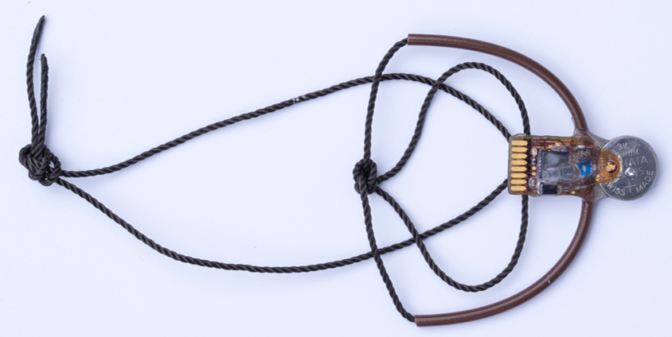

--- 
title: "PAMLr Manual"
author: "Kiran Dhanjal-Adams"
date: "`r Sys.Date()`"
site: bookdown::bookdown_site
documentclass: book
bibliography: [book.bib, packages.bib]
biblio-style: apalike
link-citations: yes
description: "PAMLr Manual"
---

**A toolbox for analysing animal behaviour using Pressure, Acceleration, Temperature, Magnetic and Light data in R**


# Introduction

This is a user manual accompanying the R package **PAMLr**, which provides a set of functions for analysing behaviour from multisensor geolocator data - primarily for small migratory birds (however the methods are generalisable). The package is setup for SOI-GDL3**pam** loggers (developped by the [Swiss Ornithological Institute](www.vogelwarte.ch/en)) which measure atmospheric pressure (**P**), activity (**A**), magnetisim (**M**), temperautre and light. However, other multisensor geolocator data may be used, if it is formatted in the same format as SOI-GDL3pam data (see [Importing data](#import)).


```{r out.width='60%', fig.show='hold', fig.align='center', echo=FALSE, fig.cap="SOI-GDL3pam logger, (c) Marcel Burkhardt,  Swiss Ornithological Institute"}

```


## Index

* [Installing PAMLr](#install)
* [Importing data](#import)
* [Visualising data](#dataviz)
* [Common data patterns](#patterns)
* [Preparing data for analysis](#dataprep)
* [Analysis methods](#method)
* [Classification accuracy](#accuracy)
* [Classifying migratory flapping flight in Hoopoes](#flapping)
* [Classifying migratory flight in European bee-eaters](#soar)
* [Classifying migratory flight in Alpine Swifts](#swift)
* [A few last things to think about](#outook)

## Package citation

Dhanjal-Adams K.L., Willener A.S. T. & Liechti F. (201x) **PAMLr: a toolbox for analysing animal behaviour using Pressure, Acceleration, Temperature, Magnetic and Light data in R**, *Journal X*

## License

This project is licensed under the GNU General Public License version 3 - see the [LICENSE](https://github.com/KiranLDA/PAMLr/blob/master/LICENSE) file for details


<!--chapter:end:index.Rmd-->

# Installing PAMLr {#install}


## Prerequisites

To install this package from github, `devtools` must already be installed.

```{r eval = FALSE}
install.packages("devtools")
```


## Installing


_PAMLr_ can then be installed from github using the following code:

```{r eval = FALSE}
devtools::install_github("KiranLDA/PAMLr")
```


Note that if there are any problems with installing _PAMLr_, it is worth checking that the packages that _PAMLr_ relies on are correctly installed (using `install.packages()`). These include:

* changepoint 
* cluster 
* data.table
* depmixS4 
* dplyr
* dygraphs 
* EMbC 
* GeoLight 
* graphics 
* grDevices 
* htmltools 
* raster
* rgl 
* viridis
* xts
* zoo

Any errors such as: 

```
Error in loadNamespace(i, c(lib.loc, .libPaths()), versionCheck = vI[[i]]) : 
  there is no package called ‘rlang’
```
Can be dealt with through:

```{r eval= FALSE}
install.packages("rlang")
```

<!--chapter:end:01-install.Rmd-->

# Importing data {#import}

## Load PAMLr

```{r}
library(PAMLr)
```

## Use existing data

PAMLr has three integrated datasets for exploring the code. These include:

### Hoopoe (_Upupa epops_) 

```{r}
data("hoopoe")
```

```{r hoopoe, out.width='40%', fig.show='hold', fig.align='center', echo=FALSE, fig.cap="Photograph by Shantanu Kuveskar, (c) creative commons"}
knitr::include_graphics('https://upload.wikimedia.org/wikipedia/commons/2/2f/Common_Hoopoe_%28Upupa_epops%29_Photograph_by_Shantanu_Kuveskar.jpg')

```

### European Bee-eater (_Merops apiaster_)

```{r}
data("bee_eater")
```

```{r beeeater, out.width='40%', fig.show='hold', fig.align='center', echo=FALSE, fig.cap="Photograph by El Golli Mohamed, (c) creative commons"}
knitr::include_graphics('https://upload.wikimedia.org/wikipedia/commons/6/61/Gu%C3%AApier_d%27Europe_Merops_apiaster_-_European_Bee-eater_%28parc_national_de_l%27Ichkeul%29_02.jpg')

```


### Alpine Swift (_Apus melba_)

```{r}
data("swift")
```

```{r swift, out.width='40%', fig.show='hold', fig.align='center', echo=FALSE, fig.cap="Photograph by Rudraksha Chodankar, (c) creative commons"}
knitr::include_graphics('https://upload.wikimedia.org/wikipedia/commons/c/c1/Alpine_Swift-2719.jpg')

```


## Import your own data

Importing data is easy with PAMLr. All data files should be found within the same directory which can be accessed through the `pathname` argument. Currently there are a list of supported file types, which include:

* ".pressure"
* ".glf"
* ".gle"
* ".acceleration"
* ".temperature"
* ".magnetic"

It's therefore possible to decide which of these to import. By default, all are imported.

```{r eval = FALSE}
PAM_data = importPAM(pathname = "C:/Put/your/path/here",
                     measurements = c(".pressure", 
                                      ".glf",
                                      ".acceleration", 
                                      ".temperature", 
                                      ".magnetic")`
```

## Data details

Once the PAM data are imported, they are stored as a nested list - with each element in the list containing a dataframe of measurements per date. For more details on the format of the data, use:

```{r}
PAM_data = hoopoe
str(PAM_data)
```

* __Pressure__ data are recorded in hectopascals, generally every 15/30 minutes

* __Light__ data are recorded in an arbitrary unit, generally every 2/5 minutes

* __Acceledation__ data are summarised  into two variables: 
  + `act` which is short for "activity"", and is the sum of the difference in acceleration on the z-axis (i.e. "jiggle"). It is recoreded every 5 minutes (summarised from 32 measurements - 10Hz)
  + `pit` which is short for "pitch", and is the relative position of the bird's body relative to the z axis. It is an average over 32 measurements and is summarised every 5 minutes.

* __Temperature__ data are recorded in degrees Celsius, generally every 15/30 minutes

* __Magnetic__ data are in fact the combined recordings from a tri-axial accelerometer and magnetometer.
  + `gX`, `gY` and `gZ` are snapshot tri-axial acceleration data, recorded every 4 hours.
  + `mX`, `mY` and `mZ` are snapshot tri-axial magentic field data, recorded every 4 hours.

## Temporal resolution of data

>__Note that different sensors and loggers often collect data at different time intervals__


Table: (\#tab:loggeres) Temporal resolution of difference multisensor loggers

Sensor                       Logger       Developper      Resolution       Life                     Reference
----------------   ----------------    -------------    ------------ ----------  ----------------------------
**Pressure**             PAM-logger              SOI       15/30 min     1 year   Dhanjal-Adams et al. (2018)
                    activity logger             CAMR              1h     1 year          Sjöberg et al.(2018)
                     OS barologgers              CLA           1 min    13 days         Shipley et al. (2017)
**Temperature**          PAM-logger              SOI       15/30 min     1 year         Liechti et al. (2018)
                    activity logger             CAMR             1 h     1 year          Sjöberg et al.(2018)
                     OS barologgers              CLA           1 min    13 days         Dreelin et al. (2018)
**Acceleration**
  activity               PAM-logger              SOI           5 min     1 year           Meier et al. (2018)
                    activity logger             CAMR              1h     1 year         Bäckman et al. (2017)
  pitch                  PAM-logger              SOI           5 min     1 year         Liechti et al. (2018)
  tri-axial              PAM-logger              SOI             4 h     1 year         Liechti et al. (2018)
**Magnetic**    
  tri-axial              PAM-logger              SOI             4 h     1 year         Liechti et al. (2018)


SOI = Swiss Ornithological Institute

CAMR = Centre for Animal Movement Research

CLA = Cornell Laboratory of Ornithology


## Cropping the data

Note that very often, a logger continues to record data before and after it is removed from a bird. For example, it might be transported in a rucksack or left in a laboratory until data are downloaded. It's therefore important to remove these incorrect datapoints. This can be done using `cutPAM`.
```{r}

# make sure the cropping period is in the correct date format
start = as.POSIXct("2016-07-01","%Y-%m-%d", tz="UTC")
end = as.POSIXct("2017-06-01","%Y-%m-%d", tz="UTC")

# Crop the data
PAM_data= cutPAM(hoopoe,start,end)
```


## Table references

Bäckman, J., Andersson, A., Alerstam, T., Pedersen, L., Sjöberg, S., Thorup, K., & Tøttrup, A. P. (2017). Activity and migratory flights of individual free-flying songbirds throughout the annual cycle: method and first case study. Journal of Avian Biology, 48(2), 309–319. doi:10.1111/jav.01068

Dhanjal-Adams, K. L., Bauer, S., Emmenegger, T., Hahn, S., Lisovski, S., & Liechti, F. (2018). Spatiotemporal Group Dynamics in a Long-Distance Migratory Bird. Current Biology, 28(17), 2824–2830.e3. doi:10.1016/j.cub.2018.06.054

Dreelin, R. A., Shipley, J. R., & Winkler, D. W. (2018). Flight Behavior of Individual Aerial Insectivores Revealed by Novel Altitudinal Dataloggers. Frontiers in Ecology and Evolution, 6, 182. doi:10.3389/fevo.2018.00182

Hedenström, A., Norevik, G., Warfvinge, K., Andersson, A., Bäckman, J., & Åkesson, S. (2016). Annual 10-Month Aerial Life Phase in the Common Swift Apus apus. Current Biology, 26(22), 3066–3070. doi:10.1016/J.CUB.2016.09.014

Liechti, F., Bauer, S., Dhanjal-Adams, K. L., Emmenegger, T., Zehtindjiev, P., & Hahn, S. (2018). Miniaturized multi-sensor loggers provide new insight into year-round flight behaviour of small trans-Sahara avian migrants. Movement Ecology, 6(1), 19. doi:10.1186/s40462-018-0137-1

Meier, C. M., Karaardıç, H., Aymí, R., Peev, S. G., Bächler, E., Weber, R., … Liechti, F. (2018). What makes Alpine swift ascend at twilight? Novel geolocators reveal year-round flight behaviour. Behavioral Ecology and Sociobiology, 72(3), 45. doi:10.1007/s00265-017-2438-6

Shipley, JR, Kapoor, J, Dreelin, RA, Winkler, DW. (2018) An open‐source sensor‐logger for recording vertical movement in free‐living organisms. Methods in  Ecol Evol.; 9: 465– 471. doi:10.1111/2041-210X.12893

Sjöberg, S., Pedersen, L., Malmiga, G., Alerstam, T., Hansson, B., Hasselquist, D., … Bäckman, J. (2018). Barometer logging reveals new dimensions of individual songbird migration. Journal of Avian Biology, 49(9), e01821. doi:10.1111/jav.01821

<!--chapter:end:02-import.Rmd-->

# Data Visualisation {#dataviz}

```{r echo = FALSE}
library(PAMLr)
```

## Formatting data

> **Never forget to get rid of periods where ther logger is not on the bird**

```{r}
# make sure the cropping period is in the correct date format
start = as.POSIXct("2016-07-01","%Y-%m-%d", tz="UTC")
end = as.POSIXct("2017-07-01","%Y-%m-%d", tz="UTC")

# Crop the data
PAM_data= cutPAM(hoopoe,start,end)
```


## Quick multiplots

For a quick look at the data, it's possible to use `quickPLOT`. The user can specify which arguments to use, using `measurements`. There's a choice between different combinations of `"pressure"`, `"light"`, `"acceleration"`, `"temperature"` and `"magnetic"`. You can add any parameters from `?plot`, here I illustrate it with `col="cornflowerblue"` and by showing how to  restrict the x-axis limits `xlim` with the date format, to zoom into the post breeding mihration period of a hoopoe

```{r}
par(mar=c(3,4,0.5,0.5))
quickPLOT(hoopoe, col="cornflowerblue",
          measurements = c("pressure", "light", "acceleration"),
          xlim=c(as.POSIXct("2016-08-20","%Y-%m-%d", tz="UTC"),
                 as.POSIXct("2016-09-01","%Y-%m-%d", tz="UTC")))
```

## Interactive timeseries

To have a better overview of the data, it is possible to create interactive `dygraphPAM()` plots which allow the user to compare different measurements recorded by the logger. These might for instance include light, temperature, pressure, activity, pitch and magnetism. 

If you are **working from Rstudio**, this bit of code should be run:

```{r eval = FALSE}
# In Rstudio, it will display in the viewer by default and use a lot of ram, and is better in html
backup_options <- options() 
options(viewer=NULL) # ensure it is viewed in internet browser
dygraphPAM(dta = PAM_data) # plot
options(backup_options) # restore previous viewer settings
```

If you are **working from base R** use this instead:

To save space here we only plot only one variable - pressure .

```{r cache = TRUE}
dygraphPAM(dta = PAM_data, toPLOT = c("pressure")) 
```

The reason there is additional code for Rstudio, is that by default it will open this graphic in the viewer pane and use up a lot of ram. This  additional code allows the user to open this window in a browser instead of r studio, and the file can later be saved as an html file.

With this interactive plot, the user can then zoom in and out of different plots to help get a feel for the data. For instance, this is a great way of seeing changes in the data which might be due to a logger being in a rucksack and no longer on the birds, or to look at how acticity or pressure might look during migration periods.

It is possible to select areas to zoom into by right clicking and highighting certain regions, and to double click to zoom out. All plots are synched to the same time period and have a timeline at the bottom to increase or decrease the time over which the data is observed.

## Sensor images

Actograms are often used to plot activity over time at different hours of the day. However, the same approach can be used to plot any sensor data, not just activity. For simplicity, we name these “sensor images”. Plotting all sensors side by side is an important step for visualising data and developing an understanding of data patterns, and to start thinking about the behaviours that may be driving the observed patterns. __PAMLr__ offers a function `sensorIMG()`for plotting sensor images, which can be implemented as follows.

```{r}
# Create plots with 3 together (mfrow)
par( mfrow= c(1,3), oma=c(0,2,0,6))

par(mar =  c(4,2,4,2))
sensorIMG(PAM_data$acceleration$date, ploty=FALSE,
          PAM_data$acceleration$act, main = "Activity",
          col=c("black",viridis::cividis(90)), cex=1.2, cex.main = 2)

par(mar =  c(4,2,4,2))
sensorIMG(PAM_data$pressure$date, plotx=TRUE, ploty=FALSE, labely=FALSE,
          PAM_data$pressure$obs,  main="Pressure",
          col=c("black",viridis::cividis(90)), cex=1.2, cex.main = 2)

par(mar =  c(4,2,4,2))
sensorIMG(PAM_data$temperature$date, labely=FALSE,
          PAM_data$temperature$obs,  main="Temperature",
          col=c("black",viridis::cividis(90)), cex=1.2, cex.main = 2)


```

## Histograms and three-dimensional scatterplots

Histograms can provide a first impression of whether some of the data may be aggregated and therefore clustered. Indeed, sensor images may not always well-suited for visualising tri-axial data, such as magnetic field or acceleration. By plotting data in three dimensions (hereafter “3D”) using the function `pam3D` it’s possible to find patterns or clusters of datapoints which would not otherwise be apparent in the data. Here we plot magnetic data. 

```r
pam3D(PAM_data$magnetic$gX, PAM_data$magnetic$gY, PAM_data$magnetic$gZ,
       xlab= "X", ylab= "Y", zlab= "Z")
```

```{r echo = FALSE}
knitr::knit_hooks$set(webgl = rgl::hook_webgl)
pam3D(PAM_data$magnetic$gX, PAM_data$magnetic$gY, PAM_data$magnetic$gZ,
       xlab= "X", ylab= "Y", zlab= "Z",
      xlim=c(-5000,5000), ylim=c(-5000,5000), zlim=c(-5000,5000))
rgl::rglwidget()
```

## Spherical projections

### g-sphere

A _g-sphere_ is a method of visualising tri-axial acceleration data. This involves centering the data and plotting it on a sphere.The function `triACC` allows the user to center this data (as well as calculating  pitch, roll and yaw from the data)

```r
# plot an g-phere
calibration = triACC(dta = PAM_data$magnetic)
pamSPHERE(x = calibration$centered_accx,
          y = calibration$centered_accy,
          z = calibration$centered_accz,
          ptcol = "royalblue",
          ptsize = 0.03,
          linecolor ="orange",
          spherecolor="orange",
          arrows=TRUE)
```
```{r echo = FALSE}
calibration = triACC(dta = PAM_data$magnetic)
```

```{r echo = FALSE}
knitr::knit_hooks$set(webgl = rgl::hook_webgl)

pamSPHERE(x = calibration$centered_accx,
          y = calibration$centered_accy,
          z = calibration$centered_accz,
          ptcol = "royalblue",
          ptsize = 0.03,
          linecolor ="orange",
          spherecolor="orange",
          arrows=TRUE)
rgl::rglwidget()
```


### m-sphere

An _m-sphere_ is a method of visualising tri-axial magnetometer data. This involves centering the data and correcting the data, before  plotting it on a sphere.The function `triMAG` calibrates the data. This provides the animal's bearing.

```r
# plot a m-phere
calibration = triMAG(dta = PAM_data$magnetic)
pamSPHERE(x = calibration$calib_magx,
          y = calibration$calib_magy,
          z = calibration$calib_magz,
          ptcol = "orange",
          ptsize = 0.03,
          linecolor ="royalblue",
          spherecolor="royalblue",
          arrows=TRUE,
          cex=2)
```
```{r echo = FALSE}
calibration = triMAG(dta = PAM_data$magnetic)
```

```{r echo = FALSE}
knitr::knit_hooks$set(webgl = rgl::hook_webgl)
pamSPHERE(x = calibration$calib_magx,
          y = calibration$calib_magy,
          z = calibration$calib_magz,
          ptcol = "orange",
          ptsize = 0.03,
          linecolor ="royalblue",
          spherecolor="royalblue",
          arrows=TRUE,
          cex=2)
rgl::rglwidget()
```

<!--chapter:end:03-dataviz.Rmd-->

# Common data patterns {#patterns}

```{r echo = FALSE}
library(PAMLr)
```


Depending on the question, different patterns can be sought in the data to identify behaviour. Here, we outline  migratory flight patterns, nesting, and foraging in small birds. However, there are many other patterns of interest which can be extracted from multisensor geolocator data including nesting success, altitudinal movements, twilight ascents, flocking behaviour, energy expenditure during flights… It is therefore important to think about the ecology of the species to determine what the patterns of interest might be relevant for answering the question that is being asked.

### Migration

In small migratory birds, there are often three strong data signals corresponding to their yearly behaviour - breeding, migration and non-breeding residency (also termed “wintering” by some). However, sensor data patterns can vary substantially from species to species, depending on their flight strategy. 

#### *Flapping birds*

Firstly, **flapping birds** exert high amounts of energy to maintain their wings in constant movement. This migratory strategy is most common in passerines and therefore small birds. Because of this, birds with this flapping migratory strategy tend to avoid turbulence which is highest during the day, instead preferring to fly at night. Therefore, the pattern of interest for migratory flapping birds is a high and sustained night-time activity. 

**In the figure below, this represents the yellow periods in september and march**.

```{r fig.align='center', fig.width=5, fig.height=7}
par( mfrow= c(1,1), oma=c(0,2,0,6))
par(mar =  c(4,2,4,2))
sensorIMG(hoopoe$acceleration$date,
          hoopoe$acceleration$act, main = "Activity",
          col=c("black",viridis::cividis(90)), cex=1.2, cex.main = 2)


```


### *Flap-gliding birds*

Secondly, **flap-gliding birds** remain airborne for long periods of time (often months) without resting. This migratory strategy is most common in swifts and swallows. Such birds do not show any big changes in behaviour between night and day, or between migration and non-breeding residency. However, during migration they can fly at higher altitudes than at other times of the year, rest less often with longer periods of sustained activity, display a constant pitch, and experience lower temperatures (because of the altitude) – some or all of these patterns can be used to classify such behaviour.

```{r fig.align='center', fig.width=5, fig.height=7}
par( mfrow= c(1,1), oma=c(0,2,0,6))
par(mar =  c(4,2,4,2))
sensorIMG(swift$acceleration$date,
          swift$acceleration$act, main = "Activity",
          col=c("black",viridis::cividis(90)), cex=1.2, cex.main = 2)

```


### *Soar-gliding birds*

Finally, **soar-gliding birds** take advantage of thermal updrafts to remain airborne and avoid using too much energy beating their wings. This strategy is most commonly observed in raptors, cranes and storks, but also bee-eaters. Because thermal updrafts are only present during the day, such species only migrate during the day. Therefore, patterns of interest include rapid changes in daytime altitude, as well as decreases in resting time and continuous sunlight (particularly for a species which might otherwise spend time under tree canopy). 

```{r fig.align='center', fig.height=7}
par(mfrow= c(1,3), # number of panels
    oma=c(0,2,0,6), # outer margin around all panels
    mar =  c(4,1,4,1)) # inner margin around individual fivure

sensorIMG(bee_eater$acceleration$date, ploty=FALSE,
          bee_eater$acceleration$act, main = "Activity",
          col=c("black",viridis::cividis(90)), cex=1.2, cex.main = 2)

sensorIMG(bee_eater$pressure$date, plotx=TRUE, ploty=FALSE, labely=FALSE,
          bee_eater$pressure$obs,  main="Pressure",
          col=c("black",viridis::cividis(90)), cex=1.2, cex.main = 2)

sensorIMG(bee_eater$light$date, labely=FALSE,
          bee_eater$light$obs,  main="Light",
          col=c("black",viridis::cividis(90)), cex=1.2, cex.main = 2)
```


## Incubation

Patterns are often easy to distinguish in cavity nesting birds. Most commonly, darkness can be used to determine when birds are entering or exiting the cavity. However, for species which are not cavity nesters, extended periods of inactivity, combined with remaining at the same altitude, can also be used to find when the bird is sitting on the nest.


```{r fig.align='center', fig.height=7, fig.width=10}
par( mfrow= c(1,2), oma=c(0,2,0,6))
par(mar =  c(4,2,4,2))

#Subset the data to only the breeding season
PAM_data = cutPAM(bee_eater,
                  start = as.POSIXct("2016-05-15","%Y-%m-%d", tz="UTC"),
                  end = as.POSIXct("2016-07-15","%Y-%m-%d", tz="UTC"))

sensorIMG(PAM_data$acceleration$date, ploty=FALSE,
          log(PAM_data$acceleration$act+0.001), main = "Activity",
          col=c("black",viridis::cividis(90)), cex=1.2, cex.main = 2)

sensorIMG(PAM_data$light$date, labely=FALSE,
          PAM_data$light$obs,  main="Light",
          col=c("black",viridis::cividis(90)), cex=1.2, cex.main = 2)
```


<!--chapter:end:04-patterns.Rmd-->

# Preparing data for analysis {#dataprep}

```{r echo = FALSE}
library(PAMLr)
```

There are multiple ways of preparing data for analysis. 

* `reducePAM`: The most simple is to merge the data together (at the same resolution). 
* `rollPAM`: It's also possible to derive summary statistics using a rolling window, which progresses across the timeseries to make calculations. 
* `pamPREP`: Where there is a particular pattern that need to be extracted from the data such as sustained pressure change or activity, this function derives summary statistics for these periods


## Merge sensor data together

Because data from different sensors are collected at different temporal resolutions (e.g. 5 minutes, 30 mintues or4 hours), `reducePAM` formats data to the same time intervals as a specified variable (e.g. pressure) by summarising finer resolution data (median, sum or skip) and interpolating (or not) lower resolution data. 

```{r}
# Crop the data
start = as.POSIXct("2015-08-01","%Y-%m-%d", tz="UTC")
end = as.POSIXct("2016-06-21","%Y-%m-%d", tz="UTC")
PAM_data = cutPAM(bee_eater, start, end)
```

### Interpolation

Format it for every 30 mins and interpolate data with larger intervals, and provide median for data with smaller intervals.

```{r cache = TRUE}
TOclassify = reducePAM(PAM_data , "pressure", interp = TRUE, summary="median")

```

```{r echo=FALSE, warning=FALSE}
library(kableExtra)
knitr::kable(head(TOclassify),
             caption = 'A table of the first 10 rows of a reducePAM dataset.',
             align = "c")  %>%
  kable_styling(bootstrap_options = c("striped", "hover", "condensed", "responsive")) %>%
  column_spec(1, width = "5cm", bold=TRUE) %>%
  scroll_box(width = "100%")
```

###  No interpolation

Format it for every 5 minutes and don't interpolate anything

```{r cache = TRUE}
TOclassify = reducePAM(PAM_data , "acceleration", interp = FALSE)
```


## Rolling window

Interpolation is not always advisable (especially linear), and another alternative for formatting data for analysis is to use a rolling window with `rollPAM`, which progresses across all the timeseries and creates summary statistics for the data contained within that window of a certain time. 

Derived variables include:

* **median** : Median
* **sd** : Standard deviation
* **sum** : Cumulative sum of values 
* **min** : Minimum
* **max** : Maximum
* **range** : Range (i.e. maximum - minimum)
* **cumu_diff** : Cumulative difference (i.e. sum of absolute differences)

### Interpolation

Create a 2h window with summary statistics every 15 minutes. Because sensors such as the magnetometer record every 4 hours, we can avoid spaces in the dataset by interpolating between points (linearly) and then calculating summary statistics for these interpolated points.

```{r cache = TRUE}
TOclassify = rollPAM(PAM_data,
                     resolution_out = 15 ,
                     window = 120)
```

```{r echo=FALSE, warning=FALSE}
library(kableExtra)
knitr::kable(head(TOclassify),
             caption = 'A table of the first 10 rows of a reducePAM dataset.',
             align = "c")  %>%
  column_spec(1, width = "5cm", bold=TRUE) %>%
  kable_styling(bootstrap_options = c("striped", "hover", "condensed", "responsive")) %>%
  scroll_box(width = "100%")
```

### No interpolation

However, there are many assumpations made with assumptions (i.e. is the data truly linear). One option is either to increase the window to be larger than the greatest data resolution (in this case more than 4 hours). Another is to simply leave the NAs in the data using `interp = FALSE`

```{r cache = TRUE}
TOclassify = rollPAM(PAM_data,
                     resolution_out = 15 ,
                     window = 120,
                     interp = FALSE)
```

## Extracting statistics for specific data patterns

If working with bird data, PAMLr offers some predefined functions for classifying behaviour. 

* Flight bouts can be characterised by:

    + continuous high activity which can be extracted from the data using `pamPREP( ... ,method = "flap")` 
    + endurance activity using `pamPREP( ... ,method = "endurance")`
    + a pressure change greater than the background pressure changes due to weather using `pamPREP( ... ,method = "pressure")`
    + a period of continuous light using `pamPREP( ... ,method = "light")`
  
* Incubation bouts can be characterised by: 

    + periods of darkness using `pamPREP( ... ,method = "darkness")`
    + periods of resting using `pamPREP( ... ,method = "rest")`

 
```{r cache =TRUE}
twl = GeoLight::twilightCalc(PAM_data$light$date, PAM_data$light$obs,
                             LightThreshold = 2, ask = FALSE)

TOclassify = pamPREP(dta = PAM_data,
                      method= "flap",
                      twl = twl)
```

```{r echo=FALSE, warning=FALSE}
library(kableExtra)
knitr::kable(head(TOclassify),
             caption = 'A table of the first 10 rows of a reducePAM dataset.',
             align = "c")  %>%
  kable_styling(bootstrap_options = c("striped", "hover", "condensed", "responsive")) %>%
  column_spec(1, width = "5cm", bold=TRUE) %>%
  scroll_box(width = "100%")
```

  
These functions also calculate summary statistics for each event (e.g. flight bout). 

These include:

* **date** :  Date (without time)
* **start** : Start time and date of the event, `POSIXct` format 
* **end** :  Time and date that the event finished, `POSIXct` format 
* **duration** : How long it lasted (in hours)
* **total_daily_duration** : The total duration of all the events that occured that day (in hours)
* **total_daily_event_number** : The total number of events which occured that day
* **cum_pressure_change** : The cumulative change in atmospheric pressure during that event (in hectopascals)
* **cum_altitude_change** : The cumulative change in altitude during that event (in metres)
* **cum_altitude_up** : The cumulative number of metres that the bird went upwards during that event 
* **total_daily_P_change** : The cumulative change in atmospheric pressure for all the events for that date (in hectopascals)
* **P_dep_arr** : The difference between atmospheric pressure at the start of the event, and at the end (in hectopascals)
* **pressure_range** : The total range of the atmospheric pressure during that event (maximum minus miniimum - in hectopascals)
* **altitude_range** : The total altitude range during that event (maximum minus miniimum - in metres)
* **mean_night_P** : The mean pressure during the night before the event took place (in hectopascals)
* **sd_night_P** : The standard deviation of pressure the night before the event took place (in hectopascals)
* **mean_nextnight_P** : The mean pressure the night after the event took place (in hectopascals)
* **sd_nextnight_P** : The standard deviation of pressure the night after the event took place (in hectopascals)
* **night_P_diff** : The difference between the mean pressures of the night before and the night after the event took place (in hectopascals)
* **median_activity** : The median activity during that event
* **sum_activity** : The sum of the activity during that event
* **prop_resting** : The propotion of time during that event where activity = 0
* **prop_active** : The propotion of time during that event where activity > 0
* **mean_night_act** : The mean activity during the night before the event took place
* **sd_night_act** : The standard deviation of activity the night before the event took place
* **sum_night_act** : The summed activity during the night before the event took place
* **mean_nextnight_act** :The mean activity the night after the event took place
* **sd_nextnight_act** : The standard deviation of activity the night after the event took place
* **sum_nextnight_act** : The summed activity the night after the event took place
* **night_act_diff** : The difference between the mean activity of the night before and the night after the event took place 
* **median_pitch** :  The median pitch during that event
* **sd_pitch** : The standard deviation of pitch during that event
* **median_light** :   The median light recordings during that event
* **nightime** : Whether or not it was night during the majority of the event (1= night, 0 = day)
* **median_gX** : Median raw acceledation on the x axis during the event
* **median_gY** : Median raw acceledation on the y axis during the event
* **median_gZ** : Median raw acceledation on the z axis during the event
* **median_mX** : Median raw magnetic field on the x axis during the event
* **median_mY** : Median raw magnetic field on the y axis during the event
* **median_mZ** : Median raw magnetic field on the z axis
* **median_temp** : Median temperature during the event (in celsius)
* **sd_temp** : Standard deviation of temperature during the event (in celsius)
* **cum_temp_change** : Cumulative absolute difference in temperature during the event (in celsius)  
 

<!--chapter:end:05-dataprep.Rmd-->

# Classification methods

Once a behavioural pattern has been identified, there are a number of methods available for separating them from the data. Not all these methods should be used exclusively. Some can be used to complement each other, while others can be used interchangeably. Here we highlight changepoint analyses, principle component analyses, cluster analyses, hidden Markov models,

## Changepoint

Changepoint analyses can be used to find points in the data series which delineate a difference in variance, in mean or in both. There are a number of available methods for doing this and it is possible to constrain the number of changepoints allowed in the data. In PAMLr, the default setting in `changePAM()` are set for finding differences between migratory and non-migratory periods, but the user can customise these to fit their needs.

## Cluster Analysis

Clustering algorithms aim to partition a set of points into a k number of groups. Points are grouped (or clustered) together in a way that all the points in one cluster are more similar with each other, than with points in other clusters. PAMLr integrates three types of clustering algorithms, **k-means**, **hierarchical**  and **expectation-minimisation binary clustering**. 

### k-means clustering

k-means clustering minimises the within-cluster sum of squares of the points and is one of the commonly used clustering algorithms (Hartigan & Wong, 1979). It can be implemented by using `classifyPAM( … , method= “kmeans”)`. 

###	Hierarchical clustering

Hierarchical clustering analyses can either be agglomerative or divisive. The first relies on putting each datapoint in a single cluster and successively merging them until a stopping criterion is satisfied and can be implemented in PAMLr using `classifyPAM( … , method= “agnes”)`. The divisive hierarchical clustering method starts by allocating all datapoints to the same cluster and splitting each cluster until a stopping criterion is met. This can be implemented using `classifyPAM( … , method= “diana”)`.

###	Expectation-minimisation binary clustering

Expectation-minimisation binary clustering (EMbC), clusters data based on geometry alone. More specifically binary delimiters are used to segregate the data along an axis, forcing centroids to lie within these binary regions. Analysis was undertaken using `classifyPAM( … , method= “embc”)`.


##	Hidden Markov Models

Hidden Markov Models (HMMs) are stochastic time-series models which assume that the observed time series (such as the measured acceleration, temperature or pressure) is driven by an unobservable state process (such as flying or resting behaviour). The unobserved states are allocated in a way that captures as much as possible of the marginal distribution of the observations, while also accounting for the correlation structure of the data. Thus, the probability of the system being in a state at time t depends on the state at time t-1, but is otherwise independent of any previous state. HMMs can be implemented in PAMLr using the function `classifyPAM( … , method= “hmm”)`.

<!--chapter:end:06-method.Rmd-->

# Classification accuracy


```{r echo=FALSE}
library(PAMLr)
```

## Classify migratory flapping flight

Once a classification has been performed (here we use the example of a hoopoe, as it's migratory flight can be prediction using `classifyFLAP`)

```{r}
data("hoopoe")
# str(hoopoe)

# make sure the cropping period is in the correct date format
start = as.POSIXct("2016-07-01","%Y-%m-%d", tz="UTC")
end = as.POSIXct("2017-06-01","%Y-%m-%d", tz="UTC")

# Crop the data
PAM_data= cutPAM(hoopoe,start,end)


# perform one classification using classifyFLAP
classification = classifyFLAP(dta = PAM_data$acceleration, period = 12, toPLOT = FALSE)
```


This creates a timetable of migratory flight events which can be visualised using `classification$timetable`, as seen below:


```{r echo=FALSE, warning=FALSE}
library(kableExtra)
knitr::kable(head(classification$timetable),
             caption = 'Migration timetable (first 10 rows)',
             align = "c")  %>%
  kable_styling(bootstrap_options = c("striped", "hover", "condensed", "responsive")) 
```


This classification is pretty accurate and we will use this as a reference dataset to compare with another classification: **high pressure change**. i.e. a high change in altitude.


## Setup the reference dataset

Because the second classification is done using pressure (30 minute data resolution) compared to this classification which was done using activity (5 minute resolution), the activity classification is set to the same resolution as pressure using the `classification2PAM` function.

```{r}
# Put the classification in the same resolution as pressure
reference = classification2PAM(from = classification$timetable$start,
                               to = classification$timetable$end,
                               classification = rep_len(1,length(classification$timetable$end)),
                               addTO = PAM_data$pressure,
                               missing = 0)

# Convert to categories
reference = ifelse(reference == 1, "Migration", "Other")
```

##  Classify migration 

Hoopoes seems to perform large altitudinal changes during migratory flight, so we preform a very rough classification by specifying that any altitude change greater than 2 hPa is equivalent to a migratory flight (this is for illustrative purposes only, and should not be used as a definite classification method).

```{r}
# Perform another classification using pressure difference
prediction = c("Other",ifelse(abs(diff(PAM_data$pressure$obs))>2, "Migration", "Other"))
```

## Compare the two classifications

We can then compare the two classifications point by point using the `compareCLASS` function.

```{r}
# both classes have been converted to the same time intervals as pressure, so use those dates
date = PAM_data$pressure$date

# Combine the classifications into a dataframe
classifications = data.frame(reference= reference, # flapping classification
                             prediction = prediction) # pressure difference classification

class_comparison = compareCLASS(date=date,
                                classifications=classifications)
```

This puts both classifications side by side, and shows how many classifications provided each class, as well as the agreement between the two, as can be seen below.

```{r echo=FALSE, warning=FALSE}
library(kableExtra)
knitr::kable(head(class_comparison),
             caption = 'Comparison of both classifications (first 10 rows)',
             align = "c")  %>%
  kable_styling(bootstrap_options = c("striped", "hover", "condensed", "responsive")) 
```


## Create a confusion Matrix

A confusion matrix uses predicted and reference points and estimate:

* **Errors in Commission** provide a measure of false negatives i.e. the number of points that were predicted to be part of a class that they were not (probability something was incorrectly prediction FN/(TP+FN)). 
* **Errors in Omission** provide a measure of false positives that were predicted to be in a different class from their actual class (probability that something was missed FP/(FP +TP). 
* **Producer Accuracy** or **Precision** provides a measure of how likely something was missed by the classification (probability that something was not missed TP/(TP + FP)). 
* **User Accuracy** or **Recall** represents the probability that a class was correctly prediction TP/(TP + FN).
* **Overall Accuracy** represents the probability that all classes were correctly prediction (TP+TN)/(TP+TN+FP+FN). 
* **Kappa Coefficient** measures the agreement between the classification and the truth ((TN+FP) (TN+FN) + (FN+TP) (FP+TP)) / (TP+FP+TN+FN)^2^


```{r}
mat = confusionMAT(reference, prediction)
```


```{r echo=FALSE, warning=FALSE}
library(kableExtra)
knitr::kable(mat,
             caption = 'Confusion Matrix',
             align = "c")  %>%
  kable_styling(bootstrap_options = c("striped", "hover", "condensed", "responsive")) %>%
  column_spec(1, width = "5cm", bold=TRUE)  %>%
  scroll_box(width = "100%")
```

The total accuracy is 99.4% which is not bad. Most of the error comes from  the omission of some migration periods by the prediction i.e. there are periods where the bird is performing a migratory flight, but remains at the same altitude and are therefore missed by the classification. However, this is only for 1.25% of the points.

<!--chapter:end:07-accuracy.Rmd-->

# Classifly flapping {#flapping}

```{r piccie, out.width='100%', fig.show='hold', fig.align='center', echo=FALSE, fig.cap="Photograph by Frank Vassen, (c) creative commons"}
knitr::include_graphics('https://upload.wikimedia.org/wikipedia/commons/e/e3/Upupa_epops_-Lanzarote%2C_Canary_Islands%2C_Spain-8.jpg')

```


```{r echo=FALSE}
library(PAMLr)
```

## Classifying migratory flapping flight in Hoopoes :The dataset

Hoopoes (*Upupa epops*) have been tracked on the their migrations from Switzerland (to sub-Saharan Africa) using SOI-GDL3pam loggers. 

* **Pressure** is recorded every 15 minutes
* **Light** is recorded every 5 minutes
* **Activity** is recorded every 5 minutes
* **Pitch** is recorded every 5 minutes
* **Temperature** is recorded every 15 minutes
* **Tri-axial acceleration** is recorded every 4 hours
* **Tri-axial magnetic field** is recorded every 4 hours

```{r}
data("hoopoe")
# str(hoopoe)

# make sure the cropping period is in the correct date format
start = as.POSIXct("2016-07-01","%Y-%m-%d", tz="UTC")
end = as.POSIXct("2017-06-01","%Y-%m-%d", tz="UTC")

# Crop the data
PAM_data= cutPAM(hoopoe,start,end)
```

## Visualise data

Sensor images are a good place to start when analysing data, as they can give a rapid overview of the dataset. Darker colors represent lower values, and lighter colors (in this case yellow) represent higher values. Sensor images for **activity** (also known as an actogram), **pitch**, **pressure** and **temperature** are a good place to start. The following code plots this for us:

```{r sensooor, out.width='100%', fig.show='hold', fig.align='center', cache = TRUE}
par(mfrow= c(1,4), # number of panels
    oma=c(0,2,0,6), # outer margin around all panels
    mar =  c(4,1,4,1)) # inner margin around individual fivure

sensorIMG(PAM_data$acceleration$date, ploty=FALSE,
          PAM_data$acceleration$act, main = "Activity",
          col=c("black",viridis::cividis(90)), cex=1.2, cex.main = 2)

sensorIMG(PAM_data$acceleration$date, plotx=TRUE, ploty=FALSE, labely=FALSE,
          PAM_data$acceleration$pit,  main="Pitch",
          col=c("black",viridis::cividis(90)), cex=1.2, cex.main = 2)

sensorIMG(PAM_data$pressure$date, plotx=TRUE, ploty=FALSE, labely=FALSE,
          PAM_data$pressure$obs,  main="Pressure",
          col=c("black",viridis::cividis(90)), cex=1.2, cex.main = 2)

sensorIMG(PAM_data$temperature$date, labely=FALSE,
          PAM_data$temperature$obs,  main="Temperature",
          col=c("black",viridis::cividis(90)), cex=1.2, cex.main = 2)
```

## What should we look for?

Base on this plot, it is possible to see that nightime is the darker areas on the right and left sides of the plot, and daytime the "blob" in the middle. During the migratiory season (august/september and march), the nightime period is very different, with higher activity and pitch, and lower than usual temperature and pressure. These correspond to **migratory flight periods**.

This can also be seen by cutting out a period in september are looking at the raw data.


```{r out.width='100%', fig.show='hold', fig.align='center', cache = TRUE}
dygraphPAM(dta = cutPAM(PAM_data, 
                        as.POSIXct("2016-08-05","%Y-%m-%d", tz="UTC"),
                        as.POSIXct("2016-08-12","%Y-%m-%d", tz="UTC")), 
           toPLOT = c("pressure", "acceleration")) 
```

## Performing the classification

Because flapping is widespread in birds, **PAMLr** integrates a pre-defined function `classifyFLAP()` to classify this behaviour.

This function assumes that if the bird has displayed **high activity** for x number of consecutive minutes, then it is flapping. It is therefore important to think about what constitutes high activity and how long this period should be. At the moment, the function uses **k-means clustering** to identify the threshold between high and low activity. Using `toPLOT = TRUE` then allows the user to see where that threshold was drawn. The period of high activity is set by default to `period = 3`. This is because activity is recorded (on this logger) every 5 minutes and we assume that after an hour of high activity, the bird must be flapping. 

Thus "high activity duration" / "data resolution" = "period" and 60 minutes / 5 minutes = period of 12.

```{r out.width='100%', fig.align='center', cache = TRUE}
# Classify behaviour
behaviour = classifyFLAP(dta = PAM_data$acceleration, period = 12)
str(behaviour)
```

This classification therefore provides different pieces of infomration.

* **timetable** shows when a migratory flapping flight started and stopped, and how long it lasted (in hours)
* **classification** is the output from the classification. In this case, each cluster/classs/state is represented by numbers between one 1 and 4. To find out what behaviour each of these numbers represent, we can refer to **low_movement**, **high_movement**, **migration** and **no_movement** 
* **threshold** represents the threshold between high and low activity.

Using these information, it's therefore possible to plot the classification:


```{r out.width='100%', fig.align='center', cache = TRUE}

# Plot behaviour
col=col=c("brown","cyan4","gold","black")
index= 6500:8000
plot(PAM_data$acceleration$date[index],PAM_data$acceleration$act[index],
  bg=col[behaviour$classification][index], 
  type="o", pch=21, xlab="Date", ylab="Activity")
legend( PAM_data$acceleration$date[index[1]],60 , 
        c("No activity", "Low activity", "High activity", "Migration" ) ,
        col = col[c(behaviour$no_movement, behaviour$low_movement,
                    behaviour$high_movement, behaviour$migration)],
        pch=20)
```

<!--chapter:end:08-flapping.Rmd-->

# Classify soar-gliding {#soar}


```{r beenenfresser, out.width='100%', fig.show='hold', fig.align='center', echo=FALSE, fig.cap="Photograph by El Golli Mohamed, (c) creative commons"}
knitr::include_graphics('https://upload.wikimedia.org/wikipedia/commons/7/77/Gu%C3%A9piers_d%27europe_Ichkeul_%28European_Bee-eater%29_Merops_apiaster.jpg')

```


```{r echo=FALSE}
library(PAMLr)
```

## Classifying migratory flight in European bee-eaters: the dataset

European bee-eaters (*Merops apiaster*) have been tracked on the their migrations from Germany (to the Congo Basin) using SOI-GDL3pam loggers. 

* **Pressure** is recorded every 15 minutes
* **Light** is recorded every 5 minutes
* **Activity** is recorded every 5 minutes
* **Pitch** is recorded every 5 minutes
* **Temperature** is recorded every 15 minutes
* **Tri-axial acceleration** is recorded every 4 hours
* **Tri-axial magnetic field** is recorded every 4 hours

```{r}
data("bee_eater")

# make sure the cropping period is in the correct date format
start = as.POSIXct("2015-08-20","%Y-%m-%d", tz="UTC")
end = as.POSIXct("2016-06-01","%Y-%m-%d", tz="UTC")

# Crop the data
PAM_data= cutPAM(bee_eater,start,end)
```

## Visualise data

Sensor images are a good place to start when analysing data, as they can give a rapid overview of the dataset. Darker colors represent lower values, and lighter colors (in this case yellow) represent higher values. Sensor images for **activity** (also known as an actogram), **pitch**, **pressure** and **temperature** are a good place to start. The following code plots this for us:

```{r sensooor2, out.width='100%', fig.show='hold', fig.align='center', cache = TRUE}
par(mfrow= c(1,4), # number of panels
    oma=c(0,2,0,6), # outer margin around all panels
    mar =  c(4,1,4,1)) # inner margin around individual fivure

sensorIMG(PAM_data$acceleration$date, ploty=FALSE,
          PAM_data$acceleration$act, main = "Activity",
          col=c("black",viridis::cividis(90)), cex=1.2, cex.main = 2)

sensorIMG(PAM_data$acceleration$date, plotx=TRUE, ploty=FALSE, labely=FALSE,
          PAM_data$acceleration$pit,  main="Pitch",
          col=c("black",viridis::cividis(90)), cex=1.2, cex.main = 2)

sensorIMG(PAM_data$pressure$date, plotx=TRUE, ploty=FALSE, labely=FALSE,
          PAM_data$pressure$obs,  main="Pressure",
          col=c("black",viridis::cividis(90)), cex=1.2, cex.main = 2)

sensorIMG(PAM_data$temperature$date, labely=FALSE,
          PAM_data$temperature$obs,  main="Temperature",
          col=c("black",viridis::cividis(90)), cex=1.2, cex.main = 2)
```


## What should we look for?

Compared to the hoopoe, the activity patterns are less clear. However, there are some patterns become apparent.

* The bird is visibly **never active at night** - It only migrates during the day. 
* During migration (August and April) the overall **pressure changes from one night to the next** (horizontal bars of different colors). Indeed pressure varies geographically and altitudinally - suggesting that those nights the bird is somewhere different.
* During this migration period, **pressure drops substatially** as does **temperature** - indicating higher altitude flights than ususal
* During the migration period, **activity is low but sustained** 
* During the migration period, **pitch is constant**

```r
dygraphPAM(dta = PAM_data,
                 toPLOT = "pressure")
```

```{r dygraph-01, out.width='100%', out.height=400, echo=FALSE}
library(dygraphs)
dygraph(xts::xts(x = PAM_data$pressure$obs,
                 order.by = PAM_data$pressure$date), 
        xlab = "Time", 
        ylab = "Pressure (hPa)", 
        main = "Pressure as a function of time") %>%
  dyRangeSelector(dateWindow = c(PAM_data$pressure$date[1], PAM_data$pressure$date[length(PAM_data$pressure$date)])) %>%
  dyHighlight(highlightSeriesOpts = list(strokeWidth = 2)) %>%
  dyLegend(hideOnMouseOut = TRUE, width = 600) %>% 
  dyOptions(colors = "#FC8D62")
```


Some, if not all of these can therefore be used to identify migratory flight in European bee-eaters. We could for instance use `pamPREP(..., method="endurance")` or `pamPREP(..., method="pressure")` based on these data patterns. However, because these species **soar-glide** and are therefore in sunlight while thermalling (as opposed to hidden under leaves), periods of constant sunshine could also be used to identify migratory soar-gliding using`pamPREP(..., method="light")`.


## What variables make the most sense for classifying?

We start with endurance flights. These can be extracted from the data using the following code.

```{r cache = TRUE}
# get twilights (general geolocator method)
twl = GeoLight::twilightCalc(PAM_data$light$date, PAM_data$light$obs,
                             LightThreshold = 2, 
                             ask = FALSE)

TOclassify = pamPREP(dta = PAM_data,
                     method= "endurance",
                     light_thld = 2, 
                     twl = twl,
                     interp = TRUE)

# To look at the data use the following line. 
# Here it is commented out to avoid a messy document
# head(TOclassify)
```

We can then plot the data. Here, to save space, we plot the variables which on first glance seem to best distinguish migration from non-migration. These include:

* Long periods spend always activity: **duration**
* Active day where the bird changed pressure (i.e. altitude) a lot: **total_daily_P_change**
* Active periods where the pressure changed from one night to the next: **night_P_diff**
* Active periods where there were the bird's body wasin a specific position: **median_pitch**

```{r}
par(mfrow= c(4,1), # number of panels
    oma=c(0,0,0,0), # outer margin around all panels
    mar =  c(1,4,1,1)) # inner margin around individual fivure

plot(TOclassify$date, TOclassify$duration, type = "l",
            ylab = "Event duration", xlab="")

plot(TOclassify$date, TOclassify$total_daily_P_change, type = "l",
            ylab = "Cumul daily P chng", xlab="")

plot(TOclassify$date, TOclassify$night_P_diff, type = "l",
            ylab = "Pressure diff btwn nights", xlab="")

plot(TOclassify$date, TOclassify$median_pitch, type = "l",
            ylab = "Pitch", xlab="")
```


## Classify using HMM

There are two options for performing the classification of the data. One is to include multiple variables as is (see predictor 1 below). The other is to combine them into one metric (see predictor 2 below). The "hmm" method in `classifyPAM` relies on the package `depmixS4`, and by default `classifyPAM` treats each variable (i.e. a data column) with the formula `variable ~ 1` with `family = gaussian()`. Family can easily be changed, however for a more complicated model, it is recommended to  implement directly using the `depmixS4` package.

> Beware - some methods do not allow any NAs in the dataset

```{r}
# Get rid of any extra NAs 
TOclassify = TOclassify[complete.cases(TOclassify),]


# Select the columns to use as predictors in the model
predictor = TOclassify[, c("duration",
                            "night_P_diff",
                            "median_pitch",
                            "total_daily_P_change")]


# Perform the classification
classification = classifyPAM(predictor,
                             states=2, 
                             method = "hmm")
```

### *Translate the classification events into something usable*

The classification results in a series of numbers which can be accessed under `classification$cluster`. These indicate the states of the individual during a given event, in this case "migrating" and "not migrating". However, we still need to figure out which number corresponds to which state, because these can be allocated randomly by the classification algorithm. 

First, we start by taking the classification, and adding the data from the flight events to the same resolution of the data that we want to plot, using `classification2PAM()`. For example, we use pressure, as this displays soar-gliding behaviour quite well.


```{r}
# Convert the events to data
pressure_classification = classification2PAM(from = TOclassify$start,
                                             to = TOclassify$end,
                                             classification = classification$cluster,
                                             addTO = PAM_data$pressure)

pressure_classification = data.frame(cluster=pressure_classification)
```

To do so, we find the sate with the largest pressure difference, because it will indicate the state where the bird was changing altitude the most and therefore soar-gliding, which will be most obvious during migration.


```{r}
# Find the pressure difference for each state
P_state1 = median(TOclassify$total_daily_P_change[classification$cluster == 1])
P_state2 = median(TOclassify$total_daily_P_change[classification$cluster == 2])
P_states = c(P_state1, P_state2)

# Allocate the state with the highest pressure difference to migration
Mig_state = which(P_states == max(P_states))

# Now add this information to the classification
pressure_classification$states = pressure_classification$cluster
pressure_classification$states[pressure_classification$cluster == Mig_state] = "Migration"
pressure_classification$states[pressure_classification$cluster != Mig_state] = "Active"
pressure_classification$states[is.na(pressure_classification$cluster)] = "Unclassified"

# Associate each state with a color
pressure_classification$colour = pressure_classification$cluster
pressure_classification$colour[pressure_classification$cluster == Mig_state] = "orange"
pressure_classification$colour[pressure_classification$cluster != Mig_state] = "royalblue3"
pressure_classification$colour[is.na(pressure_classification$cluster)] = "black"
```


### *Plot the classification*

Here we only plot sowthward migration, to help visualise the classification results.


```{r  out.width='100%', fig.show='hold', fig.align='center'}
par(mar=c(3,3,1,1))

# PLOT ALL THE DATA
# plot the pressure data
plot(PAM_data$pressure$date, PAM_data$pressure$obs, 
     type="l",
     ylab="Pressure (hPa)",
     xlab="Date")

# Add the classification to the plot
points(PAM_data$pressure$date, PAM_data$pressure$obs, 
       col=pressure_classification$colour, 
       pch=16,
       cex=0.8)

# Add a legend to see which color matches which classification
legend( PAM_data$pressure$date[length(PAM_data$pressure$date)/2],800 , 
        c("Unclassified", "Active", "Migrating" ) ,
        col = c("black", "royalblue3","orange"),
        pch=16)


# PLOT A SUBSET OF THE DATA
id = 400:3500
# plot the pressure data
plot(PAM_data$pressure$date[id], PAM_data$pressure$obs[id], 
     type="l",
     ylab="Pressure (hPa)",
     xlab="Date")

# Add the classification to the plot
points(PAM_data$pressure$date[id], PAM_data$pressure$obs[id], 
       col=pressure_classification$colour[id], 
       pch=16)

# Add a legend to see which color matches which classification
legend( PAM_data$pressure$date[id[length(id)-700]],800 , 
        c("Unclassified", "Active", "Migrating" ) ,
        col = c("black", "royalblue3","orange"),
        pch=16)
```

---

## Classify using pressure

Note from the previous classification where the pressure is very low, and therefore at very high altitudes, yet it was not active. This is because bee-eaters soar glide, and using this strategy, they flap their wings very little. Another way of classifying flight events, is to use a change in pressure greater than what we would expect from weather. In this case, pressure data are collected every 30 minutes, and we wouldn't expect a pressure change greater than 2hPa/30 minutes when the bird is on the ground (you can for instance use nightime when birds do not fly to determine what this threshold should be). Thus we set `Pdiff_thld = 2`. 

```{r}
# twl = GeoLight::twilightCalc(PAM_data$light$date, PAM_data$light$obs,
#                              LightThreshold = 2, 
#                              ask = FALSE)

TOclassify = pamPREP(dta = PAM_data,
                     method= "pressure",
                     Pdiff_thld = 2,
                     light_thld = 2, 
                     twl = twl,
                     interp = TRUE)

# Get rid of any extra NAs 
TOclassify = TOclassify[complete.cases(TOclassify),]


# Select the columns to use as predictors in the model
predictor = TOclassify[, c("duration",
                            "night_P_diff",
                            "median_pitch",
                            "total_daily_P_change")]


# Perform the classification
classification = classifyPAM(predictor,
                             states=2, 
                             method = "hmm")

```

### *Translate the classification events into something usable*

```{r}
# Convert the events to data
pressure_classification = classification2PAM(from = TOclassify$start,
                                             to = TOclassify$end,
                                             classification = classification$cluster,
                                             addTO = PAM_data$pressure)

pressure_classification = data.frame(cluster=pressure_classification)


# Find the pressure difference for each state
P_state1 = median(TOclassify$total_daily_P_change[classification$cluster == 1])
P_state2 = median(TOclassify$total_daily_P_change[classification$cluster == 2])
P_states = c(P_state1, P_state2)

# Allocate the state with the highest pressure difference to migration
Mig_state = which(P_states == max(P_states))

# Now add this information to the classification
pressure_classification$states = pressure_classification$cluster
pressure_classification$states[pressure_classification$cluster == Mig_state] = "Migration"
pressure_classification$states[pressure_classification$cluster != Mig_state] = "Active"
pressure_classification$states[is.na(pressure_classification$cluster)] = "Unclassified"

# Associate each state with a color
pressure_classification$colour = pressure_classification$cluster
pressure_classification$colour[pressure_classification$cluster == Mig_state] = "orange"
pressure_classification$colour[pressure_classification$cluster != Mig_state] = "royalblue3"
pressure_classification$colour[is.na(pressure_classification$cluster)] = "black"

# Store for later
endurance_classification = pressure_classification
```


### *Plot the classification*

Here we only plot sowthward migration, to help visualise the classification results.


```{r  out.width='100%', fig.show='hold', fig.align='center'}
par(mar=c(3,3,1,1))

# PLOT ALL THE DATA
# plot the pressure data
plot(PAM_data$pressure$date, PAM_data$pressure$obs, 
     type="l",
     ylab="Pressure (hPa)",
     xlab="Date")

# Add the classification to the plot
points(PAM_data$pressure$date, PAM_data$pressure$obs, 
       col=pressure_classification$colour, 
       pch=16,
       cex=0.8)

# Add a legend to see which color matches which classification
legend( PAM_data$pressure$date[length(PAM_data$pressure$date)/2],800 , 
        c("Unclassified", "Active", "Migrating" ) ,
        col = c("black", "royalblue3","orange"),
        pch=16)


# PLOT A SUBSET OF THE DATA
id = 400:3500
# plot the pressure data
plot(PAM_data$pressure$date[id], PAM_data$pressure$obs[id], 
     type="l",
     ylab="Pressure (hPa)",
     xlab="Date")

# Add the classification to the plot
points(PAM_data$pressure$date[id], PAM_data$pressure$obs[id], 
       col=pressure_classification$colour[id], 
       pch=16)

# Add a legend to see which color matches which classification
legend( PAM_data$pressure$date[id[length(id)-700]],800 , 
        c("Unclassified", "Active", "Migrating" ) ,
        col = c("black", "royalblue3","orange"),
        pch=16)
```

---

## Classify using a changepoint analysis

The changepoint analysis looks for changes in the mean and/or variance in the data, and can be implemented in **PAMLr** using `changePAM`. We can perform this and compare with the previous classification seen above. It seems like `changePAM` overclassifies migration within the migratory period, which `classifyPAM` overclassifies migration during the non-breeding season in Africa.


```{r out.width='100%', fig.show='hold', fig.align='center'}
changepoints = changePAM(PAM_data$pressure$obs)

# plot the timeseries 
plot(PAM_data$pressure$date, PAM_data$pressure$obs, 
     type="l",
     ylab="Pressure (hPa)",
     xlab="Date")

# Add the classification to the plot
points(PAM_data$pressure$date, PAM_data$pressure$obs, 
       col=pressure_classification$colour, 
       pch=16,
       cex=0.8)

# Add a legend to see which color matches which classification
legend( PAM_data$pressure$date[length(PAM_data$pressure$date)/2],800 , 
        c("Unclassified", "Active", "Migrating" ) ,
        col = c("black", "royalblue3","orange"),
        pch=16)

# Add the changepoints
abline(v=PAM_data$pressure$date[changepoints$changepoints], 
       col="red",
       lwd=2)
```

---

## Compare the classifications

```{r}
results = compareCLASS(date=PAM_data$pressure$date,
                       classifications = data.frame(class1 = endurance_classification$states,
                                                class2 = pressure_classification$states))
```

### *Plot the agreement between the migration classifications*

```{r, out.width='100%', fig.show='hold', fig.align='center'}
plot(PAM_data$pressure$date,
     PAM_data$pressure$obs,
     type = "l",
     xlab="Date",
     ylab="Pressure (hPa)",
     col="royalblue3")

points(PAM_data$pressure$date,
     PAM_data$pressure$obs,
     cex=results$Migration / 2,
     col="orange",
     pch = 16)
```


<!--chapter:end:09-soar.Rmd-->

# Classify flap-glide {#swift}


```{r appuuuuus, out.width='100%', fig.show='hold', fig.align='center', echo=FALSE, fig.cap="Photograph by Pau Artigas, (c) creative commons"}
knitr::include_graphics('https://upload.wikimedia.org/wikipedia/commons/e/ec/Tachymarptis_melba_-Spain_-collage-8.jpg')

```


```{r echo=FALSE}
library(PAMLr)
```

## Classifying migratory flight Alpine swifts: The dataset

Alpine swift (*Apus melba*) have been tracked on the their migrations from Switzerland to sub-Saharan Africa using SOI-GDL3pam loggers. 

* **Pressure** is recorded every 15 minutes
* **Light** is recorded every 2 minutes
* **Activity** is recorded every 5 minutes
* **Pitch** is recorded every 5 minutes
* **Temperature** is recorded every 15 minutes
* **Tri-axial acceleration** is recorded every 4 hours
* **Tri-axial magnetic field** is recorded every 4 hours


```{r}
data("swift")

# make sure the cropping period is in the correct date format
start = as.POSIXct("2016-09-01","%Y-%m-%d", tz="UTC")
end = as.POSIXct("2017-04-10","%Y-%m-%d", tz="UTC")

# Crop the data
PAM_data= cutPAM(swift,start,end)
```

## Visualise data

Sensor images are a good place to start when analysing data, as they can give a rapid overview of the dataset. Darker colors represent lower values, and lighter colors (in this case yellow) represent higher values. Sensor images for **activity** (also known as an actogram), **pitch**, **pressure** and **temperature** are a good place to start. The following code plots this for us:

```{r sensooor3, out.width='100%', fig.show='hold', fig.align='center'}
par(mfrow= c(1,4), # number of panels
    oma=c(0,2,0,6), # outer margin around all panels
    mar =  c(4,1,4,1)) # inner margin around individual fivure

sensorIMG(PAM_data$acceleration$date, ploty=FALSE,
          PAM_data$acceleration$act, main = "Activity",
          col=c("black",viridis::cividis(90)), cex=1.2, cex.main = 2)

sensorIMG(PAM_data$acceleration$date, plotx=TRUE, ploty=FALSE, labely=FALSE,
          PAM_data$acceleration$pit,  main="Pitch",
          col=c("black",viridis::cividis(90)), cex=1.2, cex.main = 2)

sensorIMG(PAM_data$pressure$date, plotx=TRUE, ploty=FALSE, labely=FALSE,
          PAM_data$pressure$obs,  main="Pressure",
          col=c("black",viridis::cividis(90)), cex=1.2, cex.main = 2)

sensorIMG(PAM_data$temperature$date, labely=FALSE,
          PAM_data$temperature$obs,  main="Temperature",
          col=c("black",viridis::cividis(90)), cex=1.2, cex.main = 2)
```


## What should we look for?

Some pattern start to stick out.

* **Migration appears very short**
* The birds are **active all year round**
* Pressure is **lower during migration** indicating higher altitude flights, **particularly during night**
* Temperature is **lower during migration** also indicating higher altitudes

```{r cache=TRUE}
TOclassify = rollPAM(PAM_data,
                     resolution_out = 30 ,
                     window = 24*60,
                     interp = FALSE)
```

### Plot the classifiers

This helps think about which classifiers show differences for the behaviours we are trying to classify.

```{r cache=TRUE}
# choose variables of interest
varint = c("sd_pit",
           "sd_pressure",
           "median_temperature",
           "min_gZ",
           "max_act",
           "median_pressure",
           "median_mY",
           "sd_mZ")


#plot these variables of interest
par(mfrow=c(4,1), mar=c(4,4,0.5,0.5))
for (i in 1:length(varint)){
  plot(TOclassify$date, TOclassify[,varint[i]], 
       type="l", xlab="Date", ylab = varint[i])
}
```

## Classify migration using a hidden markov model

One of the most difficult aspects of creating a classification is determining how many classes should be used. Here, we increase the number of classes until the behaviour we want to classify is correcly classified. Once this is done, we can extract this classification from the data.

```{r}
# Select the columns to use as predictors in the model
predictor = TOclassify[, varint]

# Perform the classification
classification = classifyPAM(predictor,
                             states = 7,
                             method = "hmm")
```

##Find which state is the migratory state

To do this, we find the state where pressure was the lowest, i.e. the bird was at the highest altitude, making the assumption that this is when the bird migrates.

```{r}
#what is the minimum pressure for each class?
minP = unlist(lapply(1:length(unique(classification$cluster)),
       function(i) min(TOclassify$median_pressure[classification$cluster==i])))

# which class has the smallest minimum pressure
mig_state = which(minP == min(minP))

# create a new classification which is just migration, non-migration
mig_classification = ifelse(classification$cluster == mig_state,2,1)
```

## Plot the classification as a sensor image

Another way of looking at a classification is to use a sensor image of the results and to plot it side by side with the raw data to see if the same patterns are being picked out. We can also add (for instance sunset and sunrise events)

```{r out.width='100%', fig.align='center'}
par(mfrow= c(1,3), # number of panels
    oma=c(0,2,0,6), # outer margin around all panels
    mar =  c(4,1,4,1)) # inner margin around individual fivure

col=c("royalblue3", "orange")

sensorIMG(PAM_data$acceleration$date, ploty=FALSE,
          PAM_data$acceleration$act, main = "Activity",
          col=c("black",viridis::cividis(90)), cex=1.2, cex.main = 2)

sensorIMG(PAM_data$pressure$date, plotx=TRUE, ploty=FALSE, labely=FALSE,
          PAM_data$pressure$obs,  main="Pressure",
          col=c("black",viridis::cividis(90)), cex=1.2, cex.main = 2)

sensorIMG(TOclassify$date, labely=FALSE,
          mig_classification, 
          main="Classification",
          col=col,
          cex=1.2, cex.main = 2)

# estimate sunrises and sunsets
twilights <- GeoLight::twilightCalc(PAM_data$light$date, PAM_data$light$obs,
                                    LightThreshold = 2, ask = FALSE)

# Add sunrises and sunsets
addTWL(twilights$tFirst,
       offset=0,
       col= ifelse(twilights$type == 1,
                   "grey","black"),
       pch=16, cex=0.5)

```


<!--chapter:end:10-swift.Rmd-->

# A few last things to think about {#outook}


## Using biologically meaningful patterns

The analysis of multisensor geolocator data can be approached from many angles. It's therefore important to use measures which are translatable into behaviour and to think carefully about the ecology of a species. Here are a few important points to keep in mind:


   * **Pressure can change as a result of weather, not just flight**. Think about the data resolution and use a weather station to investigate background pressure changes over the same time periods as the data are collected.
   * **Feathers and fur can tamper with sensor readings**. For instance feathers can cover light sensors or insulate the device from correclty recording temperature - be aware of these. They may even come to your advange, fo instance, a change in darkness could be used to understand moult.
   * **Do not use activity as a proxy for foraging success**. A bird could for instance be very active because it has to search a lot for food (low success rate). However, **resting** can definitely be used to quantify a lack of foraging.
   * **Activity** can result from many things - hopping or flapping. Think about it carefully when using it. For instance, high activity and high pressure change are likely to mean flying, but high acitivity and no pressure change are less clear. Pressure is only recorded every half hour, so the bird could have flown in between the two pressure recordings, but we would have no way of telling.
   
>**Recommendation: be aware of the limitations of the data**

## Data resolution and interpolation

The temporal resolution of the data **vary between sensors**. It's important to think about what resolution the analysis should be carried out at. For instance, with tri-axial measurements taken every 4 hours, it's impossible to perform dear reckoning, or to look at an individual flight event.

>**If there are missing data, be aware that some methods will not work for classifying behaviour**

If data are infrequent, refrain from using them for classification. If they are absolutely necessary, it's possible to interpolate linearly between two values. However, a better alternative would be to use a rolling window to derive statistics . See [data preparation](#dataprep) for more information.

## Using supervised machine learning

Here, the examples are geared towards migratory birds with tags recording less frequently over long periods. However, with an increase in data resolution over a shorter period, and on-ground observations, it's also possible to develop supervised learning techniques, look at dead reckoning, turning point classification, and much more, not just for birds. There are many possibilities.

<!--chapter:end:11-outlook.Rmd-->

