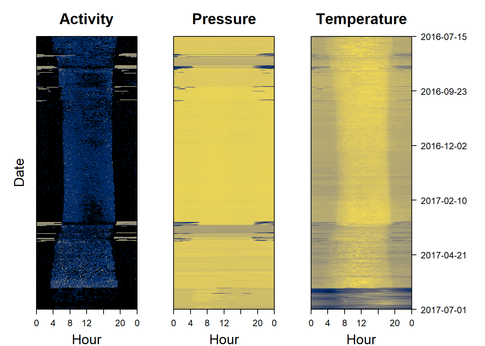

# Data Visualisation {#dataviz}


## Formatting data

> **Never forget to get rid of periods where ther logger is not on the bird**


```r
# make sure the cropping period is in the correct date format
start = as.POSIXct("2016-07-01","%Y-%m-%d", tz="UTC")
end = as.POSIXct("2017-07-01","%Y-%m-%d", tz="UTC")

# Crop the data
PAM_data= cutPAM(hoopoe,start,end)
```


## Quick multiplots

For a quick look at the data, it's possible to use `quickPLOT`. The user can specify which arguments to use, using `measurements`. There's a choice between different combinations of `"pressure"`, `"light"`, `"acceleration"`, `"temperature"` and `"magnetic"`. You can add any parameters from `?plot`, here I illustrate it with `col="cornflowerblue"` and by showing how to  restrict the x-axis limits `xlim` with the date format, to zoom into the post breeding mihration period of a hoopoe


```r
par(mar=c(3,4,0.5,0.5))
quickPLOT(hoopoe, col="cornflowerblue",
          measurements = c("pressure", "light", "acceleration"),
          xlim=c(as.POSIXct("2016-08-20","%Y-%m-%d", tz="UTC"),
                 as.POSIXct("2016-09-01","%Y-%m-%d", tz="UTC")))
```


## Interactive timeseries

To have a better overview of the data, it is possible to create interactive `dygraphPAM()` plots which allow the user to compare different measurements recorded by the logger. These might for instance include light, temperature, pressure, activity, pitch and magnetism. 

If you are **working from Rstudio**, this bit of code should be run:


```r
# In Rstudio, it will display in the viewer by default and use a lot of ram, and is better in html
backup_options <- options() 
options(viewer=NULL) # ensure it is viewed in internet browser
dygraphPAM(dta = PAM_data) # plot
options(backup_options) # restore previous viewer settings
```

If you are **working from base R** use this instead:

To save space here we only plot only one variable - pressure .


```r
dygraphPAM(dta = PAM_data, toPLOT = c("pressure")) 
```

<!--html_preserve--><div id="htmlwidget-d8a6d8a7ed27b267e4e5" style="width:960px;height:500px;" class="dygraphs html-widget"></div>
<script type="application/json" data-for="htmlwidget-d8a6d8a7ed27b267e4e5">{"x":{"attrs":{"title":"Pressure as a function of time","xlabel":"Time","ylabel":"Pressure (hPa)","labels":["minute","V1"],"retainDateWindow":false,"axes":{"x":{"pixelsPerLabel":60,"drawAxis":true},"y":{"drawAxis":true}},"showRangeSelector":true,"dateWindow":["2016-07-15T00:00:00.000Z","2017-07-01T00:00:00.000Z"],"rangeSelectorHeight":40,"rangeSelectorPlotFillColor":" #A7B1C4","rangeSelectorPlotStrokeColor":"#808FAB","interactionModel":"Dygraph.Interaction.defaultModel","highlightCircleSize":3,"highlightSeriesBackgroundAlpha":0.5,"highlightSeriesOpts":{"strokeWidth":2},"legend":"auto","labelsDivWidth":600,"labelsShowZeroValues":true,"labelsSeparateLines":false,"hideOverlayOnMouseOut":true,"stackedGraph":false,"fillGraph":false,"fillAlpha":0.15,"stepPlot":false,"drawPoints":false,"pointSize":1,"drawGapEdgePoints":false,"connectSeparatedPoints":false,"strokeWidth":1,"strokeBorderColor":"white","colors":["#FC8D62"],"colorValue":0.5,"colorSaturation":1,"includeZero":false,"drawAxesAtZero":false,"logscale":false,"axisTickSize":3,"axisLineColor":"black","axisLineWidth":0.3,"axisLabelColor":"black","axisLabelFontSize":14,"axisLabelWidth":60,"drawGrid":true,"gridLineWidth":0.3,"rightGap":5,"digitsAfterDecimal":2,"labelsKMB":false,"labelsKMG2":false,"labelsUTC":false,"maxNumberWidth":6,"animatedZooms":false,"mobileDisableYTouch":true,"disableZoom":false},"scale":"minute","group":["2016-07-15T00:00:00Z","2016-07-15T00:05:00Z","2016-07-15T00:10:00Z","2016-07-15T00:15:00Z","2016-07-15T00:20:00Z","2016-07-15T00:25:00Z","2016-07-15T00:30:00Z","2016-07-15T00:35:00Z","2016-07-15T00:40:00Z","2016-07-15T00:45:00Z","2016-07-15T00:50:00Z","2016-07-15T00:55:00Z","2016-07-15T01:00:00Z","2016-07-15T01:05:00Z","2016-07-15T01:10:00Z","2016-07-15T01:15:00Z","2016-07-15T01:20:00Z","2016-07-15T01:25:00Z","2016-07-15T01:30:00Z","2016-07-15T01:35:00Z","2016-07-15T01:40:00Z","2016-07-15T01:45:00Z","2016-07-15T01:50:00Z","2016-07-15T01:55:00Z","2016-07-15T02:00:00Z","2016-07-15T02:05:00Z","2016-07-15T02:10:00Z","2016-07-15T02:15:00Z","2016-07-15T02:20:00Z","2016-07-15T02:25:00Z","2016-07-15T02:30:00Z","2016-07-15T02:35:00Z","2016-07-15T02:40:00Z","2016-07-15T02:45:00Z","2016-07-15T02:50:00Z","2016-07-15T02:55:00Z","2016-07-15T03:00:00Z","2016-07-15T03:05:00Z","2016-07-15T03:10:00Z","2016-07-15T03:15:00Z","2016-07-15T03:20:00Z","2016-07-15T03:25:00Z","2016-07-15T03:30:00Z","2016-07-15T03:35:00Z","2016-07-15T03:40:00Z","2016-07-15T03:45:00Z","2016-07-15T03:50:00Z","2016-07-15T03:55:00Z","2016-07-15T04:00:00Z","2016-07-15T04:05:00Z","2016-07-15T04:10:00Z","2016-07-15T04:15:00Z","2016-07-15T04:20:00Z","2016-07-15T04:25:00Z","2016-07-15T04:30:00Z","2016-07-15T04:35:00Z","2016-07-15T04:40:00Z","2016-07-15T04:45:00Z","2016-07-15T04:50:00Z","2016-07-15T04:55:00Z","2016-07-15T05:00:00Z","2016-07-15T05:05:00Z","2016-07-15T05:10:00Z","2016-07-15T05:15:00Z","2016-07-15T05:20:00Z","2016-07-15T05:25:00Z","2016-07-15T05:30:00Z","2016-07-15T05:35:00Z","2016-07-15T05:40:00Z","2016-07-15T05:45:00Z","2016-07-15T05:50:00Z","2016-07-15T05:55:00Z","2016-07-15T06:00:00Z","2016-07-15T06:05:00Z","2016-07-15T06:10:00Z","2016-07-15T06:15:00Z","2016-07-15T06:20:00Z","2016-07-15T06:25:00Z","2016-07-15T06:30:00Z","2016-07-15T06:35:00Z","2016-07-15T06:40:00Z","2016-07-15T06:45:00Z","2016-07-15T06:50:00Z","2016-07-15T06:55:00Z","2016-07-15T07:00:00Z","2016-07-15T07:05:00Z","2016-07-15T07:10:00Z","2016-07-15T07:15:00Z","2016-07-15T07:20:00Z","2016-07-15T07:25:00Z","2016-07-15T07:30:00Z","2016-07-15T07:35:00Z","2016-07-15T07:40:00Z","2016-07-15T07:45:00Z","2016-07-15T07:50:00Z","2016-07-15T07:55:00Z","2016-07-15T08:00:00Z","2016-07-15T08:05:00Z","2016-07-15T08:10:00Z","2016-07-15T08:15:00Z","2016-07-15T08:20:00Z","2016-07-15T08:25:00Z","2016-07-15T08:30:00Z","2016-07-15T08:35:00Z","2016-07-15T08:40:00Z","2016-07-15T08:45:00Z","2016-07-15T08:50:00Z","2016-07-15T08:55:00Z","2016-07-15T09:00:00Z","2016-07-15T09:05:00Z","2016-07-15T09:10:00Z","2016-07-15T09:15:00Z","2016-07-15T09:20:00Z","2016-07-15T09:25:00Z","2016-07-15T09:30:00Z","2016-07-15T09:35:00Z","2016-07-15T09:40:00Z","2016-07-15T09:45:00Z","2016-07-15T09:50:00Z","2016-07-15T09:55:00Z","2016-07-15T10:00:00Z","2016-07-15T10:05:00Z","2016-07-15T10:10:00Z","2016-07-15T10:15:00Z","2016-07-15T10:20:00Z","2016-07-15T10:25:00Z","2016-07-15T10:30:00Z","2016-07-15T10:35:00Z","2016-07-15T10:40:00Z","2016-07-15T10:45:00Z","2016-07-15T10:50:00Z","2016-07-15T10:55:00Z","2016-07-15T11:00:00Z","2016-07-15T11:05:00Z","2016-07-15T11:10:00Z","2016-07-15T11:15:00Z","2016-07-15T11:20:00Z","2016-07-15T11:25:00Z","2016-07-15T11:30:00Z","2016-07-15T11:35:00Z","2016-07-15T11:40:00Z","2016-07-15T11:45:00Z","2016-07-15T11:50:00Z","2016-07-15T11:55:00Z","2016-07-15T12:00:00Z","2016-07-15T12:05:00Z","2016-07-15T12:10:00Z","2016-07-15T12:15:00Z","2016-07-15T12:20:00Z","2016-07-15T12:25:00Z","2016-07-15T12:30:00Z","2016-07-15T12:35:00Z","2016-07-15T12:40:00Z","2016-07-15T12:45:00Z","2016-07-15T12:50:00Z","2016-07-15T12:55:00Z","2016-07-15T13:00:00Z","2016-07-15T13:05:00Z","2016-07-15T13:10:00Z","2016-07-15T13:15:00Z","2016-07-15T13:20:00Z","2016-07-15T13:25:00Z","2016-07-15T13:30:00Z","2016-07-15T13:35:00Z","2016-07-15T13:40:00Z","2016-07-15T13:45:00Z","2016-07-15T13:50:00Z","2016-07-15T13:55:00Z","2016-07-15T14:00:00Z","2016-07-15T14:05:00Z","2016-07-15T14:10:00Z","2016-07-15T14:15:00Z","2016-07-15T14:20:00Z","2016-07-15T14:25:00Z","2016-07-15T14:30:00Z","2016-07-15T14:35:00Z","2016-07-15T14:40:00Z","2016-07-15T14:45:00Z","2016-07-15T14:50:00Z","2016-07-15T14:55:00Z","2016-07-15T15:00:00Z","2016-07-15T15:05:00Z","2016-07-15T15:10:00Z","2016-07-15T15:15:00Z","2016-07-15T15:20:00Z","2016-07-15T15:25:00Z","2016-07-15T15:30:00Z","2016-07-15T15:35:00Z","2016-07-15T15:40:00Z","2016-07-15T15:45:00Z","2016-07-15T15:50:00Z","2016-07-15T15:55:00Z","2016-07-15T16:00:00Z","2016-07-15T16:05:00Z","2016-07-15T16:10:00Z","2016-07-15T16:15:00Z","2016-07-15T16:20:00Z","2016-07-15T16:25:00Z","2016-07-15T16:30:00Z","2016-07-15T16:35:00Z","2016-07-15T16:40:00Z","2016-07-15T16:45:00Z","2016-07-15T16:50:00Z","2016-07-15T16:55:00Z","2016-07-15T17:00:00Z","2016-07-15T17:05:00Z","2016-07-15T17:10:00Z","2016-07-15T17:15:00Z","2016-07-15T17:20:00Z","2016-07-15T17:25:00Z","2016-07-15T17:30:00Z","2016-07-15T17:35:00Z","2016-07-15T17:40:00Z","2016-07-15T17:45:00Z","2016-07-15T17:50:00Z","2016-07-15T17:55:00Z","2016-07-15T18:00:00Z","2016-07-15T18:05:00Z","2016-07-15T18:10:00Z","2016-07-15T18:15:00Z","2016-07-15T18:20:00Z","2016-07-15T18:25:00Z","2016-07-15T18:30:00Z","2016-07-15T18:35:00Z","2016-07-15T18:40:00Z","2016-07-15T18:45:00Z","2016-07-15T18:50:00Z","2016-07-15T18:55:00Z","2016-07-15T19:00:00Z","2016-07-15T19:05:00Z","2016-07-15T19:10:00Z","2016-07-15T19:15:00Z","2016-07-15T19:20:00Z","2016-07-15T19:25:00Z","2016-07-15T19:30:00Z","2016-07-15T19:35:00Z","2016-07-15T19:40:00Z","2016-07-15T19:45:00Z","2016-07-15T19:50:00Z","2016-07-15T19:55:00Z","2016-07-15T20:00:00Z","2016-07-15T20:05:00Z","2016-07-15T20:10:00Z","2016-07-15T20:15:00Z","2016-07-15T20:20:00Z","2016-07-15T20:25:00Z","2016-07-15T20:30:00Z","2016-07-15T20:35:00Z","2016-07-15T20:40:00Z","2016-07-15T20:45:00Z","2016-07-15T20:50:00Z","2016-07-15T20:55:00Z","2016-07-15T21:00:00Z","2016-07-15T21:05:00Z","2016-07-15T21:10:00Z","2016-07-15T21:15:00Z","2016-07-15T21:20:00Z","2016-07-15T21:25:00Z","2016-07-15T21:30:00Z","2016-07-15T21:35:00Z","2016-07-15T21:40:00Z","2016-07-15T21:45:00Z","2016-07-15T21:50:00Z","2016-07-15T21:55:00Z","2016-07-15T22:00:00Z","2016-07-15T22:05:00Z","2016-07-15T22:10:00Z","2016-07-15T22:15:00Z","2016-07-15T22:20:00Z","2016-07-15T22:25:00Z","2016-07-15T22:30:00Z","2016-07-15T22:35:00Z","2016-07-15T22:40:00Z","2016-07-15T22:45:00Z","2016-07-15T22:50:00Z","2016-07-15T22:55:00Z","2016-07-15T23:00:00Z","2016-07-15T23:05:00Z","2016-07-15T23:10:00Z","2016-07-15T23:15:00Z","2016-07-15T23:20:00Z","2016-07-15T23:25:00Z","2016-07-15T23:30:00Z","2016-07-15T23:35:00Z","2016-07-15T23:40:00Z","2016-07-15T23:45:00Z","2016-07-15T23:50:00Z","2016-07-15T23:55:00Z","2016-07-16T00:00:00Z","2016-07-16T00:05:00Z","2016-07-16T00:10:00Z","2016-07-16T00:15:00Z","2016-07-16T00:20:00Z","2016-07-16T00:25:00Z","2016-07-16T00:30:00Z","2016-07-16T00:35:00Z","2016-07-16T00:40:00Z","2016-07-16T00:45:00Z","2016-07-16T00:50:00Z","2016-07-16T00:55:00Z","2016-07-16T01:00:00Z","2016-07-16T01:05:00Z","2016-07-16T01:10:00Z","2016-07-16T01:15:00Z","2016-07-16T01:20:00Z","2016-07-16T01:25:00Z","2016-07-16T01:30:00Z","2016-07-16T01:35:00Z","2016-07-16T01:40:00Z","2016-07-16T01:45:00Z","2016-07-16T01:50:00Z","2016-07-16T01:55:00Z","2016-07-16T02:00:00Z","2016-07-16T02:05:00Z","2016-07-16T02:10:00Z","2016-07-16T02:15:00Z","2016-07-16T02:20:00Z","2016-07-16T02:25:00Z","2016-07-16T02:30:00Z","2016-07-16T02:35:00Z","2016-07-16T02:40:00Z","2016-07-16T02:45:00Z","2016-07-16T02:50:00Z","2016-07-16T02:55:00Z","2016-07-16T03:00:00Z","2016-07-16T03:05:00Z","2016-07-16T03:10:00Z","2016-07-16T03:15:00Z","2016-07-16T03:20:00Z","2016-07-16T03:25:00Z","2016-07-16T03:30:00Z","2016-07-16T03:35:00Z","2016-07-16T03:40:00Z","2016-07-16T03:45:00Z","2016-07-16T03:50:00Z","2016-07-16T03:55:00Z","2016-07-16T04:00:00Z","2016-07-16T04:05:00Z","2016-07-16T04:10:00Z","2016-07-16T04:15:00Z","2016-07-16T04:20:00Z","2016-07-16T04:25:00Z","2016-07-16T04:30:00Z","2016-07-16T04:35:00Z","2016-07-16T04:40:00Z","2016-07-16T04:45:00Z","2016-07-16T04:50:00Z","2016-07-16T04:55:00Z","2016-07-16T05:00:00Z","2016-07-16T05:05:00Z","2016-07-16T05:10:00Z","2016-07-16T05:15:00Z","2016-07-16T05:20:00Z","2016-07-16T05:25:00Z","2016-07-16T05:30:00Z","2016-07-16T05:35:00Z","2016-07-16T05:40:00Z","2016-07-16T05:45:00Z","2016-07-16T05:50:00Z","2016-07-16T05:55:00Z","2016-07-16T06:00:00Z","2016-07-16T06:05:00Z","2016-07-16T06:10:00Z","2016-07-16T06:15:00Z","2016-07-16T06:20:00Z","2016-07-16T06:25:00Z","2016-07-16T06:30:00Z","2016-07-16T06:35:00Z","2016-07-16T06:40:00Z","2016-07-16T06:45:00Z","2016-07-16T06:50:00Z","2016-07-16T06:55:00Z","2016-07-16T07:00:00Z","2016-07-16T07:05:00Z","2016-07-16T07:10:00Z","2016-07-16T07:15:00Z","2016-07-16T07:20:00Z","2016-07-16T07:25:00Z","2016-07-16T07:30:00Z","2016-07-16T07:35:00Z","2016-07-16T07:40:00Z","2016-07-16T07:45:00Z","2016-07-16T07:50:00Z","2016-07-16T07:55:00Z","2016-07-16T08:00:00Z","2016-07-16T08:05:00Z","2016-07-16T08:10:00Z","2016-07-16T08:15:00Z","2016-07-16T08:20:00Z","2016-07-16T08:25:00Z","2016-07-16T08:30:00Z","2016-07-16T08:35:00Z","2016-07-16T08:40:00Z","2016-07-16T08:45:00Z","2016-07-16T08:50:00Z","2016-07-16T08:55:00Z","2016-07-16T09:00:00Z","2016-07-16T09:05:00Z","2016-07-16T09:10:00Z","2016-07-16T09:15:00Z","2016-07-16T09:20:00Z","2016-07-16T09:25:00Z","2016-07-16T09:30:00Z","2016-07-16T09:35:00Z","2016-07-16T09:40:00Z","2016-07-16T09:45:00Z","2016-07-16T09:50:00Z","2016-07-16T09:55:00Z","2016-07-16T10:00:00Z","2016-07-16T10:05:00Z","2016-07-16T10:10:00Z","2016-07-16T10:15:00Z","2016-07-16T10:20:00Z","2016-07-16T10:25:00Z","2016-07-16T10:30:00Z","2016-07-16T10:35:00Z","2016-07-16T10:40:00Z","2016-07-16T10:45:00Z","2016-07-16T10:50:00Z","2016-07-16T10:55:00Z","2016-07-16T11:00:00Z","2016-07-16T11:05:00Z","2016-07-16T11:10:00Z","2016-07-16T11:15:00Z","2016-07-16T11:20:00Z","2016-07-16T11:25:00Z","2016-07-16T11:30:00Z","2016-07-16T11:35:00Z","2016-07-16T11:40:00Z","2016-07-16T11:45:00Z","2016-07-16T11:50:00Z","2016-07-16T11:55:00Z","2016-07-16T12:00:00Z","2016-07-16T12:05:00Z","2016-07-16T12:10:00Z","2016-07-16T12:15:00Z","2016-07-16T12:20:00Z","2016-07-16T12:25:00Z","2016-07-16T12:30:00Z","2016-07-16T12:35:00Z","2016-07-16T12:40:00Z","2016-07-16T12:45:00Z","2016-07-16T12:50:00Z","2016-07-16T12:55:00Z","2016-07-16T13:00:00Z","2016-07-16T13:05:00Z","2016-07-16T13:10:00Z","2016-07-16T13:15:00Z","2016-07-16T13:20:00Z","2016-07-16T13:25:00Z","2016-07-16T13:30:00Z","2016-07-16T13:35:00Z","2016-07-16T13:40:00Z","2016-07-16T13:45:00Z","2016-07-16T13:50:00Z","2016-07-16T13:55:00Z","2016-07-16T14:00:00Z","2016-07-16T14:05:00Z","2016-07-16T14:10:00Z","2016-07-16T14:15:00Z","2016-07-16T14:20:00Z","2016-07-16T14:25:00Z","2016-07-16T14:30:00Z","2016-07-16T14:35:00Z","2016-07-16T14:40:00Z","2016-07-16T14:45:00Z","2016-07-16T14:50:00Z","2016-07-16T14:55:00Z","2016-07-16T15:00:00Z","2016-07-16T15:05:00Z","2016-07-16T15:10:00Z","2016-07-16T15:15:00Z","2016-07-16T15:20:00Z","2016-07-16T15:25:00Z","2016-07-16T15:30:00Z","2016-07-16T15:35:00Z","2016-07-16T15:40:00Z","2016-07-16T15:45:00Z","2016-07-16T15:50:00Z","2016-07-16T15:55:00Z","2016-07-16T16:00:00Z","2016-07-16T16:05:00Z","2016-07-16T16:10:00Z","2016-07-16T16:15:00Z","2016-07-16T16:20:00Z","2016-07-16T16:25:00Z","2016-07-16T16:30:00Z","2016-07-16T16:35:00Z","2016-07-16T16:40:00Z","2016-07-16T16:45:00Z","2016-07-16T16:50:00Z","2016-07-16T16:55:00Z","2016-07-16T17:00:00Z","2016-07-16T17:05:00Z","2016-07-16T17:10:00Z","2016-07-16T17:15:00Z","2016-07-16T17:20:00Z","2016-07-16T17:25:00Z","2016-07-16T17:30:00Z","2016-07-16T17:35:00Z","2016-07-16T17:40:00Z","2016-07-16T17:45:00Z","2016-07-16T17:50:00Z","2016-07-16T17:55:00Z","2016-07-16T18:00:00Z","2016-07-16T18:05:00Z","2016-07-16T18:10:00Z","2016-07-16T18:15:00Z","2016-07-16T18:20:00Z","2016-07-16T18:25:00Z","2016-07-16T18:30:00Z","2016-07-16T18:35:00Z","2016-07-16T18:40:00Z","2016-07-16T18:45:00Z","2016-07-16T18:50:00Z","2016-07-16T18:55:00Z","2016-07-16T19:00:00Z","2016-07-16T19:05:00Z","2016-07-16T19:10:00Z","2016-07-16T19:15:00Z","2016-07-16T19:20:00Z","2016-07-16T19:25:00Z","2016-07-16T19:30:00Z","2016-07-16T19:35:00Z","2016-07-16T19:40:00Z","2016-07-16T19:45:00Z","2016-07-16T19:50:00Z","2016-07-16T19:55:00Z","2016-07-16T20:00:00Z","2016-07-16T20:05:00Z","2016-07-16T20:10:00Z","2016-07-16T20:15:00Z","2016-07-16T20:20:00Z","2016-07-16T20:25:00Z","2016-07-16T20:30:00Z","2016-07-16T20:35:00Z","2016-07-16T20:40:00Z","2016-07-16T20:45:00Z","2016-07-16T20:50:00Z","2016-07-16T20:55:00Z","2016-07-16T21:00:00Z","2016-07-16T21:05:00Z","2016-07-16T21:10:00Z","2016-07-16T21:15:00Z","2016-07-16T21:20:00Z","2016-07-16T21:25:00Z","2016-07-16T21:30:00Z","2016-07-16T21:35:00Z","2016-07-16T21:40:00Z","2016-07-16T21:45:00Z","2016-07-16T21:50:00Z","2016-07-16T21:55:00Z","2016-07-16T22:00:00Z","2016-07-16T22:05:00Z","2016-07-16T22:10:00Z","2016-07-16T22:15:00Z","2016-07-16T22:20:00Z","2016-07-16T22:25:00Z","2016-07-16T22:30:00Z","2016-07-16T22:35:00Z","2016-07-16T22:40:00Z","2016-07-16T22:45:00Z","2016-07-16T22:50:00Z","2016-07-16T22:55:00Z","2016-07-16T23:00:00Z","2016-07-16T23:05:00Z","2016-07-16T23:10:00Z","2016-07-16T23:15:00Z","2016-07-16T23:20:00Z","2016-07-16T23:25:00Z","2016-07-16T23:30:00Z","2016-07-16T23:35:00Z","2016-07-16T23:40:00Z","2016-07-16T23:45:00Z","2016-07-16T23:50:00Z","2016-07-16T23:55:00Z","2016-07-17T00:00:00Z","2016-07-17T00:05:00Z","2016-07-17T00:10:00Z","2016-07-17T00:15:00Z","2016-07-17T00:20:00Z","2016-07-17T00:25:00Z","2016-07-17T00:30:00Z","2016-07-17T00:35:00Z","2016-07-17T00:40:00Z","2016-07-17T00:45:00Z","2016-07-17T00:50:00Z","2016-07-17T00:55:00Z","2016-07-17T01:00:00Z","2016-07-17T01:05:00Z","2016-07-17T01:10:00Z","2016-07-17T01:15:00Z","2016-07-17T01:20:00Z","2016-07-17T01:25:00Z","2016-07-17T01:30:00Z","2016-07-17T01:35:00Z","2016-07-17T01:40:00Z","2016-07-17T01:45:00Z","2016-07-17T01:50:00Z","2016-07-17T01:55:00Z","2016-07-17T02:00:00Z","2016-07-17T02:05:00Z","2016-07-17T02:10:00Z","2016-07-17T02:15:00Z","2016-07-17T02:20:00Z","2016-07-17T02:25:00Z","2016-07-17T02:30:00Z","2016-07-17T02:35:00Z","2016-07-17T02:40:00Z","2016-07-17T02:45:00Z","2016-07-17T02:50:00Z","2016-07-17T02:55:00Z","2016-07-17T03:00:00Z","2016-07-17T03:05:00Z","2016-07-17T03:10:00Z","2016-07-17T03:15:00Z","2016-07-17T03:20:00Z","2016-07-17T03:25:00Z","2016-07-17T03:30:00Z","2016-07-17T03:35:00Z","2016-07-17T03:40:00Z","2016-07-17T03:45:00Z","2016-07-17T03:50:00Z","2016-07-17T03:55:00Z","2016-07-17T04:00:00Z","2016-07-17T04:05:00Z","2016-07-17T04:10:00Z","2016-07-17T04:15:00Z","2016-07-17T04:20:00Z","2016-07-17T04:25:00Z","2016-07-17T04:30:00Z","2016-07-17T04:35:00Z","2016-07-17T04:40:00Z","2016-07-17T04:45:00Z","2016-07-17T04:50:00Z","2016-07-17T04:55:00Z","2016-07-17T05:00:00Z","2016-07-17T05:05:00Z","2016-07-17T05:10:00Z","2016-07-17T05:15:00Z","2016-07-17T05:20:00Z","2016-07-17T05:25:00Z","2016-07-17T05:30:00Z","2016-07-17T05:35:00Z","2016-07-17T05:40:00Z","2016-07-17T05:45:00Z","2016-07-17T05:50:00Z","2016-07-17T05:55:00Z","2016-07-17T06:00:00Z","2016-07-17T06:05:00Z","2016-07-17T06:10:00Z","2016-07-17T06:15:00Z","2016-07-17T06:20:00Z","2016-07-17T06:25:00Z","2016-07-17T06:30:00Z","2016-07-17T06:35:00Z","2016-07-17T06:40:00Z","2016-07-17T06:45:00Z","2016-07-17T06:50:00Z","2016-07-17T06:55:00Z","2016-07-17T07:00:00Z","2016-07-17T07:05:00Z","2016-07-17T07:10:00Z","2016-07-17T07:15:00Z","2016-07-17T07:20:00Z","2016-07-17T07:25:00Z","2016-07-17T07:30:00Z","2016-07-17T07:35:00Z","2016-07-17T07:40:00Z","2016-07-17T07:45:00Z","2016-07-17T07:50:00Z","2016-07-17T07:55:00Z","2016-07-17T08:00:00Z","2016-07-17T08:05:00Z","2016-07-17T08:10:00Z","2016-07-17T08:15:00Z","2016-07-17T08:20:00Z","2016-07-17T08:25:00Z","2016-07-17T08:30:00Z","2016-07-17T08:35:00Z","2016-07-17T08:40:00Z","2016-07-17T08:45:00Z","2016-07-17T08:50:00Z","2016-07-17T08:55:00Z","2016-07-17T09:00:00Z","2016-07-17T09:05:00Z","2016-07-17T09:10:00Z","2016-07-17T09:15:00Z","2016-07-17T09:20:00Z","2016-07-17T09:25:00Z","2016-07-17T09:30:00Z","2016-07-17T09:35:00Z","2016-07-17T09:40:00Z","2016-07-17T09:45:00Z","2016-07-17T09:50:00Z","2016-07-17T09:55:00Z","2016-07-17T10:00:00Z","2016-07-17T10:05:00Z","2016-07-17T10:10:00Z","2016-07-17T10:15:00Z","2016-07-17T10:20:00Z","2016-07-17T10:25:00Z","2016-07-17T10:30:00Z","2016-07-17T10:35:00Z","2016-07-17T10:40:00Z","2016-07-17T10:45:00Z","2016-07-17T10:50:00Z","2016-07-17T10:55:00Z","2016-07-17T11:00:00Z","2016-07-17T11:05:00Z","2016-07-17T11:10:00Z","2016-07-17T11:15:00Z","2016-07-17T11:20:00Z","2016-07-17T11:25:00Z","2016-07-17T11:30:00Z","2016-07-17T11:35:00Z","2016-07-17T11:40:00Z","2016-07-17T11:45:00Z","2016-07-17T11:50:00Z","2016-07-17T11:55:00Z","2016-07-17T12:00:00Z","2016-07-17T12:05:00Z","2016-07-17T12:10:00Z","2016-07-17T12:15:00Z","2016-07-17T12:20:00Z","2016-07-17T12:25:00Z","2016-07-17T12:30:00Z","2016-07-17T12:35:00Z","2016-07-17T12:40:00Z","2016-07-17T12:45:00Z","2016-07-17T12:50:00Z","2016-07-17T12:55:00Z","2016-07-17T13:00:00Z","2016-07-17T13:05:00Z","2016-07-17T13:10:00Z","2016-07-17T13:15:00Z","2016-07-17T13:20:00Z","2016-07-17T13:25:00Z","2016-07-17T13:30:00Z","2016-07-17T13:35:00Z","2016-07-17T13:40:00Z","2016-07-17T13:45:00Z","2016-07-17T13:50:00Z","2016-07-17T13:55:00Z","2016-07-17T14:00:00Z","2016-07-17T14:05:00Z","2016-07-17T14:10:00Z","2016-07-17T14:15:00Z","2016-07-17T14:20:00Z","2016-07-17T14:25:00Z","2016-07-17T14:30:00Z","2016-07-17T14:35:00Z","2016-07-17T14:40:00Z","2016-07-17T14:45:00Z","2016-07-17T14:50:00Z","2016-07-17T14:55:00Z","2016-07-17T15:00:00Z","2016-07-17T15:05:00Z","2016-07-17T15:10:00Z","2016-07-17T15:15:00Z","2016-07-17T15:20:00Z","2016-07-17T15:25:00Z","2016-07-17T15:30:00Z","2016-07-17T15:35:00Z","2016-07-17T15:40:00Z","2016-07-17T15:45:00Z","2016-07-17T15:50:00Z","2016-07-17T15:55:00Z","2016-07-17T16:00:00Z","2016-07-17T16:05:00Z","2016-07-17T16:10:00Z","2016-07-17T16:15:00Z","2016-07-17T16:20:00Z","2016-07-17T16:25:00Z","2016-07-17T16:30:00Z","2016-07-17T16:35:00Z","2016-07-17T16:40:00Z","2016-07-17T16:45:00Z","2016-07-17T16:50:00Z","2016-07-17T16:55:00Z","2016-07-17T17:00:00Z","2016-07-17T17:05:00Z","2016-07-17T17:10:00Z","2016-07-17T17:15:00Z","2016-07-17T17:20:00Z","2016-07-17T17:25:00Z","2016-07-17T17:30:00Z","2016-07-17T17:35:00Z","2016-07-17T17:40:00Z","2016-07-17T17:45:00Z","2016-07-17T17:50:00Z","2016-07-17T17:55:00Z","2016-07-17T18:00:00Z","2016-07-17T18:05:00Z","2016-07-17T18:10:00Z","2016-07-17T18:15:00Z","2016-07-17T18:20:00Z","2016-07-17T18:25:00Z","2016-07-17T18:30:00Z","2016-07-17T18:35:00Z","2016-07-17T18:40:00Z","2016-07-17T18:45:00Z","2016-07-17T18:50:00Z","2016-07-17T18:55:00Z","2016-07-17T19:00:00Z","2016-07-17T19:05:00Z","2016-07-17T19:10:00Z","2016-07-17T19:15:00Z","2016-07-17T19:20:00Z","2016-07-17T19:25:00Z","2016-07-17T19:30:00Z","2016-07-17T19:35:00Z","2016-07-17T19:40:00Z","2016-07-17T19:45:00Z","2016-07-17T19:50:00Z","2016-07-17T19:55:00Z","2016-07-17T20:00:00Z","2016-07-17T20:05:00Z","2016-07-17T20:10:00Z","2016-07-17T20:15:00Z","2016-07-17T20:20:00Z","2016-07-17T20:25:00Z","2016-07-17T20:30:00Z","2016-07-17T20:35:00Z","2016-07-17T20:40:00Z","2016-07-17T20:45:00Z","2016-07-17T20:50:00Z","2016-07-17T20:55:00Z","2016-07-17T21:00:00Z","2016-07-17T21:05:00Z","2016-07-17T21:10:00Z","2016-07-17T21:15:00Z","2016-07-17T21:20:00Z","2016-07-17T21:25:00Z","2016-07-17T21:30:00Z","2016-07-17T21:35:00Z","2016-07-17T21:40:00Z","2016-07-17T21:45:00Z","2016-07-17T21:50:00Z","2016-07-17T21:55:00Z","2016-07-17T22:00:00Z","2016-07-17T22:05:00Z","2016-07-17T22:10:00Z","2016-07-17T22:15:00Z","2016-07-17T22:20:00Z","2016-07-17T22:25:00Z","2016-07-17T22:30:00Z","2016-07-17T22:35:00Z","2016-07-17T22:40:00Z","2016-07-17T22:45:00Z","2016-07-17T22:50:00Z","2016-07-17T22:55:00Z","2016-07-17T23:00:00Z","2016-07-17T23:05:00Z","2016-07-17T23:10:00Z","2016-07-17T23:15:00Z","2016-07-17T23:20:00Z","2016-07-17T23:25:00Z","2016-07-17T23:30:00Z","2016-07-17T23:35:00Z","2016-07-17T23:40:00Z","2016-07-17T23:45:00Z","2016-07-17T23:50:00Z","2016-07-17T23:55:00Z","2016-07-18T00:00:00Z","2016-07-18T00:05:00Z","2016-07-18T00:10:00Z","2016-07-18T00:15:00Z","2016-07-18T00:20:00Z","2016-07-18T00:25:00Z","2016-07-18T00:30:00Z","2016-07-18T00:35:00Z","2016-07-18T00:40:00Z","2016-07-18T00:45:00Z","2016-07-18T00:50:00Z","2016-07-18T00:55:00Z","2016-07-18T01:00:00Z","2016-07-18T01:05:00Z","2016-07-18T01:10:00Z","2016-07-18T01:15:00Z","2016-07-18T01:20:00Z","2016-07-18T01:25:00Z","2016-07-18T01:30:00Z","2016-07-18T01:35:00Z","2016-07-18T01:40:00Z","2016-07-18T01:45:00Z","2016-07-18T01:50:00Z","2016-07-18T01:55:00Z","2016-07-18T02:00:00Z","2016-07-18T02:05:00Z","2016-07-18T02:10:00Z","2016-07-18T02:15:00Z","2016-07-18T02:20:00Z","2016-07-18T02:25:00Z","2016-07-18T02:30:00Z","2016-07-18T02:35:00Z","2016-07-18T02:40:00Z","2016-07-18T02:45:00Z","2016-07-18T02:50:00Z","2016-07-18T02:55:00Z","2016-07-18T03:00:00Z","2016-07-18T03:05:00Z","2016-07-18T03:10:00Z","2016-07-18T03:15:00Z","2016-07-18T03:20:00Z","2016-07-18T03:25:00Z","2016-07-18T03:30:00Z","2016-07-18T03:35:00Z","2016-07-18T03:40:00Z","2016-07-18T03:45:00Z","2016-07-18T03:50:00Z","2016-07-18T03:55:00Z","2016-07-18T04:00:00Z","2016-07-18T04:05:00Z","2016-07-18T04:10:00Z","2016-07-18T04:15:00Z","2016-07-18T04:20:00Z","2016-07-18T04:25:00Z","2016-07-18T04:30:00Z","2016-07-18T04:35:00Z","2016-07-18T04:40:00Z","2016-07-18T04:45:00Z","2016-07-18T04:50:00Z","2016-07-18T04:55:00Z","2016-07-18T05:00:00Z","2016-07-18T05:05:00Z","2016-07-18T05:10:00Z","2016-07-18T05:15:00Z","2016-07-18T05:20:00Z","2016-07-18T05:25:00Z","2016-07-18T05:30:00Z","2016-07-18T05:35:00Z","2016-07-18T05:40:00Z","2016-07-18T05:45:00Z","2016-07-18T05:50:00Z","2016-07-18T05:55:00Z","2016-07-18T06:00:00Z","2016-07-18T06:05:00Z","2016-07-18T06:10:00Z","2016-07-18T06:15:00Z","2016-07-18T06:20:00Z","2016-07-18T06:25:00Z","2016-07-18T06:30:00Z","2016-07-18T06:35:00Z","2016-07-18T06:40:00Z","2016-07-18T06:45:00Z","2016-07-18T06:50:00Z","2016-07-18T06:55:00Z","2016-07-18T07:00:00Z","2016-07-18T07:05:00Z","2016-07-18T07:10:00Z","2016-07-18T07:15:00Z","2016-07-18T07:20:00Z","2016-07-18T07:25:00Z","2016-07-18T07:30:00Z","2016-07-18T07:35:00Z","2016-07-18T07:40:00Z","2016-07-18T07:45:00Z","2016-07-18T07:50:00Z","2016-07-18T07:55:00Z","2016-07-18T08:00:00Z","2016-07-18T08:05:00Z","2016-07-18T08:10:00Z","2016-07-18T08:15:00Z","2016-07-18T08:20:00Z","2016-07-18T08:25:00Z","2016-07-18T08:30:00Z","2016-07-18T08:35:00Z","2016-07-18T08:40:00Z","2016-07-18T08:45:00Z","2016-07-18T08:50:00Z","2016-07-18T08:55:00Z","2016-07-18T09:00:00Z","2016-07-18T09:05:00Z","2016-07-18T09:10:00Z","2016-07-18T09:15:00Z","2016-07-18T09:20:00Z","2016-07-18T09:25:00Z","2016-07-18T09:30:00Z","2016-07-18T09:35:00Z","2016-07-18T09:40:00Z","2016-07-18T09:45:00Z","2016-07-18T09:50:00Z","2016-07-18T09:55:00Z","2016-07-18T10:00:00Z","2016-07-18T10:05:00Z","2016-07-18T10:10:00Z","2016-07-18T10:15:00Z","2016-07-18T10:20:00Z","2016-07-18T10:25:00Z","2016-07-18T10:30:00Z","2016-07-18T10:35:00Z","2016-07-18T10:40:00Z","2016-07-18T10:45:00Z","2016-07-18T10:50:00Z","2016-07-18T10:55:00Z","2016-07-18T11:00:00Z","2016-07-18T11:05:00Z","2016-07-18T11:10:00Z","2016-07-18T11:15:00Z","2016-07-18T11:20:00Z","2016-07-18T11:25:00Z","2016-07-18T11:30:00Z","2016-07-18T11:35:00Z","2016-07-18T11:40:00Z","2016-07-18T11:45:00Z","2016-07-18T11:50:00Z","2016-07-18T11:55:00Z","2016-07-18T12:00:00Z","2016-07-18T12:05:00Z","2016-07-18T12:10:00Z","2016-07-18T12:15:00Z","2016-07-18T12:20:00Z","2016-07-18T12:25:00Z","2016-07-18T12:30:00Z","2016-07-18T12:35:00Z","2016-07-18T12:40:00Z","2016-07-18T12:45:00Z","2016-07-18T12:50:00Z","2016-07-18T12:55:00Z","2016-07-18T13:00:00Z","2016-07-18T13:05:00Z","2016-07-18T13:10:00Z","2016-07-18T13:15:00Z","2016-07-18T13:20:00Z","2016-07-18T13:25:00Z","2016-07-18T13:30:00Z","2016-07-18T13:35:00Z","2016-07-18T13:40:00Z","2016-07-18T13:45:00Z","2016-07-18T13:50:00Z","2016-07-18T13:55:00Z","2016-07-18T14:00:00Z","2016-07-18T14:05:00Z","2016-07-18T14:10:00Z","2016-07-18T14:15:00Z","2016-07-18T14:20:00Z","2016-07-18T14:25:00Z","2016-07-18T14:30:00Z","2016-07-18T14:35:00Z","2016-07-18T14:40:00Z","2016-07-18T14:45:00Z","2016-07-18T14:50:00Z","2016-07-18T14:55:00Z","2016-07-18T15:00:00Z","2016-07-18T15:05:00Z","2016-07-18T15:10:00Z","2016-07-18T15:15:00Z","2016-07-18T15:20:00Z","2016-07-18T15:25:00Z","2016-07-18T15:30:00Z","2016-07-18T15:35:00Z","2016-07-18T15:40:00Z","2016-07-18T15:45:00Z","2016-07-18T15:50:00Z","2016-07-18T15:55:00Z","2016-07-18T16:00:00Z","2016-07-18T16:05:00Z","2016-07-18T16:10:00Z","2016-07-18T16:15:00Z","2016-07-18T16:20:00Z","2016-07-18T16:25:00Z","2016-07-18T16:30:00Z","2016-07-18T16:35:00Z","2016-07-18T16:40:00Z","2016-07-18T16:45:00Z","2016-07-18T16:50:00Z","2016-07-18T16:55:00Z","2016-07-18T17:00:00Z","2016-07-18T17:05:00Z","2016-07-18T17:10:00Z","2016-07-18T17:15:00Z","2016-07-18T17:20:00Z","2016-07-18T17:25:00Z","2016-07-18T17:30:00Z","2016-07-18T17:35:00Z","2016-07-18T17:40:00Z","2016-07-18T17:45:00Z","2016-07-18T17:50:00Z","2016-07-18T17:55:00Z","2016-07-18T18:00:00Z","2016-07-18T18:05:00Z","2016-07-18T18:10:00Z","2016-07-18T18:15:00Z","2016-07-18T18:20:00Z","2016-07-18T18:25:00Z","2016-07-18T18:30:00Z","2016-07-18T18:35:00Z","2016-07-18T18:40:00Z","2016-07-18T18:45:00Z","2016-07-18T18:50:00Z","2016-07-18T18:55:00Z","2016-07-18T19:00:00Z","2016-07-18T19:05:00Z","2016-07-18T19:10:00Z","2016-07-18T19:15:00Z","2016-07-18T19:20:00Z","2016-07-18T19:25:00Z","2016-07-18T19:30:00Z","2016-07-18T19:35:00Z","2016-07-18T19:40:00Z","2016-07-18T19:45:00Z","2016-07-18T19:50:00Z","2016-07-18T19:55:00Z","2016-07-18T20:00:00Z","2016-07-18T20:05:00Z","2016-07-18T20:10:00Z","2016-07-18T20:15:00Z","2016-07-18T20:20:00Z","2016-07-18T20:25:00Z","2016-07-18T20:30:00Z","2016-07-18T20:35:00Z","2016-07-18T20:40:00Z","2016-07-18T20:45:00Z","2016-07-18T20:50:00Z","2016-07-18T20:55:00Z","2016-07-18T21:00:00Z","2016-07-18T21:05:00Z","2016-07-18T21:10:00Z","2016-07-18T21:15:00Z","2016-07-18T21:20:00Z","2016-07-18T21:25:00Z","2016-07-18T21:30:00Z","2016-07-18T21:35:00Z","2016-07-18T21:40:00Z","2016-07-18T21:45:00Z","2016-07-18T21:50:00Z","2016-07-18T21:55:00Z","2016-07-18T22:00:00Z","2016-07-18T22:05:00Z","2016-07-18T22:10:00Z","2016-07-18T22:15:00Z","2016-07-18T22:20:00Z","2016-07-18T22:25:00Z","2016-07-18T22:30:00Z","2016-07-18T22:35:00Z","2016-07-18T22:40:00Z","2016-07-18T22:45:00Z","2016-07-18T22:50:00Z","2016-07-18T22:55:00Z","2016-07-18T23:00:00Z","2016-07-18T23:05:00Z","2016-07-18T23:10:00Z","2016-07-18T23:15:00Z","2016-07-18T23:20:00Z","2016-07-18T23:25:00Z","2016-07-18T23:30:00Z","2016-07-18T23:35:00Z","2016-07-18T23:40:00Z","2016-07-18T23:45:00Z","2016-07-18T23:50:00Z","2016-07-18T23:55:00Z","2016-07-19T00:00:00Z","2016-07-19T00:05:00Z","2016-07-19T00:10:00Z","2016-07-19T00:15:00Z","2016-07-19T00:20:00Z","2016-07-19T00:25:00Z","2016-07-19T00:30:00Z","2016-07-19T00:35:00Z","2016-07-19T00:40:00Z","2016-07-19T00:45:00Z","2016-07-19T00:50:00Z","2016-07-19T00:55:00Z","2016-07-19T01:00:00Z","2016-07-19T01:05:00Z","2016-07-19T01:10:00Z","2016-07-19T01:15:00Z","2016-07-19T01:20:00Z","2016-07-19T01:25:00Z","2016-07-19T01:30:00Z","2016-07-19T01:35:00Z","2016-07-19T01:40:00Z","2016-07-19T01:45:00Z","2016-07-19T01:50:00Z","2016-07-19T01:55:00Z","2016-07-19T02:00:00Z","2016-07-19T02:05:00Z","2016-07-19T02:10:00Z","2016-07-19T02:15:00Z","2016-07-19T02:20:00Z","2016-07-19T02:25:00Z","2016-07-19T02:30:00Z","2016-07-19T02:35:00Z","2016-07-19T02:40:00Z","2016-07-19T02:45:00Z","2016-07-19T02:50:00Z","2016-07-19T02:55:00Z","2016-07-19T03:00:00Z","2016-07-19T03:05:00Z","2016-07-19T03:10:00Z","2016-07-19T03:15:00Z","2016-07-19T03:20:00Z","2016-07-19T03:25:00Z","2016-07-19T03:30:00Z","2016-07-19T03:35:00Z","2016-07-19T03:40:00Z","2016-07-19T03:45:00Z","2016-07-19T03:50:00Z","2016-07-19T03:55:00Z","2016-07-19T04:00:00Z","2016-07-19T04:05:00Z","2016-07-19T04:10:00Z","2016-07-19T04:15:00Z","2016-07-19T04:20:00Z","2016-07-19T04:25:00Z","2016-07-19T04:30:00Z","2016-07-19T04:35:00Z","2016-07-19T04:40:00Z","2016-07-19T04:45:00Z","2016-07-19T04:50:00Z","2016-07-19T04:55:00Z","2016-07-19T05:00:00Z","2016-07-19T05:05:00Z","2016-07-19T05:10:00Z","2016-07-19T05:15:00Z","2016-07-19T05:20:00Z","2016-07-19T05:25:00Z","2016-07-19T05:30:00Z","2016-07-19T05:35:00Z","2016-07-19T05:40:00Z","2016-07-19T05:45:00Z","2016-07-19T05:50:00Z","2016-07-19T05:55:00Z","2016-07-19T06:00:00Z","2016-07-19T06:05:00Z","2016-07-19T06:10:00Z","2016-07-19T06:15:00Z","2016-07-19T06:20:00Z","2016-07-19T06:25:00Z","2016-07-19T06:30:00Z","2016-07-19T06:35:00Z","2016-07-19T06:40:00Z","2016-07-19T06:45:00Z","2016-07-19T06:50:00Z","2016-07-19T06:55:00Z","2016-07-19T07:00:00Z","2016-07-19T07:05:00Z","2016-07-19T07:10:00Z","2016-07-19T07:15:00Z","2016-07-19T07:20:00Z","2016-07-19T07:25:00Z","2016-07-19T07:30:00Z","2016-07-19T07:35:00Z","2016-07-19T07:40:00Z","2016-07-19T07:45:00Z","2016-07-19T07:50:00Z","2016-07-19T07:55:00Z","2016-07-19T08:00:00Z","2016-07-19T08:05:00Z","2016-07-19T08:10:00Z","2016-07-19T08:15:00Z","2016-07-19T08:20:00Z","2016-07-19T08:25:00Z","2016-07-19T08:30:00Z","2016-07-19T08:35:00Z","2016-07-19T08:40:00Z","2016-07-19T08:45:00Z","2016-07-19T08:50:00Z","2016-07-19T08:55:00Z","2016-07-19T09:00:00Z","2016-07-19T09:05:00Z","2016-07-19T09:10:00Z","2016-07-19T09:15:00Z","2016-07-19T09:20:00Z","2016-07-19T09:25:00Z","2016-07-19T09:30:00Z","2016-07-19T09:35:00Z","2016-07-19T09:40:00Z","2016-07-19T09:45:00Z","2016-07-19T09:50:00Z","2016-07-19T09:55:00Z","2016-07-19T10:00:00Z","2016-07-19T10:05:00Z","2016-07-19T10:10:00Z","2016-07-19T10:15:00Z","2016-07-19T10:20:00Z","2016-07-19T10:25:00Z","2016-07-19T10:30:00Z","2016-07-19T10:35:00Z","2016-07-19T10:40:00Z","2016-07-19T10:45:00Z","2016-07-19T10:50:00Z","2016-07-19T10:55:00Z","2016-07-19T11:00:00Z","2016-07-19T11:05:00Z","2016-07-19T11:10:00Z","2016-07-19T11:15:00Z","2016-07-19T11:20:00Z","2016-07-19T11:25:00Z","2016-07-19T11:30:00Z","2016-07-19T11:35:00Z","2016-07-19T11:40:00Z","2016-07-19T11:45:00Z","2016-07-19T11:50:00Z","2016-07-19T11:55:00Z","2016-07-19T12:00:00Z","2016-07-19T12:05:00Z","2016-07-19T12:10:00Z","2016-07-19T12:15:00Z","2016-07-19T12:20:00Z","2016-07-19T12:25:00Z","2016-07-19T12:30:00Z","2016-07-19T12:35:00Z","2016-07-19T12:40:00Z","2016-07-19T12:45:00Z","2016-07-19T12:50:00Z","2016-07-19T12:55:00Z","2016-07-19T13:00:00Z","2016-07-19T13:05:00Z","2016-07-19T13:10:00Z","2016-07-19T13:15:00Z","2016-07-19T13:20:00Z","2016-07-19T13:25:00Z","2016-07-19T13:30:00Z","2016-07-19T13:35:00Z","2016-07-19T13:40:00Z","2016-07-19T13:45:00Z","2016-07-19T13:50:00Z","2016-07-19T13:55:00Z","2016-07-19T14:00:00Z","2016-07-19T14:05:00Z","2016-07-19T14:10:00Z","2016-07-19T14:15:00Z","2016-07-19T14:20:00Z","2016-07-19T14:25:00Z","2016-07-19T14:30:00Z","2016-07-19T14:35:00Z","2016-07-19T14:40:00Z","2016-07-19T14:45:00Z","2016-07-19T14:50:00Z","2016-07-19T14:55:00Z","2016-07-19T15:00:00Z","2016-07-19T15:05:00Z","2016-07-19T15:10:00Z","2016-07-19T15:15:00Z","2016-07-19T15:20:00Z","2016-07-19T15:25:00Z","2016-07-19T15:30:00Z","2016-07-19T15:35:00Z","2016-07-19T15:40:00Z","2016-07-19T15:45:00Z","2016-07-19T15:50:00Z","2016-07-19T15:55:00Z","2016-07-19T16:00:00Z","2016-07-19T16:05:00Z","2016-07-19T16:10:00Z","2016-07-19T16:15:00Z","2016-07-19T16:20:00Z","2016-07-19T16:25:00Z","2016-07-19T16:30:00Z","2016-07-19T16:35:00Z","2016-07-19T16:40:00Z","2016-07-19T16:45:00Z","2016-07-19T16:50:00Z","2016-07-19T16:55:00Z","2016-07-19T17:00:00Z","2016-07-19T17:05:00Z","2016-07-19T17:10:00Z","2016-07-19T17:15:00Z","2016-07-19T17:20:00Z","2016-07-19T17:25:00Z","2016-07-19T17:30:00Z","2016-07-19T17:35:00Z","2016-07-19T17:40:00Z","2016-07-19T17:45:00Z","2016-07-19T17:50:00Z","2016-07-19T17:55:00Z","2016-07-19T18:00:00Z","2016-07-19T18:05:00Z","2016-07-19T18:10:00Z","2016-07-19T18:15:00Z","2016-07-19T18:20:00Z","2016-07-19T18:25:00Z","2016-07-19T18:30:00Z","2016-07-19T18:35:00Z","2016-07-19T18:40:00Z","2016-07-19T18:45:00Z","2016-07-19T18:50:00Z","2016-07-19T18:55:00Z","2016-07-19T19:00:00Z","2016-07-19T19:05:00Z","2016-07-19T19:10:00Z","2016-07-19T19:15:00Z","2016-07-19T19:20:00Z","2016-07-19T19:25:00Z","2016-07-19T19:30:00Z","2016-07-19T19:35:00Z","2016-07-19T19:40:00Z","2016-07-19T19:45:00Z","2016-07-19T19:50:00Z","2016-07-19T19:55:00Z","2016-07-19T20:00:00Z","2016-07-19T20:05:00Z","2016-07-19T20:10:00Z","2016-07-19T20:15:00Z","2016-07-19T20:20:00Z","2016-07-19T20:25:00Z","2016-07-19T20:30:00Z","2016-07-19T20:35:00Z","2016-07-19T20:40:00Z","2016-07-19T20:45:00Z","2016-07-19T20:50:00Z","2016-07-19T20:55:00Z","2016-07-19T21:00:00Z","2016-07-19T21:05:00Z","2016-07-19T21:10:00Z","2016-07-19T21:15:00Z","2016-07-19T21:20:00Z","2016-07-19T21:25:00Z","2016-07-19T21:30:00Z","2016-07-19T21:35:00Z","2016-07-19T21:40:00Z","2016-07-19T21:45:00Z","2016-07-19T21:50:00Z","2016-07-19T21:55:00Z","2016-07-19T22:00:00Z","2016-07-19T22:05:00Z","2016-07-19T22:10:00Z","2016-07-19T22:15:00Z","2016-07-19T22:20:00Z","2016-07-19T22:25:00Z","2016-07-19T22:30:00Z","2016-07-19T22:35:00Z","2016-07-19T22:40:00Z","2016-07-19T22:45:00Z","2016-07-19T22:50:00Z","2016-07-19T22:55:00Z","2016-07-19T23:00:00Z","2016-07-19T23:05:00Z","2016-07-19T23:10:00Z","2016-07-19T23:15:00Z","2016-07-19T23:20:00Z","2016-07-19T23:25:00Z","2016-07-19T23:30:00Z","2016-07-19T23:35:00Z","2016-07-19T23:40:00Z","2016-07-19T23:45:00Z","2016-07-19T23:50:00Z","2016-07-19T23:55:00Z","2016-07-20T00:00:00Z","2016-07-20T00:05:00Z","2016-07-20T00:10:00Z","2016-07-20T00:15:00Z","2016-07-20T00:20:00Z","2016-07-20T00:25:00Z","2016-07-20T00:30:00Z","2016-07-20T00:35:00Z","2016-07-20T00:40:00Z","2016-07-20T00:45:00Z","2016-07-20T00:50:00Z","2016-07-20T00:55:00Z","2016-07-20T01:00:00Z","2016-07-20T01:05:00Z","2016-07-20T01:10:00Z","2016-07-20T01:15:00Z","2016-07-20T01:20:00Z","2016-07-20T01:25:00Z","2016-07-20T01:30:00Z","2016-07-20T01:35:00Z","2016-07-20T01:40:00Z","2016-07-20T01:45:00Z","2016-07-20T01:50:00Z","2016-07-20T01:55:00Z","2016-07-20T02:00:00Z","2016-07-20T02:05:00Z","2016-07-20T02:10:00Z","2016-07-20T02:15:00Z","2016-07-20T02:20:00Z","2016-07-20T02:25:00Z","2016-07-20T02:30:00Z","2016-07-20T02:35:00Z","2016-07-20T02:40:00Z","2016-07-20T02:45:00Z","2016-07-20T02:50:00Z","2016-07-20T02:55:00Z","2016-07-20T03:00:00Z","2016-07-20T03:05:00Z","2016-07-20T03:10:00Z","2016-07-20T03:15:00Z","2016-07-20T03:20:00Z","2016-07-20T03:25:00Z","2016-07-20T03:30:00Z","2016-07-20T03:35:00Z","2016-07-20T03:40:00Z","2016-07-20T03:45:00Z","2016-07-20T03:50:00Z","2016-07-20T03:55:00Z","2016-07-20T04:00:00Z","2016-07-20T04:05:00Z","2016-07-20T04:10:00Z","2016-07-20T04:15:00Z","2016-07-20T04:20:00Z","2016-07-20T04:25:00Z","2016-07-20T04:30:00Z","2016-07-20T04:35:00Z","2016-07-20T04:40:00Z","2016-07-20T04:45:00Z","2016-07-20T04:50:00Z","2016-07-20T04:55:00Z","2016-07-20T05:00:00Z","2016-07-20T05:05:00Z","2016-07-20T05:10:00Z","2016-07-20T05:15:00Z","2016-07-20T05:20:00Z","2016-07-20T05:25:00Z","2016-07-20T05:30:00Z","2016-07-20T05:35:00Z","2016-07-20T05:40:00Z","2016-07-20T05:45:00Z","2016-07-20T05:50:00Z","2016-07-20T05:55:00Z","2016-07-20T06:00:00Z","2016-07-20T06:05:00Z","2016-07-20T06:10:00Z","2016-07-20T06:15:00Z","2016-07-20T06:20:00Z","2016-07-20T06:25:00Z","2016-07-20T06:30:00Z","2016-07-20T06:35:00Z","2016-07-20T06:40:00Z","2016-07-20T06:45:00Z","2016-07-20T06:50:00Z","2016-07-20T06:55:00Z","2016-07-20T07:00:00Z","2016-07-20T07:05:00Z","2016-07-20T07:10:00Z","2016-07-20T07:15:00Z","2016-07-20T07:20:00Z","2016-07-20T07:25:00Z","2016-07-20T07:30:00Z","2016-07-20T07:35:00Z","2016-07-20T07:40:00Z","2016-07-20T07:45:00Z","2016-07-20T07:50:00Z","2016-07-20T07:55:00Z","2016-07-20T08:00:00Z","2016-07-20T08:05:00Z","2016-07-20T08:10:00Z","2016-07-20T08:15:00Z","2016-07-20T08:20:00Z","2016-07-20T08:25:00Z","2016-07-20T08:30:00Z","2016-07-20T08:35:00Z","2016-07-20T08:40:00Z","2016-07-20T08:45:00Z","2016-07-20T08:50:00Z","2016-07-20T08:55:00Z","2016-07-20T09:00:00Z","2016-07-20T09:05:00Z","2016-07-20T09:10:00Z","2016-07-20T09:15:00Z","2016-07-20T09:20:00Z","2016-07-20T09:25:00Z","2016-07-20T09:30:00Z","2016-07-20T09:35:00Z","2016-07-20T09:40:00Z","2016-07-20T09:45:00Z","2016-07-20T09:50:00Z","2016-07-20T09:55:00Z","2016-07-20T10:00:00Z","2016-07-20T10:05:00Z","2016-07-20T10:10:00Z","2016-07-20T10:15:00Z","2016-07-20T10:20:00Z","2016-07-20T10:25:00Z","2016-07-20T10:30:00Z","2016-07-20T10:35:00Z","2016-07-20T10:40:00Z","2016-07-20T10:45:00Z","2016-07-20T10:50:00Z","2016-07-20T10:55:00Z","2016-07-20T11:00:00Z","2016-07-20T11:05:00Z","2016-07-20T11:10:00Z","2016-07-20T11:15:00Z","2016-07-20T11:20:00Z","2016-07-20T11:25:00Z","2016-07-20T11:30:00Z","2016-07-20T11:35:00Z","2016-07-20T11:40:00Z","2016-07-20T11:45:00Z","2016-07-20T11:50:00Z","2016-07-20T11:55:00Z","2016-07-20T12:00:00Z","2016-07-20T12:05:00Z","2016-07-20T12:10:00Z","2016-07-20T12:15:00Z","2016-07-20T12:20:00Z","2016-07-20T12:25:00Z","2016-07-20T12:30:00Z","2016-07-20T12:35:00Z","2016-07-20T12:40:00Z","2016-07-20T12:45:00Z","2016-07-20T12:50:00Z","2016-07-20T12:55:00Z","2016-07-20T13:00:00Z","2016-07-20T13:05:00Z","2016-07-20T13:10:00Z","2016-07-20T13:15:00Z","2016-07-20T13:20:00Z","2016-07-20T13:25:00Z","2016-07-20T13:30:00Z","2016-07-20T13:35:00Z","2016-07-20T13:40:00Z","2016-07-20T13:45:00Z","2016-07-20T13:50:00Z","2016-07-20T13:55:00Z","2016-07-20T14:00:00Z","2016-07-20T14:05:00Z","2016-07-20T14:10:00Z","2016-07-20T14:15:00Z","2016-07-20T14:20:00Z","2016-07-20T14:25:00Z","2016-07-20T14:30:00Z","2016-07-20T14:35:00Z","2016-07-20T14:40:00Z","2016-07-20T14:45:00Z","2016-07-20T14:50:00Z","2016-07-20T14:55:00Z","2016-07-20T15:00:00Z","2016-07-20T15:05:00Z","2016-07-20T15:10:00Z","2016-07-20T15:15:00Z","2016-07-20T15:20:00Z","2016-07-20T15:25:00Z","2016-07-20T15:30:00Z","2016-07-20T15:35:00Z","2016-07-20T15:40:00Z","2016-07-20T15:45:00Z","2016-07-20T15:50:00Z","2016-07-20T15:55:00Z","2016-07-20T16:00:00Z","2016-07-20T16:05:00Z","2016-07-20T16:10:00Z","2016-07-20T16:15:00Z","2016-07-20T16:20:00Z","2016-07-20T16:25:00Z","2016-07-20T16:30:00Z","2016-07-20T16:35:00Z","2016-07-20T16:40:00Z","2016-07-20T16:45:00Z","2016-07-20T16:50:00Z","2016-07-20T16:55:00Z","2016-07-20T17:00:00Z","2016-07-20T17:05:00Z","2016-07-20T17:10:00Z","2016-07-20T17:15:00Z","2016-07-20T17:20:00Z","2016-07-20T17:25:00Z","2016-07-20T17:30:00Z","2016-07-20T17:35:00Z","2016-07-20T17:40:00Z","2016-07-20T17:45:00Z","2016-07-20T17:50:00Z","2016-07-20T17:55:00Z","2016-07-20T18:00:00Z","2016-07-20T18:05:00Z","2016-07-20T18:10:00Z","2016-07-20T18:15:00Z","2016-07-20T18:20:00Z","2016-07-20T18:25:00Z","2016-07-20T18:30:00Z","2016-07-20T18:35:00Z","2016-07-20T18:40:00Z","2016-07-20T18:45:00Z","2016-07-20T18:50:00Z","2016-07-20T18:55:00Z","2016-07-20T19:00:00Z","2016-07-20T19:05:00Z","2016-07-20T19:10:00Z","2016-07-20T19:15:00Z","2016-07-20T19:20:00Z","2016-07-20T19:25:00Z","2016-07-20T19:30:00Z","2016-07-20T19:35:00Z","2016-07-20T19:40:00Z","2016-07-20T19:45:00Z","2016-07-20T19:50:00Z","2016-07-20T19:55:00Z","2016-07-20T20:00:00Z","2016-07-20T20:05:00Z","2016-07-20T20:10:00Z","2016-07-20T20:15:00Z","2016-07-20T20:20:00Z","2016-07-20T20:25:00Z","2016-07-20T20:30:00Z","2016-07-20T20:35:00Z","2016-07-20T20:40:00Z","2016-07-20T20:45:00Z","2016-07-20T20:50:00Z","2016-07-20T20:55:00Z","2016-07-20T21:00:00Z","2016-07-20T21:05:00Z","2016-07-20T21:10:00Z","2016-07-20T21:15:00Z","2016-07-20T21:20:00Z","2016-07-20T21:25:00Z","2016-07-20T21:30:00Z","2016-07-20T21:35:00Z","2016-07-20T21:40:00Z","2016-07-20T21:45:00Z","2016-07-20T21:50:00Z","2016-07-20T21:55:00Z","2016-07-20T22:00:00Z","2016-07-20T22:05:00Z","2016-07-20T22:10:00Z","2016-07-20T22:15:00Z","2016-07-20T22:20:00Z","2016-07-20T22:25:00Z","2016-07-20T22:30:00Z","2016-07-20T22:35:00Z","2016-07-20T22:40:00Z","2016-07-20T22:45:00Z","2016-07-20T22:50:00Z","2016-07-20T22:55:00Z","2016-07-20T23:00:00Z","2016-07-20T23:05:00Z","2016-07-20T23:10:00Z","2016-07-20T23:15:00Z","2016-07-20T23:20:00Z","2016-07-20T23:25:00Z","2016-07-20T23:30:00Z","2016-07-20T23:35:00Z","2016-07-20T23:40:00Z","2016-07-20T23:45:00Z","2016-07-20T23:50:00Z","2016-07-20T23:55:00Z","2016-07-21T00:00:00Z","2016-07-21T00:05:00Z","2016-07-21T00:10:00Z","2016-07-21T00:15:00Z","2016-07-21T00:20:00Z","2016-07-21T00:25:00Z","2016-07-21T00:30:00Z","2016-07-21T00:35:00Z","2016-07-21T00:40:00Z","2016-07-21T00:45:00Z","2016-07-21T00:50:00Z","2016-07-21T00:55:00Z","2016-07-21T01:00:00Z","2016-07-21T01:05:00Z","2016-07-21T01:10:00Z","2016-07-21T01:15:00Z","2016-07-21T01:20:00Z","2016-07-21T01:25:00Z","2016-07-21T01:30:00Z","2016-07-21T01:35:00Z","2016-07-21T01:40:00Z","2016-07-21T01:45:00Z","2016-07-21T01:50:00Z","2016-07-21T01:55:00Z","2016-07-21T02:00:00Z","2016-07-21T02:05:00Z","2016-07-21T02:10:00Z","2016-07-21T02:15:00Z","2016-07-21T02:20:00Z","2016-07-21T02:25:00Z","2016-07-21T02:30:00Z","2016-07-21T02:35:00Z","2016-07-21T02:40:00Z","2016-07-21T02:45:00Z","2016-07-21T02:50:00Z","2016-07-21T02:55:00Z","2016-07-21T03:00:00Z","2016-07-21T03:05:00Z","2016-07-21T03:10:00Z","2016-07-21T03:15:00Z","2016-07-21T03:20:00Z","2016-07-21T03:25:00Z","2016-07-21T03:30:00Z","2016-07-21T03:35:00Z","2016-07-21T03:40:00Z","2016-07-21T03:45:00Z","2016-07-21T03:50:00Z","2016-07-21T03:55:00Z","2016-07-21T04:00:00Z","2016-07-21T04:05:00Z","2016-07-21T04:10:00Z","2016-07-21T04:15:00Z","2016-07-21T04:20:00Z","2016-07-21T04:25:00Z","2016-07-21T04:30:00Z","2016-07-21T04:35:00Z","2016-07-21T04:40:00Z","2016-07-21T04:45:00Z","2016-07-21T04:50:00Z","2016-07-21T04:55:00Z","2016-07-21T05:00:00Z","2016-07-21T05:05:00Z","2016-07-21T05:10:00Z","2016-07-21T05:15:00Z","2016-07-21T05:20:00Z","2016-07-21T05:25:00Z","2016-07-21T05:30:00Z","2016-07-21T05:35:00Z","2016-07-21T05:40:00Z","2016-07-21T05:45:00Z","2016-07-21T05:50:00Z","2016-07-21T05:55:00Z","2016-07-21T06:00:00Z","2016-07-21T06:05:00Z","2016-07-21T06:10:00Z","2016-07-21T06:15:00Z","2016-07-21T06:20:00Z","2016-07-21T06:25:00Z","2016-07-21T06:30:00Z","2016-07-21T06:35:00Z","2016-07-21T06:40:00Z","2016-07-21T06:45:00Z","2016-07-21T06:50:00Z","2016-07-21T06:55:00Z","2016-07-21T07:00:00Z","2016-07-21T07:05:00Z","2016-07-21T07:10:00Z","2016-07-21T07:15:00Z","2016-07-21T07:20:00Z","2016-07-21T07:25:00Z","2016-07-21T07:30:00Z","2016-07-21T07:35:00Z","2016-07-21T07:40:00Z","2016-07-21T07:45:00Z","2016-07-21T07:50:00Z","2016-07-21T07:55:00Z","2016-07-21T08:00:00Z","2016-07-21T08:05:00Z","2016-07-21T08:10:00Z","2016-07-21T08:15:00Z","2016-07-21T08:20:00Z","2016-07-21T08:25:00Z","2016-07-21T08:30:00Z","2016-07-21T08:35:00Z","2016-07-21T08:40:00Z","2016-07-21T08:45:00Z","2016-07-21T08:50:00Z","2016-07-21T08:55:00Z","2016-07-21T09:00:00Z","2016-07-21T09:05:00Z","2016-07-21T09:10:00Z","2016-07-21T09:15:00Z","2016-07-21T09:20:00Z","2016-07-21T09:25:00Z","2016-07-21T09:30:00Z","2016-07-21T09:35:00Z","2016-07-21T09:40:00Z","2016-07-21T09:45:00Z","2016-07-21T09:50:00Z","2016-07-21T09:55:00Z","2016-07-21T10:00:00Z","2016-07-21T10:05:00Z","2016-07-21T10:10:00Z","2016-07-21T10:15:00Z","2016-07-21T10:20:00Z","2016-07-21T10:25:00Z","2016-07-21T10:30:00Z","2016-07-21T10:35:00Z","2016-07-21T10:40:00Z","2016-07-21T10:45:00Z","2016-07-21T10:50:00Z","2016-07-21T10:55:00Z","2016-07-21T11:00:00Z","2016-07-21T11:05:00Z","2016-07-21T11:10:00Z","2016-07-21T11:15:00Z","2016-07-21T11:20:00Z","2016-07-21T11:25:00Z","2016-07-21T11:30:00Z","2016-07-21T11:35:00Z","2016-07-21T11:40:00Z","2016-07-21T11:45:00Z","2016-07-21T11:50:00Z","2016-07-21T11:55:00Z","2016-07-21T12:00:00Z","2016-07-21T12:05:00Z","2016-07-21T12:10:00Z","2016-07-21T12:15:00Z","2016-07-21T12:20:00Z","2016-07-21T12:25:00Z","2016-07-21T12:30:00Z","2016-07-21T12:35:00Z","2016-07-21T12:40:00Z","2016-07-21T12:45:00Z","2016-07-21T12:50:00Z","2016-07-21T12:55:00Z","2016-07-21T13:00:00Z","2016-07-21T13:05:00Z","2016-07-21T13:10:00Z","2016-07-21T13:15:00Z","2016-07-21T13:20:00Z","2016-07-21T13:25:00Z","2016-07-21T13:30:00Z","2016-07-21T13:35:00Z","2016-07-21T13:40:00Z","2016-07-21T13:45:00Z","2016-07-21T13:50:00Z","2016-07-21T13:55:00Z","2016-07-21T14:00:00Z","2016-07-21T14:05:00Z","2016-07-21T14:10:00Z","2016-07-21T14:15:00Z","2016-07-21T14:20:00Z","2016-07-21T14:25:00Z","2016-07-21T14:30:00Z","2016-07-21T14:35:00Z","2016-07-21T14:40:00Z","2016-07-21T14:45:00Z","2016-07-21T14:50:00Z","2016-07-21T14:55:00Z","2016-07-21T15:00:00Z","2016-07-21T15:05:00Z","2016-07-21T15:10:00Z","2016-07-21T15:15:00Z","2016-07-21T15:20:00Z","2016-07-21T15:25:00Z","2016-07-21T15:30:00Z","2016-07-21T15:35:00Z","2016-07-21T15:40:00Z","2016-07-21T15:45:00Z","2016-07-21T15:50:00Z","2016-07-21T15:55:00Z","2016-07-21T16:00:00Z","2016-07-21T16:05:00Z","2016-07-21T16:10:00Z","2016-07-21T16:15:00Z","2016-07-21T16:20:00Z","2016-07-21T16:25:00Z","2016-07-21T16:30:00Z","2016-07-21T16:35:00Z","2016-07-21T16:40:00Z","2016-07-21T16:45:00Z","2016-07-21T16:50:00Z","2016-07-21T16:55:00Z","2016-07-21T17:00:00Z","2016-07-21T17:05:00Z","2016-07-21T17:10:00Z","2016-07-21T17:15:00Z","2016-07-21T17:20:00Z","2016-07-21T17:25:00Z","2016-07-21T17:30:00Z","2016-07-21T17:35:00Z","2016-07-21T17:40:00Z","2016-07-21T17:45:00Z","2016-07-21T17:50:00Z","2016-07-21T17:55:00Z","2016-07-21T18:00:00Z","2016-07-21T18:05:00Z","2016-07-21T18:10:00Z","2016-07-21T18:15:00Z","2016-07-21T18:20:00Z","2016-07-21T18:25:00Z","2016-07-21T18:30:00Z","2016-07-21T18:35:00Z","2016-07-21T18:40:00Z","2016-07-21T18:45:00Z","2016-07-21T18:50:00Z","2016-07-21T18:55:00Z","2016-07-21T19:00:00Z","2016-07-21T19:05:00Z","2016-07-21T19:10:00Z","2016-07-21T19:15:00Z","2016-07-21T19:20:00Z","2016-07-21T19:25:00Z","2016-07-21T19:30:00Z","2016-07-21T19:35:00Z","2016-07-21T19:40:00Z","2016-07-21T19:45:00Z","2016-07-21T19:50:00Z","2016-07-21T19:55:00Z","2016-07-21T20:00:00Z","2016-07-21T20:05:00Z","2016-07-21T20:10:00Z","2016-07-21T20:15:00Z","2016-07-21T20:20:00Z","2016-07-21T20:25:00Z","2016-07-21T20:30:00Z","2016-07-21T20:35:00Z","2016-07-21T20:40:00Z","2016-07-21T20:45:00Z","2016-07-21T20:50:00Z","2016-07-21T20:55:00Z","2016-07-21T21:00:00Z","2016-07-21T21:05:00Z","2016-07-21T21:10:00Z","2016-07-21T21:15:00Z","2016-07-21T21:20:00Z","2016-07-21T21:25:00Z","2016-07-21T21:30:00Z","2016-07-21T21:35:00Z","2016-07-21T21:40:00Z","2016-07-21T21:45:00Z","2016-07-21T21:50:00Z","2016-07-21T21:55:00Z","2016-07-21T22:00:00Z","2016-07-21T22:05:00Z","2016-07-21T22:10:00Z","2016-07-21T22:15:00Z","2016-07-21T22:20:00Z","2016-07-21T22:25:00Z","2016-07-21T22:30:00Z","2016-07-21T22:35:00Z","2016-07-21T22:40:00Z","2016-07-21T22:45:00Z","2016-07-21T22:50:00Z","2016-07-21T22:55:00Z","2016-07-21T23:00:00Z","2016-07-21T23:05:00Z","2016-07-21T23:10:00Z","2016-07-21T23:15:00Z","2016-07-21T23:20:00Z","2016-07-21T23:25:00Z","2016-07-21T23:30:00Z","2016-07-21T23:35:00Z","2016-07-21T23:40:00Z","2016-07-21T23:45:00Z","2016-07-21T23:50:00Z","2016-07-21T23:55:00Z","2016-07-22T00:00:00Z","2016-07-22T00:05:00Z","2016-07-22T00:10:00Z","2016-07-22T00:15:00Z","2016-07-22T00:20:00Z","2016-07-22T00:25:00Z","2016-07-22T00:30:00Z","2016-07-22T00:35:00Z","2016-07-22T00:40:00Z","2016-07-22T00:45:00Z","2016-07-22T00:50:00Z","2016-07-22T00:55:00Z","2016-07-22T01:00:00Z","2016-07-22T01:05:00Z","2016-07-22T01:10:00Z","2016-07-22T01:15:00Z","2016-07-22T01:20:00Z","2016-07-22T01:25:00Z","2016-07-22T01:30:00Z","2016-07-22T01:35:00Z","2016-07-22T01:40:00Z","2016-07-22T01:45:00Z","2016-07-22T01:50:00Z","2016-07-22T01:55:00Z","2016-07-22T02:00:00Z","2016-07-22T02:05:00Z","2016-07-22T02:10:00Z","2016-07-22T02:15:00Z","2016-07-22T02:20:00Z","2016-07-22T02:25:00Z","2016-07-22T02:30:00Z","2016-07-22T02:35:00Z","2016-07-22T02:40:00Z","2016-07-22T02:45:00Z","2016-07-22T02:50:00Z","2016-07-22T02:55:00Z","2016-07-22T03:00:00Z","2016-07-22T03:05:00Z","2016-07-22T03:10:00Z","2016-07-22T03:15:00Z","2016-07-22T03:20:00Z","2016-07-22T03:25:00Z","2016-07-22T03:30:00Z","2016-07-22T03:35:00Z","2016-07-22T03:40:00Z","2016-07-22T03:45:00Z","2016-07-22T03:50:00Z","2016-07-22T03:55:00Z","2016-07-22T04:00:00Z","2016-07-22T04:05:00Z","2016-07-22T04:10:00Z","2016-07-22T04:15:00Z","2016-07-22T04:20:00Z","2016-07-22T04:25:00Z","2016-07-22T04:30:00Z","2016-07-22T04:35:00Z","2016-07-22T04:40:00Z","2016-07-22T04:45:00Z","2016-07-22T04:50:00Z","2016-07-22T04:55:00Z","2016-07-22T05:00:00Z","2016-07-22T05:05:00Z","2016-07-22T05:10:00Z","2016-07-22T05:15:00Z","2016-07-22T05:20:00Z","2016-07-22T05:25:00Z","2016-07-22T05:30:00Z","2016-07-22T05:35:00Z","2016-07-22T05:40:00Z","2016-07-22T05:45:00Z","2016-07-22T05:50:00Z","2016-07-22T05:55:00Z","2016-07-22T06:00:00Z","2016-07-22T06:05:00Z","2016-07-22T06:10:00Z","2016-07-22T06:15:00Z","2016-07-22T06:20:00Z","2016-07-22T06:25:00Z","2016-07-22T06:30:00Z","2016-07-22T06:35:00Z","2016-07-22T06:40:00Z","2016-07-22T06:45:00Z","2016-07-22T06:50:00Z","2016-07-22T06:55:00Z","2016-07-22T07:00:00Z","2016-07-22T07:05:00Z","2016-07-22T07:10:00Z","2016-07-22T07:15:00Z","2016-07-22T07:20:00Z","2016-07-22T07:25:00Z","2016-07-22T07:30:00Z","2016-07-22T07:35:00Z","2016-07-22T07:40:00Z","2016-07-22T07:45:00Z","2016-07-22T07:50:00Z","2016-07-22T07:55:00Z","2016-07-22T08:00:00Z","2016-07-22T08:05:00Z","2016-07-22T08:10:00Z","2016-07-22T08:15:00Z","2016-07-22T08:20:00Z","2016-07-22T08:25:00Z","2016-07-22T08:30:00Z","2016-07-22T08:35:00Z","2016-07-22T08:40:00Z","2016-07-22T08:45:00Z","2016-07-22T08:50:00Z","2016-07-22T08:55:00Z","2016-07-22T09:00:00Z","2016-07-22T09:05:00Z","2016-07-22T09:10:00Z","2016-07-22T09:15:00Z","2016-07-22T09:20:00Z","2016-07-22T09:25:00Z","2016-07-22T09:30:00Z","2016-07-22T09:35:00Z","2016-07-22T09:40:00Z","2016-07-22T09:45:00Z","2016-07-22T09:50:00Z","2016-07-22T09:55:00Z","2016-07-22T10:00:00Z","2016-07-22T10:05:00Z","2016-07-22T10:10:00Z","2016-07-22T10:15:00Z","2016-07-22T10:20:00Z","2016-07-22T10:25:00Z","2016-07-22T10:30:00Z","2016-07-22T10:35:00Z","2016-07-22T10:40:00Z","2016-07-22T10:45:00Z","2016-07-22T10:50:00Z","2016-07-22T10:55:00Z","2016-07-22T11:00:00Z","2016-07-22T11:05:00Z","2016-07-22T11:10:00Z","2016-07-22T11:15:00Z","2016-07-22T11:20:00Z","2016-07-22T11:25:00Z","2016-07-22T11:30:00Z","2016-07-22T11:35:00Z","2016-07-22T11:40:00Z","2016-07-22T11:45:00Z","2016-07-22T11:50:00Z","2016-07-22T11:55:00Z","2016-07-22T12:00:00Z","2016-07-22T12:05:00Z","2016-07-22T12:10:00Z","2016-07-22T12:15:00Z","2016-07-22T12:20:00Z","2016-07-22T12:25:00Z","2016-07-22T12:30:00Z","2016-07-22T12:35:00Z","2016-07-22T12:40:00Z","2016-07-22T12:45:00Z","2016-07-22T12:50:00Z","2016-07-22T12:55:00Z","2016-07-22T13:00:00Z","2016-07-22T13:05:00Z","2016-07-22T13:10:00Z","2016-07-22T13:15:00Z","2016-07-22T13:20:00Z","2016-07-22T13:25:00Z","2016-07-22T13:30:00Z","2016-07-22T13:35:00Z","2016-07-22T13:40:00Z","2016-07-22T13:45:00Z","2016-07-22T13:50:00Z","2016-07-22T13:55:00Z","2016-07-22T14:00:00Z","2016-07-22T14:05:00Z","2016-07-22T14:10:00Z","2016-07-22T14:15:00Z","2016-07-22T14:20:00Z","2016-07-22T14:25:00Z","2016-07-22T14:30:00Z","2016-07-22T14:35:00Z","2016-07-22T14:40:00Z","2016-07-22T14:45:00Z","2016-07-22T14:50:00Z","2016-07-22T14:55:00Z","2016-07-22T15:00:00Z","2016-07-22T15:05:00Z","2016-07-22T15:10:00Z","2016-07-22T15:15:00Z","2016-07-22T15:20:00Z","2016-07-22T15:25:00Z","2016-07-22T15:30:00Z","2016-07-22T15:35:00Z","2016-07-22T15:40:00Z","2016-07-22T15:45:00Z","2016-07-22T15:50:00Z","2016-07-22T15:55:00Z","2016-07-22T16:00:00Z","2016-07-22T16:05:00Z","2016-07-22T16:10:00Z","2016-07-22T16:15:00Z","2016-07-22T16:20:00Z","2016-07-22T16:25:00Z","2016-07-22T16:30:00Z","2016-07-22T16:35:00Z","2016-07-22T16:40:00Z","2016-07-22T16:45:00Z","2016-07-22T16:50:00Z","2016-07-22T16:55:00Z","2016-07-22T17:00:00Z","2016-07-22T17:05:00Z","2016-07-22T17:10:00Z","2016-07-22T17:15:00Z","2016-07-22T17:20:00Z","2016-07-22T17:25:00Z","2016-07-22T17:30:00Z","2016-07-22T17:35:00Z","2016-07-22T17:40:00Z","2016-07-22T17:45:00Z","2016-07-22T17:50:00Z","2016-07-22T17:55:00Z","2016-07-22T18:00:00Z","2016-07-22T18:05:00Z","2016-07-22T18:10:00Z","2016-07-22T18:15:00Z","2016-07-22T18:20:00Z","2016-07-22T18:25:00Z","2016-07-22T18:30:00Z","2016-07-22T18:35:00Z","2016-07-22T18:40:00Z","2016-07-22T18:45:00Z","2016-07-22T18:50:00Z","2016-07-22T18:55:00Z","2016-07-22T19:00:00Z","2016-07-22T19:05:00Z","2016-07-22T19:10:00Z","2016-07-22T19:15:00Z","2016-07-22T19:20:00Z","2016-07-22T19:25:00Z","2016-07-22T19:30:00Z","2016-07-22T19:35:00Z","2016-07-22T19:40:00Z","2016-07-22T19:45:00Z","2016-07-22T19:50:00Z","2016-07-22T19:55:00Z","2016-07-22T20:00:00Z","2016-07-22T20:05:00Z","2016-07-22T20:10:00Z","2016-07-22T20:15:00Z","2016-07-22T20:20:00Z","2016-07-22T20:25:00Z","2016-07-22T20:30:00Z","2016-07-22T20:35:00Z","2016-07-22T20:40:00Z","2016-07-22T20:45:00Z","2016-07-22T20:50:00Z","2016-07-22T20:55:00Z","2016-07-22T21:00:00Z","2016-07-22T21:05:00Z","2016-07-22T21:10:00Z","2016-07-22T21:15:00Z","2016-07-22T21:20:00Z","2016-07-22T21:25:00Z","2016-07-22T21:30:00Z","2016-07-22T21:35:00Z","2016-07-22T21:40:00Z","2016-07-22T21:45:00Z","2016-07-22T21:50:00Z","2016-07-22T21:55:00Z","2016-07-22T22:00:00Z","2016-07-22T22:05:00Z","2016-07-22T22:10:00Z","2016-07-22T22:15:00Z","2016-07-22T22:20:00Z","2016-07-22T22:25:00Z","2016-07-22T22:30:00Z","2016-07-22T22:35:00Z","2016-07-22T22:40:00Z","2016-07-22T22:45:00Z","2016-07-22T22:50:00Z","2016-07-22T22:55:00Z","2016-07-22T23:00:00Z","2016-07-22T23:05:00Z","2016-07-22T23:10:00Z","2016-07-22T23:15:00Z","2016-07-22T23:20:00Z","2016-07-22T23:25:00Z","2016-07-22T23:30:00Z","2016-07-22T23:35:00Z","2016-07-22T23:40:00Z","2016-07-22T23:45:00Z","2016-07-22T23:50:00Z","2016-07-22T23:55:00Z","2016-07-23T00:00:00Z","2016-07-23T00:05:00Z","2016-07-23T00:10:00Z","2016-07-23T00:15:00Z","2016-07-23T00:20:00Z","2016-07-23T00:25:00Z","2016-07-23T00:30:00Z","2016-07-23T00:35:00Z","2016-07-23T00:40:00Z","2016-07-23T00:45:00Z","2016-07-23T00:50:00Z","2016-07-23T00:55:00Z","2016-07-23T01:00:00Z","2016-07-23T01:05:00Z","2016-07-23T01:10:00Z","2016-07-23T01:15:00Z","2016-07-23T01:20:00Z","2016-07-23T01:25:00Z","2016-07-23T01:30:00Z","2016-07-23T01:35:00Z","2016-07-23T01:40:00Z","2016-07-23T01:45:00Z","2016-07-23T01:50:00Z","2016-07-23T01:55:00Z","2016-07-23T02:00:00Z","2016-07-23T02:05:00Z","2016-07-23T02:10:00Z","2016-07-23T02:15:00Z","2016-07-23T02:20:00Z","2016-07-23T02:25:00Z","2016-07-23T02:30:00Z","2016-07-23T02:35:00Z","2016-07-23T02:40:00Z","2016-07-23T02:45:00Z","2016-07-23T02:50:00Z","2016-07-23T02:55:00Z","2016-07-23T03:00:00Z","2016-07-23T03:05:00Z","2016-07-23T03:10:00Z","2016-07-23T03:15:00Z","2016-07-23T03:20:00Z","2016-07-23T03:25:00Z","2016-07-23T03:30:00Z","2016-07-23T03:35:00Z","2016-07-23T03:40:00Z","2016-07-23T03:45:00Z","2016-07-23T03:50:00Z","2016-07-23T03:55:00Z","2016-07-23T04:00:00Z","2016-07-23T04:05:00Z","2016-07-23T04:10:00Z","2016-07-23T04:15:00Z","2016-07-23T04:20:00Z","2016-07-23T04:25:00Z","2016-07-23T04:30:00Z","2016-07-23T04:35:00Z","2016-07-23T04:40:00Z","2016-07-23T04:45:00Z","2016-07-23T04:50:00Z","2016-07-23T04:55:00Z","2016-07-23T05:00:00Z","2016-07-23T05:05:00Z","2016-07-23T05:10:00Z","2016-07-23T05:15:00Z","2016-07-23T05:20:00Z","2016-07-23T05:25:00Z","2016-07-23T05:30:00Z","2016-07-23T05:35:00Z","2016-07-23T05:40:00Z","2016-07-23T05:45:00Z","2016-07-23T05:50:00Z","2016-07-23T05:55:00Z","2016-07-23T06:00:00Z","2016-07-23T06:05:00Z","2016-07-23T06:10:00Z","2016-07-23T06:15:00Z","2016-07-23T06:20:00Z","2016-07-23T06:25:00Z","2016-07-23T06:30:00Z","2016-07-23T06:35:00Z","2016-07-23T06:40:00Z","2016-07-23T06:45:00Z","2016-07-23T06:50:00Z","2016-07-23T06:55:00Z","2016-07-23T07:00:00Z","2016-07-23T07:05:00Z","2016-07-23T07:10:00Z","2016-07-23T07:15:00Z","2016-07-23T07:20:00Z","2016-07-23T07:25:00Z","2016-07-23T07:30:00Z","2016-07-23T07:35:00Z","2016-07-23T07:40:00Z","2016-07-23T07:45:00Z","2016-07-23T07:50:00Z","2016-07-23T07:55:00Z","2016-07-23T08:00:00Z","2016-07-23T08:05:00Z","2016-07-23T08:10:00Z","2016-07-23T08:15:00Z","2016-07-23T08:20:00Z","2016-07-23T08:25:00Z","2016-07-23T08:30:00Z","2016-07-23T08:35:00Z","2016-07-23T08:40:00Z","2016-07-23T08:45:00Z","2016-07-23T08:50:00Z","2016-07-23T08:55:00Z","2016-07-23T09:00:00Z","2016-07-23T09:05:00Z","2016-07-23T09:10:00Z","2016-07-23T09:15:00Z","2016-07-23T09:20:00Z","2016-07-23T09:25:00Z","2016-07-23T09:30:00Z","2016-07-23T09:35:00Z","2016-07-23T09:40:00Z","2016-07-23T09:45:00Z","2016-07-23T09:50:00Z","2016-07-23T09:55:00Z","2016-07-23T10:00:00Z","2016-07-23T10:05:00Z","2016-07-23T10:10:00Z","2016-07-23T10:15:00Z","2016-07-23T10:20:00Z","2016-07-23T10:25:00Z","2016-07-23T10:30:00Z","2016-07-23T10:35:00Z","2016-07-23T10:40:00Z","2016-07-23T10:45:00Z","2016-07-23T10:50:00Z","2016-07-23T10:55:00Z","2016-07-23T11:00:00Z","2016-07-23T11:05:00Z","2016-07-23T11:10:00Z","2016-07-23T11:15:00Z","2016-07-23T11:20:00Z","2016-07-23T11:25:00Z","2016-07-23T11:30:00Z","2016-07-23T11:35:00Z","2016-07-23T11:40:00Z","2016-07-23T11:45:00Z","2016-07-23T11:50:00Z","2016-07-23T11:55:00Z","2016-07-23T12:00:00Z","2016-07-23T12:05:00Z","2016-07-23T12:10:00Z","2016-07-23T12:15:00Z","2016-07-23T12:20:00Z","2016-07-23T12:25:00Z","2016-07-23T12:30:00Z","2016-07-23T12:35:00Z","2016-07-23T12:40:00Z","2016-07-23T12:45:00Z","2016-07-23T12:50:00Z","2016-07-23T12:55:00Z","2016-07-23T13:00:00Z","2016-07-23T13:05:00Z","2016-07-23T13:10:00Z","2016-07-23T13:15:00Z","2016-07-23T13:20:00Z","2016-07-23T13:25:00Z","2016-07-23T13:30:00Z","2016-07-23T13:35:00Z","2016-07-23T13:40:00Z","2016-07-23T13:45:00Z","2016-07-23T13:50:00Z","2016-07-23T13:55:00Z","2016-07-23T14:00:00Z","2016-07-23T14:05:00Z","2016-07-23T14:10:00Z","2016-07-23T14:15:00Z","2016-07-23T14:20:00Z","2016-07-23T14:25:00Z","2016-07-23T14:30:00Z","2016-07-23T14:35:00Z","2016-07-23T14:40:00Z","2016-07-23T14:45:00Z","2016-07-23T14:50:00Z","2016-07-23T14:55:00Z","2016-07-23T15:00:00Z","2016-07-23T15:05:00Z","2016-07-23T15:10:00Z","2016-07-23T15:15:00Z","2016-07-23T15:20:00Z","2016-07-23T15:25:00Z","2016-07-23T15:30:00Z","2016-07-23T15:35:00Z","2016-07-23T15:40:00Z","2016-07-23T15:45:00Z","2016-07-23T15:50:00Z","2016-07-23T15:55:00Z","2016-07-23T16:00:00Z","2016-07-23T16:05:00Z","2016-07-23T16:10:00Z","2016-07-23T16:15:00Z","2016-07-23T16:20:00Z","2016-07-23T16:25:00Z","2016-07-23T16:30:00Z","2016-07-23T16:35:00Z","2016-07-23T16:40:00Z","2016-07-23T16:45:00Z","2016-07-23T16:50:00Z","2016-07-23T16:55:00Z","2016-07-23T17:00:00Z","2016-07-23T17:05:00Z","2016-07-23T17:10:00Z","2016-07-23T17:15:00Z","2016-07-23T17:20:00Z","2016-07-23T17:25:00Z","2016-07-23T17:30:00Z","2016-07-23T17:35:00Z","2016-07-23T17:40:00Z","2016-07-23T17:45:00Z","2016-07-23T17:50:00Z","2016-07-23T17:55:00Z","2016-07-23T18:00:00Z","2016-07-23T18:05:00Z","2016-07-23T18:10:00Z","2016-07-23T18:15:00Z","2016-07-23T18:20:00Z","2016-07-23T18:25:00Z","2016-07-23T18:30:00Z","2016-07-23T18:35:00Z","2016-07-23T18:40:00Z","2016-07-23T18:45:00Z","2016-07-23T18:50:00Z","2016-07-23T18:55:00Z","2016-07-23T19:00:00Z","2016-07-23T19:05:00Z","2016-07-23T19:10:00Z","2016-07-23T19:15:00Z","2016-07-23T19:20:00Z","2016-07-23T19:25:00Z","2016-07-23T19:30:00Z","2016-07-23T19:35:00Z","2016-07-23T19:40:00Z","2016-07-23T19:45:00Z","2016-07-23T19:50:00Z","2016-07-23T19:55:00Z","2016-07-23T20:00:00Z","2016-07-23T20:05:00Z","2016-07-23T20:10:00Z","2016-07-23T20:15:00Z","2016-07-23T20:20:00Z","2016-07-23T20:25:00Z","2016-07-23T20:30:00Z","2016-07-23T20:35:00Z","2016-07-23T20:40:00Z","2016-07-23T20:45:00Z","2016-07-23T20:50:00Z","2016-07-23T20:55:00Z","2016-07-23T21:00:00Z","2016-07-23T21:05:00Z","2016-07-23T21:10:00Z","2016-07-23T21:15:00Z","2016-07-23T21:20:00Z","2016-07-23T21:25:00Z","2016-07-23T21:30:00Z","2016-07-23T21:35:00Z","2016-07-23T21:40:00Z","2016-07-23T21:45:00Z","2016-07-23T21:50:00Z","2016-07-23T21:55:00Z","2016-07-23T22:00:00Z","2016-07-23T22:05:00Z","2016-07-23T22:10:00Z","2016-07-23T22:15:00Z","2016-07-23T22:20:00Z","2016-07-23T22:25:00Z","2016-07-23T22:30:00Z","2016-07-23T22:35:00Z","2016-07-23T22:40:00Z","2016-07-23T22:45:00Z","2016-07-23T22:50:00Z","2016-07-23T22:55:00Z","2016-07-23T23:00:00Z","2016-07-23T23:05:00Z","2016-07-23T23:10:00Z","2016-07-23T23:15:00Z","2016-07-23T23:20:00Z","2016-07-23T23:25:00Z","2016-07-23T23:30:00Z","2016-07-23T23:35:00Z","2016-07-23T23:40:00Z","2016-07-23T23:45:00Z","2016-07-23T23:50:00Z","2016-07-23T23:55:00Z","2016-07-24T00:00:00Z","2016-07-24T00:05:00Z","2016-07-24T00:10:00Z","2016-07-24T00:15:00Z","2016-07-24T00:20:00Z","2016-07-24T00:25:00Z","2016-07-24T00:30:00Z","2016-07-24T00:35:00Z","2016-07-24T00:40:00Z","2016-07-24T00:45:00Z","2016-07-24T00:50:00Z","2016-07-24T00:55:00Z","2016-07-24T01:00:00Z","2016-07-24T01:05:00Z","2016-07-24T01:10:00Z","2016-07-24T01:15:00Z","2016-07-24T01:20:00Z","2016-07-24T01:25:00Z","2016-07-24T01:30:00Z","2016-07-24T01:35:00Z","2016-07-24T01:40:00Z","2016-07-24T01:45:00Z","2016-07-24T01:50:00Z","2016-07-24T01:55:00Z","2016-07-24T02:00:00Z","2016-07-24T02:05:00Z","2016-07-24T02:10:00Z","2016-07-24T02:15:00Z","2016-07-24T02:20:00Z","2016-07-24T02:25:00Z","2016-07-24T02:30:00Z","2016-07-24T02:35:00Z","2016-07-24T02:40:00Z","2016-07-24T02:45:00Z","2016-07-24T02:50:00Z","2016-07-24T02:55:00Z","2016-07-24T03:00:00Z","2016-07-24T03:05:00Z","2016-07-24T03:10:00Z","2016-07-24T03:15:00Z","2016-07-24T03:20:00Z","2016-07-24T03:25:00Z","2016-07-24T03:30:00Z","2016-07-24T03:35:00Z","2016-07-24T03:40:00Z","2016-07-24T03:45:00Z","2016-07-24T03:50:00Z","2016-07-24T03:55:00Z","2016-07-24T04:00:00Z","2016-07-24T04:05:00Z","2016-07-24T04:10:00Z","2016-07-24T04:15:00Z","2016-07-24T04:20:00Z","2016-07-24T04:25:00Z","2016-07-24T04:30:00Z","2016-07-24T04:35:00Z","2016-07-24T04:40:00Z","2016-07-24T04:45:00Z","2016-07-24T04:50:00Z","2016-07-24T04:55:00Z","2016-07-24T05:00:00Z","2016-07-24T05:05:00Z","2016-07-24T05:10:00Z","2016-07-24T05:15:00Z","2016-07-24T05:20:00Z","2016-07-24T05:25:00Z","2016-07-24T05:30:00Z","2016-07-24T05:35:00Z","2016-07-24T05:40:00Z","2016-07-24T05:45:00Z","2016-07-24T05:50:00Z","2016-07-24T05:55:00Z","2016-07-24T06:00:00Z","2016-07-24T06:05:00Z","2016-07-24T06:10:00Z","2016-07-24T06:15:00Z","2016-07-24T06:20:00Z","2016-07-24T06:25:00Z","2016-07-24T06:30:00Z","2016-07-24T06:35:00Z","2016-07-24T06:40:00Z","2016-07-24T06:45:00Z","2016-07-24T06:50:00Z","2016-07-24T06:55:00Z","2016-07-24T07:00:00Z","2016-07-24T07:05:00Z","2016-07-24T07:10:00Z","2016-07-24T07:15:00Z","2016-07-24T07:20:00Z","2016-07-24T07:25:00Z","2016-07-24T07:30:00Z","2016-07-24T07:35:00Z","2016-07-24T07:40:00Z","2016-07-24T07:45:00Z","2016-07-24T07:50:00Z","2016-07-24T07:55:00Z","2016-07-24T08:00:00Z","2016-07-24T08:05:00Z","2016-07-24T08:10:00Z","2016-07-24T08:15:00Z","2016-07-24T08:20:00Z","2016-07-24T08:25:00Z","2016-07-24T08:30:00Z","2016-07-24T08:35:00Z","2016-07-24T08:40:00Z","2016-07-24T08:45:00Z","2016-07-24T08:50:00Z","2016-07-24T08:55:00Z","2016-07-24T09:00:00Z","2016-07-24T09:05:00Z","2016-07-24T09:10:00Z","2016-07-24T09:15:00Z","2016-07-24T09:20:00Z","2016-07-24T09:25:00Z","2016-07-24T09:30:00Z","2016-07-24T09:35:00Z","2016-07-24T09:40:00Z","2016-07-24T09:45:00Z","2016-07-24T09:50:00Z","2016-07-24T09:55:00Z","2016-07-24T10:00:00Z","2016-07-24T10:05:00Z","2016-07-24T10:10:00Z","2016-07-24T10:15:00Z","2016-07-24T10:20:00Z","2016-07-24T10:25:00Z","2016-07-24T10:30:00Z","2016-07-24T10:35:00Z","2016-07-24T10:40:00Z","2016-07-24T10:45:00Z","2016-07-24T10:50:00Z","2016-07-24T10:55:00Z","2016-07-24T11:00:00Z","2016-07-24T11:05:00Z","2016-07-24T11:10:00Z","2016-07-24T11:15:00Z","2016-07-24T11:20:00Z","2016-07-24T11:25:00Z","2016-07-24T11:30:00Z","2016-07-24T11:35:00Z","2016-07-24T11:40:00Z","2016-07-24T11:45:00Z","2016-07-24T11:50:00Z","2016-07-24T11:55:00Z","2016-07-24T12:00:00Z","2016-07-24T12:05:00Z","2016-07-24T12:10:00Z","2016-07-24T12:15:00Z","2016-07-24T12:20:00Z","2016-07-24T12:25:00Z","2016-07-24T12:30:00Z","2016-07-24T12:35:00Z","2016-07-24T12:40:00Z","2016-07-24T12:45:00Z","2016-07-24T12:50:00Z","2016-07-24T12:55:00Z","2016-07-24T13:00:00Z","2016-07-24T13:05:00Z","2016-07-24T13:10:00Z","2016-07-24T13:15:00Z","2016-07-24T13:20:00Z","2016-07-24T13:25:00Z","2016-07-24T13:30:00Z","2016-07-24T13:35:00Z","2016-07-24T13:40:00Z","2016-07-24T13:45:00Z","2016-07-24T13:50:00Z","2016-07-24T13:55:00Z","2016-07-24T14:00:00Z","2016-07-24T14:05:00Z","2016-07-24T14:10:00Z","2016-07-24T14:15:00Z","2016-07-24T14:20:00Z","2016-07-24T14:25:00Z","2016-07-24T14:30:00Z","2016-07-24T14:35:00Z","2016-07-24T14:40:00Z","2016-07-24T14:45:00Z","2016-07-24T14:50:00Z","2016-07-24T14:55:00Z","2016-07-24T15:00:00Z","2016-07-24T15:05:00Z","2016-07-24T15:10:00Z","2016-07-24T15:15:00Z","2016-07-24T15:20:00Z","2016-07-24T15:25:00Z","2016-07-24T15:30:00Z","2016-07-24T15:35:00Z","2016-07-24T15:40:00Z","2016-07-24T15:45:00Z","2016-07-24T15:50:00Z","2016-07-24T15:55:00Z","2016-07-24T16:00:00Z","2016-07-24T16:05:00Z","2016-07-24T16:10:00Z","2016-07-24T16:15:00Z","2016-07-24T16:20:00Z","2016-07-24T16:25:00Z","2016-07-24T16:30:00Z","2016-07-24T16:35:00Z","2016-07-24T16:40:00Z","2016-07-24T16:45:00Z","2016-07-24T16:50:00Z","2016-07-24T16:55:00Z","2016-07-24T17:00:00Z","2016-07-24T17:05:00Z","2016-07-24T17:10:00Z","2016-07-24T17:15:00Z","2016-07-24T17:20:00Z","2016-07-24T17:25:00Z","2016-07-24T17:30:00Z","2016-07-24T17:35:00Z","2016-07-24T17:40:00Z","2016-07-24T17:45:00Z","2016-07-24T17:50:00Z","2016-07-24T17:55:00Z","2016-07-24T18:00:00Z","2016-07-24T18:05:00Z","2016-07-24T18:10:00Z","2016-07-24T18:15:00Z","2016-07-24T18:20:00Z","2016-07-24T18:25:00Z","2016-07-24T18:30:00Z","2016-07-24T18:35:00Z","2016-07-24T18:40:00Z","2016-07-24T18:45:00Z","2016-07-24T18:50:00Z","2016-07-24T18:55:00Z","2016-07-24T19:00:00Z","2016-07-24T19:05:00Z","2016-07-24T19:10:00Z","2016-07-24T19:15:00Z","2016-07-24T19:20:00Z","2016-07-24T19:25:00Z","2016-07-24T19:30:00Z","2016-07-24T19:35:00Z","2016-07-24T19:40:00Z","2016-07-24T19:45:00Z","2016-07-24T19:50:00Z","2016-07-24T19:55:00Z","2016-07-24T20:00:00Z","2016-07-24T20:05:00Z","2016-07-24T20:10:00Z","2016-07-24T20:15:00Z","2016-07-24T20:20:00Z","2016-07-24T20:25:00Z","2016-07-24T20:30:00Z","2016-07-24T20:35:00Z","2016-07-24T20:40:00Z","2016-07-24T20:45:00Z","2016-07-24T20:50:00Z","2016-07-24T20:55:00Z","2016-07-24T21:00:00Z","2016-07-24T21:05:00Z","2016-07-24T21:10:00Z","2016-07-24T21:15:00Z","2016-07-24T21:20:00Z","2016-07-24T21:25:00Z","2016-07-24T21:30:00Z","2016-07-24T21:35:00Z","2016-07-24T21:40:00Z","2016-07-24T21:45:00Z","2016-07-24T21:50:00Z","2016-07-24T21:55:00Z","2016-07-24T22:00:00Z","2016-07-24T22:05:00Z","2016-07-24T22:10:00Z","2016-07-24T22:15:00Z","2016-07-24T22:20:00Z","2016-07-24T22:25:00Z","2016-07-24T22:30:00Z","2016-07-24T22:35:00Z","2016-07-24T22:40:00Z","2016-07-24T22:45:00Z","2016-07-24T22:50:00Z","2016-07-24T22:55:00Z","2016-07-24T23:00:00Z","2016-07-24T23:05:00Z","2016-07-24T23:10:00Z","2016-07-24T23:15:00Z","2016-07-24T23:20:00Z","2016-07-24T23:25:00Z","2016-07-24T23:30:00Z","2016-07-24T23:35:00Z","2016-07-24T23:40:00Z","2016-07-24T23:45:00Z","2016-07-24T23:50:00Z","2016-07-24T23:55:00Z","2016-07-25T00:00:00Z","2016-07-25T00:05:00Z","2016-07-25T00:10:00Z","2016-07-25T00:15:00Z","2016-07-25T00:20:00Z","2016-07-25T00:25:00Z","2016-07-25T00:30:00Z","2016-07-25T00:35:00Z","2016-07-25T00:40:00Z","2016-07-25T00:45:00Z","2016-07-25T00:50:00Z","2016-07-25T00:55:00Z","2016-07-25T01:00:00Z","2016-07-25T01:05:00Z","2016-07-25T01:10:00Z","2016-07-25T01:15:00Z","2016-07-25T01:20:00Z","2016-07-25T01:25:00Z","2016-07-25T01:30:00Z","2016-07-25T01:35:00Z","2016-07-25T01:40:00Z","2016-07-25T01:45:00Z","2016-07-25T01:50:00Z","2016-07-25T01:55:00Z","2016-07-25T02:00:00Z","2016-07-25T02:05:00Z","2016-07-25T02:10:00Z","2016-07-25T02:15:00Z","2016-07-25T02:20:00Z","2016-07-25T02:25:00Z","2016-07-25T02:30:00Z","2016-07-25T02:35:00Z","2016-07-25T02:40:00Z","2016-07-25T02:45:00Z","2016-07-25T02:50:00Z","2016-07-25T02:55:00Z","2016-07-25T03:00:00Z","2016-07-25T03:05:00Z","2016-07-25T03:10:00Z","2016-07-25T03:15:00Z","2016-07-25T03:20:00Z","2016-07-25T03:25:00Z","2016-07-25T03:30:00Z","2016-07-25T03:35:00Z","2016-07-25T03:40:00Z","2016-07-25T03:45:00Z","2016-07-25T03:50:00Z","2016-07-25T03:55:00Z","2016-07-25T04:00:00Z","2016-07-25T04:05:00Z","2016-07-25T04:10:00Z","2016-07-25T04:15:00Z","2016-07-25T04:20:00Z","2016-07-25T04:25:00Z","2016-07-25T04:30:00Z","2016-07-25T04:35:00Z","2016-07-25T04:40:00Z","2016-07-25T04:45:00Z","2016-07-25T04:50:00Z","2016-07-25T04:55:00Z","2016-07-25T05:00:00Z","2016-07-25T05:05:00Z","2016-07-25T05:10:00Z","2016-07-25T05:15:00Z","2016-07-25T05:20:00Z","2016-07-25T05:25:00Z","2016-07-25T05:30:00Z","2016-07-25T05:35:00Z","2016-07-25T05:40:00Z","2016-07-25T05:45:00Z","2016-07-25T05:50:00Z","2016-07-25T05:55:00Z","2016-07-25T06:00:00Z","2016-07-25T06:05:00Z","2016-07-25T06:10:00Z","2016-07-25T06:15:00Z","2016-07-25T06:20:00Z","2016-07-25T06:25:00Z","2016-07-25T06:30:00Z","2016-07-25T06:35:00Z","2016-07-25T06:40:00Z","2016-07-25T06:45:00Z","2016-07-25T06:50:00Z","2016-07-25T06:55:00Z","2016-07-25T07:00:00Z","2016-07-25T07:05:00Z","2016-07-25T07:10:00Z","2016-07-25T07:15:00Z","2016-07-25T07:20:00Z","2016-07-25T07:25:00Z","2016-07-25T07:30:00Z","2016-07-25T07:35:00Z","2016-07-25T07:40:00Z","2016-07-25T07:45:00Z","2016-07-25T07:50:00Z","2016-07-25T07:55:00Z","2016-07-25T08:00:00Z","2016-07-25T08:05:00Z","2016-07-25T08:10:00Z","2016-07-25T08:15:00Z","2016-07-25T08:20:00Z","2016-07-25T08:25:00Z","2016-07-25T08:30:00Z","2016-07-25T08:35:00Z","2016-07-25T08:40:00Z","2016-07-25T08:45:00Z","2016-07-25T08:50:00Z","2016-07-25T08:55:00Z","2016-07-25T09:00:00Z","2016-07-25T09:05:00Z","2016-07-25T09:10:00Z","2016-07-25T09:15:00Z","2016-07-25T09:20:00Z","2016-07-25T09:25:00Z","2016-07-25T09:30:00Z","2016-07-25T09:35:00Z","2016-07-25T09:40:00Z","2016-07-25T09:45:00Z","2016-07-25T09:50:00Z","2016-07-25T09:55:00Z","2016-07-25T10:00:00Z","2016-07-25T10:05:00Z","2016-07-25T10:10:00Z","2016-07-25T10:15:00Z","2016-07-25T10:20:00Z","2016-07-25T10:25:00Z","2016-07-25T10:30:00Z","2016-07-25T10:35:00Z","2016-07-25T10:40:00Z","2016-07-25T10:45:00Z","2016-07-25T10:50:00Z","2016-07-25T10:55:00Z","2016-07-25T11:00:00Z","2016-07-25T11:05:00Z","2016-07-25T11:10:00Z","2016-07-25T11:15:00Z","2016-07-25T11:20:00Z","2016-07-25T11:25:00Z","2016-07-25T11:30:00Z","2016-07-25T11:35:00Z","2016-07-25T11:40:00Z","2016-07-25T11:45:00Z","2016-07-25T11:50:00Z","2016-07-25T11:55:00Z","2016-07-25T12:00:00Z","2016-07-25T12:05:00Z","2016-07-25T12:10:00Z","2016-07-25T12:15:00Z","2016-07-25T12:20:00Z","2016-07-25T12:25:00Z","2016-07-25T12:30:00Z","2016-07-25T12:35:00Z","2016-07-25T12:40:00Z","2016-07-25T12:45:00Z","2016-07-25T12:50:00Z","2016-07-25T12:55:00Z","2016-07-25T13:00:00Z","2016-07-25T13:05:00Z","2016-07-25T13:10:00Z","2016-07-25T13:15:00Z","2016-07-25T13:20:00Z","2016-07-25T13:25:00Z","2016-07-25T13:30:00Z","2016-07-25T13:35:00Z","2016-07-25T13:40:00Z","2016-07-25T13:45:00Z","2016-07-25T13:50:00Z","2016-07-25T13:55:00Z","2016-07-25T14:00:00Z","2016-07-25T14:05:00Z","2016-07-25T14:10:00Z","2016-07-25T14:15:00Z","2016-07-25T14:20:00Z","2016-07-25T14:25:00Z","2016-07-25T14:30:00Z","2016-07-25T14:35:00Z","2016-07-25T14:40:00Z","2016-07-25T14:45:00Z","2016-07-25T14:50:00Z","2016-07-25T14:55:00Z","2016-07-25T15:00:00Z","2016-07-25T15:05:00Z","2016-07-25T15:10:00Z","2016-07-25T15:15:00Z","2016-07-25T15:20:00Z","2016-07-25T15:25:00Z","2016-07-25T15:30:00Z","2016-07-25T15:35:00Z","2016-07-25T15:40:00Z","2016-07-25T15:45:00Z","2016-07-25T15:50:00Z","2016-07-25T15:55:00Z","2016-07-25T16:00:00Z","2016-07-25T16:05:00Z","2016-07-25T16:10:00Z","2016-07-25T16:15:00Z","2016-07-25T16:20:00Z","2016-07-25T16:25:00Z","2016-07-25T16:30:00Z","2016-07-25T16:35:00Z","2016-07-25T16:40:00Z","2016-07-25T16:45:00Z","2016-07-25T16:50:00Z","2016-07-25T16:55:00Z","2016-07-25T17:00:00Z","2016-07-25T17:05:00Z","2016-07-25T17:10:00Z","2016-07-25T17:15:00Z","2016-07-25T17:20:00Z","2016-07-25T17:25:00Z","2016-07-25T17:30:00Z","2016-07-25T17:35:00Z","2016-07-25T17:40:00Z","2016-07-25T17:45:00Z","2016-07-25T17:50:00Z","2016-07-25T17:55:00Z","2016-07-25T18:00:00Z","2016-07-25T18:05:00Z","2016-07-25T18:10:00Z","2016-07-25T18:15:00Z","2016-07-25T18:20:00Z","2016-07-25T18:25:00Z","2016-07-25T18:30:00Z","2016-07-25T18:35:00Z","2016-07-25T18:40:00Z","2016-07-25T18:45:00Z","2016-07-25T18:50:00Z","2016-07-25T18:55:00Z","2016-07-25T19:00:00Z","2016-07-25T19:05:00Z","2016-07-25T19:10:00Z","2016-07-25T19:15:00Z","2016-07-25T19:20:00Z","2016-07-25T19:25:00Z","2016-07-25T19:30:00Z","2016-07-25T19:35:00Z","2016-07-25T19:40:00Z","2016-07-25T19:45:00Z","2016-07-25T19:50:00Z","2016-07-25T19:55:00Z","2016-07-25T20:00:00Z","2016-07-25T20:05:00Z","2016-07-25T20:10:00Z","2016-07-25T20:15:00Z","2016-07-25T20:20:00Z","2016-07-25T20:25:00Z","2016-07-25T20:30:00Z","2016-07-25T20:35:00Z","2016-07-25T20:40:00Z","2016-07-25T20:45:00Z","2016-07-25T20:50:00Z","2016-07-25T20:55:00Z","2016-07-25T21:00:00Z","2016-07-25T21:05:00Z","2016-07-25T21:10:00Z","2016-07-25T21:15:00Z","2016-07-25T21:20:00Z","2016-07-25T21:25:00Z","2016-07-25T21:30:00Z","2016-07-25T21:35:00Z","2016-07-25T21:40:00Z","2016-07-25T21:45:00Z","2016-07-25T21:50:00Z","2016-07-25T21:55:00Z","2016-07-25T22:00:00Z","2016-07-25T22:05:00Z","2016-07-25T22:10:00Z","2016-07-25T22:15:00Z","2016-07-25T22:20:00Z","2016-07-25T22:25:00Z","2016-07-25T22:30:00Z","2016-07-25T22:35:00Z","2016-07-25T22:40:00Z","2016-07-25T22:45:00Z","2016-07-25T22:50:00Z","2016-07-25T22:55:00Z","2016-07-25T23:00:00Z","2016-07-25T23:05:00Z","2016-07-25T23:10:00Z","2016-07-25T23:15:00Z","2016-07-25T23:20:00Z","2016-07-25T23:25:00Z","2016-07-25T23:30:00Z","2016-07-25T23:35:00Z","2016-07-25T23:40:00Z","2016-07-25T23:45:00Z","2016-07-25T23:50:00Z","2016-07-25T23:55:00Z","2016-07-26T00:00:00Z","2016-07-26T00:05:00Z","2016-07-26T00:10:00Z","2016-07-26T00:15:00Z","2016-07-26T00:20:00Z","2016-07-26T00:25:00Z","2016-07-26T00:30:00Z","2016-07-26T00:35:00Z","2016-07-26T00:40:00Z","2016-07-26T00:45:00Z","2016-07-26T00:50:00Z","2016-07-26T00:55:00Z","2016-07-26T01:00:00Z","2016-07-26T01:05:00Z","2016-07-26T01:10:00Z","2016-07-26T01:15:00Z","2016-07-26T01:20:00Z","2016-07-26T01:25:00Z","2016-07-26T01:30:00Z","2016-07-26T01:35:00Z","2016-07-26T01:40:00Z","2016-07-26T01:45:00Z","2016-07-26T01:50:00Z","2016-07-26T01:55:00Z","2016-07-26T02:00:00Z","2016-07-26T02:05:00Z","2016-07-26T02:10:00Z","2016-07-26T02:15:00Z","2016-07-26T02:20:00Z","2016-07-26T02:25:00Z","2016-07-26T02:30:00Z","2016-07-26T02:35:00Z","2016-07-26T02:40:00Z","2016-07-26T02:45:00Z","2016-07-26T02:50:00Z","2016-07-26T02:55:00Z","2016-07-26T03:00:00Z","2016-07-26T03:05:00Z","2016-07-26T03:10:00Z","2016-07-26T03:15:00Z","2016-07-26T03:20:00Z","2016-07-26T03:25:00Z","2016-07-26T03:30:00Z","2016-07-26T03:35:00Z","2016-07-26T03:40:00Z","2016-07-26T03:45:00Z","2016-07-26T03:50:00Z","2016-07-26T03:55:00Z","2016-07-26T04:00:00Z","2016-07-26T04:05:00Z","2016-07-26T04:10:00Z","2016-07-26T04:15:00Z","2016-07-26T04:20:00Z","2016-07-26T04:25:00Z","2016-07-26T04:30:00Z","2016-07-26T04:35:00Z","2016-07-26T04:40:00Z","2016-07-26T04:45:00Z","2016-07-26T04:50:00Z","2016-07-26T04:55:00Z","2016-07-26T05:00:00Z","2016-07-26T05:05:00Z","2016-07-26T05:10:00Z","2016-07-26T05:15:00Z","2016-07-26T05:20:00Z","2016-07-26T05:25:00Z","2016-07-26T05:30:00Z","2016-07-26T05:35:00Z","2016-07-26T05:40:00Z","2016-07-26T05:45:00Z","2016-07-26T05:50:00Z","2016-07-26T05:55:00Z","2016-07-26T06:00:00Z","2016-07-26T06:05:00Z","2016-07-26T06:10:00Z","2016-07-26T06:15:00Z","2016-07-26T06:20:00Z","2016-07-26T06:25:00Z","2016-07-26T06:30:00Z","2016-07-26T06:35:00Z","2016-07-26T06:40:00Z","2016-07-26T06:45:00Z","2016-07-26T06:50:00Z","2016-07-26T06:55:00Z","2016-07-26T07:00:00Z","2016-07-26T07:05:00Z","2016-07-26T07:10:00Z","2016-07-26T07:15:00Z","2016-07-26T07:20:00Z","2016-07-26T07:25:00Z","2016-07-26T07:30:00Z","2016-07-26T07:35:00Z","2016-07-26T07:40:00Z","2016-07-26T07:45:00Z","2016-07-26T07:50:00Z","2016-07-26T07:55:00Z","2016-07-26T08:00:00Z","2016-07-26T08:05:00Z","2016-07-26T08:10:00Z","2016-07-26T08:15:00Z","2016-07-26T08:20:00Z","2016-07-26T08:25:00Z","2016-07-26T08:30:00Z","2016-07-26T08:35:00Z","2016-07-26T08:40:00Z","2016-07-26T08:45:00Z","2016-07-26T08:50:00Z","2016-07-26T08:55:00Z","2016-07-26T09:00:00Z","2016-07-26T09:05:00Z","2016-07-26T09:10:00Z","2016-07-26T09:15:00Z","2016-07-26T09:20:00Z","2016-07-26T09:25:00Z","2016-07-26T09:30:00Z","2016-07-26T09:35:00Z","2016-07-26T09:40:00Z","2016-07-26T09:45:00Z","2016-07-26T09:50:00Z","2016-07-26T09:55:00Z","2016-07-26T10:00:00Z","2016-07-26T10:05:00Z","2016-07-26T10:10:00Z","2016-07-26T10:15:00Z","2016-07-26T10:20:00Z","2016-07-26T10:25:00Z","2016-07-26T10:30:00Z","2016-07-26T10:35:00Z","2016-07-26T10:40:00Z","2016-07-26T10:45:00Z","2016-07-26T10:50:00Z","2016-07-26T10:55:00Z","2016-07-26T11:00:00Z","2016-07-26T11:05:00Z","2016-07-26T11:10:00Z","2016-07-26T11:15:00Z","2016-07-26T11:20:00Z","2016-07-26T11:25:00Z","2016-07-26T11:30:00Z","2016-07-26T11:35:00Z","2016-07-26T11:40:00Z","2016-07-26T11:45:00Z","2016-07-26T11:50:00Z","2016-07-26T11:55:00Z","2016-07-26T12:00:00Z","2016-07-26T12:05:00Z","2016-07-26T12:10:00Z","2016-07-26T12:15:00Z","2016-07-26T12:20:00Z","2016-07-26T12:25:00Z","2016-07-26T12:30:00Z","2016-07-26T12:35:00Z","2016-07-26T12:40:00Z","2016-07-26T12:45:00Z","2016-07-26T12:50:00Z","2016-07-26T12:55:00Z","2016-07-26T13:00:00Z","2016-07-26T13:05:00Z","2016-07-26T13:10:00Z","2016-07-26T13:15:00Z","2016-07-26T13:20:00Z","2016-07-26T13:25:00Z","2016-07-26T13:30:00Z","2016-07-26T13:35:00Z","2016-07-26T13:40:00Z","2016-07-26T13:45:00Z","2016-07-26T13:50:00Z","2016-07-26T13:55:00Z","2016-07-26T14:00:00Z","2016-07-26T14:05:00Z","2016-07-26T14:10:00Z","2016-07-26T14:15:00Z","2016-07-26T14:20:00Z","2016-07-26T14:25:00Z","2016-07-26T14:30:00Z","2016-07-26T14:35:00Z","2016-07-26T14:40:00Z","2016-07-26T14:45:00Z","2016-07-26T14:50:00Z","2016-07-26T14:55:00Z","2016-07-26T15:00:00Z","2016-07-26T15:05:00Z","2016-07-26T15:10:00Z","2016-07-26T15:15:00Z","2016-07-26T15:20:00Z","2016-07-26T15:25:00Z","2016-07-26T15:30:00Z","2016-07-26T15:35:00Z","2016-07-26T15:40:00Z","2016-07-26T15:45:00Z","2016-07-26T15:50:00Z","2016-07-26T15:55:00Z","2016-07-26T16:00:00Z","2016-07-26T16:05:00Z","2016-07-26T16:10:00Z","2016-07-26T16:15:00Z","2016-07-26T16:20:00Z","2016-07-26T16:25:00Z","2016-07-26T16:30:00Z","2016-07-26T16:35:00Z","2016-07-26T16:40:00Z","2016-07-26T16:45:00Z","2016-07-26T16:50:00Z","2016-07-26T16:55:00Z","2016-07-26T17:00:00Z","2016-07-26T17:05:00Z","2016-07-26T17:10:00Z","2016-07-26T17:15:00Z","2016-07-26T17:20:00Z","2016-07-26T17:25:00Z","2016-07-26T17:30:00Z","2016-07-26T17:35:00Z","2016-07-26T17:40:00Z","2016-07-26T17:45:00Z","2016-07-26T17:50:00Z","2016-07-26T17:55:00Z","2016-07-26T18:00:00Z","2016-07-26T18:05:00Z","2016-07-26T18:10:00Z","2016-07-26T18:15:00Z","2016-07-26T18:20:00Z","2016-07-26T18:25:00Z","2016-07-26T18:30:00Z","2016-07-26T18:35:00Z","2016-07-26T18:40:00Z","2016-07-26T18:45:00Z","2016-07-26T18:50:00Z","2016-07-26T18:55:00Z","2016-07-26T19:00:00Z","2016-07-26T19:05:00Z","2016-07-26T19:10:00Z","2016-07-26T19:15:00Z","2016-07-26T19:20:00Z","2016-07-26T19:25:00Z","2016-07-26T19:30:00Z","2016-07-26T19:35:00Z","2016-07-26T19:40:00Z","2016-07-26T19:45:00Z","2016-07-26T19:50:00Z","2016-07-26T19:55:00Z","2016-07-26T20:00:00Z","2016-07-26T20:05:00Z","2016-07-26T20:10:00Z","2016-07-26T20:15:00Z","2016-07-26T20:20:00Z","2016-07-26T20:25:00Z","2016-07-26T20:30:00Z","2016-07-26T20:35:00Z","2016-07-26T20:40:00Z","2016-07-26T20:45:00Z","2016-07-26T20:50:00Z","2016-07-26T20:55:00Z","2016-07-26T21:00:00Z","2016-07-26T21:05:00Z","2016-07-26T21:10:00Z","2016-07-26T21:15:00Z","2016-07-26T21:20:00Z","2016-07-26T21:25:00Z","2016-07-26T21:30:00Z","2016-07-26T21:35:00Z","2016-07-26T21:40:00Z","2016-07-26T21:45:00Z","2016-07-26T21:50:00Z","2016-07-26T21:55:00Z","2016-07-26T22:00:00Z","2016-07-26T22:05:00Z","2016-07-26T22:10:00Z","2016-07-26T22:15:00Z","2016-07-26T22:20:00Z","2016-07-26T22:25:00Z","2016-07-26T22:30:00Z","2016-07-26T22:35:00Z","2016-07-26T22:40:00Z","2016-07-26T22:45:00Z","2016-07-26T22:50:00Z","2016-07-26T22:55:00Z","2016-07-26T23:00:00Z","2016-07-26T23:05:00Z","2016-07-26T23:10:00Z","2016-07-26T23:15:00Z","2016-07-26T23:20:00Z","2016-07-26T23:25:00Z","2016-07-26T23:30:00Z","2016-07-26T23:35:00Z","2016-07-26T23:40:00Z","2016-07-26T23:45:00Z","2016-07-26T23:50:00Z","2016-07-26T23:55:00Z","2016-07-27T00:00:00Z","2016-07-27T00:05:00Z","2016-07-27T00:10:00Z","2016-07-27T00:15:00Z","2016-07-27T00:20:00Z","2016-07-27T00:25:00Z","2016-07-27T00:30:00Z","2016-07-27T00:35:00Z","2016-07-27T00:40:00Z","2016-07-27T00:45:00Z","2016-07-27T00:50:00Z","2016-07-27T00:55:00Z","2016-07-27T01:00:00Z","2016-07-27T01:05:00Z","2016-07-27T01:10:00Z","2016-07-27T01:15:00Z","2016-07-27T01:20:00Z","2016-07-27T01:25:00Z","2016-07-27T01:30:00Z","2016-07-27T01:35:00Z","2016-07-27T01:40:00Z","2016-07-27T01:45:00Z","2016-07-27T01:50:00Z","2016-07-27T01:55:00Z","2016-07-27T02:00:00Z","2016-07-27T02:05:00Z","2016-07-27T02:10:00Z","2016-07-27T02:15:00Z","2016-07-27T02:20:00Z","2016-07-27T02:25:00Z","2016-07-27T02:30:00Z","2016-07-27T02:35:00Z","2016-07-27T02:40:00Z","2016-07-27T02:45:00Z","2016-07-27T02:50:00Z","2016-07-27T02:55:00Z","2016-07-27T03:00:00Z","2016-07-27T03:05:00Z","2016-07-27T03:10:00Z","2016-07-27T03:15:00Z","2016-07-27T03:20:00Z","2016-07-27T03:25:00Z","2016-07-27T03:30:00Z","2016-07-27T03:35:00Z","2016-07-27T03:40:00Z","2016-07-27T03:45:00Z","2016-07-27T03:50:00Z","2016-07-27T03:55:00Z","2016-07-27T04:00:00Z","2016-07-27T04:05:00Z","2016-07-27T04:10:00Z","2016-07-27T04:15:00Z","2016-07-27T04:20:00Z","2016-07-27T04:25:00Z","2016-07-27T04:30:00Z","2016-07-27T04:35:00Z","2016-07-27T04:40:00Z","2016-07-27T04:45:00Z","2016-07-27T04:50:00Z","2016-07-27T04:55:00Z","2016-07-27T05:00:00Z","2016-07-27T05:05:00Z","2016-07-27T05:10:00Z","2016-07-27T05:15:00Z","2016-07-27T05:20:00Z","2016-07-27T05:25:00Z","2016-07-27T05:30:00Z","2016-07-27T05:35:00Z","2016-07-27T05:40:00Z","2016-07-27T05:45:00Z","2016-07-27T05:50:00Z","2016-07-27T05:55:00Z","2016-07-27T06:00:00Z","2016-07-27T06:05:00Z","2016-07-27T06:10:00Z","2016-07-27T06:15:00Z","2016-07-27T06:20:00Z","2016-07-27T06:25:00Z","2016-07-27T06:30:00Z","2016-07-27T06:35:00Z","2016-07-27T06:40:00Z","2016-07-27T06:45:00Z","2016-07-27T06:50:00Z","2016-07-27T06:55:00Z","2016-07-27T07:00:00Z","2016-07-27T07:05:00Z","2016-07-27T07:10:00Z","2016-07-27T07:15:00Z","2016-07-27T07:20:00Z","2016-07-27T07:25:00Z","2016-07-27T07:30:00Z","2016-07-27T07:35:00Z","2016-07-27T07:40:00Z","2016-07-27T07:45:00Z","2016-07-27T07:50:00Z","2016-07-27T07:55:00Z","2016-07-27T08:00:00Z","2016-07-27T08:05:00Z","2016-07-27T08:10:00Z","2016-07-27T08:15:00Z","2016-07-27T08:20:00Z","2016-07-27T08:25:00Z","2016-07-27T08:30:00Z","2016-07-27T08:35:00Z","2016-07-27T08:40:00Z","2016-07-27T08:45:00Z","2016-07-27T08:50:00Z","2016-07-27T08:55:00Z","2016-07-27T09:00:00Z","2016-07-27T09:05:00Z","2016-07-27T09:10:00Z","2016-07-27T09:15:00Z","2016-07-27T09:20:00Z","2016-07-27T09:25:00Z","2016-07-27T09:30:00Z","2016-07-27T09:35:00Z","2016-07-27T09:40:00Z","2016-07-27T09:45:00Z","2016-07-27T09:50:00Z","2016-07-27T09:55:00Z","2016-07-27T10:00:00Z","2016-07-27T10:05:00Z","2016-07-27T10:10:00Z","2016-07-27T10:15:00Z","2016-07-27T10:20:00Z","2016-07-27T10:25:00Z","2016-07-27T10:30:00Z","2016-07-27T10:35:00Z","2016-07-27T10:40:00Z","2016-07-27T10:45:00Z","2016-07-27T10:50:00Z","2016-07-27T10:55:00Z","2016-07-27T11:00:00Z","2016-07-27T11:05:00Z","2016-07-27T11:10:00Z","2016-07-27T11:15:00Z","2016-07-27T11:20:00Z","2016-07-27T11:25:00Z","2016-07-27T11:30:00Z","2016-07-27T11:35:00Z","2016-07-27T11:40:00Z","2016-07-27T11:45:00Z","2016-07-27T11:50:00Z","2016-07-27T11:55:00Z","2016-07-27T12:00:00Z","2016-07-27T12:05:00Z","2016-07-27T12:10:00Z","2016-07-27T12:15:00Z","2016-07-27T12:20:00Z","2016-07-27T12:25:00Z","2016-07-27T12:30:00Z","2016-07-27T12:35:00Z","2016-07-27T12:40:00Z","2016-07-27T12:45:00Z","2016-07-27T12:50:00Z","2016-07-27T12:55:00Z","2016-07-27T13:00:00Z","2016-07-27T13:05:00Z","2016-07-27T13:10:00Z","2016-07-27T13:15:00Z","2016-07-27T13:20:00Z","2016-07-27T13:25:00Z","2016-07-27T13:30:00Z","2016-07-27T13:35:00Z","2016-07-27T13:40:00Z","2016-07-27T13:45:00Z","2016-07-27T13:50:00Z","2016-07-27T13:55:00Z","2016-07-27T14:00:00Z","2016-07-27T14:05:00Z","2016-07-27T14:10:00Z","2016-07-27T14:15:00Z","2016-07-27T14:20:00Z","2016-07-27T14:25:00Z","2016-07-27T14:30:00Z","2016-07-27T14:35:00Z","2016-07-27T14:40:00Z","2016-07-27T14:45:00Z","2016-07-27T14:50:00Z","2016-07-27T14:55:00Z","2016-07-27T15:00:00Z","2016-07-27T15:05:00Z","2016-07-27T15:10:00Z","2016-07-27T15:15:00Z","2016-07-27T15:20:00Z","2016-07-27T15:25:00Z","2016-07-27T15:30:00Z","2016-07-27T15:35:00Z","2016-07-27T15:40:00Z","2016-07-27T15:45:00Z","2016-07-27T15:50:00Z","2016-07-27T15:55:00Z","2016-07-27T16:00:00Z","2016-07-27T16:05:00Z","2016-07-27T16:10:00Z","2016-07-27T16:15:00Z","2016-07-27T16:20:00Z","2016-07-27T16:25:00Z","2016-07-27T16:30:00Z","2016-07-27T16:35:00Z","2016-07-27T16:40:00Z","2016-07-27T16:45:00Z","2016-07-27T16:50:00Z","2016-07-27T16:55:00Z","2016-07-27T17:00:00Z","2016-07-27T17:05:00Z","2016-07-27T17:10:00Z","2016-07-27T17:15:00Z","2016-07-27T17:20:00Z","2016-07-27T17:25:00Z","2016-07-27T17:30:00Z","2016-07-27T17:35:00Z","2016-07-27T17:40:00Z","2016-07-27T17:45:00Z","2016-07-27T17:50:00Z","2016-07-27T17:55:00Z","2016-07-27T18:00:00Z","2016-07-27T18:05:00Z","2016-07-27T18:10:00Z","2016-07-27T18:15:00Z","2016-07-27T18:20:00Z","2016-07-27T18:25:00Z","2016-07-27T18:30:00Z","2016-07-27T18:35:00Z","2016-07-27T18:40:00Z","2016-07-27T18:45:00Z","2016-07-27T18:50:00Z","2016-07-27T18:55:00Z","2016-07-27T19:00:00Z","2016-07-27T19:05:00Z","2016-07-27T19:10:00Z","2016-07-27T19:15:00Z","2016-07-27T19:20:00Z","2016-07-27T19:25:00Z","2016-07-27T19:30:00Z","2016-07-27T19:35:00Z","2016-07-27T19:40:00Z","2016-07-27T19:45:00Z","2016-07-27T19:50:00Z","2016-07-27T19:55:00Z","2016-07-27T20:00:00Z","2016-07-27T20:05:00Z","2016-07-27T20:10:00Z","2016-07-27T20:15:00Z","2016-07-27T20:20:00Z","2016-07-27T20:25:00Z","2016-07-27T20:30:00Z","2016-07-27T20:35:00Z","2016-07-27T20:40:00Z","2016-07-27T20:45:00Z","2016-07-27T20:50:00Z","2016-07-27T20:55:00Z","2016-07-27T21:00:00Z","2016-07-27T21:05:00Z","2016-07-27T21:10:00Z","2016-07-27T21:15:00Z","2016-07-27T21:20:00Z","2016-07-27T21:25:00Z","2016-07-27T21:30:00Z","2016-07-27T21:35:00Z","2016-07-27T21:40:00Z","2016-07-27T21:45:00Z","2016-07-27T21:50:00Z","2016-07-27T21:55:00Z","2016-07-27T22:00:00Z","2016-07-27T22:05:00Z","2016-07-27T22:10:00Z","2016-07-27T22:15:00Z","2016-07-27T22:20:00Z","2016-07-27T22:25:00Z","2016-07-27T22:30:00Z","2016-07-27T22:35:00Z","2016-07-27T22:40:00Z","2016-07-27T22:45:00Z","2016-07-27T22:50:00Z","2016-07-27T22:55:00Z","2016-07-27T23:00:00Z","2016-07-27T23:05:00Z","2016-07-27T23:10:00Z","2016-07-27T23:15:00Z","2016-07-27T23:20:00Z","2016-07-27T23:25:00Z","2016-07-27T23:30:00Z","2016-07-27T23:35:00Z","2016-07-27T23:40:00Z","2016-07-27T23:45:00Z","2016-07-27T23:50:00Z","2016-07-27T23:55:00Z","2016-07-28T00:00:00Z","2016-07-28T00:05:00Z","2016-07-28T00:10:00Z","2016-07-28T00:15:00Z","2016-07-28T00:20:00Z","2016-07-28T00:25:00Z","2016-07-28T00:30:00Z","2016-07-28T00:35:00Z","2016-07-28T00:40:00Z","2016-07-28T00:45:00Z","2016-07-28T00:50:00Z","2016-07-28T00:55:00Z","2016-07-28T01:00:00Z","2016-07-28T01:05:00Z","2016-07-28T01:10:00Z","2016-07-28T01:15:00Z","2016-07-28T01:20:00Z","2016-07-28T01:25:00Z","2016-07-28T01:30:00Z","2016-07-28T01:35:00Z","2016-07-28T01:40:00Z","2016-07-28T01:45:00Z","2016-07-28T01:50:00Z","2016-07-28T01:55:00Z","2016-07-28T02:00:00Z","2016-07-28T02:05:00Z","2016-07-28T02:10:00Z","2016-07-28T02:15:00Z","2016-07-28T02:20:00Z","2016-07-28T02:25:00Z","2016-07-28T02:30:00Z","2016-07-28T02:35:00Z","2016-07-28T02:40:00Z","2016-07-28T02:45:00Z","2016-07-28T02:50:00Z","2016-07-28T02:55:00Z","2016-07-28T03:00:00Z","2016-07-28T03:05:00Z","2016-07-28T03:10:00Z","2016-07-28T03:15:00Z","2016-07-28T03:20:00Z","2016-07-28T03:25:00Z","2016-07-28T03:30:00Z","2016-07-28T03:35:00Z","2016-07-28T03:40:00Z","2016-07-28T03:45:00Z","2016-07-28T03:50:00Z","2016-07-28T03:55:00Z","2016-07-28T04:00:00Z","2016-07-28T04:05:00Z","2016-07-28T04:10:00Z","2016-07-28T04:15:00Z","2016-07-28T04:20:00Z","2016-07-28T04:25:00Z","2016-07-28T04:30:00Z","2016-07-28T04:35:00Z","2016-07-28T04:40:00Z","2016-07-28T04:45:00Z","2016-07-28T04:50:00Z","2016-07-28T04:55:00Z","2016-07-28T05:00:00Z","2016-07-28T05:05:00Z","2016-07-28T05:10:00Z","2016-07-28T05:15:00Z","2016-07-28T05:20:00Z","2016-07-28T05:25:00Z","2016-07-28T05:30:00Z","2016-07-28T05:35:00Z","2016-07-28T05:40:00Z","2016-07-28T05:45:00Z","2016-07-28T05:50:00Z","2016-07-28T05:55:00Z","2016-07-28T06:00:00Z","2016-07-28T06:05:00Z","2016-07-28T06:10:00Z","2016-07-28T06:15:00Z","2016-07-28T06:20:00Z","2016-07-28T06:25:00Z","2016-07-28T06:30:00Z","2016-07-28T06:35:00Z","2016-07-28T06:40:00Z","2016-07-28T06:45:00Z","2016-07-28T06:50:00Z","2016-07-28T06:55:00Z","2016-07-28T07:00:00Z","2016-07-28T07:05:00Z","2016-07-28T07:10:00Z","2016-07-28T07:15:00Z","2016-07-28T07:20:00Z","2016-07-28T07:25:00Z","2016-07-28T07:30:00Z","2016-07-28T07:35:00Z","2016-07-28T07:40:00Z","2016-07-28T07:45:00Z","2016-07-28T07:50:00Z","2016-07-28T07:55:00Z","2016-07-28T08:00:00Z","2016-07-28T08:05:00Z","2016-07-28T08:10:00Z","2016-07-28T08:15:00Z","2016-07-28T08:20:00Z","2016-07-28T08:25:00Z","2016-07-28T08:30:00Z","2016-07-28T08:35:00Z","2016-07-28T08:40:00Z","2016-07-28T08:45:00Z","2016-07-28T08:50:00Z","2016-07-28T08:55:00Z","2016-07-28T09:00:00Z","2016-07-28T09:05:00Z","2016-07-28T09:10:00Z","2016-07-28T09:15:00Z","2016-07-28T09:20:00Z","2016-07-28T09:25:00Z","2016-07-28T09:30:00Z","2016-07-28T09:35:00Z","2016-07-28T09:40:00Z","2016-07-28T09:45:00Z","2016-07-28T09:50:00Z","2016-07-28T09:55:00Z","2016-07-28T10:00:00Z","2016-07-28T10:05:00Z","2016-07-28T10:10:00Z","2016-07-28T10:15:00Z","2016-07-28T10:20:00Z","2016-07-28T10:25:00Z","2016-07-28T10:30:00Z","2016-07-28T10:35:00Z","2016-07-28T10:40:00Z","2016-07-28T10:45:00Z","2016-07-28T10:50:00Z","2016-07-28T10:55:00Z","2016-07-28T11:00:00Z","2016-07-28T11:05:00Z","2016-07-28T11:10:00Z","2016-07-28T11:15:00Z","2016-07-28T11:20:00Z","2016-07-28T11:25:00Z","2016-07-28T11:30:00Z","2016-07-28T11:35:00Z","2016-07-28T11:40:00Z","2016-07-28T11:45:00Z","2016-07-28T11:50:00Z","2016-07-28T11:55:00Z","2016-07-28T12:00:00Z","2016-07-28T12:05:00Z","2016-07-28T12:10:00Z","2016-07-28T12:15:00Z","2016-07-28T12:20:00Z","2016-07-28T12:25:00Z","2016-07-28T12:30:00Z","2016-07-28T12:35:00Z","2016-07-28T12:40:00Z","2016-07-28T12:45:00Z","2016-07-28T12:50:00Z","2016-07-28T12:55:00Z","2016-07-28T13:00:00Z","2016-07-28T13:05:00Z","2016-07-28T13:10:00Z","2016-07-28T13:15:00Z","2016-07-28T13:20:00Z","2016-07-28T13:25:00Z","2016-07-28T13:30:00Z","2016-07-28T13:35:00Z","2016-07-28T13:40:00Z","2016-07-28T13:45:00Z","2016-07-28T13:50:00Z","2016-07-28T13:55:00Z","2016-07-28T14:00:00Z","2016-07-28T14:05:00Z","2016-07-28T14:10:00Z","2016-07-28T14:15:00Z","2016-07-28T14:20:00Z","2016-07-28T14:25:00Z","2016-07-28T14:30:00Z","2016-07-28T14:35:00Z","2016-07-28T14:40:00Z","2016-07-28T14:45:00Z","2016-07-28T14:50:00Z","2016-07-28T14:55:00Z","2016-07-28T15:00:00Z","2016-07-28T15:05:00Z","2016-07-28T15:10:00Z","2016-07-28T15:15:00Z","2016-07-28T15:20:00Z","2016-07-28T15:25:00Z","2016-07-28T15:30:00Z","2016-07-28T15:35:00Z","2016-07-28T15:40:00Z","2016-07-28T15:45:00Z","2016-07-28T15:50:00Z","2016-07-28T15:55:00Z","2016-07-28T16:00:00Z","2016-07-28T16:05:00Z","2016-07-28T16:10:00Z","2016-07-28T16:15:00Z","2016-07-28T16:20:00Z","2016-07-28T16:25:00Z","2016-07-28T16:30:00Z","2016-07-28T16:35:00Z","2016-07-28T16:40:00Z","2016-07-28T16:45:00Z","2016-07-28T16:50:00Z","2016-07-28T16:55:00Z","2016-07-28T17:00:00Z","2016-07-28T17:05:00Z","2016-07-28T17:10:00Z","2016-07-28T17:15:00Z","2016-07-28T17:20:00Z","2016-07-28T17:25:00Z","2016-07-28T17:30:00Z","2016-07-28T17:35:00Z","2016-07-28T17:40:00Z","2016-07-28T17:45:00Z","2016-07-28T17:50:00Z","2016-07-28T17:55:00Z","2016-07-28T18:00:00Z","2016-07-28T18:05:00Z","2016-07-28T18:10:00Z","2016-07-28T18:15:00Z","2016-07-28T18:20:00Z","2016-07-28T18:25:00Z","2016-07-28T18:30:00Z","2016-07-28T18:35:00Z","2016-07-28T18:40:00Z","2016-07-28T18:45:00Z","2016-07-28T18:50:00Z","2016-07-28T18:55:00Z","2016-07-28T19:00:00Z","2016-07-28T19:05:00Z","2016-07-28T19:10:00Z","2016-07-28T19:15:00Z","2016-07-28T19:20:00Z","2016-07-28T19:25:00Z","2016-07-28T19:30:00Z","2016-07-28T19:35:00Z","2016-07-28T19:40:00Z","2016-07-28T19:45:00Z","2016-07-28T19:50:00Z","2016-07-28T19:55:00Z","2016-07-28T20:00:00Z","2016-07-28T20:05:00Z","2016-07-28T20:10:00Z","2016-07-28T20:15:00Z","2016-07-28T20:20:00Z","2016-07-28T20:25:00Z","2016-07-28T20:30:00Z","2016-07-28T20:35:00Z","2016-07-28T20:40:00Z","2016-07-28T20:45:00Z","2016-07-28T20:50:00Z","2016-07-28T20:55:00Z","2016-07-28T21:00:00Z","2016-07-28T21:05:00Z","2016-07-28T21:10:00Z","2016-07-28T21:15:00Z","2016-07-28T21:20:00Z","2016-07-28T21:25:00Z","2016-07-28T21:30:00Z","2016-07-28T21:35:00Z","2016-07-28T21:40:00Z","2016-07-28T21:45:00Z","2016-07-28T21:50:00Z","2016-07-28T21:55:00Z","2016-07-28T22:00:00Z","2016-07-28T22:05:00Z","2016-07-28T22:10:00Z","2016-07-28T22:15:00Z","2016-07-28T22:20:00Z","2016-07-28T22:25:00Z","2016-07-28T22:30:00Z","2016-07-28T22:35:00Z","2016-07-28T22:40:00Z","2016-07-28T22:45:00Z","2016-07-28T22:50:00Z","2016-07-28T22:55:00Z","2016-07-28T23:00:00Z","2016-07-28T23:05:00Z","2016-07-28T23:10:00Z","2016-07-28T23:15:00Z","2016-07-28T23:20:00Z","2016-07-28T23:25:00Z","2016-07-28T23:30:00Z","2016-07-28T23:35:00Z","2016-07-28T23:40:00Z","2016-07-28T23:45:00Z","2016-07-28T23:50:00Z","2016-07-28T23:55:00Z","2016-07-29T00:00:00Z","2016-07-29T00:05:00Z","2016-07-29T00:10:00Z","2016-07-29T00:15:00Z","2016-07-29T00:20:00Z","2016-07-29T00:25:00Z","2016-07-29T00:30:00Z","2016-07-29T00:35:00Z","2016-07-29T00:40:00Z","2016-07-29T00:45:00Z","2016-07-29T00:50:00Z","2016-07-29T00:55:00Z","2016-07-29T01:00:00Z","2016-07-29T01:05:00Z","2016-07-29T01:10:00Z","2016-07-29T01:15:00Z","2016-07-29T01:20:00Z","2016-07-29T01:25:00Z","2016-07-29T01:30:00Z","2016-07-29T01:35:00Z","2016-07-29T01:40:00Z","2016-07-29T01:45:00Z","2016-07-29T01:50:00Z","2016-07-29T01:55:00Z","2016-07-29T02:00:00Z","2016-07-29T02:05:00Z","2016-07-29T02:10:00Z","2016-07-29T02:15:00Z","2016-07-29T02:20:00Z","2016-07-29T02:25:00Z","2016-07-29T02:30:00Z","2016-07-29T02:35:00Z","2016-07-29T02:40:00Z","2016-07-29T02:45:00Z","2016-07-29T02:50:00Z","2016-07-29T02:55:00Z","2016-07-29T03:00:00Z","2016-07-29T03:05:00Z","2016-07-29T03:10:00Z","2016-07-29T03:15:00Z","2016-07-29T03:20:00Z","2016-07-29T03:25:00Z","2016-07-29T03:30:00Z","2016-07-29T03:35:00Z","2016-07-29T03:40:00Z","2016-07-29T03:45:00Z","2016-07-29T03:50:00Z","2016-07-29T03:55:00Z","2016-07-29T04:00:00Z","2016-07-29T04:05:00Z","2016-07-29T04:10:00Z","2016-07-29T04:15:00Z","2016-07-29T04:20:00Z","2016-07-29T04:25:00Z","2016-07-29T04:30:00Z","2016-07-29T04:35:00Z","2016-07-29T04:40:00Z","2016-07-29T04:45:00Z","2016-07-29T04:50:00Z","2016-07-29T04:55:00Z","2016-07-29T05:00:00Z","2016-07-29T05:05:00Z","2016-07-29T05:10:00Z","2016-07-29T05:15:00Z","2016-07-29T05:20:00Z","2016-07-29T05:25:00Z","2016-07-29T05:30:00Z","2016-07-29T05:35:00Z","2016-07-29T05:40:00Z","2016-07-29T05:45:00Z","2016-07-29T05:50:00Z","2016-07-29T05:55:00Z","2016-07-29T06:00:00Z","2016-07-29T06:05:00Z","2016-07-29T06:10:00Z","2016-07-29T06:15:00Z","2016-07-29T06:20:00Z","2016-07-29T06:25:00Z","2016-07-29T06:30:00Z","2016-07-29T06:35:00Z","2016-07-29T06:40:00Z","2016-07-29T06:45:00Z","2016-07-29T06:50:00Z","2016-07-29T06:55:00Z","2016-07-29T07:00:00Z","2016-07-29T07:05:00Z","2016-07-29T07:10:00Z","2016-07-29T07:15:00Z","2016-07-29T07:20:00Z","2016-07-29T07:25:00Z","2016-07-29T07:30:00Z","2016-07-29T07:35:00Z","2016-07-29T07:40:00Z","2016-07-29T07:45:00Z","2016-07-29T07:50:00Z","2016-07-29T07:55:00Z","2016-07-29T08:00:00Z","2016-07-29T08:05:00Z","2016-07-29T08:10:00Z","2016-07-29T08:15:00Z","2016-07-29T08:20:00Z","2016-07-29T08:25:00Z","2016-07-29T08:30:00Z","2016-07-29T08:35:00Z","2016-07-29T08:40:00Z","2016-07-29T08:45:00Z","2016-07-29T08:50:00Z","2016-07-29T08:55:00Z","2016-07-29T09:00:00Z","2016-07-29T09:05:00Z","2016-07-29T09:10:00Z","2016-07-29T09:15:00Z","2016-07-29T09:20:00Z","2016-07-29T09:25:00Z","2016-07-29T09:30:00Z","2016-07-29T09:35:00Z","2016-07-29T09:40:00Z","2016-07-29T09:45:00Z","2016-07-29T09:50:00Z","2016-07-29T09:55:00Z","2016-07-29T10:00:00Z","2016-07-29T10:05:00Z","2016-07-29T10:10:00Z","2016-07-29T10:15:00Z","2016-07-29T10:20:00Z","2016-07-29T10:25:00Z","2016-07-29T10:30:00Z","2016-07-29T10:35:00Z","2016-07-29T10:40:00Z","2016-07-29T10:45:00Z","2016-07-29T10:50:00Z","2016-07-29T10:55:00Z","2016-07-29T11:00:00Z","2016-07-29T11:05:00Z","2016-07-29T11:10:00Z","2016-07-29T11:15:00Z","2016-07-29T11:20:00Z","2016-07-29T11:25:00Z","2016-07-29T11:30:00Z","2016-07-29T11:35:00Z","2016-07-29T11:40:00Z","2016-07-29T11:45:00Z","2016-07-29T11:50:00Z","2016-07-29T11:55:00Z","2016-07-29T12:00:00Z","2016-07-29T12:05:00Z","2016-07-29T12:10:00Z","2016-07-29T12:15:00Z","2016-07-29T12:20:00Z","2016-07-29T12:25:00Z","2016-07-29T12:30:00Z","2016-07-29T12:35:00Z","2016-07-29T12:40:00Z","2016-07-29T12:45:00Z","2016-07-29T12:50:00Z","2016-07-29T12:55:00Z","2016-07-29T13:00:00Z","2016-07-29T13:05:00Z","2016-07-29T13:10:00Z","2016-07-29T13:15:00Z","2016-07-29T13:20:00Z","2016-07-29T13:25:00Z","2016-07-29T13:30:00Z","2016-07-29T13:35:00Z","2016-07-29T13:40:00Z","2016-07-29T13:45:00Z","2016-07-29T13:50:00Z","2016-07-29T13:55:00Z","2016-07-29T14:00:00Z","2016-07-29T14:05:00Z","2016-07-29T14:10:00Z","2016-07-29T14:15:00Z","2016-07-29T14:20:00Z","2016-07-29T14:25:00Z","2016-07-29T14:30:00Z","2016-07-29T14:35:00Z","2016-07-29T14:40:00Z","2016-07-29T14:45:00Z","2016-07-29T14:50:00Z","2016-07-29T14:55:00Z","2016-07-29T15:00:00Z","2016-07-29T15:05:00Z","2016-07-29T15:10:00Z","2016-07-29T15:15:00Z","2016-07-29T15:20:00Z","2016-07-29T15:25:00Z","2016-07-29T15:30:00Z","2016-07-29T15:35:00Z","2016-07-29T15:40:00Z","2016-07-29T15:45:00Z","2016-07-29T15:50:00Z","2016-07-29T15:55:00Z","2016-07-29T16:00:00Z","2016-07-29T16:05:00Z","2016-07-29T16:10:00Z","2016-07-29T16:15:00Z","2016-07-29T16:20:00Z","2016-07-29T16:25:00Z","2016-07-29T16:30:00Z","2016-07-29T16:35:00Z","2016-07-29T16:40:00Z","2016-07-29T16:45:00Z","2016-07-29T16:50:00Z","2016-07-29T16:55:00Z","2016-07-29T17:00:00Z","2016-07-29T17:05:00Z","2016-07-29T17:10:00Z","2016-07-29T17:15:00Z","2016-07-29T17:20:00Z","2016-07-29T17:25:00Z","2016-07-29T17:30:00Z","2016-07-29T17:35:00Z","2016-07-29T17:40:00Z","2016-07-29T17:45:00Z","2016-07-29T17:50:00Z","2016-07-29T17:55:00Z","2016-07-29T18:00:00Z","2016-07-29T18:05:00Z","2016-07-29T18:10:00Z","2016-07-29T18:15:00Z","2016-07-29T18:20:00Z","2016-07-29T18:25:00Z","2016-07-29T18:30:00Z","2016-07-29T18:35:00Z","2016-07-29T18:40:00Z","2016-07-29T18:45:00Z","2016-07-29T18:50:00Z","2016-07-29T18:55:00Z","2016-07-29T19:00:00Z","2016-07-29T19:05:00Z","2016-07-29T19:10:00Z","2016-07-29T19:15:00Z","2016-07-29T19:20:00Z","2016-07-29T19:25:00Z","2016-07-29T19:30:00Z","2016-07-29T19:35:00Z","2016-07-29T19:40:00Z","2016-07-29T19:45:00Z","2016-07-29T19:50:00Z","2016-07-29T19:55:00Z","2016-07-29T20:00:00Z","2016-07-29T20:05:00Z","2016-07-29T20:10:00Z","2016-07-29T20:15:00Z","2016-07-29T20:20:00Z","2016-07-29T20:25:00Z","2016-07-29T20:30:00Z","2016-07-29T20:35:00Z","2016-07-29T20:40:00Z","2016-07-29T20:45:00Z","2016-07-29T20:50:00Z","2016-07-29T20:55:00Z","2016-07-29T21:00:00Z","2016-07-29T21:05:00Z","2016-07-29T21:10:00Z","2016-07-29T21:15:00Z","2016-07-29T21:20:00Z","2016-07-29T21:25:00Z","2016-07-29T21:30:00Z","2016-07-29T21:35:00Z","2016-07-29T21:40:00Z","2016-07-29T21:45:00Z","2016-07-29T21:50:00Z","2016-07-29T21:55:00Z","2016-07-29T22:00:00Z","2016-07-29T22:05:00Z","2016-07-29T22:10:00Z","2016-07-29T22:15:00Z","2016-07-29T22:20:00Z","2016-07-29T22:25:00Z","2016-07-29T22:30:00Z","2016-07-29T22:35:00Z","2016-07-29T22:40:00Z","2016-07-29T22:45:00Z","2016-07-29T22:50:00Z","2016-07-29T22:55:00Z","2016-07-29T23:00:00Z","2016-07-29T23:05:00Z","2016-07-29T23:10:00Z","2016-07-29T23:15:00Z","2016-07-29T23:20:00Z","2016-07-29T23:25:00Z","2016-07-29T23:30:00Z","2016-07-29T23:35:00Z","2016-07-29T23:40:00Z","2016-07-29T23:45:00Z","2016-07-29T23:50:00Z","2016-07-29T23:55:00Z","2016-07-30T00:00:00Z","2016-07-30T00:05:00Z","2016-07-30T00:10:00Z","2016-07-30T00:15:00Z","2016-07-30T00:20:00Z","2016-07-30T00:25:00Z","2016-07-30T00:30:00Z","2016-07-30T00:35:00Z","2016-07-30T00:40:00Z","2016-07-30T00:45:00Z","2016-07-30T00:50:00Z","2016-07-30T00:55:00Z","2016-07-30T01:00:00Z","2016-07-30T01:05:00Z","2016-07-30T01:10:00Z","2016-07-30T01:15:00Z","2016-07-30T01:20:00Z","2016-07-30T01:25:00Z","2016-07-30T01:30:00Z","2016-07-30T01:35:00Z","2016-07-30T01:40:00Z","2016-07-30T01:45:00Z","2016-07-30T01:50:00Z","2016-07-30T01:55:00Z","2016-07-30T02:00:00Z","2016-07-30T02:05:00Z","2016-07-30T02:10:00Z","2016-07-30T02:15:00Z","2016-07-30T02:20:00Z","2016-07-30T02:25:00Z","2016-07-30T02:30:00Z","2016-07-30T02:35:00Z","2016-07-30T02:40:00Z","2016-07-30T02:45:00Z","2016-07-30T02:50:00Z","2016-07-30T02:55:00Z","2016-07-30T03:00:00Z","2016-07-30T03:05:00Z","2016-07-30T03:10:00Z","2016-07-30T03:15:00Z","2016-07-30T03:20:00Z","2016-07-30T03:25:00Z","2016-07-30T03:30:00Z","2016-07-30T03:35:00Z","2016-07-30T03:40:00Z","2016-07-30T03:45:00Z","2016-07-30T03:50:00Z","2016-07-30T03:55:00Z","2016-07-30T04:00:00Z","2016-07-30T04:05:00Z","2016-07-30T04:10:00Z","2016-07-30T04:15:00Z","2016-07-30T04:20:00Z","2016-07-30T04:25:00Z","2016-07-30T04:30:00Z","2016-07-30T04:35:00Z","2016-07-30T04:40:00Z","2016-07-30T04:45:00Z","2016-07-30T04:50:00Z","2016-07-30T04:55:00Z","2016-07-30T05:00:00Z","2016-07-30T05:05:00Z","2016-07-30T05:10:00Z","2016-07-30T05:15:00Z","2016-07-30T05:20:00Z","2016-07-30T05:25:00Z","2016-07-30T05:30:00Z","2016-07-30T05:35:00Z","2016-07-30T05:40:00Z","2016-07-30T05:45:00Z","2016-07-30T05:50:00Z","2016-07-30T05:55:00Z","2016-07-30T06:00:00Z","2016-07-30T06:05:00Z","2016-07-30T06:10:00Z","2016-07-30T06:15:00Z","2016-07-30T06:20:00Z","2016-07-30T06:25:00Z","2016-07-30T06:30:00Z","2016-07-30T06:35:00Z","2016-07-30T06:40:00Z","2016-07-30T06:45:00Z","2016-07-30T06:50:00Z","2016-07-30T06:55:00Z","2016-07-30T07:00:00Z","2016-07-30T07:05:00Z","2016-07-30T07:10:00Z","2016-07-30T07:15:00Z","2016-07-30T07:20:00Z","2016-07-30T07:25:00Z","2016-07-30T07:30:00Z","2016-07-30T07:35:00Z","2016-07-30T07:40:00Z","2016-07-30T07:45:00Z","2016-07-30T07:50:00Z","2016-07-30T07:55:00Z","2016-07-30T08:00:00Z","2016-07-30T08:05:00Z","2016-07-30T08:10:00Z","2016-07-30T08:15:00Z","2016-07-30T08:20:00Z","2016-07-30T08:25:00Z","2016-07-30T08:30:00Z","2016-07-30T08:35:00Z","2016-07-30T08:40:00Z","2016-07-30T08:45:00Z","2016-07-30T08:50:00Z","2016-07-30T08:55:00Z","2016-07-30T09:00:00Z","2016-07-30T09:05:00Z","2016-07-30T09:10:00Z","2016-07-30T09:15:00Z","2016-07-30T09:20:00Z","2016-07-30T09:25:00Z","2016-07-30T09:30:00Z","2016-07-30T09:35:00Z","2016-07-30T09:40:00Z","2016-07-30T09:45:00Z","2016-07-30T09:50:00Z","2016-07-30T09:55:00Z","2016-07-30T10:00:00Z","2016-07-30T10:05:00Z","2016-07-30T10:10:00Z","2016-07-30T10:15:00Z","2016-07-30T10:20:00Z","2016-07-30T10:25:00Z","2016-07-30T10:30:00Z","2016-07-30T10:35:00Z","2016-07-30T10:40:00Z","2016-07-30T10:45:00Z","2016-07-30T10:50:00Z","2016-07-30T10:55:00Z","2016-07-30T11:00:00Z","2016-07-30T11:05:00Z","2016-07-30T11:10:00Z","2016-07-30T11:15:00Z","2016-07-30T11:20:00Z","2016-07-30T11:25:00Z","2016-07-30T11:30:00Z","2016-07-30T11:35:00Z","2016-07-30T11:40:00Z","2016-07-30T11:45:00Z","2016-07-30T11:50:00Z","2016-07-30T11:55:00Z","2016-07-30T12:00:00Z","2016-07-30T12:05:00Z","2016-07-30T12:10:00Z","2016-07-30T12:15:00Z","2016-07-30T12:20:00Z","2016-07-30T12:25:00Z","2016-07-30T12:30:00Z","2016-07-30T12:35:00Z","2016-07-30T12:40:00Z","2016-07-30T12:45:00Z","2016-07-30T12:50:00Z","2016-07-30T12:55:00Z","2016-07-30T13:00:00Z","2016-07-30T13:05:00Z","2016-07-30T13:10:00Z","2016-07-30T13:15:00Z","2016-07-30T13:20:00Z","2016-07-30T13:25:00Z","2016-07-30T13:30:00Z","2016-07-30T13:35:00Z","2016-07-30T13:40:00Z","2016-07-30T13:45:00Z","2016-07-30T13:50:00Z","2016-07-30T13:55:00Z","2016-07-30T14:00:00Z","2016-07-30T14:05:00Z","2016-07-30T14:10:00Z","2016-07-30T14:15:00Z","2016-07-30T14:20:00Z","2016-07-30T14:25:00Z","2016-07-30T14:30:00Z","2016-07-30T14:35:00Z","2016-07-30T14:40:00Z","2016-07-30T14:45:00Z","2016-07-30T14:50:00Z","2016-07-30T14:55:00Z","2016-07-30T15:00:00Z","2016-07-30T15:05:00Z","2016-07-30T15:10:00Z","2016-07-30T15:15:00Z","2016-07-30T15:20:00Z","2016-07-30T15:25:00Z","2016-07-30T15:30:00Z","2016-07-30T15:35:00Z","2016-07-30T15:40:00Z","2016-07-30T15:45:00Z","2016-07-30T15:50:00Z","2016-07-30T15:55:00Z","2016-07-30T16:00:00Z","2016-07-30T16:05:00Z","2016-07-30T16:10:00Z","2016-07-30T16:15:00Z","2016-07-30T16:20:00Z","2016-07-30T16:25:00Z","2016-07-30T16:30:00Z","2016-07-30T16:35:00Z","2016-07-30T16:40:00Z","2016-07-30T16:45:00Z","2016-07-30T16:50:00Z","2016-07-30T16:55:00Z","2016-07-30T17:00:00Z","2016-07-30T17:05:00Z","2016-07-30T17:10:00Z","2016-07-30T17:15:00Z","2016-07-30T17:20:00Z","2016-07-30T17:25:00Z","2016-07-30T17:30:00Z","2016-07-30T17:35:00Z","2016-07-30T17:40:00Z","2016-07-30T17:45:00Z","2016-07-30T17:50:00Z","2016-07-30T17:55:00Z","2016-07-30T18:00:00Z","2016-07-30T18:05:00Z","2016-07-30T18:10:00Z","2016-07-30T18:15:00Z","2016-07-30T18:20:00Z","2016-07-30T18:25:00Z","2016-07-30T18:30:00Z","2016-07-30T18:35:00Z","2016-07-30T18:40:00Z","2016-07-30T18:45:00Z","2016-07-30T18:50:00Z","2016-07-30T18:55:00Z","2016-07-30T19:00:00Z","2016-07-30T19:05:00Z","2016-07-30T19:10:00Z","2016-07-30T19:15:00Z","2016-07-30T19:20:00Z","2016-07-30T19:25:00Z","2016-07-30T19:30:00Z","2016-07-30T19:35:00Z","2016-07-30T19:40:00Z","2016-07-30T19:45:00Z","2016-07-30T19:50:00Z","2016-07-30T19:55:00Z","2016-07-30T20:00:00Z","2016-07-30T20:05:00Z","2016-07-30T20:10:00Z","2016-07-30T20:15:00Z","2016-07-30T20:20:00Z","2016-07-30T20:25:00Z","2016-07-30T20:30:00Z","2016-07-30T20:35:00Z","2016-07-30T20:40:00Z","2016-07-30T20:45:00Z","2016-07-30T20:50:00Z","2016-07-30T20:55:00Z","2016-07-30T21:00:00Z","2016-07-30T21:05:00Z","2016-07-30T21:10:00Z","2016-07-30T21:15:00Z","2016-07-30T21:20:00Z","2016-07-30T21:25:00Z","2016-07-30T21:30:00Z","2016-07-30T21:35:00Z","2016-07-30T21:40:00Z","2016-07-30T21:45:00Z","2016-07-30T21:50:00Z","2016-07-30T21:55:00Z","2016-07-30T22:00:00Z","2016-07-30T22:05:00Z","2016-07-30T22:10:00Z","2016-07-30T22:15:00Z","2016-07-30T22:20:00Z","2016-07-30T22:25:00Z","2016-07-30T22:30:00Z","2016-07-30T22:35:00Z","2016-07-30T22:40:00Z","2016-07-30T22:45:00Z","2016-07-30T22:50:00Z","2016-07-30T22:55:00Z","2016-07-30T23:00:00Z","2016-07-30T23:05:00Z","2016-07-30T23:10:00Z","2016-07-30T23:15:00Z","2016-07-30T23:20:00Z","2016-07-30T23:25:00Z","2016-07-30T23:30:00Z","2016-07-30T23:35:00Z","2016-07-30T23:40:00Z","2016-07-30T23:45:00Z","2016-07-30T23:50:00Z","2016-07-30T23:55:00Z","2016-07-31T00:00:00Z","2016-07-31T00:05:00Z","2016-07-31T00:10:00Z","2016-07-31T00:15:00Z","2016-07-31T00:20:00Z","2016-07-31T00:25:00Z","2016-07-31T00:30:00Z","2016-07-31T00:35:00Z","2016-07-31T00:40:00Z","2016-07-31T00:45:00Z","2016-07-31T00:50:00Z","2016-07-31T00:55:00Z","2016-07-31T01:00:00Z","2016-07-31T01:05:00Z","2016-07-31T01:10:00Z","2016-07-31T01:15:00Z","2016-07-31T01:20:00Z","2016-07-31T01:25:00Z","2016-07-31T01:30:00Z","2016-07-31T01:35:00Z","2016-07-31T01:40:00Z","2016-07-31T01:45:00Z","2016-07-31T01:50:00Z","2016-07-31T01:55:00Z","2016-07-31T02:00:00Z","2016-07-31T02:05:00Z","2016-07-31T02:10:00Z","2016-07-31T02:15:00Z","2016-07-31T02:20:00Z","2016-07-31T02:25:00Z","2016-07-31T02:30:00Z","2016-07-31T02:35:00Z","2016-07-31T02:40:00Z","2016-07-31T02:45:00Z","2016-07-31T02:50:00Z","2016-07-31T02:55:00Z","2016-07-31T03:00:00Z","2016-07-31T03:05:00Z","2016-07-31T03:10:00Z","2016-07-31T03:15:00Z","2016-07-31T03:20:00Z","2016-07-31T03:25:00Z","2016-07-31T03:30:00Z","2016-07-31T03:35:00Z","2016-07-31T03:40:00Z","2016-07-31T03:45:00Z","2016-07-31T03:50:00Z","2016-07-31T03:55:00Z","2016-07-31T04:00:00Z","2016-07-31T04:05:00Z","2016-07-31T04:10:00Z","2016-07-31T04:15:00Z","2016-07-31T04:20:00Z","2016-07-31T04:25:00Z","2016-07-31T04:30:00Z","2016-07-31T04:35:00Z","2016-07-31T04:40:00Z","2016-07-31T04:45:00Z","2016-07-31T04:50:00Z","2016-07-31T04:55:00Z","2016-07-31T05:00:00Z","2016-07-31T05:05:00Z","2016-07-31T05:10:00Z","2016-07-31T05:15:00Z","2016-07-31T05:20:00Z","2016-07-31T05:25:00Z","2016-07-31T05:30:00Z","2016-07-31T05:35:00Z","2016-07-31T05:40:00Z","2016-07-31T05:45:00Z","2016-07-31T05:50:00Z","2016-07-31T05:55:00Z","2016-07-31T06:00:00Z","2016-07-31T06:05:00Z","2016-07-31T06:10:00Z","2016-07-31T06:15:00Z","2016-07-31T06:20:00Z","2016-07-31T06:25:00Z","2016-07-31T06:30:00Z","2016-07-31T06:35:00Z","2016-07-31T06:40:00Z","2016-07-31T06:45:00Z","2016-07-31T06:50:00Z","2016-07-31T06:55:00Z","2016-07-31T07:00:00Z","2016-07-31T07:05:00Z","2016-07-31T07:10:00Z","2016-07-31T07:15:00Z","2016-07-31T07:20:00Z","2016-07-31T07:25:00Z","2016-07-31T07:30:00Z","2016-07-31T07:35:00Z","2016-07-31T07:40:00Z","2016-07-31T07:45:00Z","2016-07-31T07:50:00Z","2016-07-31T07:55:00Z","2016-07-31T08:00:00Z","2016-07-31T08:05:00Z","2016-07-31T08:10:00Z","2016-07-31T08:15:00Z","2016-07-31T08:20:00Z","2016-07-31T08:25:00Z","2016-07-31T08:30:00Z","2016-07-31T08:35:00Z","2016-07-31T08:40:00Z","2016-07-31T08:45:00Z","2016-07-31T08:50:00Z","2016-07-31T08:55:00Z","2016-07-31T09:00:00Z","2016-07-31T09:05:00Z","2016-07-31T09:10:00Z","2016-07-31T09:15:00Z","2016-07-31T09:20:00Z","2016-07-31T09:25:00Z","2016-07-31T09:30:00Z","2016-07-31T09:35:00Z","2016-07-31T09:40:00Z","2016-07-31T09:45:00Z","2016-07-31T09:50:00Z","2016-07-31T09:55:00Z","2016-07-31T10:00:00Z","2016-07-31T10:05:00Z","2016-07-31T10:10:00Z","2016-07-31T10:15:00Z","2016-07-31T10:20:00Z","2016-07-31T10:25:00Z","2016-07-31T10:30:00Z","2016-07-31T10:35:00Z","2016-07-31T10:40:00Z","2016-07-31T10:45:00Z","2016-07-31T10:50:00Z","2016-07-31T10:55:00Z","2016-07-31T11:00:00Z","2016-07-31T11:05:00Z","2016-07-31T11:10:00Z","2016-07-31T11:15:00Z","2016-07-31T11:20:00Z","2016-07-31T11:25:00Z","2016-07-31T11:30:00Z","2016-07-31T11:35:00Z","2016-07-31T11:40:00Z","2016-07-31T11:45:00Z","2016-07-31T11:50:00Z","2016-07-31T11:55:00Z","2016-07-31T12:00:00Z","2016-07-31T12:05:00Z","2016-07-31T12:10:00Z","2016-07-31T12:15:00Z","2016-07-31T12:20:00Z","2016-07-31T12:25:00Z","2016-07-31T12:30:00Z","2016-07-31T12:35:00Z","2016-07-31T12:40:00Z","2016-07-31T12:45:00Z","2016-07-31T12:50:00Z","2016-07-31T12:55:00Z","2016-07-31T13:00:00Z","2016-07-31T13:05:00Z","2016-07-31T13:10:00Z","2016-07-31T13:15:00Z","2016-07-31T13:20:00Z","2016-07-31T13:25:00Z","2016-07-31T13:30:00Z","2016-07-31T13:35:00Z","2016-07-31T13:40:00Z","2016-07-31T13:45:00Z","2016-07-31T13:50:00Z","2016-07-31T13:55:00Z","2016-07-31T14:00:00Z","2016-07-31T14:05:00Z","2016-07-31T14:10:00Z","2016-07-31T14:15:00Z","2016-07-31T14:20:00Z","2016-07-31T14:25:00Z","2016-07-31T14:30:00Z","2016-07-31T14:35:00Z","2016-07-31T14:40:00Z","2016-07-31T14:45:00Z","2016-07-31T14:50:00Z","2016-07-31T14:55:00Z","2016-07-31T15:00:00Z","2016-07-31T15:05:00Z","2016-07-31T15:10:00Z","2016-07-31T15:15:00Z","2016-07-31T15:20:00Z","2016-07-31T15:25:00Z","2016-07-31T15:30:00Z","2016-07-31T15:35:00Z","2016-07-31T15:40:00Z","2016-07-31T15:45:00Z","2016-07-31T15:50:00Z","2016-07-31T15:55:00Z","2016-07-31T16:00:00Z","2016-07-31T16:05:00Z","2016-07-31T16:10:00Z","2016-07-31T16:15:00Z","2016-07-31T16:20:00Z","2016-07-31T16:25:00Z","2016-07-31T16:30:00Z","2016-07-31T16:35:00Z","2016-07-31T16:40:00Z","2016-07-31T16:45:00Z","2016-07-31T16:50:00Z","2016-07-31T16:55:00Z","2016-07-31T17:00:00Z","2016-07-31T17:05:00Z","2016-07-31T17:10:00Z","2016-07-31T17:15:00Z","2016-07-31T17:20:00Z","2016-07-31T17:25:00Z","2016-07-31T17:30:00Z","2016-07-31T17:35:00Z","2016-07-31T17:40:00Z","2016-07-31T17:45:00Z","2016-07-31T17:50:00Z","2016-07-31T17:55:00Z","2016-07-31T18:00:00Z","2016-07-31T18:05:00Z","2016-07-31T18:10:00Z","2016-07-31T18:15:00Z","2016-07-31T18:20:00Z","2016-07-31T18:25:00Z","2016-07-31T18:30:00Z","2016-07-31T18:35:00Z","2016-07-31T18:40:00Z","2016-07-31T18:45:00Z","2016-07-31T18:50:00Z","2016-07-31T18:55:00Z","2016-07-31T19:00:00Z","2016-07-31T19:05:00Z","2016-07-31T19:10:00Z","2016-07-31T19:15:00Z","2016-07-31T19:20:00Z","2016-07-31T19:25:00Z","2016-07-31T19:30:00Z","2016-07-31T19:35:00Z","2016-07-31T19:40:00Z","2016-07-31T19:45:00Z","2016-07-31T19:50:00Z","2016-07-31T19:55:00Z","2016-07-31T20:00:00Z","2016-07-31T20:05:00Z","2016-07-31T20:10:00Z","2016-07-31T20:15:00Z","2016-07-31T20:20:00Z","2016-07-31T20:25:00Z","2016-07-31T20:30:00Z","2016-07-31T20:35:00Z","2016-07-31T20:40:00Z","2016-07-31T20:45:00Z","2016-07-31T20:50:00Z","2016-07-31T20:55:00Z","2016-07-31T21:00:00Z","2016-07-31T21:05:00Z","2016-07-31T21:10:00Z","2016-07-31T21:15:00Z","2016-07-31T21:20:00Z","2016-07-31T21:25:00Z","2016-07-31T21:30:00Z","2016-07-31T21:35:00Z","2016-07-31T21:40:00Z","2016-07-31T21:45:00Z","2016-07-31T21:50:00Z","2016-07-31T21:55:00Z","2016-07-31T22:00:00Z","2016-07-31T22:05:00Z","2016-07-31T22:10:00Z","2016-07-31T22:15:00Z","2016-07-31T22:20:00Z","2016-07-31T22:25:00Z","2016-07-31T22:30:00Z","2016-07-31T22:35:00Z","2016-07-31T22:40:00Z","2016-07-31T22:45:00Z","2016-07-31T22:50:00Z","2016-07-31T22:55:00Z","2016-07-31T23:00:00Z","2016-07-31T23:05:00Z","2016-07-31T23:10:00Z","2016-07-31T23:15:00Z","2016-07-31T23:20:00Z","2016-07-31T23:25:00Z","2016-07-31T23:30:00Z","2016-07-31T23:35:00Z","2016-07-31T23:40:00Z","2016-07-31T23:45:00Z","2016-07-31T23:50:00Z","2016-07-31T23:55:00Z","2016-08-01T00:00:00Z","2016-08-01T00:05:00Z","2016-08-01T00:10:00Z","2016-08-01T00:15:00Z","2016-08-01T00:20:00Z","2016-08-01T00:25:00Z","2016-08-01T00:30:00Z","2016-08-01T00:35:00Z","2016-08-01T00:40:00Z","2016-08-01T00:45:00Z","2016-08-01T00:50:00Z","2016-08-01T00:55:00Z","2016-08-01T01:00:00Z","2016-08-01T01:05:00Z","2016-08-01T01:10:00Z","2016-08-01T01:15:00Z","2016-08-01T01:20:00Z","2016-08-01T01:25:00Z","2016-08-01T01:30:00Z","2016-08-01T01:35:00Z","2016-08-01T01:40:00Z","2016-08-01T01:45:00Z","2016-08-01T01:50:00Z","2016-08-01T01:55:00Z","2016-08-01T02:00:00Z","2016-08-01T02:05:00Z","2016-08-01T02:10:00Z","2016-08-01T02:15:00Z","2016-08-01T02:20:00Z","2016-08-01T02:25:00Z","2016-08-01T02:30:00Z","2016-08-01T02:35:00Z","2016-08-01T02:40:00Z","2016-08-01T02:45:00Z","2016-08-01T02:50:00Z","2016-08-01T02:55:00Z","2016-08-01T03:00:00Z","2016-08-01T03:05:00Z","2016-08-01T03:10:00Z","2016-08-01T03:15:00Z","2016-08-01T03:20:00Z","2016-08-01T03:25:00Z","2016-08-01T03:30:00Z","2016-08-01T03:35:00Z","2016-08-01T03:40:00Z","2016-08-01T03:45:00Z","2016-08-01T03:50:00Z","2016-08-01T03:55:00Z","2016-08-01T04:00:00Z","2016-08-01T04:05:00Z","2016-08-01T04:10:00Z","2016-08-01T04:15:00Z","2016-08-01T04:20:00Z","2016-08-01T04:25:00Z","2016-08-01T04:30:00Z","2016-08-01T04:35:00Z","2016-08-01T04:40:00Z","2016-08-01T04:45:00Z","2016-08-01T04:50:00Z","2016-08-01T04:55:00Z","2016-08-01T05:00:00Z","2016-08-01T05:05:00Z","2016-08-01T05:10:00Z","2016-08-01T05:15:00Z","2016-08-01T05:20:00Z","2016-08-01T05:25:00Z","2016-08-01T05:30:00Z","2016-08-01T05:35:00Z","2016-08-01T05:40:00Z","2016-08-01T05:45:00Z","2016-08-01T05:50:00Z","2016-08-01T05:55:00Z","2016-08-01T06:00:00Z","2016-08-01T06:05:00Z","2016-08-01T06:10:00Z","2016-08-01T06:15:00Z","2016-08-01T06:20:00Z","2016-08-01T06:25:00Z","2016-08-01T06:30:00Z","2016-08-01T06:35:00Z","2016-08-01T06:40:00Z","2016-08-01T06:45:00Z","2016-08-01T06:50:00Z","2016-08-01T06:55:00Z","2016-08-01T07:00:00Z","2016-08-01T07:05:00Z","2016-08-01T07:10:00Z","2016-08-01T07:15:00Z","2016-08-01T07:20:00Z","2016-08-01T07:25:00Z","2016-08-01T07:30:00Z","2016-08-01T07:35:00Z","2016-08-01T07:40:00Z","2016-08-01T07:45:00Z","2016-08-01T07:50:00Z","2016-08-01T07:55:00Z","2016-08-01T08:00:00Z","2016-08-01T08:05:00Z","2016-08-01T08:10:00Z","2016-08-01T08:15:00Z","2016-08-01T08:20:00Z","2016-08-01T08:25:00Z","2016-08-01T08:30:00Z","2016-08-01T08:35:00Z","2016-08-01T08:40:00Z","2016-08-01T08:45:00Z","2016-08-01T08:50:00Z","2016-08-01T08:55:00Z","2016-08-01T09:00:00Z","2016-08-01T09:05:00Z","2016-08-01T09:10:00Z","2016-08-01T09:15:00Z","2016-08-01T09:20:00Z","2016-08-01T09:25:00Z","2016-08-01T09:30:00Z","2016-08-01T09:35:00Z","2016-08-01T09:40:00Z","2016-08-01T09:45:00Z","2016-08-01T09:50:00Z","2016-08-01T09:55:00Z","2016-08-01T10:00:00Z","2016-08-01T10:05:00Z","2016-08-01T10:10:00Z","2016-08-01T10:15:00Z","2016-08-01T10:20:00Z","2016-08-01T10:25:00Z","2016-08-01T10:30:00Z","2016-08-01T10:35:00Z","2016-08-01T10:40:00Z","2016-08-01T10:45:00Z","2016-08-01T10:50:00Z","2016-08-01T10:55:00Z","2016-08-01T11:00:00Z","2016-08-01T11:05:00Z","2016-08-01T11:10:00Z","2016-08-01T11:15:00Z","2016-08-01T11:20:00Z","2016-08-01T11:25:00Z","2016-08-01T11:30:00Z","2016-08-01T11:35:00Z","2016-08-01T11:40:00Z","2016-08-01T11:45:00Z","2016-08-01T11:50:00Z","2016-08-01T11:55:00Z","2016-08-01T12:00:00Z","2016-08-01T12:05:00Z","2016-08-01T12:10:00Z","2016-08-01T12:15:00Z","2016-08-01T12:20:00Z","2016-08-01T12:25:00Z","2016-08-01T12:30:00Z","2016-08-01T12:35:00Z","2016-08-01T12:40:00Z","2016-08-01T12:45:00Z","2016-08-01T12:50:00Z","2016-08-01T12:55:00Z","2016-08-01T13:00:00Z","2016-08-01T13:05:00Z","2016-08-01T13:10:00Z","2016-08-01T13:15:00Z","2016-08-01T13:20:00Z","2016-08-01T13:25:00Z","2016-08-01T13:30:00Z","2016-08-01T13:35:00Z","2016-08-01T13:40:00Z","2016-08-01T13:45:00Z","2016-08-01T13:50:00Z","2016-08-01T13:55:00Z","2016-08-01T14:00:00Z","2016-08-01T14:05:00Z","2016-08-01T14:10:00Z","2016-08-01T14:15:00Z","2016-08-01T14:20:00Z","2016-08-01T14:25:00Z","2016-08-01T14:30:00Z","2016-08-01T14:35:00Z","2016-08-01T14:40:00Z","2016-08-01T14:45:00Z","2016-08-01T14:50:00Z","2016-08-01T14:55:00Z","2016-08-01T15:00:00Z","2016-08-01T15:05:00Z","2016-08-01T15:10:00Z","2016-08-01T15:15:00Z","2016-08-01T15:20:00Z","2016-08-01T15:25:00Z","2016-08-01T15:30:00Z","2016-08-01T15:35:00Z","2016-08-01T15:40:00Z","2016-08-01T15:45:00Z","2016-08-01T15:50:00Z","2016-08-01T15:55:00Z","2016-08-01T16:00:00Z","2016-08-01T16:05:00Z","2016-08-01T16:10:00Z","2016-08-01T16:15:00Z","2016-08-01T16:20:00Z","2016-08-01T16:25:00Z","2016-08-01T16:30:00Z","2016-08-01T16:35:00Z","2016-08-01T16:40:00Z","2016-08-01T16:45:00Z","2016-08-01T16:50:00Z","2016-08-01T16:55:00Z","2016-08-01T17:00:00Z","2016-08-01T17:05:00Z","2016-08-01T17:10:00Z","2016-08-01T17:15:00Z","2016-08-01T17:20:00Z","2016-08-01T17:25:00Z","2016-08-01T17:30:00Z","2016-08-01T17:35:00Z","2016-08-01T17:40:00Z","2016-08-01T17:45:00Z","2016-08-01T17:50:00Z","2016-08-01T17:55:00Z","2016-08-01T18:00:00Z","2016-08-01T18:05:00Z","2016-08-01T18:10:00Z","2016-08-01T18:15:00Z","2016-08-01T18:20:00Z","2016-08-01T18:25:00Z","2016-08-01T18:30:00Z","2016-08-01T18:35:00Z","2016-08-01T18:40:00Z","2016-08-01T18:45:00Z","2016-08-01T18:50:00Z","2016-08-01T18:55:00Z","2016-08-01T19:00:00Z","2016-08-01T19:05:00Z","2016-08-01T19:10:00Z","2016-08-01T19:15:00Z","2016-08-01T19:20:00Z","2016-08-01T19:25:00Z","2016-08-01T19:30:00Z","2016-08-01T19:35:00Z","2016-08-01T19:40:00Z","2016-08-01T19:45:00Z","2016-08-01T19:50:00Z","2016-08-01T19:55:00Z","2016-08-01T20:00:00Z","2016-08-01T20:05:00Z","2016-08-01T20:10:00Z","2016-08-01T20:15:00Z","2016-08-01T20:20:00Z","2016-08-01T20:25:00Z","2016-08-01T20:30:00Z","2016-08-01T20:35:00Z","2016-08-01T20:40:00Z","2016-08-01T20:45:00Z","2016-08-01T20:50:00Z","2016-08-01T20:55:00Z","2016-08-01T21:00:00Z","2016-08-01T21:05:00Z","2016-08-01T21:10:00Z","2016-08-01T21:15:00Z","2016-08-01T21:20:00Z","2016-08-01T21:25:00Z","2016-08-01T21:30:00Z","2016-08-01T21:35:00Z","2016-08-01T21:40:00Z","2016-08-01T21:45:00Z","2016-08-01T21:50:00Z","2016-08-01T21:55:00Z","2016-08-01T22:00:00Z","2016-08-01T22:05:00Z","2016-08-01T22:10:00Z","2016-08-01T22:15:00Z","2016-08-01T22:20:00Z","2016-08-01T22:25:00Z","2016-08-01T22:30:00Z","2016-08-01T22:35:00Z","2016-08-01T22:40:00Z","2016-08-01T22:45:00Z","2016-08-01T22:50:00Z","2016-08-01T22:55:00Z","2016-08-01T23:00:00Z","2016-08-01T23:05:00Z","2016-08-01T23:10:00Z","2016-08-01T23:15:00Z","2016-08-01T23:20:00Z","2016-08-01T23:25:00Z","2016-08-01T23:30:00Z","2016-08-01T23:35:00Z","2016-08-01T23:40:00Z","2016-08-01T23:45:00Z","2016-08-01T23:50:00Z","2016-08-01T23:55:00Z","2016-08-02T00:00:00Z","2016-08-02T00:05:00Z","2016-08-02T00:10:00Z","2016-08-02T00:15:00Z","2016-08-02T00:20:00Z","2016-08-02T00:25:00Z","2016-08-02T00:30:00Z","2016-08-02T00:35:00Z","2016-08-02T00:40:00Z","2016-08-02T00:45:00Z","2016-08-02T00:50:00Z","2016-08-02T00:55:00Z","2016-08-02T01:00:00Z","2016-08-02T01:05:00Z","2016-08-02T01:10:00Z","2016-08-02T01:15:00Z","2016-08-02T01:20:00Z","2016-08-02T01:25:00Z","2016-08-02T01:30:00Z","2016-08-02T01:35:00Z","2016-08-02T01:40:00Z","2016-08-02T01:45:00Z","2016-08-02T01:50:00Z","2016-08-02T01:55:00Z","2016-08-02T02:00:00Z","2016-08-02T02:05:00Z","2016-08-02T02:10:00Z","2016-08-02T02:15:00Z","2016-08-02T02:20:00Z","2016-08-02T02:25:00Z","2016-08-02T02:30:00Z","2016-08-02T02:35:00Z","2016-08-02T02:40:00Z","2016-08-02T02:45:00Z","2016-08-02T02:50:00Z","2016-08-02T02:55:00Z","2016-08-02T03:00:00Z","2016-08-02T03:05:00Z","2016-08-02T03:10:00Z","2016-08-02T03:15:00Z","2016-08-02T03:20:00Z","2016-08-02T03:25:00Z","2016-08-02T03:30:00Z","2016-08-02T03:35:00Z","2016-08-02T03:40:00Z","2016-08-02T03:45:00Z","2016-08-02T03:50:00Z","2016-08-02T03:55:00Z","2016-08-02T04:00:00Z","2016-08-02T04:05:00Z","2016-08-02T04:10:00Z","2016-08-02T04:15:00Z","2016-08-02T04:20:00Z","2016-08-02T04:25:00Z","2016-08-02T04:30:00Z","2016-08-02T04:35:00Z","2016-08-02T04:40:00Z","2016-08-02T04:45:00Z","2016-08-02T04:50:00Z","2016-08-02T04:55:00Z","2016-08-02T05:00:00Z","2016-08-02T05:05:00Z","2016-08-02T05:10:00Z","2016-08-02T05:15:00Z","2016-08-02T05:20:00Z","2016-08-02T05:25:00Z","2016-08-02T05:30:00Z","2016-08-02T05:35:00Z","2016-08-02T05:40:00Z","2016-08-02T05:45:00Z","2016-08-02T05:50:00Z","2016-08-02T05:55:00Z","2016-08-02T06:00:00Z","2016-08-02T06:05:00Z","2016-08-02T06:10:00Z","2016-08-02T06:15:00Z","2016-08-02T06:20:00Z","2016-08-02T06:25:00Z","2016-08-02T06:30:00Z","2016-08-02T06:35:00Z","2016-08-02T06:40:00Z","2016-08-02T06:45:00Z","2016-08-02T06:50:00Z","2016-08-02T06:55:00Z","2016-08-02T07:00:00Z","2016-08-02T07:05:00Z","2016-08-02T07:10:00Z","2016-08-02T07:15:00Z","2016-08-02T07:20:00Z","2016-08-02T07:25:00Z","2016-08-02T07:30:00Z","2016-08-02T07:35:00Z","2016-08-02T07:40:00Z","2016-08-02T07:45:00Z","2016-08-02T07:50:00Z","2016-08-02T07:55:00Z","2016-08-02T08:00:00Z","2016-08-02T08:05:00Z","2016-08-02T08:10:00Z","2016-08-02T08:15:00Z","2016-08-02T08:20:00Z","2016-08-02T08:25:00Z","2016-08-02T08:30:00Z","2016-08-02T08:35:00Z","2016-08-02T08:40:00Z","2016-08-02T08:45:00Z","2016-08-02T08:50:00Z","2016-08-02T08:55:00Z","2016-08-02T09:00:00Z","2016-08-02T09:05:00Z","2016-08-02T09:10:00Z","2016-08-02T09:15:00Z","2016-08-02T09:20:00Z","2016-08-02T09:25:00Z","2016-08-02T09:30:00Z","2016-08-02T09:35:00Z","2016-08-02T09:40:00Z","2016-08-02T09:45:00Z","2016-08-02T09:50:00Z","2016-08-02T09:55:00Z","2016-08-02T10:00:00Z","2016-08-02T10:05:00Z","2016-08-02T10:10:00Z","2016-08-02T10:15:00Z","2016-08-02T10:20:00Z","2016-08-02T10:25:00Z","2016-08-02T10:30:00Z","2016-08-02T10:35:00Z","2016-08-02T10:40:00Z","2016-08-02T10:45:00Z","2016-08-02T10:50:00Z","2016-08-02T10:55:00Z","2016-08-02T11:00:00Z","2016-08-02T11:05:00Z","2016-08-02T11:10:00Z","2016-08-02T11:15:00Z","2016-08-02T11:20:00Z","2016-08-02T11:25:00Z","2016-08-02T11:30:00Z","2016-08-02T11:35:00Z","2016-08-02T11:40:00Z","2016-08-02T11:45:00Z","2016-08-02T11:50:00Z","2016-08-02T11:55:00Z","2016-08-02T12:00:00Z","2016-08-02T12:05:00Z","2016-08-02T12:10:00Z","2016-08-02T12:15:00Z","2016-08-02T12:20:00Z","2016-08-02T12:25:00Z","2016-08-02T12:30:00Z","2016-08-02T12:35:00Z","2016-08-02T12:40:00Z","2016-08-02T12:45:00Z","2016-08-02T12:50:00Z","2016-08-02T12:55:00Z","2016-08-02T13:00:00Z","2016-08-02T13:05:00Z","2016-08-02T13:10:00Z","2016-08-02T13:15:00Z","2016-08-02T13:20:00Z","2016-08-02T13:25:00Z","2016-08-02T13:30:00Z","2016-08-02T13:35:00Z","2016-08-02T13:40:00Z","2016-08-02T13:45:00Z","2016-08-02T13:50:00Z","2016-08-02T13:55:00Z","2016-08-02T14:00:00Z","2016-08-02T14:05:00Z","2016-08-02T14:10:00Z","2016-08-02T14:15:00Z","2016-08-02T14:20:00Z","2016-08-02T14:25:00Z","2016-08-02T14:30:00Z","2016-08-02T14:35:00Z","2016-08-02T14:40:00Z","2016-08-02T14:45:00Z","2016-08-02T14:50:00Z","2016-08-02T14:55:00Z","2016-08-02T15:00:00Z","2016-08-02T15:05:00Z","2016-08-02T15:10:00Z","2016-08-02T15:15:00Z","2016-08-02T15:20:00Z","2016-08-02T15:25:00Z","2016-08-02T15:30:00Z","2016-08-02T15:35:00Z","2016-08-02T15:40:00Z","2016-08-02T15:45:00Z","2016-08-02T15:50:00Z","2016-08-02T15:55:00Z","2016-08-02T16:00:00Z","2016-08-02T16:05:00Z","2016-08-02T16:10:00Z","2016-08-02T16:15:00Z","2016-08-02T16:20:00Z","2016-08-02T16:25:00Z","2016-08-02T16:30:00Z","2016-08-02T16:35:00Z","2016-08-02T16:40:00Z","2016-08-02T16:45:00Z","2016-08-02T16:50:00Z","2016-08-02T16:55:00Z","2016-08-02T17:00:00Z","2016-08-02T17:05:00Z","2016-08-02T17:10:00Z","2016-08-02T17:15:00Z","2016-08-02T17:20:00Z","2016-08-02T17:25:00Z","2016-08-02T17:30:00Z","2016-08-02T17:35:00Z","2016-08-02T17:40:00Z","2016-08-02T17:45:00Z","2016-08-02T17:50:00Z","2016-08-02T17:55:00Z","2016-08-02T18:00:00Z","2016-08-02T18:05:00Z","2016-08-02T18:10:00Z","2016-08-02T18:15:00Z","2016-08-02T18:20:00Z","2016-08-02T18:25:00Z","2016-08-02T18:30:00Z","2016-08-02T18:35:00Z","2016-08-02T18:40:00Z","2016-08-02T18:45:00Z","2016-08-02T18:50:00Z","2016-08-02T18:55:00Z","2016-08-02T19:00:00Z","2016-08-02T19:05:00Z","2016-08-02T19:10:00Z","2016-08-02T19:15:00Z","2016-08-02T19:20:00Z","2016-08-02T19:25:00Z","2016-08-02T19:30:00Z","2016-08-02T19:35:00Z","2016-08-02T19:40:00Z","2016-08-02T19:45:00Z","2016-08-02T19:50:00Z","2016-08-02T19:55:00Z","2016-08-02T20:00:00Z","2016-08-02T20:05:00Z","2016-08-02T20:10:00Z","2016-08-02T20:15:00Z","2016-08-02T20:20:00Z","2016-08-02T20:25:00Z","2016-08-02T20:30:00Z","2016-08-02T20:35:00Z","2016-08-02T20:40:00Z","2016-08-02T20:45:00Z","2016-08-02T20:50:00Z","2016-08-02T20:55:00Z","2016-08-02T21:00:00Z","2016-08-02T21:05:00Z","2016-08-02T21:10:00Z","2016-08-02T21:15:00Z","2016-08-02T21:20:00Z","2016-08-02T21:25:00Z","2016-08-02T21:30:00Z","2016-08-02T21:35:00Z","2016-08-02T21:40:00Z","2016-08-02T21:45:00Z","2016-08-02T21:50:00Z","2016-08-02T21:55:00Z","2016-08-02T22:00:00Z","2016-08-02T22:05:00Z","2016-08-02T22:10:00Z","2016-08-02T22:15:00Z","2016-08-02T22:20:00Z","2016-08-02T22:25:00Z","2016-08-02T22:30:00Z","2016-08-02T22:35:00Z","2016-08-02T22:40:00Z","2016-08-02T22:45:00Z","2016-08-02T22:50:00Z","2016-08-02T22:55:00Z","2016-08-02T23:00:00Z","2016-08-02T23:05:00Z","2016-08-02T23:10:00Z","2016-08-02T23:15:00Z","2016-08-02T23:20:00Z","2016-08-02T23:25:00Z","2016-08-02T23:30:00Z","2016-08-02T23:35:00Z","2016-08-02T23:40:00Z","2016-08-02T23:45:00Z","2016-08-02T23:50:00Z","2016-08-02T23:55:00Z","2016-08-03T00:00:00Z","2016-08-03T00:05:00Z","2016-08-03T00:10:00Z","2016-08-03T00:15:00Z","2016-08-03T00:20:00Z","2016-08-03T00:25:00Z","2016-08-03T00:30:00Z","2016-08-03T00:35:00Z","2016-08-03T00:40:00Z","2016-08-03T00:45:00Z","2016-08-03T00:50:00Z","2016-08-03T00:55:00Z","2016-08-03T01:00:00Z","2016-08-03T01:05:00Z","2016-08-03T01:10:00Z","2016-08-03T01:15:00Z","2016-08-03T01:20:00Z","2016-08-03T01:25:00Z","2016-08-03T01:30:00Z","2016-08-03T01:35:00Z","2016-08-03T01:40:00Z","2016-08-03T01:45:00Z","2016-08-03T01:50:00Z","2016-08-03T01:55:00Z","2016-08-03T02:00:00Z","2016-08-03T02:05:00Z","2016-08-03T02:10:00Z","2016-08-03T02:15:00Z","2016-08-03T02:20:00Z","2016-08-03T02:25:00Z","2016-08-03T02:30:00Z","2016-08-03T02:35:00Z","2016-08-03T02:40:00Z","2016-08-03T02:45:00Z","2016-08-03T02:50:00Z","2016-08-03T02:55:00Z","2016-08-03T03:00:00Z","2016-08-03T03:05:00Z","2016-08-03T03:10:00Z","2016-08-03T03:15:00Z","2016-08-03T03:20:00Z","2016-08-03T03:25:00Z","2016-08-03T03:30:00Z","2016-08-03T03:35:00Z","2016-08-03T03:40:00Z","2016-08-03T03:45:00Z","2016-08-03T03:50:00Z","2016-08-03T03:55:00Z","2016-08-03T04:00:00Z","2016-08-03T04:05:00Z","2016-08-03T04:10:00Z","2016-08-03T04:15:00Z","2016-08-03T04:20:00Z","2016-08-03T04:25:00Z","2016-08-03T04:30:00Z","2016-08-03T04:35:00Z","2016-08-03T04:40:00Z","2016-08-03T04:45:00Z","2016-08-03T04:50:00Z","2016-08-03T04:55:00Z","2016-08-03T05:00:00Z","2016-08-03T05:05:00Z","2016-08-03T05:10:00Z","2016-08-03T05:15:00Z","2016-08-03T05:20:00Z","2016-08-03T05:25:00Z","2016-08-03T05:30:00Z","2016-08-03T05:35:00Z","2016-08-03T05:40:00Z","2016-08-03T05:45:00Z","2016-08-03T05:50:00Z","2016-08-03T05:55:00Z","2016-08-03T06:00:00Z","2016-08-03T06:05:00Z","2016-08-03T06:10:00Z","2016-08-03T06:15:00Z","2016-08-03T06:20:00Z","2016-08-03T06:25:00Z","2016-08-03T06:30:00Z","2016-08-03T06:35:00Z","2016-08-03T06:40:00Z","2016-08-03T06:45:00Z","2016-08-03T06:50:00Z","2016-08-03T06:55:00Z","2016-08-03T07:00:00Z","2016-08-03T07:05:00Z","2016-08-03T07:10:00Z","2016-08-03T07:15:00Z","2016-08-03T07:20:00Z","2016-08-03T07:25:00Z","2016-08-03T07:30:00Z","2016-08-03T07:35:00Z","2016-08-03T07:40:00Z","2016-08-03T07:45:00Z","2016-08-03T07:50:00Z","2016-08-03T07:55:00Z","2016-08-03T08:00:00Z","2016-08-03T08:05:00Z","2016-08-03T08:10:00Z","2016-08-03T08:15:00Z","2016-08-03T08:20:00Z","2016-08-03T08:25:00Z","2016-08-03T08:30:00Z","2016-08-03T08:35:00Z","2016-08-03T08:40:00Z","2016-08-03T08:45:00Z","2016-08-03T08:50:00Z","2016-08-03T08:55:00Z","2016-08-03T09:00:00Z","2016-08-03T09:05:00Z","2016-08-03T09:10:00Z","2016-08-03T09:15:00Z","2016-08-03T09:20:00Z","2016-08-03T09:25:00Z","2016-08-03T09:30:00Z","2016-08-03T09:35:00Z","2016-08-03T09:40:00Z","2016-08-03T09:45:00Z","2016-08-03T09:50:00Z","2016-08-03T09:55:00Z","2016-08-03T10:00:00Z","2016-08-03T10:05:00Z","2016-08-03T10:10:00Z","2016-08-03T10:15:00Z","2016-08-03T10:20:00Z","2016-08-03T10:25:00Z","2016-08-03T10:30:00Z","2016-08-03T10:35:00Z","2016-08-03T10:40:00Z","2016-08-03T10:45:00Z","2016-08-03T10:50:00Z","2016-08-03T10:55:00Z","2016-08-03T11:00:00Z","2016-08-03T11:05:00Z","2016-08-03T11:10:00Z","2016-08-03T11:15:00Z","2016-08-03T11:20:00Z","2016-08-03T11:25:00Z","2016-08-03T11:30:00Z","2016-08-03T11:35:00Z","2016-08-03T11:40:00Z","2016-08-03T11:45:00Z","2016-08-03T11:50:00Z","2016-08-03T11:55:00Z","2016-08-03T12:00:00Z","2016-08-03T12:05:00Z","2016-08-03T12:10:00Z","2016-08-03T12:15:00Z","2016-08-03T12:20:00Z","2016-08-03T12:25:00Z","2016-08-03T12:30:00Z","2016-08-03T12:35:00Z","2016-08-03T12:40:00Z","2016-08-03T12:45:00Z","2016-08-03T12:50:00Z","2016-08-03T12:55:00Z","2016-08-03T13:00:00Z","2016-08-03T13:05:00Z","2016-08-03T13:10:00Z","2016-08-03T13:15:00Z","2016-08-03T13:20:00Z","2016-08-03T13:25:00Z","2016-08-03T13:30:00Z","2016-08-03T13:35:00Z","2016-08-03T13:40:00Z","2016-08-03T13:45:00Z","2016-08-03T13:50:00Z","2016-08-03T13:55:00Z","2016-08-03T14:00:00Z","2016-08-03T14:05:00Z","2016-08-03T14:10:00Z","2016-08-03T14:15:00Z","2016-08-03T14:20:00Z","2016-08-03T14:25:00Z","2016-08-03T14:30:00Z","2016-08-03T14:35:00Z","2016-08-03T14:40:00Z","2016-08-03T14:45:00Z","2016-08-03T14:50:00Z","2016-08-03T14:55:00Z","2016-08-03T15:00:00Z","2016-08-03T15:05:00Z","2016-08-03T15:10:00Z","2016-08-03T15:15:00Z","2016-08-03T15:20:00Z","2016-08-03T15:25:00Z","2016-08-03T15:30:00Z","2016-08-03T15:35:00Z","2016-08-03T15:40:00Z","2016-08-03T15:45:00Z","2016-08-03T15:50:00Z","2016-08-03T15:55:00Z","2016-08-03T16:00:00Z","2016-08-03T16:05:00Z","2016-08-03T16:10:00Z","2016-08-03T16:15:00Z","2016-08-03T16:20:00Z","2016-08-03T16:25:00Z","2016-08-03T16:30:00Z","2016-08-03T16:35:00Z","2016-08-03T16:40:00Z","2016-08-03T16:45:00Z","2016-08-03T16:50:00Z","2016-08-03T16:55:00Z","2016-08-03T17:00:00Z","2016-08-03T17:05:00Z","2016-08-03T17:10:00Z","2016-08-03T17:15:00Z","2016-08-03T17:20:00Z","2016-08-03T17:25:00Z","2016-08-03T17:30:00Z","2016-08-03T17:35:00Z","2016-08-03T17:40:00Z","2016-08-03T17:45:00Z","2016-08-03T17:50:00Z","2016-08-03T17:55:00Z","2016-08-03T18:00:00Z","2016-08-03T18:05:00Z","2016-08-03T18:10:00Z","2016-08-03T18:15:00Z","2016-08-03T18:20:00Z","2016-08-03T18:25:00Z","2016-08-03T18:30:00Z","2016-08-03T18:35:00Z","2016-08-03T18:40:00Z","2016-08-03T18:45:00Z","2016-08-03T18:50:00Z","2016-08-03T18:55:00Z","2016-08-03T19:00:00Z","2016-08-03T19:05:00Z","2016-08-03T19:10:00Z","2016-08-03T19:15:00Z","2016-08-03T19:20:00Z","2016-08-03T19:25:00Z","2016-08-03T19:30:00Z","2016-08-03T19:35:00Z","2016-08-03T19:40:00Z","2016-08-03T19:45:00Z","2016-08-03T19:50:00Z","2016-08-03T19:55:00Z","2016-08-03T20:00:00Z","2016-08-03T20:05:00Z","2016-08-03T20:10:00Z","2016-08-03T20:15:00Z","2016-08-03T20:20:00Z","2016-08-03T20:25:00Z","2016-08-03T20:30:00Z","2016-08-03T20:35:00Z","2016-08-03T20:40:00Z","2016-08-03T20:45:00Z","2016-08-03T20:50:00Z","2016-08-03T20:55:00Z","2016-08-03T21:00:00Z","2016-08-03T21:05:00Z","2016-08-03T21:10:00Z","2016-08-03T21:15:00Z","2016-08-03T21:20:00Z","2016-08-03T21:25:00Z","2016-08-03T21:30:00Z","2016-08-03T21:35:00Z","2016-08-03T21:40:00Z","2016-08-03T21:45:00Z","2016-08-03T21:50:00Z","2016-08-03T21:55:00Z","2016-08-03T22:00:00Z","2016-08-03T22:05:00Z","2016-08-03T22:10:00Z","2016-08-03T22:15:00Z","2016-08-03T22:20:00Z","2016-08-03T22:25:00Z","2016-08-03T22:30:00Z","2016-08-03T22:35:00Z","2016-08-03T22:40:00Z","2016-08-03T22:45:00Z","2016-08-03T22:50:00Z","2016-08-03T22:55:00Z","2016-08-03T23:00:00Z","2016-08-03T23:05:00Z","2016-08-03T23:10:00Z","2016-08-03T23:15:00Z","2016-08-03T23:20:00Z","2016-08-03T23:25:00Z","2016-08-03T23:30:00Z","2016-08-03T23:35:00Z","2016-08-03T23:40:00Z","2016-08-03T23:45:00Z","2016-08-03T23:50:00Z","2016-08-03T23:55:00Z","2016-08-04T00:00:00Z","2016-08-04T00:05:00Z","2016-08-04T00:10:00Z","2016-08-04T00:15:00Z","2016-08-04T00:20:00Z","2016-08-04T00:25:00Z","2016-08-04T00:30:00Z","2016-08-04T00:35:00Z","2016-08-04T00:40:00Z","2016-08-04T00:45:00Z","2016-08-04T00:50:00Z","2016-08-04T00:55:00Z","2016-08-04T01:00:00Z","2016-08-04T01:05:00Z","2016-08-04T01:10:00Z","2016-08-04T01:15:00Z","2016-08-04T01:20:00Z","2016-08-04T01:25:00Z","2016-08-04T01:30:00Z","2016-08-04T01:35:00Z","2016-08-04T01:40:00Z","2016-08-04T01:45:00Z","2016-08-04T01:50:00Z","2016-08-04T01:55:00Z","2016-08-04T02:00:00Z","2016-08-04T02:05:00Z","2016-08-04T02:10:00Z","2016-08-04T02:15:00Z","2016-08-04T02:20:00Z","2016-08-04T02:25:00Z","2016-08-04T02:30:00Z","2016-08-04T02:35:00Z","2016-08-04T02:40:00Z","2016-08-04T02:45:00Z","2016-08-04T02:50:00Z","2016-08-04T02:55:00Z","2016-08-04T03:00:00Z","2016-08-04T03:05:00Z","2016-08-04T03:10:00Z","2016-08-04T03:15:00Z","2016-08-04T03:20:00Z","2016-08-04T03:25:00Z","2016-08-04T03:30:00Z","2016-08-04T03:35:00Z","2016-08-04T03:40:00Z","2016-08-04T03:45:00Z","2016-08-04T03:50:00Z","2016-08-04T03:55:00Z","2016-08-04T04:00:00Z","2016-08-04T04:05:00Z","2016-08-04T04:10:00Z","2016-08-04T04:15:00Z","2016-08-04T04:20:00Z","2016-08-04T04:25:00Z","2016-08-04T04:30:00Z","2016-08-04T04:35:00Z","2016-08-04T04:40:00Z","2016-08-04T04:45:00Z","2016-08-04T04:50:00Z","2016-08-04T04:55:00Z","2016-08-04T05:00:00Z","2016-08-04T05:05:00Z","2016-08-04T05:10:00Z","2016-08-04T05:15:00Z","2016-08-04T05:20:00Z","2016-08-04T05:25:00Z","2016-08-04T05:30:00Z","2016-08-04T05:35:00Z","2016-08-04T05:40:00Z","2016-08-04T05:45:00Z","2016-08-04T05:50:00Z","2016-08-04T05:55:00Z","2016-08-04T06:00:00Z","2016-08-04T06:05:00Z","2016-08-04T06:10:00Z","2016-08-04T06:15:00Z","2016-08-04T06:20:00Z","2016-08-04T06:25:00Z","2016-08-04T06:30:00Z","2016-08-04T06:35:00Z","2016-08-04T06:40:00Z","2016-08-04T06:45:00Z","2016-08-04T06:50:00Z","2016-08-04T06:55:00Z","2016-08-04T07:00:00Z","2016-08-04T07:05:00Z","2016-08-04T07:10:00Z","2016-08-04T07:15:00Z","2016-08-04T07:20:00Z","2016-08-04T07:25:00Z","2016-08-04T07:30:00Z","2016-08-04T07:35:00Z","2016-08-04T07:40:00Z","2016-08-04T07:45:00Z","2016-08-04T07:50:00Z","2016-08-04T07:55:00Z","2016-08-04T08:00:00Z","2016-08-04T08:05:00Z","2016-08-04T08:10:00Z","2016-08-04T08:15:00Z","2016-08-04T08:20:00Z","2016-08-04T08:25:00Z","2016-08-04T08:30:00Z","2016-08-04T08:35:00Z","2016-08-04T08:40:00Z","2016-08-04T08:45:00Z","2016-08-04T08:50:00Z","2016-08-04T08:55:00Z","2016-08-04T09:00:00Z","2016-08-04T09:05:00Z","2016-08-04T09:10:00Z","2016-08-04T09:15:00Z","2016-08-04T09:20:00Z","2016-08-04T09:25:00Z","2016-08-04T09:30:00Z","2016-08-04T09:35:00Z","2016-08-04T09:40:00Z","2016-08-04T09:45:00Z","2016-08-04T09:50:00Z","2016-08-04T09:55:00Z","2016-08-04T10:00:00Z","2016-08-04T10:05:00Z","2016-08-04T10:10:00Z","2016-08-04T10:15:00Z","2016-08-04T10:20:00Z","2016-08-04T10:25:00Z","2016-08-04T10:30:00Z","2016-08-04T10:35:00Z","2016-08-04T10:40:00Z","2016-08-04T10:45:00Z","2016-08-04T10:50:00Z","2016-08-04T10:55:00Z","2016-08-04T11:00:00Z","2016-08-04T11:05:00Z","2016-08-04T11:10:00Z","2016-08-04T11:15:00Z","2016-08-04T11:20:00Z","2016-08-04T11:25:00Z","2016-08-04T11:30:00Z","2016-08-04T11:35:00Z","2016-08-04T11:40:00Z","2016-08-04T11:45:00Z","2016-08-04T11:50:00Z","2016-08-04T11:55:00Z","2016-08-04T12:00:00Z","2016-08-04T12:05:00Z","2016-08-04T12:10:00Z","2016-08-04T12:15:00Z","2016-08-04T12:20:00Z","2016-08-04T12:25:00Z","2016-08-04T12:30:00Z","2016-08-04T12:35:00Z","2016-08-04T12:40:00Z","2016-08-04T12:45:00Z","2016-08-04T12:50:00Z","2016-08-04T12:55:00Z","2016-08-04T13:00:00Z","2016-08-04T13:05:00Z","2016-08-04T13:10:00Z","2016-08-04T13:15:00Z","2016-08-04T13:20:00Z","2016-08-04T13:25:00Z","2016-08-04T13:30:00Z","2016-08-04T13:35:00Z","2016-08-04T13:40:00Z","2016-08-04T13:45:00Z","2016-08-04T13:50:00Z","2016-08-04T13:55:00Z","2016-08-04T14:00:00Z","2016-08-04T14:05:00Z","2016-08-04T14:10:00Z","2016-08-04T14:15:00Z","2016-08-04T14:20:00Z","2016-08-04T14:25:00Z","2016-08-04T14:30:00Z","2016-08-04T14:35:00Z","2016-08-04T14:40:00Z","2016-08-04T14:45:00Z","2016-08-04T14:50:00Z","2016-08-04T14:55:00Z","2016-08-04T15:00:00Z","2016-08-04T15:05:00Z","2016-08-04T15:10:00Z","2016-08-04T15:15:00Z","2016-08-04T15:20:00Z","2016-08-04T15:25:00Z","2016-08-04T15:30:00Z","2016-08-04T15:35:00Z","2016-08-04T15:40:00Z","2016-08-04T15:45:00Z","2016-08-04T15:50:00Z","2016-08-04T15:55:00Z","2016-08-04T16:00:00Z","2016-08-04T16:05:00Z","2016-08-04T16:10:00Z","2016-08-04T16:15:00Z","2016-08-04T16:20:00Z","2016-08-04T16:25:00Z","2016-08-04T16:30:00Z","2016-08-04T16:35:00Z","2016-08-04T16:40:00Z","2016-08-04T16:45:00Z","2016-08-04T16:50:00Z","2016-08-04T16:55:00Z","2016-08-04T17:00:00Z","2016-08-04T17:05:00Z","2016-08-04T17:10:00Z","2016-08-04T17:15:00Z","2016-08-04T17:20:00Z","2016-08-04T17:25:00Z","2016-08-04T17:30:00Z","2016-08-04T17:35:00Z","2016-08-04T17:40:00Z","2016-08-04T17:45:00Z","2016-08-04T17:50:00Z","2016-08-04T17:55:00Z","2016-08-04T18:00:00Z","2016-08-04T18:05:00Z","2016-08-04T18:10:00Z","2016-08-04T18:15:00Z","2016-08-04T18:20:00Z","2016-08-04T18:25:00Z","2016-08-04T18:30:00Z","2016-08-04T18:35:00Z","2016-08-04T18:40:00Z","2016-08-04T18:45:00Z","2016-08-04T18:50:00Z","2016-08-04T18:55:00Z","2016-08-04T19:00:00Z","2016-08-04T19:05:00Z","2016-08-04T19:10:00Z","2016-08-04T19:15:00Z","2016-08-04T19:20:00Z","2016-08-04T19:25:00Z","2016-08-04T19:30:00Z","2016-08-04T19:35:00Z","2016-08-04T19:40:00Z","2016-08-04T19:45:00Z","2016-08-04T19:50:00Z","2016-08-04T19:55:00Z","2016-08-04T20:00:00Z","2016-08-04T20:05:00Z","2016-08-04T20:10:00Z","2016-08-04T20:15:00Z","2016-08-04T20:20:00Z","2016-08-04T20:25:00Z","2016-08-04T20:30:00Z","2016-08-04T20:35:00Z","2016-08-04T20:40:00Z","2016-08-04T20:45:00Z","2016-08-04T20:50:00Z","2016-08-04T20:55:00Z","2016-08-04T21:00:00Z","2016-08-04T21:05:00Z","2016-08-04T21:10:00Z","2016-08-04T21:15:00Z","2016-08-04T21:20:00Z","2016-08-04T21:25:00Z","2016-08-04T21:30:00Z","2016-08-04T21:35:00Z","2016-08-04T21:40:00Z","2016-08-04T21:45:00Z","2016-08-04T21:50:00Z","2016-08-04T21:55:00Z","2016-08-04T22:00:00Z","2016-08-04T22:05:00Z","2016-08-04T22:10:00Z","2016-08-04T22:15:00Z","2016-08-04T22:20:00Z","2016-08-04T22:25:00Z","2016-08-04T22:30:00Z","2016-08-04T22:35:00Z","2016-08-04T22:40:00Z","2016-08-04T22:45:00Z","2016-08-04T22:50:00Z","2016-08-04T22:55:00Z","2016-08-04T23:00:00Z","2016-08-04T23:05:00Z","2016-08-04T23:10:00Z","2016-08-04T23:15:00Z","2016-08-04T23:20:00Z","2016-08-04T23:25:00Z","2016-08-04T23:30:00Z","2016-08-04T23:35:00Z","2016-08-04T23:40:00Z","2016-08-04T23:45:00Z","2016-08-04T23:50:00Z","2016-08-04T23:55:00Z","2016-08-05T00:00:00Z","2016-08-05T00:05:00Z","2016-08-05T00:10:00Z","2016-08-05T00:15:00Z","2016-08-05T00:20:00Z","2016-08-05T00:25:00Z","2016-08-05T00:30:00Z","2016-08-05T00:35:00Z","2016-08-05T00:40:00Z","2016-08-05T00:45:00Z","2016-08-05T00:50:00Z","2016-08-05T00:55:00Z","2016-08-05T01:00:00Z","2016-08-05T01:05:00Z","2016-08-05T01:10:00Z","2016-08-05T01:15:00Z","2016-08-05T01:20:00Z","2016-08-05T01:25:00Z","2016-08-05T01:30:00Z","2016-08-05T01:35:00Z","2016-08-05T01:40:00Z","2016-08-05T01:45:00Z","2016-08-05T01:50:00Z","2016-08-05T01:55:00Z","2016-08-05T02:00:00Z","2016-08-05T02:05:00Z","2016-08-05T02:10:00Z","2016-08-05T02:15:00Z","2016-08-05T02:20:00Z","2016-08-05T02:25:00Z","2016-08-05T02:30:00Z","2016-08-05T02:35:00Z","2016-08-05T02:40:00Z","2016-08-05T02:45:00Z","2016-08-05T02:50:00Z","2016-08-05T02:55:00Z","2016-08-05T03:00:00Z","2016-08-05T03:05:00Z","2016-08-05T03:10:00Z","2016-08-05T03:15:00Z","2016-08-05T03:20:00Z","2016-08-05T03:25:00Z","2016-08-05T03:30:00Z","2016-08-05T03:35:00Z","2016-08-05T03:40:00Z","2016-08-05T03:45:00Z","2016-08-05T03:50:00Z","2016-08-05T03:55:00Z","2016-08-05T04:00:00Z","2016-08-05T04:05:00Z","2016-08-05T04:10:00Z","2016-08-05T04:15:00Z","2016-08-05T04:20:00Z","2016-08-05T04:25:00Z","2016-08-05T04:30:00Z","2016-08-05T04:35:00Z","2016-08-05T04:40:00Z","2016-08-05T04:45:00Z","2016-08-05T04:50:00Z","2016-08-05T04:55:00Z","2016-08-05T05:00:00Z","2016-08-05T05:05:00Z","2016-08-05T05:10:00Z","2016-08-05T05:15:00Z","2016-08-05T05:20:00Z","2016-08-05T05:25:00Z","2016-08-05T05:30:00Z","2016-08-05T05:35:00Z","2016-08-05T05:40:00Z","2016-08-05T05:45:00Z","2016-08-05T05:50:00Z","2016-08-05T05:55:00Z","2016-08-05T06:00:00Z","2016-08-05T06:05:00Z","2016-08-05T06:10:00Z","2016-08-05T06:15:00Z","2016-08-05T06:20:00Z","2016-08-05T06:25:00Z","2016-08-05T06:30:00Z","2016-08-05T06:35:00Z","2016-08-05T06:40:00Z","2016-08-05T06:45:00Z","2016-08-05T06:50:00Z","2016-08-05T06:55:00Z","2016-08-05T07:00:00Z","2016-08-05T07:05:00Z","2016-08-05T07:10:00Z","2016-08-05T07:15:00Z","2016-08-05T07:20:00Z","2016-08-05T07:25:00Z","2016-08-05T07:30:00Z","2016-08-05T07:35:00Z","2016-08-05T07:40:00Z","2016-08-05T07:45:00Z","2016-08-05T07:50:00Z","2016-08-05T07:55:00Z","2016-08-05T08:00:00Z","2016-08-05T08:05:00Z","2016-08-05T08:10:00Z","2016-08-05T08:15:00Z","2016-08-05T08:20:00Z","2016-08-05T08:25:00Z","2016-08-05T08:30:00Z","2016-08-05T08:35:00Z","2016-08-05T08:40:00Z","2016-08-05T08:45:00Z","2016-08-05T08:50:00Z","2016-08-05T08:55:00Z","2016-08-05T09:00:00Z","2016-08-05T09:05:00Z","2016-08-05T09:10:00Z","2016-08-05T09:15:00Z","2016-08-05T09:20:00Z","2016-08-05T09:25:00Z","2016-08-05T09:30:00Z","2016-08-05T09:35:00Z","2016-08-05T09:40:00Z","2016-08-05T09:45:00Z","2016-08-05T09:50:00Z","2016-08-05T09:55:00Z","2016-08-05T10:00:00Z","2016-08-05T10:05:00Z","2016-08-05T10:10:00Z","2016-08-05T10:15:00Z","2016-08-05T10:20:00Z","2016-08-05T10:25:00Z","2016-08-05T10:30:00Z","2016-08-05T10:35:00Z","2016-08-05T10:40:00Z","2016-08-05T10:45:00Z","2016-08-05T10:50:00Z","2016-08-05T10:55:00Z","2016-08-05T11:00:00Z","2016-08-05T11:05:00Z","2016-08-05T11:10:00Z","2016-08-05T11:15:00Z","2016-08-05T11:20:00Z","2016-08-05T11:25:00Z","2016-08-05T11:30:00Z","2016-08-05T11:35:00Z","2016-08-05T11:40:00Z","2016-08-05T11:45:00Z","2016-08-05T11:50:00Z","2016-08-05T11:55:00Z","2016-08-05T12:00:00Z","2016-08-05T12:05:00Z","2016-08-05T12:10:00Z","2016-08-05T12:15:00Z","2016-08-05T12:20:00Z","2016-08-05T12:25:00Z","2016-08-05T12:30:00Z","2016-08-05T12:35:00Z","2016-08-05T12:40:00Z","2016-08-05T12:45:00Z","2016-08-05T12:50:00Z","2016-08-05T12:55:00Z","2016-08-05T13:00:00Z","2016-08-05T13:05:00Z","2016-08-05T13:10:00Z","2016-08-05T13:15:00Z","2016-08-05T13:20:00Z","2016-08-05T13:25:00Z","2016-08-05T13:30:00Z","2016-08-05T13:35:00Z","2016-08-05T13:40:00Z","2016-08-05T13:45:00Z","2016-08-05T13:50:00Z","2016-08-05T13:55:00Z","2016-08-05T14:00:00Z","2016-08-05T14:05:00Z","2016-08-05T14:10:00Z","2016-08-05T14:15:00Z","2016-08-05T14:20:00Z","2016-08-05T14:25:00Z","2016-08-05T14:30:00Z","2016-08-05T14:35:00Z","2016-08-05T14:40:00Z","2016-08-05T14:45:00Z","2016-08-05T14:50:00Z","2016-08-05T14:55:00Z","2016-08-05T15:00:00Z","2016-08-05T15:05:00Z","2016-08-05T15:10:00Z","2016-08-05T15:15:00Z","2016-08-05T15:20:00Z","2016-08-05T15:25:00Z","2016-08-05T15:30:00Z","2016-08-05T15:35:00Z","2016-08-05T15:40:00Z","2016-08-05T15:45:00Z","2016-08-05T15:50:00Z","2016-08-05T15:55:00Z","2016-08-05T16:00:00Z","2016-08-05T16:05:00Z","2016-08-05T16:10:00Z","2016-08-05T16:15:00Z","2016-08-05T16:20:00Z","2016-08-05T16:25:00Z","2016-08-05T16:30:00Z","2016-08-05T16:35:00Z","2016-08-05T16:40:00Z","2016-08-05T16:45:00Z","2016-08-05T16:50:00Z","2016-08-05T16:55:00Z","2016-08-05T17:00:00Z","2016-08-05T17:05:00Z","2016-08-05T17:10:00Z","2016-08-05T17:15:00Z","2016-08-05T17:20:00Z","2016-08-05T17:25:00Z","2016-08-05T17:30:00Z","2016-08-05T17:35:00Z","2016-08-05T17:40:00Z","2016-08-05T17:45:00Z","2016-08-05T17:50:00Z","2016-08-05T17:55:00Z","2016-08-05T18:00:00Z","2016-08-05T18:05:00Z","2016-08-05T18:10:00Z","2016-08-05T18:15:00Z","2016-08-05T18:20:00Z","2016-08-05T18:25:00Z","2016-08-05T18:30:00Z","2016-08-05T18:35:00Z","2016-08-05T18:40:00Z","2016-08-05T18:45:00Z","2016-08-05T18:50:00Z","2016-08-05T18:55:00Z","2016-08-05T19:00:00Z","2016-08-05T19:05:00Z","2016-08-05T19:10:00Z","2016-08-05T19:15:00Z","2016-08-05T19:20:00Z","2016-08-05T19:25:00Z","2016-08-05T19:30:00Z","2016-08-05T19:35:00Z","2016-08-05T19:40:00Z","2016-08-05T19:45:00Z","2016-08-05T19:50:00Z","2016-08-05T19:55:00Z","2016-08-05T20:00:00Z","2016-08-05T20:05:00Z","2016-08-05T20:10:00Z","2016-08-05T20:15:00Z","2016-08-05T20:20:00Z","2016-08-05T20:25:00Z","2016-08-05T20:30:00Z","2016-08-05T20:35:00Z","2016-08-05T20:40:00Z","2016-08-05T20:45:00Z","2016-08-05T20:50:00Z","2016-08-05T20:55:00Z","2016-08-05T21:00:00Z","2016-08-05T21:05:00Z","2016-08-05T21:10:00Z","2016-08-05T21:15:00Z","2016-08-05T21:20:00Z","2016-08-05T21:25:00Z","2016-08-05T21:30:00Z","2016-08-05T21:35:00Z","2016-08-05T21:40:00Z","2016-08-05T21:45:00Z","2016-08-05T21:50:00Z","2016-08-05T21:55:00Z","2016-08-05T22:00:00Z","2016-08-05T22:05:00Z","2016-08-05T22:10:00Z","2016-08-05T22:15:00Z","2016-08-05T22:20:00Z","2016-08-05T22:25:00Z","2016-08-05T22:30:00Z","2016-08-05T22:35:00Z","2016-08-05T22:40:00Z","2016-08-05T22:45:00Z","2016-08-05T22:50:00Z","2016-08-05T22:55:00Z","2016-08-05T23:00:00Z","2016-08-05T23:05:00Z","2016-08-05T23:10:00Z","2016-08-05T23:15:00Z","2016-08-05T23:20:00Z","2016-08-05T23:25:00Z","2016-08-05T23:30:00Z","2016-08-05T23:35:00Z","2016-08-05T23:40:00Z","2016-08-05T23:45:00Z","2016-08-05T23:50:00Z","2016-08-05T23:55:00Z","2016-08-06T00:00:00Z","2016-08-06T00:05:00Z","2016-08-06T00:10:00Z","2016-08-06T00:15:00Z","2016-08-06T00:20:00Z","2016-08-06T00:25:00Z","2016-08-06T00:30:00Z","2016-08-06T00:35:00Z","2016-08-06T00:40:00Z","2016-08-06T00:45:00Z","2016-08-06T00:50:00Z","2016-08-06T00:55:00Z","2016-08-06T01:00:00Z","2016-08-06T01:05:00Z","2016-08-06T01:10:00Z","2016-08-06T01:15:00Z","2016-08-06T01:20:00Z","2016-08-06T01:25:00Z","2016-08-06T01:30:00Z","2016-08-06T01:35:00Z","2016-08-06T01:40:00Z","2016-08-06T01:45:00Z","2016-08-06T01:50:00Z","2016-08-06T01:55:00Z","2016-08-06T02:00:00Z","2016-08-06T02:05:00Z","2016-08-06T02:10:00Z","2016-08-06T02:15:00Z","2016-08-06T02:20:00Z","2016-08-06T02:25:00Z","2016-08-06T02:30:00Z","2016-08-06T02:35:00Z","2016-08-06T02:40:00Z","2016-08-06T02:45:00Z","2016-08-06T02:50:00Z","2016-08-06T02:55:00Z","2016-08-06T03:00:00Z","2016-08-06T03:05:00Z","2016-08-06T03:10:00Z","2016-08-06T03:15:00Z","2016-08-06T03:20:00Z","2016-08-06T03:25:00Z","2016-08-06T03:30:00Z","2016-08-06T03:35:00Z","2016-08-06T03:40:00Z","2016-08-06T03:45:00Z","2016-08-06T03:50:00Z","2016-08-06T03:55:00Z","2016-08-06T04:00:00Z","2016-08-06T04:05:00Z","2016-08-06T04:10:00Z","2016-08-06T04:15:00Z","2016-08-06T04:20:00Z","2016-08-06T04:25:00Z","2016-08-06T04:30:00Z","2016-08-06T04:35:00Z","2016-08-06T04:40:00Z","2016-08-06T04:45:00Z","2016-08-06T04:50:00Z","2016-08-06T04:55:00Z","2016-08-06T05:00:00Z","2016-08-06T05:05:00Z","2016-08-06T05:10:00Z","2016-08-06T05:15:00Z","2016-08-06T05:20:00Z","2016-08-06T05:25:00Z","2016-08-06T05:30:00Z","2016-08-06T05:35:00Z","2016-08-06T05:40:00Z","2016-08-06T05:45:00Z","2016-08-06T05:50:00Z","2016-08-06T05:55:00Z","2016-08-06T06:00:00Z","2016-08-06T06:05:00Z","2016-08-06T06:10:00Z","2016-08-06T06:15:00Z","2016-08-06T06:20:00Z","2016-08-06T06:25:00Z","2016-08-06T06:30:00Z","2016-08-06T06:35:00Z","2016-08-06T06:40:00Z","2016-08-06T06:45:00Z","2016-08-06T06:50:00Z","2016-08-06T06:55:00Z","2016-08-06T07:00:00Z","2016-08-06T07:05:00Z","2016-08-06T07:10:00Z","2016-08-06T07:15:00Z","2016-08-06T07:20:00Z","2016-08-06T07:25:00Z","2016-08-06T07:30:00Z","2016-08-06T07:35:00Z","2016-08-06T07:40:00Z","2016-08-06T07:45:00Z","2016-08-06T07:50:00Z","2016-08-06T07:55:00Z","2016-08-06T08:00:00Z","2016-08-06T08:05:00Z","2016-08-06T08:10:00Z","2016-08-06T08:15:00Z","2016-08-06T08:20:00Z","2016-08-06T08:25:00Z","2016-08-06T08:30:00Z","2016-08-06T08:35:00Z","2016-08-06T08:40:00Z","2016-08-06T08:45:00Z","2016-08-06T08:50:00Z","2016-08-06T08:55:00Z","2016-08-06T09:00:00Z","2016-08-06T09:05:00Z","2016-08-06T09:10:00Z","2016-08-06T09:15:00Z","2016-08-06T09:20:00Z","2016-08-06T09:25:00Z","2016-08-06T09:30:00Z","2016-08-06T09:35:00Z","2016-08-06T09:40:00Z","2016-08-06T09:45:00Z","2016-08-06T09:50:00Z","2016-08-06T09:55:00Z","2016-08-06T10:00:00Z","2016-08-06T10:05:00Z","2016-08-06T10:10:00Z","2016-08-06T10:15:00Z","2016-08-06T10:20:00Z","2016-08-06T10:25:00Z","2016-08-06T10:30:00Z","2016-08-06T10:35:00Z","2016-08-06T10:40:00Z","2016-08-06T10:45:00Z","2016-08-06T10:50:00Z","2016-08-06T10:55:00Z","2016-08-06T11:00:00Z","2016-08-06T11:05:00Z","2016-08-06T11:10:00Z","2016-08-06T11:15:00Z","2016-08-06T11:20:00Z","2016-08-06T11:25:00Z","2016-08-06T11:30:00Z","2016-08-06T11:35:00Z","2016-08-06T11:40:00Z","2016-08-06T11:45:00Z","2016-08-06T11:50:00Z","2016-08-06T11:55:00Z","2016-08-06T12:00:00Z","2016-08-06T12:05:00Z","2016-08-06T12:10:00Z","2016-08-06T12:15:00Z","2016-08-06T12:20:00Z","2016-08-06T12:25:00Z","2016-08-06T12:30:00Z","2016-08-06T12:35:00Z","2016-08-06T12:40:00Z","2016-08-06T12:45:00Z","2016-08-06T12:50:00Z","2016-08-06T12:55:00Z","2016-08-06T13:00:00Z","2016-08-06T13:05:00Z","2016-08-06T13:10:00Z","2016-08-06T13:15:00Z","2016-08-06T13:20:00Z","2016-08-06T13:25:00Z","2016-08-06T13:30:00Z","2016-08-06T13:35:00Z","2016-08-06T13:40:00Z","2016-08-06T13:45:00Z","2016-08-06T13:50:00Z","2016-08-06T13:55:00Z","2016-08-06T14:00:00Z","2016-08-06T14:05:00Z","2016-08-06T14:10:00Z","2016-08-06T14:15:00Z","2016-08-06T14:20:00Z","2016-08-06T14:25:00Z","2016-08-06T14:30:00Z","2016-08-06T14:35:00Z","2016-08-06T14:40:00Z","2016-08-06T14:45:00Z","2016-08-06T14:50:00Z","2016-08-06T14:55:00Z","2016-08-06T15:00:00Z","2016-08-06T15:05:00Z","2016-08-06T15:10:00Z","2016-08-06T15:15:00Z","2016-08-06T15:20:00Z","2016-08-06T15:25:00Z","2016-08-06T15:30:00Z","2016-08-06T15:35:00Z","2016-08-06T15:40:00Z","2016-08-06T15:45:00Z","2016-08-06T15:50:00Z","2016-08-06T15:55:00Z","2016-08-06T16:00:00Z","2016-08-06T16:05:00Z","2016-08-06T16:10:00Z","2016-08-06T16:15:00Z","2016-08-06T16:20:00Z","2016-08-06T16:25:00Z","2016-08-06T16:30:00Z","2016-08-06T16:35:00Z","2016-08-06T16:40:00Z","2016-08-06T16:45:00Z","2016-08-06T16:50:00Z","2016-08-06T16:55:00Z","2016-08-06T17:00:00Z","2016-08-06T17:05:00Z","2016-08-06T17:10:00Z","2016-08-06T17:15:00Z","2016-08-06T17:20:00Z","2016-08-06T17:25:00Z","2016-08-06T17:30:00Z","2016-08-06T17:35:00Z","2016-08-06T17:40:00Z","2016-08-06T17:45:00Z","2016-08-06T17:50:00Z","2016-08-06T17:55:00Z","2016-08-06T18:00:00Z","2016-08-06T18:05:00Z","2016-08-06T18:10:00Z","2016-08-06T18:15:00Z","2016-08-06T18:20:00Z","2016-08-06T18:25:00Z","2016-08-06T18:30:00Z","2016-08-06T18:35:00Z","2016-08-06T18:40:00Z","2016-08-06T18:45:00Z","2016-08-06T18:50:00Z","2016-08-06T18:55:00Z","2016-08-06T19:00:00Z","2016-08-06T19:05:00Z","2016-08-06T19:10:00Z","2016-08-06T19:15:00Z","2016-08-06T19:20:00Z","2016-08-06T19:25:00Z","2016-08-06T19:30:00Z","2016-08-06T19:35:00Z","2016-08-06T19:40:00Z","2016-08-06T19:45:00Z","2016-08-06T19:50:00Z","2016-08-06T19:55:00Z","2016-08-06T20:00:00Z","2016-08-06T20:05:00Z","2016-08-06T20:10:00Z","2016-08-06T20:15:00Z","2016-08-06T20:20:00Z","2016-08-06T20:25:00Z","2016-08-06T20:30:00Z","2016-08-06T20:35:00Z","2016-08-06T20:40:00Z","2016-08-06T20:45:00Z","2016-08-06T20:50:00Z","2016-08-06T20:55:00Z","2016-08-06T21:00:00Z","2016-08-06T21:05:00Z","2016-08-06T21:10:00Z","2016-08-06T21:15:00Z","2016-08-06T21:20:00Z","2016-08-06T21:25:00Z","2016-08-06T21:30:00Z","2016-08-06T21:35:00Z","2016-08-06T21:40:00Z","2016-08-06T21:45:00Z","2016-08-06T21:50:00Z","2016-08-06T21:55:00Z","2016-08-06T22:00:00Z","2016-08-06T22:05:00Z","2016-08-06T22:10:00Z","2016-08-06T22:15:00Z","2016-08-06T22:20:00Z","2016-08-06T22:25:00Z","2016-08-06T22:30:00Z","2016-08-06T22:35:00Z","2016-08-06T22:40:00Z","2016-08-06T22:45:00Z","2016-08-06T22:50:00Z","2016-08-06T22:55:00Z","2016-08-06T23:00:00Z","2016-08-06T23:05:00Z","2016-08-06T23:10:00Z","2016-08-06T23:15:00Z","2016-08-06T23:20:00Z","2016-08-06T23:25:00Z","2016-08-06T23:30:00Z","2016-08-06T23:35:00Z","2016-08-06T23:40:00Z","2016-08-06T23:45:00Z","2016-08-06T23:50:00Z","2016-08-06T23:55:00Z","2016-08-07T00:00:00Z","2016-08-07T00:05:00Z","2016-08-07T00:10:00Z","2016-08-07T00:15:00Z","2016-08-07T00:20:00Z","2016-08-07T00:25:00Z","2016-08-07T00:30:00Z","2016-08-07T00:35:00Z","2016-08-07T00:40:00Z","2016-08-07T00:45:00Z","2016-08-07T00:50:00Z","2016-08-07T00:55:00Z","2016-08-07T01:00:00Z","2016-08-07T01:05:00Z","2016-08-07T01:10:00Z","2016-08-07T01:15:00Z","2016-08-07T01:20:00Z","2016-08-07T01:25:00Z","2016-08-07T01:30:00Z","2016-08-07T01:35:00Z","2016-08-07T01:40:00Z","2016-08-07T01:45:00Z","2016-08-07T01:50:00Z","2016-08-07T01:55:00Z","2016-08-07T02:00:00Z","2016-08-07T02:05:00Z","2016-08-07T02:10:00Z","2016-08-07T02:15:00Z","2016-08-07T02:20:00Z","2016-08-07T02:25:00Z","2016-08-07T02:30:00Z","2016-08-07T02:35:00Z","2016-08-07T02:40:00Z","2016-08-07T02:45:00Z","2016-08-07T02:50:00Z","2016-08-07T02:55:00Z","2016-08-07T03:00:00Z","2016-08-07T03:05:00Z","2016-08-07T03:10:00Z","2016-08-07T03:15:00Z","2016-08-07T03:20:00Z","2016-08-07T03:25:00Z","2016-08-07T03:30:00Z","2016-08-07T03:35:00Z","2016-08-07T03:40:00Z","2016-08-07T03:45:00Z","2016-08-07T03:50:00Z","2016-08-07T03:55:00Z","2016-08-07T04:00:00Z","2016-08-07T04:05:00Z","2016-08-07T04:10:00Z","2016-08-07T04:15:00Z","2016-08-07T04:20:00Z","2016-08-07T04:25:00Z","2016-08-07T04:30:00Z","2016-08-07T04:35:00Z","2016-08-07T04:40:00Z","2016-08-07T04:45:00Z","2016-08-07T04:50:00Z","2016-08-07T04:55:00Z","2016-08-07T05:00:00Z","2016-08-07T05:05:00Z","2016-08-07T05:10:00Z","2016-08-07T05:15:00Z","2016-08-07T05:20:00Z","2016-08-07T05:25:00Z","2016-08-07T05:30:00Z","2016-08-07T05:35:00Z","2016-08-07T05:40:00Z","2016-08-07T05:45:00Z","2016-08-07T05:50:00Z","2016-08-07T05:55:00Z","2016-08-07T06:00:00Z","2016-08-07T06:05:00Z","2016-08-07T06:10:00Z","2016-08-07T06:15:00Z","2016-08-07T06:20:00Z","2016-08-07T06:25:00Z","2016-08-07T06:30:00Z","2016-08-07T06:35:00Z","2016-08-07T06:40:00Z","2016-08-07T06:45:00Z","2016-08-07T06:50:00Z","2016-08-07T06:55:00Z","2016-08-07T07:00:00Z","2016-08-07T07:05:00Z","2016-08-07T07:10:00Z","2016-08-07T07:15:00Z","2016-08-07T07:20:00Z","2016-08-07T07:25:00Z","2016-08-07T07:30:00Z","2016-08-07T07:35:00Z","2016-08-07T07:40:00Z","2016-08-07T07:45:00Z","2016-08-07T07:50:00Z","2016-08-07T07:55:00Z","2016-08-07T08:00:00Z","2016-08-07T08:05:00Z","2016-08-07T08:10:00Z","2016-08-07T08:15:00Z","2016-08-07T08:20:00Z","2016-08-07T08:25:00Z","2016-08-07T08:30:00Z","2016-08-07T08:35:00Z","2016-08-07T08:40:00Z","2016-08-07T08:45:00Z","2016-08-07T08:50:00Z","2016-08-07T08:55:00Z","2016-08-07T09:00:00Z","2016-08-07T09:05:00Z","2016-08-07T09:10:00Z","2016-08-07T09:15:00Z","2016-08-07T09:20:00Z","2016-08-07T09:25:00Z","2016-08-07T09:30:00Z","2016-08-07T09:35:00Z","2016-08-07T09:40:00Z","2016-08-07T09:45:00Z","2016-08-07T09:50:00Z","2016-08-07T09:55:00Z","2016-08-07T10:00:00Z","2016-08-07T10:05:00Z","2016-08-07T10:10:00Z","2016-08-07T10:15:00Z","2016-08-07T10:20:00Z","2016-08-07T10:25:00Z","2016-08-07T10:30:00Z","2016-08-07T10:35:00Z","2016-08-07T10:40:00Z","2016-08-07T10:45:00Z","2016-08-07T10:50:00Z","2016-08-07T10:55:00Z","2016-08-07T11:00:00Z","2016-08-07T11:05:00Z","2016-08-07T11:10:00Z","2016-08-07T11:15:00Z","2016-08-07T11:20:00Z","2016-08-07T11:25:00Z","2016-08-07T11:30:00Z","2016-08-07T11:35:00Z","2016-08-07T11:40:00Z","2016-08-07T11:45:00Z","2016-08-07T11:50:00Z","2016-08-07T11:55:00Z","2016-08-07T12:00:00Z","2016-08-07T12:05:00Z","2016-08-07T12:10:00Z","2016-08-07T12:15:00Z","2016-08-07T12:20:00Z","2016-08-07T12:25:00Z","2016-08-07T12:30:00Z","2016-08-07T12:35:00Z","2016-08-07T12:40:00Z","2016-08-07T12:45:00Z","2016-08-07T12:50:00Z","2016-08-07T12:55:00Z","2016-08-07T13:00:00Z","2016-08-07T13:05:00Z","2016-08-07T13:10:00Z","2016-08-07T13:15:00Z","2016-08-07T13:20:00Z","2016-08-07T13:25:00Z","2016-08-07T13:30:00Z","2016-08-07T13:35:00Z","2016-08-07T13:40:00Z","2016-08-07T13:45:00Z","2016-08-07T13:50:00Z","2016-08-07T13:55:00Z","2016-08-07T14:00:00Z","2016-08-07T14:05:00Z","2016-08-07T14:10:00Z","2016-08-07T14:15:00Z","2016-08-07T14:20:00Z","2016-08-07T14:25:00Z","2016-08-07T14:30:00Z","2016-08-07T14:35:00Z","2016-08-07T14:40:00Z","2016-08-07T14:45:00Z","2016-08-07T14:50:00Z","2016-08-07T14:55:00Z","2016-08-07T15:00:00Z","2016-08-07T15:05:00Z","2016-08-07T15:10:00Z","2016-08-07T15:15:00Z","2016-08-07T15:20:00Z","2016-08-07T15:25:00Z","2016-08-07T15:30:00Z","2016-08-07T15:35:00Z","2016-08-07T15:40:00Z","2016-08-07T15:45:00Z","2016-08-07T15:50:00Z","2016-08-07T15:55:00Z","2016-08-07T16:00:00Z","2016-08-07T16:05:00Z","2016-08-07T16:10:00Z","2016-08-07T16:15:00Z","2016-08-07T16:20:00Z","2016-08-07T16:25:00Z","2016-08-07T16:30:00Z","2016-08-07T16:35:00Z","2016-08-07T16:40:00Z","2016-08-07T16:45:00Z","2016-08-07T16:50:00Z","2016-08-07T16:55:00Z","2016-08-07T17:00:00Z","2016-08-07T17:05:00Z","2016-08-07T17:10:00Z","2016-08-07T17:15:00Z","2016-08-07T17:20:00Z","2016-08-07T17:25:00Z","2016-08-07T17:30:00Z","2016-08-07T17:35:00Z","2016-08-07T17:40:00Z","2016-08-07T17:45:00Z","2016-08-07T17:50:00Z","2016-08-07T17:55:00Z","2016-08-07T18:00:00Z","2016-08-07T18:05:00Z","2016-08-07T18:10:00Z","2016-08-07T18:15:00Z","2016-08-07T18:20:00Z","2016-08-07T18:25:00Z","2016-08-07T18:30:00Z","2016-08-07T18:35:00Z","2016-08-07T18:40:00Z","2016-08-07T18:45:00Z","2016-08-07T18:50:00Z","2016-08-07T18:55:00Z","2016-08-07T19:00:00Z","2016-08-07T19:05:00Z","2016-08-07T19:10:00Z","2016-08-07T19:15:00Z","2016-08-07T19:20:00Z","2016-08-07T19:25:00Z","2016-08-07T19:30:00Z","2016-08-07T19:35:00Z","2016-08-07T19:40:00Z","2016-08-07T19:45:00Z","2016-08-07T19:50:00Z","2016-08-07T19:55:00Z","2016-08-07T20:00:00Z","2016-08-07T20:05:00Z","2016-08-07T20:10:00Z","2016-08-07T20:15:00Z","2016-08-07T20:20:00Z","2016-08-07T20:25:00Z","2016-08-07T20:30:00Z","2016-08-07T20:35:00Z","2016-08-07T20:40:00Z","2016-08-07T20:45:00Z","2016-08-07T20:50:00Z","2016-08-07T20:55:00Z","2016-08-07T21:00:00Z","2016-08-07T21:05:00Z","2016-08-07T21:10:00Z","2016-08-07T21:15:00Z","2016-08-07T21:20:00Z","2016-08-07T21:25:00Z","2016-08-07T21:30:00Z","2016-08-07T21:35:00Z","2016-08-07T21:40:00Z","2016-08-07T21:45:00Z","2016-08-07T21:50:00Z","2016-08-07T21:55:00Z","2016-08-07T22:00:00Z","2016-08-07T22:05:00Z","2016-08-07T22:10:00Z","2016-08-07T22:15:00Z","2016-08-07T22:20:00Z","2016-08-07T22:25:00Z","2016-08-07T22:30:00Z","2016-08-07T22:35:00Z","2016-08-07T22:40:00Z","2016-08-07T22:45:00Z","2016-08-07T22:50:00Z","2016-08-07T22:55:00Z","2016-08-07T23:00:00Z","2016-08-07T23:05:00Z","2016-08-07T23:10:00Z","2016-08-07T23:15:00Z","2016-08-07T23:20:00Z","2016-08-07T23:25:00Z","2016-08-07T23:30:00Z","2016-08-07T23:35:00Z","2016-08-07T23:40:00Z","2016-08-07T23:45:00Z","2016-08-07T23:50:00Z","2016-08-07T23:55:00Z","2016-08-08T00:00:00Z","2016-08-08T00:05:00Z","2016-08-08T00:10:00Z","2016-08-08T00:15:00Z","2016-08-08T00:20:00Z","2016-08-08T00:25:00Z","2016-08-08T00:30:00Z","2016-08-08T00:35:00Z","2016-08-08T00:40:00Z","2016-08-08T00:45:00Z","2016-08-08T00:50:00Z","2016-08-08T00:55:00Z","2016-08-08T01:00:00Z","2016-08-08T01:05:00Z","2016-08-08T01:10:00Z","2016-08-08T01:15:00Z","2016-08-08T01:20:00Z","2016-08-08T01:25:00Z","2016-08-08T01:30:00Z","2016-08-08T01:35:00Z","2016-08-08T01:40:00Z","2016-08-08T01:45:00Z","2016-08-08T01:50:00Z","2016-08-08T01:55:00Z","2016-08-08T02:00:00Z","2016-08-08T02:05:00Z","2016-08-08T02:10:00Z","2016-08-08T02:15:00Z","2016-08-08T02:20:00Z","2016-08-08T02:25:00Z","2016-08-08T02:30:00Z","2016-08-08T02:35:00Z","2016-08-08T02:40:00Z","2016-08-08T02:45:00Z","2016-08-08T02:50:00Z","2016-08-08T02:55:00Z","2016-08-08T03:00:00Z","2016-08-08T03:05:00Z","2016-08-08T03:10:00Z","2016-08-08T03:15:00Z","2016-08-08T03:20:00Z","2016-08-08T03:25:00Z","2016-08-08T03:30:00Z","2016-08-08T03:35:00Z","2016-08-08T03:40:00Z","2016-08-08T03:45:00Z","2016-08-08T03:50:00Z","2016-08-08T03:55:00Z","2016-08-08T04:00:00Z","2016-08-08T04:05:00Z","2016-08-08T04:10:00Z","2016-08-08T04:15:00Z","2016-08-08T04:20:00Z","2016-08-08T04:25:00Z","2016-08-08T04:30:00Z","2016-08-08T04:35:00Z","2016-08-08T04:40:00Z","2016-08-08T04:45:00Z","2016-08-08T04:50:00Z","2016-08-08T04:55:00Z","2016-08-08T05:00:00Z","2016-08-08T05:05:00Z","2016-08-08T05:10:00Z","2016-08-08T05:15:00Z","2016-08-08T05:20:00Z","2016-08-08T05:25:00Z","2016-08-08T05:30:00Z","2016-08-08T05:35:00Z","2016-08-08T05:40:00Z","2016-08-08T05:45:00Z","2016-08-08T05:50:00Z","2016-08-08T05:55:00Z","2016-08-08T06:00:00Z","2016-08-08T06:05:00Z","2016-08-08T06:10:00Z","2016-08-08T06:15:00Z","2016-08-08T06:20:00Z","2016-08-08T06:25:00Z","2016-08-08T06:30:00Z","2016-08-08T06:35:00Z","2016-08-08T06:40:00Z","2016-08-08T06:45:00Z","2016-08-08T06:50:00Z","2016-08-08T06:55:00Z","2016-08-08T07:00:00Z","2016-08-08T07:05:00Z","2016-08-08T07:10:00Z","2016-08-08T07:15:00Z","2016-08-08T07:20:00Z","2016-08-08T07:25:00Z","2016-08-08T07:30:00Z","2016-08-08T07:35:00Z","2016-08-08T07:40:00Z","2016-08-08T07:45:00Z","2016-08-08T07:50:00Z","2016-08-08T07:55:00Z","2016-08-08T08:00:00Z","2016-08-08T08:05:00Z","2016-08-08T08:10:00Z","2016-08-08T08:15:00Z","2016-08-08T08:20:00Z","2016-08-08T08:25:00Z","2016-08-08T08:30:00Z","2016-08-08T08:35:00Z","2016-08-08T08:40:00Z","2016-08-08T08:45:00Z","2016-08-08T08:50:00Z","2016-08-08T08:55:00Z","2016-08-08T09:00:00Z","2016-08-08T09:05:00Z","2016-08-08T09:10:00Z","2016-08-08T09:15:00Z","2016-08-08T09:20:00Z","2016-08-08T09:25:00Z","2016-08-08T09:30:00Z","2016-08-08T09:35:00Z","2016-08-08T09:40:00Z","2016-08-08T09:45:00Z","2016-08-08T09:50:00Z","2016-08-08T09:55:00Z","2016-08-08T10:00:00Z","2016-08-08T10:05:00Z","2016-08-08T10:10:00Z","2016-08-08T10:15:00Z","2016-08-08T10:20:00Z","2016-08-08T10:25:00Z","2016-08-08T10:30:00Z","2016-08-08T10:35:00Z","2016-08-08T10:40:00Z","2016-08-08T10:45:00Z","2016-08-08T10:50:00Z","2016-08-08T10:55:00Z","2016-08-08T11:00:00Z","2016-08-08T11:05:00Z","2016-08-08T11:10:00Z","2016-08-08T11:15:00Z","2016-08-08T11:20:00Z","2016-08-08T11:25:00Z","2016-08-08T11:30:00Z","2016-08-08T11:35:00Z","2016-08-08T11:40:00Z","2016-08-08T11:45:00Z","2016-08-08T11:50:00Z","2016-08-08T11:55:00Z","2016-08-08T12:00:00Z","2016-08-08T12:05:00Z","2016-08-08T12:10:00Z","2016-08-08T12:15:00Z","2016-08-08T12:20:00Z","2016-08-08T12:25:00Z","2016-08-08T12:30:00Z","2016-08-08T12:35:00Z","2016-08-08T12:40:00Z","2016-08-08T12:45:00Z","2016-08-08T12:50:00Z","2016-08-08T12:55:00Z","2016-08-08T13:00:00Z","2016-08-08T13:05:00Z","2016-08-08T13:10:00Z","2016-08-08T13:15:00Z","2016-08-08T13:20:00Z","2016-08-08T13:25:00Z","2016-08-08T13:30:00Z","2016-08-08T13:35:00Z","2016-08-08T13:40:00Z","2016-08-08T13:45:00Z","2016-08-08T13:50:00Z","2016-08-08T13:55:00Z","2016-08-08T14:00:00Z","2016-08-08T14:05:00Z","2016-08-08T14:10:00Z","2016-08-08T14:15:00Z","2016-08-08T14:20:00Z","2016-08-08T14:25:00Z","2016-08-08T14:30:00Z","2016-08-08T14:35:00Z","2016-08-08T14:40:00Z","2016-08-08T14:45:00Z","2016-08-08T14:50:00Z","2016-08-08T14:55:00Z","2016-08-08T15:00:00Z","2016-08-08T15:05:00Z","2016-08-08T15:10:00Z","2016-08-08T15:15:00Z","2016-08-08T15:20:00Z","2016-08-08T15:25:00Z","2016-08-08T15:30:00Z","2016-08-08T15:35:00Z","2016-08-08T15:40:00Z","2016-08-08T15:45:00Z","2016-08-08T15:50:00Z","2016-08-08T15:55:00Z","2016-08-08T16:00:00Z","2016-08-08T16:05:00Z","2016-08-08T16:10:00Z","2016-08-08T16:15:00Z","2016-08-08T16:20:00Z","2016-08-08T16:25:00Z","2016-08-08T16:30:00Z","2016-08-08T16:35:00Z","2016-08-08T16:40:00Z","2016-08-08T16:45:00Z","2016-08-08T16:50:00Z","2016-08-08T16:55:00Z","2016-08-08T17:00:00Z","2016-08-08T17:05:00Z","2016-08-08T17:10:00Z","2016-08-08T17:15:00Z","2016-08-08T17:20:00Z","2016-08-08T17:25:00Z","2016-08-08T17:30:00Z","2016-08-08T17:35:00Z","2016-08-08T17:40:00Z","2016-08-08T17:45:00Z","2016-08-08T17:50:00Z","2016-08-08T17:55:00Z","2016-08-08T18:00:00Z","2016-08-08T18:05:00Z","2016-08-08T18:10:00Z","2016-08-08T18:15:00Z","2016-08-08T18:20:00Z","2016-08-08T18:25:00Z","2016-08-08T18:30:00Z","2016-08-08T18:35:00Z","2016-08-08T18:40:00Z","2016-08-08T18:45:00Z","2016-08-08T18:50:00Z","2016-08-08T18:55:00Z","2016-08-08T19:00:00Z","2016-08-08T19:05:00Z","2016-08-08T19:10:00Z","2016-08-08T19:15:00Z","2016-08-08T19:20:00Z","2016-08-08T19:25:00Z","2016-08-08T19:30:00Z","2016-08-08T19:35:00Z","2016-08-08T19:40:00Z","2016-08-08T19:45:00Z","2016-08-08T19:50:00Z","2016-08-08T19:55:00Z","2016-08-08T20:00:00Z","2016-08-08T20:05:00Z","2016-08-08T20:10:00Z","2016-08-08T20:15:00Z","2016-08-08T20:20:00Z","2016-08-08T20:25:00Z","2016-08-08T20:30:00Z","2016-08-08T20:35:00Z","2016-08-08T20:40:00Z","2016-08-08T20:45:00Z","2016-08-08T20:50:00Z","2016-08-08T20:55:00Z","2016-08-08T21:00:00Z","2016-08-08T21:05:00Z","2016-08-08T21:10:00Z","2016-08-08T21:15:00Z","2016-08-08T21:20:00Z","2016-08-08T21:25:00Z","2016-08-08T21:30:00Z","2016-08-08T21:35:00Z","2016-08-08T21:40:00Z","2016-08-08T21:45:00Z","2016-08-08T21:50:00Z","2016-08-08T21:55:00Z","2016-08-08T22:00:00Z","2016-08-08T22:05:00Z","2016-08-08T22:10:00Z","2016-08-08T22:15:00Z","2016-08-08T22:20:00Z","2016-08-08T22:25:00Z","2016-08-08T22:30:00Z","2016-08-08T22:35:00Z","2016-08-08T22:40:00Z","2016-08-08T22:45:00Z","2016-08-08T22:50:00Z","2016-08-08T22:55:00Z","2016-08-08T23:00:00Z","2016-08-08T23:05:00Z","2016-08-08T23:10:00Z","2016-08-08T23:15:00Z","2016-08-08T23:20:00Z","2016-08-08T23:25:00Z","2016-08-08T23:30:00Z","2016-08-08T23:35:00Z","2016-08-08T23:40:00Z","2016-08-08T23:45:00Z","2016-08-08T23:50:00Z","2016-08-08T23:55:00Z","2016-08-09T00:00:00Z","2016-08-09T00:05:00Z","2016-08-09T00:10:00Z","2016-08-09T00:15:00Z","2016-08-09T00:20:00Z","2016-08-09T00:25:00Z","2016-08-09T00:30:00Z","2016-08-09T00:35:00Z","2016-08-09T00:40:00Z","2016-08-09T00:45:00Z","2016-08-09T00:50:00Z","2016-08-09T00:55:00Z","2016-08-09T01:00:00Z","2016-08-09T01:05:00Z","2016-08-09T01:10:00Z","2016-08-09T01:15:00Z","2016-08-09T01:20:00Z","2016-08-09T01:25:00Z","2016-08-09T01:30:00Z","2016-08-09T01:35:00Z","2016-08-09T01:40:00Z","2016-08-09T01:45:00Z","2016-08-09T01:50:00Z","2016-08-09T01:55:00Z","2016-08-09T02:00:00Z","2016-08-09T02:05:00Z","2016-08-09T02:10:00Z","2016-08-09T02:15:00Z","2016-08-09T02:20:00Z","2016-08-09T02:25:00Z","2016-08-09T02:30:00Z","2016-08-09T02:35:00Z","2016-08-09T02:40:00Z","2016-08-09T02:45:00Z","2016-08-09T02:50:00Z","2016-08-09T02:55:00Z","2016-08-09T03:00:00Z","2016-08-09T03:05:00Z","2016-08-09T03:10:00Z","2016-08-09T03:15:00Z","2016-08-09T03:20:00Z","2016-08-09T03:25:00Z","2016-08-09T03:30:00Z","2016-08-09T03:35:00Z","2016-08-09T03:40:00Z","2016-08-09T03:45:00Z","2016-08-09T03:50:00Z","2016-08-09T03:55:00Z","2016-08-09T04:00:00Z","2016-08-09T04:05:00Z","2016-08-09T04:10:00Z","2016-08-09T04:15:00Z","2016-08-09T04:20:00Z","2016-08-09T04:25:00Z","2016-08-09T04:30:00Z","2016-08-09T04:35:00Z","2016-08-09T04:40:00Z","2016-08-09T04:45:00Z","2016-08-09T04:50:00Z","2016-08-09T04:55:00Z","2016-08-09T05:00:00Z","2016-08-09T05:05:00Z","2016-08-09T05:10:00Z","2016-08-09T05:15:00Z","2016-08-09T05:20:00Z","2016-08-09T05:25:00Z","2016-08-09T05:30:00Z","2016-08-09T05:35:00Z","2016-08-09T05:40:00Z","2016-08-09T05:45:00Z","2016-08-09T05:50:00Z","2016-08-09T05:55:00Z","2016-08-09T06:00:00Z","2016-08-09T06:05:00Z","2016-08-09T06:10:00Z","2016-08-09T06:15:00Z","2016-08-09T06:20:00Z","2016-08-09T06:25:00Z","2016-08-09T06:30:00Z","2016-08-09T06:35:00Z","2016-08-09T06:40:00Z","2016-08-09T06:45:00Z","2016-08-09T06:50:00Z","2016-08-09T06:55:00Z","2016-08-09T07:00:00Z","2016-08-09T07:05:00Z","2016-08-09T07:10:00Z","2016-08-09T07:15:00Z","2016-08-09T07:20:00Z","2016-08-09T07:25:00Z","2016-08-09T07:30:00Z","2016-08-09T07:35:00Z","2016-08-09T07:40:00Z","2016-08-09T07:45:00Z","2016-08-09T07:50:00Z","2016-08-09T07:55:00Z","2016-08-09T08:00:00Z","2016-08-09T08:05:00Z","2016-08-09T08:10:00Z","2016-08-09T08:15:00Z","2016-08-09T08:20:00Z","2016-08-09T08:25:00Z","2016-08-09T08:30:00Z","2016-08-09T08:35:00Z","2016-08-09T08:40:00Z","2016-08-09T08:45:00Z","2016-08-09T08:50:00Z","2016-08-09T08:55:00Z","2016-08-09T09:00:00Z","2016-08-09T09:05:00Z","2016-08-09T09:10:00Z","2016-08-09T09:15:00Z","2016-08-09T09:20:00Z","2016-08-09T09:25:00Z","2016-08-09T09:30:00Z","2016-08-09T09:35:00Z","2016-08-09T09:40:00Z","2016-08-09T09:45:00Z","2016-08-09T09:50:00Z","2016-08-09T09:55:00Z","2016-08-09T10:00:00Z","2016-08-09T10:05:00Z","2016-08-09T10:10:00Z","2016-08-09T10:15:00Z","2016-08-09T10:20:00Z","2016-08-09T10:25:00Z","2016-08-09T10:30:00Z","2016-08-09T10:35:00Z","2016-08-09T10:40:00Z","2016-08-09T10:45:00Z","2016-08-09T10:50:00Z","2016-08-09T10:55:00Z","2016-08-09T11:00:00Z","2016-08-09T11:05:00Z","2016-08-09T11:10:00Z","2016-08-09T11:15:00Z","2016-08-09T11:20:00Z","2016-08-09T11:25:00Z","2016-08-09T11:30:00Z","2016-08-09T11:35:00Z","2016-08-09T11:40:00Z","2016-08-09T11:45:00Z","2016-08-09T11:50:00Z","2016-08-09T11:55:00Z","2016-08-09T12:00:00Z","2016-08-09T12:05:00Z","2016-08-09T12:10:00Z","2016-08-09T12:15:00Z","2016-08-09T12:20:00Z","2016-08-09T12:25:00Z","2016-08-09T12:30:00Z","2016-08-09T12:35:00Z","2016-08-09T12:40:00Z","2016-08-09T12:45:00Z","2016-08-09T12:50:00Z","2016-08-09T12:55:00Z","2016-08-09T13:00:00Z","2016-08-09T13:05:00Z","2016-08-09T13:10:00Z","2016-08-09T13:15:00Z","2016-08-09T13:20:00Z","2016-08-09T13:25:00Z","2016-08-09T13:30:00Z","2016-08-09T13:35:00Z","2016-08-09T13:40:00Z","2016-08-09T13:45:00Z","2016-08-09T13:50:00Z","2016-08-09T13:55:00Z","2016-08-09T14:00:00Z","2016-08-09T14:05:00Z","2016-08-09T14:10:00Z","2016-08-09T14:15:00Z","2016-08-09T14:20:00Z","2016-08-09T14:25:00Z","2016-08-09T14:30:00Z","2016-08-09T14:35:00Z","2016-08-09T14:40:00Z","2016-08-09T14:45:00Z","2016-08-09T14:50:00Z","2016-08-09T14:55:00Z","2016-08-09T15:00:00Z","2016-08-09T15:05:00Z","2016-08-09T15:10:00Z","2016-08-09T15:15:00Z","2016-08-09T15:20:00Z","2016-08-09T15:25:00Z","2016-08-09T15:30:00Z","2016-08-09T15:35:00Z","2016-08-09T15:40:00Z","2016-08-09T15:45:00Z","2016-08-09T15:50:00Z","2016-08-09T15:55:00Z","2016-08-09T16:00:00Z","2016-08-09T16:05:00Z","2016-08-09T16:10:00Z","2016-08-09T16:15:00Z","2016-08-09T16:20:00Z","2016-08-09T16:25:00Z","2016-08-09T16:30:00Z","2016-08-09T16:35:00Z","2016-08-09T16:40:00Z","2016-08-09T16:45:00Z","2016-08-09T16:50:00Z","2016-08-09T16:55:00Z","2016-08-09T17:00:00Z","2016-08-09T17:05:00Z","2016-08-09T17:10:00Z","2016-08-09T17:15:00Z","2016-08-09T17:20:00Z","2016-08-09T17:25:00Z","2016-08-09T17:30:00Z","2016-08-09T17:35:00Z","2016-08-09T17:40:00Z","2016-08-09T17:45:00Z","2016-08-09T17:50:00Z","2016-08-09T17:55:00Z","2016-08-09T18:00:00Z","2016-08-09T18:05:00Z","2016-08-09T18:10:00Z","2016-08-09T18:15:00Z","2016-08-09T18:20:00Z","2016-08-09T18:25:00Z","2016-08-09T18:30:00Z","2016-08-09T18:35:00Z","2016-08-09T18:40:00Z","2016-08-09T18:45:00Z","2016-08-09T18:50:00Z","2016-08-09T18:55:00Z","2016-08-09T19:00:00Z","2016-08-09T19:05:00Z","2016-08-09T19:10:00Z","2016-08-09T19:15:00Z","2016-08-09T19:20:00Z","2016-08-09T19:25:00Z","2016-08-09T19:30:00Z","2016-08-09T19:35:00Z","2016-08-09T19:40:00Z","2016-08-09T19:45:00Z","2016-08-09T19:50:00Z","2016-08-09T19:55:00Z","2016-08-09T20:00:00Z","2016-08-09T20:05:00Z","2016-08-09T20:10:00Z","2016-08-09T20:15:00Z","2016-08-09T20:20:00Z","2016-08-09T20:25:00Z","2016-08-09T20:30:00Z","2016-08-09T20:35:00Z","2016-08-09T20:40:00Z","2016-08-09T20:45:00Z","2016-08-09T20:50:00Z","2016-08-09T20:55:00Z","2016-08-09T21:00:00Z","2016-08-09T21:05:00Z","2016-08-09T21:10:00Z","2016-08-09T21:15:00Z","2016-08-09T21:20:00Z","2016-08-09T21:25:00Z","2016-08-09T21:30:00Z","2016-08-09T21:35:00Z","2016-08-09T21:40:00Z","2016-08-09T21:45:00Z","2016-08-09T21:50:00Z","2016-08-09T21:55:00Z","2016-08-09T22:00:00Z","2016-08-09T22:05:00Z","2016-08-09T22:10:00Z","2016-08-09T22:15:00Z","2016-08-09T22:20:00Z","2016-08-09T22:25:00Z","2016-08-09T22:30:00Z","2016-08-09T22:35:00Z","2016-08-09T22:40:00Z","2016-08-09T22:45:00Z","2016-08-09T22:50:00Z","2016-08-09T22:55:00Z","2016-08-09T23:00:00Z","2016-08-09T23:05:00Z","2016-08-09T23:10:00Z","2016-08-09T23:15:00Z","2016-08-09T23:20:00Z","2016-08-09T23:25:00Z","2016-08-09T23:30:00Z","2016-08-09T23:35:00Z","2016-08-09T23:40:00Z","2016-08-09T23:45:00Z","2016-08-09T23:50:00Z","2016-08-09T23:55:00Z","2016-08-10T00:00:00Z","2016-08-10T00:05:00Z","2016-08-10T00:10:00Z","2016-08-10T00:15:00Z","2016-08-10T00:20:00Z","2016-08-10T00:25:00Z","2016-08-10T00:30:00Z","2016-08-10T00:35:00Z","2016-08-10T00:40:00Z","2016-08-10T00:45:00Z","2016-08-10T00:50:00Z","2016-08-10T00:55:00Z","2016-08-10T01:00:00Z","2016-08-10T01:05:00Z","2016-08-10T01:10:00Z","2016-08-10T01:15:00Z","2016-08-10T01:20:00Z","2016-08-10T01:25:00Z","2016-08-10T01:30:00Z","2016-08-10T01:35:00Z","2016-08-10T01:40:00Z","2016-08-10T01:45:00Z","2016-08-10T01:50:00Z","2016-08-10T01:55:00Z","2016-08-10T02:00:00Z","2016-08-10T02:05:00Z","2016-08-10T02:10:00Z","2016-08-10T02:15:00Z","2016-08-10T02:20:00Z","2016-08-10T02:25:00Z","2016-08-10T02:30:00Z","2016-08-10T02:35:00Z","2016-08-10T02:40:00Z","2016-08-10T02:45:00Z","2016-08-10T02:50:00Z","2016-08-10T02:55:00Z","2016-08-10T03:00:00Z","2016-08-10T03:05:00Z","2016-08-10T03:10:00Z","2016-08-10T03:15:00Z","2016-08-10T03:20:00Z","2016-08-10T03:25:00Z","2016-08-10T03:30:00Z","2016-08-10T03:35:00Z","2016-08-10T03:40:00Z","2016-08-10T03:45:00Z","2016-08-10T03:50:00Z","2016-08-10T03:55:00Z","2016-08-10T04:00:00Z","2016-08-10T04:05:00Z","2016-08-10T04:10:00Z","2016-08-10T04:15:00Z","2016-08-10T04:20:00Z","2016-08-10T04:25:00Z","2016-08-10T04:30:00Z","2016-08-10T04:35:00Z","2016-08-10T04:40:00Z","2016-08-10T04:45:00Z","2016-08-10T04:50:00Z","2016-08-10T04:55:00Z","2016-08-10T05:00:00Z","2016-08-10T05:05:00Z","2016-08-10T05:10:00Z","2016-08-10T05:15:00Z","2016-08-10T05:20:00Z","2016-08-10T05:25:00Z","2016-08-10T05:30:00Z","2016-08-10T05:35:00Z","2016-08-10T05:40:00Z","2016-08-10T05:45:00Z","2016-08-10T05:50:00Z","2016-08-10T05:55:00Z","2016-08-10T06:00:00Z","2016-08-10T06:05:00Z","2016-08-10T06:10:00Z","2016-08-10T06:15:00Z","2016-08-10T06:20:00Z","2016-08-10T06:25:00Z","2016-08-10T06:30:00Z","2016-08-10T06:35:00Z","2016-08-10T06:40:00Z","2016-08-10T06:45:00Z","2016-08-10T06:50:00Z","2016-08-10T06:55:00Z","2016-08-10T07:00:00Z","2016-08-10T07:05:00Z","2016-08-10T07:10:00Z","2016-08-10T07:15:00Z","2016-08-10T07:20:00Z","2016-08-10T07:25:00Z","2016-08-10T07:30:00Z","2016-08-10T07:35:00Z","2016-08-10T07:40:00Z","2016-08-10T07:45:00Z","2016-08-10T07:50:00Z","2016-08-10T07:55:00Z","2016-08-10T08:00:00Z","2016-08-10T08:05:00Z","2016-08-10T08:10:00Z","2016-08-10T08:15:00Z","2016-08-10T08:20:00Z","2016-08-10T08:25:00Z","2016-08-10T08:30:00Z","2016-08-10T08:35:00Z","2016-08-10T08:40:00Z","2016-08-10T08:45:00Z","2016-08-10T08:50:00Z","2016-08-10T08:55:00Z","2016-08-10T09:00:00Z","2016-08-10T09:05:00Z","2016-08-10T09:10:00Z","2016-08-10T09:15:00Z","2016-08-10T09:20:00Z","2016-08-10T09:25:00Z","2016-08-10T09:30:00Z","2016-08-10T09:35:00Z","2016-08-10T09:40:00Z","2016-08-10T09:45:00Z","2016-08-10T09:50:00Z","2016-08-10T09:55:00Z","2016-08-10T10:00:00Z","2016-08-10T10:05:00Z","2016-08-10T10:10:00Z","2016-08-10T10:15:00Z","2016-08-10T10:20:00Z","2016-08-10T10:25:00Z","2016-08-10T10:30:00Z","2016-08-10T10:35:00Z","2016-08-10T10:40:00Z","2016-08-10T10:45:00Z","2016-08-10T10:50:00Z","2016-08-10T10:55:00Z","2016-08-10T11:00:00Z","2016-08-10T11:05:00Z","2016-08-10T11:10:00Z","2016-08-10T11:15:00Z","2016-08-10T11:20:00Z","2016-08-10T11:25:00Z","2016-08-10T11:30:00Z","2016-08-10T11:35:00Z","2016-08-10T11:40:00Z","2016-08-10T11:45:00Z","2016-08-10T11:50:00Z","2016-08-10T11:55:00Z","2016-08-10T12:00:00Z","2016-08-10T12:05:00Z","2016-08-10T12:10:00Z","2016-08-10T12:15:00Z","2016-08-10T12:20:00Z","2016-08-10T12:25:00Z","2016-08-10T12:30:00Z","2016-08-10T12:35:00Z","2016-08-10T12:40:00Z","2016-08-10T12:45:00Z","2016-08-10T12:50:00Z","2016-08-10T12:55:00Z","2016-08-10T13:00:00Z","2016-08-10T13:05:00Z","2016-08-10T13:10:00Z","2016-08-10T13:15:00Z","2016-08-10T13:20:00Z","2016-08-10T13:25:00Z","2016-08-10T13:30:00Z","2016-08-10T13:35:00Z","2016-08-10T13:40:00Z","2016-08-10T13:45:00Z","2016-08-10T13:50:00Z","2016-08-10T13:55:00Z","2016-08-10T14:00:00Z","2016-08-10T14:05:00Z","2016-08-10T14:10:00Z","2016-08-10T14:15:00Z","2016-08-10T14:20:00Z","2016-08-10T14:25:00Z","2016-08-10T14:30:00Z","2016-08-10T14:35:00Z","2016-08-10T14:40:00Z","2016-08-10T14:45:00Z","2016-08-10T14:50:00Z","2016-08-10T14:55:00Z","2016-08-10T15:00:00Z","2016-08-10T15:05:00Z","2016-08-10T15:10:00Z","2016-08-10T15:15:00Z","2016-08-10T15:20:00Z","2016-08-10T15:25:00Z","2016-08-10T15:30:00Z","2016-08-10T15:35:00Z","2016-08-10T15:40:00Z","2016-08-10T15:45:00Z","2016-08-10T15:50:00Z","2016-08-10T15:55:00Z","2016-08-10T16:00:00Z","2016-08-10T16:05:00Z","2016-08-10T16:10:00Z","2016-08-10T16:15:00Z","2016-08-10T16:20:00Z","2016-08-10T16:25:00Z","2016-08-10T16:30:00Z","2016-08-10T16:35:00Z","2016-08-10T16:40:00Z","2016-08-10T16:45:00Z","2016-08-10T16:50:00Z","2016-08-10T16:55:00Z","2016-08-10T17:00:00Z","2016-08-10T17:05:00Z","2016-08-10T17:10:00Z","2016-08-10T17:15:00Z","2016-08-10T17:20:00Z","2016-08-10T17:25:00Z","2016-08-10T17:30:00Z","2016-08-10T17:35:00Z","2016-08-10T17:40:00Z","2016-08-10T17:45:00Z","2016-08-10T17:50:00Z","2016-08-10T17:55:00Z","2016-08-10T18:00:00Z","2016-08-10T18:05:00Z","2016-08-10T18:10:00Z","2016-08-10T18:15:00Z","2016-08-10T18:20:00Z","2016-08-10T18:25:00Z","2016-08-10T18:30:00Z","2016-08-10T18:35:00Z","2016-08-10T18:40:00Z","2016-08-10T18:45:00Z","2016-08-10T18:50:00Z","2016-08-10T18:55:00Z","2016-08-10T19:00:00Z","2016-08-10T19:05:00Z","2016-08-10T19:10:00Z","2016-08-10T19:15:00Z","2016-08-10T19:20:00Z","2016-08-10T19:25:00Z","2016-08-10T19:30:00Z","2016-08-10T19:35:00Z","2016-08-10T19:40:00Z","2016-08-10T19:45:00Z","2016-08-10T19:50:00Z","2016-08-10T19:55:00Z","2016-08-10T20:00:00Z","2016-08-10T20:05:00Z","2016-08-10T20:10:00Z","2016-08-10T20:15:00Z","2016-08-10T20:20:00Z","2016-08-10T20:25:00Z","2016-08-10T20:30:00Z","2016-08-10T20:35:00Z","2016-08-10T20:40:00Z","2016-08-10T20:45:00Z","2016-08-10T20:50:00Z","2016-08-10T20:55:00Z","2016-08-10T21:00:00Z","2016-08-10T21:05:00Z","2016-08-10T21:10:00Z","2016-08-10T21:15:00Z","2016-08-10T21:20:00Z","2016-08-10T21:25:00Z","2016-08-10T21:30:00Z","2016-08-10T21:35:00Z","2016-08-10T21:40:00Z","2016-08-10T21:45:00Z","2016-08-10T21:50:00Z","2016-08-10T21:55:00Z","2016-08-10T22:00:00Z","2016-08-10T22:05:00Z","2016-08-10T22:10:00Z","2016-08-10T22:15:00Z","2016-08-10T22:20:00Z","2016-08-10T22:25:00Z","2016-08-10T22:30:00Z","2016-08-10T22:35:00Z","2016-08-10T22:40:00Z","2016-08-10T22:45:00Z","2016-08-10T22:50:00Z","2016-08-10T22:55:00Z","2016-08-10T23:00:00Z","2016-08-10T23:05:00Z","2016-08-10T23:10:00Z","2016-08-10T23:15:00Z","2016-08-10T23:20:00Z","2016-08-10T23:25:00Z","2016-08-10T23:30:00Z","2016-08-10T23:35:00Z","2016-08-10T23:40:00Z","2016-08-10T23:45:00Z","2016-08-10T23:50:00Z","2016-08-10T23:55:00Z","2016-08-11T00:00:00Z","2016-08-11T00:05:00Z","2016-08-11T00:10:00Z","2016-08-11T00:15:00Z","2016-08-11T00:20:00Z","2016-08-11T00:25:00Z","2016-08-11T00:30:00Z","2016-08-11T00:35:00Z","2016-08-11T00:40:00Z","2016-08-11T00:45:00Z","2016-08-11T00:50:00Z","2016-08-11T00:55:00Z","2016-08-11T01:00:00Z","2016-08-11T01:05:00Z","2016-08-11T01:10:00Z","2016-08-11T01:15:00Z","2016-08-11T01:20:00Z","2016-08-11T01:25:00Z","2016-08-11T01:30:00Z","2016-08-11T01:35:00Z","2016-08-11T01:40:00Z","2016-08-11T01:45:00Z","2016-08-11T01:50:00Z","2016-08-11T01:55:00Z","2016-08-11T02:00:00Z","2016-08-11T02:05:00Z","2016-08-11T02:10:00Z","2016-08-11T02:15:00Z","2016-08-11T02:20:00Z","2016-08-11T02:25:00Z","2016-08-11T02:30:00Z","2016-08-11T02:35:00Z","2016-08-11T02:40:00Z","2016-08-11T02:45:00Z","2016-08-11T02:50:00Z","2016-08-11T02:55:00Z","2016-08-11T03:00:00Z","2016-08-11T03:05:00Z","2016-08-11T03:10:00Z","2016-08-11T03:15:00Z","2016-08-11T03:20:00Z","2016-08-11T03:25:00Z","2016-08-11T03:30:00Z","2016-08-11T03:35:00Z","2016-08-11T03:40:00Z","2016-08-11T03:45:00Z","2016-08-11T03:50:00Z","2016-08-11T03:55:00Z","2016-08-11T04:00:00Z","2016-08-11T04:05:00Z","2016-08-11T04:10:00Z","2016-08-11T04:15:00Z","2016-08-11T04:20:00Z","2016-08-11T04:25:00Z","2016-08-11T04:30:00Z","2016-08-11T04:35:00Z","2016-08-11T04:40:00Z","2016-08-11T04:45:00Z","2016-08-11T04:50:00Z","2016-08-11T04:55:00Z","2016-08-11T05:00:00Z","2016-08-11T05:05:00Z","2016-08-11T05:10:00Z","2016-08-11T05:15:00Z","2016-08-11T05:20:00Z","2016-08-11T05:25:00Z","2016-08-11T05:30:00Z","2016-08-11T05:35:00Z","2016-08-11T05:40:00Z","2016-08-11T05:45:00Z","2016-08-11T05:50:00Z","2016-08-11T05:55:00Z","2016-08-11T06:00:00Z","2016-08-11T06:05:00Z","2016-08-11T06:10:00Z","2016-08-11T06:15:00Z","2016-08-11T06:20:00Z","2016-08-11T06:25:00Z","2016-08-11T06:30:00Z","2016-08-11T06:35:00Z","2016-08-11T06:40:00Z","2016-08-11T06:45:00Z","2016-08-11T06:50:00Z","2016-08-11T06:55:00Z","2016-08-11T07:00:00Z","2016-08-11T07:05:00Z","2016-08-11T07:10:00Z","2016-08-11T07:15:00Z","2016-08-11T07:20:00Z","2016-08-11T07:25:00Z","2016-08-11T07:30:00Z","2016-08-11T07:35:00Z","2016-08-11T07:40:00Z","2016-08-11T07:45:00Z","2016-08-11T07:50:00Z","2016-08-11T07:55:00Z","2016-08-11T08:00:00Z","2016-08-11T08:05:00Z","2016-08-11T08:10:00Z","2016-08-11T08:15:00Z","2016-08-11T08:20:00Z","2016-08-11T08:25:00Z","2016-08-11T08:30:00Z","2016-08-11T08:35:00Z","2016-08-11T08:40:00Z","2016-08-11T08:45:00Z","2016-08-11T08:50:00Z","2016-08-11T08:55:00Z","2016-08-11T09:00:00Z","2016-08-11T09:05:00Z","2016-08-11T09:10:00Z","2016-08-11T09:15:00Z","2016-08-11T09:20:00Z","2016-08-11T09:25:00Z","2016-08-11T09:30:00Z","2016-08-11T09:35:00Z","2016-08-11T09:40:00Z","2016-08-11T09:45:00Z","2016-08-11T09:50:00Z","2016-08-11T09:55:00Z","2016-08-11T10:00:00Z","2016-08-11T10:05:00Z","2016-08-11T10:10:00Z","2016-08-11T10:15:00Z","2016-08-11T10:20:00Z","2016-08-11T10:25:00Z","2016-08-11T10:30:00Z","2016-08-11T10:35:00Z","2016-08-11T10:40:00Z","2016-08-11T10:45:00Z","2016-08-11T10:50:00Z","2016-08-11T10:55:00Z","2016-08-11T11:00:00Z","2016-08-11T11:05:00Z","2016-08-11T11:10:00Z","2016-08-11T11:15:00Z","2016-08-11T11:20:00Z","2016-08-11T11:25:00Z","2016-08-11T11:30:00Z","2016-08-11T11:35:00Z","2016-08-11T11:40:00Z","2016-08-11T11:45:00Z","2016-08-11T11:50:00Z","2016-08-11T11:55:00Z","2016-08-11T12:00:00Z","2016-08-11T12:05:00Z","2016-08-11T12:10:00Z","2016-08-11T12:15:00Z","2016-08-11T12:20:00Z","2016-08-11T12:25:00Z","2016-08-11T12:30:00Z","2016-08-11T12:35:00Z","2016-08-11T12:40:00Z","2016-08-11T12:45:00Z","2016-08-11T12:50:00Z","2016-08-11T12:55:00Z","2016-08-11T13:00:00Z","2016-08-11T13:05:00Z","2016-08-11T13:10:00Z","2016-08-11T13:15:00Z","2016-08-11T13:20:00Z","2016-08-11T13:25:00Z","2016-08-11T13:30:00Z","2016-08-11T13:35:00Z","2016-08-11T13:40:00Z","2016-08-11T13:45:00Z","2016-08-11T13:50:00Z","2016-08-11T13:55:00Z","2016-08-11T14:00:00Z","2016-08-11T14:05:00Z","2016-08-11T14:10:00Z","2016-08-11T14:15:00Z","2016-08-11T14:20:00Z","2016-08-11T14:25:00Z","2016-08-11T14:30:00Z","2016-08-11T14:35:00Z","2016-08-11T14:40:00Z","2016-08-11T14:45:00Z","2016-08-11T14:50:00Z","2016-08-11T14:55:00Z","2016-08-11T15:00:00Z","2016-08-11T15:05:00Z","2016-08-11T15:10:00Z","2016-08-11T15:15:00Z","2016-08-11T15:20:00Z","2016-08-11T15:25:00Z","2016-08-11T15:30:00Z","2016-08-11T15:35:00Z","2016-08-11T15:40:00Z","2016-08-11T15:45:00Z","2016-08-11T15:50:00Z","2016-08-11T15:55:00Z","2016-08-11T16:00:00Z","2016-08-11T16:05:00Z","2016-08-11T16:10:00Z","2016-08-11T16:15:00Z","2016-08-11T16:20:00Z","2016-08-11T16:25:00Z","2016-08-11T16:30:00Z","2016-08-11T16:35:00Z","2016-08-11T16:40:00Z","2016-08-11T16:45:00Z","2016-08-11T16:50:00Z","2016-08-11T16:55:00Z","2016-08-11T17:00:00Z","2016-08-11T17:05:00Z","2016-08-11T17:10:00Z","2016-08-11T17:15:00Z","2016-08-11T17:20:00Z","2016-08-11T17:25:00Z","2016-08-11T17:30:00Z","2016-08-11T17:35:00Z","2016-08-11T17:40:00Z","2016-08-11T17:45:00Z","2016-08-11T17:50:00Z","2016-08-11T17:55:00Z","2016-08-11T18:00:00Z","2016-08-11T18:05:00Z","2016-08-11T18:10:00Z","2016-08-11T18:15:00Z","2016-08-11T18:20:00Z","2016-08-11T18:25:00Z","2016-08-11T18:30:00Z","2016-08-11T18:35:00Z","2016-08-11T18:40:00Z","2016-08-11T18:45:00Z","2016-08-11T18:50:00Z","2016-08-11T18:55:00Z","2016-08-11T19:00:00Z","2016-08-11T19:05:00Z","2016-08-11T19:10:00Z","2016-08-11T19:15:00Z","2016-08-11T19:20:00Z","2016-08-11T19:25:00Z","2016-08-11T19:30:00Z","2016-08-11T19:35:00Z","2016-08-11T19:40:00Z","2016-08-11T19:45:00Z","2016-08-11T19:50:00Z","2016-08-11T19:55:00Z","2016-08-11T20:00:00Z","2016-08-11T20:05:00Z","2016-08-11T20:10:00Z","2016-08-11T20:15:00Z","2016-08-11T20:20:00Z","2016-08-11T20:25:00Z","2016-08-11T20:30:00Z","2016-08-11T20:35:00Z","2016-08-11T20:40:00Z","2016-08-11T20:45:00Z","2016-08-11T20:50:00Z","2016-08-11T20:55:00Z","2016-08-11T21:00:00Z","2016-08-11T21:05:00Z","2016-08-11T21:10:00Z","2016-08-11T21:15:00Z","2016-08-11T21:20:00Z","2016-08-11T21:25:00Z","2016-08-11T21:30:00Z","2016-08-11T21:35:00Z","2016-08-11T21:40:00Z","2016-08-11T21:45:00Z","2016-08-11T21:50:00Z","2016-08-11T21:55:00Z","2016-08-11T22:00:00Z","2016-08-11T22:05:00Z","2016-08-11T22:10:00Z","2016-08-11T22:15:00Z","2016-08-11T22:20:00Z","2016-08-11T22:25:00Z","2016-08-11T22:30:00Z","2016-08-11T22:35:00Z","2016-08-11T22:40:00Z","2016-08-11T22:45:00Z","2016-08-11T22:50:00Z","2016-08-11T22:55:00Z","2016-08-11T23:00:00Z","2016-08-11T23:05:00Z","2016-08-11T23:10:00Z","2016-08-11T23:15:00Z","2016-08-11T23:20:00Z","2016-08-11T23:25:00Z","2016-08-11T23:30:00Z","2016-08-11T23:35:00Z","2016-08-11T23:40:00Z","2016-08-11T23:45:00Z","2016-08-11T23:50:00Z","2016-08-11T23:55:00Z","2016-08-12T00:00:00Z","2016-08-12T00:05:00Z","2016-08-12T00:10:00Z","2016-08-12T00:15:00Z","2016-08-12T00:20:00Z","2016-08-12T00:25:00Z","2016-08-12T00:30:00Z","2016-08-12T00:35:00Z","2016-08-12T00:40:00Z","2016-08-12T00:45:00Z","2016-08-12T00:50:00Z","2016-08-12T00:55:00Z","2016-08-12T01:00:00Z","2016-08-12T01:05:00Z","2016-08-12T01:10:00Z","2016-08-12T01:15:00Z","2016-08-12T01:20:00Z","2016-08-12T01:25:00Z","2016-08-12T01:30:00Z","2016-08-12T01:35:00Z","2016-08-12T01:40:00Z","2016-08-12T01:45:00Z","2016-08-12T01:50:00Z","2016-08-12T01:55:00Z","2016-08-12T02:00:00Z","2016-08-12T02:05:00Z","2016-08-12T02:10:00Z","2016-08-12T02:15:00Z","2016-08-12T02:20:00Z","2016-08-12T02:25:00Z","2016-08-12T02:30:00Z","2016-08-12T02:35:00Z","2016-08-12T02:40:00Z","2016-08-12T02:45:00Z","2016-08-12T02:50:00Z","2016-08-12T02:55:00Z","2016-08-12T03:00:00Z","2016-08-12T03:05:00Z","2016-08-12T03:10:00Z","2016-08-12T03:15:00Z","2016-08-12T03:20:00Z","2016-08-12T03:25:00Z","2016-08-12T03:30:00Z","2016-08-12T03:35:00Z","2016-08-12T03:40:00Z","2016-08-12T03:45:00Z","2016-08-12T03:50:00Z","2016-08-12T03:55:00Z","2016-08-12T04:00:00Z","2016-08-12T04:05:00Z","2016-08-12T04:10:00Z","2016-08-12T04:15:00Z","2016-08-12T04:20:00Z","2016-08-12T04:25:00Z","2016-08-12T04:30:00Z","2016-08-12T04:35:00Z","2016-08-12T04:40:00Z","2016-08-12T04:45:00Z","2016-08-12T04:50:00Z","2016-08-12T04:55:00Z","2016-08-12T05:00:00Z","2016-08-12T05:05:00Z","2016-08-12T05:10:00Z","2016-08-12T05:15:00Z","2016-08-12T05:20:00Z","2016-08-12T05:25:00Z","2016-08-12T05:30:00Z","2016-08-12T05:35:00Z","2016-08-12T05:40:00Z","2016-08-12T05:45:00Z","2016-08-12T05:50:00Z","2016-08-12T05:55:00Z","2016-08-12T06:00:00Z","2016-08-12T06:05:00Z","2016-08-12T06:10:00Z","2016-08-12T06:15:00Z","2016-08-12T06:20:00Z","2016-08-12T06:25:00Z","2016-08-12T06:30:00Z","2016-08-12T06:35:00Z","2016-08-12T06:40:00Z","2016-08-12T06:45:00Z","2016-08-12T06:50:00Z","2016-08-12T06:55:00Z","2016-08-12T07:00:00Z","2016-08-12T07:05:00Z","2016-08-12T07:10:00Z","2016-08-12T07:15:00Z","2016-08-12T07:20:00Z","2016-08-12T07:25:00Z","2016-08-12T07:30:00Z","2016-08-12T07:35:00Z","2016-08-12T07:40:00Z","2016-08-12T07:45:00Z","2016-08-12T07:50:00Z","2016-08-12T07:55:00Z","2016-08-12T08:00:00Z","2016-08-12T08:05:00Z","2016-08-12T08:10:00Z","2016-08-12T08:15:00Z","2016-08-12T08:20:00Z","2016-08-12T08:25:00Z","2016-08-12T08:30:00Z","2016-08-12T08:35:00Z","2016-08-12T08:40:00Z","2016-08-12T08:45:00Z","2016-08-12T08:50:00Z","2016-08-12T08:55:00Z","2016-08-12T09:00:00Z","2016-08-12T09:05:00Z","2016-08-12T09:10:00Z","2016-08-12T09:15:00Z","2016-08-12T09:20:00Z","2016-08-12T09:25:00Z","2016-08-12T09:30:00Z","2016-08-12T09:35:00Z","2016-08-12T09:40:00Z","2016-08-12T09:45:00Z","2016-08-12T09:50:00Z","2016-08-12T09:55:00Z","2016-08-12T10:00:00Z","2016-08-12T10:05:00Z","2016-08-12T10:10:00Z","2016-08-12T10:15:00Z","2016-08-12T10:20:00Z","2016-08-12T10:25:00Z","2016-08-12T10:30:00Z","2016-08-12T10:35:00Z","2016-08-12T10:40:00Z","2016-08-12T10:45:00Z","2016-08-12T10:50:00Z","2016-08-12T10:55:00Z","2016-08-12T11:00:00Z","2016-08-12T11:05:00Z","2016-08-12T11:10:00Z","2016-08-12T11:15:00Z","2016-08-12T11:20:00Z","2016-08-12T11:25:00Z","2016-08-12T11:30:00Z","2016-08-12T11:35:00Z","2016-08-12T11:40:00Z","2016-08-12T11:45:00Z","2016-08-12T11:50:00Z","2016-08-12T11:55:00Z","2016-08-12T12:00:00Z","2016-08-12T12:05:00Z","2016-08-12T12:10:00Z","2016-08-12T12:15:00Z","2016-08-12T12:20:00Z","2016-08-12T12:25:00Z","2016-08-12T12:30:00Z","2016-08-12T12:35:00Z","2016-08-12T12:40:00Z","2016-08-12T12:45:00Z","2016-08-12T12:50:00Z","2016-08-12T12:55:00Z","2016-08-12T13:00:00Z","2016-08-12T13:05:00Z","2016-08-12T13:10:00Z","2016-08-12T13:15:00Z","2016-08-12T13:20:00Z","2016-08-12T13:25:00Z","2016-08-12T13:30:00Z","2016-08-12T13:35:00Z","2016-08-12T13:40:00Z","2016-08-12T13:45:00Z","2016-08-12T13:50:00Z","2016-08-12T13:55:00Z","2016-08-12T14:00:00Z","2016-08-12T14:05:00Z","2016-08-12T14:10:00Z","2016-08-12T14:15:00Z","2016-08-12T14:20:00Z","2016-08-12T14:25:00Z","2016-08-12T14:30:00Z","2016-08-12T14:35:00Z","2016-08-12T14:40:00Z","2016-08-12T14:45:00Z","2016-08-12T14:50:00Z","2016-08-12T14:55:00Z","2016-08-12T15:00:00Z","2016-08-12T15:05:00Z","2016-08-12T15:10:00Z","2016-08-12T15:15:00Z","2016-08-12T15:20:00Z","2016-08-12T15:25:00Z","2016-08-12T15:30:00Z","2016-08-12T15:35:00Z","2016-08-12T15:40:00Z","2016-08-12T15:45:00Z","2016-08-12T15:50:00Z","2016-08-12T15:55:00Z","2016-08-12T16:00:00Z","2016-08-12T16:05:00Z","2016-08-12T16:10:00Z","2016-08-12T16:15:00Z","2016-08-12T16:20:00Z","2016-08-12T16:25:00Z","2016-08-12T16:30:00Z","2016-08-12T16:35:00Z","2016-08-12T16:40:00Z","2016-08-12T16:45:00Z","2016-08-12T16:50:00Z","2016-08-12T16:55:00Z","2016-08-12T17:00:00Z","2016-08-12T17:05:00Z","2016-08-12T17:10:00Z","2016-08-12T17:15:00Z","2016-08-12T17:20:00Z","2016-08-12T17:25:00Z","2016-08-12T17:30:00Z","2016-08-12T17:35:00Z","2016-08-12T17:40:00Z","2016-08-12T17:45:00Z","2016-08-12T17:50:00Z","2016-08-12T17:55:00Z","2016-08-12T18:00:00Z","2016-08-12T18:05:00Z","2016-08-12T18:10:00Z","2016-08-12T18:15:00Z","2016-08-12T18:20:00Z","2016-08-12T18:25:00Z","2016-08-12T18:30:00Z","2016-08-12T18:35:00Z","2016-08-12T18:40:00Z","2016-08-12T18:45:00Z","2016-08-12T18:50:00Z","2016-08-12T18:55:00Z","2016-08-12T19:00:00Z","2016-08-12T19:05:00Z","2016-08-12T19:10:00Z","2016-08-12T19:15:00Z","2016-08-12T19:20:00Z","2016-08-12T19:25:00Z","2016-08-12T19:30:00Z","2016-08-12T19:35:00Z","2016-08-12T19:40:00Z","2016-08-12T19:45:00Z","2016-08-12T19:50:00Z","2016-08-12T19:55:00Z","2016-08-12T20:00:00Z","2016-08-12T20:05:00Z","2016-08-12T20:10:00Z","2016-08-12T20:15:00Z","2016-08-12T20:20:00Z","2016-08-12T20:25:00Z","2016-08-12T20:30:00Z","2016-08-12T20:35:00Z","2016-08-12T20:40:00Z","2016-08-12T20:45:00Z","2016-08-12T20:50:00Z","2016-08-12T20:55:00Z","2016-08-12T21:00:00Z","2016-08-12T21:05:00Z","2016-08-12T21:10:00Z","2016-08-12T21:15:00Z","2016-08-12T21:20:00Z","2016-08-12T21:25:00Z","2016-08-12T21:30:00Z","2016-08-12T21:35:00Z","2016-08-12T21:40:00Z","2016-08-12T21:45:00Z","2016-08-12T21:50:00Z","2016-08-12T21:55:00Z","2016-08-12T22:00:00Z","2016-08-12T22:05:00Z","2016-08-12T22:10:00Z","2016-08-12T22:15:00Z","2016-08-12T22:20:00Z","2016-08-12T22:25:00Z","2016-08-12T22:30:00Z","2016-08-12T22:35:00Z","2016-08-12T22:40:00Z","2016-08-12T22:45:00Z","2016-08-12T22:50:00Z","2016-08-12T22:55:00Z","2016-08-12T23:00:00Z","2016-08-12T23:05:00Z","2016-08-12T23:10:00Z","2016-08-12T23:15:00Z","2016-08-12T23:20:00Z","2016-08-12T23:25:00Z","2016-08-12T23:30:00Z","2016-08-12T23:35:00Z","2016-08-12T23:40:00Z","2016-08-12T23:45:00Z","2016-08-12T23:50:00Z","2016-08-12T23:55:00Z","2016-08-13T00:00:00Z","2016-08-13T00:05:00Z","2016-08-13T00:10:00Z","2016-08-13T00:15:00Z","2016-08-13T00:20:00Z","2016-08-13T00:25:00Z","2016-08-13T00:30:00Z","2016-08-13T00:35:00Z","2016-08-13T00:40:00Z","2016-08-13T00:45:00Z","2016-08-13T00:50:00Z","2016-08-13T00:55:00Z","2016-08-13T01:00:00Z","2016-08-13T01:05:00Z","2016-08-13T01:10:00Z","2016-08-13T01:15:00Z","2016-08-13T01:20:00Z","2016-08-13T01:25:00Z","2016-08-13T01:30:00Z","2016-08-13T01:35:00Z","2016-08-13T01:40:00Z","2016-08-13T01:45:00Z","2016-08-13T01:50:00Z","2016-08-13T01:55:00Z","2016-08-13T02:00:00Z","2016-08-13T02:05:00Z","2016-08-13T02:10:00Z","2016-08-13T02:15:00Z","2016-08-13T02:20:00Z","2016-08-13T02:25:00Z","2016-08-13T02:30:00Z","2016-08-13T02:35:00Z","2016-08-13T02:40:00Z","2016-08-13T02:45:00Z","2016-08-13T02:50:00Z","2016-08-13T02:55:00Z","2016-08-13T03:00:00Z","2016-08-13T03:05:00Z","2016-08-13T03:10:00Z","2016-08-13T03:15:00Z","2016-08-13T03:20:00Z","2016-08-13T03:25:00Z","2016-08-13T03:30:00Z","2016-08-13T03:35:00Z","2016-08-13T03:40:00Z","2016-08-13T03:45:00Z","2016-08-13T03:50:00Z","2016-08-13T03:55:00Z","2016-08-13T04:00:00Z","2016-08-13T04:05:00Z","2016-08-13T04:10:00Z","2016-08-13T04:15:00Z","2016-08-13T04:20:00Z","2016-08-13T04:25:00Z","2016-08-13T04:30:00Z","2016-08-13T04:35:00Z","2016-08-13T04:40:00Z","2016-08-13T04:45:00Z","2016-08-13T04:50:00Z","2016-08-13T04:55:00Z","2016-08-13T05:00:00Z","2016-08-13T05:05:00Z","2016-08-13T05:10:00Z","2016-08-13T05:15:00Z","2016-08-13T05:20:00Z","2016-08-13T05:25:00Z","2016-08-13T05:30:00Z","2016-08-13T05:35:00Z","2016-08-13T05:40:00Z","2016-08-13T05:45:00Z","2016-08-13T05:50:00Z","2016-08-13T05:55:00Z","2016-08-13T06:00:00Z","2016-08-13T06:05:00Z","2016-08-13T06:10:00Z","2016-08-13T06:15:00Z","2016-08-13T06:20:00Z","2016-08-13T06:25:00Z","2016-08-13T06:30:00Z","2016-08-13T06:35:00Z","2016-08-13T06:40:00Z","2016-08-13T06:45:00Z","2016-08-13T06:50:00Z","2016-08-13T06:55:00Z","2016-08-13T07:00:00Z","2016-08-13T07:05:00Z","2016-08-13T07:10:00Z","2016-08-13T07:15:00Z","2016-08-13T07:20:00Z","2016-08-13T07:25:00Z","2016-08-13T07:30:00Z","2016-08-13T07:35:00Z","2016-08-13T07:40:00Z","2016-08-13T07:45:00Z","2016-08-13T07:50:00Z","2016-08-13T07:55:00Z","2016-08-13T08:00:00Z","2016-08-13T08:05:00Z","2016-08-13T08:10:00Z","2016-08-13T08:15:00Z","2016-08-13T08:20:00Z","2016-08-13T08:25:00Z","2016-08-13T08:30:00Z","2016-08-13T08:35:00Z","2016-08-13T08:40:00Z","2016-08-13T08:45:00Z","2016-08-13T08:50:00Z","2016-08-13T08:55:00Z","2016-08-13T09:00:00Z","2016-08-13T09:05:00Z","2016-08-13T09:10:00Z","2016-08-13T09:15:00Z","2016-08-13T09:20:00Z","2016-08-13T09:25:00Z","2016-08-13T09:30:00Z","2016-08-13T09:35:00Z","2016-08-13T09:40:00Z","2016-08-13T09:45:00Z","2016-08-13T09:50:00Z","2016-08-13T09:55:00Z","2016-08-13T10:00:00Z","2016-08-13T10:05:00Z","2016-08-13T10:10:00Z","2016-08-13T10:15:00Z","2016-08-13T10:20:00Z","2016-08-13T10:25:00Z","2016-08-13T10:30:00Z","2016-08-13T10:35:00Z","2016-08-13T10:40:00Z","2016-08-13T10:45:00Z","2016-08-13T10:50:00Z","2016-08-13T10:55:00Z","2016-08-13T11:00:00Z","2016-08-13T11:05:00Z","2016-08-13T11:10:00Z","2016-08-13T11:15:00Z","2016-08-13T11:20:00Z","2016-08-13T11:25:00Z","2016-08-13T11:30:00Z","2016-08-13T11:35:00Z","2016-08-13T11:40:00Z","2016-08-13T11:45:00Z","2016-08-13T11:50:00Z","2016-08-13T11:55:00Z","2016-08-13T12:00:00Z","2016-08-13T12:05:00Z","2016-08-13T12:10:00Z","2016-08-13T12:15:00Z","2016-08-13T12:20:00Z","2016-08-13T12:25:00Z","2016-08-13T12:30:00Z","2016-08-13T12:35:00Z","2016-08-13T12:40:00Z","2016-08-13T12:45:00Z","2016-08-13T12:50:00Z","2016-08-13T12:55:00Z","2016-08-13T13:00:00Z","2016-08-13T13:05:00Z","2016-08-13T13:10:00Z","2016-08-13T13:15:00Z","2016-08-13T13:20:00Z","2016-08-13T13:25:00Z","2016-08-13T13:30:00Z","2016-08-13T13:35:00Z","2016-08-13T13:40:00Z","2016-08-13T13:45:00Z","2016-08-13T13:50:00Z","2016-08-13T13:55:00Z","2016-08-13T14:00:00Z","2016-08-13T14:05:00Z","2016-08-13T14:10:00Z","2016-08-13T14:15:00Z","2016-08-13T14:20:00Z","2016-08-13T14:25:00Z","2016-08-13T14:30:00Z","2016-08-13T14:35:00Z","2016-08-13T14:40:00Z","2016-08-13T14:45:00Z","2016-08-13T14:50:00Z","2016-08-13T14:55:00Z","2016-08-13T15:00:00Z","2016-08-13T15:05:00Z","2016-08-13T15:10:00Z","2016-08-13T15:15:00Z","2016-08-13T15:20:00Z","2016-08-13T15:25:00Z","2016-08-13T15:30:00Z","2016-08-13T15:35:00Z","2016-08-13T15:40:00Z","2016-08-13T15:45:00Z","2016-08-13T15:50:00Z","2016-08-13T15:55:00Z","2016-08-13T16:00:00Z","2016-08-13T16:05:00Z","2016-08-13T16:10:00Z","2016-08-13T16:15:00Z","2016-08-13T16:20:00Z","2016-08-13T16:25:00Z","2016-08-13T16:30:00Z","2016-08-13T16:35:00Z","2016-08-13T16:40:00Z","2016-08-13T16:45:00Z","2016-08-13T16:50:00Z","2016-08-13T16:55:00Z","2016-08-13T17:00:00Z","2016-08-13T17:05:00Z","2016-08-13T17:10:00Z","2016-08-13T17:15:00Z","2016-08-13T17:20:00Z","2016-08-13T17:25:00Z","2016-08-13T17:30:00Z","2016-08-13T17:35:00Z","2016-08-13T17:40:00Z","2016-08-13T17:45:00Z","2016-08-13T17:50:00Z","2016-08-13T17:55:00Z","2016-08-13T18:00:00Z","2016-08-13T18:05:00Z","2016-08-13T18:10:00Z","2016-08-13T18:15:00Z","2016-08-13T18:20:00Z","2016-08-13T18:25:00Z","2016-08-13T18:30:00Z","2016-08-13T18:35:00Z","2016-08-13T18:40:00Z","2016-08-13T18:45:00Z","2016-08-13T18:50:00Z","2016-08-13T18:55:00Z","2016-08-13T19:00:00Z","2016-08-13T19:05:00Z","2016-08-13T19:10:00Z","2016-08-13T19:15:00Z","2016-08-13T19:20:00Z","2016-08-13T19:25:00Z","2016-08-13T19:30:00Z","2016-08-13T19:35:00Z","2016-08-13T19:40:00Z","2016-08-13T19:45:00Z","2016-08-13T19:50:00Z","2016-08-13T19:55:00Z","2016-08-13T20:00:00Z","2016-08-13T20:05:00Z","2016-08-13T20:10:00Z","2016-08-13T20:15:00Z","2016-08-13T20:20:00Z","2016-08-13T20:25:00Z","2016-08-13T20:30:00Z","2016-08-13T20:35:00Z","2016-08-13T20:40:00Z","2016-08-13T20:45:00Z","2016-08-13T20:50:00Z","2016-08-13T20:55:00Z","2016-08-13T21:00:00Z","2016-08-13T21:05:00Z","2016-08-13T21:10:00Z","2016-08-13T21:15:00Z","2016-08-13T21:20:00Z","2016-08-13T21:25:00Z","2016-08-13T21:30:00Z","2016-08-13T21:35:00Z","2016-08-13T21:40:00Z","2016-08-13T21:45:00Z","2016-08-13T21:50:00Z","2016-08-13T21:55:00Z","2016-08-13T22:00:00Z","2016-08-13T22:05:00Z","2016-08-13T22:10:00Z","2016-08-13T22:15:00Z","2016-08-13T22:20:00Z","2016-08-13T22:25:00Z","2016-08-13T22:30:00Z","2016-08-13T22:35:00Z","2016-08-13T22:40:00Z","2016-08-13T22:45:00Z","2016-08-13T22:50:00Z","2016-08-13T22:55:00Z","2016-08-13T23:00:00Z","2016-08-13T23:05:00Z","2016-08-13T23:10:00Z","2016-08-13T23:15:00Z","2016-08-13T23:20:00Z","2016-08-13T23:25:00Z","2016-08-13T23:30:00Z","2016-08-13T23:35:00Z","2016-08-13T23:40:00Z","2016-08-13T23:45:00Z","2016-08-13T23:50:00Z","2016-08-13T23:55:00Z","2016-08-14T00:00:00Z","2016-08-14T00:05:00Z","2016-08-14T00:10:00Z","2016-08-14T00:15:00Z","2016-08-14T00:20:00Z","2016-08-14T00:25:00Z","2016-08-14T00:30:00Z","2016-08-14T00:35:00Z","2016-08-14T00:40:00Z","2016-08-14T00:45:00Z","2016-08-14T00:50:00Z","2016-08-14T00:55:00Z","2016-08-14T01:00:00Z","2016-08-14T01:05:00Z","2016-08-14T01:10:00Z","2016-08-14T01:15:00Z","2016-08-14T01:20:00Z","2016-08-14T01:25:00Z","2016-08-14T01:30:00Z","2016-08-14T01:35:00Z","2016-08-14T01:40:00Z","2016-08-14T01:45:00Z","2016-08-14T01:50:00Z","2016-08-14T01:55:00Z","2016-08-14T02:00:00Z","2016-08-14T02:05:00Z","2016-08-14T02:10:00Z","2016-08-14T02:15:00Z","2016-08-14T02:20:00Z","2016-08-14T02:25:00Z","2016-08-14T02:30:00Z","2016-08-14T02:35:00Z","2016-08-14T02:40:00Z","2016-08-14T02:45:00Z","2016-08-14T02:50:00Z","2016-08-14T02:55:00Z","2016-08-14T03:00:00Z","2016-08-14T03:05:00Z","2016-08-14T03:10:00Z","2016-08-14T03:15:00Z","2016-08-14T03:20:00Z","2016-08-14T03:25:00Z","2016-08-14T03:30:00Z","2016-08-14T03:35:00Z","2016-08-14T03:40:00Z","2016-08-14T03:45:00Z","2016-08-14T03:50:00Z","2016-08-14T03:55:00Z","2016-08-14T04:00:00Z","2016-08-14T04:05:00Z","2016-08-14T04:10:00Z","2016-08-14T04:15:00Z","2016-08-14T04:20:00Z","2016-08-14T04:25:00Z","2016-08-14T04:30:00Z","2016-08-14T04:35:00Z","2016-08-14T04:40:00Z","2016-08-14T04:45:00Z","2016-08-14T04:50:00Z","2016-08-14T04:55:00Z","2016-08-14T05:00:00Z","2016-08-14T05:05:00Z","2016-08-14T05:10:00Z","2016-08-14T05:15:00Z","2016-08-14T05:20:00Z","2016-08-14T05:25:00Z","2016-08-14T05:30:00Z","2016-08-14T05:35:00Z","2016-08-14T05:40:00Z","2016-08-14T05:45:00Z","2016-08-14T05:50:00Z","2016-08-14T05:55:00Z","2016-08-14T06:00:00Z","2016-08-14T06:05:00Z","2016-08-14T06:10:00Z","2016-08-14T06:15:00Z","2016-08-14T06:20:00Z","2016-08-14T06:25:00Z","2016-08-14T06:30:00Z","2016-08-14T06:35:00Z","2016-08-14T06:40:00Z","2016-08-14T06:45:00Z","2016-08-14T06:50:00Z","2016-08-14T06:55:00Z","2016-08-14T07:00:00Z","2016-08-14T07:05:00Z","2016-08-14T07:10:00Z","2016-08-14T07:15:00Z","2016-08-14T07:20:00Z","2016-08-14T07:25:00Z","2016-08-14T07:30:00Z","2016-08-14T07:35:00Z","2016-08-14T07:40:00Z","2016-08-14T07:45:00Z","2016-08-14T07:50:00Z","2016-08-14T07:55:00Z","2016-08-14T08:00:00Z","2016-08-14T08:05:00Z","2016-08-14T08:10:00Z","2016-08-14T08:15:00Z","2016-08-14T08:20:00Z","2016-08-14T08:25:00Z","2016-08-14T08:30:00Z","2016-08-14T08:35:00Z","2016-08-14T08:40:00Z","2016-08-14T08:45:00Z","2016-08-14T08:50:00Z","2016-08-14T08:55:00Z","2016-08-14T09:00:00Z","2016-08-14T09:05:00Z","2016-08-14T09:10:00Z","2016-08-14T09:15:00Z","2016-08-14T09:20:00Z","2016-08-14T09:25:00Z","2016-08-14T09:30:00Z","2016-08-14T09:35:00Z","2016-08-14T09:40:00Z","2016-08-14T09:45:00Z","2016-08-14T09:50:00Z","2016-08-14T09:55:00Z","2016-08-14T10:00:00Z","2016-08-14T10:05:00Z","2016-08-14T10:10:00Z","2016-08-14T10:15:00Z","2016-08-14T10:20:00Z","2016-08-14T10:25:00Z","2016-08-14T10:30:00Z","2016-08-14T10:35:00Z","2016-08-14T10:40:00Z","2016-08-14T10:45:00Z","2016-08-14T10:50:00Z","2016-08-14T10:55:00Z","2016-08-14T11:00:00Z","2016-08-14T11:05:00Z","2016-08-14T11:10:00Z","2016-08-14T11:15:00Z","2016-08-14T11:20:00Z","2016-08-14T11:25:00Z","2016-08-14T11:30:00Z","2016-08-14T11:35:00Z","2016-08-14T11:40:00Z","2016-08-14T11:45:00Z","2016-08-14T11:50:00Z","2016-08-14T11:55:00Z","2016-08-14T12:00:00Z","2016-08-14T12:05:00Z","2016-08-14T12:10:00Z","2016-08-14T12:15:00Z","2016-08-14T12:20:00Z","2016-08-14T12:25:00Z","2016-08-14T12:30:00Z","2016-08-14T12:35:00Z","2016-08-14T12:40:00Z","2016-08-14T12:45:00Z","2016-08-14T12:50:00Z","2016-08-14T12:55:00Z","2016-08-14T13:00:00Z","2016-08-14T13:05:00Z","2016-08-14T13:10:00Z","2016-08-14T13:15:00Z","2016-08-14T13:20:00Z","2016-08-14T13:25:00Z","2016-08-14T13:30:00Z","2016-08-14T13:35:00Z","2016-08-14T13:40:00Z","2016-08-14T13:45:00Z","2016-08-14T13:50:00Z","2016-08-14T13:55:00Z","2016-08-14T14:00:00Z","2016-08-14T14:05:00Z","2016-08-14T14:10:00Z","2016-08-14T14:15:00Z","2016-08-14T14:20:00Z","2016-08-14T14:25:00Z","2016-08-14T14:30:00Z","2016-08-14T14:35:00Z","2016-08-14T14:40:00Z","2016-08-14T14:45:00Z","2016-08-14T14:50:00Z","2016-08-14T14:55:00Z","2016-08-14T15:00:00Z","2016-08-14T15:05:00Z","2016-08-14T15:10:00Z","2016-08-14T15:15:00Z","2016-08-14T15:20:00Z","2016-08-14T15:25:00Z","2016-08-14T15:30:00Z","2016-08-14T15:35:00Z","2016-08-14T15:40:00Z","2016-08-14T15:45:00Z","2016-08-14T15:50:00Z","2016-08-14T15:55:00Z","2016-08-14T16:00:00Z","2016-08-14T16:05:00Z","2016-08-14T16:10:00Z","2016-08-14T16:15:00Z","2016-08-14T16:20:00Z","2016-08-14T16:25:00Z","2016-08-14T16:30:00Z","2016-08-14T16:35:00Z","2016-08-14T16:40:00Z","2016-08-14T16:45:00Z","2016-08-14T16:50:00Z","2016-08-14T16:55:00Z","2016-08-14T17:00:00Z","2016-08-14T17:05:00Z","2016-08-14T17:10:00Z","2016-08-14T17:15:00Z","2016-08-14T17:20:00Z","2016-08-14T17:25:00Z","2016-08-14T17:30:00Z","2016-08-14T17:35:00Z","2016-08-14T17:40:00Z","2016-08-14T17:45:00Z","2016-08-14T17:50:00Z","2016-08-14T17:55:00Z","2016-08-14T18:00:00Z","2016-08-14T18:05:00Z","2016-08-14T18:10:00Z","2016-08-14T18:15:00Z","2016-08-14T18:20:00Z","2016-08-14T18:25:00Z","2016-08-14T18:30:00Z","2016-08-14T18:35:00Z","2016-08-14T18:40:00Z","2016-08-14T18:45:00Z","2016-08-14T18:50:00Z","2016-08-14T18:55:00Z","2016-08-14T19:00:00Z","2016-08-14T19:05:00Z","2016-08-14T19:10:00Z","2016-08-14T19:15:00Z","2016-08-14T19:20:00Z","2016-08-14T19:25:00Z","2016-08-14T19:30:00Z","2016-08-14T19:35:00Z","2016-08-14T19:40:00Z","2016-08-14T19:45:00Z","2016-08-14T19:50:00Z","2016-08-14T19:55:00Z","2016-08-14T20:00:00Z","2016-08-14T20:05:00Z","2016-08-14T20:10:00Z","2016-08-14T20:15:00Z","2016-08-14T20:20:00Z","2016-08-14T20:25:00Z","2016-08-14T20:30:00Z","2016-08-14T20:35:00Z","2016-08-14T20:40:00Z","2016-08-14T20:45:00Z","2016-08-14T20:50:00Z","2016-08-14T20:55:00Z","2016-08-14T21:00:00Z","2016-08-14T21:05:00Z","2016-08-14T21:10:00Z","2016-08-14T21:15:00Z","2016-08-14T21:20:00Z","2016-08-14T21:25:00Z","2016-08-14T21:30:00Z","2016-08-14T21:35:00Z","2016-08-14T21:40:00Z","2016-08-14T21:45:00Z","2016-08-14T21:50:00Z","2016-08-14T21:55:00Z","2016-08-14T22:00:00Z","2016-08-14T22:05:00Z","2016-08-14T22:10:00Z","2016-08-14T22:15:00Z","2016-08-14T22:20:00Z","2016-08-14T22:25:00Z","2016-08-14T22:30:00Z","2016-08-14T22:35:00Z","2016-08-14T22:40:00Z","2016-08-14T22:45:00Z","2016-08-14T22:50:00Z","2016-08-14T22:55:00Z","2016-08-14T23:00:00Z","2016-08-14T23:05:00Z","2016-08-14T23:10:00Z","2016-08-14T23:15:00Z","2016-08-14T23:20:00Z","2016-08-14T23:25:00Z","2016-08-14T23:30:00Z","2016-08-14T23:35:00Z","2016-08-14T23:40:00Z","2016-08-14T23:45:00Z","2016-08-14T23:50:00Z","2016-08-14T23:55:00Z","2016-08-15T00:00:00Z","2016-08-15T00:05:00Z","2016-08-15T00:10:00Z","2016-08-15T00:15:00Z","2016-08-15T00:20:00Z","2016-08-15T00:25:00Z","2016-08-15T00:30:00Z","2016-08-15T00:35:00Z","2016-08-15T00:40:00Z","2016-08-15T00:45:00Z","2016-08-15T00:50:00Z","2016-08-15T00:55:00Z","2016-08-15T01:00:00Z","2016-08-15T01:05:00Z","2016-08-15T01:10:00Z","2016-08-15T01:15:00Z","2016-08-15T01:20:00Z","2016-08-15T01:25:00Z","2016-08-15T01:30:00Z","2016-08-15T01:35:00Z","2016-08-15T01:40:00Z","2016-08-15T01:45:00Z","2016-08-15T01:50:00Z","2016-08-15T01:55:00Z","2016-08-15T02:00:00Z","2016-08-15T02:05:00Z","2016-08-15T02:10:00Z","2016-08-15T02:15:00Z","2016-08-15T02:20:00Z","2016-08-15T02:25:00Z","2016-08-15T02:30:00Z","2016-08-15T02:35:00Z","2016-08-15T02:40:00Z","2016-08-15T02:45:00Z","2016-08-15T02:50:00Z","2016-08-15T02:55:00Z","2016-08-15T03:00:00Z","2016-08-15T03:05:00Z","2016-08-15T03:10:00Z","2016-08-15T03:15:00Z","2016-08-15T03:20:00Z","2016-08-15T03:25:00Z","2016-08-15T03:30:00Z","2016-08-15T03:35:00Z","2016-08-15T03:40:00Z","2016-08-15T03:45:00Z","2016-08-15T03:50:00Z","2016-08-15T03:55:00Z","2016-08-15T04:00:00Z","2016-08-15T04:05:00Z","2016-08-15T04:10:00Z","2016-08-15T04:15:00Z","2016-08-15T04:20:00Z","2016-08-15T04:25:00Z","2016-08-15T04:30:00Z","2016-08-15T04:35:00Z","2016-08-15T04:40:00Z","2016-08-15T04:45:00Z","2016-08-15T04:50:00Z","2016-08-15T04:55:00Z","2016-08-15T05:00:00Z","2016-08-15T05:05:00Z","2016-08-15T05:10:00Z","2016-08-15T05:15:00Z","2016-08-15T05:20:00Z","2016-08-15T05:25:00Z","2016-08-15T05:30:00Z","2016-08-15T05:35:00Z","2016-08-15T05:40:00Z","2016-08-15T05:45:00Z","2016-08-15T05:50:00Z","2016-08-15T05:55:00Z","2016-08-15T06:00:00Z","2016-08-15T06:05:00Z","2016-08-15T06:10:00Z","2016-08-15T06:15:00Z","2016-08-15T06:20:00Z","2016-08-15T06:25:00Z","2016-08-15T06:30:00Z","2016-08-15T06:35:00Z","2016-08-15T06:40:00Z","2016-08-15T06:45:00Z","2016-08-15T06:50:00Z","2016-08-15T06:55:00Z","2016-08-15T07:00:00Z","2016-08-15T07:05:00Z","2016-08-15T07:10:00Z","2016-08-15T07:15:00Z","2016-08-15T07:20:00Z","2016-08-15T07:25:00Z","2016-08-15T07:30:00Z","2016-08-15T07:35:00Z","2016-08-15T07:40:00Z","2016-08-15T07:45:00Z","2016-08-15T07:50:00Z","2016-08-15T07:55:00Z","2016-08-15T08:00:00Z","2016-08-15T08:05:00Z","2016-08-15T08:10:00Z","2016-08-15T08:15:00Z","2016-08-15T08:20:00Z","2016-08-15T08:25:00Z","2016-08-15T08:30:00Z","2016-08-15T08:35:00Z","2016-08-15T08:40:00Z","2016-08-15T08:45:00Z","2016-08-15T08:50:00Z","2016-08-15T08:55:00Z","2016-08-15T09:00:00Z","2016-08-15T09:05:00Z","2016-08-15T09:10:00Z","2016-08-15T09:15:00Z","2016-08-15T09:20:00Z","2016-08-15T09:25:00Z","2016-08-15T09:30:00Z","2016-08-15T09:35:00Z","2016-08-15T09:40:00Z","2016-08-15T09:45:00Z","2016-08-15T09:50:00Z","2016-08-15T09:55:00Z","2016-08-15T10:00:00Z","2016-08-15T10:05:00Z","2016-08-15T10:10:00Z","2016-08-15T10:15:00Z","2016-08-15T10:20:00Z","2016-08-15T10:25:00Z","2016-08-15T10:30:00Z","2016-08-15T10:35:00Z","2016-08-15T10:40:00Z","2016-08-15T10:45:00Z","2016-08-15T10:50:00Z","2016-08-15T10:55:00Z","2016-08-15T11:00:00Z","2016-08-15T11:05:00Z","2016-08-15T11:10:00Z","2016-08-15T11:15:00Z","2016-08-15T11:20:00Z","2016-08-15T11:25:00Z","2016-08-15T11:30:00Z","2016-08-15T11:35:00Z","2016-08-15T11:40:00Z","2016-08-15T11:45:00Z","2016-08-15T11:50:00Z","2016-08-15T11:55:00Z","2016-08-15T12:00:00Z","2016-08-15T12:05:00Z","2016-08-15T12:10:00Z","2016-08-15T12:15:00Z","2016-08-15T12:20:00Z","2016-08-15T12:25:00Z","2016-08-15T12:30:00Z","2016-08-15T12:35:00Z","2016-08-15T12:40:00Z","2016-08-15T12:45:00Z","2016-08-15T12:50:00Z","2016-08-15T12:55:00Z","2016-08-15T13:00:00Z","2016-08-15T13:05:00Z","2016-08-15T13:10:00Z","2016-08-15T13:15:00Z","2016-08-15T13:20:00Z","2016-08-15T13:25:00Z","2016-08-15T13:30:00Z","2016-08-15T13:35:00Z","2016-08-15T13:40:00Z","2016-08-15T13:45:00Z","2016-08-15T13:50:00Z","2016-08-15T13:55:00Z","2016-08-15T14:00:00Z","2016-08-15T14:05:00Z","2016-08-15T14:10:00Z","2016-08-15T14:15:00Z","2016-08-15T14:20:00Z","2016-08-15T14:25:00Z","2016-08-15T14:30:00Z","2016-08-15T14:35:00Z","2016-08-15T14:40:00Z","2016-08-15T14:45:00Z","2016-08-15T14:50:00Z","2016-08-15T14:55:00Z","2016-08-15T15:00:00Z","2016-08-15T15:05:00Z","2016-08-15T15:10:00Z","2016-08-15T15:15:00Z","2016-08-15T15:20:00Z","2016-08-15T15:25:00Z","2016-08-15T15:30:00Z","2016-08-15T15:35:00Z","2016-08-15T15:40:00Z","2016-08-15T15:45:00Z","2016-08-15T15:50:00Z","2016-08-15T15:55:00Z","2016-08-15T16:00:00Z","2016-08-15T16:05:00Z","2016-08-15T16:10:00Z","2016-08-15T16:15:00Z","2016-08-15T16:20:00Z","2016-08-15T16:25:00Z","2016-08-15T16:30:00Z","2016-08-15T16:35:00Z","2016-08-15T16:40:00Z","2016-08-15T16:45:00Z","2016-08-15T16:50:00Z","2016-08-15T16:55:00Z","2016-08-15T17:00:00Z","2016-08-15T17:05:00Z","2016-08-15T17:10:00Z","2016-08-15T17:15:00Z","2016-08-15T17:20:00Z","2016-08-15T17:25:00Z","2016-08-15T17:30:00Z","2016-08-15T17:35:00Z","2016-08-15T17:40:00Z","2016-08-15T17:45:00Z","2016-08-15T17:50:00Z","2016-08-15T17:55:00Z","2016-08-15T18:00:00Z","2016-08-15T18:05:00Z","2016-08-15T18:10:00Z","2016-08-15T18:15:00Z","2016-08-15T18:20:00Z","2016-08-15T18:25:00Z","2016-08-15T18:30:00Z","2016-08-15T18:35:00Z","2016-08-15T18:40:00Z","2016-08-15T18:45:00Z","2016-08-15T18:50:00Z","2016-08-15T18:55:00Z","2016-08-15T19:00:00Z","2016-08-15T19:05:00Z","2016-08-15T19:10:00Z","2016-08-15T19:15:00Z","2016-08-15T19:20:00Z","2016-08-15T19:25:00Z","2016-08-15T19:30:00Z","2016-08-15T19:35:00Z","2016-08-15T19:40:00Z","2016-08-15T19:45:00Z","2016-08-15T19:50:00Z","2016-08-15T19:55:00Z","2016-08-15T20:00:00Z","2016-08-15T20:05:00Z","2016-08-15T20:10:00Z","2016-08-15T20:15:00Z","2016-08-15T20:20:00Z","2016-08-15T20:25:00Z","2016-08-15T20:30:00Z","2016-08-15T20:35:00Z","2016-08-15T20:40:00Z","2016-08-15T20:45:00Z","2016-08-15T20:50:00Z","2016-08-15T20:55:00Z","2016-08-15T21:00:00Z","2016-08-15T21:05:00Z","2016-08-15T21:10:00Z","2016-08-15T21:15:00Z","2016-08-15T21:20:00Z","2016-08-15T21:25:00Z","2016-08-15T21:30:00Z","2016-08-15T21:35:00Z","2016-08-15T21:40:00Z","2016-08-15T21:45:00Z","2016-08-15T21:50:00Z","2016-08-15T21:55:00Z","2016-08-15T22:00:00Z","2016-08-15T22:05:00Z","2016-08-15T22:10:00Z","2016-08-15T22:15:00Z","2016-08-15T22:20:00Z","2016-08-15T22:25:00Z","2016-08-15T22:30:00Z","2016-08-15T22:35:00Z","2016-08-15T22:40:00Z","2016-08-15T22:45:00Z","2016-08-15T22:50:00Z","2016-08-15T22:55:00Z","2016-08-15T23:00:00Z","2016-08-15T23:05:00Z","2016-08-15T23:10:00Z","2016-08-15T23:15:00Z","2016-08-15T23:20:00Z","2016-08-15T23:25:00Z","2016-08-15T23:30:00Z","2016-08-15T23:35:00Z","2016-08-15T23:40:00Z","2016-08-15T23:45:00Z","2016-08-15T23:50:00Z","2016-08-15T23:55:00Z","2016-08-16T00:00:00Z","2016-08-16T00:05:00Z","2016-08-16T00:10:00Z","2016-08-16T00:15:00Z","2016-08-16T00:20:00Z","2016-08-16T00:25:00Z","2016-08-16T00:30:00Z","2016-08-16T00:35:00Z","2016-08-16T00:40:00Z","2016-08-16T00:45:00Z","2016-08-16T00:50:00Z","2016-08-16T00:55:00Z","2016-08-16T01:00:00Z","2016-08-16T01:05:00Z","2016-08-16T01:10:00Z","2016-08-16T01:15:00Z","2016-08-16T01:20:00Z","2016-08-16T01:25:00Z","2016-08-16T01:30:00Z","2016-08-16T01:35:00Z","2016-08-16T01:40:00Z","2016-08-16T01:45:00Z","2016-08-16T01:50:00Z","2016-08-16T01:55:00Z","2016-08-16T02:00:00Z","2016-08-16T02:05:00Z","2016-08-16T02:10:00Z","2016-08-16T02:15:00Z","2016-08-16T02:20:00Z","2016-08-16T02:25:00Z","2016-08-16T02:30:00Z","2016-08-16T02:35:00Z","2016-08-16T02:40:00Z","2016-08-16T02:45:00Z","2016-08-16T02:50:00Z","2016-08-16T02:55:00Z","2016-08-16T03:00:00Z","2016-08-16T03:05:00Z","2016-08-16T03:10:00Z","2016-08-16T03:15:00Z","2016-08-16T03:20:00Z","2016-08-16T03:25:00Z","2016-08-16T03:30:00Z","2016-08-16T03:35:00Z","2016-08-16T03:40:00Z","2016-08-16T03:45:00Z","2016-08-16T03:50:00Z","2016-08-16T03:55:00Z","2016-08-16T04:00:00Z","2016-08-16T04:05:00Z","2016-08-16T04:10:00Z","2016-08-16T04:15:00Z","2016-08-16T04:20:00Z","2016-08-16T04:25:00Z","2016-08-16T04:30:00Z","2016-08-16T04:35:00Z","2016-08-16T04:40:00Z","2016-08-16T04:45:00Z","2016-08-16T04:50:00Z","2016-08-16T04:55:00Z","2016-08-16T05:00:00Z","2016-08-16T05:05:00Z","2016-08-16T05:10:00Z","2016-08-16T05:15:00Z","2016-08-16T05:20:00Z","2016-08-16T05:25:00Z","2016-08-16T05:30:00Z","2016-08-16T05:35:00Z","2016-08-16T05:40:00Z","2016-08-16T05:45:00Z","2016-08-16T05:50:00Z","2016-08-16T05:55:00Z","2016-08-16T06:00:00Z","2016-08-16T06:05:00Z","2016-08-16T06:10:00Z","2016-08-16T06:15:00Z","2016-08-16T06:20:00Z","2016-08-16T06:25:00Z","2016-08-16T06:30:00Z","2016-08-16T06:35:00Z","2016-08-16T06:40:00Z","2016-08-16T06:45:00Z","2016-08-16T06:50:00Z","2016-08-16T06:55:00Z","2016-08-16T07:00:00Z","2016-08-16T07:05:00Z","2016-08-16T07:10:00Z","2016-08-16T07:15:00Z","2016-08-16T07:20:00Z","2016-08-16T07:25:00Z","2016-08-16T07:30:00Z","2016-08-16T07:35:00Z","2016-08-16T07:40:00Z","2016-08-16T07:45:00Z","2016-08-16T07:50:00Z","2016-08-16T07:55:00Z","2016-08-16T08:00:00Z","2016-08-16T08:05:00Z","2016-08-16T08:10:00Z","2016-08-16T08:15:00Z","2016-08-16T08:20:00Z","2016-08-16T08:25:00Z","2016-08-16T08:30:00Z","2016-08-16T08:35:00Z","2016-08-16T08:40:00Z","2016-08-16T08:45:00Z","2016-08-16T08:50:00Z","2016-08-16T08:55:00Z","2016-08-16T09:00:00Z","2016-08-16T09:05:00Z","2016-08-16T09:10:00Z","2016-08-16T09:15:00Z","2016-08-16T09:20:00Z","2016-08-16T09:25:00Z","2016-08-16T09:30:00Z","2016-08-16T09:35:00Z","2016-08-16T09:40:00Z","2016-08-16T09:45:00Z","2016-08-16T09:50:00Z","2016-08-16T09:55:00Z","2016-08-16T10:00:00Z","2016-08-16T10:05:00Z","2016-08-16T10:10:00Z","2016-08-16T10:15:00Z","2016-08-16T10:20:00Z","2016-08-16T10:25:00Z","2016-08-16T10:30:00Z","2016-08-16T10:35:00Z","2016-08-16T10:40:00Z","2016-08-16T10:45:00Z","2016-08-16T10:50:00Z","2016-08-16T10:55:00Z","2016-08-16T11:00:00Z","2016-08-16T11:05:00Z","2016-08-16T11:10:00Z","2016-08-16T11:15:00Z","2016-08-16T11:20:00Z","2016-08-16T11:25:00Z","2016-08-16T11:30:00Z","2016-08-16T11:35:00Z","2016-08-16T11:40:00Z","2016-08-16T11:45:00Z","2016-08-16T11:50:00Z","2016-08-16T11:55:00Z","2016-08-16T12:00:00Z","2016-08-16T12:05:00Z","2016-08-16T12:10:00Z","2016-08-16T12:15:00Z","2016-08-16T12:20:00Z","2016-08-16T12:25:00Z","2016-08-16T12:30:00Z","2016-08-16T12:35:00Z","2016-08-16T12:40:00Z","2016-08-16T12:45:00Z","2016-08-16T12:50:00Z","2016-08-16T12:55:00Z","2016-08-16T13:00:00Z","2016-08-16T13:05:00Z","2016-08-16T13:10:00Z","2016-08-16T13:15:00Z","2016-08-16T13:20:00Z","2016-08-16T13:25:00Z","2016-08-16T13:30:00Z","2016-08-16T13:35:00Z","2016-08-16T13:40:00Z","2016-08-16T13:45:00Z","2016-08-16T13:50:00Z","2016-08-16T13:55:00Z","2016-08-16T14:00:00Z","2016-08-16T14:05:00Z","2016-08-16T14:10:00Z","2016-08-16T14:15:00Z","2016-08-16T14:20:00Z","2016-08-16T14:25:00Z","2016-08-16T14:30:00Z","2016-08-16T14:35:00Z","2016-08-16T14:40:00Z","2016-08-16T14:45:00Z","2016-08-16T14:50:00Z","2016-08-16T14:55:00Z","2016-08-16T15:00:00Z","2016-08-16T15:05:00Z","2016-08-16T15:10:00Z","2016-08-16T15:15:00Z","2016-08-16T15:20:00Z","2016-08-16T15:25:00Z","2016-08-16T15:30:00Z","2016-08-16T15:35:00Z","2016-08-16T15:40:00Z","2016-08-16T15:45:00Z","2016-08-16T15:50:00Z","2016-08-16T15:55:00Z","2016-08-16T16:00:00Z","2016-08-16T16:05:00Z","2016-08-16T16:10:00Z","2016-08-16T16:15:00Z","2016-08-16T16:20:00Z","2016-08-16T16:25:00Z","2016-08-16T16:30:00Z","2016-08-16T16:35:00Z","2016-08-16T16:40:00Z","2016-08-16T16:45:00Z","2016-08-16T16:50:00Z","2016-08-16T16:55:00Z","2016-08-16T17:00:00Z","2016-08-16T17:05:00Z","2016-08-16T17:10:00Z","2016-08-16T17:15:00Z","2016-08-16T17:20:00Z","2016-08-16T17:25:00Z","2016-08-16T17:30:00Z","2016-08-16T17:35:00Z","2016-08-16T17:40:00Z","2016-08-16T17:45:00Z","2016-08-16T17:50:00Z","2016-08-16T17:55:00Z","2016-08-16T18:00:00Z","2016-08-16T18:05:00Z","2016-08-16T18:10:00Z","2016-08-16T18:15:00Z","2016-08-16T18:20:00Z","2016-08-16T18:25:00Z","2016-08-16T18:30:00Z","2016-08-16T18:35:00Z","2016-08-16T18:40:00Z","2016-08-16T18:45:00Z","2016-08-16T18:50:00Z","2016-08-16T18:55:00Z","2016-08-16T19:00:00Z","2016-08-16T19:05:00Z","2016-08-16T19:10:00Z","2016-08-16T19:15:00Z","2016-08-16T19:20:00Z","2016-08-16T19:25:00Z","2016-08-16T19:30:00Z","2016-08-16T19:35:00Z","2016-08-16T19:40:00Z","2016-08-16T19:45:00Z","2016-08-16T19:50:00Z","2016-08-16T19:55:00Z","2016-08-16T20:00:00Z","2016-08-16T20:05:00Z","2016-08-16T20:10:00Z","2016-08-16T20:15:00Z","2016-08-16T20:20:00Z","2016-08-16T20:25:00Z","2016-08-16T20:30:00Z","2016-08-16T20:35:00Z","2016-08-16T20:40:00Z","2016-08-16T20:45:00Z","2016-08-16T20:50:00Z","2016-08-16T20:55:00Z","2016-08-16T21:00:00Z","2016-08-16T21:05:00Z","2016-08-16T21:10:00Z","2016-08-16T21:15:00Z","2016-08-16T21:20:00Z","2016-08-16T21:25:00Z","2016-08-16T21:30:00Z","2016-08-16T21:35:00Z","2016-08-16T21:40:00Z","2016-08-16T21:45:00Z","2016-08-16T21:50:00Z","2016-08-16T21:55:00Z","2016-08-16T22:00:00Z","2016-08-16T22:05:00Z","2016-08-16T22:10:00Z","2016-08-16T22:15:00Z","2016-08-16T22:20:00Z","2016-08-16T22:25:00Z","2016-08-16T22:30:00Z","2016-08-16T22:35:00Z","2016-08-16T22:40:00Z","2016-08-16T22:45:00Z","2016-08-16T22:50:00Z","2016-08-16T22:55:00Z","2016-08-16T23:00:00Z","2016-08-16T23:05:00Z","2016-08-16T23:10:00Z","2016-08-16T23:15:00Z","2016-08-16T23:20:00Z","2016-08-16T23:25:00Z","2016-08-16T23:30:00Z","2016-08-16T23:35:00Z","2016-08-16T23:40:00Z","2016-08-16T23:45:00Z","2016-08-16T23:50:00Z","2016-08-16T23:55:00Z","2016-08-17T00:00:00Z","2016-08-17T00:05:00Z","2016-08-17T00:10:00Z","2016-08-17T00:15:00Z","2016-08-17T00:20:00Z","2016-08-17T00:25:00Z","2016-08-17T00:30:00Z","2016-08-17T00:35:00Z","2016-08-17T00:40:00Z","2016-08-17T00:45:00Z","2016-08-17T00:50:00Z","2016-08-17T00:55:00Z","2016-08-17T01:00:00Z","2016-08-17T01:05:00Z","2016-08-17T01:10:00Z","2016-08-17T01:15:00Z","2016-08-17T01:20:00Z","2016-08-17T01:25:00Z","2016-08-17T01:30:00Z","2016-08-17T01:35:00Z","2016-08-17T01:40:00Z","2016-08-17T01:45:00Z","2016-08-17T01:50:00Z","2016-08-17T01:55:00Z","2016-08-17T02:00:00Z","2016-08-17T02:05:00Z","2016-08-17T02:10:00Z","2016-08-17T02:15:00Z","2016-08-17T02:20:00Z","2016-08-17T02:25:00Z","2016-08-17T02:30:00Z","2016-08-17T02:35:00Z","2016-08-17T02:40:00Z","2016-08-17T02:45:00Z","2016-08-17T02:50:00Z","2016-08-17T02:55:00Z","2016-08-17T03:00:00Z","2016-08-17T03:05:00Z","2016-08-17T03:10:00Z","2016-08-17T03:15:00Z","2016-08-17T03:20:00Z","2016-08-17T03:25:00Z","2016-08-17T03:30:00Z","2016-08-17T03:35:00Z","2016-08-17T03:40:00Z","2016-08-17T03:45:00Z","2016-08-17T03:50:00Z","2016-08-17T03:55:00Z","2016-08-17T04:00:00Z","2016-08-17T04:05:00Z","2016-08-17T04:10:00Z","2016-08-17T04:15:00Z","2016-08-17T04:20:00Z","2016-08-17T04:25:00Z","2016-08-17T04:30:00Z","2016-08-17T04:35:00Z","2016-08-17T04:40:00Z","2016-08-17T04:45:00Z","2016-08-17T04:50:00Z","2016-08-17T04:55:00Z","2016-08-17T05:00:00Z","2016-08-17T05:05:00Z","2016-08-17T05:10:00Z","2016-08-17T05:15:00Z","2016-08-17T05:20:00Z","2016-08-17T05:25:00Z","2016-08-17T05:30:00Z","2016-08-17T05:35:00Z","2016-08-17T05:40:00Z","2016-08-17T05:45:00Z","2016-08-17T05:50:00Z","2016-08-17T05:55:00Z","2016-08-17T06:00:00Z","2016-08-17T06:05:00Z","2016-08-17T06:10:00Z","2016-08-17T06:15:00Z","2016-08-17T06:20:00Z","2016-08-17T06:25:00Z","2016-08-17T06:30:00Z","2016-08-17T06:35:00Z","2016-08-17T06:40:00Z","2016-08-17T06:45:00Z","2016-08-17T06:50:00Z","2016-08-17T06:55:00Z","2016-08-17T07:00:00Z","2016-08-17T07:05:00Z","2016-08-17T07:10:00Z","2016-08-17T07:15:00Z","2016-08-17T07:20:00Z","2016-08-17T07:25:00Z","2016-08-17T07:30:00Z","2016-08-17T07:35:00Z","2016-08-17T07:40:00Z","2016-08-17T07:45:00Z","2016-08-17T07:50:00Z","2016-08-17T07:55:00Z","2016-08-17T08:00:00Z","2016-08-17T08:05:00Z","2016-08-17T08:10:00Z","2016-08-17T08:15:00Z","2016-08-17T08:20:00Z","2016-08-17T08:25:00Z","2016-08-17T08:30:00Z","2016-08-17T08:35:00Z","2016-08-17T08:40:00Z","2016-08-17T08:45:00Z","2016-08-17T08:50:00Z","2016-08-17T08:55:00Z","2016-08-17T09:00:00Z","2016-08-17T09:05:00Z","2016-08-17T09:10:00Z","2016-08-17T09:15:00Z","2016-08-17T09:20:00Z","2016-08-17T09:25:00Z","2016-08-17T09:30:00Z","2016-08-17T09:35:00Z","2016-08-17T09:40:00Z","2016-08-17T09:45:00Z","2016-08-17T09:50:00Z","2016-08-17T09:55:00Z","2016-08-17T10:00:00Z","2016-08-17T10:05:00Z","2016-08-17T10:10:00Z","2016-08-17T10:15:00Z","2016-08-17T10:20:00Z","2016-08-17T10:25:00Z","2016-08-17T10:30:00Z","2016-08-17T10:35:00Z","2016-08-17T10:40:00Z","2016-08-17T10:45:00Z","2016-08-17T10:50:00Z","2016-08-17T10:55:00Z","2016-08-17T11:00:00Z","2016-08-17T11:05:00Z","2016-08-17T11:10:00Z","2016-08-17T11:15:00Z","2016-08-17T11:20:00Z","2016-08-17T11:25:00Z","2016-08-17T11:30:00Z","2016-08-17T11:35:00Z","2016-08-17T11:40:00Z","2016-08-17T11:45:00Z","2016-08-17T11:50:00Z","2016-08-17T11:55:00Z","2016-08-17T12:00:00Z","2016-08-17T12:05:00Z","2016-08-17T12:10:00Z","2016-08-17T12:15:00Z","2016-08-17T12:20:00Z","2016-08-17T12:25:00Z","2016-08-17T12:30:00Z","2016-08-17T12:35:00Z","2016-08-17T12:40:00Z","2016-08-17T12:45:00Z","2016-08-17T12:50:00Z","2016-08-17T12:55:00Z","2016-08-17T13:00:00Z","2016-08-17T13:05:00Z","2016-08-17T13:10:00Z","2016-08-17T13:15:00Z","2016-08-17T13:20:00Z","2016-08-17T13:25:00Z","2016-08-17T13:30:00Z","2016-08-17T13:35:00Z","2016-08-17T13:40:00Z","2016-08-17T13:45:00Z","2016-08-17T13:50:00Z","2016-08-17T13:55:00Z","2016-08-17T14:00:00Z","2016-08-17T14:05:00Z","2016-08-17T14:10:00Z","2016-08-17T14:15:00Z","2016-08-17T14:20:00Z","2016-08-17T14:25:00Z","2016-08-17T14:30:00Z","2016-08-17T14:35:00Z","2016-08-17T14:40:00Z","2016-08-17T14:45:00Z","2016-08-17T14:50:00Z","2016-08-17T14:55:00Z","2016-08-17T15:00:00Z","2016-08-17T15:05:00Z","2016-08-17T15:10:00Z","2016-08-17T15:15:00Z","2016-08-17T15:20:00Z","2016-08-17T15:25:00Z","2016-08-17T15:30:00Z","2016-08-17T15:35:00Z","2016-08-17T15:40:00Z","2016-08-17T15:45:00Z","2016-08-17T15:50:00Z","2016-08-17T15:55:00Z","2016-08-17T16:00:00Z","2016-08-17T16:05:00Z","2016-08-17T16:10:00Z","2016-08-17T16:15:00Z","2016-08-17T16:20:00Z","2016-08-17T16:25:00Z","2016-08-17T16:30:00Z","2016-08-17T16:35:00Z","2016-08-17T16:40:00Z","2016-08-17T16:45:00Z","2016-08-17T16:50:00Z","2016-08-17T16:55:00Z","2016-08-17T17:00:00Z","2016-08-17T17:05:00Z","2016-08-17T17:10:00Z","2016-08-17T17:15:00Z","2016-08-17T17:20:00Z","2016-08-17T17:25:00Z","2016-08-17T17:30:00Z","2016-08-17T17:35:00Z","2016-08-17T17:40:00Z","2016-08-17T17:45:00Z","2016-08-17T17:50:00Z","2016-08-17T17:55:00Z","2016-08-17T18:00:00Z","2016-08-17T18:05:00Z","2016-08-17T18:10:00Z","2016-08-17T18:15:00Z","2016-08-17T18:20:00Z","2016-08-17T18:25:00Z","2016-08-17T18:30:00Z","2016-08-17T18:35:00Z","2016-08-17T18:40:00Z","2016-08-17T18:45:00Z","2016-08-17T18:50:00Z","2016-08-17T18:55:00Z","2016-08-17T19:00:00Z","2016-08-17T19:05:00Z","2016-08-17T19:10:00Z","2016-08-17T19:15:00Z","2016-08-17T19:20:00Z","2016-08-17T19:25:00Z","2016-08-17T19:30:00Z","2016-08-17T19:35:00Z","2016-08-17T19:40:00Z","2016-08-17T19:45:00Z","2016-08-17T19:50:00Z","2016-08-17T19:55:00Z","2016-08-17T20:00:00Z","2016-08-17T20:05:00Z","2016-08-17T20:10:00Z","2016-08-17T20:15:00Z","2016-08-17T20:20:00Z","2016-08-17T20:25:00Z","2016-08-17T20:30:00Z","2016-08-17T20:35:00Z","2016-08-17T20:40:00Z","2016-08-17T20:45:00Z","2016-08-17T20:50:00Z","2016-08-17T20:55:00Z","2016-08-17T21:00:00Z","2016-08-17T21:05:00Z","2016-08-17T21:10:00Z","2016-08-17T21:15:00Z","2016-08-17T21:20:00Z","2016-08-17T21:25:00Z","2016-08-17T21:30:00Z","2016-08-17T21:35:00Z","2016-08-17T21:40:00Z","2016-08-17T21:45:00Z","2016-08-17T21:50:00Z","2016-08-17T21:55:00Z","2016-08-17T22:00:00Z","2016-08-17T22:05:00Z","2016-08-17T22:10:00Z","2016-08-17T22:15:00Z","2016-08-17T22:20:00Z","2016-08-17T22:25:00Z","2016-08-17T22:30:00Z","2016-08-17T22:35:00Z","2016-08-17T22:40:00Z","2016-08-17T22:45:00Z","2016-08-17T22:50:00Z","2016-08-17T22:55:00Z","2016-08-17T23:00:00Z","2016-08-17T23:05:00Z","2016-08-17T23:10:00Z","2016-08-17T23:15:00Z","2016-08-17T23:20:00Z","2016-08-17T23:25:00Z","2016-08-17T23:30:00Z","2016-08-17T23:35:00Z","2016-08-17T23:40:00Z","2016-08-17T23:45:00Z","2016-08-17T23:50:00Z","2016-08-17T23:55:00Z","2016-08-18T00:00:00Z","2016-08-18T00:05:00Z","2016-08-18T00:10:00Z","2016-08-18T00:15:00Z","2016-08-18T00:20:00Z","2016-08-18T00:25:00Z","2016-08-18T00:30:00Z","2016-08-18T00:35:00Z","2016-08-18T00:40:00Z","2016-08-18T00:45:00Z","2016-08-18T00:50:00Z","2016-08-18T00:55:00Z","2016-08-18T01:00:00Z","2016-08-18T01:05:00Z","2016-08-18T01:10:00Z","2016-08-18T01:15:00Z","2016-08-18T01:20:00Z","2016-08-18T01:25:00Z","2016-08-18T01:30:00Z","2016-08-18T01:35:00Z","2016-08-18T01:40:00Z","2016-08-18T01:45:00Z","2016-08-18T01:50:00Z","2016-08-18T01:55:00Z","2016-08-18T02:00:00Z","2016-08-18T02:05:00Z","2016-08-18T02:10:00Z","2016-08-18T02:15:00Z","2016-08-18T02:20:00Z","2016-08-18T02:25:00Z","2016-08-18T02:30:00Z","2016-08-18T02:35:00Z","2016-08-18T02:40:00Z","2016-08-18T02:45:00Z","2016-08-18T02:50:00Z","2016-08-18T02:55:00Z","2016-08-18T03:00:00Z","2016-08-18T03:05:00Z","2016-08-18T03:10:00Z","2016-08-18T03:15:00Z","2016-08-18T03:20:00Z","2016-08-18T03:25:00Z","2016-08-18T03:30:00Z","2016-08-18T03:35:00Z","2016-08-18T03:40:00Z","2016-08-18T03:45:00Z","2016-08-18T03:50:00Z","2016-08-18T03:55:00Z","2016-08-18T04:00:00Z","2016-08-18T04:05:00Z","2016-08-18T04:10:00Z","2016-08-18T04:15:00Z","2016-08-18T04:20:00Z","2016-08-18T04:25:00Z","2016-08-18T04:30:00Z","2016-08-18T04:35:00Z","2016-08-18T04:40:00Z","2016-08-18T04:45:00Z","2016-08-18T04:50:00Z","2016-08-18T04:55:00Z","2016-08-18T05:00:00Z","2016-08-18T05:05:00Z","2016-08-18T05:10:00Z","2016-08-18T05:15:00Z","2016-08-18T05:20:00Z","2016-08-18T05:25:00Z","2016-08-18T05:30:00Z","2016-08-18T05:35:00Z","2016-08-18T05:40:00Z","2016-08-18T05:45:00Z","2016-08-18T05:50:00Z","2016-08-18T05:55:00Z","2016-08-18T06:00:00Z","2016-08-18T06:05:00Z","2016-08-18T06:10:00Z","2016-08-18T06:15:00Z","2016-08-18T06:20:00Z","2016-08-18T06:25:00Z","2016-08-18T06:30:00Z","2016-08-18T06:35:00Z","2016-08-18T06:40:00Z","2016-08-18T06:45:00Z","2016-08-18T06:50:00Z","2016-08-18T06:55:00Z","2016-08-18T07:00:00Z","2016-08-18T07:05:00Z","2016-08-18T07:10:00Z","2016-08-18T07:15:00Z","2016-08-18T07:20:00Z","2016-08-18T07:25:00Z","2016-08-18T07:30:00Z","2016-08-18T07:35:00Z","2016-08-18T07:40:00Z","2016-08-18T07:45:00Z","2016-08-18T07:50:00Z","2016-08-18T07:55:00Z","2016-08-18T08:00:00Z","2016-08-18T08:05:00Z","2016-08-18T08:10:00Z","2016-08-18T08:15:00Z","2016-08-18T08:20:00Z","2016-08-18T08:25:00Z","2016-08-18T08:30:00Z","2016-08-18T08:35:00Z","2016-08-18T08:40:00Z","2016-08-18T08:45:00Z","2016-08-18T08:50:00Z","2016-08-18T08:55:00Z","2016-08-18T09:00:00Z","2016-08-18T09:05:00Z","2016-08-18T09:10:00Z","2016-08-18T09:15:00Z","2016-08-18T09:20:00Z","2016-08-18T09:25:00Z","2016-08-18T09:30:00Z","2016-08-18T09:35:00Z","2016-08-18T09:40:00Z","2016-08-18T09:45:00Z","2016-08-18T09:50:00Z","2016-08-18T09:55:00Z","2016-08-18T10:00:00Z","2016-08-18T10:05:00Z","2016-08-18T10:10:00Z","2016-08-18T10:15:00Z","2016-08-18T10:20:00Z","2016-08-18T10:25:00Z","2016-08-18T10:30:00Z","2016-08-18T10:35:00Z","2016-08-18T10:40:00Z","2016-08-18T10:45:00Z","2016-08-18T10:50:00Z","2016-08-18T10:55:00Z","2016-08-18T11:00:00Z","2016-08-18T11:05:00Z","2016-08-18T11:10:00Z","2016-08-18T11:15:00Z","2016-08-18T11:20:00Z","2016-08-18T11:25:00Z","2016-08-18T11:30:00Z","2016-08-18T11:35:00Z","2016-08-18T11:40:00Z","2016-08-18T11:45:00Z","2016-08-18T11:50:00Z","2016-08-18T11:55:00Z","2016-08-18T12:00:00Z","2016-08-18T12:05:00Z","2016-08-18T12:10:00Z","2016-08-18T12:15:00Z","2016-08-18T12:20:00Z","2016-08-18T12:25:00Z","2016-08-18T12:30:00Z","2016-08-18T12:35:00Z","2016-08-18T12:40:00Z","2016-08-18T12:45:00Z","2016-08-18T12:50:00Z","2016-08-18T12:55:00Z","2016-08-18T13:00:00Z","2016-08-18T13:05:00Z","2016-08-18T13:10:00Z","2016-08-18T13:15:00Z","2016-08-18T13:20:00Z","2016-08-18T13:25:00Z","2016-08-18T13:30:00Z","2016-08-18T13:35:00Z","2016-08-18T13:40:00Z","2016-08-18T13:45:00Z","2016-08-18T13:50:00Z","2016-08-18T13:55:00Z","2016-08-18T14:00:00Z","2016-08-18T14:05:00Z","2016-08-18T14:10:00Z","2016-08-18T14:15:00Z","2016-08-18T14:20:00Z","2016-08-18T14:25:00Z","2016-08-18T14:30:00Z","2016-08-18T14:35:00Z","2016-08-18T14:40:00Z","2016-08-18T14:45:00Z","2016-08-18T14:50:00Z","2016-08-18T14:55:00Z","2016-08-18T15:00:00Z","2016-08-18T15:05:00Z","2016-08-18T15:10:00Z","2016-08-18T15:15:00Z","2016-08-18T15:20:00Z","2016-08-18T15:25:00Z","2016-08-18T15:30:00Z","2016-08-18T15:35:00Z","2016-08-18T15:40:00Z","2016-08-18T15:45:00Z","2016-08-18T15:50:00Z","2016-08-18T15:55:00Z","2016-08-18T16:00:00Z","2016-08-18T16:05:00Z","2016-08-18T16:10:00Z","2016-08-18T16:15:00Z","2016-08-18T16:20:00Z","2016-08-18T16:25:00Z","2016-08-18T16:30:00Z","2016-08-18T16:35:00Z","2016-08-18T16:40:00Z","2016-08-18T16:45:00Z","2016-08-18T16:50:00Z","2016-08-18T16:55:00Z","2016-08-18T17:00:00Z","2016-08-18T17:05:00Z","2016-08-18T17:10:00Z","2016-08-18T17:15:00Z","2016-08-18T17:20:00Z","2016-08-18T17:25:00Z","2016-08-18T17:30:00Z","2016-08-18T17:35:00Z","2016-08-18T17:40:00Z","2016-08-18T17:45:00Z","2016-08-18T17:50:00Z","2016-08-18T17:55:00Z","2016-08-18T18:00:00Z","2016-08-18T18:05:00Z","2016-08-18T18:10:00Z","2016-08-18T18:15:00Z","2016-08-18T18:20:00Z","2016-08-18T18:25:00Z","2016-08-18T18:30:00Z","2016-08-18T18:35:00Z","2016-08-18T18:40:00Z","2016-08-18T18:45:00Z","2016-08-18T18:50:00Z","2016-08-18T18:55:00Z","2016-08-18T19:00:00Z","2016-08-18T19:05:00Z","2016-08-18T19:10:00Z","2016-08-18T19:15:00Z","2016-08-18T19:20:00Z","2016-08-18T19:25:00Z","2016-08-18T19:30:00Z","2016-08-18T19:35:00Z","2016-08-18T19:40:00Z","2016-08-18T19:45:00Z","2016-08-18T19:50:00Z","2016-08-18T19:55:00Z","2016-08-18T20:00:00Z","2016-08-18T20:05:00Z","2016-08-18T20:10:00Z","2016-08-18T20:15:00Z","2016-08-18T20:20:00Z","2016-08-18T20:25:00Z","2016-08-18T20:30:00Z","2016-08-18T20:35:00Z","2016-08-18T20:40:00Z","2016-08-18T20:45:00Z","2016-08-18T20:50:00Z","2016-08-18T20:55:00Z","2016-08-18T21:00:00Z","2016-08-18T21:05:00Z","2016-08-18T21:10:00Z","2016-08-18T21:15:00Z","2016-08-18T21:20:00Z","2016-08-18T21:25:00Z","2016-08-18T21:30:00Z","2016-08-18T21:35:00Z","2016-08-18T21:40:00Z","2016-08-18T21:45:00Z","2016-08-18T21:50:00Z","2016-08-18T21:55:00Z","2016-08-18T22:00:00Z","2016-08-18T22:05:00Z","2016-08-18T22:10:00Z","2016-08-18T22:15:00Z","2016-08-18T22:20:00Z","2016-08-18T22:25:00Z","2016-08-18T22:30:00Z","2016-08-18T22:35:00Z","2016-08-18T22:40:00Z","2016-08-18T22:45:00Z","2016-08-18T22:50:00Z","2016-08-18T22:55:00Z","2016-08-18T23:00:00Z","2016-08-18T23:05:00Z","2016-08-18T23:10:00Z","2016-08-18T23:15:00Z","2016-08-18T23:20:00Z","2016-08-18T23:25:00Z","2016-08-18T23:30:00Z","2016-08-18T23:35:00Z","2016-08-18T23:40:00Z","2016-08-18T23:45:00Z","2016-08-18T23:50:00Z","2016-08-18T23:55:00Z","2016-08-19T00:00:00Z","2016-08-19T00:05:00Z","2016-08-19T00:10:00Z","2016-08-19T00:15:00Z","2016-08-19T00:20:00Z","2016-08-19T00:25:00Z","2016-08-19T00:30:00Z","2016-08-19T00:35:00Z","2016-08-19T00:40:00Z","2016-08-19T00:45:00Z","2016-08-19T00:50:00Z","2016-08-19T00:55:00Z","2016-08-19T01:00:00Z","2016-08-19T01:05:00Z","2016-08-19T01:10:00Z","2016-08-19T01:15:00Z","2016-08-19T01:20:00Z","2016-08-19T01:25:00Z","2016-08-19T01:30:00Z","2016-08-19T01:35:00Z","2016-08-19T01:40:00Z","2016-08-19T01:45:00Z","2016-08-19T01:50:00Z","2016-08-19T01:55:00Z","2016-08-19T02:00:00Z","2016-08-19T02:05:00Z","2016-08-19T02:10:00Z","2016-08-19T02:15:00Z","2016-08-19T02:20:00Z","2016-08-19T02:25:00Z","2016-08-19T02:30:00Z","2016-08-19T02:35:00Z","2016-08-19T02:40:00Z","2016-08-19T02:45:00Z","2016-08-19T02:50:00Z","2016-08-19T02:55:00Z","2016-08-19T03:00:00Z","2016-08-19T03:05:00Z","2016-08-19T03:10:00Z","2016-08-19T03:15:00Z","2016-08-19T03:20:00Z","2016-08-19T03:25:00Z","2016-08-19T03:30:00Z","2016-08-19T03:35:00Z","2016-08-19T03:40:00Z","2016-08-19T03:45:00Z","2016-08-19T03:50:00Z","2016-08-19T03:55:00Z","2016-08-19T04:00:00Z","2016-08-19T04:05:00Z","2016-08-19T04:10:00Z","2016-08-19T04:15:00Z","2016-08-19T04:20:00Z","2016-08-19T04:25:00Z","2016-08-19T04:30:00Z","2016-08-19T04:35:00Z","2016-08-19T04:40:00Z","2016-08-19T04:45:00Z","2016-08-19T04:50:00Z","2016-08-19T04:55:00Z","2016-08-19T05:00:00Z","2016-08-19T05:05:00Z","2016-08-19T05:10:00Z","2016-08-19T05:15:00Z","2016-08-19T05:20:00Z","2016-08-19T05:25:00Z","2016-08-19T05:30:00Z","2016-08-19T05:35:00Z","2016-08-19T05:40:00Z","2016-08-19T05:45:00Z","2016-08-19T05:50:00Z","2016-08-19T05:55:00Z","2016-08-19T06:00:00Z","2016-08-19T06:05:00Z","2016-08-19T06:10:00Z","2016-08-19T06:15:00Z","2016-08-19T06:20:00Z","2016-08-19T06:25:00Z","2016-08-19T06:30:00Z","2016-08-19T06:35:00Z","2016-08-19T06:40:00Z","2016-08-19T06:45:00Z","2016-08-19T06:50:00Z","2016-08-19T06:55:00Z","2016-08-19T07:00:00Z","2016-08-19T07:05:00Z","2016-08-19T07:10:00Z","2016-08-19T07:15:00Z","2016-08-19T07:20:00Z","2016-08-19T07:25:00Z","2016-08-19T07:30:00Z","2016-08-19T07:35:00Z","2016-08-19T07:40:00Z","2016-08-19T07:45:00Z","2016-08-19T07:50:00Z","2016-08-19T07:55:00Z","2016-08-19T08:00:00Z","2016-08-19T08:05:00Z","2016-08-19T08:10:00Z","2016-08-19T08:15:00Z","2016-08-19T08:20:00Z","2016-08-19T08:25:00Z","2016-08-19T08:30:00Z","2016-08-19T08:35:00Z","2016-08-19T08:40:00Z","2016-08-19T08:45:00Z","2016-08-19T08:50:00Z","2016-08-19T08:55:00Z","2016-08-19T09:00:00Z","2016-08-19T09:05:00Z","2016-08-19T09:10:00Z","2016-08-19T09:15:00Z","2016-08-19T09:20:00Z","2016-08-19T09:25:00Z","2016-08-19T09:30:00Z","2016-08-19T09:35:00Z","2016-08-19T09:40:00Z","2016-08-19T09:45:00Z","2016-08-19T09:50:00Z","2016-08-19T09:55:00Z","2016-08-19T10:00:00Z","2016-08-19T10:05:00Z","2016-08-19T10:10:00Z","2016-08-19T10:15:00Z","2016-08-19T10:20:00Z","2016-08-19T10:25:00Z","2016-08-19T10:30:00Z","2016-08-19T10:35:00Z","2016-08-19T10:40:00Z","2016-08-19T10:45:00Z","2016-08-19T10:50:00Z","2016-08-19T10:55:00Z","2016-08-19T11:00:00Z","2016-08-19T11:05:00Z","2016-08-19T11:10:00Z","2016-08-19T11:15:00Z","2016-08-19T11:20:00Z","2016-08-19T11:25:00Z","2016-08-19T11:30:00Z","2016-08-19T11:35:00Z","2016-08-19T11:40:00Z","2016-08-19T11:45:00Z","2016-08-19T11:50:00Z","2016-08-19T11:55:00Z","2016-08-19T12:00:00Z","2016-08-19T12:05:00Z","2016-08-19T12:10:00Z","2016-08-19T12:15:00Z","2016-08-19T12:20:00Z","2016-08-19T12:25:00Z","2016-08-19T12:30:00Z","2016-08-19T12:35:00Z","2016-08-19T12:40:00Z","2016-08-19T12:45:00Z","2016-08-19T12:50:00Z","2016-08-19T12:55:00Z","2016-08-19T13:00:00Z","2016-08-19T13:05:00Z","2016-08-19T13:10:00Z","2016-08-19T13:15:00Z","2016-08-19T13:20:00Z","2016-08-19T13:25:00Z","2016-08-19T13:30:00Z","2016-08-19T13:35:00Z","2016-08-19T13:40:00Z","2016-08-19T13:45:00Z","2016-08-19T13:50:00Z","2016-08-19T13:55:00Z","2016-08-19T14:00:00Z","2016-08-19T14:05:00Z","2016-08-19T14:10:00Z","2016-08-19T14:15:00Z","2016-08-19T14:20:00Z","2016-08-19T14:25:00Z","2016-08-19T14:30:00Z","2016-08-19T14:35:00Z","2016-08-19T14:40:00Z","2016-08-19T14:45:00Z","2016-08-19T14:50:00Z","2016-08-19T14:55:00Z","2016-08-19T15:00:00Z","2016-08-19T15:05:00Z","2016-08-19T15:10:00Z","2016-08-19T15:15:00Z","2016-08-19T15:20:00Z","2016-08-19T15:25:00Z","2016-08-19T15:30:00Z","2016-08-19T15:35:00Z","2016-08-19T15:40:00Z","2016-08-19T15:45:00Z","2016-08-19T15:50:00Z","2016-08-19T15:55:00Z","2016-08-19T16:00:00Z","2016-08-19T16:05:00Z","2016-08-19T16:10:00Z","2016-08-19T16:15:00Z","2016-08-19T16:20:00Z","2016-08-19T16:25:00Z","2016-08-19T16:30:00Z","2016-08-19T16:35:00Z","2016-08-19T16:40:00Z","2016-08-19T16:45:00Z","2016-08-19T16:50:00Z","2016-08-19T16:55:00Z","2016-08-19T17:00:00Z","2016-08-19T17:05:00Z","2016-08-19T17:10:00Z","2016-08-19T17:15:00Z","2016-08-19T17:20:00Z","2016-08-19T17:25:00Z","2016-08-19T17:30:00Z","2016-08-19T17:35:00Z","2016-08-19T17:40:00Z","2016-08-19T17:45:00Z","2016-08-19T17:50:00Z","2016-08-19T17:55:00Z","2016-08-19T18:00:00Z","2016-08-19T18:05:00Z","2016-08-19T18:10:00Z","2016-08-19T18:15:00Z","2016-08-19T18:20:00Z","2016-08-19T18:25:00Z","2016-08-19T18:30:00Z","2016-08-19T18:35:00Z","2016-08-19T18:40:00Z","2016-08-19T18:45:00Z","2016-08-19T18:50:00Z","2016-08-19T18:55:00Z","2016-08-19T19:00:00Z","2016-08-19T19:05:00Z","2016-08-19T19:10:00Z","2016-08-19T19:15:00Z","2016-08-19T19:20:00Z","2016-08-19T19:25:00Z","2016-08-19T19:30:00Z","2016-08-19T19:35:00Z","2016-08-19T19:40:00Z","2016-08-19T19:45:00Z","2016-08-19T19:50:00Z","2016-08-19T19:55:00Z","2016-08-19T20:00:00Z","2016-08-19T20:05:00Z","2016-08-19T20:10:00Z","2016-08-19T20:15:00Z","2016-08-19T20:20:00Z","2016-08-19T20:25:00Z","2016-08-19T20:30:00Z","2016-08-19T20:35:00Z","2016-08-19T20:40:00Z","2016-08-19T20:45:00Z","2016-08-19T20:50:00Z","2016-08-19T20:55:00Z","2016-08-19T21:00:00Z","2016-08-19T21:05:00Z","2016-08-19T21:10:00Z","2016-08-19T21:15:00Z","2016-08-19T21:20:00Z","2016-08-19T21:25:00Z","2016-08-19T21:30:00Z","2016-08-19T21:35:00Z","2016-08-19T21:40:00Z","2016-08-19T21:45:00Z","2016-08-19T21:50:00Z","2016-08-19T21:55:00Z","2016-08-19T22:00:00Z","2016-08-19T22:05:00Z","2016-08-19T22:10:00Z","2016-08-19T22:15:00Z","2016-08-19T22:20:00Z","2016-08-19T22:25:00Z","2016-08-19T22:30:00Z","2016-08-19T22:35:00Z","2016-08-19T22:40:00Z","2016-08-19T22:45:00Z","2016-08-19T22:50:00Z","2016-08-19T22:55:00Z","2016-08-19T23:00:00Z","2016-08-19T23:05:00Z","2016-08-19T23:10:00Z","2016-08-19T23:15:00Z","2016-08-19T23:20:00Z","2016-08-19T23:25:00Z","2016-08-19T23:30:00Z","2016-08-19T23:35:00Z","2016-08-19T23:40:00Z","2016-08-19T23:45:00Z","2016-08-19T23:50:00Z","2016-08-19T23:55:00Z","2016-08-20T00:00:00Z","2016-08-20T00:05:00Z","2016-08-20T00:10:00Z","2016-08-20T00:15:00Z","2016-08-20T00:20:00Z","2016-08-20T00:25:00Z","2016-08-20T00:30:00Z","2016-08-20T00:35:00Z","2016-08-20T00:40:00Z","2016-08-20T00:45:00Z","2016-08-20T00:50:00Z","2016-08-20T00:55:00Z","2016-08-20T01:00:00Z","2016-08-20T01:05:00Z","2016-08-20T01:10:00Z","2016-08-20T01:15:00Z","2016-08-20T01:20:00Z","2016-08-20T01:25:00Z","2016-08-20T01:30:00Z","2016-08-20T01:35:00Z","2016-08-20T01:40:00Z","2016-08-20T01:45:00Z","2016-08-20T01:50:00Z","2016-08-20T01:55:00Z","2016-08-20T02:00:00Z","2016-08-20T02:05:00Z","2016-08-20T02:10:00Z","2016-08-20T02:15:00Z","2016-08-20T02:20:00Z","2016-08-20T02:25:00Z","2016-08-20T02:30:00Z","2016-08-20T02:35:00Z","2016-08-20T02:40:00Z","2016-08-20T02:45:00Z","2016-08-20T02:50:00Z","2016-08-20T02:55:00Z","2016-08-20T03:00:00Z","2016-08-20T03:05:00Z","2016-08-20T03:10:00Z","2016-08-20T03:15:00Z","2016-08-20T03:20:00Z","2016-08-20T03:25:00Z","2016-08-20T03:30:00Z","2016-08-20T03:35:00Z","2016-08-20T03:40:00Z","2016-08-20T03:45:00Z","2016-08-20T03:50:00Z","2016-08-20T03:55:00Z","2016-08-20T04:00:00Z","2016-08-20T04:05:00Z","2016-08-20T04:10:00Z","2016-08-20T04:15:00Z","2016-08-20T04:20:00Z","2016-08-20T04:25:00Z","2016-08-20T04:30:00Z","2016-08-20T04:35:00Z","2016-08-20T04:40:00Z","2016-08-20T04:45:00Z","2016-08-20T04:50:00Z","2016-08-20T04:55:00Z","2016-08-20T05:00:00Z","2016-08-20T05:05:00Z","2016-08-20T05:10:00Z","2016-08-20T05:15:00Z","2016-08-20T05:20:00Z","2016-08-20T05:25:00Z","2016-08-20T05:30:00Z","2016-08-20T05:35:00Z","2016-08-20T05:40:00Z","2016-08-20T05:45:00Z","2016-08-20T05:50:00Z","2016-08-20T05:55:00Z","2016-08-20T06:00:00Z","2016-08-20T06:05:00Z","2016-08-20T06:10:00Z","2016-08-20T06:15:00Z","2016-08-20T06:20:00Z","2016-08-20T06:25:00Z","2016-08-20T06:30:00Z","2016-08-20T06:35:00Z","2016-08-20T06:40:00Z","2016-08-20T06:45:00Z","2016-08-20T06:50:00Z","2016-08-20T06:55:00Z","2016-08-20T07:00:00Z","2016-08-20T07:05:00Z","2016-08-20T07:10:00Z","2016-08-20T07:15:00Z","2016-08-20T07:20:00Z","2016-08-20T07:25:00Z","2016-08-20T07:30:00Z","2016-08-20T07:35:00Z","2016-08-20T07:40:00Z","2016-08-20T07:45:00Z","2016-08-20T07:50:00Z","2016-08-20T07:55:00Z","2016-08-20T08:00:00Z","2016-08-20T08:05:00Z","2016-08-20T08:10:00Z","2016-08-20T08:15:00Z","2016-08-20T08:20:00Z","2016-08-20T08:25:00Z","2016-08-20T08:30:00Z","2016-08-20T08:35:00Z","2016-08-20T08:40:00Z","2016-08-20T08:45:00Z","2016-08-20T08:50:00Z","2016-08-20T08:55:00Z","2016-08-20T09:00:00Z","2016-08-20T09:05:00Z","2016-08-20T09:10:00Z","2016-08-20T09:15:00Z","2016-08-20T09:20:00Z","2016-08-20T09:25:00Z","2016-08-20T09:30:00Z","2016-08-20T09:35:00Z","2016-08-20T09:40:00Z","2016-08-20T09:45:00Z","2016-08-20T09:50:00Z","2016-08-20T09:55:00Z","2016-08-20T10:00:00Z","2016-08-20T10:05:00Z","2016-08-20T10:10:00Z","2016-08-20T10:15:00Z","2016-08-20T10:20:00Z","2016-08-20T10:25:00Z","2016-08-20T10:30:00Z","2016-08-20T10:35:00Z","2016-08-20T10:40:00Z","2016-08-20T10:45:00Z","2016-08-20T10:50:00Z","2016-08-20T10:55:00Z","2016-08-20T11:00:00Z","2016-08-20T11:05:00Z","2016-08-20T11:10:00Z","2016-08-20T11:15:00Z","2016-08-20T11:20:00Z","2016-08-20T11:25:00Z","2016-08-20T11:30:00Z","2016-08-20T11:35:00Z","2016-08-20T11:40:00Z","2016-08-20T11:45:00Z","2016-08-20T11:50:00Z","2016-08-20T11:55:00Z","2016-08-20T12:00:00Z","2016-08-20T12:05:00Z","2016-08-20T12:10:00Z","2016-08-20T12:15:00Z","2016-08-20T12:20:00Z","2016-08-20T12:25:00Z","2016-08-20T12:30:00Z","2016-08-20T12:35:00Z","2016-08-20T12:40:00Z","2016-08-20T12:45:00Z","2016-08-20T12:50:00Z","2016-08-20T12:55:00Z","2016-08-20T13:00:00Z","2016-08-20T13:05:00Z","2016-08-20T13:10:00Z","2016-08-20T13:15:00Z","2016-08-20T13:20:00Z","2016-08-20T13:25:00Z","2016-08-20T13:30:00Z","2016-08-20T13:35:00Z","2016-08-20T13:40:00Z","2016-08-20T13:45:00Z","2016-08-20T13:50:00Z","2016-08-20T13:55:00Z","2016-08-20T14:00:00Z","2016-08-20T14:05:00Z","2016-08-20T14:10:00Z","2016-08-20T14:15:00Z","2016-08-20T14:20:00Z","2016-08-20T14:25:00Z","2016-08-20T14:30:00Z","2016-08-20T14:35:00Z","2016-08-20T14:40:00Z","2016-08-20T14:45:00Z","2016-08-20T14:50:00Z","2016-08-20T14:55:00Z","2016-08-20T15:00:00Z","2016-08-20T15:05:00Z","2016-08-20T15:10:00Z","2016-08-20T15:15:00Z","2016-08-20T15:20:00Z","2016-08-20T15:25:00Z","2016-08-20T15:30:00Z","2016-08-20T15:35:00Z","2016-08-20T15:40:00Z","2016-08-20T15:45:00Z","2016-08-20T15:50:00Z","2016-08-20T15:55:00Z","2016-08-20T16:00:00Z","2016-08-20T16:05:00Z","2016-08-20T16:10:00Z","2016-08-20T16:15:00Z","2016-08-20T16:20:00Z","2016-08-20T16:25:00Z","2016-08-20T16:30:00Z","2016-08-20T16:35:00Z","2016-08-20T16:40:00Z","2016-08-20T16:45:00Z","2016-08-20T16:50:00Z","2016-08-20T16:55:00Z","2016-08-20T17:00:00Z","2016-08-20T17:05:00Z","2016-08-20T17:10:00Z","2016-08-20T17:15:00Z","2016-08-20T17:20:00Z","2016-08-20T17:25:00Z","2016-08-20T17:30:00Z","2016-08-20T17:35:00Z","2016-08-20T17:40:00Z","2016-08-20T17:45:00Z","2016-08-20T17:50:00Z","2016-08-20T17:55:00Z","2016-08-20T18:00:00Z","2016-08-20T18:05:00Z","2016-08-20T18:10:00Z","2016-08-20T18:15:00Z","2016-08-20T18:20:00Z","2016-08-20T18:25:00Z","2016-08-20T18:30:00Z","2016-08-20T18:35:00Z","2016-08-20T18:40:00Z","2016-08-20T18:45:00Z","2016-08-20T18:50:00Z","2016-08-20T18:55:00Z","2016-08-20T19:00:00Z","2016-08-20T19:05:00Z","2016-08-20T19:10:00Z","2016-08-20T19:15:00Z","2016-08-20T19:20:00Z","2016-08-20T19:25:00Z","2016-08-20T19:30:00Z","2016-08-20T19:35:00Z","2016-08-20T19:40:00Z","2016-08-20T19:45:00Z","2016-08-20T19:50:00Z","2016-08-20T19:55:00Z","2016-08-20T20:00:00Z","2016-08-20T20:05:00Z","2016-08-20T20:10:00Z","2016-08-20T20:15:00Z","2016-08-20T20:20:00Z","2016-08-20T20:25:00Z","2016-08-20T20:30:00Z","2016-08-20T20:35:00Z","2016-08-20T20:40:00Z","2016-08-20T20:45:00Z","2016-08-20T20:50:00Z","2016-08-20T20:55:00Z","2016-08-20T21:00:00Z","2016-08-20T21:05:00Z","2016-08-20T21:10:00Z","2016-08-20T21:15:00Z","2016-08-20T21:20:00Z","2016-08-20T21:25:00Z","2016-08-20T21:30:00Z","2016-08-20T21:35:00Z","2016-08-20T21:40:00Z","2016-08-20T21:45:00Z","2016-08-20T21:50:00Z","2016-08-20T21:55:00Z","2016-08-20T22:00:00Z","2016-08-20T22:05:00Z","2016-08-20T22:10:00Z","2016-08-20T22:15:00Z","2016-08-20T22:20:00Z","2016-08-20T22:25:00Z","2016-08-20T22:30:00Z","2016-08-20T22:35:00Z","2016-08-20T22:40:00Z","2016-08-20T22:45:00Z","2016-08-20T22:50:00Z","2016-08-20T22:55:00Z","2016-08-20T23:00:00Z","2016-08-20T23:05:00Z","2016-08-20T23:10:00Z","2016-08-20T23:15:00Z","2016-08-20T23:20:00Z","2016-08-20T23:25:00Z","2016-08-20T23:30:00Z","2016-08-20T23:35:00Z","2016-08-20T23:40:00Z","2016-08-20T23:45:00Z","2016-08-20T23:50:00Z","2016-08-20T23:55:00Z","2016-08-21T00:00:00Z","2016-08-21T00:05:00Z","2016-08-21T00:10:00Z","2016-08-21T00:15:00Z","2016-08-21T00:20:00Z","2016-08-21T00:25:00Z","2016-08-21T00:30:00Z","2016-08-21T00:35:00Z","2016-08-21T00:40:00Z","2016-08-21T00:45:00Z","2016-08-21T00:50:00Z","2016-08-21T00:55:00Z","2016-08-21T01:00:00Z","2016-08-21T01:05:00Z","2016-08-21T01:10:00Z","2016-08-21T01:15:00Z","2016-08-21T01:20:00Z","2016-08-21T01:25:00Z","2016-08-21T01:30:00Z","2016-08-21T01:35:00Z","2016-08-21T01:40:00Z","2016-08-21T01:45:00Z","2016-08-21T01:50:00Z","2016-08-21T01:55:00Z","2016-08-21T02:00:00Z","2016-08-21T02:05:00Z","2016-08-21T02:10:00Z","2016-08-21T02:15:00Z","2016-08-21T02:20:00Z","2016-08-21T02:25:00Z","2016-08-21T02:30:00Z","2016-08-21T02:35:00Z","2016-08-21T02:40:00Z","2016-08-21T02:45:00Z","2016-08-21T02:50:00Z","2016-08-21T02:55:00Z","2016-08-21T03:00:00Z","2016-08-21T03:05:00Z","2016-08-21T03:10:00Z","2016-08-21T03:15:00Z","2016-08-21T03:20:00Z","2016-08-21T03:25:00Z","2016-08-21T03:30:00Z","2016-08-21T03:35:00Z","2016-08-21T03:40:00Z","2016-08-21T03:45:00Z","2016-08-21T03:50:00Z","2016-08-21T03:55:00Z","2016-08-21T04:00:00Z","2016-08-21T04:05:00Z","2016-08-21T04:10:00Z","2016-08-21T04:15:00Z","2016-08-21T04:20:00Z","2016-08-21T04:25:00Z","2016-08-21T04:30:00Z","2016-08-21T04:35:00Z","2016-08-21T04:40:00Z","2016-08-21T04:45:00Z","2016-08-21T04:50:00Z","2016-08-21T04:55:00Z","2016-08-21T05:00:00Z","2016-08-21T05:05:00Z","2016-08-21T05:10:00Z","2016-08-21T05:15:00Z","2016-08-21T05:20:00Z","2016-08-21T05:25:00Z","2016-08-21T05:30:00Z","2016-08-21T05:35:00Z","2016-08-21T05:40:00Z","2016-08-21T05:45:00Z","2016-08-21T05:50:00Z","2016-08-21T05:55:00Z","2016-08-21T06:00:00Z","2016-08-21T06:05:00Z","2016-08-21T06:10:00Z","2016-08-21T06:15:00Z","2016-08-21T06:20:00Z","2016-08-21T06:25:00Z","2016-08-21T06:30:00Z","2016-08-21T06:35:00Z","2016-08-21T06:40:00Z","2016-08-21T06:45:00Z","2016-08-21T06:50:00Z","2016-08-21T06:55:00Z","2016-08-21T07:00:00Z","2016-08-21T07:05:00Z","2016-08-21T07:10:00Z","2016-08-21T07:15:00Z","2016-08-21T07:20:00Z","2016-08-21T07:25:00Z","2016-08-21T07:30:00Z","2016-08-21T07:35:00Z","2016-08-21T07:40:00Z","2016-08-21T07:45:00Z","2016-08-21T07:50:00Z","2016-08-21T07:55:00Z","2016-08-21T08:00:00Z","2016-08-21T08:05:00Z","2016-08-21T08:10:00Z","2016-08-21T08:15:00Z","2016-08-21T08:20:00Z","2016-08-21T08:25:00Z","2016-08-21T08:30:00Z","2016-08-21T08:35:00Z","2016-08-21T08:40:00Z","2016-08-21T08:45:00Z","2016-08-21T08:50:00Z","2016-08-21T08:55:00Z","2016-08-21T09:00:00Z","2016-08-21T09:05:00Z","2016-08-21T09:10:00Z","2016-08-21T09:15:00Z","2016-08-21T09:20:00Z","2016-08-21T09:25:00Z","2016-08-21T09:30:00Z","2016-08-21T09:35:00Z","2016-08-21T09:40:00Z","2016-08-21T09:45:00Z","2016-08-21T09:50:00Z","2016-08-21T09:55:00Z","2016-08-21T10:00:00Z","2016-08-21T10:05:00Z","2016-08-21T10:10:00Z","2016-08-21T10:15:00Z","2016-08-21T10:20:00Z","2016-08-21T10:25:00Z","2016-08-21T10:30:00Z","2016-08-21T10:35:00Z","2016-08-21T10:40:00Z","2016-08-21T10:45:00Z","2016-08-21T10:50:00Z","2016-08-21T10:55:00Z","2016-08-21T11:00:00Z","2016-08-21T11:05:00Z","2016-08-21T11:10:00Z","2016-08-21T11:15:00Z","2016-08-21T11:20:00Z","2016-08-21T11:25:00Z","2016-08-21T11:30:00Z","2016-08-21T11:35:00Z","2016-08-21T11:40:00Z","2016-08-21T11:45:00Z","2016-08-21T11:50:00Z","2016-08-21T11:55:00Z","2016-08-21T12:00:00Z","2016-08-21T12:05:00Z","2016-08-21T12:10:00Z","2016-08-21T12:15:00Z","2016-08-21T12:20:00Z","2016-08-21T12:25:00Z","2016-08-21T12:30:00Z","2016-08-21T12:35:00Z","2016-08-21T12:40:00Z","2016-08-21T12:45:00Z","2016-08-21T12:50:00Z","2016-08-21T12:55:00Z","2016-08-21T13:00:00Z","2016-08-21T13:05:00Z","2016-08-21T13:10:00Z","2016-08-21T13:15:00Z","2016-08-21T13:20:00Z","2016-08-21T13:25:00Z","2016-08-21T13:30:00Z","2016-08-21T13:35:00Z","2016-08-21T13:40:00Z","2016-08-21T13:45:00Z","2016-08-21T13:50:00Z","2016-08-21T13:55:00Z","2016-08-21T14:00:00Z","2016-08-21T14:05:00Z","2016-08-21T14:10:00Z","2016-08-21T14:15:00Z","2016-08-21T14:20:00Z","2016-08-21T14:25:00Z","2016-08-21T14:30:00Z","2016-08-21T14:35:00Z","2016-08-21T14:40:00Z","2016-08-21T14:45:00Z","2016-08-21T14:50:00Z","2016-08-21T14:55:00Z","2016-08-21T15:00:00Z","2016-08-21T15:05:00Z","2016-08-21T15:10:00Z","2016-08-21T15:15:00Z","2016-08-21T15:20:00Z","2016-08-21T15:25:00Z","2016-08-21T15:30:00Z","2016-08-21T15:35:00Z","2016-08-21T15:40:00Z","2016-08-21T15:45:00Z","2016-08-21T15:50:00Z","2016-08-21T15:55:00Z","2016-08-21T16:00:00Z","2016-08-21T16:05:00Z","2016-08-21T16:10:00Z","2016-08-21T16:15:00Z","2016-08-21T16:20:00Z","2016-08-21T16:25:00Z","2016-08-21T16:30:00Z","2016-08-21T16:35:00Z","2016-08-21T16:40:00Z","2016-08-21T16:45:00Z","2016-08-21T16:50:00Z","2016-08-21T16:55:00Z","2016-08-21T17:00:00Z","2016-08-21T17:05:00Z","2016-08-21T17:10:00Z","2016-08-21T17:15:00Z","2016-08-21T17:20:00Z","2016-08-21T17:25:00Z","2016-08-21T17:30:00Z","2016-08-21T17:35:00Z","2016-08-21T17:40:00Z","2016-08-21T17:45:00Z","2016-08-21T17:50:00Z","2016-08-21T17:55:00Z","2016-08-21T18:00:00Z","2016-08-21T18:05:00Z","2016-08-21T18:10:00Z","2016-08-21T18:15:00Z","2016-08-21T18:20:00Z","2016-08-21T18:25:00Z","2016-08-21T18:30:00Z","2016-08-21T18:35:00Z","2016-08-21T18:40:00Z","2016-08-21T18:45:00Z","2016-08-21T18:50:00Z","2016-08-21T18:55:00Z","2016-08-21T19:00:00Z","2016-08-21T19:05:00Z","2016-08-21T19:10:00Z","2016-08-21T19:15:00Z","2016-08-21T19:20:00Z","2016-08-21T19:25:00Z","2016-08-21T19:30:00Z","2016-08-21T19:35:00Z","2016-08-21T19:40:00Z","2016-08-21T19:45:00Z","2016-08-21T19:50:00Z","2016-08-21T19:55:00Z","2016-08-21T20:00:00Z","2016-08-21T20:05:00Z","2016-08-21T20:10:00Z","2016-08-21T20:15:00Z","2016-08-21T20:20:00Z","2016-08-21T20:25:00Z","2016-08-21T20:30:00Z","2016-08-21T20:35:00Z","2016-08-21T20:40:00Z","2016-08-21T20:45:00Z","2016-08-21T20:50:00Z","2016-08-21T20:55:00Z","2016-08-21T21:00:00Z","2016-08-21T21:05:00Z","2016-08-21T21:10:00Z","2016-08-21T21:15:00Z","2016-08-21T21:20:00Z","2016-08-21T21:25:00Z","2016-08-21T21:30:00Z","2016-08-21T21:35:00Z","2016-08-21T21:40:00Z","2016-08-21T21:45:00Z","2016-08-21T21:50:00Z","2016-08-21T21:55:00Z","2016-08-21T22:00:00Z","2016-08-21T22:05:00Z","2016-08-21T22:10:00Z","2016-08-21T22:15:00Z","2016-08-21T22:20:00Z","2016-08-21T22:25:00Z","2016-08-21T22:30:00Z","2016-08-21T22:35:00Z","2016-08-21T22:40:00Z","2016-08-21T22:45:00Z","2016-08-21T22:50:00Z","2016-08-21T22:55:00Z","2016-08-21T23:00:00Z","2016-08-21T23:05:00Z","2016-08-21T23:10:00Z","2016-08-21T23:15:00Z","2016-08-21T23:20:00Z","2016-08-21T23:25:00Z","2016-08-21T23:30:00Z","2016-08-21T23:35:00Z","2016-08-21T23:40:00Z","2016-08-21T23:45:00Z","2016-08-21T23:50:00Z","2016-08-21T23:55:00Z","2016-08-22T00:00:00Z","2016-08-22T00:05:00Z","2016-08-22T00:10:00Z","2016-08-22T00:15:00Z","2016-08-22T00:20:00Z","2016-08-22T00:25:00Z","2016-08-22T00:30:00Z","2016-08-22T00:35:00Z","2016-08-22T00:40:00Z","2016-08-22T00:45:00Z","2016-08-22T00:50:00Z","2016-08-22T00:55:00Z","2016-08-22T01:00:00Z","2016-08-22T01:05:00Z","2016-08-22T01:10:00Z","2016-08-22T01:15:00Z","2016-08-22T01:20:00Z","2016-08-22T01:25:00Z","2016-08-22T01:30:00Z","2016-08-22T01:35:00Z","2016-08-22T01:40:00Z","2016-08-22T01:45:00Z","2016-08-22T01:50:00Z","2016-08-22T01:55:00Z","2016-08-22T02:00:00Z","2016-08-22T02:05:00Z","2016-08-22T02:10:00Z","2016-08-22T02:15:00Z","2016-08-22T02:20:00Z","2016-08-22T02:25:00Z","2016-08-22T02:30:00Z","2016-08-22T02:35:00Z","2016-08-22T02:40:00Z","2016-08-22T02:45:00Z","2016-08-22T02:50:00Z","2016-08-22T02:55:00Z","2016-08-22T03:00:00Z","2016-08-22T03:05:00Z","2016-08-22T03:10:00Z","2016-08-22T03:15:00Z","2016-08-22T03:20:00Z","2016-08-22T03:25:00Z","2016-08-22T03:30:00Z","2016-08-22T03:35:00Z","2016-08-22T03:40:00Z","2016-08-22T03:45:00Z","2016-08-22T03:50:00Z","2016-08-22T03:55:00Z","2016-08-22T04:00:00Z","2016-08-22T04:05:00Z","2016-08-22T04:10:00Z","2016-08-22T04:15:00Z","2016-08-22T04:20:00Z","2016-08-22T04:25:00Z","2016-08-22T04:30:00Z","2016-08-22T04:35:00Z","2016-08-22T04:40:00Z","2016-08-22T04:45:00Z","2016-08-22T04:50:00Z","2016-08-22T04:55:00Z","2016-08-22T05:00:00Z","2016-08-22T05:05:00Z","2016-08-22T05:10:00Z","2016-08-22T05:15:00Z","2016-08-22T05:20:00Z","2016-08-22T05:25:00Z","2016-08-22T05:30:00Z","2016-08-22T05:35:00Z","2016-08-22T05:40:00Z","2016-08-22T05:45:00Z","2016-08-22T05:50:00Z","2016-08-22T05:55:00Z","2016-08-22T06:00:00Z","2016-08-22T06:05:00Z","2016-08-22T06:10:00Z","2016-08-22T06:15:00Z","2016-08-22T06:20:00Z","2016-08-22T06:25:00Z","2016-08-22T06:30:00Z","2016-08-22T06:35:00Z","2016-08-22T06:40:00Z","2016-08-22T06:45:00Z","2016-08-22T06:50:00Z","2016-08-22T06:55:00Z","2016-08-22T07:00:00Z","2016-08-22T07:05:00Z","2016-08-22T07:10:00Z","2016-08-22T07:15:00Z","2016-08-22T07:20:00Z","2016-08-22T07:25:00Z","2016-08-22T07:30:00Z","2016-08-22T07:35:00Z","2016-08-22T07:40:00Z","2016-08-22T07:45:00Z","2016-08-22T07:50:00Z","2016-08-22T07:55:00Z","2016-08-22T08:00:00Z","2016-08-22T08:05:00Z","2016-08-22T08:10:00Z","2016-08-22T08:15:00Z","2016-08-22T08:20:00Z","2016-08-22T08:25:00Z","2016-08-22T08:30:00Z","2016-08-22T08:35:00Z","2016-08-22T08:40:00Z","2016-08-22T08:45:00Z","2016-08-22T08:50:00Z","2016-08-22T08:55:00Z","2016-08-22T09:00:00Z","2016-08-22T09:05:00Z","2016-08-22T09:10:00Z","2016-08-22T09:15:00Z","2016-08-22T09:20:00Z","2016-08-22T09:25:00Z","2016-08-22T09:30:00Z","2016-08-22T09:35:00Z","2016-08-22T09:40:00Z","2016-08-22T09:45:00Z","2016-08-22T09:50:00Z","2016-08-22T09:55:00Z","2016-08-22T10:00:00Z","2016-08-22T10:05:00Z","2016-08-22T10:10:00Z","2016-08-22T10:15:00Z","2016-08-22T10:20:00Z","2016-08-22T10:25:00Z","2016-08-22T10:30:00Z","2016-08-22T10:35:00Z","2016-08-22T10:40:00Z","2016-08-22T10:45:00Z","2016-08-22T10:50:00Z","2016-08-22T10:55:00Z","2016-08-22T11:00:00Z","2016-08-22T11:05:00Z","2016-08-22T11:10:00Z","2016-08-22T11:15:00Z","2016-08-22T11:20:00Z","2016-08-22T11:25:00Z","2016-08-22T11:30:00Z","2016-08-22T11:35:00Z","2016-08-22T11:40:00Z","2016-08-22T11:45:00Z","2016-08-22T11:50:00Z","2016-08-22T11:55:00Z","2016-08-22T12:00:00Z","2016-08-22T12:05:00Z","2016-08-22T12:10:00Z","2016-08-22T12:15:00Z","2016-08-22T12:20:00Z","2016-08-22T12:25:00Z","2016-08-22T12:30:00Z","2016-08-22T12:35:00Z","2016-08-22T12:40:00Z","2016-08-22T12:45:00Z","2016-08-22T12:50:00Z","2016-08-22T12:55:00Z","2016-08-22T13:00:00Z","2016-08-22T13:05:00Z","2016-08-22T13:10:00Z","2016-08-22T13:15:00Z","2016-08-22T13:20:00Z","2016-08-22T13:25:00Z","2016-08-22T13:30:00Z","2016-08-22T13:35:00Z","2016-08-22T13:40:00Z","2016-08-22T13:45:00Z","2016-08-22T13:50:00Z","2016-08-22T13:55:00Z","2016-08-22T14:00:00Z","2016-08-22T14:05:00Z","2016-08-22T14:10:00Z","2016-08-22T14:15:00Z","2016-08-22T14:20:00Z","2016-08-22T14:25:00Z","2016-08-22T14:30:00Z","2016-08-22T14:35:00Z","2016-08-22T14:40:00Z","2016-08-22T14:45:00Z","2016-08-22T14:50:00Z","2016-08-22T14:55:00Z","2016-08-22T15:00:00Z","2016-08-22T15:05:00Z","2016-08-22T15:10:00Z","2016-08-22T15:15:00Z","2016-08-22T15:20:00Z","2016-08-22T15:25:00Z","2016-08-22T15:30:00Z","2016-08-22T15:35:00Z","2016-08-22T15:40:00Z","2016-08-22T15:45:00Z","2016-08-22T15:50:00Z","2016-08-22T15:55:00Z","2016-08-22T16:00:00Z","2016-08-22T16:05:00Z","2016-08-22T16:10:00Z","2016-08-22T16:15:00Z","2016-08-22T16:20:00Z","2016-08-22T16:25:00Z","2016-08-22T16:30:00Z","2016-08-22T16:35:00Z","2016-08-22T16:40:00Z","2016-08-22T16:45:00Z","2016-08-22T16:50:00Z","2016-08-22T16:55:00Z","2016-08-22T17:00:00Z","2016-08-22T17:05:00Z","2016-08-22T17:10:00Z","2016-08-22T17:15:00Z","2016-08-22T17:20:00Z","2016-08-22T17:25:00Z","2016-08-22T17:30:00Z","2016-08-22T17:35:00Z","2016-08-22T17:40:00Z","2016-08-22T17:45:00Z","2016-08-22T17:50:00Z","2016-08-22T17:55:00Z","2016-08-22T18:00:00Z","2016-08-22T18:05:00Z","2016-08-22T18:10:00Z","2016-08-22T18:15:00Z","2016-08-22T18:20:00Z","2016-08-22T18:25:00Z","2016-08-22T18:30:00Z","2016-08-22T18:35:00Z","2016-08-22T18:40:00Z","2016-08-22T18:45:00Z","2016-08-22T18:50:00Z","2016-08-22T18:55:00Z","2016-08-22T19:00:00Z","2016-08-22T19:05:00Z","2016-08-22T19:10:00Z","2016-08-22T19:15:00Z","2016-08-22T19:20:00Z","2016-08-22T19:25:00Z","2016-08-22T19:30:00Z","2016-08-22T19:35:00Z","2016-08-22T19:40:00Z","2016-08-22T19:45:00Z","2016-08-22T19:50:00Z","2016-08-22T19:55:00Z","2016-08-22T20:00:00Z","2016-08-22T20:05:00Z","2016-08-22T20:10:00Z","2016-08-22T20:15:00Z","2016-08-22T20:20:00Z","2016-08-22T20:25:00Z","2016-08-22T20:30:00Z","2016-08-22T20:35:00Z","2016-08-22T20:40:00Z","2016-08-22T20:45:00Z","2016-08-22T20:50:00Z","2016-08-22T20:55:00Z","2016-08-22T21:00:00Z","2016-08-22T21:05:00Z","2016-08-22T21:10:00Z","2016-08-22T21:15:00Z","2016-08-22T21:20:00Z","2016-08-22T21:25:00Z","2016-08-22T21:30:00Z","2016-08-22T21:35:00Z","2016-08-22T21:40:00Z","2016-08-22T21:45:00Z","2016-08-22T21:50:00Z","2016-08-22T21:55:00Z","2016-08-22T22:00:00Z","2016-08-22T22:05:00Z","2016-08-22T22:10:00Z","2016-08-22T22:15:00Z","2016-08-22T22:20:00Z","2016-08-22T22:25:00Z","2016-08-22T22:30:00Z","2016-08-22T22:35:00Z","2016-08-22T22:40:00Z","2016-08-22T22:45:00Z","2016-08-22T22:50:00Z","2016-08-22T22:55:00Z","2016-08-22T23:00:00Z","2016-08-22T23:05:00Z","2016-08-22T23:10:00Z","2016-08-22T23:15:00Z","2016-08-22T23:20:00Z","2016-08-22T23:25:00Z","2016-08-22T23:30:00Z","2016-08-22T23:35:00Z","2016-08-22T23:40:00Z","2016-08-22T23:45:00Z","2016-08-22T23:50:00Z","2016-08-22T23:55:00Z","2016-08-23T00:00:00Z","2016-08-23T00:05:00Z","2016-08-23T00:10:00Z","2016-08-23T00:15:00Z","2016-08-23T00:20:00Z","2016-08-23T00:25:00Z","2016-08-23T00:30:00Z","2016-08-23T00:35:00Z","2016-08-23T00:40:00Z","2016-08-23T00:45:00Z","2016-08-23T00:50:00Z","2016-08-23T00:55:00Z","2016-08-23T01:00:00Z","2016-08-23T01:05:00Z","2016-08-23T01:10:00Z","2016-08-23T01:15:00Z","2016-08-23T01:20:00Z","2016-08-23T01:25:00Z","2016-08-23T01:30:00Z","2016-08-23T01:35:00Z","2016-08-23T01:40:00Z","2016-08-23T01:45:00Z","2016-08-23T01:50:00Z","2016-08-23T01:55:00Z","2016-08-23T02:00:00Z","2016-08-23T02:05:00Z","2016-08-23T02:10:00Z","2016-08-23T02:15:00Z","2016-08-23T02:20:00Z","2016-08-23T02:25:00Z","2016-08-23T02:30:00Z","2016-08-23T02:35:00Z","2016-08-23T02:40:00Z","2016-08-23T02:45:00Z","2016-08-23T02:50:00Z","2016-08-23T02:55:00Z","2016-08-23T03:00:00Z","2016-08-23T03:05:00Z","2016-08-23T03:10:00Z","2016-08-23T03:15:00Z","2016-08-23T03:20:00Z","2016-08-23T03:25:00Z","2016-08-23T03:30:00Z","2016-08-23T03:35:00Z","2016-08-23T03:40:00Z","2016-08-23T03:45:00Z","2016-08-23T03:50:00Z","2016-08-23T03:55:00Z","2016-08-23T04:00:00Z","2016-08-23T04:05:00Z","2016-08-23T04:10:00Z","2016-08-23T04:15:00Z","2016-08-23T04:20:00Z","2016-08-23T04:25:00Z","2016-08-23T04:30:00Z","2016-08-23T04:35:00Z","2016-08-23T04:40:00Z","2016-08-23T04:45:00Z","2016-08-23T04:50:00Z","2016-08-23T04:55:00Z","2016-08-23T05:00:00Z","2016-08-23T05:05:00Z","2016-08-23T05:10:00Z","2016-08-23T05:15:00Z","2016-08-23T05:20:00Z","2016-08-23T05:25:00Z","2016-08-23T05:30:00Z","2016-08-23T05:35:00Z","2016-08-23T05:40:00Z","2016-08-23T05:45:00Z","2016-08-23T05:50:00Z","2016-08-23T05:55:00Z","2016-08-23T06:00:00Z","2016-08-23T06:05:00Z","2016-08-23T06:10:00Z","2016-08-23T06:15:00Z","2016-08-23T06:20:00Z","2016-08-23T06:25:00Z","2016-08-23T06:30:00Z","2016-08-23T06:35:00Z","2016-08-23T06:40:00Z","2016-08-23T06:45:00Z","2016-08-23T06:50:00Z","2016-08-23T06:55:00Z","2016-08-23T07:00:00Z","2016-08-23T07:05:00Z","2016-08-23T07:10:00Z","2016-08-23T07:15:00Z","2016-08-23T07:20:00Z","2016-08-23T07:25:00Z","2016-08-23T07:30:00Z","2016-08-23T07:35:00Z","2016-08-23T07:40:00Z","2016-08-23T07:45:00Z","2016-08-23T07:50:00Z","2016-08-23T07:55:00Z","2016-08-23T08:00:00Z","2016-08-23T08:05:00Z","2016-08-23T08:10:00Z","2016-08-23T08:15:00Z","2016-08-23T08:20:00Z","2016-08-23T08:25:00Z","2016-08-23T08:30:00Z","2016-08-23T08:35:00Z","2016-08-23T08:40:00Z","2016-08-23T08:45:00Z","2016-08-23T08:50:00Z","2016-08-23T08:55:00Z","2016-08-23T09:00:00Z","2016-08-23T09:05:00Z","2016-08-23T09:10:00Z","2016-08-23T09:15:00Z","2016-08-23T09:20:00Z","2016-08-23T09:25:00Z","2016-08-23T09:30:00Z","2016-08-23T09:35:00Z","2016-08-23T09:40:00Z","2016-08-23T09:45:00Z","2016-08-23T09:50:00Z","2016-08-23T09:55:00Z","2016-08-23T10:00:00Z","2016-08-23T10:05:00Z","2016-08-23T10:10:00Z","2016-08-23T10:15:00Z","2016-08-23T10:20:00Z","2016-08-23T10:25:00Z","2016-08-23T10:30:00Z","2016-08-23T10:35:00Z","2016-08-23T10:40:00Z","2016-08-23T10:45:00Z","2016-08-23T10:50:00Z","2016-08-23T10:55:00Z","2016-08-23T11:00:00Z","2016-08-23T11:05:00Z","2016-08-23T11:10:00Z","2016-08-23T11:15:00Z","2016-08-23T11:20:00Z","2016-08-23T11:25:00Z","2016-08-23T11:30:00Z","2016-08-23T11:35:00Z","2016-08-23T11:40:00Z","2016-08-23T11:45:00Z","2016-08-23T11:50:00Z","2016-08-23T11:55:00Z","2016-08-23T12:00:00Z","2016-08-23T12:05:00Z","2016-08-23T12:10:00Z","2016-08-23T12:15:00Z","2016-08-23T12:20:00Z","2016-08-23T12:25:00Z","2016-08-23T12:30:00Z","2016-08-23T12:35:00Z","2016-08-23T12:40:00Z","2016-08-23T12:45:00Z","2016-08-23T12:50:00Z","2016-08-23T12:55:00Z","2016-08-23T13:00:00Z","2016-08-23T13:05:00Z","2016-08-23T13:10:00Z","2016-08-23T13:15:00Z","2016-08-23T13:20:00Z","2016-08-23T13:25:00Z","2016-08-23T13:30:00Z","2016-08-23T13:35:00Z","2016-08-23T13:40:00Z","2016-08-23T13:45:00Z","2016-08-23T13:50:00Z","2016-08-23T13:55:00Z","2016-08-23T14:00:00Z","2016-08-23T14:05:00Z","2016-08-23T14:10:00Z","2016-08-23T14:15:00Z","2016-08-23T14:20:00Z","2016-08-23T14:25:00Z","2016-08-23T14:30:00Z","2016-08-23T14:35:00Z","2016-08-23T14:40:00Z","2016-08-23T14:45:00Z","2016-08-23T14:50:00Z","2016-08-23T14:55:00Z","2016-08-23T15:00:00Z","2016-08-23T15:05:00Z","2016-08-23T15:10:00Z","2016-08-23T15:15:00Z","2016-08-23T15:20:00Z","2016-08-23T15:25:00Z","2016-08-23T15:30:00Z","2016-08-23T15:35:00Z","2016-08-23T15:40:00Z","2016-08-23T15:45:00Z","2016-08-23T15:50:00Z","2016-08-23T15:55:00Z","2016-08-23T16:00:00Z","2016-08-23T16:05:00Z","2016-08-23T16:10:00Z","2016-08-23T16:15:00Z","2016-08-23T16:20:00Z","2016-08-23T16:25:00Z","2016-08-23T16:30:00Z","2016-08-23T16:35:00Z","2016-08-23T16:40:00Z","2016-08-23T16:45:00Z","2016-08-23T16:50:00Z","2016-08-23T16:55:00Z","2016-08-23T17:00:00Z","2016-08-23T17:05:00Z","2016-08-23T17:10:00Z","2016-08-23T17:15:00Z","2016-08-23T17:20:00Z","2016-08-23T17:25:00Z","2016-08-23T17:30:00Z","2016-08-23T17:35:00Z","2016-08-23T17:40:00Z","2016-08-23T17:45:00Z","2016-08-23T17:50:00Z","2016-08-23T17:55:00Z","2016-08-23T18:00:00Z","2016-08-23T18:05:00Z","2016-08-23T18:10:00Z","2016-08-23T18:15:00Z","2016-08-23T18:20:00Z","2016-08-23T18:25:00Z","2016-08-23T18:30:00Z","2016-08-23T18:35:00Z","2016-08-23T18:40:00Z","2016-08-23T18:45:00Z","2016-08-23T18:50:00Z","2016-08-23T18:55:00Z","2016-08-23T19:00:00Z","2016-08-23T19:05:00Z","2016-08-23T19:10:00Z","2016-08-23T19:15:00Z","2016-08-23T19:20:00Z","2016-08-23T19:25:00Z","2016-08-23T19:30:00Z","2016-08-23T19:35:00Z","2016-08-23T19:40:00Z","2016-08-23T19:45:00Z","2016-08-23T19:50:00Z","2016-08-23T19:55:00Z","2016-08-23T20:00:00Z","2016-08-23T20:05:00Z","2016-08-23T20:10:00Z","2016-08-23T20:15:00Z","2016-08-23T20:20:00Z","2016-08-23T20:25:00Z","2016-08-23T20:30:00Z","2016-08-23T20:35:00Z","2016-08-23T20:40:00Z","2016-08-23T20:45:00Z","2016-08-23T20:50:00Z","2016-08-23T20:55:00Z","2016-08-23T21:00:00Z","2016-08-23T21:05:00Z","2016-08-23T21:10:00Z","2016-08-23T21:15:00Z","2016-08-23T21:20:00Z","2016-08-23T21:25:00Z","2016-08-23T21:30:00Z","2016-08-23T21:35:00Z","2016-08-23T21:40:00Z","2016-08-23T21:45:00Z","2016-08-23T21:50:00Z","2016-08-23T21:55:00Z","2016-08-23T22:00:00Z","2016-08-23T22:05:00Z","2016-08-23T22:10:00Z","2016-08-23T22:15:00Z","2016-08-23T22:20:00Z","2016-08-23T22:25:00Z","2016-08-23T22:30:00Z","2016-08-23T22:35:00Z","2016-08-23T22:40:00Z","2016-08-23T22:45:00Z","2016-08-23T22:50:00Z","2016-08-23T22:55:00Z","2016-08-23T23:00:00Z","2016-08-23T23:05:00Z","2016-08-23T23:10:00Z","2016-08-23T23:15:00Z","2016-08-23T23:20:00Z","2016-08-23T23:25:00Z","2016-08-23T23:30:00Z","2016-08-23T23:35:00Z","2016-08-23T23:40:00Z","2016-08-23T23:45:00Z","2016-08-23T23:50:00Z","2016-08-23T23:55:00Z","2016-08-24T00:00:00Z","2016-08-24T00:05:00Z","2016-08-24T00:10:00Z","2016-08-24T00:15:00Z","2016-08-24T00:20:00Z","2016-08-24T00:25:00Z","2016-08-24T00:30:00Z","2016-08-24T00:35:00Z","2016-08-24T00:40:00Z","2016-08-24T00:45:00Z","2016-08-24T00:50:00Z","2016-08-24T00:55:00Z","2016-08-24T01:00:00Z","2016-08-24T01:05:00Z","2016-08-24T01:10:00Z","2016-08-24T01:15:00Z","2016-08-24T01:20:00Z","2016-08-24T01:25:00Z","2016-08-24T01:30:00Z","2016-08-24T01:35:00Z","2016-08-24T01:40:00Z","2016-08-24T01:45:00Z","2016-08-24T01:50:00Z","2016-08-24T01:55:00Z","2016-08-24T02:00:00Z","2016-08-24T02:05:00Z","2016-08-24T02:10:00Z","2016-08-24T02:15:00Z","2016-08-24T02:20:00Z","2016-08-24T02:25:00Z","2016-08-24T02:30:00Z","2016-08-24T02:35:00Z","2016-08-24T02:40:00Z","2016-08-24T02:45:00Z","2016-08-24T02:50:00Z","2016-08-24T02:55:00Z","2016-08-24T03:00:00Z","2016-08-24T03:05:00Z","2016-08-24T03:10:00Z","2016-08-24T03:15:00Z","2016-08-24T03:20:00Z","2016-08-24T03:25:00Z","2016-08-24T03:30:00Z","2016-08-24T03:35:00Z","2016-08-24T03:40:00Z","2016-08-24T03:45:00Z","2016-08-24T03:50:00Z","2016-08-24T03:55:00Z","2016-08-24T04:00:00Z","2016-08-24T04:05:00Z","2016-08-24T04:10:00Z","2016-08-24T04:15:00Z","2016-08-24T04:20:00Z","2016-08-24T04:25:00Z","2016-08-24T04:30:00Z","2016-08-24T04:35:00Z","2016-08-24T04:40:00Z","2016-08-24T04:45:00Z","2016-08-24T04:50:00Z","2016-08-24T04:55:00Z","2016-08-24T05:00:00Z","2016-08-24T05:05:00Z","2016-08-24T05:10:00Z","2016-08-24T05:15:00Z","2016-08-24T05:20:00Z","2016-08-24T05:25:00Z","2016-08-24T05:30:00Z","2016-08-24T05:35:00Z","2016-08-24T05:40:00Z","2016-08-24T05:45:00Z","2016-08-24T05:50:00Z","2016-08-24T05:55:00Z","2016-08-24T06:00:00Z","2016-08-24T06:05:00Z","2016-08-24T06:10:00Z","2016-08-24T06:15:00Z","2016-08-24T06:20:00Z","2016-08-24T06:25:00Z","2016-08-24T06:30:00Z","2016-08-24T06:35:00Z","2016-08-24T06:40:00Z","2016-08-24T06:45:00Z","2016-08-24T06:50:00Z","2016-08-24T06:55:00Z","2016-08-24T07:00:00Z","2016-08-24T07:05:00Z","2016-08-24T07:10:00Z","2016-08-24T07:15:00Z","2016-08-24T07:20:00Z","2016-08-24T07:25:00Z","2016-08-24T07:30:00Z","2016-08-24T07:35:00Z","2016-08-24T07:40:00Z","2016-08-24T07:45:00Z","2016-08-24T07:50:00Z","2016-08-24T07:55:00Z","2016-08-24T08:00:00Z","2016-08-24T08:05:00Z","2016-08-24T08:10:00Z","2016-08-24T08:15:00Z","2016-08-24T08:20:00Z","2016-08-24T08:25:00Z","2016-08-24T08:30:00Z","2016-08-24T08:35:00Z","2016-08-24T08:40:00Z","2016-08-24T08:45:00Z","2016-08-24T08:50:00Z","2016-08-24T08:55:00Z","2016-08-24T09:00:00Z","2016-08-24T09:05:00Z","2016-08-24T09:10:00Z","2016-08-24T09:15:00Z","2016-08-24T09:20:00Z","2016-08-24T09:25:00Z","2016-08-24T09:30:00Z","2016-08-24T09:35:00Z","2016-08-24T09:40:00Z","2016-08-24T09:45:00Z","2016-08-24T09:50:00Z","2016-08-24T09:55:00Z","2016-08-24T10:00:00Z","2016-08-24T10:05:00Z","2016-08-24T10:10:00Z","2016-08-24T10:15:00Z","2016-08-24T10:20:00Z","2016-08-24T10:25:00Z","2016-08-24T10:30:00Z","2016-08-24T10:35:00Z","2016-08-24T10:40:00Z","2016-08-24T10:45:00Z","2016-08-24T10:50:00Z","2016-08-24T10:55:00Z","2016-08-24T11:00:00Z","2016-08-24T11:05:00Z","2016-08-24T11:10:00Z","2016-08-24T11:15:00Z","2016-08-24T11:20:00Z","2016-08-24T11:25:00Z","2016-08-24T11:30:00Z","2016-08-24T11:35:00Z","2016-08-24T11:40:00Z","2016-08-24T11:45:00Z","2016-08-24T11:50:00Z","2016-08-24T11:55:00Z","2016-08-24T12:00:00Z","2016-08-24T12:05:00Z","2016-08-24T12:10:00Z","2016-08-24T12:15:00Z","2016-08-24T12:20:00Z","2016-08-24T12:25:00Z","2016-08-24T12:30:00Z","2016-08-24T12:35:00Z","2016-08-24T12:40:00Z","2016-08-24T12:45:00Z","2016-08-24T12:50:00Z","2016-08-24T12:55:00Z","2016-08-24T13:00:00Z","2016-08-24T13:05:00Z","2016-08-24T13:10:00Z","2016-08-24T13:15:00Z","2016-08-24T13:20:00Z","2016-08-24T13:25:00Z","2016-08-24T13:30:00Z","2016-08-24T13:35:00Z","2016-08-24T13:40:00Z","2016-08-24T13:45:00Z","2016-08-24T13:50:00Z","2016-08-24T13:55:00Z","2016-08-24T14:00:00Z","2016-08-24T14:05:00Z","2016-08-24T14:10:00Z","2016-08-24T14:15:00Z","2016-08-24T14:20:00Z","2016-08-24T14:25:00Z","2016-08-24T14:30:00Z","2016-08-24T14:35:00Z","2016-08-24T14:40:00Z","2016-08-24T14:45:00Z","2016-08-24T14:50:00Z","2016-08-24T14:55:00Z","2016-08-24T15:00:00Z","2016-08-24T15:05:00Z","2016-08-24T15:10:00Z","2016-08-24T15:15:00Z","2016-08-24T15:20:00Z","2016-08-24T15:25:00Z","2016-08-24T15:30:00Z","2016-08-24T15:35:00Z","2016-08-24T15:40:00Z","2016-08-24T15:45:00Z","2016-08-24T15:50:00Z","2016-08-24T15:55:00Z","2016-08-24T16:00:00Z","2016-08-24T16:05:00Z","2016-08-24T16:10:00Z","2016-08-24T16:15:00Z","2016-08-24T16:20:00Z","2016-08-24T16:25:00Z","2016-08-24T16:30:00Z","2016-08-24T16:35:00Z","2016-08-24T16:40:00Z","2016-08-24T16:45:00Z","2016-08-24T16:50:00Z","2016-08-24T16:55:00Z","2016-08-24T17:00:00Z","2016-08-24T17:05:00Z","2016-08-24T17:10:00Z","2016-08-24T17:15:00Z","2016-08-24T17:20:00Z","2016-08-24T17:25:00Z","2016-08-24T17:30:00Z","2016-08-24T17:35:00Z","2016-08-24T17:40:00Z","2016-08-24T17:45:00Z","2016-08-24T17:50:00Z","2016-08-24T17:55:00Z","2016-08-24T18:00:00Z","2016-08-24T18:05:00Z","2016-08-24T18:10:00Z","2016-08-24T18:15:00Z","2016-08-24T18:20:00Z","2016-08-24T18:25:00Z","2016-08-24T18:30:00Z","2016-08-24T18:35:00Z","2016-08-24T18:40:00Z","2016-08-24T18:45:00Z","2016-08-24T18:50:00Z","2016-08-24T18:55:00Z","2016-08-24T19:00:00Z","2016-08-24T19:05:00Z","2016-08-24T19:10:00Z","2016-08-24T19:15:00Z","2016-08-24T19:20:00Z","2016-08-24T19:25:00Z","2016-08-24T19:30:00Z","2016-08-24T19:35:00Z","2016-08-24T19:40:00Z","2016-08-24T19:45:00Z","2016-08-24T19:50:00Z","2016-08-24T19:55:00Z","2016-08-24T20:00:00Z","2016-08-24T20:05:00Z","2016-08-24T20:10:00Z","2016-08-24T20:15:00Z","2016-08-24T20:20:00Z","2016-08-24T20:25:00Z","2016-08-24T20:30:00Z","2016-08-24T20:35:00Z","2016-08-24T20:40:00Z","2016-08-24T20:45:00Z","2016-08-24T20:50:00Z","2016-08-24T20:55:00Z","2016-08-24T21:00:00Z","2016-08-24T21:05:00Z","2016-08-24T21:10:00Z","2016-08-24T21:15:00Z","2016-08-24T21:20:00Z","2016-08-24T21:25:00Z","2016-08-24T21:30:00Z","2016-08-24T21:35:00Z","2016-08-24T21:40:00Z","2016-08-24T21:45:00Z","2016-08-24T21:50:00Z","2016-08-24T21:55:00Z","2016-08-24T22:00:00Z","2016-08-24T22:05:00Z","2016-08-24T22:10:00Z","2016-08-24T22:15:00Z","2016-08-24T22:20:00Z","2016-08-24T22:25:00Z","2016-08-24T22:30:00Z","2016-08-24T22:35:00Z","2016-08-24T22:40:00Z","2016-08-24T22:45:00Z","2016-08-24T22:50:00Z","2016-08-24T22:55:00Z","2016-08-24T23:00:00Z","2016-08-24T23:05:00Z","2016-08-24T23:10:00Z","2016-08-24T23:15:00Z","2016-08-24T23:20:00Z","2016-08-24T23:25:00Z","2016-08-24T23:30:00Z","2016-08-24T23:35:00Z","2016-08-24T23:40:00Z","2016-08-24T23:45:00Z","2016-08-24T23:50:00Z","2016-08-24T23:55:00Z","2016-08-25T00:00:00Z","2016-08-25T00:05:00Z","2016-08-25T00:10:00Z","2016-08-25T00:15:00Z","2016-08-25T00:20:00Z","2016-08-25T00:25:00Z","2016-08-25T00:30:00Z","2016-08-25T00:35:00Z","2016-08-25T00:40:00Z","2016-08-25T00:45:00Z","2016-08-25T00:50:00Z","2016-08-25T00:55:00Z","2016-08-25T01:00:00Z","2016-08-25T01:05:00Z","2016-08-25T01:10:00Z","2016-08-25T01:15:00Z","2016-08-25T01:20:00Z","2016-08-25T01:25:00Z","2016-08-25T01:30:00Z","2016-08-25T01:35:00Z","2016-08-25T01:40:00Z","2016-08-25T01:45:00Z","2016-08-25T01:50:00Z","2016-08-25T01:55:00Z","2016-08-25T02:00:00Z","2016-08-25T02:05:00Z","2016-08-25T02:10:00Z","2016-08-25T02:15:00Z","2016-08-25T02:20:00Z","2016-08-25T02:25:00Z","2016-08-25T02:30:00Z","2016-08-25T02:35:00Z","2016-08-25T02:40:00Z","2016-08-25T02:45:00Z","2016-08-25T02:50:00Z","2016-08-25T02:55:00Z","2016-08-25T03:00:00Z","2016-08-25T03:05:00Z","2016-08-25T03:10:00Z","2016-08-25T03:15:00Z","2016-08-25T03:20:00Z","2016-08-25T03:25:00Z","2016-08-25T03:30:00Z","2016-08-25T03:35:00Z","2016-08-25T03:40:00Z","2016-08-25T03:45:00Z","2016-08-25T03:50:00Z","2016-08-25T03:55:00Z","2016-08-25T04:00:00Z","2016-08-25T04:05:00Z","2016-08-25T04:10:00Z","2016-08-25T04:15:00Z","2016-08-25T04:20:00Z","2016-08-25T04:25:00Z","2016-08-25T04:30:00Z","2016-08-25T04:35:00Z","2016-08-25T04:40:00Z","2016-08-25T04:45:00Z","2016-08-25T04:50:00Z","2016-08-25T04:55:00Z","2016-08-25T05:00:00Z","2016-08-25T05:05:00Z","2016-08-25T05:10:00Z","2016-08-25T05:15:00Z","2016-08-25T05:20:00Z","2016-08-25T05:25:00Z","2016-08-25T05:30:00Z","2016-08-25T05:35:00Z","2016-08-25T05:40:00Z","2016-08-25T05:45:00Z","2016-08-25T05:50:00Z","2016-08-25T05:55:00Z","2016-08-25T06:00:00Z","2016-08-25T06:05:00Z","2016-08-25T06:10:00Z","2016-08-25T06:15:00Z","2016-08-25T06:20:00Z","2016-08-25T06:25:00Z","2016-08-25T06:30:00Z","2016-08-25T06:35:00Z","2016-08-25T06:40:00Z","2016-08-25T06:45:00Z","2016-08-25T06:50:00Z","2016-08-25T06:55:00Z","2016-08-25T07:00:00Z","2016-08-25T07:05:00Z","2016-08-25T07:10:00Z","2016-08-25T07:15:00Z","2016-08-25T07:20:00Z","2016-08-25T07:25:00Z","2016-08-25T07:30:00Z","2016-08-25T07:35:00Z","2016-08-25T07:40:00Z","2016-08-25T07:45:00Z","2016-08-25T07:50:00Z","2016-08-25T07:55:00Z","2016-08-25T08:00:00Z","2016-08-25T08:05:00Z","2016-08-25T08:10:00Z","2016-08-25T08:15:00Z","2016-08-25T08:20:00Z","2016-08-25T08:25:00Z","2016-08-25T08:30:00Z","2016-08-25T08:35:00Z","2016-08-25T08:40:00Z","2016-08-25T08:45:00Z","2016-08-25T08:50:00Z","2016-08-25T08:55:00Z","2016-08-25T09:00:00Z","2016-08-25T09:05:00Z","2016-08-25T09:10:00Z","2016-08-25T09:15:00Z","2016-08-25T09:20:00Z","2016-08-25T09:25:00Z","2016-08-25T09:30:00Z","2016-08-25T09:35:00Z","2016-08-25T09:40:00Z","2016-08-25T09:45:00Z","2016-08-25T09:50:00Z","2016-08-25T09:55:00Z","2016-08-25T10:00:00Z","2016-08-25T10:05:00Z","2016-08-25T10:10:00Z","2016-08-25T10:15:00Z","2016-08-25T10:20:00Z","2016-08-25T10:25:00Z","2016-08-25T10:30:00Z","2016-08-25T10:35:00Z","2016-08-25T10:40:00Z","2016-08-25T10:45:00Z","2016-08-25T10:50:00Z","2016-08-25T10:55:00Z","2016-08-25T11:00:00Z","2016-08-25T11:05:00Z","2016-08-25T11:10:00Z","2016-08-25T11:15:00Z","2016-08-25T11:20:00Z","2016-08-25T11:25:00Z","2016-08-25T11:30:00Z","2016-08-25T11:35:00Z","2016-08-25T11:40:00Z","2016-08-25T11:45:00Z","2016-08-25T11:50:00Z","2016-08-25T11:55:00Z","2016-08-25T12:00:00Z","2016-08-25T12:05:00Z","2016-08-25T12:10:00Z","2016-08-25T12:15:00Z","2016-08-25T12:20:00Z","2016-08-25T12:25:00Z","2016-08-25T12:30:00Z","2016-08-25T12:35:00Z","2016-08-25T12:40:00Z","2016-08-25T12:45:00Z","2016-08-25T12:50:00Z","2016-08-25T12:55:00Z","2016-08-25T13:00:00Z","2016-08-25T13:05:00Z","2016-08-25T13:10:00Z","2016-08-25T13:15:00Z","2016-08-25T13:20:00Z","2016-08-25T13:25:00Z","2016-08-25T13:30:00Z","2016-08-25T13:35:00Z","2016-08-25T13:40:00Z","2016-08-25T13:45:00Z","2016-08-25T13:50:00Z","2016-08-25T13:55:00Z","2016-08-25T14:00:00Z","2016-08-25T14:05:00Z","2016-08-25T14:10:00Z","2016-08-25T14:15:00Z","2016-08-25T14:20:00Z","2016-08-25T14:25:00Z","2016-08-25T14:30:00Z","2016-08-25T14:35:00Z","2016-08-25T14:40:00Z","2016-08-25T14:45:00Z","2016-08-25T14:50:00Z","2016-08-25T14:55:00Z","2016-08-25T15:00:00Z","2016-08-25T15:05:00Z","2016-08-25T15:10:00Z","2016-08-25T15:15:00Z","2016-08-25T15:20:00Z","2016-08-25T15:25:00Z","2016-08-25T15:30:00Z","2016-08-25T15:35:00Z","2016-08-25T15:40:00Z","2016-08-25T15:45:00Z","2016-08-25T15:50:00Z","2016-08-25T15:55:00Z","2016-08-25T16:00:00Z","2016-08-25T16:05:00Z","2016-08-25T16:10:00Z","2016-08-25T16:15:00Z","2016-08-25T16:20:00Z","2016-08-25T16:25:00Z","2016-08-25T16:30:00Z","2016-08-25T16:35:00Z","2016-08-25T16:40:00Z","2016-08-25T16:45:00Z","2016-08-25T16:50:00Z","2016-08-25T16:55:00Z","2016-08-25T17:00:00Z","2016-08-25T17:05:00Z","2016-08-25T17:10:00Z","2016-08-25T17:15:00Z","2016-08-25T17:20:00Z","2016-08-25T17:25:00Z","2016-08-25T17:30:00Z","2016-08-25T17:35:00Z","2016-08-25T17:40:00Z","2016-08-25T17:45:00Z","2016-08-25T17:50:00Z","2016-08-25T17:55:00Z","2016-08-25T18:00:00Z","2016-08-25T18:05:00Z","2016-08-25T18:10:00Z","2016-08-25T18:15:00Z","2016-08-25T18:20:00Z","2016-08-25T18:25:00Z","2016-08-25T18:30:00Z","2016-08-25T18:35:00Z","2016-08-25T18:40:00Z","2016-08-25T18:45:00Z","2016-08-25T18:50:00Z","2016-08-25T18:55:00Z","2016-08-25T19:00:00Z","2016-08-25T19:05:00Z","2016-08-25T19:10:00Z","2016-08-25T19:15:00Z","2016-08-25T19:20:00Z","2016-08-25T19:25:00Z","2016-08-25T19:30:00Z","2016-08-25T19:35:00Z","2016-08-25T19:40:00Z","2016-08-25T19:45:00Z","2016-08-25T19:50:00Z","2016-08-25T19:55:00Z","2016-08-25T20:00:00Z","2016-08-25T20:05:00Z","2016-08-25T20:10:00Z","2016-08-25T20:15:00Z","2016-08-25T20:20:00Z","2016-08-25T20:25:00Z","2016-08-25T20:30:00Z","2016-08-25T20:35:00Z","2016-08-25T20:40:00Z","2016-08-25T20:45:00Z","2016-08-25T20:50:00Z","2016-08-25T20:55:00Z","2016-08-25T21:00:00Z","2016-08-25T21:05:00Z","2016-08-25T21:10:00Z","2016-08-25T21:15:00Z","2016-08-25T21:20:00Z","2016-08-25T21:25:00Z","2016-08-25T21:30:00Z","2016-08-25T21:35:00Z","2016-08-25T21:40:00Z","2016-08-25T21:45:00Z","2016-08-25T21:50:00Z","2016-08-25T21:55:00Z","2016-08-25T22:00:00Z","2016-08-25T22:05:00Z","2016-08-25T22:10:00Z","2016-08-25T22:15:00Z","2016-08-25T22:20:00Z","2016-08-25T22:25:00Z","2016-08-25T22:30:00Z","2016-08-25T22:35:00Z","2016-08-25T22:40:00Z","2016-08-25T22:45:00Z","2016-08-25T22:50:00Z","2016-08-25T22:55:00Z","2016-08-25T23:00:00Z","2016-08-25T23:05:00Z","2016-08-25T23:10:00Z","2016-08-25T23:15:00Z","2016-08-25T23:20:00Z","2016-08-25T23:25:00Z","2016-08-25T23:30:00Z","2016-08-25T23:35:00Z","2016-08-25T23:40:00Z","2016-08-25T23:45:00Z","2016-08-25T23:50:00Z","2016-08-25T23:55:00Z","2016-08-26T00:00:00Z","2016-08-26T00:05:00Z","2016-08-26T00:10:00Z","2016-08-26T00:15:00Z","2016-08-26T00:20:00Z","2016-08-26T00:25:00Z","2016-08-26T00:30:00Z","2016-08-26T00:35:00Z","2016-08-26T00:40:00Z","2016-08-26T00:45:00Z","2016-08-26T00:50:00Z","2016-08-26T00:55:00Z","2016-08-26T01:00:00Z","2016-08-26T01:05:00Z","2016-08-26T01:10:00Z","2016-08-26T01:15:00Z","2016-08-26T01:20:00Z","2016-08-26T01:25:00Z","2016-08-26T01:30:00Z","2016-08-26T01:35:00Z","2016-08-26T01:40:00Z","2016-08-26T01:45:00Z","2016-08-26T01:50:00Z","2016-08-26T01:55:00Z","2016-08-26T02:00:00Z","2016-08-26T02:05:00Z","2016-08-26T02:10:00Z","2016-08-26T02:15:00Z","2016-08-26T02:20:00Z","2016-08-26T02:25:00Z","2016-08-26T02:30:00Z","2016-08-26T02:35:00Z","2016-08-26T02:40:00Z","2016-08-26T02:45:00Z","2016-08-26T02:50:00Z","2016-08-26T02:55:00Z","2016-08-26T03:00:00Z","2016-08-26T03:05:00Z","2016-08-26T03:10:00Z","2016-08-26T03:15:00Z","2016-08-26T03:20:00Z","2016-08-26T03:25:00Z","2016-08-26T03:30:00Z","2016-08-26T03:35:00Z","2016-08-26T03:40:00Z","2016-08-26T03:45:00Z","2016-08-26T03:50:00Z","2016-08-26T03:55:00Z","2016-08-26T04:00:00Z","2016-08-26T04:05:00Z","2016-08-26T04:10:00Z","2016-08-26T04:15:00Z","2016-08-26T04:20:00Z","2016-08-26T04:25:00Z","2016-08-26T04:30:00Z","2016-08-26T04:35:00Z","2016-08-26T04:40:00Z","2016-08-26T04:45:00Z","2016-08-26T04:50:00Z","2016-08-26T04:55:00Z","2016-08-26T05:00:00Z","2016-08-26T05:05:00Z","2016-08-26T05:10:00Z","2016-08-26T05:15:00Z","2016-08-26T05:20:00Z","2016-08-26T05:25:00Z","2016-08-26T05:30:00Z","2016-08-26T05:35:00Z","2016-08-26T05:40:00Z","2016-08-26T05:45:00Z","2016-08-26T05:50:00Z","2016-08-26T05:55:00Z","2016-08-26T06:00:00Z","2016-08-26T06:05:00Z","2016-08-26T06:10:00Z","2016-08-26T06:15:00Z","2016-08-26T06:20:00Z","2016-08-26T06:25:00Z","2016-08-26T06:30:00Z","2016-08-26T06:35:00Z","2016-08-26T06:40:00Z","2016-08-26T06:45:00Z","2016-08-26T06:50:00Z","2016-08-26T06:55:00Z","2016-08-26T07:00:00Z","2016-08-26T07:05:00Z","2016-08-26T07:10:00Z","2016-08-26T07:15:00Z","2016-08-26T07:20:00Z","2016-08-26T07:25:00Z","2016-08-26T07:30:00Z","2016-08-26T07:35:00Z","2016-08-26T07:40:00Z","2016-08-26T07:45:00Z","2016-08-26T07:50:00Z","2016-08-26T07:55:00Z","2016-08-26T08:00:00Z","2016-08-26T08:05:00Z","2016-08-26T08:10:00Z","2016-08-26T08:15:00Z","2016-08-26T08:20:00Z","2016-08-26T08:25:00Z","2016-08-26T08:30:00Z","2016-08-26T08:35:00Z","2016-08-26T08:40:00Z","2016-08-26T08:45:00Z","2016-08-26T08:50:00Z","2016-08-26T08:55:00Z","2016-08-26T09:00:00Z","2016-08-26T09:05:00Z","2016-08-26T09:10:00Z","2016-08-26T09:15:00Z","2016-08-26T09:20:00Z","2016-08-26T09:25:00Z","2016-08-26T09:30:00Z","2016-08-26T09:35:00Z","2016-08-26T09:40:00Z","2016-08-26T09:45:00Z","2016-08-26T09:50:00Z","2016-08-26T09:55:00Z","2016-08-26T10:00:00Z","2016-08-26T10:05:00Z","2016-08-26T10:10:00Z","2016-08-26T10:15:00Z","2016-08-26T10:20:00Z","2016-08-26T10:25:00Z","2016-08-26T10:30:00Z","2016-08-26T10:35:00Z","2016-08-26T10:40:00Z","2016-08-26T10:45:00Z","2016-08-26T10:50:00Z","2016-08-26T10:55:00Z","2016-08-26T11:00:00Z","2016-08-26T11:05:00Z","2016-08-26T11:10:00Z","2016-08-26T11:15:00Z","2016-08-26T11:20:00Z","2016-08-26T11:25:00Z","2016-08-26T11:30:00Z","2016-08-26T11:35:00Z","2016-08-26T11:40:00Z","2016-08-26T11:45:00Z","2016-08-26T11:50:00Z","2016-08-26T11:55:00Z","2016-08-26T12:00:00Z","2016-08-26T12:05:00Z","2016-08-26T12:10:00Z","2016-08-26T12:15:00Z","2016-08-26T12:20:00Z","2016-08-26T12:25:00Z","2016-08-26T12:30:00Z","2016-08-26T12:35:00Z","2016-08-26T12:40:00Z","2016-08-26T12:45:00Z","2016-08-26T12:50:00Z","2016-08-26T12:55:00Z","2016-08-26T13:00:00Z","2016-08-26T13:05:00Z","2016-08-26T13:10:00Z","2016-08-26T13:15:00Z","2016-08-26T13:20:00Z","2016-08-26T13:25:00Z","2016-08-26T13:30:00Z","2016-08-26T13:35:00Z","2016-08-26T13:40:00Z","2016-08-26T13:45:00Z","2016-08-26T13:50:00Z","2016-08-26T13:55:00Z","2016-08-26T14:00:00Z","2016-08-26T14:05:00Z","2016-08-26T14:10:00Z","2016-08-26T14:15:00Z","2016-08-26T14:20:00Z","2016-08-26T14:25:00Z","2016-08-26T14:30:00Z","2016-08-26T14:35:00Z","2016-08-26T14:40:00Z","2016-08-26T14:45:00Z","2016-08-26T14:50:00Z","2016-08-26T14:55:00Z","2016-08-26T15:00:00Z","2016-08-26T15:05:00Z","2016-08-26T15:10:00Z","2016-08-26T15:15:00Z","2016-08-26T15:20:00Z","2016-08-26T15:25:00Z","2016-08-26T15:30:00Z","2016-08-26T15:35:00Z","2016-08-26T15:40:00Z","2016-08-26T15:45:00Z","2016-08-26T15:50:00Z","2016-08-26T15:55:00Z","2016-08-26T16:00:00Z","2016-08-26T16:05:00Z","2016-08-26T16:10:00Z","2016-08-26T16:15:00Z","2016-08-26T16:20:00Z","2016-08-26T16:25:00Z","2016-08-26T16:30:00Z","2016-08-26T16:35:00Z","2016-08-26T16:40:00Z","2016-08-26T16:45:00Z","2016-08-26T16:50:00Z","2016-08-26T16:55:00Z","2016-08-26T17:00:00Z","2016-08-26T17:05:00Z","2016-08-26T17:10:00Z","2016-08-26T17:15:00Z","2016-08-26T17:20:00Z","2016-08-26T17:25:00Z","2016-08-26T17:30:00Z","2016-08-26T17:35:00Z","2016-08-26T17:40:00Z","2016-08-26T17:45:00Z","2016-08-26T17:50:00Z","2016-08-26T17:55:00Z","2016-08-26T18:00:00Z","2016-08-26T18:05:00Z","2016-08-26T18:10:00Z","2016-08-26T18:15:00Z","2016-08-26T18:20:00Z","2016-08-26T18:25:00Z","2016-08-26T18:30:00Z","2016-08-26T18:35:00Z","2016-08-26T18:40:00Z","2016-08-26T18:45:00Z","2016-08-26T18:50:00Z","2016-08-26T18:55:00Z","2016-08-26T19:00:00Z","2016-08-26T19:05:00Z","2016-08-26T19:10:00Z","2016-08-26T19:15:00Z","2016-08-26T19:20:00Z","2016-08-26T19:25:00Z","2016-08-26T19:30:00Z","2016-08-26T19:35:00Z","2016-08-26T19:40:00Z","2016-08-26T19:45:00Z","2016-08-26T19:50:00Z","2016-08-26T19:55:00Z","2016-08-26T20:00:00Z","2016-08-26T20:05:00Z","2016-08-26T20:10:00Z","2016-08-26T20:15:00Z","2016-08-26T20:20:00Z","2016-08-26T20:25:00Z","2016-08-26T20:30:00Z","2016-08-26T20:35:00Z","2016-08-26T20:40:00Z","2016-08-26T20:45:00Z","2016-08-26T20:50:00Z","2016-08-26T20:55:00Z","2016-08-26T21:00:00Z","2016-08-26T21:05:00Z","2016-08-26T21:10:00Z","2016-08-26T21:15:00Z","2016-08-26T21:20:00Z","2016-08-26T21:25:00Z","2016-08-26T21:30:00Z","2016-08-26T21:35:00Z","2016-08-26T21:40:00Z","2016-08-26T21:45:00Z","2016-08-26T21:50:00Z","2016-08-26T21:55:00Z","2016-08-26T22:00:00Z","2016-08-26T22:05:00Z","2016-08-26T22:10:00Z","2016-08-26T22:15:00Z","2016-08-26T22:20:00Z","2016-08-26T22:25:00Z","2016-08-26T22:30:00Z","2016-08-26T22:35:00Z","2016-08-26T22:40:00Z","2016-08-26T22:45:00Z","2016-08-26T22:50:00Z","2016-08-26T22:55:00Z","2016-08-26T23:00:00Z","2016-08-26T23:05:00Z","2016-08-26T23:10:00Z","2016-08-26T23:15:00Z","2016-08-26T23:20:00Z","2016-08-26T23:25:00Z","2016-08-26T23:30:00Z","2016-08-26T23:35:00Z","2016-08-26T23:40:00Z","2016-08-26T23:45:00Z","2016-08-26T23:50:00Z","2016-08-26T23:55:00Z","2016-08-27T00:00:00Z","2016-08-27T00:05:00Z","2016-08-27T00:10:00Z","2016-08-27T00:15:00Z","2016-08-27T00:20:00Z","2016-08-27T00:25:00Z","2016-08-27T00:30:00Z","2016-08-27T00:35:00Z","2016-08-27T00:40:00Z","2016-08-27T00:45:00Z","2016-08-27T00:50:00Z","2016-08-27T00:55:00Z","2016-08-27T01:00:00Z","2016-08-27T01:05:00Z","2016-08-27T01:10:00Z","2016-08-27T01:15:00Z","2016-08-27T01:20:00Z","2016-08-27T01:25:00Z","2016-08-27T01:30:00Z","2016-08-27T01:35:00Z","2016-08-27T01:40:00Z","2016-08-27T01:45:00Z","2016-08-27T01:50:00Z","2016-08-27T01:55:00Z","2016-08-27T02:00:00Z","2016-08-27T02:05:00Z","2016-08-27T02:10:00Z","2016-08-27T02:15:00Z","2016-08-27T02:20:00Z","2016-08-27T02:25:00Z","2016-08-27T02:30:00Z","2016-08-27T02:35:00Z","2016-08-27T02:40:00Z","2016-08-27T02:45:00Z","2016-08-27T02:50:00Z","2016-08-27T02:55:00Z","2016-08-27T03:00:00Z","2016-08-27T03:05:00Z","2016-08-27T03:10:00Z","2016-08-27T03:15:00Z","2016-08-27T03:20:00Z","2016-08-27T03:25:00Z","2016-08-27T03:30:00Z","2016-08-27T03:35:00Z","2016-08-27T03:40:00Z","2016-08-27T03:45:00Z","2016-08-27T03:50:00Z","2016-08-27T03:55:00Z","2016-08-27T04:00:00Z","2016-08-27T04:05:00Z","2016-08-27T04:10:00Z","2016-08-27T04:15:00Z","2016-08-27T04:20:00Z","2016-08-27T04:25:00Z","2016-08-27T04:30:00Z","2016-08-27T04:35:00Z","2016-08-27T04:40:00Z","2016-08-27T04:45:00Z","2016-08-27T04:50:00Z","2016-08-27T04:55:00Z","2016-08-27T05:00:00Z","2016-08-27T05:05:00Z","2016-08-27T05:10:00Z","2016-08-27T05:15:00Z","2016-08-27T05:20:00Z","2016-08-27T05:25:00Z","2016-08-27T05:30:00Z","2016-08-27T05:35:00Z","2016-08-27T05:40:00Z","2016-08-27T05:45:00Z","2016-08-27T05:50:00Z","2016-08-27T05:55:00Z","2016-08-27T06:00:00Z","2016-08-27T06:05:00Z","2016-08-27T06:10:00Z","2016-08-27T06:15:00Z","2016-08-27T06:20:00Z","2016-08-27T06:25:00Z","2016-08-27T06:30:00Z","2016-08-27T06:35:00Z","2016-08-27T06:40:00Z","2016-08-27T06:45:00Z","2016-08-27T06:50:00Z","2016-08-27T06:55:00Z","2016-08-27T07:00:00Z","2016-08-27T07:05:00Z","2016-08-27T07:10:00Z","2016-08-27T07:15:00Z","2016-08-27T07:20:00Z","2016-08-27T07:25:00Z","2016-08-27T07:30:00Z","2016-08-27T07:35:00Z","2016-08-27T07:40:00Z","2016-08-27T07:45:00Z","2016-08-27T07:50:00Z","2016-08-27T07:55:00Z","2016-08-27T08:00:00Z","2016-08-27T08:05:00Z","2016-08-27T08:10:00Z","2016-08-27T08:15:00Z","2016-08-27T08:20:00Z","2016-08-27T08:25:00Z","2016-08-27T08:30:00Z","2016-08-27T08:35:00Z","2016-08-27T08:40:00Z","2016-08-27T08:45:00Z","2016-08-27T08:50:00Z","2016-08-27T08:55:00Z","2016-08-27T09:00:00Z","2016-08-27T09:05:00Z","2016-08-27T09:10:00Z","2016-08-27T09:15:00Z","2016-08-27T09:20:00Z","2016-08-27T09:25:00Z","2016-08-27T09:30:00Z","2016-08-27T09:35:00Z","2016-08-27T09:40:00Z","2016-08-27T09:45:00Z","2016-08-27T09:50:00Z","2016-08-27T09:55:00Z","2016-08-27T10:00:00Z","2016-08-27T10:05:00Z","2016-08-27T10:10:00Z","2016-08-27T10:15:00Z","2016-08-27T10:20:00Z","2016-08-27T10:25:00Z","2016-08-27T10:30:00Z","2016-08-27T10:35:00Z","2016-08-27T10:40:00Z","2016-08-27T10:45:00Z","2016-08-27T10:50:00Z","2016-08-27T10:55:00Z","2016-08-27T11:00:00Z","2016-08-27T11:05:00Z","2016-08-27T11:10:00Z","2016-08-27T11:15:00Z","2016-08-27T11:20:00Z","2016-08-27T11:25:00Z","2016-08-27T11:30:00Z","2016-08-27T11:35:00Z","2016-08-27T11:40:00Z","2016-08-27T11:45:00Z","2016-08-27T11:50:00Z","2016-08-27T11:55:00Z","2016-08-27T12:00:00Z","2016-08-27T12:05:00Z","2016-08-27T12:10:00Z","2016-08-27T12:15:00Z","2016-08-27T12:20:00Z","2016-08-27T12:25:00Z","2016-08-27T12:30:00Z","2016-08-27T12:35:00Z","2016-08-27T12:40:00Z","2016-08-27T12:45:00Z","2016-08-27T12:50:00Z","2016-08-27T12:55:00Z","2016-08-27T13:00:00Z","2016-08-27T13:05:00Z","2016-08-27T13:10:00Z","2016-08-27T13:15:00Z","2016-08-27T13:20:00Z","2016-08-27T13:25:00Z","2016-08-27T13:30:00Z","2016-08-27T13:35:00Z","2016-08-27T13:40:00Z","2016-08-27T13:45:00Z","2016-08-27T13:50:00Z","2016-08-27T13:55:00Z","2016-08-27T14:00:00Z","2016-08-27T14:05:00Z","2016-08-27T14:10:00Z","2016-08-27T14:15:00Z","2016-08-27T14:20:00Z","2016-08-27T14:25:00Z","2016-08-27T14:30:00Z","2016-08-27T14:35:00Z","2016-08-27T14:40:00Z","2016-08-27T14:45:00Z","2016-08-27T14:50:00Z","2016-08-27T14:55:00Z","2016-08-27T15:00:00Z","2016-08-27T15:05:00Z","2016-08-27T15:10:00Z","2016-08-27T15:15:00Z","2016-08-27T15:20:00Z","2016-08-27T15:25:00Z","2016-08-27T15:30:00Z","2016-08-27T15:35:00Z","2016-08-27T15:40:00Z","2016-08-27T15:45:00Z","2016-08-27T15:50:00Z","2016-08-27T15:55:00Z","2016-08-27T16:00:00Z","2016-08-27T16:05:00Z","2016-08-27T16:10:00Z","2016-08-27T16:15:00Z","2016-08-27T16:20:00Z","2016-08-27T16:25:00Z","2016-08-27T16:30:00Z","2016-08-27T16:35:00Z","2016-08-27T16:40:00Z","2016-08-27T16:45:00Z","2016-08-27T16:50:00Z","2016-08-27T16:55:00Z","2016-08-27T17:00:00Z","2016-08-27T17:05:00Z","2016-08-27T17:10:00Z","2016-08-27T17:15:00Z","2016-08-27T17:20:00Z","2016-08-27T17:25:00Z","2016-08-27T17:30:00Z","2016-08-27T17:35:00Z","2016-08-27T17:40:00Z","2016-08-27T17:45:00Z","2016-08-27T17:50:00Z","2016-08-27T17:55:00Z","2016-08-27T18:00:00Z","2016-08-27T18:05:00Z","2016-08-27T18:10:00Z","2016-08-27T18:15:00Z","2016-08-27T18:20:00Z","2016-08-27T18:25:00Z","2016-08-27T18:30:00Z","2016-08-27T18:35:00Z","2016-08-27T18:40:00Z","2016-08-27T18:45:00Z","2016-08-27T18:50:00Z","2016-08-27T18:55:00Z","2016-08-27T19:00:00Z","2016-08-27T19:05:00Z","2016-08-27T19:10:00Z","2016-08-27T19:15:00Z","2016-08-27T19:20:00Z","2016-08-27T19:25:00Z","2016-08-27T19:30:00Z","2016-08-27T19:35:00Z","2016-08-27T19:40:00Z","2016-08-27T19:45:00Z","2016-08-27T19:50:00Z","2016-08-27T19:55:00Z","2016-08-27T20:00:00Z","2016-08-27T20:05:00Z","2016-08-27T20:10:00Z","2016-08-27T20:15:00Z","2016-08-27T20:20:00Z","2016-08-27T20:25:00Z","2016-08-27T20:30:00Z","2016-08-27T20:35:00Z","2016-08-27T20:40:00Z","2016-08-27T20:45:00Z","2016-08-27T20:50:00Z","2016-08-27T20:55:00Z","2016-08-27T21:00:00Z","2016-08-27T21:05:00Z","2016-08-27T21:10:00Z","2016-08-27T21:15:00Z","2016-08-27T21:20:00Z","2016-08-27T21:25:00Z","2016-08-27T21:30:00Z","2016-08-27T21:35:00Z","2016-08-27T21:40:00Z","2016-08-27T21:45:00Z","2016-08-27T21:50:00Z","2016-08-27T21:55:00Z","2016-08-27T22:00:00Z","2016-08-27T22:05:00Z","2016-08-27T22:10:00Z","2016-08-27T22:15:00Z","2016-08-27T22:20:00Z","2016-08-27T22:25:00Z","2016-08-27T22:30:00Z","2016-08-27T22:35:00Z","2016-08-27T22:40:00Z","2016-08-27T22:45:00Z","2016-08-27T22:50:00Z","2016-08-27T22:55:00Z","2016-08-27T23:00:00Z","2016-08-27T23:05:00Z","2016-08-27T23:10:00Z","2016-08-27T23:15:00Z","2016-08-27T23:20:00Z","2016-08-27T23:25:00Z","2016-08-27T23:30:00Z","2016-08-27T23:35:00Z","2016-08-27T23:40:00Z","2016-08-27T23:45:00Z","2016-08-27T23:50:00Z","2016-08-27T23:55:00Z","2016-08-28T00:00:00Z","2016-08-28T00:05:00Z","2016-08-28T00:10:00Z","2016-08-28T00:15:00Z","2016-08-28T00:20:00Z","2016-08-28T00:25:00Z","2016-08-28T00:30:00Z","2016-08-28T00:35:00Z","2016-08-28T00:40:00Z","2016-08-28T00:45:00Z","2016-08-28T00:50:00Z","2016-08-28T00:55:00Z","2016-08-28T01:00:00Z","2016-08-28T01:05:00Z","2016-08-28T01:10:00Z","2016-08-28T01:15:00Z","2016-08-28T01:20:00Z","2016-08-28T01:25:00Z","2016-08-28T01:30:00Z","2016-08-28T01:35:00Z","2016-08-28T01:40:00Z","2016-08-28T01:45:00Z","2016-08-28T01:50:00Z","2016-08-28T01:55:00Z","2016-08-28T02:00:00Z","2016-08-28T02:05:00Z","2016-08-28T02:10:00Z","2016-08-28T02:15:00Z","2016-08-28T02:20:00Z","2016-08-28T02:25:00Z","2016-08-28T02:30:00Z","2016-08-28T02:35:00Z","2016-08-28T02:40:00Z","2016-08-28T02:45:00Z","2016-08-28T02:50:00Z","2016-08-28T02:55:00Z","2016-08-28T03:00:00Z","2016-08-28T03:05:00Z","2016-08-28T03:10:00Z","2016-08-28T03:15:00Z","2016-08-28T03:20:00Z","2016-08-28T03:25:00Z","2016-08-28T03:30:00Z","2016-08-28T03:35:00Z","2016-08-28T03:40:00Z","2016-08-28T03:45:00Z","2016-08-28T03:50:00Z","2016-08-28T03:55:00Z","2016-08-28T04:00:00Z","2016-08-28T04:05:00Z","2016-08-28T04:10:00Z","2016-08-28T04:15:00Z","2016-08-28T04:20:00Z","2016-08-28T04:25:00Z","2016-08-28T04:30:00Z","2016-08-28T04:35:00Z","2016-08-28T04:40:00Z","2016-08-28T04:45:00Z","2016-08-28T04:50:00Z","2016-08-28T04:55:00Z","2016-08-28T05:00:00Z","2016-08-28T05:05:00Z","2016-08-28T05:10:00Z","2016-08-28T05:15:00Z","2016-08-28T05:20:00Z","2016-08-28T05:25:00Z","2016-08-28T05:30:00Z","2016-08-28T05:35:00Z","2016-08-28T05:40:00Z","2016-08-28T05:45:00Z","2016-08-28T05:50:00Z","2016-08-28T05:55:00Z","2016-08-28T06:00:00Z","2016-08-28T06:05:00Z","2016-08-28T06:10:00Z","2016-08-28T06:15:00Z","2016-08-28T06:20:00Z","2016-08-28T06:25:00Z","2016-08-28T06:30:00Z","2016-08-28T06:35:00Z","2016-08-28T06:40:00Z","2016-08-28T06:45:00Z","2016-08-28T06:50:00Z","2016-08-28T06:55:00Z","2016-08-28T07:00:00Z","2016-08-28T07:05:00Z","2016-08-28T07:10:00Z","2016-08-28T07:15:00Z","2016-08-28T07:20:00Z","2016-08-28T07:25:00Z","2016-08-28T07:30:00Z","2016-08-28T07:35:00Z","2016-08-28T07:40:00Z","2016-08-28T07:45:00Z","2016-08-28T07:50:00Z","2016-08-28T07:55:00Z","2016-08-28T08:00:00Z","2016-08-28T08:05:00Z","2016-08-28T08:10:00Z","2016-08-28T08:15:00Z","2016-08-28T08:20:00Z","2016-08-28T08:25:00Z","2016-08-28T08:30:00Z","2016-08-28T08:35:00Z","2016-08-28T08:40:00Z","2016-08-28T08:45:00Z","2016-08-28T08:50:00Z","2016-08-28T08:55:00Z","2016-08-28T09:00:00Z","2016-08-28T09:05:00Z","2016-08-28T09:10:00Z","2016-08-28T09:15:00Z","2016-08-28T09:20:00Z","2016-08-28T09:25:00Z","2016-08-28T09:30:00Z","2016-08-28T09:35:00Z","2016-08-28T09:40:00Z","2016-08-28T09:45:00Z","2016-08-28T09:50:00Z","2016-08-28T09:55:00Z","2016-08-28T10:00:00Z","2016-08-28T10:05:00Z","2016-08-28T10:10:00Z","2016-08-28T10:15:00Z","2016-08-28T10:20:00Z","2016-08-28T10:25:00Z","2016-08-28T10:30:00Z","2016-08-28T10:35:00Z","2016-08-28T10:40:00Z","2016-08-28T10:45:00Z","2016-08-28T10:50:00Z","2016-08-28T10:55:00Z","2016-08-28T11:00:00Z","2016-08-28T11:05:00Z","2016-08-28T11:10:00Z","2016-08-28T11:15:00Z","2016-08-28T11:20:00Z","2016-08-28T11:25:00Z","2016-08-28T11:30:00Z","2016-08-28T11:35:00Z","2016-08-28T11:40:00Z","2016-08-28T11:45:00Z","2016-08-28T11:50:00Z","2016-08-28T11:55:00Z","2016-08-28T12:00:00Z","2016-08-28T12:05:00Z","2016-08-28T12:10:00Z","2016-08-28T12:15:00Z","2016-08-28T12:20:00Z","2016-08-28T12:25:00Z","2016-08-28T12:30:00Z","2016-08-28T12:35:00Z","2016-08-28T12:40:00Z","2016-08-28T12:45:00Z","2016-08-28T12:50:00Z","2016-08-28T12:55:00Z","2016-08-28T13:00:00Z","2016-08-28T13:05:00Z","2016-08-28T13:10:00Z","2016-08-28T13:15:00Z","2016-08-28T13:20:00Z","2016-08-28T13:25:00Z","2016-08-28T13:30:00Z","2016-08-28T13:35:00Z","2016-08-28T13:40:00Z","2016-08-28T13:45:00Z","2016-08-28T13:50:00Z","2016-08-28T13:55:00Z","2016-08-28T14:00:00Z","2016-08-28T14:05:00Z","2016-08-28T14:10:00Z","2016-08-28T14:15:00Z","2016-08-28T14:20:00Z","2016-08-28T14:25:00Z","2016-08-28T14:30:00Z","2016-08-28T14:35:00Z","2016-08-28T14:40:00Z","2016-08-28T14:45:00Z","2016-08-28T14:50:00Z","2016-08-28T14:55:00Z","2016-08-28T15:00:00Z","2016-08-28T15:05:00Z","2016-08-28T15:10:00Z","2016-08-28T15:15:00Z","2016-08-28T15:20:00Z","2016-08-28T15:25:00Z","2016-08-28T15:30:00Z","2016-08-28T15:35:00Z","2016-08-28T15:40:00Z","2016-08-28T15:45:00Z","2016-08-28T15:50:00Z","2016-08-28T15:55:00Z","2016-08-28T16:00:00Z","2016-08-28T16:05:00Z","2016-08-28T16:10:00Z","2016-08-28T16:15:00Z","2016-08-28T16:20:00Z","2016-08-28T16:25:00Z","2016-08-28T16:30:00Z","2016-08-28T16:35:00Z","2016-08-28T16:40:00Z","2016-08-28T16:45:00Z","2016-08-28T16:50:00Z","2016-08-28T16:55:00Z","2016-08-28T17:00:00Z","2016-08-28T17:05:00Z","2016-08-28T17:10:00Z","2016-08-28T17:15:00Z","2016-08-28T17:20:00Z","2016-08-28T17:25:00Z","2016-08-28T17:30:00Z","2016-08-28T17:35:00Z","2016-08-28T17:40:00Z","2016-08-28T17:45:00Z","2016-08-28T17:50:00Z","2016-08-28T17:55:00Z","2016-08-28T18:00:00Z","2016-08-28T18:05:00Z","2016-08-28T18:10:00Z","2016-08-28T18:15:00Z","2016-08-28T18:20:00Z","2016-08-28T18:25:00Z","2016-08-28T18:30:00Z","2016-08-28T18:35:00Z","2016-08-28T18:40:00Z","2016-08-28T18:45:00Z","2016-08-28T18:50:00Z","2016-08-28T18:55:00Z","2016-08-28T19:00:00Z","2016-08-28T19:05:00Z","2016-08-28T19:10:00Z","2016-08-28T19:15:00Z","2016-08-28T19:20:00Z","2016-08-28T19:25:00Z","2016-08-28T19:30:00Z","2016-08-28T19:35:00Z","2016-08-28T19:40:00Z","2016-08-28T19:45:00Z","2016-08-28T19:50:00Z","2016-08-28T19:55:00Z","2016-08-28T20:00:00Z","2016-08-28T20:05:00Z","2016-08-28T20:10:00Z","2016-08-28T20:15:00Z","2016-08-28T20:20:00Z","2016-08-28T20:25:00Z","2016-08-28T20:30:00Z","2016-08-28T20:35:00Z","2016-08-28T20:40:00Z","2016-08-28T20:45:00Z","2016-08-28T20:50:00Z","2016-08-28T20:55:00Z","2016-08-28T21:00:00Z","2016-08-28T21:05:00Z","2016-08-28T21:10:00Z","2016-08-28T21:15:00Z","2016-08-28T21:20:00Z","2016-08-28T21:25:00Z","2016-08-28T21:30:00Z","2016-08-28T21:35:00Z","2016-08-28T21:40:00Z","2016-08-28T21:45:00Z","2016-08-28T21:50:00Z","2016-08-28T21:55:00Z","2016-08-28T22:00:00Z","2016-08-28T22:05:00Z","2016-08-28T22:10:00Z","2016-08-28T22:15:00Z","2016-08-28T22:20:00Z","2016-08-28T22:25:00Z","2016-08-28T22:30:00Z","2016-08-28T22:35:00Z","2016-08-28T22:40:00Z","2016-08-28T22:45:00Z","2016-08-28T22:50:00Z","2016-08-28T22:55:00Z","2016-08-28T23:00:00Z","2016-08-28T23:05:00Z","2016-08-28T23:10:00Z","2016-08-28T23:15:00Z","2016-08-28T23:20:00Z","2016-08-28T23:25:00Z","2016-08-28T23:30:00Z","2016-08-28T23:35:00Z","2016-08-28T23:40:00Z","2016-08-28T23:45:00Z","2016-08-28T23:50:00Z","2016-08-28T23:55:00Z","2016-08-29T00:00:00Z","2016-08-29T00:05:00Z","2016-08-29T00:10:00Z","2016-08-29T00:15:00Z","2016-08-29T00:20:00Z","2016-08-29T00:25:00Z","2016-08-29T00:30:00Z","2016-08-29T00:35:00Z","2016-08-29T00:40:00Z","2016-08-29T00:45:00Z","2016-08-29T00:50:00Z","2016-08-29T00:55:00Z","2016-08-29T01:00:00Z","2016-08-29T01:05:00Z","2016-08-29T01:10:00Z","2016-08-29T01:15:00Z","2016-08-29T01:20:00Z","2016-08-29T01:25:00Z","2016-08-29T01:30:00Z","2016-08-29T01:35:00Z","2016-08-29T01:40:00Z","2016-08-29T01:45:00Z","2016-08-29T01:50:00Z","2016-08-29T01:55:00Z","2016-08-29T02:00:00Z","2016-08-29T02:05:00Z","2016-08-29T02:10:00Z","2016-08-29T02:15:00Z","2016-08-29T02:20:00Z","2016-08-29T02:25:00Z","2016-08-29T02:30:00Z","2016-08-29T02:35:00Z","2016-08-29T02:40:00Z","2016-08-29T02:45:00Z","2016-08-29T02:50:00Z","2016-08-29T02:55:00Z","2016-08-29T03:00:00Z","2016-08-29T03:05:00Z","2016-08-29T03:10:00Z","2016-08-29T03:15:00Z","2016-08-29T03:20:00Z","2016-08-29T03:25:00Z","2016-08-29T03:30:00Z","2016-08-29T03:35:00Z","2016-08-29T03:40:00Z","2016-08-29T03:45:00Z","2016-08-29T03:50:00Z","2016-08-29T03:55:00Z","2016-08-29T04:00:00Z","2016-08-29T04:05:00Z","2016-08-29T04:10:00Z","2016-08-29T04:15:00Z","2016-08-29T04:20:00Z","2016-08-29T04:25:00Z","2016-08-29T04:30:00Z","2016-08-29T04:35:00Z","2016-08-29T04:40:00Z","2016-08-29T04:45:00Z","2016-08-29T04:50:00Z","2016-08-29T04:55:00Z","2016-08-29T05:00:00Z","2016-08-29T05:05:00Z","2016-08-29T05:10:00Z","2016-08-29T05:15:00Z","2016-08-29T05:20:00Z","2016-08-29T05:25:00Z","2016-08-29T05:30:00Z","2016-08-29T05:35:00Z","2016-08-29T05:40:00Z","2016-08-29T05:45:00Z","2016-08-29T05:50:00Z","2016-08-29T05:55:00Z","2016-08-29T06:00:00Z","2016-08-29T06:05:00Z","2016-08-29T06:10:00Z","2016-08-29T06:15:00Z","2016-08-29T06:20:00Z","2016-08-29T06:25:00Z","2016-08-29T06:30:00Z","2016-08-29T06:35:00Z","2016-08-29T06:40:00Z","2016-08-29T06:45:00Z","2016-08-29T06:50:00Z","2016-08-29T06:55:00Z","2016-08-29T07:00:00Z","2016-08-29T07:05:00Z","2016-08-29T07:10:00Z","2016-08-29T07:15:00Z","2016-08-29T07:20:00Z","2016-08-29T07:25:00Z","2016-08-29T07:30:00Z","2016-08-29T07:35:00Z","2016-08-29T07:40:00Z","2016-08-29T07:45:00Z","2016-08-29T07:50:00Z","2016-08-29T07:55:00Z","2016-08-29T08:00:00Z","2016-08-29T08:05:00Z","2016-08-29T08:10:00Z","2016-08-29T08:15:00Z","2016-08-29T08:20:00Z","2016-08-29T08:25:00Z","2016-08-29T08:30:00Z","2016-08-29T08:35:00Z","2016-08-29T08:40:00Z","2016-08-29T08:45:00Z","2016-08-29T08:50:00Z","2016-08-29T08:55:00Z","2016-08-29T09:00:00Z","2016-08-29T09:05:00Z","2016-08-29T09:10:00Z","2016-08-29T09:15:00Z","2016-08-29T09:20:00Z","2016-08-29T09:25:00Z","2016-08-29T09:30:00Z","2016-08-29T09:35:00Z","2016-08-29T09:40:00Z","2016-08-29T09:45:00Z","2016-08-29T09:50:00Z","2016-08-29T09:55:00Z","2016-08-29T10:00:00Z","2016-08-29T10:05:00Z","2016-08-29T10:10:00Z","2016-08-29T10:15:00Z","2016-08-29T10:20:00Z","2016-08-29T10:25:00Z","2016-08-29T10:30:00Z","2016-08-29T10:35:00Z","2016-08-29T10:40:00Z","2016-08-29T10:45:00Z","2016-08-29T10:50:00Z","2016-08-29T10:55:00Z","2016-08-29T11:00:00Z","2016-08-29T11:05:00Z","2016-08-29T11:10:00Z","2016-08-29T11:15:00Z","2016-08-29T11:20:00Z","2016-08-29T11:25:00Z","2016-08-29T11:30:00Z","2016-08-29T11:35:00Z","2016-08-29T11:40:00Z","2016-08-29T11:45:00Z","2016-08-29T11:50:00Z","2016-08-29T11:55:00Z","2016-08-29T12:00:00Z","2016-08-29T12:05:00Z","2016-08-29T12:10:00Z","2016-08-29T12:15:00Z","2016-08-29T12:20:00Z","2016-08-29T12:25:00Z","2016-08-29T12:30:00Z","2016-08-29T12:35:00Z","2016-08-29T12:40:00Z","2016-08-29T12:45:00Z","2016-08-29T12:50:00Z","2016-08-29T12:55:00Z","2016-08-29T13:00:00Z","2016-08-29T13:05:00Z","2016-08-29T13:10:00Z","2016-08-29T13:15:00Z","2016-08-29T13:20:00Z","2016-08-29T13:25:00Z","2016-08-29T13:30:00Z","2016-08-29T13:35:00Z","2016-08-29T13:40:00Z","2016-08-29T13:45:00Z","2016-08-29T13:50:00Z","2016-08-29T13:55:00Z","2016-08-29T14:00:00Z","2016-08-29T14:05:00Z","2016-08-29T14:10:00Z","2016-08-29T14:15:00Z","2016-08-29T14:20:00Z","2016-08-29T14:25:00Z","2016-08-29T14:30:00Z","2016-08-29T14:35:00Z","2016-08-29T14:40:00Z","2016-08-29T14:45:00Z","2016-08-29T14:50:00Z","2016-08-29T14:55:00Z","2016-08-29T15:00:00Z","2016-08-29T15:05:00Z","2016-08-29T15:10:00Z","2016-08-29T15:15:00Z","2016-08-29T15:20:00Z","2016-08-29T15:25:00Z","2016-08-29T15:30:00Z","2016-08-29T15:35:00Z","2016-08-29T15:40:00Z","2016-08-29T15:45:00Z","2016-08-29T15:50:00Z","2016-08-29T15:55:00Z","2016-08-29T16:00:00Z","2016-08-29T16:05:00Z","2016-08-29T16:10:00Z","2016-08-29T16:15:00Z","2016-08-29T16:20:00Z","2016-08-29T16:25:00Z","2016-08-29T16:30:00Z","2016-08-29T16:35:00Z","2016-08-29T16:40:00Z","2016-08-29T16:45:00Z","2016-08-29T16:50:00Z","2016-08-29T16:55:00Z","2016-08-29T17:00:00Z","2016-08-29T17:05:00Z","2016-08-29T17:10:00Z","2016-08-29T17:15:00Z","2016-08-29T17:20:00Z","2016-08-29T17:25:00Z","2016-08-29T17:30:00Z","2016-08-29T17:35:00Z","2016-08-29T17:40:00Z","2016-08-29T17:45:00Z","2016-08-29T17:50:00Z","2016-08-29T17:55:00Z","2016-08-29T18:00:00Z","2016-08-29T18:05:00Z","2016-08-29T18:10:00Z","2016-08-29T18:15:00Z","2016-08-29T18:20:00Z","2016-08-29T18:25:00Z","2016-08-29T18:30:00Z","2016-08-29T18:35:00Z","2016-08-29T18:40:00Z","2016-08-29T18:45:00Z","2016-08-29T18:50:00Z","2016-08-29T18:55:00Z","2016-08-29T19:00:00Z","2016-08-29T19:05:00Z","2016-08-29T19:10:00Z","2016-08-29T19:15:00Z","2016-08-29T19:20:00Z","2016-08-29T19:25:00Z","2016-08-29T19:30:00Z","2016-08-29T19:35:00Z","2016-08-29T19:40:00Z","2016-08-29T19:45:00Z","2016-08-29T19:50:00Z","2016-08-29T19:55:00Z","2016-08-29T20:00:00Z","2016-08-29T20:05:00Z","2016-08-29T20:10:00Z","2016-08-29T20:15:00Z","2016-08-29T20:20:00Z","2016-08-29T20:25:00Z","2016-08-29T20:30:00Z","2016-08-29T20:35:00Z","2016-08-29T20:40:00Z","2016-08-29T20:45:00Z","2016-08-29T20:50:00Z","2016-08-29T20:55:00Z","2016-08-29T21:00:00Z","2016-08-29T21:05:00Z","2016-08-29T21:10:00Z","2016-08-29T21:15:00Z","2016-08-29T21:20:00Z","2016-08-29T21:25:00Z","2016-08-29T21:30:00Z","2016-08-29T21:35:00Z","2016-08-29T21:40:00Z","2016-08-29T21:45:00Z","2016-08-29T21:50:00Z","2016-08-29T21:55:00Z","2016-08-29T22:00:00Z","2016-08-29T22:05:00Z","2016-08-29T22:10:00Z","2016-08-29T22:15:00Z","2016-08-29T22:20:00Z","2016-08-29T22:25:00Z","2016-08-29T22:30:00Z","2016-08-29T22:35:00Z","2016-08-29T22:40:00Z","2016-08-29T22:45:00Z","2016-08-29T22:50:00Z","2016-08-29T22:55:00Z","2016-08-29T23:00:00Z","2016-08-29T23:05:00Z","2016-08-29T23:10:00Z","2016-08-29T23:15:00Z","2016-08-29T23:20:00Z","2016-08-29T23:25:00Z","2016-08-29T23:30:00Z","2016-08-29T23:35:00Z","2016-08-29T23:40:00Z","2016-08-29T23:45:00Z","2016-08-29T23:50:00Z","2016-08-29T23:55:00Z","2016-08-30T00:00:00Z","2016-08-30T00:05:00Z","2016-08-30T00:10:00Z","2016-08-30T00:15:00Z","2016-08-30T00:20:00Z","2016-08-30T00:25:00Z","2016-08-30T00:30:00Z","2016-08-30T00:35:00Z","2016-08-30T00:40:00Z","2016-08-30T00:45:00Z","2016-08-30T00:50:00Z","2016-08-30T00:55:00Z","2016-08-30T01:00:00Z","2016-08-30T01:05:00Z","2016-08-30T01:10:00Z","2016-08-30T01:15:00Z","2016-08-30T01:20:00Z","2016-08-30T01:25:00Z","2016-08-30T01:30:00Z","2016-08-30T01:35:00Z","2016-08-30T01:40:00Z","2016-08-30T01:45:00Z","2016-08-30T01:50:00Z","2016-08-30T01:55:00Z","2016-08-30T02:00:00Z","2016-08-30T02:05:00Z","2016-08-30T02:10:00Z","2016-08-30T02:15:00Z","2016-08-30T02:20:00Z","2016-08-30T02:25:00Z","2016-08-30T02:30:00Z","2016-08-30T02:35:00Z","2016-08-30T02:40:00Z","2016-08-30T02:45:00Z","2016-08-30T02:50:00Z","2016-08-30T02:55:00Z","2016-08-30T03:00:00Z","2016-08-30T03:05:00Z","2016-08-30T03:10:00Z","2016-08-30T03:15:00Z","2016-08-30T03:20:00Z","2016-08-30T03:25:00Z","2016-08-30T03:30:00Z","2016-08-30T03:35:00Z","2016-08-30T03:40:00Z","2016-08-30T03:45:00Z","2016-08-30T03:50:00Z","2016-08-30T03:55:00Z","2016-08-30T04:00:00Z","2016-08-30T04:05:00Z","2016-08-30T04:10:00Z","2016-08-30T04:15:00Z","2016-08-30T04:20:00Z","2016-08-30T04:25:00Z","2016-08-30T04:30:00Z","2016-08-30T04:35:00Z","2016-08-30T04:40:00Z","2016-08-30T04:45:00Z","2016-08-30T04:50:00Z","2016-08-30T04:55:00Z","2016-08-30T05:00:00Z","2016-08-30T05:05:00Z","2016-08-30T05:10:00Z","2016-08-30T05:15:00Z","2016-08-30T05:20:00Z","2016-08-30T05:25:00Z","2016-08-30T05:30:00Z","2016-08-30T05:35:00Z","2016-08-30T05:40:00Z","2016-08-30T05:45:00Z","2016-08-30T05:50:00Z","2016-08-30T05:55:00Z","2016-08-30T06:00:00Z","2016-08-30T06:05:00Z","2016-08-30T06:10:00Z","2016-08-30T06:15:00Z","2016-08-30T06:20:00Z","2016-08-30T06:25:00Z","2016-08-30T06:30:00Z","2016-08-30T06:35:00Z","2016-08-30T06:40:00Z","2016-08-30T06:45:00Z","2016-08-30T06:50:00Z","2016-08-30T06:55:00Z","2016-08-30T07:00:00Z","2016-08-30T07:05:00Z","2016-08-30T07:10:00Z","2016-08-30T07:15:00Z","2016-08-30T07:20:00Z","2016-08-30T07:25:00Z","2016-08-30T07:30:00Z","2016-08-30T07:35:00Z","2016-08-30T07:40:00Z","2016-08-30T07:45:00Z","2016-08-30T07:50:00Z","2016-08-30T07:55:00Z","2016-08-30T08:00:00Z","2016-08-30T08:05:00Z","2016-08-30T08:10:00Z","2016-08-30T08:15:00Z","2016-08-30T08:20:00Z","2016-08-30T08:25:00Z","2016-08-30T08:30:00Z","2016-08-30T08:35:00Z","2016-08-30T08:40:00Z","2016-08-30T08:45:00Z","2016-08-30T08:50:00Z","2016-08-30T08:55:00Z","2016-08-30T09:00:00Z","2016-08-30T09:05:00Z","2016-08-30T09:10:00Z","2016-08-30T09:15:00Z","2016-08-30T09:20:00Z","2016-08-30T09:25:00Z","2016-08-30T09:30:00Z","2016-08-30T09:35:00Z","2016-08-30T09:40:00Z","2016-08-30T09:45:00Z","2016-08-30T09:50:00Z","2016-08-30T09:55:00Z","2016-08-30T10:00:00Z","2016-08-30T10:05:00Z","2016-08-30T10:10:00Z","2016-08-30T10:15:00Z","2016-08-30T10:20:00Z","2016-08-30T10:25:00Z","2016-08-30T10:30:00Z","2016-08-30T10:35:00Z","2016-08-30T10:40:00Z","2016-08-30T10:45:00Z","2016-08-30T10:50:00Z","2016-08-30T10:55:00Z","2016-08-30T11:00:00Z","2016-08-30T11:05:00Z","2016-08-30T11:10:00Z","2016-08-30T11:15:00Z","2016-08-30T11:20:00Z","2016-08-30T11:25:00Z","2016-08-30T11:30:00Z","2016-08-30T11:35:00Z","2016-08-30T11:40:00Z","2016-08-30T11:45:00Z","2016-08-30T11:50:00Z","2016-08-30T11:55:00Z","2016-08-30T12:00:00Z","2016-08-30T12:05:00Z","2016-08-30T12:10:00Z","2016-08-30T12:15:00Z","2016-08-30T12:20:00Z","2016-08-30T12:25:00Z","2016-08-30T12:30:00Z","2016-08-30T12:35:00Z","2016-08-30T12:40:00Z","2016-08-30T12:45:00Z","2016-08-30T12:50:00Z","2016-08-30T12:55:00Z","2016-08-30T13:00:00Z","2016-08-30T13:05:00Z","2016-08-30T13:10:00Z","2016-08-30T13:15:00Z","2016-08-30T13:20:00Z","2016-08-30T13:25:00Z","2016-08-30T13:30:00Z","2016-08-30T13:35:00Z","2016-08-30T13:40:00Z","2016-08-30T13:45:00Z","2016-08-30T13:50:00Z","2016-08-30T13:55:00Z","2016-08-30T14:00:00Z","2016-08-30T14:05:00Z","2016-08-30T14:10:00Z","2016-08-30T14:15:00Z","2016-08-30T14:20:00Z","2016-08-30T14:25:00Z","2016-08-30T14:30:00Z","2016-08-30T14:35:00Z","2016-08-30T14:40:00Z","2016-08-30T14:45:00Z","2016-08-30T14:50:00Z","2016-08-30T14:55:00Z","2016-08-30T15:00:00Z","2016-08-30T15:05:00Z","2016-08-30T15:10:00Z","2016-08-30T15:15:00Z","2016-08-30T15:20:00Z","2016-08-30T15:25:00Z","2016-08-30T15:30:00Z","2016-08-30T15:35:00Z","2016-08-30T15:40:00Z","2016-08-30T15:45:00Z","2016-08-30T15:50:00Z","2016-08-30T15:55:00Z","2016-08-30T16:00:00Z","2016-08-30T16:05:00Z","2016-08-30T16:10:00Z","2016-08-30T16:15:00Z","2016-08-30T16:20:00Z","2016-08-30T16:25:00Z","2016-08-30T16:30:00Z","2016-08-30T16:35:00Z","2016-08-30T16:40:00Z","2016-08-30T16:45:00Z","2016-08-30T16:50:00Z","2016-08-30T16:55:00Z","2016-08-30T17:00:00Z","2016-08-30T17:05:00Z","2016-08-30T17:10:00Z","2016-08-30T17:15:00Z","2016-08-30T17:20:00Z","2016-08-30T17:25:00Z","2016-08-30T17:30:00Z","2016-08-30T17:35:00Z","2016-08-30T17:40:00Z","2016-08-30T17:45:00Z","2016-08-30T17:50:00Z","2016-08-30T17:55:00Z","2016-08-30T18:00:00Z","2016-08-30T18:05:00Z","2016-08-30T18:10:00Z","2016-08-30T18:15:00Z","2016-08-30T18:20:00Z","2016-08-30T18:25:00Z","2016-08-30T18:30:00Z","2016-08-30T18:35:00Z","2016-08-30T18:40:00Z","2016-08-30T18:45:00Z","2016-08-30T18:50:00Z","2016-08-30T18:55:00Z","2016-08-30T19:00:00Z","2016-08-30T19:05:00Z","2016-08-30T19:10:00Z","2016-08-30T19:15:00Z","2016-08-30T19:20:00Z","2016-08-30T19:25:00Z","2016-08-30T19:30:00Z","2016-08-30T19:35:00Z","2016-08-30T19:40:00Z","2016-08-30T19:45:00Z","2016-08-30T19:50:00Z","2016-08-30T19:55:00Z","2016-08-30T20:00:00Z","2016-08-30T20:05:00Z","2016-08-30T20:10:00Z","2016-08-30T20:15:00Z","2016-08-30T20:20:00Z","2016-08-30T20:25:00Z","2016-08-30T20:30:00Z","2016-08-30T20:35:00Z","2016-08-30T20:40:00Z","2016-08-30T20:45:00Z","2016-08-30T20:50:00Z","2016-08-30T20:55:00Z","2016-08-30T21:00:00Z","2016-08-30T21:05:00Z","2016-08-30T21:10:00Z","2016-08-30T21:15:00Z","2016-08-30T21:20:00Z","2016-08-30T21:25:00Z","2016-08-30T21:30:00Z","2016-08-30T21:35:00Z","2016-08-30T21:40:00Z","2016-08-30T21:45:00Z","2016-08-30T21:50:00Z","2016-08-30T21:55:00Z","2016-08-30T22:00:00Z","2016-08-30T22:05:00Z","2016-08-30T22:10:00Z","2016-08-30T22:15:00Z","2016-08-30T22:20:00Z","2016-08-30T22:25:00Z","2016-08-30T22:30:00Z","2016-08-30T22:35:00Z","2016-08-30T22:40:00Z","2016-08-30T22:45:00Z","2016-08-30T22:50:00Z","2016-08-30T22:55:00Z","2016-08-30T23:00:00Z","2016-08-30T23:05:00Z","2016-08-30T23:10:00Z","2016-08-30T23:15:00Z","2016-08-30T23:20:00Z","2016-08-30T23:25:00Z","2016-08-30T23:30:00Z","2016-08-30T23:35:00Z","2016-08-30T23:40:00Z","2016-08-30T23:45:00Z","2016-08-30T23:50:00Z","2016-08-30T23:55:00Z","2016-08-31T00:00:00Z","2016-08-31T00:05:00Z","2016-08-31T00:10:00Z","2016-08-31T00:15:00Z","2016-08-31T00:20:00Z","2016-08-31T00:25:00Z","2016-08-31T00:30:00Z","2016-08-31T00:35:00Z","2016-08-31T00:40:00Z","2016-08-31T00:45:00Z","2016-08-31T00:50:00Z","2016-08-31T00:55:00Z","2016-08-31T01:00:00Z","2016-08-31T01:05:00Z","2016-08-31T01:10:00Z","2016-08-31T01:15:00Z","2016-08-31T01:20:00Z","2016-08-31T01:25:00Z","2016-08-31T01:30:00Z","2016-08-31T01:35:00Z","2016-08-31T01:40:00Z","2016-08-31T01:45:00Z","2016-08-31T01:50:00Z","2016-08-31T01:55:00Z","2016-08-31T02:00:00Z","2016-08-31T02:05:00Z","2016-08-31T02:10:00Z","2016-08-31T02:15:00Z","2016-08-31T02:20:00Z","2016-08-31T02:25:00Z","2016-08-31T02:30:00Z","2016-08-31T02:35:00Z","2016-08-31T02:40:00Z","2016-08-31T02:45:00Z","2016-08-31T02:50:00Z","2016-08-31T02:55:00Z","2016-08-31T03:00:00Z","2016-08-31T03:05:00Z","2016-08-31T03:10:00Z","2016-08-31T03:15:00Z","2016-08-31T03:20:00Z","2016-08-31T03:25:00Z","2016-08-31T03:30:00Z","2016-08-31T03:35:00Z","2016-08-31T03:40:00Z","2016-08-31T03:45:00Z","2016-08-31T03:50:00Z","2016-08-31T03:55:00Z","2016-08-31T04:00:00Z","2016-08-31T04:05:00Z","2016-08-31T04:10:00Z","2016-08-31T04:15:00Z","2016-08-31T04:20:00Z","2016-08-31T04:25:00Z","2016-08-31T04:30:00Z","2016-08-31T04:35:00Z","2016-08-31T04:40:00Z","2016-08-31T04:45:00Z","2016-08-31T04:50:00Z","2016-08-31T04:55:00Z","2016-08-31T05:00:00Z","2016-08-31T05:05:00Z","2016-08-31T05:10:00Z","2016-08-31T05:15:00Z","2016-08-31T05:20:00Z","2016-08-31T05:25:00Z","2016-08-31T05:30:00Z","2016-08-31T05:35:00Z","2016-08-31T05:40:00Z","2016-08-31T05:45:00Z","2016-08-31T05:50:00Z","2016-08-31T05:55:00Z","2016-08-31T06:00:00Z","2016-08-31T06:05:00Z","2016-08-31T06:10:00Z","2016-08-31T06:15:00Z","2016-08-31T06:20:00Z","2016-08-31T06:25:00Z","2016-08-31T06:30:00Z","2016-08-31T06:35:00Z","2016-08-31T06:40:00Z","2016-08-31T06:45:00Z","2016-08-31T06:50:00Z","2016-08-31T06:55:00Z","2016-08-31T07:00:00Z","2016-08-31T07:05:00Z","2016-08-31T07:10:00Z","2016-08-31T07:15:00Z","2016-08-31T07:20:00Z","2016-08-31T07:25:00Z","2016-08-31T07:30:00Z","2016-08-31T07:35:00Z","2016-08-31T07:40:00Z","2016-08-31T07:45:00Z","2016-08-31T07:50:00Z","2016-08-31T07:55:00Z","2016-08-31T08:00:00Z","2016-08-31T08:05:00Z","2016-08-31T08:10:00Z","2016-08-31T08:15:00Z","2016-08-31T08:20:00Z","2016-08-31T08:25:00Z","2016-08-31T08:30:00Z","2016-08-31T08:35:00Z","2016-08-31T08:40:00Z","2016-08-31T08:45:00Z","2016-08-31T08:50:00Z","2016-08-31T08:55:00Z","2016-08-31T09:00:00Z","2016-08-31T09:05:00Z","2016-08-31T09:10:00Z","2016-08-31T09:15:00Z","2016-08-31T09:20:00Z","2016-08-31T09:25:00Z","2016-08-31T09:30:00Z","2016-08-31T09:35:00Z","2016-08-31T09:40:00Z","2016-08-31T09:45:00Z","2016-08-31T09:50:00Z","2016-08-31T09:55:00Z","2016-08-31T10:00:00Z","2016-08-31T10:05:00Z","2016-08-31T10:10:00Z","2016-08-31T10:15:00Z","2016-08-31T10:20:00Z","2016-08-31T10:25:00Z","2016-08-31T10:30:00Z","2016-08-31T10:35:00Z","2016-08-31T10:40:00Z","2016-08-31T10:45:00Z","2016-08-31T10:50:00Z","2016-08-31T10:55:00Z","2016-08-31T11:00:00Z","2016-08-31T11:05:00Z","2016-08-31T11:10:00Z","2016-08-31T11:15:00Z","2016-08-31T11:20:00Z","2016-08-31T11:25:00Z","2016-08-31T11:30:00Z","2016-08-31T11:35:00Z","2016-08-31T11:40:00Z","2016-08-31T11:45:00Z","2016-08-31T11:50:00Z","2016-08-31T11:55:00Z","2016-08-31T12:00:00Z","2016-08-31T12:05:00Z","2016-08-31T12:10:00Z","2016-08-31T12:15:00Z","2016-08-31T12:20:00Z","2016-08-31T12:25:00Z","2016-08-31T12:30:00Z","2016-08-31T12:35:00Z","2016-08-31T12:40:00Z","2016-08-31T12:45:00Z","2016-08-31T12:50:00Z","2016-08-31T12:55:00Z","2016-08-31T13:00:00Z","2016-08-31T13:05:00Z","2016-08-31T13:10:00Z","2016-08-31T13:15:00Z","2016-08-31T13:20:00Z","2016-08-31T13:25:00Z","2016-08-31T13:30:00Z","2016-08-31T13:35:00Z","2016-08-31T13:40:00Z","2016-08-31T13:45:00Z","2016-08-31T13:50:00Z","2016-08-31T13:55:00Z","2016-08-31T14:00:00Z","2016-08-31T14:05:00Z","2016-08-31T14:10:00Z","2016-08-31T14:15:00Z","2016-08-31T14:20:00Z","2016-08-31T14:25:00Z","2016-08-31T14:30:00Z","2016-08-31T14:35:00Z","2016-08-31T14:40:00Z","2016-08-31T14:45:00Z","2016-08-31T14:50:00Z","2016-08-31T14:55:00Z","2016-08-31T15:00:00Z","2016-08-31T15:05:00Z","2016-08-31T15:10:00Z","2016-08-31T15:15:00Z","2016-08-31T15:20:00Z","2016-08-31T15:25:00Z","2016-08-31T15:30:00Z","2016-08-31T15:35:00Z","2016-08-31T15:40:00Z","2016-08-31T15:45:00Z","2016-08-31T15:50:00Z","2016-08-31T15:55:00Z","2016-08-31T16:00:00Z","2016-08-31T16:05:00Z","2016-08-31T16:10:00Z","2016-08-31T16:15:00Z","2016-08-31T16:20:00Z","2016-08-31T16:25:00Z","2016-08-31T16:30:00Z","2016-08-31T16:35:00Z","2016-08-31T16:40:00Z","2016-08-31T16:45:00Z","2016-08-31T16:50:00Z","2016-08-31T16:55:00Z","2016-08-31T17:00:00Z","2016-08-31T17:05:00Z","2016-08-31T17:10:00Z","2016-08-31T17:15:00Z","2016-08-31T17:20:00Z","2016-08-31T17:25:00Z","2016-08-31T17:30:00Z","2016-08-31T17:35:00Z","2016-08-31T17:40:00Z","2016-08-31T17:45:00Z","2016-08-31T17:50:00Z","2016-08-31T17:55:00Z","2016-08-31T18:00:00Z","2016-08-31T18:05:00Z","2016-08-31T18:10:00Z","2016-08-31T18:15:00Z","2016-08-31T18:20:00Z","2016-08-31T18:25:00Z","2016-08-31T18:30:00Z","2016-08-31T18:35:00Z","2016-08-31T18:40:00Z","2016-08-31T18:45:00Z","2016-08-31T18:50:00Z","2016-08-31T18:55:00Z","2016-08-31T19:00:00Z","2016-08-31T19:05:00Z","2016-08-31T19:10:00Z","2016-08-31T19:15:00Z","2016-08-31T19:20:00Z","2016-08-31T19:25:00Z","2016-08-31T19:30:00Z","2016-08-31T19:35:00Z","2016-08-31T19:40:00Z","2016-08-31T19:45:00Z","2016-08-31T19:50:00Z","2016-08-31T19:55:00Z","2016-08-31T20:00:00Z","2016-08-31T20:05:00Z","2016-08-31T20:10:00Z","2016-08-31T20:15:00Z","2016-08-31T20:20:00Z","2016-08-31T20:25:00Z","2016-08-31T20:30:00Z","2016-08-31T20:35:00Z","2016-08-31T20:40:00Z","2016-08-31T20:45:00Z","2016-08-31T20:50:00Z","2016-08-31T20:55:00Z","2016-08-31T21:00:00Z","2016-08-31T21:05:00Z","2016-08-31T21:10:00Z","2016-08-31T21:15:00Z","2016-08-31T21:20:00Z","2016-08-31T21:25:00Z","2016-08-31T21:30:00Z","2016-08-31T21:35:00Z","2016-08-31T21:40:00Z","2016-08-31T21:45:00Z","2016-08-31T21:50:00Z","2016-08-31T21:55:00Z","2016-08-31T22:00:00Z","2016-08-31T22:05:00Z","2016-08-31T22:10:00Z","2016-08-31T22:15:00Z","2016-08-31T22:20:00Z","2016-08-31T22:25:00Z","2016-08-31T22:30:00Z","2016-08-31T22:35:00Z","2016-08-31T22:40:00Z","2016-08-31T22:45:00Z","2016-08-31T22:50:00Z","2016-08-31T22:55:00Z","2016-08-31T23:00:00Z","2016-08-31T23:05:00Z","2016-08-31T23:10:00Z","2016-08-31T23:15:00Z","2016-08-31T23:20:00Z","2016-08-31T23:25:00Z","2016-08-31T23:30:00Z","2016-08-31T23:35:00Z","2016-08-31T23:40:00Z","2016-08-31T23:45:00Z","2016-08-31T23:50:00Z","2016-08-31T23:55:00Z","2016-09-01T00:00:00Z","2016-09-01T00:05:00Z","2016-09-01T00:10:00Z","2016-09-01T00:15:00Z","2016-09-01T00:20:00Z","2016-09-01T00:25:00Z","2016-09-01T00:30:00Z","2016-09-01T00:35:00Z","2016-09-01T00:40:00Z","2016-09-01T00:45:00Z","2016-09-01T00:50:00Z","2016-09-01T00:55:00Z","2016-09-01T01:00:00Z","2016-09-01T01:05:00Z","2016-09-01T01:10:00Z","2016-09-01T01:15:00Z","2016-09-01T01:20:00Z","2016-09-01T01:25:00Z","2016-09-01T01:30:00Z","2016-09-01T01:35:00Z","2016-09-01T01:40:00Z","2016-09-01T01:45:00Z","2016-09-01T01:50:00Z","2016-09-01T01:55:00Z","2016-09-01T02:00:00Z","2016-09-01T02:05:00Z","2016-09-01T02:10:00Z","2016-09-01T02:15:00Z","2016-09-01T02:20:00Z","2016-09-01T02:25:00Z","2016-09-01T02:30:00Z","2016-09-01T02:35:00Z","2016-09-01T02:40:00Z","2016-09-01T02:45:00Z","2016-09-01T02:50:00Z","2016-09-01T02:55:00Z","2016-09-01T03:00:00Z","2016-09-01T03:05:00Z","2016-09-01T03:10:00Z","2016-09-01T03:15:00Z","2016-09-01T03:20:00Z","2016-09-01T03:25:00Z","2016-09-01T03:30:00Z","2016-09-01T03:35:00Z","2016-09-01T03:40:00Z","2016-09-01T03:45:00Z","2016-09-01T03:50:00Z","2016-09-01T03:55:00Z","2016-09-01T04:00:00Z","2016-09-01T04:05:00Z","2016-09-01T04:10:00Z","2016-09-01T04:15:00Z","2016-09-01T04:20:00Z","2016-09-01T04:25:00Z","2016-09-01T04:30:00Z","2016-09-01T04:35:00Z","2016-09-01T04:40:00Z","2016-09-01T04:45:00Z","2016-09-01T04:50:00Z","2016-09-01T04:55:00Z","2016-09-01T05:00:00Z","2016-09-01T05:05:00Z","2016-09-01T05:10:00Z","2016-09-01T05:15:00Z","2016-09-01T05:20:00Z","2016-09-01T05:25:00Z","2016-09-01T05:30:00Z","2016-09-01T05:35:00Z","2016-09-01T05:40:00Z","2016-09-01T05:45:00Z","2016-09-01T05:50:00Z","2016-09-01T05:55:00Z","2016-09-01T06:00:00Z","2016-09-01T06:05:00Z","2016-09-01T06:10:00Z","2016-09-01T06:15:00Z","2016-09-01T06:20:00Z","2016-09-01T06:25:00Z","2016-09-01T06:30:00Z","2016-09-01T06:35:00Z","2016-09-01T06:40:00Z","2016-09-01T06:45:00Z","2016-09-01T06:50:00Z","2016-09-01T06:55:00Z","2016-09-01T07:00:00Z","2016-09-01T07:05:00Z","2016-09-01T07:10:00Z","2016-09-01T07:15:00Z","2016-09-01T07:20:00Z","2016-09-01T07:25:00Z","2016-09-01T07:30:00Z","2016-09-01T07:35:00Z","2016-09-01T07:40:00Z","2016-09-01T07:45:00Z","2016-09-01T07:50:00Z","2016-09-01T07:55:00Z","2016-09-01T08:00:00Z","2016-09-01T08:05:00Z","2016-09-01T08:10:00Z","2016-09-01T08:15:00Z","2016-09-01T08:20:00Z","2016-09-01T08:25:00Z","2016-09-01T08:30:00Z","2016-09-01T08:35:00Z","2016-09-01T08:40:00Z","2016-09-01T08:45:00Z","2016-09-01T08:50:00Z","2016-09-01T08:55:00Z","2016-09-01T09:00:00Z","2016-09-01T09:05:00Z","2016-09-01T09:10:00Z","2016-09-01T09:15:00Z","2016-09-01T09:20:00Z","2016-09-01T09:25:00Z","2016-09-01T09:30:00Z","2016-09-01T09:35:00Z","2016-09-01T09:40:00Z","2016-09-01T09:45:00Z","2016-09-01T09:50:00Z","2016-09-01T09:55:00Z","2016-09-01T10:00:00Z","2016-09-01T10:05:00Z","2016-09-01T10:10:00Z","2016-09-01T10:15:00Z","2016-09-01T10:20:00Z","2016-09-01T10:25:00Z","2016-09-01T10:30:00Z","2016-09-01T10:35:00Z","2016-09-01T10:40:00Z","2016-09-01T10:45:00Z","2016-09-01T10:50:00Z","2016-09-01T10:55:00Z","2016-09-01T11:00:00Z","2016-09-01T11:05:00Z","2016-09-01T11:10:00Z","2016-09-01T11:15:00Z","2016-09-01T11:20:00Z","2016-09-01T11:25:00Z","2016-09-01T11:30:00Z","2016-09-01T11:35:00Z","2016-09-01T11:40:00Z","2016-09-01T11:45:00Z","2016-09-01T11:50:00Z","2016-09-01T11:55:00Z","2016-09-01T12:00:00Z","2016-09-01T12:05:00Z","2016-09-01T12:10:00Z","2016-09-01T12:15:00Z","2016-09-01T12:20:00Z","2016-09-01T12:25:00Z","2016-09-01T12:30:00Z","2016-09-01T12:35:00Z","2016-09-01T12:40:00Z","2016-09-01T12:45:00Z","2016-09-01T12:50:00Z","2016-09-01T12:55:00Z","2016-09-01T13:00:00Z","2016-09-01T13:05:00Z","2016-09-01T13:10:00Z","2016-09-01T13:15:00Z","2016-09-01T13:20:00Z","2016-09-01T13:25:00Z","2016-09-01T13:30:00Z","2016-09-01T13:35:00Z","2016-09-01T13:40:00Z","2016-09-01T13:45:00Z","2016-09-01T13:50:00Z","2016-09-01T13:55:00Z","2016-09-01T14:00:00Z","2016-09-01T14:05:00Z","2016-09-01T14:10:00Z","2016-09-01T14:15:00Z","2016-09-01T14:20:00Z","2016-09-01T14:25:00Z","2016-09-01T14:30:00Z","2016-09-01T14:35:00Z","2016-09-01T14:40:00Z","2016-09-01T14:45:00Z","2016-09-01T14:50:00Z","2016-09-01T14:55:00Z","2016-09-01T15:00:00Z","2016-09-01T15:05:00Z","2016-09-01T15:10:00Z","2016-09-01T15:15:00Z","2016-09-01T15:20:00Z","2016-09-01T15:25:00Z","2016-09-01T15:30:00Z","2016-09-01T15:35:00Z","2016-09-01T15:40:00Z","2016-09-01T15:45:00Z","2016-09-01T15:50:00Z","2016-09-01T15:55:00Z","2016-09-01T16:00:00Z","2016-09-01T16:05:00Z","2016-09-01T16:10:00Z","2016-09-01T16:15:00Z","2016-09-01T16:20:00Z","2016-09-01T16:25:00Z","2016-09-01T16:30:00Z","2016-09-01T16:35:00Z","2016-09-01T16:40:00Z","2016-09-01T16:45:00Z","2016-09-01T16:50:00Z","2016-09-01T16:55:00Z","2016-09-01T17:00:00Z","2016-09-01T17:05:00Z","2016-09-01T17:10:00Z","2016-09-01T17:15:00Z","2016-09-01T17:20:00Z","2016-09-01T17:25:00Z","2016-09-01T17:30:00Z","2016-09-01T17:35:00Z","2016-09-01T17:40:00Z","2016-09-01T17:45:00Z","2016-09-01T17:50:00Z","2016-09-01T17:55:00Z","2016-09-01T18:00:00Z","2016-09-01T18:05:00Z","2016-09-01T18:10:00Z","2016-09-01T18:15:00Z","2016-09-01T18:20:00Z","2016-09-01T18:25:00Z","2016-09-01T18:30:00Z","2016-09-01T18:35:00Z","2016-09-01T18:40:00Z","2016-09-01T18:45:00Z","2016-09-01T18:50:00Z","2016-09-01T18:55:00Z","2016-09-01T19:00:00Z","2016-09-01T19:05:00Z","2016-09-01T19:10:00Z","2016-09-01T19:15:00Z","2016-09-01T19:20:00Z","2016-09-01T19:25:00Z","2016-09-01T19:30:00Z","2016-09-01T19:35:00Z","2016-09-01T19:40:00Z","2016-09-01T19:45:00Z","2016-09-01T19:50:00Z","2016-09-01T19:55:00Z","2016-09-01T20:00:00Z","2016-09-01T20:05:00Z","2016-09-01T20:10:00Z","2016-09-01T20:15:00Z","2016-09-01T20:20:00Z","2016-09-01T20:25:00Z","2016-09-01T20:30:00Z","2016-09-01T20:35:00Z","2016-09-01T20:40:00Z","2016-09-01T20:45:00Z","2016-09-01T20:50:00Z","2016-09-01T20:55:00Z","2016-09-01T21:00:00Z","2016-09-01T21:05:00Z","2016-09-01T21:10:00Z","2016-09-01T21:15:00Z","2016-09-01T21:20:00Z","2016-09-01T21:25:00Z","2016-09-01T21:30:00Z","2016-09-01T21:35:00Z","2016-09-01T21:40:00Z","2016-09-01T21:45:00Z","2016-09-01T21:50:00Z","2016-09-01T21:55:00Z","2016-09-01T22:00:00Z","2016-09-01T22:05:00Z","2016-09-01T22:10:00Z","2016-09-01T22:15:00Z","2016-09-01T22:20:00Z","2016-09-01T22:25:00Z","2016-09-01T22:30:00Z","2016-09-01T22:35:00Z","2016-09-01T22:40:00Z","2016-09-01T22:45:00Z","2016-09-01T22:50:00Z","2016-09-01T22:55:00Z","2016-09-01T23:00:00Z","2016-09-01T23:05:00Z","2016-09-01T23:10:00Z","2016-09-01T23:15:00Z","2016-09-01T23:20:00Z","2016-09-01T23:25:00Z","2016-09-01T23:30:00Z","2016-09-01T23:35:00Z","2016-09-01T23:40:00Z","2016-09-01T23:45:00Z","2016-09-01T23:50:00Z","2016-09-01T23:55:00Z","2016-09-02T00:00:00Z","2016-09-02T00:05:00Z","2016-09-02T00:10:00Z","2016-09-02T00:15:00Z","2016-09-02T00:20:00Z","2016-09-02T00:25:00Z","2016-09-02T00:30:00Z","2016-09-02T00:35:00Z","2016-09-02T00:40:00Z","2016-09-02T00:45:00Z","2016-09-02T00:50:00Z","2016-09-02T00:55:00Z","2016-09-02T01:00:00Z","2016-09-02T01:05:00Z","2016-09-02T01:10:00Z","2016-09-02T01:15:00Z","2016-09-02T01:20:00Z","2016-09-02T01:25:00Z","2016-09-02T01:30:00Z","2016-09-02T01:35:00Z","2016-09-02T01:40:00Z","2016-09-02T01:45:00Z","2016-09-02T01:50:00Z","2016-09-02T01:55:00Z","2016-09-02T02:00:00Z","2016-09-02T02:05:00Z","2016-09-02T02:10:00Z","2016-09-02T02:15:00Z","2016-09-02T02:20:00Z","2016-09-02T02:25:00Z","2016-09-02T02:30:00Z","2016-09-02T02:35:00Z","2016-09-02T02:40:00Z","2016-09-02T02:45:00Z","2016-09-02T02:50:00Z","2016-09-02T02:55:00Z","2016-09-02T03:00:00Z","2016-09-02T03:05:00Z","2016-09-02T03:10:00Z","2016-09-02T03:15:00Z","2016-09-02T03:20:00Z","2016-09-02T03:25:00Z","2016-09-02T03:30:00Z","2016-09-02T03:35:00Z","2016-09-02T03:40:00Z","2016-09-02T03:45:00Z","2016-09-02T03:50:00Z","2016-09-02T03:55:00Z","2016-09-02T04:00:00Z","2016-09-02T04:05:00Z","2016-09-02T04:10:00Z","2016-09-02T04:15:00Z","2016-09-02T04:20:00Z","2016-09-02T04:25:00Z","2016-09-02T04:30:00Z","2016-09-02T04:35:00Z","2016-09-02T04:40:00Z","2016-09-02T04:45:00Z","2016-09-02T04:50:00Z","2016-09-02T04:55:00Z","2016-09-02T05:00:00Z","2016-09-02T05:05:00Z","2016-09-02T05:10:00Z","2016-09-02T05:15:00Z","2016-09-02T05:20:00Z","2016-09-02T05:25:00Z","2016-09-02T05:30:00Z","2016-09-02T05:35:00Z","2016-09-02T05:40:00Z","2016-09-02T05:45:00Z","2016-09-02T05:50:00Z","2016-09-02T05:55:00Z","2016-09-02T06:00:00Z","2016-09-02T06:05:00Z","2016-09-02T06:10:00Z","2016-09-02T06:15:00Z","2016-09-02T06:20:00Z","2016-09-02T06:25:00Z","2016-09-02T06:30:00Z","2016-09-02T06:35:00Z","2016-09-02T06:40:00Z","2016-09-02T06:45:00Z","2016-09-02T06:50:00Z","2016-09-02T06:55:00Z","2016-09-02T07:00:00Z","2016-09-02T07:05:00Z","2016-09-02T07:10:00Z","2016-09-02T07:15:00Z","2016-09-02T07:20:00Z","2016-09-02T07:25:00Z","2016-09-02T07:30:00Z","2016-09-02T07:35:00Z","2016-09-02T07:40:00Z","2016-09-02T07:45:00Z","2016-09-02T07:50:00Z","2016-09-02T07:55:00Z","2016-09-02T08:00:00Z","2016-09-02T08:05:00Z","2016-09-02T08:10:00Z","2016-09-02T08:15:00Z","2016-09-02T08:20:00Z","2016-09-02T08:25:00Z","2016-09-02T08:30:00Z","2016-09-02T08:35:00Z","2016-09-02T08:40:00Z","2016-09-02T08:45:00Z","2016-09-02T08:50:00Z","2016-09-02T08:55:00Z","2016-09-02T09:00:00Z","2016-09-02T09:05:00Z","2016-09-02T09:10:00Z","2016-09-02T09:15:00Z","2016-09-02T09:20:00Z","2016-09-02T09:25:00Z","2016-09-02T09:30:00Z","2016-09-02T09:35:00Z","2016-09-02T09:40:00Z","2016-09-02T09:45:00Z","2016-09-02T09:50:00Z","2016-09-02T09:55:00Z","2016-09-02T10:00:00Z","2016-09-02T10:05:00Z","2016-09-02T10:10:00Z","2016-09-02T10:15:00Z","2016-09-02T10:20:00Z","2016-09-02T10:25:00Z","2016-09-02T10:30:00Z","2016-09-02T10:35:00Z","2016-09-02T10:40:00Z","2016-09-02T10:45:00Z","2016-09-02T10:50:00Z","2016-09-02T10:55:00Z","2016-09-02T11:00:00Z","2016-09-02T11:05:00Z","2016-09-02T11:10:00Z","2016-09-02T11:15:00Z","2016-09-02T11:20:00Z","2016-09-02T11:25:00Z","2016-09-02T11:30:00Z","2016-09-02T11:35:00Z","2016-09-02T11:40:00Z","2016-09-02T11:45:00Z","2016-09-02T11:50:00Z","2016-09-02T11:55:00Z","2016-09-02T12:00:00Z","2016-09-02T12:05:00Z","2016-09-02T12:10:00Z","2016-09-02T12:15:00Z","2016-09-02T12:20:00Z","2016-09-02T12:25:00Z","2016-09-02T12:30:00Z","2016-09-02T12:35:00Z","2016-09-02T12:40:00Z","2016-09-02T12:45:00Z","2016-09-02T12:50:00Z","2016-09-02T12:55:00Z","2016-09-02T13:00:00Z","2016-09-02T13:05:00Z","2016-09-02T13:10:00Z","2016-09-02T13:15:00Z","2016-09-02T13:20:00Z","2016-09-02T13:25:00Z","2016-09-02T13:30:00Z","2016-09-02T13:35:00Z","2016-09-02T13:40:00Z","2016-09-02T13:45:00Z","2016-09-02T13:50:00Z","2016-09-02T13:55:00Z","2016-09-02T14:00:00Z","2016-09-02T14:05:00Z","2016-09-02T14:10:00Z","2016-09-02T14:15:00Z","2016-09-02T14:20:00Z","2016-09-02T14:25:00Z","2016-09-02T14:30:00Z","2016-09-02T14:35:00Z","2016-09-02T14:40:00Z","2016-09-02T14:45:00Z","2016-09-02T14:50:00Z","2016-09-02T14:55:00Z","2016-09-02T15:00:00Z","2016-09-02T15:05:00Z","2016-09-02T15:10:00Z","2016-09-02T15:15:00Z","2016-09-02T15:20:00Z","2016-09-02T15:25:00Z","2016-09-02T15:30:00Z","2016-09-02T15:35:00Z","2016-09-02T15:40:00Z","2016-09-02T15:45:00Z","2016-09-02T15:50:00Z","2016-09-02T15:55:00Z","2016-09-02T16:00:00Z","2016-09-02T16:05:00Z","2016-09-02T16:10:00Z","2016-09-02T16:15:00Z","2016-09-02T16:20:00Z","2016-09-02T16:25:00Z","2016-09-02T16:30:00Z","2016-09-02T16:35:00Z","2016-09-02T16:40:00Z","2016-09-02T16:45:00Z","2016-09-02T16:50:00Z","2016-09-02T16:55:00Z","2016-09-02T17:00:00Z","2016-09-02T17:05:00Z","2016-09-02T17:10:00Z","2016-09-02T17:15:00Z","2016-09-02T17:20:00Z","2016-09-02T17:25:00Z","2016-09-02T17:30:00Z","2016-09-02T17:35:00Z","2016-09-02T17:40:00Z","2016-09-02T17:45:00Z","2016-09-02T17:50:00Z","2016-09-02T17:55:00Z","2016-09-02T18:00:00Z","2016-09-02T18:05:00Z","2016-09-02T18:10:00Z","2016-09-02T18:15:00Z","2016-09-02T18:20:00Z","2016-09-02T18:25:00Z","2016-09-02T18:30:00Z","2016-09-02T18:35:00Z","2016-09-02T18:40:00Z","2016-09-02T18:45:00Z","2016-09-02T18:50:00Z","2016-09-02T18:55:00Z","2016-09-02T19:00:00Z","2016-09-02T19:05:00Z","2016-09-02T19:10:00Z","2016-09-02T19:15:00Z","2016-09-02T19:20:00Z","2016-09-02T19:25:00Z","2016-09-02T19:30:00Z","2016-09-02T19:35:00Z","2016-09-02T19:40:00Z","2016-09-02T19:45:00Z","2016-09-02T19:50:00Z","2016-09-02T19:55:00Z","2016-09-02T20:00:00Z","2016-09-02T20:05:00Z","2016-09-02T20:10:00Z","2016-09-02T20:15:00Z","2016-09-02T20:20:00Z","2016-09-02T20:25:00Z","2016-09-02T20:30:00Z","2016-09-02T20:35:00Z","2016-09-02T20:40:00Z","2016-09-02T20:45:00Z","2016-09-02T20:50:00Z","2016-09-02T20:55:00Z","2016-09-02T21:00:00Z","2016-09-02T21:05:00Z","2016-09-02T21:10:00Z","2016-09-02T21:15:00Z","2016-09-02T21:20:00Z","2016-09-02T21:25:00Z","2016-09-02T21:30:00Z","2016-09-02T21:35:00Z","2016-09-02T21:40:00Z","2016-09-02T21:45:00Z","2016-09-02T21:50:00Z","2016-09-02T21:55:00Z","2016-09-02T22:00:00Z","2016-09-02T22:05:00Z","2016-09-02T22:10:00Z","2016-09-02T22:15:00Z","2016-09-02T22:20:00Z","2016-09-02T22:25:00Z","2016-09-02T22:30:00Z","2016-09-02T22:35:00Z","2016-09-02T22:40:00Z","2016-09-02T22:45:00Z","2016-09-02T22:50:00Z","2016-09-02T22:55:00Z","2016-09-02T23:00:00Z","2016-09-02T23:05:00Z","2016-09-02T23:10:00Z","2016-09-02T23:15:00Z","2016-09-02T23:20:00Z","2016-09-02T23:25:00Z","2016-09-02T23:30:00Z","2016-09-02T23:35:00Z","2016-09-02T23:40:00Z","2016-09-02T23:45:00Z","2016-09-02T23:50:00Z","2016-09-02T23:55:00Z","2016-09-03T00:00:00Z","2016-09-03T00:05:00Z","2016-09-03T00:10:00Z","2016-09-03T00:15:00Z","2016-09-03T00:20:00Z","2016-09-03T00:25:00Z","2016-09-03T00:30:00Z","2016-09-03T00:35:00Z","2016-09-03T00:40:00Z","2016-09-03T00:45:00Z","2016-09-03T00:50:00Z","2016-09-03T00:55:00Z","2016-09-03T01:00:00Z","2016-09-03T01:05:00Z","2016-09-03T01:10:00Z","2016-09-03T01:15:00Z","2016-09-03T01:20:00Z","2016-09-03T01:25:00Z","2016-09-03T01:30:00Z","2016-09-03T01:35:00Z","2016-09-03T01:40:00Z","2016-09-03T01:45:00Z","2016-09-03T01:50:00Z","2016-09-03T01:55:00Z","2016-09-03T02:00:00Z","2016-09-03T02:05:00Z","2016-09-03T02:10:00Z","2016-09-03T02:15:00Z","2016-09-03T02:20:00Z","2016-09-03T02:25:00Z","2016-09-03T02:30:00Z","2016-09-03T02:35:00Z","2016-09-03T02:40:00Z","2016-09-03T02:45:00Z","2016-09-03T02:50:00Z","2016-09-03T02:55:00Z","2016-09-03T03:00:00Z","2016-09-03T03:05:00Z","2016-09-03T03:10:00Z","2016-09-03T03:15:00Z","2016-09-03T03:20:00Z","2016-09-03T03:25:00Z","2016-09-03T03:30:00Z","2016-09-03T03:35:00Z","2016-09-03T03:40:00Z","2016-09-03T03:45:00Z","2016-09-03T03:50:00Z","2016-09-03T03:55:00Z","2016-09-03T04:00:00Z","2016-09-03T04:05:00Z","2016-09-03T04:10:00Z","2016-09-03T04:15:00Z","2016-09-03T04:20:00Z","2016-09-03T04:25:00Z","2016-09-03T04:30:00Z","2016-09-03T04:35:00Z","2016-09-03T04:40:00Z","2016-09-03T04:45:00Z","2016-09-03T04:50:00Z","2016-09-03T04:55:00Z","2016-09-03T05:00:00Z","2016-09-03T05:05:00Z","2016-09-03T05:10:00Z","2016-09-03T05:15:00Z","2016-09-03T05:20:00Z","2016-09-03T05:25:00Z","2016-09-03T05:30:00Z","2016-09-03T05:35:00Z","2016-09-03T05:40:00Z","2016-09-03T05:45:00Z","2016-09-03T05:50:00Z","2016-09-03T05:55:00Z","2016-09-03T06:00:00Z","2016-09-03T06:05:00Z","2016-09-03T06:10:00Z","2016-09-03T06:15:00Z","2016-09-03T06:20:00Z","2016-09-03T06:25:00Z","2016-09-03T06:30:00Z","2016-09-03T06:35:00Z","2016-09-03T06:40:00Z","2016-09-03T06:45:00Z","2016-09-03T06:50:00Z","2016-09-03T06:55:00Z","2016-09-03T07:00:00Z","2016-09-03T07:05:00Z","2016-09-03T07:10:00Z","2016-09-03T07:15:00Z","2016-09-03T07:20:00Z","2016-09-03T07:25:00Z","2016-09-03T07:30:00Z","2016-09-03T07:35:00Z","2016-09-03T07:40:00Z","2016-09-03T07:45:00Z","2016-09-03T07:50:00Z","2016-09-03T07:55:00Z","2016-09-03T08:00:00Z","2016-09-03T08:05:00Z","2016-09-03T08:10:00Z","2016-09-03T08:15:00Z","2016-09-03T08:20:00Z","2016-09-03T08:25:00Z","2016-09-03T08:30:00Z","2016-09-03T08:35:00Z","2016-09-03T08:40:00Z","2016-09-03T08:45:00Z","2016-09-03T08:50:00Z","2016-09-03T08:55:00Z","2016-09-03T09:00:00Z","2016-09-03T09:05:00Z","2016-09-03T09:10:00Z","2016-09-03T09:15:00Z","2016-09-03T09:20:00Z","2016-09-03T09:25:00Z","2016-09-03T09:30:00Z","2016-09-03T09:35:00Z","2016-09-03T09:40:00Z","2016-09-03T09:45:00Z","2016-09-03T09:50:00Z","2016-09-03T09:55:00Z","2016-09-03T10:00:00Z","2016-09-03T10:05:00Z","2016-09-03T10:10:00Z","2016-09-03T10:15:00Z","2016-09-03T10:20:00Z","2016-09-03T10:25:00Z","2016-09-03T10:30:00Z","2016-09-03T10:35:00Z","2016-09-03T10:40:00Z","2016-09-03T10:45:00Z","2016-09-03T10:50:00Z","2016-09-03T10:55:00Z","2016-09-03T11:00:00Z","2016-09-03T11:05:00Z","2016-09-03T11:10:00Z","2016-09-03T11:15:00Z","2016-09-03T11:20:00Z","2016-09-03T11:25:00Z","2016-09-03T11:30:00Z","2016-09-03T11:35:00Z","2016-09-03T11:40:00Z","2016-09-03T11:45:00Z","2016-09-03T11:50:00Z","2016-09-03T11:55:00Z","2016-09-03T12:00:00Z","2016-09-03T12:05:00Z","2016-09-03T12:10:00Z","2016-09-03T12:15:00Z","2016-09-03T12:20:00Z","2016-09-03T12:25:00Z","2016-09-03T12:30:00Z","2016-09-03T12:35:00Z","2016-09-03T12:40:00Z","2016-09-03T12:45:00Z","2016-09-03T12:50:00Z","2016-09-03T12:55:00Z","2016-09-03T13:00:00Z","2016-09-03T13:05:00Z","2016-09-03T13:10:00Z","2016-09-03T13:15:00Z","2016-09-03T13:20:00Z","2016-09-03T13:25:00Z","2016-09-03T13:30:00Z","2016-09-03T13:35:00Z","2016-09-03T13:40:00Z","2016-09-03T13:45:00Z","2016-09-03T13:50:00Z","2016-09-03T13:55:00Z","2016-09-03T14:00:00Z","2016-09-03T14:05:00Z","2016-09-03T14:10:00Z","2016-09-03T14:15:00Z","2016-09-03T14:20:00Z","2016-09-03T14:25:00Z","2016-09-03T14:30:00Z","2016-09-03T14:35:00Z","2016-09-03T14:40:00Z","2016-09-03T14:45:00Z","2016-09-03T14:50:00Z","2016-09-03T14:55:00Z","2016-09-03T15:00:00Z","2016-09-03T15:05:00Z","2016-09-03T15:10:00Z","2016-09-03T15:15:00Z","2016-09-03T15:20:00Z","2016-09-03T15:25:00Z","2016-09-03T15:30:00Z","2016-09-03T15:35:00Z","2016-09-03T15:40:00Z","2016-09-03T15:45:00Z","2016-09-03T15:50:00Z","2016-09-03T15:55:00Z","2016-09-03T16:00:00Z","2016-09-03T16:05:00Z","2016-09-03T16:10:00Z","2016-09-03T16:15:00Z","2016-09-03T16:20:00Z","2016-09-03T16:25:00Z","2016-09-03T16:30:00Z","2016-09-03T16:35:00Z","2016-09-03T16:40:00Z","2016-09-03T16:45:00Z","2016-09-03T16:50:00Z","2016-09-03T16:55:00Z","2016-09-03T17:00:00Z","2016-09-03T17:05:00Z","2016-09-03T17:10:00Z","2016-09-03T17:15:00Z","2016-09-03T17:20:00Z","2016-09-03T17:25:00Z","2016-09-03T17:30:00Z","2016-09-03T17:35:00Z","2016-09-03T17:40:00Z","2016-09-03T17:45:00Z","2016-09-03T17:50:00Z","2016-09-03T17:55:00Z","2016-09-03T18:00:00Z","2016-09-03T18:05:00Z","2016-09-03T18:10:00Z","2016-09-03T18:15:00Z","2016-09-03T18:20:00Z","2016-09-03T18:25:00Z","2016-09-03T18:30:00Z","2016-09-03T18:35:00Z","2016-09-03T18:40:00Z","2016-09-03T18:45:00Z","2016-09-03T18:50:00Z","2016-09-03T18:55:00Z","2016-09-03T19:00:00Z","2016-09-03T19:05:00Z","2016-09-03T19:10:00Z","2016-09-03T19:15:00Z","2016-09-03T19:20:00Z","2016-09-03T19:25:00Z","2016-09-03T19:30:00Z","2016-09-03T19:35:00Z","2016-09-03T19:40:00Z","2016-09-03T19:45:00Z","2016-09-03T19:50:00Z","2016-09-03T19:55:00Z","2016-09-03T20:00:00Z","2016-09-03T20:05:00Z","2016-09-03T20:10:00Z","2016-09-03T20:15:00Z","2016-09-03T20:20:00Z","2016-09-03T20:25:00Z","2016-09-03T20:30:00Z","2016-09-03T20:35:00Z","2016-09-03T20:40:00Z","2016-09-03T20:45:00Z","2016-09-03T20:50:00Z","2016-09-03T20:55:00Z","2016-09-03T21:00:00Z","2016-09-03T21:05:00Z","2016-09-03T21:10:00Z","2016-09-03T21:15:00Z","2016-09-03T21:20:00Z","2016-09-03T21:25:00Z","2016-09-03T21:30:00Z","2016-09-03T21:35:00Z","2016-09-03T21:40:00Z","2016-09-03T21:45:00Z","2016-09-03T21:50:00Z","2016-09-03T21:55:00Z","2016-09-03T22:00:00Z","2016-09-03T22:05:00Z","2016-09-03T22:10:00Z","2016-09-03T22:15:00Z","2016-09-03T22:20:00Z","2016-09-03T22:25:00Z","2016-09-03T22:30:00Z","2016-09-03T22:35:00Z","2016-09-03T22:40:00Z","2016-09-03T22:45:00Z","2016-09-03T22:50:00Z","2016-09-03T22:55:00Z","2016-09-03T23:00:00Z","2016-09-03T23:05:00Z","2016-09-03T23:10:00Z","2016-09-03T23:15:00Z","2016-09-03T23:20:00Z","2016-09-03T23:25:00Z","2016-09-03T23:30:00Z","2016-09-03T23:35:00Z","2016-09-03T23:40:00Z","2016-09-03T23:45:00Z","2016-09-03T23:50:00Z","2016-09-03T23:55:00Z","2016-09-04T00:00:00Z","2016-09-04T00:05:00Z","2016-09-04T00:10:00Z","2016-09-04T00:15:00Z","2016-09-04T00:20:00Z","2016-09-04T00:25:00Z","2016-09-04T00:30:00Z","2016-09-04T00:35:00Z","2016-09-04T00:40:00Z","2016-09-04T00:45:00Z","2016-09-04T00:50:00Z","2016-09-04T00:55:00Z","2016-09-04T01:00:00Z","2016-09-04T01:05:00Z","2016-09-04T01:10:00Z","2016-09-04T01:15:00Z","2016-09-04T01:20:00Z","2016-09-04T01:25:00Z","2016-09-04T01:30:00Z","2016-09-04T01:35:00Z","2016-09-04T01:40:00Z","2016-09-04T01:45:00Z","2016-09-04T01:50:00Z","2016-09-04T01:55:00Z","2016-09-04T02:00:00Z","2016-09-04T02:05:00Z","2016-09-04T02:10:00Z","2016-09-04T02:15:00Z","2016-09-04T02:20:00Z","2016-09-04T02:25:00Z","2016-09-04T02:30:00Z","2016-09-04T02:35:00Z","2016-09-04T02:40:00Z","2016-09-04T02:45:00Z","2016-09-04T02:50:00Z","2016-09-04T02:55:00Z","2016-09-04T03:00:00Z","2016-09-04T03:05:00Z","2016-09-04T03:10:00Z","2016-09-04T03:15:00Z","2016-09-04T03:20:00Z","2016-09-04T03:25:00Z","2016-09-04T03:30:00Z","2016-09-04T03:35:00Z","2016-09-04T03:40:00Z","2016-09-04T03:45:00Z","2016-09-04T03:50:00Z","2016-09-04T03:55:00Z","2016-09-04T04:00:00Z","2016-09-04T04:05:00Z","2016-09-04T04:10:00Z","2016-09-04T04:15:00Z","2016-09-04T04:20:00Z","2016-09-04T04:25:00Z","2016-09-04T04:30:00Z","2016-09-04T04:35:00Z","2016-09-04T04:40:00Z","2016-09-04T04:45:00Z","2016-09-04T04:50:00Z","2016-09-04T04:55:00Z","2016-09-04T05:00:00Z","2016-09-04T05:05:00Z","2016-09-04T05:10:00Z","2016-09-04T05:15:00Z","2016-09-04T05:20:00Z","2016-09-04T05:25:00Z","2016-09-04T05:30:00Z","2016-09-04T05:35:00Z","2016-09-04T05:40:00Z","2016-09-04T05:45:00Z","2016-09-04T05:50:00Z","2016-09-04T05:55:00Z","2016-09-04T06:00:00Z","2016-09-04T06:05:00Z","2016-09-04T06:10:00Z","2016-09-04T06:15:00Z","2016-09-04T06:20:00Z","2016-09-04T06:25:00Z","2016-09-04T06:30:00Z","2016-09-04T06:35:00Z","2016-09-04T06:40:00Z","2016-09-04T06:45:00Z","2016-09-04T06:50:00Z","2016-09-04T06:55:00Z","2016-09-04T07:00:00Z","2016-09-04T07:05:00Z","2016-09-04T07:10:00Z","2016-09-04T07:15:00Z","2016-09-04T07:20:00Z","2016-09-04T07:25:00Z","2016-09-04T07:30:00Z","2016-09-04T07:35:00Z","2016-09-04T07:40:00Z","2016-09-04T07:45:00Z","2016-09-04T07:50:00Z","2016-09-04T07:55:00Z","2016-09-04T08:00:00Z","2016-09-04T08:05:00Z","2016-09-04T08:10:00Z","2016-09-04T08:15:00Z","2016-09-04T08:20:00Z","2016-09-04T08:25:00Z","2016-09-04T08:30:00Z","2016-09-04T08:35:00Z","2016-09-04T08:40:00Z","2016-09-04T08:45:00Z","2016-09-04T08:50:00Z","2016-09-04T08:55:00Z","2016-09-04T09:00:00Z","2016-09-04T09:05:00Z","2016-09-04T09:10:00Z","2016-09-04T09:15:00Z","2016-09-04T09:20:00Z","2016-09-04T09:25:00Z","2016-09-04T09:30:00Z","2016-09-04T09:35:00Z","2016-09-04T09:40:00Z","2016-09-04T09:45:00Z","2016-09-04T09:50:00Z","2016-09-04T09:55:00Z","2016-09-04T10:00:00Z","2016-09-04T10:05:00Z","2016-09-04T10:10:00Z","2016-09-04T10:15:00Z","2016-09-04T10:20:00Z","2016-09-04T10:25:00Z","2016-09-04T10:30:00Z","2016-09-04T10:35:00Z","2016-09-04T10:40:00Z","2016-09-04T10:45:00Z","2016-09-04T10:50:00Z","2016-09-04T10:55:00Z","2016-09-04T11:00:00Z","2016-09-04T11:05:00Z","2016-09-04T11:10:00Z","2016-09-04T11:15:00Z","2016-09-04T11:20:00Z","2016-09-04T11:25:00Z","2016-09-04T11:30:00Z","2016-09-04T11:35:00Z","2016-09-04T11:40:00Z","2016-09-04T11:45:00Z","2016-09-04T11:50:00Z","2016-09-04T11:55:00Z","2016-09-04T12:00:00Z","2016-09-04T12:05:00Z","2016-09-04T12:10:00Z","2016-09-04T12:15:00Z","2016-09-04T12:20:00Z","2016-09-04T12:25:00Z","2016-09-04T12:30:00Z","2016-09-04T12:35:00Z","2016-09-04T12:40:00Z","2016-09-04T12:45:00Z","2016-09-04T12:50:00Z","2016-09-04T12:55:00Z","2016-09-04T13:00:00Z","2016-09-04T13:05:00Z","2016-09-04T13:10:00Z","2016-09-04T13:15:00Z","2016-09-04T13:20:00Z","2016-09-04T13:25:00Z","2016-09-04T13:30:00Z","2016-09-04T13:35:00Z","2016-09-04T13:40:00Z","2016-09-04T13:45:00Z","2016-09-04T13:50:00Z","2016-09-04T13:55:00Z","2016-09-04T14:00:00Z","2016-09-04T14:05:00Z","2016-09-04T14:10:00Z","2016-09-04T14:15:00Z","2016-09-04T14:20:00Z","2016-09-04T14:25:00Z","2016-09-04T14:30:00Z","2016-09-04T14:35:00Z","2016-09-04T14:40:00Z","2016-09-04T14:45:00Z","2016-09-04T14:50:00Z","2016-09-04T14:55:00Z","2016-09-04T15:00:00Z","2016-09-04T15:05:00Z","2016-09-04T15:10:00Z","2016-09-04T15:15:00Z","2016-09-04T15:20:00Z","2016-09-04T15:25:00Z","2016-09-04T15:30:00Z","2016-09-04T15:35:00Z","2016-09-04T15:40:00Z","2016-09-04T15:45:00Z","2016-09-04T15:50:00Z","2016-09-04T15:55:00Z","2016-09-04T16:00:00Z","2016-09-04T16:05:00Z","2016-09-04T16:10:00Z","2016-09-04T16:15:00Z","2016-09-04T16:20:00Z","2016-09-04T16:25:00Z","2016-09-04T16:30:00Z","2016-09-04T16:35:00Z","2016-09-04T16:40:00Z","2016-09-04T16:45:00Z","2016-09-04T16:50:00Z","2016-09-04T16:55:00Z","2016-09-04T17:00:00Z","2016-09-04T17:05:00Z","2016-09-04T17:10:00Z","2016-09-04T17:15:00Z","2016-09-04T17:20:00Z","2016-09-04T17:25:00Z","2016-09-04T17:30:00Z","2016-09-04T17:35:00Z","2016-09-04T17:40:00Z","2016-09-04T17:45:00Z","2016-09-04T17:50:00Z","2016-09-04T17:55:00Z","2016-09-04T18:00:00Z","2016-09-04T18:05:00Z","2016-09-04T18:10:00Z","2016-09-04T18:15:00Z","2016-09-04T18:20:00Z","2016-09-04T18:25:00Z","2016-09-04T18:30:00Z","2016-09-04T18:35:00Z","2016-09-04T18:40:00Z","2016-09-04T18:45:00Z","2016-09-04T18:50:00Z","2016-09-04T18:55:00Z","2016-09-04T19:00:00Z","2016-09-04T19:05:00Z","2016-09-04T19:10:00Z","2016-09-04T19:15:00Z","2016-09-04T19:20:00Z","2016-09-04T19:25:00Z","2016-09-04T19:30:00Z","2016-09-04T19:35:00Z","2016-09-04T19:40:00Z","2016-09-04T19:45:00Z","2016-09-04T19:50:00Z","2016-09-04T19:55:00Z","2016-09-04T20:00:00Z","2016-09-04T20:05:00Z","2016-09-04T20:10:00Z","2016-09-04T20:15:00Z","2016-09-04T20:20:00Z","2016-09-04T20:25:00Z","2016-09-04T20:30:00Z","2016-09-04T20:35:00Z","2016-09-04T20:40:00Z","2016-09-04T20:45:00Z","2016-09-04T20:50:00Z","2016-09-04T20:55:00Z","2016-09-04T21:00:00Z","2016-09-04T21:05:00Z","2016-09-04T21:10:00Z","2016-09-04T21:15:00Z","2016-09-04T21:20:00Z","2016-09-04T21:25:00Z","2016-09-04T21:30:00Z","2016-09-04T21:35:00Z","2016-09-04T21:40:00Z","2016-09-04T21:45:00Z","2016-09-04T21:50:00Z","2016-09-04T21:55:00Z","2016-09-04T22:00:00Z","2016-09-04T22:05:00Z","2016-09-04T22:10:00Z","2016-09-04T22:15:00Z","2016-09-04T22:20:00Z","2016-09-04T22:25:00Z","2016-09-04T22:30:00Z","2016-09-04T22:35:00Z","2016-09-04T22:40:00Z","2016-09-04T22:45:00Z","2016-09-04T22:50:00Z","2016-09-04T22:55:00Z","2016-09-04T23:00:00Z","2016-09-04T23:05:00Z","2016-09-04T23:10:00Z","2016-09-04T23:15:00Z","2016-09-04T23:20:00Z","2016-09-04T23:25:00Z","2016-09-04T23:30:00Z","2016-09-04T23:35:00Z","2016-09-04T23:40:00Z","2016-09-04T23:45:00Z","2016-09-04T23:50:00Z","2016-09-04T23:55:00Z","2016-09-05T00:00:00Z","2016-09-05T00:05:00Z","2016-09-05T00:10:00Z","2016-09-05T00:15:00Z","2016-09-05T00:20:00Z","2016-09-05T00:25:00Z","2016-09-05T00:30:00Z","2016-09-05T00:35:00Z","2016-09-05T00:40:00Z","2016-09-05T00:45:00Z","2016-09-05T00:50:00Z","2016-09-05T00:55:00Z","2016-09-05T01:00:00Z","2016-09-05T01:05:00Z","2016-09-05T01:10:00Z","2016-09-05T01:15:00Z","2016-09-05T01:20:00Z","2016-09-05T01:25:00Z","2016-09-05T01:30:00Z","2016-09-05T01:35:00Z","2016-09-05T01:40:00Z","2016-09-05T01:45:00Z","2016-09-05T01:50:00Z","2016-09-05T01:55:00Z","2016-09-05T02:00:00Z","2016-09-05T02:05:00Z","2016-09-05T02:10:00Z","2016-09-05T02:15:00Z","2016-09-05T02:20:00Z","2016-09-05T02:25:00Z","2016-09-05T02:30:00Z","2016-09-05T02:35:00Z","2016-09-05T02:40:00Z","2016-09-05T02:45:00Z","2016-09-05T02:50:00Z","2016-09-05T02:55:00Z","2016-09-05T03:00:00Z","2016-09-05T03:05:00Z","2016-09-05T03:10:00Z","2016-09-05T03:15:00Z","2016-09-05T03:20:00Z","2016-09-05T03:25:00Z","2016-09-05T03:30:00Z","2016-09-05T03:35:00Z","2016-09-05T03:40:00Z","2016-09-05T03:45:00Z","2016-09-05T03:50:00Z","2016-09-05T03:55:00Z","2016-09-05T04:00:00Z","2016-09-05T04:05:00Z","2016-09-05T04:10:00Z","2016-09-05T04:15:00Z","2016-09-05T04:20:00Z","2016-09-05T04:25:00Z","2016-09-05T04:30:00Z","2016-09-05T04:35:00Z","2016-09-05T04:40:00Z","2016-09-05T04:45:00Z","2016-09-05T04:50:00Z","2016-09-05T04:55:00Z","2016-09-05T05:00:00Z","2016-09-05T05:05:00Z","2016-09-05T05:10:00Z","2016-09-05T05:15:00Z","2016-09-05T05:20:00Z","2016-09-05T05:25:00Z","2016-09-05T05:30:00Z","2016-09-05T05:35:00Z","2016-09-05T05:40:00Z","2016-09-05T05:45:00Z","2016-09-05T05:50:00Z","2016-09-05T05:55:00Z","2016-09-05T06:00:00Z","2016-09-05T06:05:00Z","2016-09-05T06:10:00Z","2016-09-05T06:15:00Z","2016-09-05T06:20:00Z","2016-09-05T06:25:00Z","2016-09-05T06:30:00Z","2016-09-05T06:35:00Z","2016-09-05T06:40:00Z","2016-09-05T06:45:00Z","2016-09-05T06:50:00Z","2016-09-05T06:55:00Z","2016-09-05T07:00:00Z","2016-09-05T07:05:00Z","2016-09-05T07:10:00Z","2016-09-05T07:15:00Z","2016-09-05T07:20:00Z","2016-09-05T07:25:00Z","2016-09-05T07:30:00Z","2016-09-05T07:35:00Z","2016-09-05T07:40:00Z","2016-09-05T07:45:00Z","2016-09-05T07:50:00Z","2016-09-05T07:55:00Z","2016-09-05T08:00:00Z","2016-09-05T08:05:00Z","2016-09-05T08:10:00Z","2016-09-05T08:15:00Z","2016-09-05T08:20:00Z","2016-09-05T08:25:00Z","2016-09-05T08:30:00Z","2016-09-05T08:35:00Z","2016-09-05T08:40:00Z","2016-09-05T08:45:00Z","2016-09-05T08:50:00Z","2016-09-05T08:55:00Z","2016-09-05T09:00:00Z","2016-09-05T09:05:00Z","2016-09-05T09:10:00Z","2016-09-05T09:15:00Z","2016-09-05T09:20:00Z","2016-09-05T09:25:00Z","2016-09-05T09:30:00Z","2016-09-05T09:35:00Z","2016-09-05T09:40:00Z","2016-09-05T09:45:00Z","2016-09-05T09:50:00Z","2016-09-05T09:55:00Z","2016-09-05T10:00:00Z","2016-09-05T10:05:00Z","2016-09-05T10:10:00Z","2016-09-05T10:15:00Z","2016-09-05T10:20:00Z","2016-09-05T10:25:00Z","2016-09-05T10:30:00Z","2016-09-05T10:35:00Z","2016-09-05T10:40:00Z","2016-09-05T10:45:00Z","2016-09-05T10:50:00Z","2016-09-05T10:55:00Z","2016-09-05T11:00:00Z","2016-09-05T11:05:00Z","2016-09-05T11:10:00Z","2016-09-05T11:15:00Z","2016-09-05T11:20:00Z","2016-09-05T11:25:00Z","2016-09-05T11:30:00Z","2016-09-05T11:35:00Z","2016-09-05T11:40:00Z","2016-09-05T11:45:00Z","2016-09-05T11:50:00Z","2016-09-05T11:55:00Z","2016-09-05T12:00:00Z","2016-09-05T12:05:00Z","2016-09-05T12:10:00Z","2016-09-05T12:15:00Z","2016-09-05T12:20:00Z","2016-09-05T12:25:00Z","2016-09-05T12:30:00Z","2016-09-05T12:35:00Z","2016-09-05T12:40:00Z","2016-09-05T12:45:00Z","2016-09-05T12:50:00Z","2016-09-05T12:55:00Z","2016-09-05T13:00:00Z","2016-09-05T13:05:00Z","2016-09-05T13:10:00Z","2016-09-05T13:15:00Z","2016-09-05T13:20:00Z","2016-09-05T13:25:00Z","2016-09-05T13:30:00Z","2016-09-05T13:35:00Z","2016-09-05T13:40:00Z","2016-09-05T13:45:00Z","2016-09-05T13:50:00Z","2016-09-05T13:55:00Z","2016-09-05T14:00:00Z","2016-09-05T14:05:00Z","2016-09-05T14:10:00Z","2016-09-05T14:15:00Z","2016-09-05T14:20:00Z","2016-09-05T14:25:00Z","2016-09-05T14:30:00Z","2016-09-05T14:35:00Z","2016-09-05T14:40:00Z","2016-09-05T14:45:00Z","2016-09-05T14:50:00Z","2016-09-05T14:55:00Z","2016-09-05T15:00:00Z","2016-09-05T15:05:00Z","2016-09-05T15:10:00Z","2016-09-05T15:15:00Z","2016-09-05T15:20:00Z","2016-09-05T15:25:00Z","2016-09-05T15:30:00Z","2016-09-05T15:35:00Z","2016-09-05T15:40:00Z","2016-09-05T15:45:00Z","2016-09-05T15:50:00Z","2016-09-05T15:55:00Z","2016-09-05T16:00:00Z","2016-09-05T16:05:00Z","2016-09-05T16:10:00Z","2016-09-05T16:15:00Z","2016-09-05T16:20:00Z","2016-09-05T16:25:00Z","2016-09-05T16:30:00Z","2016-09-05T16:35:00Z","2016-09-05T16:40:00Z","2016-09-05T16:45:00Z","2016-09-05T16:50:00Z","2016-09-05T16:55:00Z","2016-09-05T17:00:00Z","2016-09-05T17:05:00Z","2016-09-05T17:10:00Z","2016-09-05T17:15:00Z","2016-09-05T17:20:00Z","2016-09-05T17:25:00Z","2016-09-05T17:30:00Z","2016-09-05T17:35:00Z","2016-09-05T17:40:00Z","2016-09-05T17:45:00Z","2016-09-05T17:50:00Z","2016-09-05T17:55:00Z","2016-09-05T18:00:00Z","2016-09-05T18:05:00Z","2016-09-05T18:10:00Z","2016-09-05T18:15:00Z","2016-09-05T18:20:00Z","2016-09-05T18:25:00Z","2016-09-05T18:30:00Z","2016-09-05T18:35:00Z","2016-09-05T18:40:00Z","2016-09-05T18:45:00Z","2016-09-05T18:50:00Z","2016-09-05T18:55:00Z","2016-09-05T19:00:00Z","2016-09-05T19:05:00Z","2016-09-05T19:10:00Z","2016-09-05T19:15:00Z","2016-09-05T19:20:00Z","2016-09-05T19:25:00Z","2016-09-05T19:30:00Z","2016-09-05T19:35:00Z","2016-09-05T19:40:00Z","2016-09-05T19:45:00Z","2016-09-05T19:50:00Z","2016-09-05T19:55:00Z","2016-09-05T20:00:00Z","2016-09-05T20:05:00Z","2016-09-05T20:10:00Z","2016-09-05T20:15:00Z","2016-09-05T20:20:00Z","2016-09-05T20:25:00Z","2016-09-05T20:30:00Z","2016-09-05T20:35:00Z","2016-09-05T20:40:00Z","2016-09-05T20:45:00Z","2016-09-05T20:50:00Z","2016-09-05T20:55:00Z","2016-09-05T21:00:00Z","2016-09-05T21:05:00Z","2016-09-05T21:10:00Z","2016-09-05T21:15:00Z","2016-09-05T21:20:00Z","2016-09-05T21:25:00Z","2016-09-05T21:30:00Z","2016-09-05T21:35:00Z","2016-09-05T21:40:00Z","2016-09-05T21:45:00Z","2016-09-05T21:50:00Z","2016-09-05T21:55:00Z","2016-09-05T22:00:00Z","2016-09-05T22:05:00Z","2016-09-05T22:10:00Z","2016-09-05T22:15:00Z","2016-09-05T22:20:00Z","2016-09-05T22:25:00Z","2016-09-05T22:30:00Z","2016-09-05T22:35:00Z","2016-09-05T22:40:00Z","2016-09-05T22:45:00Z","2016-09-05T22:50:00Z","2016-09-05T22:55:00Z","2016-09-05T23:00:00Z","2016-09-05T23:05:00Z","2016-09-05T23:10:00Z","2016-09-05T23:15:00Z","2016-09-05T23:20:00Z","2016-09-05T23:25:00Z","2016-09-05T23:30:00Z","2016-09-05T23:35:00Z","2016-09-05T23:40:00Z","2016-09-05T23:45:00Z","2016-09-05T23:50:00Z","2016-09-05T23:55:00Z","2016-09-06T00:00:00Z","2016-09-06T00:05:00Z","2016-09-06T00:10:00Z","2016-09-06T00:15:00Z","2016-09-06T00:20:00Z","2016-09-06T00:25:00Z","2016-09-06T00:30:00Z","2016-09-06T00:35:00Z","2016-09-06T00:40:00Z","2016-09-06T00:45:00Z","2016-09-06T00:50:00Z","2016-09-06T00:55:00Z","2016-09-06T01:00:00Z","2016-09-06T01:05:00Z","2016-09-06T01:10:00Z","2016-09-06T01:15:00Z","2016-09-06T01:20:00Z","2016-09-06T01:25:00Z","2016-09-06T01:30:00Z","2016-09-06T01:35:00Z","2016-09-06T01:40:00Z","2016-09-06T01:45:00Z","2016-09-06T01:50:00Z","2016-09-06T01:55:00Z","2016-09-06T02:00:00Z","2016-09-06T02:05:00Z","2016-09-06T02:10:00Z","2016-09-06T02:15:00Z","2016-09-06T02:20:00Z","2016-09-06T02:25:00Z","2016-09-06T02:30:00Z","2016-09-06T02:35:00Z","2016-09-06T02:40:00Z","2016-09-06T02:45:00Z","2016-09-06T02:50:00Z","2016-09-06T02:55:00Z","2016-09-06T03:00:00Z","2016-09-06T03:05:00Z","2016-09-06T03:10:00Z","2016-09-06T03:15:00Z","2016-09-06T03:20:00Z","2016-09-06T03:25:00Z","2016-09-06T03:30:00Z","2016-09-06T03:35:00Z","2016-09-06T03:40:00Z","2016-09-06T03:45:00Z","2016-09-06T03:50:00Z","2016-09-06T03:55:00Z","2016-09-06T04:00:00Z","2016-09-06T04:05:00Z","2016-09-06T04:10:00Z","2016-09-06T04:15:00Z","2016-09-06T04:20:00Z","2016-09-06T04:25:00Z","2016-09-06T04:30:00Z","2016-09-06T04:35:00Z","2016-09-06T04:40:00Z","2016-09-06T04:45:00Z","2016-09-06T04:50:00Z","2016-09-06T04:55:00Z","2016-09-06T05:00:00Z","2016-09-06T05:05:00Z","2016-09-06T05:10:00Z","2016-09-06T05:15:00Z","2016-09-06T05:20:00Z","2016-09-06T05:25:00Z","2016-09-06T05:30:00Z","2016-09-06T05:35:00Z","2016-09-06T05:40:00Z","2016-09-06T05:45:00Z","2016-09-06T05:50:00Z","2016-09-06T05:55:00Z","2016-09-06T06:00:00Z","2016-09-06T06:05:00Z","2016-09-06T06:10:00Z","2016-09-06T06:15:00Z","2016-09-06T06:20:00Z","2016-09-06T06:25:00Z","2016-09-06T06:30:00Z","2016-09-06T06:35:00Z","2016-09-06T06:40:00Z","2016-09-06T06:45:00Z","2016-09-06T06:50:00Z","2016-09-06T06:55:00Z","2016-09-06T07:00:00Z","2016-09-06T07:05:00Z","2016-09-06T07:10:00Z","2016-09-06T07:15:00Z","2016-09-06T07:20:00Z","2016-09-06T07:25:00Z","2016-09-06T07:30:00Z","2016-09-06T07:35:00Z","2016-09-06T07:40:00Z","2016-09-06T07:45:00Z","2016-09-06T07:50:00Z","2016-09-06T07:55:00Z","2016-09-06T08:00:00Z","2016-09-06T08:05:00Z","2016-09-06T08:10:00Z","2016-09-06T08:15:00Z","2016-09-06T08:20:00Z","2016-09-06T08:25:00Z","2016-09-06T08:30:00Z","2016-09-06T08:35:00Z","2016-09-06T08:40:00Z","2016-09-06T08:45:00Z","2016-09-06T08:50:00Z","2016-09-06T08:55:00Z","2016-09-06T09:00:00Z","2016-09-06T09:05:00Z","2016-09-06T09:10:00Z","2016-09-06T09:15:00Z","2016-09-06T09:20:00Z","2016-09-06T09:25:00Z","2016-09-06T09:30:00Z","2016-09-06T09:35:00Z","2016-09-06T09:40:00Z","2016-09-06T09:45:00Z","2016-09-06T09:50:00Z","2016-09-06T09:55:00Z","2016-09-06T10:00:00Z","2016-09-06T10:05:00Z","2016-09-06T10:10:00Z","2016-09-06T10:15:00Z","2016-09-06T10:20:00Z","2016-09-06T10:25:00Z","2016-09-06T10:30:00Z","2016-09-06T10:35:00Z","2016-09-06T10:40:00Z","2016-09-06T10:45:00Z","2016-09-06T10:50:00Z","2016-09-06T10:55:00Z","2016-09-06T11:00:00Z","2016-09-06T11:05:00Z","2016-09-06T11:10:00Z","2016-09-06T11:15:00Z","2016-09-06T11:20:00Z","2016-09-06T11:25:00Z","2016-09-06T11:30:00Z","2016-09-06T11:35:00Z","2016-09-06T11:40:00Z","2016-09-06T11:45:00Z","2016-09-06T11:50:00Z","2016-09-06T11:55:00Z","2016-09-06T12:00:00Z","2016-09-06T12:05:00Z","2016-09-06T12:10:00Z","2016-09-06T12:15:00Z","2016-09-06T12:20:00Z","2016-09-06T12:25:00Z","2016-09-06T12:30:00Z","2016-09-06T12:35:00Z","2016-09-06T12:40:00Z","2016-09-06T12:45:00Z","2016-09-06T12:50:00Z","2016-09-06T12:55:00Z","2016-09-06T13:00:00Z","2016-09-06T13:05:00Z","2016-09-06T13:10:00Z","2016-09-06T13:15:00Z","2016-09-06T13:20:00Z","2016-09-06T13:25:00Z","2016-09-06T13:30:00Z","2016-09-06T13:35:00Z","2016-09-06T13:40:00Z","2016-09-06T13:45:00Z","2016-09-06T13:50:00Z","2016-09-06T13:55:00Z","2016-09-06T14:00:00Z","2016-09-06T14:05:00Z","2016-09-06T14:10:00Z","2016-09-06T14:15:00Z","2016-09-06T14:20:00Z","2016-09-06T14:25:00Z","2016-09-06T14:30:00Z","2016-09-06T14:35:00Z","2016-09-06T14:40:00Z","2016-09-06T14:45:00Z","2016-09-06T14:50:00Z","2016-09-06T14:55:00Z","2016-09-06T15:00:00Z","2016-09-06T15:05:00Z","2016-09-06T15:10:00Z","2016-09-06T15:15:00Z","2016-09-06T15:20:00Z","2016-09-06T15:25:00Z","2016-09-06T15:30:00Z","2016-09-06T15:35:00Z","2016-09-06T15:40:00Z","2016-09-06T15:45:00Z","2016-09-06T15:50:00Z","2016-09-06T15:55:00Z","2016-09-06T16:00:00Z","2016-09-06T16:05:00Z","2016-09-06T16:10:00Z","2016-09-06T16:15:00Z","2016-09-06T16:20:00Z","2016-09-06T16:25:00Z","2016-09-06T16:30:00Z","2016-09-06T16:35:00Z","2016-09-06T16:40:00Z","2016-09-06T16:45:00Z","2016-09-06T16:50:00Z","2016-09-06T16:55:00Z","2016-09-06T17:00:00Z","2016-09-06T17:05:00Z","2016-09-06T17:10:00Z","2016-09-06T17:15:00Z","2016-09-06T17:20:00Z","2016-09-06T17:25:00Z","2016-09-06T17:30:00Z","2016-09-06T17:35:00Z","2016-09-06T17:40:00Z","2016-09-06T17:45:00Z","2016-09-06T17:50:00Z","2016-09-06T17:55:00Z","2016-09-06T18:00:00Z","2016-09-06T18:05:00Z","2016-09-06T18:10:00Z","2016-09-06T18:15:00Z","2016-09-06T18:20:00Z","2016-09-06T18:25:00Z","2016-09-06T18:30:00Z","2016-09-06T18:35:00Z","2016-09-06T18:40:00Z","2016-09-06T18:45:00Z","2016-09-06T18:50:00Z","2016-09-06T18:55:00Z","2016-09-06T19:00:00Z","2016-09-06T19:05:00Z","2016-09-06T19:10:00Z","2016-09-06T19:15:00Z","2016-09-06T19:20:00Z","2016-09-06T19:25:00Z","2016-09-06T19:30:00Z","2016-09-06T19:35:00Z","2016-09-06T19:40:00Z","2016-09-06T19:45:00Z","2016-09-06T19:50:00Z","2016-09-06T19:55:00Z","2016-09-06T20:00:00Z","2016-09-06T20:05:00Z","2016-09-06T20:10:00Z","2016-09-06T20:15:00Z","2016-09-06T20:20:00Z","2016-09-06T20:25:00Z","2016-09-06T20:30:00Z","2016-09-06T20:35:00Z","2016-09-06T20:40:00Z","2016-09-06T20:45:00Z","2016-09-06T20:50:00Z","2016-09-06T20:55:00Z","2016-09-06T21:00:00Z","2016-09-06T21:05:00Z","2016-09-06T21:10:00Z","2016-09-06T21:15:00Z","2016-09-06T21:20:00Z","2016-09-06T21:25:00Z","2016-09-06T21:30:00Z","2016-09-06T21:35:00Z","2016-09-06T21:40:00Z","2016-09-06T21:45:00Z","2016-09-06T21:50:00Z","2016-09-06T21:55:00Z","2016-09-06T22:00:00Z","2016-09-06T22:05:00Z","2016-09-06T22:10:00Z","2016-09-06T22:15:00Z","2016-09-06T22:20:00Z","2016-09-06T22:25:00Z","2016-09-06T22:30:00Z","2016-09-06T22:35:00Z","2016-09-06T22:40:00Z","2016-09-06T22:45:00Z","2016-09-06T22:50:00Z","2016-09-06T22:55:00Z","2016-09-06T23:00:00Z","2016-09-06T23:05:00Z","2016-09-06T23:10:00Z","2016-09-06T23:15:00Z","2016-09-06T23:20:00Z","2016-09-06T23:25:00Z","2016-09-06T23:30:00Z","2016-09-06T23:35:00Z","2016-09-06T23:40:00Z","2016-09-06T23:45:00Z","2016-09-06T23:50:00Z","2016-09-06T23:55:00Z","2016-09-07T00:00:00Z","2016-09-07T00:05:00Z","2016-09-07T00:10:00Z","2016-09-07T00:15:00Z","2016-09-07T00:20:00Z","2016-09-07T00:25:00Z","2016-09-07T00:30:00Z","2016-09-07T00:35:00Z","2016-09-07T00:40:00Z","2016-09-07T00:45:00Z","2016-09-07T00:50:00Z","2016-09-07T00:55:00Z","2016-09-07T01:00:00Z","2016-09-07T01:05:00Z","2016-09-07T01:10:00Z","2016-09-07T01:15:00Z","2016-09-07T01:20:00Z","2016-09-07T01:25:00Z","2016-09-07T01:30:00Z","2016-09-07T01:35:00Z","2016-09-07T01:40:00Z","2016-09-07T01:45:00Z","2016-09-07T01:50:00Z","2016-09-07T01:55:00Z","2016-09-07T02:00:00Z","2016-09-07T02:05:00Z","2016-09-07T02:10:00Z","2016-09-07T02:15:00Z","2016-09-07T02:20:00Z","2016-09-07T02:25:00Z","2016-09-07T02:30:00Z","2016-09-07T02:35:00Z","2016-09-07T02:40:00Z","2016-09-07T02:45:00Z","2016-09-07T02:50:00Z","2016-09-07T02:55:00Z","2016-09-07T03:00:00Z","2016-09-07T03:05:00Z","2016-09-07T03:10:00Z","2016-09-07T03:15:00Z","2016-09-07T03:20:00Z","2016-09-07T03:25:00Z","2016-09-07T03:30:00Z","2016-09-07T03:35:00Z","2016-09-07T03:40:00Z","2016-09-07T03:45:00Z","2016-09-07T03:50:00Z","2016-09-07T03:55:00Z","2016-09-07T04:00:00Z","2016-09-07T04:05:00Z","2016-09-07T04:10:00Z","2016-09-07T04:15:00Z","2016-09-07T04:20:00Z","2016-09-07T04:25:00Z","2016-09-07T04:30:00Z","2016-09-07T04:35:00Z","2016-09-07T04:40:00Z","2016-09-07T04:45:00Z","2016-09-07T04:50:00Z","2016-09-07T04:55:00Z","2016-09-07T05:00:00Z","2016-09-07T05:05:00Z","2016-09-07T05:10:00Z","2016-09-07T05:15:00Z","2016-09-07T05:20:00Z","2016-09-07T05:25:00Z","2016-09-07T05:30:00Z","2016-09-07T05:35:00Z","2016-09-07T05:40:00Z","2016-09-07T05:45:00Z","2016-09-07T05:50:00Z","2016-09-07T05:55:00Z","2016-09-07T06:00:00Z","2016-09-07T06:05:00Z","2016-09-07T06:10:00Z","2016-09-07T06:15:00Z","2016-09-07T06:20:00Z","2016-09-07T06:25:00Z","2016-09-07T06:30:00Z","2016-09-07T06:35:00Z","2016-09-07T06:40:00Z","2016-09-07T06:45:00Z","2016-09-07T06:50:00Z","2016-09-07T06:55:00Z","2016-09-07T07:00:00Z","2016-09-07T07:05:00Z","2016-09-07T07:10:00Z","2016-09-07T07:15:00Z","2016-09-07T07:20:00Z","2016-09-07T07:25:00Z","2016-09-07T07:30:00Z","2016-09-07T07:35:00Z","2016-09-07T07:40:00Z","2016-09-07T07:45:00Z","2016-09-07T07:50:00Z","2016-09-07T07:55:00Z","2016-09-07T08:00:00Z","2016-09-07T08:05:00Z","2016-09-07T08:10:00Z","2016-09-07T08:15:00Z","2016-09-07T08:20:00Z","2016-09-07T08:25:00Z","2016-09-07T08:30:00Z","2016-09-07T08:35:00Z","2016-09-07T08:40:00Z","2016-09-07T08:45:00Z","2016-09-07T08:50:00Z","2016-09-07T08:55:00Z","2016-09-07T09:00:00Z","2016-09-07T09:05:00Z","2016-09-07T09:10:00Z","2016-09-07T09:15:00Z","2016-09-07T09:20:00Z","2016-09-07T09:25:00Z","2016-09-07T09:30:00Z","2016-09-07T09:35:00Z","2016-09-07T09:40:00Z","2016-09-07T09:45:00Z","2016-09-07T09:50:00Z","2016-09-07T09:55:00Z","2016-09-07T10:00:00Z","2016-09-07T10:05:00Z","2016-09-07T10:10:00Z","2016-09-07T10:15:00Z","2016-09-07T10:20:00Z","2016-09-07T10:25:00Z","2016-09-07T10:30:00Z","2016-09-07T10:35:00Z","2016-09-07T10:40:00Z","2016-09-07T10:45:00Z","2016-09-07T10:50:00Z","2016-09-07T10:55:00Z","2016-09-07T11:00:00Z","2016-09-07T11:05:00Z","2016-09-07T11:10:00Z","2016-09-07T11:15:00Z","2016-09-07T11:20:00Z","2016-09-07T11:25:00Z","2016-09-07T11:30:00Z","2016-09-07T11:35:00Z","2016-09-07T11:40:00Z","2016-09-07T11:45:00Z","2016-09-07T11:50:00Z","2016-09-07T11:55:00Z","2016-09-07T12:00:00Z","2016-09-07T12:05:00Z","2016-09-07T12:10:00Z","2016-09-07T12:15:00Z","2016-09-07T12:20:00Z","2016-09-07T12:25:00Z","2016-09-07T12:30:00Z","2016-09-07T12:35:00Z","2016-09-07T12:40:00Z","2016-09-07T12:45:00Z","2016-09-07T12:50:00Z","2016-09-07T12:55:00Z","2016-09-07T13:00:00Z","2016-09-07T13:05:00Z","2016-09-07T13:10:00Z","2016-09-07T13:15:00Z","2016-09-07T13:20:00Z","2016-09-07T13:25:00Z","2016-09-07T13:30:00Z","2016-09-07T13:35:00Z","2016-09-07T13:40:00Z","2016-09-07T13:45:00Z","2016-09-07T13:50:00Z","2016-09-07T13:55:00Z","2016-09-07T14:00:00Z","2016-09-07T14:05:00Z","2016-09-07T14:10:00Z","2016-09-07T14:15:00Z","2016-09-07T14:20:00Z","2016-09-07T14:25:00Z","2016-09-07T14:30:00Z","2016-09-07T14:35:00Z","2016-09-07T14:40:00Z","2016-09-07T14:45:00Z","2016-09-07T14:50:00Z","2016-09-07T14:55:00Z","2016-09-07T15:00:00Z","2016-09-07T15:05:00Z","2016-09-07T15:10:00Z","2016-09-07T15:15:00Z","2016-09-07T15:20:00Z","2016-09-07T15:25:00Z","2016-09-07T15:30:00Z","2016-09-07T15:35:00Z","2016-09-07T15:40:00Z","2016-09-07T15:45:00Z","2016-09-07T15:50:00Z","2016-09-07T15:55:00Z","2016-09-07T16:00:00Z","2016-09-07T16:05:00Z","2016-09-07T16:10:00Z","2016-09-07T16:15:00Z","2016-09-07T16:20:00Z","2016-09-07T16:25:00Z","2016-09-07T16:30:00Z","2016-09-07T16:35:00Z","2016-09-07T16:40:00Z","2016-09-07T16:45:00Z","2016-09-07T16:50:00Z","2016-09-07T16:55:00Z","2016-09-07T17:00:00Z","2016-09-07T17:05:00Z","2016-09-07T17:10:00Z","2016-09-07T17:15:00Z","2016-09-07T17:20:00Z","2016-09-07T17:25:00Z","2016-09-07T17:30:00Z","2016-09-07T17:35:00Z","2016-09-07T17:40:00Z","2016-09-07T17:45:00Z","2016-09-07T17:50:00Z","2016-09-07T17:55:00Z","2016-09-07T18:00:00Z","2016-09-07T18:05:00Z","2016-09-07T18:10:00Z","2016-09-07T18:15:00Z","2016-09-07T18:20:00Z","2016-09-07T18:25:00Z","2016-09-07T18:30:00Z","2016-09-07T18:35:00Z","2016-09-07T18:40:00Z","2016-09-07T18:45:00Z","2016-09-07T18:50:00Z","2016-09-07T18:55:00Z","2016-09-07T19:00:00Z","2016-09-07T19:05:00Z","2016-09-07T19:10:00Z","2016-09-07T19:15:00Z","2016-09-07T19:20:00Z","2016-09-07T19:25:00Z","2016-09-07T19:30:00Z","2016-09-07T19:35:00Z","2016-09-07T19:40:00Z","2016-09-07T19:45:00Z","2016-09-07T19:50:00Z","2016-09-07T19:55:00Z","2016-09-07T20:00:00Z","2016-09-07T20:05:00Z","2016-09-07T20:10:00Z","2016-09-07T20:15:00Z","2016-09-07T20:20:00Z","2016-09-07T20:25:00Z","2016-09-07T20:30:00Z","2016-09-07T20:35:00Z","2016-09-07T20:40:00Z","2016-09-07T20:45:00Z","2016-09-07T20:50:00Z","2016-09-07T20:55:00Z","2016-09-07T21:00:00Z","2016-09-07T21:05:00Z","2016-09-07T21:10:00Z","2016-09-07T21:15:00Z","2016-09-07T21:20:00Z","2016-09-07T21:25:00Z","2016-09-07T21:30:00Z","2016-09-07T21:35:00Z","2016-09-07T21:40:00Z","2016-09-07T21:45:00Z","2016-09-07T21:50:00Z","2016-09-07T21:55:00Z","2016-09-07T22:00:00Z","2016-09-07T22:05:00Z","2016-09-07T22:10:00Z","2016-09-07T22:15:00Z","2016-09-07T22:20:00Z","2016-09-07T22:25:00Z","2016-09-07T22:30:00Z","2016-09-07T22:35:00Z","2016-09-07T22:40:00Z","2016-09-07T22:45:00Z","2016-09-07T22:50:00Z","2016-09-07T22:55:00Z","2016-09-07T23:00:00Z","2016-09-07T23:05:00Z","2016-09-07T23:10:00Z","2016-09-07T23:15:00Z","2016-09-07T23:20:00Z","2016-09-07T23:25:00Z","2016-09-07T23:30:00Z","2016-09-07T23:35:00Z","2016-09-07T23:40:00Z","2016-09-07T23:45:00Z","2016-09-07T23:50:00Z","2016-09-07T23:55:00Z","2016-09-08T00:00:00Z","2016-09-08T00:05:00Z","2016-09-08T00:10:00Z","2016-09-08T00:15:00Z","2016-09-08T00:20:00Z","2016-09-08T00:25:00Z","2016-09-08T00:30:00Z","2016-09-08T00:35:00Z","2016-09-08T00:40:00Z","2016-09-08T00:45:00Z","2016-09-08T00:50:00Z","2016-09-08T00:55:00Z","2016-09-08T01:00:00Z","2016-09-08T01:05:00Z","2016-09-08T01:10:00Z","2016-09-08T01:15:00Z","2016-09-08T01:20:00Z","2016-09-08T01:25:00Z","2016-09-08T01:30:00Z","2016-09-08T01:35:00Z","2016-09-08T01:40:00Z","2016-09-08T01:45:00Z","2016-09-08T01:50:00Z","2016-09-08T01:55:00Z","2016-09-08T02:00:00Z","2016-09-08T02:05:00Z","2016-09-08T02:10:00Z","2016-09-08T02:15:00Z","2016-09-08T02:20:00Z","2016-09-08T02:25:00Z","2016-09-08T02:30:00Z","2016-09-08T02:35:00Z","2016-09-08T02:40:00Z","2016-09-08T02:45:00Z","2016-09-08T02:50:00Z","2016-09-08T02:55:00Z","2016-09-08T03:00:00Z","2016-09-08T03:05:00Z","2016-09-08T03:10:00Z","2016-09-08T03:15:00Z","2016-09-08T03:20:00Z","2016-09-08T03:25:00Z","2016-09-08T03:30:00Z","2016-09-08T03:35:00Z","2016-09-08T03:40:00Z","2016-09-08T03:45:00Z","2016-09-08T03:50:00Z","2016-09-08T03:55:00Z","2016-09-08T04:00:00Z","2016-09-08T04:05:00Z","2016-09-08T04:10:00Z","2016-09-08T04:15:00Z","2016-09-08T04:20:00Z","2016-09-08T04:25:00Z","2016-09-08T04:30:00Z","2016-09-08T04:35:00Z","2016-09-08T04:40:00Z","2016-09-08T04:45:00Z","2016-09-08T04:50:00Z","2016-09-08T04:55:00Z","2016-09-08T05:00:00Z","2016-09-08T05:05:00Z","2016-09-08T05:10:00Z","2016-09-08T05:15:00Z","2016-09-08T05:20:00Z","2016-09-08T05:25:00Z","2016-09-08T05:30:00Z","2016-09-08T05:35:00Z","2016-09-08T05:40:00Z","2016-09-08T05:45:00Z","2016-09-08T05:50:00Z","2016-09-08T05:55:00Z","2016-09-08T06:00:00Z","2016-09-08T06:05:00Z","2016-09-08T06:10:00Z","2016-09-08T06:15:00Z","2016-09-08T06:20:00Z","2016-09-08T06:25:00Z","2016-09-08T06:30:00Z","2016-09-08T06:35:00Z","2016-09-08T06:40:00Z","2016-09-08T06:45:00Z","2016-09-08T06:50:00Z","2016-09-08T06:55:00Z","2016-09-08T07:00:00Z","2016-09-08T07:05:00Z","2016-09-08T07:10:00Z","2016-09-08T07:15:00Z","2016-09-08T07:20:00Z","2016-09-08T07:25:00Z","2016-09-08T07:30:00Z","2016-09-08T07:35:00Z","2016-09-08T07:40:00Z","2016-09-08T07:45:00Z","2016-09-08T07:50:00Z","2016-09-08T07:55:00Z","2016-09-08T08:00:00Z","2016-09-08T08:05:00Z","2016-09-08T08:10:00Z","2016-09-08T08:15:00Z","2016-09-08T08:20:00Z","2016-09-08T08:25:00Z","2016-09-08T08:30:00Z","2016-09-08T08:35:00Z","2016-09-08T08:40:00Z","2016-09-08T08:45:00Z","2016-09-08T08:50:00Z","2016-09-08T08:55:00Z","2016-09-08T09:00:00Z","2016-09-08T09:05:00Z","2016-09-08T09:10:00Z","2016-09-08T09:15:00Z","2016-09-08T09:20:00Z","2016-09-08T09:25:00Z","2016-09-08T09:30:00Z","2016-09-08T09:35:00Z","2016-09-08T09:40:00Z","2016-09-08T09:45:00Z","2016-09-08T09:50:00Z","2016-09-08T09:55:00Z","2016-09-08T10:00:00Z","2016-09-08T10:05:00Z","2016-09-08T10:10:00Z","2016-09-08T10:15:00Z","2016-09-08T10:20:00Z","2016-09-08T10:25:00Z","2016-09-08T10:30:00Z","2016-09-08T10:35:00Z","2016-09-08T10:40:00Z","2016-09-08T10:45:00Z","2016-09-08T10:50:00Z","2016-09-08T10:55:00Z","2016-09-08T11:00:00Z","2016-09-08T11:05:00Z","2016-09-08T11:10:00Z","2016-09-08T11:15:00Z","2016-09-08T11:20:00Z","2016-09-08T11:25:00Z","2016-09-08T11:30:00Z","2016-09-08T11:35:00Z","2016-09-08T11:40:00Z","2016-09-08T11:45:00Z","2016-09-08T11:50:00Z","2016-09-08T11:55:00Z","2016-09-08T12:00:00Z","2016-09-08T12:05:00Z","2016-09-08T12:10:00Z","2016-09-08T12:15:00Z","2016-09-08T12:20:00Z","2016-09-08T12:25:00Z","2016-09-08T12:30:00Z","2016-09-08T12:35:00Z","2016-09-08T12:40:00Z","2016-09-08T12:45:00Z","2016-09-08T12:50:00Z","2016-09-08T12:55:00Z","2016-09-08T13:00:00Z","2016-09-08T13:05:00Z","2016-09-08T13:10:00Z","2016-09-08T13:15:00Z","2016-09-08T13:20:00Z","2016-09-08T13:25:00Z","2016-09-08T13:30:00Z","2016-09-08T13:35:00Z","2016-09-08T13:40:00Z","2016-09-08T13:45:00Z","2016-09-08T13:50:00Z","2016-09-08T13:55:00Z","2016-09-08T14:00:00Z","2016-09-08T14:05:00Z","2016-09-08T14:10:00Z","2016-09-08T14:15:00Z","2016-09-08T14:20:00Z","2016-09-08T14:25:00Z","2016-09-08T14:30:00Z","2016-09-08T14:35:00Z","2016-09-08T14:40:00Z","2016-09-08T14:45:00Z","2016-09-08T14:50:00Z","2016-09-08T14:55:00Z","2016-09-08T15:00:00Z","2016-09-08T15:05:00Z","2016-09-08T15:10:00Z","2016-09-08T15:15:00Z","2016-09-08T15:20:00Z","2016-09-08T15:25:00Z","2016-09-08T15:30:00Z","2016-09-08T15:35:00Z","2016-09-08T15:40:00Z","2016-09-08T15:45:00Z","2016-09-08T15:50:00Z","2016-09-08T15:55:00Z","2016-09-08T16:00:00Z","2016-09-08T16:05:00Z","2016-09-08T16:10:00Z","2016-09-08T16:15:00Z","2016-09-08T16:20:00Z","2016-09-08T16:25:00Z","2016-09-08T16:30:00Z","2016-09-08T16:35:00Z","2016-09-08T16:40:00Z","2016-09-08T16:45:00Z","2016-09-08T16:50:00Z","2016-09-08T16:55:00Z","2016-09-08T17:00:00Z","2016-09-08T17:05:00Z","2016-09-08T17:10:00Z","2016-09-08T17:15:00Z","2016-09-08T17:20:00Z","2016-09-08T17:25:00Z","2016-09-08T17:30:00Z","2016-09-08T17:35:00Z","2016-09-08T17:40:00Z","2016-09-08T17:45:00Z","2016-09-08T17:50:00Z","2016-09-08T17:55:00Z","2016-09-08T18:00:00Z","2016-09-08T18:05:00Z","2016-09-08T18:10:00Z","2016-09-08T18:15:00Z","2016-09-08T18:20:00Z","2016-09-08T18:25:00Z","2016-09-08T18:30:00Z","2016-09-08T18:35:00Z","2016-09-08T18:40:00Z","2016-09-08T18:45:00Z","2016-09-08T18:50:00Z","2016-09-08T18:55:00Z","2016-09-08T19:00:00Z","2016-09-08T19:05:00Z","2016-09-08T19:10:00Z","2016-09-08T19:15:00Z","2016-09-08T19:20:00Z","2016-09-08T19:25:00Z","2016-09-08T19:30:00Z","2016-09-08T19:35:00Z","2016-09-08T19:40:00Z","2016-09-08T19:45:00Z","2016-09-08T19:50:00Z","2016-09-08T19:55:00Z","2016-09-08T20:00:00Z","2016-09-08T20:05:00Z","2016-09-08T20:10:00Z","2016-09-08T20:15:00Z","2016-09-08T20:20:00Z","2016-09-08T20:25:00Z","2016-09-08T20:30:00Z","2016-09-08T20:35:00Z","2016-09-08T20:40:00Z","2016-09-08T20:45:00Z","2016-09-08T20:50:00Z","2016-09-08T20:55:00Z","2016-09-08T21:00:00Z","2016-09-08T21:05:00Z","2016-09-08T21:10:00Z","2016-09-08T21:15:00Z","2016-09-08T21:20:00Z","2016-09-08T21:25:00Z","2016-09-08T21:30:00Z","2016-09-08T21:35:00Z","2016-09-08T21:40:00Z","2016-09-08T21:45:00Z","2016-09-08T21:50:00Z","2016-09-08T21:55:00Z","2016-09-08T22:00:00Z","2016-09-08T22:05:00Z","2016-09-08T22:10:00Z","2016-09-08T22:15:00Z","2016-09-08T22:20:00Z","2016-09-08T22:25:00Z","2016-09-08T22:30:00Z","2016-09-08T22:35:00Z","2016-09-08T22:40:00Z","2016-09-08T22:45:00Z","2016-09-08T22:50:00Z","2016-09-08T22:55:00Z","2016-09-08T23:00:00Z","2016-09-08T23:05:00Z","2016-09-08T23:10:00Z","2016-09-08T23:15:00Z","2016-09-08T23:20:00Z","2016-09-08T23:25:00Z","2016-09-08T23:30:00Z","2016-09-08T23:35:00Z","2016-09-08T23:40:00Z","2016-09-08T23:45:00Z","2016-09-08T23:50:00Z","2016-09-08T23:55:00Z","2016-09-09T00:00:00Z","2016-09-09T00:05:00Z","2016-09-09T00:10:00Z","2016-09-09T00:15:00Z","2016-09-09T00:20:00Z","2016-09-09T00:25:00Z","2016-09-09T00:30:00Z","2016-09-09T00:35:00Z","2016-09-09T00:40:00Z","2016-09-09T00:45:00Z","2016-09-09T00:50:00Z","2016-09-09T00:55:00Z","2016-09-09T01:00:00Z","2016-09-09T01:05:00Z","2016-09-09T01:10:00Z","2016-09-09T01:15:00Z","2016-09-09T01:20:00Z","2016-09-09T01:25:00Z","2016-09-09T01:30:00Z","2016-09-09T01:35:00Z","2016-09-09T01:40:00Z","2016-09-09T01:45:00Z","2016-09-09T01:50:00Z","2016-09-09T01:55:00Z","2016-09-09T02:00:00Z","2016-09-09T02:05:00Z","2016-09-09T02:10:00Z","2016-09-09T02:15:00Z","2016-09-09T02:20:00Z","2016-09-09T02:25:00Z","2016-09-09T02:30:00Z","2016-09-09T02:35:00Z","2016-09-09T02:40:00Z","2016-09-09T02:45:00Z","2016-09-09T02:50:00Z","2016-09-09T02:55:00Z","2016-09-09T03:00:00Z","2016-09-09T03:05:00Z","2016-09-09T03:10:00Z","2016-09-09T03:15:00Z","2016-09-09T03:20:00Z","2016-09-09T03:25:00Z","2016-09-09T03:30:00Z","2016-09-09T03:35:00Z","2016-09-09T03:40:00Z","2016-09-09T03:45:00Z","2016-09-09T03:50:00Z","2016-09-09T03:55:00Z","2016-09-09T04:00:00Z","2016-09-09T04:05:00Z","2016-09-09T04:10:00Z","2016-09-09T04:15:00Z","2016-09-09T04:20:00Z","2016-09-09T04:25:00Z","2016-09-09T04:30:00Z","2016-09-09T04:35:00Z","2016-09-09T04:40:00Z","2016-09-09T04:45:00Z","2016-09-09T04:50:00Z","2016-09-09T04:55:00Z","2016-09-09T05:00:00Z","2016-09-09T05:05:00Z","2016-09-09T05:10:00Z","2016-09-09T05:15:00Z","2016-09-09T05:20:00Z","2016-09-09T05:25:00Z","2016-09-09T05:30:00Z","2016-09-09T05:35:00Z","2016-09-09T05:40:00Z","2016-09-09T05:45:00Z","2016-09-09T05:50:00Z","2016-09-09T05:55:00Z","2016-09-09T06:00:00Z","2016-09-09T06:05:00Z","2016-09-09T06:10:00Z","2016-09-09T06:15:00Z","2016-09-09T06:20:00Z","2016-09-09T06:25:00Z","2016-09-09T06:30:00Z","2016-09-09T06:35:00Z","2016-09-09T06:40:00Z","2016-09-09T06:45:00Z","2016-09-09T06:50:00Z","2016-09-09T06:55:00Z","2016-09-09T07:00:00Z","2016-09-09T07:05:00Z","2016-09-09T07:10:00Z","2016-09-09T07:15:00Z","2016-09-09T07:20:00Z","2016-09-09T07:25:00Z","2016-09-09T07:30:00Z","2016-09-09T07:35:00Z","2016-09-09T07:40:00Z","2016-09-09T07:45:00Z","2016-09-09T07:50:00Z","2016-09-09T07:55:00Z","2016-09-09T08:00:00Z","2016-09-09T08:05:00Z","2016-09-09T08:10:00Z","2016-09-09T08:15:00Z","2016-09-09T08:20:00Z","2016-09-09T08:25:00Z","2016-09-09T08:30:00Z","2016-09-09T08:35:00Z","2016-09-09T08:40:00Z","2016-09-09T08:45:00Z","2016-09-09T08:50:00Z","2016-09-09T08:55:00Z","2016-09-09T09:00:00Z","2016-09-09T09:05:00Z","2016-09-09T09:10:00Z","2016-09-09T09:15:00Z","2016-09-09T09:20:00Z","2016-09-09T09:25:00Z","2016-09-09T09:30:00Z","2016-09-09T09:35:00Z","2016-09-09T09:40:00Z","2016-09-09T09:45:00Z","2016-09-09T09:50:00Z","2016-09-09T09:55:00Z","2016-09-09T10:00:00Z","2016-09-09T10:05:00Z","2016-09-09T10:10:00Z","2016-09-09T10:15:00Z","2016-09-09T10:20:00Z","2016-09-09T10:25:00Z","2016-09-09T10:30:00Z","2016-09-09T10:35:00Z","2016-09-09T10:40:00Z","2016-09-09T10:45:00Z","2016-09-09T10:50:00Z","2016-09-09T10:55:00Z","2016-09-09T11:00:00Z","2016-09-09T11:05:00Z","2016-09-09T11:10:00Z","2016-09-09T11:15:00Z","2016-09-09T11:20:00Z","2016-09-09T11:25:00Z","2016-09-09T11:30:00Z","2016-09-09T11:35:00Z","2016-09-09T11:40:00Z","2016-09-09T11:45:00Z","2016-09-09T11:50:00Z","2016-09-09T11:55:00Z","2016-09-09T12:00:00Z","2016-09-09T12:05:00Z","2016-09-09T12:10:00Z","2016-09-09T12:15:00Z","2016-09-09T12:20:00Z","2016-09-09T12:25:00Z","2016-09-09T12:30:00Z","2016-09-09T12:35:00Z","2016-09-09T12:40:00Z","2016-09-09T12:45:00Z","2016-09-09T12:50:00Z","2016-09-09T12:55:00Z","2016-09-09T13:00:00Z","2016-09-09T13:05:00Z","2016-09-09T13:10:00Z","2016-09-09T13:15:00Z","2016-09-09T13:20:00Z","2016-09-09T13:25:00Z","2016-09-09T13:30:00Z","2016-09-09T13:35:00Z","2016-09-09T13:40:00Z","2016-09-09T13:45:00Z","2016-09-09T13:50:00Z","2016-09-09T13:55:00Z","2016-09-09T14:00:00Z","2016-09-09T14:05:00Z","2016-09-09T14:10:00Z","2016-09-09T14:15:00Z","2016-09-09T14:20:00Z","2016-09-09T14:25:00Z","2016-09-09T14:30:00Z","2016-09-09T14:35:00Z","2016-09-09T14:40:00Z","2016-09-09T14:45:00Z","2016-09-09T14:50:00Z","2016-09-09T14:55:00Z","2016-09-09T15:00:00Z","2016-09-09T15:05:00Z","2016-09-09T15:10:00Z","2016-09-09T15:15:00Z","2016-09-09T15:20:00Z","2016-09-09T15:25:00Z","2016-09-09T15:30:00Z","2016-09-09T15:35:00Z","2016-09-09T15:40:00Z","2016-09-09T15:45:00Z","2016-09-09T15:50:00Z","2016-09-09T15:55:00Z","2016-09-09T16:00:00Z","2016-09-09T16:05:00Z","2016-09-09T16:10:00Z","2016-09-09T16:15:00Z","2016-09-09T16:20:00Z","2016-09-09T16:25:00Z","2016-09-09T16:30:00Z","2016-09-09T16:35:00Z","2016-09-09T16:40:00Z","2016-09-09T16:45:00Z","2016-09-09T16:50:00Z","2016-09-09T16:55:00Z","2016-09-09T17:00:00Z","2016-09-09T17:05:00Z","2016-09-09T17:10:00Z","2016-09-09T17:15:00Z","2016-09-09T17:20:00Z","2016-09-09T17:25:00Z","2016-09-09T17:30:00Z","2016-09-09T17:35:00Z","2016-09-09T17:40:00Z","2016-09-09T17:45:00Z","2016-09-09T17:50:00Z","2016-09-09T17:55:00Z","2016-09-09T18:00:00Z","2016-09-09T18:05:00Z","2016-09-09T18:10:00Z","2016-09-09T18:15:00Z","2016-09-09T18:20:00Z","2016-09-09T18:25:00Z","2016-09-09T18:30:00Z","2016-09-09T18:35:00Z","2016-09-09T18:40:00Z","2016-09-09T18:45:00Z","2016-09-09T18:50:00Z","2016-09-09T18:55:00Z","2016-09-09T19:00:00Z","2016-09-09T19:05:00Z","2016-09-09T19:10:00Z","2016-09-09T19:15:00Z","2016-09-09T19:20:00Z","2016-09-09T19:25:00Z","2016-09-09T19:30:00Z","2016-09-09T19:35:00Z","2016-09-09T19:40:00Z","2016-09-09T19:45:00Z","2016-09-09T19:50:00Z","2016-09-09T19:55:00Z","2016-09-09T20:00:00Z","2016-09-09T20:05:00Z","2016-09-09T20:10:00Z","2016-09-09T20:15:00Z","2016-09-09T20:20:00Z","2016-09-09T20:25:00Z","2016-09-09T20:30:00Z","2016-09-09T20:35:00Z","2016-09-09T20:40:00Z","2016-09-09T20:45:00Z","2016-09-09T20:50:00Z","2016-09-09T20:55:00Z","2016-09-09T21:00:00Z","2016-09-09T21:05:00Z","2016-09-09T21:10:00Z","2016-09-09T21:15:00Z","2016-09-09T21:20:00Z","2016-09-09T21:25:00Z","2016-09-09T21:30:00Z","2016-09-09T21:35:00Z","2016-09-09T21:40:00Z","2016-09-09T21:45:00Z","2016-09-09T21:50:00Z","2016-09-09T21:55:00Z","2016-09-09T22:00:00Z","2016-09-09T22:05:00Z","2016-09-09T22:10:00Z","2016-09-09T22:15:00Z","2016-09-09T22:20:00Z","2016-09-09T22:25:00Z","2016-09-09T22:30:00Z","2016-09-09T22:35:00Z","2016-09-09T22:40:00Z","2016-09-09T22:45:00Z","2016-09-09T22:50:00Z","2016-09-09T22:55:00Z","2016-09-09T23:00:00Z","2016-09-09T23:05:00Z","2016-09-09T23:10:00Z","2016-09-09T23:15:00Z","2016-09-09T23:20:00Z","2016-09-09T23:25:00Z","2016-09-09T23:30:00Z","2016-09-09T23:35:00Z","2016-09-09T23:40:00Z","2016-09-09T23:45:00Z","2016-09-09T23:50:00Z","2016-09-09T23:55:00Z","2016-09-10T00:00:00Z","2016-09-10T00:05:00Z","2016-09-10T00:10:00Z","2016-09-10T00:15:00Z","2016-09-10T00:20:00Z","2016-09-10T00:25:00Z","2016-09-10T00:30:00Z","2016-09-10T00:35:00Z","2016-09-10T00:40:00Z","2016-09-10T00:45:00Z","2016-09-10T00:50:00Z","2016-09-10T00:55:00Z","2016-09-10T01:00:00Z","2016-09-10T01:05:00Z","2016-09-10T01:10:00Z","2016-09-10T01:15:00Z","2016-09-10T01:20:00Z","2016-09-10T01:25:00Z","2016-09-10T01:30:00Z","2016-09-10T01:35:00Z","2016-09-10T01:40:00Z","2016-09-10T01:45:00Z","2016-09-10T01:50:00Z","2016-09-10T01:55:00Z","2016-09-10T02:00:00Z","2016-09-10T02:05:00Z","2016-09-10T02:10:00Z","2016-09-10T02:15:00Z","2016-09-10T02:20:00Z","2016-09-10T02:25:00Z","2016-09-10T02:30:00Z","2016-09-10T02:35:00Z","2016-09-10T02:40:00Z","2016-09-10T02:45:00Z","2016-09-10T02:50:00Z","2016-09-10T02:55:00Z","2016-09-10T03:00:00Z","2016-09-10T03:05:00Z","2016-09-10T03:10:00Z","2016-09-10T03:15:00Z","2016-09-10T03:20:00Z","2016-09-10T03:25:00Z","2016-09-10T03:30:00Z","2016-09-10T03:35:00Z","2016-09-10T03:40:00Z","2016-09-10T03:45:00Z","2016-09-10T03:50:00Z","2016-09-10T03:55:00Z","2016-09-10T04:00:00Z","2016-09-10T04:05:00Z","2016-09-10T04:10:00Z","2016-09-10T04:15:00Z","2016-09-10T04:20:00Z","2016-09-10T04:25:00Z","2016-09-10T04:30:00Z","2016-09-10T04:35:00Z","2016-09-10T04:40:00Z","2016-09-10T04:45:00Z","2016-09-10T04:50:00Z","2016-09-10T04:55:00Z","2016-09-10T05:00:00Z","2016-09-10T05:05:00Z","2016-09-10T05:10:00Z","2016-09-10T05:15:00Z","2016-09-10T05:20:00Z","2016-09-10T05:25:00Z","2016-09-10T05:30:00Z","2016-09-10T05:35:00Z","2016-09-10T05:40:00Z","2016-09-10T05:45:00Z","2016-09-10T05:50:00Z","2016-09-10T05:55:00Z","2016-09-10T06:00:00Z","2016-09-10T06:05:00Z","2016-09-10T06:10:00Z","2016-09-10T06:15:00Z","2016-09-10T06:20:00Z","2016-09-10T06:25:00Z","2016-09-10T06:30:00Z","2016-09-10T06:35:00Z","2016-09-10T06:40:00Z","2016-09-10T06:45:00Z","2016-09-10T06:50:00Z","2016-09-10T06:55:00Z","2016-09-10T07:00:00Z","2016-09-10T07:05:00Z","2016-09-10T07:10:00Z","2016-09-10T07:15:00Z","2016-09-10T07:20:00Z","2016-09-10T07:25:00Z","2016-09-10T07:30:00Z","2016-09-10T07:35:00Z","2016-09-10T07:40:00Z","2016-09-10T07:45:00Z","2016-09-10T07:50:00Z","2016-09-10T07:55:00Z","2016-09-10T08:00:00Z","2016-09-10T08:05:00Z","2016-09-10T08:10:00Z","2016-09-10T08:15:00Z","2016-09-10T08:20:00Z","2016-09-10T08:25:00Z","2016-09-10T08:30:00Z","2016-09-10T08:35:00Z","2016-09-10T08:40:00Z","2016-09-10T08:45:00Z","2016-09-10T08:50:00Z","2016-09-10T08:55:00Z","2016-09-10T09:00:00Z","2016-09-10T09:05:00Z","2016-09-10T09:10:00Z","2016-09-10T09:15:00Z","2016-09-10T09:20:00Z","2016-09-10T09:25:00Z","2016-09-10T09:30:00Z","2016-09-10T09:35:00Z","2016-09-10T09:40:00Z","2016-09-10T09:45:00Z","2016-09-10T09:50:00Z","2016-09-10T09:55:00Z","2016-09-10T10:00:00Z","2016-09-10T10:05:00Z","2016-09-10T10:10:00Z","2016-09-10T10:15:00Z","2016-09-10T10:20:00Z","2016-09-10T10:25:00Z","2016-09-10T10:30:00Z","2016-09-10T10:35:00Z","2016-09-10T10:40:00Z","2016-09-10T10:45:00Z","2016-09-10T10:50:00Z","2016-09-10T10:55:00Z","2016-09-10T11:00:00Z","2016-09-10T11:05:00Z","2016-09-10T11:10:00Z","2016-09-10T11:15:00Z","2016-09-10T11:20:00Z","2016-09-10T11:25:00Z","2016-09-10T11:30:00Z","2016-09-10T11:35:00Z","2016-09-10T11:40:00Z","2016-09-10T11:45:00Z","2016-09-10T11:50:00Z","2016-09-10T11:55:00Z","2016-09-10T12:00:00Z","2016-09-10T12:05:00Z","2016-09-10T12:10:00Z","2016-09-10T12:15:00Z","2016-09-10T12:20:00Z","2016-09-10T12:25:00Z","2016-09-10T12:30:00Z","2016-09-10T12:35:00Z","2016-09-10T12:40:00Z","2016-09-10T12:45:00Z","2016-09-10T12:50:00Z","2016-09-10T12:55:00Z","2016-09-10T13:00:00Z","2016-09-10T13:05:00Z","2016-09-10T13:10:00Z","2016-09-10T13:15:00Z","2016-09-10T13:20:00Z","2016-09-10T13:25:00Z","2016-09-10T13:30:00Z","2016-09-10T13:35:00Z","2016-09-10T13:40:00Z","2016-09-10T13:45:00Z","2016-09-10T13:50:00Z","2016-09-10T13:55:00Z","2016-09-10T14:00:00Z","2016-09-10T14:05:00Z","2016-09-10T14:10:00Z","2016-09-10T14:15:00Z","2016-09-10T14:20:00Z","2016-09-10T14:25:00Z","2016-09-10T14:30:00Z","2016-09-10T14:35:00Z","2016-09-10T14:40:00Z","2016-09-10T14:45:00Z","2016-09-10T14:50:00Z","2016-09-10T14:55:00Z","2016-09-10T15:00:00Z","2016-09-10T15:05:00Z","2016-09-10T15:10:00Z","2016-09-10T15:15:00Z","2016-09-10T15:20:00Z","2016-09-10T15:25:00Z","2016-09-10T15:30:00Z","2016-09-10T15:35:00Z","2016-09-10T15:40:00Z","2016-09-10T15:45:00Z","2016-09-10T15:50:00Z","2016-09-10T15:55:00Z","2016-09-10T16:00:00Z","2016-09-10T16:05:00Z","2016-09-10T16:10:00Z","2016-09-10T16:15:00Z","2016-09-10T16:20:00Z","2016-09-10T16:25:00Z","2016-09-10T16:30:00Z","2016-09-10T16:35:00Z","2016-09-10T16:40:00Z","2016-09-10T16:45:00Z","2016-09-10T16:50:00Z","2016-09-10T16:55:00Z","2016-09-10T17:00:00Z","2016-09-10T17:05:00Z","2016-09-10T17:10:00Z","2016-09-10T17:15:00Z","2016-09-10T17:20:00Z","2016-09-10T17:25:00Z","2016-09-10T17:30:00Z","2016-09-10T17:35:00Z","2016-09-10T17:40:00Z","2016-09-10T17:45:00Z","2016-09-10T17:50:00Z","2016-09-10T17:55:00Z","2016-09-10T18:00:00Z","2016-09-10T18:05:00Z","2016-09-10T18:10:00Z","2016-09-10T18:15:00Z","2016-09-10T18:20:00Z","2016-09-10T18:25:00Z","2016-09-10T18:30:00Z","2016-09-10T18:35:00Z","2016-09-10T18:40:00Z","2016-09-10T18:45:00Z","2016-09-10T18:50:00Z","2016-09-10T18:55:00Z","2016-09-10T19:00:00Z","2016-09-10T19:05:00Z","2016-09-10T19:10:00Z","2016-09-10T19:15:00Z","2016-09-10T19:20:00Z","2016-09-10T19:25:00Z","2016-09-10T19:30:00Z","2016-09-10T19:35:00Z","2016-09-10T19:40:00Z","2016-09-10T19:45:00Z","2016-09-10T19:50:00Z","2016-09-10T19:55:00Z","2016-09-10T20:00:00Z","2016-09-10T20:05:00Z","2016-09-10T20:10:00Z","2016-09-10T20:15:00Z","2016-09-10T20:20:00Z","2016-09-10T20:25:00Z","2016-09-10T20:30:00Z","2016-09-10T20:35:00Z","2016-09-10T20:40:00Z","2016-09-10T20:45:00Z","2016-09-10T20:50:00Z","2016-09-10T20:55:00Z","2016-09-10T21:00:00Z","2016-09-10T21:05:00Z","2016-09-10T21:10:00Z","2016-09-10T21:15:00Z","2016-09-10T21:20:00Z","2016-09-10T21:25:00Z","2016-09-10T21:30:00Z","2016-09-10T21:35:00Z","2016-09-10T21:40:00Z","2016-09-10T21:45:00Z","2016-09-10T21:50:00Z","2016-09-10T21:55:00Z","2016-09-10T22:00:00Z","2016-09-10T22:05:00Z","2016-09-10T22:10:00Z","2016-09-10T22:15:00Z","2016-09-10T22:20:00Z","2016-09-10T22:25:00Z","2016-09-10T22:30:00Z","2016-09-10T22:35:00Z","2016-09-10T22:40:00Z","2016-09-10T22:45:00Z","2016-09-10T22:50:00Z","2016-09-10T22:55:00Z","2016-09-10T23:00:00Z","2016-09-10T23:05:00Z","2016-09-10T23:10:00Z","2016-09-10T23:15:00Z","2016-09-10T23:20:00Z","2016-09-10T23:25:00Z","2016-09-10T23:30:00Z","2016-09-10T23:35:00Z","2016-09-10T23:40:00Z","2016-09-10T23:45:00Z","2016-09-10T23:50:00Z","2016-09-10T23:55:00Z","2016-09-11T00:00:00Z","2016-09-11T00:05:00Z","2016-09-11T00:10:00Z","2016-09-11T00:15:00Z","2016-09-11T00:20:00Z","2016-09-11T00:25:00Z","2016-09-11T00:30:00Z","2016-09-11T00:35:00Z","2016-09-11T00:40:00Z","2016-09-11T00:45:00Z","2016-09-11T00:50:00Z","2016-09-11T00:55:00Z","2016-09-11T01:00:00Z","2016-09-11T01:05:00Z","2016-09-11T01:10:00Z","2016-09-11T01:15:00Z","2016-09-11T01:20:00Z","2016-09-11T01:25:00Z","2016-09-11T01:30:00Z","2016-09-11T01:35:00Z","2016-09-11T01:40:00Z","2016-09-11T01:45:00Z","2016-09-11T01:50:00Z","2016-09-11T01:55:00Z","2016-09-11T02:00:00Z","2016-09-11T02:05:00Z","2016-09-11T02:10:00Z","2016-09-11T02:15:00Z","2016-09-11T02:20:00Z","2016-09-11T02:25:00Z","2016-09-11T02:30:00Z","2016-09-11T02:35:00Z","2016-09-11T02:40:00Z","2016-09-11T02:45:00Z","2016-09-11T02:50:00Z","2016-09-11T02:55:00Z","2016-09-11T03:00:00Z","2016-09-11T03:05:00Z","2016-09-11T03:10:00Z","2016-09-11T03:15:00Z","2016-09-11T03:20:00Z","2016-09-11T03:25:00Z","2016-09-11T03:30:00Z","2016-09-11T03:35:00Z","2016-09-11T03:40:00Z","2016-09-11T03:45:00Z","2016-09-11T03:50:00Z","2016-09-11T03:55:00Z","2016-09-11T04:00:00Z","2016-09-11T04:05:00Z","2016-09-11T04:10:00Z","2016-09-11T04:15:00Z","2016-09-11T04:20:00Z","2016-09-11T04:25:00Z","2016-09-11T04:30:00Z","2016-09-11T04:35:00Z","2016-09-11T04:40:00Z","2016-09-11T04:45:00Z","2016-09-11T04:50:00Z","2016-09-11T04:55:00Z","2016-09-11T05:00:00Z","2016-09-11T05:05:00Z","2016-09-11T05:10:00Z","2016-09-11T05:15:00Z","2016-09-11T05:20:00Z","2016-09-11T05:25:00Z","2016-09-11T05:30:00Z","2016-09-11T05:35:00Z","2016-09-11T05:40:00Z","2016-09-11T05:45:00Z","2016-09-11T05:50:00Z","2016-09-11T05:55:00Z","2016-09-11T06:00:00Z","2016-09-11T06:05:00Z","2016-09-11T06:10:00Z","2016-09-11T06:15:00Z","2016-09-11T06:20:00Z","2016-09-11T06:25:00Z","2016-09-11T06:30:00Z","2016-09-11T06:35:00Z","2016-09-11T06:40:00Z","2016-09-11T06:45:00Z","2016-09-11T06:50:00Z","2016-09-11T06:55:00Z","2016-09-11T07:00:00Z","2016-09-11T07:05:00Z","2016-09-11T07:10:00Z","2016-09-11T07:15:00Z","2016-09-11T07:20:00Z","2016-09-11T07:25:00Z","2016-09-11T07:30:00Z","2016-09-11T07:35:00Z","2016-09-11T07:40:00Z","2016-09-11T07:45:00Z","2016-09-11T07:50:00Z","2016-09-11T07:55:00Z","2016-09-11T08:00:00Z","2016-09-11T08:05:00Z","2016-09-11T08:10:00Z","2016-09-11T08:15:00Z","2016-09-11T08:20:00Z","2016-09-11T08:25:00Z","2016-09-11T08:30:00Z","2016-09-11T08:35:00Z","2016-09-11T08:40:00Z","2016-09-11T08:45:00Z","2016-09-11T08:50:00Z","2016-09-11T08:55:00Z","2016-09-11T09:00:00Z","2016-09-11T09:05:00Z","2016-09-11T09:10:00Z","2016-09-11T09:15:00Z","2016-09-11T09:20:00Z","2016-09-11T09:25:00Z","2016-09-11T09:30:00Z","2016-09-11T09:35:00Z","2016-09-11T09:40:00Z","2016-09-11T09:45:00Z","2016-09-11T09:50:00Z","2016-09-11T09:55:00Z","2016-09-11T10:00:00Z","2016-09-11T10:05:00Z","2016-09-11T10:10:00Z","2016-09-11T10:15:00Z","2016-09-11T10:20:00Z","2016-09-11T10:25:00Z","2016-09-11T10:30:00Z","2016-09-11T10:35:00Z","2016-09-11T10:40:00Z","2016-09-11T10:45:00Z","2016-09-11T10:50:00Z","2016-09-11T10:55:00Z","2016-09-11T11:00:00Z","2016-09-11T11:05:00Z","2016-09-11T11:10:00Z","2016-09-11T11:15:00Z","2016-09-11T11:20:00Z","2016-09-11T11:25:00Z","2016-09-11T11:30:00Z","2016-09-11T11:35:00Z","2016-09-11T11:40:00Z","2016-09-11T11:45:00Z","2016-09-11T11:50:00Z","2016-09-11T11:55:00Z","2016-09-11T12:00:00Z","2016-09-11T12:05:00Z","2016-09-11T12:10:00Z","2016-09-11T12:15:00Z","2016-09-11T12:20:00Z","2016-09-11T12:25:00Z","2016-09-11T12:30:00Z","2016-09-11T12:35:00Z","2016-09-11T12:40:00Z","2016-09-11T12:45:00Z","2016-09-11T12:50:00Z","2016-09-11T12:55:00Z","2016-09-11T13:00:00Z","2016-09-11T13:05:00Z","2016-09-11T13:10:00Z","2016-09-11T13:15:00Z","2016-09-11T13:20:00Z","2016-09-11T13:25:00Z","2016-09-11T13:30:00Z","2016-09-11T13:35:00Z","2016-09-11T13:40:00Z","2016-09-11T13:45:00Z","2016-09-11T13:50:00Z","2016-09-11T13:55:00Z","2016-09-11T14:00:00Z","2016-09-11T14:05:00Z","2016-09-11T14:10:00Z","2016-09-11T14:15:00Z","2016-09-11T14:20:00Z","2016-09-11T14:25:00Z","2016-09-11T14:30:00Z","2016-09-11T14:35:00Z","2016-09-11T14:40:00Z","2016-09-11T14:45:00Z","2016-09-11T14:50:00Z","2016-09-11T14:55:00Z","2016-09-11T15:00:00Z","2016-09-11T15:05:00Z","2016-09-11T15:10:00Z","2016-09-11T15:15:00Z","2016-09-11T15:20:00Z","2016-09-11T15:25:00Z","2016-09-11T15:30:00Z","2016-09-11T15:35:00Z","2016-09-11T15:40:00Z","2016-09-11T15:45:00Z","2016-09-11T15:50:00Z","2016-09-11T15:55:00Z","2016-09-11T16:00:00Z","2016-09-11T16:05:00Z","2016-09-11T16:10:00Z","2016-09-11T16:15:00Z","2016-09-11T16:20:00Z","2016-09-11T16:25:00Z","2016-09-11T16:30:00Z","2016-09-11T16:35:00Z","2016-09-11T16:40:00Z","2016-09-11T16:45:00Z","2016-09-11T16:50:00Z","2016-09-11T16:55:00Z","2016-09-11T17:00:00Z","2016-09-11T17:05:00Z","2016-09-11T17:10:00Z","2016-09-11T17:15:00Z","2016-09-11T17:20:00Z","2016-09-11T17:25:00Z","2016-09-11T17:30:00Z","2016-09-11T17:35:00Z","2016-09-11T17:40:00Z","2016-09-11T17:45:00Z","2016-09-11T17:50:00Z","2016-09-11T17:55:00Z","2016-09-11T18:00:00Z","2016-09-11T18:05:00Z","2016-09-11T18:10:00Z","2016-09-11T18:15:00Z","2016-09-11T18:20:00Z","2016-09-11T18:25:00Z","2016-09-11T18:30:00Z","2016-09-11T18:35:00Z","2016-09-11T18:40:00Z","2016-09-11T18:45:00Z","2016-09-11T18:50:00Z","2016-09-11T18:55:00Z","2016-09-11T19:00:00Z","2016-09-11T19:05:00Z","2016-09-11T19:10:00Z","2016-09-11T19:15:00Z","2016-09-11T19:20:00Z","2016-09-11T19:25:00Z","2016-09-11T19:30:00Z","2016-09-11T19:35:00Z","2016-09-11T19:40:00Z","2016-09-11T19:45:00Z","2016-09-11T19:50:00Z","2016-09-11T19:55:00Z","2016-09-11T20:00:00Z","2016-09-11T20:05:00Z","2016-09-11T20:10:00Z","2016-09-11T20:15:00Z","2016-09-11T20:20:00Z","2016-09-11T20:25:00Z","2016-09-11T20:30:00Z","2016-09-11T20:35:00Z","2016-09-11T20:40:00Z","2016-09-11T20:45:00Z","2016-09-11T20:50:00Z","2016-09-11T20:55:00Z","2016-09-11T21:00:00Z","2016-09-11T21:05:00Z","2016-09-11T21:10:00Z","2016-09-11T21:15:00Z","2016-09-11T21:20:00Z","2016-09-11T21:25:00Z","2016-09-11T21:30:00Z","2016-09-11T21:35:00Z","2016-09-11T21:40:00Z","2016-09-11T21:45:00Z","2016-09-11T21:50:00Z","2016-09-11T21:55:00Z","2016-09-11T22:00:00Z","2016-09-11T22:05:00Z","2016-09-11T22:10:00Z","2016-09-11T22:15:00Z","2016-09-11T22:20:00Z","2016-09-11T22:25:00Z","2016-09-11T22:30:00Z","2016-09-11T22:35:00Z","2016-09-11T22:40:00Z","2016-09-11T22:45:00Z","2016-09-11T22:50:00Z","2016-09-11T22:55:00Z","2016-09-11T23:00:00Z","2016-09-11T23:05:00Z","2016-09-11T23:10:00Z","2016-09-11T23:15:00Z","2016-09-11T23:20:00Z","2016-09-11T23:25:00Z","2016-09-11T23:30:00Z","2016-09-11T23:35:00Z","2016-09-11T23:40:00Z","2016-09-11T23:45:00Z","2016-09-11T23:50:00Z","2016-09-11T23:55:00Z","2016-09-12T00:00:00Z","2016-09-12T00:05:00Z","2016-09-12T00:10:00Z","2016-09-12T00:15:00Z","2016-09-12T00:20:00Z","2016-09-12T00:25:00Z","2016-09-12T00:30:00Z","2016-09-12T00:35:00Z","2016-09-12T00:40:00Z","2016-09-12T00:45:00Z","2016-09-12T00:50:00Z","2016-09-12T00:55:00Z","2016-09-12T01:00:00Z","2016-09-12T01:05:00Z","2016-09-12T01:10:00Z","2016-09-12T01:15:00Z","2016-09-12T01:20:00Z","2016-09-12T01:25:00Z","2016-09-12T01:30:00Z","2016-09-12T01:35:00Z","2016-09-12T01:40:00Z","2016-09-12T01:45:00Z","2016-09-12T01:50:00Z","2016-09-12T01:55:00Z","2016-09-12T02:00:00Z","2016-09-12T02:05:00Z","2016-09-12T02:10:00Z","2016-09-12T02:15:00Z","2016-09-12T02:20:00Z","2016-09-12T02:25:00Z","2016-09-12T02:30:00Z","2016-09-12T02:35:00Z","2016-09-12T02:40:00Z","2016-09-12T02:45:00Z","2016-09-12T02:50:00Z","2016-09-12T02:55:00Z","2016-09-12T03:00:00Z","2016-09-12T03:05:00Z","2016-09-12T03:10:00Z","2016-09-12T03:15:00Z","2016-09-12T03:20:00Z","2016-09-12T03:25:00Z","2016-09-12T03:30:00Z","2016-09-12T03:35:00Z","2016-09-12T03:40:00Z","2016-09-12T03:45:00Z","2016-09-12T03:50:00Z","2016-09-12T03:55:00Z","2016-09-12T04:00:00Z","2016-09-12T04:05:00Z","2016-09-12T04:10:00Z","2016-09-12T04:15:00Z","2016-09-12T04:20:00Z","2016-09-12T04:25:00Z","2016-09-12T04:30:00Z","2016-09-12T04:35:00Z","2016-09-12T04:40:00Z","2016-09-12T04:45:00Z","2016-09-12T04:50:00Z","2016-09-12T04:55:00Z","2016-09-12T05:00:00Z","2016-09-12T05:05:00Z","2016-09-12T05:10:00Z","2016-09-12T05:15:00Z","2016-09-12T05:20:00Z","2016-09-12T05:25:00Z","2016-09-12T05:30:00Z","2016-09-12T05:35:00Z","2016-09-12T05:40:00Z","2016-09-12T05:45:00Z","2016-09-12T05:50:00Z","2016-09-12T05:55:00Z","2016-09-12T06:00:00Z","2016-09-12T06:05:00Z","2016-09-12T06:10:00Z","2016-09-12T06:15:00Z","2016-09-12T06:20:00Z","2016-09-12T06:25:00Z","2016-09-12T06:30:00Z","2016-09-12T06:35:00Z","2016-09-12T06:40:00Z","2016-09-12T06:45:00Z","2016-09-12T06:50:00Z","2016-09-12T06:55:00Z","2016-09-12T07:00:00Z","2016-09-12T07:05:00Z","2016-09-12T07:10:00Z","2016-09-12T07:15:00Z","2016-09-12T07:20:00Z","2016-09-12T07:25:00Z","2016-09-12T07:30:00Z","2016-09-12T07:35:00Z","2016-09-12T07:40:00Z","2016-09-12T07:45:00Z","2016-09-12T07:50:00Z","2016-09-12T07:55:00Z","2016-09-12T08:00:00Z","2016-09-12T08:05:00Z","2016-09-12T08:10:00Z","2016-09-12T08:15:00Z","2016-09-12T08:20:00Z","2016-09-12T08:25:00Z","2016-09-12T08:30:00Z","2016-09-12T08:35:00Z","2016-09-12T08:40:00Z","2016-09-12T08:45:00Z","2016-09-12T08:50:00Z","2016-09-12T08:55:00Z","2016-09-12T09:00:00Z","2016-09-12T09:05:00Z","2016-09-12T09:10:00Z","2016-09-12T09:15:00Z","2016-09-12T09:20:00Z","2016-09-12T09:25:00Z","2016-09-12T09:30:00Z","2016-09-12T09:35:00Z","2016-09-12T09:40:00Z","2016-09-12T09:45:00Z","2016-09-12T09:50:00Z","2016-09-12T09:55:00Z","2016-09-12T10:00:00Z","2016-09-12T10:05:00Z","2016-09-12T10:10:00Z","2016-09-12T10:15:00Z","2016-09-12T10:20:00Z","2016-09-12T10:25:00Z","2016-09-12T10:30:00Z","2016-09-12T10:35:00Z","2016-09-12T10:40:00Z","2016-09-12T10:45:00Z","2016-09-12T10:50:00Z","2016-09-12T10:55:00Z","2016-09-12T11:00:00Z","2016-09-12T11:05:00Z","2016-09-12T11:10:00Z","2016-09-12T11:15:00Z","2016-09-12T11:20:00Z","2016-09-12T11:25:00Z","2016-09-12T11:30:00Z","2016-09-12T11:35:00Z","2016-09-12T11:40:00Z","2016-09-12T11:45:00Z","2016-09-12T11:50:00Z","2016-09-12T11:55:00Z","2016-09-12T12:00:00Z","2016-09-12T12:05:00Z","2016-09-12T12:10:00Z","2016-09-12T12:15:00Z","2016-09-12T12:20:00Z","2016-09-12T12:25:00Z","2016-09-12T12:30:00Z","2016-09-12T12:35:00Z","2016-09-12T12:40:00Z","2016-09-12T12:45:00Z","2016-09-12T12:50:00Z","2016-09-12T12:55:00Z","2016-09-12T13:00:00Z","2016-09-12T13:05:00Z","2016-09-12T13:10:00Z","2016-09-12T13:15:00Z","2016-09-12T13:20:00Z","2016-09-12T13:25:00Z","2016-09-12T13:30:00Z","2016-09-12T13:35:00Z","2016-09-12T13:40:00Z","2016-09-12T13:45:00Z","2016-09-12T13:50:00Z","2016-09-12T13:55:00Z","2016-09-12T14:00:00Z","2016-09-12T14:05:00Z","2016-09-12T14:10:00Z","2016-09-12T14:15:00Z","2016-09-12T14:20:00Z","2016-09-12T14:25:00Z","2016-09-12T14:30:00Z","2016-09-12T14:35:00Z","2016-09-12T14:40:00Z","2016-09-12T14:45:00Z","2016-09-12T14:50:00Z","2016-09-12T14:55:00Z","2016-09-12T15:00:00Z","2016-09-12T15:05:00Z","2016-09-12T15:10:00Z","2016-09-12T15:15:00Z","2016-09-12T15:20:00Z","2016-09-12T15:25:00Z","2016-09-12T15:30:00Z","2016-09-12T15:35:00Z","2016-09-12T15:40:00Z","2016-09-12T15:45:00Z","2016-09-12T15:50:00Z","2016-09-12T15:55:00Z","2016-09-12T16:00:00Z","2016-09-12T16:05:00Z","2016-09-12T16:10:00Z","2016-09-12T16:15:00Z","2016-09-12T16:20:00Z","2016-09-12T16:25:00Z","2016-09-12T16:30:00Z","2016-09-12T16:35:00Z","2016-09-12T16:40:00Z","2016-09-12T16:45:00Z","2016-09-12T16:50:00Z","2016-09-12T16:55:00Z","2016-09-12T17:00:00Z","2016-09-12T17:05:00Z","2016-09-12T17:10:00Z","2016-09-12T17:15:00Z","2016-09-12T17:20:00Z","2016-09-12T17:25:00Z","2016-09-12T17:30:00Z","2016-09-12T17:35:00Z","2016-09-12T17:40:00Z","2016-09-12T17:45:00Z","2016-09-12T17:50:00Z","2016-09-12T17:55:00Z","2016-09-12T18:00:00Z","2016-09-12T18:05:00Z","2016-09-12T18:10:00Z","2016-09-12T18:15:00Z","2016-09-12T18:20:00Z","2016-09-12T18:25:00Z","2016-09-12T18:30:00Z","2016-09-12T18:35:00Z","2016-09-12T18:40:00Z","2016-09-12T18:45:00Z","2016-09-12T18:50:00Z","2016-09-12T18:55:00Z","2016-09-12T19:00:00Z","2016-09-12T19:05:00Z","2016-09-12T19:10:00Z","2016-09-12T19:15:00Z","2016-09-12T19:20:00Z","2016-09-12T19:25:00Z","2016-09-12T19:30:00Z","2016-09-12T19:35:00Z","2016-09-12T19:40:00Z","2016-09-12T19:45:00Z","2016-09-12T19:50:00Z","2016-09-12T19:55:00Z","2016-09-12T20:00:00Z","2016-09-12T20:05:00Z","2016-09-12T20:10:00Z","2016-09-12T20:15:00Z","2016-09-12T20:20:00Z","2016-09-12T20:25:00Z","2016-09-12T20:30:00Z","2016-09-12T20:35:00Z","2016-09-12T20:40:00Z","2016-09-12T20:45:00Z","2016-09-12T20:50:00Z","2016-09-12T20:55:00Z","2016-09-12T21:00:00Z","2016-09-12T21:05:00Z","2016-09-12T21:10:00Z","2016-09-12T21:15:00Z","2016-09-12T21:20:00Z","2016-09-12T21:25:00Z","2016-09-12T21:30:00Z","2016-09-12T21:35:00Z","2016-09-12T21:40:00Z","2016-09-12T21:45:00Z","2016-09-12T21:50:00Z","2016-09-12T21:55:00Z","2016-09-12T22:00:00Z","2016-09-12T22:05:00Z","2016-09-12T22:10:00Z","2016-09-12T22:15:00Z","2016-09-12T22:20:00Z","2016-09-12T22:25:00Z","2016-09-12T22:30:00Z","2016-09-12T22:35:00Z","2016-09-12T22:40:00Z","2016-09-12T22:45:00Z","2016-09-12T22:50:00Z","2016-09-12T22:55:00Z","2016-09-12T23:00:00Z","2016-09-12T23:05:00Z","2016-09-12T23:10:00Z","2016-09-12T23:15:00Z","2016-09-12T23:20:00Z","2016-09-12T23:25:00Z","2016-09-12T23:30:00Z","2016-09-12T23:35:00Z","2016-09-12T23:40:00Z","2016-09-12T23:45:00Z","2016-09-12T23:50:00Z","2016-09-12T23:55:00Z","2016-09-13T00:00:00Z","2016-09-13T00:05:00Z","2016-09-13T00:10:00Z","2016-09-13T00:15:00Z","2016-09-13T00:20:00Z","2016-09-13T00:25:00Z","2016-09-13T00:30:00Z","2016-09-13T00:35:00Z","2016-09-13T00:40:00Z","2016-09-13T00:45:00Z","2016-09-13T00:50:00Z","2016-09-13T00:55:00Z","2016-09-13T01:00:00Z","2016-09-13T01:05:00Z","2016-09-13T01:10:00Z","2016-09-13T01:15:00Z","2016-09-13T01:20:00Z","2016-09-13T01:25:00Z","2016-09-13T01:30:00Z","2016-09-13T01:35:00Z","2016-09-13T01:40:00Z","2016-09-13T01:45:00Z","2016-09-13T01:50:00Z","2016-09-13T01:55:00Z","2016-09-13T02:00:00Z","2016-09-13T02:05:00Z","2016-09-13T02:10:00Z","2016-09-13T02:15:00Z","2016-09-13T02:20:00Z","2016-09-13T02:25:00Z","2016-09-13T02:30:00Z","2016-09-13T02:35:00Z","2016-09-13T02:40:00Z","2016-09-13T02:45:00Z","2016-09-13T02:50:00Z","2016-09-13T02:55:00Z","2016-09-13T03:00:00Z","2016-09-13T03:05:00Z","2016-09-13T03:10:00Z","2016-09-13T03:15:00Z","2016-09-13T03:20:00Z","2016-09-13T03:25:00Z","2016-09-13T03:30:00Z","2016-09-13T03:35:00Z","2016-09-13T03:40:00Z","2016-09-13T03:45:00Z","2016-09-13T03:50:00Z","2016-09-13T03:55:00Z","2016-09-13T04:00:00Z","2016-09-13T04:05:00Z","2016-09-13T04:10:00Z","2016-09-13T04:15:00Z","2016-09-13T04:20:00Z","2016-09-13T04:25:00Z","2016-09-13T04:30:00Z","2016-09-13T04:35:00Z","2016-09-13T04:40:00Z","2016-09-13T04:45:00Z","2016-09-13T04:50:00Z","2016-09-13T04:55:00Z","2016-09-13T05:00:00Z","2016-09-13T05:05:00Z","2016-09-13T05:10:00Z","2016-09-13T05:15:00Z","2016-09-13T05:20:00Z","2016-09-13T05:25:00Z","2016-09-13T05:30:00Z","2016-09-13T05:35:00Z","2016-09-13T05:40:00Z","2016-09-13T05:45:00Z","2016-09-13T05:50:00Z","2016-09-13T05:55:00Z","2016-09-13T06:00:00Z","2016-09-13T06:05:00Z","2016-09-13T06:10:00Z","2016-09-13T06:15:00Z","2016-09-13T06:20:00Z","2016-09-13T06:25:00Z","2016-09-13T06:30:00Z","2016-09-13T06:35:00Z","2016-09-13T06:40:00Z","2016-09-13T06:45:00Z","2016-09-13T06:50:00Z","2016-09-13T06:55:00Z","2016-09-13T07:00:00Z","2016-09-13T07:05:00Z","2016-09-13T07:10:00Z","2016-09-13T07:15:00Z","2016-09-13T07:20:00Z","2016-09-13T07:25:00Z","2016-09-13T07:30:00Z","2016-09-13T07:35:00Z","2016-09-13T07:40:00Z","2016-09-13T07:45:00Z","2016-09-13T07:50:00Z","2016-09-13T07:55:00Z","2016-09-13T08:00:00Z","2016-09-13T08:05:00Z","2016-09-13T08:10:00Z","2016-09-13T08:15:00Z","2016-09-13T08:20:00Z","2016-09-13T08:25:00Z","2016-09-13T08:30:00Z","2016-09-13T08:35:00Z","2016-09-13T08:40:00Z","2016-09-13T08:45:00Z","2016-09-13T08:50:00Z","2016-09-13T08:55:00Z","2016-09-13T09:00:00Z","2016-09-13T09:05:00Z","2016-09-13T09:10:00Z","2016-09-13T09:15:00Z","2016-09-13T09:20:00Z","2016-09-13T09:25:00Z","2016-09-13T09:30:00Z","2016-09-13T09:35:00Z","2016-09-13T09:40:00Z","2016-09-13T09:45:00Z","2016-09-13T09:50:00Z","2016-09-13T09:55:00Z","2016-09-13T10:00:00Z","2016-09-13T10:05:00Z","2016-09-13T10:10:00Z","2016-09-13T10:15:00Z","2016-09-13T10:20:00Z","2016-09-13T10:25:00Z","2016-09-13T10:30:00Z","2016-09-13T10:35:00Z","2016-09-13T10:40:00Z","2016-09-13T10:45:00Z","2016-09-13T10:50:00Z","2016-09-13T10:55:00Z","2016-09-13T11:00:00Z","2016-09-13T11:05:00Z","2016-09-13T11:10:00Z","2016-09-13T11:15:00Z","2016-09-13T11:20:00Z","2016-09-13T11:25:00Z","2016-09-13T11:30:00Z","2016-09-13T11:35:00Z","2016-09-13T11:40:00Z","2016-09-13T11:45:00Z","2016-09-13T11:50:00Z","2016-09-13T11:55:00Z","2016-09-13T12:00:00Z","2016-09-13T12:05:00Z","2016-09-13T12:10:00Z","2016-09-13T12:15:00Z","2016-09-13T12:20:00Z","2016-09-13T12:25:00Z","2016-09-13T12:30:00Z","2016-09-13T12:35:00Z","2016-09-13T12:40:00Z","2016-09-13T12:45:00Z","2016-09-13T12:50:00Z","2016-09-13T12:55:00Z","2016-09-13T13:00:00Z","2016-09-13T13:05:00Z","2016-09-13T13:10:00Z","2016-09-13T13:15:00Z","2016-09-13T13:20:00Z","2016-09-13T13:25:00Z","2016-09-13T13:30:00Z","2016-09-13T13:35:00Z","2016-09-13T13:40:00Z","2016-09-13T13:45:00Z","2016-09-13T13:50:00Z","2016-09-13T13:55:00Z","2016-09-13T14:00:00Z","2016-09-13T14:05:00Z","2016-09-13T14:10:00Z","2016-09-13T14:15:00Z","2016-09-13T14:20:00Z","2016-09-13T14:25:00Z","2016-09-13T14:30:00Z","2016-09-13T14:35:00Z","2016-09-13T14:40:00Z","2016-09-13T14:45:00Z","2016-09-13T14:50:00Z","2016-09-13T14:55:00Z","2016-09-13T15:00:00Z","2016-09-13T15:05:00Z","2016-09-13T15:10:00Z","2016-09-13T15:15:00Z","2016-09-13T15:20:00Z","2016-09-13T15:25:00Z","2016-09-13T15:30:00Z","2016-09-13T15:35:00Z","2016-09-13T15:40:00Z","2016-09-13T15:45:00Z","2016-09-13T15:50:00Z","2016-09-13T15:55:00Z","2016-09-13T16:00:00Z","2016-09-13T16:05:00Z","2016-09-13T16:10:00Z","2016-09-13T16:15:00Z","2016-09-13T16:20:00Z","2016-09-13T16:25:00Z","2016-09-13T16:30:00Z","2016-09-13T16:35:00Z","2016-09-13T16:40:00Z","2016-09-13T16:45:00Z","2016-09-13T16:50:00Z","2016-09-13T16:55:00Z","2016-09-13T17:00:00Z","2016-09-13T17:05:00Z","2016-09-13T17:10:00Z","2016-09-13T17:15:00Z","2016-09-13T17:20:00Z","2016-09-13T17:25:00Z","2016-09-13T17:30:00Z","2016-09-13T17:35:00Z","2016-09-13T17:40:00Z","2016-09-13T17:45:00Z","2016-09-13T17:50:00Z","2016-09-13T17:55:00Z","2016-09-13T18:00:00Z","2016-09-13T18:05:00Z","2016-09-13T18:10:00Z","2016-09-13T18:15:00Z","2016-09-13T18:20:00Z","2016-09-13T18:25:00Z","2016-09-13T18:30:00Z","2016-09-13T18:35:00Z","2016-09-13T18:40:00Z","2016-09-13T18:45:00Z","2016-09-13T18:50:00Z","2016-09-13T18:55:00Z","2016-09-13T19:00:00Z","2016-09-13T19:05:00Z","2016-09-13T19:10:00Z","2016-09-13T19:15:00Z","2016-09-13T19:20:00Z","2016-09-13T19:25:00Z","2016-09-13T19:30:00Z","2016-09-13T19:35:00Z","2016-09-13T19:40:00Z","2016-09-13T19:45:00Z","2016-09-13T19:50:00Z","2016-09-13T19:55:00Z","2016-09-13T20:00:00Z","2016-09-13T20:05:00Z","2016-09-13T20:10:00Z","2016-09-13T20:15:00Z","2016-09-13T20:20:00Z","2016-09-13T20:25:00Z","2016-09-13T20:30:00Z","2016-09-13T20:35:00Z","2016-09-13T20:40:00Z","2016-09-13T20:45:00Z","2016-09-13T20:50:00Z","2016-09-13T20:55:00Z","2016-09-13T21:00:00Z","2016-09-13T21:05:00Z","2016-09-13T21:10:00Z","2016-09-13T21:15:00Z","2016-09-13T21:20:00Z","2016-09-13T21:25:00Z","2016-09-13T21:30:00Z","2016-09-13T21:35:00Z","2016-09-13T21:40:00Z","2016-09-13T21:45:00Z","2016-09-13T21:50:00Z","2016-09-13T21:55:00Z","2016-09-13T22:00:00Z","2016-09-13T22:05:00Z","2016-09-13T22:10:00Z","2016-09-13T22:15:00Z","2016-09-13T22:20:00Z","2016-09-13T22:25:00Z","2016-09-13T22:30:00Z","2016-09-13T22:35:00Z","2016-09-13T22:40:00Z","2016-09-13T22:45:00Z","2016-09-13T22:50:00Z","2016-09-13T22:55:00Z","2016-09-13T23:00:00Z","2016-09-13T23:05:00Z","2016-09-13T23:10:00Z","2016-09-13T23:15:00Z","2016-09-13T23:20:00Z","2016-09-13T23:25:00Z","2016-09-13T23:30:00Z","2016-09-13T23:35:00Z","2016-09-13T23:40:00Z","2016-09-13T23:45:00Z","2016-09-13T23:50:00Z","2016-09-13T23:55:00Z","2016-09-14T00:00:00Z","2016-09-14T00:05:00Z","2016-09-14T00:10:00Z","2016-09-14T00:15:00Z","2016-09-14T00:20:00Z","2016-09-14T00:25:00Z","2016-09-14T00:30:00Z","2016-09-14T00:35:00Z","2016-09-14T00:40:00Z","2016-09-14T00:45:00Z","2016-09-14T00:50:00Z","2016-09-14T00:55:00Z","2016-09-14T01:00:00Z","2016-09-14T01:05:00Z","2016-09-14T01:10:00Z","2016-09-14T01:15:00Z","2016-09-14T01:20:00Z","2016-09-14T01:25:00Z","2016-09-14T01:30:00Z","2016-09-14T01:35:00Z","2016-09-14T01:40:00Z","2016-09-14T01:45:00Z","2016-09-14T01:50:00Z","2016-09-14T01:55:00Z","2016-09-14T02:00:00Z","2016-09-14T02:05:00Z","2016-09-14T02:10:00Z","2016-09-14T02:15:00Z","2016-09-14T02:20:00Z","2016-09-14T02:25:00Z","2016-09-14T02:30:00Z","2016-09-14T02:35:00Z","2016-09-14T02:40:00Z","2016-09-14T02:45:00Z","2016-09-14T02:50:00Z","2016-09-14T02:55:00Z","2016-09-14T03:00:00Z","2016-09-14T03:05:00Z","2016-09-14T03:10:00Z","2016-09-14T03:15:00Z","2016-09-14T03:20:00Z","2016-09-14T03:25:00Z","2016-09-14T03:30:00Z","2016-09-14T03:35:00Z","2016-09-14T03:40:00Z","2016-09-14T03:45:00Z","2016-09-14T03:50:00Z","2016-09-14T03:55:00Z","2016-09-14T04:00:00Z","2016-09-14T04:05:00Z","2016-09-14T04:10:00Z","2016-09-14T04:15:00Z","2016-09-14T04:20:00Z","2016-09-14T04:25:00Z","2016-09-14T04:30:00Z","2016-09-14T04:35:00Z","2016-09-14T04:40:00Z","2016-09-14T04:45:00Z","2016-09-14T04:50:00Z","2016-09-14T04:55:00Z","2016-09-14T05:00:00Z","2016-09-14T05:05:00Z","2016-09-14T05:10:00Z","2016-09-14T05:15:00Z","2016-09-14T05:20:00Z","2016-09-14T05:25:00Z","2016-09-14T05:30:00Z","2016-09-14T05:35:00Z","2016-09-14T05:40:00Z","2016-09-14T05:45:00Z","2016-09-14T05:50:00Z","2016-09-14T05:55:00Z","2016-09-14T06:00:00Z","2016-09-14T06:05:00Z","2016-09-14T06:10:00Z","2016-09-14T06:15:00Z","2016-09-14T06:20:00Z","2016-09-14T06:25:00Z","2016-09-14T06:30:00Z","2016-09-14T06:35:00Z","2016-09-14T06:40:00Z","2016-09-14T06:45:00Z","2016-09-14T06:50:00Z","2016-09-14T06:55:00Z","2016-09-14T07:00:00Z","2016-09-14T07:05:00Z","2016-09-14T07:10:00Z","2016-09-14T07:15:00Z","2016-09-14T07:20:00Z","2016-09-14T07:25:00Z","2016-09-14T07:30:00Z","2016-09-14T07:35:00Z","2016-09-14T07:40:00Z","2016-09-14T07:45:00Z","2016-09-14T07:50:00Z","2016-09-14T07:55:00Z","2016-09-14T08:00:00Z","2016-09-14T08:05:00Z","2016-09-14T08:10:00Z","2016-09-14T08:15:00Z","2016-09-14T08:20:00Z","2016-09-14T08:25:00Z","2016-09-14T08:30:00Z","2016-09-14T08:35:00Z","2016-09-14T08:40:00Z","2016-09-14T08:45:00Z","2016-09-14T08:50:00Z","2016-09-14T08:55:00Z","2016-09-14T09:00:00Z","2016-09-14T09:05:00Z","2016-09-14T09:10:00Z","2016-09-14T09:15:00Z","2016-09-14T09:20:00Z","2016-09-14T09:25:00Z","2016-09-14T09:30:00Z","2016-09-14T09:35:00Z","2016-09-14T09:40:00Z","2016-09-14T09:45:00Z","2016-09-14T09:50:00Z","2016-09-14T09:55:00Z","2016-09-14T10:00:00Z","2016-09-14T10:05:00Z","2016-09-14T10:10:00Z","2016-09-14T10:15:00Z","2016-09-14T10:20:00Z","2016-09-14T10:25:00Z","2016-09-14T10:30:00Z","2016-09-14T10:35:00Z","2016-09-14T10:40:00Z","2016-09-14T10:45:00Z","2016-09-14T10:50:00Z","2016-09-14T10:55:00Z","2016-09-14T11:00:00Z","2016-09-14T11:05:00Z","2016-09-14T11:10:00Z","2016-09-14T11:15:00Z","2016-09-14T11:20:00Z","2016-09-14T11:25:00Z","2016-09-14T11:30:00Z","2016-09-14T11:35:00Z","2016-09-14T11:40:00Z","2016-09-14T11:45:00Z","2016-09-14T11:50:00Z","2016-09-14T11:55:00Z","2016-09-14T12:00:00Z","2016-09-14T12:05:00Z","2016-09-14T12:10:00Z","2016-09-14T12:15:00Z","2016-09-14T12:20:00Z","2016-09-14T12:25:00Z","2016-09-14T12:30:00Z","2016-09-14T12:35:00Z","2016-09-14T12:40:00Z","2016-09-14T12:45:00Z","2016-09-14T12:50:00Z","2016-09-14T12:55:00Z","2016-09-14T13:00:00Z","2016-09-14T13:05:00Z","2016-09-14T13:10:00Z","2016-09-14T13:15:00Z","2016-09-14T13:20:00Z","2016-09-14T13:25:00Z","2016-09-14T13:30:00Z","2016-09-14T13:35:00Z","2016-09-14T13:40:00Z","2016-09-14T13:45:00Z","2016-09-14T13:50:00Z","2016-09-14T13:55:00Z","2016-09-14T14:00:00Z","2016-09-14T14:05:00Z","2016-09-14T14:10:00Z","2016-09-14T14:15:00Z","2016-09-14T14:20:00Z","2016-09-14T14:25:00Z","2016-09-14T14:30:00Z","2016-09-14T14:35:00Z","2016-09-14T14:40:00Z","2016-09-14T14:45:00Z","2016-09-14T14:50:00Z","2016-09-14T14:55:00Z","2016-09-14T15:00:00Z","2016-09-14T15:05:00Z","2016-09-14T15:10:00Z","2016-09-14T15:15:00Z","2016-09-14T15:20:00Z","2016-09-14T15:25:00Z","2016-09-14T15:30:00Z","2016-09-14T15:35:00Z","2016-09-14T15:40:00Z","2016-09-14T15:45:00Z","2016-09-14T15:50:00Z","2016-09-14T15:55:00Z","2016-09-14T16:00:00Z","2016-09-14T16:05:00Z","2016-09-14T16:10:00Z","2016-09-14T16:15:00Z","2016-09-14T16:20:00Z","2016-09-14T16:25:00Z","2016-09-14T16:30:00Z","2016-09-14T16:35:00Z","2016-09-14T16:40:00Z","2016-09-14T16:45:00Z","2016-09-14T16:50:00Z","2016-09-14T16:55:00Z","2016-09-14T17:00:00Z","2016-09-14T17:05:00Z","2016-09-14T17:10:00Z","2016-09-14T17:15:00Z","2016-09-14T17:20:00Z","2016-09-14T17:25:00Z","2016-09-14T17:30:00Z","2016-09-14T17:35:00Z","2016-09-14T17:40:00Z","2016-09-14T17:45:00Z","2016-09-14T17:50:00Z","2016-09-14T17:55:00Z","2016-09-14T18:00:00Z","2016-09-14T18:05:00Z","2016-09-14T18:10:00Z","2016-09-14T18:15:00Z","2016-09-14T18:20:00Z","2016-09-14T18:25:00Z","2016-09-14T18:30:00Z","2016-09-14T18:35:00Z","2016-09-14T18:40:00Z","2016-09-14T18:45:00Z","2016-09-14T18:50:00Z","2016-09-14T18:55:00Z","2016-09-14T19:00:00Z","2016-09-14T19:05:00Z","2016-09-14T19:10:00Z","2016-09-14T19:15:00Z","2016-09-14T19:20:00Z","2016-09-14T19:25:00Z","2016-09-14T19:30:00Z","2016-09-14T19:35:00Z","2016-09-14T19:40:00Z","2016-09-14T19:45:00Z","2016-09-14T19:50:00Z","2016-09-14T19:55:00Z","2016-09-14T20:00:00Z","2016-09-14T20:05:00Z","2016-09-14T20:10:00Z","2016-09-14T20:15:00Z","2016-09-14T20:20:00Z","2016-09-14T20:25:00Z","2016-09-14T20:30:00Z","2016-09-14T20:35:00Z","2016-09-14T20:40:00Z","2016-09-14T20:45:00Z","2016-09-14T20:50:00Z","2016-09-14T20:55:00Z","2016-09-14T21:00:00Z","2016-09-14T21:05:00Z","2016-09-14T21:10:00Z","2016-09-14T21:15:00Z","2016-09-14T21:20:00Z","2016-09-14T21:25:00Z","2016-09-14T21:30:00Z","2016-09-14T21:35:00Z","2016-09-14T21:40:00Z","2016-09-14T21:45:00Z","2016-09-14T21:50:00Z","2016-09-14T21:55:00Z","2016-09-14T22:00:00Z","2016-09-14T22:05:00Z","2016-09-14T22:10:00Z","2016-09-14T22:15:00Z","2016-09-14T22:20:00Z","2016-09-14T22:25:00Z","2016-09-14T22:30:00Z","2016-09-14T22:35:00Z","2016-09-14T22:40:00Z","2016-09-14T22:45:00Z","2016-09-14T22:50:00Z","2016-09-14T22:55:00Z","2016-09-14T23:00:00Z","2016-09-14T23:05:00Z","2016-09-14T23:10:00Z","2016-09-14T23:15:00Z","2016-09-14T23:20:00Z","2016-09-14T23:25:00Z","2016-09-14T23:30:00Z","2016-09-14T23:35:00Z","2016-09-14T23:40:00Z","2016-09-14T23:45:00Z","2016-09-14T23:50:00Z","2016-09-14T23:55:00Z","2016-09-15T00:00:00Z","2016-09-15T00:05:00Z","2016-09-15T00:10:00Z","2016-09-15T00:15:00Z","2016-09-15T00:20:00Z","2016-09-15T00:25:00Z","2016-09-15T00:30:00Z","2016-09-15T00:35:00Z","2016-09-15T00:40:00Z","2016-09-15T00:45:00Z","2016-09-15T00:50:00Z","2016-09-15T00:55:00Z","2016-09-15T01:00:00Z","2016-09-15T01:05:00Z","2016-09-15T01:10:00Z","2016-09-15T01:15:00Z","2016-09-15T01:20:00Z","2016-09-15T01:25:00Z","2016-09-15T01:30:00Z","2016-09-15T01:35:00Z","2016-09-15T01:40:00Z","2016-09-15T01:45:00Z","2016-09-15T01:50:00Z","2016-09-15T01:55:00Z","2016-09-15T02:00:00Z","2016-09-15T02:05:00Z","2016-09-15T02:10:00Z","2016-09-15T02:15:00Z","2016-09-15T02:20:00Z","2016-09-15T02:25:00Z","2016-09-15T02:30:00Z","2016-09-15T02:35:00Z","2016-09-15T02:40:00Z","2016-09-15T02:45:00Z","2016-09-15T02:50:00Z","2016-09-15T02:55:00Z","2016-09-15T03:00:00Z","2016-09-15T03:05:00Z","2016-09-15T03:10:00Z","2016-09-15T03:15:00Z","2016-09-15T03:20:00Z","2016-09-15T03:25:00Z","2016-09-15T03:30:00Z","2016-09-15T03:35:00Z","2016-09-15T03:40:00Z","2016-09-15T03:45:00Z","2016-09-15T03:50:00Z","2016-09-15T03:55:00Z","2016-09-15T04:00:00Z","2016-09-15T04:05:00Z","2016-09-15T04:10:00Z","2016-09-15T04:15:00Z","2016-09-15T04:20:00Z","2016-09-15T04:25:00Z","2016-09-15T04:30:00Z","2016-09-15T04:35:00Z","2016-09-15T04:40:00Z","2016-09-15T04:45:00Z","2016-09-15T04:50:00Z","2016-09-15T04:55:00Z","2016-09-15T05:00:00Z","2016-09-15T05:05:00Z","2016-09-15T05:10:00Z","2016-09-15T05:15:00Z","2016-09-15T05:20:00Z","2016-09-15T05:25:00Z","2016-09-15T05:30:00Z","2016-09-15T05:35:00Z","2016-09-15T05:40:00Z","2016-09-15T05:45:00Z","2016-09-15T05:50:00Z","2016-09-15T05:55:00Z","2016-09-15T06:00:00Z","2016-09-15T06:05:00Z","2016-09-15T06:10:00Z","2016-09-15T06:15:00Z","2016-09-15T06:20:00Z","2016-09-15T06:25:00Z","2016-09-15T06:30:00Z","2016-09-15T06:35:00Z","2016-09-15T06:40:00Z","2016-09-15T06:45:00Z","2016-09-15T06:50:00Z","2016-09-15T06:55:00Z","2016-09-15T07:00:00Z","2016-09-15T07:05:00Z","2016-09-15T07:10:00Z","2016-09-15T07:15:00Z","2016-09-15T07:20:00Z","2016-09-15T07:25:00Z","2016-09-15T07:30:00Z","2016-09-15T07:35:00Z","2016-09-15T07:40:00Z","2016-09-15T07:45:00Z","2016-09-15T07:50:00Z","2016-09-15T07:55:00Z","2016-09-15T08:00:00Z","2016-09-15T08:05:00Z","2016-09-15T08:10:00Z","2016-09-15T08:15:00Z","2016-09-15T08:20:00Z","2016-09-15T08:25:00Z","2016-09-15T08:30:00Z","2016-09-15T08:35:00Z","2016-09-15T08:40:00Z","2016-09-15T08:45:00Z","2016-09-15T08:50:00Z","2016-09-15T08:55:00Z","2016-09-15T09:00:00Z","2016-09-15T09:05:00Z","2016-09-15T09:10:00Z","2016-09-15T09:15:00Z","2016-09-15T09:20:00Z","2016-09-15T09:25:00Z","2016-09-15T09:30:00Z","2016-09-15T09:35:00Z","2016-09-15T09:40:00Z","2016-09-15T09:45:00Z","2016-09-15T09:50:00Z","2016-09-15T09:55:00Z","2016-09-15T10:00:00Z","2016-09-15T10:05:00Z","2016-09-15T10:10:00Z","2016-09-15T10:15:00Z","2016-09-15T10:20:00Z","2016-09-15T10:25:00Z","2016-09-15T10:30:00Z","2016-09-15T10:35:00Z","2016-09-15T10:40:00Z","2016-09-15T10:45:00Z","2016-09-15T10:50:00Z","2016-09-15T10:55:00Z","2016-09-15T11:00:00Z","2016-09-15T11:05:00Z","2016-09-15T11:10:00Z","2016-09-15T11:15:00Z","2016-09-15T11:20:00Z","2016-09-15T11:25:00Z","2016-09-15T11:30:00Z","2016-09-15T11:35:00Z","2016-09-15T11:40:00Z","2016-09-15T11:45:00Z","2016-09-15T11:50:00Z","2016-09-15T11:55:00Z","2016-09-15T12:00:00Z","2016-09-15T12:05:00Z","2016-09-15T12:10:00Z","2016-09-15T12:15:00Z","2016-09-15T12:20:00Z","2016-09-15T12:25:00Z","2016-09-15T12:30:00Z","2016-09-15T12:35:00Z","2016-09-15T12:40:00Z","2016-09-15T12:45:00Z","2016-09-15T12:50:00Z","2016-09-15T12:55:00Z","2016-09-15T13:00:00Z","2016-09-15T13:05:00Z","2016-09-15T13:10:00Z","2016-09-15T13:15:00Z","2016-09-15T13:20:00Z","2016-09-15T13:25:00Z","2016-09-15T13:30:00Z","2016-09-15T13:35:00Z","2016-09-15T13:40:00Z","2016-09-15T13:45:00Z","2016-09-15T13:50:00Z","2016-09-15T13:55:00Z","2016-09-15T14:00:00Z","2016-09-15T14:05:00Z","2016-09-15T14:10:00Z","2016-09-15T14:15:00Z","2016-09-15T14:20:00Z","2016-09-15T14:25:00Z","2016-09-15T14:30:00Z","2016-09-15T14:35:00Z","2016-09-15T14:40:00Z","2016-09-15T14:45:00Z","2016-09-15T14:50:00Z","2016-09-15T14:55:00Z","2016-09-15T15:00:00Z","2016-09-15T15:05:00Z","2016-09-15T15:10:00Z","2016-09-15T15:15:00Z","2016-09-15T15:20:00Z","2016-09-15T15:25:00Z","2016-09-15T15:30:00Z","2016-09-15T15:35:00Z","2016-09-15T15:40:00Z","2016-09-15T15:45:00Z","2016-09-15T15:50:00Z","2016-09-15T15:55:00Z","2016-09-15T16:00:00Z","2016-09-15T16:05:00Z","2016-09-15T16:10:00Z","2016-09-15T16:15:00Z","2016-09-15T16:20:00Z","2016-09-15T16:25:00Z","2016-09-15T16:30:00Z","2016-09-15T16:35:00Z","2016-09-15T16:40:00Z","2016-09-15T16:45:00Z","2016-09-15T16:50:00Z","2016-09-15T16:55:00Z","2016-09-15T17:00:00Z","2016-09-15T17:05:00Z","2016-09-15T17:10:00Z","2016-09-15T17:15:00Z","2016-09-15T17:20:00Z","2016-09-15T17:25:00Z","2016-09-15T17:30:00Z","2016-09-15T17:35:00Z","2016-09-15T17:40:00Z","2016-09-15T17:45:00Z","2016-09-15T17:50:00Z","2016-09-15T17:55:00Z","2016-09-15T18:00:00Z","2016-09-15T18:05:00Z","2016-09-15T18:10:00Z","2016-09-15T18:15:00Z","2016-09-15T18:20:00Z","2016-09-15T18:25:00Z","2016-09-15T18:30:00Z","2016-09-15T18:35:00Z","2016-09-15T18:40:00Z","2016-09-15T18:45:00Z","2016-09-15T18:50:00Z","2016-09-15T18:55:00Z","2016-09-15T19:00:00Z","2016-09-15T19:05:00Z","2016-09-15T19:10:00Z","2016-09-15T19:15:00Z","2016-09-15T19:20:00Z","2016-09-15T19:25:00Z","2016-09-15T19:30:00Z","2016-09-15T19:35:00Z","2016-09-15T19:40:00Z","2016-09-15T19:45:00Z","2016-09-15T19:50:00Z","2016-09-15T19:55:00Z","2016-09-15T20:00:00Z","2016-09-15T20:05:00Z","2016-09-15T20:10:00Z","2016-09-15T20:15:00Z","2016-09-15T20:20:00Z","2016-09-15T20:25:00Z","2016-09-15T20:30:00Z","2016-09-15T20:35:00Z","2016-09-15T20:40:00Z","2016-09-15T20:45:00Z","2016-09-15T20:50:00Z","2016-09-15T20:55:00Z","2016-09-15T21:00:00Z","2016-09-15T21:05:00Z","2016-09-15T21:10:00Z","2016-09-15T21:15:00Z","2016-09-15T21:20:00Z","2016-09-15T21:25:00Z","2016-09-15T21:30:00Z","2016-09-15T21:35:00Z","2016-09-15T21:40:00Z","2016-09-15T21:45:00Z","2016-09-15T21:50:00Z","2016-09-15T21:55:00Z","2016-09-15T22:00:00Z","2016-09-15T22:05:00Z","2016-09-15T22:10:00Z","2016-09-15T22:15:00Z","2016-09-15T22:20:00Z","2016-09-15T22:25:00Z","2016-09-15T22:30:00Z","2016-09-15T22:35:00Z","2016-09-15T22:40:00Z","2016-09-15T22:45:00Z","2016-09-15T22:50:00Z","2016-09-15T22:55:00Z","2016-09-15T23:00:00Z","2016-09-15T23:05:00Z","2016-09-15T23:10:00Z","2016-09-15T23:15:00Z","2016-09-15T23:20:00Z","2016-09-15T23:25:00Z","2016-09-15T23:30:00Z","2016-09-15T23:35:00Z","2016-09-15T23:40:00Z","2016-09-15T23:45:00Z","2016-09-15T23:50:00Z","2016-09-15T23:55:00Z","2016-09-16T00:00:00Z","2016-09-16T00:05:00Z","2016-09-16T00:10:00Z","2016-09-16T00:15:00Z","2016-09-16T00:20:00Z","2016-09-16T00:25:00Z","2016-09-16T00:30:00Z","2016-09-16T00:35:00Z","2016-09-16T00:40:00Z","2016-09-16T00:45:00Z","2016-09-16T00:50:00Z","2016-09-16T00:55:00Z","2016-09-16T01:00:00Z","2016-09-16T01:05:00Z","2016-09-16T01:10:00Z","2016-09-16T01:15:00Z","2016-09-16T01:20:00Z","2016-09-16T01:25:00Z","2016-09-16T01:30:00Z","2016-09-16T01:35:00Z","2016-09-16T01:40:00Z","2016-09-16T01:45:00Z","2016-09-16T01:50:00Z","2016-09-16T01:55:00Z","2016-09-16T02:00:00Z","2016-09-16T02:05:00Z","2016-09-16T02:10:00Z","2016-09-16T02:15:00Z","2016-09-16T02:20:00Z","2016-09-16T02:25:00Z","2016-09-16T02:30:00Z","2016-09-16T02:35:00Z","2016-09-16T02:40:00Z","2016-09-16T02:45:00Z","2016-09-16T02:50:00Z","2016-09-16T02:55:00Z","2016-09-16T03:00:00Z","2016-09-16T03:05:00Z","2016-09-16T03:10:00Z","2016-09-16T03:15:00Z","2016-09-16T03:20:00Z","2016-09-16T03:25:00Z","2016-09-16T03:30:00Z","2016-09-16T03:35:00Z","2016-09-16T03:40:00Z","2016-09-16T03:45:00Z","2016-09-16T03:50:00Z","2016-09-16T03:55:00Z","2016-09-16T04:00:00Z","2016-09-16T04:05:00Z","2016-09-16T04:10:00Z","2016-09-16T04:15:00Z","2016-09-16T04:20:00Z","2016-09-16T04:25:00Z","2016-09-16T04:30:00Z","2016-09-16T04:35:00Z","2016-09-16T04:40:00Z","2016-09-16T04:45:00Z","2016-09-16T04:50:00Z","2016-09-16T04:55:00Z","2016-09-16T05:00:00Z","2016-09-16T05:05:00Z","2016-09-16T05:10:00Z","2016-09-16T05:15:00Z","2016-09-16T05:20:00Z","2016-09-16T05:25:00Z","2016-09-16T05:30:00Z","2016-09-16T05:35:00Z","2016-09-16T05:40:00Z","2016-09-16T05:45:00Z","2016-09-16T05:50:00Z","2016-09-16T05:55:00Z","2016-09-16T06:00:00Z","2016-09-16T06:05:00Z","2016-09-16T06:10:00Z","2016-09-16T06:15:00Z","2016-09-16T06:20:00Z","2016-09-16T06:25:00Z","2016-09-16T06:30:00Z","2016-09-16T06:35:00Z","2016-09-16T06:40:00Z","2016-09-16T06:45:00Z","2016-09-16T06:50:00Z","2016-09-16T06:55:00Z","2016-09-16T07:00:00Z","2016-09-16T07:05:00Z","2016-09-16T07:10:00Z","2016-09-16T07:15:00Z","2016-09-16T07:20:00Z","2016-09-16T07:25:00Z","2016-09-16T07:30:00Z","2016-09-16T07:35:00Z","2016-09-16T07:40:00Z","2016-09-16T07:45:00Z","2016-09-16T07:50:00Z","2016-09-16T07:55:00Z","2016-09-16T08:00:00Z","2016-09-16T08:05:00Z","2016-09-16T08:10:00Z","2016-09-16T08:15:00Z","2016-09-16T08:20:00Z","2016-09-16T08:25:00Z","2016-09-16T08:30:00Z","2016-09-16T08:35:00Z","2016-09-16T08:40:00Z","2016-09-16T08:45:00Z","2016-09-16T08:50:00Z","2016-09-16T08:55:00Z","2016-09-16T09:00:00Z","2016-09-16T09:05:00Z","2016-09-16T09:10:00Z","2016-09-16T09:15:00Z","2016-09-16T09:20:00Z","2016-09-16T09:25:00Z","2016-09-16T09:30:00Z","2016-09-16T09:35:00Z","2016-09-16T09:40:00Z","2016-09-16T09:45:00Z","2016-09-16T09:50:00Z","2016-09-16T09:55:00Z","2016-09-16T10:00:00Z","2016-09-16T10:05:00Z","2016-09-16T10:10:00Z","2016-09-16T10:15:00Z","2016-09-16T10:20:00Z","2016-09-16T10:25:00Z","2016-09-16T10:30:00Z","2016-09-16T10:35:00Z","2016-09-16T10:40:00Z","2016-09-16T10:45:00Z","2016-09-16T10:50:00Z","2016-09-16T10:55:00Z","2016-09-16T11:00:00Z","2016-09-16T11:05:00Z","2016-09-16T11:10:00Z","2016-09-16T11:15:00Z","2016-09-16T11:20:00Z","2016-09-16T11:25:00Z","2016-09-16T11:30:00Z","2016-09-16T11:35:00Z","2016-09-16T11:40:00Z","2016-09-16T11:45:00Z","2016-09-16T11:50:00Z","2016-09-16T11:55:00Z","2016-09-16T12:00:00Z","2016-09-16T12:05:00Z","2016-09-16T12:10:00Z","2016-09-16T12:15:00Z","2016-09-16T12:20:00Z","2016-09-16T12:25:00Z","2016-09-16T12:30:00Z","2016-09-16T12:35:00Z","2016-09-16T12:40:00Z","2016-09-16T12:45:00Z","2016-09-16T12:50:00Z","2016-09-16T12:55:00Z","2016-09-16T13:00:00Z","2016-09-16T13:05:00Z","2016-09-16T13:10:00Z","2016-09-16T13:15:00Z","2016-09-16T13:20:00Z","2016-09-16T13:25:00Z","2016-09-16T13:30:00Z","2016-09-16T13:35:00Z","2016-09-16T13:40:00Z","2016-09-16T13:45:00Z","2016-09-16T13:50:00Z","2016-09-16T13:55:00Z","2016-09-16T14:00:00Z","2016-09-16T14:05:00Z","2016-09-16T14:10:00Z","2016-09-16T14:15:00Z","2016-09-16T14:20:00Z","2016-09-16T14:25:00Z","2016-09-16T14:30:00Z","2016-09-16T14:35:00Z","2016-09-16T14:40:00Z","2016-09-16T14:45:00Z","2016-09-16T14:50:00Z","2016-09-16T14:55:00Z","2016-09-16T15:00:00Z","2016-09-16T15:05:00Z","2016-09-16T15:10:00Z","2016-09-16T15:15:00Z","2016-09-16T15:20:00Z","2016-09-16T15:25:00Z","2016-09-16T15:30:00Z","2016-09-16T15:35:00Z","2016-09-16T15:40:00Z","2016-09-16T15:45:00Z","2016-09-16T15:50:00Z","2016-09-16T15:55:00Z","2016-09-16T16:00:00Z","2016-09-16T16:05:00Z","2016-09-16T16:10:00Z","2016-09-16T16:15:00Z","2016-09-16T16:20:00Z","2016-09-16T16:25:00Z","2016-09-16T16:30:00Z","2016-09-16T16:35:00Z","2016-09-16T16:40:00Z","2016-09-16T16:45:00Z","2016-09-16T16:50:00Z","2016-09-16T16:55:00Z","2016-09-16T17:00:00Z","2016-09-16T17:05:00Z","2016-09-16T17:10:00Z","2016-09-16T17:15:00Z","2016-09-16T17:20:00Z","2016-09-16T17:25:00Z","2016-09-16T17:30:00Z","2016-09-16T17:35:00Z","2016-09-16T17:40:00Z","2016-09-16T17:45:00Z","2016-09-16T17:50:00Z","2016-09-16T17:55:00Z","2016-09-16T18:00:00Z","2016-09-16T18:05:00Z","2016-09-16T18:10:00Z","2016-09-16T18:15:00Z","2016-09-16T18:20:00Z","2016-09-16T18:25:00Z","2016-09-16T18:30:00Z","2016-09-16T18:35:00Z","2016-09-16T18:40:00Z","2016-09-16T18:45:00Z","2016-09-16T18:50:00Z","2016-09-16T18:55:00Z","2016-09-16T19:00:00Z","2016-09-16T19:05:00Z","2016-09-16T19:10:00Z","2016-09-16T19:15:00Z","2016-09-16T19:20:00Z","2016-09-16T19:25:00Z","2016-09-16T19:30:00Z","2016-09-16T19:35:00Z","2016-09-16T19:40:00Z","2016-09-16T19:45:00Z","2016-09-16T19:50:00Z","2016-09-16T19:55:00Z","2016-09-16T20:00:00Z","2016-09-16T20:05:00Z","2016-09-16T20:10:00Z","2016-09-16T20:15:00Z","2016-09-16T20:20:00Z","2016-09-16T20:25:00Z","2016-09-16T20:30:00Z","2016-09-16T20:35:00Z","2016-09-16T20:40:00Z","2016-09-16T20:45:00Z","2016-09-16T20:50:00Z","2016-09-16T20:55:00Z","2016-09-16T21:00:00Z","2016-09-16T21:05:00Z","2016-09-16T21:10:00Z","2016-09-16T21:15:00Z","2016-09-16T21:20:00Z","2016-09-16T21:25:00Z","2016-09-16T21:30:00Z","2016-09-16T21:35:00Z","2016-09-16T21:40:00Z","2016-09-16T21:45:00Z","2016-09-16T21:50:00Z","2016-09-16T21:55:00Z","2016-09-16T22:00:00Z","2016-09-16T22:05:00Z","2016-09-16T22:10:00Z","2016-09-16T22:15:00Z","2016-09-16T22:20:00Z","2016-09-16T22:25:00Z","2016-09-16T22:30:00Z","2016-09-16T22:35:00Z","2016-09-16T22:40:00Z","2016-09-16T22:45:00Z","2016-09-16T22:50:00Z","2016-09-16T22:55:00Z","2016-09-16T23:00:00Z","2016-09-16T23:05:00Z","2016-09-16T23:10:00Z","2016-09-16T23:15:00Z","2016-09-16T23:20:00Z","2016-09-16T23:25:00Z","2016-09-16T23:30:00Z","2016-09-16T23:35:00Z","2016-09-16T23:40:00Z","2016-09-16T23:45:00Z","2016-09-16T23:50:00Z","2016-09-16T23:55:00Z","2016-09-17T00:00:00Z","2016-09-17T00:05:00Z","2016-09-17T00:10:00Z","2016-09-17T00:15:00Z","2016-09-17T00:20:00Z","2016-09-17T00:25:00Z","2016-09-17T00:30:00Z","2016-09-17T00:35:00Z","2016-09-17T00:40:00Z","2016-09-17T00:45:00Z","2016-09-17T00:50:00Z","2016-09-17T00:55:00Z","2016-09-17T01:00:00Z","2016-09-17T01:05:00Z","2016-09-17T01:10:00Z","2016-09-17T01:15:00Z","2016-09-17T01:20:00Z","2016-09-17T01:25:00Z","2016-09-17T01:30:00Z","2016-09-17T01:35:00Z","2016-09-17T01:40:00Z","2016-09-17T01:45:00Z","2016-09-17T01:50:00Z","2016-09-17T01:55:00Z","2016-09-17T02:00:00Z","2016-09-17T02:05:00Z","2016-09-17T02:10:00Z","2016-09-17T02:15:00Z","2016-09-17T02:20:00Z","2016-09-17T02:25:00Z","2016-09-17T02:30:00Z","2016-09-17T02:35:00Z","2016-09-17T02:40:00Z","2016-09-17T02:45:00Z","2016-09-17T02:50:00Z","2016-09-17T02:55:00Z","2016-09-17T03:00:00Z","2016-09-17T03:05:00Z","2016-09-17T03:10:00Z","2016-09-17T03:15:00Z","2016-09-17T03:20:00Z","2016-09-17T03:25:00Z","2016-09-17T03:30:00Z","2016-09-17T03:35:00Z","2016-09-17T03:40:00Z","2016-09-17T03:45:00Z","2016-09-17T03:50:00Z","2016-09-17T03:55:00Z","2016-09-17T04:00:00Z","2016-09-17T04:05:00Z","2016-09-17T04:10:00Z","2016-09-17T04:15:00Z","2016-09-17T04:20:00Z","2016-09-17T04:25:00Z","2016-09-17T04:30:00Z","2016-09-17T04:35:00Z","2016-09-17T04:40:00Z","2016-09-17T04:45:00Z","2016-09-17T04:50:00Z","2016-09-17T04:55:00Z","2016-09-17T05:00:00Z","2016-09-17T05:05:00Z","2016-09-17T05:10:00Z","2016-09-17T05:15:00Z","2016-09-17T05:20:00Z","2016-09-17T05:25:00Z","2016-09-17T05:30:00Z","2016-09-17T05:35:00Z","2016-09-17T05:40:00Z","2016-09-17T05:45:00Z","2016-09-17T05:50:00Z","2016-09-17T05:55:00Z","2016-09-17T06:00:00Z","2016-09-17T06:05:00Z","2016-09-17T06:10:00Z","2016-09-17T06:15:00Z","2016-09-17T06:20:00Z","2016-09-17T06:25:00Z","2016-09-17T06:30:00Z","2016-09-17T06:35:00Z","2016-09-17T06:40:00Z","2016-09-17T06:45:00Z","2016-09-17T06:50:00Z","2016-09-17T06:55:00Z","2016-09-17T07:00:00Z","2016-09-17T07:05:00Z","2016-09-17T07:10:00Z","2016-09-17T07:15:00Z","2016-09-17T07:20:00Z","2016-09-17T07:25:00Z","2016-09-17T07:30:00Z","2016-09-17T07:35:00Z","2016-09-17T07:40:00Z","2016-09-17T07:45:00Z","2016-09-17T07:50:00Z","2016-09-17T07:55:00Z","2016-09-17T08:00:00Z","2016-09-17T08:05:00Z","2016-09-17T08:10:00Z","2016-09-17T08:15:00Z","2016-09-17T08:20:00Z","2016-09-17T08:25:00Z","2016-09-17T08:30:00Z","2016-09-17T08:35:00Z","2016-09-17T08:40:00Z","2016-09-17T08:45:00Z","2016-09-17T08:50:00Z","2016-09-17T08:55:00Z","2016-09-17T09:00:00Z","2016-09-17T09:05:00Z","2016-09-17T09:10:00Z","2016-09-17T09:15:00Z","2016-09-17T09:20:00Z","2016-09-17T09:25:00Z","2016-09-17T09:30:00Z","2016-09-17T09:35:00Z","2016-09-17T09:40:00Z","2016-09-17T09:45:00Z","2016-09-17T09:50:00Z","2016-09-17T09:55:00Z","2016-09-17T10:00:00Z","2016-09-17T10:05:00Z","2016-09-17T10:10:00Z","2016-09-17T10:15:00Z","2016-09-17T10:20:00Z","2016-09-17T10:25:00Z","2016-09-17T10:30:00Z","2016-09-17T10:35:00Z","2016-09-17T10:40:00Z","2016-09-17T10:45:00Z","2016-09-17T10:50:00Z","2016-09-17T10:55:00Z","2016-09-17T11:00:00Z","2016-09-17T11:05:00Z","2016-09-17T11:10:00Z","2016-09-17T11:15:00Z","2016-09-17T11:20:00Z","2016-09-17T11:25:00Z","2016-09-17T11:30:00Z","2016-09-17T11:35:00Z","2016-09-17T11:40:00Z","2016-09-17T11:45:00Z","2016-09-17T11:50:00Z","2016-09-17T11:55:00Z","2016-09-17T12:00:00Z","2016-09-17T12:05:00Z","2016-09-17T12:10:00Z","2016-09-17T12:15:00Z","2016-09-17T12:20:00Z","2016-09-17T12:25:00Z","2016-09-17T12:30:00Z","2016-09-17T12:35:00Z","2016-09-17T12:40:00Z","2016-09-17T12:45:00Z","2016-09-17T12:50:00Z","2016-09-17T12:55:00Z","2016-09-17T13:00:00Z","2016-09-17T13:05:00Z","2016-09-17T13:10:00Z","2016-09-17T13:15:00Z","2016-09-17T13:20:00Z","2016-09-17T13:25:00Z","2016-09-17T13:30:00Z","2016-09-17T13:35:00Z","2016-09-17T13:40:00Z","2016-09-17T13:45:00Z","2016-09-17T13:50:00Z","2016-09-17T13:55:00Z","2016-09-17T14:00:00Z","2016-09-17T14:05:00Z","2016-09-17T14:10:00Z","2016-09-17T14:15:00Z","2016-09-17T14:20:00Z","2016-09-17T14:25:00Z","2016-09-17T14:30:00Z","2016-09-17T14:35:00Z","2016-09-17T14:40:00Z","2016-09-17T14:45:00Z","2016-09-17T14:50:00Z","2016-09-17T14:55:00Z","2016-09-17T15:00:00Z","2016-09-17T15:05:00Z","2016-09-17T15:10:00Z","2016-09-17T15:15:00Z","2016-09-17T15:20:00Z","2016-09-17T15:25:00Z","2016-09-17T15:30:00Z","2016-09-17T15:35:00Z","2016-09-17T15:40:00Z","2016-09-17T15:45:00Z","2016-09-17T15:50:00Z","2016-09-17T15:55:00Z","2016-09-17T16:00:00Z","2016-09-17T16:05:00Z","2016-09-17T16:10:00Z","2016-09-17T16:15:00Z","2016-09-17T16:20:00Z","2016-09-17T16:25:00Z","2016-09-17T16:30:00Z","2016-09-17T16:35:00Z","2016-09-17T16:40:00Z","2016-09-17T16:45:00Z","2016-09-17T16:50:00Z","2016-09-17T16:55:00Z","2016-09-17T17:00:00Z","2016-09-17T17:05:00Z","2016-09-17T17:10:00Z","2016-09-17T17:15:00Z","2016-09-17T17:20:00Z","2016-09-17T17:25:00Z","2016-09-17T17:30:00Z","2016-09-17T17:35:00Z","2016-09-17T17:40:00Z","2016-09-17T17:45:00Z","2016-09-17T17:50:00Z","2016-09-17T17:55:00Z","2016-09-17T18:00:00Z","2016-09-17T18:05:00Z","2016-09-17T18:10:00Z","2016-09-17T18:15:00Z","2016-09-17T18:20:00Z","2016-09-17T18:25:00Z","2016-09-17T18:30:00Z","2016-09-17T18:35:00Z","2016-09-17T18:40:00Z","2016-09-17T18:45:00Z","2016-09-17T18:50:00Z","2016-09-17T18:55:00Z","2016-09-17T19:00:00Z","2016-09-17T19:05:00Z","2016-09-17T19:10:00Z","2016-09-17T19:15:00Z","2016-09-17T19:20:00Z","2016-09-17T19:25:00Z","2016-09-17T19:30:00Z","2016-09-17T19:35:00Z","2016-09-17T19:40:00Z","2016-09-17T19:45:00Z","2016-09-17T19:50:00Z","2016-09-17T19:55:00Z","2016-09-17T20:00:00Z","2016-09-17T20:05:00Z","2016-09-17T20:10:00Z","2016-09-17T20:15:00Z","2016-09-17T20:20:00Z","2016-09-17T20:25:00Z","2016-09-17T20:30:00Z","2016-09-17T20:35:00Z","2016-09-17T20:40:00Z","2016-09-17T20:45:00Z","2016-09-17T20:50:00Z","2016-09-17T20:55:00Z","2016-09-17T21:00:00Z","2016-09-17T21:05:00Z","2016-09-17T21:10:00Z","2016-09-17T21:15:00Z","2016-09-17T21:20:00Z","2016-09-17T21:25:00Z","2016-09-17T21:30:00Z","2016-09-17T21:35:00Z","2016-09-17T21:40:00Z","2016-09-17T21:45:00Z","2016-09-17T21:50:00Z","2016-09-17T21:55:00Z","2016-09-17T22:00:00Z","2016-09-17T22:05:00Z","2016-09-17T22:10:00Z","2016-09-17T22:15:00Z","2016-09-17T22:20:00Z","2016-09-17T22:25:00Z","2016-09-17T22:30:00Z","2016-09-17T22:35:00Z","2016-09-17T22:40:00Z","2016-09-17T22:45:00Z","2016-09-17T22:50:00Z","2016-09-17T22:55:00Z","2016-09-17T23:00:00Z","2016-09-17T23:05:00Z","2016-09-17T23:10:00Z","2016-09-17T23:15:00Z","2016-09-17T23:20:00Z","2016-09-17T23:25:00Z","2016-09-17T23:30:00Z","2016-09-17T23:35:00Z","2016-09-17T23:40:00Z","2016-09-17T23:45:00Z","2016-09-17T23:50:00Z","2016-09-17T23:55:00Z","2016-09-18T00:00:00Z","2016-09-18T00:05:00Z","2016-09-18T00:10:00Z","2016-09-18T00:15:00Z","2016-09-18T00:20:00Z","2016-09-18T00:25:00Z","2016-09-18T00:30:00Z","2016-09-18T00:35:00Z","2016-09-18T00:40:00Z","2016-09-18T00:45:00Z","2016-09-18T00:50:00Z","2016-09-18T00:55:00Z","2016-09-18T01:00:00Z","2016-09-18T01:05:00Z","2016-09-18T01:10:00Z","2016-09-18T01:15:00Z","2016-09-18T01:20:00Z","2016-09-18T01:25:00Z","2016-09-18T01:30:00Z","2016-09-18T01:35:00Z","2016-09-18T01:40:00Z","2016-09-18T01:45:00Z","2016-09-18T01:50:00Z","2016-09-18T01:55:00Z","2016-09-18T02:00:00Z","2016-09-18T02:05:00Z","2016-09-18T02:10:00Z","2016-09-18T02:15:00Z","2016-09-18T02:20:00Z","2016-09-18T02:25:00Z","2016-09-18T02:30:00Z","2016-09-18T02:35:00Z","2016-09-18T02:40:00Z","2016-09-18T02:45:00Z","2016-09-18T02:50:00Z","2016-09-18T02:55:00Z","2016-09-18T03:00:00Z","2016-09-18T03:05:00Z","2016-09-18T03:10:00Z","2016-09-18T03:15:00Z","2016-09-18T03:20:00Z","2016-09-18T03:25:00Z","2016-09-18T03:30:00Z","2016-09-18T03:35:00Z","2016-09-18T03:40:00Z","2016-09-18T03:45:00Z","2016-09-18T03:50:00Z","2016-09-18T03:55:00Z","2016-09-18T04:00:00Z","2016-09-18T04:05:00Z","2016-09-18T04:10:00Z","2016-09-18T04:15:00Z","2016-09-18T04:20:00Z","2016-09-18T04:25:00Z","2016-09-18T04:30:00Z","2016-09-18T04:35:00Z","2016-09-18T04:40:00Z","2016-09-18T04:45:00Z","2016-09-18T04:50:00Z","2016-09-18T04:55:00Z","2016-09-18T05:00:00Z","2016-09-18T05:05:00Z","2016-09-18T05:10:00Z","2016-09-18T05:15:00Z","2016-09-18T05:20:00Z","2016-09-18T05:25:00Z","2016-09-18T05:30:00Z","2016-09-18T05:35:00Z","2016-09-18T05:40:00Z","2016-09-18T05:45:00Z","2016-09-18T05:50:00Z","2016-09-18T05:55:00Z","2016-09-18T06:00:00Z","2016-09-18T06:05:00Z","2016-09-18T06:10:00Z","2016-09-18T06:15:00Z","2016-09-18T06:20:00Z","2016-09-18T06:25:00Z","2016-09-18T06:30:00Z","2016-09-18T06:35:00Z","2016-09-18T06:40:00Z","2016-09-18T06:45:00Z","2016-09-18T06:50:00Z","2016-09-18T06:55:00Z","2016-09-18T07:00:00Z","2016-09-18T07:05:00Z","2016-09-18T07:10:00Z","2016-09-18T07:15:00Z","2016-09-18T07:20:00Z","2016-09-18T07:25:00Z","2016-09-18T07:30:00Z","2016-09-18T07:35:00Z","2016-09-18T07:40:00Z","2016-09-18T07:45:00Z","2016-09-18T07:50:00Z","2016-09-18T07:55:00Z","2016-09-18T08:00:00Z","2016-09-18T08:05:00Z","2016-09-18T08:10:00Z","2016-09-18T08:15:00Z","2016-09-18T08:20:00Z","2016-09-18T08:25:00Z","2016-09-18T08:30:00Z","2016-09-18T08:35:00Z","2016-09-18T08:40:00Z","2016-09-18T08:45:00Z","2016-09-18T08:50:00Z","2016-09-18T08:55:00Z","2016-09-18T09:00:00Z","2016-09-18T09:05:00Z","2016-09-18T09:10:00Z","2016-09-18T09:15:00Z","2016-09-18T09:20:00Z","2016-09-18T09:25:00Z","2016-09-18T09:30:00Z","2016-09-18T09:35:00Z","2016-09-18T09:40:00Z","2016-09-18T09:45:00Z","2016-09-18T09:50:00Z","2016-09-18T09:55:00Z","2016-09-18T10:00:00Z","2016-09-18T10:05:00Z","2016-09-18T10:10:00Z","2016-09-18T10:15:00Z","2016-09-18T10:20:00Z","2016-09-18T10:25:00Z","2016-09-18T10:30:00Z","2016-09-18T10:35:00Z","2016-09-18T10:40:00Z","2016-09-18T10:45:00Z","2016-09-18T10:50:00Z","2016-09-18T10:55:00Z","2016-09-18T11:00:00Z","2016-09-18T11:05:00Z","2016-09-18T11:10:00Z","2016-09-18T11:15:00Z","2016-09-18T11:20:00Z","2016-09-18T11:25:00Z","2016-09-18T11:30:00Z","2016-09-18T11:35:00Z","2016-09-18T11:40:00Z","2016-09-18T11:45:00Z","2016-09-18T11:50:00Z","2016-09-18T11:55:00Z","2016-09-18T12:00:00Z","2016-09-18T12:05:00Z","2016-09-18T12:10:00Z","2016-09-18T12:15:00Z","2016-09-18T12:20:00Z","2016-09-18T12:25:00Z","2016-09-18T12:30:00Z","2016-09-18T12:35:00Z","2016-09-18T12:40:00Z","2016-09-18T12:45:00Z","2016-09-18T12:50:00Z","2016-09-18T12:55:00Z","2016-09-18T13:00:00Z","2016-09-18T13:05:00Z","2016-09-18T13:10:00Z","2016-09-18T13:15:00Z","2016-09-18T13:20:00Z","2016-09-18T13:25:00Z","2016-09-18T13:30:00Z","2016-09-18T13:35:00Z","2016-09-18T13:40:00Z","2016-09-18T13:45:00Z","2016-09-18T13:50:00Z","2016-09-18T13:55:00Z","2016-09-18T14:00:00Z","2016-09-18T14:05:00Z","2016-09-18T14:10:00Z","2016-09-18T14:15:00Z","2016-09-18T14:20:00Z","2016-09-18T14:25:00Z","2016-09-18T14:30:00Z","2016-09-18T14:35:00Z","2016-09-18T14:40:00Z","2016-09-18T14:45:00Z","2016-09-18T14:50:00Z","2016-09-18T14:55:00Z","2016-09-18T15:00:00Z","2016-09-18T15:05:00Z","2016-09-18T15:10:00Z","2016-09-18T15:15:00Z","2016-09-18T15:20:00Z","2016-09-18T15:25:00Z","2016-09-18T15:30:00Z","2016-09-18T15:35:00Z","2016-09-18T15:40:00Z","2016-09-18T15:45:00Z","2016-09-18T15:50:00Z","2016-09-18T15:55:00Z","2016-09-18T16:00:00Z","2016-09-18T16:05:00Z","2016-09-18T16:10:00Z","2016-09-18T16:15:00Z","2016-09-18T16:20:00Z","2016-09-18T16:25:00Z","2016-09-18T16:30:00Z","2016-09-18T16:35:00Z","2016-09-18T16:40:00Z","2016-09-18T16:45:00Z","2016-09-18T16:50:00Z","2016-09-18T16:55:00Z","2016-09-18T17:00:00Z","2016-09-18T17:05:00Z","2016-09-18T17:10:00Z","2016-09-18T17:15:00Z","2016-09-18T17:20:00Z","2016-09-18T17:25:00Z","2016-09-18T17:30:00Z","2016-09-18T17:35:00Z","2016-09-18T17:40:00Z","2016-09-18T17:45:00Z","2016-09-18T17:50:00Z","2016-09-18T17:55:00Z","2016-09-18T18:00:00Z","2016-09-18T18:05:00Z","2016-09-18T18:10:00Z","2016-09-18T18:15:00Z","2016-09-18T18:20:00Z","2016-09-18T18:25:00Z","2016-09-18T18:30:00Z","2016-09-18T18:35:00Z","2016-09-18T18:40:00Z","2016-09-18T18:45:00Z","2016-09-18T18:50:00Z","2016-09-18T18:55:00Z","2016-09-18T19:00:00Z","2016-09-18T19:05:00Z","2016-09-18T19:10:00Z","2016-09-18T19:15:00Z","2016-09-18T19:20:00Z","2016-09-18T19:25:00Z","2016-09-18T19:30:00Z","2016-09-18T19:35:00Z","2016-09-18T19:40:00Z","2016-09-18T19:45:00Z","2016-09-18T19:50:00Z","2016-09-18T19:55:00Z","2016-09-18T20:00:00Z","2016-09-18T20:05:00Z","2016-09-18T20:10:00Z","2016-09-18T20:15:00Z","2016-09-18T20:20:00Z","2016-09-18T20:25:00Z","2016-09-18T20:30:00Z","2016-09-18T20:35:00Z","2016-09-18T20:40:00Z","2016-09-18T20:45:00Z","2016-09-18T20:50:00Z","2016-09-18T20:55:00Z","2016-09-18T21:00:00Z","2016-09-18T21:05:00Z","2016-09-18T21:10:00Z","2016-09-18T21:15:00Z","2016-09-18T21:20:00Z","2016-09-18T21:25:00Z","2016-09-18T21:30:00Z","2016-09-18T21:35:00Z","2016-09-18T21:40:00Z","2016-09-18T21:45:00Z","2016-09-18T21:50:00Z","2016-09-18T21:55:00Z","2016-09-18T22:00:00Z","2016-09-18T22:05:00Z","2016-09-18T22:10:00Z","2016-09-18T22:15:00Z","2016-09-18T22:20:00Z","2016-09-18T22:25:00Z","2016-09-18T22:30:00Z","2016-09-18T22:35:00Z","2016-09-18T22:40:00Z","2016-09-18T22:45:00Z","2016-09-18T22:50:00Z","2016-09-18T22:55:00Z","2016-09-18T23:00:00Z","2016-09-18T23:05:00Z","2016-09-18T23:10:00Z","2016-09-18T23:15:00Z","2016-09-18T23:20:00Z","2016-09-18T23:25:00Z","2016-09-18T23:30:00Z","2016-09-18T23:35:00Z","2016-09-18T23:40:00Z","2016-09-18T23:45:00Z","2016-09-18T23:50:00Z","2016-09-18T23:55:00Z","2016-09-19T00:00:00Z","2016-09-19T00:05:00Z","2016-09-19T00:10:00Z","2016-09-19T00:15:00Z","2016-09-19T00:20:00Z","2016-09-19T00:25:00Z","2016-09-19T00:30:00Z","2016-09-19T00:35:00Z","2016-09-19T00:40:00Z","2016-09-19T00:45:00Z","2016-09-19T00:50:00Z","2016-09-19T00:55:00Z","2016-09-19T01:00:00Z","2016-09-19T01:05:00Z","2016-09-19T01:10:00Z","2016-09-19T01:15:00Z","2016-09-19T01:20:00Z","2016-09-19T01:25:00Z","2016-09-19T01:30:00Z","2016-09-19T01:35:00Z","2016-09-19T01:40:00Z","2016-09-19T01:45:00Z","2016-09-19T01:50:00Z","2016-09-19T01:55:00Z","2016-09-19T02:00:00Z","2016-09-19T02:05:00Z","2016-09-19T02:10:00Z","2016-09-19T02:15:00Z","2016-09-19T02:20:00Z","2016-09-19T02:25:00Z","2016-09-19T02:30:00Z","2016-09-19T02:35:00Z","2016-09-19T02:40:00Z","2016-09-19T02:45:00Z","2016-09-19T02:50:00Z","2016-09-19T02:55:00Z","2016-09-19T03:00:00Z","2016-09-19T03:05:00Z","2016-09-19T03:10:00Z","2016-09-19T03:15:00Z","2016-09-19T03:20:00Z","2016-09-19T03:25:00Z","2016-09-19T03:30:00Z","2016-09-19T03:35:00Z","2016-09-19T03:40:00Z","2016-09-19T03:45:00Z","2016-09-19T03:50:00Z","2016-09-19T03:55:00Z","2016-09-19T04:00:00Z","2016-09-19T04:05:00Z","2016-09-19T04:10:00Z","2016-09-19T04:15:00Z","2016-09-19T04:20:00Z","2016-09-19T04:25:00Z","2016-09-19T04:30:00Z","2016-09-19T04:35:00Z","2016-09-19T04:40:00Z","2016-09-19T04:45:00Z","2016-09-19T04:50:00Z","2016-09-19T04:55:00Z","2016-09-19T05:00:00Z","2016-09-19T05:05:00Z","2016-09-19T05:10:00Z","2016-09-19T05:15:00Z","2016-09-19T05:20:00Z","2016-09-19T05:25:00Z","2016-09-19T05:30:00Z","2016-09-19T05:35:00Z","2016-09-19T05:40:00Z","2016-09-19T05:45:00Z","2016-09-19T05:50:00Z","2016-09-19T05:55:00Z","2016-09-19T06:00:00Z","2016-09-19T06:05:00Z","2016-09-19T06:10:00Z","2016-09-19T06:15:00Z","2016-09-19T06:20:00Z","2016-09-19T06:25:00Z","2016-09-19T06:30:00Z","2016-09-19T06:35:00Z","2016-09-19T06:40:00Z","2016-09-19T06:45:00Z","2016-09-19T06:50:00Z","2016-09-19T06:55:00Z","2016-09-19T07:00:00Z","2016-09-19T07:05:00Z","2016-09-19T07:10:00Z","2016-09-19T07:15:00Z","2016-09-19T07:20:00Z","2016-09-19T07:25:00Z","2016-09-19T07:30:00Z","2016-09-19T07:35:00Z","2016-09-19T07:40:00Z","2016-09-19T07:45:00Z","2016-09-19T07:50:00Z","2016-09-19T07:55:00Z","2016-09-19T08:00:00Z","2016-09-19T08:05:00Z","2016-09-19T08:10:00Z","2016-09-19T08:15:00Z","2016-09-19T08:20:00Z","2016-09-19T08:25:00Z","2016-09-19T08:30:00Z","2016-09-19T08:35:00Z","2016-09-19T08:40:00Z","2016-09-19T08:45:00Z","2016-09-19T08:50:00Z","2016-09-19T08:55:00Z","2016-09-19T09:00:00Z","2016-09-19T09:05:00Z","2016-09-19T09:10:00Z","2016-09-19T09:15:00Z","2016-09-19T09:20:00Z","2016-09-19T09:25:00Z","2016-09-19T09:30:00Z","2016-09-19T09:35:00Z","2016-09-19T09:40:00Z","2016-09-19T09:45:00Z","2016-09-19T09:50:00Z","2016-09-19T09:55:00Z","2016-09-19T10:00:00Z","2016-09-19T10:05:00Z","2016-09-19T10:10:00Z","2016-09-19T10:15:00Z","2016-09-19T10:20:00Z","2016-09-19T10:25:00Z","2016-09-19T10:30:00Z","2016-09-19T10:35:00Z","2016-09-19T10:40:00Z","2016-09-19T10:45:00Z","2016-09-19T10:50:00Z","2016-09-19T10:55:00Z","2016-09-19T11:00:00Z","2016-09-19T11:05:00Z","2016-09-19T11:10:00Z","2016-09-19T11:15:00Z","2016-09-19T11:20:00Z","2016-09-19T11:25:00Z","2016-09-19T11:30:00Z","2016-09-19T11:35:00Z","2016-09-19T11:40:00Z","2016-09-19T11:45:00Z","2016-09-19T11:50:00Z","2016-09-19T11:55:00Z","2016-09-19T12:00:00Z","2016-09-19T12:05:00Z","2016-09-19T12:10:00Z","2016-09-19T12:15:00Z","2016-09-19T12:20:00Z","2016-09-19T12:25:00Z","2016-09-19T12:30:00Z","2016-09-19T12:35:00Z","2016-09-19T12:40:00Z","2016-09-19T12:45:00Z","2016-09-19T12:50:00Z","2016-09-19T12:55:00Z","2016-09-19T13:00:00Z","2016-09-19T13:05:00Z","2016-09-19T13:10:00Z","2016-09-19T13:15:00Z","2016-09-19T13:20:00Z","2016-09-19T13:25:00Z","2016-09-19T13:30:00Z","2016-09-19T13:35:00Z","2016-09-19T13:40:00Z","2016-09-19T13:45:00Z","2016-09-19T13:50:00Z","2016-09-19T13:55:00Z","2016-09-19T14:00:00Z","2016-09-19T14:05:00Z","2016-09-19T14:10:00Z","2016-09-19T14:15:00Z","2016-09-19T14:20:00Z","2016-09-19T14:25:00Z","2016-09-19T14:30:00Z","2016-09-19T14:35:00Z","2016-09-19T14:40:00Z","2016-09-19T14:45:00Z","2016-09-19T14:50:00Z","2016-09-19T14:55:00Z","2016-09-19T15:00:00Z","2016-09-19T15:05:00Z","2016-09-19T15:10:00Z","2016-09-19T15:15:00Z","2016-09-19T15:20:00Z","2016-09-19T15:25:00Z","2016-09-19T15:30:00Z","2016-09-19T15:35:00Z","2016-09-19T15:40:00Z","2016-09-19T15:45:00Z","2016-09-19T15:50:00Z","2016-09-19T15:55:00Z","2016-09-19T16:00:00Z","2016-09-19T16:05:00Z","2016-09-19T16:10:00Z","2016-09-19T16:15:00Z","2016-09-19T16:20:00Z","2016-09-19T16:25:00Z","2016-09-19T16:30:00Z","2016-09-19T16:35:00Z","2016-09-19T16:40:00Z","2016-09-19T16:45:00Z","2016-09-19T16:50:00Z","2016-09-19T16:55:00Z","2016-09-19T17:00:00Z","2016-09-19T17:05:00Z","2016-09-19T17:10:00Z","2016-09-19T17:15:00Z","2016-09-19T17:20:00Z","2016-09-19T17:25:00Z","2016-09-19T17:30:00Z","2016-09-19T17:35:00Z","2016-09-19T17:40:00Z","2016-09-19T17:45:00Z","2016-09-19T17:50:00Z","2016-09-19T17:55:00Z","2016-09-19T18:00:00Z","2016-09-19T18:05:00Z","2016-09-19T18:10:00Z","2016-09-19T18:15:00Z","2016-09-19T18:20:00Z","2016-09-19T18:25:00Z","2016-09-19T18:30:00Z","2016-09-19T18:35:00Z","2016-09-19T18:40:00Z","2016-09-19T18:45:00Z","2016-09-19T18:50:00Z","2016-09-19T18:55:00Z","2016-09-19T19:00:00Z","2016-09-19T19:05:00Z","2016-09-19T19:10:00Z","2016-09-19T19:15:00Z","2016-09-19T19:20:00Z","2016-09-19T19:25:00Z","2016-09-19T19:30:00Z","2016-09-19T19:35:00Z","2016-09-19T19:40:00Z","2016-09-19T19:45:00Z","2016-09-19T19:50:00Z","2016-09-19T19:55:00Z","2016-09-19T20:00:00Z","2016-09-19T20:05:00Z","2016-09-19T20:10:00Z","2016-09-19T20:15:00Z","2016-09-19T20:20:00Z","2016-09-19T20:25:00Z","2016-09-19T20:30:00Z","2016-09-19T20:35:00Z","2016-09-19T20:40:00Z","2016-09-19T20:45:00Z","2016-09-19T20:50:00Z","2016-09-19T20:55:00Z","2016-09-19T21:00:00Z","2016-09-19T21:05:00Z","2016-09-19T21:10:00Z","2016-09-19T21:15:00Z","2016-09-19T21:20:00Z","2016-09-19T21:25:00Z","2016-09-19T21:30:00Z","2016-09-19T21:35:00Z","2016-09-19T21:40:00Z","2016-09-19T21:45:00Z","2016-09-19T21:50:00Z","2016-09-19T21:55:00Z","2016-09-19T22:00:00Z","2016-09-19T22:05:00Z","2016-09-19T22:10:00Z","2016-09-19T22:15:00Z","2016-09-19T22:20:00Z","2016-09-19T22:25:00Z","2016-09-19T22:30:00Z","2016-09-19T22:35:00Z","2016-09-19T22:40:00Z","2016-09-19T22:45:00Z","2016-09-19T22:50:00Z","2016-09-19T22:55:00Z","2016-09-19T23:00:00Z","2016-09-19T23:05:00Z","2016-09-19T23:10:00Z","2016-09-19T23:15:00Z","2016-09-19T23:20:00Z","2016-09-19T23:25:00Z","2016-09-19T23:30:00Z","2016-09-19T23:35:00Z","2016-09-19T23:40:00Z","2016-09-19T23:45:00Z","2016-09-19T23:50:00Z","2016-09-19T23:55:00Z","2016-09-20T00:00:00Z","2016-09-20T00:05:00Z","2016-09-20T00:10:00Z","2016-09-20T00:15:00Z","2016-09-20T00:20:00Z","2016-09-20T00:25:00Z","2016-09-20T00:30:00Z","2016-09-20T00:35:00Z","2016-09-20T00:40:00Z","2016-09-20T00:45:00Z","2016-09-20T00:50:00Z","2016-09-20T00:55:00Z","2016-09-20T01:00:00Z","2016-09-20T01:05:00Z","2016-09-20T01:10:00Z","2016-09-20T01:15:00Z","2016-09-20T01:20:00Z","2016-09-20T01:25:00Z","2016-09-20T01:30:00Z","2016-09-20T01:35:00Z","2016-09-20T01:40:00Z","2016-09-20T01:45:00Z","2016-09-20T01:50:00Z","2016-09-20T01:55:00Z","2016-09-20T02:00:00Z","2016-09-20T02:05:00Z","2016-09-20T02:10:00Z","2016-09-20T02:15:00Z","2016-09-20T02:20:00Z","2016-09-20T02:25:00Z","2016-09-20T02:30:00Z","2016-09-20T02:35:00Z","2016-09-20T02:40:00Z","2016-09-20T02:45:00Z","2016-09-20T02:50:00Z","2016-09-20T02:55:00Z","2016-09-20T03:00:00Z","2016-09-20T03:05:00Z","2016-09-20T03:10:00Z","2016-09-20T03:15:00Z","2016-09-20T03:20:00Z","2016-09-20T03:25:00Z","2016-09-20T03:30:00Z","2016-09-20T03:35:00Z","2016-09-20T03:40:00Z","2016-09-20T03:45:00Z","2016-09-20T03:50:00Z","2016-09-20T03:55:00Z","2016-09-20T04:00:00Z","2016-09-20T04:05:00Z","2016-09-20T04:10:00Z","2016-09-20T04:15:00Z","2016-09-20T04:20:00Z","2016-09-20T04:25:00Z","2016-09-20T04:30:00Z","2016-09-20T04:35:00Z","2016-09-20T04:40:00Z","2016-09-20T04:45:00Z","2016-09-20T04:50:00Z","2016-09-20T04:55:00Z","2016-09-20T05:00:00Z","2016-09-20T05:05:00Z","2016-09-20T05:10:00Z","2016-09-20T05:15:00Z","2016-09-20T05:20:00Z","2016-09-20T05:25:00Z","2016-09-20T05:30:00Z","2016-09-20T05:35:00Z","2016-09-20T05:40:00Z","2016-09-20T05:45:00Z","2016-09-20T05:50:00Z","2016-09-20T05:55:00Z","2016-09-20T06:00:00Z","2016-09-20T06:05:00Z","2016-09-20T06:10:00Z","2016-09-20T06:15:00Z","2016-09-20T06:20:00Z","2016-09-20T06:25:00Z","2016-09-20T06:30:00Z","2016-09-20T06:35:00Z","2016-09-20T06:40:00Z","2016-09-20T06:45:00Z","2016-09-20T06:50:00Z","2016-09-20T06:55:00Z","2016-09-20T07:00:00Z","2016-09-20T07:05:00Z","2016-09-20T07:10:00Z","2016-09-20T07:15:00Z","2016-09-20T07:20:00Z","2016-09-20T07:25:00Z","2016-09-20T07:30:00Z","2016-09-20T07:35:00Z","2016-09-20T07:40:00Z","2016-09-20T07:45:00Z","2016-09-20T07:50:00Z","2016-09-20T07:55:00Z","2016-09-20T08:00:00Z","2016-09-20T08:05:00Z","2016-09-20T08:10:00Z","2016-09-20T08:15:00Z","2016-09-20T08:20:00Z","2016-09-20T08:25:00Z","2016-09-20T08:30:00Z","2016-09-20T08:35:00Z","2016-09-20T08:40:00Z","2016-09-20T08:45:00Z","2016-09-20T08:50:00Z","2016-09-20T08:55:00Z","2016-09-20T09:00:00Z","2016-09-20T09:05:00Z","2016-09-20T09:10:00Z","2016-09-20T09:15:00Z","2016-09-20T09:20:00Z","2016-09-20T09:25:00Z","2016-09-20T09:30:00Z","2016-09-20T09:35:00Z","2016-09-20T09:40:00Z","2016-09-20T09:45:00Z","2016-09-20T09:50:00Z","2016-09-20T09:55:00Z","2016-09-20T10:00:00Z","2016-09-20T10:05:00Z","2016-09-20T10:10:00Z","2016-09-20T10:15:00Z","2016-09-20T10:20:00Z","2016-09-20T10:25:00Z","2016-09-20T10:30:00Z","2016-09-20T10:35:00Z","2016-09-20T10:40:00Z","2016-09-20T10:45:00Z","2016-09-20T10:50:00Z","2016-09-20T10:55:00Z","2016-09-20T11:00:00Z","2016-09-20T11:05:00Z","2016-09-20T11:10:00Z","2016-09-20T11:15:00Z","2016-09-20T11:20:00Z","2016-09-20T11:25:00Z","2016-09-20T11:30:00Z","2016-09-20T11:35:00Z","2016-09-20T11:40:00Z","2016-09-20T11:45:00Z","2016-09-20T11:50:00Z","2016-09-20T11:55:00Z","2016-09-20T12:00:00Z","2016-09-20T12:05:00Z","2016-09-20T12:10:00Z","2016-09-20T12:15:00Z","2016-09-20T12:20:00Z","2016-09-20T12:25:00Z","2016-09-20T12:30:00Z","2016-09-20T12:35:00Z","2016-09-20T12:40:00Z","2016-09-20T12:45:00Z","2016-09-20T12:50:00Z","2016-09-20T12:55:00Z","2016-09-20T13:00:00Z","2016-09-20T13:05:00Z","2016-09-20T13:10:00Z","2016-09-20T13:15:00Z","2016-09-20T13:20:00Z","2016-09-20T13:25:00Z","2016-09-20T13:30:00Z","2016-09-20T13:35:00Z","2016-09-20T13:40:00Z","2016-09-20T13:45:00Z","2016-09-20T13:50:00Z","2016-09-20T13:55:00Z","2016-09-20T14:00:00Z","2016-09-20T14:05:00Z","2016-09-20T14:10:00Z","2016-09-20T14:15:00Z","2016-09-20T14:20:00Z","2016-09-20T14:25:00Z","2016-09-20T14:30:00Z","2016-09-20T14:35:00Z","2016-09-20T14:40:00Z","2016-09-20T14:45:00Z","2016-09-20T14:50:00Z","2016-09-20T14:55:00Z","2016-09-20T15:00:00Z","2016-09-20T15:05:00Z","2016-09-20T15:10:00Z","2016-09-20T15:15:00Z","2016-09-20T15:20:00Z","2016-09-20T15:25:00Z","2016-09-20T15:30:00Z","2016-09-20T15:35:00Z","2016-09-20T15:40:00Z","2016-09-20T15:45:00Z","2016-09-20T15:50:00Z","2016-09-20T15:55:00Z","2016-09-20T16:00:00Z","2016-09-20T16:05:00Z","2016-09-20T16:10:00Z","2016-09-20T16:15:00Z","2016-09-20T16:20:00Z","2016-09-20T16:25:00Z","2016-09-20T16:30:00Z","2016-09-20T16:35:00Z","2016-09-20T16:40:00Z","2016-09-20T16:45:00Z","2016-09-20T16:50:00Z","2016-09-20T16:55:00Z","2016-09-20T17:00:00Z","2016-09-20T17:05:00Z","2016-09-20T17:10:00Z","2016-09-20T17:15:00Z","2016-09-20T17:20:00Z","2016-09-20T17:25:00Z","2016-09-20T17:30:00Z","2016-09-20T17:35:00Z","2016-09-20T17:40:00Z","2016-09-20T17:45:00Z","2016-09-20T17:50:00Z","2016-09-20T17:55:00Z","2016-09-20T18:00:00Z","2016-09-20T18:05:00Z","2016-09-20T18:10:00Z","2016-09-20T18:15:00Z","2016-09-20T18:20:00Z","2016-09-20T18:25:00Z","2016-09-20T18:30:00Z","2016-09-20T18:35:00Z","2016-09-20T18:40:00Z","2016-09-20T18:45:00Z","2016-09-20T18:50:00Z","2016-09-20T18:55:00Z","2016-09-20T19:00:00Z","2016-09-20T19:05:00Z","2016-09-20T19:10:00Z","2016-09-20T19:15:00Z","2016-09-20T19:20:00Z","2016-09-20T19:25:00Z","2016-09-20T19:30:00Z","2016-09-20T19:35:00Z","2016-09-20T19:40:00Z","2016-09-20T19:45:00Z","2016-09-20T19:50:00Z","2016-09-20T19:55:00Z","2016-09-20T20:00:00Z","2016-09-20T20:05:00Z","2016-09-20T20:10:00Z","2016-09-20T20:15:00Z","2016-09-20T20:20:00Z","2016-09-20T20:25:00Z","2016-09-20T20:30:00Z","2016-09-20T20:35:00Z","2016-09-20T20:40:00Z","2016-09-20T20:45:00Z","2016-09-20T20:50:00Z","2016-09-20T20:55:00Z","2016-09-20T21:00:00Z","2016-09-20T21:05:00Z","2016-09-20T21:10:00Z","2016-09-20T21:15:00Z","2016-09-20T21:20:00Z","2016-09-20T21:25:00Z","2016-09-20T21:30:00Z","2016-09-20T21:35:00Z","2016-09-20T21:40:00Z","2016-09-20T21:45:00Z","2016-09-20T21:50:00Z","2016-09-20T21:55:00Z","2016-09-20T22:00:00Z","2016-09-20T22:05:00Z","2016-09-20T22:10:00Z","2016-09-20T22:15:00Z","2016-09-20T22:20:00Z","2016-09-20T22:25:00Z","2016-09-20T22:30:00Z","2016-09-20T22:35:00Z","2016-09-20T22:40:00Z","2016-09-20T22:45:00Z","2016-09-20T22:50:00Z","2016-09-20T22:55:00Z","2016-09-20T23:00:00Z","2016-09-20T23:05:00Z","2016-09-20T23:10:00Z","2016-09-20T23:15:00Z","2016-09-20T23:20:00Z","2016-09-20T23:25:00Z","2016-09-20T23:30:00Z","2016-09-20T23:35:00Z","2016-09-20T23:40:00Z","2016-09-20T23:45:00Z","2016-09-20T23:50:00Z","2016-09-20T23:55:00Z","2016-09-21T00:00:00Z","2016-09-21T00:05:00Z","2016-09-21T00:10:00Z","2016-09-21T00:15:00Z","2016-09-21T00:20:00Z","2016-09-21T00:25:00Z","2016-09-21T00:30:00Z","2016-09-21T00:35:00Z","2016-09-21T00:40:00Z","2016-09-21T00:45:00Z","2016-09-21T00:50:00Z","2016-09-21T00:55:00Z","2016-09-21T01:00:00Z","2016-09-21T01:05:00Z","2016-09-21T01:10:00Z","2016-09-21T01:15:00Z","2016-09-21T01:20:00Z","2016-09-21T01:25:00Z","2016-09-21T01:30:00Z","2016-09-21T01:35:00Z","2016-09-21T01:40:00Z","2016-09-21T01:45:00Z","2016-09-21T01:50:00Z","2016-09-21T01:55:00Z","2016-09-21T02:00:00Z","2016-09-21T02:05:00Z","2016-09-21T02:10:00Z","2016-09-21T02:15:00Z","2016-09-21T02:20:00Z","2016-09-21T02:25:00Z","2016-09-21T02:30:00Z","2016-09-21T02:35:00Z","2016-09-21T02:40:00Z","2016-09-21T02:45:00Z","2016-09-21T02:50:00Z","2016-09-21T02:55:00Z","2016-09-21T03:00:00Z","2016-09-21T03:05:00Z","2016-09-21T03:10:00Z","2016-09-21T03:15:00Z","2016-09-21T03:20:00Z","2016-09-21T03:25:00Z","2016-09-21T03:30:00Z","2016-09-21T03:35:00Z","2016-09-21T03:40:00Z","2016-09-21T03:45:00Z","2016-09-21T03:50:00Z","2016-09-21T03:55:00Z","2016-09-21T04:00:00Z","2016-09-21T04:05:00Z","2016-09-21T04:10:00Z","2016-09-21T04:15:00Z","2016-09-21T04:20:00Z","2016-09-21T04:25:00Z","2016-09-21T04:30:00Z","2016-09-21T04:35:00Z","2016-09-21T04:40:00Z","2016-09-21T04:45:00Z","2016-09-21T04:50:00Z","2016-09-21T04:55:00Z","2016-09-21T05:00:00Z","2016-09-21T05:05:00Z","2016-09-21T05:10:00Z","2016-09-21T05:15:00Z","2016-09-21T05:20:00Z","2016-09-21T05:25:00Z","2016-09-21T05:30:00Z","2016-09-21T05:35:00Z","2016-09-21T05:40:00Z","2016-09-21T05:45:00Z","2016-09-21T05:50:00Z","2016-09-21T05:55:00Z","2016-09-21T06:00:00Z","2016-09-21T06:05:00Z","2016-09-21T06:10:00Z","2016-09-21T06:15:00Z","2016-09-21T06:20:00Z","2016-09-21T06:25:00Z","2016-09-21T06:30:00Z","2016-09-21T06:35:00Z","2016-09-21T06:40:00Z","2016-09-21T06:45:00Z","2016-09-21T06:50:00Z","2016-09-21T06:55:00Z","2016-09-21T07:00:00Z","2016-09-21T07:05:00Z","2016-09-21T07:10:00Z","2016-09-21T07:15:00Z","2016-09-21T07:20:00Z","2016-09-21T07:25:00Z","2016-09-21T07:30:00Z","2016-09-21T07:35:00Z","2016-09-21T07:40:00Z","2016-09-21T07:45:00Z","2016-09-21T07:50:00Z","2016-09-21T07:55:00Z","2016-09-21T08:00:00Z","2016-09-21T08:05:00Z","2016-09-21T08:10:00Z","2016-09-21T08:15:00Z","2016-09-21T08:20:00Z","2016-09-21T08:25:00Z","2016-09-21T08:30:00Z","2016-09-21T08:35:00Z","2016-09-21T08:40:00Z","2016-09-21T08:45:00Z","2016-09-21T08:50:00Z","2016-09-21T08:55:00Z","2016-09-21T09:00:00Z","2016-09-21T09:05:00Z","2016-09-21T09:10:00Z","2016-09-21T09:15:00Z","2016-09-21T09:20:00Z","2016-09-21T09:25:00Z","2016-09-21T09:30:00Z","2016-09-21T09:35:00Z","2016-09-21T09:40:00Z","2016-09-21T09:45:00Z","2016-09-21T09:50:00Z","2016-09-21T09:55:00Z","2016-09-21T10:00:00Z","2016-09-21T10:05:00Z","2016-09-21T10:10:00Z","2016-09-21T10:15:00Z","2016-09-21T10:20:00Z","2016-09-21T10:25:00Z","2016-09-21T10:30:00Z","2016-09-21T10:35:00Z","2016-09-21T10:40:00Z","2016-09-21T10:45:00Z","2016-09-21T10:50:00Z","2016-09-21T10:55:00Z","2016-09-21T11:00:00Z","2016-09-21T11:05:00Z","2016-09-21T11:10:00Z","2016-09-21T11:15:00Z","2016-09-21T11:20:00Z","2016-09-21T11:25:00Z","2016-09-21T11:30:00Z","2016-09-21T11:35:00Z","2016-09-21T11:40:00Z","2016-09-21T11:45:00Z","2016-09-21T11:50:00Z","2016-09-21T11:55:00Z","2016-09-21T12:00:00Z","2016-09-21T12:05:00Z","2016-09-21T12:10:00Z","2016-09-21T12:15:00Z","2016-09-21T12:20:00Z","2016-09-21T12:25:00Z","2016-09-21T12:30:00Z","2016-09-21T12:35:00Z","2016-09-21T12:40:00Z","2016-09-21T12:45:00Z","2016-09-21T12:50:00Z","2016-09-21T12:55:00Z","2016-09-21T13:00:00Z","2016-09-21T13:05:00Z","2016-09-21T13:10:00Z","2016-09-21T13:15:00Z","2016-09-21T13:20:00Z","2016-09-21T13:25:00Z","2016-09-21T13:30:00Z","2016-09-21T13:35:00Z","2016-09-21T13:40:00Z","2016-09-21T13:45:00Z","2016-09-21T13:50:00Z","2016-09-21T13:55:00Z","2016-09-21T14:00:00Z","2016-09-21T14:05:00Z","2016-09-21T14:10:00Z","2016-09-21T14:15:00Z","2016-09-21T14:20:00Z","2016-09-21T14:25:00Z","2016-09-21T14:30:00Z","2016-09-21T14:35:00Z","2016-09-21T14:40:00Z","2016-09-21T14:45:00Z","2016-09-21T14:50:00Z","2016-09-21T14:55:00Z","2016-09-21T15:00:00Z","2016-09-21T15:05:00Z","2016-09-21T15:10:00Z","2016-09-21T15:15:00Z","2016-09-21T15:20:00Z","2016-09-21T15:25:00Z","2016-09-21T15:30:00Z","2016-09-21T15:35:00Z","2016-09-21T15:40:00Z","2016-09-21T15:45:00Z","2016-09-21T15:50:00Z","2016-09-21T15:55:00Z","2016-09-21T16:00:00Z","2016-09-21T16:05:00Z","2016-09-21T16:10:00Z","2016-09-21T16:15:00Z","2016-09-21T16:20:00Z","2016-09-21T16:25:00Z","2016-09-21T16:30:00Z","2016-09-21T16:35:00Z","2016-09-21T16:40:00Z","2016-09-21T16:45:00Z","2016-09-21T16:50:00Z","2016-09-21T16:55:00Z","2016-09-21T17:00:00Z","2016-09-21T17:05:00Z","2016-09-21T17:10:00Z","2016-09-21T17:15:00Z","2016-09-21T17:20:00Z","2016-09-21T17:25:00Z","2016-09-21T17:30:00Z","2016-09-21T17:35:00Z","2016-09-21T17:40:00Z","2016-09-21T17:45:00Z","2016-09-21T17:50:00Z","2016-09-21T17:55:00Z","2016-09-21T18:00:00Z","2016-09-21T18:05:00Z","2016-09-21T18:10:00Z","2016-09-21T18:15:00Z","2016-09-21T18:20:00Z","2016-09-21T18:25:00Z","2016-09-21T18:30:00Z","2016-09-21T18:35:00Z","2016-09-21T18:40:00Z","2016-09-21T18:45:00Z","2016-09-21T18:50:00Z","2016-09-21T18:55:00Z","2016-09-21T19:00:00Z","2016-09-21T19:05:00Z","2016-09-21T19:10:00Z","2016-09-21T19:15:00Z","2016-09-21T19:20:00Z","2016-09-21T19:25:00Z","2016-09-21T19:30:00Z","2016-09-21T19:35:00Z","2016-09-21T19:40:00Z","2016-09-21T19:45:00Z","2016-09-21T19:50:00Z","2016-09-21T19:55:00Z","2016-09-21T20:00:00Z","2016-09-21T20:05:00Z","2016-09-21T20:10:00Z","2016-09-21T20:15:00Z","2016-09-21T20:20:00Z","2016-09-21T20:25:00Z","2016-09-21T20:30:00Z","2016-09-21T20:35:00Z","2016-09-21T20:40:00Z","2016-09-21T20:45:00Z","2016-09-21T20:50:00Z","2016-09-21T20:55:00Z","2016-09-21T21:00:00Z","2016-09-21T21:05:00Z","2016-09-21T21:10:00Z","2016-09-21T21:15:00Z","2016-09-21T21:20:00Z","2016-09-21T21:25:00Z","2016-09-21T21:30:00Z","2016-09-21T21:35:00Z","2016-09-21T21:40:00Z","2016-09-21T21:45:00Z","2016-09-21T21:50:00Z","2016-09-21T21:55:00Z","2016-09-21T22:00:00Z","2016-09-21T22:05:00Z","2016-09-21T22:10:00Z","2016-09-21T22:15:00Z","2016-09-21T22:20:00Z","2016-09-21T22:25:00Z","2016-09-21T22:30:00Z","2016-09-21T22:35:00Z","2016-09-21T22:40:00Z","2016-09-21T22:45:00Z","2016-09-21T22:50:00Z","2016-09-21T22:55:00Z","2016-09-21T23:00:00Z","2016-09-21T23:05:00Z","2016-09-21T23:10:00Z","2016-09-21T23:15:00Z","2016-09-21T23:20:00Z","2016-09-21T23:25:00Z","2016-09-21T23:30:00Z","2016-09-21T23:35:00Z","2016-09-21T23:40:00Z","2016-09-21T23:45:00Z","2016-09-21T23:50:00Z","2016-09-21T23:55:00Z","2016-09-22T00:00:00Z","2016-09-22T00:05:00Z","2016-09-22T00:10:00Z","2016-09-22T00:15:00Z","2016-09-22T00:20:00Z","2016-09-22T00:25:00Z","2016-09-22T00:30:00Z","2016-09-22T00:35:00Z","2016-09-22T00:40:00Z","2016-09-22T00:45:00Z","2016-09-22T00:50:00Z","2016-09-22T00:55:00Z","2016-09-22T01:00:00Z","2016-09-22T01:05:00Z","2016-09-22T01:10:00Z","2016-09-22T01:15:00Z","2016-09-22T01:20:00Z","2016-09-22T01:25:00Z","2016-09-22T01:30:00Z","2016-09-22T01:35:00Z","2016-09-22T01:40:00Z","2016-09-22T01:45:00Z","2016-09-22T01:50:00Z","2016-09-22T01:55:00Z","2016-09-22T02:00:00Z","2016-09-22T02:05:00Z","2016-09-22T02:10:00Z","2016-09-22T02:15:00Z","2016-09-22T02:20:00Z","2016-09-22T02:25:00Z","2016-09-22T02:30:00Z","2016-09-22T02:35:00Z","2016-09-22T02:40:00Z","2016-09-22T02:45:00Z","2016-09-22T02:50:00Z","2016-09-22T02:55:00Z","2016-09-22T03:00:00Z","2016-09-22T03:05:00Z","2016-09-22T03:10:00Z","2016-09-22T03:15:00Z","2016-09-22T03:20:00Z","2016-09-22T03:25:00Z","2016-09-22T03:30:00Z","2016-09-22T03:35:00Z","2016-09-22T03:40:00Z","2016-09-22T03:45:00Z","2016-09-22T03:50:00Z","2016-09-22T03:55:00Z","2016-09-22T04:00:00Z","2016-09-22T04:05:00Z","2016-09-22T04:10:00Z","2016-09-22T04:15:00Z","2016-09-22T04:20:00Z","2016-09-22T04:25:00Z","2016-09-22T04:30:00Z","2016-09-22T04:35:00Z","2016-09-22T04:40:00Z","2016-09-22T04:45:00Z","2016-09-22T04:50:00Z","2016-09-22T04:55:00Z","2016-09-22T05:00:00Z","2016-09-22T05:05:00Z","2016-09-22T05:10:00Z","2016-09-22T05:15:00Z","2016-09-22T05:20:00Z","2016-09-22T05:25:00Z","2016-09-22T05:30:00Z","2016-09-22T05:35:00Z","2016-09-22T05:40:00Z","2016-09-22T05:45:00Z","2016-09-22T05:50:00Z","2016-09-22T05:55:00Z","2016-09-22T06:00:00Z","2016-09-22T06:05:00Z","2016-09-22T06:10:00Z","2016-09-22T06:15:00Z","2016-09-22T06:20:00Z","2016-09-22T06:25:00Z","2016-09-22T06:30:00Z","2016-09-22T06:35:00Z","2016-09-22T06:40:00Z","2016-09-22T06:45:00Z","2016-09-22T06:50:00Z","2016-09-22T06:55:00Z","2016-09-22T07:00:00Z","2016-09-22T07:05:00Z","2016-09-22T07:10:00Z","2016-09-22T07:15:00Z","2016-09-22T07:20:00Z","2016-09-22T07:25:00Z","2016-09-22T07:30:00Z","2016-09-22T07:35:00Z","2016-09-22T07:40:00Z","2016-09-22T07:45:00Z","2016-09-22T07:50:00Z","2016-09-22T07:55:00Z","2016-09-22T08:00:00Z","2016-09-22T08:05:00Z","2016-09-22T08:10:00Z","2016-09-22T08:15:00Z","2016-09-22T08:20:00Z","2016-09-22T08:25:00Z","2016-09-22T08:30:00Z","2016-09-22T08:35:00Z","2016-09-22T08:40:00Z","2016-09-22T08:45:00Z","2016-09-22T08:50:00Z","2016-09-22T08:55:00Z","2016-09-22T09:00:00Z","2016-09-22T09:05:00Z","2016-09-22T09:10:00Z","2016-09-22T09:15:00Z","2016-09-22T09:20:00Z","2016-09-22T09:25:00Z","2016-09-22T09:30:00Z","2016-09-22T09:35:00Z","2016-09-22T09:40:00Z","2016-09-22T09:45:00Z","2016-09-22T09:50:00Z","2016-09-22T09:55:00Z","2016-09-22T10:00:00Z","2016-09-22T10:05:00Z","2016-09-22T10:10:00Z","2016-09-22T10:15:00Z","2016-09-22T10:20:00Z","2016-09-22T10:25:00Z","2016-09-22T10:30:00Z","2016-09-22T10:35:00Z","2016-09-22T10:40:00Z","2016-09-22T10:45:00Z","2016-09-22T10:50:00Z","2016-09-22T10:55:00Z","2016-09-22T11:00:00Z","2016-09-22T11:05:00Z","2016-09-22T11:10:00Z","2016-09-22T11:15:00Z","2016-09-22T11:20:00Z","2016-09-22T11:25:00Z","2016-09-22T11:30:00Z","2016-09-22T11:35:00Z","2016-09-22T11:40:00Z","2016-09-22T11:45:00Z","2016-09-22T11:50:00Z","2016-09-22T11:55:00Z","2016-09-22T12:00:00Z","2016-09-22T12:05:00Z","2016-09-22T12:10:00Z","2016-09-22T12:15:00Z","2016-09-22T12:20:00Z","2016-09-22T12:25:00Z","2016-09-22T12:30:00Z","2016-09-22T12:35:00Z","2016-09-22T12:40:00Z","2016-09-22T12:45:00Z","2016-09-22T12:50:00Z","2016-09-22T12:55:00Z","2016-09-22T13:00:00Z","2016-09-22T13:05:00Z","2016-09-22T13:10:00Z","2016-09-22T13:15:00Z","2016-09-22T13:20:00Z","2016-09-22T13:25:00Z","2016-09-22T13:30:00Z","2016-09-22T13:35:00Z","2016-09-22T13:40:00Z","2016-09-22T13:45:00Z","2016-09-22T13:50:00Z","2016-09-22T13:55:00Z","2016-09-22T14:00:00Z","2016-09-22T14:05:00Z","2016-09-22T14:10:00Z","2016-09-22T14:15:00Z","2016-09-22T14:20:00Z","2016-09-22T14:25:00Z","2016-09-22T14:30:00Z","2016-09-22T14:35:00Z","2016-09-22T14:40:00Z","2016-09-22T14:45:00Z","2016-09-22T14:50:00Z","2016-09-22T14:55:00Z","2016-09-22T15:00:00Z","2016-09-22T15:05:00Z","2016-09-22T15:10:00Z","2016-09-22T15:15:00Z","2016-09-22T15:20:00Z","2016-09-22T15:25:00Z","2016-09-22T15:30:00Z","2016-09-22T15:35:00Z","2016-09-22T15:40:00Z","2016-09-22T15:45:00Z","2016-09-22T15:50:00Z","2016-09-22T15:55:00Z","2016-09-22T16:00:00Z","2016-09-22T16:05:00Z","2016-09-22T16:10:00Z","2016-09-22T16:15:00Z","2016-09-22T16:20:00Z","2016-09-22T16:25:00Z","2016-09-22T16:30:00Z","2016-09-22T16:35:00Z","2016-09-22T16:40:00Z","2016-09-22T16:45:00Z","2016-09-22T16:50:00Z","2016-09-22T16:55:00Z","2016-09-22T17:00:00Z","2016-09-22T17:05:00Z","2016-09-22T17:10:00Z","2016-09-22T17:15:00Z","2016-09-22T17:20:00Z","2016-09-22T17:25:00Z","2016-09-22T17:30:00Z","2016-09-22T17:35:00Z","2016-09-22T17:40:00Z","2016-09-22T17:45:00Z","2016-09-22T17:50:00Z","2016-09-22T17:55:00Z","2016-09-22T18:00:00Z","2016-09-22T18:05:00Z","2016-09-22T18:10:00Z","2016-09-22T18:15:00Z","2016-09-22T18:20:00Z","2016-09-22T18:25:00Z","2016-09-22T18:30:00Z","2016-09-22T18:35:00Z","2016-09-22T18:40:00Z","2016-09-22T18:45:00Z","2016-09-22T18:50:00Z","2016-09-22T18:55:00Z","2016-09-22T19:00:00Z","2016-09-22T19:05:00Z","2016-09-22T19:10:00Z","2016-09-22T19:15:00Z","2016-09-22T19:20:00Z","2016-09-22T19:25:00Z","2016-09-22T19:30:00Z","2016-09-22T19:35:00Z","2016-09-22T19:40:00Z","2016-09-22T19:45:00Z","2016-09-22T19:50:00Z","2016-09-22T19:55:00Z","2016-09-22T20:00:00Z","2016-09-22T20:05:00Z","2016-09-22T20:10:00Z","2016-09-22T20:15:00Z","2016-09-22T20:20:00Z","2016-09-22T20:25:00Z","2016-09-22T20:30:00Z","2016-09-22T20:35:00Z","2016-09-22T20:40:00Z","2016-09-22T20:45:00Z","2016-09-22T20:50:00Z","2016-09-22T20:55:00Z","2016-09-22T21:00:00Z","2016-09-22T21:05:00Z","2016-09-22T21:10:00Z","2016-09-22T21:15:00Z","2016-09-22T21:20:00Z","2016-09-22T21:25:00Z","2016-09-22T21:30:00Z","2016-09-22T21:35:00Z","2016-09-22T21:40:00Z","2016-09-22T21:45:00Z","2016-09-22T21:50:00Z","2016-09-22T21:55:00Z","2016-09-22T22:00:00Z","2016-09-22T22:05:00Z","2016-09-22T22:10:00Z","2016-09-22T22:15:00Z","2016-09-22T22:20:00Z","2016-09-22T22:25:00Z","2016-09-22T22:30:00Z","2016-09-22T22:35:00Z","2016-09-22T22:40:00Z","2016-09-22T22:45:00Z","2016-09-22T22:50:00Z","2016-09-22T22:55:00Z","2016-09-22T23:00:00Z","2016-09-22T23:05:00Z","2016-09-22T23:10:00Z","2016-09-22T23:15:00Z","2016-09-22T23:20:00Z","2016-09-22T23:25:00Z","2016-09-22T23:30:00Z","2016-09-22T23:35:00Z","2016-09-22T23:40:00Z","2016-09-22T23:45:00Z","2016-09-22T23:50:00Z","2016-09-22T23:55:00Z","2016-09-23T00:00:00Z","2016-09-23T00:05:00Z","2016-09-23T00:10:00Z","2016-09-23T00:15:00Z","2016-09-23T00:20:00Z","2016-09-23T00:25:00Z","2016-09-23T00:30:00Z","2016-09-23T00:35:00Z","2016-09-23T00:40:00Z","2016-09-23T00:45:00Z","2016-09-23T00:50:00Z","2016-09-23T00:55:00Z","2016-09-23T01:00:00Z","2016-09-23T01:05:00Z","2016-09-23T01:10:00Z","2016-09-23T01:15:00Z","2016-09-23T01:20:00Z","2016-09-23T01:25:00Z","2016-09-23T01:30:00Z","2016-09-23T01:35:00Z","2016-09-23T01:40:00Z","2016-09-23T01:45:00Z","2016-09-23T01:50:00Z","2016-09-23T01:55:00Z","2016-09-23T02:00:00Z","2016-09-23T02:05:00Z","2016-09-23T02:10:00Z","2016-09-23T02:15:00Z","2016-09-23T02:20:00Z","2016-09-23T02:25:00Z","2016-09-23T02:30:00Z","2016-09-23T02:35:00Z","2016-09-23T02:40:00Z","2016-09-23T02:45:00Z","2016-09-23T02:50:00Z","2016-09-23T02:55:00Z","2016-09-23T03:00:00Z","2016-09-23T03:05:00Z","2016-09-23T03:10:00Z","2016-09-23T03:15:00Z","2016-09-23T03:20:00Z","2016-09-23T03:25:00Z","2016-09-23T03:30:00Z","2016-09-23T03:35:00Z","2016-09-23T03:40:00Z","2016-09-23T03:45:00Z","2016-09-23T03:50:00Z","2016-09-23T03:55:00Z","2016-09-23T04:00:00Z","2016-09-23T04:05:00Z","2016-09-23T04:10:00Z","2016-09-23T04:15:00Z","2016-09-23T04:20:00Z","2016-09-23T04:25:00Z","2016-09-23T04:30:00Z","2016-09-23T04:35:00Z","2016-09-23T04:40:00Z","2016-09-23T04:45:00Z","2016-09-23T04:50:00Z","2016-09-23T04:55:00Z","2016-09-23T05:00:00Z","2016-09-23T05:05:00Z","2016-09-23T05:10:00Z","2016-09-23T05:15:00Z","2016-09-23T05:20:00Z","2016-09-23T05:25:00Z","2016-09-23T05:30:00Z","2016-09-23T05:35:00Z","2016-09-23T05:40:00Z","2016-09-23T05:45:00Z","2016-09-23T05:50:00Z","2016-09-23T05:55:00Z","2016-09-23T06:00:00Z","2016-09-23T06:05:00Z","2016-09-23T06:10:00Z","2016-09-23T06:15:00Z","2016-09-23T06:20:00Z","2016-09-23T06:25:00Z","2016-09-23T06:30:00Z","2016-09-23T06:35:00Z","2016-09-23T06:40:00Z","2016-09-23T06:45:00Z","2016-09-23T06:50:00Z","2016-09-23T06:55:00Z","2016-09-23T07:00:00Z","2016-09-23T07:05:00Z","2016-09-23T07:10:00Z","2016-09-23T07:15:00Z","2016-09-23T07:20:00Z","2016-09-23T07:25:00Z","2016-09-23T07:30:00Z","2016-09-23T07:35:00Z","2016-09-23T07:40:00Z","2016-09-23T07:45:00Z","2016-09-23T07:50:00Z","2016-09-23T07:55:00Z","2016-09-23T08:00:00Z","2016-09-23T08:05:00Z","2016-09-23T08:10:00Z","2016-09-23T08:15:00Z","2016-09-23T08:20:00Z","2016-09-23T08:25:00Z","2016-09-23T08:30:00Z","2016-09-23T08:35:00Z","2016-09-23T08:40:00Z","2016-09-23T08:45:00Z","2016-09-23T08:50:00Z","2016-09-23T08:55:00Z","2016-09-23T09:00:00Z","2016-09-23T09:05:00Z","2016-09-23T09:10:00Z","2016-09-23T09:15:00Z","2016-09-23T09:20:00Z","2016-09-23T09:25:00Z","2016-09-23T09:30:00Z","2016-09-23T09:35:00Z","2016-09-23T09:40:00Z","2016-09-23T09:45:00Z","2016-09-23T09:50:00Z","2016-09-23T09:55:00Z","2016-09-23T10:00:00Z","2016-09-23T10:05:00Z","2016-09-23T10:10:00Z","2016-09-23T10:15:00Z","2016-09-23T10:20:00Z","2016-09-23T10:25:00Z","2016-09-23T10:30:00Z","2016-09-23T10:35:00Z","2016-09-23T10:40:00Z","2016-09-23T10:45:00Z","2016-09-23T10:50:00Z","2016-09-23T10:55:00Z","2016-09-23T11:00:00Z","2016-09-23T11:05:00Z","2016-09-23T11:10:00Z","2016-09-23T11:15:00Z","2016-09-23T11:20:00Z","2016-09-23T11:25:00Z","2016-09-23T11:30:00Z","2016-09-23T11:35:00Z","2016-09-23T11:40:00Z","2016-09-23T11:45:00Z","2016-09-23T11:50:00Z","2016-09-23T11:55:00Z","2016-09-23T12:00:00Z","2016-09-23T12:05:00Z","2016-09-23T12:10:00Z","2016-09-23T12:15:00Z","2016-09-23T12:20:00Z","2016-09-23T12:25:00Z","2016-09-23T12:30:00Z","2016-09-23T12:35:00Z","2016-09-23T12:40:00Z","2016-09-23T12:45:00Z","2016-09-23T12:50:00Z","2016-09-23T12:55:00Z","2016-09-23T13:00:00Z","2016-09-23T13:05:00Z","2016-09-23T13:10:00Z","2016-09-23T13:15:00Z","2016-09-23T13:20:00Z","2016-09-23T13:25:00Z","2016-09-23T13:30:00Z","2016-09-23T13:35:00Z","2016-09-23T13:40:00Z","2016-09-23T13:45:00Z","2016-09-23T13:50:00Z","2016-09-23T13:55:00Z","2016-09-23T14:00:00Z","2016-09-23T14:05:00Z","2016-09-23T14:10:00Z","2016-09-23T14:15:00Z","2016-09-23T14:20:00Z","2016-09-23T14:25:00Z","2016-09-23T14:30:00Z","2016-09-23T14:35:00Z","2016-09-23T14:40:00Z","2016-09-23T14:45:00Z","2016-09-23T14:50:00Z","2016-09-23T14:55:00Z","2016-09-23T15:00:00Z","2016-09-23T15:05:00Z","2016-09-23T15:10:00Z","2016-09-23T15:15:00Z","2016-09-23T15:20:00Z","2016-09-23T15:25:00Z","2016-09-23T15:30:00Z","2016-09-23T15:35:00Z","2016-09-23T15:40:00Z","2016-09-23T15:45:00Z","2016-09-23T15:50:00Z","2016-09-23T15:55:00Z","2016-09-23T16:00:00Z","2016-09-23T16:05:00Z","2016-09-23T16:10:00Z","2016-09-23T16:15:00Z","2016-09-23T16:20:00Z","2016-09-23T16:25:00Z","2016-09-23T16:30:00Z","2016-09-23T16:35:00Z","2016-09-23T16:40:00Z","2016-09-23T16:45:00Z","2016-09-23T16:50:00Z","2016-09-23T16:55:00Z","2016-09-23T17:00:00Z","2016-09-23T17:05:00Z","2016-09-23T17:10:00Z","2016-09-23T17:15:00Z","2016-09-23T17:20:00Z","2016-09-23T17:25:00Z","2016-09-23T17:30:00Z","2016-09-23T17:35:00Z","2016-09-23T17:40:00Z","2016-09-23T17:45:00Z","2016-09-23T17:50:00Z","2016-09-23T17:55:00Z","2016-09-23T18:00:00Z","2016-09-23T18:05:00Z","2016-09-23T18:10:00Z","2016-09-23T18:15:00Z","2016-09-23T18:20:00Z","2016-09-23T18:25:00Z","2016-09-23T18:30:00Z","2016-09-23T18:35:00Z","2016-09-23T18:40:00Z","2016-09-23T18:45:00Z","2016-09-23T18:50:00Z","2016-09-23T18:55:00Z","2016-09-23T19:00:00Z","2016-09-23T19:05:00Z","2016-09-23T19:10:00Z","2016-09-23T19:15:00Z","2016-09-23T19:20:00Z","2016-09-23T19:25:00Z","2016-09-23T19:30:00Z","2016-09-23T19:35:00Z","2016-09-23T19:40:00Z","2016-09-23T19:45:00Z","2016-09-23T19:50:00Z","2016-09-23T19:55:00Z","2016-09-23T20:00:00Z","2016-09-23T20:05:00Z","2016-09-23T20:10:00Z","2016-09-23T20:15:00Z","2016-09-23T20:20:00Z","2016-09-23T20:25:00Z","2016-09-23T20:30:00Z","2016-09-23T20:35:00Z","2016-09-23T20:40:00Z","2016-09-23T20:45:00Z","2016-09-23T20:50:00Z","2016-09-23T20:55:00Z","2016-09-23T21:00:00Z","2016-09-23T21:05:00Z","2016-09-23T21:10:00Z","2016-09-23T21:15:00Z","2016-09-23T21:20:00Z","2016-09-23T21:25:00Z","2016-09-23T21:30:00Z","2016-09-23T21:35:00Z","2016-09-23T21:40:00Z","2016-09-23T21:45:00Z","2016-09-23T21:50:00Z","2016-09-23T21:55:00Z","2016-09-23T22:00:00Z","2016-09-23T22:05:00Z","2016-09-23T22:10:00Z","2016-09-23T22:15:00Z","2016-09-23T22:20:00Z","2016-09-23T22:25:00Z","2016-09-23T22:30:00Z","2016-09-23T22:35:00Z","2016-09-23T22:40:00Z","2016-09-23T22:45:00Z","2016-09-23T22:50:00Z","2016-09-23T22:55:00Z","2016-09-23T23:00:00Z","2016-09-23T23:05:00Z","2016-09-23T23:10:00Z","2016-09-23T23:15:00Z","2016-09-23T23:20:00Z","2016-09-23T23:25:00Z","2016-09-23T23:30:00Z","2016-09-23T23:35:00Z","2016-09-23T23:40:00Z","2016-09-23T23:45:00Z","2016-09-23T23:50:00Z","2016-09-23T23:55:00Z","2016-09-24T00:00:00Z","2016-09-24T00:05:00Z","2016-09-24T00:10:00Z","2016-09-24T00:15:00Z","2016-09-24T00:20:00Z","2016-09-24T00:25:00Z","2016-09-24T00:30:00Z","2016-09-24T00:35:00Z","2016-09-24T00:40:00Z","2016-09-24T00:45:00Z","2016-09-24T00:50:00Z","2016-09-24T00:55:00Z","2016-09-24T01:00:00Z","2016-09-24T01:05:00Z","2016-09-24T01:10:00Z","2016-09-24T01:15:00Z","2016-09-24T01:20:00Z","2016-09-24T01:25:00Z","2016-09-24T01:30:00Z","2016-09-24T01:35:00Z","2016-09-24T01:40:00Z","2016-09-24T01:45:00Z","2016-09-24T01:50:00Z","2016-09-24T01:55:00Z","2016-09-24T02:00:00Z","2016-09-24T02:05:00Z","2016-09-24T02:10:00Z","2016-09-24T02:15:00Z","2016-09-24T02:20:00Z","2016-09-24T02:25:00Z","2016-09-24T02:30:00Z","2016-09-24T02:35:00Z","2016-09-24T02:40:00Z","2016-09-24T02:45:00Z","2016-09-24T02:50:00Z","2016-09-24T02:55:00Z","2016-09-24T03:00:00Z","2016-09-24T03:05:00Z","2016-09-24T03:10:00Z","2016-09-24T03:15:00Z","2016-09-24T03:20:00Z","2016-09-24T03:25:00Z","2016-09-24T03:30:00Z","2016-09-24T03:35:00Z","2016-09-24T03:40:00Z","2016-09-24T03:45:00Z","2016-09-24T03:50:00Z","2016-09-24T03:55:00Z","2016-09-24T04:00:00Z","2016-09-24T04:05:00Z","2016-09-24T04:10:00Z","2016-09-24T04:15:00Z","2016-09-24T04:20:00Z","2016-09-24T04:25:00Z","2016-09-24T04:30:00Z","2016-09-24T04:35:00Z","2016-09-24T04:40:00Z","2016-09-24T04:45:00Z","2016-09-24T04:50:00Z","2016-09-24T04:55:00Z","2016-09-24T05:00:00Z","2016-09-24T05:05:00Z","2016-09-24T05:10:00Z","2016-09-24T05:15:00Z","2016-09-24T05:20:00Z","2016-09-24T05:25:00Z","2016-09-24T05:30:00Z","2016-09-24T05:35:00Z","2016-09-24T05:40:00Z","2016-09-24T05:45:00Z","2016-09-24T05:50:00Z","2016-09-24T05:55:00Z","2016-09-24T06:00:00Z","2016-09-24T06:05:00Z","2016-09-24T06:10:00Z","2016-09-24T06:15:00Z","2016-09-24T06:20:00Z","2016-09-24T06:25:00Z","2016-09-24T06:30:00Z","2016-09-24T06:35:00Z","2016-09-24T06:40:00Z","2016-09-24T06:45:00Z","2016-09-24T06:50:00Z","2016-09-24T06:55:00Z","2016-09-24T07:00:00Z","2016-09-24T07:05:00Z","2016-09-24T07:10:00Z","2016-09-24T07:15:00Z","2016-09-24T07:20:00Z","2016-09-24T07:25:00Z","2016-09-24T07:30:00Z","2016-09-24T07:35:00Z","2016-09-24T07:40:00Z","2016-09-24T07:45:00Z","2016-09-24T07:50:00Z","2016-09-24T07:55:00Z","2016-09-24T08:00:00Z","2016-09-24T08:05:00Z","2016-09-24T08:10:00Z","2016-09-24T08:15:00Z","2016-09-24T08:20:00Z","2016-09-24T08:25:00Z","2016-09-24T08:30:00Z","2016-09-24T08:35:00Z","2016-09-24T08:40:00Z","2016-09-24T08:45:00Z","2016-09-24T08:50:00Z","2016-09-24T08:55:00Z","2016-09-24T09:00:00Z","2016-09-24T09:05:00Z","2016-09-24T09:10:00Z","2016-09-24T09:15:00Z","2016-09-24T09:20:00Z","2016-09-24T09:25:00Z","2016-09-24T09:30:00Z","2016-09-24T09:35:00Z","2016-09-24T09:40:00Z","2016-09-24T09:45:00Z","2016-09-24T09:50:00Z","2016-09-24T09:55:00Z","2016-09-24T10:00:00Z","2016-09-24T10:05:00Z","2016-09-24T10:10:00Z","2016-09-24T10:15:00Z","2016-09-24T10:20:00Z","2016-09-24T10:25:00Z","2016-09-24T10:30:00Z","2016-09-24T10:35:00Z","2016-09-24T10:40:00Z","2016-09-24T10:45:00Z","2016-09-24T10:50:00Z","2016-09-24T10:55:00Z","2016-09-24T11:00:00Z","2016-09-24T11:05:00Z","2016-09-24T11:10:00Z","2016-09-24T11:15:00Z","2016-09-24T11:20:00Z","2016-09-24T11:25:00Z","2016-09-24T11:30:00Z","2016-09-24T11:35:00Z","2016-09-24T11:40:00Z","2016-09-24T11:45:00Z","2016-09-24T11:50:00Z","2016-09-24T11:55:00Z","2016-09-24T12:00:00Z","2016-09-24T12:05:00Z","2016-09-24T12:10:00Z","2016-09-24T12:15:00Z","2016-09-24T12:20:00Z","2016-09-24T12:25:00Z","2016-09-24T12:30:00Z","2016-09-24T12:35:00Z","2016-09-24T12:40:00Z","2016-09-24T12:45:00Z","2016-09-24T12:50:00Z","2016-09-24T12:55:00Z","2016-09-24T13:00:00Z","2016-09-24T13:05:00Z","2016-09-24T13:10:00Z","2016-09-24T13:15:00Z","2016-09-24T13:20:00Z","2016-09-24T13:25:00Z","2016-09-24T13:30:00Z","2016-09-24T13:35:00Z","2016-09-24T13:40:00Z","2016-09-24T13:45:00Z","2016-09-24T13:50:00Z","2016-09-24T13:55:00Z","2016-09-24T14:00:00Z","2016-09-24T14:05:00Z","2016-09-24T14:10:00Z","2016-09-24T14:15:00Z","2016-09-24T14:20:00Z","2016-09-24T14:25:00Z","2016-09-24T14:30:00Z","2016-09-24T14:35:00Z","2016-09-24T14:40:00Z","2016-09-24T14:45:00Z","2016-09-24T14:50:00Z","2016-09-24T14:55:00Z","2016-09-24T15:00:00Z","2016-09-24T15:05:00Z","2016-09-24T15:10:00Z","2016-09-24T15:15:00Z","2016-09-24T15:20:00Z","2016-09-24T15:25:00Z","2016-09-24T15:30:00Z","2016-09-24T15:35:00Z","2016-09-24T15:40:00Z","2016-09-24T15:45:00Z","2016-09-24T15:50:00Z","2016-09-24T15:55:00Z","2016-09-24T16:00:00Z","2016-09-24T16:05:00Z","2016-09-24T16:10:00Z","2016-09-24T16:15:00Z","2016-09-24T16:20:00Z","2016-09-24T16:25:00Z","2016-09-24T16:30:00Z","2016-09-24T16:35:00Z","2016-09-24T16:40:00Z","2016-09-24T16:45:00Z","2016-09-24T16:50:00Z","2016-09-24T16:55:00Z","2016-09-24T17:00:00Z","2016-09-24T17:05:00Z","2016-09-24T17:10:00Z","2016-09-24T17:15:00Z","2016-09-24T17:20:00Z","2016-09-24T17:25:00Z","2016-09-24T17:30:00Z","2016-09-24T17:35:00Z","2016-09-24T17:40:00Z","2016-09-24T17:45:00Z","2016-09-24T17:50:00Z","2016-09-24T17:55:00Z","2016-09-24T18:00:00Z","2016-09-24T18:05:00Z","2016-09-24T18:10:00Z","2016-09-24T18:15:00Z","2016-09-24T18:20:00Z","2016-09-24T18:25:00Z","2016-09-24T18:30:00Z","2016-09-24T18:35:00Z","2016-09-24T18:40:00Z","2016-09-24T18:45:00Z","2016-09-24T18:50:00Z","2016-09-24T18:55:00Z","2016-09-24T19:00:00Z","2016-09-24T19:05:00Z","2016-09-24T19:10:00Z","2016-09-24T19:15:00Z","2016-09-24T19:20:00Z","2016-09-24T19:25:00Z","2016-09-24T19:30:00Z","2016-09-24T19:35:00Z","2016-09-24T19:40:00Z","2016-09-24T19:45:00Z","2016-09-24T19:50:00Z","2016-09-24T19:55:00Z","2016-09-24T20:00:00Z","2016-09-24T20:05:00Z","2016-09-24T20:10:00Z","2016-09-24T20:15:00Z","2016-09-24T20:20:00Z","2016-09-24T20:25:00Z","2016-09-24T20:30:00Z","2016-09-24T20:35:00Z","2016-09-24T20:40:00Z","2016-09-24T20:45:00Z","2016-09-24T20:50:00Z","2016-09-24T20:55:00Z","2016-09-24T21:00:00Z","2016-09-24T21:05:00Z","2016-09-24T21:10:00Z","2016-09-24T21:15:00Z","2016-09-24T21:20:00Z","2016-09-24T21:25:00Z","2016-09-24T21:30:00Z","2016-09-24T21:35:00Z","2016-09-24T21:40:00Z","2016-09-24T21:45:00Z","2016-09-24T21:50:00Z","2016-09-24T21:55:00Z","2016-09-24T22:00:00Z","2016-09-24T22:05:00Z","2016-09-24T22:10:00Z","2016-09-24T22:15:00Z","2016-09-24T22:20:00Z","2016-09-24T22:25:00Z","2016-09-24T22:30:00Z","2016-09-24T22:35:00Z","2016-09-24T22:40:00Z","2016-09-24T22:45:00Z","2016-09-24T22:50:00Z","2016-09-24T22:55:00Z","2016-09-24T23:00:00Z","2016-09-24T23:05:00Z","2016-09-24T23:10:00Z","2016-09-24T23:15:00Z","2016-09-24T23:20:00Z","2016-09-24T23:25:00Z","2016-09-24T23:30:00Z","2016-09-24T23:35:00Z","2016-09-24T23:40:00Z","2016-09-24T23:45:00Z","2016-09-24T23:50:00Z","2016-09-24T23:55:00Z","2016-09-25T00:00:00Z","2016-09-25T00:05:00Z","2016-09-25T00:10:00Z","2016-09-25T00:15:00Z","2016-09-25T00:20:00Z","2016-09-25T00:25:00Z","2016-09-25T00:30:00Z","2016-09-25T00:35:00Z","2016-09-25T00:40:00Z","2016-09-25T00:45:00Z","2016-09-25T00:50:00Z","2016-09-25T00:55:00Z","2016-09-25T01:00:00Z","2016-09-25T01:05:00Z","2016-09-25T01:10:00Z","2016-09-25T01:15:00Z","2016-09-25T01:20:00Z","2016-09-25T01:25:00Z","2016-09-25T01:30:00Z","2016-09-25T01:35:00Z","2016-09-25T01:40:00Z","2016-09-25T01:45:00Z","2016-09-25T01:50:00Z","2016-09-25T01:55:00Z","2016-09-25T02:00:00Z","2016-09-25T02:05:00Z","2016-09-25T02:10:00Z","2016-09-25T02:15:00Z","2016-09-25T02:20:00Z","2016-09-25T02:25:00Z","2016-09-25T02:30:00Z","2016-09-25T02:35:00Z","2016-09-25T02:40:00Z","2016-09-25T02:45:00Z","2016-09-25T02:50:00Z","2016-09-25T02:55:00Z","2016-09-25T03:00:00Z","2016-09-25T03:05:00Z","2016-09-25T03:10:00Z","2016-09-25T03:15:00Z","2016-09-25T03:20:00Z","2016-09-25T03:25:00Z","2016-09-25T03:30:00Z","2016-09-25T03:35:00Z","2016-09-25T03:40:00Z","2016-09-25T03:45:00Z","2016-09-25T03:50:00Z","2016-09-25T03:55:00Z","2016-09-25T04:00:00Z","2016-09-25T04:05:00Z","2016-09-25T04:10:00Z","2016-09-25T04:15:00Z","2016-09-25T04:20:00Z","2016-09-25T04:25:00Z","2016-09-25T04:30:00Z","2016-09-25T04:35:00Z","2016-09-25T04:40:00Z","2016-09-25T04:45:00Z","2016-09-25T04:50:00Z","2016-09-25T04:55:00Z","2016-09-25T05:00:00Z","2016-09-25T05:05:00Z","2016-09-25T05:10:00Z","2016-09-25T05:15:00Z","2016-09-25T05:20:00Z","2016-09-25T05:25:00Z","2016-09-25T05:30:00Z","2016-09-25T05:35:00Z","2016-09-25T05:40:00Z","2016-09-25T05:45:00Z","2016-09-25T05:50:00Z","2016-09-25T05:55:00Z","2016-09-25T06:00:00Z","2016-09-25T06:05:00Z","2016-09-25T06:10:00Z","2016-09-25T06:15:00Z","2016-09-25T06:20:00Z","2016-09-25T06:25:00Z","2016-09-25T06:30:00Z","2016-09-25T06:35:00Z","2016-09-25T06:40:00Z","2016-09-25T06:45:00Z","2016-09-25T06:50:00Z","2016-09-25T06:55:00Z","2016-09-25T07:00:00Z","2016-09-25T07:05:00Z","2016-09-25T07:10:00Z","2016-09-25T07:15:00Z","2016-09-25T07:20:00Z","2016-09-25T07:25:00Z","2016-09-25T07:30:00Z","2016-09-25T07:35:00Z","2016-09-25T07:40:00Z","2016-09-25T07:45:00Z","2016-09-25T07:50:00Z","2016-09-25T07:55:00Z","2016-09-25T08:00:00Z","2016-09-25T08:05:00Z","2016-09-25T08:10:00Z","2016-09-25T08:15:00Z","2016-09-25T08:20:00Z","2016-09-25T08:25:00Z","2016-09-25T08:30:00Z","2016-09-25T08:35:00Z","2016-09-25T08:40:00Z","2016-09-25T08:45:00Z","2016-09-25T08:50:00Z","2016-09-25T08:55:00Z","2016-09-25T09:00:00Z","2016-09-25T09:05:00Z","2016-09-25T09:10:00Z","2016-09-25T09:15:00Z","2016-09-25T09:20:00Z","2016-09-25T09:25:00Z","2016-09-25T09:30:00Z","2016-09-25T09:35:00Z","2016-09-25T09:40:00Z","2016-09-25T09:45:00Z","2016-09-25T09:50:00Z","2016-09-25T09:55:00Z","2016-09-25T10:00:00Z","2016-09-25T10:05:00Z","2016-09-25T10:10:00Z","2016-09-25T10:15:00Z","2016-09-25T10:20:00Z","2016-09-25T10:25:00Z","2016-09-25T10:30:00Z","2016-09-25T10:35:00Z","2016-09-25T10:40:00Z","2016-09-25T10:45:00Z","2016-09-25T10:50:00Z","2016-09-25T10:55:00Z","2016-09-25T11:00:00Z","2016-09-25T11:05:00Z","2016-09-25T11:10:00Z","2016-09-25T11:15:00Z","2016-09-25T11:20:00Z","2016-09-25T11:25:00Z","2016-09-25T11:30:00Z","2016-09-25T11:35:00Z","2016-09-25T11:40:00Z","2016-09-25T11:45:00Z","2016-09-25T11:50:00Z","2016-09-25T11:55:00Z","2016-09-25T12:00:00Z","2016-09-25T12:05:00Z","2016-09-25T12:10:00Z","2016-09-25T12:15:00Z","2016-09-25T12:20:00Z","2016-09-25T12:25:00Z","2016-09-25T12:30:00Z","2016-09-25T12:35:00Z","2016-09-25T12:40:00Z","2016-09-25T12:45:00Z","2016-09-25T12:50:00Z","2016-09-25T12:55:00Z","2016-09-25T13:00:00Z","2016-09-25T13:05:00Z","2016-09-25T13:10:00Z","2016-09-25T13:15:00Z","2016-09-25T13:20:00Z","2016-09-25T13:25:00Z","2016-09-25T13:30:00Z","2016-09-25T13:35:00Z","2016-09-25T13:40:00Z","2016-09-25T13:45:00Z","2016-09-25T13:50:00Z","2016-09-25T13:55:00Z","2016-09-25T14:00:00Z","2016-09-25T14:05:00Z","2016-09-25T14:10:00Z","2016-09-25T14:15:00Z","2016-09-25T14:20:00Z","2016-09-25T14:25:00Z","2016-09-25T14:30:00Z","2016-09-25T14:35:00Z","2016-09-25T14:40:00Z","2016-09-25T14:45:00Z","2016-09-25T14:50:00Z","2016-09-25T14:55:00Z","2016-09-25T15:00:00Z","2016-09-25T15:05:00Z","2016-09-25T15:10:00Z","2016-09-25T15:15:00Z","2016-09-25T15:20:00Z","2016-09-25T15:25:00Z","2016-09-25T15:30:00Z","2016-09-25T15:35:00Z","2016-09-25T15:40:00Z","2016-09-25T15:45:00Z","2016-09-25T15:50:00Z","2016-09-25T15:55:00Z","2016-09-25T16:00:00Z","2016-09-25T16:05:00Z","2016-09-25T16:10:00Z","2016-09-25T16:15:00Z","2016-09-25T16:20:00Z","2016-09-25T16:25:00Z","2016-09-25T16:30:00Z","2016-09-25T16:35:00Z","2016-09-25T16:40:00Z","2016-09-25T16:45:00Z","2016-09-25T16:50:00Z","2016-09-25T16:55:00Z","2016-09-25T17:00:00Z","2016-09-25T17:05:00Z","2016-09-25T17:10:00Z","2016-09-25T17:15:00Z","2016-09-25T17:20:00Z","2016-09-25T17:25:00Z","2016-09-25T17:30:00Z","2016-09-25T17:35:00Z","2016-09-25T17:40:00Z","2016-09-25T17:45:00Z","2016-09-25T17:50:00Z","2016-09-25T17:55:00Z","2016-09-25T18:00:00Z","2016-09-25T18:05:00Z","2016-09-25T18:10:00Z","2016-09-25T18:15:00Z","2016-09-25T18:20:00Z","2016-09-25T18:25:00Z","2016-09-25T18:30:00Z","2016-09-25T18:35:00Z","2016-09-25T18:40:00Z","2016-09-25T18:45:00Z","2016-09-25T18:50:00Z","2016-09-25T18:55:00Z","2016-09-25T19:00:00Z","2016-09-25T19:05:00Z","2016-09-25T19:10:00Z","2016-09-25T19:15:00Z","2016-09-25T19:20:00Z","2016-09-25T19:25:00Z","2016-09-25T19:30:00Z","2016-09-25T19:35:00Z","2016-09-25T19:40:00Z","2016-09-25T19:45:00Z","2016-09-25T19:50:00Z","2016-09-25T19:55:00Z","2016-09-25T20:00:00Z","2016-09-25T20:05:00Z","2016-09-25T20:10:00Z","2016-09-25T20:15:00Z","2016-09-25T20:20:00Z","2016-09-25T20:25:00Z","2016-09-25T20:30:00Z","2016-09-25T20:35:00Z","2016-09-25T20:40:00Z","2016-09-25T20:45:00Z","2016-09-25T20:50:00Z","2016-09-25T20:55:00Z","2016-09-25T21:00:00Z","2016-09-25T21:05:00Z","2016-09-25T21:10:00Z","2016-09-25T21:15:00Z","2016-09-25T21:20:00Z","2016-09-25T21:25:00Z","2016-09-25T21:30:00Z","2016-09-25T21:35:00Z","2016-09-25T21:40:00Z","2016-09-25T21:45:00Z","2016-09-25T21:50:00Z","2016-09-25T21:55:00Z","2016-09-25T22:00:00Z","2016-09-25T22:05:00Z","2016-09-25T22:10:00Z","2016-09-25T22:15:00Z","2016-09-25T22:20:00Z","2016-09-25T22:25:00Z","2016-09-25T22:30:00Z","2016-09-25T22:35:00Z","2016-09-25T22:40:00Z","2016-09-25T22:45:00Z","2016-09-25T22:50:00Z","2016-09-25T22:55:00Z","2016-09-25T23:00:00Z","2016-09-25T23:05:00Z","2016-09-25T23:10:00Z","2016-09-25T23:15:00Z","2016-09-25T23:20:00Z","2016-09-25T23:25:00Z","2016-09-25T23:30:00Z","2016-09-25T23:35:00Z","2016-09-25T23:40:00Z","2016-09-25T23:45:00Z","2016-09-25T23:50:00Z","2016-09-25T23:55:00Z","2016-09-26T00:00:00Z","2016-09-26T00:05:00Z","2016-09-26T00:10:00Z","2016-09-26T00:15:00Z","2016-09-26T00:20:00Z","2016-09-26T00:25:00Z","2016-09-26T00:30:00Z","2016-09-26T00:35:00Z","2016-09-26T00:40:00Z","2016-09-26T00:45:00Z","2016-09-26T00:50:00Z","2016-09-26T00:55:00Z","2016-09-26T01:00:00Z","2016-09-26T01:05:00Z","2016-09-26T01:10:00Z","2016-09-26T01:15:00Z","2016-09-26T01:20:00Z","2016-09-26T01:25:00Z","2016-09-26T01:30:00Z","2016-09-26T01:35:00Z","2016-09-26T01:40:00Z","2016-09-26T01:45:00Z","2016-09-26T01:50:00Z","2016-09-26T01:55:00Z","2016-09-26T02:00:00Z","2016-09-26T02:05:00Z","2016-09-26T02:10:00Z","2016-09-26T02:15:00Z","2016-09-26T02:20:00Z","2016-09-26T02:25:00Z","2016-09-26T02:30:00Z","2016-09-26T02:35:00Z","2016-09-26T02:40:00Z","2016-09-26T02:45:00Z","2016-09-26T02:50:00Z","2016-09-26T02:55:00Z","2016-09-26T03:00:00Z","2016-09-26T03:05:00Z","2016-09-26T03:10:00Z","2016-09-26T03:15:00Z","2016-09-26T03:20:00Z","2016-09-26T03:25:00Z","2016-09-26T03:30:00Z","2016-09-26T03:35:00Z","2016-09-26T03:40:00Z","2016-09-26T03:45:00Z","2016-09-26T03:50:00Z","2016-09-26T03:55:00Z","2016-09-26T04:00:00Z","2016-09-26T04:05:00Z","2016-09-26T04:10:00Z","2016-09-26T04:15:00Z","2016-09-26T04:20:00Z","2016-09-26T04:25:00Z","2016-09-26T04:30:00Z","2016-09-26T04:35:00Z","2016-09-26T04:40:00Z","2016-09-26T04:45:00Z","2016-09-26T04:50:00Z","2016-09-26T04:55:00Z","2016-09-26T05:00:00Z","2016-09-26T05:05:00Z","2016-09-26T05:10:00Z","2016-09-26T05:15:00Z","2016-09-26T05:20:00Z","2016-09-26T05:25:00Z","2016-09-26T05:30:00Z","2016-09-26T05:35:00Z","2016-09-26T05:40:00Z","2016-09-26T05:45:00Z","2016-09-26T05:50:00Z","2016-09-26T05:55:00Z","2016-09-26T06:00:00Z","2016-09-26T06:05:00Z","2016-09-26T06:10:00Z","2016-09-26T06:15:00Z","2016-09-26T06:20:00Z","2016-09-26T06:25:00Z","2016-09-26T06:30:00Z","2016-09-26T06:35:00Z","2016-09-26T06:40:00Z","2016-09-26T06:45:00Z","2016-09-26T06:50:00Z","2016-09-26T06:55:00Z","2016-09-26T07:00:00Z","2016-09-26T07:05:00Z","2016-09-26T07:10:00Z","2016-09-26T07:15:00Z","2016-09-26T07:20:00Z","2016-09-26T07:25:00Z","2016-09-26T07:30:00Z","2016-09-26T07:35:00Z","2016-09-26T07:40:00Z","2016-09-26T07:45:00Z","2016-09-26T07:50:00Z","2016-09-26T07:55:00Z","2016-09-26T08:00:00Z","2016-09-26T08:05:00Z","2016-09-26T08:10:00Z","2016-09-26T08:15:00Z","2016-09-26T08:20:00Z","2016-09-26T08:25:00Z","2016-09-26T08:30:00Z","2016-09-26T08:35:00Z","2016-09-26T08:40:00Z","2016-09-26T08:45:00Z","2016-09-26T08:50:00Z","2016-09-26T08:55:00Z","2016-09-26T09:00:00Z","2016-09-26T09:05:00Z","2016-09-26T09:10:00Z","2016-09-26T09:15:00Z","2016-09-26T09:20:00Z","2016-09-26T09:25:00Z","2016-09-26T09:30:00Z","2016-09-26T09:35:00Z","2016-09-26T09:40:00Z","2016-09-26T09:45:00Z","2016-09-26T09:50:00Z","2016-09-26T09:55:00Z","2016-09-26T10:00:00Z","2016-09-26T10:05:00Z","2016-09-26T10:10:00Z","2016-09-26T10:15:00Z","2016-09-26T10:20:00Z","2016-09-26T10:25:00Z","2016-09-26T10:30:00Z","2016-09-26T10:35:00Z","2016-09-26T10:40:00Z","2016-09-26T10:45:00Z","2016-09-26T10:50:00Z","2016-09-26T10:55:00Z","2016-09-26T11:00:00Z","2016-09-26T11:05:00Z","2016-09-26T11:10:00Z","2016-09-26T11:15:00Z","2016-09-26T11:20:00Z","2016-09-26T11:25:00Z","2016-09-26T11:30:00Z","2016-09-26T11:35:00Z","2016-09-26T11:40:00Z","2016-09-26T11:45:00Z","2016-09-26T11:50:00Z","2016-09-26T11:55:00Z","2016-09-26T12:00:00Z","2016-09-26T12:05:00Z","2016-09-26T12:10:00Z","2016-09-26T12:15:00Z","2016-09-26T12:20:00Z","2016-09-26T12:25:00Z","2016-09-26T12:30:00Z","2016-09-26T12:35:00Z","2016-09-26T12:40:00Z","2016-09-26T12:45:00Z","2016-09-26T12:50:00Z","2016-09-26T12:55:00Z","2016-09-26T13:00:00Z","2016-09-26T13:05:00Z","2016-09-26T13:10:00Z","2016-09-26T13:15:00Z","2016-09-26T13:20:00Z","2016-09-26T13:25:00Z","2016-09-26T13:30:00Z","2016-09-26T13:35:00Z","2016-09-26T13:40:00Z","2016-09-26T13:45:00Z","2016-09-26T13:50:00Z","2016-09-26T13:55:00Z","2016-09-26T14:00:00Z","2016-09-26T14:05:00Z","2016-09-26T14:10:00Z","2016-09-26T14:15:00Z","2016-09-26T14:20:00Z","2016-09-26T14:25:00Z","2016-09-26T14:30:00Z","2016-09-26T14:35:00Z","2016-09-26T14:40:00Z","2016-09-26T14:45:00Z","2016-09-26T14:50:00Z","2016-09-26T14:55:00Z","2016-09-26T15:00:00Z","2016-09-26T15:05:00Z","2016-09-26T15:10:00Z","2016-09-26T15:15:00Z","2016-09-26T15:20:00Z","2016-09-26T15:25:00Z","2016-09-26T15:30:00Z","2016-09-26T15:35:00Z","2016-09-26T15:40:00Z","2016-09-26T15:45:00Z","2016-09-26T15:50:00Z","2016-09-26T15:55:00Z","2016-09-26T16:00:00Z","2016-09-26T16:05:00Z","2016-09-26T16:10:00Z","2016-09-26T16:15:00Z","2016-09-26T16:20:00Z","2016-09-26T16:25:00Z","2016-09-26T16:30:00Z","2016-09-26T16:35:00Z","2016-09-26T16:40:00Z","2016-09-26T16:45:00Z","2016-09-26T16:50:00Z","2016-09-26T16:55:00Z","2016-09-26T17:00:00Z","2016-09-26T17:05:00Z","2016-09-26T17:10:00Z","2016-09-26T17:15:00Z","2016-09-26T17:20:00Z","2016-09-26T17:25:00Z","2016-09-26T17:30:00Z","2016-09-26T17:35:00Z","2016-09-26T17:40:00Z","2016-09-26T17:45:00Z","2016-09-26T17:50:00Z","2016-09-26T17:55:00Z","2016-09-26T18:00:00Z","2016-09-26T18:05:00Z","2016-09-26T18:10:00Z","2016-09-26T18:15:00Z","2016-09-26T18:20:00Z","2016-09-26T18:25:00Z","2016-09-26T18:30:00Z","2016-09-26T18:35:00Z","2016-09-26T18:40:00Z","2016-09-26T18:45:00Z","2016-09-26T18:50:00Z","2016-09-26T18:55:00Z","2016-09-26T19:00:00Z","2016-09-26T19:05:00Z","2016-09-26T19:10:00Z","2016-09-26T19:15:00Z","2016-09-26T19:20:00Z","2016-09-26T19:25:00Z","2016-09-26T19:30:00Z","2016-09-26T19:35:00Z","2016-09-26T19:40:00Z","2016-09-26T19:45:00Z","2016-09-26T19:50:00Z","2016-09-26T19:55:00Z","2016-09-26T20:00:00Z","2016-09-26T20:05:00Z","2016-09-26T20:10:00Z","2016-09-26T20:15:00Z","2016-09-26T20:20:00Z","2016-09-26T20:25:00Z","2016-09-26T20:30:00Z","2016-09-26T20:35:00Z","2016-09-26T20:40:00Z","2016-09-26T20:45:00Z","2016-09-26T20:50:00Z","2016-09-26T20:55:00Z","2016-09-26T21:00:00Z","2016-09-26T21:05:00Z","2016-09-26T21:10:00Z","2016-09-26T21:15:00Z","2016-09-26T21:20:00Z","2016-09-26T21:25:00Z","2016-09-26T21:30:00Z","2016-09-26T21:35:00Z","2016-09-26T21:40:00Z","2016-09-26T21:45:00Z","2016-09-26T21:50:00Z","2016-09-26T21:55:00Z","2016-09-26T22:00:00Z","2016-09-26T22:05:00Z","2016-09-26T22:10:00Z","2016-09-26T22:15:00Z","2016-09-26T22:20:00Z","2016-09-26T22:25:00Z","2016-09-26T22:30:00Z","2016-09-26T22:35:00Z","2016-09-26T22:40:00Z","2016-09-26T22:45:00Z","2016-09-26T22:50:00Z","2016-09-26T22:55:00Z","2016-09-26T23:00:00Z","2016-09-26T23:05:00Z","2016-09-26T23:10:00Z","2016-09-26T23:15:00Z","2016-09-26T23:20:00Z","2016-09-26T23:25:00Z","2016-09-26T23:30:00Z","2016-09-26T23:35:00Z","2016-09-26T23:40:00Z","2016-09-26T23:45:00Z","2016-09-26T23:50:00Z","2016-09-26T23:55:00Z","2016-09-27T00:00:00Z","2016-09-27T00:05:00Z","2016-09-27T00:10:00Z","2016-09-27T00:15:00Z","2016-09-27T00:20:00Z","2016-09-27T00:25:00Z","2016-09-27T00:30:00Z","2016-09-27T00:35:00Z","2016-09-27T00:40:00Z","2016-09-27T00:45:00Z","2016-09-27T00:50:00Z","2016-09-27T00:55:00Z","2016-09-27T01:00:00Z","2016-09-27T01:05:00Z","2016-09-27T01:10:00Z","2016-09-27T01:15:00Z","2016-09-27T01:20:00Z","2016-09-27T01:25:00Z","2016-09-27T01:30:00Z","2016-09-27T01:35:00Z","2016-09-27T01:40:00Z","2016-09-27T01:45:00Z","2016-09-27T01:50:00Z","2016-09-27T01:55:00Z","2016-09-27T02:00:00Z","2016-09-27T02:05:00Z","2016-09-27T02:10:00Z","2016-09-27T02:15:00Z","2016-09-27T02:20:00Z","2016-09-27T02:25:00Z","2016-09-27T02:30:00Z","2016-09-27T02:35:00Z","2016-09-27T02:40:00Z","2016-09-27T02:45:00Z","2016-09-27T02:50:00Z","2016-09-27T02:55:00Z","2016-09-27T03:00:00Z","2016-09-27T03:05:00Z","2016-09-27T03:10:00Z","2016-09-27T03:15:00Z","2016-09-27T03:20:00Z","2016-09-27T03:25:00Z","2016-09-27T03:30:00Z","2016-09-27T03:35:00Z","2016-09-27T03:40:00Z","2016-09-27T03:45:00Z","2016-09-27T03:50:00Z","2016-09-27T03:55:00Z","2016-09-27T04:00:00Z","2016-09-27T04:05:00Z","2016-09-27T04:10:00Z","2016-09-27T04:15:00Z","2016-09-27T04:20:00Z","2016-09-27T04:25:00Z","2016-09-27T04:30:00Z","2016-09-27T04:35:00Z","2016-09-27T04:40:00Z","2016-09-27T04:45:00Z","2016-09-27T04:50:00Z","2016-09-27T04:55:00Z","2016-09-27T05:00:00Z","2016-09-27T05:05:00Z","2016-09-27T05:10:00Z","2016-09-27T05:15:00Z","2016-09-27T05:20:00Z","2016-09-27T05:25:00Z","2016-09-27T05:30:00Z","2016-09-27T05:35:00Z","2016-09-27T05:40:00Z","2016-09-27T05:45:00Z","2016-09-27T05:50:00Z","2016-09-27T05:55:00Z","2016-09-27T06:00:00Z","2016-09-27T06:05:00Z","2016-09-27T06:10:00Z","2016-09-27T06:15:00Z","2016-09-27T06:20:00Z","2016-09-27T06:25:00Z","2016-09-27T06:30:00Z","2016-09-27T06:35:00Z","2016-09-27T06:40:00Z","2016-09-27T06:45:00Z","2016-09-27T06:50:00Z","2016-09-27T06:55:00Z","2016-09-27T07:00:00Z","2016-09-27T07:05:00Z","2016-09-27T07:10:00Z","2016-09-27T07:15:00Z","2016-09-27T07:20:00Z","2016-09-27T07:25:00Z","2016-09-27T07:30:00Z","2016-09-27T07:35:00Z","2016-09-27T07:40:00Z","2016-09-27T07:45:00Z","2016-09-27T07:50:00Z","2016-09-27T07:55:00Z","2016-09-27T08:00:00Z","2016-09-27T08:05:00Z","2016-09-27T08:10:00Z","2016-09-27T08:15:00Z","2016-09-27T08:20:00Z","2016-09-27T08:25:00Z","2016-09-27T08:30:00Z","2016-09-27T08:35:00Z","2016-09-27T08:40:00Z","2016-09-27T08:45:00Z","2016-09-27T08:50:00Z","2016-09-27T08:55:00Z","2016-09-27T09:00:00Z","2016-09-27T09:05:00Z","2016-09-27T09:10:00Z","2016-09-27T09:15:00Z","2016-09-27T09:20:00Z","2016-09-27T09:25:00Z","2016-09-27T09:30:00Z","2016-09-27T09:35:00Z","2016-09-27T09:40:00Z","2016-09-27T09:45:00Z","2016-09-27T09:50:00Z","2016-09-27T09:55:00Z","2016-09-27T10:00:00Z","2016-09-27T10:05:00Z","2016-09-27T10:10:00Z","2016-09-27T10:15:00Z","2016-09-27T10:20:00Z","2016-09-27T10:25:00Z","2016-09-27T10:30:00Z","2016-09-27T10:35:00Z","2016-09-27T10:40:00Z","2016-09-27T10:45:00Z","2016-09-27T10:50:00Z","2016-09-27T10:55:00Z","2016-09-27T11:00:00Z","2016-09-27T11:05:00Z","2016-09-27T11:10:00Z","2016-09-27T11:15:00Z","2016-09-27T11:20:00Z","2016-09-27T11:25:00Z","2016-09-27T11:30:00Z","2016-09-27T11:35:00Z","2016-09-27T11:40:00Z","2016-09-27T11:45:00Z","2016-09-27T11:50:00Z","2016-09-27T11:55:00Z","2016-09-27T12:00:00Z","2016-09-27T12:05:00Z","2016-09-27T12:10:00Z","2016-09-27T12:15:00Z","2016-09-27T12:20:00Z","2016-09-27T12:25:00Z","2016-09-27T12:30:00Z","2016-09-27T12:35:00Z","2016-09-27T12:40:00Z","2016-09-27T12:45:00Z","2016-09-27T12:50:00Z","2016-09-27T12:55:00Z","2016-09-27T13:00:00Z","2016-09-27T13:05:00Z","2016-09-27T13:10:00Z","2016-09-27T13:15:00Z","2016-09-27T13:20:00Z","2016-09-27T13:25:00Z","2016-09-27T13:30:00Z","2016-09-27T13:35:00Z","2016-09-27T13:40:00Z","2016-09-27T13:45:00Z","2016-09-27T13:50:00Z","2016-09-27T13:55:00Z","2016-09-27T14:00:00Z","2016-09-27T14:05:00Z","2016-09-27T14:10:00Z","2016-09-27T14:15:00Z","2016-09-27T14:20:00Z","2016-09-27T14:25:00Z","2016-09-27T14:30:00Z","2016-09-27T14:35:00Z","2016-09-27T14:40:00Z","2016-09-27T14:45:00Z","2016-09-27T14:50:00Z","2016-09-27T14:55:00Z","2016-09-27T15:00:00Z","2016-09-27T15:05:00Z","2016-09-27T15:10:00Z","2016-09-27T15:15:00Z","2016-09-27T15:20:00Z","2016-09-27T15:25:00Z","2016-09-27T15:30:00Z","2016-09-27T15:35:00Z","2016-09-27T15:40:00Z","2016-09-27T15:45:00Z","2016-09-27T15:50:00Z","2016-09-27T15:55:00Z","2016-09-27T16:00:00Z","2016-09-27T16:05:00Z","2016-09-27T16:10:00Z","2016-09-27T16:15:00Z","2016-09-27T16:20:00Z","2016-09-27T16:25:00Z","2016-09-27T16:30:00Z","2016-09-27T16:35:00Z","2016-09-27T16:40:00Z","2016-09-27T16:45:00Z","2016-09-27T16:50:00Z","2016-09-27T16:55:00Z","2016-09-27T17:00:00Z","2016-09-27T17:05:00Z","2016-09-27T17:10:00Z","2016-09-27T17:15:00Z","2016-09-27T17:20:00Z","2016-09-27T17:25:00Z","2016-09-27T17:30:00Z","2016-09-27T17:35:00Z","2016-09-27T17:40:00Z","2016-09-27T17:45:00Z","2016-09-27T17:50:00Z","2016-09-27T17:55:00Z","2016-09-27T18:00:00Z","2016-09-27T18:05:00Z","2016-09-27T18:10:00Z","2016-09-27T18:15:00Z","2016-09-27T18:20:00Z","2016-09-27T18:25:00Z","2016-09-27T18:30:00Z","2016-09-27T18:35:00Z","2016-09-27T18:40:00Z","2016-09-27T18:45:00Z","2016-09-27T18:50:00Z","2016-09-27T18:55:00Z","2016-09-27T19:00:00Z","2016-09-27T19:05:00Z","2016-09-27T19:10:00Z","2016-09-27T19:15:00Z","2016-09-27T19:20:00Z","2016-09-27T19:25:00Z","2016-09-27T19:30:00Z","2016-09-27T19:35:00Z","2016-09-27T19:40:00Z","2016-09-27T19:45:00Z","2016-09-27T19:50:00Z","2016-09-27T19:55:00Z","2016-09-27T20:00:00Z","2016-09-27T20:05:00Z","2016-09-27T20:10:00Z","2016-09-27T20:15:00Z","2016-09-27T20:20:00Z","2016-09-27T20:25:00Z","2016-09-27T20:30:00Z","2016-09-27T20:35:00Z","2016-09-27T20:40:00Z","2016-09-27T20:45:00Z","2016-09-27T20:50:00Z","2016-09-27T20:55:00Z","2016-09-27T21:00:00Z","2016-09-27T21:05:00Z","2016-09-27T21:10:00Z","2016-09-27T21:15:00Z","2016-09-27T21:20:00Z","2016-09-27T21:25:00Z","2016-09-27T21:30:00Z","2016-09-27T21:35:00Z","2016-09-27T21:40:00Z","2016-09-27T21:45:00Z","2016-09-27T21:50:00Z","2016-09-27T21:55:00Z","2016-09-27T22:00:00Z","2016-09-27T22:05:00Z","2016-09-27T22:10:00Z","2016-09-27T22:15:00Z","2016-09-27T22:20:00Z","2016-09-27T22:25:00Z","2016-09-27T22:30:00Z","2016-09-27T22:35:00Z","2016-09-27T22:40:00Z","2016-09-27T22:45:00Z","2016-09-27T22:50:00Z","2016-09-27T22:55:00Z","2016-09-27T23:00:00Z","2016-09-27T23:05:00Z","2016-09-27T23:10:00Z","2016-09-27T23:15:00Z","2016-09-27T23:20:00Z","2016-09-27T23:25:00Z","2016-09-27T23:30:00Z","2016-09-27T23:35:00Z","2016-09-27T23:40:00Z","2016-09-27T23:45:00Z","2016-09-27T23:50:00Z","2016-09-27T23:55:00Z","2016-09-28T00:00:00Z","2016-09-28T00:05:00Z","2016-09-28T00:10:00Z","2016-09-28T00:15:00Z","2016-09-28T00:20:00Z","2016-09-28T00:25:00Z","2016-09-28T00:30:00Z","2016-09-28T00:35:00Z","2016-09-28T00:40:00Z","2016-09-28T00:45:00Z","2016-09-28T00:50:00Z","2016-09-28T00:55:00Z","2016-09-28T01:00:00Z","2016-09-28T01:05:00Z","2016-09-28T01:10:00Z","2016-09-28T01:15:00Z","2016-09-28T01:20:00Z","2016-09-28T01:25:00Z","2016-09-28T01:30:00Z","2016-09-28T01:35:00Z","2016-09-28T01:40:00Z","2016-09-28T01:45:00Z","2016-09-28T01:50:00Z","2016-09-28T01:55:00Z","2016-09-28T02:00:00Z","2016-09-28T02:05:00Z","2016-09-28T02:10:00Z","2016-09-28T02:15:00Z","2016-09-28T02:20:00Z","2016-09-28T02:25:00Z","2016-09-28T02:30:00Z","2016-09-28T02:35:00Z","2016-09-28T02:40:00Z","2016-09-28T02:45:00Z","2016-09-28T02:50:00Z","2016-09-28T02:55:00Z","2016-09-28T03:00:00Z","2016-09-28T03:05:00Z","2016-09-28T03:10:00Z","2016-09-28T03:15:00Z","2016-09-28T03:20:00Z","2016-09-28T03:25:00Z","2016-09-28T03:30:00Z","2016-09-28T03:35:00Z","2016-09-28T03:40:00Z","2016-09-28T03:45:00Z","2016-09-28T03:50:00Z","2016-09-28T03:55:00Z","2016-09-28T04:00:00Z","2016-09-28T04:05:00Z","2016-09-28T04:10:00Z","2016-09-28T04:15:00Z","2016-09-28T04:20:00Z","2016-09-28T04:25:00Z","2016-09-28T04:30:00Z","2016-09-28T04:35:00Z","2016-09-28T04:40:00Z","2016-09-28T04:45:00Z","2016-09-28T04:50:00Z","2016-09-28T04:55:00Z","2016-09-28T05:00:00Z","2016-09-28T05:05:00Z","2016-09-28T05:10:00Z","2016-09-28T05:15:00Z","2016-09-28T05:20:00Z","2016-09-28T05:25:00Z","2016-09-28T05:30:00Z","2016-09-28T05:35:00Z","2016-09-28T05:40:00Z","2016-09-28T05:45:00Z","2016-09-28T05:50:00Z","2016-09-28T05:55:00Z","2016-09-28T06:00:00Z","2016-09-28T06:05:00Z","2016-09-28T06:10:00Z","2016-09-28T06:15:00Z","2016-09-28T06:20:00Z","2016-09-28T06:25:00Z","2016-09-28T06:30:00Z","2016-09-28T06:35:00Z","2016-09-28T06:40:00Z","2016-09-28T06:45:00Z","2016-09-28T06:50:00Z","2016-09-28T06:55:00Z","2016-09-28T07:00:00Z","2016-09-28T07:05:00Z","2016-09-28T07:10:00Z","2016-09-28T07:15:00Z","2016-09-28T07:20:00Z","2016-09-28T07:25:00Z","2016-09-28T07:30:00Z","2016-09-28T07:35:00Z","2016-09-28T07:40:00Z","2016-09-28T07:45:00Z","2016-09-28T07:50:00Z","2016-09-28T07:55:00Z","2016-09-28T08:00:00Z","2016-09-28T08:05:00Z","2016-09-28T08:10:00Z","2016-09-28T08:15:00Z","2016-09-28T08:20:00Z","2016-09-28T08:25:00Z","2016-09-28T08:30:00Z","2016-09-28T08:35:00Z","2016-09-28T08:40:00Z","2016-09-28T08:45:00Z","2016-09-28T08:50:00Z","2016-09-28T08:55:00Z","2016-09-28T09:00:00Z","2016-09-28T09:05:00Z","2016-09-28T09:10:00Z","2016-09-28T09:15:00Z","2016-09-28T09:20:00Z","2016-09-28T09:25:00Z","2016-09-28T09:30:00Z","2016-09-28T09:35:00Z","2016-09-28T09:40:00Z","2016-09-28T09:45:00Z","2016-09-28T09:50:00Z","2016-09-28T09:55:00Z","2016-09-28T10:00:00Z","2016-09-28T10:05:00Z","2016-09-28T10:10:00Z","2016-09-28T10:15:00Z","2016-09-28T10:20:00Z","2016-09-28T10:25:00Z","2016-09-28T10:30:00Z","2016-09-28T10:35:00Z","2016-09-28T10:40:00Z","2016-09-28T10:45:00Z","2016-09-28T10:50:00Z","2016-09-28T10:55:00Z","2016-09-28T11:00:00Z","2016-09-28T11:05:00Z","2016-09-28T11:10:00Z","2016-09-28T11:15:00Z","2016-09-28T11:20:00Z","2016-09-28T11:25:00Z","2016-09-28T11:30:00Z","2016-09-28T11:35:00Z","2016-09-28T11:40:00Z","2016-09-28T11:45:00Z","2016-09-28T11:50:00Z","2016-09-28T11:55:00Z","2016-09-28T12:00:00Z","2016-09-28T12:05:00Z","2016-09-28T12:10:00Z","2016-09-28T12:15:00Z","2016-09-28T12:20:00Z","2016-09-28T12:25:00Z","2016-09-28T12:30:00Z","2016-09-28T12:35:00Z","2016-09-28T12:40:00Z","2016-09-28T12:45:00Z","2016-09-28T12:50:00Z","2016-09-28T12:55:00Z","2016-09-28T13:00:00Z","2016-09-28T13:05:00Z","2016-09-28T13:10:00Z","2016-09-28T13:15:00Z","2016-09-28T13:20:00Z","2016-09-28T13:25:00Z","2016-09-28T13:30:00Z","2016-09-28T13:35:00Z","2016-09-28T13:40:00Z","2016-09-28T13:45:00Z","2016-09-28T13:50:00Z","2016-09-28T13:55:00Z","2016-09-28T14:00:00Z","2016-09-28T14:05:00Z","2016-09-28T14:10:00Z","2016-09-28T14:15:00Z","2016-09-28T14:20:00Z","2016-09-28T14:25:00Z","2016-09-28T14:30:00Z","2016-09-28T14:35:00Z","2016-09-28T14:40:00Z","2016-09-28T14:45:00Z","2016-09-28T14:50:00Z","2016-09-28T14:55:00Z","2016-09-28T15:00:00Z","2016-09-28T15:05:00Z","2016-09-28T15:10:00Z","2016-09-28T15:15:00Z","2016-09-28T15:20:00Z","2016-09-28T15:25:00Z","2016-09-28T15:30:00Z","2016-09-28T15:35:00Z","2016-09-28T15:40:00Z","2016-09-28T15:45:00Z","2016-09-28T15:50:00Z","2016-09-28T15:55:00Z","2016-09-28T16:00:00Z","2016-09-28T16:05:00Z","2016-09-28T16:10:00Z","2016-09-28T16:15:00Z","2016-09-28T16:20:00Z","2016-09-28T16:25:00Z","2016-09-28T16:30:00Z","2016-09-28T16:35:00Z","2016-09-28T16:40:00Z","2016-09-28T16:45:00Z","2016-09-28T16:50:00Z","2016-09-28T16:55:00Z","2016-09-28T17:00:00Z","2016-09-28T17:05:00Z","2016-09-28T17:10:00Z","2016-09-28T17:15:00Z","2016-09-28T17:20:00Z","2016-09-28T17:25:00Z","2016-09-28T17:30:00Z","2016-09-28T17:35:00Z","2016-09-28T17:40:00Z","2016-09-28T17:45:00Z","2016-09-28T17:50:00Z","2016-09-28T17:55:00Z","2016-09-28T18:00:00Z","2016-09-28T18:05:00Z","2016-09-28T18:10:00Z","2016-09-28T18:15:00Z","2016-09-28T18:20:00Z","2016-09-28T18:25:00Z","2016-09-28T18:30:00Z","2016-09-28T18:35:00Z","2016-09-28T18:40:00Z","2016-09-28T18:45:00Z","2016-09-28T18:50:00Z","2016-09-28T18:55:00Z","2016-09-28T19:00:00Z","2016-09-28T19:05:00Z","2016-09-28T19:10:00Z","2016-09-28T19:15:00Z","2016-09-28T19:20:00Z","2016-09-28T19:25:00Z","2016-09-28T19:30:00Z","2016-09-28T19:35:00Z","2016-09-28T19:40:00Z","2016-09-28T19:45:00Z","2016-09-28T19:50:00Z","2016-09-28T19:55:00Z","2016-09-28T20:00:00Z","2016-09-28T20:05:00Z","2016-09-28T20:10:00Z","2016-09-28T20:15:00Z","2016-09-28T20:20:00Z","2016-09-28T20:25:00Z","2016-09-28T20:30:00Z","2016-09-28T20:35:00Z","2016-09-28T20:40:00Z","2016-09-28T20:45:00Z","2016-09-28T20:50:00Z","2016-09-28T20:55:00Z","2016-09-28T21:00:00Z","2016-09-28T21:05:00Z","2016-09-28T21:10:00Z","2016-09-28T21:15:00Z","2016-09-28T21:20:00Z","2016-09-28T21:25:00Z","2016-09-28T21:30:00Z","2016-09-28T21:35:00Z","2016-09-28T21:40:00Z","2016-09-28T21:45:00Z","2016-09-28T21:50:00Z","2016-09-28T21:55:00Z","2016-09-28T22:00:00Z","2016-09-28T22:05:00Z","2016-09-28T22:10:00Z","2016-09-28T22:15:00Z","2016-09-28T22:20:00Z","2016-09-28T22:25:00Z","2016-09-28T22:30:00Z","2016-09-28T22:35:00Z","2016-09-28T22:40:00Z","2016-09-28T22:45:00Z","2016-09-28T22:50:00Z","2016-09-28T22:55:00Z","2016-09-28T23:00:00Z","2016-09-28T23:05:00Z","2016-09-28T23:10:00Z","2016-09-28T23:15:00Z","2016-09-28T23:20:00Z","2016-09-28T23:25:00Z","2016-09-28T23:30:00Z","2016-09-28T23:35:00Z","2016-09-28T23:40:00Z","2016-09-28T23:45:00Z","2016-09-28T23:50:00Z","2016-09-28T23:55:00Z","2016-09-29T00:00:00Z","2016-09-29T00:05:00Z","2016-09-29T00:10:00Z","2016-09-29T00:15:00Z","2016-09-29T00:20:00Z","2016-09-29T00:25:00Z","2016-09-29T00:30:00Z","2016-09-29T00:35:00Z","2016-09-29T00:40:00Z","2016-09-29T00:45:00Z","2016-09-29T00:50:00Z","2016-09-29T00:55:00Z","2016-09-29T01:00:00Z","2016-09-29T01:05:00Z","2016-09-29T01:10:00Z","2016-09-29T01:15:00Z","2016-09-29T01:20:00Z","2016-09-29T01:25:00Z","2016-09-29T01:30:00Z","2016-09-29T01:35:00Z","2016-09-29T01:40:00Z","2016-09-29T01:45:00Z","2016-09-29T01:50:00Z","2016-09-29T01:55:00Z","2016-09-29T02:00:00Z","2016-09-29T02:05:00Z","2016-09-29T02:10:00Z","2016-09-29T02:15:00Z","2016-09-29T02:20:00Z","2016-09-29T02:25:00Z","2016-09-29T02:30:00Z","2016-09-29T02:35:00Z","2016-09-29T02:40:00Z","2016-09-29T02:45:00Z","2016-09-29T02:50:00Z","2016-09-29T02:55:00Z","2016-09-29T03:00:00Z","2016-09-29T03:05:00Z","2016-09-29T03:10:00Z","2016-09-29T03:15:00Z","2016-09-29T03:20:00Z","2016-09-29T03:25:00Z","2016-09-29T03:30:00Z","2016-09-29T03:35:00Z","2016-09-29T03:40:00Z","2016-09-29T03:45:00Z","2016-09-29T03:50:00Z","2016-09-29T03:55:00Z","2016-09-29T04:00:00Z","2016-09-29T04:05:00Z","2016-09-29T04:10:00Z","2016-09-29T04:15:00Z","2016-09-29T04:20:00Z","2016-09-29T04:25:00Z","2016-09-29T04:30:00Z","2016-09-29T04:35:00Z","2016-09-29T04:40:00Z","2016-09-29T04:45:00Z","2016-09-29T04:50:00Z","2016-09-29T04:55:00Z","2016-09-29T05:00:00Z","2016-09-29T05:05:00Z","2016-09-29T05:10:00Z","2016-09-29T05:15:00Z","2016-09-29T05:20:00Z","2016-09-29T05:25:00Z","2016-09-29T05:30:00Z","2016-09-29T05:35:00Z","2016-09-29T05:40:00Z","2016-09-29T05:45:00Z","2016-09-29T05:50:00Z","2016-09-29T05:55:00Z","2016-09-29T06:00:00Z","2016-09-29T06:05:00Z","2016-09-29T06:10:00Z","2016-09-29T06:15:00Z","2016-09-29T06:20:00Z","2016-09-29T06:25:00Z","2016-09-29T06:30:00Z","2016-09-29T06:35:00Z","2016-09-29T06:40:00Z","2016-09-29T06:45:00Z","2016-09-29T06:50:00Z","2016-09-29T06:55:00Z","2016-09-29T07:00:00Z","2016-09-29T07:05:00Z","2016-09-29T07:10:00Z","2016-09-29T07:15:00Z","2016-09-29T07:20:00Z","2016-09-29T07:25:00Z","2016-09-29T07:30:00Z","2016-09-29T07:35:00Z","2016-09-29T07:40:00Z","2016-09-29T07:45:00Z","2016-09-29T07:50:00Z","2016-09-29T07:55:00Z","2016-09-29T08:00:00Z","2016-09-29T08:05:00Z","2016-09-29T08:10:00Z","2016-09-29T08:15:00Z","2016-09-29T08:20:00Z","2016-09-29T08:25:00Z","2016-09-29T08:30:00Z","2016-09-29T08:35:00Z","2016-09-29T08:40:00Z","2016-09-29T08:45:00Z","2016-09-29T08:50:00Z","2016-09-29T08:55:00Z","2016-09-29T09:00:00Z","2016-09-29T09:05:00Z","2016-09-29T09:10:00Z","2016-09-29T09:15:00Z","2016-09-29T09:20:00Z","2016-09-29T09:25:00Z","2016-09-29T09:30:00Z","2016-09-29T09:35:00Z","2016-09-29T09:40:00Z","2016-09-29T09:45:00Z","2016-09-29T09:50:00Z","2016-09-29T09:55:00Z","2016-09-29T10:00:00Z","2016-09-29T10:05:00Z","2016-09-29T10:10:00Z","2016-09-29T10:15:00Z","2016-09-29T10:20:00Z","2016-09-29T10:25:00Z","2016-09-29T10:30:00Z","2016-09-29T10:35:00Z","2016-09-29T10:40:00Z","2016-09-29T10:45:00Z","2016-09-29T10:50:00Z","2016-09-29T10:55:00Z","2016-09-29T11:00:00Z","2016-09-29T11:05:00Z","2016-09-29T11:10:00Z","2016-09-29T11:15:00Z","2016-09-29T11:20:00Z","2016-09-29T11:25:00Z","2016-09-29T11:30:00Z","2016-09-29T11:35:00Z","2016-09-29T11:40:00Z","2016-09-29T11:45:00Z","2016-09-29T11:50:00Z","2016-09-29T11:55:00Z","2016-09-29T12:00:00Z","2016-09-29T12:05:00Z","2016-09-29T12:10:00Z","2016-09-29T12:15:00Z","2016-09-29T12:20:00Z","2016-09-29T12:25:00Z","2016-09-29T12:30:00Z","2016-09-29T12:35:00Z","2016-09-29T12:40:00Z","2016-09-29T12:45:00Z","2016-09-29T12:50:00Z","2016-09-29T12:55:00Z","2016-09-29T13:00:00Z","2016-09-29T13:05:00Z","2016-09-29T13:10:00Z","2016-09-29T13:15:00Z","2016-09-29T13:20:00Z","2016-09-29T13:25:00Z","2016-09-29T13:30:00Z","2016-09-29T13:35:00Z","2016-09-29T13:40:00Z","2016-09-29T13:45:00Z","2016-09-29T13:50:00Z","2016-09-29T13:55:00Z","2016-09-29T14:00:00Z","2016-09-29T14:05:00Z","2016-09-29T14:10:00Z","2016-09-29T14:15:00Z","2016-09-29T14:20:00Z","2016-09-29T14:25:00Z","2016-09-29T14:30:00Z","2016-09-29T14:35:00Z","2016-09-29T14:40:00Z","2016-09-29T14:45:00Z","2016-09-29T14:50:00Z","2016-09-29T14:55:00Z","2016-09-29T15:00:00Z","2016-09-29T15:05:00Z","2016-09-29T15:10:00Z","2016-09-29T15:15:00Z","2016-09-29T15:20:00Z","2016-09-29T15:25:00Z","2016-09-29T15:30:00Z","2016-09-29T15:35:00Z","2016-09-29T15:40:00Z","2016-09-29T15:45:00Z","2016-09-29T15:50:00Z","2016-09-29T15:55:00Z","2016-09-29T16:00:00Z","2016-09-29T16:05:00Z","2016-09-29T16:10:00Z","2016-09-29T16:15:00Z","2016-09-29T16:20:00Z","2016-09-29T16:25:00Z","2016-09-29T16:30:00Z","2016-09-29T16:35:00Z","2016-09-29T16:40:00Z","2016-09-29T16:45:00Z","2016-09-29T16:50:00Z","2016-09-29T16:55:00Z","2016-09-29T17:00:00Z","2016-09-29T17:05:00Z","2016-09-29T17:10:00Z","2016-09-29T17:15:00Z","2016-09-29T17:20:00Z","2016-09-29T17:25:00Z","2016-09-29T17:30:00Z","2016-09-29T17:35:00Z","2016-09-29T17:40:00Z","2016-09-29T17:45:00Z","2016-09-29T17:50:00Z","2016-09-29T17:55:00Z","2016-09-29T18:00:00Z","2016-09-29T18:05:00Z","2016-09-29T18:10:00Z","2016-09-29T18:15:00Z","2016-09-29T18:20:00Z","2016-09-29T18:25:00Z","2016-09-29T18:30:00Z","2016-09-29T18:35:00Z","2016-09-29T18:40:00Z","2016-09-29T18:45:00Z","2016-09-29T18:50:00Z","2016-09-29T18:55:00Z","2016-09-29T19:00:00Z","2016-09-29T19:05:00Z","2016-09-29T19:10:00Z","2016-09-29T19:15:00Z","2016-09-29T19:20:00Z","2016-09-29T19:25:00Z","2016-09-29T19:30:00Z","2016-09-29T19:35:00Z","2016-09-29T19:40:00Z","2016-09-29T19:45:00Z","2016-09-29T19:50:00Z","2016-09-29T19:55:00Z","2016-09-29T20:00:00Z","2016-09-29T20:05:00Z","2016-09-29T20:10:00Z","2016-09-29T20:15:00Z","2016-09-29T20:20:00Z","2016-09-29T20:25:00Z","2016-09-29T20:30:00Z","2016-09-29T20:35:00Z","2016-09-29T20:40:00Z","2016-09-29T20:45:00Z","2016-09-29T20:50:00Z","2016-09-29T20:55:00Z","2016-09-29T21:00:00Z","2016-09-29T21:05:00Z","2016-09-29T21:10:00Z","2016-09-29T21:15:00Z","2016-09-29T21:20:00Z","2016-09-29T21:25:00Z","2016-09-29T21:30:00Z","2016-09-29T21:35:00Z","2016-09-29T21:40:00Z","2016-09-29T21:45:00Z","2016-09-29T21:50:00Z","2016-09-29T21:55:00Z","2016-09-29T22:00:00Z","2016-09-29T22:05:00Z","2016-09-29T22:10:00Z","2016-09-29T22:15:00Z","2016-09-29T22:20:00Z","2016-09-29T22:25:00Z","2016-09-29T22:30:00Z","2016-09-29T22:35:00Z","2016-09-29T22:40:00Z","2016-09-29T22:45:00Z","2016-09-29T22:50:00Z","2016-09-29T22:55:00Z","2016-09-29T23:00:00Z","2016-09-29T23:05:00Z","2016-09-29T23:10:00Z","2016-09-29T23:15:00Z","2016-09-29T23:20:00Z","2016-09-29T23:25:00Z","2016-09-29T23:30:00Z","2016-09-29T23:35:00Z","2016-09-29T23:40:00Z","2016-09-29T23:45:00Z","2016-09-29T23:50:00Z","2016-09-29T23:55:00Z","2016-09-30T00:00:00Z","2016-09-30T00:05:00Z","2016-09-30T00:10:00Z","2016-09-30T00:15:00Z","2016-09-30T00:20:00Z","2016-09-30T00:25:00Z","2016-09-30T00:30:00Z","2016-09-30T00:35:00Z","2016-09-30T00:40:00Z","2016-09-30T00:45:00Z","2016-09-30T00:50:00Z","2016-09-30T00:55:00Z","2016-09-30T01:00:00Z","2016-09-30T01:05:00Z","2016-09-30T01:10:00Z","2016-09-30T01:15:00Z","2016-09-30T01:20:00Z","2016-09-30T01:25:00Z","2016-09-30T01:30:00Z","2016-09-30T01:35:00Z","2016-09-30T01:40:00Z","2016-09-30T01:45:00Z","2016-09-30T01:50:00Z","2016-09-30T01:55:00Z","2016-09-30T02:00:00Z","2016-09-30T02:05:00Z","2016-09-30T02:10:00Z","2016-09-30T02:15:00Z","2016-09-30T02:20:00Z","2016-09-30T02:25:00Z","2016-09-30T02:30:00Z","2016-09-30T02:35:00Z","2016-09-30T02:40:00Z","2016-09-30T02:45:00Z","2016-09-30T02:50:00Z","2016-09-30T02:55:00Z","2016-09-30T03:00:00Z","2016-09-30T03:05:00Z","2016-09-30T03:10:00Z","2016-09-30T03:15:00Z","2016-09-30T03:20:00Z","2016-09-30T03:25:00Z","2016-09-30T03:30:00Z","2016-09-30T03:35:00Z","2016-09-30T03:40:00Z","2016-09-30T03:45:00Z","2016-09-30T03:50:00Z","2016-09-30T03:55:00Z","2016-09-30T04:00:00Z","2016-09-30T04:05:00Z","2016-09-30T04:10:00Z","2016-09-30T04:15:00Z","2016-09-30T04:20:00Z","2016-09-30T04:25:00Z","2016-09-30T04:30:00Z","2016-09-30T04:35:00Z","2016-09-30T04:40:00Z","2016-09-30T04:45:00Z","2016-09-30T04:50:00Z","2016-09-30T04:55:00Z","2016-09-30T05:00:00Z","2016-09-30T05:05:00Z","2016-09-30T05:10:00Z","2016-09-30T05:15:00Z","2016-09-30T05:20:00Z","2016-09-30T05:25:00Z","2016-09-30T05:30:00Z","2016-09-30T05:35:00Z","2016-09-30T05:40:00Z","2016-09-30T05:45:00Z","2016-09-30T05:50:00Z","2016-09-30T05:55:00Z","2016-09-30T06:00:00Z","2016-09-30T06:05:00Z","2016-09-30T06:10:00Z","2016-09-30T06:15:00Z","2016-09-30T06:20:00Z","2016-09-30T06:25:00Z","2016-09-30T06:30:00Z","2016-09-30T06:35:00Z","2016-09-30T06:40:00Z","2016-09-30T06:45:00Z","2016-09-30T06:50:00Z","2016-09-30T06:55:00Z","2016-09-30T07:00:00Z","2016-09-30T07:05:00Z","2016-09-30T07:10:00Z","2016-09-30T07:15:00Z","2016-09-30T07:20:00Z","2016-09-30T07:25:00Z","2016-09-30T07:30:00Z","2016-09-30T07:35:00Z","2016-09-30T07:40:00Z","2016-09-30T07:45:00Z","2016-09-30T07:50:00Z","2016-09-30T07:55:00Z","2016-09-30T08:00:00Z","2016-09-30T08:05:00Z","2016-09-30T08:10:00Z","2016-09-30T08:15:00Z","2016-09-30T08:20:00Z","2016-09-30T08:25:00Z","2016-09-30T08:30:00Z","2016-09-30T08:35:00Z","2016-09-30T08:40:00Z","2016-09-30T08:45:00Z","2016-09-30T08:50:00Z","2016-09-30T08:55:00Z","2016-09-30T09:00:00Z","2016-09-30T09:05:00Z","2016-09-30T09:10:00Z","2016-09-30T09:15:00Z","2016-09-30T09:20:00Z","2016-09-30T09:25:00Z","2016-09-30T09:30:00Z","2016-09-30T09:35:00Z","2016-09-30T09:40:00Z","2016-09-30T09:45:00Z","2016-09-30T09:50:00Z","2016-09-30T09:55:00Z","2016-09-30T10:00:00Z","2016-09-30T10:05:00Z","2016-09-30T10:10:00Z","2016-09-30T10:15:00Z","2016-09-30T10:20:00Z","2016-09-30T10:25:00Z","2016-09-30T10:30:00Z","2016-09-30T10:35:00Z","2016-09-30T10:40:00Z","2016-09-30T10:45:00Z","2016-09-30T10:50:00Z","2016-09-30T10:55:00Z","2016-09-30T11:00:00Z","2016-09-30T11:05:00Z","2016-09-30T11:10:00Z","2016-09-30T11:15:00Z","2016-09-30T11:20:00Z","2016-09-30T11:25:00Z","2016-09-30T11:30:00Z","2016-09-30T11:35:00Z","2016-09-30T11:40:00Z","2016-09-30T11:45:00Z","2016-09-30T11:50:00Z","2016-09-30T11:55:00Z","2016-09-30T12:00:00Z","2016-09-30T12:05:00Z","2016-09-30T12:10:00Z","2016-09-30T12:15:00Z","2016-09-30T12:20:00Z","2016-09-30T12:25:00Z","2016-09-30T12:30:00Z","2016-09-30T12:35:00Z","2016-09-30T12:40:00Z","2016-09-30T12:45:00Z","2016-09-30T12:50:00Z","2016-09-30T12:55:00Z","2016-09-30T13:00:00Z","2016-09-30T13:05:00Z","2016-09-30T13:10:00Z","2016-09-30T13:15:00Z","2016-09-30T13:20:00Z","2016-09-30T13:25:00Z","2016-09-30T13:30:00Z","2016-09-30T13:35:00Z","2016-09-30T13:40:00Z","2016-09-30T13:45:00Z","2016-09-30T13:50:00Z","2016-09-30T13:55:00Z","2016-09-30T14:00:00Z","2016-09-30T14:05:00Z","2016-09-30T14:10:00Z","2016-09-30T14:15:00Z","2016-09-30T14:20:00Z","2016-09-30T14:25:00Z","2016-09-30T14:30:00Z","2016-09-30T14:35:00Z","2016-09-30T14:40:00Z","2016-09-30T14:45:00Z","2016-09-30T14:50:00Z","2016-09-30T14:55:00Z","2016-09-30T15:00:00Z","2016-09-30T15:05:00Z","2016-09-30T15:10:00Z","2016-09-30T15:15:00Z","2016-09-30T15:20:00Z","2016-09-30T15:25:00Z","2016-09-30T15:30:00Z","2016-09-30T15:35:00Z","2016-09-30T15:40:00Z","2016-09-30T15:45:00Z","2016-09-30T15:50:00Z","2016-09-30T15:55:00Z","2016-09-30T16:00:00Z","2016-09-30T16:05:00Z","2016-09-30T16:10:00Z","2016-09-30T16:15:00Z","2016-09-30T16:20:00Z","2016-09-30T16:25:00Z","2016-09-30T16:30:00Z","2016-09-30T16:35:00Z","2016-09-30T16:40:00Z","2016-09-30T16:45:00Z","2016-09-30T16:50:00Z","2016-09-30T16:55:00Z","2016-09-30T17:00:00Z","2016-09-30T17:05:00Z","2016-09-30T17:10:00Z","2016-09-30T17:15:00Z","2016-09-30T17:20:00Z","2016-09-30T17:25:00Z","2016-09-30T17:30:00Z","2016-09-30T17:35:00Z","2016-09-30T17:40:00Z","2016-09-30T17:45:00Z","2016-09-30T17:50:00Z","2016-09-30T17:55:00Z","2016-09-30T18:00:00Z","2016-09-30T18:05:00Z","2016-09-30T18:10:00Z","2016-09-30T18:15:00Z","2016-09-30T18:20:00Z","2016-09-30T18:25:00Z","2016-09-30T18:30:00Z","2016-09-30T18:35:00Z","2016-09-30T18:40:00Z","2016-09-30T18:45:00Z","2016-09-30T18:50:00Z","2016-09-30T18:55:00Z","2016-09-30T19:00:00Z","2016-09-30T19:05:00Z","2016-09-30T19:10:00Z","2016-09-30T19:15:00Z","2016-09-30T19:20:00Z","2016-09-30T19:25:00Z","2016-09-30T19:30:00Z","2016-09-30T19:35:00Z","2016-09-30T19:40:00Z","2016-09-30T19:45:00Z","2016-09-30T19:50:00Z","2016-09-30T19:55:00Z","2016-09-30T20:00:00Z","2016-09-30T20:05:00Z","2016-09-30T20:10:00Z","2016-09-30T20:15:00Z","2016-09-30T20:20:00Z","2016-09-30T20:25:00Z","2016-09-30T20:30:00Z","2016-09-30T20:35:00Z","2016-09-30T20:40:00Z","2016-09-30T20:45:00Z","2016-09-30T20:50:00Z","2016-09-30T20:55:00Z","2016-09-30T21:00:00Z","2016-09-30T21:05:00Z","2016-09-30T21:10:00Z","2016-09-30T21:15:00Z","2016-09-30T21:20:00Z","2016-09-30T21:25:00Z","2016-09-30T21:30:00Z","2016-09-30T21:35:00Z","2016-09-30T21:40:00Z","2016-09-30T21:45:00Z","2016-09-30T21:50:00Z","2016-09-30T21:55:00Z","2016-09-30T22:00:00Z","2016-09-30T22:05:00Z","2016-09-30T22:10:00Z","2016-09-30T22:15:00Z","2016-09-30T22:20:00Z","2016-09-30T22:25:00Z","2016-09-30T22:30:00Z","2016-09-30T22:35:00Z","2016-09-30T22:40:00Z","2016-09-30T22:45:00Z","2016-09-30T22:50:00Z","2016-09-30T22:55:00Z","2016-09-30T23:00:00Z","2016-09-30T23:05:00Z","2016-09-30T23:10:00Z","2016-09-30T23:15:00Z","2016-09-30T23:20:00Z","2016-09-30T23:25:00Z","2016-09-30T23:30:00Z","2016-09-30T23:35:00Z","2016-09-30T23:40:00Z","2016-09-30T23:45:00Z","2016-09-30T23:50:00Z","2016-09-30T23:55:00Z","2016-10-01T00:00:00Z","2016-10-01T00:05:00Z","2016-10-01T00:10:00Z","2016-10-01T00:15:00Z","2016-10-01T00:20:00Z","2016-10-01T00:25:00Z","2016-10-01T00:30:00Z","2016-10-01T00:35:00Z","2016-10-01T00:40:00Z","2016-10-01T00:45:00Z","2016-10-01T00:50:00Z","2016-10-01T00:55:00Z","2016-10-01T01:00:00Z","2016-10-01T01:05:00Z","2016-10-01T01:10:00Z","2016-10-01T01:15:00Z","2016-10-01T01:20:00Z","2016-10-01T01:25:00Z","2016-10-01T01:30:00Z","2016-10-01T01:35:00Z","2016-10-01T01:40:00Z","2016-10-01T01:45:00Z","2016-10-01T01:50:00Z","2016-10-01T01:55:00Z","2016-10-01T02:00:00Z","2016-10-01T02:05:00Z","2016-10-01T02:10:00Z","2016-10-01T02:15:00Z","2016-10-01T02:20:00Z","2016-10-01T02:25:00Z","2016-10-01T02:30:00Z","2016-10-01T02:35:00Z","2016-10-01T02:40:00Z","2016-10-01T02:45:00Z","2016-10-01T02:50:00Z","2016-10-01T02:55:00Z","2016-10-01T03:00:00Z","2016-10-01T03:05:00Z","2016-10-01T03:10:00Z","2016-10-01T03:15:00Z","2016-10-01T03:20:00Z","2016-10-01T03:25:00Z","2016-10-01T03:30:00Z","2016-10-01T03:35:00Z","2016-10-01T03:40:00Z","2016-10-01T03:45:00Z","2016-10-01T03:50:00Z","2016-10-01T03:55:00Z","2016-10-01T04:00:00Z","2016-10-01T04:05:00Z","2016-10-01T04:10:00Z","2016-10-01T04:15:00Z","2016-10-01T04:20:00Z","2016-10-01T04:25:00Z","2016-10-01T04:30:00Z","2016-10-01T04:35:00Z","2016-10-01T04:40:00Z","2016-10-01T04:45:00Z","2016-10-01T04:50:00Z","2016-10-01T04:55:00Z","2016-10-01T05:00:00Z","2016-10-01T05:05:00Z","2016-10-01T05:10:00Z","2016-10-01T05:15:00Z","2016-10-01T05:20:00Z","2016-10-01T05:25:00Z","2016-10-01T05:30:00Z","2016-10-01T05:35:00Z","2016-10-01T05:40:00Z","2016-10-01T05:45:00Z","2016-10-01T05:50:00Z","2016-10-01T05:55:00Z","2016-10-01T06:00:00Z","2016-10-01T06:05:00Z","2016-10-01T06:10:00Z","2016-10-01T06:15:00Z","2016-10-01T06:20:00Z","2016-10-01T06:25:00Z","2016-10-01T06:30:00Z","2016-10-01T06:35:00Z","2016-10-01T06:40:00Z","2016-10-01T06:45:00Z","2016-10-01T06:50:00Z","2016-10-01T06:55:00Z","2016-10-01T07:00:00Z","2016-10-01T07:05:00Z","2016-10-01T07:10:00Z","2016-10-01T07:15:00Z","2016-10-01T07:20:00Z","2016-10-01T07:25:00Z","2016-10-01T07:30:00Z","2016-10-01T07:35:00Z","2016-10-01T07:40:00Z","2016-10-01T07:45:00Z","2016-10-01T07:50:00Z","2016-10-01T07:55:00Z","2016-10-01T08:00:00Z","2016-10-01T08:05:00Z","2016-10-01T08:10:00Z","2016-10-01T08:15:00Z","2016-10-01T08:20:00Z","2016-10-01T08:25:00Z","2016-10-01T08:30:00Z","2016-10-01T08:35:00Z","2016-10-01T08:40:00Z","2016-10-01T08:45:00Z","2016-10-01T08:50:00Z","2016-10-01T08:55:00Z","2016-10-01T09:00:00Z","2016-10-01T09:05:00Z","2016-10-01T09:10:00Z","2016-10-01T09:15:00Z","2016-10-01T09:20:00Z","2016-10-01T09:25:00Z","2016-10-01T09:30:00Z","2016-10-01T09:35:00Z","2016-10-01T09:40:00Z","2016-10-01T09:45:00Z","2016-10-01T09:50:00Z","2016-10-01T09:55:00Z","2016-10-01T10:00:00Z","2016-10-01T10:05:00Z","2016-10-01T10:10:00Z","2016-10-01T10:15:00Z","2016-10-01T10:20:00Z","2016-10-01T10:25:00Z","2016-10-01T10:30:00Z","2016-10-01T10:35:00Z","2016-10-01T10:40:00Z","2016-10-01T10:45:00Z","2016-10-01T10:50:00Z","2016-10-01T10:55:00Z","2016-10-01T11:00:00Z","2016-10-01T11:05:00Z","2016-10-01T11:10:00Z","2016-10-01T11:15:00Z","2016-10-01T11:20:00Z","2016-10-01T11:25:00Z","2016-10-01T11:30:00Z","2016-10-01T11:35:00Z","2016-10-01T11:40:00Z","2016-10-01T11:45:00Z","2016-10-01T11:50:00Z","2016-10-01T11:55:00Z","2016-10-01T12:00:00Z","2016-10-01T12:05:00Z","2016-10-01T12:10:00Z","2016-10-01T12:15:00Z","2016-10-01T12:20:00Z","2016-10-01T12:25:00Z","2016-10-01T12:30:00Z","2016-10-01T12:35:00Z","2016-10-01T12:40:00Z","2016-10-01T12:45:00Z","2016-10-01T12:50:00Z","2016-10-01T12:55:00Z","2016-10-01T13:00:00Z","2016-10-01T13:05:00Z","2016-10-01T13:10:00Z","2016-10-01T13:15:00Z","2016-10-01T13:20:00Z","2016-10-01T13:25:00Z","2016-10-01T13:30:00Z","2016-10-01T13:35:00Z","2016-10-01T13:40:00Z","2016-10-01T13:45:00Z","2016-10-01T13:50:00Z","2016-10-01T13:55:00Z","2016-10-01T14:00:00Z","2016-10-01T14:05:00Z","2016-10-01T14:10:00Z","2016-10-01T14:15:00Z","2016-10-01T14:20:00Z","2016-10-01T14:25:00Z","2016-10-01T14:30:00Z","2016-10-01T14:35:00Z","2016-10-01T14:40:00Z","2016-10-01T14:45:00Z","2016-10-01T14:50:00Z","2016-10-01T14:55:00Z","2016-10-01T15:00:00Z","2016-10-01T15:05:00Z","2016-10-01T15:10:00Z","2016-10-01T15:15:00Z","2016-10-01T15:20:00Z","2016-10-01T15:25:00Z","2016-10-01T15:30:00Z","2016-10-01T15:35:00Z","2016-10-01T15:40:00Z","2016-10-01T15:45:00Z","2016-10-01T15:50:00Z","2016-10-01T15:55:00Z","2016-10-01T16:00:00Z","2016-10-01T16:05:00Z","2016-10-01T16:10:00Z","2016-10-01T16:15:00Z","2016-10-01T16:20:00Z","2016-10-01T16:25:00Z","2016-10-01T16:30:00Z","2016-10-01T16:35:00Z","2016-10-01T16:40:00Z","2016-10-01T16:45:00Z","2016-10-01T16:50:00Z","2016-10-01T16:55:00Z","2016-10-01T17:00:00Z","2016-10-01T17:05:00Z","2016-10-01T17:10:00Z","2016-10-01T17:15:00Z","2016-10-01T17:20:00Z","2016-10-01T17:25:00Z","2016-10-01T17:30:00Z","2016-10-01T17:35:00Z","2016-10-01T17:40:00Z","2016-10-01T17:45:00Z","2016-10-01T17:50:00Z","2016-10-01T17:55:00Z","2016-10-01T18:00:00Z","2016-10-01T18:05:00Z","2016-10-01T18:10:00Z","2016-10-01T18:15:00Z","2016-10-01T18:20:00Z","2016-10-01T18:25:00Z","2016-10-01T18:30:00Z","2016-10-01T18:35:00Z","2016-10-01T18:40:00Z","2016-10-01T18:45:00Z","2016-10-01T18:50:00Z","2016-10-01T18:55:00Z","2016-10-01T19:00:00Z","2016-10-01T19:05:00Z","2016-10-01T19:10:00Z","2016-10-01T19:15:00Z","2016-10-01T19:20:00Z","2016-10-01T19:25:00Z","2016-10-01T19:30:00Z","2016-10-01T19:35:00Z","2016-10-01T19:40:00Z","2016-10-01T19:45:00Z","2016-10-01T19:50:00Z","2016-10-01T19:55:00Z","2016-10-01T20:00:00Z","2016-10-01T20:05:00Z","2016-10-01T20:10:00Z","2016-10-01T20:15:00Z","2016-10-01T20:20:00Z","2016-10-01T20:25:00Z","2016-10-01T20:30:00Z","2016-10-01T20:35:00Z","2016-10-01T20:40:00Z","2016-10-01T20:45:00Z","2016-10-01T20:50:00Z","2016-10-01T20:55:00Z","2016-10-01T21:00:00Z","2016-10-01T21:05:00Z","2016-10-01T21:10:00Z","2016-10-01T21:15:00Z","2016-10-01T21:20:00Z","2016-10-01T21:25:00Z","2016-10-01T21:30:00Z","2016-10-01T21:35:00Z","2016-10-01T21:40:00Z","2016-10-01T21:45:00Z","2016-10-01T21:50:00Z","2016-10-01T21:55:00Z","2016-10-01T22:00:00Z","2016-10-01T22:05:00Z","2016-10-01T22:10:00Z","2016-10-01T22:15:00Z","2016-10-01T22:20:00Z","2016-10-01T22:25:00Z","2016-10-01T22:30:00Z","2016-10-01T22:35:00Z","2016-10-01T22:40:00Z","2016-10-01T22:45:00Z","2016-10-01T22:50:00Z","2016-10-01T22:55:00Z","2016-10-01T23:00:00Z","2016-10-01T23:05:00Z","2016-10-01T23:10:00Z","2016-10-01T23:15:00Z","2016-10-01T23:20:00Z","2016-10-01T23:25:00Z","2016-10-01T23:30:00Z","2016-10-01T23:35:00Z","2016-10-01T23:40:00Z","2016-10-01T23:45:00Z","2016-10-01T23:50:00Z","2016-10-01T23:55:00Z","2016-10-02T00:00:00Z","2016-10-02T00:05:00Z","2016-10-02T00:10:00Z","2016-10-02T00:15:00Z","2016-10-02T00:20:00Z","2016-10-02T00:25:00Z","2016-10-02T00:30:00Z","2016-10-02T00:35:00Z","2016-10-02T00:40:00Z","2016-10-02T00:45:00Z","2016-10-02T00:50:00Z","2016-10-02T00:55:00Z","2016-10-02T01:00:00Z","2016-10-02T01:05:00Z","2016-10-02T01:10:00Z","2016-10-02T01:15:00Z","2016-10-02T01:20:00Z","2016-10-02T01:25:00Z","2016-10-02T01:30:00Z","2016-10-02T01:35:00Z","2016-10-02T01:40:00Z","2016-10-02T01:45:00Z","2016-10-02T01:50:00Z","2016-10-02T01:55:00Z","2016-10-02T02:00:00Z","2016-10-02T02:05:00Z","2016-10-02T02:10:00Z","2016-10-02T02:15:00Z","2016-10-02T02:20:00Z","2016-10-02T02:25:00Z","2016-10-02T02:30:00Z","2016-10-02T02:35:00Z","2016-10-02T02:40:00Z","2016-10-02T02:45:00Z","2016-10-02T02:50:00Z","2016-10-02T02:55:00Z","2016-10-02T03:00:00Z","2016-10-02T03:05:00Z","2016-10-02T03:10:00Z","2016-10-02T03:15:00Z","2016-10-02T03:20:00Z","2016-10-02T03:25:00Z","2016-10-02T03:30:00Z","2016-10-02T03:35:00Z","2016-10-02T03:40:00Z","2016-10-02T03:45:00Z","2016-10-02T03:50:00Z","2016-10-02T03:55:00Z","2016-10-02T04:00:00Z","2016-10-02T04:05:00Z","2016-10-02T04:10:00Z","2016-10-02T04:15:00Z","2016-10-02T04:20:00Z","2016-10-02T04:25:00Z","2016-10-02T04:30:00Z","2016-10-02T04:35:00Z","2016-10-02T04:40:00Z","2016-10-02T04:45:00Z","2016-10-02T04:50:00Z","2016-10-02T04:55:00Z","2016-10-02T05:00:00Z","2016-10-02T05:05:00Z","2016-10-02T05:10:00Z","2016-10-02T05:15:00Z","2016-10-02T05:20:00Z","2016-10-02T05:25:00Z","2016-10-02T05:30:00Z","2016-10-02T05:35:00Z","2016-10-02T05:40:00Z","2016-10-02T05:45:00Z","2016-10-02T05:50:00Z","2016-10-02T05:55:00Z","2016-10-02T06:00:00Z","2016-10-02T06:05:00Z","2016-10-02T06:10:00Z","2016-10-02T06:15:00Z","2016-10-02T06:20:00Z","2016-10-02T06:25:00Z","2016-10-02T06:30:00Z","2016-10-02T06:35:00Z","2016-10-02T06:40:00Z","2016-10-02T06:45:00Z","2016-10-02T06:50:00Z","2016-10-02T06:55:00Z","2016-10-02T07:00:00Z","2016-10-02T07:05:00Z","2016-10-02T07:10:00Z","2016-10-02T07:15:00Z","2016-10-02T07:20:00Z","2016-10-02T07:25:00Z","2016-10-02T07:30:00Z","2016-10-02T07:35:00Z","2016-10-02T07:40:00Z","2016-10-02T07:45:00Z","2016-10-02T07:50:00Z","2016-10-02T07:55:00Z","2016-10-02T08:00:00Z","2016-10-02T08:05:00Z","2016-10-02T08:10:00Z","2016-10-02T08:15:00Z","2016-10-02T08:20:00Z","2016-10-02T08:25:00Z","2016-10-02T08:30:00Z","2016-10-02T08:35:00Z","2016-10-02T08:40:00Z","2016-10-02T08:45:00Z","2016-10-02T08:50:00Z","2016-10-02T08:55:00Z","2016-10-02T09:00:00Z","2016-10-02T09:05:00Z","2016-10-02T09:10:00Z","2016-10-02T09:15:00Z","2016-10-02T09:20:00Z","2016-10-02T09:25:00Z","2016-10-02T09:30:00Z","2016-10-02T09:35:00Z","2016-10-02T09:40:00Z","2016-10-02T09:45:00Z","2016-10-02T09:50:00Z","2016-10-02T09:55:00Z","2016-10-02T10:00:00Z","2016-10-02T10:05:00Z","2016-10-02T10:10:00Z","2016-10-02T10:15:00Z","2016-10-02T10:20:00Z","2016-10-02T10:25:00Z","2016-10-02T10:30:00Z","2016-10-02T10:35:00Z","2016-10-02T10:40:00Z","2016-10-02T10:45:00Z","2016-10-02T10:50:00Z","2016-10-02T10:55:00Z","2016-10-02T11:00:00Z","2016-10-02T11:05:00Z","2016-10-02T11:10:00Z","2016-10-02T11:15:00Z","2016-10-02T11:20:00Z","2016-10-02T11:25:00Z","2016-10-02T11:30:00Z","2016-10-02T11:35:00Z","2016-10-02T11:40:00Z","2016-10-02T11:45:00Z","2016-10-02T11:50:00Z","2016-10-02T11:55:00Z","2016-10-02T12:00:00Z","2016-10-02T12:05:00Z","2016-10-02T12:10:00Z","2016-10-02T12:15:00Z","2016-10-02T12:20:00Z","2016-10-02T12:25:00Z","2016-10-02T12:30:00Z","2016-10-02T12:35:00Z","2016-10-02T12:40:00Z","2016-10-02T12:45:00Z","2016-10-02T12:50:00Z","2016-10-02T12:55:00Z","2016-10-02T13:00:00Z","2016-10-02T13:05:00Z","2016-10-02T13:10:00Z","2016-10-02T13:15:00Z","2016-10-02T13:20:00Z","2016-10-02T13:25:00Z","2016-10-02T13:30:00Z","2016-10-02T13:35:00Z","2016-10-02T13:40:00Z","2016-10-02T13:45:00Z","2016-10-02T13:50:00Z","2016-10-02T13:55:00Z","2016-10-02T14:00:00Z","2016-10-02T14:05:00Z","2016-10-02T14:10:00Z","2016-10-02T14:15:00Z","2016-10-02T14:20:00Z","2016-10-02T14:25:00Z","2016-10-02T14:30:00Z","2016-10-02T14:35:00Z","2016-10-02T14:40:00Z","2016-10-02T14:45:00Z","2016-10-02T14:50:00Z","2016-10-02T14:55:00Z","2016-10-02T15:00:00Z","2016-10-02T15:05:00Z","2016-10-02T15:10:00Z","2016-10-02T15:15:00Z","2016-10-02T15:20:00Z","2016-10-02T15:25:00Z","2016-10-02T15:30:00Z","2016-10-02T15:35:00Z","2016-10-02T15:40:00Z","2016-10-02T15:45:00Z","2016-10-02T15:50:00Z","2016-10-02T15:55:00Z","2016-10-02T16:00:00Z","2016-10-02T16:05:00Z","2016-10-02T16:10:00Z","2016-10-02T16:15:00Z","2016-10-02T16:20:00Z","2016-10-02T16:25:00Z","2016-10-02T16:30:00Z","2016-10-02T16:35:00Z","2016-10-02T16:40:00Z","2016-10-02T16:45:00Z","2016-10-02T16:50:00Z","2016-10-02T16:55:00Z","2016-10-02T17:00:00Z","2016-10-02T17:05:00Z","2016-10-02T17:10:00Z","2016-10-02T17:15:00Z","2016-10-02T17:20:00Z","2016-10-02T17:25:00Z","2016-10-02T17:30:00Z","2016-10-02T17:35:00Z","2016-10-02T17:40:00Z","2016-10-02T17:45:00Z","2016-10-02T17:50:00Z","2016-10-02T17:55:00Z","2016-10-02T18:00:00Z","2016-10-02T18:05:00Z","2016-10-02T18:10:00Z","2016-10-02T18:15:00Z","2016-10-02T18:20:00Z","2016-10-02T18:25:00Z","2016-10-02T18:30:00Z","2016-10-02T18:35:00Z","2016-10-02T18:40:00Z","2016-10-02T18:45:00Z","2016-10-02T18:50:00Z","2016-10-02T18:55:00Z","2016-10-02T19:00:00Z","2016-10-02T19:05:00Z","2016-10-02T19:10:00Z","2016-10-02T19:15:00Z","2016-10-02T19:20:00Z","2016-10-02T19:25:00Z","2016-10-02T19:30:00Z","2016-10-02T19:35:00Z","2016-10-02T19:40:00Z","2016-10-02T19:45:00Z","2016-10-02T19:50:00Z","2016-10-02T19:55:00Z","2016-10-02T20:00:00Z","2016-10-02T20:05:00Z","2016-10-02T20:10:00Z","2016-10-02T20:15:00Z","2016-10-02T20:20:00Z","2016-10-02T20:25:00Z","2016-10-02T20:30:00Z","2016-10-02T20:35:00Z","2016-10-02T20:40:00Z","2016-10-02T20:45:00Z","2016-10-02T20:50:00Z","2016-10-02T20:55:00Z","2016-10-02T21:00:00Z","2016-10-02T21:05:00Z","2016-10-02T21:10:00Z","2016-10-02T21:15:00Z","2016-10-02T21:20:00Z","2016-10-02T21:25:00Z","2016-10-02T21:30:00Z","2016-10-02T21:35:00Z","2016-10-02T21:40:00Z","2016-10-02T21:45:00Z","2016-10-02T21:50:00Z","2016-10-02T21:55:00Z","2016-10-02T22:00:00Z","2016-10-02T22:05:00Z","2016-10-02T22:10:00Z","2016-10-02T22:15:00Z","2016-10-02T22:20:00Z","2016-10-02T22:25:00Z","2016-10-02T22:30:00Z","2016-10-02T22:35:00Z","2016-10-02T22:40:00Z","2016-10-02T22:45:00Z","2016-10-02T22:50:00Z","2016-10-02T22:55:00Z","2016-10-02T23:00:00Z","2016-10-02T23:05:00Z","2016-10-02T23:10:00Z","2016-10-02T23:15:00Z","2016-10-02T23:20:00Z","2016-10-02T23:25:00Z","2016-10-02T23:30:00Z","2016-10-02T23:35:00Z","2016-10-02T23:40:00Z","2016-10-02T23:45:00Z","2016-10-02T23:50:00Z","2016-10-02T23:55:00Z","2016-10-03T00:00:00Z","2016-10-03T00:05:00Z","2016-10-03T00:10:00Z","2016-10-03T00:15:00Z","2016-10-03T00:20:00Z","2016-10-03T00:25:00Z","2016-10-03T00:30:00Z","2016-10-03T00:35:00Z","2016-10-03T00:40:00Z","2016-10-03T00:45:00Z","2016-10-03T00:50:00Z","2016-10-03T00:55:00Z","2016-10-03T01:00:00Z","2016-10-03T01:05:00Z","2016-10-03T01:10:00Z","2016-10-03T01:15:00Z","2016-10-03T01:20:00Z","2016-10-03T01:25:00Z","2016-10-03T01:30:00Z","2016-10-03T01:35:00Z","2016-10-03T01:40:00Z","2016-10-03T01:45:00Z","2016-10-03T01:50:00Z","2016-10-03T01:55:00Z","2016-10-03T02:00:00Z","2016-10-03T02:05:00Z","2016-10-03T02:10:00Z","2016-10-03T02:15:00Z","2016-10-03T02:20:00Z","2016-10-03T02:25:00Z","2016-10-03T02:30:00Z","2016-10-03T02:35:00Z","2016-10-03T02:40:00Z","2016-10-03T02:45:00Z","2016-10-03T02:50:00Z","2016-10-03T02:55:00Z","2016-10-03T03:00:00Z","2016-10-03T03:05:00Z","2016-10-03T03:10:00Z","2016-10-03T03:15:00Z","2016-10-03T03:20:00Z","2016-10-03T03:25:00Z","2016-10-03T03:30:00Z","2016-10-03T03:35:00Z","2016-10-03T03:40:00Z","2016-10-03T03:45:00Z","2016-10-03T03:50:00Z","2016-10-03T03:55:00Z","2016-10-03T04:00:00Z","2016-10-03T04:05:00Z","2016-10-03T04:10:00Z","2016-10-03T04:15:00Z","2016-10-03T04:20:00Z","2016-10-03T04:25:00Z","2016-10-03T04:30:00Z","2016-10-03T04:35:00Z","2016-10-03T04:40:00Z","2016-10-03T04:45:00Z","2016-10-03T04:50:00Z","2016-10-03T04:55:00Z","2016-10-03T05:00:00Z","2016-10-03T05:05:00Z","2016-10-03T05:10:00Z","2016-10-03T05:15:00Z","2016-10-03T05:20:00Z","2016-10-03T05:25:00Z","2016-10-03T05:30:00Z","2016-10-03T05:35:00Z","2016-10-03T05:40:00Z","2016-10-03T05:45:00Z","2016-10-03T05:50:00Z","2016-10-03T05:55:00Z","2016-10-03T06:00:00Z","2016-10-03T06:05:00Z","2016-10-03T06:10:00Z","2016-10-03T06:15:00Z","2016-10-03T06:20:00Z","2016-10-03T06:25:00Z","2016-10-03T06:30:00Z","2016-10-03T06:35:00Z","2016-10-03T06:40:00Z","2016-10-03T06:45:00Z","2016-10-03T06:50:00Z","2016-10-03T06:55:00Z","2016-10-03T07:00:00Z","2016-10-03T07:05:00Z","2016-10-03T07:10:00Z","2016-10-03T07:15:00Z","2016-10-03T07:20:00Z","2016-10-03T07:25:00Z","2016-10-03T07:30:00Z","2016-10-03T07:35:00Z","2016-10-03T07:40:00Z","2016-10-03T07:45:00Z","2016-10-03T07:50:00Z","2016-10-03T07:55:00Z","2016-10-03T08:00:00Z","2016-10-03T08:05:00Z","2016-10-03T08:10:00Z","2016-10-03T08:15:00Z","2016-10-03T08:20:00Z","2016-10-03T08:25:00Z","2016-10-03T08:30:00Z","2016-10-03T08:35:00Z","2016-10-03T08:40:00Z","2016-10-03T08:45:00Z","2016-10-03T08:50:00Z","2016-10-03T08:55:00Z","2016-10-03T09:00:00Z","2016-10-03T09:05:00Z","2016-10-03T09:10:00Z","2016-10-03T09:15:00Z","2016-10-03T09:20:00Z","2016-10-03T09:25:00Z","2016-10-03T09:30:00Z","2016-10-03T09:35:00Z","2016-10-03T09:40:00Z","2016-10-03T09:45:00Z","2016-10-03T09:50:00Z","2016-10-03T09:55:00Z","2016-10-03T10:00:00Z","2016-10-03T10:05:00Z","2016-10-03T10:10:00Z","2016-10-03T10:15:00Z","2016-10-03T10:20:00Z","2016-10-03T10:25:00Z","2016-10-03T10:30:00Z","2016-10-03T10:35:00Z","2016-10-03T10:40:00Z","2016-10-03T10:45:00Z","2016-10-03T10:50:00Z","2016-10-03T10:55:00Z","2016-10-03T11:00:00Z","2016-10-03T11:05:00Z","2016-10-03T11:10:00Z","2016-10-03T11:15:00Z","2016-10-03T11:20:00Z","2016-10-03T11:25:00Z","2016-10-03T11:30:00Z","2016-10-03T11:35:00Z","2016-10-03T11:40:00Z","2016-10-03T11:45:00Z","2016-10-03T11:50:00Z","2016-10-03T11:55:00Z","2016-10-03T12:00:00Z","2016-10-03T12:05:00Z","2016-10-03T12:10:00Z","2016-10-03T12:15:00Z","2016-10-03T12:20:00Z","2016-10-03T12:25:00Z","2016-10-03T12:30:00Z","2016-10-03T12:35:00Z","2016-10-03T12:40:00Z","2016-10-03T12:45:00Z","2016-10-03T12:50:00Z","2016-10-03T12:55:00Z","2016-10-03T13:00:00Z","2016-10-03T13:05:00Z","2016-10-03T13:10:00Z","2016-10-03T13:15:00Z","2016-10-03T13:20:00Z","2016-10-03T13:25:00Z","2016-10-03T13:30:00Z","2016-10-03T13:35:00Z","2016-10-03T13:40:00Z","2016-10-03T13:45:00Z","2016-10-03T13:50:00Z","2016-10-03T13:55:00Z","2016-10-03T14:00:00Z","2016-10-03T14:05:00Z","2016-10-03T14:10:00Z","2016-10-03T14:15:00Z","2016-10-03T14:20:00Z","2016-10-03T14:25:00Z","2016-10-03T14:30:00Z","2016-10-03T14:35:00Z","2016-10-03T14:40:00Z","2016-10-03T14:45:00Z","2016-10-03T14:50:00Z","2016-10-03T14:55:00Z","2016-10-03T15:00:00Z","2016-10-03T15:05:00Z","2016-10-03T15:10:00Z","2016-10-03T15:15:00Z","2016-10-03T15:20:00Z","2016-10-03T15:25:00Z","2016-10-03T15:30:00Z","2016-10-03T15:35:00Z","2016-10-03T15:40:00Z","2016-10-03T15:45:00Z","2016-10-03T15:50:00Z","2016-10-03T15:55:00Z","2016-10-03T16:00:00Z","2016-10-03T16:05:00Z","2016-10-03T16:10:00Z","2016-10-03T16:15:00Z","2016-10-03T16:20:00Z","2016-10-03T16:25:00Z","2016-10-03T16:30:00Z","2016-10-03T16:35:00Z","2016-10-03T16:40:00Z","2016-10-03T16:45:00Z","2016-10-03T16:50:00Z","2016-10-03T16:55:00Z","2016-10-03T17:00:00Z","2016-10-03T17:05:00Z","2016-10-03T17:10:00Z","2016-10-03T17:15:00Z","2016-10-03T17:20:00Z","2016-10-03T17:25:00Z","2016-10-03T17:30:00Z","2016-10-03T17:35:00Z","2016-10-03T17:40:00Z","2016-10-03T17:45:00Z","2016-10-03T17:50:00Z","2016-10-03T17:55:00Z","2016-10-03T18:00:00Z","2016-10-03T18:05:00Z","2016-10-03T18:10:00Z","2016-10-03T18:15:00Z","2016-10-03T18:20:00Z","2016-10-03T18:25:00Z","2016-10-03T18:30:00Z","2016-10-03T18:35:00Z","2016-10-03T18:40:00Z","2016-10-03T18:45:00Z","2016-10-03T18:50:00Z","2016-10-03T18:55:00Z","2016-10-03T19:00:00Z","2016-10-03T19:05:00Z","2016-10-03T19:10:00Z","2016-10-03T19:15:00Z","2016-10-03T19:20:00Z","2016-10-03T19:25:00Z","2016-10-03T19:30:00Z","2016-10-03T19:35:00Z","2016-10-03T19:40:00Z","2016-10-03T19:45:00Z","2016-10-03T19:50:00Z","2016-10-03T19:55:00Z","2016-10-03T20:00:00Z","2016-10-03T20:05:00Z","2016-10-03T20:10:00Z","2016-10-03T20:15:00Z","2016-10-03T20:20:00Z","2016-10-03T20:25:00Z","2016-10-03T20:30:00Z","2016-10-03T20:35:00Z","2016-10-03T20:40:00Z","2016-10-03T20:45:00Z","2016-10-03T20:50:00Z","2016-10-03T20:55:00Z","2016-10-03T21:00:00Z","2016-10-03T21:05:00Z","2016-10-03T21:10:00Z","2016-10-03T21:15:00Z","2016-10-03T21:20:00Z","2016-10-03T21:25:00Z","2016-10-03T21:30:00Z","2016-10-03T21:35:00Z","2016-10-03T21:40:00Z","2016-10-03T21:45:00Z","2016-10-03T21:50:00Z","2016-10-03T21:55:00Z","2016-10-03T22:00:00Z","2016-10-03T22:05:00Z","2016-10-03T22:10:00Z","2016-10-03T22:15:00Z","2016-10-03T22:20:00Z","2016-10-03T22:25:00Z","2016-10-03T22:30:00Z","2016-10-03T22:35:00Z","2016-10-03T22:40:00Z","2016-10-03T22:45:00Z","2016-10-03T22:50:00Z","2016-10-03T22:55:00Z","2016-10-03T23:00:00Z","2016-10-03T23:05:00Z","2016-10-03T23:10:00Z","2016-10-03T23:15:00Z","2016-10-03T23:20:00Z","2016-10-03T23:25:00Z","2016-10-03T23:30:00Z","2016-10-03T23:35:00Z","2016-10-03T23:40:00Z","2016-10-03T23:45:00Z","2016-10-03T23:50:00Z","2016-10-03T23:55:00Z","2016-10-04T00:00:00Z","2016-10-04T00:05:00Z","2016-10-04T00:10:00Z","2016-10-04T00:15:00Z","2016-10-04T00:20:00Z","2016-10-04T00:25:00Z","2016-10-04T00:30:00Z","2016-10-04T00:35:00Z","2016-10-04T00:40:00Z","2016-10-04T00:45:00Z","2016-10-04T00:50:00Z","2016-10-04T00:55:00Z","2016-10-04T01:00:00Z","2016-10-04T01:05:00Z","2016-10-04T01:10:00Z","2016-10-04T01:15:00Z","2016-10-04T01:20:00Z","2016-10-04T01:25:00Z","2016-10-04T01:30:00Z","2016-10-04T01:35:00Z","2016-10-04T01:40:00Z","2016-10-04T01:45:00Z","2016-10-04T01:50:00Z","2016-10-04T01:55:00Z","2016-10-04T02:00:00Z","2016-10-04T02:05:00Z","2016-10-04T02:10:00Z","2016-10-04T02:15:00Z","2016-10-04T02:20:00Z","2016-10-04T02:25:00Z","2016-10-04T02:30:00Z","2016-10-04T02:35:00Z","2016-10-04T02:40:00Z","2016-10-04T02:45:00Z","2016-10-04T02:50:00Z","2016-10-04T02:55:00Z","2016-10-04T03:00:00Z","2016-10-04T03:05:00Z","2016-10-04T03:10:00Z","2016-10-04T03:15:00Z","2016-10-04T03:20:00Z","2016-10-04T03:25:00Z","2016-10-04T03:30:00Z","2016-10-04T03:35:00Z","2016-10-04T03:40:00Z","2016-10-04T03:45:00Z","2016-10-04T03:50:00Z","2016-10-04T03:55:00Z","2016-10-04T04:00:00Z","2016-10-04T04:05:00Z","2016-10-04T04:10:00Z","2016-10-04T04:15:00Z","2016-10-04T04:20:00Z","2016-10-04T04:25:00Z","2016-10-04T04:30:00Z","2016-10-04T04:35:00Z","2016-10-04T04:40:00Z","2016-10-04T04:45:00Z","2016-10-04T04:50:00Z","2016-10-04T04:55:00Z","2016-10-04T05:00:00Z","2016-10-04T05:05:00Z","2016-10-04T05:10:00Z","2016-10-04T05:15:00Z","2016-10-04T05:20:00Z","2016-10-04T05:25:00Z","2016-10-04T05:30:00Z","2016-10-04T05:35:00Z","2016-10-04T05:40:00Z","2016-10-04T05:45:00Z","2016-10-04T05:50:00Z","2016-10-04T05:55:00Z","2016-10-04T06:00:00Z","2016-10-04T06:05:00Z","2016-10-04T06:10:00Z","2016-10-04T06:15:00Z","2016-10-04T06:20:00Z","2016-10-04T06:25:00Z","2016-10-04T06:30:00Z","2016-10-04T06:35:00Z","2016-10-04T06:40:00Z","2016-10-04T06:45:00Z","2016-10-04T06:50:00Z","2016-10-04T06:55:00Z","2016-10-04T07:00:00Z","2016-10-04T07:05:00Z","2016-10-04T07:10:00Z","2016-10-04T07:15:00Z","2016-10-04T07:20:00Z","2016-10-04T07:25:00Z","2016-10-04T07:30:00Z","2016-10-04T07:35:00Z","2016-10-04T07:40:00Z","2016-10-04T07:45:00Z","2016-10-04T07:50:00Z","2016-10-04T07:55:00Z","2016-10-04T08:00:00Z","2016-10-04T08:05:00Z","2016-10-04T08:10:00Z","2016-10-04T08:15:00Z","2016-10-04T08:20:00Z","2016-10-04T08:25:00Z","2016-10-04T08:30:00Z","2016-10-04T08:35:00Z","2016-10-04T08:40:00Z","2016-10-04T08:45:00Z","2016-10-04T08:50:00Z","2016-10-04T08:55:00Z","2016-10-04T09:00:00Z","2016-10-04T09:05:00Z","2016-10-04T09:10:00Z","2016-10-04T09:15:00Z","2016-10-04T09:20:00Z","2016-10-04T09:25:00Z","2016-10-04T09:30:00Z","2016-10-04T09:35:00Z","2016-10-04T09:40:00Z","2016-10-04T09:45:00Z","2016-10-04T09:50:00Z","2016-10-04T09:55:00Z","2016-10-04T10:00:00Z","2016-10-04T10:05:00Z","2016-10-04T10:10:00Z","2016-10-04T10:15:00Z","2016-10-04T10:20:00Z","2016-10-04T10:25:00Z","2016-10-04T10:30:00Z","2016-10-04T10:35:00Z","2016-10-04T10:40:00Z","2016-10-04T10:45:00Z","2016-10-04T10:50:00Z","2016-10-04T10:55:00Z","2016-10-04T11:00:00Z","2016-10-04T11:05:00Z","2016-10-04T11:10:00Z","2016-10-04T11:15:00Z","2016-10-04T11:20:00Z","2016-10-04T11:25:00Z","2016-10-04T11:30:00Z","2016-10-04T11:35:00Z","2016-10-04T11:40:00Z","2016-10-04T11:45:00Z","2016-10-04T11:50:00Z","2016-10-04T11:55:00Z","2016-10-04T12:00:00Z","2016-10-04T12:05:00Z","2016-10-04T12:10:00Z","2016-10-04T12:15:00Z","2016-10-04T12:20:00Z","2016-10-04T12:25:00Z","2016-10-04T12:30:00Z","2016-10-04T12:35:00Z","2016-10-04T12:40:00Z","2016-10-04T12:45:00Z","2016-10-04T12:50:00Z","2016-10-04T12:55:00Z","2016-10-04T13:00:00Z","2016-10-04T13:05:00Z","2016-10-04T13:10:00Z","2016-10-04T13:15:00Z","2016-10-04T13:20:00Z","2016-10-04T13:25:00Z","2016-10-04T13:30:00Z","2016-10-04T13:35:00Z","2016-10-04T13:40:00Z","2016-10-04T13:45:00Z","2016-10-04T13:50:00Z","2016-10-04T13:55:00Z","2016-10-04T14:00:00Z","2016-10-04T14:05:00Z","2016-10-04T14:10:00Z","2016-10-04T14:15:00Z","2016-10-04T14:20:00Z","2016-10-04T14:25:00Z","2016-10-04T14:30:00Z","2016-10-04T14:35:00Z","2016-10-04T14:40:00Z","2016-10-04T14:45:00Z","2016-10-04T14:50:00Z","2016-10-04T14:55:00Z","2016-10-04T15:00:00Z","2016-10-04T15:05:00Z","2016-10-04T15:10:00Z","2016-10-04T15:15:00Z","2016-10-04T15:20:00Z","2016-10-04T15:25:00Z","2016-10-04T15:30:00Z","2016-10-04T15:35:00Z","2016-10-04T15:40:00Z","2016-10-04T15:45:00Z","2016-10-04T15:50:00Z","2016-10-04T15:55:00Z","2016-10-04T16:00:00Z","2016-10-04T16:05:00Z","2016-10-04T16:10:00Z","2016-10-04T16:15:00Z","2016-10-04T16:20:00Z","2016-10-04T16:25:00Z","2016-10-04T16:30:00Z","2016-10-04T16:35:00Z","2016-10-04T16:40:00Z","2016-10-04T16:45:00Z","2016-10-04T16:50:00Z","2016-10-04T16:55:00Z","2016-10-04T17:00:00Z","2016-10-04T17:05:00Z","2016-10-04T17:10:00Z","2016-10-04T17:15:00Z","2016-10-04T17:20:00Z","2016-10-04T17:25:00Z","2016-10-04T17:30:00Z","2016-10-04T17:35:00Z","2016-10-04T17:40:00Z","2016-10-04T17:45:00Z","2016-10-04T17:50:00Z","2016-10-04T17:55:00Z","2016-10-04T18:00:00Z","2016-10-04T18:05:00Z","2016-10-04T18:10:00Z","2016-10-04T18:15:00Z","2016-10-04T18:20:00Z","2016-10-04T18:25:00Z","2016-10-04T18:30:00Z","2016-10-04T18:35:00Z","2016-10-04T18:40:00Z","2016-10-04T18:45:00Z","2016-10-04T18:50:00Z","2016-10-04T18:55:00Z","2016-10-04T19:00:00Z","2016-10-04T19:05:00Z","2016-10-04T19:10:00Z","2016-10-04T19:15:00Z","2016-10-04T19:20:00Z","2016-10-04T19:25:00Z","2016-10-04T19:30:00Z","2016-10-04T19:35:00Z","2016-10-04T19:40:00Z","2016-10-04T19:45:00Z","2016-10-04T19:50:00Z","2016-10-04T19:55:00Z","2016-10-04T20:00:00Z","2016-10-04T20:05:00Z","2016-10-04T20:10:00Z","2016-10-04T20:15:00Z","2016-10-04T20:20:00Z","2016-10-04T20:25:00Z","2016-10-04T20:30:00Z","2016-10-04T20:35:00Z","2016-10-04T20:40:00Z","2016-10-04T20:45:00Z","2016-10-04T20:50:00Z","2016-10-04T20:55:00Z","2016-10-04T21:00:00Z","2016-10-04T21:05:00Z","2016-10-04T21:10:00Z","2016-10-04T21:15:00Z","2016-10-04T21:20:00Z","2016-10-04T21:25:00Z","2016-10-04T21:30:00Z","2016-10-04T21:35:00Z","2016-10-04T21:40:00Z","2016-10-04T21:45:00Z","2016-10-04T21:50:00Z","2016-10-04T21:55:00Z","2016-10-04T22:00:00Z","2016-10-04T22:05:00Z","2016-10-04T22:10:00Z","2016-10-04T22:15:00Z","2016-10-04T22:20:00Z","2016-10-04T22:25:00Z","2016-10-04T22:30:00Z","2016-10-04T22:35:00Z","2016-10-04T22:40:00Z","2016-10-04T22:45:00Z","2016-10-04T22:50:00Z","2016-10-04T22:55:00Z","2016-10-04T23:00:00Z","2016-10-04T23:05:00Z","2016-10-04T23:10:00Z","2016-10-04T23:15:00Z","2016-10-04T23:20:00Z","2016-10-04T23:25:00Z","2016-10-04T23:30:00Z","2016-10-04T23:35:00Z","2016-10-04T23:40:00Z","2016-10-04T23:45:00Z","2016-10-04T23:50:00Z","2016-10-04T23:55:00Z","2016-10-05T00:00:00Z","2016-10-05T00:05:00Z","2016-10-05T00:10:00Z","2016-10-05T00:15:00Z","2016-10-05T00:20:00Z","2016-10-05T00:25:00Z","2016-10-05T00:30:00Z","2016-10-05T00:35:00Z","2016-10-05T00:40:00Z","2016-10-05T00:45:00Z","2016-10-05T00:50:00Z","2016-10-05T00:55:00Z","2016-10-05T01:00:00Z","2016-10-05T01:05:00Z","2016-10-05T01:10:00Z","2016-10-05T01:15:00Z","2016-10-05T01:20:00Z","2016-10-05T01:25:00Z","2016-10-05T01:30:00Z","2016-10-05T01:35:00Z","2016-10-05T01:40:00Z","2016-10-05T01:45:00Z","2016-10-05T01:50:00Z","2016-10-05T01:55:00Z","2016-10-05T02:00:00Z","2016-10-05T02:05:00Z","2016-10-05T02:10:00Z","2016-10-05T02:15:00Z","2016-10-05T02:20:00Z","2016-10-05T02:25:00Z","2016-10-05T02:30:00Z","2016-10-05T02:35:00Z","2016-10-05T02:40:00Z","2016-10-05T02:45:00Z","2016-10-05T02:50:00Z","2016-10-05T02:55:00Z","2016-10-05T03:00:00Z","2016-10-05T03:05:00Z","2016-10-05T03:10:00Z","2016-10-05T03:15:00Z","2016-10-05T03:20:00Z","2016-10-05T03:25:00Z","2016-10-05T03:30:00Z","2016-10-05T03:35:00Z","2016-10-05T03:40:00Z","2016-10-05T03:45:00Z","2016-10-05T03:50:00Z","2016-10-05T03:55:00Z","2016-10-05T04:00:00Z","2016-10-05T04:05:00Z","2016-10-05T04:10:00Z","2016-10-05T04:15:00Z","2016-10-05T04:20:00Z","2016-10-05T04:25:00Z","2016-10-05T04:30:00Z","2016-10-05T04:35:00Z","2016-10-05T04:40:00Z","2016-10-05T04:45:00Z","2016-10-05T04:50:00Z","2016-10-05T04:55:00Z","2016-10-05T05:00:00Z","2016-10-05T05:05:00Z","2016-10-05T05:10:00Z","2016-10-05T05:15:00Z","2016-10-05T05:20:00Z","2016-10-05T05:25:00Z","2016-10-05T05:30:00Z","2016-10-05T05:35:00Z","2016-10-05T05:40:00Z","2016-10-05T05:45:00Z","2016-10-05T05:50:00Z","2016-10-05T05:55:00Z","2016-10-05T06:00:00Z","2016-10-05T06:05:00Z","2016-10-05T06:10:00Z","2016-10-05T06:15:00Z","2016-10-05T06:20:00Z","2016-10-05T06:25:00Z","2016-10-05T06:30:00Z","2016-10-05T06:35:00Z","2016-10-05T06:40:00Z","2016-10-05T06:45:00Z","2016-10-05T06:50:00Z","2016-10-05T06:55:00Z","2016-10-05T07:00:00Z","2016-10-05T07:05:00Z","2016-10-05T07:10:00Z","2016-10-05T07:15:00Z","2016-10-05T07:20:00Z","2016-10-05T07:25:00Z","2016-10-05T07:30:00Z","2016-10-05T07:35:00Z","2016-10-05T07:40:00Z","2016-10-05T07:45:00Z","2016-10-05T07:50:00Z","2016-10-05T07:55:00Z","2016-10-05T08:00:00Z","2016-10-05T08:05:00Z","2016-10-05T08:10:00Z","2016-10-05T08:15:00Z","2016-10-05T08:20:00Z","2016-10-05T08:25:00Z","2016-10-05T08:30:00Z","2016-10-05T08:35:00Z","2016-10-05T08:40:00Z","2016-10-05T08:45:00Z","2016-10-05T08:50:00Z","2016-10-05T08:55:00Z","2016-10-05T09:00:00Z","2016-10-05T09:05:00Z","2016-10-05T09:10:00Z","2016-10-05T09:15:00Z","2016-10-05T09:20:00Z","2016-10-05T09:25:00Z","2016-10-05T09:30:00Z","2016-10-05T09:35:00Z","2016-10-05T09:40:00Z","2016-10-05T09:45:00Z","2016-10-05T09:50:00Z","2016-10-05T09:55:00Z","2016-10-05T10:00:00Z","2016-10-05T10:05:00Z","2016-10-05T10:10:00Z","2016-10-05T10:15:00Z","2016-10-05T10:20:00Z","2016-10-05T10:25:00Z","2016-10-05T10:30:00Z","2016-10-05T10:35:00Z","2016-10-05T10:40:00Z","2016-10-05T10:45:00Z","2016-10-05T10:50:00Z","2016-10-05T10:55:00Z","2016-10-05T11:00:00Z","2016-10-05T11:05:00Z","2016-10-05T11:10:00Z","2016-10-05T11:15:00Z","2016-10-05T11:20:00Z","2016-10-05T11:25:00Z","2016-10-05T11:30:00Z","2016-10-05T11:35:00Z","2016-10-05T11:40:00Z","2016-10-05T11:45:00Z","2016-10-05T11:50:00Z","2016-10-05T11:55:00Z","2016-10-05T12:00:00Z","2016-10-05T12:05:00Z","2016-10-05T12:10:00Z","2016-10-05T12:15:00Z","2016-10-05T12:20:00Z","2016-10-05T12:25:00Z","2016-10-05T12:30:00Z","2016-10-05T12:35:00Z","2016-10-05T12:40:00Z","2016-10-05T12:45:00Z","2016-10-05T12:50:00Z","2016-10-05T12:55:00Z","2016-10-05T13:00:00Z","2016-10-05T13:05:00Z","2016-10-05T13:10:00Z","2016-10-05T13:15:00Z","2016-10-05T13:20:00Z","2016-10-05T13:25:00Z","2016-10-05T13:30:00Z","2016-10-05T13:35:00Z","2016-10-05T13:40:00Z","2016-10-05T13:45:00Z","2016-10-05T13:50:00Z","2016-10-05T13:55:00Z","2016-10-05T14:00:00Z","2016-10-05T14:05:00Z","2016-10-05T14:10:00Z","2016-10-05T14:15:00Z","2016-10-05T14:20:00Z","2016-10-05T14:25:00Z","2016-10-05T14:30:00Z","2016-10-05T14:35:00Z","2016-10-05T14:40:00Z","2016-10-05T14:45:00Z","2016-10-05T14:50:00Z","2016-10-05T14:55:00Z","2016-10-05T15:00:00Z","2016-10-05T15:05:00Z","2016-10-05T15:10:00Z","2016-10-05T15:15:00Z","2016-10-05T15:20:00Z","2016-10-05T15:25:00Z","2016-10-05T15:30:00Z","2016-10-05T15:35:00Z","2016-10-05T15:40:00Z","2016-10-05T15:45:00Z","2016-10-05T15:50:00Z","2016-10-05T15:55:00Z","2016-10-05T16:00:00Z","2016-10-05T16:05:00Z","2016-10-05T16:10:00Z","2016-10-05T16:15:00Z","2016-10-05T16:20:00Z","2016-10-05T16:25:00Z","2016-10-05T16:30:00Z","2016-10-05T16:35:00Z","2016-10-05T16:40:00Z","2016-10-05T16:45:00Z","2016-10-05T16:50:00Z","2016-10-05T16:55:00Z","2016-10-05T17:00:00Z","2016-10-05T17:05:00Z","2016-10-05T17:10:00Z","2016-10-05T17:15:00Z","2016-10-05T17:20:00Z","2016-10-05T17:25:00Z","2016-10-05T17:30:00Z","2016-10-05T17:35:00Z","2016-10-05T17:40:00Z","2016-10-05T17:45:00Z","2016-10-05T17:50:00Z","2016-10-05T17:55:00Z","2016-10-05T18:00:00Z","2016-10-05T18:05:00Z","2016-10-05T18:10:00Z","2016-10-05T18:15:00Z","2016-10-05T18:20:00Z","2016-10-05T18:25:00Z","2016-10-05T18:30:00Z","2016-10-05T18:35:00Z","2016-10-05T18:40:00Z","2016-10-05T18:45:00Z","2016-10-05T18:50:00Z","2016-10-05T18:55:00Z","2016-10-05T19:00:00Z","2016-10-05T19:05:00Z","2016-10-05T19:10:00Z","2016-10-05T19:15:00Z","2016-10-05T19:20:00Z","2016-10-05T19:25:00Z","2016-10-05T19:30:00Z","2016-10-05T19:35:00Z","2016-10-05T19:40:00Z","2016-10-05T19:45:00Z","2016-10-05T19:50:00Z","2016-10-05T19:55:00Z","2016-10-05T20:00:00Z","2016-10-05T20:05:00Z","2016-10-05T20:10:00Z","2016-10-05T20:15:00Z","2016-10-05T20:20:00Z","2016-10-05T20:25:00Z","2016-10-05T20:30:00Z","2016-10-05T20:35:00Z","2016-10-05T20:40:00Z","2016-10-05T20:45:00Z","2016-10-05T20:50:00Z","2016-10-05T20:55:00Z","2016-10-05T21:00:00Z","2016-10-05T21:05:00Z","2016-10-05T21:10:00Z","2016-10-05T21:15:00Z","2016-10-05T21:20:00Z","2016-10-05T21:25:00Z","2016-10-05T21:30:00Z","2016-10-05T21:35:00Z","2016-10-05T21:40:00Z","2016-10-05T21:45:00Z","2016-10-05T21:50:00Z","2016-10-05T21:55:00Z","2016-10-05T22:00:00Z","2016-10-05T22:05:00Z","2016-10-05T22:10:00Z","2016-10-05T22:15:00Z","2016-10-05T22:20:00Z","2016-10-05T22:25:00Z","2016-10-05T22:30:00Z","2016-10-05T22:35:00Z","2016-10-05T22:40:00Z","2016-10-05T22:45:00Z","2016-10-05T22:50:00Z","2016-10-05T22:55:00Z","2016-10-05T23:00:00Z","2016-10-05T23:05:00Z","2016-10-05T23:10:00Z","2016-10-05T23:15:00Z","2016-10-05T23:20:00Z","2016-10-05T23:25:00Z","2016-10-05T23:30:00Z","2016-10-05T23:35:00Z","2016-10-05T23:40:00Z","2016-10-05T23:45:00Z","2016-10-05T23:50:00Z","2016-10-05T23:55:00Z","2016-10-06T00:00:00Z","2016-10-06T00:05:00Z","2016-10-06T00:10:00Z","2016-10-06T00:15:00Z","2016-10-06T00:20:00Z","2016-10-06T00:25:00Z","2016-10-06T00:30:00Z","2016-10-06T00:35:00Z","2016-10-06T00:40:00Z","2016-10-06T00:45:00Z","2016-10-06T00:50:00Z","2016-10-06T00:55:00Z","2016-10-06T01:00:00Z","2016-10-06T01:05:00Z","2016-10-06T01:10:00Z","2016-10-06T01:15:00Z","2016-10-06T01:20:00Z","2016-10-06T01:25:00Z","2016-10-06T01:30:00Z","2016-10-06T01:35:00Z","2016-10-06T01:40:00Z","2016-10-06T01:45:00Z","2016-10-06T01:50:00Z","2016-10-06T01:55:00Z","2016-10-06T02:00:00Z","2016-10-06T02:05:00Z","2016-10-06T02:10:00Z","2016-10-06T02:15:00Z","2016-10-06T02:20:00Z","2016-10-06T02:25:00Z","2016-10-06T02:30:00Z","2016-10-06T02:35:00Z","2016-10-06T02:40:00Z","2016-10-06T02:45:00Z","2016-10-06T02:50:00Z","2016-10-06T02:55:00Z","2016-10-06T03:00:00Z","2016-10-06T03:05:00Z","2016-10-06T03:10:00Z","2016-10-06T03:15:00Z","2016-10-06T03:20:00Z","2016-10-06T03:25:00Z","2016-10-06T03:30:00Z","2016-10-06T03:35:00Z","2016-10-06T03:40:00Z","2016-10-06T03:45:00Z","2016-10-06T03:50:00Z","2016-10-06T03:55:00Z","2016-10-06T04:00:00Z","2016-10-06T04:05:00Z","2016-10-06T04:10:00Z","2016-10-06T04:15:00Z","2016-10-06T04:20:00Z","2016-10-06T04:25:00Z","2016-10-06T04:30:00Z","2016-10-06T04:35:00Z","2016-10-06T04:40:00Z","2016-10-06T04:45:00Z","2016-10-06T04:50:00Z","2016-10-06T04:55:00Z","2016-10-06T05:00:00Z","2016-10-06T05:05:00Z","2016-10-06T05:10:00Z","2016-10-06T05:15:00Z","2016-10-06T05:20:00Z","2016-10-06T05:25:00Z","2016-10-06T05:30:00Z","2016-10-06T05:35:00Z","2016-10-06T05:40:00Z","2016-10-06T05:45:00Z","2016-10-06T05:50:00Z","2016-10-06T05:55:00Z","2016-10-06T06:00:00Z","2016-10-06T06:05:00Z","2016-10-06T06:10:00Z","2016-10-06T06:15:00Z","2016-10-06T06:20:00Z","2016-10-06T06:25:00Z","2016-10-06T06:30:00Z","2016-10-06T06:35:00Z","2016-10-06T06:40:00Z","2016-10-06T06:45:00Z","2016-10-06T06:50:00Z","2016-10-06T06:55:00Z","2016-10-06T07:00:00Z","2016-10-06T07:05:00Z","2016-10-06T07:10:00Z","2016-10-06T07:15:00Z","2016-10-06T07:20:00Z","2016-10-06T07:25:00Z","2016-10-06T07:30:00Z","2016-10-06T07:35:00Z","2016-10-06T07:40:00Z","2016-10-06T07:45:00Z","2016-10-06T07:50:00Z","2016-10-06T07:55:00Z","2016-10-06T08:00:00Z","2016-10-06T08:05:00Z","2016-10-06T08:10:00Z","2016-10-06T08:15:00Z","2016-10-06T08:20:00Z","2016-10-06T08:25:00Z","2016-10-06T08:30:00Z","2016-10-06T08:35:00Z","2016-10-06T08:40:00Z","2016-10-06T08:45:00Z","2016-10-06T08:50:00Z","2016-10-06T08:55:00Z","2016-10-06T09:00:00Z","2016-10-06T09:05:00Z","2016-10-06T09:10:00Z","2016-10-06T09:15:00Z","2016-10-06T09:20:00Z","2016-10-06T09:25:00Z","2016-10-06T09:30:00Z","2016-10-06T09:35:00Z","2016-10-06T09:40:00Z","2016-10-06T09:45:00Z","2016-10-06T09:50:00Z","2016-10-06T09:55:00Z","2016-10-06T10:00:00Z","2016-10-06T10:05:00Z","2016-10-06T10:10:00Z","2016-10-06T10:15:00Z","2016-10-06T10:20:00Z","2016-10-06T10:25:00Z","2016-10-06T10:30:00Z","2016-10-06T10:35:00Z","2016-10-06T10:40:00Z","2016-10-06T10:45:00Z","2016-10-06T10:50:00Z","2016-10-06T10:55:00Z","2016-10-06T11:00:00Z","2016-10-06T11:05:00Z","2016-10-06T11:10:00Z","2016-10-06T11:15:00Z","2016-10-06T11:20:00Z","2016-10-06T11:25:00Z","2016-10-06T11:30:00Z","2016-10-06T11:35:00Z","2016-10-06T11:40:00Z","2016-10-06T11:45:00Z","2016-10-06T11:50:00Z","2016-10-06T11:55:00Z","2016-10-06T12:00:00Z","2016-10-06T12:05:00Z","2016-10-06T12:10:00Z","2016-10-06T12:15:00Z","2016-10-06T12:20:00Z","2016-10-06T12:25:00Z","2016-10-06T12:30:00Z","2016-10-06T12:35:00Z","2016-10-06T12:40:00Z","2016-10-06T12:45:00Z","2016-10-06T12:50:00Z","2016-10-06T12:55:00Z","2016-10-06T13:00:00Z","2016-10-06T13:05:00Z","2016-10-06T13:10:00Z","2016-10-06T13:15:00Z","2016-10-06T13:20:00Z","2016-10-06T13:25:00Z","2016-10-06T13:30:00Z","2016-10-06T13:35:00Z","2016-10-06T13:40:00Z","2016-10-06T13:45:00Z","2016-10-06T13:50:00Z","2016-10-06T13:55:00Z","2016-10-06T14:00:00Z","2016-10-06T14:05:00Z","2016-10-06T14:10:00Z","2016-10-06T14:15:00Z","2016-10-06T14:20:00Z","2016-10-06T14:25:00Z","2016-10-06T14:30:00Z","2016-10-06T14:35:00Z","2016-10-06T14:40:00Z","2016-10-06T14:45:00Z","2016-10-06T14:50:00Z","2016-10-06T14:55:00Z","2016-10-06T15:00:00Z","2016-10-06T15:05:00Z","2016-10-06T15:10:00Z","2016-10-06T15:15:00Z","2016-10-06T15:20:00Z","2016-10-06T15:25:00Z","2016-10-06T15:30:00Z","2016-10-06T15:35:00Z","2016-10-06T15:40:00Z","2016-10-06T15:45:00Z","2016-10-06T15:50:00Z","2016-10-06T15:55:00Z","2016-10-06T16:00:00Z","2016-10-06T16:05:00Z","2016-10-06T16:10:00Z","2016-10-06T16:15:00Z","2016-10-06T16:20:00Z","2016-10-06T16:25:00Z","2016-10-06T16:30:00Z","2016-10-06T16:35:00Z","2016-10-06T16:40:00Z","2016-10-06T16:45:00Z","2016-10-06T16:50:00Z","2016-10-06T16:55:00Z","2016-10-06T17:00:00Z","2016-10-06T17:05:00Z","2016-10-06T17:10:00Z","2016-10-06T17:15:00Z","2016-10-06T17:20:00Z","2016-10-06T17:25:00Z","2016-10-06T17:30:00Z","2016-10-06T17:35:00Z","2016-10-06T17:40:00Z","2016-10-06T17:45:00Z","2016-10-06T17:50:00Z","2016-10-06T17:55:00Z","2016-10-06T18:00:00Z","2016-10-06T18:05:00Z","2016-10-06T18:10:00Z","2016-10-06T18:15:00Z","2016-10-06T18:20:00Z","2016-10-06T18:25:00Z","2016-10-06T18:30:00Z","2016-10-06T18:35:00Z","2016-10-06T18:40:00Z","2016-10-06T18:45:00Z","2016-10-06T18:50:00Z","2016-10-06T18:55:00Z","2016-10-06T19:00:00Z","2016-10-06T19:05:00Z","2016-10-06T19:10:00Z","2016-10-06T19:15:00Z","2016-10-06T19:20:00Z","2016-10-06T19:25:00Z","2016-10-06T19:30:00Z","2016-10-06T19:35:00Z","2016-10-06T19:40:00Z","2016-10-06T19:45:00Z","2016-10-06T19:50:00Z","2016-10-06T19:55:00Z","2016-10-06T20:00:00Z","2016-10-06T20:05:00Z","2016-10-06T20:10:00Z","2016-10-06T20:15:00Z","2016-10-06T20:20:00Z","2016-10-06T20:25:00Z","2016-10-06T20:30:00Z","2016-10-06T20:35:00Z","2016-10-06T20:40:00Z","2016-10-06T20:45:00Z","2016-10-06T20:50:00Z","2016-10-06T20:55:00Z","2016-10-06T21:00:00Z","2016-10-06T21:05:00Z","2016-10-06T21:10:00Z","2016-10-06T21:15:00Z","2016-10-06T21:20:00Z","2016-10-06T21:25:00Z","2016-10-06T21:30:00Z","2016-10-06T21:35:00Z","2016-10-06T21:40:00Z","2016-10-06T21:45:00Z","2016-10-06T21:50:00Z","2016-10-06T21:55:00Z","2016-10-06T22:00:00Z","2016-10-06T22:05:00Z","2016-10-06T22:10:00Z","2016-10-06T22:15:00Z","2016-10-06T22:20:00Z","2016-10-06T22:25:00Z","2016-10-06T22:30:00Z","2016-10-06T22:35:00Z","2016-10-06T22:40:00Z","2016-10-06T22:45:00Z","2016-10-06T22:50:00Z","2016-10-06T22:55:00Z","2016-10-06T23:00:00Z","2016-10-06T23:05:00Z","2016-10-06T23:10:00Z","2016-10-06T23:15:00Z","2016-10-06T23:20:00Z","2016-10-06T23:25:00Z","2016-10-06T23:30:00Z","2016-10-06T23:35:00Z","2016-10-06T23:40:00Z","2016-10-06T23:45:00Z","2016-10-06T23:50:00Z","2016-10-06T23:55:00Z","2016-10-07T00:00:00Z","2016-10-07T00:05:00Z","2016-10-07T00:10:00Z","2016-10-07T00:15:00Z","2016-10-07T00:20:00Z","2016-10-07T00:25:00Z","2016-10-07T00:30:00Z","2016-10-07T00:35:00Z","2016-10-07T00:40:00Z","2016-10-07T00:45:00Z","2016-10-07T00:50:00Z","2016-10-07T00:55:00Z","2016-10-07T01:00:00Z","2016-10-07T01:05:00Z","2016-10-07T01:10:00Z","2016-10-07T01:15:00Z","2016-10-07T01:20:00Z","2016-10-07T01:25:00Z","2016-10-07T01:30:00Z","2016-10-07T01:35:00Z","2016-10-07T01:40:00Z","2016-10-07T01:45:00Z","2016-10-07T01:50:00Z","2016-10-07T01:55:00Z","2016-10-07T02:00:00Z","2016-10-07T02:05:00Z","2016-10-07T02:10:00Z","2016-10-07T02:15:00Z","2016-10-07T02:20:00Z","2016-10-07T02:25:00Z","2016-10-07T02:30:00Z","2016-10-07T02:35:00Z","2016-10-07T02:40:00Z","2016-10-07T02:45:00Z","2016-10-07T02:50:00Z","2016-10-07T02:55:00Z","2016-10-07T03:00:00Z","2016-10-07T03:05:00Z","2016-10-07T03:10:00Z","2016-10-07T03:15:00Z","2016-10-07T03:20:00Z","2016-10-07T03:25:00Z","2016-10-07T03:30:00Z","2016-10-07T03:35:00Z","2016-10-07T03:40:00Z","2016-10-07T03:45:00Z","2016-10-07T03:50:00Z","2016-10-07T03:55:00Z","2016-10-07T04:00:00Z","2016-10-07T04:05:00Z","2016-10-07T04:10:00Z","2016-10-07T04:15:00Z","2016-10-07T04:20:00Z","2016-10-07T04:25:00Z","2016-10-07T04:30:00Z","2016-10-07T04:35:00Z","2016-10-07T04:40:00Z","2016-10-07T04:45:00Z","2016-10-07T04:50:00Z","2016-10-07T04:55:00Z","2016-10-07T05:00:00Z","2016-10-07T05:05:00Z","2016-10-07T05:10:00Z","2016-10-07T05:15:00Z","2016-10-07T05:20:00Z","2016-10-07T05:25:00Z","2016-10-07T05:30:00Z","2016-10-07T05:35:00Z","2016-10-07T05:40:00Z","2016-10-07T05:45:00Z","2016-10-07T05:50:00Z","2016-10-07T05:55:00Z","2016-10-07T06:00:00Z","2016-10-07T06:05:00Z","2016-10-07T06:10:00Z","2016-10-07T06:15:00Z","2016-10-07T06:20:00Z","2016-10-07T06:25:00Z","2016-10-07T06:30:00Z","2016-10-07T06:35:00Z","2016-10-07T06:40:00Z","2016-10-07T06:45:00Z","2016-10-07T06:50:00Z","2016-10-07T06:55:00Z","2016-10-07T07:00:00Z","2016-10-07T07:05:00Z","2016-10-07T07:10:00Z","2016-10-07T07:15:00Z","2016-10-07T07:20:00Z","2016-10-07T07:25:00Z","2016-10-07T07:30:00Z","2016-10-07T07:35:00Z","2016-10-07T07:40:00Z","2016-10-07T07:45:00Z","2016-10-07T07:50:00Z","2016-10-07T07:55:00Z","2016-10-07T08:00:00Z","2016-10-07T08:05:00Z","2016-10-07T08:10:00Z","2016-10-07T08:15:00Z","2016-10-07T08:20:00Z","2016-10-07T08:25:00Z","2016-10-07T08:30:00Z","2016-10-07T08:35:00Z","2016-10-07T08:40:00Z","2016-10-07T08:45:00Z","2016-10-07T08:50:00Z","2016-10-07T08:55:00Z","2016-10-07T09:00:00Z","2016-10-07T09:05:00Z","2016-10-07T09:10:00Z","2016-10-07T09:15:00Z","2016-10-07T09:20:00Z","2016-10-07T09:25:00Z","2016-10-07T09:30:00Z","2016-10-07T09:35:00Z","2016-10-07T09:40:00Z","2016-10-07T09:45:00Z","2016-10-07T09:50:00Z","2016-10-07T09:55:00Z","2016-10-07T10:00:00Z","2016-10-07T10:05:00Z","2016-10-07T10:10:00Z","2016-10-07T10:15:00Z","2016-10-07T10:20:00Z","2016-10-07T10:25:00Z","2016-10-07T10:30:00Z","2016-10-07T10:35:00Z","2016-10-07T10:40:00Z","2016-10-07T10:45:00Z","2016-10-07T10:50:00Z","2016-10-07T10:55:00Z","2016-10-07T11:00:00Z","2016-10-07T11:05:00Z","2016-10-07T11:10:00Z","2016-10-07T11:15:00Z","2016-10-07T11:20:00Z","2016-10-07T11:25:00Z","2016-10-07T11:30:00Z","2016-10-07T11:35:00Z","2016-10-07T11:40:00Z","2016-10-07T11:45:00Z","2016-10-07T11:50:00Z","2016-10-07T11:55:00Z","2016-10-07T12:00:00Z","2016-10-07T12:05:00Z","2016-10-07T12:10:00Z","2016-10-07T12:15:00Z","2016-10-07T12:20:00Z","2016-10-07T12:25:00Z","2016-10-07T12:30:00Z","2016-10-07T12:35:00Z","2016-10-07T12:40:00Z","2016-10-07T12:45:00Z","2016-10-07T12:50:00Z","2016-10-07T12:55:00Z","2016-10-07T13:00:00Z","2016-10-07T13:05:00Z","2016-10-07T13:10:00Z","2016-10-07T13:15:00Z","2016-10-07T13:20:00Z","2016-10-07T13:25:00Z","2016-10-07T13:30:00Z","2016-10-07T13:35:00Z","2016-10-07T13:40:00Z","2016-10-07T13:45:00Z","2016-10-07T13:50:00Z","2016-10-07T13:55:00Z","2016-10-07T14:00:00Z","2016-10-07T14:05:00Z","2016-10-07T14:10:00Z","2016-10-07T14:15:00Z","2016-10-07T14:20:00Z","2016-10-07T14:25:00Z","2016-10-07T14:30:00Z","2016-10-07T14:35:00Z","2016-10-07T14:40:00Z","2016-10-07T14:45:00Z","2016-10-07T14:50:00Z","2016-10-07T14:55:00Z","2016-10-07T15:00:00Z","2016-10-07T15:05:00Z","2016-10-07T15:10:00Z","2016-10-07T15:15:00Z","2016-10-07T15:20:00Z","2016-10-07T15:25:00Z","2016-10-07T15:30:00Z","2016-10-07T15:35:00Z","2016-10-07T15:40:00Z","2016-10-07T15:45:00Z","2016-10-07T15:50:00Z","2016-10-07T15:55:00Z","2016-10-07T16:00:00Z","2016-10-07T16:05:00Z","2016-10-07T16:10:00Z","2016-10-07T16:15:00Z","2016-10-07T16:20:00Z","2016-10-07T16:25:00Z","2016-10-07T16:30:00Z","2016-10-07T16:35:00Z","2016-10-07T16:40:00Z","2016-10-07T16:45:00Z","2016-10-07T16:50:00Z","2016-10-07T16:55:00Z","2016-10-07T17:00:00Z","2016-10-07T17:05:00Z","2016-10-07T17:10:00Z","2016-10-07T17:15:00Z","2016-10-07T17:20:00Z","2016-10-07T17:25:00Z","2016-10-07T17:30:00Z","2016-10-07T17:35:00Z","2016-10-07T17:40:00Z","2016-10-07T17:45:00Z","2016-10-07T17:50:00Z","2016-10-07T17:55:00Z","2016-10-07T18:00:00Z","2016-10-07T18:05:00Z","2016-10-07T18:10:00Z","2016-10-07T18:15:00Z","2016-10-07T18:20:00Z","2016-10-07T18:25:00Z","2016-10-07T18:30:00Z","2016-10-07T18:35:00Z","2016-10-07T18:40:00Z","2016-10-07T18:45:00Z","2016-10-07T18:50:00Z","2016-10-07T18:55:00Z","2016-10-07T19:00:00Z","2016-10-07T19:05:00Z","2016-10-07T19:10:00Z","2016-10-07T19:15:00Z","2016-10-07T19:20:00Z","2016-10-07T19:25:00Z","2016-10-07T19:30:00Z","2016-10-07T19:35:00Z","2016-10-07T19:40:00Z","2016-10-07T19:45:00Z","2016-10-07T19:50:00Z","2016-10-07T19:55:00Z","2016-10-07T20:00:00Z","2016-10-07T20:05:00Z","2016-10-07T20:10:00Z","2016-10-07T20:15:00Z","2016-10-07T20:20:00Z","2016-10-07T20:25:00Z","2016-10-07T20:30:00Z","2016-10-07T20:35:00Z","2016-10-07T20:40:00Z","2016-10-07T20:45:00Z","2016-10-07T20:50:00Z","2016-10-07T20:55:00Z","2016-10-07T21:00:00Z","2016-10-07T21:05:00Z","2016-10-07T21:10:00Z","2016-10-07T21:15:00Z","2016-10-07T21:20:00Z","2016-10-07T21:25:00Z","2016-10-07T21:30:00Z","2016-10-07T21:35:00Z","2016-10-07T21:40:00Z","2016-10-07T21:45:00Z","2016-10-07T21:50:00Z","2016-10-07T21:55:00Z","2016-10-07T22:00:00Z","2016-10-07T22:05:00Z","2016-10-07T22:10:00Z","2016-10-07T22:15:00Z","2016-10-07T22:20:00Z","2016-10-07T22:25:00Z","2016-10-07T22:30:00Z","2016-10-07T22:35:00Z","2016-10-07T22:40:00Z","2016-10-07T22:45:00Z","2016-10-07T22:50:00Z","2016-10-07T22:55:00Z","2016-10-07T23:00:00Z","2016-10-07T23:05:00Z","2016-10-07T23:10:00Z","2016-10-07T23:15:00Z","2016-10-07T23:20:00Z","2016-10-07T23:25:00Z","2016-10-07T23:30:00Z","2016-10-07T23:35:00Z","2016-10-07T23:40:00Z","2016-10-07T23:45:00Z","2016-10-07T23:50:00Z","2016-10-07T23:55:00Z","2016-10-08T00:00:00Z","2016-10-08T00:05:00Z","2016-10-08T00:10:00Z","2016-10-08T00:15:00Z","2016-10-08T00:20:00Z","2016-10-08T00:25:00Z","2016-10-08T00:30:00Z","2016-10-08T00:35:00Z","2016-10-08T00:40:00Z","2016-10-08T00:45:00Z","2016-10-08T00:50:00Z","2016-10-08T00:55:00Z","2016-10-08T01:00:00Z","2016-10-08T01:05:00Z","2016-10-08T01:10:00Z","2016-10-08T01:15:00Z","2016-10-08T01:20:00Z","2016-10-08T01:25:00Z","2016-10-08T01:30:00Z","2016-10-08T01:35:00Z","2016-10-08T01:40:00Z","2016-10-08T01:45:00Z","2016-10-08T01:50:00Z","2016-10-08T01:55:00Z","2016-10-08T02:00:00Z","2016-10-08T02:05:00Z","2016-10-08T02:10:00Z","2016-10-08T02:15:00Z","2016-10-08T02:20:00Z","2016-10-08T02:25:00Z","2016-10-08T02:30:00Z","2016-10-08T02:35:00Z","2016-10-08T02:40:00Z","2016-10-08T02:45:00Z","2016-10-08T02:50:00Z","2016-10-08T02:55:00Z","2016-10-08T03:00:00Z","2016-10-08T03:05:00Z","2016-10-08T03:10:00Z","2016-10-08T03:15:00Z","2016-10-08T03:20:00Z","2016-10-08T03:25:00Z","2016-10-08T03:30:00Z","2016-10-08T03:35:00Z","2016-10-08T03:40:00Z","2016-10-08T03:45:00Z","2016-10-08T03:50:00Z","2016-10-08T03:55:00Z","2016-10-08T04:00:00Z","2016-10-08T04:05:00Z","2016-10-08T04:10:00Z","2016-10-08T04:15:00Z","2016-10-08T04:20:00Z","2016-10-08T04:25:00Z","2016-10-08T04:30:00Z","2016-10-08T04:35:00Z","2016-10-08T04:40:00Z","2016-10-08T04:45:00Z","2016-10-08T04:50:00Z","2016-10-08T04:55:00Z","2016-10-08T05:00:00Z","2016-10-08T05:05:00Z","2016-10-08T05:10:00Z","2016-10-08T05:15:00Z","2016-10-08T05:20:00Z","2016-10-08T05:25:00Z","2016-10-08T05:30:00Z","2016-10-08T05:35:00Z","2016-10-08T05:40:00Z","2016-10-08T05:45:00Z","2016-10-08T05:50:00Z","2016-10-08T05:55:00Z","2016-10-08T06:00:00Z","2016-10-08T06:05:00Z","2016-10-08T06:10:00Z","2016-10-08T06:15:00Z","2016-10-08T06:20:00Z","2016-10-08T06:25:00Z","2016-10-08T06:30:00Z","2016-10-08T06:35:00Z","2016-10-08T06:40:00Z","2016-10-08T06:45:00Z","2016-10-08T06:50:00Z","2016-10-08T06:55:00Z","2016-10-08T07:00:00Z","2016-10-08T07:05:00Z","2016-10-08T07:10:00Z","2016-10-08T07:15:00Z","2016-10-08T07:20:00Z","2016-10-08T07:25:00Z","2016-10-08T07:30:00Z","2016-10-08T07:35:00Z","2016-10-08T07:40:00Z","2016-10-08T07:45:00Z","2016-10-08T07:50:00Z","2016-10-08T07:55:00Z","2016-10-08T08:00:00Z","2016-10-08T08:05:00Z","2016-10-08T08:10:00Z","2016-10-08T08:15:00Z","2016-10-08T08:20:00Z","2016-10-08T08:25:00Z","2016-10-08T08:30:00Z","2016-10-08T08:35:00Z","2016-10-08T08:40:00Z","2016-10-08T08:45:00Z","2016-10-08T08:50:00Z","2016-10-08T08:55:00Z","2016-10-08T09:00:00Z","2016-10-08T09:05:00Z","2016-10-08T09:10:00Z","2016-10-08T09:15:00Z","2016-10-08T09:20:00Z","2016-10-08T09:25:00Z","2016-10-08T09:30:00Z","2016-10-08T09:35:00Z","2016-10-08T09:40:00Z","2016-10-08T09:45:00Z","2016-10-08T09:50:00Z","2016-10-08T09:55:00Z","2016-10-08T10:00:00Z","2016-10-08T10:05:00Z","2016-10-08T10:10:00Z","2016-10-08T10:15:00Z","2016-10-08T10:20:00Z","2016-10-08T10:25:00Z","2016-10-08T10:30:00Z","2016-10-08T10:35:00Z","2016-10-08T10:40:00Z","2016-10-08T10:45:00Z","2016-10-08T10:50:00Z","2016-10-08T10:55:00Z","2016-10-08T11:00:00Z","2016-10-08T11:05:00Z","2016-10-08T11:10:00Z","2016-10-08T11:15:00Z","2016-10-08T11:20:00Z","2016-10-08T11:25:00Z","2016-10-08T11:30:00Z","2016-10-08T11:35:00Z","2016-10-08T11:40:00Z","2016-10-08T11:45:00Z","2016-10-08T11:50:00Z","2016-10-08T11:55:00Z","2016-10-08T12:00:00Z","2016-10-08T12:05:00Z","2016-10-08T12:10:00Z","2016-10-08T12:15:00Z","2016-10-08T12:20:00Z","2016-10-08T12:25:00Z","2016-10-08T12:30:00Z","2016-10-08T12:35:00Z","2016-10-08T12:40:00Z","2016-10-08T12:45:00Z","2016-10-08T12:50:00Z","2016-10-08T12:55:00Z","2016-10-08T13:00:00Z","2016-10-08T13:05:00Z","2016-10-08T13:10:00Z","2016-10-08T13:15:00Z","2016-10-08T13:20:00Z","2016-10-08T13:25:00Z","2016-10-08T13:30:00Z","2016-10-08T13:35:00Z","2016-10-08T13:40:00Z","2016-10-08T13:45:00Z","2016-10-08T13:50:00Z","2016-10-08T13:55:00Z","2016-10-08T14:00:00Z","2016-10-08T14:05:00Z","2016-10-08T14:10:00Z","2016-10-08T14:15:00Z","2016-10-08T14:20:00Z","2016-10-08T14:25:00Z","2016-10-08T14:30:00Z","2016-10-08T14:35:00Z","2016-10-08T14:40:00Z","2016-10-08T14:45:00Z","2016-10-08T14:50:00Z","2016-10-08T14:55:00Z","2016-10-08T15:00:00Z","2016-10-08T15:05:00Z","2016-10-08T15:10:00Z","2016-10-08T15:15:00Z","2016-10-08T15:20:00Z","2016-10-08T15:25:00Z","2016-10-08T15:30:00Z","2016-10-08T15:35:00Z","2016-10-08T15:40:00Z","2016-10-08T15:45:00Z","2016-10-08T15:50:00Z","2016-10-08T15:55:00Z","2016-10-08T16:00:00Z","2016-10-08T16:05:00Z","2016-10-08T16:10:00Z","2016-10-08T16:15:00Z","2016-10-08T16:20:00Z","2016-10-08T16:25:00Z","2016-10-08T16:30:00Z","2016-10-08T16:35:00Z","2016-10-08T16:40:00Z","2016-10-08T16:45:00Z","2016-10-08T16:50:00Z","2016-10-08T16:55:00Z","2016-10-08T17:00:00Z","2016-10-08T17:05:00Z","2016-10-08T17:10:00Z","2016-10-08T17:15:00Z","2016-10-08T17:20:00Z","2016-10-08T17:25:00Z","2016-10-08T17:30:00Z","2016-10-08T17:35:00Z","2016-10-08T17:40:00Z","2016-10-08T17:45:00Z","2016-10-08T17:50:00Z","2016-10-08T17:55:00Z","2016-10-08T18:00:00Z","2016-10-08T18:05:00Z","2016-10-08T18:10:00Z","2016-10-08T18:15:00Z","2016-10-08T18:20:00Z","2016-10-08T18:25:00Z","2016-10-08T18:30:00Z","2016-10-08T18:35:00Z","2016-10-08T18:40:00Z","2016-10-08T18:45:00Z","2016-10-08T18:50:00Z","2016-10-08T18:55:00Z","2016-10-08T19:00:00Z","2016-10-08T19:05:00Z","2016-10-08T19:10:00Z","2016-10-08T19:15:00Z","2016-10-08T19:20:00Z","2016-10-08T19:25:00Z","2016-10-08T19:30:00Z","2016-10-08T19:35:00Z","2016-10-08T19:40:00Z","2016-10-08T19:45:00Z","2016-10-08T19:50:00Z","2016-10-08T19:55:00Z","2016-10-08T20:00:00Z","2016-10-08T20:05:00Z","2016-10-08T20:10:00Z","2016-10-08T20:15:00Z","2016-10-08T20:20:00Z","2016-10-08T20:25:00Z","2016-10-08T20:30:00Z","2016-10-08T20:35:00Z","2016-10-08T20:40:00Z","2016-10-08T20:45:00Z","2016-10-08T20:50:00Z","2016-10-08T20:55:00Z","2016-10-08T21:00:00Z","2016-10-08T21:05:00Z","2016-10-08T21:10:00Z","2016-10-08T21:15:00Z","2016-10-08T21:20:00Z","2016-10-08T21:25:00Z","2016-10-08T21:30:00Z","2016-10-08T21:35:00Z","2016-10-08T21:40:00Z","2016-10-08T21:45:00Z","2016-10-08T21:50:00Z","2016-10-08T21:55:00Z","2016-10-08T22:00:00Z","2016-10-08T22:05:00Z","2016-10-08T22:10:00Z","2016-10-08T22:15:00Z","2016-10-08T22:20:00Z","2016-10-08T22:25:00Z","2016-10-08T22:30:00Z","2016-10-08T22:35:00Z","2016-10-08T22:40:00Z","2016-10-08T22:45:00Z","2016-10-08T22:50:00Z","2016-10-08T22:55:00Z","2016-10-08T23:00:00Z","2016-10-08T23:05:00Z","2016-10-08T23:10:00Z","2016-10-08T23:15:00Z","2016-10-08T23:20:00Z","2016-10-08T23:25:00Z","2016-10-08T23:30:00Z","2016-10-08T23:35:00Z","2016-10-08T23:40:00Z","2016-10-08T23:45:00Z","2016-10-08T23:50:00Z","2016-10-08T23:55:00Z","2016-10-09T00:00:00Z","2016-10-09T00:05:00Z","2016-10-09T00:10:00Z","2016-10-09T00:15:00Z","2016-10-09T00:20:00Z","2016-10-09T00:25:00Z","2016-10-09T00:30:00Z","2016-10-09T00:35:00Z","2016-10-09T00:40:00Z","2016-10-09T00:45:00Z","2016-10-09T00:50:00Z","2016-10-09T00:55:00Z","2016-10-09T01:00:00Z","2016-10-09T01:05:00Z","2016-10-09T01:10:00Z","2016-10-09T01:15:00Z","2016-10-09T01:20:00Z","2016-10-09T01:25:00Z","2016-10-09T01:30:00Z","2016-10-09T01:35:00Z","2016-10-09T01:40:00Z","2016-10-09T01:45:00Z","2016-10-09T01:50:00Z","2016-10-09T01:55:00Z","2016-10-09T02:00:00Z","2016-10-09T02:05:00Z","2016-10-09T02:10:00Z","2016-10-09T02:15:00Z","2016-10-09T02:20:00Z","2016-10-09T02:25:00Z","2016-10-09T02:30:00Z","2016-10-09T02:35:00Z","2016-10-09T02:40:00Z","2016-10-09T02:45:00Z","2016-10-09T02:50:00Z","2016-10-09T02:55:00Z","2016-10-09T03:00:00Z","2016-10-09T03:05:00Z","2016-10-09T03:10:00Z","2016-10-09T03:15:00Z","2016-10-09T03:20:00Z","2016-10-09T03:25:00Z","2016-10-09T03:30:00Z","2016-10-09T03:35:00Z","2016-10-09T03:40:00Z","2016-10-09T03:45:00Z","2016-10-09T03:50:00Z","2016-10-09T03:55:00Z","2016-10-09T04:00:00Z","2016-10-09T04:05:00Z","2016-10-09T04:10:00Z","2016-10-09T04:15:00Z","2016-10-09T04:20:00Z","2016-10-09T04:25:00Z","2016-10-09T04:30:00Z","2016-10-09T04:35:00Z","2016-10-09T04:40:00Z","2016-10-09T04:45:00Z","2016-10-09T04:50:00Z","2016-10-09T04:55:00Z","2016-10-09T05:00:00Z","2016-10-09T05:05:00Z","2016-10-09T05:10:00Z","2016-10-09T05:15:00Z","2016-10-09T05:20:00Z","2016-10-09T05:25:00Z","2016-10-09T05:30:00Z","2016-10-09T05:35:00Z","2016-10-09T05:40:00Z","2016-10-09T05:45:00Z","2016-10-09T05:50:00Z","2016-10-09T05:55:00Z","2016-10-09T06:00:00Z","2016-10-09T06:05:00Z","2016-10-09T06:10:00Z","2016-10-09T06:15:00Z","2016-10-09T06:20:00Z","2016-10-09T06:25:00Z","2016-10-09T06:30:00Z","2016-10-09T06:35:00Z","2016-10-09T06:40:00Z","2016-10-09T06:45:00Z","2016-10-09T06:50:00Z","2016-10-09T06:55:00Z","2016-10-09T07:00:00Z","2016-10-09T07:05:00Z","2016-10-09T07:10:00Z","2016-10-09T07:15:00Z","2016-10-09T07:20:00Z","2016-10-09T07:25:00Z","2016-10-09T07:30:00Z","2016-10-09T07:35:00Z","2016-10-09T07:40:00Z","2016-10-09T07:45:00Z","2016-10-09T07:50:00Z","2016-10-09T07:55:00Z","2016-10-09T08:00:00Z","2016-10-09T08:05:00Z","2016-10-09T08:10:00Z","2016-10-09T08:15:00Z","2016-10-09T08:20:00Z","2016-10-09T08:25:00Z","2016-10-09T08:30:00Z","2016-10-09T08:35:00Z","2016-10-09T08:40:00Z","2016-10-09T08:45:00Z","2016-10-09T08:50:00Z","2016-10-09T08:55:00Z","2016-10-09T09:00:00Z","2016-10-09T09:05:00Z","2016-10-09T09:10:00Z","2016-10-09T09:15:00Z","2016-10-09T09:20:00Z","2016-10-09T09:25:00Z","2016-10-09T09:30:00Z","2016-10-09T09:35:00Z","2016-10-09T09:40:00Z","2016-10-09T09:45:00Z","2016-10-09T09:50:00Z","2016-10-09T09:55:00Z","2016-10-09T10:00:00Z","2016-10-09T10:05:00Z","2016-10-09T10:10:00Z","2016-10-09T10:15:00Z","2016-10-09T10:20:00Z","2016-10-09T10:25:00Z","2016-10-09T10:30:00Z","2016-10-09T10:35:00Z","2016-10-09T10:40:00Z","2016-10-09T10:45:00Z","2016-10-09T10:50:00Z","2016-10-09T10:55:00Z","2016-10-09T11:00:00Z","2016-10-09T11:05:00Z","2016-10-09T11:10:00Z","2016-10-09T11:15:00Z","2016-10-09T11:20:00Z","2016-10-09T11:25:00Z","2016-10-09T11:30:00Z","2016-10-09T11:35:00Z","2016-10-09T11:40:00Z","2016-10-09T11:45:00Z","2016-10-09T11:50:00Z","2016-10-09T11:55:00Z","2016-10-09T12:00:00Z","2016-10-09T12:05:00Z","2016-10-09T12:10:00Z","2016-10-09T12:15:00Z","2016-10-09T12:20:00Z","2016-10-09T12:25:00Z","2016-10-09T12:30:00Z","2016-10-09T12:35:00Z","2016-10-09T12:40:00Z","2016-10-09T12:45:00Z","2016-10-09T12:50:00Z","2016-10-09T12:55:00Z","2016-10-09T13:00:00Z","2016-10-09T13:05:00Z","2016-10-09T13:10:00Z","2016-10-09T13:15:00Z","2016-10-09T13:20:00Z","2016-10-09T13:25:00Z","2016-10-09T13:30:00Z","2016-10-09T13:35:00Z","2016-10-09T13:40:00Z","2016-10-09T13:45:00Z","2016-10-09T13:50:00Z","2016-10-09T13:55:00Z","2016-10-09T14:00:00Z","2016-10-09T14:05:00Z","2016-10-09T14:10:00Z","2016-10-09T14:15:00Z","2016-10-09T14:20:00Z","2016-10-09T14:25:00Z","2016-10-09T14:30:00Z","2016-10-09T14:35:00Z","2016-10-09T14:40:00Z","2016-10-09T14:45:00Z","2016-10-09T14:50:00Z","2016-10-09T14:55:00Z","2016-10-09T15:00:00Z","2016-10-09T15:05:00Z","2016-10-09T15:10:00Z","2016-10-09T15:15:00Z","2016-10-09T15:20:00Z","2016-10-09T15:25:00Z","2016-10-09T15:30:00Z","2016-10-09T15:35:00Z","2016-10-09T15:40:00Z","2016-10-09T15:45:00Z","2016-10-09T15:50:00Z","2016-10-09T15:55:00Z","2016-10-09T16:00:00Z","2016-10-09T16:05:00Z","2016-10-09T16:10:00Z","2016-10-09T16:15:00Z","2016-10-09T16:20:00Z","2016-10-09T16:25:00Z","2016-10-09T16:30:00Z","2016-10-09T16:35:00Z","2016-10-09T16:40:00Z","2016-10-09T16:45:00Z","2016-10-09T16:50:00Z","2016-10-09T16:55:00Z","2016-10-09T17:00:00Z","2016-10-09T17:05:00Z","2016-10-09T17:10:00Z","2016-10-09T17:15:00Z","2016-10-09T17:20:00Z","2016-10-09T17:25:00Z","2016-10-09T17:30:00Z","2016-10-09T17:35:00Z","2016-10-09T17:40:00Z","2016-10-09T17:45:00Z","2016-10-09T17:50:00Z","2016-10-09T17:55:00Z","2016-10-09T18:00:00Z","2016-10-09T18:05:00Z","2016-10-09T18:10:00Z","2016-10-09T18:15:00Z","2016-10-09T18:20:00Z","2016-10-09T18:25:00Z","2016-10-09T18:30:00Z","2016-10-09T18:35:00Z","2016-10-09T18:40:00Z","2016-10-09T18:45:00Z","2016-10-09T18:50:00Z","2016-10-09T18:55:00Z","2016-10-09T19:00:00Z","2016-10-09T19:05:00Z","2016-10-09T19:10:00Z","2016-10-09T19:15:00Z","2016-10-09T19:20:00Z","2016-10-09T19:25:00Z","2016-10-09T19:30:00Z","2016-10-09T19:35:00Z","2016-10-09T19:40:00Z","2016-10-09T19:45:00Z","2016-10-09T19:50:00Z","2016-10-09T19:55:00Z","2016-10-09T20:00:00Z","2016-10-09T20:05:00Z","2016-10-09T20:10:00Z","2016-10-09T20:15:00Z","2016-10-09T20:20:00Z","2016-10-09T20:25:00Z","2016-10-09T20:30:00Z","2016-10-09T20:35:00Z","2016-10-09T20:40:00Z","2016-10-09T20:45:00Z","2016-10-09T20:50:00Z","2016-10-09T20:55:00Z","2016-10-09T21:00:00Z","2016-10-09T21:05:00Z","2016-10-09T21:10:00Z","2016-10-09T21:15:00Z","2016-10-09T21:20:00Z","2016-10-09T21:25:00Z","2016-10-09T21:30:00Z","2016-10-09T21:35:00Z","2016-10-09T21:40:00Z","2016-10-09T21:45:00Z","2016-10-09T21:50:00Z","2016-10-09T21:55:00Z","2016-10-09T22:00:00Z","2016-10-09T22:05:00Z","2016-10-09T22:10:00Z","2016-10-09T22:15:00Z","2016-10-09T22:20:00Z","2016-10-09T22:25:00Z","2016-10-09T22:30:00Z","2016-10-09T22:35:00Z","2016-10-09T22:40:00Z","2016-10-09T22:45:00Z","2016-10-09T22:50:00Z","2016-10-09T22:55:00Z","2016-10-09T23:00:00Z","2016-10-09T23:05:00Z","2016-10-09T23:10:00Z","2016-10-09T23:15:00Z","2016-10-09T23:20:00Z","2016-10-09T23:25:00Z","2016-10-09T23:30:00Z","2016-10-09T23:35:00Z","2016-10-09T23:40:00Z","2016-10-09T23:45:00Z","2016-10-09T23:50:00Z","2016-10-09T23:55:00Z","2016-10-10T00:00:00Z","2016-10-10T00:05:00Z","2016-10-10T00:10:00Z","2016-10-10T00:15:00Z","2016-10-10T00:20:00Z","2016-10-10T00:25:00Z","2016-10-10T00:30:00Z","2016-10-10T00:35:00Z","2016-10-10T00:40:00Z","2016-10-10T00:45:00Z","2016-10-10T00:50:00Z","2016-10-10T00:55:00Z","2016-10-10T01:00:00Z","2016-10-10T01:05:00Z","2016-10-10T01:10:00Z","2016-10-10T01:15:00Z","2016-10-10T01:20:00Z","2016-10-10T01:25:00Z","2016-10-10T01:30:00Z","2016-10-10T01:35:00Z","2016-10-10T01:40:00Z","2016-10-10T01:45:00Z","2016-10-10T01:50:00Z","2016-10-10T01:55:00Z","2016-10-10T02:00:00Z","2016-10-10T02:05:00Z","2016-10-10T02:10:00Z","2016-10-10T02:15:00Z","2016-10-10T02:20:00Z","2016-10-10T02:25:00Z","2016-10-10T02:30:00Z","2016-10-10T02:35:00Z","2016-10-10T02:40:00Z","2016-10-10T02:45:00Z","2016-10-10T02:50:00Z","2016-10-10T02:55:00Z","2016-10-10T03:00:00Z","2016-10-10T03:05:00Z","2016-10-10T03:10:00Z","2016-10-10T03:15:00Z","2016-10-10T03:20:00Z","2016-10-10T03:25:00Z","2016-10-10T03:30:00Z","2016-10-10T03:35:00Z","2016-10-10T03:40:00Z","2016-10-10T03:45:00Z","2016-10-10T03:50:00Z","2016-10-10T03:55:00Z","2016-10-10T04:00:00Z","2016-10-10T04:05:00Z","2016-10-10T04:10:00Z","2016-10-10T04:15:00Z","2016-10-10T04:20:00Z","2016-10-10T04:25:00Z","2016-10-10T04:30:00Z","2016-10-10T04:35:00Z","2016-10-10T04:40:00Z","2016-10-10T04:45:00Z","2016-10-10T04:50:00Z","2016-10-10T04:55:00Z","2016-10-10T05:00:00Z","2016-10-10T05:05:00Z","2016-10-10T05:10:00Z","2016-10-10T05:15:00Z","2016-10-10T05:20:00Z","2016-10-10T05:25:00Z","2016-10-10T05:30:00Z","2016-10-10T05:35:00Z","2016-10-10T05:40:00Z","2016-10-10T05:45:00Z","2016-10-10T05:50:00Z","2016-10-10T05:55:00Z","2016-10-10T06:00:00Z","2016-10-10T06:05:00Z","2016-10-10T06:10:00Z","2016-10-10T06:15:00Z","2016-10-10T06:20:00Z","2016-10-10T06:25:00Z","2016-10-10T06:30:00Z","2016-10-10T06:35:00Z","2016-10-10T06:40:00Z","2016-10-10T06:45:00Z","2016-10-10T06:50:00Z","2016-10-10T06:55:00Z","2016-10-10T07:00:00Z","2016-10-10T07:05:00Z","2016-10-10T07:10:00Z","2016-10-10T07:15:00Z","2016-10-10T07:20:00Z","2016-10-10T07:25:00Z","2016-10-10T07:30:00Z","2016-10-10T07:35:00Z","2016-10-10T07:40:00Z","2016-10-10T07:45:00Z","2016-10-10T07:50:00Z","2016-10-10T07:55:00Z","2016-10-10T08:00:00Z","2016-10-10T08:05:00Z","2016-10-10T08:10:00Z","2016-10-10T08:15:00Z","2016-10-10T08:20:00Z","2016-10-10T08:25:00Z","2016-10-10T08:30:00Z","2016-10-10T08:35:00Z","2016-10-10T08:40:00Z","2016-10-10T08:45:00Z","2016-10-10T08:50:00Z","2016-10-10T08:55:00Z","2016-10-10T09:00:00Z","2016-10-10T09:05:00Z","2016-10-10T09:10:00Z","2016-10-10T09:15:00Z","2016-10-10T09:20:00Z","2016-10-10T09:25:00Z","2016-10-10T09:30:00Z","2016-10-10T09:35:00Z","2016-10-10T09:40:00Z","2016-10-10T09:45:00Z","2016-10-10T09:50:00Z","2016-10-10T09:55:00Z","2016-10-10T10:00:00Z","2016-10-10T10:05:00Z","2016-10-10T10:10:00Z","2016-10-10T10:15:00Z","2016-10-10T10:20:00Z","2016-10-10T10:25:00Z","2016-10-10T10:30:00Z","2016-10-10T10:35:00Z","2016-10-10T10:40:00Z","2016-10-10T10:45:00Z","2016-10-10T10:50:00Z","2016-10-10T10:55:00Z","2016-10-10T11:00:00Z","2016-10-10T11:05:00Z","2016-10-10T11:10:00Z","2016-10-10T11:15:00Z","2016-10-10T11:20:00Z","2016-10-10T11:25:00Z","2016-10-10T11:30:00Z","2016-10-10T11:35:00Z","2016-10-10T11:40:00Z","2016-10-10T11:45:00Z","2016-10-10T11:50:00Z","2016-10-10T11:55:00Z","2016-10-10T12:00:00Z","2016-10-10T12:05:00Z","2016-10-10T12:10:00Z","2016-10-10T12:15:00Z","2016-10-10T12:20:00Z","2016-10-10T12:25:00Z","2016-10-10T12:30:00Z","2016-10-10T12:35:00Z","2016-10-10T12:40:00Z","2016-10-10T12:45:00Z","2016-10-10T12:50:00Z","2016-10-10T12:55:00Z","2016-10-10T13:00:00Z","2016-10-10T13:05:00Z","2016-10-10T13:10:00Z","2016-10-10T13:15:00Z","2016-10-10T13:20:00Z","2016-10-10T13:25:00Z","2016-10-10T13:30:00Z","2016-10-10T13:35:00Z","2016-10-10T13:40:00Z","2016-10-10T13:45:00Z","2016-10-10T13:50:00Z","2016-10-10T13:55:00Z","2016-10-10T14:00:00Z","2016-10-10T14:05:00Z","2016-10-10T14:10:00Z","2016-10-10T14:15:00Z","2016-10-10T14:20:00Z","2016-10-10T14:25:00Z","2016-10-10T14:30:00Z","2016-10-10T14:35:00Z","2016-10-10T14:40:00Z","2016-10-10T14:45:00Z","2016-10-10T14:50:00Z","2016-10-10T14:55:00Z","2016-10-10T15:00:00Z","2016-10-10T15:05:00Z","2016-10-10T15:10:00Z","2016-10-10T15:15:00Z","2016-10-10T15:20:00Z","2016-10-10T15:25:00Z","2016-10-10T15:30:00Z","2016-10-10T15:35:00Z","2016-10-10T15:40:00Z","2016-10-10T15:45:00Z","2016-10-10T15:50:00Z","2016-10-10T15:55:00Z","2016-10-10T16:00:00Z","2016-10-10T16:05:00Z","2016-10-10T16:10:00Z","2016-10-10T16:15:00Z","2016-10-10T16:20:00Z","2016-10-10T16:25:00Z","2016-10-10T16:30:00Z","2016-10-10T16:35:00Z","2016-10-10T16:40:00Z","2016-10-10T16:45:00Z","2016-10-10T16:50:00Z","2016-10-10T16:55:00Z","2016-10-10T17:00:00Z","2016-10-10T17:05:00Z","2016-10-10T17:10:00Z","2016-10-10T17:15:00Z","2016-10-10T17:20:00Z","2016-10-10T17:25:00Z","2016-10-10T17:30:00Z","2016-10-10T17:35:00Z","2016-10-10T17:40:00Z","2016-10-10T17:45:00Z","2016-10-10T17:50:00Z","2016-10-10T17:55:00Z","2016-10-10T18:00:00Z","2016-10-10T18:05:00Z","2016-10-10T18:10:00Z","2016-10-10T18:15:00Z","2016-10-10T18:20:00Z","2016-10-10T18:25:00Z","2016-10-10T18:30:00Z","2016-10-10T18:35:00Z","2016-10-10T18:40:00Z","2016-10-10T18:45:00Z","2016-10-10T18:50:00Z","2016-10-10T18:55:00Z","2016-10-10T19:00:00Z","2016-10-10T19:05:00Z","2016-10-10T19:10:00Z","2016-10-10T19:15:00Z","2016-10-10T19:20:00Z","2016-10-10T19:25:00Z","2016-10-10T19:30:00Z","2016-10-10T19:35:00Z","2016-10-10T19:40:00Z","2016-10-10T19:45:00Z","2016-10-10T19:50:00Z","2016-10-10T19:55:00Z","2016-10-10T20:00:00Z","2016-10-10T20:05:00Z","2016-10-10T20:10:00Z","2016-10-10T20:15:00Z","2016-10-10T20:20:00Z","2016-10-10T20:25:00Z","2016-10-10T20:30:00Z","2016-10-10T20:35:00Z","2016-10-10T20:40:00Z","2016-10-10T20:45:00Z","2016-10-10T20:50:00Z","2016-10-10T20:55:00Z","2016-10-10T21:00:00Z","2016-10-10T21:05:00Z","2016-10-10T21:10:00Z","2016-10-10T21:15:00Z","2016-10-10T21:20:00Z","2016-10-10T21:25:00Z","2016-10-10T21:30:00Z","2016-10-10T21:35:00Z","2016-10-10T21:40:00Z","2016-10-10T21:45:00Z","2016-10-10T21:50:00Z","2016-10-10T21:55:00Z","2016-10-10T22:00:00Z","2016-10-10T22:05:00Z","2016-10-10T22:10:00Z","2016-10-10T22:15:00Z","2016-10-10T22:20:00Z","2016-10-10T22:25:00Z","2016-10-10T22:30:00Z","2016-10-10T22:35:00Z","2016-10-10T22:40:00Z","2016-10-10T22:45:00Z","2016-10-10T22:50:00Z","2016-10-10T22:55:00Z","2016-10-10T23:00:00Z","2016-10-10T23:05:00Z","2016-10-10T23:10:00Z","2016-10-10T23:15:00Z","2016-10-10T23:20:00Z","2016-10-10T23:25:00Z","2016-10-10T23:30:00Z","2016-10-10T23:35:00Z","2016-10-10T23:40:00Z","2016-10-10T23:45:00Z","2016-10-10T23:50:00Z","2016-10-10T23:55:00Z","2016-10-11T00:00:00Z","2016-10-11T00:05:00Z","2016-10-11T00:10:00Z","2016-10-11T00:15:00Z","2016-10-11T00:20:00Z","2016-10-11T00:25:00Z","2016-10-11T00:30:00Z","2016-10-11T00:35:00Z","2016-10-11T00:40:00Z","2016-10-11T00:45:00Z","2016-10-11T00:50:00Z","2016-10-11T00:55:00Z","2016-10-11T01:00:00Z","2016-10-11T01:05:00Z","2016-10-11T01:10:00Z","2016-10-11T01:15:00Z","2016-10-11T01:20:00Z","2016-10-11T01:25:00Z","2016-10-11T01:30:00Z","2016-10-11T01:35:00Z","2016-10-11T01:40:00Z","2016-10-11T01:45:00Z","2016-10-11T01:50:00Z","2016-10-11T01:55:00Z","2016-10-11T02:00:00Z","2016-10-11T02:05:00Z","2016-10-11T02:10:00Z","2016-10-11T02:15:00Z","2016-10-11T02:20:00Z","2016-10-11T02:25:00Z","2016-10-11T02:30:00Z","2016-10-11T02:35:00Z","2016-10-11T02:40:00Z","2016-10-11T02:45:00Z","2016-10-11T02:50:00Z","2016-10-11T02:55:00Z","2016-10-11T03:00:00Z","2016-10-11T03:05:00Z","2016-10-11T03:10:00Z","2016-10-11T03:15:00Z","2016-10-11T03:20:00Z","2016-10-11T03:25:00Z","2016-10-11T03:30:00Z","2016-10-11T03:35:00Z","2016-10-11T03:40:00Z","2016-10-11T03:45:00Z","2016-10-11T03:50:00Z","2016-10-11T03:55:00Z","2016-10-11T04:00:00Z","2016-10-11T04:05:00Z","2016-10-11T04:10:00Z","2016-10-11T04:15:00Z","2016-10-11T04:20:00Z","2016-10-11T04:25:00Z","2016-10-11T04:30:00Z","2016-10-11T04:35:00Z","2016-10-11T04:40:00Z","2016-10-11T04:45:00Z","2016-10-11T04:50:00Z","2016-10-11T04:55:00Z","2016-10-11T05:00:00Z","2016-10-11T05:05:00Z","2016-10-11T05:10:00Z","2016-10-11T05:15:00Z","2016-10-11T05:20:00Z","2016-10-11T05:25:00Z","2016-10-11T05:30:00Z","2016-10-11T05:35:00Z","2016-10-11T05:40:00Z","2016-10-11T05:45:00Z","2016-10-11T05:50:00Z","2016-10-11T05:55:00Z","2016-10-11T06:00:00Z","2016-10-11T06:05:00Z","2016-10-11T06:10:00Z","2016-10-11T06:15:00Z","2016-10-11T06:20:00Z","2016-10-11T06:25:00Z","2016-10-11T06:30:00Z","2016-10-11T06:35:00Z","2016-10-11T06:40:00Z","2016-10-11T06:45:00Z","2016-10-11T06:50:00Z","2016-10-11T06:55:00Z","2016-10-11T07:00:00Z","2016-10-11T07:05:00Z","2016-10-11T07:10:00Z","2016-10-11T07:15:00Z","2016-10-11T07:20:00Z","2016-10-11T07:25:00Z","2016-10-11T07:30:00Z","2016-10-11T07:35:00Z","2016-10-11T07:40:00Z","2016-10-11T07:45:00Z","2016-10-11T07:50:00Z","2016-10-11T07:55:00Z","2016-10-11T08:00:00Z","2016-10-11T08:05:00Z","2016-10-11T08:10:00Z","2016-10-11T08:15:00Z","2016-10-11T08:20:00Z","2016-10-11T08:25:00Z","2016-10-11T08:30:00Z","2016-10-11T08:35:00Z","2016-10-11T08:40:00Z","2016-10-11T08:45:00Z","2016-10-11T08:50:00Z","2016-10-11T08:55:00Z","2016-10-11T09:00:00Z","2016-10-11T09:05:00Z","2016-10-11T09:10:00Z","2016-10-11T09:15:00Z","2016-10-11T09:20:00Z","2016-10-11T09:25:00Z","2016-10-11T09:30:00Z","2016-10-11T09:35:00Z","2016-10-11T09:40:00Z","2016-10-11T09:45:00Z","2016-10-11T09:50:00Z","2016-10-11T09:55:00Z","2016-10-11T10:00:00Z","2016-10-11T10:05:00Z","2016-10-11T10:10:00Z","2016-10-11T10:15:00Z","2016-10-11T10:20:00Z","2016-10-11T10:25:00Z","2016-10-11T10:30:00Z","2016-10-11T10:35:00Z","2016-10-11T10:40:00Z","2016-10-11T10:45:00Z","2016-10-11T10:50:00Z","2016-10-11T10:55:00Z","2016-10-11T11:00:00Z","2016-10-11T11:05:00Z","2016-10-11T11:10:00Z","2016-10-11T11:15:00Z","2016-10-11T11:20:00Z","2016-10-11T11:25:00Z","2016-10-11T11:30:00Z","2016-10-11T11:35:00Z","2016-10-11T11:40:00Z","2016-10-11T11:45:00Z","2016-10-11T11:50:00Z","2016-10-11T11:55:00Z","2016-10-11T12:00:00Z","2016-10-11T12:05:00Z","2016-10-11T12:10:00Z","2016-10-11T12:15:00Z","2016-10-11T12:20:00Z","2016-10-11T12:25:00Z","2016-10-11T12:30:00Z","2016-10-11T12:35:00Z","2016-10-11T12:40:00Z","2016-10-11T12:45:00Z","2016-10-11T12:50:00Z","2016-10-11T12:55:00Z","2016-10-11T13:00:00Z","2016-10-11T13:05:00Z","2016-10-11T13:10:00Z","2016-10-11T13:15:00Z","2016-10-11T13:20:00Z","2016-10-11T13:25:00Z","2016-10-11T13:30:00Z","2016-10-11T13:35:00Z","2016-10-11T13:40:00Z","2016-10-11T13:45:00Z","2016-10-11T13:50:00Z","2016-10-11T13:55:00Z","2016-10-11T14:00:00Z","2016-10-11T14:05:00Z","2016-10-11T14:10:00Z","2016-10-11T14:15:00Z","2016-10-11T14:20:00Z","2016-10-11T14:25:00Z","2016-10-11T14:30:00Z","2016-10-11T14:35:00Z","2016-10-11T14:40:00Z","2016-10-11T14:45:00Z","2016-10-11T14:50:00Z","2016-10-11T14:55:00Z","2016-10-11T15:00:00Z","2016-10-11T15:05:00Z","2016-10-11T15:10:00Z","2016-10-11T15:15:00Z","2016-10-11T15:20:00Z","2016-10-11T15:25:00Z","2016-10-11T15:30:00Z","2016-10-11T15:35:00Z","2016-10-11T15:40:00Z","2016-10-11T15:45:00Z","2016-10-11T15:50:00Z","2016-10-11T15:55:00Z","2016-10-11T16:00:00Z","2016-10-11T16:05:00Z","2016-10-11T16:10:00Z","2016-10-11T16:15:00Z","2016-10-11T16:20:00Z","2016-10-11T16:25:00Z","2016-10-11T16:30:00Z","2016-10-11T16:35:00Z","2016-10-11T16:40:00Z","2016-10-11T16:45:00Z","2016-10-11T16:50:00Z","2016-10-11T16:55:00Z","2016-10-11T17:00:00Z","2016-10-11T17:05:00Z","2016-10-11T17:10:00Z","2016-10-11T17:15:00Z","2016-10-11T17:20:00Z","2016-10-11T17:25:00Z","2016-10-11T17:30:00Z","2016-10-11T17:35:00Z","2016-10-11T17:40:00Z","2016-10-11T17:45:00Z","2016-10-11T17:50:00Z","2016-10-11T17:55:00Z","2016-10-11T18:00:00Z","2016-10-11T18:05:00Z","2016-10-11T18:10:00Z","2016-10-11T18:15:00Z","2016-10-11T18:20:00Z","2016-10-11T18:25:00Z","2016-10-11T18:30:00Z","2016-10-11T18:35:00Z","2016-10-11T18:40:00Z","2016-10-11T18:45:00Z","2016-10-11T18:50:00Z","2016-10-11T18:55:00Z","2016-10-11T19:00:00Z","2016-10-11T19:05:00Z","2016-10-11T19:10:00Z","2016-10-11T19:15:00Z","2016-10-11T19:20:00Z","2016-10-11T19:25:00Z","2016-10-11T19:30:00Z","2016-10-11T19:35:00Z","2016-10-11T19:40:00Z","2016-10-11T19:45:00Z","2016-10-11T19:50:00Z","2016-10-11T19:55:00Z","2016-10-11T20:00:00Z","2016-10-11T20:05:00Z","2016-10-11T20:10:00Z","2016-10-11T20:15:00Z","2016-10-11T20:20:00Z","2016-10-11T20:25:00Z","2016-10-11T20:30:00Z","2016-10-11T20:35:00Z","2016-10-11T20:40:00Z","2016-10-11T20:45:00Z","2016-10-11T20:50:00Z","2016-10-11T20:55:00Z","2016-10-11T21:00:00Z","2016-10-11T21:05:00Z","2016-10-11T21:10:00Z","2016-10-11T21:15:00Z","2016-10-11T21:20:00Z","2016-10-11T21:25:00Z","2016-10-11T21:30:00Z","2016-10-11T21:35:00Z","2016-10-11T21:40:00Z","2016-10-11T21:45:00Z","2016-10-11T21:50:00Z","2016-10-11T21:55:00Z","2016-10-11T22:00:00Z","2016-10-11T22:05:00Z","2016-10-11T22:10:00Z","2016-10-11T22:15:00Z","2016-10-11T22:20:00Z","2016-10-11T22:25:00Z","2016-10-11T22:30:00Z","2016-10-11T22:35:00Z","2016-10-11T22:40:00Z","2016-10-11T22:45:00Z","2016-10-11T22:50:00Z","2016-10-11T22:55:00Z","2016-10-11T23:00:00Z","2016-10-11T23:05:00Z","2016-10-11T23:10:00Z","2016-10-11T23:15:00Z","2016-10-11T23:20:00Z","2016-10-11T23:25:00Z","2016-10-11T23:30:00Z","2016-10-11T23:35:00Z","2016-10-11T23:40:00Z","2016-10-11T23:45:00Z","2016-10-11T23:50:00Z","2016-10-11T23:55:00Z","2016-10-12T00:00:00Z","2016-10-12T00:05:00Z","2016-10-12T00:10:00Z","2016-10-12T00:15:00Z","2016-10-12T00:20:00Z","2016-10-12T00:25:00Z","2016-10-12T00:30:00Z","2016-10-12T00:35:00Z","2016-10-12T00:40:00Z","2016-10-12T00:45:00Z","2016-10-12T00:50:00Z","2016-10-12T00:55:00Z","2016-10-12T01:00:00Z","2016-10-12T01:05:00Z","2016-10-12T01:10:00Z","2016-10-12T01:15:00Z","2016-10-12T01:20:00Z","2016-10-12T01:25:00Z","2016-10-12T01:30:00Z","2016-10-12T01:35:00Z","2016-10-12T01:40:00Z","2016-10-12T01:45:00Z","2016-10-12T01:50:00Z","2016-10-12T01:55:00Z","2016-10-12T02:00:00Z","2016-10-12T02:05:00Z","2016-10-12T02:10:00Z","2016-10-12T02:15:00Z","2016-10-12T02:20:00Z","2016-10-12T02:25:00Z","2016-10-12T02:30:00Z","2016-10-12T02:35:00Z","2016-10-12T02:40:00Z","2016-10-12T02:45:00Z","2016-10-12T02:50:00Z","2016-10-12T02:55:00Z","2016-10-12T03:00:00Z","2016-10-12T03:05:00Z","2016-10-12T03:10:00Z","2016-10-12T03:15:00Z","2016-10-12T03:20:00Z","2016-10-12T03:25:00Z","2016-10-12T03:30:00Z","2016-10-12T03:35:00Z","2016-10-12T03:40:00Z","2016-10-12T03:45:00Z","2016-10-12T03:50:00Z","2016-10-12T03:55:00Z","2016-10-12T04:00:00Z","2016-10-12T04:05:00Z","2016-10-12T04:10:00Z","2016-10-12T04:15:00Z","2016-10-12T04:20:00Z","2016-10-12T04:25:00Z","2016-10-12T04:30:00Z","2016-10-12T04:35:00Z","2016-10-12T04:40:00Z","2016-10-12T04:45:00Z","2016-10-12T04:50:00Z","2016-10-12T04:55:00Z","2016-10-12T05:00:00Z","2016-10-12T05:05:00Z","2016-10-12T05:10:00Z","2016-10-12T05:15:00Z","2016-10-12T05:20:00Z","2016-10-12T05:25:00Z","2016-10-12T05:30:00Z","2016-10-12T05:35:00Z","2016-10-12T05:40:00Z","2016-10-12T05:45:00Z","2016-10-12T05:50:00Z","2016-10-12T05:55:00Z","2016-10-12T06:00:00Z","2016-10-12T06:05:00Z","2016-10-12T06:10:00Z","2016-10-12T06:15:00Z","2016-10-12T06:20:00Z","2016-10-12T06:25:00Z","2016-10-12T06:30:00Z","2016-10-12T06:35:00Z","2016-10-12T06:40:00Z","2016-10-12T06:45:00Z","2016-10-12T06:50:00Z","2016-10-12T06:55:00Z","2016-10-12T07:00:00Z","2016-10-12T07:05:00Z","2016-10-12T07:10:00Z","2016-10-12T07:15:00Z","2016-10-12T07:20:00Z","2016-10-12T07:25:00Z","2016-10-12T07:30:00Z","2016-10-12T07:35:00Z","2016-10-12T07:40:00Z","2016-10-12T07:45:00Z","2016-10-12T07:50:00Z","2016-10-12T07:55:00Z","2016-10-12T08:00:00Z","2016-10-12T08:05:00Z","2016-10-12T08:10:00Z","2016-10-12T08:15:00Z","2016-10-12T08:20:00Z","2016-10-12T08:25:00Z","2016-10-12T08:30:00Z","2016-10-12T08:35:00Z","2016-10-12T08:40:00Z","2016-10-12T08:45:00Z","2016-10-12T08:50:00Z","2016-10-12T08:55:00Z","2016-10-12T09:00:00Z","2016-10-12T09:05:00Z","2016-10-12T09:10:00Z","2016-10-12T09:15:00Z","2016-10-12T09:20:00Z","2016-10-12T09:25:00Z","2016-10-12T09:30:00Z","2016-10-12T09:35:00Z","2016-10-12T09:40:00Z","2016-10-12T09:45:00Z","2016-10-12T09:50:00Z","2016-10-12T09:55:00Z","2016-10-12T10:00:00Z","2016-10-12T10:05:00Z","2016-10-12T10:10:00Z","2016-10-12T10:15:00Z","2016-10-12T10:20:00Z","2016-10-12T10:25:00Z","2016-10-12T10:30:00Z","2016-10-12T10:35:00Z","2016-10-12T10:40:00Z","2016-10-12T10:45:00Z","2016-10-12T10:50:00Z","2016-10-12T10:55:00Z","2016-10-12T11:00:00Z","2016-10-12T11:05:00Z","2016-10-12T11:10:00Z","2016-10-12T11:15:00Z","2016-10-12T11:20:00Z","2016-10-12T11:25:00Z","2016-10-12T11:30:00Z","2016-10-12T11:35:00Z","2016-10-12T11:40:00Z","2016-10-12T11:45:00Z","2016-10-12T11:50:00Z","2016-10-12T11:55:00Z","2016-10-12T12:00:00Z","2016-10-12T12:05:00Z","2016-10-12T12:10:00Z","2016-10-12T12:15:00Z","2016-10-12T12:20:00Z","2016-10-12T12:25:00Z","2016-10-12T12:30:00Z","2016-10-12T12:35:00Z","2016-10-12T12:40:00Z","2016-10-12T12:45:00Z","2016-10-12T12:50:00Z","2016-10-12T12:55:00Z","2016-10-12T13:00:00Z","2016-10-12T13:05:00Z","2016-10-12T13:10:00Z","2016-10-12T13:15:00Z","2016-10-12T13:20:00Z","2016-10-12T13:25:00Z","2016-10-12T13:30:00Z","2016-10-12T13:35:00Z","2016-10-12T13:40:00Z","2016-10-12T13:45:00Z","2016-10-12T13:50:00Z","2016-10-12T13:55:00Z","2016-10-12T14:00:00Z","2016-10-12T14:05:00Z","2016-10-12T14:10:00Z","2016-10-12T14:15:00Z","2016-10-12T14:20:00Z","2016-10-12T14:25:00Z","2016-10-12T14:30:00Z","2016-10-12T14:35:00Z","2016-10-12T14:40:00Z","2016-10-12T14:45:00Z","2016-10-12T14:50:00Z","2016-10-12T14:55:00Z","2016-10-12T15:00:00Z","2016-10-12T15:05:00Z","2016-10-12T15:10:00Z","2016-10-12T15:15:00Z","2016-10-12T15:20:00Z","2016-10-12T15:25:00Z","2016-10-12T15:30:00Z","2016-10-12T15:35:00Z","2016-10-12T15:40:00Z","2016-10-12T15:45:00Z","2016-10-12T15:50:00Z","2016-10-12T15:55:00Z","2016-10-12T16:00:00Z","2016-10-12T16:05:00Z","2016-10-12T16:10:00Z","2016-10-12T16:15:00Z","2016-10-12T16:20:00Z","2016-10-12T16:25:00Z","2016-10-12T16:30:00Z","2016-10-12T16:35:00Z","2016-10-12T16:40:00Z","2016-10-12T16:45:00Z","2016-10-12T16:50:00Z","2016-10-12T16:55:00Z","2016-10-12T17:00:00Z","2016-10-12T17:05:00Z","2016-10-12T17:10:00Z","2016-10-12T17:15:00Z","2016-10-12T17:20:00Z","2016-10-12T17:25:00Z","2016-10-12T17:30:00Z","2016-10-12T17:35:00Z","2016-10-12T17:40:00Z","2016-10-12T17:45:00Z","2016-10-12T17:50:00Z","2016-10-12T17:55:00Z","2016-10-12T18:00:00Z","2016-10-12T18:05:00Z","2016-10-12T18:10:00Z","2016-10-12T18:15:00Z","2016-10-12T18:20:00Z","2016-10-12T18:25:00Z","2016-10-12T18:30:00Z","2016-10-12T18:35:00Z","2016-10-12T18:40:00Z","2016-10-12T18:45:00Z","2016-10-12T18:50:00Z","2016-10-12T18:55:00Z","2016-10-12T19:00:00Z","2016-10-12T19:05:00Z","2016-10-12T19:10:00Z","2016-10-12T19:15:00Z","2016-10-12T19:20:00Z","2016-10-12T19:25:00Z","2016-10-12T19:30:00Z","2016-10-12T19:35:00Z","2016-10-12T19:40:00Z","2016-10-12T19:45:00Z","2016-10-12T19:50:00Z","2016-10-12T19:55:00Z","2016-10-12T20:00:00Z","2016-10-12T20:05:00Z","2016-10-12T20:10:00Z","2016-10-12T20:15:00Z","2016-10-12T20:20:00Z","2016-10-12T20:25:00Z","2016-10-12T20:30:00Z","2016-10-12T20:35:00Z","2016-10-12T20:40:00Z","2016-10-12T20:45:00Z","2016-10-12T20:50:00Z","2016-10-12T20:55:00Z","2016-10-12T21:00:00Z","2016-10-12T21:05:00Z","2016-10-12T21:10:00Z","2016-10-12T21:15:00Z","2016-10-12T21:20:00Z","2016-10-12T21:25:00Z","2016-10-12T21:30:00Z","2016-10-12T21:35:00Z","2016-10-12T21:40:00Z","2016-10-12T21:45:00Z","2016-10-12T21:50:00Z","2016-10-12T21:55:00Z","2016-10-12T22:00:00Z","2016-10-12T22:05:00Z","2016-10-12T22:10:00Z","2016-10-12T22:15:00Z","2016-10-12T22:20:00Z","2016-10-12T22:25:00Z","2016-10-12T22:30:00Z","2016-10-12T22:35:00Z","2016-10-12T22:40:00Z","2016-10-12T22:45:00Z","2016-10-12T22:50:00Z","2016-10-12T22:55:00Z","2016-10-12T23:00:00Z","2016-10-12T23:05:00Z","2016-10-12T23:10:00Z","2016-10-12T23:15:00Z","2016-10-12T23:20:00Z","2016-10-12T23:25:00Z","2016-10-12T23:30:00Z","2016-10-12T23:35:00Z","2016-10-12T23:40:00Z","2016-10-12T23:45:00Z","2016-10-12T23:50:00Z","2016-10-12T23:55:00Z","2016-10-13T00:00:00Z","2016-10-13T00:05:00Z","2016-10-13T00:10:00Z","2016-10-13T00:15:00Z","2016-10-13T00:20:00Z","2016-10-13T00:25:00Z","2016-10-13T00:30:00Z","2016-10-13T00:35:00Z","2016-10-13T00:40:00Z","2016-10-13T00:45:00Z","2016-10-13T00:50:00Z","2016-10-13T00:55:00Z","2016-10-13T01:00:00Z","2016-10-13T01:05:00Z","2016-10-13T01:10:00Z","2016-10-13T01:15:00Z","2016-10-13T01:20:00Z","2016-10-13T01:25:00Z","2016-10-13T01:30:00Z","2016-10-13T01:35:00Z","2016-10-13T01:40:00Z","2016-10-13T01:45:00Z","2016-10-13T01:50:00Z","2016-10-13T01:55:00Z","2016-10-13T02:00:00Z","2016-10-13T02:05:00Z","2016-10-13T02:10:00Z","2016-10-13T02:15:00Z","2016-10-13T02:20:00Z","2016-10-13T02:25:00Z","2016-10-13T02:30:00Z","2016-10-13T02:35:00Z","2016-10-13T02:40:00Z","2016-10-13T02:45:00Z","2016-10-13T02:50:00Z","2016-10-13T02:55:00Z","2016-10-13T03:00:00Z","2016-10-13T03:05:00Z","2016-10-13T03:10:00Z","2016-10-13T03:15:00Z","2016-10-13T03:20:00Z","2016-10-13T03:25:00Z","2016-10-13T03:30:00Z","2016-10-13T03:35:00Z","2016-10-13T03:40:00Z","2016-10-13T03:45:00Z","2016-10-13T03:50:00Z","2016-10-13T03:55:00Z","2016-10-13T04:00:00Z","2016-10-13T04:05:00Z","2016-10-13T04:10:00Z","2016-10-13T04:15:00Z","2016-10-13T04:20:00Z","2016-10-13T04:25:00Z","2016-10-13T04:30:00Z","2016-10-13T04:35:00Z","2016-10-13T04:40:00Z","2016-10-13T04:45:00Z","2016-10-13T04:50:00Z","2016-10-13T04:55:00Z","2016-10-13T05:00:00Z","2016-10-13T05:05:00Z","2016-10-13T05:10:00Z","2016-10-13T05:15:00Z","2016-10-13T05:20:00Z","2016-10-13T05:25:00Z","2016-10-13T05:30:00Z","2016-10-13T05:35:00Z","2016-10-13T05:40:00Z","2016-10-13T05:45:00Z","2016-10-13T05:50:00Z","2016-10-13T05:55:00Z","2016-10-13T06:00:00Z","2016-10-13T06:05:00Z","2016-10-13T06:10:00Z","2016-10-13T06:15:00Z","2016-10-13T06:20:00Z","2016-10-13T06:25:00Z","2016-10-13T06:30:00Z","2016-10-13T06:35:00Z","2016-10-13T06:40:00Z","2016-10-13T06:45:00Z","2016-10-13T06:50:00Z","2016-10-13T06:55:00Z","2016-10-13T07:00:00Z","2016-10-13T07:05:00Z","2016-10-13T07:10:00Z","2016-10-13T07:15:00Z","2016-10-13T07:20:00Z","2016-10-13T07:25:00Z","2016-10-13T07:30:00Z","2016-10-13T07:35:00Z","2016-10-13T07:40:00Z","2016-10-13T07:45:00Z","2016-10-13T07:50:00Z","2016-10-13T07:55:00Z","2016-10-13T08:00:00Z","2016-10-13T08:05:00Z","2016-10-13T08:10:00Z","2016-10-13T08:15:00Z","2016-10-13T08:20:00Z","2016-10-13T08:25:00Z","2016-10-13T08:30:00Z","2016-10-13T08:35:00Z","2016-10-13T08:40:00Z","2016-10-13T08:45:00Z","2016-10-13T08:50:00Z","2016-10-13T08:55:00Z","2016-10-13T09:00:00Z","2016-10-13T09:05:00Z","2016-10-13T09:10:00Z","2016-10-13T09:15:00Z","2016-10-13T09:20:00Z","2016-10-13T09:25:00Z","2016-10-13T09:30:00Z","2016-10-13T09:35:00Z","2016-10-13T09:40:00Z","2016-10-13T09:45:00Z","2016-10-13T09:50:00Z","2016-10-13T09:55:00Z","2016-10-13T10:00:00Z","2016-10-13T10:05:00Z","2016-10-13T10:10:00Z","2016-10-13T10:15:00Z","2016-10-13T10:20:00Z","2016-10-13T10:25:00Z","2016-10-13T10:30:00Z","2016-10-13T10:35:00Z","2016-10-13T10:40:00Z","2016-10-13T10:45:00Z","2016-10-13T10:50:00Z","2016-10-13T10:55:00Z","2016-10-13T11:00:00Z","2016-10-13T11:05:00Z","2016-10-13T11:10:00Z","2016-10-13T11:15:00Z","2016-10-13T11:20:00Z","2016-10-13T11:25:00Z","2016-10-13T11:30:00Z","2016-10-13T11:35:00Z","2016-10-13T11:40:00Z","2016-10-13T11:45:00Z","2016-10-13T11:50:00Z","2016-10-13T11:55:00Z","2016-10-13T12:00:00Z","2016-10-13T12:05:00Z","2016-10-13T12:10:00Z","2016-10-13T12:15:00Z","2016-10-13T12:20:00Z","2016-10-13T12:25:00Z","2016-10-13T12:30:00Z","2016-10-13T12:35:00Z","2016-10-13T12:40:00Z","2016-10-13T12:45:00Z","2016-10-13T12:50:00Z","2016-10-13T12:55:00Z","2016-10-13T13:00:00Z","2016-10-13T13:05:00Z","2016-10-13T13:10:00Z","2016-10-13T13:15:00Z","2016-10-13T13:20:00Z","2016-10-13T13:25:00Z","2016-10-13T13:30:00Z","2016-10-13T13:35:00Z","2016-10-13T13:40:00Z","2016-10-13T13:45:00Z","2016-10-13T13:50:00Z","2016-10-13T13:55:00Z","2016-10-13T14:00:00Z","2016-10-13T14:05:00Z","2016-10-13T14:10:00Z","2016-10-13T14:15:00Z","2016-10-13T14:20:00Z","2016-10-13T14:25:00Z","2016-10-13T14:30:00Z","2016-10-13T14:35:00Z","2016-10-13T14:40:00Z","2016-10-13T14:45:00Z","2016-10-13T14:50:00Z","2016-10-13T14:55:00Z","2016-10-13T15:00:00Z","2016-10-13T15:05:00Z","2016-10-13T15:10:00Z","2016-10-13T15:15:00Z","2016-10-13T15:20:00Z","2016-10-13T15:25:00Z","2016-10-13T15:30:00Z","2016-10-13T15:35:00Z","2016-10-13T15:40:00Z","2016-10-13T15:45:00Z","2016-10-13T15:50:00Z","2016-10-13T15:55:00Z","2016-10-13T16:00:00Z","2016-10-13T16:05:00Z","2016-10-13T16:10:00Z","2016-10-13T16:15:00Z","2016-10-13T16:20:00Z","2016-10-13T16:25:00Z","2016-10-13T16:30:00Z","2016-10-13T16:35:00Z","2016-10-13T16:40:00Z","2016-10-13T16:45:00Z","2016-10-13T16:50:00Z","2016-10-13T16:55:00Z","2016-10-13T17:00:00Z","2016-10-13T17:05:00Z","2016-10-13T17:10:00Z","2016-10-13T17:15:00Z","2016-10-13T17:20:00Z","2016-10-13T17:25:00Z","2016-10-13T17:30:00Z","2016-10-13T17:35:00Z","2016-10-13T17:40:00Z","2016-10-13T17:45:00Z","2016-10-13T17:50:00Z","2016-10-13T17:55:00Z","2016-10-13T18:00:00Z","2016-10-13T18:05:00Z","2016-10-13T18:10:00Z","2016-10-13T18:15:00Z","2016-10-13T18:20:00Z","2016-10-13T18:25:00Z","2016-10-13T18:30:00Z","2016-10-13T18:35:00Z","2016-10-13T18:40:00Z","2016-10-13T18:45:00Z","2016-10-13T18:50:00Z","2016-10-13T18:55:00Z","2016-10-13T19:00:00Z","2016-10-13T19:05:00Z","2016-10-13T19:10:00Z","2016-10-13T19:15:00Z","2016-10-13T19:20:00Z","2016-10-13T19:25:00Z","2016-10-13T19:30:00Z","2016-10-13T19:35:00Z","2016-10-13T19:40:00Z","2016-10-13T19:45:00Z","2016-10-13T19:50:00Z","2016-10-13T19:55:00Z","2016-10-13T20:00:00Z","2016-10-13T20:05:00Z","2016-10-13T20:10:00Z","2016-10-13T20:15:00Z","2016-10-13T20:20:00Z","2016-10-13T20:25:00Z","2016-10-13T20:30:00Z","2016-10-13T20:35:00Z","2016-10-13T20:40:00Z","2016-10-13T20:45:00Z","2016-10-13T20:50:00Z","2016-10-13T20:55:00Z","2016-10-13T21:00:00Z","2016-10-13T21:05:00Z","2016-10-13T21:10:00Z","2016-10-13T21:15:00Z","2016-10-13T21:20:00Z","2016-10-13T21:25:00Z","2016-10-13T21:30:00Z","2016-10-13T21:35:00Z","2016-10-13T21:40:00Z","2016-10-13T21:45:00Z","2016-10-13T21:50:00Z","2016-10-13T21:55:00Z","2016-10-13T22:00:00Z","2016-10-13T22:05:00Z","2016-10-13T22:10:00Z","2016-10-13T22:15:00Z","2016-10-13T22:20:00Z","2016-10-13T22:25:00Z","2016-10-13T22:30:00Z","2016-10-13T22:35:00Z","2016-10-13T22:40:00Z","2016-10-13T22:45:00Z","2016-10-13T22:50:00Z","2016-10-13T22:55:00Z","2016-10-13T23:00:00Z","2016-10-13T23:05:00Z","2016-10-13T23:10:00Z","2016-10-13T23:15:00Z","2016-10-13T23:20:00Z","2016-10-13T23:25:00Z","2016-10-13T23:30:00Z","2016-10-13T23:35:00Z","2016-10-13T23:40:00Z","2016-10-13T23:45:00Z","2016-10-13T23:50:00Z","2016-10-13T23:55:00Z","2016-10-14T00:00:00Z","2016-10-14T00:05:00Z","2016-10-14T00:10:00Z","2016-10-14T00:15:00Z","2016-10-14T00:20:00Z","2016-10-14T00:25:00Z","2016-10-14T00:30:00Z","2016-10-14T00:35:00Z","2016-10-14T00:40:00Z","2016-10-14T00:45:00Z","2016-10-14T00:50:00Z","2016-10-14T00:55:00Z","2016-10-14T01:00:00Z","2016-10-14T01:05:00Z","2016-10-14T01:10:00Z","2016-10-14T01:15:00Z","2016-10-14T01:20:00Z","2016-10-14T01:25:00Z","2016-10-14T01:30:00Z","2016-10-14T01:35:00Z","2016-10-14T01:40:00Z","2016-10-14T01:45:00Z","2016-10-14T01:50:00Z","2016-10-14T01:55:00Z","2016-10-14T02:00:00Z","2016-10-14T02:05:00Z","2016-10-14T02:10:00Z","2016-10-14T02:15:00Z","2016-10-14T02:20:00Z","2016-10-14T02:25:00Z","2016-10-14T02:30:00Z","2016-10-14T02:35:00Z","2016-10-14T02:40:00Z","2016-10-14T02:45:00Z","2016-10-14T02:50:00Z","2016-10-14T02:55:00Z","2016-10-14T03:00:00Z","2016-10-14T03:05:00Z","2016-10-14T03:10:00Z","2016-10-14T03:15:00Z","2016-10-14T03:20:00Z","2016-10-14T03:25:00Z","2016-10-14T03:30:00Z","2016-10-14T03:35:00Z","2016-10-14T03:40:00Z","2016-10-14T03:45:00Z","2016-10-14T03:50:00Z","2016-10-14T03:55:00Z","2016-10-14T04:00:00Z","2016-10-14T04:05:00Z","2016-10-14T04:10:00Z","2016-10-14T04:15:00Z","2016-10-14T04:20:00Z","2016-10-14T04:25:00Z","2016-10-14T04:30:00Z","2016-10-14T04:35:00Z","2016-10-14T04:40:00Z","2016-10-14T04:45:00Z","2016-10-14T04:50:00Z","2016-10-14T04:55:00Z","2016-10-14T05:00:00Z","2016-10-14T05:05:00Z","2016-10-14T05:10:00Z","2016-10-14T05:15:00Z","2016-10-14T05:20:00Z","2016-10-14T05:25:00Z","2016-10-14T05:30:00Z","2016-10-14T05:35:00Z","2016-10-14T05:40:00Z","2016-10-14T05:45:00Z","2016-10-14T05:50:00Z","2016-10-14T05:55:00Z","2016-10-14T06:00:00Z","2016-10-14T06:05:00Z","2016-10-14T06:10:00Z","2016-10-14T06:15:00Z","2016-10-14T06:20:00Z","2016-10-14T06:25:00Z","2016-10-14T06:30:00Z","2016-10-14T06:35:00Z","2016-10-14T06:40:00Z","2016-10-14T06:45:00Z","2016-10-14T06:50:00Z","2016-10-14T06:55:00Z","2016-10-14T07:00:00Z","2016-10-14T07:05:00Z","2016-10-14T07:10:00Z","2016-10-14T07:15:00Z","2016-10-14T07:20:00Z","2016-10-14T07:25:00Z","2016-10-14T07:30:00Z","2016-10-14T07:35:00Z","2016-10-14T07:40:00Z","2016-10-14T07:45:00Z","2016-10-14T07:50:00Z","2016-10-14T07:55:00Z","2016-10-14T08:00:00Z","2016-10-14T08:05:00Z","2016-10-14T08:10:00Z","2016-10-14T08:15:00Z","2016-10-14T08:20:00Z","2016-10-14T08:25:00Z","2016-10-14T08:30:00Z","2016-10-14T08:35:00Z","2016-10-14T08:40:00Z","2016-10-14T08:45:00Z","2016-10-14T08:50:00Z","2016-10-14T08:55:00Z","2016-10-14T09:00:00Z","2016-10-14T09:05:00Z","2016-10-14T09:10:00Z","2016-10-14T09:15:00Z","2016-10-14T09:20:00Z","2016-10-14T09:25:00Z","2016-10-14T09:30:00Z","2016-10-14T09:35:00Z","2016-10-14T09:40:00Z","2016-10-14T09:45:00Z","2016-10-14T09:50:00Z","2016-10-14T09:55:00Z","2016-10-14T10:00:00Z","2016-10-14T10:05:00Z","2016-10-14T10:10:00Z","2016-10-14T10:15:00Z","2016-10-14T10:20:00Z","2016-10-14T10:25:00Z","2016-10-14T10:30:00Z","2016-10-14T10:35:00Z","2016-10-14T10:40:00Z","2016-10-14T10:45:00Z","2016-10-14T10:50:00Z","2016-10-14T10:55:00Z","2016-10-14T11:00:00Z","2016-10-14T11:05:00Z","2016-10-14T11:10:00Z","2016-10-14T11:15:00Z","2016-10-14T11:20:00Z","2016-10-14T11:25:00Z","2016-10-14T11:30:00Z","2016-10-14T11:35:00Z","2016-10-14T11:40:00Z","2016-10-14T11:45:00Z","2016-10-14T11:50:00Z","2016-10-14T11:55:00Z","2016-10-14T12:00:00Z","2016-10-14T12:05:00Z","2016-10-14T12:10:00Z","2016-10-14T12:15:00Z","2016-10-14T12:20:00Z","2016-10-14T12:25:00Z","2016-10-14T12:30:00Z","2016-10-14T12:35:00Z","2016-10-14T12:40:00Z","2016-10-14T12:45:00Z","2016-10-14T12:50:00Z","2016-10-14T12:55:00Z","2016-10-14T13:00:00Z","2016-10-14T13:05:00Z","2016-10-14T13:10:00Z","2016-10-14T13:15:00Z","2016-10-14T13:20:00Z","2016-10-14T13:25:00Z","2016-10-14T13:30:00Z","2016-10-14T13:35:00Z","2016-10-14T13:40:00Z","2016-10-14T13:45:00Z","2016-10-14T13:50:00Z","2016-10-14T13:55:00Z","2016-10-14T14:00:00Z","2016-10-14T14:05:00Z","2016-10-14T14:10:00Z","2016-10-14T14:15:00Z","2016-10-14T14:20:00Z","2016-10-14T14:25:00Z","2016-10-14T14:30:00Z","2016-10-14T14:35:00Z","2016-10-14T14:40:00Z","2016-10-14T14:45:00Z","2016-10-14T14:50:00Z","2016-10-14T14:55:00Z","2016-10-14T15:00:00Z","2016-10-14T15:05:00Z","2016-10-14T15:10:00Z","2016-10-14T15:15:00Z","2016-10-14T15:20:00Z","2016-10-14T15:25:00Z","2016-10-14T15:30:00Z","2016-10-14T15:35:00Z","2016-10-14T15:40:00Z","2016-10-14T15:45:00Z","2016-10-14T15:50:00Z","2016-10-14T15:55:00Z","2016-10-14T16:00:00Z","2016-10-14T16:05:00Z","2016-10-14T16:10:00Z","2016-10-14T16:15:00Z","2016-10-14T16:20:00Z","2016-10-14T16:25:00Z","2016-10-14T16:30:00Z","2016-10-14T16:35:00Z","2016-10-14T16:40:00Z","2016-10-14T16:45:00Z","2016-10-14T16:50:00Z","2016-10-14T16:55:00Z","2016-10-14T17:00:00Z","2016-10-14T17:05:00Z","2016-10-14T17:10:00Z","2016-10-14T17:15:00Z","2016-10-14T17:20:00Z","2016-10-14T17:25:00Z","2016-10-14T17:30:00Z","2016-10-14T17:35:00Z","2016-10-14T17:40:00Z","2016-10-14T17:45:00Z","2016-10-14T17:50:00Z","2016-10-14T17:55:00Z","2016-10-14T18:00:00Z","2016-10-14T18:05:00Z","2016-10-14T18:10:00Z","2016-10-14T18:15:00Z","2016-10-14T18:20:00Z","2016-10-14T18:25:00Z","2016-10-14T18:30:00Z","2016-10-14T18:35:00Z","2016-10-14T18:40:00Z","2016-10-14T18:45:00Z","2016-10-14T18:50:00Z","2016-10-14T18:55:00Z","2016-10-14T19:00:00Z","2016-10-14T19:05:00Z","2016-10-14T19:10:00Z","2016-10-14T19:15:00Z","2016-10-14T19:20:00Z","2016-10-14T19:25:00Z","2016-10-14T19:30:00Z","2016-10-14T19:35:00Z","2016-10-14T19:40:00Z","2016-10-14T19:45:00Z","2016-10-14T19:50:00Z","2016-10-14T19:55:00Z","2016-10-14T20:00:00Z","2016-10-14T20:05:00Z","2016-10-14T20:10:00Z","2016-10-14T20:15:00Z","2016-10-14T20:20:00Z","2016-10-14T20:25:00Z","2016-10-14T20:30:00Z","2016-10-14T20:35:00Z","2016-10-14T20:40:00Z","2016-10-14T20:45:00Z","2016-10-14T20:50:00Z","2016-10-14T20:55:00Z","2016-10-14T21:00:00Z","2016-10-14T21:05:00Z","2016-10-14T21:10:00Z","2016-10-14T21:15:00Z","2016-10-14T21:20:00Z","2016-10-14T21:25:00Z","2016-10-14T21:30:00Z","2016-10-14T21:35:00Z","2016-10-14T21:40:00Z","2016-10-14T21:45:00Z","2016-10-14T21:50:00Z","2016-10-14T21:55:00Z","2016-10-14T22:00:00Z","2016-10-14T22:05:00Z","2016-10-14T22:10:00Z","2016-10-14T22:15:00Z","2016-10-14T22:20:00Z","2016-10-14T22:25:00Z","2016-10-14T22:30:00Z","2016-10-14T22:35:00Z","2016-10-14T22:40:00Z","2016-10-14T22:45:00Z","2016-10-14T22:50:00Z","2016-10-14T22:55:00Z","2016-10-14T23:00:00Z","2016-10-14T23:05:00Z","2016-10-14T23:10:00Z","2016-10-14T23:15:00Z","2016-10-14T23:20:00Z","2016-10-14T23:25:00Z","2016-10-14T23:30:00Z","2016-10-14T23:35:00Z","2016-10-14T23:40:00Z","2016-10-14T23:45:00Z","2016-10-14T23:50:00Z","2016-10-14T23:55:00Z","2016-10-15T00:00:00Z","2016-10-15T00:05:00Z","2016-10-15T00:10:00Z","2016-10-15T00:15:00Z","2016-10-15T00:20:00Z","2016-10-15T00:25:00Z","2016-10-15T00:30:00Z","2016-10-15T00:35:00Z","2016-10-15T00:40:00Z","2016-10-15T00:45:00Z","2016-10-15T00:50:00Z","2016-10-15T00:55:00Z","2016-10-15T01:00:00Z","2016-10-15T01:05:00Z","2016-10-15T01:10:00Z","2016-10-15T01:15:00Z","2016-10-15T01:20:00Z","2016-10-15T01:25:00Z","2016-10-15T01:30:00Z","2016-10-15T01:35:00Z","2016-10-15T01:40:00Z","2016-10-15T01:45:00Z","2016-10-15T01:50:00Z","2016-10-15T01:55:00Z","2016-10-15T02:00:00Z","2016-10-15T02:05:00Z","2016-10-15T02:10:00Z","2016-10-15T02:15:00Z","2016-10-15T02:20:00Z","2016-10-15T02:25:00Z","2016-10-15T02:30:00Z","2016-10-15T02:35:00Z","2016-10-15T02:40:00Z","2016-10-15T02:45:00Z","2016-10-15T02:50:00Z","2016-10-15T02:55:00Z","2016-10-15T03:00:00Z","2016-10-15T03:05:00Z","2016-10-15T03:10:00Z","2016-10-15T03:15:00Z","2016-10-15T03:20:00Z","2016-10-15T03:25:00Z","2016-10-15T03:30:00Z","2016-10-15T03:35:00Z","2016-10-15T03:40:00Z","2016-10-15T03:45:00Z","2016-10-15T03:50:00Z","2016-10-15T03:55:00Z","2016-10-15T04:00:00Z","2016-10-15T04:05:00Z","2016-10-15T04:10:00Z","2016-10-15T04:15:00Z","2016-10-15T04:20:00Z","2016-10-15T04:25:00Z","2016-10-15T04:30:00Z","2016-10-15T04:35:00Z","2016-10-15T04:40:00Z","2016-10-15T04:45:00Z","2016-10-15T04:50:00Z","2016-10-15T04:55:00Z","2016-10-15T05:00:00Z","2016-10-15T05:05:00Z","2016-10-15T05:10:00Z","2016-10-15T05:15:00Z","2016-10-15T05:20:00Z","2016-10-15T05:25:00Z","2016-10-15T05:30:00Z","2016-10-15T05:35:00Z","2016-10-15T05:40:00Z","2016-10-15T05:45:00Z","2016-10-15T05:50:00Z","2016-10-15T05:55:00Z","2016-10-15T06:00:00Z","2016-10-15T06:05:00Z","2016-10-15T06:10:00Z","2016-10-15T06:15:00Z","2016-10-15T06:20:00Z","2016-10-15T06:25:00Z","2016-10-15T06:30:00Z","2016-10-15T06:35:00Z","2016-10-15T06:40:00Z","2016-10-15T06:45:00Z","2016-10-15T06:50:00Z","2016-10-15T06:55:00Z","2016-10-15T07:00:00Z","2016-10-15T07:05:00Z","2016-10-15T07:10:00Z","2016-10-15T07:15:00Z","2016-10-15T07:20:00Z","2016-10-15T07:25:00Z","2016-10-15T07:30:00Z","2016-10-15T07:35:00Z","2016-10-15T07:40:00Z","2016-10-15T07:45:00Z","2016-10-15T07:50:00Z","2016-10-15T07:55:00Z","2016-10-15T08:00:00Z","2016-10-15T08:05:00Z","2016-10-15T08:10:00Z","2016-10-15T08:15:00Z","2016-10-15T08:20:00Z","2016-10-15T08:25:00Z","2016-10-15T08:30:00Z","2016-10-15T08:35:00Z","2016-10-15T08:40:00Z","2016-10-15T08:45:00Z","2016-10-15T08:50:00Z","2016-10-15T08:55:00Z","2016-10-15T09:00:00Z","2016-10-15T09:05:00Z","2016-10-15T09:10:00Z","2016-10-15T09:15:00Z","2016-10-15T09:20:00Z","2016-10-15T09:25:00Z","2016-10-15T09:30:00Z","2016-10-15T09:35:00Z","2016-10-15T09:40:00Z","2016-10-15T09:45:00Z","2016-10-15T09:50:00Z","2016-10-15T09:55:00Z","2016-10-15T10:00:00Z","2016-10-15T10:05:00Z","2016-10-15T10:10:00Z","2016-10-15T10:15:00Z","2016-10-15T10:20:00Z","2016-10-15T10:25:00Z","2016-10-15T10:30:00Z","2016-10-15T10:35:00Z","2016-10-15T10:40:00Z","2016-10-15T10:45:00Z","2016-10-15T10:50:00Z","2016-10-15T10:55:00Z","2016-10-15T11:00:00Z","2016-10-15T11:05:00Z","2016-10-15T11:10:00Z","2016-10-15T11:15:00Z","2016-10-15T11:20:00Z","2016-10-15T11:25:00Z","2016-10-15T11:30:00Z","2016-10-15T11:35:00Z","2016-10-15T11:40:00Z","2016-10-15T11:45:00Z","2016-10-15T11:50:00Z","2016-10-15T11:55:00Z","2016-10-15T12:00:00Z","2016-10-15T12:05:00Z","2016-10-15T12:10:00Z","2016-10-15T12:15:00Z","2016-10-15T12:20:00Z","2016-10-15T12:25:00Z","2016-10-15T12:30:00Z","2016-10-15T12:35:00Z","2016-10-15T12:40:00Z","2016-10-15T12:45:00Z","2016-10-15T12:50:00Z","2016-10-15T12:55:00Z","2016-10-15T13:00:00Z","2016-10-15T13:05:00Z","2016-10-15T13:10:00Z","2016-10-15T13:15:00Z","2016-10-15T13:20:00Z","2016-10-15T13:25:00Z","2016-10-15T13:30:00Z","2016-10-15T13:35:00Z","2016-10-15T13:40:00Z","2016-10-15T13:45:00Z","2016-10-15T13:50:00Z","2016-10-15T13:55:00Z","2016-10-15T14:00:00Z","2016-10-15T14:05:00Z","2016-10-15T14:10:00Z","2016-10-15T14:15:00Z","2016-10-15T14:20:00Z","2016-10-15T14:25:00Z","2016-10-15T14:30:00Z","2016-10-15T14:35:00Z","2016-10-15T14:40:00Z","2016-10-15T14:45:00Z","2016-10-15T14:50:00Z","2016-10-15T14:55:00Z","2016-10-15T15:00:00Z","2016-10-15T15:05:00Z","2016-10-15T15:10:00Z","2016-10-15T15:15:00Z","2016-10-15T15:20:00Z","2016-10-15T15:25:00Z","2016-10-15T15:30:00Z","2016-10-15T15:35:00Z","2016-10-15T15:40:00Z","2016-10-15T15:45:00Z","2016-10-15T15:50:00Z","2016-10-15T15:55:00Z","2016-10-15T16:00:00Z","2016-10-15T16:05:00Z","2016-10-15T16:10:00Z","2016-10-15T16:15:00Z","2016-10-15T16:20:00Z","2016-10-15T16:25:00Z","2016-10-15T16:30:00Z","2016-10-15T16:35:00Z","2016-10-15T16:40:00Z","2016-10-15T16:45:00Z","2016-10-15T16:50:00Z","2016-10-15T16:55:00Z","2016-10-15T17:00:00Z","2016-10-15T17:05:00Z","2016-10-15T17:10:00Z","2016-10-15T17:15:00Z","2016-10-15T17:20:00Z","2016-10-15T17:25:00Z","2016-10-15T17:30:00Z","2016-10-15T17:35:00Z","2016-10-15T17:40:00Z","2016-10-15T17:45:00Z","2016-10-15T17:50:00Z","2016-10-15T17:55:00Z","2016-10-15T18:00:00Z","2016-10-15T18:05:00Z","2016-10-15T18:10:00Z","2016-10-15T18:15:00Z","2016-10-15T18:20:00Z","2016-10-15T18:25:00Z","2016-10-15T18:30:00Z","2016-10-15T18:35:00Z","2016-10-15T18:40:00Z","2016-10-15T18:45:00Z","2016-10-15T18:50:00Z","2016-10-15T18:55:00Z","2016-10-15T19:00:00Z","2016-10-15T19:05:00Z","2016-10-15T19:10:00Z","2016-10-15T19:15:00Z","2016-10-15T19:20:00Z","2016-10-15T19:25:00Z","2016-10-15T19:30:00Z","2016-10-15T19:35:00Z","2016-10-15T19:40:00Z","2016-10-15T19:45:00Z","2016-10-15T19:50:00Z","2016-10-15T19:55:00Z","2016-10-15T20:00:00Z","2016-10-15T20:05:00Z","2016-10-15T20:10:00Z","2016-10-15T20:15:00Z","2016-10-15T20:20:00Z","2016-10-15T20:25:00Z","2016-10-15T20:30:00Z","2016-10-15T20:35:00Z","2016-10-15T20:40:00Z","2016-10-15T20:45:00Z","2016-10-15T20:50:00Z","2016-10-15T20:55:00Z","2016-10-15T21:00:00Z","2016-10-15T21:05:00Z","2016-10-15T21:10:00Z","2016-10-15T21:15:00Z","2016-10-15T21:20:00Z","2016-10-15T21:25:00Z","2016-10-15T21:30:00Z","2016-10-15T21:35:00Z","2016-10-15T21:40:00Z","2016-10-15T21:45:00Z","2016-10-15T21:50:00Z","2016-10-15T21:55:00Z","2016-10-15T22:00:00Z","2016-10-15T22:05:00Z","2016-10-15T22:10:00Z","2016-10-15T22:15:00Z","2016-10-15T22:20:00Z","2016-10-15T22:25:00Z","2016-10-15T22:30:00Z","2016-10-15T22:35:00Z","2016-10-15T22:40:00Z","2016-10-15T22:45:00Z","2016-10-15T22:50:00Z","2016-10-15T22:55:00Z","2016-10-15T23:00:00Z","2016-10-15T23:05:00Z","2016-10-15T23:10:00Z","2016-10-15T23:15:00Z","2016-10-15T23:20:00Z","2016-10-15T23:25:00Z","2016-10-15T23:30:00Z","2016-10-15T23:35:00Z","2016-10-15T23:40:00Z","2016-10-15T23:45:00Z","2016-10-15T23:50:00Z","2016-10-15T23:55:00Z","2016-10-16T00:00:00Z","2016-10-16T00:05:00Z","2016-10-16T00:10:00Z","2016-10-16T00:15:00Z","2016-10-16T00:20:00Z","2016-10-16T00:25:00Z","2016-10-16T00:30:00Z","2016-10-16T00:35:00Z","2016-10-16T00:40:00Z","2016-10-16T00:45:00Z","2016-10-16T00:50:00Z","2016-10-16T00:55:00Z","2016-10-16T01:00:00Z","2016-10-16T01:05:00Z","2016-10-16T01:10:00Z","2016-10-16T01:15:00Z","2016-10-16T01:20:00Z","2016-10-16T01:25:00Z","2016-10-16T01:30:00Z","2016-10-16T01:35:00Z","2016-10-16T01:40:00Z","2016-10-16T01:45:00Z","2016-10-16T01:50:00Z","2016-10-16T01:55:00Z","2016-10-16T02:00:00Z","2016-10-16T02:05:00Z","2016-10-16T02:10:00Z","2016-10-16T02:15:00Z","2016-10-16T02:20:00Z","2016-10-16T02:25:00Z","2016-10-16T02:30:00Z","2016-10-16T02:35:00Z","2016-10-16T02:40:00Z","2016-10-16T02:45:00Z","2016-10-16T02:50:00Z","2016-10-16T02:55:00Z","2016-10-16T03:00:00Z","2016-10-16T03:05:00Z","2016-10-16T03:10:00Z","2016-10-16T03:15:00Z","2016-10-16T03:20:00Z","2016-10-16T03:25:00Z","2016-10-16T03:30:00Z","2016-10-16T03:35:00Z","2016-10-16T03:40:00Z","2016-10-16T03:45:00Z","2016-10-16T03:50:00Z","2016-10-16T03:55:00Z","2016-10-16T04:00:00Z","2016-10-16T04:05:00Z","2016-10-16T04:10:00Z","2016-10-16T04:15:00Z","2016-10-16T04:20:00Z","2016-10-16T04:25:00Z","2016-10-16T04:30:00Z","2016-10-16T04:35:00Z","2016-10-16T04:40:00Z","2016-10-16T04:45:00Z","2016-10-16T04:50:00Z","2016-10-16T04:55:00Z","2016-10-16T05:00:00Z","2016-10-16T05:05:00Z","2016-10-16T05:10:00Z","2016-10-16T05:15:00Z","2016-10-16T05:20:00Z","2016-10-16T05:25:00Z","2016-10-16T05:30:00Z","2016-10-16T05:35:00Z","2016-10-16T05:40:00Z","2016-10-16T05:45:00Z","2016-10-16T05:50:00Z","2016-10-16T05:55:00Z","2016-10-16T06:00:00Z","2016-10-16T06:05:00Z","2016-10-16T06:10:00Z","2016-10-16T06:15:00Z","2016-10-16T06:20:00Z","2016-10-16T06:25:00Z","2016-10-16T06:30:00Z","2016-10-16T06:35:00Z","2016-10-16T06:40:00Z","2016-10-16T06:45:00Z","2016-10-16T06:50:00Z","2016-10-16T06:55:00Z","2016-10-16T07:00:00Z","2016-10-16T07:05:00Z","2016-10-16T07:10:00Z","2016-10-16T07:15:00Z","2016-10-16T07:20:00Z","2016-10-16T07:25:00Z","2016-10-16T07:30:00Z","2016-10-16T07:35:00Z","2016-10-16T07:40:00Z","2016-10-16T07:45:00Z","2016-10-16T07:50:00Z","2016-10-16T07:55:00Z","2016-10-16T08:00:00Z","2016-10-16T08:05:00Z","2016-10-16T08:10:00Z","2016-10-16T08:15:00Z","2016-10-16T08:20:00Z","2016-10-16T08:25:00Z","2016-10-16T08:30:00Z","2016-10-16T08:35:00Z","2016-10-16T08:40:00Z","2016-10-16T08:45:00Z","2016-10-16T08:50:00Z","2016-10-16T08:55:00Z","2016-10-16T09:00:00Z","2016-10-16T09:05:00Z","2016-10-16T09:10:00Z","2016-10-16T09:15:00Z","2016-10-16T09:20:00Z","2016-10-16T09:25:00Z","2016-10-16T09:30:00Z","2016-10-16T09:35:00Z","2016-10-16T09:40:00Z","2016-10-16T09:45:00Z","2016-10-16T09:50:00Z","2016-10-16T09:55:00Z","2016-10-16T10:00:00Z","2016-10-16T10:05:00Z","2016-10-16T10:10:00Z","2016-10-16T10:15:00Z","2016-10-16T10:20:00Z","2016-10-16T10:25:00Z","2016-10-16T10:30:00Z","2016-10-16T10:35:00Z","2016-10-16T10:40:00Z","2016-10-16T10:45:00Z","2016-10-16T10:50:00Z","2016-10-16T10:55:00Z","2016-10-16T11:00:00Z","2016-10-16T11:05:00Z","2016-10-16T11:10:00Z","2016-10-16T11:15:00Z","2016-10-16T11:20:00Z","2016-10-16T11:25:00Z","2016-10-16T11:30:00Z","2016-10-16T11:35:00Z","2016-10-16T11:40:00Z","2016-10-16T11:45:00Z","2016-10-16T11:50:00Z","2016-10-16T11:55:00Z","2016-10-16T12:00:00Z","2016-10-16T12:05:00Z","2016-10-16T12:10:00Z","2016-10-16T12:15:00Z","2016-10-16T12:20:00Z","2016-10-16T12:25:00Z","2016-10-16T12:30:00Z","2016-10-16T12:35:00Z","2016-10-16T12:40:00Z","2016-10-16T12:45:00Z","2016-10-16T12:50:00Z","2016-10-16T12:55:00Z","2016-10-16T13:00:00Z","2016-10-16T13:05:00Z","2016-10-16T13:10:00Z","2016-10-16T13:15:00Z","2016-10-16T13:20:00Z","2016-10-16T13:25:00Z","2016-10-16T13:30:00Z","2016-10-16T13:35:00Z","2016-10-16T13:40:00Z","2016-10-16T13:45:00Z","2016-10-16T13:50:00Z","2016-10-16T13:55:00Z","2016-10-16T14:00:00Z","2016-10-16T14:05:00Z","2016-10-16T14:10:00Z","2016-10-16T14:15:00Z","2016-10-16T14:20:00Z","2016-10-16T14:25:00Z","2016-10-16T14:30:00Z","2016-10-16T14:35:00Z","2016-10-16T14:40:00Z","2016-10-16T14:45:00Z","2016-10-16T14:50:00Z","2016-10-16T14:55:00Z","2016-10-16T15:00:00Z","2016-10-16T15:05:00Z","2016-10-16T15:10:00Z","2016-10-16T15:15:00Z","2016-10-16T15:20:00Z","2016-10-16T15:25:00Z","2016-10-16T15:30:00Z","2016-10-16T15:35:00Z","2016-10-16T15:40:00Z","2016-10-16T15:45:00Z","2016-10-16T15:50:00Z","2016-10-16T15:55:00Z","2016-10-16T16:00:00Z","2016-10-16T16:05:00Z","2016-10-16T16:10:00Z","2016-10-16T16:15:00Z","2016-10-16T16:20:00Z","2016-10-16T16:25:00Z","2016-10-16T16:30:00Z","2016-10-16T16:35:00Z","2016-10-16T16:40:00Z","2016-10-16T16:45:00Z","2016-10-16T16:50:00Z","2016-10-16T16:55:00Z","2016-10-16T17:00:00Z","2016-10-16T17:05:00Z","2016-10-16T17:10:00Z","2016-10-16T17:15:00Z","2016-10-16T17:20:00Z","2016-10-16T17:25:00Z","2016-10-16T17:30:00Z","2016-10-16T17:35:00Z","2016-10-16T17:40:00Z","2016-10-16T17:45:00Z","2016-10-16T17:50:00Z","2016-10-16T17:55:00Z","2016-10-16T18:00:00Z","2016-10-16T18:05:00Z","2016-10-16T18:10:00Z","2016-10-16T18:15:00Z","2016-10-16T18:20:00Z","2016-10-16T18:25:00Z","2016-10-16T18:30:00Z","2016-10-16T18:35:00Z","2016-10-16T18:40:00Z","2016-10-16T18:45:00Z","2016-10-16T18:50:00Z","2016-10-16T18:55:00Z","2016-10-16T19:00:00Z","2016-10-16T19:05:00Z","2016-10-16T19:10:00Z","2016-10-16T19:15:00Z","2016-10-16T19:20:00Z","2016-10-16T19:25:00Z","2016-10-16T19:30:00Z","2016-10-16T19:35:00Z","2016-10-16T19:40:00Z","2016-10-16T19:45:00Z","2016-10-16T19:50:00Z","2016-10-16T19:55:00Z","2016-10-16T20:00:00Z","2016-10-16T20:05:00Z","2016-10-16T20:10:00Z","2016-10-16T20:15:00Z","2016-10-16T20:20:00Z","2016-10-16T20:25:00Z","2016-10-16T20:30:00Z","2016-10-16T20:35:00Z","2016-10-16T20:40:00Z","2016-10-16T20:45:00Z","2016-10-16T20:50:00Z","2016-10-16T20:55:00Z","2016-10-16T21:00:00Z","2016-10-16T21:05:00Z","2016-10-16T21:10:00Z","2016-10-16T21:15:00Z","2016-10-16T21:20:00Z","2016-10-16T21:25:00Z","2016-10-16T21:30:00Z","2016-10-16T21:35:00Z","2016-10-16T21:40:00Z","2016-10-16T21:45:00Z","2016-10-16T21:50:00Z","2016-10-16T21:55:00Z","2016-10-16T22:00:00Z","2016-10-16T22:05:00Z","2016-10-16T22:10:00Z","2016-10-16T22:15:00Z","2016-10-16T22:20:00Z","2016-10-16T22:25:00Z","2016-10-16T22:30:00Z","2016-10-16T22:35:00Z","2016-10-16T22:40:00Z","2016-10-16T22:45:00Z","2016-10-16T22:50:00Z","2016-10-16T22:55:00Z","2016-10-16T23:00:00Z","2016-10-16T23:05:00Z","2016-10-16T23:10:00Z","2016-10-16T23:15:00Z","2016-10-16T23:20:00Z","2016-10-16T23:25:00Z","2016-10-16T23:30:00Z","2016-10-16T23:35:00Z","2016-10-16T23:40:00Z","2016-10-16T23:45:00Z","2016-10-16T23:50:00Z","2016-10-16T23:55:00Z","2016-10-17T00:00:00Z","2016-10-17T00:05:00Z","2016-10-17T00:10:00Z","2016-10-17T00:15:00Z","2016-10-17T00:20:00Z","2016-10-17T00:25:00Z","2016-10-17T00:30:00Z","2016-10-17T00:35:00Z","2016-10-17T00:40:00Z","2016-10-17T00:45:00Z","2016-10-17T00:50:00Z","2016-10-17T00:55:00Z","2016-10-17T01:00:00Z","2016-10-17T01:05:00Z","2016-10-17T01:10:00Z","2016-10-17T01:15:00Z","2016-10-17T01:20:00Z","2016-10-17T01:25:00Z","2016-10-17T01:30:00Z","2016-10-17T01:35:00Z","2016-10-17T01:40:00Z","2016-10-17T01:45:00Z","2016-10-17T01:50:00Z","2016-10-17T01:55:00Z","2016-10-17T02:00:00Z","2016-10-17T02:05:00Z","2016-10-17T02:10:00Z","2016-10-17T02:15:00Z","2016-10-17T02:20:00Z","2016-10-17T02:25:00Z","2016-10-17T02:30:00Z","2016-10-17T02:35:00Z","2016-10-17T02:40:00Z","2016-10-17T02:45:00Z","2016-10-17T02:50:00Z","2016-10-17T02:55:00Z","2016-10-17T03:00:00Z","2016-10-17T03:05:00Z","2016-10-17T03:10:00Z","2016-10-17T03:15:00Z","2016-10-17T03:20:00Z","2016-10-17T03:25:00Z","2016-10-17T03:30:00Z","2016-10-17T03:35:00Z","2016-10-17T03:40:00Z","2016-10-17T03:45:00Z","2016-10-17T03:50:00Z","2016-10-17T03:55:00Z","2016-10-17T04:00:00Z","2016-10-17T04:05:00Z","2016-10-17T04:10:00Z","2016-10-17T04:15:00Z","2016-10-17T04:20:00Z","2016-10-17T04:25:00Z","2016-10-17T04:30:00Z","2016-10-17T04:35:00Z","2016-10-17T04:40:00Z","2016-10-17T04:45:00Z","2016-10-17T04:50:00Z","2016-10-17T04:55:00Z","2016-10-17T05:00:00Z","2016-10-17T05:05:00Z","2016-10-17T05:10:00Z","2016-10-17T05:15:00Z","2016-10-17T05:20:00Z","2016-10-17T05:25:00Z","2016-10-17T05:30:00Z","2016-10-17T05:35:00Z","2016-10-17T05:40:00Z","2016-10-17T05:45:00Z","2016-10-17T05:50:00Z","2016-10-17T05:55:00Z","2016-10-17T06:00:00Z","2016-10-17T06:05:00Z","2016-10-17T06:10:00Z","2016-10-17T06:15:00Z","2016-10-17T06:20:00Z","2016-10-17T06:25:00Z","2016-10-17T06:30:00Z","2016-10-17T06:35:00Z","2016-10-17T06:40:00Z","2016-10-17T06:45:00Z","2016-10-17T06:50:00Z","2016-10-17T06:55:00Z","2016-10-17T07:00:00Z","2016-10-17T07:05:00Z","2016-10-17T07:10:00Z","2016-10-17T07:15:00Z","2016-10-17T07:20:00Z","2016-10-17T07:25:00Z","2016-10-17T07:30:00Z","2016-10-17T07:35:00Z","2016-10-17T07:40:00Z","2016-10-17T07:45:00Z","2016-10-17T07:50:00Z","2016-10-17T07:55:00Z","2016-10-17T08:00:00Z","2016-10-17T08:05:00Z","2016-10-17T08:10:00Z","2016-10-17T08:15:00Z","2016-10-17T08:20:00Z","2016-10-17T08:25:00Z","2016-10-17T08:30:00Z","2016-10-17T08:35:00Z","2016-10-17T08:40:00Z","2016-10-17T08:45:00Z","2016-10-17T08:50:00Z","2016-10-17T08:55:00Z","2016-10-17T09:00:00Z","2016-10-17T09:05:00Z","2016-10-17T09:10:00Z","2016-10-17T09:15:00Z","2016-10-17T09:20:00Z","2016-10-17T09:25:00Z","2016-10-17T09:30:00Z","2016-10-17T09:35:00Z","2016-10-17T09:40:00Z","2016-10-17T09:45:00Z","2016-10-17T09:50:00Z","2016-10-17T09:55:00Z","2016-10-17T10:00:00Z","2016-10-17T10:05:00Z","2016-10-17T10:10:00Z","2016-10-17T10:15:00Z","2016-10-17T10:20:00Z","2016-10-17T10:25:00Z","2016-10-17T10:30:00Z","2016-10-17T10:35:00Z","2016-10-17T10:40:00Z","2016-10-17T10:45:00Z","2016-10-17T10:50:00Z","2016-10-17T10:55:00Z","2016-10-17T11:00:00Z","2016-10-17T11:05:00Z","2016-10-17T11:10:00Z","2016-10-17T11:15:00Z","2016-10-17T11:20:00Z","2016-10-17T11:25:00Z","2016-10-17T11:30:00Z","2016-10-17T11:35:00Z","2016-10-17T11:40:00Z","2016-10-17T11:45:00Z","2016-10-17T11:50:00Z","2016-10-17T11:55:00Z","2016-10-17T12:00:00Z","2016-10-17T12:05:00Z","2016-10-17T12:10:00Z","2016-10-17T12:15:00Z","2016-10-17T12:20:00Z","2016-10-17T12:25:00Z","2016-10-17T12:30:00Z","2016-10-17T12:35:00Z","2016-10-17T12:40:00Z","2016-10-17T12:45:00Z","2016-10-17T12:50:00Z","2016-10-17T12:55:00Z","2016-10-17T13:00:00Z","2016-10-17T13:05:00Z","2016-10-17T13:10:00Z","2016-10-17T13:15:00Z","2016-10-17T13:20:00Z","2016-10-17T13:25:00Z","2016-10-17T13:30:00Z","2016-10-17T13:35:00Z","2016-10-17T13:40:00Z","2016-10-17T13:45:00Z","2016-10-17T13:50:00Z","2016-10-17T13:55:00Z","2016-10-17T14:00:00Z","2016-10-17T14:05:00Z","2016-10-17T14:10:00Z","2016-10-17T14:15:00Z","2016-10-17T14:20:00Z","2016-10-17T14:25:00Z","2016-10-17T14:30:00Z","2016-10-17T14:35:00Z","2016-10-17T14:40:00Z","2016-10-17T14:45:00Z","2016-10-17T14:50:00Z","2016-10-17T14:55:00Z","2016-10-17T15:00:00Z","2016-10-17T15:05:00Z","2016-10-17T15:10:00Z","2016-10-17T15:15:00Z","2016-10-17T15:20:00Z","2016-10-17T15:25:00Z","2016-10-17T15:30:00Z","2016-10-17T15:35:00Z","2016-10-17T15:40:00Z","2016-10-17T15:45:00Z","2016-10-17T15:50:00Z","2016-10-17T15:55:00Z","2016-10-17T16:00:00Z","2016-10-17T16:05:00Z","2016-10-17T16:10:00Z","2016-10-17T16:15:00Z","2016-10-17T16:20:00Z","2016-10-17T16:25:00Z","2016-10-17T16:30:00Z","2016-10-17T16:35:00Z","2016-10-17T16:40:00Z","2016-10-17T16:45:00Z","2016-10-17T16:50:00Z","2016-10-17T16:55:00Z","2016-10-17T17:00:00Z","2016-10-17T17:05:00Z","2016-10-17T17:10:00Z","2016-10-17T17:15:00Z","2016-10-17T17:20:00Z","2016-10-17T17:25:00Z","2016-10-17T17:30:00Z","2016-10-17T17:35:00Z","2016-10-17T17:40:00Z","2016-10-17T17:45:00Z","2016-10-17T17:50:00Z","2016-10-17T17:55:00Z","2016-10-17T18:00:00Z","2016-10-17T18:05:00Z","2016-10-17T18:10:00Z","2016-10-17T18:15:00Z","2016-10-17T18:20:00Z","2016-10-17T18:25:00Z","2016-10-17T18:30:00Z","2016-10-17T18:35:00Z","2016-10-17T18:40:00Z","2016-10-17T18:45:00Z","2016-10-17T18:50:00Z","2016-10-17T18:55:00Z","2016-10-17T19:00:00Z","2016-10-17T19:05:00Z","2016-10-17T19:10:00Z","2016-10-17T19:15:00Z","2016-10-17T19:20:00Z","2016-10-17T19:25:00Z","2016-10-17T19:30:00Z","2016-10-17T19:35:00Z","2016-10-17T19:40:00Z","2016-10-17T19:45:00Z","2016-10-17T19:50:00Z","2016-10-17T19:55:00Z","2016-10-17T20:00:00Z","2016-10-17T20:05:00Z","2016-10-17T20:10:00Z","2016-10-17T20:15:00Z","2016-10-17T20:20:00Z","2016-10-17T20:25:00Z","2016-10-17T20:30:00Z","2016-10-17T20:35:00Z","2016-10-17T20:40:00Z","2016-10-17T20:45:00Z","2016-10-17T20:50:00Z","2016-10-17T20:55:00Z","2016-10-17T21:00:00Z","2016-10-17T21:05:00Z","2016-10-17T21:10:00Z","2016-10-17T21:15:00Z","2016-10-17T21:20:00Z","2016-10-17T21:25:00Z","2016-10-17T21:30:00Z","2016-10-17T21:35:00Z","2016-10-17T21:40:00Z","2016-10-17T21:45:00Z","2016-10-17T21:50:00Z","2016-10-17T21:55:00Z","2016-10-17T22:00:00Z","2016-10-17T22:05:00Z","2016-10-17T22:10:00Z","2016-10-17T22:15:00Z","2016-10-17T22:20:00Z","2016-10-17T22:25:00Z","2016-10-17T22:30:00Z","2016-10-17T22:35:00Z","2016-10-17T22:40:00Z","2016-10-17T22:45:00Z","2016-10-17T22:50:00Z","2016-10-17T22:55:00Z","2016-10-17T23:00:00Z","2016-10-17T23:05:00Z","2016-10-17T23:10:00Z","2016-10-17T23:15:00Z","2016-10-17T23:20:00Z","2016-10-17T23:25:00Z","2016-10-17T23:30:00Z","2016-10-17T23:35:00Z","2016-10-17T23:40:00Z","2016-10-17T23:45:00Z","2016-10-17T23:50:00Z","2016-10-17T23:55:00Z","2016-10-18T00:00:00Z","2016-10-18T00:05:00Z","2016-10-18T00:10:00Z","2016-10-18T00:15:00Z","2016-10-18T00:20:00Z","2016-10-18T00:25:00Z","2016-10-18T00:30:00Z","2016-10-18T00:35:00Z","2016-10-18T00:40:00Z","2016-10-18T00:45:00Z","2016-10-18T00:50:00Z","2016-10-18T00:55:00Z","2016-10-18T01:00:00Z","2016-10-18T01:05:00Z","2016-10-18T01:10:00Z","2016-10-18T01:15:00Z","2016-10-18T01:20:00Z","2016-10-18T01:25:00Z","2016-10-18T01:30:00Z","2016-10-18T01:35:00Z","2016-10-18T01:40:00Z","2016-10-18T01:45:00Z","2016-10-18T01:50:00Z","2016-10-18T01:55:00Z","2016-10-18T02:00:00Z","2016-10-18T02:05:00Z","2016-10-18T02:10:00Z","2016-10-18T02:15:00Z","2016-10-18T02:20:00Z","2016-10-18T02:25:00Z","2016-10-18T02:30:00Z","2016-10-18T02:35:00Z","2016-10-18T02:40:00Z","2016-10-18T02:45:00Z","2016-10-18T02:50:00Z","2016-10-18T02:55:00Z","2016-10-18T03:00:00Z","2016-10-18T03:05:00Z","2016-10-18T03:10:00Z","2016-10-18T03:15:00Z","2016-10-18T03:20:00Z","2016-10-18T03:25:00Z","2016-10-18T03:30:00Z","2016-10-18T03:35:00Z","2016-10-18T03:40:00Z","2016-10-18T03:45:00Z","2016-10-18T03:50:00Z","2016-10-18T03:55:00Z","2016-10-18T04:00:00Z","2016-10-18T04:05:00Z","2016-10-18T04:10:00Z","2016-10-18T04:15:00Z","2016-10-18T04:20:00Z","2016-10-18T04:25:00Z","2016-10-18T04:30:00Z","2016-10-18T04:35:00Z","2016-10-18T04:40:00Z","2016-10-18T04:45:00Z","2016-10-18T04:50:00Z","2016-10-18T04:55:00Z","2016-10-18T05:00:00Z","2016-10-18T05:05:00Z","2016-10-18T05:10:00Z","2016-10-18T05:15:00Z","2016-10-18T05:20:00Z","2016-10-18T05:25:00Z","2016-10-18T05:30:00Z","2016-10-18T05:35:00Z","2016-10-18T05:40:00Z","2016-10-18T05:45:00Z","2016-10-18T05:50:00Z","2016-10-18T05:55:00Z","2016-10-18T06:00:00Z","2016-10-18T06:05:00Z","2016-10-18T06:10:00Z","2016-10-18T06:15:00Z","2016-10-18T06:20:00Z","2016-10-18T06:25:00Z","2016-10-18T06:30:00Z","2016-10-18T06:35:00Z","2016-10-18T06:40:00Z","2016-10-18T06:45:00Z","2016-10-18T06:50:00Z","2016-10-18T06:55:00Z","2016-10-18T07:00:00Z","2016-10-18T07:05:00Z","2016-10-18T07:10:00Z","2016-10-18T07:15:00Z","2016-10-18T07:20:00Z","2016-10-18T07:25:00Z","2016-10-18T07:30:00Z","2016-10-18T07:35:00Z","2016-10-18T07:40:00Z","2016-10-18T07:45:00Z","2016-10-18T07:50:00Z","2016-10-18T07:55:00Z","2016-10-18T08:00:00Z","2016-10-18T08:05:00Z","2016-10-18T08:10:00Z","2016-10-18T08:15:00Z","2016-10-18T08:20:00Z","2016-10-18T08:25:00Z","2016-10-18T08:30:00Z","2016-10-18T08:35:00Z","2016-10-18T08:40:00Z","2016-10-18T08:45:00Z","2016-10-18T08:50:00Z","2016-10-18T08:55:00Z","2016-10-18T09:00:00Z","2016-10-18T09:05:00Z","2016-10-18T09:10:00Z","2016-10-18T09:15:00Z","2016-10-18T09:20:00Z","2016-10-18T09:25:00Z","2016-10-18T09:30:00Z","2016-10-18T09:35:00Z","2016-10-18T09:40:00Z","2016-10-18T09:45:00Z","2016-10-18T09:50:00Z","2016-10-18T09:55:00Z","2016-10-18T10:00:00Z","2016-10-18T10:05:00Z","2016-10-18T10:10:00Z","2016-10-18T10:15:00Z","2016-10-18T10:20:00Z","2016-10-18T10:25:00Z","2016-10-18T10:30:00Z","2016-10-18T10:35:00Z","2016-10-18T10:40:00Z","2016-10-18T10:45:00Z","2016-10-18T10:50:00Z","2016-10-18T10:55:00Z","2016-10-18T11:00:00Z","2016-10-18T11:05:00Z","2016-10-18T11:10:00Z","2016-10-18T11:15:00Z","2016-10-18T11:20:00Z","2016-10-18T11:25:00Z","2016-10-18T11:30:00Z","2016-10-18T11:35:00Z","2016-10-18T11:40:00Z","2016-10-18T11:45:00Z","2016-10-18T11:50:00Z","2016-10-18T11:55:00Z","2016-10-18T12:00:00Z","2016-10-18T12:05:00Z","2016-10-18T12:10:00Z","2016-10-18T12:15:00Z","2016-10-18T12:20:00Z","2016-10-18T12:25:00Z","2016-10-18T12:30:00Z","2016-10-18T12:35:00Z","2016-10-18T12:40:00Z","2016-10-18T12:45:00Z","2016-10-18T12:50:00Z","2016-10-18T12:55:00Z","2016-10-18T13:00:00Z","2016-10-18T13:05:00Z","2016-10-18T13:10:00Z","2016-10-18T13:15:00Z","2016-10-18T13:20:00Z","2016-10-18T13:25:00Z","2016-10-18T13:30:00Z","2016-10-18T13:35:00Z","2016-10-18T13:40:00Z","2016-10-18T13:45:00Z","2016-10-18T13:50:00Z","2016-10-18T13:55:00Z","2016-10-18T14:00:00Z","2016-10-18T14:05:00Z","2016-10-18T14:10:00Z","2016-10-18T14:15:00Z","2016-10-18T14:20:00Z","2016-10-18T14:25:00Z","2016-10-18T14:30:00Z","2016-10-18T14:35:00Z","2016-10-18T14:40:00Z","2016-10-18T14:45:00Z","2016-10-18T14:50:00Z","2016-10-18T14:55:00Z","2016-10-18T15:00:00Z","2016-10-18T15:05:00Z","2016-10-18T15:10:00Z","2016-10-18T15:15:00Z","2016-10-18T15:20:00Z","2016-10-18T15:25:00Z","2016-10-18T15:30:00Z","2016-10-18T15:35:00Z","2016-10-18T15:40:00Z","2016-10-18T15:45:00Z","2016-10-18T15:50:00Z","2016-10-18T15:55:00Z","2016-10-18T16:00:00Z","2016-10-18T16:05:00Z","2016-10-18T16:10:00Z","2016-10-18T16:15:00Z","2016-10-18T16:20:00Z","2016-10-18T16:25:00Z","2016-10-18T16:30:00Z","2016-10-18T16:35:00Z","2016-10-18T16:40:00Z","2016-10-18T16:45:00Z","2016-10-18T16:50:00Z","2016-10-18T16:55:00Z","2016-10-18T17:00:00Z","2016-10-18T17:05:00Z","2016-10-18T17:10:00Z","2016-10-18T17:15:00Z","2016-10-18T17:20:00Z","2016-10-18T17:25:00Z","2016-10-18T17:30:00Z","2016-10-18T17:35:00Z","2016-10-18T17:40:00Z","2016-10-18T17:45:00Z","2016-10-18T17:50:00Z","2016-10-18T17:55:00Z","2016-10-18T18:00:00Z","2016-10-18T18:05:00Z","2016-10-18T18:10:00Z","2016-10-18T18:15:00Z","2016-10-18T18:20:00Z","2016-10-18T18:25:00Z","2016-10-18T18:30:00Z","2016-10-18T18:35:00Z","2016-10-18T18:40:00Z","2016-10-18T18:45:00Z","2016-10-18T18:50:00Z","2016-10-18T18:55:00Z","2016-10-18T19:00:00Z","2016-10-18T19:05:00Z","2016-10-18T19:10:00Z","2016-10-18T19:15:00Z","2016-10-18T19:20:00Z","2016-10-18T19:25:00Z","2016-10-18T19:30:00Z","2016-10-18T19:35:00Z","2016-10-18T19:40:00Z","2016-10-18T19:45:00Z","2016-10-18T19:50:00Z","2016-10-18T19:55:00Z","2016-10-18T20:00:00Z","2016-10-18T20:05:00Z","2016-10-18T20:10:00Z","2016-10-18T20:15:00Z","2016-10-18T20:20:00Z","2016-10-18T20:25:00Z","2016-10-18T20:30:00Z","2016-10-18T20:35:00Z","2016-10-18T20:40:00Z","2016-10-18T20:45:00Z","2016-10-18T20:50:00Z","2016-10-18T20:55:00Z","2016-10-18T21:00:00Z","2016-10-18T21:05:00Z","2016-10-18T21:10:00Z","2016-10-18T21:15:00Z","2016-10-18T21:20:00Z","2016-10-18T21:25:00Z","2016-10-18T21:30:00Z","2016-10-18T21:35:00Z","2016-10-18T21:40:00Z","2016-10-18T21:45:00Z","2016-10-18T21:50:00Z","2016-10-18T21:55:00Z","2016-10-18T22:00:00Z","2016-10-18T22:05:00Z","2016-10-18T22:10:00Z","2016-10-18T22:15:00Z","2016-10-18T22:20:00Z","2016-10-18T22:25:00Z","2016-10-18T22:30:00Z","2016-10-18T22:35:00Z","2016-10-18T22:40:00Z","2016-10-18T22:45:00Z","2016-10-18T22:50:00Z","2016-10-18T22:55:00Z","2016-10-18T23:00:00Z","2016-10-18T23:05:00Z","2016-10-18T23:10:00Z","2016-10-18T23:15:00Z","2016-10-18T23:20:00Z","2016-10-18T23:25:00Z","2016-10-18T23:30:00Z","2016-10-18T23:35:00Z","2016-10-18T23:40:00Z","2016-10-18T23:45:00Z","2016-10-18T23:50:00Z","2016-10-18T23:55:00Z","2016-10-19T00:00:00Z","2016-10-19T00:05:00Z","2016-10-19T00:10:00Z","2016-10-19T00:15:00Z","2016-10-19T00:20:00Z","2016-10-19T00:25:00Z","2016-10-19T00:30:00Z","2016-10-19T00:35:00Z","2016-10-19T00:40:00Z","2016-10-19T00:45:00Z","2016-10-19T00:50:00Z","2016-10-19T00:55:00Z","2016-10-19T01:00:00Z","2016-10-19T01:05:00Z","2016-10-19T01:10:00Z","2016-10-19T01:15:00Z","2016-10-19T01:20:00Z","2016-10-19T01:25:00Z","2016-10-19T01:30:00Z","2016-10-19T01:35:00Z","2016-10-19T01:40:00Z","2016-10-19T01:45:00Z","2016-10-19T01:50:00Z","2016-10-19T01:55:00Z","2016-10-19T02:00:00Z","2016-10-19T02:05:00Z","2016-10-19T02:10:00Z","2016-10-19T02:15:00Z","2016-10-19T02:20:00Z","2016-10-19T02:25:00Z","2016-10-19T02:30:00Z","2016-10-19T02:35:00Z","2016-10-19T02:40:00Z","2016-10-19T02:45:00Z","2016-10-19T02:50:00Z","2016-10-19T02:55:00Z","2016-10-19T03:00:00Z","2016-10-19T03:05:00Z","2016-10-19T03:10:00Z","2016-10-19T03:15:00Z","2016-10-19T03:20:00Z","2016-10-19T03:25:00Z","2016-10-19T03:30:00Z","2016-10-19T03:35:00Z","2016-10-19T03:40:00Z","2016-10-19T03:45:00Z","2016-10-19T03:50:00Z","2016-10-19T03:55:00Z","2016-10-19T04:00:00Z","2016-10-19T04:05:00Z","2016-10-19T04:10:00Z","2016-10-19T04:15:00Z","2016-10-19T04:20:00Z","2016-10-19T04:25:00Z","2016-10-19T04:30:00Z","2016-10-19T04:35:00Z","2016-10-19T04:40:00Z","2016-10-19T04:45:00Z","2016-10-19T04:50:00Z","2016-10-19T04:55:00Z","2016-10-19T05:00:00Z","2016-10-19T05:05:00Z","2016-10-19T05:10:00Z","2016-10-19T05:15:00Z","2016-10-19T05:20:00Z","2016-10-19T05:25:00Z","2016-10-19T05:30:00Z","2016-10-19T05:35:00Z","2016-10-19T05:40:00Z","2016-10-19T05:45:00Z","2016-10-19T05:50:00Z","2016-10-19T05:55:00Z","2016-10-19T06:00:00Z","2016-10-19T06:05:00Z","2016-10-19T06:10:00Z","2016-10-19T06:15:00Z","2016-10-19T06:20:00Z","2016-10-19T06:25:00Z","2016-10-19T06:30:00Z","2016-10-19T06:35:00Z","2016-10-19T06:40:00Z","2016-10-19T06:45:00Z","2016-10-19T06:50:00Z","2016-10-19T06:55:00Z","2016-10-19T07:00:00Z","2016-10-19T07:05:00Z","2016-10-19T07:10:00Z","2016-10-19T07:15:00Z","2016-10-19T07:20:00Z","2016-10-19T07:25:00Z","2016-10-19T07:30:00Z","2016-10-19T07:35:00Z","2016-10-19T07:40:00Z","2016-10-19T07:45:00Z","2016-10-19T07:50:00Z","2016-10-19T07:55:00Z","2016-10-19T08:00:00Z","2016-10-19T08:05:00Z","2016-10-19T08:10:00Z","2016-10-19T08:15:00Z","2016-10-19T08:20:00Z","2016-10-19T08:25:00Z","2016-10-19T08:30:00Z","2016-10-19T08:35:00Z","2016-10-19T08:40:00Z","2016-10-19T08:45:00Z","2016-10-19T08:50:00Z","2016-10-19T08:55:00Z","2016-10-19T09:00:00Z","2016-10-19T09:05:00Z","2016-10-19T09:10:00Z","2016-10-19T09:15:00Z","2016-10-19T09:20:00Z","2016-10-19T09:25:00Z","2016-10-19T09:30:00Z","2016-10-19T09:35:00Z","2016-10-19T09:40:00Z","2016-10-19T09:45:00Z","2016-10-19T09:50:00Z","2016-10-19T09:55:00Z","2016-10-19T10:00:00Z","2016-10-19T10:05:00Z","2016-10-19T10:10:00Z","2016-10-19T10:15:00Z","2016-10-19T10:20:00Z","2016-10-19T10:25:00Z","2016-10-19T10:30:00Z","2016-10-19T10:35:00Z","2016-10-19T10:40:00Z","2016-10-19T10:45:00Z","2016-10-19T10:50:00Z","2016-10-19T10:55:00Z","2016-10-19T11:00:00Z","2016-10-19T11:05:00Z","2016-10-19T11:10:00Z","2016-10-19T11:15:00Z","2016-10-19T11:20:00Z","2016-10-19T11:25:00Z","2016-10-19T11:30:00Z","2016-10-19T11:35:00Z","2016-10-19T11:40:00Z","2016-10-19T11:45:00Z","2016-10-19T11:50:00Z","2016-10-19T11:55:00Z","2016-10-19T12:00:00Z","2016-10-19T12:05:00Z","2016-10-19T12:10:00Z","2016-10-19T12:15:00Z","2016-10-19T12:20:00Z","2016-10-19T12:25:00Z","2016-10-19T12:30:00Z","2016-10-19T12:35:00Z","2016-10-19T12:40:00Z","2016-10-19T12:45:00Z","2016-10-19T12:50:00Z","2016-10-19T12:55:00Z","2016-10-19T13:00:00Z","2016-10-19T13:05:00Z","2016-10-19T13:10:00Z","2016-10-19T13:15:00Z","2016-10-19T13:20:00Z","2016-10-19T13:25:00Z","2016-10-19T13:30:00Z","2016-10-19T13:35:00Z","2016-10-19T13:40:00Z","2016-10-19T13:45:00Z","2016-10-19T13:50:00Z","2016-10-19T13:55:00Z","2016-10-19T14:00:00Z","2016-10-19T14:05:00Z","2016-10-19T14:10:00Z","2016-10-19T14:15:00Z","2016-10-19T14:20:00Z","2016-10-19T14:25:00Z","2016-10-19T14:30:00Z","2016-10-19T14:35:00Z","2016-10-19T14:40:00Z","2016-10-19T14:45:00Z","2016-10-19T14:50:00Z","2016-10-19T14:55:00Z","2016-10-19T15:00:00Z","2016-10-19T15:05:00Z","2016-10-19T15:10:00Z","2016-10-19T15:15:00Z","2016-10-19T15:20:00Z","2016-10-19T15:25:00Z","2016-10-19T15:30:00Z","2016-10-19T15:35:00Z","2016-10-19T15:40:00Z","2016-10-19T15:45:00Z","2016-10-19T15:50:00Z","2016-10-19T15:55:00Z","2016-10-19T16:00:00Z","2016-10-19T16:05:00Z","2016-10-19T16:10:00Z","2016-10-19T16:15:00Z","2016-10-19T16:20:00Z","2016-10-19T16:25:00Z","2016-10-19T16:30:00Z","2016-10-19T16:35:00Z","2016-10-19T16:40:00Z","2016-10-19T16:45:00Z","2016-10-19T16:50:00Z","2016-10-19T16:55:00Z","2016-10-19T17:00:00Z","2016-10-19T17:05:00Z","2016-10-19T17:10:00Z","2016-10-19T17:15:00Z","2016-10-19T17:20:00Z","2016-10-19T17:25:00Z","2016-10-19T17:30:00Z","2016-10-19T17:35:00Z","2016-10-19T17:40:00Z","2016-10-19T17:45:00Z","2016-10-19T17:50:00Z","2016-10-19T17:55:00Z","2016-10-19T18:00:00Z","2016-10-19T18:05:00Z","2016-10-19T18:10:00Z","2016-10-19T18:15:00Z","2016-10-19T18:20:00Z","2016-10-19T18:25:00Z","2016-10-19T18:30:00Z","2016-10-19T18:35:00Z","2016-10-19T18:40:00Z","2016-10-19T18:45:00Z","2016-10-19T18:50:00Z","2016-10-19T18:55:00Z","2016-10-19T19:00:00Z","2016-10-19T19:05:00Z","2016-10-19T19:10:00Z","2016-10-19T19:15:00Z","2016-10-19T19:20:00Z","2016-10-19T19:25:00Z","2016-10-19T19:30:00Z","2016-10-19T19:35:00Z","2016-10-19T19:40:00Z","2016-10-19T19:45:00Z","2016-10-19T19:50:00Z","2016-10-19T19:55:00Z","2016-10-19T20:00:00Z","2016-10-19T20:05:00Z","2016-10-19T20:10:00Z","2016-10-19T20:15:00Z","2016-10-19T20:20:00Z","2016-10-19T20:25:00Z","2016-10-19T20:30:00Z","2016-10-19T20:35:00Z","2016-10-19T20:40:00Z","2016-10-19T20:45:00Z","2016-10-19T20:50:00Z","2016-10-19T20:55:00Z","2016-10-19T21:00:00Z","2016-10-19T21:05:00Z","2016-10-19T21:10:00Z","2016-10-19T21:15:00Z","2016-10-19T21:20:00Z","2016-10-19T21:25:00Z","2016-10-19T21:30:00Z","2016-10-19T21:35:00Z","2016-10-19T21:40:00Z","2016-10-19T21:45:00Z","2016-10-19T21:50:00Z","2016-10-19T21:55:00Z","2016-10-19T22:00:00Z","2016-10-19T22:05:00Z","2016-10-19T22:10:00Z","2016-10-19T22:15:00Z","2016-10-19T22:20:00Z","2016-10-19T22:25:00Z","2016-10-19T22:30:00Z","2016-10-19T22:35:00Z","2016-10-19T22:40:00Z","2016-10-19T22:45:00Z","2016-10-19T22:50:00Z","2016-10-19T22:55:00Z","2016-10-19T23:00:00Z","2016-10-19T23:05:00Z","2016-10-19T23:10:00Z","2016-10-19T23:15:00Z","2016-10-19T23:20:00Z","2016-10-19T23:25:00Z","2016-10-19T23:30:00Z","2016-10-19T23:35:00Z","2016-10-19T23:40:00Z","2016-10-19T23:45:00Z","2016-10-19T23:50:00Z","2016-10-19T23:55:00Z","2016-10-20T00:00:00Z","2016-10-20T00:05:00Z","2016-10-20T00:10:00Z","2016-10-20T00:15:00Z","2016-10-20T00:20:00Z","2016-10-20T00:25:00Z","2016-10-20T00:30:00Z","2016-10-20T00:35:00Z","2016-10-20T00:40:00Z","2016-10-20T00:45:00Z","2016-10-20T00:50:00Z","2016-10-20T00:55:00Z","2016-10-20T01:00:00Z","2016-10-20T01:05:00Z","2016-10-20T01:10:00Z","2016-10-20T01:15:00Z","2016-10-20T01:20:00Z","2016-10-20T01:25:00Z","2016-10-20T01:30:00Z","2016-10-20T01:35:00Z","2016-10-20T01:40:00Z","2016-10-20T01:45:00Z","2016-10-20T01:50:00Z","2016-10-20T01:55:00Z","2016-10-20T02:00:00Z","2016-10-20T02:05:00Z","2016-10-20T02:10:00Z","2016-10-20T02:15:00Z","2016-10-20T02:20:00Z","2016-10-20T02:25:00Z","2016-10-20T02:30:00Z","2016-10-20T02:35:00Z","2016-10-20T02:40:00Z","2016-10-20T02:45:00Z","2016-10-20T02:50:00Z","2016-10-20T02:55:00Z","2016-10-20T03:00:00Z","2016-10-20T03:05:00Z","2016-10-20T03:10:00Z","2016-10-20T03:15:00Z","2016-10-20T03:20:00Z","2016-10-20T03:25:00Z","2016-10-20T03:30:00Z","2016-10-20T03:35:00Z","2016-10-20T03:40:00Z","2016-10-20T03:45:00Z","2016-10-20T03:50:00Z","2016-10-20T03:55:00Z","2016-10-20T04:00:00Z","2016-10-20T04:05:00Z","2016-10-20T04:10:00Z","2016-10-20T04:15:00Z","2016-10-20T04:20:00Z","2016-10-20T04:25:00Z","2016-10-20T04:30:00Z","2016-10-20T04:35:00Z","2016-10-20T04:40:00Z","2016-10-20T04:45:00Z","2016-10-20T04:50:00Z","2016-10-20T04:55:00Z","2016-10-20T05:00:00Z","2016-10-20T05:05:00Z","2016-10-20T05:10:00Z","2016-10-20T05:15:00Z","2016-10-20T05:20:00Z","2016-10-20T05:25:00Z","2016-10-20T05:30:00Z","2016-10-20T05:35:00Z","2016-10-20T05:40:00Z","2016-10-20T05:45:00Z","2016-10-20T05:50:00Z","2016-10-20T05:55:00Z","2016-10-20T06:00:00Z","2016-10-20T06:05:00Z","2016-10-20T06:10:00Z","2016-10-20T06:15:00Z","2016-10-20T06:20:00Z","2016-10-20T06:25:00Z","2016-10-20T06:30:00Z","2016-10-20T06:35:00Z","2016-10-20T06:40:00Z","2016-10-20T06:45:00Z","2016-10-20T06:50:00Z","2016-10-20T06:55:00Z","2016-10-20T07:00:00Z","2016-10-20T07:05:00Z","2016-10-20T07:10:00Z","2016-10-20T07:15:00Z","2016-10-20T07:20:00Z","2016-10-20T07:25:00Z","2016-10-20T07:30:00Z","2016-10-20T07:35:00Z","2016-10-20T07:40:00Z","2016-10-20T07:45:00Z","2016-10-20T07:50:00Z","2016-10-20T07:55:00Z","2016-10-20T08:00:00Z","2016-10-20T08:05:00Z","2016-10-20T08:10:00Z","2016-10-20T08:15:00Z","2016-10-20T08:20:00Z","2016-10-20T08:25:00Z","2016-10-20T08:30:00Z","2016-10-20T08:35:00Z","2016-10-20T08:40:00Z","2016-10-20T08:45:00Z","2016-10-20T08:50:00Z","2016-10-20T08:55:00Z","2016-10-20T09:00:00Z","2016-10-20T09:05:00Z","2016-10-20T09:10:00Z","2016-10-20T09:15:00Z","2016-10-20T09:20:00Z","2016-10-20T09:25:00Z","2016-10-20T09:30:00Z","2016-10-20T09:35:00Z","2016-10-20T09:40:00Z","2016-10-20T09:45:00Z","2016-10-20T09:50:00Z","2016-10-20T09:55:00Z","2016-10-20T10:00:00Z","2016-10-20T10:05:00Z","2016-10-20T10:10:00Z","2016-10-20T10:15:00Z","2016-10-20T10:20:00Z","2016-10-20T10:25:00Z","2016-10-20T10:30:00Z","2016-10-20T10:35:00Z","2016-10-20T10:40:00Z","2016-10-20T10:45:00Z","2016-10-20T10:50:00Z","2016-10-20T10:55:00Z","2016-10-20T11:00:00Z","2016-10-20T11:05:00Z","2016-10-20T11:10:00Z","2016-10-20T11:15:00Z","2016-10-20T11:20:00Z","2016-10-20T11:25:00Z","2016-10-20T11:30:00Z","2016-10-20T11:35:00Z","2016-10-20T11:40:00Z","2016-10-20T11:45:00Z","2016-10-20T11:50:00Z","2016-10-20T11:55:00Z","2016-10-20T12:00:00Z","2016-10-20T12:05:00Z","2016-10-20T12:10:00Z","2016-10-20T12:15:00Z","2016-10-20T12:20:00Z","2016-10-20T12:25:00Z","2016-10-20T12:30:00Z","2016-10-20T12:35:00Z","2016-10-20T12:40:00Z","2016-10-20T12:45:00Z","2016-10-20T12:50:00Z","2016-10-20T12:55:00Z","2016-10-20T13:00:00Z","2016-10-20T13:05:00Z","2016-10-20T13:10:00Z","2016-10-20T13:15:00Z","2016-10-20T13:20:00Z","2016-10-20T13:25:00Z","2016-10-20T13:30:00Z","2016-10-20T13:35:00Z","2016-10-20T13:40:00Z","2016-10-20T13:45:00Z","2016-10-20T13:50:00Z","2016-10-20T13:55:00Z","2016-10-20T14:00:00Z","2016-10-20T14:05:00Z","2016-10-20T14:10:00Z","2016-10-20T14:15:00Z","2016-10-20T14:20:00Z","2016-10-20T14:25:00Z","2016-10-20T14:30:00Z","2016-10-20T14:35:00Z","2016-10-20T14:40:00Z","2016-10-20T14:45:00Z","2016-10-20T14:50:00Z","2016-10-20T14:55:00Z","2016-10-20T15:00:00Z","2016-10-20T15:05:00Z","2016-10-20T15:10:00Z","2016-10-20T15:15:00Z","2016-10-20T15:20:00Z","2016-10-20T15:25:00Z","2016-10-20T15:30:00Z","2016-10-20T15:35:00Z","2016-10-20T15:40:00Z","2016-10-20T15:45:00Z","2016-10-20T15:50:00Z","2016-10-20T15:55:00Z","2016-10-20T16:00:00Z","2016-10-20T16:05:00Z","2016-10-20T16:10:00Z","2016-10-20T16:15:00Z","2016-10-20T16:20:00Z","2016-10-20T16:25:00Z","2016-10-20T16:30:00Z","2016-10-20T16:35:00Z","2016-10-20T16:40:00Z","2016-10-20T16:45:00Z","2016-10-20T16:50:00Z","2016-10-20T16:55:00Z","2016-10-20T17:00:00Z","2016-10-20T17:05:00Z","2016-10-20T17:10:00Z","2016-10-20T17:15:00Z","2016-10-20T17:20:00Z","2016-10-20T17:25:00Z","2016-10-20T17:30:00Z","2016-10-20T17:35:00Z","2016-10-20T17:40:00Z","2016-10-20T17:45:00Z","2016-10-20T17:50:00Z","2016-10-20T17:55:00Z","2016-10-20T18:00:00Z","2016-10-20T18:05:00Z","2016-10-20T18:10:00Z","2016-10-20T18:15:00Z","2016-10-20T18:20:00Z","2016-10-20T18:25:00Z","2016-10-20T18:30:00Z","2016-10-20T18:35:00Z","2016-10-20T18:40:00Z","2016-10-20T18:45:00Z","2016-10-20T18:50:00Z","2016-10-20T18:55:00Z","2016-10-20T19:00:00Z","2016-10-20T19:05:00Z","2016-10-20T19:10:00Z","2016-10-20T19:15:00Z","2016-10-20T19:20:00Z","2016-10-20T19:25:00Z","2016-10-20T19:30:00Z","2016-10-20T19:35:00Z","2016-10-20T19:40:00Z","2016-10-20T19:45:00Z","2016-10-20T19:50:00Z","2016-10-20T19:55:00Z","2016-10-20T20:00:00Z","2016-10-20T20:05:00Z","2016-10-20T20:10:00Z","2016-10-20T20:15:00Z","2016-10-20T20:20:00Z","2016-10-20T20:25:00Z","2016-10-20T20:30:00Z","2016-10-20T20:35:00Z","2016-10-20T20:40:00Z","2016-10-20T20:45:00Z","2016-10-20T20:50:00Z","2016-10-20T20:55:00Z","2016-10-20T21:00:00Z","2016-10-20T21:05:00Z","2016-10-20T21:10:00Z","2016-10-20T21:15:00Z","2016-10-20T21:20:00Z","2016-10-20T21:25:00Z","2016-10-20T21:30:00Z","2016-10-20T21:35:00Z","2016-10-20T21:40:00Z","2016-10-20T21:45:00Z","2016-10-20T21:50:00Z","2016-10-20T21:55:00Z","2016-10-20T22:00:00Z","2016-10-20T22:05:00Z","2016-10-20T22:10:00Z","2016-10-20T22:15:00Z","2016-10-20T22:20:00Z","2016-10-20T22:25:00Z","2016-10-20T22:30:00Z","2016-10-20T22:35:00Z","2016-10-20T22:40:00Z","2016-10-20T22:45:00Z","2016-10-20T22:50:00Z","2016-10-20T22:55:00Z","2016-10-20T23:00:00Z","2016-10-20T23:05:00Z","2016-10-20T23:10:00Z","2016-10-20T23:15:00Z","2016-10-20T23:20:00Z","2016-10-20T23:25:00Z","2016-10-20T23:30:00Z","2016-10-20T23:35:00Z","2016-10-20T23:40:00Z","2016-10-20T23:45:00Z","2016-10-20T23:50:00Z","2016-10-20T23:55:00Z","2016-10-21T00:00:00Z","2016-10-21T00:05:00Z","2016-10-21T00:10:00Z","2016-10-21T00:15:00Z","2016-10-21T00:20:00Z","2016-10-21T00:25:00Z","2016-10-21T00:30:00Z","2016-10-21T00:35:00Z","2016-10-21T00:40:00Z","2016-10-21T00:45:00Z","2016-10-21T00:50:00Z","2016-10-21T00:55:00Z","2016-10-21T01:00:00Z","2016-10-21T01:05:00Z","2016-10-21T01:10:00Z","2016-10-21T01:15:00Z","2016-10-21T01:20:00Z","2016-10-21T01:25:00Z","2016-10-21T01:30:00Z","2016-10-21T01:35:00Z","2016-10-21T01:40:00Z","2016-10-21T01:45:00Z","2016-10-21T01:50:00Z","2016-10-21T01:55:00Z","2016-10-21T02:00:00Z","2016-10-21T02:05:00Z","2016-10-21T02:10:00Z","2016-10-21T02:15:00Z","2016-10-21T02:20:00Z","2016-10-21T02:25:00Z","2016-10-21T02:30:00Z","2016-10-21T02:35:00Z","2016-10-21T02:40:00Z","2016-10-21T02:45:00Z","2016-10-21T02:50:00Z","2016-10-21T02:55:00Z","2016-10-21T03:00:00Z","2016-10-21T03:05:00Z","2016-10-21T03:10:00Z","2016-10-21T03:15:00Z","2016-10-21T03:20:00Z","2016-10-21T03:25:00Z","2016-10-21T03:30:00Z","2016-10-21T03:35:00Z","2016-10-21T03:40:00Z","2016-10-21T03:45:00Z","2016-10-21T03:50:00Z","2016-10-21T03:55:00Z","2016-10-21T04:00:00Z","2016-10-21T04:05:00Z","2016-10-21T04:10:00Z","2016-10-21T04:15:00Z","2016-10-21T04:20:00Z","2016-10-21T04:25:00Z","2016-10-21T04:30:00Z","2016-10-21T04:35:00Z","2016-10-21T04:40:00Z","2016-10-21T04:45:00Z","2016-10-21T04:50:00Z","2016-10-21T04:55:00Z","2016-10-21T05:00:00Z","2016-10-21T05:05:00Z","2016-10-21T05:10:00Z","2016-10-21T05:15:00Z","2016-10-21T05:20:00Z","2016-10-21T05:25:00Z","2016-10-21T05:30:00Z","2016-10-21T05:35:00Z","2016-10-21T05:40:00Z","2016-10-21T05:45:00Z","2016-10-21T05:50:00Z","2016-10-21T05:55:00Z","2016-10-21T06:00:00Z","2016-10-21T06:05:00Z","2016-10-21T06:10:00Z","2016-10-21T06:15:00Z","2016-10-21T06:20:00Z","2016-10-21T06:25:00Z","2016-10-21T06:30:00Z","2016-10-21T06:35:00Z","2016-10-21T06:40:00Z","2016-10-21T06:45:00Z","2016-10-21T06:50:00Z","2016-10-21T06:55:00Z","2016-10-21T07:00:00Z","2016-10-21T07:05:00Z","2016-10-21T07:10:00Z","2016-10-21T07:15:00Z","2016-10-21T07:20:00Z","2016-10-21T07:25:00Z","2016-10-21T07:30:00Z","2016-10-21T07:35:00Z","2016-10-21T07:40:00Z","2016-10-21T07:45:00Z","2016-10-21T07:50:00Z","2016-10-21T07:55:00Z","2016-10-21T08:00:00Z","2016-10-21T08:05:00Z","2016-10-21T08:10:00Z","2016-10-21T08:15:00Z","2016-10-21T08:20:00Z","2016-10-21T08:25:00Z","2016-10-21T08:30:00Z","2016-10-21T08:35:00Z","2016-10-21T08:40:00Z","2016-10-21T08:45:00Z","2016-10-21T08:50:00Z","2016-10-21T08:55:00Z","2016-10-21T09:00:00Z","2016-10-21T09:05:00Z","2016-10-21T09:10:00Z","2016-10-21T09:15:00Z","2016-10-21T09:20:00Z","2016-10-21T09:25:00Z","2016-10-21T09:30:00Z","2016-10-21T09:35:00Z","2016-10-21T09:40:00Z","2016-10-21T09:45:00Z","2016-10-21T09:50:00Z","2016-10-21T09:55:00Z","2016-10-21T10:00:00Z","2016-10-21T10:05:00Z","2016-10-21T10:10:00Z","2016-10-21T10:15:00Z","2016-10-21T10:20:00Z","2016-10-21T10:25:00Z","2016-10-21T10:30:00Z","2016-10-21T10:35:00Z","2016-10-21T10:40:00Z","2016-10-21T10:45:00Z","2016-10-21T10:50:00Z","2016-10-21T10:55:00Z","2016-10-21T11:00:00Z","2016-10-21T11:05:00Z","2016-10-21T11:10:00Z","2016-10-21T11:15:00Z","2016-10-21T11:20:00Z","2016-10-21T11:25:00Z","2016-10-21T11:30:00Z","2016-10-21T11:35:00Z","2016-10-21T11:40:00Z","2016-10-21T11:45:00Z","2016-10-21T11:50:00Z","2016-10-21T11:55:00Z","2016-10-21T12:00:00Z","2016-10-21T12:05:00Z","2016-10-21T12:10:00Z","2016-10-21T12:15:00Z","2016-10-21T12:20:00Z","2016-10-21T12:25:00Z","2016-10-21T12:30:00Z","2016-10-21T12:35:00Z","2016-10-21T12:40:00Z","2016-10-21T12:45:00Z","2016-10-21T12:50:00Z","2016-10-21T12:55:00Z","2016-10-21T13:00:00Z","2016-10-21T13:05:00Z","2016-10-21T13:10:00Z","2016-10-21T13:15:00Z","2016-10-21T13:20:00Z","2016-10-21T13:25:00Z","2016-10-21T13:30:00Z","2016-10-21T13:35:00Z","2016-10-21T13:40:00Z","2016-10-21T13:45:00Z","2016-10-21T13:50:00Z","2016-10-21T13:55:00Z","2016-10-21T14:00:00Z","2016-10-21T14:05:00Z","2016-10-21T14:10:00Z","2016-10-21T14:15:00Z","2016-10-21T14:20:00Z","2016-10-21T14:25:00Z","2016-10-21T14:30:00Z","2016-10-21T14:35:00Z","2016-10-21T14:40:00Z","2016-10-21T14:45:00Z","2016-10-21T14:50:00Z","2016-10-21T14:55:00Z","2016-10-21T15:00:00Z","2016-10-21T15:05:00Z","2016-10-21T15:10:00Z","2016-10-21T15:15:00Z","2016-10-21T15:20:00Z","2016-10-21T15:25:00Z","2016-10-21T15:30:00Z","2016-10-21T15:35:00Z","2016-10-21T15:40:00Z","2016-10-21T15:45:00Z","2016-10-21T15:50:00Z","2016-10-21T15:55:00Z","2016-10-21T16:00:00Z","2016-10-21T16:05:00Z","2016-10-21T16:10:00Z","2016-10-21T16:15:00Z","2016-10-21T16:20:00Z","2016-10-21T16:25:00Z","2016-10-21T16:30:00Z","2016-10-21T16:35:00Z","2016-10-21T16:40:00Z","2016-10-21T16:45:00Z","2016-10-21T16:50:00Z","2016-10-21T16:55:00Z","2016-10-21T17:00:00Z","2016-10-21T17:05:00Z","2016-10-21T17:10:00Z","2016-10-21T17:15:00Z","2016-10-21T17:20:00Z","2016-10-21T17:25:00Z","2016-10-21T17:30:00Z","2016-10-21T17:35:00Z","2016-10-21T17:40:00Z","2016-10-21T17:45:00Z","2016-10-21T17:50:00Z","2016-10-21T17:55:00Z","2016-10-21T18:00:00Z","2016-10-21T18:05:00Z","2016-10-21T18:10:00Z","2016-10-21T18:15:00Z","2016-10-21T18:20:00Z","2016-10-21T18:25:00Z","2016-10-21T18:30:00Z","2016-10-21T18:35:00Z","2016-10-21T18:40:00Z","2016-10-21T18:45:00Z","2016-10-21T18:50:00Z","2016-10-21T18:55:00Z","2016-10-21T19:00:00Z","2016-10-21T19:05:00Z","2016-10-21T19:10:00Z","2016-10-21T19:15:00Z","2016-10-21T19:20:00Z","2016-10-21T19:25:00Z","2016-10-21T19:30:00Z","2016-10-21T19:35:00Z","2016-10-21T19:40:00Z","2016-10-21T19:45:00Z","2016-10-21T19:50:00Z","2016-10-21T19:55:00Z","2016-10-21T20:00:00Z","2016-10-21T20:05:00Z","2016-10-21T20:10:00Z","2016-10-21T20:15:00Z","2016-10-21T20:20:00Z","2016-10-21T20:25:00Z","2016-10-21T20:30:00Z","2016-10-21T20:35:00Z","2016-10-21T20:40:00Z","2016-10-21T20:45:00Z","2016-10-21T20:50:00Z","2016-10-21T20:55:00Z","2016-10-21T21:00:00Z","2016-10-21T21:05:00Z","2016-10-21T21:10:00Z","2016-10-21T21:15:00Z","2016-10-21T21:20:00Z","2016-10-21T21:25:00Z","2016-10-21T21:30:00Z","2016-10-21T21:35:00Z","2016-10-21T21:40:00Z","2016-10-21T21:45:00Z","2016-10-21T21:50:00Z","2016-10-21T21:55:00Z","2016-10-21T22:00:00Z","2016-10-21T22:05:00Z","2016-10-21T22:10:00Z","2016-10-21T22:15:00Z","2016-10-21T22:20:00Z","2016-10-21T22:25:00Z","2016-10-21T22:30:00Z","2016-10-21T22:35:00Z","2016-10-21T22:40:00Z","2016-10-21T22:45:00Z","2016-10-21T22:50:00Z","2016-10-21T22:55:00Z","2016-10-21T23:00:00Z","2016-10-21T23:05:00Z","2016-10-21T23:10:00Z","2016-10-21T23:15:00Z","2016-10-21T23:20:00Z","2016-10-21T23:25:00Z","2016-10-21T23:30:00Z","2016-10-21T23:35:00Z","2016-10-21T23:40:00Z","2016-10-21T23:45:00Z","2016-10-21T23:50:00Z","2016-10-21T23:55:00Z","2016-10-22T00:00:00Z","2016-10-22T00:05:00Z","2016-10-22T00:10:00Z","2016-10-22T00:15:00Z","2016-10-22T00:20:00Z","2016-10-22T00:25:00Z","2016-10-22T00:30:00Z","2016-10-22T00:35:00Z","2016-10-22T00:40:00Z","2016-10-22T00:45:00Z","2016-10-22T00:50:00Z","2016-10-22T00:55:00Z","2016-10-22T01:00:00Z","2016-10-22T01:05:00Z","2016-10-22T01:10:00Z","2016-10-22T01:15:00Z","2016-10-22T01:20:00Z","2016-10-22T01:25:00Z","2016-10-22T01:30:00Z","2016-10-22T01:35:00Z","2016-10-22T01:40:00Z","2016-10-22T01:45:00Z","2016-10-22T01:50:00Z","2016-10-22T01:55:00Z","2016-10-22T02:00:00Z","2016-10-22T02:05:00Z","2016-10-22T02:10:00Z","2016-10-22T02:15:00Z","2016-10-22T02:20:00Z","2016-10-22T02:25:00Z","2016-10-22T02:30:00Z","2016-10-22T02:35:00Z","2016-10-22T02:40:00Z","2016-10-22T02:45:00Z","2016-10-22T02:50:00Z","2016-10-22T02:55:00Z","2016-10-22T03:00:00Z","2016-10-22T03:05:00Z","2016-10-22T03:10:00Z","2016-10-22T03:15:00Z","2016-10-22T03:20:00Z","2016-10-22T03:25:00Z","2016-10-22T03:30:00Z","2016-10-22T03:35:00Z","2016-10-22T03:40:00Z","2016-10-22T03:45:00Z","2016-10-22T03:50:00Z","2016-10-22T03:55:00Z","2016-10-22T04:00:00Z","2016-10-22T04:05:00Z","2016-10-22T04:10:00Z","2016-10-22T04:15:00Z","2016-10-22T04:20:00Z","2016-10-22T04:25:00Z","2016-10-22T04:30:00Z","2016-10-22T04:35:00Z","2016-10-22T04:40:00Z","2016-10-22T04:45:00Z","2016-10-22T04:50:00Z","2016-10-22T04:55:00Z","2016-10-22T05:00:00Z","2016-10-22T05:05:00Z","2016-10-22T05:10:00Z","2016-10-22T05:15:00Z","2016-10-22T05:20:00Z","2016-10-22T05:25:00Z","2016-10-22T05:30:00Z","2016-10-22T05:35:00Z","2016-10-22T05:40:00Z","2016-10-22T05:45:00Z","2016-10-22T05:50:00Z","2016-10-22T05:55:00Z","2016-10-22T06:00:00Z","2016-10-22T06:05:00Z","2016-10-22T06:10:00Z","2016-10-22T06:15:00Z","2016-10-22T06:20:00Z","2016-10-22T06:25:00Z","2016-10-22T06:30:00Z","2016-10-22T06:35:00Z","2016-10-22T06:40:00Z","2016-10-22T06:45:00Z","2016-10-22T06:50:00Z","2016-10-22T06:55:00Z","2016-10-22T07:00:00Z","2016-10-22T07:05:00Z","2016-10-22T07:10:00Z","2016-10-22T07:15:00Z","2016-10-22T07:20:00Z","2016-10-22T07:25:00Z","2016-10-22T07:30:00Z","2016-10-22T07:35:00Z","2016-10-22T07:40:00Z","2016-10-22T07:45:00Z","2016-10-22T07:50:00Z","2016-10-22T07:55:00Z","2016-10-22T08:00:00Z","2016-10-22T08:05:00Z","2016-10-22T08:10:00Z","2016-10-22T08:15:00Z","2016-10-22T08:20:00Z","2016-10-22T08:25:00Z","2016-10-22T08:30:00Z","2016-10-22T08:35:00Z","2016-10-22T08:40:00Z","2016-10-22T08:45:00Z","2016-10-22T08:50:00Z","2016-10-22T08:55:00Z","2016-10-22T09:00:00Z","2016-10-22T09:05:00Z","2016-10-22T09:10:00Z","2016-10-22T09:15:00Z","2016-10-22T09:20:00Z","2016-10-22T09:25:00Z","2016-10-22T09:30:00Z","2016-10-22T09:35:00Z","2016-10-22T09:40:00Z","2016-10-22T09:45:00Z","2016-10-22T09:50:00Z","2016-10-22T09:55:00Z","2016-10-22T10:00:00Z","2016-10-22T10:05:00Z","2016-10-22T10:10:00Z","2016-10-22T10:15:00Z","2016-10-22T10:20:00Z","2016-10-22T10:25:00Z","2016-10-22T10:30:00Z","2016-10-22T10:35:00Z","2016-10-22T10:40:00Z","2016-10-22T10:45:00Z","2016-10-22T10:50:00Z","2016-10-22T10:55:00Z","2016-10-22T11:00:00Z","2016-10-22T11:05:00Z","2016-10-22T11:10:00Z","2016-10-22T11:15:00Z","2016-10-22T11:20:00Z","2016-10-22T11:25:00Z","2016-10-22T11:30:00Z","2016-10-22T11:35:00Z","2016-10-22T11:40:00Z","2016-10-22T11:45:00Z","2016-10-22T11:50:00Z","2016-10-22T11:55:00Z","2016-10-22T12:00:00Z","2016-10-22T12:05:00Z","2016-10-22T12:10:00Z","2016-10-22T12:15:00Z","2016-10-22T12:20:00Z","2016-10-22T12:25:00Z","2016-10-22T12:30:00Z","2016-10-22T12:35:00Z","2016-10-22T12:40:00Z","2016-10-22T12:45:00Z","2016-10-22T12:50:00Z","2016-10-22T12:55:00Z","2016-10-22T13:00:00Z","2016-10-22T13:05:00Z","2016-10-22T13:10:00Z","2016-10-22T13:15:00Z","2016-10-22T13:20:00Z","2016-10-22T13:25:00Z","2016-10-22T13:30:00Z","2016-10-22T13:35:00Z","2016-10-22T13:40:00Z","2016-10-22T13:45:00Z","2016-10-22T13:50:00Z","2016-10-22T13:55:00Z","2016-10-22T14:00:00Z","2016-10-22T14:05:00Z","2016-10-22T14:10:00Z","2016-10-22T14:15:00Z","2016-10-22T14:20:00Z","2016-10-22T14:25:00Z","2016-10-22T14:30:00Z","2016-10-22T14:35:00Z","2016-10-22T14:40:00Z","2016-10-22T14:45:00Z","2016-10-22T14:50:00Z","2016-10-22T14:55:00Z","2016-10-22T15:00:00Z","2016-10-22T15:05:00Z","2016-10-22T15:10:00Z","2016-10-22T15:15:00Z","2016-10-22T15:20:00Z","2016-10-22T15:25:00Z","2016-10-22T15:30:00Z","2016-10-22T15:35:00Z","2016-10-22T15:40:00Z","2016-10-22T15:45:00Z","2016-10-22T15:50:00Z","2016-10-22T15:55:00Z","2016-10-22T16:00:00Z","2016-10-22T16:05:00Z","2016-10-22T16:10:00Z","2016-10-22T16:15:00Z","2016-10-22T16:20:00Z","2016-10-22T16:25:00Z","2016-10-22T16:30:00Z","2016-10-22T16:35:00Z","2016-10-22T16:40:00Z","2016-10-22T16:45:00Z","2016-10-22T16:50:00Z","2016-10-22T16:55:00Z","2016-10-22T17:00:00Z","2016-10-22T17:05:00Z","2016-10-22T17:10:00Z","2016-10-22T17:15:00Z","2016-10-22T17:20:00Z","2016-10-22T17:25:00Z","2016-10-22T17:30:00Z","2016-10-22T17:35:00Z","2016-10-22T17:40:00Z","2016-10-22T17:45:00Z","2016-10-22T17:50:00Z","2016-10-22T17:55:00Z","2016-10-22T18:00:00Z","2016-10-22T18:05:00Z","2016-10-22T18:10:00Z","2016-10-22T18:15:00Z","2016-10-22T18:20:00Z","2016-10-22T18:25:00Z","2016-10-22T18:30:00Z","2016-10-22T18:35:00Z","2016-10-22T18:40:00Z","2016-10-22T18:45:00Z","2016-10-22T18:50:00Z","2016-10-22T18:55:00Z","2016-10-22T19:00:00Z","2016-10-22T19:05:00Z","2016-10-22T19:10:00Z","2016-10-22T19:15:00Z","2016-10-22T19:20:00Z","2016-10-22T19:25:00Z","2016-10-22T19:30:00Z","2016-10-22T19:35:00Z","2016-10-22T19:40:00Z","2016-10-22T19:45:00Z","2016-10-22T19:50:00Z","2016-10-22T19:55:00Z","2016-10-22T20:00:00Z","2016-10-22T20:05:00Z","2016-10-22T20:10:00Z","2016-10-22T20:15:00Z","2016-10-22T20:20:00Z","2016-10-22T20:25:00Z","2016-10-22T20:30:00Z","2016-10-22T20:35:00Z","2016-10-22T20:40:00Z","2016-10-22T20:45:00Z","2016-10-22T20:50:00Z","2016-10-22T20:55:00Z","2016-10-22T21:00:00Z","2016-10-22T21:05:00Z","2016-10-22T21:10:00Z","2016-10-22T21:15:00Z","2016-10-22T21:20:00Z","2016-10-22T21:25:00Z","2016-10-22T21:30:00Z","2016-10-22T21:35:00Z","2016-10-22T21:40:00Z","2016-10-22T21:45:00Z","2016-10-22T21:50:00Z","2016-10-22T21:55:00Z","2016-10-22T22:00:00Z","2016-10-22T22:05:00Z","2016-10-22T22:10:00Z","2016-10-22T22:15:00Z","2016-10-22T22:20:00Z","2016-10-22T22:25:00Z","2016-10-22T22:30:00Z","2016-10-22T22:35:00Z","2016-10-22T22:40:00Z","2016-10-22T22:45:00Z","2016-10-22T22:50:00Z","2016-10-22T22:55:00Z","2016-10-22T23:00:00Z","2016-10-22T23:05:00Z","2016-10-22T23:10:00Z","2016-10-22T23:15:00Z","2016-10-22T23:20:00Z","2016-10-22T23:25:00Z","2016-10-22T23:30:00Z","2016-10-22T23:35:00Z","2016-10-22T23:40:00Z","2016-10-22T23:45:00Z","2016-10-22T23:50:00Z","2016-10-22T23:55:00Z","2016-10-23T00:00:00Z","2016-10-23T00:05:00Z","2016-10-23T00:10:00Z","2016-10-23T00:15:00Z","2016-10-23T00:20:00Z","2016-10-23T00:25:00Z","2016-10-23T00:30:00Z","2016-10-23T00:35:00Z","2016-10-23T00:40:00Z","2016-10-23T00:45:00Z","2016-10-23T00:50:00Z","2016-10-23T00:55:00Z","2016-10-23T01:00:00Z","2016-10-23T01:05:00Z","2016-10-23T01:10:00Z","2016-10-23T01:15:00Z","2016-10-23T01:20:00Z","2016-10-23T01:25:00Z","2016-10-23T01:30:00Z","2016-10-23T01:35:00Z","2016-10-23T01:40:00Z","2016-10-23T01:45:00Z","2016-10-23T01:50:00Z","2016-10-23T01:55:00Z","2016-10-23T02:00:00Z","2016-10-23T02:05:00Z","2016-10-23T02:10:00Z","2016-10-23T02:15:00Z","2016-10-23T02:20:00Z","2016-10-23T02:25:00Z","2016-10-23T02:30:00Z","2016-10-23T02:35:00Z","2016-10-23T02:40:00Z","2016-10-23T02:45:00Z","2016-10-23T02:50:00Z","2016-10-23T02:55:00Z","2016-10-23T03:00:00Z","2016-10-23T03:05:00Z","2016-10-23T03:10:00Z","2016-10-23T03:15:00Z","2016-10-23T03:20:00Z","2016-10-23T03:25:00Z","2016-10-23T03:30:00Z","2016-10-23T03:35:00Z","2016-10-23T03:40:00Z","2016-10-23T03:45:00Z","2016-10-23T03:50:00Z","2016-10-23T03:55:00Z","2016-10-23T04:00:00Z","2016-10-23T04:05:00Z","2016-10-23T04:10:00Z","2016-10-23T04:15:00Z","2016-10-23T04:20:00Z","2016-10-23T04:25:00Z","2016-10-23T04:30:00Z","2016-10-23T04:35:00Z","2016-10-23T04:40:00Z","2016-10-23T04:45:00Z","2016-10-23T04:50:00Z","2016-10-23T04:55:00Z","2016-10-23T05:00:00Z","2016-10-23T05:05:00Z","2016-10-23T05:10:00Z","2016-10-23T05:15:00Z","2016-10-23T05:20:00Z","2016-10-23T05:25:00Z","2016-10-23T05:30:00Z","2016-10-23T05:35:00Z","2016-10-23T05:40:00Z","2016-10-23T05:45:00Z","2016-10-23T05:50:00Z","2016-10-23T05:55:00Z","2016-10-23T06:00:00Z","2016-10-23T06:05:00Z","2016-10-23T06:10:00Z","2016-10-23T06:15:00Z","2016-10-23T06:20:00Z","2016-10-23T06:25:00Z","2016-10-23T06:30:00Z","2016-10-23T06:35:00Z","2016-10-23T06:40:00Z","2016-10-23T06:45:00Z","2016-10-23T06:50:00Z","2016-10-23T06:55:00Z","2016-10-23T07:00:00Z","2016-10-23T07:05:00Z","2016-10-23T07:10:00Z","2016-10-23T07:15:00Z","2016-10-23T07:20:00Z","2016-10-23T07:25:00Z","2016-10-23T07:30:00Z","2016-10-23T07:35:00Z","2016-10-23T07:40:00Z","2016-10-23T07:45:00Z","2016-10-23T07:50:00Z","2016-10-23T07:55:00Z","2016-10-23T08:00:00Z","2016-10-23T08:05:00Z","2016-10-23T08:10:00Z","2016-10-23T08:15:00Z","2016-10-23T08:20:00Z","2016-10-23T08:25:00Z","2016-10-23T08:30:00Z","2016-10-23T08:35:00Z","2016-10-23T08:40:00Z","2016-10-23T08:45:00Z","2016-10-23T08:50:00Z","2016-10-23T08:55:00Z","2016-10-23T09:00:00Z","2016-10-23T09:05:00Z","2016-10-23T09:10:00Z","2016-10-23T09:15:00Z","2016-10-23T09:20:00Z","2016-10-23T09:25:00Z","2016-10-23T09:30:00Z","2016-10-23T09:35:00Z","2016-10-23T09:40:00Z","2016-10-23T09:45:00Z","2016-10-23T09:50:00Z","2016-10-23T09:55:00Z","2016-10-23T10:00:00Z","2016-10-23T10:05:00Z","2016-10-23T10:10:00Z","2016-10-23T10:15:00Z","2016-10-23T10:20:00Z","2016-10-23T10:25:00Z","2016-10-23T10:30:00Z","2016-10-23T10:35:00Z","2016-10-23T10:40:00Z","2016-10-23T10:45:00Z","2016-10-23T10:50:00Z","2016-10-23T10:55:00Z","2016-10-23T11:00:00Z","2016-10-23T11:05:00Z","2016-10-23T11:10:00Z","2016-10-23T11:15:00Z","2016-10-23T11:20:00Z","2016-10-23T11:25:00Z","2016-10-23T11:30:00Z","2016-10-23T11:35:00Z","2016-10-23T11:40:00Z","2016-10-23T11:45:00Z","2016-10-23T11:50:00Z","2016-10-23T11:55:00Z","2016-10-23T12:00:00Z","2016-10-23T12:05:00Z","2016-10-23T12:10:00Z","2016-10-23T12:15:00Z","2016-10-23T12:20:00Z","2016-10-23T12:25:00Z","2016-10-23T12:30:00Z","2016-10-23T12:35:00Z","2016-10-23T12:40:00Z","2016-10-23T12:45:00Z","2016-10-23T12:50:00Z","2016-10-23T12:55:00Z","2016-10-23T13:00:00Z","2016-10-23T13:05:00Z","2016-10-23T13:10:00Z","2016-10-23T13:15:00Z","2016-10-23T13:20:00Z","2016-10-23T13:25:00Z","2016-10-23T13:30:00Z","2016-10-23T13:35:00Z","2016-10-23T13:40:00Z","2016-10-23T13:45:00Z","2016-10-23T13:50:00Z","2016-10-23T13:55:00Z","2016-10-23T14:00:00Z","2016-10-23T14:05:00Z","2016-10-23T14:10:00Z","2016-10-23T14:15:00Z","2016-10-23T14:20:00Z","2016-10-23T14:25:00Z","2016-10-23T14:30:00Z","2016-10-23T14:35:00Z","2016-10-23T14:40:00Z","2016-10-23T14:45:00Z","2016-10-23T14:50:00Z","2016-10-23T14:55:00Z","2016-10-23T15:00:00Z","2016-10-23T15:05:00Z","2016-10-23T15:10:00Z","2016-10-23T15:15:00Z","2016-10-23T15:20:00Z","2016-10-23T15:25:00Z","2016-10-23T15:30:00Z","2016-10-23T15:35:00Z","2016-10-23T15:40:00Z","2016-10-23T15:45:00Z","2016-10-23T15:50:00Z","2016-10-23T15:55:00Z","2016-10-23T16:00:00Z","2016-10-23T16:05:00Z","2016-10-23T16:10:00Z","2016-10-23T16:15:00Z","2016-10-23T16:20:00Z","2016-10-23T16:25:00Z","2016-10-23T16:30:00Z","2016-10-23T16:35:00Z","2016-10-23T16:40:00Z","2016-10-23T16:45:00Z","2016-10-23T16:50:00Z","2016-10-23T16:55:00Z","2016-10-23T17:00:00Z","2016-10-23T17:05:00Z","2016-10-23T17:10:00Z","2016-10-23T17:15:00Z","2016-10-23T17:20:00Z","2016-10-23T17:25:00Z","2016-10-23T17:30:00Z","2016-10-23T17:35:00Z","2016-10-23T17:40:00Z","2016-10-23T17:45:00Z","2016-10-23T17:50:00Z","2016-10-23T17:55:00Z","2016-10-23T18:00:00Z","2016-10-23T18:05:00Z","2016-10-23T18:10:00Z","2016-10-23T18:15:00Z","2016-10-23T18:20:00Z","2016-10-23T18:25:00Z","2016-10-23T18:30:00Z","2016-10-23T18:35:00Z","2016-10-23T18:40:00Z","2016-10-23T18:45:00Z","2016-10-23T18:50:00Z","2016-10-23T18:55:00Z","2016-10-23T19:00:00Z","2016-10-23T19:05:00Z","2016-10-23T19:10:00Z","2016-10-23T19:15:00Z","2016-10-23T19:20:00Z","2016-10-23T19:25:00Z","2016-10-23T19:30:00Z","2016-10-23T19:35:00Z","2016-10-23T19:40:00Z","2016-10-23T19:45:00Z","2016-10-23T19:50:00Z","2016-10-23T19:55:00Z","2016-10-23T20:00:00Z","2016-10-23T20:05:00Z","2016-10-23T20:10:00Z","2016-10-23T20:15:00Z","2016-10-23T20:20:00Z","2016-10-23T20:25:00Z","2016-10-23T20:30:00Z","2016-10-23T20:35:00Z","2016-10-23T20:40:00Z","2016-10-23T20:45:00Z","2016-10-23T20:50:00Z","2016-10-23T20:55:00Z","2016-10-23T21:00:00Z","2016-10-23T21:05:00Z","2016-10-23T21:10:00Z","2016-10-23T21:15:00Z","2016-10-23T21:20:00Z","2016-10-23T21:25:00Z","2016-10-23T21:30:00Z","2016-10-23T21:35:00Z","2016-10-23T21:40:00Z","2016-10-23T21:45:00Z","2016-10-23T21:50:00Z","2016-10-23T21:55:00Z","2016-10-23T22:00:00Z","2016-10-23T22:05:00Z","2016-10-23T22:10:00Z","2016-10-23T22:15:00Z","2016-10-23T22:20:00Z","2016-10-23T22:25:00Z","2016-10-23T22:30:00Z","2016-10-23T22:35:00Z","2016-10-23T22:40:00Z","2016-10-23T22:45:00Z","2016-10-23T22:50:00Z","2016-10-23T22:55:00Z","2016-10-23T23:00:00Z","2016-10-23T23:05:00Z","2016-10-23T23:10:00Z","2016-10-23T23:15:00Z","2016-10-23T23:20:00Z","2016-10-23T23:25:00Z","2016-10-23T23:30:00Z","2016-10-23T23:35:00Z","2016-10-23T23:40:00Z","2016-10-23T23:45:00Z","2016-10-23T23:50:00Z","2016-10-23T23:55:00Z","2016-10-24T00:00:00Z","2016-10-24T00:05:00Z","2016-10-24T00:10:00Z","2016-10-24T00:15:00Z","2016-10-24T00:20:00Z","2016-10-24T00:25:00Z","2016-10-24T00:30:00Z","2016-10-24T00:35:00Z","2016-10-24T00:40:00Z","2016-10-24T00:45:00Z","2016-10-24T00:50:00Z","2016-10-24T00:55:00Z","2016-10-24T01:00:00Z","2016-10-24T01:05:00Z","2016-10-24T01:10:00Z","2016-10-24T01:15:00Z","2016-10-24T01:20:00Z","2016-10-24T01:25:00Z","2016-10-24T01:30:00Z","2016-10-24T01:35:00Z","2016-10-24T01:40:00Z","2016-10-24T01:45:00Z","2016-10-24T01:50:00Z","2016-10-24T01:55:00Z","2016-10-24T02:00:00Z","2016-10-24T02:05:00Z","2016-10-24T02:10:00Z","2016-10-24T02:15:00Z","2016-10-24T02:20:00Z","2016-10-24T02:25:00Z","2016-10-24T02:30:00Z","2016-10-24T02:35:00Z","2016-10-24T02:40:00Z","2016-10-24T02:45:00Z","2016-10-24T02:50:00Z","2016-10-24T02:55:00Z","2016-10-24T03:00:00Z","2016-10-24T03:05:00Z","2016-10-24T03:10:00Z","2016-10-24T03:15:00Z","2016-10-24T03:20:00Z","2016-10-24T03:25:00Z","2016-10-24T03:30:00Z","2016-10-24T03:35:00Z","2016-10-24T03:40:00Z","2016-10-24T03:45:00Z","2016-10-24T03:50:00Z","2016-10-24T03:55:00Z","2016-10-24T04:00:00Z","2016-10-24T04:05:00Z","2016-10-24T04:10:00Z","2016-10-24T04:15:00Z","2016-10-24T04:20:00Z","2016-10-24T04:25:00Z","2016-10-24T04:30:00Z","2016-10-24T04:35:00Z","2016-10-24T04:40:00Z","2016-10-24T04:45:00Z","2016-10-24T04:50:00Z","2016-10-24T04:55:00Z","2016-10-24T05:00:00Z","2016-10-24T05:05:00Z","2016-10-24T05:10:00Z","2016-10-24T05:15:00Z","2016-10-24T05:20:00Z","2016-10-24T05:25:00Z","2016-10-24T05:30:00Z","2016-10-24T05:35:00Z","2016-10-24T05:40:00Z","2016-10-24T05:45:00Z","2016-10-24T05:50:00Z","2016-10-24T05:55:00Z","2016-10-24T06:00:00Z","2016-10-24T06:05:00Z","2016-10-24T06:10:00Z","2016-10-24T06:15:00Z","2016-10-24T06:20:00Z","2016-10-24T06:25:00Z","2016-10-24T06:30:00Z","2016-10-24T06:35:00Z","2016-10-24T06:40:00Z","2016-10-24T06:45:00Z","2016-10-24T06:50:00Z","2016-10-24T06:55:00Z","2016-10-24T07:00:00Z","2016-10-24T07:05:00Z","2016-10-24T07:10:00Z","2016-10-24T07:15:00Z","2016-10-24T07:20:00Z","2016-10-24T07:25:00Z","2016-10-24T07:30:00Z","2016-10-24T07:35:00Z","2016-10-24T07:40:00Z","2016-10-24T07:45:00Z","2016-10-24T07:50:00Z","2016-10-24T07:55:00Z","2016-10-24T08:00:00Z","2016-10-24T08:05:00Z","2016-10-24T08:10:00Z","2016-10-24T08:15:00Z","2016-10-24T08:20:00Z","2016-10-24T08:25:00Z","2016-10-24T08:30:00Z","2016-10-24T08:35:00Z","2016-10-24T08:40:00Z","2016-10-24T08:45:00Z","2016-10-24T08:50:00Z","2016-10-24T08:55:00Z","2016-10-24T09:00:00Z","2016-10-24T09:05:00Z","2016-10-24T09:10:00Z","2016-10-24T09:15:00Z","2016-10-24T09:20:00Z","2016-10-24T09:25:00Z","2016-10-24T09:30:00Z","2016-10-24T09:35:00Z","2016-10-24T09:40:00Z","2016-10-24T09:45:00Z","2016-10-24T09:50:00Z","2016-10-24T09:55:00Z","2016-10-24T10:00:00Z","2016-10-24T10:05:00Z","2016-10-24T10:10:00Z","2016-10-24T10:15:00Z","2016-10-24T10:20:00Z","2016-10-24T10:25:00Z","2016-10-24T10:30:00Z","2016-10-24T10:35:00Z","2016-10-24T10:40:00Z","2016-10-24T10:45:00Z","2016-10-24T10:50:00Z","2016-10-24T10:55:00Z","2016-10-24T11:00:00Z","2016-10-24T11:05:00Z","2016-10-24T11:10:00Z","2016-10-24T11:15:00Z","2016-10-24T11:20:00Z","2016-10-24T11:25:00Z","2016-10-24T11:30:00Z","2016-10-24T11:35:00Z","2016-10-24T11:40:00Z","2016-10-24T11:45:00Z","2016-10-24T11:50:00Z","2016-10-24T11:55:00Z","2016-10-24T12:00:00Z","2016-10-24T12:05:00Z","2016-10-24T12:10:00Z","2016-10-24T12:15:00Z","2016-10-24T12:20:00Z","2016-10-24T12:25:00Z","2016-10-24T12:30:00Z","2016-10-24T12:35:00Z","2016-10-24T12:40:00Z","2016-10-24T12:45:00Z","2016-10-24T12:50:00Z","2016-10-24T12:55:00Z","2016-10-24T13:00:00Z","2016-10-24T13:05:00Z","2016-10-24T13:10:00Z","2016-10-24T13:15:00Z","2016-10-24T13:20:00Z","2016-10-24T13:25:00Z","2016-10-24T13:30:00Z","2016-10-24T13:35:00Z","2016-10-24T13:40:00Z","2016-10-24T13:45:00Z","2016-10-24T13:50:00Z","2016-10-24T13:55:00Z","2016-10-24T14:00:00Z","2016-10-24T14:05:00Z","2016-10-24T14:10:00Z","2016-10-24T14:15:00Z","2016-10-24T14:20:00Z","2016-10-24T14:25:00Z","2016-10-24T14:30:00Z","2016-10-24T14:35:00Z","2016-10-24T14:40:00Z","2016-10-24T14:45:00Z","2016-10-24T14:50:00Z","2016-10-24T14:55:00Z","2016-10-24T15:00:00Z","2016-10-24T15:05:00Z","2016-10-24T15:10:00Z","2016-10-24T15:15:00Z","2016-10-24T15:20:00Z","2016-10-24T15:25:00Z","2016-10-24T15:30:00Z","2016-10-24T15:35:00Z","2016-10-24T15:40:00Z","2016-10-24T15:45:00Z","2016-10-24T15:50:00Z","2016-10-24T15:55:00Z","2016-10-24T16:00:00Z","2016-10-24T16:05:00Z","2016-10-24T16:10:00Z","2016-10-24T16:15:00Z","2016-10-24T16:20:00Z","2016-10-24T16:25:00Z","2016-10-24T16:30:00Z","2016-10-24T16:35:00Z","2016-10-24T16:40:00Z","2016-10-24T16:45:00Z","2016-10-24T16:50:00Z","2016-10-24T16:55:00Z","2016-10-24T17:00:00Z","2016-10-24T17:05:00Z","2016-10-24T17:10:00Z","2016-10-24T17:15:00Z","2016-10-24T17:20:00Z","2016-10-24T17:25:00Z","2016-10-24T17:30:00Z","2016-10-24T17:35:00Z","2016-10-24T17:40:00Z","2016-10-24T17:45:00Z","2016-10-24T17:50:00Z","2016-10-24T17:55:00Z","2016-10-24T18:00:00Z","2016-10-24T18:05:00Z","2016-10-24T18:10:00Z","2016-10-24T18:15:00Z","2016-10-24T18:20:00Z","2016-10-24T18:25:00Z","2016-10-24T18:30:00Z","2016-10-24T18:35:00Z","2016-10-24T18:40:00Z","2016-10-24T18:45:00Z","2016-10-24T18:50:00Z","2016-10-24T18:55:00Z","2016-10-24T19:00:00Z","2016-10-24T19:05:00Z","2016-10-24T19:10:00Z","2016-10-24T19:15:00Z","2016-10-24T19:20:00Z","2016-10-24T19:25:00Z","2016-10-24T19:30:00Z","2016-10-24T19:35:00Z","2016-10-24T19:40:00Z","2016-10-24T19:45:00Z","2016-10-24T19:50:00Z","2016-10-24T19:55:00Z","2016-10-24T20:00:00Z","2016-10-24T20:05:00Z","2016-10-24T20:10:00Z","2016-10-24T20:15:00Z","2016-10-24T20:20:00Z","2016-10-24T20:25:00Z","2016-10-24T20:30:00Z","2016-10-24T20:35:00Z","2016-10-24T20:40:00Z","2016-10-24T20:45:00Z","2016-10-24T20:50:00Z","2016-10-24T20:55:00Z","2016-10-24T21:00:00Z","2016-10-24T21:05:00Z","2016-10-24T21:10:00Z","2016-10-24T21:15:00Z","2016-10-24T21:20:00Z","2016-10-24T21:25:00Z","2016-10-24T21:30:00Z","2016-10-24T21:35:00Z","2016-10-24T21:40:00Z","2016-10-24T21:45:00Z","2016-10-24T21:50:00Z","2016-10-24T21:55:00Z","2016-10-24T22:00:00Z","2016-10-24T22:05:00Z","2016-10-24T22:10:00Z","2016-10-24T22:15:00Z","2016-10-24T22:20:00Z","2016-10-24T22:25:00Z","2016-10-24T22:30:00Z","2016-10-24T22:35:00Z","2016-10-24T22:40:00Z","2016-10-24T22:45:00Z","2016-10-24T22:50:00Z","2016-10-24T22:55:00Z","2016-10-24T23:00:00Z","2016-10-24T23:05:00Z","2016-10-24T23:10:00Z","2016-10-24T23:15:00Z","2016-10-24T23:20:00Z","2016-10-24T23:25:00Z","2016-10-24T23:30:00Z","2016-10-24T23:35:00Z","2016-10-24T23:40:00Z","2016-10-24T23:45:00Z","2016-10-24T23:50:00Z","2016-10-24T23:55:00Z","2016-10-25T00:00:00Z","2016-10-25T00:05:00Z","2016-10-25T00:10:00Z","2016-10-25T00:15:00Z","2016-10-25T00:20:00Z","2016-10-25T00:25:00Z","2016-10-25T00:30:00Z","2016-10-25T00:35:00Z","2016-10-25T00:40:00Z","2016-10-25T00:45:00Z","2016-10-25T00:50:00Z","2016-10-25T00:55:00Z","2016-10-25T01:00:00Z","2016-10-25T01:05:00Z","2016-10-25T01:10:00Z","2016-10-25T01:15:00Z","2016-10-25T01:20:00Z","2016-10-25T01:25:00Z","2016-10-25T01:30:00Z","2016-10-25T01:35:00Z","2016-10-25T01:40:00Z","2016-10-25T01:45:00Z","2016-10-25T01:50:00Z","2016-10-25T01:55:00Z","2016-10-25T02:00:00Z","2016-10-25T02:05:00Z","2016-10-25T02:10:00Z","2016-10-25T02:15:00Z","2016-10-25T02:20:00Z","2016-10-25T02:25:00Z","2016-10-25T02:30:00Z","2016-10-25T02:35:00Z","2016-10-25T02:40:00Z","2016-10-25T02:45:00Z","2016-10-25T02:50:00Z","2016-10-25T02:55:00Z","2016-10-25T03:00:00Z","2016-10-25T03:05:00Z","2016-10-25T03:10:00Z","2016-10-25T03:15:00Z","2016-10-25T03:20:00Z","2016-10-25T03:25:00Z","2016-10-25T03:30:00Z","2016-10-25T03:35:00Z","2016-10-25T03:40:00Z","2016-10-25T03:45:00Z","2016-10-25T03:50:00Z","2016-10-25T03:55:00Z","2016-10-25T04:00:00Z","2016-10-25T04:05:00Z","2016-10-25T04:10:00Z","2016-10-25T04:15:00Z","2016-10-25T04:20:00Z","2016-10-25T04:25:00Z","2016-10-25T04:30:00Z","2016-10-25T04:35:00Z","2016-10-25T04:40:00Z","2016-10-25T04:45:00Z","2016-10-25T04:50:00Z","2016-10-25T04:55:00Z","2016-10-25T05:00:00Z","2016-10-25T05:05:00Z","2016-10-25T05:10:00Z","2016-10-25T05:15:00Z","2016-10-25T05:20:00Z","2016-10-25T05:25:00Z","2016-10-25T05:30:00Z","2016-10-25T05:35:00Z","2016-10-25T05:40:00Z","2016-10-25T05:45:00Z","2016-10-25T05:50:00Z","2016-10-25T05:55:00Z","2016-10-25T06:00:00Z","2016-10-25T06:05:00Z","2016-10-25T06:10:00Z","2016-10-25T06:15:00Z","2016-10-25T06:20:00Z","2016-10-25T06:25:00Z","2016-10-25T06:30:00Z","2016-10-25T06:35:00Z","2016-10-25T06:40:00Z","2016-10-25T06:45:00Z","2016-10-25T06:50:00Z","2016-10-25T06:55:00Z","2016-10-25T07:00:00Z","2016-10-25T07:05:00Z","2016-10-25T07:10:00Z","2016-10-25T07:15:00Z","2016-10-25T07:20:00Z","2016-10-25T07:25:00Z","2016-10-25T07:30:00Z","2016-10-25T07:35:00Z","2016-10-25T07:40:00Z","2016-10-25T07:45:00Z","2016-10-25T07:50:00Z","2016-10-25T07:55:00Z","2016-10-25T08:00:00Z","2016-10-25T08:05:00Z","2016-10-25T08:10:00Z","2016-10-25T08:15:00Z","2016-10-25T08:20:00Z","2016-10-25T08:25:00Z","2016-10-25T08:30:00Z","2016-10-25T08:35:00Z","2016-10-25T08:40:00Z","2016-10-25T08:45:00Z","2016-10-25T08:50:00Z","2016-10-25T08:55:00Z","2016-10-25T09:00:00Z","2016-10-25T09:05:00Z","2016-10-25T09:10:00Z","2016-10-25T09:15:00Z","2016-10-25T09:20:00Z","2016-10-25T09:25:00Z","2016-10-25T09:30:00Z","2016-10-25T09:35:00Z","2016-10-25T09:40:00Z","2016-10-25T09:45:00Z","2016-10-25T09:50:00Z","2016-10-25T09:55:00Z","2016-10-25T10:00:00Z","2016-10-25T10:05:00Z","2016-10-25T10:10:00Z","2016-10-25T10:15:00Z","2016-10-25T10:20:00Z","2016-10-25T10:25:00Z","2016-10-25T10:30:00Z","2016-10-25T10:35:00Z","2016-10-25T10:40:00Z","2016-10-25T10:45:00Z","2016-10-25T10:50:00Z","2016-10-25T10:55:00Z","2016-10-25T11:00:00Z","2016-10-25T11:05:00Z","2016-10-25T11:10:00Z","2016-10-25T11:15:00Z","2016-10-25T11:20:00Z","2016-10-25T11:25:00Z","2016-10-25T11:30:00Z","2016-10-25T11:35:00Z","2016-10-25T11:40:00Z","2016-10-25T11:45:00Z","2016-10-25T11:50:00Z","2016-10-25T11:55:00Z","2016-10-25T12:00:00Z","2016-10-25T12:05:00Z","2016-10-25T12:10:00Z","2016-10-25T12:15:00Z","2016-10-25T12:20:00Z","2016-10-25T12:25:00Z","2016-10-25T12:30:00Z","2016-10-25T12:35:00Z","2016-10-25T12:40:00Z","2016-10-25T12:45:00Z","2016-10-25T12:50:00Z","2016-10-25T12:55:00Z","2016-10-25T13:00:00Z","2016-10-25T13:05:00Z","2016-10-25T13:10:00Z","2016-10-25T13:15:00Z","2016-10-25T13:20:00Z","2016-10-25T13:25:00Z","2016-10-25T13:30:00Z","2016-10-25T13:35:00Z","2016-10-25T13:40:00Z","2016-10-25T13:45:00Z","2016-10-25T13:50:00Z","2016-10-25T13:55:00Z","2016-10-25T14:00:00Z","2016-10-25T14:05:00Z","2016-10-25T14:10:00Z","2016-10-25T14:15:00Z","2016-10-25T14:20:00Z","2016-10-25T14:25:00Z","2016-10-25T14:30:00Z","2016-10-25T14:35:00Z","2016-10-25T14:40:00Z","2016-10-25T14:45:00Z","2016-10-25T14:50:00Z","2016-10-25T14:55:00Z","2016-10-25T15:00:00Z","2016-10-25T15:05:00Z","2016-10-25T15:10:00Z","2016-10-25T15:15:00Z","2016-10-25T15:20:00Z","2016-10-25T15:25:00Z","2016-10-25T15:30:00Z","2016-10-25T15:35:00Z","2016-10-25T15:40:00Z","2016-10-25T15:45:00Z","2016-10-25T15:50:00Z","2016-10-25T15:55:00Z","2016-10-25T16:00:00Z","2016-10-25T16:05:00Z","2016-10-25T16:10:00Z","2016-10-25T16:15:00Z","2016-10-25T16:20:00Z","2016-10-25T16:25:00Z","2016-10-25T16:30:00Z","2016-10-25T16:35:00Z","2016-10-25T16:40:00Z","2016-10-25T16:45:00Z","2016-10-25T16:50:00Z","2016-10-25T16:55:00Z","2016-10-25T17:00:00Z","2016-10-25T17:05:00Z","2016-10-25T17:10:00Z","2016-10-25T17:15:00Z","2016-10-25T17:20:00Z","2016-10-25T17:25:00Z","2016-10-25T17:30:00Z","2016-10-25T17:35:00Z","2016-10-25T17:40:00Z","2016-10-25T17:45:00Z","2016-10-25T17:50:00Z","2016-10-25T17:55:00Z","2016-10-25T18:00:00Z","2016-10-25T18:05:00Z","2016-10-25T18:10:00Z","2016-10-25T18:15:00Z","2016-10-25T18:20:00Z","2016-10-25T18:25:00Z","2016-10-25T18:30:00Z","2016-10-25T18:35:00Z","2016-10-25T18:40:00Z","2016-10-25T18:45:00Z","2016-10-25T18:50:00Z","2016-10-25T18:55:00Z","2016-10-25T19:00:00Z","2016-10-25T19:05:00Z","2016-10-25T19:10:00Z","2016-10-25T19:15:00Z","2016-10-25T19:20:00Z","2016-10-25T19:25:00Z","2016-10-25T19:30:00Z","2016-10-25T19:35:00Z","2016-10-25T19:40:00Z","2016-10-25T19:45:00Z","2016-10-25T19:50:00Z","2016-10-25T19:55:00Z","2016-10-25T20:00:00Z","2016-10-25T20:05:00Z","2016-10-25T20:10:00Z","2016-10-25T20:15:00Z","2016-10-25T20:20:00Z","2016-10-25T20:25:00Z","2016-10-25T20:30:00Z","2016-10-25T20:35:00Z","2016-10-25T20:40:00Z","2016-10-25T20:45:00Z","2016-10-25T20:50:00Z","2016-10-25T20:55:00Z","2016-10-25T21:00:00Z","2016-10-25T21:05:00Z","2016-10-25T21:10:00Z","2016-10-25T21:15:00Z","2016-10-25T21:20:00Z","2016-10-25T21:25:00Z","2016-10-25T21:30:00Z","2016-10-25T21:35:00Z","2016-10-25T21:40:00Z","2016-10-25T21:45:00Z","2016-10-25T21:50:00Z","2016-10-25T21:55:00Z","2016-10-25T22:00:00Z","2016-10-25T22:05:00Z","2016-10-25T22:10:00Z","2016-10-25T22:15:00Z","2016-10-25T22:20:00Z","2016-10-25T22:25:00Z","2016-10-25T22:30:00Z","2016-10-25T22:35:00Z","2016-10-25T22:40:00Z","2016-10-25T22:45:00Z","2016-10-25T22:50:00Z","2016-10-25T22:55:00Z","2016-10-25T23:00:00Z","2016-10-25T23:05:00Z","2016-10-25T23:10:00Z","2016-10-25T23:15:00Z","2016-10-25T23:20:00Z","2016-10-25T23:25:00Z","2016-10-25T23:30:00Z","2016-10-25T23:35:00Z","2016-10-25T23:40:00Z","2016-10-25T23:45:00Z","2016-10-25T23:50:00Z","2016-10-25T23:55:00Z","2016-10-26T00:00:00Z","2016-10-26T00:05:00Z","2016-10-26T00:10:00Z","2016-10-26T00:15:00Z","2016-10-26T00:20:00Z","2016-10-26T00:25:00Z","2016-10-26T00:30:00Z","2016-10-26T00:35:00Z","2016-10-26T00:40:00Z","2016-10-26T00:45:00Z","2016-10-26T00:50:00Z","2016-10-26T00:55:00Z","2016-10-26T01:00:00Z","2016-10-26T01:05:00Z","2016-10-26T01:10:00Z","2016-10-26T01:15:00Z","2016-10-26T01:20:00Z","2016-10-26T01:25:00Z","2016-10-26T01:30:00Z","2016-10-26T01:35:00Z","2016-10-26T01:40:00Z","2016-10-26T01:45:00Z","2016-10-26T01:50:00Z","2016-10-26T01:55:00Z","2016-10-26T02:00:00Z","2016-10-26T02:05:00Z","2016-10-26T02:10:00Z","2016-10-26T02:15:00Z","2016-10-26T02:20:00Z","2016-10-26T02:25:00Z","2016-10-26T02:30:00Z","2016-10-26T02:35:00Z","2016-10-26T02:40:00Z","2016-10-26T02:45:00Z","2016-10-26T02:50:00Z","2016-10-26T02:55:00Z","2016-10-26T03:00:00Z","2016-10-26T03:05:00Z","2016-10-26T03:10:00Z","2016-10-26T03:15:00Z","2016-10-26T03:20:00Z","2016-10-26T03:25:00Z","2016-10-26T03:30:00Z","2016-10-26T03:35:00Z","2016-10-26T03:40:00Z","2016-10-26T03:45:00Z","2016-10-26T03:50:00Z","2016-10-26T03:55:00Z","2016-10-26T04:00:00Z","2016-10-26T04:05:00Z","2016-10-26T04:10:00Z","2016-10-26T04:15:00Z","2016-10-26T04:20:00Z","2016-10-26T04:25:00Z","2016-10-26T04:30:00Z","2016-10-26T04:35:00Z","2016-10-26T04:40:00Z","2016-10-26T04:45:00Z","2016-10-26T04:50:00Z","2016-10-26T04:55:00Z","2016-10-26T05:00:00Z","2016-10-26T05:05:00Z","2016-10-26T05:10:00Z","2016-10-26T05:15:00Z","2016-10-26T05:20:00Z","2016-10-26T05:25:00Z","2016-10-26T05:30:00Z","2016-10-26T05:35:00Z","2016-10-26T05:40:00Z","2016-10-26T05:45:00Z","2016-10-26T05:50:00Z","2016-10-26T05:55:00Z","2016-10-26T06:00:00Z","2016-10-26T06:05:00Z","2016-10-26T06:10:00Z","2016-10-26T06:15:00Z","2016-10-26T06:20:00Z","2016-10-26T06:25:00Z","2016-10-26T06:30:00Z","2016-10-26T06:35:00Z","2016-10-26T06:40:00Z","2016-10-26T06:45:00Z","2016-10-26T06:50:00Z","2016-10-26T06:55:00Z","2016-10-26T07:00:00Z","2016-10-26T07:05:00Z","2016-10-26T07:10:00Z","2016-10-26T07:15:00Z","2016-10-26T07:20:00Z","2016-10-26T07:25:00Z","2016-10-26T07:30:00Z","2016-10-26T07:35:00Z","2016-10-26T07:40:00Z","2016-10-26T07:45:00Z","2016-10-26T07:50:00Z","2016-10-26T07:55:00Z","2016-10-26T08:00:00Z","2016-10-26T08:05:00Z","2016-10-26T08:10:00Z","2016-10-26T08:15:00Z","2016-10-26T08:20:00Z","2016-10-26T08:25:00Z","2016-10-26T08:30:00Z","2016-10-26T08:35:00Z","2016-10-26T08:40:00Z","2016-10-26T08:45:00Z","2016-10-26T08:50:00Z","2016-10-26T08:55:00Z","2016-10-26T09:00:00Z","2016-10-26T09:05:00Z","2016-10-26T09:10:00Z","2016-10-26T09:15:00Z","2016-10-26T09:20:00Z","2016-10-26T09:25:00Z","2016-10-26T09:30:00Z","2016-10-26T09:35:00Z","2016-10-26T09:40:00Z","2016-10-26T09:45:00Z","2016-10-26T09:50:00Z","2016-10-26T09:55:00Z","2016-10-26T10:00:00Z","2016-10-26T10:05:00Z","2016-10-26T10:10:00Z","2016-10-26T10:15:00Z","2016-10-26T10:20:00Z","2016-10-26T10:25:00Z","2016-10-26T10:30:00Z","2016-10-26T10:35:00Z","2016-10-26T10:40:00Z","2016-10-26T10:45:00Z","2016-10-26T10:50:00Z","2016-10-26T10:55:00Z","2016-10-26T11:00:00Z","2016-10-26T11:05:00Z","2016-10-26T11:10:00Z","2016-10-26T11:15:00Z","2016-10-26T11:20:00Z","2016-10-26T11:25:00Z","2016-10-26T11:30:00Z","2016-10-26T11:35:00Z","2016-10-26T11:40:00Z","2016-10-26T11:45:00Z","2016-10-26T11:50:00Z","2016-10-26T11:55:00Z","2016-10-26T12:00:00Z","2016-10-26T12:05:00Z","2016-10-26T12:10:00Z","2016-10-26T12:15:00Z","2016-10-26T12:20:00Z","2016-10-26T12:25:00Z","2016-10-26T12:30:00Z","2016-10-26T12:35:00Z","2016-10-26T12:40:00Z","2016-10-26T12:45:00Z","2016-10-26T12:50:00Z","2016-10-26T12:55:00Z","2016-10-26T13:00:00Z","2016-10-26T13:05:00Z","2016-10-26T13:10:00Z","2016-10-26T13:15:00Z","2016-10-26T13:20:00Z","2016-10-26T13:25:00Z","2016-10-26T13:30:00Z","2016-10-26T13:35:00Z","2016-10-26T13:40:00Z","2016-10-26T13:45:00Z","2016-10-26T13:50:00Z","2016-10-26T13:55:00Z","2016-10-26T14:00:00Z","2016-10-26T14:05:00Z","2016-10-26T14:10:00Z","2016-10-26T14:15:00Z","2016-10-26T14:20:00Z","2016-10-26T14:25:00Z","2016-10-26T14:30:00Z","2016-10-26T14:35:00Z","2016-10-26T14:40:00Z","2016-10-26T14:45:00Z","2016-10-26T14:50:00Z","2016-10-26T14:55:00Z","2016-10-26T15:00:00Z","2016-10-26T15:05:00Z","2016-10-26T15:10:00Z","2016-10-26T15:15:00Z","2016-10-26T15:20:00Z","2016-10-26T15:25:00Z","2016-10-26T15:30:00Z","2016-10-26T15:35:00Z","2016-10-26T15:40:00Z","2016-10-26T15:45:00Z","2016-10-26T15:50:00Z","2016-10-26T15:55:00Z","2016-10-26T16:00:00Z","2016-10-26T16:05:00Z","2016-10-26T16:10:00Z","2016-10-26T16:15:00Z","2016-10-26T16:20:00Z","2016-10-26T16:25:00Z","2016-10-26T16:30:00Z","2016-10-26T16:35:00Z","2016-10-26T16:40:00Z","2016-10-26T16:45:00Z","2016-10-26T16:50:00Z","2016-10-26T16:55:00Z","2016-10-26T17:00:00Z","2016-10-26T17:05:00Z","2016-10-26T17:10:00Z","2016-10-26T17:15:00Z","2016-10-26T17:20:00Z","2016-10-26T17:25:00Z","2016-10-26T17:30:00Z","2016-10-26T17:35:00Z","2016-10-26T17:40:00Z","2016-10-26T17:45:00Z","2016-10-26T17:50:00Z","2016-10-26T17:55:00Z","2016-10-26T18:00:00Z","2016-10-26T18:05:00Z","2016-10-26T18:10:00Z","2016-10-26T18:15:00Z","2016-10-26T18:20:00Z","2016-10-26T18:25:00Z","2016-10-26T18:30:00Z","2016-10-26T18:35:00Z","2016-10-26T18:40:00Z","2016-10-26T18:45:00Z","2016-10-26T18:50:00Z","2016-10-26T18:55:00Z","2016-10-26T19:00:00Z","2016-10-26T19:05:00Z","2016-10-26T19:10:00Z","2016-10-26T19:15:00Z","2016-10-26T19:20:00Z","2016-10-26T19:25:00Z","2016-10-26T19:30:00Z","2016-10-26T19:35:00Z","2016-10-26T19:40:00Z","2016-10-26T19:45:00Z","2016-10-26T19:50:00Z","2016-10-26T19:55:00Z","2016-10-26T20:00:00Z","2016-10-26T20:05:00Z","2016-10-26T20:10:00Z","2016-10-26T20:15:00Z","2016-10-26T20:20:00Z","2016-10-26T20:25:00Z","2016-10-26T20:30:00Z","2016-10-26T20:35:00Z","2016-10-26T20:40:00Z","2016-10-26T20:45:00Z","2016-10-26T20:50:00Z","2016-10-26T20:55:00Z","2016-10-26T21:00:00Z","2016-10-26T21:05:00Z","2016-10-26T21:10:00Z","2016-10-26T21:15:00Z","2016-10-26T21:20:00Z","2016-10-26T21:25:00Z","2016-10-26T21:30:00Z","2016-10-26T21:35:00Z","2016-10-26T21:40:00Z","2016-10-26T21:45:00Z","2016-10-26T21:50:00Z","2016-10-26T21:55:00Z","2016-10-26T22:00:00Z","2016-10-26T22:05:00Z","2016-10-26T22:10:00Z","2016-10-26T22:15:00Z","2016-10-26T22:20:00Z","2016-10-26T22:25:00Z","2016-10-26T22:30:00Z","2016-10-26T22:35:00Z","2016-10-26T22:40:00Z","2016-10-26T22:45:00Z","2016-10-26T22:50:00Z","2016-10-26T22:55:00Z","2016-10-26T23:00:00Z","2016-10-26T23:05:00Z","2016-10-26T23:10:00Z","2016-10-26T23:15:00Z","2016-10-26T23:20:00Z","2016-10-26T23:25:00Z","2016-10-26T23:30:00Z","2016-10-26T23:35:00Z","2016-10-26T23:40:00Z","2016-10-26T23:45:00Z","2016-10-26T23:50:00Z","2016-10-26T23:55:00Z","2016-10-27T00:00:00Z","2016-10-27T00:05:00Z","2016-10-27T00:10:00Z","2016-10-27T00:15:00Z","2016-10-27T00:20:00Z","2016-10-27T00:25:00Z","2016-10-27T00:30:00Z","2016-10-27T00:35:00Z","2016-10-27T00:40:00Z","2016-10-27T00:45:00Z","2016-10-27T00:50:00Z","2016-10-27T00:55:00Z","2016-10-27T01:00:00Z","2016-10-27T01:05:00Z","2016-10-27T01:10:00Z","2016-10-27T01:15:00Z","2016-10-27T01:20:00Z","2016-10-27T01:25:00Z","2016-10-27T01:30:00Z","2016-10-27T01:35:00Z","2016-10-27T01:40:00Z","2016-10-27T01:45:00Z","2016-10-27T01:50:00Z","2016-10-27T01:55:00Z","2016-10-27T02:00:00Z","2016-10-27T02:05:00Z","2016-10-27T02:10:00Z","2016-10-27T02:15:00Z","2016-10-27T02:20:00Z","2016-10-27T02:25:00Z","2016-10-27T02:30:00Z","2016-10-27T02:35:00Z","2016-10-27T02:40:00Z","2016-10-27T02:45:00Z","2016-10-27T02:50:00Z","2016-10-27T02:55:00Z","2016-10-27T03:00:00Z","2016-10-27T03:05:00Z","2016-10-27T03:10:00Z","2016-10-27T03:15:00Z","2016-10-27T03:20:00Z","2016-10-27T03:25:00Z","2016-10-27T03:30:00Z","2016-10-27T03:35:00Z","2016-10-27T03:40:00Z","2016-10-27T03:45:00Z","2016-10-27T03:50:00Z","2016-10-27T03:55:00Z","2016-10-27T04:00:00Z","2016-10-27T04:05:00Z","2016-10-27T04:10:00Z","2016-10-27T04:15:00Z","2016-10-27T04:20:00Z","2016-10-27T04:25:00Z","2016-10-27T04:30:00Z","2016-10-27T04:35:00Z","2016-10-27T04:40:00Z","2016-10-27T04:45:00Z","2016-10-27T04:50:00Z","2016-10-27T04:55:00Z","2016-10-27T05:00:00Z","2016-10-27T05:05:00Z","2016-10-27T05:10:00Z","2016-10-27T05:15:00Z","2016-10-27T05:20:00Z","2016-10-27T05:25:00Z","2016-10-27T05:30:00Z","2016-10-27T05:35:00Z","2016-10-27T05:40:00Z","2016-10-27T05:45:00Z","2016-10-27T05:50:00Z","2016-10-27T05:55:00Z","2016-10-27T06:00:00Z","2016-10-27T06:05:00Z","2016-10-27T06:10:00Z","2016-10-27T06:15:00Z","2016-10-27T06:20:00Z","2016-10-27T06:25:00Z","2016-10-27T06:30:00Z","2016-10-27T06:35:00Z","2016-10-27T06:40:00Z","2016-10-27T06:45:00Z","2016-10-27T06:50:00Z","2016-10-27T06:55:00Z","2016-10-27T07:00:00Z","2016-10-27T07:05:00Z","2016-10-27T07:10:00Z","2016-10-27T07:15:00Z","2016-10-27T07:20:00Z","2016-10-27T07:25:00Z","2016-10-27T07:30:00Z","2016-10-27T07:35:00Z","2016-10-27T07:40:00Z","2016-10-27T07:45:00Z","2016-10-27T07:50:00Z","2016-10-27T07:55:00Z","2016-10-27T08:00:00Z","2016-10-27T08:05:00Z","2016-10-27T08:10:00Z","2016-10-27T08:15:00Z","2016-10-27T08:20:00Z","2016-10-27T08:25:00Z","2016-10-27T08:30:00Z","2016-10-27T08:35:00Z","2016-10-27T08:40:00Z","2016-10-27T08:45:00Z","2016-10-27T08:50:00Z","2016-10-27T08:55:00Z","2016-10-27T09:00:00Z","2016-10-27T09:05:00Z","2016-10-27T09:10:00Z","2016-10-27T09:15:00Z","2016-10-27T09:20:00Z","2016-10-27T09:25:00Z","2016-10-27T09:30:00Z","2016-10-27T09:35:00Z","2016-10-27T09:40:00Z","2016-10-27T09:45:00Z","2016-10-27T09:50:00Z","2016-10-27T09:55:00Z","2016-10-27T10:00:00Z","2016-10-27T10:05:00Z","2016-10-27T10:10:00Z","2016-10-27T10:15:00Z","2016-10-27T10:20:00Z","2016-10-27T10:25:00Z","2016-10-27T10:30:00Z","2016-10-27T10:35:00Z","2016-10-27T10:40:00Z","2016-10-27T10:45:00Z","2016-10-27T10:50:00Z","2016-10-27T10:55:00Z","2016-10-27T11:00:00Z","2016-10-27T11:05:00Z","2016-10-27T11:10:00Z","2016-10-27T11:15:00Z","2016-10-27T11:20:00Z","2016-10-27T11:25:00Z","2016-10-27T11:30:00Z","2016-10-27T11:35:00Z","2016-10-27T11:40:00Z","2016-10-27T11:45:00Z","2016-10-27T11:50:00Z","2016-10-27T11:55:00Z","2016-10-27T12:00:00Z","2016-10-27T12:05:00Z","2016-10-27T12:10:00Z","2016-10-27T12:15:00Z","2016-10-27T12:20:00Z","2016-10-27T12:25:00Z","2016-10-27T12:30:00Z","2016-10-27T12:35:00Z","2016-10-27T12:40:00Z","2016-10-27T12:45:00Z","2016-10-27T12:50:00Z","2016-10-27T12:55:00Z","2016-10-27T13:00:00Z","2016-10-27T13:05:00Z","2016-10-27T13:10:00Z","2016-10-27T13:15:00Z","2016-10-27T13:20:00Z","2016-10-27T13:25:00Z","2016-10-27T13:30:00Z","2016-10-27T13:35:00Z","2016-10-27T13:40:00Z","2016-10-27T13:45:00Z","2016-10-27T13:50:00Z","2016-10-27T13:55:00Z","2016-10-27T14:00:00Z","2016-10-27T14:05:00Z","2016-10-27T14:10:00Z","2016-10-27T14:15:00Z","2016-10-27T14:20:00Z","2016-10-27T14:25:00Z","2016-10-27T14:30:00Z","2016-10-27T14:35:00Z","2016-10-27T14:40:00Z","2016-10-27T14:45:00Z","2016-10-27T14:50:00Z","2016-10-27T14:55:00Z","2016-10-27T15:00:00Z","2016-10-27T15:05:00Z","2016-10-27T15:10:00Z","2016-10-27T15:15:00Z","2016-10-27T15:20:00Z","2016-10-27T15:25:00Z","2016-10-27T15:30:00Z","2016-10-27T15:35:00Z","2016-10-27T15:40:00Z","2016-10-27T15:45:00Z","2016-10-27T15:50:00Z","2016-10-27T15:55:00Z","2016-10-27T16:00:00Z","2016-10-27T16:05:00Z","2016-10-27T16:10:00Z","2016-10-27T16:15:00Z","2016-10-27T16:20:00Z","2016-10-27T16:25:00Z","2016-10-27T16:30:00Z","2016-10-27T16:35:00Z","2016-10-27T16:40:00Z","2016-10-27T16:45:00Z","2016-10-27T16:50:00Z","2016-10-27T16:55:00Z","2016-10-27T17:00:00Z","2016-10-27T17:05:00Z","2016-10-27T17:10:00Z","2016-10-27T17:15:00Z","2016-10-27T17:20:00Z","2016-10-27T17:25:00Z","2016-10-27T17:30:00Z","2016-10-27T17:35:00Z","2016-10-27T17:40:00Z","2016-10-27T17:45:00Z","2016-10-27T17:50:00Z","2016-10-27T17:55:00Z","2016-10-27T18:00:00Z","2016-10-27T18:05:00Z","2016-10-27T18:10:00Z","2016-10-27T18:15:00Z","2016-10-27T18:20:00Z","2016-10-27T18:25:00Z","2016-10-27T18:30:00Z","2016-10-27T18:35:00Z","2016-10-27T18:40:00Z","2016-10-27T18:45:00Z","2016-10-27T18:50:00Z","2016-10-27T18:55:00Z","2016-10-27T19:00:00Z","2016-10-27T19:05:00Z","2016-10-27T19:10:00Z","2016-10-27T19:15:00Z","2016-10-27T19:20:00Z","2016-10-27T19:25:00Z","2016-10-27T19:30:00Z","2016-10-27T19:35:00Z","2016-10-27T19:40:00Z","2016-10-27T19:45:00Z","2016-10-27T19:50:00Z","2016-10-27T19:55:00Z","2016-10-27T20:00:00Z","2016-10-27T20:05:00Z","2016-10-27T20:10:00Z","2016-10-27T20:15:00Z","2016-10-27T20:20:00Z","2016-10-27T20:25:00Z","2016-10-27T20:30:00Z","2016-10-27T20:35:00Z","2016-10-27T20:40:00Z","2016-10-27T20:45:00Z","2016-10-27T20:50:00Z","2016-10-27T20:55:00Z","2016-10-27T21:00:00Z","2016-10-27T21:05:00Z","2016-10-27T21:10:00Z","2016-10-27T21:15:00Z","2016-10-27T21:20:00Z","2016-10-27T21:25:00Z","2016-10-27T21:30:00Z","2016-10-27T21:35:00Z","2016-10-27T21:40:00Z","2016-10-27T21:45:00Z","2016-10-27T21:50:00Z","2016-10-27T21:55:00Z","2016-10-27T22:00:00Z","2016-10-27T22:05:00Z","2016-10-27T22:10:00Z","2016-10-27T22:15:00Z","2016-10-27T22:20:00Z","2016-10-27T22:25:00Z","2016-10-27T22:30:00Z","2016-10-27T22:35:00Z","2016-10-27T22:40:00Z","2016-10-27T22:45:00Z","2016-10-27T22:50:00Z","2016-10-27T22:55:00Z","2016-10-27T23:00:00Z","2016-10-27T23:05:00Z","2016-10-27T23:10:00Z","2016-10-27T23:15:00Z","2016-10-27T23:20:00Z","2016-10-27T23:25:00Z","2016-10-27T23:30:00Z","2016-10-27T23:35:00Z","2016-10-27T23:40:00Z","2016-10-27T23:45:00Z","2016-10-27T23:50:00Z","2016-10-27T23:55:00Z","2016-10-28T00:00:00Z","2016-10-28T00:05:00Z","2016-10-28T00:10:00Z","2016-10-28T00:15:00Z","2016-10-28T00:20:00Z","2016-10-28T00:25:00Z","2016-10-28T00:30:00Z","2016-10-28T00:35:00Z","2016-10-28T00:40:00Z","2016-10-28T00:45:00Z","2016-10-28T00:50:00Z","2016-10-28T00:55:00Z","2016-10-28T01:00:00Z","2016-10-28T01:05:00Z","2016-10-28T01:10:00Z","2016-10-28T01:15:00Z","2016-10-28T01:20:00Z","2016-10-28T01:25:00Z","2016-10-28T01:30:00Z","2016-10-28T01:35:00Z","2016-10-28T01:40:00Z","2016-10-28T01:45:00Z","2016-10-28T01:50:00Z","2016-10-28T01:55:00Z","2016-10-28T02:00:00Z","2016-10-28T02:05:00Z","2016-10-28T02:10:00Z","2016-10-28T02:15:00Z","2016-10-28T02:20:00Z","2016-10-28T02:25:00Z","2016-10-28T02:30:00Z","2016-10-28T02:35:00Z","2016-10-28T02:40:00Z","2016-10-28T02:45:00Z","2016-10-28T02:50:00Z","2016-10-28T02:55:00Z","2016-10-28T03:00:00Z","2016-10-28T03:05:00Z","2016-10-28T03:10:00Z","2016-10-28T03:15:00Z","2016-10-28T03:20:00Z","2016-10-28T03:25:00Z","2016-10-28T03:30:00Z","2016-10-28T03:35:00Z","2016-10-28T03:40:00Z","2016-10-28T03:45:00Z","2016-10-28T03:50:00Z","2016-10-28T03:55:00Z","2016-10-28T04:00:00Z","2016-10-28T04:05:00Z","2016-10-28T04:10:00Z","2016-10-28T04:15:00Z","2016-10-28T04:20:00Z","2016-10-28T04:25:00Z","2016-10-28T04:30:00Z","2016-10-28T04:35:00Z","2016-10-28T04:40:00Z","2016-10-28T04:45:00Z","2016-10-28T04:50:00Z","2016-10-28T04:55:00Z","2016-10-28T05:00:00Z","2016-10-28T05:05:00Z","2016-10-28T05:10:00Z","2016-10-28T05:15:00Z","2016-10-28T05:20:00Z","2016-10-28T05:25:00Z","2016-10-28T05:30:00Z","2016-10-28T05:35:00Z","2016-10-28T05:40:00Z","2016-10-28T05:45:00Z","2016-10-28T05:50:00Z","2016-10-28T05:55:00Z","2016-10-28T06:00:00Z","2016-10-28T06:05:00Z","2016-10-28T06:10:00Z","2016-10-28T06:15:00Z","2016-10-28T06:20:00Z","2016-10-28T06:25:00Z","2016-10-28T06:30:00Z","2016-10-28T06:35:00Z","2016-10-28T06:40:00Z","2016-10-28T06:45:00Z","2016-10-28T06:50:00Z","2016-10-28T06:55:00Z","2016-10-28T07:00:00Z","2016-10-28T07:05:00Z","2016-10-28T07:10:00Z","2016-10-28T07:15:00Z","2016-10-28T07:20:00Z","2016-10-28T07:25:00Z","2016-10-28T07:30:00Z","2016-10-28T07:35:00Z","2016-10-28T07:40:00Z","2016-10-28T07:45:00Z","2016-10-28T07:50:00Z","2016-10-28T07:55:00Z","2016-10-28T08:00:00Z","2016-10-28T08:05:00Z","2016-10-28T08:10:00Z","2016-10-28T08:15:00Z","2016-10-28T08:20:00Z","2016-10-28T08:25:00Z","2016-10-28T08:30:00Z","2016-10-28T08:35:00Z","2016-10-28T08:40:00Z","2016-10-28T08:45:00Z","2016-10-28T08:50:00Z","2016-10-28T08:55:00Z","2016-10-28T09:00:00Z","2016-10-28T09:05:00Z","2016-10-28T09:10:00Z","2016-10-28T09:15:00Z","2016-10-28T09:20:00Z","2016-10-28T09:25:00Z","2016-10-28T09:30:00Z","2016-10-28T09:35:00Z","2016-10-28T09:40:00Z","2016-10-28T09:45:00Z","2016-10-28T09:50:00Z","2016-10-28T09:55:00Z","2016-10-28T10:00:00Z","2016-10-28T10:05:00Z","2016-10-28T10:10:00Z","2016-10-28T10:15:00Z","2016-10-28T10:20:00Z","2016-10-28T10:25:00Z","2016-10-28T10:30:00Z","2016-10-28T10:35:00Z","2016-10-28T10:40:00Z","2016-10-28T10:45:00Z","2016-10-28T10:50:00Z","2016-10-28T10:55:00Z","2016-10-28T11:00:00Z","2016-10-28T11:05:00Z","2016-10-28T11:10:00Z","2016-10-28T11:15:00Z","2016-10-28T11:20:00Z","2016-10-28T11:25:00Z","2016-10-28T11:30:00Z","2016-10-28T11:35:00Z","2016-10-28T11:40:00Z","2016-10-28T11:45:00Z","2016-10-28T11:50:00Z","2016-10-28T11:55:00Z","2016-10-28T12:00:00Z","2016-10-28T12:05:00Z","2016-10-28T12:10:00Z","2016-10-28T12:15:00Z","2016-10-28T12:20:00Z","2016-10-28T12:25:00Z","2016-10-28T12:30:00Z","2016-10-28T12:35:00Z","2016-10-28T12:40:00Z","2016-10-28T12:45:00Z","2016-10-28T12:50:00Z","2016-10-28T12:55:00Z","2016-10-28T13:00:00Z","2016-10-28T13:05:00Z","2016-10-28T13:10:00Z","2016-10-28T13:15:00Z","2016-10-28T13:20:00Z","2016-10-28T13:25:00Z","2016-10-28T13:30:00Z","2016-10-28T13:35:00Z","2016-10-28T13:40:00Z","2016-10-28T13:45:00Z","2016-10-28T13:50:00Z","2016-10-28T13:55:00Z","2016-10-28T14:00:00Z","2016-10-28T14:05:00Z","2016-10-28T14:10:00Z","2016-10-28T14:15:00Z","2016-10-28T14:20:00Z","2016-10-28T14:25:00Z","2016-10-28T14:30:00Z","2016-10-28T14:35:00Z","2016-10-28T14:40:00Z","2016-10-28T14:45:00Z","2016-10-28T14:50:00Z","2016-10-28T14:55:00Z","2016-10-28T15:00:00Z","2016-10-28T15:05:00Z","2016-10-28T15:10:00Z","2016-10-28T15:15:00Z","2016-10-28T15:20:00Z","2016-10-28T15:25:00Z","2016-10-28T15:30:00Z","2016-10-28T15:35:00Z","2016-10-28T15:40:00Z","2016-10-28T15:45:00Z","2016-10-28T15:50:00Z","2016-10-28T15:55:00Z","2016-10-28T16:00:00Z","2016-10-28T16:05:00Z","2016-10-28T16:10:00Z","2016-10-28T16:15:00Z","2016-10-28T16:20:00Z","2016-10-28T16:25:00Z","2016-10-28T16:30:00Z","2016-10-28T16:35:00Z","2016-10-28T16:40:00Z","2016-10-28T16:45:00Z","2016-10-28T16:50:00Z","2016-10-28T16:55:00Z","2016-10-28T17:00:00Z","2016-10-28T17:05:00Z","2016-10-28T17:10:00Z","2016-10-28T17:15:00Z","2016-10-28T17:20:00Z","2016-10-28T17:25:00Z","2016-10-28T17:30:00Z","2016-10-28T17:35:00Z","2016-10-28T17:40:00Z","2016-10-28T17:45:00Z","2016-10-28T17:50:00Z","2016-10-28T17:55:00Z","2016-10-28T18:00:00Z","2016-10-28T18:05:00Z","2016-10-28T18:10:00Z","2016-10-28T18:15:00Z","2016-10-28T18:20:00Z","2016-10-28T18:25:00Z","2016-10-28T18:30:00Z","2016-10-28T18:35:00Z","2016-10-28T18:40:00Z","2016-10-28T18:45:00Z","2016-10-28T18:50:00Z","2016-10-28T18:55:00Z","2016-10-28T19:00:00Z","2016-10-28T19:05:00Z","2016-10-28T19:10:00Z","2016-10-28T19:15:00Z","2016-10-28T19:20:00Z","2016-10-28T19:25:00Z","2016-10-28T19:30:00Z","2016-10-28T19:35:00Z","2016-10-28T19:40:00Z","2016-10-28T19:45:00Z","2016-10-28T19:50:00Z","2016-10-28T19:55:00Z","2016-10-28T20:00:00Z","2016-10-28T20:05:00Z","2016-10-28T20:10:00Z","2016-10-28T20:15:00Z","2016-10-28T20:20:00Z","2016-10-28T20:25:00Z","2016-10-28T20:30:00Z","2016-10-28T20:35:00Z","2016-10-28T20:40:00Z","2016-10-28T20:45:00Z","2016-10-28T20:50:00Z","2016-10-28T20:55:00Z","2016-10-28T21:00:00Z","2016-10-28T21:05:00Z","2016-10-28T21:10:00Z","2016-10-28T21:15:00Z","2016-10-28T21:20:00Z","2016-10-28T21:25:00Z","2016-10-28T21:30:00Z","2016-10-28T21:35:00Z","2016-10-28T21:40:00Z","2016-10-28T21:45:00Z","2016-10-28T21:50:00Z","2016-10-28T21:55:00Z","2016-10-28T22:00:00Z","2016-10-28T22:05:00Z","2016-10-28T22:10:00Z","2016-10-28T22:15:00Z","2016-10-28T22:20:00Z","2016-10-28T22:25:00Z","2016-10-28T22:30:00Z","2016-10-28T22:35:00Z","2016-10-28T22:40:00Z","2016-10-28T22:45:00Z","2016-10-28T22:50:00Z","2016-10-28T22:55:00Z","2016-10-28T23:00:00Z","2016-10-28T23:05:00Z","2016-10-28T23:10:00Z","2016-10-28T23:15:00Z","2016-10-28T23:20:00Z","2016-10-28T23:25:00Z","2016-10-28T23:30:00Z","2016-10-28T23:35:00Z","2016-10-28T23:40:00Z","2016-10-28T23:45:00Z","2016-10-28T23:50:00Z","2016-10-28T23:55:00Z","2016-10-29T00:00:00Z","2016-10-29T00:05:00Z","2016-10-29T00:10:00Z","2016-10-29T00:15:00Z","2016-10-29T00:20:00Z","2016-10-29T00:25:00Z","2016-10-29T00:30:00Z","2016-10-29T00:35:00Z","2016-10-29T00:40:00Z","2016-10-29T00:45:00Z","2016-10-29T00:50:00Z","2016-10-29T00:55:00Z","2016-10-29T01:00:00Z","2016-10-29T01:05:00Z","2016-10-29T01:10:00Z","2016-10-29T01:15:00Z","2016-10-29T01:20:00Z","2016-10-29T01:25:00Z","2016-10-29T01:30:00Z","2016-10-29T01:35:00Z","2016-10-29T01:40:00Z","2016-10-29T01:45:00Z","2016-10-29T01:50:00Z","2016-10-29T01:55:00Z","2016-10-29T02:00:00Z","2016-10-29T02:05:00Z","2016-10-29T02:10:00Z","2016-10-29T02:15:00Z","2016-10-29T02:20:00Z","2016-10-29T02:25:00Z","2016-10-29T02:30:00Z","2016-10-29T02:35:00Z","2016-10-29T02:40:00Z","2016-10-29T02:45:00Z","2016-10-29T02:50:00Z","2016-10-29T02:55:00Z","2016-10-29T03:00:00Z","2016-10-29T03:05:00Z","2016-10-29T03:10:00Z","2016-10-29T03:15:00Z","2016-10-29T03:20:00Z","2016-10-29T03:25:00Z","2016-10-29T03:30:00Z","2016-10-29T03:35:00Z","2016-10-29T03:40:00Z","2016-10-29T03:45:00Z","2016-10-29T03:50:00Z","2016-10-29T03:55:00Z","2016-10-29T04:00:00Z","2016-10-29T04:05:00Z","2016-10-29T04:10:00Z","2016-10-29T04:15:00Z","2016-10-29T04:20:00Z","2016-10-29T04:25:00Z","2016-10-29T04:30:00Z","2016-10-29T04:35:00Z","2016-10-29T04:40:00Z","2016-10-29T04:45:00Z","2016-10-29T04:50:00Z","2016-10-29T04:55:00Z","2016-10-29T05:00:00Z","2016-10-29T05:05:00Z","2016-10-29T05:10:00Z","2016-10-29T05:15:00Z","2016-10-29T05:20:00Z","2016-10-29T05:25:00Z","2016-10-29T05:30:00Z","2016-10-29T05:35:00Z","2016-10-29T05:40:00Z","2016-10-29T05:45:00Z","2016-10-29T05:50:00Z","2016-10-29T05:55:00Z","2016-10-29T06:00:00Z","2016-10-29T06:05:00Z","2016-10-29T06:10:00Z","2016-10-29T06:15:00Z","2016-10-29T06:20:00Z","2016-10-29T06:25:00Z","2016-10-29T06:30:00Z","2016-10-29T06:35:00Z","2016-10-29T06:40:00Z","2016-10-29T06:45:00Z","2016-10-29T06:50:00Z","2016-10-29T06:55:00Z","2016-10-29T07:00:00Z","2016-10-29T07:05:00Z","2016-10-29T07:10:00Z","2016-10-29T07:15:00Z","2016-10-29T07:20:00Z","2016-10-29T07:25:00Z","2016-10-29T07:30:00Z","2016-10-29T07:35:00Z","2016-10-29T07:40:00Z","2016-10-29T07:45:00Z","2016-10-29T07:50:00Z","2016-10-29T07:55:00Z","2016-10-29T08:00:00Z","2016-10-29T08:05:00Z","2016-10-29T08:10:00Z","2016-10-29T08:15:00Z","2016-10-29T08:20:00Z","2016-10-29T08:25:00Z","2016-10-29T08:30:00Z","2016-10-29T08:35:00Z","2016-10-29T08:40:00Z","2016-10-29T08:45:00Z","2016-10-29T08:50:00Z","2016-10-29T08:55:00Z","2016-10-29T09:00:00Z","2016-10-29T09:05:00Z","2016-10-29T09:10:00Z","2016-10-29T09:15:00Z","2016-10-29T09:20:00Z","2016-10-29T09:25:00Z","2016-10-29T09:30:00Z","2016-10-29T09:35:00Z","2016-10-29T09:40:00Z","2016-10-29T09:45:00Z","2016-10-29T09:50:00Z","2016-10-29T09:55:00Z","2016-10-29T10:00:00Z","2016-10-29T10:05:00Z","2016-10-29T10:10:00Z","2016-10-29T10:15:00Z","2016-10-29T10:20:00Z","2016-10-29T10:25:00Z","2016-10-29T10:30:00Z","2016-10-29T10:35:00Z","2016-10-29T10:40:00Z","2016-10-29T10:45:00Z","2016-10-29T10:50:00Z","2016-10-29T10:55:00Z","2016-10-29T11:00:00Z","2016-10-29T11:05:00Z","2016-10-29T11:10:00Z","2016-10-29T11:15:00Z","2016-10-29T11:20:00Z","2016-10-29T11:25:00Z","2016-10-29T11:30:00Z","2016-10-29T11:35:00Z","2016-10-29T11:40:00Z","2016-10-29T11:45:00Z","2016-10-29T11:50:00Z","2016-10-29T11:55:00Z","2016-10-29T12:00:00Z","2016-10-29T12:05:00Z","2016-10-29T12:10:00Z","2016-10-29T12:15:00Z","2016-10-29T12:20:00Z","2016-10-29T12:25:00Z","2016-10-29T12:30:00Z","2016-10-29T12:35:00Z","2016-10-29T12:40:00Z","2016-10-29T12:45:00Z","2016-10-29T12:50:00Z","2016-10-29T12:55:00Z","2016-10-29T13:00:00Z","2016-10-29T13:05:00Z","2016-10-29T13:10:00Z","2016-10-29T13:15:00Z","2016-10-29T13:20:00Z","2016-10-29T13:25:00Z","2016-10-29T13:30:00Z","2016-10-29T13:35:00Z","2016-10-29T13:40:00Z","2016-10-29T13:45:00Z","2016-10-29T13:50:00Z","2016-10-29T13:55:00Z","2016-10-29T14:00:00Z","2016-10-29T14:05:00Z","2016-10-29T14:10:00Z","2016-10-29T14:15:00Z","2016-10-29T14:20:00Z","2016-10-29T14:25:00Z","2016-10-29T14:30:00Z","2016-10-29T14:35:00Z","2016-10-29T14:40:00Z","2016-10-29T14:45:00Z","2016-10-29T14:50:00Z","2016-10-29T14:55:00Z","2016-10-29T15:00:00Z","2016-10-29T15:05:00Z","2016-10-29T15:10:00Z","2016-10-29T15:15:00Z","2016-10-29T15:20:00Z","2016-10-29T15:25:00Z","2016-10-29T15:30:00Z","2016-10-29T15:35:00Z","2016-10-29T15:40:00Z","2016-10-29T15:45:00Z","2016-10-29T15:50:00Z","2016-10-29T15:55:00Z","2016-10-29T16:00:00Z","2016-10-29T16:05:00Z","2016-10-29T16:10:00Z","2016-10-29T16:15:00Z","2016-10-29T16:20:00Z","2016-10-29T16:25:00Z","2016-10-29T16:30:00Z","2016-10-29T16:35:00Z","2016-10-29T16:40:00Z","2016-10-29T16:45:00Z","2016-10-29T16:50:00Z","2016-10-29T16:55:00Z","2016-10-29T17:00:00Z","2016-10-29T17:05:00Z","2016-10-29T17:10:00Z","2016-10-29T17:15:00Z","2016-10-29T17:20:00Z","2016-10-29T17:25:00Z","2016-10-29T17:30:00Z","2016-10-29T17:35:00Z","2016-10-29T17:40:00Z","2016-10-29T17:45:00Z","2016-10-29T17:50:00Z","2016-10-29T17:55:00Z","2016-10-29T18:00:00Z","2016-10-29T18:05:00Z","2016-10-29T18:10:00Z","2016-10-29T18:15:00Z","2016-10-29T18:20:00Z","2016-10-29T18:25:00Z","2016-10-29T18:30:00Z","2016-10-29T18:35:00Z","2016-10-29T18:40:00Z","2016-10-29T18:45:00Z","2016-10-29T18:50:00Z","2016-10-29T18:55:00Z","2016-10-29T19:00:00Z","2016-10-29T19:05:00Z","2016-10-29T19:10:00Z","2016-10-29T19:15:00Z","2016-10-29T19:20:00Z","2016-10-29T19:25:00Z","2016-10-29T19:30:00Z","2016-10-29T19:35:00Z","2016-10-29T19:40:00Z","2016-10-29T19:45:00Z","2016-10-29T19:50:00Z","2016-10-29T19:55:00Z","2016-10-29T20:00:00Z","2016-10-29T20:05:00Z","2016-10-29T20:10:00Z","2016-10-29T20:15:00Z","2016-10-29T20:20:00Z","2016-10-29T20:25:00Z","2016-10-29T20:30:00Z","2016-10-29T20:35:00Z","2016-10-29T20:40:00Z","2016-10-29T20:45:00Z","2016-10-29T20:50:00Z","2016-10-29T20:55:00Z","2016-10-29T21:00:00Z","2016-10-29T21:05:00Z","2016-10-29T21:10:00Z","2016-10-29T21:15:00Z","2016-10-29T21:20:00Z","2016-10-29T21:25:00Z","2016-10-29T21:30:00Z","2016-10-29T21:35:00Z","2016-10-29T21:40:00Z","2016-10-29T21:45:00Z","2016-10-29T21:50:00Z","2016-10-29T21:55:00Z","2016-10-29T22:00:00Z","2016-10-29T22:05:00Z","2016-10-29T22:10:00Z","2016-10-29T22:15:00Z","2016-10-29T22:20:00Z","2016-10-29T22:25:00Z","2016-10-29T22:30:00Z","2016-10-29T22:35:00Z","2016-10-29T22:40:00Z","2016-10-29T22:45:00Z","2016-10-29T22:50:00Z","2016-10-29T22:55:00Z","2016-10-29T23:00:00Z","2016-10-29T23:05:00Z","2016-10-29T23:10:00Z","2016-10-29T23:15:00Z","2016-10-29T23:20:00Z","2016-10-29T23:25:00Z","2016-10-29T23:30:00Z","2016-10-29T23:35:00Z","2016-10-29T23:40:00Z","2016-10-29T23:45:00Z","2016-10-29T23:50:00Z","2016-10-29T23:55:00Z","2016-10-30T00:00:00Z","2016-10-30T00:05:00Z","2016-10-30T00:10:00Z","2016-10-30T00:15:00Z","2016-10-30T00:20:00Z","2016-10-30T00:25:00Z","2016-10-30T00:30:00Z","2016-10-30T00:35:00Z","2016-10-30T00:40:00Z","2016-10-30T00:45:00Z","2016-10-30T00:50:00Z","2016-10-30T00:55:00Z","2016-10-30T01:00:00Z","2016-10-30T01:05:00Z","2016-10-30T01:10:00Z","2016-10-30T01:15:00Z","2016-10-30T01:20:00Z","2016-10-30T01:25:00Z","2016-10-30T01:30:00Z","2016-10-30T01:35:00Z","2016-10-30T01:40:00Z","2016-10-30T01:45:00Z","2016-10-30T01:50:00Z","2016-10-30T01:55:00Z","2016-10-30T02:00:00Z","2016-10-30T02:05:00Z","2016-10-30T02:10:00Z","2016-10-30T02:15:00Z","2016-10-30T02:20:00Z","2016-10-30T02:25:00Z","2016-10-30T02:30:00Z","2016-10-30T02:35:00Z","2016-10-30T02:40:00Z","2016-10-30T02:45:00Z","2016-10-30T02:50:00Z","2016-10-30T02:55:00Z","2016-10-30T03:00:00Z","2016-10-30T03:05:00Z","2016-10-30T03:10:00Z","2016-10-30T03:15:00Z","2016-10-30T03:20:00Z","2016-10-30T03:25:00Z","2016-10-30T03:30:00Z","2016-10-30T03:35:00Z","2016-10-30T03:40:00Z","2016-10-30T03:45:00Z","2016-10-30T03:50:00Z","2016-10-30T03:55:00Z","2016-10-30T04:00:00Z","2016-10-30T04:05:00Z","2016-10-30T04:10:00Z","2016-10-30T04:15:00Z","2016-10-30T04:20:00Z","2016-10-30T04:25:00Z","2016-10-30T04:30:00Z","2016-10-30T04:35:00Z","2016-10-30T04:40:00Z","2016-10-30T04:45:00Z","2016-10-30T04:50:00Z","2016-10-30T04:55:00Z","2016-10-30T05:00:00Z","2016-10-30T05:05:00Z","2016-10-30T05:10:00Z","2016-10-30T05:15:00Z","2016-10-30T05:20:00Z","2016-10-30T05:25:00Z","2016-10-30T05:30:00Z","2016-10-30T05:35:00Z","2016-10-30T05:40:00Z","2016-10-30T05:45:00Z","2016-10-30T05:50:00Z","2016-10-30T05:55:00Z","2016-10-30T06:00:00Z","2016-10-30T06:05:00Z","2016-10-30T06:10:00Z","2016-10-30T06:15:00Z","2016-10-30T06:20:00Z","2016-10-30T06:25:00Z","2016-10-30T06:30:00Z","2016-10-30T06:35:00Z","2016-10-30T06:40:00Z","2016-10-30T06:45:00Z","2016-10-30T06:50:00Z","2016-10-30T06:55:00Z","2016-10-30T07:00:00Z","2016-10-30T07:05:00Z","2016-10-30T07:10:00Z","2016-10-30T07:15:00Z","2016-10-30T07:20:00Z","2016-10-30T07:25:00Z","2016-10-30T07:30:00Z","2016-10-30T07:35:00Z","2016-10-30T07:40:00Z","2016-10-30T07:45:00Z","2016-10-30T07:50:00Z","2016-10-30T07:55:00Z","2016-10-30T08:00:00Z","2016-10-30T08:05:00Z","2016-10-30T08:10:00Z","2016-10-30T08:15:00Z","2016-10-30T08:20:00Z","2016-10-30T08:25:00Z","2016-10-30T08:30:00Z","2016-10-30T08:35:00Z","2016-10-30T08:40:00Z","2016-10-30T08:45:00Z","2016-10-30T08:50:00Z","2016-10-30T08:55:00Z","2016-10-30T09:00:00Z","2016-10-30T09:05:00Z","2016-10-30T09:10:00Z","2016-10-30T09:15:00Z","2016-10-30T09:20:00Z","2016-10-30T09:25:00Z","2016-10-30T09:30:00Z","2016-10-30T09:35:00Z","2016-10-30T09:40:00Z","2016-10-30T09:45:00Z","2016-10-30T09:50:00Z","2016-10-30T09:55:00Z","2016-10-30T10:00:00Z","2016-10-30T10:05:00Z","2016-10-30T10:10:00Z","2016-10-30T10:15:00Z","2016-10-30T10:20:00Z","2016-10-30T10:25:00Z","2016-10-30T10:30:00Z","2016-10-30T10:35:00Z","2016-10-30T10:40:00Z","2016-10-30T10:45:00Z","2016-10-30T10:50:00Z","2016-10-30T10:55:00Z","2016-10-30T11:00:00Z","2016-10-30T11:05:00Z","2016-10-30T11:10:00Z","2016-10-30T11:15:00Z","2016-10-30T11:20:00Z","2016-10-30T11:25:00Z","2016-10-30T11:30:00Z","2016-10-30T11:35:00Z","2016-10-30T11:40:00Z","2016-10-30T11:45:00Z","2016-10-30T11:50:00Z","2016-10-30T11:55:00Z","2016-10-30T12:00:00Z","2016-10-30T12:05:00Z","2016-10-30T12:10:00Z","2016-10-30T12:15:00Z","2016-10-30T12:20:00Z","2016-10-30T12:25:00Z","2016-10-30T12:30:00Z","2016-10-30T12:35:00Z","2016-10-30T12:40:00Z","2016-10-30T12:45:00Z","2016-10-30T12:50:00Z","2016-10-30T12:55:00Z","2016-10-30T13:00:00Z","2016-10-30T13:05:00Z","2016-10-30T13:10:00Z","2016-10-30T13:15:00Z","2016-10-30T13:20:00Z","2016-10-30T13:25:00Z","2016-10-30T13:30:00Z","2016-10-30T13:35:00Z","2016-10-30T13:40:00Z","2016-10-30T13:45:00Z","2016-10-30T13:50:00Z","2016-10-30T13:55:00Z","2016-10-30T14:00:00Z","2016-10-30T14:05:00Z","2016-10-30T14:10:00Z","2016-10-30T14:15:00Z","2016-10-30T14:20:00Z","2016-10-30T14:25:00Z","2016-10-30T14:30:00Z","2016-10-30T14:35:00Z","2016-10-30T14:40:00Z","2016-10-30T14:45:00Z","2016-10-30T14:50:00Z","2016-10-30T14:55:00Z","2016-10-30T15:00:00Z","2016-10-30T15:05:00Z","2016-10-30T15:10:00Z","2016-10-30T15:15:00Z","2016-10-30T15:20:00Z","2016-10-30T15:25:00Z","2016-10-30T15:30:00Z","2016-10-30T15:35:00Z","2016-10-30T15:40:00Z","2016-10-30T15:45:00Z","2016-10-30T15:50:00Z","2016-10-30T15:55:00Z","2016-10-30T16:00:00Z","2016-10-30T16:05:00Z","2016-10-30T16:10:00Z","2016-10-30T16:15:00Z","2016-10-30T16:20:00Z","2016-10-30T16:25:00Z","2016-10-30T16:30:00Z","2016-10-30T16:35:00Z","2016-10-30T16:40:00Z","2016-10-30T16:45:00Z","2016-10-30T16:50:00Z","2016-10-30T16:55:00Z","2016-10-30T17:00:00Z","2016-10-30T17:05:00Z","2016-10-30T17:10:00Z","2016-10-30T17:15:00Z","2016-10-30T17:20:00Z","2016-10-30T17:25:00Z","2016-10-30T17:30:00Z","2016-10-30T17:35:00Z","2016-10-30T17:40:00Z","2016-10-30T17:45:00Z","2016-10-30T17:50:00Z","2016-10-30T17:55:00Z","2016-10-30T18:00:00Z","2016-10-30T18:05:00Z","2016-10-30T18:10:00Z","2016-10-30T18:15:00Z","2016-10-30T18:20:00Z","2016-10-30T18:25:00Z","2016-10-30T18:30:00Z","2016-10-30T18:35:00Z","2016-10-30T18:40:00Z","2016-10-30T18:45:00Z","2016-10-30T18:50:00Z","2016-10-30T18:55:00Z","2016-10-30T19:00:00Z","2016-10-30T19:05:00Z","2016-10-30T19:10:00Z","2016-10-30T19:15:00Z","2016-10-30T19:20:00Z","2016-10-30T19:25:00Z","2016-10-30T19:30:00Z","2016-10-30T19:35:00Z","2016-10-30T19:40:00Z","2016-10-30T19:45:00Z","2016-10-30T19:50:00Z","2016-10-30T19:55:00Z","2016-10-30T20:00:00Z","2016-10-30T20:05:00Z","2016-10-30T20:10:00Z","2016-10-30T20:15:00Z","2016-10-30T20:20:00Z","2016-10-30T20:25:00Z","2016-10-30T20:30:00Z","2016-10-30T20:35:00Z","2016-10-30T20:40:00Z","2016-10-30T20:45:00Z","2016-10-30T20:50:00Z","2016-10-30T20:55:00Z","2016-10-30T21:00:00Z","2016-10-30T21:05:00Z","2016-10-30T21:10:00Z","2016-10-30T21:15:00Z","2016-10-30T21:20:00Z","2016-10-30T21:25:00Z","2016-10-30T21:30:00Z","2016-10-30T21:35:00Z","2016-10-30T21:40:00Z","2016-10-30T21:45:00Z","2016-10-30T21:50:00Z","2016-10-30T21:55:00Z","2016-10-30T22:00:00Z","2016-10-30T22:05:00Z","2016-10-30T22:10:00Z","2016-10-30T22:15:00Z","2016-10-30T22:20:00Z","2016-10-30T22:25:00Z","2016-10-30T22:30:00Z","2016-10-30T22:35:00Z","2016-10-30T22:40:00Z","2016-10-30T22:45:00Z","2016-10-30T22:50:00Z","2016-10-30T22:55:00Z","2016-10-30T23:00:00Z","2016-10-30T23:05:00Z","2016-10-30T23:10:00Z","2016-10-30T23:15:00Z","2016-10-30T23:20:00Z","2016-10-30T23:25:00Z","2016-10-30T23:30:00Z","2016-10-30T23:35:00Z","2016-10-30T23:40:00Z","2016-10-30T23:45:00Z","2016-10-30T23:50:00Z","2016-10-30T23:55:00Z","2016-10-31T00:00:00Z","2016-10-31T00:05:00Z","2016-10-31T00:10:00Z","2016-10-31T00:15:00Z","2016-10-31T00:20:00Z","2016-10-31T00:25:00Z","2016-10-31T00:30:00Z","2016-10-31T00:35:00Z","2016-10-31T00:40:00Z","2016-10-31T00:45:00Z","2016-10-31T00:50:00Z","2016-10-31T00:55:00Z","2016-10-31T01:00:00Z","2016-10-31T01:05:00Z","2016-10-31T01:10:00Z","2016-10-31T01:15:00Z","2016-10-31T01:20:00Z","2016-10-31T01:25:00Z","2016-10-31T01:30:00Z","2016-10-31T01:35:00Z","2016-10-31T01:40:00Z","2016-10-31T01:45:00Z","2016-10-31T01:50:00Z","2016-10-31T01:55:00Z","2016-10-31T02:00:00Z","2016-10-31T02:05:00Z","2016-10-31T02:10:00Z","2016-10-31T02:15:00Z","2016-10-31T02:20:00Z","2016-10-31T02:25:00Z","2016-10-31T02:30:00Z","2016-10-31T02:35:00Z","2016-10-31T02:40:00Z","2016-10-31T02:45:00Z","2016-10-31T02:50:00Z","2016-10-31T02:55:00Z","2016-10-31T03:00:00Z","2016-10-31T03:05:00Z","2016-10-31T03:10:00Z","2016-10-31T03:15:00Z","2016-10-31T03:20:00Z","2016-10-31T03:25:00Z","2016-10-31T03:30:00Z","2016-10-31T03:35:00Z","2016-10-31T03:40:00Z","2016-10-31T03:45:00Z","2016-10-31T03:50:00Z","2016-10-31T03:55:00Z","2016-10-31T04:00:00Z","2016-10-31T04:05:00Z","2016-10-31T04:10:00Z","2016-10-31T04:15:00Z","2016-10-31T04:20:00Z","2016-10-31T04:25:00Z","2016-10-31T04:30:00Z","2016-10-31T04:35:00Z","2016-10-31T04:40:00Z","2016-10-31T04:45:00Z","2016-10-31T04:50:00Z","2016-10-31T04:55:00Z","2016-10-31T05:00:00Z","2016-10-31T05:05:00Z","2016-10-31T05:10:00Z","2016-10-31T05:15:00Z","2016-10-31T05:20:00Z","2016-10-31T05:25:00Z","2016-10-31T05:30:00Z","2016-10-31T05:35:00Z","2016-10-31T05:40:00Z","2016-10-31T05:45:00Z","2016-10-31T05:50:00Z","2016-10-31T05:55:00Z","2016-10-31T06:00:00Z","2016-10-31T06:05:00Z","2016-10-31T06:10:00Z","2016-10-31T06:15:00Z","2016-10-31T06:20:00Z","2016-10-31T06:25:00Z","2016-10-31T06:30:00Z","2016-10-31T06:35:00Z","2016-10-31T06:40:00Z","2016-10-31T06:45:00Z","2016-10-31T06:50:00Z","2016-10-31T06:55:00Z","2016-10-31T07:00:00Z","2016-10-31T07:05:00Z","2016-10-31T07:10:00Z","2016-10-31T07:15:00Z","2016-10-31T07:20:00Z","2016-10-31T07:25:00Z","2016-10-31T07:30:00Z","2016-10-31T07:35:00Z","2016-10-31T07:40:00Z","2016-10-31T07:45:00Z","2016-10-31T07:50:00Z","2016-10-31T07:55:00Z","2016-10-31T08:00:00Z","2016-10-31T08:05:00Z","2016-10-31T08:10:00Z","2016-10-31T08:15:00Z","2016-10-31T08:20:00Z","2016-10-31T08:25:00Z","2016-10-31T08:30:00Z","2016-10-31T08:35:00Z","2016-10-31T08:40:00Z","2016-10-31T08:45:00Z","2016-10-31T08:50:00Z","2016-10-31T08:55:00Z","2016-10-31T09:00:00Z","2016-10-31T09:05:00Z","2016-10-31T09:10:00Z","2016-10-31T09:15:00Z","2016-10-31T09:20:00Z","2016-10-31T09:25:00Z","2016-10-31T09:30:00Z","2016-10-31T09:35:00Z","2016-10-31T09:40:00Z","2016-10-31T09:45:00Z","2016-10-31T09:50:00Z","2016-10-31T09:55:00Z","2016-10-31T10:00:00Z","2016-10-31T10:05:00Z","2016-10-31T10:10:00Z","2016-10-31T10:15:00Z","2016-10-31T10:20:00Z","2016-10-31T10:25:00Z","2016-10-31T10:30:00Z","2016-10-31T10:35:00Z","2016-10-31T10:40:00Z","2016-10-31T10:45:00Z","2016-10-31T10:50:00Z","2016-10-31T10:55:00Z","2016-10-31T11:00:00Z","2016-10-31T11:05:00Z","2016-10-31T11:10:00Z","2016-10-31T11:15:00Z","2016-10-31T11:20:00Z","2016-10-31T11:25:00Z","2016-10-31T11:30:00Z","2016-10-31T11:35:00Z","2016-10-31T11:40:00Z","2016-10-31T11:45:00Z","2016-10-31T11:50:00Z","2016-10-31T11:55:00Z","2016-10-31T12:00:00Z","2016-10-31T12:05:00Z","2016-10-31T12:10:00Z","2016-10-31T12:15:00Z","2016-10-31T12:20:00Z","2016-10-31T12:25:00Z","2016-10-31T12:30:00Z","2016-10-31T12:35:00Z","2016-10-31T12:40:00Z","2016-10-31T12:45:00Z","2016-10-31T12:50:00Z","2016-10-31T12:55:00Z","2016-10-31T13:00:00Z","2016-10-31T13:05:00Z","2016-10-31T13:10:00Z","2016-10-31T13:15:00Z","2016-10-31T13:20:00Z","2016-10-31T13:25:00Z","2016-10-31T13:30:00Z","2016-10-31T13:35:00Z","2016-10-31T13:40:00Z","2016-10-31T13:45:00Z","2016-10-31T13:50:00Z","2016-10-31T13:55:00Z","2016-10-31T14:00:00Z","2016-10-31T14:05:00Z","2016-10-31T14:10:00Z","2016-10-31T14:15:00Z","2016-10-31T14:20:00Z","2016-10-31T14:25:00Z","2016-10-31T14:30:00Z","2016-10-31T14:35:00Z","2016-10-31T14:40:00Z","2016-10-31T14:45:00Z","2016-10-31T14:50:00Z","2016-10-31T14:55:00Z","2016-10-31T15:00:00Z","2016-10-31T15:05:00Z","2016-10-31T15:10:00Z","2016-10-31T15:15:00Z","2016-10-31T15:20:00Z","2016-10-31T15:25:00Z","2016-10-31T15:30:00Z","2016-10-31T15:35:00Z","2016-10-31T15:40:00Z","2016-10-31T15:45:00Z","2016-10-31T15:50:00Z","2016-10-31T15:55:00Z","2016-10-31T16:00:00Z","2016-10-31T16:05:00Z","2016-10-31T16:10:00Z","2016-10-31T16:15:00Z","2016-10-31T16:20:00Z","2016-10-31T16:25:00Z","2016-10-31T16:30:00Z","2016-10-31T16:35:00Z","2016-10-31T16:40:00Z","2016-10-31T16:45:00Z","2016-10-31T16:50:00Z","2016-10-31T16:55:00Z","2016-10-31T17:00:00Z","2016-10-31T17:05:00Z","2016-10-31T17:10:00Z","2016-10-31T17:15:00Z","2016-10-31T17:20:00Z","2016-10-31T17:25:00Z","2016-10-31T17:30:00Z","2016-10-31T17:35:00Z","2016-10-31T17:40:00Z","2016-10-31T17:45:00Z","2016-10-31T17:50:00Z","2016-10-31T17:55:00Z","2016-10-31T18:00:00Z","2016-10-31T18:05:00Z","2016-10-31T18:10:00Z","2016-10-31T18:15:00Z","2016-10-31T18:20:00Z","2016-10-31T18:25:00Z","2016-10-31T18:30:00Z","2016-10-31T18:35:00Z","2016-10-31T18:40:00Z","2016-10-31T18:45:00Z","2016-10-31T18:50:00Z","2016-10-31T18:55:00Z","2016-10-31T19:00:00Z","2016-10-31T19:05:00Z","2016-10-31T19:10:00Z","2016-10-31T19:15:00Z","2016-10-31T19:20:00Z","2016-10-31T19:25:00Z","2016-10-31T19:30:00Z","2016-10-31T19:35:00Z","2016-10-31T19:40:00Z","2016-10-31T19:45:00Z","2016-10-31T19:50:00Z","2016-10-31T19:55:00Z","2016-10-31T20:00:00Z","2016-10-31T20:05:00Z","2016-10-31T20:10:00Z","2016-10-31T20:15:00Z","2016-10-31T20:20:00Z","2016-10-31T20:25:00Z","2016-10-31T20:30:00Z","2016-10-31T20:35:00Z","2016-10-31T20:40:00Z","2016-10-31T20:45:00Z","2016-10-31T20:50:00Z","2016-10-31T20:55:00Z","2016-10-31T21:00:00Z","2016-10-31T21:05:00Z","2016-10-31T21:10:00Z","2016-10-31T21:15:00Z","2016-10-31T21:20:00Z","2016-10-31T21:25:00Z","2016-10-31T21:30:00Z","2016-10-31T21:35:00Z","2016-10-31T21:40:00Z","2016-10-31T21:45:00Z","2016-10-31T21:50:00Z","2016-10-31T21:55:00Z","2016-10-31T22:00:00Z","2016-10-31T22:05:00Z","2016-10-31T22:10:00Z","2016-10-31T22:15:00Z","2016-10-31T22:20:00Z","2016-10-31T22:25:00Z","2016-10-31T22:30:00Z","2016-10-31T22:35:00Z","2016-10-31T22:40:00Z","2016-10-31T22:45:00Z","2016-10-31T22:50:00Z","2016-10-31T22:55:00Z","2016-10-31T23:00:00Z","2016-10-31T23:05:00Z","2016-10-31T23:10:00Z","2016-10-31T23:15:00Z","2016-10-31T23:20:00Z","2016-10-31T23:25:00Z","2016-10-31T23:30:00Z","2016-10-31T23:35:00Z","2016-10-31T23:40:00Z","2016-10-31T23:45:00Z","2016-10-31T23:50:00Z","2016-10-31T23:55:00Z","2016-11-01T00:00:00Z","2016-11-01T00:05:00Z","2016-11-01T00:10:00Z","2016-11-01T00:15:00Z","2016-11-01T00:20:00Z","2016-11-01T00:25:00Z","2016-11-01T00:30:00Z","2016-11-01T00:35:00Z","2016-11-01T00:40:00Z","2016-11-01T00:45:00Z","2016-11-01T00:50:00Z","2016-11-01T00:55:00Z","2016-11-01T01:00:00Z","2016-11-01T01:05:00Z","2016-11-01T01:10:00Z","2016-11-01T01:15:00Z","2016-11-01T01:20:00Z","2016-11-01T01:25:00Z","2016-11-01T01:30:00Z","2016-11-01T01:35:00Z","2016-11-01T01:40:00Z","2016-11-01T01:45:00Z","2016-11-01T01:50:00Z","2016-11-01T01:55:00Z","2016-11-01T02:00:00Z","2016-11-01T02:05:00Z","2016-11-01T02:10:00Z","2016-11-01T02:15:00Z","2016-11-01T02:20:00Z","2016-11-01T02:25:00Z","2016-11-01T02:30:00Z","2016-11-01T02:35:00Z","2016-11-01T02:40:00Z","2016-11-01T02:45:00Z","2016-11-01T02:50:00Z","2016-11-01T02:55:00Z","2016-11-01T03:00:00Z","2016-11-01T03:05:00Z","2016-11-01T03:10:00Z","2016-11-01T03:15:00Z","2016-11-01T03:20:00Z","2016-11-01T03:25:00Z","2016-11-01T03:30:00Z","2016-11-01T03:35:00Z","2016-11-01T03:40:00Z","2016-11-01T03:45:00Z","2016-11-01T03:50:00Z","2016-11-01T03:55:00Z","2016-11-01T04:00:00Z","2016-11-01T04:05:00Z","2016-11-01T04:10:00Z","2016-11-01T04:15:00Z","2016-11-01T04:20:00Z","2016-11-01T04:25:00Z","2016-11-01T04:30:00Z","2016-11-01T04:35:00Z","2016-11-01T04:40:00Z","2016-11-01T04:45:00Z","2016-11-01T04:50:00Z","2016-11-01T04:55:00Z","2016-11-01T05:00:00Z","2016-11-01T05:05:00Z","2016-11-01T05:10:00Z","2016-11-01T05:15:00Z","2016-11-01T05:20:00Z","2016-11-01T05:25:00Z","2016-11-01T05:30:00Z","2016-11-01T05:35:00Z","2016-11-01T05:40:00Z","2016-11-01T05:45:00Z","2016-11-01T05:50:00Z","2016-11-01T05:55:00Z","2016-11-01T06:00:00Z","2016-11-01T06:05:00Z","2016-11-01T06:10:00Z","2016-11-01T06:15:00Z","2016-11-01T06:20:00Z","2016-11-01T06:25:00Z","2016-11-01T06:30:00Z","2016-11-01T06:35:00Z","2016-11-01T06:40:00Z","2016-11-01T06:45:00Z","2016-11-01T06:50:00Z","2016-11-01T06:55:00Z","2016-11-01T07:00:00Z","2016-11-01T07:05:00Z","2016-11-01T07:10:00Z","2016-11-01T07:15:00Z","2016-11-01T07:20:00Z","2016-11-01T07:25:00Z","2016-11-01T07:30:00Z","2016-11-01T07:35:00Z","2016-11-01T07:40:00Z","2016-11-01T07:45:00Z","2016-11-01T07:50:00Z","2016-11-01T07:55:00Z","2016-11-01T08:00:00Z","2016-11-01T08:05:00Z","2016-11-01T08:10:00Z","2016-11-01T08:15:00Z","2016-11-01T08:20:00Z","2016-11-01T08:25:00Z","2016-11-01T08:30:00Z","2016-11-01T08:35:00Z","2016-11-01T08:40:00Z","2016-11-01T08:45:00Z","2016-11-01T08:50:00Z","2016-11-01T08:55:00Z","2016-11-01T09:00:00Z","2016-11-01T09:05:00Z","2016-11-01T09:10:00Z","2016-11-01T09:15:00Z","2016-11-01T09:20:00Z","2016-11-01T09:25:00Z","2016-11-01T09:30:00Z","2016-11-01T09:35:00Z","2016-11-01T09:40:00Z","2016-11-01T09:45:00Z","2016-11-01T09:50:00Z","2016-11-01T09:55:00Z","2016-11-01T10:00:00Z","2016-11-01T10:05:00Z","2016-11-01T10:10:00Z","2016-11-01T10:15:00Z","2016-11-01T10:20:00Z","2016-11-01T10:25:00Z","2016-11-01T10:30:00Z","2016-11-01T10:35:00Z","2016-11-01T10:40:00Z","2016-11-01T10:45:00Z","2016-11-01T10:50:00Z","2016-11-01T10:55:00Z","2016-11-01T11:00:00Z","2016-11-01T11:05:00Z","2016-11-01T11:10:00Z","2016-11-01T11:15:00Z","2016-11-01T11:20:00Z","2016-11-01T11:25:00Z","2016-11-01T11:30:00Z","2016-11-01T11:35:00Z","2016-11-01T11:40:00Z","2016-11-01T11:45:00Z","2016-11-01T11:50:00Z","2016-11-01T11:55:00Z","2016-11-01T12:00:00Z","2016-11-01T12:05:00Z","2016-11-01T12:10:00Z","2016-11-01T12:15:00Z","2016-11-01T12:20:00Z","2016-11-01T12:25:00Z","2016-11-01T12:30:00Z","2016-11-01T12:35:00Z","2016-11-01T12:40:00Z","2016-11-01T12:45:00Z","2016-11-01T12:50:00Z","2016-11-01T12:55:00Z","2016-11-01T13:00:00Z","2016-11-01T13:05:00Z","2016-11-01T13:10:00Z","2016-11-01T13:15:00Z","2016-11-01T13:20:00Z","2016-11-01T13:25:00Z","2016-11-01T13:30:00Z","2016-11-01T13:35:00Z","2016-11-01T13:40:00Z","2016-11-01T13:45:00Z","2016-11-01T13:50:00Z","2016-11-01T13:55:00Z","2016-11-01T14:00:00Z","2016-11-01T14:05:00Z","2016-11-01T14:10:00Z","2016-11-01T14:15:00Z","2016-11-01T14:20:00Z","2016-11-01T14:25:00Z","2016-11-01T14:30:00Z","2016-11-01T14:35:00Z","2016-11-01T14:40:00Z","2016-11-01T14:45:00Z","2016-11-01T14:50:00Z","2016-11-01T14:55:00Z","2016-11-01T15:00:00Z","2016-11-01T15:05:00Z","2016-11-01T15:10:00Z","2016-11-01T15:15:00Z","2016-11-01T15:20:00Z","2016-11-01T15:25:00Z","2016-11-01T15:30:00Z","2016-11-01T15:35:00Z","2016-11-01T15:40:00Z","2016-11-01T15:45:00Z","2016-11-01T15:50:00Z","2016-11-01T15:55:00Z","2016-11-01T16:00:00Z","2016-11-01T16:05:00Z","2016-11-01T16:10:00Z","2016-11-01T16:15:00Z","2016-11-01T16:20:00Z","2016-11-01T16:25:00Z","2016-11-01T16:30:00Z","2016-11-01T16:35:00Z","2016-11-01T16:40:00Z","2016-11-01T16:45:00Z","2016-11-01T16:50:00Z","2016-11-01T16:55:00Z","2016-11-01T17:00:00Z","2016-11-01T17:05:00Z","2016-11-01T17:10:00Z","2016-11-01T17:15:00Z","2016-11-01T17:20:00Z","2016-11-01T17:25:00Z","2016-11-01T17:30:00Z","2016-11-01T17:35:00Z","2016-11-01T17:40:00Z","2016-11-01T17:45:00Z","2016-11-01T17:50:00Z","2016-11-01T17:55:00Z","2016-11-01T18:00:00Z","2016-11-01T18:05:00Z","2016-11-01T18:10:00Z","2016-11-01T18:15:00Z","2016-11-01T18:20:00Z","2016-11-01T18:25:00Z","2016-11-01T18:30:00Z","2016-11-01T18:35:00Z","2016-11-01T18:40:00Z","2016-11-01T18:45:00Z","2016-11-01T18:50:00Z","2016-11-01T18:55:00Z","2016-11-01T19:00:00Z","2016-11-01T19:05:00Z","2016-11-01T19:10:00Z","2016-11-01T19:15:00Z","2016-11-01T19:20:00Z","2016-11-01T19:25:00Z","2016-11-01T19:30:00Z","2016-11-01T19:35:00Z","2016-11-01T19:40:00Z","2016-11-01T19:45:00Z","2016-11-01T19:50:00Z","2016-11-01T19:55:00Z","2016-11-01T20:00:00Z","2016-11-01T20:05:00Z","2016-11-01T20:10:00Z","2016-11-01T20:15:00Z","2016-11-01T20:20:00Z","2016-11-01T20:25:00Z","2016-11-01T20:30:00Z","2016-11-01T20:35:00Z","2016-11-01T20:40:00Z","2016-11-01T20:45:00Z","2016-11-01T20:50:00Z","2016-11-01T20:55:00Z","2016-11-01T21:00:00Z","2016-11-01T21:05:00Z","2016-11-01T21:10:00Z","2016-11-01T21:15:00Z","2016-11-01T21:20:00Z","2016-11-01T21:25:00Z","2016-11-01T21:30:00Z","2016-11-01T21:35:00Z","2016-11-01T21:40:00Z","2016-11-01T21:45:00Z","2016-11-01T21:50:00Z","2016-11-01T21:55:00Z","2016-11-01T22:00:00Z","2016-11-01T22:05:00Z","2016-11-01T22:10:00Z","2016-11-01T22:15:00Z","2016-11-01T22:20:00Z","2016-11-01T22:25:00Z","2016-11-01T22:30:00Z","2016-11-01T22:35:00Z","2016-11-01T22:40:00Z","2016-11-01T22:45:00Z","2016-11-01T22:50:00Z","2016-11-01T22:55:00Z","2016-11-01T23:00:00Z","2016-11-01T23:05:00Z","2016-11-01T23:10:00Z","2016-11-01T23:15:00Z","2016-11-01T23:20:00Z","2016-11-01T23:25:00Z","2016-11-01T23:30:00Z","2016-11-01T23:35:00Z","2016-11-01T23:40:00Z","2016-11-01T23:45:00Z","2016-11-01T23:50:00Z","2016-11-01T23:55:00Z","2016-11-02T00:00:00Z","2016-11-02T00:05:00Z","2016-11-02T00:10:00Z","2016-11-02T00:15:00Z","2016-11-02T00:20:00Z","2016-11-02T00:25:00Z","2016-11-02T00:30:00Z","2016-11-02T00:35:00Z","2016-11-02T00:40:00Z","2016-11-02T00:45:00Z","2016-11-02T00:50:00Z","2016-11-02T00:55:00Z","2016-11-02T01:00:00Z","2016-11-02T01:05:00Z","2016-11-02T01:10:00Z","2016-11-02T01:15:00Z","2016-11-02T01:20:00Z","2016-11-02T01:25:00Z","2016-11-02T01:30:00Z","2016-11-02T01:35:00Z","2016-11-02T01:40:00Z","2016-11-02T01:45:00Z","2016-11-02T01:50:00Z","2016-11-02T01:55:00Z","2016-11-02T02:00:00Z","2016-11-02T02:05:00Z","2016-11-02T02:10:00Z","2016-11-02T02:15:00Z","2016-11-02T02:20:00Z","2016-11-02T02:25:00Z","2016-11-02T02:30:00Z","2016-11-02T02:35:00Z","2016-11-02T02:40:00Z","2016-11-02T02:45:00Z","2016-11-02T02:50:00Z","2016-11-02T02:55:00Z","2016-11-02T03:00:00Z","2016-11-02T03:05:00Z","2016-11-02T03:10:00Z","2016-11-02T03:15:00Z","2016-11-02T03:20:00Z","2016-11-02T03:25:00Z","2016-11-02T03:30:00Z","2016-11-02T03:35:00Z","2016-11-02T03:40:00Z","2016-11-02T03:45:00Z","2016-11-02T03:50:00Z","2016-11-02T03:55:00Z","2016-11-02T04:00:00Z","2016-11-02T04:05:00Z","2016-11-02T04:10:00Z","2016-11-02T04:15:00Z","2016-11-02T04:20:00Z","2016-11-02T04:25:00Z","2016-11-02T04:30:00Z","2016-11-02T04:35:00Z","2016-11-02T04:40:00Z","2016-11-02T04:45:00Z","2016-11-02T04:50:00Z","2016-11-02T04:55:00Z","2016-11-02T05:00:00Z","2016-11-02T05:05:00Z","2016-11-02T05:10:00Z","2016-11-02T05:15:00Z","2016-11-02T05:20:00Z","2016-11-02T05:25:00Z","2016-11-02T05:30:00Z","2016-11-02T05:35:00Z","2016-11-02T05:40:00Z","2016-11-02T05:45:00Z","2016-11-02T05:50:00Z","2016-11-02T05:55:00Z","2016-11-02T06:00:00Z","2016-11-02T06:05:00Z","2016-11-02T06:10:00Z","2016-11-02T06:15:00Z","2016-11-02T06:20:00Z","2016-11-02T06:25:00Z","2016-11-02T06:30:00Z","2016-11-02T06:35:00Z","2016-11-02T06:40:00Z","2016-11-02T06:45:00Z","2016-11-02T06:50:00Z","2016-11-02T06:55:00Z","2016-11-02T07:00:00Z","2016-11-02T07:05:00Z","2016-11-02T07:10:00Z","2016-11-02T07:15:00Z","2016-11-02T07:20:00Z","2016-11-02T07:25:00Z","2016-11-02T07:30:00Z","2016-11-02T07:35:00Z","2016-11-02T07:40:00Z","2016-11-02T07:45:00Z","2016-11-02T07:50:00Z","2016-11-02T07:55:00Z","2016-11-02T08:00:00Z","2016-11-02T08:05:00Z","2016-11-02T08:10:00Z","2016-11-02T08:15:00Z","2016-11-02T08:20:00Z","2016-11-02T08:25:00Z","2016-11-02T08:30:00Z","2016-11-02T08:35:00Z","2016-11-02T08:40:00Z","2016-11-02T08:45:00Z","2016-11-02T08:50:00Z","2016-11-02T08:55:00Z","2016-11-02T09:00:00Z","2016-11-02T09:05:00Z","2016-11-02T09:10:00Z","2016-11-02T09:15:00Z","2016-11-02T09:20:00Z","2016-11-02T09:25:00Z","2016-11-02T09:30:00Z","2016-11-02T09:35:00Z","2016-11-02T09:40:00Z","2016-11-02T09:45:00Z","2016-11-02T09:50:00Z","2016-11-02T09:55:00Z","2016-11-02T10:00:00Z","2016-11-02T10:05:00Z","2016-11-02T10:10:00Z","2016-11-02T10:15:00Z","2016-11-02T10:20:00Z","2016-11-02T10:25:00Z","2016-11-02T10:30:00Z","2016-11-02T10:35:00Z","2016-11-02T10:40:00Z","2016-11-02T10:45:00Z","2016-11-02T10:50:00Z","2016-11-02T10:55:00Z","2016-11-02T11:00:00Z","2016-11-02T11:05:00Z","2016-11-02T11:10:00Z","2016-11-02T11:15:00Z","2016-11-02T11:20:00Z","2016-11-02T11:25:00Z","2016-11-02T11:30:00Z","2016-11-02T11:35:00Z","2016-11-02T11:40:00Z","2016-11-02T11:45:00Z","2016-11-02T11:50:00Z","2016-11-02T11:55:00Z","2016-11-02T12:00:00Z","2016-11-02T12:05:00Z","2016-11-02T12:10:00Z","2016-11-02T12:15:00Z","2016-11-02T12:20:00Z","2016-11-02T12:25:00Z","2016-11-02T12:30:00Z","2016-11-02T12:35:00Z","2016-11-02T12:40:00Z","2016-11-02T12:45:00Z","2016-11-02T12:50:00Z","2016-11-02T12:55:00Z","2016-11-02T13:00:00Z","2016-11-02T13:05:00Z","2016-11-02T13:10:00Z","2016-11-02T13:15:00Z","2016-11-02T13:20:00Z","2016-11-02T13:25:00Z","2016-11-02T13:30:00Z","2016-11-02T13:35:00Z","2016-11-02T13:40:00Z","2016-11-02T13:45:00Z","2016-11-02T13:50:00Z","2016-11-02T13:55:00Z","2016-11-02T14:00:00Z","2016-11-02T14:05:00Z","2016-11-02T14:10:00Z","2016-11-02T14:15:00Z","2016-11-02T14:20:00Z","2016-11-02T14:25:00Z","2016-11-02T14:30:00Z","2016-11-02T14:35:00Z","2016-11-02T14:40:00Z","2016-11-02T14:45:00Z","2016-11-02T14:50:00Z","2016-11-02T14:55:00Z","2016-11-02T15:00:00Z","2016-11-02T15:05:00Z","2016-11-02T15:10:00Z","2016-11-02T15:15:00Z","2016-11-02T15:20:00Z","2016-11-02T15:25:00Z","2016-11-02T15:30:00Z","2016-11-02T15:35:00Z","2016-11-02T15:40:00Z","2016-11-02T15:45:00Z","2016-11-02T15:50:00Z","2016-11-02T15:55:00Z","2016-11-02T16:00:00Z","2016-11-02T16:05:00Z","2016-11-02T16:10:00Z","2016-11-02T16:15:00Z","2016-11-02T16:20:00Z","2016-11-02T16:25:00Z","2016-11-02T16:30:00Z","2016-11-02T16:35:00Z","2016-11-02T16:40:00Z","2016-11-02T16:45:00Z","2016-11-02T16:50:00Z","2016-11-02T16:55:00Z","2016-11-02T17:00:00Z","2016-11-02T17:05:00Z","2016-11-02T17:10:00Z","2016-11-02T17:15:00Z","2016-11-02T17:20:00Z","2016-11-02T17:25:00Z","2016-11-02T17:30:00Z","2016-11-02T17:35:00Z","2016-11-02T17:40:00Z","2016-11-02T17:45:00Z","2016-11-02T17:50:00Z","2016-11-02T17:55:00Z","2016-11-02T18:00:00Z","2016-11-02T18:05:00Z","2016-11-02T18:10:00Z","2016-11-02T18:15:00Z","2016-11-02T18:20:00Z","2016-11-02T18:25:00Z","2016-11-02T18:30:00Z","2016-11-02T18:35:00Z","2016-11-02T18:40:00Z","2016-11-02T18:45:00Z","2016-11-02T18:50:00Z","2016-11-02T18:55:00Z","2016-11-02T19:00:00Z","2016-11-02T19:05:00Z","2016-11-02T19:10:00Z","2016-11-02T19:15:00Z","2016-11-02T19:20:00Z","2016-11-02T19:25:00Z","2016-11-02T19:30:00Z","2016-11-02T19:35:00Z","2016-11-02T19:40:00Z","2016-11-02T19:45:00Z","2016-11-02T19:50:00Z","2016-11-02T19:55:00Z","2016-11-02T20:00:00Z","2016-11-02T20:05:00Z","2016-11-02T20:10:00Z","2016-11-02T20:15:00Z","2016-11-02T20:20:00Z","2016-11-02T20:25:00Z","2016-11-02T20:30:00Z","2016-11-02T20:35:00Z","2016-11-02T20:40:00Z","2016-11-02T20:45:00Z","2016-11-02T20:50:00Z","2016-11-02T20:55:00Z","2016-11-02T21:00:00Z","2016-11-02T21:05:00Z","2016-11-02T21:10:00Z","2016-11-02T21:15:00Z","2016-11-02T21:20:00Z","2016-11-02T21:25:00Z","2016-11-02T21:30:00Z","2016-11-02T21:35:00Z","2016-11-02T21:40:00Z","2016-11-02T21:45:00Z","2016-11-02T21:50:00Z","2016-11-02T21:55:00Z","2016-11-02T22:00:00Z","2016-11-02T22:05:00Z","2016-11-02T22:10:00Z","2016-11-02T22:15:00Z","2016-11-02T22:20:00Z","2016-11-02T22:25:00Z","2016-11-02T22:30:00Z","2016-11-02T22:35:00Z","2016-11-02T22:40:00Z","2016-11-02T22:45:00Z","2016-11-02T22:50:00Z","2016-11-02T22:55:00Z","2016-11-02T23:00:00Z","2016-11-02T23:05:00Z","2016-11-02T23:10:00Z","2016-11-02T23:15:00Z","2016-11-02T23:20:00Z","2016-11-02T23:25:00Z","2016-11-02T23:30:00Z","2016-11-02T23:35:00Z","2016-11-02T23:40:00Z","2016-11-02T23:45:00Z","2016-11-02T23:50:00Z","2016-11-02T23:55:00Z","2016-11-03T00:00:00Z","2016-11-03T00:05:00Z","2016-11-03T00:10:00Z","2016-11-03T00:15:00Z","2016-11-03T00:20:00Z","2016-11-03T00:25:00Z","2016-11-03T00:30:00Z","2016-11-03T00:35:00Z","2016-11-03T00:40:00Z","2016-11-03T00:45:00Z","2016-11-03T00:50:00Z","2016-11-03T00:55:00Z","2016-11-03T01:00:00Z","2016-11-03T01:05:00Z","2016-11-03T01:10:00Z","2016-11-03T01:15:00Z","2016-11-03T01:20:00Z","2016-11-03T01:25:00Z","2016-11-03T01:30:00Z","2016-11-03T01:35:00Z","2016-11-03T01:40:00Z","2016-11-03T01:45:00Z","2016-11-03T01:50:00Z","2016-11-03T01:55:00Z","2016-11-03T02:00:00Z","2016-11-03T02:05:00Z","2016-11-03T02:10:00Z","2016-11-03T02:15:00Z","2016-11-03T02:20:00Z","2016-11-03T02:25:00Z","2016-11-03T02:30:00Z","2016-11-03T02:35:00Z","2016-11-03T02:40:00Z","2016-11-03T02:45:00Z","2016-11-03T02:50:00Z","2016-11-03T02:55:00Z","2016-11-03T03:00:00Z","2016-11-03T03:05:00Z","2016-11-03T03:10:00Z","2016-11-03T03:15:00Z","2016-11-03T03:20:00Z","2016-11-03T03:25:00Z","2016-11-03T03:30:00Z","2016-11-03T03:35:00Z","2016-11-03T03:40:00Z","2016-11-03T03:45:00Z","2016-11-03T03:50:00Z","2016-11-03T03:55:00Z","2016-11-03T04:00:00Z","2016-11-03T04:05:00Z","2016-11-03T04:10:00Z","2016-11-03T04:15:00Z","2016-11-03T04:20:00Z","2016-11-03T04:25:00Z","2016-11-03T04:30:00Z","2016-11-03T04:35:00Z","2016-11-03T04:40:00Z","2016-11-03T04:45:00Z","2016-11-03T04:50:00Z","2016-11-03T04:55:00Z","2016-11-03T05:00:00Z","2016-11-03T05:05:00Z","2016-11-03T05:10:00Z","2016-11-03T05:15:00Z","2016-11-03T05:20:00Z","2016-11-03T05:25:00Z","2016-11-03T05:30:00Z","2016-11-03T05:35:00Z","2016-11-03T05:40:00Z","2016-11-03T05:45:00Z","2016-11-03T05:50:00Z","2016-11-03T05:55:00Z","2016-11-03T06:00:00Z","2016-11-03T06:05:00Z","2016-11-03T06:10:00Z","2016-11-03T06:15:00Z","2016-11-03T06:20:00Z","2016-11-03T06:25:00Z","2016-11-03T06:30:00Z","2016-11-03T06:35:00Z","2016-11-03T06:40:00Z","2016-11-03T06:45:00Z","2016-11-03T06:50:00Z","2016-11-03T06:55:00Z","2016-11-03T07:00:00Z","2016-11-03T07:05:00Z","2016-11-03T07:10:00Z","2016-11-03T07:15:00Z","2016-11-03T07:20:00Z","2016-11-03T07:25:00Z","2016-11-03T07:30:00Z","2016-11-03T07:35:00Z","2016-11-03T07:40:00Z","2016-11-03T07:45:00Z","2016-11-03T07:50:00Z","2016-11-03T07:55:00Z","2016-11-03T08:00:00Z","2016-11-03T08:05:00Z","2016-11-03T08:10:00Z","2016-11-03T08:15:00Z","2016-11-03T08:20:00Z","2016-11-03T08:25:00Z","2016-11-03T08:30:00Z","2016-11-03T08:35:00Z","2016-11-03T08:40:00Z","2016-11-03T08:45:00Z","2016-11-03T08:50:00Z","2016-11-03T08:55:00Z","2016-11-03T09:00:00Z","2016-11-03T09:05:00Z","2016-11-03T09:10:00Z","2016-11-03T09:15:00Z","2016-11-03T09:20:00Z","2016-11-03T09:25:00Z","2016-11-03T09:30:00Z","2016-11-03T09:35:00Z","2016-11-03T09:40:00Z","2016-11-03T09:45:00Z","2016-11-03T09:50:00Z","2016-11-03T09:55:00Z","2016-11-03T10:00:00Z","2016-11-03T10:05:00Z","2016-11-03T10:10:00Z","2016-11-03T10:15:00Z","2016-11-03T10:20:00Z","2016-11-03T10:25:00Z","2016-11-03T10:30:00Z","2016-11-03T10:35:00Z","2016-11-03T10:40:00Z","2016-11-03T10:45:00Z","2016-11-03T10:50:00Z","2016-11-03T10:55:00Z","2016-11-03T11:00:00Z","2016-11-03T11:05:00Z","2016-11-03T11:10:00Z","2016-11-03T11:15:00Z","2016-11-03T11:20:00Z","2016-11-03T11:25:00Z","2016-11-03T11:30:00Z","2016-11-03T11:35:00Z","2016-11-03T11:40:00Z","2016-11-03T11:45:00Z","2016-11-03T11:50:00Z","2016-11-03T11:55:00Z","2016-11-03T12:00:00Z","2016-11-03T12:05:00Z","2016-11-03T12:10:00Z","2016-11-03T12:15:00Z","2016-11-03T12:20:00Z","2016-11-03T12:25:00Z","2016-11-03T12:30:00Z","2016-11-03T12:35:00Z","2016-11-03T12:40:00Z","2016-11-03T12:45:00Z","2016-11-03T12:50:00Z","2016-11-03T12:55:00Z","2016-11-03T13:00:00Z","2016-11-03T13:05:00Z","2016-11-03T13:10:00Z","2016-11-03T13:15:00Z","2016-11-03T13:20:00Z","2016-11-03T13:25:00Z","2016-11-03T13:30:00Z","2016-11-03T13:35:00Z","2016-11-03T13:40:00Z","2016-11-03T13:45:00Z","2016-11-03T13:50:00Z","2016-11-03T13:55:00Z","2016-11-03T14:00:00Z","2016-11-03T14:05:00Z","2016-11-03T14:10:00Z","2016-11-03T14:15:00Z","2016-11-03T14:20:00Z","2016-11-03T14:25:00Z","2016-11-03T14:30:00Z","2016-11-03T14:35:00Z","2016-11-03T14:40:00Z","2016-11-03T14:45:00Z","2016-11-03T14:50:00Z","2016-11-03T14:55:00Z","2016-11-03T15:00:00Z","2016-11-03T15:05:00Z","2016-11-03T15:10:00Z","2016-11-03T15:15:00Z","2016-11-03T15:20:00Z","2016-11-03T15:25:00Z","2016-11-03T15:30:00Z","2016-11-03T15:35:00Z","2016-11-03T15:40:00Z","2016-11-03T15:45:00Z","2016-11-03T15:50:00Z","2016-11-03T15:55:00Z","2016-11-03T16:00:00Z","2016-11-03T16:05:00Z","2016-11-03T16:10:00Z","2016-11-03T16:15:00Z","2016-11-03T16:20:00Z","2016-11-03T16:25:00Z","2016-11-03T16:30:00Z","2016-11-03T16:35:00Z","2016-11-03T16:40:00Z","2016-11-03T16:45:00Z","2016-11-03T16:50:00Z","2016-11-03T16:55:00Z","2016-11-03T17:00:00Z","2016-11-03T17:05:00Z","2016-11-03T17:10:00Z","2016-11-03T17:15:00Z","2016-11-03T17:20:00Z","2016-11-03T17:25:00Z","2016-11-03T17:30:00Z","2016-11-03T17:35:00Z","2016-11-03T17:40:00Z","2016-11-03T17:45:00Z","2016-11-03T17:50:00Z","2016-11-03T17:55:00Z","2016-11-03T18:00:00Z","2016-11-03T18:05:00Z","2016-11-03T18:10:00Z","2016-11-03T18:15:00Z","2016-11-03T18:20:00Z","2016-11-03T18:25:00Z","2016-11-03T18:30:00Z","2016-11-03T18:35:00Z","2016-11-03T18:40:00Z","2016-11-03T18:45:00Z","2016-11-03T18:50:00Z","2016-11-03T18:55:00Z","2016-11-03T19:00:00Z","2016-11-03T19:05:00Z","2016-11-03T19:10:00Z","2016-11-03T19:15:00Z","2016-11-03T19:20:00Z","2016-11-03T19:25:00Z","2016-11-03T19:30:00Z","2016-11-03T19:35:00Z","2016-11-03T19:40:00Z","2016-11-03T19:45:00Z","2016-11-03T19:50:00Z","2016-11-03T19:55:00Z","2016-11-03T20:00:00Z","2016-11-03T20:05:00Z","2016-11-03T20:10:00Z","2016-11-03T20:15:00Z","2016-11-03T20:20:00Z","2016-11-03T20:25:00Z","2016-11-03T20:30:00Z","2016-11-03T20:35:00Z","2016-11-03T20:40:00Z","2016-11-03T20:45:00Z","2016-11-03T20:50:00Z","2016-11-03T20:55:00Z","2016-11-03T21:00:00Z","2016-11-03T21:05:00Z","2016-11-03T21:10:00Z","2016-11-03T21:15:00Z","2016-11-03T21:20:00Z","2016-11-03T21:25:00Z","2016-11-03T21:30:00Z","2016-11-03T21:35:00Z","2016-11-03T21:40:00Z","2016-11-03T21:45:00Z","2016-11-03T21:50:00Z","2016-11-03T21:55:00Z","2016-11-03T22:00:00Z","2016-11-03T22:05:00Z","2016-11-03T22:10:00Z","2016-11-03T22:15:00Z","2016-11-03T22:20:00Z","2016-11-03T22:25:00Z","2016-11-03T22:30:00Z","2016-11-03T22:35:00Z","2016-11-03T22:40:00Z","2016-11-03T22:45:00Z","2016-11-03T22:50:00Z","2016-11-03T22:55:00Z","2016-11-03T23:00:00Z","2016-11-03T23:05:00Z","2016-11-03T23:10:00Z","2016-11-03T23:15:00Z","2016-11-03T23:20:00Z","2016-11-03T23:25:00Z","2016-11-03T23:30:00Z","2016-11-03T23:35:00Z","2016-11-03T23:40:00Z","2016-11-03T23:45:00Z","2016-11-03T23:50:00Z","2016-11-03T23:55:00Z","2016-11-04T00:00:00Z","2016-11-04T00:05:00Z","2016-11-04T00:10:00Z","2016-11-04T00:15:00Z","2016-11-04T00:20:00Z","2016-11-04T00:25:00Z","2016-11-04T00:30:00Z","2016-11-04T00:35:00Z","2016-11-04T00:40:00Z","2016-11-04T00:45:00Z","2016-11-04T00:50:00Z","2016-11-04T00:55:00Z","2016-11-04T01:00:00Z","2016-11-04T01:05:00Z","2016-11-04T01:10:00Z","2016-11-04T01:15:00Z","2016-11-04T01:20:00Z","2016-11-04T01:25:00Z","2016-11-04T01:30:00Z","2016-11-04T01:35:00Z","2016-11-04T01:40:00Z","2016-11-04T01:45:00Z","2016-11-04T01:50:00Z","2016-11-04T01:55:00Z","2016-11-04T02:00:00Z","2016-11-04T02:05:00Z","2016-11-04T02:10:00Z","2016-11-04T02:15:00Z","2016-11-04T02:20:00Z","2016-11-04T02:25:00Z","2016-11-04T02:30:00Z","2016-11-04T02:35:00Z","2016-11-04T02:40:00Z","2016-11-04T02:45:00Z","2016-11-04T02:50:00Z","2016-11-04T02:55:00Z","2016-11-04T03:00:00Z","2016-11-04T03:05:00Z","2016-11-04T03:10:00Z","2016-11-04T03:15:00Z","2016-11-04T03:20:00Z","2016-11-04T03:25:00Z","2016-11-04T03:30:00Z","2016-11-04T03:35:00Z","2016-11-04T03:40:00Z","2016-11-04T03:45:00Z","2016-11-04T03:50:00Z","2016-11-04T03:55:00Z","2016-11-04T04:00:00Z","2016-11-04T04:05:00Z","2016-11-04T04:10:00Z","2016-11-04T04:15:00Z","2016-11-04T04:20:00Z","2016-11-04T04:25:00Z","2016-11-04T04:30:00Z","2016-11-04T04:35:00Z","2016-11-04T04:40:00Z","2016-11-04T04:45:00Z","2016-11-04T04:50:00Z","2016-11-04T04:55:00Z","2016-11-04T05:00:00Z","2016-11-04T05:05:00Z","2016-11-04T05:10:00Z","2016-11-04T05:15:00Z","2016-11-04T05:20:00Z","2016-11-04T05:25:00Z","2016-11-04T05:30:00Z","2016-11-04T05:35:00Z","2016-11-04T05:40:00Z","2016-11-04T05:45:00Z","2016-11-04T05:50:00Z","2016-11-04T05:55:00Z","2016-11-04T06:00:00Z","2016-11-04T06:05:00Z","2016-11-04T06:10:00Z","2016-11-04T06:15:00Z","2016-11-04T06:20:00Z","2016-11-04T06:25:00Z","2016-11-04T06:30:00Z","2016-11-04T06:35:00Z","2016-11-04T06:40:00Z","2016-11-04T06:45:00Z","2016-11-04T06:50:00Z","2016-11-04T06:55:00Z","2016-11-04T07:00:00Z","2016-11-04T07:05:00Z","2016-11-04T07:10:00Z","2016-11-04T07:15:00Z","2016-11-04T07:20:00Z","2016-11-04T07:25:00Z","2016-11-04T07:30:00Z","2016-11-04T07:35:00Z","2016-11-04T07:40:00Z","2016-11-04T07:45:00Z","2016-11-04T07:50:00Z","2016-11-04T07:55:00Z","2016-11-04T08:00:00Z","2016-11-04T08:05:00Z","2016-11-04T08:10:00Z","2016-11-04T08:15:00Z","2016-11-04T08:20:00Z","2016-11-04T08:25:00Z","2016-11-04T08:30:00Z","2016-11-04T08:35:00Z","2016-11-04T08:40:00Z","2016-11-04T08:45:00Z","2016-11-04T08:50:00Z","2016-11-04T08:55:00Z","2016-11-04T09:00:00Z","2016-11-04T09:05:00Z","2016-11-04T09:10:00Z","2016-11-04T09:15:00Z","2016-11-04T09:20:00Z","2016-11-04T09:25:00Z","2016-11-04T09:30:00Z","2016-11-04T09:35:00Z","2016-11-04T09:40:00Z","2016-11-04T09:45:00Z","2016-11-04T09:50:00Z","2016-11-04T09:55:00Z","2016-11-04T10:00:00Z","2016-11-04T10:05:00Z","2016-11-04T10:10:00Z","2016-11-04T10:15:00Z","2016-11-04T10:20:00Z","2016-11-04T10:25:00Z","2016-11-04T10:30:00Z","2016-11-04T10:35:00Z","2016-11-04T10:40:00Z","2016-11-04T10:45:00Z","2016-11-04T10:50:00Z","2016-11-04T10:55:00Z","2016-11-04T11:00:00Z","2016-11-04T11:05:00Z","2016-11-04T11:10:00Z","2016-11-04T11:15:00Z","2016-11-04T11:20:00Z","2016-11-04T11:25:00Z","2016-11-04T11:30:00Z","2016-11-04T11:35:00Z","2016-11-04T11:40:00Z","2016-11-04T11:45:00Z","2016-11-04T11:50:00Z","2016-11-04T11:55:00Z","2016-11-04T12:00:00Z","2016-11-04T12:05:00Z","2016-11-04T12:10:00Z","2016-11-04T12:15:00Z","2016-11-04T12:20:00Z","2016-11-04T12:25:00Z","2016-11-04T12:30:00Z","2016-11-04T12:35:00Z","2016-11-04T12:40:00Z","2016-11-04T12:45:00Z","2016-11-04T12:50:00Z","2016-11-04T12:55:00Z","2016-11-04T13:00:00Z","2016-11-04T13:05:00Z","2016-11-04T13:10:00Z","2016-11-04T13:15:00Z","2016-11-04T13:20:00Z","2016-11-04T13:25:00Z","2016-11-04T13:30:00Z","2016-11-04T13:35:00Z","2016-11-04T13:40:00Z","2016-11-04T13:45:00Z","2016-11-04T13:50:00Z","2016-11-04T13:55:00Z","2016-11-04T14:00:00Z","2016-11-04T14:05:00Z","2016-11-04T14:10:00Z","2016-11-04T14:15:00Z","2016-11-04T14:20:00Z","2016-11-04T14:25:00Z","2016-11-04T14:30:00Z","2016-11-04T14:35:00Z","2016-11-04T14:40:00Z","2016-11-04T14:45:00Z","2016-11-04T14:50:00Z","2016-11-04T14:55:00Z","2016-11-04T15:00:00Z","2016-11-04T15:05:00Z","2016-11-04T15:10:00Z","2016-11-04T15:15:00Z","2016-11-04T15:20:00Z","2016-11-04T15:25:00Z","2016-11-04T15:30:00Z","2016-11-04T15:35:00Z","2016-11-04T15:40:00Z","2016-11-04T15:45:00Z","2016-11-04T15:50:00Z","2016-11-04T15:55:00Z","2016-11-04T16:00:00Z","2016-11-04T16:05:00Z","2016-11-04T16:10:00Z","2016-11-04T16:15:00Z","2016-11-04T16:20:00Z","2016-11-04T16:25:00Z","2016-11-04T16:30:00Z","2016-11-04T16:35:00Z","2016-11-04T16:40:00Z","2016-11-04T16:45:00Z","2016-11-04T16:50:00Z","2016-11-04T16:55:00Z","2016-11-04T17:00:00Z","2016-11-04T17:05:00Z","2016-11-04T17:10:00Z","2016-11-04T17:15:00Z","2016-11-04T17:20:00Z","2016-11-04T17:25:00Z","2016-11-04T17:30:00Z","2016-11-04T17:35:00Z","2016-11-04T17:40:00Z","2016-11-04T17:45:00Z","2016-11-04T17:50:00Z","2016-11-04T17:55:00Z","2016-11-04T18:00:00Z","2016-11-04T18:05:00Z","2016-11-04T18:10:00Z","2016-11-04T18:15:00Z","2016-11-04T18:20:00Z","2016-11-04T18:25:00Z","2016-11-04T18:30:00Z","2016-11-04T18:35:00Z","2016-11-04T18:40:00Z","2016-11-04T18:45:00Z","2016-11-04T18:50:00Z","2016-11-04T18:55:00Z","2016-11-04T19:00:00Z","2016-11-04T19:05:00Z","2016-11-04T19:10:00Z","2016-11-04T19:15:00Z","2016-11-04T19:20:00Z","2016-11-04T19:25:00Z","2016-11-04T19:30:00Z","2016-11-04T19:35:00Z","2016-11-04T19:40:00Z","2016-11-04T19:45:00Z","2016-11-04T19:50:00Z","2016-11-04T19:55:00Z","2016-11-04T20:00:00Z","2016-11-04T20:05:00Z","2016-11-04T20:10:00Z","2016-11-04T20:15:00Z","2016-11-04T20:20:00Z","2016-11-04T20:25:00Z","2016-11-04T20:30:00Z","2016-11-04T20:35:00Z","2016-11-04T20:40:00Z","2016-11-04T20:45:00Z","2016-11-04T20:50:00Z","2016-11-04T20:55:00Z","2016-11-04T21:00:00Z","2016-11-04T21:05:00Z","2016-11-04T21:10:00Z","2016-11-04T21:15:00Z","2016-11-04T21:20:00Z","2016-11-04T21:25:00Z","2016-11-04T21:30:00Z","2016-11-04T21:35:00Z","2016-11-04T21:40:00Z","2016-11-04T21:45:00Z","2016-11-04T21:50:00Z","2016-11-04T21:55:00Z","2016-11-04T22:00:00Z","2016-11-04T22:05:00Z","2016-11-04T22:10:00Z","2016-11-04T22:15:00Z","2016-11-04T22:20:00Z","2016-11-04T22:25:00Z","2016-11-04T22:30:00Z","2016-11-04T22:35:00Z","2016-11-04T22:40:00Z","2016-11-04T22:45:00Z","2016-11-04T22:50:00Z","2016-11-04T22:55:00Z","2016-11-04T23:00:00Z","2016-11-04T23:05:00Z","2016-11-04T23:10:00Z","2016-11-04T23:15:00Z","2016-11-04T23:20:00Z","2016-11-04T23:25:00Z","2016-11-04T23:30:00Z","2016-11-04T23:35:00Z","2016-11-04T23:40:00Z","2016-11-04T23:45:00Z","2016-11-04T23:50:00Z","2016-11-04T23:55:00Z","2016-11-05T00:00:00Z","2016-11-05T00:05:00Z","2016-11-05T00:10:00Z","2016-11-05T00:15:00Z","2016-11-05T00:20:00Z","2016-11-05T00:25:00Z","2016-11-05T00:30:00Z","2016-11-05T00:35:00Z","2016-11-05T00:40:00Z","2016-11-05T00:45:00Z","2016-11-05T00:50:00Z","2016-11-05T00:55:00Z","2016-11-05T01:00:00Z","2016-11-05T01:05:00Z","2016-11-05T01:10:00Z","2016-11-05T01:15:00Z","2016-11-05T01:20:00Z","2016-11-05T01:25:00Z","2016-11-05T01:30:00Z","2016-11-05T01:35:00Z","2016-11-05T01:40:00Z","2016-11-05T01:45:00Z","2016-11-05T01:50:00Z","2016-11-05T01:55:00Z","2016-11-05T02:00:00Z","2016-11-05T02:05:00Z","2016-11-05T02:10:00Z","2016-11-05T02:15:00Z","2016-11-05T02:20:00Z","2016-11-05T02:25:00Z","2016-11-05T02:30:00Z","2016-11-05T02:35:00Z","2016-11-05T02:40:00Z","2016-11-05T02:45:00Z","2016-11-05T02:50:00Z","2016-11-05T02:55:00Z","2016-11-05T03:00:00Z","2016-11-05T03:05:00Z","2016-11-05T03:10:00Z","2016-11-05T03:15:00Z","2016-11-05T03:20:00Z","2016-11-05T03:25:00Z","2016-11-05T03:30:00Z","2016-11-05T03:35:00Z","2016-11-05T03:40:00Z","2016-11-05T03:45:00Z","2016-11-05T03:50:00Z","2016-11-05T03:55:00Z","2016-11-05T04:00:00Z","2016-11-05T04:05:00Z","2016-11-05T04:10:00Z","2016-11-05T04:15:00Z","2016-11-05T04:20:00Z","2016-11-05T04:25:00Z","2016-11-05T04:30:00Z","2016-11-05T04:35:00Z","2016-11-05T04:40:00Z","2016-11-05T04:45:00Z","2016-11-05T04:50:00Z","2016-11-05T04:55:00Z","2016-11-05T05:00:00Z","2016-11-05T05:05:00Z","2016-11-05T05:10:00Z","2016-11-05T05:15:00Z","2016-11-05T05:20:00Z","2016-11-05T05:25:00Z","2016-11-05T05:30:00Z","2016-11-05T05:35:00Z","2016-11-05T05:40:00Z","2016-11-05T05:45:00Z","2016-11-05T05:50:00Z","2016-11-05T05:55:00Z","2016-11-05T06:00:00Z","2016-11-05T06:05:00Z","2016-11-05T06:10:00Z","2016-11-05T06:15:00Z","2016-11-05T06:20:00Z","2016-11-05T06:25:00Z","2016-11-05T06:30:00Z","2016-11-05T06:35:00Z","2016-11-05T06:40:00Z","2016-11-05T06:45:00Z","2016-11-05T06:50:00Z","2016-11-05T06:55:00Z","2016-11-05T07:00:00Z","2016-11-05T07:05:00Z","2016-11-05T07:10:00Z","2016-11-05T07:15:00Z","2016-11-05T07:20:00Z","2016-11-05T07:25:00Z","2016-11-05T07:30:00Z","2016-11-05T07:35:00Z","2016-11-05T07:40:00Z","2016-11-05T07:45:00Z","2016-11-05T07:50:00Z","2016-11-05T07:55:00Z","2016-11-05T08:00:00Z","2016-11-05T08:05:00Z","2016-11-05T08:10:00Z","2016-11-05T08:15:00Z","2016-11-05T08:20:00Z","2016-11-05T08:25:00Z","2016-11-05T08:30:00Z","2016-11-05T08:35:00Z","2016-11-05T08:40:00Z","2016-11-05T08:45:00Z","2016-11-05T08:50:00Z","2016-11-05T08:55:00Z","2016-11-05T09:00:00Z","2016-11-05T09:05:00Z","2016-11-05T09:10:00Z","2016-11-05T09:15:00Z","2016-11-05T09:20:00Z","2016-11-05T09:25:00Z","2016-11-05T09:30:00Z","2016-11-05T09:35:00Z","2016-11-05T09:40:00Z","2016-11-05T09:45:00Z","2016-11-05T09:50:00Z","2016-11-05T09:55:00Z","2016-11-05T10:00:00Z","2016-11-05T10:05:00Z","2016-11-05T10:10:00Z","2016-11-05T10:15:00Z","2016-11-05T10:20:00Z","2016-11-05T10:25:00Z","2016-11-05T10:30:00Z","2016-11-05T10:35:00Z","2016-11-05T10:40:00Z","2016-11-05T10:45:00Z","2016-11-05T10:50:00Z","2016-11-05T10:55:00Z","2016-11-05T11:00:00Z","2016-11-05T11:05:00Z","2016-11-05T11:10:00Z","2016-11-05T11:15:00Z","2016-11-05T11:20:00Z","2016-11-05T11:25:00Z","2016-11-05T11:30:00Z","2016-11-05T11:35:00Z","2016-11-05T11:40:00Z","2016-11-05T11:45:00Z","2016-11-05T11:50:00Z","2016-11-05T11:55:00Z","2016-11-05T12:00:00Z","2016-11-05T12:05:00Z","2016-11-05T12:10:00Z","2016-11-05T12:15:00Z","2016-11-05T12:20:00Z","2016-11-05T12:25:00Z","2016-11-05T12:30:00Z","2016-11-05T12:35:00Z","2016-11-05T12:40:00Z","2016-11-05T12:45:00Z","2016-11-05T12:50:00Z","2016-11-05T12:55:00Z","2016-11-05T13:00:00Z","2016-11-05T13:05:00Z","2016-11-05T13:10:00Z","2016-11-05T13:15:00Z","2016-11-05T13:20:00Z","2016-11-05T13:25:00Z","2016-11-05T13:30:00Z","2016-11-05T13:35:00Z","2016-11-05T13:40:00Z","2016-11-05T13:45:00Z","2016-11-05T13:50:00Z","2016-11-05T13:55:00Z","2016-11-05T14:00:00Z","2016-11-05T14:05:00Z","2016-11-05T14:10:00Z","2016-11-05T14:15:00Z","2016-11-05T14:20:00Z","2016-11-05T14:25:00Z","2016-11-05T14:30:00Z","2016-11-05T14:35:00Z","2016-11-05T14:40:00Z","2016-11-05T14:45:00Z","2016-11-05T14:50:00Z","2016-11-05T14:55:00Z","2016-11-05T15:00:00Z","2016-11-05T15:05:00Z","2016-11-05T15:10:00Z","2016-11-05T15:15:00Z","2016-11-05T15:20:00Z","2016-11-05T15:25:00Z","2016-11-05T15:30:00Z","2016-11-05T15:35:00Z","2016-11-05T15:40:00Z","2016-11-05T15:45:00Z","2016-11-05T15:50:00Z","2016-11-05T15:55:00Z","2016-11-05T16:00:00Z","2016-11-05T16:05:00Z","2016-11-05T16:10:00Z","2016-11-05T16:15:00Z","2016-11-05T16:20:00Z","2016-11-05T16:25:00Z","2016-11-05T16:30:00Z","2016-11-05T16:35:00Z","2016-11-05T16:40:00Z","2016-11-05T16:45:00Z","2016-11-05T16:50:00Z","2016-11-05T16:55:00Z","2016-11-05T17:00:00Z","2016-11-05T17:05:00Z","2016-11-05T17:10:00Z","2016-11-05T17:15:00Z","2016-11-05T17:20:00Z","2016-11-05T17:25:00Z","2016-11-05T17:30:00Z","2016-11-05T17:35:00Z","2016-11-05T17:40:00Z","2016-11-05T17:45:00Z","2016-11-05T17:50:00Z","2016-11-05T17:55:00Z","2016-11-05T18:00:00Z","2016-11-05T18:05:00Z","2016-11-05T18:10:00Z","2016-11-05T18:15:00Z","2016-11-05T18:20:00Z","2016-11-05T18:25:00Z","2016-11-05T18:30:00Z","2016-11-05T18:35:00Z","2016-11-05T18:40:00Z","2016-11-05T18:45:00Z","2016-11-05T18:50:00Z","2016-11-05T18:55:00Z","2016-11-05T19:00:00Z","2016-11-05T19:05:00Z","2016-11-05T19:10:00Z","2016-11-05T19:15:00Z","2016-11-05T19:20:00Z","2016-11-05T19:25:00Z","2016-11-05T19:30:00Z","2016-11-05T19:35:00Z","2016-11-05T19:40:00Z","2016-11-05T19:45:00Z","2016-11-05T19:50:00Z","2016-11-05T19:55:00Z","2016-11-05T20:00:00Z","2016-11-05T20:05:00Z","2016-11-05T20:10:00Z","2016-11-05T20:15:00Z","2016-11-05T20:20:00Z","2016-11-05T20:25:00Z","2016-11-05T20:30:00Z","2016-11-05T20:35:00Z","2016-11-05T20:40:00Z","2016-11-05T20:45:00Z","2016-11-05T20:50:00Z","2016-11-05T20:55:00Z","2016-11-05T21:00:00Z","2016-11-05T21:05:00Z","2016-11-05T21:10:00Z","2016-11-05T21:15:00Z","2016-11-05T21:20:00Z","2016-11-05T21:25:00Z","2016-11-05T21:30:00Z","2016-11-05T21:35:00Z","2016-11-05T21:40:00Z","2016-11-05T21:45:00Z","2016-11-05T21:50:00Z","2016-11-05T21:55:00Z","2016-11-05T22:00:00Z","2016-11-05T22:05:00Z","2016-11-05T22:10:00Z","2016-11-05T22:15:00Z","2016-11-05T22:20:00Z","2016-11-05T22:25:00Z","2016-11-05T22:30:00Z","2016-11-05T22:35:00Z","2016-11-05T22:40:00Z","2016-11-05T22:45:00Z","2016-11-05T22:50:00Z","2016-11-05T22:55:00Z","2016-11-05T23:00:00Z","2016-11-05T23:05:00Z","2016-11-05T23:10:00Z","2016-11-05T23:15:00Z","2016-11-05T23:20:00Z","2016-11-05T23:25:00Z","2016-11-05T23:30:00Z","2016-11-05T23:35:00Z","2016-11-05T23:40:00Z","2016-11-05T23:45:00Z","2016-11-05T23:50:00Z","2016-11-05T23:55:00Z","2016-11-06T00:00:00Z","2016-11-06T00:05:00Z","2016-11-06T00:10:00Z","2016-11-06T00:15:00Z","2016-11-06T00:20:00Z","2016-11-06T00:25:00Z","2016-11-06T00:30:00Z","2016-11-06T00:35:00Z","2016-11-06T00:40:00Z","2016-11-06T00:45:00Z","2016-11-06T00:50:00Z","2016-11-06T00:55:00Z","2016-11-06T01:00:00Z","2016-11-06T01:05:00Z","2016-11-06T01:10:00Z","2016-11-06T01:15:00Z","2016-11-06T01:20:00Z","2016-11-06T01:25:00Z","2016-11-06T01:30:00Z","2016-11-06T01:35:00Z","2016-11-06T01:40:00Z","2016-11-06T01:45:00Z","2016-11-06T01:50:00Z","2016-11-06T01:55:00Z","2016-11-06T02:00:00Z","2016-11-06T02:05:00Z","2016-11-06T02:10:00Z","2016-11-06T02:15:00Z","2016-11-06T02:20:00Z","2016-11-06T02:25:00Z","2016-11-06T02:30:00Z","2016-11-06T02:35:00Z","2016-11-06T02:40:00Z","2016-11-06T02:45:00Z","2016-11-06T02:50:00Z","2016-11-06T02:55:00Z","2016-11-06T03:00:00Z","2016-11-06T03:05:00Z","2016-11-06T03:10:00Z","2016-11-06T03:15:00Z","2016-11-06T03:20:00Z","2016-11-06T03:25:00Z","2016-11-06T03:30:00Z","2016-11-06T03:35:00Z","2016-11-06T03:40:00Z","2016-11-06T03:45:00Z","2016-11-06T03:50:00Z","2016-11-06T03:55:00Z","2016-11-06T04:00:00Z","2016-11-06T04:05:00Z","2016-11-06T04:10:00Z","2016-11-06T04:15:00Z","2016-11-06T04:20:00Z","2016-11-06T04:25:00Z","2016-11-06T04:30:00Z","2016-11-06T04:35:00Z","2016-11-06T04:40:00Z","2016-11-06T04:45:00Z","2016-11-06T04:50:00Z","2016-11-06T04:55:00Z","2016-11-06T05:00:00Z","2016-11-06T05:05:00Z","2016-11-06T05:10:00Z","2016-11-06T05:15:00Z","2016-11-06T05:20:00Z","2016-11-06T05:25:00Z","2016-11-06T05:30:00Z","2016-11-06T05:35:00Z","2016-11-06T05:40:00Z","2016-11-06T05:45:00Z","2016-11-06T05:50:00Z","2016-11-06T05:55:00Z","2016-11-06T06:00:00Z","2016-11-06T06:05:00Z","2016-11-06T06:10:00Z","2016-11-06T06:15:00Z","2016-11-06T06:20:00Z","2016-11-06T06:25:00Z","2016-11-06T06:30:00Z","2016-11-06T06:35:00Z","2016-11-06T06:40:00Z","2016-11-06T06:45:00Z","2016-11-06T06:50:00Z","2016-11-06T06:55:00Z","2016-11-06T07:00:00Z","2016-11-06T07:05:00Z","2016-11-06T07:10:00Z","2016-11-06T07:15:00Z","2016-11-06T07:20:00Z","2016-11-06T07:25:00Z","2016-11-06T07:30:00Z","2016-11-06T07:35:00Z","2016-11-06T07:40:00Z","2016-11-06T07:45:00Z","2016-11-06T07:50:00Z","2016-11-06T07:55:00Z","2016-11-06T08:00:00Z","2016-11-06T08:05:00Z","2016-11-06T08:10:00Z","2016-11-06T08:15:00Z","2016-11-06T08:20:00Z","2016-11-06T08:25:00Z","2016-11-06T08:30:00Z","2016-11-06T08:35:00Z","2016-11-06T08:40:00Z","2016-11-06T08:45:00Z","2016-11-06T08:50:00Z","2016-11-06T08:55:00Z","2016-11-06T09:00:00Z","2016-11-06T09:05:00Z","2016-11-06T09:10:00Z","2016-11-06T09:15:00Z","2016-11-06T09:20:00Z","2016-11-06T09:25:00Z","2016-11-06T09:30:00Z","2016-11-06T09:35:00Z","2016-11-06T09:40:00Z","2016-11-06T09:45:00Z","2016-11-06T09:50:00Z","2016-11-06T09:55:00Z","2016-11-06T10:00:00Z","2016-11-06T10:05:00Z","2016-11-06T10:10:00Z","2016-11-06T10:15:00Z","2016-11-06T10:20:00Z","2016-11-06T10:25:00Z","2016-11-06T10:30:00Z","2016-11-06T10:35:00Z","2016-11-06T10:40:00Z","2016-11-06T10:45:00Z","2016-11-06T10:50:00Z","2016-11-06T10:55:00Z","2016-11-06T11:00:00Z","2016-11-06T11:05:00Z","2016-11-06T11:10:00Z","2016-11-06T11:15:00Z","2016-11-06T11:20:00Z","2016-11-06T11:25:00Z","2016-11-06T11:30:00Z","2016-11-06T11:35:00Z","2016-11-06T11:40:00Z","2016-11-06T11:45:00Z","2016-11-06T11:50:00Z","2016-11-06T11:55:00Z","2016-11-06T12:00:00Z","2016-11-06T12:05:00Z","2016-11-06T12:10:00Z","2016-11-06T12:15:00Z","2016-11-06T12:20:00Z","2016-11-06T12:25:00Z","2016-11-06T12:30:00Z","2016-11-06T12:35:00Z","2016-11-06T12:40:00Z","2016-11-06T12:45:00Z","2016-11-06T12:50:00Z","2016-11-06T12:55:00Z","2016-11-06T13:00:00Z","2016-11-06T13:05:00Z","2016-11-06T13:10:00Z","2016-11-06T13:15:00Z","2016-11-06T13:20:00Z","2016-11-06T13:25:00Z","2016-11-06T13:30:00Z","2016-11-06T13:35:00Z","2016-11-06T13:40:00Z","2016-11-06T13:45:00Z","2016-11-06T13:50:00Z","2016-11-06T13:55:00Z","2016-11-06T14:00:00Z","2016-11-06T14:05:00Z","2016-11-06T14:10:00Z","2016-11-06T14:15:00Z","2016-11-06T14:20:00Z","2016-11-06T14:25:00Z","2016-11-06T14:30:00Z","2016-11-06T14:35:00Z","2016-11-06T14:40:00Z","2016-11-06T14:45:00Z","2016-11-06T14:50:00Z","2016-11-06T14:55:00Z","2016-11-06T15:00:00Z","2016-11-06T15:05:00Z","2016-11-06T15:10:00Z","2016-11-06T15:15:00Z","2016-11-06T15:20:00Z","2016-11-06T15:25:00Z","2016-11-06T15:30:00Z","2016-11-06T15:35:00Z","2016-11-06T15:40:00Z","2016-11-06T15:45:00Z","2016-11-06T15:50:00Z","2016-11-06T15:55:00Z","2016-11-06T16:00:00Z","2016-11-06T16:05:00Z","2016-11-06T16:10:00Z","2016-11-06T16:15:00Z","2016-11-06T16:20:00Z","2016-11-06T16:25:00Z","2016-11-06T16:30:00Z","2016-11-06T16:35:00Z","2016-11-06T16:40:00Z","2016-11-06T16:45:00Z","2016-11-06T16:50:00Z","2016-11-06T16:55:00Z","2016-11-06T17:00:00Z","2016-11-06T17:05:00Z","2016-11-06T17:10:00Z","2016-11-06T17:15:00Z","2016-11-06T17:20:00Z","2016-11-06T17:25:00Z","2016-11-06T17:30:00Z","2016-11-06T17:35:00Z","2016-11-06T17:40:00Z","2016-11-06T17:45:00Z","2016-11-06T17:50:00Z","2016-11-06T17:55:00Z","2016-11-06T18:00:00Z","2016-11-06T18:05:00Z","2016-11-06T18:10:00Z","2016-11-06T18:15:00Z","2016-11-06T18:20:00Z","2016-11-06T18:25:00Z","2016-11-06T18:30:00Z","2016-11-06T18:35:00Z","2016-11-06T18:40:00Z","2016-11-06T18:45:00Z","2016-11-06T18:50:00Z","2016-11-06T18:55:00Z","2016-11-06T19:00:00Z","2016-11-06T19:05:00Z","2016-11-06T19:10:00Z","2016-11-06T19:15:00Z","2016-11-06T19:20:00Z","2016-11-06T19:25:00Z","2016-11-06T19:30:00Z","2016-11-06T19:35:00Z","2016-11-06T19:40:00Z","2016-11-06T19:45:00Z","2016-11-06T19:50:00Z","2016-11-06T19:55:00Z","2016-11-06T20:00:00Z","2016-11-06T20:05:00Z","2016-11-06T20:10:00Z","2016-11-06T20:15:00Z","2016-11-06T20:20:00Z","2016-11-06T20:25:00Z","2016-11-06T20:30:00Z","2016-11-06T20:35:00Z","2016-11-06T20:40:00Z","2016-11-06T20:45:00Z","2016-11-06T20:50:00Z","2016-11-06T20:55:00Z","2016-11-06T21:00:00Z","2016-11-06T21:05:00Z","2016-11-06T21:10:00Z","2016-11-06T21:15:00Z","2016-11-06T21:20:00Z","2016-11-06T21:25:00Z","2016-11-06T21:30:00Z","2016-11-06T21:35:00Z","2016-11-06T21:40:00Z","2016-11-06T21:45:00Z","2016-11-06T21:50:00Z","2016-11-06T21:55:00Z","2016-11-06T22:00:00Z","2016-11-06T22:05:00Z","2016-11-06T22:10:00Z","2016-11-06T22:15:00Z","2016-11-06T22:20:00Z","2016-11-06T22:25:00Z","2016-11-06T22:30:00Z","2016-11-06T22:35:00Z","2016-11-06T22:40:00Z","2016-11-06T22:45:00Z","2016-11-06T22:50:00Z","2016-11-06T22:55:00Z","2016-11-06T23:00:00Z","2016-11-06T23:05:00Z","2016-11-06T23:10:00Z","2016-11-06T23:15:00Z","2016-11-06T23:20:00Z","2016-11-06T23:25:00Z","2016-11-06T23:30:00Z","2016-11-06T23:35:00Z","2016-11-06T23:40:00Z","2016-11-06T23:45:00Z","2016-11-06T23:50:00Z","2016-11-06T23:55:00Z","2016-11-07T00:00:00Z","2016-11-07T00:05:00Z","2016-11-07T00:10:00Z","2016-11-07T00:15:00Z","2016-11-07T00:20:00Z","2016-11-07T00:25:00Z","2016-11-07T00:30:00Z","2016-11-07T00:35:00Z","2016-11-07T00:40:00Z","2016-11-07T00:45:00Z","2016-11-07T00:50:00Z","2016-11-07T00:55:00Z","2016-11-07T01:00:00Z","2016-11-07T01:05:00Z","2016-11-07T01:10:00Z","2016-11-07T01:15:00Z","2016-11-07T01:20:00Z","2016-11-07T01:25:00Z","2016-11-07T01:30:00Z","2016-11-07T01:35:00Z","2016-11-07T01:40:00Z","2016-11-07T01:45:00Z","2016-11-07T01:50:00Z","2016-11-07T01:55:00Z","2016-11-07T02:00:00Z","2016-11-07T02:05:00Z","2016-11-07T02:10:00Z","2016-11-07T02:15:00Z","2016-11-07T02:20:00Z","2016-11-07T02:25:00Z","2016-11-07T02:30:00Z","2016-11-07T02:35:00Z","2016-11-07T02:40:00Z","2016-11-07T02:45:00Z","2016-11-07T02:50:00Z","2016-11-07T02:55:00Z","2016-11-07T03:00:00Z","2016-11-07T03:05:00Z","2016-11-07T03:10:00Z","2016-11-07T03:15:00Z","2016-11-07T03:20:00Z","2016-11-07T03:25:00Z","2016-11-07T03:30:00Z","2016-11-07T03:35:00Z","2016-11-07T03:40:00Z","2016-11-07T03:45:00Z","2016-11-07T03:50:00Z","2016-11-07T03:55:00Z","2016-11-07T04:00:00Z","2016-11-07T04:05:00Z","2016-11-07T04:10:00Z","2016-11-07T04:15:00Z","2016-11-07T04:20:00Z","2016-11-07T04:25:00Z","2016-11-07T04:30:00Z","2016-11-07T04:35:00Z","2016-11-07T04:40:00Z","2016-11-07T04:45:00Z","2016-11-07T04:50:00Z","2016-11-07T04:55:00Z","2016-11-07T05:00:00Z","2016-11-07T05:05:00Z","2016-11-07T05:10:00Z","2016-11-07T05:15:00Z","2016-11-07T05:20:00Z","2016-11-07T05:25:00Z","2016-11-07T05:30:00Z","2016-11-07T05:35:00Z","2016-11-07T05:40:00Z","2016-11-07T05:45:00Z","2016-11-07T05:50:00Z","2016-11-07T05:55:00Z","2016-11-07T06:00:00Z","2016-11-07T06:05:00Z","2016-11-07T06:10:00Z","2016-11-07T06:15:00Z","2016-11-07T06:20:00Z","2016-11-07T06:25:00Z","2016-11-07T06:30:00Z","2016-11-07T06:35:00Z","2016-11-07T06:40:00Z","2016-11-07T06:45:00Z","2016-11-07T06:50:00Z","2016-11-07T06:55:00Z","2016-11-07T07:00:00Z","2016-11-07T07:05:00Z","2016-11-07T07:10:00Z","2016-11-07T07:15:00Z","2016-11-07T07:20:00Z","2016-11-07T07:25:00Z","2016-11-07T07:30:00Z","2016-11-07T07:35:00Z","2016-11-07T07:40:00Z","2016-11-07T07:45:00Z","2016-11-07T07:50:00Z","2016-11-07T07:55:00Z","2016-11-07T08:00:00Z","2016-11-07T08:05:00Z","2016-11-07T08:10:00Z","2016-11-07T08:15:00Z","2016-11-07T08:20:00Z","2016-11-07T08:25:00Z","2016-11-07T08:30:00Z","2016-11-07T08:35:00Z","2016-11-07T08:40:00Z","2016-11-07T08:45:00Z","2016-11-07T08:50:00Z","2016-11-07T08:55:00Z","2016-11-07T09:00:00Z","2016-11-07T09:05:00Z","2016-11-07T09:10:00Z","2016-11-07T09:15:00Z","2016-11-07T09:20:00Z","2016-11-07T09:25:00Z","2016-11-07T09:30:00Z","2016-11-07T09:35:00Z","2016-11-07T09:40:00Z","2016-11-07T09:45:00Z","2016-11-07T09:50:00Z","2016-11-07T09:55:00Z","2016-11-07T10:00:00Z","2016-11-07T10:05:00Z","2016-11-07T10:10:00Z","2016-11-07T10:15:00Z","2016-11-07T10:20:00Z","2016-11-07T10:25:00Z","2016-11-07T10:30:00Z","2016-11-07T10:35:00Z","2016-11-07T10:40:00Z","2016-11-07T10:45:00Z","2016-11-07T10:50:00Z","2016-11-07T10:55:00Z","2016-11-07T11:00:00Z","2016-11-07T11:05:00Z","2016-11-07T11:10:00Z","2016-11-07T11:15:00Z","2016-11-07T11:20:00Z","2016-11-07T11:25:00Z","2016-11-07T11:30:00Z","2016-11-07T11:35:00Z","2016-11-07T11:40:00Z","2016-11-07T11:45:00Z","2016-11-07T11:50:00Z","2016-11-07T11:55:00Z","2016-11-07T12:00:00Z","2016-11-07T12:05:00Z","2016-11-07T12:10:00Z","2016-11-07T12:15:00Z","2016-11-07T12:20:00Z","2016-11-07T12:25:00Z","2016-11-07T12:30:00Z","2016-11-07T12:35:00Z","2016-11-07T12:40:00Z","2016-11-07T12:45:00Z","2016-11-07T12:50:00Z","2016-11-07T12:55:00Z","2016-11-07T13:00:00Z","2016-11-07T13:05:00Z","2016-11-07T13:10:00Z","2016-11-07T13:15:00Z","2016-11-07T13:20:00Z","2016-11-07T13:25:00Z","2016-11-07T13:30:00Z","2016-11-07T13:35:00Z","2016-11-07T13:40:00Z","2016-11-07T13:45:00Z","2016-11-07T13:50:00Z","2016-11-07T13:55:00Z","2016-11-07T14:00:00Z","2016-11-07T14:05:00Z","2016-11-07T14:10:00Z","2016-11-07T14:15:00Z","2016-11-07T14:20:00Z","2016-11-07T14:25:00Z","2016-11-07T14:30:00Z","2016-11-07T14:35:00Z","2016-11-07T14:40:00Z","2016-11-07T14:45:00Z","2016-11-07T14:50:00Z","2016-11-07T14:55:00Z","2016-11-07T15:00:00Z","2016-11-07T15:05:00Z","2016-11-07T15:10:00Z","2016-11-07T15:15:00Z","2016-11-07T15:20:00Z","2016-11-07T15:25:00Z","2016-11-07T15:30:00Z","2016-11-07T15:35:00Z","2016-11-07T15:40:00Z","2016-11-07T15:45:00Z","2016-11-07T15:50:00Z","2016-11-07T15:55:00Z","2016-11-07T16:00:00Z","2016-11-07T16:05:00Z","2016-11-07T16:10:00Z","2016-11-07T16:15:00Z","2016-11-07T16:20:00Z","2016-11-07T16:25:00Z","2016-11-07T16:30:00Z","2016-11-07T16:35:00Z","2016-11-07T16:40:00Z","2016-11-07T16:45:00Z","2016-11-07T16:50:00Z","2016-11-07T16:55:00Z","2016-11-07T17:00:00Z","2016-11-07T17:05:00Z","2016-11-07T17:10:00Z","2016-11-07T17:15:00Z","2016-11-07T17:20:00Z","2016-11-07T17:25:00Z","2016-11-07T17:30:00Z","2016-11-07T17:35:00Z","2016-11-07T17:40:00Z","2016-11-07T17:45:00Z","2016-11-07T17:50:00Z","2016-11-07T17:55:00Z","2016-11-07T18:00:00Z","2016-11-07T18:05:00Z","2016-11-07T18:10:00Z","2016-11-07T18:15:00Z","2016-11-07T18:20:00Z","2016-11-07T18:25:00Z","2016-11-07T18:30:00Z","2016-11-07T18:35:00Z","2016-11-07T18:40:00Z","2016-11-07T18:45:00Z","2016-11-07T18:50:00Z","2016-11-07T18:55:00Z","2016-11-07T19:00:00Z","2016-11-07T19:05:00Z","2016-11-07T19:10:00Z","2016-11-07T19:15:00Z","2016-11-07T19:20:00Z","2016-11-07T19:25:00Z","2016-11-07T19:30:00Z","2016-11-07T19:35:00Z","2016-11-07T19:40:00Z","2016-11-07T19:45:00Z","2016-11-07T19:50:00Z","2016-11-07T19:55:00Z","2016-11-07T20:00:00Z","2016-11-07T20:05:00Z","2016-11-07T20:10:00Z","2016-11-07T20:15:00Z","2016-11-07T20:20:00Z","2016-11-07T20:25:00Z","2016-11-07T20:30:00Z","2016-11-07T20:35:00Z","2016-11-07T20:40:00Z","2016-11-07T20:45:00Z","2016-11-07T20:50:00Z","2016-11-07T20:55:00Z","2016-11-07T21:00:00Z","2016-11-07T21:05:00Z","2016-11-07T21:10:00Z","2016-11-07T21:15:00Z","2016-11-07T21:20:00Z","2016-11-07T21:25:00Z","2016-11-07T21:30:00Z","2016-11-07T21:35:00Z","2016-11-07T21:40:00Z","2016-11-07T21:45:00Z","2016-11-07T21:50:00Z","2016-11-07T21:55:00Z","2016-11-07T22:00:00Z","2016-11-07T22:05:00Z","2016-11-07T22:10:00Z","2016-11-07T22:15:00Z","2016-11-07T22:20:00Z","2016-11-07T22:25:00Z","2016-11-07T22:30:00Z","2016-11-07T22:35:00Z","2016-11-07T22:40:00Z","2016-11-07T22:45:00Z","2016-11-07T22:50:00Z","2016-11-07T22:55:00Z","2016-11-07T23:00:00Z","2016-11-07T23:05:00Z","2016-11-07T23:10:00Z","2016-11-07T23:15:00Z","2016-11-07T23:20:00Z","2016-11-07T23:25:00Z","2016-11-07T23:30:00Z","2016-11-07T23:35:00Z","2016-11-07T23:40:00Z","2016-11-07T23:45:00Z","2016-11-07T23:50:00Z","2016-11-07T23:55:00Z","2016-11-08T00:00:00Z","2016-11-08T00:05:00Z","2016-11-08T00:10:00Z","2016-11-08T00:15:00Z","2016-11-08T00:20:00Z","2016-11-08T00:25:00Z","2016-11-08T00:30:00Z","2016-11-08T00:35:00Z","2016-11-08T00:40:00Z","2016-11-08T00:45:00Z","2016-11-08T00:50:00Z","2016-11-08T00:55:00Z","2016-11-08T01:00:00Z","2016-11-08T01:05:00Z","2016-11-08T01:10:00Z","2016-11-08T01:15:00Z","2016-11-08T01:20:00Z","2016-11-08T01:25:00Z","2016-11-08T01:30:00Z","2016-11-08T01:35:00Z","2016-11-08T01:40:00Z","2016-11-08T01:45:00Z","2016-11-08T01:50:00Z","2016-11-08T01:55:00Z","2016-11-08T02:00:00Z","2016-11-08T02:05:00Z","2016-11-08T02:10:00Z","2016-11-08T02:15:00Z","2016-11-08T02:20:00Z","2016-11-08T02:25:00Z","2016-11-08T02:30:00Z","2016-11-08T02:35:00Z","2016-11-08T02:40:00Z","2016-11-08T02:45:00Z","2016-11-08T02:50:00Z","2016-11-08T02:55:00Z","2016-11-08T03:00:00Z","2016-11-08T03:05:00Z","2016-11-08T03:10:00Z","2016-11-08T03:15:00Z","2016-11-08T03:20:00Z","2016-11-08T03:25:00Z","2016-11-08T03:30:00Z","2016-11-08T03:35:00Z","2016-11-08T03:40:00Z","2016-11-08T03:45:00Z","2016-11-08T03:50:00Z","2016-11-08T03:55:00Z","2016-11-08T04:00:00Z","2016-11-08T04:05:00Z","2016-11-08T04:10:00Z","2016-11-08T04:15:00Z","2016-11-08T04:20:00Z","2016-11-08T04:25:00Z","2016-11-08T04:30:00Z","2016-11-08T04:35:00Z","2016-11-08T04:40:00Z","2016-11-08T04:45:00Z","2016-11-08T04:50:00Z","2016-11-08T04:55:00Z","2016-11-08T05:00:00Z","2016-11-08T05:05:00Z","2016-11-08T05:10:00Z","2016-11-08T05:15:00Z","2016-11-08T05:20:00Z","2016-11-08T05:25:00Z","2016-11-08T05:30:00Z","2016-11-08T05:35:00Z","2016-11-08T05:40:00Z","2016-11-08T05:45:00Z","2016-11-08T05:50:00Z","2016-11-08T05:55:00Z","2016-11-08T06:00:00Z","2016-11-08T06:05:00Z","2016-11-08T06:10:00Z","2016-11-08T06:15:00Z","2016-11-08T06:20:00Z","2016-11-08T06:25:00Z","2016-11-08T06:30:00Z","2016-11-08T06:35:00Z","2016-11-08T06:40:00Z","2016-11-08T06:45:00Z","2016-11-08T06:50:00Z","2016-11-08T06:55:00Z","2016-11-08T07:00:00Z","2016-11-08T07:05:00Z","2016-11-08T07:10:00Z","2016-11-08T07:15:00Z","2016-11-08T07:20:00Z","2016-11-08T07:25:00Z","2016-11-08T07:30:00Z","2016-11-08T07:35:00Z","2016-11-08T07:40:00Z","2016-11-08T07:45:00Z","2016-11-08T07:50:00Z","2016-11-08T07:55:00Z","2016-11-08T08:00:00Z","2016-11-08T08:05:00Z","2016-11-08T08:10:00Z","2016-11-08T08:15:00Z","2016-11-08T08:20:00Z","2016-11-08T08:25:00Z","2016-11-08T08:30:00Z","2016-11-08T08:35:00Z","2016-11-08T08:40:00Z","2016-11-08T08:45:00Z","2016-11-08T08:50:00Z","2016-11-08T08:55:00Z","2016-11-08T09:00:00Z","2016-11-08T09:05:00Z","2016-11-08T09:10:00Z","2016-11-08T09:15:00Z","2016-11-08T09:20:00Z","2016-11-08T09:25:00Z","2016-11-08T09:30:00Z","2016-11-08T09:35:00Z","2016-11-08T09:40:00Z","2016-11-08T09:45:00Z","2016-11-08T09:50:00Z","2016-11-08T09:55:00Z","2016-11-08T10:00:00Z","2016-11-08T10:05:00Z","2016-11-08T10:10:00Z","2016-11-08T10:15:00Z","2016-11-08T10:20:00Z","2016-11-08T10:25:00Z","2016-11-08T10:30:00Z","2016-11-08T10:35:00Z","2016-11-08T10:40:00Z","2016-11-08T10:45:00Z","2016-11-08T10:50:00Z","2016-11-08T10:55:00Z","2016-11-08T11:00:00Z","2016-11-08T11:05:00Z","2016-11-08T11:10:00Z","2016-11-08T11:15:00Z","2016-11-08T11:20:00Z","2016-11-08T11:25:00Z","2016-11-08T11:30:00Z","2016-11-08T11:35:00Z","2016-11-08T11:40:00Z","2016-11-08T11:45:00Z","2016-11-08T11:50:00Z","2016-11-08T11:55:00Z","2016-11-08T12:00:00Z","2016-11-08T12:05:00Z","2016-11-08T12:10:00Z","2016-11-08T12:15:00Z","2016-11-08T12:20:00Z","2016-11-08T12:25:00Z","2016-11-08T12:30:00Z","2016-11-08T12:35:00Z","2016-11-08T12:40:00Z","2016-11-08T12:45:00Z","2016-11-08T12:50:00Z","2016-11-08T12:55:00Z","2016-11-08T13:00:00Z","2016-11-08T13:05:00Z","2016-11-08T13:10:00Z","2016-11-08T13:15:00Z","2016-11-08T13:20:00Z","2016-11-08T13:25:00Z","2016-11-08T13:30:00Z","2016-11-08T13:35:00Z","2016-11-08T13:40:00Z","2016-11-08T13:45:00Z","2016-11-08T13:50:00Z","2016-11-08T13:55:00Z","2016-11-08T14:00:00Z","2016-11-08T14:05:00Z","2016-11-08T14:10:00Z","2016-11-08T14:15:00Z","2016-11-08T14:20:00Z","2016-11-08T14:25:00Z","2016-11-08T14:30:00Z","2016-11-08T14:35:00Z","2016-11-08T14:40:00Z","2016-11-08T14:45:00Z","2016-11-08T14:50:00Z","2016-11-08T14:55:00Z","2016-11-08T15:00:00Z","2016-11-08T15:05:00Z","2016-11-08T15:10:00Z","2016-11-08T15:15:00Z","2016-11-08T15:20:00Z","2016-11-08T15:25:00Z","2016-11-08T15:30:00Z","2016-11-08T15:35:00Z","2016-11-08T15:40:00Z","2016-11-08T15:45:00Z","2016-11-08T15:50:00Z","2016-11-08T15:55:00Z","2016-11-08T16:00:00Z","2016-11-08T16:05:00Z","2016-11-08T16:10:00Z","2016-11-08T16:15:00Z","2016-11-08T16:20:00Z","2016-11-08T16:25:00Z","2016-11-08T16:30:00Z","2016-11-08T16:35:00Z","2016-11-08T16:40:00Z","2016-11-08T16:45:00Z","2016-11-08T16:50:00Z","2016-11-08T16:55:00Z","2016-11-08T17:00:00Z","2016-11-08T17:05:00Z","2016-11-08T17:10:00Z","2016-11-08T17:15:00Z","2016-11-08T17:20:00Z","2016-11-08T17:25:00Z","2016-11-08T17:30:00Z","2016-11-08T17:35:00Z","2016-11-08T17:40:00Z","2016-11-08T17:45:00Z","2016-11-08T17:50:00Z","2016-11-08T17:55:00Z","2016-11-08T18:00:00Z","2016-11-08T18:05:00Z","2016-11-08T18:10:00Z","2016-11-08T18:15:00Z","2016-11-08T18:20:00Z","2016-11-08T18:25:00Z","2016-11-08T18:30:00Z","2016-11-08T18:35:00Z","2016-11-08T18:40:00Z","2016-11-08T18:45:00Z","2016-11-08T18:50:00Z","2016-11-08T18:55:00Z","2016-11-08T19:00:00Z","2016-11-08T19:05:00Z","2016-11-08T19:10:00Z","2016-11-08T19:15:00Z","2016-11-08T19:20:00Z","2016-11-08T19:25:00Z","2016-11-08T19:30:00Z","2016-11-08T19:35:00Z","2016-11-08T19:40:00Z","2016-11-08T19:45:00Z","2016-11-08T19:50:00Z","2016-11-08T19:55:00Z","2016-11-08T20:00:00Z","2016-11-08T20:05:00Z","2016-11-08T20:10:00Z","2016-11-08T20:15:00Z","2016-11-08T20:20:00Z","2016-11-08T20:25:00Z","2016-11-08T20:30:00Z","2016-11-08T20:35:00Z","2016-11-08T20:40:00Z","2016-11-08T20:45:00Z","2016-11-08T20:50:00Z","2016-11-08T20:55:00Z","2016-11-08T21:00:00Z","2016-11-08T21:05:00Z","2016-11-08T21:10:00Z","2016-11-08T21:15:00Z","2016-11-08T21:20:00Z","2016-11-08T21:25:00Z","2016-11-08T21:30:00Z","2016-11-08T21:35:00Z","2016-11-08T21:40:00Z","2016-11-08T21:45:00Z","2016-11-08T21:50:00Z","2016-11-08T21:55:00Z","2016-11-08T22:00:00Z","2016-11-08T22:05:00Z","2016-11-08T22:10:00Z","2016-11-08T22:15:00Z","2016-11-08T22:20:00Z","2016-11-08T22:25:00Z","2016-11-08T22:30:00Z","2016-11-08T22:35:00Z","2016-11-08T22:40:00Z","2016-11-08T22:45:00Z","2016-11-08T22:50:00Z","2016-11-08T22:55:00Z","2016-11-08T23:00:00Z","2016-11-08T23:05:00Z","2016-11-08T23:10:00Z","2016-11-08T23:15:00Z","2016-11-08T23:20:00Z","2016-11-08T23:25:00Z","2016-11-08T23:30:00Z","2016-11-08T23:35:00Z","2016-11-08T23:40:00Z","2016-11-08T23:45:00Z","2016-11-08T23:50:00Z","2016-11-08T23:55:00Z","2016-11-09T00:00:00Z","2016-11-09T00:05:00Z","2016-11-09T00:10:00Z","2016-11-09T00:15:00Z","2016-11-09T00:20:00Z","2016-11-09T00:25:00Z","2016-11-09T00:30:00Z","2016-11-09T00:35:00Z","2016-11-09T00:40:00Z","2016-11-09T00:45:00Z","2016-11-09T00:50:00Z","2016-11-09T00:55:00Z","2016-11-09T01:00:00Z","2016-11-09T01:05:00Z","2016-11-09T01:10:00Z","2016-11-09T01:15:00Z","2016-11-09T01:20:00Z","2016-11-09T01:25:00Z","2016-11-09T01:30:00Z","2016-11-09T01:35:00Z","2016-11-09T01:40:00Z","2016-11-09T01:45:00Z","2016-11-09T01:50:00Z","2016-11-09T01:55:00Z","2016-11-09T02:00:00Z","2016-11-09T02:05:00Z","2016-11-09T02:10:00Z","2016-11-09T02:15:00Z","2016-11-09T02:20:00Z","2016-11-09T02:25:00Z","2016-11-09T02:30:00Z","2016-11-09T02:35:00Z","2016-11-09T02:40:00Z","2016-11-09T02:45:00Z","2016-11-09T02:50:00Z","2016-11-09T02:55:00Z","2016-11-09T03:00:00Z","2016-11-09T03:05:00Z","2016-11-09T03:10:00Z","2016-11-09T03:15:00Z","2016-11-09T03:20:00Z","2016-11-09T03:25:00Z","2016-11-09T03:30:00Z","2016-11-09T03:35:00Z","2016-11-09T03:40:00Z","2016-11-09T03:45:00Z","2016-11-09T03:50:00Z","2016-11-09T03:55:00Z","2016-11-09T04:00:00Z","2016-11-09T04:05:00Z","2016-11-09T04:10:00Z","2016-11-09T04:15:00Z","2016-11-09T04:20:00Z","2016-11-09T04:25:00Z","2016-11-09T04:30:00Z","2016-11-09T04:35:00Z","2016-11-09T04:40:00Z","2016-11-09T04:45:00Z","2016-11-09T04:50:00Z","2016-11-09T04:55:00Z","2016-11-09T05:00:00Z","2016-11-09T05:05:00Z","2016-11-09T05:10:00Z","2016-11-09T05:15:00Z","2016-11-09T05:20:00Z","2016-11-09T05:25:00Z","2016-11-09T05:30:00Z","2016-11-09T05:35:00Z","2016-11-09T05:40:00Z","2016-11-09T05:45:00Z","2016-11-09T05:50:00Z","2016-11-09T05:55:00Z","2016-11-09T06:00:00Z","2016-11-09T06:05:00Z","2016-11-09T06:10:00Z","2016-11-09T06:15:00Z","2016-11-09T06:20:00Z","2016-11-09T06:25:00Z","2016-11-09T06:30:00Z","2016-11-09T06:35:00Z","2016-11-09T06:40:00Z","2016-11-09T06:45:00Z","2016-11-09T06:50:00Z","2016-11-09T06:55:00Z","2016-11-09T07:00:00Z","2016-11-09T07:05:00Z","2016-11-09T07:10:00Z","2016-11-09T07:15:00Z","2016-11-09T07:20:00Z","2016-11-09T07:25:00Z","2016-11-09T07:30:00Z","2016-11-09T07:35:00Z","2016-11-09T07:40:00Z","2016-11-09T07:45:00Z","2016-11-09T07:50:00Z","2016-11-09T07:55:00Z","2016-11-09T08:00:00Z","2016-11-09T08:05:00Z","2016-11-09T08:10:00Z","2016-11-09T08:15:00Z","2016-11-09T08:20:00Z","2016-11-09T08:25:00Z","2016-11-09T08:30:00Z","2016-11-09T08:35:00Z","2016-11-09T08:40:00Z","2016-11-09T08:45:00Z","2016-11-09T08:50:00Z","2016-11-09T08:55:00Z","2016-11-09T09:00:00Z","2016-11-09T09:05:00Z","2016-11-09T09:10:00Z","2016-11-09T09:15:00Z","2016-11-09T09:20:00Z","2016-11-09T09:25:00Z","2016-11-09T09:30:00Z","2016-11-09T09:35:00Z","2016-11-09T09:40:00Z","2016-11-09T09:45:00Z","2016-11-09T09:50:00Z","2016-11-09T09:55:00Z","2016-11-09T10:00:00Z","2016-11-09T10:05:00Z","2016-11-09T10:10:00Z","2016-11-09T10:15:00Z","2016-11-09T10:20:00Z","2016-11-09T10:25:00Z","2016-11-09T10:30:00Z","2016-11-09T10:35:00Z","2016-11-09T10:40:00Z","2016-11-09T10:45:00Z","2016-11-09T10:50:00Z","2016-11-09T10:55:00Z","2016-11-09T11:00:00Z","2016-11-09T11:05:00Z","2016-11-09T11:10:00Z","2016-11-09T11:15:00Z","2016-11-09T11:20:00Z","2016-11-09T11:25:00Z","2016-11-09T11:30:00Z","2016-11-09T11:35:00Z","2016-11-09T11:40:00Z","2016-11-09T11:45:00Z","2016-11-09T11:50:00Z","2016-11-09T11:55:00Z","2016-11-09T12:00:00Z","2016-11-09T12:05:00Z","2016-11-09T12:10:00Z","2016-11-09T12:15:00Z","2016-11-09T12:20:00Z","2016-11-09T12:25:00Z","2016-11-09T12:30:00Z","2016-11-09T12:35:00Z","2016-11-09T12:40:00Z","2016-11-09T12:45:00Z","2016-11-09T12:50:00Z","2016-11-09T12:55:00Z","2016-11-09T13:00:00Z","2016-11-09T13:05:00Z","2016-11-09T13:10:00Z","2016-11-09T13:15:00Z","2016-11-09T13:20:00Z","2016-11-09T13:25:00Z","2016-11-09T13:30:00Z","2016-11-09T13:35:00Z","2016-11-09T13:40:00Z","2016-11-09T13:45:00Z","2016-11-09T13:50:00Z","2016-11-09T13:55:00Z","2016-11-09T14:00:00Z","2016-11-09T14:05:00Z","2016-11-09T14:10:00Z","2016-11-09T14:15:00Z","2016-11-09T14:20:00Z","2016-11-09T14:25:00Z","2016-11-09T14:30:00Z","2016-11-09T14:35:00Z","2016-11-09T14:40:00Z","2016-11-09T14:45:00Z","2016-11-09T14:50:00Z","2016-11-09T14:55:00Z","2016-11-09T15:00:00Z","2016-11-09T15:05:00Z","2016-11-09T15:10:00Z","2016-11-09T15:15:00Z","2016-11-09T15:20:00Z","2016-11-09T15:25:00Z","2016-11-09T15:30:00Z","2016-11-09T15:35:00Z","2016-11-09T15:40:00Z","2016-11-09T15:45:00Z","2016-11-09T15:50:00Z","2016-11-09T15:55:00Z","2016-11-09T16:00:00Z","2016-11-09T16:05:00Z","2016-11-09T16:10:00Z","2016-11-09T16:15:00Z","2016-11-09T16:20:00Z","2016-11-09T16:25:00Z","2016-11-09T16:30:00Z","2016-11-09T16:35:00Z","2016-11-09T16:40:00Z","2016-11-09T16:45:00Z","2016-11-09T16:50:00Z","2016-11-09T16:55:00Z","2016-11-09T17:00:00Z","2016-11-09T17:05:00Z","2016-11-09T17:10:00Z","2016-11-09T17:15:00Z","2016-11-09T17:20:00Z","2016-11-09T17:25:00Z","2016-11-09T17:30:00Z","2016-11-09T17:35:00Z","2016-11-09T17:40:00Z","2016-11-09T17:45:00Z","2016-11-09T17:50:00Z","2016-11-09T17:55:00Z","2016-11-09T18:00:00Z","2016-11-09T18:05:00Z","2016-11-09T18:10:00Z","2016-11-09T18:15:00Z","2016-11-09T18:20:00Z","2016-11-09T18:25:00Z","2016-11-09T18:30:00Z","2016-11-09T18:35:00Z","2016-11-09T18:40:00Z","2016-11-09T18:45:00Z","2016-11-09T18:50:00Z","2016-11-09T18:55:00Z","2016-11-09T19:00:00Z","2016-11-09T19:05:00Z","2016-11-09T19:10:00Z","2016-11-09T19:15:00Z","2016-11-09T19:20:00Z","2016-11-09T19:25:00Z","2016-11-09T19:30:00Z","2016-11-09T19:35:00Z","2016-11-09T19:40:00Z","2016-11-09T19:45:00Z","2016-11-09T19:50:00Z","2016-11-09T19:55:00Z","2016-11-09T20:00:00Z","2016-11-09T20:05:00Z","2016-11-09T20:10:00Z","2016-11-09T20:15:00Z","2016-11-09T20:20:00Z","2016-11-09T20:25:00Z","2016-11-09T20:30:00Z","2016-11-09T20:35:00Z","2016-11-09T20:40:00Z","2016-11-09T20:45:00Z","2016-11-09T20:50:00Z","2016-11-09T20:55:00Z","2016-11-09T21:00:00Z","2016-11-09T21:05:00Z","2016-11-09T21:10:00Z","2016-11-09T21:15:00Z","2016-11-09T21:20:00Z","2016-11-09T21:25:00Z","2016-11-09T21:30:00Z","2016-11-09T21:35:00Z","2016-11-09T21:40:00Z","2016-11-09T21:45:00Z","2016-11-09T21:50:00Z","2016-11-09T21:55:00Z","2016-11-09T22:00:00Z","2016-11-09T22:05:00Z","2016-11-09T22:10:00Z","2016-11-09T22:15:00Z","2016-11-09T22:20:00Z","2016-11-09T22:25:00Z","2016-11-09T22:30:00Z","2016-11-09T22:35:00Z","2016-11-09T22:40:00Z","2016-11-09T22:45:00Z","2016-11-09T22:50:00Z","2016-11-09T22:55:00Z","2016-11-09T23:00:00Z","2016-11-09T23:05:00Z","2016-11-09T23:10:00Z","2016-11-09T23:15:00Z","2016-11-09T23:20:00Z","2016-11-09T23:25:00Z","2016-11-09T23:30:00Z","2016-11-09T23:35:00Z","2016-11-09T23:40:00Z","2016-11-09T23:45:00Z","2016-11-09T23:50:00Z","2016-11-09T23:55:00Z","2016-11-10T00:00:00Z","2016-11-10T00:05:00Z","2016-11-10T00:10:00Z","2016-11-10T00:15:00Z","2016-11-10T00:20:00Z","2016-11-10T00:25:00Z","2016-11-10T00:30:00Z","2016-11-10T00:35:00Z","2016-11-10T00:40:00Z","2016-11-10T00:45:00Z","2016-11-10T00:50:00Z","2016-11-10T00:55:00Z","2016-11-10T01:00:00Z","2016-11-10T01:05:00Z","2016-11-10T01:10:00Z","2016-11-10T01:15:00Z","2016-11-10T01:20:00Z","2016-11-10T01:25:00Z","2016-11-10T01:30:00Z","2016-11-10T01:35:00Z","2016-11-10T01:40:00Z","2016-11-10T01:45:00Z","2016-11-10T01:50:00Z","2016-11-10T01:55:00Z","2016-11-10T02:00:00Z","2016-11-10T02:05:00Z","2016-11-10T02:10:00Z","2016-11-10T02:15:00Z","2016-11-10T02:20:00Z","2016-11-10T02:25:00Z","2016-11-10T02:30:00Z","2016-11-10T02:35:00Z","2016-11-10T02:40:00Z","2016-11-10T02:45:00Z","2016-11-10T02:50:00Z","2016-11-10T02:55:00Z","2016-11-10T03:00:00Z","2016-11-10T03:05:00Z","2016-11-10T03:10:00Z","2016-11-10T03:15:00Z","2016-11-10T03:20:00Z","2016-11-10T03:25:00Z","2016-11-10T03:30:00Z","2016-11-10T03:35:00Z","2016-11-10T03:40:00Z","2016-11-10T03:45:00Z","2016-11-10T03:50:00Z","2016-11-10T03:55:00Z","2016-11-10T04:00:00Z","2016-11-10T04:05:00Z","2016-11-10T04:10:00Z","2016-11-10T04:15:00Z","2016-11-10T04:20:00Z","2016-11-10T04:25:00Z","2016-11-10T04:30:00Z","2016-11-10T04:35:00Z","2016-11-10T04:40:00Z","2016-11-10T04:45:00Z","2016-11-10T04:50:00Z","2016-11-10T04:55:00Z","2016-11-10T05:00:00Z","2016-11-10T05:05:00Z","2016-11-10T05:10:00Z","2016-11-10T05:15:00Z","2016-11-10T05:20:00Z","2016-11-10T05:25:00Z","2016-11-10T05:30:00Z","2016-11-10T05:35:00Z","2016-11-10T05:40:00Z","2016-11-10T05:45:00Z","2016-11-10T05:50:00Z","2016-11-10T05:55:00Z","2016-11-10T06:00:00Z","2016-11-10T06:05:00Z","2016-11-10T06:10:00Z","2016-11-10T06:15:00Z","2016-11-10T06:20:00Z","2016-11-10T06:25:00Z","2016-11-10T06:30:00Z","2016-11-10T06:35:00Z","2016-11-10T06:40:00Z","2016-11-10T06:45:00Z","2016-11-10T06:50:00Z","2016-11-10T06:55:00Z","2016-11-10T07:00:00Z","2016-11-10T07:05:00Z","2016-11-10T07:10:00Z","2016-11-10T07:15:00Z","2016-11-10T07:20:00Z","2016-11-10T07:25:00Z","2016-11-10T07:30:00Z","2016-11-10T07:35:00Z","2016-11-10T07:40:00Z","2016-11-10T07:45:00Z","2016-11-10T07:50:00Z","2016-11-10T07:55:00Z","2016-11-10T08:00:00Z","2016-11-10T08:05:00Z","2016-11-10T08:10:00Z","2016-11-10T08:15:00Z","2016-11-10T08:20:00Z","2016-11-10T08:25:00Z","2016-11-10T08:30:00Z","2016-11-10T08:35:00Z","2016-11-10T08:40:00Z","2016-11-10T08:45:00Z","2016-11-10T08:50:00Z","2016-11-10T08:55:00Z","2016-11-10T09:00:00Z","2016-11-10T09:05:00Z","2016-11-10T09:10:00Z","2016-11-10T09:15:00Z","2016-11-10T09:20:00Z","2016-11-10T09:25:00Z","2016-11-10T09:30:00Z","2016-11-10T09:35:00Z","2016-11-10T09:40:00Z","2016-11-10T09:45:00Z","2016-11-10T09:50:00Z","2016-11-10T09:55:00Z","2016-11-10T10:00:00Z","2016-11-10T10:05:00Z","2016-11-10T10:10:00Z","2016-11-10T10:15:00Z","2016-11-10T10:20:00Z","2016-11-10T10:25:00Z","2016-11-10T10:30:00Z","2016-11-10T10:35:00Z","2016-11-10T10:40:00Z","2016-11-10T10:45:00Z","2016-11-10T10:50:00Z","2016-11-10T10:55:00Z","2016-11-10T11:00:00Z","2016-11-10T11:05:00Z","2016-11-10T11:10:00Z","2016-11-10T11:15:00Z","2016-11-10T11:20:00Z","2016-11-10T11:25:00Z","2016-11-10T11:30:00Z","2016-11-10T11:35:00Z","2016-11-10T11:40:00Z","2016-11-10T11:45:00Z","2016-11-10T11:50:00Z","2016-11-10T11:55:00Z","2016-11-10T12:00:00Z","2016-11-10T12:05:00Z","2016-11-10T12:10:00Z","2016-11-10T12:15:00Z","2016-11-10T12:20:00Z","2016-11-10T12:25:00Z","2016-11-10T12:30:00Z","2016-11-10T12:35:00Z","2016-11-10T12:40:00Z","2016-11-10T12:45:00Z","2016-11-10T12:50:00Z","2016-11-10T12:55:00Z","2016-11-10T13:00:00Z","2016-11-10T13:05:00Z","2016-11-10T13:10:00Z","2016-11-10T13:15:00Z","2016-11-10T13:20:00Z","2016-11-10T13:25:00Z","2016-11-10T13:30:00Z","2016-11-10T13:35:00Z","2016-11-10T13:40:00Z","2016-11-10T13:45:00Z","2016-11-10T13:50:00Z","2016-11-10T13:55:00Z","2016-11-10T14:00:00Z","2016-11-10T14:05:00Z","2016-11-10T14:10:00Z","2016-11-10T14:15:00Z","2016-11-10T14:20:00Z","2016-11-10T14:25:00Z","2016-11-10T14:30:00Z","2016-11-10T14:35:00Z","2016-11-10T14:40:00Z","2016-11-10T14:45:00Z","2016-11-10T14:50:00Z","2016-11-10T14:55:00Z","2016-11-10T15:00:00Z","2016-11-10T15:05:00Z","2016-11-10T15:10:00Z","2016-11-10T15:15:00Z","2016-11-10T15:20:00Z","2016-11-10T15:25:00Z","2016-11-10T15:30:00Z","2016-11-10T15:35:00Z","2016-11-10T15:40:00Z","2016-11-10T15:45:00Z","2016-11-10T15:50:00Z","2016-11-10T15:55:00Z","2016-11-10T16:00:00Z","2016-11-10T16:05:00Z","2016-11-10T16:10:00Z","2016-11-10T16:15:00Z","2016-11-10T16:20:00Z","2016-11-10T16:25:00Z","2016-11-10T16:30:00Z","2016-11-10T16:35:00Z","2016-11-10T16:40:00Z","2016-11-10T16:45:00Z","2016-11-10T16:50:00Z","2016-11-10T16:55:00Z","2016-11-10T17:00:00Z","2016-11-10T17:05:00Z","2016-11-10T17:10:00Z","2016-11-10T17:15:00Z","2016-11-10T17:20:00Z","2016-11-10T17:25:00Z","2016-11-10T17:30:00Z","2016-11-10T17:35:00Z","2016-11-10T17:40:00Z","2016-11-10T17:45:00Z","2016-11-10T17:50:00Z","2016-11-10T17:55:00Z","2016-11-10T18:00:00Z","2016-11-10T18:05:00Z","2016-11-10T18:10:00Z","2016-11-10T18:15:00Z","2016-11-10T18:20:00Z","2016-11-10T18:25:00Z","2016-11-10T18:30:00Z","2016-11-10T18:35:00Z","2016-11-10T18:40:00Z","2016-11-10T18:45:00Z","2016-11-10T18:50:00Z","2016-11-10T18:55:00Z","2016-11-10T19:00:00Z","2016-11-10T19:05:00Z","2016-11-10T19:10:00Z","2016-11-10T19:15:00Z","2016-11-10T19:20:00Z","2016-11-10T19:25:00Z","2016-11-10T19:30:00Z","2016-11-10T19:35:00Z","2016-11-10T19:40:00Z","2016-11-10T19:45:00Z","2016-11-10T19:50:00Z","2016-11-10T19:55:00Z","2016-11-10T20:00:00Z","2016-11-10T20:05:00Z","2016-11-10T20:10:00Z","2016-11-10T20:15:00Z","2016-11-10T20:20:00Z","2016-11-10T20:25:00Z","2016-11-10T20:30:00Z","2016-11-10T20:35:00Z","2016-11-10T20:40:00Z","2016-11-10T20:45:00Z","2016-11-10T20:50:00Z","2016-11-10T20:55:00Z","2016-11-10T21:00:00Z","2016-11-10T21:05:00Z","2016-11-10T21:10:00Z","2016-11-10T21:15:00Z","2016-11-10T21:20:00Z","2016-11-10T21:25:00Z","2016-11-10T21:30:00Z","2016-11-10T21:35:00Z","2016-11-10T21:40:00Z","2016-11-10T21:45:00Z","2016-11-10T21:50:00Z","2016-11-10T21:55:00Z","2016-11-10T22:00:00Z","2016-11-10T22:05:00Z","2016-11-10T22:10:00Z","2016-11-10T22:15:00Z","2016-11-10T22:20:00Z","2016-11-10T22:25:00Z","2016-11-10T22:30:00Z","2016-11-10T22:35:00Z","2016-11-10T22:40:00Z","2016-11-10T22:45:00Z","2016-11-10T22:50:00Z","2016-11-10T22:55:00Z","2016-11-10T23:00:00Z","2016-11-10T23:05:00Z","2016-11-10T23:10:00Z","2016-11-10T23:15:00Z","2016-11-10T23:20:00Z","2016-11-10T23:25:00Z","2016-11-10T23:30:00Z","2016-11-10T23:35:00Z","2016-11-10T23:40:00Z","2016-11-10T23:45:00Z","2016-11-10T23:50:00Z","2016-11-10T23:55:00Z","2016-11-11T00:00:00Z","2016-11-11T00:05:00Z","2016-11-11T00:10:00Z","2016-11-11T00:15:00Z","2016-11-11T00:20:00Z","2016-11-11T00:25:00Z","2016-11-11T00:30:00Z","2016-11-11T00:35:00Z","2016-11-11T00:40:00Z","2016-11-11T00:45:00Z","2016-11-11T00:50:00Z","2016-11-11T00:55:00Z","2016-11-11T01:00:00Z","2016-11-11T01:05:00Z","2016-11-11T01:10:00Z","2016-11-11T01:15:00Z","2016-11-11T01:20:00Z","2016-11-11T01:25:00Z","2016-11-11T01:30:00Z","2016-11-11T01:35:00Z","2016-11-11T01:40:00Z","2016-11-11T01:45:00Z","2016-11-11T01:50:00Z","2016-11-11T01:55:00Z","2016-11-11T02:00:00Z","2016-11-11T02:05:00Z","2016-11-11T02:10:00Z","2016-11-11T02:15:00Z","2016-11-11T02:20:00Z","2016-11-11T02:25:00Z","2016-11-11T02:30:00Z","2016-11-11T02:35:00Z","2016-11-11T02:40:00Z","2016-11-11T02:45:00Z","2016-11-11T02:50:00Z","2016-11-11T02:55:00Z","2016-11-11T03:00:00Z","2016-11-11T03:05:00Z","2016-11-11T03:10:00Z","2016-11-11T03:15:00Z","2016-11-11T03:20:00Z","2016-11-11T03:25:00Z","2016-11-11T03:30:00Z","2016-11-11T03:35:00Z","2016-11-11T03:40:00Z","2016-11-11T03:45:00Z","2016-11-11T03:50:00Z","2016-11-11T03:55:00Z","2016-11-11T04:00:00Z","2016-11-11T04:05:00Z","2016-11-11T04:10:00Z","2016-11-11T04:15:00Z","2016-11-11T04:20:00Z","2016-11-11T04:25:00Z","2016-11-11T04:30:00Z","2016-11-11T04:35:00Z","2016-11-11T04:40:00Z","2016-11-11T04:45:00Z","2016-11-11T04:50:00Z","2016-11-11T04:55:00Z","2016-11-11T05:00:00Z","2016-11-11T05:05:00Z","2016-11-11T05:10:00Z","2016-11-11T05:15:00Z","2016-11-11T05:20:00Z","2016-11-11T05:25:00Z","2016-11-11T05:30:00Z","2016-11-11T05:35:00Z","2016-11-11T05:40:00Z","2016-11-11T05:45:00Z","2016-11-11T05:50:00Z","2016-11-11T05:55:00Z","2016-11-11T06:00:00Z","2016-11-11T06:05:00Z","2016-11-11T06:10:00Z","2016-11-11T06:15:00Z","2016-11-11T06:20:00Z","2016-11-11T06:25:00Z","2016-11-11T06:30:00Z","2016-11-11T06:35:00Z","2016-11-11T06:40:00Z","2016-11-11T06:45:00Z","2016-11-11T06:50:00Z","2016-11-11T06:55:00Z","2016-11-11T07:00:00Z","2016-11-11T07:05:00Z","2016-11-11T07:10:00Z","2016-11-11T07:15:00Z","2016-11-11T07:20:00Z","2016-11-11T07:25:00Z","2016-11-11T07:30:00Z","2016-11-11T07:35:00Z","2016-11-11T07:40:00Z","2016-11-11T07:45:00Z","2016-11-11T07:50:00Z","2016-11-11T07:55:00Z","2016-11-11T08:00:00Z","2016-11-11T08:05:00Z","2016-11-11T08:10:00Z","2016-11-11T08:15:00Z","2016-11-11T08:20:00Z","2016-11-11T08:25:00Z","2016-11-11T08:30:00Z","2016-11-11T08:35:00Z","2016-11-11T08:40:00Z","2016-11-11T08:45:00Z","2016-11-11T08:50:00Z","2016-11-11T08:55:00Z","2016-11-11T09:00:00Z","2016-11-11T09:05:00Z","2016-11-11T09:10:00Z","2016-11-11T09:15:00Z","2016-11-11T09:20:00Z","2016-11-11T09:25:00Z","2016-11-11T09:30:00Z","2016-11-11T09:35:00Z","2016-11-11T09:40:00Z","2016-11-11T09:45:00Z","2016-11-11T09:50:00Z","2016-11-11T09:55:00Z","2016-11-11T10:00:00Z","2016-11-11T10:05:00Z","2016-11-11T10:10:00Z","2016-11-11T10:15:00Z","2016-11-11T10:20:00Z","2016-11-11T10:25:00Z","2016-11-11T10:30:00Z","2016-11-11T10:35:00Z","2016-11-11T10:40:00Z","2016-11-11T10:45:00Z","2016-11-11T10:50:00Z","2016-11-11T10:55:00Z","2016-11-11T11:00:00Z","2016-11-11T11:05:00Z","2016-11-11T11:10:00Z","2016-11-11T11:15:00Z","2016-11-11T11:20:00Z","2016-11-11T11:25:00Z","2016-11-11T11:30:00Z","2016-11-11T11:35:00Z","2016-11-11T11:40:00Z","2016-11-11T11:45:00Z","2016-11-11T11:50:00Z","2016-11-11T11:55:00Z","2016-11-11T12:00:00Z","2016-11-11T12:05:00Z","2016-11-11T12:10:00Z","2016-11-11T12:15:00Z","2016-11-11T12:20:00Z","2016-11-11T12:25:00Z","2016-11-11T12:30:00Z","2016-11-11T12:35:00Z","2016-11-11T12:40:00Z","2016-11-11T12:45:00Z","2016-11-11T12:50:00Z","2016-11-11T12:55:00Z","2016-11-11T13:00:00Z","2016-11-11T13:05:00Z","2016-11-11T13:10:00Z","2016-11-11T13:15:00Z","2016-11-11T13:20:00Z","2016-11-11T13:25:00Z","2016-11-11T13:30:00Z","2016-11-11T13:35:00Z","2016-11-11T13:40:00Z","2016-11-11T13:45:00Z","2016-11-11T13:50:00Z","2016-11-11T13:55:00Z","2016-11-11T14:00:00Z","2016-11-11T14:05:00Z","2016-11-11T14:10:00Z","2016-11-11T14:15:00Z","2016-11-11T14:20:00Z","2016-11-11T14:25:00Z","2016-11-11T14:30:00Z","2016-11-11T14:35:00Z","2016-11-11T14:40:00Z","2016-11-11T14:45:00Z","2016-11-11T14:50:00Z","2016-11-11T14:55:00Z","2016-11-11T15:00:00Z","2016-11-11T15:05:00Z","2016-11-11T15:10:00Z","2016-11-11T15:15:00Z","2016-11-11T15:20:00Z","2016-11-11T15:25:00Z","2016-11-11T15:30:00Z","2016-11-11T15:35:00Z","2016-11-11T15:40:00Z","2016-11-11T15:45:00Z","2016-11-11T15:50:00Z","2016-11-11T15:55:00Z","2016-11-11T16:00:00Z","2016-11-11T16:05:00Z","2016-11-11T16:10:00Z","2016-11-11T16:15:00Z","2016-11-11T16:20:00Z","2016-11-11T16:25:00Z","2016-11-11T16:30:00Z","2016-11-11T16:35:00Z","2016-11-11T16:40:00Z","2016-11-11T16:45:00Z","2016-11-11T16:50:00Z","2016-11-11T16:55:00Z","2016-11-11T17:00:00Z","2016-11-11T17:05:00Z","2016-11-11T17:10:00Z","2016-11-11T17:15:00Z","2016-11-11T17:20:00Z","2016-11-11T17:25:00Z","2016-11-11T17:30:00Z","2016-11-11T17:35:00Z","2016-11-11T17:40:00Z","2016-11-11T17:45:00Z","2016-11-11T17:50:00Z","2016-11-11T17:55:00Z","2016-11-11T18:00:00Z","2016-11-11T18:05:00Z","2016-11-11T18:10:00Z","2016-11-11T18:15:00Z","2016-11-11T18:20:00Z","2016-11-11T18:25:00Z","2016-11-11T18:30:00Z","2016-11-11T18:35:00Z","2016-11-11T18:40:00Z","2016-11-11T18:45:00Z","2016-11-11T18:50:00Z","2016-11-11T18:55:00Z","2016-11-11T19:00:00Z","2016-11-11T19:05:00Z","2016-11-11T19:10:00Z","2016-11-11T19:15:00Z","2016-11-11T19:20:00Z","2016-11-11T19:25:00Z","2016-11-11T19:30:00Z","2016-11-11T19:35:00Z","2016-11-11T19:40:00Z","2016-11-11T19:45:00Z","2016-11-11T19:50:00Z","2016-11-11T19:55:00Z","2016-11-11T20:00:00Z","2016-11-11T20:05:00Z","2016-11-11T20:10:00Z","2016-11-11T20:15:00Z","2016-11-11T20:20:00Z","2016-11-11T20:25:00Z","2016-11-11T20:30:00Z","2016-11-11T20:35:00Z","2016-11-11T20:40:00Z","2016-11-11T20:45:00Z","2016-11-11T20:50:00Z","2016-11-11T20:55:00Z","2016-11-11T21:00:00Z","2016-11-11T21:05:00Z","2016-11-11T21:10:00Z","2016-11-11T21:15:00Z","2016-11-11T21:20:00Z","2016-11-11T21:25:00Z","2016-11-11T21:30:00Z","2016-11-11T21:35:00Z","2016-11-11T21:40:00Z","2016-11-11T21:45:00Z","2016-11-11T21:50:00Z","2016-11-11T21:55:00Z","2016-11-11T22:00:00Z","2016-11-11T22:05:00Z","2016-11-11T22:10:00Z","2016-11-11T22:15:00Z","2016-11-11T22:20:00Z","2016-11-11T22:25:00Z","2016-11-11T22:30:00Z","2016-11-11T22:35:00Z","2016-11-11T22:40:00Z","2016-11-11T22:45:00Z","2016-11-11T22:50:00Z","2016-11-11T22:55:00Z","2016-11-11T23:00:00Z","2016-11-11T23:05:00Z","2016-11-11T23:10:00Z","2016-11-11T23:15:00Z","2016-11-11T23:20:00Z","2016-11-11T23:25:00Z","2016-11-11T23:30:00Z","2016-11-11T23:35:00Z","2016-11-11T23:40:00Z","2016-11-11T23:45:00Z","2016-11-11T23:50:00Z","2016-11-11T23:55:00Z","2016-11-12T00:00:00Z","2016-11-12T00:05:00Z","2016-11-12T00:10:00Z","2016-11-12T00:15:00Z","2016-11-12T00:20:00Z","2016-11-12T00:25:00Z","2016-11-12T00:30:00Z","2016-11-12T00:35:00Z","2016-11-12T00:40:00Z","2016-11-12T00:45:00Z","2016-11-12T00:50:00Z","2016-11-12T00:55:00Z","2016-11-12T01:00:00Z","2016-11-12T01:05:00Z","2016-11-12T01:10:00Z","2016-11-12T01:15:00Z","2016-11-12T01:20:00Z","2016-11-12T01:25:00Z","2016-11-12T01:30:00Z","2016-11-12T01:35:00Z","2016-11-12T01:40:00Z","2016-11-12T01:45:00Z","2016-11-12T01:50:00Z","2016-11-12T01:55:00Z","2016-11-12T02:00:00Z","2016-11-12T02:05:00Z","2016-11-12T02:10:00Z","2016-11-12T02:15:00Z","2016-11-12T02:20:00Z","2016-11-12T02:25:00Z","2016-11-12T02:30:00Z","2016-11-12T02:35:00Z","2016-11-12T02:40:00Z","2016-11-12T02:45:00Z","2016-11-12T02:50:00Z","2016-11-12T02:55:00Z","2016-11-12T03:00:00Z","2016-11-12T03:05:00Z","2016-11-12T03:10:00Z","2016-11-12T03:15:00Z","2016-11-12T03:20:00Z","2016-11-12T03:25:00Z","2016-11-12T03:30:00Z","2016-11-12T03:35:00Z","2016-11-12T03:40:00Z","2016-11-12T03:45:00Z","2016-11-12T03:50:00Z","2016-11-12T03:55:00Z","2016-11-12T04:00:00Z","2016-11-12T04:05:00Z","2016-11-12T04:10:00Z","2016-11-12T04:15:00Z","2016-11-12T04:20:00Z","2016-11-12T04:25:00Z","2016-11-12T04:30:00Z","2016-11-12T04:35:00Z","2016-11-12T04:40:00Z","2016-11-12T04:45:00Z","2016-11-12T04:50:00Z","2016-11-12T04:55:00Z","2016-11-12T05:00:00Z","2016-11-12T05:05:00Z","2016-11-12T05:10:00Z","2016-11-12T05:15:00Z","2016-11-12T05:20:00Z","2016-11-12T05:25:00Z","2016-11-12T05:30:00Z","2016-11-12T05:35:00Z","2016-11-12T05:40:00Z","2016-11-12T05:45:00Z","2016-11-12T05:50:00Z","2016-11-12T05:55:00Z","2016-11-12T06:00:00Z","2016-11-12T06:05:00Z","2016-11-12T06:10:00Z","2016-11-12T06:15:00Z","2016-11-12T06:20:00Z","2016-11-12T06:25:00Z","2016-11-12T06:30:00Z","2016-11-12T06:35:00Z","2016-11-12T06:40:00Z","2016-11-12T06:45:00Z","2016-11-12T06:50:00Z","2016-11-12T06:55:00Z","2016-11-12T07:00:00Z","2016-11-12T07:05:00Z","2016-11-12T07:10:00Z","2016-11-12T07:15:00Z","2016-11-12T07:20:00Z","2016-11-12T07:25:00Z","2016-11-12T07:30:00Z","2016-11-12T07:35:00Z","2016-11-12T07:40:00Z","2016-11-12T07:45:00Z","2016-11-12T07:50:00Z","2016-11-12T07:55:00Z","2016-11-12T08:00:00Z","2016-11-12T08:05:00Z","2016-11-12T08:10:00Z","2016-11-12T08:15:00Z","2016-11-12T08:20:00Z","2016-11-12T08:25:00Z","2016-11-12T08:30:00Z","2016-11-12T08:35:00Z","2016-11-12T08:40:00Z","2016-11-12T08:45:00Z","2016-11-12T08:50:00Z","2016-11-12T08:55:00Z","2016-11-12T09:00:00Z","2016-11-12T09:05:00Z","2016-11-12T09:10:00Z","2016-11-12T09:15:00Z","2016-11-12T09:20:00Z","2016-11-12T09:25:00Z","2016-11-12T09:30:00Z","2016-11-12T09:35:00Z","2016-11-12T09:40:00Z","2016-11-12T09:45:00Z","2016-11-12T09:50:00Z","2016-11-12T09:55:00Z","2016-11-12T10:00:00Z","2016-11-12T10:05:00Z","2016-11-12T10:10:00Z","2016-11-12T10:15:00Z","2016-11-12T10:20:00Z","2016-11-12T10:25:00Z","2016-11-12T10:30:00Z","2016-11-12T10:35:00Z","2016-11-12T10:40:00Z","2016-11-12T10:45:00Z","2016-11-12T10:50:00Z","2016-11-12T10:55:00Z","2016-11-12T11:00:00Z","2016-11-12T11:05:00Z","2016-11-12T11:10:00Z","2016-11-12T11:15:00Z","2016-11-12T11:20:00Z","2016-11-12T11:25:00Z","2016-11-12T11:30:00Z","2016-11-12T11:35:00Z","2016-11-12T11:40:00Z","2016-11-12T11:45:00Z","2016-11-12T11:50:00Z","2016-11-12T11:55:00Z","2016-11-12T12:00:00Z","2016-11-12T12:05:00Z","2016-11-12T12:10:00Z","2016-11-12T12:15:00Z","2016-11-12T12:20:00Z","2016-11-12T12:25:00Z","2016-11-12T12:30:00Z","2016-11-12T12:35:00Z","2016-11-12T12:40:00Z","2016-11-12T12:45:00Z","2016-11-12T12:50:00Z","2016-11-12T12:55:00Z","2016-11-12T13:00:00Z","2016-11-12T13:05:00Z","2016-11-12T13:10:00Z","2016-11-12T13:15:00Z","2016-11-12T13:20:00Z","2016-11-12T13:25:00Z","2016-11-12T13:30:00Z","2016-11-12T13:35:00Z","2016-11-12T13:40:00Z","2016-11-12T13:45:00Z","2016-11-12T13:50:00Z","2016-11-12T13:55:00Z","2016-11-12T14:00:00Z","2016-11-12T14:05:00Z","2016-11-12T14:10:00Z","2016-11-12T14:15:00Z","2016-11-12T14:20:00Z","2016-11-12T14:25:00Z","2016-11-12T14:30:00Z","2016-11-12T14:35:00Z","2016-11-12T14:40:00Z","2016-11-12T14:45:00Z","2016-11-12T14:50:00Z","2016-11-12T14:55:00Z","2016-11-12T15:00:00Z","2016-11-12T15:05:00Z","2016-11-12T15:10:00Z","2016-11-12T15:15:00Z","2016-11-12T15:20:00Z","2016-11-12T15:25:00Z","2016-11-12T15:30:00Z","2016-11-12T15:35:00Z","2016-11-12T15:40:00Z","2016-11-12T15:45:00Z","2016-11-12T15:50:00Z","2016-11-12T15:55:00Z","2016-11-12T16:00:00Z","2016-11-12T16:05:00Z","2016-11-12T16:10:00Z","2016-11-12T16:15:00Z","2016-11-12T16:20:00Z","2016-11-12T16:25:00Z","2016-11-12T16:30:00Z","2016-11-12T16:35:00Z","2016-11-12T16:40:00Z","2016-11-12T16:45:00Z","2016-11-12T16:50:00Z","2016-11-12T16:55:00Z","2016-11-12T17:00:00Z","2016-11-12T17:05:00Z","2016-11-12T17:10:00Z","2016-11-12T17:15:00Z","2016-11-12T17:20:00Z","2016-11-12T17:25:00Z","2016-11-12T17:30:00Z","2016-11-12T17:35:00Z","2016-11-12T17:40:00Z","2016-11-12T17:45:00Z","2016-11-12T17:50:00Z","2016-11-12T17:55:00Z","2016-11-12T18:00:00Z","2016-11-12T18:05:00Z","2016-11-12T18:10:00Z","2016-11-12T18:15:00Z","2016-11-12T18:20:00Z","2016-11-12T18:25:00Z","2016-11-12T18:30:00Z","2016-11-12T18:35:00Z","2016-11-12T18:40:00Z","2016-11-12T18:45:00Z","2016-11-12T18:50:00Z","2016-11-12T18:55:00Z","2016-11-12T19:00:00Z","2016-11-12T19:05:00Z","2016-11-12T19:10:00Z","2016-11-12T19:15:00Z","2016-11-12T19:20:00Z","2016-11-12T19:25:00Z","2016-11-12T19:30:00Z","2016-11-12T19:35:00Z","2016-11-12T19:40:00Z","2016-11-12T19:45:00Z","2016-11-12T19:50:00Z","2016-11-12T19:55:00Z","2016-11-12T20:00:00Z","2016-11-12T20:05:00Z","2016-11-12T20:10:00Z","2016-11-12T20:15:00Z","2016-11-12T20:20:00Z","2016-11-12T20:25:00Z","2016-11-12T20:30:00Z","2016-11-12T20:35:00Z","2016-11-12T20:40:00Z","2016-11-12T20:45:00Z","2016-11-12T20:50:00Z","2016-11-12T20:55:00Z","2016-11-12T21:00:00Z","2016-11-12T21:05:00Z","2016-11-12T21:10:00Z","2016-11-12T21:15:00Z","2016-11-12T21:20:00Z","2016-11-12T21:25:00Z","2016-11-12T21:30:00Z","2016-11-12T21:35:00Z","2016-11-12T21:40:00Z","2016-11-12T21:45:00Z","2016-11-12T21:50:00Z","2016-11-12T21:55:00Z","2016-11-12T22:00:00Z","2016-11-12T22:05:00Z","2016-11-12T22:10:00Z","2016-11-12T22:15:00Z","2016-11-12T22:20:00Z","2016-11-12T22:25:00Z","2016-11-12T22:30:00Z","2016-11-12T22:35:00Z","2016-11-12T22:40:00Z","2016-11-12T22:45:00Z","2016-11-12T22:50:00Z","2016-11-12T22:55:00Z","2016-11-12T23:00:00Z","2016-11-12T23:05:00Z","2016-11-12T23:10:00Z","2016-11-12T23:15:00Z","2016-11-12T23:20:00Z","2016-11-12T23:25:00Z","2016-11-12T23:30:00Z","2016-11-12T23:35:00Z","2016-11-12T23:40:00Z","2016-11-12T23:45:00Z","2016-11-12T23:50:00Z","2016-11-12T23:55:00Z","2016-11-13T00:00:00Z","2016-11-13T00:05:00Z","2016-11-13T00:10:00Z","2016-11-13T00:15:00Z","2016-11-13T00:20:00Z","2016-11-13T00:25:00Z","2016-11-13T00:30:00Z","2016-11-13T00:35:00Z","2016-11-13T00:40:00Z","2016-11-13T00:45:00Z","2016-11-13T00:50:00Z","2016-11-13T00:55:00Z","2016-11-13T01:00:00Z","2016-11-13T01:05:00Z","2016-11-13T01:10:00Z","2016-11-13T01:15:00Z","2016-11-13T01:20:00Z","2016-11-13T01:25:00Z","2016-11-13T01:30:00Z","2016-11-13T01:35:00Z","2016-11-13T01:40:00Z","2016-11-13T01:45:00Z","2016-11-13T01:50:00Z","2016-11-13T01:55:00Z","2016-11-13T02:00:00Z","2016-11-13T02:05:00Z","2016-11-13T02:10:00Z","2016-11-13T02:15:00Z","2016-11-13T02:20:00Z","2016-11-13T02:25:00Z","2016-11-13T02:30:00Z","2016-11-13T02:35:00Z","2016-11-13T02:40:00Z","2016-11-13T02:45:00Z","2016-11-13T02:50:00Z","2016-11-13T02:55:00Z","2016-11-13T03:00:00Z","2016-11-13T03:05:00Z","2016-11-13T03:10:00Z","2016-11-13T03:15:00Z","2016-11-13T03:20:00Z","2016-11-13T03:25:00Z","2016-11-13T03:30:00Z","2016-11-13T03:35:00Z","2016-11-13T03:40:00Z","2016-11-13T03:45:00Z","2016-11-13T03:50:00Z","2016-11-13T03:55:00Z","2016-11-13T04:00:00Z","2016-11-13T04:05:00Z","2016-11-13T04:10:00Z","2016-11-13T04:15:00Z","2016-11-13T04:20:00Z","2016-11-13T04:25:00Z","2016-11-13T04:30:00Z","2016-11-13T04:35:00Z","2016-11-13T04:40:00Z","2016-11-13T04:45:00Z","2016-11-13T04:50:00Z","2016-11-13T04:55:00Z","2016-11-13T05:00:00Z","2016-11-13T05:05:00Z","2016-11-13T05:10:00Z","2016-11-13T05:15:00Z","2016-11-13T05:20:00Z","2016-11-13T05:25:00Z","2016-11-13T05:30:00Z","2016-11-13T05:35:00Z","2016-11-13T05:40:00Z","2016-11-13T05:45:00Z","2016-11-13T05:50:00Z","2016-11-13T05:55:00Z","2016-11-13T06:00:00Z","2016-11-13T06:05:00Z","2016-11-13T06:10:00Z","2016-11-13T06:15:00Z","2016-11-13T06:20:00Z","2016-11-13T06:25:00Z","2016-11-13T06:30:00Z","2016-11-13T06:35:00Z","2016-11-13T06:40:00Z","2016-11-13T06:45:00Z","2016-11-13T06:50:00Z","2016-11-13T06:55:00Z","2016-11-13T07:00:00Z","2016-11-13T07:05:00Z","2016-11-13T07:10:00Z","2016-11-13T07:15:00Z","2016-11-13T07:20:00Z","2016-11-13T07:25:00Z","2016-11-13T07:30:00Z","2016-11-13T07:35:00Z","2016-11-13T07:40:00Z","2016-11-13T07:45:00Z","2016-11-13T07:50:00Z","2016-11-13T07:55:00Z","2016-11-13T08:00:00Z","2016-11-13T08:05:00Z","2016-11-13T08:10:00Z","2016-11-13T08:15:00Z","2016-11-13T08:20:00Z","2016-11-13T08:25:00Z","2016-11-13T08:30:00Z","2016-11-13T08:35:00Z","2016-11-13T08:40:00Z","2016-11-13T08:45:00Z","2016-11-13T08:50:00Z","2016-11-13T08:55:00Z","2016-11-13T09:00:00Z","2016-11-13T09:05:00Z","2016-11-13T09:10:00Z","2016-11-13T09:15:00Z","2016-11-13T09:20:00Z","2016-11-13T09:25:00Z","2016-11-13T09:30:00Z","2016-11-13T09:35:00Z","2016-11-13T09:40:00Z","2016-11-13T09:45:00Z","2016-11-13T09:50:00Z","2016-11-13T09:55:00Z","2016-11-13T10:00:00Z","2016-11-13T10:05:00Z","2016-11-13T10:10:00Z","2016-11-13T10:15:00Z","2016-11-13T10:20:00Z","2016-11-13T10:25:00Z","2016-11-13T10:30:00Z","2016-11-13T10:35:00Z","2016-11-13T10:40:00Z","2016-11-13T10:45:00Z","2016-11-13T10:50:00Z","2016-11-13T10:55:00Z","2016-11-13T11:00:00Z","2016-11-13T11:05:00Z","2016-11-13T11:10:00Z","2016-11-13T11:15:00Z","2016-11-13T11:20:00Z","2016-11-13T11:25:00Z","2016-11-13T11:30:00Z","2016-11-13T11:35:00Z","2016-11-13T11:40:00Z","2016-11-13T11:45:00Z","2016-11-13T11:50:00Z","2016-11-13T11:55:00Z","2016-11-13T12:00:00Z","2016-11-13T12:05:00Z","2016-11-13T12:10:00Z","2016-11-13T12:15:00Z","2016-11-13T12:20:00Z","2016-11-13T12:25:00Z","2016-11-13T12:30:00Z","2016-11-13T12:35:00Z","2016-11-13T12:40:00Z","2016-11-13T12:45:00Z","2016-11-13T12:50:00Z","2016-11-13T12:55:00Z","2016-11-13T13:00:00Z","2016-11-13T13:05:00Z","2016-11-13T13:10:00Z","2016-11-13T13:15:00Z","2016-11-13T13:20:00Z","2016-11-13T13:25:00Z","2016-11-13T13:30:00Z","2016-11-13T13:35:00Z","2016-11-13T13:40:00Z","2016-11-13T13:45:00Z","2016-11-13T13:50:00Z","2016-11-13T13:55:00Z","2016-11-13T14:00:00Z","2016-11-13T14:05:00Z","2016-11-13T14:10:00Z","2016-11-13T14:15:00Z","2016-11-13T14:20:00Z","2016-11-13T14:25:00Z","2016-11-13T14:30:00Z","2016-11-13T14:35:00Z","2016-11-13T14:40:00Z","2016-11-13T14:45:00Z","2016-11-13T14:50:00Z","2016-11-13T14:55:00Z","2016-11-13T15:00:00Z","2016-11-13T15:05:00Z","2016-11-13T15:10:00Z","2016-11-13T15:15:00Z","2016-11-13T15:20:00Z","2016-11-13T15:25:00Z","2016-11-13T15:30:00Z","2016-11-13T15:35:00Z","2016-11-13T15:40:00Z","2016-11-13T15:45:00Z","2016-11-13T15:50:00Z","2016-11-13T15:55:00Z","2016-11-13T16:00:00Z","2016-11-13T16:05:00Z","2016-11-13T16:10:00Z","2016-11-13T16:15:00Z","2016-11-13T16:20:00Z","2016-11-13T16:25:00Z","2016-11-13T16:30:00Z","2016-11-13T16:35:00Z","2016-11-13T16:40:00Z","2016-11-13T16:45:00Z","2016-11-13T16:50:00Z","2016-11-13T16:55:00Z","2016-11-13T17:00:00Z","2016-11-13T17:05:00Z","2016-11-13T17:10:00Z","2016-11-13T17:15:00Z","2016-11-13T17:20:00Z","2016-11-13T17:25:00Z","2016-11-13T17:30:00Z","2016-11-13T17:35:00Z","2016-11-13T17:40:00Z","2016-11-13T17:45:00Z","2016-11-13T17:50:00Z","2016-11-13T17:55:00Z","2016-11-13T18:00:00Z","2016-11-13T18:05:00Z","2016-11-13T18:10:00Z","2016-11-13T18:15:00Z","2016-11-13T18:20:00Z","2016-11-13T18:25:00Z","2016-11-13T18:30:00Z","2016-11-13T18:35:00Z","2016-11-13T18:40:00Z","2016-11-13T18:45:00Z","2016-11-13T18:50:00Z","2016-11-13T18:55:00Z","2016-11-13T19:00:00Z","2016-11-13T19:05:00Z","2016-11-13T19:10:00Z","2016-11-13T19:15:00Z","2016-11-13T19:20:00Z","2016-11-13T19:25:00Z","2016-11-13T19:30:00Z","2016-11-13T19:35:00Z","2016-11-13T19:40:00Z","2016-11-13T19:45:00Z","2016-11-13T19:50:00Z","2016-11-13T19:55:00Z","2016-11-13T20:00:00Z","2016-11-13T20:05:00Z","2016-11-13T20:10:00Z","2016-11-13T20:15:00Z","2016-11-13T20:20:00Z","2016-11-13T20:25:00Z","2016-11-13T20:30:00Z","2016-11-13T20:35:00Z","2016-11-13T20:40:00Z","2016-11-13T20:45:00Z","2016-11-13T20:50:00Z","2016-11-13T20:55:00Z","2016-11-13T21:00:00Z","2016-11-13T21:05:00Z","2016-11-13T21:10:00Z","2016-11-13T21:15:00Z","2016-11-13T21:20:00Z","2016-11-13T21:25:00Z","2016-11-13T21:30:00Z","2016-11-13T21:35:00Z","2016-11-13T21:40:00Z","2016-11-13T21:45:00Z","2016-11-13T21:50:00Z","2016-11-13T21:55:00Z","2016-11-13T22:00:00Z","2016-11-13T22:05:00Z","2016-11-13T22:10:00Z","2016-11-13T22:15:00Z","2016-11-13T22:20:00Z","2016-11-13T22:25:00Z","2016-11-13T22:30:00Z","2016-11-13T22:35:00Z","2016-11-13T22:40:00Z","2016-11-13T22:45:00Z","2016-11-13T22:50:00Z","2016-11-13T22:55:00Z","2016-11-13T23:00:00Z","2016-11-13T23:05:00Z","2016-11-13T23:10:00Z","2016-11-13T23:15:00Z","2016-11-13T23:20:00Z","2016-11-13T23:25:00Z","2016-11-13T23:30:00Z","2016-11-13T23:35:00Z","2016-11-13T23:40:00Z","2016-11-13T23:45:00Z","2016-11-13T23:50:00Z","2016-11-13T23:55:00Z","2016-11-14T00:00:00Z","2016-11-14T00:05:00Z","2016-11-14T00:10:00Z","2016-11-14T00:15:00Z","2016-11-14T00:20:00Z","2016-11-14T00:25:00Z","2016-11-14T00:30:00Z","2016-11-14T00:35:00Z","2016-11-14T00:40:00Z","2016-11-14T00:45:00Z","2016-11-14T00:50:00Z","2016-11-14T00:55:00Z","2016-11-14T01:00:00Z","2016-11-14T01:05:00Z","2016-11-14T01:10:00Z","2016-11-14T01:15:00Z","2016-11-14T01:20:00Z","2016-11-14T01:25:00Z","2016-11-14T01:30:00Z","2016-11-14T01:35:00Z","2016-11-14T01:40:00Z","2016-11-14T01:45:00Z","2016-11-14T01:50:00Z","2016-11-14T01:55:00Z","2016-11-14T02:00:00Z","2016-11-14T02:05:00Z","2016-11-14T02:10:00Z","2016-11-14T02:15:00Z","2016-11-14T02:20:00Z","2016-11-14T02:25:00Z","2016-11-14T02:30:00Z","2016-11-14T02:35:00Z","2016-11-14T02:40:00Z","2016-11-14T02:45:00Z","2016-11-14T02:50:00Z","2016-11-14T02:55:00Z","2016-11-14T03:00:00Z","2016-11-14T03:05:00Z","2016-11-14T03:10:00Z","2016-11-14T03:15:00Z","2016-11-14T03:20:00Z","2016-11-14T03:25:00Z","2016-11-14T03:30:00Z","2016-11-14T03:35:00Z","2016-11-14T03:40:00Z","2016-11-14T03:45:00Z","2016-11-14T03:50:00Z","2016-11-14T03:55:00Z","2016-11-14T04:00:00Z","2016-11-14T04:05:00Z","2016-11-14T04:10:00Z","2016-11-14T04:15:00Z","2016-11-14T04:20:00Z","2016-11-14T04:25:00Z","2016-11-14T04:30:00Z","2016-11-14T04:35:00Z","2016-11-14T04:40:00Z","2016-11-14T04:45:00Z","2016-11-14T04:50:00Z","2016-11-14T04:55:00Z","2016-11-14T05:00:00Z","2016-11-14T05:05:00Z","2016-11-14T05:10:00Z","2016-11-14T05:15:00Z","2016-11-14T05:20:00Z","2016-11-14T05:25:00Z","2016-11-14T05:30:00Z","2016-11-14T05:35:00Z","2016-11-14T05:40:00Z","2016-11-14T05:45:00Z","2016-11-14T05:50:00Z","2016-11-14T05:55:00Z","2016-11-14T06:00:00Z","2016-11-14T06:05:00Z","2016-11-14T06:10:00Z","2016-11-14T06:15:00Z","2016-11-14T06:20:00Z","2016-11-14T06:25:00Z","2016-11-14T06:30:00Z","2016-11-14T06:35:00Z","2016-11-14T06:40:00Z","2016-11-14T06:45:00Z","2016-11-14T06:50:00Z","2016-11-14T06:55:00Z","2016-11-14T07:00:00Z","2016-11-14T07:05:00Z","2016-11-14T07:10:00Z","2016-11-14T07:15:00Z","2016-11-14T07:20:00Z","2016-11-14T07:25:00Z","2016-11-14T07:30:00Z","2016-11-14T07:35:00Z","2016-11-14T07:40:00Z","2016-11-14T07:45:00Z","2016-11-14T07:50:00Z","2016-11-14T07:55:00Z","2016-11-14T08:00:00Z","2016-11-14T08:05:00Z","2016-11-14T08:10:00Z","2016-11-14T08:15:00Z","2016-11-14T08:20:00Z","2016-11-14T08:25:00Z","2016-11-14T08:30:00Z","2016-11-14T08:35:00Z","2016-11-14T08:40:00Z","2016-11-14T08:45:00Z","2016-11-14T08:50:00Z","2016-11-14T08:55:00Z","2016-11-14T09:00:00Z","2016-11-14T09:05:00Z","2016-11-14T09:10:00Z","2016-11-14T09:15:00Z","2016-11-14T09:20:00Z","2016-11-14T09:25:00Z","2016-11-14T09:30:00Z","2016-11-14T09:35:00Z","2016-11-14T09:40:00Z","2016-11-14T09:45:00Z","2016-11-14T09:50:00Z","2016-11-14T09:55:00Z","2016-11-14T10:00:00Z","2016-11-14T10:05:00Z","2016-11-14T10:10:00Z","2016-11-14T10:15:00Z","2016-11-14T10:20:00Z","2016-11-14T10:25:00Z","2016-11-14T10:30:00Z","2016-11-14T10:35:00Z","2016-11-14T10:40:00Z","2016-11-14T10:45:00Z","2016-11-14T10:50:00Z","2016-11-14T10:55:00Z","2016-11-14T11:00:00Z","2016-11-14T11:05:00Z","2016-11-14T11:10:00Z","2016-11-14T11:15:00Z","2016-11-14T11:20:00Z","2016-11-14T11:25:00Z","2016-11-14T11:30:00Z","2016-11-14T11:35:00Z","2016-11-14T11:40:00Z","2016-11-14T11:45:00Z","2016-11-14T11:50:00Z","2016-11-14T11:55:00Z","2016-11-14T12:00:00Z","2016-11-14T12:05:00Z","2016-11-14T12:10:00Z","2016-11-14T12:15:00Z","2016-11-14T12:20:00Z","2016-11-14T12:25:00Z","2016-11-14T12:30:00Z","2016-11-14T12:35:00Z","2016-11-14T12:40:00Z","2016-11-14T12:45:00Z","2016-11-14T12:50:00Z","2016-11-14T12:55:00Z","2016-11-14T13:00:00Z","2016-11-14T13:05:00Z","2016-11-14T13:10:00Z","2016-11-14T13:15:00Z","2016-11-14T13:20:00Z","2016-11-14T13:25:00Z","2016-11-14T13:30:00Z","2016-11-14T13:35:00Z","2016-11-14T13:40:00Z","2016-11-14T13:45:00Z","2016-11-14T13:50:00Z","2016-11-14T13:55:00Z","2016-11-14T14:00:00Z","2016-11-14T14:05:00Z","2016-11-14T14:10:00Z","2016-11-14T14:15:00Z","2016-11-14T14:20:00Z","2016-11-14T14:25:00Z","2016-11-14T14:30:00Z","2016-11-14T14:35:00Z","2016-11-14T14:40:00Z","2016-11-14T14:45:00Z","2016-11-14T14:50:00Z","2016-11-14T14:55:00Z","2016-11-14T15:00:00Z","2016-11-14T15:05:00Z","2016-11-14T15:10:00Z","2016-11-14T15:15:00Z","2016-11-14T15:20:00Z","2016-11-14T15:25:00Z","2016-11-14T15:30:00Z","2016-11-14T15:35:00Z","2016-11-14T15:40:00Z","2016-11-14T15:45:00Z","2016-11-14T15:50:00Z","2016-11-14T15:55:00Z","2016-11-14T16:00:00Z","2016-11-14T16:05:00Z","2016-11-14T16:10:00Z","2016-11-14T16:15:00Z","2016-11-14T16:20:00Z","2016-11-14T16:25:00Z","2016-11-14T16:30:00Z","2016-11-14T16:35:00Z","2016-11-14T16:40:00Z","2016-11-14T16:45:00Z","2016-11-14T16:50:00Z","2016-11-14T16:55:00Z","2016-11-14T17:00:00Z","2016-11-14T17:05:00Z","2016-11-14T17:10:00Z","2016-11-14T17:15:00Z","2016-11-14T17:20:00Z","2016-11-14T17:25:00Z","2016-11-14T17:30:00Z","2016-11-14T17:35:00Z","2016-11-14T17:40:00Z","2016-11-14T17:45:00Z","2016-11-14T17:50:00Z","2016-11-14T17:55:00Z","2016-11-14T18:00:00Z","2016-11-14T18:05:00Z","2016-11-14T18:10:00Z","2016-11-14T18:15:00Z","2016-11-14T18:20:00Z","2016-11-14T18:25:00Z","2016-11-14T18:30:00Z","2016-11-14T18:35:00Z","2016-11-14T18:40:00Z","2016-11-14T18:45:00Z","2016-11-14T18:50:00Z","2016-11-14T18:55:00Z","2016-11-14T19:00:00Z","2016-11-14T19:05:00Z","2016-11-14T19:10:00Z","2016-11-14T19:15:00Z","2016-11-14T19:20:00Z","2016-11-14T19:25:00Z","2016-11-14T19:30:00Z","2016-11-14T19:35:00Z","2016-11-14T19:40:00Z","2016-11-14T19:45:00Z","2016-11-14T19:50:00Z","2016-11-14T19:55:00Z","2016-11-14T20:00:00Z","2016-11-14T20:05:00Z","2016-11-14T20:10:00Z","2016-11-14T20:15:00Z","2016-11-14T20:20:00Z","2016-11-14T20:25:00Z","2016-11-14T20:30:00Z","2016-11-14T20:35:00Z","2016-11-14T20:40:00Z","2016-11-14T20:45:00Z","2016-11-14T20:50:00Z","2016-11-14T20:55:00Z","2016-11-14T21:00:00Z","2016-11-14T21:05:00Z","2016-11-14T21:10:00Z","2016-11-14T21:15:00Z","2016-11-14T21:20:00Z","2016-11-14T21:25:00Z","2016-11-14T21:30:00Z","2016-11-14T21:35:00Z","2016-11-14T21:40:00Z","2016-11-14T21:45:00Z","2016-11-14T21:50:00Z","2016-11-14T21:55:00Z","2016-11-14T22:00:00Z","2016-11-14T22:05:00Z","2016-11-14T22:10:00Z","2016-11-14T22:15:00Z","2016-11-14T22:20:00Z","2016-11-14T22:25:00Z","2016-11-14T22:30:00Z","2016-11-14T22:35:00Z","2016-11-14T22:40:00Z","2016-11-14T22:45:00Z","2016-11-14T22:50:00Z","2016-11-14T22:55:00Z","2016-11-14T23:00:00Z","2016-11-14T23:05:00Z","2016-11-14T23:10:00Z","2016-11-14T23:15:00Z","2016-11-14T23:20:00Z","2016-11-14T23:25:00Z","2016-11-14T23:30:00Z","2016-11-14T23:35:00Z","2016-11-14T23:40:00Z","2016-11-14T23:45:00Z","2016-11-14T23:50:00Z","2016-11-14T23:55:00Z","2016-11-15T00:00:00Z","2016-11-15T00:05:00Z","2016-11-15T00:10:00Z","2016-11-15T00:15:00Z","2016-11-15T00:20:00Z","2016-11-15T00:25:00Z","2016-11-15T00:30:00Z","2016-11-15T00:35:00Z","2016-11-15T00:40:00Z","2016-11-15T00:45:00Z","2016-11-15T00:50:00Z","2016-11-15T00:55:00Z","2016-11-15T01:00:00Z","2016-11-15T01:05:00Z","2016-11-15T01:10:00Z","2016-11-15T01:15:00Z","2016-11-15T01:20:00Z","2016-11-15T01:25:00Z","2016-11-15T01:30:00Z","2016-11-15T01:35:00Z","2016-11-15T01:40:00Z","2016-11-15T01:45:00Z","2016-11-15T01:50:00Z","2016-11-15T01:55:00Z","2016-11-15T02:00:00Z","2016-11-15T02:05:00Z","2016-11-15T02:10:00Z","2016-11-15T02:15:00Z","2016-11-15T02:20:00Z","2016-11-15T02:25:00Z","2016-11-15T02:30:00Z","2016-11-15T02:35:00Z","2016-11-15T02:40:00Z","2016-11-15T02:45:00Z","2016-11-15T02:50:00Z","2016-11-15T02:55:00Z","2016-11-15T03:00:00Z","2016-11-15T03:05:00Z","2016-11-15T03:10:00Z","2016-11-15T03:15:00Z","2016-11-15T03:20:00Z","2016-11-15T03:25:00Z","2016-11-15T03:30:00Z","2016-11-15T03:35:00Z","2016-11-15T03:40:00Z","2016-11-15T03:45:00Z","2016-11-15T03:50:00Z","2016-11-15T03:55:00Z","2016-11-15T04:00:00Z","2016-11-15T04:05:00Z","2016-11-15T04:10:00Z","2016-11-15T04:15:00Z","2016-11-15T04:20:00Z","2016-11-15T04:25:00Z","2016-11-15T04:30:00Z","2016-11-15T04:35:00Z","2016-11-15T04:40:00Z","2016-11-15T04:45:00Z","2016-11-15T04:50:00Z","2016-11-15T04:55:00Z","2016-11-15T05:00:00Z","2016-11-15T05:05:00Z","2016-11-15T05:10:00Z","2016-11-15T05:15:00Z","2016-11-15T05:20:00Z","2016-11-15T05:25:00Z","2016-11-15T05:30:00Z","2016-11-15T05:35:00Z","2016-11-15T05:40:00Z","2016-11-15T05:45:00Z","2016-11-15T05:50:00Z","2016-11-15T05:55:00Z","2016-11-15T06:00:00Z","2016-11-15T06:05:00Z","2016-11-15T06:10:00Z","2016-11-15T06:15:00Z","2016-11-15T06:20:00Z","2016-11-15T06:25:00Z","2016-11-15T06:30:00Z","2016-11-15T06:35:00Z","2016-11-15T06:40:00Z","2016-11-15T06:45:00Z","2016-11-15T06:50:00Z","2016-11-15T06:55:00Z","2016-11-15T07:00:00Z","2016-11-15T07:05:00Z","2016-11-15T07:10:00Z","2016-11-15T07:15:00Z","2016-11-15T07:20:00Z","2016-11-15T07:25:00Z","2016-11-15T07:30:00Z","2016-11-15T07:35:00Z","2016-11-15T07:40:00Z","2016-11-15T07:45:00Z","2016-11-15T07:50:00Z","2016-11-15T07:55:00Z","2016-11-15T08:00:00Z","2016-11-15T08:05:00Z","2016-11-15T08:10:00Z","2016-11-15T08:15:00Z","2016-11-15T08:20:00Z","2016-11-15T08:25:00Z","2016-11-15T08:30:00Z","2016-11-15T08:35:00Z","2016-11-15T08:40:00Z","2016-11-15T08:45:00Z","2016-11-15T08:50:00Z","2016-11-15T08:55:00Z","2016-11-15T09:00:00Z","2016-11-15T09:05:00Z","2016-11-15T09:10:00Z","2016-11-15T09:15:00Z","2016-11-15T09:20:00Z","2016-11-15T09:25:00Z","2016-11-15T09:30:00Z","2016-11-15T09:35:00Z","2016-11-15T09:40:00Z","2016-11-15T09:45:00Z","2016-11-15T09:50:00Z","2016-11-15T09:55:00Z","2016-11-15T10:00:00Z","2016-11-15T10:05:00Z","2016-11-15T10:10:00Z","2016-11-15T10:15:00Z","2016-11-15T10:20:00Z","2016-11-15T10:25:00Z","2016-11-15T10:30:00Z","2016-11-15T10:35:00Z","2016-11-15T10:40:00Z","2016-11-15T10:45:00Z","2016-11-15T10:50:00Z","2016-11-15T10:55:00Z","2016-11-15T11:00:00Z","2016-11-15T11:05:00Z","2016-11-15T11:10:00Z","2016-11-15T11:15:00Z","2016-11-15T11:20:00Z","2016-11-15T11:25:00Z","2016-11-15T11:30:00Z","2016-11-15T11:35:00Z","2016-11-15T11:40:00Z","2016-11-15T11:45:00Z","2016-11-15T11:50:00Z","2016-11-15T11:55:00Z","2016-11-15T12:00:00Z","2016-11-15T12:05:00Z","2016-11-15T12:10:00Z","2016-11-15T12:15:00Z","2016-11-15T12:20:00Z","2016-11-15T12:25:00Z","2016-11-15T12:30:00Z","2016-11-15T12:35:00Z","2016-11-15T12:40:00Z","2016-11-15T12:45:00Z","2016-11-15T12:50:00Z","2016-11-15T12:55:00Z","2016-11-15T13:00:00Z","2016-11-15T13:05:00Z","2016-11-15T13:10:00Z","2016-11-15T13:15:00Z","2016-11-15T13:20:00Z","2016-11-15T13:25:00Z","2016-11-15T13:30:00Z","2016-11-15T13:35:00Z","2016-11-15T13:40:00Z","2016-11-15T13:45:00Z","2016-11-15T13:50:00Z","2016-11-15T13:55:00Z","2016-11-15T14:00:00Z","2016-11-15T14:05:00Z","2016-11-15T14:10:00Z","2016-11-15T14:15:00Z","2016-11-15T14:20:00Z","2016-11-15T14:25:00Z","2016-11-15T14:30:00Z","2016-11-15T14:35:00Z","2016-11-15T14:40:00Z","2016-11-15T14:45:00Z","2016-11-15T14:50:00Z","2016-11-15T14:55:00Z","2016-11-15T15:00:00Z","2016-11-15T15:05:00Z","2016-11-15T15:10:00Z","2016-11-15T15:15:00Z","2016-11-15T15:20:00Z","2016-11-15T15:25:00Z","2016-11-15T15:30:00Z","2016-11-15T15:35:00Z","2016-11-15T15:40:00Z","2016-11-15T15:45:00Z","2016-11-15T15:50:00Z","2016-11-15T15:55:00Z","2016-11-15T16:00:00Z","2016-11-15T16:05:00Z","2016-11-15T16:10:00Z","2016-11-15T16:15:00Z","2016-11-15T16:20:00Z","2016-11-15T16:25:00Z","2016-11-15T16:30:00Z","2016-11-15T16:35:00Z","2016-11-15T16:40:00Z","2016-11-15T16:45:00Z","2016-11-15T16:50:00Z","2016-11-15T16:55:00Z","2016-11-15T17:00:00Z","2016-11-15T17:05:00Z","2016-11-15T17:10:00Z","2016-11-15T17:15:00Z","2016-11-15T17:20:00Z","2016-11-15T17:25:00Z","2016-11-15T17:30:00Z","2016-11-15T17:35:00Z","2016-11-15T17:40:00Z","2016-11-15T17:45:00Z","2016-11-15T17:50:00Z","2016-11-15T17:55:00Z","2016-11-15T18:00:00Z","2016-11-15T18:05:00Z","2016-11-15T18:10:00Z","2016-11-15T18:15:00Z","2016-11-15T18:20:00Z","2016-11-15T18:25:00Z","2016-11-15T18:30:00Z","2016-11-15T18:35:00Z","2016-11-15T18:40:00Z","2016-11-15T18:45:00Z","2016-11-15T18:50:00Z","2016-11-15T18:55:00Z","2016-11-15T19:00:00Z","2016-11-15T19:05:00Z","2016-11-15T19:10:00Z","2016-11-15T19:15:00Z","2016-11-15T19:20:00Z","2016-11-15T19:25:00Z","2016-11-15T19:30:00Z","2016-11-15T19:35:00Z","2016-11-15T19:40:00Z","2016-11-15T19:45:00Z","2016-11-15T19:50:00Z","2016-11-15T19:55:00Z","2016-11-15T20:00:00Z","2016-11-15T20:05:00Z","2016-11-15T20:10:00Z","2016-11-15T20:15:00Z","2016-11-15T20:20:00Z","2016-11-15T20:25:00Z","2016-11-15T20:30:00Z","2016-11-15T20:35:00Z","2016-11-15T20:40:00Z","2016-11-15T20:45:00Z","2016-11-15T20:50:00Z","2016-11-15T20:55:00Z","2016-11-15T21:00:00Z","2016-11-15T21:05:00Z","2016-11-15T21:10:00Z","2016-11-15T21:15:00Z","2016-11-15T21:20:00Z","2016-11-15T21:25:00Z","2016-11-15T21:30:00Z","2016-11-15T21:35:00Z","2016-11-15T21:40:00Z","2016-11-15T21:45:00Z","2016-11-15T21:50:00Z","2016-11-15T21:55:00Z","2016-11-15T22:00:00Z","2016-11-15T22:05:00Z","2016-11-15T22:10:00Z","2016-11-15T22:15:00Z","2016-11-15T22:20:00Z","2016-11-15T22:25:00Z","2016-11-15T22:30:00Z","2016-11-15T22:35:00Z","2016-11-15T22:40:00Z","2016-11-15T22:45:00Z","2016-11-15T22:50:00Z","2016-11-15T22:55:00Z","2016-11-15T23:00:00Z","2016-11-15T23:05:00Z","2016-11-15T23:10:00Z","2016-11-15T23:15:00Z","2016-11-15T23:20:00Z","2016-11-15T23:25:00Z","2016-11-15T23:30:00Z","2016-11-15T23:35:00Z","2016-11-15T23:40:00Z","2016-11-15T23:45:00Z","2016-11-15T23:50:00Z","2016-11-15T23:55:00Z","2016-11-16T00:00:00Z","2016-11-16T00:05:00Z","2016-11-16T00:10:00Z","2016-11-16T00:15:00Z","2016-11-16T00:20:00Z","2016-11-16T00:25:00Z","2016-11-16T00:30:00Z","2016-11-16T00:35:00Z","2016-11-16T00:40:00Z","2016-11-16T00:45:00Z","2016-11-16T00:50:00Z","2016-11-16T00:55:00Z","2016-11-16T01:00:00Z","2016-11-16T01:05:00Z","2016-11-16T01:10:00Z","2016-11-16T01:15:00Z","2016-11-16T01:20:00Z","2016-11-16T01:25:00Z","2016-11-16T01:30:00Z","2016-11-16T01:35:00Z","2016-11-16T01:40:00Z","2016-11-16T01:45:00Z","2016-11-16T01:50:00Z","2016-11-16T01:55:00Z","2016-11-16T02:00:00Z","2016-11-16T02:05:00Z","2016-11-16T02:10:00Z","2016-11-16T02:15:00Z","2016-11-16T02:20:00Z","2016-11-16T02:25:00Z","2016-11-16T02:30:00Z","2016-11-16T02:35:00Z","2016-11-16T02:40:00Z","2016-11-16T02:45:00Z","2016-11-16T02:50:00Z","2016-11-16T02:55:00Z","2016-11-16T03:00:00Z","2016-11-16T03:05:00Z","2016-11-16T03:10:00Z","2016-11-16T03:15:00Z","2016-11-16T03:20:00Z","2016-11-16T03:25:00Z","2016-11-16T03:30:00Z","2016-11-16T03:35:00Z","2016-11-16T03:40:00Z","2016-11-16T03:45:00Z","2016-11-16T03:50:00Z","2016-11-16T03:55:00Z","2016-11-16T04:00:00Z","2016-11-16T04:05:00Z","2016-11-16T04:10:00Z","2016-11-16T04:15:00Z","2016-11-16T04:20:00Z","2016-11-16T04:25:00Z","2016-11-16T04:30:00Z","2016-11-16T04:35:00Z","2016-11-16T04:40:00Z","2016-11-16T04:45:00Z","2016-11-16T04:50:00Z","2016-11-16T04:55:00Z","2016-11-16T05:00:00Z","2016-11-16T05:05:00Z","2016-11-16T05:10:00Z","2016-11-16T05:15:00Z","2016-11-16T05:20:00Z","2016-11-16T05:25:00Z","2016-11-16T05:30:00Z","2016-11-16T05:35:00Z","2016-11-16T05:40:00Z","2016-11-16T05:45:00Z","2016-11-16T05:50:00Z","2016-11-16T05:55:00Z","2016-11-16T06:00:00Z","2016-11-16T06:05:00Z","2016-11-16T06:10:00Z","2016-11-16T06:15:00Z","2016-11-16T06:20:00Z","2016-11-16T06:25:00Z","2016-11-16T06:30:00Z","2016-11-16T06:35:00Z","2016-11-16T06:40:00Z","2016-11-16T06:45:00Z","2016-11-16T06:50:00Z","2016-11-16T06:55:00Z","2016-11-16T07:00:00Z","2016-11-16T07:05:00Z","2016-11-16T07:10:00Z","2016-11-16T07:15:00Z","2016-11-16T07:20:00Z","2016-11-16T07:25:00Z","2016-11-16T07:30:00Z","2016-11-16T07:35:00Z","2016-11-16T07:40:00Z","2016-11-16T07:45:00Z","2016-11-16T07:50:00Z","2016-11-16T07:55:00Z","2016-11-16T08:00:00Z","2016-11-16T08:05:00Z","2016-11-16T08:10:00Z","2016-11-16T08:15:00Z","2016-11-16T08:20:00Z","2016-11-16T08:25:00Z","2016-11-16T08:30:00Z","2016-11-16T08:35:00Z","2016-11-16T08:40:00Z","2016-11-16T08:45:00Z","2016-11-16T08:50:00Z","2016-11-16T08:55:00Z","2016-11-16T09:00:00Z","2016-11-16T09:05:00Z","2016-11-16T09:10:00Z","2016-11-16T09:15:00Z","2016-11-16T09:20:00Z","2016-11-16T09:25:00Z","2016-11-16T09:30:00Z","2016-11-16T09:35:00Z","2016-11-16T09:40:00Z","2016-11-16T09:45:00Z","2016-11-16T09:50:00Z","2016-11-16T09:55:00Z","2016-11-16T10:00:00Z","2016-11-16T10:05:00Z","2016-11-16T10:10:00Z","2016-11-16T10:15:00Z","2016-11-16T10:20:00Z","2016-11-16T10:25:00Z","2016-11-16T10:30:00Z","2016-11-16T10:35:00Z","2016-11-16T10:40:00Z","2016-11-16T10:45:00Z","2016-11-16T10:50:00Z","2016-11-16T10:55:00Z","2016-11-16T11:00:00Z","2016-11-16T11:05:00Z","2016-11-16T11:10:00Z","2016-11-16T11:15:00Z","2016-11-16T11:20:00Z","2016-11-16T11:25:00Z","2016-11-16T11:30:00Z","2016-11-16T11:35:00Z","2016-11-16T11:40:00Z","2016-11-16T11:45:00Z","2016-11-16T11:50:00Z","2016-11-16T11:55:00Z","2016-11-16T12:00:00Z","2016-11-16T12:05:00Z","2016-11-16T12:10:00Z","2016-11-16T12:15:00Z","2016-11-16T12:20:00Z","2016-11-16T12:25:00Z","2016-11-16T12:30:00Z","2016-11-16T12:35:00Z","2016-11-16T12:40:00Z","2016-11-16T12:45:00Z","2016-11-16T12:50:00Z","2016-11-16T12:55:00Z","2016-11-16T13:00:00Z","2016-11-16T13:05:00Z","2016-11-16T13:10:00Z","2016-11-16T13:15:00Z","2016-11-16T13:20:00Z","2016-11-16T13:25:00Z","2016-11-16T13:30:00Z","2016-11-16T13:35:00Z","2016-11-16T13:40:00Z","2016-11-16T13:45:00Z","2016-11-16T13:50:00Z","2016-11-16T13:55:00Z","2016-11-16T14:00:00Z","2016-11-16T14:05:00Z","2016-11-16T14:10:00Z","2016-11-16T14:15:00Z","2016-11-16T14:20:00Z","2016-11-16T14:25:00Z","2016-11-16T14:30:00Z","2016-11-16T14:35:00Z","2016-11-16T14:40:00Z","2016-11-16T14:45:00Z","2016-11-16T14:50:00Z","2016-11-16T14:55:00Z","2016-11-16T15:00:00Z","2016-11-16T15:05:00Z","2016-11-16T15:10:00Z","2016-11-16T15:15:00Z","2016-11-16T15:20:00Z","2016-11-16T15:25:00Z","2016-11-16T15:30:00Z","2016-11-16T15:35:00Z","2016-11-16T15:40:00Z","2016-11-16T15:45:00Z","2016-11-16T15:50:00Z","2016-11-16T15:55:00Z","2016-11-16T16:00:00Z","2016-11-16T16:05:00Z","2016-11-16T16:10:00Z","2016-11-16T16:15:00Z","2016-11-16T16:20:00Z","2016-11-16T16:25:00Z","2016-11-16T16:30:00Z","2016-11-16T16:35:00Z","2016-11-16T16:40:00Z","2016-11-16T16:45:00Z","2016-11-16T16:50:00Z","2016-11-16T16:55:00Z","2016-11-16T17:00:00Z","2016-11-16T17:05:00Z","2016-11-16T17:10:00Z","2016-11-16T17:15:00Z","2016-11-16T17:20:00Z","2016-11-16T17:25:00Z","2016-11-16T17:30:00Z","2016-11-16T17:35:00Z","2016-11-16T17:40:00Z","2016-11-16T17:45:00Z","2016-11-16T17:50:00Z","2016-11-16T17:55:00Z","2016-11-16T18:00:00Z","2016-11-16T18:05:00Z","2016-11-16T18:10:00Z","2016-11-16T18:15:00Z","2016-11-16T18:20:00Z","2016-11-16T18:25:00Z","2016-11-16T18:30:00Z","2016-11-16T18:35:00Z","2016-11-16T18:40:00Z","2016-11-16T18:45:00Z","2016-11-16T18:50:00Z","2016-11-16T18:55:00Z","2016-11-16T19:00:00Z","2016-11-16T19:05:00Z","2016-11-16T19:10:00Z","2016-11-16T19:15:00Z","2016-11-16T19:20:00Z","2016-11-16T19:25:00Z","2016-11-16T19:30:00Z","2016-11-16T19:35:00Z","2016-11-16T19:40:00Z","2016-11-16T19:45:00Z","2016-11-16T19:50:00Z","2016-11-16T19:55:00Z","2016-11-16T20:00:00Z","2016-11-16T20:05:00Z","2016-11-16T20:10:00Z","2016-11-16T20:15:00Z","2016-11-16T20:20:00Z","2016-11-16T20:25:00Z","2016-11-16T20:30:00Z","2016-11-16T20:35:00Z","2016-11-16T20:40:00Z","2016-11-16T20:45:00Z","2016-11-16T20:50:00Z","2016-11-16T20:55:00Z","2016-11-16T21:00:00Z","2016-11-16T21:05:00Z","2016-11-16T21:10:00Z","2016-11-16T21:15:00Z","2016-11-16T21:20:00Z","2016-11-16T21:25:00Z","2016-11-16T21:30:00Z","2016-11-16T21:35:00Z","2016-11-16T21:40:00Z","2016-11-16T21:45:00Z","2016-11-16T21:50:00Z","2016-11-16T21:55:00Z","2016-11-16T22:00:00Z","2016-11-16T22:05:00Z","2016-11-16T22:10:00Z","2016-11-16T22:15:00Z","2016-11-16T22:20:00Z","2016-11-16T22:25:00Z","2016-11-16T22:30:00Z","2016-11-16T22:35:00Z","2016-11-16T22:40:00Z","2016-11-16T22:45:00Z","2016-11-16T22:50:00Z","2016-11-16T22:55:00Z","2016-11-16T23:00:00Z","2016-11-16T23:05:00Z","2016-11-16T23:10:00Z","2016-11-16T23:15:00Z","2016-11-16T23:20:00Z","2016-11-16T23:25:00Z","2016-11-16T23:30:00Z","2016-11-16T23:35:00Z","2016-11-16T23:40:00Z","2016-11-16T23:45:00Z","2016-11-16T23:50:00Z","2016-11-16T23:55:00Z","2016-11-17T00:00:00Z","2016-11-17T00:05:00Z","2016-11-17T00:10:00Z","2016-11-17T00:15:00Z","2016-11-17T00:20:00Z","2016-11-17T00:25:00Z","2016-11-17T00:30:00Z","2016-11-17T00:35:00Z","2016-11-17T00:40:00Z","2016-11-17T00:45:00Z","2016-11-17T00:50:00Z","2016-11-17T00:55:00Z","2016-11-17T01:00:00Z","2016-11-17T01:05:00Z","2016-11-17T01:10:00Z","2016-11-17T01:15:00Z","2016-11-17T01:20:00Z","2016-11-17T01:25:00Z","2016-11-17T01:30:00Z","2016-11-17T01:35:00Z","2016-11-17T01:40:00Z","2016-11-17T01:45:00Z","2016-11-17T01:50:00Z","2016-11-17T01:55:00Z","2016-11-17T02:00:00Z","2016-11-17T02:05:00Z","2016-11-17T02:10:00Z","2016-11-17T02:15:00Z","2016-11-17T02:20:00Z","2016-11-17T02:25:00Z","2016-11-17T02:30:00Z","2016-11-17T02:35:00Z","2016-11-17T02:40:00Z","2016-11-17T02:45:00Z","2016-11-17T02:50:00Z","2016-11-17T02:55:00Z","2016-11-17T03:00:00Z","2016-11-17T03:05:00Z","2016-11-17T03:10:00Z","2016-11-17T03:15:00Z","2016-11-17T03:20:00Z","2016-11-17T03:25:00Z","2016-11-17T03:30:00Z","2016-11-17T03:35:00Z","2016-11-17T03:40:00Z","2016-11-17T03:45:00Z","2016-11-17T03:50:00Z","2016-11-17T03:55:00Z","2016-11-17T04:00:00Z","2016-11-17T04:05:00Z","2016-11-17T04:10:00Z","2016-11-17T04:15:00Z","2016-11-17T04:20:00Z","2016-11-17T04:25:00Z","2016-11-17T04:30:00Z","2016-11-17T04:35:00Z","2016-11-17T04:40:00Z","2016-11-17T04:45:00Z","2016-11-17T04:50:00Z","2016-11-17T04:55:00Z","2016-11-17T05:00:00Z","2016-11-17T05:05:00Z","2016-11-17T05:10:00Z","2016-11-17T05:15:00Z","2016-11-17T05:20:00Z","2016-11-17T05:25:00Z","2016-11-17T05:30:00Z","2016-11-17T05:35:00Z","2016-11-17T05:40:00Z","2016-11-17T05:45:00Z","2016-11-17T05:50:00Z","2016-11-17T05:55:00Z","2016-11-17T06:00:00Z","2016-11-17T06:05:00Z","2016-11-17T06:10:00Z","2016-11-17T06:15:00Z","2016-11-17T06:20:00Z","2016-11-17T06:25:00Z","2016-11-17T06:30:00Z","2016-11-17T06:35:00Z","2016-11-17T06:40:00Z","2016-11-17T06:45:00Z","2016-11-17T06:50:00Z","2016-11-17T06:55:00Z","2016-11-17T07:00:00Z","2016-11-17T07:05:00Z","2016-11-17T07:10:00Z","2016-11-17T07:15:00Z","2016-11-17T07:20:00Z","2016-11-17T07:25:00Z","2016-11-17T07:30:00Z","2016-11-17T07:35:00Z","2016-11-17T07:40:00Z","2016-11-17T07:45:00Z","2016-11-17T07:50:00Z","2016-11-17T07:55:00Z","2016-11-17T08:00:00Z","2016-11-17T08:05:00Z","2016-11-17T08:10:00Z","2016-11-17T08:15:00Z","2016-11-17T08:20:00Z","2016-11-17T08:25:00Z","2016-11-17T08:30:00Z","2016-11-17T08:35:00Z","2016-11-17T08:40:00Z","2016-11-17T08:45:00Z","2016-11-17T08:50:00Z","2016-11-17T08:55:00Z","2016-11-17T09:00:00Z","2016-11-17T09:05:00Z","2016-11-17T09:10:00Z","2016-11-17T09:15:00Z","2016-11-17T09:20:00Z","2016-11-17T09:25:00Z","2016-11-17T09:30:00Z","2016-11-17T09:35:00Z","2016-11-17T09:40:00Z","2016-11-17T09:45:00Z","2016-11-17T09:50:00Z","2016-11-17T09:55:00Z","2016-11-17T10:00:00Z","2016-11-17T10:05:00Z","2016-11-17T10:10:00Z","2016-11-17T10:15:00Z","2016-11-17T10:20:00Z","2016-11-17T10:25:00Z","2016-11-17T10:30:00Z","2016-11-17T10:35:00Z","2016-11-17T10:40:00Z","2016-11-17T10:45:00Z","2016-11-17T10:50:00Z","2016-11-17T10:55:00Z","2016-11-17T11:00:00Z","2016-11-17T11:05:00Z","2016-11-17T11:10:00Z","2016-11-17T11:15:00Z","2016-11-17T11:20:00Z","2016-11-17T11:25:00Z","2016-11-17T11:30:00Z","2016-11-17T11:35:00Z","2016-11-17T11:40:00Z","2016-11-17T11:45:00Z","2016-11-17T11:50:00Z","2016-11-17T11:55:00Z","2016-11-17T12:00:00Z","2016-11-17T12:05:00Z","2016-11-17T12:10:00Z","2016-11-17T12:15:00Z","2016-11-17T12:20:00Z","2016-11-17T12:25:00Z","2016-11-17T12:30:00Z","2016-11-17T12:35:00Z","2016-11-17T12:40:00Z","2016-11-17T12:45:00Z","2016-11-17T12:50:00Z","2016-11-17T12:55:00Z","2016-11-17T13:00:00Z","2016-11-17T13:05:00Z","2016-11-17T13:10:00Z","2016-11-17T13:15:00Z","2016-11-17T13:20:00Z","2016-11-17T13:25:00Z","2016-11-17T13:30:00Z","2016-11-17T13:35:00Z","2016-11-17T13:40:00Z","2016-11-17T13:45:00Z","2016-11-17T13:50:00Z","2016-11-17T13:55:00Z","2016-11-17T14:00:00Z","2016-11-17T14:05:00Z","2016-11-17T14:10:00Z","2016-11-17T14:15:00Z","2016-11-17T14:20:00Z","2016-11-17T14:25:00Z","2016-11-17T14:30:00Z","2016-11-17T14:35:00Z","2016-11-17T14:40:00Z","2016-11-17T14:45:00Z","2016-11-17T14:50:00Z","2016-11-17T14:55:00Z","2016-11-17T15:00:00Z","2016-11-17T15:05:00Z","2016-11-17T15:10:00Z","2016-11-17T15:15:00Z","2016-11-17T15:20:00Z","2016-11-17T15:25:00Z","2016-11-17T15:30:00Z","2016-11-17T15:35:00Z","2016-11-17T15:40:00Z","2016-11-17T15:45:00Z","2016-11-17T15:50:00Z","2016-11-17T15:55:00Z","2016-11-17T16:00:00Z","2016-11-17T16:05:00Z","2016-11-17T16:10:00Z","2016-11-17T16:15:00Z","2016-11-17T16:20:00Z","2016-11-17T16:25:00Z","2016-11-17T16:30:00Z","2016-11-17T16:35:00Z","2016-11-17T16:40:00Z","2016-11-17T16:45:00Z","2016-11-17T16:50:00Z","2016-11-17T16:55:00Z","2016-11-17T17:00:00Z","2016-11-17T17:05:00Z","2016-11-17T17:10:00Z","2016-11-17T17:15:00Z","2016-11-17T17:20:00Z","2016-11-17T17:25:00Z","2016-11-17T17:30:00Z","2016-11-17T17:35:00Z","2016-11-17T17:40:00Z","2016-11-17T17:45:00Z","2016-11-17T17:50:00Z","2016-11-17T17:55:00Z","2016-11-17T18:00:00Z","2016-11-17T18:05:00Z","2016-11-17T18:10:00Z","2016-11-17T18:15:00Z","2016-11-17T18:20:00Z","2016-11-17T18:25:00Z","2016-11-17T18:30:00Z","2016-11-17T18:35:00Z","2016-11-17T18:40:00Z","2016-11-17T18:45:00Z","2016-11-17T18:50:00Z","2016-11-17T18:55:00Z","2016-11-17T19:00:00Z","2016-11-17T19:05:00Z","2016-11-17T19:10:00Z","2016-11-17T19:15:00Z","2016-11-17T19:20:00Z","2016-11-17T19:25:00Z","2016-11-17T19:30:00Z","2016-11-17T19:35:00Z","2016-11-17T19:40:00Z","2016-11-17T19:45:00Z","2016-11-17T19:50:00Z","2016-11-17T19:55:00Z","2016-11-17T20:00:00Z","2016-11-17T20:05:00Z","2016-11-17T20:10:00Z","2016-11-17T20:15:00Z","2016-11-17T20:20:00Z","2016-11-17T20:25:00Z","2016-11-17T20:30:00Z","2016-11-17T20:35:00Z","2016-11-17T20:40:00Z","2016-11-17T20:45:00Z","2016-11-17T20:50:00Z","2016-11-17T20:55:00Z","2016-11-17T21:00:00Z","2016-11-17T21:05:00Z","2016-11-17T21:10:00Z","2016-11-17T21:15:00Z","2016-11-17T21:20:00Z","2016-11-17T21:25:00Z","2016-11-17T21:30:00Z","2016-11-17T21:35:00Z","2016-11-17T21:40:00Z","2016-11-17T21:45:00Z","2016-11-17T21:50:00Z","2016-11-17T21:55:00Z","2016-11-17T22:00:00Z","2016-11-17T22:05:00Z","2016-11-17T22:10:00Z","2016-11-17T22:15:00Z","2016-11-17T22:20:00Z","2016-11-17T22:25:00Z","2016-11-17T22:30:00Z","2016-11-17T22:35:00Z","2016-11-17T22:40:00Z","2016-11-17T22:45:00Z","2016-11-17T22:50:00Z","2016-11-17T22:55:00Z","2016-11-17T23:00:00Z","2016-11-17T23:05:00Z","2016-11-17T23:10:00Z","2016-11-17T23:15:00Z","2016-11-17T23:20:00Z","2016-11-17T23:25:00Z","2016-11-17T23:30:00Z","2016-11-17T23:35:00Z","2016-11-17T23:40:00Z","2016-11-17T23:45:00Z","2016-11-17T23:50:00Z","2016-11-17T23:55:00Z","2016-11-18T00:00:00Z","2016-11-18T00:05:00Z","2016-11-18T00:10:00Z","2016-11-18T00:15:00Z","2016-11-18T00:20:00Z","2016-11-18T00:25:00Z","2016-11-18T00:30:00Z","2016-11-18T00:35:00Z","2016-11-18T00:40:00Z","2016-11-18T00:45:00Z","2016-11-18T00:50:00Z","2016-11-18T00:55:00Z","2016-11-18T01:00:00Z","2016-11-18T01:05:00Z","2016-11-18T01:10:00Z","2016-11-18T01:15:00Z","2016-11-18T01:20:00Z","2016-11-18T01:25:00Z","2016-11-18T01:30:00Z","2016-11-18T01:35:00Z","2016-11-18T01:40:00Z","2016-11-18T01:45:00Z","2016-11-18T01:50:00Z","2016-11-18T01:55:00Z","2016-11-18T02:00:00Z","2016-11-18T02:05:00Z","2016-11-18T02:10:00Z","2016-11-18T02:15:00Z","2016-11-18T02:20:00Z","2016-11-18T02:25:00Z","2016-11-18T02:30:00Z","2016-11-18T02:35:00Z","2016-11-18T02:40:00Z","2016-11-18T02:45:00Z","2016-11-18T02:50:00Z","2016-11-18T02:55:00Z","2016-11-18T03:00:00Z","2016-11-18T03:05:00Z","2016-11-18T03:10:00Z","2016-11-18T03:15:00Z","2016-11-18T03:20:00Z","2016-11-18T03:25:00Z","2016-11-18T03:30:00Z","2016-11-18T03:35:00Z","2016-11-18T03:40:00Z","2016-11-18T03:45:00Z","2016-11-18T03:50:00Z","2016-11-18T03:55:00Z","2016-11-18T04:00:00Z","2016-11-18T04:05:00Z","2016-11-18T04:10:00Z","2016-11-18T04:15:00Z","2016-11-18T04:20:00Z","2016-11-18T04:25:00Z","2016-11-18T04:30:00Z","2016-11-18T04:35:00Z","2016-11-18T04:40:00Z","2016-11-18T04:45:00Z","2016-11-18T04:50:00Z","2016-11-18T04:55:00Z","2016-11-18T05:00:00Z","2016-11-18T05:05:00Z","2016-11-18T05:10:00Z","2016-11-18T05:15:00Z","2016-11-18T05:20:00Z","2016-11-18T05:25:00Z","2016-11-18T05:30:00Z","2016-11-18T05:35:00Z","2016-11-18T05:40:00Z","2016-11-18T05:45:00Z","2016-11-18T05:50:00Z","2016-11-18T05:55:00Z","2016-11-18T06:00:00Z","2016-11-18T06:05:00Z","2016-11-18T06:10:00Z","2016-11-18T06:15:00Z","2016-11-18T06:20:00Z","2016-11-18T06:25:00Z","2016-11-18T06:30:00Z","2016-11-18T06:35:00Z","2016-11-18T06:40:00Z","2016-11-18T06:45:00Z","2016-11-18T06:50:00Z","2016-11-18T06:55:00Z","2016-11-18T07:00:00Z","2016-11-18T07:05:00Z","2016-11-18T07:10:00Z","2016-11-18T07:15:00Z","2016-11-18T07:20:00Z","2016-11-18T07:25:00Z","2016-11-18T07:30:00Z","2016-11-18T07:35:00Z","2016-11-18T07:40:00Z","2016-11-18T07:45:00Z","2016-11-18T07:50:00Z","2016-11-18T07:55:00Z","2016-11-18T08:00:00Z","2016-11-18T08:05:00Z","2016-11-18T08:10:00Z","2016-11-18T08:15:00Z","2016-11-18T08:20:00Z","2016-11-18T08:25:00Z","2016-11-18T08:30:00Z","2016-11-18T08:35:00Z","2016-11-18T08:40:00Z","2016-11-18T08:45:00Z","2016-11-18T08:50:00Z","2016-11-18T08:55:00Z","2016-11-18T09:00:00Z","2016-11-18T09:05:00Z","2016-11-18T09:10:00Z","2016-11-18T09:15:00Z","2016-11-18T09:20:00Z","2016-11-18T09:25:00Z","2016-11-18T09:30:00Z","2016-11-18T09:35:00Z","2016-11-18T09:40:00Z","2016-11-18T09:45:00Z","2016-11-18T09:50:00Z","2016-11-18T09:55:00Z","2016-11-18T10:00:00Z","2016-11-18T10:05:00Z","2016-11-18T10:10:00Z","2016-11-18T10:15:00Z","2016-11-18T10:20:00Z","2016-11-18T10:25:00Z","2016-11-18T10:30:00Z","2016-11-18T10:35:00Z","2016-11-18T10:40:00Z","2016-11-18T10:45:00Z","2016-11-18T10:50:00Z","2016-11-18T10:55:00Z","2016-11-18T11:00:00Z","2016-11-18T11:05:00Z","2016-11-18T11:10:00Z","2016-11-18T11:15:00Z","2016-11-18T11:20:00Z","2016-11-18T11:25:00Z","2016-11-18T11:30:00Z","2016-11-18T11:35:00Z","2016-11-18T11:40:00Z","2016-11-18T11:45:00Z","2016-11-18T11:50:00Z","2016-11-18T11:55:00Z","2016-11-18T12:00:00Z","2016-11-18T12:05:00Z","2016-11-18T12:10:00Z","2016-11-18T12:15:00Z","2016-11-18T12:20:00Z","2016-11-18T12:25:00Z","2016-11-18T12:30:00Z","2016-11-18T12:35:00Z","2016-11-18T12:40:00Z","2016-11-18T12:45:00Z","2016-11-18T12:50:00Z","2016-11-18T12:55:00Z","2016-11-18T13:00:00Z","2016-11-18T13:05:00Z","2016-11-18T13:10:00Z","2016-11-18T13:15:00Z","2016-11-18T13:20:00Z","2016-11-18T13:25:00Z","2016-11-18T13:30:00Z","2016-11-18T13:35:00Z","2016-11-18T13:40:00Z","2016-11-18T13:45:00Z","2016-11-18T13:50:00Z","2016-11-18T13:55:00Z","2016-11-18T14:00:00Z","2016-11-18T14:05:00Z","2016-11-18T14:10:00Z","2016-11-18T14:15:00Z","2016-11-18T14:20:00Z","2016-11-18T14:25:00Z","2016-11-18T14:30:00Z","2016-11-18T14:35:00Z","2016-11-18T14:40:00Z","2016-11-18T14:45:00Z","2016-11-18T14:50:00Z","2016-11-18T14:55:00Z","2016-11-18T15:00:00Z","2016-11-18T15:05:00Z","2016-11-18T15:10:00Z","2016-11-18T15:15:00Z","2016-11-18T15:20:00Z","2016-11-18T15:25:00Z","2016-11-18T15:30:00Z","2016-11-18T15:35:00Z","2016-11-18T15:40:00Z","2016-11-18T15:45:00Z","2016-11-18T15:50:00Z","2016-11-18T15:55:00Z","2016-11-18T16:00:00Z","2016-11-18T16:05:00Z","2016-11-18T16:10:00Z","2016-11-18T16:15:00Z","2016-11-18T16:20:00Z","2016-11-18T16:25:00Z","2016-11-18T16:30:00Z","2016-11-18T16:35:00Z","2016-11-18T16:40:00Z","2016-11-18T16:45:00Z","2016-11-18T16:50:00Z","2016-11-18T16:55:00Z","2016-11-18T17:00:00Z","2016-11-18T17:05:00Z","2016-11-18T17:10:00Z","2016-11-18T17:15:00Z","2016-11-18T17:20:00Z","2016-11-18T17:25:00Z","2016-11-18T17:30:00Z","2016-11-18T17:35:00Z","2016-11-18T17:40:00Z","2016-11-18T17:45:00Z","2016-11-18T17:50:00Z","2016-11-18T17:55:00Z","2016-11-18T18:00:00Z","2016-11-18T18:05:00Z","2016-11-18T18:10:00Z","2016-11-18T18:15:00Z","2016-11-18T18:20:00Z","2016-11-18T18:25:00Z","2016-11-18T18:30:00Z","2016-11-18T18:35:00Z","2016-11-18T18:40:00Z","2016-11-18T18:45:00Z","2016-11-18T18:50:00Z","2016-11-18T18:55:00Z","2016-11-18T19:00:00Z","2016-11-18T19:05:00Z","2016-11-18T19:10:00Z","2016-11-18T19:15:00Z","2016-11-18T19:20:00Z","2016-11-18T19:25:00Z","2016-11-18T19:30:00Z","2016-11-18T19:35:00Z","2016-11-18T19:40:00Z","2016-11-18T19:45:00Z","2016-11-18T19:50:00Z","2016-11-18T19:55:00Z","2016-11-18T20:00:00Z","2016-11-18T20:05:00Z","2016-11-18T20:10:00Z","2016-11-18T20:15:00Z","2016-11-18T20:20:00Z","2016-11-18T20:25:00Z","2016-11-18T20:30:00Z","2016-11-18T20:35:00Z","2016-11-18T20:40:00Z","2016-11-18T20:45:00Z","2016-11-18T20:50:00Z","2016-11-18T20:55:00Z","2016-11-18T21:00:00Z","2016-11-18T21:05:00Z","2016-11-18T21:10:00Z","2016-11-18T21:15:00Z","2016-11-18T21:20:00Z","2016-11-18T21:25:00Z","2016-11-18T21:30:00Z","2016-11-18T21:35:00Z","2016-11-18T21:40:00Z","2016-11-18T21:45:00Z","2016-11-18T21:50:00Z","2016-11-18T21:55:00Z","2016-11-18T22:00:00Z","2016-11-18T22:05:00Z","2016-11-18T22:10:00Z","2016-11-18T22:15:00Z","2016-11-18T22:20:00Z","2016-11-18T22:25:00Z","2016-11-18T22:30:00Z","2016-11-18T22:35:00Z","2016-11-18T22:40:00Z","2016-11-18T22:45:00Z","2016-11-18T22:50:00Z","2016-11-18T22:55:00Z","2016-11-18T23:00:00Z","2016-11-18T23:05:00Z","2016-11-18T23:10:00Z","2016-11-18T23:15:00Z","2016-11-18T23:20:00Z","2016-11-18T23:25:00Z","2016-11-18T23:30:00Z","2016-11-18T23:35:00Z","2016-11-18T23:40:00Z","2016-11-18T23:45:00Z","2016-11-18T23:50:00Z","2016-11-18T23:55:00Z","2016-11-19T00:00:00Z","2016-11-19T00:05:00Z","2016-11-19T00:10:00Z","2016-11-19T00:15:00Z","2016-11-19T00:20:00Z","2016-11-19T00:25:00Z","2016-11-19T00:30:00Z","2016-11-19T00:35:00Z","2016-11-19T00:40:00Z","2016-11-19T00:45:00Z","2016-11-19T00:50:00Z","2016-11-19T00:55:00Z","2016-11-19T01:00:00Z","2016-11-19T01:05:00Z","2016-11-19T01:10:00Z","2016-11-19T01:15:00Z","2016-11-19T01:20:00Z","2016-11-19T01:25:00Z","2016-11-19T01:30:00Z","2016-11-19T01:35:00Z","2016-11-19T01:40:00Z","2016-11-19T01:45:00Z","2016-11-19T01:50:00Z","2016-11-19T01:55:00Z","2016-11-19T02:00:00Z","2016-11-19T02:05:00Z","2016-11-19T02:10:00Z","2016-11-19T02:15:00Z","2016-11-19T02:20:00Z","2016-11-19T02:25:00Z","2016-11-19T02:30:00Z","2016-11-19T02:35:00Z","2016-11-19T02:40:00Z","2016-11-19T02:45:00Z","2016-11-19T02:50:00Z","2016-11-19T02:55:00Z","2016-11-19T03:00:00Z","2016-11-19T03:05:00Z","2016-11-19T03:10:00Z","2016-11-19T03:15:00Z","2016-11-19T03:20:00Z","2016-11-19T03:25:00Z","2016-11-19T03:30:00Z","2016-11-19T03:35:00Z","2016-11-19T03:40:00Z","2016-11-19T03:45:00Z","2016-11-19T03:50:00Z","2016-11-19T03:55:00Z","2016-11-19T04:00:00Z","2016-11-19T04:05:00Z","2016-11-19T04:10:00Z","2016-11-19T04:15:00Z","2016-11-19T04:20:00Z","2016-11-19T04:25:00Z","2016-11-19T04:30:00Z","2016-11-19T04:35:00Z","2016-11-19T04:40:00Z","2016-11-19T04:45:00Z","2016-11-19T04:50:00Z","2016-11-19T04:55:00Z","2016-11-19T05:00:00Z","2016-11-19T05:05:00Z","2016-11-19T05:10:00Z","2016-11-19T05:15:00Z","2016-11-19T05:20:00Z","2016-11-19T05:25:00Z","2016-11-19T05:30:00Z","2016-11-19T05:35:00Z","2016-11-19T05:40:00Z","2016-11-19T05:45:00Z","2016-11-19T05:50:00Z","2016-11-19T05:55:00Z","2016-11-19T06:00:00Z","2016-11-19T06:05:00Z","2016-11-19T06:10:00Z","2016-11-19T06:15:00Z","2016-11-19T06:20:00Z","2016-11-19T06:25:00Z","2016-11-19T06:30:00Z","2016-11-19T06:35:00Z","2016-11-19T06:40:00Z","2016-11-19T06:45:00Z","2016-11-19T06:50:00Z","2016-11-19T06:55:00Z","2016-11-19T07:00:00Z","2016-11-19T07:05:00Z","2016-11-19T07:10:00Z","2016-11-19T07:15:00Z","2016-11-19T07:20:00Z","2016-11-19T07:25:00Z","2016-11-19T07:30:00Z","2016-11-19T07:35:00Z","2016-11-19T07:40:00Z","2016-11-19T07:45:00Z","2016-11-19T07:50:00Z","2016-11-19T07:55:00Z","2016-11-19T08:00:00Z","2016-11-19T08:05:00Z","2016-11-19T08:10:00Z","2016-11-19T08:15:00Z","2016-11-19T08:20:00Z","2016-11-19T08:25:00Z","2016-11-19T08:30:00Z","2016-11-19T08:35:00Z","2016-11-19T08:40:00Z","2016-11-19T08:45:00Z","2016-11-19T08:50:00Z","2016-11-19T08:55:00Z","2016-11-19T09:00:00Z","2016-11-19T09:05:00Z","2016-11-19T09:10:00Z","2016-11-19T09:15:00Z","2016-11-19T09:20:00Z","2016-11-19T09:25:00Z","2016-11-19T09:30:00Z","2016-11-19T09:35:00Z","2016-11-19T09:40:00Z","2016-11-19T09:45:00Z","2016-11-19T09:50:00Z","2016-11-19T09:55:00Z","2016-11-19T10:00:00Z","2016-11-19T10:05:00Z","2016-11-19T10:10:00Z","2016-11-19T10:15:00Z","2016-11-19T10:20:00Z","2016-11-19T10:25:00Z","2016-11-19T10:30:00Z","2016-11-19T10:35:00Z","2016-11-19T10:40:00Z","2016-11-19T10:45:00Z","2016-11-19T10:50:00Z","2016-11-19T10:55:00Z","2016-11-19T11:00:00Z","2016-11-19T11:05:00Z","2016-11-19T11:10:00Z","2016-11-19T11:15:00Z","2016-11-19T11:20:00Z","2016-11-19T11:25:00Z","2016-11-19T11:30:00Z","2016-11-19T11:35:00Z","2016-11-19T11:40:00Z","2016-11-19T11:45:00Z","2016-11-19T11:50:00Z","2016-11-19T11:55:00Z","2016-11-19T12:00:00Z","2016-11-19T12:05:00Z","2016-11-19T12:10:00Z","2016-11-19T12:15:00Z","2016-11-19T12:20:00Z","2016-11-19T12:25:00Z","2016-11-19T12:30:00Z","2016-11-19T12:35:00Z","2016-11-19T12:40:00Z","2016-11-19T12:45:00Z","2016-11-19T12:50:00Z","2016-11-19T12:55:00Z","2016-11-19T13:00:00Z","2016-11-19T13:05:00Z","2016-11-19T13:10:00Z","2016-11-19T13:15:00Z","2016-11-19T13:20:00Z","2016-11-19T13:25:00Z","2016-11-19T13:30:00Z","2016-11-19T13:35:00Z","2016-11-19T13:40:00Z","2016-11-19T13:45:00Z","2016-11-19T13:50:00Z","2016-11-19T13:55:00Z","2016-11-19T14:00:00Z","2016-11-19T14:05:00Z","2016-11-19T14:10:00Z","2016-11-19T14:15:00Z","2016-11-19T14:20:00Z","2016-11-19T14:25:00Z","2016-11-19T14:30:00Z","2016-11-19T14:35:00Z","2016-11-19T14:40:00Z","2016-11-19T14:45:00Z","2016-11-19T14:50:00Z","2016-11-19T14:55:00Z","2016-11-19T15:00:00Z","2016-11-19T15:05:00Z","2016-11-19T15:10:00Z","2016-11-19T15:15:00Z","2016-11-19T15:20:00Z","2016-11-19T15:25:00Z","2016-11-19T15:30:00Z","2016-11-19T15:35:00Z","2016-11-19T15:40:00Z","2016-11-19T15:45:00Z","2016-11-19T15:50:00Z","2016-11-19T15:55:00Z","2016-11-19T16:00:00Z","2016-11-19T16:05:00Z","2016-11-19T16:10:00Z","2016-11-19T16:15:00Z","2016-11-19T16:20:00Z","2016-11-19T16:25:00Z","2016-11-19T16:30:00Z","2016-11-19T16:35:00Z","2016-11-19T16:40:00Z","2016-11-19T16:45:00Z","2016-11-19T16:50:00Z","2016-11-19T16:55:00Z","2016-11-19T17:00:00Z","2016-11-19T17:05:00Z","2016-11-19T17:10:00Z","2016-11-19T17:15:00Z","2016-11-19T17:20:00Z","2016-11-19T17:25:00Z","2016-11-19T17:30:00Z","2016-11-19T17:35:00Z","2016-11-19T17:40:00Z","2016-11-19T17:45:00Z","2016-11-19T17:50:00Z","2016-11-19T17:55:00Z","2016-11-19T18:00:00Z","2016-11-19T18:05:00Z","2016-11-19T18:10:00Z","2016-11-19T18:15:00Z","2016-11-19T18:20:00Z","2016-11-19T18:25:00Z","2016-11-19T18:30:00Z","2016-11-19T18:35:00Z","2016-11-19T18:40:00Z","2016-11-19T18:45:00Z","2016-11-19T18:50:00Z","2016-11-19T18:55:00Z","2016-11-19T19:00:00Z","2016-11-19T19:05:00Z","2016-11-19T19:10:00Z","2016-11-19T19:15:00Z","2016-11-19T19:20:00Z","2016-11-19T19:25:00Z","2016-11-19T19:30:00Z","2016-11-19T19:35:00Z","2016-11-19T19:40:00Z","2016-11-19T19:45:00Z","2016-11-19T19:50:00Z","2016-11-19T19:55:00Z","2016-11-19T20:00:00Z","2016-11-19T20:05:00Z","2016-11-19T20:10:00Z","2016-11-19T20:15:00Z","2016-11-19T20:20:00Z","2016-11-19T20:25:00Z","2016-11-19T20:30:00Z","2016-11-19T20:35:00Z","2016-11-19T20:40:00Z","2016-11-19T20:45:00Z","2016-11-19T20:50:00Z","2016-11-19T20:55:00Z","2016-11-19T21:00:00Z","2016-11-19T21:05:00Z","2016-11-19T21:10:00Z","2016-11-19T21:15:00Z","2016-11-19T21:20:00Z","2016-11-19T21:25:00Z","2016-11-19T21:30:00Z","2016-11-19T21:35:00Z","2016-11-19T21:40:00Z","2016-11-19T21:45:00Z","2016-11-19T21:50:00Z","2016-11-19T21:55:00Z","2016-11-19T22:00:00Z","2016-11-19T22:05:00Z","2016-11-19T22:10:00Z","2016-11-19T22:15:00Z","2016-11-19T22:20:00Z","2016-11-19T22:25:00Z","2016-11-19T22:30:00Z","2016-11-19T22:35:00Z","2016-11-19T22:40:00Z","2016-11-19T22:45:00Z","2016-11-19T22:50:00Z","2016-11-19T22:55:00Z","2016-11-19T23:00:00Z","2016-11-19T23:05:00Z","2016-11-19T23:10:00Z","2016-11-19T23:15:00Z","2016-11-19T23:20:00Z","2016-11-19T23:25:00Z","2016-11-19T23:30:00Z","2016-11-19T23:35:00Z","2016-11-19T23:40:00Z","2016-11-19T23:45:00Z","2016-11-19T23:50:00Z","2016-11-19T23:55:00Z","2016-11-20T00:00:00Z","2016-11-20T00:05:00Z","2016-11-20T00:10:00Z","2016-11-20T00:15:00Z","2016-11-20T00:20:00Z","2016-11-20T00:25:00Z","2016-11-20T00:30:00Z","2016-11-20T00:35:00Z","2016-11-20T00:40:00Z","2016-11-20T00:45:00Z","2016-11-20T00:50:00Z","2016-11-20T00:55:00Z","2016-11-20T01:00:00Z","2016-11-20T01:05:00Z","2016-11-20T01:10:00Z","2016-11-20T01:15:00Z","2016-11-20T01:20:00Z","2016-11-20T01:25:00Z","2016-11-20T01:30:00Z","2016-11-20T01:35:00Z","2016-11-20T01:40:00Z","2016-11-20T01:45:00Z","2016-11-20T01:50:00Z","2016-11-20T01:55:00Z","2016-11-20T02:00:00Z","2016-11-20T02:05:00Z","2016-11-20T02:10:00Z","2016-11-20T02:15:00Z","2016-11-20T02:20:00Z","2016-11-20T02:25:00Z","2016-11-20T02:30:00Z","2016-11-20T02:35:00Z","2016-11-20T02:40:00Z","2016-11-20T02:45:00Z","2016-11-20T02:50:00Z","2016-11-20T02:55:00Z","2016-11-20T03:00:00Z","2016-11-20T03:05:00Z","2016-11-20T03:10:00Z","2016-11-20T03:15:00Z","2016-11-20T03:20:00Z","2016-11-20T03:25:00Z","2016-11-20T03:30:00Z","2016-11-20T03:35:00Z","2016-11-20T03:40:00Z","2016-11-20T03:45:00Z","2016-11-20T03:50:00Z","2016-11-20T03:55:00Z","2016-11-20T04:00:00Z","2016-11-20T04:05:00Z","2016-11-20T04:10:00Z","2016-11-20T04:15:00Z","2016-11-20T04:20:00Z","2016-11-20T04:25:00Z","2016-11-20T04:30:00Z","2016-11-20T04:35:00Z","2016-11-20T04:40:00Z","2016-11-20T04:45:00Z","2016-11-20T04:50:00Z","2016-11-20T04:55:00Z","2016-11-20T05:00:00Z","2016-11-20T05:05:00Z","2016-11-20T05:10:00Z","2016-11-20T05:15:00Z","2016-11-20T05:20:00Z","2016-11-20T05:25:00Z","2016-11-20T05:30:00Z","2016-11-20T05:35:00Z","2016-11-20T05:40:00Z","2016-11-20T05:45:00Z","2016-11-20T05:50:00Z","2016-11-20T05:55:00Z","2016-11-20T06:00:00Z","2016-11-20T06:05:00Z","2016-11-20T06:10:00Z","2016-11-20T06:15:00Z","2016-11-20T06:20:00Z","2016-11-20T06:25:00Z","2016-11-20T06:30:00Z","2016-11-20T06:35:00Z","2016-11-20T06:40:00Z","2016-11-20T06:45:00Z","2016-11-20T06:50:00Z","2016-11-20T06:55:00Z","2016-11-20T07:00:00Z","2016-11-20T07:05:00Z","2016-11-20T07:10:00Z","2016-11-20T07:15:00Z","2016-11-20T07:20:00Z","2016-11-20T07:25:00Z","2016-11-20T07:30:00Z","2016-11-20T07:35:00Z","2016-11-20T07:40:00Z","2016-11-20T07:45:00Z","2016-11-20T07:50:00Z","2016-11-20T07:55:00Z","2016-11-20T08:00:00Z","2016-11-20T08:05:00Z","2016-11-20T08:10:00Z","2016-11-20T08:15:00Z","2016-11-20T08:20:00Z","2016-11-20T08:25:00Z","2016-11-20T08:30:00Z","2016-11-20T08:35:00Z","2016-11-20T08:40:00Z","2016-11-20T08:45:00Z","2016-11-20T08:50:00Z","2016-11-20T08:55:00Z","2016-11-20T09:00:00Z","2016-11-20T09:05:00Z","2016-11-20T09:10:00Z","2016-11-20T09:15:00Z","2016-11-20T09:20:00Z","2016-11-20T09:25:00Z","2016-11-20T09:30:00Z","2016-11-20T09:35:00Z","2016-11-20T09:40:00Z","2016-11-20T09:45:00Z","2016-11-20T09:50:00Z","2016-11-20T09:55:00Z","2016-11-20T10:00:00Z","2016-11-20T10:05:00Z","2016-11-20T10:10:00Z","2016-11-20T10:15:00Z","2016-11-20T10:20:00Z","2016-11-20T10:25:00Z","2016-11-20T10:30:00Z","2016-11-20T10:35:00Z","2016-11-20T10:40:00Z","2016-11-20T10:45:00Z","2016-11-20T10:50:00Z","2016-11-20T10:55:00Z","2016-11-20T11:00:00Z","2016-11-20T11:05:00Z","2016-11-20T11:10:00Z","2016-11-20T11:15:00Z","2016-11-20T11:20:00Z","2016-11-20T11:25:00Z","2016-11-20T11:30:00Z","2016-11-20T11:35:00Z","2016-11-20T11:40:00Z","2016-11-20T11:45:00Z","2016-11-20T11:50:00Z","2016-11-20T11:55:00Z","2016-11-20T12:00:00Z","2016-11-20T12:05:00Z","2016-11-20T12:10:00Z","2016-11-20T12:15:00Z","2016-11-20T12:20:00Z","2016-11-20T12:25:00Z","2016-11-20T12:30:00Z","2016-11-20T12:35:00Z","2016-11-20T12:40:00Z","2016-11-20T12:45:00Z","2016-11-20T12:50:00Z","2016-11-20T12:55:00Z","2016-11-20T13:00:00Z","2016-11-20T13:05:00Z","2016-11-20T13:10:00Z","2016-11-20T13:15:00Z","2016-11-20T13:20:00Z","2016-11-20T13:25:00Z","2016-11-20T13:30:00Z","2016-11-20T13:35:00Z","2016-11-20T13:40:00Z","2016-11-20T13:45:00Z","2016-11-20T13:50:00Z","2016-11-20T13:55:00Z","2016-11-20T14:00:00Z","2016-11-20T14:05:00Z","2016-11-20T14:10:00Z","2016-11-20T14:15:00Z","2016-11-20T14:20:00Z","2016-11-20T14:25:00Z","2016-11-20T14:30:00Z","2016-11-20T14:35:00Z","2016-11-20T14:40:00Z","2016-11-20T14:45:00Z","2016-11-20T14:50:00Z","2016-11-20T14:55:00Z","2016-11-20T15:00:00Z","2016-11-20T15:05:00Z","2016-11-20T15:10:00Z","2016-11-20T15:15:00Z","2016-11-20T15:20:00Z","2016-11-20T15:25:00Z","2016-11-20T15:30:00Z","2016-11-20T15:35:00Z","2016-11-20T15:40:00Z","2016-11-20T15:45:00Z","2016-11-20T15:50:00Z","2016-11-20T15:55:00Z","2016-11-20T16:00:00Z","2016-11-20T16:05:00Z","2016-11-20T16:10:00Z","2016-11-20T16:15:00Z","2016-11-20T16:20:00Z","2016-11-20T16:25:00Z","2016-11-20T16:30:00Z","2016-11-20T16:35:00Z","2016-11-20T16:40:00Z","2016-11-20T16:45:00Z","2016-11-20T16:50:00Z","2016-11-20T16:55:00Z","2016-11-20T17:00:00Z","2016-11-20T17:05:00Z","2016-11-20T17:10:00Z","2016-11-20T17:15:00Z","2016-11-20T17:20:00Z","2016-11-20T17:25:00Z","2016-11-20T17:30:00Z","2016-11-20T17:35:00Z","2016-11-20T17:40:00Z","2016-11-20T17:45:00Z","2016-11-20T17:50:00Z","2016-11-20T17:55:00Z","2016-11-20T18:00:00Z","2016-11-20T18:05:00Z","2016-11-20T18:10:00Z","2016-11-20T18:15:00Z","2016-11-20T18:20:00Z","2016-11-20T18:25:00Z","2016-11-20T18:30:00Z","2016-11-20T18:35:00Z","2016-11-20T18:40:00Z","2016-11-20T18:45:00Z","2016-11-20T18:50:00Z","2016-11-20T18:55:00Z","2016-11-20T19:00:00Z","2016-11-20T19:05:00Z","2016-11-20T19:10:00Z","2016-11-20T19:15:00Z","2016-11-20T19:20:00Z","2016-11-20T19:25:00Z","2016-11-20T19:30:00Z","2016-11-20T19:35:00Z","2016-11-20T19:40:00Z","2016-11-20T19:45:00Z","2016-11-20T19:50:00Z","2016-11-20T19:55:00Z","2016-11-20T20:00:00Z","2016-11-20T20:05:00Z","2016-11-20T20:10:00Z","2016-11-20T20:15:00Z","2016-11-20T20:20:00Z","2016-11-20T20:25:00Z","2016-11-20T20:30:00Z","2016-11-20T20:35:00Z","2016-11-20T20:40:00Z","2016-11-20T20:45:00Z","2016-11-20T20:50:00Z","2016-11-20T20:55:00Z","2016-11-20T21:00:00Z","2016-11-20T21:05:00Z","2016-11-20T21:10:00Z","2016-11-20T21:15:00Z","2016-11-20T21:20:00Z","2016-11-20T21:25:00Z","2016-11-20T21:30:00Z","2016-11-20T21:35:00Z","2016-11-20T21:40:00Z","2016-11-20T21:45:00Z","2016-11-20T21:50:00Z","2016-11-20T21:55:00Z","2016-11-20T22:00:00Z","2016-11-20T22:05:00Z","2016-11-20T22:10:00Z","2016-11-20T22:15:00Z","2016-11-20T22:20:00Z","2016-11-20T22:25:00Z","2016-11-20T22:30:00Z","2016-11-20T22:35:00Z","2016-11-20T22:40:00Z","2016-11-20T22:45:00Z","2016-11-20T22:50:00Z","2016-11-20T22:55:00Z","2016-11-20T23:00:00Z","2016-11-20T23:05:00Z","2016-11-20T23:10:00Z","2016-11-20T23:15:00Z","2016-11-20T23:20:00Z","2016-11-20T23:25:00Z","2016-11-20T23:30:00Z","2016-11-20T23:35:00Z","2016-11-20T23:40:00Z","2016-11-20T23:45:00Z","2016-11-20T23:50:00Z","2016-11-20T23:55:00Z","2016-11-21T00:00:00Z","2016-11-21T00:05:00Z","2016-11-21T00:10:00Z","2016-11-21T00:15:00Z","2016-11-21T00:20:00Z","2016-11-21T00:25:00Z","2016-11-21T00:30:00Z","2016-11-21T00:35:00Z","2016-11-21T00:40:00Z","2016-11-21T00:45:00Z","2016-11-21T00:50:00Z","2016-11-21T00:55:00Z","2016-11-21T01:00:00Z","2016-11-21T01:05:00Z","2016-11-21T01:10:00Z","2016-11-21T01:15:00Z","2016-11-21T01:20:00Z","2016-11-21T01:25:00Z","2016-11-21T01:30:00Z","2016-11-21T01:35:00Z","2016-11-21T01:40:00Z","2016-11-21T01:45:00Z","2016-11-21T01:50:00Z","2016-11-21T01:55:00Z","2016-11-21T02:00:00Z","2016-11-21T02:05:00Z","2016-11-21T02:10:00Z","2016-11-21T02:15:00Z","2016-11-21T02:20:00Z","2016-11-21T02:25:00Z","2016-11-21T02:30:00Z","2016-11-21T02:35:00Z","2016-11-21T02:40:00Z","2016-11-21T02:45:00Z","2016-11-21T02:50:00Z","2016-11-21T02:55:00Z","2016-11-21T03:00:00Z","2016-11-21T03:05:00Z","2016-11-21T03:10:00Z","2016-11-21T03:15:00Z","2016-11-21T03:20:00Z","2016-11-21T03:25:00Z","2016-11-21T03:30:00Z","2016-11-21T03:35:00Z","2016-11-21T03:40:00Z","2016-11-21T03:45:00Z","2016-11-21T03:50:00Z","2016-11-21T03:55:00Z","2016-11-21T04:00:00Z","2016-11-21T04:05:00Z","2016-11-21T04:10:00Z","2016-11-21T04:15:00Z","2016-11-21T04:20:00Z","2016-11-21T04:25:00Z","2016-11-21T04:30:00Z","2016-11-21T04:35:00Z","2016-11-21T04:40:00Z","2016-11-21T04:45:00Z","2016-11-21T04:50:00Z","2016-11-21T04:55:00Z","2016-11-21T05:00:00Z","2016-11-21T05:05:00Z","2016-11-21T05:10:00Z","2016-11-21T05:15:00Z","2016-11-21T05:20:00Z","2016-11-21T05:25:00Z","2016-11-21T05:30:00Z","2016-11-21T05:35:00Z","2016-11-21T05:40:00Z","2016-11-21T05:45:00Z","2016-11-21T05:50:00Z","2016-11-21T05:55:00Z","2016-11-21T06:00:00Z","2016-11-21T06:05:00Z","2016-11-21T06:10:00Z","2016-11-21T06:15:00Z","2016-11-21T06:20:00Z","2016-11-21T06:25:00Z","2016-11-21T06:30:00Z","2016-11-21T06:35:00Z","2016-11-21T06:40:00Z","2016-11-21T06:45:00Z","2016-11-21T06:50:00Z","2016-11-21T06:55:00Z","2016-11-21T07:00:00Z","2016-11-21T07:05:00Z","2016-11-21T07:10:00Z","2016-11-21T07:15:00Z","2016-11-21T07:20:00Z","2016-11-21T07:25:00Z","2016-11-21T07:30:00Z","2016-11-21T07:35:00Z","2016-11-21T07:40:00Z","2016-11-21T07:45:00Z","2016-11-21T07:50:00Z","2016-11-21T07:55:00Z","2016-11-21T08:00:00Z","2016-11-21T08:05:00Z","2016-11-21T08:10:00Z","2016-11-21T08:15:00Z","2016-11-21T08:20:00Z","2016-11-21T08:25:00Z","2016-11-21T08:30:00Z","2016-11-21T08:35:00Z","2016-11-21T08:40:00Z","2016-11-21T08:45:00Z","2016-11-21T08:50:00Z","2016-11-21T08:55:00Z","2016-11-21T09:00:00Z","2016-11-21T09:05:00Z","2016-11-21T09:10:00Z","2016-11-21T09:15:00Z","2016-11-21T09:20:00Z","2016-11-21T09:25:00Z","2016-11-21T09:30:00Z","2016-11-21T09:35:00Z","2016-11-21T09:40:00Z","2016-11-21T09:45:00Z","2016-11-21T09:50:00Z","2016-11-21T09:55:00Z","2016-11-21T10:00:00Z","2016-11-21T10:05:00Z","2016-11-21T10:10:00Z","2016-11-21T10:15:00Z","2016-11-21T10:20:00Z","2016-11-21T10:25:00Z","2016-11-21T10:30:00Z","2016-11-21T10:35:00Z","2016-11-21T10:40:00Z","2016-11-21T10:45:00Z","2016-11-21T10:50:00Z","2016-11-21T10:55:00Z","2016-11-21T11:00:00Z","2016-11-21T11:05:00Z","2016-11-21T11:10:00Z","2016-11-21T11:15:00Z","2016-11-21T11:20:00Z","2016-11-21T11:25:00Z","2016-11-21T11:30:00Z","2016-11-21T11:35:00Z","2016-11-21T11:40:00Z","2016-11-21T11:45:00Z","2016-11-21T11:50:00Z","2016-11-21T11:55:00Z","2016-11-21T12:00:00Z","2016-11-21T12:05:00Z","2016-11-21T12:10:00Z","2016-11-21T12:15:00Z","2016-11-21T12:20:00Z","2016-11-21T12:25:00Z","2016-11-21T12:30:00Z","2016-11-21T12:35:00Z","2016-11-21T12:40:00Z","2016-11-21T12:45:00Z","2016-11-21T12:50:00Z","2016-11-21T12:55:00Z","2016-11-21T13:00:00Z","2016-11-21T13:05:00Z","2016-11-21T13:10:00Z","2016-11-21T13:15:00Z","2016-11-21T13:20:00Z","2016-11-21T13:25:00Z","2016-11-21T13:30:00Z","2016-11-21T13:35:00Z","2016-11-21T13:40:00Z","2016-11-21T13:45:00Z","2016-11-21T13:50:00Z","2016-11-21T13:55:00Z","2016-11-21T14:00:00Z","2016-11-21T14:05:00Z","2016-11-21T14:10:00Z","2016-11-21T14:15:00Z","2016-11-21T14:20:00Z","2016-11-21T14:25:00Z","2016-11-21T14:30:00Z","2016-11-21T14:35:00Z","2016-11-21T14:40:00Z","2016-11-21T14:45:00Z","2016-11-21T14:50:00Z","2016-11-21T14:55:00Z","2016-11-21T15:00:00Z","2016-11-21T15:05:00Z","2016-11-21T15:10:00Z","2016-11-21T15:15:00Z","2016-11-21T15:20:00Z","2016-11-21T15:25:00Z","2016-11-21T15:30:00Z","2016-11-21T15:35:00Z","2016-11-21T15:40:00Z","2016-11-21T15:45:00Z","2016-11-21T15:50:00Z","2016-11-21T15:55:00Z","2016-11-21T16:00:00Z","2016-11-21T16:05:00Z","2016-11-21T16:10:00Z","2016-11-21T16:15:00Z","2016-11-21T16:20:00Z","2016-11-21T16:25:00Z","2016-11-21T16:30:00Z","2016-11-21T16:35:00Z","2016-11-21T16:40:00Z","2016-11-21T16:45:00Z","2016-11-21T16:50:00Z","2016-11-21T16:55:00Z","2016-11-21T17:00:00Z","2016-11-21T17:05:00Z","2016-11-21T17:10:00Z","2016-11-21T17:15:00Z","2016-11-21T17:20:00Z","2016-11-21T17:25:00Z","2016-11-21T17:30:00Z","2016-11-21T17:35:00Z","2016-11-21T17:40:00Z","2016-11-21T17:45:00Z","2016-11-21T17:50:00Z","2016-11-21T17:55:00Z","2016-11-21T18:00:00Z","2016-11-21T18:05:00Z","2016-11-21T18:10:00Z","2016-11-21T18:15:00Z","2016-11-21T18:20:00Z","2016-11-21T18:25:00Z","2016-11-21T18:30:00Z","2016-11-21T18:35:00Z","2016-11-21T18:40:00Z","2016-11-21T18:45:00Z","2016-11-21T18:50:00Z","2016-11-21T18:55:00Z","2016-11-21T19:00:00Z","2016-11-21T19:05:00Z","2016-11-21T19:10:00Z","2016-11-21T19:15:00Z","2016-11-21T19:20:00Z","2016-11-21T19:25:00Z","2016-11-21T19:30:00Z","2016-11-21T19:35:00Z","2016-11-21T19:40:00Z","2016-11-21T19:45:00Z","2016-11-21T19:50:00Z","2016-11-21T19:55:00Z","2016-11-21T20:00:00Z","2016-11-21T20:05:00Z","2016-11-21T20:10:00Z","2016-11-21T20:15:00Z","2016-11-21T20:20:00Z","2016-11-21T20:25:00Z","2016-11-21T20:30:00Z","2016-11-21T20:35:00Z","2016-11-21T20:40:00Z","2016-11-21T20:45:00Z","2016-11-21T20:50:00Z","2016-11-21T20:55:00Z","2016-11-21T21:00:00Z","2016-11-21T21:05:00Z","2016-11-21T21:10:00Z","2016-11-21T21:15:00Z","2016-11-21T21:20:00Z","2016-11-21T21:25:00Z","2016-11-21T21:30:00Z","2016-11-21T21:35:00Z","2016-11-21T21:40:00Z","2016-11-21T21:45:00Z","2016-11-21T21:50:00Z","2016-11-21T21:55:00Z","2016-11-21T22:00:00Z","2016-11-21T22:05:00Z","2016-11-21T22:10:00Z","2016-11-21T22:15:00Z","2016-11-21T22:20:00Z","2016-11-21T22:25:00Z","2016-11-21T22:30:00Z","2016-11-21T22:35:00Z","2016-11-21T22:40:00Z","2016-11-21T22:45:00Z","2016-11-21T22:50:00Z","2016-11-21T22:55:00Z","2016-11-21T23:00:00Z","2016-11-21T23:05:00Z","2016-11-21T23:10:00Z","2016-11-21T23:15:00Z","2016-11-21T23:20:00Z","2016-11-21T23:25:00Z","2016-11-21T23:30:00Z","2016-11-21T23:35:00Z","2016-11-21T23:40:00Z","2016-11-21T23:45:00Z","2016-11-21T23:50:00Z","2016-11-21T23:55:00Z","2016-11-22T00:00:00Z","2016-11-22T00:05:00Z","2016-11-22T00:10:00Z","2016-11-22T00:15:00Z","2016-11-22T00:20:00Z","2016-11-22T00:25:00Z","2016-11-22T00:30:00Z","2016-11-22T00:35:00Z","2016-11-22T00:40:00Z","2016-11-22T00:45:00Z","2016-11-22T00:50:00Z","2016-11-22T00:55:00Z","2016-11-22T01:00:00Z","2016-11-22T01:05:00Z","2016-11-22T01:10:00Z","2016-11-22T01:15:00Z","2016-11-22T01:20:00Z","2016-11-22T01:25:00Z","2016-11-22T01:30:00Z","2016-11-22T01:35:00Z","2016-11-22T01:40:00Z","2016-11-22T01:45:00Z","2016-11-22T01:50:00Z","2016-11-22T01:55:00Z","2016-11-22T02:00:00Z","2016-11-22T02:05:00Z","2016-11-22T02:10:00Z","2016-11-22T02:15:00Z","2016-11-22T02:20:00Z","2016-11-22T02:25:00Z","2016-11-22T02:30:00Z","2016-11-22T02:35:00Z","2016-11-22T02:40:00Z","2016-11-22T02:45:00Z","2016-11-22T02:50:00Z","2016-11-22T02:55:00Z","2016-11-22T03:00:00Z","2016-11-22T03:05:00Z","2016-11-22T03:10:00Z","2016-11-22T03:15:00Z","2016-11-22T03:20:00Z","2016-11-22T03:25:00Z","2016-11-22T03:30:00Z","2016-11-22T03:35:00Z","2016-11-22T03:40:00Z","2016-11-22T03:45:00Z","2016-11-22T03:50:00Z","2016-11-22T03:55:00Z","2016-11-22T04:00:00Z","2016-11-22T04:05:00Z","2016-11-22T04:10:00Z","2016-11-22T04:15:00Z","2016-11-22T04:20:00Z","2016-11-22T04:25:00Z","2016-11-22T04:30:00Z","2016-11-22T04:35:00Z","2016-11-22T04:40:00Z","2016-11-22T04:45:00Z","2016-11-22T04:50:00Z","2016-11-22T04:55:00Z","2016-11-22T05:00:00Z","2016-11-22T05:05:00Z","2016-11-22T05:10:00Z","2016-11-22T05:15:00Z","2016-11-22T05:20:00Z","2016-11-22T05:25:00Z","2016-11-22T05:30:00Z","2016-11-22T05:35:00Z","2016-11-22T05:40:00Z","2016-11-22T05:45:00Z","2016-11-22T05:50:00Z","2016-11-22T05:55:00Z","2016-11-22T06:00:00Z","2016-11-22T06:05:00Z","2016-11-22T06:10:00Z","2016-11-22T06:15:00Z","2016-11-22T06:20:00Z","2016-11-22T06:25:00Z","2016-11-22T06:30:00Z","2016-11-22T06:35:00Z","2016-11-22T06:40:00Z","2016-11-22T06:45:00Z","2016-11-22T06:50:00Z","2016-11-22T06:55:00Z","2016-11-22T07:00:00Z","2016-11-22T07:05:00Z","2016-11-22T07:10:00Z","2016-11-22T07:15:00Z","2016-11-22T07:20:00Z","2016-11-22T07:25:00Z","2016-11-22T07:30:00Z","2016-11-22T07:35:00Z","2016-11-22T07:40:00Z","2016-11-22T07:45:00Z","2016-11-22T07:50:00Z","2016-11-22T07:55:00Z","2016-11-22T08:00:00Z","2016-11-22T08:05:00Z","2016-11-22T08:10:00Z","2016-11-22T08:15:00Z","2016-11-22T08:20:00Z","2016-11-22T08:25:00Z","2016-11-22T08:30:00Z","2016-11-22T08:35:00Z","2016-11-22T08:40:00Z","2016-11-22T08:45:00Z","2016-11-22T08:50:00Z","2016-11-22T08:55:00Z","2016-11-22T09:00:00Z","2016-11-22T09:05:00Z","2016-11-22T09:10:00Z","2016-11-22T09:15:00Z","2016-11-22T09:20:00Z","2016-11-22T09:25:00Z","2016-11-22T09:30:00Z","2016-11-22T09:35:00Z","2016-11-22T09:40:00Z","2016-11-22T09:45:00Z","2016-11-22T09:50:00Z","2016-11-22T09:55:00Z","2016-11-22T10:00:00Z","2016-11-22T10:05:00Z","2016-11-22T10:10:00Z","2016-11-22T10:15:00Z","2016-11-22T10:20:00Z","2016-11-22T10:25:00Z","2016-11-22T10:30:00Z","2016-11-22T10:35:00Z","2016-11-22T10:40:00Z","2016-11-22T10:45:00Z","2016-11-22T10:50:00Z","2016-11-22T10:55:00Z","2016-11-22T11:00:00Z","2016-11-22T11:05:00Z","2016-11-22T11:10:00Z","2016-11-22T11:15:00Z","2016-11-22T11:20:00Z","2016-11-22T11:25:00Z","2016-11-22T11:30:00Z","2016-11-22T11:35:00Z","2016-11-22T11:40:00Z","2016-11-22T11:45:00Z","2016-11-22T11:50:00Z","2016-11-22T11:55:00Z","2016-11-22T12:00:00Z","2016-11-22T12:05:00Z","2016-11-22T12:10:00Z","2016-11-22T12:15:00Z","2016-11-22T12:20:00Z","2016-11-22T12:25:00Z","2016-11-22T12:30:00Z","2016-11-22T12:35:00Z","2016-11-22T12:40:00Z","2016-11-22T12:45:00Z","2016-11-22T12:50:00Z","2016-11-22T12:55:00Z","2016-11-22T13:00:00Z","2016-11-22T13:05:00Z","2016-11-22T13:10:00Z","2016-11-22T13:15:00Z","2016-11-22T13:20:00Z","2016-11-22T13:25:00Z","2016-11-22T13:30:00Z","2016-11-22T13:35:00Z","2016-11-22T13:40:00Z","2016-11-22T13:45:00Z","2016-11-22T13:50:00Z","2016-11-22T13:55:00Z","2016-11-22T14:00:00Z","2016-11-22T14:05:00Z","2016-11-22T14:10:00Z","2016-11-22T14:15:00Z","2016-11-22T14:20:00Z","2016-11-22T14:25:00Z","2016-11-22T14:30:00Z","2016-11-22T14:35:00Z","2016-11-22T14:40:00Z","2016-11-22T14:45:00Z","2016-11-22T14:50:00Z","2016-11-22T14:55:00Z","2016-11-22T15:00:00Z","2016-11-22T15:05:00Z","2016-11-22T15:10:00Z","2016-11-22T15:15:00Z","2016-11-22T15:20:00Z","2016-11-22T15:25:00Z","2016-11-22T15:30:00Z","2016-11-22T15:35:00Z","2016-11-22T15:40:00Z","2016-11-22T15:45:00Z","2016-11-22T15:50:00Z","2016-11-22T15:55:00Z","2016-11-22T16:00:00Z","2016-11-22T16:05:00Z","2016-11-22T16:10:00Z","2016-11-22T16:15:00Z","2016-11-22T16:20:00Z","2016-11-22T16:25:00Z","2016-11-22T16:30:00Z","2016-11-22T16:35:00Z","2016-11-22T16:40:00Z","2016-11-22T16:45:00Z","2016-11-22T16:50:00Z","2016-11-22T16:55:00Z","2016-11-22T17:00:00Z","2016-11-22T17:05:00Z","2016-11-22T17:10:00Z","2016-11-22T17:15:00Z","2016-11-22T17:20:00Z","2016-11-22T17:25:00Z","2016-11-22T17:30:00Z","2016-11-22T17:35:00Z","2016-11-22T17:40:00Z","2016-11-22T17:45:00Z","2016-11-22T17:50:00Z","2016-11-22T17:55:00Z","2016-11-22T18:00:00Z","2016-11-22T18:05:00Z","2016-11-22T18:10:00Z","2016-11-22T18:15:00Z","2016-11-22T18:20:00Z","2016-11-22T18:25:00Z","2016-11-22T18:30:00Z","2016-11-22T18:35:00Z","2016-11-22T18:40:00Z","2016-11-22T18:45:00Z","2016-11-22T18:50:00Z","2016-11-22T18:55:00Z","2016-11-22T19:00:00Z","2016-11-22T19:05:00Z","2016-11-22T19:10:00Z","2016-11-22T19:15:00Z","2016-11-22T19:20:00Z","2016-11-22T19:25:00Z","2016-11-22T19:30:00Z","2016-11-22T19:35:00Z","2016-11-22T19:40:00Z","2016-11-22T19:45:00Z","2016-11-22T19:50:00Z","2016-11-22T19:55:00Z","2016-11-22T20:00:00Z","2016-11-22T20:05:00Z","2016-11-22T20:10:00Z","2016-11-22T20:15:00Z","2016-11-22T20:20:00Z","2016-11-22T20:25:00Z","2016-11-22T20:30:00Z","2016-11-22T20:35:00Z","2016-11-22T20:40:00Z","2016-11-22T20:45:00Z","2016-11-22T20:50:00Z","2016-11-22T20:55:00Z","2016-11-22T21:00:00Z","2016-11-22T21:05:00Z","2016-11-22T21:10:00Z","2016-11-22T21:15:00Z","2016-11-22T21:20:00Z","2016-11-22T21:25:00Z","2016-11-22T21:30:00Z","2016-11-22T21:35:00Z","2016-11-22T21:40:00Z","2016-11-22T21:45:00Z","2016-11-22T21:50:00Z","2016-11-22T21:55:00Z","2016-11-22T22:00:00Z","2016-11-22T22:05:00Z","2016-11-22T22:10:00Z","2016-11-22T22:15:00Z","2016-11-22T22:20:00Z","2016-11-22T22:25:00Z","2016-11-22T22:30:00Z","2016-11-22T22:35:00Z","2016-11-22T22:40:00Z","2016-11-22T22:45:00Z","2016-11-22T22:50:00Z","2016-11-22T22:55:00Z","2016-11-22T23:00:00Z","2016-11-22T23:05:00Z","2016-11-22T23:10:00Z","2016-11-22T23:15:00Z","2016-11-22T23:20:00Z","2016-11-22T23:25:00Z","2016-11-22T23:30:00Z","2016-11-22T23:35:00Z","2016-11-22T23:40:00Z","2016-11-22T23:45:00Z","2016-11-22T23:50:00Z","2016-11-22T23:55:00Z","2016-11-23T00:00:00Z","2016-11-23T00:05:00Z","2016-11-23T00:10:00Z","2016-11-23T00:15:00Z","2016-11-23T00:20:00Z","2016-11-23T00:25:00Z","2016-11-23T00:30:00Z","2016-11-23T00:35:00Z","2016-11-23T00:40:00Z","2016-11-23T00:45:00Z","2016-11-23T00:50:00Z","2016-11-23T00:55:00Z","2016-11-23T01:00:00Z","2016-11-23T01:05:00Z","2016-11-23T01:10:00Z","2016-11-23T01:15:00Z","2016-11-23T01:20:00Z","2016-11-23T01:25:00Z","2016-11-23T01:30:00Z","2016-11-23T01:35:00Z","2016-11-23T01:40:00Z","2016-11-23T01:45:00Z","2016-11-23T01:50:00Z","2016-11-23T01:55:00Z","2016-11-23T02:00:00Z","2016-11-23T02:05:00Z","2016-11-23T02:10:00Z","2016-11-23T02:15:00Z","2016-11-23T02:20:00Z","2016-11-23T02:25:00Z","2016-11-23T02:30:00Z","2016-11-23T02:35:00Z","2016-11-23T02:40:00Z","2016-11-23T02:45:00Z","2016-11-23T02:50:00Z","2016-11-23T02:55:00Z","2016-11-23T03:00:00Z","2016-11-23T03:05:00Z","2016-11-23T03:10:00Z","2016-11-23T03:15:00Z","2016-11-23T03:20:00Z","2016-11-23T03:25:00Z","2016-11-23T03:30:00Z","2016-11-23T03:35:00Z","2016-11-23T03:40:00Z","2016-11-23T03:45:00Z","2016-11-23T03:50:00Z","2016-11-23T03:55:00Z","2016-11-23T04:00:00Z","2016-11-23T04:05:00Z","2016-11-23T04:10:00Z","2016-11-23T04:15:00Z","2016-11-23T04:20:00Z","2016-11-23T04:25:00Z","2016-11-23T04:30:00Z","2016-11-23T04:35:00Z","2016-11-23T04:40:00Z","2016-11-23T04:45:00Z","2016-11-23T04:50:00Z","2016-11-23T04:55:00Z","2016-11-23T05:00:00Z","2016-11-23T05:05:00Z","2016-11-23T05:10:00Z","2016-11-23T05:15:00Z","2016-11-23T05:20:00Z","2016-11-23T05:25:00Z","2016-11-23T05:30:00Z","2016-11-23T05:35:00Z","2016-11-23T05:40:00Z","2016-11-23T05:45:00Z","2016-11-23T05:50:00Z","2016-11-23T05:55:00Z","2016-11-23T06:00:00Z","2016-11-23T06:05:00Z","2016-11-23T06:10:00Z","2016-11-23T06:15:00Z","2016-11-23T06:20:00Z","2016-11-23T06:25:00Z","2016-11-23T06:30:00Z","2016-11-23T06:35:00Z","2016-11-23T06:40:00Z","2016-11-23T06:45:00Z","2016-11-23T06:50:00Z","2016-11-23T06:55:00Z","2016-11-23T07:00:00Z","2016-11-23T07:05:00Z","2016-11-23T07:10:00Z","2016-11-23T07:15:00Z","2016-11-23T07:20:00Z","2016-11-23T07:25:00Z","2016-11-23T07:30:00Z","2016-11-23T07:35:00Z","2016-11-23T07:40:00Z","2016-11-23T07:45:00Z","2016-11-23T07:50:00Z","2016-11-23T07:55:00Z","2016-11-23T08:00:00Z","2016-11-23T08:05:00Z","2016-11-23T08:10:00Z","2016-11-23T08:15:00Z","2016-11-23T08:20:00Z","2016-11-23T08:25:00Z","2016-11-23T08:30:00Z","2016-11-23T08:35:00Z","2016-11-23T08:40:00Z","2016-11-23T08:45:00Z","2016-11-23T08:50:00Z","2016-11-23T08:55:00Z","2016-11-23T09:00:00Z","2016-11-23T09:05:00Z","2016-11-23T09:10:00Z","2016-11-23T09:15:00Z","2016-11-23T09:20:00Z","2016-11-23T09:25:00Z","2016-11-23T09:30:00Z","2016-11-23T09:35:00Z","2016-11-23T09:40:00Z","2016-11-23T09:45:00Z","2016-11-23T09:50:00Z","2016-11-23T09:55:00Z","2016-11-23T10:00:00Z","2016-11-23T10:05:00Z","2016-11-23T10:10:00Z","2016-11-23T10:15:00Z","2016-11-23T10:20:00Z","2016-11-23T10:25:00Z","2016-11-23T10:30:00Z","2016-11-23T10:35:00Z","2016-11-23T10:40:00Z","2016-11-23T10:45:00Z","2016-11-23T10:50:00Z","2016-11-23T10:55:00Z","2016-11-23T11:00:00Z","2016-11-23T11:05:00Z","2016-11-23T11:10:00Z","2016-11-23T11:15:00Z","2016-11-23T11:20:00Z","2016-11-23T11:25:00Z","2016-11-23T11:30:00Z","2016-11-23T11:35:00Z","2016-11-23T11:40:00Z","2016-11-23T11:45:00Z","2016-11-23T11:50:00Z","2016-11-23T11:55:00Z","2016-11-23T12:00:00Z","2016-11-23T12:05:00Z","2016-11-23T12:10:00Z","2016-11-23T12:15:00Z","2016-11-23T12:20:00Z","2016-11-23T12:25:00Z","2016-11-23T12:30:00Z","2016-11-23T12:35:00Z","2016-11-23T12:40:00Z","2016-11-23T12:45:00Z","2016-11-23T12:50:00Z","2016-11-23T12:55:00Z","2016-11-23T13:00:00Z","2016-11-23T13:05:00Z","2016-11-23T13:10:00Z","2016-11-23T13:15:00Z","2016-11-23T13:20:00Z","2016-11-23T13:25:00Z","2016-11-23T13:30:00Z","2016-11-23T13:35:00Z","2016-11-23T13:40:00Z","2016-11-23T13:45:00Z","2016-11-23T13:50:00Z","2016-11-23T13:55:00Z","2016-11-23T14:00:00Z","2016-11-23T14:05:00Z","2016-11-23T14:10:00Z","2016-11-23T14:15:00Z","2016-11-23T14:20:00Z","2016-11-23T14:25:00Z","2016-11-23T14:30:00Z","2016-11-23T14:35:00Z","2016-11-23T14:40:00Z","2016-11-23T14:45:00Z","2016-11-23T14:50:00Z","2016-11-23T14:55:00Z","2016-11-23T15:00:00Z","2016-11-23T15:05:00Z","2016-11-23T15:10:00Z","2016-11-23T15:15:00Z","2016-11-23T15:20:00Z","2016-11-23T15:25:00Z","2016-11-23T15:30:00Z","2016-11-23T15:35:00Z","2016-11-23T15:40:00Z","2016-11-23T15:45:00Z","2016-11-23T15:50:00Z","2016-11-23T15:55:00Z","2016-11-23T16:00:00Z","2016-11-23T16:05:00Z","2016-11-23T16:10:00Z","2016-11-23T16:15:00Z","2016-11-23T16:20:00Z","2016-11-23T16:25:00Z","2016-11-23T16:30:00Z","2016-11-23T16:35:00Z","2016-11-23T16:40:00Z","2016-11-23T16:45:00Z","2016-11-23T16:50:00Z","2016-11-23T16:55:00Z","2016-11-23T17:00:00Z","2016-11-23T17:05:00Z","2016-11-23T17:10:00Z","2016-11-23T17:15:00Z","2016-11-23T17:20:00Z","2016-11-23T17:25:00Z","2016-11-23T17:30:00Z","2016-11-23T17:35:00Z","2016-11-23T17:40:00Z","2016-11-23T17:45:00Z","2016-11-23T17:50:00Z","2016-11-23T17:55:00Z","2016-11-23T18:00:00Z","2016-11-23T18:05:00Z","2016-11-23T18:10:00Z","2016-11-23T18:15:00Z","2016-11-23T18:20:00Z","2016-11-23T18:25:00Z","2016-11-23T18:30:00Z","2016-11-23T18:35:00Z","2016-11-23T18:40:00Z","2016-11-23T18:45:00Z","2016-11-23T18:50:00Z","2016-11-23T18:55:00Z","2016-11-23T19:00:00Z","2016-11-23T19:05:00Z","2016-11-23T19:10:00Z","2016-11-23T19:15:00Z","2016-11-23T19:20:00Z","2016-11-23T19:25:00Z","2016-11-23T19:30:00Z","2016-11-23T19:35:00Z","2016-11-23T19:40:00Z","2016-11-23T19:45:00Z","2016-11-23T19:50:00Z","2016-11-23T19:55:00Z","2016-11-23T20:00:00Z","2016-11-23T20:05:00Z","2016-11-23T20:10:00Z","2016-11-23T20:15:00Z","2016-11-23T20:20:00Z","2016-11-23T20:25:00Z","2016-11-23T20:30:00Z","2016-11-23T20:35:00Z","2016-11-23T20:40:00Z","2016-11-23T20:45:00Z","2016-11-23T20:50:00Z","2016-11-23T20:55:00Z","2016-11-23T21:00:00Z","2016-11-23T21:05:00Z","2016-11-23T21:10:00Z","2016-11-23T21:15:00Z","2016-11-23T21:20:00Z","2016-11-23T21:25:00Z","2016-11-23T21:30:00Z","2016-11-23T21:35:00Z","2016-11-23T21:40:00Z","2016-11-23T21:45:00Z","2016-11-23T21:50:00Z","2016-11-23T21:55:00Z","2016-11-23T22:00:00Z","2016-11-23T22:05:00Z","2016-11-23T22:10:00Z","2016-11-23T22:15:00Z","2016-11-23T22:20:00Z","2016-11-23T22:25:00Z","2016-11-23T22:30:00Z","2016-11-23T22:35:00Z","2016-11-23T22:40:00Z","2016-11-23T22:45:00Z","2016-11-23T22:50:00Z","2016-11-23T22:55:00Z","2016-11-23T23:00:00Z","2016-11-23T23:05:00Z","2016-11-23T23:10:00Z","2016-11-23T23:15:00Z","2016-11-23T23:20:00Z","2016-11-23T23:25:00Z","2016-11-23T23:30:00Z","2016-11-23T23:35:00Z","2016-11-23T23:40:00Z","2016-11-23T23:45:00Z","2016-11-23T23:50:00Z","2016-11-23T23:55:00Z","2016-11-24T00:00:00Z","2016-11-24T00:05:00Z","2016-11-24T00:10:00Z","2016-11-24T00:15:00Z","2016-11-24T00:20:00Z","2016-11-24T00:25:00Z","2016-11-24T00:30:00Z","2016-11-24T00:35:00Z","2016-11-24T00:40:00Z","2016-11-24T00:45:00Z","2016-11-24T00:50:00Z","2016-11-24T00:55:00Z","2016-11-24T01:00:00Z","2016-11-24T01:05:00Z","2016-11-24T01:10:00Z","2016-11-24T01:15:00Z","2016-11-24T01:20:00Z","2016-11-24T01:25:00Z","2016-11-24T01:30:00Z","2016-11-24T01:35:00Z","2016-11-24T01:40:00Z","2016-11-24T01:45:00Z","2016-11-24T01:50:00Z","2016-11-24T01:55:00Z","2016-11-24T02:00:00Z","2016-11-24T02:05:00Z","2016-11-24T02:10:00Z","2016-11-24T02:15:00Z","2016-11-24T02:20:00Z","2016-11-24T02:25:00Z","2016-11-24T02:30:00Z","2016-11-24T02:35:00Z","2016-11-24T02:40:00Z","2016-11-24T02:45:00Z","2016-11-24T02:50:00Z","2016-11-24T02:55:00Z","2016-11-24T03:00:00Z","2016-11-24T03:05:00Z","2016-11-24T03:10:00Z","2016-11-24T03:15:00Z","2016-11-24T03:20:00Z","2016-11-24T03:25:00Z","2016-11-24T03:30:00Z","2016-11-24T03:35:00Z","2016-11-24T03:40:00Z","2016-11-24T03:45:00Z","2016-11-24T03:50:00Z","2016-11-24T03:55:00Z","2016-11-24T04:00:00Z","2016-11-24T04:05:00Z","2016-11-24T04:10:00Z","2016-11-24T04:15:00Z","2016-11-24T04:20:00Z","2016-11-24T04:25:00Z","2016-11-24T04:30:00Z","2016-11-24T04:35:00Z","2016-11-24T04:40:00Z","2016-11-24T04:45:00Z","2016-11-24T04:50:00Z","2016-11-24T04:55:00Z","2016-11-24T05:00:00Z","2016-11-24T05:05:00Z","2016-11-24T05:10:00Z","2016-11-24T05:15:00Z","2016-11-24T05:20:00Z","2016-11-24T05:25:00Z","2016-11-24T05:30:00Z","2016-11-24T05:35:00Z","2016-11-24T05:40:00Z","2016-11-24T05:45:00Z","2016-11-24T05:50:00Z","2016-11-24T05:55:00Z","2016-11-24T06:00:00Z","2016-11-24T06:05:00Z","2016-11-24T06:10:00Z","2016-11-24T06:15:00Z","2016-11-24T06:20:00Z","2016-11-24T06:25:00Z","2016-11-24T06:30:00Z","2016-11-24T06:35:00Z","2016-11-24T06:40:00Z","2016-11-24T06:45:00Z","2016-11-24T06:50:00Z","2016-11-24T06:55:00Z","2016-11-24T07:00:00Z","2016-11-24T07:05:00Z","2016-11-24T07:10:00Z","2016-11-24T07:15:00Z","2016-11-24T07:20:00Z","2016-11-24T07:25:00Z","2016-11-24T07:30:00Z","2016-11-24T07:35:00Z","2016-11-24T07:40:00Z","2016-11-24T07:45:00Z","2016-11-24T07:50:00Z","2016-11-24T07:55:00Z","2016-11-24T08:00:00Z","2016-11-24T08:05:00Z","2016-11-24T08:10:00Z","2016-11-24T08:15:00Z","2016-11-24T08:20:00Z","2016-11-24T08:25:00Z","2016-11-24T08:30:00Z","2016-11-24T08:35:00Z","2016-11-24T08:40:00Z","2016-11-24T08:45:00Z","2016-11-24T08:50:00Z","2016-11-24T08:55:00Z","2016-11-24T09:00:00Z","2016-11-24T09:05:00Z","2016-11-24T09:10:00Z","2016-11-24T09:15:00Z","2016-11-24T09:20:00Z","2016-11-24T09:25:00Z","2016-11-24T09:30:00Z","2016-11-24T09:35:00Z","2016-11-24T09:40:00Z","2016-11-24T09:45:00Z","2016-11-24T09:50:00Z","2016-11-24T09:55:00Z","2016-11-24T10:00:00Z","2016-11-24T10:05:00Z","2016-11-24T10:10:00Z","2016-11-24T10:15:00Z","2016-11-24T10:20:00Z","2016-11-24T10:25:00Z","2016-11-24T10:30:00Z","2016-11-24T10:35:00Z","2016-11-24T10:40:00Z","2016-11-24T10:45:00Z","2016-11-24T10:50:00Z","2016-11-24T10:55:00Z","2016-11-24T11:00:00Z","2016-11-24T11:05:00Z","2016-11-24T11:10:00Z","2016-11-24T11:15:00Z","2016-11-24T11:20:00Z","2016-11-24T11:25:00Z","2016-11-24T11:30:00Z","2016-11-24T11:35:00Z","2016-11-24T11:40:00Z","2016-11-24T11:45:00Z","2016-11-24T11:50:00Z","2016-11-24T11:55:00Z","2016-11-24T12:00:00Z","2016-11-24T12:05:00Z","2016-11-24T12:10:00Z","2016-11-24T12:15:00Z","2016-11-24T12:20:00Z","2016-11-24T12:25:00Z","2016-11-24T12:30:00Z","2016-11-24T12:35:00Z","2016-11-24T12:40:00Z","2016-11-24T12:45:00Z","2016-11-24T12:50:00Z","2016-11-24T12:55:00Z","2016-11-24T13:00:00Z","2016-11-24T13:05:00Z","2016-11-24T13:10:00Z","2016-11-24T13:15:00Z","2016-11-24T13:20:00Z","2016-11-24T13:25:00Z","2016-11-24T13:30:00Z","2016-11-24T13:35:00Z","2016-11-24T13:40:00Z","2016-11-24T13:45:00Z","2016-11-24T13:50:00Z","2016-11-24T13:55:00Z","2016-11-24T14:00:00Z","2016-11-24T14:05:00Z","2016-11-24T14:10:00Z","2016-11-24T14:15:00Z","2016-11-24T14:20:00Z","2016-11-24T14:25:00Z","2016-11-24T14:30:00Z","2016-11-24T14:35:00Z","2016-11-24T14:40:00Z","2016-11-24T14:45:00Z","2016-11-24T14:50:00Z","2016-11-24T14:55:00Z","2016-11-24T15:00:00Z","2016-11-24T15:05:00Z","2016-11-24T15:10:00Z","2016-11-24T15:15:00Z","2016-11-24T15:20:00Z","2016-11-24T15:25:00Z","2016-11-24T15:30:00Z","2016-11-24T15:35:00Z","2016-11-24T15:40:00Z","2016-11-24T15:45:00Z","2016-11-24T15:50:00Z","2016-11-24T15:55:00Z","2016-11-24T16:00:00Z","2016-11-24T16:05:00Z","2016-11-24T16:10:00Z","2016-11-24T16:15:00Z","2016-11-24T16:20:00Z","2016-11-24T16:25:00Z","2016-11-24T16:30:00Z","2016-11-24T16:35:00Z","2016-11-24T16:40:00Z","2016-11-24T16:45:00Z","2016-11-24T16:50:00Z","2016-11-24T16:55:00Z","2016-11-24T17:00:00Z","2016-11-24T17:05:00Z","2016-11-24T17:10:00Z","2016-11-24T17:15:00Z","2016-11-24T17:20:00Z","2016-11-24T17:25:00Z","2016-11-24T17:30:00Z","2016-11-24T17:35:00Z","2016-11-24T17:40:00Z","2016-11-24T17:45:00Z","2016-11-24T17:50:00Z","2016-11-24T17:55:00Z","2016-11-24T18:00:00Z","2016-11-24T18:05:00Z","2016-11-24T18:10:00Z","2016-11-24T18:15:00Z","2016-11-24T18:20:00Z","2016-11-24T18:25:00Z","2016-11-24T18:30:00Z","2016-11-24T18:35:00Z","2016-11-24T18:40:00Z","2016-11-24T18:45:00Z","2016-11-24T18:50:00Z","2016-11-24T18:55:00Z","2016-11-24T19:00:00Z","2016-11-24T19:05:00Z","2016-11-24T19:10:00Z","2016-11-24T19:15:00Z","2016-11-24T19:20:00Z","2016-11-24T19:25:00Z","2016-11-24T19:30:00Z","2016-11-24T19:35:00Z","2016-11-24T19:40:00Z","2016-11-24T19:45:00Z","2016-11-24T19:50:00Z","2016-11-24T19:55:00Z","2016-11-24T20:00:00Z","2016-11-24T20:05:00Z","2016-11-24T20:10:00Z","2016-11-24T20:15:00Z","2016-11-24T20:20:00Z","2016-11-24T20:25:00Z","2016-11-24T20:30:00Z","2016-11-24T20:35:00Z","2016-11-24T20:40:00Z","2016-11-24T20:45:00Z","2016-11-24T20:50:00Z","2016-11-24T20:55:00Z","2016-11-24T21:00:00Z","2016-11-24T21:05:00Z","2016-11-24T21:10:00Z","2016-11-24T21:15:00Z","2016-11-24T21:20:00Z","2016-11-24T21:25:00Z","2016-11-24T21:30:00Z","2016-11-24T21:35:00Z","2016-11-24T21:40:00Z","2016-11-24T21:45:00Z","2016-11-24T21:50:00Z","2016-11-24T21:55:00Z","2016-11-24T22:00:00Z","2016-11-24T22:05:00Z","2016-11-24T22:10:00Z","2016-11-24T22:15:00Z","2016-11-24T22:20:00Z","2016-11-24T22:25:00Z","2016-11-24T22:30:00Z","2016-11-24T22:35:00Z","2016-11-24T22:40:00Z","2016-11-24T22:45:00Z","2016-11-24T22:50:00Z","2016-11-24T22:55:00Z","2016-11-24T23:00:00Z","2016-11-24T23:05:00Z","2016-11-24T23:10:00Z","2016-11-24T23:15:00Z","2016-11-24T23:20:00Z","2016-11-24T23:25:00Z","2016-11-24T23:30:00Z","2016-11-24T23:35:00Z","2016-11-24T23:40:00Z","2016-11-24T23:45:00Z","2016-11-24T23:50:00Z","2016-11-24T23:55:00Z","2016-11-25T00:00:00Z","2016-11-25T00:05:00Z","2016-11-25T00:10:00Z","2016-11-25T00:15:00Z","2016-11-25T00:20:00Z","2016-11-25T00:25:00Z","2016-11-25T00:30:00Z","2016-11-25T00:35:00Z","2016-11-25T00:40:00Z","2016-11-25T00:45:00Z","2016-11-25T00:50:00Z","2016-11-25T00:55:00Z","2016-11-25T01:00:00Z","2016-11-25T01:05:00Z","2016-11-25T01:10:00Z","2016-11-25T01:15:00Z","2016-11-25T01:20:00Z","2016-11-25T01:25:00Z","2016-11-25T01:30:00Z","2016-11-25T01:35:00Z","2016-11-25T01:40:00Z","2016-11-25T01:45:00Z","2016-11-25T01:50:00Z","2016-11-25T01:55:00Z","2016-11-25T02:00:00Z","2016-11-25T02:05:00Z","2016-11-25T02:10:00Z","2016-11-25T02:15:00Z","2016-11-25T02:20:00Z","2016-11-25T02:25:00Z","2016-11-25T02:30:00Z","2016-11-25T02:35:00Z","2016-11-25T02:40:00Z","2016-11-25T02:45:00Z","2016-11-25T02:50:00Z","2016-11-25T02:55:00Z","2016-11-25T03:00:00Z","2016-11-25T03:05:00Z","2016-11-25T03:10:00Z","2016-11-25T03:15:00Z","2016-11-25T03:20:00Z","2016-11-25T03:25:00Z","2016-11-25T03:30:00Z","2016-11-25T03:35:00Z","2016-11-25T03:40:00Z","2016-11-25T03:45:00Z","2016-11-25T03:50:00Z","2016-11-25T03:55:00Z","2016-11-25T04:00:00Z","2016-11-25T04:05:00Z","2016-11-25T04:10:00Z","2016-11-25T04:15:00Z","2016-11-25T04:20:00Z","2016-11-25T04:25:00Z","2016-11-25T04:30:00Z","2016-11-25T04:35:00Z","2016-11-25T04:40:00Z","2016-11-25T04:45:00Z","2016-11-25T04:50:00Z","2016-11-25T04:55:00Z","2016-11-25T05:00:00Z","2016-11-25T05:05:00Z","2016-11-25T05:10:00Z","2016-11-25T05:15:00Z","2016-11-25T05:20:00Z","2016-11-25T05:25:00Z","2016-11-25T05:30:00Z","2016-11-25T05:35:00Z","2016-11-25T05:40:00Z","2016-11-25T05:45:00Z","2016-11-25T05:50:00Z","2016-11-25T05:55:00Z","2016-11-25T06:00:00Z","2016-11-25T06:05:00Z","2016-11-25T06:10:00Z","2016-11-25T06:15:00Z","2016-11-25T06:20:00Z","2016-11-25T06:25:00Z","2016-11-25T06:30:00Z","2016-11-25T06:35:00Z","2016-11-25T06:40:00Z","2016-11-25T06:45:00Z","2016-11-25T06:50:00Z","2016-11-25T06:55:00Z","2016-11-25T07:00:00Z","2016-11-25T07:05:00Z","2016-11-25T07:10:00Z","2016-11-25T07:15:00Z","2016-11-25T07:20:00Z","2016-11-25T07:25:00Z","2016-11-25T07:30:00Z","2016-11-25T07:35:00Z","2016-11-25T07:40:00Z","2016-11-25T07:45:00Z","2016-11-25T07:50:00Z","2016-11-25T07:55:00Z","2016-11-25T08:00:00Z","2016-11-25T08:05:00Z","2016-11-25T08:10:00Z","2016-11-25T08:15:00Z","2016-11-25T08:20:00Z","2016-11-25T08:25:00Z","2016-11-25T08:30:00Z","2016-11-25T08:35:00Z","2016-11-25T08:40:00Z","2016-11-25T08:45:00Z","2016-11-25T08:50:00Z","2016-11-25T08:55:00Z","2016-11-25T09:00:00Z","2016-11-25T09:05:00Z","2016-11-25T09:10:00Z","2016-11-25T09:15:00Z","2016-11-25T09:20:00Z","2016-11-25T09:25:00Z","2016-11-25T09:30:00Z","2016-11-25T09:35:00Z","2016-11-25T09:40:00Z","2016-11-25T09:45:00Z","2016-11-25T09:50:00Z","2016-11-25T09:55:00Z","2016-11-25T10:00:00Z","2016-11-25T10:05:00Z","2016-11-25T10:10:00Z","2016-11-25T10:15:00Z","2016-11-25T10:20:00Z","2016-11-25T10:25:00Z","2016-11-25T10:30:00Z","2016-11-25T10:35:00Z","2016-11-25T10:40:00Z","2016-11-25T10:45:00Z","2016-11-25T10:50:00Z","2016-11-25T10:55:00Z","2016-11-25T11:00:00Z","2016-11-25T11:05:00Z","2016-11-25T11:10:00Z","2016-11-25T11:15:00Z","2016-11-25T11:20:00Z","2016-11-25T11:25:00Z","2016-11-25T11:30:00Z","2016-11-25T11:35:00Z","2016-11-25T11:40:00Z","2016-11-25T11:45:00Z","2016-11-25T11:50:00Z","2016-11-25T11:55:00Z","2016-11-25T12:00:00Z","2016-11-25T12:05:00Z","2016-11-25T12:10:00Z","2016-11-25T12:15:00Z","2016-11-25T12:20:00Z","2016-11-25T12:25:00Z","2016-11-25T12:30:00Z","2016-11-25T12:35:00Z","2016-11-25T12:40:00Z","2016-11-25T12:45:00Z","2016-11-25T12:50:00Z","2016-11-25T12:55:00Z","2016-11-25T13:00:00Z","2016-11-25T13:05:00Z","2016-11-25T13:10:00Z","2016-11-25T13:15:00Z","2016-11-25T13:20:00Z","2016-11-25T13:25:00Z","2016-11-25T13:30:00Z","2016-11-25T13:35:00Z","2016-11-25T13:40:00Z","2016-11-25T13:45:00Z","2016-11-25T13:50:00Z","2016-11-25T13:55:00Z","2016-11-25T14:00:00Z","2016-11-25T14:05:00Z","2016-11-25T14:10:00Z","2016-11-25T14:15:00Z","2016-11-25T14:20:00Z","2016-11-25T14:25:00Z","2016-11-25T14:30:00Z","2016-11-25T14:35:00Z","2016-11-25T14:40:00Z","2016-11-25T14:45:00Z","2016-11-25T14:50:00Z","2016-11-25T14:55:00Z","2016-11-25T15:00:00Z","2016-11-25T15:05:00Z","2016-11-25T15:10:00Z","2016-11-25T15:15:00Z","2016-11-25T15:20:00Z","2016-11-25T15:25:00Z","2016-11-25T15:30:00Z","2016-11-25T15:35:00Z","2016-11-25T15:40:00Z","2016-11-25T15:45:00Z","2016-11-25T15:50:00Z","2016-11-25T15:55:00Z","2016-11-25T16:00:00Z","2016-11-25T16:05:00Z","2016-11-25T16:10:00Z","2016-11-25T16:15:00Z","2016-11-25T16:20:00Z","2016-11-25T16:25:00Z","2016-11-25T16:30:00Z","2016-11-25T16:35:00Z","2016-11-25T16:40:00Z","2016-11-25T16:45:00Z","2016-11-25T16:50:00Z","2016-11-25T16:55:00Z","2016-11-25T17:00:00Z","2016-11-25T17:05:00Z","2016-11-25T17:10:00Z","2016-11-25T17:15:00Z","2016-11-25T17:20:00Z","2016-11-25T17:25:00Z","2016-11-25T17:30:00Z","2016-11-25T17:35:00Z","2016-11-25T17:40:00Z","2016-11-25T17:45:00Z","2016-11-25T17:50:00Z","2016-11-25T17:55:00Z","2016-11-25T18:00:00Z","2016-11-25T18:05:00Z","2016-11-25T18:10:00Z","2016-11-25T18:15:00Z","2016-11-25T18:20:00Z","2016-11-25T18:25:00Z","2016-11-25T18:30:00Z","2016-11-25T18:35:00Z","2016-11-25T18:40:00Z","2016-11-25T18:45:00Z","2016-11-25T18:50:00Z","2016-11-25T18:55:00Z","2016-11-25T19:00:00Z","2016-11-25T19:05:00Z","2016-11-25T19:10:00Z","2016-11-25T19:15:00Z","2016-11-25T19:20:00Z","2016-11-25T19:25:00Z","2016-11-25T19:30:00Z","2016-11-25T19:35:00Z","2016-11-25T19:40:00Z","2016-11-25T19:45:00Z","2016-11-25T19:50:00Z","2016-11-25T19:55:00Z","2016-11-25T20:00:00Z","2016-11-25T20:05:00Z","2016-11-25T20:10:00Z","2016-11-25T20:15:00Z","2016-11-25T20:20:00Z","2016-11-25T20:25:00Z","2016-11-25T20:30:00Z","2016-11-25T20:35:00Z","2016-11-25T20:40:00Z","2016-11-25T20:45:00Z","2016-11-25T20:50:00Z","2016-11-25T20:55:00Z","2016-11-25T21:00:00Z","2016-11-25T21:05:00Z","2016-11-25T21:10:00Z","2016-11-25T21:15:00Z","2016-11-25T21:20:00Z","2016-11-25T21:25:00Z","2016-11-25T21:30:00Z","2016-11-25T21:35:00Z","2016-11-25T21:40:00Z","2016-11-25T21:45:00Z","2016-11-25T21:50:00Z","2016-11-25T21:55:00Z","2016-11-25T22:00:00Z","2016-11-25T22:05:00Z","2016-11-25T22:10:00Z","2016-11-25T22:15:00Z","2016-11-25T22:20:00Z","2016-11-25T22:25:00Z","2016-11-25T22:30:00Z","2016-11-25T22:35:00Z","2016-11-25T22:40:00Z","2016-11-25T22:45:00Z","2016-11-25T22:50:00Z","2016-11-25T22:55:00Z","2016-11-25T23:00:00Z","2016-11-25T23:05:00Z","2016-11-25T23:10:00Z","2016-11-25T23:15:00Z","2016-11-25T23:20:00Z","2016-11-25T23:25:00Z","2016-11-25T23:30:00Z","2016-11-25T23:35:00Z","2016-11-25T23:40:00Z","2016-11-25T23:45:00Z","2016-11-25T23:50:00Z","2016-11-25T23:55:00Z","2016-11-26T00:00:00Z","2016-11-26T00:05:00Z","2016-11-26T00:10:00Z","2016-11-26T00:15:00Z","2016-11-26T00:20:00Z","2016-11-26T00:25:00Z","2016-11-26T00:30:00Z","2016-11-26T00:35:00Z","2016-11-26T00:40:00Z","2016-11-26T00:45:00Z","2016-11-26T00:50:00Z","2016-11-26T00:55:00Z","2016-11-26T01:00:00Z","2016-11-26T01:05:00Z","2016-11-26T01:10:00Z","2016-11-26T01:15:00Z","2016-11-26T01:20:00Z","2016-11-26T01:25:00Z","2016-11-26T01:30:00Z","2016-11-26T01:35:00Z","2016-11-26T01:40:00Z","2016-11-26T01:45:00Z","2016-11-26T01:50:00Z","2016-11-26T01:55:00Z","2016-11-26T02:00:00Z","2016-11-26T02:05:00Z","2016-11-26T02:10:00Z","2016-11-26T02:15:00Z","2016-11-26T02:20:00Z","2016-11-26T02:25:00Z","2016-11-26T02:30:00Z","2016-11-26T02:35:00Z","2016-11-26T02:40:00Z","2016-11-26T02:45:00Z","2016-11-26T02:50:00Z","2016-11-26T02:55:00Z","2016-11-26T03:00:00Z","2016-11-26T03:05:00Z","2016-11-26T03:10:00Z","2016-11-26T03:15:00Z","2016-11-26T03:20:00Z","2016-11-26T03:25:00Z","2016-11-26T03:30:00Z","2016-11-26T03:35:00Z","2016-11-26T03:40:00Z","2016-11-26T03:45:00Z","2016-11-26T03:50:00Z","2016-11-26T03:55:00Z","2016-11-26T04:00:00Z","2016-11-26T04:05:00Z","2016-11-26T04:10:00Z","2016-11-26T04:15:00Z","2016-11-26T04:20:00Z","2016-11-26T04:25:00Z","2016-11-26T04:30:00Z","2016-11-26T04:35:00Z","2016-11-26T04:40:00Z","2016-11-26T04:45:00Z","2016-11-26T04:50:00Z","2016-11-26T04:55:00Z","2016-11-26T05:00:00Z","2016-11-26T05:05:00Z","2016-11-26T05:10:00Z","2016-11-26T05:15:00Z","2016-11-26T05:20:00Z","2016-11-26T05:25:00Z","2016-11-26T05:30:00Z","2016-11-26T05:35:00Z","2016-11-26T05:40:00Z","2016-11-26T05:45:00Z","2016-11-26T05:50:00Z","2016-11-26T05:55:00Z","2016-11-26T06:00:00Z","2016-11-26T06:05:00Z","2016-11-26T06:10:00Z","2016-11-26T06:15:00Z","2016-11-26T06:20:00Z","2016-11-26T06:25:00Z","2016-11-26T06:30:00Z","2016-11-26T06:35:00Z","2016-11-26T06:40:00Z","2016-11-26T06:45:00Z","2016-11-26T06:50:00Z","2016-11-26T06:55:00Z","2016-11-26T07:00:00Z","2016-11-26T07:05:00Z","2016-11-26T07:10:00Z","2016-11-26T07:15:00Z","2016-11-26T07:20:00Z","2016-11-26T07:25:00Z","2016-11-26T07:30:00Z","2016-11-26T07:35:00Z","2016-11-26T07:40:00Z","2016-11-26T07:45:00Z","2016-11-26T07:50:00Z","2016-11-26T07:55:00Z","2016-11-26T08:00:00Z","2016-11-26T08:05:00Z","2016-11-26T08:10:00Z","2016-11-26T08:15:00Z","2016-11-26T08:20:00Z","2016-11-26T08:25:00Z","2016-11-26T08:30:00Z","2016-11-26T08:35:00Z","2016-11-26T08:40:00Z","2016-11-26T08:45:00Z","2016-11-26T08:50:00Z","2016-11-26T08:55:00Z","2016-11-26T09:00:00Z","2016-11-26T09:05:00Z","2016-11-26T09:10:00Z","2016-11-26T09:15:00Z","2016-11-26T09:20:00Z","2016-11-26T09:25:00Z","2016-11-26T09:30:00Z","2016-11-26T09:35:00Z","2016-11-26T09:40:00Z","2016-11-26T09:45:00Z","2016-11-26T09:50:00Z","2016-11-26T09:55:00Z","2016-11-26T10:00:00Z","2016-11-26T10:05:00Z","2016-11-26T10:10:00Z","2016-11-26T10:15:00Z","2016-11-26T10:20:00Z","2016-11-26T10:25:00Z","2016-11-26T10:30:00Z","2016-11-26T10:35:00Z","2016-11-26T10:40:00Z","2016-11-26T10:45:00Z","2016-11-26T10:50:00Z","2016-11-26T10:55:00Z","2016-11-26T11:00:00Z","2016-11-26T11:05:00Z","2016-11-26T11:10:00Z","2016-11-26T11:15:00Z","2016-11-26T11:20:00Z","2016-11-26T11:25:00Z","2016-11-26T11:30:00Z","2016-11-26T11:35:00Z","2016-11-26T11:40:00Z","2016-11-26T11:45:00Z","2016-11-26T11:50:00Z","2016-11-26T11:55:00Z","2016-11-26T12:00:00Z","2016-11-26T12:05:00Z","2016-11-26T12:10:00Z","2016-11-26T12:15:00Z","2016-11-26T12:20:00Z","2016-11-26T12:25:00Z","2016-11-26T12:30:00Z","2016-11-26T12:35:00Z","2016-11-26T12:40:00Z","2016-11-26T12:45:00Z","2016-11-26T12:50:00Z","2016-11-26T12:55:00Z","2016-11-26T13:00:00Z","2016-11-26T13:05:00Z","2016-11-26T13:10:00Z","2016-11-26T13:15:00Z","2016-11-26T13:20:00Z","2016-11-26T13:25:00Z","2016-11-26T13:30:00Z","2016-11-26T13:35:00Z","2016-11-26T13:40:00Z","2016-11-26T13:45:00Z","2016-11-26T13:50:00Z","2016-11-26T13:55:00Z","2016-11-26T14:00:00Z","2016-11-26T14:05:00Z","2016-11-26T14:10:00Z","2016-11-26T14:15:00Z","2016-11-26T14:20:00Z","2016-11-26T14:25:00Z","2016-11-26T14:30:00Z","2016-11-26T14:35:00Z","2016-11-26T14:40:00Z","2016-11-26T14:45:00Z","2016-11-26T14:50:00Z","2016-11-26T14:55:00Z","2016-11-26T15:00:00Z","2016-11-26T15:05:00Z","2016-11-26T15:10:00Z","2016-11-26T15:15:00Z","2016-11-26T15:20:00Z","2016-11-26T15:25:00Z","2016-11-26T15:30:00Z","2016-11-26T15:35:00Z","2016-11-26T15:40:00Z","2016-11-26T15:45:00Z","2016-11-26T15:50:00Z","2016-11-26T15:55:00Z","2016-11-26T16:00:00Z","2016-11-26T16:05:00Z","2016-11-26T16:10:00Z","2016-11-26T16:15:00Z","2016-11-26T16:20:00Z","2016-11-26T16:25:00Z","2016-11-26T16:30:00Z","2016-11-26T16:35:00Z","2016-11-26T16:40:00Z","2016-11-26T16:45:00Z","2016-11-26T16:50:00Z","2016-11-26T16:55:00Z","2016-11-26T17:00:00Z","2016-11-26T17:05:00Z","2016-11-26T17:10:00Z","2016-11-26T17:15:00Z","2016-11-26T17:20:00Z","2016-11-26T17:25:00Z","2016-11-26T17:30:00Z","2016-11-26T17:35:00Z","2016-11-26T17:40:00Z","2016-11-26T17:45:00Z","2016-11-26T17:50:00Z","2016-11-26T17:55:00Z","2016-11-26T18:00:00Z","2016-11-26T18:05:00Z","2016-11-26T18:10:00Z","2016-11-26T18:15:00Z","2016-11-26T18:20:00Z","2016-11-26T18:25:00Z","2016-11-26T18:30:00Z","2016-11-26T18:35:00Z","2016-11-26T18:40:00Z","2016-11-26T18:45:00Z","2016-11-26T18:50:00Z","2016-11-26T18:55:00Z","2016-11-26T19:00:00Z","2016-11-26T19:05:00Z","2016-11-26T19:10:00Z","2016-11-26T19:15:00Z","2016-11-26T19:20:00Z","2016-11-26T19:25:00Z","2016-11-26T19:30:00Z","2016-11-26T19:35:00Z","2016-11-26T19:40:00Z","2016-11-26T19:45:00Z","2016-11-26T19:50:00Z","2016-11-26T19:55:00Z","2016-11-26T20:00:00Z","2016-11-26T20:05:00Z","2016-11-26T20:10:00Z","2016-11-26T20:15:00Z","2016-11-26T20:20:00Z","2016-11-26T20:25:00Z","2016-11-26T20:30:00Z","2016-11-26T20:35:00Z","2016-11-26T20:40:00Z","2016-11-26T20:45:00Z","2016-11-26T20:50:00Z","2016-11-26T20:55:00Z","2016-11-26T21:00:00Z","2016-11-26T21:05:00Z","2016-11-26T21:10:00Z","2016-11-26T21:15:00Z","2016-11-26T21:20:00Z","2016-11-26T21:25:00Z","2016-11-26T21:30:00Z","2016-11-26T21:35:00Z","2016-11-26T21:40:00Z","2016-11-26T21:45:00Z","2016-11-26T21:50:00Z","2016-11-26T21:55:00Z","2016-11-26T22:00:00Z","2016-11-26T22:05:00Z","2016-11-26T22:10:00Z","2016-11-26T22:15:00Z","2016-11-26T22:20:00Z","2016-11-26T22:25:00Z","2016-11-26T22:30:00Z","2016-11-26T22:35:00Z","2016-11-26T22:40:00Z","2016-11-26T22:45:00Z","2016-11-26T22:50:00Z","2016-11-26T22:55:00Z","2016-11-26T23:00:00Z","2016-11-26T23:05:00Z","2016-11-26T23:10:00Z","2016-11-26T23:15:00Z","2016-11-26T23:20:00Z","2016-11-26T23:25:00Z","2016-11-26T23:30:00Z","2016-11-26T23:35:00Z","2016-11-26T23:40:00Z","2016-11-26T23:45:00Z","2016-11-26T23:50:00Z","2016-11-26T23:55:00Z","2016-11-27T00:00:00Z","2016-11-27T00:05:00Z","2016-11-27T00:10:00Z","2016-11-27T00:15:00Z","2016-11-27T00:20:00Z","2016-11-27T00:25:00Z","2016-11-27T00:30:00Z","2016-11-27T00:35:00Z","2016-11-27T00:40:00Z","2016-11-27T00:45:00Z","2016-11-27T00:50:00Z","2016-11-27T00:55:00Z","2016-11-27T01:00:00Z","2016-11-27T01:05:00Z","2016-11-27T01:10:00Z","2016-11-27T01:15:00Z","2016-11-27T01:20:00Z","2016-11-27T01:25:00Z","2016-11-27T01:30:00Z","2016-11-27T01:35:00Z","2016-11-27T01:40:00Z","2016-11-27T01:45:00Z","2016-11-27T01:50:00Z","2016-11-27T01:55:00Z","2016-11-27T02:00:00Z","2016-11-27T02:05:00Z","2016-11-27T02:10:00Z","2016-11-27T02:15:00Z","2016-11-27T02:20:00Z","2016-11-27T02:25:00Z","2016-11-27T02:30:00Z","2016-11-27T02:35:00Z","2016-11-27T02:40:00Z","2016-11-27T02:45:00Z","2016-11-27T02:50:00Z","2016-11-27T02:55:00Z","2016-11-27T03:00:00Z","2016-11-27T03:05:00Z","2016-11-27T03:10:00Z","2016-11-27T03:15:00Z","2016-11-27T03:20:00Z","2016-11-27T03:25:00Z","2016-11-27T03:30:00Z","2016-11-27T03:35:00Z","2016-11-27T03:40:00Z","2016-11-27T03:45:00Z","2016-11-27T03:50:00Z","2016-11-27T03:55:00Z","2016-11-27T04:00:00Z","2016-11-27T04:05:00Z","2016-11-27T04:10:00Z","2016-11-27T04:15:00Z","2016-11-27T04:20:00Z","2016-11-27T04:25:00Z","2016-11-27T04:30:00Z","2016-11-27T04:35:00Z","2016-11-27T04:40:00Z","2016-11-27T04:45:00Z","2016-11-27T04:50:00Z","2016-11-27T04:55:00Z","2016-11-27T05:00:00Z","2016-11-27T05:05:00Z","2016-11-27T05:10:00Z","2016-11-27T05:15:00Z","2016-11-27T05:20:00Z","2016-11-27T05:25:00Z","2016-11-27T05:30:00Z","2016-11-27T05:35:00Z","2016-11-27T05:40:00Z","2016-11-27T05:45:00Z","2016-11-27T05:50:00Z","2016-11-27T05:55:00Z","2016-11-27T06:00:00Z","2016-11-27T06:05:00Z","2016-11-27T06:10:00Z","2016-11-27T06:15:00Z","2016-11-27T06:20:00Z","2016-11-27T06:25:00Z","2016-11-27T06:30:00Z","2016-11-27T06:35:00Z","2016-11-27T06:40:00Z","2016-11-27T06:45:00Z","2016-11-27T06:50:00Z","2016-11-27T06:55:00Z","2016-11-27T07:00:00Z","2016-11-27T07:05:00Z","2016-11-27T07:10:00Z","2016-11-27T07:15:00Z","2016-11-27T07:20:00Z","2016-11-27T07:25:00Z","2016-11-27T07:30:00Z","2016-11-27T07:35:00Z","2016-11-27T07:40:00Z","2016-11-27T07:45:00Z","2016-11-27T07:50:00Z","2016-11-27T07:55:00Z","2016-11-27T08:00:00Z","2016-11-27T08:05:00Z","2016-11-27T08:10:00Z","2016-11-27T08:15:00Z","2016-11-27T08:20:00Z","2016-11-27T08:25:00Z","2016-11-27T08:30:00Z","2016-11-27T08:35:00Z","2016-11-27T08:40:00Z","2016-11-27T08:45:00Z","2016-11-27T08:50:00Z","2016-11-27T08:55:00Z","2016-11-27T09:00:00Z","2016-11-27T09:05:00Z","2016-11-27T09:10:00Z","2016-11-27T09:15:00Z","2016-11-27T09:20:00Z","2016-11-27T09:25:00Z","2016-11-27T09:30:00Z","2016-11-27T09:35:00Z","2016-11-27T09:40:00Z","2016-11-27T09:45:00Z","2016-11-27T09:50:00Z","2016-11-27T09:55:00Z","2016-11-27T10:00:00Z","2016-11-27T10:05:00Z","2016-11-27T10:10:00Z","2016-11-27T10:15:00Z","2016-11-27T10:20:00Z","2016-11-27T10:25:00Z","2016-11-27T10:30:00Z","2016-11-27T10:35:00Z","2016-11-27T10:40:00Z","2016-11-27T10:45:00Z","2016-11-27T10:50:00Z","2016-11-27T10:55:00Z","2016-11-27T11:00:00Z","2016-11-27T11:05:00Z","2016-11-27T11:10:00Z","2016-11-27T11:15:00Z","2016-11-27T11:20:00Z","2016-11-27T11:25:00Z","2016-11-27T11:30:00Z","2016-11-27T11:35:00Z","2016-11-27T11:40:00Z","2016-11-27T11:45:00Z","2016-11-27T11:50:00Z","2016-11-27T11:55:00Z","2016-11-27T12:00:00Z","2016-11-27T12:05:00Z","2016-11-27T12:10:00Z","2016-11-27T12:15:00Z","2016-11-27T12:20:00Z","2016-11-27T12:25:00Z","2016-11-27T12:30:00Z","2016-11-27T12:35:00Z","2016-11-27T12:40:00Z","2016-11-27T12:45:00Z","2016-11-27T12:50:00Z","2016-11-27T12:55:00Z","2016-11-27T13:00:00Z","2016-11-27T13:05:00Z","2016-11-27T13:10:00Z","2016-11-27T13:15:00Z","2016-11-27T13:20:00Z","2016-11-27T13:25:00Z","2016-11-27T13:30:00Z","2016-11-27T13:35:00Z","2016-11-27T13:40:00Z","2016-11-27T13:45:00Z","2016-11-27T13:50:00Z","2016-11-27T13:55:00Z","2016-11-27T14:00:00Z","2016-11-27T14:05:00Z","2016-11-27T14:10:00Z","2016-11-27T14:15:00Z","2016-11-27T14:20:00Z","2016-11-27T14:25:00Z","2016-11-27T14:30:00Z","2016-11-27T14:35:00Z","2016-11-27T14:40:00Z","2016-11-27T14:45:00Z","2016-11-27T14:50:00Z","2016-11-27T14:55:00Z","2016-11-27T15:00:00Z","2016-11-27T15:05:00Z","2016-11-27T15:10:00Z","2016-11-27T15:15:00Z","2016-11-27T15:20:00Z","2016-11-27T15:25:00Z","2016-11-27T15:30:00Z","2016-11-27T15:35:00Z","2016-11-27T15:40:00Z","2016-11-27T15:45:00Z","2016-11-27T15:50:00Z","2016-11-27T15:55:00Z","2016-11-27T16:00:00Z","2016-11-27T16:05:00Z","2016-11-27T16:10:00Z","2016-11-27T16:15:00Z","2016-11-27T16:20:00Z","2016-11-27T16:25:00Z","2016-11-27T16:30:00Z","2016-11-27T16:35:00Z","2016-11-27T16:40:00Z","2016-11-27T16:45:00Z","2016-11-27T16:50:00Z","2016-11-27T16:55:00Z","2016-11-27T17:00:00Z","2016-11-27T17:05:00Z","2016-11-27T17:10:00Z","2016-11-27T17:15:00Z","2016-11-27T17:20:00Z","2016-11-27T17:25:00Z","2016-11-27T17:30:00Z","2016-11-27T17:35:00Z","2016-11-27T17:40:00Z","2016-11-27T17:45:00Z","2016-11-27T17:50:00Z","2016-11-27T17:55:00Z","2016-11-27T18:00:00Z","2016-11-27T18:05:00Z","2016-11-27T18:10:00Z","2016-11-27T18:15:00Z","2016-11-27T18:20:00Z","2016-11-27T18:25:00Z","2016-11-27T18:30:00Z","2016-11-27T18:35:00Z","2016-11-27T18:40:00Z","2016-11-27T18:45:00Z","2016-11-27T18:50:00Z","2016-11-27T18:55:00Z","2016-11-27T19:00:00Z","2016-11-27T19:05:00Z","2016-11-27T19:10:00Z","2016-11-27T19:15:00Z","2016-11-27T19:20:00Z","2016-11-27T19:25:00Z","2016-11-27T19:30:00Z","2016-11-27T19:35:00Z","2016-11-27T19:40:00Z","2016-11-27T19:45:00Z","2016-11-27T19:50:00Z","2016-11-27T19:55:00Z","2016-11-27T20:00:00Z","2016-11-27T20:05:00Z","2016-11-27T20:10:00Z","2016-11-27T20:15:00Z","2016-11-27T20:20:00Z","2016-11-27T20:25:00Z","2016-11-27T20:30:00Z","2016-11-27T20:35:00Z","2016-11-27T20:40:00Z","2016-11-27T20:45:00Z","2016-11-27T20:50:00Z","2016-11-27T20:55:00Z","2016-11-27T21:00:00Z","2016-11-27T21:05:00Z","2016-11-27T21:10:00Z","2016-11-27T21:15:00Z","2016-11-27T21:20:00Z","2016-11-27T21:25:00Z","2016-11-27T21:30:00Z","2016-11-27T21:35:00Z","2016-11-27T21:40:00Z","2016-11-27T21:45:00Z","2016-11-27T21:50:00Z","2016-11-27T21:55:00Z","2016-11-27T22:00:00Z","2016-11-27T22:05:00Z","2016-11-27T22:10:00Z","2016-11-27T22:15:00Z","2016-11-27T22:20:00Z","2016-11-27T22:25:00Z","2016-11-27T22:30:00Z","2016-11-27T22:35:00Z","2016-11-27T22:40:00Z","2016-11-27T22:45:00Z","2016-11-27T22:50:00Z","2016-11-27T22:55:00Z","2016-11-27T23:00:00Z","2016-11-27T23:05:00Z","2016-11-27T23:10:00Z","2016-11-27T23:15:00Z","2016-11-27T23:20:00Z","2016-11-27T23:25:00Z","2016-11-27T23:30:00Z","2016-11-27T23:35:00Z","2016-11-27T23:40:00Z","2016-11-27T23:45:00Z","2016-11-27T23:50:00Z","2016-11-27T23:55:00Z","2016-11-28T00:00:00Z","2016-11-28T00:05:00Z","2016-11-28T00:10:00Z","2016-11-28T00:15:00Z","2016-11-28T00:20:00Z","2016-11-28T00:25:00Z","2016-11-28T00:30:00Z","2016-11-28T00:35:00Z","2016-11-28T00:40:00Z","2016-11-28T00:45:00Z","2016-11-28T00:50:00Z","2016-11-28T00:55:00Z","2016-11-28T01:00:00Z","2016-11-28T01:05:00Z","2016-11-28T01:10:00Z","2016-11-28T01:15:00Z","2016-11-28T01:20:00Z","2016-11-28T01:25:00Z","2016-11-28T01:30:00Z","2016-11-28T01:35:00Z","2016-11-28T01:40:00Z","2016-11-28T01:45:00Z","2016-11-28T01:50:00Z","2016-11-28T01:55:00Z","2016-11-28T02:00:00Z","2016-11-28T02:05:00Z","2016-11-28T02:10:00Z","2016-11-28T02:15:00Z","2016-11-28T02:20:00Z","2016-11-28T02:25:00Z","2016-11-28T02:30:00Z","2016-11-28T02:35:00Z","2016-11-28T02:40:00Z","2016-11-28T02:45:00Z","2016-11-28T02:50:00Z","2016-11-28T02:55:00Z","2016-11-28T03:00:00Z","2016-11-28T03:05:00Z","2016-11-28T03:10:00Z","2016-11-28T03:15:00Z","2016-11-28T03:20:00Z","2016-11-28T03:25:00Z","2016-11-28T03:30:00Z","2016-11-28T03:35:00Z","2016-11-28T03:40:00Z","2016-11-28T03:45:00Z","2016-11-28T03:50:00Z","2016-11-28T03:55:00Z","2016-11-28T04:00:00Z","2016-11-28T04:05:00Z","2016-11-28T04:10:00Z","2016-11-28T04:15:00Z","2016-11-28T04:20:00Z","2016-11-28T04:25:00Z","2016-11-28T04:30:00Z","2016-11-28T04:35:00Z","2016-11-28T04:40:00Z","2016-11-28T04:45:00Z","2016-11-28T04:50:00Z","2016-11-28T04:55:00Z","2016-11-28T05:00:00Z","2016-11-28T05:05:00Z","2016-11-28T05:10:00Z","2016-11-28T05:15:00Z","2016-11-28T05:20:00Z","2016-11-28T05:25:00Z","2016-11-28T05:30:00Z","2016-11-28T05:35:00Z","2016-11-28T05:40:00Z","2016-11-28T05:45:00Z","2016-11-28T05:50:00Z","2016-11-28T05:55:00Z","2016-11-28T06:00:00Z","2016-11-28T06:05:00Z","2016-11-28T06:10:00Z","2016-11-28T06:15:00Z","2016-11-28T06:20:00Z","2016-11-28T06:25:00Z","2016-11-28T06:30:00Z","2016-11-28T06:35:00Z","2016-11-28T06:40:00Z","2016-11-28T06:45:00Z","2016-11-28T06:50:00Z","2016-11-28T06:55:00Z","2016-11-28T07:00:00Z","2016-11-28T07:05:00Z","2016-11-28T07:10:00Z","2016-11-28T07:15:00Z","2016-11-28T07:20:00Z","2016-11-28T07:25:00Z","2016-11-28T07:30:00Z","2016-11-28T07:35:00Z","2016-11-28T07:40:00Z","2016-11-28T07:45:00Z","2016-11-28T07:50:00Z","2016-11-28T07:55:00Z","2016-11-28T08:00:00Z","2016-11-28T08:05:00Z","2016-11-28T08:10:00Z","2016-11-28T08:15:00Z","2016-11-28T08:20:00Z","2016-11-28T08:25:00Z","2016-11-28T08:30:00Z","2016-11-28T08:35:00Z","2016-11-28T08:40:00Z","2016-11-28T08:45:00Z","2016-11-28T08:50:00Z","2016-11-28T08:55:00Z","2016-11-28T09:00:00Z","2016-11-28T09:05:00Z","2016-11-28T09:10:00Z","2016-11-28T09:15:00Z","2016-11-28T09:20:00Z","2016-11-28T09:25:00Z","2016-11-28T09:30:00Z","2016-11-28T09:35:00Z","2016-11-28T09:40:00Z","2016-11-28T09:45:00Z","2016-11-28T09:50:00Z","2016-11-28T09:55:00Z","2016-11-28T10:00:00Z","2016-11-28T10:05:00Z","2016-11-28T10:10:00Z","2016-11-28T10:15:00Z","2016-11-28T10:20:00Z","2016-11-28T10:25:00Z","2016-11-28T10:30:00Z","2016-11-28T10:35:00Z","2016-11-28T10:40:00Z","2016-11-28T10:45:00Z","2016-11-28T10:50:00Z","2016-11-28T10:55:00Z","2016-11-28T11:00:00Z","2016-11-28T11:05:00Z","2016-11-28T11:10:00Z","2016-11-28T11:15:00Z","2016-11-28T11:20:00Z","2016-11-28T11:25:00Z","2016-11-28T11:30:00Z","2016-11-28T11:35:00Z","2016-11-28T11:40:00Z","2016-11-28T11:45:00Z","2016-11-28T11:50:00Z","2016-11-28T11:55:00Z","2016-11-28T12:00:00Z","2016-11-28T12:05:00Z","2016-11-28T12:10:00Z","2016-11-28T12:15:00Z","2016-11-28T12:20:00Z","2016-11-28T12:25:00Z","2016-11-28T12:30:00Z","2016-11-28T12:35:00Z","2016-11-28T12:40:00Z","2016-11-28T12:45:00Z","2016-11-28T12:50:00Z","2016-11-28T12:55:00Z","2016-11-28T13:00:00Z","2016-11-28T13:05:00Z","2016-11-28T13:10:00Z","2016-11-28T13:15:00Z","2016-11-28T13:20:00Z","2016-11-28T13:25:00Z","2016-11-28T13:30:00Z","2016-11-28T13:35:00Z","2016-11-28T13:40:00Z","2016-11-28T13:45:00Z","2016-11-28T13:50:00Z","2016-11-28T13:55:00Z","2016-11-28T14:00:00Z","2016-11-28T14:05:00Z","2016-11-28T14:10:00Z","2016-11-28T14:15:00Z","2016-11-28T14:20:00Z","2016-11-28T14:25:00Z","2016-11-28T14:30:00Z","2016-11-28T14:35:00Z","2016-11-28T14:40:00Z","2016-11-28T14:45:00Z","2016-11-28T14:50:00Z","2016-11-28T14:55:00Z","2016-11-28T15:00:00Z","2016-11-28T15:05:00Z","2016-11-28T15:10:00Z","2016-11-28T15:15:00Z","2016-11-28T15:20:00Z","2016-11-28T15:25:00Z","2016-11-28T15:30:00Z","2016-11-28T15:35:00Z","2016-11-28T15:40:00Z","2016-11-28T15:45:00Z","2016-11-28T15:50:00Z","2016-11-28T15:55:00Z","2016-11-28T16:00:00Z","2016-11-28T16:05:00Z","2016-11-28T16:10:00Z","2016-11-28T16:15:00Z","2016-11-28T16:20:00Z","2016-11-28T16:25:00Z","2016-11-28T16:30:00Z","2016-11-28T16:35:00Z","2016-11-28T16:40:00Z","2016-11-28T16:45:00Z","2016-11-28T16:50:00Z","2016-11-28T16:55:00Z","2016-11-28T17:00:00Z","2016-11-28T17:05:00Z","2016-11-28T17:10:00Z","2016-11-28T17:15:00Z","2016-11-28T17:20:00Z","2016-11-28T17:25:00Z","2016-11-28T17:30:00Z","2016-11-28T17:35:00Z","2016-11-28T17:40:00Z","2016-11-28T17:45:00Z","2016-11-28T17:50:00Z","2016-11-28T17:55:00Z","2016-11-28T18:00:00Z","2016-11-28T18:05:00Z","2016-11-28T18:10:00Z","2016-11-28T18:15:00Z","2016-11-28T18:20:00Z","2016-11-28T18:25:00Z","2016-11-28T18:30:00Z","2016-11-28T18:35:00Z","2016-11-28T18:40:00Z","2016-11-28T18:45:00Z","2016-11-28T18:50:00Z","2016-11-28T18:55:00Z","2016-11-28T19:00:00Z","2016-11-28T19:05:00Z","2016-11-28T19:10:00Z","2016-11-28T19:15:00Z","2016-11-28T19:20:00Z","2016-11-28T19:25:00Z","2016-11-28T19:30:00Z","2016-11-28T19:35:00Z","2016-11-28T19:40:00Z","2016-11-28T19:45:00Z","2016-11-28T19:50:00Z","2016-11-28T19:55:00Z","2016-11-28T20:00:00Z","2016-11-28T20:05:00Z","2016-11-28T20:10:00Z","2016-11-28T20:15:00Z","2016-11-28T20:20:00Z","2016-11-28T20:25:00Z","2016-11-28T20:30:00Z","2016-11-28T20:35:00Z","2016-11-28T20:40:00Z","2016-11-28T20:45:00Z","2016-11-28T20:50:00Z","2016-11-28T20:55:00Z","2016-11-28T21:00:00Z","2016-11-28T21:05:00Z","2016-11-28T21:10:00Z","2016-11-28T21:15:00Z","2016-11-28T21:20:00Z","2016-11-28T21:25:00Z","2016-11-28T21:30:00Z","2016-11-28T21:35:00Z","2016-11-28T21:40:00Z","2016-11-28T21:45:00Z","2016-11-28T21:50:00Z","2016-11-28T21:55:00Z","2016-11-28T22:00:00Z","2016-11-28T22:05:00Z","2016-11-28T22:10:00Z","2016-11-28T22:15:00Z","2016-11-28T22:20:00Z","2016-11-28T22:25:00Z","2016-11-28T22:30:00Z","2016-11-28T22:35:00Z","2016-11-28T22:40:00Z","2016-11-28T22:45:00Z","2016-11-28T22:50:00Z","2016-11-28T22:55:00Z","2016-11-28T23:00:00Z","2016-11-28T23:05:00Z","2016-11-28T23:10:00Z","2016-11-28T23:15:00Z","2016-11-28T23:20:00Z","2016-11-28T23:25:00Z","2016-11-28T23:30:00Z","2016-11-28T23:35:00Z","2016-11-28T23:40:00Z","2016-11-28T23:45:00Z","2016-11-28T23:50:00Z","2016-11-28T23:55:00Z","2016-11-29T00:00:00Z","2016-11-29T00:05:00Z","2016-11-29T00:10:00Z","2016-11-29T00:15:00Z","2016-11-29T00:20:00Z","2016-11-29T00:25:00Z","2016-11-29T00:30:00Z","2016-11-29T00:35:00Z","2016-11-29T00:40:00Z","2016-11-29T00:45:00Z","2016-11-29T00:50:00Z","2016-11-29T00:55:00Z","2016-11-29T01:00:00Z","2016-11-29T01:05:00Z","2016-11-29T01:10:00Z","2016-11-29T01:15:00Z","2016-11-29T01:20:00Z","2016-11-29T01:25:00Z","2016-11-29T01:30:00Z","2016-11-29T01:35:00Z","2016-11-29T01:40:00Z","2016-11-29T01:45:00Z","2016-11-29T01:50:00Z","2016-11-29T01:55:00Z","2016-11-29T02:00:00Z","2016-11-29T02:05:00Z","2016-11-29T02:10:00Z","2016-11-29T02:15:00Z","2016-11-29T02:20:00Z","2016-11-29T02:25:00Z","2016-11-29T02:30:00Z","2016-11-29T02:35:00Z","2016-11-29T02:40:00Z","2016-11-29T02:45:00Z","2016-11-29T02:50:00Z","2016-11-29T02:55:00Z","2016-11-29T03:00:00Z","2016-11-29T03:05:00Z","2016-11-29T03:10:00Z","2016-11-29T03:15:00Z","2016-11-29T03:20:00Z","2016-11-29T03:25:00Z","2016-11-29T03:30:00Z","2016-11-29T03:35:00Z","2016-11-29T03:40:00Z","2016-11-29T03:45:00Z","2016-11-29T03:50:00Z","2016-11-29T03:55:00Z","2016-11-29T04:00:00Z","2016-11-29T04:05:00Z","2016-11-29T04:10:00Z","2016-11-29T04:15:00Z","2016-11-29T04:20:00Z","2016-11-29T04:25:00Z","2016-11-29T04:30:00Z","2016-11-29T04:35:00Z","2016-11-29T04:40:00Z","2016-11-29T04:45:00Z","2016-11-29T04:50:00Z","2016-11-29T04:55:00Z","2016-11-29T05:00:00Z","2016-11-29T05:05:00Z","2016-11-29T05:10:00Z","2016-11-29T05:15:00Z","2016-11-29T05:20:00Z","2016-11-29T05:25:00Z","2016-11-29T05:30:00Z","2016-11-29T05:35:00Z","2016-11-29T05:40:00Z","2016-11-29T05:45:00Z","2016-11-29T05:50:00Z","2016-11-29T05:55:00Z","2016-11-29T06:00:00Z","2016-11-29T06:05:00Z","2016-11-29T06:10:00Z","2016-11-29T06:15:00Z","2016-11-29T06:20:00Z","2016-11-29T06:25:00Z","2016-11-29T06:30:00Z","2016-11-29T06:35:00Z","2016-11-29T06:40:00Z","2016-11-29T06:45:00Z","2016-11-29T06:50:00Z","2016-11-29T06:55:00Z","2016-11-29T07:00:00Z","2016-11-29T07:05:00Z","2016-11-29T07:10:00Z","2016-11-29T07:15:00Z","2016-11-29T07:20:00Z","2016-11-29T07:25:00Z","2016-11-29T07:30:00Z","2016-11-29T07:35:00Z","2016-11-29T07:40:00Z","2016-11-29T07:45:00Z","2016-11-29T07:50:00Z","2016-11-29T07:55:00Z","2016-11-29T08:00:00Z","2016-11-29T08:05:00Z","2016-11-29T08:10:00Z","2016-11-29T08:15:00Z","2016-11-29T08:20:00Z","2016-11-29T08:25:00Z","2016-11-29T08:30:00Z","2016-11-29T08:35:00Z","2016-11-29T08:40:00Z","2016-11-29T08:45:00Z","2016-11-29T08:50:00Z","2016-11-29T08:55:00Z","2016-11-29T09:00:00Z","2016-11-29T09:05:00Z","2016-11-29T09:10:00Z","2016-11-29T09:15:00Z","2016-11-29T09:20:00Z","2016-11-29T09:25:00Z","2016-11-29T09:30:00Z","2016-11-29T09:35:00Z","2016-11-29T09:40:00Z","2016-11-29T09:45:00Z","2016-11-29T09:50:00Z","2016-11-29T09:55:00Z","2016-11-29T10:00:00Z","2016-11-29T10:05:00Z","2016-11-29T10:10:00Z","2016-11-29T10:15:00Z","2016-11-29T10:20:00Z","2016-11-29T10:25:00Z","2016-11-29T10:30:00Z","2016-11-29T10:35:00Z","2016-11-29T10:40:00Z","2016-11-29T10:45:00Z","2016-11-29T10:50:00Z","2016-11-29T10:55:00Z","2016-11-29T11:00:00Z","2016-11-29T11:05:00Z","2016-11-29T11:10:00Z","2016-11-29T11:15:00Z","2016-11-29T11:20:00Z","2016-11-29T11:25:00Z","2016-11-29T11:30:00Z","2016-11-29T11:35:00Z","2016-11-29T11:40:00Z","2016-11-29T11:45:00Z","2016-11-29T11:50:00Z","2016-11-29T11:55:00Z","2016-11-29T12:00:00Z","2016-11-29T12:05:00Z","2016-11-29T12:10:00Z","2016-11-29T12:15:00Z","2016-11-29T12:20:00Z","2016-11-29T12:25:00Z","2016-11-29T12:30:00Z","2016-11-29T12:35:00Z","2016-11-29T12:40:00Z","2016-11-29T12:45:00Z","2016-11-29T12:50:00Z","2016-11-29T12:55:00Z","2016-11-29T13:00:00Z","2016-11-29T13:05:00Z","2016-11-29T13:10:00Z","2016-11-29T13:15:00Z","2016-11-29T13:20:00Z","2016-11-29T13:25:00Z","2016-11-29T13:30:00Z","2016-11-29T13:35:00Z","2016-11-29T13:40:00Z","2016-11-29T13:45:00Z","2016-11-29T13:50:00Z","2016-11-29T13:55:00Z","2016-11-29T14:00:00Z","2016-11-29T14:05:00Z","2016-11-29T14:10:00Z","2016-11-29T14:15:00Z","2016-11-29T14:20:00Z","2016-11-29T14:25:00Z","2016-11-29T14:30:00Z","2016-11-29T14:35:00Z","2016-11-29T14:40:00Z","2016-11-29T14:45:00Z","2016-11-29T14:50:00Z","2016-11-29T14:55:00Z","2016-11-29T15:00:00Z","2016-11-29T15:05:00Z","2016-11-29T15:10:00Z","2016-11-29T15:15:00Z","2016-11-29T15:20:00Z","2016-11-29T15:25:00Z","2016-11-29T15:30:00Z","2016-11-29T15:35:00Z","2016-11-29T15:40:00Z","2016-11-29T15:45:00Z","2016-11-29T15:50:00Z","2016-11-29T15:55:00Z","2016-11-29T16:00:00Z","2016-11-29T16:05:00Z","2016-11-29T16:10:00Z","2016-11-29T16:15:00Z","2016-11-29T16:20:00Z","2016-11-29T16:25:00Z","2016-11-29T16:30:00Z","2016-11-29T16:35:00Z","2016-11-29T16:40:00Z","2016-11-29T16:45:00Z","2016-11-29T16:50:00Z","2016-11-29T16:55:00Z","2016-11-29T17:00:00Z","2016-11-29T17:05:00Z","2016-11-29T17:10:00Z","2016-11-29T17:15:00Z","2016-11-29T17:20:00Z","2016-11-29T17:25:00Z","2016-11-29T17:30:00Z","2016-11-29T17:35:00Z","2016-11-29T17:40:00Z","2016-11-29T17:45:00Z","2016-11-29T17:50:00Z","2016-11-29T17:55:00Z","2016-11-29T18:00:00Z","2016-11-29T18:05:00Z","2016-11-29T18:10:00Z","2016-11-29T18:15:00Z","2016-11-29T18:20:00Z","2016-11-29T18:25:00Z","2016-11-29T18:30:00Z","2016-11-29T18:35:00Z","2016-11-29T18:40:00Z","2016-11-29T18:45:00Z","2016-11-29T18:50:00Z","2016-11-29T18:55:00Z","2016-11-29T19:00:00Z","2016-11-29T19:05:00Z","2016-11-29T19:10:00Z","2016-11-29T19:15:00Z","2016-11-29T19:20:00Z","2016-11-29T19:25:00Z","2016-11-29T19:30:00Z","2016-11-29T19:35:00Z","2016-11-29T19:40:00Z","2016-11-29T19:45:00Z","2016-11-29T19:50:00Z","2016-11-29T19:55:00Z","2016-11-29T20:00:00Z","2016-11-29T20:05:00Z","2016-11-29T20:10:00Z","2016-11-29T20:15:00Z","2016-11-29T20:20:00Z","2016-11-29T20:25:00Z","2016-11-29T20:30:00Z","2016-11-29T20:35:00Z","2016-11-29T20:40:00Z","2016-11-29T20:45:00Z","2016-11-29T20:50:00Z","2016-11-29T20:55:00Z","2016-11-29T21:00:00Z","2016-11-29T21:05:00Z","2016-11-29T21:10:00Z","2016-11-29T21:15:00Z","2016-11-29T21:20:00Z","2016-11-29T21:25:00Z","2016-11-29T21:30:00Z","2016-11-29T21:35:00Z","2016-11-29T21:40:00Z","2016-11-29T21:45:00Z","2016-11-29T21:50:00Z","2016-11-29T21:55:00Z","2016-11-29T22:00:00Z","2016-11-29T22:05:00Z","2016-11-29T22:10:00Z","2016-11-29T22:15:00Z","2016-11-29T22:20:00Z","2016-11-29T22:25:00Z","2016-11-29T22:30:00Z","2016-11-29T22:35:00Z","2016-11-29T22:40:00Z","2016-11-29T22:45:00Z","2016-11-29T22:50:00Z","2016-11-29T22:55:00Z","2016-11-29T23:00:00Z","2016-11-29T23:05:00Z","2016-11-29T23:10:00Z","2016-11-29T23:15:00Z","2016-11-29T23:20:00Z","2016-11-29T23:25:00Z","2016-11-29T23:30:00Z","2016-11-29T23:35:00Z","2016-11-29T23:40:00Z","2016-11-29T23:45:00Z","2016-11-29T23:50:00Z","2016-11-29T23:55:00Z","2016-11-30T00:00:00Z","2016-11-30T00:05:00Z","2016-11-30T00:10:00Z","2016-11-30T00:15:00Z","2016-11-30T00:20:00Z","2016-11-30T00:25:00Z","2016-11-30T00:30:00Z","2016-11-30T00:35:00Z","2016-11-30T00:40:00Z","2016-11-30T00:45:00Z","2016-11-30T00:50:00Z","2016-11-30T00:55:00Z","2016-11-30T01:00:00Z","2016-11-30T01:05:00Z","2016-11-30T01:10:00Z","2016-11-30T01:15:00Z","2016-11-30T01:20:00Z","2016-11-30T01:25:00Z","2016-11-30T01:30:00Z","2016-11-30T01:35:00Z","2016-11-30T01:40:00Z","2016-11-30T01:45:00Z","2016-11-30T01:50:00Z","2016-11-30T01:55:00Z","2016-11-30T02:00:00Z","2016-11-30T02:05:00Z","2016-11-30T02:10:00Z","2016-11-30T02:15:00Z","2016-11-30T02:20:00Z","2016-11-30T02:25:00Z","2016-11-30T02:30:00Z","2016-11-30T02:35:00Z","2016-11-30T02:40:00Z","2016-11-30T02:45:00Z","2016-11-30T02:50:00Z","2016-11-30T02:55:00Z","2016-11-30T03:00:00Z","2016-11-30T03:05:00Z","2016-11-30T03:10:00Z","2016-11-30T03:15:00Z","2016-11-30T03:20:00Z","2016-11-30T03:25:00Z","2016-11-30T03:30:00Z","2016-11-30T03:35:00Z","2016-11-30T03:40:00Z","2016-11-30T03:45:00Z","2016-11-30T03:50:00Z","2016-11-30T03:55:00Z","2016-11-30T04:00:00Z","2016-11-30T04:05:00Z","2016-11-30T04:10:00Z","2016-11-30T04:15:00Z","2016-11-30T04:20:00Z","2016-11-30T04:25:00Z","2016-11-30T04:30:00Z","2016-11-30T04:35:00Z","2016-11-30T04:40:00Z","2016-11-30T04:45:00Z","2016-11-30T04:50:00Z","2016-11-30T04:55:00Z","2016-11-30T05:00:00Z","2016-11-30T05:05:00Z","2016-11-30T05:10:00Z","2016-11-30T05:15:00Z","2016-11-30T05:20:00Z","2016-11-30T05:25:00Z","2016-11-30T05:30:00Z","2016-11-30T05:35:00Z","2016-11-30T05:40:00Z","2016-11-30T05:45:00Z","2016-11-30T05:50:00Z","2016-11-30T05:55:00Z","2016-11-30T06:00:00Z","2016-11-30T06:05:00Z","2016-11-30T06:10:00Z","2016-11-30T06:15:00Z","2016-11-30T06:20:00Z","2016-11-30T06:25:00Z","2016-11-30T06:30:00Z","2016-11-30T06:35:00Z","2016-11-30T06:40:00Z","2016-11-30T06:45:00Z","2016-11-30T06:50:00Z","2016-11-30T06:55:00Z","2016-11-30T07:00:00Z","2016-11-30T07:05:00Z","2016-11-30T07:10:00Z","2016-11-30T07:15:00Z","2016-11-30T07:20:00Z","2016-11-30T07:25:00Z","2016-11-30T07:30:00Z","2016-11-30T07:35:00Z","2016-11-30T07:40:00Z","2016-11-30T07:45:00Z","2016-11-30T07:50:00Z","2016-11-30T07:55:00Z","2016-11-30T08:00:00Z","2016-11-30T08:05:00Z","2016-11-30T08:10:00Z","2016-11-30T08:15:00Z","2016-11-30T08:20:00Z","2016-11-30T08:25:00Z","2016-11-30T08:30:00Z","2016-11-30T08:35:00Z","2016-11-30T08:40:00Z","2016-11-30T08:45:00Z","2016-11-30T08:50:00Z","2016-11-30T08:55:00Z","2016-11-30T09:00:00Z","2016-11-30T09:05:00Z","2016-11-30T09:10:00Z","2016-11-30T09:15:00Z","2016-11-30T09:20:00Z","2016-11-30T09:25:00Z","2016-11-30T09:30:00Z","2016-11-30T09:35:00Z","2016-11-30T09:40:00Z","2016-11-30T09:45:00Z","2016-11-30T09:50:00Z","2016-11-30T09:55:00Z","2016-11-30T10:00:00Z","2016-11-30T10:05:00Z","2016-11-30T10:10:00Z","2016-11-30T10:15:00Z","2016-11-30T10:20:00Z","2016-11-30T10:25:00Z","2016-11-30T10:30:00Z","2016-11-30T10:35:00Z","2016-11-30T10:40:00Z","2016-11-30T10:45:00Z","2016-11-30T10:50:00Z","2016-11-30T10:55:00Z","2016-11-30T11:00:00Z","2016-11-30T11:05:00Z","2016-11-30T11:10:00Z","2016-11-30T11:15:00Z","2016-11-30T11:20:00Z","2016-11-30T11:25:00Z","2016-11-30T11:30:00Z","2016-11-30T11:35:00Z","2016-11-30T11:40:00Z","2016-11-30T11:45:00Z","2016-11-30T11:50:00Z","2016-11-30T11:55:00Z","2016-11-30T12:00:00Z","2016-11-30T12:05:00Z","2016-11-30T12:10:00Z","2016-11-30T12:15:00Z","2016-11-30T12:20:00Z","2016-11-30T12:25:00Z","2016-11-30T12:30:00Z","2016-11-30T12:35:00Z","2016-11-30T12:40:00Z","2016-11-30T12:45:00Z","2016-11-30T12:50:00Z","2016-11-30T12:55:00Z","2016-11-30T13:00:00Z","2016-11-30T13:05:00Z","2016-11-30T13:10:00Z","2016-11-30T13:15:00Z","2016-11-30T13:20:00Z","2016-11-30T13:25:00Z","2016-11-30T13:30:00Z","2016-11-30T13:35:00Z","2016-11-30T13:40:00Z","2016-11-30T13:45:00Z","2016-11-30T13:50:00Z","2016-11-30T13:55:00Z","2016-11-30T14:00:00Z","2016-11-30T14:05:00Z","2016-11-30T14:10:00Z","2016-11-30T14:15:00Z","2016-11-30T14:20:00Z","2016-11-30T14:25:00Z","2016-11-30T14:30:00Z","2016-11-30T14:35:00Z","2016-11-30T14:40:00Z","2016-11-30T14:45:00Z","2016-11-30T14:50:00Z","2016-11-30T14:55:00Z","2016-11-30T15:00:00Z","2016-11-30T15:05:00Z","2016-11-30T15:10:00Z","2016-11-30T15:15:00Z","2016-11-30T15:20:00Z","2016-11-30T15:25:00Z","2016-11-30T15:30:00Z","2016-11-30T15:35:00Z","2016-11-30T15:40:00Z","2016-11-30T15:45:00Z","2016-11-30T15:50:00Z","2016-11-30T15:55:00Z","2016-11-30T16:00:00Z","2016-11-30T16:05:00Z","2016-11-30T16:10:00Z","2016-11-30T16:15:00Z","2016-11-30T16:20:00Z","2016-11-30T16:25:00Z","2016-11-30T16:30:00Z","2016-11-30T16:35:00Z","2016-11-30T16:40:00Z","2016-11-30T16:45:00Z","2016-11-30T16:50:00Z","2016-11-30T16:55:00Z","2016-11-30T17:00:00Z","2016-11-30T17:05:00Z","2016-11-30T17:10:00Z","2016-11-30T17:15:00Z","2016-11-30T17:20:00Z","2016-11-30T17:25:00Z","2016-11-30T17:30:00Z","2016-11-30T17:35:00Z","2016-11-30T17:40:00Z","2016-11-30T17:45:00Z","2016-11-30T17:50:00Z","2016-11-30T17:55:00Z","2016-11-30T18:00:00Z","2016-11-30T18:05:00Z","2016-11-30T18:10:00Z","2016-11-30T18:15:00Z","2016-11-30T18:20:00Z","2016-11-30T18:25:00Z","2016-11-30T18:30:00Z","2016-11-30T18:35:00Z","2016-11-30T18:40:00Z","2016-11-30T18:45:00Z","2016-11-30T18:50:00Z","2016-11-30T18:55:00Z","2016-11-30T19:00:00Z","2016-11-30T19:05:00Z","2016-11-30T19:10:00Z","2016-11-30T19:15:00Z","2016-11-30T19:20:00Z","2016-11-30T19:25:00Z","2016-11-30T19:30:00Z","2016-11-30T19:35:00Z","2016-11-30T19:40:00Z","2016-11-30T19:45:00Z","2016-11-30T19:50:00Z","2016-11-30T19:55:00Z","2016-11-30T20:00:00Z","2016-11-30T20:05:00Z","2016-11-30T20:10:00Z","2016-11-30T20:15:00Z","2016-11-30T20:20:00Z","2016-11-30T20:25:00Z","2016-11-30T20:30:00Z","2016-11-30T20:35:00Z","2016-11-30T20:40:00Z","2016-11-30T20:45:00Z","2016-11-30T20:50:00Z","2016-11-30T20:55:00Z","2016-11-30T21:00:00Z","2016-11-30T21:05:00Z","2016-11-30T21:10:00Z","2016-11-30T21:15:00Z","2016-11-30T21:20:00Z","2016-11-30T21:25:00Z","2016-11-30T21:30:00Z","2016-11-30T21:35:00Z","2016-11-30T21:40:00Z","2016-11-30T21:45:00Z","2016-11-30T21:50:00Z","2016-11-30T21:55:00Z","2016-11-30T22:00:00Z","2016-11-30T22:05:00Z","2016-11-30T22:10:00Z","2016-11-30T22:15:00Z","2016-11-30T22:20:00Z","2016-11-30T22:25:00Z","2016-11-30T22:30:00Z","2016-11-30T22:35:00Z","2016-11-30T22:40:00Z","2016-11-30T22:45:00Z","2016-11-30T22:50:00Z","2016-11-30T22:55:00Z","2016-11-30T23:00:00Z","2016-11-30T23:05:00Z","2016-11-30T23:10:00Z","2016-11-30T23:15:00Z","2016-11-30T23:20:00Z","2016-11-30T23:25:00Z","2016-11-30T23:30:00Z","2016-11-30T23:35:00Z","2016-11-30T23:40:00Z","2016-11-30T23:45:00Z","2016-11-30T23:50:00Z","2016-11-30T23:55:00Z","2016-12-01T00:00:00Z","2016-12-01T00:05:00Z","2016-12-01T00:10:00Z","2016-12-01T00:15:00Z","2016-12-01T00:20:00Z","2016-12-01T00:25:00Z","2016-12-01T00:30:00Z","2016-12-01T00:35:00Z","2016-12-01T00:40:00Z","2016-12-01T00:45:00Z","2016-12-01T00:50:00Z","2016-12-01T00:55:00Z","2016-12-01T01:00:00Z","2016-12-01T01:05:00Z","2016-12-01T01:10:00Z","2016-12-01T01:15:00Z","2016-12-01T01:20:00Z","2016-12-01T01:25:00Z","2016-12-01T01:30:00Z","2016-12-01T01:35:00Z","2016-12-01T01:40:00Z","2016-12-01T01:45:00Z","2016-12-01T01:50:00Z","2016-12-01T01:55:00Z","2016-12-01T02:00:00Z","2016-12-01T02:05:00Z","2016-12-01T02:10:00Z","2016-12-01T02:15:00Z","2016-12-01T02:20:00Z","2016-12-01T02:25:00Z","2016-12-01T02:30:00Z","2016-12-01T02:35:00Z","2016-12-01T02:40:00Z","2016-12-01T02:45:00Z","2016-12-01T02:50:00Z","2016-12-01T02:55:00Z","2016-12-01T03:00:00Z","2016-12-01T03:05:00Z","2016-12-01T03:10:00Z","2016-12-01T03:15:00Z","2016-12-01T03:20:00Z","2016-12-01T03:25:00Z","2016-12-01T03:30:00Z","2016-12-01T03:35:00Z","2016-12-01T03:40:00Z","2016-12-01T03:45:00Z","2016-12-01T03:50:00Z","2016-12-01T03:55:00Z","2016-12-01T04:00:00Z","2016-12-01T04:05:00Z","2016-12-01T04:10:00Z","2016-12-01T04:15:00Z","2016-12-01T04:20:00Z","2016-12-01T04:25:00Z","2016-12-01T04:30:00Z","2016-12-01T04:35:00Z","2016-12-01T04:40:00Z","2016-12-01T04:45:00Z","2016-12-01T04:50:00Z","2016-12-01T04:55:00Z","2016-12-01T05:00:00Z","2016-12-01T05:05:00Z","2016-12-01T05:10:00Z","2016-12-01T05:15:00Z","2016-12-01T05:20:00Z","2016-12-01T05:25:00Z","2016-12-01T05:30:00Z","2016-12-01T05:35:00Z","2016-12-01T05:40:00Z","2016-12-01T05:45:00Z","2016-12-01T05:50:00Z","2016-12-01T05:55:00Z","2016-12-01T06:00:00Z","2016-12-01T06:05:00Z","2016-12-01T06:10:00Z","2016-12-01T06:15:00Z","2016-12-01T06:20:00Z","2016-12-01T06:25:00Z","2016-12-01T06:30:00Z","2016-12-01T06:35:00Z","2016-12-01T06:40:00Z","2016-12-01T06:45:00Z","2016-12-01T06:50:00Z","2016-12-01T06:55:00Z","2016-12-01T07:00:00Z","2016-12-01T07:05:00Z","2016-12-01T07:10:00Z","2016-12-01T07:15:00Z","2016-12-01T07:20:00Z","2016-12-01T07:25:00Z","2016-12-01T07:30:00Z","2016-12-01T07:35:00Z","2016-12-01T07:40:00Z","2016-12-01T07:45:00Z","2016-12-01T07:50:00Z","2016-12-01T07:55:00Z","2016-12-01T08:00:00Z","2016-12-01T08:05:00Z","2016-12-01T08:10:00Z","2016-12-01T08:15:00Z","2016-12-01T08:20:00Z","2016-12-01T08:25:00Z","2016-12-01T08:30:00Z","2016-12-01T08:35:00Z","2016-12-01T08:40:00Z","2016-12-01T08:45:00Z","2016-12-01T08:50:00Z","2016-12-01T08:55:00Z","2016-12-01T09:00:00Z","2016-12-01T09:05:00Z","2016-12-01T09:10:00Z","2016-12-01T09:15:00Z","2016-12-01T09:20:00Z","2016-12-01T09:25:00Z","2016-12-01T09:30:00Z","2016-12-01T09:35:00Z","2016-12-01T09:40:00Z","2016-12-01T09:45:00Z","2016-12-01T09:50:00Z","2016-12-01T09:55:00Z","2016-12-01T10:00:00Z","2016-12-01T10:05:00Z","2016-12-01T10:10:00Z","2016-12-01T10:15:00Z","2016-12-01T10:20:00Z","2016-12-01T10:25:00Z","2016-12-01T10:30:00Z","2016-12-01T10:35:00Z","2016-12-01T10:40:00Z","2016-12-01T10:45:00Z","2016-12-01T10:50:00Z","2016-12-01T10:55:00Z","2016-12-01T11:00:00Z","2016-12-01T11:05:00Z","2016-12-01T11:10:00Z","2016-12-01T11:15:00Z","2016-12-01T11:20:00Z","2016-12-01T11:25:00Z","2016-12-01T11:30:00Z","2016-12-01T11:35:00Z","2016-12-01T11:40:00Z","2016-12-01T11:45:00Z","2016-12-01T11:50:00Z","2016-12-01T11:55:00Z","2016-12-01T12:00:00Z","2016-12-01T12:05:00Z","2016-12-01T12:10:00Z","2016-12-01T12:15:00Z","2016-12-01T12:20:00Z","2016-12-01T12:25:00Z","2016-12-01T12:30:00Z","2016-12-01T12:35:00Z","2016-12-01T12:40:00Z","2016-12-01T12:45:00Z","2016-12-01T12:50:00Z","2016-12-01T12:55:00Z","2016-12-01T13:00:00Z","2016-12-01T13:05:00Z","2016-12-01T13:10:00Z","2016-12-01T13:15:00Z","2016-12-01T13:20:00Z","2016-12-01T13:25:00Z","2016-12-01T13:30:00Z","2016-12-01T13:35:00Z","2016-12-01T13:40:00Z","2016-12-01T13:45:00Z","2016-12-01T13:50:00Z","2016-12-01T13:55:00Z","2016-12-01T14:00:00Z","2016-12-01T14:05:00Z","2016-12-01T14:10:00Z","2016-12-01T14:15:00Z","2016-12-01T14:20:00Z","2016-12-01T14:25:00Z","2016-12-01T14:30:00Z","2016-12-01T14:35:00Z","2016-12-01T14:40:00Z","2016-12-01T14:45:00Z","2016-12-01T14:50:00Z","2016-12-01T14:55:00Z","2016-12-01T15:00:00Z","2016-12-01T15:05:00Z","2016-12-01T15:10:00Z","2016-12-01T15:15:00Z","2016-12-01T15:20:00Z","2016-12-01T15:25:00Z","2016-12-01T15:30:00Z","2016-12-01T15:35:00Z","2016-12-01T15:40:00Z","2016-12-01T15:45:00Z","2016-12-01T15:50:00Z","2016-12-01T15:55:00Z","2016-12-01T16:00:00Z","2016-12-01T16:05:00Z","2016-12-01T16:10:00Z","2016-12-01T16:15:00Z","2016-12-01T16:20:00Z","2016-12-01T16:25:00Z","2016-12-01T16:30:00Z","2016-12-01T16:35:00Z","2016-12-01T16:40:00Z","2016-12-01T16:45:00Z","2016-12-01T16:50:00Z","2016-12-01T16:55:00Z","2016-12-01T17:00:00Z","2016-12-01T17:05:00Z","2016-12-01T17:10:00Z","2016-12-01T17:15:00Z","2016-12-01T17:20:00Z","2016-12-01T17:25:00Z","2016-12-01T17:30:00Z","2016-12-01T17:35:00Z","2016-12-01T17:40:00Z","2016-12-01T17:45:00Z","2016-12-01T17:50:00Z","2016-12-01T17:55:00Z","2016-12-01T18:00:00Z","2016-12-01T18:05:00Z","2016-12-01T18:10:00Z","2016-12-01T18:15:00Z","2016-12-01T18:20:00Z","2016-12-01T18:25:00Z","2016-12-01T18:30:00Z","2016-12-01T18:35:00Z","2016-12-01T18:40:00Z","2016-12-01T18:45:00Z","2016-12-01T18:50:00Z","2016-12-01T18:55:00Z","2016-12-01T19:00:00Z","2016-12-01T19:05:00Z","2016-12-01T19:10:00Z","2016-12-01T19:15:00Z","2016-12-01T19:20:00Z","2016-12-01T19:25:00Z","2016-12-01T19:30:00Z","2016-12-01T19:35:00Z","2016-12-01T19:40:00Z","2016-12-01T19:45:00Z","2016-12-01T19:50:00Z","2016-12-01T19:55:00Z","2016-12-01T20:00:00Z","2016-12-01T20:05:00Z","2016-12-01T20:10:00Z","2016-12-01T20:15:00Z","2016-12-01T20:20:00Z","2016-12-01T20:25:00Z","2016-12-01T20:30:00Z","2016-12-01T20:35:00Z","2016-12-01T20:40:00Z","2016-12-01T20:45:00Z","2016-12-01T20:50:00Z","2016-12-01T20:55:00Z","2016-12-01T21:00:00Z","2016-12-01T21:05:00Z","2016-12-01T21:10:00Z","2016-12-01T21:15:00Z","2016-12-01T21:20:00Z","2016-12-01T21:25:00Z","2016-12-01T21:30:00Z","2016-12-01T21:35:00Z","2016-12-01T21:40:00Z","2016-12-01T21:45:00Z","2016-12-01T21:50:00Z","2016-12-01T21:55:00Z","2016-12-01T22:00:00Z","2016-12-01T22:05:00Z","2016-12-01T22:10:00Z","2016-12-01T22:15:00Z","2016-12-01T22:20:00Z","2016-12-01T22:25:00Z","2016-12-01T22:30:00Z","2016-12-01T22:35:00Z","2016-12-01T22:40:00Z","2016-12-01T22:45:00Z","2016-12-01T22:50:00Z","2016-12-01T22:55:00Z","2016-12-01T23:00:00Z","2016-12-01T23:05:00Z","2016-12-01T23:10:00Z","2016-12-01T23:15:00Z","2016-12-01T23:20:00Z","2016-12-01T23:25:00Z","2016-12-01T23:30:00Z","2016-12-01T23:35:00Z","2016-12-01T23:40:00Z","2016-12-01T23:45:00Z","2016-12-01T23:50:00Z","2016-12-01T23:55:00Z","2016-12-02T00:00:00Z","2016-12-02T00:05:00Z","2016-12-02T00:10:00Z","2016-12-02T00:15:00Z","2016-12-02T00:20:00Z","2016-12-02T00:25:00Z","2016-12-02T00:30:00Z","2016-12-02T00:35:00Z","2016-12-02T00:40:00Z","2016-12-02T00:45:00Z","2016-12-02T00:50:00Z","2016-12-02T00:55:00Z","2016-12-02T01:00:00Z","2016-12-02T01:05:00Z","2016-12-02T01:10:00Z","2016-12-02T01:15:00Z","2016-12-02T01:20:00Z","2016-12-02T01:25:00Z","2016-12-02T01:30:00Z","2016-12-02T01:35:00Z","2016-12-02T01:40:00Z","2016-12-02T01:45:00Z","2016-12-02T01:50:00Z","2016-12-02T01:55:00Z","2016-12-02T02:00:00Z","2016-12-02T02:05:00Z","2016-12-02T02:10:00Z","2016-12-02T02:15:00Z","2016-12-02T02:20:00Z","2016-12-02T02:25:00Z","2016-12-02T02:30:00Z","2016-12-02T02:35:00Z","2016-12-02T02:40:00Z","2016-12-02T02:45:00Z","2016-12-02T02:50:00Z","2016-12-02T02:55:00Z","2016-12-02T03:00:00Z","2016-12-02T03:05:00Z","2016-12-02T03:10:00Z","2016-12-02T03:15:00Z","2016-12-02T03:20:00Z","2016-12-02T03:25:00Z","2016-12-02T03:30:00Z","2016-12-02T03:35:00Z","2016-12-02T03:40:00Z","2016-12-02T03:45:00Z","2016-12-02T03:50:00Z","2016-12-02T03:55:00Z","2016-12-02T04:00:00Z","2016-12-02T04:05:00Z","2016-12-02T04:10:00Z","2016-12-02T04:15:00Z","2016-12-02T04:20:00Z","2016-12-02T04:25:00Z","2016-12-02T04:30:00Z","2016-12-02T04:35:00Z","2016-12-02T04:40:00Z","2016-12-02T04:45:00Z","2016-12-02T04:50:00Z","2016-12-02T04:55:00Z","2016-12-02T05:00:00Z","2016-12-02T05:05:00Z","2016-12-02T05:10:00Z","2016-12-02T05:15:00Z","2016-12-02T05:20:00Z","2016-12-02T05:25:00Z","2016-12-02T05:30:00Z","2016-12-02T05:35:00Z","2016-12-02T05:40:00Z","2016-12-02T05:45:00Z","2016-12-02T05:50:00Z","2016-12-02T05:55:00Z","2016-12-02T06:00:00Z","2016-12-02T06:05:00Z","2016-12-02T06:10:00Z","2016-12-02T06:15:00Z","2016-12-02T06:20:00Z","2016-12-02T06:25:00Z","2016-12-02T06:30:00Z","2016-12-02T06:35:00Z","2016-12-02T06:40:00Z","2016-12-02T06:45:00Z","2016-12-02T06:50:00Z","2016-12-02T06:55:00Z","2016-12-02T07:00:00Z","2016-12-02T07:05:00Z","2016-12-02T07:10:00Z","2016-12-02T07:15:00Z","2016-12-02T07:20:00Z","2016-12-02T07:25:00Z","2016-12-02T07:30:00Z","2016-12-02T07:35:00Z","2016-12-02T07:40:00Z","2016-12-02T07:45:00Z","2016-12-02T07:50:00Z","2016-12-02T07:55:00Z","2016-12-02T08:00:00Z","2016-12-02T08:05:00Z","2016-12-02T08:10:00Z","2016-12-02T08:15:00Z","2016-12-02T08:20:00Z","2016-12-02T08:25:00Z","2016-12-02T08:30:00Z","2016-12-02T08:35:00Z","2016-12-02T08:40:00Z","2016-12-02T08:45:00Z","2016-12-02T08:50:00Z","2016-12-02T08:55:00Z","2016-12-02T09:00:00Z","2016-12-02T09:05:00Z","2016-12-02T09:10:00Z","2016-12-02T09:15:00Z","2016-12-02T09:20:00Z","2016-12-02T09:25:00Z","2016-12-02T09:30:00Z","2016-12-02T09:35:00Z","2016-12-02T09:40:00Z","2016-12-02T09:45:00Z","2016-12-02T09:50:00Z","2016-12-02T09:55:00Z","2016-12-02T10:00:00Z","2016-12-02T10:05:00Z","2016-12-02T10:10:00Z","2016-12-02T10:15:00Z","2016-12-02T10:20:00Z","2016-12-02T10:25:00Z","2016-12-02T10:30:00Z","2016-12-02T10:35:00Z","2016-12-02T10:40:00Z","2016-12-02T10:45:00Z","2016-12-02T10:50:00Z","2016-12-02T10:55:00Z","2016-12-02T11:00:00Z","2016-12-02T11:05:00Z","2016-12-02T11:10:00Z","2016-12-02T11:15:00Z","2016-12-02T11:20:00Z","2016-12-02T11:25:00Z","2016-12-02T11:30:00Z","2016-12-02T11:35:00Z","2016-12-02T11:40:00Z","2016-12-02T11:45:00Z","2016-12-02T11:50:00Z","2016-12-02T11:55:00Z","2016-12-02T12:00:00Z","2016-12-02T12:05:00Z","2016-12-02T12:10:00Z","2016-12-02T12:15:00Z","2016-12-02T12:20:00Z","2016-12-02T12:25:00Z","2016-12-02T12:30:00Z","2016-12-02T12:35:00Z","2016-12-02T12:40:00Z","2016-12-02T12:45:00Z","2016-12-02T12:50:00Z","2016-12-02T12:55:00Z","2016-12-02T13:00:00Z","2016-12-02T13:05:00Z","2016-12-02T13:10:00Z","2016-12-02T13:15:00Z","2016-12-02T13:20:00Z","2016-12-02T13:25:00Z","2016-12-02T13:30:00Z","2016-12-02T13:35:00Z","2016-12-02T13:40:00Z","2016-12-02T13:45:00Z","2016-12-02T13:50:00Z","2016-12-02T13:55:00Z","2016-12-02T14:00:00Z","2016-12-02T14:05:00Z","2016-12-02T14:10:00Z","2016-12-02T14:15:00Z","2016-12-02T14:20:00Z","2016-12-02T14:25:00Z","2016-12-02T14:30:00Z","2016-12-02T14:35:00Z","2016-12-02T14:40:00Z","2016-12-02T14:45:00Z","2016-12-02T14:50:00Z","2016-12-02T14:55:00Z","2016-12-02T15:00:00Z","2016-12-02T15:05:00Z","2016-12-02T15:10:00Z","2016-12-02T15:15:00Z","2016-12-02T15:20:00Z","2016-12-02T15:25:00Z","2016-12-02T15:30:00Z","2016-12-02T15:35:00Z","2016-12-02T15:40:00Z","2016-12-02T15:45:00Z","2016-12-02T15:50:00Z","2016-12-02T15:55:00Z","2016-12-02T16:00:00Z","2016-12-02T16:05:00Z","2016-12-02T16:10:00Z","2016-12-02T16:15:00Z","2016-12-02T16:20:00Z","2016-12-02T16:25:00Z","2016-12-02T16:30:00Z","2016-12-02T16:35:00Z","2016-12-02T16:40:00Z","2016-12-02T16:45:00Z","2016-12-02T16:50:00Z","2016-12-02T16:55:00Z","2016-12-02T17:00:00Z","2016-12-02T17:05:00Z","2016-12-02T17:10:00Z","2016-12-02T17:15:00Z","2016-12-02T17:20:00Z","2016-12-02T17:25:00Z","2016-12-02T17:30:00Z","2016-12-02T17:35:00Z","2016-12-02T17:40:00Z","2016-12-02T17:45:00Z","2016-12-02T17:50:00Z","2016-12-02T17:55:00Z","2016-12-02T18:00:00Z","2016-12-02T18:05:00Z","2016-12-02T18:10:00Z","2016-12-02T18:15:00Z","2016-12-02T18:20:00Z","2016-12-02T18:25:00Z","2016-12-02T18:30:00Z","2016-12-02T18:35:00Z","2016-12-02T18:40:00Z","2016-12-02T18:45:00Z","2016-12-02T18:50:00Z","2016-12-02T18:55:00Z","2016-12-02T19:00:00Z","2016-12-02T19:05:00Z","2016-12-02T19:10:00Z","2016-12-02T19:15:00Z","2016-12-02T19:20:00Z","2016-12-02T19:25:00Z","2016-12-02T19:30:00Z","2016-12-02T19:35:00Z","2016-12-02T19:40:00Z","2016-12-02T19:45:00Z","2016-12-02T19:50:00Z","2016-12-02T19:55:00Z","2016-12-02T20:00:00Z","2016-12-02T20:05:00Z","2016-12-02T20:10:00Z","2016-12-02T20:15:00Z","2016-12-02T20:20:00Z","2016-12-02T20:25:00Z","2016-12-02T20:30:00Z","2016-12-02T20:35:00Z","2016-12-02T20:40:00Z","2016-12-02T20:45:00Z","2016-12-02T20:50:00Z","2016-12-02T20:55:00Z","2016-12-02T21:00:00Z","2016-12-02T21:05:00Z","2016-12-02T21:10:00Z","2016-12-02T21:15:00Z","2016-12-02T21:20:00Z","2016-12-02T21:25:00Z","2016-12-02T21:30:00Z","2016-12-02T21:35:00Z","2016-12-02T21:40:00Z","2016-12-02T21:45:00Z","2016-12-02T21:50:00Z","2016-12-02T21:55:00Z","2016-12-02T22:00:00Z","2016-12-02T22:05:00Z","2016-12-02T22:10:00Z","2016-12-02T22:15:00Z","2016-12-02T22:20:00Z","2016-12-02T22:25:00Z","2016-12-02T22:30:00Z","2016-12-02T22:35:00Z","2016-12-02T22:40:00Z","2016-12-02T22:45:00Z","2016-12-02T22:50:00Z","2016-12-02T22:55:00Z","2016-12-02T23:00:00Z","2016-12-02T23:05:00Z","2016-12-02T23:10:00Z","2016-12-02T23:15:00Z","2016-12-02T23:20:00Z","2016-12-02T23:25:00Z","2016-12-02T23:30:00Z","2016-12-02T23:35:00Z","2016-12-02T23:40:00Z","2016-12-02T23:45:00Z","2016-12-02T23:50:00Z","2016-12-02T23:55:00Z","2016-12-03T00:00:00Z","2016-12-03T00:05:00Z","2016-12-03T00:10:00Z","2016-12-03T00:15:00Z","2016-12-03T00:20:00Z","2016-12-03T00:25:00Z","2016-12-03T00:30:00Z","2016-12-03T00:35:00Z","2016-12-03T00:40:00Z","2016-12-03T00:45:00Z","2016-12-03T00:50:00Z","2016-12-03T00:55:00Z","2016-12-03T01:00:00Z","2016-12-03T01:05:00Z","2016-12-03T01:10:00Z","2016-12-03T01:15:00Z","2016-12-03T01:20:00Z","2016-12-03T01:25:00Z","2016-12-03T01:30:00Z","2016-12-03T01:35:00Z","2016-12-03T01:40:00Z","2016-12-03T01:45:00Z","2016-12-03T01:50:00Z","2016-12-03T01:55:00Z","2016-12-03T02:00:00Z","2016-12-03T02:05:00Z","2016-12-03T02:10:00Z","2016-12-03T02:15:00Z","2016-12-03T02:20:00Z","2016-12-03T02:25:00Z","2016-12-03T02:30:00Z","2016-12-03T02:35:00Z","2016-12-03T02:40:00Z","2016-12-03T02:45:00Z","2016-12-03T02:50:00Z","2016-12-03T02:55:00Z","2016-12-03T03:00:00Z","2016-12-03T03:05:00Z","2016-12-03T03:10:00Z","2016-12-03T03:15:00Z","2016-12-03T03:20:00Z","2016-12-03T03:25:00Z","2016-12-03T03:30:00Z","2016-12-03T03:35:00Z","2016-12-03T03:40:00Z","2016-12-03T03:45:00Z","2016-12-03T03:50:00Z","2016-12-03T03:55:00Z","2016-12-03T04:00:00Z","2016-12-03T04:05:00Z","2016-12-03T04:10:00Z","2016-12-03T04:15:00Z","2016-12-03T04:20:00Z","2016-12-03T04:25:00Z","2016-12-03T04:30:00Z","2016-12-03T04:35:00Z","2016-12-03T04:40:00Z","2016-12-03T04:45:00Z","2016-12-03T04:50:00Z","2016-12-03T04:55:00Z","2016-12-03T05:00:00Z","2016-12-03T05:05:00Z","2016-12-03T05:10:00Z","2016-12-03T05:15:00Z","2016-12-03T05:20:00Z","2016-12-03T05:25:00Z","2016-12-03T05:30:00Z","2016-12-03T05:35:00Z","2016-12-03T05:40:00Z","2016-12-03T05:45:00Z","2016-12-03T05:50:00Z","2016-12-03T05:55:00Z","2016-12-03T06:00:00Z","2016-12-03T06:05:00Z","2016-12-03T06:10:00Z","2016-12-03T06:15:00Z","2016-12-03T06:20:00Z","2016-12-03T06:25:00Z","2016-12-03T06:30:00Z","2016-12-03T06:35:00Z","2016-12-03T06:40:00Z","2016-12-03T06:45:00Z","2016-12-03T06:50:00Z","2016-12-03T06:55:00Z","2016-12-03T07:00:00Z","2016-12-03T07:05:00Z","2016-12-03T07:10:00Z","2016-12-03T07:15:00Z","2016-12-03T07:20:00Z","2016-12-03T07:25:00Z","2016-12-03T07:30:00Z","2016-12-03T07:35:00Z","2016-12-03T07:40:00Z","2016-12-03T07:45:00Z","2016-12-03T07:50:00Z","2016-12-03T07:55:00Z","2016-12-03T08:00:00Z","2016-12-03T08:05:00Z","2016-12-03T08:10:00Z","2016-12-03T08:15:00Z","2016-12-03T08:20:00Z","2016-12-03T08:25:00Z","2016-12-03T08:30:00Z","2016-12-03T08:35:00Z","2016-12-03T08:40:00Z","2016-12-03T08:45:00Z","2016-12-03T08:50:00Z","2016-12-03T08:55:00Z","2016-12-03T09:00:00Z","2016-12-03T09:05:00Z","2016-12-03T09:10:00Z","2016-12-03T09:15:00Z","2016-12-03T09:20:00Z","2016-12-03T09:25:00Z","2016-12-03T09:30:00Z","2016-12-03T09:35:00Z","2016-12-03T09:40:00Z","2016-12-03T09:45:00Z","2016-12-03T09:50:00Z","2016-12-03T09:55:00Z","2016-12-03T10:00:00Z","2016-12-03T10:05:00Z","2016-12-03T10:10:00Z","2016-12-03T10:15:00Z","2016-12-03T10:20:00Z","2016-12-03T10:25:00Z","2016-12-03T10:30:00Z","2016-12-03T10:35:00Z","2016-12-03T10:40:00Z","2016-12-03T10:45:00Z","2016-12-03T10:50:00Z","2016-12-03T10:55:00Z","2016-12-03T11:00:00Z","2016-12-03T11:05:00Z","2016-12-03T11:10:00Z","2016-12-03T11:15:00Z","2016-12-03T11:20:00Z","2016-12-03T11:25:00Z","2016-12-03T11:30:00Z","2016-12-03T11:35:00Z","2016-12-03T11:40:00Z","2016-12-03T11:45:00Z","2016-12-03T11:50:00Z","2016-12-03T11:55:00Z","2016-12-03T12:00:00Z","2016-12-03T12:05:00Z","2016-12-03T12:10:00Z","2016-12-03T12:15:00Z","2016-12-03T12:20:00Z","2016-12-03T12:25:00Z","2016-12-03T12:30:00Z","2016-12-03T12:35:00Z","2016-12-03T12:40:00Z","2016-12-03T12:45:00Z","2016-12-03T12:50:00Z","2016-12-03T12:55:00Z","2016-12-03T13:00:00Z","2016-12-03T13:05:00Z","2016-12-03T13:10:00Z","2016-12-03T13:15:00Z","2016-12-03T13:20:00Z","2016-12-03T13:25:00Z","2016-12-03T13:30:00Z","2016-12-03T13:35:00Z","2016-12-03T13:40:00Z","2016-12-03T13:45:00Z","2016-12-03T13:50:00Z","2016-12-03T13:55:00Z","2016-12-03T14:00:00Z","2016-12-03T14:05:00Z","2016-12-03T14:10:00Z","2016-12-03T14:15:00Z","2016-12-03T14:20:00Z","2016-12-03T14:25:00Z","2016-12-03T14:30:00Z","2016-12-03T14:35:00Z","2016-12-03T14:40:00Z","2016-12-03T14:45:00Z","2016-12-03T14:50:00Z","2016-12-03T14:55:00Z","2016-12-03T15:00:00Z","2016-12-03T15:05:00Z","2016-12-03T15:10:00Z","2016-12-03T15:15:00Z","2016-12-03T15:20:00Z","2016-12-03T15:25:00Z","2016-12-03T15:30:00Z","2016-12-03T15:35:00Z","2016-12-03T15:40:00Z","2016-12-03T15:45:00Z","2016-12-03T15:50:00Z","2016-12-03T15:55:00Z","2016-12-03T16:00:00Z","2016-12-03T16:05:00Z","2016-12-03T16:10:00Z","2016-12-03T16:15:00Z","2016-12-03T16:20:00Z","2016-12-03T16:25:00Z","2016-12-03T16:30:00Z","2016-12-03T16:35:00Z","2016-12-03T16:40:00Z","2016-12-03T16:45:00Z","2016-12-03T16:50:00Z","2016-12-03T16:55:00Z","2016-12-03T17:00:00Z","2016-12-03T17:05:00Z","2016-12-03T17:10:00Z","2016-12-03T17:15:00Z","2016-12-03T17:20:00Z","2016-12-03T17:25:00Z","2016-12-03T17:30:00Z","2016-12-03T17:35:00Z","2016-12-03T17:40:00Z","2016-12-03T17:45:00Z","2016-12-03T17:50:00Z","2016-12-03T17:55:00Z","2016-12-03T18:00:00Z","2016-12-03T18:05:00Z","2016-12-03T18:10:00Z","2016-12-03T18:15:00Z","2016-12-03T18:20:00Z","2016-12-03T18:25:00Z","2016-12-03T18:30:00Z","2016-12-03T18:35:00Z","2016-12-03T18:40:00Z","2016-12-03T18:45:00Z","2016-12-03T18:50:00Z","2016-12-03T18:55:00Z","2016-12-03T19:00:00Z","2016-12-03T19:05:00Z","2016-12-03T19:10:00Z","2016-12-03T19:15:00Z","2016-12-03T19:20:00Z","2016-12-03T19:25:00Z","2016-12-03T19:30:00Z","2016-12-03T19:35:00Z","2016-12-03T19:40:00Z","2016-12-03T19:45:00Z","2016-12-03T19:50:00Z","2016-12-03T19:55:00Z","2016-12-03T20:00:00Z","2016-12-03T20:05:00Z","2016-12-03T20:10:00Z","2016-12-03T20:15:00Z","2016-12-03T20:20:00Z","2016-12-03T20:25:00Z","2016-12-03T20:30:00Z","2016-12-03T20:35:00Z","2016-12-03T20:40:00Z","2016-12-03T20:45:00Z","2016-12-03T20:50:00Z","2016-12-03T20:55:00Z","2016-12-03T21:00:00Z","2016-12-03T21:05:00Z","2016-12-03T21:10:00Z","2016-12-03T21:15:00Z","2016-12-03T21:20:00Z","2016-12-03T21:25:00Z","2016-12-03T21:30:00Z","2016-12-03T21:35:00Z","2016-12-03T21:40:00Z","2016-12-03T21:45:00Z","2016-12-03T21:50:00Z","2016-12-03T21:55:00Z","2016-12-03T22:00:00Z","2016-12-03T22:05:00Z","2016-12-03T22:10:00Z","2016-12-03T22:15:00Z","2016-12-03T22:20:00Z","2016-12-03T22:25:00Z","2016-12-03T22:30:00Z","2016-12-03T22:35:00Z","2016-12-03T22:40:00Z","2016-12-03T22:45:00Z","2016-12-03T22:50:00Z","2016-12-03T22:55:00Z","2016-12-03T23:00:00Z","2016-12-03T23:05:00Z","2016-12-03T23:10:00Z","2016-12-03T23:15:00Z","2016-12-03T23:20:00Z","2016-12-03T23:25:00Z","2016-12-03T23:30:00Z","2016-12-03T23:35:00Z","2016-12-03T23:40:00Z","2016-12-03T23:45:00Z","2016-12-03T23:50:00Z","2016-12-03T23:55:00Z","2016-12-04T00:00:00Z","2016-12-04T00:05:00Z","2016-12-04T00:10:00Z","2016-12-04T00:15:00Z","2016-12-04T00:20:00Z","2016-12-04T00:25:00Z","2016-12-04T00:30:00Z","2016-12-04T00:35:00Z","2016-12-04T00:40:00Z","2016-12-04T00:45:00Z","2016-12-04T00:50:00Z","2016-12-04T00:55:00Z","2016-12-04T01:00:00Z","2016-12-04T01:05:00Z","2016-12-04T01:10:00Z","2016-12-04T01:15:00Z","2016-12-04T01:20:00Z","2016-12-04T01:25:00Z","2016-12-04T01:30:00Z","2016-12-04T01:35:00Z","2016-12-04T01:40:00Z","2016-12-04T01:45:00Z","2016-12-04T01:50:00Z","2016-12-04T01:55:00Z","2016-12-04T02:00:00Z","2016-12-04T02:05:00Z","2016-12-04T02:10:00Z","2016-12-04T02:15:00Z","2016-12-04T02:20:00Z","2016-12-04T02:25:00Z","2016-12-04T02:30:00Z","2016-12-04T02:35:00Z","2016-12-04T02:40:00Z","2016-12-04T02:45:00Z","2016-12-04T02:50:00Z","2016-12-04T02:55:00Z","2016-12-04T03:00:00Z","2016-12-04T03:05:00Z","2016-12-04T03:10:00Z","2016-12-04T03:15:00Z","2016-12-04T03:20:00Z","2016-12-04T03:25:00Z","2016-12-04T03:30:00Z","2016-12-04T03:35:00Z","2016-12-04T03:40:00Z","2016-12-04T03:45:00Z","2016-12-04T03:50:00Z","2016-12-04T03:55:00Z","2016-12-04T04:00:00Z","2016-12-04T04:05:00Z","2016-12-04T04:10:00Z","2016-12-04T04:15:00Z","2016-12-04T04:20:00Z","2016-12-04T04:25:00Z","2016-12-04T04:30:00Z","2016-12-04T04:35:00Z","2016-12-04T04:40:00Z","2016-12-04T04:45:00Z","2016-12-04T04:50:00Z","2016-12-04T04:55:00Z","2016-12-04T05:00:00Z","2016-12-04T05:05:00Z","2016-12-04T05:10:00Z","2016-12-04T05:15:00Z","2016-12-04T05:20:00Z","2016-12-04T05:25:00Z","2016-12-04T05:30:00Z","2016-12-04T05:35:00Z","2016-12-04T05:40:00Z","2016-12-04T05:45:00Z","2016-12-04T05:50:00Z","2016-12-04T05:55:00Z","2016-12-04T06:00:00Z","2016-12-04T06:05:00Z","2016-12-04T06:10:00Z","2016-12-04T06:15:00Z","2016-12-04T06:20:00Z","2016-12-04T06:25:00Z","2016-12-04T06:30:00Z","2016-12-04T06:35:00Z","2016-12-04T06:40:00Z","2016-12-04T06:45:00Z","2016-12-04T06:50:00Z","2016-12-04T06:55:00Z","2016-12-04T07:00:00Z","2016-12-04T07:05:00Z","2016-12-04T07:10:00Z","2016-12-04T07:15:00Z","2016-12-04T07:20:00Z","2016-12-04T07:25:00Z","2016-12-04T07:30:00Z","2016-12-04T07:35:00Z","2016-12-04T07:40:00Z","2016-12-04T07:45:00Z","2016-12-04T07:50:00Z","2016-12-04T07:55:00Z","2016-12-04T08:00:00Z","2016-12-04T08:05:00Z","2016-12-04T08:10:00Z","2016-12-04T08:15:00Z","2016-12-04T08:20:00Z","2016-12-04T08:25:00Z","2016-12-04T08:30:00Z","2016-12-04T08:35:00Z","2016-12-04T08:40:00Z","2016-12-04T08:45:00Z","2016-12-04T08:50:00Z","2016-12-04T08:55:00Z","2016-12-04T09:00:00Z","2016-12-04T09:05:00Z","2016-12-04T09:10:00Z","2016-12-04T09:15:00Z","2016-12-04T09:20:00Z","2016-12-04T09:25:00Z","2016-12-04T09:30:00Z","2016-12-04T09:35:00Z","2016-12-04T09:40:00Z","2016-12-04T09:45:00Z","2016-12-04T09:50:00Z","2016-12-04T09:55:00Z","2016-12-04T10:00:00Z","2016-12-04T10:05:00Z","2016-12-04T10:10:00Z","2016-12-04T10:15:00Z","2016-12-04T10:20:00Z","2016-12-04T10:25:00Z","2016-12-04T10:30:00Z","2016-12-04T10:35:00Z","2016-12-04T10:40:00Z","2016-12-04T10:45:00Z","2016-12-04T10:50:00Z","2016-12-04T10:55:00Z","2016-12-04T11:00:00Z","2016-12-04T11:05:00Z","2016-12-04T11:10:00Z","2016-12-04T11:15:00Z","2016-12-04T11:20:00Z","2016-12-04T11:25:00Z","2016-12-04T11:30:00Z","2016-12-04T11:35:00Z","2016-12-04T11:40:00Z","2016-12-04T11:45:00Z","2016-12-04T11:50:00Z","2016-12-04T11:55:00Z","2016-12-04T12:00:00Z","2016-12-04T12:05:00Z","2016-12-04T12:10:00Z","2016-12-04T12:15:00Z","2016-12-04T12:20:00Z","2016-12-04T12:25:00Z","2016-12-04T12:30:00Z","2016-12-04T12:35:00Z","2016-12-04T12:40:00Z","2016-12-04T12:45:00Z","2016-12-04T12:50:00Z","2016-12-04T12:55:00Z","2016-12-04T13:00:00Z","2016-12-04T13:05:00Z","2016-12-04T13:10:00Z","2016-12-04T13:15:00Z","2016-12-04T13:20:00Z","2016-12-04T13:25:00Z","2016-12-04T13:30:00Z","2016-12-04T13:35:00Z","2016-12-04T13:40:00Z","2016-12-04T13:45:00Z","2016-12-04T13:50:00Z","2016-12-04T13:55:00Z","2016-12-04T14:00:00Z","2016-12-04T14:05:00Z","2016-12-04T14:10:00Z","2016-12-04T14:15:00Z","2016-12-04T14:20:00Z","2016-12-04T14:25:00Z","2016-12-04T14:30:00Z","2016-12-04T14:35:00Z","2016-12-04T14:40:00Z","2016-12-04T14:45:00Z","2016-12-04T14:50:00Z","2016-12-04T14:55:00Z","2016-12-04T15:00:00Z","2016-12-04T15:05:00Z","2016-12-04T15:10:00Z","2016-12-04T15:15:00Z","2016-12-04T15:20:00Z","2016-12-04T15:25:00Z","2016-12-04T15:30:00Z","2016-12-04T15:35:00Z","2016-12-04T15:40:00Z","2016-12-04T15:45:00Z","2016-12-04T15:50:00Z","2016-12-04T15:55:00Z","2016-12-04T16:00:00Z","2016-12-04T16:05:00Z","2016-12-04T16:10:00Z","2016-12-04T16:15:00Z","2016-12-04T16:20:00Z","2016-12-04T16:25:00Z","2016-12-04T16:30:00Z","2016-12-04T16:35:00Z","2016-12-04T16:40:00Z","2016-12-04T16:45:00Z","2016-12-04T16:50:00Z","2016-12-04T16:55:00Z","2016-12-04T17:00:00Z","2016-12-04T17:05:00Z","2016-12-04T17:10:00Z","2016-12-04T17:15:00Z","2016-12-04T17:20:00Z","2016-12-04T17:25:00Z","2016-12-04T17:30:00Z","2016-12-04T17:35:00Z","2016-12-04T17:40:00Z","2016-12-04T17:45:00Z","2016-12-04T17:50:00Z","2016-12-04T17:55:00Z","2016-12-04T18:00:00Z","2016-12-04T18:05:00Z","2016-12-04T18:10:00Z","2016-12-04T18:15:00Z","2016-12-04T18:20:00Z","2016-12-04T18:25:00Z","2016-12-04T18:30:00Z","2016-12-04T18:35:00Z","2016-12-04T18:40:00Z","2016-12-04T18:45:00Z","2016-12-04T18:50:00Z","2016-12-04T18:55:00Z","2016-12-04T19:00:00Z","2016-12-04T19:05:00Z","2016-12-04T19:10:00Z","2016-12-04T19:15:00Z","2016-12-04T19:20:00Z","2016-12-04T19:25:00Z","2016-12-04T19:30:00Z","2016-12-04T19:35:00Z","2016-12-04T19:40:00Z","2016-12-04T19:45:00Z","2016-12-04T19:50:00Z","2016-12-04T19:55:00Z","2016-12-04T20:00:00Z","2016-12-04T20:05:00Z","2016-12-04T20:10:00Z","2016-12-04T20:15:00Z","2016-12-04T20:20:00Z","2016-12-04T20:25:00Z","2016-12-04T20:30:00Z","2016-12-04T20:35:00Z","2016-12-04T20:40:00Z","2016-12-04T20:45:00Z","2016-12-04T20:50:00Z","2016-12-04T20:55:00Z","2016-12-04T21:00:00Z","2016-12-04T21:05:00Z","2016-12-04T21:10:00Z","2016-12-04T21:15:00Z","2016-12-04T21:20:00Z","2016-12-04T21:25:00Z","2016-12-04T21:30:00Z","2016-12-04T21:35:00Z","2016-12-04T21:40:00Z","2016-12-04T21:45:00Z","2016-12-04T21:50:00Z","2016-12-04T21:55:00Z","2016-12-04T22:00:00Z","2016-12-04T22:05:00Z","2016-12-04T22:10:00Z","2016-12-04T22:15:00Z","2016-12-04T22:20:00Z","2016-12-04T22:25:00Z","2016-12-04T22:30:00Z","2016-12-04T22:35:00Z","2016-12-04T22:40:00Z","2016-12-04T22:45:00Z","2016-12-04T22:50:00Z","2016-12-04T22:55:00Z","2016-12-04T23:00:00Z","2016-12-04T23:05:00Z","2016-12-04T23:10:00Z","2016-12-04T23:15:00Z","2016-12-04T23:20:00Z","2016-12-04T23:25:00Z","2016-12-04T23:30:00Z","2016-12-04T23:35:00Z","2016-12-04T23:40:00Z","2016-12-04T23:45:00Z","2016-12-04T23:50:00Z","2016-12-04T23:55:00Z","2016-12-05T00:00:00Z","2016-12-05T00:05:00Z","2016-12-05T00:10:00Z","2016-12-05T00:15:00Z","2016-12-05T00:20:00Z","2016-12-05T00:25:00Z","2016-12-05T00:30:00Z","2016-12-05T00:35:00Z","2016-12-05T00:40:00Z","2016-12-05T00:45:00Z","2016-12-05T00:50:00Z","2016-12-05T00:55:00Z","2016-12-05T01:00:00Z","2016-12-05T01:05:00Z","2016-12-05T01:10:00Z","2016-12-05T01:15:00Z","2016-12-05T01:20:00Z","2016-12-05T01:25:00Z","2016-12-05T01:30:00Z","2016-12-05T01:35:00Z","2016-12-05T01:40:00Z","2016-12-05T01:45:00Z","2016-12-05T01:50:00Z","2016-12-05T01:55:00Z","2016-12-05T02:00:00Z","2016-12-05T02:05:00Z","2016-12-05T02:10:00Z","2016-12-05T02:15:00Z","2016-12-05T02:20:00Z","2016-12-05T02:25:00Z","2016-12-05T02:30:00Z","2016-12-05T02:35:00Z","2016-12-05T02:40:00Z","2016-12-05T02:45:00Z","2016-12-05T02:50:00Z","2016-12-05T02:55:00Z","2016-12-05T03:00:00Z","2016-12-05T03:05:00Z","2016-12-05T03:10:00Z","2016-12-05T03:15:00Z","2016-12-05T03:20:00Z","2016-12-05T03:25:00Z","2016-12-05T03:30:00Z","2016-12-05T03:35:00Z","2016-12-05T03:40:00Z","2016-12-05T03:45:00Z","2016-12-05T03:50:00Z","2016-12-05T03:55:00Z","2016-12-05T04:00:00Z","2016-12-05T04:05:00Z","2016-12-05T04:10:00Z","2016-12-05T04:15:00Z","2016-12-05T04:20:00Z","2016-12-05T04:25:00Z","2016-12-05T04:30:00Z","2016-12-05T04:35:00Z","2016-12-05T04:40:00Z","2016-12-05T04:45:00Z","2016-12-05T04:50:00Z","2016-12-05T04:55:00Z","2016-12-05T05:00:00Z","2016-12-05T05:05:00Z","2016-12-05T05:10:00Z","2016-12-05T05:15:00Z","2016-12-05T05:20:00Z","2016-12-05T05:25:00Z","2016-12-05T05:30:00Z","2016-12-05T05:35:00Z","2016-12-05T05:40:00Z","2016-12-05T05:45:00Z","2016-12-05T05:50:00Z","2016-12-05T05:55:00Z","2016-12-05T06:00:00Z","2016-12-05T06:05:00Z","2016-12-05T06:10:00Z","2016-12-05T06:15:00Z","2016-12-05T06:20:00Z","2016-12-05T06:25:00Z","2016-12-05T06:30:00Z","2016-12-05T06:35:00Z","2016-12-05T06:40:00Z","2016-12-05T06:45:00Z","2016-12-05T06:50:00Z","2016-12-05T06:55:00Z","2016-12-05T07:00:00Z","2016-12-05T07:05:00Z","2016-12-05T07:10:00Z","2016-12-05T07:15:00Z","2016-12-05T07:20:00Z","2016-12-05T07:25:00Z","2016-12-05T07:30:00Z","2016-12-05T07:35:00Z","2016-12-05T07:40:00Z","2016-12-05T07:45:00Z","2016-12-05T07:50:00Z","2016-12-05T07:55:00Z","2016-12-05T08:00:00Z","2016-12-05T08:05:00Z","2016-12-05T08:10:00Z","2016-12-05T08:15:00Z","2016-12-05T08:20:00Z","2016-12-05T08:25:00Z","2016-12-05T08:30:00Z","2016-12-05T08:35:00Z","2016-12-05T08:40:00Z","2016-12-05T08:45:00Z","2016-12-05T08:50:00Z","2016-12-05T08:55:00Z","2016-12-05T09:00:00Z","2016-12-05T09:05:00Z","2016-12-05T09:10:00Z","2016-12-05T09:15:00Z","2016-12-05T09:20:00Z","2016-12-05T09:25:00Z","2016-12-05T09:30:00Z","2016-12-05T09:35:00Z","2016-12-05T09:40:00Z","2016-12-05T09:45:00Z","2016-12-05T09:50:00Z","2016-12-05T09:55:00Z","2016-12-05T10:00:00Z","2016-12-05T10:05:00Z","2016-12-05T10:10:00Z","2016-12-05T10:15:00Z","2016-12-05T10:20:00Z","2016-12-05T10:25:00Z","2016-12-05T10:30:00Z","2016-12-05T10:35:00Z","2016-12-05T10:40:00Z","2016-12-05T10:45:00Z","2016-12-05T10:50:00Z","2016-12-05T10:55:00Z","2016-12-05T11:00:00Z","2016-12-05T11:05:00Z","2016-12-05T11:10:00Z","2016-12-05T11:15:00Z","2016-12-05T11:20:00Z","2016-12-05T11:25:00Z","2016-12-05T11:30:00Z","2016-12-05T11:35:00Z","2016-12-05T11:40:00Z","2016-12-05T11:45:00Z","2016-12-05T11:50:00Z","2016-12-05T11:55:00Z","2016-12-05T12:00:00Z","2016-12-05T12:05:00Z","2016-12-05T12:10:00Z","2016-12-05T12:15:00Z","2016-12-05T12:20:00Z","2016-12-05T12:25:00Z","2016-12-05T12:30:00Z","2016-12-05T12:35:00Z","2016-12-05T12:40:00Z","2016-12-05T12:45:00Z","2016-12-05T12:50:00Z","2016-12-05T12:55:00Z","2016-12-05T13:00:00Z","2016-12-05T13:05:00Z","2016-12-05T13:10:00Z","2016-12-05T13:15:00Z","2016-12-05T13:20:00Z","2016-12-05T13:25:00Z","2016-12-05T13:30:00Z","2016-12-05T13:35:00Z","2016-12-05T13:40:00Z","2016-12-05T13:45:00Z","2016-12-05T13:50:00Z","2016-12-05T13:55:00Z","2016-12-05T14:00:00Z","2016-12-05T14:05:00Z","2016-12-05T14:10:00Z","2016-12-05T14:15:00Z","2016-12-05T14:20:00Z","2016-12-05T14:25:00Z","2016-12-05T14:30:00Z","2016-12-05T14:35:00Z","2016-12-05T14:40:00Z","2016-12-05T14:45:00Z","2016-12-05T14:50:00Z","2016-12-05T14:55:00Z","2016-12-05T15:00:00Z","2016-12-05T15:05:00Z","2016-12-05T15:10:00Z","2016-12-05T15:15:00Z","2016-12-05T15:20:00Z","2016-12-05T15:25:00Z","2016-12-05T15:30:00Z","2016-12-05T15:35:00Z","2016-12-05T15:40:00Z","2016-12-05T15:45:00Z","2016-12-05T15:50:00Z","2016-12-05T15:55:00Z","2016-12-05T16:00:00Z","2016-12-05T16:05:00Z","2016-12-05T16:10:00Z","2016-12-05T16:15:00Z","2016-12-05T16:20:00Z","2016-12-05T16:25:00Z","2016-12-05T16:30:00Z","2016-12-05T16:35:00Z","2016-12-05T16:40:00Z","2016-12-05T16:45:00Z","2016-12-05T16:50:00Z","2016-12-05T16:55:00Z","2016-12-05T17:00:00Z","2016-12-05T17:05:00Z","2016-12-05T17:10:00Z","2016-12-05T17:15:00Z","2016-12-05T17:20:00Z","2016-12-05T17:25:00Z","2016-12-05T17:30:00Z","2016-12-05T17:35:00Z","2016-12-05T17:40:00Z","2016-12-05T17:45:00Z","2016-12-05T17:50:00Z","2016-12-05T17:55:00Z","2016-12-05T18:00:00Z","2016-12-05T18:05:00Z","2016-12-05T18:10:00Z","2016-12-05T18:15:00Z","2016-12-05T18:20:00Z","2016-12-05T18:25:00Z","2016-12-05T18:30:00Z","2016-12-05T18:35:00Z","2016-12-05T18:40:00Z","2016-12-05T18:45:00Z","2016-12-05T18:50:00Z","2016-12-05T18:55:00Z","2016-12-05T19:00:00Z","2016-12-05T19:05:00Z","2016-12-05T19:10:00Z","2016-12-05T19:15:00Z","2016-12-05T19:20:00Z","2016-12-05T19:25:00Z","2016-12-05T19:30:00Z","2016-12-05T19:35:00Z","2016-12-05T19:40:00Z","2016-12-05T19:45:00Z","2016-12-05T19:50:00Z","2016-12-05T19:55:00Z","2016-12-05T20:00:00Z","2016-12-05T20:05:00Z","2016-12-05T20:10:00Z","2016-12-05T20:15:00Z","2016-12-05T20:20:00Z","2016-12-05T20:25:00Z","2016-12-05T20:30:00Z","2016-12-05T20:35:00Z","2016-12-05T20:40:00Z","2016-12-05T20:45:00Z","2016-12-05T20:50:00Z","2016-12-05T20:55:00Z","2016-12-05T21:00:00Z","2016-12-05T21:05:00Z","2016-12-05T21:10:00Z","2016-12-05T21:15:00Z","2016-12-05T21:20:00Z","2016-12-05T21:25:00Z","2016-12-05T21:30:00Z","2016-12-05T21:35:00Z","2016-12-05T21:40:00Z","2016-12-05T21:45:00Z","2016-12-05T21:50:00Z","2016-12-05T21:55:00Z","2016-12-05T22:00:00Z","2016-12-05T22:05:00Z","2016-12-05T22:10:00Z","2016-12-05T22:15:00Z","2016-12-05T22:20:00Z","2016-12-05T22:25:00Z","2016-12-05T22:30:00Z","2016-12-05T22:35:00Z","2016-12-05T22:40:00Z","2016-12-05T22:45:00Z","2016-12-05T22:50:00Z","2016-12-05T22:55:00Z","2016-12-05T23:00:00Z","2016-12-05T23:05:00Z","2016-12-05T23:10:00Z","2016-12-05T23:15:00Z","2016-12-05T23:20:00Z","2016-12-05T23:25:00Z","2016-12-05T23:30:00Z","2016-12-05T23:35:00Z","2016-12-05T23:40:00Z","2016-12-05T23:45:00Z","2016-12-05T23:50:00Z","2016-12-05T23:55:00Z","2016-12-06T00:00:00Z","2016-12-06T00:05:00Z","2016-12-06T00:10:00Z","2016-12-06T00:15:00Z","2016-12-06T00:20:00Z","2016-12-06T00:25:00Z","2016-12-06T00:30:00Z","2016-12-06T00:35:00Z","2016-12-06T00:40:00Z","2016-12-06T00:45:00Z","2016-12-06T00:50:00Z","2016-12-06T00:55:00Z","2016-12-06T01:00:00Z","2016-12-06T01:05:00Z","2016-12-06T01:10:00Z","2016-12-06T01:15:00Z","2016-12-06T01:20:00Z","2016-12-06T01:25:00Z","2016-12-06T01:30:00Z","2016-12-06T01:35:00Z","2016-12-06T01:40:00Z","2016-12-06T01:45:00Z","2016-12-06T01:50:00Z","2016-12-06T01:55:00Z","2016-12-06T02:00:00Z","2016-12-06T02:05:00Z","2016-12-06T02:10:00Z","2016-12-06T02:15:00Z","2016-12-06T02:20:00Z","2016-12-06T02:25:00Z","2016-12-06T02:30:00Z","2016-12-06T02:35:00Z","2016-12-06T02:40:00Z","2016-12-06T02:45:00Z","2016-12-06T02:50:00Z","2016-12-06T02:55:00Z","2016-12-06T03:00:00Z","2016-12-06T03:05:00Z","2016-12-06T03:10:00Z","2016-12-06T03:15:00Z","2016-12-06T03:20:00Z","2016-12-06T03:25:00Z","2016-12-06T03:30:00Z","2016-12-06T03:35:00Z","2016-12-06T03:40:00Z","2016-12-06T03:45:00Z","2016-12-06T03:50:00Z","2016-12-06T03:55:00Z","2016-12-06T04:00:00Z","2016-12-06T04:05:00Z","2016-12-06T04:10:00Z","2016-12-06T04:15:00Z","2016-12-06T04:20:00Z","2016-12-06T04:25:00Z","2016-12-06T04:30:00Z","2016-12-06T04:35:00Z","2016-12-06T04:40:00Z","2016-12-06T04:45:00Z","2016-12-06T04:50:00Z","2016-12-06T04:55:00Z","2016-12-06T05:00:00Z","2016-12-06T05:05:00Z","2016-12-06T05:10:00Z","2016-12-06T05:15:00Z","2016-12-06T05:20:00Z","2016-12-06T05:25:00Z","2016-12-06T05:30:00Z","2016-12-06T05:35:00Z","2016-12-06T05:40:00Z","2016-12-06T05:45:00Z","2016-12-06T05:50:00Z","2016-12-06T05:55:00Z","2016-12-06T06:00:00Z","2016-12-06T06:05:00Z","2016-12-06T06:10:00Z","2016-12-06T06:15:00Z","2016-12-06T06:20:00Z","2016-12-06T06:25:00Z","2016-12-06T06:30:00Z","2016-12-06T06:35:00Z","2016-12-06T06:40:00Z","2016-12-06T06:45:00Z","2016-12-06T06:50:00Z","2016-12-06T06:55:00Z","2016-12-06T07:00:00Z","2016-12-06T07:05:00Z","2016-12-06T07:10:00Z","2016-12-06T07:15:00Z","2016-12-06T07:20:00Z","2016-12-06T07:25:00Z","2016-12-06T07:30:00Z","2016-12-06T07:35:00Z","2016-12-06T07:40:00Z","2016-12-06T07:45:00Z","2016-12-06T07:50:00Z","2016-12-06T07:55:00Z","2016-12-06T08:00:00Z","2016-12-06T08:05:00Z","2016-12-06T08:10:00Z","2016-12-06T08:15:00Z","2016-12-06T08:20:00Z","2016-12-06T08:25:00Z","2016-12-06T08:30:00Z","2016-12-06T08:35:00Z","2016-12-06T08:40:00Z","2016-12-06T08:45:00Z","2016-12-06T08:50:00Z","2016-12-06T08:55:00Z","2016-12-06T09:00:00Z","2016-12-06T09:05:00Z","2016-12-06T09:10:00Z","2016-12-06T09:15:00Z","2016-12-06T09:20:00Z","2016-12-06T09:25:00Z","2016-12-06T09:30:00Z","2016-12-06T09:35:00Z","2016-12-06T09:40:00Z","2016-12-06T09:45:00Z","2016-12-06T09:50:00Z","2016-12-06T09:55:00Z","2016-12-06T10:00:00Z","2016-12-06T10:05:00Z","2016-12-06T10:10:00Z","2016-12-06T10:15:00Z","2016-12-06T10:20:00Z","2016-12-06T10:25:00Z","2016-12-06T10:30:00Z","2016-12-06T10:35:00Z","2016-12-06T10:40:00Z","2016-12-06T10:45:00Z","2016-12-06T10:50:00Z","2016-12-06T10:55:00Z","2016-12-06T11:00:00Z","2016-12-06T11:05:00Z","2016-12-06T11:10:00Z","2016-12-06T11:15:00Z","2016-12-06T11:20:00Z","2016-12-06T11:25:00Z","2016-12-06T11:30:00Z","2016-12-06T11:35:00Z","2016-12-06T11:40:00Z","2016-12-06T11:45:00Z","2016-12-06T11:50:00Z","2016-12-06T11:55:00Z","2016-12-06T12:00:00Z","2016-12-06T12:05:00Z","2016-12-06T12:10:00Z","2016-12-06T12:15:00Z","2016-12-06T12:20:00Z","2016-12-06T12:25:00Z","2016-12-06T12:30:00Z","2016-12-06T12:35:00Z","2016-12-06T12:40:00Z","2016-12-06T12:45:00Z","2016-12-06T12:50:00Z","2016-12-06T12:55:00Z","2016-12-06T13:00:00Z","2016-12-06T13:05:00Z","2016-12-06T13:10:00Z","2016-12-06T13:15:00Z","2016-12-06T13:20:00Z","2016-12-06T13:25:00Z","2016-12-06T13:30:00Z","2016-12-06T13:35:00Z","2016-12-06T13:40:00Z","2016-12-06T13:45:00Z","2016-12-06T13:50:00Z","2016-12-06T13:55:00Z","2016-12-06T14:00:00Z","2016-12-06T14:05:00Z","2016-12-06T14:10:00Z","2016-12-06T14:15:00Z","2016-12-06T14:20:00Z","2016-12-06T14:25:00Z","2016-12-06T14:30:00Z","2016-12-06T14:35:00Z","2016-12-06T14:40:00Z","2016-12-06T14:45:00Z","2016-12-06T14:50:00Z","2016-12-06T14:55:00Z","2016-12-06T15:00:00Z","2016-12-06T15:05:00Z","2016-12-06T15:10:00Z","2016-12-06T15:15:00Z","2016-12-06T15:20:00Z","2016-12-06T15:25:00Z","2016-12-06T15:30:00Z","2016-12-06T15:35:00Z","2016-12-06T15:40:00Z","2016-12-06T15:45:00Z","2016-12-06T15:50:00Z","2016-12-06T15:55:00Z","2016-12-06T16:00:00Z","2016-12-06T16:05:00Z","2016-12-06T16:10:00Z","2016-12-06T16:15:00Z","2016-12-06T16:20:00Z","2016-12-06T16:25:00Z","2016-12-06T16:30:00Z","2016-12-06T16:35:00Z","2016-12-06T16:40:00Z","2016-12-06T16:45:00Z","2016-12-06T16:50:00Z","2016-12-06T16:55:00Z","2016-12-06T17:00:00Z","2016-12-06T17:05:00Z","2016-12-06T17:10:00Z","2016-12-06T17:15:00Z","2016-12-06T17:20:00Z","2016-12-06T17:25:00Z","2016-12-06T17:30:00Z","2016-12-06T17:35:00Z","2016-12-06T17:40:00Z","2016-12-06T17:45:00Z","2016-12-06T17:50:00Z","2016-12-06T17:55:00Z","2016-12-06T18:00:00Z","2016-12-06T18:05:00Z","2016-12-06T18:10:00Z","2016-12-06T18:15:00Z","2016-12-06T18:20:00Z","2016-12-06T18:25:00Z","2016-12-06T18:30:00Z","2016-12-06T18:35:00Z","2016-12-06T18:40:00Z","2016-12-06T18:45:00Z","2016-12-06T18:50:00Z","2016-12-06T18:55:00Z","2016-12-06T19:00:00Z","2016-12-06T19:05:00Z","2016-12-06T19:10:00Z","2016-12-06T19:15:00Z","2016-12-06T19:20:00Z","2016-12-06T19:25:00Z","2016-12-06T19:30:00Z","2016-12-06T19:35:00Z","2016-12-06T19:40:00Z","2016-12-06T19:45:00Z","2016-12-06T19:50:00Z","2016-12-06T19:55:00Z","2016-12-06T20:00:00Z","2016-12-06T20:05:00Z","2016-12-06T20:10:00Z","2016-12-06T20:15:00Z","2016-12-06T20:20:00Z","2016-12-06T20:25:00Z","2016-12-06T20:30:00Z","2016-12-06T20:35:00Z","2016-12-06T20:40:00Z","2016-12-06T20:45:00Z","2016-12-06T20:50:00Z","2016-12-06T20:55:00Z","2016-12-06T21:00:00Z","2016-12-06T21:05:00Z","2016-12-06T21:10:00Z","2016-12-06T21:15:00Z","2016-12-06T21:20:00Z","2016-12-06T21:25:00Z","2016-12-06T21:30:00Z","2016-12-06T21:35:00Z","2016-12-06T21:40:00Z","2016-12-06T21:45:00Z","2016-12-06T21:50:00Z","2016-12-06T21:55:00Z","2016-12-06T22:00:00Z","2016-12-06T22:05:00Z","2016-12-06T22:10:00Z","2016-12-06T22:15:00Z","2016-12-06T22:20:00Z","2016-12-06T22:25:00Z","2016-12-06T22:30:00Z","2016-12-06T22:35:00Z","2016-12-06T22:40:00Z","2016-12-06T22:45:00Z","2016-12-06T22:50:00Z","2016-12-06T22:55:00Z","2016-12-06T23:00:00Z","2016-12-06T23:05:00Z","2016-12-06T23:10:00Z","2016-12-06T23:15:00Z","2016-12-06T23:20:00Z","2016-12-06T23:25:00Z","2016-12-06T23:30:00Z","2016-12-06T23:35:00Z","2016-12-06T23:40:00Z","2016-12-06T23:45:00Z","2016-12-06T23:50:00Z","2016-12-06T23:55:00Z","2016-12-07T00:00:00Z","2016-12-07T00:05:00Z","2016-12-07T00:10:00Z","2016-12-07T00:15:00Z","2016-12-07T00:20:00Z","2016-12-07T00:25:00Z","2016-12-07T00:30:00Z","2016-12-07T00:35:00Z","2016-12-07T00:40:00Z","2016-12-07T00:45:00Z","2016-12-07T00:50:00Z","2016-12-07T00:55:00Z","2016-12-07T01:00:00Z","2016-12-07T01:05:00Z","2016-12-07T01:10:00Z","2016-12-07T01:15:00Z","2016-12-07T01:20:00Z","2016-12-07T01:25:00Z","2016-12-07T01:30:00Z","2016-12-07T01:35:00Z","2016-12-07T01:40:00Z","2016-12-07T01:45:00Z","2016-12-07T01:50:00Z","2016-12-07T01:55:00Z","2016-12-07T02:00:00Z","2016-12-07T02:05:00Z","2016-12-07T02:10:00Z","2016-12-07T02:15:00Z","2016-12-07T02:20:00Z","2016-12-07T02:25:00Z","2016-12-07T02:30:00Z","2016-12-07T02:35:00Z","2016-12-07T02:40:00Z","2016-12-07T02:45:00Z","2016-12-07T02:50:00Z","2016-12-07T02:55:00Z","2016-12-07T03:00:00Z","2016-12-07T03:05:00Z","2016-12-07T03:10:00Z","2016-12-07T03:15:00Z","2016-12-07T03:20:00Z","2016-12-07T03:25:00Z","2016-12-07T03:30:00Z","2016-12-07T03:35:00Z","2016-12-07T03:40:00Z","2016-12-07T03:45:00Z","2016-12-07T03:50:00Z","2016-12-07T03:55:00Z","2016-12-07T04:00:00Z","2016-12-07T04:05:00Z","2016-12-07T04:10:00Z","2016-12-07T04:15:00Z","2016-12-07T04:20:00Z","2016-12-07T04:25:00Z","2016-12-07T04:30:00Z","2016-12-07T04:35:00Z","2016-12-07T04:40:00Z","2016-12-07T04:45:00Z","2016-12-07T04:50:00Z","2016-12-07T04:55:00Z","2016-12-07T05:00:00Z","2016-12-07T05:05:00Z","2016-12-07T05:10:00Z","2016-12-07T05:15:00Z","2016-12-07T05:20:00Z","2016-12-07T05:25:00Z","2016-12-07T05:30:00Z","2016-12-07T05:35:00Z","2016-12-07T05:40:00Z","2016-12-07T05:45:00Z","2016-12-07T05:50:00Z","2016-12-07T05:55:00Z","2016-12-07T06:00:00Z","2016-12-07T06:05:00Z","2016-12-07T06:10:00Z","2016-12-07T06:15:00Z","2016-12-07T06:20:00Z","2016-12-07T06:25:00Z","2016-12-07T06:30:00Z","2016-12-07T06:35:00Z","2016-12-07T06:40:00Z","2016-12-07T06:45:00Z","2016-12-07T06:50:00Z","2016-12-07T06:55:00Z","2016-12-07T07:00:00Z","2016-12-07T07:05:00Z","2016-12-07T07:10:00Z","2016-12-07T07:15:00Z","2016-12-07T07:20:00Z","2016-12-07T07:25:00Z","2016-12-07T07:30:00Z","2016-12-07T07:35:00Z","2016-12-07T07:40:00Z","2016-12-07T07:45:00Z","2016-12-07T07:50:00Z","2016-12-07T07:55:00Z","2016-12-07T08:00:00Z","2016-12-07T08:05:00Z","2016-12-07T08:10:00Z","2016-12-07T08:15:00Z","2016-12-07T08:20:00Z","2016-12-07T08:25:00Z","2016-12-07T08:30:00Z","2016-12-07T08:35:00Z","2016-12-07T08:40:00Z","2016-12-07T08:45:00Z","2016-12-07T08:50:00Z","2016-12-07T08:55:00Z","2016-12-07T09:00:00Z","2016-12-07T09:05:00Z","2016-12-07T09:10:00Z","2016-12-07T09:15:00Z","2016-12-07T09:20:00Z","2016-12-07T09:25:00Z","2016-12-07T09:30:00Z","2016-12-07T09:35:00Z","2016-12-07T09:40:00Z","2016-12-07T09:45:00Z","2016-12-07T09:50:00Z","2016-12-07T09:55:00Z","2016-12-07T10:00:00Z","2016-12-07T10:05:00Z","2016-12-07T10:10:00Z","2016-12-07T10:15:00Z","2016-12-07T10:20:00Z","2016-12-07T10:25:00Z","2016-12-07T10:30:00Z","2016-12-07T10:35:00Z","2016-12-07T10:40:00Z","2016-12-07T10:45:00Z","2016-12-07T10:50:00Z","2016-12-07T10:55:00Z","2016-12-07T11:00:00Z","2016-12-07T11:05:00Z","2016-12-07T11:10:00Z","2016-12-07T11:15:00Z","2016-12-07T11:20:00Z","2016-12-07T11:25:00Z","2016-12-07T11:30:00Z","2016-12-07T11:35:00Z","2016-12-07T11:40:00Z","2016-12-07T11:45:00Z","2016-12-07T11:50:00Z","2016-12-07T11:55:00Z","2016-12-07T12:00:00Z","2016-12-07T12:05:00Z","2016-12-07T12:10:00Z","2016-12-07T12:15:00Z","2016-12-07T12:20:00Z","2016-12-07T12:25:00Z","2016-12-07T12:30:00Z","2016-12-07T12:35:00Z","2016-12-07T12:40:00Z","2016-12-07T12:45:00Z","2016-12-07T12:50:00Z","2016-12-07T12:55:00Z","2016-12-07T13:00:00Z","2016-12-07T13:05:00Z","2016-12-07T13:10:00Z","2016-12-07T13:15:00Z","2016-12-07T13:20:00Z","2016-12-07T13:25:00Z","2016-12-07T13:30:00Z","2016-12-07T13:35:00Z","2016-12-07T13:40:00Z","2016-12-07T13:45:00Z","2016-12-07T13:50:00Z","2016-12-07T13:55:00Z","2016-12-07T14:00:00Z","2016-12-07T14:05:00Z","2016-12-07T14:10:00Z","2016-12-07T14:15:00Z","2016-12-07T14:20:00Z","2016-12-07T14:25:00Z","2016-12-07T14:30:00Z","2016-12-07T14:35:00Z","2016-12-07T14:40:00Z","2016-12-07T14:45:00Z","2016-12-07T14:50:00Z","2016-12-07T14:55:00Z","2016-12-07T15:00:00Z","2016-12-07T15:05:00Z","2016-12-07T15:10:00Z","2016-12-07T15:15:00Z","2016-12-07T15:20:00Z","2016-12-07T15:25:00Z","2016-12-07T15:30:00Z","2016-12-07T15:35:00Z","2016-12-07T15:40:00Z","2016-12-07T15:45:00Z","2016-12-07T15:50:00Z","2016-12-07T15:55:00Z","2016-12-07T16:00:00Z","2016-12-07T16:05:00Z","2016-12-07T16:10:00Z","2016-12-07T16:15:00Z","2016-12-07T16:20:00Z","2016-12-07T16:25:00Z","2016-12-07T16:30:00Z","2016-12-07T16:35:00Z","2016-12-07T16:40:00Z","2016-12-07T16:45:00Z","2016-12-07T16:50:00Z","2016-12-07T16:55:00Z","2016-12-07T17:00:00Z","2016-12-07T17:05:00Z","2016-12-07T17:10:00Z","2016-12-07T17:15:00Z","2016-12-07T17:20:00Z","2016-12-07T17:25:00Z","2016-12-07T17:30:00Z","2016-12-07T17:35:00Z","2016-12-07T17:40:00Z","2016-12-07T17:45:00Z","2016-12-07T17:50:00Z","2016-12-07T17:55:00Z","2016-12-07T18:00:00Z","2016-12-07T18:05:00Z","2016-12-07T18:10:00Z","2016-12-07T18:15:00Z","2016-12-07T18:20:00Z","2016-12-07T18:25:00Z","2016-12-07T18:30:00Z","2016-12-07T18:35:00Z","2016-12-07T18:40:00Z","2016-12-07T18:45:00Z","2016-12-07T18:50:00Z","2016-12-07T18:55:00Z","2016-12-07T19:00:00Z","2016-12-07T19:05:00Z","2016-12-07T19:10:00Z","2016-12-07T19:15:00Z","2016-12-07T19:20:00Z","2016-12-07T19:25:00Z","2016-12-07T19:30:00Z","2016-12-07T19:35:00Z","2016-12-07T19:40:00Z","2016-12-07T19:45:00Z","2016-12-07T19:50:00Z","2016-12-07T19:55:00Z","2016-12-07T20:00:00Z","2016-12-07T20:05:00Z","2016-12-07T20:10:00Z","2016-12-07T20:15:00Z","2016-12-07T20:20:00Z","2016-12-07T20:25:00Z","2016-12-07T20:30:00Z","2016-12-07T20:35:00Z","2016-12-07T20:40:00Z","2016-12-07T20:45:00Z","2016-12-07T20:50:00Z","2016-12-07T20:55:00Z","2016-12-07T21:00:00Z","2016-12-07T21:05:00Z","2016-12-07T21:10:00Z","2016-12-07T21:15:00Z","2016-12-07T21:20:00Z","2016-12-07T21:25:00Z","2016-12-07T21:30:00Z","2016-12-07T21:35:00Z","2016-12-07T21:40:00Z","2016-12-07T21:45:00Z","2016-12-07T21:50:00Z","2016-12-07T21:55:00Z","2016-12-07T22:00:00Z","2016-12-07T22:05:00Z","2016-12-07T22:10:00Z","2016-12-07T22:15:00Z","2016-12-07T22:20:00Z","2016-12-07T22:25:00Z","2016-12-07T22:30:00Z","2016-12-07T22:35:00Z","2016-12-07T22:40:00Z","2016-12-07T22:45:00Z","2016-12-07T22:50:00Z","2016-12-07T22:55:00Z","2016-12-07T23:00:00Z","2016-12-07T23:05:00Z","2016-12-07T23:10:00Z","2016-12-07T23:15:00Z","2016-12-07T23:20:00Z","2016-12-07T23:25:00Z","2016-12-07T23:30:00Z","2016-12-07T23:35:00Z","2016-12-07T23:40:00Z","2016-12-07T23:45:00Z","2016-12-07T23:50:00Z","2016-12-07T23:55:00Z","2016-12-08T00:00:00Z","2016-12-08T00:05:00Z","2016-12-08T00:10:00Z","2016-12-08T00:15:00Z","2016-12-08T00:20:00Z","2016-12-08T00:25:00Z","2016-12-08T00:30:00Z","2016-12-08T00:35:00Z","2016-12-08T00:40:00Z","2016-12-08T00:45:00Z","2016-12-08T00:50:00Z","2016-12-08T00:55:00Z","2016-12-08T01:00:00Z","2016-12-08T01:05:00Z","2016-12-08T01:10:00Z","2016-12-08T01:15:00Z","2016-12-08T01:20:00Z","2016-12-08T01:25:00Z","2016-12-08T01:30:00Z","2016-12-08T01:35:00Z","2016-12-08T01:40:00Z","2016-12-08T01:45:00Z","2016-12-08T01:50:00Z","2016-12-08T01:55:00Z","2016-12-08T02:00:00Z","2016-12-08T02:05:00Z","2016-12-08T02:10:00Z","2016-12-08T02:15:00Z","2016-12-08T02:20:00Z","2016-12-08T02:25:00Z","2016-12-08T02:30:00Z","2016-12-08T02:35:00Z","2016-12-08T02:40:00Z","2016-12-08T02:45:00Z","2016-12-08T02:50:00Z","2016-12-08T02:55:00Z","2016-12-08T03:00:00Z","2016-12-08T03:05:00Z","2016-12-08T03:10:00Z","2016-12-08T03:15:00Z","2016-12-08T03:20:00Z","2016-12-08T03:25:00Z","2016-12-08T03:30:00Z","2016-12-08T03:35:00Z","2016-12-08T03:40:00Z","2016-12-08T03:45:00Z","2016-12-08T03:50:00Z","2016-12-08T03:55:00Z","2016-12-08T04:00:00Z","2016-12-08T04:05:00Z","2016-12-08T04:10:00Z","2016-12-08T04:15:00Z","2016-12-08T04:20:00Z","2016-12-08T04:25:00Z","2016-12-08T04:30:00Z","2016-12-08T04:35:00Z","2016-12-08T04:40:00Z","2016-12-08T04:45:00Z","2016-12-08T04:50:00Z","2016-12-08T04:55:00Z","2016-12-08T05:00:00Z","2016-12-08T05:05:00Z","2016-12-08T05:10:00Z","2016-12-08T05:15:00Z","2016-12-08T05:20:00Z","2016-12-08T05:25:00Z","2016-12-08T05:30:00Z","2016-12-08T05:35:00Z","2016-12-08T05:40:00Z","2016-12-08T05:45:00Z","2016-12-08T05:50:00Z","2016-12-08T05:55:00Z","2016-12-08T06:00:00Z","2016-12-08T06:05:00Z","2016-12-08T06:10:00Z","2016-12-08T06:15:00Z","2016-12-08T06:20:00Z","2016-12-08T06:25:00Z","2016-12-08T06:30:00Z","2016-12-08T06:35:00Z","2016-12-08T06:40:00Z","2016-12-08T06:45:00Z","2016-12-08T06:50:00Z","2016-12-08T06:55:00Z","2016-12-08T07:00:00Z","2016-12-08T07:05:00Z","2016-12-08T07:10:00Z","2016-12-08T07:15:00Z","2016-12-08T07:20:00Z","2016-12-08T07:25:00Z","2016-12-08T07:30:00Z","2016-12-08T07:35:00Z","2016-12-08T07:40:00Z","2016-12-08T07:45:00Z","2016-12-08T07:50:00Z","2016-12-08T07:55:00Z","2016-12-08T08:00:00Z","2016-12-08T08:05:00Z","2016-12-08T08:10:00Z","2016-12-08T08:15:00Z","2016-12-08T08:20:00Z","2016-12-08T08:25:00Z","2016-12-08T08:30:00Z","2016-12-08T08:35:00Z","2016-12-08T08:40:00Z","2016-12-08T08:45:00Z","2016-12-08T08:50:00Z","2016-12-08T08:55:00Z","2016-12-08T09:00:00Z","2016-12-08T09:05:00Z","2016-12-08T09:10:00Z","2016-12-08T09:15:00Z","2016-12-08T09:20:00Z","2016-12-08T09:25:00Z","2016-12-08T09:30:00Z","2016-12-08T09:35:00Z","2016-12-08T09:40:00Z","2016-12-08T09:45:00Z","2016-12-08T09:50:00Z","2016-12-08T09:55:00Z","2016-12-08T10:00:00Z","2016-12-08T10:05:00Z","2016-12-08T10:10:00Z","2016-12-08T10:15:00Z","2016-12-08T10:20:00Z","2016-12-08T10:25:00Z","2016-12-08T10:30:00Z","2016-12-08T10:35:00Z","2016-12-08T10:40:00Z","2016-12-08T10:45:00Z","2016-12-08T10:50:00Z","2016-12-08T10:55:00Z","2016-12-08T11:00:00Z","2016-12-08T11:05:00Z","2016-12-08T11:10:00Z","2016-12-08T11:15:00Z","2016-12-08T11:20:00Z","2016-12-08T11:25:00Z","2016-12-08T11:30:00Z","2016-12-08T11:35:00Z","2016-12-08T11:40:00Z","2016-12-08T11:45:00Z","2016-12-08T11:50:00Z","2016-12-08T11:55:00Z","2016-12-08T12:00:00Z","2016-12-08T12:05:00Z","2016-12-08T12:10:00Z","2016-12-08T12:15:00Z","2016-12-08T12:20:00Z","2016-12-08T12:25:00Z","2016-12-08T12:30:00Z","2016-12-08T12:35:00Z","2016-12-08T12:40:00Z","2016-12-08T12:45:00Z","2016-12-08T12:50:00Z","2016-12-08T12:55:00Z","2016-12-08T13:00:00Z","2016-12-08T13:05:00Z","2016-12-08T13:10:00Z","2016-12-08T13:15:00Z","2016-12-08T13:20:00Z","2016-12-08T13:25:00Z","2016-12-08T13:30:00Z","2016-12-08T13:35:00Z","2016-12-08T13:40:00Z","2016-12-08T13:45:00Z","2016-12-08T13:50:00Z","2016-12-08T13:55:00Z","2016-12-08T14:00:00Z","2016-12-08T14:05:00Z","2016-12-08T14:10:00Z","2016-12-08T14:15:00Z","2016-12-08T14:20:00Z","2016-12-08T14:25:00Z","2016-12-08T14:30:00Z","2016-12-08T14:35:00Z","2016-12-08T14:40:00Z","2016-12-08T14:45:00Z","2016-12-08T14:50:00Z","2016-12-08T14:55:00Z","2016-12-08T15:00:00Z","2016-12-08T15:05:00Z","2016-12-08T15:10:00Z","2016-12-08T15:15:00Z","2016-12-08T15:20:00Z","2016-12-08T15:25:00Z","2016-12-08T15:30:00Z","2016-12-08T15:35:00Z","2016-12-08T15:40:00Z","2016-12-08T15:45:00Z","2016-12-08T15:50:00Z","2016-12-08T15:55:00Z","2016-12-08T16:00:00Z","2016-12-08T16:05:00Z","2016-12-08T16:10:00Z","2016-12-08T16:15:00Z","2016-12-08T16:20:00Z","2016-12-08T16:25:00Z","2016-12-08T16:30:00Z","2016-12-08T16:35:00Z","2016-12-08T16:40:00Z","2016-12-08T16:45:00Z","2016-12-08T16:50:00Z","2016-12-08T16:55:00Z","2016-12-08T17:00:00Z","2016-12-08T17:05:00Z","2016-12-08T17:10:00Z","2016-12-08T17:15:00Z","2016-12-08T17:20:00Z","2016-12-08T17:25:00Z","2016-12-08T17:30:00Z","2016-12-08T17:35:00Z","2016-12-08T17:40:00Z","2016-12-08T17:45:00Z","2016-12-08T17:50:00Z","2016-12-08T17:55:00Z","2016-12-08T18:00:00Z","2016-12-08T18:05:00Z","2016-12-08T18:10:00Z","2016-12-08T18:15:00Z","2016-12-08T18:20:00Z","2016-12-08T18:25:00Z","2016-12-08T18:30:00Z","2016-12-08T18:35:00Z","2016-12-08T18:40:00Z","2016-12-08T18:45:00Z","2016-12-08T18:50:00Z","2016-12-08T18:55:00Z","2016-12-08T19:00:00Z","2016-12-08T19:05:00Z","2016-12-08T19:10:00Z","2016-12-08T19:15:00Z","2016-12-08T19:20:00Z","2016-12-08T19:25:00Z","2016-12-08T19:30:00Z","2016-12-08T19:35:00Z","2016-12-08T19:40:00Z","2016-12-08T19:45:00Z","2016-12-08T19:50:00Z","2016-12-08T19:55:00Z","2016-12-08T20:00:00Z","2016-12-08T20:05:00Z","2016-12-08T20:10:00Z","2016-12-08T20:15:00Z","2016-12-08T20:20:00Z","2016-12-08T20:25:00Z","2016-12-08T20:30:00Z","2016-12-08T20:35:00Z","2016-12-08T20:40:00Z","2016-12-08T20:45:00Z","2016-12-08T20:50:00Z","2016-12-08T20:55:00Z","2016-12-08T21:00:00Z","2016-12-08T21:05:00Z","2016-12-08T21:10:00Z","2016-12-08T21:15:00Z","2016-12-08T21:20:00Z","2016-12-08T21:25:00Z","2016-12-08T21:30:00Z","2016-12-08T21:35:00Z","2016-12-08T21:40:00Z","2016-12-08T21:45:00Z","2016-12-08T21:50:00Z","2016-12-08T21:55:00Z","2016-12-08T22:00:00Z","2016-12-08T22:05:00Z","2016-12-08T22:10:00Z","2016-12-08T22:15:00Z","2016-12-08T22:20:00Z","2016-12-08T22:25:00Z","2016-12-08T22:30:00Z","2016-12-08T22:35:00Z","2016-12-08T22:40:00Z","2016-12-08T22:45:00Z","2016-12-08T22:50:00Z","2016-12-08T22:55:00Z","2016-12-08T23:00:00Z","2016-12-08T23:05:00Z","2016-12-08T23:10:00Z","2016-12-08T23:15:00Z","2016-12-08T23:20:00Z","2016-12-08T23:25:00Z","2016-12-08T23:30:00Z","2016-12-08T23:35:00Z","2016-12-08T23:40:00Z","2016-12-08T23:45:00Z","2016-12-08T23:50:00Z","2016-12-08T23:55:00Z","2016-12-09T00:00:00Z","2016-12-09T00:05:00Z","2016-12-09T00:10:00Z","2016-12-09T00:15:00Z","2016-12-09T00:20:00Z","2016-12-09T00:25:00Z","2016-12-09T00:30:00Z","2016-12-09T00:35:00Z","2016-12-09T00:40:00Z","2016-12-09T00:45:00Z","2016-12-09T00:50:00Z","2016-12-09T00:55:00Z","2016-12-09T01:00:00Z","2016-12-09T01:05:00Z","2016-12-09T01:10:00Z","2016-12-09T01:15:00Z","2016-12-09T01:20:00Z","2016-12-09T01:25:00Z","2016-12-09T01:30:00Z","2016-12-09T01:35:00Z","2016-12-09T01:40:00Z","2016-12-09T01:45:00Z","2016-12-09T01:50:00Z","2016-12-09T01:55:00Z","2016-12-09T02:00:00Z","2016-12-09T02:05:00Z","2016-12-09T02:10:00Z","2016-12-09T02:15:00Z","2016-12-09T02:20:00Z","2016-12-09T02:25:00Z","2016-12-09T02:30:00Z","2016-12-09T02:35:00Z","2016-12-09T02:40:00Z","2016-12-09T02:45:00Z","2016-12-09T02:50:00Z","2016-12-09T02:55:00Z","2016-12-09T03:00:00Z","2016-12-09T03:05:00Z","2016-12-09T03:10:00Z","2016-12-09T03:15:00Z","2016-12-09T03:20:00Z","2016-12-09T03:25:00Z","2016-12-09T03:30:00Z","2016-12-09T03:35:00Z","2016-12-09T03:40:00Z","2016-12-09T03:45:00Z","2016-12-09T03:50:00Z","2016-12-09T03:55:00Z","2016-12-09T04:00:00Z","2016-12-09T04:05:00Z","2016-12-09T04:10:00Z","2016-12-09T04:15:00Z","2016-12-09T04:20:00Z","2016-12-09T04:25:00Z","2016-12-09T04:30:00Z","2016-12-09T04:35:00Z","2016-12-09T04:40:00Z","2016-12-09T04:45:00Z","2016-12-09T04:50:00Z","2016-12-09T04:55:00Z","2016-12-09T05:00:00Z","2016-12-09T05:05:00Z","2016-12-09T05:10:00Z","2016-12-09T05:15:00Z","2016-12-09T05:20:00Z","2016-12-09T05:25:00Z","2016-12-09T05:30:00Z","2016-12-09T05:35:00Z","2016-12-09T05:40:00Z","2016-12-09T05:45:00Z","2016-12-09T05:50:00Z","2016-12-09T05:55:00Z","2016-12-09T06:00:00Z","2016-12-09T06:05:00Z","2016-12-09T06:10:00Z","2016-12-09T06:15:00Z","2016-12-09T06:20:00Z","2016-12-09T06:25:00Z","2016-12-09T06:30:00Z","2016-12-09T06:35:00Z","2016-12-09T06:40:00Z","2016-12-09T06:45:00Z","2016-12-09T06:50:00Z","2016-12-09T06:55:00Z","2016-12-09T07:00:00Z","2016-12-09T07:05:00Z","2016-12-09T07:10:00Z","2016-12-09T07:15:00Z","2016-12-09T07:20:00Z","2016-12-09T07:25:00Z","2016-12-09T07:30:00Z","2016-12-09T07:35:00Z","2016-12-09T07:40:00Z","2016-12-09T07:45:00Z","2016-12-09T07:50:00Z","2016-12-09T07:55:00Z","2016-12-09T08:00:00Z","2016-12-09T08:05:00Z","2016-12-09T08:10:00Z","2016-12-09T08:15:00Z","2016-12-09T08:20:00Z","2016-12-09T08:25:00Z","2016-12-09T08:30:00Z","2016-12-09T08:35:00Z","2016-12-09T08:40:00Z","2016-12-09T08:45:00Z","2016-12-09T08:50:00Z","2016-12-09T08:55:00Z","2016-12-09T09:00:00Z","2016-12-09T09:05:00Z","2016-12-09T09:10:00Z","2016-12-09T09:15:00Z","2016-12-09T09:20:00Z","2016-12-09T09:25:00Z","2016-12-09T09:30:00Z","2016-12-09T09:35:00Z","2016-12-09T09:40:00Z","2016-12-09T09:45:00Z","2016-12-09T09:50:00Z","2016-12-09T09:55:00Z","2016-12-09T10:00:00Z","2016-12-09T10:05:00Z","2016-12-09T10:10:00Z","2016-12-09T10:15:00Z","2016-12-09T10:20:00Z","2016-12-09T10:25:00Z","2016-12-09T10:30:00Z","2016-12-09T10:35:00Z","2016-12-09T10:40:00Z","2016-12-09T10:45:00Z","2016-12-09T10:50:00Z","2016-12-09T10:55:00Z","2016-12-09T11:00:00Z","2016-12-09T11:05:00Z","2016-12-09T11:10:00Z","2016-12-09T11:15:00Z","2016-12-09T11:20:00Z","2016-12-09T11:25:00Z","2016-12-09T11:30:00Z","2016-12-09T11:35:00Z","2016-12-09T11:40:00Z","2016-12-09T11:45:00Z","2016-12-09T11:50:00Z","2016-12-09T11:55:00Z","2016-12-09T12:00:00Z","2016-12-09T12:05:00Z","2016-12-09T12:10:00Z","2016-12-09T12:15:00Z","2016-12-09T12:20:00Z","2016-12-09T12:25:00Z","2016-12-09T12:30:00Z","2016-12-09T12:35:00Z","2016-12-09T12:40:00Z","2016-12-09T12:45:00Z","2016-12-09T12:50:00Z","2016-12-09T12:55:00Z","2016-12-09T13:00:00Z","2016-12-09T13:05:00Z","2016-12-09T13:10:00Z","2016-12-09T13:15:00Z","2016-12-09T13:20:00Z","2016-12-09T13:25:00Z","2016-12-09T13:30:00Z","2016-12-09T13:35:00Z","2016-12-09T13:40:00Z","2016-12-09T13:45:00Z","2016-12-09T13:50:00Z","2016-12-09T13:55:00Z","2016-12-09T14:00:00Z","2016-12-09T14:05:00Z","2016-12-09T14:10:00Z","2016-12-09T14:15:00Z","2016-12-09T14:20:00Z","2016-12-09T14:25:00Z","2016-12-09T14:30:00Z","2016-12-09T14:35:00Z","2016-12-09T14:40:00Z","2016-12-09T14:45:00Z","2016-12-09T14:50:00Z","2016-12-09T14:55:00Z","2016-12-09T15:00:00Z","2016-12-09T15:05:00Z","2016-12-09T15:10:00Z","2016-12-09T15:15:00Z","2016-12-09T15:20:00Z","2016-12-09T15:25:00Z","2016-12-09T15:30:00Z","2016-12-09T15:35:00Z","2016-12-09T15:40:00Z","2016-12-09T15:45:00Z","2016-12-09T15:50:00Z","2016-12-09T15:55:00Z","2016-12-09T16:00:00Z","2016-12-09T16:05:00Z","2016-12-09T16:10:00Z","2016-12-09T16:15:00Z","2016-12-09T16:20:00Z","2016-12-09T16:25:00Z","2016-12-09T16:30:00Z","2016-12-09T16:35:00Z","2016-12-09T16:40:00Z","2016-12-09T16:45:00Z","2016-12-09T16:50:00Z","2016-12-09T16:55:00Z","2016-12-09T17:00:00Z","2016-12-09T17:05:00Z","2016-12-09T17:10:00Z","2016-12-09T17:15:00Z","2016-12-09T17:20:00Z","2016-12-09T17:25:00Z","2016-12-09T17:30:00Z","2016-12-09T17:35:00Z","2016-12-09T17:40:00Z","2016-12-09T17:45:00Z","2016-12-09T17:50:00Z","2016-12-09T17:55:00Z","2016-12-09T18:00:00Z","2016-12-09T18:05:00Z","2016-12-09T18:10:00Z","2016-12-09T18:15:00Z","2016-12-09T18:20:00Z","2016-12-09T18:25:00Z","2016-12-09T18:30:00Z","2016-12-09T18:35:00Z","2016-12-09T18:40:00Z","2016-12-09T18:45:00Z","2016-12-09T18:50:00Z","2016-12-09T18:55:00Z","2016-12-09T19:00:00Z","2016-12-09T19:05:00Z","2016-12-09T19:10:00Z","2016-12-09T19:15:00Z","2016-12-09T19:20:00Z","2016-12-09T19:25:00Z","2016-12-09T19:30:00Z","2016-12-09T19:35:00Z","2016-12-09T19:40:00Z","2016-12-09T19:45:00Z","2016-12-09T19:50:00Z","2016-12-09T19:55:00Z","2016-12-09T20:00:00Z","2016-12-09T20:05:00Z","2016-12-09T20:10:00Z","2016-12-09T20:15:00Z","2016-12-09T20:20:00Z","2016-12-09T20:25:00Z","2016-12-09T20:30:00Z","2016-12-09T20:35:00Z","2016-12-09T20:40:00Z","2016-12-09T20:45:00Z","2016-12-09T20:50:00Z","2016-12-09T20:55:00Z","2016-12-09T21:00:00Z","2016-12-09T21:05:00Z","2016-12-09T21:10:00Z","2016-12-09T21:15:00Z","2016-12-09T21:20:00Z","2016-12-09T21:25:00Z","2016-12-09T21:30:00Z","2016-12-09T21:35:00Z","2016-12-09T21:40:00Z","2016-12-09T21:45:00Z","2016-12-09T21:50:00Z","2016-12-09T21:55:00Z","2016-12-09T22:00:00Z","2016-12-09T22:05:00Z","2016-12-09T22:10:00Z","2016-12-09T22:15:00Z","2016-12-09T22:20:00Z","2016-12-09T22:25:00Z","2016-12-09T22:30:00Z","2016-12-09T22:35:00Z","2016-12-09T22:40:00Z","2016-12-09T22:45:00Z","2016-12-09T22:50:00Z","2016-12-09T22:55:00Z","2016-12-09T23:00:00Z","2016-12-09T23:05:00Z","2016-12-09T23:10:00Z","2016-12-09T23:15:00Z","2016-12-09T23:20:00Z","2016-12-09T23:25:00Z","2016-12-09T23:30:00Z","2016-12-09T23:35:00Z","2016-12-09T23:40:00Z","2016-12-09T23:45:00Z","2016-12-09T23:50:00Z","2016-12-09T23:55:00Z","2016-12-10T00:00:00Z","2016-12-10T00:05:00Z","2016-12-10T00:10:00Z","2016-12-10T00:15:00Z","2016-12-10T00:20:00Z","2016-12-10T00:25:00Z","2016-12-10T00:30:00Z","2016-12-10T00:35:00Z","2016-12-10T00:40:00Z","2016-12-10T00:45:00Z","2016-12-10T00:50:00Z","2016-12-10T00:55:00Z","2016-12-10T01:00:00Z","2016-12-10T01:05:00Z","2016-12-10T01:10:00Z","2016-12-10T01:15:00Z","2016-12-10T01:20:00Z","2016-12-10T01:25:00Z","2016-12-10T01:30:00Z","2016-12-10T01:35:00Z","2016-12-10T01:40:00Z","2016-12-10T01:45:00Z","2016-12-10T01:50:00Z","2016-12-10T01:55:00Z","2016-12-10T02:00:00Z","2016-12-10T02:05:00Z","2016-12-10T02:10:00Z","2016-12-10T02:15:00Z","2016-12-10T02:20:00Z","2016-12-10T02:25:00Z","2016-12-10T02:30:00Z","2016-12-10T02:35:00Z","2016-12-10T02:40:00Z","2016-12-10T02:45:00Z","2016-12-10T02:50:00Z","2016-12-10T02:55:00Z","2016-12-10T03:00:00Z","2016-12-10T03:05:00Z","2016-12-10T03:10:00Z","2016-12-10T03:15:00Z","2016-12-10T03:20:00Z","2016-12-10T03:25:00Z","2016-12-10T03:30:00Z","2016-12-10T03:35:00Z","2016-12-10T03:40:00Z","2016-12-10T03:45:00Z","2016-12-10T03:50:00Z","2016-12-10T03:55:00Z","2016-12-10T04:00:00Z","2016-12-10T04:05:00Z","2016-12-10T04:10:00Z","2016-12-10T04:15:00Z","2016-12-10T04:20:00Z","2016-12-10T04:25:00Z","2016-12-10T04:30:00Z","2016-12-10T04:35:00Z","2016-12-10T04:40:00Z","2016-12-10T04:45:00Z","2016-12-10T04:50:00Z","2016-12-10T04:55:00Z","2016-12-10T05:00:00Z","2016-12-10T05:05:00Z","2016-12-10T05:10:00Z","2016-12-10T05:15:00Z","2016-12-10T05:20:00Z","2016-12-10T05:25:00Z","2016-12-10T05:30:00Z","2016-12-10T05:35:00Z","2016-12-10T05:40:00Z","2016-12-10T05:45:00Z","2016-12-10T05:50:00Z","2016-12-10T05:55:00Z","2016-12-10T06:00:00Z","2016-12-10T06:05:00Z","2016-12-10T06:10:00Z","2016-12-10T06:15:00Z","2016-12-10T06:20:00Z","2016-12-10T06:25:00Z","2016-12-10T06:30:00Z","2016-12-10T06:35:00Z","2016-12-10T06:40:00Z","2016-12-10T06:45:00Z","2016-12-10T06:50:00Z","2016-12-10T06:55:00Z","2016-12-10T07:00:00Z","2016-12-10T07:05:00Z","2016-12-10T07:10:00Z","2016-12-10T07:15:00Z","2016-12-10T07:20:00Z","2016-12-10T07:25:00Z","2016-12-10T07:30:00Z","2016-12-10T07:35:00Z","2016-12-10T07:40:00Z","2016-12-10T07:45:00Z","2016-12-10T07:50:00Z","2016-12-10T07:55:00Z","2016-12-10T08:00:00Z","2016-12-10T08:05:00Z","2016-12-10T08:10:00Z","2016-12-10T08:15:00Z","2016-12-10T08:20:00Z","2016-12-10T08:25:00Z","2016-12-10T08:30:00Z","2016-12-10T08:35:00Z","2016-12-10T08:40:00Z","2016-12-10T08:45:00Z","2016-12-10T08:50:00Z","2016-12-10T08:55:00Z","2016-12-10T09:00:00Z","2016-12-10T09:05:00Z","2016-12-10T09:10:00Z","2016-12-10T09:15:00Z","2016-12-10T09:20:00Z","2016-12-10T09:25:00Z","2016-12-10T09:30:00Z","2016-12-10T09:35:00Z","2016-12-10T09:40:00Z","2016-12-10T09:45:00Z","2016-12-10T09:50:00Z","2016-12-10T09:55:00Z","2016-12-10T10:00:00Z","2016-12-10T10:05:00Z","2016-12-10T10:10:00Z","2016-12-10T10:15:00Z","2016-12-10T10:20:00Z","2016-12-10T10:25:00Z","2016-12-10T10:30:00Z","2016-12-10T10:35:00Z","2016-12-10T10:40:00Z","2016-12-10T10:45:00Z","2016-12-10T10:50:00Z","2016-12-10T10:55:00Z","2016-12-10T11:00:00Z","2016-12-10T11:05:00Z","2016-12-10T11:10:00Z","2016-12-10T11:15:00Z","2016-12-10T11:20:00Z","2016-12-10T11:25:00Z","2016-12-10T11:30:00Z","2016-12-10T11:35:00Z","2016-12-10T11:40:00Z","2016-12-10T11:45:00Z","2016-12-10T11:50:00Z","2016-12-10T11:55:00Z","2016-12-10T12:00:00Z","2016-12-10T12:05:00Z","2016-12-10T12:10:00Z","2016-12-10T12:15:00Z","2016-12-10T12:20:00Z","2016-12-10T12:25:00Z","2016-12-10T12:30:00Z","2016-12-10T12:35:00Z","2016-12-10T12:40:00Z","2016-12-10T12:45:00Z","2016-12-10T12:50:00Z","2016-12-10T12:55:00Z","2016-12-10T13:00:00Z","2016-12-10T13:05:00Z","2016-12-10T13:10:00Z","2016-12-10T13:15:00Z","2016-12-10T13:20:00Z","2016-12-10T13:25:00Z","2016-12-10T13:30:00Z","2016-12-10T13:35:00Z","2016-12-10T13:40:00Z","2016-12-10T13:45:00Z","2016-12-10T13:50:00Z","2016-12-10T13:55:00Z","2016-12-10T14:00:00Z","2016-12-10T14:05:00Z","2016-12-10T14:10:00Z","2016-12-10T14:15:00Z","2016-12-10T14:20:00Z","2016-12-10T14:25:00Z","2016-12-10T14:30:00Z","2016-12-10T14:35:00Z","2016-12-10T14:40:00Z","2016-12-10T14:45:00Z","2016-12-10T14:50:00Z","2016-12-10T14:55:00Z","2016-12-10T15:00:00Z","2016-12-10T15:05:00Z","2016-12-10T15:10:00Z","2016-12-10T15:15:00Z","2016-12-10T15:20:00Z","2016-12-10T15:25:00Z","2016-12-10T15:30:00Z","2016-12-10T15:35:00Z","2016-12-10T15:40:00Z","2016-12-10T15:45:00Z","2016-12-10T15:50:00Z","2016-12-10T15:55:00Z","2016-12-10T16:00:00Z","2016-12-10T16:05:00Z","2016-12-10T16:10:00Z","2016-12-10T16:15:00Z","2016-12-10T16:20:00Z","2016-12-10T16:25:00Z","2016-12-10T16:30:00Z","2016-12-10T16:35:00Z","2016-12-10T16:40:00Z","2016-12-10T16:45:00Z","2016-12-10T16:50:00Z","2016-12-10T16:55:00Z","2016-12-10T17:00:00Z","2016-12-10T17:05:00Z","2016-12-10T17:10:00Z","2016-12-10T17:15:00Z","2016-12-10T17:20:00Z","2016-12-10T17:25:00Z","2016-12-10T17:30:00Z","2016-12-10T17:35:00Z","2016-12-10T17:40:00Z","2016-12-10T17:45:00Z","2016-12-10T17:50:00Z","2016-12-10T17:55:00Z","2016-12-10T18:00:00Z","2016-12-10T18:05:00Z","2016-12-10T18:10:00Z","2016-12-10T18:15:00Z","2016-12-10T18:20:00Z","2016-12-10T18:25:00Z","2016-12-10T18:30:00Z","2016-12-10T18:35:00Z","2016-12-10T18:40:00Z","2016-12-10T18:45:00Z","2016-12-10T18:50:00Z","2016-12-10T18:55:00Z","2016-12-10T19:00:00Z","2016-12-10T19:05:00Z","2016-12-10T19:10:00Z","2016-12-10T19:15:00Z","2016-12-10T19:20:00Z","2016-12-10T19:25:00Z","2016-12-10T19:30:00Z","2016-12-10T19:35:00Z","2016-12-10T19:40:00Z","2016-12-10T19:45:00Z","2016-12-10T19:50:00Z","2016-12-10T19:55:00Z","2016-12-10T20:00:00Z","2016-12-10T20:05:00Z","2016-12-10T20:10:00Z","2016-12-10T20:15:00Z","2016-12-10T20:20:00Z","2016-12-10T20:25:00Z","2016-12-10T20:30:00Z","2016-12-10T20:35:00Z","2016-12-10T20:40:00Z","2016-12-10T20:45:00Z","2016-12-10T20:50:00Z","2016-12-10T20:55:00Z","2016-12-10T21:00:00Z","2016-12-10T21:05:00Z","2016-12-10T21:10:00Z","2016-12-10T21:15:00Z","2016-12-10T21:20:00Z","2016-12-10T21:25:00Z","2016-12-10T21:30:00Z","2016-12-10T21:35:00Z","2016-12-10T21:40:00Z","2016-12-10T21:45:00Z","2016-12-10T21:50:00Z","2016-12-10T21:55:00Z","2016-12-10T22:00:00Z","2016-12-10T22:05:00Z","2016-12-10T22:10:00Z","2016-12-10T22:15:00Z","2016-12-10T22:20:00Z","2016-12-10T22:25:00Z","2016-12-10T22:30:00Z","2016-12-10T22:35:00Z","2016-12-10T22:40:00Z","2016-12-10T22:45:00Z","2016-12-10T22:50:00Z","2016-12-10T22:55:00Z","2016-12-10T23:00:00Z","2016-12-10T23:05:00Z","2016-12-10T23:10:00Z","2016-12-10T23:15:00Z","2016-12-10T23:20:00Z","2016-12-10T23:25:00Z","2016-12-10T23:30:00Z","2016-12-10T23:35:00Z","2016-12-10T23:40:00Z","2016-12-10T23:45:00Z","2016-12-10T23:50:00Z","2016-12-10T23:55:00Z","2016-12-11T00:00:00Z","2016-12-11T00:05:00Z","2016-12-11T00:10:00Z","2016-12-11T00:15:00Z","2016-12-11T00:20:00Z","2016-12-11T00:25:00Z","2016-12-11T00:30:00Z","2016-12-11T00:35:00Z","2016-12-11T00:40:00Z","2016-12-11T00:45:00Z","2016-12-11T00:50:00Z","2016-12-11T00:55:00Z","2016-12-11T01:00:00Z","2016-12-11T01:05:00Z","2016-12-11T01:10:00Z","2016-12-11T01:15:00Z","2016-12-11T01:20:00Z","2016-12-11T01:25:00Z","2016-12-11T01:30:00Z","2016-12-11T01:35:00Z","2016-12-11T01:40:00Z","2016-12-11T01:45:00Z","2016-12-11T01:50:00Z","2016-12-11T01:55:00Z","2016-12-11T02:00:00Z","2016-12-11T02:05:00Z","2016-12-11T02:10:00Z","2016-12-11T02:15:00Z","2016-12-11T02:20:00Z","2016-12-11T02:25:00Z","2016-12-11T02:30:00Z","2016-12-11T02:35:00Z","2016-12-11T02:40:00Z","2016-12-11T02:45:00Z","2016-12-11T02:50:00Z","2016-12-11T02:55:00Z","2016-12-11T03:00:00Z","2016-12-11T03:05:00Z","2016-12-11T03:10:00Z","2016-12-11T03:15:00Z","2016-12-11T03:20:00Z","2016-12-11T03:25:00Z","2016-12-11T03:30:00Z","2016-12-11T03:35:00Z","2016-12-11T03:40:00Z","2016-12-11T03:45:00Z","2016-12-11T03:50:00Z","2016-12-11T03:55:00Z","2016-12-11T04:00:00Z","2016-12-11T04:05:00Z","2016-12-11T04:10:00Z","2016-12-11T04:15:00Z","2016-12-11T04:20:00Z","2016-12-11T04:25:00Z","2016-12-11T04:30:00Z","2016-12-11T04:35:00Z","2016-12-11T04:40:00Z","2016-12-11T04:45:00Z","2016-12-11T04:50:00Z","2016-12-11T04:55:00Z","2016-12-11T05:00:00Z","2016-12-11T05:05:00Z","2016-12-11T05:10:00Z","2016-12-11T05:15:00Z","2016-12-11T05:20:00Z","2016-12-11T05:25:00Z","2016-12-11T05:30:00Z","2016-12-11T05:35:00Z","2016-12-11T05:40:00Z","2016-12-11T05:45:00Z","2016-12-11T05:50:00Z","2016-12-11T05:55:00Z","2016-12-11T06:00:00Z","2016-12-11T06:05:00Z","2016-12-11T06:10:00Z","2016-12-11T06:15:00Z","2016-12-11T06:20:00Z","2016-12-11T06:25:00Z","2016-12-11T06:30:00Z","2016-12-11T06:35:00Z","2016-12-11T06:40:00Z","2016-12-11T06:45:00Z","2016-12-11T06:50:00Z","2016-12-11T06:55:00Z","2016-12-11T07:00:00Z","2016-12-11T07:05:00Z","2016-12-11T07:10:00Z","2016-12-11T07:15:00Z","2016-12-11T07:20:00Z","2016-12-11T07:25:00Z","2016-12-11T07:30:00Z","2016-12-11T07:35:00Z","2016-12-11T07:40:00Z","2016-12-11T07:45:00Z","2016-12-11T07:50:00Z","2016-12-11T07:55:00Z","2016-12-11T08:00:00Z","2016-12-11T08:05:00Z","2016-12-11T08:10:00Z","2016-12-11T08:15:00Z","2016-12-11T08:20:00Z","2016-12-11T08:25:00Z","2016-12-11T08:30:00Z","2016-12-11T08:35:00Z","2016-12-11T08:40:00Z","2016-12-11T08:45:00Z","2016-12-11T08:50:00Z","2016-12-11T08:55:00Z","2016-12-11T09:00:00Z","2016-12-11T09:05:00Z","2016-12-11T09:10:00Z","2016-12-11T09:15:00Z","2016-12-11T09:20:00Z","2016-12-11T09:25:00Z","2016-12-11T09:30:00Z","2016-12-11T09:35:00Z","2016-12-11T09:40:00Z","2016-12-11T09:45:00Z","2016-12-11T09:50:00Z","2016-12-11T09:55:00Z","2016-12-11T10:00:00Z","2016-12-11T10:05:00Z","2016-12-11T10:10:00Z","2016-12-11T10:15:00Z","2016-12-11T10:20:00Z","2016-12-11T10:25:00Z","2016-12-11T10:30:00Z","2016-12-11T10:35:00Z","2016-12-11T10:40:00Z","2016-12-11T10:45:00Z","2016-12-11T10:50:00Z","2016-12-11T10:55:00Z","2016-12-11T11:00:00Z","2016-12-11T11:05:00Z","2016-12-11T11:10:00Z","2016-12-11T11:15:00Z","2016-12-11T11:20:00Z","2016-12-11T11:25:00Z","2016-12-11T11:30:00Z","2016-12-11T11:35:00Z","2016-12-11T11:40:00Z","2016-12-11T11:45:00Z","2016-12-11T11:50:00Z","2016-12-11T11:55:00Z","2016-12-11T12:00:00Z","2016-12-11T12:05:00Z","2016-12-11T12:10:00Z","2016-12-11T12:15:00Z","2016-12-11T12:20:00Z","2016-12-11T12:25:00Z","2016-12-11T12:30:00Z","2016-12-11T12:35:00Z","2016-12-11T12:40:00Z","2016-12-11T12:45:00Z","2016-12-11T12:50:00Z","2016-12-11T12:55:00Z","2016-12-11T13:00:00Z","2016-12-11T13:05:00Z","2016-12-11T13:10:00Z","2016-12-11T13:15:00Z","2016-12-11T13:20:00Z","2016-12-11T13:25:00Z","2016-12-11T13:30:00Z","2016-12-11T13:35:00Z","2016-12-11T13:40:00Z","2016-12-11T13:45:00Z","2016-12-11T13:50:00Z","2016-12-11T13:55:00Z","2016-12-11T14:00:00Z","2016-12-11T14:05:00Z","2016-12-11T14:10:00Z","2016-12-11T14:15:00Z","2016-12-11T14:20:00Z","2016-12-11T14:25:00Z","2016-12-11T14:30:00Z","2016-12-11T14:35:00Z","2016-12-11T14:40:00Z","2016-12-11T14:45:00Z","2016-12-11T14:50:00Z","2016-12-11T14:55:00Z","2016-12-11T15:00:00Z","2016-12-11T15:05:00Z","2016-12-11T15:10:00Z","2016-12-11T15:15:00Z","2016-12-11T15:20:00Z","2016-12-11T15:25:00Z","2016-12-11T15:30:00Z","2016-12-11T15:35:00Z","2016-12-11T15:40:00Z","2016-12-11T15:45:00Z","2016-12-11T15:50:00Z","2016-12-11T15:55:00Z","2016-12-11T16:00:00Z","2016-12-11T16:05:00Z","2016-12-11T16:10:00Z","2016-12-11T16:15:00Z","2016-12-11T16:20:00Z","2016-12-11T16:25:00Z","2016-12-11T16:30:00Z","2016-12-11T16:35:00Z","2016-12-11T16:40:00Z","2016-12-11T16:45:00Z","2016-12-11T16:50:00Z","2016-12-11T16:55:00Z","2016-12-11T17:00:00Z","2016-12-11T17:05:00Z","2016-12-11T17:10:00Z","2016-12-11T17:15:00Z","2016-12-11T17:20:00Z","2016-12-11T17:25:00Z","2016-12-11T17:30:00Z","2016-12-11T17:35:00Z","2016-12-11T17:40:00Z","2016-12-11T17:45:00Z","2016-12-11T17:50:00Z","2016-12-11T17:55:00Z","2016-12-11T18:00:00Z","2016-12-11T18:05:00Z","2016-12-11T18:10:00Z","2016-12-11T18:15:00Z","2016-12-11T18:20:00Z","2016-12-11T18:25:00Z","2016-12-11T18:30:00Z","2016-12-11T18:35:00Z","2016-12-11T18:40:00Z","2016-12-11T18:45:00Z","2016-12-11T18:50:00Z","2016-12-11T18:55:00Z","2016-12-11T19:00:00Z","2016-12-11T19:05:00Z","2016-12-11T19:10:00Z","2016-12-11T19:15:00Z","2016-12-11T19:20:00Z","2016-12-11T19:25:00Z","2016-12-11T19:30:00Z","2016-12-11T19:35:00Z","2016-12-11T19:40:00Z","2016-12-11T19:45:00Z","2016-12-11T19:50:00Z","2016-12-11T19:55:00Z","2016-12-11T20:00:00Z","2016-12-11T20:05:00Z","2016-12-11T20:10:00Z","2016-12-11T20:15:00Z","2016-12-11T20:20:00Z","2016-12-11T20:25:00Z","2016-12-11T20:30:00Z","2016-12-11T20:35:00Z","2016-12-11T20:40:00Z","2016-12-11T20:45:00Z","2016-12-11T20:50:00Z","2016-12-11T20:55:00Z","2016-12-11T21:00:00Z","2016-12-11T21:05:00Z","2016-12-11T21:10:00Z","2016-12-11T21:15:00Z","2016-12-11T21:20:00Z","2016-12-11T21:25:00Z","2016-12-11T21:30:00Z","2016-12-11T21:35:00Z","2016-12-11T21:40:00Z","2016-12-11T21:45:00Z","2016-12-11T21:50:00Z","2016-12-11T21:55:00Z","2016-12-11T22:00:00Z","2016-12-11T22:05:00Z","2016-12-11T22:10:00Z","2016-12-11T22:15:00Z","2016-12-11T22:20:00Z","2016-12-11T22:25:00Z","2016-12-11T22:30:00Z","2016-12-11T22:35:00Z","2016-12-11T22:40:00Z","2016-12-11T22:45:00Z","2016-12-11T22:50:00Z","2016-12-11T22:55:00Z","2016-12-11T23:00:00Z","2016-12-11T23:05:00Z","2016-12-11T23:10:00Z","2016-12-11T23:15:00Z","2016-12-11T23:20:00Z","2016-12-11T23:25:00Z","2016-12-11T23:30:00Z","2016-12-11T23:35:00Z","2016-12-11T23:40:00Z","2016-12-11T23:45:00Z","2016-12-11T23:50:00Z","2016-12-11T23:55:00Z","2016-12-12T00:00:00Z","2016-12-12T00:05:00Z","2016-12-12T00:10:00Z","2016-12-12T00:15:00Z","2016-12-12T00:20:00Z","2016-12-12T00:25:00Z","2016-12-12T00:30:00Z","2016-12-12T00:35:00Z","2016-12-12T00:40:00Z","2016-12-12T00:45:00Z","2016-12-12T00:50:00Z","2016-12-12T00:55:00Z","2016-12-12T01:00:00Z","2016-12-12T01:05:00Z","2016-12-12T01:10:00Z","2016-12-12T01:15:00Z","2016-12-12T01:20:00Z","2016-12-12T01:25:00Z","2016-12-12T01:30:00Z","2016-12-12T01:35:00Z","2016-12-12T01:40:00Z","2016-12-12T01:45:00Z","2016-12-12T01:50:00Z","2016-12-12T01:55:00Z","2016-12-12T02:00:00Z","2016-12-12T02:05:00Z","2016-12-12T02:10:00Z","2016-12-12T02:15:00Z","2016-12-12T02:20:00Z","2016-12-12T02:25:00Z","2016-12-12T02:30:00Z","2016-12-12T02:35:00Z","2016-12-12T02:40:00Z","2016-12-12T02:45:00Z","2016-12-12T02:50:00Z","2016-12-12T02:55:00Z","2016-12-12T03:00:00Z","2016-12-12T03:05:00Z","2016-12-12T03:10:00Z","2016-12-12T03:15:00Z","2016-12-12T03:20:00Z","2016-12-12T03:25:00Z","2016-12-12T03:30:00Z","2016-12-12T03:35:00Z","2016-12-12T03:40:00Z","2016-12-12T03:45:00Z","2016-12-12T03:50:00Z","2016-12-12T03:55:00Z","2016-12-12T04:00:00Z","2016-12-12T04:05:00Z","2016-12-12T04:10:00Z","2016-12-12T04:15:00Z","2016-12-12T04:20:00Z","2016-12-12T04:25:00Z","2016-12-12T04:30:00Z","2016-12-12T04:35:00Z","2016-12-12T04:40:00Z","2016-12-12T04:45:00Z","2016-12-12T04:50:00Z","2016-12-12T04:55:00Z","2016-12-12T05:00:00Z","2016-12-12T05:05:00Z","2016-12-12T05:10:00Z","2016-12-12T05:15:00Z","2016-12-12T05:20:00Z","2016-12-12T05:25:00Z","2016-12-12T05:30:00Z","2016-12-12T05:35:00Z","2016-12-12T05:40:00Z","2016-12-12T05:45:00Z","2016-12-12T05:50:00Z","2016-12-12T05:55:00Z","2016-12-12T06:00:00Z","2016-12-12T06:05:00Z","2016-12-12T06:10:00Z","2016-12-12T06:15:00Z","2016-12-12T06:20:00Z","2016-12-12T06:25:00Z","2016-12-12T06:30:00Z","2016-12-12T06:35:00Z","2016-12-12T06:40:00Z","2016-12-12T06:45:00Z","2016-12-12T06:50:00Z","2016-12-12T06:55:00Z","2016-12-12T07:00:00Z","2016-12-12T07:05:00Z","2016-12-12T07:10:00Z","2016-12-12T07:15:00Z","2016-12-12T07:20:00Z","2016-12-12T07:25:00Z","2016-12-12T07:30:00Z","2016-12-12T07:35:00Z","2016-12-12T07:40:00Z","2016-12-12T07:45:00Z","2016-12-12T07:50:00Z","2016-12-12T07:55:00Z","2016-12-12T08:00:00Z","2016-12-12T08:05:00Z","2016-12-12T08:10:00Z","2016-12-12T08:15:00Z","2016-12-12T08:20:00Z","2016-12-12T08:25:00Z","2016-12-12T08:30:00Z","2016-12-12T08:35:00Z","2016-12-12T08:40:00Z","2016-12-12T08:45:00Z","2016-12-12T08:50:00Z","2016-12-12T08:55:00Z","2016-12-12T09:00:00Z","2016-12-12T09:05:00Z","2016-12-12T09:10:00Z","2016-12-12T09:15:00Z","2016-12-12T09:20:00Z","2016-12-12T09:25:00Z","2016-12-12T09:30:00Z","2016-12-12T09:35:00Z","2016-12-12T09:40:00Z","2016-12-12T09:45:00Z","2016-12-12T09:50:00Z","2016-12-12T09:55:00Z","2016-12-12T10:00:00Z","2016-12-12T10:05:00Z","2016-12-12T10:10:00Z","2016-12-12T10:15:00Z","2016-12-12T10:20:00Z","2016-12-12T10:25:00Z","2016-12-12T10:30:00Z","2016-12-12T10:35:00Z","2016-12-12T10:40:00Z","2016-12-12T10:45:00Z","2016-12-12T10:50:00Z","2016-12-12T10:55:00Z","2016-12-12T11:00:00Z","2016-12-12T11:05:00Z","2016-12-12T11:10:00Z","2016-12-12T11:15:00Z","2016-12-12T11:20:00Z","2016-12-12T11:25:00Z","2016-12-12T11:30:00Z","2016-12-12T11:35:00Z","2016-12-12T11:40:00Z","2016-12-12T11:45:00Z","2016-12-12T11:50:00Z","2016-12-12T11:55:00Z","2016-12-12T12:00:00Z","2016-12-12T12:05:00Z","2016-12-12T12:10:00Z","2016-12-12T12:15:00Z","2016-12-12T12:20:00Z","2016-12-12T12:25:00Z","2016-12-12T12:30:00Z","2016-12-12T12:35:00Z","2016-12-12T12:40:00Z","2016-12-12T12:45:00Z","2016-12-12T12:50:00Z","2016-12-12T12:55:00Z","2016-12-12T13:00:00Z","2016-12-12T13:05:00Z","2016-12-12T13:10:00Z","2016-12-12T13:15:00Z","2016-12-12T13:20:00Z","2016-12-12T13:25:00Z","2016-12-12T13:30:00Z","2016-12-12T13:35:00Z","2016-12-12T13:40:00Z","2016-12-12T13:45:00Z","2016-12-12T13:50:00Z","2016-12-12T13:55:00Z","2016-12-12T14:00:00Z","2016-12-12T14:05:00Z","2016-12-12T14:10:00Z","2016-12-12T14:15:00Z","2016-12-12T14:20:00Z","2016-12-12T14:25:00Z","2016-12-12T14:30:00Z","2016-12-12T14:35:00Z","2016-12-12T14:40:00Z","2016-12-12T14:45:00Z","2016-12-12T14:50:00Z","2016-12-12T14:55:00Z","2016-12-12T15:00:00Z","2016-12-12T15:05:00Z","2016-12-12T15:10:00Z","2016-12-12T15:15:00Z","2016-12-12T15:20:00Z","2016-12-12T15:25:00Z","2016-12-12T15:30:00Z","2016-12-12T15:35:00Z","2016-12-12T15:40:00Z","2016-12-12T15:45:00Z","2016-12-12T15:50:00Z","2016-12-12T15:55:00Z","2016-12-12T16:00:00Z","2016-12-12T16:05:00Z","2016-12-12T16:10:00Z","2016-12-12T16:15:00Z","2016-12-12T16:20:00Z","2016-12-12T16:25:00Z","2016-12-12T16:30:00Z","2016-12-12T16:35:00Z","2016-12-12T16:40:00Z","2016-12-12T16:45:00Z","2016-12-12T16:50:00Z","2016-12-12T16:55:00Z","2016-12-12T17:00:00Z","2016-12-12T17:05:00Z","2016-12-12T17:10:00Z","2016-12-12T17:15:00Z","2016-12-12T17:20:00Z","2016-12-12T17:25:00Z","2016-12-12T17:30:00Z","2016-12-12T17:35:00Z","2016-12-12T17:40:00Z","2016-12-12T17:45:00Z","2016-12-12T17:50:00Z","2016-12-12T17:55:00Z","2016-12-12T18:00:00Z","2016-12-12T18:05:00Z","2016-12-12T18:10:00Z","2016-12-12T18:15:00Z","2016-12-12T18:20:00Z","2016-12-12T18:25:00Z","2016-12-12T18:30:00Z","2016-12-12T18:35:00Z","2016-12-12T18:40:00Z","2016-12-12T18:45:00Z","2016-12-12T18:50:00Z","2016-12-12T18:55:00Z","2016-12-12T19:00:00Z","2016-12-12T19:05:00Z","2016-12-12T19:10:00Z","2016-12-12T19:15:00Z","2016-12-12T19:20:00Z","2016-12-12T19:25:00Z","2016-12-12T19:30:00Z","2016-12-12T19:35:00Z","2016-12-12T19:40:00Z","2016-12-12T19:45:00Z","2016-12-12T19:50:00Z","2016-12-12T19:55:00Z","2016-12-12T20:00:00Z","2016-12-12T20:05:00Z","2016-12-12T20:10:00Z","2016-12-12T20:15:00Z","2016-12-12T20:20:00Z","2016-12-12T20:25:00Z","2016-12-12T20:30:00Z","2016-12-12T20:35:00Z","2016-12-12T20:40:00Z","2016-12-12T20:45:00Z","2016-12-12T20:50:00Z","2016-12-12T20:55:00Z","2016-12-12T21:00:00Z","2016-12-12T21:05:00Z","2016-12-12T21:10:00Z","2016-12-12T21:15:00Z","2016-12-12T21:20:00Z","2016-12-12T21:25:00Z","2016-12-12T21:30:00Z","2016-12-12T21:35:00Z","2016-12-12T21:40:00Z","2016-12-12T21:45:00Z","2016-12-12T21:50:00Z","2016-12-12T21:55:00Z","2016-12-12T22:00:00Z","2016-12-12T22:05:00Z","2016-12-12T22:10:00Z","2016-12-12T22:15:00Z","2016-12-12T22:20:00Z","2016-12-12T22:25:00Z","2016-12-12T22:30:00Z","2016-12-12T22:35:00Z","2016-12-12T22:40:00Z","2016-12-12T22:45:00Z","2016-12-12T22:50:00Z","2016-12-12T22:55:00Z","2016-12-12T23:00:00Z","2016-12-12T23:05:00Z","2016-12-12T23:10:00Z","2016-12-12T23:15:00Z","2016-12-12T23:20:00Z","2016-12-12T23:25:00Z","2016-12-12T23:30:00Z","2016-12-12T23:35:00Z","2016-12-12T23:40:00Z","2016-12-12T23:45:00Z","2016-12-12T23:50:00Z","2016-12-12T23:55:00Z","2016-12-13T00:00:00Z","2016-12-13T00:05:00Z","2016-12-13T00:10:00Z","2016-12-13T00:15:00Z","2016-12-13T00:20:00Z","2016-12-13T00:25:00Z","2016-12-13T00:30:00Z","2016-12-13T00:35:00Z","2016-12-13T00:40:00Z","2016-12-13T00:45:00Z","2016-12-13T00:50:00Z","2016-12-13T00:55:00Z","2016-12-13T01:00:00Z","2016-12-13T01:05:00Z","2016-12-13T01:10:00Z","2016-12-13T01:15:00Z","2016-12-13T01:20:00Z","2016-12-13T01:25:00Z","2016-12-13T01:30:00Z","2016-12-13T01:35:00Z","2016-12-13T01:40:00Z","2016-12-13T01:45:00Z","2016-12-13T01:50:00Z","2016-12-13T01:55:00Z","2016-12-13T02:00:00Z","2016-12-13T02:05:00Z","2016-12-13T02:10:00Z","2016-12-13T02:15:00Z","2016-12-13T02:20:00Z","2016-12-13T02:25:00Z","2016-12-13T02:30:00Z","2016-12-13T02:35:00Z","2016-12-13T02:40:00Z","2016-12-13T02:45:00Z","2016-12-13T02:50:00Z","2016-12-13T02:55:00Z","2016-12-13T03:00:00Z","2016-12-13T03:05:00Z","2016-12-13T03:10:00Z","2016-12-13T03:15:00Z","2016-12-13T03:20:00Z","2016-12-13T03:25:00Z","2016-12-13T03:30:00Z","2016-12-13T03:35:00Z","2016-12-13T03:40:00Z","2016-12-13T03:45:00Z","2016-12-13T03:50:00Z","2016-12-13T03:55:00Z","2016-12-13T04:00:00Z","2016-12-13T04:05:00Z","2016-12-13T04:10:00Z","2016-12-13T04:15:00Z","2016-12-13T04:20:00Z","2016-12-13T04:25:00Z","2016-12-13T04:30:00Z","2016-12-13T04:35:00Z","2016-12-13T04:40:00Z","2016-12-13T04:45:00Z","2016-12-13T04:50:00Z","2016-12-13T04:55:00Z","2016-12-13T05:00:00Z","2016-12-13T05:05:00Z","2016-12-13T05:10:00Z","2016-12-13T05:15:00Z","2016-12-13T05:20:00Z","2016-12-13T05:25:00Z","2016-12-13T05:30:00Z","2016-12-13T05:35:00Z","2016-12-13T05:40:00Z","2016-12-13T05:45:00Z","2016-12-13T05:50:00Z","2016-12-13T05:55:00Z","2016-12-13T06:00:00Z","2016-12-13T06:05:00Z","2016-12-13T06:10:00Z","2016-12-13T06:15:00Z","2016-12-13T06:20:00Z","2016-12-13T06:25:00Z","2016-12-13T06:30:00Z","2016-12-13T06:35:00Z","2016-12-13T06:40:00Z","2016-12-13T06:45:00Z","2016-12-13T06:50:00Z","2016-12-13T06:55:00Z","2016-12-13T07:00:00Z","2016-12-13T07:05:00Z","2016-12-13T07:10:00Z","2016-12-13T07:15:00Z","2016-12-13T07:20:00Z","2016-12-13T07:25:00Z","2016-12-13T07:30:00Z","2016-12-13T07:35:00Z","2016-12-13T07:40:00Z","2016-12-13T07:45:00Z","2016-12-13T07:50:00Z","2016-12-13T07:55:00Z","2016-12-13T08:00:00Z","2016-12-13T08:05:00Z","2016-12-13T08:10:00Z","2016-12-13T08:15:00Z","2016-12-13T08:20:00Z","2016-12-13T08:25:00Z","2016-12-13T08:30:00Z","2016-12-13T08:35:00Z","2016-12-13T08:40:00Z","2016-12-13T08:45:00Z","2016-12-13T08:50:00Z","2016-12-13T08:55:00Z","2016-12-13T09:00:00Z","2016-12-13T09:05:00Z","2016-12-13T09:10:00Z","2016-12-13T09:15:00Z","2016-12-13T09:20:00Z","2016-12-13T09:25:00Z","2016-12-13T09:30:00Z","2016-12-13T09:35:00Z","2016-12-13T09:40:00Z","2016-12-13T09:45:00Z","2016-12-13T09:50:00Z","2016-12-13T09:55:00Z","2016-12-13T10:00:00Z","2016-12-13T10:05:00Z","2016-12-13T10:10:00Z","2016-12-13T10:15:00Z","2016-12-13T10:20:00Z","2016-12-13T10:25:00Z","2016-12-13T10:30:00Z","2016-12-13T10:35:00Z","2016-12-13T10:40:00Z","2016-12-13T10:45:00Z","2016-12-13T10:50:00Z","2016-12-13T10:55:00Z","2016-12-13T11:00:00Z","2016-12-13T11:05:00Z","2016-12-13T11:10:00Z","2016-12-13T11:15:00Z","2016-12-13T11:20:00Z","2016-12-13T11:25:00Z","2016-12-13T11:30:00Z","2016-12-13T11:35:00Z","2016-12-13T11:40:00Z","2016-12-13T11:45:00Z","2016-12-13T11:50:00Z","2016-12-13T11:55:00Z","2016-12-13T12:00:00Z","2016-12-13T12:05:00Z","2016-12-13T12:10:00Z","2016-12-13T12:15:00Z","2016-12-13T12:20:00Z","2016-12-13T12:25:00Z","2016-12-13T12:30:00Z","2016-12-13T12:35:00Z","2016-12-13T12:40:00Z","2016-12-13T12:45:00Z","2016-12-13T12:50:00Z","2016-12-13T12:55:00Z","2016-12-13T13:00:00Z","2016-12-13T13:05:00Z","2016-12-13T13:10:00Z","2016-12-13T13:15:00Z","2016-12-13T13:20:00Z","2016-12-13T13:25:00Z","2016-12-13T13:30:00Z","2016-12-13T13:35:00Z","2016-12-13T13:40:00Z","2016-12-13T13:45:00Z","2016-12-13T13:50:00Z","2016-12-13T13:55:00Z","2016-12-13T14:00:00Z","2016-12-13T14:05:00Z","2016-12-13T14:10:00Z","2016-12-13T14:15:00Z","2016-12-13T14:20:00Z","2016-12-13T14:25:00Z","2016-12-13T14:30:00Z","2016-12-13T14:35:00Z","2016-12-13T14:40:00Z","2016-12-13T14:45:00Z","2016-12-13T14:50:00Z","2016-12-13T14:55:00Z","2016-12-13T15:00:00Z","2016-12-13T15:05:00Z","2016-12-13T15:10:00Z","2016-12-13T15:15:00Z","2016-12-13T15:20:00Z","2016-12-13T15:25:00Z","2016-12-13T15:30:00Z","2016-12-13T15:35:00Z","2016-12-13T15:40:00Z","2016-12-13T15:45:00Z","2016-12-13T15:50:00Z","2016-12-13T15:55:00Z","2016-12-13T16:00:00Z","2016-12-13T16:05:00Z","2016-12-13T16:10:00Z","2016-12-13T16:15:00Z","2016-12-13T16:20:00Z","2016-12-13T16:25:00Z","2016-12-13T16:30:00Z","2016-12-13T16:35:00Z","2016-12-13T16:40:00Z","2016-12-13T16:45:00Z","2016-12-13T16:50:00Z","2016-12-13T16:55:00Z","2016-12-13T17:00:00Z","2016-12-13T17:05:00Z","2016-12-13T17:10:00Z","2016-12-13T17:15:00Z","2016-12-13T17:20:00Z","2016-12-13T17:25:00Z","2016-12-13T17:30:00Z","2016-12-13T17:35:00Z","2016-12-13T17:40:00Z","2016-12-13T17:45:00Z","2016-12-13T17:50:00Z","2016-12-13T17:55:00Z","2016-12-13T18:00:00Z","2016-12-13T18:05:00Z","2016-12-13T18:10:00Z","2016-12-13T18:15:00Z","2016-12-13T18:20:00Z","2016-12-13T18:25:00Z","2016-12-13T18:30:00Z","2016-12-13T18:35:00Z","2016-12-13T18:40:00Z","2016-12-13T18:45:00Z","2016-12-13T18:50:00Z","2016-12-13T18:55:00Z","2016-12-13T19:00:00Z","2016-12-13T19:05:00Z","2016-12-13T19:10:00Z","2016-12-13T19:15:00Z","2016-12-13T19:20:00Z","2016-12-13T19:25:00Z","2016-12-13T19:30:00Z","2016-12-13T19:35:00Z","2016-12-13T19:40:00Z","2016-12-13T19:45:00Z","2016-12-13T19:50:00Z","2016-12-13T19:55:00Z","2016-12-13T20:00:00Z","2016-12-13T20:05:00Z","2016-12-13T20:10:00Z","2016-12-13T20:15:00Z","2016-12-13T20:20:00Z","2016-12-13T20:25:00Z","2016-12-13T20:30:00Z","2016-12-13T20:35:00Z","2016-12-13T20:40:00Z","2016-12-13T20:45:00Z","2016-12-13T20:50:00Z","2016-12-13T20:55:00Z","2016-12-13T21:00:00Z","2016-12-13T21:05:00Z","2016-12-13T21:10:00Z","2016-12-13T21:15:00Z","2016-12-13T21:20:00Z","2016-12-13T21:25:00Z","2016-12-13T21:30:00Z","2016-12-13T21:35:00Z","2016-12-13T21:40:00Z","2016-12-13T21:45:00Z","2016-12-13T21:50:00Z","2016-12-13T21:55:00Z","2016-12-13T22:00:00Z","2016-12-13T22:05:00Z","2016-12-13T22:10:00Z","2016-12-13T22:15:00Z","2016-12-13T22:20:00Z","2016-12-13T22:25:00Z","2016-12-13T22:30:00Z","2016-12-13T22:35:00Z","2016-12-13T22:40:00Z","2016-12-13T22:45:00Z","2016-12-13T22:50:00Z","2016-12-13T22:55:00Z","2016-12-13T23:00:00Z","2016-12-13T23:05:00Z","2016-12-13T23:10:00Z","2016-12-13T23:15:00Z","2016-12-13T23:20:00Z","2016-12-13T23:25:00Z","2016-12-13T23:30:00Z","2016-12-13T23:35:00Z","2016-12-13T23:40:00Z","2016-12-13T23:45:00Z","2016-12-13T23:50:00Z","2016-12-13T23:55:00Z","2016-12-14T00:00:00Z","2016-12-14T00:05:00Z","2016-12-14T00:10:00Z","2016-12-14T00:15:00Z","2016-12-14T00:20:00Z","2016-12-14T00:25:00Z","2016-12-14T00:30:00Z","2016-12-14T00:35:00Z","2016-12-14T00:40:00Z","2016-12-14T00:45:00Z","2016-12-14T00:50:00Z","2016-12-14T00:55:00Z","2016-12-14T01:00:00Z","2016-12-14T01:05:00Z","2016-12-14T01:10:00Z","2016-12-14T01:15:00Z","2016-12-14T01:20:00Z","2016-12-14T01:25:00Z","2016-12-14T01:30:00Z","2016-12-14T01:35:00Z","2016-12-14T01:40:00Z","2016-12-14T01:45:00Z","2016-12-14T01:50:00Z","2016-12-14T01:55:00Z","2016-12-14T02:00:00Z","2016-12-14T02:05:00Z","2016-12-14T02:10:00Z","2016-12-14T02:15:00Z","2016-12-14T02:20:00Z","2016-12-14T02:25:00Z","2016-12-14T02:30:00Z","2016-12-14T02:35:00Z","2016-12-14T02:40:00Z","2016-12-14T02:45:00Z","2016-12-14T02:50:00Z","2016-12-14T02:55:00Z","2016-12-14T03:00:00Z","2016-12-14T03:05:00Z","2016-12-14T03:10:00Z","2016-12-14T03:15:00Z","2016-12-14T03:20:00Z","2016-12-14T03:25:00Z","2016-12-14T03:30:00Z","2016-12-14T03:35:00Z","2016-12-14T03:40:00Z","2016-12-14T03:45:00Z","2016-12-14T03:50:00Z","2016-12-14T03:55:00Z","2016-12-14T04:00:00Z","2016-12-14T04:05:00Z","2016-12-14T04:10:00Z","2016-12-14T04:15:00Z","2016-12-14T04:20:00Z","2016-12-14T04:25:00Z","2016-12-14T04:30:00Z","2016-12-14T04:35:00Z","2016-12-14T04:40:00Z","2016-12-14T04:45:00Z","2016-12-14T04:50:00Z","2016-12-14T04:55:00Z","2016-12-14T05:00:00Z","2016-12-14T05:05:00Z","2016-12-14T05:10:00Z","2016-12-14T05:15:00Z","2016-12-14T05:20:00Z","2016-12-14T05:25:00Z","2016-12-14T05:30:00Z","2016-12-14T05:35:00Z","2016-12-14T05:40:00Z","2016-12-14T05:45:00Z","2016-12-14T05:50:00Z","2016-12-14T05:55:00Z","2016-12-14T06:00:00Z","2016-12-14T06:05:00Z","2016-12-14T06:10:00Z","2016-12-14T06:15:00Z","2016-12-14T06:20:00Z","2016-12-14T06:25:00Z","2016-12-14T06:30:00Z","2016-12-14T06:35:00Z","2016-12-14T06:40:00Z","2016-12-14T06:45:00Z","2016-12-14T06:50:00Z","2016-12-14T06:55:00Z","2016-12-14T07:00:00Z","2016-12-14T07:05:00Z","2016-12-14T07:10:00Z","2016-12-14T07:15:00Z","2016-12-14T07:20:00Z","2016-12-14T07:25:00Z","2016-12-14T07:30:00Z","2016-12-14T07:35:00Z","2016-12-14T07:40:00Z","2016-12-14T07:45:00Z","2016-12-14T07:50:00Z","2016-12-14T07:55:00Z","2016-12-14T08:00:00Z","2016-12-14T08:05:00Z","2016-12-14T08:10:00Z","2016-12-14T08:15:00Z","2016-12-14T08:20:00Z","2016-12-14T08:25:00Z","2016-12-14T08:30:00Z","2016-12-14T08:35:00Z","2016-12-14T08:40:00Z","2016-12-14T08:45:00Z","2016-12-14T08:50:00Z","2016-12-14T08:55:00Z","2016-12-14T09:00:00Z","2016-12-14T09:05:00Z","2016-12-14T09:10:00Z","2016-12-14T09:15:00Z","2016-12-14T09:20:00Z","2016-12-14T09:25:00Z","2016-12-14T09:30:00Z","2016-12-14T09:35:00Z","2016-12-14T09:40:00Z","2016-12-14T09:45:00Z","2016-12-14T09:50:00Z","2016-12-14T09:55:00Z","2016-12-14T10:00:00Z","2016-12-14T10:05:00Z","2016-12-14T10:10:00Z","2016-12-14T10:15:00Z","2016-12-14T10:20:00Z","2016-12-14T10:25:00Z","2016-12-14T10:30:00Z","2016-12-14T10:35:00Z","2016-12-14T10:40:00Z","2016-12-14T10:45:00Z","2016-12-14T10:50:00Z","2016-12-14T10:55:00Z","2016-12-14T11:00:00Z","2016-12-14T11:05:00Z","2016-12-14T11:10:00Z","2016-12-14T11:15:00Z","2016-12-14T11:20:00Z","2016-12-14T11:25:00Z","2016-12-14T11:30:00Z","2016-12-14T11:35:00Z","2016-12-14T11:40:00Z","2016-12-14T11:45:00Z","2016-12-14T11:50:00Z","2016-12-14T11:55:00Z","2016-12-14T12:00:00Z","2016-12-14T12:05:00Z","2016-12-14T12:10:00Z","2016-12-14T12:15:00Z","2016-12-14T12:20:00Z","2016-12-14T12:25:00Z","2016-12-14T12:30:00Z","2016-12-14T12:35:00Z","2016-12-14T12:40:00Z","2016-12-14T12:45:00Z","2016-12-14T12:50:00Z","2016-12-14T12:55:00Z","2016-12-14T13:00:00Z","2016-12-14T13:05:00Z","2016-12-14T13:10:00Z","2016-12-14T13:15:00Z","2016-12-14T13:20:00Z","2016-12-14T13:25:00Z","2016-12-14T13:30:00Z","2016-12-14T13:35:00Z","2016-12-14T13:40:00Z","2016-12-14T13:45:00Z","2016-12-14T13:50:00Z","2016-12-14T13:55:00Z","2016-12-14T14:00:00Z","2016-12-14T14:05:00Z","2016-12-14T14:10:00Z","2016-12-14T14:15:00Z","2016-12-14T14:20:00Z","2016-12-14T14:25:00Z","2016-12-14T14:30:00Z","2016-12-14T14:35:00Z","2016-12-14T14:40:00Z","2016-12-14T14:45:00Z","2016-12-14T14:50:00Z","2016-12-14T14:55:00Z","2016-12-14T15:00:00Z","2016-12-14T15:05:00Z","2016-12-14T15:10:00Z","2016-12-14T15:15:00Z","2016-12-14T15:20:00Z","2016-12-14T15:25:00Z","2016-12-14T15:30:00Z","2016-12-14T15:35:00Z","2016-12-14T15:40:00Z","2016-12-14T15:45:00Z","2016-12-14T15:50:00Z","2016-12-14T15:55:00Z","2016-12-14T16:00:00Z","2016-12-14T16:05:00Z","2016-12-14T16:10:00Z","2016-12-14T16:15:00Z","2016-12-14T16:20:00Z","2016-12-14T16:25:00Z","2016-12-14T16:30:00Z","2016-12-14T16:35:00Z","2016-12-14T16:40:00Z","2016-12-14T16:45:00Z","2016-12-14T16:50:00Z","2016-12-14T16:55:00Z","2016-12-14T17:00:00Z","2016-12-14T17:05:00Z","2016-12-14T17:10:00Z","2016-12-14T17:15:00Z","2016-12-14T17:20:00Z","2016-12-14T17:25:00Z","2016-12-14T17:30:00Z","2016-12-14T17:35:00Z","2016-12-14T17:40:00Z","2016-12-14T17:45:00Z","2016-12-14T17:50:00Z","2016-12-14T17:55:00Z","2016-12-14T18:00:00Z","2016-12-14T18:05:00Z","2016-12-14T18:10:00Z","2016-12-14T18:15:00Z","2016-12-14T18:20:00Z","2016-12-14T18:25:00Z","2016-12-14T18:30:00Z","2016-12-14T18:35:00Z","2016-12-14T18:40:00Z","2016-12-14T18:45:00Z","2016-12-14T18:50:00Z","2016-12-14T18:55:00Z","2016-12-14T19:00:00Z","2016-12-14T19:05:00Z","2016-12-14T19:10:00Z","2016-12-14T19:15:00Z","2016-12-14T19:20:00Z","2016-12-14T19:25:00Z","2016-12-14T19:30:00Z","2016-12-14T19:35:00Z","2016-12-14T19:40:00Z","2016-12-14T19:45:00Z","2016-12-14T19:50:00Z","2016-12-14T19:55:00Z","2016-12-14T20:00:00Z","2016-12-14T20:05:00Z","2016-12-14T20:10:00Z","2016-12-14T20:15:00Z","2016-12-14T20:20:00Z","2016-12-14T20:25:00Z","2016-12-14T20:30:00Z","2016-12-14T20:35:00Z","2016-12-14T20:40:00Z","2016-12-14T20:45:00Z","2016-12-14T20:50:00Z","2016-12-14T20:55:00Z","2016-12-14T21:00:00Z","2016-12-14T21:05:00Z","2016-12-14T21:10:00Z","2016-12-14T21:15:00Z","2016-12-14T21:20:00Z","2016-12-14T21:25:00Z","2016-12-14T21:30:00Z","2016-12-14T21:35:00Z","2016-12-14T21:40:00Z","2016-12-14T21:45:00Z","2016-12-14T21:50:00Z","2016-12-14T21:55:00Z","2016-12-14T22:00:00Z","2016-12-14T22:05:00Z","2016-12-14T22:10:00Z","2016-12-14T22:15:00Z","2016-12-14T22:20:00Z","2016-12-14T22:25:00Z","2016-12-14T22:30:00Z","2016-12-14T22:35:00Z","2016-12-14T22:40:00Z","2016-12-14T22:45:00Z","2016-12-14T22:50:00Z","2016-12-14T22:55:00Z","2016-12-14T23:00:00Z","2016-12-14T23:05:00Z","2016-12-14T23:10:00Z","2016-12-14T23:15:00Z","2016-12-14T23:20:00Z","2016-12-14T23:25:00Z","2016-12-14T23:30:00Z","2016-12-14T23:35:00Z","2016-12-14T23:40:00Z","2016-12-14T23:45:00Z","2016-12-14T23:50:00Z","2016-12-14T23:55:00Z","2016-12-15T00:00:00Z","2016-12-15T00:05:00Z","2016-12-15T00:10:00Z","2016-12-15T00:15:00Z","2016-12-15T00:20:00Z","2016-12-15T00:25:00Z","2016-12-15T00:30:00Z","2016-12-15T00:35:00Z","2016-12-15T00:40:00Z","2016-12-15T00:45:00Z","2016-12-15T00:50:00Z","2016-12-15T00:55:00Z","2016-12-15T01:00:00Z","2016-12-15T01:05:00Z","2016-12-15T01:10:00Z","2016-12-15T01:15:00Z","2016-12-15T01:20:00Z","2016-12-15T01:25:00Z","2016-12-15T01:30:00Z","2016-12-15T01:35:00Z","2016-12-15T01:40:00Z","2016-12-15T01:45:00Z","2016-12-15T01:50:00Z","2016-12-15T01:55:00Z","2016-12-15T02:00:00Z","2016-12-15T02:05:00Z","2016-12-15T02:10:00Z","2016-12-15T02:15:00Z","2016-12-15T02:20:00Z","2016-12-15T02:25:00Z","2016-12-15T02:30:00Z","2016-12-15T02:35:00Z","2016-12-15T02:40:00Z","2016-12-15T02:45:00Z","2016-12-15T02:50:00Z","2016-12-15T02:55:00Z","2016-12-15T03:00:00Z","2016-12-15T03:05:00Z","2016-12-15T03:10:00Z","2016-12-15T03:15:00Z","2016-12-15T03:20:00Z","2016-12-15T03:25:00Z","2016-12-15T03:30:00Z","2016-12-15T03:35:00Z","2016-12-15T03:40:00Z","2016-12-15T03:45:00Z","2016-12-15T03:50:00Z","2016-12-15T03:55:00Z","2016-12-15T04:00:00Z","2016-12-15T04:05:00Z","2016-12-15T04:10:00Z","2016-12-15T04:15:00Z","2016-12-15T04:20:00Z","2016-12-15T04:25:00Z","2016-12-15T04:30:00Z","2016-12-15T04:35:00Z","2016-12-15T04:40:00Z","2016-12-15T04:45:00Z","2016-12-15T04:50:00Z","2016-12-15T04:55:00Z","2016-12-15T05:00:00Z","2016-12-15T05:05:00Z","2016-12-15T05:10:00Z","2016-12-15T05:15:00Z","2016-12-15T05:20:00Z","2016-12-15T05:25:00Z","2016-12-15T05:30:00Z","2016-12-15T05:35:00Z","2016-12-15T05:40:00Z","2016-12-15T05:45:00Z","2016-12-15T05:50:00Z","2016-12-15T05:55:00Z","2016-12-15T06:00:00Z","2016-12-15T06:05:00Z","2016-12-15T06:10:00Z","2016-12-15T06:15:00Z","2016-12-15T06:20:00Z","2016-12-15T06:25:00Z","2016-12-15T06:30:00Z","2016-12-15T06:35:00Z","2016-12-15T06:40:00Z","2016-12-15T06:45:00Z","2016-12-15T06:50:00Z","2016-12-15T06:55:00Z","2016-12-15T07:00:00Z","2016-12-15T07:05:00Z","2016-12-15T07:10:00Z","2016-12-15T07:15:00Z","2016-12-15T07:20:00Z","2016-12-15T07:25:00Z","2016-12-15T07:30:00Z","2016-12-15T07:35:00Z","2016-12-15T07:40:00Z","2016-12-15T07:45:00Z","2016-12-15T07:50:00Z","2016-12-15T07:55:00Z","2016-12-15T08:00:00Z","2016-12-15T08:05:00Z","2016-12-15T08:10:00Z","2016-12-15T08:15:00Z","2016-12-15T08:20:00Z","2016-12-15T08:25:00Z","2016-12-15T08:30:00Z","2016-12-15T08:35:00Z","2016-12-15T08:40:00Z","2016-12-15T08:45:00Z","2016-12-15T08:50:00Z","2016-12-15T08:55:00Z","2016-12-15T09:00:00Z","2016-12-15T09:05:00Z","2016-12-15T09:10:00Z","2016-12-15T09:15:00Z","2016-12-15T09:20:00Z","2016-12-15T09:25:00Z","2016-12-15T09:30:00Z","2016-12-15T09:35:00Z","2016-12-15T09:40:00Z","2016-12-15T09:45:00Z","2016-12-15T09:50:00Z","2016-12-15T09:55:00Z","2016-12-15T10:00:00Z","2016-12-15T10:05:00Z","2016-12-15T10:10:00Z","2016-12-15T10:15:00Z","2016-12-15T10:20:00Z","2016-12-15T10:25:00Z","2016-12-15T10:30:00Z","2016-12-15T10:35:00Z","2016-12-15T10:40:00Z","2016-12-15T10:45:00Z","2016-12-15T10:50:00Z","2016-12-15T10:55:00Z","2016-12-15T11:00:00Z","2016-12-15T11:05:00Z","2016-12-15T11:10:00Z","2016-12-15T11:15:00Z","2016-12-15T11:20:00Z","2016-12-15T11:25:00Z","2016-12-15T11:30:00Z","2016-12-15T11:35:00Z","2016-12-15T11:40:00Z","2016-12-15T11:45:00Z","2016-12-15T11:50:00Z","2016-12-15T11:55:00Z","2016-12-15T12:00:00Z","2016-12-15T12:05:00Z","2016-12-15T12:10:00Z","2016-12-15T12:15:00Z","2016-12-15T12:20:00Z","2016-12-15T12:25:00Z","2016-12-15T12:30:00Z","2016-12-15T12:35:00Z","2016-12-15T12:40:00Z","2016-12-15T12:45:00Z","2016-12-15T12:50:00Z","2016-12-15T12:55:00Z","2016-12-15T13:00:00Z","2016-12-15T13:05:00Z","2016-12-15T13:10:00Z","2016-12-15T13:15:00Z","2016-12-15T13:20:00Z","2016-12-15T13:25:00Z","2016-12-15T13:30:00Z","2016-12-15T13:35:00Z","2016-12-15T13:40:00Z","2016-12-15T13:45:00Z","2016-12-15T13:50:00Z","2016-12-15T13:55:00Z","2016-12-15T14:00:00Z","2016-12-15T14:05:00Z","2016-12-15T14:10:00Z","2016-12-15T14:15:00Z","2016-12-15T14:20:00Z","2016-12-15T14:25:00Z","2016-12-15T14:30:00Z","2016-12-15T14:35:00Z","2016-12-15T14:40:00Z","2016-12-15T14:45:00Z","2016-12-15T14:50:00Z","2016-12-15T14:55:00Z","2016-12-15T15:00:00Z","2016-12-15T15:05:00Z","2016-12-15T15:10:00Z","2016-12-15T15:15:00Z","2016-12-15T15:20:00Z","2016-12-15T15:25:00Z","2016-12-15T15:30:00Z","2016-12-15T15:35:00Z","2016-12-15T15:40:00Z","2016-12-15T15:45:00Z","2016-12-15T15:50:00Z","2016-12-15T15:55:00Z","2016-12-15T16:00:00Z","2016-12-15T16:05:00Z","2016-12-15T16:10:00Z","2016-12-15T16:15:00Z","2016-12-15T16:20:00Z","2016-12-15T16:25:00Z","2016-12-15T16:30:00Z","2016-12-15T16:35:00Z","2016-12-15T16:40:00Z","2016-12-15T16:45:00Z","2016-12-15T16:50:00Z","2016-12-15T16:55:00Z","2016-12-15T17:00:00Z","2016-12-15T17:05:00Z","2016-12-15T17:10:00Z","2016-12-15T17:15:00Z","2016-12-15T17:20:00Z","2016-12-15T17:25:00Z","2016-12-15T17:30:00Z","2016-12-15T17:35:00Z","2016-12-15T17:40:00Z","2016-12-15T17:45:00Z","2016-12-15T17:50:00Z","2016-12-15T17:55:00Z","2016-12-15T18:00:00Z","2016-12-15T18:05:00Z","2016-12-15T18:10:00Z","2016-12-15T18:15:00Z","2016-12-15T18:20:00Z","2016-12-15T18:25:00Z","2016-12-15T18:30:00Z","2016-12-15T18:35:00Z","2016-12-15T18:40:00Z","2016-12-15T18:45:00Z","2016-12-15T18:50:00Z","2016-12-15T18:55:00Z","2016-12-15T19:00:00Z","2016-12-15T19:05:00Z","2016-12-15T19:10:00Z","2016-12-15T19:15:00Z","2016-12-15T19:20:00Z","2016-12-15T19:25:00Z","2016-12-15T19:30:00Z","2016-12-15T19:35:00Z","2016-12-15T19:40:00Z","2016-12-15T19:45:00Z","2016-12-15T19:50:00Z","2016-12-15T19:55:00Z","2016-12-15T20:00:00Z","2016-12-15T20:05:00Z","2016-12-15T20:10:00Z","2016-12-15T20:15:00Z","2016-12-15T20:20:00Z","2016-12-15T20:25:00Z","2016-12-15T20:30:00Z","2016-12-15T20:35:00Z","2016-12-15T20:40:00Z","2016-12-15T20:45:00Z","2016-12-15T20:50:00Z","2016-12-15T20:55:00Z","2016-12-15T21:00:00Z","2016-12-15T21:05:00Z","2016-12-15T21:10:00Z","2016-12-15T21:15:00Z","2016-12-15T21:20:00Z","2016-12-15T21:25:00Z","2016-12-15T21:30:00Z","2016-12-15T21:35:00Z","2016-12-15T21:40:00Z","2016-12-15T21:45:00Z","2016-12-15T21:50:00Z","2016-12-15T21:55:00Z","2016-12-15T22:00:00Z","2016-12-15T22:05:00Z","2016-12-15T22:10:00Z","2016-12-15T22:15:00Z","2016-12-15T22:20:00Z","2016-12-15T22:25:00Z","2016-12-15T22:30:00Z","2016-12-15T22:35:00Z","2016-12-15T22:40:00Z","2016-12-15T22:45:00Z","2016-12-15T22:50:00Z","2016-12-15T22:55:00Z","2016-12-15T23:00:00Z","2016-12-15T23:05:00Z","2016-12-15T23:10:00Z","2016-12-15T23:15:00Z","2016-12-15T23:20:00Z","2016-12-15T23:25:00Z","2016-12-15T23:30:00Z","2016-12-15T23:35:00Z","2016-12-15T23:40:00Z","2016-12-15T23:45:00Z","2016-12-15T23:50:00Z","2016-12-15T23:55:00Z","2016-12-16T00:00:00Z","2016-12-16T00:05:00Z","2016-12-16T00:10:00Z","2016-12-16T00:15:00Z","2016-12-16T00:20:00Z","2016-12-16T00:25:00Z","2016-12-16T00:30:00Z","2016-12-16T00:35:00Z","2016-12-16T00:40:00Z","2016-12-16T00:45:00Z","2016-12-16T00:50:00Z","2016-12-16T00:55:00Z","2016-12-16T01:00:00Z","2016-12-16T01:05:00Z","2016-12-16T01:10:00Z","2016-12-16T01:15:00Z","2016-12-16T01:20:00Z","2016-12-16T01:25:00Z","2016-12-16T01:30:00Z","2016-12-16T01:35:00Z","2016-12-16T01:40:00Z","2016-12-16T01:45:00Z","2016-12-16T01:50:00Z","2016-12-16T01:55:00Z","2016-12-16T02:00:00Z","2016-12-16T02:05:00Z","2016-12-16T02:10:00Z","2016-12-16T02:15:00Z","2016-12-16T02:20:00Z","2016-12-16T02:25:00Z","2016-12-16T02:30:00Z","2016-12-16T02:35:00Z","2016-12-16T02:40:00Z","2016-12-16T02:45:00Z","2016-12-16T02:50:00Z","2016-12-16T02:55:00Z","2016-12-16T03:00:00Z","2016-12-16T03:05:00Z","2016-12-16T03:10:00Z","2016-12-16T03:15:00Z","2016-12-16T03:20:00Z","2016-12-16T03:25:00Z","2016-12-16T03:30:00Z","2016-12-16T03:35:00Z","2016-12-16T03:40:00Z","2016-12-16T03:45:00Z","2016-12-16T03:50:00Z","2016-12-16T03:55:00Z","2016-12-16T04:00:00Z","2016-12-16T04:05:00Z","2016-12-16T04:10:00Z","2016-12-16T04:15:00Z","2016-12-16T04:20:00Z","2016-12-16T04:25:00Z","2016-12-16T04:30:00Z","2016-12-16T04:35:00Z","2016-12-16T04:40:00Z","2016-12-16T04:45:00Z","2016-12-16T04:50:00Z","2016-12-16T04:55:00Z","2016-12-16T05:00:00Z","2016-12-16T05:05:00Z","2016-12-16T05:10:00Z","2016-12-16T05:15:00Z","2016-12-16T05:20:00Z","2016-12-16T05:25:00Z","2016-12-16T05:30:00Z","2016-12-16T05:35:00Z","2016-12-16T05:40:00Z","2016-12-16T05:45:00Z","2016-12-16T05:50:00Z","2016-12-16T05:55:00Z","2016-12-16T06:00:00Z","2016-12-16T06:05:00Z","2016-12-16T06:10:00Z","2016-12-16T06:15:00Z","2016-12-16T06:20:00Z","2016-12-16T06:25:00Z","2016-12-16T06:30:00Z","2016-12-16T06:35:00Z","2016-12-16T06:40:00Z","2016-12-16T06:45:00Z","2016-12-16T06:50:00Z","2016-12-16T06:55:00Z","2016-12-16T07:00:00Z","2016-12-16T07:05:00Z","2016-12-16T07:10:00Z","2016-12-16T07:15:00Z","2016-12-16T07:20:00Z","2016-12-16T07:25:00Z","2016-12-16T07:30:00Z","2016-12-16T07:35:00Z","2016-12-16T07:40:00Z","2016-12-16T07:45:00Z","2016-12-16T07:50:00Z","2016-12-16T07:55:00Z","2016-12-16T08:00:00Z","2016-12-16T08:05:00Z","2016-12-16T08:10:00Z","2016-12-16T08:15:00Z","2016-12-16T08:20:00Z","2016-12-16T08:25:00Z","2016-12-16T08:30:00Z","2016-12-16T08:35:00Z","2016-12-16T08:40:00Z","2016-12-16T08:45:00Z","2016-12-16T08:50:00Z","2016-12-16T08:55:00Z","2016-12-16T09:00:00Z","2016-12-16T09:05:00Z","2016-12-16T09:10:00Z","2016-12-16T09:15:00Z","2016-12-16T09:20:00Z","2016-12-16T09:25:00Z","2016-12-16T09:30:00Z","2016-12-16T09:35:00Z","2016-12-16T09:40:00Z","2016-12-16T09:45:00Z","2016-12-16T09:50:00Z","2016-12-16T09:55:00Z","2016-12-16T10:00:00Z","2016-12-16T10:05:00Z","2016-12-16T10:10:00Z","2016-12-16T10:15:00Z","2016-12-16T10:20:00Z","2016-12-16T10:25:00Z","2016-12-16T10:30:00Z","2016-12-16T10:35:00Z","2016-12-16T10:40:00Z","2016-12-16T10:45:00Z","2016-12-16T10:50:00Z","2016-12-16T10:55:00Z","2016-12-16T11:00:00Z","2016-12-16T11:05:00Z","2016-12-16T11:10:00Z","2016-12-16T11:15:00Z","2016-12-16T11:20:00Z","2016-12-16T11:25:00Z","2016-12-16T11:30:00Z","2016-12-16T11:35:00Z","2016-12-16T11:40:00Z","2016-12-16T11:45:00Z","2016-12-16T11:50:00Z","2016-12-16T11:55:00Z","2016-12-16T12:00:00Z","2016-12-16T12:05:00Z","2016-12-16T12:10:00Z","2016-12-16T12:15:00Z","2016-12-16T12:20:00Z","2016-12-16T12:25:00Z","2016-12-16T12:30:00Z","2016-12-16T12:35:00Z","2016-12-16T12:40:00Z","2016-12-16T12:45:00Z","2016-12-16T12:50:00Z","2016-12-16T12:55:00Z","2016-12-16T13:00:00Z","2016-12-16T13:05:00Z","2016-12-16T13:10:00Z","2016-12-16T13:15:00Z","2016-12-16T13:20:00Z","2016-12-16T13:25:00Z","2016-12-16T13:30:00Z","2016-12-16T13:35:00Z","2016-12-16T13:40:00Z","2016-12-16T13:45:00Z","2016-12-16T13:50:00Z","2016-12-16T13:55:00Z","2016-12-16T14:00:00Z","2016-12-16T14:05:00Z","2016-12-16T14:10:00Z","2016-12-16T14:15:00Z","2016-12-16T14:20:00Z","2016-12-16T14:25:00Z","2016-12-16T14:30:00Z","2016-12-16T14:35:00Z","2016-12-16T14:40:00Z","2016-12-16T14:45:00Z","2016-12-16T14:50:00Z","2016-12-16T14:55:00Z","2016-12-16T15:00:00Z","2016-12-16T15:05:00Z","2016-12-16T15:10:00Z","2016-12-16T15:15:00Z","2016-12-16T15:20:00Z","2016-12-16T15:25:00Z","2016-12-16T15:30:00Z","2016-12-16T15:35:00Z","2016-12-16T15:40:00Z","2016-12-16T15:45:00Z","2016-12-16T15:50:00Z","2016-12-16T15:55:00Z","2016-12-16T16:00:00Z","2016-12-16T16:05:00Z","2016-12-16T16:10:00Z","2016-12-16T16:15:00Z","2016-12-16T16:20:00Z","2016-12-16T16:25:00Z","2016-12-16T16:30:00Z","2016-12-16T16:35:00Z","2016-12-16T16:40:00Z","2016-12-16T16:45:00Z","2016-12-16T16:50:00Z","2016-12-16T16:55:00Z","2016-12-16T17:00:00Z","2016-12-16T17:05:00Z","2016-12-16T17:10:00Z","2016-12-16T17:15:00Z","2016-12-16T17:20:00Z","2016-12-16T17:25:00Z","2016-12-16T17:30:00Z","2016-12-16T17:35:00Z","2016-12-16T17:40:00Z","2016-12-16T17:45:00Z","2016-12-16T17:50:00Z","2016-12-16T17:55:00Z","2016-12-16T18:00:00Z","2016-12-16T18:05:00Z","2016-12-16T18:10:00Z","2016-12-16T18:15:00Z","2016-12-16T18:20:00Z","2016-12-16T18:25:00Z","2016-12-16T18:30:00Z","2016-12-16T18:35:00Z","2016-12-16T18:40:00Z","2016-12-16T18:45:00Z","2016-12-16T18:50:00Z","2016-12-16T18:55:00Z","2016-12-16T19:00:00Z","2016-12-16T19:05:00Z","2016-12-16T19:10:00Z","2016-12-16T19:15:00Z","2016-12-16T19:20:00Z","2016-12-16T19:25:00Z","2016-12-16T19:30:00Z","2016-12-16T19:35:00Z","2016-12-16T19:40:00Z","2016-12-16T19:45:00Z","2016-12-16T19:50:00Z","2016-12-16T19:55:00Z","2016-12-16T20:00:00Z","2016-12-16T20:05:00Z","2016-12-16T20:10:00Z","2016-12-16T20:15:00Z","2016-12-16T20:20:00Z","2016-12-16T20:25:00Z","2016-12-16T20:30:00Z","2016-12-16T20:35:00Z","2016-12-16T20:40:00Z","2016-12-16T20:45:00Z","2016-12-16T20:50:00Z","2016-12-16T20:55:00Z","2016-12-16T21:00:00Z","2016-12-16T21:05:00Z","2016-12-16T21:10:00Z","2016-12-16T21:15:00Z","2016-12-16T21:20:00Z","2016-12-16T21:25:00Z","2016-12-16T21:30:00Z","2016-12-16T21:35:00Z","2016-12-16T21:40:00Z","2016-12-16T21:45:00Z","2016-12-16T21:50:00Z","2016-12-16T21:55:00Z","2016-12-16T22:00:00Z","2016-12-16T22:05:00Z","2016-12-16T22:10:00Z","2016-12-16T22:15:00Z","2016-12-16T22:20:00Z","2016-12-16T22:25:00Z","2016-12-16T22:30:00Z","2016-12-16T22:35:00Z","2016-12-16T22:40:00Z","2016-12-16T22:45:00Z","2016-12-16T22:50:00Z","2016-12-16T22:55:00Z","2016-12-16T23:00:00Z","2016-12-16T23:05:00Z","2016-12-16T23:10:00Z","2016-12-16T23:15:00Z","2016-12-16T23:20:00Z","2016-12-16T23:25:00Z","2016-12-16T23:30:00Z","2016-12-16T23:35:00Z","2016-12-16T23:40:00Z","2016-12-16T23:45:00Z","2016-12-16T23:50:00Z","2016-12-16T23:55:00Z","2016-12-17T00:00:00Z","2016-12-17T00:05:00Z","2016-12-17T00:10:00Z","2016-12-17T00:15:00Z","2016-12-17T00:20:00Z","2016-12-17T00:25:00Z","2016-12-17T00:30:00Z","2016-12-17T00:35:00Z","2016-12-17T00:40:00Z","2016-12-17T00:45:00Z","2016-12-17T00:50:00Z","2016-12-17T00:55:00Z","2016-12-17T01:00:00Z","2016-12-17T01:05:00Z","2016-12-17T01:10:00Z","2016-12-17T01:15:00Z","2016-12-17T01:20:00Z","2016-12-17T01:25:00Z","2016-12-17T01:30:00Z","2016-12-17T01:35:00Z","2016-12-17T01:40:00Z","2016-12-17T01:45:00Z","2016-12-17T01:50:00Z","2016-12-17T01:55:00Z","2016-12-17T02:00:00Z","2016-12-17T02:05:00Z","2016-12-17T02:10:00Z","2016-12-17T02:15:00Z","2016-12-17T02:20:00Z","2016-12-17T02:25:00Z","2016-12-17T02:30:00Z","2016-12-17T02:35:00Z","2016-12-17T02:40:00Z","2016-12-17T02:45:00Z","2016-12-17T02:50:00Z","2016-12-17T02:55:00Z","2016-12-17T03:00:00Z","2016-12-17T03:05:00Z","2016-12-17T03:10:00Z","2016-12-17T03:15:00Z","2016-12-17T03:20:00Z","2016-12-17T03:25:00Z","2016-12-17T03:30:00Z","2016-12-17T03:35:00Z","2016-12-17T03:40:00Z","2016-12-17T03:45:00Z","2016-12-17T03:50:00Z","2016-12-17T03:55:00Z","2016-12-17T04:00:00Z","2016-12-17T04:05:00Z","2016-12-17T04:10:00Z","2016-12-17T04:15:00Z","2016-12-17T04:20:00Z","2016-12-17T04:25:00Z","2016-12-17T04:30:00Z","2016-12-17T04:35:00Z","2016-12-17T04:40:00Z","2016-12-17T04:45:00Z","2016-12-17T04:50:00Z","2016-12-17T04:55:00Z","2016-12-17T05:00:00Z","2016-12-17T05:05:00Z","2016-12-17T05:10:00Z","2016-12-17T05:15:00Z","2016-12-17T05:20:00Z","2016-12-17T05:25:00Z","2016-12-17T05:30:00Z","2016-12-17T05:35:00Z","2016-12-17T05:40:00Z","2016-12-17T05:45:00Z","2016-12-17T05:50:00Z","2016-12-17T05:55:00Z","2016-12-17T06:00:00Z","2016-12-17T06:05:00Z","2016-12-17T06:10:00Z","2016-12-17T06:15:00Z","2016-12-17T06:20:00Z","2016-12-17T06:25:00Z","2016-12-17T06:30:00Z","2016-12-17T06:35:00Z","2016-12-17T06:40:00Z","2016-12-17T06:45:00Z","2016-12-17T06:50:00Z","2016-12-17T06:55:00Z","2016-12-17T07:00:00Z","2016-12-17T07:05:00Z","2016-12-17T07:10:00Z","2016-12-17T07:15:00Z","2016-12-17T07:20:00Z","2016-12-17T07:25:00Z","2016-12-17T07:30:00Z","2016-12-17T07:35:00Z","2016-12-17T07:40:00Z","2016-12-17T07:45:00Z","2016-12-17T07:50:00Z","2016-12-17T07:55:00Z","2016-12-17T08:00:00Z","2016-12-17T08:05:00Z","2016-12-17T08:10:00Z","2016-12-17T08:15:00Z","2016-12-17T08:20:00Z","2016-12-17T08:25:00Z","2016-12-17T08:30:00Z","2016-12-17T08:35:00Z","2016-12-17T08:40:00Z","2016-12-17T08:45:00Z","2016-12-17T08:50:00Z","2016-12-17T08:55:00Z","2016-12-17T09:00:00Z","2016-12-17T09:05:00Z","2016-12-17T09:10:00Z","2016-12-17T09:15:00Z","2016-12-17T09:20:00Z","2016-12-17T09:25:00Z","2016-12-17T09:30:00Z","2016-12-17T09:35:00Z","2016-12-17T09:40:00Z","2016-12-17T09:45:00Z","2016-12-17T09:50:00Z","2016-12-17T09:55:00Z","2016-12-17T10:00:00Z","2016-12-17T10:05:00Z","2016-12-17T10:10:00Z","2016-12-17T10:15:00Z","2016-12-17T10:20:00Z","2016-12-17T10:25:00Z","2016-12-17T10:30:00Z","2016-12-17T10:35:00Z","2016-12-17T10:40:00Z","2016-12-17T10:45:00Z","2016-12-17T10:50:00Z","2016-12-17T10:55:00Z","2016-12-17T11:00:00Z","2016-12-17T11:05:00Z","2016-12-17T11:10:00Z","2016-12-17T11:15:00Z","2016-12-17T11:20:00Z","2016-12-17T11:25:00Z","2016-12-17T11:30:00Z","2016-12-17T11:35:00Z","2016-12-17T11:40:00Z","2016-12-17T11:45:00Z","2016-12-17T11:50:00Z","2016-12-17T11:55:00Z","2016-12-17T12:00:00Z","2016-12-17T12:05:00Z","2016-12-17T12:10:00Z","2016-12-17T12:15:00Z","2016-12-17T12:20:00Z","2016-12-17T12:25:00Z","2016-12-17T12:30:00Z","2016-12-17T12:35:00Z","2016-12-17T12:40:00Z","2016-12-17T12:45:00Z","2016-12-17T12:50:00Z","2016-12-17T12:55:00Z","2016-12-17T13:00:00Z","2016-12-17T13:05:00Z","2016-12-17T13:10:00Z","2016-12-17T13:15:00Z","2016-12-17T13:20:00Z","2016-12-17T13:25:00Z","2016-12-17T13:30:00Z","2016-12-17T13:35:00Z","2016-12-17T13:40:00Z","2016-12-17T13:45:00Z","2016-12-17T13:50:00Z","2016-12-17T13:55:00Z","2016-12-17T14:00:00Z","2016-12-17T14:05:00Z","2016-12-17T14:10:00Z","2016-12-17T14:15:00Z","2016-12-17T14:20:00Z","2016-12-17T14:25:00Z","2016-12-17T14:30:00Z","2016-12-17T14:35:00Z","2016-12-17T14:40:00Z","2016-12-17T14:45:00Z","2016-12-17T14:50:00Z","2016-12-17T14:55:00Z","2016-12-17T15:00:00Z","2016-12-17T15:05:00Z","2016-12-17T15:10:00Z","2016-12-17T15:15:00Z","2016-12-17T15:20:00Z","2016-12-17T15:25:00Z","2016-12-17T15:30:00Z","2016-12-17T15:35:00Z","2016-12-17T15:40:00Z","2016-12-17T15:45:00Z","2016-12-17T15:50:00Z","2016-12-17T15:55:00Z","2016-12-17T16:00:00Z","2016-12-17T16:05:00Z","2016-12-17T16:10:00Z","2016-12-17T16:15:00Z","2016-12-17T16:20:00Z","2016-12-17T16:25:00Z","2016-12-17T16:30:00Z","2016-12-17T16:35:00Z","2016-12-17T16:40:00Z","2016-12-17T16:45:00Z","2016-12-17T16:50:00Z","2016-12-17T16:55:00Z","2016-12-17T17:00:00Z","2016-12-17T17:05:00Z","2016-12-17T17:10:00Z","2016-12-17T17:15:00Z","2016-12-17T17:20:00Z","2016-12-17T17:25:00Z","2016-12-17T17:30:00Z","2016-12-17T17:35:00Z","2016-12-17T17:40:00Z","2016-12-17T17:45:00Z","2016-12-17T17:50:00Z","2016-12-17T17:55:00Z","2016-12-17T18:00:00Z","2016-12-17T18:05:00Z","2016-12-17T18:10:00Z","2016-12-17T18:15:00Z","2016-12-17T18:20:00Z","2016-12-17T18:25:00Z","2016-12-17T18:30:00Z","2016-12-17T18:35:00Z","2016-12-17T18:40:00Z","2016-12-17T18:45:00Z","2016-12-17T18:50:00Z","2016-12-17T18:55:00Z","2016-12-17T19:00:00Z","2016-12-17T19:05:00Z","2016-12-17T19:10:00Z","2016-12-17T19:15:00Z","2016-12-17T19:20:00Z","2016-12-17T19:25:00Z","2016-12-17T19:30:00Z","2016-12-17T19:35:00Z","2016-12-17T19:40:00Z","2016-12-17T19:45:00Z","2016-12-17T19:50:00Z","2016-12-17T19:55:00Z","2016-12-17T20:00:00Z","2016-12-17T20:05:00Z","2016-12-17T20:10:00Z","2016-12-17T20:15:00Z","2016-12-17T20:20:00Z","2016-12-17T20:25:00Z","2016-12-17T20:30:00Z","2016-12-17T20:35:00Z","2016-12-17T20:40:00Z","2016-12-17T20:45:00Z","2016-12-17T20:50:00Z","2016-12-17T20:55:00Z","2016-12-17T21:00:00Z","2016-12-17T21:05:00Z","2016-12-17T21:10:00Z","2016-12-17T21:15:00Z","2016-12-17T21:20:00Z","2016-12-17T21:25:00Z","2016-12-17T21:30:00Z","2016-12-17T21:35:00Z","2016-12-17T21:40:00Z","2016-12-17T21:45:00Z","2016-12-17T21:50:00Z","2016-12-17T21:55:00Z","2016-12-17T22:00:00Z","2016-12-17T22:05:00Z","2016-12-17T22:10:00Z","2016-12-17T22:15:00Z","2016-12-17T22:20:00Z","2016-12-17T22:25:00Z","2016-12-17T22:30:00Z","2016-12-17T22:35:00Z","2016-12-17T22:40:00Z","2016-12-17T22:45:00Z","2016-12-17T22:50:00Z","2016-12-17T22:55:00Z","2016-12-17T23:00:00Z","2016-12-17T23:05:00Z","2016-12-17T23:10:00Z","2016-12-17T23:15:00Z","2016-12-17T23:20:00Z","2016-12-17T23:25:00Z","2016-12-17T23:30:00Z","2016-12-17T23:35:00Z","2016-12-17T23:40:00Z","2016-12-17T23:45:00Z","2016-12-17T23:50:00Z","2016-12-17T23:55:00Z","2016-12-18T00:00:00Z","2016-12-18T00:05:00Z","2016-12-18T00:10:00Z","2016-12-18T00:15:00Z","2016-12-18T00:20:00Z","2016-12-18T00:25:00Z","2016-12-18T00:30:00Z","2016-12-18T00:35:00Z","2016-12-18T00:40:00Z","2016-12-18T00:45:00Z","2016-12-18T00:50:00Z","2016-12-18T00:55:00Z","2016-12-18T01:00:00Z","2016-12-18T01:05:00Z","2016-12-18T01:10:00Z","2016-12-18T01:15:00Z","2016-12-18T01:20:00Z","2016-12-18T01:25:00Z","2016-12-18T01:30:00Z","2016-12-18T01:35:00Z","2016-12-18T01:40:00Z","2016-12-18T01:45:00Z","2016-12-18T01:50:00Z","2016-12-18T01:55:00Z","2016-12-18T02:00:00Z","2016-12-18T02:05:00Z","2016-12-18T02:10:00Z","2016-12-18T02:15:00Z","2016-12-18T02:20:00Z","2016-12-18T02:25:00Z","2016-12-18T02:30:00Z","2016-12-18T02:35:00Z","2016-12-18T02:40:00Z","2016-12-18T02:45:00Z","2016-12-18T02:50:00Z","2016-12-18T02:55:00Z","2016-12-18T03:00:00Z","2016-12-18T03:05:00Z","2016-12-18T03:10:00Z","2016-12-18T03:15:00Z","2016-12-18T03:20:00Z","2016-12-18T03:25:00Z","2016-12-18T03:30:00Z","2016-12-18T03:35:00Z","2016-12-18T03:40:00Z","2016-12-18T03:45:00Z","2016-12-18T03:50:00Z","2016-12-18T03:55:00Z","2016-12-18T04:00:00Z","2016-12-18T04:05:00Z","2016-12-18T04:10:00Z","2016-12-18T04:15:00Z","2016-12-18T04:20:00Z","2016-12-18T04:25:00Z","2016-12-18T04:30:00Z","2016-12-18T04:35:00Z","2016-12-18T04:40:00Z","2016-12-18T04:45:00Z","2016-12-18T04:50:00Z","2016-12-18T04:55:00Z","2016-12-18T05:00:00Z","2016-12-18T05:05:00Z","2016-12-18T05:10:00Z","2016-12-18T05:15:00Z","2016-12-18T05:20:00Z","2016-12-18T05:25:00Z","2016-12-18T05:30:00Z","2016-12-18T05:35:00Z","2016-12-18T05:40:00Z","2016-12-18T05:45:00Z","2016-12-18T05:50:00Z","2016-12-18T05:55:00Z","2016-12-18T06:00:00Z","2016-12-18T06:05:00Z","2016-12-18T06:10:00Z","2016-12-18T06:15:00Z","2016-12-18T06:20:00Z","2016-12-18T06:25:00Z","2016-12-18T06:30:00Z","2016-12-18T06:35:00Z","2016-12-18T06:40:00Z","2016-12-18T06:45:00Z","2016-12-18T06:50:00Z","2016-12-18T06:55:00Z","2016-12-18T07:00:00Z","2016-12-18T07:05:00Z","2016-12-18T07:10:00Z","2016-12-18T07:15:00Z","2016-12-18T07:20:00Z","2016-12-18T07:25:00Z","2016-12-18T07:30:00Z","2016-12-18T07:35:00Z","2016-12-18T07:40:00Z","2016-12-18T07:45:00Z","2016-12-18T07:50:00Z","2016-12-18T07:55:00Z","2016-12-18T08:00:00Z","2016-12-18T08:05:00Z","2016-12-18T08:10:00Z","2016-12-18T08:15:00Z","2016-12-18T08:20:00Z","2016-12-18T08:25:00Z","2016-12-18T08:30:00Z","2016-12-18T08:35:00Z","2016-12-18T08:40:00Z","2016-12-18T08:45:00Z","2016-12-18T08:50:00Z","2016-12-18T08:55:00Z","2016-12-18T09:00:00Z","2016-12-18T09:05:00Z","2016-12-18T09:10:00Z","2016-12-18T09:15:00Z","2016-12-18T09:20:00Z","2016-12-18T09:25:00Z","2016-12-18T09:30:00Z","2016-12-18T09:35:00Z","2016-12-18T09:40:00Z","2016-12-18T09:45:00Z","2016-12-18T09:50:00Z","2016-12-18T09:55:00Z","2016-12-18T10:00:00Z","2016-12-18T10:05:00Z","2016-12-18T10:10:00Z","2016-12-18T10:15:00Z","2016-12-18T10:20:00Z","2016-12-18T10:25:00Z","2016-12-18T10:30:00Z","2016-12-18T10:35:00Z","2016-12-18T10:40:00Z","2016-12-18T10:45:00Z","2016-12-18T10:50:00Z","2016-12-18T10:55:00Z","2016-12-18T11:00:00Z","2016-12-18T11:05:00Z","2016-12-18T11:10:00Z","2016-12-18T11:15:00Z","2016-12-18T11:20:00Z","2016-12-18T11:25:00Z","2016-12-18T11:30:00Z","2016-12-18T11:35:00Z","2016-12-18T11:40:00Z","2016-12-18T11:45:00Z","2016-12-18T11:50:00Z","2016-12-18T11:55:00Z","2016-12-18T12:00:00Z","2016-12-18T12:05:00Z","2016-12-18T12:10:00Z","2016-12-18T12:15:00Z","2016-12-18T12:20:00Z","2016-12-18T12:25:00Z","2016-12-18T12:30:00Z","2016-12-18T12:35:00Z","2016-12-18T12:40:00Z","2016-12-18T12:45:00Z","2016-12-18T12:50:00Z","2016-12-18T12:55:00Z","2016-12-18T13:00:00Z","2016-12-18T13:05:00Z","2016-12-18T13:10:00Z","2016-12-18T13:15:00Z","2016-12-18T13:20:00Z","2016-12-18T13:25:00Z","2016-12-18T13:30:00Z","2016-12-18T13:35:00Z","2016-12-18T13:40:00Z","2016-12-18T13:45:00Z","2016-12-18T13:50:00Z","2016-12-18T13:55:00Z","2016-12-18T14:00:00Z","2016-12-18T14:05:00Z","2016-12-18T14:10:00Z","2016-12-18T14:15:00Z","2016-12-18T14:20:00Z","2016-12-18T14:25:00Z","2016-12-18T14:30:00Z","2016-12-18T14:35:00Z","2016-12-18T14:40:00Z","2016-12-18T14:45:00Z","2016-12-18T14:50:00Z","2016-12-18T14:55:00Z","2016-12-18T15:00:00Z","2016-12-18T15:05:00Z","2016-12-18T15:10:00Z","2016-12-18T15:15:00Z","2016-12-18T15:20:00Z","2016-12-18T15:25:00Z","2016-12-18T15:30:00Z","2016-12-18T15:35:00Z","2016-12-18T15:40:00Z","2016-12-18T15:45:00Z","2016-12-18T15:50:00Z","2016-12-18T15:55:00Z","2016-12-18T16:00:00Z","2016-12-18T16:05:00Z","2016-12-18T16:10:00Z","2016-12-18T16:15:00Z","2016-12-18T16:20:00Z","2016-12-18T16:25:00Z","2016-12-18T16:30:00Z","2016-12-18T16:35:00Z","2016-12-18T16:40:00Z","2016-12-18T16:45:00Z","2016-12-18T16:50:00Z","2016-12-18T16:55:00Z","2016-12-18T17:00:00Z","2016-12-18T17:05:00Z","2016-12-18T17:10:00Z","2016-12-18T17:15:00Z","2016-12-18T17:20:00Z","2016-12-18T17:25:00Z","2016-12-18T17:30:00Z","2016-12-18T17:35:00Z","2016-12-18T17:40:00Z","2016-12-18T17:45:00Z","2016-12-18T17:50:00Z","2016-12-18T17:55:00Z","2016-12-18T18:00:00Z","2016-12-18T18:05:00Z","2016-12-18T18:10:00Z","2016-12-18T18:15:00Z","2016-12-18T18:20:00Z","2016-12-18T18:25:00Z","2016-12-18T18:30:00Z","2016-12-18T18:35:00Z","2016-12-18T18:40:00Z","2016-12-18T18:45:00Z","2016-12-18T18:50:00Z","2016-12-18T18:55:00Z","2016-12-18T19:00:00Z","2016-12-18T19:05:00Z","2016-12-18T19:10:00Z","2016-12-18T19:15:00Z","2016-12-18T19:20:00Z","2016-12-18T19:25:00Z","2016-12-18T19:30:00Z","2016-12-18T19:35:00Z","2016-12-18T19:40:00Z","2016-12-18T19:45:00Z","2016-12-18T19:50:00Z","2016-12-18T19:55:00Z","2016-12-18T20:00:00Z","2016-12-18T20:05:00Z","2016-12-18T20:10:00Z","2016-12-18T20:15:00Z","2016-12-18T20:20:00Z","2016-12-18T20:25:00Z","2016-12-18T20:30:00Z","2016-12-18T20:35:00Z","2016-12-18T20:40:00Z","2016-12-18T20:45:00Z","2016-12-18T20:50:00Z","2016-12-18T20:55:00Z","2016-12-18T21:00:00Z","2016-12-18T21:05:00Z","2016-12-18T21:10:00Z","2016-12-18T21:15:00Z","2016-12-18T21:20:00Z","2016-12-18T21:25:00Z","2016-12-18T21:30:00Z","2016-12-18T21:35:00Z","2016-12-18T21:40:00Z","2016-12-18T21:45:00Z","2016-12-18T21:50:00Z","2016-12-18T21:55:00Z","2016-12-18T22:00:00Z","2016-12-18T22:05:00Z","2016-12-18T22:10:00Z","2016-12-18T22:15:00Z","2016-12-18T22:20:00Z","2016-12-18T22:25:00Z","2016-12-18T22:30:00Z","2016-12-18T22:35:00Z","2016-12-18T22:40:00Z","2016-12-18T22:45:00Z","2016-12-18T22:50:00Z","2016-12-18T22:55:00Z","2016-12-18T23:00:00Z","2016-12-18T23:05:00Z","2016-12-18T23:10:00Z","2016-12-18T23:15:00Z","2016-12-18T23:20:00Z","2016-12-18T23:25:00Z","2016-12-18T23:30:00Z","2016-12-18T23:35:00Z","2016-12-18T23:40:00Z","2016-12-18T23:45:00Z","2016-12-18T23:50:00Z","2016-12-18T23:55:00Z","2016-12-19T00:00:00Z","2016-12-19T00:05:00Z","2016-12-19T00:10:00Z","2016-12-19T00:15:00Z","2016-12-19T00:20:00Z","2016-12-19T00:25:00Z","2016-12-19T00:30:00Z","2016-12-19T00:35:00Z","2016-12-19T00:40:00Z","2016-12-19T00:45:00Z","2016-12-19T00:50:00Z","2016-12-19T00:55:00Z","2016-12-19T01:00:00Z","2016-12-19T01:05:00Z","2016-12-19T01:10:00Z","2016-12-19T01:15:00Z","2016-12-19T01:20:00Z","2016-12-19T01:25:00Z","2016-12-19T01:30:00Z","2016-12-19T01:35:00Z","2016-12-19T01:40:00Z","2016-12-19T01:45:00Z","2016-12-19T01:50:00Z","2016-12-19T01:55:00Z","2016-12-19T02:00:00Z","2016-12-19T02:05:00Z","2016-12-19T02:10:00Z","2016-12-19T02:15:00Z","2016-12-19T02:20:00Z","2016-12-19T02:25:00Z","2016-12-19T02:30:00Z","2016-12-19T02:35:00Z","2016-12-19T02:40:00Z","2016-12-19T02:45:00Z","2016-12-19T02:50:00Z","2016-12-19T02:55:00Z","2016-12-19T03:00:00Z","2016-12-19T03:05:00Z","2016-12-19T03:10:00Z","2016-12-19T03:15:00Z","2016-12-19T03:20:00Z","2016-12-19T03:25:00Z","2016-12-19T03:30:00Z","2016-12-19T03:35:00Z","2016-12-19T03:40:00Z","2016-12-19T03:45:00Z","2016-12-19T03:50:00Z","2016-12-19T03:55:00Z","2016-12-19T04:00:00Z","2016-12-19T04:05:00Z","2016-12-19T04:10:00Z","2016-12-19T04:15:00Z","2016-12-19T04:20:00Z","2016-12-19T04:25:00Z","2016-12-19T04:30:00Z","2016-12-19T04:35:00Z","2016-12-19T04:40:00Z","2016-12-19T04:45:00Z","2016-12-19T04:50:00Z","2016-12-19T04:55:00Z","2016-12-19T05:00:00Z","2016-12-19T05:05:00Z","2016-12-19T05:10:00Z","2016-12-19T05:15:00Z","2016-12-19T05:20:00Z","2016-12-19T05:25:00Z","2016-12-19T05:30:00Z","2016-12-19T05:35:00Z","2016-12-19T05:40:00Z","2016-12-19T05:45:00Z","2016-12-19T05:50:00Z","2016-12-19T05:55:00Z","2016-12-19T06:00:00Z","2016-12-19T06:05:00Z","2016-12-19T06:10:00Z","2016-12-19T06:15:00Z","2016-12-19T06:20:00Z","2016-12-19T06:25:00Z","2016-12-19T06:30:00Z","2016-12-19T06:35:00Z","2016-12-19T06:40:00Z","2016-12-19T06:45:00Z","2016-12-19T06:50:00Z","2016-12-19T06:55:00Z","2016-12-19T07:00:00Z","2016-12-19T07:05:00Z","2016-12-19T07:10:00Z","2016-12-19T07:15:00Z","2016-12-19T07:20:00Z","2016-12-19T07:25:00Z","2016-12-19T07:30:00Z","2016-12-19T07:35:00Z","2016-12-19T07:40:00Z","2016-12-19T07:45:00Z","2016-12-19T07:50:00Z","2016-12-19T07:55:00Z","2016-12-19T08:00:00Z","2016-12-19T08:05:00Z","2016-12-19T08:10:00Z","2016-12-19T08:15:00Z","2016-12-19T08:20:00Z","2016-12-19T08:25:00Z","2016-12-19T08:30:00Z","2016-12-19T08:35:00Z","2016-12-19T08:40:00Z","2016-12-19T08:45:00Z","2016-12-19T08:50:00Z","2016-12-19T08:55:00Z","2016-12-19T09:00:00Z","2016-12-19T09:05:00Z","2016-12-19T09:10:00Z","2016-12-19T09:15:00Z","2016-12-19T09:20:00Z","2016-12-19T09:25:00Z","2016-12-19T09:30:00Z","2016-12-19T09:35:00Z","2016-12-19T09:40:00Z","2016-12-19T09:45:00Z","2016-12-19T09:50:00Z","2016-12-19T09:55:00Z","2016-12-19T10:00:00Z","2016-12-19T10:05:00Z","2016-12-19T10:10:00Z","2016-12-19T10:15:00Z","2016-12-19T10:20:00Z","2016-12-19T10:25:00Z","2016-12-19T10:30:00Z","2016-12-19T10:35:00Z","2016-12-19T10:40:00Z","2016-12-19T10:45:00Z","2016-12-19T10:50:00Z","2016-12-19T10:55:00Z","2016-12-19T11:00:00Z","2016-12-19T11:05:00Z","2016-12-19T11:10:00Z","2016-12-19T11:15:00Z","2016-12-19T11:20:00Z","2016-12-19T11:25:00Z","2016-12-19T11:30:00Z","2016-12-19T11:35:00Z","2016-12-19T11:40:00Z","2016-12-19T11:45:00Z","2016-12-19T11:50:00Z","2016-12-19T11:55:00Z","2016-12-19T12:00:00Z","2016-12-19T12:05:00Z","2016-12-19T12:10:00Z","2016-12-19T12:15:00Z","2016-12-19T12:20:00Z","2016-12-19T12:25:00Z","2016-12-19T12:30:00Z","2016-12-19T12:35:00Z","2016-12-19T12:40:00Z","2016-12-19T12:45:00Z","2016-12-19T12:50:00Z","2016-12-19T12:55:00Z","2016-12-19T13:00:00Z","2016-12-19T13:05:00Z","2016-12-19T13:10:00Z","2016-12-19T13:15:00Z","2016-12-19T13:20:00Z","2016-12-19T13:25:00Z","2016-12-19T13:30:00Z","2016-12-19T13:35:00Z","2016-12-19T13:40:00Z","2016-12-19T13:45:00Z","2016-12-19T13:50:00Z","2016-12-19T13:55:00Z","2016-12-19T14:00:00Z","2016-12-19T14:05:00Z","2016-12-19T14:10:00Z","2016-12-19T14:15:00Z","2016-12-19T14:20:00Z","2016-12-19T14:25:00Z","2016-12-19T14:30:00Z","2016-12-19T14:35:00Z","2016-12-19T14:40:00Z","2016-12-19T14:45:00Z","2016-12-19T14:50:00Z","2016-12-19T14:55:00Z","2016-12-19T15:00:00Z","2016-12-19T15:05:00Z","2016-12-19T15:10:00Z","2016-12-19T15:15:00Z","2016-12-19T15:20:00Z","2016-12-19T15:25:00Z","2016-12-19T15:30:00Z","2016-12-19T15:35:00Z","2016-12-19T15:40:00Z","2016-12-19T15:45:00Z","2016-12-19T15:50:00Z","2016-12-19T15:55:00Z","2016-12-19T16:00:00Z","2016-12-19T16:05:00Z","2016-12-19T16:10:00Z","2016-12-19T16:15:00Z","2016-12-19T16:20:00Z","2016-12-19T16:25:00Z","2016-12-19T16:30:00Z","2016-12-19T16:35:00Z","2016-12-19T16:40:00Z","2016-12-19T16:45:00Z","2016-12-19T16:50:00Z","2016-12-19T16:55:00Z","2016-12-19T17:00:00Z","2016-12-19T17:05:00Z","2016-12-19T17:10:00Z","2016-12-19T17:15:00Z","2016-12-19T17:20:00Z","2016-12-19T17:25:00Z","2016-12-19T17:30:00Z","2016-12-19T17:35:00Z","2016-12-19T17:40:00Z","2016-12-19T17:45:00Z","2016-12-19T17:50:00Z","2016-12-19T17:55:00Z","2016-12-19T18:00:00Z","2016-12-19T18:05:00Z","2016-12-19T18:10:00Z","2016-12-19T18:15:00Z","2016-12-19T18:20:00Z","2016-12-19T18:25:00Z","2016-12-19T18:30:00Z","2016-12-19T18:35:00Z","2016-12-19T18:40:00Z","2016-12-19T18:45:00Z","2016-12-19T18:50:00Z","2016-12-19T18:55:00Z","2016-12-19T19:00:00Z","2016-12-19T19:05:00Z","2016-12-19T19:10:00Z","2016-12-19T19:15:00Z","2016-12-19T19:20:00Z","2016-12-19T19:25:00Z","2016-12-19T19:30:00Z","2016-12-19T19:35:00Z","2016-12-19T19:40:00Z","2016-12-19T19:45:00Z","2016-12-19T19:50:00Z","2016-12-19T19:55:00Z","2016-12-19T20:00:00Z","2016-12-19T20:05:00Z","2016-12-19T20:10:00Z","2016-12-19T20:15:00Z","2016-12-19T20:20:00Z","2016-12-19T20:25:00Z","2016-12-19T20:30:00Z","2016-12-19T20:35:00Z","2016-12-19T20:40:00Z","2016-12-19T20:45:00Z","2016-12-19T20:50:00Z","2016-12-19T20:55:00Z","2016-12-19T21:00:00Z","2016-12-19T21:05:00Z","2016-12-19T21:10:00Z","2016-12-19T21:15:00Z","2016-12-19T21:20:00Z","2016-12-19T21:25:00Z","2016-12-19T21:30:00Z","2016-12-19T21:35:00Z","2016-12-19T21:40:00Z","2016-12-19T21:45:00Z","2016-12-19T21:50:00Z","2016-12-19T21:55:00Z","2016-12-19T22:00:00Z","2016-12-19T22:05:00Z","2016-12-19T22:10:00Z","2016-12-19T22:15:00Z","2016-12-19T22:20:00Z","2016-12-19T22:25:00Z","2016-12-19T22:30:00Z","2016-12-19T22:35:00Z","2016-12-19T22:40:00Z","2016-12-19T22:45:00Z","2016-12-19T22:50:00Z","2016-12-19T22:55:00Z","2016-12-19T23:00:00Z","2016-12-19T23:05:00Z","2016-12-19T23:10:00Z","2016-12-19T23:15:00Z","2016-12-19T23:20:00Z","2016-12-19T23:25:00Z","2016-12-19T23:30:00Z","2016-12-19T23:35:00Z","2016-12-19T23:40:00Z","2016-12-19T23:45:00Z","2016-12-19T23:50:00Z","2016-12-19T23:55:00Z","2016-12-20T00:00:00Z","2016-12-20T00:05:00Z","2016-12-20T00:10:00Z","2016-12-20T00:15:00Z","2016-12-20T00:20:00Z","2016-12-20T00:25:00Z","2016-12-20T00:30:00Z","2016-12-20T00:35:00Z","2016-12-20T00:40:00Z","2016-12-20T00:45:00Z","2016-12-20T00:50:00Z","2016-12-20T00:55:00Z","2016-12-20T01:00:00Z","2016-12-20T01:05:00Z","2016-12-20T01:10:00Z","2016-12-20T01:15:00Z","2016-12-20T01:20:00Z","2016-12-20T01:25:00Z","2016-12-20T01:30:00Z","2016-12-20T01:35:00Z","2016-12-20T01:40:00Z","2016-12-20T01:45:00Z","2016-12-20T01:50:00Z","2016-12-20T01:55:00Z","2016-12-20T02:00:00Z","2016-12-20T02:05:00Z","2016-12-20T02:10:00Z","2016-12-20T02:15:00Z","2016-12-20T02:20:00Z","2016-12-20T02:25:00Z","2016-12-20T02:30:00Z","2016-12-20T02:35:00Z","2016-12-20T02:40:00Z","2016-12-20T02:45:00Z","2016-12-20T02:50:00Z","2016-12-20T02:55:00Z","2016-12-20T03:00:00Z","2016-12-20T03:05:00Z","2016-12-20T03:10:00Z","2016-12-20T03:15:00Z","2016-12-20T03:20:00Z","2016-12-20T03:25:00Z","2016-12-20T03:30:00Z","2016-12-20T03:35:00Z","2016-12-20T03:40:00Z","2016-12-20T03:45:00Z","2016-12-20T03:50:00Z","2016-12-20T03:55:00Z","2016-12-20T04:00:00Z","2016-12-20T04:05:00Z","2016-12-20T04:10:00Z","2016-12-20T04:15:00Z","2016-12-20T04:20:00Z","2016-12-20T04:25:00Z","2016-12-20T04:30:00Z","2016-12-20T04:35:00Z","2016-12-20T04:40:00Z","2016-12-20T04:45:00Z","2016-12-20T04:50:00Z","2016-12-20T04:55:00Z","2016-12-20T05:00:00Z","2016-12-20T05:05:00Z","2016-12-20T05:10:00Z","2016-12-20T05:15:00Z","2016-12-20T05:20:00Z","2016-12-20T05:25:00Z","2016-12-20T05:30:00Z","2016-12-20T05:35:00Z","2016-12-20T05:40:00Z","2016-12-20T05:45:00Z","2016-12-20T05:50:00Z","2016-12-20T05:55:00Z","2016-12-20T06:00:00Z","2016-12-20T06:05:00Z","2016-12-20T06:10:00Z","2016-12-20T06:15:00Z","2016-12-20T06:20:00Z","2016-12-20T06:25:00Z","2016-12-20T06:30:00Z","2016-12-20T06:35:00Z","2016-12-20T06:40:00Z","2016-12-20T06:45:00Z","2016-12-20T06:50:00Z","2016-12-20T06:55:00Z","2016-12-20T07:00:00Z","2016-12-20T07:05:00Z","2016-12-20T07:10:00Z","2016-12-20T07:15:00Z","2016-12-20T07:20:00Z","2016-12-20T07:25:00Z","2016-12-20T07:30:00Z","2016-12-20T07:35:00Z","2016-12-20T07:40:00Z","2016-12-20T07:45:00Z","2016-12-20T07:50:00Z","2016-12-20T07:55:00Z","2016-12-20T08:00:00Z","2016-12-20T08:05:00Z","2016-12-20T08:10:00Z","2016-12-20T08:15:00Z","2016-12-20T08:20:00Z","2016-12-20T08:25:00Z","2016-12-20T08:30:00Z","2016-12-20T08:35:00Z","2016-12-20T08:40:00Z","2016-12-20T08:45:00Z","2016-12-20T08:50:00Z","2016-12-20T08:55:00Z","2016-12-20T09:00:00Z","2016-12-20T09:05:00Z","2016-12-20T09:10:00Z","2016-12-20T09:15:00Z","2016-12-20T09:20:00Z","2016-12-20T09:25:00Z","2016-12-20T09:30:00Z","2016-12-20T09:35:00Z","2016-12-20T09:40:00Z","2016-12-20T09:45:00Z","2016-12-20T09:50:00Z","2016-12-20T09:55:00Z","2016-12-20T10:00:00Z","2016-12-20T10:05:00Z","2016-12-20T10:10:00Z","2016-12-20T10:15:00Z","2016-12-20T10:20:00Z","2016-12-20T10:25:00Z","2016-12-20T10:30:00Z","2016-12-20T10:35:00Z","2016-12-20T10:40:00Z","2016-12-20T10:45:00Z","2016-12-20T10:50:00Z","2016-12-20T10:55:00Z","2016-12-20T11:00:00Z","2016-12-20T11:05:00Z","2016-12-20T11:10:00Z","2016-12-20T11:15:00Z","2016-12-20T11:20:00Z","2016-12-20T11:25:00Z","2016-12-20T11:30:00Z","2016-12-20T11:35:00Z","2016-12-20T11:40:00Z","2016-12-20T11:45:00Z","2016-12-20T11:50:00Z","2016-12-20T11:55:00Z","2016-12-20T12:00:00Z","2016-12-20T12:05:00Z","2016-12-20T12:10:00Z","2016-12-20T12:15:00Z","2016-12-20T12:20:00Z","2016-12-20T12:25:00Z","2016-12-20T12:30:00Z","2016-12-20T12:35:00Z","2016-12-20T12:40:00Z","2016-12-20T12:45:00Z","2016-12-20T12:50:00Z","2016-12-20T12:55:00Z","2016-12-20T13:00:00Z","2016-12-20T13:05:00Z","2016-12-20T13:10:00Z","2016-12-20T13:15:00Z","2016-12-20T13:20:00Z","2016-12-20T13:25:00Z","2016-12-20T13:30:00Z","2016-12-20T13:35:00Z","2016-12-20T13:40:00Z","2016-12-20T13:45:00Z","2016-12-20T13:50:00Z","2016-12-20T13:55:00Z","2016-12-20T14:00:00Z","2016-12-20T14:05:00Z","2016-12-20T14:10:00Z","2016-12-20T14:15:00Z","2016-12-20T14:20:00Z","2016-12-20T14:25:00Z","2016-12-20T14:30:00Z","2016-12-20T14:35:00Z","2016-12-20T14:40:00Z","2016-12-20T14:45:00Z","2016-12-20T14:50:00Z","2016-12-20T14:55:00Z","2016-12-20T15:00:00Z","2016-12-20T15:05:00Z","2016-12-20T15:10:00Z","2016-12-20T15:15:00Z","2016-12-20T15:20:00Z","2016-12-20T15:25:00Z","2016-12-20T15:30:00Z","2016-12-20T15:35:00Z","2016-12-20T15:40:00Z","2016-12-20T15:45:00Z","2016-12-20T15:50:00Z","2016-12-20T15:55:00Z","2016-12-20T16:00:00Z","2016-12-20T16:05:00Z","2016-12-20T16:10:00Z","2016-12-20T16:15:00Z","2016-12-20T16:20:00Z","2016-12-20T16:25:00Z","2016-12-20T16:30:00Z","2016-12-20T16:35:00Z","2016-12-20T16:40:00Z","2016-12-20T16:45:00Z","2016-12-20T16:50:00Z","2016-12-20T16:55:00Z","2016-12-20T17:00:00Z","2016-12-20T17:05:00Z","2016-12-20T17:10:00Z","2016-12-20T17:15:00Z","2016-12-20T17:20:00Z","2016-12-20T17:25:00Z","2016-12-20T17:30:00Z","2016-12-20T17:35:00Z","2016-12-20T17:40:00Z","2016-12-20T17:45:00Z","2016-12-20T17:50:00Z","2016-12-20T17:55:00Z","2016-12-20T18:00:00Z","2016-12-20T18:05:00Z","2016-12-20T18:10:00Z","2016-12-20T18:15:00Z","2016-12-20T18:20:00Z","2016-12-20T18:25:00Z","2016-12-20T18:30:00Z","2016-12-20T18:35:00Z","2016-12-20T18:40:00Z","2016-12-20T18:45:00Z","2016-12-20T18:50:00Z","2016-12-20T18:55:00Z","2016-12-20T19:00:00Z","2016-12-20T19:05:00Z","2016-12-20T19:10:00Z","2016-12-20T19:15:00Z","2016-12-20T19:20:00Z","2016-12-20T19:25:00Z","2016-12-20T19:30:00Z","2016-12-20T19:35:00Z","2016-12-20T19:40:00Z","2016-12-20T19:45:00Z","2016-12-20T19:50:00Z","2016-12-20T19:55:00Z","2016-12-20T20:00:00Z","2016-12-20T20:05:00Z","2016-12-20T20:10:00Z","2016-12-20T20:15:00Z","2016-12-20T20:20:00Z","2016-12-20T20:25:00Z","2016-12-20T20:30:00Z","2016-12-20T20:35:00Z","2016-12-20T20:40:00Z","2016-12-20T20:45:00Z","2016-12-20T20:50:00Z","2016-12-20T20:55:00Z","2016-12-20T21:00:00Z","2016-12-20T21:05:00Z","2016-12-20T21:10:00Z","2016-12-20T21:15:00Z","2016-12-20T21:20:00Z","2016-12-20T21:25:00Z","2016-12-20T21:30:00Z","2016-12-20T21:35:00Z","2016-12-20T21:40:00Z","2016-12-20T21:45:00Z","2016-12-20T21:50:00Z","2016-12-20T21:55:00Z","2016-12-20T22:00:00Z","2016-12-20T22:05:00Z","2016-12-20T22:10:00Z","2016-12-20T22:15:00Z","2016-12-20T22:20:00Z","2016-12-20T22:25:00Z","2016-12-20T22:30:00Z","2016-12-20T22:35:00Z","2016-12-20T22:40:00Z","2016-12-20T22:45:00Z","2016-12-20T22:50:00Z","2016-12-20T22:55:00Z","2016-12-20T23:00:00Z","2016-12-20T23:05:00Z","2016-12-20T23:10:00Z","2016-12-20T23:15:00Z","2016-12-20T23:20:00Z","2016-12-20T23:25:00Z","2016-12-20T23:30:00Z","2016-12-20T23:35:00Z","2016-12-20T23:40:00Z","2016-12-20T23:45:00Z","2016-12-20T23:50:00Z","2016-12-20T23:55:00Z","2016-12-21T00:00:00Z","2016-12-21T00:05:00Z","2016-12-21T00:10:00Z","2016-12-21T00:15:00Z","2016-12-21T00:20:00Z","2016-12-21T00:25:00Z","2016-12-21T00:30:00Z","2016-12-21T00:35:00Z","2016-12-21T00:40:00Z","2016-12-21T00:45:00Z","2016-12-21T00:50:00Z","2016-12-21T00:55:00Z","2016-12-21T01:00:00Z","2016-12-21T01:05:00Z","2016-12-21T01:10:00Z","2016-12-21T01:15:00Z","2016-12-21T01:20:00Z","2016-12-21T01:25:00Z","2016-12-21T01:30:00Z","2016-12-21T01:35:00Z","2016-12-21T01:40:00Z","2016-12-21T01:45:00Z","2016-12-21T01:50:00Z","2016-12-21T01:55:00Z","2016-12-21T02:00:00Z","2016-12-21T02:05:00Z","2016-12-21T02:10:00Z","2016-12-21T02:15:00Z","2016-12-21T02:20:00Z","2016-12-21T02:25:00Z","2016-12-21T02:30:00Z","2016-12-21T02:35:00Z","2016-12-21T02:40:00Z","2016-12-21T02:45:00Z","2016-12-21T02:50:00Z","2016-12-21T02:55:00Z","2016-12-21T03:00:00Z","2016-12-21T03:05:00Z","2016-12-21T03:10:00Z","2016-12-21T03:15:00Z","2016-12-21T03:20:00Z","2016-12-21T03:25:00Z","2016-12-21T03:30:00Z","2016-12-21T03:35:00Z","2016-12-21T03:40:00Z","2016-12-21T03:45:00Z","2016-12-21T03:50:00Z","2016-12-21T03:55:00Z","2016-12-21T04:00:00Z","2016-12-21T04:05:00Z","2016-12-21T04:10:00Z","2016-12-21T04:15:00Z","2016-12-21T04:20:00Z","2016-12-21T04:25:00Z","2016-12-21T04:30:00Z","2016-12-21T04:35:00Z","2016-12-21T04:40:00Z","2016-12-21T04:45:00Z","2016-12-21T04:50:00Z","2016-12-21T04:55:00Z","2016-12-21T05:00:00Z","2016-12-21T05:05:00Z","2016-12-21T05:10:00Z","2016-12-21T05:15:00Z","2016-12-21T05:20:00Z","2016-12-21T05:25:00Z","2016-12-21T05:30:00Z","2016-12-21T05:35:00Z","2016-12-21T05:40:00Z","2016-12-21T05:45:00Z","2016-12-21T05:50:00Z","2016-12-21T05:55:00Z","2016-12-21T06:00:00Z","2016-12-21T06:05:00Z","2016-12-21T06:10:00Z","2016-12-21T06:15:00Z","2016-12-21T06:20:00Z","2016-12-21T06:25:00Z","2016-12-21T06:30:00Z","2016-12-21T06:35:00Z","2016-12-21T06:40:00Z","2016-12-21T06:45:00Z","2016-12-21T06:50:00Z","2016-12-21T06:55:00Z","2016-12-21T07:00:00Z","2016-12-21T07:05:00Z","2016-12-21T07:10:00Z","2016-12-21T07:15:00Z","2016-12-21T07:20:00Z","2016-12-21T07:25:00Z","2016-12-21T07:30:00Z","2016-12-21T07:35:00Z","2016-12-21T07:40:00Z","2016-12-21T07:45:00Z","2016-12-21T07:50:00Z","2016-12-21T07:55:00Z","2016-12-21T08:00:00Z","2016-12-21T08:05:00Z","2016-12-21T08:10:00Z","2016-12-21T08:15:00Z","2016-12-21T08:20:00Z","2016-12-21T08:25:00Z","2016-12-21T08:30:00Z","2016-12-21T08:35:00Z","2016-12-21T08:40:00Z","2016-12-21T08:45:00Z","2016-12-21T08:50:00Z","2016-12-21T08:55:00Z","2016-12-21T09:00:00Z","2016-12-21T09:05:00Z","2016-12-21T09:10:00Z","2016-12-21T09:15:00Z","2016-12-21T09:20:00Z","2016-12-21T09:25:00Z","2016-12-21T09:30:00Z","2016-12-21T09:35:00Z","2016-12-21T09:40:00Z","2016-12-21T09:45:00Z","2016-12-21T09:50:00Z","2016-12-21T09:55:00Z","2016-12-21T10:00:00Z","2016-12-21T10:05:00Z","2016-12-21T10:10:00Z","2016-12-21T10:15:00Z","2016-12-21T10:20:00Z","2016-12-21T10:25:00Z","2016-12-21T10:30:00Z","2016-12-21T10:35:00Z","2016-12-21T10:40:00Z","2016-12-21T10:45:00Z","2016-12-21T10:50:00Z","2016-12-21T10:55:00Z","2016-12-21T11:00:00Z","2016-12-21T11:05:00Z","2016-12-21T11:10:00Z","2016-12-21T11:15:00Z","2016-12-21T11:20:00Z","2016-12-21T11:25:00Z","2016-12-21T11:30:00Z","2016-12-21T11:35:00Z","2016-12-21T11:40:00Z","2016-12-21T11:45:00Z","2016-12-21T11:50:00Z","2016-12-21T11:55:00Z","2016-12-21T12:00:00Z","2016-12-21T12:05:00Z","2016-12-21T12:10:00Z","2016-12-21T12:15:00Z","2016-12-21T12:20:00Z","2016-12-21T12:25:00Z","2016-12-21T12:30:00Z","2016-12-21T12:35:00Z","2016-12-21T12:40:00Z","2016-12-21T12:45:00Z","2016-12-21T12:50:00Z","2016-12-21T12:55:00Z","2016-12-21T13:00:00Z","2016-12-21T13:05:00Z","2016-12-21T13:10:00Z","2016-12-21T13:15:00Z","2016-12-21T13:20:00Z","2016-12-21T13:25:00Z","2016-12-21T13:30:00Z","2016-12-21T13:35:00Z","2016-12-21T13:40:00Z","2016-12-21T13:45:00Z","2016-12-21T13:50:00Z","2016-12-21T13:55:00Z","2016-12-21T14:00:00Z","2016-12-21T14:05:00Z","2016-12-21T14:10:00Z","2016-12-21T14:15:00Z","2016-12-21T14:20:00Z","2016-12-21T14:25:00Z","2016-12-21T14:30:00Z","2016-12-21T14:35:00Z","2016-12-21T14:40:00Z","2016-12-21T14:45:00Z","2016-12-21T14:50:00Z","2016-12-21T14:55:00Z","2016-12-21T15:00:00Z","2016-12-21T15:05:00Z","2016-12-21T15:10:00Z","2016-12-21T15:15:00Z","2016-12-21T15:20:00Z","2016-12-21T15:25:00Z","2016-12-21T15:30:00Z","2016-12-21T15:35:00Z","2016-12-21T15:40:00Z","2016-12-21T15:45:00Z","2016-12-21T15:50:00Z","2016-12-21T15:55:00Z","2016-12-21T16:00:00Z","2016-12-21T16:05:00Z","2016-12-21T16:10:00Z","2016-12-21T16:15:00Z","2016-12-21T16:20:00Z","2016-12-21T16:25:00Z","2016-12-21T16:30:00Z","2016-12-21T16:35:00Z","2016-12-21T16:40:00Z","2016-12-21T16:45:00Z","2016-12-21T16:50:00Z","2016-12-21T16:55:00Z","2016-12-21T17:00:00Z","2016-12-21T17:05:00Z","2016-12-21T17:10:00Z","2016-12-21T17:15:00Z","2016-12-21T17:20:00Z","2016-12-21T17:25:00Z","2016-12-21T17:30:00Z","2016-12-21T17:35:00Z","2016-12-21T17:40:00Z","2016-12-21T17:45:00Z","2016-12-21T17:50:00Z","2016-12-21T17:55:00Z","2016-12-21T18:00:00Z","2016-12-21T18:05:00Z","2016-12-21T18:10:00Z","2016-12-21T18:15:00Z","2016-12-21T18:20:00Z","2016-12-21T18:25:00Z","2016-12-21T18:30:00Z","2016-12-21T18:35:00Z","2016-12-21T18:40:00Z","2016-12-21T18:45:00Z","2016-12-21T18:50:00Z","2016-12-21T18:55:00Z","2016-12-21T19:00:00Z","2016-12-21T19:05:00Z","2016-12-21T19:10:00Z","2016-12-21T19:15:00Z","2016-12-21T19:20:00Z","2016-12-21T19:25:00Z","2016-12-21T19:30:00Z","2016-12-21T19:35:00Z","2016-12-21T19:40:00Z","2016-12-21T19:45:00Z","2016-12-21T19:50:00Z","2016-12-21T19:55:00Z","2016-12-21T20:00:00Z","2016-12-21T20:05:00Z","2016-12-21T20:10:00Z","2016-12-21T20:15:00Z","2016-12-21T20:20:00Z","2016-12-21T20:25:00Z","2016-12-21T20:30:00Z","2016-12-21T20:35:00Z","2016-12-21T20:40:00Z","2016-12-21T20:45:00Z","2016-12-21T20:50:00Z","2016-12-21T20:55:00Z","2016-12-21T21:00:00Z","2016-12-21T21:05:00Z","2016-12-21T21:10:00Z","2016-12-21T21:15:00Z","2016-12-21T21:20:00Z","2016-12-21T21:25:00Z","2016-12-21T21:30:00Z","2016-12-21T21:35:00Z","2016-12-21T21:40:00Z","2016-12-21T21:45:00Z","2016-12-21T21:50:00Z","2016-12-21T21:55:00Z","2016-12-21T22:00:00Z","2016-12-21T22:05:00Z","2016-12-21T22:10:00Z","2016-12-21T22:15:00Z","2016-12-21T22:20:00Z","2016-12-21T22:25:00Z","2016-12-21T22:30:00Z","2016-12-21T22:35:00Z","2016-12-21T22:40:00Z","2016-12-21T22:45:00Z","2016-12-21T22:50:00Z","2016-12-21T22:55:00Z","2016-12-21T23:00:00Z","2016-12-21T23:05:00Z","2016-12-21T23:10:00Z","2016-12-21T23:15:00Z","2016-12-21T23:20:00Z","2016-12-21T23:25:00Z","2016-12-21T23:30:00Z","2016-12-21T23:35:00Z","2016-12-21T23:40:00Z","2016-12-21T23:45:00Z","2016-12-21T23:50:00Z","2016-12-21T23:55:00Z","2016-12-22T00:00:00Z","2016-12-22T00:05:00Z","2016-12-22T00:10:00Z","2016-12-22T00:15:00Z","2016-12-22T00:20:00Z","2016-12-22T00:25:00Z","2016-12-22T00:30:00Z","2016-12-22T00:35:00Z","2016-12-22T00:40:00Z","2016-12-22T00:45:00Z","2016-12-22T00:50:00Z","2016-12-22T00:55:00Z","2016-12-22T01:00:00Z","2016-12-22T01:05:00Z","2016-12-22T01:10:00Z","2016-12-22T01:15:00Z","2016-12-22T01:20:00Z","2016-12-22T01:25:00Z","2016-12-22T01:30:00Z","2016-12-22T01:35:00Z","2016-12-22T01:40:00Z","2016-12-22T01:45:00Z","2016-12-22T01:50:00Z","2016-12-22T01:55:00Z","2016-12-22T02:00:00Z","2016-12-22T02:05:00Z","2016-12-22T02:10:00Z","2016-12-22T02:15:00Z","2016-12-22T02:20:00Z","2016-12-22T02:25:00Z","2016-12-22T02:30:00Z","2016-12-22T02:35:00Z","2016-12-22T02:40:00Z","2016-12-22T02:45:00Z","2016-12-22T02:50:00Z","2016-12-22T02:55:00Z","2016-12-22T03:00:00Z","2016-12-22T03:05:00Z","2016-12-22T03:10:00Z","2016-12-22T03:15:00Z","2016-12-22T03:20:00Z","2016-12-22T03:25:00Z","2016-12-22T03:30:00Z","2016-12-22T03:35:00Z","2016-12-22T03:40:00Z","2016-12-22T03:45:00Z","2016-12-22T03:50:00Z","2016-12-22T03:55:00Z","2016-12-22T04:00:00Z","2016-12-22T04:05:00Z","2016-12-22T04:10:00Z","2016-12-22T04:15:00Z","2016-12-22T04:20:00Z","2016-12-22T04:25:00Z","2016-12-22T04:30:00Z","2016-12-22T04:35:00Z","2016-12-22T04:40:00Z","2016-12-22T04:45:00Z","2016-12-22T04:50:00Z","2016-12-22T04:55:00Z","2016-12-22T05:00:00Z","2016-12-22T05:05:00Z","2016-12-22T05:10:00Z","2016-12-22T05:15:00Z","2016-12-22T05:20:00Z","2016-12-22T05:25:00Z","2016-12-22T05:30:00Z","2016-12-22T05:35:00Z","2016-12-22T05:40:00Z","2016-12-22T05:45:00Z","2016-12-22T05:50:00Z","2016-12-22T05:55:00Z","2016-12-22T06:00:00Z","2016-12-22T06:05:00Z","2016-12-22T06:10:00Z","2016-12-22T06:15:00Z","2016-12-22T06:20:00Z","2016-12-22T06:25:00Z","2016-12-22T06:30:00Z","2016-12-22T06:35:00Z","2016-12-22T06:40:00Z","2016-12-22T06:45:00Z","2016-12-22T06:50:00Z","2016-12-22T06:55:00Z","2016-12-22T07:00:00Z","2016-12-22T07:05:00Z","2016-12-22T07:10:00Z","2016-12-22T07:15:00Z","2016-12-22T07:20:00Z","2016-12-22T07:25:00Z","2016-12-22T07:30:00Z","2016-12-22T07:35:00Z","2016-12-22T07:40:00Z","2016-12-22T07:45:00Z","2016-12-22T07:50:00Z","2016-12-22T07:55:00Z","2016-12-22T08:00:00Z","2016-12-22T08:05:00Z","2016-12-22T08:10:00Z","2016-12-22T08:15:00Z","2016-12-22T08:20:00Z","2016-12-22T08:25:00Z","2016-12-22T08:30:00Z","2016-12-22T08:35:00Z","2016-12-22T08:40:00Z","2016-12-22T08:45:00Z","2016-12-22T08:50:00Z","2016-12-22T08:55:00Z","2016-12-22T09:00:00Z","2016-12-22T09:05:00Z","2016-12-22T09:10:00Z","2016-12-22T09:15:00Z","2016-12-22T09:20:00Z","2016-12-22T09:25:00Z","2016-12-22T09:30:00Z","2016-12-22T09:35:00Z","2016-12-22T09:40:00Z","2016-12-22T09:45:00Z","2016-12-22T09:50:00Z","2016-12-22T09:55:00Z","2016-12-22T10:00:00Z","2016-12-22T10:05:00Z","2016-12-22T10:10:00Z","2016-12-22T10:15:00Z","2016-12-22T10:20:00Z","2016-12-22T10:25:00Z","2016-12-22T10:30:00Z","2016-12-22T10:35:00Z","2016-12-22T10:40:00Z","2016-12-22T10:45:00Z","2016-12-22T10:50:00Z","2016-12-22T10:55:00Z","2016-12-22T11:00:00Z","2016-12-22T11:05:00Z","2016-12-22T11:10:00Z","2016-12-22T11:15:00Z","2016-12-22T11:20:00Z","2016-12-22T11:25:00Z","2016-12-22T11:30:00Z","2016-12-22T11:35:00Z","2016-12-22T11:40:00Z","2016-12-22T11:45:00Z","2016-12-22T11:50:00Z","2016-12-22T11:55:00Z","2016-12-22T12:00:00Z","2016-12-22T12:05:00Z","2016-12-22T12:10:00Z","2016-12-22T12:15:00Z","2016-12-22T12:20:00Z","2016-12-22T12:25:00Z","2016-12-22T12:30:00Z","2016-12-22T12:35:00Z","2016-12-22T12:40:00Z","2016-12-22T12:45:00Z","2016-12-22T12:50:00Z","2016-12-22T12:55:00Z","2016-12-22T13:00:00Z","2016-12-22T13:05:00Z","2016-12-22T13:10:00Z","2016-12-22T13:15:00Z","2016-12-22T13:20:00Z","2016-12-22T13:25:00Z","2016-12-22T13:30:00Z","2016-12-22T13:35:00Z","2016-12-22T13:40:00Z","2016-12-22T13:45:00Z","2016-12-22T13:50:00Z","2016-12-22T13:55:00Z","2016-12-22T14:00:00Z","2016-12-22T14:05:00Z","2016-12-22T14:10:00Z","2016-12-22T14:15:00Z","2016-12-22T14:20:00Z","2016-12-22T14:25:00Z","2016-12-22T14:30:00Z","2016-12-22T14:35:00Z","2016-12-22T14:40:00Z","2016-12-22T14:45:00Z","2016-12-22T14:50:00Z","2016-12-22T14:55:00Z","2016-12-22T15:00:00Z","2016-12-22T15:05:00Z","2016-12-22T15:10:00Z","2016-12-22T15:15:00Z","2016-12-22T15:20:00Z","2016-12-22T15:25:00Z","2016-12-22T15:30:00Z","2016-12-22T15:35:00Z","2016-12-22T15:40:00Z","2016-12-22T15:45:00Z","2016-12-22T15:50:00Z","2016-12-22T15:55:00Z","2016-12-22T16:00:00Z","2016-12-22T16:05:00Z","2016-12-22T16:10:00Z","2016-12-22T16:15:00Z","2016-12-22T16:20:00Z","2016-12-22T16:25:00Z","2016-12-22T16:30:00Z","2016-12-22T16:35:00Z","2016-12-22T16:40:00Z","2016-12-22T16:45:00Z","2016-12-22T16:50:00Z","2016-12-22T16:55:00Z","2016-12-22T17:00:00Z","2016-12-22T17:05:00Z","2016-12-22T17:10:00Z","2016-12-22T17:15:00Z","2016-12-22T17:20:00Z","2016-12-22T17:25:00Z","2016-12-22T17:30:00Z","2016-12-22T17:35:00Z","2016-12-22T17:40:00Z","2016-12-22T17:45:00Z","2016-12-22T17:50:00Z","2016-12-22T17:55:00Z","2016-12-22T18:00:00Z","2016-12-22T18:05:00Z","2016-12-22T18:10:00Z","2016-12-22T18:15:00Z","2016-12-22T18:20:00Z","2016-12-22T18:25:00Z","2016-12-22T18:30:00Z","2016-12-22T18:35:00Z","2016-12-22T18:40:00Z","2016-12-22T18:45:00Z","2016-12-22T18:50:00Z","2016-12-22T18:55:00Z","2016-12-22T19:00:00Z","2016-12-22T19:05:00Z","2016-12-22T19:10:00Z","2016-12-22T19:15:00Z","2016-12-22T19:20:00Z","2016-12-22T19:25:00Z","2016-12-22T19:30:00Z","2016-12-22T19:35:00Z","2016-12-22T19:40:00Z","2016-12-22T19:45:00Z","2016-12-22T19:50:00Z","2016-12-22T19:55:00Z","2016-12-22T20:00:00Z","2016-12-22T20:05:00Z","2016-12-22T20:10:00Z","2016-12-22T20:15:00Z","2016-12-22T20:20:00Z","2016-12-22T20:25:00Z","2016-12-22T20:30:00Z","2016-12-22T20:35:00Z","2016-12-22T20:40:00Z","2016-12-22T20:45:00Z","2016-12-22T20:50:00Z","2016-12-22T20:55:00Z","2016-12-22T21:00:00Z","2016-12-22T21:05:00Z","2016-12-22T21:10:00Z","2016-12-22T21:15:00Z","2016-12-22T21:20:00Z","2016-12-22T21:25:00Z","2016-12-22T21:30:00Z","2016-12-22T21:35:00Z","2016-12-22T21:40:00Z","2016-12-22T21:45:00Z","2016-12-22T21:50:00Z","2016-12-22T21:55:00Z","2016-12-22T22:00:00Z","2016-12-22T22:05:00Z","2016-12-22T22:10:00Z","2016-12-22T22:15:00Z","2016-12-22T22:20:00Z","2016-12-22T22:25:00Z","2016-12-22T22:30:00Z","2016-12-22T22:35:00Z","2016-12-22T22:40:00Z","2016-12-22T22:45:00Z","2016-12-22T22:50:00Z","2016-12-22T22:55:00Z","2016-12-22T23:00:00Z","2016-12-22T23:05:00Z","2016-12-22T23:10:00Z","2016-12-22T23:15:00Z","2016-12-22T23:20:00Z","2016-12-22T23:25:00Z","2016-12-22T23:30:00Z","2016-12-22T23:35:00Z","2016-12-22T23:40:00Z","2016-12-22T23:45:00Z","2016-12-22T23:50:00Z","2016-12-22T23:55:00Z","2016-12-23T00:00:00Z","2016-12-23T00:05:00Z","2016-12-23T00:10:00Z","2016-12-23T00:15:00Z","2016-12-23T00:20:00Z","2016-12-23T00:25:00Z","2016-12-23T00:30:00Z","2016-12-23T00:35:00Z","2016-12-23T00:40:00Z","2016-12-23T00:45:00Z","2016-12-23T00:50:00Z","2016-12-23T00:55:00Z","2016-12-23T01:00:00Z","2016-12-23T01:05:00Z","2016-12-23T01:10:00Z","2016-12-23T01:15:00Z","2016-12-23T01:20:00Z","2016-12-23T01:25:00Z","2016-12-23T01:30:00Z","2016-12-23T01:35:00Z","2016-12-23T01:40:00Z","2016-12-23T01:45:00Z","2016-12-23T01:50:00Z","2016-12-23T01:55:00Z","2016-12-23T02:00:00Z","2016-12-23T02:05:00Z","2016-12-23T02:10:00Z","2016-12-23T02:15:00Z","2016-12-23T02:20:00Z","2016-12-23T02:25:00Z","2016-12-23T02:30:00Z","2016-12-23T02:35:00Z","2016-12-23T02:40:00Z","2016-12-23T02:45:00Z","2016-12-23T02:50:00Z","2016-12-23T02:55:00Z","2016-12-23T03:00:00Z","2016-12-23T03:05:00Z","2016-12-23T03:10:00Z","2016-12-23T03:15:00Z","2016-12-23T03:20:00Z","2016-12-23T03:25:00Z","2016-12-23T03:30:00Z","2016-12-23T03:35:00Z","2016-12-23T03:40:00Z","2016-12-23T03:45:00Z","2016-12-23T03:50:00Z","2016-12-23T03:55:00Z","2016-12-23T04:00:00Z","2016-12-23T04:05:00Z","2016-12-23T04:10:00Z","2016-12-23T04:15:00Z","2016-12-23T04:20:00Z","2016-12-23T04:25:00Z","2016-12-23T04:30:00Z","2016-12-23T04:35:00Z","2016-12-23T04:40:00Z","2016-12-23T04:45:00Z","2016-12-23T04:50:00Z","2016-12-23T04:55:00Z","2016-12-23T05:00:00Z","2016-12-23T05:05:00Z","2016-12-23T05:10:00Z","2016-12-23T05:15:00Z","2016-12-23T05:20:00Z","2016-12-23T05:25:00Z","2016-12-23T05:30:00Z","2016-12-23T05:35:00Z","2016-12-23T05:40:00Z","2016-12-23T05:45:00Z","2016-12-23T05:50:00Z","2016-12-23T05:55:00Z","2016-12-23T06:00:00Z","2016-12-23T06:05:00Z","2016-12-23T06:10:00Z","2016-12-23T06:15:00Z","2016-12-23T06:20:00Z","2016-12-23T06:25:00Z","2016-12-23T06:30:00Z","2016-12-23T06:35:00Z","2016-12-23T06:40:00Z","2016-12-23T06:45:00Z","2016-12-23T06:50:00Z","2016-12-23T06:55:00Z","2016-12-23T07:00:00Z","2016-12-23T07:05:00Z","2016-12-23T07:10:00Z","2016-12-23T07:15:00Z","2016-12-23T07:20:00Z","2016-12-23T07:25:00Z","2016-12-23T07:30:00Z","2016-12-23T07:35:00Z","2016-12-23T07:40:00Z","2016-12-23T07:45:00Z","2016-12-23T07:50:00Z","2016-12-23T07:55:00Z","2016-12-23T08:00:00Z","2016-12-23T08:05:00Z","2016-12-23T08:10:00Z","2016-12-23T08:15:00Z","2016-12-23T08:20:00Z","2016-12-23T08:25:00Z","2016-12-23T08:30:00Z","2016-12-23T08:35:00Z","2016-12-23T08:40:00Z","2016-12-23T08:45:00Z","2016-12-23T08:50:00Z","2016-12-23T08:55:00Z","2016-12-23T09:00:00Z","2016-12-23T09:05:00Z","2016-12-23T09:10:00Z","2016-12-23T09:15:00Z","2016-12-23T09:20:00Z","2016-12-23T09:25:00Z","2016-12-23T09:30:00Z","2016-12-23T09:35:00Z","2016-12-23T09:40:00Z","2016-12-23T09:45:00Z","2016-12-23T09:50:00Z","2016-12-23T09:55:00Z","2016-12-23T10:00:00Z","2016-12-23T10:05:00Z","2016-12-23T10:10:00Z","2016-12-23T10:15:00Z","2016-12-23T10:20:00Z","2016-12-23T10:25:00Z","2016-12-23T10:30:00Z","2016-12-23T10:35:00Z","2016-12-23T10:40:00Z","2016-12-23T10:45:00Z","2016-12-23T10:50:00Z","2016-12-23T10:55:00Z","2016-12-23T11:00:00Z","2016-12-23T11:05:00Z","2016-12-23T11:10:00Z","2016-12-23T11:15:00Z","2016-12-23T11:20:00Z","2016-12-23T11:25:00Z","2016-12-23T11:30:00Z","2016-12-23T11:35:00Z","2016-12-23T11:40:00Z","2016-12-23T11:45:00Z","2016-12-23T11:50:00Z","2016-12-23T11:55:00Z","2016-12-23T12:00:00Z","2016-12-23T12:05:00Z","2016-12-23T12:10:00Z","2016-12-23T12:15:00Z","2016-12-23T12:20:00Z","2016-12-23T12:25:00Z","2016-12-23T12:30:00Z","2016-12-23T12:35:00Z","2016-12-23T12:40:00Z","2016-12-23T12:45:00Z","2016-12-23T12:50:00Z","2016-12-23T12:55:00Z","2016-12-23T13:00:00Z","2016-12-23T13:05:00Z","2016-12-23T13:10:00Z","2016-12-23T13:15:00Z","2016-12-23T13:20:00Z","2016-12-23T13:25:00Z","2016-12-23T13:30:00Z","2016-12-23T13:35:00Z","2016-12-23T13:40:00Z","2016-12-23T13:45:00Z","2016-12-23T13:50:00Z","2016-12-23T13:55:00Z","2016-12-23T14:00:00Z","2016-12-23T14:05:00Z","2016-12-23T14:10:00Z","2016-12-23T14:15:00Z","2016-12-23T14:20:00Z","2016-12-23T14:25:00Z","2016-12-23T14:30:00Z","2016-12-23T14:35:00Z","2016-12-23T14:40:00Z","2016-12-23T14:45:00Z","2016-12-23T14:50:00Z","2016-12-23T14:55:00Z","2016-12-23T15:00:00Z","2016-12-23T15:05:00Z","2016-12-23T15:10:00Z","2016-12-23T15:15:00Z","2016-12-23T15:20:00Z","2016-12-23T15:25:00Z","2016-12-23T15:30:00Z","2016-12-23T15:35:00Z","2016-12-23T15:40:00Z","2016-12-23T15:45:00Z","2016-12-23T15:50:00Z","2016-12-23T15:55:00Z","2016-12-23T16:00:00Z","2016-12-23T16:05:00Z","2016-12-23T16:10:00Z","2016-12-23T16:15:00Z","2016-12-23T16:20:00Z","2016-12-23T16:25:00Z","2016-12-23T16:30:00Z","2016-12-23T16:35:00Z","2016-12-23T16:40:00Z","2016-12-23T16:45:00Z","2016-12-23T16:50:00Z","2016-12-23T16:55:00Z","2016-12-23T17:00:00Z","2016-12-23T17:05:00Z","2016-12-23T17:10:00Z","2016-12-23T17:15:00Z","2016-12-23T17:20:00Z","2016-12-23T17:25:00Z","2016-12-23T17:30:00Z","2016-12-23T17:35:00Z","2016-12-23T17:40:00Z","2016-12-23T17:45:00Z","2016-12-23T17:50:00Z","2016-12-23T17:55:00Z","2016-12-23T18:00:00Z","2016-12-23T18:05:00Z","2016-12-23T18:10:00Z","2016-12-23T18:15:00Z","2016-12-23T18:20:00Z","2016-12-23T18:25:00Z","2016-12-23T18:30:00Z","2016-12-23T18:35:00Z","2016-12-23T18:40:00Z","2016-12-23T18:45:00Z","2016-12-23T18:50:00Z","2016-12-23T18:55:00Z","2016-12-23T19:00:00Z","2016-12-23T19:05:00Z","2016-12-23T19:10:00Z","2016-12-23T19:15:00Z","2016-12-23T19:20:00Z","2016-12-23T19:25:00Z","2016-12-23T19:30:00Z","2016-12-23T19:35:00Z","2016-12-23T19:40:00Z","2016-12-23T19:45:00Z","2016-12-23T19:50:00Z","2016-12-23T19:55:00Z","2016-12-23T20:00:00Z","2016-12-23T20:05:00Z","2016-12-23T20:10:00Z","2016-12-23T20:15:00Z","2016-12-23T20:20:00Z","2016-12-23T20:25:00Z","2016-12-23T20:30:00Z","2016-12-23T20:35:00Z","2016-12-23T20:40:00Z","2016-12-23T20:45:00Z","2016-12-23T20:50:00Z","2016-12-23T20:55:00Z","2016-12-23T21:00:00Z","2016-12-23T21:05:00Z","2016-12-23T21:10:00Z","2016-12-23T21:15:00Z","2016-12-23T21:20:00Z","2016-12-23T21:25:00Z","2016-12-23T21:30:00Z","2016-12-23T21:35:00Z","2016-12-23T21:40:00Z","2016-12-23T21:45:00Z","2016-12-23T21:50:00Z","2016-12-23T21:55:00Z","2016-12-23T22:00:00Z","2016-12-23T22:05:00Z","2016-12-23T22:10:00Z","2016-12-23T22:15:00Z","2016-12-23T22:20:00Z","2016-12-23T22:25:00Z","2016-12-23T22:30:00Z","2016-12-23T22:35:00Z","2016-12-23T22:40:00Z","2016-12-23T22:45:00Z","2016-12-23T22:50:00Z","2016-12-23T22:55:00Z","2016-12-23T23:00:00Z","2016-12-23T23:05:00Z","2016-12-23T23:10:00Z","2016-12-23T23:15:00Z","2016-12-23T23:20:00Z","2016-12-23T23:25:00Z","2016-12-23T23:30:00Z","2016-12-23T23:35:00Z","2016-12-23T23:40:00Z","2016-12-23T23:45:00Z","2016-12-23T23:50:00Z","2016-12-23T23:55:00Z","2016-12-24T00:00:00Z","2016-12-24T00:05:00Z","2016-12-24T00:10:00Z","2016-12-24T00:15:00Z","2016-12-24T00:20:00Z","2016-12-24T00:25:00Z","2016-12-24T00:30:00Z","2016-12-24T00:35:00Z","2016-12-24T00:40:00Z","2016-12-24T00:45:00Z","2016-12-24T00:50:00Z","2016-12-24T00:55:00Z","2016-12-24T01:00:00Z","2016-12-24T01:05:00Z","2016-12-24T01:10:00Z","2016-12-24T01:15:00Z","2016-12-24T01:20:00Z","2016-12-24T01:25:00Z","2016-12-24T01:30:00Z","2016-12-24T01:35:00Z","2016-12-24T01:40:00Z","2016-12-24T01:45:00Z","2016-12-24T01:50:00Z","2016-12-24T01:55:00Z","2016-12-24T02:00:00Z","2016-12-24T02:05:00Z","2016-12-24T02:10:00Z","2016-12-24T02:15:00Z","2016-12-24T02:20:00Z","2016-12-24T02:25:00Z","2016-12-24T02:30:00Z","2016-12-24T02:35:00Z","2016-12-24T02:40:00Z","2016-12-24T02:45:00Z","2016-12-24T02:50:00Z","2016-12-24T02:55:00Z","2016-12-24T03:00:00Z","2016-12-24T03:05:00Z","2016-12-24T03:10:00Z","2016-12-24T03:15:00Z","2016-12-24T03:20:00Z","2016-12-24T03:25:00Z","2016-12-24T03:30:00Z","2016-12-24T03:35:00Z","2016-12-24T03:40:00Z","2016-12-24T03:45:00Z","2016-12-24T03:50:00Z","2016-12-24T03:55:00Z","2016-12-24T04:00:00Z","2016-12-24T04:05:00Z","2016-12-24T04:10:00Z","2016-12-24T04:15:00Z","2016-12-24T04:20:00Z","2016-12-24T04:25:00Z","2016-12-24T04:30:00Z","2016-12-24T04:35:00Z","2016-12-24T04:40:00Z","2016-12-24T04:45:00Z","2016-12-24T04:50:00Z","2016-12-24T04:55:00Z","2016-12-24T05:00:00Z","2016-12-24T05:05:00Z","2016-12-24T05:10:00Z","2016-12-24T05:15:00Z","2016-12-24T05:20:00Z","2016-12-24T05:25:00Z","2016-12-24T05:30:00Z","2016-12-24T05:35:00Z","2016-12-24T05:40:00Z","2016-12-24T05:45:00Z","2016-12-24T05:50:00Z","2016-12-24T05:55:00Z","2016-12-24T06:00:00Z","2016-12-24T06:05:00Z","2016-12-24T06:10:00Z","2016-12-24T06:15:00Z","2016-12-24T06:20:00Z","2016-12-24T06:25:00Z","2016-12-24T06:30:00Z","2016-12-24T06:35:00Z","2016-12-24T06:40:00Z","2016-12-24T06:45:00Z","2016-12-24T06:50:00Z","2016-12-24T06:55:00Z","2016-12-24T07:00:00Z","2016-12-24T07:05:00Z","2016-12-24T07:10:00Z","2016-12-24T07:15:00Z","2016-12-24T07:20:00Z","2016-12-24T07:25:00Z","2016-12-24T07:30:00Z","2016-12-24T07:35:00Z","2016-12-24T07:40:00Z","2016-12-24T07:45:00Z","2016-12-24T07:50:00Z","2016-12-24T07:55:00Z","2016-12-24T08:00:00Z","2016-12-24T08:05:00Z","2016-12-24T08:10:00Z","2016-12-24T08:15:00Z","2016-12-24T08:20:00Z","2016-12-24T08:25:00Z","2016-12-24T08:30:00Z","2016-12-24T08:35:00Z","2016-12-24T08:40:00Z","2016-12-24T08:45:00Z","2016-12-24T08:50:00Z","2016-12-24T08:55:00Z","2016-12-24T09:00:00Z","2016-12-24T09:05:00Z","2016-12-24T09:10:00Z","2016-12-24T09:15:00Z","2016-12-24T09:20:00Z","2016-12-24T09:25:00Z","2016-12-24T09:30:00Z","2016-12-24T09:35:00Z","2016-12-24T09:40:00Z","2016-12-24T09:45:00Z","2016-12-24T09:50:00Z","2016-12-24T09:55:00Z","2016-12-24T10:00:00Z","2016-12-24T10:05:00Z","2016-12-24T10:10:00Z","2016-12-24T10:15:00Z","2016-12-24T10:20:00Z","2016-12-24T10:25:00Z","2016-12-24T10:30:00Z","2016-12-24T10:35:00Z","2016-12-24T10:40:00Z","2016-12-24T10:45:00Z","2016-12-24T10:50:00Z","2016-12-24T10:55:00Z","2016-12-24T11:00:00Z","2016-12-24T11:05:00Z","2016-12-24T11:10:00Z","2016-12-24T11:15:00Z","2016-12-24T11:20:00Z","2016-12-24T11:25:00Z","2016-12-24T11:30:00Z","2016-12-24T11:35:00Z","2016-12-24T11:40:00Z","2016-12-24T11:45:00Z","2016-12-24T11:50:00Z","2016-12-24T11:55:00Z","2016-12-24T12:00:00Z","2016-12-24T12:05:00Z","2016-12-24T12:10:00Z","2016-12-24T12:15:00Z","2016-12-24T12:20:00Z","2016-12-24T12:25:00Z","2016-12-24T12:30:00Z","2016-12-24T12:35:00Z","2016-12-24T12:40:00Z","2016-12-24T12:45:00Z","2016-12-24T12:50:00Z","2016-12-24T12:55:00Z","2016-12-24T13:00:00Z","2016-12-24T13:05:00Z","2016-12-24T13:10:00Z","2016-12-24T13:15:00Z","2016-12-24T13:20:00Z","2016-12-24T13:25:00Z","2016-12-24T13:30:00Z","2016-12-24T13:35:00Z","2016-12-24T13:40:00Z","2016-12-24T13:45:00Z","2016-12-24T13:50:00Z","2016-12-24T13:55:00Z","2016-12-24T14:00:00Z","2016-12-24T14:05:00Z","2016-12-24T14:10:00Z","2016-12-24T14:15:00Z","2016-12-24T14:20:00Z","2016-12-24T14:25:00Z","2016-12-24T14:30:00Z","2016-12-24T14:35:00Z","2016-12-24T14:40:00Z","2016-12-24T14:45:00Z","2016-12-24T14:50:00Z","2016-12-24T14:55:00Z","2016-12-24T15:00:00Z","2016-12-24T15:05:00Z","2016-12-24T15:10:00Z","2016-12-24T15:15:00Z","2016-12-24T15:20:00Z","2016-12-24T15:25:00Z","2016-12-24T15:30:00Z","2016-12-24T15:35:00Z","2016-12-24T15:40:00Z","2016-12-24T15:45:00Z","2016-12-24T15:50:00Z","2016-12-24T15:55:00Z","2016-12-24T16:00:00Z","2016-12-24T16:05:00Z","2016-12-24T16:10:00Z","2016-12-24T16:15:00Z","2016-12-24T16:20:00Z","2016-12-24T16:25:00Z","2016-12-24T16:30:00Z","2016-12-24T16:35:00Z","2016-12-24T16:40:00Z","2016-12-24T16:45:00Z","2016-12-24T16:50:00Z","2016-12-24T16:55:00Z","2016-12-24T17:00:00Z","2016-12-24T17:05:00Z","2016-12-24T17:10:00Z","2016-12-24T17:15:00Z","2016-12-24T17:20:00Z","2016-12-24T17:25:00Z","2016-12-24T17:30:00Z","2016-12-24T17:35:00Z","2016-12-24T17:40:00Z","2016-12-24T17:45:00Z","2016-12-24T17:50:00Z","2016-12-24T17:55:00Z","2016-12-24T18:00:00Z","2016-12-24T18:05:00Z","2016-12-24T18:10:00Z","2016-12-24T18:15:00Z","2016-12-24T18:20:00Z","2016-12-24T18:25:00Z","2016-12-24T18:30:00Z","2016-12-24T18:35:00Z","2016-12-24T18:40:00Z","2016-12-24T18:45:00Z","2016-12-24T18:50:00Z","2016-12-24T18:55:00Z","2016-12-24T19:00:00Z","2016-12-24T19:05:00Z","2016-12-24T19:10:00Z","2016-12-24T19:15:00Z","2016-12-24T19:20:00Z","2016-12-24T19:25:00Z","2016-12-24T19:30:00Z","2016-12-24T19:35:00Z","2016-12-24T19:40:00Z","2016-12-24T19:45:00Z","2016-12-24T19:50:00Z","2016-12-24T19:55:00Z","2016-12-24T20:00:00Z","2016-12-24T20:05:00Z","2016-12-24T20:10:00Z","2016-12-24T20:15:00Z","2016-12-24T20:20:00Z","2016-12-24T20:25:00Z","2016-12-24T20:30:00Z","2016-12-24T20:35:00Z","2016-12-24T20:40:00Z","2016-12-24T20:45:00Z","2016-12-24T20:50:00Z","2016-12-24T20:55:00Z","2016-12-24T21:00:00Z","2016-12-24T21:05:00Z","2016-12-24T21:10:00Z","2016-12-24T21:15:00Z","2016-12-24T21:20:00Z","2016-12-24T21:25:00Z","2016-12-24T21:30:00Z","2016-12-24T21:35:00Z","2016-12-24T21:40:00Z","2016-12-24T21:45:00Z","2016-12-24T21:50:00Z","2016-12-24T21:55:00Z","2016-12-24T22:00:00Z","2016-12-24T22:05:00Z","2016-12-24T22:10:00Z","2016-12-24T22:15:00Z","2016-12-24T22:20:00Z","2016-12-24T22:25:00Z","2016-12-24T22:30:00Z","2016-12-24T22:35:00Z","2016-12-24T22:40:00Z","2016-12-24T22:45:00Z","2016-12-24T22:50:00Z","2016-12-24T22:55:00Z","2016-12-24T23:00:00Z","2016-12-24T23:05:00Z","2016-12-24T23:10:00Z","2016-12-24T23:15:00Z","2016-12-24T23:20:00Z","2016-12-24T23:25:00Z","2016-12-24T23:30:00Z","2016-12-24T23:35:00Z","2016-12-24T23:40:00Z","2016-12-24T23:45:00Z","2016-12-24T23:50:00Z","2016-12-24T23:55:00Z","2016-12-25T00:00:00Z","2016-12-25T00:05:00Z","2016-12-25T00:10:00Z","2016-12-25T00:15:00Z","2016-12-25T00:20:00Z","2016-12-25T00:25:00Z","2016-12-25T00:30:00Z","2016-12-25T00:35:00Z","2016-12-25T00:40:00Z","2016-12-25T00:45:00Z","2016-12-25T00:50:00Z","2016-12-25T00:55:00Z","2016-12-25T01:00:00Z","2016-12-25T01:05:00Z","2016-12-25T01:10:00Z","2016-12-25T01:15:00Z","2016-12-25T01:20:00Z","2016-12-25T01:25:00Z","2016-12-25T01:30:00Z","2016-12-25T01:35:00Z","2016-12-25T01:40:00Z","2016-12-25T01:45:00Z","2016-12-25T01:50:00Z","2016-12-25T01:55:00Z","2016-12-25T02:00:00Z","2016-12-25T02:05:00Z","2016-12-25T02:10:00Z","2016-12-25T02:15:00Z","2016-12-25T02:20:00Z","2016-12-25T02:25:00Z","2016-12-25T02:30:00Z","2016-12-25T02:35:00Z","2016-12-25T02:40:00Z","2016-12-25T02:45:00Z","2016-12-25T02:50:00Z","2016-12-25T02:55:00Z","2016-12-25T03:00:00Z","2016-12-25T03:05:00Z","2016-12-25T03:10:00Z","2016-12-25T03:15:00Z","2016-12-25T03:20:00Z","2016-12-25T03:25:00Z","2016-12-25T03:30:00Z","2016-12-25T03:35:00Z","2016-12-25T03:40:00Z","2016-12-25T03:45:00Z","2016-12-25T03:50:00Z","2016-12-25T03:55:00Z","2016-12-25T04:00:00Z","2016-12-25T04:05:00Z","2016-12-25T04:10:00Z","2016-12-25T04:15:00Z","2016-12-25T04:20:00Z","2016-12-25T04:25:00Z","2016-12-25T04:30:00Z","2016-12-25T04:35:00Z","2016-12-25T04:40:00Z","2016-12-25T04:45:00Z","2016-12-25T04:50:00Z","2016-12-25T04:55:00Z","2016-12-25T05:00:00Z","2016-12-25T05:05:00Z","2016-12-25T05:10:00Z","2016-12-25T05:15:00Z","2016-12-25T05:20:00Z","2016-12-25T05:25:00Z","2016-12-25T05:30:00Z","2016-12-25T05:35:00Z","2016-12-25T05:40:00Z","2016-12-25T05:45:00Z","2016-12-25T05:50:00Z","2016-12-25T05:55:00Z","2016-12-25T06:00:00Z","2016-12-25T06:05:00Z","2016-12-25T06:10:00Z","2016-12-25T06:15:00Z","2016-12-25T06:20:00Z","2016-12-25T06:25:00Z","2016-12-25T06:30:00Z","2016-12-25T06:35:00Z","2016-12-25T06:40:00Z","2016-12-25T06:45:00Z","2016-12-25T06:50:00Z","2016-12-25T06:55:00Z","2016-12-25T07:00:00Z","2016-12-25T07:05:00Z","2016-12-25T07:10:00Z","2016-12-25T07:15:00Z","2016-12-25T07:20:00Z","2016-12-25T07:25:00Z","2016-12-25T07:30:00Z","2016-12-25T07:35:00Z","2016-12-25T07:40:00Z","2016-12-25T07:45:00Z","2016-12-25T07:50:00Z","2016-12-25T07:55:00Z","2016-12-25T08:00:00Z","2016-12-25T08:05:00Z","2016-12-25T08:10:00Z","2016-12-25T08:15:00Z","2016-12-25T08:20:00Z","2016-12-25T08:25:00Z","2016-12-25T08:30:00Z","2016-12-25T08:35:00Z","2016-12-25T08:40:00Z","2016-12-25T08:45:00Z","2016-12-25T08:50:00Z","2016-12-25T08:55:00Z","2016-12-25T09:00:00Z","2016-12-25T09:05:00Z","2016-12-25T09:10:00Z","2016-12-25T09:15:00Z","2016-12-25T09:20:00Z","2016-12-25T09:25:00Z","2016-12-25T09:30:00Z","2016-12-25T09:35:00Z","2016-12-25T09:40:00Z","2016-12-25T09:45:00Z","2016-12-25T09:50:00Z","2016-12-25T09:55:00Z","2016-12-25T10:00:00Z","2016-12-25T10:05:00Z","2016-12-25T10:10:00Z","2016-12-25T10:15:00Z","2016-12-25T10:20:00Z","2016-12-25T10:25:00Z","2016-12-25T10:30:00Z","2016-12-25T10:35:00Z","2016-12-25T10:40:00Z","2016-12-25T10:45:00Z","2016-12-25T10:50:00Z","2016-12-25T10:55:00Z","2016-12-25T11:00:00Z","2016-12-25T11:05:00Z","2016-12-25T11:10:00Z","2016-12-25T11:15:00Z","2016-12-25T11:20:00Z","2016-12-25T11:25:00Z","2016-12-25T11:30:00Z","2016-12-25T11:35:00Z","2016-12-25T11:40:00Z","2016-12-25T11:45:00Z","2016-12-25T11:50:00Z","2016-12-25T11:55:00Z","2016-12-25T12:00:00Z","2016-12-25T12:05:00Z","2016-12-25T12:10:00Z","2016-12-25T12:15:00Z","2016-12-25T12:20:00Z","2016-12-25T12:25:00Z","2016-12-25T12:30:00Z","2016-12-25T12:35:00Z","2016-12-25T12:40:00Z","2016-12-25T12:45:00Z","2016-12-25T12:50:00Z","2016-12-25T12:55:00Z","2016-12-25T13:00:00Z","2016-12-25T13:05:00Z","2016-12-25T13:10:00Z","2016-12-25T13:15:00Z","2016-12-25T13:20:00Z","2016-12-25T13:25:00Z","2016-12-25T13:30:00Z","2016-12-25T13:35:00Z","2016-12-25T13:40:00Z","2016-12-25T13:45:00Z","2016-12-25T13:50:00Z","2016-12-25T13:55:00Z","2016-12-25T14:00:00Z","2016-12-25T14:05:00Z","2016-12-25T14:10:00Z","2016-12-25T14:15:00Z","2016-12-25T14:20:00Z","2016-12-25T14:25:00Z","2016-12-25T14:30:00Z","2016-12-25T14:35:00Z","2016-12-25T14:40:00Z","2016-12-25T14:45:00Z","2016-12-25T14:50:00Z","2016-12-25T14:55:00Z","2016-12-25T15:00:00Z","2016-12-25T15:05:00Z","2016-12-25T15:10:00Z","2016-12-25T15:15:00Z","2016-12-25T15:20:00Z","2016-12-25T15:25:00Z","2016-12-25T15:30:00Z","2016-12-25T15:35:00Z","2016-12-25T15:40:00Z","2016-12-25T15:45:00Z","2016-12-25T15:50:00Z","2016-12-25T15:55:00Z","2016-12-25T16:00:00Z","2016-12-25T16:05:00Z","2016-12-25T16:10:00Z","2016-12-25T16:15:00Z","2016-12-25T16:20:00Z","2016-12-25T16:25:00Z","2016-12-25T16:30:00Z","2016-12-25T16:35:00Z","2016-12-25T16:40:00Z","2016-12-25T16:45:00Z","2016-12-25T16:50:00Z","2016-12-25T16:55:00Z","2016-12-25T17:00:00Z","2016-12-25T17:05:00Z","2016-12-25T17:10:00Z","2016-12-25T17:15:00Z","2016-12-25T17:20:00Z","2016-12-25T17:25:00Z","2016-12-25T17:30:00Z","2016-12-25T17:35:00Z","2016-12-25T17:40:00Z","2016-12-25T17:45:00Z","2016-12-25T17:50:00Z","2016-12-25T17:55:00Z","2016-12-25T18:00:00Z","2016-12-25T18:05:00Z","2016-12-25T18:10:00Z","2016-12-25T18:15:00Z","2016-12-25T18:20:00Z","2016-12-25T18:25:00Z","2016-12-25T18:30:00Z","2016-12-25T18:35:00Z","2016-12-25T18:40:00Z","2016-12-25T18:45:00Z","2016-12-25T18:50:00Z","2016-12-25T18:55:00Z","2016-12-25T19:00:00Z","2016-12-25T19:05:00Z","2016-12-25T19:10:00Z","2016-12-25T19:15:00Z","2016-12-25T19:20:00Z","2016-12-25T19:25:00Z","2016-12-25T19:30:00Z","2016-12-25T19:35:00Z","2016-12-25T19:40:00Z","2016-12-25T19:45:00Z","2016-12-25T19:50:00Z","2016-12-25T19:55:00Z","2016-12-25T20:00:00Z","2016-12-25T20:05:00Z","2016-12-25T20:10:00Z","2016-12-25T20:15:00Z","2016-12-25T20:20:00Z","2016-12-25T20:25:00Z","2016-12-25T20:30:00Z","2016-12-25T20:35:00Z","2016-12-25T20:40:00Z","2016-12-25T20:45:00Z","2016-12-25T20:50:00Z","2016-12-25T20:55:00Z","2016-12-25T21:00:00Z","2016-12-25T21:05:00Z","2016-12-25T21:10:00Z","2016-12-25T21:15:00Z","2016-12-25T21:20:00Z","2016-12-25T21:25:00Z","2016-12-25T21:30:00Z","2016-12-25T21:35:00Z","2016-12-25T21:40:00Z","2016-12-25T21:45:00Z","2016-12-25T21:50:00Z","2016-12-25T21:55:00Z","2016-12-25T22:00:00Z","2016-12-25T22:05:00Z","2016-12-25T22:10:00Z","2016-12-25T22:15:00Z","2016-12-25T22:20:00Z","2016-12-25T22:25:00Z","2016-12-25T22:30:00Z","2016-12-25T22:35:00Z","2016-12-25T22:40:00Z","2016-12-25T22:45:00Z","2016-12-25T22:50:00Z","2016-12-25T22:55:00Z","2016-12-25T23:00:00Z","2016-12-25T23:05:00Z","2016-12-25T23:10:00Z","2016-12-25T23:15:00Z","2016-12-25T23:20:00Z","2016-12-25T23:25:00Z","2016-12-25T23:30:00Z","2016-12-25T23:35:00Z","2016-12-25T23:40:00Z","2016-12-25T23:45:00Z","2016-12-25T23:50:00Z","2016-12-25T23:55:00Z","2016-12-26T00:00:00Z","2016-12-26T00:05:00Z","2016-12-26T00:10:00Z","2016-12-26T00:15:00Z","2016-12-26T00:20:00Z","2016-12-26T00:25:00Z","2016-12-26T00:30:00Z","2016-12-26T00:35:00Z","2016-12-26T00:40:00Z","2016-12-26T00:45:00Z","2016-12-26T00:50:00Z","2016-12-26T00:55:00Z","2016-12-26T01:00:00Z","2016-12-26T01:05:00Z","2016-12-26T01:10:00Z","2016-12-26T01:15:00Z","2016-12-26T01:20:00Z","2016-12-26T01:25:00Z","2016-12-26T01:30:00Z","2016-12-26T01:35:00Z","2016-12-26T01:40:00Z","2016-12-26T01:45:00Z","2016-12-26T01:50:00Z","2016-12-26T01:55:00Z","2016-12-26T02:00:00Z","2016-12-26T02:05:00Z","2016-12-26T02:10:00Z","2016-12-26T02:15:00Z","2016-12-26T02:20:00Z","2016-12-26T02:25:00Z","2016-12-26T02:30:00Z","2016-12-26T02:35:00Z","2016-12-26T02:40:00Z","2016-12-26T02:45:00Z","2016-12-26T02:50:00Z","2016-12-26T02:55:00Z","2016-12-26T03:00:00Z","2016-12-26T03:05:00Z","2016-12-26T03:10:00Z","2016-12-26T03:15:00Z","2016-12-26T03:20:00Z","2016-12-26T03:25:00Z","2016-12-26T03:30:00Z","2016-12-26T03:35:00Z","2016-12-26T03:40:00Z","2016-12-26T03:45:00Z","2016-12-26T03:50:00Z","2016-12-26T03:55:00Z","2016-12-26T04:00:00Z","2016-12-26T04:05:00Z","2016-12-26T04:10:00Z","2016-12-26T04:15:00Z","2016-12-26T04:20:00Z","2016-12-26T04:25:00Z","2016-12-26T04:30:00Z","2016-12-26T04:35:00Z","2016-12-26T04:40:00Z","2016-12-26T04:45:00Z","2016-12-26T04:50:00Z","2016-12-26T04:55:00Z","2016-12-26T05:00:00Z","2016-12-26T05:05:00Z","2016-12-26T05:10:00Z","2016-12-26T05:15:00Z","2016-12-26T05:20:00Z","2016-12-26T05:25:00Z","2016-12-26T05:30:00Z","2016-12-26T05:35:00Z","2016-12-26T05:40:00Z","2016-12-26T05:45:00Z","2016-12-26T05:50:00Z","2016-12-26T05:55:00Z","2016-12-26T06:00:00Z","2016-12-26T06:05:00Z","2016-12-26T06:10:00Z","2016-12-26T06:15:00Z","2016-12-26T06:20:00Z","2016-12-26T06:25:00Z","2016-12-26T06:30:00Z","2016-12-26T06:35:00Z","2016-12-26T06:40:00Z","2016-12-26T06:45:00Z","2016-12-26T06:50:00Z","2016-12-26T06:55:00Z","2016-12-26T07:00:00Z","2016-12-26T07:05:00Z","2016-12-26T07:10:00Z","2016-12-26T07:15:00Z","2016-12-26T07:20:00Z","2016-12-26T07:25:00Z","2016-12-26T07:30:00Z","2016-12-26T07:35:00Z","2016-12-26T07:40:00Z","2016-12-26T07:45:00Z","2016-12-26T07:50:00Z","2016-12-26T07:55:00Z","2016-12-26T08:00:00Z","2016-12-26T08:05:00Z","2016-12-26T08:10:00Z","2016-12-26T08:15:00Z","2016-12-26T08:20:00Z","2016-12-26T08:25:00Z","2016-12-26T08:30:00Z","2016-12-26T08:35:00Z","2016-12-26T08:40:00Z","2016-12-26T08:45:00Z","2016-12-26T08:50:00Z","2016-12-26T08:55:00Z","2016-12-26T09:00:00Z","2016-12-26T09:05:00Z","2016-12-26T09:10:00Z","2016-12-26T09:15:00Z","2016-12-26T09:20:00Z","2016-12-26T09:25:00Z","2016-12-26T09:30:00Z","2016-12-26T09:35:00Z","2016-12-26T09:40:00Z","2016-12-26T09:45:00Z","2016-12-26T09:50:00Z","2016-12-26T09:55:00Z","2016-12-26T10:00:00Z","2016-12-26T10:05:00Z","2016-12-26T10:10:00Z","2016-12-26T10:15:00Z","2016-12-26T10:20:00Z","2016-12-26T10:25:00Z","2016-12-26T10:30:00Z","2016-12-26T10:35:00Z","2016-12-26T10:40:00Z","2016-12-26T10:45:00Z","2016-12-26T10:50:00Z","2016-12-26T10:55:00Z","2016-12-26T11:00:00Z","2016-12-26T11:05:00Z","2016-12-26T11:10:00Z","2016-12-26T11:15:00Z","2016-12-26T11:20:00Z","2016-12-26T11:25:00Z","2016-12-26T11:30:00Z","2016-12-26T11:35:00Z","2016-12-26T11:40:00Z","2016-12-26T11:45:00Z","2016-12-26T11:50:00Z","2016-12-26T11:55:00Z","2016-12-26T12:00:00Z","2016-12-26T12:05:00Z","2016-12-26T12:10:00Z","2016-12-26T12:15:00Z","2016-12-26T12:20:00Z","2016-12-26T12:25:00Z","2016-12-26T12:30:00Z","2016-12-26T12:35:00Z","2016-12-26T12:40:00Z","2016-12-26T12:45:00Z","2016-12-26T12:50:00Z","2016-12-26T12:55:00Z","2016-12-26T13:00:00Z","2016-12-26T13:05:00Z","2016-12-26T13:10:00Z","2016-12-26T13:15:00Z","2016-12-26T13:20:00Z","2016-12-26T13:25:00Z","2016-12-26T13:30:00Z","2016-12-26T13:35:00Z","2016-12-26T13:40:00Z","2016-12-26T13:45:00Z","2016-12-26T13:50:00Z","2016-12-26T13:55:00Z","2016-12-26T14:00:00Z","2016-12-26T14:05:00Z","2016-12-26T14:10:00Z","2016-12-26T14:15:00Z","2016-12-26T14:20:00Z","2016-12-26T14:25:00Z","2016-12-26T14:30:00Z","2016-12-26T14:35:00Z","2016-12-26T14:40:00Z","2016-12-26T14:45:00Z","2016-12-26T14:50:00Z","2016-12-26T14:55:00Z","2016-12-26T15:00:00Z","2016-12-26T15:05:00Z","2016-12-26T15:10:00Z","2016-12-26T15:15:00Z","2016-12-26T15:20:00Z","2016-12-26T15:25:00Z","2016-12-26T15:30:00Z","2016-12-26T15:35:00Z","2016-12-26T15:40:00Z","2016-12-26T15:45:00Z","2016-12-26T15:50:00Z","2016-12-26T15:55:00Z","2016-12-26T16:00:00Z","2016-12-26T16:05:00Z","2016-12-26T16:10:00Z","2016-12-26T16:15:00Z","2016-12-26T16:20:00Z","2016-12-26T16:25:00Z","2016-12-26T16:30:00Z","2016-12-26T16:35:00Z","2016-12-26T16:40:00Z","2016-12-26T16:45:00Z","2016-12-26T16:50:00Z","2016-12-26T16:55:00Z","2016-12-26T17:00:00Z","2016-12-26T17:05:00Z","2016-12-26T17:10:00Z","2016-12-26T17:15:00Z","2016-12-26T17:20:00Z","2016-12-26T17:25:00Z","2016-12-26T17:30:00Z","2016-12-26T17:35:00Z","2016-12-26T17:40:00Z","2016-12-26T17:45:00Z","2016-12-26T17:50:00Z","2016-12-26T17:55:00Z","2016-12-26T18:00:00Z","2016-12-26T18:05:00Z","2016-12-26T18:10:00Z","2016-12-26T18:15:00Z","2016-12-26T18:20:00Z","2016-12-26T18:25:00Z","2016-12-26T18:30:00Z","2016-12-26T18:35:00Z","2016-12-26T18:40:00Z","2016-12-26T18:45:00Z","2016-12-26T18:50:00Z","2016-12-26T18:55:00Z","2016-12-26T19:00:00Z","2016-12-26T19:05:00Z","2016-12-26T19:10:00Z","2016-12-26T19:15:00Z","2016-12-26T19:20:00Z","2016-12-26T19:25:00Z","2016-12-26T19:30:00Z","2016-12-26T19:35:00Z","2016-12-26T19:40:00Z","2016-12-26T19:45:00Z","2016-12-26T19:50:00Z","2016-12-26T19:55:00Z","2016-12-26T20:00:00Z","2016-12-26T20:05:00Z","2016-12-26T20:10:00Z","2016-12-26T20:15:00Z","2016-12-26T20:20:00Z","2016-12-26T20:25:00Z","2016-12-26T20:30:00Z","2016-12-26T20:35:00Z","2016-12-26T20:40:00Z","2016-12-26T20:45:00Z","2016-12-26T20:50:00Z","2016-12-26T20:55:00Z","2016-12-26T21:00:00Z","2016-12-26T21:05:00Z","2016-12-26T21:10:00Z","2016-12-26T21:15:00Z","2016-12-26T21:20:00Z","2016-12-26T21:25:00Z","2016-12-26T21:30:00Z","2016-12-26T21:35:00Z","2016-12-26T21:40:00Z","2016-12-26T21:45:00Z","2016-12-26T21:50:00Z","2016-12-26T21:55:00Z","2016-12-26T22:00:00Z","2016-12-26T22:05:00Z","2016-12-26T22:10:00Z","2016-12-26T22:15:00Z","2016-12-26T22:20:00Z","2016-12-26T22:25:00Z","2016-12-26T22:30:00Z","2016-12-26T22:35:00Z","2016-12-26T22:40:00Z","2016-12-26T22:45:00Z","2016-12-26T22:50:00Z","2016-12-26T22:55:00Z","2016-12-26T23:00:00Z","2016-12-26T23:05:00Z","2016-12-26T23:10:00Z","2016-12-26T23:15:00Z","2016-12-26T23:20:00Z","2016-12-26T23:25:00Z","2016-12-26T23:30:00Z","2016-12-26T23:35:00Z","2016-12-26T23:40:00Z","2016-12-26T23:45:00Z","2016-12-26T23:50:00Z","2016-12-26T23:55:00Z","2016-12-27T00:00:00Z","2016-12-27T00:05:00Z","2016-12-27T00:10:00Z","2016-12-27T00:15:00Z","2016-12-27T00:20:00Z","2016-12-27T00:25:00Z","2016-12-27T00:30:00Z","2016-12-27T00:35:00Z","2016-12-27T00:40:00Z","2016-12-27T00:45:00Z","2016-12-27T00:50:00Z","2016-12-27T00:55:00Z","2016-12-27T01:00:00Z","2016-12-27T01:05:00Z","2016-12-27T01:10:00Z","2016-12-27T01:15:00Z","2016-12-27T01:20:00Z","2016-12-27T01:25:00Z","2016-12-27T01:30:00Z","2016-12-27T01:35:00Z","2016-12-27T01:40:00Z","2016-12-27T01:45:00Z","2016-12-27T01:50:00Z","2016-12-27T01:55:00Z","2016-12-27T02:00:00Z","2016-12-27T02:05:00Z","2016-12-27T02:10:00Z","2016-12-27T02:15:00Z","2016-12-27T02:20:00Z","2016-12-27T02:25:00Z","2016-12-27T02:30:00Z","2016-12-27T02:35:00Z","2016-12-27T02:40:00Z","2016-12-27T02:45:00Z","2016-12-27T02:50:00Z","2016-12-27T02:55:00Z","2016-12-27T03:00:00Z","2016-12-27T03:05:00Z","2016-12-27T03:10:00Z","2016-12-27T03:15:00Z","2016-12-27T03:20:00Z","2016-12-27T03:25:00Z","2016-12-27T03:30:00Z","2016-12-27T03:35:00Z","2016-12-27T03:40:00Z","2016-12-27T03:45:00Z","2016-12-27T03:50:00Z","2016-12-27T03:55:00Z","2016-12-27T04:00:00Z","2016-12-27T04:05:00Z","2016-12-27T04:10:00Z","2016-12-27T04:15:00Z","2016-12-27T04:20:00Z","2016-12-27T04:25:00Z","2016-12-27T04:30:00Z","2016-12-27T04:35:00Z","2016-12-27T04:40:00Z","2016-12-27T04:45:00Z","2016-12-27T04:50:00Z","2016-12-27T04:55:00Z","2016-12-27T05:00:00Z","2016-12-27T05:05:00Z","2016-12-27T05:10:00Z","2016-12-27T05:15:00Z","2016-12-27T05:20:00Z","2016-12-27T05:25:00Z","2016-12-27T05:30:00Z","2016-12-27T05:35:00Z","2016-12-27T05:40:00Z","2016-12-27T05:45:00Z","2016-12-27T05:50:00Z","2016-12-27T05:55:00Z","2016-12-27T06:00:00Z","2016-12-27T06:05:00Z","2016-12-27T06:10:00Z","2016-12-27T06:15:00Z","2016-12-27T06:20:00Z","2016-12-27T06:25:00Z","2016-12-27T06:30:00Z","2016-12-27T06:35:00Z","2016-12-27T06:40:00Z","2016-12-27T06:45:00Z","2016-12-27T06:50:00Z","2016-12-27T06:55:00Z","2016-12-27T07:00:00Z","2016-12-27T07:05:00Z","2016-12-27T07:10:00Z","2016-12-27T07:15:00Z","2016-12-27T07:20:00Z","2016-12-27T07:25:00Z","2016-12-27T07:30:00Z","2016-12-27T07:35:00Z","2016-12-27T07:40:00Z","2016-12-27T07:45:00Z","2016-12-27T07:50:00Z","2016-12-27T07:55:00Z","2016-12-27T08:00:00Z","2016-12-27T08:05:00Z","2016-12-27T08:10:00Z","2016-12-27T08:15:00Z","2016-12-27T08:20:00Z","2016-12-27T08:25:00Z","2016-12-27T08:30:00Z","2016-12-27T08:35:00Z","2016-12-27T08:40:00Z","2016-12-27T08:45:00Z","2016-12-27T08:50:00Z","2016-12-27T08:55:00Z","2016-12-27T09:00:00Z","2016-12-27T09:05:00Z","2016-12-27T09:10:00Z","2016-12-27T09:15:00Z","2016-12-27T09:20:00Z","2016-12-27T09:25:00Z","2016-12-27T09:30:00Z","2016-12-27T09:35:00Z","2016-12-27T09:40:00Z","2016-12-27T09:45:00Z","2016-12-27T09:50:00Z","2016-12-27T09:55:00Z","2016-12-27T10:00:00Z","2016-12-27T10:05:00Z","2016-12-27T10:10:00Z","2016-12-27T10:15:00Z","2016-12-27T10:20:00Z","2016-12-27T10:25:00Z","2016-12-27T10:30:00Z","2016-12-27T10:35:00Z","2016-12-27T10:40:00Z","2016-12-27T10:45:00Z","2016-12-27T10:50:00Z","2016-12-27T10:55:00Z","2016-12-27T11:00:00Z","2016-12-27T11:05:00Z","2016-12-27T11:10:00Z","2016-12-27T11:15:00Z","2016-12-27T11:20:00Z","2016-12-27T11:25:00Z","2016-12-27T11:30:00Z","2016-12-27T11:35:00Z","2016-12-27T11:40:00Z","2016-12-27T11:45:00Z","2016-12-27T11:50:00Z","2016-12-27T11:55:00Z","2016-12-27T12:00:00Z","2016-12-27T12:05:00Z","2016-12-27T12:10:00Z","2016-12-27T12:15:00Z","2016-12-27T12:20:00Z","2016-12-27T12:25:00Z","2016-12-27T12:30:00Z","2016-12-27T12:35:00Z","2016-12-27T12:40:00Z","2016-12-27T12:45:00Z","2016-12-27T12:50:00Z","2016-12-27T12:55:00Z","2016-12-27T13:00:00Z","2016-12-27T13:05:00Z","2016-12-27T13:10:00Z","2016-12-27T13:15:00Z","2016-12-27T13:20:00Z","2016-12-27T13:25:00Z","2016-12-27T13:30:00Z","2016-12-27T13:35:00Z","2016-12-27T13:40:00Z","2016-12-27T13:45:00Z","2016-12-27T13:50:00Z","2016-12-27T13:55:00Z","2016-12-27T14:00:00Z","2016-12-27T14:05:00Z","2016-12-27T14:10:00Z","2016-12-27T14:15:00Z","2016-12-27T14:20:00Z","2016-12-27T14:25:00Z","2016-12-27T14:30:00Z","2016-12-27T14:35:00Z","2016-12-27T14:40:00Z","2016-12-27T14:45:00Z","2016-12-27T14:50:00Z","2016-12-27T14:55:00Z","2016-12-27T15:00:00Z","2016-12-27T15:05:00Z","2016-12-27T15:10:00Z","2016-12-27T15:15:00Z","2016-12-27T15:20:00Z","2016-12-27T15:25:00Z","2016-12-27T15:30:00Z","2016-12-27T15:35:00Z","2016-12-27T15:40:00Z","2016-12-27T15:45:00Z","2016-12-27T15:50:00Z","2016-12-27T15:55:00Z","2016-12-27T16:00:00Z","2016-12-27T16:05:00Z","2016-12-27T16:10:00Z","2016-12-27T16:15:00Z","2016-12-27T16:20:00Z","2016-12-27T16:25:00Z","2016-12-27T16:30:00Z","2016-12-27T16:35:00Z","2016-12-27T16:40:00Z","2016-12-27T16:45:00Z","2016-12-27T16:50:00Z","2016-12-27T16:55:00Z","2016-12-27T17:00:00Z","2016-12-27T17:05:00Z","2016-12-27T17:10:00Z","2016-12-27T17:15:00Z","2016-12-27T17:20:00Z","2016-12-27T17:25:00Z","2016-12-27T17:30:00Z","2016-12-27T17:35:00Z","2016-12-27T17:40:00Z","2016-12-27T17:45:00Z","2016-12-27T17:50:00Z","2016-12-27T17:55:00Z","2016-12-27T18:00:00Z","2016-12-27T18:05:00Z","2016-12-27T18:10:00Z","2016-12-27T18:15:00Z","2016-12-27T18:20:00Z","2016-12-27T18:25:00Z","2016-12-27T18:30:00Z","2016-12-27T18:35:00Z","2016-12-27T18:40:00Z","2016-12-27T18:45:00Z","2016-12-27T18:50:00Z","2016-12-27T18:55:00Z","2016-12-27T19:00:00Z","2016-12-27T19:05:00Z","2016-12-27T19:10:00Z","2016-12-27T19:15:00Z","2016-12-27T19:20:00Z","2016-12-27T19:25:00Z","2016-12-27T19:30:00Z","2016-12-27T19:35:00Z","2016-12-27T19:40:00Z","2016-12-27T19:45:00Z","2016-12-27T19:50:00Z","2016-12-27T19:55:00Z","2016-12-27T20:00:00Z","2016-12-27T20:05:00Z","2016-12-27T20:10:00Z","2016-12-27T20:15:00Z","2016-12-27T20:20:00Z","2016-12-27T20:25:00Z","2016-12-27T20:30:00Z","2016-12-27T20:35:00Z","2016-12-27T20:40:00Z","2016-12-27T20:45:00Z","2016-12-27T20:50:00Z","2016-12-27T20:55:00Z","2016-12-27T21:00:00Z","2016-12-27T21:05:00Z","2016-12-27T21:10:00Z","2016-12-27T21:15:00Z","2016-12-27T21:20:00Z","2016-12-27T21:25:00Z","2016-12-27T21:30:00Z","2016-12-27T21:35:00Z","2016-12-27T21:40:00Z","2016-12-27T21:45:00Z","2016-12-27T21:50:00Z","2016-12-27T21:55:00Z","2016-12-27T22:00:00Z","2016-12-27T22:05:00Z","2016-12-27T22:10:00Z","2016-12-27T22:15:00Z","2016-12-27T22:20:00Z","2016-12-27T22:25:00Z","2016-12-27T22:30:00Z","2016-12-27T22:35:00Z","2016-12-27T22:40:00Z","2016-12-27T22:45:00Z","2016-12-27T22:50:00Z","2016-12-27T22:55:00Z","2016-12-27T23:00:00Z","2016-12-27T23:05:00Z","2016-12-27T23:10:00Z","2016-12-27T23:15:00Z","2016-12-27T23:20:00Z","2016-12-27T23:25:00Z","2016-12-27T23:30:00Z","2016-12-27T23:35:00Z","2016-12-27T23:40:00Z","2016-12-27T23:45:00Z","2016-12-27T23:50:00Z","2016-12-27T23:55:00Z","2016-12-28T00:00:00Z","2016-12-28T00:05:00Z","2016-12-28T00:10:00Z","2016-12-28T00:15:00Z","2016-12-28T00:20:00Z","2016-12-28T00:25:00Z","2016-12-28T00:30:00Z","2016-12-28T00:35:00Z","2016-12-28T00:40:00Z","2016-12-28T00:45:00Z","2016-12-28T00:50:00Z","2016-12-28T00:55:00Z","2016-12-28T01:00:00Z","2016-12-28T01:05:00Z","2016-12-28T01:10:00Z","2016-12-28T01:15:00Z","2016-12-28T01:20:00Z","2016-12-28T01:25:00Z","2016-12-28T01:30:00Z","2016-12-28T01:35:00Z","2016-12-28T01:40:00Z","2016-12-28T01:45:00Z","2016-12-28T01:50:00Z","2016-12-28T01:55:00Z","2016-12-28T02:00:00Z","2016-12-28T02:05:00Z","2016-12-28T02:10:00Z","2016-12-28T02:15:00Z","2016-12-28T02:20:00Z","2016-12-28T02:25:00Z","2016-12-28T02:30:00Z","2016-12-28T02:35:00Z","2016-12-28T02:40:00Z","2016-12-28T02:45:00Z","2016-12-28T02:50:00Z","2016-12-28T02:55:00Z","2016-12-28T03:00:00Z","2016-12-28T03:05:00Z","2016-12-28T03:10:00Z","2016-12-28T03:15:00Z","2016-12-28T03:20:00Z","2016-12-28T03:25:00Z","2016-12-28T03:30:00Z","2016-12-28T03:35:00Z","2016-12-28T03:40:00Z","2016-12-28T03:45:00Z","2016-12-28T03:50:00Z","2016-12-28T03:55:00Z","2016-12-28T04:00:00Z","2016-12-28T04:05:00Z","2016-12-28T04:10:00Z","2016-12-28T04:15:00Z","2016-12-28T04:20:00Z","2016-12-28T04:25:00Z","2016-12-28T04:30:00Z","2016-12-28T04:35:00Z","2016-12-28T04:40:00Z","2016-12-28T04:45:00Z","2016-12-28T04:50:00Z","2016-12-28T04:55:00Z","2016-12-28T05:00:00Z","2016-12-28T05:05:00Z","2016-12-28T05:10:00Z","2016-12-28T05:15:00Z","2016-12-28T05:20:00Z","2016-12-28T05:25:00Z","2016-12-28T05:30:00Z","2016-12-28T05:35:00Z","2016-12-28T05:40:00Z","2016-12-28T05:45:00Z","2016-12-28T05:50:00Z","2016-12-28T05:55:00Z","2016-12-28T06:00:00Z","2016-12-28T06:05:00Z","2016-12-28T06:10:00Z","2016-12-28T06:15:00Z","2016-12-28T06:20:00Z","2016-12-28T06:25:00Z","2016-12-28T06:30:00Z","2016-12-28T06:35:00Z","2016-12-28T06:40:00Z","2016-12-28T06:45:00Z","2016-12-28T06:50:00Z","2016-12-28T06:55:00Z","2016-12-28T07:00:00Z","2016-12-28T07:05:00Z","2016-12-28T07:10:00Z","2016-12-28T07:15:00Z","2016-12-28T07:20:00Z","2016-12-28T07:25:00Z","2016-12-28T07:30:00Z","2016-12-28T07:35:00Z","2016-12-28T07:40:00Z","2016-12-28T07:45:00Z","2016-12-28T07:50:00Z","2016-12-28T07:55:00Z","2016-12-28T08:00:00Z","2016-12-28T08:05:00Z","2016-12-28T08:10:00Z","2016-12-28T08:15:00Z","2016-12-28T08:20:00Z","2016-12-28T08:25:00Z","2016-12-28T08:30:00Z","2016-12-28T08:35:00Z","2016-12-28T08:40:00Z","2016-12-28T08:45:00Z","2016-12-28T08:50:00Z","2016-12-28T08:55:00Z","2016-12-28T09:00:00Z","2016-12-28T09:05:00Z","2016-12-28T09:10:00Z","2016-12-28T09:15:00Z","2016-12-28T09:20:00Z","2016-12-28T09:25:00Z","2016-12-28T09:30:00Z","2016-12-28T09:35:00Z","2016-12-28T09:40:00Z","2016-12-28T09:45:00Z","2016-12-28T09:50:00Z","2016-12-28T09:55:00Z","2016-12-28T10:00:00Z","2016-12-28T10:05:00Z","2016-12-28T10:10:00Z","2016-12-28T10:15:00Z","2016-12-28T10:20:00Z","2016-12-28T10:25:00Z","2016-12-28T10:30:00Z","2016-12-28T10:35:00Z","2016-12-28T10:40:00Z","2016-12-28T10:45:00Z","2016-12-28T10:50:00Z","2016-12-28T10:55:00Z","2016-12-28T11:00:00Z","2016-12-28T11:05:00Z","2016-12-28T11:10:00Z","2016-12-28T11:15:00Z","2016-12-28T11:20:00Z","2016-12-28T11:25:00Z","2016-12-28T11:30:00Z","2016-12-28T11:35:00Z","2016-12-28T11:40:00Z","2016-12-28T11:45:00Z","2016-12-28T11:50:00Z","2016-12-28T11:55:00Z","2016-12-28T12:00:00Z","2016-12-28T12:05:00Z","2016-12-28T12:10:00Z","2016-12-28T12:15:00Z","2016-12-28T12:20:00Z","2016-12-28T12:25:00Z","2016-12-28T12:30:00Z","2016-12-28T12:35:00Z","2016-12-28T12:40:00Z","2016-12-28T12:45:00Z","2016-12-28T12:50:00Z","2016-12-28T12:55:00Z","2016-12-28T13:00:00Z","2016-12-28T13:05:00Z","2016-12-28T13:10:00Z","2016-12-28T13:15:00Z","2016-12-28T13:20:00Z","2016-12-28T13:25:00Z","2016-12-28T13:30:00Z","2016-12-28T13:35:00Z","2016-12-28T13:40:00Z","2016-12-28T13:45:00Z","2016-12-28T13:50:00Z","2016-12-28T13:55:00Z","2016-12-28T14:00:00Z","2016-12-28T14:05:00Z","2016-12-28T14:10:00Z","2016-12-28T14:15:00Z","2016-12-28T14:20:00Z","2016-12-28T14:25:00Z","2016-12-28T14:30:00Z","2016-12-28T14:35:00Z","2016-12-28T14:40:00Z","2016-12-28T14:45:00Z","2016-12-28T14:50:00Z","2016-12-28T14:55:00Z","2016-12-28T15:00:00Z","2016-12-28T15:05:00Z","2016-12-28T15:10:00Z","2016-12-28T15:15:00Z","2016-12-28T15:20:00Z","2016-12-28T15:25:00Z","2016-12-28T15:30:00Z","2016-12-28T15:35:00Z","2016-12-28T15:40:00Z","2016-12-28T15:45:00Z","2016-12-28T15:50:00Z","2016-12-28T15:55:00Z","2016-12-28T16:00:00Z","2016-12-28T16:05:00Z","2016-12-28T16:10:00Z","2016-12-28T16:15:00Z","2016-12-28T16:20:00Z","2016-12-28T16:25:00Z","2016-12-28T16:30:00Z","2016-12-28T16:35:00Z","2016-12-28T16:40:00Z","2016-12-28T16:45:00Z","2016-12-28T16:50:00Z","2016-12-28T16:55:00Z","2016-12-28T17:00:00Z","2016-12-28T17:05:00Z","2016-12-28T17:10:00Z","2016-12-28T17:15:00Z","2016-12-28T17:20:00Z","2016-12-28T17:25:00Z","2016-12-28T17:30:00Z","2016-12-28T17:35:00Z","2016-12-28T17:40:00Z","2016-12-28T17:45:00Z","2016-12-28T17:50:00Z","2016-12-28T17:55:00Z","2016-12-28T18:00:00Z","2016-12-28T18:05:00Z","2016-12-28T18:10:00Z","2016-12-28T18:15:00Z","2016-12-28T18:20:00Z","2016-12-28T18:25:00Z","2016-12-28T18:30:00Z","2016-12-28T18:35:00Z","2016-12-28T18:40:00Z","2016-12-28T18:45:00Z","2016-12-28T18:50:00Z","2016-12-28T18:55:00Z","2016-12-28T19:00:00Z","2016-12-28T19:05:00Z","2016-12-28T19:10:00Z","2016-12-28T19:15:00Z","2016-12-28T19:20:00Z","2016-12-28T19:25:00Z","2016-12-28T19:30:00Z","2016-12-28T19:35:00Z","2016-12-28T19:40:00Z","2016-12-28T19:45:00Z","2016-12-28T19:50:00Z","2016-12-28T19:55:00Z","2016-12-28T20:00:00Z","2016-12-28T20:05:00Z","2016-12-28T20:10:00Z","2016-12-28T20:15:00Z","2016-12-28T20:20:00Z","2016-12-28T20:25:00Z","2016-12-28T20:30:00Z","2016-12-28T20:35:00Z","2016-12-28T20:40:00Z","2016-12-28T20:45:00Z","2016-12-28T20:50:00Z","2016-12-28T20:55:00Z","2016-12-28T21:00:00Z","2016-12-28T21:05:00Z","2016-12-28T21:10:00Z","2016-12-28T21:15:00Z","2016-12-28T21:20:00Z","2016-12-28T21:25:00Z","2016-12-28T21:30:00Z","2016-12-28T21:35:00Z","2016-12-28T21:40:00Z","2016-12-28T21:45:00Z","2016-12-28T21:50:00Z","2016-12-28T21:55:00Z","2016-12-28T22:00:00Z","2016-12-28T22:05:00Z","2016-12-28T22:10:00Z","2016-12-28T22:15:00Z","2016-12-28T22:20:00Z","2016-12-28T22:25:00Z","2016-12-28T22:30:00Z","2016-12-28T22:35:00Z","2016-12-28T22:40:00Z","2016-12-28T22:45:00Z","2016-12-28T22:50:00Z","2016-12-28T22:55:00Z","2016-12-28T23:00:00Z","2016-12-28T23:05:00Z","2016-12-28T23:10:00Z","2016-12-28T23:15:00Z","2016-12-28T23:20:00Z","2016-12-28T23:25:00Z","2016-12-28T23:30:00Z","2016-12-28T23:35:00Z","2016-12-28T23:40:00Z","2016-12-28T23:45:00Z","2016-12-28T23:50:00Z","2016-12-28T23:55:00Z","2016-12-29T00:00:00Z","2016-12-29T00:05:00Z","2016-12-29T00:10:00Z","2016-12-29T00:15:00Z","2016-12-29T00:20:00Z","2016-12-29T00:25:00Z","2016-12-29T00:30:00Z","2016-12-29T00:35:00Z","2016-12-29T00:40:00Z","2016-12-29T00:45:00Z","2016-12-29T00:50:00Z","2016-12-29T00:55:00Z","2016-12-29T01:00:00Z","2016-12-29T01:05:00Z","2016-12-29T01:10:00Z","2016-12-29T01:15:00Z","2016-12-29T01:20:00Z","2016-12-29T01:25:00Z","2016-12-29T01:30:00Z","2016-12-29T01:35:00Z","2016-12-29T01:40:00Z","2016-12-29T01:45:00Z","2016-12-29T01:50:00Z","2016-12-29T01:55:00Z","2016-12-29T02:00:00Z","2016-12-29T02:05:00Z","2016-12-29T02:10:00Z","2016-12-29T02:15:00Z","2016-12-29T02:20:00Z","2016-12-29T02:25:00Z","2016-12-29T02:30:00Z","2016-12-29T02:35:00Z","2016-12-29T02:40:00Z","2016-12-29T02:45:00Z","2016-12-29T02:50:00Z","2016-12-29T02:55:00Z","2016-12-29T03:00:00Z","2016-12-29T03:05:00Z","2016-12-29T03:10:00Z","2016-12-29T03:15:00Z","2016-12-29T03:20:00Z","2016-12-29T03:25:00Z","2016-12-29T03:30:00Z","2016-12-29T03:35:00Z","2016-12-29T03:40:00Z","2016-12-29T03:45:00Z","2016-12-29T03:50:00Z","2016-12-29T03:55:00Z","2016-12-29T04:00:00Z","2016-12-29T04:05:00Z","2016-12-29T04:10:00Z","2016-12-29T04:15:00Z","2016-12-29T04:20:00Z","2016-12-29T04:25:00Z","2016-12-29T04:30:00Z","2016-12-29T04:35:00Z","2016-12-29T04:40:00Z","2016-12-29T04:45:00Z","2016-12-29T04:50:00Z","2016-12-29T04:55:00Z","2016-12-29T05:00:00Z","2016-12-29T05:05:00Z","2016-12-29T05:10:00Z","2016-12-29T05:15:00Z","2016-12-29T05:20:00Z","2016-12-29T05:25:00Z","2016-12-29T05:30:00Z","2016-12-29T05:35:00Z","2016-12-29T05:40:00Z","2016-12-29T05:45:00Z","2016-12-29T05:50:00Z","2016-12-29T05:55:00Z","2016-12-29T06:00:00Z","2016-12-29T06:05:00Z","2016-12-29T06:10:00Z","2016-12-29T06:15:00Z","2016-12-29T06:20:00Z","2016-12-29T06:25:00Z","2016-12-29T06:30:00Z","2016-12-29T06:35:00Z","2016-12-29T06:40:00Z","2016-12-29T06:45:00Z","2016-12-29T06:50:00Z","2016-12-29T06:55:00Z","2016-12-29T07:00:00Z","2016-12-29T07:05:00Z","2016-12-29T07:10:00Z","2016-12-29T07:15:00Z","2016-12-29T07:20:00Z","2016-12-29T07:25:00Z","2016-12-29T07:30:00Z","2016-12-29T07:35:00Z","2016-12-29T07:40:00Z","2016-12-29T07:45:00Z","2016-12-29T07:50:00Z","2016-12-29T07:55:00Z","2016-12-29T08:00:00Z","2016-12-29T08:05:00Z","2016-12-29T08:10:00Z","2016-12-29T08:15:00Z","2016-12-29T08:20:00Z","2016-12-29T08:25:00Z","2016-12-29T08:30:00Z","2016-12-29T08:35:00Z","2016-12-29T08:40:00Z","2016-12-29T08:45:00Z","2016-12-29T08:50:00Z","2016-12-29T08:55:00Z","2016-12-29T09:00:00Z","2016-12-29T09:05:00Z","2016-12-29T09:10:00Z","2016-12-29T09:15:00Z","2016-12-29T09:20:00Z","2016-12-29T09:25:00Z","2016-12-29T09:30:00Z","2016-12-29T09:35:00Z","2016-12-29T09:40:00Z","2016-12-29T09:45:00Z","2016-12-29T09:50:00Z","2016-12-29T09:55:00Z","2016-12-29T10:00:00Z","2016-12-29T10:05:00Z","2016-12-29T10:10:00Z","2016-12-29T10:15:00Z","2016-12-29T10:20:00Z","2016-12-29T10:25:00Z","2016-12-29T10:30:00Z","2016-12-29T10:35:00Z","2016-12-29T10:40:00Z","2016-12-29T10:45:00Z","2016-12-29T10:50:00Z","2016-12-29T10:55:00Z","2016-12-29T11:00:00Z","2016-12-29T11:05:00Z","2016-12-29T11:10:00Z","2016-12-29T11:15:00Z","2016-12-29T11:20:00Z","2016-12-29T11:25:00Z","2016-12-29T11:30:00Z","2016-12-29T11:35:00Z","2016-12-29T11:40:00Z","2016-12-29T11:45:00Z","2016-12-29T11:50:00Z","2016-12-29T11:55:00Z","2016-12-29T12:00:00Z","2016-12-29T12:05:00Z","2016-12-29T12:10:00Z","2016-12-29T12:15:00Z","2016-12-29T12:20:00Z","2016-12-29T12:25:00Z","2016-12-29T12:30:00Z","2016-12-29T12:35:00Z","2016-12-29T12:40:00Z","2016-12-29T12:45:00Z","2016-12-29T12:50:00Z","2016-12-29T12:55:00Z","2016-12-29T13:00:00Z","2016-12-29T13:05:00Z","2016-12-29T13:10:00Z","2016-12-29T13:15:00Z","2016-12-29T13:20:00Z","2016-12-29T13:25:00Z","2016-12-29T13:30:00Z","2016-12-29T13:35:00Z","2016-12-29T13:40:00Z","2016-12-29T13:45:00Z","2016-12-29T13:50:00Z","2016-12-29T13:55:00Z","2016-12-29T14:00:00Z","2016-12-29T14:05:00Z","2016-12-29T14:10:00Z","2016-12-29T14:15:00Z","2016-12-29T14:20:00Z","2016-12-29T14:25:00Z","2016-12-29T14:30:00Z","2016-12-29T14:35:00Z","2016-12-29T14:40:00Z","2016-12-29T14:45:00Z","2016-12-29T14:50:00Z","2016-12-29T14:55:00Z","2016-12-29T15:00:00Z","2016-12-29T15:05:00Z","2016-12-29T15:10:00Z","2016-12-29T15:15:00Z","2016-12-29T15:20:00Z","2016-12-29T15:25:00Z","2016-12-29T15:30:00Z","2016-12-29T15:35:00Z","2016-12-29T15:40:00Z","2016-12-29T15:45:00Z","2016-12-29T15:50:00Z","2016-12-29T15:55:00Z","2016-12-29T16:00:00Z","2016-12-29T16:05:00Z","2016-12-29T16:10:00Z","2016-12-29T16:15:00Z","2016-12-29T16:20:00Z","2016-12-29T16:25:00Z","2016-12-29T16:30:00Z","2016-12-29T16:35:00Z","2016-12-29T16:40:00Z","2016-12-29T16:45:00Z","2016-12-29T16:50:00Z","2016-12-29T16:55:00Z","2016-12-29T17:00:00Z","2016-12-29T17:05:00Z","2016-12-29T17:10:00Z","2016-12-29T17:15:00Z","2016-12-29T17:20:00Z","2016-12-29T17:25:00Z","2016-12-29T17:30:00Z","2016-12-29T17:35:00Z","2016-12-29T17:40:00Z","2016-12-29T17:45:00Z","2016-12-29T17:50:00Z","2016-12-29T17:55:00Z","2016-12-29T18:00:00Z","2016-12-29T18:05:00Z","2016-12-29T18:10:00Z","2016-12-29T18:15:00Z","2016-12-29T18:20:00Z","2016-12-29T18:25:00Z","2016-12-29T18:30:00Z","2016-12-29T18:35:00Z","2016-12-29T18:40:00Z","2016-12-29T18:45:00Z","2016-12-29T18:50:00Z","2016-12-29T18:55:00Z","2016-12-29T19:00:00Z","2016-12-29T19:05:00Z","2016-12-29T19:10:00Z","2016-12-29T19:15:00Z","2016-12-29T19:20:00Z","2016-12-29T19:25:00Z","2016-12-29T19:30:00Z","2016-12-29T19:35:00Z","2016-12-29T19:40:00Z","2016-12-29T19:45:00Z","2016-12-29T19:50:00Z","2016-12-29T19:55:00Z","2016-12-29T20:00:00Z","2016-12-29T20:05:00Z","2016-12-29T20:10:00Z","2016-12-29T20:15:00Z","2016-12-29T20:20:00Z","2016-12-29T20:25:00Z","2016-12-29T20:30:00Z","2016-12-29T20:35:00Z","2016-12-29T20:40:00Z","2016-12-29T20:45:00Z","2016-12-29T20:50:00Z","2016-12-29T20:55:00Z","2016-12-29T21:00:00Z","2016-12-29T21:05:00Z","2016-12-29T21:10:00Z","2016-12-29T21:15:00Z","2016-12-29T21:20:00Z","2016-12-29T21:25:00Z","2016-12-29T21:30:00Z","2016-12-29T21:35:00Z","2016-12-29T21:40:00Z","2016-12-29T21:45:00Z","2016-12-29T21:50:00Z","2016-12-29T21:55:00Z","2016-12-29T22:00:00Z","2016-12-29T22:05:00Z","2016-12-29T22:10:00Z","2016-12-29T22:15:00Z","2016-12-29T22:20:00Z","2016-12-29T22:25:00Z","2016-12-29T22:30:00Z","2016-12-29T22:35:00Z","2016-12-29T22:40:00Z","2016-12-29T22:45:00Z","2016-12-29T22:50:00Z","2016-12-29T22:55:00Z","2016-12-29T23:00:00Z","2016-12-29T23:05:00Z","2016-12-29T23:10:00Z","2016-12-29T23:15:00Z","2016-12-29T23:20:00Z","2016-12-29T23:25:00Z","2016-12-29T23:30:00Z","2016-12-29T23:35:00Z","2016-12-29T23:40:00Z","2016-12-29T23:45:00Z","2016-12-29T23:50:00Z","2016-12-29T23:55:00Z","2016-12-30T00:00:00Z","2016-12-30T00:05:00Z","2016-12-30T00:10:00Z","2016-12-30T00:15:00Z","2016-12-30T00:20:00Z","2016-12-30T00:25:00Z","2016-12-30T00:30:00Z","2016-12-30T00:35:00Z","2016-12-30T00:40:00Z","2016-12-30T00:45:00Z","2016-12-30T00:50:00Z","2016-12-30T00:55:00Z","2016-12-30T01:00:00Z","2016-12-30T01:05:00Z","2016-12-30T01:10:00Z","2016-12-30T01:15:00Z","2016-12-30T01:20:00Z","2016-12-30T01:25:00Z","2016-12-30T01:30:00Z","2016-12-30T01:35:00Z","2016-12-30T01:40:00Z","2016-12-30T01:45:00Z","2016-12-30T01:50:00Z","2016-12-30T01:55:00Z","2016-12-30T02:00:00Z","2016-12-30T02:05:00Z","2016-12-30T02:10:00Z","2016-12-30T02:15:00Z","2016-12-30T02:20:00Z","2016-12-30T02:25:00Z","2016-12-30T02:30:00Z","2016-12-30T02:35:00Z","2016-12-30T02:40:00Z","2016-12-30T02:45:00Z","2016-12-30T02:50:00Z","2016-12-30T02:55:00Z","2016-12-30T03:00:00Z","2016-12-30T03:05:00Z","2016-12-30T03:10:00Z","2016-12-30T03:15:00Z","2016-12-30T03:20:00Z","2016-12-30T03:25:00Z","2016-12-30T03:30:00Z","2016-12-30T03:35:00Z","2016-12-30T03:40:00Z","2016-12-30T03:45:00Z","2016-12-30T03:50:00Z","2016-12-30T03:55:00Z","2016-12-30T04:00:00Z","2016-12-30T04:05:00Z","2016-12-30T04:10:00Z","2016-12-30T04:15:00Z","2016-12-30T04:20:00Z","2016-12-30T04:25:00Z","2016-12-30T04:30:00Z","2016-12-30T04:35:00Z","2016-12-30T04:40:00Z","2016-12-30T04:45:00Z","2016-12-30T04:50:00Z","2016-12-30T04:55:00Z","2016-12-30T05:00:00Z","2016-12-30T05:05:00Z","2016-12-30T05:10:00Z","2016-12-30T05:15:00Z","2016-12-30T05:20:00Z","2016-12-30T05:25:00Z","2016-12-30T05:30:00Z","2016-12-30T05:35:00Z","2016-12-30T05:40:00Z","2016-12-30T05:45:00Z","2016-12-30T05:50:00Z","2016-12-30T05:55:00Z","2016-12-30T06:00:00Z","2016-12-30T06:05:00Z","2016-12-30T06:10:00Z","2016-12-30T06:15:00Z","2016-12-30T06:20:00Z","2016-12-30T06:25:00Z","2016-12-30T06:30:00Z","2016-12-30T06:35:00Z","2016-12-30T06:40:00Z","2016-12-30T06:45:00Z","2016-12-30T06:50:00Z","2016-12-30T06:55:00Z","2016-12-30T07:00:00Z","2016-12-30T07:05:00Z","2016-12-30T07:10:00Z","2016-12-30T07:15:00Z","2016-12-30T07:20:00Z","2016-12-30T07:25:00Z","2016-12-30T07:30:00Z","2016-12-30T07:35:00Z","2016-12-30T07:40:00Z","2016-12-30T07:45:00Z","2016-12-30T07:50:00Z","2016-12-30T07:55:00Z","2016-12-30T08:00:00Z","2016-12-30T08:05:00Z","2016-12-30T08:10:00Z","2016-12-30T08:15:00Z","2016-12-30T08:20:00Z","2016-12-30T08:25:00Z","2016-12-30T08:30:00Z","2016-12-30T08:35:00Z","2016-12-30T08:40:00Z","2016-12-30T08:45:00Z","2016-12-30T08:50:00Z","2016-12-30T08:55:00Z","2016-12-30T09:00:00Z","2016-12-30T09:05:00Z","2016-12-30T09:10:00Z","2016-12-30T09:15:00Z","2016-12-30T09:20:00Z","2016-12-30T09:25:00Z","2016-12-30T09:30:00Z","2016-12-30T09:35:00Z","2016-12-30T09:40:00Z","2016-12-30T09:45:00Z","2016-12-30T09:50:00Z","2016-12-30T09:55:00Z","2016-12-30T10:00:00Z","2016-12-30T10:05:00Z","2016-12-30T10:10:00Z","2016-12-30T10:15:00Z","2016-12-30T10:20:00Z","2016-12-30T10:25:00Z","2016-12-30T10:30:00Z","2016-12-30T10:35:00Z","2016-12-30T10:40:00Z","2016-12-30T10:45:00Z","2016-12-30T10:50:00Z","2016-12-30T10:55:00Z","2016-12-30T11:00:00Z","2016-12-30T11:05:00Z","2016-12-30T11:10:00Z","2016-12-30T11:15:00Z","2016-12-30T11:20:00Z","2016-12-30T11:25:00Z","2016-12-30T11:30:00Z","2016-12-30T11:35:00Z","2016-12-30T11:40:00Z","2016-12-30T11:45:00Z","2016-12-30T11:50:00Z","2016-12-30T11:55:00Z","2016-12-30T12:00:00Z","2016-12-30T12:05:00Z","2016-12-30T12:10:00Z","2016-12-30T12:15:00Z","2016-12-30T12:20:00Z","2016-12-30T12:25:00Z","2016-12-30T12:30:00Z","2016-12-30T12:35:00Z","2016-12-30T12:40:00Z","2016-12-30T12:45:00Z","2016-12-30T12:50:00Z","2016-12-30T12:55:00Z","2016-12-30T13:00:00Z","2016-12-30T13:05:00Z","2016-12-30T13:10:00Z","2016-12-30T13:15:00Z","2016-12-30T13:20:00Z","2016-12-30T13:25:00Z","2016-12-30T13:30:00Z","2016-12-30T13:35:00Z","2016-12-30T13:40:00Z","2016-12-30T13:45:00Z","2016-12-30T13:50:00Z","2016-12-30T13:55:00Z","2016-12-30T14:00:00Z","2016-12-30T14:05:00Z","2016-12-30T14:10:00Z","2016-12-30T14:15:00Z","2016-12-30T14:20:00Z","2016-12-30T14:25:00Z","2016-12-30T14:30:00Z","2016-12-30T14:35:00Z","2016-12-30T14:40:00Z","2016-12-30T14:45:00Z","2016-12-30T14:50:00Z","2016-12-30T14:55:00Z","2016-12-30T15:00:00Z","2016-12-30T15:05:00Z","2016-12-30T15:10:00Z","2016-12-30T15:15:00Z","2016-12-30T15:20:00Z","2016-12-30T15:25:00Z","2016-12-30T15:30:00Z","2016-12-30T15:35:00Z","2016-12-30T15:40:00Z","2016-12-30T15:45:00Z","2016-12-30T15:50:00Z","2016-12-30T15:55:00Z","2016-12-30T16:00:00Z","2016-12-30T16:05:00Z","2016-12-30T16:10:00Z","2016-12-30T16:15:00Z","2016-12-30T16:20:00Z","2016-12-30T16:25:00Z","2016-12-30T16:30:00Z","2016-12-30T16:35:00Z","2016-12-30T16:40:00Z","2016-12-30T16:45:00Z","2016-12-30T16:50:00Z","2016-12-30T16:55:00Z","2016-12-30T17:00:00Z","2016-12-30T17:05:00Z","2016-12-30T17:10:00Z","2016-12-30T17:15:00Z","2016-12-30T17:20:00Z","2016-12-30T17:25:00Z","2016-12-30T17:30:00Z","2016-12-30T17:35:00Z","2016-12-30T17:40:00Z","2016-12-30T17:45:00Z","2016-12-30T17:50:00Z","2016-12-30T17:55:00Z","2016-12-30T18:00:00Z","2016-12-30T18:05:00Z","2016-12-30T18:10:00Z","2016-12-30T18:15:00Z","2016-12-30T18:20:00Z","2016-12-30T18:25:00Z","2016-12-30T18:30:00Z","2016-12-30T18:35:00Z","2016-12-30T18:40:00Z","2016-12-30T18:45:00Z","2016-12-30T18:50:00Z","2016-12-30T18:55:00Z","2016-12-30T19:00:00Z","2016-12-30T19:05:00Z","2016-12-30T19:10:00Z","2016-12-30T19:15:00Z","2016-12-30T19:20:00Z","2016-12-30T19:25:00Z","2016-12-30T19:30:00Z","2016-12-30T19:35:00Z","2016-12-30T19:40:00Z","2016-12-30T19:45:00Z","2016-12-30T19:50:00Z","2016-12-30T19:55:00Z","2016-12-30T20:00:00Z","2016-12-30T20:05:00Z","2016-12-30T20:10:00Z","2016-12-30T20:15:00Z","2016-12-30T20:20:00Z","2016-12-30T20:25:00Z","2016-12-30T20:30:00Z","2016-12-30T20:35:00Z","2016-12-30T20:40:00Z","2016-12-30T20:45:00Z","2016-12-30T20:50:00Z","2016-12-30T20:55:00Z","2016-12-30T21:00:00Z","2016-12-30T21:05:00Z","2016-12-30T21:10:00Z","2016-12-30T21:15:00Z","2016-12-30T21:20:00Z","2016-12-30T21:25:00Z","2016-12-30T21:30:00Z","2016-12-30T21:35:00Z","2016-12-30T21:40:00Z","2016-12-30T21:45:00Z","2016-12-30T21:50:00Z","2016-12-30T21:55:00Z","2016-12-30T22:00:00Z","2016-12-30T22:05:00Z","2016-12-30T22:10:00Z","2016-12-30T22:15:00Z","2016-12-30T22:20:00Z","2016-12-30T22:25:00Z","2016-12-30T22:30:00Z","2016-12-30T22:35:00Z","2016-12-30T22:40:00Z","2016-12-30T22:45:00Z","2016-12-30T22:50:00Z","2016-12-30T22:55:00Z","2016-12-30T23:00:00Z","2016-12-30T23:05:00Z","2016-12-30T23:10:00Z","2016-12-30T23:15:00Z","2016-12-30T23:20:00Z","2016-12-30T23:25:00Z","2016-12-30T23:30:00Z","2016-12-30T23:35:00Z","2016-12-30T23:40:00Z","2016-12-30T23:45:00Z","2016-12-30T23:50:00Z","2016-12-30T23:55:00Z","2016-12-31T00:00:00Z","2016-12-31T00:05:00Z","2016-12-31T00:10:00Z","2016-12-31T00:15:00Z","2016-12-31T00:20:00Z","2016-12-31T00:25:00Z","2016-12-31T00:30:00Z","2016-12-31T00:35:00Z","2016-12-31T00:40:00Z","2016-12-31T00:45:00Z","2016-12-31T00:50:00Z","2016-12-31T00:55:00Z","2016-12-31T01:00:00Z","2016-12-31T01:05:00Z","2016-12-31T01:10:00Z","2016-12-31T01:15:00Z","2016-12-31T01:20:00Z","2016-12-31T01:25:00Z","2016-12-31T01:30:00Z","2016-12-31T01:35:00Z","2016-12-31T01:40:00Z","2016-12-31T01:45:00Z","2016-12-31T01:50:00Z","2016-12-31T01:55:00Z","2016-12-31T02:00:00Z","2016-12-31T02:05:00Z","2016-12-31T02:10:00Z","2016-12-31T02:15:00Z","2016-12-31T02:20:00Z","2016-12-31T02:25:00Z","2016-12-31T02:30:00Z","2016-12-31T02:35:00Z","2016-12-31T02:40:00Z","2016-12-31T02:45:00Z","2016-12-31T02:50:00Z","2016-12-31T02:55:00Z","2016-12-31T03:00:00Z","2016-12-31T03:05:00Z","2016-12-31T03:10:00Z","2016-12-31T03:15:00Z","2016-12-31T03:20:00Z","2016-12-31T03:25:00Z","2016-12-31T03:30:00Z","2016-12-31T03:35:00Z","2016-12-31T03:40:00Z","2016-12-31T03:45:00Z","2016-12-31T03:50:00Z","2016-12-31T03:55:00Z","2016-12-31T04:00:00Z","2016-12-31T04:05:00Z","2016-12-31T04:10:00Z","2016-12-31T04:15:00Z","2016-12-31T04:20:00Z","2016-12-31T04:25:00Z","2016-12-31T04:30:00Z","2016-12-31T04:35:00Z","2016-12-31T04:40:00Z","2016-12-31T04:45:00Z","2016-12-31T04:50:00Z","2016-12-31T04:55:00Z","2016-12-31T05:00:00Z","2016-12-31T05:05:00Z","2016-12-31T05:10:00Z","2016-12-31T05:15:00Z","2016-12-31T05:20:00Z","2016-12-31T05:25:00Z","2016-12-31T05:30:00Z","2016-12-31T05:35:00Z","2016-12-31T05:40:00Z","2016-12-31T05:45:00Z","2016-12-31T05:50:00Z","2016-12-31T05:55:00Z","2016-12-31T06:00:00Z","2016-12-31T06:05:00Z","2016-12-31T06:10:00Z","2016-12-31T06:15:00Z","2016-12-31T06:20:00Z","2016-12-31T06:25:00Z","2016-12-31T06:30:00Z","2016-12-31T06:35:00Z","2016-12-31T06:40:00Z","2016-12-31T06:45:00Z","2016-12-31T06:50:00Z","2016-12-31T06:55:00Z","2016-12-31T07:00:00Z","2016-12-31T07:05:00Z","2016-12-31T07:10:00Z","2016-12-31T07:15:00Z","2016-12-31T07:20:00Z","2016-12-31T07:25:00Z","2016-12-31T07:30:00Z","2016-12-31T07:35:00Z","2016-12-31T07:40:00Z","2016-12-31T07:45:00Z","2016-12-31T07:50:00Z","2016-12-31T07:55:00Z","2016-12-31T08:00:00Z","2016-12-31T08:05:00Z","2016-12-31T08:10:00Z","2016-12-31T08:15:00Z","2016-12-31T08:20:00Z","2016-12-31T08:25:00Z","2016-12-31T08:30:00Z","2016-12-31T08:35:00Z","2016-12-31T08:40:00Z","2016-12-31T08:45:00Z","2016-12-31T08:50:00Z","2016-12-31T08:55:00Z","2016-12-31T09:00:00Z","2016-12-31T09:05:00Z","2016-12-31T09:10:00Z","2016-12-31T09:15:00Z","2016-12-31T09:20:00Z","2016-12-31T09:25:00Z","2016-12-31T09:30:00Z","2016-12-31T09:35:00Z","2016-12-31T09:40:00Z","2016-12-31T09:45:00Z","2016-12-31T09:50:00Z","2016-12-31T09:55:00Z","2016-12-31T10:00:00Z","2016-12-31T10:05:00Z","2016-12-31T10:10:00Z","2016-12-31T10:15:00Z","2016-12-31T10:20:00Z","2016-12-31T10:25:00Z","2016-12-31T10:30:00Z","2016-12-31T10:35:00Z","2016-12-31T10:40:00Z","2016-12-31T10:45:00Z","2016-12-31T10:50:00Z","2016-12-31T10:55:00Z","2016-12-31T11:00:00Z","2016-12-31T11:05:00Z","2016-12-31T11:10:00Z","2016-12-31T11:15:00Z","2016-12-31T11:20:00Z","2016-12-31T11:25:00Z","2016-12-31T11:30:00Z","2016-12-31T11:35:00Z","2016-12-31T11:40:00Z","2016-12-31T11:45:00Z","2016-12-31T11:50:00Z","2016-12-31T11:55:00Z","2016-12-31T12:00:00Z","2016-12-31T12:05:00Z","2016-12-31T12:10:00Z","2016-12-31T12:15:00Z","2016-12-31T12:20:00Z","2016-12-31T12:25:00Z","2016-12-31T12:30:00Z","2016-12-31T12:35:00Z","2016-12-31T12:40:00Z","2016-12-31T12:45:00Z","2016-12-31T12:50:00Z","2016-12-31T12:55:00Z","2016-12-31T13:00:00Z","2016-12-31T13:05:00Z","2016-12-31T13:10:00Z","2016-12-31T13:15:00Z","2016-12-31T13:20:00Z","2016-12-31T13:25:00Z","2016-12-31T13:30:00Z","2016-12-31T13:35:00Z","2016-12-31T13:40:00Z","2016-12-31T13:45:00Z","2016-12-31T13:50:00Z","2016-12-31T13:55:00Z","2016-12-31T14:00:00Z","2016-12-31T14:05:00Z","2016-12-31T14:10:00Z","2016-12-31T14:15:00Z","2016-12-31T14:20:00Z","2016-12-31T14:25:00Z","2016-12-31T14:30:00Z","2016-12-31T14:35:00Z","2016-12-31T14:40:00Z","2016-12-31T14:45:00Z","2016-12-31T14:50:00Z","2016-12-31T14:55:00Z","2016-12-31T15:00:00Z","2016-12-31T15:05:00Z","2016-12-31T15:10:00Z","2016-12-31T15:15:00Z","2016-12-31T15:20:00Z","2016-12-31T15:25:00Z","2016-12-31T15:30:00Z","2016-12-31T15:35:00Z","2016-12-31T15:40:00Z","2016-12-31T15:45:00Z","2016-12-31T15:50:00Z","2016-12-31T15:55:00Z","2016-12-31T16:00:00Z","2016-12-31T16:05:00Z","2016-12-31T16:10:00Z","2016-12-31T16:15:00Z","2016-12-31T16:20:00Z","2016-12-31T16:25:00Z","2016-12-31T16:30:00Z","2016-12-31T16:35:00Z","2016-12-31T16:40:00Z","2016-12-31T16:45:00Z","2016-12-31T16:50:00Z","2016-12-31T16:55:00Z","2016-12-31T17:00:00Z","2016-12-31T17:05:00Z","2016-12-31T17:10:00Z","2016-12-31T17:15:00Z","2016-12-31T17:20:00Z","2016-12-31T17:25:00Z","2016-12-31T17:30:00Z","2016-12-31T17:35:00Z","2016-12-31T17:40:00Z","2016-12-31T17:45:00Z","2016-12-31T17:50:00Z","2016-12-31T17:55:00Z","2016-12-31T18:00:00Z","2016-12-31T18:05:00Z","2016-12-31T18:10:00Z","2016-12-31T18:15:00Z","2016-12-31T18:20:00Z","2016-12-31T18:25:00Z","2016-12-31T18:30:00Z","2016-12-31T18:35:00Z","2016-12-31T18:40:00Z","2016-12-31T18:45:00Z","2016-12-31T18:50:00Z","2016-12-31T18:55:00Z","2016-12-31T19:00:00Z","2016-12-31T19:05:00Z","2016-12-31T19:10:00Z","2016-12-31T19:15:00Z","2016-12-31T19:20:00Z","2016-12-31T19:25:00Z","2016-12-31T19:30:00Z","2016-12-31T19:35:00Z","2016-12-31T19:40:00Z","2016-12-31T19:45:00Z","2016-12-31T19:50:00Z","2016-12-31T19:55:00Z","2016-12-31T20:00:00Z","2016-12-31T20:05:00Z","2016-12-31T20:10:00Z","2016-12-31T20:15:00Z","2016-12-31T20:20:00Z","2016-12-31T20:25:00Z","2016-12-31T20:30:00Z","2016-12-31T20:35:00Z","2016-12-31T20:40:00Z","2016-12-31T20:45:00Z","2016-12-31T20:50:00Z","2016-12-31T20:55:00Z","2016-12-31T21:00:00Z","2016-12-31T21:05:00Z","2016-12-31T21:10:00Z","2016-12-31T21:15:00Z","2016-12-31T21:20:00Z","2016-12-31T21:25:00Z","2016-12-31T21:30:00Z","2016-12-31T21:35:00Z","2016-12-31T21:40:00Z","2016-12-31T21:45:00Z","2016-12-31T21:50:00Z","2016-12-31T21:55:00Z","2016-12-31T22:00:00Z","2016-12-31T22:05:00Z","2016-12-31T22:10:00Z","2016-12-31T22:15:00Z","2016-12-31T22:20:00Z","2016-12-31T22:25:00Z","2016-12-31T22:30:00Z","2016-12-31T22:35:00Z","2016-12-31T22:40:00Z","2016-12-31T22:45:00Z","2016-12-31T22:50:00Z","2016-12-31T22:55:00Z","2016-12-31T23:00:00Z","2016-12-31T23:05:00Z","2016-12-31T23:10:00Z","2016-12-31T23:15:00Z","2016-12-31T23:20:00Z","2016-12-31T23:25:00Z","2016-12-31T23:30:00Z","2016-12-31T23:35:00Z","2016-12-31T23:40:00Z","2016-12-31T23:45:00Z","2016-12-31T23:50:00Z","2016-12-31T23:55:00Z","2017-01-01T00:00:00Z","2017-01-01T00:05:00Z","2017-01-01T00:10:00Z","2017-01-01T00:15:00Z","2017-01-01T00:20:00Z","2017-01-01T00:25:00Z","2017-01-01T00:30:00Z","2017-01-01T00:35:00Z","2017-01-01T00:40:00Z","2017-01-01T00:45:00Z","2017-01-01T00:50:00Z","2017-01-01T00:55:00Z","2017-01-01T01:00:00Z","2017-01-01T01:05:00Z","2017-01-01T01:10:00Z","2017-01-01T01:15:00Z","2017-01-01T01:20:00Z","2017-01-01T01:25:00Z","2017-01-01T01:30:00Z","2017-01-01T01:35:00Z","2017-01-01T01:40:00Z","2017-01-01T01:45:00Z","2017-01-01T01:50:00Z","2017-01-01T01:55:00Z","2017-01-01T02:00:00Z","2017-01-01T02:05:00Z","2017-01-01T02:10:00Z","2017-01-01T02:15:00Z","2017-01-01T02:20:00Z","2017-01-01T02:25:00Z","2017-01-01T02:30:00Z","2017-01-01T02:35:00Z","2017-01-01T02:40:00Z","2017-01-01T02:45:00Z","2017-01-01T02:50:00Z","2017-01-01T02:55:00Z","2017-01-01T03:00:00Z","2017-01-01T03:05:00Z","2017-01-01T03:10:00Z","2017-01-01T03:15:00Z","2017-01-01T03:20:00Z","2017-01-01T03:25:00Z","2017-01-01T03:30:00Z","2017-01-01T03:35:00Z","2017-01-01T03:40:00Z","2017-01-01T03:45:00Z","2017-01-01T03:50:00Z","2017-01-01T03:55:00Z","2017-01-01T04:00:00Z","2017-01-01T04:05:00Z","2017-01-01T04:10:00Z","2017-01-01T04:15:00Z","2017-01-01T04:20:00Z","2017-01-01T04:25:00Z","2017-01-01T04:30:00Z","2017-01-01T04:35:00Z","2017-01-01T04:40:00Z","2017-01-01T04:45:00Z","2017-01-01T04:50:00Z","2017-01-01T04:55:00Z","2017-01-01T05:00:00Z","2017-01-01T05:05:00Z","2017-01-01T05:10:00Z","2017-01-01T05:15:00Z","2017-01-01T05:20:00Z","2017-01-01T05:25:00Z","2017-01-01T05:30:00Z","2017-01-01T05:35:00Z","2017-01-01T05:40:00Z","2017-01-01T05:45:00Z","2017-01-01T05:50:00Z","2017-01-01T05:55:00Z","2017-01-01T06:00:00Z","2017-01-01T06:05:00Z","2017-01-01T06:10:00Z","2017-01-01T06:15:00Z","2017-01-01T06:20:00Z","2017-01-01T06:25:00Z","2017-01-01T06:30:00Z","2017-01-01T06:35:00Z","2017-01-01T06:40:00Z","2017-01-01T06:45:00Z","2017-01-01T06:50:00Z","2017-01-01T06:55:00Z","2017-01-01T07:00:00Z","2017-01-01T07:05:00Z","2017-01-01T07:10:00Z","2017-01-01T07:15:00Z","2017-01-01T07:20:00Z","2017-01-01T07:25:00Z","2017-01-01T07:30:00Z","2017-01-01T07:35:00Z","2017-01-01T07:40:00Z","2017-01-01T07:45:00Z","2017-01-01T07:50:00Z","2017-01-01T07:55:00Z","2017-01-01T08:00:00Z","2017-01-01T08:05:00Z","2017-01-01T08:10:00Z","2017-01-01T08:15:00Z","2017-01-01T08:20:00Z","2017-01-01T08:25:00Z","2017-01-01T08:30:00Z","2017-01-01T08:35:00Z","2017-01-01T08:40:00Z","2017-01-01T08:45:00Z","2017-01-01T08:50:00Z","2017-01-01T08:55:00Z","2017-01-01T09:00:00Z","2017-01-01T09:05:00Z","2017-01-01T09:10:00Z","2017-01-01T09:15:00Z","2017-01-01T09:20:00Z","2017-01-01T09:25:00Z","2017-01-01T09:30:00Z","2017-01-01T09:35:00Z","2017-01-01T09:40:00Z","2017-01-01T09:45:00Z","2017-01-01T09:50:00Z","2017-01-01T09:55:00Z","2017-01-01T10:00:00Z","2017-01-01T10:05:00Z","2017-01-01T10:10:00Z","2017-01-01T10:15:00Z","2017-01-01T10:20:00Z","2017-01-01T10:25:00Z","2017-01-01T10:30:00Z","2017-01-01T10:35:00Z","2017-01-01T10:40:00Z","2017-01-01T10:45:00Z","2017-01-01T10:50:00Z","2017-01-01T10:55:00Z","2017-01-01T11:00:00Z","2017-01-01T11:05:00Z","2017-01-01T11:10:00Z","2017-01-01T11:15:00Z","2017-01-01T11:20:00Z","2017-01-01T11:25:00Z","2017-01-01T11:30:00Z","2017-01-01T11:35:00Z","2017-01-01T11:40:00Z","2017-01-01T11:45:00Z","2017-01-01T11:50:00Z","2017-01-01T11:55:00Z","2017-01-01T12:00:00Z","2017-01-01T12:05:00Z","2017-01-01T12:10:00Z","2017-01-01T12:15:00Z","2017-01-01T12:20:00Z","2017-01-01T12:25:00Z","2017-01-01T12:30:00Z","2017-01-01T12:35:00Z","2017-01-01T12:40:00Z","2017-01-01T12:45:00Z","2017-01-01T12:50:00Z","2017-01-01T12:55:00Z","2017-01-01T13:00:00Z","2017-01-01T13:05:00Z","2017-01-01T13:10:00Z","2017-01-01T13:15:00Z","2017-01-01T13:20:00Z","2017-01-01T13:25:00Z","2017-01-01T13:30:00Z","2017-01-01T13:35:00Z","2017-01-01T13:40:00Z","2017-01-01T13:45:00Z","2017-01-01T13:50:00Z","2017-01-01T13:55:00Z","2017-01-01T14:00:00Z","2017-01-01T14:05:00Z","2017-01-01T14:10:00Z","2017-01-01T14:15:00Z","2017-01-01T14:20:00Z","2017-01-01T14:25:00Z","2017-01-01T14:30:00Z","2017-01-01T14:35:00Z","2017-01-01T14:40:00Z","2017-01-01T14:45:00Z","2017-01-01T14:50:00Z","2017-01-01T14:55:00Z","2017-01-01T15:00:00Z","2017-01-01T15:05:00Z","2017-01-01T15:10:00Z","2017-01-01T15:15:00Z","2017-01-01T15:20:00Z","2017-01-01T15:25:00Z","2017-01-01T15:30:00Z","2017-01-01T15:35:00Z","2017-01-01T15:40:00Z","2017-01-01T15:45:00Z","2017-01-01T15:50:00Z","2017-01-01T15:55:00Z","2017-01-01T16:00:00Z","2017-01-01T16:05:00Z","2017-01-01T16:10:00Z","2017-01-01T16:15:00Z","2017-01-01T16:20:00Z","2017-01-01T16:25:00Z","2017-01-01T16:30:00Z","2017-01-01T16:35:00Z","2017-01-01T16:40:00Z","2017-01-01T16:45:00Z","2017-01-01T16:50:00Z","2017-01-01T16:55:00Z","2017-01-01T17:00:00Z","2017-01-01T17:05:00Z","2017-01-01T17:10:00Z","2017-01-01T17:15:00Z","2017-01-01T17:20:00Z","2017-01-01T17:25:00Z","2017-01-01T17:30:00Z","2017-01-01T17:35:00Z","2017-01-01T17:40:00Z","2017-01-01T17:45:00Z","2017-01-01T17:50:00Z","2017-01-01T17:55:00Z","2017-01-01T18:00:00Z","2017-01-01T18:05:00Z","2017-01-01T18:10:00Z","2017-01-01T18:15:00Z","2017-01-01T18:20:00Z","2017-01-01T18:25:00Z","2017-01-01T18:30:00Z","2017-01-01T18:35:00Z","2017-01-01T18:40:00Z","2017-01-01T18:45:00Z","2017-01-01T18:50:00Z","2017-01-01T18:55:00Z","2017-01-01T19:00:00Z","2017-01-01T19:05:00Z","2017-01-01T19:10:00Z","2017-01-01T19:15:00Z","2017-01-01T19:20:00Z","2017-01-01T19:25:00Z","2017-01-01T19:30:00Z","2017-01-01T19:35:00Z","2017-01-01T19:40:00Z","2017-01-01T19:45:00Z","2017-01-01T19:50:00Z","2017-01-01T19:55:00Z","2017-01-01T20:00:00Z","2017-01-01T20:05:00Z","2017-01-01T20:10:00Z","2017-01-01T20:15:00Z","2017-01-01T20:20:00Z","2017-01-01T20:25:00Z","2017-01-01T20:30:00Z","2017-01-01T20:35:00Z","2017-01-01T20:40:00Z","2017-01-01T20:45:00Z","2017-01-01T20:50:00Z","2017-01-01T20:55:00Z","2017-01-01T21:00:00Z","2017-01-01T21:05:00Z","2017-01-01T21:10:00Z","2017-01-01T21:15:00Z","2017-01-01T21:20:00Z","2017-01-01T21:25:00Z","2017-01-01T21:30:00Z","2017-01-01T21:35:00Z","2017-01-01T21:40:00Z","2017-01-01T21:45:00Z","2017-01-01T21:50:00Z","2017-01-01T21:55:00Z","2017-01-01T22:00:00Z","2017-01-01T22:05:00Z","2017-01-01T22:10:00Z","2017-01-01T22:15:00Z","2017-01-01T22:20:00Z","2017-01-01T22:25:00Z","2017-01-01T22:30:00Z","2017-01-01T22:35:00Z","2017-01-01T22:40:00Z","2017-01-01T22:45:00Z","2017-01-01T22:50:00Z","2017-01-01T22:55:00Z","2017-01-01T23:00:00Z","2017-01-01T23:05:00Z","2017-01-01T23:10:00Z","2017-01-01T23:15:00Z","2017-01-01T23:20:00Z","2017-01-01T23:25:00Z","2017-01-01T23:30:00Z","2017-01-01T23:35:00Z","2017-01-01T23:40:00Z","2017-01-01T23:45:00Z","2017-01-01T23:50:00Z","2017-01-01T23:55:00Z","2017-01-02T00:00:00Z","2017-01-02T00:05:00Z","2017-01-02T00:10:00Z","2017-01-02T00:15:00Z","2017-01-02T00:20:00Z","2017-01-02T00:25:00Z","2017-01-02T00:30:00Z","2017-01-02T00:35:00Z","2017-01-02T00:40:00Z","2017-01-02T00:45:00Z","2017-01-02T00:50:00Z","2017-01-02T00:55:00Z","2017-01-02T01:00:00Z","2017-01-02T01:05:00Z","2017-01-02T01:10:00Z","2017-01-02T01:15:00Z","2017-01-02T01:20:00Z","2017-01-02T01:25:00Z","2017-01-02T01:30:00Z","2017-01-02T01:35:00Z","2017-01-02T01:40:00Z","2017-01-02T01:45:00Z","2017-01-02T01:50:00Z","2017-01-02T01:55:00Z","2017-01-02T02:00:00Z","2017-01-02T02:05:00Z","2017-01-02T02:10:00Z","2017-01-02T02:15:00Z","2017-01-02T02:20:00Z","2017-01-02T02:25:00Z","2017-01-02T02:30:00Z","2017-01-02T02:35:00Z","2017-01-02T02:40:00Z","2017-01-02T02:45:00Z","2017-01-02T02:50:00Z","2017-01-02T02:55:00Z","2017-01-02T03:00:00Z","2017-01-02T03:05:00Z","2017-01-02T03:10:00Z","2017-01-02T03:15:00Z","2017-01-02T03:20:00Z","2017-01-02T03:25:00Z","2017-01-02T03:30:00Z","2017-01-02T03:35:00Z","2017-01-02T03:40:00Z","2017-01-02T03:45:00Z","2017-01-02T03:50:00Z","2017-01-02T03:55:00Z","2017-01-02T04:00:00Z","2017-01-02T04:05:00Z","2017-01-02T04:10:00Z","2017-01-02T04:15:00Z","2017-01-02T04:20:00Z","2017-01-02T04:25:00Z","2017-01-02T04:30:00Z","2017-01-02T04:35:00Z","2017-01-02T04:40:00Z","2017-01-02T04:45:00Z","2017-01-02T04:50:00Z","2017-01-02T04:55:00Z","2017-01-02T05:00:00Z","2017-01-02T05:05:00Z","2017-01-02T05:10:00Z","2017-01-02T05:15:00Z","2017-01-02T05:20:00Z","2017-01-02T05:25:00Z","2017-01-02T05:30:00Z","2017-01-02T05:35:00Z","2017-01-02T05:40:00Z","2017-01-02T05:45:00Z","2017-01-02T05:50:00Z","2017-01-02T05:55:00Z","2017-01-02T06:00:00Z","2017-01-02T06:05:00Z","2017-01-02T06:10:00Z","2017-01-02T06:15:00Z","2017-01-02T06:20:00Z","2017-01-02T06:25:00Z","2017-01-02T06:30:00Z","2017-01-02T06:35:00Z","2017-01-02T06:40:00Z","2017-01-02T06:45:00Z","2017-01-02T06:50:00Z","2017-01-02T06:55:00Z","2017-01-02T07:00:00Z","2017-01-02T07:05:00Z","2017-01-02T07:10:00Z","2017-01-02T07:15:00Z","2017-01-02T07:20:00Z","2017-01-02T07:25:00Z","2017-01-02T07:30:00Z","2017-01-02T07:35:00Z","2017-01-02T07:40:00Z","2017-01-02T07:45:00Z","2017-01-02T07:50:00Z","2017-01-02T07:55:00Z","2017-01-02T08:00:00Z","2017-01-02T08:05:00Z","2017-01-02T08:10:00Z","2017-01-02T08:15:00Z","2017-01-02T08:20:00Z","2017-01-02T08:25:00Z","2017-01-02T08:30:00Z","2017-01-02T08:35:00Z","2017-01-02T08:40:00Z","2017-01-02T08:45:00Z","2017-01-02T08:50:00Z","2017-01-02T08:55:00Z","2017-01-02T09:00:00Z","2017-01-02T09:05:00Z","2017-01-02T09:10:00Z","2017-01-02T09:15:00Z","2017-01-02T09:20:00Z","2017-01-02T09:25:00Z","2017-01-02T09:30:00Z","2017-01-02T09:35:00Z","2017-01-02T09:40:00Z","2017-01-02T09:45:00Z","2017-01-02T09:50:00Z","2017-01-02T09:55:00Z","2017-01-02T10:00:00Z","2017-01-02T10:05:00Z","2017-01-02T10:10:00Z","2017-01-02T10:15:00Z","2017-01-02T10:20:00Z","2017-01-02T10:25:00Z","2017-01-02T10:30:00Z","2017-01-02T10:35:00Z","2017-01-02T10:40:00Z","2017-01-02T10:45:00Z","2017-01-02T10:50:00Z","2017-01-02T10:55:00Z","2017-01-02T11:00:00Z","2017-01-02T11:05:00Z","2017-01-02T11:10:00Z","2017-01-02T11:15:00Z","2017-01-02T11:20:00Z","2017-01-02T11:25:00Z","2017-01-02T11:30:00Z","2017-01-02T11:35:00Z","2017-01-02T11:40:00Z","2017-01-02T11:45:00Z","2017-01-02T11:50:00Z","2017-01-02T11:55:00Z","2017-01-02T12:00:00Z","2017-01-02T12:05:00Z","2017-01-02T12:10:00Z","2017-01-02T12:15:00Z","2017-01-02T12:20:00Z","2017-01-02T12:25:00Z","2017-01-02T12:30:00Z","2017-01-02T12:35:00Z","2017-01-02T12:40:00Z","2017-01-02T12:45:00Z","2017-01-02T12:50:00Z","2017-01-02T12:55:00Z","2017-01-02T13:00:00Z","2017-01-02T13:05:00Z","2017-01-02T13:10:00Z","2017-01-02T13:15:00Z","2017-01-02T13:20:00Z","2017-01-02T13:25:00Z","2017-01-02T13:30:00Z","2017-01-02T13:35:00Z","2017-01-02T13:40:00Z","2017-01-02T13:45:00Z","2017-01-02T13:50:00Z","2017-01-02T13:55:00Z","2017-01-02T14:00:00Z","2017-01-02T14:05:00Z","2017-01-02T14:10:00Z","2017-01-02T14:15:00Z","2017-01-02T14:20:00Z","2017-01-02T14:25:00Z","2017-01-02T14:30:00Z","2017-01-02T14:35:00Z","2017-01-02T14:40:00Z","2017-01-02T14:45:00Z","2017-01-02T14:50:00Z","2017-01-02T14:55:00Z","2017-01-02T15:00:00Z","2017-01-02T15:05:00Z","2017-01-02T15:10:00Z","2017-01-02T15:15:00Z","2017-01-02T15:20:00Z","2017-01-02T15:25:00Z","2017-01-02T15:30:00Z","2017-01-02T15:35:00Z","2017-01-02T15:40:00Z","2017-01-02T15:45:00Z","2017-01-02T15:50:00Z","2017-01-02T15:55:00Z","2017-01-02T16:00:00Z","2017-01-02T16:05:00Z","2017-01-02T16:10:00Z","2017-01-02T16:15:00Z","2017-01-02T16:20:00Z","2017-01-02T16:25:00Z","2017-01-02T16:30:00Z","2017-01-02T16:35:00Z","2017-01-02T16:40:00Z","2017-01-02T16:45:00Z","2017-01-02T16:50:00Z","2017-01-02T16:55:00Z","2017-01-02T17:00:00Z","2017-01-02T17:05:00Z","2017-01-02T17:10:00Z","2017-01-02T17:15:00Z","2017-01-02T17:20:00Z","2017-01-02T17:25:00Z","2017-01-02T17:30:00Z","2017-01-02T17:35:00Z","2017-01-02T17:40:00Z","2017-01-02T17:45:00Z","2017-01-02T17:50:00Z","2017-01-02T17:55:00Z","2017-01-02T18:00:00Z","2017-01-02T18:05:00Z","2017-01-02T18:10:00Z","2017-01-02T18:15:00Z","2017-01-02T18:20:00Z","2017-01-02T18:25:00Z","2017-01-02T18:30:00Z","2017-01-02T18:35:00Z","2017-01-02T18:40:00Z","2017-01-02T18:45:00Z","2017-01-02T18:50:00Z","2017-01-02T18:55:00Z","2017-01-02T19:00:00Z","2017-01-02T19:05:00Z","2017-01-02T19:10:00Z","2017-01-02T19:15:00Z","2017-01-02T19:20:00Z","2017-01-02T19:25:00Z","2017-01-02T19:30:00Z","2017-01-02T19:35:00Z","2017-01-02T19:40:00Z","2017-01-02T19:45:00Z","2017-01-02T19:50:00Z","2017-01-02T19:55:00Z","2017-01-02T20:00:00Z","2017-01-02T20:05:00Z","2017-01-02T20:10:00Z","2017-01-02T20:15:00Z","2017-01-02T20:20:00Z","2017-01-02T20:25:00Z","2017-01-02T20:30:00Z","2017-01-02T20:35:00Z","2017-01-02T20:40:00Z","2017-01-02T20:45:00Z","2017-01-02T20:50:00Z","2017-01-02T20:55:00Z","2017-01-02T21:00:00Z","2017-01-02T21:05:00Z","2017-01-02T21:10:00Z","2017-01-02T21:15:00Z","2017-01-02T21:20:00Z","2017-01-02T21:25:00Z","2017-01-02T21:30:00Z","2017-01-02T21:35:00Z","2017-01-02T21:40:00Z","2017-01-02T21:45:00Z","2017-01-02T21:50:00Z","2017-01-02T21:55:00Z","2017-01-02T22:00:00Z","2017-01-02T22:05:00Z","2017-01-02T22:10:00Z","2017-01-02T22:15:00Z","2017-01-02T22:20:00Z","2017-01-02T22:25:00Z","2017-01-02T22:30:00Z","2017-01-02T22:35:00Z","2017-01-02T22:40:00Z","2017-01-02T22:45:00Z","2017-01-02T22:50:00Z","2017-01-02T22:55:00Z","2017-01-02T23:00:00Z","2017-01-02T23:05:00Z","2017-01-02T23:10:00Z","2017-01-02T23:15:00Z","2017-01-02T23:20:00Z","2017-01-02T23:25:00Z","2017-01-02T23:30:00Z","2017-01-02T23:35:00Z","2017-01-02T23:40:00Z","2017-01-02T23:45:00Z","2017-01-02T23:50:00Z","2017-01-02T23:55:00Z","2017-01-03T00:00:00Z","2017-01-03T00:05:00Z","2017-01-03T00:10:00Z","2017-01-03T00:15:00Z","2017-01-03T00:20:00Z","2017-01-03T00:25:00Z","2017-01-03T00:30:00Z","2017-01-03T00:35:00Z","2017-01-03T00:40:00Z","2017-01-03T00:45:00Z","2017-01-03T00:50:00Z","2017-01-03T00:55:00Z","2017-01-03T01:00:00Z","2017-01-03T01:05:00Z","2017-01-03T01:10:00Z","2017-01-03T01:15:00Z","2017-01-03T01:20:00Z","2017-01-03T01:25:00Z","2017-01-03T01:30:00Z","2017-01-03T01:35:00Z","2017-01-03T01:40:00Z","2017-01-03T01:45:00Z","2017-01-03T01:50:00Z","2017-01-03T01:55:00Z","2017-01-03T02:00:00Z","2017-01-03T02:05:00Z","2017-01-03T02:10:00Z","2017-01-03T02:15:00Z","2017-01-03T02:20:00Z","2017-01-03T02:25:00Z","2017-01-03T02:30:00Z","2017-01-03T02:35:00Z","2017-01-03T02:40:00Z","2017-01-03T02:45:00Z","2017-01-03T02:50:00Z","2017-01-03T02:55:00Z","2017-01-03T03:00:00Z","2017-01-03T03:05:00Z","2017-01-03T03:10:00Z","2017-01-03T03:15:00Z","2017-01-03T03:20:00Z","2017-01-03T03:25:00Z","2017-01-03T03:30:00Z","2017-01-03T03:35:00Z","2017-01-03T03:40:00Z","2017-01-03T03:45:00Z","2017-01-03T03:50:00Z","2017-01-03T03:55:00Z","2017-01-03T04:00:00Z","2017-01-03T04:05:00Z","2017-01-03T04:10:00Z","2017-01-03T04:15:00Z","2017-01-03T04:20:00Z","2017-01-03T04:25:00Z","2017-01-03T04:30:00Z","2017-01-03T04:35:00Z","2017-01-03T04:40:00Z","2017-01-03T04:45:00Z","2017-01-03T04:50:00Z","2017-01-03T04:55:00Z","2017-01-03T05:00:00Z","2017-01-03T05:05:00Z","2017-01-03T05:10:00Z","2017-01-03T05:15:00Z","2017-01-03T05:20:00Z","2017-01-03T05:25:00Z","2017-01-03T05:30:00Z","2017-01-03T05:35:00Z","2017-01-03T05:40:00Z","2017-01-03T05:45:00Z","2017-01-03T05:50:00Z","2017-01-03T05:55:00Z","2017-01-03T06:00:00Z","2017-01-03T06:05:00Z","2017-01-03T06:10:00Z","2017-01-03T06:15:00Z","2017-01-03T06:20:00Z","2017-01-03T06:25:00Z","2017-01-03T06:30:00Z","2017-01-03T06:35:00Z","2017-01-03T06:40:00Z","2017-01-03T06:45:00Z","2017-01-03T06:50:00Z","2017-01-03T06:55:00Z","2017-01-03T07:00:00Z","2017-01-03T07:05:00Z","2017-01-03T07:10:00Z","2017-01-03T07:15:00Z","2017-01-03T07:20:00Z","2017-01-03T07:25:00Z","2017-01-03T07:30:00Z","2017-01-03T07:35:00Z","2017-01-03T07:40:00Z","2017-01-03T07:45:00Z","2017-01-03T07:50:00Z","2017-01-03T07:55:00Z","2017-01-03T08:00:00Z","2017-01-03T08:05:00Z","2017-01-03T08:10:00Z","2017-01-03T08:15:00Z","2017-01-03T08:20:00Z","2017-01-03T08:25:00Z","2017-01-03T08:30:00Z","2017-01-03T08:35:00Z","2017-01-03T08:40:00Z","2017-01-03T08:45:00Z","2017-01-03T08:50:00Z","2017-01-03T08:55:00Z","2017-01-03T09:00:00Z","2017-01-03T09:05:00Z","2017-01-03T09:10:00Z","2017-01-03T09:15:00Z","2017-01-03T09:20:00Z","2017-01-03T09:25:00Z","2017-01-03T09:30:00Z","2017-01-03T09:35:00Z","2017-01-03T09:40:00Z","2017-01-03T09:45:00Z","2017-01-03T09:50:00Z","2017-01-03T09:55:00Z","2017-01-03T10:00:00Z","2017-01-03T10:05:00Z","2017-01-03T10:10:00Z","2017-01-03T10:15:00Z","2017-01-03T10:20:00Z","2017-01-03T10:25:00Z","2017-01-03T10:30:00Z","2017-01-03T10:35:00Z","2017-01-03T10:40:00Z","2017-01-03T10:45:00Z","2017-01-03T10:50:00Z","2017-01-03T10:55:00Z","2017-01-03T11:00:00Z","2017-01-03T11:05:00Z","2017-01-03T11:10:00Z","2017-01-03T11:15:00Z","2017-01-03T11:20:00Z","2017-01-03T11:25:00Z","2017-01-03T11:30:00Z","2017-01-03T11:35:00Z","2017-01-03T11:40:00Z","2017-01-03T11:45:00Z","2017-01-03T11:50:00Z","2017-01-03T11:55:00Z","2017-01-03T12:00:00Z","2017-01-03T12:05:00Z","2017-01-03T12:10:00Z","2017-01-03T12:15:00Z","2017-01-03T12:20:00Z","2017-01-03T12:25:00Z","2017-01-03T12:30:00Z","2017-01-03T12:35:00Z","2017-01-03T12:40:00Z","2017-01-03T12:45:00Z","2017-01-03T12:50:00Z","2017-01-03T12:55:00Z","2017-01-03T13:00:00Z","2017-01-03T13:05:00Z","2017-01-03T13:10:00Z","2017-01-03T13:15:00Z","2017-01-03T13:20:00Z","2017-01-03T13:25:00Z","2017-01-03T13:30:00Z","2017-01-03T13:35:00Z","2017-01-03T13:40:00Z","2017-01-03T13:45:00Z","2017-01-03T13:50:00Z","2017-01-03T13:55:00Z","2017-01-03T14:00:00Z","2017-01-03T14:05:00Z","2017-01-03T14:10:00Z","2017-01-03T14:15:00Z","2017-01-03T14:20:00Z","2017-01-03T14:25:00Z","2017-01-03T14:30:00Z","2017-01-03T14:35:00Z","2017-01-03T14:40:00Z","2017-01-03T14:45:00Z","2017-01-03T14:50:00Z","2017-01-03T14:55:00Z","2017-01-03T15:00:00Z","2017-01-03T15:05:00Z","2017-01-03T15:10:00Z","2017-01-03T15:15:00Z","2017-01-03T15:20:00Z","2017-01-03T15:25:00Z","2017-01-03T15:30:00Z","2017-01-03T15:35:00Z","2017-01-03T15:40:00Z","2017-01-03T15:45:00Z","2017-01-03T15:50:00Z","2017-01-03T15:55:00Z","2017-01-03T16:00:00Z","2017-01-03T16:05:00Z","2017-01-03T16:10:00Z","2017-01-03T16:15:00Z","2017-01-03T16:20:00Z","2017-01-03T16:25:00Z","2017-01-03T16:30:00Z","2017-01-03T16:35:00Z","2017-01-03T16:40:00Z","2017-01-03T16:45:00Z","2017-01-03T16:50:00Z","2017-01-03T16:55:00Z","2017-01-03T17:00:00Z","2017-01-03T17:05:00Z","2017-01-03T17:10:00Z","2017-01-03T17:15:00Z","2017-01-03T17:20:00Z","2017-01-03T17:25:00Z","2017-01-03T17:30:00Z","2017-01-03T17:35:00Z","2017-01-03T17:40:00Z","2017-01-03T17:45:00Z","2017-01-03T17:50:00Z","2017-01-03T17:55:00Z","2017-01-03T18:00:00Z","2017-01-03T18:05:00Z","2017-01-03T18:10:00Z","2017-01-03T18:15:00Z","2017-01-03T18:20:00Z","2017-01-03T18:25:00Z","2017-01-03T18:30:00Z","2017-01-03T18:35:00Z","2017-01-03T18:40:00Z","2017-01-03T18:45:00Z","2017-01-03T18:50:00Z","2017-01-03T18:55:00Z","2017-01-03T19:00:00Z","2017-01-03T19:05:00Z","2017-01-03T19:10:00Z","2017-01-03T19:15:00Z","2017-01-03T19:20:00Z","2017-01-03T19:25:00Z","2017-01-03T19:30:00Z","2017-01-03T19:35:00Z","2017-01-03T19:40:00Z","2017-01-03T19:45:00Z","2017-01-03T19:50:00Z","2017-01-03T19:55:00Z","2017-01-03T20:00:00Z","2017-01-03T20:05:00Z","2017-01-03T20:10:00Z","2017-01-03T20:15:00Z","2017-01-03T20:20:00Z","2017-01-03T20:25:00Z","2017-01-03T20:30:00Z","2017-01-03T20:35:00Z","2017-01-03T20:40:00Z","2017-01-03T20:45:00Z","2017-01-03T20:50:00Z","2017-01-03T20:55:00Z","2017-01-03T21:00:00Z","2017-01-03T21:05:00Z","2017-01-03T21:10:00Z","2017-01-03T21:15:00Z","2017-01-03T21:20:00Z","2017-01-03T21:25:00Z","2017-01-03T21:30:00Z","2017-01-03T21:35:00Z","2017-01-03T21:40:00Z","2017-01-03T21:45:00Z","2017-01-03T21:50:00Z","2017-01-03T21:55:00Z","2017-01-03T22:00:00Z","2017-01-03T22:05:00Z","2017-01-03T22:10:00Z","2017-01-03T22:15:00Z","2017-01-03T22:20:00Z","2017-01-03T22:25:00Z","2017-01-03T22:30:00Z","2017-01-03T22:35:00Z","2017-01-03T22:40:00Z","2017-01-03T22:45:00Z","2017-01-03T22:50:00Z","2017-01-03T22:55:00Z","2017-01-03T23:00:00Z","2017-01-03T23:05:00Z","2017-01-03T23:10:00Z","2017-01-03T23:15:00Z","2017-01-03T23:20:00Z","2017-01-03T23:25:00Z","2017-01-03T23:30:00Z","2017-01-03T23:35:00Z","2017-01-03T23:40:00Z","2017-01-03T23:45:00Z","2017-01-03T23:50:00Z","2017-01-03T23:55:00Z","2017-01-04T00:00:00Z","2017-01-04T00:05:00Z","2017-01-04T00:10:00Z","2017-01-04T00:15:00Z","2017-01-04T00:20:00Z","2017-01-04T00:25:00Z","2017-01-04T00:30:00Z","2017-01-04T00:35:00Z","2017-01-04T00:40:00Z","2017-01-04T00:45:00Z","2017-01-04T00:50:00Z","2017-01-04T00:55:00Z","2017-01-04T01:00:00Z","2017-01-04T01:05:00Z","2017-01-04T01:10:00Z","2017-01-04T01:15:00Z","2017-01-04T01:20:00Z","2017-01-04T01:25:00Z","2017-01-04T01:30:00Z","2017-01-04T01:35:00Z","2017-01-04T01:40:00Z","2017-01-04T01:45:00Z","2017-01-04T01:50:00Z","2017-01-04T01:55:00Z","2017-01-04T02:00:00Z","2017-01-04T02:05:00Z","2017-01-04T02:10:00Z","2017-01-04T02:15:00Z","2017-01-04T02:20:00Z","2017-01-04T02:25:00Z","2017-01-04T02:30:00Z","2017-01-04T02:35:00Z","2017-01-04T02:40:00Z","2017-01-04T02:45:00Z","2017-01-04T02:50:00Z","2017-01-04T02:55:00Z","2017-01-04T03:00:00Z","2017-01-04T03:05:00Z","2017-01-04T03:10:00Z","2017-01-04T03:15:00Z","2017-01-04T03:20:00Z","2017-01-04T03:25:00Z","2017-01-04T03:30:00Z","2017-01-04T03:35:00Z","2017-01-04T03:40:00Z","2017-01-04T03:45:00Z","2017-01-04T03:50:00Z","2017-01-04T03:55:00Z","2017-01-04T04:00:00Z","2017-01-04T04:05:00Z","2017-01-04T04:10:00Z","2017-01-04T04:15:00Z","2017-01-04T04:20:00Z","2017-01-04T04:25:00Z","2017-01-04T04:30:00Z","2017-01-04T04:35:00Z","2017-01-04T04:40:00Z","2017-01-04T04:45:00Z","2017-01-04T04:50:00Z","2017-01-04T04:55:00Z","2017-01-04T05:00:00Z","2017-01-04T05:05:00Z","2017-01-04T05:10:00Z","2017-01-04T05:15:00Z","2017-01-04T05:20:00Z","2017-01-04T05:25:00Z","2017-01-04T05:30:00Z","2017-01-04T05:35:00Z","2017-01-04T05:40:00Z","2017-01-04T05:45:00Z","2017-01-04T05:50:00Z","2017-01-04T05:55:00Z","2017-01-04T06:00:00Z","2017-01-04T06:05:00Z","2017-01-04T06:10:00Z","2017-01-04T06:15:00Z","2017-01-04T06:20:00Z","2017-01-04T06:25:00Z","2017-01-04T06:30:00Z","2017-01-04T06:35:00Z","2017-01-04T06:40:00Z","2017-01-04T06:45:00Z","2017-01-04T06:50:00Z","2017-01-04T06:55:00Z","2017-01-04T07:00:00Z","2017-01-04T07:05:00Z","2017-01-04T07:10:00Z","2017-01-04T07:15:00Z","2017-01-04T07:20:00Z","2017-01-04T07:25:00Z","2017-01-04T07:30:00Z","2017-01-04T07:35:00Z","2017-01-04T07:40:00Z","2017-01-04T07:45:00Z","2017-01-04T07:50:00Z","2017-01-04T07:55:00Z","2017-01-04T08:00:00Z","2017-01-04T08:05:00Z","2017-01-04T08:10:00Z","2017-01-04T08:15:00Z","2017-01-04T08:20:00Z","2017-01-04T08:25:00Z","2017-01-04T08:30:00Z","2017-01-04T08:35:00Z","2017-01-04T08:40:00Z","2017-01-04T08:45:00Z","2017-01-04T08:50:00Z","2017-01-04T08:55:00Z","2017-01-04T09:00:00Z","2017-01-04T09:05:00Z","2017-01-04T09:10:00Z","2017-01-04T09:15:00Z","2017-01-04T09:20:00Z","2017-01-04T09:25:00Z","2017-01-04T09:30:00Z","2017-01-04T09:35:00Z","2017-01-04T09:40:00Z","2017-01-04T09:45:00Z","2017-01-04T09:50:00Z","2017-01-04T09:55:00Z","2017-01-04T10:00:00Z","2017-01-04T10:05:00Z","2017-01-04T10:10:00Z","2017-01-04T10:15:00Z","2017-01-04T10:20:00Z","2017-01-04T10:25:00Z","2017-01-04T10:30:00Z","2017-01-04T10:35:00Z","2017-01-04T10:40:00Z","2017-01-04T10:45:00Z","2017-01-04T10:50:00Z","2017-01-04T10:55:00Z","2017-01-04T11:00:00Z","2017-01-04T11:05:00Z","2017-01-04T11:10:00Z","2017-01-04T11:15:00Z","2017-01-04T11:20:00Z","2017-01-04T11:25:00Z","2017-01-04T11:30:00Z","2017-01-04T11:35:00Z","2017-01-04T11:40:00Z","2017-01-04T11:45:00Z","2017-01-04T11:50:00Z","2017-01-04T11:55:00Z","2017-01-04T12:00:00Z","2017-01-04T12:05:00Z","2017-01-04T12:10:00Z","2017-01-04T12:15:00Z","2017-01-04T12:20:00Z","2017-01-04T12:25:00Z","2017-01-04T12:30:00Z","2017-01-04T12:35:00Z","2017-01-04T12:40:00Z","2017-01-04T12:45:00Z","2017-01-04T12:50:00Z","2017-01-04T12:55:00Z","2017-01-04T13:00:00Z","2017-01-04T13:05:00Z","2017-01-04T13:10:00Z","2017-01-04T13:15:00Z","2017-01-04T13:20:00Z","2017-01-04T13:25:00Z","2017-01-04T13:30:00Z","2017-01-04T13:35:00Z","2017-01-04T13:40:00Z","2017-01-04T13:45:00Z","2017-01-04T13:50:00Z","2017-01-04T13:55:00Z","2017-01-04T14:00:00Z","2017-01-04T14:05:00Z","2017-01-04T14:10:00Z","2017-01-04T14:15:00Z","2017-01-04T14:20:00Z","2017-01-04T14:25:00Z","2017-01-04T14:30:00Z","2017-01-04T14:35:00Z","2017-01-04T14:40:00Z","2017-01-04T14:45:00Z","2017-01-04T14:50:00Z","2017-01-04T14:55:00Z","2017-01-04T15:00:00Z","2017-01-04T15:05:00Z","2017-01-04T15:10:00Z","2017-01-04T15:15:00Z","2017-01-04T15:20:00Z","2017-01-04T15:25:00Z","2017-01-04T15:30:00Z","2017-01-04T15:35:00Z","2017-01-04T15:40:00Z","2017-01-04T15:45:00Z","2017-01-04T15:50:00Z","2017-01-04T15:55:00Z","2017-01-04T16:00:00Z","2017-01-04T16:05:00Z","2017-01-04T16:10:00Z","2017-01-04T16:15:00Z","2017-01-04T16:20:00Z","2017-01-04T16:25:00Z","2017-01-04T16:30:00Z","2017-01-04T16:35:00Z","2017-01-04T16:40:00Z","2017-01-04T16:45:00Z","2017-01-04T16:50:00Z","2017-01-04T16:55:00Z","2017-01-04T17:00:00Z","2017-01-04T17:05:00Z","2017-01-04T17:10:00Z","2017-01-04T17:15:00Z","2017-01-04T17:20:00Z","2017-01-04T17:25:00Z","2017-01-04T17:30:00Z","2017-01-04T17:35:00Z","2017-01-04T17:40:00Z","2017-01-04T17:45:00Z","2017-01-04T17:50:00Z","2017-01-04T17:55:00Z","2017-01-04T18:00:00Z","2017-01-04T18:05:00Z","2017-01-04T18:10:00Z","2017-01-04T18:15:00Z","2017-01-04T18:20:00Z","2017-01-04T18:25:00Z","2017-01-04T18:30:00Z","2017-01-04T18:35:00Z","2017-01-04T18:40:00Z","2017-01-04T18:45:00Z","2017-01-04T18:50:00Z","2017-01-04T18:55:00Z","2017-01-04T19:00:00Z","2017-01-04T19:05:00Z","2017-01-04T19:10:00Z","2017-01-04T19:15:00Z","2017-01-04T19:20:00Z","2017-01-04T19:25:00Z","2017-01-04T19:30:00Z","2017-01-04T19:35:00Z","2017-01-04T19:40:00Z","2017-01-04T19:45:00Z","2017-01-04T19:50:00Z","2017-01-04T19:55:00Z","2017-01-04T20:00:00Z","2017-01-04T20:05:00Z","2017-01-04T20:10:00Z","2017-01-04T20:15:00Z","2017-01-04T20:20:00Z","2017-01-04T20:25:00Z","2017-01-04T20:30:00Z","2017-01-04T20:35:00Z","2017-01-04T20:40:00Z","2017-01-04T20:45:00Z","2017-01-04T20:50:00Z","2017-01-04T20:55:00Z","2017-01-04T21:00:00Z","2017-01-04T21:05:00Z","2017-01-04T21:10:00Z","2017-01-04T21:15:00Z","2017-01-04T21:20:00Z","2017-01-04T21:25:00Z","2017-01-04T21:30:00Z","2017-01-04T21:35:00Z","2017-01-04T21:40:00Z","2017-01-04T21:45:00Z","2017-01-04T21:50:00Z","2017-01-04T21:55:00Z","2017-01-04T22:00:00Z","2017-01-04T22:05:00Z","2017-01-04T22:10:00Z","2017-01-04T22:15:00Z","2017-01-04T22:20:00Z","2017-01-04T22:25:00Z","2017-01-04T22:30:00Z","2017-01-04T22:35:00Z","2017-01-04T22:40:00Z","2017-01-04T22:45:00Z","2017-01-04T22:50:00Z","2017-01-04T22:55:00Z","2017-01-04T23:00:00Z","2017-01-04T23:05:00Z","2017-01-04T23:10:00Z","2017-01-04T23:15:00Z","2017-01-04T23:20:00Z","2017-01-04T23:25:00Z","2017-01-04T23:30:00Z","2017-01-04T23:35:00Z","2017-01-04T23:40:00Z","2017-01-04T23:45:00Z","2017-01-04T23:50:00Z","2017-01-04T23:55:00Z","2017-01-05T00:00:00Z","2017-01-05T00:05:00Z","2017-01-05T00:10:00Z","2017-01-05T00:15:00Z","2017-01-05T00:20:00Z","2017-01-05T00:25:00Z","2017-01-05T00:30:00Z","2017-01-05T00:35:00Z","2017-01-05T00:40:00Z","2017-01-05T00:45:00Z","2017-01-05T00:50:00Z","2017-01-05T00:55:00Z","2017-01-05T01:00:00Z","2017-01-05T01:05:00Z","2017-01-05T01:10:00Z","2017-01-05T01:15:00Z","2017-01-05T01:20:00Z","2017-01-05T01:25:00Z","2017-01-05T01:30:00Z","2017-01-05T01:35:00Z","2017-01-05T01:40:00Z","2017-01-05T01:45:00Z","2017-01-05T01:50:00Z","2017-01-05T01:55:00Z","2017-01-05T02:00:00Z","2017-01-05T02:05:00Z","2017-01-05T02:10:00Z","2017-01-05T02:15:00Z","2017-01-05T02:20:00Z","2017-01-05T02:25:00Z","2017-01-05T02:30:00Z","2017-01-05T02:35:00Z","2017-01-05T02:40:00Z","2017-01-05T02:45:00Z","2017-01-05T02:50:00Z","2017-01-05T02:55:00Z","2017-01-05T03:00:00Z","2017-01-05T03:05:00Z","2017-01-05T03:10:00Z","2017-01-05T03:15:00Z","2017-01-05T03:20:00Z","2017-01-05T03:25:00Z","2017-01-05T03:30:00Z","2017-01-05T03:35:00Z","2017-01-05T03:40:00Z","2017-01-05T03:45:00Z","2017-01-05T03:50:00Z","2017-01-05T03:55:00Z","2017-01-05T04:00:00Z","2017-01-05T04:05:00Z","2017-01-05T04:10:00Z","2017-01-05T04:15:00Z","2017-01-05T04:20:00Z","2017-01-05T04:25:00Z","2017-01-05T04:30:00Z","2017-01-05T04:35:00Z","2017-01-05T04:40:00Z","2017-01-05T04:45:00Z","2017-01-05T04:50:00Z","2017-01-05T04:55:00Z","2017-01-05T05:00:00Z","2017-01-05T05:05:00Z","2017-01-05T05:10:00Z","2017-01-05T05:15:00Z","2017-01-05T05:20:00Z","2017-01-05T05:25:00Z","2017-01-05T05:30:00Z","2017-01-05T05:35:00Z","2017-01-05T05:40:00Z","2017-01-05T05:45:00Z","2017-01-05T05:50:00Z","2017-01-05T05:55:00Z","2017-01-05T06:00:00Z","2017-01-05T06:05:00Z","2017-01-05T06:10:00Z","2017-01-05T06:15:00Z","2017-01-05T06:20:00Z","2017-01-05T06:25:00Z","2017-01-05T06:30:00Z","2017-01-05T06:35:00Z","2017-01-05T06:40:00Z","2017-01-05T06:45:00Z","2017-01-05T06:50:00Z","2017-01-05T06:55:00Z","2017-01-05T07:00:00Z","2017-01-05T07:05:00Z","2017-01-05T07:10:00Z","2017-01-05T07:15:00Z","2017-01-05T07:20:00Z","2017-01-05T07:25:00Z","2017-01-05T07:30:00Z","2017-01-05T07:35:00Z","2017-01-05T07:40:00Z","2017-01-05T07:45:00Z","2017-01-05T07:50:00Z","2017-01-05T07:55:00Z","2017-01-05T08:00:00Z","2017-01-05T08:05:00Z","2017-01-05T08:10:00Z","2017-01-05T08:15:00Z","2017-01-05T08:20:00Z","2017-01-05T08:25:00Z","2017-01-05T08:30:00Z","2017-01-05T08:35:00Z","2017-01-05T08:40:00Z","2017-01-05T08:45:00Z","2017-01-05T08:50:00Z","2017-01-05T08:55:00Z","2017-01-05T09:00:00Z","2017-01-05T09:05:00Z","2017-01-05T09:10:00Z","2017-01-05T09:15:00Z","2017-01-05T09:20:00Z","2017-01-05T09:25:00Z","2017-01-05T09:30:00Z","2017-01-05T09:35:00Z","2017-01-05T09:40:00Z","2017-01-05T09:45:00Z","2017-01-05T09:50:00Z","2017-01-05T09:55:00Z","2017-01-05T10:00:00Z","2017-01-05T10:05:00Z","2017-01-05T10:10:00Z","2017-01-05T10:15:00Z","2017-01-05T10:20:00Z","2017-01-05T10:25:00Z","2017-01-05T10:30:00Z","2017-01-05T10:35:00Z","2017-01-05T10:40:00Z","2017-01-05T10:45:00Z","2017-01-05T10:50:00Z","2017-01-05T10:55:00Z","2017-01-05T11:00:00Z","2017-01-05T11:05:00Z","2017-01-05T11:10:00Z","2017-01-05T11:15:00Z","2017-01-05T11:20:00Z","2017-01-05T11:25:00Z","2017-01-05T11:30:00Z","2017-01-05T11:35:00Z","2017-01-05T11:40:00Z","2017-01-05T11:45:00Z","2017-01-05T11:50:00Z","2017-01-05T11:55:00Z","2017-01-05T12:00:00Z","2017-01-05T12:05:00Z","2017-01-05T12:10:00Z","2017-01-05T12:15:00Z","2017-01-05T12:20:00Z","2017-01-05T12:25:00Z","2017-01-05T12:30:00Z","2017-01-05T12:35:00Z","2017-01-05T12:40:00Z","2017-01-05T12:45:00Z","2017-01-05T12:50:00Z","2017-01-05T12:55:00Z","2017-01-05T13:00:00Z","2017-01-05T13:05:00Z","2017-01-05T13:10:00Z","2017-01-05T13:15:00Z","2017-01-05T13:20:00Z","2017-01-05T13:25:00Z","2017-01-05T13:30:00Z","2017-01-05T13:35:00Z","2017-01-05T13:40:00Z","2017-01-05T13:45:00Z","2017-01-05T13:50:00Z","2017-01-05T13:55:00Z","2017-01-05T14:00:00Z","2017-01-05T14:05:00Z","2017-01-05T14:10:00Z","2017-01-05T14:15:00Z","2017-01-05T14:20:00Z","2017-01-05T14:25:00Z","2017-01-05T14:30:00Z","2017-01-05T14:35:00Z","2017-01-05T14:40:00Z","2017-01-05T14:45:00Z","2017-01-05T14:50:00Z","2017-01-05T14:55:00Z","2017-01-05T15:00:00Z","2017-01-05T15:05:00Z","2017-01-05T15:10:00Z","2017-01-05T15:15:00Z","2017-01-05T15:20:00Z","2017-01-05T15:25:00Z","2017-01-05T15:30:00Z","2017-01-05T15:35:00Z","2017-01-05T15:40:00Z","2017-01-05T15:45:00Z","2017-01-05T15:50:00Z","2017-01-05T15:55:00Z","2017-01-05T16:00:00Z","2017-01-05T16:05:00Z","2017-01-05T16:10:00Z","2017-01-05T16:15:00Z","2017-01-05T16:20:00Z","2017-01-05T16:25:00Z","2017-01-05T16:30:00Z","2017-01-05T16:35:00Z","2017-01-05T16:40:00Z","2017-01-05T16:45:00Z","2017-01-05T16:50:00Z","2017-01-05T16:55:00Z","2017-01-05T17:00:00Z","2017-01-05T17:05:00Z","2017-01-05T17:10:00Z","2017-01-05T17:15:00Z","2017-01-05T17:20:00Z","2017-01-05T17:25:00Z","2017-01-05T17:30:00Z","2017-01-05T17:35:00Z","2017-01-05T17:40:00Z","2017-01-05T17:45:00Z","2017-01-05T17:50:00Z","2017-01-05T17:55:00Z","2017-01-05T18:00:00Z","2017-01-05T18:05:00Z","2017-01-05T18:10:00Z","2017-01-05T18:15:00Z","2017-01-05T18:20:00Z","2017-01-05T18:25:00Z","2017-01-05T18:30:00Z","2017-01-05T18:35:00Z","2017-01-05T18:40:00Z","2017-01-05T18:45:00Z","2017-01-05T18:50:00Z","2017-01-05T18:55:00Z","2017-01-05T19:00:00Z","2017-01-05T19:05:00Z","2017-01-05T19:10:00Z","2017-01-05T19:15:00Z","2017-01-05T19:20:00Z","2017-01-05T19:25:00Z","2017-01-05T19:30:00Z","2017-01-05T19:35:00Z","2017-01-05T19:40:00Z","2017-01-05T19:45:00Z","2017-01-05T19:50:00Z","2017-01-05T19:55:00Z","2017-01-05T20:00:00Z","2017-01-05T20:05:00Z","2017-01-05T20:10:00Z","2017-01-05T20:15:00Z","2017-01-05T20:20:00Z","2017-01-05T20:25:00Z","2017-01-05T20:30:00Z","2017-01-05T20:35:00Z","2017-01-05T20:40:00Z","2017-01-05T20:45:00Z","2017-01-05T20:50:00Z","2017-01-05T20:55:00Z","2017-01-05T21:00:00Z","2017-01-05T21:05:00Z","2017-01-05T21:10:00Z","2017-01-05T21:15:00Z","2017-01-05T21:20:00Z","2017-01-05T21:25:00Z","2017-01-05T21:30:00Z","2017-01-05T21:35:00Z","2017-01-05T21:40:00Z","2017-01-05T21:45:00Z","2017-01-05T21:50:00Z","2017-01-05T21:55:00Z","2017-01-05T22:00:00Z","2017-01-05T22:05:00Z","2017-01-05T22:10:00Z","2017-01-05T22:15:00Z","2017-01-05T22:20:00Z","2017-01-05T22:25:00Z","2017-01-05T22:30:00Z","2017-01-05T22:35:00Z","2017-01-05T22:40:00Z","2017-01-05T22:45:00Z","2017-01-05T22:50:00Z","2017-01-05T22:55:00Z","2017-01-05T23:00:00Z","2017-01-05T23:05:00Z","2017-01-05T23:10:00Z","2017-01-05T23:15:00Z","2017-01-05T23:20:00Z","2017-01-05T23:25:00Z","2017-01-05T23:30:00Z","2017-01-05T23:35:00Z","2017-01-05T23:40:00Z","2017-01-05T23:45:00Z","2017-01-05T23:50:00Z","2017-01-05T23:55:00Z","2017-01-06T00:00:00Z","2017-01-06T00:05:00Z","2017-01-06T00:10:00Z","2017-01-06T00:15:00Z","2017-01-06T00:20:00Z","2017-01-06T00:25:00Z","2017-01-06T00:30:00Z","2017-01-06T00:35:00Z","2017-01-06T00:40:00Z","2017-01-06T00:45:00Z","2017-01-06T00:50:00Z","2017-01-06T00:55:00Z","2017-01-06T01:00:00Z","2017-01-06T01:05:00Z","2017-01-06T01:10:00Z","2017-01-06T01:15:00Z","2017-01-06T01:20:00Z","2017-01-06T01:25:00Z","2017-01-06T01:30:00Z","2017-01-06T01:35:00Z","2017-01-06T01:40:00Z","2017-01-06T01:45:00Z","2017-01-06T01:50:00Z","2017-01-06T01:55:00Z","2017-01-06T02:00:00Z","2017-01-06T02:05:00Z","2017-01-06T02:10:00Z","2017-01-06T02:15:00Z","2017-01-06T02:20:00Z","2017-01-06T02:25:00Z","2017-01-06T02:30:00Z","2017-01-06T02:35:00Z","2017-01-06T02:40:00Z","2017-01-06T02:45:00Z","2017-01-06T02:50:00Z","2017-01-06T02:55:00Z","2017-01-06T03:00:00Z","2017-01-06T03:05:00Z","2017-01-06T03:10:00Z","2017-01-06T03:15:00Z","2017-01-06T03:20:00Z","2017-01-06T03:25:00Z","2017-01-06T03:30:00Z","2017-01-06T03:35:00Z","2017-01-06T03:40:00Z","2017-01-06T03:45:00Z","2017-01-06T03:50:00Z","2017-01-06T03:55:00Z","2017-01-06T04:00:00Z","2017-01-06T04:05:00Z","2017-01-06T04:10:00Z","2017-01-06T04:15:00Z","2017-01-06T04:20:00Z","2017-01-06T04:25:00Z","2017-01-06T04:30:00Z","2017-01-06T04:35:00Z","2017-01-06T04:40:00Z","2017-01-06T04:45:00Z","2017-01-06T04:50:00Z","2017-01-06T04:55:00Z","2017-01-06T05:00:00Z","2017-01-06T05:05:00Z","2017-01-06T05:10:00Z","2017-01-06T05:15:00Z","2017-01-06T05:20:00Z","2017-01-06T05:25:00Z","2017-01-06T05:30:00Z","2017-01-06T05:35:00Z","2017-01-06T05:40:00Z","2017-01-06T05:45:00Z","2017-01-06T05:50:00Z","2017-01-06T05:55:00Z","2017-01-06T06:00:00Z","2017-01-06T06:05:00Z","2017-01-06T06:10:00Z","2017-01-06T06:15:00Z","2017-01-06T06:20:00Z","2017-01-06T06:25:00Z","2017-01-06T06:30:00Z","2017-01-06T06:35:00Z","2017-01-06T06:40:00Z","2017-01-06T06:45:00Z","2017-01-06T06:50:00Z","2017-01-06T06:55:00Z","2017-01-06T07:00:00Z","2017-01-06T07:05:00Z","2017-01-06T07:10:00Z","2017-01-06T07:15:00Z","2017-01-06T07:20:00Z","2017-01-06T07:25:00Z","2017-01-06T07:30:00Z","2017-01-06T07:35:00Z","2017-01-06T07:40:00Z","2017-01-06T07:45:00Z","2017-01-06T07:50:00Z","2017-01-06T07:55:00Z","2017-01-06T08:00:00Z","2017-01-06T08:05:00Z","2017-01-06T08:10:00Z","2017-01-06T08:15:00Z","2017-01-06T08:20:00Z","2017-01-06T08:25:00Z","2017-01-06T08:30:00Z","2017-01-06T08:35:00Z","2017-01-06T08:40:00Z","2017-01-06T08:45:00Z","2017-01-06T08:50:00Z","2017-01-06T08:55:00Z","2017-01-06T09:00:00Z","2017-01-06T09:05:00Z","2017-01-06T09:10:00Z","2017-01-06T09:15:00Z","2017-01-06T09:20:00Z","2017-01-06T09:25:00Z","2017-01-06T09:30:00Z","2017-01-06T09:35:00Z","2017-01-06T09:40:00Z","2017-01-06T09:45:00Z","2017-01-06T09:50:00Z","2017-01-06T09:55:00Z","2017-01-06T10:00:00Z","2017-01-06T10:05:00Z","2017-01-06T10:10:00Z","2017-01-06T10:15:00Z","2017-01-06T10:20:00Z","2017-01-06T10:25:00Z","2017-01-06T10:30:00Z","2017-01-06T10:35:00Z","2017-01-06T10:40:00Z","2017-01-06T10:45:00Z","2017-01-06T10:50:00Z","2017-01-06T10:55:00Z","2017-01-06T11:00:00Z","2017-01-06T11:05:00Z","2017-01-06T11:10:00Z","2017-01-06T11:15:00Z","2017-01-06T11:20:00Z","2017-01-06T11:25:00Z","2017-01-06T11:30:00Z","2017-01-06T11:35:00Z","2017-01-06T11:40:00Z","2017-01-06T11:45:00Z","2017-01-06T11:50:00Z","2017-01-06T11:55:00Z","2017-01-06T12:00:00Z","2017-01-06T12:05:00Z","2017-01-06T12:10:00Z","2017-01-06T12:15:00Z","2017-01-06T12:20:00Z","2017-01-06T12:25:00Z","2017-01-06T12:30:00Z","2017-01-06T12:35:00Z","2017-01-06T12:40:00Z","2017-01-06T12:45:00Z","2017-01-06T12:50:00Z","2017-01-06T12:55:00Z","2017-01-06T13:00:00Z","2017-01-06T13:05:00Z","2017-01-06T13:10:00Z","2017-01-06T13:15:00Z","2017-01-06T13:20:00Z","2017-01-06T13:25:00Z","2017-01-06T13:30:00Z","2017-01-06T13:35:00Z","2017-01-06T13:40:00Z","2017-01-06T13:45:00Z","2017-01-06T13:50:00Z","2017-01-06T13:55:00Z","2017-01-06T14:00:00Z","2017-01-06T14:05:00Z","2017-01-06T14:10:00Z","2017-01-06T14:15:00Z","2017-01-06T14:20:00Z","2017-01-06T14:25:00Z","2017-01-06T14:30:00Z","2017-01-06T14:35:00Z","2017-01-06T14:40:00Z","2017-01-06T14:45:00Z","2017-01-06T14:50:00Z","2017-01-06T14:55:00Z","2017-01-06T15:00:00Z","2017-01-06T15:05:00Z","2017-01-06T15:10:00Z","2017-01-06T15:15:00Z","2017-01-06T15:20:00Z","2017-01-06T15:25:00Z","2017-01-06T15:30:00Z","2017-01-06T15:35:00Z","2017-01-06T15:40:00Z","2017-01-06T15:45:00Z","2017-01-06T15:50:00Z","2017-01-06T15:55:00Z","2017-01-06T16:00:00Z","2017-01-06T16:05:00Z","2017-01-06T16:10:00Z","2017-01-06T16:15:00Z","2017-01-06T16:20:00Z","2017-01-06T16:25:00Z","2017-01-06T16:30:00Z","2017-01-06T16:35:00Z","2017-01-06T16:40:00Z","2017-01-06T16:45:00Z","2017-01-06T16:50:00Z","2017-01-06T16:55:00Z","2017-01-06T17:00:00Z","2017-01-06T17:05:00Z","2017-01-06T17:10:00Z","2017-01-06T17:15:00Z","2017-01-06T17:20:00Z","2017-01-06T17:25:00Z","2017-01-06T17:30:00Z","2017-01-06T17:35:00Z","2017-01-06T17:40:00Z","2017-01-06T17:45:00Z","2017-01-06T17:50:00Z","2017-01-06T17:55:00Z","2017-01-06T18:00:00Z","2017-01-06T18:05:00Z","2017-01-06T18:10:00Z","2017-01-06T18:15:00Z","2017-01-06T18:20:00Z","2017-01-06T18:25:00Z","2017-01-06T18:30:00Z","2017-01-06T18:35:00Z","2017-01-06T18:40:00Z","2017-01-06T18:45:00Z","2017-01-06T18:50:00Z","2017-01-06T18:55:00Z","2017-01-06T19:00:00Z","2017-01-06T19:05:00Z","2017-01-06T19:10:00Z","2017-01-06T19:15:00Z","2017-01-06T19:20:00Z","2017-01-06T19:25:00Z","2017-01-06T19:30:00Z","2017-01-06T19:35:00Z","2017-01-06T19:40:00Z","2017-01-06T19:45:00Z","2017-01-06T19:50:00Z","2017-01-06T19:55:00Z","2017-01-06T20:00:00Z","2017-01-06T20:05:00Z","2017-01-06T20:10:00Z","2017-01-06T20:15:00Z","2017-01-06T20:20:00Z","2017-01-06T20:25:00Z","2017-01-06T20:30:00Z","2017-01-06T20:35:00Z","2017-01-06T20:40:00Z","2017-01-06T20:45:00Z","2017-01-06T20:50:00Z","2017-01-06T20:55:00Z","2017-01-06T21:00:00Z","2017-01-06T21:05:00Z","2017-01-06T21:10:00Z","2017-01-06T21:15:00Z","2017-01-06T21:20:00Z","2017-01-06T21:25:00Z","2017-01-06T21:30:00Z","2017-01-06T21:35:00Z","2017-01-06T21:40:00Z","2017-01-06T21:45:00Z","2017-01-06T21:50:00Z","2017-01-06T21:55:00Z","2017-01-06T22:00:00Z","2017-01-06T22:05:00Z","2017-01-06T22:10:00Z","2017-01-06T22:15:00Z","2017-01-06T22:20:00Z","2017-01-06T22:25:00Z","2017-01-06T22:30:00Z","2017-01-06T22:35:00Z","2017-01-06T22:40:00Z","2017-01-06T22:45:00Z","2017-01-06T22:50:00Z","2017-01-06T22:55:00Z","2017-01-06T23:00:00Z","2017-01-06T23:05:00Z","2017-01-06T23:10:00Z","2017-01-06T23:15:00Z","2017-01-06T23:20:00Z","2017-01-06T23:25:00Z","2017-01-06T23:30:00Z","2017-01-06T23:35:00Z","2017-01-06T23:40:00Z","2017-01-06T23:45:00Z","2017-01-06T23:50:00Z","2017-01-06T23:55:00Z","2017-01-07T00:00:00Z","2017-01-07T00:05:00Z","2017-01-07T00:10:00Z","2017-01-07T00:15:00Z","2017-01-07T00:20:00Z","2017-01-07T00:25:00Z","2017-01-07T00:30:00Z","2017-01-07T00:35:00Z","2017-01-07T00:40:00Z","2017-01-07T00:45:00Z","2017-01-07T00:50:00Z","2017-01-07T00:55:00Z","2017-01-07T01:00:00Z","2017-01-07T01:05:00Z","2017-01-07T01:10:00Z","2017-01-07T01:15:00Z","2017-01-07T01:20:00Z","2017-01-07T01:25:00Z","2017-01-07T01:30:00Z","2017-01-07T01:35:00Z","2017-01-07T01:40:00Z","2017-01-07T01:45:00Z","2017-01-07T01:50:00Z","2017-01-07T01:55:00Z","2017-01-07T02:00:00Z","2017-01-07T02:05:00Z","2017-01-07T02:10:00Z","2017-01-07T02:15:00Z","2017-01-07T02:20:00Z","2017-01-07T02:25:00Z","2017-01-07T02:30:00Z","2017-01-07T02:35:00Z","2017-01-07T02:40:00Z","2017-01-07T02:45:00Z","2017-01-07T02:50:00Z","2017-01-07T02:55:00Z","2017-01-07T03:00:00Z","2017-01-07T03:05:00Z","2017-01-07T03:10:00Z","2017-01-07T03:15:00Z","2017-01-07T03:20:00Z","2017-01-07T03:25:00Z","2017-01-07T03:30:00Z","2017-01-07T03:35:00Z","2017-01-07T03:40:00Z","2017-01-07T03:45:00Z","2017-01-07T03:50:00Z","2017-01-07T03:55:00Z","2017-01-07T04:00:00Z","2017-01-07T04:05:00Z","2017-01-07T04:10:00Z","2017-01-07T04:15:00Z","2017-01-07T04:20:00Z","2017-01-07T04:25:00Z","2017-01-07T04:30:00Z","2017-01-07T04:35:00Z","2017-01-07T04:40:00Z","2017-01-07T04:45:00Z","2017-01-07T04:50:00Z","2017-01-07T04:55:00Z","2017-01-07T05:00:00Z","2017-01-07T05:05:00Z","2017-01-07T05:10:00Z","2017-01-07T05:15:00Z","2017-01-07T05:20:00Z","2017-01-07T05:25:00Z","2017-01-07T05:30:00Z","2017-01-07T05:35:00Z","2017-01-07T05:40:00Z","2017-01-07T05:45:00Z","2017-01-07T05:50:00Z","2017-01-07T05:55:00Z","2017-01-07T06:00:00Z","2017-01-07T06:05:00Z","2017-01-07T06:10:00Z","2017-01-07T06:15:00Z","2017-01-07T06:20:00Z","2017-01-07T06:25:00Z","2017-01-07T06:30:00Z","2017-01-07T06:35:00Z","2017-01-07T06:40:00Z","2017-01-07T06:45:00Z","2017-01-07T06:50:00Z","2017-01-07T06:55:00Z","2017-01-07T07:00:00Z","2017-01-07T07:05:00Z","2017-01-07T07:10:00Z","2017-01-07T07:15:00Z","2017-01-07T07:20:00Z","2017-01-07T07:25:00Z","2017-01-07T07:30:00Z","2017-01-07T07:35:00Z","2017-01-07T07:40:00Z","2017-01-07T07:45:00Z","2017-01-07T07:50:00Z","2017-01-07T07:55:00Z","2017-01-07T08:00:00Z","2017-01-07T08:05:00Z","2017-01-07T08:10:00Z","2017-01-07T08:15:00Z","2017-01-07T08:20:00Z","2017-01-07T08:25:00Z","2017-01-07T08:30:00Z","2017-01-07T08:35:00Z","2017-01-07T08:40:00Z","2017-01-07T08:45:00Z","2017-01-07T08:50:00Z","2017-01-07T08:55:00Z","2017-01-07T09:00:00Z","2017-01-07T09:05:00Z","2017-01-07T09:10:00Z","2017-01-07T09:15:00Z","2017-01-07T09:20:00Z","2017-01-07T09:25:00Z","2017-01-07T09:30:00Z","2017-01-07T09:35:00Z","2017-01-07T09:40:00Z","2017-01-07T09:45:00Z","2017-01-07T09:50:00Z","2017-01-07T09:55:00Z","2017-01-07T10:00:00Z","2017-01-07T10:05:00Z","2017-01-07T10:10:00Z","2017-01-07T10:15:00Z","2017-01-07T10:20:00Z","2017-01-07T10:25:00Z","2017-01-07T10:30:00Z","2017-01-07T10:35:00Z","2017-01-07T10:40:00Z","2017-01-07T10:45:00Z","2017-01-07T10:50:00Z","2017-01-07T10:55:00Z","2017-01-07T11:00:00Z","2017-01-07T11:05:00Z","2017-01-07T11:10:00Z","2017-01-07T11:15:00Z","2017-01-07T11:20:00Z","2017-01-07T11:25:00Z","2017-01-07T11:30:00Z","2017-01-07T11:35:00Z","2017-01-07T11:40:00Z","2017-01-07T11:45:00Z","2017-01-07T11:50:00Z","2017-01-07T11:55:00Z","2017-01-07T12:00:00Z","2017-01-07T12:05:00Z","2017-01-07T12:10:00Z","2017-01-07T12:15:00Z","2017-01-07T12:20:00Z","2017-01-07T12:25:00Z","2017-01-07T12:30:00Z","2017-01-07T12:35:00Z","2017-01-07T12:40:00Z","2017-01-07T12:45:00Z","2017-01-07T12:50:00Z","2017-01-07T12:55:00Z","2017-01-07T13:00:00Z","2017-01-07T13:05:00Z","2017-01-07T13:10:00Z","2017-01-07T13:15:00Z","2017-01-07T13:20:00Z","2017-01-07T13:25:00Z","2017-01-07T13:30:00Z","2017-01-07T13:35:00Z","2017-01-07T13:40:00Z","2017-01-07T13:45:00Z","2017-01-07T13:50:00Z","2017-01-07T13:55:00Z","2017-01-07T14:00:00Z","2017-01-07T14:05:00Z","2017-01-07T14:10:00Z","2017-01-07T14:15:00Z","2017-01-07T14:20:00Z","2017-01-07T14:25:00Z","2017-01-07T14:30:00Z","2017-01-07T14:35:00Z","2017-01-07T14:40:00Z","2017-01-07T14:45:00Z","2017-01-07T14:50:00Z","2017-01-07T14:55:00Z","2017-01-07T15:00:00Z","2017-01-07T15:05:00Z","2017-01-07T15:10:00Z","2017-01-07T15:15:00Z","2017-01-07T15:20:00Z","2017-01-07T15:25:00Z","2017-01-07T15:30:00Z","2017-01-07T15:35:00Z","2017-01-07T15:40:00Z","2017-01-07T15:45:00Z","2017-01-07T15:50:00Z","2017-01-07T15:55:00Z","2017-01-07T16:00:00Z","2017-01-07T16:05:00Z","2017-01-07T16:10:00Z","2017-01-07T16:15:00Z","2017-01-07T16:20:00Z","2017-01-07T16:25:00Z","2017-01-07T16:30:00Z","2017-01-07T16:35:00Z","2017-01-07T16:40:00Z","2017-01-07T16:45:00Z","2017-01-07T16:50:00Z","2017-01-07T16:55:00Z","2017-01-07T17:00:00Z","2017-01-07T17:05:00Z","2017-01-07T17:10:00Z","2017-01-07T17:15:00Z","2017-01-07T17:20:00Z","2017-01-07T17:25:00Z","2017-01-07T17:30:00Z","2017-01-07T17:35:00Z","2017-01-07T17:40:00Z","2017-01-07T17:45:00Z","2017-01-07T17:50:00Z","2017-01-07T17:55:00Z","2017-01-07T18:00:00Z","2017-01-07T18:05:00Z","2017-01-07T18:10:00Z","2017-01-07T18:15:00Z","2017-01-07T18:20:00Z","2017-01-07T18:25:00Z","2017-01-07T18:30:00Z","2017-01-07T18:35:00Z","2017-01-07T18:40:00Z","2017-01-07T18:45:00Z","2017-01-07T18:50:00Z","2017-01-07T18:55:00Z","2017-01-07T19:00:00Z","2017-01-07T19:05:00Z","2017-01-07T19:10:00Z","2017-01-07T19:15:00Z","2017-01-07T19:20:00Z","2017-01-07T19:25:00Z","2017-01-07T19:30:00Z","2017-01-07T19:35:00Z","2017-01-07T19:40:00Z","2017-01-07T19:45:00Z","2017-01-07T19:50:00Z","2017-01-07T19:55:00Z","2017-01-07T20:00:00Z","2017-01-07T20:05:00Z","2017-01-07T20:10:00Z","2017-01-07T20:15:00Z","2017-01-07T20:20:00Z","2017-01-07T20:25:00Z","2017-01-07T20:30:00Z","2017-01-07T20:35:00Z","2017-01-07T20:40:00Z","2017-01-07T20:45:00Z","2017-01-07T20:50:00Z","2017-01-07T20:55:00Z","2017-01-07T21:00:00Z","2017-01-07T21:05:00Z","2017-01-07T21:10:00Z","2017-01-07T21:15:00Z","2017-01-07T21:20:00Z","2017-01-07T21:25:00Z","2017-01-07T21:30:00Z","2017-01-07T21:35:00Z","2017-01-07T21:40:00Z","2017-01-07T21:45:00Z","2017-01-07T21:50:00Z","2017-01-07T21:55:00Z","2017-01-07T22:00:00Z","2017-01-07T22:05:00Z","2017-01-07T22:10:00Z","2017-01-07T22:15:00Z","2017-01-07T22:20:00Z","2017-01-07T22:25:00Z","2017-01-07T22:30:00Z","2017-01-07T22:35:00Z","2017-01-07T22:40:00Z","2017-01-07T22:45:00Z","2017-01-07T22:50:00Z","2017-01-07T22:55:00Z","2017-01-07T23:00:00Z","2017-01-07T23:05:00Z","2017-01-07T23:10:00Z","2017-01-07T23:15:00Z","2017-01-07T23:20:00Z","2017-01-07T23:25:00Z","2017-01-07T23:30:00Z","2017-01-07T23:35:00Z","2017-01-07T23:40:00Z","2017-01-07T23:45:00Z","2017-01-07T23:50:00Z","2017-01-07T23:55:00Z","2017-01-08T00:00:00Z","2017-01-08T00:05:00Z","2017-01-08T00:10:00Z","2017-01-08T00:15:00Z","2017-01-08T00:20:00Z","2017-01-08T00:25:00Z","2017-01-08T00:30:00Z","2017-01-08T00:35:00Z","2017-01-08T00:40:00Z","2017-01-08T00:45:00Z","2017-01-08T00:50:00Z","2017-01-08T00:55:00Z","2017-01-08T01:00:00Z","2017-01-08T01:05:00Z","2017-01-08T01:10:00Z","2017-01-08T01:15:00Z","2017-01-08T01:20:00Z","2017-01-08T01:25:00Z","2017-01-08T01:30:00Z","2017-01-08T01:35:00Z","2017-01-08T01:40:00Z","2017-01-08T01:45:00Z","2017-01-08T01:50:00Z","2017-01-08T01:55:00Z","2017-01-08T02:00:00Z","2017-01-08T02:05:00Z","2017-01-08T02:10:00Z","2017-01-08T02:15:00Z","2017-01-08T02:20:00Z","2017-01-08T02:25:00Z","2017-01-08T02:30:00Z","2017-01-08T02:35:00Z","2017-01-08T02:40:00Z","2017-01-08T02:45:00Z","2017-01-08T02:50:00Z","2017-01-08T02:55:00Z","2017-01-08T03:00:00Z","2017-01-08T03:05:00Z","2017-01-08T03:10:00Z","2017-01-08T03:15:00Z","2017-01-08T03:20:00Z","2017-01-08T03:25:00Z","2017-01-08T03:30:00Z","2017-01-08T03:35:00Z","2017-01-08T03:40:00Z","2017-01-08T03:45:00Z","2017-01-08T03:50:00Z","2017-01-08T03:55:00Z","2017-01-08T04:00:00Z","2017-01-08T04:05:00Z","2017-01-08T04:10:00Z","2017-01-08T04:15:00Z","2017-01-08T04:20:00Z","2017-01-08T04:25:00Z","2017-01-08T04:30:00Z","2017-01-08T04:35:00Z","2017-01-08T04:40:00Z","2017-01-08T04:45:00Z","2017-01-08T04:50:00Z","2017-01-08T04:55:00Z","2017-01-08T05:00:00Z","2017-01-08T05:05:00Z","2017-01-08T05:10:00Z","2017-01-08T05:15:00Z","2017-01-08T05:20:00Z","2017-01-08T05:25:00Z","2017-01-08T05:30:00Z","2017-01-08T05:35:00Z","2017-01-08T05:40:00Z","2017-01-08T05:45:00Z","2017-01-08T05:50:00Z","2017-01-08T05:55:00Z","2017-01-08T06:00:00Z","2017-01-08T06:05:00Z","2017-01-08T06:10:00Z","2017-01-08T06:15:00Z","2017-01-08T06:20:00Z","2017-01-08T06:25:00Z","2017-01-08T06:30:00Z","2017-01-08T06:35:00Z","2017-01-08T06:40:00Z","2017-01-08T06:45:00Z","2017-01-08T06:50:00Z","2017-01-08T06:55:00Z","2017-01-08T07:00:00Z","2017-01-08T07:05:00Z","2017-01-08T07:10:00Z","2017-01-08T07:15:00Z","2017-01-08T07:20:00Z","2017-01-08T07:25:00Z","2017-01-08T07:30:00Z","2017-01-08T07:35:00Z","2017-01-08T07:40:00Z","2017-01-08T07:45:00Z","2017-01-08T07:50:00Z","2017-01-08T07:55:00Z","2017-01-08T08:00:00Z","2017-01-08T08:05:00Z","2017-01-08T08:10:00Z","2017-01-08T08:15:00Z","2017-01-08T08:20:00Z","2017-01-08T08:25:00Z","2017-01-08T08:30:00Z","2017-01-08T08:35:00Z","2017-01-08T08:40:00Z","2017-01-08T08:45:00Z","2017-01-08T08:50:00Z","2017-01-08T08:55:00Z","2017-01-08T09:00:00Z","2017-01-08T09:05:00Z","2017-01-08T09:10:00Z","2017-01-08T09:15:00Z","2017-01-08T09:20:00Z","2017-01-08T09:25:00Z","2017-01-08T09:30:00Z","2017-01-08T09:35:00Z","2017-01-08T09:40:00Z","2017-01-08T09:45:00Z","2017-01-08T09:50:00Z","2017-01-08T09:55:00Z","2017-01-08T10:00:00Z","2017-01-08T10:05:00Z","2017-01-08T10:10:00Z","2017-01-08T10:15:00Z","2017-01-08T10:20:00Z","2017-01-08T10:25:00Z","2017-01-08T10:30:00Z","2017-01-08T10:35:00Z","2017-01-08T10:40:00Z","2017-01-08T10:45:00Z","2017-01-08T10:50:00Z","2017-01-08T10:55:00Z","2017-01-08T11:00:00Z","2017-01-08T11:05:00Z","2017-01-08T11:10:00Z","2017-01-08T11:15:00Z","2017-01-08T11:20:00Z","2017-01-08T11:25:00Z","2017-01-08T11:30:00Z","2017-01-08T11:35:00Z","2017-01-08T11:40:00Z","2017-01-08T11:45:00Z","2017-01-08T11:50:00Z","2017-01-08T11:55:00Z","2017-01-08T12:00:00Z","2017-01-08T12:05:00Z","2017-01-08T12:10:00Z","2017-01-08T12:15:00Z","2017-01-08T12:20:00Z","2017-01-08T12:25:00Z","2017-01-08T12:30:00Z","2017-01-08T12:35:00Z","2017-01-08T12:40:00Z","2017-01-08T12:45:00Z","2017-01-08T12:50:00Z","2017-01-08T12:55:00Z","2017-01-08T13:00:00Z","2017-01-08T13:05:00Z","2017-01-08T13:10:00Z","2017-01-08T13:15:00Z","2017-01-08T13:20:00Z","2017-01-08T13:25:00Z","2017-01-08T13:30:00Z","2017-01-08T13:35:00Z","2017-01-08T13:40:00Z","2017-01-08T13:45:00Z","2017-01-08T13:50:00Z","2017-01-08T13:55:00Z","2017-01-08T14:00:00Z","2017-01-08T14:05:00Z","2017-01-08T14:10:00Z","2017-01-08T14:15:00Z","2017-01-08T14:20:00Z","2017-01-08T14:25:00Z","2017-01-08T14:30:00Z","2017-01-08T14:35:00Z","2017-01-08T14:40:00Z","2017-01-08T14:45:00Z","2017-01-08T14:50:00Z","2017-01-08T14:55:00Z","2017-01-08T15:00:00Z","2017-01-08T15:05:00Z","2017-01-08T15:10:00Z","2017-01-08T15:15:00Z","2017-01-08T15:20:00Z","2017-01-08T15:25:00Z","2017-01-08T15:30:00Z","2017-01-08T15:35:00Z","2017-01-08T15:40:00Z","2017-01-08T15:45:00Z","2017-01-08T15:50:00Z","2017-01-08T15:55:00Z","2017-01-08T16:00:00Z","2017-01-08T16:05:00Z","2017-01-08T16:10:00Z","2017-01-08T16:15:00Z","2017-01-08T16:20:00Z","2017-01-08T16:25:00Z","2017-01-08T16:30:00Z","2017-01-08T16:35:00Z","2017-01-08T16:40:00Z","2017-01-08T16:45:00Z","2017-01-08T16:50:00Z","2017-01-08T16:55:00Z","2017-01-08T17:00:00Z","2017-01-08T17:05:00Z","2017-01-08T17:10:00Z","2017-01-08T17:15:00Z","2017-01-08T17:20:00Z","2017-01-08T17:25:00Z","2017-01-08T17:30:00Z","2017-01-08T17:35:00Z","2017-01-08T17:40:00Z","2017-01-08T17:45:00Z","2017-01-08T17:50:00Z","2017-01-08T17:55:00Z","2017-01-08T18:00:00Z","2017-01-08T18:05:00Z","2017-01-08T18:10:00Z","2017-01-08T18:15:00Z","2017-01-08T18:20:00Z","2017-01-08T18:25:00Z","2017-01-08T18:30:00Z","2017-01-08T18:35:00Z","2017-01-08T18:40:00Z","2017-01-08T18:45:00Z","2017-01-08T18:50:00Z","2017-01-08T18:55:00Z","2017-01-08T19:00:00Z","2017-01-08T19:05:00Z","2017-01-08T19:10:00Z","2017-01-08T19:15:00Z","2017-01-08T19:20:00Z","2017-01-08T19:25:00Z","2017-01-08T19:30:00Z","2017-01-08T19:35:00Z","2017-01-08T19:40:00Z","2017-01-08T19:45:00Z","2017-01-08T19:50:00Z","2017-01-08T19:55:00Z","2017-01-08T20:00:00Z","2017-01-08T20:05:00Z","2017-01-08T20:10:00Z","2017-01-08T20:15:00Z","2017-01-08T20:20:00Z","2017-01-08T20:25:00Z","2017-01-08T20:30:00Z","2017-01-08T20:35:00Z","2017-01-08T20:40:00Z","2017-01-08T20:45:00Z","2017-01-08T20:50:00Z","2017-01-08T20:55:00Z","2017-01-08T21:00:00Z","2017-01-08T21:05:00Z","2017-01-08T21:10:00Z","2017-01-08T21:15:00Z","2017-01-08T21:20:00Z","2017-01-08T21:25:00Z","2017-01-08T21:30:00Z","2017-01-08T21:35:00Z","2017-01-08T21:40:00Z","2017-01-08T21:45:00Z","2017-01-08T21:50:00Z","2017-01-08T21:55:00Z","2017-01-08T22:00:00Z","2017-01-08T22:05:00Z","2017-01-08T22:10:00Z","2017-01-08T22:15:00Z","2017-01-08T22:20:00Z","2017-01-08T22:25:00Z","2017-01-08T22:30:00Z","2017-01-08T22:35:00Z","2017-01-08T22:40:00Z","2017-01-08T22:45:00Z","2017-01-08T22:50:00Z","2017-01-08T22:55:00Z","2017-01-08T23:00:00Z","2017-01-08T23:05:00Z","2017-01-08T23:10:00Z","2017-01-08T23:15:00Z","2017-01-08T23:20:00Z","2017-01-08T23:25:00Z","2017-01-08T23:30:00Z","2017-01-08T23:35:00Z","2017-01-08T23:40:00Z","2017-01-08T23:45:00Z","2017-01-08T23:50:00Z","2017-01-08T23:55:00Z","2017-01-09T00:00:00Z","2017-01-09T00:05:00Z","2017-01-09T00:10:00Z","2017-01-09T00:15:00Z","2017-01-09T00:20:00Z","2017-01-09T00:25:00Z","2017-01-09T00:30:00Z","2017-01-09T00:35:00Z","2017-01-09T00:40:00Z","2017-01-09T00:45:00Z","2017-01-09T00:50:00Z","2017-01-09T00:55:00Z","2017-01-09T01:00:00Z","2017-01-09T01:05:00Z","2017-01-09T01:10:00Z","2017-01-09T01:15:00Z","2017-01-09T01:20:00Z","2017-01-09T01:25:00Z","2017-01-09T01:30:00Z","2017-01-09T01:35:00Z","2017-01-09T01:40:00Z","2017-01-09T01:45:00Z","2017-01-09T01:50:00Z","2017-01-09T01:55:00Z","2017-01-09T02:00:00Z","2017-01-09T02:05:00Z","2017-01-09T02:10:00Z","2017-01-09T02:15:00Z","2017-01-09T02:20:00Z","2017-01-09T02:25:00Z","2017-01-09T02:30:00Z","2017-01-09T02:35:00Z","2017-01-09T02:40:00Z","2017-01-09T02:45:00Z","2017-01-09T02:50:00Z","2017-01-09T02:55:00Z","2017-01-09T03:00:00Z","2017-01-09T03:05:00Z","2017-01-09T03:10:00Z","2017-01-09T03:15:00Z","2017-01-09T03:20:00Z","2017-01-09T03:25:00Z","2017-01-09T03:30:00Z","2017-01-09T03:35:00Z","2017-01-09T03:40:00Z","2017-01-09T03:45:00Z","2017-01-09T03:50:00Z","2017-01-09T03:55:00Z","2017-01-09T04:00:00Z","2017-01-09T04:05:00Z","2017-01-09T04:10:00Z","2017-01-09T04:15:00Z","2017-01-09T04:20:00Z","2017-01-09T04:25:00Z","2017-01-09T04:30:00Z","2017-01-09T04:35:00Z","2017-01-09T04:40:00Z","2017-01-09T04:45:00Z","2017-01-09T04:50:00Z","2017-01-09T04:55:00Z","2017-01-09T05:00:00Z","2017-01-09T05:05:00Z","2017-01-09T05:10:00Z","2017-01-09T05:15:00Z","2017-01-09T05:20:00Z","2017-01-09T05:25:00Z","2017-01-09T05:30:00Z","2017-01-09T05:35:00Z","2017-01-09T05:40:00Z","2017-01-09T05:45:00Z","2017-01-09T05:50:00Z","2017-01-09T05:55:00Z","2017-01-09T06:00:00Z","2017-01-09T06:05:00Z","2017-01-09T06:10:00Z","2017-01-09T06:15:00Z","2017-01-09T06:20:00Z","2017-01-09T06:25:00Z","2017-01-09T06:30:00Z","2017-01-09T06:35:00Z","2017-01-09T06:40:00Z","2017-01-09T06:45:00Z","2017-01-09T06:50:00Z","2017-01-09T06:55:00Z","2017-01-09T07:00:00Z","2017-01-09T07:05:00Z","2017-01-09T07:10:00Z","2017-01-09T07:15:00Z","2017-01-09T07:20:00Z","2017-01-09T07:25:00Z","2017-01-09T07:30:00Z","2017-01-09T07:35:00Z","2017-01-09T07:40:00Z","2017-01-09T07:45:00Z","2017-01-09T07:50:00Z","2017-01-09T07:55:00Z","2017-01-09T08:00:00Z","2017-01-09T08:05:00Z","2017-01-09T08:10:00Z","2017-01-09T08:15:00Z","2017-01-09T08:20:00Z","2017-01-09T08:25:00Z","2017-01-09T08:30:00Z","2017-01-09T08:35:00Z","2017-01-09T08:40:00Z","2017-01-09T08:45:00Z","2017-01-09T08:50:00Z","2017-01-09T08:55:00Z","2017-01-09T09:00:00Z","2017-01-09T09:05:00Z","2017-01-09T09:10:00Z","2017-01-09T09:15:00Z","2017-01-09T09:20:00Z","2017-01-09T09:25:00Z","2017-01-09T09:30:00Z","2017-01-09T09:35:00Z","2017-01-09T09:40:00Z","2017-01-09T09:45:00Z","2017-01-09T09:50:00Z","2017-01-09T09:55:00Z","2017-01-09T10:00:00Z","2017-01-09T10:05:00Z","2017-01-09T10:10:00Z","2017-01-09T10:15:00Z","2017-01-09T10:20:00Z","2017-01-09T10:25:00Z","2017-01-09T10:30:00Z","2017-01-09T10:35:00Z","2017-01-09T10:40:00Z","2017-01-09T10:45:00Z","2017-01-09T10:50:00Z","2017-01-09T10:55:00Z","2017-01-09T11:00:00Z","2017-01-09T11:05:00Z","2017-01-09T11:10:00Z","2017-01-09T11:15:00Z","2017-01-09T11:20:00Z","2017-01-09T11:25:00Z","2017-01-09T11:30:00Z","2017-01-09T11:35:00Z","2017-01-09T11:40:00Z","2017-01-09T11:45:00Z","2017-01-09T11:50:00Z","2017-01-09T11:55:00Z","2017-01-09T12:00:00Z","2017-01-09T12:05:00Z","2017-01-09T12:10:00Z","2017-01-09T12:15:00Z","2017-01-09T12:20:00Z","2017-01-09T12:25:00Z","2017-01-09T12:30:00Z","2017-01-09T12:35:00Z","2017-01-09T12:40:00Z","2017-01-09T12:45:00Z","2017-01-09T12:50:00Z","2017-01-09T12:55:00Z","2017-01-09T13:00:00Z","2017-01-09T13:05:00Z","2017-01-09T13:10:00Z","2017-01-09T13:15:00Z","2017-01-09T13:20:00Z","2017-01-09T13:25:00Z","2017-01-09T13:30:00Z","2017-01-09T13:35:00Z","2017-01-09T13:40:00Z","2017-01-09T13:45:00Z","2017-01-09T13:50:00Z","2017-01-09T13:55:00Z","2017-01-09T14:00:00Z","2017-01-09T14:05:00Z","2017-01-09T14:10:00Z","2017-01-09T14:15:00Z","2017-01-09T14:20:00Z","2017-01-09T14:25:00Z","2017-01-09T14:30:00Z","2017-01-09T14:35:00Z","2017-01-09T14:40:00Z","2017-01-09T14:45:00Z","2017-01-09T14:50:00Z","2017-01-09T14:55:00Z","2017-01-09T15:00:00Z","2017-01-09T15:05:00Z","2017-01-09T15:10:00Z","2017-01-09T15:15:00Z","2017-01-09T15:20:00Z","2017-01-09T15:25:00Z","2017-01-09T15:30:00Z","2017-01-09T15:35:00Z","2017-01-09T15:40:00Z","2017-01-09T15:45:00Z","2017-01-09T15:50:00Z","2017-01-09T15:55:00Z","2017-01-09T16:00:00Z","2017-01-09T16:05:00Z","2017-01-09T16:10:00Z","2017-01-09T16:15:00Z","2017-01-09T16:20:00Z","2017-01-09T16:25:00Z","2017-01-09T16:30:00Z","2017-01-09T16:35:00Z","2017-01-09T16:40:00Z","2017-01-09T16:45:00Z","2017-01-09T16:50:00Z","2017-01-09T16:55:00Z","2017-01-09T17:00:00Z","2017-01-09T17:05:00Z","2017-01-09T17:10:00Z","2017-01-09T17:15:00Z","2017-01-09T17:20:00Z","2017-01-09T17:25:00Z","2017-01-09T17:30:00Z","2017-01-09T17:35:00Z","2017-01-09T17:40:00Z","2017-01-09T17:45:00Z","2017-01-09T17:50:00Z","2017-01-09T17:55:00Z","2017-01-09T18:00:00Z","2017-01-09T18:05:00Z","2017-01-09T18:10:00Z","2017-01-09T18:15:00Z","2017-01-09T18:20:00Z","2017-01-09T18:25:00Z","2017-01-09T18:30:00Z","2017-01-09T18:35:00Z","2017-01-09T18:40:00Z","2017-01-09T18:45:00Z","2017-01-09T18:50:00Z","2017-01-09T18:55:00Z","2017-01-09T19:00:00Z","2017-01-09T19:05:00Z","2017-01-09T19:10:00Z","2017-01-09T19:15:00Z","2017-01-09T19:20:00Z","2017-01-09T19:25:00Z","2017-01-09T19:30:00Z","2017-01-09T19:35:00Z","2017-01-09T19:40:00Z","2017-01-09T19:45:00Z","2017-01-09T19:50:00Z","2017-01-09T19:55:00Z","2017-01-09T20:00:00Z","2017-01-09T20:05:00Z","2017-01-09T20:10:00Z","2017-01-09T20:15:00Z","2017-01-09T20:20:00Z","2017-01-09T20:25:00Z","2017-01-09T20:30:00Z","2017-01-09T20:35:00Z","2017-01-09T20:40:00Z","2017-01-09T20:45:00Z","2017-01-09T20:50:00Z","2017-01-09T20:55:00Z","2017-01-09T21:00:00Z","2017-01-09T21:05:00Z","2017-01-09T21:10:00Z","2017-01-09T21:15:00Z","2017-01-09T21:20:00Z","2017-01-09T21:25:00Z","2017-01-09T21:30:00Z","2017-01-09T21:35:00Z","2017-01-09T21:40:00Z","2017-01-09T21:45:00Z","2017-01-09T21:50:00Z","2017-01-09T21:55:00Z","2017-01-09T22:00:00Z","2017-01-09T22:05:00Z","2017-01-09T22:10:00Z","2017-01-09T22:15:00Z","2017-01-09T22:20:00Z","2017-01-09T22:25:00Z","2017-01-09T22:30:00Z","2017-01-09T22:35:00Z","2017-01-09T22:40:00Z","2017-01-09T22:45:00Z","2017-01-09T22:50:00Z","2017-01-09T22:55:00Z","2017-01-09T23:00:00Z","2017-01-09T23:05:00Z","2017-01-09T23:10:00Z","2017-01-09T23:15:00Z","2017-01-09T23:20:00Z","2017-01-09T23:25:00Z","2017-01-09T23:30:00Z","2017-01-09T23:35:00Z","2017-01-09T23:40:00Z","2017-01-09T23:45:00Z","2017-01-09T23:50:00Z","2017-01-09T23:55:00Z","2017-01-10T00:00:00Z","2017-01-10T00:05:00Z","2017-01-10T00:10:00Z","2017-01-10T00:15:00Z","2017-01-10T00:20:00Z","2017-01-10T00:25:00Z","2017-01-10T00:30:00Z","2017-01-10T00:35:00Z","2017-01-10T00:40:00Z","2017-01-10T00:45:00Z","2017-01-10T00:50:00Z","2017-01-10T00:55:00Z","2017-01-10T01:00:00Z","2017-01-10T01:05:00Z","2017-01-10T01:10:00Z","2017-01-10T01:15:00Z","2017-01-10T01:20:00Z","2017-01-10T01:25:00Z","2017-01-10T01:30:00Z","2017-01-10T01:35:00Z","2017-01-10T01:40:00Z","2017-01-10T01:45:00Z","2017-01-10T01:50:00Z","2017-01-10T01:55:00Z","2017-01-10T02:00:00Z","2017-01-10T02:05:00Z","2017-01-10T02:10:00Z","2017-01-10T02:15:00Z","2017-01-10T02:20:00Z","2017-01-10T02:25:00Z","2017-01-10T02:30:00Z","2017-01-10T02:35:00Z","2017-01-10T02:40:00Z","2017-01-10T02:45:00Z","2017-01-10T02:50:00Z","2017-01-10T02:55:00Z","2017-01-10T03:00:00Z","2017-01-10T03:05:00Z","2017-01-10T03:10:00Z","2017-01-10T03:15:00Z","2017-01-10T03:20:00Z","2017-01-10T03:25:00Z","2017-01-10T03:30:00Z","2017-01-10T03:35:00Z","2017-01-10T03:40:00Z","2017-01-10T03:45:00Z","2017-01-10T03:50:00Z","2017-01-10T03:55:00Z","2017-01-10T04:00:00Z","2017-01-10T04:05:00Z","2017-01-10T04:10:00Z","2017-01-10T04:15:00Z","2017-01-10T04:20:00Z","2017-01-10T04:25:00Z","2017-01-10T04:30:00Z","2017-01-10T04:35:00Z","2017-01-10T04:40:00Z","2017-01-10T04:45:00Z","2017-01-10T04:50:00Z","2017-01-10T04:55:00Z","2017-01-10T05:00:00Z","2017-01-10T05:05:00Z","2017-01-10T05:10:00Z","2017-01-10T05:15:00Z","2017-01-10T05:20:00Z","2017-01-10T05:25:00Z","2017-01-10T05:30:00Z","2017-01-10T05:35:00Z","2017-01-10T05:40:00Z","2017-01-10T05:45:00Z","2017-01-10T05:50:00Z","2017-01-10T05:55:00Z","2017-01-10T06:00:00Z","2017-01-10T06:05:00Z","2017-01-10T06:10:00Z","2017-01-10T06:15:00Z","2017-01-10T06:20:00Z","2017-01-10T06:25:00Z","2017-01-10T06:30:00Z","2017-01-10T06:35:00Z","2017-01-10T06:40:00Z","2017-01-10T06:45:00Z","2017-01-10T06:50:00Z","2017-01-10T06:55:00Z","2017-01-10T07:00:00Z","2017-01-10T07:05:00Z","2017-01-10T07:10:00Z","2017-01-10T07:15:00Z","2017-01-10T07:20:00Z","2017-01-10T07:25:00Z","2017-01-10T07:30:00Z","2017-01-10T07:35:00Z","2017-01-10T07:40:00Z","2017-01-10T07:45:00Z","2017-01-10T07:50:00Z","2017-01-10T07:55:00Z","2017-01-10T08:00:00Z","2017-01-10T08:05:00Z","2017-01-10T08:10:00Z","2017-01-10T08:15:00Z","2017-01-10T08:20:00Z","2017-01-10T08:25:00Z","2017-01-10T08:30:00Z","2017-01-10T08:35:00Z","2017-01-10T08:40:00Z","2017-01-10T08:45:00Z","2017-01-10T08:50:00Z","2017-01-10T08:55:00Z","2017-01-10T09:00:00Z","2017-01-10T09:05:00Z","2017-01-10T09:10:00Z","2017-01-10T09:15:00Z","2017-01-10T09:20:00Z","2017-01-10T09:25:00Z","2017-01-10T09:30:00Z","2017-01-10T09:35:00Z","2017-01-10T09:40:00Z","2017-01-10T09:45:00Z","2017-01-10T09:50:00Z","2017-01-10T09:55:00Z","2017-01-10T10:00:00Z","2017-01-10T10:05:00Z","2017-01-10T10:10:00Z","2017-01-10T10:15:00Z","2017-01-10T10:20:00Z","2017-01-10T10:25:00Z","2017-01-10T10:30:00Z","2017-01-10T10:35:00Z","2017-01-10T10:40:00Z","2017-01-10T10:45:00Z","2017-01-10T10:50:00Z","2017-01-10T10:55:00Z","2017-01-10T11:00:00Z","2017-01-10T11:05:00Z","2017-01-10T11:10:00Z","2017-01-10T11:15:00Z","2017-01-10T11:20:00Z","2017-01-10T11:25:00Z","2017-01-10T11:30:00Z","2017-01-10T11:35:00Z","2017-01-10T11:40:00Z","2017-01-10T11:45:00Z","2017-01-10T11:50:00Z","2017-01-10T11:55:00Z","2017-01-10T12:00:00Z","2017-01-10T12:05:00Z","2017-01-10T12:10:00Z","2017-01-10T12:15:00Z","2017-01-10T12:20:00Z","2017-01-10T12:25:00Z","2017-01-10T12:30:00Z","2017-01-10T12:35:00Z","2017-01-10T12:40:00Z","2017-01-10T12:45:00Z","2017-01-10T12:50:00Z","2017-01-10T12:55:00Z","2017-01-10T13:00:00Z","2017-01-10T13:05:00Z","2017-01-10T13:10:00Z","2017-01-10T13:15:00Z","2017-01-10T13:20:00Z","2017-01-10T13:25:00Z","2017-01-10T13:30:00Z","2017-01-10T13:35:00Z","2017-01-10T13:40:00Z","2017-01-10T13:45:00Z","2017-01-10T13:50:00Z","2017-01-10T13:55:00Z","2017-01-10T14:00:00Z","2017-01-10T14:05:00Z","2017-01-10T14:10:00Z","2017-01-10T14:15:00Z","2017-01-10T14:20:00Z","2017-01-10T14:25:00Z","2017-01-10T14:30:00Z","2017-01-10T14:35:00Z","2017-01-10T14:40:00Z","2017-01-10T14:45:00Z","2017-01-10T14:50:00Z","2017-01-10T14:55:00Z","2017-01-10T15:00:00Z","2017-01-10T15:05:00Z","2017-01-10T15:10:00Z","2017-01-10T15:15:00Z","2017-01-10T15:20:00Z","2017-01-10T15:25:00Z","2017-01-10T15:30:00Z","2017-01-10T15:35:00Z","2017-01-10T15:40:00Z","2017-01-10T15:45:00Z","2017-01-10T15:50:00Z","2017-01-10T15:55:00Z","2017-01-10T16:00:00Z","2017-01-10T16:05:00Z","2017-01-10T16:10:00Z","2017-01-10T16:15:00Z","2017-01-10T16:20:00Z","2017-01-10T16:25:00Z","2017-01-10T16:30:00Z","2017-01-10T16:35:00Z","2017-01-10T16:40:00Z","2017-01-10T16:45:00Z","2017-01-10T16:50:00Z","2017-01-10T16:55:00Z","2017-01-10T17:00:00Z","2017-01-10T17:05:00Z","2017-01-10T17:10:00Z","2017-01-10T17:15:00Z","2017-01-10T17:20:00Z","2017-01-10T17:25:00Z","2017-01-10T17:30:00Z","2017-01-10T17:35:00Z","2017-01-10T17:40:00Z","2017-01-10T17:45:00Z","2017-01-10T17:50:00Z","2017-01-10T17:55:00Z","2017-01-10T18:00:00Z","2017-01-10T18:05:00Z","2017-01-10T18:10:00Z","2017-01-10T18:15:00Z","2017-01-10T18:20:00Z","2017-01-10T18:25:00Z","2017-01-10T18:30:00Z","2017-01-10T18:35:00Z","2017-01-10T18:40:00Z","2017-01-10T18:45:00Z","2017-01-10T18:50:00Z","2017-01-10T18:55:00Z","2017-01-10T19:00:00Z","2017-01-10T19:05:00Z","2017-01-10T19:10:00Z","2017-01-10T19:15:00Z","2017-01-10T19:20:00Z","2017-01-10T19:25:00Z","2017-01-10T19:30:00Z","2017-01-10T19:35:00Z","2017-01-10T19:40:00Z","2017-01-10T19:45:00Z","2017-01-10T19:50:00Z","2017-01-10T19:55:00Z","2017-01-10T20:00:00Z","2017-01-10T20:05:00Z","2017-01-10T20:10:00Z","2017-01-10T20:15:00Z","2017-01-10T20:20:00Z","2017-01-10T20:25:00Z","2017-01-10T20:30:00Z","2017-01-10T20:35:00Z","2017-01-10T20:40:00Z","2017-01-10T20:45:00Z","2017-01-10T20:50:00Z","2017-01-10T20:55:00Z","2017-01-10T21:00:00Z","2017-01-10T21:05:00Z","2017-01-10T21:10:00Z","2017-01-10T21:15:00Z","2017-01-10T21:20:00Z","2017-01-10T21:25:00Z","2017-01-10T21:30:00Z","2017-01-10T21:35:00Z","2017-01-10T21:40:00Z","2017-01-10T21:45:00Z","2017-01-10T21:50:00Z","2017-01-10T21:55:00Z","2017-01-10T22:00:00Z","2017-01-10T22:05:00Z","2017-01-10T22:10:00Z","2017-01-10T22:15:00Z","2017-01-10T22:20:00Z","2017-01-10T22:25:00Z","2017-01-10T22:30:00Z","2017-01-10T22:35:00Z","2017-01-10T22:40:00Z","2017-01-10T22:45:00Z","2017-01-10T22:50:00Z","2017-01-10T22:55:00Z","2017-01-10T23:00:00Z","2017-01-10T23:05:00Z","2017-01-10T23:10:00Z","2017-01-10T23:15:00Z","2017-01-10T23:20:00Z","2017-01-10T23:25:00Z","2017-01-10T23:30:00Z","2017-01-10T23:35:00Z","2017-01-10T23:40:00Z","2017-01-10T23:45:00Z","2017-01-10T23:50:00Z","2017-01-10T23:55:00Z","2017-01-11T00:00:00Z","2017-01-11T00:05:00Z","2017-01-11T00:10:00Z","2017-01-11T00:15:00Z","2017-01-11T00:20:00Z","2017-01-11T00:25:00Z","2017-01-11T00:30:00Z","2017-01-11T00:35:00Z","2017-01-11T00:40:00Z","2017-01-11T00:45:00Z","2017-01-11T00:50:00Z","2017-01-11T00:55:00Z","2017-01-11T01:00:00Z","2017-01-11T01:05:00Z","2017-01-11T01:10:00Z","2017-01-11T01:15:00Z","2017-01-11T01:20:00Z","2017-01-11T01:25:00Z","2017-01-11T01:30:00Z","2017-01-11T01:35:00Z","2017-01-11T01:40:00Z","2017-01-11T01:45:00Z","2017-01-11T01:50:00Z","2017-01-11T01:55:00Z","2017-01-11T02:00:00Z","2017-01-11T02:05:00Z","2017-01-11T02:10:00Z","2017-01-11T02:15:00Z","2017-01-11T02:20:00Z","2017-01-11T02:25:00Z","2017-01-11T02:30:00Z","2017-01-11T02:35:00Z","2017-01-11T02:40:00Z","2017-01-11T02:45:00Z","2017-01-11T02:50:00Z","2017-01-11T02:55:00Z","2017-01-11T03:00:00Z","2017-01-11T03:05:00Z","2017-01-11T03:10:00Z","2017-01-11T03:15:00Z","2017-01-11T03:20:00Z","2017-01-11T03:25:00Z","2017-01-11T03:30:00Z","2017-01-11T03:35:00Z","2017-01-11T03:40:00Z","2017-01-11T03:45:00Z","2017-01-11T03:50:00Z","2017-01-11T03:55:00Z","2017-01-11T04:00:00Z","2017-01-11T04:05:00Z","2017-01-11T04:10:00Z","2017-01-11T04:15:00Z","2017-01-11T04:20:00Z","2017-01-11T04:25:00Z","2017-01-11T04:30:00Z","2017-01-11T04:35:00Z","2017-01-11T04:40:00Z","2017-01-11T04:45:00Z","2017-01-11T04:50:00Z","2017-01-11T04:55:00Z","2017-01-11T05:00:00Z","2017-01-11T05:05:00Z","2017-01-11T05:10:00Z","2017-01-11T05:15:00Z","2017-01-11T05:20:00Z","2017-01-11T05:25:00Z","2017-01-11T05:30:00Z","2017-01-11T05:35:00Z","2017-01-11T05:40:00Z","2017-01-11T05:45:00Z","2017-01-11T05:50:00Z","2017-01-11T05:55:00Z","2017-01-11T06:00:00Z","2017-01-11T06:05:00Z","2017-01-11T06:10:00Z","2017-01-11T06:15:00Z","2017-01-11T06:20:00Z","2017-01-11T06:25:00Z","2017-01-11T06:30:00Z","2017-01-11T06:35:00Z","2017-01-11T06:40:00Z","2017-01-11T06:45:00Z","2017-01-11T06:50:00Z","2017-01-11T06:55:00Z","2017-01-11T07:00:00Z","2017-01-11T07:05:00Z","2017-01-11T07:10:00Z","2017-01-11T07:15:00Z","2017-01-11T07:20:00Z","2017-01-11T07:25:00Z","2017-01-11T07:30:00Z","2017-01-11T07:35:00Z","2017-01-11T07:40:00Z","2017-01-11T07:45:00Z","2017-01-11T07:50:00Z","2017-01-11T07:55:00Z","2017-01-11T08:00:00Z","2017-01-11T08:05:00Z","2017-01-11T08:10:00Z","2017-01-11T08:15:00Z","2017-01-11T08:20:00Z","2017-01-11T08:25:00Z","2017-01-11T08:30:00Z","2017-01-11T08:35:00Z","2017-01-11T08:40:00Z","2017-01-11T08:45:00Z","2017-01-11T08:50:00Z","2017-01-11T08:55:00Z","2017-01-11T09:00:00Z","2017-01-11T09:05:00Z","2017-01-11T09:10:00Z","2017-01-11T09:15:00Z","2017-01-11T09:20:00Z","2017-01-11T09:25:00Z","2017-01-11T09:30:00Z","2017-01-11T09:35:00Z","2017-01-11T09:40:00Z","2017-01-11T09:45:00Z","2017-01-11T09:50:00Z","2017-01-11T09:55:00Z","2017-01-11T10:00:00Z","2017-01-11T10:05:00Z","2017-01-11T10:10:00Z","2017-01-11T10:15:00Z","2017-01-11T10:20:00Z","2017-01-11T10:25:00Z","2017-01-11T10:30:00Z","2017-01-11T10:35:00Z","2017-01-11T10:40:00Z","2017-01-11T10:45:00Z","2017-01-11T10:50:00Z","2017-01-11T10:55:00Z","2017-01-11T11:00:00Z","2017-01-11T11:05:00Z","2017-01-11T11:10:00Z","2017-01-11T11:15:00Z","2017-01-11T11:20:00Z","2017-01-11T11:25:00Z","2017-01-11T11:30:00Z","2017-01-11T11:35:00Z","2017-01-11T11:40:00Z","2017-01-11T11:45:00Z","2017-01-11T11:50:00Z","2017-01-11T11:55:00Z","2017-01-11T12:00:00Z","2017-01-11T12:05:00Z","2017-01-11T12:10:00Z","2017-01-11T12:15:00Z","2017-01-11T12:20:00Z","2017-01-11T12:25:00Z","2017-01-11T12:30:00Z","2017-01-11T12:35:00Z","2017-01-11T12:40:00Z","2017-01-11T12:45:00Z","2017-01-11T12:50:00Z","2017-01-11T12:55:00Z","2017-01-11T13:00:00Z","2017-01-11T13:05:00Z","2017-01-11T13:10:00Z","2017-01-11T13:15:00Z","2017-01-11T13:20:00Z","2017-01-11T13:25:00Z","2017-01-11T13:30:00Z","2017-01-11T13:35:00Z","2017-01-11T13:40:00Z","2017-01-11T13:45:00Z","2017-01-11T13:50:00Z","2017-01-11T13:55:00Z","2017-01-11T14:00:00Z","2017-01-11T14:05:00Z","2017-01-11T14:10:00Z","2017-01-11T14:15:00Z","2017-01-11T14:20:00Z","2017-01-11T14:25:00Z","2017-01-11T14:30:00Z","2017-01-11T14:35:00Z","2017-01-11T14:40:00Z","2017-01-11T14:45:00Z","2017-01-11T14:50:00Z","2017-01-11T14:55:00Z","2017-01-11T15:00:00Z","2017-01-11T15:05:00Z","2017-01-11T15:10:00Z","2017-01-11T15:15:00Z","2017-01-11T15:20:00Z","2017-01-11T15:25:00Z","2017-01-11T15:30:00Z","2017-01-11T15:35:00Z","2017-01-11T15:40:00Z","2017-01-11T15:45:00Z","2017-01-11T15:50:00Z","2017-01-11T15:55:00Z","2017-01-11T16:00:00Z","2017-01-11T16:05:00Z","2017-01-11T16:10:00Z","2017-01-11T16:15:00Z","2017-01-11T16:20:00Z","2017-01-11T16:25:00Z","2017-01-11T16:30:00Z","2017-01-11T16:35:00Z","2017-01-11T16:40:00Z","2017-01-11T16:45:00Z","2017-01-11T16:50:00Z","2017-01-11T16:55:00Z","2017-01-11T17:00:00Z","2017-01-11T17:05:00Z","2017-01-11T17:10:00Z","2017-01-11T17:15:00Z","2017-01-11T17:20:00Z","2017-01-11T17:25:00Z","2017-01-11T17:30:00Z","2017-01-11T17:35:00Z","2017-01-11T17:40:00Z","2017-01-11T17:45:00Z","2017-01-11T17:50:00Z","2017-01-11T17:55:00Z","2017-01-11T18:00:00Z","2017-01-11T18:05:00Z","2017-01-11T18:10:00Z","2017-01-11T18:15:00Z","2017-01-11T18:20:00Z","2017-01-11T18:25:00Z","2017-01-11T18:30:00Z","2017-01-11T18:35:00Z","2017-01-11T18:40:00Z","2017-01-11T18:45:00Z","2017-01-11T18:50:00Z","2017-01-11T18:55:00Z","2017-01-11T19:00:00Z","2017-01-11T19:05:00Z","2017-01-11T19:10:00Z","2017-01-11T19:15:00Z","2017-01-11T19:20:00Z","2017-01-11T19:25:00Z","2017-01-11T19:30:00Z","2017-01-11T19:35:00Z","2017-01-11T19:40:00Z","2017-01-11T19:45:00Z","2017-01-11T19:50:00Z","2017-01-11T19:55:00Z","2017-01-11T20:00:00Z","2017-01-11T20:05:00Z","2017-01-11T20:10:00Z","2017-01-11T20:15:00Z","2017-01-11T20:20:00Z","2017-01-11T20:25:00Z","2017-01-11T20:30:00Z","2017-01-11T20:35:00Z","2017-01-11T20:40:00Z","2017-01-11T20:45:00Z","2017-01-11T20:50:00Z","2017-01-11T20:55:00Z","2017-01-11T21:00:00Z","2017-01-11T21:05:00Z","2017-01-11T21:10:00Z","2017-01-11T21:15:00Z","2017-01-11T21:20:00Z","2017-01-11T21:25:00Z","2017-01-11T21:30:00Z","2017-01-11T21:35:00Z","2017-01-11T21:40:00Z","2017-01-11T21:45:00Z","2017-01-11T21:50:00Z","2017-01-11T21:55:00Z","2017-01-11T22:00:00Z","2017-01-11T22:05:00Z","2017-01-11T22:10:00Z","2017-01-11T22:15:00Z","2017-01-11T22:20:00Z","2017-01-11T22:25:00Z","2017-01-11T22:30:00Z","2017-01-11T22:35:00Z","2017-01-11T22:40:00Z","2017-01-11T22:45:00Z","2017-01-11T22:50:00Z","2017-01-11T22:55:00Z","2017-01-11T23:00:00Z","2017-01-11T23:05:00Z","2017-01-11T23:10:00Z","2017-01-11T23:15:00Z","2017-01-11T23:20:00Z","2017-01-11T23:25:00Z","2017-01-11T23:30:00Z","2017-01-11T23:35:00Z","2017-01-11T23:40:00Z","2017-01-11T23:45:00Z","2017-01-11T23:50:00Z","2017-01-11T23:55:00Z","2017-01-12T00:00:00Z","2017-01-12T00:05:00Z","2017-01-12T00:10:00Z","2017-01-12T00:15:00Z","2017-01-12T00:20:00Z","2017-01-12T00:25:00Z","2017-01-12T00:30:00Z","2017-01-12T00:35:00Z","2017-01-12T00:40:00Z","2017-01-12T00:45:00Z","2017-01-12T00:50:00Z","2017-01-12T00:55:00Z","2017-01-12T01:00:00Z","2017-01-12T01:05:00Z","2017-01-12T01:10:00Z","2017-01-12T01:15:00Z","2017-01-12T01:20:00Z","2017-01-12T01:25:00Z","2017-01-12T01:30:00Z","2017-01-12T01:35:00Z","2017-01-12T01:40:00Z","2017-01-12T01:45:00Z","2017-01-12T01:50:00Z","2017-01-12T01:55:00Z","2017-01-12T02:00:00Z","2017-01-12T02:05:00Z","2017-01-12T02:10:00Z","2017-01-12T02:15:00Z","2017-01-12T02:20:00Z","2017-01-12T02:25:00Z","2017-01-12T02:30:00Z","2017-01-12T02:35:00Z","2017-01-12T02:40:00Z","2017-01-12T02:45:00Z","2017-01-12T02:50:00Z","2017-01-12T02:55:00Z","2017-01-12T03:00:00Z","2017-01-12T03:05:00Z","2017-01-12T03:10:00Z","2017-01-12T03:15:00Z","2017-01-12T03:20:00Z","2017-01-12T03:25:00Z","2017-01-12T03:30:00Z","2017-01-12T03:35:00Z","2017-01-12T03:40:00Z","2017-01-12T03:45:00Z","2017-01-12T03:50:00Z","2017-01-12T03:55:00Z","2017-01-12T04:00:00Z","2017-01-12T04:05:00Z","2017-01-12T04:10:00Z","2017-01-12T04:15:00Z","2017-01-12T04:20:00Z","2017-01-12T04:25:00Z","2017-01-12T04:30:00Z","2017-01-12T04:35:00Z","2017-01-12T04:40:00Z","2017-01-12T04:45:00Z","2017-01-12T04:50:00Z","2017-01-12T04:55:00Z","2017-01-12T05:00:00Z","2017-01-12T05:05:00Z","2017-01-12T05:10:00Z","2017-01-12T05:15:00Z","2017-01-12T05:20:00Z","2017-01-12T05:25:00Z","2017-01-12T05:30:00Z","2017-01-12T05:35:00Z","2017-01-12T05:40:00Z","2017-01-12T05:45:00Z","2017-01-12T05:50:00Z","2017-01-12T05:55:00Z","2017-01-12T06:00:00Z","2017-01-12T06:05:00Z","2017-01-12T06:10:00Z","2017-01-12T06:15:00Z","2017-01-12T06:20:00Z","2017-01-12T06:25:00Z","2017-01-12T06:30:00Z","2017-01-12T06:35:00Z","2017-01-12T06:40:00Z","2017-01-12T06:45:00Z","2017-01-12T06:50:00Z","2017-01-12T06:55:00Z","2017-01-12T07:00:00Z","2017-01-12T07:05:00Z","2017-01-12T07:10:00Z","2017-01-12T07:15:00Z","2017-01-12T07:20:00Z","2017-01-12T07:25:00Z","2017-01-12T07:30:00Z","2017-01-12T07:35:00Z","2017-01-12T07:40:00Z","2017-01-12T07:45:00Z","2017-01-12T07:50:00Z","2017-01-12T07:55:00Z","2017-01-12T08:00:00Z","2017-01-12T08:05:00Z","2017-01-12T08:10:00Z","2017-01-12T08:15:00Z","2017-01-12T08:20:00Z","2017-01-12T08:25:00Z","2017-01-12T08:30:00Z","2017-01-12T08:35:00Z","2017-01-12T08:40:00Z","2017-01-12T08:45:00Z","2017-01-12T08:50:00Z","2017-01-12T08:55:00Z","2017-01-12T09:00:00Z","2017-01-12T09:05:00Z","2017-01-12T09:10:00Z","2017-01-12T09:15:00Z","2017-01-12T09:20:00Z","2017-01-12T09:25:00Z","2017-01-12T09:30:00Z","2017-01-12T09:35:00Z","2017-01-12T09:40:00Z","2017-01-12T09:45:00Z","2017-01-12T09:50:00Z","2017-01-12T09:55:00Z","2017-01-12T10:00:00Z","2017-01-12T10:05:00Z","2017-01-12T10:10:00Z","2017-01-12T10:15:00Z","2017-01-12T10:20:00Z","2017-01-12T10:25:00Z","2017-01-12T10:30:00Z","2017-01-12T10:35:00Z","2017-01-12T10:40:00Z","2017-01-12T10:45:00Z","2017-01-12T10:50:00Z","2017-01-12T10:55:00Z","2017-01-12T11:00:00Z","2017-01-12T11:05:00Z","2017-01-12T11:10:00Z","2017-01-12T11:15:00Z","2017-01-12T11:20:00Z","2017-01-12T11:25:00Z","2017-01-12T11:30:00Z","2017-01-12T11:35:00Z","2017-01-12T11:40:00Z","2017-01-12T11:45:00Z","2017-01-12T11:50:00Z","2017-01-12T11:55:00Z","2017-01-12T12:00:00Z","2017-01-12T12:05:00Z","2017-01-12T12:10:00Z","2017-01-12T12:15:00Z","2017-01-12T12:20:00Z","2017-01-12T12:25:00Z","2017-01-12T12:30:00Z","2017-01-12T12:35:00Z","2017-01-12T12:40:00Z","2017-01-12T12:45:00Z","2017-01-12T12:50:00Z","2017-01-12T12:55:00Z","2017-01-12T13:00:00Z","2017-01-12T13:05:00Z","2017-01-12T13:10:00Z","2017-01-12T13:15:00Z","2017-01-12T13:20:00Z","2017-01-12T13:25:00Z","2017-01-12T13:30:00Z","2017-01-12T13:35:00Z","2017-01-12T13:40:00Z","2017-01-12T13:45:00Z","2017-01-12T13:50:00Z","2017-01-12T13:55:00Z","2017-01-12T14:00:00Z","2017-01-12T14:05:00Z","2017-01-12T14:10:00Z","2017-01-12T14:15:00Z","2017-01-12T14:20:00Z","2017-01-12T14:25:00Z","2017-01-12T14:30:00Z","2017-01-12T14:35:00Z","2017-01-12T14:40:00Z","2017-01-12T14:45:00Z","2017-01-12T14:50:00Z","2017-01-12T14:55:00Z","2017-01-12T15:00:00Z","2017-01-12T15:05:00Z","2017-01-12T15:10:00Z","2017-01-12T15:15:00Z","2017-01-12T15:20:00Z","2017-01-12T15:25:00Z","2017-01-12T15:30:00Z","2017-01-12T15:35:00Z","2017-01-12T15:40:00Z","2017-01-12T15:45:00Z","2017-01-12T15:50:00Z","2017-01-12T15:55:00Z","2017-01-12T16:00:00Z","2017-01-12T16:05:00Z","2017-01-12T16:10:00Z","2017-01-12T16:15:00Z","2017-01-12T16:20:00Z","2017-01-12T16:25:00Z","2017-01-12T16:30:00Z","2017-01-12T16:35:00Z","2017-01-12T16:40:00Z","2017-01-12T16:45:00Z","2017-01-12T16:50:00Z","2017-01-12T16:55:00Z","2017-01-12T17:00:00Z","2017-01-12T17:05:00Z","2017-01-12T17:10:00Z","2017-01-12T17:15:00Z","2017-01-12T17:20:00Z","2017-01-12T17:25:00Z","2017-01-12T17:30:00Z","2017-01-12T17:35:00Z","2017-01-12T17:40:00Z","2017-01-12T17:45:00Z","2017-01-12T17:50:00Z","2017-01-12T17:55:00Z","2017-01-12T18:00:00Z","2017-01-12T18:05:00Z","2017-01-12T18:10:00Z","2017-01-12T18:15:00Z","2017-01-12T18:20:00Z","2017-01-12T18:25:00Z","2017-01-12T18:30:00Z","2017-01-12T18:35:00Z","2017-01-12T18:40:00Z","2017-01-12T18:45:00Z","2017-01-12T18:50:00Z","2017-01-12T18:55:00Z","2017-01-12T19:00:00Z","2017-01-12T19:05:00Z","2017-01-12T19:10:00Z","2017-01-12T19:15:00Z","2017-01-12T19:20:00Z","2017-01-12T19:25:00Z","2017-01-12T19:30:00Z","2017-01-12T19:35:00Z","2017-01-12T19:40:00Z","2017-01-12T19:45:00Z","2017-01-12T19:50:00Z","2017-01-12T19:55:00Z","2017-01-12T20:00:00Z","2017-01-12T20:05:00Z","2017-01-12T20:10:00Z","2017-01-12T20:15:00Z","2017-01-12T20:20:00Z","2017-01-12T20:25:00Z","2017-01-12T20:30:00Z","2017-01-12T20:35:00Z","2017-01-12T20:40:00Z","2017-01-12T20:45:00Z","2017-01-12T20:50:00Z","2017-01-12T20:55:00Z","2017-01-12T21:00:00Z","2017-01-12T21:05:00Z","2017-01-12T21:10:00Z","2017-01-12T21:15:00Z","2017-01-12T21:20:00Z","2017-01-12T21:25:00Z","2017-01-12T21:30:00Z","2017-01-12T21:35:00Z","2017-01-12T21:40:00Z","2017-01-12T21:45:00Z","2017-01-12T21:50:00Z","2017-01-12T21:55:00Z","2017-01-12T22:00:00Z","2017-01-12T22:05:00Z","2017-01-12T22:10:00Z","2017-01-12T22:15:00Z","2017-01-12T22:20:00Z","2017-01-12T22:25:00Z","2017-01-12T22:30:00Z","2017-01-12T22:35:00Z","2017-01-12T22:40:00Z","2017-01-12T22:45:00Z","2017-01-12T22:50:00Z","2017-01-12T22:55:00Z","2017-01-12T23:00:00Z","2017-01-12T23:05:00Z","2017-01-12T23:10:00Z","2017-01-12T23:15:00Z","2017-01-12T23:20:00Z","2017-01-12T23:25:00Z","2017-01-12T23:30:00Z","2017-01-12T23:35:00Z","2017-01-12T23:40:00Z","2017-01-12T23:45:00Z","2017-01-12T23:50:00Z","2017-01-12T23:55:00Z","2017-01-13T00:00:00Z","2017-01-13T00:05:00Z","2017-01-13T00:10:00Z","2017-01-13T00:15:00Z","2017-01-13T00:20:00Z","2017-01-13T00:25:00Z","2017-01-13T00:30:00Z","2017-01-13T00:35:00Z","2017-01-13T00:40:00Z","2017-01-13T00:45:00Z","2017-01-13T00:50:00Z","2017-01-13T00:55:00Z","2017-01-13T01:00:00Z","2017-01-13T01:05:00Z","2017-01-13T01:10:00Z","2017-01-13T01:15:00Z","2017-01-13T01:20:00Z","2017-01-13T01:25:00Z","2017-01-13T01:30:00Z","2017-01-13T01:35:00Z","2017-01-13T01:40:00Z","2017-01-13T01:45:00Z","2017-01-13T01:50:00Z","2017-01-13T01:55:00Z","2017-01-13T02:00:00Z","2017-01-13T02:05:00Z","2017-01-13T02:10:00Z","2017-01-13T02:15:00Z","2017-01-13T02:20:00Z","2017-01-13T02:25:00Z","2017-01-13T02:30:00Z","2017-01-13T02:35:00Z","2017-01-13T02:40:00Z","2017-01-13T02:45:00Z","2017-01-13T02:50:00Z","2017-01-13T02:55:00Z","2017-01-13T03:00:00Z","2017-01-13T03:05:00Z","2017-01-13T03:10:00Z","2017-01-13T03:15:00Z","2017-01-13T03:20:00Z","2017-01-13T03:25:00Z","2017-01-13T03:30:00Z","2017-01-13T03:35:00Z","2017-01-13T03:40:00Z","2017-01-13T03:45:00Z","2017-01-13T03:50:00Z","2017-01-13T03:55:00Z","2017-01-13T04:00:00Z","2017-01-13T04:05:00Z","2017-01-13T04:10:00Z","2017-01-13T04:15:00Z","2017-01-13T04:20:00Z","2017-01-13T04:25:00Z","2017-01-13T04:30:00Z","2017-01-13T04:35:00Z","2017-01-13T04:40:00Z","2017-01-13T04:45:00Z","2017-01-13T04:50:00Z","2017-01-13T04:55:00Z","2017-01-13T05:00:00Z","2017-01-13T05:05:00Z","2017-01-13T05:10:00Z","2017-01-13T05:15:00Z","2017-01-13T05:20:00Z","2017-01-13T05:25:00Z","2017-01-13T05:30:00Z","2017-01-13T05:35:00Z","2017-01-13T05:40:00Z","2017-01-13T05:45:00Z","2017-01-13T05:50:00Z","2017-01-13T05:55:00Z","2017-01-13T06:00:00Z","2017-01-13T06:05:00Z","2017-01-13T06:10:00Z","2017-01-13T06:15:00Z","2017-01-13T06:20:00Z","2017-01-13T06:25:00Z","2017-01-13T06:30:00Z","2017-01-13T06:35:00Z","2017-01-13T06:40:00Z","2017-01-13T06:45:00Z","2017-01-13T06:50:00Z","2017-01-13T06:55:00Z","2017-01-13T07:00:00Z","2017-01-13T07:05:00Z","2017-01-13T07:10:00Z","2017-01-13T07:15:00Z","2017-01-13T07:20:00Z","2017-01-13T07:25:00Z","2017-01-13T07:30:00Z","2017-01-13T07:35:00Z","2017-01-13T07:40:00Z","2017-01-13T07:45:00Z","2017-01-13T07:50:00Z","2017-01-13T07:55:00Z","2017-01-13T08:00:00Z","2017-01-13T08:05:00Z","2017-01-13T08:10:00Z","2017-01-13T08:15:00Z","2017-01-13T08:20:00Z","2017-01-13T08:25:00Z","2017-01-13T08:30:00Z","2017-01-13T08:35:00Z","2017-01-13T08:40:00Z","2017-01-13T08:45:00Z","2017-01-13T08:50:00Z","2017-01-13T08:55:00Z","2017-01-13T09:00:00Z","2017-01-13T09:05:00Z","2017-01-13T09:10:00Z","2017-01-13T09:15:00Z","2017-01-13T09:20:00Z","2017-01-13T09:25:00Z","2017-01-13T09:30:00Z","2017-01-13T09:35:00Z","2017-01-13T09:40:00Z","2017-01-13T09:45:00Z","2017-01-13T09:50:00Z","2017-01-13T09:55:00Z","2017-01-13T10:00:00Z","2017-01-13T10:05:00Z","2017-01-13T10:10:00Z","2017-01-13T10:15:00Z","2017-01-13T10:20:00Z","2017-01-13T10:25:00Z","2017-01-13T10:30:00Z","2017-01-13T10:35:00Z","2017-01-13T10:40:00Z","2017-01-13T10:45:00Z","2017-01-13T10:50:00Z","2017-01-13T10:55:00Z","2017-01-13T11:00:00Z","2017-01-13T11:05:00Z","2017-01-13T11:10:00Z","2017-01-13T11:15:00Z","2017-01-13T11:20:00Z","2017-01-13T11:25:00Z","2017-01-13T11:30:00Z","2017-01-13T11:35:00Z","2017-01-13T11:40:00Z","2017-01-13T11:45:00Z","2017-01-13T11:50:00Z","2017-01-13T11:55:00Z","2017-01-13T12:00:00Z","2017-01-13T12:05:00Z","2017-01-13T12:10:00Z","2017-01-13T12:15:00Z","2017-01-13T12:20:00Z","2017-01-13T12:25:00Z","2017-01-13T12:30:00Z","2017-01-13T12:35:00Z","2017-01-13T12:40:00Z","2017-01-13T12:45:00Z","2017-01-13T12:50:00Z","2017-01-13T12:55:00Z","2017-01-13T13:00:00Z","2017-01-13T13:05:00Z","2017-01-13T13:10:00Z","2017-01-13T13:15:00Z","2017-01-13T13:20:00Z","2017-01-13T13:25:00Z","2017-01-13T13:30:00Z","2017-01-13T13:35:00Z","2017-01-13T13:40:00Z","2017-01-13T13:45:00Z","2017-01-13T13:50:00Z","2017-01-13T13:55:00Z","2017-01-13T14:00:00Z","2017-01-13T14:05:00Z","2017-01-13T14:10:00Z","2017-01-13T14:15:00Z","2017-01-13T14:20:00Z","2017-01-13T14:25:00Z","2017-01-13T14:30:00Z","2017-01-13T14:35:00Z","2017-01-13T14:40:00Z","2017-01-13T14:45:00Z","2017-01-13T14:50:00Z","2017-01-13T14:55:00Z","2017-01-13T15:00:00Z","2017-01-13T15:05:00Z","2017-01-13T15:10:00Z","2017-01-13T15:15:00Z","2017-01-13T15:20:00Z","2017-01-13T15:25:00Z","2017-01-13T15:30:00Z","2017-01-13T15:35:00Z","2017-01-13T15:40:00Z","2017-01-13T15:45:00Z","2017-01-13T15:50:00Z","2017-01-13T15:55:00Z","2017-01-13T16:00:00Z","2017-01-13T16:05:00Z","2017-01-13T16:10:00Z","2017-01-13T16:15:00Z","2017-01-13T16:20:00Z","2017-01-13T16:25:00Z","2017-01-13T16:30:00Z","2017-01-13T16:35:00Z","2017-01-13T16:40:00Z","2017-01-13T16:45:00Z","2017-01-13T16:50:00Z","2017-01-13T16:55:00Z","2017-01-13T17:00:00Z","2017-01-13T17:05:00Z","2017-01-13T17:10:00Z","2017-01-13T17:15:00Z","2017-01-13T17:20:00Z","2017-01-13T17:25:00Z","2017-01-13T17:30:00Z","2017-01-13T17:35:00Z","2017-01-13T17:40:00Z","2017-01-13T17:45:00Z","2017-01-13T17:50:00Z","2017-01-13T17:55:00Z","2017-01-13T18:00:00Z","2017-01-13T18:05:00Z","2017-01-13T18:10:00Z","2017-01-13T18:15:00Z","2017-01-13T18:20:00Z","2017-01-13T18:25:00Z","2017-01-13T18:30:00Z","2017-01-13T18:35:00Z","2017-01-13T18:40:00Z","2017-01-13T18:45:00Z","2017-01-13T18:50:00Z","2017-01-13T18:55:00Z","2017-01-13T19:00:00Z","2017-01-13T19:05:00Z","2017-01-13T19:10:00Z","2017-01-13T19:15:00Z","2017-01-13T19:20:00Z","2017-01-13T19:25:00Z","2017-01-13T19:30:00Z","2017-01-13T19:35:00Z","2017-01-13T19:40:00Z","2017-01-13T19:45:00Z","2017-01-13T19:50:00Z","2017-01-13T19:55:00Z","2017-01-13T20:00:00Z","2017-01-13T20:05:00Z","2017-01-13T20:10:00Z","2017-01-13T20:15:00Z","2017-01-13T20:20:00Z","2017-01-13T20:25:00Z","2017-01-13T20:30:00Z","2017-01-13T20:35:00Z","2017-01-13T20:40:00Z","2017-01-13T20:45:00Z","2017-01-13T20:50:00Z","2017-01-13T20:55:00Z","2017-01-13T21:00:00Z","2017-01-13T21:05:00Z","2017-01-13T21:10:00Z","2017-01-13T21:15:00Z","2017-01-13T21:20:00Z","2017-01-13T21:25:00Z","2017-01-13T21:30:00Z","2017-01-13T21:35:00Z","2017-01-13T21:40:00Z","2017-01-13T21:45:00Z","2017-01-13T21:50:00Z","2017-01-13T21:55:00Z","2017-01-13T22:00:00Z","2017-01-13T22:05:00Z","2017-01-13T22:10:00Z","2017-01-13T22:15:00Z","2017-01-13T22:20:00Z","2017-01-13T22:25:00Z","2017-01-13T22:30:00Z","2017-01-13T22:35:00Z","2017-01-13T22:40:00Z","2017-01-13T22:45:00Z","2017-01-13T22:50:00Z","2017-01-13T22:55:00Z","2017-01-13T23:00:00Z","2017-01-13T23:05:00Z","2017-01-13T23:10:00Z","2017-01-13T23:15:00Z","2017-01-13T23:20:00Z","2017-01-13T23:25:00Z","2017-01-13T23:30:00Z","2017-01-13T23:35:00Z","2017-01-13T23:40:00Z","2017-01-13T23:45:00Z","2017-01-13T23:50:00Z","2017-01-13T23:55:00Z","2017-01-14T00:00:00Z","2017-01-14T00:05:00Z","2017-01-14T00:10:00Z","2017-01-14T00:15:00Z","2017-01-14T00:20:00Z","2017-01-14T00:25:00Z","2017-01-14T00:30:00Z","2017-01-14T00:35:00Z","2017-01-14T00:40:00Z","2017-01-14T00:45:00Z","2017-01-14T00:50:00Z","2017-01-14T00:55:00Z","2017-01-14T01:00:00Z","2017-01-14T01:05:00Z","2017-01-14T01:10:00Z","2017-01-14T01:15:00Z","2017-01-14T01:20:00Z","2017-01-14T01:25:00Z","2017-01-14T01:30:00Z","2017-01-14T01:35:00Z","2017-01-14T01:40:00Z","2017-01-14T01:45:00Z","2017-01-14T01:50:00Z","2017-01-14T01:55:00Z","2017-01-14T02:00:00Z","2017-01-14T02:05:00Z","2017-01-14T02:10:00Z","2017-01-14T02:15:00Z","2017-01-14T02:20:00Z","2017-01-14T02:25:00Z","2017-01-14T02:30:00Z","2017-01-14T02:35:00Z","2017-01-14T02:40:00Z","2017-01-14T02:45:00Z","2017-01-14T02:50:00Z","2017-01-14T02:55:00Z","2017-01-14T03:00:00Z","2017-01-14T03:05:00Z","2017-01-14T03:10:00Z","2017-01-14T03:15:00Z","2017-01-14T03:20:00Z","2017-01-14T03:25:00Z","2017-01-14T03:30:00Z","2017-01-14T03:35:00Z","2017-01-14T03:40:00Z","2017-01-14T03:45:00Z","2017-01-14T03:50:00Z","2017-01-14T03:55:00Z","2017-01-14T04:00:00Z","2017-01-14T04:05:00Z","2017-01-14T04:10:00Z","2017-01-14T04:15:00Z","2017-01-14T04:20:00Z","2017-01-14T04:25:00Z","2017-01-14T04:30:00Z","2017-01-14T04:35:00Z","2017-01-14T04:40:00Z","2017-01-14T04:45:00Z","2017-01-14T04:50:00Z","2017-01-14T04:55:00Z","2017-01-14T05:00:00Z","2017-01-14T05:05:00Z","2017-01-14T05:10:00Z","2017-01-14T05:15:00Z","2017-01-14T05:20:00Z","2017-01-14T05:25:00Z","2017-01-14T05:30:00Z","2017-01-14T05:35:00Z","2017-01-14T05:40:00Z","2017-01-14T05:45:00Z","2017-01-14T05:50:00Z","2017-01-14T05:55:00Z","2017-01-14T06:00:00Z","2017-01-14T06:05:00Z","2017-01-14T06:10:00Z","2017-01-14T06:15:00Z","2017-01-14T06:20:00Z","2017-01-14T06:25:00Z","2017-01-14T06:30:00Z","2017-01-14T06:35:00Z","2017-01-14T06:40:00Z","2017-01-14T06:45:00Z","2017-01-14T06:50:00Z","2017-01-14T06:55:00Z","2017-01-14T07:00:00Z","2017-01-14T07:05:00Z","2017-01-14T07:10:00Z","2017-01-14T07:15:00Z","2017-01-14T07:20:00Z","2017-01-14T07:25:00Z","2017-01-14T07:30:00Z","2017-01-14T07:35:00Z","2017-01-14T07:40:00Z","2017-01-14T07:45:00Z","2017-01-14T07:50:00Z","2017-01-14T07:55:00Z","2017-01-14T08:00:00Z","2017-01-14T08:05:00Z","2017-01-14T08:10:00Z","2017-01-14T08:15:00Z","2017-01-14T08:20:00Z","2017-01-14T08:25:00Z","2017-01-14T08:30:00Z","2017-01-14T08:35:00Z","2017-01-14T08:40:00Z","2017-01-14T08:45:00Z","2017-01-14T08:50:00Z","2017-01-14T08:55:00Z","2017-01-14T09:00:00Z","2017-01-14T09:05:00Z","2017-01-14T09:10:00Z","2017-01-14T09:15:00Z","2017-01-14T09:20:00Z","2017-01-14T09:25:00Z","2017-01-14T09:30:00Z","2017-01-14T09:35:00Z","2017-01-14T09:40:00Z","2017-01-14T09:45:00Z","2017-01-14T09:50:00Z","2017-01-14T09:55:00Z","2017-01-14T10:00:00Z","2017-01-14T10:05:00Z","2017-01-14T10:10:00Z","2017-01-14T10:15:00Z","2017-01-14T10:20:00Z","2017-01-14T10:25:00Z","2017-01-14T10:30:00Z","2017-01-14T10:35:00Z","2017-01-14T10:40:00Z","2017-01-14T10:45:00Z","2017-01-14T10:50:00Z","2017-01-14T10:55:00Z","2017-01-14T11:00:00Z","2017-01-14T11:05:00Z","2017-01-14T11:10:00Z","2017-01-14T11:15:00Z","2017-01-14T11:20:00Z","2017-01-14T11:25:00Z","2017-01-14T11:30:00Z","2017-01-14T11:35:00Z","2017-01-14T11:40:00Z","2017-01-14T11:45:00Z","2017-01-14T11:50:00Z","2017-01-14T11:55:00Z","2017-01-14T12:00:00Z","2017-01-14T12:05:00Z","2017-01-14T12:10:00Z","2017-01-14T12:15:00Z","2017-01-14T12:20:00Z","2017-01-14T12:25:00Z","2017-01-14T12:30:00Z","2017-01-14T12:35:00Z","2017-01-14T12:40:00Z","2017-01-14T12:45:00Z","2017-01-14T12:50:00Z","2017-01-14T12:55:00Z","2017-01-14T13:00:00Z","2017-01-14T13:05:00Z","2017-01-14T13:10:00Z","2017-01-14T13:15:00Z","2017-01-14T13:20:00Z","2017-01-14T13:25:00Z","2017-01-14T13:30:00Z","2017-01-14T13:35:00Z","2017-01-14T13:40:00Z","2017-01-14T13:45:00Z","2017-01-14T13:50:00Z","2017-01-14T13:55:00Z","2017-01-14T14:00:00Z","2017-01-14T14:05:00Z","2017-01-14T14:10:00Z","2017-01-14T14:15:00Z","2017-01-14T14:20:00Z","2017-01-14T14:25:00Z","2017-01-14T14:30:00Z","2017-01-14T14:35:00Z","2017-01-14T14:40:00Z","2017-01-14T14:45:00Z","2017-01-14T14:50:00Z","2017-01-14T14:55:00Z","2017-01-14T15:00:00Z","2017-01-14T15:05:00Z","2017-01-14T15:10:00Z","2017-01-14T15:15:00Z","2017-01-14T15:20:00Z","2017-01-14T15:25:00Z","2017-01-14T15:30:00Z","2017-01-14T15:35:00Z","2017-01-14T15:40:00Z","2017-01-14T15:45:00Z","2017-01-14T15:50:00Z","2017-01-14T15:55:00Z","2017-01-14T16:00:00Z","2017-01-14T16:05:00Z","2017-01-14T16:10:00Z","2017-01-14T16:15:00Z","2017-01-14T16:20:00Z","2017-01-14T16:25:00Z","2017-01-14T16:30:00Z","2017-01-14T16:35:00Z","2017-01-14T16:40:00Z","2017-01-14T16:45:00Z","2017-01-14T16:50:00Z","2017-01-14T16:55:00Z","2017-01-14T17:00:00Z","2017-01-14T17:05:00Z","2017-01-14T17:10:00Z","2017-01-14T17:15:00Z","2017-01-14T17:20:00Z","2017-01-14T17:25:00Z","2017-01-14T17:30:00Z","2017-01-14T17:35:00Z","2017-01-14T17:40:00Z","2017-01-14T17:45:00Z","2017-01-14T17:50:00Z","2017-01-14T17:55:00Z","2017-01-14T18:00:00Z","2017-01-14T18:05:00Z","2017-01-14T18:10:00Z","2017-01-14T18:15:00Z","2017-01-14T18:20:00Z","2017-01-14T18:25:00Z","2017-01-14T18:30:00Z","2017-01-14T18:35:00Z","2017-01-14T18:40:00Z","2017-01-14T18:45:00Z","2017-01-14T18:50:00Z","2017-01-14T18:55:00Z","2017-01-14T19:00:00Z","2017-01-14T19:05:00Z","2017-01-14T19:10:00Z","2017-01-14T19:15:00Z","2017-01-14T19:20:00Z","2017-01-14T19:25:00Z","2017-01-14T19:30:00Z","2017-01-14T19:35:00Z","2017-01-14T19:40:00Z","2017-01-14T19:45:00Z","2017-01-14T19:50:00Z","2017-01-14T19:55:00Z","2017-01-14T20:00:00Z","2017-01-14T20:05:00Z","2017-01-14T20:10:00Z","2017-01-14T20:15:00Z","2017-01-14T20:20:00Z","2017-01-14T20:25:00Z","2017-01-14T20:30:00Z","2017-01-14T20:35:00Z","2017-01-14T20:40:00Z","2017-01-14T20:45:00Z","2017-01-14T20:50:00Z","2017-01-14T20:55:00Z","2017-01-14T21:00:00Z","2017-01-14T21:05:00Z","2017-01-14T21:10:00Z","2017-01-14T21:15:00Z","2017-01-14T21:20:00Z","2017-01-14T21:25:00Z","2017-01-14T21:30:00Z","2017-01-14T21:35:00Z","2017-01-14T21:40:00Z","2017-01-14T21:45:00Z","2017-01-14T21:50:00Z","2017-01-14T21:55:00Z","2017-01-14T22:00:00Z","2017-01-14T22:05:00Z","2017-01-14T22:10:00Z","2017-01-14T22:15:00Z","2017-01-14T22:20:00Z","2017-01-14T22:25:00Z","2017-01-14T22:30:00Z","2017-01-14T22:35:00Z","2017-01-14T22:40:00Z","2017-01-14T22:45:00Z","2017-01-14T22:50:00Z","2017-01-14T22:55:00Z","2017-01-14T23:00:00Z","2017-01-14T23:05:00Z","2017-01-14T23:10:00Z","2017-01-14T23:15:00Z","2017-01-14T23:20:00Z","2017-01-14T23:25:00Z","2017-01-14T23:30:00Z","2017-01-14T23:35:00Z","2017-01-14T23:40:00Z","2017-01-14T23:45:00Z","2017-01-14T23:50:00Z","2017-01-14T23:55:00Z","2017-01-15T00:00:00Z","2017-01-15T00:05:00Z","2017-01-15T00:10:00Z","2017-01-15T00:15:00Z","2017-01-15T00:20:00Z","2017-01-15T00:25:00Z","2017-01-15T00:30:00Z","2017-01-15T00:35:00Z","2017-01-15T00:40:00Z","2017-01-15T00:45:00Z","2017-01-15T00:50:00Z","2017-01-15T00:55:00Z","2017-01-15T01:00:00Z","2017-01-15T01:05:00Z","2017-01-15T01:10:00Z","2017-01-15T01:15:00Z","2017-01-15T01:20:00Z","2017-01-15T01:25:00Z","2017-01-15T01:30:00Z","2017-01-15T01:35:00Z","2017-01-15T01:40:00Z","2017-01-15T01:45:00Z","2017-01-15T01:50:00Z","2017-01-15T01:55:00Z","2017-01-15T02:00:00Z","2017-01-15T02:05:00Z","2017-01-15T02:10:00Z","2017-01-15T02:15:00Z","2017-01-15T02:20:00Z","2017-01-15T02:25:00Z","2017-01-15T02:30:00Z","2017-01-15T02:35:00Z","2017-01-15T02:40:00Z","2017-01-15T02:45:00Z","2017-01-15T02:50:00Z","2017-01-15T02:55:00Z","2017-01-15T03:00:00Z","2017-01-15T03:05:00Z","2017-01-15T03:10:00Z","2017-01-15T03:15:00Z","2017-01-15T03:20:00Z","2017-01-15T03:25:00Z","2017-01-15T03:30:00Z","2017-01-15T03:35:00Z","2017-01-15T03:40:00Z","2017-01-15T03:45:00Z","2017-01-15T03:50:00Z","2017-01-15T03:55:00Z","2017-01-15T04:00:00Z","2017-01-15T04:05:00Z","2017-01-15T04:10:00Z","2017-01-15T04:15:00Z","2017-01-15T04:20:00Z","2017-01-15T04:25:00Z","2017-01-15T04:30:00Z","2017-01-15T04:35:00Z","2017-01-15T04:40:00Z","2017-01-15T04:45:00Z","2017-01-15T04:50:00Z","2017-01-15T04:55:00Z","2017-01-15T05:00:00Z","2017-01-15T05:05:00Z","2017-01-15T05:10:00Z","2017-01-15T05:15:00Z","2017-01-15T05:20:00Z","2017-01-15T05:25:00Z","2017-01-15T05:30:00Z","2017-01-15T05:35:00Z","2017-01-15T05:40:00Z","2017-01-15T05:45:00Z","2017-01-15T05:50:00Z","2017-01-15T05:55:00Z","2017-01-15T06:00:00Z","2017-01-15T06:05:00Z","2017-01-15T06:10:00Z","2017-01-15T06:15:00Z","2017-01-15T06:20:00Z","2017-01-15T06:25:00Z","2017-01-15T06:30:00Z","2017-01-15T06:35:00Z","2017-01-15T06:40:00Z","2017-01-15T06:45:00Z","2017-01-15T06:50:00Z","2017-01-15T06:55:00Z","2017-01-15T07:00:00Z","2017-01-15T07:05:00Z","2017-01-15T07:10:00Z","2017-01-15T07:15:00Z","2017-01-15T07:20:00Z","2017-01-15T07:25:00Z","2017-01-15T07:30:00Z","2017-01-15T07:35:00Z","2017-01-15T07:40:00Z","2017-01-15T07:45:00Z","2017-01-15T07:50:00Z","2017-01-15T07:55:00Z","2017-01-15T08:00:00Z","2017-01-15T08:05:00Z","2017-01-15T08:10:00Z","2017-01-15T08:15:00Z","2017-01-15T08:20:00Z","2017-01-15T08:25:00Z","2017-01-15T08:30:00Z","2017-01-15T08:35:00Z","2017-01-15T08:40:00Z","2017-01-15T08:45:00Z","2017-01-15T08:50:00Z","2017-01-15T08:55:00Z","2017-01-15T09:00:00Z","2017-01-15T09:05:00Z","2017-01-15T09:10:00Z","2017-01-15T09:15:00Z","2017-01-15T09:20:00Z","2017-01-15T09:25:00Z","2017-01-15T09:30:00Z","2017-01-15T09:35:00Z","2017-01-15T09:40:00Z","2017-01-15T09:45:00Z","2017-01-15T09:50:00Z","2017-01-15T09:55:00Z","2017-01-15T10:00:00Z","2017-01-15T10:05:00Z","2017-01-15T10:10:00Z","2017-01-15T10:15:00Z","2017-01-15T10:20:00Z","2017-01-15T10:25:00Z","2017-01-15T10:30:00Z","2017-01-15T10:35:00Z","2017-01-15T10:40:00Z","2017-01-15T10:45:00Z","2017-01-15T10:50:00Z","2017-01-15T10:55:00Z","2017-01-15T11:00:00Z","2017-01-15T11:05:00Z","2017-01-15T11:10:00Z","2017-01-15T11:15:00Z","2017-01-15T11:20:00Z","2017-01-15T11:25:00Z","2017-01-15T11:30:00Z","2017-01-15T11:35:00Z","2017-01-15T11:40:00Z","2017-01-15T11:45:00Z","2017-01-15T11:50:00Z","2017-01-15T11:55:00Z","2017-01-15T12:00:00Z","2017-01-15T12:05:00Z","2017-01-15T12:10:00Z","2017-01-15T12:15:00Z","2017-01-15T12:20:00Z","2017-01-15T12:25:00Z","2017-01-15T12:30:00Z","2017-01-15T12:35:00Z","2017-01-15T12:40:00Z","2017-01-15T12:45:00Z","2017-01-15T12:50:00Z","2017-01-15T12:55:00Z","2017-01-15T13:00:00Z","2017-01-15T13:05:00Z","2017-01-15T13:10:00Z","2017-01-15T13:15:00Z","2017-01-15T13:20:00Z","2017-01-15T13:25:00Z","2017-01-15T13:30:00Z","2017-01-15T13:35:00Z","2017-01-15T13:40:00Z","2017-01-15T13:45:00Z","2017-01-15T13:50:00Z","2017-01-15T13:55:00Z","2017-01-15T14:00:00Z","2017-01-15T14:05:00Z","2017-01-15T14:10:00Z","2017-01-15T14:15:00Z","2017-01-15T14:20:00Z","2017-01-15T14:25:00Z","2017-01-15T14:30:00Z","2017-01-15T14:35:00Z","2017-01-15T14:40:00Z","2017-01-15T14:45:00Z","2017-01-15T14:50:00Z","2017-01-15T14:55:00Z","2017-01-15T15:00:00Z","2017-01-15T15:05:00Z","2017-01-15T15:10:00Z","2017-01-15T15:15:00Z","2017-01-15T15:20:00Z","2017-01-15T15:25:00Z","2017-01-15T15:30:00Z","2017-01-15T15:35:00Z","2017-01-15T15:40:00Z","2017-01-15T15:45:00Z","2017-01-15T15:50:00Z","2017-01-15T15:55:00Z","2017-01-15T16:00:00Z","2017-01-15T16:05:00Z","2017-01-15T16:10:00Z","2017-01-15T16:15:00Z","2017-01-15T16:20:00Z","2017-01-15T16:25:00Z","2017-01-15T16:30:00Z","2017-01-15T16:35:00Z","2017-01-15T16:40:00Z","2017-01-15T16:45:00Z","2017-01-15T16:50:00Z","2017-01-15T16:55:00Z","2017-01-15T17:00:00Z","2017-01-15T17:05:00Z","2017-01-15T17:10:00Z","2017-01-15T17:15:00Z","2017-01-15T17:20:00Z","2017-01-15T17:25:00Z","2017-01-15T17:30:00Z","2017-01-15T17:35:00Z","2017-01-15T17:40:00Z","2017-01-15T17:45:00Z","2017-01-15T17:50:00Z","2017-01-15T17:55:00Z","2017-01-15T18:00:00Z","2017-01-15T18:05:00Z","2017-01-15T18:10:00Z","2017-01-15T18:15:00Z","2017-01-15T18:20:00Z","2017-01-15T18:25:00Z","2017-01-15T18:30:00Z","2017-01-15T18:35:00Z","2017-01-15T18:40:00Z","2017-01-15T18:45:00Z","2017-01-15T18:50:00Z","2017-01-15T18:55:00Z","2017-01-15T19:00:00Z","2017-01-15T19:05:00Z","2017-01-15T19:10:00Z","2017-01-15T19:15:00Z","2017-01-15T19:20:00Z","2017-01-15T19:25:00Z","2017-01-15T19:30:00Z","2017-01-15T19:35:00Z","2017-01-15T19:40:00Z","2017-01-15T19:45:00Z","2017-01-15T19:50:00Z","2017-01-15T19:55:00Z","2017-01-15T20:00:00Z","2017-01-15T20:05:00Z","2017-01-15T20:10:00Z","2017-01-15T20:15:00Z","2017-01-15T20:20:00Z","2017-01-15T20:25:00Z","2017-01-15T20:30:00Z","2017-01-15T20:35:00Z","2017-01-15T20:40:00Z","2017-01-15T20:45:00Z","2017-01-15T20:50:00Z","2017-01-15T20:55:00Z","2017-01-15T21:00:00Z","2017-01-15T21:05:00Z","2017-01-15T21:10:00Z","2017-01-15T21:15:00Z","2017-01-15T21:20:00Z","2017-01-15T21:25:00Z","2017-01-15T21:30:00Z","2017-01-15T21:35:00Z","2017-01-15T21:40:00Z","2017-01-15T21:45:00Z","2017-01-15T21:50:00Z","2017-01-15T21:55:00Z","2017-01-15T22:00:00Z","2017-01-15T22:05:00Z","2017-01-15T22:10:00Z","2017-01-15T22:15:00Z","2017-01-15T22:20:00Z","2017-01-15T22:25:00Z","2017-01-15T22:30:00Z","2017-01-15T22:35:00Z","2017-01-15T22:40:00Z","2017-01-15T22:45:00Z","2017-01-15T22:50:00Z","2017-01-15T22:55:00Z","2017-01-15T23:00:00Z","2017-01-15T23:05:00Z","2017-01-15T23:10:00Z","2017-01-15T23:15:00Z","2017-01-15T23:20:00Z","2017-01-15T23:25:00Z","2017-01-15T23:30:00Z","2017-01-15T23:35:00Z","2017-01-15T23:40:00Z","2017-01-15T23:45:00Z","2017-01-15T23:50:00Z","2017-01-15T23:55:00Z","2017-01-16T00:00:00Z","2017-01-16T00:05:00Z","2017-01-16T00:10:00Z","2017-01-16T00:15:00Z","2017-01-16T00:20:00Z","2017-01-16T00:25:00Z","2017-01-16T00:30:00Z","2017-01-16T00:35:00Z","2017-01-16T00:40:00Z","2017-01-16T00:45:00Z","2017-01-16T00:50:00Z","2017-01-16T00:55:00Z","2017-01-16T01:00:00Z","2017-01-16T01:05:00Z","2017-01-16T01:10:00Z","2017-01-16T01:15:00Z","2017-01-16T01:20:00Z","2017-01-16T01:25:00Z","2017-01-16T01:30:00Z","2017-01-16T01:35:00Z","2017-01-16T01:40:00Z","2017-01-16T01:45:00Z","2017-01-16T01:50:00Z","2017-01-16T01:55:00Z","2017-01-16T02:00:00Z","2017-01-16T02:05:00Z","2017-01-16T02:10:00Z","2017-01-16T02:15:00Z","2017-01-16T02:20:00Z","2017-01-16T02:25:00Z","2017-01-16T02:30:00Z","2017-01-16T02:35:00Z","2017-01-16T02:40:00Z","2017-01-16T02:45:00Z","2017-01-16T02:50:00Z","2017-01-16T02:55:00Z","2017-01-16T03:00:00Z","2017-01-16T03:05:00Z","2017-01-16T03:10:00Z","2017-01-16T03:15:00Z","2017-01-16T03:20:00Z","2017-01-16T03:25:00Z","2017-01-16T03:30:00Z","2017-01-16T03:35:00Z","2017-01-16T03:40:00Z","2017-01-16T03:45:00Z","2017-01-16T03:50:00Z","2017-01-16T03:55:00Z","2017-01-16T04:00:00Z","2017-01-16T04:05:00Z","2017-01-16T04:10:00Z","2017-01-16T04:15:00Z","2017-01-16T04:20:00Z","2017-01-16T04:25:00Z","2017-01-16T04:30:00Z","2017-01-16T04:35:00Z","2017-01-16T04:40:00Z","2017-01-16T04:45:00Z","2017-01-16T04:50:00Z","2017-01-16T04:55:00Z","2017-01-16T05:00:00Z","2017-01-16T05:05:00Z","2017-01-16T05:10:00Z","2017-01-16T05:15:00Z","2017-01-16T05:20:00Z","2017-01-16T05:25:00Z","2017-01-16T05:30:00Z","2017-01-16T05:35:00Z","2017-01-16T05:40:00Z","2017-01-16T05:45:00Z","2017-01-16T05:50:00Z","2017-01-16T05:55:00Z","2017-01-16T06:00:00Z","2017-01-16T06:05:00Z","2017-01-16T06:10:00Z","2017-01-16T06:15:00Z","2017-01-16T06:20:00Z","2017-01-16T06:25:00Z","2017-01-16T06:30:00Z","2017-01-16T06:35:00Z","2017-01-16T06:40:00Z","2017-01-16T06:45:00Z","2017-01-16T06:50:00Z","2017-01-16T06:55:00Z","2017-01-16T07:00:00Z","2017-01-16T07:05:00Z","2017-01-16T07:10:00Z","2017-01-16T07:15:00Z","2017-01-16T07:20:00Z","2017-01-16T07:25:00Z","2017-01-16T07:30:00Z","2017-01-16T07:35:00Z","2017-01-16T07:40:00Z","2017-01-16T07:45:00Z","2017-01-16T07:50:00Z","2017-01-16T07:55:00Z","2017-01-16T08:00:00Z","2017-01-16T08:05:00Z","2017-01-16T08:10:00Z","2017-01-16T08:15:00Z","2017-01-16T08:20:00Z","2017-01-16T08:25:00Z","2017-01-16T08:30:00Z","2017-01-16T08:35:00Z","2017-01-16T08:40:00Z","2017-01-16T08:45:00Z","2017-01-16T08:50:00Z","2017-01-16T08:55:00Z","2017-01-16T09:00:00Z","2017-01-16T09:05:00Z","2017-01-16T09:10:00Z","2017-01-16T09:15:00Z","2017-01-16T09:20:00Z","2017-01-16T09:25:00Z","2017-01-16T09:30:00Z","2017-01-16T09:35:00Z","2017-01-16T09:40:00Z","2017-01-16T09:45:00Z","2017-01-16T09:50:00Z","2017-01-16T09:55:00Z","2017-01-16T10:00:00Z","2017-01-16T10:05:00Z","2017-01-16T10:10:00Z","2017-01-16T10:15:00Z","2017-01-16T10:20:00Z","2017-01-16T10:25:00Z","2017-01-16T10:30:00Z","2017-01-16T10:35:00Z","2017-01-16T10:40:00Z","2017-01-16T10:45:00Z","2017-01-16T10:50:00Z","2017-01-16T10:55:00Z","2017-01-16T11:00:00Z","2017-01-16T11:05:00Z","2017-01-16T11:10:00Z","2017-01-16T11:15:00Z","2017-01-16T11:20:00Z","2017-01-16T11:25:00Z","2017-01-16T11:30:00Z","2017-01-16T11:35:00Z","2017-01-16T11:40:00Z","2017-01-16T11:45:00Z","2017-01-16T11:50:00Z","2017-01-16T11:55:00Z","2017-01-16T12:00:00Z","2017-01-16T12:05:00Z","2017-01-16T12:10:00Z","2017-01-16T12:15:00Z","2017-01-16T12:20:00Z","2017-01-16T12:25:00Z","2017-01-16T12:30:00Z","2017-01-16T12:35:00Z","2017-01-16T12:40:00Z","2017-01-16T12:45:00Z","2017-01-16T12:50:00Z","2017-01-16T12:55:00Z","2017-01-16T13:00:00Z","2017-01-16T13:05:00Z","2017-01-16T13:10:00Z","2017-01-16T13:15:00Z","2017-01-16T13:20:00Z","2017-01-16T13:25:00Z","2017-01-16T13:30:00Z","2017-01-16T13:35:00Z","2017-01-16T13:40:00Z","2017-01-16T13:45:00Z","2017-01-16T13:50:00Z","2017-01-16T13:55:00Z","2017-01-16T14:00:00Z","2017-01-16T14:05:00Z","2017-01-16T14:10:00Z","2017-01-16T14:15:00Z","2017-01-16T14:20:00Z","2017-01-16T14:25:00Z","2017-01-16T14:30:00Z","2017-01-16T14:35:00Z","2017-01-16T14:40:00Z","2017-01-16T14:45:00Z","2017-01-16T14:50:00Z","2017-01-16T14:55:00Z","2017-01-16T15:00:00Z","2017-01-16T15:05:00Z","2017-01-16T15:10:00Z","2017-01-16T15:15:00Z","2017-01-16T15:20:00Z","2017-01-16T15:25:00Z","2017-01-16T15:30:00Z","2017-01-16T15:35:00Z","2017-01-16T15:40:00Z","2017-01-16T15:45:00Z","2017-01-16T15:50:00Z","2017-01-16T15:55:00Z","2017-01-16T16:00:00Z","2017-01-16T16:05:00Z","2017-01-16T16:10:00Z","2017-01-16T16:15:00Z","2017-01-16T16:20:00Z","2017-01-16T16:25:00Z","2017-01-16T16:30:00Z","2017-01-16T16:35:00Z","2017-01-16T16:40:00Z","2017-01-16T16:45:00Z","2017-01-16T16:50:00Z","2017-01-16T16:55:00Z","2017-01-16T17:00:00Z","2017-01-16T17:05:00Z","2017-01-16T17:10:00Z","2017-01-16T17:15:00Z","2017-01-16T17:20:00Z","2017-01-16T17:25:00Z","2017-01-16T17:30:00Z","2017-01-16T17:35:00Z","2017-01-16T17:40:00Z","2017-01-16T17:45:00Z","2017-01-16T17:50:00Z","2017-01-16T17:55:00Z","2017-01-16T18:00:00Z","2017-01-16T18:05:00Z","2017-01-16T18:10:00Z","2017-01-16T18:15:00Z","2017-01-16T18:20:00Z","2017-01-16T18:25:00Z","2017-01-16T18:30:00Z","2017-01-16T18:35:00Z","2017-01-16T18:40:00Z","2017-01-16T18:45:00Z","2017-01-16T18:50:00Z","2017-01-16T18:55:00Z","2017-01-16T19:00:00Z","2017-01-16T19:05:00Z","2017-01-16T19:10:00Z","2017-01-16T19:15:00Z","2017-01-16T19:20:00Z","2017-01-16T19:25:00Z","2017-01-16T19:30:00Z","2017-01-16T19:35:00Z","2017-01-16T19:40:00Z","2017-01-16T19:45:00Z","2017-01-16T19:50:00Z","2017-01-16T19:55:00Z","2017-01-16T20:00:00Z","2017-01-16T20:05:00Z","2017-01-16T20:10:00Z","2017-01-16T20:15:00Z","2017-01-16T20:20:00Z","2017-01-16T20:25:00Z","2017-01-16T20:30:00Z","2017-01-16T20:35:00Z","2017-01-16T20:40:00Z","2017-01-16T20:45:00Z","2017-01-16T20:50:00Z","2017-01-16T20:55:00Z","2017-01-16T21:00:00Z","2017-01-16T21:05:00Z","2017-01-16T21:10:00Z","2017-01-16T21:15:00Z","2017-01-16T21:20:00Z","2017-01-16T21:25:00Z","2017-01-16T21:30:00Z","2017-01-16T21:35:00Z","2017-01-16T21:40:00Z","2017-01-16T21:45:00Z","2017-01-16T21:50:00Z","2017-01-16T21:55:00Z","2017-01-16T22:00:00Z","2017-01-16T22:05:00Z","2017-01-16T22:10:00Z","2017-01-16T22:15:00Z","2017-01-16T22:20:00Z","2017-01-16T22:25:00Z","2017-01-16T22:30:00Z","2017-01-16T22:35:00Z","2017-01-16T22:40:00Z","2017-01-16T22:45:00Z","2017-01-16T22:50:00Z","2017-01-16T22:55:00Z","2017-01-16T23:00:00Z","2017-01-16T23:05:00Z","2017-01-16T23:10:00Z","2017-01-16T23:15:00Z","2017-01-16T23:20:00Z","2017-01-16T23:25:00Z","2017-01-16T23:30:00Z","2017-01-16T23:35:00Z","2017-01-16T23:40:00Z","2017-01-16T23:45:00Z","2017-01-16T23:50:00Z","2017-01-16T23:55:00Z","2017-01-17T00:00:00Z","2017-01-17T00:05:00Z","2017-01-17T00:10:00Z","2017-01-17T00:15:00Z","2017-01-17T00:20:00Z","2017-01-17T00:25:00Z","2017-01-17T00:30:00Z","2017-01-17T00:35:00Z","2017-01-17T00:40:00Z","2017-01-17T00:45:00Z","2017-01-17T00:50:00Z","2017-01-17T00:55:00Z","2017-01-17T01:00:00Z","2017-01-17T01:05:00Z","2017-01-17T01:10:00Z","2017-01-17T01:15:00Z","2017-01-17T01:20:00Z","2017-01-17T01:25:00Z","2017-01-17T01:30:00Z","2017-01-17T01:35:00Z","2017-01-17T01:40:00Z","2017-01-17T01:45:00Z","2017-01-17T01:50:00Z","2017-01-17T01:55:00Z","2017-01-17T02:00:00Z","2017-01-17T02:05:00Z","2017-01-17T02:10:00Z","2017-01-17T02:15:00Z","2017-01-17T02:20:00Z","2017-01-17T02:25:00Z","2017-01-17T02:30:00Z","2017-01-17T02:35:00Z","2017-01-17T02:40:00Z","2017-01-17T02:45:00Z","2017-01-17T02:50:00Z","2017-01-17T02:55:00Z","2017-01-17T03:00:00Z","2017-01-17T03:05:00Z","2017-01-17T03:10:00Z","2017-01-17T03:15:00Z","2017-01-17T03:20:00Z","2017-01-17T03:25:00Z","2017-01-17T03:30:00Z","2017-01-17T03:35:00Z","2017-01-17T03:40:00Z","2017-01-17T03:45:00Z","2017-01-17T03:50:00Z","2017-01-17T03:55:00Z","2017-01-17T04:00:00Z","2017-01-17T04:05:00Z","2017-01-17T04:10:00Z","2017-01-17T04:15:00Z","2017-01-17T04:20:00Z","2017-01-17T04:25:00Z","2017-01-17T04:30:00Z","2017-01-17T04:35:00Z","2017-01-17T04:40:00Z","2017-01-17T04:45:00Z","2017-01-17T04:50:00Z","2017-01-17T04:55:00Z","2017-01-17T05:00:00Z","2017-01-17T05:05:00Z","2017-01-17T05:10:00Z","2017-01-17T05:15:00Z","2017-01-17T05:20:00Z","2017-01-17T05:25:00Z","2017-01-17T05:30:00Z","2017-01-17T05:35:00Z","2017-01-17T05:40:00Z","2017-01-17T05:45:00Z","2017-01-17T05:50:00Z","2017-01-17T05:55:00Z","2017-01-17T06:00:00Z","2017-01-17T06:05:00Z","2017-01-17T06:10:00Z","2017-01-17T06:15:00Z","2017-01-17T06:20:00Z","2017-01-17T06:25:00Z","2017-01-17T06:30:00Z","2017-01-17T06:35:00Z","2017-01-17T06:40:00Z","2017-01-17T06:45:00Z","2017-01-17T06:50:00Z","2017-01-17T06:55:00Z","2017-01-17T07:00:00Z","2017-01-17T07:05:00Z","2017-01-17T07:10:00Z","2017-01-17T07:15:00Z","2017-01-17T07:20:00Z","2017-01-17T07:25:00Z","2017-01-17T07:30:00Z","2017-01-17T07:35:00Z","2017-01-17T07:40:00Z","2017-01-17T07:45:00Z","2017-01-17T07:50:00Z","2017-01-17T07:55:00Z","2017-01-17T08:00:00Z","2017-01-17T08:05:00Z","2017-01-17T08:10:00Z","2017-01-17T08:15:00Z","2017-01-17T08:20:00Z","2017-01-17T08:25:00Z","2017-01-17T08:30:00Z","2017-01-17T08:35:00Z","2017-01-17T08:40:00Z","2017-01-17T08:45:00Z","2017-01-17T08:50:00Z","2017-01-17T08:55:00Z","2017-01-17T09:00:00Z","2017-01-17T09:05:00Z","2017-01-17T09:10:00Z","2017-01-17T09:15:00Z","2017-01-17T09:20:00Z","2017-01-17T09:25:00Z","2017-01-17T09:30:00Z","2017-01-17T09:35:00Z","2017-01-17T09:40:00Z","2017-01-17T09:45:00Z","2017-01-17T09:50:00Z","2017-01-17T09:55:00Z","2017-01-17T10:00:00Z","2017-01-17T10:05:00Z","2017-01-17T10:10:00Z","2017-01-17T10:15:00Z","2017-01-17T10:20:00Z","2017-01-17T10:25:00Z","2017-01-17T10:30:00Z","2017-01-17T10:35:00Z","2017-01-17T10:40:00Z","2017-01-17T10:45:00Z","2017-01-17T10:50:00Z","2017-01-17T10:55:00Z","2017-01-17T11:00:00Z","2017-01-17T11:05:00Z","2017-01-17T11:10:00Z","2017-01-17T11:15:00Z","2017-01-17T11:20:00Z","2017-01-17T11:25:00Z","2017-01-17T11:30:00Z","2017-01-17T11:35:00Z","2017-01-17T11:40:00Z","2017-01-17T11:45:00Z","2017-01-17T11:50:00Z","2017-01-17T11:55:00Z","2017-01-17T12:00:00Z","2017-01-17T12:05:00Z","2017-01-17T12:10:00Z","2017-01-17T12:15:00Z","2017-01-17T12:20:00Z","2017-01-17T12:25:00Z","2017-01-17T12:30:00Z","2017-01-17T12:35:00Z","2017-01-17T12:40:00Z","2017-01-17T12:45:00Z","2017-01-17T12:50:00Z","2017-01-17T12:55:00Z","2017-01-17T13:00:00Z","2017-01-17T13:05:00Z","2017-01-17T13:10:00Z","2017-01-17T13:15:00Z","2017-01-17T13:20:00Z","2017-01-17T13:25:00Z","2017-01-17T13:30:00Z","2017-01-17T13:35:00Z","2017-01-17T13:40:00Z","2017-01-17T13:45:00Z","2017-01-17T13:50:00Z","2017-01-17T13:55:00Z","2017-01-17T14:00:00Z","2017-01-17T14:05:00Z","2017-01-17T14:10:00Z","2017-01-17T14:15:00Z","2017-01-17T14:20:00Z","2017-01-17T14:25:00Z","2017-01-17T14:30:00Z","2017-01-17T14:35:00Z","2017-01-17T14:40:00Z","2017-01-17T14:45:00Z","2017-01-17T14:50:00Z","2017-01-17T14:55:00Z","2017-01-17T15:00:00Z","2017-01-17T15:05:00Z","2017-01-17T15:10:00Z","2017-01-17T15:15:00Z","2017-01-17T15:20:00Z","2017-01-17T15:25:00Z","2017-01-17T15:30:00Z","2017-01-17T15:35:00Z","2017-01-17T15:40:00Z","2017-01-17T15:45:00Z","2017-01-17T15:50:00Z","2017-01-17T15:55:00Z","2017-01-17T16:00:00Z","2017-01-17T16:05:00Z","2017-01-17T16:10:00Z","2017-01-17T16:15:00Z","2017-01-17T16:20:00Z","2017-01-17T16:25:00Z","2017-01-17T16:30:00Z","2017-01-17T16:35:00Z","2017-01-17T16:40:00Z","2017-01-17T16:45:00Z","2017-01-17T16:50:00Z","2017-01-17T16:55:00Z","2017-01-17T17:00:00Z","2017-01-17T17:05:00Z","2017-01-17T17:10:00Z","2017-01-17T17:15:00Z","2017-01-17T17:20:00Z","2017-01-17T17:25:00Z","2017-01-17T17:30:00Z","2017-01-17T17:35:00Z","2017-01-17T17:40:00Z","2017-01-17T17:45:00Z","2017-01-17T17:50:00Z","2017-01-17T17:55:00Z","2017-01-17T18:00:00Z","2017-01-17T18:05:00Z","2017-01-17T18:10:00Z","2017-01-17T18:15:00Z","2017-01-17T18:20:00Z","2017-01-17T18:25:00Z","2017-01-17T18:30:00Z","2017-01-17T18:35:00Z","2017-01-17T18:40:00Z","2017-01-17T18:45:00Z","2017-01-17T18:50:00Z","2017-01-17T18:55:00Z","2017-01-17T19:00:00Z","2017-01-17T19:05:00Z","2017-01-17T19:10:00Z","2017-01-17T19:15:00Z","2017-01-17T19:20:00Z","2017-01-17T19:25:00Z","2017-01-17T19:30:00Z","2017-01-17T19:35:00Z","2017-01-17T19:40:00Z","2017-01-17T19:45:00Z","2017-01-17T19:50:00Z","2017-01-17T19:55:00Z","2017-01-17T20:00:00Z","2017-01-17T20:05:00Z","2017-01-17T20:10:00Z","2017-01-17T20:15:00Z","2017-01-17T20:20:00Z","2017-01-17T20:25:00Z","2017-01-17T20:30:00Z","2017-01-17T20:35:00Z","2017-01-17T20:40:00Z","2017-01-17T20:45:00Z","2017-01-17T20:50:00Z","2017-01-17T20:55:00Z","2017-01-17T21:00:00Z","2017-01-17T21:05:00Z","2017-01-17T21:10:00Z","2017-01-17T21:15:00Z","2017-01-17T21:20:00Z","2017-01-17T21:25:00Z","2017-01-17T21:30:00Z","2017-01-17T21:35:00Z","2017-01-17T21:40:00Z","2017-01-17T21:45:00Z","2017-01-17T21:50:00Z","2017-01-17T21:55:00Z","2017-01-17T22:00:00Z","2017-01-17T22:05:00Z","2017-01-17T22:10:00Z","2017-01-17T22:15:00Z","2017-01-17T22:20:00Z","2017-01-17T22:25:00Z","2017-01-17T22:30:00Z","2017-01-17T22:35:00Z","2017-01-17T22:40:00Z","2017-01-17T22:45:00Z","2017-01-17T22:50:00Z","2017-01-17T22:55:00Z","2017-01-17T23:00:00Z","2017-01-17T23:05:00Z","2017-01-17T23:10:00Z","2017-01-17T23:15:00Z","2017-01-17T23:20:00Z","2017-01-17T23:25:00Z","2017-01-17T23:30:00Z","2017-01-17T23:35:00Z","2017-01-17T23:40:00Z","2017-01-17T23:45:00Z","2017-01-17T23:50:00Z","2017-01-17T23:55:00Z","2017-01-18T00:00:00Z","2017-01-18T00:05:00Z","2017-01-18T00:10:00Z","2017-01-18T00:15:00Z","2017-01-18T00:20:00Z","2017-01-18T00:25:00Z","2017-01-18T00:30:00Z","2017-01-18T00:35:00Z","2017-01-18T00:40:00Z","2017-01-18T00:45:00Z","2017-01-18T00:50:00Z","2017-01-18T00:55:00Z","2017-01-18T01:00:00Z","2017-01-18T01:05:00Z","2017-01-18T01:10:00Z","2017-01-18T01:15:00Z","2017-01-18T01:20:00Z","2017-01-18T01:25:00Z","2017-01-18T01:30:00Z","2017-01-18T01:35:00Z","2017-01-18T01:40:00Z","2017-01-18T01:45:00Z","2017-01-18T01:50:00Z","2017-01-18T01:55:00Z","2017-01-18T02:00:00Z","2017-01-18T02:05:00Z","2017-01-18T02:10:00Z","2017-01-18T02:15:00Z","2017-01-18T02:20:00Z","2017-01-18T02:25:00Z","2017-01-18T02:30:00Z","2017-01-18T02:35:00Z","2017-01-18T02:40:00Z","2017-01-18T02:45:00Z","2017-01-18T02:50:00Z","2017-01-18T02:55:00Z","2017-01-18T03:00:00Z","2017-01-18T03:05:00Z","2017-01-18T03:10:00Z","2017-01-18T03:15:00Z","2017-01-18T03:20:00Z","2017-01-18T03:25:00Z","2017-01-18T03:30:00Z","2017-01-18T03:35:00Z","2017-01-18T03:40:00Z","2017-01-18T03:45:00Z","2017-01-18T03:50:00Z","2017-01-18T03:55:00Z","2017-01-18T04:00:00Z","2017-01-18T04:05:00Z","2017-01-18T04:10:00Z","2017-01-18T04:15:00Z","2017-01-18T04:20:00Z","2017-01-18T04:25:00Z","2017-01-18T04:30:00Z","2017-01-18T04:35:00Z","2017-01-18T04:40:00Z","2017-01-18T04:45:00Z","2017-01-18T04:50:00Z","2017-01-18T04:55:00Z","2017-01-18T05:00:00Z","2017-01-18T05:05:00Z","2017-01-18T05:10:00Z","2017-01-18T05:15:00Z","2017-01-18T05:20:00Z","2017-01-18T05:25:00Z","2017-01-18T05:30:00Z","2017-01-18T05:35:00Z","2017-01-18T05:40:00Z","2017-01-18T05:45:00Z","2017-01-18T05:50:00Z","2017-01-18T05:55:00Z","2017-01-18T06:00:00Z","2017-01-18T06:05:00Z","2017-01-18T06:10:00Z","2017-01-18T06:15:00Z","2017-01-18T06:20:00Z","2017-01-18T06:25:00Z","2017-01-18T06:30:00Z","2017-01-18T06:35:00Z","2017-01-18T06:40:00Z","2017-01-18T06:45:00Z","2017-01-18T06:50:00Z","2017-01-18T06:55:00Z","2017-01-18T07:00:00Z","2017-01-18T07:05:00Z","2017-01-18T07:10:00Z","2017-01-18T07:15:00Z","2017-01-18T07:20:00Z","2017-01-18T07:25:00Z","2017-01-18T07:30:00Z","2017-01-18T07:35:00Z","2017-01-18T07:40:00Z","2017-01-18T07:45:00Z","2017-01-18T07:50:00Z","2017-01-18T07:55:00Z","2017-01-18T08:00:00Z","2017-01-18T08:05:00Z","2017-01-18T08:10:00Z","2017-01-18T08:15:00Z","2017-01-18T08:20:00Z","2017-01-18T08:25:00Z","2017-01-18T08:30:00Z","2017-01-18T08:35:00Z","2017-01-18T08:40:00Z","2017-01-18T08:45:00Z","2017-01-18T08:50:00Z","2017-01-18T08:55:00Z","2017-01-18T09:00:00Z","2017-01-18T09:05:00Z","2017-01-18T09:10:00Z","2017-01-18T09:15:00Z","2017-01-18T09:20:00Z","2017-01-18T09:25:00Z","2017-01-18T09:30:00Z","2017-01-18T09:35:00Z","2017-01-18T09:40:00Z","2017-01-18T09:45:00Z","2017-01-18T09:50:00Z","2017-01-18T09:55:00Z","2017-01-18T10:00:00Z","2017-01-18T10:05:00Z","2017-01-18T10:10:00Z","2017-01-18T10:15:00Z","2017-01-18T10:20:00Z","2017-01-18T10:25:00Z","2017-01-18T10:30:00Z","2017-01-18T10:35:00Z","2017-01-18T10:40:00Z","2017-01-18T10:45:00Z","2017-01-18T10:50:00Z","2017-01-18T10:55:00Z","2017-01-18T11:00:00Z","2017-01-18T11:05:00Z","2017-01-18T11:10:00Z","2017-01-18T11:15:00Z","2017-01-18T11:20:00Z","2017-01-18T11:25:00Z","2017-01-18T11:30:00Z","2017-01-18T11:35:00Z","2017-01-18T11:40:00Z","2017-01-18T11:45:00Z","2017-01-18T11:50:00Z","2017-01-18T11:55:00Z","2017-01-18T12:00:00Z","2017-01-18T12:05:00Z","2017-01-18T12:10:00Z","2017-01-18T12:15:00Z","2017-01-18T12:20:00Z","2017-01-18T12:25:00Z","2017-01-18T12:30:00Z","2017-01-18T12:35:00Z","2017-01-18T12:40:00Z","2017-01-18T12:45:00Z","2017-01-18T12:50:00Z","2017-01-18T12:55:00Z","2017-01-18T13:00:00Z","2017-01-18T13:05:00Z","2017-01-18T13:10:00Z","2017-01-18T13:15:00Z","2017-01-18T13:20:00Z","2017-01-18T13:25:00Z","2017-01-18T13:30:00Z","2017-01-18T13:35:00Z","2017-01-18T13:40:00Z","2017-01-18T13:45:00Z","2017-01-18T13:50:00Z","2017-01-18T13:55:00Z","2017-01-18T14:00:00Z","2017-01-18T14:05:00Z","2017-01-18T14:10:00Z","2017-01-18T14:15:00Z","2017-01-18T14:20:00Z","2017-01-18T14:25:00Z","2017-01-18T14:30:00Z","2017-01-18T14:35:00Z","2017-01-18T14:40:00Z","2017-01-18T14:45:00Z","2017-01-18T14:50:00Z","2017-01-18T14:55:00Z","2017-01-18T15:00:00Z","2017-01-18T15:05:00Z","2017-01-18T15:10:00Z","2017-01-18T15:15:00Z","2017-01-18T15:20:00Z","2017-01-18T15:25:00Z","2017-01-18T15:30:00Z","2017-01-18T15:35:00Z","2017-01-18T15:40:00Z","2017-01-18T15:45:00Z","2017-01-18T15:50:00Z","2017-01-18T15:55:00Z","2017-01-18T16:00:00Z","2017-01-18T16:05:00Z","2017-01-18T16:10:00Z","2017-01-18T16:15:00Z","2017-01-18T16:20:00Z","2017-01-18T16:25:00Z","2017-01-18T16:30:00Z","2017-01-18T16:35:00Z","2017-01-18T16:40:00Z","2017-01-18T16:45:00Z","2017-01-18T16:50:00Z","2017-01-18T16:55:00Z","2017-01-18T17:00:00Z","2017-01-18T17:05:00Z","2017-01-18T17:10:00Z","2017-01-18T17:15:00Z","2017-01-18T17:20:00Z","2017-01-18T17:25:00Z","2017-01-18T17:30:00Z","2017-01-18T17:35:00Z","2017-01-18T17:40:00Z","2017-01-18T17:45:00Z","2017-01-18T17:50:00Z","2017-01-18T17:55:00Z","2017-01-18T18:00:00Z","2017-01-18T18:05:00Z","2017-01-18T18:10:00Z","2017-01-18T18:15:00Z","2017-01-18T18:20:00Z","2017-01-18T18:25:00Z","2017-01-18T18:30:00Z","2017-01-18T18:35:00Z","2017-01-18T18:40:00Z","2017-01-18T18:45:00Z","2017-01-18T18:50:00Z","2017-01-18T18:55:00Z","2017-01-18T19:00:00Z","2017-01-18T19:05:00Z","2017-01-18T19:10:00Z","2017-01-18T19:15:00Z","2017-01-18T19:20:00Z","2017-01-18T19:25:00Z","2017-01-18T19:30:00Z","2017-01-18T19:35:00Z","2017-01-18T19:40:00Z","2017-01-18T19:45:00Z","2017-01-18T19:50:00Z","2017-01-18T19:55:00Z","2017-01-18T20:00:00Z","2017-01-18T20:05:00Z","2017-01-18T20:10:00Z","2017-01-18T20:15:00Z","2017-01-18T20:20:00Z","2017-01-18T20:25:00Z","2017-01-18T20:30:00Z","2017-01-18T20:35:00Z","2017-01-18T20:40:00Z","2017-01-18T20:45:00Z","2017-01-18T20:50:00Z","2017-01-18T20:55:00Z","2017-01-18T21:00:00Z","2017-01-18T21:05:00Z","2017-01-18T21:10:00Z","2017-01-18T21:15:00Z","2017-01-18T21:20:00Z","2017-01-18T21:25:00Z","2017-01-18T21:30:00Z","2017-01-18T21:35:00Z","2017-01-18T21:40:00Z","2017-01-18T21:45:00Z","2017-01-18T21:50:00Z","2017-01-18T21:55:00Z","2017-01-18T22:00:00Z","2017-01-18T22:05:00Z","2017-01-18T22:10:00Z","2017-01-18T22:15:00Z","2017-01-18T22:20:00Z","2017-01-18T22:25:00Z","2017-01-18T22:30:00Z","2017-01-18T22:35:00Z","2017-01-18T22:40:00Z","2017-01-18T22:45:00Z","2017-01-18T22:50:00Z","2017-01-18T22:55:00Z","2017-01-18T23:00:00Z","2017-01-18T23:05:00Z","2017-01-18T23:10:00Z","2017-01-18T23:15:00Z","2017-01-18T23:20:00Z","2017-01-18T23:25:00Z","2017-01-18T23:30:00Z","2017-01-18T23:35:00Z","2017-01-18T23:40:00Z","2017-01-18T23:45:00Z","2017-01-18T23:50:00Z","2017-01-18T23:55:00Z","2017-01-19T00:00:00Z","2017-01-19T00:05:00Z","2017-01-19T00:10:00Z","2017-01-19T00:15:00Z","2017-01-19T00:20:00Z","2017-01-19T00:25:00Z","2017-01-19T00:30:00Z","2017-01-19T00:35:00Z","2017-01-19T00:40:00Z","2017-01-19T00:45:00Z","2017-01-19T00:50:00Z","2017-01-19T00:55:00Z","2017-01-19T01:00:00Z","2017-01-19T01:05:00Z","2017-01-19T01:10:00Z","2017-01-19T01:15:00Z","2017-01-19T01:20:00Z","2017-01-19T01:25:00Z","2017-01-19T01:30:00Z","2017-01-19T01:35:00Z","2017-01-19T01:40:00Z","2017-01-19T01:45:00Z","2017-01-19T01:50:00Z","2017-01-19T01:55:00Z","2017-01-19T02:00:00Z","2017-01-19T02:05:00Z","2017-01-19T02:10:00Z","2017-01-19T02:15:00Z","2017-01-19T02:20:00Z","2017-01-19T02:25:00Z","2017-01-19T02:30:00Z","2017-01-19T02:35:00Z","2017-01-19T02:40:00Z","2017-01-19T02:45:00Z","2017-01-19T02:50:00Z","2017-01-19T02:55:00Z","2017-01-19T03:00:00Z","2017-01-19T03:05:00Z","2017-01-19T03:10:00Z","2017-01-19T03:15:00Z","2017-01-19T03:20:00Z","2017-01-19T03:25:00Z","2017-01-19T03:30:00Z","2017-01-19T03:35:00Z","2017-01-19T03:40:00Z","2017-01-19T03:45:00Z","2017-01-19T03:50:00Z","2017-01-19T03:55:00Z","2017-01-19T04:00:00Z","2017-01-19T04:05:00Z","2017-01-19T04:10:00Z","2017-01-19T04:15:00Z","2017-01-19T04:20:00Z","2017-01-19T04:25:00Z","2017-01-19T04:30:00Z","2017-01-19T04:35:00Z","2017-01-19T04:40:00Z","2017-01-19T04:45:00Z","2017-01-19T04:50:00Z","2017-01-19T04:55:00Z","2017-01-19T05:00:00Z","2017-01-19T05:05:00Z","2017-01-19T05:10:00Z","2017-01-19T05:15:00Z","2017-01-19T05:20:00Z","2017-01-19T05:25:00Z","2017-01-19T05:30:00Z","2017-01-19T05:35:00Z","2017-01-19T05:40:00Z","2017-01-19T05:45:00Z","2017-01-19T05:50:00Z","2017-01-19T05:55:00Z","2017-01-19T06:00:00Z","2017-01-19T06:05:00Z","2017-01-19T06:10:00Z","2017-01-19T06:15:00Z","2017-01-19T06:20:00Z","2017-01-19T06:25:00Z","2017-01-19T06:30:00Z","2017-01-19T06:35:00Z","2017-01-19T06:40:00Z","2017-01-19T06:45:00Z","2017-01-19T06:50:00Z","2017-01-19T06:55:00Z","2017-01-19T07:00:00Z","2017-01-19T07:05:00Z","2017-01-19T07:10:00Z","2017-01-19T07:15:00Z","2017-01-19T07:20:00Z","2017-01-19T07:25:00Z","2017-01-19T07:30:00Z","2017-01-19T07:35:00Z","2017-01-19T07:40:00Z","2017-01-19T07:45:00Z","2017-01-19T07:50:00Z","2017-01-19T07:55:00Z","2017-01-19T08:00:00Z","2017-01-19T08:05:00Z","2017-01-19T08:10:00Z","2017-01-19T08:15:00Z","2017-01-19T08:20:00Z","2017-01-19T08:25:00Z","2017-01-19T08:30:00Z","2017-01-19T08:35:00Z","2017-01-19T08:40:00Z","2017-01-19T08:45:00Z","2017-01-19T08:50:00Z","2017-01-19T08:55:00Z","2017-01-19T09:00:00Z","2017-01-19T09:05:00Z","2017-01-19T09:10:00Z","2017-01-19T09:15:00Z","2017-01-19T09:20:00Z","2017-01-19T09:25:00Z","2017-01-19T09:30:00Z","2017-01-19T09:35:00Z","2017-01-19T09:40:00Z","2017-01-19T09:45:00Z","2017-01-19T09:50:00Z","2017-01-19T09:55:00Z","2017-01-19T10:00:00Z","2017-01-19T10:05:00Z","2017-01-19T10:10:00Z","2017-01-19T10:15:00Z","2017-01-19T10:20:00Z","2017-01-19T10:25:00Z","2017-01-19T10:30:00Z","2017-01-19T10:35:00Z","2017-01-19T10:40:00Z","2017-01-19T10:45:00Z","2017-01-19T10:50:00Z","2017-01-19T10:55:00Z","2017-01-19T11:00:00Z","2017-01-19T11:05:00Z","2017-01-19T11:10:00Z","2017-01-19T11:15:00Z","2017-01-19T11:20:00Z","2017-01-19T11:25:00Z","2017-01-19T11:30:00Z","2017-01-19T11:35:00Z","2017-01-19T11:40:00Z","2017-01-19T11:45:00Z","2017-01-19T11:50:00Z","2017-01-19T11:55:00Z","2017-01-19T12:00:00Z","2017-01-19T12:05:00Z","2017-01-19T12:10:00Z","2017-01-19T12:15:00Z","2017-01-19T12:20:00Z","2017-01-19T12:25:00Z","2017-01-19T12:30:00Z","2017-01-19T12:35:00Z","2017-01-19T12:40:00Z","2017-01-19T12:45:00Z","2017-01-19T12:50:00Z","2017-01-19T12:55:00Z","2017-01-19T13:00:00Z","2017-01-19T13:05:00Z","2017-01-19T13:10:00Z","2017-01-19T13:15:00Z","2017-01-19T13:20:00Z","2017-01-19T13:25:00Z","2017-01-19T13:30:00Z","2017-01-19T13:35:00Z","2017-01-19T13:40:00Z","2017-01-19T13:45:00Z","2017-01-19T13:50:00Z","2017-01-19T13:55:00Z","2017-01-19T14:00:00Z","2017-01-19T14:05:00Z","2017-01-19T14:10:00Z","2017-01-19T14:15:00Z","2017-01-19T14:20:00Z","2017-01-19T14:25:00Z","2017-01-19T14:30:00Z","2017-01-19T14:35:00Z","2017-01-19T14:40:00Z","2017-01-19T14:45:00Z","2017-01-19T14:50:00Z","2017-01-19T14:55:00Z","2017-01-19T15:00:00Z","2017-01-19T15:05:00Z","2017-01-19T15:10:00Z","2017-01-19T15:15:00Z","2017-01-19T15:20:00Z","2017-01-19T15:25:00Z","2017-01-19T15:30:00Z","2017-01-19T15:35:00Z","2017-01-19T15:40:00Z","2017-01-19T15:45:00Z","2017-01-19T15:50:00Z","2017-01-19T15:55:00Z","2017-01-19T16:00:00Z","2017-01-19T16:05:00Z","2017-01-19T16:10:00Z","2017-01-19T16:15:00Z","2017-01-19T16:20:00Z","2017-01-19T16:25:00Z","2017-01-19T16:30:00Z","2017-01-19T16:35:00Z","2017-01-19T16:40:00Z","2017-01-19T16:45:00Z","2017-01-19T16:50:00Z","2017-01-19T16:55:00Z","2017-01-19T17:00:00Z","2017-01-19T17:05:00Z","2017-01-19T17:10:00Z","2017-01-19T17:15:00Z","2017-01-19T17:20:00Z","2017-01-19T17:25:00Z","2017-01-19T17:30:00Z","2017-01-19T17:35:00Z","2017-01-19T17:40:00Z","2017-01-19T17:45:00Z","2017-01-19T17:50:00Z","2017-01-19T17:55:00Z","2017-01-19T18:00:00Z","2017-01-19T18:05:00Z","2017-01-19T18:10:00Z","2017-01-19T18:15:00Z","2017-01-19T18:20:00Z","2017-01-19T18:25:00Z","2017-01-19T18:30:00Z","2017-01-19T18:35:00Z","2017-01-19T18:40:00Z","2017-01-19T18:45:00Z","2017-01-19T18:50:00Z","2017-01-19T18:55:00Z","2017-01-19T19:00:00Z","2017-01-19T19:05:00Z","2017-01-19T19:10:00Z","2017-01-19T19:15:00Z","2017-01-19T19:20:00Z","2017-01-19T19:25:00Z","2017-01-19T19:30:00Z","2017-01-19T19:35:00Z","2017-01-19T19:40:00Z","2017-01-19T19:45:00Z","2017-01-19T19:50:00Z","2017-01-19T19:55:00Z","2017-01-19T20:00:00Z","2017-01-19T20:05:00Z","2017-01-19T20:10:00Z","2017-01-19T20:15:00Z","2017-01-19T20:20:00Z","2017-01-19T20:25:00Z","2017-01-19T20:30:00Z","2017-01-19T20:35:00Z","2017-01-19T20:40:00Z","2017-01-19T20:45:00Z","2017-01-19T20:50:00Z","2017-01-19T20:55:00Z","2017-01-19T21:00:00Z","2017-01-19T21:05:00Z","2017-01-19T21:10:00Z","2017-01-19T21:15:00Z","2017-01-19T21:20:00Z","2017-01-19T21:25:00Z","2017-01-19T21:30:00Z","2017-01-19T21:35:00Z","2017-01-19T21:40:00Z","2017-01-19T21:45:00Z","2017-01-19T21:50:00Z","2017-01-19T21:55:00Z","2017-01-19T22:00:00Z","2017-01-19T22:05:00Z","2017-01-19T22:10:00Z","2017-01-19T22:15:00Z","2017-01-19T22:20:00Z","2017-01-19T22:25:00Z","2017-01-19T22:30:00Z","2017-01-19T22:35:00Z","2017-01-19T22:40:00Z","2017-01-19T22:45:00Z","2017-01-19T22:50:00Z","2017-01-19T22:55:00Z","2017-01-19T23:00:00Z","2017-01-19T23:05:00Z","2017-01-19T23:10:00Z","2017-01-19T23:15:00Z","2017-01-19T23:20:00Z","2017-01-19T23:25:00Z","2017-01-19T23:30:00Z","2017-01-19T23:35:00Z","2017-01-19T23:40:00Z","2017-01-19T23:45:00Z","2017-01-19T23:50:00Z","2017-01-19T23:55:00Z","2017-01-20T00:00:00Z","2017-01-20T00:05:00Z","2017-01-20T00:10:00Z","2017-01-20T00:15:00Z","2017-01-20T00:20:00Z","2017-01-20T00:25:00Z","2017-01-20T00:30:00Z","2017-01-20T00:35:00Z","2017-01-20T00:40:00Z","2017-01-20T00:45:00Z","2017-01-20T00:50:00Z","2017-01-20T00:55:00Z","2017-01-20T01:00:00Z","2017-01-20T01:05:00Z","2017-01-20T01:10:00Z","2017-01-20T01:15:00Z","2017-01-20T01:20:00Z","2017-01-20T01:25:00Z","2017-01-20T01:30:00Z","2017-01-20T01:35:00Z","2017-01-20T01:40:00Z","2017-01-20T01:45:00Z","2017-01-20T01:50:00Z","2017-01-20T01:55:00Z","2017-01-20T02:00:00Z","2017-01-20T02:05:00Z","2017-01-20T02:10:00Z","2017-01-20T02:15:00Z","2017-01-20T02:20:00Z","2017-01-20T02:25:00Z","2017-01-20T02:30:00Z","2017-01-20T02:35:00Z","2017-01-20T02:40:00Z","2017-01-20T02:45:00Z","2017-01-20T02:50:00Z","2017-01-20T02:55:00Z","2017-01-20T03:00:00Z","2017-01-20T03:05:00Z","2017-01-20T03:10:00Z","2017-01-20T03:15:00Z","2017-01-20T03:20:00Z","2017-01-20T03:25:00Z","2017-01-20T03:30:00Z","2017-01-20T03:35:00Z","2017-01-20T03:40:00Z","2017-01-20T03:45:00Z","2017-01-20T03:50:00Z","2017-01-20T03:55:00Z","2017-01-20T04:00:00Z","2017-01-20T04:05:00Z","2017-01-20T04:10:00Z","2017-01-20T04:15:00Z","2017-01-20T04:20:00Z","2017-01-20T04:25:00Z","2017-01-20T04:30:00Z","2017-01-20T04:35:00Z","2017-01-20T04:40:00Z","2017-01-20T04:45:00Z","2017-01-20T04:50:00Z","2017-01-20T04:55:00Z","2017-01-20T05:00:00Z","2017-01-20T05:05:00Z","2017-01-20T05:10:00Z","2017-01-20T05:15:00Z","2017-01-20T05:20:00Z","2017-01-20T05:25:00Z","2017-01-20T05:30:00Z","2017-01-20T05:35:00Z","2017-01-20T05:40:00Z","2017-01-20T05:45:00Z","2017-01-20T05:50:00Z","2017-01-20T05:55:00Z","2017-01-20T06:00:00Z","2017-01-20T06:05:00Z","2017-01-20T06:10:00Z","2017-01-20T06:15:00Z","2017-01-20T06:20:00Z","2017-01-20T06:25:00Z","2017-01-20T06:30:00Z","2017-01-20T06:35:00Z","2017-01-20T06:40:00Z","2017-01-20T06:45:00Z","2017-01-20T06:50:00Z","2017-01-20T06:55:00Z","2017-01-20T07:00:00Z","2017-01-20T07:05:00Z","2017-01-20T07:10:00Z","2017-01-20T07:15:00Z","2017-01-20T07:20:00Z","2017-01-20T07:25:00Z","2017-01-20T07:30:00Z","2017-01-20T07:35:00Z","2017-01-20T07:40:00Z","2017-01-20T07:45:00Z","2017-01-20T07:50:00Z","2017-01-20T07:55:00Z","2017-01-20T08:00:00Z","2017-01-20T08:05:00Z","2017-01-20T08:10:00Z","2017-01-20T08:15:00Z","2017-01-20T08:20:00Z","2017-01-20T08:25:00Z","2017-01-20T08:30:00Z","2017-01-20T08:35:00Z","2017-01-20T08:40:00Z","2017-01-20T08:45:00Z","2017-01-20T08:50:00Z","2017-01-20T08:55:00Z","2017-01-20T09:00:00Z","2017-01-20T09:05:00Z","2017-01-20T09:10:00Z","2017-01-20T09:15:00Z","2017-01-20T09:20:00Z","2017-01-20T09:25:00Z","2017-01-20T09:30:00Z","2017-01-20T09:35:00Z","2017-01-20T09:40:00Z","2017-01-20T09:45:00Z","2017-01-20T09:50:00Z","2017-01-20T09:55:00Z","2017-01-20T10:00:00Z","2017-01-20T10:05:00Z","2017-01-20T10:10:00Z","2017-01-20T10:15:00Z","2017-01-20T10:20:00Z","2017-01-20T10:25:00Z","2017-01-20T10:30:00Z","2017-01-20T10:35:00Z","2017-01-20T10:40:00Z","2017-01-20T10:45:00Z","2017-01-20T10:50:00Z","2017-01-20T10:55:00Z","2017-01-20T11:00:00Z","2017-01-20T11:05:00Z","2017-01-20T11:10:00Z","2017-01-20T11:15:00Z","2017-01-20T11:20:00Z","2017-01-20T11:25:00Z","2017-01-20T11:30:00Z","2017-01-20T11:35:00Z","2017-01-20T11:40:00Z","2017-01-20T11:45:00Z","2017-01-20T11:50:00Z","2017-01-20T11:55:00Z","2017-01-20T12:00:00Z","2017-01-20T12:05:00Z","2017-01-20T12:10:00Z","2017-01-20T12:15:00Z","2017-01-20T12:20:00Z","2017-01-20T12:25:00Z","2017-01-20T12:30:00Z","2017-01-20T12:35:00Z","2017-01-20T12:40:00Z","2017-01-20T12:45:00Z","2017-01-20T12:50:00Z","2017-01-20T12:55:00Z","2017-01-20T13:00:00Z","2017-01-20T13:05:00Z","2017-01-20T13:10:00Z","2017-01-20T13:15:00Z","2017-01-20T13:20:00Z","2017-01-20T13:25:00Z","2017-01-20T13:30:00Z","2017-01-20T13:35:00Z","2017-01-20T13:40:00Z","2017-01-20T13:45:00Z","2017-01-20T13:50:00Z","2017-01-20T13:55:00Z","2017-01-20T14:00:00Z","2017-01-20T14:05:00Z","2017-01-20T14:10:00Z","2017-01-20T14:15:00Z","2017-01-20T14:20:00Z","2017-01-20T14:25:00Z","2017-01-20T14:30:00Z","2017-01-20T14:35:00Z","2017-01-20T14:40:00Z","2017-01-20T14:45:00Z","2017-01-20T14:50:00Z","2017-01-20T14:55:00Z","2017-01-20T15:00:00Z","2017-01-20T15:05:00Z","2017-01-20T15:10:00Z","2017-01-20T15:15:00Z","2017-01-20T15:20:00Z","2017-01-20T15:25:00Z","2017-01-20T15:30:00Z","2017-01-20T15:35:00Z","2017-01-20T15:40:00Z","2017-01-20T15:45:00Z","2017-01-20T15:50:00Z","2017-01-20T15:55:00Z","2017-01-20T16:00:00Z","2017-01-20T16:05:00Z","2017-01-20T16:10:00Z","2017-01-20T16:15:00Z","2017-01-20T16:20:00Z","2017-01-20T16:25:00Z","2017-01-20T16:30:00Z","2017-01-20T16:35:00Z","2017-01-20T16:40:00Z","2017-01-20T16:45:00Z","2017-01-20T16:50:00Z","2017-01-20T16:55:00Z","2017-01-20T17:00:00Z","2017-01-20T17:05:00Z","2017-01-20T17:10:00Z","2017-01-20T17:15:00Z","2017-01-20T17:20:00Z","2017-01-20T17:25:00Z","2017-01-20T17:30:00Z","2017-01-20T17:35:00Z","2017-01-20T17:40:00Z","2017-01-20T17:45:00Z","2017-01-20T17:50:00Z","2017-01-20T17:55:00Z","2017-01-20T18:00:00Z","2017-01-20T18:05:00Z","2017-01-20T18:10:00Z","2017-01-20T18:15:00Z","2017-01-20T18:20:00Z","2017-01-20T18:25:00Z","2017-01-20T18:30:00Z","2017-01-20T18:35:00Z","2017-01-20T18:40:00Z","2017-01-20T18:45:00Z","2017-01-20T18:50:00Z","2017-01-20T18:55:00Z","2017-01-20T19:00:00Z","2017-01-20T19:05:00Z","2017-01-20T19:10:00Z","2017-01-20T19:15:00Z","2017-01-20T19:20:00Z","2017-01-20T19:25:00Z","2017-01-20T19:30:00Z","2017-01-20T19:35:00Z","2017-01-20T19:40:00Z","2017-01-20T19:45:00Z","2017-01-20T19:50:00Z","2017-01-20T19:55:00Z","2017-01-20T20:00:00Z","2017-01-20T20:05:00Z","2017-01-20T20:10:00Z","2017-01-20T20:15:00Z","2017-01-20T20:20:00Z","2017-01-20T20:25:00Z","2017-01-20T20:30:00Z","2017-01-20T20:35:00Z","2017-01-20T20:40:00Z","2017-01-20T20:45:00Z","2017-01-20T20:50:00Z","2017-01-20T20:55:00Z","2017-01-20T21:00:00Z","2017-01-20T21:05:00Z","2017-01-20T21:10:00Z","2017-01-20T21:15:00Z","2017-01-20T21:20:00Z","2017-01-20T21:25:00Z","2017-01-20T21:30:00Z","2017-01-20T21:35:00Z","2017-01-20T21:40:00Z","2017-01-20T21:45:00Z","2017-01-20T21:50:00Z","2017-01-20T21:55:00Z","2017-01-20T22:00:00Z","2017-01-20T22:05:00Z","2017-01-20T22:10:00Z","2017-01-20T22:15:00Z","2017-01-20T22:20:00Z","2017-01-20T22:25:00Z","2017-01-20T22:30:00Z","2017-01-20T22:35:00Z","2017-01-20T22:40:00Z","2017-01-20T22:45:00Z","2017-01-20T22:50:00Z","2017-01-20T22:55:00Z","2017-01-20T23:00:00Z","2017-01-20T23:05:00Z","2017-01-20T23:10:00Z","2017-01-20T23:15:00Z","2017-01-20T23:20:00Z","2017-01-20T23:25:00Z","2017-01-20T23:30:00Z","2017-01-20T23:35:00Z","2017-01-20T23:40:00Z","2017-01-20T23:45:00Z","2017-01-20T23:50:00Z","2017-01-20T23:55:00Z","2017-01-21T00:00:00Z","2017-01-21T00:05:00Z","2017-01-21T00:10:00Z","2017-01-21T00:15:00Z","2017-01-21T00:20:00Z","2017-01-21T00:25:00Z","2017-01-21T00:30:00Z","2017-01-21T00:35:00Z","2017-01-21T00:40:00Z","2017-01-21T00:45:00Z","2017-01-21T00:50:00Z","2017-01-21T00:55:00Z","2017-01-21T01:00:00Z","2017-01-21T01:05:00Z","2017-01-21T01:10:00Z","2017-01-21T01:15:00Z","2017-01-21T01:20:00Z","2017-01-21T01:25:00Z","2017-01-21T01:30:00Z","2017-01-21T01:35:00Z","2017-01-21T01:40:00Z","2017-01-21T01:45:00Z","2017-01-21T01:50:00Z","2017-01-21T01:55:00Z","2017-01-21T02:00:00Z","2017-01-21T02:05:00Z","2017-01-21T02:10:00Z","2017-01-21T02:15:00Z","2017-01-21T02:20:00Z","2017-01-21T02:25:00Z","2017-01-21T02:30:00Z","2017-01-21T02:35:00Z","2017-01-21T02:40:00Z","2017-01-21T02:45:00Z","2017-01-21T02:50:00Z","2017-01-21T02:55:00Z","2017-01-21T03:00:00Z","2017-01-21T03:05:00Z","2017-01-21T03:10:00Z","2017-01-21T03:15:00Z","2017-01-21T03:20:00Z","2017-01-21T03:25:00Z","2017-01-21T03:30:00Z","2017-01-21T03:35:00Z","2017-01-21T03:40:00Z","2017-01-21T03:45:00Z","2017-01-21T03:50:00Z","2017-01-21T03:55:00Z","2017-01-21T04:00:00Z","2017-01-21T04:05:00Z","2017-01-21T04:10:00Z","2017-01-21T04:15:00Z","2017-01-21T04:20:00Z","2017-01-21T04:25:00Z","2017-01-21T04:30:00Z","2017-01-21T04:35:00Z","2017-01-21T04:40:00Z","2017-01-21T04:45:00Z","2017-01-21T04:50:00Z","2017-01-21T04:55:00Z","2017-01-21T05:00:00Z","2017-01-21T05:05:00Z","2017-01-21T05:10:00Z","2017-01-21T05:15:00Z","2017-01-21T05:20:00Z","2017-01-21T05:25:00Z","2017-01-21T05:30:00Z","2017-01-21T05:35:00Z","2017-01-21T05:40:00Z","2017-01-21T05:45:00Z","2017-01-21T05:50:00Z","2017-01-21T05:55:00Z","2017-01-21T06:00:00Z","2017-01-21T06:05:00Z","2017-01-21T06:10:00Z","2017-01-21T06:15:00Z","2017-01-21T06:20:00Z","2017-01-21T06:25:00Z","2017-01-21T06:30:00Z","2017-01-21T06:35:00Z","2017-01-21T06:40:00Z","2017-01-21T06:45:00Z","2017-01-21T06:50:00Z","2017-01-21T06:55:00Z","2017-01-21T07:00:00Z","2017-01-21T07:05:00Z","2017-01-21T07:10:00Z","2017-01-21T07:15:00Z","2017-01-21T07:20:00Z","2017-01-21T07:25:00Z","2017-01-21T07:30:00Z","2017-01-21T07:35:00Z","2017-01-21T07:40:00Z","2017-01-21T07:45:00Z","2017-01-21T07:50:00Z","2017-01-21T07:55:00Z","2017-01-21T08:00:00Z","2017-01-21T08:05:00Z","2017-01-21T08:10:00Z","2017-01-21T08:15:00Z","2017-01-21T08:20:00Z","2017-01-21T08:25:00Z","2017-01-21T08:30:00Z","2017-01-21T08:35:00Z","2017-01-21T08:40:00Z","2017-01-21T08:45:00Z","2017-01-21T08:50:00Z","2017-01-21T08:55:00Z","2017-01-21T09:00:00Z","2017-01-21T09:05:00Z","2017-01-21T09:10:00Z","2017-01-21T09:15:00Z","2017-01-21T09:20:00Z","2017-01-21T09:25:00Z","2017-01-21T09:30:00Z","2017-01-21T09:35:00Z","2017-01-21T09:40:00Z","2017-01-21T09:45:00Z","2017-01-21T09:50:00Z","2017-01-21T09:55:00Z","2017-01-21T10:00:00Z","2017-01-21T10:05:00Z","2017-01-21T10:10:00Z","2017-01-21T10:15:00Z","2017-01-21T10:20:00Z","2017-01-21T10:25:00Z","2017-01-21T10:30:00Z","2017-01-21T10:35:00Z","2017-01-21T10:40:00Z","2017-01-21T10:45:00Z","2017-01-21T10:50:00Z","2017-01-21T10:55:00Z","2017-01-21T11:00:00Z","2017-01-21T11:05:00Z","2017-01-21T11:10:00Z","2017-01-21T11:15:00Z","2017-01-21T11:20:00Z","2017-01-21T11:25:00Z","2017-01-21T11:30:00Z","2017-01-21T11:35:00Z","2017-01-21T11:40:00Z","2017-01-21T11:45:00Z","2017-01-21T11:50:00Z","2017-01-21T11:55:00Z","2017-01-21T12:00:00Z","2017-01-21T12:05:00Z","2017-01-21T12:10:00Z","2017-01-21T12:15:00Z","2017-01-21T12:20:00Z","2017-01-21T12:25:00Z","2017-01-21T12:30:00Z","2017-01-21T12:35:00Z","2017-01-21T12:40:00Z","2017-01-21T12:45:00Z","2017-01-21T12:50:00Z","2017-01-21T12:55:00Z","2017-01-21T13:00:00Z","2017-01-21T13:05:00Z","2017-01-21T13:10:00Z","2017-01-21T13:15:00Z","2017-01-21T13:20:00Z","2017-01-21T13:25:00Z","2017-01-21T13:30:00Z","2017-01-21T13:35:00Z","2017-01-21T13:40:00Z","2017-01-21T13:45:00Z","2017-01-21T13:50:00Z","2017-01-21T13:55:00Z","2017-01-21T14:00:00Z","2017-01-21T14:05:00Z","2017-01-21T14:10:00Z","2017-01-21T14:15:00Z","2017-01-21T14:20:00Z","2017-01-21T14:25:00Z","2017-01-21T14:30:00Z","2017-01-21T14:35:00Z","2017-01-21T14:40:00Z","2017-01-21T14:45:00Z","2017-01-21T14:50:00Z","2017-01-21T14:55:00Z","2017-01-21T15:00:00Z","2017-01-21T15:05:00Z","2017-01-21T15:10:00Z","2017-01-21T15:15:00Z","2017-01-21T15:20:00Z","2017-01-21T15:25:00Z","2017-01-21T15:30:00Z","2017-01-21T15:35:00Z","2017-01-21T15:40:00Z","2017-01-21T15:45:00Z","2017-01-21T15:50:00Z","2017-01-21T15:55:00Z","2017-01-21T16:00:00Z","2017-01-21T16:05:00Z","2017-01-21T16:10:00Z","2017-01-21T16:15:00Z","2017-01-21T16:20:00Z","2017-01-21T16:25:00Z","2017-01-21T16:30:00Z","2017-01-21T16:35:00Z","2017-01-21T16:40:00Z","2017-01-21T16:45:00Z","2017-01-21T16:50:00Z","2017-01-21T16:55:00Z","2017-01-21T17:00:00Z","2017-01-21T17:05:00Z","2017-01-21T17:10:00Z","2017-01-21T17:15:00Z","2017-01-21T17:20:00Z","2017-01-21T17:25:00Z","2017-01-21T17:30:00Z","2017-01-21T17:35:00Z","2017-01-21T17:40:00Z","2017-01-21T17:45:00Z","2017-01-21T17:50:00Z","2017-01-21T17:55:00Z","2017-01-21T18:00:00Z","2017-01-21T18:05:00Z","2017-01-21T18:10:00Z","2017-01-21T18:15:00Z","2017-01-21T18:20:00Z","2017-01-21T18:25:00Z","2017-01-21T18:30:00Z","2017-01-21T18:35:00Z","2017-01-21T18:40:00Z","2017-01-21T18:45:00Z","2017-01-21T18:50:00Z","2017-01-21T18:55:00Z","2017-01-21T19:00:00Z","2017-01-21T19:05:00Z","2017-01-21T19:10:00Z","2017-01-21T19:15:00Z","2017-01-21T19:20:00Z","2017-01-21T19:25:00Z","2017-01-21T19:30:00Z","2017-01-21T19:35:00Z","2017-01-21T19:40:00Z","2017-01-21T19:45:00Z","2017-01-21T19:50:00Z","2017-01-21T19:55:00Z","2017-01-21T20:00:00Z","2017-01-21T20:05:00Z","2017-01-21T20:10:00Z","2017-01-21T20:15:00Z","2017-01-21T20:20:00Z","2017-01-21T20:25:00Z","2017-01-21T20:30:00Z","2017-01-21T20:35:00Z","2017-01-21T20:40:00Z","2017-01-21T20:45:00Z","2017-01-21T20:50:00Z","2017-01-21T20:55:00Z","2017-01-21T21:00:00Z","2017-01-21T21:05:00Z","2017-01-21T21:10:00Z","2017-01-21T21:15:00Z","2017-01-21T21:20:00Z","2017-01-21T21:25:00Z","2017-01-21T21:30:00Z","2017-01-21T21:35:00Z","2017-01-21T21:40:00Z","2017-01-21T21:45:00Z","2017-01-21T21:50:00Z","2017-01-21T21:55:00Z","2017-01-21T22:00:00Z","2017-01-21T22:05:00Z","2017-01-21T22:10:00Z","2017-01-21T22:15:00Z","2017-01-21T22:20:00Z","2017-01-21T22:25:00Z","2017-01-21T22:30:00Z","2017-01-21T22:35:00Z","2017-01-21T22:40:00Z","2017-01-21T22:45:00Z","2017-01-21T22:50:00Z","2017-01-21T22:55:00Z","2017-01-21T23:00:00Z","2017-01-21T23:05:00Z","2017-01-21T23:10:00Z","2017-01-21T23:15:00Z","2017-01-21T23:20:00Z","2017-01-21T23:25:00Z","2017-01-21T23:30:00Z","2017-01-21T23:35:00Z","2017-01-21T23:40:00Z","2017-01-21T23:45:00Z","2017-01-21T23:50:00Z","2017-01-21T23:55:00Z","2017-01-22T00:00:00Z","2017-01-22T00:05:00Z","2017-01-22T00:10:00Z","2017-01-22T00:15:00Z","2017-01-22T00:20:00Z","2017-01-22T00:25:00Z","2017-01-22T00:30:00Z","2017-01-22T00:35:00Z","2017-01-22T00:40:00Z","2017-01-22T00:45:00Z","2017-01-22T00:50:00Z","2017-01-22T00:55:00Z","2017-01-22T01:00:00Z","2017-01-22T01:05:00Z","2017-01-22T01:10:00Z","2017-01-22T01:15:00Z","2017-01-22T01:20:00Z","2017-01-22T01:25:00Z","2017-01-22T01:30:00Z","2017-01-22T01:35:00Z","2017-01-22T01:40:00Z","2017-01-22T01:45:00Z","2017-01-22T01:50:00Z","2017-01-22T01:55:00Z","2017-01-22T02:00:00Z","2017-01-22T02:05:00Z","2017-01-22T02:10:00Z","2017-01-22T02:15:00Z","2017-01-22T02:20:00Z","2017-01-22T02:25:00Z","2017-01-22T02:30:00Z","2017-01-22T02:35:00Z","2017-01-22T02:40:00Z","2017-01-22T02:45:00Z","2017-01-22T02:50:00Z","2017-01-22T02:55:00Z","2017-01-22T03:00:00Z","2017-01-22T03:05:00Z","2017-01-22T03:10:00Z","2017-01-22T03:15:00Z","2017-01-22T03:20:00Z","2017-01-22T03:25:00Z","2017-01-22T03:30:00Z","2017-01-22T03:35:00Z","2017-01-22T03:40:00Z","2017-01-22T03:45:00Z","2017-01-22T03:50:00Z","2017-01-22T03:55:00Z","2017-01-22T04:00:00Z","2017-01-22T04:05:00Z","2017-01-22T04:10:00Z","2017-01-22T04:15:00Z","2017-01-22T04:20:00Z","2017-01-22T04:25:00Z","2017-01-22T04:30:00Z","2017-01-22T04:35:00Z","2017-01-22T04:40:00Z","2017-01-22T04:45:00Z","2017-01-22T04:50:00Z","2017-01-22T04:55:00Z","2017-01-22T05:00:00Z","2017-01-22T05:05:00Z","2017-01-22T05:10:00Z","2017-01-22T05:15:00Z","2017-01-22T05:20:00Z","2017-01-22T05:25:00Z","2017-01-22T05:30:00Z","2017-01-22T05:35:00Z","2017-01-22T05:40:00Z","2017-01-22T05:45:00Z","2017-01-22T05:50:00Z","2017-01-22T05:55:00Z","2017-01-22T06:00:00Z","2017-01-22T06:05:00Z","2017-01-22T06:10:00Z","2017-01-22T06:15:00Z","2017-01-22T06:20:00Z","2017-01-22T06:25:00Z","2017-01-22T06:30:00Z","2017-01-22T06:35:00Z","2017-01-22T06:40:00Z","2017-01-22T06:45:00Z","2017-01-22T06:50:00Z","2017-01-22T06:55:00Z","2017-01-22T07:00:00Z","2017-01-22T07:05:00Z","2017-01-22T07:10:00Z","2017-01-22T07:15:00Z","2017-01-22T07:20:00Z","2017-01-22T07:25:00Z","2017-01-22T07:30:00Z","2017-01-22T07:35:00Z","2017-01-22T07:40:00Z","2017-01-22T07:45:00Z","2017-01-22T07:50:00Z","2017-01-22T07:55:00Z","2017-01-22T08:00:00Z","2017-01-22T08:05:00Z","2017-01-22T08:10:00Z","2017-01-22T08:15:00Z","2017-01-22T08:20:00Z","2017-01-22T08:25:00Z","2017-01-22T08:30:00Z","2017-01-22T08:35:00Z","2017-01-22T08:40:00Z","2017-01-22T08:45:00Z","2017-01-22T08:50:00Z","2017-01-22T08:55:00Z","2017-01-22T09:00:00Z","2017-01-22T09:05:00Z","2017-01-22T09:10:00Z","2017-01-22T09:15:00Z","2017-01-22T09:20:00Z","2017-01-22T09:25:00Z","2017-01-22T09:30:00Z","2017-01-22T09:35:00Z","2017-01-22T09:40:00Z","2017-01-22T09:45:00Z","2017-01-22T09:50:00Z","2017-01-22T09:55:00Z","2017-01-22T10:00:00Z","2017-01-22T10:05:00Z","2017-01-22T10:10:00Z","2017-01-22T10:15:00Z","2017-01-22T10:20:00Z","2017-01-22T10:25:00Z","2017-01-22T10:30:00Z","2017-01-22T10:35:00Z","2017-01-22T10:40:00Z","2017-01-22T10:45:00Z","2017-01-22T10:50:00Z","2017-01-22T10:55:00Z","2017-01-22T11:00:00Z","2017-01-22T11:05:00Z","2017-01-22T11:10:00Z","2017-01-22T11:15:00Z","2017-01-22T11:20:00Z","2017-01-22T11:25:00Z","2017-01-22T11:30:00Z","2017-01-22T11:35:00Z","2017-01-22T11:40:00Z","2017-01-22T11:45:00Z","2017-01-22T11:50:00Z","2017-01-22T11:55:00Z","2017-01-22T12:00:00Z","2017-01-22T12:05:00Z","2017-01-22T12:10:00Z","2017-01-22T12:15:00Z","2017-01-22T12:20:00Z","2017-01-22T12:25:00Z","2017-01-22T12:30:00Z","2017-01-22T12:35:00Z","2017-01-22T12:40:00Z","2017-01-22T12:45:00Z","2017-01-22T12:50:00Z","2017-01-22T12:55:00Z","2017-01-22T13:00:00Z","2017-01-22T13:05:00Z","2017-01-22T13:10:00Z","2017-01-22T13:15:00Z","2017-01-22T13:20:00Z","2017-01-22T13:25:00Z","2017-01-22T13:30:00Z","2017-01-22T13:35:00Z","2017-01-22T13:40:00Z","2017-01-22T13:45:00Z","2017-01-22T13:50:00Z","2017-01-22T13:55:00Z","2017-01-22T14:00:00Z","2017-01-22T14:05:00Z","2017-01-22T14:10:00Z","2017-01-22T14:15:00Z","2017-01-22T14:20:00Z","2017-01-22T14:25:00Z","2017-01-22T14:30:00Z","2017-01-22T14:35:00Z","2017-01-22T14:40:00Z","2017-01-22T14:45:00Z","2017-01-22T14:50:00Z","2017-01-22T14:55:00Z","2017-01-22T15:00:00Z","2017-01-22T15:05:00Z","2017-01-22T15:10:00Z","2017-01-22T15:15:00Z","2017-01-22T15:20:00Z","2017-01-22T15:25:00Z","2017-01-22T15:30:00Z","2017-01-22T15:35:00Z","2017-01-22T15:40:00Z","2017-01-22T15:45:00Z","2017-01-22T15:50:00Z","2017-01-22T15:55:00Z","2017-01-22T16:00:00Z","2017-01-22T16:05:00Z","2017-01-22T16:10:00Z","2017-01-22T16:15:00Z","2017-01-22T16:20:00Z","2017-01-22T16:25:00Z","2017-01-22T16:30:00Z","2017-01-22T16:35:00Z","2017-01-22T16:40:00Z","2017-01-22T16:45:00Z","2017-01-22T16:50:00Z","2017-01-22T16:55:00Z","2017-01-22T17:00:00Z","2017-01-22T17:05:00Z","2017-01-22T17:10:00Z","2017-01-22T17:15:00Z","2017-01-22T17:20:00Z","2017-01-22T17:25:00Z","2017-01-22T17:30:00Z","2017-01-22T17:35:00Z","2017-01-22T17:40:00Z","2017-01-22T17:45:00Z","2017-01-22T17:50:00Z","2017-01-22T17:55:00Z","2017-01-22T18:00:00Z","2017-01-22T18:05:00Z","2017-01-22T18:10:00Z","2017-01-22T18:15:00Z","2017-01-22T18:20:00Z","2017-01-22T18:25:00Z","2017-01-22T18:30:00Z","2017-01-22T18:35:00Z","2017-01-22T18:40:00Z","2017-01-22T18:45:00Z","2017-01-22T18:50:00Z","2017-01-22T18:55:00Z","2017-01-22T19:00:00Z","2017-01-22T19:05:00Z","2017-01-22T19:10:00Z","2017-01-22T19:15:00Z","2017-01-22T19:20:00Z","2017-01-22T19:25:00Z","2017-01-22T19:30:00Z","2017-01-22T19:35:00Z","2017-01-22T19:40:00Z","2017-01-22T19:45:00Z","2017-01-22T19:50:00Z","2017-01-22T19:55:00Z","2017-01-22T20:00:00Z","2017-01-22T20:05:00Z","2017-01-22T20:10:00Z","2017-01-22T20:15:00Z","2017-01-22T20:20:00Z","2017-01-22T20:25:00Z","2017-01-22T20:30:00Z","2017-01-22T20:35:00Z","2017-01-22T20:40:00Z","2017-01-22T20:45:00Z","2017-01-22T20:50:00Z","2017-01-22T20:55:00Z","2017-01-22T21:00:00Z","2017-01-22T21:05:00Z","2017-01-22T21:10:00Z","2017-01-22T21:15:00Z","2017-01-22T21:20:00Z","2017-01-22T21:25:00Z","2017-01-22T21:30:00Z","2017-01-22T21:35:00Z","2017-01-22T21:40:00Z","2017-01-22T21:45:00Z","2017-01-22T21:50:00Z","2017-01-22T21:55:00Z","2017-01-22T22:00:00Z","2017-01-22T22:05:00Z","2017-01-22T22:10:00Z","2017-01-22T22:15:00Z","2017-01-22T22:20:00Z","2017-01-22T22:25:00Z","2017-01-22T22:30:00Z","2017-01-22T22:35:00Z","2017-01-22T22:40:00Z","2017-01-22T22:45:00Z","2017-01-22T22:50:00Z","2017-01-22T22:55:00Z","2017-01-22T23:00:00Z","2017-01-22T23:05:00Z","2017-01-22T23:10:00Z","2017-01-22T23:15:00Z","2017-01-22T23:20:00Z","2017-01-22T23:25:00Z","2017-01-22T23:30:00Z","2017-01-22T23:35:00Z","2017-01-22T23:40:00Z","2017-01-22T23:45:00Z","2017-01-22T23:50:00Z","2017-01-22T23:55:00Z","2017-01-23T00:00:00Z","2017-01-23T00:05:00Z","2017-01-23T00:10:00Z","2017-01-23T00:15:00Z","2017-01-23T00:20:00Z","2017-01-23T00:25:00Z","2017-01-23T00:30:00Z","2017-01-23T00:35:00Z","2017-01-23T00:40:00Z","2017-01-23T00:45:00Z","2017-01-23T00:50:00Z","2017-01-23T00:55:00Z","2017-01-23T01:00:00Z","2017-01-23T01:05:00Z","2017-01-23T01:10:00Z","2017-01-23T01:15:00Z","2017-01-23T01:20:00Z","2017-01-23T01:25:00Z","2017-01-23T01:30:00Z","2017-01-23T01:35:00Z","2017-01-23T01:40:00Z","2017-01-23T01:45:00Z","2017-01-23T01:50:00Z","2017-01-23T01:55:00Z","2017-01-23T02:00:00Z","2017-01-23T02:05:00Z","2017-01-23T02:10:00Z","2017-01-23T02:15:00Z","2017-01-23T02:20:00Z","2017-01-23T02:25:00Z","2017-01-23T02:30:00Z","2017-01-23T02:35:00Z","2017-01-23T02:40:00Z","2017-01-23T02:45:00Z","2017-01-23T02:50:00Z","2017-01-23T02:55:00Z","2017-01-23T03:00:00Z","2017-01-23T03:05:00Z","2017-01-23T03:10:00Z","2017-01-23T03:15:00Z","2017-01-23T03:20:00Z","2017-01-23T03:25:00Z","2017-01-23T03:30:00Z","2017-01-23T03:35:00Z","2017-01-23T03:40:00Z","2017-01-23T03:45:00Z","2017-01-23T03:50:00Z","2017-01-23T03:55:00Z","2017-01-23T04:00:00Z","2017-01-23T04:05:00Z","2017-01-23T04:10:00Z","2017-01-23T04:15:00Z","2017-01-23T04:20:00Z","2017-01-23T04:25:00Z","2017-01-23T04:30:00Z","2017-01-23T04:35:00Z","2017-01-23T04:40:00Z","2017-01-23T04:45:00Z","2017-01-23T04:50:00Z","2017-01-23T04:55:00Z","2017-01-23T05:00:00Z","2017-01-23T05:05:00Z","2017-01-23T05:10:00Z","2017-01-23T05:15:00Z","2017-01-23T05:20:00Z","2017-01-23T05:25:00Z","2017-01-23T05:30:00Z","2017-01-23T05:35:00Z","2017-01-23T05:40:00Z","2017-01-23T05:45:00Z","2017-01-23T05:50:00Z","2017-01-23T05:55:00Z","2017-01-23T06:00:00Z","2017-01-23T06:05:00Z","2017-01-23T06:10:00Z","2017-01-23T06:15:00Z","2017-01-23T06:20:00Z","2017-01-23T06:25:00Z","2017-01-23T06:30:00Z","2017-01-23T06:35:00Z","2017-01-23T06:40:00Z","2017-01-23T06:45:00Z","2017-01-23T06:50:00Z","2017-01-23T06:55:00Z","2017-01-23T07:00:00Z","2017-01-23T07:05:00Z","2017-01-23T07:10:00Z","2017-01-23T07:15:00Z","2017-01-23T07:20:00Z","2017-01-23T07:25:00Z","2017-01-23T07:30:00Z","2017-01-23T07:35:00Z","2017-01-23T07:40:00Z","2017-01-23T07:45:00Z","2017-01-23T07:50:00Z","2017-01-23T07:55:00Z","2017-01-23T08:00:00Z","2017-01-23T08:05:00Z","2017-01-23T08:10:00Z","2017-01-23T08:15:00Z","2017-01-23T08:20:00Z","2017-01-23T08:25:00Z","2017-01-23T08:30:00Z","2017-01-23T08:35:00Z","2017-01-23T08:40:00Z","2017-01-23T08:45:00Z","2017-01-23T08:50:00Z","2017-01-23T08:55:00Z","2017-01-23T09:00:00Z","2017-01-23T09:05:00Z","2017-01-23T09:10:00Z","2017-01-23T09:15:00Z","2017-01-23T09:20:00Z","2017-01-23T09:25:00Z","2017-01-23T09:30:00Z","2017-01-23T09:35:00Z","2017-01-23T09:40:00Z","2017-01-23T09:45:00Z","2017-01-23T09:50:00Z","2017-01-23T09:55:00Z","2017-01-23T10:00:00Z","2017-01-23T10:05:00Z","2017-01-23T10:10:00Z","2017-01-23T10:15:00Z","2017-01-23T10:20:00Z","2017-01-23T10:25:00Z","2017-01-23T10:30:00Z","2017-01-23T10:35:00Z","2017-01-23T10:40:00Z","2017-01-23T10:45:00Z","2017-01-23T10:50:00Z","2017-01-23T10:55:00Z","2017-01-23T11:00:00Z","2017-01-23T11:05:00Z","2017-01-23T11:10:00Z","2017-01-23T11:15:00Z","2017-01-23T11:20:00Z","2017-01-23T11:25:00Z","2017-01-23T11:30:00Z","2017-01-23T11:35:00Z","2017-01-23T11:40:00Z","2017-01-23T11:45:00Z","2017-01-23T11:50:00Z","2017-01-23T11:55:00Z","2017-01-23T12:00:00Z","2017-01-23T12:05:00Z","2017-01-23T12:10:00Z","2017-01-23T12:15:00Z","2017-01-23T12:20:00Z","2017-01-23T12:25:00Z","2017-01-23T12:30:00Z","2017-01-23T12:35:00Z","2017-01-23T12:40:00Z","2017-01-23T12:45:00Z","2017-01-23T12:50:00Z","2017-01-23T12:55:00Z","2017-01-23T13:00:00Z","2017-01-23T13:05:00Z","2017-01-23T13:10:00Z","2017-01-23T13:15:00Z","2017-01-23T13:20:00Z","2017-01-23T13:25:00Z","2017-01-23T13:30:00Z","2017-01-23T13:35:00Z","2017-01-23T13:40:00Z","2017-01-23T13:45:00Z","2017-01-23T13:50:00Z","2017-01-23T13:55:00Z","2017-01-23T14:00:00Z","2017-01-23T14:05:00Z","2017-01-23T14:10:00Z","2017-01-23T14:15:00Z","2017-01-23T14:20:00Z","2017-01-23T14:25:00Z","2017-01-23T14:30:00Z","2017-01-23T14:35:00Z","2017-01-23T14:40:00Z","2017-01-23T14:45:00Z","2017-01-23T14:50:00Z","2017-01-23T14:55:00Z","2017-01-23T15:00:00Z","2017-01-23T15:05:00Z","2017-01-23T15:10:00Z","2017-01-23T15:15:00Z","2017-01-23T15:20:00Z","2017-01-23T15:25:00Z","2017-01-23T15:30:00Z","2017-01-23T15:35:00Z","2017-01-23T15:40:00Z","2017-01-23T15:45:00Z","2017-01-23T15:50:00Z","2017-01-23T15:55:00Z","2017-01-23T16:00:00Z","2017-01-23T16:05:00Z","2017-01-23T16:10:00Z","2017-01-23T16:15:00Z","2017-01-23T16:20:00Z","2017-01-23T16:25:00Z","2017-01-23T16:30:00Z","2017-01-23T16:35:00Z","2017-01-23T16:40:00Z","2017-01-23T16:45:00Z","2017-01-23T16:50:00Z","2017-01-23T16:55:00Z","2017-01-23T17:00:00Z","2017-01-23T17:05:00Z","2017-01-23T17:10:00Z","2017-01-23T17:15:00Z","2017-01-23T17:20:00Z","2017-01-23T17:25:00Z","2017-01-23T17:30:00Z","2017-01-23T17:35:00Z","2017-01-23T17:40:00Z","2017-01-23T17:45:00Z","2017-01-23T17:50:00Z","2017-01-23T17:55:00Z","2017-01-23T18:00:00Z","2017-01-23T18:05:00Z","2017-01-23T18:10:00Z","2017-01-23T18:15:00Z","2017-01-23T18:20:00Z","2017-01-23T18:25:00Z","2017-01-23T18:30:00Z","2017-01-23T18:35:00Z","2017-01-23T18:40:00Z","2017-01-23T18:45:00Z","2017-01-23T18:50:00Z","2017-01-23T18:55:00Z","2017-01-23T19:00:00Z","2017-01-23T19:05:00Z","2017-01-23T19:10:00Z","2017-01-23T19:15:00Z","2017-01-23T19:20:00Z","2017-01-23T19:25:00Z","2017-01-23T19:30:00Z","2017-01-23T19:35:00Z","2017-01-23T19:40:00Z","2017-01-23T19:45:00Z","2017-01-23T19:50:00Z","2017-01-23T19:55:00Z","2017-01-23T20:00:00Z","2017-01-23T20:05:00Z","2017-01-23T20:10:00Z","2017-01-23T20:15:00Z","2017-01-23T20:20:00Z","2017-01-23T20:25:00Z","2017-01-23T20:30:00Z","2017-01-23T20:35:00Z","2017-01-23T20:40:00Z","2017-01-23T20:45:00Z","2017-01-23T20:50:00Z","2017-01-23T20:55:00Z","2017-01-23T21:00:00Z","2017-01-23T21:05:00Z","2017-01-23T21:10:00Z","2017-01-23T21:15:00Z","2017-01-23T21:20:00Z","2017-01-23T21:25:00Z","2017-01-23T21:30:00Z","2017-01-23T21:35:00Z","2017-01-23T21:40:00Z","2017-01-23T21:45:00Z","2017-01-23T21:50:00Z","2017-01-23T21:55:00Z","2017-01-23T22:00:00Z","2017-01-23T22:05:00Z","2017-01-23T22:10:00Z","2017-01-23T22:15:00Z","2017-01-23T22:20:00Z","2017-01-23T22:25:00Z","2017-01-23T22:30:00Z","2017-01-23T22:35:00Z","2017-01-23T22:40:00Z","2017-01-23T22:45:00Z","2017-01-23T22:50:00Z","2017-01-23T22:55:00Z","2017-01-23T23:00:00Z","2017-01-23T23:05:00Z","2017-01-23T23:10:00Z","2017-01-23T23:15:00Z","2017-01-23T23:20:00Z","2017-01-23T23:25:00Z","2017-01-23T23:30:00Z","2017-01-23T23:35:00Z","2017-01-23T23:40:00Z","2017-01-23T23:45:00Z","2017-01-23T23:50:00Z","2017-01-23T23:55:00Z","2017-01-24T00:00:00Z","2017-01-24T00:05:00Z","2017-01-24T00:10:00Z","2017-01-24T00:15:00Z","2017-01-24T00:20:00Z","2017-01-24T00:25:00Z","2017-01-24T00:30:00Z","2017-01-24T00:35:00Z","2017-01-24T00:40:00Z","2017-01-24T00:45:00Z","2017-01-24T00:50:00Z","2017-01-24T00:55:00Z","2017-01-24T01:00:00Z","2017-01-24T01:05:00Z","2017-01-24T01:10:00Z","2017-01-24T01:15:00Z","2017-01-24T01:20:00Z","2017-01-24T01:25:00Z","2017-01-24T01:30:00Z","2017-01-24T01:35:00Z","2017-01-24T01:40:00Z","2017-01-24T01:45:00Z","2017-01-24T01:50:00Z","2017-01-24T01:55:00Z","2017-01-24T02:00:00Z","2017-01-24T02:05:00Z","2017-01-24T02:10:00Z","2017-01-24T02:15:00Z","2017-01-24T02:20:00Z","2017-01-24T02:25:00Z","2017-01-24T02:30:00Z","2017-01-24T02:35:00Z","2017-01-24T02:40:00Z","2017-01-24T02:45:00Z","2017-01-24T02:50:00Z","2017-01-24T02:55:00Z","2017-01-24T03:00:00Z","2017-01-24T03:05:00Z","2017-01-24T03:10:00Z","2017-01-24T03:15:00Z","2017-01-24T03:20:00Z","2017-01-24T03:25:00Z","2017-01-24T03:30:00Z","2017-01-24T03:35:00Z","2017-01-24T03:40:00Z","2017-01-24T03:45:00Z","2017-01-24T03:50:00Z","2017-01-24T03:55:00Z","2017-01-24T04:00:00Z","2017-01-24T04:05:00Z","2017-01-24T04:10:00Z","2017-01-24T04:15:00Z","2017-01-24T04:20:00Z","2017-01-24T04:25:00Z","2017-01-24T04:30:00Z","2017-01-24T04:35:00Z","2017-01-24T04:40:00Z","2017-01-24T04:45:00Z","2017-01-24T04:50:00Z","2017-01-24T04:55:00Z","2017-01-24T05:00:00Z","2017-01-24T05:05:00Z","2017-01-24T05:10:00Z","2017-01-24T05:15:00Z","2017-01-24T05:20:00Z","2017-01-24T05:25:00Z","2017-01-24T05:30:00Z","2017-01-24T05:35:00Z","2017-01-24T05:40:00Z","2017-01-24T05:45:00Z","2017-01-24T05:50:00Z","2017-01-24T05:55:00Z","2017-01-24T06:00:00Z","2017-01-24T06:05:00Z","2017-01-24T06:10:00Z","2017-01-24T06:15:00Z","2017-01-24T06:20:00Z","2017-01-24T06:25:00Z","2017-01-24T06:30:00Z","2017-01-24T06:35:00Z","2017-01-24T06:40:00Z","2017-01-24T06:45:00Z","2017-01-24T06:50:00Z","2017-01-24T06:55:00Z","2017-01-24T07:00:00Z","2017-01-24T07:05:00Z","2017-01-24T07:10:00Z","2017-01-24T07:15:00Z","2017-01-24T07:20:00Z","2017-01-24T07:25:00Z","2017-01-24T07:30:00Z","2017-01-24T07:35:00Z","2017-01-24T07:40:00Z","2017-01-24T07:45:00Z","2017-01-24T07:50:00Z","2017-01-24T07:55:00Z","2017-01-24T08:00:00Z","2017-01-24T08:05:00Z","2017-01-24T08:10:00Z","2017-01-24T08:15:00Z","2017-01-24T08:20:00Z","2017-01-24T08:25:00Z","2017-01-24T08:30:00Z","2017-01-24T08:35:00Z","2017-01-24T08:40:00Z","2017-01-24T08:45:00Z","2017-01-24T08:50:00Z","2017-01-24T08:55:00Z","2017-01-24T09:00:00Z","2017-01-24T09:05:00Z","2017-01-24T09:10:00Z","2017-01-24T09:15:00Z","2017-01-24T09:20:00Z","2017-01-24T09:25:00Z","2017-01-24T09:30:00Z","2017-01-24T09:35:00Z","2017-01-24T09:40:00Z","2017-01-24T09:45:00Z","2017-01-24T09:50:00Z","2017-01-24T09:55:00Z","2017-01-24T10:00:00Z","2017-01-24T10:05:00Z","2017-01-24T10:10:00Z","2017-01-24T10:15:00Z","2017-01-24T10:20:00Z","2017-01-24T10:25:00Z","2017-01-24T10:30:00Z","2017-01-24T10:35:00Z","2017-01-24T10:40:00Z","2017-01-24T10:45:00Z","2017-01-24T10:50:00Z","2017-01-24T10:55:00Z","2017-01-24T11:00:00Z","2017-01-24T11:05:00Z","2017-01-24T11:10:00Z","2017-01-24T11:15:00Z","2017-01-24T11:20:00Z","2017-01-24T11:25:00Z","2017-01-24T11:30:00Z","2017-01-24T11:35:00Z","2017-01-24T11:40:00Z","2017-01-24T11:45:00Z","2017-01-24T11:50:00Z","2017-01-24T11:55:00Z","2017-01-24T12:00:00Z","2017-01-24T12:05:00Z","2017-01-24T12:10:00Z","2017-01-24T12:15:00Z","2017-01-24T12:20:00Z","2017-01-24T12:25:00Z","2017-01-24T12:30:00Z","2017-01-24T12:35:00Z","2017-01-24T12:40:00Z","2017-01-24T12:45:00Z","2017-01-24T12:50:00Z","2017-01-24T12:55:00Z","2017-01-24T13:00:00Z","2017-01-24T13:05:00Z","2017-01-24T13:10:00Z","2017-01-24T13:15:00Z","2017-01-24T13:20:00Z","2017-01-24T13:25:00Z","2017-01-24T13:30:00Z","2017-01-24T13:35:00Z","2017-01-24T13:40:00Z","2017-01-24T13:45:00Z","2017-01-24T13:50:00Z","2017-01-24T13:55:00Z","2017-01-24T14:00:00Z","2017-01-24T14:05:00Z","2017-01-24T14:10:00Z","2017-01-24T14:15:00Z","2017-01-24T14:20:00Z","2017-01-24T14:25:00Z","2017-01-24T14:30:00Z","2017-01-24T14:35:00Z","2017-01-24T14:40:00Z","2017-01-24T14:45:00Z","2017-01-24T14:50:00Z","2017-01-24T14:55:00Z","2017-01-24T15:00:00Z","2017-01-24T15:05:00Z","2017-01-24T15:10:00Z","2017-01-24T15:15:00Z","2017-01-24T15:20:00Z","2017-01-24T15:25:00Z","2017-01-24T15:30:00Z","2017-01-24T15:35:00Z","2017-01-24T15:40:00Z","2017-01-24T15:45:00Z","2017-01-24T15:50:00Z","2017-01-24T15:55:00Z","2017-01-24T16:00:00Z","2017-01-24T16:05:00Z","2017-01-24T16:10:00Z","2017-01-24T16:15:00Z","2017-01-24T16:20:00Z","2017-01-24T16:25:00Z","2017-01-24T16:30:00Z","2017-01-24T16:35:00Z","2017-01-24T16:40:00Z","2017-01-24T16:45:00Z","2017-01-24T16:50:00Z","2017-01-24T16:55:00Z","2017-01-24T17:00:00Z","2017-01-24T17:05:00Z","2017-01-24T17:10:00Z","2017-01-24T17:15:00Z","2017-01-24T17:20:00Z","2017-01-24T17:25:00Z","2017-01-24T17:30:00Z","2017-01-24T17:35:00Z","2017-01-24T17:40:00Z","2017-01-24T17:45:00Z","2017-01-24T17:50:00Z","2017-01-24T17:55:00Z","2017-01-24T18:00:00Z","2017-01-24T18:05:00Z","2017-01-24T18:10:00Z","2017-01-24T18:15:00Z","2017-01-24T18:20:00Z","2017-01-24T18:25:00Z","2017-01-24T18:30:00Z","2017-01-24T18:35:00Z","2017-01-24T18:40:00Z","2017-01-24T18:45:00Z","2017-01-24T18:50:00Z","2017-01-24T18:55:00Z","2017-01-24T19:00:00Z","2017-01-24T19:05:00Z","2017-01-24T19:10:00Z","2017-01-24T19:15:00Z","2017-01-24T19:20:00Z","2017-01-24T19:25:00Z","2017-01-24T19:30:00Z","2017-01-24T19:35:00Z","2017-01-24T19:40:00Z","2017-01-24T19:45:00Z","2017-01-24T19:50:00Z","2017-01-24T19:55:00Z","2017-01-24T20:00:00Z","2017-01-24T20:05:00Z","2017-01-24T20:10:00Z","2017-01-24T20:15:00Z","2017-01-24T20:20:00Z","2017-01-24T20:25:00Z","2017-01-24T20:30:00Z","2017-01-24T20:35:00Z","2017-01-24T20:40:00Z","2017-01-24T20:45:00Z","2017-01-24T20:50:00Z","2017-01-24T20:55:00Z","2017-01-24T21:00:00Z","2017-01-24T21:05:00Z","2017-01-24T21:10:00Z","2017-01-24T21:15:00Z","2017-01-24T21:20:00Z","2017-01-24T21:25:00Z","2017-01-24T21:30:00Z","2017-01-24T21:35:00Z","2017-01-24T21:40:00Z","2017-01-24T21:45:00Z","2017-01-24T21:50:00Z","2017-01-24T21:55:00Z","2017-01-24T22:00:00Z","2017-01-24T22:05:00Z","2017-01-24T22:10:00Z","2017-01-24T22:15:00Z","2017-01-24T22:20:00Z","2017-01-24T22:25:00Z","2017-01-24T22:30:00Z","2017-01-24T22:35:00Z","2017-01-24T22:40:00Z","2017-01-24T22:45:00Z","2017-01-24T22:50:00Z","2017-01-24T22:55:00Z","2017-01-24T23:00:00Z","2017-01-24T23:05:00Z","2017-01-24T23:10:00Z","2017-01-24T23:15:00Z","2017-01-24T23:20:00Z","2017-01-24T23:25:00Z","2017-01-24T23:30:00Z","2017-01-24T23:35:00Z","2017-01-24T23:40:00Z","2017-01-24T23:45:00Z","2017-01-24T23:50:00Z","2017-01-24T23:55:00Z","2017-01-25T00:00:00Z","2017-01-25T00:05:00Z","2017-01-25T00:10:00Z","2017-01-25T00:15:00Z","2017-01-25T00:20:00Z","2017-01-25T00:25:00Z","2017-01-25T00:30:00Z","2017-01-25T00:35:00Z","2017-01-25T00:40:00Z","2017-01-25T00:45:00Z","2017-01-25T00:50:00Z","2017-01-25T00:55:00Z","2017-01-25T01:00:00Z","2017-01-25T01:05:00Z","2017-01-25T01:10:00Z","2017-01-25T01:15:00Z","2017-01-25T01:20:00Z","2017-01-25T01:25:00Z","2017-01-25T01:30:00Z","2017-01-25T01:35:00Z","2017-01-25T01:40:00Z","2017-01-25T01:45:00Z","2017-01-25T01:50:00Z","2017-01-25T01:55:00Z","2017-01-25T02:00:00Z","2017-01-25T02:05:00Z","2017-01-25T02:10:00Z","2017-01-25T02:15:00Z","2017-01-25T02:20:00Z","2017-01-25T02:25:00Z","2017-01-25T02:30:00Z","2017-01-25T02:35:00Z","2017-01-25T02:40:00Z","2017-01-25T02:45:00Z","2017-01-25T02:50:00Z","2017-01-25T02:55:00Z","2017-01-25T03:00:00Z","2017-01-25T03:05:00Z","2017-01-25T03:10:00Z","2017-01-25T03:15:00Z","2017-01-25T03:20:00Z","2017-01-25T03:25:00Z","2017-01-25T03:30:00Z","2017-01-25T03:35:00Z","2017-01-25T03:40:00Z","2017-01-25T03:45:00Z","2017-01-25T03:50:00Z","2017-01-25T03:55:00Z","2017-01-25T04:00:00Z","2017-01-25T04:05:00Z","2017-01-25T04:10:00Z","2017-01-25T04:15:00Z","2017-01-25T04:20:00Z","2017-01-25T04:25:00Z","2017-01-25T04:30:00Z","2017-01-25T04:35:00Z","2017-01-25T04:40:00Z","2017-01-25T04:45:00Z","2017-01-25T04:50:00Z","2017-01-25T04:55:00Z","2017-01-25T05:00:00Z","2017-01-25T05:05:00Z","2017-01-25T05:10:00Z","2017-01-25T05:15:00Z","2017-01-25T05:20:00Z","2017-01-25T05:25:00Z","2017-01-25T05:30:00Z","2017-01-25T05:35:00Z","2017-01-25T05:40:00Z","2017-01-25T05:45:00Z","2017-01-25T05:50:00Z","2017-01-25T05:55:00Z","2017-01-25T06:00:00Z","2017-01-25T06:05:00Z","2017-01-25T06:10:00Z","2017-01-25T06:15:00Z","2017-01-25T06:20:00Z","2017-01-25T06:25:00Z","2017-01-25T06:30:00Z","2017-01-25T06:35:00Z","2017-01-25T06:40:00Z","2017-01-25T06:45:00Z","2017-01-25T06:50:00Z","2017-01-25T06:55:00Z","2017-01-25T07:00:00Z","2017-01-25T07:05:00Z","2017-01-25T07:10:00Z","2017-01-25T07:15:00Z","2017-01-25T07:20:00Z","2017-01-25T07:25:00Z","2017-01-25T07:30:00Z","2017-01-25T07:35:00Z","2017-01-25T07:40:00Z","2017-01-25T07:45:00Z","2017-01-25T07:50:00Z","2017-01-25T07:55:00Z","2017-01-25T08:00:00Z","2017-01-25T08:05:00Z","2017-01-25T08:10:00Z","2017-01-25T08:15:00Z","2017-01-25T08:20:00Z","2017-01-25T08:25:00Z","2017-01-25T08:30:00Z","2017-01-25T08:35:00Z","2017-01-25T08:40:00Z","2017-01-25T08:45:00Z","2017-01-25T08:50:00Z","2017-01-25T08:55:00Z","2017-01-25T09:00:00Z","2017-01-25T09:05:00Z","2017-01-25T09:10:00Z","2017-01-25T09:15:00Z","2017-01-25T09:20:00Z","2017-01-25T09:25:00Z","2017-01-25T09:30:00Z","2017-01-25T09:35:00Z","2017-01-25T09:40:00Z","2017-01-25T09:45:00Z","2017-01-25T09:50:00Z","2017-01-25T09:55:00Z","2017-01-25T10:00:00Z","2017-01-25T10:05:00Z","2017-01-25T10:10:00Z","2017-01-25T10:15:00Z","2017-01-25T10:20:00Z","2017-01-25T10:25:00Z","2017-01-25T10:30:00Z","2017-01-25T10:35:00Z","2017-01-25T10:40:00Z","2017-01-25T10:45:00Z","2017-01-25T10:50:00Z","2017-01-25T10:55:00Z","2017-01-25T11:00:00Z","2017-01-25T11:05:00Z","2017-01-25T11:10:00Z","2017-01-25T11:15:00Z","2017-01-25T11:20:00Z","2017-01-25T11:25:00Z","2017-01-25T11:30:00Z","2017-01-25T11:35:00Z","2017-01-25T11:40:00Z","2017-01-25T11:45:00Z","2017-01-25T11:50:00Z","2017-01-25T11:55:00Z","2017-01-25T12:00:00Z","2017-01-25T12:05:00Z","2017-01-25T12:10:00Z","2017-01-25T12:15:00Z","2017-01-25T12:20:00Z","2017-01-25T12:25:00Z","2017-01-25T12:30:00Z","2017-01-25T12:35:00Z","2017-01-25T12:40:00Z","2017-01-25T12:45:00Z","2017-01-25T12:50:00Z","2017-01-25T12:55:00Z","2017-01-25T13:00:00Z","2017-01-25T13:05:00Z","2017-01-25T13:10:00Z","2017-01-25T13:15:00Z","2017-01-25T13:20:00Z","2017-01-25T13:25:00Z","2017-01-25T13:30:00Z","2017-01-25T13:35:00Z","2017-01-25T13:40:00Z","2017-01-25T13:45:00Z","2017-01-25T13:50:00Z","2017-01-25T13:55:00Z","2017-01-25T14:00:00Z","2017-01-25T14:05:00Z","2017-01-25T14:10:00Z","2017-01-25T14:15:00Z","2017-01-25T14:20:00Z","2017-01-25T14:25:00Z","2017-01-25T14:30:00Z","2017-01-25T14:35:00Z","2017-01-25T14:40:00Z","2017-01-25T14:45:00Z","2017-01-25T14:50:00Z","2017-01-25T14:55:00Z","2017-01-25T15:00:00Z","2017-01-25T15:05:00Z","2017-01-25T15:10:00Z","2017-01-25T15:15:00Z","2017-01-25T15:20:00Z","2017-01-25T15:25:00Z","2017-01-25T15:30:00Z","2017-01-25T15:35:00Z","2017-01-25T15:40:00Z","2017-01-25T15:45:00Z","2017-01-25T15:50:00Z","2017-01-25T15:55:00Z","2017-01-25T16:00:00Z","2017-01-25T16:05:00Z","2017-01-25T16:10:00Z","2017-01-25T16:15:00Z","2017-01-25T16:20:00Z","2017-01-25T16:25:00Z","2017-01-25T16:30:00Z","2017-01-25T16:35:00Z","2017-01-25T16:40:00Z","2017-01-25T16:45:00Z","2017-01-25T16:50:00Z","2017-01-25T16:55:00Z","2017-01-25T17:00:00Z","2017-01-25T17:05:00Z","2017-01-25T17:10:00Z","2017-01-25T17:15:00Z","2017-01-25T17:20:00Z","2017-01-25T17:25:00Z","2017-01-25T17:30:00Z","2017-01-25T17:35:00Z","2017-01-25T17:40:00Z","2017-01-25T17:45:00Z","2017-01-25T17:50:00Z","2017-01-25T17:55:00Z","2017-01-25T18:00:00Z","2017-01-25T18:05:00Z","2017-01-25T18:10:00Z","2017-01-25T18:15:00Z","2017-01-25T18:20:00Z","2017-01-25T18:25:00Z","2017-01-25T18:30:00Z","2017-01-25T18:35:00Z","2017-01-25T18:40:00Z","2017-01-25T18:45:00Z","2017-01-25T18:50:00Z","2017-01-25T18:55:00Z","2017-01-25T19:00:00Z","2017-01-25T19:05:00Z","2017-01-25T19:10:00Z","2017-01-25T19:15:00Z","2017-01-25T19:20:00Z","2017-01-25T19:25:00Z","2017-01-25T19:30:00Z","2017-01-25T19:35:00Z","2017-01-25T19:40:00Z","2017-01-25T19:45:00Z","2017-01-25T19:50:00Z","2017-01-25T19:55:00Z","2017-01-25T20:00:00Z","2017-01-25T20:05:00Z","2017-01-25T20:10:00Z","2017-01-25T20:15:00Z","2017-01-25T20:20:00Z","2017-01-25T20:25:00Z","2017-01-25T20:30:00Z","2017-01-25T20:35:00Z","2017-01-25T20:40:00Z","2017-01-25T20:45:00Z","2017-01-25T20:50:00Z","2017-01-25T20:55:00Z","2017-01-25T21:00:00Z","2017-01-25T21:05:00Z","2017-01-25T21:10:00Z","2017-01-25T21:15:00Z","2017-01-25T21:20:00Z","2017-01-25T21:25:00Z","2017-01-25T21:30:00Z","2017-01-25T21:35:00Z","2017-01-25T21:40:00Z","2017-01-25T21:45:00Z","2017-01-25T21:50:00Z","2017-01-25T21:55:00Z","2017-01-25T22:00:00Z","2017-01-25T22:05:00Z","2017-01-25T22:10:00Z","2017-01-25T22:15:00Z","2017-01-25T22:20:00Z","2017-01-25T22:25:00Z","2017-01-25T22:30:00Z","2017-01-25T22:35:00Z","2017-01-25T22:40:00Z","2017-01-25T22:45:00Z","2017-01-25T22:50:00Z","2017-01-25T22:55:00Z","2017-01-25T23:00:00Z","2017-01-25T23:05:00Z","2017-01-25T23:10:00Z","2017-01-25T23:15:00Z","2017-01-25T23:20:00Z","2017-01-25T23:25:00Z","2017-01-25T23:30:00Z","2017-01-25T23:35:00Z","2017-01-25T23:40:00Z","2017-01-25T23:45:00Z","2017-01-25T23:50:00Z","2017-01-25T23:55:00Z","2017-01-26T00:00:00Z","2017-01-26T00:05:00Z","2017-01-26T00:10:00Z","2017-01-26T00:15:00Z","2017-01-26T00:20:00Z","2017-01-26T00:25:00Z","2017-01-26T00:30:00Z","2017-01-26T00:35:00Z","2017-01-26T00:40:00Z","2017-01-26T00:45:00Z","2017-01-26T00:50:00Z","2017-01-26T00:55:00Z","2017-01-26T01:00:00Z","2017-01-26T01:05:00Z","2017-01-26T01:10:00Z","2017-01-26T01:15:00Z","2017-01-26T01:20:00Z","2017-01-26T01:25:00Z","2017-01-26T01:30:00Z","2017-01-26T01:35:00Z","2017-01-26T01:40:00Z","2017-01-26T01:45:00Z","2017-01-26T01:50:00Z","2017-01-26T01:55:00Z","2017-01-26T02:00:00Z","2017-01-26T02:05:00Z","2017-01-26T02:10:00Z","2017-01-26T02:15:00Z","2017-01-26T02:20:00Z","2017-01-26T02:25:00Z","2017-01-26T02:30:00Z","2017-01-26T02:35:00Z","2017-01-26T02:40:00Z","2017-01-26T02:45:00Z","2017-01-26T02:50:00Z","2017-01-26T02:55:00Z","2017-01-26T03:00:00Z","2017-01-26T03:05:00Z","2017-01-26T03:10:00Z","2017-01-26T03:15:00Z","2017-01-26T03:20:00Z","2017-01-26T03:25:00Z","2017-01-26T03:30:00Z","2017-01-26T03:35:00Z","2017-01-26T03:40:00Z","2017-01-26T03:45:00Z","2017-01-26T03:50:00Z","2017-01-26T03:55:00Z","2017-01-26T04:00:00Z","2017-01-26T04:05:00Z","2017-01-26T04:10:00Z","2017-01-26T04:15:00Z","2017-01-26T04:20:00Z","2017-01-26T04:25:00Z","2017-01-26T04:30:00Z","2017-01-26T04:35:00Z","2017-01-26T04:40:00Z","2017-01-26T04:45:00Z","2017-01-26T04:50:00Z","2017-01-26T04:55:00Z","2017-01-26T05:00:00Z","2017-01-26T05:05:00Z","2017-01-26T05:10:00Z","2017-01-26T05:15:00Z","2017-01-26T05:20:00Z","2017-01-26T05:25:00Z","2017-01-26T05:30:00Z","2017-01-26T05:35:00Z","2017-01-26T05:40:00Z","2017-01-26T05:45:00Z","2017-01-26T05:50:00Z","2017-01-26T05:55:00Z","2017-01-26T06:00:00Z","2017-01-26T06:05:00Z","2017-01-26T06:10:00Z","2017-01-26T06:15:00Z","2017-01-26T06:20:00Z","2017-01-26T06:25:00Z","2017-01-26T06:30:00Z","2017-01-26T06:35:00Z","2017-01-26T06:40:00Z","2017-01-26T06:45:00Z","2017-01-26T06:50:00Z","2017-01-26T06:55:00Z","2017-01-26T07:00:00Z","2017-01-26T07:05:00Z","2017-01-26T07:10:00Z","2017-01-26T07:15:00Z","2017-01-26T07:20:00Z","2017-01-26T07:25:00Z","2017-01-26T07:30:00Z","2017-01-26T07:35:00Z","2017-01-26T07:40:00Z","2017-01-26T07:45:00Z","2017-01-26T07:50:00Z","2017-01-26T07:55:00Z","2017-01-26T08:00:00Z","2017-01-26T08:05:00Z","2017-01-26T08:10:00Z","2017-01-26T08:15:00Z","2017-01-26T08:20:00Z","2017-01-26T08:25:00Z","2017-01-26T08:30:00Z","2017-01-26T08:35:00Z","2017-01-26T08:40:00Z","2017-01-26T08:45:00Z","2017-01-26T08:50:00Z","2017-01-26T08:55:00Z","2017-01-26T09:00:00Z","2017-01-26T09:05:00Z","2017-01-26T09:10:00Z","2017-01-26T09:15:00Z","2017-01-26T09:20:00Z","2017-01-26T09:25:00Z","2017-01-26T09:30:00Z","2017-01-26T09:35:00Z","2017-01-26T09:40:00Z","2017-01-26T09:45:00Z","2017-01-26T09:50:00Z","2017-01-26T09:55:00Z","2017-01-26T10:00:00Z","2017-01-26T10:05:00Z","2017-01-26T10:10:00Z","2017-01-26T10:15:00Z","2017-01-26T10:20:00Z","2017-01-26T10:25:00Z","2017-01-26T10:30:00Z","2017-01-26T10:35:00Z","2017-01-26T10:40:00Z","2017-01-26T10:45:00Z","2017-01-26T10:50:00Z","2017-01-26T10:55:00Z","2017-01-26T11:00:00Z","2017-01-26T11:05:00Z","2017-01-26T11:10:00Z","2017-01-26T11:15:00Z","2017-01-26T11:20:00Z","2017-01-26T11:25:00Z","2017-01-26T11:30:00Z","2017-01-26T11:35:00Z","2017-01-26T11:40:00Z","2017-01-26T11:45:00Z","2017-01-26T11:50:00Z","2017-01-26T11:55:00Z","2017-01-26T12:00:00Z","2017-01-26T12:05:00Z","2017-01-26T12:10:00Z","2017-01-26T12:15:00Z","2017-01-26T12:20:00Z","2017-01-26T12:25:00Z","2017-01-26T12:30:00Z","2017-01-26T12:35:00Z","2017-01-26T12:40:00Z","2017-01-26T12:45:00Z","2017-01-26T12:50:00Z","2017-01-26T12:55:00Z","2017-01-26T13:00:00Z","2017-01-26T13:05:00Z","2017-01-26T13:10:00Z","2017-01-26T13:15:00Z","2017-01-26T13:20:00Z","2017-01-26T13:25:00Z","2017-01-26T13:30:00Z","2017-01-26T13:35:00Z","2017-01-26T13:40:00Z","2017-01-26T13:45:00Z","2017-01-26T13:50:00Z","2017-01-26T13:55:00Z","2017-01-26T14:00:00Z","2017-01-26T14:05:00Z","2017-01-26T14:10:00Z","2017-01-26T14:15:00Z","2017-01-26T14:20:00Z","2017-01-26T14:25:00Z","2017-01-26T14:30:00Z","2017-01-26T14:35:00Z","2017-01-26T14:40:00Z","2017-01-26T14:45:00Z","2017-01-26T14:50:00Z","2017-01-26T14:55:00Z","2017-01-26T15:00:00Z","2017-01-26T15:05:00Z","2017-01-26T15:10:00Z","2017-01-26T15:15:00Z","2017-01-26T15:20:00Z","2017-01-26T15:25:00Z","2017-01-26T15:30:00Z","2017-01-26T15:35:00Z","2017-01-26T15:40:00Z","2017-01-26T15:45:00Z","2017-01-26T15:50:00Z","2017-01-26T15:55:00Z","2017-01-26T16:00:00Z","2017-01-26T16:05:00Z","2017-01-26T16:10:00Z","2017-01-26T16:15:00Z","2017-01-26T16:20:00Z","2017-01-26T16:25:00Z","2017-01-26T16:30:00Z","2017-01-26T16:35:00Z","2017-01-26T16:40:00Z","2017-01-26T16:45:00Z","2017-01-26T16:50:00Z","2017-01-26T16:55:00Z","2017-01-26T17:00:00Z","2017-01-26T17:05:00Z","2017-01-26T17:10:00Z","2017-01-26T17:15:00Z","2017-01-26T17:20:00Z","2017-01-26T17:25:00Z","2017-01-26T17:30:00Z","2017-01-26T17:35:00Z","2017-01-26T17:40:00Z","2017-01-26T17:45:00Z","2017-01-26T17:50:00Z","2017-01-26T17:55:00Z","2017-01-26T18:00:00Z","2017-01-26T18:05:00Z","2017-01-26T18:10:00Z","2017-01-26T18:15:00Z","2017-01-26T18:20:00Z","2017-01-26T18:25:00Z","2017-01-26T18:30:00Z","2017-01-26T18:35:00Z","2017-01-26T18:40:00Z","2017-01-26T18:45:00Z","2017-01-26T18:50:00Z","2017-01-26T18:55:00Z","2017-01-26T19:00:00Z","2017-01-26T19:05:00Z","2017-01-26T19:10:00Z","2017-01-26T19:15:00Z","2017-01-26T19:20:00Z","2017-01-26T19:25:00Z","2017-01-26T19:30:00Z","2017-01-26T19:35:00Z","2017-01-26T19:40:00Z","2017-01-26T19:45:00Z","2017-01-26T19:50:00Z","2017-01-26T19:55:00Z","2017-01-26T20:00:00Z","2017-01-26T20:05:00Z","2017-01-26T20:10:00Z","2017-01-26T20:15:00Z","2017-01-26T20:20:00Z","2017-01-26T20:25:00Z","2017-01-26T20:30:00Z","2017-01-26T20:35:00Z","2017-01-26T20:40:00Z","2017-01-26T20:45:00Z","2017-01-26T20:50:00Z","2017-01-26T20:55:00Z","2017-01-26T21:00:00Z","2017-01-26T21:05:00Z","2017-01-26T21:10:00Z","2017-01-26T21:15:00Z","2017-01-26T21:20:00Z","2017-01-26T21:25:00Z","2017-01-26T21:30:00Z","2017-01-26T21:35:00Z","2017-01-26T21:40:00Z","2017-01-26T21:45:00Z","2017-01-26T21:50:00Z","2017-01-26T21:55:00Z","2017-01-26T22:00:00Z","2017-01-26T22:05:00Z","2017-01-26T22:10:00Z","2017-01-26T22:15:00Z","2017-01-26T22:20:00Z","2017-01-26T22:25:00Z","2017-01-26T22:30:00Z","2017-01-26T22:35:00Z","2017-01-26T22:40:00Z","2017-01-26T22:45:00Z","2017-01-26T22:50:00Z","2017-01-26T22:55:00Z","2017-01-26T23:00:00Z","2017-01-26T23:05:00Z","2017-01-26T23:10:00Z","2017-01-26T23:15:00Z","2017-01-26T23:20:00Z","2017-01-26T23:25:00Z","2017-01-26T23:30:00Z","2017-01-26T23:35:00Z","2017-01-26T23:40:00Z","2017-01-26T23:45:00Z","2017-01-26T23:50:00Z","2017-01-26T23:55:00Z","2017-01-27T00:00:00Z","2017-01-27T00:05:00Z","2017-01-27T00:10:00Z","2017-01-27T00:15:00Z","2017-01-27T00:20:00Z","2017-01-27T00:25:00Z","2017-01-27T00:30:00Z","2017-01-27T00:35:00Z","2017-01-27T00:40:00Z","2017-01-27T00:45:00Z","2017-01-27T00:50:00Z","2017-01-27T00:55:00Z","2017-01-27T01:00:00Z","2017-01-27T01:05:00Z","2017-01-27T01:10:00Z","2017-01-27T01:15:00Z","2017-01-27T01:20:00Z","2017-01-27T01:25:00Z","2017-01-27T01:30:00Z","2017-01-27T01:35:00Z","2017-01-27T01:40:00Z","2017-01-27T01:45:00Z","2017-01-27T01:50:00Z","2017-01-27T01:55:00Z","2017-01-27T02:00:00Z","2017-01-27T02:05:00Z","2017-01-27T02:10:00Z","2017-01-27T02:15:00Z","2017-01-27T02:20:00Z","2017-01-27T02:25:00Z","2017-01-27T02:30:00Z","2017-01-27T02:35:00Z","2017-01-27T02:40:00Z","2017-01-27T02:45:00Z","2017-01-27T02:50:00Z","2017-01-27T02:55:00Z","2017-01-27T03:00:00Z","2017-01-27T03:05:00Z","2017-01-27T03:10:00Z","2017-01-27T03:15:00Z","2017-01-27T03:20:00Z","2017-01-27T03:25:00Z","2017-01-27T03:30:00Z","2017-01-27T03:35:00Z","2017-01-27T03:40:00Z","2017-01-27T03:45:00Z","2017-01-27T03:50:00Z","2017-01-27T03:55:00Z","2017-01-27T04:00:00Z","2017-01-27T04:05:00Z","2017-01-27T04:10:00Z","2017-01-27T04:15:00Z","2017-01-27T04:20:00Z","2017-01-27T04:25:00Z","2017-01-27T04:30:00Z","2017-01-27T04:35:00Z","2017-01-27T04:40:00Z","2017-01-27T04:45:00Z","2017-01-27T04:50:00Z","2017-01-27T04:55:00Z","2017-01-27T05:00:00Z","2017-01-27T05:05:00Z","2017-01-27T05:10:00Z","2017-01-27T05:15:00Z","2017-01-27T05:20:00Z","2017-01-27T05:25:00Z","2017-01-27T05:30:00Z","2017-01-27T05:35:00Z","2017-01-27T05:40:00Z","2017-01-27T05:45:00Z","2017-01-27T05:50:00Z","2017-01-27T05:55:00Z","2017-01-27T06:00:00Z","2017-01-27T06:05:00Z","2017-01-27T06:10:00Z","2017-01-27T06:15:00Z","2017-01-27T06:20:00Z","2017-01-27T06:25:00Z","2017-01-27T06:30:00Z","2017-01-27T06:35:00Z","2017-01-27T06:40:00Z","2017-01-27T06:45:00Z","2017-01-27T06:50:00Z","2017-01-27T06:55:00Z","2017-01-27T07:00:00Z","2017-01-27T07:05:00Z","2017-01-27T07:10:00Z","2017-01-27T07:15:00Z","2017-01-27T07:20:00Z","2017-01-27T07:25:00Z","2017-01-27T07:30:00Z","2017-01-27T07:35:00Z","2017-01-27T07:40:00Z","2017-01-27T07:45:00Z","2017-01-27T07:50:00Z","2017-01-27T07:55:00Z","2017-01-27T08:00:00Z","2017-01-27T08:05:00Z","2017-01-27T08:10:00Z","2017-01-27T08:15:00Z","2017-01-27T08:20:00Z","2017-01-27T08:25:00Z","2017-01-27T08:30:00Z","2017-01-27T08:35:00Z","2017-01-27T08:40:00Z","2017-01-27T08:45:00Z","2017-01-27T08:50:00Z","2017-01-27T08:55:00Z","2017-01-27T09:00:00Z","2017-01-27T09:05:00Z","2017-01-27T09:10:00Z","2017-01-27T09:15:00Z","2017-01-27T09:20:00Z","2017-01-27T09:25:00Z","2017-01-27T09:30:00Z","2017-01-27T09:35:00Z","2017-01-27T09:40:00Z","2017-01-27T09:45:00Z","2017-01-27T09:50:00Z","2017-01-27T09:55:00Z","2017-01-27T10:00:00Z","2017-01-27T10:05:00Z","2017-01-27T10:10:00Z","2017-01-27T10:15:00Z","2017-01-27T10:20:00Z","2017-01-27T10:25:00Z","2017-01-27T10:30:00Z","2017-01-27T10:35:00Z","2017-01-27T10:40:00Z","2017-01-27T10:45:00Z","2017-01-27T10:50:00Z","2017-01-27T10:55:00Z","2017-01-27T11:00:00Z","2017-01-27T11:05:00Z","2017-01-27T11:10:00Z","2017-01-27T11:15:00Z","2017-01-27T11:20:00Z","2017-01-27T11:25:00Z","2017-01-27T11:30:00Z","2017-01-27T11:35:00Z","2017-01-27T11:40:00Z","2017-01-27T11:45:00Z","2017-01-27T11:50:00Z","2017-01-27T11:55:00Z","2017-01-27T12:00:00Z","2017-01-27T12:05:00Z","2017-01-27T12:10:00Z","2017-01-27T12:15:00Z","2017-01-27T12:20:00Z","2017-01-27T12:25:00Z","2017-01-27T12:30:00Z","2017-01-27T12:35:00Z","2017-01-27T12:40:00Z","2017-01-27T12:45:00Z","2017-01-27T12:50:00Z","2017-01-27T12:55:00Z","2017-01-27T13:00:00Z","2017-01-27T13:05:00Z","2017-01-27T13:10:00Z","2017-01-27T13:15:00Z","2017-01-27T13:20:00Z","2017-01-27T13:25:00Z","2017-01-27T13:30:00Z","2017-01-27T13:35:00Z","2017-01-27T13:40:00Z","2017-01-27T13:45:00Z","2017-01-27T13:50:00Z","2017-01-27T13:55:00Z","2017-01-27T14:00:00Z","2017-01-27T14:05:00Z","2017-01-27T14:10:00Z","2017-01-27T14:15:00Z","2017-01-27T14:20:00Z","2017-01-27T14:25:00Z","2017-01-27T14:30:00Z","2017-01-27T14:35:00Z","2017-01-27T14:40:00Z","2017-01-27T14:45:00Z","2017-01-27T14:50:00Z","2017-01-27T14:55:00Z","2017-01-27T15:00:00Z","2017-01-27T15:05:00Z","2017-01-27T15:10:00Z","2017-01-27T15:15:00Z","2017-01-27T15:20:00Z","2017-01-27T15:25:00Z","2017-01-27T15:30:00Z","2017-01-27T15:35:00Z","2017-01-27T15:40:00Z","2017-01-27T15:45:00Z","2017-01-27T15:50:00Z","2017-01-27T15:55:00Z","2017-01-27T16:00:00Z","2017-01-27T16:05:00Z","2017-01-27T16:10:00Z","2017-01-27T16:15:00Z","2017-01-27T16:20:00Z","2017-01-27T16:25:00Z","2017-01-27T16:30:00Z","2017-01-27T16:35:00Z","2017-01-27T16:40:00Z","2017-01-27T16:45:00Z","2017-01-27T16:50:00Z","2017-01-27T16:55:00Z","2017-01-27T17:00:00Z","2017-01-27T17:05:00Z","2017-01-27T17:10:00Z","2017-01-27T17:15:00Z","2017-01-27T17:20:00Z","2017-01-27T17:25:00Z","2017-01-27T17:30:00Z","2017-01-27T17:35:00Z","2017-01-27T17:40:00Z","2017-01-27T17:45:00Z","2017-01-27T17:50:00Z","2017-01-27T17:55:00Z","2017-01-27T18:00:00Z","2017-01-27T18:05:00Z","2017-01-27T18:10:00Z","2017-01-27T18:15:00Z","2017-01-27T18:20:00Z","2017-01-27T18:25:00Z","2017-01-27T18:30:00Z","2017-01-27T18:35:00Z","2017-01-27T18:40:00Z","2017-01-27T18:45:00Z","2017-01-27T18:50:00Z","2017-01-27T18:55:00Z","2017-01-27T19:00:00Z","2017-01-27T19:05:00Z","2017-01-27T19:10:00Z","2017-01-27T19:15:00Z","2017-01-27T19:20:00Z","2017-01-27T19:25:00Z","2017-01-27T19:30:00Z","2017-01-27T19:35:00Z","2017-01-27T19:40:00Z","2017-01-27T19:45:00Z","2017-01-27T19:50:00Z","2017-01-27T19:55:00Z","2017-01-27T20:00:00Z","2017-01-27T20:05:00Z","2017-01-27T20:10:00Z","2017-01-27T20:15:00Z","2017-01-27T20:20:00Z","2017-01-27T20:25:00Z","2017-01-27T20:30:00Z","2017-01-27T20:35:00Z","2017-01-27T20:40:00Z","2017-01-27T20:45:00Z","2017-01-27T20:50:00Z","2017-01-27T20:55:00Z","2017-01-27T21:00:00Z","2017-01-27T21:05:00Z","2017-01-27T21:10:00Z","2017-01-27T21:15:00Z","2017-01-27T21:20:00Z","2017-01-27T21:25:00Z","2017-01-27T21:30:00Z","2017-01-27T21:35:00Z","2017-01-27T21:40:00Z","2017-01-27T21:45:00Z","2017-01-27T21:50:00Z","2017-01-27T21:55:00Z","2017-01-27T22:00:00Z","2017-01-27T22:05:00Z","2017-01-27T22:10:00Z","2017-01-27T22:15:00Z","2017-01-27T22:20:00Z","2017-01-27T22:25:00Z","2017-01-27T22:30:00Z","2017-01-27T22:35:00Z","2017-01-27T22:40:00Z","2017-01-27T22:45:00Z","2017-01-27T22:50:00Z","2017-01-27T22:55:00Z","2017-01-27T23:00:00Z","2017-01-27T23:05:00Z","2017-01-27T23:10:00Z","2017-01-27T23:15:00Z","2017-01-27T23:20:00Z","2017-01-27T23:25:00Z","2017-01-27T23:30:00Z","2017-01-27T23:35:00Z","2017-01-27T23:40:00Z","2017-01-27T23:45:00Z","2017-01-27T23:50:00Z","2017-01-27T23:55:00Z","2017-01-28T00:00:00Z","2017-01-28T00:05:00Z","2017-01-28T00:10:00Z","2017-01-28T00:15:00Z","2017-01-28T00:20:00Z","2017-01-28T00:25:00Z","2017-01-28T00:30:00Z","2017-01-28T00:35:00Z","2017-01-28T00:40:00Z","2017-01-28T00:45:00Z","2017-01-28T00:50:00Z","2017-01-28T00:55:00Z","2017-01-28T01:00:00Z","2017-01-28T01:05:00Z","2017-01-28T01:10:00Z","2017-01-28T01:15:00Z","2017-01-28T01:20:00Z","2017-01-28T01:25:00Z","2017-01-28T01:30:00Z","2017-01-28T01:35:00Z","2017-01-28T01:40:00Z","2017-01-28T01:45:00Z","2017-01-28T01:50:00Z","2017-01-28T01:55:00Z","2017-01-28T02:00:00Z","2017-01-28T02:05:00Z","2017-01-28T02:10:00Z","2017-01-28T02:15:00Z","2017-01-28T02:20:00Z","2017-01-28T02:25:00Z","2017-01-28T02:30:00Z","2017-01-28T02:35:00Z","2017-01-28T02:40:00Z","2017-01-28T02:45:00Z","2017-01-28T02:50:00Z","2017-01-28T02:55:00Z","2017-01-28T03:00:00Z","2017-01-28T03:05:00Z","2017-01-28T03:10:00Z","2017-01-28T03:15:00Z","2017-01-28T03:20:00Z","2017-01-28T03:25:00Z","2017-01-28T03:30:00Z","2017-01-28T03:35:00Z","2017-01-28T03:40:00Z","2017-01-28T03:45:00Z","2017-01-28T03:50:00Z","2017-01-28T03:55:00Z","2017-01-28T04:00:00Z","2017-01-28T04:05:00Z","2017-01-28T04:10:00Z","2017-01-28T04:15:00Z","2017-01-28T04:20:00Z","2017-01-28T04:25:00Z","2017-01-28T04:30:00Z","2017-01-28T04:35:00Z","2017-01-28T04:40:00Z","2017-01-28T04:45:00Z","2017-01-28T04:50:00Z","2017-01-28T04:55:00Z","2017-01-28T05:00:00Z","2017-01-28T05:05:00Z","2017-01-28T05:10:00Z","2017-01-28T05:15:00Z","2017-01-28T05:20:00Z","2017-01-28T05:25:00Z","2017-01-28T05:30:00Z","2017-01-28T05:35:00Z","2017-01-28T05:40:00Z","2017-01-28T05:45:00Z","2017-01-28T05:50:00Z","2017-01-28T05:55:00Z","2017-01-28T06:00:00Z","2017-01-28T06:05:00Z","2017-01-28T06:10:00Z","2017-01-28T06:15:00Z","2017-01-28T06:20:00Z","2017-01-28T06:25:00Z","2017-01-28T06:30:00Z","2017-01-28T06:35:00Z","2017-01-28T06:40:00Z","2017-01-28T06:45:00Z","2017-01-28T06:50:00Z","2017-01-28T06:55:00Z","2017-01-28T07:00:00Z","2017-01-28T07:05:00Z","2017-01-28T07:10:00Z","2017-01-28T07:15:00Z","2017-01-28T07:20:00Z","2017-01-28T07:25:00Z","2017-01-28T07:30:00Z","2017-01-28T07:35:00Z","2017-01-28T07:40:00Z","2017-01-28T07:45:00Z","2017-01-28T07:50:00Z","2017-01-28T07:55:00Z","2017-01-28T08:00:00Z","2017-01-28T08:05:00Z","2017-01-28T08:10:00Z","2017-01-28T08:15:00Z","2017-01-28T08:20:00Z","2017-01-28T08:25:00Z","2017-01-28T08:30:00Z","2017-01-28T08:35:00Z","2017-01-28T08:40:00Z","2017-01-28T08:45:00Z","2017-01-28T08:50:00Z","2017-01-28T08:55:00Z","2017-01-28T09:00:00Z","2017-01-28T09:05:00Z","2017-01-28T09:10:00Z","2017-01-28T09:15:00Z","2017-01-28T09:20:00Z","2017-01-28T09:25:00Z","2017-01-28T09:30:00Z","2017-01-28T09:35:00Z","2017-01-28T09:40:00Z","2017-01-28T09:45:00Z","2017-01-28T09:50:00Z","2017-01-28T09:55:00Z","2017-01-28T10:00:00Z","2017-01-28T10:05:00Z","2017-01-28T10:10:00Z","2017-01-28T10:15:00Z","2017-01-28T10:20:00Z","2017-01-28T10:25:00Z","2017-01-28T10:30:00Z","2017-01-28T10:35:00Z","2017-01-28T10:40:00Z","2017-01-28T10:45:00Z","2017-01-28T10:50:00Z","2017-01-28T10:55:00Z","2017-01-28T11:00:00Z","2017-01-28T11:05:00Z","2017-01-28T11:10:00Z","2017-01-28T11:15:00Z","2017-01-28T11:20:00Z","2017-01-28T11:25:00Z","2017-01-28T11:30:00Z","2017-01-28T11:35:00Z","2017-01-28T11:40:00Z","2017-01-28T11:45:00Z","2017-01-28T11:50:00Z","2017-01-28T11:55:00Z","2017-01-28T12:00:00Z","2017-01-28T12:05:00Z","2017-01-28T12:10:00Z","2017-01-28T12:15:00Z","2017-01-28T12:20:00Z","2017-01-28T12:25:00Z","2017-01-28T12:30:00Z","2017-01-28T12:35:00Z","2017-01-28T12:40:00Z","2017-01-28T12:45:00Z","2017-01-28T12:50:00Z","2017-01-28T12:55:00Z","2017-01-28T13:00:00Z","2017-01-28T13:05:00Z","2017-01-28T13:10:00Z","2017-01-28T13:15:00Z","2017-01-28T13:20:00Z","2017-01-28T13:25:00Z","2017-01-28T13:30:00Z","2017-01-28T13:35:00Z","2017-01-28T13:40:00Z","2017-01-28T13:45:00Z","2017-01-28T13:50:00Z","2017-01-28T13:55:00Z","2017-01-28T14:00:00Z","2017-01-28T14:05:00Z","2017-01-28T14:10:00Z","2017-01-28T14:15:00Z","2017-01-28T14:20:00Z","2017-01-28T14:25:00Z","2017-01-28T14:30:00Z","2017-01-28T14:35:00Z","2017-01-28T14:40:00Z","2017-01-28T14:45:00Z","2017-01-28T14:50:00Z","2017-01-28T14:55:00Z","2017-01-28T15:00:00Z","2017-01-28T15:05:00Z","2017-01-28T15:10:00Z","2017-01-28T15:15:00Z","2017-01-28T15:20:00Z","2017-01-28T15:25:00Z","2017-01-28T15:30:00Z","2017-01-28T15:35:00Z","2017-01-28T15:40:00Z","2017-01-28T15:45:00Z","2017-01-28T15:50:00Z","2017-01-28T15:55:00Z","2017-01-28T16:00:00Z","2017-01-28T16:05:00Z","2017-01-28T16:10:00Z","2017-01-28T16:15:00Z","2017-01-28T16:20:00Z","2017-01-28T16:25:00Z","2017-01-28T16:30:00Z","2017-01-28T16:35:00Z","2017-01-28T16:40:00Z","2017-01-28T16:45:00Z","2017-01-28T16:50:00Z","2017-01-28T16:55:00Z","2017-01-28T17:00:00Z","2017-01-28T17:05:00Z","2017-01-28T17:10:00Z","2017-01-28T17:15:00Z","2017-01-28T17:20:00Z","2017-01-28T17:25:00Z","2017-01-28T17:30:00Z","2017-01-28T17:35:00Z","2017-01-28T17:40:00Z","2017-01-28T17:45:00Z","2017-01-28T17:50:00Z","2017-01-28T17:55:00Z","2017-01-28T18:00:00Z","2017-01-28T18:05:00Z","2017-01-28T18:10:00Z","2017-01-28T18:15:00Z","2017-01-28T18:20:00Z","2017-01-28T18:25:00Z","2017-01-28T18:30:00Z","2017-01-28T18:35:00Z","2017-01-28T18:40:00Z","2017-01-28T18:45:00Z","2017-01-28T18:50:00Z","2017-01-28T18:55:00Z","2017-01-28T19:00:00Z","2017-01-28T19:05:00Z","2017-01-28T19:10:00Z","2017-01-28T19:15:00Z","2017-01-28T19:20:00Z","2017-01-28T19:25:00Z","2017-01-28T19:30:00Z","2017-01-28T19:35:00Z","2017-01-28T19:40:00Z","2017-01-28T19:45:00Z","2017-01-28T19:50:00Z","2017-01-28T19:55:00Z","2017-01-28T20:00:00Z","2017-01-28T20:05:00Z","2017-01-28T20:10:00Z","2017-01-28T20:15:00Z","2017-01-28T20:20:00Z","2017-01-28T20:25:00Z","2017-01-28T20:30:00Z","2017-01-28T20:35:00Z","2017-01-28T20:40:00Z","2017-01-28T20:45:00Z","2017-01-28T20:50:00Z","2017-01-28T20:55:00Z","2017-01-28T21:00:00Z","2017-01-28T21:05:00Z","2017-01-28T21:10:00Z","2017-01-28T21:15:00Z","2017-01-28T21:20:00Z","2017-01-28T21:25:00Z","2017-01-28T21:30:00Z","2017-01-28T21:35:00Z","2017-01-28T21:40:00Z","2017-01-28T21:45:00Z","2017-01-28T21:50:00Z","2017-01-28T21:55:00Z","2017-01-28T22:00:00Z","2017-01-28T22:05:00Z","2017-01-28T22:10:00Z","2017-01-28T22:15:00Z","2017-01-28T22:20:00Z","2017-01-28T22:25:00Z","2017-01-28T22:30:00Z","2017-01-28T22:35:00Z","2017-01-28T22:40:00Z","2017-01-28T22:45:00Z","2017-01-28T22:50:00Z","2017-01-28T22:55:00Z","2017-01-28T23:00:00Z","2017-01-28T23:05:00Z","2017-01-28T23:10:00Z","2017-01-28T23:15:00Z","2017-01-28T23:20:00Z","2017-01-28T23:25:00Z","2017-01-28T23:30:00Z","2017-01-28T23:35:00Z","2017-01-28T23:40:00Z","2017-01-28T23:45:00Z","2017-01-28T23:50:00Z","2017-01-28T23:55:00Z","2017-01-29T00:00:00Z","2017-01-29T00:05:00Z","2017-01-29T00:10:00Z","2017-01-29T00:15:00Z","2017-01-29T00:20:00Z","2017-01-29T00:25:00Z","2017-01-29T00:30:00Z","2017-01-29T00:35:00Z","2017-01-29T00:40:00Z","2017-01-29T00:45:00Z","2017-01-29T00:50:00Z","2017-01-29T00:55:00Z","2017-01-29T01:00:00Z","2017-01-29T01:05:00Z","2017-01-29T01:10:00Z","2017-01-29T01:15:00Z","2017-01-29T01:20:00Z","2017-01-29T01:25:00Z","2017-01-29T01:30:00Z","2017-01-29T01:35:00Z","2017-01-29T01:40:00Z","2017-01-29T01:45:00Z","2017-01-29T01:50:00Z","2017-01-29T01:55:00Z","2017-01-29T02:00:00Z","2017-01-29T02:05:00Z","2017-01-29T02:10:00Z","2017-01-29T02:15:00Z","2017-01-29T02:20:00Z","2017-01-29T02:25:00Z","2017-01-29T02:30:00Z","2017-01-29T02:35:00Z","2017-01-29T02:40:00Z","2017-01-29T02:45:00Z","2017-01-29T02:50:00Z","2017-01-29T02:55:00Z","2017-01-29T03:00:00Z","2017-01-29T03:05:00Z","2017-01-29T03:10:00Z","2017-01-29T03:15:00Z","2017-01-29T03:20:00Z","2017-01-29T03:25:00Z","2017-01-29T03:30:00Z","2017-01-29T03:35:00Z","2017-01-29T03:40:00Z","2017-01-29T03:45:00Z","2017-01-29T03:50:00Z","2017-01-29T03:55:00Z","2017-01-29T04:00:00Z","2017-01-29T04:05:00Z","2017-01-29T04:10:00Z","2017-01-29T04:15:00Z","2017-01-29T04:20:00Z","2017-01-29T04:25:00Z","2017-01-29T04:30:00Z","2017-01-29T04:35:00Z","2017-01-29T04:40:00Z","2017-01-29T04:45:00Z","2017-01-29T04:50:00Z","2017-01-29T04:55:00Z","2017-01-29T05:00:00Z","2017-01-29T05:05:00Z","2017-01-29T05:10:00Z","2017-01-29T05:15:00Z","2017-01-29T05:20:00Z","2017-01-29T05:25:00Z","2017-01-29T05:30:00Z","2017-01-29T05:35:00Z","2017-01-29T05:40:00Z","2017-01-29T05:45:00Z","2017-01-29T05:50:00Z","2017-01-29T05:55:00Z","2017-01-29T06:00:00Z","2017-01-29T06:05:00Z","2017-01-29T06:10:00Z","2017-01-29T06:15:00Z","2017-01-29T06:20:00Z","2017-01-29T06:25:00Z","2017-01-29T06:30:00Z","2017-01-29T06:35:00Z","2017-01-29T06:40:00Z","2017-01-29T06:45:00Z","2017-01-29T06:50:00Z","2017-01-29T06:55:00Z","2017-01-29T07:00:00Z","2017-01-29T07:05:00Z","2017-01-29T07:10:00Z","2017-01-29T07:15:00Z","2017-01-29T07:20:00Z","2017-01-29T07:25:00Z","2017-01-29T07:30:00Z","2017-01-29T07:35:00Z","2017-01-29T07:40:00Z","2017-01-29T07:45:00Z","2017-01-29T07:50:00Z","2017-01-29T07:55:00Z","2017-01-29T08:00:00Z","2017-01-29T08:05:00Z","2017-01-29T08:10:00Z","2017-01-29T08:15:00Z","2017-01-29T08:20:00Z","2017-01-29T08:25:00Z","2017-01-29T08:30:00Z","2017-01-29T08:35:00Z","2017-01-29T08:40:00Z","2017-01-29T08:45:00Z","2017-01-29T08:50:00Z","2017-01-29T08:55:00Z","2017-01-29T09:00:00Z","2017-01-29T09:05:00Z","2017-01-29T09:10:00Z","2017-01-29T09:15:00Z","2017-01-29T09:20:00Z","2017-01-29T09:25:00Z","2017-01-29T09:30:00Z","2017-01-29T09:35:00Z","2017-01-29T09:40:00Z","2017-01-29T09:45:00Z","2017-01-29T09:50:00Z","2017-01-29T09:55:00Z","2017-01-29T10:00:00Z","2017-01-29T10:05:00Z","2017-01-29T10:10:00Z","2017-01-29T10:15:00Z","2017-01-29T10:20:00Z","2017-01-29T10:25:00Z","2017-01-29T10:30:00Z","2017-01-29T10:35:00Z","2017-01-29T10:40:00Z","2017-01-29T10:45:00Z","2017-01-29T10:50:00Z","2017-01-29T10:55:00Z","2017-01-29T11:00:00Z","2017-01-29T11:05:00Z","2017-01-29T11:10:00Z","2017-01-29T11:15:00Z","2017-01-29T11:20:00Z","2017-01-29T11:25:00Z","2017-01-29T11:30:00Z","2017-01-29T11:35:00Z","2017-01-29T11:40:00Z","2017-01-29T11:45:00Z","2017-01-29T11:50:00Z","2017-01-29T11:55:00Z","2017-01-29T12:00:00Z","2017-01-29T12:05:00Z","2017-01-29T12:10:00Z","2017-01-29T12:15:00Z","2017-01-29T12:20:00Z","2017-01-29T12:25:00Z","2017-01-29T12:30:00Z","2017-01-29T12:35:00Z","2017-01-29T12:40:00Z","2017-01-29T12:45:00Z","2017-01-29T12:50:00Z","2017-01-29T12:55:00Z","2017-01-29T13:00:00Z","2017-01-29T13:05:00Z","2017-01-29T13:10:00Z","2017-01-29T13:15:00Z","2017-01-29T13:20:00Z","2017-01-29T13:25:00Z","2017-01-29T13:30:00Z","2017-01-29T13:35:00Z","2017-01-29T13:40:00Z","2017-01-29T13:45:00Z","2017-01-29T13:50:00Z","2017-01-29T13:55:00Z","2017-01-29T14:00:00Z","2017-01-29T14:05:00Z","2017-01-29T14:10:00Z","2017-01-29T14:15:00Z","2017-01-29T14:20:00Z","2017-01-29T14:25:00Z","2017-01-29T14:30:00Z","2017-01-29T14:35:00Z","2017-01-29T14:40:00Z","2017-01-29T14:45:00Z","2017-01-29T14:50:00Z","2017-01-29T14:55:00Z","2017-01-29T15:00:00Z","2017-01-29T15:05:00Z","2017-01-29T15:10:00Z","2017-01-29T15:15:00Z","2017-01-29T15:20:00Z","2017-01-29T15:25:00Z","2017-01-29T15:30:00Z","2017-01-29T15:35:00Z","2017-01-29T15:40:00Z","2017-01-29T15:45:00Z","2017-01-29T15:50:00Z","2017-01-29T15:55:00Z","2017-01-29T16:00:00Z","2017-01-29T16:05:00Z","2017-01-29T16:10:00Z","2017-01-29T16:15:00Z","2017-01-29T16:20:00Z","2017-01-29T16:25:00Z","2017-01-29T16:30:00Z","2017-01-29T16:35:00Z","2017-01-29T16:40:00Z","2017-01-29T16:45:00Z","2017-01-29T16:50:00Z","2017-01-29T16:55:00Z","2017-01-29T17:00:00Z","2017-01-29T17:05:00Z","2017-01-29T17:10:00Z","2017-01-29T17:15:00Z","2017-01-29T17:20:00Z","2017-01-29T17:25:00Z","2017-01-29T17:30:00Z","2017-01-29T17:35:00Z","2017-01-29T17:40:00Z","2017-01-29T17:45:00Z","2017-01-29T17:50:00Z","2017-01-29T17:55:00Z","2017-01-29T18:00:00Z","2017-01-29T18:05:00Z","2017-01-29T18:10:00Z","2017-01-29T18:15:00Z","2017-01-29T18:20:00Z","2017-01-29T18:25:00Z","2017-01-29T18:30:00Z","2017-01-29T18:35:00Z","2017-01-29T18:40:00Z","2017-01-29T18:45:00Z","2017-01-29T18:50:00Z","2017-01-29T18:55:00Z","2017-01-29T19:00:00Z","2017-01-29T19:05:00Z","2017-01-29T19:10:00Z","2017-01-29T19:15:00Z","2017-01-29T19:20:00Z","2017-01-29T19:25:00Z","2017-01-29T19:30:00Z","2017-01-29T19:35:00Z","2017-01-29T19:40:00Z","2017-01-29T19:45:00Z","2017-01-29T19:50:00Z","2017-01-29T19:55:00Z","2017-01-29T20:00:00Z","2017-01-29T20:05:00Z","2017-01-29T20:10:00Z","2017-01-29T20:15:00Z","2017-01-29T20:20:00Z","2017-01-29T20:25:00Z","2017-01-29T20:30:00Z","2017-01-29T20:35:00Z","2017-01-29T20:40:00Z","2017-01-29T20:45:00Z","2017-01-29T20:50:00Z","2017-01-29T20:55:00Z","2017-01-29T21:00:00Z","2017-01-29T21:05:00Z","2017-01-29T21:10:00Z","2017-01-29T21:15:00Z","2017-01-29T21:20:00Z","2017-01-29T21:25:00Z","2017-01-29T21:30:00Z","2017-01-29T21:35:00Z","2017-01-29T21:40:00Z","2017-01-29T21:45:00Z","2017-01-29T21:50:00Z","2017-01-29T21:55:00Z","2017-01-29T22:00:00Z","2017-01-29T22:05:00Z","2017-01-29T22:10:00Z","2017-01-29T22:15:00Z","2017-01-29T22:20:00Z","2017-01-29T22:25:00Z","2017-01-29T22:30:00Z","2017-01-29T22:35:00Z","2017-01-29T22:40:00Z","2017-01-29T22:45:00Z","2017-01-29T22:50:00Z","2017-01-29T22:55:00Z","2017-01-29T23:00:00Z","2017-01-29T23:05:00Z","2017-01-29T23:10:00Z","2017-01-29T23:15:00Z","2017-01-29T23:20:00Z","2017-01-29T23:25:00Z","2017-01-29T23:30:00Z","2017-01-29T23:35:00Z","2017-01-29T23:40:00Z","2017-01-29T23:45:00Z","2017-01-29T23:50:00Z","2017-01-29T23:55:00Z","2017-01-30T00:00:00Z","2017-01-30T00:05:00Z","2017-01-30T00:10:00Z","2017-01-30T00:15:00Z","2017-01-30T00:20:00Z","2017-01-30T00:25:00Z","2017-01-30T00:30:00Z","2017-01-30T00:35:00Z","2017-01-30T00:40:00Z","2017-01-30T00:45:00Z","2017-01-30T00:50:00Z","2017-01-30T00:55:00Z","2017-01-30T01:00:00Z","2017-01-30T01:05:00Z","2017-01-30T01:10:00Z","2017-01-30T01:15:00Z","2017-01-30T01:20:00Z","2017-01-30T01:25:00Z","2017-01-30T01:30:00Z","2017-01-30T01:35:00Z","2017-01-30T01:40:00Z","2017-01-30T01:45:00Z","2017-01-30T01:50:00Z","2017-01-30T01:55:00Z","2017-01-30T02:00:00Z","2017-01-30T02:05:00Z","2017-01-30T02:10:00Z","2017-01-30T02:15:00Z","2017-01-30T02:20:00Z","2017-01-30T02:25:00Z","2017-01-30T02:30:00Z","2017-01-30T02:35:00Z","2017-01-30T02:40:00Z","2017-01-30T02:45:00Z","2017-01-30T02:50:00Z","2017-01-30T02:55:00Z","2017-01-30T03:00:00Z","2017-01-30T03:05:00Z","2017-01-30T03:10:00Z","2017-01-30T03:15:00Z","2017-01-30T03:20:00Z","2017-01-30T03:25:00Z","2017-01-30T03:30:00Z","2017-01-30T03:35:00Z","2017-01-30T03:40:00Z","2017-01-30T03:45:00Z","2017-01-30T03:50:00Z","2017-01-30T03:55:00Z","2017-01-30T04:00:00Z","2017-01-30T04:05:00Z","2017-01-30T04:10:00Z","2017-01-30T04:15:00Z","2017-01-30T04:20:00Z","2017-01-30T04:25:00Z","2017-01-30T04:30:00Z","2017-01-30T04:35:00Z","2017-01-30T04:40:00Z","2017-01-30T04:45:00Z","2017-01-30T04:50:00Z","2017-01-30T04:55:00Z","2017-01-30T05:00:00Z","2017-01-30T05:05:00Z","2017-01-30T05:10:00Z","2017-01-30T05:15:00Z","2017-01-30T05:20:00Z","2017-01-30T05:25:00Z","2017-01-30T05:30:00Z","2017-01-30T05:35:00Z","2017-01-30T05:40:00Z","2017-01-30T05:45:00Z","2017-01-30T05:50:00Z","2017-01-30T05:55:00Z","2017-01-30T06:00:00Z","2017-01-30T06:05:00Z","2017-01-30T06:10:00Z","2017-01-30T06:15:00Z","2017-01-30T06:20:00Z","2017-01-30T06:25:00Z","2017-01-30T06:30:00Z","2017-01-30T06:35:00Z","2017-01-30T06:40:00Z","2017-01-30T06:45:00Z","2017-01-30T06:50:00Z","2017-01-30T06:55:00Z","2017-01-30T07:00:00Z","2017-01-30T07:05:00Z","2017-01-30T07:10:00Z","2017-01-30T07:15:00Z","2017-01-30T07:20:00Z","2017-01-30T07:25:00Z","2017-01-30T07:30:00Z","2017-01-30T07:35:00Z","2017-01-30T07:40:00Z","2017-01-30T07:45:00Z","2017-01-30T07:50:00Z","2017-01-30T07:55:00Z","2017-01-30T08:00:00Z","2017-01-30T08:05:00Z","2017-01-30T08:10:00Z","2017-01-30T08:15:00Z","2017-01-30T08:20:00Z","2017-01-30T08:25:00Z","2017-01-30T08:30:00Z","2017-01-30T08:35:00Z","2017-01-30T08:40:00Z","2017-01-30T08:45:00Z","2017-01-30T08:50:00Z","2017-01-30T08:55:00Z","2017-01-30T09:00:00Z","2017-01-30T09:05:00Z","2017-01-30T09:10:00Z","2017-01-30T09:15:00Z","2017-01-30T09:20:00Z","2017-01-30T09:25:00Z","2017-01-30T09:30:00Z","2017-01-30T09:35:00Z","2017-01-30T09:40:00Z","2017-01-30T09:45:00Z","2017-01-30T09:50:00Z","2017-01-30T09:55:00Z","2017-01-30T10:00:00Z","2017-01-30T10:05:00Z","2017-01-30T10:10:00Z","2017-01-30T10:15:00Z","2017-01-30T10:20:00Z","2017-01-30T10:25:00Z","2017-01-30T10:30:00Z","2017-01-30T10:35:00Z","2017-01-30T10:40:00Z","2017-01-30T10:45:00Z","2017-01-30T10:50:00Z","2017-01-30T10:55:00Z","2017-01-30T11:00:00Z","2017-01-30T11:05:00Z","2017-01-30T11:10:00Z","2017-01-30T11:15:00Z","2017-01-30T11:20:00Z","2017-01-30T11:25:00Z","2017-01-30T11:30:00Z","2017-01-30T11:35:00Z","2017-01-30T11:40:00Z","2017-01-30T11:45:00Z","2017-01-30T11:50:00Z","2017-01-30T11:55:00Z","2017-01-30T12:00:00Z","2017-01-30T12:05:00Z","2017-01-30T12:10:00Z","2017-01-30T12:15:00Z","2017-01-30T12:20:00Z","2017-01-30T12:25:00Z","2017-01-30T12:30:00Z","2017-01-30T12:35:00Z","2017-01-30T12:40:00Z","2017-01-30T12:45:00Z","2017-01-30T12:50:00Z","2017-01-30T12:55:00Z","2017-01-30T13:00:00Z","2017-01-30T13:05:00Z","2017-01-30T13:10:00Z","2017-01-30T13:15:00Z","2017-01-30T13:20:00Z","2017-01-30T13:25:00Z","2017-01-30T13:30:00Z","2017-01-30T13:35:00Z","2017-01-30T13:40:00Z","2017-01-30T13:45:00Z","2017-01-30T13:50:00Z","2017-01-30T13:55:00Z","2017-01-30T14:00:00Z","2017-01-30T14:05:00Z","2017-01-30T14:10:00Z","2017-01-30T14:15:00Z","2017-01-30T14:20:00Z","2017-01-30T14:25:00Z","2017-01-30T14:30:00Z","2017-01-30T14:35:00Z","2017-01-30T14:40:00Z","2017-01-30T14:45:00Z","2017-01-30T14:50:00Z","2017-01-30T14:55:00Z","2017-01-30T15:00:00Z","2017-01-30T15:05:00Z","2017-01-30T15:10:00Z","2017-01-30T15:15:00Z","2017-01-30T15:20:00Z","2017-01-30T15:25:00Z","2017-01-30T15:30:00Z","2017-01-30T15:35:00Z","2017-01-30T15:40:00Z","2017-01-30T15:45:00Z","2017-01-30T15:50:00Z","2017-01-30T15:55:00Z","2017-01-30T16:00:00Z","2017-01-30T16:05:00Z","2017-01-30T16:10:00Z","2017-01-30T16:15:00Z","2017-01-30T16:20:00Z","2017-01-30T16:25:00Z","2017-01-30T16:30:00Z","2017-01-30T16:35:00Z","2017-01-30T16:40:00Z","2017-01-30T16:45:00Z","2017-01-30T16:50:00Z","2017-01-30T16:55:00Z","2017-01-30T17:00:00Z","2017-01-30T17:05:00Z","2017-01-30T17:10:00Z","2017-01-30T17:15:00Z","2017-01-30T17:20:00Z","2017-01-30T17:25:00Z","2017-01-30T17:30:00Z","2017-01-30T17:35:00Z","2017-01-30T17:40:00Z","2017-01-30T17:45:00Z","2017-01-30T17:50:00Z","2017-01-30T17:55:00Z","2017-01-30T18:00:00Z","2017-01-30T18:05:00Z","2017-01-30T18:10:00Z","2017-01-30T18:15:00Z","2017-01-30T18:20:00Z","2017-01-30T18:25:00Z","2017-01-30T18:30:00Z","2017-01-30T18:35:00Z","2017-01-30T18:40:00Z","2017-01-30T18:45:00Z","2017-01-30T18:50:00Z","2017-01-30T18:55:00Z","2017-01-30T19:00:00Z","2017-01-30T19:05:00Z","2017-01-30T19:10:00Z","2017-01-30T19:15:00Z","2017-01-30T19:20:00Z","2017-01-30T19:25:00Z","2017-01-30T19:30:00Z","2017-01-30T19:35:00Z","2017-01-30T19:40:00Z","2017-01-30T19:45:00Z","2017-01-30T19:50:00Z","2017-01-30T19:55:00Z","2017-01-30T20:00:00Z","2017-01-30T20:05:00Z","2017-01-30T20:10:00Z","2017-01-30T20:15:00Z","2017-01-30T20:20:00Z","2017-01-30T20:25:00Z","2017-01-30T20:30:00Z","2017-01-30T20:35:00Z","2017-01-30T20:40:00Z","2017-01-30T20:45:00Z","2017-01-30T20:50:00Z","2017-01-30T20:55:00Z","2017-01-30T21:00:00Z","2017-01-30T21:05:00Z","2017-01-30T21:10:00Z","2017-01-30T21:15:00Z","2017-01-30T21:20:00Z","2017-01-30T21:25:00Z","2017-01-30T21:30:00Z","2017-01-30T21:35:00Z","2017-01-30T21:40:00Z","2017-01-30T21:45:00Z","2017-01-30T21:50:00Z","2017-01-30T21:55:00Z","2017-01-30T22:00:00Z","2017-01-30T22:05:00Z","2017-01-30T22:10:00Z","2017-01-30T22:15:00Z","2017-01-30T22:20:00Z","2017-01-30T22:25:00Z","2017-01-30T22:30:00Z","2017-01-30T22:35:00Z","2017-01-30T22:40:00Z","2017-01-30T22:45:00Z","2017-01-30T22:50:00Z","2017-01-30T22:55:00Z","2017-01-30T23:00:00Z","2017-01-30T23:05:00Z","2017-01-30T23:10:00Z","2017-01-30T23:15:00Z","2017-01-30T23:20:00Z","2017-01-30T23:25:00Z","2017-01-30T23:30:00Z","2017-01-30T23:35:00Z","2017-01-30T23:40:00Z","2017-01-30T23:45:00Z","2017-01-30T23:50:00Z","2017-01-30T23:55:00Z","2017-01-31T00:00:00Z","2017-01-31T00:05:00Z","2017-01-31T00:10:00Z","2017-01-31T00:15:00Z","2017-01-31T00:20:00Z","2017-01-31T00:25:00Z","2017-01-31T00:30:00Z","2017-01-31T00:35:00Z","2017-01-31T00:40:00Z","2017-01-31T00:45:00Z","2017-01-31T00:50:00Z","2017-01-31T00:55:00Z","2017-01-31T01:00:00Z","2017-01-31T01:05:00Z","2017-01-31T01:10:00Z","2017-01-31T01:15:00Z","2017-01-31T01:20:00Z","2017-01-31T01:25:00Z","2017-01-31T01:30:00Z","2017-01-31T01:35:00Z","2017-01-31T01:40:00Z","2017-01-31T01:45:00Z","2017-01-31T01:50:00Z","2017-01-31T01:55:00Z","2017-01-31T02:00:00Z","2017-01-31T02:05:00Z","2017-01-31T02:10:00Z","2017-01-31T02:15:00Z","2017-01-31T02:20:00Z","2017-01-31T02:25:00Z","2017-01-31T02:30:00Z","2017-01-31T02:35:00Z","2017-01-31T02:40:00Z","2017-01-31T02:45:00Z","2017-01-31T02:50:00Z","2017-01-31T02:55:00Z","2017-01-31T03:00:00Z","2017-01-31T03:05:00Z","2017-01-31T03:10:00Z","2017-01-31T03:15:00Z","2017-01-31T03:20:00Z","2017-01-31T03:25:00Z","2017-01-31T03:30:00Z","2017-01-31T03:35:00Z","2017-01-31T03:40:00Z","2017-01-31T03:45:00Z","2017-01-31T03:50:00Z","2017-01-31T03:55:00Z","2017-01-31T04:00:00Z","2017-01-31T04:05:00Z","2017-01-31T04:10:00Z","2017-01-31T04:15:00Z","2017-01-31T04:20:00Z","2017-01-31T04:25:00Z","2017-01-31T04:30:00Z","2017-01-31T04:35:00Z","2017-01-31T04:40:00Z","2017-01-31T04:45:00Z","2017-01-31T04:50:00Z","2017-01-31T04:55:00Z","2017-01-31T05:00:00Z","2017-01-31T05:05:00Z","2017-01-31T05:10:00Z","2017-01-31T05:15:00Z","2017-01-31T05:20:00Z","2017-01-31T05:25:00Z","2017-01-31T05:30:00Z","2017-01-31T05:35:00Z","2017-01-31T05:40:00Z","2017-01-31T05:45:00Z","2017-01-31T05:50:00Z","2017-01-31T05:55:00Z","2017-01-31T06:00:00Z","2017-01-31T06:05:00Z","2017-01-31T06:10:00Z","2017-01-31T06:15:00Z","2017-01-31T06:20:00Z","2017-01-31T06:25:00Z","2017-01-31T06:30:00Z","2017-01-31T06:35:00Z","2017-01-31T06:40:00Z","2017-01-31T06:45:00Z","2017-01-31T06:50:00Z","2017-01-31T06:55:00Z","2017-01-31T07:00:00Z","2017-01-31T07:05:00Z","2017-01-31T07:10:00Z","2017-01-31T07:15:00Z","2017-01-31T07:20:00Z","2017-01-31T07:25:00Z","2017-01-31T07:30:00Z","2017-01-31T07:35:00Z","2017-01-31T07:40:00Z","2017-01-31T07:45:00Z","2017-01-31T07:50:00Z","2017-01-31T07:55:00Z","2017-01-31T08:00:00Z","2017-01-31T08:05:00Z","2017-01-31T08:10:00Z","2017-01-31T08:15:00Z","2017-01-31T08:20:00Z","2017-01-31T08:25:00Z","2017-01-31T08:30:00Z","2017-01-31T08:35:00Z","2017-01-31T08:40:00Z","2017-01-31T08:45:00Z","2017-01-31T08:50:00Z","2017-01-31T08:55:00Z","2017-01-31T09:00:00Z","2017-01-31T09:05:00Z","2017-01-31T09:10:00Z","2017-01-31T09:15:00Z","2017-01-31T09:20:00Z","2017-01-31T09:25:00Z","2017-01-31T09:30:00Z","2017-01-31T09:35:00Z","2017-01-31T09:40:00Z","2017-01-31T09:45:00Z","2017-01-31T09:50:00Z","2017-01-31T09:55:00Z","2017-01-31T10:00:00Z","2017-01-31T10:05:00Z","2017-01-31T10:10:00Z","2017-01-31T10:15:00Z","2017-01-31T10:20:00Z","2017-01-31T10:25:00Z","2017-01-31T10:30:00Z","2017-01-31T10:35:00Z","2017-01-31T10:40:00Z","2017-01-31T10:45:00Z","2017-01-31T10:50:00Z","2017-01-31T10:55:00Z","2017-01-31T11:00:00Z","2017-01-31T11:05:00Z","2017-01-31T11:10:00Z","2017-01-31T11:15:00Z","2017-01-31T11:20:00Z","2017-01-31T11:25:00Z","2017-01-31T11:30:00Z","2017-01-31T11:35:00Z","2017-01-31T11:40:00Z","2017-01-31T11:45:00Z","2017-01-31T11:50:00Z","2017-01-31T11:55:00Z","2017-01-31T12:00:00Z","2017-01-31T12:05:00Z","2017-01-31T12:10:00Z","2017-01-31T12:15:00Z","2017-01-31T12:20:00Z","2017-01-31T12:25:00Z","2017-01-31T12:30:00Z","2017-01-31T12:35:00Z","2017-01-31T12:40:00Z","2017-01-31T12:45:00Z","2017-01-31T12:50:00Z","2017-01-31T12:55:00Z","2017-01-31T13:00:00Z","2017-01-31T13:05:00Z","2017-01-31T13:10:00Z","2017-01-31T13:15:00Z","2017-01-31T13:20:00Z","2017-01-31T13:25:00Z","2017-01-31T13:30:00Z","2017-01-31T13:35:00Z","2017-01-31T13:40:00Z","2017-01-31T13:45:00Z","2017-01-31T13:50:00Z","2017-01-31T13:55:00Z","2017-01-31T14:00:00Z","2017-01-31T14:05:00Z","2017-01-31T14:10:00Z","2017-01-31T14:15:00Z","2017-01-31T14:20:00Z","2017-01-31T14:25:00Z","2017-01-31T14:30:00Z","2017-01-31T14:35:00Z","2017-01-31T14:40:00Z","2017-01-31T14:45:00Z","2017-01-31T14:50:00Z","2017-01-31T14:55:00Z","2017-01-31T15:00:00Z","2017-01-31T15:05:00Z","2017-01-31T15:10:00Z","2017-01-31T15:15:00Z","2017-01-31T15:20:00Z","2017-01-31T15:25:00Z","2017-01-31T15:30:00Z","2017-01-31T15:35:00Z","2017-01-31T15:40:00Z","2017-01-31T15:45:00Z","2017-01-31T15:50:00Z","2017-01-31T15:55:00Z","2017-01-31T16:00:00Z","2017-01-31T16:05:00Z","2017-01-31T16:10:00Z","2017-01-31T16:15:00Z","2017-01-31T16:20:00Z","2017-01-31T16:25:00Z","2017-01-31T16:30:00Z","2017-01-31T16:35:00Z","2017-01-31T16:40:00Z","2017-01-31T16:45:00Z","2017-01-31T16:50:00Z","2017-01-31T16:55:00Z","2017-01-31T17:00:00Z","2017-01-31T17:05:00Z","2017-01-31T17:10:00Z","2017-01-31T17:15:00Z","2017-01-31T17:20:00Z","2017-01-31T17:25:00Z","2017-01-31T17:30:00Z","2017-01-31T17:35:00Z","2017-01-31T17:40:00Z","2017-01-31T17:45:00Z","2017-01-31T17:50:00Z","2017-01-31T17:55:00Z","2017-01-31T18:00:00Z","2017-01-31T18:05:00Z","2017-01-31T18:10:00Z","2017-01-31T18:15:00Z","2017-01-31T18:20:00Z","2017-01-31T18:25:00Z","2017-01-31T18:30:00Z","2017-01-31T18:35:00Z","2017-01-31T18:40:00Z","2017-01-31T18:45:00Z","2017-01-31T18:50:00Z","2017-01-31T18:55:00Z","2017-01-31T19:00:00Z","2017-01-31T19:05:00Z","2017-01-31T19:10:00Z","2017-01-31T19:15:00Z","2017-01-31T19:20:00Z","2017-01-31T19:25:00Z","2017-01-31T19:30:00Z","2017-01-31T19:35:00Z","2017-01-31T19:40:00Z","2017-01-31T19:45:00Z","2017-01-31T19:50:00Z","2017-01-31T19:55:00Z","2017-01-31T20:00:00Z","2017-01-31T20:05:00Z","2017-01-31T20:10:00Z","2017-01-31T20:15:00Z","2017-01-31T20:20:00Z","2017-01-31T20:25:00Z","2017-01-31T20:30:00Z","2017-01-31T20:35:00Z","2017-01-31T20:40:00Z","2017-01-31T20:45:00Z","2017-01-31T20:50:00Z","2017-01-31T20:55:00Z","2017-01-31T21:00:00Z","2017-01-31T21:05:00Z","2017-01-31T21:10:00Z","2017-01-31T21:15:00Z","2017-01-31T21:20:00Z","2017-01-31T21:25:00Z","2017-01-31T21:30:00Z","2017-01-31T21:35:00Z","2017-01-31T21:40:00Z","2017-01-31T21:45:00Z","2017-01-31T21:50:00Z","2017-01-31T21:55:00Z","2017-01-31T22:00:00Z","2017-01-31T22:05:00Z","2017-01-31T22:10:00Z","2017-01-31T22:15:00Z","2017-01-31T22:20:00Z","2017-01-31T22:25:00Z","2017-01-31T22:30:00Z","2017-01-31T22:35:00Z","2017-01-31T22:40:00Z","2017-01-31T22:45:00Z","2017-01-31T22:50:00Z","2017-01-31T22:55:00Z","2017-01-31T23:00:00Z","2017-01-31T23:05:00Z","2017-01-31T23:10:00Z","2017-01-31T23:15:00Z","2017-01-31T23:20:00Z","2017-01-31T23:25:00Z","2017-01-31T23:30:00Z","2017-01-31T23:35:00Z","2017-01-31T23:40:00Z","2017-01-31T23:45:00Z","2017-01-31T23:50:00Z","2017-01-31T23:55:00Z","2017-02-01T00:00:00Z","2017-02-01T00:05:00Z","2017-02-01T00:10:00Z","2017-02-01T00:15:00Z","2017-02-01T00:20:00Z","2017-02-01T00:25:00Z","2017-02-01T00:30:00Z","2017-02-01T00:35:00Z","2017-02-01T00:40:00Z","2017-02-01T00:45:00Z","2017-02-01T00:50:00Z","2017-02-01T00:55:00Z","2017-02-01T01:00:00Z","2017-02-01T01:05:00Z","2017-02-01T01:10:00Z","2017-02-01T01:15:00Z","2017-02-01T01:20:00Z","2017-02-01T01:25:00Z","2017-02-01T01:30:00Z","2017-02-01T01:35:00Z","2017-02-01T01:40:00Z","2017-02-01T01:45:00Z","2017-02-01T01:50:00Z","2017-02-01T01:55:00Z","2017-02-01T02:00:00Z","2017-02-01T02:05:00Z","2017-02-01T02:10:00Z","2017-02-01T02:15:00Z","2017-02-01T02:20:00Z","2017-02-01T02:25:00Z","2017-02-01T02:30:00Z","2017-02-01T02:35:00Z","2017-02-01T02:40:00Z","2017-02-01T02:45:00Z","2017-02-01T02:50:00Z","2017-02-01T02:55:00Z","2017-02-01T03:00:00Z","2017-02-01T03:05:00Z","2017-02-01T03:10:00Z","2017-02-01T03:15:00Z","2017-02-01T03:20:00Z","2017-02-01T03:25:00Z","2017-02-01T03:30:00Z","2017-02-01T03:35:00Z","2017-02-01T03:40:00Z","2017-02-01T03:45:00Z","2017-02-01T03:50:00Z","2017-02-01T03:55:00Z","2017-02-01T04:00:00Z","2017-02-01T04:05:00Z","2017-02-01T04:10:00Z","2017-02-01T04:15:00Z","2017-02-01T04:20:00Z","2017-02-01T04:25:00Z","2017-02-01T04:30:00Z","2017-02-01T04:35:00Z","2017-02-01T04:40:00Z","2017-02-01T04:45:00Z","2017-02-01T04:50:00Z","2017-02-01T04:55:00Z","2017-02-01T05:00:00Z","2017-02-01T05:05:00Z","2017-02-01T05:10:00Z","2017-02-01T05:15:00Z","2017-02-01T05:20:00Z","2017-02-01T05:25:00Z","2017-02-01T05:30:00Z","2017-02-01T05:35:00Z","2017-02-01T05:40:00Z","2017-02-01T05:45:00Z","2017-02-01T05:50:00Z","2017-02-01T05:55:00Z","2017-02-01T06:00:00Z","2017-02-01T06:05:00Z","2017-02-01T06:10:00Z","2017-02-01T06:15:00Z","2017-02-01T06:20:00Z","2017-02-01T06:25:00Z","2017-02-01T06:30:00Z","2017-02-01T06:35:00Z","2017-02-01T06:40:00Z","2017-02-01T06:45:00Z","2017-02-01T06:50:00Z","2017-02-01T06:55:00Z","2017-02-01T07:00:00Z","2017-02-01T07:05:00Z","2017-02-01T07:10:00Z","2017-02-01T07:15:00Z","2017-02-01T07:20:00Z","2017-02-01T07:25:00Z","2017-02-01T07:30:00Z","2017-02-01T07:35:00Z","2017-02-01T07:40:00Z","2017-02-01T07:45:00Z","2017-02-01T07:50:00Z","2017-02-01T07:55:00Z","2017-02-01T08:00:00Z","2017-02-01T08:05:00Z","2017-02-01T08:10:00Z","2017-02-01T08:15:00Z","2017-02-01T08:20:00Z","2017-02-01T08:25:00Z","2017-02-01T08:30:00Z","2017-02-01T08:35:00Z","2017-02-01T08:40:00Z","2017-02-01T08:45:00Z","2017-02-01T08:50:00Z","2017-02-01T08:55:00Z","2017-02-01T09:00:00Z","2017-02-01T09:05:00Z","2017-02-01T09:10:00Z","2017-02-01T09:15:00Z","2017-02-01T09:20:00Z","2017-02-01T09:25:00Z","2017-02-01T09:30:00Z","2017-02-01T09:35:00Z","2017-02-01T09:40:00Z","2017-02-01T09:45:00Z","2017-02-01T09:50:00Z","2017-02-01T09:55:00Z","2017-02-01T10:00:00Z","2017-02-01T10:05:00Z","2017-02-01T10:10:00Z","2017-02-01T10:15:00Z","2017-02-01T10:20:00Z","2017-02-01T10:25:00Z","2017-02-01T10:30:00Z","2017-02-01T10:35:00Z","2017-02-01T10:40:00Z","2017-02-01T10:45:00Z","2017-02-01T10:50:00Z","2017-02-01T10:55:00Z","2017-02-01T11:00:00Z","2017-02-01T11:05:00Z","2017-02-01T11:10:00Z","2017-02-01T11:15:00Z","2017-02-01T11:20:00Z","2017-02-01T11:25:00Z","2017-02-01T11:30:00Z","2017-02-01T11:35:00Z","2017-02-01T11:40:00Z","2017-02-01T11:45:00Z","2017-02-01T11:50:00Z","2017-02-01T11:55:00Z","2017-02-01T12:00:00Z","2017-02-01T12:05:00Z","2017-02-01T12:10:00Z","2017-02-01T12:15:00Z","2017-02-01T12:20:00Z","2017-02-01T12:25:00Z","2017-02-01T12:30:00Z","2017-02-01T12:35:00Z","2017-02-01T12:40:00Z","2017-02-01T12:45:00Z","2017-02-01T12:50:00Z","2017-02-01T12:55:00Z","2017-02-01T13:00:00Z","2017-02-01T13:05:00Z","2017-02-01T13:10:00Z","2017-02-01T13:15:00Z","2017-02-01T13:20:00Z","2017-02-01T13:25:00Z","2017-02-01T13:30:00Z","2017-02-01T13:35:00Z","2017-02-01T13:40:00Z","2017-02-01T13:45:00Z","2017-02-01T13:50:00Z","2017-02-01T13:55:00Z","2017-02-01T14:00:00Z","2017-02-01T14:05:00Z","2017-02-01T14:10:00Z","2017-02-01T14:15:00Z","2017-02-01T14:20:00Z","2017-02-01T14:25:00Z","2017-02-01T14:30:00Z","2017-02-01T14:35:00Z","2017-02-01T14:40:00Z","2017-02-01T14:45:00Z","2017-02-01T14:50:00Z","2017-02-01T14:55:00Z","2017-02-01T15:00:00Z","2017-02-01T15:05:00Z","2017-02-01T15:10:00Z","2017-02-01T15:15:00Z","2017-02-01T15:20:00Z","2017-02-01T15:25:00Z","2017-02-01T15:30:00Z","2017-02-01T15:35:00Z","2017-02-01T15:40:00Z","2017-02-01T15:45:00Z","2017-02-01T15:50:00Z","2017-02-01T15:55:00Z","2017-02-01T16:00:00Z","2017-02-01T16:05:00Z","2017-02-01T16:10:00Z","2017-02-01T16:15:00Z","2017-02-01T16:20:00Z","2017-02-01T16:25:00Z","2017-02-01T16:30:00Z","2017-02-01T16:35:00Z","2017-02-01T16:40:00Z","2017-02-01T16:45:00Z","2017-02-01T16:50:00Z","2017-02-01T16:55:00Z","2017-02-01T17:00:00Z","2017-02-01T17:05:00Z","2017-02-01T17:10:00Z","2017-02-01T17:15:00Z","2017-02-01T17:20:00Z","2017-02-01T17:25:00Z","2017-02-01T17:30:00Z","2017-02-01T17:35:00Z","2017-02-01T17:40:00Z","2017-02-01T17:45:00Z","2017-02-01T17:50:00Z","2017-02-01T17:55:00Z","2017-02-01T18:00:00Z","2017-02-01T18:05:00Z","2017-02-01T18:10:00Z","2017-02-01T18:15:00Z","2017-02-01T18:20:00Z","2017-02-01T18:25:00Z","2017-02-01T18:30:00Z","2017-02-01T18:35:00Z","2017-02-01T18:40:00Z","2017-02-01T18:45:00Z","2017-02-01T18:50:00Z","2017-02-01T18:55:00Z","2017-02-01T19:00:00Z","2017-02-01T19:05:00Z","2017-02-01T19:10:00Z","2017-02-01T19:15:00Z","2017-02-01T19:20:00Z","2017-02-01T19:25:00Z","2017-02-01T19:30:00Z","2017-02-01T19:35:00Z","2017-02-01T19:40:00Z","2017-02-01T19:45:00Z","2017-02-01T19:50:00Z","2017-02-01T19:55:00Z","2017-02-01T20:00:00Z","2017-02-01T20:05:00Z","2017-02-01T20:10:00Z","2017-02-01T20:15:00Z","2017-02-01T20:20:00Z","2017-02-01T20:25:00Z","2017-02-01T20:30:00Z","2017-02-01T20:35:00Z","2017-02-01T20:40:00Z","2017-02-01T20:45:00Z","2017-02-01T20:50:00Z","2017-02-01T20:55:00Z","2017-02-01T21:00:00Z","2017-02-01T21:05:00Z","2017-02-01T21:10:00Z","2017-02-01T21:15:00Z","2017-02-01T21:20:00Z","2017-02-01T21:25:00Z","2017-02-01T21:30:00Z","2017-02-01T21:35:00Z","2017-02-01T21:40:00Z","2017-02-01T21:45:00Z","2017-02-01T21:50:00Z","2017-02-01T21:55:00Z","2017-02-01T22:00:00Z","2017-02-01T22:05:00Z","2017-02-01T22:10:00Z","2017-02-01T22:15:00Z","2017-02-01T22:20:00Z","2017-02-01T22:25:00Z","2017-02-01T22:30:00Z","2017-02-01T22:35:00Z","2017-02-01T22:40:00Z","2017-02-01T22:45:00Z","2017-02-01T22:50:00Z","2017-02-01T22:55:00Z","2017-02-01T23:00:00Z","2017-02-01T23:05:00Z","2017-02-01T23:10:00Z","2017-02-01T23:15:00Z","2017-02-01T23:20:00Z","2017-02-01T23:25:00Z","2017-02-01T23:30:00Z","2017-02-01T23:35:00Z","2017-02-01T23:40:00Z","2017-02-01T23:45:00Z","2017-02-01T23:50:00Z","2017-02-01T23:55:00Z","2017-02-02T00:00:00Z","2017-02-02T00:05:00Z","2017-02-02T00:10:00Z","2017-02-02T00:15:00Z","2017-02-02T00:20:00Z","2017-02-02T00:25:00Z","2017-02-02T00:30:00Z","2017-02-02T00:35:00Z","2017-02-02T00:40:00Z","2017-02-02T00:45:00Z","2017-02-02T00:50:00Z","2017-02-02T00:55:00Z","2017-02-02T01:00:00Z","2017-02-02T01:05:00Z","2017-02-02T01:10:00Z","2017-02-02T01:15:00Z","2017-02-02T01:20:00Z","2017-02-02T01:25:00Z","2017-02-02T01:30:00Z","2017-02-02T01:35:00Z","2017-02-02T01:40:00Z","2017-02-02T01:45:00Z","2017-02-02T01:50:00Z","2017-02-02T01:55:00Z","2017-02-02T02:00:00Z","2017-02-02T02:05:00Z","2017-02-02T02:10:00Z","2017-02-02T02:15:00Z","2017-02-02T02:20:00Z","2017-02-02T02:25:00Z","2017-02-02T02:30:00Z","2017-02-02T02:35:00Z","2017-02-02T02:40:00Z","2017-02-02T02:45:00Z","2017-02-02T02:50:00Z","2017-02-02T02:55:00Z","2017-02-02T03:00:00Z","2017-02-02T03:05:00Z","2017-02-02T03:10:00Z","2017-02-02T03:15:00Z","2017-02-02T03:20:00Z","2017-02-02T03:25:00Z","2017-02-02T03:30:00Z","2017-02-02T03:35:00Z","2017-02-02T03:40:00Z","2017-02-02T03:45:00Z","2017-02-02T03:50:00Z","2017-02-02T03:55:00Z","2017-02-02T04:00:00Z","2017-02-02T04:05:00Z","2017-02-02T04:10:00Z","2017-02-02T04:15:00Z","2017-02-02T04:20:00Z","2017-02-02T04:25:00Z","2017-02-02T04:30:00Z","2017-02-02T04:35:00Z","2017-02-02T04:40:00Z","2017-02-02T04:45:00Z","2017-02-02T04:50:00Z","2017-02-02T04:55:00Z","2017-02-02T05:00:00Z","2017-02-02T05:05:00Z","2017-02-02T05:10:00Z","2017-02-02T05:15:00Z","2017-02-02T05:20:00Z","2017-02-02T05:25:00Z","2017-02-02T05:30:00Z","2017-02-02T05:35:00Z","2017-02-02T05:40:00Z","2017-02-02T05:45:00Z","2017-02-02T05:50:00Z","2017-02-02T05:55:00Z","2017-02-02T06:00:00Z","2017-02-02T06:05:00Z","2017-02-02T06:10:00Z","2017-02-02T06:15:00Z","2017-02-02T06:20:00Z","2017-02-02T06:25:00Z","2017-02-02T06:30:00Z","2017-02-02T06:35:00Z","2017-02-02T06:40:00Z","2017-02-02T06:45:00Z","2017-02-02T06:50:00Z","2017-02-02T06:55:00Z","2017-02-02T07:00:00Z","2017-02-02T07:05:00Z","2017-02-02T07:10:00Z","2017-02-02T07:15:00Z","2017-02-02T07:20:00Z","2017-02-02T07:25:00Z","2017-02-02T07:30:00Z","2017-02-02T07:35:00Z","2017-02-02T07:40:00Z","2017-02-02T07:45:00Z","2017-02-02T07:50:00Z","2017-02-02T07:55:00Z","2017-02-02T08:00:00Z","2017-02-02T08:05:00Z","2017-02-02T08:10:00Z","2017-02-02T08:15:00Z","2017-02-02T08:20:00Z","2017-02-02T08:25:00Z","2017-02-02T08:30:00Z","2017-02-02T08:35:00Z","2017-02-02T08:40:00Z","2017-02-02T08:45:00Z","2017-02-02T08:50:00Z","2017-02-02T08:55:00Z","2017-02-02T09:00:00Z","2017-02-02T09:05:00Z","2017-02-02T09:10:00Z","2017-02-02T09:15:00Z","2017-02-02T09:20:00Z","2017-02-02T09:25:00Z","2017-02-02T09:30:00Z","2017-02-02T09:35:00Z","2017-02-02T09:40:00Z","2017-02-02T09:45:00Z","2017-02-02T09:50:00Z","2017-02-02T09:55:00Z","2017-02-02T10:00:00Z","2017-02-02T10:05:00Z","2017-02-02T10:10:00Z","2017-02-02T10:15:00Z","2017-02-02T10:20:00Z","2017-02-02T10:25:00Z","2017-02-02T10:30:00Z","2017-02-02T10:35:00Z","2017-02-02T10:40:00Z","2017-02-02T10:45:00Z","2017-02-02T10:50:00Z","2017-02-02T10:55:00Z","2017-02-02T11:00:00Z","2017-02-02T11:05:00Z","2017-02-02T11:10:00Z","2017-02-02T11:15:00Z","2017-02-02T11:20:00Z","2017-02-02T11:25:00Z","2017-02-02T11:30:00Z","2017-02-02T11:35:00Z","2017-02-02T11:40:00Z","2017-02-02T11:45:00Z","2017-02-02T11:50:00Z","2017-02-02T11:55:00Z","2017-02-02T12:00:00Z","2017-02-02T12:05:00Z","2017-02-02T12:10:00Z","2017-02-02T12:15:00Z","2017-02-02T12:20:00Z","2017-02-02T12:25:00Z","2017-02-02T12:30:00Z","2017-02-02T12:35:00Z","2017-02-02T12:40:00Z","2017-02-02T12:45:00Z","2017-02-02T12:50:00Z","2017-02-02T12:55:00Z","2017-02-02T13:00:00Z","2017-02-02T13:05:00Z","2017-02-02T13:10:00Z","2017-02-02T13:15:00Z","2017-02-02T13:20:00Z","2017-02-02T13:25:00Z","2017-02-02T13:30:00Z","2017-02-02T13:35:00Z","2017-02-02T13:40:00Z","2017-02-02T13:45:00Z","2017-02-02T13:50:00Z","2017-02-02T13:55:00Z","2017-02-02T14:00:00Z","2017-02-02T14:05:00Z","2017-02-02T14:10:00Z","2017-02-02T14:15:00Z","2017-02-02T14:20:00Z","2017-02-02T14:25:00Z","2017-02-02T14:30:00Z","2017-02-02T14:35:00Z","2017-02-02T14:40:00Z","2017-02-02T14:45:00Z","2017-02-02T14:50:00Z","2017-02-02T14:55:00Z","2017-02-02T15:00:00Z","2017-02-02T15:05:00Z","2017-02-02T15:10:00Z","2017-02-02T15:15:00Z","2017-02-02T15:20:00Z","2017-02-02T15:25:00Z","2017-02-02T15:30:00Z","2017-02-02T15:35:00Z","2017-02-02T15:40:00Z","2017-02-02T15:45:00Z","2017-02-02T15:50:00Z","2017-02-02T15:55:00Z","2017-02-02T16:00:00Z","2017-02-02T16:05:00Z","2017-02-02T16:10:00Z","2017-02-02T16:15:00Z","2017-02-02T16:20:00Z","2017-02-02T16:25:00Z","2017-02-02T16:30:00Z","2017-02-02T16:35:00Z","2017-02-02T16:40:00Z","2017-02-02T16:45:00Z","2017-02-02T16:50:00Z","2017-02-02T16:55:00Z","2017-02-02T17:00:00Z","2017-02-02T17:05:00Z","2017-02-02T17:10:00Z","2017-02-02T17:15:00Z","2017-02-02T17:20:00Z","2017-02-02T17:25:00Z","2017-02-02T17:30:00Z","2017-02-02T17:35:00Z","2017-02-02T17:40:00Z","2017-02-02T17:45:00Z","2017-02-02T17:50:00Z","2017-02-02T17:55:00Z","2017-02-02T18:00:00Z","2017-02-02T18:05:00Z","2017-02-02T18:10:00Z","2017-02-02T18:15:00Z","2017-02-02T18:20:00Z","2017-02-02T18:25:00Z","2017-02-02T18:30:00Z","2017-02-02T18:35:00Z","2017-02-02T18:40:00Z","2017-02-02T18:45:00Z","2017-02-02T18:50:00Z","2017-02-02T18:55:00Z","2017-02-02T19:00:00Z","2017-02-02T19:05:00Z","2017-02-02T19:10:00Z","2017-02-02T19:15:00Z","2017-02-02T19:20:00Z","2017-02-02T19:25:00Z","2017-02-02T19:30:00Z","2017-02-02T19:35:00Z","2017-02-02T19:40:00Z","2017-02-02T19:45:00Z","2017-02-02T19:50:00Z","2017-02-02T19:55:00Z","2017-02-02T20:00:00Z","2017-02-02T20:05:00Z","2017-02-02T20:10:00Z","2017-02-02T20:15:00Z","2017-02-02T20:20:00Z","2017-02-02T20:25:00Z","2017-02-02T20:30:00Z","2017-02-02T20:35:00Z","2017-02-02T20:40:00Z","2017-02-02T20:45:00Z","2017-02-02T20:50:00Z","2017-02-02T20:55:00Z","2017-02-02T21:00:00Z","2017-02-02T21:05:00Z","2017-02-02T21:10:00Z","2017-02-02T21:15:00Z","2017-02-02T21:20:00Z","2017-02-02T21:25:00Z","2017-02-02T21:30:00Z","2017-02-02T21:35:00Z","2017-02-02T21:40:00Z","2017-02-02T21:45:00Z","2017-02-02T21:50:00Z","2017-02-02T21:55:00Z","2017-02-02T22:00:00Z","2017-02-02T22:05:00Z","2017-02-02T22:10:00Z","2017-02-02T22:15:00Z","2017-02-02T22:20:00Z","2017-02-02T22:25:00Z","2017-02-02T22:30:00Z","2017-02-02T22:35:00Z","2017-02-02T22:40:00Z","2017-02-02T22:45:00Z","2017-02-02T22:50:00Z","2017-02-02T22:55:00Z","2017-02-02T23:00:00Z","2017-02-02T23:05:00Z","2017-02-02T23:10:00Z","2017-02-02T23:15:00Z","2017-02-02T23:20:00Z","2017-02-02T23:25:00Z","2017-02-02T23:30:00Z","2017-02-02T23:35:00Z","2017-02-02T23:40:00Z","2017-02-02T23:45:00Z","2017-02-02T23:50:00Z","2017-02-02T23:55:00Z","2017-02-03T00:00:00Z","2017-02-03T00:05:00Z","2017-02-03T00:10:00Z","2017-02-03T00:15:00Z","2017-02-03T00:20:00Z","2017-02-03T00:25:00Z","2017-02-03T00:30:00Z","2017-02-03T00:35:00Z","2017-02-03T00:40:00Z","2017-02-03T00:45:00Z","2017-02-03T00:50:00Z","2017-02-03T00:55:00Z","2017-02-03T01:00:00Z","2017-02-03T01:05:00Z","2017-02-03T01:10:00Z","2017-02-03T01:15:00Z","2017-02-03T01:20:00Z","2017-02-03T01:25:00Z","2017-02-03T01:30:00Z","2017-02-03T01:35:00Z","2017-02-03T01:40:00Z","2017-02-03T01:45:00Z","2017-02-03T01:50:00Z","2017-02-03T01:55:00Z","2017-02-03T02:00:00Z","2017-02-03T02:05:00Z","2017-02-03T02:10:00Z","2017-02-03T02:15:00Z","2017-02-03T02:20:00Z","2017-02-03T02:25:00Z","2017-02-03T02:30:00Z","2017-02-03T02:35:00Z","2017-02-03T02:40:00Z","2017-02-03T02:45:00Z","2017-02-03T02:50:00Z","2017-02-03T02:55:00Z","2017-02-03T03:00:00Z","2017-02-03T03:05:00Z","2017-02-03T03:10:00Z","2017-02-03T03:15:00Z","2017-02-03T03:20:00Z","2017-02-03T03:25:00Z","2017-02-03T03:30:00Z","2017-02-03T03:35:00Z","2017-02-03T03:40:00Z","2017-02-03T03:45:00Z","2017-02-03T03:50:00Z","2017-02-03T03:55:00Z","2017-02-03T04:00:00Z","2017-02-03T04:05:00Z","2017-02-03T04:10:00Z","2017-02-03T04:15:00Z","2017-02-03T04:20:00Z","2017-02-03T04:25:00Z","2017-02-03T04:30:00Z","2017-02-03T04:35:00Z","2017-02-03T04:40:00Z","2017-02-03T04:45:00Z","2017-02-03T04:50:00Z","2017-02-03T04:55:00Z","2017-02-03T05:00:00Z","2017-02-03T05:05:00Z","2017-02-03T05:10:00Z","2017-02-03T05:15:00Z","2017-02-03T05:20:00Z","2017-02-03T05:25:00Z","2017-02-03T05:30:00Z","2017-02-03T05:35:00Z","2017-02-03T05:40:00Z","2017-02-03T05:45:00Z","2017-02-03T05:50:00Z","2017-02-03T05:55:00Z","2017-02-03T06:00:00Z","2017-02-03T06:05:00Z","2017-02-03T06:10:00Z","2017-02-03T06:15:00Z","2017-02-03T06:20:00Z","2017-02-03T06:25:00Z","2017-02-03T06:30:00Z","2017-02-03T06:35:00Z","2017-02-03T06:40:00Z","2017-02-03T06:45:00Z","2017-02-03T06:50:00Z","2017-02-03T06:55:00Z","2017-02-03T07:00:00Z","2017-02-03T07:05:00Z","2017-02-03T07:10:00Z","2017-02-03T07:15:00Z","2017-02-03T07:20:00Z","2017-02-03T07:25:00Z","2017-02-03T07:30:00Z","2017-02-03T07:35:00Z","2017-02-03T07:40:00Z","2017-02-03T07:45:00Z","2017-02-03T07:50:00Z","2017-02-03T07:55:00Z","2017-02-03T08:00:00Z","2017-02-03T08:05:00Z","2017-02-03T08:10:00Z","2017-02-03T08:15:00Z","2017-02-03T08:20:00Z","2017-02-03T08:25:00Z","2017-02-03T08:30:00Z","2017-02-03T08:35:00Z","2017-02-03T08:40:00Z","2017-02-03T08:45:00Z","2017-02-03T08:50:00Z","2017-02-03T08:55:00Z","2017-02-03T09:00:00Z","2017-02-03T09:05:00Z","2017-02-03T09:10:00Z","2017-02-03T09:15:00Z","2017-02-03T09:20:00Z","2017-02-03T09:25:00Z","2017-02-03T09:30:00Z","2017-02-03T09:35:00Z","2017-02-03T09:40:00Z","2017-02-03T09:45:00Z","2017-02-03T09:50:00Z","2017-02-03T09:55:00Z","2017-02-03T10:00:00Z","2017-02-03T10:05:00Z","2017-02-03T10:10:00Z","2017-02-03T10:15:00Z","2017-02-03T10:20:00Z","2017-02-03T10:25:00Z","2017-02-03T10:30:00Z","2017-02-03T10:35:00Z","2017-02-03T10:40:00Z","2017-02-03T10:45:00Z","2017-02-03T10:50:00Z","2017-02-03T10:55:00Z","2017-02-03T11:00:00Z","2017-02-03T11:05:00Z","2017-02-03T11:10:00Z","2017-02-03T11:15:00Z","2017-02-03T11:20:00Z","2017-02-03T11:25:00Z","2017-02-03T11:30:00Z","2017-02-03T11:35:00Z","2017-02-03T11:40:00Z","2017-02-03T11:45:00Z","2017-02-03T11:50:00Z","2017-02-03T11:55:00Z","2017-02-03T12:00:00Z","2017-02-03T12:05:00Z","2017-02-03T12:10:00Z","2017-02-03T12:15:00Z","2017-02-03T12:20:00Z","2017-02-03T12:25:00Z","2017-02-03T12:30:00Z","2017-02-03T12:35:00Z","2017-02-03T12:40:00Z","2017-02-03T12:45:00Z","2017-02-03T12:50:00Z","2017-02-03T12:55:00Z","2017-02-03T13:00:00Z","2017-02-03T13:05:00Z","2017-02-03T13:10:00Z","2017-02-03T13:15:00Z","2017-02-03T13:20:00Z","2017-02-03T13:25:00Z","2017-02-03T13:30:00Z","2017-02-03T13:35:00Z","2017-02-03T13:40:00Z","2017-02-03T13:45:00Z","2017-02-03T13:50:00Z","2017-02-03T13:55:00Z","2017-02-03T14:00:00Z","2017-02-03T14:05:00Z","2017-02-03T14:10:00Z","2017-02-03T14:15:00Z","2017-02-03T14:20:00Z","2017-02-03T14:25:00Z","2017-02-03T14:30:00Z","2017-02-03T14:35:00Z","2017-02-03T14:40:00Z","2017-02-03T14:45:00Z","2017-02-03T14:50:00Z","2017-02-03T14:55:00Z","2017-02-03T15:00:00Z","2017-02-03T15:05:00Z","2017-02-03T15:10:00Z","2017-02-03T15:15:00Z","2017-02-03T15:20:00Z","2017-02-03T15:25:00Z","2017-02-03T15:30:00Z","2017-02-03T15:35:00Z","2017-02-03T15:40:00Z","2017-02-03T15:45:00Z","2017-02-03T15:50:00Z","2017-02-03T15:55:00Z","2017-02-03T16:00:00Z","2017-02-03T16:05:00Z","2017-02-03T16:10:00Z","2017-02-03T16:15:00Z","2017-02-03T16:20:00Z","2017-02-03T16:25:00Z","2017-02-03T16:30:00Z","2017-02-03T16:35:00Z","2017-02-03T16:40:00Z","2017-02-03T16:45:00Z","2017-02-03T16:50:00Z","2017-02-03T16:55:00Z","2017-02-03T17:00:00Z","2017-02-03T17:05:00Z","2017-02-03T17:10:00Z","2017-02-03T17:15:00Z","2017-02-03T17:20:00Z","2017-02-03T17:25:00Z","2017-02-03T17:30:00Z","2017-02-03T17:35:00Z","2017-02-03T17:40:00Z","2017-02-03T17:45:00Z","2017-02-03T17:50:00Z","2017-02-03T17:55:00Z","2017-02-03T18:00:00Z","2017-02-03T18:05:00Z","2017-02-03T18:10:00Z","2017-02-03T18:15:00Z","2017-02-03T18:20:00Z","2017-02-03T18:25:00Z","2017-02-03T18:30:00Z","2017-02-03T18:35:00Z","2017-02-03T18:40:00Z","2017-02-03T18:45:00Z","2017-02-03T18:50:00Z","2017-02-03T18:55:00Z","2017-02-03T19:00:00Z","2017-02-03T19:05:00Z","2017-02-03T19:10:00Z","2017-02-03T19:15:00Z","2017-02-03T19:20:00Z","2017-02-03T19:25:00Z","2017-02-03T19:30:00Z","2017-02-03T19:35:00Z","2017-02-03T19:40:00Z","2017-02-03T19:45:00Z","2017-02-03T19:50:00Z","2017-02-03T19:55:00Z","2017-02-03T20:00:00Z","2017-02-03T20:05:00Z","2017-02-03T20:10:00Z","2017-02-03T20:15:00Z","2017-02-03T20:20:00Z","2017-02-03T20:25:00Z","2017-02-03T20:30:00Z","2017-02-03T20:35:00Z","2017-02-03T20:40:00Z","2017-02-03T20:45:00Z","2017-02-03T20:50:00Z","2017-02-03T20:55:00Z","2017-02-03T21:00:00Z","2017-02-03T21:05:00Z","2017-02-03T21:10:00Z","2017-02-03T21:15:00Z","2017-02-03T21:20:00Z","2017-02-03T21:25:00Z","2017-02-03T21:30:00Z","2017-02-03T21:35:00Z","2017-02-03T21:40:00Z","2017-02-03T21:45:00Z","2017-02-03T21:50:00Z","2017-02-03T21:55:00Z","2017-02-03T22:00:00Z","2017-02-03T22:05:00Z","2017-02-03T22:10:00Z","2017-02-03T22:15:00Z","2017-02-03T22:20:00Z","2017-02-03T22:25:00Z","2017-02-03T22:30:00Z","2017-02-03T22:35:00Z","2017-02-03T22:40:00Z","2017-02-03T22:45:00Z","2017-02-03T22:50:00Z","2017-02-03T22:55:00Z","2017-02-03T23:00:00Z","2017-02-03T23:05:00Z","2017-02-03T23:10:00Z","2017-02-03T23:15:00Z","2017-02-03T23:20:00Z","2017-02-03T23:25:00Z","2017-02-03T23:30:00Z","2017-02-03T23:35:00Z","2017-02-03T23:40:00Z","2017-02-03T23:45:00Z","2017-02-03T23:50:00Z","2017-02-03T23:55:00Z","2017-02-04T00:00:00Z","2017-02-04T00:05:00Z","2017-02-04T00:10:00Z","2017-02-04T00:15:00Z","2017-02-04T00:20:00Z","2017-02-04T00:25:00Z","2017-02-04T00:30:00Z","2017-02-04T00:35:00Z","2017-02-04T00:40:00Z","2017-02-04T00:45:00Z","2017-02-04T00:50:00Z","2017-02-04T00:55:00Z","2017-02-04T01:00:00Z","2017-02-04T01:05:00Z","2017-02-04T01:10:00Z","2017-02-04T01:15:00Z","2017-02-04T01:20:00Z","2017-02-04T01:25:00Z","2017-02-04T01:30:00Z","2017-02-04T01:35:00Z","2017-02-04T01:40:00Z","2017-02-04T01:45:00Z","2017-02-04T01:50:00Z","2017-02-04T01:55:00Z","2017-02-04T02:00:00Z","2017-02-04T02:05:00Z","2017-02-04T02:10:00Z","2017-02-04T02:15:00Z","2017-02-04T02:20:00Z","2017-02-04T02:25:00Z","2017-02-04T02:30:00Z","2017-02-04T02:35:00Z","2017-02-04T02:40:00Z","2017-02-04T02:45:00Z","2017-02-04T02:50:00Z","2017-02-04T02:55:00Z","2017-02-04T03:00:00Z","2017-02-04T03:05:00Z","2017-02-04T03:10:00Z","2017-02-04T03:15:00Z","2017-02-04T03:20:00Z","2017-02-04T03:25:00Z","2017-02-04T03:30:00Z","2017-02-04T03:35:00Z","2017-02-04T03:40:00Z","2017-02-04T03:45:00Z","2017-02-04T03:50:00Z","2017-02-04T03:55:00Z","2017-02-04T04:00:00Z","2017-02-04T04:05:00Z","2017-02-04T04:10:00Z","2017-02-04T04:15:00Z","2017-02-04T04:20:00Z","2017-02-04T04:25:00Z","2017-02-04T04:30:00Z","2017-02-04T04:35:00Z","2017-02-04T04:40:00Z","2017-02-04T04:45:00Z","2017-02-04T04:50:00Z","2017-02-04T04:55:00Z","2017-02-04T05:00:00Z","2017-02-04T05:05:00Z","2017-02-04T05:10:00Z","2017-02-04T05:15:00Z","2017-02-04T05:20:00Z","2017-02-04T05:25:00Z","2017-02-04T05:30:00Z","2017-02-04T05:35:00Z","2017-02-04T05:40:00Z","2017-02-04T05:45:00Z","2017-02-04T05:50:00Z","2017-02-04T05:55:00Z","2017-02-04T06:00:00Z","2017-02-04T06:05:00Z","2017-02-04T06:10:00Z","2017-02-04T06:15:00Z","2017-02-04T06:20:00Z","2017-02-04T06:25:00Z","2017-02-04T06:30:00Z","2017-02-04T06:35:00Z","2017-02-04T06:40:00Z","2017-02-04T06:45:00Z","2017-02-04T06:50:00Z","2017-02-04T06:55:00Z","2017-02-04T07:00:00Z","2017-02-04T07:05:00Z","2017-02-04T07:10:00Z","2017-02-04T07:15:00Z","2017-02-04T07:20:00Z","2017-02-04T07:25:00Z","2017-02-04T07:30:00Z","2017-02-04T07:35:00Z","2017-02-04T07:40:00Z","2017-02-04T07:45:00Z","2017-02-04T07:50:00Z","2017-02-04T07:55:00Z","2017-02-04T08:00:00Z","2017-02-04T08:05:00Z","2017-02-04T08:10:00Z","2017-02-04T08:15:00Z","2017-02-04T08:20:00Z","2017-02-04T08:25:00Z","2017-02-04T08:30:00Z","2017-02-04T08:35:00Z","2017-02-04T08:40:00Z","2017-02-04T08:45:00Z","2017-02-04T08:50:00Z","2017-02-04T08:55:00Z","2017-02-04T09:00:00Z","2017-02-04T09:05:00Z","2017-02-04T09:10:00Z","2017-02-04T09:15:00Z","2017-02-04T09:20:00Z","2017-02-04T09:25:00Z","2017-02-04T09:30:00Z","2017-02-04T09:35:00Z","2017-02-04T09:40:00Z","2017-02-04T09:45:00Z","2017-02-04T09:50:00Z","2017-02-04T09:55:00Z","2017-02-04T10:00:00Z","2017-02-04T10:05:00Z","2017-02-04T10:10:00Z","2017-02-04T10:15:00Z","2017-02-04T10:20:00Z","2017-02-04T10:25:00Z","2017-02-04T10:30:00Z","2017-02-04T10:35:00Z","2017-02-04T10:40:00Z","2017-02-04T10:45:00Z","2017-02-04T10:50:00Z","2017-02-04T10:55:00Z","2017-02-04T11:00:00Z","2017-02-04T11:05:00Z","2017-02-04T11:10:00Z","2017-02-04T11:15:00Z","2017-02-04T11:20:00Z","2017-02-04T11:25:00Z","2017-02-04T11:30:00Z","2017-02-04T11:35:00Z","2017-02-04T11:40:00Z","2017-02-04T11:45:00Z","2017-02-04T11:50:00Z","2017-02-04T11:55:00Z","2017-02-04T12:00:00Z","2017-02-04T12:05:00Z","2017-02-04T12:10:00Z","2017-02-04T12:15:00Z","2017-02-04T12:20:00Z","2017-02-04T12:25:00Z","2017-02-04T12:30:00Z","2017-02-04T12:35:00Z","2017-02-04T12:40:00Z","2017-02-04T12:45:00Z","2017-02-04T12:50:00Z","2017-02-04T12:55:00Z","2017-02-04T13:00:00Z","2017-02-04T13:05:00Z","2017-02-04T13:10:00Z","2017-02-04T13:15:00Z","2017-02-04T13:20:00Z","2017-02-04T13:25:00Z","2017-02-04T13:30:00Z","2017-02-04T13:35:00Z","2017-02-04T13:40:00Z","2017-02-04T13:45:00Z","2017-02-04T13:50:00Z","2017-02-04T13:55:00Z","2017-02-04T14:00:00Z","2017-02-04T14:05:00Z","2017-02-04T14:10:00Z","2017-02-04T14:15:00Z","2017-02-04T14:20:00Z","2017-02-04T14:25:00Z","2017-02-04T14:30:00Z","2017-02-04T14:35:00Z","2017-02-04T14:40:00Z","2017-02-04T14:45:00Z","2017-02-04T14:50:00Z","2017-02-04T14:55:00Z","2017-02-04T15:00:00Z","2017-02-04T15:05:00Z","2017-02-04T15:10:00Z","2017-02-04T15:15:00Z","2017-02-04T15:20:00Z","2017-02-04T15:25:00Z","2017-02-04T15:30:00Z","2017-02-04T15:35:00Z","2017-02-04T15:40:00Z","2017-02-04T15:45:00Z","2017-02-04T15:50:00Z","2017-02-04T15:55:00Z","2017-02-04T16:00:00Z","2017-02-04T16:05:00Z","2017-02-04T16:10:00Z","2017-02-04T16:15:00Z","2017-02-04T16:20:00Z","2017-02-04T16:25:00Z","2017-02-04T16:30:00Z","2017-02-04T16:35:00Z","2017-02-04T16:40:00Z","2017-02-04T16:45:00Z","2017-02-04T16:50:00Z","2017-02-04T16:55:00Z","2017-02-04T17:00:00Z","2017-02-04T17:05:00Z","2017-02-04T17:10:00Z","2017-02-04T17:15:00Z","2017-02-04T17:20:00Z","2017-02-04T17:25:00Z","2017-02-04T17:30:00Z","2017-02-04T17:35:00Z","2017-02-04T17:40:00Z","2017-02-04T17:45:00Z","2017-02-04T17:50:00Z","2017-02-04T17:55:00Z","2017-02-04T18:00:00Z","2017-02-04T18:05:00Z","2017-02-04T18:10:00Z","2017-02-04T18:15:00Z","2017-02-04T18:20:00Z","2017-02-04T18:25:00Z","2017-02-04T18:30:00Z","2017-02-04T18:35:00Z","2017-02-04T18:40:00Z","2017-02-04T18:45:00Z","2017-02-04T18:50:00Z","2017-02-04T18:55:00Z","2017-02-04T19:00:00Z","2017-02-04T19:05:00Z","2017-02-04T19:10:00Z","2017-02-04T19:15:00Z","2017-02-04T19:20:00Z","2017-02-04T19:25:00Z","2017-02-04T19:30:00Z","2017-02-04T19:35:00Z","2017-02-04T19:40:00Z","2017-02-04T19:45:00Z","2017-02-04T19:50:00Z","2017-02-04T19:55:00Z","2017-02-04T20:00:00Z","2017-02-04T20:05:00Z","2017-02-04T20:10:00Z","2017-02-04T20:15:00Z","2017-02-04T20:20:00Z","2017-02-04T20:25:00Z","2017-02-04T20:30:00Z","2017-02-04T20:35:00Z","2017-02-04T20:40:00Z","2017-02-04T20:45:00Z","2017-02-04T20:50:00Z","2017-02-04T20:55:00Z","2017-02-04T21:00:00Z","2017-02-04T21:05:00Z","2017-02-04T21:10:00Z","2017-02-04T21:15:00Z","2017-02-04T21:20:00Z","2017-02-04T21:25:00Z","2017-02-04T21:30:00Z","2017-02-04T21:35:00Z","2017-02-04T21:40:00Z","2017-02-04T21:45:00Z","2017-02-04T21:50:00Z","2017-02-04T21:55:00Z","2017-02-04T22:00:00Z","2017-02-04T22:05:00Z","2017-02-04T22:10:00Z","2017-02-04T22:15:00Z","2017-02-04T22:20:00Z","2017-02-04T22:25:00Z","2017-02-04T22:30:00Z","2017-02-04T22:35:00Z","2017-02-04T22:40:00Z","2017-02-04T22:45:00Z","2017-02-04T22:50:00Z","2017-02-04T22:55:00Z","2017-02-04T23:00:00Z","2017-02-04T23:05:00Z","2017-02-04T23:10:00Z","2017-02-04T23:15:00Z","2017-02-04T23:20:00Z","2017-02-04T23:25:00Z","2017-02-04T23:30:00Z","2017-02-04T23:35:00Z","2017-02-04T23:40:00Z","2017-02-04T23:45:00Z","2017-02-04T23:50:00Z","2017-02-04T23:55:00Z","2017-02-05T00:00:00Z","2017-02-05T00:05:00Z","2017-02-05T00:10:00Z","2017-02-05T00:15:00Z","2017-02-05T00:20:00Z","2017-02-05T00:25:00Z","2017-02-05T00:30:00Z","2017-02-05T00:35:00Z","2017-02-05T00:40:00Z","2017-02-05T00:45:00Z","2017-02-05T00:50:00Z","2017-02-05T00:55:00Z","2017-02-05T01:00:00Z","2017-02-05T01:05:00Z","2017-02-05T01:10:00Z","2017-02-05T01:15:00Z","2017-02-05T01:20:00Z","2017-02-05T01:25:00Z","2017-02-05T01:30:00Z","2017-02-05T01:35:00Z","2017-02-05T01:40:00Z","2017-02-05T01:45:00Z","2017-02-05T01:50:00Z","2017-02-05T01:55:00Z","2017-02-05T02:00:00Z","2017-02-05T02:05:00Z","2017-02-05T02:10:00Z","2017-02-05T02:15:00Z","2017-02-05T02:20:00Z","2017-02-05T02:25:00Z","2017-02-05T02:30:00Z","2017-02-05T02:35:00Z","2017-02-05T02:40:00Z","2017-02-05T02:45:00Z","2017-02-05T02:50:00Z","2017-02-05T02:55:00Z","2017-02-05T03:00:00Z","2017-02-05T03:05:00Z","2017-02-05T03:10:00Z","2017-02-05T03:15:00Z","2017-02-05T03:20:00Z","2017-02-05T03:25:00Z","2017-02-05T03:30:00Z","2017-02-05T03:35:00Z","2017-02-05T03:40:00Z","2017-02-05T03:45:00Z","2017-02-05T03:50:00Z","2017-02-05T03:55:00Z","2017-02-05T04:00:00Z","2017-02-05T04:05:00Z","2017-02-05T04:10:00Z","2017-02-05T04:15:00Z","2017-02-05T04:20:00Z","2017-02-05T04:25:00Z","2017-02-05T04:30:00Z","2017-02-05T04:35:00Z","2017-02-05T04:40:00Z","2017-02-05T04:45:00Z","2017-02-05T04:50:00Z","2017-02-05T04:55:00Z","2017-02-05T05:00:00Z","2017-02-05T05:05:00Z","2017-02-05T05:10:00Z","2017-02-05T05:15:00Z","2017-02-05T05:20:00Z","2017-02-05T05:25:00Z","2017-02-05T05:30:00Z","2017-02-05T05:35:00Z","2017-02-05T05:40:00Z","2017-02-05T05:45:00Z","2017-02-05T05:50:00Z","2017-02-05T05:55:00Z","2017-02-05T06:00:00Z","2017-02-05T06:05:00Z","2017-02-05T06:10:00Z","2017-02-05T06:15:00Z","2017-02-05T06:20:00Z","2017-02-05T06:25:00Z","2017-02-05T06:30:00Z","2017-02-05T06:35:00Z","2017-02-05T06:40:00Z","2017-02-05T06:45:00Z","2017-02-05T06:50:00Z","2017-02-05T06:55:00Z","2017-02-05T07:00:00Z","2017-02-05T07:05:00Z","2017-02-05T07:10:00Z","2017-02-05T07:15:00Z","2017-02-05T07:20:00Z","2017-02-05T07:25:00Z","2017-02-05T07:30:00Z","2017-02-05T07:35:00Z","2017-02-05T07:40:00Z","2017-02-05T07:45:00Z","2017-02-05T07:50:00Z","2017-02-05T07:55:00Z","2017-02-05T08:00:00Z","2017-02-05T08:05:00Z","2017-02-05T08:10:00Z","2017-02-05T08:15:00Z","2017-02-05T08:20:00Z","2017-02-05T08:25:00Z","2017-02-05T08:30:00Z","2017-02-05T08:35:00Z","2017-02-05T08:40:00Z","2017-02-05T08:45:00Z","2017-02-05T08:50:00Z","2017-02-05T08:55:00Z","2017-02-05T09:00:00Z","2017-02-05T09:05:00Z","2017-02-05T09:10:00Z","2017-02-05T09:15:00Z","2017-02-05T09:20:00Z","2017-02-05T09:25:00Z","2017-02-05T09:30:00Z","2017-02-05T09:35:00Z","2017-02-05T09:40:00Z","2017-02-05T09:45:00Z","2017-02-05T09:50:00Z","2017-02-05T09:55:00Z","2017-02-05T10:00:00Z","2017-02-05T10:05:00Z","2017-02-05T10:10:00Z","2017-02-05T10:15:00Z","2017-02-05T10:20:00Z","2017-02-05T10:25:00Z","2017-02-05T10:30:00Z","2017-02-05T10:35:00Z","2017-02-05T10:40:00Z","2017-02-05T10:45:00Z","2017-02-05T10:50:00Z","2017-02-05T10:55:00Z","2017-02-05T11:00:00Z","2017-02-05T11:05:00Z","2017-02-05T11:10:00Z","2017-02-05T11:15:00Z","2017-02-05T11:20:00Z","2017-02-05T11:25:00Z","2017-02-05T11:30:00Z","2017-02-05T11:35:00Z","2017-02-05T11:40:00Z","2017-02-05T11:45:00Z","2017-02-05T11:50:00Z","2017-02-05T11:55:00Z","2017-02-05T12:00:00Z","2017-02-05T12:05:00Z","2017-02-05T12:10:00Z","2017-02-05T12:15:00Z","2017-02-05T12:20:00Z","2017-02-05T12:25:00Z","2017-02-05T12:30:00Z","2017-02-05T12:35:00Z","2017-02-05T12:40:00Z","2017-02-05T12:45:00Z","2017-02-05T12:50:00Z","2017-02-05T12:55:00Z","2017-02-05T13:00:00Z","2017-02-05T13:05:00Z","2017-02-05T13:10:00Z","2017-02-05T13:15:00Z","2017-02-05T13:20:00Z","2017-02-05T13:25:00Z","2017-02-05T13:30:00Z","2017-02-05T13:35:00Z","2017-02-05T13:40:00Z","2017-02-05T13:45:00Z","2017-02-05T13:50:00Z","2017-02-05T13:55:00Z","2017-02-05T14:00:00Z","2017-02-05T14:05:00Z","2017-02-05T14:10:00Z","2017-02-05T14:15:00Z","2017-02-05T14:20:00Z","2017-02-05T14:25:00Z","2017-02-05T14:30:00Z","2017-02-05T14:35:00Z","2017-02-05T14:40:00Z","2017-02-05T14:45:00Z","2017-02-05T14:50:00Z","2017-02-05T14:55:00Z","2017-02-05T15:00:00Z","2017-02-05T15:05:00Z","2017-02-05T15:10:00Z","2017-02-05T15:15:00Z","2017-02-05T15:20:00Z","2017-02-05T15:25:00Z","2017-02-05T15:30:00Z","2017-02-05T15:35:00Z","2017-02-05T15:40:00Z","2017-02-05T15:45:00Z","2017-02-05T15:50:00Z","2017-02-05T15:55:00Z","2017-02-05T16:00:00Z","2017-02-05T16:05:00Z","2017-02-05T16:10:00Z","2017-02-05T16:15:00Z","2017-02-05T16:20:00Z","2017-02-05T16:25:00Z","2017-02-05T16:30:00Z","2017-02-05T16:35:00Z","2017-02-05T16:40:00Z","2017-02-05T16:45:00Z","2017-02-05T16:50:00Z","2017-02-05T16:55:00Z","2017-02-05T17:00:00Z","2017-02-05T17:05:00Z","2017-02-05T17:10:00Z","2017-02-05T17:15:00Z","2017-02-05T17:20:00Z","2017-02-05T17:25:00Z","2017-02-05T17:30:00Z","2017-02-05T17:35:00Z","2017-02-05T17:40:00Z","2017-02-05T17:45:00Z","2017-02-05T17:50:00Z","2017-02-05T17:55:00Z","2017-02-05T18:00:00Z","2017-02-05T18:05:00Z","2017-02-05T18:10:00Z","2017-02-05T18:15:00Z","2017-02-05T18:20:00Z","2017-02-05T18:25:00Z","2017-02-05T18:30:00Z","2017-02-05T18:35:00Z","2017-02-05T18:40:00Z","2017-02-05T18:45:00Z","2017-02-05T18:50:00Z","2017-02-05T18:55:00Z","2017-02-05T19:00:00Z","2017-02-05T19:05:00Z","2017-02-05T19:10:00Z","2017-02-05T19:15:00Z","2017-02-05T19:20:00Z","2017-02-05T19:25:00Z","2017-02-05T19:30:00Z","2017-02-05T19:35:00Z","2017-02-05T19:40:00Z","2017-02-05T19:45:00Z","2017-02-05T19:50:00Z","2017-02-05T19:55:00Z","2017-02-05T20:00:00Z","2017-02-05T20:05:00Z","2017-02-05T20:10:00Z","2017-02-05T20:15:00Z","2017-02-05T20:20:00Z","2017-02-05T20:25:00Z","2017-02-05T20:30:00Z","2017-02-05T20:35:00Z","2017-02-05T20:40:00Z","2017-02-05T20:45:00Z","2017-02-05T20:50:00Z","2017-02-05T20:55:00Z","2017-02-05T21:00:00Z","2017-02-05T21:05:00Z","2017-02-05T21:10:00Z","2017-02-05T21:15:00Z","2017-02-05T21:20:00Z","2017-02-05T21:25:00Z","2017-02-05T21:30:00Z","2017-02-05T21:35:00Z","2017-02-05T21:40:00Z","2017-02-05T21:45:00Z","2017-02-05T21:50:00Z","2017-02-05T21:55:00Z","2017-02-05T22:00:00Z","2017-02-05T22:05:00Z","2017-02-05T22:10:00Z","2017-02-05T22:15:00Z","2017-02-05T22:20:00Z","2017-02-05T22:25:00Z","2017-02-05T22:30:00Z","2017-02-05T22:35:00Z","2017-02-05T22:40:00Z","2017-02-05T22:45:00Z","2017-02-05T22:50:00Z","2017-02-05T22:55:00Z","2017-02-05T23:00:00Z","2017-02-05T23:05:00Z","2017-02-05T23:10:00Z","2017-02-05T23:15:00Z","2017-02-05T23:20:00Z","2017-02-05T23:25:00Z","2017-02-05T23:30:00Z","2017-02-05T23:35:00Z","2017-02-05T23:40:00Z","2017-02-05T23:45:00Z","2017-02-05T23:50:00Z","2017-02-05T23:55:00Z","2017-02-06T00:00:00Z","2017-02-06T00:05:00Z","2017-02-06T00:10:00Z","2017-02-06T00:15:00Z","2017-02-06T00:20:00Z","2017-02-06T00:25:00Z","2017-02-06T00:30:00Z","2017-02-06T00:35:00Z","2017-02-06T00:40:00Z","2017-02-06T00:45:00Z","2017-02-06T00:50:00Z","2017-02-06T00:55:00Z","2017-02-06T01:00:00Z","2017-02-06T01:05:00Z","2017-02-06T01:10:00Z","2017-02-06T01:15:00Z","2017-02-06T01:20:00Z","2017-02-06T01:25:00Z","2017-02-06T01:30:00Z","2017-02-06T01:35:00Z","2017-02-06T01:40:00Z","2017-02-06T01:45:00Z","2017-02-06T01:50:00Z","2017-02-06T01:55:00Z","2017-02-06T02:00:00Z","2017-02-06T02:05:00Z","2017-02-06T02:10:00Z","2017-02-06T02:15:00Z","2017-02-06T02:20:00Z","2017-02-06T02:25:00Z","2017-02-06T02:30:00Z","2017-02-06T02:35:00Z","2017-02-06T02:40:00Z","2017-02-06T02:45:00Z","2017-02-06T02:50:00Z","2017-02-06T02:55:00Z","2017-02-06T03:00:00Z","2017-02-06T03:05:00Z","2017-02-06T03:10:00Z","2017-02-06T03:15:00Z","2017-02-06T03:20:00Z","2017-02-06T03:25:00Z","2017-02-06T03:30:00Z","2017-02-06T03:35:00Z","2017-02-06T03:40:00Z","2017-02-06T03:45:00Z","2017-02-06T03:50:00Z","2017-02-06T03:55:00Z","2017-02-06T04:00:00Z","2017-02-06T04:05:00Z","2017-02-06T04:10:00Z","2017-02-06T04:15:00Z","2017-02-06T04:20:00Z","2017-02-06T04:25:00Z","2017-02-06T04:30:00Z","2017-02-06T04:35:00Z","2017-02-06T04:40:00Z","2017-02-06T04:45:00Z","2017-02-06T04:50:00Z","2017-02-06T04:55:00Z","2017-02-06T05:00:00Z","2017-02-06T05:05:00Z","2017-02-06T05:10:00Z","2017-02-06T05:15:00Z","2017-02-06T05:20:00Z","2017-02-06T05:25:00Z","2017-02-06T05:30:00Z","2017-02-06T05:35:00Z","2017-02-06T05:40:00Z","2017-02-06T05:45:00Z","2017-02-06T05:50:00Z","2017-02-06T05:55:00Z","2017-02-06T06:00:00Z","2017-02-06T06:05:00Z","2017-02-06T06:10:00Z","2017-02-06T06:15:00Z","2017-02-06T06:20:00Z","2017-02-06T06:25:00Z","2017-02-06T06:30:00Z","2017-02-06T06:35:00Z","2017-02-06T06:40:00Z","2017-02-06T06:45:00Z","2017-02-06T06:50:00Z","2017-02-06T06:55:00Z","2017-02-06T07:00:00Z","2017-02-06T07:05:00Z","2017-02-06T07:10:00Z","2017-02-06T07:15:00Z","2017-02-06T07:20:00Z","2017-02-06T07:25:00Z","2017-02-06T07:30:00Z","2017-02-06T07:35:00Z","2017-02-06T07:40:00Z","2017-02-06T07:45:00Z","2017-02-06T07:50:00Z","2017-02-06T07:55:00Z","2017-02-06T08:00:00Z","2017-02-06T08:05:00Z","2017-02-06T08:10:00Z","2017-02-06T08:15:00Z","2017-02-06T08:20:00Z","2017-02-06T08:25:00Z","2017-02-06T08:30:00Z","2017-02-06T08:35:00Z","2017-02-06T08:40:00Z","2017-02-06T08:45:00Z","2017-02-06T08:50:00Z","2017-02-06T08:55:00Z","2017-02-06T09:00:00Z","2017-02-06T09:05:00Z","2017-02-06T09:10:00Z","2017-02-06T09:15:00Z","2017-02-06T09:20:00Z","2017-02-06T09:25:00Z","2017-02-06T09:30:00Z","2017-02-06T09:35:00Z","2017-02-06T09:40:00Z","2017-02-06T09:45:00Z","2017-02-06T09:50:00Z","2017-02-06T09:55:00Z","2017-02-06T10:00:00Z","2017-02-06T10:05:00Z","2017-02-06T10:10:00Z","2017-02-06T10:15:00Z","2017-02-06T10:20:00Z","2017-02-06T10:25:00Z","2017-02-06T10:30:00Z","2017-02-06T10:35:00Z","2017-02-06T10:40:00Z","2017-02-06T10:45:00Z","2017-02-06T10:50:00Z","2017-02-06T10:55:00Z","2017-02-06T11:00:00Z","2017-02-06T11:05:00Z","2017-02-06T11:10:00Z","2017-02-06T11:15:00Z","2017-02-06T11:20:00Z","2017-02-06T11:25:00Z","2017-02-06T11:30:00Z","2017-02-06T11:35:00Z","2017-02-06T11:40:00Z","2017-02-06T11:45:00Z","2017-02-06T11:50:00Z","2017-02-06T11:55:00Z","2017-02-06T12:00:00Z","2017-02-06T12:05:00Z","2017-02-06T12:10:00Z","2017-02-06T12:15:00Z","2017-02-06T12:20:00Z","2017-02-06T12:25:00Z","2017-02-06T12:30:00Z","2017-02-06T12:35:00Z","2017-02-06T12:40:00Z","2017-02-06T12:45:00Z","2017-02-06T12:50:00Z","2017-02-06T12:55:00Z","2017-02-06T13:00:00Z","2017-02-06T13:05:00Z","2017-02-06T13:10:00Z","2017-02-06T13:15:00Z","2017-02-06T13:20:00Z","2017-02-06T13:25:00Z","2017-02-06T13:30:00Z","2017-02-06T13:35:00Z","2017-02-06T13:40:00Z","2017-02-06T13:45:00Z","2017-02-06T13:50:00Z","2017-02-06T13:55:00Z","2017-02-06T14:00:00Z","2017-02-06T14:05:00Z","2017-02-06T14:10:00Z","2017-02-06T14:15:00Z","2017-02-06T14:20:00Z","2017-02-06T14:25:00Z","2017-02-06T14:30:00Z","2017-02-06T14:35:00Z","2017-02-06T14:40:00Z","2017-02-06T14:45:00Z","2017-02-06T14:50:00Z","2017-02-06T14:55:00Z","2017-02-06T15:00:00Z","2017-02-06T15:05:00Z","2017-02-06T15:10:00Z","2017-02-06T15:15:00Z","2017-02-06T15:20:00Z","2017-02-06T15:25:00Z","2017-02-06T15:30:00Z","2017-02-06T15:35:00Z","2017-02-06T15:40:00Z","2017-02-06T15:45:00Z","2017-02-06T15:50:00Z","2017-02-06T15:55:00Z","2017-02-06T16:00:00Z","2017-02-06T16:05:00Z","2017-02-06T16:10:00Z","2017-02-06T16:15:00Z","2017-02-06T16:20:00Z","2017-02-06T16:25:00Z","2017-02-06T16:30:00Z","2017-02-06T16:35:00Z","2017-02-06T16:40:00Z","2017-02-06T16:45:00Z","2017-02-06T16:50:00Z","2017-02-06T16:55:00Z","2017-02-06T17:00:00Z","2017-02-06T17:05:00Z","2017-02-06T17:10:00Z","2017-02-06T17:15:00Z","2017-02-06T17:20:00Z","2017-02-06T17:25:00Z","2017-02-06T17:30:00Z","2017-02-06T17:35:00Z","2017-02-06T17:40:00Z","2017-02-06T17:45:00Z","2017-02-06T17:50:00Z","2017-02-06T17:55:00Z","2017-02-06T18:00:00Z","2017-02-06T18:05:00Z","2017-02-06T18:10:00Z","2017-02-06T18:15:00Z","2017-02-06T18:20:00Z","2017-02-06T18:25:00Z","2017-02-06T18:30:00Z","2017-02-06T18:35:00Z","2017-02-06T18:40:00Z","2017-02-06T18:45:00Z","2017-02-06T18:50:00Z","2017-02-06T18:55:00Z","2017-02-06T19:00:00Z","2017-02-06T19:05:00Z","2017-02-06T19:10:00Z","2017-02-06T19:15:00Z","2017-02-06T19:20:00Z","2017-02-06T19:25:00Z","2017-02-06T19:30:00Z","2017-02-06T19:35:00Z","2017-02-06T19:40:00Z","2017-02-06T19:45:00Z","2017-02-06T19:50:00Z","2017-02-06T19:55:00Z","2017-02-06T20:00:00Z","2017-02-06T20:05:00Z","2017-02-06T20:10:00Z","2017-02-06T20:15:00Z","2017-02-06T20:20:00Z","2017-02-06T20:25:00Z","2017-02-06T20:30:00Z","2017-02-06T20:35:00Z","2017-02-06T20:40:00Z","2017-02-06T20:45:00Z","2017-02-06T20:50:00Z","2017-02-06T20:55:00Z","2017-02-06T21:00:00Z","2017-02-06T21:05:00Z","2017-02-06T21:10:00Z","2017-02-06T21:15:00Z","2017-02-06T21:20:00Z","2017-02-06T21:25:00Z","2017-02-06T21:30:00Z","2017-02-06T21:35:00Z","2017-02-06T21:40:00Z","2017-02-06T21:45:00Z","2017-02-06T21:50:00Z","2017-02-06T21:55:00Z","2017-02-06T22:00:00Z","2017-02-06T22:05:00Z","2017-02-06T22:10:00Z","2017-02-06T22:15:00Z","2017-02-06T22:20:00Z","2017-02-06T22:25:00Z","2017-02-06T22:30:00Z","2017-02-06T22:35:00Z","2017-02-06T22:40:00Z","2017-02-06T22:45:00Z","2017-02-06T22:50:00Z","2017-02-06T22:55:00Z","2017-02-06T23:00:00Z","2017-02-06T23:05:00Z","2017-02-06T23:10:00Z","2017-02-06T23:15:00Z","2017-02-06T23:20:00Z","2017-02-06T23:25:00Z","2017-02-06T23:30:00Z","2017-02-06T23:35:00Z","2017-02-06T23:40:00Z","2017-02-06T23:45:00Z","2017-02-06T23:50:00Z","2017-02-06T23:55:00Z","2017-02-07T00:00:00Z","2017-02-07T00:05:00Z","2017-02-07T00:10:00Z","2017-02-07T00:15:00Z","2017-02-07T00:20:00Z","2017-02-07T00:25:00Z","2017-02-07T00:30:00Z","2017-02-07T00:35:00Z","2017-02-07T00:40:00Z","2017-02-07T00:45:00Z","2017-02-07T00:50:00Z","2017-02-07T00:55:00Z","2017-02-07T01:00:00Z","2017-02-07T01:05:00Z","2017-02-07T01:10:00Z","2017-02-07T01:15:00Z","2017-02-07T01:20:00Z","2017-02-07T01:25:00Z","2017-02-07T01:30:00Z","2017-02-07T01:35:00Z","2017-02-07T01:40:00Z","2017-02-07T01:45:00Z","2017-02-07T01:50:00Z","2017-02-07T01:55:00Z","2017-02-07T02:00:00Z","2017-02-07T02:05:00Z","2017-02-07T02:10:00Z","2017-02-07T02:15:00Z","2017-02-07T02:20:00Z","2017-02-07T02:25:00Z","2017-02-07T02:30:00Z","2017-02-07T02:35:00Z","2017-02-07T02:40:00Z","2017-02-07T02:45:00Z","2017-02-07T02:50:00Z","2017-02-07T02:55:00Z","2017-02-07T03:00:00Z","2017-02-07T03:05:00Z","2017-02-07T03:10:00Z","2017-02-07T03:15:00Z","2017-02-07T03:20:00Z","2017-02-07T03:25:00Z","2017-02-07T03:30:00Z","2017-02-07T03:35:00Z","2017-02-07T03:40:00Z","2017-02-07T03:45:00Z","2017-02-07T03:50:00Z","2017-02-07T03:55:00Z","2017-02-07T04:00:00Z","2017-02-07T04:05:00Z","2017-02-07T04:10:00Z","2017-02-07T04:15:00Z","2017-02-07T04:20:00Z","2017-02-07T04:25:00Z","2017-02-07T04:30:00Z","2017-02-07T04:35:00Z","2017-02-07T04:40:00Z","2017-02-07T04:45:00Z","2017-02-07T04:50:00Z","2017-02-07T04:55:00Z","2017-02-07T05:00:00Z","2017-02-07T05:05:00Z","2017-02-07T05:10:00Z","2017-02-07T05:15:00Z","2017-02-07T05:20:00Z","2017-02-07T05:25:00Z","2017-02-07T05:30:00Z","2017-02-07T05:35:00Z","2017-02-07T05:40:00Z","2017-02-07T05:45:00Z","2017-02-07T05:50:00Z","2017-02-07T05:55:00Z","2017-02-07T06:00:00Z","2017-02-07T06:05:00Z","2017-02-07T06:10:00Z","2017-02-07T06:15:00Z","2017-02-07T06:20:00Z","2017-02-07T06:25:00Z","2017-02-07T06:30:00Z","2017-02-07T06:35:00Z","2017-02-07T06:40:00Z","2017-02-07T06:45:00Z","2017-02-07T06:50:00Z","2017-02-07T06:55:00Z","2017-02-07T07:00:00Z","2017-02-07T07:05:00Z","2017-02-07T07:10:00Z","2017-02-07T07:15:00Z","2017-02-07T07:20:00Z","2017-02-07T07:25:00Z","2017-02-07T07:30:00Z","2017-02-07T07:35:00Z","2017-02-07T07:40:00Z","2017-02-07T07:45:00Z","2017-02-07T07:50:00Z","2017-02-07T07:55:00Z","2017-02-07T08:00:00Z","2017-02-07T08:05:00Z","2017-02-07T08:10:00Z","2017-02-07T08:15:00Z","2017-02-07T08:20:00Z","2017-02-07T08:25:00Z","2017-02-07T08:30:00Z","2017-02-07T08:35:00Z","2017-02-07T08:40:00Z","2017-02-07T08:45:00Z","2017-02-07T08:50:00Z","2017-02-07T08:55:00Z","2017-02-07T09:00:00Z","2017-02-07T09:05:00Z","2017-02-07T09:10:00Z","2017-02-07T09:15:00Z","2017-02-07T09:20:00Z","2017-02-07T09:25:00Z","2017-02-07T09:30:00Z","2017-02-07T09:35:00Z","2017-02-07T09:40:00Z","2017-02-07T09:45:00Z","2017-02-07T09:50:00Z","2017-02-07T09:55:00Z","2017-02-07T10:00:00Z","2017-02-07T10:05:00Z","2017-02-07T10:10:00Z","2017-02-07T10:15:00Z","2017-02-07T10:20:00Z","2017-02-07T10:25:00Z","2017-02-07T10:30:00Z","2017-02-07T10:35:00Z","2017-02-07T10:40:00Z","2017-02-07T10:45:00Z","2017-02-07T10:50:00Z","2017-02-07T10:55:00Z","2017-02-07T11:00:00Z","2017-02-07T11:05:00Z","2017-02-07T11:10:00Z","2017-02-07T11:15:00Z","2017-02-07T11:20:00Z","2017-02-07T11:25:00Z","2017-02-07T11:30:00Z","2017-02-07T11:35:00Z","2017-02-07T11:40:00Z","2017-02-07T11:45:00Z","2017-02-07T11:50:00Z","2017-02-07T11:55:00Z","2017-02-07T12:00:00Z","2017-02-07T12:05:00Z","2017-02-07T12:10:00Z","2017-02-07T12:15:00Z","2017-02-07T12:20:00Z","2017-02-07T12:25:00Z","2017-02-07T12:30:00Z","2017-02-07T12:35:00Z","2017-02-07T12:40:00Z","2017-02-07T12:45:00Z","2017-02-07T12:50:00Z","2017-02-07T12:55:00Z","2017-02-07T13:00:00Z","2017-02-07T13:05:00Z","2017-02-07T13:10:00Z","2017-02-07T13:15:00Z","2017-02-07T13:20:00Z","2017-02-07T13:25:00Z","2017-02-07T13:30:00Z","2017-02-07T13:35:00Z","2017-02-07T13:40:00Z","2017-02-07T13:45:00Z","2017-02-07T13:50:00Z","2017-02-07T13:55:00Z","2017-02-07T14:00:00Z","2017-02-07T14:05:00Z","2017-02-07T14:10:00Z","2017-02-07T14:15:00Z","2017-02-07T14:20:00Z","2017-02-07T14:25:00Z","2017-02-07T14:30:00Z","2017-02-07T14:35:00Z","2017-02-07T14:40:00Z","2017-02-07T14:45:00Z","2017-02-07T14:50:00Z","2017-02-07T14:55:00Z","2017-02-07T15:00:00Z","2017-02-07T15:05:00Z","2017-02-07T15:10:00Z","2017-02-07T15:15:00Z","2017-02-07T15:20:00Z","2017-02-07T15:25:00Z","2017-02-07T15:30:00Z","2017-02-07T15:35:00Z","2017-02-07T15:40:00Z","2017-02-07T15:45:00Z","2017-02-07T15:50:00Z","2017-02-07T15:55:00Z","2017-02-07T16:00:00Z","2017-02-07T16:05:00Z","2017-02-07T16:10:00Z","2017-02-07T16:15:00Z","2017-02-07T16:20:00Z","2017-02-07T16:25:00Z","2017-02-07T16:30:00Z","2017-02-07T16:35:00Z","2017-02-07T16:40:00Z","2017-02-07T16:45:00Z","2017-02-07T16:50:00Z","2017-02-07T16:55:00Z","2017-02-07T17:00:00Z","2017-02-07T17:05:00Z","2017-02-07T17:10:00Z","2017-02-07T17:15:00Z","2017-02-07T17:20:00Z","2017-02-07T17:25:00Z","2017-02-07T17:30:00Z","2017-02-07T17:35:00Z","2017-02-07T17:40:00Z","2017-02-07T17:45:00Z","2017-02-07T17:50:00Z","2017-02-07T17:55:00Z","2017-02-07T18:00:00Z","2017-02-07T18:05:00Z","2017-02-07T18:10:00Z","2017-02-07T18:15:00Z","2017-02-07T18:20:00Z","2017-02-07T18:25:00Z","2017-02-07T18:30:00Z","2017-02-07T18:35:00Z","2017-02-07T18:40:00Z","2017-02-07T18:45:00Z","2017-02-07T18:50:00Z","2017-02-07T18:55:00Z","2017-02-07T19:00:00Z","2017-02-07T19:05:00Z","2017-02-07T19:10:00Z","2017-02-07T19:15:00Z","2017-02-07T19:20:00Z","2017-02-07T19:25:00Z","2017-02-07T19:30:00Z","2017-02-07T19:35:00Z","2017-02-07T19:40:00Z","2017-02-07T19:45:00Z","2017-02-07T19:50:00Z","2017-02-07T19:55:00Z","2017-02-07T20:00:00Z","2017-02-07T20:05:00Z","2017-02-07T20:10:00Z","2017-02-07T20:15:00Z","2017-02-07T20:20:00Z","2017-02-07T20:25:00Z","2017-02-07T20:30:00Z","2017-02-07T20:35:00Z","2017-02-07T20:40:00Z","2017-02-07T20:45:00Z","2017-02-07T20:50:00Z","2017-02-07T20:55:00Z","2017-02-07T21:00:00Z","2017-02-07T21:05:00Z","2017-02-07T21:10:00Z","2017-02-07T21:15:00Z","2017-02-07T21:20:00Z","2017-02-07T21:25:00Z","2017-02-07T21:30:00Z","2017-02-07T21:35:00Z","2017-02-07T21:40:00Z","2017-02-07T21:45:00Z","2017-02-07T21:50:00Z","2017-02-07T21:55:00Z","2017-02-07T22:00:00Z","2017-02-07T22:05:00Z","2017-02-07T22:10:00Z","2017-02-07T22:15:00Z","2017-02-07T22:20:00Z","2017-02-07T22:25:00Z","2017-02-07T22:30:00Z","2017-02-07T22:35:00Z","2017-02-07T22:40:00Z","2017-02-07T22:45:00Z","2017-02-07T22:50:00Z","2017-02-07T22:55:00Z","2017-02-07T23:00:00Z","2017-02-07T23:05:00Z","2017-02-07T23:10:00Z","2017-02-07T23:15:00Z","2017-02-07T23:20:00Z","2017-02-07T23:25:00Z","2017-02-07T23:30:00Z","2017-02-07T23:35:00Z","2017-02-07T23:40:00Z","2017-02-07T23:45:00Z","2017-02-07T23:50:00Z","2017-02-07T23:55:00Z","2017-02-08T00:00:00Z","2017-02-08T00:05:00Z","2017-02-08T00:10:00Z","2017-02-08T00:15:00Z","2017-02-08T00:20:00Z","2017-02-08T00:25:00Z","2017-02-08T00:30:00Z","2017-02-08T00:35:00Z","2017-02-08T00:40:00Z","2017-02-08T00:45:00Z","2017-02-08T00:50:00Z","2017-02-08T00:55:00Z","2017-02-08T01:00:00Z","2017-02-08T01:05:00Z","2017-02-08T01:10:00Z","2017-02-08T01:15:00Z","2017-02-08T01:20:00Z","2017-02-08T01:25:00Z","2017-02-08T01:30:00Z","2017-02-08T01:35:00Z","2017-02-08T01:40:00Z","2017-02-08T01:45:00Z","2017-02-08T01:50:00Z","2017-02-08T01:55:00Z","2017-02-08T02:00:00Z","2017-02-08T02:05:00Z","2017-02-08T02:10:00Z","2017-02-08T02:15:00Z","2017-02-08T02:20:00Z","2017-02-08T02:25:00Z","2017-02-08T02:30:00Z","2017-02-08T02:35:00Z","2017-02-08T02:40:00Z","2017-02-08T02:45:00Z","2017-02-08T02:50:00Z","2017-02-08T02:55:00Z","2017-02-08T03:00:00Z","2017-02-08T03:05:00Z","2017-02-08T03:10:00Z","2017-02-08T03:15:00Z","2017-02-08T03:20:00Z","2017-02-08T03:25:00Z","2017-02-08T03:30:00Z","2017-02-08T03:35:00Z","2017-02-08T03:40:00Z","2017-02-08T03:45:00Z","2017-02-08T03:50:00Z","2017-02-08T03:55:00Z","2017-02-08T04:00:00Z","2017-02-08T04:05:00Z","2017-02-08T04:10:00Z","2017-02-08T04:15:00Z","2017-02-08T04:20:00Z","2017-02-08T04:25:00Z","2017-02-08T04:30:00Z","2017-02-08T04:35:00Z","2017-02-08T04:40:00Z","2017-02-08T04:45:00Z","2017-02-08T04:50:00Z","2017-02-08T04:55:00Z","2017-02-08T05:00:00Z","2017-02-08T05:05:00Z","2017-02-08T05:10:00Z","2017-02-08T05:15:00Z","2017-02-08T05:20:00Z","2017-02-08T05:25:00Z","2017-02-08T05:30:00Z","2017-02-08T05:35:00Z","2017-02-08T05:40:00Z","2017-02-08T05:45:00Z","2017-02-08T05:50:00Z","2017-02-08T05:55:00Z","2017-02-08T06:00:00Z","2017-02-08T06:05:00Z","2017-02-08T06:10:00Z","2017-02-08T06:15:00Z","2017-02-08T06:20:00Z","2017-02-08T06:25:00Z","2017-02-08T06:30:00Z","2017-02-08T06:35:00Z","2017-02-08T06:40:00Z","2017-02-08T06:45:00Z","2017-02-08T06:50:00Z","2017-02-08T06:55:00Z","2017-02-08T07:00:00Z","2017-02-08T07:05:00Z","2017-02-08T07:10:00Z","2017-02-08T07:15:00Z","2017-02-08T07:20:00Z","2017-02-08T07:25:00Z","2017-02-08T07:30:00Z","2017-02-08T07:35:00Z","2017-02-08T07:40:00Z","2017-02-08T07:45:00Z","2017-02-08T07:50:00Z","2017-02-08T07:55:00Z","2017-02-08T08:00:00Z","2017-02-08T08:05:00Z","2017-02-08T08:10:00Z","2017-02-08T08:15:00Z","2017-02-08T08:20:00Z","2017-02-08T08:25:00Z","2017-02-08T08:30:00Z","2017-02-08T08:35:00Z","2017-02-08T08:40:00Z","2017-02-08T08:45:00Z","2017-02-08T08:50:00Z","2017-02-08T08:55:00Z","2017-02-08T09:00:00Z","2017-02-08T09:05:00Z","2017-02-08T09:10:00Z","2017-02-08T09:15:00Z","2017-02-08T09:20:00Z","2017-02-08T09:25:00Z","2017-02-08T09:30:00Z","2017-02-08T09:35:00Z","2017-02-08T09:40:00Z","2017-02-08T09:45:00Z","2017-02-08T09:50:00Z","2017-02-08T09:55:00Z","2017-02-08T10:00:00Z","2017-02-08T10:05:00Z","2017-02-08T10:10:00Z","2017-02-08T10:15:00Z","2017-02-08T10:20:00Z","2017-02-08T10:25:00Z","2017-02-08T10:30:00Z","2017-02-08T10:35:00Z","2017-02-08T10:40:00Z","2017-02-08T10:45:00Z","2017-02-08T10:50:00Z","2017-02-08T10:55:00Z","2017-02-08T11:00:00Z","2017-02-08T11:05:00Z","2017-02-08T11:10:00Z","2017-02-08T11:15:00Z","2017-02-08T11:20:00Z","2017-02-08T11:25:00Z","2017-02-08T11:30:00Z","2017-02-08T11:35:00Z","2017-02-08T11:40:00Z","2017-02-08T11:45:00Z","2017-02-08T11:50:00Z","2017-02-08T11:55:00Z","2017-02-08T12:00:00Z","2017-02-08T12:05:00Z","2017-02-08T12:10:00Z","2017-02-08T12:15:00Z","2017-02-08T12:20:00Z","2017-02-08T12:25:00Z","2017-02-08T12:30:00Z","2017-02-08T12:35:00Z","2017-02-08T12:40:00Z","2017-02-08T12:45:00Z","2017-02-08T12:50:00Z","2017-02-08T12:55:00Z","2017-02-08T13:00:00Z","2017-02-08T13:05:00Z","2017-02-08T13:10:00Z","2017-02-08T13:15:00Z","2017-02-08T13:20:00Z","2017-02-08T13:25:00Z","2017-02-08T13:30:00Z","2017-02-08T13:35:00Z","2017-02-08T13:40:00Z","2017-02-08T13:45:00Z","2017-02-08T13:50:00Z","2017-02-08T13:55:00Z","2017-02-08T14:00:00Z","2017-02-08T14:05:00Z","2017-02-08T14:10:00Z","2017-02-08T14:15:00Z","2017-02-08T14:20:00Z","2017-02-08T14:25:00Z","2017-02-08T14:30:00Z","2017-02-08T14:35:00Z","2017-02-08T14:40:00Z","2017-02-08T14:45:00Z","2017-02-08T14:50:00Z","2017-02-08T14:55:00Z","2017-02-08T15:00:00Z","2017-02-08T15:05:00Z","2017-02-08T15:10:00Z","2017-02-08T15:15:00Z","2017-02-08T15:20:00Z","2017-02-08T15:25:00Z","2017-02-08T15:30:00Z","2017-02-08T15:35:00Z","2017-02-08T15:40:00Z","2017-02-08T15:45:00Z","2017-02-08T15:50:00Z","2017-02-08T15:55:00Z","2017-02-08T16:00:00Z","2017-02-08T16:05:00Z","2017-02-08T16:10:00Z","2017-02-08T16:15:00Z","2017-02-08T16:20:00Z","2017-02-08T16:25:00Z","2017-02-08T16:30:00Z","2017-02-08T16:35:00Z","2017-02-08T16:40:00Z","2017-02-08T16:45:00Z","2017-02-08T16:50:00Z","2017-02-08T16:55:00Z","2017-02-08T17:00:00Z","2017-02-08T17:05:00Z","2017-02-08T17:10:00Z","2017-02-08T17:15:00Z","2017-02-08T17:20:00Z","2017-02-08T17:25:00Z","2017-02-08T17:30:00Z","2017-02-08T17:35:00Z","2017-02-08T17:40:00Z","2017-02-08T17:45:00Z","2017-02-08T17:50:00Z","2017-02-08T17:55:00Z","2017-02-08T18:00:00Z","2017-02-08T18:05:00Z","2017-02-08T18:10:00Z","2017-02-08T18:15:00Z","2017-02-08T18:20:00Z","2017-02-08T18:25:00Z","2017-02-08T18:30:00Z","2017-02-08T18:35:00Z","2017-02-08T18:40:00Z","2017-02-08T18:45:00Z","2017-02-08T18:50:00Z","2017-02-08T18:55:00Z","2017-02-08T19:00:00Z","2017-02-08T19:05:00Z","2017-02-08T19:10:00Z","2017-02-08T19:15:00Z","2017-02-08T19:20:00Z","2017-02-08T19:25:00Z","2017-02-08T19:30:00Z","2017-02-08T19:35:00Z","2017-02-08T19:40:00Z","2017-02-08T19:45:00Z","2017-02-08T19:50:00Z","2017-02-08T19:55:00Z","2017-02-08T20:00:00Z","2017-02-08T20:05:00Z","2017-02-08T20:10:00Z","2017-02-08T20:15:00Z","2017-02-08T20:20:00Z","2017-02-08T20:25:00Z","2017-02-08T20:30:00Z","2017-02-08T20:35:00Z","2017-02-08T20:40:00Z","2017-02-08T20:45:00Z","2017-02-08T20:50:00Z","2017-02-08T20:55:00Z","2017-02-08T21:00:00Z","2017-02-08T21:05:00Z","2017-02-08T21:10:00Z","2017-02-08T21:15:00Z","2017-02-08T21:20:00Z","2017-02-08T21:25:00Z","2017-02-08T21:30:00Z","2017-02-08T21:35:00Z","2017-02-08T21:40:00Z","2017-02-08T21:45:00Z","2017-02-08T21:50:00Z","2017-02-08T21:55:00Z","2017-02-08T22:00:00Z","2017-02-08T22:05:00Z","2017-02-08T22:10:00Z","2017-02-08T22:15:00Z","2017-02-08T22:20:00Z","2017-02-08T22:25:00Z","2017-02-08T22:30:00Z","2017-02-08T22:35:00Z","2017-02-08T22:40:00Z","2017-02-08T22:45:00Z","2017-02-08T22:50:00Z","2017-02-08T22:55:00Z","2017-02-08T23:00:00Z","2017-02-08T23:05:00Z","2017-02-08T23:10:00Z","2017-02-08T23:15:00Z","2017-02-08T23:20:00Z","2017-02-08T23:25:00Z","2017-02-08T23:30:00Z","2017-02-08T23:35:00Z","2017-02-08T23:40:00Z","2017-02-08T23:45:00Z","2017-02-08T23:50:00Z","2017-02-08T23:55:00Z","2017-02-09T00:00:00Z","2017-02-09T00:05:00Z","2017-02-09T00:10:00Z","2017-02-09T00:15:00Z","2017-02-09T00:20:00Z","2017-02-09T00:25:00Z","2017-02-09T00:30:00Z","2017-02-09T00:35:00Z","2017-02-09T00:40:00Z","2017-02-09T00:45:00Z","2017-02-09T00:50:00Z","2017-02-09T00:55:00Z","2017-02-09T01:00:00Z","2017-02-09T01:05:00Z","2017-02-09T01:10:00Z","2017-02-09T01:15:00Z","2017-02-09T01:20:00Z","2017-02-09T01:25:00Z","2017-02-09T01:30:00Z","2017-02-09T01:35:00Z","2017-02-09T01:40:00Z","2017-02-09T01:45:00Z","2017-02-09T01:50:00Z","2017-02-09T01:55:00Z","2017-02-09T02:00:00Z","2017-02-09T02:05:00Z","2017-02-09T02:10:00Z","2017-02-09T02:15:00Z","2017-02-09T02:20:00Z","2017-02-09T02:25:00Z","2017-02-09T02:30:00Z","2017-02-09T02:35:00Z","2017-02-09T02:40:00Z","2017-02-09T02:45:00Z","2017-02-09T02:50:00Z","2017-02-09T02:55:00Z","2017-02-09T03:00:00Z","2017-02-09T03:05:00Z","2017-02-09T03:10:00Z","2017-02-09T03:15:00Z","2017-02-09T03:20:00Z","2017-02-09T03:25:00Z","2017-02-09T03:30:00Z","2017-02-09T03:35:00Z","2017-02-09T03:40:00Z","2017-02-09T03:45:00Z","2017-02-09T03:50:00Z","2017-02-09T03:55:00Z","2017-02-09T04:00:00Z","2017-02-09T04:05:00Z","2017-02-09T04:10:00Z","2017-02-09T04:15:00Z","2017-02-09T04:20:00Z","2017-02-09T04:25:00Z","2017-02-09T04:30:00Z","2017-02-09T04:35:00Z","2017-02-09T04:40:00Z","2017-02-09T04:45:00Z","2017-02-09T04:50:00Z","2017-02-09T04:55:00Z","2017-02-09T05:00:00Z","2017-02-09T05:05:00Z","2017-02-09T05:10:00Z","2017-02-09T05:15:00Z","2017-02-09T05:20:00Z","2017-02-09T05:25:00Z","2017-02-09T05:30:00Z","2017-02-09T05:35:00Z","2017-02-09T05:40:00Z","2017-02-09T05:45:00Z","2017-02-09T05:50:00Z","2017-02-09T05:55:00Z","2017-02-09T06:00:00Z","2017-02-09T06:05:00Z","2017-02-09T06:10:00Z","2017-02-09T06:15:00Z","2017-02-09T06:20:00Z","2017-02-09T06:25:00Z","2017-02-09T06:30:00Z","2017-02-09T06:35:00Z","2017-02-09T06:40:00Z","2017-02-09T06:45:00Z","2017-02-09T06:50:00Z","2017-02-09T06:55:00Z","2017-02-09T07:00:00Z","2017-02-09T07:05:00Z","2017-02-09T07:10:00Z","2017-02-09T07:15:00Z","2017-02-09T07:20:00Z","2017-02-09T07:25:00Z","2017-02-09T07:30:00Z","2017-02-09T07:35:00Z","2017-02-09T07:40:00Z","2017-02-09T07:45:00Z","2017-02-09T07:50:00Z","2017-02-09T07:55:00Z","2017-02-09T08:00:00Z","2017-02-09T08:05:00Z","2017-02-09T08:10:00Z","2017-02-09T08:15:00Z","2017-02-09T08:20:00Z","2017-02-09T08:25:00Z","2017-02-09T08:30:00Z","2017-02-09T08:35:00Z","2017-02-09T08:40:00Z","2017-02-09T08:45:00Z","2017-02-09T08:50:00Z","2017-02-09T08:55:00Z","2017-02-09T09:00:00Z","2017-02-09T09:05:00Z","2017-02-09T09:10:00Z","2017-02-09T09:15:00Z","2017-02-09T09:20:00Z","2017-02-09T09:25:00Z","2017-02-09T09:30:00Z","2017-02-09T09:35:00Z","2017-02-09T09:40:00Z","2017-02-09T09:45:00Z","2017-02-09T09:50:00Z","2017-02-09T09:55:00Z","2017-02-09T10:00:00Z","2017-02-09T10:05:00Z","2017-02-09T10:10:00Z","2017-02-09T10:15:00Z","2017-02-09T10:20:00Z","2017-02-09T10:25:00Z","2017-02-09T10:30:00Z","2017-02-09T10:35:00Z","2017-02-09T10:40:00Z","2017-02-09T10:45:00Z","2017-02-09T10:50:00Z","2017-02-09T10:55:00Z","2017-02-09T11:00:00Z","2017-02-09T11:05:00Z","2017-02-09T11:10:00Z","2017-02-09T11:15:00Z","2017-02-09T11:20:00Z","2017-02-09T11:25:00Z","2017-02-09T11:30:00Z","2017-02-09T11:35:00Z","2017-02-09T11:40:00Z","2017-02-09T11:45:00Z","2017-02-09T11:50:00Z","2017-02-09T11:55:00Z","2017-02-09T12:00:00Z","2017-02-09T12:05:00Z","2017-02-09T12:10:00Z","2017-02-09T12:15:00Z","2017-02-09T12:20:00Z","2017-02-09T12:25:00Z","2017-02-09T12:30:00Z","2017-02-09T12:35:00Z","2017-02-09T12:40:00Z","2017-02-09T12:45:00Z","2017-02-09T12:50:00Z","2017-02-09T12:55:00Z","2017-02-09T13:00:00Z","2017-02-09T13:05:00Z","2017-02-09T13:10:00Z","2017-02-09T13:15:00Z","2017-02-09T13:20:00Z","2017-02-09T13:25:00Z","2017-02-09T13:30:00Z","2017-02-09T13:35:00Z","2017-02-09T13:40:00Z","2017-02-09T13:45:00Z","2017-02-09T13:50:00Z","2017-02-09T13:55:00Z","2017-02-09T14:00:00Z","2017-02-09T14:05:00Z","2017-02-09T14:10:00Z","2017-02-09T14:15:00Z","2017-02-09T14:20:00Z","2017-02-09T14:25:00Z","2017-02-09T14:30:00Z","2017-02-09T14:35:00Z","2017-02-09T14:40:00Z","2017-02-09T14:45:00Z","2017-02-09T14:50:00Z","2017-02-09T14:55:00Z","2017-02-09T15:00:00Z","2017-02-09T15:05:00Z","2017-02-09T15:10:00Z","2017-02-09T15:15:00Z","2017-02-09T15:20:00Z","2017-02-09T15:25:00Z","2017-02-09T15:30:00Z","2017-02-09T15:35:00Z","2017-02-09T15:40:00Z","2017-02-09T15:45:00Z","2017-02-09T15:50:00Z","2017-02-09T15:55:00Z","2017-02-09T16:00:00Z","2017-02-09T16:05:00Z","2017-02-09T16:10:00Z","2017-02-09T16:15:00Z","2017-02-09T16:20:00Z","2017-02-09T16:25:00Z","2017-02-09T16:30:00Z","2017-02-09T16:35:00Z","2017-02-09T16:40:00Z","2017-02-09T16:45:00Z","2017-02-09T16:50:00Z","2017-02-09T16:55:00Z","2017-02-09T17:00:00Z","2017-02-09T17:05:00Z","2017-02-09T17:10:00Z","2017-02-09T17:15:00Z","2017-02-09T17:20:00Z","2017-02-09T17:25:00Z","2017-02-09T17:30:00Z","2017-02-09T17:35:00Z","2017-02-09T17:40:00Z","2017-02-09T17:45:00Z","2017-02-09T17:50:00Z","2017-02-09T17:55:00Z","2017-02-09T18:00:00Z","2017-02-09T18:05:00Z","2017-02-09T18:10:00Z","2017-02-09T18:15:00Z","2017-02-09T18:20:00Z","2017-02-09T18:25:00Z","2017-02-09T18:30:00Z","2017-02-09T18:35:00Z","2017-02-09T18:40:00Z","2017-02-09T18:45:00Z","2017-02-09T18:50:00Z","2017-02-09T18:55:00Z","2017-02-09T19:00:00Z","2017-02-09T19:05:00Z","2017-02-09T19:10:00Z","2017-02-09T19:15:00Z","2017-02-09T19:20:00Z","2017-02-09T19:25:00Z","2017-02-09T19:30:00Z","2017-02-09T19:35:00Z","2017-02-09T19:40:00Z","2017-02-09T19:45:00Z","2017-02-09T19:50:00Z","2017-02-09T19:55:00Z","2017-02-09T20:00:00Z","2017-02-09T20:05:00Z","2017-02-09T20:10:00Z","2017-02-09T20:15:00Z","2017-02-09T20:20:00Z","2017-02-09T20:25:00Z","2017-02-09T20:30:00Z","2017-02-09T20:35:00Z","2017-02-09T20:40:00Z","2017-02-09T20:45:00Z","2017-02-09T20:50:00Z","2017-02-09T20:55:00Z","2017-02-09T21:00:00Z","2017-02-09T21:05:00Z","2017-02-09T21:10:00Z","2017-02-09T21:15:00Z","2017-02-09T21:20:00Z","2017-02-09T21:25:00Z","2017-02-09T21:30:00Z","2017-02-09T21:35:00Z","2017-02-09T21:40:00Z","2017-02-09T21:45:00Z","2017-02-09T21:50:00Z","2017-02-09T21:55:00Z","2017-02-09T22:00:00Z","2017-02-09T22:05:00Z","2017-02-09T22:10:00Z","2017-02-09T22:15:00Z","2017-02-09T22:20:00Z","2017-02-09T22:25:00Z","2017-02-09T22:30:00Z","2017-02-09T22:35:00Z","2017-02-09T22:40:00Z","2017-02-09T22:45:00Z","2017-02-09T22:50:00Z","2017-02-09T22:55:00Z","2017-02-09T23:00:00Z","2017-02-09T23:05:00Z","2017-02-09T23:10:00Z","2017-02-09T23:15:00Z","2017-02-09T23:20:00Z","2017-02-09T23:25:00Z","2017-02-09T23:30:00Z","2017-02-09T23:35:00Z","2017-02-09T23:40:00Z","2017-02-09T23:45:00Z","2017-02-09T23:50:00Z","2017-02-09T23:55:00Z","2017-02-10T00:00:00Z","2017-02-10T00:05:00Z","2017-02-10T00:10:00Z","2017-02-10T00:15:00Z","2017-02-10T00:20:00Z","2017-02-10T00:25:00Z","2017-02-10T00:30:00Z","2017-02-10T00:35:00Z","2017-02-10T00:40:00Z","2017-02-10T00:45:00Z","2017-02-10T00:50:00Z","2017-02-10T00:55:00Z","2017-02-10T01:00:00Z","2017-02-10T01:05:00Z","2017-02-10T01:10:00Z","2017-02-10T01:15:00Z","2017-02-10T01:20:00Z","2017-02-10T01:25:00Z","2017-02-10T01:30:00Z","2017-02-10T01:35:00Z","2017-02-10T01:40:00Z","2017-02-10T01:45:00Z","2017-02-10T01:50:00Z","2017-02-10T01:55:00Z","2017-02-10T02:00:00Z","2017-02-10T02:05:00Z","2017-02-10T02:10:00Z","2017-02-10T02:15:00Z","2017-02-10T02:20:00Z","2017-02-10T02:25:00Z","2017-02-10T02:30:00Z","2017-02-10T02:35:00Z","2017-02-10T02:40:00Z","2017-02-10T02:45:00Z","2017-02-10T02:50:00Z","2017-02-10T02:55:00Z","2017-02-10T03:00:00Z","2017-02-10T03:05:00Z","2017-02-10T03:10:00Z","2017-02-10T03:15:00Z","2017-02-10T03:20:00Z","2017-02-10T03:25:00Z","2017-02-10T03:30:00Z","2017-02-10T03:35:00Z","2017-02-10T03:40:00Z","2017-02-10T03:45:00Z","2017-02-10T03:50:00Z","2017-02-10T03:55:00Z","2017-02-10T04:00:00Z","2017-02-10T04:05:00Z","2017-02-10T04:10:00Z","2017-02-10T04:15:00Z","2017-02-10T04:20:00Z","2017-02-10T04:25:00Z","2017-02-10T04:30:00Z","2017-02-10T04:35:00Z","2017-02-10T04:40:00Z","2017-02-10T04:45:00Z","2017-02-10T04:50:00Z","2017-02-10T04:55:00Z","2017-02-10T05:00:00Z","2017-02-10T05:05:00Z","2017-02-10T05:10:00Z","2017-02-10T05:15:00Z","2017-02-10T05:20:00Z","2017-02-10T05:25:00Z","2017-02-10T05:30:00Z","2017-02-10T05:35:00Z","2017-02-10T05:40:00Z","2017-02-10T05:45:00Z","2017-02-10T05:50:00Z","2017-02-10T05:55:00Z","2017-02-10T06:00:00Z","2017-02-10T06:05:00Z","2017-02-10T06:10:00Z","2017-02-10T06:15:00Z","2017-02-10T06:20:00Z","2017-02-10T06:25:00Z","2017-02-10T06:30:00Z","2017-02-10T06:35:00Z","2017-02-10T06:40:00Z","2017-02-10T06:45:00Z","2017-02-10T06:50:00Z","2017-02-10T06:55:00Z","2017-02-10T07:00:00Z","2017-02-10T07:05:00Z","2017-02-10T07:10:00Z","2017-02-10T07:15:00Z","2017-02-10T07:20:00Z","2017-02-10T07:25:00Z","2017-02-10T07:30:00Z","2017-02-10T07:35:00Z","2017-02-10T07:40:00Z","2017-02-10T07:45:00Z","2017-02-10T07:50:00Z","2017-02-10T07:55:00Z","2017-02-10T08:00:00Z","2017-02-10T08:05:00Z","2017-02-10T08:10:00Z","2017-02-10T08:15:00Z","2017-02-10T08:20:00Z","2017-02-10T08:25:00Z","2017-02-10T08:30:00Z","2017-02-10T08:35:00Z","2017-02-10T08:40:00Z","2017-02-10T08:45:00Z","2017-02-10T08:50:00Z","2017-02-10T08:55:00Z","2017-02-10T09:00:00Z","2017-02-10T09:05:00Z","2017-02-10T09:10:00Z","2017-02-10T09:15:00Z","2017-02-10T09:20:00Z","2017-02-10T09:25:00Z","2017-02-10T09:30:00Z","2017-02-10T09:35:00Z","2017-02-10T09:40:00Z","2017-02-10T09:45:00Z","2017-02-10T09:50:00Z","2017-02-10T09:55:00Z","2017-02-10T10:00:00Z","2017-02-10T10:05:00Z","2017-02-10T10:10:00Z","2017-02-10T10:15:00Z","2017-02-10T10:20:00Z","2017-02-10T10:25:00Z","2017-02-10T10:30:00Z","2017-02-10T10:35:00Z","2017-02-10T10:40:00Z","2017-02-10T10:45:00Z","2017-02-10T10:50:00Z","2017-02-10T10:55:00Z","2017-02-10T11:00:00Z","2017-02-10T11:05:00Z","2017-02-10T11:10:00Z","2017-02-10T11:15:00Z","2017-02-10T11:20:00Z","2017-02-10T11:25:00Z","2017-02-10T11:30:00Z","2017-02-10T11:35:00Z","2017-02-10T11:40:00Z","2017-02-10T11:45:00Z","2017-02-10T11:50:00Z","2017-02-10T11:55:00Z","2017-02-10T12:00:00Z","2017-02-10T12:05:00Z","2017-02-10T12:10:00Z","2017-02-10T12:15:00Z","2017-02-10T12:20:00Z","2017-02-10T12:25:00Z","2017-02-10T12:30:00Z","2017-02-10T12:35:00Z","2017-02-10T12:40:00Z","2017-02-10T12:45:00Z","2017-02-10T12:50:00Z","2017-02-10T12:55:00Z","2017-02-10T13:00:00Z","2017-02-10T13:05:00Z","2017-02-10T13:10:00Z","2017-02-10T13:15:00Z","2017-02-10T13:20:00Z","2017-02-10T13:25:00Z","2017-02-10T13:30:00Z","2017-02-10T13:35:00Z","2017-02-10T13:40:00Z","2017-02-10T13:45:00Z","2017-02-10T13:50:00Z","2017-02-10T13:55:00Z","2017-02-10T14:00:00Z","2017-02-10T14:05:00Z","2017-02-10T14:10:00Z","2017-02-10T14:15:00Z","2017-02-10T14:20:00Z","2017-02-10T14:25:00Z","2017-02-10T14:30:00Z","2017-02-10T14:35:00Z","2017-02-10T14:40:00Z","2017-02-10T14:45:00Z","2017-02-10T14:50:00Z","2017-02-10T14:55:00Z","2017-02-10T15:00:00Z","2017-02-10T15:05:00Z","2017-02-10T15:10:00Z","2017-02-10T15:15:00Z","2017-02-10T15:20:00Z","2017-02-10T15:25:00Z","2017-02-10T15:30:00Z","2017-02-10T15:35:00Z","2017-02-10T15:40:00Z","2017-02-10T15:45:00Z","2017-02-10T15:50:00Z","2017-02-10T15:55:00Z","2017-02-10T16:00:00Z","2017-02-10T16:05:00Z","2017-02-10T16:10:00Z","2017-02-10T16:15:00Z","2017-02-10T16:20:00Z","2017-02-10T16:25:00Z","2017-02-10T16:30:00Z","2017-02-10T16:35:00Z","2017-02-10T16:40:00Z","2017-02-10T16:45:00Z","2017-02-10T16:50:00Z","2017-02-10T16:55:00Z","2017-02-10T17:00:00Z","2017-02-10T17:05:00Z","2017-02-10T17:10:00Z","2017-02-10T17:15:00Z","2017-02-10T17:20:00Z","2017-02-10T17:25:00Z","2017-02-10T17:30:00Z","2017-02-10T17:35:00Z","2017-02-10T17:40:00Z","2017-02-10T17:45:00Z","2017-02-10T17:50:00Z","2017-02-10T17:55:00Z","2017-02-10T18:00:00Z","2017-02-10T18:05:00Z","2017-02-10T18:10:00Z","2017-02-10T18:15:00Z","2017-02-10T18:20:00Z","2017-02-10T18:25:00Z","2017-02-10T18:30:00Z","2017-02-10T18:35:00Z","2017-02-10T18:40:00Z","2017-02-10T18:45:00Z","2017-02-10T18:50:00Z","2017-02-10T18:55:00Z","2017-02-10T19:00:00Z","2017-02-10T19:05:00Z","2017-02-10T19:10:00Z","2017-02-10T19:15:00Z","2017-02-10T19:20:00Z","2017-02-10T19:25:00Z","2017-02-10T19:30:00Z","2017-02-10T19:35:00Z","2017-02-10T19:40:00Z","2017-02-10T19:45:00Z","2017-02-10T19:50:00Z","2017-02-10T19:55:00Z","2017-02-10T20:00:00Z","2017-02-10T20:05:00Z","2017-02-10T20:10:00Z","2017-02-10T20:15:00Z","2017-02-10T20:20:00Z","2017-02-10T20:25:00Z","2017-02-10T20:30:00Z","2017-02-10T20:35:00Z","2017-02-10T20:40:00Z","2017-02-10T20:45:00Z","2017-02-10T20:50:00Z","2017-02-10T20:55:00Z","2017-02-10T21:00:00Z","2017-02-10T21:05:00Z","2017-02-10T21:10:00Z","2017-02-10T21:15:00Z","2017-02-10T21:20:00Z","2017-02-10T21:25:00Z","2017-02-10T21:30:00Z","2017-02-10T21:35:00Z","2017-02-10T21:40:00Z","2017-02-10T21:45:00Z","2017-02-10T21:50:00Z","2017-02-10T21:55:00Z","2017-02-10T22:00:00Z","2017-02-10T22:05:00Z","2017-02-10T22:10:00Z","2017-02-10T22:15:00Z","2017-02-10T22:20:00Z","2017-02-10T22:25:00Z","2017-02-10T22:30:00Z","2017-02-10T22:35:00Z","2017-02-10T22:40:00Z","2017-02-10T22:45:00Z","2017-02-10T22:50:00Z","2017-02-10T22:55:00Z","2017-02-10T23:00:00Z","2017-02-10T23:05:00Z","2017-02-10T23:10:00Z","2017-02-10T23:15:00Z","2017-02-10T23:20:00Z","2017-02-10T23:25:00Z","2017-02-10T23:30:00Z","2017-02-10T23:35:00Z","2017-02-10T23:40:00Z","2017-02-10T23:45:00Z","2017-02-10T23:50:00Z","2017-02-10T23:55:00Z","2017-02-11T00:00:00Z","2017-02-11T00:05:00Z","2017-02-11T00:10:00Z","2017-02-11T00:15:00Z","2017-02-11T00:20:00Z","2017-02-11T00:25:00Z","2017-02-11T00:30:00Z","2017-02-11T00:35:00Z","2017-02-11T00:40:00Z","2017-02-11T00:45:00Z","2017-02-11T00:50:00Z","2017-02-11T00:55:00Z","2017-02-11T01:00:00Z","2017-02-11T01:05:00Z","2017-02-11T01:10:00Z","2017-02-11T01:15:00Z","2017-02-11T01:20:00Z","2017-02-11T01:25:00Z","2017-02-11T01:30:00Z","2017-02-11T01:35:00Z","2017-02-11T01:40:00Z","2017-02-11T01:45:00Z","2017-02-11T01:50:00Z","2017-02-11T01:55:00Z","2017-02-11T02:00:00Z","2017-02-11T02:05:00Z","2017-02-11T02:10:00Z","2017-02-11T02:15:00Z","2017-02-11T02:20:00Z","2017-02-11T02:25:00Z","2017-02-11T02:30:00Z","2017-02-11T02:35:00Z","2017-02-11T02:40:00Z","2017-02-11T02:45:00Z","2017-02-11T02:50:00Z","2017-02-11T02:55:00Z","2017-02-11T03:00:00Z","2017-02-11T03:05:00Z","2017-02-11T03:10:00Z","2017-02-11T03:15:00Z","2017-02-11T03:20:00Z","2017-02-11T03:25:00Z","2017-02-11T03:30:00Z","2017-02-11T03:35:00Z","2017-02-11T03:40:00Z","2017-02-11T03:45:00Z","2017-02-11T03:50:00Z","2017-02-11T03:55:00Z","2017-02-11T04:00:00Z","2017-02-11T04:05:00Z","2017-02-11T04:10:00Z","2017-02-11T04:15:00Z","2017-02-11T04:20:00Z","2017-02-11T04:25:00Z","2017-02-11T04:30:00Z","2017-02-11T04:35:00Z","2017-02-11T04:40:00Z","2017-02-11T04:45:00Z","2017-02-11T04:50:00Z","2017-02-11T04:55:00Z","2017-02-11T05:00:00Z","2017-02-11T05:05:00Z","2017-02-11T05:10:00Z","2017-02-11T05:15:00Z","2017-02-11T05:20:00Z","2017-02-11T05:25:00Z","2017-02-11T05:30:00Z","2017-02-11T05:35:00Z","2017-02-11T05:40:00Z","2017-02-11T05:45:00Z","2017-02-11T05:50:00Z","2017-02-11T05:55:00Z","2017-02-11T06:00:00Z","2017-02-11T06:05:00Z","2017-02-11T06:10:00Z","2017-02-11T06:15:00Z","2017-02-11T06:20:00Z","2017-02-11T06:25:00Z","2017-02-11T06:30:00Z","2017-02-11T06:35:00Z","2017-02-11T06:40:00Z","2017-02-11T06:45:00Z","2017-02-11T06:50:00Z","2017-02-11T06:55:00Z","2017-02-11T07:00:00Z","2017-02-11T07:05:00Z","2017-02-11T07:10:00Z","2017-02-11T07:15:00Z","2017-02-11T07:20:00Z","2017-02-11T07:25:00Z","2017-02-11T07:30:00Z","2017-02-11T07:35:00Z","2017-02-11T07:40:00Z","2017-02-11T07:45:00Z","2017-02-11T07:50:00Z","2017-02-11T07:55:00Z","2017-02-11T08:00:00Z","2017-02-11T08:05:00Z","2017-02-11T08:10:00Z","2017-02-11T08:15:00Z","2017-02-11T08:20:00Z","2017-02-11T08:25:00Z","2017-02-11T08:30:00Z","2017-02-11T08:35:00Z","2017-02-11T08:40:00Z","2017-02-11T08:45:00Z","2017-02-11T08:50:00Z","2017-02-11T08:55:00Z","2017-02-11T09:00:00Z","2017-02-11T09:05:00Z","2017-02-11T09:10:00Z","2017-02-11T09:15:00Z","2017-02-11T09:20:00Z","2017-02-11T09:25:00Z","2017-02-11T09:30:00Z","2017-02-11T09:35:00Z","2017-02-11T09:40:00Z","2017-02-11T09:45:00Z","2017-02-11T09:50:00Z","2017-02-11T09:55:00Z","2017-02-11T10:00:00Z","2017-02-11T10:05:00Z","2017-02-11T10:10:00Z","2017-02-11T10:15:00Z","2017-02-11T10:20:00Z","2017-02-11T10:25:00Z","2017-02-11T10:30:00Z","2017-02-11T10:35:00Z","2017-02-11T10:40:00Z","2017-02-11T10:45:00Z","2017-02-11T10:50:00Z","2017-02-11T10:55:00Z","2017-02-11T11:00:00Z","2017-02-11T11:05:00Z","2017-02-11T11:10:00Z","2017-02-11T11:15:00Z","2017-02-11T11:20:00Z","2017-02-11T11:25:00Z","2017-02-11T11:30:00Z","2017-02-11T11:35:00Z","2017-02-11T11:40:00Z","2017-02-11T11:45:00Z","2017-02-11T11:50:00Z","2017-02-11T11:55:00Z","2017-02-11T12:00:00Z","2017-02-11T12:05:00Z","2017-02-11T12:10:00Z","2017-02-11T12:15:00Z","2017-02-11T12:20:00Z","2017-02-11T12:25:00Z","2017-02-11T12:30:00Z","2017-02-11T12:35:00Z","2017-02-11T12:40:00Z","2017-02-11T12:45:00Z","2017-02-11T12:50:00Z","2017-02-11T12:55:00Z","2017-02-11T13:00:00Z","2017-02-11T13:05:00Z","2017-02-11T13:10:00Z","2017-02-11T13:15:00Z","2017-02-11T13:20:00Z","2017-02-11T13:25:00Z","2017-02-11T13:30:00Z","2017-02-11T13:35:00Z","2017-02-11T13:40:00Z","2017-02-11T13:45:00Z","2017-02-11T13:50:00Z","2017-02-11T13:55:00Z","2017-02-11T14:00:00Z","2017-02-11T14:05:00Z","2017-02-11T14:10:00Z","2017-02-11T14:15:00Z","2017-02-11T14:20:00Z","2017-02-11T14:25:00Z","2017-02-11T14:30:00Z","2017-02-11T14:35:00Z","2017-02-11T14:40:00Z","2017-02-11T14:45:00Z","2017-02-11T14:50:00Z","2017-02-11T14:55:00Z","2017-02-11T15:00:00Z","2017-02-11T15:05:00Z","2017-02-11T15:10:00Z","2017-02-11T15:15:00Z","2017-02-11T15:20:00Z","2017-02-11T15:25:00Z","2017-02-11T15:30:00Z","2017-02-11T15:35:00Z","2017-02-11T15:40:00Z","2017-02-11T15:45:00Z","2017-02-11T15:50:00Z","2017-02-11T15:55:00Z","2017-02-11T16:00:00Z","2017-02-11T16:05:00Z","2017-02-11T16:10:00Z","2017-02-11T16:15:00Z","2017-02-11T16:20:00Z","2017-02-11T16:25:00Z","2017-02-11T16:30:00Z","2017-02-11T16:35:00Z","2017-02-11T16:40:00Z","2017-02-11T16:45:00Z","2017-02-11T16:50:00Z","2017-02-11T16:55:00Z","2017-02-11T17:00:00Z","2017-02-11T17:05:00Z","2017-02-11T17:10:00Z","2017-02-11T17:15:00Z","2017-02-11T17:20:00Z","2017-02-11T17:25:00Z","2017-02-11T17:30:00Z","2017-02-11T17:35:00Z","2017-02-11T17:40:00Z","2017-02-11T17:45:00Z","2017-02-11T17:50:00Z","2017-02-11T17:55:00Z","2017-02-11T18:00:00Z","2017-02-11T18:05:00Z","2017-02-11T18:10:00Z","2017-02-11T18:15:00Z","2017-02-11T18:20:00Z","2017-02-11T18:25:00Z","2017-02-11T18:30:00Z","2017-02-11T18:35:00Z","2017-02-11T18:40:00Z","2017-02-11T18:45:00Z","2017-02-11T18:50:00Z","2017-02-11T18:55:00Z","2017-02-11T19:00:00Z","2017-02-11T19:05:00Z","2017-02-11T19:10:00Z","2017-02-11T19:15:00Z","2017-02-11T19:20:00Z","2017-02-11T19:25:00Z","2017-02-11T19:30:00Z","2017-02-11T19:35:00Z","2017-02-11T19:40:00Z","2017-02-11T19:45:00Z","2017-02-11T19:50:00Z","2017-02-11T19:55:00Z","2017-02-11T20:00:00Z","2017-02-11T20:05:00Z","2017-02-11T20:10:00Z","2017-02-11T20:15:00Z","2017-02-11T20:20:00Z","2017-02-11T20:25:00Z","2017-02-11T20:30:00Z","2017-02-11T20:35:00Z","2017-02-11T20:40:00Z","2017-02-11T20:45:00Z","2017-02-11T20:50:00Z","2017-02-11T20:55:00Z","2017-02-11T21:00:00Z","2017-02-11T21:05:00Z","2017-02-11T21:10:00Z","2017-02-11T21:15:00Z","2017-02-11T21:20:00Z","2017-02-11T21:25:00Z","2017-02-11T21:30:00Z","2017-02-11T21:35:00Z","2017-02-11T21:40:00Z","2017-02-11T21:45:00Z","2017-02-11T21:50:00Z","2017-02-11T21:55:00Z","2017-02-11T22:00:00Z","2017-02-11T22:05:00Z","2017-02-11T22:10:00Z","2017-02-11T22:15:00Z","2017-02-11T22:20:00Z","2017-02-11T22:25:00Z","2017-02-11T22:30:00Z","2017-02-11T22:35:00Z","2017-02-11T22:40:00Z","2017-02-11T22:45:00Z","2017-02-11T22:50:00Z","2017-02-11T22:55:00Z","2017-02-11T23:00:00Z","2017-02-11T23:05:00Z","2017-02-11T23:10:00Z","2017-02-11T23:15:00Z","2017-02-11T23:20:00Z","2017-02-11T23:25:00Z","2017-02-11T23:30:00Z","2017-02-11T23:35:00Z","2017-02-11T23:40:00Z","2017-02-11T23:45:00Z","2017-02-11T23:50:00Z","2017-02-11T23:55:00Z","2017-02-12T00:00:00Z","2017-02-12T00:05:00Z","2017-02-12T00:10:00Z","2017-02-12T00:15:00Z","2017-02-12T00:20:00Z","2017-02-12T00:25:00Z","2017-02-12T00:30:00Z","2017-02-12T00:35:00Z","2017-02-12T00:40:00Z","2017-02-12T00:45:00Z","2017-02-12T00:50:00Z","2017-02-12T00:55:00Z","2017-02-12T01:00:00Z","2017-02-12T01:05:00Z","2017-02-12T01:10:00Z","2017-02-12T01:15:00Z","2017-02-12T01:20:00Z","2017-02-12T01:25:00Z","2017-02-12T01:30:00Z","2017-02-12T01:35:00Z","2017-02-12T01:40:00Z","2017-02-12T01:45:00Z","2017-02-12T01:50:00Z","2017-02-12T01:55:00Z","2017-02-12T02:00:00Z","2017-02-12T02:05:00Z","2017-02-12T02:10:00Z","2017-02-12T02:15:00Z","2017-02-12T02:20:00Z","2017-02-12T02:25:00Z","2017-02-12T02:30:00Z","2017-02-12T02:35:00Z","2017-02-12T02:40:00Z","2017-02-12T02:45:00Z","2017-02-12T02:50:00Z","2017-02-12T02:55:00Z","2017-02-12T03:00:00Z","2017-02-12T03:05:00Z","2017-02-12T03:10:00Z","2017-02-12T03:15:00Z","2017-02-12T03:20:00Z","2017-02-12T03:25:00Z","2017-02-12T03:30:00Z","2017-02-12T03:35:00Z","2017-02-12T03:40:00Z","2017-02-12T03:45:00Z","2017-02-12T03:50:00Z","2017-02-12T03:55:00Z","2017-02-12T04:00:00Z","2017-02-12T04:05:00Z","2017-02-12T04:10:00Z","2017-02-12T04:15:00Z","2017-02-12T04:20:00Z","2017-02-12T04:25:00Z","2017-02-12T04:30:00Z","2017-02-12T04:35:00Z","2017-02-12T04:40:00Z","2017-02-12T04:45:00Z","2017-02-12T04:50:00Z","2017-02-12T04:55:00Z","2017-02-12T05:00:00Z","2017-02-12T05:05:00Z","2017-02-12T05:10:00Z","2017-02-12T05:15:00Z","2017-02-12T05:20:00Z","2017-02-12T05:25:00Z","2017-02-12T05:30:00Z","2017-02-12T05:35:00Z","2017-02-12T05:40:00Z","2017-02-12T05:45:00Z","2017-02-12T05:50:00Z","2017-02-12T05:55:00Z","2017-02-12T06:00:00Z","2017-02-12T06:05:00Z","2017-02-12T06:10:00Z","2017-02-12T06:15:00Z","2017-02-12T06:20:00Z","2017-02-12T06:25:00Z","2017-02-12T06:30:00Z","2017-02-12T06:35:00Z","2017-02-12T06:40:00Z","2017-02-12T06:45:00Z","2017-02-12T06:50:00Z","2017-02-12T06:55:00Z","2017-02-12T07:00:00Z","2017-02-12T07:05:00Z","2017-02-12T07:10:00Z","2017-02-12T07:15:00Z","2017-02-12T07:20:00Z","2017-02-12T07:25:00Z","2017-02-12T07:30:00Z","2017-02-12T07:35:00Z","2017-02-12T07:40:00Z","2017-02-12T07:45:00Z","2017-02-12T07:50:00Z","2017-02-12T07:55:00Z","2017-02-12T08:00:00Z","2017-02-12T08:05:00Z","2017-02-12T08:10:00Z","2017-02-12T08:15:00Z","2017-02-12T08:20:00Z","2017-02-12T08:25:00Z","2017-02-12T08:30:00Z","2017-02-12T08:35:00Z","2017-02-12T08:40:00Z","2017-02-12T08:45:00Z","2017-02-12T08:50:00Z","2017-02-12T08:55:00Z","2017-02-12T09:00:00Z","2017-02-12T09:05:00Z","2017-02-12T09:10:00Z","2017-02-12T09:15:00Z","2017-02-12T09:20:00Z","2017-02-12T09:25:00Z","2017-02-12T09:30:00Z","2017-02-12T09:35:00Z","2017-02-12T09:40:00Z","2017-02-12T09:45:00Z","2017-02-12T09:50:00Z","2017-02-12T09:55:00Z","2017-02-12T10:00:00Z","2017-02-12T10:05:00Z","2017-02-12T10:10:00Z","2017-02-12T10:15:00Z","2017-02-12T10:20:00Z","2017-02-12T10:25:00Z","2017-02-12T10:30:00Z","2017-02-12T10:35:00Z","2017-02-12T10:40:00Z","2017-02-12T10:45:00Z","2017-02-12T10:50:00Z","2017-02-12T10:55:00Z","2017-02-12T11:00:00Z","2017-02-12T11:05:00Z","2017-02-12T11:10:00Z","2017-02-12T11:15:00Z","2017-02-12T11:20:00Z","2017-02-12T11:25:00Z","2017-02-12T11:30:00Z","2017-02-12T11:35:00Z","2017-02-12T11:40:00Z","2017-02-12T11:45:00Z","2017-02-12T11:50:00Z","2017-02-12T11:55:00Z","2017-02-12T12:00:00Z","2017-02-12T12:05:00Z","2017-02-12T12:10:00Z","2017-02-12T12:15:00Z","2017-02-12T12:20:00Z","2017-02-12T12:25:00Z","2017-02-12T12:30:00Z","2017-02-12T12:35:00Z","2017-02-12T12:40:00Z","2017-02-12T12:45:00Z","2017-02-12T12:50:00Z","2017-02-12T12:55:00Z","2017-02-12T13:00:00Z","2017-02-12T13:05:00Z","2017-02-12T13:10:00Z","2017-02-12T13:15:00Z","2017-02-12T13:20:00Z","2017-02-12T13:25:00Z","2017-02-12T13:30:00Z","2017-02-12T13:35:00Z","2017-02-12T13:40:00Z","2017-02-12T13:45:00Z","2017-02-12T13:50:00Z","2017-02-12T13:55:00Z","2017-02-12T14:00:00Z","2017-02-12T14:05:00Z","2017-02-12T14:10:00Z","2017-02-12T14:15:00Z","2017-02-12T14:20:00Z","2017-02-12T14:25:00Z","2017-02-12T14:30:00Z","2017-02-12T14:35:00Z","2017-02-12T14:40:00Z","2017-02-12T14:45:00Z","2017-02-12T14:50:00Z","2017-02-12T14:55:00Z","2017-02-12T15:00:00Z","2017-02-12T15:05:00Z","2017-02-12T15:10:00Z","2017-02-12T15:15:00Z","2017-02-12T15:20:00Z","2017-02-12T15:25:00Z","2017-02-12T15:30:00Z","2017-02-12T15:35:00Z","2017-02-12T15:40:00Z","2017-02-12T15:45:00Z","2017-02-12T15:50:00Z","2017-02-12T15:55:00Z","2017-02-12T16:00:00Z","2017-02-12T16:05:00Z","2017-02-12T16:10:00Z","2017-02-12T16:15:00Z","2017-02-12T16:20:00Z","2017-02-12T16:25:00Z","2017-02-12T16:30:00Z","2017-02-12T16:35:00Z","2017-02-12T16:40:00Z","2017-02-12T16:45:00Z","2017-02-12T16:50:00Z","2017-02-12T16:55:00Z","2017-02-12T17:00:00Z","2017-02-12T17:05:00Z","2017-02-12T17:10:00Z","2017-02-12T17:15:00Z","2017-02-12T17:20:00Z","2017-02-12T17:25:00Z","2017-02-12T17:30:00Z","2017-02-12T17:35:00Z","2017-02-12T17:40:00Z","2017-02-12T17:45:00Z","2017-02-12T17:50:00Z","2017-02-12T17:55:00Z","2017-02-12T18:00:00Z","2017-02-12T18:05:00Z","2017-02-12T18:10:00Z","2017-02-12T18:15:00Z","2017-02-12T18:20:00Z","2017-02-12T18:25:00Z","2017-02-12T18:30:00Z","2017-02-12T18:35:00Z","2017-02-12T18:40:00Z","2017-02-12T18:45:00Z","2017-02-12T18:50:00Z","2017-02-12T18:55:00Z","2017-02-12T19:00:00Z","2017-02-12T19:05:00Z","2017-02-12T19:10:00Z","2017-02-12T19:15:00Z","2017-02-12T19:20:00Z","2017-02-12T19:25:00Z","2017-02-12T19:30:00Z","2017-02-12T19:35:00Z","2017-02-12T19:40:00Z","2017-02-12T19:45:00Z","2017-02-12T19:50:00Z","2017-02-12T19:55:00Z","2017-02-12T20:00:00Z","2017-02-12T20:05:00Z","2017-02-12T20:10:00Z","2017-02-12T20:15:00Z","2017-02-12T20:20:00Z","2017-02-12T20:25:00Z","2017-02-12T20:30:00Z","2017-02-12T20:35:00Z","2017-02-12T20:40:00Z","2017-02-12T20:45:00Z","2017-02-12T20:50:00Z","2017-02-12T20:55:00Z","2017-02-12T21:00:00Z","2017-02-12T21:05:00Z","2017-02-12T21:10:00Z","2017-02-12T21:15:00Z","2017-02-12T21:20:00Z","2017-02-12T21:25:00Z","2017-02-12T21:30:00Z","2017-02-12T21:35:00Z","2017-02-12T21:40:00Z","2017-02-12T21:45:00Z","2017-02-12T21:50:00Z","2017-02-12T21:55:00Z","2017-02-12T22:00:00Z","2017-02-12T22:05:00Z","2017-02-12T22:10:00Z","2017-02-12T22:15:00Z","2017-02-12T22:20:00Z","2017-02-12T22:25:00Z","2017-02-12T22:30:00Z","2017-02-12T22:35:00Z","2017-02-12T22:40:00Z","2017-02-12T22:45:00Z","2017-02-12T22:50:00Z","2017-02-12T22:55:00Z","2017-02-12T23:00:00Z","2017-02-12T23:05:00Z","2017-02-12T23:10:00Z","2017-02-12T23:15:00Z","2017-02-12T23:20:00Z","2017-02-12T23:25:00Z","2017-02-12T23:30:00Z","2017-02-12T23:35:00Z","2017-02-12T23:40:00Z","2017-02-12T23:45:00Z","2017-02-12T23:50:00Z","2017-02-12T23:55:00Z","2017-02-13T00:00:00Z","2017-02-13T00:05:00Z","2017-02-13T00:10:00Z","2017-02-13T00:15:00Z","2017-02-13T00:20:00Z","2017-02-13T00:25:00Z","2017-02-13T00:30:00Z","2017-02-13T00:35:00Z","2017-02-13T00:40:00Z","2017-02-13T00:45:00Z","2017-02-13T00:50:00Z","2017-02-13T00:55:00Z","2017-02-13T01:00:00Z","2017-02-13T01:05:00Z","2017-02-13T01:10:00Z","2017-02-13T01:15:00Z","2017-02-13T01:20:00Z","2017-02-13T01:25:00Z","2017-02-13T01:30:00Z","2017-02-13T01:35:00Z","2017-02-13T01:40:00Z","2017-02-13T01:45:00Z","2017-02-13T01:50:00Z","2017-02-13T01:55:00Z","2017-02-13T02:00:00Z","2017-02-13T02:05:00Z","2017-02-13T02:10:00Z","2017-02-13T02:15:00Z","2017-02-13T02:20:00Z","2017-02-13T02:25:00Z","2017-02-13T02:30:00Z","2017-02-13T02:35:00Z","2017-02-13T02:40:00Z","2017-02-13T02:45:00Z","2017-02-13T02:50:00Z","2017-02-13T02:55:00Z","2017-02-13T03:00:00Z","2017-02-13T03:05:00Z","2017-02-13T03:10:00Z","2017-02-13T03:15:00Z","2017-02-13T03:20:00Z","2017-02-13T03:25:00Z","2017-02-13T03:30:00Z","2017-02-13T03:35:00Z","2017-02-13T03:40:00Z","2017-02-13T03:45:00Z","2017-02-13T03:50:00Z","2017-02-13T03:55:00Z","2017-02-13T04:00:00Z","2017-02-13T04:05:00Z","2017-02-13T04:10:00Z","2017-02-13T04:15:00Z","2017-02-13T04:20:00Z","2017-02-13T04:25:00Z","2017-02-13T04:30:00Z","2017-02-13T04:35:00Z","2017-02-13T04:40:00Z","2017-02-13T04:45:00Z","2017-02-13T04:50:00Z","2017-02-13T04:55:00Z","2017-02-13T05:00:00Z","2017-02-13T05:05:00Z","2017-02-13T05:10:00Z","2017-02-13T05:15:00Z","2017-02-13T05:20:00Z","2017-02-13T05:25:00Z","2017-02-13T05:30:00Z","2017-02-13T05:35:00Z","2017-02-13T05:40:00Z","2017-02-13T05:45:00Z","2017-02-13T05:50:00Z","2017-02-13T05:55:00Z","2017-02-13T06:00:00Z","2017-02-13T06:05:00Z","2017-02-13T06:10:00Z","2017-02-13T06:15:00Z","2017-02-13T06:20:00Z","2017-02-13T06:25:00Z","2017-02-13T06:30:00Z","2017-02-13T06:35:00Z","2017-02-13T06:40:00Z","2017-02-13T06:45:00Z","2017-02-13T06:50:00Z","2017-02-13T06:55:00Z","2017-02-13T07:00:00Z","2017-02-13T07:05:00Z","2017-02-13T07:10:00Z","2017-02-13T07:15:00Z","2017-02-13T07:20:00Z","2017-02-13T07:25:00Z","2017-02-13T07:30:00Z","2017-02-13T07:35:00Z","2017-02-13T07:40:00Z","2017-02-13T07:45:00Z","2017-02-13T07:50:00Z","2017-02-13T07:55:00Z","2017-02-13T08:00:00Z","2017-02-13T08:05:00Z","2017-02-13T08:10:00Z","2017-02-13T08:15:00Z","2017-02-13T08:20:00Z","2017-02-13T08:25:00Z","2017-02-13T08:30:00Z","2017-02-13T08:35:00Z","2017-02-13T08:40:00Z","2017-02-13T08:45:00Z","2017-02-13T08:50:00Z","2017-02-13T08:55:00Z","2017-02-13T09:00:00Z","2017-02-13T09:05:00Z","2017-02-13T09:10:00Z","2017-02-13T09:15:00Z","2017-02-13T09:20:00Z","2017-02-13T09:25:00Z","2017-02-13T09:30:00Z","2017-02-13T09:35:00Z","2017-02-13T09:40:00Z","2017-02-13T09:45:00Z","2017-02-13T09:50:00Z","2017-02-13T09:55:00Z","2017-02-13T10:00:00Z","2017-02-13T10:05:00Z","2017-02-13T10:10:00Z","2017-02-13T10:15:00Z","2017-02-13T10:20:00Z","2017-02-13T10:25:00Z","2017-02-13T10:30:00Z","2017-02-13T10:35:00Z","2017-02-13T10:40:00Z","2017-02-13T10:45:00Z","2017-02-13T10:50:00Z","2017-02-13T10:55:00Z","2017-02-13T11:00:00Z","2017-02-13T11:05:00Z","2017-02-13T11:10:00Z","2017-02-13T11:15:00Z","2017-02-13T11:20:00Z","2017-02-13T11:25:00Z","2017-02-13T11:30:00Z","2017-02-13T11:35:00Z","2017-02-13T11:40:00Z","2017-02-13T11:45:00Z","2017-02-13T11:50:00Z","2017-02-13T11:55:00Z","2017-02-13T12:00:00Z","2017-02-13T12:05:00Z","2017-02-13T12:10:00Z","2017-02-13T12:15:00Z","2017-02-13T12:20:00Z","2017-02-13T12:25:00Z","2017-02-13T12:30:00Z","2017-02-13T12:35:00Z","2017-02-13T12:40:00Z","2017-02-13T12:45:00Z","2017-02-13T12:50:00Z","2017-02-13T12:55:00Z","2017-02-13T13:00:00Z","2017-02-13T13:05:00Z","2017-02-13T13:10:00Z","2017-02-13T13:15:00Z","2017-02-13T13:20:00Z","2017-02-13T13:25:00Z","2017-02-13T13:30:00Z","2017-02-13T13:35:00Z","2017-02-13T13:40:00Z","2017-02-13T13:45:00Z","2017-02-13T13:50:00Z","2017-02-13T13:55:00Z","2017-02-13T14:00:00Z","2017-02-13T14:05:00Z","2017-02-13T14:10:00Z","2017-02-13T14:15:00Z","2017-02-13T14:20:00Z","2017-02-13T14:25:00Z","2017-02-13T14:30:00Z","2017-02-13T14:35:00Z","2017-02-13T14:40:00Z","2017-02-13T14:45:00Z","2017-02-13T14:50:00Z","2017-02-13T14:55:00Z","2017-02-13T15:00:00Z","2017-02-13T15:05:00Z","2017-02-13T15:10:00Z","2017-02-13T15:15:00Z","2017-02-13T15:20:00Z","2017-02-13T15:25:00Z","2017-02-13T15:30:00Z","2017-02-13T15:35:00Z","2017-02-13T15:40:00Z","2017-02-13T15:45:00Z","2017-02-13T15:50:00Z","2017-02-13T15:55:00Z","2017-02-13T16:00:00Z","2017-02-13T16:05:00Z","2017-02-13T16:10:00Z","2017-02-13T16:15:00Z","2017-02-13T16:20:00Z","2017-02-13T16:25:00Z","2017-02-13T16:30:00Z","2017-02-13T16:35:00Z","2017-02-13T16:40:00Z","2017-02-13T16:45:00Z","2017-02-13T16:50:00Z","2017-02-13T16:55:00Z","2017-02-13T17:00:00Z","2017-02-13T17:05:00Z","2017-02-13T17:10:00Z","2017-02-13T17:15:00Z","2017-02-13T17:20:00Z","2017-02-13T17:25:00Z","2017-02-13T17:30:00Z","2017-02-13T17:35:00Z","2017-02-13T17:40:00Z","2017-02-13T17:45:00Z","2017-02-13T17:50:00Z","2017-02-13T17:55:00Z","2017-02-13T18:00:00Z","2017-02-13T18:05:00Z","2017-02-13T18:10:00Z","2017-02-13T18:15:00Z","2017-02-13T18:20:00Z","2017-02-13T18:25:00Z","2017-02-13T18:30:00Z","2017-02-13T18:35:00Z","2017-02-13T18:40:00Z","2017-02-13T18:45:00Z","2017-02-13T18:50:00Z","2017-02-13T18:55:00Z","2017-02-13T19:00:00Z","2017-02-13T19:05:00Z","2017-02-13T19:10:00Z","2017-02-13T19:15:00Z","2017-02-13T19:20:00Z","2017-02-13T19:25:00Z","2017-02-13T19:30:00Z","2017-02-13T19:35:00Z","2017-02-13T19:40:00Z","2017-02-13T19:45:00Z","2017-02-13T19:50:00Z","2017-02-13T19:55:00Z","2017-02-13T20:00:00Z","2017-02-13T20:05:00Z","2017-02-13T20:10:00Z","2017-02-13T20:15:00Z","2017-02-13T20:20:00Z","2017-02-13T20:25:00Z","2017-02-13T20:30:00Z","2017-02-13T20:35:00Z","2017-02-13T20:40:00Z","2017-02-13T20:45:00Z","2017-02-13T20:50:00Z","2017-02-13T20:55:00Z","2017-02-13T21:00:00Z","2017-02-13T21:05:00Z","2017-02-13T21:10:00Z","2017-02-13T21:15:00Z","2017-02-13T21:20:00Z","2017-02-13T21:25:00Z","2017-02-13T21:30:00Z","2017-02-13T21:35:00Z","2017-02-13T21:40:00Z","2017-02-13T21:45:00Z","2017-02-13T21:50:00Z","2017-02-13T21:55:00Z","2017-02-13T22:00:00Z","2017-02-13T22:05:00Z","2017-02-13T22:10:00Z","2017-02-13T22:15:00Z","2017-02-13T22:20:00Z","2017-02-13T22:25:00Z","2017-02-13T22:30:00Z","2017-02-13T22:35:00Z","2017-02-13T22:40:00Z","2017-02-13T22:45:00Z","2017-02-13T22:50:00Z","2017-02-13T22:55:00Z","2017-02-13T23:00:00Z","2017-02-13T23:05:00Z","2017-02-13T23:10:00Z","2017-02-13T23:15:00Z","2017-02-13T23:20:00Z","2017-02-13T23:25:00Z","2017-02-13T23:30:00Z","2017-02-13T23:35:00Z","2017-02-13T23:40:00Z","2017-02-13T23:45:00Z","2017-02-13T23:50:00Z","2017-02-13T23:55:00Z","2017-02-14T00:00:00Z","2017-02-14T00:05:00Z","2017-02-14T00:10:00Z","2017-02-14T00:15:00Z","2017-02-14T00:20:00Z","2017-02-14T00:25:00Z","2017-02-14T00:30:00Z","2017-02-14T00:35:00Z","2017-02-14T00:40:00Z","2017-02-14T00:45:00Z","2017-02-14T00:50:00Z","2017-02-14T00:55:00Z","2017-02-14T01:00:00Z","2017-02-14T01:05:00Z","2017-02-14T01:10:00Z","2017-02-14T01:15:00Z","2017-02-14T01:20:00Z","2017-02-14T01:25:00Z","2017-02-14T01:30:00Z","2017-02-14T01:35:00Z","2017-02-14T01:40:00Z","2017-02-14T01:45:00Z","2017-02-14T01:50:00Z","2017-02-14T01:55:00Z","2017-02-14T02:00:00Z","2017-02-14T02:05:00Z","2017-02-14T02:10:00Z","2017-02-14T02:15:00Z","2017-02-14T02:20:00Z","2017-02-14T02:25:00Z","2017-02-14T02:30:00Z","2017-02-14T02:35:00Z","2017-02-14T02:40:00Z","2017-02-14T02:45:00Z","2017-02-14T02:50:00Z","2017-02-14T02:55:00Z","2017-02-14T03:00:00Z","2017-02-14T03:05:00Z","2017-02-14T03:10:00Z","2017-02-14T03:15:00Z","2017-02-14T03:20:00Z","2017-02-14T03:25:00Z","2017-02-14T03:30:00Z","2017-02-14T03:35:00Z","2017-02-14T03:40:00Z","2017-02-14T03:45:00Z","2017-02-14T03:50:00Z","2017-02-14T03:55:00Z","2017-02-14T04:00:00Z","2017-02-14T04:05:00Z","2017-02-14T04:10:00Z","2017-02-14T04:15:00Z","2017-02-14T04:20:00Z","2017-02-14T04:25:00Z","2017-02-14T04:30:00Z","2017-02-14T04:35:00Z","2017-02-14T04:40:00Z","2017-02-14T04:45:00Z","2017-02-14T04:50:00Z","2017-02-14T04:55:00Z","2017-02-14T05:00:00Z","2017-02-14T05:05:00Z","2017-02-14T05:10:00Z","2017-02-14T05:15:00Z","2017-02-14T05:20:00Z","2017-02-14T05:25:00Z","2017-02-14T05:30:00Z","2017-02-14T05:35:00Z","2017-02-14T05:40:00Z","2017-02-14T05:45:00Z","2017-02-14T05:50:00Z","2017-02-14T05:55:00Z","2017-02-14T06:00:00Z","2017-02-14T06:05:00Z","2017-02-14T06:10:00Z","2017-02-14T06:15:00Z","2017-02-14T06:20:00Z","2017-02-14T06:25:00Z","2017-02-14T06:30:00Z","2017-02-14T06:35:00Z","2017-02-14T06:40:00Z","2017-02-14T06:45:00Z","2017-02-14T06:50:00Z","2017-02-14T06:55:00Z","2017-02-14T07:00:00Z","2017-02-14T07:05:00Z","2017-02-14T07:10:00Z","2017-02-14T07:15:00Z","2017-02-14T07:20:00Z","2017-02-14T07:25:00Z","2017-02-14T07:30:00Z","2017-02-14T07:35:00Z","2017-02-14T07:40:00Z","2017-02-14T07:45:00Z","2017-02-14T07:50:00Z","2017-02-14T07:55:00Z","2017-02-14T08:00:00Z","2017-02-14T08:05:00Z","2017-02-14T08:10:00Z","2017-02-14T08:15:00Z","2017-02-14T08:20:00Z","2017-02-14T08:25:00Z","2017-02-14T08:30:00Z","2017-02-14T08:35:00Z","2017-02-14T08:40:00Z","2017-02-14T08:45:00Z","2017-02-14T08:50:00Z","2017-02-14T08:55:00Z","2017-02-14T09:00:00Z","2017-02-14T09:05:00Z","2017-02-14T09:10:00Z","2017-02-14T09:15:00Z","2017-02-14T09:20:00Z","2017-02-14T09:25:00Z","2017-02-14T09:30:00Z","2017-02-14T09:35:00Z","2017-02-14T09:40:00Z","2017-02-14T09:45:00Z","2017-02-14T09:50:00Z","2017-02-14T09:55:00Z","2017-02-14T10:00:00Z","2017-02-14T10:05:00Z","2017-02-14T10:10:00Z","2017-02-14T10:15:00Z","2017-02-14T10:20:00Z","2017-02-14T10:25:00Z","2017-02-14T10:30:00Z","2017-02-14T10:35:00Z","2017-02-14T10:40:00Z","2017-02-14T10:45:00Z","2017-02-14T10:50:00Z","2017-02-14T10:55:00Z","2017-02-14T11:00:00Z","2017-02-14T11:05:00Z","2017-02-14T11:10:00Z","2017-02-14T11:15:00Z","2017-02-14T11:20:00Z","2017-02-14T11:25:00Z","2017-02-14T11:30:00Z","2017-02-14T11:35:00Z","2017-02-14T11:40:00Z","2017-02-14T11:45:00Z","2017-02-14T11:50:00Z","2017-02-14T11:55:00Z","2017-02-14T12:00:00Z","2017-02-14T12:05:00Z","2017-02-14T12:10:00Z","2017-02-14T12:15:00Z","2017-02-14T12:20:00Z","2017-02-14T12:25:00Z","2017-02-14T12:30:00Z","2017-02-14T12:35:00Z","2017-02-14T12:40:00Z","2017-02-14T12:45:00Z","2017-02-14T12:50:00Z","2017-02-14T12:55:00Z","2017-02-14T13:00:00Z","2017-02-14T13:05:00Z","2017-02-14T13:10:00Z","2017-02-14T13:15:00Z","2017-02-14T13:20:00Z","2017-02-14T13:25:00Z","2017-02-14T13:30:00Z","2017-02-14T13:35:00Z","2017-02-14T13:40:00Z","2017-02-14T13:45:00Z","2017-02-14T13:50:00Z","2017-02-14T13:55:00Z","2017-02-14T14:00:00Z","2017-02-14T14:05:00Z","2017-02-14T14:10:00Z","2017-02-14T14:15:00Z","2017-02-14T14:20:00Z","2017-02-14T14:25:00Z","2017-02-14T14:30:00Z","2017-02-14T14:35:00Z","2017-02-14T14:40:00Z","2017-02-14T14:45:00Z","2017-02-14T14:50:00Z","2017-02-14T14:55:00Z","2017-02-14T15:00:00Z","2017-02-14T15:05:00Z","2017-02-14T15:10:00Z","2017-02-14T15:15:00Z","2017-02-14T15:20:00Z","2017-02-14T15:25:00Z","2017-02-14T15:30:00Z","2017-02-14T15:35:00Z","2017-02-14T15:40:00Z","2017-02-14T15:45:00Z","2017-02-14T15:50:00Z","2017-02-14T15:55:00Z","2017-02-14T16:00:00Z","2017-02-14T16:05:00Z","2017-02-14T16:10:00Z","2017-02-14T16:15:00Z","2017-02-14T16:20:00Z","2017-02-14T16:25:00Z","2017-02-14T16:30:00Z","2017-02-14T16:35:00Z","2017-02-14T16:40:00Z","2017-02-14T16:45:00Z","2017-02-14T16:50:00Z","2017-02-14T16:55:00Z","2017-02-14T17:00:00Z","2017-02-14T17:05:00Z","2017-02-14T17:10:00Z","2017-02-14T17:15:00Z","2017-02-14T17:20:00Z","2017-02-14T17:25:00Z","2017-02-14T17:30:00Z","2017-02-14T17:35:00Z","2017-02-14T17:40:00Z","2017-02-14T17:45:00Z","2017-02-14T17:50:00Z","2017-02-14T17:55:00Z","2017-02-14T18:00:00Z","2017-02-14T18:05:00Z","2017-02-14T18:10:00Z","2017-02-14T18:15:00Z","2017-02-14T18:20:00Z","2017-02-14T18:25:00Z","2017-02-14T18:30:00Z","2017-02-14T18:35:00Z","2017-02-14T18:40:00Z","2017-02-14T18:45:00Z","2017-02-14T18:50:00Z","2017-02-14T18:55:00Z","2017-02-14T19:00:00Z","2017-02-14T19:05:00Z","2017-02-14T19:10:00Z","2017-02-14T19:15:00Z","2017-02-14T19:20:00Z","2017-02-14T19:25:00Z","2017-02-14T19:30:00Z","2017-02-14T19:35:00Z","2017-02-14T19:40:00Z","2017-02-14T19:45:00Z","2017-02-14T19:50:00Z","2017-02-14T19:55:00Z","2017-02-14T20:00:00Z","2017-02-14T20:05:00Z","2017-02-14T20:10:00Z","2017-02-14T20:15:00Z","2017-02-14T20:20:00Z","2017-02-14T20:25:00Z","2017-02-14T20:30:00Z","2017-02-14T20:35:00Z","2017-02-14T20:40:00Z","2017-02-14T20:45:00Z","2017-02-14T20:50:00Z","2017-02-14T20:55:00Z","2017-02-14T21:00:00Z","2017-02-14T21:05:00Z","2017-02-14T21:10:00Z","2017-02-14T21:15:00Z","2017-02-14T21:20:00Z","2017-02-14T21:25:00Z","2017-02-14T21:30:00Z","2017-02-14T21:35:00Z","2017-02-14T21:40:00Z","2017-02-14T21:45:00Z","2017-02-14T21:50:00Z","2017-02-14T21:55:00Z","2017-02-14T22:00:00Z","2017-02-14T22:05:00Z","2017-02-14T22:10:00Z","2017-02-14T22:15:00Z","2017-02-14T22:20:00Z","2017-02-14T22:25:00Z","2017-02-14T22:30:00Z","2017-02-14T22:35:00Z","2017-02-14T22:40:00Z","2017-02-14T22:45:00Z","2017-02-14T22:50:00Z","2017-02-14T22:55:00Z","2017-02-14T23:00:00Z","2017-02-14T23:05:00Z","2017-02-14T23:10:00Z","2017-02-14T23:15:00Z","2017-02-14T23:20:00Z","2017-02-14T23:25:00Z","2017-02-14T23:30:00Z","2017-02-14T23:35:00Z","2017-02-14T23:40:00Z","2017-02-14T23:45:00Z","2017-02-14T23:50:00Z","2017-02-14T23:55:00Z","2017-02-15T00:00:00Z","2017-02-15T00:05:00Z","2017-02-15T00:10:00Z","2017-02-15T00:15:00Z","2017-02-15T00:20:00Z","2017-02-15T00:25:00Z","2017-02-15T00:30:00Z","2017-02-15T00:35:00Z","2017-02-15T00:40:00Z","2017-02-15T00:45:00Z","2017-02-15T00:50:00Z","2017-02-15T00:55:00Z","2017-02-15T01:00:00Z","2017-02-15T01:05:00Z","2017-02-15T01:10:00Z","2017-02-15T01:15:00Z","2017-02-15T01:20:00Z","2017-02-15T01:25:00Z","2017-02-15T01:30:00Z","2017-02-15T01:35:00Z","2017-02-15T01:40:00Z","2017-02-15T01:45:00Z","2017-02-15T01:50:00Z","2017-02-15T01:55:00Z","2017-02-15T02:00:00Z","2017-02-15T02:05:00Z","2017-02-15T02:10:00Z","2017-02-15T02:15:00Z","2017-02-15T02:20:00Z","2017-02-15T02:25:00Z","2017-02-15T02:30:00Z","2017-02-15T02:35:00Z","2017-02-15T02:40:00Z","2017-02-15T02:45:00Z","2017-02-15T02:50:00Z","2017-02-15T02:55:00Z","2017-02-15T03:00:00Z","2017-02-15T03:05:00Z","2017-02-15T03:10:00Z","2017-02-15T03:15:00Z","2017-02-15T03:20:00Z","2017-02-15T03:25:00Z","2017-02-15T03:30:00Z","2017-02-15T03:35:00Z","2017-02-15T03:40:00Z","2017-02-15T03:45:00Z","2017-02-15T03:50:00Z","2017-02-15T03:55:00Z","2017-02-15T04:00:00Z","2017-02-15T04:05:00Z","2017-02-15T04:10:00Z","2017-02-15T04:15:00Z","2017-02-15T04:20:00Z","2017-02-15T04:25:00Z","2017-02-15T04:30:00Z","2017-02-15T04:35:00Z","2017-02-15T04:40:00Z","2017-02-15T04:45:00Z","2017-02-15T04:50:00Z","2017-02-15T04:55:00Z","2017-02-15T05:00:00Z","2017-02-15T05:05:00Z","2017-02-15T05:10:00Z","2017-02-15T05:15:00Z","2017-02-15T05:20:00Z","2017-02-15T05:25:00Z","2017-02-15T05:30:00Z","2017-02-15T05:35:00Z","2017-02-15T05:40:00Z","2017-02-15T05:45:00Z","2017-02-15T05:50:00Z","2017-02-15T05:55:00Z","2017-02-15T06:00:00Z","2017-02-15T06:05:00Z","2017-02-15T06:10:00Z","2017-02-15T06:15:00Z","2017-02-15T06:20:00Z","2017-02-15T06:25:00Z","2017-02-15T06:30:00Z","2017-02-15T06:35:00Z","2017-02-15T06:40:00Z","2017-02-15T06:45:00Z","2017-02-15T06:50:00Z","2017-02-15T06:55:00Z","2017-02-15T07:00:00Z","2017-02-15T07:05:00Z","2017-02-15T07:10:00Z","2017-02-15T07:15:00Z","2017-02-15T07:20:00Z","2017-02-15T07:25:00Z","2017-02-15T07:30:00Z","2017-02-15T07:35:00Z","2017-02-15T07:40:00Z","2017-02-15T07:45:00Z","2017-02-15T07:50:00Z","2017-02-15T07:55:00Z","2017-02-15T08:00:00Z","2017-02-15T08:05:00Z","2017-02-15T08:10:00Z","2017-02-15T08:15:00Z","2017-02-15T08:20:00Z","2017-02-15T08:25:00Z","2017-02-15T08:30:00Z","2017-02-15T08:35:00Z","2017-02-15T08:40:00Z","2017-02-15T08:45:00Z","2017-02-15T08:50:00Z","2017-02-15T08:55:00Z","2017-02-15T09:00:00Z","2017-02-15T09:05:00Z","2017-02-15T09:10:00Z","2017-02-15T09:15:00Z","2017-02-15T09:20:00Z","2017-02-15T09:25:00Z","2017-02-15T09:30:00Z","2017-02-15T09:35:00Z","2017-02-15T09:40:00Z","2017-02-15T09:45:00Z","2017-02-15T09:50:00Z","2017-02-15T09:55:00Z","2017-02-15T10:00:00Z","2017-02-15T10:05:00Z","2017-02-15T10:10:00Z","2017-02-15T10:15:00Z","2017-02-15T10:20:00Z","2017-02-15T10:25:00Z","2017-02-15T10:30:00Z","2017-02-15T10:35:00Z","2017-02-15T10:40:00Z","2017-02-15T10:45:00Z","2017-02-15T10:50:00Z","2017-02-15T10:55:00Z","2017-02-15T11:00:00Z","2017-02-15T11:05:00Z","2017-02-15T11:10:00Z","2017-02-15T11:15:00Z","2017-02-15T11:20:00Z","2017-02-15T11:25:00Z","2017-02-15T11:30:00Z","2017-02-15T11:35:00Z","2017-02-15T11:40:00Z","2017-02-15T11:45:00Z","2017-02-15T11:50:00Z","2017-02-15T11:55:00Z","2017-02-15T12:00:00Z","2017-02-15T12:05:00Z","2017-02-15T12:10:00Z","2017-02-15T12:15:00Z","2017-02-15T12:20:00Z","2017-02-15T12:25:00Z","2017-02-15T12:30:00Z","2017-02-15T12:35:00Z","2017-02-15T12:40:00Z","2017-02-15T12:45:00Z","2017-02-15T12:50:00Z","2017-02-15T12:55:00Z","2017-02-15T13:00:00Z","2017-02-15T13:05:00Z","2017-02-15T13:10:00Z","2017-02-15T13:15:00Z","2017-02-15T13:20:00Z","2017-02-15T13:25:00Z","2017-02-15T13:30:00Z","2017-02-15T13:35:00Z","2017-02-15T13:40:00Z","2017-02-15T13:45:00Z","2017-02-15T13:50:00Z","2017-02-15T13:55:00Z","2017-02-15T14:00:00Z","2017-02-15T14:05:00Z","2017-02-15T14:10:00Z","2017-02-15T14:15:00Z","2017-02-15T14:20:00Z","2017-02-15T14:25:00Z","2017-02-15T14:30:00Z","2017-02-15T14:35:00Z","2017-02-15T14:40:00Z","2017-02-15T14:45:00Z","2017-02-15T14:50:00Z","2017-02-15T14:55:00Z","2017-02-15T15:00:00Z","2017-02-15T15:05:00Z","2017-02-15T15:10:00Z","2017-02-15T15:15:00Z","2017-02-15T15:20:00Z","2017-02-15T15:25:00Z","2017-02-15T15:30:00Z","2017-02-15T15:35:00Z","2017-02-15T15:40:00Z","2017-02-15T15:45:00Z","2017-02-15T15:50:00Z","2017-02-15T15:55:00Z","2017-02-15T16:00:00Z","2017-02-15T16:05:00Z","2017-02-15T16:10:00Z","2017-02-15T16:15:00Z","2017-02-15T16:20:00Z","2017-02-15T16:25:00Z","2017-02-15T16:30:00Z","2017-02-15T16:35:00Z","2017-02-15T16:40:00Z","2017-02-15T16:45:00Z","2017-02-15T16:50:00Z","2017-02-15T16:55:00Z","2017-02-15T17:00:00Z","2017-02-15T17:05:00Z","2017-02-15T17:10:00Z","2017-02-15T17:15:00Z","2017-02-15T17:20:00Z","2017-02-15T17:25:00Z","2017-02-15T17:30:00Z","2017-02-15T17:35:00Z","2017-02-15T17:40:00Z","2017-02-15T17:45:00Z","2017-02-15T17:50:00Z","2017-02-15T17:55:00Z","2017-02-15T18:00:00Z","2017-02-15T18:05:00Z","2017-02-15T18:10:00Z","2017-02-15T18:15:00Z","2017-02-15T18:20:00Z","2017-02-15T18:25:00Z","2017-02-15T18:30:00Z","2017-02-15T18:35:00Z","2017-02-15T18:40:00Z","2017-02-15T18:45:00Z","2017-02-15T18:50:00Z","2017-02-15T18:55:00Z","2017-02-15T19:00:00Z","2017-02-15T19:05:00Z","2017-02-15T19:10:00Z","2017-02-15T19:15:00Z","2017-02-15T19:20:00Z","2017-02-15T19:25:00Z","2017-02-15T19:30:00Z","2017-02-15T19:35:00Z","2017-02-15T19:40:00Z","2017-02-15T19:45:00Z","2017-02-15T19:50:00Z","2017-02-15T19:55:00Z","2017-02-15T20:00:00Z","2017-02-15T20:05:00Z","2017-02-15T20:10:00Z","2017-02-15T20:15:00Z","2017-02-15T20:20:00Z","2017-02-15T20:25:00Z","2017-02-15T20:30:00Z","2017-02-15T20:35:00Z","2017-02-15T20:40:00Z","2017-02-15T20:45:00Z","2017-02-15T20:50:00Z","2017-02-15T20:55:00Z","2017-02-15T21:00:00Z","2017-02-15T21:05:00Z","2017-02-15T21:10:00Z","2017-02-15T21:15:00Z","2017-02-15T21:20:00Z","2017-02-15T21:25:00Z","2017-02-15T21:30:00Z","2017-02-15T21:35:00Z","2017-02-15T21:40:00Z","2017-02-15T21:45:00Z","2017-02-15T21:50:00Z","2017-02-15T21:55:00Z","2017-02-15T22:00:00Z","2017-02-15T22:05:00Z","2017-02-15T22:10:00Z","2017-02-15T22:15:00Z","2017-02-15T22:20:00Z","2017-02-15T22:25:00Z","2017-02-15T22:30:00Z","2017-02-15T22:35:00Z","2017-02-15T22:40:00Z","2017-02-15T22:45:00Z","2017-02-15T22:50:00Z","2017-02-15T22:55:00Z","2017-02-15T23:00:00Z","2017-02-15T23:05:00Z","2017-02-15T23:10:00Z","2017-02-15T23:15:00Z","2017-02-15T23:20:00Z","2017-02-15T23:25:00Z","2017-02-15T23:30:00Z","2017-02-15T23:35:00Z","2017-02-15T23:40:00Z","2017-02-15T23:45:00Z","2017-02-15T23:50:00Z","2017-02-15T23:55:00Z","2017-02-16T00:00:00Z","2017-02-16T00:05:00Z","2017-02-16T00:10:00Z","2017-02-16T00:15:00Z","2017-02-16T00:20:00Z","2017-02-16T00:25:00Z","2017-02-16T00:30:00Z","2017-02-16T00:35:00Z","2017-02-16T00:40:00Z","2017-02-16T00:45:00Z","2017-02-16T00:50:00Z","2017-02-16T00:55:00Z","2017-02-16T01:00:00Z","2017-02-16T01:05:00Z","2017-02-16T01:10:00Z","2017-02-16T01:15:00Z","2017-02-16T01:20:00Z","2017-02-16T01:25:00Z","2017-02-16T01:30:00Z","2017-02-16T01:35:00Z","2017-02-16T01:40:00Z","2017-02-16T01:45:00Z","2017-02-16T01:50:00Z","2017-02-16T01:55:00Z","2017-02-16T02:00:00Z","2017-02-16T02:05:00Z","2017-02-16T02:10:00Z","2017-02-16T02:15:00Z","2017-02-16T02:20:00Z","2017-02-16T02:25:00Z","2017-02-16T02:30:00Z","2017-02-16T02:35:00Z","2017-02-16T02:40:00Z","2017-02-16T02:45:00Z","2017-02-16T02:50:00Z","2017-02-16T02:55:00Z","2017-02-16T03:00:00Z","2017-02-16T03:05:00Z","2017-02-16T03:10:00Z","2017-02-16T03:15:00Z","2017-02-16T03:20:00Z","2017-02-16T03:25:00Z","2017-02-16T03:30:00Z","2017-02-16T03:35:00Z","2017-02-16T03:40:00Z","2017-02-16T03:45:00Z","2017-02-16T03:50:00Z","2017-02-16T03:55:00Z","2017-02-16T04:00:00Z","2017-02-16T04:05:00Z","2017-02-16T04:10:00Z","2017-02-16T04:15:00Z","2017-02-16T04:20:00Z","2017-02-16T04:25:00Z","2017-02-16T04:30:00Z","2017-02-16T04:35:00Z","2017-02-16T04:40:00Z","2017-02-16T04:45:00Z","2017-02-16T04:50:00Z","2017-02-16T04:55:00Z","2017-02-16T05:00:00Z","2017-02-16T05:05:00Z","2017-02-16T05:10:00Z","2017-02-16T05:15:00Z","2017-02-16T05:20:00Z","2017-02-16T05:25:00Z","2017-02-16T05:30:00Z","2017-02-16T05:35:00Z","2017-02-16T05:40:00Z","2017-02-16T05:45:00Z","2017-02-16T05:50:00Z","2017-02-16T05:55:00Z","2017-02-16T06:00:00Z","2017-02-16T06:05:00Z","2017-02-16T06:10:00Z","2017-02-16T06:15:00Z","2017-02-16T06:20:00Z","2017-02-16T06:25:00Z","2017-02-16T06:30:00Z","2017-02-16T06:35:00Z","2017-02-16T06:40:00Z","2017-02-16T06:45:00Z","2017-02-16T06:50:00Z","2017-02-16T06:55:00Z","2017-02-16T07:00:00Z","2017-02-16T07:05:00Z","2017-02-16T07:10:00Z","2017-02-16T07:15:00Z","2017-02-16T07:20:00Z","2017-02-16T07:25:00Z","2017-02-16T07:30:00Z","2017-02-16T07:35:00Z","2017-02-16T07:40:00Z","2017-02-16T07:45:00Z","2017-02-16T07:50:00Z","2017-02-16T07:55:00Z","2017-02-16T08:00:00Z","2017-02-16T08:05:00Z","2017-02-16T08:10:00Z","2017-02-16T08:15:00Z","2017-02-16T08:20:00Z","2017-02-16T08:25:00Z","2017-02-16T08:30:00Z","2017-02-16T08:35:00Z","2017-02-16T08:40:00Z","2017-02-16T08:45:00Z","2017-02-16T08:50:00Z","2017-02-16T08:55:00Z","2017-02-16T09:00:00Z","2017-02-16T09:05:00Z","2017-02-16T09:10:00Z","2017-02-16T09:15:00Z","2017-02-16T09:20:00Z","2017-02-16T09:25:00Z","2017-02-16T09:30:00Z","2017-02-16T09:35:00Z","2017-02-16T09:40:00Z","2017-02-16T09:45:00Z","2017-02-16T09:50:00Z","2017-02-16T09:55:00Z","2017-02-16T10:00:00Z","2017-02-16T10:05:00Z","2017-02-16T10:10:00Z","2017-02-16T10:15:00Z","2017-02-16T10:20:00Z","2017-02-16T10:25:00Z","2017-02-16T10:30:00Z","2017-02-16T10:35:00Z","2017-02-16T10:40:00Z","2017-02-16T10:45:00Z","2017-02-16T10:50:00Z","2017-02-16T10:55:00Z","2017-02-16T11:00:00Z","2017-02-16T11:05:00Z","2017-02-16T11:10:00Z","2017-02-16T11:15:00Z","2017-02-16T11:20:00Z","2017-02-16T11:25:00Z","2017-02-16T11:30:00Z","2017-02-16T11:35:00Z","2017-02-16T11:40:00Z","2017-02-16T11:45:00Z","2017-02-16T11:50:00Z","2017-02-16T11:55:00Z","2017-02-16T12:00:00Z","2017-02-16T12:05:00Z","2017-02-16T12:10:00Z","2017-02-16T12:15:00Z","2017-02-16T12:20:00Z","2017-02-16T12:25:00Z","2017-02-16T12:30:00Z","2017-02-16T12:35:00Z","2017-02-16T12:40:00Z","2017-02-16T12:45:00Z","2017-02-16T12:50:00Z","2017-02-16T12:55:00Z","2017-02-16T13:00:00Z","2017-02-16T13:05:00Z","2017-02-16T13:10:00Z","2017-02-16T13:15:00Z","2017-02-16T13:20:00Z","2017-02-16T13:25:00Z","2017-02-16T13:30:00Z","2017-02-16T13:35:00Z","2017-02-16T13:40:00Z","2017-02-16T13:45:00Z","2017-02-16T13:50:00Z","2017-02-16T13:55:00Z","2017-02-16T14:00:00Z","2017-02-16T14:05:00Z","2017-02-16T14:10:00Z","2017-02-16T14:15:00Z","2017-02-16T14:20:00Z","2017-02-16T14:25:00Z","2017-02-16T14:30:00Z","2017-02-16T14:35:00Z","2017-02-16T14:40:00Z","2017-02-16T14:45:00Z","2017-02-16T14:50:00Z","2017-02-16T14:55:00Z","2017-02-16T15:00:00Z","2017-02-16T15:05:00Z","2017-02-16T15:10:00Z","2017-02-16T15:15:00Z","2017-02-16T15:20:00Z","2017-02-16T15:25:00Z","2017-02-16T15:30:00Z","2017-02-16T15:35:00Z","2017-02-16T15:40:00Z","2017-02-16T15:45:00Z","2017-02-16T15:50:00Z","2017-02-16T15:55:00Z","2017-02-16T16:00:00Z","2017-02-16T16:05:00Z","2017-02-16T16:10:00Z","2017-02-16T16:15:00Z","2017-02-16T16:20:00Z","2017-02-16T16:25:00Z","2017-02-16T16:30:00Z","2017-02-16T16:35:00Z","2017-02-16T16:40:00Z","2017-02-16T16:45:00Z","2017-02-16T16:50:00Z","2017-02-16T16:55:00Z","2017-02-16T17:00:00Z","2017-02-16T17:05:00Z","2017-02-16T17:10:00Z","2017-02-16T17:15:00Z","2017-02-16T17:20:00Z","2017-02-16T17:25:00Z","2017-02-16T17:30:00Z","2017-02-16T17:35:00Z","2017-02-16T17:40:00Z","2017-02-16T17:45:00Z","2017-02-16T17:50:00Z","2017-02-16T17:55:00Z","2017-02-16T18:00:00Z","2017-02-16T18:05:00Z","2017-02-16T18:10:00Z","2017-02-16T18:15:00Z","2017-02-16T18:20:00Z","2017-02-16T18:25:00Z","2017-02-16T18:30:00Z","2017-02-16T18:35:00Z","2017-02-16T18:40:00Z","2017-02-16T18:45:00Z","2017-02-16T18:50:00Z","2017-02-16T18:55:00Z","2017-02-16T19:00:00Z","2017-02-16T19:05:00Z","2017-02-16T19:10:00Z","2017-02-16T19:15:00Z","2017-02-16T19:20:00Z","2017-02-16T19:25:00Z","2017-02-16T19:30:00Z","2017-02-16T19:35:00Z","2017-02-16T19:40:00Z","2017-02-16T19:45:00Z","2017-02-16T19:50:00Z","2017-02-16T19:55:00Z","2017-02-16T20:00:00Z","2017-02-16T20:05:00Z","2017-02-16T20:10:00Z","2017-02-16T20:15:00Z","2017-02-16T20:20:00Z","2017-02-16T20:25:00Z","2017-02-16T20:30:00Z","2017-02-16T20:35:00Z","2017-02-16T20:40:00Z","2017-02-16T20:45:00Z","2017-02-16T20:50:00Z","2017-02-16T20:55:00Z","2017-02-16T21:00:00Z","2017-02-16T21:05:00Z","2017-02-16T21:10:00Z","2017-02-16T21:15:00Z","2017-02-16T21:20:00Z","2017-02-16T21:25:00Z","2017-02-16T21:30:00Z","2017-02-16T21:35:00Z","2017-02-16T21:40:00Z","2017-02-16T21:45:00Z","2017-02-16T21:50:00Z","2017-02-16T21:55:00Z","2017-02-16T22:00:00Z","2017-02-16T22:05:00Z","2017-02-16T22:10:00Z","2017-02-16T22:15:00Z","2017-02-16T22:20:00Z","2017-02-16T22:25:00Z","2017-02-16T22:30:00Z","2017-02-16T22:35:00Z","2017-02-16T22:40:00Z","2017-02-16T22:45:00Z","2017-02-16T22:50:00Z","2017-02-16T22:55:00Z","2017-02-16T23:00:00Z","2017-02-16T23:05:00Z","2017-02-16T23:10:00Z","2017-02-16T23:15:00Z","2017-02-16T23:20:00Z","2017-02-16T23:25:00Z","2017-02-16T23:30:00Z","2017-02-16T23:35:00Z","2017-02-16T23:40:00Z","2017-02-16T23:45:00Z","2017-02-16T23:50:00Z","2017-02-16T23:55:00Z","2017-02-17T00:00:00Z","2017-02-17T00:05:00Z","2017-02-17T00:10:00Z","2017-02-17T00:15:00Z","2017-02-17T00:20:00Z","2017-02-17T00:25:00Z","2017-02-17T00:30:00Z","2017-02-17T00:35:00Z","2017-02-17T00:40:00Z","2017-02-17T00:45:00Z","2017-02-17T00:50:00Z","2017-02-17T00:55:00Z","2017-02-17T01:00:00Z","2017-02-17T01:05:00Z","2017-02-17T01:10:00Z","2017-02-17T01:15:00Z","2017-02-17T01:20:00Z","2017-02-17T01:25:00Z","2017-02-17T01:30:00Z","2017-02-17T01:35:00Z","2017-02-17T01:40:00Z","2017-02-17T01:45:00Z","2017-02-17T01:50:00Z","2017-02-17T01:55:00Z","2017-02-17T02:00:00Z","2017-02-17T02:05:00Z","2017-02-17T02:10:00Z","2017-02-17T02:15:00Z","2017-02-17T02:20:00Z","2017-02-17T02:25:00Z","2017-02-17T02:30:00Z","2017-02-17T02:35:00Z","2017-02-17T02:40:00Z","2017-02-17T02:45:00Z","2017-02-17T02:50:00Z","2017-02-17T02:55:00Z","2017-02-17T03:00:00Z","2017-02-17T03:05:00Z","2017-02-17T03:10:00Z","2017-02-17T03:15:00Z","2017-02-17T03:20:00Z","2017-02-17T03:25:00Z","2017-02-17T03:30:00Z","2017-02-17T03:35:00Z","2017-02-17T03:40:00Z","2017-02-17T03:45:00Z","2017-02-17T03:50:00Z","2017-02-17T03:55:00Z","2017-02-17T04:00:00Z","2017-02-17T04:05:00Z","2017-02-17T04:10:00Z","2017-02-17T04:15:00Z","2017-02-17T04:20:00Z","2017-02-17T04:25:00Z","2017-02-17T04:30:00Z","2017-02-17T04:35:00Z","2017-02-17T04:40:00Z","2017-02-17T04:45:00Z","2017-02-17T04:50:00Z","2017-02-17T04:55:00Z","2017-02-17T05:00:00Z","2017-02-17T05:05:00Z","2017-02-17T05:10:00Z","2017-02-17T05:15:00Z","2017-02-17T05:20:00Z","2017-02-17T05:25:00Z","2017-02-17T05:30:00Z","2017-02-17T05:35:00Z","2017-02-17T05:40:00Z","2017-02-17T05:45:00Z","2017-02-17T05:50:00Z","2017-02-17T05:55:00Z","2017-02-17T06:00:00Z","2017-02-17T06:05:00Z","2017-02-17T06:10:00Z","2017-02-17T06:15:00Z","2017-02-17T06:20:00Z","2017-02-17T06:25:00Z","2017-02-17T06:30:00Z","2017-02-17T06:35:00Z","2017-02-17T06:40:00Z","2017-02-17T06:45:00Z","2017-02-17T06:50:00Z","2017-02-17T06:55:00Z","2017-02-17T07:00:00Z","2017-02-17T07:05:00Z","2017-02-17T07:10:00Z","2017-02-17T07:15:00Z","2017-02-17T07:20:00Z","2017-02-17T07:25:00Z","2017-02-17T07:30:00Z","2017-02-17T07:35:00Z","2017-02-17T07:40:00Z","2017-02-17T07:45:00Z","2017-02-17T07:50:00Z","2017-02-17T07:55:00Z","2017-02-17T08:00:00Z","2017-02-17T08:05:00Z","2017-02-17T08:10:00Z","2017-02-17T08:15:00Z","2017-02-17T08:20:00Z","2017-02-17T08:25:00Z","2017-02-17T08:30:00Z","2017-02-17T08:35:00Z","2017-02-17T08:40:00Z","2017-02-17T08:45:00Z","2017-02-17T08:50:00Z","2017-02-17T08:55:00Z","2017-02-17T09:00:00Z","2017-02-17T09:05:00Z","2017-02-17T09:10:00Z","2017-02-17T09:15:00Z","2017-02-17T09:20:00Z","2017-02-17T09:25:00Z","2017-02-17T09:30:00Z","2017-02-17T09:35:00Z","2017-02-17T09:40:00Z","2017-02-17T09:45:00Z","2017-02-17T09:50:00Z","2017-02-17T09:55:00Z","2017-02-17T10:00:00Z","2017-02-17T10:05:00Z","2017-02-17T10:10:00Z","2017-02-17T10:15:00Z","2017-02-17T10:20:00Z","2017-02-17T10:25:00Z","2017-02-17T10:30:00Z","2017-02-17T10:35:00Z","2017-02-17T10:40:00Z","2017-02-17T10:45:00Z","2017-02-17T10:50:00Z","2017-02-17T10:55:00Z","2017-02-17T11:00:00Z","2017-02-17T11:05:00Z","2017-02-17T11:10:00Z","2017-02-17T11:15:00Z","2017-02-17T11:20:00Z","2017-02-17T11:25:00Z","2017-02-17T11:30:00Z","2017-02-17T11:35:00Z","2017-02-17T11:40:00Z","2017-02-17T11:45:00Z","2017-02-17T11:50:00Z","2017-02-17T11:55:00Z","2017-02-17T12:00:00Z","2017-02-17T12:05:00Z","2017-02-17T12:10:00Z","2017-02-17T12:15:00Z","2017-02-17T12:20:00Z","2017-02-17T12:25:00Z","2017-02-17T12:30:00Z","2017-02-17T12:35:00Z","2017-02-17T12:40:00Z","2017-02-17T12:45:00Z","2017-02-17T12:50:00Z","2017-02-17T12:55:00Z","2017-02-17T13:00:00Z","2017-02-17T13:05:00Z","2017-02-17T13:10:00Z","2017-02-17T13:15:00Z","2017-02-17T13:20:00Z","2017-02-17T13:25:00Z","2017-02-17T13:30:00Z","2017-02-17T13:35:00Z","2017-02-17T13:40:00Z","2017-02-17T13:45:00Z","2017-02-17T13:50:00Z","2017-02-17T13:55:00Z","2017-02-17T14:00:00Z","2017-02-17T14:05:00Z","2017-02-17T14:10:00Z","2017-02-17T14:15:00Z","2017-02-17T14:20:00Z","2017-02-17T14:25:00Z","2017-02-17T14:30:00Z","2017-02-17T14:35:00Z","2017-02-17T14:40:00Z","2017-02-17T14:45:00Z","2017-02-17T14:50:00Z","2017-02-17T14:55:00Z","2017-02-17T15:00:00Z","2017-02-17T15:05:00Z","2017-02-17T15:10:00Z","2017-02-17T15:15:00Z","2017-02-17T15:20:00Z","2017-02-17T15:25:00Z","2017-02-17T15:30:00Z","2017-02-17T15:35:00Z","2017-02-17T15:40:00Z","2017-02-17T15:45:00Z","2017-02-17T15:50:00Z","2017-02-17T15:55:00Z","2017-02-17T16:00:00Z","2017-02-17T16:05:00Z","2017-02-17T16:10:00Z","2017-02-17T16:15:00Z","2017-02-17T16:20:00Z","2017-02-17T16:25:00Z","2017-02-17T16:30:00Z","2017-02-17T16:35:00Z","2017-02-17T16:40:00Z","2017-02-17T16:45:00Z","2017-02-17T16:50:00Z","2017-02-17T16:55:00Z","2017-02-17T17:00:00Z","2017-02-17T17:05:00Z","2017-02-17T17:10:00Z","2017-02-17T17:15:00Z","2017-02-17T17:20:00Z","2017-02-17T17:25:00Z","2017-02-17T17:30:00Z","2017-02-17T17:35:00Z","2017-02-17T17:40:00Z","2017-02-17T17:45:00Z","2017-02-17T17:50:00Z","2017-02-17T17:55:00Z","2017-02-17T18:00:00Z","2017-02-17T18:05:00Z","2017-02-17T18:10:00Z","2017-02-17T18:15:00Z","2017-02-17T18:20:00Z","2017-02-17T18:25:00Z","2017-02-17T18:30:00Z","2017-02-17T18:35:00Z","2017-02-17T18:40:00Z","2017-02-17T18:45:00Z","2017-02-17T18:50:00Z","2017-02-17T18:55:00Z","2017-02-17T19:00:00Z","2017-02-17T19:05:00Z","2017-02-17T19:10:00Z","2017-02-17T19:15:00Z","2017-02-17T19:20:00Z","2017-02-17T19:25:00Z","2017-02-17T19:30:00Z","2017-02-17T19:35:00Z","2017-02-17T19:40:00Z","2017-02-17T19:45:00Z","2017-02-17T19:50:00Z","2017-02-17T19:55:00Z","2017-02-17T20:00:00Z","2017-02-17T20:05:00Z","2017-02-17T20:10:00Z","2017-02-17T20:15:00Z","2017-02-17T20:20:00Z","2017-02-17T20:25:00Z","2017-02-17T20:30:00Z","2017-02-17T20:35:00Z","2017-02-17T20:40:00Z","2017-02-17T20:45:00Z","2017-02-17T20:50:00Z","2017-02-17T20:55:00Z","2017-02-17T21:00:00Z","2017-02-17T21:05:00Z","2017-02-17T21:10:00Z","2017-02-17T21:15:00Z","2017-02-17T21:20:00Z","2017-02-17T21:25:00Z","2017-02-17T21:30:00Z","2017-02-17T21:35:00Z","2017-02-17T21:40:00Z","2017-02-17T21:45:00Z","2017-02-17T21:50:00Z","2017-02-17T21:55:00Z","2017-02-17T22:00:00Z","2017-02-17T22:05:00Z","2017-02-17T22:10:00Z","2017-02-17T22:15:00Z","2017-02-17T22:20:00Z","2017-02-17T22:25:00Z","2017-02-17T22:30:00Z","2017-02-17T22:35:00Z","2017-02-17T22:40:00Z","2017-02-17T22:45:00Z","2017-02-17T22:50:00Z","2017-02-17T22:55:00Z","2017-02-17T23:00:00Z","2017-02-17T23:05:00Z","2017-02-17T23:10:00Z","2017-02-17T23:15:00Z","2017-02-17T23:20:00Z","2017-02-17T23:25:00Z","2017-02-17T23:30:00Z","2017-02-17T23:35:00Z","2017-02-17T23:40:00Z","2017-02-17T23:45:00Z","2017-02-17T23:50:00Z","2017-02-17T23:55:00Z","2017-02-18T00:00:00Z","2017-02-18T00:05:00Z","2017-02-18T00:10:00Z","2017-02-18T00:15:00Z","2017-02-18T00:20:00Z","2017-02-18T00:25:00Z","2017-02-18T00:30:00Z","2017-02-18T00:35:00Z","2017-02-18T00:40:00Z","2017-02-18T00:45:00Z","2017-02-18T00:50:00Z","2017-02-18T00:55:00Z","2017-02-18T01:00:00Z","2017-02-18T01:05:00Z","2017-02-18T01:10:00Z","2017-02-18T01:15:00Z","2017-02-18T01:20:00Z","2017-02-18T01:25:00Z","2017-02-18T01:30:00Z","2017-02-18T01:35:00Z","2017-02-18T01:40:00Z","2017-02-18T01:45:00Z","2017-02-18T01:50:00Z","2017-02-18T01:55:00Z","2017-02-18T02:00:00Z","2017-02-18T02:05:00Z","2017-02-18T02:10:00Z","2017-02-18T02:15:00Z","2017-02-18T02:20:00Z","2017-02-18T02:25:00Z","2017-02-18T02:30:00Z","2017-02-18T02:35:00Z","2017-02-18T02:40:00Z","2017-02-18T02:45:00Z","2017-02-18T02:50:00Z","2017-02-18T02:55:00Z","2017-02-18T03:00:00Z","2017-02-18T03:05:00Z","2017-02-18T03:10:00Z","2017-02-18T03:15:00Z","2017-02-18T03:20:00Z","2017-02-18T03:25:00Z","2017-02-18T03:30:00Z","2017-02-18T03:35:00Z","2017-02-18T03:40:00Z","2017-02-18T03:45:00Z","2017-02-18T03:50:00Z","2017-02-18T03:55:00Z","2017-02-18T04:00:00Z","2017-02-18T04:05:00Z","2017-02-18T04:10:00Z","2017-02-18T04:15:00Z","2017-02-18T04:20:00Z","2017-02-18T04:25:00Z","2017-02-18T04:30:00Z","2017-02-18T04:35:00Z","2017-02-18T04:40:00Z","2017-02-18T04:45:00Z","2017-02-18T04:50:00Z","2017-02-18T04:55:00Z","2017-02-18T05:00:00Z","2017-02-18T05:05:00Z","2017-02-18T05:10:00Z","2017-02-18T05:15:00Z","2017-02-18T05:20:00Z","2017-02-18T05:25:00Z","2017-02-18T05:30:00Z","2017-02-18T05:35:00Z","2017-02-18T05:40:00Z","2017-02-18T05:45:00Z","2017-02-18T05:50:00Z","2017-02-18T05:55:00Z","2017-02-18T06:00:00Z","2017-02-18T06:05:00Z","2017-02-18T06:10:00Z","2017-02-18T06:15:00Z","2017-02-18T06:20:00Z","2017-02-18T06:25:00Z","2017-02-18T06:30:00Z","2017-02-18T06:35:00Z","2017-02-18T06:40:00Z","2017-02-18T06:45:00Z","2017-02-18T06:50:00Z","2017-02-18T06:55:00Z","2017-02-18T07:00:00Z","2017-02-18T07:05:00Z","2017-02-18T07:10:00Z","2017-02-18T07:15:00Z","2017-02-18T07:20:00Z","2017-02-18T07:25:00Z","2017-02-18T07:30:00Z","2017-02-18T07:35:00Z","2017-02-18T07:40:00Z","2017-02-18T07:45:00Z","2017-02-18T07:50:00Z","2017-02-18T07:55:00Z","2017-02-18T08:00:00Z","2017-02-18T08:05:00Z","2017-02-18T08:10:00Z","2017-02-18T08:15:00Z","2017-02-18T08:20:00Z","2017-02-18T08:25:00Z","2017-02-18T08:30:00Z","2017-02-18T08:35:00Z","2017-02-18T08:40:00Z","2017-02-18T08:45:00Z","2017-02-18T08:50:00Z","2017-02-18T08:55:00Z","2017-02-18T09:00:00Z","2017-02-18T09:05:00Z","2017-02-18T09:10:00Z","2017-02-18T09:15:00Z","2017-02-18T09:20:00Z","2017-02-18T09:25:00Z","2017-02-18T09:30:00Z","2017-02-18T09:35:00Z","2017-02-18T09:40:00Z","2017-02-18T09:45:00Z","2017-02-18T09:50:00Z","2017-02-18T09:55:00Z","2017-02-18T10:00:00Z","2017-02-18T10:05:00Z","2017-02-18T10:10:00Z","2017-02-18T10:15:00Z","2017-02-18T10:20:00Z","2017-02-18T10:25:00Z","2017-02-18T10:30:00Z","2017-02-18T10:35:00Z","2017-02-18T10:40:00Z","2017-02-18T10:45:00Z","2017-02-18T10:50:00Z","2017-02-18T10:55:00Z","2017-02-18T11:00:00Z","2017-02-18T11:05:00Z","2017-02-18T11:10:00Z","2017-02-18T11:15:00Z","2017-02-18T11:20:00Z","2017-02-18T11:25:00Z","2017-02-18T11:30:00Z","2017-02-18T11:35:00Z","2017-02-18T11:40:00Z","2017-02-18T11:45:00Z","2017-02-18T11:50:00Z","2017-02-18T11:55:00Z","2017-02-18T12:00:00Z","2017-02-18T12:05:00Z","2017-02-18T12:10:00Z","2017-02-18T12:15:00Z","2017-02-18T12:20:00Z","2017-02-18T12:25:00Z","2017-02-18T12:30:00Z","2017-02-18T12:35:00Z","2017-02-18T12:40:00Z","2017-02-18T12:45:00Z","2017-02-18T12:50:00Z","2017-02-18T12:55:00Z","2017-02-18T13:00:00Z","2017-02-18T13:05:00Z","2017-02-18T13:10:00Z","2017-02-18T13:15:00Z","2017-02-18T13:20:00Z","2017-02-18T13:25:00Z","2017-02-18T13:30:00Z","2017-02-18T13:35:00Z","2017-02-18T13:40:00Z","2017-02-18T13:45:00Z","2017-02-18T13:50:00Z","2017-02-18T13:55:00Z","2017-02-18T14:00:00Z","2017-02-18T14:05:00Z","2017-02-18T14:10:00Z","2017-02-18T14:15:00Z","2017-02-18T14:20:00Z","2017-02-18T14:25:00Z","2017-02-18T14:30:00Z","2017-02-18T14:35:00Z","2017-02-18T14:40:00Z","2017-02-18T14:45:00Z","2017-02-18T14:50:00Z","2017-02-18T14:55:00Z","2017-02-18T15:00:00Z","2017-02-18T15:05:00Z","2017-02-18T15:10:00Z","2017-02-18T15:15:00Z","2017-02-18T15:20:00Z","2017-02-18T15:25:00Z","2017-02-18T15:30:00Z","2017-02-18T15:35:00Z","2017-02-18T15:40:00Z","2017-02-18T15:45:00Z","2017-02-18T15:50:00Z","2017-02-18T15:55:00Z","2017-02-18T16:00:00Z","2017-02-18T16:05:00Z","2017-02-18T16:10:00Z","2017-02-18T16:15:00Z","2017-02-18T16:20:00Z","2017-02-18T16:25:00Z","2017-02-18T16:30:00Z","2017-02-18T16:35:00Z","2017-02-18T16:40:00Z","2017-02-18T16:45:00Z","2017-02-18T16:50:00Z","2017-02-18T16:55:00Z","2017-02-18T17:00:00Z","2017-02-18T17:05:00Z","2017-02-18T17:10:00Z","2017-02-18T17:15:00Z","2017-02-18T17:20:00Z","2017-02-18T17:25:00Z","2017-02-18T17:30:00Z","2017-02-18T17:35:00Z","2017-02-18T17:40:00Z","2017-02-18T17:45:00Z","2017-02-18T17:50:00Z","2017-02-18T17:55:00Z","2017-02-18T18:00:00Z","2017-02-18T18:05:00Z","2017-02-18T18:10:00Z","2017-02-18T18:15:00Z","2017-02-18T18:20:00Z","2017-02-18T18:25:00Z","2017-02-18T18:30:00Z","2017-02-18T18:35:00Z","2017-02-18T18:40:00Z","2017-02-18T18:45:00Z","2017-02-18T18:50:00Z","2017-02-18T18:55:00Z","2017-02-18T19:00:00Z","2017-02-18T19:05:00Z","2017-02-18T19:10:00Z","2017-02-18T19:15:00Z","2017-02-18T19:20:00Z","2017-02-18T19:25:00Z","2017-02-18T19:30:00Z","2017-02-18T19:35:00Z","2017-02-18T19:40:00Z","2017-02-18T19:45:00Z","2017-02-18T19:50:00Z","2017-02-18T19:55:00Z","2017-02-18T20:00:00Z","2017-02-18T20:05:00Z","2017-02-18T20:10:00Z","2017-02-18T20:15:00Z","2017-02-18T20:20:00Z","2017-02-18T20:25:00Z","2017-02-18T20:30:00Z","2017-02-18T20:35:00Z","2017-02-18T20:40:00Z","2017-02-18T20:45:00Z","2017-02-18T20:50:00Z","2017-02-18T20:55:00Z","2017-02-18T21:00:00Z","2017-02-18T21:05:00Z","2017-02-18T21:10:00Z","2017-02-18T21:15:00Z","2017-02-18T21:20:00Z","2017-02-18T21:25:00Z","2017-02-18T21:30:00Z","2017-02-18T21:35:00Z","2017-02-18T21:40:00Z","2017-02-18T21:45:00Z","2017-02-18T21:50:00Z","2017-02-18T21:55:00Z","2017-02-18T22:00:00Z","2017-02-18T22:05:00Z","2017-02-18T22:10:00Z","2017-02-18T22:15:00Z","2017-02-18T22:20:00Z","2017-02-18T22:25:00Z","2017-02-18T22:30:00Z","2017-02-18T22:35:00Z","2017-02-18T22:40:00Z","2017-02-18T22:45:00Z","2017-02-18T22:50:00Z","2017-02-18T22:55:00Z","2017-02-18T23:00:00Z","2017-02-18T23:05:00Z","2017-02-18T23:10:00Z","2017-02-18T23:15:00Z","2017-02-18T23:20:00Z","2017-02-18T23:25:00Z","2017-02-18T23:30:00Z","2017-02-18T23:35:00Z","2017-02-18T23:40:00Z","2017-02-18T23:45:00Z","2017-02-18T23:50:00Z","2017-02-18T23:55:00Z","2017-02-19T00:00:00Z","2017-02-19T00:05:00Z","2017-02-19T00:10:00Z","2017-02-19T00:15:00Z","2017-02-19T00:20:00Z","2017-02-19T00:25:00Z","2017-02-19T00:30:00Z","2017-02-19T00:35:00Z","2017-02-19T00:40:00Z","2017-02-19T00:45:00Z","2017-02-19T00:50:00Z","2017-02-19T00:55:00Z","2017-02-19T01:00:00Z","2017-02-19T01:05:00Z","2017-02-19T01:10:00Z","2017-02-19T01:15:00Z","2017-02-19T01:20:00Z","2017-02-19T01:25:00Z","2017-02-19T01:30:00Z","2017-02-19T01:35:00Z","2017-02-19T01:40:00Z","2017-02-19T01:45:00Z","2017-02-19T01:50:00Z","2017-02-19T01:55:00Z","2017-02-19T02:00:00Z","2017-02-19T02:05:00Z","2017-02-19T02:10:00Z","2017-02-19T02:15:00Z","2017-02-19T02:20:00Z","2017-02-19T02:25:00Z","2017-02-19T02:30:00Z","2017-02-19T02:35:00Z","2017-02-19T02:40:00Z","2017-02-19T02:45:00Z","2017-02-19T02:50:00Z","2017-02-19T02:55:00Z","2017-02-19T03:00:00Z","2017-02-19T03:05:00Z","2017-02-19T03:10:00Z","2017-02-19T03:15:00Z","2017-02-19T03:20:00Z","2017-02-19T03:25:00Z","2017-02-19T03:30:00Z","2017-02-19T03:35:00Z","2017-02-19T03:40:00Z","2017-02-19T03:45:00Z","2017-02-19T03:50:00Z","2017-02-19T03:55:00Z","2017-02-19T04:00:00Z","2017-02-19T04:05:00Z","2017-02-19T04:10:00Z","2017-02-19T04:15:00Z","2017-02-19T04:20:00Z","2017-02-19T04:25:00Z","2017-02-19T04:30:00Z","2017-02-19T04:35:00Z","2017-02-19T04:40:00Z","2017-02-19T04:45:00Z","2017-02-19T04:50:00Z","2017-02-19T04:55:00Z","2017-02-19T05:00:00Z","2017-02-19T05:05:00Z","2017-02-19T05:10:00Z","2017-02-19T05:15:00Z","2017-02-19T05:20:00Z","2017-02-19T05:25:00Z","2017-02-19T05:30:00Z","2017-02-19T05:35:00Z","2017-02-19T05:40:00Z","2017-02-19T05:45:00Z","2017-02-19T05:50:00Z","2017-02-19T05:55:00Z","2017-02-19T06:00:00Z","2017-02-19T06:05:00Z","2017-02-19T06:10:00Z","2017-02-19T06:15:00Z","2017-02-19T06:20:00Z","2017-02-19T06:25:00Z","2017-02-19T06:30:00Z","2017-02-19T06:35:00Z","2017-02-19T06:40:00Z","2017-02-19T06:45:00Z","2017-02-19T06:50:00Z","2017-02-19T06:55:00Z","2017-02-19T07:00:00Z","2017-02-19T07:05:00Z","2017-02-19T07:10:00Z","2017-02-19T07:15:00Z","2017-02-19T07:20:00Z","2017-02-19T07:25:00Z","2017-02-19T07:30:00Z","2017-02-19T07:35:00Z","2017-02-19T07:40:00Z","2017-02-19T07:45:00Z","2017-02-19T07:50:00Z","2017-02-19T07:55:00Z","2017-02-19T08:00:00Z","2017-02-19T08:05:00Z","2017-02-19T08:10:00Z","2017-02-19T08:15:00Z","2017-02-19T08:20:00Z","2017-02-19T08:25:00Z","2017-02-19T08:30:00Z","2017-02-19T08:35:00Z","2017-02-19T08:40:00Z","2017-02-19T08:45:00Z","2017-02-19T08:50:00Z","2017-02-19T08:55:00Z","2017-02-19T09:00:00Z","2017-02-19T09:05:00Z","2017-02-19T09:10:00Z","2017-02-19T09:15:00Z","2017-02-19T09:20:00Z","2017-02-19T09:25:00Z","2017-02-19T09:30:00Z","2017-02-19T09:35:00Z","2017-02-19T09:40:00Z","2017-02-19T09:45:00Z","2017-02-19T09:50:00Z","2017-02-19T09:55:00Z","2017-02-19T10:00:00Z","2017-02-19T10:05:00Z","2017-02-19T10:10:00Z","2017-02-19T10:15:00Z","2017-02-19T10:20:00Z","2017-02-19T10:25:00Z","2017-02-19T10:30:00Z","2017-02-19T10:35:00Z","2017-02-19T10:40:00Z","2017-02-19T10:45:00Z","2017-02-19T10:50:00Z","2017-02-19T10:55:00Z","2017-02-19T11:00:00Z","2017-02-19T11:05:00Z","2017-02-19T11:10:00Z","2017-02-19T11:15:00Z","2017-02-19T11:20:00Z","2017-02-19T11:25:00Z","2017-02-19T11:30:00Z","2017-02-19T11:35:00Z","2017-02-19T11:40:00Z","2017-02-19T11:45:00Z","2017-02-19T11:50:00Z","2017-02-19T11:55:00Z","2017-02-19T12:00:00Z","2017-02-19T12:05:00Z","2017-02-19T12:10:00Z","2017-02-19T12:15:00Z","2017-02-19T12:20:00Z","2017-02-19T12:25:00Z","2017-02-19T12:30:00Z","2017-02-19T12:35:00Z","2017-02-19T12:40:00Z","2017-02-19T12:45:00Z","2017-02-19T12:50:00Z","2017-02-19T12:55:00Z","2017-02-19T13:00:00Z","2017-02-19T13:05:00Z","2017-02-19T13:10:00Z","2017-02-19T13:15:00Z","2017-02-19T13:20:00Z","2017-02-19T13:25:00Z","2017-02-19T13:30:00Z","2017-02-19T13:35:00Z","2017-02-19T13:40:00Z","2017-02-19T13:45:00Z","2017-02-19T13:50:00Z","2017-02-19T13:55:00Z","2017-02-19T14:00:00Z","2017-02-19T14:05:00Z","2017-02-19T14:10:00Z","2017-02-19T14:15:00Z","2017-02-19T14:20:00Z","2017-02-19T14:25:00Z","2017-02-19T14:30:00Z","2017-02-19T14:35:00Z","2017-02-19T14:40:00Z","2017-02-19T14:45:00Z","2017-02-19T14:50:00Z","2017-02-19T14:55:00Z","2017-02-19T15:00:00Z","2017-02-19T15:05:00Z","2017-02-19T15:10:00Z","2017-02-19T15:15:00Z","2017-02-19T15:20:00Z","2017-02-19T15:25:00Z","2017-02-19T15:30:00Z","2017-02-19T15:35:00Z","2017-02-19T15:40:00Z","2017-02-19T15:45:00Z","2017-02-19T15:50:00Z","2017-02-19T15:55:00Z","2017-02-19T16:00:00Z","2017-02-19T16:05:00Z","2017-02-19T16:10:00Z","2017-02-19T16:15:00Z","2017-02-19T16:20:00Z","2017-02-19T16:25:00Z","2017-02-19T16:30:00Z","2017-02-19T16:35:00Z","2017-02-19T16:40:00Z","2017-02-19T16:45:00Z","2017-02-19T16:50:00Z","2017-02-19T16:55:00Z","2017-02-19T17:00:00Z","2017-02-19T17:05:00Z","2017-02-19T17:10:00Z","2017-02-19T17:15:00Z","2017-02-19T17:20:00Z","2017-02-19T17:25:00Z","2017-02-19T17:30:00Z","2017-02-19T17:35:00Z","2017-02-19T17:40:00Z","2017-02-19T17:45:00Z","2017-02-19T17:50:00Z","2017-02-19T17:55:00Z","2017-02-19T18:00:00Z","2017-02-19T18:05:00Z","2017-02-19T18:10:00Z","2017-02-19T18:15:00Z","2017-02-19T18:20:00Z","2017-02-19T18:25:00Z","2017-02-19T18:30:00Z","2017-02-19T18:35:00Z","2017-02-19T18:40:00Z","2017-02-19T18:45:00Z","2017-02-19T18:50:00Z","2017-02-19T18:55:00Z","2017-02-19T19:00:00Z","2017-02-19T19:05:00Z","2017-02-19T19:10:00Z","2017-02-19T19:15:00Z","2017-02-19T19:20:00Z","2017-02-19T19:25:00Z","2017-02-19T19:30:00Z","2017-02-19T19:35:00Z","2017-02-19T19:40:00Z","2017-02-19T19:45:00Z","2017-02-19T19:50:00Z","2017-02-19T19:55:00Z","2017-02-19T20:00:00Z","2017-02-19T20:05:00Z","2017-02-19T20:10:00Z","2017-02-19T20:15:00Z","2017-02-19T20:20:00Z","2017-02-19T20:25:00Z","2017-02-19T20:30:00Z","2017-02-19T20:35:00Z","2017-02-19T20:40:00Z","2017-02-19T20:45:00Z","2017-02-19T20:50:00Z","2017-02-19T20:55:00Z","2017-02-19T21:00:00Z","2017-02-19T21:05:00Z","2017-02-19T21:10:00Z","2017-02-19T21:15:00Z","2017-02-19T21:20:00Z","2017-02-19T21:25:00Z","2017-02-19T21:30:00Z","2017-02-19T21:35:00Z","2017-02-19T21:40:00Z","2017-02-19T21:45:00Z","2017-02-19T21:50:00Z","2017-02-19T21:55:00Z","2017-02-19T22:00:00Z","2017-02-19T22:05:00Z","2017-02-19T22:10:00Z","2017-02-19T22:15:00Z","2017-02-19T22:20:00Z","2017-02-19T22:25:00Z","2017-02-19T22:30:00Z","2017-02-19T22:35:00Z","2017-02-19T22:40:00Z","2017-02-19T22:45:00Z","2017-02-19T22:50:00Z","2017-02-19T22:55:00Z","2017-02-19T23:00:00Z","2017-02-19T23:05:00Z","2017-02-19T23:10:00Z","2017-02-19T23:15:00Z","2017-02-19T23:20:00Z","2017-02-19T23:25:00Z","2017-02-19T23:30:00Z","2017-02-19T23:35:00Z","2017-02-19T23:40:00Z","2017-02-19T23:45:00Z","2017-02-19T23:50:00Z","2017-02-19T23:55:00Z","2017-02-20T00:00:00Z","2017-02-20T00:05:00Z","2017-02-20T00:10:00Z","2017-02-20T00:15:00Z","2017-02-20T00:20:00Z","2017-02-20T00:25:00Z","2017-02-20T00:30:00Z","2017-02-20T00:35:00Z","2017-02-20T00:40:00Z","2017-02-20T00:45:00Z","2017-02-20T00:50:00Z","2017-02-20T00:55:00Z","2017-02-20T01:00:00Z","2017-02-20T01:05:00Z","2017-02-20T01:10:00Z","2017-02-20T01:15:00Z","2017-02-20T01:20:00Z","2017-02-20T01:25:00Z","2017-02-20T01:30:00Z","2017-02-20T01:35:00Z","2017-02-20T01:40:00Z","2017-02-20T01:45:00Z","2017-02-20T01:50:00Z","2017-02-20T01:55:00Z","2017-02-20T02:00:00Z","2017-02-20T02:05:00Z","2017-02-20T02:10:00Z","2017-02-20T02:15:00Z","2017-02-20T02:20:00Z","2017-02-20T02:25:00Z","2017-02-20T02:30:00Z","2017-02-20T02:35:00Z","2017-02-20T02:40:00Z","2017-02-20T02:45:00Z","2017-02-20T02:50:00Z","2017-02-20T02:55:00Z","2017-02-20T03:00:00Z","2017-02-20T03:05:00Z","2017-02-20T03:10:00Z","2017-02-20T03:15:00Z","2017-02-20T03:20:00Z","2017-02-20T03:25:00Z","2017-02-20T03:30:00Z","2017-02-20T03:35:00Z","2017-02-20T03:40:00Z","2017-02-20T03:45:00Z","2017-02-20T03:50:00Z","2017-02-20T03:55:00Z","2017-02-20T04:00:00Z","2017-02-20T04:05:00Z","2017-02-20T04:10:00Z","2017-02-20T04:15:00Z","2017-02-20T04:20:00Z","2017-02-20T04:25:00Z","2017-02-20T04:30:00Z","2017-02-20T04:35:00Z","2017-02-20T04:40:00Z","2017-02-20T04:45:00Z","2017-02-20T04:50:00Z","2017-02-20T04:55:00Z","2017-02-20T05:00:00Z","2017-02-20T05:05:00Z","2017-02-20T05:10:00Z","2017-02-20T05:15:00Z","2017-02-20T05:20:00Z","2017-02-20T05:25:00Z","2017-02-20T05:30:00Z","2017-02-20T05:35:00Z","2017-02-20T05:40:00Z","2017-02-20T05:45:00Z","2017-02-20T05:50:00Z","2017-02-20T05:55:00Z","2017-02-20T06:00:00Z","2017-02-20T06:05:00Z","2017-02-20T06:10:00Z","2017-02-20T06:15:00Z","2017-02-20T06:20:00Z","2017-02-20T06:25:00Z","2017-02-20T06:30:00Z","2017-02-20T06:35:00Z","2017-02-20T06:40:00Z","2017-02-20T06:45:00Z","2017-02-20T06:50:00Z","2017-02-20T06:55:00Z","2017-02-20T07:00:00Z","2017-02-20T07:05:00Z","2017-02-20T07:10:00Z","2017-02-20T07:15:00Z","2017-02-20T07:20:00Z","2017-02-20T07:25:00Z","2017-02-20T07:30:00Z","2017-02-20T07:35:00Z","2017-02-20T07:40:00Z","2017-02-20T07:45:00Z","2017-02-20T07:50:00Z","2017-02-20T07:55:00Z","2017-02-20T08:00:00Z","2017-02-20T08:05:00Z","2017-02-20T08:10:00Z","2017-02-20T08:15:00Z","2017-02-20T08:20:00Z","2017-02-20T08:25:00Z","2017-02-20T08:30:00Z","2017-02-20T08:35:00Z","2017-02-20T08:40:00Z","2017-02-20T08:45:00Z","2017-02-20T08:50:00Z","2017-02-20T08:55:00Z","2017-02-20T09:00:00Z","2017-02-20T09:05:00Z","2017-02-20T09:10:00Z","2017-02-20T09:15:00Z","2017-02-20T09:20:00Z","2017-02-20T09:25:00Z","2017-02-20T09:30:00Z","2017-02-20T09:35:00Z","2017-02-20T09:40:00Z","2017-02-20T09:45:00Z","2017-02-20T09:50:00Z","2017-02-20T09:55:00Z","2017-02-20T10:00:00Z","2017-02-20T10:05:00Z","2017-02-20T10:10:00Z","2017-02-20T10:15:00Z","2017-02-20T10:20:00Z","2017-02-20T10:25:00Z","2017-02-20T10:30:00Z","2017-02-20T10:35:00Z","2017-02-20T10:40:00Z","2017-02-20T10:45:00Z","2017-02-20T10:50:00Z","2017-02-20T10:55:00Z","2017-02-20T11:00:00Z","2017-02-20T11:05:00Z","2017-02-20T11:10:00Z","2017-02-20T11:15:00Z","2017-02-20T11:20:00Z","2017-02-20T11:25:00Z","2017-02-20T11:30:00Z","2017-02-20T11:35:00Z","2017-02-20T11:40:00Z","2017-02-20T11:45:00Z","2017-02-20T11:50:00Z","2017-02-20T11:55:00Z","2017-02-20T12:00:00Z","2017-02-20T12:05:00Z","2017-02-20T12:10:00Z","2017-02-20T12:15:00Z","2017-02-20T12:20:00Z","2017-02-20T12:25:00Z","2017-02-20T12:30:00Z","2017-02-20T12:35:00Z","2017-02-20T12:40:00Z","2017-02-20T12:45:00Z","2017-02-20T12:50:00Z","2017-02-20T12:55:00Z","2017-02-20T13:00:00Z","2017-02-20T13:05:00Z","2017-02-20T13:10:00Z","2017-02-20T13:15:00Z","2017-02-20T13:20:00Z","2017-02-20T13:25:00Z","2017-02-20T13:30:00Z","2017-02-20T13:35:00Z","2017-02-20T13:40:00Z","2017-02-20T13:45:00Z","2017-02-20T13:50:00Z","2017-02-20T13:55:00Z","2017-02-20T14:00:00Z","2017-02-20T14:05:00Z","2017-02-20T14:10:00Z","2017-02-20T14:15:00Z","2017-02-20T14:20:00Z","2017-02-20T14:25:00Z","2017-02-20T14:30:00Z","2017-02-20T14:35:00Z","2017-02-20T14:40:00Z","2017-02-20T14:45:00Z","2017-02-20T14:50:00Z","2017-02-20T14:55:00Z","2017-02-20T15:00:00Z","2017-02-20T15:05:00Z","2017-02-20T15:10:00Z","2017-02-20T15:15:00Z","2017-02-20T15:20:00Z","2017-02-20T15:25:00Z","2017-02-20T15:30:00Z","2017-02-20T15:35:00Z","2017-02-20T15:40:00Z","2017-02-20T15:45:00Z","2017-02-20T15:50:00Z","2017-02-20T15:55:00Z","2017-02-20T16:00:00Z","2017-02-20T16:05:00Z","2017-02-20T16:10:00Z","2017-02-20T16:15:00Z","2017-02-20T16:20:00Z","2017-02-20T16:25:00Z","2017-02-20T16:30:00Z","2017-02-20T16:35:00Z","2017-02-20T16:40:00Z","2017-02-20T16:45:00Z","2017-02-20T16:50:00Z","2017-02-20T16:55:00Z","2017-02-20T17:00:00Z","2017-02-20T17:05:00Z","2017-02-20T17:10:00Z","2017-02-20T17:15:00Z","2017-02-20T17:20:00Z","2017-02-20T17:25:00Z","2017-02-20T17:30:00Z","2017-02-20T17:35:00Z","2017-02-20T17:40:00Z","2017-02-20T17:45:00Z","2017-02-20T17:50:00Z","2017-02-20T17:55:00Z","2017-02-20T18:00:00Z","2017-02-20T18:05:00Z","2017-02-20T18:10:00Z","2017-02-20T18:15:00Z","2017-02-20T18:20:00Z","2017-02-20T18:25:00Z","2017-02-20T18:30:00Z","2017-02-20T18:35:00Z","2017-02-20T18:40:00Z","2017-02-20T18:45:00Z","2017-02-20T18:50:00Z","2017-02-20T18:55:00Z","2017-02-20T19:00:00Z","2017-02-20T19:05:00Z","2017-02-20T19:10:00Z","2017-02-20T19:15:00Z","2017-02-20T19:20:00Z","2017-02-20T19:25:00Z","2017-02-20T19:30:00Z","2017-02-20T19:35:00Z","2017-02-20T19:40:00Z","2017-02-20T19:45:00Z","2017-02-20T19:50:00Z","2017-02-20T19:55:00Z","2017-02-20T20:00:00Z","2017-02-20T20:05:00Z","2017-02-20T20:10:00Z","2017-02-20T20:15:00Z","2017-02-20T20:20:00Z","2017-02-20T20:25:00Z","2017-02-20T20:30:00Z","2017-02-20T20:35:00Z","2017-02-20T20:40:00Z","2017-02-20T20:45:00Z","2017-02-20T20:50:00Z","2017-02-20T20:55:00Z","2017-02-20T21:00:00Z","2017-02-20T21:05:00Z","2017-02-20T21:10:00Z","2017-02-20T21:15:00Z","2017-02-20T21:20:00Z","2017-02-20T21:25:00Z","2017-02-20T21:30:00Z","2017-02-20T21:35:00Z","2017-02-20T21:40:00Z","2017-02-20T21:45:00Z","2017-02-20T21:50:00Z","2017-02-20T21:55:00Z","2017-02-20T22:00:00Z","2017-02-20T22:05:00Z","2017-02-20T22:10:00Z","2017-02-20T22:15:00Z","2017-02-20T22:20:00Z","2017-02-20T22:25:00Z","2017-02-20T22:30:00Z","2017-02-20T22:35:00Z","2017-02-20T22:40:00Z","2017-02-20T22:45:00Z","2017-02-20T22:50:00Z","2017-02-20T22:55:00Z","2017-02-20T23:00:00Z","2017-02-20T23:05:00Z","2017-02-20T23:10:00Z","2017-02-20T23:15:00Z","2017-02-20T23:20:00Z","2017-02-20T23:25:00Z","2017-02-20T23:30:00Z","2017-02-20T23:35:00Z","2017-02-20T23:40:00Z","2017-02-20T23:45:00Z","2017-02-20T23:50:00Z","2017-02-20T23:55:00Z","2017-02-21T00:00:00Z","2017-02-21T00:05:00Z","2017-02-21T00:10:00Z","2017-02-21T00:15:00Z","2017-02-21T00:20:00Z","2017-02-21T00:25:00Z","2017-02-21T00:30:00Z","2017-02-21T00:35:00Z","2017-02-21T00:40:00Z","2017-02-21T00:45:00Z","2017-02-21T00:50:00Z","2017-02-21T00:55:00Z","2017-02-21T01:00:00Z","2017-02-21T01:05:00Z","2017-02-21T01:10:00Z","2017-02-21T01:15:00Z","2017-02-21T01:20:00Z","2017-02-21T01:25:00Z","2017-02-21T01:30:00Z","2017-02-21T01:35:00Z","2017-02-21T01:40:00Z","2017-02-21T01:45:00Z","2017-02-21T01:50:00Z","2017-02-21T01:55:00Z","2017-02-21T02:00:00Z","2017-02-21T02:05:00Z","2017-02-21T02:10:00Z","2017-02-21T02:15:00Z","2017-02-21T02:20:00Z","2017-02-21T02:25:00Z","2017-02-21T02:30:00Z","2017-02-21T02:35:00Z","2017-02-21T02:40:00Z","2017-02-21T02:45:00Z","2017-02-21T02:50:00Z","2017-02-21T02:55:00Z","2017-02-21T03:00:00Z","2017-02-21T03:05:00Z","2017-02-21T03:10:00Z","2017-02-21T03:15:00Z","2017-02-21T03:20:00Z","2017-02-21T03:25:00Z","2017-02-21T03:30:00Z","2017-02-21T03:35:00Z","2017-02-21T03:40:00Z","2017-02-21T03:45:00Z","2017-02-21T03:50:00Z","2017-02-21T03:55:00Z","2017-02-21T04:00:00Z","2017-02-21T04:05:00Z","2017-02-21T04:10:00Z","2017-02-21T04:15:00Z","2017-02-21T04:20:00Z","2017-02-21T04:25:00Z","2017-02-21T04:30:00Z","2017-02-21T04:35:00Z","2017-02-21T04:40:00Z","2017-02-21T04:45:00Z","2017-02-21T04:50:00Z","2017-02-21T04:55:00Z","2017-02-21T05:00:00Z","2017-02-21T05:05:00Z","2017-02-21T05:10:00Z","2017-02-21T05:15:00Z","2017-02-21T05:20:00Z","2017-02-21T05:25:00Z","2017-02-21T05:30:00Z","2017-02-21T05:35:00Z","2017-02-21T05:40:00Z","2017-02-21T05:45:00Z","2017-02-21T05:50:00Z","2017-02-21T05:55:00Z","2017-02-21T06:00:00Z","2017-02-21T06:05:00Z","2017-02-21T06:10:00Z","2017-02-21T06:15:00Z","2017-02-21T06:20:00Z","2017-02-21T06:25:00Z","2017-02-21T06:30:00Z","2017-02-21T06:35:00Z","2017-02-21T06:40:00Z","2017-02-21T06:45:00Z","2017-02-21T06:50:00Z","2017-02-21T06:55:00Z","2017-02-21T07:00:00Z","2017-02-21T07:05:00Z","2017-02-21T07:10:00Z","2017-02-21T07:15:00Z","2017-02-21T07:20:00Z","2017-02-21T07:25:00Z","2017-02-21T07:30:00Z","2017-02-21T07:35:00Z","2017-02-21T07:40:00Z","2017-02-21T07:45:00Z","2017-02-21T07:50:00Z","2017-02-21T07:55:00Z","2017-02-21T08:00:00Z","2017-02-21T08:05:00Z","2017-02-21T08:10:00Z","2017-02-21T08:15:00Z","2017-02-21T08:20:00Z","2017-02-21T08:25:00Z","2017-02-21T08:30:00Z","2017-02-21T08:35:00Z","2017-02-21T08:40:00Z","2017-02-21T08:45:00Z","2017-02-21T08:50:00Z","2017-02-21T08:55:00Z","2017-02-21T09:00:00Z","2017-02-21T09:05:00Z","2017-02-21T09:10:00Z","2017-02-21T09:15:00Z","2017-02-21T09:20:00Z","2017-02-21T09:25:00Z","2017-02-21T09:30:00Z","2017-02-21T09:35:00Z","2017-02-21T09:40:00Z","2017-02-21T09:45:00Z","2017-02-21T09:50:00Z","2017-02-21T09:55:00Z","2017-02-21T10:00:00Z","2017-02-21T10:05:00Z","2017-02-21T10:10:00Z","2017-02-21T10:15:00Z","2017-02-21T10:20:00Z","2017-02-21T10:25:00Z","2017-02-21T10:30:00Z","2017-02-21T10:35:00Z","2017-02-21T10:40:00Z","2017-02-21T10:45:00Z","2017-02-21T10:50:00Z","2017-02-21T10:55:00Z","2017-02-21T11:00:00Z","2017-02-21T11:05:00Z","2017-02-21T11:10:00Z","2017-02-21T11:15:00Z","2017-02-21T11:20:00Z","2017-02-21T11:25:00Z","2017-02-21T11:30:00Z","2017-02-21T11:35:00Z","2017-02-21T11:40:00Z","2017-02-21T11:45:00Z","2017-02-21T11:50:00Z","2017-02-21T11:55:00Z","2017-02-21T12:00:00Z","2017-02-21T12:05:00Z","2017-02-21T12:10:00Z","2017-02-21T12:15:00Z","2017-02-21T12:20:00Z","2017-02-21T12:25:00Z","2017-02-21T12:30:00Z","2017-02-21T12:35:00Z","2017-02-21T12:40:00Z","2017-02-21T12:45:00Z","2017-02-21T12:50:00Z","2017-02-21T12:55:00Z","2017-02-21T13:00:00Z","2017-02-21T13:05:00Z","2017-02-21T13:10:00Z","2017-02-21T13:15:00Z","2017-02-21T13:20:00Z","2017-02-21T13:25:00Z","2017-02-21T13:30:00Z","2017-02-21T13:35:00Z","2017-02-21T13:40:00Z","2017-02-21T13:45:00Z","2017-02-21T13:50:00Z","2017-02-21T13:55:00Z","2017-02-21T14:00:00Z","2017-02-21T14:05:00Z","2017-02-21T14:10:00Z","2017-02-21T14:15:00Z","2017-02-21T14:20:00Z","2017-02-21T14:25:00Z","2017-02-21T14:30:00Z","2017-02-21T14:35:00Z","2017-02-21T14:40:00Z","2017-02-21T14:45:00Z","2017-02-21T14:50:00Z","2017-02-21T14:55:00Z","2017-02-21T15:00:00Z","2017-02-21T15:05:00Z","2017-02-21T15:10:00Z","2017-02-21T15:15:00Z","2017-02-21T15:20:00Z","2017-02-21T15:25:00Z","2017-02-21T15:30:00Z","2017-02-21T15:35:00Z","2017-02-21T15:40:00Z","2017-02-21T15:45:00Z","2017-02-21T15:50:00Z","2017-02-21T15:55:00Z","2017-02-21T16:00:00Z","2017-02-21T16:05:00Z","2017-02-21T16:10:00Z","2017-02-21T16:15:00Z","2017-02-21T16:20:00Z","2017-02-21T16:25:00Z","2017-02-21T16:30:00Z","2017-02-21T16:35:00Z","2017-02-21T16:40:00Z","2017-02-21T16:45:00Z","2017-02-21T16:50:00Z","2017-02-21T16:55:00Z","2017-02-21T17:00:00Z","2017-02-21T17:05:00Z","2017-02-21T17:10:00Z","2017-02-21T17:15:00Z","2017-02-21T17:20:00Z","2017-02-21T17:25:00Z","2017-02-21T17:30:00Z","2017-02-21T17:35:00Z","2017-02-21T17:40:00Z","2017-02-21T17:45:00Z","2017-02-21T17:50:00Z","2017-02-21T17:55:00Z","2017-02-21T18:00:00Z","2017-02-21T18:05:00Z","2017-02-21T18:10:00Z","2017-02-21T18:15:00Z","2017-02-21T18:20:00Z","2017-02-21T18:25:00Z","2017-02-21T18:30:00Z","2017-02-21T18:35:00Z","2017-02-21T18:40:00Z","2017-02-21T18:45:00Z","2017-02-21T18:50:00Z","2017-02-21T18:55:00Z","2017-02-21T19:00:00Z","2017-02-21T19:05:00Z","2017-02-21T19:10:00Z","2017-02-21T19:15:00Z","2017-02-21T19:20:00Z","2017-02-21T19:25:00Z","2017-02-21T19:30:00Z","2017-02-21T19:35:00Z","2017-02-21T19:40:00Z","2017-02-21T19:45:00Z","2017-02-21T19:50:00Z","2017-02-21T19:55:00Z","2017-02-21T20:00:00Z","2017-02-21T20:05:00Z","2017-02-21T20:10:00Z","2017-02-21T20:15:00Z","2017-02-21T20:20:00Z","2017-02-21T20:25:00Z","2017-02-21T20:30:00Z","2017-02-21T20:35:00Z","2017-02-21T20:40:00Z","2017-02-21T20:45:00Z","2017-02-21T20:50:00Z","2017-02-21T20:55:00Z","2017-02-21T21:00:00Z","2017-02-21T21:05:00Z","2017-02-21T21:10:00Z","2017-02-21T21:15:00Z","2017-02-21T21:20:00Z","2017-02-21T21:25:00Z","2017-02-21T21:30:00Z","2017-02-21T21:35:00Z","2017-02-21T21:40:00Z","2017-02-21T21:45:00Z","2017-02-21T21:50:00Z","2017-02-21T21:55:00Z","2017-02-21T22:00:00Z","2017-02-21T22:05:00Z","2017-02-21T22:10:00Z","2017-02-21T22:15:00Z","2017-02-21T22:20:00Z","2017-02-21T22:25:00Z","2017-02-21T22:30:00Z","2017-02-21T22:35:00Z","2017-02-21T22:40:00Z","2017-02-21T22:45:00Z","2017-02-21T22:50:00Z","2017-02-21T22:55:00Z","2017-02-21T23:00:00Z","2017-02-21T23:05:00Z","2017-02-21T23:10:00Z","2017-02-21T23:15:00Z","2017-02-21T23:20:00Z","2017-02-21T23:25:00Z","2017-02-21T23:30:00Z","2017-02-21T23:35:00Z","2017-02-21T23:40:00Z","2017-02-21T23:45:00Z","2017-02-21T23:50:00Z","2017-02-21T23:55:00Z","2017-02-22T00:00:00Z","2017-02-22T00:05:00Z","2017-02-22T00:10:00Z","2017-02-22T00:15:00Z","2017-02-22T00:20:00Z","2017-02-22T00:25:00Z","2017-02-22T00:30:00Z","2017-02-22T00:35:00Z","2017-02-22T00:40:00Z","2017-02-22T00:45:00Z","2017-02-22T00:50:00Z","2017-02-22T00:55:00Z","2017-02-22T01:00:00Z","2017-02-22T01:05:00Z","2017-02-22T01:10:00Z","2017-02-22T01:15:00Z","2017-02-22T01:20:00Z","2017-02-22T01:25:00Z","2017-02-22T01:30:00Z","2017-02-22T01:35:00Z","2017-02-22T01:40:00Z","2017-02-22T01:45:00Z","2017-02-22T01:50:00Z","2017-02-22T01:55:00Z","2017-02-22T02:00:00Z","2017-02-22T02:05:00Z","2017-02-22T02:10:00Z","2017-02-22T02:15:00Z","2017-02-22T02:20:00Z","2017-02-22T02:25:00Z","2017-02-22T02:30:00Z","2017-02-22T02:35:00Z","2017-02-22T02:40:00Z","2017-02-22T02:45:00Z","2017-02-22T02:50:00Z","2017-02-22T02:55:00Z","2017-02-22T03:00:00Z","2017-02-22T03:05:00Z","2017-02-22T03:10:00Z","2017-02-22T03:15:00Z","2017-02-22T03:20:00Z","2017-02-22T03:25:00Z","2017-02-22T03:30:00Z","2017-02-22T03:35:00Z","2017-02-22T03:40:00Z","2017-02-22T03:45:00Z","2017-02-22T03:50:00Z","2017-02-22T03:55:00Z","2017-02-22T04:00:00Z","2017-02-22T04:05:00Z","2017-02-22T04:10:00Z","2017-02-22T04:15:00Z","2017-02-22T04:20:00Z","2017-02-22T04:25:00Z","2017-02-22T04:30:00Z","2017-02-22T04:35:00Z","2017-02-22T04:40:00Z","2017-02-22T04:45:00Z","2017-02-22T04:50:00Z","2017-02-22T04:55:00Z","2017-02-22T05:00:00Z","2017-02-22T05:05:00Z","2017-02-22T05:10:00Z","2017-02-22T05:15:00Z","2017-02-22T05:20:00Z","2017-02-22T05:25:00Z","2017-02-22T05:30:00Z","2017-02-22T05:35:00Z","2017-02-22T05:40:00Z","2017-02-22T05:45:00Z","2017-02-22T05:50:00Z","2017-02-22T05:55:00Z","2017-02-22T06:00:00Z","2017-02-22T06:05:00Z","2017-02-22T06:10:00Z","2017-02-22T06:15:00Z","2017-02-22T06:20:00Z","2017-02-22T06:25:00Z","2017-02-22T06:30:00Z","2017-02-22T06:35:00Z","2017-02-22T06:40:00Z","2017-02-22T06:45:00Z","2017-02-22T06:50:00Z","2017-02-22T06:55:00Z","2017-02-22T07:00:00Z","2017-02-22T07:05:00Z","2017-02-22T07:10:00Z","2017-02-22T07:15:00Z","2017-02-22T07:20:00Z","2017-02-22T07:25:00Z","2017-02-22T07:30:00Z","2017-02-22T07:35:00Z","2017-02-22T07:40:00Z","2017-02-22T07:45:00Z","2017-02-22T07:50:00Z","2017-02-22T07:55:00Z","2017-02-22T08:00:00Z","2017-02-22T08:05:00Z","2017-02-22T08:10:00Z","2017-02-22T08:15:00Z","2017-02-22T08:20:00Z","2017-02-22T08:25:00Z","2017-02-22T08:30:00Z","2017-02-22T08:35:00Z","2017-02-22T08:40:00Z","2017-02-22T08:45:00Z","2017-02-22T08:50:00Z","2017-02-22T08:55:00Z","2017-02-22T09:00:00Z","2017-02-22T09:05:00Z","2017-02-22T09:10:00Z","2017-02-22T09:15:00Z","2017-02-22T09:20:00Z","2017-02-22T09:25:00Z","2017-02-22T09:30:00Z","2017-02-22T09:35:00Z","2017-02-22T09:40:00Z","2017-02-22T09:45:00Z","2017-02-22T09:50:00Z","2017-02-22T09:55:00Z","2017-02-22T10:00:00Z","2017-02-22T10:05:00Z","2017-02-22T10:10:00Z","2017-02-22T10:15:00Z","2017-02-22T10:20:00Z","2017-02-22T10:25:00Z","2017-02-22T10:30:00Z","2017-02-22T10:35:00Z","2017-02-22T10:40:00Z","2017-02-22T10:45:00Z","2017-02-22T10:50:00Z","2017-02-22T10:55:00Z","2017-02-22T11:00:00Z","2017-02-22T11:05:00Z","2017-02-22T11:10:00Z","2017-02-22T11:15:00Z","2017-02-22T11:20:00Z","2017-02-22T11:25:00Z","2017-02-22T11:30:00Z","2017-02-22T11:35:00Z","2017-02-22T11:40:00Z","2017-02-22T11:45:00Z","2017-02-22T11:50:00Z","2017-02-22T11:55:00Z","2017-02-22T12:00:00Z","2017-02-22T12:05:00Z","2017-02-22T12:10:00Z","2017-02-22T12:15:00Z","2017-02-22T12:20:00Z","2017-02-22T12:25:00Z","2017-02-22T12:30:00Z","2017-02-22T12:35:00Z","2017-02-22T12:40:00Z","2017-02-22T12:45:00Z","2017-02-22T12:50:00Z","2017-02-22T12:55:00Z","2017-02-22T13:00:00Z","2017-02-22T13:05:00Z","2017-02-22T13:10:00Z","2017-02-22T13:15:00Z","2017-02-22T13:20:00Z","2017-02-22T13:25:00Z","2017-02-22T13:30:00Z","2017-02-22T13:35:00Z","2017-02-22T13:40:00Z","2017-02-22T13:45:00Z","2017-02-22T13:50:00Z","2017-02-22T13:55:00Z","2017-02-22T14:00:00Z","2017-02-22T14:05:00Z","2017-02-22T14:10:00Z","2017-02-22T14:15:00Z","2017-02-22T14:20:00Z","2017-02-22T14:25:00Z","2017-02-22T14:30:00Z","2017-02-22T14:35:00Z","2017-02-22T14:40:00Z","2017-02-22T14:45:00Z","2017-02-22T14:50:00Z","2017-02-22T14:55:00Z","2017-02-22T15:00:00Z","2017-02-22T15:05:00Z","2017-02-22T15:10:00Z","2017-02-22T15:15:00Z","2017-02-22T15:20:00Z","2017-02-22T15:25:00Z","2017-02-22T15:30:00Z","2017-02-22T15:35:00Z","2017-02-22T15:40:00Z","2017-02-22T15:45:00Z","2017-02-22T15:50:00Z","2017-02-22T15:55:00Z","2017-02-22T16:00:00Z","2017-02-22T16:05:00Z","2017-02-22T16:10:00Z","2017-02-22T16:15:00Z","2017-02-22T16:20:00Z","2017-02-22T16:25:00Z","2017-02-22T16:30:00Z","2017-02-22T16:35:00Z","2017-02-22T16:40:00Z","2017-02-22T16:45:00Z","2017-02-22T16:50:00Z","2017-02-22T16:55:00Z","2017-02-22T17:00:00Z","2017-02-22T17:05:00Z","2017-02-22T17:10:00Z","2017-02-22T17:15:00Z","2017-02-22T17:20:00Z","2017-02-22T17:25:00Z","2017-02-22T17:30:00Z","2017-02-22T17:35:00Z","2017-02-22T17:40:00Z","2017-02-22T17:45:00Z","2017-02-22T17:50:00Z","2017-02-22T17:55:00Z","2017-02-22T18:00:00Z","2017-02-22T18:05:00Z","2017-02-22T18:10:00Z","2017-02-22T18:15:00Z","2017-02-22T18:20:00Z","2017-02-22T18:25:00Z","2017-02-22T18:30:00Z","2017-02-22T18:35:00Z","2017-02-22T18:40:00Z","2017-02-22T18:45:00Z","2017-02-22T18:50:00Z","2017-02-22T18:55:00Z","2017-02-22T19:00:00Z","2017-02-22T19:05:00Z","2017-02-22T19:10:00Z","2017-02-22T19:15:00Z","2017-02-22T19:20:00Z","2017-02-22T19:25:00Z","2017-02-22T19:30:00Z","2017-02-22T19:35:00Z","2017-02-22T19:40:00Z","2017-02-22T19:45:00Z","2017-02-22T19:50:00Z","2017-02-22T19:55:00Z","2017-02-22T20:00:00Z","2017-02-22T20:05:00Z","2017-02-22T20:10:00Z","2017-02-22T20:15:00Z","2017-02-22T20:20:00Z","2017-02-22T20:25:00Z","2017-02-22T20:30:00Z","2017-02-22T20:35:00Z","2017-02-22T20:40:00Z","2017-02-22T20:45:00Z","2017-02-22T20:50:00Z","2017-02-22T20:55:00Z","2017-02-22T21:00:00Z","2017-02-22T21:05:00Z","2017-02-22T21:10:00Z","2017-02-22T21:15:00Z","2017-02-22T21:20:00Z","2017-02-22T21:25:00Z","2017-02-22T21:30:00Z","2017-02-22T21:35:00Z","2017-02-22T21:40:00Z","2017-02-22T21:45:00Z","2017-02-22T21:50:00Z","2017-02-22T21:55:00Z","2017-02-22T22:00:00Z","2017-02-22T22:05:00Z","2017-02-22T22:10:00Z","2017-02-22T22:15:00Z","2017-02-22T22:20:00Z","2017-02-22T22:25:00Z","2017-02-22T22:30:00Z","2017-02-22T22:35:00Z","2017-02-22T22:40:00Z","2017-02-22T22:45:00Z","2017-02-22T22:50:00Z","2017-02-22T22:55:00Z","2017-02-22T23:00:00Z","2017-02-22T23:05:00Z","2017-02-22T23:10:00Z","2017-02-22T23:15:00Z","2017-02-22T23:20:00Z","2017-02-22T23:25:00Z","2017-02-22T23:30:00Z","2017-02-22T23:35:00Z","2017-02-22T23:40:00Z","2017-02-22T23:45:00Z","2017-02-22T23:50:00Z","2017-02-22T23:55:00Z","2017-02-23T00:00:00Z","2017-02-23T00:05:00Z","2017-02-23T00:10:00Z","2017-02-23T00:15:00Z","2017-02-23T00:20:00Z","2017-02-23T00:25:00Z","2017-02-23T00:30:00Z","2017-02-23T00:35:00Z","2017-02-23T00:40:00Z","2017-02-23T00:45:00Z","2017-02-23T00:50:00Z","2017-02-23T00:55:00Z","2017-02-23T01:00:00Z","2017-02-23T01:05:00Z","2017-02-23T01:10:00Z","2017-02-23T01:15:00Z","2017-02-23T01:20:00Z","2017-02-23T01:25:00Z","2017-02-23T01:30:00Z","2017-02-23T01:35:00Z","2017-02-23T01:40:00Z","2017-02-23T01:45:00Z","2017-02-23T01:50:00Z","2017-02-23T01:55:00Z","2017-02-23T02:00:00Z","2017-02-23T02:05:00Z","2017-02-23T02:10:00Z","2017-02-23T02:15:00Z","2017-02-23T02:20:00Z","2017-02-23T02:25:00Z","2017-02-23T02:30:00Z","2017-02-23T02:35:00Z","2017-02-23T02:40:00Z","2017-02-23T02:45:00Z","2017-02-23T02:50:00Z","2017-02-23T02:55:00Z","2017-02-23T03:00:00Z","2017-02-23T03:05:00Z","2017-02-23T03:10:00Z","2017-02-23T03:15:00Z","2017-02-23T03:20:00Z","2017-02-23T03:25:00Z","2017-02-23T03:30:00Z","2017-02-23T03:35:00Z","2017-02-23T03:40:00Z","2017-02-23T03:45:00Z","2017-02-23T03:50:00Z","2017-02-23T03:55:00Z","2017-02-23T04:00:00Z","2017-02-23T04:05:00Z","2017-02-23T04:10:00Z","2017-02-23T04:15:00Z","2017-02-23T04:20:00Z","2017-02-23T04:25:00Z","2017-02-23T04:30:00Z","2017-02-23T04:35:00Z","2017-02-23T04:40:00Z","2017-02-23T04:45:00Z","2017-02-23T04:50:00Z","2017-02-23T04:55:00Z","2017-02-23T05:00:00Z","2017-02-23T05:05:00Z","2017-02-23T05:10:00Z","2017-02-23T05:15:00Z","2017-02-23T05:20:00Z","2017-02-23T05:25:00Z","2017-02-23T05:30:00Z","2017-02-23T05:35:00Z","2017-02-23T05:40:00Z","2017-02-23T05:45:00Z","2017-02-23T05:50:00Z","2017-02-23T05:55:00Z","2017-02-23T06:00:00Z","2017-02-23T06:05:00Z","2017-02-23T06:10:00Z","2017-02-23T06:15:00Z","2017-02-23T06:20:00Z","2017-02-23T06:25:00Z","2017-02-23T06:30:00Z","2017-02-23T06:35:00Z","2017-02-23T06:40:00Z","2017-02-23T06:45:00Z","2017-02-23T06:50:00Z","2017-02-23T06:55:00Z","2017-02-23T07:00:00Z","2017-02-23T07:05:00Z","2017-02-23T07:10:00Z","2017-02-23T07:15:00Z","2017-02-23T07:20:00Z","2017-02-23T07:25:00Z","2017-02-23T07:30:00Z","2017-02-23T07:35:00Z","2017-02-23T07:40:00Z","2017-02-23T07:45:00Z","2017-02-23T07:50:00Z","2017-02-23T07:55:00Z","2017-02-23T08:00:00Z","2017-02-23T08:05:00Z","2017-02-23T08:10:00Z","2017-02-23T08:15:00Z","2017-02-23T08:20:00Z","2017-02-23T08:25:00Z","2017-02-23T08:30:00Z","2017-02-23T08:35:00Z","2017-02-23T08:40:00Z","2017-02-23T08:45:00Z","2017-02-23T08:50:00Z","2017-02-23T08:55:00Z","2017-02-23T09:00:00Z","2017-02-23T09:05:00Z","2017-02-23T09:10:00Z","2017-02-23T09:15:00Z","2017-02-23T09:20:00Z","2017-02-23T09:25:00Z","2017-02-23T09:30:00Z","2017-02-23T09:35:00Z","2017-02-23T09:40:00Z","2017-02-23T09:45:00Z","2017-02-23T09:50:00Z","2017-02-23T09:55:00Z","2017-02-23T10:00:00Z","2017-02-23T10:05:00Z","2017-02-23T10:10:00Z","2017-02-23T10:15:00Z","2017-02-23T10:20:00Z","2017-02-23T10:25:00Z","2017-02-23T10:30:00Z","2017-02-23T10:35:00Z","2017-02-23T10:40:00Z","2017-02-23T10:45:00Z","2017-02-23T10:50:00Z","2017-02-23T10:55:00Z","2017-02-23T11:00:00Z","2017-02-23T11:05:00Z","2017-02-23T11:10:00Z","2017-02-23T11:15:00Z","2017-02-23T11:20:00Z","2017-02-23T11:25:00Z","2017-02-23T11:30:00Z","2017-02-23T11:35:00Z","2017-02-23T11:40:00Z","2017-02-23T11:45:00Z","2017-02-23T11:50:00Z","2017-02-23T11:55:00Z","2017-02-23T12:00:00Z","2017-02-23T12:05:00Z","2017-02-23T12:10:00Z","2017-02-23T12:15:00Z","2017-02-23T12:20:00Z","2017-02-23T12:25:00Z","2017-02-23T12:30:00Z","2017-02-23T12:35:00Z","2017-02-23T12:40:00Z","2017-02-23T12:45:00Z","2017-02-23T12:50:00Z","2017-02-23T12:55:00Z","2017-02-23T13:00:00Z","2017-02-23T13:05:00Z","2017-02-23T13:10:00Z","2017-02-23T13:15:00Z","2017-02-23T13:20:00Z","2017-02-23T13:25:00Z","2017-02-23T13:30:00Z","2017-02-23T13:35:00Z","2017-02-23T13:40:00Z","2017-02-23T13:45:00Z","2017-02-23T13:50:00Z","2017-02-23T13:55:00Z","2017-02-23T14:00:00Z","2017-02-23T14:05:00Z","2017-02-23T14:10:00Z","2017-02-23T14:15:00Z","2017-02-23T14:20:00Z","2017-02-23T14:25:00Z","2017-02-23T14:30:00Z","2017-02-23T14:35:00Z","2017-02-23T14:40:00Z","2017-02-23T14:45:00Z","2017-02-23T14:50:00Z","2017-02-23T14:55:00Z","2017-02-23T15:00:00Z","2017-02-23T15:05:00Z","2017-02-23T15:10:00Z","2017-02-23T15:15:00Z","2017-02-23T15:20:00Z","2017-02-23T15:25:00Z","2017-02-23T15:30:00Z","2017-02-23T15:35:00Z","2017-02-23T15:40:00Z","2017-02-23T15:45:00Z","2017-02-23T15:50:00Z","2017-02-23T15:55:00Z","2017-02-23T16:00:00Z","2017-02-23T16:05:00Z","2017-02-23T16:10:00Z","2017-02-23T16:15:00Z","2017-02-23T16:20:00Z","2017-02-23T16:25:00Z","2017-02-23T16:30:00Z","2017-02-23T16:35:00Z","2017-02-23T16:40:00Z","2017-02-23T16:45:00Z","2017-02-23T16:50:00Z","2017-02-23T16:55:00Z","2017-02-23T17:00:00Z","2017-02-23T17:05:00Z","2017-02-23T17:10:00Z","2017-02-23T17:15:00Z","2017-02-23T17:20:00Z","2017-02-23T17:25:00Z","2017-02-23T17:30:00Z","2017-02-23T17:35:00Z","2017-02-23T17:40:00Z","2017-02-23T17:45:00Z","2017-02-23T17:50:00Z","2017-02-23T17:55:00Z","2017-02-23T18:00:00Z","2017-02-23T18:05:00Z","2017-02-23T18:10:00Z","2017-02-23T18:15:00Z","2017-02-23T18:20:00Z","2017-02-23T18:25:00Z","2017-02-23T18:30:00Z","2017-02-23T18:35:00Z","2017-02-23T18:40:00Z","2017-02-23T18:45:00Z","2017-02-23T18:50:00Z","2017-02-23T18:55:00Z","2017-02-23T19:00:00Z","2017-02-23T19:05:00Z","2017-02-23T19:10:00Z","2017-02-23T19:15:00Z","2017-02-23T19:20:00Z","2017-02-23T19:25:00Z","2017-02-23T19:30:00Z","2017-02-23T19:35:00Z","2017-02-23T19:40:00Z","2017-02-23T19:45:00Z","2017-02-23T19:50:00Z","2017-02-23T19:55:00Z","2017-02-23T20:00:00Z","2017-02-23T20:05:00Z","2017-02-23T20:10:00Z","2017-02-23T20:15:00Z","2017-02-23T20:20:00Z","2017-02-23T20:25:00Z","2017-02-23T20:30:00Z","2017-02-23T20:35:00Z","2017-02-23T20:40:00Z","2017-02-23T20:45:00Z","2017-02-23T20:50:00Z","2017-02-23T20:55:00Z","2017-02-23T21:00:00Z","2017-02-23T21:05:00Z","2017-02-23T21:10:00Z","2017-02-23T21:15:00Z","2017-02-23T21:20:00Z","2017-02-23T21:25:00Z","2017-02-23T21:30:00Z","2017-02-23T21:35:00Z","2017-02-23T21:40:00Z","2017-02-23T21:45:00Z","2017-02-23T21:50:00Z","2017-02-23T21:55:00Z","2017-02-23T22:00:00Z","2017-02-23T22:05:00Z","2017-02-23T22:10:00Z","2017-02-23T22:15:00Z","2017-02-23T22:20:00Z","2017-02-23T22:25:00Z","2017-02-23T22:30:00Z","2017-02-23T22:35:00Z","2017-02-23T22:40:00Z","2017-02-23T22:45:00Z","2017-02-23T22:50:00Z","2017-02-23T22:55:00Z","2017-02-23T23:00:00Z","2017-02-23T23:05:00Z","2017-02-23T23:10:00Z","2017-02-23T23:15:00Z","2017-02-23T23:20:00Z","2017-02-23T23:25:00Z","2017-02-23T23:30:00Z","2017-02-23T23:35:00Z","2017-02-23T23:40:00Z","2017-02-23T23:45:00Z","2017-02-23T23:50:00Z","2017-02-23T23:55:00Z","2017-02-24T00:00:00Z","2017-02-24T00:05:00Z","2017-02-24T00:10:00Z","2017-02-24T00:15:00Z","2017-02-24T00:20:00Z","2017-02-24T00:25:00Z","2017-02-24T00:30:00Z","2017-02-24T00:35:00Z","2017-02-24T00:40:00Z","2017-02-24T00:45:00Z","2017-02-24T00:50:00Z","2017-02-24T00:55:00Z","2017-02-24T01:00:00Z","2017-02-24T01:05:00Z","2017-02-24T01:10:00Z","2017-02-24T01:15:00Z","2017-02-24T01:20:00Z","2017-02-24T01:25:00Z","2017-02-24T01:30:00Z","2017-02-24T01:35:00Z","2017-02-24T01:40:00Z","2017-02-24T01:45:00Z","2017-02-24T01:50:00Z","2017-02-24T01:55:00Z","2017-02-24T02:00:00Z","2017-02-24T02:05:00Z","2017-02-24T02:10:00Z","2017-02-24T02:15:00Z","2017-02-24T02:20:00Z","2017-02-24T02:25:00Z","2017-02-24T02:30:00Z","2017-02-24T02:35:00Z","2017-02-24T02:40:00Z","2017-02-24T02:45:00Z","2017-02-24T02:50:00Z","2017-02-24T02:55:00Z","2017-02-24T03:00:00Z","2017-02-24T03:05:00Z","2017-02-24T03:10:00Z","2017-02-24T03:15:00Z","2017-02-24T03:20:00Z","2017-02-24T03:25:00Z","2017-02-24T03:30:00Z","2017-02-24T03:35:00Z","2017-02-24T03:40:00Z","2017-02-24T03:45:00Z","2017-02-24T03:50:00Z","2017-02-24T03:55:00Z","2017-02-24T04:00:00Z","2017-02-24T04:05:00Z","2017-02-24T04:10:00Z","2017-02-24T04:15:00Z","2017-02-24T04:20:00Z","2017-02-24T04:25:00Z","2017-02-24T04:30:00Z","2017-02-24T04:35:00Z","2017-02-24T04:40:00Z","2017-02-24T04:45:00Z","2017-02-24T04:50:00Z","2017-02-24T04:55:00Z","2017-02-24T05:00:00Z","2017-02-24T05:05:00Z","2017-02-24T05:10:00Z","2017-02-24T05:15:00Z","2017-02-24T05:20:00Z","2017-02-24T05:25:00Z","2017-02-24T05:30:00Z","2017-02-24T05:35:00Z","2017-02-24T05:40:00Z","2017-02-24T05:45:00Z","2017-02-24T05:50:00Z","2017-02-24T05:55:00Z","2017-02-24T06:00:00Z","2017-02-24T06:05:00Z","2017-02-24T06:10:00Z","2017-02-24T06:15:00Z","2017-02-24T06:20:00Z","2017-02-24T06:25:00Z","2017-02-24T06:30:00Z","2017-02-24T06:35:00Z","2017-02-24T06:40:00Z","2017-02-24T06:45:00Z","2017-02-24T06:50:00Z","2017-02-24T06:55:00Z","2017-02-24T07:00:00Z","2017-02-24T07:05:00Z","2017-02-24T07:10:00Z","2017-02-24T07:15:00Z","2017-02-24T07:20:00Z","2017-02-24T07:25:00Z","2017-02-24T07:30:00Z","2017-02-24T07:35:00Z","2017-02-24T07:40:00Z","2017-02-24T07:45:00Z","2017-02-24T07:50:00Z","2017-02-24T07:55:00Z","2017-02-24T08:00:00Z","2017-02-24T08:05:00Z","2017-02-24T08:10:00Z","2017-02-24T08:15:00Z","2017-02-24T08:20:00Z","2017-02-24T08:25:00Z","2017-02-24T08:30:00Z","2017-02-24T08:35:00Z","2017-02-24T08:40:00Z","2017-02-24T08:45:00Z","2017-02-24T08:50:00Z","2017-02-24T08:55:00Z","2017-02-24T09:00:00Z","2017-02-24T09:05:00Z","2017-02-24T09:10:00Z","2017-02-24T09:15:00Z","2017-02-24T09:20:00Z","2017-02-24T09:25:00Z","2017-02-24T09:30:00Z","2017-02-24T09:35:00Z","2017-02-24T09:40:00Z","2017-02-24T09:45:00Z","2017-02-24T09:50:00Z","2017-02-24T09:55:00Z","2017-02-24T10:00:00Z","2017-02-24T10:05:00Z","2017-02-24T10:10:00Z","2017-02-24T10:15:00Z","2017-02-24T10:20:00Z","2017-02-24T10:25:00Z","2017-02-24T10:30:00Z","2017-02-24T10:35:00Z","2017-02-24T10:40:00Z","2017-02-24T10:45:00Z","2017-02-24T10:50:00Z","2017-02-24T10:55:00Z","2017-02-24T11:00:00Z","2017-02-24T11:05:00Z","2017-02-24T11:10:00Z","2017-02-24T11:15:00Z","2017-02-24T11:20:00Z","2017-02-24T11:25:00Z","2017-02-24T11:30:00Z","2017-02-24T11:35:00Z","2017-02-24T11:40:00Z","2017-02-24T11:45:00Z","2017-02-24T11:50:00Z","2017-02-24T11:55:00Z","2017-02-24T12:00:00Z","2017-02-24T12:05:00Z","2017-02-24T12:10:00Z","2017-02-24T12:15:00Z","2017-02-24T12:20:00Z","2017-02-24T12:25:00Z","2017-02-24T12:30:00Z","2017-02-24T12:35:00Z","2017-02-24T12:40:00Z","2017-02-24T12:45:00Z","2017-02-24T12:50:00Z","2017-02-24T12:55:00Z","2017-02-24T13:00:00Z","2017-02-24T13:05:00Z","2017-02-24T13:10:00Z","2017-02-24T13:15:00Z","2017-02-24T13:20:00Z","2017-02-24T13:25:00Z","2017-02-24T13:30:00Z","2017-02-24T13:35:00Z","2017-02-24T13:40:00Z","2017-02-24T13:45:00Z","2017-02-24T13:50:00Z","2017-02-24T13:55:00Z","2017-02-24T14:00:00Z","2017-02-24T14:05:00Z","2017-02-24T14:10:00Z","2017-02-24T14:15:00Z","2017-02-24T14:20:00Z","2017-02-24T14:25:00Z","2017-02-24T14:30:00Z","2017-02-24T14:35:00Z","2017-02-24T14:40:00Z","2017-02-24T14:45:00Z","2017-02-24T14:50:00Z","2017-02-24T14:55:00Z","2017-02-24T15:00:00Z","2017-02-24T15:05:00Z","2017-02-24T15:10:00Z","2017-02-24T15:15:00Z","2017-02-24T15:20:00Z","2017-02-24T15:25:00Z","2017-02-24T15:30:00Z","2017-02-24T15:35:00Z","2017-02-24T15:40:00Z","2017-02-24T15:45:00Z","2017-02-24T15:50:00Z","2017-02-24T15:55:00Z","2017-02-24T16:00:00Z","2017-02-24T16:05:00Z","2017-02-24T16:10:00Z","2017-02-24T16:15:00Z","2017-02-24T16:20:00Z","2017-02-24T16:25:00Z","2017-02-24T16:30:00Z","2017-02-24T16:35:00Z","2017-02-24T16:40:00Z","2017-02-24T16:45:00Z","2017-02-24T16:50:00Z","2017-02-24T16:55:00Z","2017-02-24T17:00:00Z","2017-02-24T17:05:00Z","2017-02-24T17:10:00Z","2017-02-24T17:15:00Z","2017-02-24T17:20:00Z","2017-02-24T17:25:00Z","2017-02-24T17:30:00Z","2017-02-24T17:35:00Z","2017-02-24T17:40:00Z","2017-02-24T17:45:00Z","2017-02-24T17:50:00Z","2017-02-24T17:55:00Z","2017-02-24T18:00:00Z","2017-02-24T18:05:00Z","2017-02-24T18:10:00Z","2017-02-24T18:15:00Z","2017-02-24T18:20:00Z","2017-02-24T18:25:00Z","2017-02-24T18:30:00Z","2017-02-24T18:35:00Z","2017-02-24T18:40:00Z","2017-02-24T18:45:00Z","2017-02-24T18:50:00Z","2017-02-24T18:55:00Z","2017-02-24T19:00:00Z","2017-02-24T19:05:00Z","2017-02-24T19:10:00Z","2017-02-24T19:15:00Z","2017-02-24T19:20:00Z","2017-02-24T19:25:00Z","2017-02-24T19:30:00Z","2017-02-24T19:35:00Z","2017-02-24T19:40:00Z","2017-02-24T19:45:00Z","2017-02-24T19:50:00Z","2017-02-24T19:55:00Z","2017-02-24T20:00:00Z","2017-02-24T20:05:00Z","2017-02-24T20:10:00Z","2017-02-24T20:15:00Z","2017-02-24T20:20:00Z","2017-02-24T20:25:00Z","2017-02-24T20:30:00Z","2017-02-24T20:35:00Z","2017-02-24T20:40:00Z","2017-02-24T20:45:00Z","2017-02-24T20:50:00Z","2017-02-24T20:55:00Z","2017-02-24T21:00:00Z","2017-02-24T21:05:00Z","2017-02-24T21:10:00Z","2017-02-24T21:15:00Z","2017-02-24T21:20:00Z","2017-02-24T21:25:00Z","2017-02-24T21:30:00Z","2017-02-24T21:35:00Z","2017-02-24T21:40:00Z","2017-02-24T21:45:00Z","2017-02-24T21:50:00Z","2017-02-24T21:55:00Z","2017-02-24T22:00:00Z","2017-02-24T22:05:00Z","2017-02-24T22:10:00Z","2017-02-24T22:15:00Z","2017-02-24T22:20:00Z","2017-02-24T22:25:00Z","2017-02-24T22:30:00Z","2017-02-24T22:35:00Z","2017-02-24T22:40:00Z","2017-02-24T22:45:00Z","2017-02-24T22:50:00Z","2017-02-24T22:55:00Z","2017-02-24T23:00:00Z","2017-02-24T23:05:00Z","2017-02-24T23:10:00Z","2017-02-24T23:15:00Z","2017-02-24T23:20:00Z","2017-02-24T23:25:00Z","2017-02-24T23:30:00Z","2017-02-24T23:35:00Z","2017-02-24T23:40:00Z","2017-02-24T23:45:00Z","2017-02-24T23:50:00Z","2017-02-24T23:55:00Z","2017-02-25T00:00:00Z","2017-02-25T00:05:00Z","2017-02-25T00:10:00Z","2017-02-25T00:15:00Z","2017-02-25T00:20:00Z","2017-02-25T00:25:00Z","2017-02-25T00:30:00Z","2017-02-25T00:35:00Z","2017-02-25T00:40:00Z","2017-02-25T00:45:00Z","2017-02-25T00:50:00Z","2017-02-25T00:55:00Z","2017-02-25T01:00:00Z","2017-02-25T01:05:00Z","2017-02-25T01:10:00Z","2017-02-25T01:15:00Z","2017-02-25T01:20:00Z","2017-02-25T01:25:00Z","2017-02-25T01:30:00Z","2017-02-25T01:35:00Z","2017-02-25T01:40:00Z","2017-02-25T01:45:00Z","2017-02-25T01:50:00Z","2017-02-25T01:55:00Z","2017-02-25T02:00:00Z","2017-02-25T02:05:00Z","2017-02-25T02:10:00Z","2017-02-25T02:15:00Z","2017-02-25T02:20:00Z","2017-02-25T02:25:00Z","2017-02-25T02:30:00Z","2017-02-25T02:35:00Z","2017-02-25T02:40:00Z","2017-02-25T02:45:00Z","2017-02-25T02:50:00Z","2017-02-25T02:55:00Z","2017-02-25T03:00:00Z","2017-02-25T03:05:00Z","2017-02-25T03:10:00Z","2017-02-25T03:15:00Z","2017-02-25T03:20:00Z","2017-02-25T03:25:00Z","2017-02-25T03:30:00Z","2017-02-25T03:35:00Z","2017-02-25T03:40:00Z","2017-02-25T03:45:00Z","2017-02-25T03:50:00Z","2017-02-25T03:55:00Z","2017-02-25T04:00:00Z","2017-02-25T04:05:00Z","2017-02-25T04:10:00Z","2017-02-25T04:15:00Z","2017-02-25T04:20:00Z","2017-02-25T04:25:00Z","2017-02-25T04:30:00Z","2017-02-25T04:35:00Z","2017-02-25T04:40:00Z","2017-02-25T04:45:00Z","2017-02-25T04:50:00Z","2017-02-25T04:55:00Z","2017-02-25T05:00:00Z","2017-02-25T05:05:00Z","2017-02-25T05:10:00Z","2017-02-25T05:15:00Z","2017-02-25T05:20:00Z","2017-02-25T05:25:00Z","2017-02-25T05:30:00Z","2017-02-25T05:35:00Z","2017-02-25T05:40:00Z","2017-02-25T05:45:00Z","2017-02-25T05:50:00Z","2017-02-25T05:55:00Z","2017-02-25T06:00:00Z","2017-02-25T06:05:00Z","2017-02-25T06:10:00Z","2017-02-25T06:15:00Z","2017-02-25T06:20:00Z","2017-02-25T06:25:00Z","2017-02-25T06:30:00Z","2017-02-25T06:35:00Z","2017-02-25T06:40:00Z","2017-02-25T06:45:00Z","2017-02-25T06:50:00Z","2017-02-25T06:55:00Z","2017-02-25T07:00:00Z","2017-02-25T07:05:00Z","2017-02-25T07:10:00Z","2017-02-25T07:15:00Z","2017-02-25T07:20:00Z","2017-02-25T07:25:00Z","2017-02-25T07:30:00Z","2017-02-25T07:35:00Z","2017-02-25T07:40:00Z","2017-02-25T07:45:00Z","2017-02-25T07:50:00Z","2017-02-25T07:55:00Z","2017-02-25T08:00:00Z","2017-02-25T08:05:00Z","2017-02-25T08:10:00Z","2017-02-25T08:15:00Z","2017-02-25T08:20:00Z","2017-02-25T08:25:00Z","2017-02-25T08:30:00Z","2017-02-25T08:35:00Z","2017-02-25T08:40:00Z","2017-02-25T08:45:00Z","2017-02-25T08:50:00Z","2017-02-25T08:55:00Z","2017-02-25T09:00:00Z","2017-02-25T09:05:00Z","2017-02-25T09:10:00Z","2017-02-25T09:15:00Z","2017-02-25T09:20:00Z","2017-02-25T09:25:00Z","2017-02-25T09:30:00Z","2017-02-25T09:35:00Z","2017-02-25T09:40:00Z","2017-02-25T09:45:00Z","2017-02-25T09:50:00Z","2017-02-25T09:55:00Z","2017-02-25T10:00:00Z","2017-02-25T10:05:00Z","2017-02-25T10:10:00Z","2017-02-25T10:15:00Z","2017-02-25T10:20:00Z","2017-02-25T10:25:00Z","2017-02-25T10:30:00Z","2017-02-25T10:35:00Z","2017-02-25T10:40:00Z","2017-02-25T10:45:00Z","2017-02-25T10:50:00Z","2017-02-25T10:55:00Z","2017-02-25T11:00:00Z","2017-02-25T11:05:00Z","2017-02-25T11:10:00Z","2017-02-25T11:15:00Z","2017-02-25T11:20:00Z","2017-02-25T11:25:00Z","2017-02-25T11:30:00Z","2017-02-25T11:35:00Z","2017-02-25T11:40:00Z","2017-02-25T11:45:00Z","2017-02-25T11:50:00Z","2017-02-25T11:55:00Z","2017-02-25T12:00:00Z","2017-02-25T12:05:00Z","2017-02-25T12:10:00Z","2017-02-25T12:15:00Z","2017-02-25T12:20:00Z","2017-02-25T12:25:00Z","2017-02-25T12:30:00Z","2017-02-25T12:35:00Z","2017-02-25T12:40:00Z","2017-02-25T12:45:00Z","2017-02-25T12:50:00Z","2017-02-25T12:55:00Z","2017-02-25T13:00:00Z","2017-02-25T13:05:00Z","2017-02-25T13:10:00Z","2017-02-25T13:15:00Z","2017-02-25T13:20:00Z","2017-02-25T13:25:00Z","2017-02-25T13:30:00Z","2017-02-25T13:35:00Z","2017-02-25T13:40:00Z","2017-02-25T13:45:00Z","2017-02-25T13:50:00Z","2017-02-25T13:55:00Z","2017-02-25T14:00:00Z","2017-02-25T14:05:00Z","2017-02-25T14:10:00Z","2017-02-25T14:15:00Z","2017-02-25T14:20:00Z","2017-02-25T14:25:00Z","2017-02-25T14:30:00Z","2017-02-25T14:35:00Z","2017-02-25T14:40:00Z","2017-02-25T14:45:00Z","2017-02-25T14:50:00Z","2017-02-25T14:55:00Z","2017-02-25T15:00:00Z","2017-02-25T15:05:00Z","2017-02-25T15:10:00Z","2017-02-25T15:15:00Z","2017-02-25T15:20:00Z","2017-02-25T15:25:00Z","2017-02-25T15:30:00Z","2017-02-25T15:35:00Z","2017-02-25T15:40:00Z","2017-02-25T15:45:00Z","2017-02-25T15:50:00Z","2017-02-25T15:55:00Z","2017-02-25T16:00:00Z","2017-02-25T16:05:00Z","2017-02-25T16:10:00Z","2017-02-25T16:15:00Z","2017-02-25T16:20:00Z","2017-02-25T16:25:00Z","2017-02-25T16:30:00Z","2017-02-25T16:35:00Z","2017-02-25T16:40:00Z","2017-02-25T16:45:00Z","2017-02-25T16:50:00Z","2017-02-25T16:55:00Z","2017-02-25T17:00:00Z","2017-02-25T17:05:00Z","2017-02-25T17:10:00Z","2017-02-25T17:15:00Z","2017-02-25T17:20:00Z","2017-02-25T17:25:00Z","2017-02-25T17:30:00Z","2017-02-25T17:35:00Z","2017-02-25T17:40:00Z","2017-02-25T17:45:00Z","2017-02-25T17:50:00Z","2017-02-25T17:55:00Z","2017-02-25T18:00:00Z","2017-02-25T18:05:00Z","2017-02-25T18:10:00Z","2017-02-25T18:15:00Z","2017-02-25T18:20:00Z","2017-02-25T18:25:00Z","2017-02-25T18:30:00Z","2017-02-25T18:35:00Z","2017-02-25T18:40:00Z","2017-02-25T18:45:00Z","2017-02-25T18:50:00Z","2017-02-25T18:55:00Z","2017-02-25T19:00:00Z","2017-02-25T19:05:00Z","2017-02-25T19:10:00Z","2017-02-25T19:15:00Z","2017-02-25T19:20:00Z","2017-02-25T19:25:00Z","2017-02-25T19:30:00Z","2017-02-25T19:35:00Z","2017-02-25T19:40:00Z","2017-02-25T19:45:00Z","2017-02-25T19:50:00Z","2017-02-25T19:55:00Z","2017-02-25T20:00:00Z","2017-02-25T20:05:00Z","2017-02-25T20:10:00Z","2017-02-25T20:15:00Z","2017-02-25T20:20:00Z","2017-02-25T20:25:00Z","2017-02-25T20:30:00Z","2017-02-25T20:35:00Z","2017-02-25T20:40:00Z","2017-02-25T20:45:00Z","2017-02-25T20:50:00Z","2017-02-25T20:55:00Z","2017-02-25T21:00:00Z","2017-02-25T21:05:00Z","2017-02-25T21:10:00Z","2017-02-25T21:15:00Z","2017-02-25T21:20:00Z","2017-02-25T21:25:00Z","2017-02-25T21:30:00Z","2017-02-25T21:35:00Z","2017-02-25T21:40:00Z","2017-02-25T21:45:00Z","2017-02-25T21:50:00Z","2017-02-25T21:55:00Z","2017-02-25T22:00:00Z","2017-02-25T22:05:00Z","2017-02-25T22:10:00Z","2017-02-25T22:15:00Z","2017-02-25T22:20:00Z","2017-02-25T22:25:00Z","2017-02-25T22:30:00Z","2017-02-25T22:35:00Z","2017-02-25T22:40:00Z","2017-02-25T22:45:00Z","2017-02-25T22:50:00Z","2017-02-25T22:55:00Z","2017-02-25T23:00:00Z","2017-02-25T23:05:00Z","2017-02-25T23:10:00Z","2017-02-25T23:15:00Z","2017-02-25T23:20:00Z","2017-02-25T23:25:00Z","2017-02-25T23:30:00Z","2017-02-25T23:35:00Z","2017-02-25T23:40:00Z","2017-02-25T23:45:00Z","2017-02-25T23:50:00Z","2017-02-25T23:55:00Z","2017-02-26T00:00:00Z","2017-02-26T00:05:00Z","2017-02-26T00:10:00Z","2017-02-26T00:15:00Z","2017-02-26T00:20:00Z","2017-02-26T00:25:00Z","2017-02-26T00:30:00Z","2017-02-26T00:35:00Z","2017-02-26T00:40:00Z","2017-02-26T00:45:00Z","2017-02-26T00:50:00Z","2017-02-26T00:55:00Z","2017-02-26T01:00:00Z","2017-02-26T01:05:00Z","2017-02-26T01:10:00Z","2017-02-26T01:15:00Z","2017-02-26T01:20:00Z","2017-02-26T01:25:00Z","2017-02-26T01:30:00Z","2017-02-26T01:35:00Z","2017-02-26T01:40:00Z","2017-02-26T01:45:00Z","2017-02-26T01:50:00Z","2017-02-26T01:55:00Z","2017-02-26T02:00:00Z","2017-02-26T02:05:00Z","2017-02-26T02:10:00Z","2017-02-26T02:15:00Z","2017-02-26T02:20:00Z","2017-02-26T02:25:00Z","2017-02-26T02:30:00Z","2017-02-26T02:35:00Z","2017-02-26T02:40:00Z","2017-02-26T02:45:00Z","2017-02-26T02:50:00Z","2017-02-26T02:55:00Z","2017-02-26T03:00:00Z","2017-02-26T03:05:00Z","2017-02-26T03:10:00Z","2017-02-26T03:15:00Z","2017-02-26T03:20:00Z","2017-02-26T03:25:00Z","2017-02-26T03:30:00Z","2017-02-26T03:35:00Z","2017-02-26T03:40:00Z","2017-02-26T03:45:00Z","2017-02-26T03:50:00Z","2017-02-26T03:55:00Z","2017-02-26T04:00:00Z","2017-02-26T04:05:00Z","2017-02-26T04:10:00Z","2017-02-26T04:15:00Z","2017-02-26T04:20:00Z","2017-02-26T04:25:00Z","2017-02-26T04:30:00Z","2017-02-26T04:35:00Z","2017-02-26T04:40:00Z","2017-02-26T04:45:00Z","2017-02-26T04:50:00Z","2017-02-26T04:55:00Z","2017-02-26T05:00:00Z","2017-02-26T05:05:00Z","2017-02-26T05:10:00Z","2017-02-26T05:15:00Z","2017-02-26T05:20:00Z","2017-02-26T05:25:00Z","2017-02-26T05:30:00Z","2017-02-26T05:35:00Z","2017-02-26T05:40:00Z","2017-02-26T05:45:00Z","2017-02-26T05:50:00Z","2017-02-26T05:55:00Z","2017-02-26T06:00:00Z","2017-02-26T06:05:00Z","2017-02-26T06:10:00Z","2017-02-26T06:15:00Z","2017-02-26T06:20:00Z","2017-02-26T06:25:00Z","2017-02-26T06:30:00Z","2017-02-26T06:35:00Z","2017-02-26T06:40:00Z","2017-02-26T06:45:00Z","2017-02-26T06:50:00Z","2017-02-26T06:55:00Z","2017-02-26T07:00:00Z","2017-02-26T07:05:00Z","2017-02-26T07:10:00Z","2017-02-26T07:15:00Z","2017-02-26T07:20:00Z","2017-02-26T07:25:00Z","2017-02-26T07:30:00Z","2017-02-26T07:35:00Z","2017-02-26T07:40:00Z","2017-02-26T07:45:00Z","2017-02-26T07:50:00Z","2017-02-26T07:55:00Z","2017-02-26T08:00:00Z","2017-02-26T08:05:00Z","2017-02-26T08:10:00Z","2017-02-26T08:15:00Z","2017-02-26T08:20:00Z","2017-02-26T08:25:00Z","2017-02-26T08:30:00Z","2017-02-26T08:35:00Z","2017-02-26T08:40:00Z","2017-02-26T08:45:00Z","2017-02-26T08:50:00Z","2017-02-26T08:55:00Z","2017-02-26T09:00:00Z","2017-02-26T09:05:00Z","2017-02-26T09:10:00Z","2017-02-26T09:15:00Z","2017-02-26T09:20:00Z","2017-02-26T09:25:00Z","2017-02-26T09:30:00Z","2017-02-26T09:35:00Z","2017-02-26T09:40:00Z","2017-02-26T09:45:00Z","2017-02-26T09:50:00Z","2017-02-26T09:55:00Z","2017-02-26T10:00:00Z","2017-02-26T10:05:00Z","2017-02-26T10:10:00Z","2017-02-26T10:15:00Z","2017-02-26T10:20:00Z","2017-02-26T10:25:00Z","2017-02-26T10:30:00Z","2017-02-26T10:35:00Z","2017-02-26T10:40:00Z","2017-02-26T10:45:00Z","2017-02-26T10:50:00Z","2017-02-26T10:55:00Z","2017-02-26T11:00:00Z","2017-02-26T11:05:00Z","2017-02-26T11:10:00Z","2017-02-26T11:15:00Z","2017-02-26T11:20:00Z","2017-02-26T11:25:00Z","2017-02-26T11:30:00Z","2017-02-26T11:35:00Z","2017-02-26T11:40:00Z","2017-02-26T11:45:00Z","2017-02-26T11:50:00Z","2017-02-26T11:55:00Z","2017-02-26T12:00:00Z","2017-02-26T12:05:00Z","2017-02-26T12:10:00Z","2017-02-26T12:15:00Z","2017-02-26T12:20:00Z","2017-02-26T12:25:00Z","2017-02-26T12:30:00Z","2017-02-26T12:35:00Z","2017-02-26T12:40:00Z","2017-02-26T12:45:00Z","2017-02-26T12:50:00Z","2017-02-26T12:55:00Z","2017-02-26T13:00:00Z","2017-02-26T13:05:00Z","2017-02-26T13:10:00Z","2017-02-26T13:15:00Z","2017-02-26T13:20:00Z","2017-02-26T13:25:00Z","2017-02-26T13:30:00Z","2017-02-26T13:35:00Z","2017-02-26T13:40:00Z","2017-02-26T13:45:00Z","2017-02-26T13:50:00Z","2017-02-26T13:55:00Z","2017-02-26T14:00:00Z","2017-02-26T14:05:00Z","2017-02-26T14:10:00Z","2017-02-26T14:15:00Z","2017-02-26T14:20:00Z","2017-02-26T14:25:00Z","2017-02-26T14:30:00Z","2017-02-26T14:35:00Z","2017-02-26T14:40:00Z","2017-02-26T14:45:00Z","2017-02-26T14:50:00Z","2017-02-26T14:55:00Z","2017-02-26T15:00:00Z","2017-02-26T15:05:00Z","2017-02-26T15:10:00Z","2017-02-26T15:15:00Z","2017-02-26T15:20:00Z","2017-02-26T15:25:00Z","2017-02-26T15:30:00Z","2017-02-26T15:35:00Z","2017-02-26T15:40:00Z","2017-02-26T15:45:00Z","2017-02-26T15:50:00Z","2017-02-26T15:55:00Z","2017-02-26T16:00:00Z","2017-02-26T16:05:00Z","2017-02-26T16:10:00Z","2017-02-26T16:15:00Z","2017-02-26T16:20:00Z","2017-02-26T16:25:00Z","2017-02-26T16:30:00Z","2017-02-26T16:35:00Z","2017-02-26T16:40:00Z","2017-02-26T16:45:00Z","2017-02-26T16:50:00Z","2017-02-26T16:55:00Z","2017-02-26T17:00:00Z","2017-02-26T17:05:00Z","2017-02-26T17:10:00Z","2017-02-26T17:15:00Z","2017-02-26T17:20:00Z","2017-02-26T17:25:00Z","2017-02-26T17:30:00Z","2017-02-26T17:35:00Z","2017-02-26T17:40:00Z","2017-02-26T17:45:00Z","2017-02-26T17:50:00Z","2017-02-26T17:55:00Z","2017-02-26T18:00:00Z","2017-02-26T18:05:00Z","2017-02-26T18:10:00Z","2017-02-26T18:15:00Z","2017-02-26T18:20:00Z","2017-02-26T18:25:00Z","2017-02-26T18:30:00Z","2017-02-26T18:35:00Z","2017-02-26T18:40:00Z","2017-02-26T18:45:00Z","2017-02-26T18:50:00Z","2017-02-26T18:55:00Z","2017-02-26T19:00:00Z","2017-02-26T19:05:00Z","2017-02-26T19:10:00Z","2017-02-26T19:15:00Z","2017-02-26T19:20:00Z","2017-02-26T19:25:00Z","2017-02-26T19:30:00Z","2017-02-26T19:35:00Z","2017-02-26T19:40:00Z","2017-02-26T19:45:00Z","2017-02-26T19:50:00Z","2017-02-26T19:55:00Z","2017-02-26T20:00:00Z","2017-02-26T20:05:00Z","2017-02-26T20:10:00Z","2017-02-26T20:15:00Z","2017-02-26T20:20:00Z","2017-02-26T20:25:00Z","2017-02-26T20:30:00Z","2017-02-26T20:35:00Z","2017-02-26T20:40:00Z","2017-02-26T20:45:00Z","2017-02-26T20:50:00Z","2017-02-26T20:55:00Z","2017-02-26T21:00:00Z","2017-02-26T21:05:00Z","2017-02-26T21:10:00Z","2017-02-26T21:15:00Z","2017-02-26T21:20:00Z","2017-02-26T21:25:00Z","2017-02-26T21:30:00Z","2017-02-26T21:35:00Z","2017-02-26T21:40:00Z","2017-02-26T21:45:00Z","2017-02-26T21:50:00Z","2017-02-26T21:55:00Z","2017-02-26T22:00:00Z","2017-02-26T22:05:00Z","2017-02-26T22:10:00Z","2017-02-26T22:15:00Z","2017-02-26T22:20:00Z","2017-02-26T22:25:00Z","2017-02-26T22:30:00Z","2017-02-26T22:35:00Z","2017-02-26T22:40:00Z","2017-02-26T22:45:00Z","2017-02-26T22:50:00Z","2017-02-26T22:55:00Z","2017-02-26T23:00:00Z","2017-02-26T23:05:00Z","2017-02-26T23:10:00Z","2017-02-26T23:15:00Z","2017-02-26T23:20:00Z","2017-02-26T23:25:00Z","2017-02-26T23:30:00Z","2017-02-26T23:35:00Z","2017-02-26T23:40:00Z","2017-02-26T23:45:00Z","2017-02-26T23:50:00Z","2017-02-26T23:55:00Z","2017-02-27T00:00:00Z","2017-02-27T00:05:00Z","2017-02-27T00:10:00Z","2017-02-27T00:15:00Z","2017-02-27T00:20:00Z","2017-02-27T00:25:00Z","2017-02-27T00:30:00Z","2017-02-27T00:35:00Z","2017-02-27T00:40:00Z","2017-02-27T00:45:00Z","2017-02-27T00:50:00Z","2017-02-27T00:55:00Z","2017-02-27T01:00:00Z","2017-02-27T01:05:00Z","2017-02-27T01:10:00Z","2017-02-27T01:15:00Z","2017-02-27T01:20:00Z","2017-02-27T01:25:00Z","2017-02-27T01:30:00Z","2017-02-27T01:35:00Z","2017-02-27T01:40:00Z","2017-02-27T01:45:00Z","2017-02-27T01:50:00Z","2017-02-27T01:55:00Z","2017-02-27T02:00:00Z","2017-02-27T02:05:00Z","2017-02-27T02:10:00Z","2017-02-27T02:15:00Z","2017-02-27T02:20:00Z","2017-02-27T02:25:00Z","2017-02-27T02:30:00Z","2017-02-27T02:35:00Z","2017-02-27T02:40:00Z","2017-02-27T02:45:00Z","2017-02-27T02:50:00Z","2017-02-27T02:55:00Z","2017-02-27T03:00:00Z","2017-02-27T03:05:00Z","2017-02-27T03:10:00Z","2017-02-27T03:15:00Z","2017-02-27T03:20:00Z","2017-02-27T03:25:00Z","2017-02-27T03:30:00Z","2017-02-27T03:35:00Z","2017-02-27T03:40:00Z","2017-02-27T03:45:00Z","2017-02-27T03:50:00Z","2017-02-27T03:55:00Z","2017-02-27T04:00:00Z","2017-02-27T04:05:00Z","2017-02-27T04:10:00Z","2017-02-27T04:15:00Z","2017-02-27T04:20:00Z","2017-02-27T04:25:00Z","2017-02-27T04:30:00Z","2017-02-27T04:35:00Z","2017-02-27T04:40:00Z","2017-02-27T04:45:00Z","2017-02-27T04:50:00Z","2017-02-27T04:55:00Z","2017-02-27T05:00:00Z","2017-02-27T05:05:00Z","2017-02-27T05:10:00Z","2017-02-27T05:15:00Z","2017-02-27T05:20:00Z","2017-02-27T05:25:00Z","2017-02-27T05:30:00Z","2017-02-27T05:35:00Z","2017-02-27T05:40:00Z","2017-02-27T05:45:00Z","2017-02-27T05:50:00Z","2017-02-27T05:55:00Z","2017-02-27T06:00:00Z","2017-02-27T06:05:00Z","2017-02-27T06:10:00Z","2017-02-27T06:15:00Z","2017-02-27T06:20:00Z","2017-02-27T06:25:00Z","2017-02-27T06:30:00Z","2017-02-27T06:35:00Z","2017-02-27T06:40:00Z","2017-02-27T06:45:00Z","2017-02-27T06:50:00Z","2017-02-27T06:55:00Z","2017-02-27T07:00:00Z","2017-02-27T07:05:00Z","2017-02-27T07:10:00Z","2017-02-27T07:15:00Z","2017-02-27T07:20:00Z","2017-02-27T07:25:00Z","2017-02-27T07:30:00Z","2017-02-27T07:35:00Z","2017-02-27T07:40:00Z","2017-02-27T07:45:00Z","2017-02-27T07:50:00Z","2017-02-27T07:55:00Z","2017-02-27T08:00:00Z","2017-02-27T08:05:00Z","2017-02-27T08:10:00Z","2017-02-27T08:15:00Z","2017-02-27T08:20:00Z","2017-02-27T08:25:00Z","2017-02-27T08:30:00Z","2017-02-27T08:35:00Z","2017-02-27T08:40:00Z","2017-02-27T08:45:00Z","2017-02-27T08:50:00Z","2017-02-27T08:55:00Z","2017-02-27T09:00:00Z","2017-02-27T09:05:00Z","2017-02-27T09:10:00Z","2017-02-27T09:15:00Z","2017-02-27T09:20:00Z","2017-02-27T09:25:00Z","2017-02-27T09:30:00Z","2017-02-27T09:35:00Z","2017-02-27T09:40:00Z","2017-02-27T09:45:00Z","2017-02-27T09:50:00Z","2017-02-27T09:55:00Z","2017-02-27T10:00:00Z","2017-02-27T10:05:00Z","2017-02-27T10:10:00Z","2017-02-27T10:15:00Z","2017-02-27T10:20:00Z","2017-02-27T10:25:00Z","2017-02-27T10:30:00Z","2017-02-27T10:35:00Z","2017-02-27T10:40:00Z","2017-02-27T10:45:00Z","2017-02-27T10:50:00Z","2017-02-27T10:55:00Z","2017-02-27T11:00:00Z","2017-02-27T11:05:00Z","2017-02-27T11:10:00Z","2017-02-27T11:15:00Z","2017-02-27T11:20:00Z","2017-02-27T11:25:00Z","2017-02-27T11:30:00Z","2017-02-27T11:35:00Z","2017-02-27T11:40:00Z","2017-02-27T11:45:00Z","2017-02-27T11:50:00Z","2017-02-27T11:55:00Z","2017-02-27T12:00:00Z","2017-02-27T12:05:00Z","2017-02-27T12:10:00Z","2017-02-27T12:15:00Z","2017-02-27T12:20:00Z","2017-02-27T12:25:00Z","2017-02-27T12:30:00Z","2017-02-27T12:35:00Z","2017-02-27T12:40:00Z","2017-02-27T12:45:00Z","2017-02-27T12:50:00Z","2017-02-27T12:55:00Z","2017-02-27T13:00:00Z","2017-02-27T13:05:00Z","2017-02-27T13:10:00Z","2017-02-27T13:15:00Z","2017-02-27T13:20:00Z","2017-02-27T13:25:00Z","2017-02-27T13:30:00Z","2017-02-27T13:35:00Z","2017-02-27T13:40:00Z","2017-02-27T13:45:00Z","2017-02-27T13:50:00Z","2017-02-27T13:55:00Z","2017-02-27T14:00:00Z","2017-02-27T14:05:00Z","2017-02-27T14:10:00Z","2017-02-27T14:15:00Z","2017-02-27T14:20:00Z","2017-02-27T14:25:00Z","2017-02-27T14:30:00Z","2017-02-27T14:35:00Z","2017-02-27T14:40:00Z","2017-02-27T14:45:00Z","2017-02-27T14:50:00Z","2017-02-27T14:55:00Z","2017-02-27T15:00:00Z","2017-02-27T15:05:00Z","2017-02-27T15:10:00Z","2017-02-27T15:15:00Z","2017-02-27T15:20:00Z","2017-02-27T15:25:00Z","2017-02-27T15:30:00Z","2017-02-27T15:35:00Z","2017-02-27T15:40:00Z","2017-02-27T15:45:00Z","2017-02-27T15:50:00Z","2017-02-27T15:55:00Z","2017-02-27T16:00:00Z","2017-02-27T16:05:00Z","2017-02-27T16:10:00Z","2017-02-27T16:15:00Z","2017-02-27T16:20:00Z","2017-02-27T16:25:00Z","2017-02-27T16:30:00Z","2017-02-27T16:35:00Z","2017-02-27T16:40:00Z","2017-02-27T16:45:00Z","2017-02-27T16:50:00Z","2017-02-27T16:55:00Z","2017-02-27T17:00:00Z","2017-02-27T17:05:00Z","2017-02-27T17:10:00Z","2017-02-27T17:15:00Z","2017-02-27T17:20:00Z","2017-02-27T17:25:00Z","2017-02-27T17:30:00Z","2017-02-27T17:35:00Z","2017-02-27T17:40:00Z","2017-02-27T17:45:00Z","2017-02-27T17:50:00Z","2017-02-27T17:55:00Z","2017-02-27T18:00:00Z","2017-02-27T18:05:00Z","2017-02-27T18:10:00Z","2017-02-27T18:15:00Z","2017-02-27T18:20:00Z","2017-02-27T18:25:00Z","2017-02-27T18:30:00Z","2017-02-27T18:35:00Z","2017-02-27T18:40:00Z","2017-02-27T18:45:00Z","2017-02-27T18:50:00Z","2017-02-27T18:55:00Z","2017-02-27T19:00:00Z","2017-02-27T19:05:00Z","2017-02-27T19:10:00Z","2017-02-27T19:15:00Z","2017-02-27T19:20:00Z","2017-02-27T19:25:00Z","2017-02-27T19:30:00Z","2017-02-27T19:35:00Z","2017-02-27T19:40:00Z","2017-02-27T19:45:00Z","2017-02-27T19:50:00Z","2017-02-27T19:55:00Z","2017-02-27T20:00:00Z","2017-02-27T20:05:00Z","2017-02-27T20:10:00Z","2017-02-27T20:15:00Z","2017-02-27T20:20:00Z","2017-02-27T20:25:00Z","2017-02-27T20:30:00Z","2017-02-27T20:35:00Z","2017-02-27T20:40:00Z","2017-02-27T20:45:00Z","2017-02-27T20:50:00Z","2017-02-27T20:55:00Z","2017-02-27T21:00:00Z","2017-02-27T21:05:00Z","2017-02-27T21:10:00Z","2017-02-27T21:15:00Z","2017-02-27T21:20:00Z","2017-02-27T21:25:00Z","2017-02-27T21:30:00Z","2017-02-27T21:35:00Z","2017-02-27T21:40:00Z","2017-02-27T21:45:00Z","2017-02-27T21:50:00Z","2017-02-27T21:55:00Z","2017-02-27T22:00:00Z","2017-02-27T22:05:00Z","2017-02-27T22:10:00Z","2017-02-27T22:15:00Z","2017-02-27T22:20:00Z","2017-02-27T22:25:00Z","2017-02-27T22:30:00Z","2017-02-27T22:35:00Z","2017-02-27T22:40:00Z","2017-02-27T22:45:00Z","2017-02-27T22:50:00Z","2017-02-27T22:55:00Z","2017-02-27T23:00:00Z","2017-02-27T23:05:00Z","2017-02-27T23:10:00Z","2017-02-27T23:15:00Z","2017-02-27T23:20:00Z","2017-02-27T23:25:00Z","2017-02-27T23:30:00Z","2017-02-27T23:35:00Z","2017-02-27T23:40:00Z","2017-02-27T23:45:00Z","2017-02-27T23:50:00Z","2017-02-27T23:55:00Z","2017-02-28T00:00:00Z","2017-02-28T00:05:00Z","2017-02-28T00:10:00Z","2017-02-28T00:15:00Z","2017-02-28T00:20:00Z","2017-02-28T00:25:00Z","2017-02-28T00:30:00Z","2017-02-28T00:35:00Z","2017-02-28T00:40:00Z","2017-02-28T00:45:00Z","2017-02-28T00:50:00Z","2017-02-28T00:55:00Z","2017-02-28T01:00:00Z","2017-02-28T01:05:00Z","2017-02-28T01:10:00Z","2017-02-28T01:15:00Z","2017-02-28T01:20:00Z","2017-02-28T01:25:00Z","2017-02-28T01:30:00Z","2017-02-28T01:35:00Z","2017-02-28T01:40:00Z","2017-02-28T01:45:00Z","2017-02-28T01:50:00Z","2017-02-28T01:55:00Z","2017-02-28T02:00:00Z","2017-02-28T02:05:00Z","2017-02-28T02:10:00Z","2017-02-28T02:15:00Z","2017-02-28T02:20:00Z","2017-02-28T02:25:00Z","2017-02-28T02:30:00Z","2017-02-28T02:35:00Z","2017-02-28T02:40:00Z","2017-02-28T02:45:00Z","2017-02-28T02:50:00Z","2017-02-28T02:55:00Z","2017-02-28T03:00:00Z","2017-02-28T03:05:00Z","2017-02-28T03:10:00Z","2017-02-28T03:15:00Z","2017-02-28T03:20:00Z","2017-02-28T03:25:00Z","2017-02-28T03:30:00Z","2017-02-28T03:35:00Z","2017-02-28T03:40:00Z","2017-02-28T03:45:00Z","2017-02-28T03:50:00Z","2017-02-28T03:55:00Z","2017-02-28T04:00:00Z","2017-02-28T04:05:00Z","2017-02-28T04:10:00Z","2017-02-28T04:15:00Z","2017-02-28T04:20:00Z","2017-02-28T04:25:00Z","2017-02-28T04:30:00Z","2017-02-28T04:35:00Z","2017-02-28T04:40:00Z","2017-02-28T04:45:00Z","2017-02-28T04:50:00Z","2017-02-28T04:55:00Z","2017-02-28T05:00:00Z","2017-02-28T05:05:00Z","2017-02-28T05:10:00Z","2017-02-28T05:15:00Z","2017-02-28T05:20:00Z","2017-02-28T05:25:00Z","2017-02-28T05:30:00Z","2017-02-28T05:35:00Z","2017-02-28T05:40:00Z","2017-02-28T05:45:00Z","2017-02-28T05:50:00Z","2017-02-28T05:55:00Z","2017-02-28T06:00:00Z","2017-02-28T06:05:00Z","2017-02-28T06:10:00Z","2017-02-28T06:15:00Z","2017-02-28T06:20:00Z","2017-02-28T06:25:00Z","2017-02-28T06:30:00Z","2017-02-28T06:35:00Z","2017-02-28T06:40:00Z","2017-02-28T06:45:00Z","2017-02-28T06:50:00Z","2017-02-28T06:55:00Z","2017-02-28T07:00:00Z","2017-02-28T07:05:00Z","2017-02-28T07:10:00Z","2017-02-28T07:15:00Z","2017-02-28T07:20:00Z","2017-02-28T07:25:00Z","2017-02-28T07:30:00Z","2017-02-28T07:35:00Z","2017-02-28T07:40:00Z","2017-02-28T07:45:00Z","2017-02-28T07:50:00Z","2017-02-28T07:55:00Z","2017-02-28T08:00:00Z","2017-02-28T08:05:00Z","2017-02-28T08:10:00Z","2017-02-28T08:15:00Z","2017-02-28T08:20:00Z","2017-02-28T08:25:00Z","2017-02-28T08:30:00Z","2017-02-28T08:35:00Z","2017-02-28T08:40:00Z","2017-02-28T08:45:00Z","2017-02-28T08:50:00Z","2017-02-28T08:55:00Z","2017-02-28T09:00:00Z","2017-02-28T09:05:00Z","2017-02-28T09:10:00Z","2017-02-28T09:15:00Z","2017-02-28T09:20:00Z","2017-02-28T09:25:00Z","2017-02-28T09:30:00Z","2017-02-28T09:35:00Z","2017-02-28T09:40:00Z","2017-02-28T09:45:00Z","2017-02-28T09:50:00Z","2017-02-28T09:55:00Z","2017-02-28T10:00:00Z","2017-02-28T10:05:00Z","2017-02-28T10:10:00Z","2017-02-28T10:15:00Z","2017-02-28T10:20:00Z","2017-02-28T10:25:00Z","2017-02-28T10:30:00Z","2017-02-28T10:35:00Z","2017-02-28T10:40:00Z","2017-02-28T10:45:00Z","2017-02-28T10:50:00Z","2017-02-28T10:55:00Z","2017-02-28T11:00:00Z","2017-02-28T11:05:00Z","2017-02-28T11:10:00Z","2017-02-28T11:15:00Z","2017-02-28T11:20:00Z","2017-02-28T11:25:00Z","2017-02-28T11:30:00Z","2017-02-28T11:35:00Z","2017-02-28T11:40:00Z","2017-02-28T11:45:00Z","2017-02-28T11:50:00Z","2017-02-28T11:55:00Z","2017-02-28T12:00:00Z","2017-02-28T12:05:00Z","2017-02-28T12:10:00Z","2017-02-28T12:15:00Z","2017-02-28T12:20:00Z","2017-02-28T12:25:00Z","2017-02-28T12:30:00Z","2017-02-28T12:35:00Z","2017-02-28T12:40:00Z","2017-02-28T12:45:00Z","2017-02-28T12:50:00Z","2017-02-28T12:55:00Z","2017-02-28T13:00:00Z","2017-02-28T13:05:00Z","2017-02-28T13:10:00Z","2017-02-28T13:15:00Z","2017-02-28T13:20:00Z","2017-02-28T13:25:00Z","2017-02-28T13:30:00Z","2017-02-28T13:35:00Z","2017-02-28T13:40:00Z","2017-02-28T13:45:00Z","2017-02-28T13:50:00Z","2017-02-28T13:55:00Z","2017-02-28T14:00:00Z","2017-02-28T14:05:00Z","2017-02-28T14:10:00Z","2017-02-28T14:15:00Z","2017-02-28T14:20:00Z","2017-02-28T14:25:00Z","2017-02-28T14:30:00Z","2017-02-28T14:35:00Z","2017-02-28T14:40:00Z","2017-02-28T14:45:00Z","2017-02-28T14:50:00Z","2017-02-28T14:55:00Z","2017-02-28T15:00:00Z","2017-02-28T15:05:00Z","2017-02-28T15:10:00Z","2017-02-28T15:15:00Z","2017-02-28T15:20:00Z","2017-02-28T15:25:00Z","2017-02-28T15:30:00Z","2017-02-28T15:35:00Z","2017-02-28T15:40:00Z","2017-02-28T15:45:00Z","2017-02-28T15:50:00Z","2017-02-28T15:55:00Z","2017-02-28T16:00:00Z","2017-02-28T16:05:00Z","2017-02-28T16:10:00Z","2017-02-28T16:15:00Z","2017-02-28T16:20:00Z","2017-02-28T16:25:00Z","2017-02-28T16:30:00Z","2017-02-28T16:35:00Z","2017-02-28T16:40:00Z","2017-02-28T16:45:00Z","2017-02-28T16:50:00Z","2017-02-28T16:55:00Z","2017-02-28T17:00:00Z","2017-02-28T17:05:00Z","2017-02-28T17:10:00Z","2017-02-28T17:15:00Z","2017-02-28T17:20:00Z","2017-02-28T17:25:00Z","2017-02-28T17:30:00Z","2017-02-28T17:35:00Z","2017-02-28T17:40:00Z","2017-02-28T17:45:00Z","2017-02-28T17:50:00Z","2017-02-28T17:55:00Z","2017-02-28T18:00:00Z","2017-02-28T18:05:00Z","2017-02-28T18:10:00Z","2017-02-28T18:15:00Z","2017-02-28T18:20:00Z","2017-02-28T18:25:00Z","2017-02-28T18:30:00Z","2017-02-28T18:35:00Z","2017-02-28T18:40:00Z","2017-02-28T18:45:00Z","2017-02-28T18:50:00Z","2017-02-28T18:55:00Z","2017-02-28T19:00:00Z","2017-02-28T19:05:00Z","2017-02-28T19:10:00Z","2017-02-28T19:15:00Z","2017-02-28T19:20:00Z","2017-02-28T19:25:00Z","2017-02-28T19:30:00Z","2017-02-28T19:35:00Z","2017-02-28T19:40:00Z","2017-02-28T19:45:00Z","2017-02-28T19:50:00Z","2017-02-28T19:55:00Z","2017-02-28T20:00:00Z","2017-02-28T20:05:00Z","2017-02-28T20:10:00Z","2017-02-28T20:15:00Z","2017-02-28T20:20:00Z","2017-02-28T20:25:00Z","2017-02-28T20:30:00Z","2017-02-28T20:35:00Z","2017-02-28T20:40:00Z","2017-02-28T20:45:00Z","2017-02-28T20:50:00Z","2017-02-28T20:55:00Z","2017-02-28T21:00:00Z","2017-02-28T21:05:00Z","2017-02-28T21:10:00Z","2017-02-28T21:15:00Z","2017-02-28T21:20:00Z","2017-02-28T21:25:00Z","2017-02-28T21:30:00Z","2017-02-28T21:35:00Z","2017-02-28T21:40:00Z","2017-02-28T21:45:00Z","2017-02-28T21:50:00Z","2017-02-28T21:55:00Z","2017-02-28T22:00:00Z","2017-02-28T22:05:00Z","2017-02-28T22:10:00Z","2017-02-28T22:15:00Z","2017-02-28T22:20:00Z","2017-02-28T22:25:00Z","2017-02-28T22:30:00Z","2017-02-28T22:35:00Z","2017-02-28T22:40:00Z","2017-02-28T22:45:00Z","2017-02-28T22:50:00Z","2017-02-28T22:55:00Z","2017-02-28T23:00:00Z","2017-02-28T23:05:00Z","2017-02-28T23:10:00Z","2017-02-28T23:15:00Z","2017-02-28T23:20:00Z","2017-02-28T23:25:00Z","2017-02-28T23:30:00Z","2017-02-28T23:35:00Z","2017-02-28T23:40:00Z","2017-02-28T23:45:00Z","2017-02-28T23:50:00Z","2017-02-28T23:55:00Z","2017-03-01T00:00:00Z","2017-03-01T00:05:00Z","2017-03-01T00:10:00Z","2017-03-01T00:15:00Z","2017-03-01T00:20:00Z","2017-03-01T00:25:00Z","2017-03-01T00:30:00Z","2017-03-01T00:35:00Z","2017-03-01T00:40:00Z","2017-03-01T00:45:00Z","2017-03-01T00:50:00Z","2017-03-01T00:55:00Z","2017-03-01T01:00:00Z","2017-03-01T01:05:00Z","2017-03-01T01:10:00Z","2017-03-01T01:15:00Z","2017-03-01T01:20:00Z","2017-03-01T01:25:00Z","2017-03-01T01:30:00Z","2017-03-01T01:35:00Z","2017-03-01T01:40:00Z","2017-03-01T01:45:00Z","2017-03-01T01:50:00Z","2017-03-01T01:55:00Z","2017-03-01T02:00:00Z","2017-03-01T02:05:00Z","2017-03-01T02:10:00Z","2017-03-01T02:15:00Z","2017-03-01T02:20:00Z","2017-03-01T02:25:00Z","2017-03-01T02:30:00Z","2017-03-01T02:35:00Z","2017-03-01T02:40:00Z","2017-03-01T02:45:00Z","2017-03-01T02:50:00Z","2017-03-01T02:55:00Z","2017-03-01T03:00:00Z","2017-03-01T03:05:00Z","2017-03-01T03:10:00Z","2017-03-01T03:15:00Z","2017-03-01T03:20:00Z","2017-03-01T03:25:00Z","2017-03-01T03:30:00Z","2017-03-01T03:35:00Z","2017-03-01T03:40:00Z","2017-03-01T03:45:00Z","2017-03-01T03:50:00Z","2017-03-01T03:55:00Z","2017-03-01T04:00:00Z","2017-03-01T04:05:00Z","2017-03-01T04:10:00Z","2017-03-01T04:15:00Z","2017-03-01T04:20:00Z","2017-03-01T04:25:00Z","2017-03-01T04:30:00Z","2017-03-01T04:35:00Z","2017-03-01T04:40:00Z","2017-03-01T04:45:00Z","2017-03-01T04:50:00Z","2017-03-01T04:55:00Z","2017-03-01T05:00:00Z","2017-03-01T05:05:00Z","2017-03-01T05:10:00Z","2017-03-01T05:15:00Z","2017-03-01T05:20:00Z","2017-03-01T05:25:00Z","2017-03-01T05:30:00Z","2017-03-01T05:35:00Z","2017-03-01T05:40:00Z","2017-03-01T05:45:00Z","2017-03-01T05:50:00Z","2017-03-01T05:55:00Z","2017-03-01T06:00:00Z","2017-03-01T06:05:00Z","2017-03-01T06:10:00Z","2017-03-01T06:15:00Z","2017-03-01T06:20:00Z","2017-03-01T06:25:00Z","2017-03-01T06:30:00Z","2017-03-01T06:35:00Z","2017-03-01T06:40:00Z","2017-03-01T06:45:00Z","2017-03-01T06:50:00Z","2017-03-01T06:55:00Z","2017-03-01T07:00:00Z","2017-03-01T07:05:00Z","2017-03-01T07:10:00Z","2017-03-01T07:15:00Z","2017-03-01T07:20:00Z","2017-03-01T07:25:00Z","2017-03-01T07:30:00Z","2017-03-01T07:35:00Z","2017-03-01T07:40:00Z","2017-03-01T07:45:00Z","2017-03-01T07:50:00Z","2017-03-01T07:55:00Z","2017-03-01T08:00:00Z","2017-03-01T08:05:00Z","2017-03-01T08:10:00Z","2017-03-01T08:15:00Z","2017-03-01T08:20:00Z","2017-03-01T08:25:00Z","2017-03-01T08:30:00Z","2017-03-01T08:35:00Z","2017-03-01T08:40:00Z","2017-03-01T08:45:00Z","2017-03-01T08:50:00Z","2017-03-01T08:55:00Z","2017-03-01T09:00:00Z","2017-03-01T09:05:00Z","2017-03-01T09:10:00Z","2017-03-01T09:15:00Z","2017-03-01T09:20:00Z","2017-03-01T09:25:00Z","2017-03-01T09:30:00Z","2017-03-01T09:35:00Z","2017-03-01T09:40:00Z","2017-03-01T09:45:00Z","2017-03-01T09:50:00Z","2017-03-01T09:55:00Z","2017-03-01T10:00:00Z","2017-03-01T10:05:00Z","2017-03-01T10:10:00Z","2017-03-01T10:15:00Z","2017-03-01T10:20:00Z","2017-03-01T10:25:00Z","2017-03-01T10:30:00Z","2017-03-01T10:35:00Z","2017-03-01T10:40:00Z","2017-03-01T10:45:00Z","2017-03-01T10:50:00Z","2017-03-01T10:55:00Z","2017-03-01T11:00:00Z","2017-03-01T11:05:00Z","2017-03-01T11:10:00Z","2017-03-01T11:15:00Z","2017-03-01T11:20:00Z","2017-03-01T11:25:00Z","2017-03-01T11:30:00Z","2017-03-01T11:35:00Z","2017-03-01T11:40:00Z","2017-03-01T11:45:00Z","2017-03-01T11:50:00Z","2017-03-01T11:55:00Z","2017-03-01T12:00:00Z","2017-03-01T12:05:00Z","2017-03-01T12:10:00Z","2017-03-01T12:15:00Z","2017-03-01T12:20:00Z","2017-03-01T12:25:00Z","2017-03-01T12:30:00Z","2017-03-01T12:35:00Z","2017-03-01T12:40:00Z","2017-03-01T12:45:00Z","2017-03-01T12:50:00Z","2017-03-01T12:55:00Z","2017-03-01T13:00:00Z","2017-03-01T13:05:00Z","2017-03-01T13:10:00Z","2017-03-01T13:15:00Z","2017-03-01T13:20:00Z","2017-03-01T13:25:00Z","2017-03-01T13:30:00Z","2017-03-01T13:35:00Z","2017-03-01T13:40:00Z","2017-03-01T13:45:00Z","2017-03-01T13:50:00Z","2017-03-01T13:55:00Z","2017-03-01T14:00:00Z","2017-03-01T14:05:00Z","2017-03-01T14:10:00Z","2017-03-01T14:15:00Z","2017-03-01T14:20:00Z","2017-03-01T14:25:00Z","2017-03-01T14:30:00Z","2017-03-01T14:35:00Z","2017-03-01T14:40:00Z","2017-03-01T14:45:00Z","2017-03-01T14:50:00Z","2017-03-01T14:55:00Z","2017-03-01T15:00:00Z","2017-03-01T15:05:00Z","2017-03-01T15:10:00Z","2017-03-01T15:15:00Z","2017-03-01T15:20:00Z","2017-03-01T15:25:00Z","2017-03-01T15:30:00Z","2017-03-01T15:35:00Z","2017-03-01T15:40:00Z","2017-03-01T15:45:00Z","2017-03-01T15:50:00Z","2017-03-01T15:55:00Z","2017-03-01T16:00:00Z","2017-03-01T16:05:00Z","2017-03-01T16:10:00Z","2017-03-01T16:15:00Z","2017-03-01T16:20:00Z","2017-03-01T16:25:00Z","2017-03-01T16:30:00Z","2017-03-01T16:35:00Z","2017-03-01T16:40:00Z","2017-03-01T16:45:00Z","2017-03-01T16:50:00Z","2017-03-01T16:55:00Z","2017-03-01T17:00:00Z","2017-03-01T17:05:00Z","2017-03-01T17:10:00Z","2017-03-01T17:15:00Z","2017-03-01T17:20:00Z","2017-03-01T17:25:00Z","2017-03-01T17:30:00Z","2017-03-01T17:35:00Z","2017-03-01T17:40:00Z","2017-03-01T17:45:00Z","2017-03-01T17:50:00Z","2017-03-01T17:55:00Z","2017-03-01T18:00:00Z","2017-03-01T18:05:00Z","2017-03-01T18:10:00Z","2017-03-01T18:15:00Z","2017-03-01T18:20:00Z","2017-03-01T18:25:00Z","2017-03-01T18:30:00Z","2017-03-01T18:35:00Z","2017-03-01T18:40:00Z","2017-03-01T18:45:00Z","2017-03-01T18:50:00Z","2017-03-01T18:55:00Z","2017-03-01T19:00:00Z","2017-03-01T19:05:00Z","2017-03-01T19:10:00Z","2017-03-01T19:15:00Z","2017-03-01T19:20:00Z","2017-03-01T19:25:00Z","2017-03-01T19:30:00Z","2017-03-01T19:35:00Z","2017-03-01T19:40:00Z","2017-03-01T19:45:00Z","2017-03-01T19:50:00Z","2017-03-01T19:55:00Z","2017-03-01T20:00:00Z","2017-03-01T20:05:00Z","2017-03-01T20:10:00Z","2017-03-01T20:15:00Z","2017-03-01T20:20:00Z","2017-03-01T20:25:00Z","2017-03-01T20:30:00Z","2017-03-01T20:35:00Z","2017-03-01T20:40:00Z","2017-03-01T20:45:00Z","2017-03-01T20:50:00Z","2017-03-01T20:55:00Z","2017-03-01T21:00:00Z","2017-03-01T21:05:00Z","2017-03-01T21:10:00Z","2017-03-01T21:15:00Z","2017-03-01T21:20:00Z","2017-03-01T21:25:00Z","2017-03-01T21:30:00Z","2017-03-01T21:35:00Z","2017-03-01T21:40:00Z","2017-03-01T21:45:00Z","2017-03-01T21:50:00Z","2017-03-01T21:55:00Z","2017-03-01T22:00:00Z","2017-03-01T22:05:00Z","2017-03-01T22:10:00Z","2017-03-01T22:15:00Z","2017-03-01T22:20:00Z","2017-03-01T22:25:00Z","2017-03-01T22:30:00Z","2017-03-01T22:35:00Z","2017-03-01T22:40:00Z","2017-03-01T22:45:00Z","2017-03-01T22:50:00Z","2017-03-01T22:55:00Z","2017-03-01T23:00:00Z","2017-03-01T23:05:00Z","2017-03-01T23:10:00Z","2017-03-01T23:15:00Z","2017-03-01T23:20:00Z","2017-03-01T23:25:00Z","2017-03-01T23:30:00Z","2017-03-01T23:35:00Z","2017-03-01T23:40:00Z","2017-03-01T23:45:00Z","2017-03-01T23:50:00Z","2017-03-01T23:55:00Z","2017-03-02T00:00:00Z","2017-03-02T00:05:00Z","2017-03-02T00:10:00Z","2017-03-02T00:15:00Z","2017-03-02T00:20:00Z","2017-03-02T00:25:00Z","2017-03-02T00:30:00Z","2017-03-02T00:35:00Z","2017-03-02T00:40:00Z","2017-03-02T00:45:00Z","2017-03-02T00:50:00Z","2017-03-02T00:55:00Z","2017-03-02T01:00:00Z","2017-03-02T01:05:00Z","2017-03-02T01:10:00Z","2017-03-02T01:15:00Z","2017-03-02T01:20:00Z","2017-03-02T01:25:00Z","2017-03-02T01:30:00Z","2017-03-02T01:35:00Z","2017-03-02T01:40:00Z","2017-03-02T01:45:00Z","2017-03-02T01:50:00Z","2017-03-02T01:55:00Z","2017-03-02T02:00:00Z","2017-03-02T02:05:00Z","2017-03-02T02:10:00Z","2017-03-02T02:15:00Z","2017-03-02T02:20:00Z","2017-03-02T02:25:00Z","2017-03-02T02:30:00Z","2017-03-02T02:35:00Z","2017-03-02T02:40:00Z","2017-03-02T02:45:00Z","2017-03-02T02:50:00Z","2017-03-02T02:55:00Z","2017-03-02T03:00:00Z","2017-03-02T03:05:00Z","2017-03-02T03:10:00Z","2017-03-02T03:15:00Z","2017-03-02T03:20:00Z","2017-03-02T03:25:00Z","2017-03-02T03:30:00Z","2017-03-02T03:35:00Z","2017-03-02T03:40:00Z","2017-03-02T03:45:00Z","2017-03-02T03:50:00Z","2017-03-02T03:55:00Z","2017-03-02T04:00:00Z","2017-03-02T04:05:00Z","2017-03-02T04:10:00Z","2017-03-02T04:15:00Z","2017-03-02T04:20:00Z","2017-03-02T04:25:00Z","2017-03-02T04:30:00Z","2017-03-02T04:35:00Z","2017-03-02T04:40:00Z","2017-03-02T04:45:00Z","2017-03-02T04:50:00Z","2017-03-02T04:55:00Z","2017-03-02T05:00:00Z","2017-03-02T05:05:00Z","2017-03-02T05:10:00Z","2017-03-02T05:15:00Z","2017-03-02T05:20:00Z","2017-03-02T05:25:00Z","2017-03-02T05:30:00Z","2017-03-02T05:35:00Z","2017-03-02T05:40:00Z","2017-03-02T05:45:00Z","2017-03-02T05:50:00Z","2017-03-02T05:55:00Z","2017-03-02T06:00:00Z","2017-03-02T06:05:00Z","2017-03-02T06:10:00Z","2017-03-02T06:15:00Z","2017-03-02T06:20:00Z","2017-03-02T06:25:00Z","2017-03-02T06:30:00Z","2017-03-02T06:35:00Z","2017-03-02T06:40:00Z","2017-03-02T06:45:00Z","2017-03-02T06:50:00Z","2017-03-02T06:55:00Z","2017-03-02T07:00:00Z","2017-03-02T07:05:00Z","2017-03-02T07:10:00Z","2017-03-02T07:15:00Z","2017-03-02T07:20:00Z","2017-03-02T07:25:00Z","2017-03-02T07:30:00Z","2017-03-02T07:35:00Z","2017-03-02T07:40:00Z","2017-03-02T07:45:00Z","2017-03-02T07:50:00Z","2017-03-02T07:55:00Z","2017-03-02T08:00:00Z","2017-03-02T08:05:00Z","2017-03-02T08:10:00Z","2017-03-02T08:15:00Z","2017-03-02T08:20:00Z","2017-03-02T08:25:00Z","2017-03-02T08:30:00Z","2017-03-02T08:35:00Z","2017-03-02T08:40:00Z","2017-03-02T08:45:00Z","2017-03-02T08:50:00Z","2017-03-02T08:55:00Z","2017-03-02T09:00:00Z","2017-03-02T09:05:00Z","2017-03-02T09:10:00Z","2017-03-02T09:15:00Z","2017-03-02T09:20:00Z","2017-03-02T09:25:00Z","2017-03-02T09:30:00Z","2017-03-02T09:35:00Z","2017-03-02T09:40:00Z","2017-03-02T09:45:00Z","2017-03-02T09:50:00Z","2017-03-02T09:55:00Z","2017-03-02T10:00:00Z","2017-03-02T10:05:00Z","2017-03-02T10:10:00Z","2017-03-02T10:15:00Z","2017-03-02T10:20:00Z","2017-03-02T10:25:00Z","2017-03-02T10:30:00Z","2017-03-02T10:35:00Z","2017-03-02T10:40:00Z","2017-03-02T10:45:00Z","2017-03-02T10:50:00Z","2017-03-02T10:55:00Z","2017-03-02T11:00:00Z","2017-03-02T11:05:00Z","2017-03-02T11:10:00Z","2017-03-02T11:15:00Z","2017-03-02T11:20:00Z","2017-03-02T11:25:00Z","2017-03-02T11:30:00Z","2017-03-02T11:35:00Z","2017-03-02T11:40:00Z","2017-03-02T11:45:00Z","2017-03-02T11:50:00Z","2017-03-02T11:55:00Z","2017-03-02T12:00:00Z","2017-03-02T12:05:00Z","2017-03-02T12:10:00Z","2017-03-02T12:15:00Z","2017-03-02T12:20:00Z","2017-03-02T12:25:00Z","2017-03-02T12:30:00Z","2017-03-02T12:35:00Z","2017-03-02T12:40:00Z","2017-03-02T12:45:00Z","2017-03-02T12:50:00Z","2017-03-02T12:55:00Z","2017-03-02T13:00:00Z","2017-03-02T13:05:00Z","2017-03-02T13:10:00Z","2017-03-02T13:15:00Z","2017-03-02T13:20:00Z","2017-03-02T13:25:00Z","2017-03-02T13:30:00Z","2017-03-02T13:35:00Z","2017-03-02T13:40:00Z","2017-03-02T13:45:00Z","2017-03-02T13:50:00Z","2017-03-02T13:55:00Z","2017-03-02T14:00:00Z","2017-03-02T14:05:00Z","2017-03-02T14:10:00Z","2017-03-02T14:15:00Z","2017-03-02T14:20:00Z","2017-03-02T14:25:00Z","2017-03-02T14:30:00Z","2017-03-02T14:35:00Z","2017-03-02T14:40:00Z","2017-03-02T14:45:00Z","2017-03-02T14:50:00Z","2017-03-02T14:55:00Z","2017-03-02T15:00:00Z","2017-03-02T15:05:00Z","2017-03-02T15:10:00Z","2017-03-02T15:15:00Z","2017-03-02T15:20:00Z","2017-03-02T15:25:00Z","2017-03-02T15:30:00Z","2017-03-02T15:35:00Z","2017-03-02T15:40:00Z","2017-03-02T15:45:00Z","2017-03-02T15:50:00Z","2017-03-02T15:55:00Z","2017-03-02T16:00:00Z","2017-03-02T16:05:00Z","2017-03-02T16:10:00Z","2017-03-02T16:15:00Z","2017-03-02T16:20:00Z","2017-03-02T16:25:00Z","2017-03-02T16:30:00Z","2017-03-02T16:35:00Z","2017-03-02T16:40:00Z","2017-03-02T16:45:00Z","2017-03-02T16:50:00Z","2017-03-02T16:55:00Z","2017-03-02T17:00:00Z","2017-03-02T17:05:00Z","2017-03-02T17:10:00Z","2017-03-02T17:15:00Z","2017-03-02T17:20:00Z","2017-03-02T17:25:00Z","2017-03-02T17:30:00Z","2017-03-02T17:35:00Z","2017-03-02T17:40:00Z","2017-03-02T17:45:00Z","2017-03-02T17:50:00Z","2017-03-02T17:55:00Z","2017-03-02T18:00:00Z","2017-03-02T18:05:00Z","2017-03-02T18:10:00Z","2017-03-02T18:15:00Z","2017-03-02T18:20:00Z","2017-03-02T18:25:00Z","2017-03-02T18:30:00Z","2017-03-02T18:35:00Z","2017-03-02T18:40:00Z","2017-03-02T18:45:00Z","2017-03-02T18:50:00Z","2017-03-02T18:55:00Z","2017-03-02T19:00:00Z","2017-03-02T19:05:00Z","2017-03-02T19:10:00Z","2017-03-02T19:15:00Z","2017-03-02T19:20:00Z","2017-03-02T19:25:00Z","2017-03-02T19:30:00Z","2017-03-02T19:35:00Z","2017-03-02T19:40:00Z","2017-03-02T19:45:00Z","2017-03-02T19:50:00Z","2017-03-02T19:55:00Z","2017-03-02T20:00:00Z","2017-03-02T20:05:00Z","2017-03-02T20:10:00Z","2017-03-02T20:15:00Z","2017-03-02T20:20:00Z","2017-03-02T20:25:00Z","2017-03-02T20:30:00Z","2017-03-02T20:35:00Z","2017-03-02T20:40:00Z","2017-03-02T20:45:00Z","2017-03-02T20:50:00Z","2017-03-02T20:55:00Z","2017-03-02T21:00:00Z","2017-03-02T21:05:00Z","2017-03-02T21:10:00Z","2017-03-02T21:15:00Z","2017-03-02T21:20:00Z","2017-03-02T21:25:00Z","2017-03-02T21:30:00Z","2017-03-02T21:35:00Z","2017-03-02T21:40:00Z","2017-03-02T21:45:00Z","2017-03-02T21:50:00Z","2017-03-02T21:55:00Z","2017-03-02T22:00:00Z","2017-03-02T22:05:00Z","2017-03-02T22:10:00Z","2017-03-02T22:15:00Z","2017-03-02T22:20:00Z","2017-03-02T22:25:00Z","2017-03-02T22:30:00Z","2017-03-02T22:35:00Z","2017-03-02T22:40:00Z","2017-03-02T22:45:00Z","2017-03-02T22:50:00Z","2017-03-02T22:55:00Z","2017-03-02T23:00:00Z","2017-03-02T23:05:00Z","2017-03-02T23:10:00Z","2017-03-02T23:15:00Z","2017-03-02T23:20:00Z","2017-03-02T23:25:00Z","2017-03-02T23:30:00Z","2017-03-02T23:35:00Z","2017-03-02T23:40:00Z","2017-03-02T23:45:00Z","2017-03-02T23:50:00Z","2017-03-02T23:55:00Z","2017-03-03T00:00:00Z","2017-03-03T00:05:00Z","2017-03-03T00:10:00Z","2017-03-03T00:15:00Z","2017-03-03T00:20:00Z","2017-03-03T00:25:00Z","2017-03-03T00:30:00Z","2017-03-03T00:35:00Z","2017-03-03T00:40:00Z","2017-03-03T00:45:00Z","2017-03-03T00:50:00Z","2017-03-03T00:55:00Z","2017-03-03T01:00:00Z","2017-03-03T01:05:00Z","2017-03-03T01:10:00Z","2017-03-03T01:15:00Z","2017-03-03T01:20:00Z","2017-03-03T01:25:00Z","2017-03-03T01:30:00Z","2017-03-03T01:35:00Z","2017-03-03T01:40:00Z","2017-03-03T01:45:00Z","2017-03-03T01:50:00Z","2017-03-03T01:55:00Z","2017-03-03T02:00:00Z","2017-03-03T02:05:00Z","2017-03-03T02:10:00Z","2017-03-03T02:15:00Z","2017-03-03T02:20:00Z","2017-03-03T02:25:00Z","2017-03-03T02:30:00Z","2017-03-03T02:35:00Z","2017-03-03T02:40:00Z","2017-03-03T02:45:00Z","2017-03-03T02:50:00Z","2017-03-03T02:55:00Z","2017-03-03T03:00:00Z","2017-03-03T03:05:00Z","2017-03-03T03:10:00Z","2017-03-03T03:15:00Z","2017-03-03T03:20:00Z","2017-03-03T03:25:00Z","2017-03-03T03:30:00Z","2017-03-03T03:35:00Z","2017-03-03T03:40:00Z","2017-03-03T03:45:00Z","2017-03-03T03:50:00Z","2017-03-03T03:55:00Z","2017-03-03T04:00:00Z","2017-03-03T04:05:00Z","2017-03-03T04:10:00Z","2017-03-03T04:15:00Z","2017-03-03T04:20:00Z","2017-03-03T04:25:00Z","2017-03-03T04:30:00Z","2017-03-03T04:35:00Z","2017-03-03T04:40:00Z","2017-03-03T04:45:00Z","2017-03-03T04:50:00Z","2017-03-03T04:55:00Z","2017-03-03T05:00:00Z","2017-03-03T05:05:00Z","2017-03-03T05:10:00Z","2017-03-03T05:15:00Z","2017-03-03T05:20:00Z","2017-03-03T05:25:00Z","2017-03-03T05:30:00Z","2017-03-03T05:35:00Z","2017-03-03T05:40:00Z","2017-03-03T05:45:00Z","2017-03-03T05:50:00Z","2017-03-03T05:55:00Z","2017-03-03T06:00:00Z","2017-03-03T06:05:00Z","2017-03-03T06:10:00Z","2017-03-03T06:15:00Z","2017-03-03T06:20:00Z","2017-03-03T06:25:00Z","2017-03-03T06:30:00Z","2017-03-03T06:35:00Z","2017-03-03T06:40:00Z","2017-03-03T06:45:00Z","2017-03-03T06:50:00Z","2017-03-03T06:55:00Z","2017-03-03T07:00:00Z","2017-03-03T07:05:00Z","2017-03-03T07:10:00Z","2017-03-03T07:15:00Z","2017-03-03T07:20:00Z","2017-03-03T07:25:00Z","2017-03-03T07:30:00Z","2017-03-03T07:35:00Z","2017-03-03T07:40:00Z","2017-03-03T07:45:00Z","2017-03-03T07:50:00Z","2017-03-03T07:55:00Z","2017-03-03T08:00:00Z","2017-03-03T08:05:00Z","2017-03-03T08:10:00Z","2017-03-03T08:15:00Z","2017-03-03T08:20:00Z","2017-03-03T08:25:00Z","2017-03-03T08:30:00Z","2017-03-03T08:35:00Z","2017-03-03T08:40:00Z","2017-03-03T08:45:00Z","2017-03-03T08:50:00Z","2017-03-03T08:55:00Z","2017-03-03T09:00:00Z","2017-03-03T09:05:00Z","2017-03-03T09:10:00Z","2017-03-03T09:15:00Z","2017-03-03T09:20:00Z","2017-03-03T09:25:00Z","2017-03-03T09:30:00Z","2017-03-03T09:35:00Z","2017-03-03T09:40:00Z","2017-03-03T09:45:00Z","2017-03-03T09:50:00Z","2017-03-03T09:55:00Z","2017-03-03T10:00:00Z","2017-03-03T10:05:00Z","2017-03-03T10:10:00Z","2017-03-03T10:15:00Z","2017-03-03T10:20:00Z","2017-03-03T10:25:00Z","2017-03-03T10:30:00Z","2017-03-03T10:35:00Z","2017-03-03T10:40:00Z","2017-03-03T10:45:00Z","2017-03-03T10:50:00Z","2017-03-03T10:55:00Z","2017-03-03T11:00:00Z","2017-03-03T11:05:00Z","2017-03-03T11:10:00Z","2017-03-03T11:15:00Z","2017-03-03T11:20:00Z","2017-03-03T11:25:00Z","2017-03-03T11:30:00Z","2017-03-03T11:35:00Z","2017-03-03T11:40:00Z","2017-03-03T11:45:00Z","2017-03-03T11:50:00Z","2017-03-03T11:55:00Z","2017-03-03T12:00:00Z","2017-03-03T12:05:00Z","2017-03-03T12:10:00Z","2017-03-03T12:15:00Z","2017-03-03T12:20:00Z","2017-03-03T12:25:00Z","2017-03-03T12:30:00Z","2017-03-03T12:35:00Z","2017-03-03T12:40:00Z","2017-03-03T12:45:00Z","2017-03-03T12:50:00Z","2017-03-03T12:55:00Z","2017-03-03T13:00:00Z","2017-03-03T13:05:00Z","2017-03-03T13:10:00Z","2017-03-03T13:15:00Z","2017-03-03T13:20:00Z","2017-03-03T13:25:00Z","2017-03-03T13:30:00Z","2017-03-03T13:35:00Z","2017-03-03T13:40:00Z","2017-03-03T13:45:00Z","2017-03-03T13:50:00Z","2017-03-03T13:55:00Z","2017-03-03T14:00:00Z","2017-03-03T14:05:00Z","2017-03-03T14:10:00Z","2017-03-03T14:15:00Z","2017-03-03T14:20:00Z","2017-03-03T14:25:00Z","2017-03-03T14:30:00Z","2017-03-03T14:35:00Z","2017-03-03T14:40:00Z","2017-03-03T14:45:00Z","2017-03-03T14:50:00Z","2017-03-03T14:55:00Z","2017-03-03T15:00:00Z","2017-03-03T15:05:00Z","2017-03-03T15:10:00Z","2017-03-03T15:15:00Z","2017-03-03T15:20:00Z","2017-03-03T15:25:00Z","2017-03-03T15:30:00Z","2017-03-03T15:35:00Z","2017-03-03T15:40:00Z","2017-03-03T15:45:00Z","2017-03-03T15:50:00Z","2017-03-03T15:55:00Z","2017-03-03T16:00:00Z","2017-03-03T16:05:00Z","2017-03-03T16:10:00Z","2017-03-03T16:15:00Z","2017-03-03T16:20:00Z","2017-03-03T16:25:00Z","2017-03-03T16:30:00Z","2017-03-03T16:35:00Z","2017-03-03T16:40:00Z","2017-03-03T16:45:00Z","2017-03-03T16:50:00Z","2017-03-03T16:55:00Z","2017-03-03T17:00:00Z","2017-03-03T17:05:00Z","2017-03-03T17:10:00Z","2017-03-03T17:15:00Z","2017-03-03T17:20:00Z","2017-03-03T17:25:00Z","2017-03-03T17:30:00Z","2017-03-03T17:35:00Z","2017-03-03T17:40:00Z","2017-03-03T17:45:00Z","2017-03-03T17:50:00Z","2017-03-03T17:55:00Z","2017-03-03T18:00:00Z","2017-03-03T18:05:00Z","2017-03-03T18:10:00Z","2017-03-03T18:15:00Z","2017-03-03T18:20:00Z","2017-03-03T18:25:00Z","2017-03-03T18:30:00Z","2017-03-03T18:35:00Z","2017-03-03T18:40:00Z","2017-03-03T18:45:00Z","2017-03-03T18:50:00Z","2017-03-03T18:55:00Z","2017-03-03T19:00:00Z","2017-03-03T19:05:00Z","2017-03-03T19:10:00Z","2017-03-03T19:15:00Z","2017-03-03T19:20:00Z","2017-03-03T19:25:00Z","2017-03-03T19:30:00Z","2017-03-03T19:35:00Z","2017-03-03T19:40:00Z","2017-03-03T19:45:00Z","2017-03-03T19:50:00Z","2017-03-03T19:55:00Z","2017-03-03T20:00:00Z","2017-03-03T20:05:00Z","2017-03-03T20:10:00Z","2017-03-03T20:15:00Z","2017-03-03T20:20:00Z","2017-03-03T20:25:00Z","2017-03-03T20:30:00Z","2017-03-03T20:35:00Z","2017-03-03T20:40:00Z","2017-03-03T20:45:00Z","2017-03-03T20:50:00Z","2017-03-03T20:55:00Z","2017-03-03T21:00:00Z","2017-03-03T21:05:00Z","2017-03-03T21:10:00Z","2017-03-03T21:15:00Z","2017-03-03T21:20:00Z","2017-03-03T21:25:00Z","2017-03-03T21:30:00Z","2017-03-03T21:35:00Z","2017-03-03T21:40:00Z","2017-03-03T21:45:00Z","2017-03-03T21:50:00Z","2017-03-03T21:55:00Z","2017-03-03T22:00:00Z","2017-03-03T22:05:00Z","2017-03-03T22:10:00Z","2017-03-03T22:15:00Z","2017-03-03T22:20:00Z","2017-03-03T22:25:00Z","2017-03-03T22:30:00Z","2017-03-03T22:35:00Z","2017-03-03T22:40:00Z","2017-03-03T22:45:00Z","2017-03-03T22:50:00Z","2017-03-03T22:55:00Z","2017-03-03T23:00:00Z","2017-03-03T23:05:00Z","2017-03-03T23:10:00Z","2017-03-03T23:15:00Z","2017-03-03T23:20:00Z","2017-03-03T23:25:00Z","2017-03-03T23:30:00Z","2017-03-03T23:35:00Z","2017-03-03T23:40:00Z","2017-03-03T23:45:00Z","2017-03-03T23:50:00Z","2017-03-03T23:55:00Z","2017-03-04T00:00:00Z","2017-03-04T00:05:00Z","2017-03-04T00:10:00Z","2017-03-04T00:15:00Z","2017-03-04T00:20:00Z","2017-03-04T00:25:00Z","2017-03-04T00:30:00Z","2017-03-04T00:35:00Z","2017-03-04T00:40:00Z","2017-03-04T00:45:00Z","2017-03-04T00:50:00Z","2017-03-04T00:55:00Z","2017-03-04T01:00:00Z","2017-03-04T01:05:00Z","2017-03-04T01:10:00Z","2017-03-04T01:15:00Z","2017-03-04T01:20:00Z","2017-03-04T01:25:00Z","2017-03-04T01:30:00Z","2017-03-04T01:35:00Z","2017-03-04T01:40:00Z","2017-03-04T01:45:00Z","2017-03-04T01:50:00Z","2017-03-04T01:55:00Z","2017-03-04T02:00:00Z","2017-03-04T02:05:00Z","2017-03-04T02:10:00Z","2017-03-04T02:15:00Z","2017-03-04T02:20:00Z","2017-03-04T02:25:00Z","2017-03-04T02:30:00Z","2017-03-04T02:35:00Z","2017-03-04T02:40:00Z","2017-03-04T02:45:00Z","2017-03-04T02:50:00Z","2017-03-04T02:55:00Z","2017-03-04T03:00:00Z","2017-03-04T03:05:00Z","2017-03-04T03:10:00Z","2017-03-04T03:15:00Z","2017-03-04T03:20:00Z","2017-03-04T03:25:00Z","2017-03-04T03:30:00Z","2017-03-04T03:35:00Z","2017-03-04T03:40:00Z","2017-03-04T03:45:00Z","2017-03-04T03:50:00Z","2017-03-04T03:55:00Z","2017-03-04T04:00:00Z","2017-03-04T04:05:00Z","2017-03-04T04:10:00Z","2017-03-04T04:15:00Z","2017-03-04T04:20:00Z","2017-03-04T04:25:00Z","2017-03-04T04:30:00Z","2017-03-04T04:35:00Z","2017-03-04T04:40:00Z","2017-03-04T04:45:00Z","2017-03-04T04:50:00Z","2017-03-04T04:55:00Z","2017-03-04T05:00:00Z","2017-03-04T05:05:00Z","2017-03-04T05:10:00Z","2017-03-04T05:15:00Z","2017-03-04T05:20:00Z","2017-03-04T05:25:00Z","2017-03-04T05:30:00Z","2017-03-04T05:35:00Z","2017-03-04T05:40:00Z","2017-03-04T05:45:00Z","2017-03-04T05:50:00Z","2017-03-04T05:55:00Z","2017-03-04T06:00:00Z","2017-03-04T06:05:00Z","2017-03-04T06:10:00Z","2017-03-04T06:15:00Z","2017-03-04T06:20:00Z","2017-03-04T06:25:00Z","2017-03-04T06:30:00Z","2017-03-04T06:35:00Z","2017-03-04T06:40:00Z","2017-03-04T06:45:00Z","2017-03-04T06:50:00Z","2017-03-04T06:55:00Z","2017-03-04T07:00:00Z","2017-03-04T07:05:00Z","2017-03-04T07:10:00Z","2017-03-04T07:15:00Z","2017-03-04T07:20:00Z","2017-03-04T07:25:00Z","2017-03-04T07:30:00Z","2017-03-04T07:35:00Z","2017-03-04T07:40:00Z","2017-03-04T07:45:00Z","2017-03-04T07:50:00Z","2017-03-04T07:55:00Z","2017-03-04T08:00:00Z","2017-03-04T08:05:00Z","2017-03-04T08:10:00Z","2017-03-04T08:15:00Z","2017-03-04T08:20:00Z","2017-03-04T08:25:00Z","2017-03-04T08:30:00Z","2017-03-04T08:35:00Z","2017-03-04T08:40:00Z","2017-03-04T08:45:00Z","2017-03-04T08:50:00Z","2017-03-04T08:55:00Z","2017-03-04T09:00:00Z","2017-03-04T09:05:00Z","2017-03-04T09:10:00Z","2017-03-04T09:15:00Z","2017-03-04T09:20:00Z","2017-03-04T09:25:00Z","2017-03-04T09:30:00Z","2017-03-04T09:35:00Z","2017-03-04T09:40:00Z","2017-03-04T09:45:00Z","2017-03-04T09:50:00Z","2017-03-04T09:55:00Z","2017-03-04T10:00:00Z","2017-03-04T10:05:00Z","2017-03-04T10:10:00Z","2017-03-04T10:15:00Z","2017-03-04T10:20:00Z","2017-03-04T10:25:00Z","2017-03-04T10:30:00Z","2017-03-04T10:35:00Z","2017-03-04T10:40:00Z","2017-03-04T10:45:00Z","2017-03-04T10:50:00Z","2017-03-04T10:55:00Z","2017-03-04T11:00:00Z","2017-03-04T11:05:00Z","2017-03-04T11:10:00Z","2017-03-04T11:15:00Z","2017-03-04T11:20:00Z","2017-03-04T11:25:00Z","2017-03-04T11:30:00Z","2017-03-04T11:35:00Z","2017-03-04T11:40:00Z","2017-03-04T11:45:00Z","2017-03-04T11:50:00Z","2017-03-04T11:55:00Z","2017-03-04T12:00:00Z","2017-03-04T12:05:00Z","2017-03-04T12:10:00Z","2017-03-04T12:15:00Z","2017-03-04T12:20:00Z","2017-03-04T12:25:00Z","2017-03-04T12:30:00Z","2017-03-04T12:35:00Z","2017-03-04T12:40:00Z","2017-03-04T12:45:00Z","2017-03-04T12:50:00Z","2017-03-04T12:55:00Z","2017-03-04T13:00:00Z","2017-03-04T13:05:00Z","2017-03-04T13:10:00Z","2017-03-04T13:15:00Z","2017-03-04T13:20:00Z","2017-03-04T13:25:00Z","2017-03-04T13:30:00Z","2017-03-04T13:35:00Z","2017-03-04T13:40:00Z","2017-03-04T13:45:00Z","2017-03-04T13:50:00Z","2017-03-04T13:55:00Z","2017-03-04T14:00:00Z","2017-03-04T14:05:00Z","2017-03-04T14:10:00Z","2017-03-04T14:15:00Z","2017-03-04T14:20:00Z","2017-03-04T14:25:00Z","2017-03-04T14:30:00Z","2017-03-04T14:35:00Z","2017-03-04T14:40:00Z","2017-03-04T14:45:00Z","2017-03-04T14:50:00Z","2017-03-04T14:55:00Z","2017-03-04T15:00:00Z","2017-03-04T15:05:00Z","2017-03-04T15:10:00Z","2017-03-04T15:15:00Z","2017-03-04T15:20:00Z","2017-03-04T15:25:00Z","2017-03-04T15:30:00Z","2017-03-04T15:35:00Z","2017-03-04T15:40:00Z","2017-03-04T15:45:00Z","2017-03-04T15:50:00Z","2017-03-04T15:55:00Z","2017-03-04T16:00:00Z","2017-03-04T16:05:00Z","2017-03-04T16:10:00Z","2017-03-04T16:15:00Z","2017-03-04T16:20:00Z","2017-03-04T16:25:00Z","2017-03-04T16:30:00Z","2017-03-04T16:35:00Z","2017-03-04T16:40:00Z","2017-03-04T16:45:00Z","2017-03-04T16:50:00Z","2017-03-04T16:55:00Z","2017-03-04T17:00:00Z","2017-03-04T17:05:00Z","2017-03-04T17:10:00Z","2017-03-04T17:15:00Z","2017-03-04T17:20:00Z","2017-03-04T17:25:00Z","2017-03-04T17:30:00Z","2017-03-04T17:35:00Z","2017-03-04T17:40:00Z","2017-03-04T17:45:00Z","2017-03-04T17:50:00Z","2017-03-04T17:55:00Z","2017-03-04T18:00:00Z","2017-03-04T18:05:00Z","2017-03-04T18:10:00Z","2017-03-04T18:15:00Z","2017-03-04T18:20:00Z","2017-03-04T18:25:00Z","2017-03-04T18:30:00Z","2017-03-04T18:35:00Z","2017-03-04T18:40:00Z","2017-03-04T18:45:00Z","2017-03-04T18:50:00Z","2017-03-04T18:55:00Z","2017-03-04T19:00:00Z","2017-03-04T19:05:00Z","2017-03-04T19:10:00Z","2017-03-04T19:15:00Z","2017-03-04T19:20:00Z","2017-03-04T19:25:00Z","2017-03-04T19:30:00Z","2017-03-04T19:35:00Z","2017-03-04T19:40:00Z","2017-03-04T19:45:00Z","2017-03-04T19:50:00Z","2017-03-04T19:55:00Z","2017-03-04T20:00:00Z","2017-03-04T20:05:00Z","2017-03-04T20:10:00Z","2017-03-04T20:15:00Z","2017-03-04T20:20:00Z","2017-03-04T20:25:00Z","2017-03-04T20:30:00Z","2017-03-04T20:35:00Z","2017-03-04T20:40:00Z","2017-03-04T20:45:00Z","2017-03-04T20:50:00Z","2017-03-04T20:55:00Z","2017-03-04T21:00:00Z","2017-03-04T21:05:00Z","2017-03-04T21:10:00Z","2017-03-04T21:15:00Z","2017-03-04T21:20:00Z","2017-03-04T21:25:00Z","2017-03-04T21:30:00Z","2017-03-04T21:35:00Z","2017-03-04T21:40:00Z","2017-03-04T21:45:00Z","2017-03-04T21:50:00Z","2017-03-04T21:55:00Z","2017-03-04T22:00:00Z","2017-03-04T22:05:00Z","2017-03-04T22:10:00Z","2017-03-04T22:15:00Z","2017-03-04T22:20:00Z","2017-03-04T22:25:00Z","2017-03-04T22:30:00Z","2017-03-04T22:35:00Z","2017-03-04T22:40:00Z","2017-03-04T22:45:00Z","2017-03-04T22:50:00Z","2017-03-04T22:55:00Z","2017-03-04T23:00:00Z","2017-03-04T23:05:00Z","2017-03-04T23:10:00Z","2017-03-04T23:15:00Z","2017-03-04T23:20:00Z","2017-03-04T23:25:00Z","2017-03-04T23:30:00Z","2017-03-04T23:35:00Z","2017-03-04T23:40:00Z","2017-03-04T23:45:00Z","2017-03-04T23:50:00Z","2017-03-04T23:55:00Z","2017-03-05T00:00:00Z","2017-03-05T00:05:00Z","2017-03-05T00:10:00Z","2017-03-05T00:15:00Z","2017-03-05T00:20:00Z","2017-03-05T00:25:00Z","2017-03-05T00:30:00Z","2017-03-05T00:35:00Z","2017-03-05T00:40:00Z","2017-03-05T00:45:00Z","2017-03-05T00:50:00Z","2017-03-05T00:55:00Z","2017-03-05T01:00:00Z","2017-03-05T01:05:00Z","2017-03-05T01:10:00Z","2017-03-05T01:15:00Z","2017-03-05T01:20:00Z","2017-03-05T01:25:00Z","2017-03-05T01:30:00Z","2017-03-05T01:35:00Z","2017-03-05T01:40:00Z","2017-03-05T01:45:00Z","2017-03-05T01:50:00Z","2017-03-05T01:55:00Z","2017-03-05T02:00:00Z","2017-03-05T02:05:00Z","2017-03-05T02:10:00Z","2017-03-05T02:15:00Z","2017-03-05T02:20:00Z","2017-03-05T02:25:00Z","2017-03-05T02:30:00Z","2017-03-05T02:35:00Z","2017-03-05T02:40:00Z","2017-03-05T02:45:00Z","2017-03-05T02:50:00Z","2017-03-05T02:55:00Z","2017-03-05T03:00:00Z","2017-03-05T03:05:00Z","2017-03-05T03:10:00Z","2017-03-05T03:15:00Z","2017-03-05T03:20:00Z","2017-03-05T03:25:00Z","2017-03-05T03:30:00Z","2017-03-05T03:35:00Z","2017-03-05T03:40:00Z","2017-03-05T03:45:00Z","2017-03-05T03:50:00Z","2017-03-05T03:55:00Z","2017-03-05T04:00:00Z","2017-03-05T04:05:00Z","2017-03-05T04:10:00Z","2017-03-05T04:15:00Z","2017-03-05T04:20:00Z","2017-03-05T04:25:00Z","2017-03-05T04:30:00Z","2017-03-05T04:35:00Z","2017-03-05T04:40:00Z","2017-03-05T04:45:00Z","2017-03-05T04:50:00Z","2017-03-05T04:55:00Z","2017-03-05T05:00:00Z","2017-03-05T05:05:00Z","2017-03-05T05:10:00Z","2017-03-05T05:15:00Z","2017-03-05T05:20:00Z","2017-03-05T05:25:00Z","2017-03-05T05:30:00Z","2017-03-05T05:35:00Z","2017-03-05T05:40:00Z","2017-03-05T05:45:00Z","2017-03-05T05:50:00Z","2017-03-05T05:55:00Z","2017-03-05T06:00:00Z","2017-03-05T06:05:00Z","2017-03-05T06:10:00Z","2017-03-05T06:15:00Z","2017-03-05T06:20:00Z","2017-03-05T06:25:00Z","2017-03-05T06:30:00Z","2017-03-05T06:35:00Z","2017-03-05T06:40:00Z","2017-03-05T06:45:00Z","2017-03-05T06:50:00Z","2017-03-05T06:55:00Z","2017-03-05T07:00:00Z","2017-03-05T07:05:00Z","2017-03-05T07:10:00Z","2017-03-05T07:15:00Z","2017-03-05T07:20:00Z","2017-03-05T07:25:00Z","2017-03-05T07:30:00Z","2017-03-05T07:35:00Z","2017-03-05T07:40:00Z","2017-03-05T07:45:00Z","2017-03-05T07:50:00Z","2017-03-05T07:55:00Z","2017-03-05T08:00:00Z","2017-03-05T08:05:00Z","2017-03-05T08:10:00Z","2017-03-05T08:15:00Z","2017-03-05T08:20:00Z","2017-03-05T08:25:00Z","2017-03-05T08:30:00Z","2017-03-05T08:35:00Z","2017-03-05T08:40:00Z","2017-03-05T08:45:00Z","2017-03-05T08:50:00Z","2017-03-05T08:55:00Z","2017-03-05T09:00:00Z","2017-03-05T09:05:00Z","2017-03-05T09:10:00Z","2017-03-05T09:15:00Z","2017-03-05T09:20:00Z","2017-03-05T09:25:00Z","2017-03-05T09:30:00Z","2017-03-05T09:35:00Z","2017-03-05T09:40:00Z","2017-03-05T09:45:00Z","2017-03-05T09:50:00Z","2017-03-05T09:55:00Z","2017-03-05T10:00:00Z","2017-03-05T10:05:00Z","2017-03-05T10:10:00Z","2017-03-05T10:15:00Z","2017-03-05T10:20:00Z","2017-03-05T10:25:00Z","2017-03-05T10:30:00Z","2017-03-05T10:35:00Z","2017-03-05T10:40:00Z","2017-03-05T10:45:00Z","2017-03-05T10:50:00Z","2017-03-05T10:55:00Z","2017-03-05T11:00:00Z","2017-03-05T11:05:00Z","2017-03-05T11:10:00Z","2017-03-05T11:15:00Z","2017-03-05T11:20:00Z","2017-03-05T11:25:00Z","2017-03-05T11:30:00Z","2017-03-05T11:35:00Z","2017-03-05T11:40:00Z","2017-03-05T11:45:00Z","2017-03-05T11:50:00Z","2017-03-05T11:55:00Z","2017-03-05T12:00:00Z","2017-03-05T12:05:00Z","2017-03-05T12:10:00Z","2017-03-05T12:15:00Z","2017-03-05T12:20:00Z","2017-03-05T12:25:00Z","2017-03-05T12:30:00Z","2017-03-05T12:35:00Z","2017-03-05T12:40:00Z","2017-03-05T12:45:00Z","2017-03-05T12:50:00Z","2017-03-05T12:55:00Z","2017-03-05T13:00:00Z","2017-03-05T13:05:00Z","2017-03-05T13:10:00Z","2017-03-05T13:15:00Z","2017-03-05T13:20:00Z","2017-03-05T13:25:00Z","2017-03-05T13:30:00Z","2017-03-05T13:35:00Z","2017-03-05T13:40:00Z","2017-03-05T13:45:00Z","2017-03-05T13:50:00Z","2017-03-05T13:55:00Z","2017-03-05T14:00:00Z","2017-03-05T14:05:00Z","2017-03-05T14:10:00Z","2017-03-05T14:15:00Z","2017-03-05T14:20:00Z","2017-03-05T14:25:00Z","2017-03-05T14:30:00Z","2017-03-05T14:35:00Z","2017-03-05T14:40:00Z","2017-03-05T14:45:00Z","2017-03-05T14:50:00Z","2017-03-05T14:55:00Z","2017-03-05T15:00:00Z","2017-03-05T15:05:00Z","2017-03-05T15:10:00Z","2017-03-05T15:15:00Z","2017-03-05T15:20:00Z","2017-03-05T15:25:00Z","2017-03-05T15:30:00Z","2017-03-05T15:35:00Z","2017-03-05T15:40:00Z","2017-03-05T15:45:00Z","2017-03-05T15:50:00Z","2017-03-05T15:55:00Z","2017-03-05T16:00:00Z","2017-03-05T16:05:00Z","2017-03-05T16:10:00Z","2017-03-05T16:15:00Z","2017-03-05T16:20:00Z","2017-03-05T16:25:00Z","2017-03-05T16:30:00Z","2017-03-05T16:35:00Z","2017-03-05T16:40:00Z","2017-03-05T16:45:00Z","2017-03-05T16:50:00Z","2017-03-05T16:55:00Z","2017-03-05T17:00:00Z","2017-03-05T17:05:00Z","2017-03-05T17:10:00Z","2017-03-05T17:15:00Z","2017-03-05T17:20:00Z","2017-03-05T17:25:00Z","2017-03-05T17:30:00Z","2017-03-05T17:35:00Z","2017-03-05T17:40:00Z","2017-03-05T17:45:00Z","2017-03-05T17:50:00Z","2017-03-05T17:55:00Z","2017-03-05T18:00:00Z","2017-03-05T18:05:00Z","2017-03-05T18:10:00Z","2017-03-05T18:15:00Z","2017-03-05T18:20:00Z","2017-03-05T18:25:00Z","2017-03-05T18:30:00Z","2017-03-05T18:35:00Z","2017-03-05T18:40:00Z","2017-03-05T18:45:00Z","2017-03-05T18:50:00Z","2017-03-05T18:55:00Z","2017-03-05T19:00:00Z","2017-03-05T19:05:00Z","2017-03-05T19:10:00Z","2017-03-05T19:15:00Z","2017-03-05T19:20:00Z","2017-03-05T19:25:00Z","2017-03-05T19:30:00Z","2017-03-05T19:35:00Z","2017-03-05T19:40:00Z","2017-03-05T19:45:00Z","2017-03-05T19:50:00Z","2017-03-05T19:55:00Z","2017-03-05T20:00:00Z","2017-03-05T20:05:00Z","2017-03-05T20:10:00Z","2017-03-05T20:15:00Z","2017-03-05T20:20:00Z","2017-03-05T20:25:00Z","2017-03-05T20:30:00Z","2017-03-05T20:35:00Z","2017-03-05T20:40:00Z","2017-03-05T20:45:00Z","2017-03-05T20:50:00Z","2017-03-05T20:55:00Z","2017-03-05T21:00:00Z","2017-03-05T21:05:00Z","2017-03-05T21:10:00Z","2017-03-05T21:15:00Z","2017-03-05T21:20:00Z","2017-03-05T21:25:00Z","2017-03-05T21:30:00Z","2017-03-05T21:35:00Z","2017-03-05T21:40:00Z","2017-03-05T21:45:00Z","2017-03-05T21:50:00Z","2017-03-05T21:55:00Z","2017-03-05T22:00:00Z","2017-03-05T22:05:00Z","2017-03-05T22:10:00Z","2017-03-05T22:15:00Z","2017-03-05T22:20:00Z","2017-03-05T22:25:00Z","2017-03-05T22:30:00Z","2017-03-05T22:35:00Z","2017-03-05T22:40:00Z","2017-03-05T22:45:00Z","2017-03-05T22:50:00Z","2017-03-05T22:55:00Z","2017-03-05T23:00:00Z","2017-03-05T23:05:00Z","2017-03-05T23:10:00Z","2017-03-05T23:15:00Z","2017-03-05T23:20:00Z","2017-03-05T23:25:00Z","2017-03-05T23:30:00Z","2017-03-05T23:35:00Z","2017-03-05T23:40:00Z","2017-03-05T23:45:00Z","2017-03-05T23:50:00Z","2017-03-05T23:55:00Z","2017-03-06T00:00:00Z","2017-03-06T00:05:00Z","2017-03-06T00:10:00Z","2017-03-06T00:15:00Z","2017-03-06T00:20:00Z","2017-03-06T00:25:00Z","2017-03-06T00:30:00Z","2017-03-06T00:35:00Z","2017-03-06T00:40:00Z","2017-03-06T00:45:00Z","2017-03-06T00:50:00Z","2017-03-06T00:55:00Z","2017-03-06T01:00:00Z","2017-03-06T01:05:00Z","2017-03-06T01:10:00Z","2017-03-06T01:15:00Z","2017-03-06T01:20:00Z","2017-03-06T01:25:00Z","2017-03-06T01:30:00Z","2017-03-06T01:35:00Z","2017-03-06T01:40:00Z","2017-03-06T01:45:00Z","2017-03-06T01:50:00Z","2017-03-06T01:55:00Z","2017-03-06T02:00:00Z","2017-03-06T02:05:00Z","2017-03-06T02:10:00Z","2017-03-06T02:15:00Z","2017-03-06T02:20:00Z","2017-03-06T02:25:00Z","2017-03-06T02:30:00Z","2017-03-06T02:35:00Z","2017-03-06T02:40:00Z","2017-03-06T02:45:00Z","2017-03-06T02:50:00Z","2017-03-06T02:55:00Z","2017-03-06T03:00:00Z","2017-03-06T03:05:00Z","2017-03-06T03:10:00Z","2017-03-06T03:15:00Z","2017-03-06T03:20:00Z","2017-03-06T03:25:00Z","2017-03-06T03:30:00Z","2017-03-06T03:35:00Z","2017-03-06T03:40:00Z","2017-03-06T03:45:00Z","2017-03-06T03:50:00Z","2017-03-06T03:55:00Z","2017-03-06T04:00:00Z","2017-03-06T04:05:00Z","2017-03-06T04:10:00Z","2017-03-06T04:15:00Z","2017-03-06T04:20:00Z","2017-03-06T04:25:00Z","2017-03-06T04:30:00Z","2017-03-06T04:35:00Z","2017-03-06T04:40:00Z","2017-03-06T04:45:00Z","2017-03-06T04:50:00Z","2017-03-06T04:55:00Z","2017-03-06T05:00:00Z","2017-03-06T05:05:00Z","2017-03-06T05:10:00Z","2017-03-06T05:15:00Z","2017-03-06T05:20:00Z","2017-03-06T05:25:00Z","2017-03-06T05:30:00Z","2017-03-06T05:35:00Z","2017-03-06T05:40:00Z","2017-03-06T05:45:00Z","2017-03-06T05:50:00Z","2017-03-06T05:55:00Z","2017-03-06T06:00:00Z","2017-03-06T06:05:00Z","2017-03-06T06:10:00Z","2017-03-06T06:15:00Z","2017-03-06T06:20:00Z","2017-03-06T06:25:00Z","2017-03-06T06:30:00Z","2017-03-06T06:35:00Z","2017-03-06T06:40:00Z","2017-03-06T06:45:00Z","2017-03-06T06:50:00Z","2017-03-06T06:55:00Z","2017-03-06T07:00:00Z","2017-03-06T07:05:00Z","2017-03-06T07:10:00Z","2017-03-06T07:15:00Z","2017-03-06T07:20:00Z","2017-03-06T07:25:00Z","2017-03-06T07:30:00Z","2017-03-06T07:35:00Z","2017-03-06T07:40:00Z","2017-03-06T07:45:00Z","2017-03-06T07:50:00Z","2017-03-06T07:55:00Z","2017-03-06T08:00:00Z","2017-03-06T08:05:00Z","2017-03-06T08:10:00Z","2017-03-06T08:15:00Z","2017-03-06T08:20:00Z","2017-03-06T08:25:00Z","2017-03-06T08:30:00Z","2017-03-06T08:35:00Z","2017-03-06T08:40:00Z","2017-03-06T08:45:00Z","2017-03-06T08:50:00Z","2017-03-06T08:55:00Z","2017-03-06T09:00:00Z","2017-03-06T09:05:00Z","2017-03-06T09:10:00Z","2017-03-06T09:15:00Z","2017-03-06T09:20:00Z","2017-03-06T09:25:00Z","2017-03-06T09:30:00Z","2017-03-06T09:35:00Z","2017-03-06T09:40:00Z","2017-03-06T09:45:00Z","2017-03-06T09:50:00Z","2017-03-06T09:55:00Z","2017-03-06T10:00:00Z","2017-03-06T10:05:00Z","2017-03-06T10:10:00Z","2017-03-06T10:15:00Z","2017-03-06T10:20:00Z","2017-03-06T10:25:00Z","2017-03-06T10:30:00Z","2017-03-06T10:35:00Z","2017-03-06T10:40:00Z","2017-03-06T10:45:00Z","2017-03-06T10:50:00Z","2017-03-06T10:55:00Z","2017-03-06T11:00:00Z","2017-03-06T11:05:00Z","2017-03-06T11:10:00Z","2017-03-06T11:15:00Z","2017-03-06T11:20:00Z","2017-03-06T11:25:00Z","2017-03-06T11:30:00Z","2017-03-06T11:35:00Z","2017-03-06T11:40:00Z","2017-03-06T11:45:00Z","2017-03-06T11:50:00Z","2017-03-06T11:55:00Z","2017-03-06T12:00:00Z","2017-03-06T12:05:00Z","2017-03-06T12:10:00Z","2017-03-06T12:15:00Z","2017-03-06T12:20:00Z","2017-03-06T12:25:00Z","2017-03-06T12:30:00Z","2017-03-06T12:35:00Z","2017-03-06T12:40:00Z","2017-03-06T12:45:00Z","2017-03-06T12:50:00Z","2017-03-06T12:55:00Z","2017-03-06T13:00:00Z","2017-03-06T13:05:00Z","2017-03-06T13:10:00Z","2017-03-06T13:15:00Z","2017-03-06T13:20:00Z","2017-03-06T13:25:00Z","2017-03-06T13:30:00Z","2017-03-06T13:35:00Z","2017-03-06T13:40:00Z","2017-03-06T13:45:00Z","2017-03-06T13:50:00Z","2017-03-06T13:55:00Z","2017-03-06T14:00:00Z","2017-03-06T14:05:00Z","2017-03-06T14:10:00Z","2017-03-06T14:15:00Z","2017-03-06T14:20:00Z","2017-03-06T14:25:00Z","2017-03-06T14:30:00Z","2017-03-06T14:35:00Z","2017-03-06T14:40:00Z","2017-03-06T14:45:00Z","2017-03-06T14:50:00Z","2017-03-06T14:55:00Z","2017-03-06T15:00:00Z","2017-03-06T15:05:00Z","2017-03-06T15:10:00Z","2017-03-06T15:15:00Z","2017-03-06T15:20:00Z","2017-03-06T15:25:00Z","2017-03-06T15:30:00Z","2017-03-06T15:35:00Z","2017-03-06T15:40:00Z","2017-03-06T15:45:00Z","2017-03-06T15:50:00Z","2017-03-06T15:55:00Z","2017-03-06T16:00:00Z","2017-03-06T16:05:00Z","2017-03-06T16:10:00Z","2017-03-06T16:15:00Z","2017-03-06T16:20:00Z","2017-03-06T16:25:00Z","2017-03-06T16:30:00Z","2017-03-06T16:35:00Z","2017-03-06T16:40:00Z","2017-03-06T16:45:00Z","2017-03-06T16:50:00Z","2017-03-06T16:55:00Z","2017-03-06T17:00:00Z","2017-03-06T17:05:00Z","2017-03-06T17:10:00Z","2017-03-06T17:15:00Z","2017-03-06T17:20:00Z","2017-03-06T17:25:00Z","2017-03-06T17:30:00Z","2017-03-06T17:35:00Z","2017-03-06T17:40:00Z","2017-03-06T17:45:00Z","2017-03-06T17:50:00Z","2017-03-06T17:55:00Z","2017-03-06T18:00:00Z","2017-03-06T18:05:00Z","2017-03-06T18:10:00Z","2017-03-06T18:15:00Z","2017-03-06T18:20:00Z","2017-03-06T18:25:00Z","2017-03-06T18:30:00Z","2017-03-06T18:35:00Z","2017-03-06T18:40:00Z","2017-03-06T18:45:00Z","2017-03-06T18:50:00Z","2017-03-06T18:55:00Z","2017-03-06T19:00:00Z","2017-03-06T19:05:00Z","2017-03-06T19:10:00Z","2017-03-06T19:15:00Z","2017-03-06T19:20:00Z","2017-03-06T19:25:00Z","2017-03-06T19:30:00Z","2017-03-06T19:35:00Z","2017-03-06T19:40:00Z","2017-03-06T19:45:00Z","2017-03-06T19:50:00Z","2017-03-06T19:55:00Z","2017-03-06T20:00:00Z","2017-03-06T20:05:00Z","2017-03-06T20:10:00Z","2017-03-06T20:15:00Z","2017-03-06T20:20:00Z","2017-03-06T20:25:00Z","2017-03-06T20:30:00Z","2017-03-06T20:35:00Z","2017-03-06T20:40:00Z","2017-03-06T20:45:00Z","2017-03-06T20:50:00Z","2017-03-06T20:55:00Z","2017-03-06T21:00:00Z","2017-03-06T21:05:00Z","2017-03-06T21:10:00Z","2017-03-06T21:15:00Z","2017-03-06T21:20:00Z","2017-03-06T21:25:00Z","2017-03-06T21:30:00Z","2017-03-06T21:35:00Z","2017-03-06T21:40:00Z","2017-03-06T21:45:00Z","2017-03-06T21:50:00Z","2017-03-06T21:55:00Z","2017-03-06T22:00:00Z","2017-03-06T22:05:00Z","2017-03-06T22:10:00Z","2017-03-06T22:15:00Z","2017-03-06T22:20:00Z","2017-03-06T22:25:00Z","2017-03-06T22:30:00Z","2017-03-06T22:35:00Z","2017-03-06T22:40:00Z","2017-03-06T22:45:00Z","2017-03-06T22:50:00Z","2017-03-06T22:55:00Z","2017-03-06T23:00:00Z","2017-03-06T23:05:00Z","2017-03-06T23:10:00Z","2017-03-06T23:15:00Z","2017-03-06T23:20:00Z","2017-03-06T23:25:00Z","2017-03-06T23:30:00Z","2017-03-06T23:35:00Z","2017-03-06T23:40:00Z","2017-03-06T23:45:00Z","2017-03-06T23:50:00Z","2017-03-06T23:55:00Z","2017-03-07T00:00:00Z","2017-03-07T00:05:00Z","2017-03-07T00:10:00Z","2017-03-07T00:15:00Z","2017-03-07T00:20:00Z","2017-03-07T00:25:00Z","2017-03-07T00:30:00Z","2017-03-07T00:35:00Z","2017-03-07T00:40:00Z","2017-03-07T00:45:00Z","2017-03-07T00:50:00Z","2017-03-07T00:55:00Z","2017-03-07T01:00:00Z","2017-03-07T01:05:00Z","2017-03-07T01:10:00Z","2017-03-07T01:15:00Z","2017-03-07T01:20:00Z","2017-03-07T01:25:00Z","2017-03-07T01:30:00Z","2017-03-07T01:35:00Z","2017-03-07T01:40:00Z","2017-03-07T01:45:00Z","2017-03-07T01:50:00Z","2017-03-07T01:55:00Z","2017-03-07T02:00:00Z","2017-03-07T02:05:00Z","2017-03-07T02:10:00Z","2017-03-07T02:15:00Z","2017-03-07T02:20:00Z","2017-03-07T02:25:00Z","2017-03-07T02:30:00Z","2017-03-07T02:35:00Z","2017-03-07T02:40:00Z","2017-03-07T02:45:00Z","2017-03-07T02:50:00Z","2017-03-07T02:55:00Z","2017-03-07T03:00:00Z","2017-03-07T03:05:00Z","2017-03-07T03:10:00Z","2017-03-07T03:15:00Z","2017-03-07T03:20:00Z","2017-03-07T03:25:00Z","2017-03-07T03:30:00Z","2017-03-07T03:35:00Z","2017-03-07T03:40:00Z","2017-03-07T03:45:00Z","2017-03-07T03:50:00Z","2017-03-07T03:55:00Z","2017-03-07T04:00:00Z","2017-03-07T04:05:00Z","2017-03-07T04:10:00Z","2017-03-07T04:15:00Z","2017-03-07T04:20:00Z","2017-03-07T04:25:00Z","2017-03-07T04:30:00Z","2017-03-07T04:35:00Z","2017-03-07T04:40:00Z","2017-03-07T04:45:00Z","2017-03-07T04:50:00Z","2017-03-07T04:55:00Z","2017-03-07T05:00:00Z","2017-03-07T05:05:00Z","2017-03-07T05:10:00Z","2017-03-07T05:15:00Z","2017-03-07T05:20:00Z","2017-03-07T05:25:00Z","2017-03-07T05:30:00Z","2017-03-07T05:35:00Z","2017-03-07T05:40:00Z","2017-03-07T05:45:00Z","2017-03-07T05:50:00Z","2017-03-07T05:55:00Z","2017-03-07T06:00:00Z","2017-03-07T06:05:00Z","2017-03-07T06:10:00Z","2017-03-07T06:15:00Z","2017-03-07T06:20:00Z","2017-03-07T06:25:00Z","2017-03-07T06:30:00Z","2017-03-07T06:35:00Z","2017-03-07T06:40:00Z","2017-03-07T06:45:00Z","2017-03-07T06:50:00Z","2017-03-07T06:55:00Z","2017-03-07T07:00:00Z","2017-03-07T07:05:00Z","2017-03-07T07:10:00Z","2017-03-07T07:15:00Z","2017-03-07T07:20:00Z","2017-03-07T07:25:00Z","2017-03-07T07:30:00Z","2017-03-07T07:35:00Z","2017-03-07T07:40:00Z","2017-03-07T07:45:00Z","2017-03-07T07:50:00Z","2017-03-07T07:55:00Z","2017-03-07T08:00:00Z","2017-03-07T08:05:00Z","2017-03-07T08:10:00Z","2017-03-07T08:15:00Z","2017-03-07T08:20:00Z","2017-03-07T08:25:00Z","2017-03-07T08:30:00Z","2017-03-07T08:35:00Z","2017-03-07T08:40:00Z","2017-03-07T08:45:00Z","2017-03-07T08:50:00Z","2017-03-07T08:55:00Z","2017-03-07T09:00:00Z","2017-03-07T09:05:00Z","2017-03-07T09:10:00Z","2017-03-07T09:15:00Z","2017-03-07T09:20:00Z","2017-03-07T09:25:00Z","2017-03-07T09:30:00Z","2017-03-07T09:35:00Z","2017-03-07T09:40:00Z","2017-03-07T09:45:00Z","2017-03-07T09:50:00Z","2017-03-07T09:55:00Z","2017-03-07T10:00:00Z","2017-03-07T10:05:00Z","2017-03-07T10:10:00Z","2017-03-07T10:15:00Z","2017-03-07T10:20:00Z","2017-03-07T10:25:00Z","2017-03-07T10:30:00Z","2017-03-07T10:35:00Z","2017-03-07T10:40:00Z","2017-03-07T10:45:00Z","2017-03-07T10:50:00Z","2017-03-07T10:55:00Z","2017-03-07T11:00:00Z","2017-03-07T11:05:00Z","2017-03-07T11:10:00Z","2017-03-07T11:15:00Z","2017-03-07T11:20:00Z","2017-03-07T11:25:00Z","2017-03-07T11:30:00Z","2017-03-07T11:35:00Z","2017-03-07T11:40:00Z","2017-03-07T11:45:00Z","2017-03-07T11:50:00Z","2017-03-07T11:55:00Z","2017-03-07T12:00:00Z","2017-03-07T12:05:00Z","2017-03-07T12:10:00Z","2017-03-07T12:15:00Z","2017-03-07T12:20:00Z","2017-03-07T12:25:00Z","2017-03-07T12:30:00Z","2017-03-07T12:35:00Z","2017-03-07T12:40:00Z","2017-03-07T12:45:00Z","2017-03-07T12:50:00Z","2017-03-07T12:55:00Z","2017-03-07T13:00:00Z","2017-03-07T13:05:00Z","2017-03-07T13:10:00Z","2017-03-07T13:15:00Z","2017-03-07T13:20:00Z","2017-03-07T13:25:00Z","2017-03-07T13:30:00Z","2017-03-07T13:35:00Z","2017-03-07T13:40:00Z","2017-03-07T13:45:00Z","2017-03-07T13:50:00Z","2017-03-07T13:55:00Z","2017-03-07T14:00:00Z","2017-03-07T14:05:00Z","2017-03-07T14:10:00Z","2017-03-07T14:15:00Z","2017-03-07T14:20:00Z","2017-03-07T14:25:00Z","2017-03-07T14:30:00Z","2017-03-07T14:35:00Z","2017-03-07T14:40:00Z","2017-03-07T14:45:00Z","2017-03-07T14:50:00Z","2017-03-07T14:55:00Z","2017-03-07T15:00:00Z","2017-03-07T15:05:00Z","2017-03-07T15:10:00Z","2017-03-07T15:15:00Z","2017-03-07T15:20:00Z","2017-03-07T15:25:00Z","2017-03-07T15:30:00Z","2017-03-07T15:35:00Z","2017-03-07T15:40:00Z","2017-03-07T15:45:00Z","2017-03-07T15:50:00Z","2017-03-07T15:55:00Z","2017-03-07T16:00:00Z","2017-03-07T16:05:00Z","2017-03-07T16:10:00Z","2017-03-07T16:15:00Z","2017-03-07T16:20:00Z","2017-03-07T16:25:00Z","2017-03-07T16:30:00Z","2017-03-07T16:35:00Z","2017-03-07T16:40:00Z","2017-03-07T16:45:00Z","2017-03-07T16:50:00Z","2017-03-07T16:55:00Z","2017-03-07T17:00:00Z","2017-03-07T17:05:00Z","2017-03-07T17:10:00Z","2017-03-07T17:15:00Z","2017-03-07T17:20:00Z","2017-03-07T17:25:00Z","2017-03-07T17:30:00Z","2017-03-07T17:35:00Z","2017-03-07T17:40:00Z","2017-03-07T17:45:00Z","2017-03-07T17:50:00Z","2017-03-07T17:55:00Z","2017-03-07T18:00:00Z","2017-03-07T18:05:00Z","2017-03-07T18:10:00Z","2017-03-07T18:15:00Z","2017-03-07T18:20:00Z","2017-03-07T18:25:00Z","2017-03-07T18:30:00Z","2017-03-07T18:35:00Z","2017-03-07T18:40:00Z","2017-03-07T18:45:00Z","2017-03-07T18:50:00Z","2017-03-07T18:55:00Z","2017-03-07T19:00:00Z","2017-03-07T19:05:00Z","2017-03-07T19:10:00Z","2017-03-07T19:15:00Z","2017-03-07T19:20:00Z","2017-03-07T19:25:00Z","2017-03-07T19:30:00Z","2017-03-07T19:35:00Z","2017-03-07T19:40:00Z","2017-03-07T19:45:00Z","2017-03-07T19:50:00Z","2017-03-07T19:55:00Z","2017-03-07T20:00:00Z","2017-03-07T20:05:00Z","2017-03-07T20:10:00Z","2017-03-07T20:15:00Z","2017-03-07T20:20:00Z","2017-03-07T20:25:00Z","2017-03-07T20:30:00Z","2017-03-07T20:35:00Z","2017-03-07T20:40:00Z","2017-03-07T20:45:00Z","2017-03-07T20:50:00Z","2017-03-07T20:55:00Z","2017-03-07T21:00:00Z","2017-03-07T21:05:00Z","2017-03-07T21:10:00Z","2017-03-07T21:15:00Z","2017-03-07T21:20:00Z","2017-03-07T21:25:00Z","2017-03-07T21:30:00Z","2017-03-07T21:35:00Z","2017-03-07T21:40:00Z","2017-03-07T21:45:00Z","2017-03-07T21:50:00Z","2017-03-07T21:55:00Z","2017-03-07T22:00:00Z","2017-03-07T22:05:00Z","2017-03-07T22:10:00Z","2017-03-07T22:15:00Z","2017-03-07T22:20:00Z","2017-03-07T22:25:00Z","2017-03-07T22:30:00Z","2017-03-07T22:35:00Z","2017-03-07T22:40:00Z","2017-03-07T22:45:00Z","2017-03-07T22:50:00Z","2017-03-07T22:55:00Z","2017-03-07T23:00:00Z","2017-03-07T23:05:00Z","2017-03-07T23:10:00Z","2017-03-07T23:15:00Z","2017-03-07T23:20:00Z","2017-03-07T23:25:00Z","2017-03-07T23:30:00Z","2017-03-07T23:35:00Z","2017-03-07T23:40:00Z","2017-03-07T23:45:00Z","2017-03-07T23:50:00Z","2017-03-07T23:55:00Z","2017-03-08T00:00:00Z","2017-03-08T00:05:00Z","2017-03-08T00:10:00Z","2017-03-08T00:15:00Z","2017-03-08T00:20:00Z","2017-03-08T00:25:00Z","2017-03-08T00:30:00Z","2017-03-08T00:35:00Z","2017-03-08T00:40:00Z","2017-03-08T00:45:00Z","2017-03-08T00:50:00Z","2017-03-08T00:55:00Z","2017-03-08T01:00:00Z","2017-03-08T01:05:00Z","2017-03-08T01:10:00Z","2017-03-08T01:15:00Z","2017-03-08T01:20:00Z","2017-03-08T01:25:00Z","2017-03-08T01:30:00Z","2017-03-08T01:35:00Z","2017-03-08T01:40:00Z","2017-03-08T01:45:00Z","2017-03-08T01:50:00Z","2017-03-08T01:55:00Z","2017-03-08T02:00:00Z","2017-03-08T02:05:00Z","2017-03-08T02:10:00Z","2017-03-08T02:15:00Z","2017-03-08T02:20:00Z","2017-03-08T02:25:00Z","2017-03-08T02:30:00Z","2017-03-08T02:35:00Z","2017-03-08T02:40:00Z","2017-03-08T02:45:00Z","2017-03-08T02:50:00Z","2017-03-08T02:55:00Z","2017-03-08T03:00:00Z","2017-03-08T03:05:00Z","2017-03-08T03:10:00Z","2017-03-08T03:15:00Z","2017-03-08T03:20:00Z","2017-03-08T03:25:00Z","2017-03-08T03:30:00Z","2017-03-08T03:35:00Z","2017-03-08T03:40:00Z","2017-03-08T03:45:00Z","2017-03-08T03:50:00Z","2017-03-08T03:55:00Z","2017-03-08T04:00:00Z","2017-03-08T04:05:00Z","2017-03-08T04:10:00Z","2017-03-08T04:15:00Z","2017-03-08T04:20:00Z","2017-03-08T04:25:00Z","2017-03-08T04:30:00Z","2017-03-08T04:35:00Z","2017-03-08T04:40:00Z","2017-03-08T04:45:00Z","2017-03-08T04:50:00Z","2017-03-08T04:55:00Z","2017-03-08T05:00:00Z","2017-03-08T05:05:00Z","2017-03-08T05:10:00Z","2017-03-08T05:15:00Z","2017-03-08T05:20:00Z","2017-03-08T05:25:00Z","2017-03-08T05:30:00Z","2017-03-08T05:35:00Z","2017-03-08T05:40:00Z","2017-03-08T05:45:00Z","2017-03-08T05:50:00Z","2017-03-08T05:55:00Z","2017-03-08T06:00:00Z","2017-03-08T06:05:00Z","2017-03-08T06:10:00Z","2017-03-08T06:15:00Z","2017-03-08T06:20:00Z","2017-03-08T06:25:00Z","2017-03-08T06:30:00Z","2017-03-08T06:35:00Z","2017-03-08T06:40:00Z","2017-03-08T06:45:00Z","2017-03-08T06:50:00Z","2017-03-08T06:55:00Z","2017-03-08T07:00:00Z","2017-03-08T07:05:00Z","2017-03-08T07:10:00Z","2017-03-08T07:15:00Z","2017-03-08T07:20:00Z","2017-03-08T07:25:00Z","2017-03-08T07:30:00Z","2017-03-08T07:35:00Z","2017-03-08T07:40:00Z","2017-03-08T07:45:00Z","2017-03-08T07:50:00Z","2017-03-08T07:55:00Z","2017-03-08T08:00:00Z","2017-03-08T08:05:00Z","2017-03-08T08:10:00Z","2017-03-08T08:15:00Z","2017-03-08T08:20:00Z","2017-03-08T08:25:00Z","2017-03-08T08:30:00Z","2017-03-08T08:35:00Z","2017-03-08T08:40:00Z","2017-03-08T08:45:00Z","2017-03-08T08:50:00Z","2017-03-08T08:55:00Z","2017-03-08T09:00:00Z","2017-03-08T09:05:00Z","2017-03-08T09:10:00Z","2017-03-08T09:15:00Z","2017-03-08T09:20:00Z","2017-03-08T09:25:00Z","2017-03-08T09:30:00Z","2017-03-08T09:35:00Z","2017-03-08T09:40:00Z","2017-03-08T09:45:00Z","2017-03-08T09:50:00Z","2017-03-08T09:55:00Z","2017-03-08T10:00:00Z","2017-03-08T10:05:00Z","2017-03-08T10:10:00Z","2017-03-08T10:15:00Z","2017-03-08T10:20:00Z","2017-03-08T10:25:00Z","2017-03-08T10:30:00Z","2017-03-08T10:35:00Z","2017-03-08T10:40:00Z","2017-03-08T10:45:00Z","2017-03-08T10:50:00Z","2017-03-08T10:55:00Z","2017-03-08T11:00:00Z","2017-03-08T11:05:00Z","2017-03-08T11:10:00Z","2017-03-08T11:15:00Z","2017-03-08T11:20:00Z","2017-03-08T11:25:00Z","2017-03-08T11:30:00Z","2017-03-08T11:35:00Z","2017-03-08T11:40:00Z","2017-03-08T11:45:00Z","2017-03-08T11:50:00Z","2017-03-08T11:55:00Z","2017-03-08T12:00:00Z","2017-03-08T12:05:00Z","2017-03-08T12:10:00Z","2017-03-08T12:15:00Z","2017-03-08T12:20:00Z","2017-03-08T12:25:00Z","2017-03-08T12:30:00Z","2017-03-08T12:35:00Z","2017-03-08T12:40:00Z","2017-03-08T12:45:00Z","2017-03-08T12:50:00Z","2017-03-08T12:55:00Z","2017-03-08T13:00:00Z","2017-03-08T13:05:00Z","2017-03-08T13:10:00Z","2017-03-08T13:15:00Z","2017-03-08T13:20:00Z","2017-03-08T13:25:00Z","2017-03-08T13:30:00Z","2017-03-08T13:35:00Z","2017-03-08T13:40:00Z","2017-03-08T13:45:00Z","2017-03-08T13:50:00Z","2017-03-08T13:55:00Z","2017-03-08T14:00:00Z","2017-03-08T14:05:00Z","2017-03-08T14:10:00Z","2017-03-08T14:15:00Z","2017-03-08T14:20:00Z","2017-03-08T14:25:00Z","2017-03-08T14:30:00Z","2017-03-08T14:35:00Z","2017-03-08T14:40:00Z","2017-03-08T14:45:00Z","2017-03-08T14:50:00Z","2017-03-08T14:55:00Z","2017-03-08T15:00:00Z","2017-03-08T15:05:00Z","2017-03-08T15:10:00Z","2017-03-08T15:15:00Z","2017-03-08T15:20:00Z","2017-03-08T15:25:00Z","2017-03-08T15:30:00Z","2017-03-08T15:35:00Z","2017-03-08T15:40:00Z","2017-03-08T15:45:00Z","2017-03-08T15:50:00Z","2017-03-08T15:55:00Z","2017-03-08T16:00:00Z","2017-03-08T16:05:00Z","2017-03-08T16:10:00Z","2017-03-08T16:15:00Z","2017-03-08T16:20:00Z","2017-03-08T16:25:00Z","2017-03-08T16:30:00Z","2017-03-08T16:35:00Z","2017-03-08T16:40:00Z","2017-03-08T16:45:00Z","2017-03-08T16:50:00Z","2017-03-08T16:55:00Z","2017-03-08T17:00:00Z","2017-03-08T17:05:00Z","2017-03-08T17:10:00Z","2017-03-08T17:15:00Z","2017-03-08T17:20:00Z","2017-03-08T17:25:00Z","2017-03-08T17:30:00Z","2017-03-08T17:35:00Z","2017-03-08T17:40:00Z","2017-03-08T17:45:00Z","2017-03-08T17:50:00Z","2017-03-08T17:55:00Z","2017-03-08T18:00:00Z","2017-03-08T18:05:00Z","2017-03-08T18:10:00Z","2017-03-08T18:15:00Z","2017-03-08T18:20:00Z","2017-03-08T18:25:00Z","2017-03-08T18:30:00Z","2017-03-08T18:35:00Z","2017-03-08T18:40:00Z","2017-03-08T18:45:00Z","2017-03-08T18:50:00Z","2017-03-08T18:55:00Z","2017-03-08T19:00:00Z","2017-03-08T19:05:00Z","2017-03-08T19:10:00Z","2017-03-08T19:15:00Z","2017-03-08T19:20:00Z","2017-03-08T19:25:00Z","2017-03-08T19:30:00Z","2017-03-08T19:35:00Z","2017-03-08T19:40:00Z","2017-03-08T19:45:00Z","2017-03-08T19:50:00Z","2017-03-08T19:55:00Z","2017-03-08T20:00:00Z","2017-03-08T20:05:00Z","2017-03-08T20:10:00Z","2017-03-08T20:15:00Z","2017-03-08T20:20:00Z","2017-03-08T20:25:00Z","2017-03-08T20:30:00Z","2017-03-08T20:35:00Z","2017-03-08T20:40:00Z","2017-03-08T20:45:00Z","2017-03-08T20:50:00Z","2017-03-08T20:55:00Z","2017-03-08T21:00:00Z","2017-03-08T21:05:00Z","2017-03-08T21:10:00Z","2017-03-08T21:15:00Z","2017-03-08T21:20:00Z","2017-03-08T21:25:00Z","2017-03-08T21:30:00Z","2017-03-08T21:35:00Z","2017-03-08T21:40:00Z","2017-03-08T21:45:00Z","2017-03-08T21:50:00Z","2017-03-08T21:55:00Z","2017-03-08T22:00:00Z","2017-03-08T22:05:00Z","2017-03-08T22:10:00Z","2017-03-08T22:15:00Z","2017-03-08T22:20:00Z","2017-03-08T22:25:00Z","2017-03-08T22:30:00Z","2017-03-08T22:35:00Z","2017-03-08T22:40:00Z","2017-03-08T22:45:00Z","2017-03-08T22:50:00Z","2017-03-08T22:55:00Z","2017-03-08T23:00:00Z","2017-03-08T23:05:00Z","2017-03-08T23:10:00Z","2017-03-08T23:15:00Z","2017-03-08T23:20:00Z","2017-03-08T23:25:00Z","2017-03-08T23:30:00Z","2017-03-08T23:35:00Z","2017-03-08T23:40:00Z","2017-03-08T23:45:00Z","2017-03-08T23:50:00Z","2017-03-08T23:55:00Z","2017-03-09T00:00:00Z","2017-03-09T00:05:00Z","2017-03-09T00:10:00Z","2017-03-09T00:15:00Z","2017-03-09T00:20:00Z","2017-03-09T00:25:00Z","2017-03-09T00:30:00Z","2017-03-09T00:35:00Z","2017-03-09T00:40:00Z","2017-03-09T00:45:00Z","2017-03-09T00:50:00Z","2017-03-09T00:55:00Z","2017-03-09T01:00:00Z","2017-03-09T01:05:00Z","2017-03-09T01:10:00Z","2017-03-09T01:15:00Z","2017-03-09T01:20:00Z","2017-03-09T01:25:00Z","2017-03-09T01:30:00Z","2017-03-09T01:35:00Z","2017-03-09T01:40:00Z","2017-03-09T01:45:00Z","2017-03-09T01:50:00Z","2017-03-09T01:55:00Z","2017-03-09T02:00:00Z","2017-03-09T02:05:00Z","2017-03-09T02:10:00Z","2017-03-09T02:15:00Z","2017-03-09T02:20:00Z","2017-03-09T02:25:00Z","2017-03-09T02:30:00Z","2017-03-09T02:35:00Z","2017-03-09T02:40:00Z","2017-03-09T02:45:00Z","2017-03-09T02:50:00Z","2017-03-09T02:55:00Z","2017-03-09T03:00:00Z","2017-03-09T03:05:00Z","2017-03-09T03:10:00Z","2017-03-09T03:15:00Z","2017-03-09T03:20:00Z","2017-03-09T03:25:00Z","2017-03-09T03:30:00Z","2017-03-09T03:35:00Z","2017-03-09T03:40:00Z","2017-03-09T03:45:00Z","2017-03-09T03:50:00Z","2017-03-09T03:55:00Z","2017-03-09T04:00:00Z","2017-03-09T04:05:00Z","2017-03-09T04:10:00Z","2017-03-09T04:15:00Z","2017-03-09T04:20:00Z","2017-03-09T04:25:00Z","2017-03-09T04:30:00Z","2017-03-09T04:35:00Z","2017-03-09T04:40:00Z","2017-03-09T04:45:00Z","2017-03-09T04:50:00Z","2017-03-09T04:55:00Z","2017-03-09T05:00:00Z","2017-03-09T05:05:00Z","2017-03-09T05:10:00Z","2017-03-09T05:15:00Z","2017-03-09T05:20:00Z","2017-03-09T05:25:00Z","2017-03-09T05:30:00Z","2017-03-09T05:35:00Z","2017-03-09T05:40:00Z","2017-03-09T05:45:00Z","2017-03-09T05:50:00Z","2017-03-09T05:55:00Z","2017-03-09T06:00:00Z","2017-03-09T06:05:00Z","2017-03-09T06:10:00Z","2017-03-09T06:15:00Z","2017-03-09T06:20:00Z","2017-03-09T06:25:00Z","2017-03-09T06:30:00Z","2017-03-09T06:35:00Z","2017-03-09T06:40:00Z","2017-03-09T06:45:00Z","2017-03-09T06:50:00Z","2017-03-09T06:55:00Z","2017-03-09T07:00:00Z","2017-03-09T07:05:00Z","2017-03-09T07:10:00Z","2017-03-09T07:15:00Z","2017-03-09T07:20:00Z","2017-03-09T07:25:00Z","2017-03-09T07:30:00Z","2017-03-09T07:35:00Z","2017-03-09T07:40:00Z","2017-03-09T07:45:00Z","2017-03-09T07:50:00Z","2017-03-09T07:55:00Z","2017-03-09T08:00:00Z","2017-03-09T08:05:00Z","2017-03-09T08:10:00Z","2017-03-09T08:15:00Z","2017-03-09T08:20:00Z","2017-03-09T08:25:00Z","2017-03-09T08:30:00Z","2017-03-09T08:35:00Z","2017-03-09T08:40:00Z","2017-03-09T08:45:00Z","2017-03-09T08:50:00Z","2017-03-09T08:55:00Z","2017-03-09T09:00:00Z","2017-03-09T09:05:00Z","2017-03-09T09:10:00Z","2017-03-09T09:15:00Z","2017-03-09T09:20:00Z","2017-03-09T09:25:00Z","2017-03-09T09:30:00Z","2017-03-09T09:35:00Z","2017-03-09T09:40:00Z","2017-03-09T09:45:00Z","2017-03-09T09:50:00Z","2017-03-09T09:55:00Z","2017-03-09T10:00:00Z","2017-03-09T10:05:00Z","2017-03-09T10:10:00Z","2017-03-09T10:15:00Z","2017-03-09T10:20:00Z","2017-03-09T10:25:00Z","2017-03-09T10:30:00Z","2017-03-09T10:35:00Z","2017-03-09T10:40:00Z","2017-03-09T10:45:00Z","2017-03-09T10:50:00Z","2017-03-09T10:55:00Z","2017-03-09T11:00:00Z","2017-03-09T11:05:00Z","2017-03-09T11:10:00Z","2017-03-09T11:15:00Z","2017-03-09T11:20:00Z","2017-03-09T11:25:00Z","2017-03-09T11:30:00Z","2017-03-09T11:35:00Z","2017-03-09T11:40:00Z","2017-03-09T11:45:00Z","2017-03-09T11:50:00Z","2017-03-09T11:55:00Z","2017-03-09T12:00:00Z","2017-03-09T12:05:00Z","2017-03-09T12:10:00Z","2017-03-09T12:15:00Z","2017-03-09T12:20:00Z","2017-03-09T12:25:00Z","2017-03-09T12:30:00Z","2017-03-09T12:35:00Z","2017-03-09T12:40:00Z","2017-03-09T12:45:00Z","2017-03-09T12:50:00Z","2017-03-09T12:55:00Z","2017-03-09T13:00:00Z","2017-03-09T13:05:00Z","2017-03-09T13:10:00Z","2017-03-09T13:15:00Z","2017-03-09T13:20:00Z","2017-03-09T13:25:00Z","2017-03-09T13:30:00Z","2017-03-09T13:35:00Z","2017-03-09T13:40:00Z","2017-03-09T13:45:00Z","2017-03-09T13:50:00Z","2017-03-09T13:55:00Z","2017-03-09T14:00:00Z","2017-03-09T14:05:00Z","2017-03-09T14:10:00Z","2017-03-09T14:15:00Z","2017-03-09T14:20:00Z","2017-03-09T14:25:00Z","2017-03-09T14:30:00Z","2017-03-09T14:35:00Z","2017-03-09T14:40:00Z","2017-03-09T14:45:00Z","2017-03-09T14:50:00Z","2017-03-09T14:55:00Z","2017-03-09T15:00:00Z","2017-03-09T15:05:00Z","2017-03-09T15:10:00Z","2017-03-09T15:15:00Z","2017-03-09T15:20:00Z","2017-03-09T15:25:00Z","2017-03-09T15:30:00Z","2017-03-09T15:35:00Z","2017-03-09T15:40:00Z","2017-03-09T15:45:00Z","2017-03-09T15:50:00Z","2017-03-09T15:55:00Z","2017-03-09T16:00:00Z","2017-03-09T16:05:00Z","2017-03-09T16:10:00Z","2017-03-09T16:15:00Z","2017-03-09T16:20:00Z","2017-03-09T16:25:00Z","2017-03-09T16:30:00Z","2017-03-09T16:35:00Z","2017-03-09T16:40:00Z","2017-03-09T16:45:00Z","2017-03-09T16:50:00Z","2017-03-09T16:55:00Z","2017-03-09T17:00:00Z","2017-03-09T17:05:00Z","2017-03-09T17:10:00Z","2017-03-09T17:15:00Z","2017-03-09T17:20:00Z","2017-03-09T17:25:00Z","2017-03-09T17:30:00Z","2017-03-09T17:35:00Z","2017-03-09T17:40:00Z","2017-03-09T17:45:00Z","2017-03-09T17:50:00Z","2017-03-09T17:55:00Z","2017-03-09T18:00:00Z","2017-03-09T18:05:00Z","2017-03-09T18:10:00Z","2017-03-09T18:15:00Z","2017-03-09T18:20:00Z","2017-03-09T18:25:00Z","2017-03-09T18:30:00Z","2017-03-09T18:35:00Z","2017-03-09T18:40:00Z","2017-03-09T18:45:00Z","2017-03-09T18:50:00Z","2017-03-09T18:55:00Z","2017-03-09T19:00:00Z","2017-03-09T19:05:00Z","2017-03-09T19:10:00Z","2017-03-09T19:15:00Z","2017-03-09T19:20:00Z","2017-03-09T19:25:00Z","2017-03-09T19:30:00Z","2017-03-09T19:35:00Z","2017-03-09T19:40:00Z","2017-03-09T19:45:00Z","2017-03-09T19:50:00Z","2017-03-09T19:55:00Z","2017-03-09T20:00:00Z","2017-03-09T20:05:00Z","2017-03-09T20:10:00Z","2017-03-09T20:15:00Z","2017-03-09T20:20:00Z","2017-03-09T20:25:00Z","2017-03-09T20:30:00Z","2017-03-09T20:35:00Z","2017-03-09T20:40:00Z","2017-03-09T20:45:00Z","2017-03-09T20:50:00Z","2017-03-09T20:55:00Z","2017-03-09T21:00:00Z","2017-03-09T21:05:00Z","2017-03-09T21:10:00Z","2017-03-09T21:15:00Z","2017-03-09T21:20:00Z","2017-03-09T21:25:00Z","2017-03-09T21:30:00Z","2017-03-09T21:35:00Z","2017-03-09T21:40:00Z","2017-03-09T21:45:00Z","2017-03-09T21:50:00Z","2017-03-09T21:55:00Z","2017-03-09T22:00:00Z","2017-03-09T22:05:00Z","2017-03-09T22:10:00Z","2017-03-09T22:15:00Z","2017-03-09T22:20:00Z","2017-03-09T22:25:00Z","2017-03-09T22:30:00Z","2017-03-09T22:35:00Z","2017-03-09T22:40:00Z","2017-03-09T22:45:00Z","2017-03-09T22:50:00Z","2017-03-09T22:55:00Z","2017-03-09T23:00:00Z","2017-03-09T23:05:00Z","2017-03-09T23:10:00Z","2017-03-09T23:15:00Z","2017-03-09T23:20:00Z","2017-03-09T23:25:00Z","2017-03-09T23:30:00Z","2017-03-09T23:35:00Z","2017-03-09T23:40:00Z","2017-03-09T23:45:00Z","2017-03-09T23:50:00Z","2017-03-09T23:55:00Z","2017-03-10T00:00:00Z","2017-03-10T00:05:00Z","2017-03-10T00:10:00Z","2017-03-10T00:15:00Z","2017-03-10T00:20:00Z","2017-03-10T00:25:00Z","2017-03-10T00:30:00Z","2017-03-10T00:35:00Z","2017-03-10T00:40:00Z","2017-03-10T00:45:00Z","2017-03-10T00:50:00Z","2017-03-10T00:55:00Z","2017-03-10T01:00:00Z","2017-03-10T01:05:00Z","2017-03-10T01:10:00Z","2017-03-10T01:15:00Z","2017-03-10T01:20:00Z","2017-03-10T01:25:00Z","2017-03-10T01:30:00Z","2017-03-10T01:35:00Z","2017-03-10T01:40:00Z","2017-03-10T01:45:00Z","2017-03-10T01:50:00Z","2017-03-10T01:55:00Z","2017-03-10T02:00:00Z","2017-03-10T02:05:00Z","2017-03-10T02:10:00Z","2017-03-10T02:15:00Z","2017-03-10T02:20:00Z","2017-03-10T02:25:00Z","2017-03-10T02:30:00Z","2017-03-10T02:35:00Z","2017-03-10T02:40:00Z","2017-03-10T02:45:00Z","2017-03-10T02:50:00Z","2017-03-10T02:55:00Z","2017-03-10T03:00:00Z","2017-03-10T03:05:00Z","2017-03-10T03:10:00Z","2017-03-10T03:15:00Z","2017-03-10T03:20:00Z","2017-03-10T03:25:00Z","2017-03-10T03:30:00Z","2017-03-10T03:35:00Z","2017-03-10T03:40:00Z","2017-03-10T03:45:00Z","2017-03-10T03:50:00Z","2017-03-10T03:55:00Z","2017-03-10T04:00:00Z","2017-03-10T04:05:00Z","2017-03-10T04:10:00Z","2017-03-10T04:15:00Z","2017-03-10T04:20:00Z","2017-03-10T04:25:00Z","2017-03-10T04:30:00Z","2017-03-10T04:35:00Z","2017-03-10T04:40:00Z","2017-03-10T04:45:00Z","2017-03-10T04:50:00Z","2017-03-10T04:55:00Z","2017-03-10T05:00:00Z","2017-03-10T05:05:00Z","2017-03-10T05:10:00Z","2017-03-10T05:15:00Z","2017-03-10T05:20:00Z","2017-03-10T05:25:00Z","2017-03-10T05:30:00Z","2017-03-10T05:35:00Z","2017-03-10T05:40:00Z","2017-03-10T05:45:00Z","2017-03-10T05:50:00Z","2017-03-10T05:55:00Z","2017-03-10T06:00:00Z","2017-03-10T06:05:00Z","2017-03-10T06:10:00Z","2017-03-10T06:15:00Z","2017-03-10T06:20:00Z","2017-03-10T06:25:00Z","2017-03-10T06:30:00Z","2017-03-10T06:35:00Z","2017-03-10T06:40:00Z","2017-03-10T06:45:00Z","2017-03-10T06:50:00Z","2017-03-10T06:55:00Z","2017-03-10T07:00:00Z","2017-03-10T07:05:00Z","2017-03-10T07:10:00Z","2017-03-10T07:15:00Z","2017-03-10T07:20:00Z","2017-03-10T07:25:00Z","2017-03-10T07:30:00Z","2017-03-10T07:35:00Z","2017-03-10T07:40:00Z","2017-03-10T07:45:00Z","2017-03-10T07:50:00Z","2017-03-10T07:55:00Z","2017-03-10T08:00:00Z","2017-03-10T08:05:00Z","2017-03-10T08:10:00Z","2017-03-10T08:15:00Z","2017-03-10T08:20:00Z","2017-03-10T08:25:00Z","2017-03-10T08:30:00Z","2017-03-10T08:35:00Z","2017-03-10T08:40:00Z","2017-03-10T08:45:00Z","2017-03-10T08:50:00Z","2017-03-10T08:55:00Z","2017-03-10T09:00:00Z","2017-03-10T09:05:00Z","2017-03-10T09:10:00Z","2017-03-10T09:15:00Z","2017-03-10T09:20:00Z","2017-03-10T09:25:00Z","2017-03-10T09:30:00Z","2017-03-10T09:35:00Z","2017-03-10T09:40:00Z","2017-03-10T09:45:00Z","2017-03-10T09:50:00Z","2017-03-10T09:55:00Z","2017-03-10T10:00:00Z","2017-03-10T10:05:00Z","2017-03-10T10:10:00Z","2017-03-10T10:15:00Z","2017-03-10T10:20:00Z","2017-03-10T10:25:00Z","2017-03-10T10:30:00Z","2017-03-10T10:35:00Z","2017-03-10T10:40:00Z","2017-03-10T10:45:00Z","2017-03-10T10:50:00Z","2017-03-10T10:55:00Z","2017-03-10T11:00:00Z","2017-03-10T11:05:00Z","2017-03-10T11:10:00Z","2017-03-10T11:15:00Z","2017-03-10T11:20:00Z","2017-03-10T11:25:00Z","2017-03-10T11:30:00Z","2017-03-10T11:35:00Z","2017-03-10T11:40:00Z","2017-03-10T11:45:00Z","2017-03-10T11:50:00Z","2017-03-10T11:55:00Z","2017-03-10T12:00:00Z","2017-03-10T12:05:00Z","2017-03-10T12:10:00Z","2017-03-10T12:15:00Z","2017-03-10T12:20:00Z","2017-03-10T12:25:00Z","2017-03-10T12:30:00Z","2017-03-10T12:35:00Z","2017-03-10T12:40:00Z","2017-03-10T12:45:00Z","2017-03-10T12:50:00Z","2017-03-10T12:55:00Z","2017-03-10T13:00:00Z","2017-03-10T13:05:00Z","2017-03-10T13:10:00Z","2017-03-10T13:15:00Z","2017-03-10T13:20:00Z","2017-03-10T13:25:00Z","2017-03-10T13:30:00Z","2017-03-10T13:35:00Z","2017-03-10T13:40:00Z","2017-03-10T13:45:00Z","2017-03-10T13:50:00Z","2017-03-10T13:55:00Z","2017-03-10T14:00:00Z","2017-03-10T14:05:00Z","2017-03-10T14:10:00Z","2017-03-10T14:15:00Z","2017-03-10T14:20:00Z","2017-03-10T14:25:00Z","2017-03-10T14:30:00Z","2017-03-10T14:35:00Z","2017-03-10T14:40:00Z","2017-03-10T14:45:00Z","2017-03-10T14:50:00Z","2017-03-10T14:55:00Z","2017-03-10T15:00:00Z","2017-03-10T15:05:00Z","2017-03-10T15:10:00Z","2017-03-10T15:15:00Z","2017-03-10T15:20:00Z","2017-03-10T15:25:00Z","2017-03-10T15:30:00Z","2017-03-10T15:35:00Z","2017-03-10T15:40:00Z","2017-03-10T15:45:00Z","2017-03-10T15:50:00Z","2017-03-10T15:55:00Z","2017-03-10T16:00:00Z","2017-03-10T16:05:00Z","2017-03-10T16:10:00Z","2017-03-10T16:15:00Z","2017-03-10T16:20:00Z","2017-03-10T16:25:00Z","2017-03-10T16:30:00Z","2017-03-10T16:35:00Z","2017-03-10T16:40:00Z","2017-03-10T16:45:00Z","2017-03-10T16:50:00Z","2017-03-10T16:55:00Z","2017-03-10T17:00:00Z","2017-03-10T17:05:00Z","2017-03-10T17:10:00Z","2017-03-10T17:15:00Z","2017-03-10T17:20:00Z","2017-03-10T17:25:00Z","2017-03-10T17:30:00Z","2017-03-10T17:35:00Z","2017-03-10T17:40:00Z","2017-03-10T17:45:00Z","2017-03-10T17:50:00Z","2017-03-10T17:55:00Z","2017-03-10T18:00:00Z","2017-03-10T18:05:00Z","2017-03-10T18:10:00Z","2017-03-10T18:15:00Z","2017-03-10T18:20:00Z","2017-03-10T18:25:00Z","2017-03-10T18:30:00Z","2017-03-10T18:35:00Z","2017-03-10T18:40:00Z","2017-03-10T18:45:00Z","2017-03-10T18:50:00Z","2017-03-10T18:55:00Z","2017-03-10T19:00:00Z","2017-03-10T19:05:00Z","2017-03-10T19:10:00Z","2017-03-10T19:15:00Z","2017-03-10T19:20:00Z","2017-03-10T19:25:00Z","2017-03-10T19:30:00Z","2017-03-10T19:35:00Z","2017-03-10T19:40:00Z","2017-03-10T19:45:00Z","2017-03-10T19:50:00Z","2017-03-10T19:55:00Z","2017-03-10T20:00:00Z","2017-03-10T20:05:00Z","2017-03-10T20:10:00Z","2017-03-10T20:15:00Z","2017-03-10T20:20:00Z","2017-03-10T20:25:00Z","2017-03-10T20:30:00Z","2017-03-10T20:35:00Z","2017-03-10T20:40:00Z","2017-03-10T20:45:00Z","2017-03-10T20:50:00Z","2017-03-10T20:55:00Z","2017-03-10T21:00:00Z","2017-03-10T21:05:00Z","2017-03-10T21:10:00Z","2017-03-10T21:15:00Z","2017-03-10T21:20:00Z","2017-03-10T21:25:00Z","2017-03-10T21:30:00Z","2017-03-10T21:35:00Z","2017-03-10T21:40:00Z","2017-03-10T21:45:00Z","2017-03-10T21:50:00Z","2017-03-10T21:55:00Z","2017-03-10T22:00:00Z","2017-03-10T22:05:00Z","2017-03-10T22:10:00Z","2017-03-10T22:15:00Z","2017-03-10T22:20:00Z","2017-03-10T22:25:00Z","2017-03-10T22:30:00Z","2017-03-10T22:35:00Z","2017-03-10T22:40:00Z","2017-03-10T22:45:00Z","2017-03-10T22:50:00Z","2017-03-10T22:55:00Z","2017-03-10T23:00:00Z","2017-03-10T23:05:00Z","2017-03-10T23:10:00Z","2017-03-10T23:15:00Z","2017-03-10T23:20:00Z","2017-03-10T23:25:00Z","2017-03-10T23:30:00Z","2017-03-10T23:35:00Z","2017-03-10T23:40:00Z","2017-03-10T23:45:00Z","2017-03-10T23:50:00Z","2017-03-10T23:55:00Z","2017-03-11T00:00:00Z","2017-03-11T00:05:00Z","2017-03-11T00:10:00Z","2017-03-11T00:15:00Z","2017-03-11T00:20:00Z","2017-03-11T00:25:00Z","2017-03-11T00:30:00Z","2017-03-11T00:35:00Z","2017-03-11T00:40:00Z","2017-03-11T00:45:00Z","2017-03-11T00:50:00Z","2017-03-11T00:55:00Z","2017-03-11T01:00:00Z","2017-03-11T01:05:00Z","2017-03-11T01:10:00Z","2017-03-11T01:15:00Z","2017-03-11T01:20:00Z","2017-03-11T01:25:00Z","2017-03-11T01:30:00Z","2017-03-11T01:35:00Z","2017-03-11T01:40:00Z","2017-03-11T01:45:00Z","2017-03-11T01:50:00Z","2017-03-11T01:55:00Z","2017-03-11T02:00:00Z","2017-03-11T02:05:00Z","2017-03-11T02:10:00Z","2017-03-11T02:15:00Z","2017-03-11T02:20:00Z","2017-03-11T02:25:00Z","2017-03-11T02:30:00Z","2017-03-11T02:35:00Z","2017-03-11T02:40:00Z","2017-03-11T02:45:00Z","2017-03-11T02:50:00Z","2017-03-11T02:55:00Z","2017-03-11T03:00:00Z","2017-03-11T03:05:00Z","2017-03-11T03:10:00Z","2017-03-11T03:15:00Z","2017-03-11T03:20:00Z","2017-03-11T03:25:00Z","2017-03-11T03:30:00Z","2017-03-11T03:35:00Z","2017-03-11T03:40:00Z","2017-03-11T03:45:00Z","2017-03-11T03:50:00Z","2017-03-11T03:55:00Z","2017-03-11T04:00:00Z","2017-03-11T04:05:00Z","2017-03-11T04:10:00Z","2017-03-11T04:15:00Z","2017-03-11T04:20:00Z","2017-03-11T04:25:00Z","2017-03-11T04:30:00Z","2017-03-11T04:35:00Z","2017-03-11T04:40:00Z","2017-03-11T04:45:00Z","2017-03-11T04:50:00Z","2017-03-11T04:55:00Z","2017-03-11T05:00:00Z","2017-03-11T05:05:00Z","2017-03-11T05:10:00Z","2017-03-11T05:15:00Z","2017-03-11T05:20:00Z","2017-03-11T05:25:00Z","2017-03-11T05:30:00Z","2017-03-11T05:35:00Z","2017-03-11T05:40:00Z","2017-03-11T05:45:00Z","2017-03-11T05:50:00Z","2017-03-11T05:55:00Z","2017-03-11T06:00:00Z","2017-03-11T06:05:00Z","2017-03-11T06:10:00Z","2017-03-11T06:15:00Z","2017-03-11T06:20:00Z","2017-03-11T06:25:00Z","2017-03-11T06:30:00Z","2017-03-11T06:35:00Z","2017-03-11T06:40:00Z","2017-03-11T06:45:00Z","2017-03-11T06:50:00Z","2017-03-11T06:55:00Z","2017-03-11T07:00:00Z","2017-03-11T07:05:00Z","2017-03-11T07:10:00Z","2017-03-11T07:15:00Z","2017-03-11T07:20:00Z","2017-03-11T07:25:00Z","2017-03-11T07:30:00Z","2017-03-11T07:35:00Z","2017-03-11T07:40:00Z","2017-03-11T07:45:00Z","2017-03-11T07:50:00Z","2017-03-11T07:55:00Z","2017-03-11T08:00:00Z","2017-03-11T08:05:00Z","2017-03-11T08:10:00Z","2017-03-11T08:15:00Z","2017-03-11T08:20:00Z","2017-03-11T08:25:00Z","2017-03-11T08:30:00Z","2017-03-11T08:35:00Z","2017-03-11T08:40:00Z","2017-03-11T08:45:00Z","2017-03-11T08:50:00Z","2017-03-11T08:55:00Z","2017-03-11T09:00:00Z","2017-03-11T09:05:00Z","2017-03-11T09:10:00Z","2017-03-11T09:15:00Z","2017-03-11T09:20:00Z","2017-03-11T09:25:00Z","2017-03-11T09:30:00Z","2017-03-11T09:35:00Z","2017-03-11T09:40:00Z","2017-03-11T09:45:00Z","2017-03-11T09:50:00Z","2017-03-11T09:55:00Z","2017-03-11T10:00:00Z","2017-03-11T10:05:00Z","2017-03-11T10:10:00Z","2017-03-11T10:15:00Z","2017-03-11T10:20:00Z","2017-03-11T10:25:00Z","2017-03-11T10:30:00Z","2017-03-11T10:35:00Z","2017-03-11T10:40:00Z","2017-03-11T10:45:00Z","2017-03-11T10:50:00Z","2017-03-11T10:55:00Z","2017-03-11T11:00:00Z","2017-03-11T11:05:00Z","2017-03-11T11:10:00Z","2017-03-11T11:15:00Z","2017-03-11T11:20:00Z","2017-03-11T11:25:00Z","2017-03-11T11:30:00Z","2017-03-11T11:35:00Z","2017-03-11T11:40:00Z","2017-03-11T11:45:00Z","2017-03-11T11:50:00Z","2017-03-11T11:55:00Z","2017-03-11T12:00:00Z","2017-03-11T12:05:00Z","2017-03-11T12:10:00Z","2017-03-11T12:15:00Z","2017-03-11T12:20:00Z","2017-03-11T12:25:00Z","2017-03-11T12:30:00Z","2017-03-11T12:35:00Z","2017-03-11T12:40:00Z","2017-03-11T12:45:00Z","2017-03-11T12:50:00Z","2017-03-11T12:55:00Z","2017-03-11T13:00:00Z","2017-03-11T13:05:00Z","2017-03-11T13:10:00Z","2017-03-11T13:15:00Z","2017-03-11T13:20:00Z","2017-03-11T13:25:00Z","2017-03-11T13:30:00Z","2017-03-11T13:35:00Z","2017-03-11T13:40:00Z","2017-03-11T13:45:00Z","2017-03-11T13:50:00Z","2017-03-11T13:55:00Z","2017-03-11T14:00:00Z","2017-03-11T14:05:00Z","2017-03-11T14:10:00Z","2017-03-11T14:15:00Z","2017-03-11T14:20:00Z","2017-03-11T14:25:00Z","2017-03-11T14:30:00Z","2017-03-11T14:35:00Z","2017-03-11T14:40:00Z","2017-03-11T14:45:00Z","2017-03-11T14:50:00Z","2017-03-11T14:55:00Z","2017-03-11T15:00:00Z","2017-03-11T15:05:00Z","2017-03-11T15:10:00Z","2017-03-11T15:15:00Z","2017-03-11T15:20:00Z","2017-03-11T15:25:00Z","2017-03-11T15:30:00Z","2017-03-11T15:35:00Z","2017-03-11T15:40:00Z","2017-03-11T15:45:00Z","2017-03-11T15:50:00Z","2017-03-11T15:55:00Z","2017-03-11T16:00:00Z","2017-03-11T16:05:00Z","2017-03-11T16:10:00Z","2017-03-11T16:15:00Z","2017-03-11T16:20:00Z","2017-03-11T16:25:00Z","2017-03-11T16:30:00Z","2017-03-11T16:35:00Z","2017-03-11T16:40:00Z","2017-03-11T16:45:00Z","2017-03-11T16:50:00Z","2017-03-11T16:55:00Z","2017-03-11T17:00:00Z","2017-03-11T17:05:00Z","2017-03-11T17:10:00Z","2017-03-11T17:15:00Z","2017-03-11T17:20:00Z","2017-03-11T17:25:00Z","2017-03-11T17:30:00Z","2017-03-11T17:35:00Z","2017-03-11T17:40:00Z","2017-03-11T17:45:00Z","2017-03-11T17:50:00Z","2017-03-11T17:55:00Z","2017-03-11T18:00:00Z","2017-03-11T18:05:00Z","2017-03-11T18:10:00Z","2017-03-11T18:15:00Z","2017-03-11T18:20:00Z","2017-03-11T18:25:00Z","2017-03-11T18:30:00Z","2017-03-11T18:35:00Z","2017-03-11T18:40:00Z","2017-03-11T18:45:00Z","2017-03-11T18:50:00Z","2017-03-11T18:55:00Z","2017-03-11T19:00:00Z","2017-03-11T19:05:00Z","2017-03-11T19:10:00Z","2017-03-11T19:15:00Z","2017-03-11T19:20:00Z","2017-03-11T19:25:00Z","2017-03-11T19:30:00Z","2017-03-11T19:35:00Z","2017-03-11T19:40:00Z","2017-03-11T19:45:00Z","2017-03-11T19:50:00Z","2017-03-11T19:55:00Z","2017-03-11T20:00:00Z","2017-03-11T20:05:00Z","2017-03-11T20:10:00Z","2017-03-11T20:15:00Z","2017-03-11T20:20:00Z","2017-03-11T20:25:00Z","2017-03-11T20:30:00Z","2017-03-11T20:35:00Z","2017-03-11T20:40:00Z","2017-03-11T20:45:00Z","2017-03-11T20:50:00Z","2017-03-11T20:55:00Z","2017-03-11T21:00:00Z","2017-03-11T21:05:00Z","2017-03-11T21:10:00Z","2017-03-11T21:15:00Z","2017-03-11T21:20:00Z","2017-03-11T21:25:00Z","2017-03-11T21:30:00Z","2017-03-11T21:35:00Z","2017-03-11T21:40:00Z","2017-03-11T21:45:00Z","2017-03-11T21:50:00Z","2017-03-11T21:55:00Z","2017-03-11T22:00:00Z","2017-03-11T22:05:00Z","2017-03-11T22:10:00Z","2017-03-11T22:15:00Z","2017-03-11T22:20:00Z","2017-03-11T22:25:00Z","2017-03-11T22:30:00Z","2017-03-11T22:35:00Z","2017-03-11T22:40:00Z","2017-03-11T22:45:00Z","2017-03-11T22:50:00Z","2017-03-11T22:55:00Z","2017-03-11T23:00:00Z","2017-03-11T23:05:00Z","2017-03-11T23:10:00Z","2017-03-11T23:15:00Z","2017-03-11T23:20:00Z","2017-03-11T23:25:00Z","2017-03-11T23:30:00Z","2017-03-11T23:35:00Z","2017-03-11T23:40:00Z","2017-03-11T23:45:00Z","2017-03-11T23:50:00Z","2017-03-11T23:55:00Z","2017-03-12T00:00:00Z","2017-03-12T00:05:00Z","2017-03-12T00:10:00Z","2017-03-12T00:15:00Z","2017-03-12T00:20:00Z","2017-03-12T00:25:00Z","2017-03-12T00:30:00Z","2017-03-12T00:35:00Z","2017-03-12T00:40:00Z","2017-03-12T00:45:00Z","2017-03-12T00:50:00Z","2017-03-12T00:55:00Z","2017-03-12T01:00:00Z","2017-03-12T01:05:00Z","2017-03-12T01:10:00Z","2017-03-12T01:15:00Z","2017-03-12T01:20:00Z","2017-03-12T01:25:00Z","2017-03-12T01:30:00Z","2017-03-12T01:35:00Z","2017-03-12T01:40:00Z","2017-03-12T01:45:00Z","2017-03-12T01:50:00Z","2017-03-12T01:55:00Z","2017-03-12T02:00:00Z","2017-03-12T02:05:00Z","2017-03-12T02:10:00Z","2017-03-12T02:15:00Z","2017-03-12T02:20:00Z","2017-03-12T02:25:00Z","2017-03-12T02:30:00Z","2017-03-12T02:35:00Z","2017-03-12T02:40:00Z","2017-03-12T02:45:00Z","2017-03-12T02:50:00Z","2017-03-12T02:55:00Z","2017-03-12T03:00:00Z","2017-03-12T03:05:00Z","2017-03-12T03:10:00Z","2017-03-12T03:15:00Z","2017-03-12T03:20:00Z","2017-03-12T03:25:00Z","2017-03-12T03:30:00Z","2017-03-12T03:35:00Z","2017-03-12T03:40:00Z","2017-03-12T03:45:00Z","2017-03-12T03:50:00Z","2017-03-12T03:55:00Z","2017-03-12T04:00:00Z","2017-03-12T04:05:00Z","2017-03-12T04:10:00Z","2017-03-12T04:15:00Z","2017-03-12T04:20:00Z","2017-03-12T04:25:00Z","2017-03-12T04:30:00Z","2017-03-12T04:35:00Z","2017-03-12T04:40:00Z","2017-03-12T04:45:00Z","2017-03-12T04:50:00Z","2017-03-12T04:55:00Z","2017-03-12T05:00:00Z","2017-03-12T05:05:00Z","2017-03-12T05:10:00Z","2017-03-12T05:15:00Z","2017-03-12T05:20:00Z","2017-03-12T05:25:00Z","2017-03-12T05:30:00Z","2017-03-12T05:35:00Z","2017-03-12T05:40:00Z","2017-03-12T05:45:00Z","2017-03-12T05:50:00Z","2017-03-12T05:55:00Z","2017-03-12T06:00:00Z","2017-03-12T06:05:00Z","2017-03-12T06:10:00Z","2017-03-12T06:15:00Z","2017-03-12T06:20:00Z","2017-03-12T06:25:00Z","2017-03-12T06:30:00Z","2017-03-12T06:35:00Z","2017-03-12T06:40:00Z","2017-03-12T06:45:00Z","2017-03-12T06:50:00Z","2017-03-12T06:55:00Z","2017-03-12T07:00:00Z","2017-03-12T07:05:00Z","2017-03-12T07:10:00Z","2017-03-12T07:15:00Z","2017-03-12T07:20:00Z","2017-03-12T07:25:00Z","2017-03-12T07:30:00Z","2017-03-12T07:35:00Z","2017-03-12T07:40:00Z","2017-03-12T07:45:00Z","2017-03-12T07:50:00Z","2017-03-12T07:55:00Z","2017-03-12T08:00:00Z","2017-03-12T08:05:00Z","2017-03-12T08:10:00Z","2017-03-12T08:15:00Z","2017-03-12T08:20:00Z","2017-03-12T08:25:00Z","2017-03-12T08:30:00Z","2017-03-12T08:35:00Z","2017-03-12T08:40:00Z","2017-03-12T08:45:00Z","2017-03-12T08:50:00Z","2017-03-12T08:55:00Z","2017-03-12T09:00:00Z","2017-03-12T09:05:00Z","2017-03-12T09:10:00Z","2017-03-12T09:15:00Z","2017-03-12T09:20:00Z","2017-03-12T09:25:00Z","2017-03-12T09:30:00Z","2017-03-12T09:35:00Z","2017-03-12T09:40:00Z","2017-03-12T09:45:00Z","2017-03-12T09:50:00Z","2017-03-12T09:55:00Z","2017-03-12T10:00:00Z","2017-03-12T10:05:00Z","2017-03-12T10:10:00Z","2017-03-12T10:15:00Z","2017-03-12T10:20:00Z","2017-03-12T10:25:00Z","2017-03-12T10:30:00Z","2017-03-12T10:35:00Z","2017-03-12T10:40:00Z","2017-03-12T10:45:00Z","2017-03-12T10:50:00Z","2017-03-12T10:55:00Z","2017-03-12T11:00:00Z","2017-03-12T11:05:00Z","2017-03-12T11:10:00Z","2017-03-12T11:15:00Z","2017-03-12T11:20:00Z","2017-03-12T11:25:00Z","2017-03-12T11:30:00Z","2017-03-12T11:35:00Z","2017-03-12T11:40:00Z","2017-03-12T11:45:00Z","2017-03-12T11:50:00Z","2017-03-12T11:55:00Z","2017-03-12T12:00:00Z","2017-03-12T12:05:00Z","2017-03-12T12:10:00Z","2017-03-12T12:15:00Z","2017-03-12T12:20:00Z","2017-03-12T12:25:00Z","2017-03-12T12:30:00Z","2017-03-12T12:35:00Z","2017-03-12T12:40:00Z","2017-03-12T12:45:00Z","2017-03-12T12:50:00Z","2017-03-12T12:55:00Z","2017-03-12T13:00:00Z","2017-03-12T13:05:00Z","2017-03-12T13:10:00Z","2017-03-12T13:15:00Z","2017-03-12T13:20:00Z","2017-03-12T13:25:00Z","2017-03-12T13:30:00Z","2017-03-12T13:35:00Z","2017-03-12T13:40:00Z","2017-03-12T13:45:00Z","2017-03-12T13:50:00Z","2017-03-12T13:55:00Z","2017-03-12T14:00:00Z","2017-03-12T14:05:00Z","2017-03-12T14:10:00Z","2017-03-12T14:15:00Z","2017-03-12T14:20:00Z","2017-03-12T14:25:00Z","2017-03-12T14:30:00Z","2017-03-12T14:35:00Z","2017-03-12T14:40:00Z","2017-03-12T14:45:00Z","2017-03-12T14:50:00Z","2017-03-12T14:55:00Z","2017-03-12T15:00:00Z","2017-03-12T15:05:00Z","2017-03-12T15:10:00Z","2017-03-12T15:15:00Z","2017-03-12T15:20:00Z","2017-03-12T15:25:00Z","2017-03-12T15:30:00Z","2017-03-12T15:35:00Z","2017-03-12T15:40:00Z","2017-03-12T15:45:00Z","2017-03-12T15:50:00Z","2017-03-12T15:55:00Z","2017-03-12T16:00:00Z","2017-03-12T16:05:00Z","2017-03-12T16:10:00Z","2017-03-12T16:15:00Z","2017-03-12T16:20:00Z","2017-03-12T16:25:00Z","2017-03-12T16:30:00Z","2017-03-12T16:35:00Z","2017-03-12T16:40:00Z","2017-03-12T16:45:00Z","2017-03-12T16:50:00Z","2017-03-12T16:55:00Z","2017-03-12T17:00:00Z","2017-03-12T17:05:00Z","2017-03-12T17:10:00Z","2017-03-12T17:15:00Z","2017-03-12T17:20:00Z","2017-03-12T17:25:00Z","2017-03-12T17:30:00Z","2017-03-12T17:35:00Z","2017-03-12T17:40:00Z","2017-03-12T17:45:00Z","2017-03-12T17:50:00Z","2017-03-12T17:55:00Z","2017-03-12T18:00:00Z","2017-03-12T18:05:00Z","2017-03-12T18:10:00Z","2017-03-12T18:15:00Z","2017-03-12T18:20:00Z","2017-03-12T18:25:00Z","2017-03-12T18:30:00Z","2017-03-12T18:35:00Z","2017-03-12T18:40:00Z","2017-03-12T18:45:00Z","2017-03-12T18:50:00Z","2017-03-12T18:55:00Z","2017-03-12T19:00:00Z","2017-03-12T19:05:00Z","2017-03-12T19:10:00Z","2017-03-12T19:15:00Z","2017-03-12T19:20:00Z","2017-03-12T19:25:00Z","2017-03-12T19:30:00Z","2017-03-12T19:35:00Z","2017-03-12T19:40:00Z","2017-03-12T19:45:00Z","2017-03-12T19:50:00Z","2017-03-12T19:55:00Z","2017-03-12T20:00:00Z","2017-03-12T20:05:00Z","2017-03-12T20:10:00Z","2017-03-12T20:15:00Z","2017-03-12T20:20:00Z","2017-03-12T20:25:00Z","2017-03-12T20:30:00Z","2017-03-12T20:35:00Z","2017-03-12T20:40:00Z","2017-03-12T20:45:00Z","2017-03-12T20:50:00Z","2017-03-12T20:55:00Z","2017-03-12T21:00:00Z","2017-03-12T21:05:00Z","2017-03-12T21:10:00Z","2017-03-12T21:15:00Z","2017-03-12T21:20:00Z","2017-03-12T21:25:00Z","2017-03-12T21:30:00Z","2017-03-12T21:35:00Z","2017-03-12T21:40:00Z","2017-03-12T21:45:00Z","2017-03-12T21:50:00Z","2017-03-12T21:55:00Z","2017-03-12T22:00:00Z","2017-03-12T22:05:00Z","2017-03-12T22:10:00Z","2017-03-12T22:15:00Z","2017-03-12T22:20:00Z","2017-03-12T22:25:00Z","2017-03-12T22:30:00Z","2017-03-12T22:35:00Z","2017-03-12T22:40:00Z","2017-03-12T22:45:00Z","2017-03-12T22:50:00Z","2017-03-12T22:55:00Z","2017-03-12T23:00:00Z","2017-03-12T23:05:00Z","2017-03-12T23:10:00Z","2017-03-12T23:15:00Z","2017-03-12T23:20:00Z","2017-03-12T23:25:00Z","2017-03-12T23:30:00Z","2017-03-12T23:35:00Z","2017-03-12T23:40:00Z","2017-03-12T23:45:00Z","2017-03-12T23:50:00Z","2017-03-12T23:55:00Z","2017-03-13T00:00:00Z","2017-03-13T00:05:00Z","2017-03-13T00:10:00Z","2017-03-13T00:15:00Z","2017-03-13T00:20:00Z","2017-03-13T00:25:00Z","2017-03-13T00:30:00Z","2017-03-13T00:35:00Z","2017-03-13T00:40:00Z","2017-03-13T00:45:00Z","2017-03-13T00:50:00Z","2017-03-13T00:55:00Z","2017-03-13T01:00:00Z","2017-03-13T01:05:00Z","2017-03-13T01:10:00Z","2017-03-13T01:15:00Z","2017-03-13T01:20:00Z","2017-03-13T01:25:00Z","2017-03-13T01:30:00Z","2017-03-13T01:35:00Z","2017-03-13T01:40:00Z","2017-03-13T01:45:00Z","2017-03-13T01:50:00Z","2017-03-13T01:55:00Z","2017-03-13T02:00:00Z","2017-03-13T02:05:00Z","2017-03-13T02:10:00Z","2017-03-13T02:15:00Z","2017-03-13T02:20:00Z","2017-03-13T02:25:00Z","2017-03-13T02:30:00Z","2017-03-13T02:35:00Z","2017-03-13T02:40:00Z","2017-03-13T02:45:00Z","2017-03-13T02:50:00Z","2017-03-13T02:55:00Z","2017-03-13T03:00:00Z","2017-03-13T03:05:00Z","2017-03-13T03:10:00Z","2017-03-13T03:15:00Z","2017-03-13T03:20:00Z","2017-03-13T03:25:00Z","2017-03-13T03:30:00Z","2017-03-13T03:35:00Z","2017-03-13T03:40:00Z","2017-03-13T03:45:00Z","2017-03-13T03:50:00Z","2017-03-13T03:55:00Z","2017-03-13T04:00:00Z","2017-03-13T04:05:00Z","2017-03-13T04:10:00Z","2017-03-13T04:15:00Z","2017-03-13T04:20:00Z","2017-03-13T04:25:00Z","2017-03-13T04:30:00Z","2017-03-13T04:35:00Z","2017-03-13T04:40:00Z","2017-03-13T04:45:00Z","2017-03-13T04:50:00Z","2017-03-13T04:55:00Z","2017-03-13T05:00:00Z","2017-03-13T05:05:00Z","2017-03-13T05:10:00Z","2017-03-13T05:15:00Z","2017-03-13T05:20:00Z","2017-03-13T05:25:00Z","2017-03-13T05:30:00Z","2017-03-13T05:35:00Z","2017-03-13T05:40:00Z","2017-03-13T05:45:00Z","2017-03-13T05:50:00Z","2017-03-13T05:55:00Z","2017-03-13T06:00:00Z","2017-03-13T06:05:00Z","2017-03-13T06:10:00Z","2017-03-13T06:15:00Z","2017-03-13T06:20:00Z","2017-03-13T06:25:00Z","2017-03-13T06:30:00Z","2017-03-13T06:35:00Z","2017-03-13T06:40:00Z","2017-03-13T06:45:00Z","2017-03-13T06:50:00Z","2017-03-13T06:55:00Z","2017-03-13T07:00:00Z","2017-03-13T07:05:00Z","2017-03-13T07:10:00Z","2017-03-13T07:15:00Z","2017-03-13T07:20:00Z","2017-03-13T07:25:00Z","2017-03-13T07:30:00Z","2017-03-13T07:35:00Z","2017-03-13T07:40:00Z","2017-03-13T07:45:00Z","2017-03-13T07:50:00Z","2017-03-13T07:55:00Z","2017-03-13T08:00:00Z","2017-03-13T08:05:00Z","2017-03-13T08:10:00Z","2017-03-13T08:15:00Z","2017-03-13T08:20:00Z","2017-03-13T08:25:00Z","2017-03-13T08:30:00Z","2017-03-13T08:35:00Z","2017-03-13T08:40:00Z","2017-03-13T08:45:00Z","2017-03-13T08:50:00Z","2017-03-13T08:55:00Z","2017-03-13T09:00:00Z","2017-03-13T09:05:00Z","2017-03-13T09:10:00Z","2017-03-13T09:15:00Z","2017-03-13T09:20:00Z","2017-03-13T09:25:00Z","2017-03-13T09:30:00Z","2017-03-13T09:35:00Z","2017-03-13T09:40:00Z","2017-03-13T09:45:00Z","2017-03-13T09:50:00Z","2017-03-13T09:55:00Z","2017-03-13T10:00:00Z","2017-03-13T10:05:00Z","2017-03-13T10:10:00Z","2017-03-13T10:15:00Z","2017-03-13T10:20:00Z","2017-03-13T10:25:00Z","2017-03-13T10:30:00Z","2017-03-13T10:35:00Z","2017-03-13T10:40:00Z","2017-03-13T10:45:00Z","2017-03-13T10:50:00Z","2017-03-13T10:55:00Z","2017-03-13T11:00:00Z","2017-03-13T11:05:00Z","2017-03-13T11:10:00Z","2017-03-13T11:15:00Z","2017-03-13T11:20:00Z","2017-03-13T11:25:00Z","2017-03-13T11:30:00Z","2017-03-13T11:35:00Z","2017-03-13T11:40:00Z","2017-03-13T11:45:00Z","2017-03-13T11:50:00Z","2017-03-13T11:55:00Z","2017-03-13T12:00:00Z","2017-03-13T12:05:00Z","2017-03-13T12:10:00Z","2017-03-13T12:15:00Z","2017-03-13T12:20:00Z","2017-03-13T12:25:00Z","2017-03-13T12:30:00Z","2017-03-13T12:35:00Z","2017-03-13T12:40:00Z","2017-03-13T12:45:00Z","2017-03-13T12:50:00Z","2017-03-13T12:55:00Z","2017-03-13T13:00:00Z","2017-03-13T13:05:00Z","2017-03-13T13:10:00Z","2017-03-13T13:15:00Z","2017-03-13T13:20:00Z","2017-03-13T13:25:00Z","2017-03-13T13:30:00Z","2017-03-13T13:35:00Z","2017-03-13T13:40:00Z","2017-03-13T13:45:00Z","2017-03-13T13:50:00Z","2017-03-13T13:55:00Z","2017-03-13T14:00:00Z","2017-03-13T14:05:00Z","2017-03-13T14:10:00Z","2017-03-13T14:15:00Z","2017-03-13T14:20:00Z","2017-03-13T14:25:00Z","2017-03-13T14:30:00Z","2017-03-13T14:35:00Z","2017-03-13T14:40:00Z","2017-03-13T14:45:00Z","2017-03-13T14:50:00Z","2017-03-13T14:55:00Z","2017-03-13T15:00:00Z","2017-03-13T15:05:00Z","2017-03-13T15:10:00Z","2017-03-13T15:15:00Z","2017-03-13T15:20:00Z","2017-03-13T15:25:00Z","2017-03-13T15:30:00Z","2017-03-13T15:35:00Z","2017-03-13T15:40:00Z","2017-03-13T15:45:00Z","2017-03-13T15:50:00Z","2017-03-13T15:55:00Z","2017-03-13T16:00:00Z","2017-03-13T16:05:00Z","2017-03-13T16:10:00Z","2017-03-13T16:15:00Z","2017-03-13T16:20:00Z","2017-03-13T16:25:00Z","2017-03-13T16:30:00Z","2017-03-13T16:35:00Z","2017-03-13T16:40:00Z","2017-03-13T16:45:00Z","2017-03-13T16:50:00Z","2017-03-13T16:55:00Z","2017-03-13T17:00:00Z","2017-03-13T17:05:00Z","2017-03-13T17:10:00Z","2017-03-13T17:15:00Z","2017-03-13T17:20:00Z","2017-03-13T17:25:00Z","2017-03-13T17:30:00Z","2017-03-13T17:35:00Z","2017-03-13T17:40:00Z","2017-03-13T17:45:00Z","2017-03-13T17:50:00Z","2017-03-13T17:55:00Z","2017-03-13T18:00:00Z","2017-03-13T18:05:00Z","2017-03-13T18:10:00Z","2017-03-13T18:15:00Z","2017-03-13T18:20:00Z","2017-03-13T18:25:00Z","2017-03-13T18:30:00Z","2017-03-13T18:35:00Z","2017-03-13T18:40:00Z","2017-03-13T18:45:00Z","2017-03-13T18:50:00Z","2017-03-13T18:55:00Z","2017-03-13T19:00:00Z","2017-03-13T19:05:00Z","2017-03-13T19:10:00Z","2017-03-13T19:15:00Z","2017-03-13T19:20:00Z","2017-03-13T19:25:00Z","2017-03-13T19:30:00Z","2017-03-13T19:35:00Z","2017-03-13T19:40:00Z","2017-03-13T19:45:00Z","2017-03-13T19:50:00Z","2017-03-13T19:55:00Z","2017-03-13T20:00:00Z","2017-03-13T20:05:00Z","2017-03-13T20:10:00Z","2017-03-13T20:15:00Z","2017-03-13T20:20:00Z","2017-03-13T20:25:00Z","2017-03-13T20:30:00Z","2017-03-13T20:35:00Z","2017-03-13T20:40:00Z","2017-03-13T20:45:00Z","2017-03-13T20:50:00Z","2017-03-13T20:55:00Z","2017-03-13T21:00:00Z","2017-03-13T21:05:00Z","2017-03-13T21:10:00Z","2017-03-13T21:15:00Z","2017-03-13T21:20:00Z","2017-03-13T21:25:00Z","2017-03-13T21:30:00Z","2017-03-13T21:35:00Z","2017-03-13T21:40:00Z","2017-03-13T21:45:00Z","2017-03-13T21:50:00Z","2017-03-13T21:55:00Z","2017-03-13T22:00:00Z","2017-03-13T22:05:00Z","2017-03-13T22:10:00Z","2017-03-13T22:15:00Z","2017-03-13T22:20:00Z","2017-03-13T22:25:00Z","2017-03-13T22:30:00Z","2017-03-13T22:35:00Z","2017-03-13T22:40:00Z","2017-03-13T22:45:00Z","2017-03-13T22:50:00Z","2017-03-13T22:55:00Z","2017-03-13T23:00:00Z","2017-03-13T23:05:00Z","2017-03-13T23:10:00Z","2017-03-13T23:15:00Z","2017-03-13T23:20:00Z","2017-03-13T23:25:00Z","2017-03-13T23:30:00Z","2017-03-13T23:35:00Z","2017-03-13T23:40:00Z","2017-03-13T23:45:00Z","2017-03-13T23:50:00Z","2017-03-13T23:55:00Z","2017-03-14T00:00:00Z","2017-03-14T00:05:00Z","2017-03-14T00:10:00Z","2017-03-14T00:15:00Z","2017-03-14T00:20:00Z","2017-03-14T00:25:00Z","2017-03-14T00:30:00Z","2017-03-14T00:35:00Z","2017-03-14T00:40:00Z","2017-03-14T00:45:00Z","2017-03-14T00:50:00Z","2017-03-14T00:55:00Z","2017-03-14T01:00:00Z","2017-03-14T01:05:00Z","2017-03-14T01:10:00Z","2017-03-14T01:15:00Z","2017-03-14T01:20:00Z","2017-03-14T01:25:00Z","2017-03-14T01:30:00Z","2017-03-14T01:35:00Z","2017-03-14T01:40:00Z","2017-03-14T01:45:00Z","2017-03-14T01:50:00Z","2017-03-14T01:55:00Z","2017-03-14T02:00:00Z","2017-03-14T02:05:00Z","2017-03-14T02:10:00Z","2017-03-14T02:15:00Z","2017-03-14T02:20:00Z","2017-03-14T02:25:00Z","2017-03-14T02:30:00Z","2017-03-14T02:35:00Z","2017-03-14T02:40:00Z","2017-03-14T02:45:00Z","2017-03-14T02:50:00Z","2017-03-14T02:55:00Z","2017-03-14T03:00:00Z","2017-03-14T03:05:00Z","2017-03-14T03:10:00Z","2017-03-14T03:15:00Z","2017-03-14T03:20:00Z","2017-03-14T03:25:00Z","2017-03-14T03:30:00Z","2017-03-14T03:35:00Z","2017-03-14T03:40:00Z","2017-03-14T03:45:00Z","2017-03-14T03:50:00Z","2017-03-14T03:55:00Z","2017-03-14T04:00:00Z","2017-03-14T04:05:00Z","2017-03-14T04:10:00Z","2017-03-14T04:15:00Z","2017-03-14T04:20:00Z","2017-03-14T04:25:00Z","2017-03-14T04:30:00Z","2017-03-14T04:35:00Z","2017-03-14T04:40:00Z","2017-03-14T04:45:00Z","2017-03-14T04:50:00Z","2017-03-14T04:55:00Z","2017-03-14T05:00:00Z","2017-03-14T05:05:00Z","2017-03-14T05:10:00Z","2017-03-14T05:15:00Z","2017-03-14T05:20:00Z","2017-03-14T05:25:00Z","2017-03-14T05:30:00Z","2017-03-14T05:35:00Z","2017-03-14T05:40:00Z","2017-03-14T05:45:00Z","2017-03-14T05:50:00Z","2017-03-14T05:55:00Z","2017-03-14T06:00:00Z","2017-03-14T06:05:00Z","2017-03-14T06:10:00Z","2017-03-14T06:15:00Z","2017-03-14T06:20:00Z","2017-03-14T06:25:00Z","2017-03-14T06:30:00Z","2017-03-14T06:35:00Z","2017-03-14T06:40:00Z","2017-03-14T06:45:00Z","2017-03-14T06:50:00Z","2017-03-14T06:55:00Z","2017-03-14T07:00:00Z","2017-03-14T07:05:00Z","2017-03-14T07:10:00Z","2017-03-14T07:15:00Z","2017-03-14T07:20:00Z","2017-03-14T07:25:00Z","2017-03-14T07:30:00Z","2017-03-14T07:35:00Z","2017-03-14T07:40:00Z","2017-03-14T07:45:00Z","2017-03-14T07:50:00Z","2017-03-14T07:55:00Z","2017-03-14T08:00:00Z","2017-03-14T08:05:00Z","2017-03-14T08:10:00Z","2017-03-14T08:15:00Z","2017-03-14T08:20:00Z","2017-03-14T08:25:00Z","2017-03-14T08:30:00Z","2017-03-14T08:35:00Z","2017-03-14T08:40:00Z","2017-03-14T08:45:00Z","2017-03-14T08:50:00Z","2017-03-14T08:55:00Z","2017-03-14T09:00:00Z","2017-03-14T09:05:00Z","2017-03-14T09:10:00Z","2017-03-14T09:15:00Z","2017-03-14T09:20:00Z","2017-03-14T09:25:00Z","2017-03-14T09:30:00Z","2017-03-14T09:35:00Z","2017-03-14T09:40:00Z","2017-03-14T09:45:00Z","2017-03-14T09:50:00Z","2017-03-14T09:55:00Z","2017-03-14T10:00:00Z","2017-03-14T10:05:00Z","2017-03-14T10:10:00Z","2017-03-14T10:15:00Z","2017-03-14T10:20:00Z","2017-03-14T10:25:00Z","2017-03-14T10:30:00Z","2017-03-14T10:35:00Z","2017-03-14T10:40:00Z","2017-03-14T10:45:00Z","2017-03-14T10:50:00Z","2017-03-14T10:55:00Z","2017-03-14T11:00:00Z","2017-03-14T11:05:00Z","2017-03-14T11:10:00Z","2017-03-14T11:15:00Z","2017-03-14T11:20:00Z","2017-03-14T11:25:00Z","2017-03-14T11:30:00Z","2017-03-14T11:35:00Z","2017-03-14T11:40:00Z","2017-03-14T11:45:00Z","2017-03-14T11:50:00Z","2017-03-14T11:55:00Z","2017-03-14T12:00:00Z","2017-03-14T12:05:00Z","2017-03-14T12:10:00Z","2017-03-14T12:15:00Z","2017-03-14T12:20:00Z","2017-03-14T12:25:00Z","2017-03-14T12:30:00Z","2017-03-14T12:35:00Z","2017-03-14T12:40:00Z","2017-03-14T12:45:00Z","2017-03-14T12:50:00Z","2017-03-14T12:55:00Z","2017-03-14T13:00:00Z","2017-03-14T13:05:00Z","2017-03-14T13:10:00Z","2017-03-14T13:15:00Z","2017-03-14T13:20:00Z","2017-03-14T13:25:00Z","2017-03-14T13:30:00Z","2017-03-14T13:35:00Z","2017-03-14T13:40:00Z","2017-03-14T13:45:00Z","2017-03-14T13:50:00Z","2017-03-14T13:55:00Z","2017-03-14T14:00:00Z","2017-03-14T14:05:00Z","2017-03-14T14:10:00Z","2017-03-14T14:15:00Z","2017-03-14T14:20:00Z","2017-03-14T14:25:00Z","2017-03-14T14:30:00Z","2017-03-14T14:35:00Z","2017-03-14T14:40:00Z","2017-03-14T14:45:00Z","2017-03-14T14:50:00Z","2017-03-14T14:55:00Z","2017-03-14T15:00:00Z","2017-03-14T15:05:00Z","2017-03-14T15:10:00Z","2017-03-14T15:15:00Z","2017-03-14T15:20:00Z","2017-03-14T15:25:00Z","2017-03-14T15:30:00Z","2017-03-14T15:35:00Z","2017-03-14T15:40:00Z","2017-03-14T15:45:00Z","2017-03-14T15:50:00Z","2017-03-14T15:55:00Z","2017-03-14T16:00:00Z","2017-03-14T16:05:00Z","2017-03-14T16:10:00Z","2017-03-14T16:15:00Z","2017-03-14T16:20:00Z","2017-03-14T16:25:00Z","2017-03-14T16:30:00Z","2017-03-14T16:35:00Z","2017-03-14T16:40:00Z","2017-03-14T16:45:00Z","2017-03-14T16:50:00Z","2017-03-14T16:55:00Z","2017-03-14T17:00:00Z","2017-03-14T17:05:00Z","2017-03-14T17:10:00Z","2017-03-14T17:15:00Z","2017-03-14T17:20:00Z","2017-03-14T17:25:00Z","2017-03-14T17:30:00Z","2017-03-14T17:35:00Z","2017-03-14T17:40:00Z","2017-03-14T17:45:00Z","2017-03-14T17:50:00Z","2017-03-14T17:55:00Z","2017-03-14T18:00:00Z","2017-03-14T18:05:00Z","2017-03-14T18:10:00Z","2017-03-14T18:15:00Z","2017-03-14T18:20:00Z","2017-03-14T18:25:00Z","2017-03-14T18:30:00Z","2017-03-14T18:35:00Z","2017-03-14T18:40:00Z","2017-03-14T18:45:00Z","2017-03-14T18:50:00Z","2017-03-14T18:55:00Z","2017-03-14T19:00:00Z","2017-03-14T19:05:00Z","2017-03-14T19:10:00Z","2017-03-14T19:15:00Z","2017-03-14T19:20:00Z","2017-03-14T19:25:00Z","2017-03-14T19:30:00Z","2017-03-14T19:35:00Z","2017-03-14T19:40:00Z","2017-03-14T19:45:00Z","2017-03-14T19:50:00Z","2017-03-14T19:55:00Z","2017-03-14T20:00:00Z","2017-03-14T20:05:00Z","2017-03-14T20:10:00Z","2017-03-14T20:15:00Z","2017-03-14T20:20:00Z","2017-03-14T20:25:00Z","2017-03-14T20:30:00Z","2017-03-14T20:35:00Z","2017-03-14T20:40:00Z","2017-03-14T20:45:00Z","2017-03-14T20:50:00Z","2017-03-14T20:55:00Z","2017-03-14T21:00:00Z","2017-03-14T21:05:00Z","2017-03-14T21:10:00Z","2017-03-14T21:15:00Z","2017-03-14T21:20:00Z","2017-03-14T21:25:00Z","2017-03-14T21:30:00Z","2017-03-14T21:35:00Z","2017-03-14T21:40:00Z","2017-03-14T21:45:00Z","2017-03-14T21:50:00Z","2017-03-14T21:55:00Z","2017-03-14T22:00:00Z","2017-03-14T22:05:00Z","2017-03-14T22:10:00Z","2017-03-14T22:15:00Z","2017-03-14T22:20:00Z","2017-03-14T22:25:00Z","2017-03-14T22:30:00Z","2017-03-14T22:35:00Z","2017-03-14T22:40:00Z","2017-03-14T22:45:00Z","2017-03-14T22:50:00Z","2017-03-14T22:55:00Z","2017-03-14T23:00:00Z","2017-03-14T23:05:00Z","2017-03-14T23:10:00Z","2017-03-14T23:15:00Z","2017-03-14T23:20:00Z","2017-03-14T23:25:00Z","2017-03-14T23:30:00Z","2017-03-14T23:35:00Z","2017-03-14T23:40:00Z","2017-03-14T23:45:00Z","2017-03-14T23:50:00Z","2017-03-14T23:55:00Z","2017-03-15T00:00:00Z","2017-03-15T00:05:00Z","2017-03-15T00:10:00Z","2017-03-15T00:15:00Z","2017-03-15T00:20:00Z","2017-03-15T00:25:00Z","2017-03-15T00:30:00Z","2017-03-15T00:35:00Z","2017-03-15T00:40:00Z","2017-03-15T00:45:00Z","2017-03-15T00:50:00Z","2017-03-15T00:55:00Z","2017-03-15T01:00:00Z","2017-03-15T01:05:00Z","2017-03-15T01:10:00Z","2017-03-15T01:15:00Z","2017-03-15T01:20:00Z","2017-03-15T01:25:00Z","2017-03-15T01:30:00Z","2017-03-15T01:35:00Z","2017-03-15T01:40:00Z","2017-03-15T01:45:00Z","2017-03-15T01:50:00Z","2017-03-15T01:55:00Z","2017-03-15T02:00:00Z","2017-03-15T02:05:00Z","2017-03-15T02:10:00Z","2017-03-15T02:15:00Z","2017-03-15T02:20:00Z","2017-03-15T02:25:00Z","2017-03-15T02:30:00Z","2017-03-15T02:35:00Z","2017-03-15T02:40:00Z","2017-03-15T02:45:00Z","2017-03-15T02:50:00Z","2017-03-15T02:55:00Z","2017-03-15T03:00:00Z","2017-03-15T03:05:00Z","2017-03-15T03:10:00Z","2017-03-15T03:15:00Z","2017-03-15T03:20:00Z","2017-03-15T03:25:00Z","2017-03-15T03:30:00Z","2017-03-15T03:35:00Z","2017-03-15T03:40:00Z","2017-03-15T03:45:00Z","2017-03-15T03:50:00Z","2017-03-15T03:55:00Z","2017-03-15T04:00:00Z","2017-03-15T04:05:00Z","2017-03-15T04:10:00Z","2017-03-15T04:15:00Z","2017-03-15T04:20:00Z","2017-03-15T04:25:00Z","2017-03-15T04:30:00Z","2017-03-15T04:35:00Z","2017-03-15T04:40:00Z","2017-03-15T04:45:00Z","2017-03-15T04:50:00Z","2017-03-15T04:55:00Z","2017-03-15T05:00:00Z","2017-03-15T05:05:00Z","2017-03-15T05:10:00Z","2017-03-15T05:15:00Z","2017-03-15T05:20:00Z","2017-03-15T05:25:00Z","2017-03-15T05:30:00Z","2017-03-15T05:35:00Z","2017-03-15T05:40:00Z","2017-03-15T05:45:00Z","2017-03-15T05:50:00Z","2017-03-15T05:55:00Z","2017-03-15T06:00:00Z","2017-03-15T06:05:00Z","2017-03-15T06:10:00Z","2017-03-15T06:15:00Z","2017-03-15T06:20:00Z","2017-03-15T06:25:00Z","2017-03-15T06:30:00Z","2017-03-15T06:35:00Z","2017-03-15T06:40:00Z","2017-03-15T06:45:00Z","2017-03-15T06:50:00Z","2017-03-15T06:55:00Z","2017-03-15T07:00:00Z","2017-03-15T07:05:00Z","2017-03-15T07:10:00Z","2017-03-15T07:15:00Z","2017-03-15T07:20:00Z","2017-03-15T07:25:00Z","2017-03-15T07:30:00Z","2017-03-15T07:35:00Z","2017-03-15T07:40:00Z","2017-03-15T07:45:00Z","2017-03-15T07:50:00Z","2017-03-15T07:55:00Z","2017-03-15T08:00:00Z","2017-03-15T08:05:00Z","2017-03-15T08:10:00Z","2017-03-15T08:15:00Z","2017-03-15T08:20:00Z","2017-03-15T08:25:00Z","2017-03-15T08:30:00Z","2017-03-15T08:35:00Z","2017-03-15T08:40:00Z","2017-03-15T08:45:00Z","2017-03-15T08:50:00Z","2017-03-15T08:55:00Z","2017-03-15T09:00:00Z","2017-03-15T09:05:00Z","2017-03-15T09:10:00Z","2017-03-15T09:15:00Z","2017-03-15T09:20:00Z","2017-03-15T09:25:00Z","2017-03-15T09:30:00Z","2017-03-15T09:35:00Z","2017-03-15T09:40:00Z","2017-03-15T09:45:00Z","2017-03-15T09:50:00Z","2017-03-15T09:55:00Z","2017-03-15T10:00:00Z","2017-03-15T10:05:00Z","2017-03-15T10:10:00Z","2017-03-15T10:15:00Z","2017-03-15T10:20:00Z","2017-03-15T10:25:00Z","2017-03-15T10:30:00Z","2017-03-15T10:35:00Z","2017-03-15T10:40:00Z","2017-03-15T10:45:00Z","2017-03-15T10:50:00Z","2017-03-15T10:55:00Z","2017-03-15T11:00:00Z","2017-03-15T11:05:00Z","2017-03-15T11:10:00Z","2017-03-15T11:15:00Z","2017-03-15T11:20:00Z","2017-03-15T11:25:00Z","2017-03-15T11:30:00Z","2017-03-15T11:35:00Z","2017-03-15T11:40:00Z","2017-03-15T11:45:00Z","2017-03-15T11:50:00Z","2017-03-15T11:55:00Z","2017-03-15T12:00:00Z","2017-03-15T12:05:00Z","2017-03-15T12:10:00Z","2017-03-15T12:15:00Z","2017-03-15T12:20:00Z","2017-03-15T12:25:00Z","2017-03-15T12:30:00Z","2017-03-15T12:35:00Z","2017-03-15T12:40:00Z","2017-03-15T12:45:00Z","2017-03-15T12:50:00Z","2017-03-15T12:55:00Z","2017-03-15T13:00:00Z","2017-03-15T13:05:00Z","2017-03-15T13:10:00Z","2017-03-15T13:15:00Z","2017-03-15T13:20:00Z","2017-03-15T13:25:00Z","2017-03-15T13:30:00Z","2017-03-15T13:35:00Z","2017-03-15T13:40:00Z","2017-03-15T13:45:00Z","2017-03-15T13:50:00Z","2017-03-15T13:55:00Z","2017-03-15T14:00:00Z","2017-03-15T14:05:00Z","2017-03-15T14:10:00Z","2017-03-15T14:15:00Z","2017-03-15T14:20:00Z","2017-03-15T14:25:00Z","2017-03-15T14:30:00Z","2017-03-15T14:35:00Z","2017-03-15T14:40:00Z","2017-03-15T14:45:00Z","2017-03-15T14:50:00Z","2017-03-15T14:55:00Z","2017-03-15T15:00:00Z","2017-03-15T15:05:00Z","2017-03-15T15:10:00Z","2017-03-15T15:15:00Z","2017-03-15T15:20:00Z","2017-03-15T15:25:00Z","2017-03-15T15:30:00Z","2017-03-15T15:35:00Z","2017-03-15T15:40:00Z","2017-03-15T15:45:00Z","2017-03-15T15:50:00Z","2017-03-15T15:55:00Z","2017-03-15T16:00:00Z","2017-03-15T16:05:00Z","2017-03-15T16:10:00Z","2017-03-15T16:15:00Z","2017-03-15T16:20:00Z","2017-03-15T16:25:00Z","2017-03-15T16:30:00Z","2017-03-15T16:35:00Z","2017-03-15T16:40:00Z","2017-03-15T16:45:00Z","2017-03-15T16:50:00Z","2017-03-15T16:55:00Z","2017-03-15T17:00:00Z","2017-03-15T17:05:00Z","2017-03-15T17:10:00Z","2017-03-15T17:15:00Z","2017-03-15T17:20:00Z","2017-03-15T17:25:00Z","2017-03-15T17:30:00Z","2017-03-15T17:35:00Z","2017-03-15T17:40:00Z","2017-03-15T17:45:00Z","2017-03-15T17:50:00Z","2017-03-15T17:55:00Z","2017-03-15T18:00:00Z","2017-03-15T18:05:00Z","2017-03-15T18:10:00Z","2017-03-15T18:15:00Z","2017-03-15T18:20:00Z","2017-03-15T18:25:00Z","2017-03-15T18:30:00Z","2017-03-15T18:35:00Z","2017-03-15T18:40:00Z","2017-03-15T18:45:00Z","2017-03-15T18:50:00Z","2017-03-15T18:55:00Z","2017-03-15T19:00:00Z","2017-03-15T19:05:00Z","2017-03-15T19:10:00Z","2017-03-15T19:15:00Z","2017-03-15T19:20:00Z","2017-03-15T19:25:00Z","2017-03-15T19:30:00Z","2017-03-15T19:35:00Z","2017-03-15T19:40:00Z","2017-03-15T19:45:00Z","2017-03-15T19:50:00Z","2017-03-15T19:55:00Z","2017-03-15T20:00:00Z","2017-03-15T20:05:00Z","2017-03-15T20:10:00Z","2017-03-15T20:15:00Z","2017-03-15T20:20:00Z","2017-03-15T20:25:00Z","2017-03-15T20:30:00Z","2017-03-15T20:35:00Z","2017-03-15T20:40:00Z","2017-03-15T20:45:00Z","2017-03-15T20:50:00Z","2017-03-15T20:55:00Z","2017-03-15T21:00:00Z","2017-03-15T21:05:00Z","2017-03-15T21:10:00Z","2017-03-15T21:15:00Z","2017-03-15T21:20:00Z","2017-03-15T21:25:00Z","2017-03-15T21:30:00Z","2017-03-15T21:35:00Z","2017-03-15T21:40:00Z","2017-03-15T21:45:00Z","2017-03-15T21:50:00Z","2017-03-15T21:55:00Z","2017-03-15T22:00:00Z","2017-03-15T22:05:00Z","2017-03-15T22:10:00Z","2017-03-15T22:15:00Z","2017-03-15T22:20:00Z","2017-03-15T22:25:00Z","2017-03-15T22:30:00Z","2017-03-15T22:35:00Z","2017-03-15T22:40:00Z","2017-03-15T22:45:00Z","2017-03-15T22:50:00Z","2017-03-15T22:55:00Z","2017-03-15T23:00:00Z","2017-03-15T23:05:00Z","2017-03-15T23:10:00Z","2017-03-15T23:15:00Z","2017-03-15T23:20:00Z","2017-03-15T23:25:00Z","2017-03-15T23:30:00Z","2017-03-15T23:35:00Z","2017-03-15T23:40:00Z","2017-03-15T23:45:00Z","2017-03-15T23:50:00Z","2017-03-15T23:55:00Z","2017-03-16T00:00:00Z","2017-03-16T00:05:00Z","2017-03-16T00:10:00Z","2017-03-16T00:15:00Z","2017-03-16T00:20:00Z","2017-03-16T00:25:00Z","2017-03-16T00:30:00Z","2017-03-16T00:35:00Z","2017-03-16T00:40:00Z","2017-03-16T00:45:00Z","2017-03-16T00:50:00Z","2017-03-16T00:55:00Z","2017-03-16T01:00:00Z","2017-03-16T01:05:00Z","2017-03-16T01:10:00Z","2017-03-16T01:15:00Z","2017-03-16T01:20:00Z","2017-03-16T01:25:00Z","2017-03-16T01:30:00Z","2017-03-16T01:35:00Z","2017-03-16T01:40:00Z","2017-03-16T01:45:00Z","2017-03-16T01:50:00Z","2017-03-16T01:55:00Z","2017-03-16T02:00:00Z","2017-03-16T02:05:00Z","2017-03-16T02:10:00Z","2017-03-16T02:15:00Z","2017-03-16T02:20:00Z","2017-03-16T02:25:00Z","2017-03-16T02:30:00Z","2017-03-16T02:35:00Z","2017-03-16T02:40:00Z","2017-03-16T02:45:00Z","2017-03-16T02:50:00Z","2017-03-16T02:55:00Z","2017-03-16T03:00:00Z","2017-03-16T03:05:00Z","2017-03-16T03:10:00Z","2017-03-16T03:15:00Z","2017-03-16T03:20:00Z","2017-03-16T03:25:00Z","2017-03-16T03:30:00Z","2017-03-16T03:35:00Z","2017-03-16T03:40:00Z","2017-03-16T03:45:00Z","2017-03-16T03:50:00Z","2017-03-16T03:55:00Z","2017-03-16T04:00:00Z","2017-03-16T04:05:00Z","2017-03-16T04:10:00Z","2017-03-16T04:15:00Z","2017-03-16T04:20:00Z","2017-03-16T04:25:00Z","2017-03-16T04:30:00Z","2017-03-16T04:35:00Z","2017-03-16T04:40:00Z","2017-03-16T04:45:00Z","2017-03-16T04:50:00Z","2017-03-16T04:55:00Z","2017-03-16T05:00:00Z","2017-03-16T05:05:00Z","2017-03-16T05:10:00Z","2017-03-16T05:15:00Z","2017-03-16T05:20:00Z","2017-03-16T05:25:00Z","2017-03-16T05:30:00Z","2017-03-16T05:35:00Z","2017-03-16T05:40:00Z","2017-03-16T05:45:00Z","2017-03-16T05:50:00Z","2017-03-16T05:55:00Z","2017-03-16T06:00:00Z","2017-03-16T06:05:00Z","2017-03-16T06:10:00Z","2017-03-16T06:15:00Z","2017-03-16T06:20:00Z","2017-03-16T06:25:00Z","2017-03-16T06:30:00Z","2017-03-16T06:35:00Z","2017-03-16T06:40:00Z","2017-03-16T06:45:00Z","2017-03-16T06:50:00Z","2017-03-16T06:55:00Z","2017-03-16T07:00:00Z","2017-03-16T07:05:00Z","2017-03-16T07:10:00Z","2017-03-16T07:15:00Z","2017-03-16T07:20:00Z","2017-03-16T07:25:00Z","2017-03-16T07:30:00Z","2017-03-16T07:35:00Z","2017-03-16T07:40:00Z","2017-03-16T07:45:00Z","2017-03-16T07:50:00Z","2017-03-16T07:55:00Z","2017-03-16T08:00:00Z","2017-03-16T08:05:00Z","2017-03-16T08:10:00Z","2017-03-16T08:15:00Z","2017-03-16T08:20:00Z","2017-03-16T08:25:00Z","2017-03-16T08:30:00Z","2017-03-16T08:35:00Z","2017-03-16T08:40:00Z","2017-03-16T08:45:00Z","2017-03-16T08:50:00Z","2017-03-16T08:55:00Z","2017-03-16T09:00:00Z","2017-03-16T09:05:00Z","2017-03-16T09:10:00Z","2017-03-16T09:15:00Z","2017-03-16T09:20:00Z","2017-03-16T09:25:00Z","2017-03-16T09:30:00Z","2017-03-16T09:35:00Z","2017-03-16T09:40:00Z","2017-03-16T09:45:00Z","2017-03-16T09:50:00Z","2017-03-16T09:55:00Z","2017-03-16T10:00:00Z","2017-03-16T10:05:00Z","2017-03-16T10:10:00Z","2017-03-16T10:15:00Z","2017-03-16T10:20:00Z","2017-03-16T10:25:00Z","2017-03-16T10:30:00Z","2017-03-16T10:35:00Z","2017-03-16T10:40:00Z","2017-03-16T10:45:00Z","2017-03-16T10:50:00Z","2017-03-16T10:55:00Z","2017-03-16T11:00:00Z","2017-03-16T11:05:00Z","2017-03-16T11:10:00Z","2017-03-16T11:15:00Z","2017-03-16T11:20:00Z","2017-03-16T11:25:00Z","2017-03-16T11:30:00Z","2017-03-16T11:35:00Z","2017-03-16T11:40:00Z","2017-03-16T11:45:00Z","2017-03-16T11:50:00Z","2017-03-16T11:55:00Z","2017-03-16T12:00:00Z","2017-03-16T12:05:00Z","2017-03-16T12:10:00Z","2017-03-16T12:15:00Z","2017-03-16T12:20:00Z","2017-03-16T12:25:00Z","2017-03-16T12:30:00Z","2017-03-16T12:35:00Z","2017-03-16T12:40:00Z","2017-03-16T12:45:00Z","2017-03-16T12:50:00Z","2017-03-16T12:55:00Z","2017-03-16T13:00:00Z","2017-03-16T13:05:00Z","2017-03-16T13:10:00Z","2017-03-16T13:15:00Z","2017-03-16T13:20:00Z","2017-03-16T13:25:00Z","2017-03-16T13:30:00Z","2017-03-16T13:35:00Z","2017-03-16T13:40:00Z","2017-03-16T13:45:00Z","2017-03-16T13:50:00Z","2017-03-16T13:55:00Z","2017-03-16T14:00:00Z","2017-03-16T14:05:00Z","2017-03-16T14:10:00Z","2017-03-16T14:15:00Z","2017-03-16T14:20:00Z","2017-03-16T14:25:00Z","2017-03-16T14:30:00Z","2017-03-16T14:35:00Z","2017-03-16T14:40:00Z","2017-03-16T14:45:00Z","2017-03-16T14:50:00Z","2017-03-16T14:55:00Z","2017-03-16T15:00:00Z","2017-03-16T15:05:00Z","2017-03-16T15:10:00Z","2017-03-16T15:15:00Z","2017-03-16T15:20:00Z","2017-03-16T15:25:00Z","2017-03-16T15:30:00Z","2017-03-16T15:35:00Z","2017-03-16T15:40:00Z","2017-03-16T15:45:00Z","2017-03-16T15:50:00Z","2017-03-16T15:55:00Z","2017-03-16T16:00:00Z","2017-03-16T16:05:00Z","2017-03-16T16:10:00Z","2017-03-16T16:15:00Z","2017-03-16T16:20:00Z","2017-03-16T16:25:00Z","2017-03-16T16:30:00Z","2017-03-16T16:35:00Z","2017-03-16T16:40:00Z","2017-03-16T16:45:00Z","2017-03-16T16:50:00Z","2017-03-16T16:55:00Z","2017-03-16T17:00:00Z","2017-03-16T17:05:00Z","2017-03-16T17:10:00Z","2017-03-16T17:15:00Z","2017-03-16T17:20:00Z","2017-03-16T17:25:00Z","2017-03-16T17:30:00Z","2017-03-16T17:35:00Z","2017-03-16T17:40:00Z","2017-03-16T17:45:00Z","2017-03-16T17:50:00Z","2017-03-16T17:55:00Z","2017-03-16T18:00:00Z","2017-03-16T18:05:00Z","2017-03-16T18:10:00Z","2017-03-16T18:15:00Z","2017-03-16T18:20:00Z","2017-03-16T18:25:00Z","2017-03-16T18:30:00Z","2017-03-16T18:35:00Z","2017-03-16T18:40:00Z","2017-03-16T18:45:00Z","2017-03-16T18:50:00Z","2017-03-16T18:55:00Z","2017-03-16T19:00:00Z","2017-03-16T19:05:00Z","2017-03-16T19:10:00Z","2017-03-16T19:15:00Z","2017-03-16T19:20:00Z","2017-03-16T19:25:00Z","2017-03-16T19:30:00Z","2017-03-16T19:35:00Z","2017-03-16T19:40:00Z","2017-03-16T19:45:00Z","2017-03-16T19:50:00Z","2017-03-16T19:55:00Z","2017-03-16T20:00:00Z","2017-03-16T20:05:00Z","2017-03-16T20:10:00Z","2017-03-16T20:15:00Z","2017-03-16T20:20:00Z","2017-03-16T20:25:00Z","2017-03-16T20:30:00Z","2017-03-16T20:35:00Z","2017-03-16T20:40:00Z","2017-03-16T20:45:00Z","2017-03-16T20:50:00Z","2017-03-16T20:55:00Z","2017-03-16T21:00:00Z","2017-03-16T21:05:00Z","2017-03-16T21:10:00Z","2017-03-16T21:15:00Z","2017-03-16T21:20:00Z","2017-03-16T21:25:00Z","2017-03-16T21:30:00Z","2017-03-16T21:35:00Z","2017-03-16T21:40:00Z","2017-03-16T21:45:00Z","2017-03-16T21:50:00Z","2017-03-16T21:55:00Z","2017-03-16T22:00:00Z","2017-03-16T22:05:00Z","2017-03-16T22:10:00Z","2017-03-16T22:15:00Z","2017-03-16T22:20:00Z","2017-03-16T22:25:00Z","2017-03-16T22:30:00Z","2017-03-16T22:35:00Z","2017-03-16T22:40:00Z","2017-03-16T22:45:00Z","2017-03-16T22:50:00Z","2017-03-16T22:55:00Z","2017-03-16T23:00:00Z","2017-03-16T23:05:00Z","2017-03-16T23:10:00Z","2017-03-16T23:15:00Z","2017-03-16T23:20:00Z","2017-03-16T23:25:00Z","2017-03-16T23:30:00Z","2017-03-16T23:35:00Z","2017-03-16T23:40:00Z","2017-03-16T23:45:00Z","2017-03-16T23:50:00Z","2017-03-16T23:55:00Z","2017-03-17T00:00:00Z","2017-03-17T00:05:00Z","2017-03-17T00:10:00Z","2017-03-17T00:15:00Z","2017-03-17T00:20:00Z","2017-03-17T00:25:00Z","2017-03-17T00:30:00Z","2017-03-17T00:35:00Z","2017-03-17T00:40:00Z","2017-03-17T00:45:00Z","2017-03-17T00:50:00Z","2017-03-17T00:55:00Z","2017-03-17T01:00:00Z","2017-03-17T01:05:00Z","2017-03-17T01:10:00Z","2017-03-17T01:15:00Z","2017-03-17T01:20:00Z","2017-03-17T01:25:00Z","2017-03-17T01:30:00Z","2017-03-17T01:35:00Z","2017-03-17T01:40:00Z","2017-03-17T01:45:00Z","2017-03-17T01:50:00Z","2017-03-17T01:55:00Z","2017-03-17T02:00:00Z","2017-03-17T02:05:00Z","2017-03-17T02:10:00Z","2017-03-17T02:15:00Z","2017-03-17T02:20:00Z","2017-03-17T02:25:00Z","2017-03-17T02:30:00Z","2017-03-17T02:35:00Z","2017-03-17T02:40:00Z","2017-03-17T02:45:00Z","2017-03-17T02:50:00Z","2017-03-17T02:55:00Z","2017-03-17T03:00:00Z","2017-03-17T03:05:00Z","2017-03-17T03:10:00Z","2017-03-17T03:15:00Z","2017-03-17T03:20:00Z","2017-03-17T03:25:00Z","2017-03-17T03:30:00Z","2017-03-17T03:35:00Z","2017-03-17T03:40:00Z","2017-03-17T03:45:00Z","2017-03-17T03:50:00Z","2017-03-17T03:55:00Z","2017-03-17T04:00:00Z","2017-03-17T04:05:00Z","2017-03-17T04:10:00Z","2017-03-17T04:15:00Z","2017-03-17T04:20:00Z","2017-03-17T04:25:00Z","2017-03-17T04:30:00Z","2017-03-17T04:35:00Z","2017-03-17T04:40:00Z","2017-03-17T04:45:00Z","2017-03-17T04:50:00Z","2017-03-17T04:55:00Z","2017-03-17T05:00:00Z","2017-03-17T05:05:00Z","2017-03-17T05:10:00Z","2017-03-17T05:15:00Z","2017-03-17T05:20:00Z","2017-03-17T05:25:00Z","2017-03-17T05:30:00Z","2017-03-17T05:35:00Z","2017-03-17T05:40:00Z","2017-03-17T05:45:00Z","2017-03-17T05:50:00Z","2017-03-17T05:55:00Z","2017-03-17T06:00:00Z","2017-03-17T06:05:00Z","2017-03-17T06:10:00Z","2017-03-17T06:15:00Z","2017-03-17T06:20:00Z","2017-03-17T06:25:00Z","2017-03-17T06:30:00Z","2017-03-17T06:35:00Z","2017-03-17T06:40:00Z","2017-03-17T06:45:00Z","2017-03-17T06:50:00Z","2017-03-17T06:55:00Z","2017-03-17T07:00:00Z","2017-03-17T07:05:00Z","2017-03-17T07:10:00Z","2017-03-17T07:15:00Z","2017-03-17T07:20:00Z","2017-03-17T07:25:00Z","2017-03-17T07:30:00Z","2017-03-17T07:35:00Z","2017-03-17T07:40:00Z","2017-03-17T07:45:00Z","2017-03-17T07:50:00Z","2017-03-17T07:55:00Z","2017-03-17T08:00:00Z","2017-03-17T08:05:00Z","2017-03-17T08:10:00Z","2017-03-17T08:15:00Z","2017-03-17T08:20:00Z","2017-03-17T08:25:00Z","2017-03-17T08:30:00Z","2017-03-17T08:35:00Z","2017-03-17T08:40:00Z","2017-03-17T08:45:00Z","2017-03-17T08:50:00Z","2017-03-17T08:55:00Z","2017-03-17T09:00:00Z","2017-03-17T09:05:00Z","2017-03-17T09:10:00Z","2017-03-17T09:15:00Z","2017-03-17T09:20:00Z","2017-03-17T09:25:00Z","2017-03-17T09:30:00Z","2017-03-17T09:35:00Z","2017-03-17T09:40:00Z","2017-03-17T09:45:00Z","2017-03-17T09:50:00Z","2017-03-17T09:55:00Z","2017-03-17T10:00:00Z","2017-03-17T10:05:00Z","2017-03-17T10:10:00Z","2017-03-17T10:15:00Z","2017-03-17T10:20:00Z","2017-03-17T10:25:00Z","2017-03-17T10:30:00Z","2017-03-17T10:35:00Z","2017-03-17T10:40:00Z","2017-03-17T10:45:00Z","2017-03-17T10:50:00Z","2017-03-17T10:55:00Z","2017-03-17T11:00:00Z","2017-03-17T11:05:00Z","2017-03-17T11:10:00Z","2017-03-17T11:15:00Z","2017-03-17T11:20:00Z","2017-03-17T11:25:00Z","2017-03-17T11:30:00Z","2017-03-17T11:35:00Z","2017-03-17T11:40:00Z","2017-03-17T11:45:00Z","2017-03-17T11:50:00Z","2017-03-17T11:55:00Z","2017-03-17T12:00:00Z","2017-03-17T12:05:00Z","2017-03-17T12:10:00Z","2017-03-17T12:15:00Z","2017-03-17T12:20:00Z","2017-03-17T12:25:00Z","2017-03-17T12:30:00Z","2017-03-17T12:35:00Z","2017-03-17T12:40:00Z","2017-03-17T12:45:00Z","2017-03-17T12:50:00Z","2017-03-17T12:55:00Z","2017-03-17T13:00:00Z","2017-03-17T13:05:00Z","2017-03-17T13:10:00Z","2017-03-17T13:15:00Z","2017-03-17T13:20:00Z","2017-03-17T13:25:00Z","2017-03-17T13:30:00Z","2017-03-17T13:35:00Z","2017-03-17T13:40:00Z","2017-03-17T13:45:00Z","2017-03-17T13:50:00Z","2017-03-17T13:55:00Z","2017-03-17T14:00:00Z","2017-03-17T14:05:00Z","2017-03-17T14:10:00Z","2017-03-17T14:15:00Z","2017-03-17T14:20:00Z","2017-03-17T14:25:00Z","2017-03-17T14:30:00Z","2017-03-17T14:35:00Z","2017-03-17T14:40:00Z","2017-03-17T14:45:00Z","2017-03-17T14:50:00Z","2017-03-17T14:55:00Z","2017-03-17T15:00:00Z","2017-03-17T15:05:00Z","2017-03-17T15:10:00Z","2017-03-17T15:15:00Z","2017-03-17T15:20:00Z","2017-03-17T15:25:00Z","2017-03-17T15:30:00Z","2017-03-17T15:35:00Z","2017-03-17T15:40:00Z","2017-03-17T15:45:00Z","2017-03-17T15:50:00Z","2017-03-17T15:55:00Z","2017-03-17T16:00:00Z","2017-03-17T16:05:00Z","2017-03-17T16:10:00Z","2017-03-17T16:15:00Z","2017-03-17T16:20:00Z","2017-03-17T16:25:00Z","2017-03-17T16:30:00Z","2017-03-17T16:35:00Z","2017-03-17T16:40:00Z","2017-03-17T16:45:00Z","2017-03-17T16:50:00Z","2017-03-17T16:55:00Z","2017-03-17T17:00:00Z","2017-03-17T17:05:00Z","2017-03-17T17:10:00Z","2017-03-17T17:15:00Z","2017-03-17T17:20:00Z","2017-03-17T17:25:00Z","2017-03-17T17:30:00Z","2017-03-17T17:35:00Z","2017-03-17T17:40:00Z","2017-03-17T17:45:00Z","2017-03-17T17:50:00Z","2017-03-17T17:55:00Z","2017-03-17T18:00:00Z","2017-03-17T18:05:00Z","2017-03-17T18:10:00Z","2017-03-17T18:15:00Z","2017-03-17T18:20:00Z","2017-03-17T18:25:00Z","2017-03-17T18:30:00Z","2017-03-17T18:35:00Z","2017-03-17T18:40:00Z","2017-03-17T18:45:00Z","2017-03-17T18:50:00Z","2017-03-17T18:55:00Z","2017-03-17T19:00:00Z","2017-03-17T19:05:00Z","2017-03-17T19:10:00Z","2017-03-17T19:15:00Z","2017-03-17T19:20:00Z","2017-03-17T19:25:00Z","2017-03-17T19:30:00Z","2017-03-17T19:35:00Z","2017-03-17T19:40:00Z","2017-03-17T19:45:00Z","2017-03-17T19:50:00Z","2017-03-17T19:55:00Z","2017-03-17T20:00:00Z","2017-03-17T20:05:00Z","2017-03-17T20:10:00Z","2017-03-17T20:15:00Z","2017-03-17T20:20:00Z","2017-03-17T20:25:00Z","2017-03-17T20:30:00Z","2017-03-17T20:35:00Z","2017-03-17T20:40:00Z","2017-03-17T20:45:00Z","2017-03-17T20:50:00Z","2017-03-17T20:55:00Z","2017-03-17T21:00:00Z","2017-03-17T21:05:00Z","2017-03-17T21:10:00Z","2017-03-17T21:15:00Z","2017-03-17T21:20:00Z","2017-03-17T21:25:00Z","2017-03-17T21:30:00Z","2017-03-17T21:35:00Z","2017-03-17T21:40:00Z","2017-03-17T21:45:00Z","2017-03-17T21:50:00Z","2017-03-17T21:55:00Z","2017-03-17T22:00:00Z","2017-03-17T22:05:00Z","2017-03-17T22:10:00Z","2017-03-17T22:15:00Z","2017-03-17T22:20:00Z","2017-03-17T22:25:00Z","2017-03-17T22:30:00Z","2017-03-17T22:35:00Z","2017-03-17T22:40:00Z","2017-03-17T22:45:00Z","2017-03-17T22:50:00Z","2017-03-17T22:55:00Z","2017-03-17T23:00:00Z","2017-03-17T23:05:00Z","2017-03-17T23:10:00Z","2017-03-17T23:15:00Z","2017-03-17T23:20:00Z","2017-03-17T23:25:00Z","2017-03-17T23:30:00Z","2017-03-17T23:35:00Z","2017-03-17T23:40:00Z","2017-03-17T23:45:00Z","2017-03-17T23:50:00Z","2017-03-17T23:55:00Z","2017-03-18T00:00:00Z","2017-03-18T00:05:00Z","2017-03-18T00:10:00Z","2017-03-18T00:15:00Z","2017-03-18T00:20:00Z","2017-03-18T00:25:00Z","2017-03-18T00:30:00Z","2017-03-18T00:35:00Z","2017-03-18T00:40:00Z","2017-03-18T00:45:00Z","2017-03-18T00:50:00Z","2017-03-18T00:55:00Z","2017-03-18T01:00:00Z","2017-03-18T01:05:00Z","2017-03-18T01:10:00Z","2017-03-18T01:15:00Z","2017-03-18T01:20:00Z","2017-03-18T01:25:00Z","2017-03-18T01:30:00Z","2017-03-18T01:35:00Z","2017-03-18T01:40:00Z","2017-03-18T01:45:00Z","2017-03-18T01:50:00Z","2017-03-18T01:55:00Z","2017-03-18T02:00:00Z","2017-03-18T02:05:00Z","2017-03-18T02:10:00Z","2017-03-18T02:15:00Z","2017-03-18T02:20:00Z","2017-03-18T02:25:00Z","2017-03-18T02:30:00Z","2017-03-18T02:35:00Z","2017-03-18T02:40:00Z","2017-03-18T02:45:00Z","2017-03-18T02:50:00Z","2017-03-18T02:55:00Z","2017-03-18T03:00:00Z","2017-03-18T03:05:00Z","2017-03-18T03:10:00Z","2017-03-18T03:15:00Z","2017-03-18T03:20:00Z","2017-03-18T03:25:00Z","2017-03-18T03:30:00Z","2017-03-18T03:35:00Z","2017-03-18T03:40:00Z","2017-03-18T03:45:00Z","2017-03-18T03:50:00Z","2017-03-18T03:55:00Z","2017-03-18T04:00:00Z","2017-03-18T04:05:00Z","2017-03-18T04:10:00Z","2017-03-18T04:15:00Z","2017-03-18T04:20:00Z","2017-03-18T04:25:00Z","2017-03-18T04:30:00Z","2017-03-18T04:35:00Z","2017-03-18T04:40:00Z","2017-03-18T04:45:00Z","2017-03-18T04:50:00Z","2017-03-18T04:55:00Z","2017-03-18T05:00:00Z","2017-03-18T05:05:00Z","2017-03-18T05:10:00Z","2017-03-18T05:15:00Z","2017-03-18T05:20:00Z","2017-03-18T05:25:00Z","2017-03-18T05:30:00Z","2017-03-18T05:35:00Z","2017-03-18T05:40:00Z","2017-03-18T05:45:00Z","2017-03-18T05:50:00Z","2017-03-18T05:55:00Z","2017-03-18T06:00:00Z","2017-03-18T06:05:00Z","2017-03-18T06:10:00Z","2017-03-18T06:15:00Z","2017-03-18T06:20:00Z","2017-03-18T06:25:00Z","2017-03-18T06:30:00Z","2017-03-18T06:35:00Z","2017-03-18T06:40:00Z","2017-03-18T06:45:00Z","2017-03-18T06:50:00Z","2017-03-18T06:55:00Z","2017-03-18T07:00:00Z","2017-03-18T07:05:00Z","2017-03-18T07:10:00Z","2017-03-18T07:15:00Z","2017-03-18T07:20:00Z","2017-03-18T07:25:00Z","2017-03-18T07:30:00Z","2017-03-18T07:35:00Z","2017-03-18T07:40:00Z","2017-03-18T07:45:00Z","2017-03-18T07:50:00Z","2017-03-18T07:55:00Z","2017-03-18T08:00:00Z","2017-03-18T08:05:00Z","2017-03-18T08:10:00Z","2017-03-18T08:15:00Z","2017-03-18T08:20:00Z","2017-03-18T08:25:00Z","2017-03-18T08:30:00Z","2017-03-18T08:35:00Z","2017-03-18T08:40:00Z","2017-03-18T08:45:00Z","2017-03-18T08:50:00Z","2017-03-18T08:55:00Z","2017-03-18T09:00:00Z","2017-03-18T09:05:00Z","2017-03-18T09:10:00Z","2017-03-18T09:15:00Z","2017-03-18T09:20:00Z","2017-03-18T09:25:00Z","2017-03-18T09:30:00Z","2017-03-18T09:35:00Z","2017-03-18T09:40:00Z","2017-03-18T09:45:00Z","2017-03-18T09:50:00Z","2017-03-18T09:55:00Z","2017-03-18T10:00:00Z","2017-03-18T10:05:00Z","2017-03-18T10:10:00Z","2017-03-18T10:15:00Z","2017-03-18T10:20:00Z","2017-03-18T10:25:00Z","2017-03-18T10:30:00Z","2017-03-18T10:35:00Z","2017-03-18T10:40:00Z","2017-03-18T10:45:00Z","2017-03-18T10:50:00Z","2017-03-18T10:55:00Z","2017-03-18T11:00:00Z","2017-03-18T11:05:00Z","2017-03-18T11:10:00Z","2017-03-18T11:15:00Z","2017-03-18T11:20:00Z","2017-03-18T11:25:00Z","2017-03-18T11:30:00Z","2017-03-18T11:35:00Z","2017-03-18T11:40:00Z","2017-03-18T11:45:00Z","2017-03-18T11:50:00Z","2017-03-18T11:55:00Z","2017-03-18T12:00:00Z","2017-03-18T12:05:00Z","2017-03-18T12:10:00Z","2017-03-18T12:15:00Z","2017-03-18T12:20:00Z","2017-03-18T12:25:00Z","2017-03-18T12:30:00Z","2017-03-18T12:35:00Z","2017-03-18T12:40:00Z","2017-03-18T12:45:00Z","2017-03-18T12:50:00Z","2017-03-18T12:55:00Z","2017-03-18T13:00:00Z","2017-03-18T13:05:00Z","2017-03-18T13:10:00Z","2017-03-18T13:15:00Z","2017-03-18T13:20:00Z","2017-03-18T13:25:00Z","2017-03-18T13:30:00Z","2017-03-18T13:35:00Z","2017-03-18T13:40:00Z","2017-03-18T13:45:00Z","2017-03-18T13:50:00Z","2017-03-18T13:55:00Z","2017-03-18T14:00:00Z","2017-03-18T14:05:00Z","2017-03-18T14:10:00Z","2017-03-18T14:15:00Z","2017-03-18T14:20:00Z","2017-03-18T14:25:00Z","2017-03-18T14:30:00Z","2017-03-18T14:35:00Z","2017-03-18T14:40:00Z","2017-03-18T14:45:00Z","2017-03-18T14:50:00Z","2017-03-18T14:55:00Z","2017-03-18T15:00:00Z","2017-03-18T15:05:00Z","2017-03-18T15:10:00Z","2017-03-18T15:15:00Z","2017-03-18T15:20:00Z","2017-03-18T15:25:00Z","2017-03-18T15:30:00Z","2017-03-18T15:35:00Z","2017-03-18T15:40:00Z","2017-03-18T15:45:00Z","2017-03-18T15:50:00Z","2017-03-18T15:55:00Z","2017-03-18T16:00:00Z","2017-03-18T16:05:00Z","2017-03-18T16:10:00Z","2017-03-18T16:15:00Z","2017-03-18T16:20:00Z","2017-03-18T16:25:00Z","2017-03-18T16:30:00Z","2017-03-18T16:35:00Z","2017-03-18T16:40:00Z","2017-03-18T16:45:00Z","2017-03-18T16:50:00Z","2017-03-18T16:55:00Z","2017-03-18T17:00:00Z","2017-03-18T17:05:00Z","2017-03-18T17:10:00Z","2017-03-18T17:15:00Z","2017-03-18T17:20:00Z","2017-03-18T17:25:00Z","2017-03-18T17:30:00Z","2017-03-18T17:35:00Z","2017-03-18T17:40:00Z","2017-03-18T17:45:00Z","2017-03-18T17:50:00Z","2017-03-18T17:55:00Z","2017-03-18T18:00:00Z","2017-03-18T18:05:00Z","2017-03-18T18:10:00Z","2017-03-18T18:15:00Z","2017-03-18T18:20:00Z","2017-03-18T18:25:00Z","2017-03-18T18:30:00Z","2017-03-18T18:35:00Z","2017-03-18T18:40:00Z","2017-03-18T18:45:00Z","2017-03-18T18:50:00Z","2017-03-18T18:55:00Z","2017-03-18T19:00:00Z","2017-03-18T19:05:00Z","2017-03-18T19:10:00Z","2017-03-18T19:15:00Z","2017-03-18T19:20:00Z","2017-03-18T19:25:00Z","2017-03-18T19:30:00Z","2017-03-18T19:35:00Z","2017-03-18T19:40:00Z","2017-03-18T19:45:00Z","2017-03-18T19:50:00Z","2017-03-18T19:55:00Z","2017-03-18T20:00:00Z","2017-03-18T20:05:00Z","2017-03-18T20:10:00Z","2017-03-18T20:15:00Z","2017-03-18T20:20:00Z","2017-03-18T20:25:00Z","2017-03-18T20:30:00Z","2017-03-18T20:35:00Z","2017-03-18T20:40:00Z","2017-03-18T20:45:00Z","2017-03-18T20:50:00Z","2017-03-18T20:55:00Z","2017-03-18T21:00:00Z","2017-03-18T21:05:00Z","2017-03-18T21:10:00Z","2017-03-18T21:15:00Z","2017-03-18T21:20:00Z","2017-03-18T21:25:00Z","2017-03-18T21:30:00Z","2017-03-18T21:35:00Z","2017-03-18T21:40:00Z","2017-03-18T21:45:00Z","2017-03-18T21:50:00Z","2017-03-18T21:55:00Z","2017-03-18T22:00:00Z","2017-03-18T22:05:00Z","2017-03-18T22:10:00Z","2017-03-18T22:15:00Z","2017-03-18T22:20:00Z","2017-03-18T22:25:00Z","2017-03-18T22:30:00Z","2017-03-18T22:35:00Z","2017-03-18T22:40:00Z","2017-03-18T22:45:00Z","2017-03-18T22:50:00Z","2017-03-18T22:55:00Z","2017-03-18T23:00:00Z","2017-03-18T23:05:00Z","2017-03-18T23:10:00Z","2017-03-18T23:15:00Z","2017-03-18T23:20:00Z","2017-03-18T23:25:00Z","2017-03-18T23:30:00Z","2017-03-18T23:35:00Z","2017-03-18T23:40:00Z","2017-03-18T23:45:00Z","2017-03-18T23:50:00Z","2017-03-18T23:55:00Z","2017-03-19T00:00:00Z","2017-03-19T00:05:00Z","2017-03-19T00:10:00Z","2017-03-19T00:15:00Z","2017-03-19T00:20:00Z","2017-03-19T00:25:00Z","2017-03-19T00:30:00Z","2017-03-19T00:35:00Z","2017-03-19T00:40:00Z","2017-03-19T00:45:00Z","2017-03-19T00:50:00Z","2017-03-19T00:55:00Z","2017-03-19T01:00:00Z","2017-03-19T01:05:00Z","2017-03-19T01:10:00Z","2017-03-19T01:15:00Z","2017-03-19T01:20:00Z","2017-03-19T01:25:00Z","2017-03-19T01:30:00Z","2017-03-19T01:35:00Z","2017-03-19T01:40:00Z","2017-03-19T01:45:00Z","2017-03-19T01:50:00Z","2017-03-19T01:55:00Z","2017-03-19T02:00:00Z","2017-03-19T02:05:00Z","2017-03-19T02:10:00Z","2017-03-19T02:15:00Z","2017-03-19T02:20:00Z","2017-03-19T02:25:00Z","2017-03-19T02:30:00Z","2017-03-19T02:35:00Z","2017-03-19T02:40:00Z","2017-03-19T02:45:00Z","2017-03-19T02:50:00Z","2017-03-19T02:55:00Z","2017-03-19T03:00:00Z","2017-03-19T03:05:00Z","2017-03-19T03:10:00Z","2017-03-19T03:15:00Z","2017-03-19T03:20:00Z","2017-03-19T03:25:00Z","2017-03-19T03:30:00Z","2017-03-19T03:35:00Z","2017-03-19T03:40:00Z","2017-03-19T03:45:00Z","2017-03-19T03:50:00Z","2017-03-19T03:55:00Z","2017-03-19T04:00:00Z","2017-03-19T04:05:00Z","2017-03-19T04:10:00Z","2017-03-19T04:15:00Z","2017-03-19T04:20:00Z","2017-03-19T04:25:00Z","2017-03-19T04:30:00Z","2017-03-19T04:35:00Z","2017-03-19T04:40:00Z","2017-03-19T04:45:00Z","2017-03-19T04:50:00Z","2017-03-19T04:55:00Z","2017-03-19T05:00:00Z","2017-03-19T05:05:00Z","2017-03-19T05:10:00Z","2017-03-19T05:15:00Z","2017-03-19T05:20:00Z","2017-03-19T05:25:00Z","2017-03-19T05:30:00Z","2017-03-19T05:35:00Z","2017-03-19T05:40:00Z","2017-03-19T05:45:00Z","2017-03-19T05:50:00Z","2017-03-19T05:55:00Z","2017-03-19T06:00:00Z","2017-03-19T06:05:00Z","2017-03-19T06:10:00Z","2017-03-19T06:15:00Z","2017-03-19T06:20:00Z","2017-03-19T06:25:00Z","2017-03-19T06:30:00Z","2017-03-19T06:35:00Z","2017-03-19T06:40:00Z","2017-03-19T06:45:00Z","2017-03-19T06:50:00Z","2017-03-19T06:55:00Z","2017-03-19T07:00:00Z","2017-03-19T07:05:00Z","2017-03-19T07:10:00Z","2017-03-19T07:15:00Z","2017-03-19T07:20:00Z","2017-03-19T07:25:00Z","2017-03-19T07:30:00Z","2017-03-19T07:35:00Z","2017-03-19T07:40:00Z","2017-03-19T07:45:00Z","2017-03-19T07:50:00Z","2017-03-19T07:55:00Z","2017-03-19T08:00:00Z","2017-03-19T08:05:00Z","2017-03-19T08:10:00Z","2017-03-19T08:15:00Z","2017-03-19T08:20:00Z","2017-03-19T08:25:00Z","2017-03-19T08:30:00Z","2017-03-19T08:35:00Z","2017-03-19T08:40:00Z","2017-03-19T08:45:00Z","2017-03-19T08:50:00Z","2017-03-19T08:55:00Z","2017-03-19T09:00:00Z","2017-03-19T09:05:00Z","2017-03-19T09:10:00Z","2017-03-19T09:15:00Z","2017-03-19T09:20:00Z","2017-03-19T09:25:00Z","2017-03-19T09:30:00Z","2017-03-19T09:35:00Z","2017-03-19T09:40:00Z","2017-03-19T09:45:00Z","2017-03-19T09:50:00Z","2017-03-19T09:55:00Z","2017-03-19T10:00:00Z","2017-03-19T10:05:00Z","2017-03-19T10:10:00Z","2017-03-19T10:15:00Z","2017-03-19T10:20:00Z","2017-03-19T10:25:00Z","2017-03-19T10:30:00Z","2017-03-19T10:35:00Z","2017-03-19T10:40:00Z","2017-03-19T10:45:00Z","2017-03-19T10:50:00Z","2017-03-19T10:55:00Z","2017-03-19T11:00:00Z","2017-03-19T11:05:00Z","2017-03-19T11:10:00Z","2017-03-19T11:15:00Z","2017-03-19T11:20:00Z","2017-03-19T11:25:00Z","2017-03-19T11:30:00Z","2017-03-19T11:35:00Z","2017-03-19T11:40:00Z","2017-03-19T11:45:00Z","2017-03-19T11:50:00Z","2017-03-19T11:55:00Z","2017-03-19T12:00:00Z","2017-03-19T12:05:00Z","2017-03-19T12:10:00Z","2017-03-19T12:15:00Z","2017-03-19T12:20:00Z","2017-03-19T12:25:00Z","2017-03-19T12:30:00Z","2017-03-19T12:35:00Z","2017-03-19T12:40:00Z","2017-03-19T12:45:00Z","2017-03-19T12:50:00Z","2017-03-19T12:55:00Z","2017-03-19T13:00:00Z","2017-03-19T13:05:00Z","2017-03-19T13:10:00Z","2017-03-19T13:15:00Z","2017-03-19T13:20:00Z","2017-03-19T13:25:00Z","2017-03-19T13:30:00Z","2017-03-19T13:35:00Z","2017-03-19T13:40:00Z","2017-03-19T13:45:00Z","2017-03-19T13:50:00Z","2017-03-19T13:55:00Z","2017-03-19T14:00:00Z","2017-03-19T14:05:00Z","2017-03-19T14:10:00Z","2017-03-19T14:15:00Z","2017-03-19T14:20:00Z","2017-03-19T14:25:00Z","2017-03-19T14:30:00Z","2017-03-19T14:35:00Z","2017-03-19T14:40:00Z","2017-03-19T14:45:00Z","2017-03-19T14:50:00Z","2017-03-19T14:55:00Z","2017-03-19T15:00:00Z","2017-03-19T15:05:00Z","2017-03-19T15:10:00Z","2017-03-19T15:15:00Z","2017-03-19T15:20:00Z","2017-03-19T15:25:00Z","2017-03-19T15:30:00Z","2017-03-19T15:35:00Z","2017-03-19T15:40:00Z","2017-03-19T15:45:00Z","2017-03-19T15:50:00Z","2017-03-19T15:55:00Z","2017-03-19T16:00:00Z","2017-03-19T16:05:00Z","2017-03-19T16:10:00Z","2017-03-19T16:15:00Z","2017-03-19T16:20:00Z","2017-03-19T16:25:00Z","2017-03-19T16:30:00Z","2017-03-19T16:35:00Z","2017-03-19T16:40:00Z","2017-03-19T16:45:00Z","2017-03-19T16:50:00Z","2017-03-19T16:55:00Z","2017-03-19T17:00:00Z","2017-03-19T17:05:00Z","2017-03-19T17:10:00Z","2017-03-19T17:15:00Z","2017-03-19T17:20:00Z","2017-03-19T17:25:00Z","2017-03-19T17:30:00Z","2017-03-19T17:35:00Z","2017-03-19T17:40:00Z","2017-03-19T17:45:00Z","2017-03-19T17:50:00Z","2017-03-19T17:55:00Z","2017-03-19T18:00:00Z","2017-03-19T18:05:00Z","2017-03-19T18:10:00Z","2017-03-19T18:15:00Z","2017-03-19T18:20:00Z","2017-03-19T18:25:00Z","2017-03-19T18:30:00Z","2017-03-19T18:35:00Z","2017-03-19T18:40:00Z","2017-03-19T18:45:00Z","2017-03-19T18:50:00Z","2017-03-19T18:55:00Z","2017-03-19T19:00:00Z","2017-03-19T19:05:00Z","2017-03-19T19:10:00Z","2017-03-19T19:15:00Z","2017-03-19T19:20:00Z","2017-03-19T19:25:00Z","2017-03-19T19:30:00Z","2017-03-19T19:35:00Z","2017-03-19T19:40:00Z","2017-03-19T19:45:00Z","2017-03-19T19:50:00Z","2017-03-19T19:55:00Z","2017-03-19T20:00:00Z","2017-03-19T20:05:00Z","2017-03-19T20:10:00Z","2017-03-19T20:15:00Z","2017-03-19T20:20:00Z","2017-03-19T20:25:00Z","2017-03-19T20:30:00Z","2017-03-19T20:35:00Z","2017-03-19T20:40:00Z","2017-03-19T20:45:00Z","2017-03-19T20:50:00Z","2017-03-19T20:55:00Z","2017-03-19T21:00:00Z","2017-03-19T21:05:00Z","2017-03-19T21:10:00Z","2017-03-19T21:15:00Z","2017-03-19T21:20:00Z","2017-03-19T21:25:00Z","2017-03-19T21:30:00Z","2017-03-19T21:35:00Z","2017-03-19T21:40:00Z","2017-03-19T21:45:00Z","2017-03-19T21:50:00Z","2017-03-19T21:55:00Z","2017-03-19T22:00:00Z","2017-03-19T22:05:00Z","2017-03-19T22:10:00Z","2017-03-19T22:15:00Z","2017-03-19T22:20:00Z","2017-03-19T22:25:00Z","2017-03-19T22:30:00Z","2017-03-19T22:35:00Z","2017-03-19T22:40:00Z","2017-03-19T22:45:00Z","2017-03-19T22:50:00Z","2017-03-19T22:55:00Z","2017-03-19T23:00:00Z","2017-03-19T23:05:00Z","2017-03-19T23:10:00Z","2017-03-19T23:15:00Z","2017-03-19T23:20:00Z","2017-03-19T23:25:00Z","2017-03-19T23:30:00Z","2017-03-19T23:35:00Z","2017-03-19T23:40:00Z","2017-03-19T23:45:00Z","2017-03-19T23:50:00Z","2017-03-19T23:55:00Z","2017-03-20T00:00:00Z","2017-03-20T00:05:00Z","2017-03-20T00:10:00Z","2017-03-20T00:15:00Z","2017-03-20T00:20:00Z","2017-03-20T00:25:00Z","2017-03-20T00:30:00Z","2017-03-20T00:35:00Z","2017-03-20T00:40:00Z","2017-03-20T00:45:00Z","2017-03-20T00:50:00Z","2017-03-20T00:55:00Z","2017-03-20T01:00:00Z","2017-03-20T01:05:00Z","2017-03-20T01:10:00Z","2017-03-20T01:15:00Z","2017-03-20T01:20:00Z","2017-03-20T01:25:00Z","2017-03-20T01:30:00Z","2017-03-20T01:35:00Z","2017-03-20T01:40:00Z","2017-03-20T01:45:00Z","2017-03-20T01:50:00Z","2017-03-20T01:55:00Z","2017-03-20T02:00:00Z","2017-03-20T02:05:00Z","2017-03-20T02:10:00Z","2017-03-20T02:15:00Z","2017-03-20T02:20:00Z","2017-03-20T02:25:00Z","2017-03-20T02:30:00Z","2017-03-20T02:35:00Z","2017-03-20T02:40:00Z","2017-03-20T02:45:00Z","2017-03-20T02:50:00Z","2017-03-20T02:55:00Z","2017-03-20T03:00:00Z","2017-03-20T03:05:00Z","2017-03-20T03:10:00Z","2017-03-20T03:15:00Z","2017-03-20T03:20:00Z","2017-03-20T03:25:00Z","2017-03-20T03:30:00Z","2017-03-20T03:35:00Z","2017-03-20T03:40:00Z","2017-03-20T03:45:00Z","2017-03-20T03:50:00Z","2017-03-20T03:55:00Z","2017-03-20T04:00:00Z","2017-03-20T04:05:00Z","2017-03-20T04:10:00Z","2017-03-20T04:15:00Z","2017-03-20T04:20:00Z","2017-03-20T04:25:00Z","2017-03-20T04:30:00Z","2017-03-20T04:35:00Z","2017-03-20T04:40:00Z","2017-03-20T04:45:00Z","2017-03-20T04:50:00Z","2017-03-20T04:55:00Z","2017-03-20T05:00:00Z","2017-03-20T05:05:00Z","2017-03-20T05:10:00Z","2017-03-20T05:15:00Z","2017-03-20T05:20:00Z","2017-03-20T05:25:00Z","2017-03-20T05:30:00Z","2017-03-20T05:35:00Z","2017-03-20T05:40:00Z","2017-03-20T05:45:00Z","2017-03-20T05:50:00Z","2017-03-20T05:55:00Z","2017-03-20T06:00:00Z","2017-03-20T06:05:00Z","2017-03-20T06:10:00Z","2017-03-20T06:15:00Z","2017-03-20T06:20:00Z","2017-03-20T06:25:00Z","2017-03-20T06:30:00Z","2017-03-20T06:35:00Z","2017-03-20T06:40:00Z","2017-03-20T06:45:00Z","2017-03-20T06:50:00Z","2017-03-20T06:55:00Z","2017-03-20T07:00:00Z","2017-03-20T07:05:00Z","2017-03-20T07:10:00Z","2017-03-20T07:15:00Z","2017-03-20T07:20:00Z","2017-03-20T07:25:00Z","2017-03-20T07:30:00Z","2017-03-20T07:35:00Z","2017-03-20T07:40:00Z","2017-03-20T07:45:00Z","2017-03-20T07:50:00Z","2017-03-20T07:55:00Z","2017-03-20T08:00:00Z","2017-03-20T08:05:00Z","2017-03-20T08:10:00Z","2017-03-20T08:15:00Z","2017-03-20T08:20:00Z","2017-03-20T08:25:00Z","2017-03-20T08:30:00Z","2017-03-20T08:35:00Z","2017-03-20T08:40:00Z","2017-03-20T08:45:00Z","2017-03-20T08:50:00Z","2017-03-20T08:55:00Z","2017-03-20T09:00:00Z","2017-03-20T09:05:00Z","2017-03-20T09:10:00Z","2017-03-20T09:15:00Z","2017-03-20T09:20:00Z","2017-03-20T09:25:00Z","2017-03-20T09:30:00Z","2017-03-20T09:35:00Z","2017-03-20T09:40:00Z","2017-03-20T09:45:00Z","2017-03-20T09:50:00Z","2017-03-20T09:55:00Z","2017-03-20T10:00:00Z","2017-03-20T10:05:00Z","2017-03-20T10:10:00Z","2017-03-20T10:15:00Z","2017-03-20T10:20:00Z","2017-03-20T10:25:00Z","2017-03-20T10:30:00Z","2017-03-20T10:35:00Z","2017-03-20T10:40:00Z","2017-03-20T10:45:00Z","2017-03-20T10:50:00Z","2017-03-20T10:55:00Z","2017-03-20T11:00:00Z","2017-03-20T11:05:00Z","2017-03-20T11:10:00Z","2017-03-20T11:15:00Z","2017-03-20T11:20:00Z","2017-03-20T11:25:00Z","2017-03-20T11:30:00Z","2017-03-20T11:35:00Z","2017-03-20T11:40:00Z","2017-03-20T11:45:00Z","2017-03-20T11:50:00Z","2017-03-20T11:55:00Z","2017-03-20T12:00:00Z","2017-03-20T12:05:00Z","2017-03-20T12:10:00Z","2017-03-20T12:15:00Z","2017-03-20T12:20:00Z","2017-03-20T12:25:00Z","2017-03-20T12:30:00Z","2017-03-20T12:35:00Z","2017-03-20T12:40:00Z","2017-03-20T12:45:00Z","2017-03-20T12:50:00Z","2017-03-20T12:55:00Z","2017-03-20T13:00:00Z","2017-03-20T13:05:00Z","2017-03-20T13:10:00Z","2017-03-20T13:15:00Z","2017-03-20T13:20:00Z","2017-03-20T13:25:00Z","2017-03-20T13:30:00Z","2017-03-20T13:35:00Z","2017-03-20T13:40:00Z","2017-03-20T13:45:00Z","2017-03-20T13:50:00Z","2017-03-20T13:55:00Z","2017-03-20T14:00:00Z","2017-03-20T14:05:00Z","2017-03-20T14:10:00Z","2017-03-20T14:15:00Z","2017-03-20T14:20:00Z","2017-03-20T14:25:00Z","2017-03-20T14:30:00Z","2017-03-20T14:35:00Z","2017-03-20T14:40:00Z","2017-03-20T14:45:00Z","2017-03-20T14:50:00Z","2017-03-20T14:55:00Z","2017-03-20T15:00:00Z","2017-03-20T15:05:00Z","2017-03-20T15:10:00Z","2017-03-20T15:15:00Z","2017-03-20T15:20:00Z","2017-03-20T15:25:00Z","2017-03-20T15:30:00Z","2017-03-20T15:35:00Z","2017-03-20T15:40:00Z","2017-03-20T15:45:00Z","2017-03-20T15:50:00Z","2017-03-20T15:55:00Z","2017-03-20T16:00:00Z","2017-03-20T16:05:00Z","2017-03-20T16:10:00Z","2017-03-20T16:15:00Z","2017-03-20T16:20:00Z","2017-03-20T16:25:00Z","2017-03-20T16:30:00Z","2017-03-20T16:35:00Z","2017-03-20T16:40:00Z","2017-03-20T16:45:00Z","2017-03-20T16:50:00Z","2017-03-20T16:55:00Z","2017-03-20T17:00:00Z","2017-03-20T17:05:00Z","2017-03-20T17:10:00Z","2017-03-20T17:15:00Z","2017-03-20T17:20:00Z","2017-03-20T17:25:00Z","2017-03-20T17:30:00Z","2017-03-20T17:35:00Z","2017-03-20T17:40:00Z","2017-03-20T17:45:00Z","2017-03-20T17:50:00Z","2017-03-20T17:55:00Z","2017-03-20T18:00:00Z","2017-03-20T18:05:00Z","2017-03-20T18:10:00Z","2017-03-20T18:15:00Z","2017-03-20T18:20:00Z","2017-03-20T18:25:00Z","2017-03-20T18:30:00Z","2017-03-20T18:35:00Z","2017-03-20T18:40:00Z","2017-03-20T18:45:00Z","2017-03-20T18:50:00Z","2017-03-20T18:55:00Z","2017-03-20T19:00:00Z","2017-03-20T19:05:00Z","2017-03-20T19:10:00Z","2017-03-20T19:15:00Z","2017-03-20T19:20:00Z","2017-03-20T19:25:00Z","2017-03-20T19:30:00Z","2017-03-20T19:35:00Z","2017-03-20T19:40:00Z","2017-03-20T19:45:00Z","2017-03-20T19:50:00Z","2017-03-20T19:55:00Z","2017-03-20T20:00:00Z","2017-03-20T20:05:00Z","2017-03-20T20:10:00Z","2017-03-20T20:15:00Z","2017-03-20T20:20:00Z","2017-03-20T20:25:00Z","2017-03-20T20:30:00Z","2017-03-20T20:35:00Z","2017-03-20T20:40:00Z","2017-03-20T20:45:00Z","2017-03-20T20:50:00Z","2017-03-20T20:55:00Z","2017-03-20T21:00:00Z","2017-03-20T21:05:00Z","2017-03-20T21:10:00Z","2017-03-20T21:15:00Z","2017-03-20T21:20:00Z","2017-03-20T21:25:00Z","2017-03-20T21:30:00Z","2017-03-20T21:35:00Z","2017-03-20T21:40:00Z","2017-03-20T21:45:00Z","2017-03-20T21:50:00Z","2017-03-20T21:55:00Z","2017-03-20T22:00:00Z","2017-03-20T22:05:00Z","2017-03-20T22:10:00Z","2017-03-20T22:15:00Z","2017-03-20T22:20:00Z","2017-03-20T22:25:00Z","2017-03-20T22:30:00Z","2017-03-20T22:35:00Z","2017-03-20T22:40:00Z","2017-03-20T22:45:00Z","2017-03-20T22:50:00Z","2017-03-20T22:55:00Z","2017-03-20T23:00:00Z","2017-03-20T23:05:00Z","2017-03-20T23:10:00Z","2017-03-20T23:15:00Z","2017-03-20T23:20:00Z","2017-03-20T23:25:00Z","2017-03-20T23:30:00Z","2017-03-20T23:35:00Z","2017-03-20T23:40:00Z","2017-03-20T23:45:00Z","2017-03-20T23:50:00Z","2017-03-20T23:55:00Z","2017-03-21T00:00:00Z","2017-03-21T00:05:00Z","2017-03-21T00:10:00Z","2017-03-21T00:15:00Z","2017-03-21T00:20:00Z","2017-03-21T00:25:00Z","2017-03-21T00:30:00Z","2017-03-21T00:35:00Z","2017-03-21T00:40:00Z","2017-03-21T00:45:00Z","2017-03-21T00:50:00Z","2017-03-21T00:55:00Z","2017-03-21T01:00:00Z","2017-03-21T01:05:00Z","2017-03-21T01:10:00Z","2017-03-21T01:15:00Z","2017-03-21T01:20:00Z","2017-03-21T01:25:00Z","2017-03-21T01:30:00Z","2017-03-21T01:35:00Z","2017-03-21T01:40:00Z","2017-03-21T01:45:00Z","2017-03-21T01:50:00Z","2017-03-21T01:55:00Z","2017-03-21T02:00:00Z","2017-03-21T02:05:00Z","2017-03-21T02:10:00Z","2017-03-21T02:15:00Z","2017-03-21T02:20:00Z","2017-03-21T02:25:00Z","2017-03-21T02:30:00Z","2017-03-21T02:35:00Z","2017-03-21T02:40:00Z","2017-03-21T02:45:00Z","2017-03-21T02:50:00Z","2017-03-21T02:55:00Z","2017-03-21T03:00:00Z","2017-03-21T03:05:00Z","2017-03-21T03:10:00Z","2017-03-21T03:15:00Z","2017-03-21T03:20:00Z","2017-03-21T03:25:00Z","2017-03-21T03:30:00Z","2017-03-21T03:35:00Z","2017-03-21T03:40:00Z","2017-03-21T03:45:00Z","2017-03-21T03:50:00Z","2017-03-21T03:55:00Z","2017-03-21T04:00:00Z","2017-03-21T04:05:00Z","2017-03-21T04:10:00Z","2017-03-21T04:15:00Z","2017-03-21T04:20:00Z","2017-03-21T04:25:00Z","2017-03-21T04:30:00Z","2017-03-21T04:35:00Z","2017-03-21T04:40:00Z","2017-03-21T04:45:00Z","2017-03-21T04:50:00Z","2017-03-21T04:55:00Z","2017-03-21T05:00:00Z","2017-03-21T05:05:00Z","2017-03-21T05:10:00Z","2017-03-21T05:15:00Z","2017-03-21T05:20:00Z","2017-03-21T05:25:00Z","2017-03-21T05:30:00Z","2017-03-21T05:35:00Z","2017-03-21T05:40:00Z","2017-03-21T05:45:00Z","2017-03-21T05:50:00Z","2017-03-21T05:55:00Z","2017-03-21T06:00:00Z","2017-03-21T06:05:00Z","2017-03-21T06:10:00Z","2017-03-21T06:15:00Z","2017-03-21T06:20:00Z","2017-03-21T06:25:00Z","2017-03-21T06:30:00Z","2017-03-21T06:35:00Z","2017-03-21T06:40:00Z","2017-03-21T06:45:00Z","2017-03-21T06:50:00Z","2017-03-21T06:55:00Z","2017-03-21T07:00:00Z","2017-03-21T07:05:00Z","2017-03-21T07:10:00Z","2017-03-21T07:15:00Z","2017-03-21T07:20:00Z","2017-03-21T07:25:00Z","2017-03-21T07:30:00Z","2017-03-21T07:35:00Z","2017-03-21T07:40:00Z","2017-03-21T07:45:00Z","2017-03-21T07:50:00Z","2017-03-21T07:55:00Z","2017-03-21T08:00:00Z","2017-03-21T08:05:00Z","2017-03-21T08:10:00Z","2017-03-21T08:15:00Z","2017-03-21T08:20:00Z","2017-03-21T08:25:00Z","2017-03-21T08:30:00Z","2017-03-21T08:35:00Z","2017-03-21T08:40:00Z","2017-03-21T08:45:00Z","2017-03-21T08:50:00Z","2017-03-21T08:55:00Z","2017-03-21T09:00:00Z","2017-03-21T09:05:00Z","2017-03-21T09:10:00Z","2017-03-21T09:15:00Z","2017-03-21T09:20:00Z","2017-03-21T09:25:00Z","2017-03-21T09:30:00Z","2017-03-21T09:35:00Z","2017-03-21T09:40:00Z","2017-03-21T09:45:00Z","2017-03-21T09:50:00Z","2017-03-21T09:55:00Z","2017-03-21T10:00:00Z","2017-03-21T10:05:00Z","2017-03-21T10:10:00Z","2017-03-21T10:15:00Z","2017-03-21T10:20:00Z","2017-03-21T10:25:00Z","2017-03-21T10:30:00Z","2017-03-21T10:35:00Z","2017-03-21T10:40:00Z","2017-03-21T10:45:00Z","2017-03-21T10:50:00Z","2017-03-21T10:55:00Z","2017-03-21T11:00:00Z","2017-03-21T11:05:00Z","2017-03-21T11:10:00Z","2017-03-21T11:15:00Z","2017-03-21T11:20:00Z","2017-03-21T11:25:00Z","2017-03-21T11:30:00Z","2017-03-21T11:35:00Z","2017-03-21T11:40:00Z","2017-03-21T11:45:00Z","2017-03-21T11:50:00Z","2017-03-21T11:55:00Z","2017-03-21T12:00:00Z","2017-03-21T12:05:00Z","2017-03-21T12:10:00Z","2017-03-21T12:15:00Z","2017-03-21T12:20:00Z","2017-03-21T12:25:00Z","2017-03-21T12:30:00Z","2017-03-21T12:35:00Z","2017-03-21T12:40:00Z","2017-03-21T12:45:00Z","2017-03-21T12:50:00Z","2017-03-21T12:55:00Z","2017-03-21T13:00:00Z","2017-03-21T13:05:00Z","2017-03-21T13:10:00Z","2017-03-21T13:15:00Z","2017-03-21T13:20:00Z","2017-03-21T13:25:00Z","2017-03-21T13:30:00Z","2017-03-21T13:35:00Z","2017-03-21T13:40:00Z","2017-03-21T13:45:00Z","2017-03-21T13:50:00Z","2017-03-21T13:55:00Z","2017-03-21T14:00:00Z","2017-03-21T14:05:00Z","2017-03-21T14:10:00Z","2017-03-21T14:15:00Z","2017-03-21T14:20:00Z","2017-03-21T14:25:00Z","2017-03-21T14:30:00Z","2017-03-21T14:35:00Z","2017-03-21T14:40:00Z","2017-03-21T14:45:00Z","2017-03-21T14:50:00Z","2017-03-21T14:55:00Z","2017-03-21T15:00:00Z","2017-03-21T15:05:00Z","2017-03-21T15:10:00Z","2017-03-21T15:15:00Z","2017-03-21T15:20:00Z","2017-03-21T15:25:00Z","2017-03-21T15:30:00Z","2017-03-21T15:35:00Z","2017-03-21T15:40:00Z","2017-03-21T15:45:00Z","2017-03-21T15:50:00Z","2017-03-21T15:55:00Z","2017-03-21T16:00:00Z","2017-03-21T16:05:00Z","2017-03-21T16:10:00Z","2017-03-21T16:15:00Z","2017-03-21T16:20:00Z","2017-03-21T16:25:00Z","2017-03-21T16:30:00Z","2017-03-21T16:35:00Z","2017-03-21T16:40:00Z","2017-03-21T16:45:00Z","2017-03-21T16:50:00Z","2017-03-21T16:55:00Z","2017-03-21T17:00:00Z","2017-03-21T17:05:00Z","2017-03-21T17:10:00Z","2017-03-21T17:15:00Z","2017-03-21T17:20:00Z","2017-03-21T17:25:00Z","2017-03-21T17:30:00Z","2017-03-21T17:35:00Z","2017-03-21T17:40:00Z","2017-03-21T17:45:00Z","2017-03-21T17:50:00Z","2017-03-21T17:55:00Z","2017-03-21T18:00:00Z","2017-03-21T18:05:00Z","2017-03-21T18:10:00Z","2017-03-21T18:15:00Z","2017-03-21T18:20:00Z","2017-03-21T18:25:00Z","2017-03-21T18:30:00Z","2017-03-21T18:35:00Z","2017-03-21T18:40:00Z","2017-03-21T18:45:00Z","2017-03-21T18:50:00Z","2017-03-21T18:55:00Z","2017-03-21T19:00:00Z","2017-03-21T19:05:00Z","2017-03-21T19:10:00Z","2017-03-21T19:15:00Z","2017-03-21T19:20:00Z","2017-03-21T19:25:00Z","2017-03-21T19:30:00Z","2017-03-21T19:35:00Z","2017-03-21T19:40:00Z","2017-03-21T19:45:00Z","2017-03-21T19:50:00Z","2017-03-21T19:55:00Z","2017-03-21T20:00:00Z","2017-03-21T20:05:00Z","2017-03-21T20:10:00Z","2017-03-21T20:15:00Z","2017-03-21T20:20:00Z","2017-03-21T20:25:00Z","2017-03-21T20:30:00Z","2017-03-21T20:35:00Z","2017-03-21T20:40:00Z","2017-03-21T20:45:00Z","2017-03-21T20:50:00Z","2017-03-21T20:55:00Z","2017-03-21T21:00:00Z","2017-03-21T21:05:00Z","2017-03-21T21:10:00Z","2017-03-21T21:15:00Z","2017-03-21T21:20:00Z","2017-03-21T21:25:00Z","2017-03-21T21:30:00Z","2017-03-21T21:35:00Z","2017-03-21T21:40:00Z","2017-03-21T21:45:00Z","2017-03-21T21:50:00Z","2017-03-21T21:55:00Z","2017-03-21T22:00:00Z","2017-03-21T22:05:00Z","2017-03-21T22:10:00Z","2017-03-21T22:15:00Z","2017-03-21T22:20:00Z","2017-03-21T22:25:00Z","2017-03-21T22:30:00Z","2017-03-21T22:35:00Z","2017-03-21T22:40:00Z","2017-03-21T22:45:00Z","2017-03-21T22:50:00Z","2017-03-21T22:55:00Z","2017-03-21T23:00:00Z","2017-03-21T23:05:00Z","2017-03-21T23:10:00Z","2017-03-21T23:15:00Z","2017-03-21T23:20:00Z","2017-03-21T23:25:00Z","2017-03-21T23:30:00Z","2017-03-21T23:35:00Z","2017-03-21T23:40:00Z","2017-03-21T23:45:00Z","2017-03-21T23:50:00Z","2017-03-21T23:55:00Z","2017-03-22T00:00:00Z","2017-03-22T00:05:00Z","2017-03-22T00:10:00Z","2017-03-22T00:15:00Z","2017-03-22T00:20:00Z","2017-03-22T00:25:00Z","2017-03-22T00:30:00Z","2017-03-22T00:35:00Z","2017-03-22T00:40:00Z","2017-03-22T00:45:00Z","2017-03-22T00:50:00Z","2017-03-22T00:55:00Z","2017-03-22T01:00:00Z","2017-03-22T01:05:00Z","2017-03-22T01:10:00Z","2017-03-22T01:15:00Z","2017-03-22T01:20:00Z","2017-03-22T01:25:00Z","2017-03-22T01:30:00Z","2017-03-22T01:35:00Z","2017-03-22T01:40:00Z","2017-03-22T01:45:00Z","2017-03-22T01:50:00Z","2017-03-22T01:55:00Z","2017-03-22T02:00:00Z","2017-03-22T02:05:00Z","2017-03-22T02:10:00Z","2017-03-22T02:15:00Z","2017-03-22T02:20:00Z","2017-03-22T02:25:00Z","2017-03-22T02:30:00Z","2017-03-22T02:35:00Z","2017-03-22T02:40:00Z","2017-03-22T02:45:00Z","2017-03-22T02:50:00Z","2017-03-22T02:55:00Z","2017-03-22T03:00:00Z","2017-03-22T03:05:00Z","2017-03-22T03:10:00Z","2017-03-22T03:15:00Z","2017-03-22T03:20:00Z","2017-03-22T03:25:00Z","2017-03-22T03:30:00Z","2017-03-22T03:35:00Z","2017-03-22T03:40:00Z","2017-03-22T03:45:00Z","2017-03-22T03:50:00Z","2017-03-22T03:55:00Z","2017-03-22T04:00:00Z","2017-03-22T04:05:00Z","2017-03-22T04:10:00Z","2017-03-22T04:15:00Z","2017-03-22T04:20:00Z","2017-03-22T04:25:00Z","2017-03-22T04:30:00Z","2017-03-22T04:35:00Z","2017-03-22T04:40:00Z","2017-03-22T04:45:00Z","2017-03-22T04:50:00Z","2017-03-22T04:55:00Z","2017-03-22T05:00:00Z","2017-03-22T05:05:00Z","2017-03-22T05:10:00Z","2017-03-22T05:15:00Z","2017-03-22T05:20:00Z","2017-03-22T05:25:00Z","2017-03-22T05:30:00Z","2017-03-22T05:35:00Z","2017-03-22T05:40:00Z","2017-03-22T05:45:00Z","2017-03-22T05:50:00Z","2017-03-22T05:55:00Z","2017-03-22T06:00:00Z","2017-03-22T06:05:00Z","2017-03-22T06:10:00Z","2017-03-22T06:15:00Z","2017-03-22T06:20:00Z","2017-03-22T06:25:00Z","2017-03-22T06:30:00Z","2017-03-22T06:35:00Z","2017-03-22T06:40:00Z","2017-03-22T06:45:00Z","2017-03-22T06:50:00Z","2017-03-22T06:55:00Z","2017-03-22T07:00:00Z","2017-03-22T07:05:00Z","2017-03-22T07:10:00Z","2017-03-22T07:15:00Z","2017-03-22T07:20:00Z","2017-03-22T07:25:00Z","2017-03-22T07:30:00Z","2017-03-22T07:35:00Z","2017-03-22T07:40:00Z","2017-03-22T07:45:00Z","2017-03-22T07:50:00Z","2017-03-22T07:55:00Z","2017-03-22T08:00:00Z","2017-03-22T08:05:00Z","2017-03-22T08:10:00Z","2017-03-22T08:15:00Z","2017-03-22T08:20:00Z","2017-03-22T08:25:00Z","2017-03-22T08:30:00Z","2017-03-22T08:35:00Z","2017-03-22T08:40:00Z","2017-03-22T08:45:00Z","2017-03-22T08:50:00Z","2017-03-22T08:55:00Z","2017-03-22T09:00:00Z","2017-03-22T09:05:00Z","2017-03-22T09:10:00Z","2017-03-22T09:15:00Z","2017-03-22T09:20:00Z","2017-03-22T09:25:00Z","2017-03-22T09:30:00Z","2017-03-22T09:35:00Z","2017-03-22T09:40:00Z","2017-03-22T09:45:00Z","2017-03-22T09:50:00Z","2017-03-22T09:55:00Z","2017-03-22T10:00:00Z","2017-03-22T10:05:00Z","2017-03-22T10:10:00Z","2017-03-22T10:15:00Z","2017-03-22T10:20:00Z","2017-03-22T10:25:00Z","2017-03-22T10:30:00Z","2017-03-22T10:35:00Z","2017-03-22T10:40:00Z","2017-03-22T10:45:00Z","2017-03-22T10:50:00Z","2017-03-22T10:55:00Z","2017-03-22T11:00:00Z","2017-03-22T11:05:00Z","2017-03-22T11:10:00Z","2017-03-22T11:15:00Z","2017-03-22T11:20:00Z","2017-03-22T11:25:00Z","2017-03-22T11:30:00Z","2017-03-22T11:35:00Z","2017-03-22T11:40:00Z","2017-03-22T11:45:00Z","2017-03-22T11:50:00Z","2017-03-22T11:55:00Z","2017-03-22T12:00:00Z","2017-03-22T12:05:00Z","2017-03-22T12:10:00Z","2017-03-22T12:15:00Z","2017-03-22T12:20:00Z","2017-03-22T12:25:00Z","2017-03-22T12:30:00Z","2017-03-22T12:35:00Z","2017-03-22T12:40:00Z","2017-03-22T12:45:00Z","2017-03-22T12:50:00Z","2017-03-22T12:55:00Z","2017-03-22T13:00:00Z","2017-03-22T13:05:00Z","2017-03-22T13:10:00Z","2017-03-22T13:15:00Z","2017-03-22T13:20:00Z","2017-03-22T13:25:00Z","2017-03-22T13:30:00Z","2017-03-22T13:35:00Z","2017-03-22T13:40:00Z","2017-03-22T13:45:00Z","2017-03-22T13:50:00Z","2017-03-22T13:55:00Z","2017-03-22T14:00:00Z","2017-03-22T14:05:00Z","2017-03-22T14:10:00Z","2017-03-22T14:15:00Z","2017-03-22T14:20:00Z","2017-03-22T14:25:00Z","2017-03-22T14:30:00Z","2017-03-22T14:35:00Z","2017-03-22T14:40:00Z","2017-03-22T14:45:00Z","2017-03-22T14:50:00Z","2017-03-22T14:55:00Z","2017-03-22T15:00:00Z","2017-03-22T15:05:00Z","2017-03-22T15:10:00Z","2017-03-22T15:15:00Z","2017-03-22T15:20:00Z","2017-03-22T15:25:00Z","2017-03-22T15:30:00Z","2017-03-22T15:35:00Z","2017-03-22T15:40:00Z","2017-03-22T15:45:00Z","2017-03-22T15:50:00Z","2017-03-22T15:55:00Z","2017-03-22T16:00:00Z","2017-03-22T16:05:00Z","2017-03-22T16:10:00Z","2017-03-22T16:15:00Z","2017-03-22T16:20:00Z","2017-03-22T16:25:00Z","2017-03-22T16:30:00Z","2017-03-22T16:35:00Z","2017-03-22T16:40:00Z","2017-03-22T16:45:00Z","2017-03-22T16:50:00Z","2017-03-22T16:55:00Z","2017-03-22T17:00:00Z","2017-03-22T17:05:00Z","2017-03-22T17:10:00Z","2017-03-22T17:15:00Z","2017-03-22T17:20:00Z","2017-03-22T17:25:00Z","2017-03-22T17:30:00Z","2017-03-22T17:35:00Z","2017-03-22T17:40:00Z","2017-03-22T17:45:00Z","2017-03-22T17:50:00Z","2017-03-22T17:55:00Z","2017-03-22T18:00:00Z","2017-03-22T18:05:00Z","2017-03-22T18:10:00Z","2017-03-22T18:15:00Z","2017-03-22T18:20:00Z","2017-03-22T18:25:00Z","2017-03-22T18:30:00Z","2017-03-22T18:35:00Z","2017-03-22T18:40:00Z","2017-03-22T18:45:00Z","2017-03-22T18:50:00Z","2017-03-22T18:55:00Z","2017-03-22T19:00:00Z","2017-03-22T19:05:00Z","2017-03-22T19:10:00Z","2017-03-22T19:15:00Z","2017-03-22T19:20:00Z","2017-03-22T19:25:00Z","2017-03-22T19:30:00Z","2017-03-22T19:35:00Z","2017-03-22T19:40:00Z","2017-03-22T19:45:00Z","2017-03-22T19:50:00Z","2017-03-22T19:55:00Z","2017-03-22T20:00:00Z","2017-03-22T20:05:00Z","2017-03-22T20:10:00Z","2017-03-22T20:15:00Z","2017-03-22T20:20:00Z","2017-03-22T20:25:00Z","2017-03-22T20:30:00Z","2017-03-22T20:35:00Z","2017-03-22T20:40:00Z","2017-03-22T20:45:00Z","2017-03-22T20:50:00Z","2017-03-22T20:55:00Z","2017-03-22T21:00:00Z","2017-03-22T21:05:00Z","2017-03-22T21:10:00Z","2017-03-22T21:15:00Z","2017-03-22T21:20:00Z","2017-03-22T21:25:00Z","2017-03-22T21:30:00Z","2017-03-22T21:35:00Z","2017-03-22T21:40:00Z","2017-03-22T21:45:00Z","2017-03-22T21:50:00Z","2017-03-22T21:55:00Z","2017-03-22T22:00:00Z","2017-03-22T22:05:00Z","2017-03-22T22:10:00Z","2017-03-22T22:15:00Z","2017-03-22T22:20:00Z","2017-03-22T22:25:00Z","2017-03-22T22:30:00Z","2017-03-22T22:35:00Z","2017-03-22T22:40:00Z","2017-03-22T22:45:00Z","2017-03-22T22:50:00Z","2017-03-22T22:55:00Z","2017-03-22T23:00:00Z","2017-03-22T23:05:00Z","2017-03-22T23:10:00Z","2017-03-22T23:15:00Z","2017-03-22T23:20:00Z","2017-03-22T23:25:00Z","2017-03-22T23:30:00Z","2017-03-22T23:35:00Z","2017-03-22T23:40:00Z","2017-03-22T23:45:00Z","2017-03-22T23:50:00Z","2017-03-22T23:55:00Z","2017-03-23T00:00:00Z","2017-03-23T00:05:00Z","2017-03-23T00:10:00Z","2017-03-23T00:15:00Z","2017-03-23T00:20:00Z","2017-03-23T00:25:00Z","2017-03-23T00:30:00Z","2017-03-23T00:35:00Z","2017-03-23T00:40:00Z","2017-03-23T00:45:00Z","2017-03-23T00:50:00Z","2017-03-23T00:55:00Z","2017-03-23T01:00:00Z","2017-03-23T01:05:00Z","2017-03-23T01:10:00Z","2017-03-23T01:15:00Z","2017-03-23T01:20:00Z","2017-03-23T01:25:00Z","2017-03-23T01:30:00Z","2017-03-23T01:35:00Z","2017-03-23T01:40:00Z","2017-03-23T01:45:00Z","2017-03-23T01:50:00Z","2017-03-23T01:55:00Z","2017-03-23T02:00:00Z","2017-03-23T02:05:00Z","2017-03-23T02:10:00Z","2017-03-23T02:15:00Z","2017-03-23T02:20:00Z","2017-03-23T02:25:00Z","2017-03-23T02:30:00Z","2017-03-23T02:35:00Z","2017-03-23T02:40:00Z","2017-03-23T02:45:00Z","2017-03-23T02:50:00Z","2017-03-23T02:55:00Z","2017-03-23T03:00:00Z","2017-03-23T03:05:00Z","2017-03-23T03:10:00Z","2017-03-23T03:15:00Z","2017-03-23T03:20:00Z","2017-03-23T03:25:00Z","2017-03-23T03:30:00Z","2017-03-23T03:35:00Z","2017-03-23T03:40:00Z","2017-03-23T03:45:00Z","2017-03-23T03:50:00Z","2017-03-23T03:55:00Z","2017-03-23T04:00:00Z","2017-03-23T04:05:00Z","2017-03-23T04:10:00Z","2017-03-23T04:15:00Z","2017-03-23T04:20:00Z","2017-03-23T04:25:00Z","2017-03-23T04:30:00Z","2017-03-23T04:35:00Z","2017-03-23T04:40:00Z","2017-03-23T04:45:00Z","2017-03-23T04:50:00Z","2017-03-23T04:55:00Z","2017-03-23T05:00:00Z","2017-03-23T05:05:00Z","2017-03-23T05:10:00Z","2017-03-23T05:15:00Z","2017-03-23T05:20:00Z","2017-03-23T05:25:00Z","2017-03-23T05:30:00Z","2017-03-23T05:35:00Z","2017-03-23T05:40:00Z","2017-03-23T05:45:00Z","2017-03-23T05:50:00Z","2017-03-23T05:55:00Z","2017-03-23T06:00:00Z","2017-03-23T06:05:00Z","2017-03-23T06:10:00Z","2017-03-23T06:15:00Z","2017-03-23T06:20:00Z","2017-03-23T06:25:00Z","2017-03-23T06:30:00Z","2017-03-23T06:35:00Z","2017-03-23T06:40:00Z","2017-03-23T06:45:00Z","2017-03-23T06:50:00Z","2017-03-23T06:55:00Z","2017-03-23T07:00:00Z","2017-03-23T07:05:00Z","2017-03-23T07:10:00Z","2017-03-23T07:15:00Z","2017-03-23T07:20:00Z","2017-03-23T07:25:00Z","2017-03-23T07:30:00Z","2017-03-23T07:35:00Z","2017-03-23T07:40:00Z","2017-03-23T07:45:00Z","2017-03-23T07:50:00Z","2017-03-23T07:55:00Z","2017-03-23T08:00:00Z","2017-03-23T08:05:00Z","2017-03-23T08:10:00Z","2017-03-23T08:15:00Z","2017-03-23T08:20:00Z","2017-03-23T08:25:00Z","2017-03-23T08:30:00Z","2017-03-23T08:35:00Z","2017-03-23T08:40:00Z","2017-03-23T08:45:00Z","2017-03-23T08:50:00Z","2017-03-23T08:55:00Z","2017-03-23T09:00:00Z","2017-03-23T09:05:00Z","2017-03-23T09:10:00Z","2017-03-23T09:15:00Z","2017-03-23T09:20:00Z","2017-03-23T09:25:00Z","2017-03-23T09:30:00Z","2017-03-23T09:35:00Z","2017-03-23T09:40:00Z","2017-03-23T09:45:00Z","2017-03-23T09:50:00Z","2017-03-23T09:55:00Z","2017-03-23T10:00:00Z","2017-03-23T10:05:00Z","2017-03-23T10:10:00Z","2017-03-23T10:15:00Z","2017-03-23T10:20:00Z","2017-03-23T10:25:00Z","2017-03-23T10:30:00Z","2017-03-23T10:35:00Z","2017-03-23T10:40:00Z","2017-03-23T10:45:00Z","2017-03-23T10:50:00Z","2017-03-23T10:55:00Z","2017-03-23T11:00:00Z","2017-03-23T11:05:00Z","2017-03-23T11:10:00Z","2017-03-23T11:15:00Z","2017-03-23T11:20:00Z","2017-03-23T11:25:00Z","2017-03-23T11:30:00Z","2017-03-23T11:35:00Z","2017-03-23T11:40:00Z","2017-03-23T11:45:00Z","2017-03-23T11:50:00Z","2017-03-23T11:55:00Z","2017-03-23T12:00:00Z","2017-03-23T12:05:00Z","2017-03-23T12:10:00Z","2017-03-23T12:15:00Z","2017-03-23T12:20:00Z","2017-03-23T12:25:00Z","2017-03-23T12:30:00Z","2017-03-23T12:35:00Z","2017-03-23T12:40:00Z","2017-03-23T12:45:00Z","2017-03-23T12:50:00Z","2017-03-23T12:55:00Z","2017-03-23T13:00:00Z","2017-03-23T13:05:00Z","2017-03-23T13:10:00Z","2017-03-23T13:15:00Z","2017-03-23T13:20:00Z","2017-03-23T13:25:00Z","2017-03-23T13:30:00Z","2017-03-23T13:35:00Z","2017-03-23T13:40:00Z","2017-03-23T13:45:00Z","2017-03-23T13:50:00Z","2017-03-23T13:55:00Z","2017-03-23T14:00:00Z","2017-03-23T14:05:00Z","2017-03-23T14:10:00Z","2017-03-23T14:15:00Z","2017-03-23T14:20:00Z","2017-03-23T14:25:00Z","2017-03-23T14:30:00Z","2017-03-23T14:35:00Z","2017-03-23T14:40:00Z","2017-03-23T14:45:00Z","2017-03-23T14:50:00Z","2017-03-23T14:55:00Z","2017-03-23T15:00:00Z","2017-03-23T15:05:00Z","2017-03-23T15:10:00Z","2017-03-23T15:15:00Z","2017-03-23T15:20:00Z","2017-03-23T15:25:00Z","2017-03-23T15:30:00Z","2017-03-23T15:35:00Z","2017-03-23T15:40:00Z","2017-03-23T15:45:00Z","2017-03-23T15:50:00Z","2017-03-23T15:55:00Z","2017-03-23T16:00:00Z","2017-03-23T16:05:00Z","2017-03-23T16:10:00Z","2017-03-23T16:15:00Z","2017-03-23T16:20:00Z","2017-03-23T16:25:00Z","2017-03-23T16:30:00Z","2017-03-23T16:35:00Z","2017-03-23T16:40:00Z","2017-03-23T16:45:00Z","2017-03-23T16:50:00Z","2017-03-23T16:55:00Z","2017-03-23T17:00:00Z","2017-03-23T17:05:00Z","2017-03-23T17:10:00Z","2017-03-23T17:15:00Z","2017-03-23T17:20:00Z","2017-03-23T17:25:00Z","2017-03-23T17:30:00Z","2017-03-23T17:35:00Z","2017-03-23T17:40:00Z","2017-03-23T17:45:00Z","2017-03-23T17:50:00Z","2017-03-23T17:55:00Z","2017-03-23T18:00:00Z","2017-03-23T18:05:00Z","2017-03-23T18:10:00Z","2017-03-23T18:15:00Z","2017-03-23T18:20:00Z","2017-03-23T18:25:00Z","2017-03-23T18:30:00Z","2017-03-23T18:35:00Z","2017-03-23T18:40:00Z","2017-03-23T18:45:00Z","2017-03-23T18:50:00Z","2017-03-23T18:55:00Z","2017-03-23T19:00:00Z","2017-03-23T19:05:00Z","2017-03-23T19:10:00Z","2017-03-23T19:15:00Z","2017-03-23T19:20:00Z","2017-03-23T19:25:00Z","2017-03-23T19:30:00Z","2017-03-23T19:35:00Z","2017-03-23T19:40:00Z","2017-03-23T19:45:00Z","2017-03-23T19:50:00Z","2017-03-23T19:55:00Z","2017-03-23T20:00:00Z","2017-03-23T20:05:00Z","2017-03-23T20:10:00Z","2017-03-23T20:15:00Z","2017-03-23T20:20:00Z","2017-03-23T20:25:00Z","2017-03-23T20:30:00Z","2017-03-23T20:35:00Z","2017-03-23T20:40:00Z","2017-03-23T20:45:00Z","2017-03-23T20:50:00Z","2017-03-23T20:55:00Z","2017-03-23T21:00:00Z","2017-03-23T21:05:00Z","2017-03-23T21:10:00Z","2017-03-23T21:15:00Z","2017-03-23T21:20:00Z","2017-03-23T21:25:00Z","2017-03-23T21:30:00Z","2017-03-23T21:35:00Z","2017-03-23T21:40:00Z","2017-03-23T21:45:00Z","2017-03-23T21:50:00Z","2017-03-23T21:55:00Z","2017-03-23T22:00:00Z","2017-03-23T22:05:00Z","2017-03-23T22:10:00Z","2017-03-23T22:15:00Z","2017-03-23T22:20:00Z","2017-03-23T22:25:00Z","2017-03-23T22:30:00Z","2017-03-23T22:35:00Z","2017-03-23T22:40:00Z","2017-03-23T22:45:00Z","2017-03-23T22:50:00Z","2017-03-23T22:55:00Z","2017-03-23T23:00:00Z","2017-03-23T23:05:00Z","2017-03-23T23:10:00Z","2017-03-23T23:15:00Z","2017-03-23T23:20:00Z","2017-03-23T23:25:00Z","2017-03-23T23:30:00Z","2017-03-23T23:35:00Z","2017-03-23T23:40:00Z","2017-03-23T23:45:00Z","2017-03-23T23:50:00Z","2017-03-23T23:55:00Z","2017-03-24T00:00:00Z","2017-03-24T00:05:00Z","2017-03-24T00:10:00Z","2017-03-24T00:15:00Z","2017-03-24T00:20:00Z","2017-03-24T00:25:00Z","2017-03-24T00:30:00Z","2017-03-24T00:35:00Z","2017-03-24T00:40:00Z","2017-03-24T00:45:00Z","2017-03-24T00:50:00Z","2017-03-24T00:55:00Z","2017-03-24T01:00:00Z","2017-03-24T01:05:00Z","2017-03-24T01:10:00Z","2017-03-24T01:15:00Z","2017-03-24T01:20:00Z","2017-03-24T01:25:00Z","2017-03-24T01:30:00Z","2017-03-24T01:35:00Z","2017-03-24T01:40:00Z","2017-03-24T01:45:00Z","2017-03-24T01:50:00Z","2017-03-24T01:55:00Z","2017-03-24T02:00:00Z","2017-03-24T02:05:00Z","2017-03-24T02:10:00Z","2017-03-24T02:15:00Z","2017-03-24T02:20:00Z","2017-03-24T02:25:00Z","2017-03-24T02:30:00Z","2017-03-24T02:35:00Z","2017-03-24T02:40:00Z","2017-03-24T02:45:00Z","2017-03-24T02:50:00Z","2017-03-24T02:55:00Z","2017-03-24T03:00:00Z","2017-03-24T03:05:00Z","2017-03-24T03:10:00Z","2017-03-24T03:15:00Z","2017-03-24T03:20:00Z","2017-03-24T03:25:00Z","2017-03-24T03:30:00Z","2017-03-24T03:35:00Z","2017-03-24T03:40:00Z","2017-03-24T03:45:00Z","2017-03-24T03:50:00Z","2017-03-24T03:55:00Z","2017-03-24T04:00:00Z","2017-03-24T04:05:00Z","2017-03-24T04:10:00Z","2017-03-24T04:15:00Z","2017-03-24T04:20:00Z","2017-03-24T04:25:00Z","2017-03-24T04:30:00Z","2017-03-24T04:35:00Z","2017-03-24T04:40:00Z","2017-03-24T04:45:00Z","2017-03-24T04:50:00Z","2017-03-24T04:55:00Z","2017-03-24T05:00:00Z","2017-03-24T05:05:00Z","2017-03-24T05:10:00Z","2017-03-24T05:15:00Z","2017-03-24T05:20:00Z","2017-03-24T05:25:00Z","2017-03-24T05:30:00Z","2017-03-24T05:35:00Z","2017-03-24T05:40:00Z","2017-03-24T05:45:00Z","2017-03-24T05:50:00Z","2017-03-24T05:55:00Z","2017-03-24T06:00:00Z","2017-03-24T06:05:00Z","2017-03-24T06:10:00Z","2017-03-24T06:15:00Z","2017-03-24T06:20:00Z","2017-03-24T06:25:00Z","2017-03-24T06:30:00Z","2017-03-24T06:35:00Z","2017-03-24T06:40:00Z","2017-03-24T06:45:00Z","2017-03-24T06:50:00Z","2017-03-24T06:55:00Z","2017-03-24T07:00:00Z","2017-03-24T07:05:00Z","2017-03-24T07:10:00Z","2017-03-24T07:15:00Z","2017-03-24T07:20:00Z","2017-03-24T07:25:00Z","2017-03-24T07:30:00Z","2017-03-24T07:35:00Z","2017-03-24T07:40:00Z","2017-03-24T07:45:00Z","2017-03-24T07:50:00Z","2017-03-24T07:55:00Z","2017-03-24T08:00:00Z","2017-03-24T08:05:00Z","2017-03-24T08:10:00Z","2017-03-24T08:15:00Z","2017-03-24T08:20:00Z","2017-03-24T08:25:00Z","2017-03-24T08:30:00Z","2017-03-24T08:35:00Z","2017-03-24T08:40:00Z","2017-03-24T08:45:00Z","2017-03-24T08:50:00Z","2017-03-24T08:55:00Z","2017-03-24T09:00:00Z","2017-03-24T09:05:00Z","2017-03-24T09:10:00Z","2017-03-24T09:15:00Z","2017-03-24T09:20:00Z","2017-03-24T09:25:00Z","2017-03-24T09:30:00Z","2017-03-24T09:35:00Z","2017-03-24T09:40:00Z","2017-03-24T09:45:00Z","2017-03-24T09:50:00Z","2017-03-24T09:55:00Z","2017-03-24T10:00:00Z","2017-03-24T10:05:00Z","2017-03-24T10:10:00Z","2017-03-24T10:15:00Z","2017-03-24T10:20:00Z","2017-03-24T10:25:00Z","2017-03-24T10:30:00Z","2017-03-24T10:35:00Z","2017-03-24T10:40:00Z","2017-03-24T10:45:00Z","2017-03-24T10:50:00Z","2017-03-24T10:55:00Z","2017-03-24T11:00:00Z","2017-03-24T11:05:00Z","2017-03-24T11:10:00Z","2017-03-24T11:15:00Z","2017-03-24T11:20:00Z","2017-03-24T11:25:00Z","2017-03-24T11:30:00Z","2017-03-24T11:35:00Z","2017-03-24T11:40:00Z","2017-03-24T11:45:00Z","2017-03-24T11:50:00Z","2017-03-24T11:55:00Z","2017-03-24T12:00:00Z","2017-03-24T12:05:00Z","2017-03-24T12:10:00Z","2017-03-24T12:15:00Z","2017-03-24T12:20:00Z","2017-03-24T12:25:00Z","2017-03-24T12:30:00Z","2017-03-24T12:35:00Z","2017-03-24T12:40:00Z","2017-03-24T12:45:00Z","2017-03-24T12:50:00Z","2017-03-24T12:55:00Z","2017-03-24T13:00:00Z","2017-03-24T13:05:00Z","2017-03-24T13:10:00Z","2017-03-24T13:15:00Z","2017-03-24T13:20:00Z","2017-03-24T13:25:00Z","2017-03-24T13:30:00Z","2017-03-24T13:35:00Z","2017-03-24T13:40:00Z","2017-03-24T13:45:00Z","2017-03-24T13:50:00Z","2017-03-24T13:55:00Z","2017-03-24T14:00:00Z","2017-03-24T14:05:00Z","2017-03-24T14:10:00Z","2017-03-24T14:15:00Z","2017-03-24T14:20:00Z","2017-03-24T14:25:00Z","2017-03-24T14:30:00Z","2017-03-24T14:35:00Z","2017-03-24T14:40:00Z","2017-03-24T14:45:00Z","2017-03-24T14:50:00Z","2017-03-24T14:55:00Z","2017-03-24T15:00:00Z","2017-03-24T15:05:00Z","2017-03-24T15:10:00Z","2017-03-24T15:15:00Z","2017-03-24T15:20:00Z","2017-03-24T15:25:00Z","2017-03-24T15:30:00Z","2017-03-24T15:35:00Z","2017-03-24T15:40:00Z","2017-03-24T15:45:00Z","2017-03-24T15:50:00Z","2017-03-24T15:55:00Z","2017-03-24T16:00:00Z","2017-03-24T16:05:00Z","2017-03-24T16:10:00Z","2017-03-24T16:15:00Z","2017-03-24T16:20:00Z","2017-03-24T16:25:00Z","2017-03-24T16:30:00Z","2017-03-24T16:35:00Z","2017-03-24T16:40:00Z","2017-03-24T16:45:00Z","2017-03-24T16:50:00Z","2017-03-24T16:55:00Z","2017-03-24T17:00:00Z","2017-03-24T17:05:00Z","2017-03-24T17:10:00Z","2017-03-24T17:15:00Z","2017-03-24T17:20:00Z","2017-03-24T17:25:00Z","2017-03-24T17:30:00Z","2017-03-24T17:35:00Z","2017-03-24T17:40:00Z","2017-03-24T17:45:00Z","2017-03-24T17:50:00Z","2017-03-24T17:55:00Z","2017-03-24T18:00:00Z","2017-03-24T18:05:00Z","2017-03-24T18:10:00Z","2017-03-24T18:15:00Z","2017-03-24T18:20:00Z","2017-03-24T18:25:00Z","2017-03-24T18:30:00Z","2017-03-24T18:35:00Z","2017-03-24T18:40:00Z","2017-03-24T18:45:00Z","2017-03-24T18:50:00Z","2017-03-24T18:55:00Z","2017-03-24T19:00:00Z","2017-03-24T19:05:00Z","2017-03-24T19:10:00Z","2017-03-24T19:15:00Z","2017-03-24T19:20:00Z","2017-03-24T19:25:00Z","2017-03-24T19:30:00Z","2017-03-24T19:35:00Z","2017-03-24T19:40:00Z","2017-03-24T19:45:00Z","2017-03-24T19:50:00Z","2017-03-24T19:55:00Z","2017-03-24T20:00:00Z","2017-03-24T20:05:00Z","2017-03-24T20:10:00Z","2017-03-24T20:15:00Z","2017-03-24T20:20:00Z","2017-03-24T20:25:00Z","2017-03-24T20:30:00Z","2017-03-24T20:35:00Z","2017-03-24T20:40:00Z","2017-03-24T20:45:00Z","2017-03-24T20:50:00Z","2017-03-24T20:55:00Z","2017-03-24T21:00:00Z","2017-03-24T21:05:00Z","2017-03-24T21:10:00Z","2017-03-24T21:15:00Z","2017-03-24T21:20:00Z","2017-03-24T21:25:00Z","2017-03-24T21:30:00Z","2017-03-24T21:35:00Z","2017-03-24T21:40:00Z","2017-03-24T21:45:00Z","2017-03-24T21:50:00Z","2017-03-24T21:55:00Z","2017-03-24T22:00:00Z","2017-03-24T22:05:00Z","2017-03-24T22:10:00Z","2017-03-24T22:15:00Z","2017-03-24T22:20:00Z","2017-03-24T22:25:00Z","2017-03-24T22:30:00Z","2017-03-24T22:35:00Z","2017-03-24T22:40:00Z","2017-03-24T22:45:00Z","2017-03-24T22:50:00Z","2017-03-24T22:55:00Z","2017-03-24T23:00:00Z","2017-03-24T23:05:00Z","2017-03-24T23:10:00Z","2017-03-24T23:15:00Z","2017-03-24T23:20:00Z","2017-03-24T23:25:00Z","2017-03-24T23:30:00Z","2017-03-24T23:35:00Z","2017-03-24T23:40:00Z","2017-03-24T23:45:00Z","2017-03-24T23:50:00Z","2017-03-24T23:55:00Z","2017-03-25T00:00:00Z","2017-03-25T00:05:00Z","2017-03-25T00:10:00Z","2017-03-25T00:15:00Z","2017-03-25T00:20:00Z","2017-03-25T00:25:00Z","2017-03-25T00:30:00Z","2017-03-25T00:35:00Z","2017-03-25T00:40:00Z","2017-03-25T00:45:00Z","2017-03-25T00:50:00Z","2017-03-25T00:55:00Z","2017-03-25T01:00:00Z","2017-03-25T01:05:00Z","2017-03-25T01:10:00Z","2017-03-25T01:15:00Z","2017-03-25T01:20:00Z","2017-03-25T01:25:00Z","2017-03-25T01:30:00Z","2017-03-25T01:35:00Z","2017-03-25T01:40:00Z","2017-03-25T01:45:00Z","2017-03-25T01:50:00Z","2017-03-25T01:55:00Z","2017-03-25T02:00:00Z","2017-03-25T02:05:00Z","2017-03-25T02:10:00Z","2017-03-25T02:15:00Z","2017-03-25T02:20:00Z","2017-03-25T02:25:00Z","2017-03-25T02:30:00Z","2017-03-25T02:35:00Z","2017-03-25T02:40:00Z","2017-03-25T02:45:00Z","2017-03-25T02:50:00Z","2017-03-25T02:55:00Z","2017-03-25T03:00:00Z","2017-03-25T03:05:00Z","2017-03-25T03:10:00Z","2017-03-25T03:15:00Z","2017-03-25T03:20:00Z","2017-03-25T03:25:00Z","2017-03-25T03:30:00Z","2017-03-25T03:35:00Z","2017-03-25T03:40:00Z","2017-03-25T03:45:00Z","2017-03-25T03:50:00Z","2017-03-25T03:55:00Z","2017-03-25T04:00:00Z","2017-03-25T04:05:00Z","2017-03-25T04:10:00Z","2017-03-25T04:15:00Z","2017-03-25T04:20:00Z","2017-03-25T04:25:00Z","2017-03-25T04:30:00Z","2017-03-25T04:35:00Z","2017-03-25T04:40:00Z","2017-03-25T04:45:00Z","2017-03-25T04:50:00Z","2017-03-25T04:55:00Z","2017-03-25T05:00:00Z","2017-03-25T05:05:00Z","2017-03-25T05:10:00Z","2017-03-25T05:15:00Z","2017-03-25T05:20:00Z","2017-03-25T05:25:00Z","2017-03-25T05:30:00Z","2017-03-25T05:35:00Z","2017-03-25T05:40:00Z","2017-03-25T05:45:00Z","2017-03-25T05:50:00Z","2017-03-25T05:55:00Z","2017-03-25T06:00:00Z","2017-03-25T06:05:00Z","2017-03-25T06:10:00Z","2017-03-25T06:15:00Z","2017-03-25T06:20:00Z","2017-03-25T06:25:00Z","2017-03-25T06:30:00Z","2017-03-25T06:35:00Z","2017-03-25T06:40:00Z","2017-03-25T06:45:00Z","2017-03-25T06:50:00Z","2017-03-25T06:55:00Z","2017-03-25T07:00:00Z","2017-03-25T07:05:00Z","2017-03-25T07:10:00Z","2017-03-25T07:15:00Z","2017-03-25T07:20:00Z","2017-03-25T07:25:00Z","2017-03-25T07:30:00Z","2017-03-25T07:35:00Z","2017-03-25T07:40:00Z","2017-03-25T07:45:00Z","2017-03-25T07:50:00Z","2017-03-25T07:55:00Z","2017-03-25T08:00:00Z","2017-03-25T08:05:00Z","2017-03-25T08:10:00Z","2017-03-25T08:15:00Z","2017-03-25T08:20:00Z","2017-03-25T08:25:00Z","2017-03-25T08:30:00Z","2017-03-25T08:35:00Z","2017-03-25T08:40:00Z","2017-03-25T08:45:00Z","2017-03-25T08:50:00Z","2017-03-25T08:55:00Z","2017-03-25T09:00:00Z","2017-03-25T09:05:00Z","2017-03-25T09:10:00Z","2017-03-25T09:15:00Z","2017-03-25T09:20:00Z","2017-03-25T09:25:00Z","2017-03-25T09:30:00Z","2017-03-25T09:35:00Z","2017-03-25T09:40:00Z","2017-03-25T09:45:00Z","2017-03-25T09:50:00Z","2017-03-25T09:55:00Z","2017-03-25T10:00:00Z","2017-03-25T10:05:00Z","2017-03-25T10:10:00Z","2017-03-25T10:15:00Z","2017-03-25T10:20:00Z","2017-03-25T10:25:00Z","2017-03-25T10:30:00Z","2017-03-25T10:35:00Z","2017-03-25T10:40:00Z","2017-03-25T10:45:00Z","2017-03-25T10:50:00Z","2017-03-25T10:55:00Z","2017-03-25T11:00:00Z","2017-03-25T11:05:00Z","2017-03-25T11:10:00Z","2017-03-25T11:15:00Z","2017-03-25T11:20:00Z","2017-03-25T11:25:00Z","2017-03-25T11:30:00Z","2017-03-25T11:35:00Z","2017-03-25T11:40:00Z","2017-03-25T11:45:00Z","2017-03-25T11:50:00Z","2017-03-25T11:55:00Z","2017-03-25T12:00:00Z","2017-03-25T12:05:00Z","2017-03-25T12:10:00Z","2017-03-25T12:15:00Z","2017-03-25T12:20:00Z","2017-03-25T12:25:00Z","2017-03-25T12:30:00Z","2017-03-25T12:35:00Z","2017-03-25T12:40:00Z","2017-03-25T12:45:00Z","2017-03-25T12:50:00Z","2017-03-25T12:55:00Z","2017-03-25T13:00:00Z","2017-03-25T13:05:00Z","2017-03-25T13:10:00Z","2017-03-25T13:15:00Z","2017-03-25T13:20:00Z","2017-03-25T13:25:00Z","2017-03-25T13:30:00Z","2017-03-25T13:35:00Z","2017-03-25T13:40:00Z","2017-03-25T13:45:00Z","2017-03-25T13:50:00Z","2017-03-25T13:55:00Z","2017-03-25T14:00:00Z","2017-03-25T14:05:00Z","2017-03-25T14:10:00Z","2017-03-25T14:15:00Z","2017-03-25T14:20:00Z","2017-03-25T14:25:00Z","2017-03-25T14:30:00Z","2017-03-25T14:35:00Z","2017-03-25T14:40:00Z","2017-03-25T14:45:00Z","2017-03-25T14:50:00Z","2017-03-25T14:55:00Z","2017-03-25T15:00:00Z","2017-03-25T15:05:00Z","2017-03-25T15:10:00Z","2017-03-25T15:15:00Z","2017-03-25T15:20:00Z","2017-03-25T15:25:00Z","2017-03-25T15:30:00Z","2017-03-25T15:35:00Z","2017-03-25T15:40:00Z","2017-03-25T15:45:00Z","2017-03-25T15:50:00Z","2017-03-25T15:55:00Z","2017-03-25T16:00:00Z","2017-03-25T16:05:00Z","2017-03-25T16:10:00Z","2017-03-25T16:15:00Z","2017-03-25T16:20:00Z","2017-03-25T16:25:00Z","2017-03-25T16:30:00Z","2017-03-25T16:35:00Z","2017-03-25T16:40:00Z","2017-03-25T16:45:00Z","2017-03-25T16:50:00Z","2017-03-25T16:55:00Z","2017-03-25T17:00:00Z","2017-03-25T17:05:00Z","2017-03-25T17:10:00Z","2017-03-25T17:15:00Z","2017-03-25T17:20:00Z","2017-03-25T17:25:00Z","2017-03-25T17:30:00Z","2017-03-25T17:35:00Z","2017-03-25T17:40:00Z","2017-03-25T17:45:00Z","2017-03-25T17:50:00Z","2017-03-25T17:55:00Z","2017-03-25T18:00:00Z","2017-03-25T18:05:00Z","2017-03-25T18:10:00Z","2017-03-25T18:15:00Z","2017-03-25T18:20:00Z","2017-03-25T18:25:00Z","2017-03-25T18:30:00Z","2017-03-25T18:35:00Z","2017-03-25T18:40:00Z","2017-03-25T18:45:00Z","2017-03-25T18:50:00Z","2017-03-25T18:55:00Z","2017-03-25T19:00:00Z","2017-03-25T19:05:00Z","2017-03-25T19:10:00Z","2017-03-25T19:15:00Z","2017-03-25T19:20:00Z","2017-03-25T19:25:00Z","2017-03-25T19:30:00Z","2017-03-25T19:35:00Z","2017-03-25T19:40:00Z","2017-03-25T19:45:00Z","2017-03-25T19:50:00Z","2017-03-25T19:55:00Z","2017-03-25T20:00:00Z","2017-03-25T20:05:00Z","2017-03-25T20:10:00Z","2017-03-25T20:15:00Z","2017-03-25T20:20:00Z","2017-03-25T20:25:00Z","2017-03-25T20:30:00Z","2017-03-25T20:35:00Z","2017-03-25T20:40:00Z","2017-03-25T20:45:00Z","2017-03-25T20:50:00Z","2017-03-25T20:55:00Z","2017-03-25T21:00:00Z","2017-03-25T21:05:00Z","2017-03-25T21:10:00Z","2017-03-25T21:15:00Z","2017-03-25T21:20:00Z","2017-03-25T21:25:00Z","2017-03-25T21:30:00Z","2017-03-25T21:35:00Z","2017-03-25T21:40:00Z","2017-03-25T21:45:00Z","2017-03-25T21:50:00Z","2017-03-25T21:55:00Z","2017-03-25T22:00:00Z","2017-03-25T22:05:00Z","2017-03-25T22:10:00Z","2017-03-25T22:15:00Z","2017-03-25T22:20:00Z","2017-03-25T22:25:00Z","2017-03-25T22:30:00Z","2017-03-25T22:35:00Z","2017-03-25T22:40:00Z","2017-03-25T22:45:00Z","2017-03-25T22:50:00Z","2017-03-25T22:55:00Z","2017-03-25T23:00:00Z","2017-03-25T23:05:00Z","2017-03-25T23:10:00Z","2017-03-25T23:15:00Z","2017-03-25T23:20:00Z","2017-03-25T23:25:00Z","2017-03-25T23:30:00Z","2017-03-25T23:35:00Z","2017-03-25T23:40:00Z","2017-03-25T23:45:00Z","2017-03-25T23:50:00Z","2017-03-25T23:55:00Z","2017-03-26T00:00:00Z","2017-03-26T00:05:00Z","2017-03-26T00:10:00Z","2017-03-26T00:15:00Z","2017-03-26T00:20:00Z","2017-03-26T00:25:00Z","2017-03-26T00:30:00Z","2017-03-26T00:35:00Z","2017-03-26T00:40:00Z","2017-03-26T00:45:00Z","2017-03-26T00:50:00Z","2017-03-26T00:55:00Z","2017-03-26T01:00:00Z","2017-03-26T01:05:00Z","2017-03-26T01:10:00Z","2017-03-26T01:15:00Z","2017-03-26T01:20:00Z","2017-03-26T01:25:00Z","2017-03-26T01:30:00Z","2017-03-26T01:35:00Z","2017-03-26T01:40:00Z","2017-03-26T01:45:00Z","2017-03-26T01:50:00Z","2017-03-26T01:55:00Z","2017-03-26T02:00:00Z","2017-03-26T02:05:00Z","2017-03-26T02:10:00Z","2017-03-26T02:15:00Z","2017-03-26T02:20:00Z","2017-03-26T02:25:00Z","2017-03-26T02:30:00Z","2017-03-26T02:35:00Z","2017-03-26T02:40:00Z","2017-03-26T02:45:00Z","2017-03-26T02:50:00Z","2017-03-26T02:55:00Z","2017-03-26T03:00:00Z","2017-03-26T03:05:00Z","2017-03-26T03:10:00Z","2017-03-26T03:15:00Z","2017-03-26T03:20:00Z","2017-03-26T03:25:00Z","2017-03-26T03:30:00Z","2017-03-26T03:35:00Z","2017-03-26T03:40:00Z","2017-03-26T03:45:00Z","2017-03-26T03:50:00Z","2017-03-26T03:55:00Z","2017-03-26T04:00:00Z","2017-03-26T04:05:00Z","2017-03-26T04:10:00Z","2017-03-26T04:15:00Z","2017-03-26T04:20:00Z","2017-03-26T04:25:00Z","2017-03-26T04:30:00Z","2017-03-26T04:35:00Z","2017-03-26T04:40:00Z","2017-03-26T04:45:00Z","2017-03-26T04:50:00Z","2017-03-26T04:55:00Z","2017-03-26T05:00:00Z","2017-03-26T05:05:00Z","2017-03-26T05:10:00Z","2017-03-26T05:15:00Z","2017-03-26T05:20:00Z","2017-03-26T05:25:00Z","2017-03-26T05:30:00Z","2017-03-26T05:35:00Z","2017-03-26T05:40:00Z","2017-03-26T05:45:00Z","2017-03-26T05:50:00Z","2017-03-26T05:55:00Z","2017-03-26T06:00:00Z","2017-03-26T06:05:00Z","2017-03-26T06:10:00Z","2017-03-26T06:15:00Z","2017-03-26T06:20:00Z","2017-03-26T06:25:00Z","2017-03-26T06:30:00Z","2017-03-26T06:35:00Z","2017-03-26T06:40:00Z","2017-03-26T06:45:00Z","2017-03-26T06:50:00Z","2017-03-26T06:55:00Z","2017-03-26T07:00:00Z","2017-03-26T07:05:00Z","2017-03-26T07:10:00Z","2017-03-26T07:15:00Z","2017-03-26T07:20:00Z","2017-03-26T07:25:00Z","2017-03-26T07:30:00Z","2017-03-26T07:35:00Z","2017-03-26T07:40:00Z","2017-03-26T07:45:00Z","2017-03-26T07:50:00Z","2017-03-26T07:55:00Z","2017-03-26T08:00:00Z","2017-03-26T08:05:00Z","2017-03-26T08:10:00Z","2017-03-26T08:15:00Z","2017-03-26T08:20:00Z","2017-03-26T08:25:00Z","2017-03-26T08:30:00Z","2017-03-26T08:35:00Z","2017-03-26T08:40:00Z","2017-03-26T08:45:00Z","2017-03-26T08:50:00Z","2017-03-26T08:55:00Z","2017-03-26T09:00:00Z","2017-03-26T09:05:00Z","2017-03-26T09:10:00Z","2017-03-26T09:15:00Z","2017-03-26T09:20:00Z","2017-03-26T09:25:00Z","2017-03-26T09:30:00Z","2017-03-26T09:35:00Z","2017-03-26T09:40:00Z","2017-03-26T09:45:00Z","2017-03-26T09:50:00Z","2017-03-26T09:55:00Z","2017-03-26T10:00:00Z","2017-03-26T10:05:00Z","2017-03-26T10:10:00Z","2017-03-26T10:15:00Z","2017-03-26T10:20:00Z","2017-03-26T10:25:00Z","2017-03-26T10:30:00Z","2017-03-26T10:35:00Z","2017-03-26T10:40:00Z","2017-03-26T10:45:00Z","2017-03-26T10:50:00Z","2017-03-26T10:55:00Z","2017-03-26T11:00:00Z","2017-03-26T11:05:00Z","2017-03-26T11:10:00Z","2017-03-26T11:15:00Z","2017-03-26T11:20:00Z","2017-03-26T11:25:00Z","2017-03-26T11:30:00Z","2017-03-26T11:35:00Z","2017-03-26T11:40:00Z","2017-03-26T11:45:00Z","2017-03-26T11:50:00Z","2017-03-26T11:55:00Z","2017-03-26T12:00:00Z","2017-03-26T12:05:00Z","2017-03-26T12:10:00Z","2017-03-26T12:15:00Z","2017-03-26T12:20:00Z","2017-03-26T12:25:00Z","2017-03-26T12:30:00Z","2017-03-26T12:35:00Z","2017-03-26T12:40:00Z","2017-03-26T12:45:00Z","2017-03-26T12:50:00Z","2017-03-26T12:55:00Z","2017-03-26T13:00:00Z","2017-03-26T13:05:00Z","2017-03-26T13:10:00Z","2017-03-26T13:15:00Z","2017-03-26T13:20:00Z","2017-03-26T13:25:00Z","2017-03-26T13:30:00Z","2017-03-26T13:35:00Z","2017-03-26T13:40:00Z","2017-03-26T13:45:00Z","2017-03-26T13:50:00Z","2017-03-26T13:55:00Z","2017-03-26T14:00:00Z","2017-03-26T14:05:00Z","2017-03-26T14:10:00Z","2017-03-26T14:15:00Z","2017-03-26T14:20:00Z","2017-03-26T14:25:00Z","2017-03-26T14:30:00Z","2017-03-26T14:35:00Z","2017-03-26T14:40:00Z","2017-03-26T14:45:00Z","2017-03-26T14:50:00Z","2017-03-26T14:55:00Z","2017-03-26T15:00:00Z","2017-03-26T15:05:00Z","2017-03-26T15:10:00Z","2017-03-26T15:15:00Z","2017-03-26T15:20:00Z","2017-03-26T15:25:00Z","2017-03-26T15:30:00Z","2017-03-26T15:35:00Z","2017-03-26T15:40:00Z","2017-03-26T15:45:00Z","2017-03-26T15:50:00Z","2017-03-26T15:55:00Z","2017-03-26T16:00:00Z","2017-03-26T16:05:00Z","2017-03-26T16:10:00Z","2017-03-26T16:15:00Z","2017-03-26T16:20:00Z","2017-03-26T16:25:00Z","2017-03-26T16:30:00Z","2017-03-26T16:35:00Z","2017-03-26T16:40:00Z","2017-03-26T16:45:00Z","2017-03-26T16:50:00Z","2017-03-26T16:55:00Z","2017-03-26T17:00:00Z","2017-03-26T17:05:00Z","2017-03-26T17:10:00Z","2017-03-26T17:15:00Z","2017-03-26T17:20:00Z","2017-03-26T17:25:00Z","2017-03-26T17:30:00Z","2017-03-26T17:35:00Z","2017-03-26T17:40:00Z","2017-03-26T17:45:00Z","2017-03-26T17:50:00Z","2017-03-26T17:55:00Z","2017-03-26T18:00:00Z","2017-03-26T18:05:00Z","2017-03-26T18:10:00Z","2017-03-26T18:15:00Z","2017-03-26T18:20:00Z","2017-03-26T18:25:00Z","2017-03-26T18:30:00Z","2017-03-26T18:35:00Z","2017-03-26T18:40:00Z","2017-03-26T18:45:00Z","2017-03-26T18:50:00Z","2017-03-26T18:55:00Z","2017-03-26T19:00:00Z","2017-03-26T19:05:00Z","2017-03-26T19:10:00Z","2017-03-26T19:15:00Z","2017-03-26T19:20:00Z","2017-03-26T19:25:00Z","2017-03-26T19:30:00Z","2017-03-26T19:35:00Z","2017-03-26T19:40:00Z","2017-03-26T19:45:00Z","2017-03-26T19:50:00Z","2017-03-26T19:55:00Z","2017-03-26T20:00:00Z","2017-03-26T20:05:00Z","2017-03-26T20:10:00Z","2017-03-26T20:15:00Z","2017-03-26T20:20:00Z","2017-03-26T20:25:00Z","2017-03-26T20:30:00Z","2017-03-26T20:35:00Z","2017-03-26T20:40:00Z","2017-03-26T20:45:00Z","2017-03-26T20:50:00Z","2017-03-26T20:55:00Z","2017-03-26T21:00:00Z","2017-03-26T21:05:00Z","2017-03-26T21:10:00Z","2017-03-26T21:15:00Z","2017-03-26T21:20:00Z","2017-03-26T21:25:00Z","2017-03-26T21:30:00Z","2017-03-26T21:35:00Z","2017-03-26T21:40:00Z","2017-03-26T21:45:00Z","2017-03-26T21:50:00Z","2017-03-26T21:55:00Z","2017-03-26T22:00:00Z","2017-03-26T22:05:00Z","2017-03-26T22:10:00Z","2017-03-26T22:15:00Z","2017-03-26T22:20:00Z","2017-03-26T22:25:00Z","2017-03-26T22:30:00Z","2017-03-26T22:35:00Z","2017-03-26T22:40:00Z","2017-03-26T22:45:00Z","2017-03-26T22:50:00Z","2017-03-26T22:55:00Z","2017-03-26T23:00:00Z","2017-03-26T23:05:00Z","2017-03-26T23:10:00Z","2017-03-26T23:15:00Z","2017-03-26T23:20:00Z","2017-03-26T23:25:00Z","2017-03-26T23:30:00Z","2017-03-26T23:35:00Z","2017-03-26T23:40:00Z","2017-03-26T23:45:00Z","2017-03-26T23:50:00Z","2017-03-26T23:55:00Z","2017-03-27T00:00:00Z","2017-03-27T00:05:00Z","2017-03-27T00:10:00Z","2017-03-27T00:15:00Z","2017-03-27T00:20:00Z","2017-03-27T00:25:00Z","2017-03-27T00:30:00Z","2017-03-27T00:35:00Z","2017-03-27T00:40:00Z","2017-03-27T00:45:00Z","2017-03-27T00:50:00Z","2017-03-27T00:55:00Z","2017-03-27T01:00:00Z","2017-03-27T01:05:00Z","2017-03-27T01:10:00Z","2017-03-27T01:15:00Z","2017-03-27T01:20:00Z","2017-03-27T01:25:00Z","2017-03-27T01:30:00Z","2017-03-27T01:35:00Z","2017-03-27T01:40:00Z","2017-03-27T01:45:00Z","2017-03-27T01:50:00Z","2017-03-27T01:55:00Z","2017-03-27T02:00:00Z","2017-03-27T02:05:00Z","2017-03-27T02:10:00Z","2017-03-27T02:15:00Z","2017-03-27T02:20:00Z","2017-03-27T02:25:00Z","2017-03-27T02:30:00Z","2017-03-27T02:35:00Z","2017-03-27T02:40:00Z","2017-03-27T02:45:00Z","2017-03-27T02:50:00Z","2017-03-27T02:55:00Z","2017-03-27T03:00:00Z","2017-03-27T03:05:00Z","2017-03-27T03:10:00Z","2017-03-27T03:15:00Z","2017-03-27T03:20:00Z","2017-03-27T03:25:00Z","2017-03-27T03:30:00Z","2017-03-27T03:35:00Z","2017-03-27T03:40:00Z","2017-03-27T03:45:00Z","2017-03-27T03:50:00Z","2017-03-27T03:55:00Z","2017-03-27T04:00:00Z","2017-03-27T04:05:00Z","2017-03-27T04:10:00Z","2017-03-27T04:15:00Z","2017-03-27T04:20:00Z","2017-03-27T04:25:00Z","2017-03-27T04:30:00Z","2017-03-27T04:35:00Z","2017-03-27T04:40:00Z","2017-03-27T04:45:00Z","2017-03-27T04:50:00Z","2017-03-27T04:55:00Z","2017-03-27T05:00:00Z","2017-03-27T05:05:00Z","2017-03-27T05:10:00Z","2017-03-27T05:15:00Z","2017-03-27T05:20:00Z","2017-03-27T05:25:00Z","2017-03-27T05:30:00Z","2017-03-27T05:35:00Z","2017-03-27T05:40:00Z","2017-03-27T05:45:00Z","2017-03-27T05:50:00Z","2017-03-27T05:55:00Z","2017-03-27T06:00:00Z","2017-03-27T06:05:00Z","2017-03-27T06:10:00Z","2017-03-27T06:15:00Z","2017-03-27T06:20:00Z","2017-03-27T06:25:00Z","2017-03-27T06:30:00Z","2017-03-27T06:35:00Z","2017-03-27T06:40:00Z","2017-03-27T06:45:00Z","2017-03-27T06:50:00Z","2017-03-27T06:55:00Z","2017-03-27T07:00:00Z","2017-03-27T07:05:00Z","2017-03-27T07:10:00Z","2017-03-27T07:15:00Z","2017-03-27T07:20:00Z","2017-03-27T07:25:00Z","2017-03-27T07:30:00Z","2017-03-27T07:35:00Z","2017-03-27T07:40:00Z","2017-03-27T07:45:00Z","2017-03-27T07:50:00Z","2017-03-27T07:55:00Z","2017-03-27T08:00:00Z","2017-03-27T08:05:00Z","2017-03-27T08:10:00Z","2017-03-27T08:15:00Z","2017-03-27T08:20:00Z","2017-03-27T08:25:00Z","2017-03-27T08:30:00Z","2017-03-27T08:35:00Z","2017-03-27T08:40:00Z","2017-03-27T08:45:00Z","2017-03-27T08:50:00Z","2017-03-27T08:55:00Z","2017-03-27T09:00:00Z","2017-03-27T09:05:00Z","2017-03-27T09:10:00Z","2017-03-27T09:15:00Z","2017-03-27T09:20:00Z","2017-03-27T09:25:00Z","2017-03-27T09:30:00Z","2017-03-27T09:35:00Z","2017-03-27T09:40:00Z","2017-03-27T09:45:00Z","2017-03-27T09:50:00Z","2017-03-27T09:55:00Z","2017-03-27T10:00:00Z","2017-03-27T10:05:00Z","2017-03-27T10:10:00Z","2017-03-27T10:15:00Z","2017-03-27T10:20:00Z","2017-03-27T10:25:00Z","2017-03-27T10:30:00Z","2017-03-27T10:35:00Z","2017-03-27T10:40:00Z","2017-03-27T10:45:00Z","2017-03-27T10:50:00Z","2017-03-27T10:55:00Z","2017-03-27T11:00:00Z","2017-03-27T11:05:00Z","2017-03-27T11:10:00Z","2017-03-27T11:15:00Z","2017-03-27T11:20:00Z","2017-03-27T11:25:00Z","2017-03-27T11:30:00Z","2017-03-27T11:35:00Z","2017-03-27T11:40:00Z","2017-03-27T11:45:00Z","2017-03-27T11:50:00Z","2017-03-27T11:55:00Z","2017-03-27T12:00:00Z","2017-03-27T12:05:00Z","2017-03-27T12:10:00Z","2017-03-27T12:15:00Z","2017-03-27T12:20:00Z","2017-03-27T12:25:00Z","2017-03-27T12:30:00Z","2017-03-27T12:35:00Z","2017-03-27T12:40:00Z","2017-03-27T12:45:00Z","2017-03-27T12:50:00Z","2017-03-27T12:55:00Z","2017-03-27T13:00:00Z","2017-03-27T13:05:00Z","2017-03-27T13:10:00Z","2017-03-27T13:15:00Z","2017-03-27T13:20:00Z","2017-03-27T13:25:00Z","2017-03-27T13:30:00Z","2017-03-27T13:35:00Z","2017-03-27T13:40:00Z","2017-03-27T13:45:00Z","2017-03-27T13:50:00Z","2017-03-27T13:55:00Z","2017-03-27T14:00:00Z","2017-03-27T14:05:00Z","2017-03-27T14:10:00Z","2017-03-27T14:15:00Z","2017-03-27T14:20:00Z","2017-03-27T14:25:00Z","2017-03-27T14:30:00Z","2017-03-27T14:35:00Z","2017-03-27T14:40:00Z","2017-03-27T14:45:00Z","2017-03-27T14:50:00Z","2017-03-27T14:55:00Z","2017-03-27T15:00:00Z","2017-03-27T15:05:00Z","2017-03-27T15:10:00Z","2017-03-27T15:15:00Z","2017-03-27T15:20:00Z","2017-03-27T15:25:00Z","2017-03-27T15:30:00Z","2017-03-27T15:35:00Z","2017-03-27T15:40:00Z","2017-03-27T15:45:00Z","2017-03-27T15:50:00Z","2017-03-27T15:55:00Z","2017-03-27T16:00:00Z","2017-03-27T16:05:00Z","2017-03-27T16:10:00Z","2017-03-27T16:15:00Z","2017-03-27T16:20:00Z","2017-03-27T16:25:00Z","2017-03-27T16:30:00Z","2017-03-27T16:35:00Z","2017-03-27T16:40:00Z","2017-03-27T16:45:00Z","2017-03-27T16:50:00Z","2017-03-27T16:55:00Z","2017-03-27T17:00:00Z","2017-03-27T17:05:00Z","2017-03-27T17:10:00Z","2017-03-27T17:15:00Z","2017-03-27T17:20:00Z","2017-03-27T17:25:00Z","2017-03-27T17:30:00Z","2017-03-27T17:35:00Z","2017-03-27T17:40:00Z","2017-03-27T17:45:00Z","2017-03-27T17:50:00Z","2017-03-27T17:55:00Z","2017-03-27T18:00:00Z","2017-03-27T18:05:00Z","2017-03-27T18:10:00Z","2017-03-27T18:15:00Z","2017-03-27T18:20:00Z","2017-03-27T18:25:00Z","2017-03-27T18:30:00Z","2017-03-27T18:35:00Z","2017-03-27T18:40:00Z","2017-03-27T18:45:00Z","2017-03-27T18:50:00Z","2017-03-27T18:55:00Z","2017-03-27T19:00:00Z","2017-03-27T19:05:00Z","2017-03-27T19:10:00Z","2017-03-27T19:15:00Z","2017-03-27T19:20:00Z","2017-03-27T19:25:00Z","2017-03-27T19:30:00Z","2017-03-27T19:35:00Z","2017-03-27T19:40:00Z","2017-03-27T19:45:00Z","2017-03-27T19:50:00Z","2017-03-27T19:55:00Z","2017-03-27T20:00:00Z","2017-03-27T20:05:00Z","2017-03-27T20:10:00Z","2017-03-27T20:15:00Z","2017-03-27T20:20:00Z","2017-03-27T20:25:00Z","2017-03-27T20:30:00Z","2017-03-27T20:35:00Z","2017-03-27T20:40:00Z","2017-03-27T20:45:00Z","2017-03-27T20:50:00Z","2017-03-27T20:55:00Z","2017-03-27T21:00:00Z","2017-03-27T21:05:00Z","2017-03-27T21:10:00Z","2017-03-27T21:15:00Z","2017-03-27T21:20:00Z","2017-03-27T21:25:00Z","2017-03-27T21:30:00Z","2017-03-27T21:35:00Z","2017-03-27T21:40:00Z","2017-03-27T21:45:00Z","2017-03-27T21:50:00Z","2017-03-27T21:55:00Z","2017-03-27T22:00:00Z","2017-03-27T22:05:00Z","2017-03-27T22:10:00Z","2017-03-27T22:15:00Z","2017-03-27T22:20:00Z","2017-03-27T22:25:00Z","2017-03-27T22:30:00Z","2017-03-27T22:35:00Z","2017-03-27T22:40:00Z","2017-03-27T22:45:00Z","2017-03-27T22:50:00Z","2017-03-27T22:55:00Z","2017-03-27T23:00:00Z","2017-03-27T23:05:00Z","2017-03-27T23:10:00Z","2017-03-27T23:15:00Z","2017-03-27T23:20:00Z","2017-03-27T23:25:00Z","2017-03-27T23:30:00Z","2017-03-27T23:35:00Z","2017-03-27T23:40:00Z","2017-03-27T23:45:00Z","2017-03-27T23:50:00Z","2017-03-27T23:55:00Z","2017-03-28T00:00:00Z","2017-03-28T00:05:00Z","2017-03-28T00:10:00Z","2017-03-28T00:15:00Z","2017-03-28T00:20:00Z","2017-03-28T00:25:00Z","2017-03-28T00:30:00Z","2017-03-28T00:35:00Z","2017-03-28T00:40:00Z","2017-03-28T00:45:00Z","2017-03-28T00:50:00Z","2017-03-28T00:55:00Z","2017-03-28T01:00:00Z","2017-03-28T01:05:00Z","2017-03-28T01:10:00Z","2017-03-28T01:15:00Z","2017-03-28T01:20:00Z","2017-03-28T01:25:00Z","2017-03-28T01:30:00Z","2017-03-28T01:35:00Z","2017-03-28T01:40:00Z","2017-03-28T01:45:00Z","2017-03-28T01:50:00Z","2017-03-28T01:55:00Z","2017-03-28T02:00:00Z","2017-03-28T02:05:00Z","2017-03-28T02:10:00Z","2017-03-28T02:15:00Z","2017-03-28T02:20:00Z","2017-03-28T02:25:00Z","2017-03-28T02:30:00Z","2017-03-28T02:35:00Z","2017-03-28T02:40:00Z","2017-03-28T02:45:00Z","2017-03-28T02:50:00Z","2017-03-28T02:55:00Z","2017-03-28T03:00:00Z","2017-03-28T03:05:00Z","2017-03-28T03:10:00Z","2017-03-28T03:15:00Z","2017-03-28T03:20:00Z","2017-03-28T03:25:00Z","2017-03-28T03:30:00Z","2017-03-28T03:35:00Z","2017-03-28T03:40:00Z","2017-03-28T03:45:00Z","2017-03-28T03:50:00Z","2017-03-28T03:55:00Z","2017-03-28T04:00:00Z","2017-03-28T04:05:00Z","2017-03-28T04:10:00Z","2017-03-28T04:15:00Z","2017-03-28T04:20:00Z","2017-03-28T04:25:00Z","2017-03-28T04:30:00Z","2017-03-28T04:35:00Z","2017-03-28T04:40:00Z","2017-03-28T04:45:00Z","2017-03-28T04:50:00Z","2017-03-28T04:55:00Z","2017-03-28T05:00:00Z","2017-03-28T05:05:00Z","2017-03-28T05:10:00Z","2017-03-28T05:15:00Z","2017-03-28T05:20:00Z","2017-03-28T05:25:00Z","2017-03-28T05:30:00Z","2017-03-28T05:35:00Z","2017-03-28T05:40:00Z","2017-03-28T05:45:00Z","2017-03-28T05:50:00Z","2017-03-28T05:55:00Z","2017-03-28T06:00:00Z","2017-03-28T06:05:00Z","2017-03-28T06:10:00Z","2017-03-28T06:15:00Z","2017-03-28T06:20:00Z","2017-03-28T06:25:00Z","2017-03-28T06:30:00Z","2017-03-28T06:35:00Z","2017-03-28T06:40:00Z","2017-03-28T06:45:00Z","2017-03-28T06:50:00Z","2017-03-28T06:55:00Z","2017-03-28T07:00:00Z","2017-03-28T07:05:00Z","2017-03-28T07:10:00Z","2017-03-28T07:15:00Z","2017-03-28T07:20:00Z","2017-03-28T07:25:00Z","2017-03-28T07:30:00Z","2017-03-28T07:35:00Z","2017-03-28T07:40:00Z","2017-03-28T07:45:00Z","2017-03-28T07:50:00Z","2017-03-28T07:55:00Z","2017-03-28T08:00:00Z","2017-03-28T08:05:00Z","2017-03-28T08:10:00Z","2017-03-28T08:15:00Z","2017-03-28T08:20:00Z","2017-03-28T08:25:00Z","2017-03-28T08:30:00Z","2017-03-28T08:35:00Z","2017-03-28T08:40:00Z","2017-03-28T08:45:00Z","2017-03-28T08:50:00Z","2017-03-28T08:55:00Z","2017-03-28T09:00:00Z","2017-03-28T09:05:00Z","2017-03-28T09:10:00Z","2017-03-28T09:15:00Z","2017-03-28T09:20:00Z","2017-03-28T09:25:00Z","2017-03-28T09:30:00Z","2017-03-28T09:35:00Z","2017-03-28T09:40:00Z","2017-03-28T09:45:00Z","2017-03-28T09:50:00Z","2017-03-28T09:55:00Z","2017-03-28T10:00:00Z","2017-03-28T10:05:00Z","2017-03-28T10:10:00Z","2017-03-28T10:15:00Z","2017-03-28T10:20:00Z","2017-03-28T10:25:00Z","2017-03-28T10:30:00Z","2017-03-28T10:35:00Z","2017-03-28T10:40:00Z","2017-03-28T10:45:00Z","2017-03-28T10:50:00Z","2017-03-28T10:55:00Z","2017-03-28T11:00:00Z","2017-03-28T11:05:00Z","2017-03-28T11:10:00Z","2017-03-28T11:15:00Z","2017-03-28T11:20:00Z","2017-03-28T11:25:00Z","2017-03-28T11:30:00Z","2017-03-28T11:35:00Z","2017-03-28T11:40:00Z","2017-03-28T11:45:00Z","2017-03-28T11:50:00Z","2017-03-28T11:55:00Z","2017-03-28T12:00:00Z","2017-03-28T12:05:00Z","2017-03-28T12:10:00Z","2017-03-28T12:15:00Z","2017-03-28T12:20:00Z","2017-03-28T12:25:00Z","2017-03-28T12:30:00Z","2017-03-28T12:35:00Z","2017-03-28T12:40:00Z","2017-03-28T12:45:00Z","2017-03-28T12:50:00Z","2017-03-28T12:55:00Z","2017-03-28T13:00:00Z","2017-03-28T13:05:00Z","2017-03-28T13:10:00Z","2017-03-28T13:15:00Z","2017-03-28T13:20:00Z","2017-03-28T13:25:00Z","2017-03-28T13:30:00Z","2017-03-28T13:35:00Z","2017-03-28T13:40:00Z","2017-03-28T13:45:00Z","2017-03-28T13:50:00Z","2017-03-28T13:55:00Z","2017-03-28T14:00:00Z","2017-03-28T14:05:00Z","2017-03-28T14:10:00Z","2017-03-28T14:15:00Z","2017-03-28T14:20:00Z","2017-03-28T14:25:00Z","2017-03-28T14:30:00Z","2017-03-28T14:35:00Z","2017-03-28T14:40:00Z","2017-03-28T14:45:00Z","2017-03-28T14:50:00Z","2017-03-28T14:55:00Z","2017-03-28T15:00:00Z","2017-03-28T15:05:00Z","2017-03-28T15:10:00Z","2017-03-28T15:15:00Z","2017-03-28T15:20:00Z","2017-03-28T15:25:00Z","2017-03-28T15:30:00Z","2017-03-28T15:35:00Z","2017-03-28T15:40:00Z","2017-03-28T15:45:00Z","2017-03-28T15:50:00Z","2017-03-28T15:55:00Z","2017-03-28T16:00:00Z","2017-03-28T16:05:00Z","2017-03-28T16:10:00Z","2017-03-28T16:15:00Z","2017-03-28T16:20:00Z","2017-03-28T16:25:00Z","2017-03-28T16:30:00Z","2017-03-28T16:35:00Z","2017-03-28T16:40:00Z","2017-03-28T16:45:00Z","2017-03-28T16:50:00Z","2017-03-28T16:55:00Z","2017-03-28T17:00:00Z","2017-03-28T17:05:00Z","2017-03-28T17:10:00Z","2017-03-28T17:15:00Z","2017-03-28T17:20:00Z","2017-03-28T17:25:00Z","2017-03-28T17:30:00Z","2017-03-28T17:35:00Z","2017-03-28T17:40:00Z","2017-03-28T17:45:00Z","2017-03-28T17:50:00Z","2017-03-28T17:55:00Z","2017-03-28T18:00:00Z","2017-03-28T18:05:00Z","2017-03-28T18:10:00Z","2017-03-28T18:15:00Z","2017-03-28T18:20:00Z","2017-03-28T18:25:00Z","2017-03-28T18:30:00Z","2017-03-28T18:35:00Z","2017-03-28T18:40:00Z","2017-03-28T18:45:00Z","2017-03-28T18:50:00Z","2017-03-28T18:55:00Z","2017-03-28T19:00:00Z","2017-03-28T19:05:00Z","2017-03-28T19:10:00Z","2017-03-28T19:15:00Z","2017-03-28T19:20:00Z","2017-03-28T19:25:00Z","2017-03-28T19:30:00Z","2017-03-28T19:35:00Z","2017-03-28T19:40:00Z","2017-03-28T19:45:00Z","2017-03-28T19:50:00Z","2017-03-28T19:55:00Z","2017-03-28T20:00:00Z","2017-03-28T20:05:00Z","2017-03-28T20:10:00Z","2017-03-28T20:15:00Z","2017-03-28T20:20:00Z","2017-03-28T20:25:00Z","2017-03-28T20:30:00Z","2017-03-28T20:35:00Z","2017-03-28T20:40:00Z","2017-03-28T20:45:00Z","2017-03-28T20:50:00Z","2017-03-28T20:55:00Z","2017-03-28T21:00:00Z","2017-03-28T21:05:00Z","2017-03-28T21:10:00Z","2017-03-28T21:15:00Z","2017-03-28T21:20:00Z","2017-03-28T21:25:00Z","2017-03-28T21:30:00Z","2017-03-28T21:35:00Z","2017-03-28T21:40:00Z","2017-03-28T21:45:00Z","2017-03-28T21:50:00Z","2017-03-28T21:55:00Z","2017-03-28T22:00:00Z","2017-03-28T22:05:00Z","2017-03-28T22:10:00Z","2017-03-28T22:15:00Z","2017-03-28T22:20:00Z","2017-03-28T22:25:00Z","2017-03-28T22:30:00Z","2017-03-28T22:35:00Z","2017-03-28T22:40:00Z","2017-03-28T22:45:00Z","2017-03-28T22:50:00Z","2017-03-28T22:55:00Z","2017-03-28T23:00:00Z","2017-03-28T23:05:00Z","2017-03-28T23:10:00Z","2017-03-28T23:15:00Z","2017-03-28T23:20:00Z","2017-03-28T23:25:00Z","2017-03-28T23:30:00Z","2017-03-28T23:35:00Z","2017-03-28T23:40:00Z","2017-03-28T23:45:00Z","2017-03-28T23:50:00Z","2017-03-28T23:55:00Z","2017-03-29T00:00:00Z","2017-03-29T00:05:00Z","2017-03-29T00:10:00Z","2017-03-29T00:15:00Z","2017-03-29T00:20:00Z","2017-03-29T00:25:00Z","2017-03-29T00:30:00Z","2017-03-29T00:35:00Z","2017-03-29T00:40:00Z","2017-03-29T00:45:00Z","2017-03-29T00:50:00Z","2017-03-29T00:55:00Z","2017-03-29T01:00:00Z","2017-03-29T01:05:00Z","2017-03-29T01:10:00Z","2017-03-29T01:15:00Z","2017-03-29T01:20:00Z","2017-03-29T01:25:00Z","2017-03-29T01:30:00Z","2017-03-29T01:35:00Z","2017-03-29T01:40:00Z","2017-03-29T01:45:00Z","2017-03-29T01:50:00Z","2017-03-29T01:55:00Z","2017-03-29T02:00:00Z","2017-03-29T02:05:00Z","2017-03-29T02:10:00Z","2017-03-29T02:15:00Z","2017-03-29T02:20:00Z","2017-03-29T02:25:00Z","2017-03-29T02:30:00Z","2017-03-29T02:35:00Z","2017-03-29T02:40:00Z","2017-03-29T02:45:00Z","2017-03-29T02:50:00Z","2017-03-29T02:55:00Z","2017-03-29T03:00:00Z","2017-03-29T03:05:00Z","2017-03-29T03:10:00Z","2017-03-29T03:15:00Z","2017-03-29T03:20:00Z","2017-03-29T03:25:00Z","2017-03-29T03:30:00Z","2017-03-29T03:35:00Z","2017-03-29T03:40:00Z","2017-03-29T03:45:00Z","2017-03-29T03:50:00Z","2017-03-29T03:55:00Z","2017-03-29T04:00:00Z","2017-03-29T04:05:00Z","2017-03-29T04:10:00Z","2017-03-29T04:15:00Z","2017-03-29T04:20:00Z","2017-03-29T04:25:00Z","2017-03-29T04:30:00Z","2017-03-29T04:35:00Z","2017-03-29T04:40:00Z","2017-03-29T04:45:00Z","2017-03-29T04:50:00Z","2017-03-29T04:55:00Z","2017-03-29T05:00:00Z","2017-03-29T05:05:00Z","2017-03-29T05:10:00Z","2017-03-29T05:15:00Z","2017-03-29T05:20:00Z","2017-03-29T05:25:00Z","2017-03-29T05:30:00Z","2017-03-29T05:35:00Z","2017-03-29T05:40:00Z","2017-03-29T05:45:00Z","2017-03-29T05:50:00Z","2017-03-29T05:55:00Z","2017-03-29T06:00:00Z","2017-03-29T06:05:00Z","2017-03-29T06:10:00Z","2017-03-29T06:15:00Z","2017-03-29T06:20:00Z","2017-03-29T06:25:00Z","2017-03-29T06:30:00Z","2017-03-29T06:35:00Z","2017-03-29T06:40:00Z","2017-03-29T06:45:00Z","2017-03-29T06:50:00Z","2017-03-29T06:55:00Z","2017-03-29T07:00:00Z","2017-03-29T07:05:00Z","2017-03-29T07:10:00Z","2017-03-29T07:15:00Z","2017-03-29T07:20:00Z","2017-03-29T07:25:00Z","2017-03-29T07:30:00Z","2017-03-29T07:35:00Z","2017-03-29T07:40:00Z","2017-03-29T07:45:00Z","2017-03-29T07:50:00Z","2017-03-29T07:55:00Z","2017-03-29T08:00:00Z","2017-03-29T08:05:00Z","2017-03-29T08:10:00Z","2017-03-29T08:15:00Z","2017-03-29T08:20:00Z","2017-03-29T08:25:00Z","2017-03-29T08:30:00Z","2017-03-29T08:35:00Z","2017-03-29T08:40:00Z","2017-03-29T08:45:00Z","2017-03-29T08:50:00Z","2017-03-29T08:55:00Z","2017-03-29T09:00:00Z","2017-03-29T09:05:00Z","2017-03-29T09:10:00Z","2017-03-29T09:15:00Z","2017-03-29T09:20:00Z","2017-03-29T09:25:00Z","2017-03-29T09:30:00Z","2017-03-29T09:35:00Z","2017-03-29T09:40:00Z","2017-03-29T09:45:00Z","2017-03-29T09:50:00Z","2017-03-29T09:55:00Z","2017-03-29T10:00:00Z","2017-03-29T10:05:00Z","2017-03-29T10:10:00Z","2017-03-29T10:15:00Z","2017-03-29T10:20:00Z","2017-03-29T10:25:00Z","2017-03-29T10:30:00Z","2017-03-29T10:35:00Z","2017-03-29T10:40:00Z","2017-03-29T10:45:00Z","2017-03-29T10:50:00Z","2017-03-29T10:55:00Z","2017-03-29T11:00:00Z","2017-03-29T11:05:00Z","2017-03-29T11:10:00Z","2017-03-29T11:15:00Z","2017-03-29T11:20:00Z","2017-03-29T11:25:00Z","2017-03-29T11:30:00Z","2017-03-29T11:35:00Z","2017-03-29T11:40:00Z","2017-03-29T11:45:00Z","2017-03-29T11:50:00Z","2017-03-29T11:55:00Z","2017-03-29T12:00:00Z","2017-03-29T12:05:00Z","2017-03-29T12:10:00Z","2017-03-29T12:15:00Z","2017-03-29T12:20:00Z","2017-03-29T12:25:00Z","2017-03-29T12:30:00Z","2017-03-29T12:35:00Z","2017-03-29T12:40:00Z","2017-03-29T12:45:00Z","2017-03-29T12:50:00Z","2017-03-29T12:55:00Z","2017-03-29T13:00:00Z","2017-03-29T13:05:00Z","2017-03-29T13:10:00Z","2017-03-29T13:15:00Z","2017-03-29T13:20:00Z","2017-03-29T13:25:00Z","2017-03-29T13:30:00Z","2017-03-29T13:35:00Z","2017-03-29T13:40:00Z","2017-03-29T13:45:00Z","2017-03-29T13:50:00Z","2017-03-29T13:55:00Z","2017-03-29T14:00:00Z","2017-03-29T14:05:00Z","2017-03-29T14:10:00Z","2017-03-29T14:15:00Z","2017-03-29T14:20:00Z","2017-03-29T14:25:00Z","2017-03-29T14:30:00Z","2017-03-29T14:35:00Z","2017-03-29T14:40:00Z","2017-03-29T14:45:00Z","2017-03-29T14:50:00Z","2017-03-29T14:55:00Z","2017-03-29T15:00:00Z","2017-03-29T15:05:00Z","2017-03-29T15:10:00Z","2017-03-29T15:15:00Z","2017-03-29T15:20:00Z","2017-03-29T15:25:00Z","2017-03-29T15:30:00Z","2017-03-29T15:35:00Z","2017-03-29T15:40:00Z","2017-03-29T15:45:00Z","2017-03-29T15:50:00Z","2017-03-29T15:55:00Z","2017-03-29T16:00:00Z","2017-03-29T16:05:00Z","2017-03-29T16:10:00Z","2017-03-29T16:15:00Z","2017-03-29T16:20:00Z","2017-03-29T16:25:00Z","2017-03-29T16:30:00Z","2017-03-29T16:35:00Z","2017-03-29T16:40:00Z","2017-03-29T16:45:00Z","2017-03-29T16:50:00Z","2017-03-29T16:55:00Z","2017-03-29T17:00:00Z","2017-03-29T17:05:00Z","2017-03-29T17:10:00Z","2017-03-29T17:15:00Z","2017-03-29T17:20:00Z","2017-03-29T17:25:00Z","2017-03-29T17:30:00Z","2017-03-29T17:35:00Z","2017-03-29T17:40:00Z","2017-03-29T17:45:00Z","2017-03-29T17:50:00Z","2017-03-29T17:55:00Z","2017-03-29T18:00:00Z","2017-03-29T18:05:00Z","2017-03-29T18:10:00Z","2017-03-29T18:15:00Z","2017-03-29T18:20:00Z","2017-03-29T18:25:00Z","2017-03-29T18:30:00Z","2017-03-29T18:35:00Z","2017-03-29T18:40:00Z","2017-03-29T18:45:00Z","2017-03-29T18:50:00Z","2017-03-29T18:55:00Z","2017-03-29T19:00:00Z","2017-03-29T19:05:00Z","2017-03-29T19:10:00Z","2017-03-29T19:15:00Z","2017-03-29T19:20:00Z","2017-03-29T19:25:00Z","2017-03-29T19:30:00Z","2017-03-29T19:35:00Z","2017-03-29T19:40:00Z","2017-03-29T19:45:00Z","2017-03-29T19:50:00Z","2017-03-29T19:55:00Z","2017-03-29T20:00:00Z","2017-03-29T20:05:00Z","2017-03-29T20:10:00Z","2017-03-29T20:15:00Z","2017-03-29T20:20:00Z","2017-03-29T20:25:00Z","2017-03-29T20:30:00Z","2017-03-29T20:35:00Z","2017-03-29T20:40:00Z","2017-03-29T20:45:00Z","2017-03-29T20:50:00Z","2017-03-29T20:55:00Z","2017-03-29T21:00:00Z","2017-03-29T21:05:00Z","2017-03-29T21:10:00Z","2017-03-29T21:15:00Z","2017-03-29T21:20:00Z","2017-03-29T21:25:00Z","2017-03-29T21:30:00Z","2017-03-29T21:35:00Z","2017-03-29T21:40:00Z","2017-03-29T21:45:00Z","2017-03-29T21:50:00Z","2017-03-29T21:55:00Z","2017-03-29T22:00:00Z","2017-03-29T22:05:00Z","2017-03-29T22:10:00Z","2017-03-29T22:15:00Z","2017-03-29T22:20:00Z","2017-03-29T22:25:00Z","2017-03-29T22:30:00Z","2017-03-29T22:35:00Z","2017-03-29T22:40:00Z","2017-03-29T22:45:00Z","2017-03-29T22:50:00Z","2017-03-29T22:55:00Z","2017-03-29T23:00:00Z","2017-03-29T23:05:00Z","2017-03-29T23:10:00Z","2017-03-29T23:15:00Z","2017-03-29T23:20:00Z","2017-03-29T23:25:00Z","2017-03-29T23:30:00Z","2017-03-29T23:35:00Z","2017-03-29T23:40:00Z","2017-03-29T23:45:00Z","2017-03-29T23:50:00Z","2017-03-29T23:55:00Z","2017-03-30T00:00:00Z","2017-03-30T00:05:00Z","2017-03-30T00:10:00Z","2017-03-30T00:15:00Z","2017-03-30T00:20:00Z","2017-03-30T00:25:00Z","2017-03-30T00:30:00Z","2017-03-30T00:35:00Z","2017-03-30T00:40:00Z","2017-03-30T00:45:00Z","2017-03-30T00:50:00Z","2017-03-30T00:55:00Z","2017-03-30T01:00:00Z","2017-03-30T01:05:00Z","2017-03-30T01:10:00Z","2017-03-30T01:15:00Z","2017-03-30T01:20:00Z","2017-03-30T01:25:00Z","2017-03-30T01:30:00Z","2017-03-30T01:35:00Z","2017-03-30T01:40:00Z","2017-03-30T01:45:00Z","2017-03-30T01:50:00Z","2017-03-30T01:55:00Z","2017-03-30T02:00:00Z","2017-03-30T02:05:00Z","2017-03-30T02:10:00Z","2017-03-30T02:15:00Z","2017-03-30T02:20:00Z","2017-03-30T02:25:00Z","2017-03-30T02:30:00Z","2017-03-30T02:35:00Z","2017-03-30T02:40:00Z","2017-03-30T02:45:00Z","2017-03-30T02:50:00Z","2017-03-30T02:55:00Z","2017-03-30T03:00:00Z","2017-03-30T03:05:00Z","2017-03-30T03:10:00Z","2017-03-30T03:15:00Z","2017-03-30T03:20:00Z","2017-03-30T03:25:00Z","2017-03-30T03:30:00Z","2017-03-30T03:35:00Z","2017-03-30T03:40:00Z","2017-03-30T03:45:00Z","2017-03-30T03:50:00Z","2017-03-30T03:55:00Z","2017-03-30T04:00:00Z","2017-03-30T04:05:00Z","2017-03-30T04:10:00Z","2017-03-30T04:15:00Z","2017-03-30T04:20:00Z","2017-03-30T04:25:00Z","2017-03-30T04:30:00Z","2017-03-30T04:35:00Z","2017-03-30T04:40:00Z","2017-03-30T04:45:00Z","2017-03-30T04:50:00Z","2017-03-30T04:55:00Z","2017-03-30T05:00:00Z","2017-03-30T05:05:00Z","2017-03-30T05:10:00Z","2017-03-30T05:15:00Z","2017-03-30T05:20:00Z","2017-03-30T05:25:00Z","2017-03-30T05:30:00Z","2017-03-30T05:35:00Z","2017-03-30T05:40:00Z","2017-03-30T05:45:00Z","2017-03-30T05:50:00Z","2017-03-30T05:55:00Z","2017-03-30T06:00:00Z","2017-03-30T06:05:00Z","2017-03-30T06:10:00Z","2017-03-30T06:15:00Z","2017-03-30T06:20:00Z","2017-03-30T06:25:00Z","2017-03-30T06:30:00Z","2017-03-30T06:35:00Z","2017-03-30T06:40:00Z","2017-03-30T06:45:00Z","2017-03-30T06:50:00Z","2017-03-30T06:55:00Z","2017-03-30T07:00:00Z","2017-03-30T07:05:00Z","2017-03-30T07:10:00Z","2017-03-30T07:15:00Z","2017-03-30T07:20:00Z","2017-03-30T07:25:00Z","2017-03-30T07:30:00Z","2017-03-30T07:35:00Z","2017-03-30T07:40:00Z","2017-03-30T07:45:00Z","2017-03-30T07:50:00Z","2017-03-30T07:55:00Z","2017-03-30T08:00:00Z","2017-03-30T08:05:00Z","2017-03-30T08:10:00Z","2017-03-30T08:15:00Z","2017-03-30T08:20:00Z","2017-03-30T08:25:00Z","2017-03-30T08:30:00Z","2017-03-30T08:35:00Z","2017-03-30T08:40:00Z","2017-03-30T08:45:00Z","2017-03-30T08:50:00Z","2017-03-30T08:55:00Z","2017-03-30T09:00:00Z","2017-03-30T09:05:00Z","2017-03-30T09:10:00Z","2017-03-30T09:15:00Z","2017-03-30T09:20:00Z","2017-03-30T09:25:00Z","2017-03-30T09:30:00Z","2017-03-30T09:35:00Z","2017-03-30T09:40:00Z","2017-03-30T09:45:00Z","2017-03-30T09:50:00Z","2017-03-30T09:55:00Z","2017-03-30T10:00:00Z","2017-03-30T10:05:00Z","2017-03-30T10:10:00Z","2017-03-30T10:15:00Z","2017-03-30T10:20:00Z","2017-03-30T10:25:00Z","2017-03-30T10:30:00Z","2017-03-30T10:35:00Z","2017-03-30T10:40:00Z","2017-03-30T10:45:00Z","2017-03-30T10:50:00Z","2017-03-30T10:55:00Z","2017-03-30T11:00:00Z","2017-03-30T11:05:00Z","2017-03-30T11:10:00Z","2017-03-30T11:15:00Z","2017-03-30T11:20:00Z","2017-03-30T11:25:00Z","2017-03-30T11:30:00Z","2017-03-30T11:35:00Z","2017-03-30T11:40:00Z","2017-03-30T11:45:00Z","2017-03-30T11:50:00Z","2017-03-30T11:55:00Z","2017-03-30T12:00:00Z","2017-03-30T12:05:00Z","2017-03-30T12:10:00Z","2017-03-30T12:15:00Z","2017-03-30T12:20:00Z","2017-03-30T12:25:00Z","2017-03-30T12:30:00Z","2017-03-30T12:35:00Z","2017-03-30T12:40:00Z","2017-03-30T12:45:00Z","2017-03-30T12:50:00Z","2017-03-30T12:55:00Z","2017-03-30T13:00:00Z","2017-03-30T13:05:00Z","2017-03-30T13:10:00Z","2017-03-30T13:15:00Z","2017-03-30T13:20:00Z","2017-03-30T13:25:00Z","2017-03-30T13:30:00Z","2017-03-30T13:35:00Z","2017-03-30T13:40:00Z","2017-03-30T13:45:00Z","2017-03-30T13:50:00Z","2017-03-30T13:55:00Z","2017-03-30T14:00:00Z","2017-03-30T14:05:00Z","2017-03-30T14:10:00Z","2017-03-30T14:15:00Z","2017-03-30T14:20:00Z","2017-03-30T14:25:00Z","2017-03-30T14:30:00Z","2017-03-30T14:35:00Z","2017-03-30T14:40:00Z","2017-03-30T14:45:00Z","2017-03-30T14:50:00Z","2017-03-30T14:55:00Z","2017-03-30T15:00:00Z","2017-03-30T15:05:00Z","2017-03-30T15:10:00Z","2017-03-30T15:15:00Z","2017-03-30T15:20:00Z","2017-03-30T15:25:00Z","2017-03-30T15:30:00Z","2017-03-30T15:35:00Z","2017-03-30T15:40:00Z","2017-03-30T15:45:00Z","2017-03-30T15:50:00Z","2017-03-30T15:55:00Z","2017-03-30T16:00:00Z","2017-03-30T16:05:00Z","2017-03-30T16:10:00Z","2017-03-30T16:15:00Z","2017-03-30T16:20:00Z","2017-03-30T16:25:00Z","2017-03-30T16:30:00Z","2017-03-30T16:35:00Z","2017-03-30T16:40:00Z","2017-03-30T16:45:00Z","2017-03-30T16:50:00Z","2017-03-30T16:55:00Z","2017-03-30T17:00:00Z","2017-03-30T17:05:00Z","2017-03-30T17:10:00Z","2017-03-30T17:15:00Z","2017-03-30T17:20:00Z","2017-03-30T17:25:00Z","2017-03-30T17:30:00Z","2017-03-30T17:35:00Z","2017-03-30T17:40:00Z","2017-03-30T17:45:00Z","2017-03-30T17:50:00Z","2017-03-30T17:55:00Z","2017-03-30T18:00:00Z","2017-03-30T18:05:00Z","2017-03-30T18:10:00Z","2017-03-30T18:15:00Z","2017-03-30T18:20:00Z","2017-03-30T18:25:00Z","2017-03-30T18:30:00Z","2017-03-30T18:35:00Z","2017-03-30T18:40:00Z","2017-03-30T18:45:00Z","2017-03-30T18:50:00Z","2017-03-30T18:55:00Z","2017-03-30T19:00:00Z","2017-03-30T19:05:00Z","2017-03-30T19:10:00Z","2017-03-30T19:15:00Z","2017-03-30T19:20:00Z","2017-03-30T19:25:00Z","2017-03-30T19:30:00Z","2017-03-30T19:35:00Z","2017-03-30T19:40:00Z","2017-03-30T19:45:00Z","2017-03-30T19:50:00Z","2017-03-30T19:55:00Z","2017-03-30T20:00:00Z","2017-03-30T20:05:00Z","2017-03-30T20:10:00Z","2017-03-30T20:15:00Z","2017-03-30T20:20:00Z","2017-03-30T20:25:00Z","2017-03-30T20:30:00Z","2017-03-30T20:35:00Z","2017-03-30T20:40:00Z","2017-03-30T20:45:00Z","2017-03-30T20:50:00Z","2017-03-30T20:55:00Z","2017-03-30T21:00:00Z","2017-03-30T21:05:00Z","2017-03-30T21:10:00Z","2017-03-30T21:15:00Z","2017-03-30T21:20:00Z","2017-03-30T21:25:00Z","2017-03-30T21:30:00Z","2017-03-30T21:35:00Z","2017-03-30T21:40:00Z","2017-03-30T21:45:00Z","2017-03-30T21:50:00Z","2017-03-30T21:55:00Z","2017-03-30T22:00:00Z","2017-03-30T22:05:00Z","2017-03-30T22:10:00Z","2017-03-30T22:15:00Z","2017-03-30T22:20:00Z","2017-03-30T22:25:00Z","2017-03-30T22:30:00Z","2017-03-30T22:35:00Z","2017-03-30T22:40:00Z","2017-03-30T22:45:00Z","2017-03-30T22:50:00Z","2017-03-30T22:55:00Z","2017-03-30T23:00:00Z","2017-03-30T23:05:00Z","2017-03-30T23:10:00Z","2017-03-30T23:15:00Z","2017-03-30T23:20:00Z","2017-03-30T23:25:00Z","2017-03-30T23:30:00Z","2017-03-30T23:35:00Z","2017-03-30T23:40:00Z","2017-03-30T23:45:00Z","2017-03-30T23:50:00Z","2017-03-30T23:55:00Z","2017-03-31T00:00:00Z","2017-03-31T00:05:00Z","2017-03-31T00:10:00Z","2017-03-31T00:15:00Z","2017-03-31T00:20:00Z","2017-03-31T00:25:00Z","2017-03-31T00:30:00Z","2017-03-31T00:35:00Z","2017-03-31T00:40:00Z","2017-03-31T00:45:00Z","2017-03-31T00:50:00Z","2017-03-31T00:55:00Z","2017-03-31T01:00:00Z","2017-03-31T01:05:00Z","2017-03-31T01:10:00Z","2017-03-31T01:15:00Z","2017-03-31T01:20:00Z","2017-03-31T01:25:00Z","2017-03-31T01:30:00Z","2017-03-31T01:35:00Z","2017-03-31T01:40:00Z","2017-03-31T01:45:00Z","2017-03-31T01:50:00Z","2017-03-31T01:55:00Z","2017-03-31T02:00:00Z","2017-03-31T02:05:00Z","2017-03-31T02:10:00Z","2017-03-31T02:15:00Z","2017-03-31T02:20:00Z","2017-03-31T02:25:00Z","2017-03-31T02:30:00Z","2017-03-31T02:35:00Z","2017-03-31T02:40:00Z","2017-03-31T02:45:00Z","2017-03-31T02:50:00Z","2017-03-31T02:55:00Z","2017-03-31T03:00:00Z","2017-03-31T03:05:00Z","2017-03-31T03:10:00Z","2017-03-31T03:15:00Z","2017-03-31T03:20:00Z","2017-03-31T03:25:00Z","2017-03-31T03:30:00Z","2017-03-31T03:35:00Z","2017-03-31T03:40:00Z","2017-03-31T03:45:00Z","2017-03-31T03:50:00Z","2017-03-31T03:55:00Z","2017-03-31T04:00:00Z","2017-03-31T04:05:00Z","2017-03-31T04:10:00Z","2017-03-31T04:15:00Z","2017-03-31T04:20:00Z","2017-03-31T04:25:00Z","2017-03-31T04:30:00Z","2017-03-31T04:35:00Z","2017-03-31T04:40:00Z","2017-03-31T04:45:00Z","2017-03-31T04:50:00Z","2017-03-31T04:55:00Z","2017-03-31T05:00:00Z","2017-03-31T05:05:00Z","2017-03-31T05:10:00Z","2017-03-31T05:15:00Z","2017-03-31T05:20:00Z","2017-03-31T05:25:00Z","2017-03-31T05:30:00Z","2017-03-31T05:35:00Z","2017-03-31T05:40:00Z","2017-03-31T05:45:00Z","2017-03-31T05:50:00Z","2017-03-31T05:55:00Z","2017-03-31T06:00:00Z","2017-03-31T06:05:00Z","2017-03-31T06:10:00Z","2017-03-31T06:15:00Z","2017-03-31T06:20:00Z","2017-03-31T06:25:00Z","2017-03-31T06:30:00Z","2017-03-31T06:35:00Z","2017-03-31T06:40:00Z","2017-03-31T06:45:00Z","2017-03-31T06:50:00Z","2017-03-31T06:55:00Z","2017-03-31T07:00:00Z","2017-03-31T07:05:00Z","2017-03-31T07:10:00Z","2017-03-31T07:15:00Z","2017-03-31T07:20:00Z","2017-03-31T07:25:00Z","2017-03-31T07:30:00Z","2017-03-31T07:35:00Z","2017-03-31T07:40:00Z","2017-03-31T07:45:00Z","2017-03-31T07:50:00Z","2017-03-31T07:55:00Z","2017-03-31T08:00:00Z","2017-03-31T08:05:00Z","2017-03-31T08:10:00Z","2017-03-31T08:15:00Z","2017-03-31T08:20:00Z","2017-03-31T08:25:00Z","2017-03-31T08:30:00Z","2017-03-31T08:35:00Z","2017-03-31T08:40:00Z","2017-03-31T08:45:00Z","2017-03-31T08:50:00Z","2017-03-31T08:55:00Z","2017-03-31T09:00:00Z","2017-03-31T09:05:00Z","2017-03-31T09:10:00Z","2017-03-31T09:15:00Z","2017-03-31T09:20:00Z","2017-03-31T09:25:00Z","2017-03-31T09:30:00Z","2017-03-31T09:35:00Z","2017-03-31T09:40:00Z","2017-03-31T09:45:00Z","2017-03-31T09:50:00Z","2017-03-31T09:55:00Z","2017-03-31T10:00:00Z","2017-03-31T10:05:00Z","2017-03-31T10:10:00Z","2017-03-31T10:15:00Z","2017-03-31T10:20:00Z","2017-03-31T10:25:00Z","2017-03-31T10:30:00Z","2017-03-31T10:35:00Z","2017-03-31T10:40:00Z","2017-03-31T10:45:00Z","2017-03-31T10:50:00Z","2017-03-31T10:55:00Z","2017-03-31T11:00:00Z","2017-03-31T11:05:00Z","2017-03-31T11:10:00Z","2017-03-31T11:15:00Z","2017-03-31T11:20:00Z","2017-03-31T11:25:00Z","2017-03-31T11:30:00Z","2017-03-31T11:35:00Z","2017-03-31T11:40:00Z","2017-03-31T11:45:00Z","2017-03-31T11:50:00Z","2017-03-31T11:55:00Z","2017-03-31T12:00:00Z","2017-03-31T12:05:00Z","2017-03-31T12:10:00Z","2017-03-31T12:15:00Z","2017-03-31T12:20:00Z","2017-03-31T12:25:00Z","2017-03-31T12:30:00Z","2017-03-31T12:35:00Z","2017-03-31T12:40:00Z","2017-03-31T12:45:00Z","2017-03-31T12:50:00Z","2017-03-31T12:55:00Z","2017-03-31T13:00:00Z","2017-03-31T13:05:00Z","2017-03-31T13:10:00Z","2017-03-31T13:15:00Z","2017-03-31T13:20:00Z","2017-03-31T13:25:00Z","2017-03-31T13:30:00Z","2017-03-31T13:35:00Z","2017-03-31T13:40:00Z","2017-03-31T13:45:00Z","2017-03-31T13:50:00Z","2017-03-31T13:55:00Z","2017-03-31T14:00:00Z","2017-03-31T14:05:00Z","2017-03-31T14:10:00Z","2017-03-31T14:15:00Z","2017-03-31T14:20:00Z","2017-03-31T14:25:00Z","2017-03-31T14:30:00Z","2017-03-31T14:35:00Z","2017-03-31T14:40:00Z","2017-03-31T14:45:00Z","2017-03-31T14:50:00Z","2017-03-31T14:55:00Z","2017-03-31T15:00:00Z","2017-03-31T15:05:00Z","2017-03-31T15:10:00Z","2017-03-31T15:15:00Z","2017-03-31T15:20:00Z","2017-03-31T15:25:00Z","2017-03-31T15:30:00Z","2017-03-31T15:35:00Z","2017-03-31T15:40:00Z","2017-03-31T15:45:00Z","2017-03-31T15:50:00Z","2017-03-31T15:55:00Z","2017-03-31T16:00:00Z","2017-03-31T16:05:00Z","2017-03-31T16:10:00Z","2017-03-31T16:15:00Z","2017-03-31T16:20:00Z","2017-03-31T16:25:00Z","2017-03-31T16:30:00Z","2017-03-31T16:35:00Z","2017-03-31T16:40:00Z","2017-03-31T16:45:00Z","2017-03-31T16:50:00Z","2017-03-31T16:55:00Z","2017-03-31T17:00:00Z","2017-03-31T17:05:00Z","2017-03-31T17:10:00Z","2017-03-31T17:15:00Z","2017-03-31T17:20:00Z","2017-03-31T17:25:00Z","2017-03-31T17:30:00Z","2017-03-31T17:35:00Z","2017-03-31T17:40:00Z","2017-03-31T17:45:00Z","2017-03-31T17:50:00Z","2017-03-31T17:55:00Z","2017-03-31T18:00:00Z","2017-03-31T18:05:00Z","2017-03-31T18:10:00Z","2017-03-31T18:15:00Z","2017-03-31T18:20:00Z","2017-03-31T18:25:00Z","2017-03-31T18:30:00Z","2017-03-31T18:35:00Z","2017-03-31T18:40:00Z","2017-03-31T18:45:00Z","2017-03-31T18:50:00Z","2017-03-31T18:55:00Z","2017-03-31T19:00:00Z","2017-03-31T19:05:00Z","2017-03-31T19:10:00Z","2017-03-31T19:15:00Z","2017-03-31T19:20:00Z","2017-03-31T19:25:00Z","2017-03-31T19:30:00Z","2017-03-31T19:35:00Z","2017-03-31T19:40:00Z","2017-03-31T19:45:00Z","2017-03-31T19:50:00Z","2017-03-31T19:55:00Z","2017-03-31T20:00:00Z","2017-03-31T20:05:00Z","2017-03-31T20:10:00Z","2017-03-31T20:15:00Z","2017-03-31T20:20:00Z","2017-03-31T20:25:00Z","2017-03-31T20:30:00Z","2017-03-31T20:35:00Z","2017-03-31T20:40:00Z","2017-03-31T20:45:00Z","2017-03-31T20:50:00Z","2017-03-31T20:55:00Z","2017-03-31T21:00:00Z","2017-03-31T21:05:00Z","2017-03-31T21:10:00Z","2017-03-31T21:15:00Z","2017-03-31T21:20:00Z","2017-03-31T21:25:00Z","2017-03-31T21:30:00Z","2017-03-31T21:35:00Z","2017-03-31T21:40:00Z","2017-03-31T21:45:00Z","2017-03-31T21:50:00Z","2017-03-31T21:55:00Z","2017-03-31T22:00:00Z","2017-03-31T22:05:00Z","2017-03-31T22:10:00Z","2017-03-31T22:15:00Z","2017-03-31T22:20:00Z","2017-03-31T22:25:00Z","2017-03-31T22:30:00Z","2017-03-31T22:35:00Z","2017-03-31T22:40:00Z","2017-03-31T22:45:00Z","2017-03-31T22:50:00Z","2017-03-31T22:55:00Z","2017-03-31T23:00:00Z","2017-03-31T23:05:00Z","2017-03-31T23:10:00Z","2017-03-31T23:15:00Z","2017-03-31T23:20:00Z","2017-03-31T23:25:00Z","2017-03-31T23:30:00Z","2017-03-31T23:35:00Z","2017-03-31T23:40:00Z","2017-03-31T23:45:00Z","2017-03-31T23:50:00Z","2017-03-31T23:55:00Z","2017-04-01T00:00:00Z","2017-04-01T00:05:00Z","2017-04-01T00:10:00Z","2017-04-01T00:15:00Z","2017-04-01T00:20:00Z","2017-04-01T00:25:00Z","2017-04-01T00:30:00Z","2017-04-01T00:35:00Z","2017-04-01T00:40:00Z","2017-04-01T00:45:00Z","2017-04-01T00:50:00Z","2017-04-01T00:55:00Z","2017-04-01T01:00:00Z","2017-04-01T01:05:00Z","2017-04-01T01:10:00Z","2017-04-01T01:15:00Z","2017-04-01T01:20:00Z","2017-04-01T01:25:00Z","2017-04-01T01:30:00Z","2017-04-01T01:35:00Z","2017-04-01T01:40:00Z","2017-04-01T01:45:00Z","2017-04-01T01:50:00Z","2017-04-01T01:55:00Z","2017-04-01T02:00:00Z","2017-04-01T02:05:00Z","2017-04-01T02:10:00Z","2017-04-01T02:15:00Z","2017-04-01T02:20:00Z","2017-04-01T02:25:00Z","2017-04-01T02:30:00Z","2017-04-01T02:35:00Z","2017-04-01T02:40:00Z","2017-04-01T02:45:00Z","2017-04-01T02:50:00Z","2017-04-01T02:55:00Z","2017-04-01T03:00:00Z","2017-04-01T03:05:00Z","2017-04-01T03:10:00Z","2017-04-01T03:15:00Z","2017-04-01T03:20:00Z","2017-04-01T03:25:00Z","2017-04-01T03:30:00Z","2017-04-01T03:35:00Z","2017-04-01T03:40:00Z","2017-04-01T03:45:00Z","2017-04-01T03:50:00Z","2017-04-01T03:55:00Z","2017-04-01T04:00:00Z","2017-04-01T04:05:00Z","2017-04-01T04:10:00Z","2017-04-01T04:15:00Z","2017-04-01T04:20:00Z","2017-04-01T04:25:00Z","2017-04-01T04:30:00Z","2017-04-01T04:35:00Z","2017-04-01T04:40:00Z","2017-04-01T04:45:00Z","2017-04-01T04:50:00Z","2017-04-01T04:55:00Z","2017-04-01T05:00:00Z","2017-04-01T05:05:00Z","2017-04-01T05:10:00Z","2017-04-01T05:15:00Z","2017-04-01T05:20:00Z","2017-04-01T05:25:00Z","2017-04-01T05:30:00Z","2017-04-01T05:35:00Z","2017-04-01T05:40:00Z","2017-04-01T05:45:00Z","2017-04-01T05:50:00Z","2017-04-01T05:55:00Z","2017-04-01T06:00:00Z","2017-04-01T06:05:00Z","2017-04-01T06:10:00Z","2017-04-01T06:15:00Z","2017-04-01T06:20:00Z","2017-04-01T06:25:00Z","2017-04-01T06:30:00Z","2017-04-01T06:35:00Z","2017-04-01T06:40:00Z","2017-04-01T06:45:00Z","2017-04-01T06:50:00Z","2017-04-01T06:55:00Z","2017-04-01T07:00:00Z","2017-04-01T07:05:00Z","2017-04-01T07:10:00Z","2017-04-01T07:15:00Z","2017-04-01T07:20:00Z","2017-04-01T07:25:00Z","2017-04-01T07:30:00Z","2017-04-01T07:35:00Z","2017-04-01T07:40:00Z","2017-04-01T07:45:00Z","2017-04-01T07:50:00Z","2017-04-01T07:55:00Z","2017-04-01T08:00:00Z","2017-04-01T08:05:00Z","2017-04-01T08:10:00Z","2017-04-01T08:15:00Z","2017-04-01T08:20:00Z","2017-04-01T08:25:00Z","2017-04-01T08:30:00Z","2017-04-01T08:35:00Z","2017-04-01T08:40:00Z","2017-04-01T08:45:00Z","2017-04-01T08:50:00Z","2017-04-01T08:55:00Z","2017-04-01T09:00:00Z","2017-04-01T09:05:00Z","2017-04-01T09:10:00Z","2017-04-01T09:15:00Z","2017-04-01T09:20:00Z","2017-04-01T09:25:00Z","2017-04-01T09:30:00Z","2017-04-01T09:35:00Z","2017-04-01T09:40:00Z","2017-04-01T09:45:00Z","2017-04-01T09:50:00Z","2017-04-01T09:55:00Z","2017-04-01T10:00:00Z","2017-04-01T10:05:00Z","2017-04-01T10:10:00Z","2017-04-01T10:15:00Z","2017-04-01T10:20:00Z","2017-04-01T10:25:00Z","2017-04-01T10:30:00Z","2017-04-01T10:35:00Z","2017-04-01T10:40:00Z","2017-04-01T10:45:00Z","2017-04-01T10:50:00Z","2017-04-01T10:55:00Z","2017-04-01T11:00:00Z","2017-04-01T11:05:00Z","2017-04-01T11:10:00Z","2017-04-01T11:15:00Z","2017-04-01T11:20:00Z","2017-04-01T11:25:00Z","2017-04-01T11:30:00Z","2017-04-01T11:35:00Z","2017-04-01T11:40:00Z","2017-04-01T11:45:00Z","2017-04-01T11:50:00Z","2017-04-01T11:55:00Z","2017-04-01T12:00:00Z","2017-04-01T12:05:00Z","2017-04-01T12:10:00Z","2017-04-01T12:15:00Z","2017-04-01T12:20:00Z","2017-04-01T12:25:00Z","2017-04-01T12:30:00Z","2017-04-01T12:35:00Z","2017-04-01T12:40:00Z","2017-04-01T12:45:00Z","2017-04-01T12:50:00Z","2017-04-01T12:55:00Z","2017-04-01T13:00:00Z","2017-04-01T13:05:00Z","2017-04-01T13:10:00Z","2017-04-01T13:15:00Z","2017-04-01T13:20:00Z","2017-04-01T13:25:00Z","2017-04-01T13:30:00Z","2017-04-01T13:35:00Z","2017-04-01T13:40:00Z","2017-04-01T13:45:00Z","2017-04-01T13:50:00Z","2017-04-01T13:55:00Z","2017-04-01T14:00:00Z","2017-04-01T14:05:00Z","2017-04-01T14:10:00Z","2017-04-01T14:15:00Z","2017-04-01T14:20:00Z","2017-04-01T14:25:00Z","2017-04-01T14:30:00Z","2017-04-01T14:35:00Z","2017-04-01T14:40:00Z","2017-04-01T14:45:00Z","2017-04-01T14:50:00Z","2017-04-01T14:55:00Z","2017-04-01T15:00:00Z","2017-04-01T15:05:00Z","2017-04-01T15:10:00Z","2017-04-01T15:15:00Z","2017-04-01T15:20:00Z","2017-04-01T15:25:00Z","2017-04-01T15:30:00Z","2017-04-01T15:35:00Z","2017-04-01T15:40:00Z","2017-04-01T15:45:00Z","2017-04-01T15:50:00Z","2017-04-01T15:55:00Z","2017-04-01T16:00:00Z","2017-04-01T16:05:00Z","2017-04-01T16:10:00Z","2017-04-01T16:15:00Z","2017-04-01T16:20:00Z","2017-04-01T16:25:00Z","2017-04-01T16:30:00Z","2017-04-01T16:35:00Z","2017-04-01T16:40:00Z","2017-04-01T16:45:00Z","2017-04-01T16:50:00Z","2017-04-01T16:55:00Z","2017-04-01T17:00:00Z","2017-04-01T17:05:00Z","2017-04-01T17:10:00Z","2017-04-01T17:15:00Z","2017-04-01T17:20:00Z","2017-04-01T17:25:00Z","2017-04-01T17:30:00Z","2017-04-01T17:35:00Z","2017-04-01T17:40:00Z","2017-04-01T17:45:00Z","2017-04-01T17:50:00Z","2017-04-01T17:55:00Z","2017-04-01T18:00:00Z","2017-04-01T18:05:00Z","2017-04-01T18:10:00Z","2017-04-01T18:15:00Z","2017-04-01T18:20:00Z","2017-04-01T18:25:00Z","2017-04-01T18:30:00Z","2017-04-01T18:35:00Z","2017-04-01T18:40:00Z","2017-04-01T18:45:00Z","2017-04-01T18:50:00Z","2017-04-01T18:55:00Z","2017-04-01T19:00:00Z","2017-04-01T19:05:00Z","2017-04-01T19:10:00Z","2017-04-01T19:15:00Z","2017-04-01T19:20:00Z","2017-04-01T19:25:00Z","2017-04-01T19:30:00Z","2017-04-01T19:35:00Z","2017-04-01T19:40:00Z","2017-04-01T19:45:00Z","2017-04-01T19:50:00Z","2017-04-01T19:55:00Z","2017-04-01T20:00:00Z","2017-04-01T20:05:00Z","2017-04-01T20:10:00Z","2017-04-01T20:15:00Z","2017-04-01T20:20:00Z","2017-04-01T20:25:00Z","2017-04-01T20:30:00Z","2017-04-01T20:35:00Z","2017-04-01T20:40:00Z","2017-04-01T20:45:00Z","2017-04-01T20:50:00Z","2017-04-01T20:55:00Z","2017-04-01T21:00:00Z","2017-04-01T21:05:00Z","2017-04-01T21:10:00Z","2017-04-01T21:15:00Z","2017-04-01T21:20:00Z","2017-04-01T21:25:00Z","2017-04-01T21:30:00Z","2017-04-01T21:35:00Z","2017-04-01T21:40:00Z","2017-04-01T21:45:00Z","2017-04-01T21:50:00Z","2017-04-01T21:55:00Z","2017-04-01T22:00:00Z","2017-04-01T22:05:00Z","2017-04-01T22:10:00Z","2017-04-01T22:15:00Z","2017-04-01T22:20:00Z","2017-04-01T22:25:00Z","2017-04-01T22:30:00Z","2017-04-01T22:35:00Z","2017-04-01T22:40:00Z","2017-04-01T22:45:00Z","2017-04-01T22:50:00Z","2017-04-01T22:55:00Z","2017-04-01T23:00:00Z","2017-04-01T23:05:00Z","2017-04-01T23:10:00Z","2017-04-01T23:15:00Z","2017-04-01T23:20:00Z","2017-04-01T23:25:00Z","2017-04-01T23:30:00Z","2017-04-01T23:35:00Z","2017-04-01T23:40:00Z","2017-04-01T23:45:00Z","2017-04-01T23:50:00Z","2017-04-01T23:55:00Z","2017-04-02T00:00:00Z","2017-04-02T00:05:00Z","2017-04-02T00:10:00Z","2017-04-02T00:15:00Z","2017-04-02T00:20:00Z","2017-04-02T00:25:00Z","2017-04-02T00:30:00Z","2017-04-02T00:35:00Z","2017-04-02T00:40:00Z","2017-04-02T00:45:00Z","2017-04-02T00:50:00Z","2017-04-02T00:55:00Z","2017-04-02T01:00:00Z","2017-04-02T01:05:00Z","2017-04-02T01:10:00Z","2017-04-02T01:15:00Z","2017-04-02T01:20:00Z","2017-04-02T01:25:00Z","2017-04-02T01:30:00Z","2017-04-02T01:35:00Z","2017-04-02T01:40:00Z","2017-04-02T01:45:00Z","2017-04-02T01:50:00Z","2017-04-02T01:55:00Z","2017-04-02T02:00:00Z","2017-04-02T02:05:00Z","2017-04-02T02:10:00Z","2017-04-02T02:15:00Z","2017-04-02T02:20:00Z","2017-04-02T02:25:00Z","2017-04-02T02:30:00Z","2017-04-02T02:35:00Z","2017-04-02T02:40:00Z","2017-04-02T02:45:00Z","2017-04-02T02:50:00Z","2017-04-02T02:55:00Z","2017-04-02T03:00:00Z","2017-04-02T03:05:00Z","2017-04-02T03:10:00Z","2017-04-02T03:15:00Z","2017-04-02T03:20:00Z","2017-04-02T03:25:00Z","2017-04-02T03:30:00Z","2017-04-02T03:35:00Z","2017-04-02T03:40:00Z","2017-04-02T03:45:00Z","2017-04-02T03:50:00Z","2017-04-02T03:55:00Z","2017-04-02T04:00:00Z","2017-04-02T04:05:00Z","2017-04-02T04:10:00Z","2017-04-02T04:15:00Z","2017-04-02T04:20:00Z","2017-04-02T04:25:00Z","2017-04-02T04:30:00Z","2017-04-02T04:35:00Z","2017-04-02T04:40:00Z","2017-04-02T04:45:00Z","2017-04-02T04:50:00Z","2017-04-02T04:55:00Z","2017-04-02T05:00:00Z","2017-04-02T05:05:00Z","2017-04-02T05:10:00Z","2017-04-02T05:15:00Z","2017-04-02T05:20:00Z","2017-04-02T05:25:00Z","2017-04-02T05:30:00Z","2017-04-02T05:35:00Z","2017-04-02T05:40:00Z","2017-04-02T05:45:00Z","2017-04-02T05:50:00Z","2017-04-02T05:55:00Z","2017-04-02T06:00:00Z","2017-04-02T06:05:00Z","2017-04-02T06:10:00Z","2017-04-02T06:15:00Z","2017-04-02T06:20:00Z","2017-04-02T06:25:00Z","2017-04-02T06:30:00Z","2017-04-02T06:35:00Z","2017-04-02T06:40:00Z","2017-04-02T06:45:00Z","2017-04-02T06:50:00Z","2017-04-02T06:55:00Z","2017-04-02T07:00:00Z","2017-04-02T07:05:00Z","2017-04-02T07:10:00Z","2017-04-02T07:15:00Z","2017-04-02T07:20:00Z","2017-04-02T07:25:00Z","2017-04-02T07:30:00Z","2017-04-02T07:35:00Z","2017-04-02T07:40:00Z","2017-04-02T07:45:00Z","2017-04-02T07:50:00Z","2017-04-02T07:55:00Z","2017-04-02T08:00:00Z","2017-04-02T08:05:00Z","2017-04-02T08:10:00Z","2017-04-02T08:15:00Z","2017-04-02T08:20:00Z","2017-04-02T08:25:00Z","2017-04-02T08:30:00Z","2017-04-02T08:35:00Z","2017-04-02T08:40:00Z","2017-04-02T08:45:00Z","2017-04-02T08:50:00Z","2017-04-02T08:55:00Z","2017-04-02T09:00:00Z","2017-04-02T09:05:00Z","2017-04-02T09:10:00Z","2017-04-02T09:15:00Z","2017-04-02T09:20:00Z","2017-04-02T09:25:00Z","2017-04-02T09:30:00Z","2017-04-02T09:35:00Z","2017-04-02T09:40:00Z","2017-04-02T09:45:00Z","2017-04-02T09:50:00Z","2017-04-02T09:55:00Z","2017-04-02T10:00:00Z","2017-04-02T10:05:00Z","2017-04-02T10:10:00Z","2017-04-02T10:15:00Z","2017-04-02T10:20:00Z","2017-04-02T10:25:00Z","2017-04-02T10:30:00Z","2017-04-02T10:35:00Z","2017-04-02T10:40:00Z","2017-04-02T10:45:00Z","2017-04-02T10:50:00Z","2017-04-02T10:55:00Z","2017-04-02T11:00:00Z","2017-04-02T11:05:00Z","2017-04-02T11:10:00Z","2017-04-02T11:15:00Z","2017-04-02T11:20:00Z","2017-04-02T11:25:00Z","2017-04-02T11:30:00Z","2017-04-02T11:35:00Z","2017-04-02T11:40:00Z","2017-04-02T11:45:00Z","2017-04-02T11:50:00Z","2017-04-02T11:55:00Z","2017-04-02T12:00:00Z","2017-04-02T12:05:00Z","2017-04-02T12:10:00Z","2017-04-02T12:15:00Z","2017-04-02T12:20:00Z","2017-04-02T12:25:00Z","2017-04-02T12:30:00Z","2017-04-02T12:35:00Z","2017-04-02T12:40:00Z","2017-04-02T12:45:00Z","2017-04-02T12:50:00Z","2017-04-02T12:55:00Z","2017-04-02T13:00:00Z","2017-04-02T13:05:00Z","2017-04-02T13:10:00Z","2017-04-02T13:15:00Z","2017-04-02T13:20:00Z","2017-04-02T13:25:00Z","2017-04-02T13:30:00Z","2017-04-02T13:35:00Z","2017-04-02T13:40:00Z","2017-04-02T13:45:00Z","2017-04-02T13:50:00Z","2017-04-02T13:55:00Z","2017-04-02T14:00:00Z","2017-04-02T14:05:00Z","2017-04-02T14:10:00Z","2017-04-02T14:15:00Z","2017-04-02T14:20:00Z","2017-04-02T14:25:00Z","2017-04-02T14:30:00Z","2017-04-02T14:35:00Z","2017-04-02T14:40:00Z","2017-04-02T14:45:00Z","2017-04-02T14:50:00Z","2017-04-02T14:55:00Z","2017-04-02T15:00:00Z","2017-04-02T15:05:00Z","2017-04-02T15:10:00Z","2017-04-02T15:15:00Z","2017-04-02T15:20:00Z","2017-04-02T15:25:00Z","2017-04-02T15:30:00Z","2017-04-02T15:35:00Z","2017-04-02T15:40:00Z","2017-04-02T15:45:00Z","2017-04-02T15:50:00Z","2017-04-02T15:55:00Z","2017-04-02T16:00:00Z","2017-04-02T16:05:00Z","2017-04-02T16:10:00Z","2017-04-02T16:15:00Z","2017-04-02T16:20:00Z","2017-04-02T16:25:00Z","2017-04-02T16:30:00Z","2017-04-02T16:35:00Z","2017-04-02T16:40:00Z","2017-04-02T16:45:00Z","2017-04-02T16:50:00Z","2017-04-02T16:55:00Z","2017-04-02T17:00:00Z","2017-04-02T17:05:00Z","2017-04-02T17:10:00Z","2017-04-02T17:15:00Z","2017-04-02T17:20:00Z","2017-04-02T17:25:00Z","2017-04-02T17:30:00Z","2017-04-02T17:35:00Z","2017-04-02T17:40:00Z","2017-04-02T17:45:00Z","2017-04-02T17:50:00Z","2017-04-02T17:55:00Z","2017-04-02T18:00:00Z","2017-04-02T18:05:00Z","2017-04-02T18:10:00Z","2017-04-02T18:15:00Z","2017-04-02T18:20:00Z","2017-04-02T18:25:00Z","2017-04-02T18:30:00Z","2017-04-02T18:35:00Z","2017-04-02T18:40:00Z","2017-04-02T18:45:00Z","2017-04-02T18:50:00Z","2017-04-02T18:55:00Z","2017-04-02T19:00:00Z","2017-04-02T19:05:00Z","2017-04-02T19:10:00Z","2017-04-02T19:15:00Z","2017-04-02T19:20:00Z","2017-04-02T19:25:00Z","2017-04-02T19:30:00Z","2017-04-02T19:35:00Z","2017-04-02T19:40:00Z","2017-04-02T19:45:00Z","2017-04-02T19:50:00Z","2017-04-02T19:55:00Z","2017-04-02T20:00:00Z","2017-04-02T20:05:00Z","2017-04-02T20:10:00Z","2017-04-02T20:15:00Z","2017-04-02T20:20:00Z","2017-04-02T20:25:00Z","2017-04-02T20:30:00Z","2017-04-02T20:35:00Z","2017-04-02T20:40:00Z","2017-04-02T20:45:00Z","2017-04-02T20:50:00Z","2017-04-02T20:55:00Z","2017-04-02T21:00:00Z","2017-04-02T21:05:00Z","2017-04-02T21:10:00Z","2017-04-02T21:15:00Z","2017-04-02T21:20:00Z","2017-04-02T21:25:00Z","2017-04-02T21:30:00Z","2017-04-02T21:35:00Z","2017-04-02T21:40:00Z","2017-04-02T21:45:00Z","2017-04-02T21:50:00Z","2017-04-02T21:55:00Z","2017-04-02T22:00:00Z","2017-04-02T22:05:00Z","2017-04-02T22:10:00Z","2017-04-02T22:15:00Z","2017-04-02T22:20:00Z","2017-04-02T22:25:00Z","2017-04-02T22:30:00Z","2017-04-02T22:35:00Z","2017-04-02T22:40:00Z","2017-04-02T22:45:00Z","2017-04-02T22:50:00Z","2017-04-02T22:55:00Z","2017-04-02T23:00:00Z","2017-04-02T23:05:00Z","2017-04-02T23:10:00Z","2017-04-02T23:15:00Z","2017-04-02T23:20:00Z","2017-04-02T23:25:00Z","2017-04-02T23:30:00Z","2017-04-02T23:35:00Z","2017-04-02T23:40:00Z","2017-04-02T23:45:00Z","2017-04-02T23:50:00Z","2017-04-02T23:55:00Z","2017-04-03T00:00:00Z","2017-04-03T00:05:00Z","2017-04-03T00:10:00Z","2017-04-03T00:15:00Z","2017-04-03T00:20:00Z","2017-04-03T00:25:00Z","2017-04-03T00:30:00Z","2017-04-03T00:35:00Z","2017-04-03T00:40:00Z","2017-04-03T00:45:00Z","2017-04-03T00:50:00Z","2017-04-03T00:55:00Z","2017-04-03T01:00:00Z","2017-04-03T01:05:00Z","2017-04-03T01:10:00Z","2017-04-03T01:15:00Z","2017-04-03T01:20:00Z","2017-04-03T01:25:00Z","2017-04-03T01:30:00Z","2017-04-03T01:35:00Z","2017-04-03T01:40:00Z","2017-04-03T01:45:00Z","2017-04-03T01:50:00Z","2017-04-03T01:55:00Z","2017-04-03T02:00:00Z","2017-04-03T02:05:00Z","2017-04-03T02:10:00Z","2017-04-03T02:15:00Z","2017-04-03T02:20:00Z","2017-04-03T02:25:00Z","2017-04-03T02:30:00Z","2017-04-03T02:35:00Z","2017-04-03T02:40:00Z","2017-04-03T02:45:00Z","2017-04-03T02:50:00Z","2017-04-03T02:55:00Z","2017-04-03T03:00:00Z","2017-04-03T03:05:00Z","2017-04-03T03:10:00Z","2017-04-03T03:15:00Z","2017-04-03T03:20:00Z","2017-04-03T03:25:00Z","2017-04-03T03:30:00Z","2017-04-03T03:35:00Z","2017-04-03T03:40:00Z","2017-04-03T03:45:00Z","2017-04-03T03:50:00Z","2017-04-03T03:55:00Z","2017-04-03T04:00:00Z","2017-04-03T04:05:00Z","2017-04-03T04:10:00Z","2017-04-03T04:15:00Z","2017-04-03T04:20:00Z","2017-04-03T04:25:00Z","2017-04-03T04:30:00Z","2017-04-03T04:35:00Z","2017-04-03T04:40:00Z","2017-04-03T04:45:00Z","2017-04-03T04:50:00Z","2017-04-03T04:55:00Z","2017-04-03T05:00:00Z","2017-04-03T05:05:00Z","2017-04-03T05:10:00Z","2017-04-03T05:15:00Z","2017-04-03T05:20:00Z","2017-04-03T05:25:00Z","2017-04-03T05:30:00Z","2017-04-03T05:35:00Z","2017-04-03T05:40:00Z","2017-04-03T05:45:00Z","2017-04-03T05:50:00Z","2017-04-03T05:55:00Z","2017-04-03T06:00:00Z","2017-04-03T06:05:00Z","2017-04-03T06:10:00Z","2017-04-03T06:15:00Z","2017-04-03T06:20:00Z","2017-04-03T06:25:00Z","2017-04-03T06:30:00Z","2017-04-03T06:35:00Z","2017-04-03T06:40:00Z","2017-04-03T06:45:00Z","2017-04-03T06:50:00Z","2017-04-03T06:55:00Z","2017-04-03T07:00:00Z","2017-04-03T07:05:00Z","2017-04-03T07:10:00Z","2017-04-03T07:15:00Z","2017-04-03T07:20:00Z","2017-04-03T07:25:00Z","2017-04-03T07:30:00Z","2017-04-03T07:35:00Z","2017-04-03T07:40:00Z","2017-04-03T07:45:00Z","2017-04-03T07:50:00Z","2017-04-03T07:55:00Z","2017-04-03T08:00:00Z","2017-04-03T08:05:00Z","2017-04-03T08:10:00Z","2017-04-03T08:15:00Z","2017-04-03T08:20:00Z","2017-04-03T08:25:00Z","2017-04-03T08:30:00Z","2017-04-03T08:35:00Z","2017-04-03T08:40:00Z","2017-04-03T08:45:00Z","2017-04-03T08:50:00Z","2017-04-03T08:55:00Z","2017-04-03T09:00:00Z","2017-04-03T09:05:00Z","2017-04-03T09:10:00Z","2017-04-03T09:15:00Z","2017-04-03T09:20:00Z","2017-04-03T09:25:00Z","2017-04-03T09:30:00Z","2017-04-03T09:35:00Z","2017-04-03T09:40:00Z","2017-04-03T09:45:00Z","2017-04-03T09:50:00Z","2017-04-03T09:55:00Z","2017-04-03T10:00:00Z","2017-04-03T10:05:00Z","2017-04-03T10:10:00Z","2017-04-03T10:15:00Z","2017-04-03T10:20:00Z","2017-04-03T10:25:00Z","2017-04-03T10:30:00Z","2017-04-03T10:35:00Z","2017-04-03T10:40:00Z","2017-04-03T10:45:00Z","2017-04-03T10:50:00Z","2017-04-03T10:55:00Z","2017-04-03T11:00:00Z","2017-04-03T11:05:00Z","2017-04-03T11:10:00Z","2017-04-03T11:15:00Z","2017-04-03T11:20:00Z","2017-04-03T11:25:00Z","2017-04-03T11:30:00Z","2017-04-03T11:35:00Z","2017-04-03T11:40:00Z","2017-04-03T11:45:00Z","2017-04-03T11:50:00Z","2017-04-03T11:55:00Z","2017-04-03T12:00:00Z","2017-04-03T12:05:00Z","2017-04-03T12:10:00Z","2017-04-03T12:15:00Z","2017-04-03T12:20:00Z","2017-04-03T12:25:00Z","2017-04-03T12:30:00Z","2017-04-03T12:35:00Z","2017-04-03T12:40:00Z","2017-04-03T12:45:00Z","2017-04-03T12:50:00Z","2017-04-03T12:55:00Z","2017-04-03T13:00:00Z","2017-04-03T13:05:00Z","2017-04-03T13:10:00Z","2017-04-03T13:15:00Z","2017-04-03T13:20:00Z","2017-04-03T13:25:00Z","2017-04-03T13:30:00Z","2017-04-03T13:35:00Z","2017-04-03T13:40:00Z","2017-04-03T13:45:00Z","2017-04-03T13:50:00Z","2017-04-03T13:55:00Z","2017-04-03T14:00:00Z","2017-04-03T14:05:00Z","2017-04-03T14:10:00Z","2017-04-03T14:15:00Z","2017-04-03T14:20:00Z","2017-04-03T14:25:00Z","2017-04-03T14:30:00Z","2017-04-03T14:35:00Z","2017-04-03T14:40:00Z","2017-04-03T14:45:00Z","2017-04-03T14:50:00Z","2017-04-03T14:55:00Z","2017-04-03T15:00:00Z","2017-04-03T15:05:00Z","2017-04-03T15:10:00Z","2017-04-03T15:15:00Z","2017-04-03T15:20:00Z","2017-04-03T15:25:00Z","2017-04-03T15:30:00Z","2017-04-03T15:35:00Z","2017-04-03T15:40:00Z","2017-04-03T15:45:00Z","2017-04-03T15:50:00Z","2017-04-03T15:55:00Z","2017-04-03T16:00:00Z","2017-04-03T16:05:00Z","2017-04-03T16:10:00Z","2017-04-03T16:15:00Z","2017-04-03T16:20:00Z","2017-04-03T16:25:00Z","2017-04-03T16:30:00Z","2017-04-03T16:35:00Z","2017-04-03T16:40:00Z","2017-04-03T16:45:00Z","2017-04-03T16:50:00Z","2017-04-03T16:55:00Z","2017-04-03T17:00:00Z","2017-04-03T17:05:00Z","2017-04-03T17:10:00Z","2017-04-03T17:15:00Z","2017-04-03T17:20:00Z","2017-04-03T17:25:00Z","2017-04-03T17:30:00Z","2017-04-03T17:35:00Z","2017-04-03T17:40:00Z","2017-04-03T17:45:00Z","2017-04-03T17:50:00Z","2017-04-03T17:55:00Z","2017-04-03T18:00:00Z","2017-04-03T18:05:00Z","2017-04-03T18:10:00Z","2017-04-03T18:15:00Z","2017-04-03T18:20:00Z","2017-04-03T18:25:00Z","2017-04-03T18:30:00Z","2017-04-03T18:35:00Z","2017-04-03T18:40:00Z","2017-04-03T18:45:00Z","2017-04-03T18:50:00Z","2017-04-03T18:55:00Z","2017-04-03T19:00:00Z","2017-04-03T19:05:00Z","2017-04-03T19:10:00Z","2017-04-03T19:15:00Z","2017-04-03T19:20:00Z","2017-04-03T19:25:00Z","2017-04-03T19:30:00Z","2017-04-03T19:35:00Z","2017-04-03T19:40:00Z","2017-04-03T19:45:00Z","2017-04-03T19:50:00Z","2017-04-03T19:55:00Z","2017-04-03T20:00:00Z","2017-04-03T20:05:00Z","2017-04-03T20:10:00Z","2017-04-03T20:15:00Z","2017-04-03T20:20:00Z","2017-04-03T20:25:00Z","2017-04-03T20:30:00Z","2017-04-03T20:35:00Z","2017-04-03T20:40:00Z","2017-04-03T20:45:00Z","2017-04-03T20:50:00Z","2017-04-03T20:55:00Z","2017-04-03T21:00:00Z","2017-04-03T21:05:00Z","2017-04-03T21:10:00Z","2017-04-03T21:15:00Z","2017-04-03T21:20:00Z","2017-04-03T21:25:00Z","2017-04-03T21:30:00Z","2017-04-03T21:35:00Z","2017-04-03T21:40:00Z","2017-04-03T21:45:00Z","2017-04-03T21:50:00Z","2017-04-03T21:55:00Z","2017-04-03T22:00:00Z","2017-04-03T22:05:00Z","2017-04-03T22:10:00Z","2017-04-03T22:15:00Z","2017-04-03T22:20:00Z","2017-04-03T22:25:00Z","2017-04-03T22:30:00Z","2017-04-03T22:35:00Z","2017-04-03T22:40:00Z","2017-04-03T22:45:00Z","2017-04-03T22:50:00Z","2017-04-03T22:55:00Z","2017-04-03T23:00:00Z","2017-04-03T23:05:00Z","2017-04-03T23:10:00Z","2017-04-03T23:15:00Z","2017-04-03T23:20:00Z","2017-04-03T23:25:00Z","2017-04-03T23:30:00Z","2017-04-03T23:35:00Z","2017-04-03T23:40:00Z","2017-04-03T23:45:00Z","2017-04-03T23:50:00Z","2017-04-03T23:55:00Z","2017-04-04T00:00:00Z","2017-04-04T00:05:00Z","2017-04-04T00:10:00Z","2017-04-04T00:15:00Z","2017-04-04T00:20:00Z","2017-04-04T00:25:00Z","2017-04-04T00:30:00Z","2017-04-04T00:35:00Z","2017-04-04T00:40:00Z","2017-04-04T00:45:00Z","2017-04-04T00:50:00Z","2017-04-04T00:55:00Z","2017-04-04T01:00:00Z","2017-04-04T01:05:00Z","2017-04-04T01:10:00Z","2017-04-04T01:15:00Z","2017-04-04T01:20:00Z","2017-04-04T01:25:00Z","2017-04-04T01:30:00Z","2017-04-04T01:35:00Z","2017-04-04T01:40:00Z","2017-04-04T01:45:00Z","2017-04-04T01:50:00Z","2017-04-04T01:55:00Z","2017-04-04T02:00:00Z","2017-04-04T02:05:00Z","2017-04-04T02:10:00Z","2017-04-04T02:15:00Z","2017-04-04T02:20:00Z","2017-04-04T02:25:00Z","2017-04-04T02:30:00Z","2017-04-04T02:35:00Z","2017-04-04T02:40:00Z","2017-04-04T02:45:00Z","2017-04-04T02:50:00Z","2017-04-04T02:55:00Z","2017-04-04T03:00:00Z","2017-04-04T03:05:00Z","2017-04-04T03:10:00Z","2017-04-04T03:15:00Z","2017-04-04T03:20:00Z","2017-04-04T03:25:00Z","2017-04-04T03:30:00Z","2017-04-04T03:35:00Z","2017-04-04T03:40:00Z","2017-04-04T03:45:00Z","2017-04-04T03:50:00Z","2017-04-04T03:55:00Z","2017-04-04T04:00:00Z","2017-04-04T04:05:00Z","2017-04-04T04:10:00Z","2017-04-04T04:15:00Z","2017-04-04T04:20:00Z","2017-04-04T04:25:00Z","2017-04-04T04:30:00Z","2017-04-04T04:35:00Z","2017-04-04T04:40:00Z","2017-04-04T04:45:00Z","2017-04-04T04:50:00Z","2017-04-04T04:55:00Z","2017-04-04T05:00:00Z","2017-04-04T05:05:00Z","2017-04-04T05:10:00Z","2017-04-04T05:15:00Z","2017-04-04T05:20:00Z","2017-04-04T05:25:00Z","2017-04-04T05:30:00Z","2017-04-04T05:35:00Z","2017-04-04T05:40:00Z","2017-04-04T05:45:00Z","2017-04-04T05:50:00Z","2017-04-04T05:55:00Z","2017-04-04T06:00:00Z","2017-04-04T06:05:00Z","2017-04-04T06:10:00Z","2017-04-04T06:15:00Z","2017-04-04T06:20:00Z","2017-04-04T06:25:00Z","2017-04-04T06:30:00Z","2017-04-04T06:35:00Z","2017-04-04T06:40:00Z","2017-04-04T06:45:00Z","2017-04-04T06:50:00Z","2017-04-04T06:55:00Z","2017-04-04T07:00:00Z","2017-04-04T07:05:00Z","2017-04-04T07:10:00Z","2017-04-04T07:15:00Z","2017-04-04T07:20:00Z","2017-04-04T07:25:00Z","2017-04-04T07:30:00Z","2017-04-04T07:35:00Z","2017-04-04T07:40:00Z","2017-04-04T07:45:00Z","2017-04-04T07:50:00Z","2017-04-04T07:55:00Z","2017-04-04T08:00:00Z","2017-04-04T08:05:00Z","2017-04-04T08:10:00Z","2017-04-04T08:15:00Z","2017-04-04T08:20:00Z","2017-04-04T08:25:00Z","2017-04-04T08:30:00Z","2017-04-04T08:35:00Z","2017-04-04T08:40:00Z","2017-04-04T08:45:00Z","2017-04-04T08:50:00Z","2017-04-04T08:55:00Z","2017-04-04T09:00:00Z","2017-04-04T09:05:00Z","2017-04-04T09:10:00Z","2017-04-04T09:15:00Z","2017-04-04T09:20:00Z","2017-04-04T09:25:00Z","2017-04-04T09:30:00Z","2017-04-04T09:35:00Z","2017-04-04T09:40:00Z","2017-04-04T09:45:00Z","2017-04-04T09:50:00Z","2017-04-04T09:55:00Z","2017-04-04T10:00:00Z","2017-04-04T10:05:00Z","2017-04-04T10:10:00Z","2017-04-04T10:15:00Z","2017-04-04T10:20:00Z","2017-04-04T10:25:00Z","2017-04-04T10:30:00Z","2017-04-04T10:35:00Z","2017-04-04T10:40:00Z","2017-04-04T10:45:00Z","2017-04-04T10:50:00Z","2017-04-04T10:55:00Z","2017-04-04T11:00:00Z","2017-04-04T11:05:00Z","2017-04-04T11:10:00Z","2017-04-04T11:15:00Z","2017-04-04T11:20:00Z","2017-04-04T11:25:00Z","2017-04-04T11:30:00Z","2017-04-04T11:35:00Z","2017-04-04T11:40:00Z","2017-04-04T11:45:00Z","2017-04-04T11:50:00Z","2017-04-04T11:55:00Z","2017-04-04T12:00:00Z","2017-04-04T12:05:00Z","2017-04-04T12:10:00Z","2017-04-04T12:15:00Z","2017-04-04T12:20:00Z","2017-04-04T12:25:00Z","2017-04-04T12:30:00Z","2017-04-04T12:35:00Z","2017-04-04T12:40:00Z","2017-04-04T12:45:00Z","2017-04-04T12:50:00Z","2017-04-04T12:55:00Z","2017-04-04T13:00:00Z","2017-04-04T13:05:00Z","2017-04-04T13:10:00Z","2017-04-04T13:15:00Z","2017-04-04T13:20:00Z","2017-04-04T13:25:00Z","2017-04-04T13:30:00Z","2017-04-04T13:35:00Z","2017-04-04T13:40:00Z","2017-04-04T13:45:00Z","2017-04-04T13:50:00Z","2017-04-04T13:55:00Z","2017-04-04T14:00:00Z","2017-04-04T14:05:00Z","2017-04-04T14:10:00Z","2017-04-04T14:15:00Z","2017-04-04T14:20:00Z","2017-04-04T14:25:00Z","2017-04-04T14:30:00Z","2017-04-04T14:35:00Z","2017-04-04T14:40:00Z","2017-04-04T14:45:00Z","2017-04-04T14:50:00Z","2017-04-04T14:55:00Z","2017-04-04T15:00:00Z","2017-04-04T15:05:00Z","2017-04-04T15:10:00Z","2017-04-04T15:15:00Z","2017-04-04T15:20:00Z","2017-04-04T15:25:00Z","2017-04-04T15:30:00Z","2017-04-04T15:35:00Z","2017-04-04T15:40:00Z","2017-04-04T15:45:00Z","2017-04-04T15:50:00Z","2017-04-04T15:55:00Z","2017-04-04T16:00:00Z","2017-04-04T16:05:00Z","2017-04-04T16:10:00Z","2017-04-04T16:15:00Z","2017-04-04T16:20:00Z","2017-04-04T16:25:00Z","2017-04-04T16:30:00Z","2017-04-04T16:35:00Z","2017-04-04T16:40:00Z","2017-04-04T16:45:00Z","2017-04-04T16:50:00Z","2017-04-04T16:55:00Z","2017-04-04T17:00:00Z","2017-04-04T17:05:00Z","2017-04-04T17:10:00Z","2017-04-04T17:15:00Z","2017-04-04T17:20:00Z","2017-04-04T17:25:00Z","2017-04-04T17:30:00Z","2017-04-04T17:35:00Z","2017-04-04T17:40:00Z","2017-04-04T17:45:00Z","2017-04-04T17:50:00Z","2017-04-04T17:55:00Z","2017-04-04T18:00:00Z","2017-04-04T18:05:00Z","2017-04-04T18:10:00Z","2017-04-04T18:15:00Z","2017-04-04T18:20:00Z","2017-04-04T18:25:00Z","2017-04-04T18:30:00Z","2017-04-04T18:35:00Z","2017-04-04T18:40:00Z","2017-04-04T18:45:00Z","2017-04-04T18:50:00Z","2017-04-04T18:55:00Z","2017-04-04T19:00:00Z","2017-04-04T19:05:00Z","2017-04-04T19:10:00Z","2017-04-04T19:15:00Z","2017-04-04T19:20:00Z","2017-04-04T19:25:00Z","2017-04-04T19:30:00Z","2017-04-04T19:35:00Z","2017-04-04T19:40:00Z","2017-04-04T19:45:00Z","2017-04-04T19:50:00Z","2017-04-04T19:55:00Z","2017-04-04T20:00:00Z","2017-04-04T20:05:00Z","2017-04-04T20:10:00Z","2017-04-04T20:15:00Z","2017-04-04T20:20:00Z","2017-04-04T20:25:00Z","2017-04-04T20:30:00Z","2017-04-04T20:35:00Z","2017-04-04T20:40:00Z","2017-04-04T20:45:00Z","2017-04-04T20:50:00Z","2017-04-04T20:55:00Z","2017-04-04T21:00:00Z","2017-04-04T21:05:00Z","2017-04-04T21:10:00Z","2017-04-04T21:15:00Z","2017-04-04T21:20:00Z","2017-04-04T21:25:00Z","2017-04-04T21:30:00Z","2017-04-04T21:35:00Z","2017-04-04T21:40:00Z","2017-04-04T21:45:00Z","2017-04-04T21:50:00Z","2017-04-04T21:55:00Z","2017-04-04T22:00:00Z","2017-04-04T22:05:00Z","2017-04-04T22:10:00Z","2017-04-04T22:15:00Z","2017-04-04T22:20:00Z","2017-04-04T22:25:00Z","2017-04-04T22:30:00Z","2017-04-04T22:35:00Z","2017-04-04T22:40:00Z","2017-04-04T22:45:00Z","2017-04-04T22:50:00Z","2017-04-04T22:55:00Z","2017-04-04T23:00:00Z","2017-04-04T23:05:00Z","2017-04-04T23:10:00Z","2017-04-04T23:15:00Z","2017-04-04T23:20:00Z","2017-04-04T23:25:00Z","2017-04-04T23:30:00Z","2017-04-04T23:35:00Z","2017-04-04T23:40:00Z","2017-04-04T23:45:00Z","2017-04-04T23:50:00Z","2017-04-04T23:55:00Z","2017-04-05T00:00:00Z","2017-04-05T00:05:00Z","2017-04-05T00:10:00Z","2017-04-05T00:15:00Z","2017-04-05T00:20:00Z","2017-04-05T00:25:00Z","2017-04-05T00:30:00Z","2017-04-05T00:35:00Z","2017-04-05T00:40:00Z","2017-04-05T00:45:00Z","2017-04-05T00:50:00Z","2017-04-05T00:55:00Z","2017-04-05T01:00:00Z","2017-04-05T01:05:00Z","2017-04-05T01:10:00Z","2017-04-05T01:15:00Z","2017-04-05T01:20:00Z","2017-04-05T01:25:00Z","2017-04-05T01:30:00Z","2017-04-05T01:35:00Z","2017-04-05T01:40:00Z","2017-04-05T01:45:00Z","2017-04-05T01:50:00Z","2017-04-05T01:55:00Z","2017-04-05T02:00:00Z","2017-04-05T02:05:00Z","2017-04-05T02:10:00Z","2017-04-05T02:15:00Z","2017-04-05T02:20:00Z","2017-04-05T02:25:00Z","2017-04-05T02:30:00Z","2017-04-05T02:35:00Z","2017-04-05T02:40:00Z","2017-04-05T02:45:00Z","2017-04-05T02:50:00Z","2017-04-05T02:55:00Z","2017-04-05T03:00:00Z","2017-04-05T03:05:00Z","2017-04-05T03:10:00Z","2017-04-05T03:15:00Z","2017-04-05T03:20:00Z","2017-04-05T03:25:00Z","2017-04-05T03:30:00Z","2017-04-05T03:35:00Z","2017-04-05T03:40:00Z","2017-04-05T03:45:00Z","2017-04-05T03:50:00Z","2017-04-05T03:55:00Z","2017-04-05T04:00:00Z","2017-04-05T04:05:00Z","2017-04-05T04:10:00Z","2017-04-05T04:15:00Z","2017-04-05T04:20:00Z","2017-04-05T04:25:00Z","2017-04-05T04:30:00Z","2017-04-05T04:35:00Z","2017-04-05T04:40:00Z","2017-04-05T04:45:00Z","2017-04-05T04:50:00Z","2017-04-05T04:55:00Z","2017-04-05T05:00:00Z","2017-04-05T05:05:00Z","2017-04-05T05:10:00Z","2017-04-05T05:15:00Z","2017-04-05T05:20:00Z","2017-04-05T05:25:00Z","2017-04-05T05:30:00Z","2017-04-05T05:35:00Z","2017-04-05T05:40:00Z","2017-04-05T05:45:00Z","2017-04-05T05:50:00Z","2017-04-05T05:55:00Z","2017-04-05T06:00:00Z","2017-04-05T06:05:00Z","2017-04-05T06:10:00Z","2017-04-05T06:15:00Z","2017-04-05T06:20:00Z","2017-04-05T06:25:00Z","2017-04-05T06:30:00Z","2017-04-05T06:35:00Z","2017-04-05T06:40:00Z","2017-04-05T06:45:00Z","2017-04-05T06:50:00Z","2017-04-05T06:55:00Z","2017-04-05T07:00:00Z","2017-04-05T07:05:00Z","2017-04-05T07:10:00Z","2017-04-05T07:15:00Z","2017-04-05T07:20:00Z","2017-04-05T07:25:00Z","2017-04-05T07:30:00Z","2017-04-05T07:35:00Z","2017-04-05T07:40:00Z","2017-04-05T07:45:00Z","2017-04-05T07:50:00Z","2017-04-05T07:55:00Z","2017-04-05T08:00:00Z","2017-04-05T08:05:00Z","2017-04-05T08:10:00Z","2017-04-05T08:15:00Z","2017-04-05T08:20:00Z","2017-04-05T08:25:00Z","2017-04-05T08:30:00Z","2017-04-05T08:35:00Z","2017-04-05T08:40:00Z","2017-04-05T08:45:00Z","2017-04-05T08:50:00Z","2017-04-05T08:55:00Z","2017-04-05T09:00:00Z","2017-04-05T09:05:00Z","2017-04-05T09:10:00Z","2017-04-05T09:15:00Z","2017-04-05T09:20:00Z","2017-04-05T09:25:00Z","2017-04-05T09:30:00Z","2017-04-05T09:35:00Z","2017-04-05T09:40:00Z","2017-04-05T09:45:00Z","2017-04-05T09:50:00Z","2017-04-05T09:55:00Z","2017-04-05T10:00:00Z","2017-04-05T10:05:00Z","2017-04-05T10:10:00Z","2017-04-05T10:15:00Z","2017-04-05T10:20:00Z","2017-04-05T10:25:00Z","2017-04-05T10:30:00Z","2017-04-05T10:35:00Z","2017-04-05T10:40:00Z","2017-04-05T10:45:00Z","2017-04-05T10:50:00Z","2017-04-05T10:55:00Z","2017-04-05T11:00:00Z","2017-04-05T11:05:00Z","2017-04-05T11:10:00Z","2017-04-05T11:15:00Z","2017-04-05T11:20:00Z","2017-04-05T11:25:00Z","2017-04-05T11:30:00Z","2017-04-05T11:35:00Z","2017-04-05T11:40:00Z","2017-04-05T11:45:00Z","2017-04-05T11:50:00Z","2017-04-05T11:55:00Z","2017-04-05T12:00:00Z","2017-04-05T12:05:00Z","2017-04-05T12:10:00Z","2017-04-05T12:15:00Z","2017-04-05T12:20:00Z","2017-04-05T12:25:00Z","2017-04-05T12:30:00Z","2017-04-05T12:35:00Z","2017-04-05T12:40:00Z","2017-04-05T12:45:00Z","2017-04-05T12:50:00Z","2017-04-05T12:55:00Z","2017-04-05T13:00:00Z","2017-04-05T13:05:00Z","2017-04-05T13:10:00Z","2017-04-05T13:15:00Z","2017-04-05T13:20:00Z","2017-04-05T13:25:00Z","2017-04-05T13:30:00Z","2017-04-05T13:35:00Z","2017-04-05T13:40:00Z","2017-04-05T13:45:00Z","2017-04-05T13:50:00Z","2017-04-05T13:55:00Z","2017-04-05T14:00:00Z","2017-04-05T14:05:00Z","2017-04-05T14:10:00Z","2017-04-05T14:15:00Z","2017-04-05T14:20:00Z","2017-04-05T14:25:00Z","2017-04-05T14:30:00Z","2017-04-05T14:35:00Z","2017-04-05T14:40:00Z","2017-04-05T14:45:00Z","2017-04-05T14:50:00Z","2017-04-05T14:55:00Z","2017-04-05T15:00:00Z","2017-04-05T15:05:00Z","2017-04-05T15:10:00Z","2017-04-05T15:15:00Z","2017-04-05T15:20:00Z","2017-04-05T15:25:00Z","2017-04-05T15:30:00Z","2017-04-05T15:35:00Z","2017-04-05T15:40:00Z","2017-04-05T15:45:00Z","2017-04-05T15:50:00Z","2017-04-05T15:55:00Z","2017-04-05T16:00:00Z","2017-04-05T16:05:00Z","2017-04-05T16:10:00Z","2017-04-05T16:15:00Z","2017-04-05T16:20:00Z","2017-04-05T16:25:00Z","2017-04-05T16:30:00Z","2017-04-05T16:35:00Z","2017-04-05T16:40:00Z","2017-04-05T16:45:00Z","2017-04-05T16:50:00Z","2017-04-05T16:55:00Z","2017-04-05T17:00:00Z","2017-04-05T17:05:00Z","2017-04-05T17:10:00Z","2017-04-05T17:15:00Z","2017-04-05T17:20:00Z","2017-04-05T17:25:00Z","2017-04-05T17:30:00Z","2017-04-05T17:35:00Z","2017-04-05T17:40:00Z","2017-04-05T17:45:00Z","2017-04-05T17:50:00Z","2017-04-05T17:55:00Z","2017-04-05T18:00:00Z","2017-04-05T18:05:00Z","2017-04-05T18:10:00Z","2017-04-05T18:15:00Z","2017-04-05T18:20:00Z","2017-04-05T18:25:00Z","2017-04-05T18:30:00Z","2017-04-05T18:35:00Z","2017-04-05T18:40:00Z","2017-04-05T18:45:00Z","2017-04-05T18:50:00Z","2017-04-05T18:55:00Z","2017-04-05T19:00:00Z","2017-04-05T19:05:00Z","2017-04-05T19:10:00Z","2017-04-05T19:15:00Z","2017-04-05T19:20:00Z","2017-04-05T19:25:00Z","2017-04-05T19:30:00Z","2017-04-05T19:35:00Z","2017-04-05T19:40:00Z","2017-04-05T19:45:00Z","2017-04-05T19:50:00Z","2017-04-05T19:55:00Z","2017-04-05T20:00:00Z","2017-04-05T20:05:00Z","2017-04-05T20:10:00Z","2017-04-05T20:15:00Z","2017-04-05T20:20:00Z","2017-04-05T20:25:00Z","2017-04-05T20:30:00Z","2017-04-05T20:35:00Z","2017-04-05T20:40:00Z","2017-04-05T20:45:00Z","2017-04-05T20:50:00Z","2017-04-05T20:55:00Z","2017-04-05T21:00:00Z","2017-04-05T21:05:00Z","2017-04-05T21:10:00Z","2017-04-05T21:15:00Z","2017-04-05T21:20:00Z","2017-04-05T21:25:00Z","2017-04-05T21:30:00Z","2017-04-05T21:35:00Z","2017-04-05T21:40:00Z","2017-04-05T21:45:00Z","2017-04-05T21:50:00Z","2017-04-05T21:55:00Z","2017-04-05T22:00:00Z","2017-04-05T22:05:00Z","2017-04-05T22:10:00Z","2017-04-05T22:15:00Z","2017-04-05T22:20:00Z","2017-04-05T22:25:00Z","2017-04-05T22:30:00Z","2017-04-05T22:35:00Z","2017-04-05T22:40:00Z","2017-04-05T22:45:00Z","2017-04-05T22:50:00Z","2017-04-05T22:55:00Z","2017-04-05T23:00:00Z","2017-04-05T23:05:00Z","2017-04-05T23:10:00Z","2017-04-05T23:15:00Z","2017-04-05T23:20:00Z","2017-04-05T23:25:00Z","2017-04-05T23:30:00Z","2017-04-05T23:35:00Z","2017-04-05T23:40:00Z","2017-04-05T23:45:00Z","2017-04-05T23:50:00Z","2017-04-05T23:55:00Z","2017-04-06T00:00:00Z","2017-04-06T00:05:00Z","2017-04-06T00:10:00Z","2017-04-06T00:15:00Z","2017-04-06T00:20:00Z","2017-04-06T00:25:00Z","2017-04-06T00:30:00Z","2017-04-06T00:35:00Z","2017-04-06T00:40:00Z","2017-04-06T00:45:00Z","2017-04-06T00:50:00Z","2017-04-06T00:55:00Z","2017-04-06T01:00:00Z","2017-04-06T01:05:00Z","2017-04-06T01:10:00Z","2017-04-06T01:15:00Z","2017-04-06T01:20:00Z","2017-04-06T01:25:00Z","2017-04-06T01:30:00Z","2017-04-06T01:35:00Z","2017-04-06T01:40:00Z","2017-04-06T01:45:00Z","2017-04-06T01:50:00Z","2017-04-06T01:55:00Z","2017-04-06T02:00:00Z","2017-04-06T02:05:00Z","2017-04-06T02:10:00Z","2017-04-06T02:15:00Z","2017-04-06T02:20:00Z","2017-04-06T02:25:00Z","2017-04-06T02:30:00Z","2017-04-06T02:35:00Z","2017-04-06T02:40:00Z","2017-04-06T02:45:00Z","2017-04-06T02:50:00Z","2017-04-06T02:55:00Z","2017-04-06T03:00:00Z","2017-04-06T03:05:00Z","2017-04-06T03:10:00Z","2017-04-06T03:15:00Z","2017-04-06T03:20:00Z","2017-04-06T03:25:00Z","2017-04-06T03:30:00Z","2017-04-06T03:35:00Z","2017-04-06T03:40:00Z","2017-04-06T03:45:00Z","2017-04-06T03:50:00Z","2017-04-06T03:55:00Z","2017-04-06T04:00:00Z","2017-04-06T04:05:00Z","2017-04-06T04:10:00Z","2017-04-06T04:15:00Z","2017-04-06T04:20:00Z","2017-04-06T04:25:00Z","2017-04-06T04:30:00Z","2017-04-06T04:35:00Z","2017-04-06T04:40:00Z","2017-04-06T04:45:00Z","2017-04-06T04:50:00Z","2017-04-06T04:55:00Z","2017-04-06T05:00:00Z","2017-04-06T05:05:00Z","2017-04-06T05:10:00Z","2017-04-06T05:15:00Z","2017-04-06T05:20:00Z","2017-04-06T05:25:00Z","2017-04-06T05:30:00Z","2017-04-06T05:35:00Z","2017-04-06T05:40:00Z","2017-04-06T05:45:00Z","2017-04-06T05:50:00Z","2017-04-06T05:55:00Z","2017-04-06T06:00:00Z","2017-04-06T06:05:00Z","2017-04-06T06:10:00Z","2017-04-06T06:15:00Z","2017-04-06T06:20:00Z","2017-04-06T06:25:00Z","2017-04-06T06:30:00Z","2017-04-06T06:35:00Z","2017-04-06T06:40:00Z","2017-04-06T06:45:00Z","2017-04-06T06:50:00Z","2017-04-06T06:55:00Z","2017-04-06T07:00:00Z","2017-04-06T07:05:00Z","2017-04-06T07:10:00Z","2017-04-06T07:15:00Z","2017-04-06T07:20:00Z","2017-04-06T07:25:00Z","2017-04-06T07:30:00Z","2017-04-06T07:35:00Z","2017-04-06T07:40:00Z","2017-04-06T07:45:00Z","2017-04-06T07:50:00Z","2017-04-06T07:55:00Z","2017-04-06T08:00:00Z","2017-04-06T08:05:00Z","2017-04-06T08:10:00Z","2017-04-06T08:15:00Z","2017-04-06T08:20:00Z","2017-04-06T08:25:00Z","2017-04-06T08:30:00Z","2017-04-06T08:35:00Z","2017-04-06T08:40:00Z","2017-04-06T08:45:00Z","2017-04-06T08:50:00Z","2017-04-06T08:55:00Z","2017-04-06T09:00:00Z","2017-04-06T09:05:00Z","2017-04-06T09:10:00Z","2017-04-06T09:15:00Z","2017-04-06T09:20:00Z","2017-04-06T09:25:00Z","2017-04-06T09:30:00Z","2017-04-06T09:35:00Z","2017-04-06T09:40:00Z","2017-04-06T09:45:00Z","2017-04-06T09:50:00Z","2017-04-06T09:55:00Z","2017-04-06T10:00:00Z","2017-04-06T10:05:00Z","2017-04-06T10:10:00Z","2017-04-06T10:15:00Z","2017-04-06T10:20:00Z","2017-04-06T10:25:00Z","2017-04-06T10:30:00Z","2017-04-06T10:35:00Z","2017-04-06T10:40:00Z","2017-04-06T10:45:00Z","2017-04-06T10:50:00Z","2017-04-06T10:55:00Z","2017-04-06T11:00:00Z","2017-04-06T11:05:00Z","2017-04-06T11:10:00Z","2017-04-06T11:15:00Z","2017-04-06T11:20:00Z","2017-04-06T11:25:00Z","2017-04-06T11:30:00Z","2017-04-06T11:35:00Z","2017-04-06T11:40:00Z","2017-04-06T11:45:00Z","2017-04-06T11:50:00Z","2017-04-06T11:55:00Z","2017-04-06T12:00:00Z","2017-04-06T12:05:00Z","2017-04-06T12:10:00Z","2017-04-06T12:15:00Z","2017-04-06T12:20:00Z","2017-04-06T12:25:00Z","2017-04-06T12:30:00Z","2017-04-06T12:35:00Z","2017-04-06T12:40:00Z","2017-04-06T12:45:00Z","2017-04-06T12:50:00Z","2017-04-06T12:55:00Z","2017-04-06T13:00:00Z","2017-04-06T13:05:00Z","2017-04-06T13:10:00Z","2017-04-06T13:15:00Z","2017-04-06T13:20:00Z","2017-04-06T13:25:00Z","2017-04-06T13:30:00Z","2017-04-06T13:35:00Z","2017-04-06T13:40:00Z","2017-04-06T13:45:00Z","2017-04-06T13:50:00Z","2017-04-06T13:55:00Z","2017-04-06T14:00:00Z","2017-04-06T14:05:00Z","2017-04-06T14:10:00Z","2017-04-06T14:15:00Z","2017-04-06T14:20:00Z","2017-04-06T14:25:00Z","2017-04-06T14:30:00Z","2017-04-06T14:35:00Z","2017-04-06T14:40:00Z","2017-04-06T14:45:00Z","2017-04-06T14:50:00Z","2017-04-06T14:55:00Z","2017-04-06T15:00:00Z","2017-04-06T15:05:00Z","2017-04-06T15:10:00Z","2017-04-06T15:15:00Z","2017-04-06T15:20:00Z","2017-04-06T15:25:00Z","2017-04-06T15:30:00Z","2017-04-06T15:35:00Z","2017-04-06T15:40:00Z","2017-04-06T15:45:00Z","2017-04-06T15:50:00Z","2017-04-06T15:55:00Z","2017-04-06T16:00:00Z","2017-04-06T16:05:00Z","2017-04-06T16:10:00Z","2017-04-06T16:15:00Z","2017-04-06T16:20:00Z","2017-04-06T16:25:00Z","2017-04-06T16:30:00Z","2017-04-06T16:35:00Z","2017-04-06T16:40:00Z","2017-04-06T16:45:00Z","2017-04-06T16:50:00Z","2017-04-06T16:55:00Z","2017-04-06T17:00:00Z","2017-04-06T17:05:00Z","2017-04-06T17:10:00Z","2017-04-06T17:15:00Z","2017-04-06T17:20:00Z","2017-04-06T17:25:00Z","2017-04-06T17:30:00Z","2017-04-06T17:35:00Z","2017-04-06T17:40:00Z","2017-04-06T17:45:00Z","2017-04-06T17:50:00Z","2017-04-06T17:55:00Z","2017-04-06T18:00:00Z","2017-04-06T18:05:00Z","2017-04-06T18:10:00Z","2017-04-06T18:15:00Z","2017-04-06T18:20:00Z","2017-04-06T18:25:00Z","2017-04-06T18:30:00Z","2017-04-06T18:35:00Z","2017-04-06T18:40:00Z","2017-04-06T18:45:00Z","2017-04-06T18:50:00Z","2017-04-06T18:55:00Z","2017-04-06T19:00:00Z","2017-04-06T19:05:00Z","2017-04-06T19:10:00Z","2017-04-06T19:15:00Z","2017-04-06T19:20:00Z","2017-04-06T19:25:00Z","2017-04-06T19:30:00Z","2017-04-06T19:35:00Z","2017-04-06T19:40:00Z","2017-04-06T19:45:00Z","2017-04-06T19:50:00Z","2017-04-06T19:55:00Z","2017-04-06T20:00:00Z","2017-04-06T20:05:00Z","2017-04-06T20:10:00Z","2017-04-06T20:15:00Z","2017-04-06T20:20:00Z","2017-04-06T20:25:00Z","2017-04-06T20:30:00Z","2017-04-06T20:35:00Z","2017-04-06T20:40:00Z","2017-04-06T20:45:00Z","2017-04-06T20:50:00Z","2017-04-06T20:55:00Z","2017-04-06T21:00:00Z","2017-04-06T21:05:00Z","2017-04-06T21:10:00Z","2017-04-06T21:15:00Z","2017-04-06T21:20:00Z","2017-04-06T21:25:00Z","2017-04-06T21:30:00Z","2017-04-06T21:35:00Z","2017-04-06T21:40:00Z","2017-04-06T21:45:00Z","2017-04-06T21:50:00Z","2017-04-06T21:55:00Z","2017-04-06T22:00:00Z","2017-04-06T22:05:00Z","2017-04-06T22:10:00Z","2017-04-06T22:15:00Z","2017-04-06T22:20:00Z","2017-04-06T22:25:00Z","2017-04-06T22:30:00Z","2017-04-06T22:35:00Z","2017-04-06T22:40:00Z","2017-04-06T22:45:00Z","2017-04-06T22:50:00Z","2017-04-06T22:55:00Z","2017-04-06T23:00:00Z","2017-04-06T23:05:00Z","2017-04-06T23:10:00Z","2017-04-06T23:15:00Z","2017-04-06T23:20:00Z","2017-04-06T23:25:00Z","2017-04-06T23:30:00Z","2017-04-06T23:35:00Z","2017-04-06T23:40:00Z","2017-04-06T23:45:00Z","2017-04-06T23:50:00Z","2017-04-06T23:55:00Z","2017-04-07T00:00:00Z","2017-04-07T00:05:00Z","2017-04-07T00:10:00Z","2017-04-07T00:15:00Z","2017-04-07T00:20:00Z","2017-04-07T00:25:00Z","2017-04-07T00:30:00Z","2017-04-07T00:35:00Z","2017-04-07T00:40:00Z","2017-04-07T00:45:00Z","2017-04-07T00:50:00Z","2017-04-07T00:55:00Z","2017-04-07T01:00:00Z","2017-04-07T01:05:00Z","2017-04-07T01:10:00Z","2017-04-07T01:15:00Z","2017-04-07T01:20:00Z","2017-04-07T01:25:00Z","2017-04-07T01:30:00Z","2017-04-07T01:35:00Z","2017-04-07T01:40:00Z","2017-04-07T01:45:00Z","2017-04-07T01:50:00Z","2017-04-07T01:55:00Z","2017-04-07T02:00:00Z","2017-04-07T02:05:00Z","2017-04-07T02:10:00Z","2017-04-07T02:15:00Z","2017-04-07T02:20:00Z","2017-04-07T02:25:00Z","2017-04-07T02:30:00Z","2017-04-07T02:35:00Z","2017-04-07T02:40:00Z","2017-04-07T02:45:00Z","2017-04-07T02:50:00Z","2017-04-07T02:55:00Z","2017-04-07T03:00:00Z","2017-04-07T03:05:00Z","2017-04-07T03:10:00Z","2017-04-07T03:15:00Z","2017-04-07T03:20:00Z","2017-04-07T03:25:00Z","2017-04-07T03:30:00Z","2017-04-07T03:35:00Z","2017-04-07T03:40:00Z","2017-04-07T03:45:00Z","2017-04-07T03:50:00Z","2017-04-07T03:55:00Z","2017-04-07T04:00:00Z","2017-04-07T04:05:00Z","2017-04-07T04:10:00Z","2017-04-07T04:15:00Z","2017-04-07T04:20:00Z","2017-04-07T04:25:00Z","2017-04-07T04:30:00Z","2017-04-07T04:35:00Z","2017-04-07T04:40:00Z","2017-04-07T04:45:00Z","2017-04-07T04:50:00Z","2017-04-07T04:55:00Z","2017-04-07T05:00:00Z","2017-04-07T05:05:00Z","2017-04-07T05:10:00Z","2017-04-07T05:15:00Z","2017-04-07T05:20:00Z","2017-04-07T05:25:00Z","2017-04-07T05:30:00Z","2017-04-07T05:35:00Z","2017-04-07T05:40:00Z","2017-04-07T05:45:00Z","2017-04-07T05:50:00Z","2017-04-07T05:55:00Z","2017-04-07T06:00:00Z","2017-04-07T06:05:00Z","2017-04-07T06:10:00Z","2017-04-07T06:15:00Z","2017-04-07T06:20:00Z","2017-04-07T06:25:00Z","2017-04-07T06:30:00Z","2017-04-07T06:35:00Z","2017-04-07T06:40:00Z","2017-04-07T06:45:00Z","2017-04-07T06:50:00Z","2017-04-07T06:55:00Z","2017-04-07T07:00:00Z","2017-04-07T07:05:00Z","2017-04-07T07:10:00Z","2017-04-07T07:15:00Z","2017-04-07T07:20:00Z","2017-04-07T07:25:00Z","2017-04-07T07:30:00Z","2017-04-07T07:35:00Z","2017-04-07T07:40:00Z","2017-04-07T07:45:00Z","2017-04-07T07:50:00Z","2017-04-07T07:55:00Z","2017-04-07T08:00:00Z","2017-04-07T08:05:00Z","2017-04-07T08:10:00Z","2017-04-07T08:15:00Z","2017-04-07T08:20:00Z","2017-04-07T08:25:00Z","2017-04-07T08:30:00Z","2017-04-07T08:35:00Z","2017-04-07T08:40:00Z","2017-04-07T08:45:00Z","2017-04-07T08:50:00Z","2017-04-07T08:55:00Z","2017-04-07T09:00:00Z","2017-04-07T09:05:00Z","2017-04-07T09:10:00Z","2017-04-07T09:15:00Z","2017-04-07T09:20:00Z","2017-04-07T09:25:00Z","2017-04-07T09:30:00Z","2017-04-07T09:35:00Z","2017-04-07T09:40:00Z","2017-04-07T09:45:00Z","2017-04-07T09:50:00Z","2017-04-07T09:55:00Z","2017-04-07T10:00:00Z","2017-04-07T10:05:00Z","2017-04-07T10:10:00Z","2017-04-07T10:15:00Z","2017-04-07T10:20:00Z","2017-04-07T10:25:00Z","2017-04-07T10:30:00Z","2017-04-07T10:35:00Z","2017-04-07T10:40:00Z","2017-04-07T10:45:00Z","2017-04-07T10:50:00Z","2017-04-07T10:55:00Z","2017-04-07T11:00:00Z","2017-04-07T11:05:00Z","2017-04-07T11:10:00Z","2017-04-07T11:15:00Z","2017-04-07T11:20:00Z","2017-04-07T11:25:00Z","2017-04-07T11:30:00Z","2017-04-07T11:35:00Z","2017-04-07T11:40:00Z","2017-04-07T11:45:00Z","2017-04-07T11:50:00Z","2017-04-07T11:55:00Z","2017-04-07T12:00:00Z","2017-04-07T12:05:00Z","2017-04-07T12:10:00Z","2017-04-07T12:15:00Z","2017-04-07T12:20:00Z","2017-04-07T12:25:00Z","2017-04-07T12:30:00Z","2017-04-07T12:35:00Z","2017-04-07T12:40:00Z","2017-04-07T12:45:00Z","2017-04-07T12:50:00Z","2017-04-07T12:55:00Z","2017-04-07T13:00:00Z","2017-04-07T13:05:00Z","2017-04-07T13:10:00Z","2017-04-07T13:15:00Z","2017-04-07T13:20:00Z","2017-04-07T13:25:00Z","2017-04-07T13:30:00Z","2017-04-07T13:35:00Z","2017-04-07T13:40:00Z","2017-04-07T13:45:00Z","2017-04-07T13:50:00Z","2017-04-07T13:55:00Z","2017-04-07T14:00:00Z","2017-04-07T14:05:00Z","2017-04-07T14:10:00Z","2017-04-07T14:15:00Z","2017-04-07T14:20:00Z","2017-04-07T14:25:00Z","2017-04-07T14:30:00Z","2017-04-07T14:35:00Z","2017-04-07T14:40:00Z","2017-04-07T14:45:00Z","2017-04-07T14:50:00Z","2017-04-07T14:55:00Z","2017-04-07T15:00:00Z","2017-04-07T15:05:00Z","2017-04-07T15:10:00Z","2017-04-07T15:15:00Z","2017-04-07T15:20:00Z","2017-04-07T15:25:00Z","2017-04-07T15:30:00Z","2017-04-07T15:35:00Z","2017-04-07T15:40:00Z","2017-04-07T15:45:00Z","2017-04-07T15:50:00Z","2017-04-07T15:55:00Z","2017-04-07T16:00:00Z","2017-04-07T16:05:00Z","2017-04-07T16:10:00Z","2017-04-07T16:15:00Z","2017-04-07T16:20:00Z","2017-04-07T16:25:00Z","2017-04-07T16:30:00Z","2017-04-07T16:35:00Z","2017-04-07T16:40:00Z","2017-04-07T16:45:00Z","2017-04-07T16:50:00Z","2017-04-07T16:55:00Z","2017-04-07T17:00:00Z","2017-04-07T17:05:00Z","2017-04-07T17:10:00Z","2017-04-07T17:15:00Z","2017-04-07T17:20:00Z","2017-04-07T17:25:00Z","2017-04-07T17:30:00Z","2017-04-07T17:35:00Z","2017-04-07T17:40:00Z","2017-04-07T17:45:00Z","2017-04-07T17:50:00Z","2017-04-07T17:55:00Z","2017-04-07T18:00:00Z","2017-04-07T18:05:00Z","2017-04-07T18:10:00Z","2017-04-07T18:15:00Z","2017-04-07T18:20:00Z","2017-04-07T18:25:00Z","2017-04-07T18:30:00Z","2017-04-07T18:35:00Z","2017-04-07T18:40:00Z","2017-04-07T18:45:00Z","2017-04-07T18:50:00Z","2017-04-07T18:55:00Z","2017-04-07T19:00:00Z","2017-04-07T19:05:00Z","2017-04-07T19:10:00Z","2017-04-07T19:15:00Z","2017-04-07T19:20:00Z","2017-04-07T19:25:00Z","2017-04-07T19:30:00Z","2017-04-07T19:35:00Z","2017-04-07T19:40:00Z","2017-04-07T19:45:00Z","2017-04-07T19:50:00Z","2017-04-07T19:55:00Z","2017-04-07T20:00:00Z","2017-04-07T20:05:00Z","2017-04-07T20:10:00Z","2017-04-07T20:15:00Z","2017-04-07T20:20:00Z","2017-04-07T20:25:00Z","2017-04-07T20:30:00Z","2017-04-07T20:35:00Z","2017-04-07T20:40:00Z","2017-04-07T20:45:00Z","2017-04-07T20:50:00Z","2017-04-07T20:55:00Z","2017-04-07T21:00:00Z","2017-04-07T21:05:00Z","2017-04-07T21:10:00Z","2017-04-07T21:15:00Z","2017-04-07T21:20:00Z","2017-04-07T21:25:00Z","2017-04-07T21:30:00Z","2017-04-07T21:35:00Z","2017-04-07T21:40:00Z","2017-04-07T21:45:00Z","2017-04-07T21:50:00Z","2017-04-07T21:55:00Z","2017-04-07T22:00:00Z","2017-04-07T22:05:00Z","2017-04-07T22:10:00Z","2017-04-07T22:15:00Z","2017-04-07T22:20:00Z","2017-04-07T22:25:00Z","2017-04-07T22:30:00Z","2017-04-07T22:35:00Z","2017-04-07T22:40:00Z","2017-04-07T22:45:00Z","2017-04-07T22:50:00Z","2017-04-07T22:55:00Z","2017-04-07T23:00:00Z","2017-04-07T23:05:00Z","2017-04-07T23:10:00Z","2017-04-07T23:15:00Z","2017-04-07T23:20:00Z","2017-04-07T23:25:00Z","2017-04-07T23:30:00Z","2017-04-07T23:35:00Z","2017-04-07T23:40:00Z","2017-04-07T23:45:00Z","2017-04-07T23:50:00Z","2017-04-07T23:55:00Z","2017-04-08T00:00:00Z","2017-04-08T00:05:00Z","2017-04-08T00:10:00Z","2017-04-08T00:15:00Z","2017-04-08T00:20:00Z","2017-04-08T00:25:00Z","2017-04-08T00:30:00Z","2017-04-08T00:35:00Z","2017-04-08T00:40:00Z","2017-04-08T00:45:00Z","2017-04-08T00:50:00Z","2017-04-08T00:55:00Z","2017-04-08T01:00:00Z","2017-04-08T01:05:00Z","2017-04-08T01:10:00Z","2017-04-08T01:15:00Z","2017-04-08T01:20:00Z","2017-04-08T01:25:00Z","2017-04-08T01:30:00Z","2017-04-08T01:35:00Z","2017-04-08T01:40:00Z","2017-04-08T01:45:00Z","2017-04-08T01:50:00Z","2017-04-08T01:55:00Z","2017-04-08T02:00:00Z","2017-04-08T02:05:00Z","2017-04-08T02:10:00Z","2017-04-08T02:15:00Z","2017-04-08T02:20:00Z","2017-04-08T02:25:00Z","2017-04-08T02:30:00Z","2017-04-08T02:35:00Z","2017-04-08T02:40:00Z","2017-04-08T02:45:00Z","2017-04-08T02:50:00Z","2017-04-08T02:55:00Z","2017-04-08T03:00:00Z","2017-04-08T03:05:00Z","2017-04-08T03:10:00Z","2017-04-08T03:15:00Z","2017-04-08T03:20:00Z","2017-04-08T03:25:00Z","2017-04-08T03:30:00Z","2017-04-08T03:35:00Z","2017-04-08T03:40:00Z","2017-04-08T03:45:00Z","2017-04-08T03:50:00Z","2017-04-08T03:55:00Z","2017-04-08T04:00:00Z","2017-04-08T04:05:00Z","2017-04-08T04:10:00Z","2017-04-08T04:15:00Z","2017-04-08T04:20:00Z","2017-04-08T04:25:00Z","2017-04-08T04:30:00Z","2017-04-08T04:35:00Z","2017-04-08T04:40:00Z","2017-04-08T04:45:00Z","2017-04-08T04:50:00Z","2017-04-08T04:55:00Z","2017-04-08T05:00:00Z","2017-04-08T05:05:00Z","2017-04-08T05:10:00Z","2017-04-08T05:15:00Z","2017-04-08T05:20:00Z","2017-04-08T05:25:00Z","2017-04-08T05:30:00Z","2017-04-08T05:35:00Z","2017-04-08T05:40:00Z","2017-04-08T05:45:00Z","2017-04-08T05:50:00Z","2017-04-08T05:55:00Z","2017-04-08T06:00:00Z","2017-04-08T06:05:00Z","2017-04-08T06:10:00Z","2017-04-08T06:15:00Z","2017-04-08T06:20:00Z","2017-04-08T06:25:00Z","2017-04-08T06:30:00Z","2017-04-08T06:35:00Z","2017-04-08T06:40:00Z","2017-04-08T06:45:00Z","2017-04-08T06:50:00Z","2017-04-08T06:55:00Z","2017-04-08T07:00:00Z","2017-04-08T07:05:00Z","2017-04-08T07:10:00Z","2017-04-08T07:15:00Z","2017-04-08T07:20:00Z","2017-04-08T07:25:00Z","2017-04-08T07:30:00Z","2017-04-08T07:35:00Z","2017-04-08T07:40:00Z","2017-04-08T07:45:00Z","2017-04-08T07:50:00Z","2017-04-08T07:55:00Z","2017-04-08T08:00:00Z","2017-04-08T08:05:00Z","2017-04-08T08:10:00Z","2017-04-08T08:15:00Z","2017-04-08T08:20:00Z","2017-04-08T08:25:00Z","2017-04-08T08:30:00Z","2017-04-08T08:35:00Z","2017-04-08T08:40:00Z","2017-04-08T08:45:00Z","2017-04-08T08:50:00Z","2017-04-08T08:55:00Z","2017-04-08T09:00:00Z","2017-04-08T09:05:00Z","2017-04-08T09:10:00Z","2017-04-08T09:15:00Z","2017-04-08T09:20:00Z","2017-04-08T09:25:00Z","2017-04-08T09:30:00Z","2017-04-08T09:35:00Z","2017-04-08T09:40:00Z","2017-04-08T09:45:00Z","2017-04-08T09:50:00Z","2017-04-08T09:55:00Z","2017-04-08T10:00:00Z","2017-04-08T10:05:00Z","2017-04-08T10:10:00Z","2017-04-08T10:15:00Z","2017-04-08T10:20:00Z","2017-04-08T10:25:00Z","2017-04-08T10:30:00Z","2017-04-08T10:35:00Z","2017-04-08T10:40:00Z","2017-04-08T10:45:00Z","2017-04-08T10:50:00Z","2017-04-08T10:55:00Z","2017-04-08T11:00:00Z","2017-04-08T11:05:00Z","2017-04-08T11:10:00Z","2017-04-08T11:15:00Z","2017-04-08T11:20:00Z","2017-04-08T11:25:00Z","2017-04-08T11:30:00Z","2017-04-08T11:35:00Z","2017-04-08T11:40:00Z","2017-04-08T11:45:00Z","2017-04-08T11:50:00Z","2017-04-08T11:55:00Z","2017-04-08T12:00:00Z","2017-04-08T12:05:00Z","2017-04-08T12:10:00Z","2017-04-08T12:15:00Z","2017-04-08T12:20:00Z","2017-04-08T12:25:00Z","2017-04-08T12:30:00Z","2017-04-08T12:35:00Z","2017-04-08T12:40:00Z","2017-04-08T12:45:00Z","2017-04-08T12:50:00Z","2017-04-08T12:55:00Z","2017-04-08T13:00:00Z","2017-04-08T13:05:00Z","2017-04-08T13:10:00Z","2017-04-08T13:15:00Z","2017-04-08T13:20:00Z","2017-04-08T13:25:00Z","2017-04-08T13:30:00Z","2017-04-08T13:35:00Z","2017-04-08T13:40:00Z","2017-04-08T13:45:00Z","2017-04-08T13:50:00Z","2017-04-08T13:55:00Z","2017-04-08T14:00:00Z","2017-04-08T14:05:00Z","2017-04-08T14:10:00Z","2017-04-08T14:15:00Z","2017-04-08T14:20:00Z","2017-04-08T14:25:00Z","2017-04-08T14:30:00Z","2017-04-08T14:35:00Z","2017-04-08T14:40:00Z","2017-04-08T14:45:00Z","2017-04-08T14:50:00Z","2017-04-08T14:55:00Z","2017-04-08T15:00:00Z","2017-04-08T15:05:00Z","2017-04-08T15:10:00Z","2017-04-08T15:15:00Z","2017-04-08T15:20:00Z","2017-04-08T15:25:00Z","2017-04-08T15:30:00Z","2017-04-08T15:35:00Z","2017-04-08T15:40:00Z","2017-04-08T15:45:00Z","2017-04-08T15:50:00Z","2017-04-08T15:55:00Z","2017-04-08T16:00:00Z","2017-04-08T16:05:00Z","2017-04-08T16:10:00Z","2017-04-08T16:15:00Z","2017-04-08T16:20:00Z","2017-04-08T16:25:00Z","2017-04-08T16:30:00Z","2017-04-08T16:35:00Z","2017-04-08T16:40:00Z","2017-04-08T16:45:00Z","2017-04-08T16:50:00Z","2017-04-08T16:55:00Z","2017-04-08T17:00:00Z","2017-04-08T17:05:00Z","2017-04-08T17:10:00Z","2017-04-08T17:15:00Z","2017-04-08T17:20:00Z","2017-04-08T17:25:00Z","2017-04-08T17:30:00Z","2017-04-08T17:35:00Z","2017-04-08T17:40:00Z","2017-04-08T17:45:00Z","2017-04-08T17:50:00Z","2017-04-08T17:55:00Z","2017-04-08T18:00:00Z","2017-04-08T18:05:00Z","2017-04-08T18:10:00Z","2017-04-08T18:15:00Z","2017-04-08T18:20:00Z","2017-04-08T18:25:00Z","2017-04-08T18:30:00Z","2017-04-08T18:35:00Z","2017-04-08T18:40:00Z","2017-04-08T18:45:00Z","2017-04-08T18:50:00Z","2017-04-08T18:55:00Z","2017-04-08T19:00:00Z","2017-04-08T19:05:00Z","2017-04-08T19:10:00Z","2017-04-08T19:15:00Z","2017-04-08T19:20:00Z","2017-04-08T19:25:00Z","2017-04-08T19:30:00Z","2017-04-08T19:35:00Z","2017-04-08T19:40:00Z","2017-04-08T19:45:00Z","2017-04-08T19:50:00Z","2017-04-08T19:55:00Z","2017-04-08T20:00:00Z","2017-04-08T20:05:00Z","2017-04-08T20:10:00Z","2017-04-08T20:15:00Z","2017-04-08T20:20:00Z","2017-04-08T20:25:00Z","2017-04-08T20:30:00Z","2017-04-08T20:35:00Z","2017-04-08T20:40:00Z","2017-04-08T20:45:00Z","2017-04-08T20:50:00Z","2017-04-08T20:55:00Z","2017-04-08T21:00:00Z","2017-04-08T21:05:00Z","2017-04-08T21:10:00Z","2017-04-08T21:15:00Z","2017-04-08T21:20:00Z","2017-04-08T21:25:00Z","2017-04-08T21:30:00Z","2017-04-08T21:35:00Z","2017-04-08T21:40:00Z","2017-04-08T21:45:00Z","2017-04-08T21:50:00Z","2017-04-08T21:55:00Z","2017-04-08T22:00:00Z","2017-04-08T22:05:00Z","2017-04-08T22:10:00Z","2017-04-08T22:15:00Z","2017-04-08T22:20:00Z","2017-04-08T22:25:00Z","2017-04-08T22:30:00Z","2017-04-08T22:35:00Z","2017-04-08T22:40:00Z","2017-04-08T22:45:00Z","2017-04-08T22:50:00Z","2017-04-08T22:55:00Z","2017-04-08T23:00:00Z","2017-04-08T23:05:00Z","2017-04-08T23:10:00Z","2017-04-08T23:15:00Z","2017-04-08T23:20:00Z","2017-04-08T23:25:00Z","2017-04-08T23:30:00Z","2017-04-08T23:35:00Z","2017-04-08T23:40:00Z","2017-04-08T23:45:00Z","2017-04-08T23:50:00Z","2017-04-08T23:55:00Z","2017-04-09T00:00:00Z","2017-04-09T00:05:00Z","2017-04-09T00:10:00Z","2017-04-09T00:15:00Z","2017-04-09T00:20:00Z","2017-04-09T00:25:00Z","2017-04-09T00:30:00Z","2017-04-09T00:35:00Z","2017-04-09T00:40:00Z","2017-04-09T00:45:00Z","2017-04-09T00:50:00Z","2017-04-09T00:55:00Z","2017-04-09T01:00:00Z","2017-04-09T01:05:00Z","2017-04-09T01:10:00Z","2017-04-09T01:15:00Z","2017-04-09T01:20:00Z","2017-04-09T01:25:00Z","2017-04-09T01:30:00Z","2017-04-09T01:35:00Z","2017-04-09T01:40:00Z","2017-04-09T01:45:00Z","2017-04-09T01:50:00Z","2017-04-09T01:55:00Z","2017-04-09T02:00:00Z","2017-04-09T02:05:00Z","2017-04-09T02:10:00Z","2017-04-09T02:15:00Z","2017-04-09T02:20:00Z","2017-04-09T02:25:00Z","2017-04-09T02:30:00Z","2017-04-09T02:35:00Z","2017-04-09T02:40:00Z","2017-04-09T02:45:00Z","2017-04-09T02:50:00Z","2017-04-09T02:55:00Z","2017-04-09T03:00:00Z","2017-04-09T03:05:00Z","2017-04-09T03:10:00Z","2017-04-09T03:15:00Z","2017-04-09T03:20:00Z","2017-04-09T03:25:00Z","2017-04-09T03:30:00Z","2017-04-09T03:35:00Z","2017-04-09T03:40:00Z","2017-04-09T03:45:00Z","2017-04-09T03:50:00Z","2017-04-09T03:55:00Z","2017-04-09T04:00:00Z","2017-04-09T04:05:00Z","2017-04-09T04:10:00Z","2017-04-09T04:15:00Z","2017-04-09T04:20:00Z","2017-04-09T04:25:00Z","2017-04-09T04:30:00Z","2017-04-09T04:35:00Z","2017-04-09T04:40:00Z","2017-04-09T04:45:00Z","2017-04-09T04:50:00Z","2017-04-09T04:55:00Z","2017-04-09T05:00:00Z","2017-04-09T05:05:00Z","2017-04-09T05:10:00Z","2017-04-09T05:15:00Z","2017-04-09T05:20:00Z","2017-04-09T05:25:00Z","2017-04-09T05:30:00Z","2017-04-09T05:35:00Z","2017-04-09T05:40:00Z","2017-04-09T05:45:00Z","2017-04-09T05:50:00Z","2017-04-09T05:55:00Z","2017-04-09T06:00:00Z","2017-04-09T06:05:00Z","2017-04-09T06:10:00Z","2017-04-09T06:15:00Z","2017-04-09T06:20:00Z","2017-04-09T06:25:00Z","2017-04-09T06:30:00Z","2017-04-09T06:35:00Z","2017-04-09T06:40:00Z","2017-04-09T06:45:00Z","2017-04-09T06:50:00Z","2017-04-09T06:55:00Z","2017-04-09T07:00:00Z","2017-04-09T07:05:00Z","2017-04-09T07:10:00Z","2017-04-09T07:15:00Z","2017-04-09T07:20:00Z","2017-04-09T07:25:00Z","2017-04-09T07:30:00Z","2017-04-09T07:35:00Z","2017-04-09T07:40:00Z","2017-04-09T07:45:00Z","2017-04-09T07:50:00Z","2017-04-09T07:55:00Z","2017-04-09T08:00:00Z","2017-04-09T08:05:00Z","2017-04-09T08:10:00Z","2017-04-09T08:15:00Z","2017-04-09T08:20:00Z","2017-04-09T08:25:00Z","2017-04-09T08:30:00Z","2017-04-09T08:35:00Z","2017-04-09T08:40:00Z","2017-04-09T08:45:00Z","2017-04-09T08:50:00Z","2017-04-09T08:55:00Z","2017-04-09T09:00:00Z","2017-04-09T09:05:00Z","2017-04-09T09:10:00Z","2017-04-09T09:15:00Z","2017-04-09T09:20:00Z","2017-04-09T09:25:00Z","2017-04-09T09:30:00Z","2017-04-09T09:35:00Z","2017-04-09T09:40:00Z","2017-04-09T09:45:00Z","2017-04-09T09:50:00Z","2017-04-09T09:55:00Z","2017-04-09T10:00:00Z","2017-04-09T10:05:00Z","2017-04-09T10:10:00Z","2017-04-09T10:15:00Z","2017-04-09T10:20:00Z","2017-04-09T10:25:00Z","2017-04-09T10:30:00Z","2017-04-09T10:35:00Z","2017-04-09T10:40:00Z","2017-04-09T10:45:00Z","2017-04-09T10:50:00Z","2017-04-09T10:55:00Z","2017-04-09T11:00:00Z","2017-04-09T11:05:00Z","2017-04-09T11:10:00Z","2017-04-09T11:15:00Z","2017-04-09T11:20:00Z","2017-04-09T11:25:00Z","2017-04-09T11:30:00Z","2017-04-09T11:35:00Z","2017-04-09T11:40:00Z","2017-04-09T11:45:00Z","2017-04-09T11:50:00Z","2017-04-09T11:55:00Z","2017-04-09T12:00:00Z","2017-04-09T12:05:00Z","2017-04-09T12:10:00Z","2017-04-09T12:15:00Z","2017-04-09T12:20:00Z","2017-04-09T12:25:00Z","2017-04-09T12:30:00Z","2017-04-09T12:35:00Z","2017-04-09T12:40:00Z","2017-04-09T12:45:00Z","2017-04-09T12:50:00Z","2017-04-09T12:55:00Z","2017-04-09T13:00:00Z","2017-04-09T13:05:00Z","2017-04-09T13:10:00Z","2017-04-09T13:15:00Z","2017-04-09T13:20:00Z","2017-04-09T13:25:00Z","2017-04-09T13:30:00Z","2017-04-09T13:35:00Z","2017-04-09T13:40:00Z","2017-04-09T13:45:00Z","2017-04-09T13:50:00Z","2017-04-09T13:55:00Z","2017-04-09T14:00:00Z","2017-04-09T14:05:00Z","2017-04-09T14:10:00Z","2017-04-09T14:15:00Z","2017-04-09T14:20:00Z","2017-04-09T14:25:00Z","2017-04-09T14:30:00Z","2017-04-09T14:35:00Z","2017-04-09T14:40:00Z","2017-04-09T14:45:00Z","2017-04-09T14:50:00Z","2017-04-09T14:55:00Z","2017-04-09T15:00:00Z","2017-04-09T15:05:00Z","2017-04-09T15:10:00Z","2017-04-09T15:15:00Z","2017-04-09T15:20:00Z","2017-04-09T15:25:00Z","2017-04-09T15:30:00Z","2017-04-09T15:35:00Z","2017-04-09T15:40:00Z","2017-04-09T15:45:00Z","2017-04-09T15:50:00Z","2017-04-09T15:55:00Z","2017-04-09T16:00:00Z","2017-04-09T16:05:00Z","2017-04-09T16:10:00Z","2017-04-09T16:15:00Z","2017-04-09T16:20:00Z","2017-04-09T16:25:00Z","2017-04-09T16:30:00Z","2017-04-09T16:35:00Z","2017-04-09T16:40:00Z","2017-04-09T16:45:00Z","2017-04-09T16:50:00Z","2017-04-09T16:55:00Z","2017-04-09T17:00:00Z","2017-04-09T17:05:00Z","2017-04-09T17:10:00Z","2017-04-09T17:15:00Z","2017-04-09T17:20:00Z","2017-04-09T17:25:00Z","2017-04-09T17:30:00Z","2017-04-09T17:35:00Z","2017-04-09T17:40:00Z","2017-04-09T17:45:00Z","2017-04-09T17:50:00Z","2017-04-09T17:55:00Z","2017-04-09T18:00:00Z","2017-04-09T18:05:00Z","2017-04-09T18:10:00Z","2017-04-09T18:15:00Z","2017-04-09T18:20:00Z","2017-04-09T18:25:00Z","2017-04-09T18:30:00Z","2017-04-09T18:35:00Z","2017-04-09T18:40:00Z","2017-04-09T18:45:00Z","2017-04-09T18:50:00Z","2017-04-09T18:55:00Z","2017-04-09T19:00:00Z","2017-04-09T19:05:00Z","2017-04-09T19:10:00Z","2017-04-09T19:15:00Z","2017-04-09T19:20:00Z","2017-04-09T19:25:00Z","2017-04-09T19:30:00Z","2017-04-09T19:35:00Z","2017-04-09T19:40:00Z","2017-04-09T19:45:00Z","2017-04-09T19:50:00Z","2017-04-09T19:55:00Z","2017-04-09T20:00:00Z","2017-04-09T20:05:00Z","2017-04-09T20:10:00Z","2017-04-09T20:15:00Z","2017-04-09T20:20:00Z","2017-04-09T20:25:00Z","2017-04-09T20:30:00Z","2017-04-09T20:35:00Z","2017-04-09T20:40:00Z","2017-04-09T20:45:00Z","2017-04-09T20:50:00Z","2017-04-09T20:55:00Z","2017-04-09T21:00:00Z","2017-04-09T21:05:00Z","2017-04-09T21:10:00Z","2017-04-09T21:15:00Z","2017-04-09T21:20:00Z","2017-04-09T21:25:00Z","2017-04-09T21:30:00Z","2017-04-09T21:35:00Z","2017-04-09T21:40:00Z","2017-04-09T21:45:00Z","2017-04-09T21:50:00Z","2017-04-09T21:55:00Z","2017-04-09T22:00:00Z","2017-04-09T22:05:00Z","2017-04-09T22:10:00Z","2017-04-09T22:15:00Z","2017-04-09T22:20:00Z","2017-04-09T22:25:00Z","2017-04-09T22:30:00Z","2017-04-09T22:35:00Z","2017-04-09T22:40:00Z","2017-04-09T22:45:00Z","2017-04-09T22:50:00Z","2017-04-09T22:55:00Z","2017-04-09T23:00:00Z","2017-04-09T23:05:00Z","2017-04-09T23:10:00Z","2017-04-09T23:15:00Z","2017-04-09T23:20:00Z","2017-04-09T23:25:00Z","2017-04-09T23:30:00Z","2017-04-09T23:35:00Z","2017-04-09T23:40:00Z","2017-04-09T23:45:00Z","2017-04-09T23:50:00Z","2017-04-09T23:55:00Z","2017-04-10T00:00:00Z","2017-04-10T00:05:00Z","2017-04-10T00:10:00Z","2017-04-10T00:15:00Z","2017-04-10T00:20:00Z","2017-04-10T00:25:00Z","2017-04-10T00:30:00Z","2017-04-10T00:35:00Z","2017-04-10T00:40:00Z","2017-04-10T00:45:00Z","2017-04-10T00:50:00Z","2017-04-10T00:55:00Z","2017-04-10T01:00:00Z","2017-04-10T01:05:00Z","2017-04-10T01:10:00Z","2017-04-10T01:15:00Z","2017-04-10T01:20:00Z","2017-04-10T01:25:00Z","2017-04-10T01:30:00Z","2017-04-10T01:35:00Z","2017-04-10T01:40:00Z","2017-04-10T01:45:00Z","2017-04-10T01:50:00Z","2017-04-10T01:55:00Z","2017-04-10T02:00:00Z","2017-04-10T02:05:00Z","2017-04-10T02:10:00Z","2017-04-10T02:15:00Z","2017-04-10T02:20:00Z","2017-04-10T02:25:00Z","2017-04-10T02:30:00Z","2017-04-10T02:35:00Z","2017-04-10T02:40:00Z","2017-04-10T02:45:00Z","2017-04-10T02:50:00Z","2017-04-10T02:55:00Z","2017-04-10T03:00:00Z","2017-04-10T03:05:00Z","2017-04-10T03:10:00Z","2017-04-10T03:15:00Z","2017-04-10T03:20:00Z","2017-04-10T03:25:00Z","2017-04-10T03:30:00Z","2017-04-10T03:35:00Z","2017-04-10T03:40:00Z","2017-04-10T03:45:00Z","2017-04-10T03:50:00Z","2017-04-10T03:55:00Z","2017-04-10T04:00:00Z","2017-04-10T04:05:00Z","2017-04-10T04:10:00Z","2017-04-10T04:15:00Z","2017-04-10T04:20:00Z","2017-04-10T04:25:00Z","2017-04-10T04:30:00Z","2017-04-10T04:35:00Z","2017-04-10T04:40:00Z","2017-04-10T04:45:00Z","2017-04-10T04:50:00Z","2017-04-10T04:55:00Z","2017-04-10T05:00:00Z","2017-04-10T05:05:00Z","2017-04-10T05:10:00Z","2017-04-10T05:15:00Z","2017-04-10T05:20:00Z","2017-04-10T05:25:00Z","2017-04-10T05:30:00Z","2017-04-10T05:35:00Z","2017-04-10T05:40:00Z","2017-04-10T05:45:00Z","2017-04-10T05:50:00Z","2017-04-10T05:55:00Z","2017-04-10T06:00:00Z","2017-04-10T06:05:00Z","2017-04-10T06:10:00Z","2017-04-10T06:15:00Z","2017-04-10T06:20:00Z","2017-04-10T06:25:00Z","2017-04-10T06:30:00Z","2017-04-10T06:35:00Z","2017-04-10T06:40:00Z","2017-04-10T06:45:00Z","2017-04-10T06:50:00Z","2017-04-10T06:55:00Z","2017-04-10T07:00:00Z","2017-04-10T07:05:00Z","2017-04-10T07:10:00Z","2017-04-10T07:15:00Z","2017-04-10T07:20:00Z","2017-04-10T07:25:00Z","2017-04-10T07:30:00Z","2017-04-10T07:35:00Z","2017-04-10T07:40:00Z","2017-04-10T07:45:00Z","2017-04-10T07:50:00Z","2017-04-10T07:55:00Z","2017-04-10T08:00:00Z","2017-04-10T08:05:00Z","2017-04-10T08:10:00Z","2017-04-10T08:15:00Z","2017-04-10T08:20:00Z","2017-04-10T08:25:00Z","2017-04-10T08:30:00Z","2017-04-10T08:35:00Z","2017-04-10T08:40:00Z","2017-04-10T08:45:00Z","2017-04-10T08:50:00Z","2017-04-10T08:55:00Z","2017-04-10T09:00:00Z","2017-04-10T09:05:00Z","2017-04-10T09:10:00Z","2017-04-10T09:15:00Z","2017-04-10T09:20:00Z","2017-04-10T09:25:00Z","2017-04-10T09:30:00Z","2017-04-10T09:35:00Z","2017-04-10T09:40:00Z","2017-04-10T09:45:00Z","2017-04-10T09:50:00Z","2017-04-10T09:55:00Z","2017-04-10T10:00:00Z","2017-04-10T10:05:00Z","2017-04-10T10:10:00Z","2017-04-10T10:15:00Z","2017-04-10T10:20:00Z","2017-04-10T10:25:00Z","2017-04-10T10:30:00Z","2017-04-10T10:35:00Z","2017-04-10T10:40:00Z","2017-04-10T10:45:00Z","2017-04-10T10:50:00Z","2017-04-10T10:55:00Z","2017-04-10T11:00:00Z","2017-04-10T11:05:00Z","2017-04-10T11:10:00Z","2017-04-10T11:15:00Z","2017-04-10T11:20:00Z","2017-04-10T11:25:00Z","2017-04-10T11:30:00Z","2017-04-10T11:35:00Z","2017-04-10T11:40:00Z","2017-04-10T11:45:00Z","2017-04-10T11:50:00Z","2017-04-10T11:55:00Z","2017-04-10T12:00:00Z","2017-04-10T12:05:00Z","2017-04-10T12:10:00Z","2017-04-10T12:15:00Z","2017-04-10T12:20:00Z","2017-04-10T12:25:00Z","2017-04-10T12:30:00Z","2017-04-10T12:35:00Z","2017-04-10T12:40:00Z","2017-04-10T12:45:00Z","2017-04-10T12:50:00Z","2017-04-10T12:55:00Z","2017-04-10T13:00:00Z","2017-04-10T13:05:00Z","2017-04-10T13:10:00Z","2017-04-10T13:15:00Z","2017-04-10T13:20:00Z","2017-04-10T13:25:00Z","2017-04-10T13:30:00Z","2017-04-10T13:35:00Z","2017-04-10T13:40:00Z","2017-04-10T13:45:00Z","2017-04-10T13:50:00Z","2017-04-10T13:55:00Z","2017-04-10T14:00:00Z","2017-04-10T14:05:00Z","2017-04-10T14:10:00Z","2017-04-10T14:15:00Z","2017-04-10T14:20:00Z","2017-04-10T14:25:00Z","2017-04-10T14:30:00Z","2017-04-10T14:35:00Z","2017-04-10T14:40:00Z","2017-04-10T14:45:00Z","2017-04-10T14:50:00Z","2017-04-10T14:55:00Z","2017-04-10T15:00:00Z","2017-04-10T15:05:00Z","2017-04-10T15:10:00Z","2017-04-10T15:15:00Z","2017-04-10T15:20:00Z","2017-04-10T15:25:00Z","2017-04-10T15:30:00Z","2017-04-10T15:35:00Z","2017-04-10T15:40:00Z","2017-04-10T15:45:00Z","2017-04-10T15:50:00Z","2017-04-10T15:55:00Z","2017-04-10T16:00:00Z","2017-04-10T16:05:00Z","2017-04-10T16:10:00Z","2017-04-10T16:15:00Z","2017-04-10T16:20:00Z","2017-04-10T16:25:00Z","2017-04-10T16:30:00Z","2017-04-10T16:35:00Z","2017-04-10T16:40:00Z","2017-04-10T16:45:00Z","2017-04-10T16:50:00Z","2017-04-10T16:55:00Z","2017-04-10T17:00:00Z","2017-04-10T17:05:00Z","2017-04-10T17:10:00Z","2017-04-10T17:15:00Z","2017-04-10T17:20:00Z","2017-04-10T17:25:00Z","2017-04-10T17:30:00Z","2017-04-10T17:35:00Z","2017-04-10T17:40:00Z","2017-04-10T17:45:00Z","2017-04-10T17:50:00Z","2017-04-10T17:55:00Z","2017-04-10T18:00:00Z","2017-04-10T18:05:00Z","2017-04-10T18:10:00Z","2017-04-10T18:15:00Z","2017-04-10T18:20:00Z","2017-04-10T18:25:00Z","2017-04-10T18:30:00Z","2017-04-10T18:35:00Z","2017-04-10T18:40:00Z","2017-04-10T18:45:00Z","2017-04-10T18:50:00Z","2017-04-10T18:55:00Z","2017-04-10T19:00:00Z","2017-04-10T19:05:00Z","2017-04-10T19:10:00Z","2017-04-10T19:15:00Z","2017-04-10T19:20:00Z","2017-04-10T19:25:00Z","2017-04-10T19:30:00Z","2017-04-10T19:35:00Z","2017-04-10T19:40:00Z","2017-04-10T19:45:00Z","2017-04-10T19:50:00Z","2017-04-10T19:55:00Z","2017-04-10T20:00:00Z","2017-04-10T20:05:00Z","2017-04-10T20:10:00Z","2017-04-10T20:15:00Z","2017-04-10T20:20:00Z","2017-04-10T20:25:00Z","2017-04-10T20:30:00Z","2017-04-10T20:35:00Z","2017-04-10T20:40:00Z","2017-04-10T20:45:00Z","2017-04-10T20:50:00Z","2017-04-10T20:55:00Z","2017-04-10T21:00:00Z","2017-04-10T21:05:00Z","2017-04-10T21:10:00Z","2017-04-10T21:15:00Z","2017-04-10T21:20:00Z","2017-04-10T21:25:00Z","2017-04-10T21:30:00Z","2017-04-10T21:35:00Z","2017-04-10T21:40:00Z","2017-04-10T21:45:00Z","2017-04-10T21:50:00Z","2017-04-10T21:55:00Z","2017-04-10T22:00:00Z","2017-04-10T22:05:00Z","2017-04-10T22:10:00Z","2017-04-10T22:15:00Z","2017-04-10T22:20:00Z","2017-04-10T22:25:00Z","2017-04-10T22:30:00Z","2017-04-10T22:35:00Z","2017-04-10T22:40:00Z","2017-04-10T22:45:00Z","2017-04-10T22:50:00Z","2017-04-10T22:55:00Z","2017-04-10T23:00:00Z","2017-04-10T23:05:00Z","2017-04-10T23:10:00Z","2017-04-10T23:15:00Z","2017-04-10T23:20:00Z","2017-04-10T23:25:00Z","2017-04-10T23:30:00Z","2017-04-10T23:35:00Z","2017-04-10T23:40:00Z","2017-04-10T23:45:00Z","2017-04-10T23:50:00Z","2017-04-10T23:55:00Z","2017-04-11T00:00:00Z","2017-04-11T00:05:00Z","2017-04-11T00:10:00Z","2017-04-11T00:15:00Z","2017-04-11T00:20:00Z","2017-04-11T00:25:00Z","2017-04-11T00:30:00Z","2017-04-11T00:35:00Z","2017-04-11T00:40:00Z","2017-04-11T00:45:00Z","2017-04-11T00:50:00Z","2017-04-11T00:55:00Z","2017-04-11T01:00:00Z","2017-04-11T01:05:00Z","2017-04-11T01:10:00Z","2017-04-11T01:15:00Z","2017-04-11T01:20:00Z","2017-04-11T01:25:00Z","2017-04-11T01:30:00Z","2017-04-11T01:35:00Z","2017-04-11T01:40:00Z","2017-04-11T01:45:00Z","2017-04-11T01:50:00Z","2017-04-11T01:55:00Z","2017-04-11T02:00:00Z","2017-04-11T02:05:00Z","2017-04-11T02:10:00Z","2017-04-11T02:15:00Z","2017-04-11T02:20:00Z","2017-04-11T02:25:00Z","2017-04-11T02:30:00Z","2017-04-11T02:35:00Z","2017-04-11T02:40:00Z","2017-04-11T02:45:00Z","2017-04-11T02:50:00Z","2017-04-11T02:55:00Z","2017-04-11T03:00:00Z","2017-04-11T03:05:00Z","2017-04-11T03:10:00Z","2017-04-11T03:15:00Z","2017-04-11T03:20:00Z","2017-04-11T03:25:00Z","2017-04-11T03:30:00Z","2017-04-11T03:35:00Z","2017-04-11T03:40:00Z","2017-04-11T03:45:00Z","2017-04-11T03:50:00Z","2017-04-11T03:55:00Z","2017-04-11T04:00:00Z","2017-04-11T04:05:00Z","2017-04-11T04:10:00Z","2017-04-11T04:15:00Z","2017-04-11T04:20:00Z","2017-04-11T04:25:00Z","2017-04-11T04:30:00Z","2017-04-11T04:35:00Z","2017-04-11T04:40:00Z","2017-04-11T04:45:00Z","2017-04-11T04:50:00Z","2017-04-11T04:55:00Z","2017-04-11T05:00:00Z","2017-04-11T05:05:00Z","2017-04-11T05:10:00Z","2017-04-11T05:15:00Z","2017-04-11T05:20:00Z","2017-04-11T05:25:00Z","2017-04-11T05:30:00Z","2017-04-11T05:35:00Z","2017-04-11T05:40:00Z","2017-04-11T05:45:00Z","2017-04-11T05:50:00Z","2017-04-11T05:55:00Z","2017-04-11T06:00:00Z","2017-04-11T06:05:00Z","2017-04-11T06:10:00Z","2017-04-11T06:15:00Z","2017-04-11T06:20:00Z","2017-04-11T06:25:00Z","2017-04-11T06:30:00Z","2017-04-11T06:35:00Z","2017-04-11T06:40:00Z","2017-04-11T06:45:00Z","2017-04-11T06:50:00Z","2017-04-11T06:55:00Z","2017-04-11T07:00:00Z","2017-04-11T07:05:00Z","2017-04-11T07:10:00Z","2017-04-11T07:15:00Z","2017-04-11T07:20:00Z","2017-04-11T07:25:00Z","2017-04-11T07:30:00Z","2017-04-11T07:35:00Z","2017-04-11T07:40:00Z","2017-04-11T07:45:00Z","2017-04-11T07:50:00Z","2017-04-11T07:55:00Z","2017-04-11T08:00:00Z","2017-04-11T08:05:00Z","2017-04-11T08:10:00Z","2017-04-11T08:15:00Z","2017-04-11T08:20:00Z","2017-04-11T08:25:00Z","2017-04-11T08:30:00Z","2017-04-11T08:35:00Z","2017-04-11T08:40:00Z","2017-04-11T08:45:00Z","2017-04-11T08:50:00Z","2017-04-11T08:55:00Z","2017-04-11T09:00:00Z","2017-04-11T09:05:00Z","2017-04-11T09:10:00Z","2017-04-11T09:15:00Z","2017-04-11T09:20:00Z","2017-04-11T09:25:00Z","2017-04-11T09:30:00Z","2017-04-11T09:35:00Z","2017-04-11T09:40:00Z","2017-04-11T09:45:00Z","2017-04-11T09:50:00Z","2017-04-11T09:55:00Z","2017-04-11T10:00:00Z","2017-04-11T10:05:00Z","2017-04-11T10:10:00Z","2017-04-11T10:15:00Z","2017-04-11T10:20:00Z","2017-04-11T10:25:00Z","2017-04-11T10:30:00Z","2017-04-11T10:35:00Z","2017-04-11T10:40:00Z","2017-04-11T10:45:00Z","2017-04-11T10:50:00Z","2017-04-11T10:55:00Z","2017-04-11T11:00:00Z","2017-04-11T11:05:00Z","2017-04-11T11:10:00Z","2017-04-11T11:15:00Z","2017-04-11T11:20:00Z","2017-04-11T11:25:00Z","2017-04-11T11:30:00Z","2017-04-11T11:35:00Z","2017-04-11T11:40:00Z","2017-04-11T11:45:00Z","2017-04-11T11:50:00Z","2017-04-11T11:55:00Z","2017-04-11T12:00:00Z","2017-04-11T12:05:00Z","2017-04-11T12:10:00Z","2017-04-11T12:15:00Z","2017-04-11T12:20:00Z","2017-04-11T12:25:00Z","2017-04-11T12:30:00Z","2017-04-11T12:35:00Z","2017-04-11T12:40:00Z","2017-04-11T12:45:00Z","2017-04-11T12:50:00Z","2017-04-11T12:55:00Z","2017-04-11T13:00:00Z","2017-04-11T13:05:00Z","2017-04-11T13:10:00Z","2017-04-11T13:15:00Z","2017-04-11T13:20:00Z","2017-04-11T13:25:00Z","2017-04-11T13:30:00Z","2017-04-11T13:35:00Z","2017-04-11T13:40:00Z","2017-04-11T13:45:00Z","2017-04-11T13:50:00Z","2017-04-11T13:55:00Z","2017-04-11T14:00:00Z","2017-04-11T14:05:00Z","2017-04-11T14:10:00Z","2017-04-11T14:15:00Z","2017-04-11T14:20:00Z","2017-04-11T14:25:00Z","2017-04-11T14:30:00Z","2017-04-11T14:35:00Z","2017-04-11T14:40:00Z","2017-04-11T14:45:00Z","2017-04-11T14:50:00Z","2017-04-11T14:55:00Z","2017-04-11T15:00:00Z","2017-04-11T15:05:00Z","2017-04-11T15:10:00Z","2017-04-11T15:15:00Z","2017-04-11T15:20:00Z","2017-04-11T15:25:00Z","2017-04-11T15:30:00Z","2017-04-11T15:35:00Z","2017-04-11T15:40:00Z","2017-04-11T15:45:00Z","2017-04-11T15:50:00Z","2017-04-11T15:55:00Z","2017-04-11T16:00:00Z","2017-04-11T16:05:00Z","2017-04-11T16:10:00Z","2017-04-11T16:15:00Z","2017-04-11T16:20:00Z","2017-04-11T16:25:00Z","2017-04-11T16:30:00Z","2017-04-11T16:35:00Z","2017-04-11T16:40:00Z","2017-04-11T16:45:00Z","2017-04-11T16:50:00Z","2017-04-11T16:55:00Z","2017-04-11T17:00:00Z","2017-04-11T17:05:00Z","2017-04-11T17:10:00Z","2017-04-11T17:15:00Z","2017-04-11T17:20:00Z","2017-04-11T17:25:00Z","2017-04-11T17:30:00Z","2017-04-11T17:35:00Z","2017-04-11T17:40:00Z","2017-04-11T17:45:00Z","2017-04-11T17:50:00Z","2017-04-11T17:55:00Z","2017-04-11T18:00:00Z","2017-04-11T18:05:00Z","2017-04-11T18:10:00Z","2017-04-11T18:15:00Z","2017-04-11T18:20:00Z","2017-04-11T18:25:00Z","2017-04-11T18:30:00Z","2017-04-11T18:35:00Z","2017-04-11T18:40:00Z","2017-04-11T18:45:00Z","2017-04-11T18:50:00Z","2017-04-11T18:55:00Z","2017-04-11T19:00:00Z","2017-04-11T19:05:00Z","2017-04-11T19:10:00Z","2017-04-11T19:15:00Z","2017-04-11T19:20:00Z","2017-04-11T19:25:00Z","2017-04-11T19:30:00Z","2017-04-11T19:35:00Z","2017-04-11T19:40:00Z","2017-04-11T19:45:00Z","2017-04-11T19:50:00Z","2017-04-11T19:55:00Z","2017-04-11T20:00:00Z","2017-04-11T20:05:00Z","2017-04-11T20:10:00Z","2017-04-11T20:15:00Z","2017-04-11T20:20:00Z","2017-04-11T20:25:00Z","2017-04-11T20:30:00Z","2017-04-11T20:35:00Z","2017-04-11T20:40:00Z","2017-04-11T20:45:00Z","2017-04-11T20:50:00Z","2017-04-11T20:55:00Z","2017-04-11T21:00:00Z","2017-04-11T21:05:00Z","2017-04-11T21:10:00Z","2017-04-11T21:15:00Z","2017-04-11T21:20:00Z","2017-04-11T21:25:00Z","2017-04-11T21:30:00Z","2017-04-11T21:35:00Z","2017-04-11T21:40:00Z","2017-04-11T21:45:00Z","2017-04-11T21:50:00Z","2017-04-11T21:55:00Z","2017-04-11T22:00:00Z","2017-04-11T22:05:00Z","2017-04-11T22:10:00Z","2017-04-11T22:15:00Z","2017-04-11T22:20:00Z","2017-04-11T22:25:00Z","2017-04-11T22:30:00Z","2017-04-11T22:35:00Z","2017-04-11T22:40:00Z","2017-04-11T22:45:00Z","2017-04-11T22:50:00Z","2017-04-11T22:55:00Z","2017-04-11T23:00:00Z","2017-04-11T23:05:00Z","2017-04-11T23:10:00Z","2017-04-11T23:15:00Z","2017-04-11T23:20:00Z","2017-04-11T23:25:00Z","2017-04-11T23:30:00Z","2017-04-11T23:35:00Z","2017-04-11T23:40:00Z","2017-04-11T23:45:00Z","2017-04-11T23:50:00Z","2017-04-11T23:55:00Z","2017-04-12T00:00:00Z","2017-04-12T00:05:00Z","2017-04-12T00:10:00Z","2017-04-12T00:15:00Z","2017-04-12T00:20:00Z","2017-04-12T00:25:00Z","2017-04-12T00:30:00Z","2017-04-12T00:35:00Z","2017-04-12T00:40:00Z","2017-04-12T00:45:00Z","2017-04-12T00:50:00Z","2017-04-12T00:55:00Z","2017-04-12T01:00:00Z","2017-04-12T01:05:00Z","2017-04-12T01:10:00Z","2017-04-12T01:15:00Z","2017-04-12T01:20:00Z","2017-04-12T01:25:00Z","2017-04-12T01:30:00Z","2017-04-12T01:35:00Z","2017-04-12T01:40:00Z","2017-04-12T01:45:00Z","2017-04-12T01:50:00Z","2017-04-12T01:55:00Z","2017-04-12T02:00:00Z","2017-04-12T02:05:00Z","2017-04-12T02:10:00Z","2017-04-12T02:15:00Z","2017-04-12T02:20:00Z","2017-04-12T02:25:00Z","2017-04-12T02:30:00Z","2017-04-12T02:35:00Z","2017-04-12T02:40:00Z","2017-04-12T02:45:00Z","2017-04-12T02:50:00Z","2017-04-12T02:55:00Z","2017-04-12T03:00:00Z","2017-04-12T03:05:00Z","2017-04-12T03:10:00Z","2017-04-12T03:15:00Z","2017-04-12T03:20:00Z","2017-04-12T03:25:00Z","2017-04-12T03:30:00Z","2017-04-12T03:35:00Z","2017-04-12T03:40:00Z","2017-04-12T03:45:00Z","2017-04-12T03:50:00Z","2017-04-12T03:55:00Z","2017-04-12T04:00:00Z","2017-04-12T04:05:00Z","2017-04-12T04:10:00Z","2017-04-12T04:15:00Z","2017-04-12T04:20:00Z","2017-04-12T04:25:00Z","2017-04-12T04:30:00Z","2017-04-12T04:35:00Z","2017-04-12T04:40:00Z","2017-04-12T04:45:00Z","2017-04-12T04:50:00Z","2017-04-12T04:55:00Z","2017-04-12T05:00:00Z","2017-04-12T05:05:00Z","2017-04-12T05:10:00Z","2017-04-12T05:15:00Z","2017-04-12T05:20:00Z","2017-04-12T05:25:00Z","2017-04-12T05:30:00Z","2017-04-12T05:35:00Z","2017-04-12T05:40:00Z","2017-04-12T05:45:00Z","2017-04-12T05:50:00Z","2017-04-12T05:55:00Z","2017-04-12T06:00:00Z","2017-04-12T06:05:00Z","2017-04-12T06:10:00Z","2017-04-12T06:15:00Z","2017-04-12T06:20:00Z","2017-04-12T06:25:00Z","2017-04-12T06:30:00Z","2017-04-12T06:35:00Z","2017-04-12T06:40:00Z","2017-04-12T06:45:00Z","2017-04-12T06:50:00Z","2017-04-12T06:55:00Z","2017-04-12T07:00:00Z","2017-04-12T07:05:00Z","2017-04-12T07:10:00Z","2017-04-12T07:15:00Z","2017-04-12T07:20:00Z","2017-04-12T07:25:00Z","2017-04-12T07:30:00Z","2017-04-12T07:35:00Z","2017-04-12T07:40:00Z","2017-04-12T07:45:00Z","2017-04-12T07:50:00Z","2017-04-12T07:55:00Z","2017-04-12T08:00:00Z","2017-04-12T08:05:00Z","2017-04-12T08:10:00Z","2017-04-12T08:15:00Z","2017-04-12T08:20:00Z","2017-04-12T08:25:00Z","2017-04-12T08:30:00Z","2017-04-12T08:35:00Z","2017-04-12T08:40:00Z","2017-04-12T08:45:00Z","2017-04-12T08:50:00Z","2017-04-12T08:55:00Z","2017-04-12T09:00:00Z","2017-04-12T09:05:00Z","2017-04-12T09:10:00Z","2017-04-12T09:15:00Z","2017-04-12T09:20:00Z","2017-04-12T09:25:00Z","2017-04-12T09:30:00Z","2017-04-12T09:35:00Z","2017-04-12T09:40:00Z","2017-04-12T09:45:00Z","2017-04-12T09:50:00Z","2017-04-12T09:55:00Z","2017-04-12T10:00:00Z","2017-04-12T10:05:00Z","2017-04-12T10:10:00Z","2017-04-12T10:15:00Z","2017-04-12T10:20:00Z","2017-04-12T10:25:00Z","2017-04-12T10:30:00Z","2017-04-12T10:35:00Z","2017-04-12T10:40:00Z","2017-04-12T10:45:00Z","2017-04-12T10:50:00Z","2017-04-12T10:55:00Z","2017-04-12T11:00:00Z","2017-04-12T11:05:00Z","2017-04-12T11:10:00Z","2017-04-12T11:15:00Z","2017-04-12T11:20:00Z","2017-04-12T11:25:00Z","2017-04-12T11:30:00Z","2017-04-12T11:35:00Z","2017-04-12T11:40:00Z","2017-04-12T11:45:00Z","2017-04-12T11:50:00Z","2017-04-12T11:55:00Z","2017-04-12T12:00:00Z","2017-04-12T12:05:00Z","2017-04-12T12:10:00Z","2017-04-12T12:15:00Z","2017-04-12T12:20:00Z","2017-04-12T12:25:00Z","2017-04-12T12:30:00Z","2017-04-12T12:35:00Z","2017-04-12T12:40:00Z","2017-04-12T12:45:00Z","2017-04-12T12:50:00Z","2017-04-12T12:55:00Z","2017-04-12T13:00:00Z","2017-04-12T13:05:00Z","2017-04-12T13:10:00Z","2017-04-12T13:15:00Z","2017-04-12T13:20:00Z","2017-04-12T13:25:00Z","2017-04-12T13:30:00Z","2017-04-12T13:35:00Z","2017-04-12T13:40:00Z","2017-04-12T13:45:00Z","2017-04-12T13:50:00Z","2017-04-12T13:55:00Z","2017-04-12T14:00:00Z","2017-04-12T14:05:00Z","2017-04-12T14:10:00Z","2017-04-12T14:15:00Z","2017-04-12T14:20:00Z","2017-04-12T14:25:00Z","2017-04-12T14:30:00Z","2017-04-12T14:35:00Z","2017-04-12T14:40:00Z","2017-04-12T14:45:00Z","2017-04-12T14:50:00Z","2017-04-12T14:55:00Z","2017-04-12T15:00:00Z","2017-04-12T15:05:00Z","2017-04-12T15:10:00Z","2017-04-12T15:15:00Z","2017-04-12T15:20:00Z","2017-04-12T15:25:00Z","2017-04-12T15:30:00Z","2017-04-12T15:35:00Z","2017-04-12T15:40:00Z","2017-04-12T15:45:00Z","2017-04-12T15:50:00Z","2017-04-12T15:55:00Z","2017-04-12T16:00:00Z","2017-04-12T16:05:00Z","2017-04-12T16:10:00Z","2017-04-12T16:15:00Z","2017-04-12T16:20:00Z","2017-04-12T16:25:00Z","2017-04-12T16:30:00Z","2017-04-12T16:35:00Z","2017-04-12T16:40:00Z","2017-04-12T16:45:00Z","2017-04-12T16:50:00Z","2017-04-12T16:55:00Z","2017-04-12T17:00:00Z","2017-04-12T17:05:00Z","2017-04-12T17:10:00Z","2017-04-12T17:15:00Z","2017-04-12T17:20:00Z","2017-04-12T17:25:00Z","2017-04-12T17:30:00Z","2017-04-12T17:35:00Z","2017-04-12T17:40:00Z","2017-04-12T17:45:00Z","2017-04-12T17:50:00Z","2017-04-12T17:55:00Z","2017-04-12T18:00:00Z","2017-04-12T18:05:00Z","2017-04-12T18:10:00Z","2017-04-12T18:15:00Z","2017-04-12T18:20:00Z","2017-04-12T18:25:00Z","2017-04-12T18:30:00Z","2017-04-12T18:35:00Z","2017-04-12T18:40:00Z","2017-04-12T18:45:00Z","2017-04-12T18:50:00Z","2017-04-12T18:55:00Z","2017-04-12T19:00:00Z","2017-04-12T19:05:00Z","2017-04-12T19:10:00Z","2017-04-12T19:15:00Z","2017-04-12T19:20:00Z","2017-04-12T19:25:00Z","2017-04-12T19:30:00Z","2017-04-12T19:35:00Z","2017-04-12T19:40:00Z","2017-04-12T19:45:00Z","2017-04-12T19:50:00Z","2017-04-12T19:55:00Z","2017-04-12T20:00:00Z","2017-04-12T20:05:00Z","2017-04-12T20:10:00Z","2017-04-12T20:15:00Z","2017-04-12T20:20:00Z","2017-04-12T20:25:00Z","2017-04-12T20:30:00Z","2017-04-12T20:35:00Z","2017-04-12T20:40:00Z","2017-04-12T20:45:00Z","2017-04-12T20:50:00Z","2017-04-12T20:55:00Z","2017-04-12T21:00:00Z","2017-04-12T21:05:00Z","2017-04-12T21:10:00Z","2017-04-12T21:15:00Z","2017-04-12T21:20:00Z","2017-04-12T21:25:00Z","2017-04-12T21:30:00Z","2017-04-12T21:35:00Z","2017-04-12T21:40:00Z","2017-04-12T21:45:00Z","2017-04-12T21:50:00Z","2017-04-12T21:55:00Z","2017-04-12T22:00:00Z","2017-04-12T22:05:00Z","2017-04-12T22:10:00Z","2017-04-12T22:15:00Z","2017-04-12T22:20:00Z","2017-04-12T22:25:00Z","2017-04-12T22:30:00Z","2017-04-12T22:35:00Z","2017-04-12T22:40:00Z","2017-04-12T22:45:00Z","2017-04-12T22:50:00Z","2017-04-12T22:55:00Z","2017-04-12T23:00:00Z","2017-04-12T23:05:00Z","2017-04-12T23:10:00Z","2017-04-12T23:15:00Z","2017-04-12T23:20:00Z","2017-04-12T23:25:00Z","2017-04-12T23:30:00Z","2017-04-12T23:35:00Z","2017-04-12T23:40:00Z","2017-04-12T23:45:00Z","2017-04-12T23:50:00Z","2017-04-12T23:55:00Z","2017-04-13T00:00:00Z","2017-04-13T00:05:00Z","2017-04-13T00:10:00Z","2017-04-13T00:15:00Z","2017-04-13T00:20:00Z","2017-04-13T00:25:00Z","2017-04-13T00:30:00Z","2017-04-13T00:35:00Z","2017-04-13T00:40:00Z","2017-04-13T00:45:00Z","2017-04-13T00:50:00Z","2017-04-13T00:55:00Z","2017-04-13T01:00:00Z","2017-04-13T01:05:00Z","2017-04-13T01:10:00Z","2017-04-13T01:15:00Z","2017-04-13T01:20:00Z","2017-04-13T01:25:00Z","2017-04-13T01:30:00Z","2017-04-13T01:35:00Z","2017-04-13T01:40:00Z","2017-04-13T01:45:00Z","2017-04-13T01:50:00Z","2017-04-13T01:55:00Z","2017-04-13T02:00:00Z","2017-04-13T02:05:00Z","2017-04-13T02:10:00Z","2017-04-13T02:15:00Z","2017-04-13T02:20:00Z","2017-04-13T02:25:00Z","2017-04-13T02:30:00Z","2017-04-13T02:35:00Z","2017-04-13T02:40:00Z","2017-04-13T02:45:00Z","2017-04-13T02:50:00Z","2017-04-13T02:55:00Z","2017-04-13T03:00:00Z","2017-04-13T03:05:00Z","2017-04-13T03:10:00Z","2017-04-13T03:15:00Z","2017-04-13T03:20:00Z","2017-04-13T03:25:00Z","2017-04-13T03:30:00Z","2017-04-13T03:35:00Z","2017-04-13T03:40:00Z","2017-04-13T03:45:00Z","2017-04-13T03:50:00Z","2017-04-13T03:55:00Z","2017-04-13T04:00:00Z","2017-04-13T04:05:00Z","2017-04-13T04:10:00Z","2017-04-13T04:15:00Z","2017-04-13T04:20:00Z","2017-04-13T04:25:00Z","2017-04-13T04:30:00Z","2017-04-13T04:35:00Z","2017-04-13T04:40:00Z","2017-04-13T04:45:00Z","2017-04-13T04:50:00Z","2017-04-13T04:55:00Z","2017-04-13T05:00:00Z","2017-04-13T05:05:00Z","2017-04-13T05:10:00Z","2017-04-13T05:15:00Z","2017-04-13T05:20:00Z","2017-04-13T05:25:00Z","2017-04-13T05:30:00Z","2017-04-13T05:35:00Z","2017-04-13T05:40:00Z","2017-04-13T05:45:00Z","2017-04-13T05:50:00Z","2017-04-13T05:55:00Z","2017-04-13T06:00:00Z","2017-04-13T06:05:00Z","2017-04-13T06:10:00Z","2017-04-13T06:15:00Z","2017-04-13T06:20:00Z","2017-04-13T06:25:00Z","2017-04-13T06:30:00Z","2017-04-13T06:35:00Z","2017-04-13T06:40:00Z","2017-04-13T06:45:00Z","2017-04-13T06:50:00Z","2017-04-13T06:55:00Z","2017-04-13T07:00:00Z","2017-04-13T07:05:00Z","2017-04-13T07:10:00Z","2017-04-13T07:15:00Z","2017-04-13T07:20:00Z","2017-04-13T07:25:00Z","2017-04-13T07:30:00Z","2017-04-13T07:35:00Z","2017-04-13T07:40:00Z","2017-04-13T07:45:00Z","2017-04-13T07:50:00Z","2017-04-13T07:55:00Z","2017-04-13T08:00:00Z","2017-04-13T08:05:00Z","2017-04-13T08:10:00Z","2017-04-13T08:15:00Z","2017-04-13T08:20:00Z","2017-04-13T08:25:00Z","2017-04-13T08:30:00Z","2017-04-13T08:35:00Z","2017-04-13T08:40:00Z","2017-04-13T08:45:00Z","2017-04-13T08:50:00Z","2017-04-13T08:55:00Z","2017-04-13T09:00:00Z","2017-04-13T09:05:00Z","2017-04-13T09:10:00Z","2017-04-13T09:15:00Z","2017-04-13T09:20:00Z","2017-04-13T09:25:00Z","2017-04-13T09:30:00Z","2017-04-13T09:35:00Z","2017-04-13T09:40:00Z","2017-04-13T09:45:00Z","2017-04-13T09:50:00Z","2017-04-13T09:55:00Z","2017-04-13T10:00:00Z","2017-04-13T10:05:00Z","2017-04-13T10:10:00Z","2017-04-13T10:15:00Z","2017-04-13T10:20:00Z","2017-04-13T10:25:00Z","2017-04-13T10:30:00Z","2017-04-13T10:35:00Z","2017-04-13T10:40:00Z","2017-04-13T10:45:00Z","2017-04-13T10:50:00Z","2017-04-13T10:55:00Z","2017-04-13T11:00:00Z","2017-04-13T11:05:00Z","2017-04-13T11:10:00Z","2017-04-13T11:15:00Z","2017-04-13T11:20:00Z","2017-04-13T11:25:00Z","2017-04-13T11:30:00Z","2017-04-13T11:35:00Z","2017-04-13T11:40:00Z","2017-04-13T11:45:00Z","2017-04-13T11:50:00Z","2017-04-13T11:55:00Z","2017-04-13T12:00:00Z","2017-04-13T12:05:00Z","2017-04-13T12:10:00Z","2017-04-13T12:15:00Z","2017-04-13T12:20:00Z","2017-04-13T12:25:00Z","2017-04-13T12:30:00Z","2017-04-13T12:35:00Z","2017-04-13T12:40:00Z","2017-04-13T12:45:00Z","2017-04-13T12:50:00Z","2017-04-13T12:55:00Z","2017-04-13T13:00:00Z","2017-04-13T13:05:00Z","2017-04-13T13:10:00Z","2017-04-13T13:15:00Z","2017-04-13T13:20:00Z","2017-04-13T13:25:00Z","2017-04-13T13:30:00Z","2017-04-13T13:35:00Z","2017-04-13T13:40:00Z","2017-04-13T13:45:00Z","2017-04-13T13:50:00Z","2017-04-13T13:55:00Z","2017-04-13T14:00:00Z","2017-04-13T14:05:00Z","2017-04-13T14:10:00Z","2017-04-13T14:15:00Z","2017-04-13T14:20:00Z","2017-04-13T14:25:00Z","2017-04-13T14:30:00Z","2017-04-13T14:35:00Z","2017-04-13T14:40:00Z","2017-04-13T14:45:00Z","2017-04-13T14:50:00Z","2017-04-13T14:55:00Z","2017-04-13T15:00:00Z","2017-04-13T15:05:00Z","2017-04-13T15:10:00Z","2017-04-13T15:15:00Z","2017-04-13T15:20:00Z","2017-04-13T15:25:00Z","2017-04-13T15:30:00Z","2017-04-13T15:35:00Z","2017-04-13T15:40:00Z","2017-04-13T15:45:00Z","2017-04-13T15:50:00Z","2017-04-13T15:55:00Z","2017-04-13T16:00:00Z","2017-04-13T16:05:00Z","2017-04-13T16:10:00Z","2017-04-13T16:15:00Z","2017-04-13T16:20:00Z","2017-04-13T16:25:00Z","2017-04-13T16:30:00Z","2017-04-13T16:35:00Z","2017-04-13T16:40:00Z","2017-04-13T16:45:00Z","2017-04-13T16:50:00Z","2017-04-13T16:55:00Z","2017-04-13T17:00:00Z","2017-04-13T17:05:00Z","2017-04-13T17:10:00Z","2017-04-13T17:15:00Z","2017-04-13T17:20:00Z","2017-04-13T17:25:00Z","2017-04-13T17:30:00Z","2017-04-13T17:35:00Z","2017-04-13T17:40:00Z","2017-04-13T17:45:00Z","2017-04-13T17:50:00Z","2017-04-13T17:55:00Z","2017-04-13T18:00:00Z","2017-04-13T18:05:00Z","2017-04-13T18:10:00Z","2017-04-13T18:15:00Z","2017-04-13T18:20:00Z","2017-04-13T18:25:00Z","2017-04-13T18:30:00Z","2017-04-13T18:35:00Z","2017-04-13T18:40:00Z","2017-04-13T18:45:00Z","2017-04-13T18:50:00Z","2017-04-13T18:55:00Z","2017-04-13T19:00:00Z","2017-04-13T19:05:00Z","2017-04-13T19:10:00Z","2017-04-13T19:15:00Z","2017-04-13T19:20:00Z","2017-04-13T19:25:00Z","2017-04-13T19:30:00Z","2017-04-13T19:35:00Z","2017-04-13T19:40:00Z","2017-04-13T19:45:00Z","2017-04-13T19:50:00Z","2017-04-13T19:55:00Z","2017-04-13T20:00:00Z","2017-04-13T20:05:00Z","2017-04-13T20:10:00Z","2017-04-13T20:15:00Z","2017-04-13T20:20:00Z","2017-04-13T20:25:00Z","2017-04-13T20:30:00Z","2017-04-13T20:35:00Z","2017-04-13T20:40:00Z","2017-04-13T20:45:00Z","2017-04-13T20:50:00Z","2017-04-13T20:55:00Z","2017-04-13T21:00:00Z","2017-04-13T21:05:00Z","2017-04-13T21:10:00Z","2017-04-13T21:15:00Z","2017-04-13T21:20:00Z","2017-04-13T21:25:00Z","2017-04-13T21:30:00Z","2017-04-13T21:35:00Z","2017-04-13T21:40:00Z","2017-04-13T21:45:00Z","2017-04-13T21:50:00Z","2017-04-13T21:55:00Z","2017-04-13T22:00:00Z","2017-04-13T22:05:00Z","2017-04-13T22:10:00Z","2017-04-13T22:15:00Z","2017-04-13T22:20:00Z","2017-04-13T22:25:00Z","2017-04-13T22:30:00Z","2017-04-13T22:35:00Z","2017-04-13T22:40:00Z","2017-04-13T22:45:00Z","2017-04-13T22:50:00Z","2017-04-13T22:55:00Z","2017-04-13T23:00:00Z","2017-04-13T23:05:00Z","2017-04-13T23:10:00Z","2017-04-13T23:15:00Z","2017-04-13T23:20:00Z","2017-04-13T23:25:00Z","2017-04-13T23:30:00Z","2017-04-13T23:35:00Z","2017-04-13T23:40:00Z","2017-04-13T23:45:00Z","2017-04-13T23:50:00Z","2017-04-13T23:55:00Z","2017-04-14T00:00:00Z","2017-04-14T00:05:00Z","2017-04-14T00:10:00Z","2017-04-14T00:15:00Z","2017-04-14T00:20:00Z","2017-04-14T00:25:00Z","2017-04-14T00:30:00Z","2017-04-14T00:35:00Z","2017-04-14T00:40:00Z","2017-04-14T00:45:00Z","2017-04-14T00:50:00Z","2017-04-14T00:55:00Z","2017-04-14T01:00:00Z","2017-04-14T01:05:00Z","2017-04-14T01:10:00Z","2017-04-14T01:15:00Z","2017-04-14T01:20:00Z","2017-04-14T01:25:00Z","2017-04-14T01:30:00Z","2017-04-14T01:35:00Z","2017-04-14T01:40:00Z","2017-04-14T01:45:00Z","2017-04-14T01:50:00Z","2017-04-14T01:55:00Z","2017-04-14T02:00:00Z","2017-04-14T02:05:00Z","2017-04-14T02:10:00Z","2017-04-14T02:15:00Z","2017-04-14T02:20:00Z","2017-04-14T02:25:00Z","2017-04-14T02:30:00Z","2017-04-14T02:35:00Z","2017-04-14T02:40:00Z","2017-04-14T02:45:00Z","2017-04-14T02:50:00Z","2017-04-14T02:55:00Z","2017-04-14T03:00:00Z","2017-04-14T03:05:00Z","2017-04-14T03:10:00Z","2017-04-14T03:15:00Z","2017-04-14T03:20:00Z","2017-04-14T03:25:00Z","2017-04-14T03:30:00Z","2017-04-14T03:35:00Z","2017-04-14T03:40:00Z","2017-04-14T03:45:00Z","2017-04-14T03:50:00Z","2017-04-14T03:55:00Z","2017-04-14T04:00:00Z","2017-04-14T04:05:00Z","2017-04-14T04:10:00Z","2017-04-14T04:15:00Z","2017-04-14T04:20:00Z","2017-04-14T04:25:00Z","2017-04-14T04:30:00Z","2017-04-14T04:35:00Z","2017-04-14T04:40:00Z","2017-04-14T04:45:00Z","2017-04-14T04:50:00Z","2017-04-14T04:55:00Z","2017-04-14T05:00:00Z","2017-04-14T05:05:00Z","2017-04-14T05:10:00Z","2017-04-14T05:15:00Z","2017-04-14T05:20:00Z","2017-04-14T05:25:00Z","2017-04-14T05:30:00Z","2017-04-14T05:35:00Z","2017-04-14T05:40:00Z","2017-04-14T05:45:00Z","2017-04-14T05:50:00Z","2017-04-14T05:55:00Z","2017-04-14T06:00:00Z","2017-04-14T06:05:00Z","2017-04-14T06:10:00Z","2017-04-14T06:15:00Z","2017-04-14T06:20:00Z","2017-04-14T06:25:00Z","2017-04-14T06:30:00Z","2017-04-14T06:35:00Z","2017-04-14T06:40:00Z","2017-04-14T06:45:00Z","2017-04-14T06:50:00Z","2017-04-14T06:55:00Z","2017-04-14T07:00:00Z","2017-04-14T07:05:00Z","2017-04-14T07:10:00Z","2017-04-14T07:15:00Z","2017-04-14T07:20:00Z","2017-04-14T07:25:00Z","2017-04-14T07:30:00Z","2017-04-14T07:35:00Z","2017-04-14T07:40:00Z","2017-04-14T07:45:00Z","2017-04-14T07:50:00Z","2017-04-14T07:55:00Z","2017-04-14T08:00:00Z","2017-04-14T08:05:00Z","2017-04-14T08:10:00Z","2017-04-14T08:15:00Z","2017-04-14T08:20:00Z","2017-04-14T08:25:00Z","2017-04-14T08:30:00Z","2017-04-14T08:35:00Z","2017-04-14T08:40:00Z","2017-04-14T08:45:00Z","2017-04-14T08:50:00Z","2017-04-14T08:55:00Z","2017-04-14T09:00:00Z","2017-04-14T09:05:00Z","2017-04-14T09:10:00Z","2017-04-14T09:15:00Z","2017-04-14T09:20:00Z","2017-04-14T09:25:00Z","2017-04-14T09:30:00Z","2017-04-14T09:35:00Z","2017-04-14T09:40:00Z","2017-04-14T09:45:00Z","2017-04-14T09:50:00Z","2017-04-14T09:55:00Z","2017-04-14T10:00:00Z","2017-04-14T10:05:00Z","2017-04-14T10:10:00Z","2017-04-14T10:15:00Z","2017-04-14T10:20:00Z","2017-04-14T10:25:00Z","2017-04-14T10:30:00Z","2017-04-14T10:35:00Z","2017-04-14T10:40:00Z","2017-04-14T10:45:00Z","2017-04-14T10:50:00Z","2017-04-14T10:55:00Z","2017-04-14T11:00:00Z","2017-04-14T11:05:00Z","2017-04-14T11:10:00Z","2017-04-14T11:15:00Z","2017-04-14T11:20:00Z","2017-04-14T11:25:00Z","2017-04-14T11:30:00Z","2017-04-14T11:35:00Z","2017-04-14T11:40:00Z","2017-04-14T11:45:00Z","2017-04-14T11:50:00Z","2017-04-14T11:55:00Z","2017-04-14T12:00:00Z","2017-04-14T12:05:00Z","2017-04-14T12:10:00Z","2017-04-14T12:15:00Z","2017-04-14T12:20:00Z","2017-04-14T12:25:00Z","2017-04-14T12:30:00Z","2017-04-14T12:35:00Z","2017-04-14T12:40:00Z","2017-04-14T12:45:00Z","2017-04-14T12:50:00Z","2017-04-14T12:55:00Z","2017-04-14T13:00:00Z","2017-04-14T13:05:00Z","2017-04-14T13:10:00Z","2017-04-14T13:15:00Z","2017-04-14T13:20:00Z","2017-04-14T13:25:00Z","2017-04-14T13:30:00Z","2017-04-14T13:35:00Z","2017-04-14T13:40:00Z","2017-04-14T13:45:00Z","2017-04-14T13:50:00Z","2017-04-14T13:55:00Z","2017-04-14T14:00:00Z","2017-04-14T14:05:00Z","2017-04-14T14:10:00Z","2017-04-14T14:15:00Z","2017-04-14T14:20:00Z","2017-04-14T14:25:00Z","2017-04-14T14:30:00Z","2017-04-14T14:35:00Z","2017-04-14T14:40:00Z","2017-04-14T14:45:00Z","2017-04-14T14:50:00Z","2017-04-14T14:55:00Z","2017-04-14T15:00:00Z","2017-04-14T15:05:00Z","2017-04-14T15:10:00Z","2017-04-14T15:15:00Z","2017-04-14T15:20:00Z","2017-04-14T15:25:00Z","2017-04-14T15:30:00Z","2017-04-14T15:35:00Z","2017-04-14T15:40:00Z","2017-04-14T15:45:00Z","2017-04-14T15:50:00Z","2017-04-14T15:55:00Z","2017-04-14T16:00:00Z","2017-04-14T16:05:00Z","2017-04-14T16:10:00Z","2017-04-14T16:15:00Z","2017-04-14T16:20:00Z","2017-04-14T16:25:00Z","2017-04-14T16:30:00Z","2017-04-14T16:35:00Z","2017-04-14T16:40:00Z","2017-04-14T16:45:00Z","2017-04-14T16:50:00Z","2017-04-14T16:55:00Z","2017-04-14T17:00:00Z","2017-04-14T17:05:00Z","2017-04-14T17:10:00Z","2017-04-14T17:15:00Z","2017-04-14T17:20:00Z","2017-04-14T17:25:00Z","2017-04-14T17:30:00Z","2017-04-14T17:35:00Z","2017-04-14T17:40:00Z","2017-04-14T17:45:00Z","2017-04-14T17:50:00Z","2017-04-14T17:55:00Z","2017-04-14T18:00:00Z","2017-04-14T18:05:00Z","2017-04-14T18:10:00Z","2017-04-14T18:15:00Z","2017-04-14T18:20:00Z","2017-04-14T18:25:00Z","2017-04-14T18:30:00Z","2017-04-14T18:35:00Z","2017-04-14T18:40:00Z","2017-04-14T18:45:00Z","2017-04-14T18:50:00Z","2017-04-14T18:55:00Z","2017-04-14T19:00:00Z","2017-04-14T19:05:00Z","2017-04-14T19:10:00Z","2017-04-14T19:15:00Z","2017-04-14T19:20:00Z","2017-04-14T19:25:00Z","2017-04-14T19:30:00Z","2017-04-14T19:35:00Z","2017-04-14T19:40:00Z","2017-04-14T19:45:00Z","2017-04-14T19:50:00Z","2017-04-14T19:55:00Z","2017-04-14T20:00:00Z","2017-04-14T20:05:00Z","2017-04-14T20:10:00Z","2017-04-14T20:15:00Z","2017-04-14T20:20:00Z","2017-04-14T20:25:00Z","2017-04-14T20:30:00Z","2017-04-14T20:35:00Z","2017-04-14T20:40:00Z","2017-04-14T20:45:00Z","2017-04-14T20:50:00Z","2017-04-14T20:55:00Z","2017-04-14T21:00:00Z","2017-04-14T21:05:00Z","2017-04-14T21:10:00Z","2017-04-14T21:15:00Z","2017-04-14T21:20:00Z","2017-04-14T21:25:00Z","2017-04-14T21:30:00Z","2017-04-14T21:35:00Z","2017-04-14T21:40:00Z","2017-04-14T21:45:00Z","2017-04-14T21:50:00Z","2017-04-14T21:55:00Z","2017-04-14T22:00:00Z","2017-04-14T22:05:00Z","2017-04-14T22:10:00Z","2017-04-14T22:15:00Z","2017-04-14T22:20:00Z","2017-04-14T22:25:00Z","2017-04-14T22:30:00Z","2017-04-14T22:35:00Z","2017-04-14T22:40:00Z","2017-04-14T22:45:00Z","2017-04-14T22:50:00Z","2017-04-14T22:55:00Z","2017-04-14T23:00:00Z","2017-04-14T23:05:00Z","2017-04-14T23:10:00Z","2017-04-14T23:15:00Z","2017-04-14T23:20:00Z","2017-04-14T23:25:00Z","2017-04-14T23:30:00Z","2017-04-14T23:35:00Z","2017-04-14T23:40:00Z","2017-04-14T23:45:00Z","2017-04-14T23:50:00Z","2017-04-14T23:55:00Z","2017-04-15T00:00:00Z","2017-04-15T00:05:00Z","2017-04-15T00:10:00Z","2017-04-15T00:15:00Z","2017-04-15T00:20:00Z","2017-04-15T00:25:00Z","2017-04-15T00:30:00Z","2017-04-15T00:35:00Z","2017-04-15T00:40:00Z","2017-04-15T00:45:00Z","2017-04-15T00:50:00Z","2017-04-15T00:55:00Z","2017-04-15T01:00:00Z","2017-04-15T01:05:00Z","2017-04-15T01:10:00Z","2017-04-15T01:15:00Z","2017-04-15T01:20:00Z","2017-04-15T01:25:00Z","2017-04-15T01:30:00Z","2017-04-15T01:35:00Z","2017-04-15T01:40:00Z","2017-04-15T01:45:00Z","2017-04-15T01:50:00Z","2017-04-15T01:55:00Z","2017-04-15T02:00:00Z","2017-04-15T02:05:00Z","2017-04-15T02:10:00Z","2017-04-15T02:15:00Z","2017-04-15T02:20:00Z","2017-04-15T02:25:00Z","2017-04-15T02:30:00Z","2017-04-15T02:35:00Z","2017-04-15T02:40:00Z","2017-04-15T02:45:00Z","2017-04-15T02:50:00Z","2017-04-15T02:55:00Z","2017-04-15T03:00:00Z","2017-04-15T03:05:00Z","2017-04-15T03:10:00Z","2017-04-15T03:15:00Z","2017-04-15T03:20:00Z","2017-04-15T03:25:00Z","2017-04-15T03:30:00Z","2017-04-15T03:35:00Z","2017-04-15T03:40:00Z","2017-04-15T03:45:00Z","2017-04-15T03:50:00Z","2017-04-15T03:55:00Z","2017-04-15T04:00:00Z","2017-04-15T04:05:00Z","2017-04-15T04:10:00Z","2017-04-15T04:15:00Z","2017-04-15T04:20:00Z","2017-04-15T04:25:00Z","2017-04-15T04:30:00Z","2017-04-15T04:35:00Z","2017-04-15T04:40:00Z","2017-04-15T04:45:00Z","2017-04-15T04:50:00Z","2017-04-15T04:55:00Z","2017-04-15T05:00:00Z","2017-04-15T05:05:00Z","2017-04-15T05:10:00Z","2017-04-15T05:15:00Z","2017-04-15T05:20:00Z","2017-04-15T05:25:00Z","2017-04-15T05:30:00Z","2017-04-15T05:35:00Z","2017-04-15T05:40:00Z","2017-04-15T05:45:00Z","2017-04-15T05:50:00Z","2017-04-15T05:55:00Z","2017-04-15T06:00:00Z","2017-04-15T06:05:00Z","2017-04-15T06:10:00Z","2017-04-15T06:15:00Z","2017-04-15T06:20:00Z","2017-04-15T06:25:00Z","2017-04-15T06:30:00Z","2017-04-15T06:35:00Z","2017-04-15T06:40:00Z","2017-04-15T06:45:00Z","2017-04-15T06:50:00Z","2017-04-15T06:55:00Z","2017-04-15T07:00:00Z","2017-04-15T07:05:00Z","2017-04-15T07:10:00Z","2017-04-15T07:15:00Z","2017-04-15T07:20:00Z","2017-04-15T07:25:00Z","2017-04-15T07:30:00Z","2017-04-15T07:35:00Z","2017-04-15T07:40:00Z","2017-04-15T07:45:00Z","2017-04-15T07:50:00Z","2017-04-15T07:55:00Z","2017-04-15T08:00:00Z","2017-04-15T08:05:00Z","2017-04-15T08:10:00Z","2017-04-15T08:15:00Z","2017-04-15T08:20:00Z","2017-04-15T08:25:00Z","2017-04-15T08:30:00Z","2017-04-15T08:35:00Z","2017-04-15T08:40:00Z","2017-04-15T08:45:00Z","2017-04-15T08:50:00Z","2017-04-15T08:55:00Z","2017-04-15T09:00:00Z","2017-04-15T09:05:00Z","2017-04-15T09:10:00Z","2017-04-15T09:15:00Z","2017-04-15T09:20:00Z","2017-04-15T09:25:00Z","2017-04-15T09:30:00Z","2017-04-15T09:35:00Z","2017-04-15T09:40:00Z","2017-04-15T09:45:00Z","2017-04-15T09:50:00Z","2017-04-15T09:55:00Z","2017-04-15T10:00:00Z","2017-04-15T10:05:00Z","2017-04-15T10:10:00Z","2017-04-15T10:15:00Z","2017-04-15T10:20:00Z","2017-04-15T10:25:00Z","2017-04-15T10:30:00Z","2017-04-15T10:35:00Z","2017-04-15T10:40:00Z","2017-04-15T10:45:00Z","2017-04-15T10:50:00Z","2017-04-15T10:55:00Z","2017-04-15T11:00:00Z","2017-04-15T11:05:00Z","2017-04-15T11:10:00Z","2017-04-15T11:15:00Z","2017-04-15T11:20:00Z","2017-04-15T11:25:00Z","2017-04-15T11:30:00Z","2017-04-15T11:35:00Z","2017-04-15T11:40:00Z","2017-04-15T11:45:00Z","2017-04-15T11:50:00Z","2017-04-15T11:55:00Z","2017-04-15T12:00:00Z","2017-04-15T12:05:00Z","2017-04-15T12:10:00Z","2017-04-15T12:15:00Z","2017-04-15T12:20:00Z","2017-04-15T12:25:00Z","2017-04-15T12:30:00Z","2017-04-15T12:35:00Z","2017-04-15T12:40:00Z","2017-04-15T12:45:00Z","2017-04-15T12:50:00Z","2017-04-15T12:55:00Z","2017-04-15T13:00:00Z","2017-04-15T13:05:00Z","2017-04-15T13:10:00Z","2017-04-15T13:15:00Z","2017-04-15T13:20:00Z","2017-04-15T13:25:00Z","2017-04-15T13:30:00Z","2017-04-15T13:35:00Z","2017-04-15T13:40:00Z","2017-04-15T13:45:00Z","2017-04-15T13:50:00Z","2017-04-15T13:55:00Z","2017-04-15T14:00:00Z","2017-04-15T14:05:00Z","2017-04-15T14:10:00Z","2017-04-15T14:15:00Z","2017-04-15T14:20:00Z","2017-04-15T14:25:00Z","2017-04-15T14:30:00Z","2017-04-15T14:35:00Z","2017-04-15T14:40:00Z","2017-04-15T14:45:00Z","2017-04-15T14:50:00Z","2017-04-15T14:55:00Z","2017-04-15T15:00:00Z","2017-04-15T15:05:00Z","2017-04-15T15:10:00Z","2017-04-15T15:15:00Z","2017-04-15T15:20:00Z","2017-04-15T15:25:00Z","2017-04-15T15:30:00Z","2017-04-15T15:35:00Z","2017-04-15T15:40:00Z","2017-04-15T15:45:00Z","2017-04-15T15:50:00Z","2017-04-15T15:55:00Z","2017-04-15T16:00:00Z","2017-04-15T16:05:00Z","2017-04-15T16:10:00Z","2017-04-15T16:15:00Z","2017-04-15T16:20:00Z","2017-04-15T16:25:00Z","2017-04-15T16:30:00Z","2017-04-15T16:35:00Z","2017-04-15T16:40:00Z","2017-04-15T16:45:00Z","2017-04-15T16:50:00Z","2017-04-15T16:55:00Z","2017-04-15T17:00:00Z","2017-04-15T17:05:00Z","2017-04-15T17:10:00Z","2017-04-15T17:15:00Z","2017-04-15T17:20:00Z","2017-04-15T17:25:00Z","2017-04-15T17:30:00Z","2017-04-15T17:35:00Z","2017-04-15T17:40:00Z","2017-04-15T17:45:00Z","2017-04-15T17:50:00Z","2017-04-15T17:55:00Z","2017-04-15T18:00:00Z","2017-04-15T18:05:00Z","2017-04-15T18:10:00Z","2017-04-15T18:15:00Z","2017-04-15T18:20:00Z","2017-04-15T18:25:00Z","2017-04-15T18:30:00Z","2017-04-15T18:35:00Z","2017-04-15T18:40:00Z","2017-04-15T18:45:00Z","2017-04-15T18:50:00Z","2017-04-15T18:55:00Z","2017-04-15T19:00:00Z","2017-04-15T19:05:00Z","2017-04-15T19:10:00Z","2017-04-15T19:15:00Z","2017-04-15T19:20:00Z","2017-04-15T19:25:00Z","2017-04-15T19:30:00Z","2017-04-15T19:35:00Z","2017-04-15T19:40:00Z","2017-04-15T19:45:00Z","2017-04-15T19:50:00Z","2017-04-15T19:55:00Z","2017-04-15T20:00:00Z","2017-04-15T20:05:00Z","2017-04-15T20:10:00Z","2017-04-15T20:15:00Z","2017-04-15T20:20:00Z","2017-04-15T20:25:00Z","2017-04-15T20:30:00Z","2017-04-15T20:35:00Z","2017-04-15T20:40:00Z","2017-04-15T20:45:00Z","2017-04-15T20:50:00Z","2017-04-15T20:55:00Z","2017-04-15T21:00:00Z","2017-04-15T21:05:00Z","2017-04-15T21:10:00Z","2017-04-15T21:15:00Z","2017-04-15T21:20:00Z","2017-04-15T21:25:00Z","2017-04-15T21:30:00Z","2017-04-15T21:35:00Z","2017-04-15T21:40:00Z","2017-04-15T21:45:00Z","2017-04-15T21:50:00Z","2017-04-15T21:55:00Z","2017-04-15T22:00:00Z","2017-04-15T22:05:00Z","2017-04-15T22:10:00Z","2017-04-15T22:15:00Z","2017-04-15T22:20:00Z","2017-04-15T22:25:00Z","2017-04-15T22:30:00Z","2017-04-15T22:35:00Z","2017-04-15T22:40:00Z","2017-04-15T22:45:00Z","2017-04-15T22:50:00Z","2017-04-15T22:55:00Z","2017-04-15T23:00:00Z","2017-04-15T23:05:00Z","2017-04-15T23:10:00Z","2017-04-15T23:15:00Z","2017-04-15T23:20:00Z","2017-04-15T23:25:00Z","2017-04-15T23:30:00Z","2017-04-15T23:35:00Z","2017-04-15T23:40:00Z","2017-04-15T23:45:00Z","2017-04-15T23:50:00Z","2017-04-15T23:55:00Z","2017-04-16T00:00:00Z","2017-04-16T00:05:00Z","2017-04-16T00:10:00Z","2017-04-16T00:15:00Z","2017-04-16T00:20:00Z","2017-04-16T00:25:00Z","2017-04-16T00:30:00Z","2017-04-16T00:35:00Z","2017-04-16T00:40:00Z","2017-04-16T00:45:00Z","2017-04-16T00:50:00Z","2017-04-16T00:55:00Z","2017-04-16T01:00:00Z","2017-04-16T01:05:00Z","2017-04-16T01:10:00Z","2017-04-16T01:15:00Z","2017-04-16T01:20:00Z","2017-04-16T01:25:00Z","2017-04-16T01:30:00Z","2017-04-16T01:35:00Z","2017-04-16T01:40:00Z","2017-04-16T01:45:00Z","2017-04-16T01:50:00Z","2017-04-16T01:55:00Z","2017-04-16T02:00:00Z","2017-04-16T02:05:00Z","2017-04-16T02:10:00Z","2017-04-16T02:15:00Z","2017-04-16T02:20:00Z","2017-04-16T02:25:00Z","2017-04-16T02:30:00Z","2017-04-16T02:35:00Z","2017-04-16T02:40:00Z","2017-04-16T02:45:00Z","2017-04-16T02:50:00Z","2017-04-16T02:55:00Z","2017-04-16T03:00:00Z","2017-04-16T03:05:00Z","2017-04-16T03:10:00Z","2017-04-16T03:15:00Z","2017-04-16T03:20:00Z","2017-04-16T03:25:00Z","2017-04-16T03:30:00Z","2017-04-16T03:35:00Z","2017-04-16T03:40:00Z","2017-04-16T03:45:00Z","2017-04-16T03:50:00Z","2017-04-16T03:55:00Z","2017-04-16T04:00:00Z","2017-04-16T04:05:00Z","2017-04-16T04:10:00Z","2017-04-16T04:15:00Z","2017-04-16T04:20:00Z","2017-04-16T04:25:00Z","2017-04-16T04:30:00Z","2017-04-16T04:35:00Z","2017-04-16T04:40:00Z","2017-04-16T04:45:00Z","2017-04-16T04:50:00Z","2017-04-16T04:55:00Z","2017-04-16T05:00:00Z","2017-04-16T05:05:00Z","2017-04-16T05:10:00Z","2017-04-16T05:15:00Z","2017-04-16T05:20:00Z","2017-04-16T05:25:00Z","2017-04-16T05:30:00Z","2017-04-16T05:35:00Z","2017-04-16T05:40:00Z","2017-04-16T05:45:00Z","2017-04-16T05:50:00Z","2017-04-16T05:55:00Z","2017-04-16T06:00:00Z","2017-04-16T06:05:00Z","2017-04-16T06:10:00Z","2017-04-16T06:15:00Z","2017-04-16T06:20:00Z","2017-04-16T06:25:00Z","2017-04-16T06:30:00Z","2017-04-16T06:35:00Z","2017-04-16T06:40:00Z","2017-04-16T06:45:00Z","2017-04-16T06:50:00Z","2017-04-16T06:55:00Z","2017-04-16T07:00:00Z","2017-04-16T07:05:00Z","2017-04-16T07:10:00Z","2017-04-16T07:15:00Z","2017-04-16T07:20:00Z","2017-04-16T07:25:00Z","2017-04-16T07:30:00Z","2017-04-16T07:35:00Z","2017-04-16T07:40:00Z","2017-04-16T07:45:00Z","2017-04-16T07:50:00Z","2017-04-16T07:55:00Z","2017-04-16T08:00:00Z","2017-04-16T08:05:00Z","2017-04-16T08:10:00Z","2017-04-16T08:15:00Z","2017-04-16T08:20:00Z","2017-04-16T08:25:00Z","2017-04-16T08:30:00Z","2017-04-16T08:35:00Z","2017-04-16T08:40:00Z","2017-04-16T08:45:00Z","2017-04-16T08:50:00Z","2017-04-16T08:55:00Z","2017-04-16T09:00:00Z","2017-04-16T09:05:00Z","2017-04-16T09:10:00Z","2017-04-16T09:15:00Z","2017-04-16T09:20:00Z","2017-04-16T09:25:00Z","2017-04-16T09:30:00Z","2017-04-16T09:35:00Z","2017-04-16T09:40:00Z","2017-04-16T09:45:00Z","2017-04-16T09:50:00Z","2017-04-16T09:55:00Z","2017-04-16T10:00:00Z","2017-04-16T10:05:00Z","2017-04-16T10:10:00Z","2017-04-16T10:15:00Z","2017-04-16T10:20:00Z","2017-04-16T10:25:00Z","2017-04-16T10:30:00Z","2017-04-16T10:35:00Z","2017-04-16T10:40:00Z","2017-04-16T10:45:00Z","2017-04-16T10:50:00Z","2017-04-16T10:55:00Z","2017-04-16T11:00:00Z","2017-04-16T11:05:00Z","2017-04-16T11:10:00Z","2017-04-16T11:15:00Z","2017-04-16T11:20:00Z","2017-04-16T11:25:00Z","2017-04-16T11:30:00Z","2017-04-16T11:35:00Z","2017-04-16T11:40:00Z","2017-04-16T11:45:00Z","2017-04-16T11:50:00Z","2017-04-16T11:55:00Z","2017-04-16T12:00:00Z","2017-04-16T12:05:00Z","2017-04-16T12:10:00Z","2017-04-16T12:15:00Z","2017-04-16T12:20:00Z","2017-04-16T12:25:00Z","2017-04-16T12:30:00Z","2017-04-16T12:35:00Z","2017-04-16T12:40:00Z","2017-04-16T12:45:00Z","2017-04-16T12:50:00Z","2017-04-16T12:55:00Z","2017-04-16T13:00:00Z","2017-04-16T13:05:00Z","2017-04-16T13:10:00Z","2017-04-16T13:15:00Z","2017-04-16T13:20:00Z","2017-04-16T13:25:00Z","2017-04-16T13:30:00Z","2017-04-16T13:35:00Z","2017-04-16T13:40:00Z","2017-04-16T13:45:00Z","2017-04-16T13:50:00Z","2017-04-16T13:55:00Z","2017-04-16T14:00:00Z","2017-04-16T14:05:00Z","2017-04-16T14:10:00Z","2017-04-16T14:15:00Z","2017-04-16T14:20:00Z","2017-04-16T14:25:00Z","2017-04-16T14:30:00Z","2017-04-16T14:35:00Z","2017-04-16T14:40:00Z","2017-04-16T14:45:00Z","2017-04-16T14:50:00Z","2017-04-16T14:55:00Z","2017-04-16T15:00:00Z","2017-04-16T15:05:00Z","2017-04-16T15:10:00Z","2017-04-16T15:15:00Z","2017-04-16T15:20:00Z","2017-04-16T15:25:00Z","2017-04-16T15:30:00Z","2017-04-16T15:35:00Z","2017-04-16T15:40:00Z","2017-04-16T15:45:00Z","2017-04-16T15:50:00Z","2017-04-16T15:55:00Z","2017-04-16T16:00:00Z","2017-04-16T16:05:00Z","2017-04-16T16:10:00Z","2017-04-16T16:15:00Z","2017-04-16T16:20:00Z","2017-04-16T16:25:00Z","2017-04-16T16:30:00Z","2017-04-16T16:35:00Z","2017-04-16T16:40:00Z","2017-04-16T16:45:00Z","2017-04-16T16:50:00Z","2017-04-16T16:55:00Z","2017-04-16T17:00:00Z","2017-04-16T17:05:00Z","2017-04-16T17:10:00Z","2017-04-16T17:15:00Z","2017-04-16T17:20:00Z","2017-04-16T17:25:00Z","2017-04-16T17:30:00Z","2017-04-16T17:35:00Z","2017-04-16T17:40:00Z","2017-04-16T17:45:00Z","2017-04-16T17:50:00Z","2017-04-16T17:55:00Z","2017-04-16T18:00:00Z","2017-04-16T18:05:00Z","2017-04-16T18:10:00Z","2017-04-16T18:15:00Z","2017-04-16T18:20:00Z","2017-04-16T18:25:00Z","2017-04-16T18:30:00Z","2017-04-16T18:35:00Z","2017-04-16T18:40:00Z","2017-04-16T18:45:00Z","2017-04-16T18:50:00Z","2017-04-16T18:55:00Z","2017-04-16T19:00:00Z","2017-04-16T19:05:00Z","2017-04-16T19:10:00Z","2017-04-16T19:15:00Z","2017-04-16T19:20:00Z","2017-04-16T19:25:00Z","2017-04-16T19:30:00Z","2017-04-16T19:35:00Z","2017-04-16T19:40:00Z","2017-04-16T19:45:00Z","2017-04-16T19:50:00Z","2017-04-16T19:55:00Z","2017-04-16T20:00:00Z","2017-04-16T20:05:00Z","2017-04-16T20:10:00Z","2017-04-16T20:15:00Z","2017-04-16T20:20:00Z","2017-04-16T20:25:00Z","2017-04-16T20:30:00Z","2017-04-16T20:35:00Z","2017-04-16T20:40:00Z","2017-04-16T20:45:00Z","2017-04-16T20:50:00Z","2017-04-16T20:55:00Z","2017-04-16T21:00:00Z","2017-04-16T21:05:00Z","2017-04-16T21:10:00Z","2017-04-16T21:15:00Z","2017-04-16T21:20:00Z","2017-04-16T21:25:00Z","2017-04-16T21:30:00Z","2017-04-16T21:35:00Z","2017-04-16T21:40:00Z","2017-04-16T21:45:00Z","2017-04-16T21:50:00Z","2017-04-16T21:55:00Z","2017-04-16T22:00:00Z","2017-04-16T22:05:00Z","2017-04-16T22:10:00Z","2017-04-16T22:15:00Z","2017-04-16T22:20:00Z","2017-04-16T22:25:00Z","2017-04-16T22:30:00Z","2017-04-16T22:35:00Z","2017-04-16T22:40:00Z","2017-04-16T22:45:00Z","2017-04-16T22:50:00Z","2017-04-16T22:55:00Z","2017-04-16T23:00:00Z","2017-04-16T23:05:00Z","2017-04-16T23:10:00Z","2017-04-16T23:15:00Z","2017-04-16T23:20:00Z","2017-04-16T23:25:00Z","2017-04-16T23:30:00Z","2017-04-16T23:35:00Z","2017-04-16T23:40:00Z","2017-04-16T23:45:00Z","2017-04-16T23:50:00Z","2017-04-16T23:55:00Z","2017-04-17T00:00:00Z","2017-04-17T00:05:00Z","2017-04-17T00:10:00Z","2017-04-17T00:15:00Z","2017-04-17T00:20:00Z","2017-04-17T00:25:00Z","2017-04-17T00:30:00Z","2017-04-17T00:35:00Z","2017-04-17T00:40:00Z","2017-04-17T00:45:00Z","2017-04-17T00:50:00Z","2017-04-17T00:55:00Z","2017-04-17T01:00:00Z","2017-04-17T01:05:00Z","2017-04-17T01:10:00Z","2017-04-17T01:15:00Z","2017-04-17T01:20:00Z","2017-04-17T01:25:00Z","2017-04-17T01:30:00Z","2017-04-17T01:35:00Z","2017-04-17T01:40:00Z","2017-04-17T01:45:00Z","2017-04-17T01:50:00Z","2017-04-17T01:55:00Z","2017-04-17T02:00:00Z","2017-04-17T02:05:00Z","2017-04-17T02:10:00Z","2017-04-17T02:15:00Z","2017-04-17T02:20:00Z","2017-04-17T02:25:00Z","2017-04-17T02:30:00Z","2017-04-17T02:35:00Z","2017-04-17T02:40:00Z","2017-04-17T02:45:00Z","2017-04-17T02:50:00Z","2017-04-17T02:55:00Z","2017-04-17T03:00:00Z","2017-04-17T03:05:00Z","2017-04-17T03:10:00Z","2017-04-17T03:15:00Z","2017-04-17T03:20:00Z","2017-04-17T03:25:00Z","2017-04-17T03:30:00Z","2017-04-17T03:35:00Z","2017-04-17T03:40:00Z","2017-04-17T03:45:00Z","2017-04-17T03:50:00Z","2017-04-17T03:55:00Z","2017-04-17T04:00:00Z","2017-04-17T04:05:00Z","2017-04-17T04:10:00Z","2017-04-17T04:15:00Z","2017-04-17T04:20:00Z","2017-04-17T04:25:00Z","2017-04-17T04:30:00Z","2017-04-17T04:35:00Z","2017-04-17T04:40:00Z","2017-04-17T04:45:00Z","2017-04-17T04:50:00Z","2017-04-17T04:55:00Z","2017-04-17T05:00:00Z","2017-04-17T05:05:00Z","2017-04-17T05:10:00Z","2017-04-17T05:15:00Z","2017-04-17T05:20:00Z","2017-04-17T05:25:00Z","2017-04-17T05:30:00Z","2017-04-17T05:35:00Z","2017-04-17T05:40:00Z","2017-04-17T05:45:00Z","2017-04-17T05:50:00Z","2017-04-17T05:55:00Z","2017-04-17T06:00:00Z","2017-04-17T06:05:00Z","2017-04-17T06:10:00Z","2017-04-17T06:15:00Z","2017-04-17T06:20:00Z","2017-04-17T06:25:00Z","2017-04-17T06:30:00Z","2017-04-17T06:35:00Z","2017-04-17T06:40:00Z","2017-04-17T06:45:00Z","2017-04-17T06:50:00Z","2017-04-17T06:55:00Z","2017-04-17T07:00:00Z","2017-04-17T07:05:00Z","2017-04-17T07:10:00Z","2017-04-17T07:15:00Z","2017-04-17T07:20:00Z","2017-04-17T07:25:00Z","2017-04-17T07:30:00Z","2017-04-17T07:35:00Z","2017-04-17T07:40:00Z","2017-04-17T07:45:00Z","2017-04-17T07:50:00Z","2017-04-17T07:55:00Z","2017-04-17T08:00:00Z","2017-04-17T08:05:00Z","2017-04-17T08:10:00Z","2017-04-17T08:15:00Z","2017-04-17T08:20:00Z","2017-04-17T08:25:00Z","2017-04-17T08:30:00Z","2017-04-17T08:35:00Z","2017-04-17T08:40:00Z","2017-04-17T08:45:00Z","2017-04-17T08:50:00Z","2017-04-17T08:55:00Z","2017-04-17T09:00:00Z","2017-04-17T09:05:00Z","2017-04-17T09:10:00Z","2017-04-17T09:15:00Z","2017-04-17T09:20:00Z","2017-04-17T09:25:00Z","2017-04-17T09:30:00Z","2017-04-17T09:35:00Z","2017-04-17T09:40:00Z","2017-04-17T09:45:00Z","2017-04-17T09:50:00Z","2017-04-17T09:55:00Z","2017-04-17T10:00:00Z","2017-04-17T10:05:00Z","2017-04-17T10:10:00Z","2017-04-17T10:15:00Z","2017-04-17T10:20:00Z","2017-04-17T10:25:00Z","2017-04-17T10:30:00Z","2017-04-17T10:35:00Z","2017-04-17T10:40:00Z","2017-04-17T10:45:00Z","2017-04-17T10:50:00Z","2017-04-17T10:55:00Z","2017-04-17T11:00:00Z","2017-04-17T11:05:00Z","2017-04-17T11:10:00Z","2017-04-17T11:15:00Z","2017-04-17T11:20:00Z","2017-04-17T11:25:00Z","2017-04-17T11:30:00Z","2017-04-17T11:35:00Z","2017-04-17T11:40:00Z","2017-04-17T11:45:00Z","2017-04-17T11:50:00Z","2017-04-17T11:55:00Z","2017-04-17T12:00:00Z","2017-04-17T12:05:00Z","2017-04-17T12:10:00Z","2017-04-17T12:15:00Z","2017-04-17T12:20:00Z","2017-04-17T12:25:00Z","2017-04-17T12:30:00Z","2017-04-17T12:35:00Z","2017-04-17T12:40:00Z","2017-04-17T12:45:00Z","2017-04-17T12:50:00Z","2017-04-17T12:55:00Z","2017-04-17T13:00:00Z","2017-04-17T13:05:00Z","2017-04-17T13:10:00Z","2017-04-17T13:15:00Z","2017-04-17T13:20:00Z","2017-04-17T13:25:00Z","2017-04-17T13:30:00Z","2017-04-17T13:35:00Z","2017-04-17T13:40:00Z","2017-04-17T13:45:00Z","2017-04-17T13:50:00Z","2017-04-17T13:55:00Z","2017-04-17T14:00:00Z","2017-04-17T14:05:00Z","2017-04-17T14:10:00Z","2017-04-17T14:15:00Z","2017-04-17T14:20:00Z","2017-04-17T14:25:00Z","2017-04-17T14:30:00Z","2017-04-17T14:35:00Z","2017-04-17T14:40:00Z","2017-04-17T14:45:00Z","2017-04-17T14:50:00Z","2017-04-17T14:55:00Z","2017-04-17T15:00:00Z","2017-04-17T15:05:00Z","2017-04-17T15:10:00Z","2017-04-17T15:15:00Z","2017-04-17T15:20:00Z","2017-04-17T15:25:00Z","2017-04-17T15:30:00Z","2017-04-17T15:35:00Z","2017-04-17T15:40:00Z","2017-04-17T15:45:00Z","2017-04-17T15:50:00Z","2017-04-17T15:55:00Z","2017-04-17T16:00:00Z","2017-04-17T16:05:00Z","2017-04-17T16:10:00Z","2017-04-17T16:15:00Z","2017-04-17T16:20:00Z","2017-04-17T16:25:00Z","2017-04-17T16:30:00Z","2017-04-17T16:35:00Z","2017-04-17T16:40:00Z","2017-04-17T16:45:00Z","2017-04-17T16:50:00Z","2017-04-17T16:55:00Z","2017-04-17T17:00:00Z","2017-04-17T17:05:00Z","2017-04-17T17:10:00Z","2017-04-17T17:15:00Z","2017-04-17T17:20:00Z","2017-04-17T17:25:00Z","2017-04-17T17:30:00Z","2017-04-17T17:35:00Z","2017-04-17T17:40:00Z","2017-04-17T17:45:00Z","2017-04-17T17:50:00Z","2017-04-17T17:55:00Z","2017-04-17T18:00:00Z","2017-04-17T18:05:00Z","2017-04-17T18:10:00Z","2017-04-17T18:15:00Z","2017-04-17T18:20:00Z","2017-04-17T18:25:00Z","2017-04-17T18:30:00Z","2017-04-17T18:35:00Z","2017-04-17T18:40:00Z","2017-04-17T18:45:00Z","2017-04-17T18:50:00Z","2017-04-17T18:55:00Z","2017-04-17T19:00:00Z","2017-04-17T19:05:00Z","2017-04-17T19:10:00Z","2017-04-17T19:15:00Z","2017-04-17T19:20:00Z","2017-04-17T19:25:00Z","2017-04-17T19:30:00Z","2017-04-17T19:35:00Z","2017-04-17T19:40:00Z","2017-04-17T19:45:00Z","2017-04-17T19:50:00Z","2017-04-17T19:55:00Z","2017-04-17T20:00:00Z","2017-04-17T20:05:00Z","2017-04-17T20:10:00Z","2017-04-17T20:15:00Z","2017-04-17T20:20:00Z","2017-04-17T20:25:00Z","2017-04-17T20:30:00Z","2017-04-17T20:35:00Z","2017-04-17T20:40:00Z","2017-04-17T20:45:00Z","2017-04-17T20:50:00Z","2017-04-17T20:55:00Z","2017-04-17T21:00:00Z","2017-04-17T21:05:00Z","2017-04-17T21:10:00Z","2017-04-17T21:15:00Z","2017-04-17T21:20:00Z","2017-04-17T21:25:00Z","2017-04-17T21:30:00Z","2017-04-17T21:35:00Z","2017-04-17T21:40:00Z","2017-04-17T21:45:00Z","2017-04-17T21:50:00Z","2017-04-17T21:55:00Z","2017-04-17T22:00:00Z","2017-04-17T22:05:00Z","2017-04-17T22:10:00Z","2017-04-17T22:15:00Z","2017-04-17T22:20:00Z","2017-04-17T22:25:00Z","2017-04-17T22:30:00Z","2017-04-17T22:35:00Z","2017-04-17T22:40:00Z","2017-04-17T22:45:00Z","2017-04-17T22:50:00Z","2017-04-17T22:55:00Z","2017-04-17T23:00:00Z","2017-04-17T23:05:00Z","2017-04-17T23:10:00Z","2017-04-17T23:15:00Z","2017-04-17T23:20:00Z","2017-04-17T23:25:00Z","2017-04-17T23:30:00Z","2017-04-17T23:35:00Z","2017-04-17T23:40:00Z","2017-04-17T23:45:00Z","2017-04-17T23:50:00Z","2017-04-17T23:55:00Z","2017-04-18T00:00:00Z","2017-04-18T00:05:00Z","2017-04-18T00:10:00Z","2017-04-18T00:15:00Z","2017-04-18T00:20:00Z","2017-04-18T00:25:00Z","2017-04-18T00:30:00Z","2017-04-18T00:35:00Z","2017-04-18T00:40:00Z","2017-04-18T00:45:00Z","2017-04-18T00:50:00Z","2017-04-18T00:55:00Z","2017-04-18T01:00:00Z","2017-04-18T01:05:00Z","2017-04-18T01:10:00Z","2017-04-18T01:15:00Z","2017-04-18T01:20:00Z","2017-04-18T01:25:00Z","2017-04-18T01:30:00Z","2017-04-18T01:35:00Z","2017-04-18T01:40:00Z","2017-04-18T01:45:00Z","2017-04-18T01:50:00Z","2017-04-18T01:55:00Z","2017-04-18T02:00:00Z","2017-04-18T02:05:00Z","2017-04-18T02:10:00Z","2017-04-18T02:15:00Z","2017-04-18T02:20:00Z","2017-04-18T02:25:00Z","2017-04-18T02:30:00Z","2017-04-18T02:35:00Z","2017-04-18T02:40:00Z","2017-04-18T02:45:00Z","2017-04-18T02:50:00Z","2017-04-18T02:55:00Z","2017-04-18T03:00:00Z","2017-04-18T03:05:00Z","2017-04-18T03:10:00Z","2017-04-18T03:15:00Z","2017-04-18T03:20:00Z","2017-04-18T03:25:00Z","2017-04-18T03:30:00Z","2017-04-18T03:35:00Z","2017-04-18T03:40:00Z","2017-04-18T03:45:00Z","2017-04-18T03:50:00Z","2017-04-18T03:55:00Z","2017-04-18T04:00:00Z","2017-04-18T04:05:00Z","2017-04-18T04:10:00Z","2017-04-18T04:15:00Z","2017-04-18T04:20:00Z","2017-04-18T04:25:00Z","2017-04-18T04:30:00Z","2017-04-18T04:35:00Z","2017-04-18T04:40:00Z","2017-04-18T04:45:00Z","2017-04-18T04:50:00Z","2017-04-18T04:55:00Z","2017-04-18T05:00:00Z","2017-04-18T05:05:00Z","2017-04-18T05:10:00Z","2017-04-18T05:15:00Z","2017-04-18T05:20:00Z","2017-04-18T05:25:00Z","2017-04-18T05:30:00Z","2017-04-18T05:35:00Z","2017-04-18T05:40:00Z","2017-04-18T05:45:00Z","2017-04-18T05:50:00Z","2017-04-18T05:55:00Z","2017-04-18T06:00:00Z","2017-04-18T06:05:00Z","2017-04-18T06:10:00Z","2017-04-18T06:15:00Z","2017-04-18T06:20:00Z","2017-04-18T06:25:00Z","2017-04-18T06:30:00Z","2017-04-18T06:35:00Z","2017-04-18T06:40:00Z","2017-04-18T06:45:00Z","2017-04-18T06:50:00Z","2017-04-18T06:55:00Z","2017-04-18T07:00:00Z","2017-04-18T07:05:00Z","2017-04-18T07:10:00Z","2017-04-18T07:15:00Z","2017-04-18T07:20:00Z","2017-04-18T07:25:00Z","2017-04-18T07:30:00Z","2017-04-18T07:35:00Z","2017-04-18T07:40:00Z","2017-04-18T07:45:00Z","2017-04-18T07:50:00Z","2017-04-18T07:55:00Z","2017-04-18T08:00:00Z","2017-04-18T08:05:00Z","2017-04-18T08:10:00Z","2017-04-18T08:15:00Z","2017-04-18T08:20:00Z","2017-04-18T08:25:00Z","2017-04-18T08:30:00Z","2017-04-18T08:35:00Z","2017-04-18T08:40:00Z","2017-04-18T08:45:00Z","2017-04-18T08:50:00Z","2017-04-18T08:55:00Z","2017-04-18T09:00:00Z","2017-04-18T09:05:00Z","2017-04-18T09:10:00Z","2017-04-18T09:15:00Z","2017-04-18T09:20:00Z","2017-04-18T09:25:00Z","2017-04-18T09:30:00Z","2017-04-18T09:35:00Z","2017-04-18T09:40:00Z","2017-04-18T09:45:00Z","2017-04-18T09:50:00Z","2017-04-18T09:55:00Z","2017-04-18T10:00:00Z","2017-04-18T10:05:00Z","2017-04-18T10:10:00Z","2017-04-18T10:15:00Z","2017-04-18T10:20:00Z","2017-04-18T10:25:00Z","2017-04-18T10:30:00Z","2017-04-18T10:35:00Z","2017-04-18T10:40:00Z","2017-04-18T10:45:00Z","2017-04-18T10:50:00Z","2017-04-18T10:55:00Z","2017-04-18T11:00:00Z","2017-04-18T11:05:00Z","2017-04-18T11:10:00Z","2017-04-18T11:15:00Z","2017-04-18T11:20:00Z","2017-04-18T11:25:00Z","2017-04-18T11:30:00Z","2017-04-18T11:35:00Z","2017-04-18T11:40:00Z","2017-04-18T11:45:00Z","2017-04-18T11:50:00Z","2017-04-18T11:55:00Z","2017-04-18T12:00:00Z","2017-04-18T12:05:00Z","2017-04-18T12:10:00Z","2017-04-18T12:15:00Z","2017-04-18T12:20:00Z","2017-04-18T12:25:00Z","2017-04-18T12:30:00Z","2017-04-18T12:35:00Z","2017-04-18T12:40:00Z","2017-04-18T12:45:00Z","2017-04-18T12:50:00Z","2017-04-18T12:55:00Z","2017-04-18T13:00:00Z","2017-04-18T13:05:00Z","2017-04-18T13:10:00Z","2017-04-18T13:15:00Z","2017-04-18T13:20:00Z","2017-04-18T13:25:00Z","2017-04-18T13:30:00Z","2017-04-18T13:35:00Z","2017-04-18T13:40:00Z","2017-04-18T13:45:00Z","2017-04-18T13:50:00Z","2017-04-18T13:55:00Z","2017-04-18T14:00:00Z","2017-04-18T14:05:00Z","2017-04-18T14:10:00Z","2017-04-18T14:15:00Z","2017-04-18T14:20:00Z","2017-04-18T14:25:00Z","2017-04-18T14:30:00Z","2017-04-18T14:35:00Z","2017-04-18T14:40:00Z","2017-04-18T14:45:00Z","2017-04-18T14:50:00Z","2017-04-18T14:55:00Z","2017-04-18T15:00:00Z","2017-04-18T15:05:00Z","2017-04-18T15:10:00Z","2017-04-18T15:15:00Z","2017-04-18T15:20:00Z","2017-04-18T15:25:00Z","2017-04-18T15:30:00Z","2017-04-18T15:35:00Z","2017-04-18T15:40:00Z","2017-04-18T15:45:00Z","2017-04-18T15:50:00Z","2017-04-18T15:55:00Z","2017-04-18T16:00:00Z","2017-04-18T16:05:00Z","2017-04-18T16:10:00Z","2017-04-18T16:15:00Z","2017-04-18T16:20:00Z","2017-04-18T16:25:00Z","2017-04-18T16:30:00Z","2017-04-18T16:35:00Z","2017-04-18T16:40:00Z","2017-04-18T16:45:00Z","2017-04-18T16:50:00Z","2017-04-18T16:55:00Z","2017-04-18T17:00:00Z","2017-04-18T17:05:00Z","2017-04-18T17:10:00Z","2017-04-18T17:15:00Z","2017-04-18T17:20:00Z","2017-04-18T17:25:00Z","2017-04-18T17:30:00Z","2017-04-18T17:35:00Z","2017-04-18T17:40:00Z","2017-04-18T17:45:00Z","2017-04-18T17:50:00Z","2017-04-18T17:55:00Z","2017-04-18T18:00:00Z","2017-04-18T18:05:00Z","2017-04-18T18:10:00Z","2017-04-18T18:15:00Z","2017-04-18T18:20:00Z","2017-04-18T18:25:00Z","2017-04-18T18:30:00Z","2017-04-18T18:35:00Z","2017-04-18T18:40:00Z","2017-04-18T18:45:00Z","2017-04-18T18:50:00Z","2017-04-18T18:55:00Z","2017-04-18T19:00:00Z","2017-04-18T19:05:00Z","2017-04-18T19:10:00Z","2017-04-18T19:15:00Z","2017-04-18T19:20:00Z","2017-04-18T19:25:00Z","2017-04-18T19:30:00Z","2017-04-18T19:35:00Z","2017-04-18T19:40:00Z","2017-04-18T19:45:00Z","2017-04-18T19:50:00Z","2017-04-18T19:55:00Z","2017-04-18T20:00:00Z","2017-04-18T20:05:00Z","2017-04-18T20:10:00Z","2017-04-18T20:15:00Z","2017-04-18T20:20:00Z","2017-04-18T20:25:00Z","2017-04-18T20:30:00Z","2017-04-18T20:35:00Z","2017-04-18T20:40:00Z","2017-04-18T20:45:00Z","2017-04-18T20:50:00Z","2017-04-18T20:55:00Z","2017-04-18T21:00:00Z","2017-04-18T21:05:00Z","2017-04-18T21:10:00Z","2017-04-18T21:15:00Z","2017-04-18T21:20:00Z","2017-04-18T21:25:00Z","2017-04-18T21:30:00Z","2017-04-18T21:35:00Z","2017-04-18T21:40:00Z","2017-04-18T21:45:00Z","2017-04-18T21:50:00Z","2017-04-18T21:55:00Z","2017-04-18T22:00:00Z","2017-04-18T22:05:00Z","2017-04-18T22:10:00Z","2017-04-18T22:15:00Z","2017-04-18T22:20:00Z","2017-04-18T22:25:00Z","2017-04-18T22:30:00Z","2017-04-18T22:35:00Z","2017-04-18T22:40:00Z","2017-04-18T22:45:00Z","2017-04-18T22:50:00Z","2017-04-18T22:55:00Z","2017-04-18T23:00:00Z","2017-04-18T23:05:00Z","2017-04-18T23:10:00Z","2017-04-18T23:15:00Z","2017-04-18T23:20:00Z","2017-04-18T23:25:00Z","2017-04-18T23:30:00Z","2017-04-18T23:35:00Z","2017-04-18T23:40:00Z","2017-04-18T23:45:00Z","2017-04-18T23:50:00Z","2017-04-18T23:55:00Z","2017-04-19T00:00:00Z","2017-04-19T00:05:00Z","2017-04-19T00:10:00Z","2017-04-19T00:15:00Z","2017-04-19T00:20:00Z","2017-04-19T00:25:00Z","2017-04-19T00:30:00Z","2017-04-19T00:35:00Z","2017-04-19T00:40:00Z","2017-04-19T00:45:00Z","2017-04-19T00:50:00Z","2017-04-19T00:55:00Z","2017-04-19T01:00:00Z","2017-04-19T01:05:00Z","2017-04-19T01:10:00Z","2017-04-19T01:15:00Z","2017-04-19T01:20:00Z","2017-04-19T01:25:00Z","2017-04-19T01:30:00Z","2017-04-19T01:35:00Z","2017-04-19T01:40:00Z","2017-04-19T01:45:00Z","2017-04-19T01:50:00Z","2017-04-19T01:55:00Z","2017-04-19T02:00:00Z","2017-04-19T02:05:00Z","2017-04-19T02:10:00Z","2017-04-19T02:15:00Z","2017-04-19T02:20:00Z","2017-04-19T02:25:00Z","2017-04-19T02:30:00Z","2017-04-19T02:35:00Z","2017-04-19T02:40:00Z","2017-04-19T02:45:00Z","2017-04-19T02:50:00Z","2017-04-19T02:55:00Z","2017-04-19T03:00:00Z","2017-04-19T03:05:00Z","2017-04-19T03:10:00Z","2017-04-19T03:15:00Z","2017-04-19T03:20:00Z","2017-04-19T03:25:00Z","2017-04-19T03:30:00Z","2017-04-19T03:35:00Z","2017-04-19T03:40:00Z","2017-04-19T03:45:00Z","2017-04-19T03:50:00Z","2017-04-19T03:55:00Z","2017-04-19T04:00:00Z","2017-04-19T04:05:00Z","2017-04-19T04:10:00Z","2017-04-19T04:15:00Z","2017-04-19T04:20:00Z","2017-04-19T04:25:00Z","2017-04-19T04:30:00Z","2017-04-19T04:35:00Z","2017-04-19T04:40:00Z","2017-04-19T04:45:00Z","2017-04-19T04:50:00Z","2017-04-19T04:55:00Z","2017-04-19T05:00:00Z","2017-04-19T05:05:00Z","2017-04-19T05:10:00Z","2017-04-19T05:15:00Z","2017-04-19T05:20:00Z","2017-04-19T05:25:00Z","2017-04-19T05:30:00Z","2017-04-19T05:35:00Z","2017-04-19T05:40:00Z","2017-04-19T05:45:00Z","2017-04-19T05:50:00Z","2017-04-19T05:55:00Z","2017-04-19T06:00:00Z","2017-04-19T06:05:00Z","2017-04-19T06:10:00Z","2017-04-19T06:15:00Z","2017-04-19T06:20:00Z","2017-04-19T06:25:00Z","2017-04-19T06:30:00Z","2017-04-19T06:35:00Z","2017-04-19T06:40:00Z","2017-04-19T06:45:00Z","2017-04-19T06:50:00Z","2017-04-19T06:55:00Z","2017-04-19T07:00:00Z","2017-04-19T07:05:00Z","2017-04-19T07:10:00Z","2017-04-19T07:15:00Z","2017-04-19T07:20:00Z","2017-04-19T07:25:00Z","2017-04-19T07:30:00Z","2017-04-19T07:35:00Z","2017-04-19T07:40:00Z","2017-04-19T07:45:00Z","2017-04-19T07:50:00Z","2017-04-19T07:55:00Z","2017-04-19T08:00:00Z","2017-04-19T08:05:00Z","2017-04-19T08:10:00Z","2017-04-19T08:15:00Z","2017-04-19T08:20:00Z","2017-04-19T08:25:00Z","2017-04-19T08:30:00Z","2017-04-19T08:35:00Z","2017-04-19T08:40:00Z","2017-04-19T08:45:00Z","2017-04-19T08:50:00Z","2017-04-19T08:55:00Z","2017-04-19T09:00:00Z","2017-04-19T09:05:00Z","2017-04-19T09:10:00Z","2017-04-19T09:15:00Z","2017-04-19T09:20:00Z","2017-04-19T09:25:00Z","2017-04-19T09:30:00Z","2017-04-19T09:35:00Z","2017-04-19T09:40:00Z","2017-04-19T09:45:00Z","2017-04-19T09:50:00Z","2017-04-19T09:55:00Z","2017-04-19T10:00:00Z","2017-04-19T10:05:00Z","2017-04-19T10:10:00Z","2017-04-19T10:15:00Z","2017-04-19T10:20:00Z","2017-04-19T10:25:00Z","2017-04-19T10:30:00Z","2017-04-19T10:35:00Z","2017-04-19T10:40:00Z","2017-04-19T10:45:00Z","2017-04-19T10:50:00Z","2017-04-19T10:55:00Z","2017-04-19T11:00:00Z","2017-04-19T11:05:00Z","2017-04-19T11:10:00Z","2017-04-19T11:15:00Z","2017-04-19T11:20:00Z","2017-04-19T11:25:00Z","2017-04-19T11:30:00Z","2017-04-19T11:35:00Z","2017-04-19T11:40:00Z","2017-04-19T11:45:00Z","2017-04-19T11:50:00Z","2017-04-19T11:55:00Z","2017-04-19T12:00:00Z","2017-04-19T12:05:00Z","2017-04-19T12:10:00Z","2017-04-19T12:15:00Z","2017-04-19T12:20:00Z","2017-04-19T12:25:00Z","2017-04-19T12:30:00Z","2017-04-19T12:35:00Z","2017-04-19T12:40:00Z","2017-04-19T12:45:00Z","2017-04-19T12:50:00Z","2017-04-19T12:55:00Z","2017-04-19T13:00:00Z","2017-04-19T13:05:00Z","2017-04-19T13:10:00Z","2017-04-19T13:15:00Z","2017-04-19T13:20:00Z","2017-04-19T13:25:00Z","2017-04-19T13:30:00Z","2017-04-19T13:35:00Z","2017-04-19T13:40:00Z","2017-04-19T13:45:00Z","2017-04-19T13:50:00Z","2017-04-19T13:55:00Z","2017-04-19T14:00:00Z","2017-04-19T14:05:00Z","2017-04-19T14:10:00Z","2017-04-19T14:15:00Z","2017-04-19T14:20:00Z","2017-04-19T14:25:00Z","2017-04-19T14:30:00Z","2017-04-19T14:35:00Z","2017-04-19T14:40:00Z","2017-04-19T14:45:00Z","2017-04-19T14:50:00Z","2017-04-19T14:55:00Z","2017-04-19T15:00:00Z","2017-04-19T15:05:00Z","2017-04-19T15:10:00Z","2017-04-19T15:15:00Z","2017-04-19T15:20:00Z","2017-04-19T15:25:00Z","2017-04-19T15:30:00Z","2017-04-19T15:35:00Z","2017-04-19T15:40:00Z","2017-04-19T15:45:00Z","2017-04-19T15:50:00Z","2017-04-19T15:55:00Z","2017-04-19T16:00:00Z","2017-04-19T16:05:00Z","2017-04-19T16:10:00Z","2017-04-19T16:15:00Z","2017-04-19T16:20:00Z","2017-04-19T16:25:00Z","2017-04-19T16:30:00Z","2017-04-19T16:35:00Z","2017-04-19T16:40:00Z","2017-04-19T16:45:00Z","2017-04-19T16:50:00Z","2017-04-19T16:55:00Z","2017-04-19T17:00:00Z","2017-04-19T17:05:00Z","2017-04-19T17:10:00Z","2017-04-19T17:15:00Z","2017-04-19T17:20:00Z","2017-04-19T17:25:00Z","2017-04-19T17:30:00Z","2017-04-19T17:35:00Z","2017-04-19T17:40:00Z","2017-04-19T17:45:00Z","2017-04-19T17:50:00Z","2017-04-19T17:55:00Z","2017-04-19T18:00:00Z","2017-04-19T18:05:00Z","2017-04-19T18:10:00Z","2017-04-19T18:15:00Z","2017-04-19T18:20:00Z","2017-04-19T18:25:00Z","2017-04-19T18:30:00Z","2017-04-19T18:35:00Z","2017-04-19T18:40:00Z","2017-04-19T18:45:00Z","2017-04-19T18:50:00Z","2017-04-19T18:55:00Z","2017-04-19T19:00:00Z","2017-04-19T19:05:00Z","2017-04-19T19:10:00Z","2017-04-19T19:15:00Z","2017-04-19T19:20:00Z","2017-04-19T19:25:00Z","2017-04-19T19:30:00Z","2017-04-19T19:35:00Z","2017-04-19T19:40:00Z","2017-04-19T19:45:00Z","2017-04-19T19:50:00Z","2017-04-19T19:55:00Z","2017-04-19T20:00:00Z","2017-04-19T20:05:00Z","2017-04-19T20:10:00Z","2017-04-19T20:15:00Z","2017-04-19T20:20:00Z","2017-04-19T20:25:00Z","2017-04-19T20:30:00Z","2017-04-19T20:35:00Z","2017-04-19T20:40:00Z","2017-04-19T20:45:00Z","2017-04-19T20:50:00Z","2017-04-19T20:55:00Z","2017-04-19T21:00:00Z","2017-04-19T21:05:00Z","2017-04-19T21:10:00Z","2017-04-19T21:15:00Z","2017-04-19T21:20:00Z","2017-04-19T21:25:00Z","2017-04-19T21:30:00Z","2017-04-19T21:35:00Z","2017-04-19T21:40:00Z","2017-04-19T21:45:00Z","2017-04-19T21:50:00Z","2017-04-19T21:55:00Z","2017-04-19T22:00:00Z","2017-04-19T22:05:00Z","2017-04-19T22:10:00Z","2017-04-19T22:15:00Z","2017-04-19T22:20:00Z","2017-04-19T22:25:00Z","2017-04-19T22:30:00Z","2017-04-19T22:35:00Z","2017-04-19T22:40:00Z","2017-04-19T22:45:00Z","2017-04-19T22:50:00Z","2017-04-19T22:55:00Z","2017-04-19T23:00:00Z","2017-04-19T23:05:00Z","2017-04-19T23:10:00Z","2017-04-19T23:15:00Z","2017-04-19T23:20:00Z","2017-04-19T23:25:00Z","2017-04-19T23:30:00Z","2017-04-19T23:35:00Z","2017-04-19T23:40:00Z","2017-04-19T23:45:00Z","2017-04-19T23:50:00Z","2017-04-19T23:55:00Z","2017-04-20T00:00:00Z","2017-04-20T00:05:00Z","2017-04-20T00:10:00Z","2017-04-20T00:15:00Z","2017-04-20T00:20:00Z","2017-04-20T00:25:00Z","2017-04-20T00:30:00Z","2017-04-20T00:35:00Z","2017-04-20T00:40:00Z","2017-04-20T00:45:00Z","2017-04-20T00:50:00Z","2017-04-20T00:55:00Z","2017-04-20T01:00:00Z","2017-04-20T01:05:00Z","2017-04-20T01:10:00Z","2017-04-20T01:15:00Z","2017-04-20T01:20:00Z","2017-04-20T01:25:00Z","2017-04-20T01:30:00Z","2017-04-20T01:35:00Z","2017-04-20T01:40:00Z","2017-04-20T01:45:00Z","2017-04-20T01:50:00Z","2017-04-20T01:55:00Z","2017-04-20T02:00:00Z","2017-04-20T02:05:00Z","2017-04-20T02:10:00Z","2017-04-20T02:15:00Z","2017-04-20T02:20:00Z","2017-04-20T02:25:00Z","2017-04-20T02:30:00Z","2017-04-20T02:35:00Z","2017-04-20T02:40:00Z","2017-04-20T02:45:00Z","2017-04-20T02:50:00Z","2017-04-20T02:55:00Z","2017-04-20T03:00:00Z","2017-04-20T03:05:00Z","2017-04-20T03:10:00Z","2017-04-20T03:15:00Z","2017-04-20T03:20:00Z","2017-04-20T03:25:00Z","2017-04-20T03:30:00Z","2017-04-20T03:35:00Z","2017-04-20T03:40:00Z","2017-04-20T03:45:00Z","2017-04-20T03:50:00Z","2017-04-20T03:55:00Z","2017-04-20T04:00:00Z","2017-04-20T04:05:00Z","2017-04-20T04:10:00Z","2017-04-20T04:15:00Z","2017-04-20T04:20:00Z","2017-04-20T04:25:00Z","2017-04-20T04:30:00Z","2017-04-20T04:35:00Z","2017-04-20T04:40:00Z","2017-04-20T04:45:00Z","2017-04-20T04:50:00Z","2017-04-20T04:55:00Z","2017-04-20T05:00:00Z","2017-04-20T05:05:00Z","2017-04-20T05:10:00Z","2017-04-20T05:15:00Z","2017-04-20T05:20:00Z","2017-04-20T05:25:00Z","2017-04-20T05:30:00Z","2017-04-20T05:35:00Z","2017-04-20T05:40:00Z","2017-04-20T05:45:00Z","2017-04-20T05:50:00Z","2017-04-20T05:55:00Z","2017-04-20T06:00:00Z","2017-04-20T06:05:00Z","2017-04-20T06:10:00Z","2017-04-20T06:15:00Z","2017-04-20T06:20:00Z","2017-04-20T06:25:00Z","2017-04-20T06:30:00Z","2017-04-20T06:35:00Z","2017-04-20T06:40:00Z","2017-04-20T06:45:00Z","2017-04-20T06:50:00Z","2017-04-20T06:55:00Z","2017-04-20T07:00:00Z","2017-04-20T07:05:00Z","2017-04-20T07:10:00Z","2017-04-20T07:15:00Z","2017-04-20T07:20:00Z","2017-04-20T07:25:00Z","2017-04-20T07:30:00Z","2017-04-20T07:35:00Z","2017-04-20T07:40:00Z","2017-04-20T07:45:00Z","2017-04-20T07:50:00Z","2017-04-20T07:55:00Z","2017-04-20T08:00:00Z","2017-04-20T08:05:00Z","2017-04-20T08:10:00Z","2017-04-20T08:15:00Z","2017-04-20T08:20:00Z","2017-04-20T08:25:00Z","2017-04-20T08:30:00Z","2017-04-20T08:35:00Z","2017-04-20T08:40:00Z","2017-04-20T08:45:00Z","2017-04-20T08:50:00Z","2017-04-20T08:55:00Z","2017-04-20T09:00:00Z","2017-04-20T09:05:00Z","2017-04-20T09:10:00Z","2017-04-20T09:15:00Z","2017-04-20T09:20:00Z","2017-04-20T09:25:00Z","2017-04-20T09:30:00Z","2017-04-20T09:35:00Z","2017-04-20T09:40:00Z","2017-04-20T09:45:00Z","2017-04-20T09:50:00Z","2017-04-20T09:55:00Z","2017-04-20T10:00:00Z","2017-04-20T10:05:00Z","2017-04-20T10:10:00Z","2017-04-20T10:15:00Z","2017-04-20T10:20:00Z","2017-04-20T10:25:00Z","2017-04-20T10:30:00Z","2017-04-20T10:35:00Z","2017-04-20T10:40:00Z","2017-04-20T10:45:00Z","2017-04-20T10:50:00Z","2017-04-20T10:55:00Z","2017-04-20T11:00:00Z","2017-04-20T11:05:00Z","2017-04-20T11:10:00Z","2017-04-20T11:15:00Z","2017-04-20T11:20:00Z","2017-04-20T11:25:00Z","2017-04-20T11:30:00Z","2017-04-20T11:35:00Z","2017-04-20T11:40:00Z","2017-04-20T11:45:00Z","2017-04-20T11:50:00Z","2017-04-20T11:55:00Z","2017-04-20T12:00:00Z","2017-04-20T12:05:00Z","2017-04-20T12:10:00Z","2017-04-20T12:15:00Z","2017-04-20T12:20:00Z","2017-04-20T12:25:00Z","2017-04-20T12:30:00Z","2017-04-20T12:35:00Z","2017-04-20T12:40:00Z","2017-04-20T12:45:00Z","2017-04-20T12:50:00Z","2017-04-20T12:55:00Z","2017-04-20T13:00:00Z","2017-04-20T13:05:00Z","2017-04-20T13:10:00Z","2017-04-20T13:15:00Z","2017-04-20T13:20:00Z","2017-04-20T13:25:00Z","2017-04-20T13:30:00Z","2017-04-20T13:35:00Z","2017-04-20T13:40:00Z","2017-04-20T13:45:00Z","2017-04-20T13:50:00Z","2017-04-20T13:55:00Z","2017-04-20T14:00:00Z","2017-04-20T14:05:00Z","2017-04-20T14:10:00Z","2017-04-20T14:15:00Z","2017-04-20T14:20:00Z","2017-04-20T14:25:00Z","2017-04-20T14:30:00Z","2017-04-20T14:35:00Z","2017-04-20T14:40:00Z","2017-04-20T14:45:00Z","2017-04-20T14:50:00Z","2017-04-20T14:55:00Z","2017-04-20T15:00:00Z","2017-04-20T15:05:00Z","2017-04-20T15:10:00Z","2017-04-20T15:15:00Z","2017-04-20T15:20:00Z","2017-04-20T15:25:00Z","2017-04-20T15:30:00Z","2017-04-20T15:35:00Z","2017-04-20T15:40:00Z","2017-04-20T15:45:00Z","2017-04-20T15:50:00Z","2017-04-20T15:55:00Z","2017-04-20T16:00:00Z","2017-04-20T16:05:00Z","2017-04-20T16:10:00Z","2017-04-20T16:15:00Z","2017-04-20T16:20:00Z","2017-04-20T16:25:00Z","2017-04-20T16:30:00Z","2017-04-20T16:35:00Z","2017-04-20T16:40:00Z","2017-04-20T16:45:00Z","2017-04-20T16:50:00Z","2017-04-20T16:55:00Z","2017-04-20T17:00:00Z","2017-04-20T17:05:00Z","2017-04-20T17:10:00Z","2017-04-20T17:15:00Z","2017-04-20T17:20:00Z","2017-04-20T17:25:00Z","2017-04-20T17:30:00Z","2017-04-20T17:35:00Z","2017-04-20T17:40:00Z","2017-04-20T17:45:00Z","2017-04-20T17:50:00Z","2017-04-20T17:55:00Z","2017-04-20T18:00:00Z","2017-04-20T18:05:00Z","2017-04-20T18:10:00Z","2017-04-20T18:15:00Z","2017-04-20T18:20:00Z","2017-04-20T18:25:00Z","2017-04-20T18:30:00Z","2017-04-20T18:35:00Z","2017-04-20T18:40:00Z","2017-04-20T18:45:00Z","2017-04-20T18:50:00Z","2017-04-20T18:55:00Z","2017-04-20T19:00:00Z","2017-04-20T19:05:00Z","2017-04-20T19:10:00Z","2017-04-20T19:15:00Z","2017-04-20T19:20:00Z","2017-04-20T19:25:00Z","2017-04-20T19:30:00Z","2017-04-20T19:35:00Z","2017-04-20T19:40:00Z","2017-04-20T19:45:00Z","2017-04-20T19:50:00Z","2017-04-20T19:55:00Z","2017-04-20T20:00:00Z","2017-04-20T20:05:00Z","2017-04-20T20:10:00Z","2017-04-20T20:15:00Z","2017-04-20T20:20:00Z","2017-04-20T20:25:00Z","2017-04-20T20:30:00Z","2017-04-20T20:35:00Z","2017-04-20T20:40:00Z","2017-04-20T20:45:00Z","2017-04-20T20:50:00Z","2017-04-20T20:55:00Z","2017-04-20T21:00:00Z","2017-04-20T21:05:00Z","2017-04-20T21:10:00Z","2017-04-20T21:15:00Z","2017-04-20T21:20:00Z","2017-04-20T21:25:00Z","2017-04-20T21:30:00Z","2017-04-20T21:35:00Z","2017-04-20T21:40:00Z","2017-04-20T21:45:00Z","2017-04-20T21:50:00Z","2017-04-20T21:55:00Z","2017-04-20T22:00:00Z","2017-04-20T22:05:00Z","2017-04-20T22:10:00Z","2017-04-20T22:15:00Z","2017-04-20T22:20:00Z","2017-04-20T22:25:00Z","2017-04-20T22:30:00Z","2017-04-20T22:35:00Z","2017-04-20T22:40:00Z","2017-04-20T22:45:00Z","2017-04-20T22:50:00Z","2017-04-20T22:55:00Z","2017-04-20T23:00:00Z","2017-04-20T23:05:00Z","2017-04-20T23:10:00Z","2017-04-20T23:15:00Z","2017-04-20T23:20:00Z","2017-04-20T23:25:00Z","2017-04-20T23:30:00Z","2017-04-20T23:35:00Z","2017-04-20T23:40:00Z","2017-04-20T23:45:00Z","2017-04-20T23:50:00Z","2017-04-20T23:55:00Z","2017-04-21T00:00:00Z","2017-04-21T00:05:00Z","2017-04-21T00:10:00Z","2017-04-21T00:15:00Z","2017-04-21T00:20:00Z","2017-04-21T00:25:00Z","2017-04-21T00:30:00Z","2017-04-21T00:35:00Z","2017-04-21T00:40:00Z","2017-04-21T00:45:00Z","2017-04-21T00:50:00Z","2017-04-21T00:55:00Z","2017-04-21T01:00:00Z","2017-04-21T01:05:00Z","2017-04-21T01:10:00Z","2017-04-21T01:15:00Z","2017-04-21T01:20:00Z","2017-04-21T01:25:00Z","2017-04-21T01:30:00Z","2017-04-21T01:35:00Z","2017-04-21T01:40:00Z","2017-04-21T01:45:00Z","2017-04-21T01:50:00Z","2017-04-21T01:55:00Z","2017-04-21T02:00:00Z","2017-04-21T02:05:00Z","2017-04-21T02:10:00Z","2017-04-21T02:15:00Z","2017-04-21T02:20:00Z","2017-04-21T02:25:00Z","2017-04-21T02:30:00Z","2017-04-21T02:35:00Z","2017-04-21T02:40:00Z","2017-04-21T02:45:00Z","2017-04-21T02:50:00Z","2017-04-21T02:55:00Z","2017-04-21T03:00:00Z","2017-04-21T03:05:00Z","2017-04-21T03:10:00Z","2017-04-21T03:15:00Z","2017-04-21T03:20:00Z","2017-04-21T03:25:00Z","2017-04-21T03:30:00Z","2017-04-21T03:35:00Z","2017-04-21T03:40:00Z","2017-04-21T03:45:00Z","2017-04-21T03:50:00Z","2017-04-21T03:55:00Z","2017-04-21T04:00:00Z","2017-04-21T04:05:00Z","2017-04-21T04:10:00Z","2017-04-21T04:15:00Z","2017-04-21T04:20:00Z","2017-04-21T04:25:00Z","2017-04-21T04:30:00Z","2017-04-21T04:35:00Z","2017-04-21T04:40:00Z","2017-04-21T04:45:00Z","2017-04-21T04:50:00Z","2017-04-21T04:55:00Z","2017-04-21T05:00:00Z","2017-04-21T05:05:00Z","2017-04-21T05:10:00Z","2017-04-21T05:15:00Z","2017-04-21T05:20:00Z","2017-04-21T05:25:00Z","2017-04-21T05:30:00Z","2017-04-21T05:35:00Z","2017-04-21T05:40:00Z","2017-04-21T05:45:00Z","2017-04-21T05:50:00Z","2017-04-21T05:55:00Z","2017-04-21T06:00:00Z","2017-04-21T06:05:00Z","2017-04-21T06:10:00Z","2017-04-21T06:15:00Z","2017-04-21T06:20:00Z","2017-04-21T06:25:00Z","2017-04-21T06:30:00Z","2017-04-21T06:35:00Z","2017-04-21T06:40:00Z","2017-04-21T06:45:00Z","2017-04-21T06:50:00Z","2017-04-21T06:55:00Z","2017-04-21T07:00:00Z","2017-04-21T07:05:00Z","2017-04-21T07:10:00Z","2017-04-21T07:15:00Z","2017-04-21T07:20:00Z","2017-04-21T07:25:00Z","2017-04-21T07:30:00Z","2017-04-21T07:35:00Z","2017-04-21T07:40:00Z","2017-04-21T07:45:00Z","2017-04-21T07:50:00Z","2017-04-21T07:55:00Z","2017-04-21T08:00:00Z","2017-04-21T08:05:00Z","2017-04-21T08:10:00Z","2017-04-21T08:15:00Z","2017-04-21T08:20:00Z","2017-04-21T08:25:00Z","2017-04-21T08:30:00Z","2017-04-21T08:35:00Z","2017-04-21T08:40:00Z","2017-04-21T08:45:00Z","2017-04-21T08:50:00Z","2017-04-21T08:55:00Z","2017-04-21T09:00:00Z","2017-04-21T09:05:00Z","2017-04-21T09:10:00Z","2017-04-21T09:15:00Z","2017-04-21T09:20:00Z","2017-04-21T09:25:00Z","2017-04-21T09:30:00Z","2017-04-21T09:35:00Z","2017-04-21T09:40:00Z","2017-04-21T09:45:00Z","2017-04-21T09:50:00Z","2017-04-21T09:55:00Z","2017-04-21T10:00:00Z","2017-04-21T10:05:00Z","2017-04-21T10:10:00Z","2017-04-21T10:15:00Z","2017-04-21T10:20:00Z","2017-04-21T10:25:00Z","2017-04-21T10:30:00Z","2017-04-21T10:35:00Z","2017-04-21T10:40:00Z","2017-04-21T10:45:00Z","2017-04-21T10:50:00Z","2017-04-21T10:55:00Z","2017-04-21T11:00:00Z","2017-04-21T11:05:00Z","2017-04-21T11:10:00Z","2017-04-21T11:15:00Z","2017-04-21T11:20:00Z","2017-04-21T11:25:00Z","2017-04-21T11:30:00Z","2017-04-21T11:35:00Z","2017-04-21T11:40:00Z","2017-04-21T11:45:00Z","2017-04-21T11:50:00Z","2017-04-21T11:55:00Z","2017-04-21T12:00:00Z","2017-04-21T12:05:00Z","2017-04-21T12:10:00Z","2017-04-21T12:15:00Z","2017-04-21T12:20:00Z","2017-04-21T12:25:00Z","2017-04-21T12:30:00Z","2017-04-21T12:35:00Z","2017-04-21T12:40:00Z","2017-04-21T12:45:00Z","2017-04-21T12:50:00Z","2017-04-21T12:55:00Z","2017-04-21T13:00:00Z","2017-04-21T13:05:00Z","2017-04-21T13:10:00Z","2017-04-21T13:15:00Z","2017-04-21T13:20:00Z","2017-04-21T13:25:00Z","2017-04-21T13:30:00Z","2017-04-21T13:35:00Z","2017-04-21T13:40:00Z","2017-04-21T13:45:00Z","2017-04-21T13:50:00Z","2017-04-21T13:55:00Z","2017-04-21T14:00:00Z","2017-04-21T14:05:00Z","2017-04-21T14:10:00Z","2017-04-21T14:15:00Z","2017-04-21T14:20:00Z","2017-04-21T14:25:00Z","2017-04-21T14:30:00Z","2017-04-21T14:35:00Z","2017-04-21T14:40:00Z","2017-04-21T14:45:00Z","2017-04-21T14:50:00Z","2017-04-21T14:55:00Z","2017-04-21T15:00:00Z","2017-04-21T15:05:00Z","2017-04-21T15:10:00Z","2017-04-21T15:15:00Z","2017-04-21T15:20:00Z","2017-04-21T15:25:00Z","2017-04-21T15:30:00Z","2017-04-21T15:35:00Z","2017-04-21T15:40:00Z","2017-04-21T15:45:00Z","2017-04-21T15:50:00Z","2017-04-21T15:55:00Z","2017-04-21T16:00:00Z","2017-04-21T16:05:00Z","2017-04-21T16:10:00Z","2017-04-21T16:15:00Z","2017-04-21T16:20:00Z","2017-04-21T16:25:00Z","2017-04-21T16:30:00Z","2017-04-21T16:35:00Z","2017-04-21T16:40:00Z","2017-04-21T16:45:00Z","2017-04-21T16:50:00Z","2017-04-21T16:55:00Z","2017-04-21T17:00:00Z","2017-04-21T17:05:00Z","2017-04-21T17:10:00Z","2017-04-21T17:15:00Z","2017-04-21T17:20:00Z","2017-04-21T17:25:00Z","2017-04-21T17:30:00Z","2017-04-21T17:35:00Z","2017-04-21T17:40:00Z","2017-04-21T17:45:00Z","2017-04-21T17:50:00Z","2017-04-21T17:55:00Z","2017-04-21T18:00:00Z","2017-04-21T18:05:00Z","2017-04-21T18:10:00Z","2017-04-21T18:15:00Z","2017-04-21T18:20:00Z","2017-04-21T18:25:00Z","2017-04-21T18:30:00Z","2017-04-21T18:35:00Z","2017-04-21T18:40:00Z","2017-04-21T18:45:00Z","2017-04-21T18:50:00Z","2017-04-21T18:55:00Z","2017-04-21T19:00:00Z","2017-04-21T19:05:00Z","2017-04-21T19:10:00Z","2017-04-21T19:15:00Z","2017-04-21T19:20:00Z","2017-04-21T19:25:00Z","2017-04-21T19:30:00Z","2017-04-21T19:35:00Z","2017-04-21T19:40:00Z","2017-04-21T19:45:00Z","2017-04-21T19:50:00Z","2017-04-21T19:55:00Z","2017-04-21T20:00:00Z","2017-04-21T20:05:00Z","2017-04-21T20:10:00Z","2017-04-21T20:15:00Z","2017-04-21T20:20:00Z","2017-04-21T20:25:00Z","2017-04-21T20:30:00Z","2017-04-21T20:35:00Z","2017-04-21T20:40:00Z","2017-04-21T20:45:00Z","2017-04-21T20:50:00Z","2017-04-21T20:55:00Z","2017-04-21T21:00:00Z","2017-04-21T21:05:00Z","2017-04-21T21:10:00Z","2017-04-21T21:15:00Z","2017-04-21T21:20:00Z","2017-04-21T21:25:00Z","2017-04-21T21:30:00Z","2017-04-21T21:35:00Z","2017-04-21T21:40:00Z","2017-04-21T21:45:00Z","2017-04-21T21:50:00Z","2017-04-21T21:55:00Z","2017-04-21T22:00:00Z","2017-04-21T22:05:00Z","2017-04-21T22:10:00Z","2017-04-21T22:15:00Z","2017-04-21T22:20:00Z","2017-04-21T22:25:00Z","2017-04-21T22:30:00Z","2017-04-21T22:35:00Z","2017-04-21T22:40:00Z","2017-04-21T22:45:00Z","2017-04-21T22:50:00Z","2017-04-21T22:55:00Z","2017-04-21T23:00:00Z","2017-04-21T23:05:00Z","2017-04-21T23:10:00Z","2017-04-21T23:15:00Z","2017-04-21T23:20:00Z","2017-04-21T23:25:00Z","2017-04-21T23:30:00Z","2017-04-21T23:35:00Z","2017-04-21T23:40:00Z","2017-04-21T23:45:00Z","2017-04-21T23:50:00Z","2017-04-21T23:55:00Z","2017-04-22T00:00:00Z","2017-04-22T00:05:00Z","2017-04-22T00:10:00Z","2017-04-22T00:15:00Z","2017-04-22T00:20:00Z","2017-04-22T00:25:00Z","2017-04-22T00:30:00Z","2017-04-22T00:35:00Z","2017-04-22T00:40:00Z","2017-04-22T00:45:00Z","2017-04-22T00:50:00Z","2017-04-22T00:55:00Z","2017-04-22T01:00:00Z","2017-04-22T01:05:00Z","2017-04-22T01:10:00Z","2017-04-22T01:15:00Z","2017-04-22T01:20:00Z","2017-04-22T01:25:00Z","2017-04-22T01:30:00Z","2017-04-22T01:35:00Z","2017-04-22T01:40:00Z","2017-04-22T01:45:00Z","2017-04-22T01:50:00Z","2017-04-22T01:55:00Z","2017-04-22T02:00:00Z","2017-04-22T02:05:00Z","2017-04-22T02:10:00Z","2017-04-22T02:15:00Z","2017-04-22T02:20:00Z","2017-04-22T02:25:00Z","2017-04-22T02:30:00Z","2017-04-22T02:35:00Z","2017-04-22T02:40:00Z","2017-04-22T02:45:00Z","2017-04-22T02:50:00Z","2017-04-22T02:55:00Z","2017-04-22T03:00:00Z","2017-04-22T03:05:00Z","2017-04-22T03:10:00Z","2017-04-22T03:15:00Z","2017-04-22T03:20:00Z","2017-04-22T03:25:00Z","2017-04-22T03:30:00Z","2017-04-22T03:35:00Z","2017-04-22T03:40:00Z","2017-04-22T03:45:00Z","2017-04-22T03:50:00Z","2017-04-22T03:55:00Z","2017-04-22T04:00:00Z","2017-04-22T04:05:00Z","2017-04-22T04:10:00Z","2017-04-22T04:15:00Z","2017-04-22T04:20:00Z","2017-04-22T04:25:00Z","2017-04-22T04:30:00Z","2017-04-22T04:35:00Z","2017-04-22T04:40:00Z","2017-04-22T04:45:00Z","2017-04-22T04:50:00Z","2017-04-22T04:55:00Z","2017-04-22T05:00:00Z","2017-04-22T05:05:00Z","2017-04-22T05:10:00Z","2017-04-22T05:15:00Z","2017-04-22T05:20:00Z","2017-04-22T05:25:00Z","2017-04-22T05:30:00Z","2017-04-22T05:35:00Z","2017-04-22T05:40:00Z","2017-04-22T05:45:00Z","2017-04-22T05:50:00Z","2017-04-22T05:55:00Z","2017-04-22T06:00:00Z","2017-04-22T06:05:00Z","2017-04-22T06:10:00Z","2017-04-22T06:15:00Z","2017-04-22T06:20:00Z","2017-04-22T06:25:00Z","2017-04-22T06:30:00Z","2017-04-22T06:35:00Z","2017-04-22T06:40:00Z","2017-04-22T06:45:00Z","2017-04-22T06:50:00Z","2017-04-22T06:55:00Z","2017-04-22T07:00:00Z","2017-04-22T07:05:00Z","2017-04-22T07:10:00Z","2017-04-22T07:15:00Z","2017-04-22T07:20:00Z","2017-04-22T07:25:00Z","2017-04-22T07:30:00Z","2017-04-22T07:35:00Z","2017-04-22T07:40:00Z","2017-04-22T07:45:00Z","2017-04-22T07:50:00Z","2017-04-22T07:55:00Z","2017-04-22T08:00:00Z","2017-04-22T08:05:00Z","2017-04-22T08:10:00Z","2017-04-22T08:15:00Z","2017-04-22T08:20:00Z","2017-04-22T08:25:00Z","2017-04-22T08:30:00Z","2017-04-22T08:35:00Z","2017-04-22T08:40:00Z","2017-04-22T08:45:00Z","2017-04-22T08:50:00Z","2017-04-22T08:55:00Z","2017-04-22T09:00:00Z","2017-04-22T09:05:00Z","2017-04-22T09:10:00Z","2017-04-22T09:15:00Z","2017-04-22T09:20:00Z","2017-04-22T09:25:00Z","2017-04-22T09:30:00Z","2017-04-22T09:35:00Z","2017-04-22T09:40:00Z","2017-04-22T09:45:00Z","2017-04-22T09:50:00Z","2017-04-22T09:55:00Z","2017-04-22T10:00:00Z","2017-04-22T10:05:00Z","2017-04-22T10:10:00Z","2017-04-22T10:15:00Z","2017-04-22T10:20:00Z","2017-04-22T10:25:00Z","2017-04-22T10:30:00Z","2017-04-22T10:35:00Z","2017-04-22T10:40:00Z","2017-04-22T10:45:00Z","2017-04-22T10:50:00Z","2017-04-22T10:55:00Z","2017-04-22T11:00:00Z","2017-04-22T11:05:00Z","2017-04-22T11:10:00Z","2017-04-22T11:15:00Z","2017-04-22T11:20:00Z","2017-04-22T11:25:00Z","2017-04-22T11:30:00Z","2017-04-22T11:35:00Z","2017-04-22T11:40:00Z","2017-04-22T11:45:00Z","2017-04-22T11:50:00Z","2017-04-22T11:55:00Z","2017-04-22T12:00:00Z","2017-04-22T12:05:00Z","2017-04-22T12:10:00Z","2017-04-22T12:15:00Z","2017-04-22T12:20:00Z","2017-04-22T12:25:00Z","2017-04-22T12:30:00Z","2017-04-22T12:35:00Z","2017-04-22T12:40:00Z","2017-04-22T12:45:00Z","2017-04-22T12:50:00Z","2017-04-22T12:55:00Z","2017-04-22T13:00:00Z","2017-04-22T13:05:00Z","2017-04-22T13:10:00Z","2017-04-22T13:15:00Z","2017-04-22T13:20:00Z","2017-04-22T13:25:00Z","2017-04-22T13:30:00Z","2017-04-22T13:35:00Z","2017-04-22T13:40:00Z","2017-04-22T13:45:00Z","2017-04-22T13:50:00Z","2017-04-22T13:55:00Z","2017-04-22T14:00:00Z","2017-04-22T14:05:00Z","2017-04-22T14:10:00Z","2017-04-22T14:15:00Z","2017-04-22T14:20:00Z","2017-04-22T14:25:00Z","2017-04-22T14:30:00Z","2017-04-22T14:35:00Z","2017-04-22T14:40:00Z","2017-04-22T14:45:00Z","2017-04-22T14:50:00Z","2017-04-22T14:55:00Z","2017-04-22T15:00:00Z","2017-04-22T15:05:00Z","2017-04-22T15:10:00Z","2017-04-22T15:15:00Z","2017-04-22T15:20:00Z","2017-04-22T15:25:00Z","2017-04-22T15:30:00Z","2017-04-22T15:35:00Z","2017-04-22T15:40:00Z","2017-04-22T15:45:00Z","2017-04-22T15:50:00Z","2017-04-22T15:55:00Z","2017-04-22T16:00:00Z","2017-04-22T16:05:00Z","2017-04-22T16:10:00Z","2017-04-22T16:15:00Z","2017-04-22T16:20:00Z","2017-04-22T16:25:00Z","2017-04-22T16:30:00Z","2017-04-22T16:35:00Z","2017-04-22T16:40:00Z","2017-04-22T16:45:00Z","2017-04-22T16:50:00Z","2017-04-22T16:55:00Z","2017-04-22T17:00:00Z","2017-04-22T17:05:00Z","2017-04-22T17:10:00Z","2017-04-22T17:15:00Z","2017-04-22T17:20:00Z","2017-04-22T17:25:00Z","2017-04-22T17:30:00Z","2017-04-22T17:35:00Z","2017-04-22T17:40:00Z","2017-04-22T17:45:00Z","2017-04-22T17:50:00Z","2017-04-22T17:55:00Z","2017-04-22T18:00:00Z","2017-04-22T18:05:00Z","2017-04-22T18:10:00Z","2017-04-22T18:15:00Z","2017-04-22T18:20:00Z","2017-04-22T18:25:00Z","2017-04-22T18:30:00Z","2017-04-22T18:35:00Z","2017-04-22T18:40:00Z","2017-04-22T18:45:00Z","2017-04-22T18:50:00Z","2017-04-22T18:55:00Z","2017-04-22T19:00:00Z","2017-04-22T19:05:00Z","2017-04-22T19:10:00Z","2017-04-22T19:15:00Z","2017-04-22T19:20:00Z","2017-04-22T19:25:00Z","2017-04-22T19:30:00Z","2017-04-22T19:35:00Z","2017-04-22T19:40:00Z","2017-04-22T19:45:00Z","2017-04-22T19:50:00Z","2017-04-22T19:55:00Z","2017-04-22T20:00:00Z","2017-04-22T20:05:00Z","2017-04-22T20:10:00Z","2017-04-22T20:15:00Z","2017-04-22T20:20:00Z","2017-04-22T20:25:00Z","2017-04-22T20:30:00Z","2017-04-22T20:35:00Z","2017-04-22T20:40:00Z","2017-04-22T20:45:00Z","2017-04-22T20:50:00Z","2017-04-22T20:55:00Z","2017-04-22T21:00:00Z","2017-04-22T21:05:00Z","2017-04-22T21:10:00Z","2017-04-22T21:15:00Z","2017-04-22T21:20:00Z","2017-04-22T21:25:00Z","2017-04-22T21:30:00Z","2017-04-22T21:35:00Z","2017-04-22T21:40:00Z","2017-04-22T21:45:00Z","2017-04-22T21:50:00Z","2017-04-22T21:55:00Z","2017-04-22T22:00:00Z","2017-04-22T22:05:00Z","2017-04-22T22:10:00Z","2017-04-22T22:15:00Z","2017-04-22T22:20:00Z","2017-04-22T22:25:00Z","2017-04-22T22:30:00Z","2017-04-22T22:35:00Z","2017-04-22T22:40:00Z","2017-04-22T22:45:00Z","2017-04-22T22:50:00Z","2017-04-22T22:55:00Z","2017-04-22T23:00:00Z","2017-04-22T23:05:00Z","2017-04-22T23:10:00Z","2017-04-22T23:15:00Z","2017-04-22T23:20:00Z","2017-04-22T23:25:00Z","2017-04-22T23:30:00Z","2017-04-22T23:35:00Z","2017-04-22T23:40:00Z","2017-04-22T23:45:00Z","2017-04-22T23:50:00Z","2017-04-22T23:55:00Z","2017-04-23T00:00:00Z","2017-04-23T00:05:00Z","2017-04-23T00:10:00Z","2017-04-23T00:15:00Z","2017-04-23T00:20:00Z","2017-04-23T00:25:00Z","2017-04-23T00:30:00Z","2017-04-23T00:35:00Z","2017-04-23T00:40:00Z","2017-04-23T00:45:00Z","2017-04-23T00:50:00Z","2017-04-23T00:55:00Z","2017-04-23T01:00:00Z","2017-04-23T01:05:00Z","2017-04-23T01:10:00Z","2017-04-23T01:15:00Z","2017-04-23T01:20:00Z","2017-04-23T01:25:00Z","2017-04-23T01:30:00Z","2017-04-23T01:35:00Z","2017-04-23T01:40:00Z","2017-04-23T01:45:00Z","2017-04-23T01:50:00Z","2017-04-23T01:55:00Z","2017-04-23T02:00:00Z","2017-04-23T02:05:00Z","2017-04-23T02:10:00Z","2017-04-23T02:15:00Z","2017-04-23T02:20:00Z","2017-04-23T02:25:00Z","2017-04-23T02:30:00Z","2017-04-23T02:35:00Z","2017-04-23T02:40:00Z","2017-04-23T02:45:00Z","2017-04-23T02:50:00Z","2017-04-23T02:55:00Z","2017-04-23T03:00:00Z","2017-04-23T03:05:00Z","2017-04-23T03:10:00Z","2017-04-23T03:15:00Z","2017-04-23T03:20:00Z","2017-04-23T03:25:00Z","2017-04-23T03:30:00Z","2017-04-23T03:35:00Z","2017-04-23T03:40:00Z","2017-04-23T03:45:00Z","2017-04-23T03:50:00Z","2017-04-23T03:55:00Z","2017-04-23T04:00:00Z","2017-04-23T04:05:00Z","2017-04-23T04:10:00Z","2017-04-23T04:15:00Z","2017-04-23T04:20:00Z","2017-04-23T04:25:00Z","2017-04-23T04:30:00Z","2017-04-23T04:35:00Z","2017-04-23T04:40:00Z","2017-04-23T04:45:00Z","2017-04-23T04:50:00Z","2017-04-23T04:55:00Z","2017-04-23T05:00:00Z","2017-04-23T05:05:00Z","2017-04-23T05:10:00Z","2017-04-23T05:15:00Z","2017-04-23T05:20:00Z","2017-04-23T05:25:00Z","2017-04-23T05:30:00Z","2017-04-23T05:35:00Z","2017-04-23T05:40:00Z","2017-04-23T05:45:00Z","2017-04-23T05:50:00Z","2017-04-23T05:55:00Z","2017-04-23T06:00:00Z","2017-04-23T06:05:00Z","2017-04-23T06:10:00Z","2017-04-23T06:15:00Z","2017-04-23T06:20:00Z","2017-04-23T06:25:00Z","2017-04-23T06:30:00Z","2017-04-23T06:35:00Z","2017-04-23T06:40:00Z","2017-04-23T06:45:00Z","2017-04-23T06:50:00Z","2017-04-23T06:55:00Z","2017-04-23T07:00:00Z","2017-04-23T07:05:00Z","2017-04-23T07:10:00Z","2017-04-23T07:15:00Z","2017-04-23T07:20:00Z","2017-04-23T07:25:00Z","2017-04-23T07:30:00Z","2017-04-23T07:35:00Z","2017-04-23T07:40:00Z","2017-04-23T07:45:00Z","2017-04-23T07:50:00Z","2017-04-23T07:55:00Z","2017-04-23T08:00:00Z","2017-04-23T08:05:00Z","2017-04-23T08:10:00Z","2017-04-23T08:15:00Z","2017-04-23T08:20:00Z","2017-04-23T08:25:00Z","2017-04-23T08:30:00Z","2017-04-23T08:35:00Z","2017-04-23T08:40:00Z","2017-04-23T08:45:00Z","2017-04-23T08:50:00Z","2017-04-23T08:55:00Z","2017-04-23T09:00:00Z","2017-04-23T09:05:00Z","2017-04-23T09:10:00Z","2017-04-23T09:15:00Z","2017-04-23T09:20:00Z","2017-04-23T09:25:00Z","2017-04-23T09:30:00Z","2017-04-23T09:35:00Z","2017-04-23T09:40:00Z","2017-04-23T09:45:00Z","2017-04-23T09:50:00Z","2017-04-23T09:55:00Z","2017-04-23T10:00:00Z","2017-04-23T10:05:00Z","2017-04-23T10:10:00Z","2017-04-23T10:15:00Z","2017-04-23T10:20:00Z","2017-04-23T10:25:00Z","2017-04-23T10:30:00Z","2017-04-23T10:35:00Z","2017-04-23T10:40:00Z","2017-04-23T10:45:00Z","2017-04-23T10:50:00Z","2017-04-23T10:55:00Z","2017-04-23T11:00:00Z","2017-04-23T11:05:00Z","2017-04-23T11:10:00Z","2017-04-23T11:15:00Z","2017-04-23T11:20:00Z","2017-04-23T11:25:00Z","2017-04-23T11:30:00Z","2017-04-23T11:35:00Z","2017-04-23T11:40:00Z","2017-04-23T11:45:00Z","2017-04-23T11:50:00Z","2017-04-23T11:55:00Z","2017-04-23T12:00:00Z","2017-04-23T12:05:00Z","2017-04-23T12:10:00Z","2017-04-23T12:15:00Z","2017-04-23T12:20:00Z","2017-04-23T12:25:00Z","2017-04-23T12:30:00Z","2017-04-23T12:35:00Z","2017-04-23T12:40:00Z","2017-04-23T12:45:00Z","2017-04-23T12:50:00Z","2017-04-23T12:55:00Z","2017-04-23T13:00:00Z","2017-04-23T13:05:00Z","2017-04-23T13:10:00Z","2017-04-23T13:15:00Z","2017-04-23T13:20:00Z","2017-04-23T13:25:00Z","2017-04-23T13:30:00Z","2017-04-23T13:35:00Z","2017-04-23T13:40:00Z","2017-04-23T13:45:00Z","2017-04-23T13:50:00Z","2017-04-23T13:55:00Z","2017-04-23T14:00:00Z","2017-04-23T14:05:00Z","2017-04-23T14:10:00Z","2017-04-23T14:15:00Z","2017-04-23T14:20:00Z","2017-04-23T14:25:00Z","2017-04-23T14:30:00Z","2017-04-23T14:35:00Z","2017-04-23T14:40:00Z","2017-04-23T14:45:00Z","2017-04-23T14:50:00Z","2017-04-23T14:55:00Z","2017-04-23T15:00:00Z","2017-04-23T15:05:00Z","2017-04-23T15:10:00Z","2017-04-23T15:15:00Z","2017-04-23T15:20:00Z","2017-04-23T15:25:00Z","2017-04-23T15:30:00Z","2017-04-23T15:35:00Z","2017-04-23T15:40:00Z","2017-04-23T15:45:00Z","2017-04-23T15:50:00Z","2017-04-23T15:55:00Z","2017-04-23T16:00:00Z","2017-04-23T16:05:00Z","2017-04-23T16:10:00Z","2017-04-23T16:15:00Z","2017-04-23T16:20:00Z","2017-04-23T16:25:00Z","2017-04-23T16:30:00Z","2017-04-23T16:35:00Z","2017-04-23T16:40:00Z","2017-04-23T16:45:00Z","2017-04-23T16:50:00Z","2017-04-23T16:55:00Z","2017-04-23T17:00:00Z","2017-04-23T17:05:00Z","2017-04-23T17:10:00Z","2017-04-23T17:15:00Z","2017-04-23T17:20:00Z","2017-04-23T17:25:00Z","2017-04-23T17:30:00Z","2017-04-23T17:35:00Z","2017-04-23T17:40:00Z","2017-04-23T17:45:00Z","2017-04-23T17:50:00Z","2017-04-23T17:55:00Z","2017-04-23T18:00:00Z","2017-04-23T18:05:00Z","2017-04-23T18:10:00Z","2017-04-23T18:15:00Z","2017-04-23T18:20:00Z","2017-04-23T18:25:00Z","2017-04-23T18:30:00Z","2017-04-23T18:35:00Z","2017-04-23T18:40:00Z","2017-04-23T18:45:00Z","2017-04-23T18:50:00Z","2017-04-23T18:55:00Z","2017-04-23T19:00:00Z","2017-04-23T19:05:00Z","2017-04-23T19:10:00Z","2017-04-23T19:15:00Z","2017-04-23T19:20:00Z","2017-04-23T19:25:00Z","2017-04-23T19:30:00Z","2017-04-23T19:35:00Z","2017-04-23T19:40:00Z","2017-04-23T19:45:00Z","2017-04-23T19:50:00Z","2017-04-23T19:55:00Z","2017-04-23T20:00:00Z","2017-04-23T20:05:00Z","2017-04-23T20:10:00Z","2017-04-23T20:15:00Z","2017-04-23T20:20:00Z","2017-04-23T20:25:00Z","2017-04-23T20:30:00Z","2017-04-23T20:35:00Z","2017-04-23T20:40:00Z","2017-04-23T20:45:00Z","2017-04-23T20:50:00Z","2017-04-23T20:55:00Z","2017-04-23T21:00:00Z","2017-04-23T21:05:00Z","2017-04-23T21:10:00Z","2017-04-23T21:15:00Z","2017-04-23T21:20:00Z","2017-04-23T21:25:00Z","2017-04-23T21:30:00Z","2017-04-23T21:35:00Z","2017-04-23T21:40:00Z","2017-04-23T21:45:00Z","2017-04-23T21:50:00Z","2017-04-23T21:55:00Z","2017-04-23T22:00:00Z","2017-04-23T22:05:00Z","2017-04-23T22:10:00Z","2017-04-23T22:15:00Z","2017-04-23T22:20:00Z","2017-04-23T22:25:00Z","2017-04-23T22:30:00Z","2017-04-23T22:35:00Z","2017-04-23T22:40:00Z","2017-04-23T22:45:00Z","2017-04-23T22:50:00Z","2017-04-23T22:55:00Z","2017-04-23T23:00:00Z","2017-04-23T23:05:00Z","2017-04-23T23:10:00Z","2017-04-23T23:15:00Z","2017-04-23T23:20:00Z","2017-04-23T23:25:00Z","2017-04-23T23:30:00Z","2017-04-23T23:35:00Z","2017-04-23T23:40:00Z","2017-04-23T23:45:00Z","2017-04-23T23:50:00Z","2017-04-23T23:55:00Z","2017-04-24T00:00:00Z","2017-04-24T00:05:00Z","2017-04-24T00:10:00Z","2017-04-24T00:15:00Z","2017-04-24T00:20:00Z","2017-04-24T00:25:00Z","2017-04-24T00:30:00Z","2017-04-24T00:35:00Z","2017-04-24T00:40:00Z","2017-04-24T00:45:00Z","2017-04-24T00:50:00Z","2017-04-24T00:55:00Z","2017-04-24T01:00:00Z","2017-04-24T01:05:00Z","2017-04-24T01:10:00Z","2017-04-24T01:15:00Z","2017-04-24T01:20:00Z","2017-04-24T01:25:00Z","2017-04-24T01:30:00Z","2017-04-24T01:35:00Z","2017-04-24T01:40:00Z","2017-04-24T01:45:00Z","2017-04-24T01:50:00Z","2017-04-24T01:55:00Z","2017-04-24T02:00:00Z","2017-04-24T02:05:00Z","2017-04-24T02:10:00Z","2017-04-24T02:15:00Z","2017-04-24T02:20:00Z","2017-04-24T02:25:00Z","2017-04-24T02:30:00Z","2017-04-24T02:35:00Z","2017-04-24T02:40:00Z","2017-04-24T02:45:00Z","2017-04-24T02:50:00Z","2017-04-24T02:55:00Z","2017-04-24T03:00:00Z","2017-04-24T03:05:00Z","2017-04-24T03:10:00Z","2017-04-24T03:15:00Z","2017-04-24T03:20:00Z","2017-04-24T03:25:00Z","2017-04-24T03:30:00Z","2017-04-24T03:35:00Z","2017-04-24T03:40:00Z","2017-04-24T03:45:00Z","2017-04-24T03:50:00Z","2017-04-24T03:55:00Z","2017-04-24T04:00:00Z","2017-04-24T04:05:00Z","2017-04-24T04:10:00Z","2017-04-24T04:15:00Z","2017-04-24T04:20:00Z","2017-04-24T04:25:00Z","2017-04-24T04:30:00Z","2017-04-24T04:35:00Z","2017-04-24T04:40:00Z","2017-04-24T04:45:00Z","2017-04-24T04:50:00Z","2017-04-24T04:55:00Z","2017-04-24T05:00:00Z","2017-04-24T05:05:00Z","2017-04-24T05:10:00Z","2017-04-24T05:15:00Z","2017-04-24T05:20:00Z","2017-04-24T05:25:00Z","2017-04-24T05:30:00Z","2017-04-24T05:35:00Z","2017-04-24T05:40:00Z","2017-04-24T05:45:00Z","2017-04-24T05:50:00Z","2017-04-24T05:55:00Z","2017-04-24T06:00:00Z","2017-04-24T06:05:00Z","2017-04-24T06:10:00Z","2017-04-24T06:15:00Z","2017-04-24T06:20:00Z","2017-04-24T06:25:00Z","2017-04-24T06:30:00Z","2017-04-24T06:35:00Z","2017-04-24T06:40:00Z","2017-04-24T06:45:00Z","2017-04-24T06:50:00Z","2017-04-24T06:55:00Z","2017-04-24T07:00:00Z","2017-04-24T07:05:00Z","2017-04-24T07:10:00Z","2017-04-24T07:15:00Z","2017-04-24T07:20:00Z","2017-04-24T07:25:00Z","2017-04-24T07:30:00Z","2017-04-24T07:35:00Z","2017-04-24T07:40:00Z","2017-04-24T07:45:00Z","2017-04-24T07:50:00Z","2017-04-24T07:55:00Z","2017-04-24T08:00:00Z","2017-04-24T08:05:00Z","2017-04-24T08:10:00Z","2017-04-24T08:15:00Z","2017-04-24T08:20:00Z","2017-04-24T08:25:00Z","2017-04-24T08:30:00Z","2017-04-24T08:35:00Z","2017-04-24T08:40:00Z","2017-04-24T08:45:00Z","2017-04-24T08:50:00Z","2017-04-24T08:55:00Z","2017-04-24T09:00:00Z","2017-04-24T09:05:00Z","2017-04-24T09:10:00Z","2017-04-24T09:15:00Z","2017-04-24T09:20:00Z","2017-04-24T09:25:00Z","2017-04-24T09:30:00Z","2017-04-24T09:35:00Z","2017-04-24T09:40:00Z","2017-04-24T09:45:00Z","2017-04-24T09:50:00Z","2017-04-24T09:55:00Z","2017-04-24T10:00:00Z","2017-04-24T10:05:00Z","2017-04-24T10:10:00Z","2017-04-24T10:15:00Z","2017-04-24T10:20:00Z","2017-04-24T10:25:00Z","2017-04-24T10:30:00Z","2017-04-24T10:35:00Z","2017-04-24T10:40:00Z","2017-04-24T10:45:00Z","2017-04-24T10:50:00Z","2017-04-24T10:55:00Z","2017-04-24T11:00:00Z","2017-04-24T11:05:00Z","2017-04-24T11:10:00Z","2017-04-24T11:15:00Z","2017-04-24T11:20:00Z","2017-04-24T11:25:00Z","2017-04-24T11:30:00Z","2017-04-24T11:35:00Z","2017-04-24T11:40:00Z","2017-04-24T11:45:00Z","2017-04-24T11:50:00Z","2017-04-24T11:55:00Z","2017-04-24T12:00:00Z","2017-04-24T12:05:00Z","2017-04-24T12:10:00Z","2017-04-24T12:15:00Z","2017-04-24T12:20:00Z","2017-04-24T12:25:00Z","2017-04-24T12:30:00Z","2017-04-24T12:35:00Z","2017-04-24T12:40:00Z","2017-04-24T12:45:00Z","2017-04-24T12:50:00Z","2017-04-24T12:55:00Z","2017-04-24T13:00:00Z","2017-04-24T13:05:00Z","2017-04-24T13:10:00Z","2017-04-24T13:15:00Z","2017-04-24T13:20:00Z","2017-04-24T13:25:00Z","2017-04-24T13:30:00Z","2017-04-24T13:35:00Z","2017-04-24T13:40:00Z","2017-04-24T13:45:00Z","2017-04-24T13:50:00Z","2017-04-24T13:55:00Z","2017-04-24T14:00:00Z","2017-04-24T14:05:00Z","2017-04-24T14:10:00Z","2017-04-24T14:15:00Z","2017-04-24T14:20:00Z","2017-04-24T14:25:00Z","2017-04-24T14:30:00Z","2017-04-24T14:35:00Z","2017-04-24T14:40:00Z","2017-04-24T14:45:00Z","2017-04-24T14:50:00Z","2017-04-24T14:55:00Z","2017-04-24T15:00:00Z","2017-04-24T15:05:00Z","2017-04-24T15:10:00Z","2017-04-24T15:15:00Z","2017-04-24T15:20:00Z","2017-04-24T15:25:00Z","2017-04-24T15:30:00Z","2017-04-24T15:35:00Z","2017-04-24T15:40:00Z","2017-04-24T15:45:00Z","2017-04-24T15:50:00Z","2017-04-24T15:55:00Z","2017-04-24T16:00:00Z","2017-04-24T16:05:00Z","2017-04-24T16:10:00Z","2017-04-24T16:15:00Z","2017-04-24T16:20:00Z","2017-04-24T16:25:00Z","2017-04-24T16:30:00Z","2017-04-24T16:35:00Z","2017-04-24T16:40:00Z","2017-04-24T16:45:00Z","2017-04-24T16:50:00Z","2017-04-24T16:55:00Z","2017-04-24T17:00:00Z","2017-04-24T17:05:00Z","2017-04-24T17:10:00Z","2017-04-24T17:15:00Z","2017-04-24T17:20:00Z","2017-04-24T17:25:00Z","2017-04-24T17:30:00Z","2017-04-24T17:35:00Z","2017-04-24T17:40:00Z","2017-04-24T17:45:00Z","2017-04-24T17:50:00Z","2017-04-24T17:55:00Z","2017-04-24T18:00:00Z","2017-04-24T18:05:00Z","2017-04-24T18:10:00Z","2017-04-24T18:15:00Z","2017-04-24T18:20:00Z","2017-04-24T18:25:00Z","2017-04-24T18:30:00Z","2017-04-24T18:35:00Z","2017-04-24T18:40:00Z","2017-04-24T18:45:00Z","2017-04-24T18:50:00Z","2017-04-24T18:55:00Z","2017-04-24T19:00:00Z","2017-04-24T19:05:00Z","2017-04-24T19:10:00Z","2017-04-24T19:15:00Z","2017-04-24T19:20:00Z","2017-04-24T19:25:00Z","2017-04-24T19:30:00Z","2017-04-24T19:35:00Z","2017-04-24T19:40:00Z","2017-04-24T19:45:00Z","2017-04-24T19:50:00Z","2017-04-24T19:55:00Z","2017-04-24T20:00:00Z","2017-04-24T20:05:00Z","2017-04-24T20:10:00Z","2017-04-24T20:15:00Z","2017-04-24T20:20:00Z","2017-04-24T20:25:00Z","2017-04-24T20:30:00Z","2017-04-24T20:35:00Z","2017-04-24T20:40:00Z","2017-04-24T20:45:00Z","2017-04-24T20:50:00Z","2017-04-24T20:55:00Z","2017-04-24T21:00:00Z","2017-04-24T21:05:00Z","2017-04-24T21:10:00Z","2017-04-24T21:15:00Z","2017-04-24T21:20:00Z","2017-04-24T21:25:00Z","2017-04-24T21:30:00Z","2017-04-24T21:35:00Z","2017-04-24T21:40:00Z","2017-04-24T21:45:00Z","2017-04-24T21:50:00Z","2017-04-24T21:55:00Z","2017-04-24T22:00:00Z","2017-04-24T22:05:00Z","2017-04-24T22:10:00Z","2017-04-24T22:15:00Z","2017-04-24T22:20:00Z","2017-04-24T22:25:00Z","2017-04-24T22:30:00Z","2017-04-24T22:35:00Z","2017-04-24T22:40:00Z","2017-04-24T22:45:00Z","2017-04-24T22:50:00Z","2017-04-24T22:55:00Z","2017-04-24T23:00:00Z","2017-04-24T23:05:00Z","2017-04-24T23:10:00Z","2017-04-24T23:15:00Z","2017-04-24T23:20:00Z","2017-04-24T23:25:00Z","2017-04-24T23:30:00Z","2017-04-24T23:35:00Z","2017-04-24T23:40:00Z","2017-04-24T23:45:00Z","2017-04-24T23:50:00Z","2017-04-24T23:55:00Z","2017-04-25T00:00:00Z","2017-04-25T00:05:00Z","2017-04-25T00:10:00Z","2017-04-25T00:15:00Z","2017-04-25T00:20:00Z","2017-04-25T00:25:00Z","2017-04-25T00:30:00Z","2017-04-25T00:35:00Z","2017-04-25T00:40:00Z","2017-04-25T00:45:00Z","2017-04-25T00:50:00Z","2017-04-25T00:55:00Z","2017-04-25T01:00:00Z","2017-04-25T01:05:00Z","2017-04-25T01:10:00Z","2017-04-25T01:15:00Z","2017-04-25T01:20:00Z","2017-04-25T01:25:00Z","2017-04-25T01:30:00Z","2017-04-25T01:35:00Z","2017-04-25T01:40:00Z","2017-04-25T01:45:00Z","2017-04-25T01:50:00Z","2017-04-25T01:55:00Z","2017-04-25T02:00:00Z","2017-04-25T02:05:00Z","2017-04-25T02:10:00Z","2017-04-25T02:15:00Z","2017-04-25T02:20:00Z","2017-04-25T02:25:00Z","2017-04-25T02:30:00Z","2017-04-25T02:35:00Z","2017-04-25T02:40:00Z","2017-04-25T02:45:00Z","2017-04-25T02:50:00Z","2017-04-25T02:55:00Z","2017-04-25T03:00:00Z","2017-04-25T03:05:00Z","2017-04-25T03:10:00Z","2017-04-25T03:15:00Z","2017-04-25T03:20:00Z","2017-04-25T03:25:00Z","2017-04-25T03:30:00Z","2017-04-25T03:35:00Z","2017-04-25T03:40:00Z","2017-04-25T03:45:00Z","2017-04-25T03:50:00Z","2017-04-25T03:55:00Z","2017-04-25T04:00:00Z","2017-04-25T04:05:00Z","2017-04-25T04:10:00Z","2017-04-25T04:15:00Z","2017-04-25T04:20:00Z","2017-04-25T04:25:00Z","2017-04-25T04:30:00Z","2017-04-25T04:35:00Z","2017-04-25T04:40:00Z","2017-04-25T04:45:00Z","2017-04-25T04:50:00Z","2017-04-25T04:55:00Z","2017-04-25T05:00:00Z","2017-04-25T05:05:00Z","2017-04-25T05:10:00Z","2017-04-25T05:15:00Z","2017-04-25T05:20:00Z","2017-04-25T05:25:00Z","2017-04-25T05:30:00Z","2017-04-25T05:35:00Z","2017-04-25T05:40:00Z","2017-04-25T05:45:00Z","2017-04-25T05:50:00Z","2017-04-25T05:55:00Z","2017-04-25T06:00:00Z","2017-04-25T06:05:00Z","2017-04-25T06:10:00Z","2017-04-25T06:15:00Z","2017-04-25T06:20:00Z","2017-04-25T06:25:00Z","2017-04-25T06:30:00Z","2017-04-25T06:35:00Z","2017-04-25T06:40:00Z","2017-04-25T06:45:00Z","2017-04-25T06:50:00Z","2017-04-25T06:55:00Z","2017-04-25T07:00:00Z","2017-04-25T07:05:00Z","2017-04-25T07:10:00Z","2017-04-25T07:15:00Z","2017-04-25T07:20:00Z","2017-04-25T07:25:00Z","2017-04-25T07:30:00Z","2017-04-25T07:35:00Z","2017-04-25T07:40:00Z","2017-04-25T07:45:00Z","2017-04-25T07:50:00Z","2017-04-25T07:55:00Z","2017-04-25T08:00:00Z","2017-04-25T08:05:00Z","2017-04-25T08:10:00Z","2017-04-25T08:15:00Z","2017-04-25T08:20:00Z","2017-04-25T08:25:00Z","2017-04-25T08:30:00Z","2017-04-25T08:35:00Z","2017-04-25T08:40:00Z","2017-04-25T08:45:00Z","2017-04-25T08:50:00Z","2017-04-25T08:55:00Z","2017-04-25T09:00:00Z","2017-04-25T09:05:00Z","2017-04-25T09:10:00Z","2017-04-25T09:15:00Z","2017-04-25T09:20:00Z","2017-04-25T09:25:00Z","2017-04-25T09:30:00Z","2017-04-25T09:35:00Z","2017-04-25T09:40:00Z","2017-04-25T09:45:00Z","2017-04-25T09:50:00Z","2017-04-25T09:55:00Z","2017-04-25T10:00:00Z","2017-04-25T10:05:00Z","2017-04-25T10:10:00Z","2017-04-25T10:15:00Z","2017-04-25T10:20:00Z","2017-04-25T10:25:00Z","2017-04-25T10:30:00Z","2017-04-25T10:35:00Z","2017-04-25T10:40:00Z","2017-04-25T10:45:00Z","2017-04-25T10:50:00Z","2017-04-25T10:55:00Z","2017-04-25T11:00:00Z","2017-04-25T11:05:00Z","2017-04-25T11:10:00Z","2017-04-25T11:15:00Z","2017-04-25T11:20:00Z","2017-04-25T11:25:00Z","2017-04-25T11:30:00Z","2017-04-25T11:35:00Z","2017-04-25T11:40:00Z","2017-04-25T11:45:00Z","2017-04-25T11:50:00Z","2017-04-25T11:55:00Z","2017-04-25T12:00:00Z","2017-04-25T12:05:00Z","2017-04-25T12:10:00Z","2017-04-25T12:15:00Z","2017-04-25T12:20:00Z","2017-04-25T12:25:00Z","2017-04-25T12:30:00Z","2017-04-25T12:35:00Z","2017-04-25T12:40:00Z","2017-04-25T12:45:00Z","2017-04-25T12:50:00Z","2017-04-25T12:55:00Z","2017-04-25T13:00:00Z","2017-04-25T13:05:00Z","2017-04-25T13:10:00Z","2017-04-25T13:15:00Z","2017-04-25T13:20:00Z","2017-04-25T13:25:00Z","2017-04-25T13:30:00Z","2017-04-25T13:35:00Z","2017-04-25T13:40:00Z","2017-04-25T13:45:00Z","2017-04-25T13:50:00Z","2017-04-25T13:55:00Z","2017-04-25T14:00:00Z","2017-04-25T14:05:00Z","2017-04-25T14:10:00Z","2017-04-25T14:15:00Z","2017-04-25T14:20:00Z","2017-04-25T14:25:00Z","2017-04-25T14:30:00Z","2017-04-25T14:35:00Z","2017-04-25T14:40:00Z","2017-04-25T14:45:00Z","2017-04-25T14:50:00Z","2017-04-25T14:55:00Z","2017-04-25T15:00:00Z","2017-04-25T15:05:00Z","2017-04-25T15:10:00Z","2017-04-25T15:15:00Z","2017-04-25T15:20:00Z","2017-04-25T15:25:00Z","2017-04-25T15:30:00Z","2017-04-25T15:35:00Z","2017-04-25T15:40:00Z","2017-04-25T15:45:00Z","2017-04-25T15:50:00Z","2017-04-25T15:55:00Z","2017-04-25T16:00:00Z","2017-04-25T16:05:00Z","2017-04-25T16:10:00Z","2017-04-25T16:15:00Z","2017-04-25T16:20:00Z","2017-04-25T16:25:00Z","2017-04-25T16:30:00Z","2017-04-25T16:35:00Z","2017-04-25T16:40:00Z","2017-04-25T16:45:00Z","2017-04-25T16:50:00Z","2017-04-25T16:55:00Z","2017-04-25T17:00:00Z","2017-04-25T17:05:00Z","2017-04-25T17:10:00Z","2017-04-25T17:15:00Z","2017-04-25T17:20:00Z","2017-04-25T17:25:00Z","2017-04-25T17:30:00Z","2017-04-25T17:35:00Z","2017-04-25T17:40:00Z","2017-04-25T17:45:00Z","2017-04-25T17:50:00Z","2017-04-25T17:55:00Z","2017-04-25T18:00:00Z","2017-04-25T18:05:00Z","2017-04-25T18:10:00Z","2017-04-25T18:15:00Z","2017-04-25T18:20:00Z","2017-04-25T18:25:00Z","2017-04-25T18:30:00Z","2017-04-25T18:35:00Z","2017-04-25T18:40:00Z","2017-04-25T18:45:00Z","2017-04-25T18:50:00Z","2017-04-25T18:55:00Z","2017-04-25T19:00:00Z","2017-04-25T19:05:00Z","2017-04-25T19:10:00Z","2017-04-25T19:15:00Z","2017-04-25T19:20:00Z","2017-04-25T19:25:00Z","2017-04-25T19:30:00Z","2017-04-25T19:35:00Z","2017-04-25T19:40:00Z","2017-04-25T19:45:00Z","2017-04-25T19:50:00Z","2017-04-25T19:55:00Z","2017-04-25T20:00:00Z","2017-04-25T20:05:00Z","2017-04-25T20:10:00Z","2017-04-25T20:15:00Z","2017-04-25T20:20:00Z","2017-04-25T20:25:00Z","2017-04-25T20:30:00Z","2017-04-25T20:35:00Z","2017-04-25T20:40:00Z","2017-04-25T20:45:00Z","2017-04-25T20:50:00Z","2017-04-25T20:55:00Z","2017-04-25T21:00:00Z","2017-04-25T21:05:00Z","2017-04-25T21:10:00Z","2017-04-25T21:15:00Z","2017-04-25T21:20:00Z","2017-04-25T21:25:00Z","2017-04-25T21:30:00Z","2017-04-25T21:35:00Z","2017-04-25T21:40:00Z","2017-04-25T21:45:00Z","2017-04-25T21:50:00Z","2017-04-25T21:55:00Z","2017-04-25T22:00:00Z","2017-04-25T22:05:00Z","2017-04-25T22:10:00Z","2017-04-25T22:15:00Z","2017-04-25T22:20:00Z","2017-04-25T22:25:00Z","2017-04-25T22:30:00Z","2017-04-25T22:35:00Z","2017-04-25T22:40:00Z","2017-04-25T22:45:00Z","2017-04-25T22:50:00Z","2017-04-25T22:55:00Z","2017-04-25T23:00:00Z","2017-04-25T23:05:00Z","2017-04-25T23:10:00Z","2017-04-25T23:15:00Z","2017-04-25T23:20:00Z","2017-04-25T23:25:00Z","2017-04-25T23:30:00Z","2017-04-25T23:35:00Z","2017-04-25T23:40:00Z","2017-04-25T23:45:00Z","2017-04-25T23:50:00Z","2017-04-25T23:55:00Z","2017-04-26T00:00:00Z","2017-04-26T00:05:00Z","2017-04-26T00:10:00Z","2017-04-26T00:15:00Z","2017-04-26T00:20:00Z","2017-04-26T00:25:00Z","2017-04-26T00:30:00Z","2017-04-26T00:35:00Z","2017-04-26T00:40:00Z","2017-04-26T00:45:00Z","2017-04-26T00:50:00Z","2017-04-26T00:55:00Z","2017-04-26T01:00:00Z","2017-04-26T01:05:00Z","2017-04-26T01:10:00Z","2017-04-26T01:15:00Z","2017-04-26T01:20:00Z","2017-04-26T01:25:00Z","2017-04-26T01:30:00Z","2017-04-26T01:35:00Z","2017-04-26T01:40:00Z","2017-04-26T01:45:00Z","2017-04-26T01:50:00Z","2017-04-26T01:55:00Z","2017-04-26T02:00:00Z","2017-04-26T02:05:00Z","2017-04-26T02:10:00Z","2017-04-26T02:15:00Z","2017-04-26T02:20:00Z","2017-04-26T02:25:00Z","2017-04-26T02:30:00Z","2017-04-26T02:35:00Z","2017-04-26T02:40:00Z","2017-04-26T02:45:00Z","2017-04-26T02:50:00Z","2017-04-26T02:55:00Z","2017-04-26T03:00:00Z","2017-04-26T03:05:00Z","2017-04-26T03:10:00Z","2017-04-26T03:15:00Z","2017-04-26T03:20:00Z","2017-04-26T03:25:00Z","2017-04-26T03:30:00Z","2017-04-26T03:35:00Z","2017-04-26T03:40:00Z","2017-04-26T03:45:00Z","2017-04-26T03:50:00Z","2017-04-26T03:55:00Z","2017-04-26T04:00:00Z","2017-04-26T04:05:00Z","2017-04-26T04:10:00Z","2017-04-26T04:15:00Z","2017-04-26T04:20:00Z","2017-04-26T04:25:00Z","2017-04-26T04:30:00Z","2017-04-26T04:35:00Z","2017-04-26T04:40:00Z","2017-04-26T04:45:00Z","2017-04-26T04:50:00Z","2017-04-26T04:55:00Z","2017-04-26T05:00:00Z","2017-04-26T05:05:00Z","2017-04-26T05:10:00Z","2017-04-26T05:15:00Z","2017-04-26T05:20:00Z","2017-04-26T05:25:00Z","2017-04-26T05:30:00Z","2017-04-26T05:35:00Z","2017-04-26T05:40:00Z","2017-04-26T05:45:00Z","2017-04-26T05:50:00Z","2017-04-26T05:55:00Z","2017-04-26T06:00:00Z","2017-04-26T06:05:00Z","2017-04-26T06:10:00Z","2017-04-26T06:15:00Z","2017-04-26T06:20:00Z","2017-04-26T06:25:00Z","2017-04-26T06:30:00Z","2017-04-26T06:35:00Z","2017-04-26T06:40:00Z","2017-04-26T06:45:00Z","2017-04-26T06:50:00Z","2017-04-26T06:55:00Z","2017-04-26T07:00:00Z","2017-04-26T07:05:00Z","2017-04-26T07:10:00Z","2017-04-26T07:15:00Z","2017-04-26T07:20:00Z","2017-04-26T07:25:00Z","2017-04-26T07:30:00Z","2017-04-26T07:35:00Z","2017-04-26T07:40:00Z","2017-04-26T07:45:00Z","2017-04-26T07:50:00Z","2017-04-26T07:55:00Z","2017-04-26T08:00:00Z","2017-04-26T08:05:00Z","2017-04-26T08:10:00Z","2017-04-26T08:15:00Z","2017-04-26T08:20:00Z","2017-04-26T08:25:00Z","2017-04-26T08:30:00Z","2017-04-26T08:35:00Z","2017-04-26T08:40:00Z","2017-04-26T08:45:00Z","2017-04-26T08:50:00Z","2017-04-26T08:55:00Z","2017-04-26T09:00:00Z","2017-04-26T09:05:00Z","2017-04-26T09:10:00Z","2017-04-26T09:15:00Z","2017-04-26T09:20:00Z","2017-04-26T09:25:00Z","2017-04-26T09:30:00Z","2017-04-26T09:35:00Z","2017-04-26T09:40:00Z","2017-04-26T09:45:00Z","2017-04-26T09:50:00Z","2017-04-26T09:55:00Z","2017-04-26T10:00:00Z","2017-04-26T10:05:00Z","2017-04-26T10:10:00Z","2017-04-26T10:15:00Z","2017-04-26T10:20:00Z","2017-04-26T10:25:00Z","2017-04-26T10:30:00Z","2017-04-26T10:35:00Z","2017-04-26T10:40:00Z","2017-04-26T10:45:00Z","2017-04-26T10:50:00Z","2017-04-26T10:55:00Z","2017-04-26T11:00:00Z","2017-04-26T11:05:00Z","2017-04-26T11:10:00Z","2017-04-26T11:15:00Z","2017-04-26T11:20:00Z","2017-04-26T11:25:00Z","2017-04-26T11:30:00Z","2017-04-26T11:35:00Z","2017-04-26T11:40:00Z","2017-04-26T11:45:00Z","2017-04-26T11:50:00Z","2017-04-26T11:55:00Z","2017-04-26T12:00:00Z","2017-04-26T12:05:00Z","2017-04-26T12:10:00Z","2017-04-26T12:15:00Z","2017-04-26T12:20:00Z","2017-04-26T12:25:00Z","2017-04-26T12:30:00Z","2017-04-26T12:35:00Z","2017-04-26T12:40:00Z","2017-04-26T12:45:00Z","2017-04-26T12:50:00Z","2017-04-26T12:55:00Z","2017-04-26T13:00:00Z","2017-04-26T13:05:00Z","2017-04-26T13:10:00Z","2017-04-26T13:15:00Z","2017-04-26T13:20:00Z","2017-04-26T13:25:00Z","2017-04-26T13:30:00Z","2017-04-26T13:35:00Z","2017-04-26T13:40:00Z","2017-04-26T13:45:00Z","2017-04-26T13:50:00Z","2017-04-26T13:55:00Z","2017-04-26T14:00:00Z","2017-04-26T14:05:00Z","2017-04-26T14:10:00Z","2017-04-26T14:15:00Z","2017-04-26T14:20:00Z","2017-04-26T14:25:00Z","2017-04-26T14:30:00Z","2017-04-26T14:35:00Z","2017-04-26T14:40:00Z","2017-04-26T14:45:00Z","2017-04-26T14:50:00Z","2017-04-26T14:55:00Z","2017-04-26T15:00:00Z","2017-04-26T15:05:00Z","2017-04-26T15:10:00Z","2017-04-26T15:15:00Z","2017-04-26T15:20:00Z","2017-04-26T15:25:00Z","2017-04-26T15:30:00Z","2017-04-26T15:35:00Z","2017-04-26T15:40:00Z","2017-04-26T15:45:00Z","2017-04-26T15:50:00Z","2017-04-26T15:55:00Z","2017-04-26T16:00:00Z","2017-04-26T16:05:00Z","2017-04-26T16:10:00Z","2017-04-26T16:15:00Z","2017-04-26T16:20:00Z","2017-04-26T16:25:00Z","2017-04-26T16:30:00Z","2017-04-26T16:35:00Z","2017-04-26T16:40:00Z","2017-04-26T16:45:00Z","2017-04-26T16:50:00Z","2017-04-26T16:55:00Z","2017-04-26T17:00:00Z","2017-04-26T17:05:00Z","2017-04-26T17:10:00Z","2017-04-26T17:15:00Z","2017-04-26T17:20:00Z","2017-04-26T17:25:00Z","2017-04-26T17:30:00Z","2017-04-26T17:35:00Z","2017-04-26T17:40:00Z","2017-04-26T17:45:00Z","2017-04-26T17:50:00Z","2017-04-26T17:55:00Z","2017-04-26T18:00:00Z","2017-04-26T18:05:00Z","2017-04-26T18:10:00Z","2017-04-26T18:15:00Z","2017-04-26T18:20:00Z","2017-04-26T18:25:00Z","2017-04-26T18:30:00Z","2017-04-26T18:35:00Z","2017-04-26T18:40:00Z","2017-04-26T18:45:00Z","2017-04-26T18:50:00Z","2017-04-26T18:55:00Z","2017-04-26T19:00:00Z","2017-04-26T19:05:00Z","2017-04-26T19:10:00Z","2017-04-26T19:15:00Z","2017-04-26T19:20:00Z","2017-04-26T19:25:00Z","2017-04-26T19:30:00Z","2017-04-26T19:35:00Z","2017-04-26T19:40:00Z","2017-04-26T19:45:00Z","2017-04-26T19:50:00Z","2017-04-26T19:55:00Z","2017-04-26T20:00:00Z","2017-04-26T20:05:00Z","2017-04-26T20:10:00Z","2017-04-26T20:15:00Z","2017-04-26T20:20:00Z","2017-04-26T20:25:00Z","2017-04-26T20:30:00Z","2017-04-26T20:35:00Z","2017-04-26T20:40:00Z","2017-04-26T20:45:00Z","2017-04-26T20:50:00Z","2017-04-26T20:55:00Z","2017-04-26T21:00:00Z","2017-04-26T21:05:00Z","2017-04-26T21:10:00Z","2017-04-26T21:15:00Z","2017-04-26T21:20:00Z","2017-04-26T21:25:00Z","2017-04-26T21:30:00Z","2017-04-26T21:35:00Z","2017-04-26T21:40:00Z","2017-04-26T21:45:00Z","2017-04-26T21:50:00Z","2017-04-26T21:55:00Z","2017-04-26T22:00:00Z","2017-04-26T22:05:00Z","2017-04-26T22:10:00Z","2017-04-26T22:15:00Z","2017-04-26T22:20:00Z","2017-04-26T22:25:00Z","2017-04-26T22:30:00Z","2017-04-26T22:35:00Z","2017-04-26T22:40:00Z","2017-04-26T22:45:00Z","2017-04-26T22:50:00Z","2017-04-26T22:55:00Z","2017-04-26T23:00:00Z","2017-04-26T23:05:00Z","2017-04-26T23:10:00Z","2017-04-26T23:15:00Z","2017-04-26T23:20:00Z","2017-04-26T23:25:00Z","2017-04-26T23:30:00Z","2017-04-26T23:35:00Z","2017-04-26T23:40:00Z","2017-04-26T23:45:00Z","2017-04-26T23:50:00Z","2017-04-26T23:55:00Z","2017-04-27T00:00:00Z","2017-04-27T00:05:00Z","2017-04-27T00:10:00Z","2017-04-27T00:15:00Z","2017-04-27T00:20:00Z","2017-04-27T00:25:00Z","2017-04-27T00:30:00Z","2017-04-27T00:35:00Z","2017-04-27T00:40:00Z","2017-04-27T00:45:00Z","2017-04-27T00:50:00Z","2017-04-27T00:55:00Z","2017-04-27T01:00:00Z","2017-04-27T01:05:00Z","2017-04-27T01:10:00Z","2017-04-27T01:15:00Z","2017-04-27T01:20:00Z","2017-04-27T01:25:00Z","2017-04-27T01:30:00Z","2017-04-27T01:35:00Z","2017-04-27T01:40:00Z","2017-04-27T01:45:00Z","2017-04-27T01:50:00Z","2017-04-27T01:55:00Z","2017-04-27T02:00:00Z","2017-04-27T02:05:00Z","2017-04-27T02:10:00Z","2017-04-27T02:15:00Z","2017-04-27T02:20:00Z","2017-04-27T02:25:00Z","2017-04-27T02:30:00Z","2017-04-27T02:35:00Z","2017-04-27T02:40:00Z","2017-04-27T02:45:00Z","2017-04-27T02:50:00Z","2017-04-27T02:55:00Z","2017-04-27T03:00:00Z","2017-04-27T03:05:00Z","2017-04-27T03:10:00Z","2017-04-27T03:15:00Z","2017-04-27T03:20:00Z","2017-04-27T03:25:00Z","2017-04-27T03:30:00Z","2017-04-27T03:35:00Z","2017-04-27T03:40:00Z","2017-04-27T03:45:00Z","2017-04-27T03:50:00Z","2017-04-27T03:55:00Z","2017-04-27T04:00:00Z","2017-04-27T04:05:00Z","2017-04-27T04:10:00Z","2017-04-27T04:15:00Z","2017-04-27T04:20:00Z","2017-04-27T04:25:00Z","2017-04-27T04:30:00Z","2017-04-27T04:35:00Z","2017-04-27T04:40:00Z","2017-04-27T04:45:00Z","2017-04-27T04:50:00Z","2017-04-27T04:55:00Z","2017-04-27T05:00:00Z","2017-04-27T05:05:00Z","2017-04-27T05:10:00Z","2017-04-27T05:15:00Z","2017-04-27T05:20:00Z","2017-04-27T05:25:00Z","2017-04-27T05:30:00Z","2017-04-27T05:35:00Z","2017-04-27T05:40:00Z","2017-04-27T05:45:00Z","2017-04-27T05:50:00Z","2017-04-27T05:55:00Z","2017-04-27T06:00:00Z","2017-04-27T06:05:00Z","2017-04-27T06:10:00Z","2017-04-27T06:15:00Z","2017-04-27T06:20:00Z","2017-04-27T06:25:00Z","2017-04-27T06:30:00Z","2017-04-27T06:35:00Z","2017-04-27T06:40:00Z","2017-04-27T06:45:00Z","2017-04-27T06:50:00Z","2017-04-27T06:55:00Z","2017-04-27T07:00:00Z","2017-04-27T07:05:00Z","2017-04-27T07:10:00Z","2017-04-27T07:15:00Z","2017-04-27T07:20:00Z","2017-04-27T07:25:00Z","2017-04-27T07:30:00Z","2017-04-27T07:35:00Z","2017-04-27T07:40:00Z","2017-04-27T07:45:00Z","2017-04-27T07:50:00Z","2017-04-27T07:55:00Z","2017-04-27T08:00:00Z","2017-04-27T08:05:00Z","2017-04-27T08:10:00Z","2017-04-27T08:15:00Z","2017-04-27T08:20:00Z","2017-04-27T08:25:00Z","2017-04-27T08:30:00Z","2017-04-27T08:35:00Z","2017-04-27T08:40:00Z","2017-04-27T08:45:00Z","2017-04-27T08:50:00Z","2017-04-27T08:55:00Z","2017-04-27T09:00:00Z","2017-04-27T09:05:00Z","2017-04-27T09:10:00Z","2017-04-27T09:15:00Z","2017-04-27T09:20:00Z","2017-04-27T09:25:00Z","2017-04-27T09:30:00Z","2017-04-27T09:35:00Z","2017-04-27T09:40:00Z","2017-04-27T09:45:00Z","2017-04-27T09:50:00Z","2017-04-27T09:55:00Z","2017-04-27T10:00:00Z","2017-04-27T10:05:00Z","2017-04-27T10:10:00Z","2017-04-27T10:15:00Z","2017-04-27T10:20:00Z","2017-04-27T10:25:00Z","2017-04-27T10:30:00Z","2017-04-27T10:35:00Z","2017-04-27T10:40:00Z","2017-04-27T10:45:00Z","2017-04-27T10:50:00Z","2017-04-27T10:55:00Z","2017-04-27T11:00:00Z","2017-04-27T11:05:00Z","2017-04-27T11:10:00Z","2017-04-27T11:15:00Z","2017-04-27T11:20:00Z","2017-04-27T11:25:00Z","2017-04-27T11:30:00Z","2017-04-27T11:35:00Z","2017-04-27T11:40:00Z","2017-04-27T11:45:00Z","2017-04-27T11:50:00Z","2017-04-27T11:55:00Z","2017-04-27T12:00:00Z","2017-04-27T12:05:00Z","2017-04-27T12:10:00Z","2017-04-27T12:15:00Z","2017-04-27T12:20:00Z","2017-04-27T12:25:00Z","2017-04-27T12:30:00Z","2017-04-27T12:35:00Z","2017-04-27T12:40:00Z","2017-04-27T12:45:00Z","2017-04-27T12:50:00Z","2017-04-27T12:55:00Z","2017-04-27T13:00:00Z","2017-04-27T13:05:00Z","2017-04-27T13:10:00Z","2017-04-27T13:15:00Z","2017-04-27T13:20:00Z","2017-04-27T13:25:00Z","2017-04-27T13:30:00Z","2017-04-27T13:35:00Z","2017-04-27T13:40:00Z","2017-04-27T13:45:00Z","2017-04-27T13:50:00Z","2017-04-27T13:55:00Z","2017-04-27T14:00:00Z","2017-04-27T14:05:00Z","2017-04-27T14:10:00Z","2017-04-27T14:15:00Z","2017-04-27T14:20:00Z","2017-04-27T14:25:00Z","2017-04-27T14:30:00Z","2017-04-27T14:35:00Z","2017-04-27T14:40:00Z","2017-04-27T14:45:00Z","2017-04-27T14:50:00Z","2017-04-27T14:55:00Z","2017-04-27T15:00:00Z","2017-04-27T15:05:00Z","2017-04-27T15:10:00Z","2017-04-27T15:15:00Z","2017-04-27T15:20:00Z","2017-04-27T15:25:00Z","2017-04-27T15:30:00Z","2017-04-27T15:35:00Z","2017-04-27T15:40:00Z","2017-04-27T15:45:00Z","2017-04-27T15:50:00Z","2017-04-27T15:55:00Z","2017-04-27T16:00:00Z","2017-04-27T16:05:00Z","2017-04-27T16:10:00Z","2017-04-27T16:15:00Z","2017-04-27T16:20:00Z","2017-04-27T16:25:00Z","2017-04-27T16:30:00Z","2017-04-27T16:35:00Z","2017-04-27T16:40:00Z","2017-04-27T16:45:00Z","2017-04-27T16:50:00Z","2017-04-27T16:55:00Z","2017-04-27T17:00:00Z","2017-04-27T17:05:00Z","2017-04-27T17:10:00Z","2017-04-27T17:15:00Z","2017-04-27T17:20:00Z","2017-04-27T17:25:00Z","2017-04-27T17:30:00Z","2017-04-27T17:35:00Z","2017-04-27T17:40:00Z","2017-04-27T17:45:00Z","2017-04-27T17:50:00Z","2017-04-27T17:55:00Z","2017-04-27T18:00:00Z","2017-04-27T18:05:00Z","2017-04-27T18:10:00Z","2017-04-27T18:15:00Z","2017-04-27T18:20:00Z","2017-04-27T18:25:00Z","2017-04-27T18:30:00Z","2017-04-27T18:35:00Z","2017-04-27T18:40:00Z","2017-04-27T18:45:00Z","2017-04-27T18:50:00Z","2017-04-27T18:55:00Z","2017-04-27T19:00:00Z","2017-04-27T19:05:00Z","2017-04-27T19:10:00Z","2017-04-27T19:15:00Z","2017-04-27T19:20:00Z","2017-04-27T19:25:00Z","2017-04-27T19:30:00Z","2017-04-27T19:35:00Z","2017-04-27T19:40:00Z","2017-04-27T19:45:00Z","2017-04-27T19:50:00Z","2017-04-27T19:55:00Z","2017-04-27T20:00:00Z","2017-04-27T20:05:00Z","2017-04-27T20:10:00Z","2017-04-27T20:15:00Z","2017-04-27T20:20:00Z","2017-04-27T20:25:00Z","2017-04-27T20:30:00Z","2017-04-27T20:35:00Z","2017-04-27T20:40:00Z","2017-04-27T20:45:00Z","2017-04-27T20:50:00Z","2017-04-27T20:55:00Z","2017-04-27T21:00:00Z","2017-04-27T21:05:00Z","2017-04-27T21:10:00Z","2017-04-27T21:15:00Z","2017-04-27T21:20:00Z","2017-04-27T21:25:00Z","2017-04-27T21:30:00Z","2017-04-27T21:35:00Z","2017-04-27T21:40:00Z","2017-04-27T21:45:00Z","2017-04-27T21:50:00Z","2017-04-27T21:55:00Z","2017-04-27T22:00:00Z","2017-04-27T22:05:00Z","2017-04-27T22:10:00Z","2017-04-27T22:15:00Z","2017-04-27T22:20:00Z","2017-04-27T22:25:00Z","2017-04-27T22:30:00Z","2017-04-27T22:35:00Z","2017-04-27T22:40:00Z","2017-04-27T22:45:00Z","2017-04-27T22:50:00Z","2017-04-27T22:55:00Z","2017-04-27T23:00:00Z","2017-04-27T23:05:00Z","2017-04-27T23:10:00Z","2017-04-27T23:15:00Z","2017-04-27T23:20:00Z","2017-04-27T23:25:00Z","2017-04-27T23:30:00Z","2017-04-27T23:35:00Z","2017-04-27T23:40:00Z","2017-04-27T23:45:00Z","2017-04-27T23:50:00Z","2017-04-27T23:55:00Z","2017-04-28T00:00:00Z","2017-04-28T00:05:00Z","2017-04-28T00:10:00Z","2017-04-28T00:15:00Z","2017-04-28T00:20:00Z","2017-04-28T00:25:00Z","2017-04-28T00:30:00Z","2017-04-28T00:35:00Z","2017-04-28T00:40:00Z","2017-04-28T00:45:00Z","2017-04-28T00:50:00Z","2017-04-28T00:55:00Z","2017-04-28T01:00:00Z","2017-04-28T01:05:00Z","2017-04-28T01:10:00Z","2017-04-28T01:15:00Z","2017-04-28T01:20:00Z","2017-04-28T01:25:00Z","2017-04-28T01:30:00Z","2017-04-28T01:35:00Z","2017-04-28T01:40:00Z","2017-04-28T01:45:00Z","2017-04-28T01:50:00Z","2017-04-28T01:55:00Z","2017-04-28T02:00:00Z","2017-04-28T02:05:00Z","2017-04-28T02:10:00Z","2017-04-28T02:15:00Z","2017-04-28T02:20:00Z","2017-04-28T02:25:00Z","2017-04-28T02:30:00Z","2017-04-28T02:35:00Z","2017-04-28T02:40:00Z","2017-04-28T02:45:00Z","2017-04-28T02:50:00Z","2017-04-28T02:55:00Z","2017-04-28T03:00:00Z","2017-04-28T03:05:00Z","2017-04-28T03:10:00Z","2017-04-28T03:15:00Z","2017-04-28T03:20:00Z","2017-04-28T03:25:00Z","2017-04-28T03:30:00Z","2017-04-28T03:35:00Z","2017-04-28T03:40:00Z","2017-04-28T03:45:00Z","2017-04-28T03:50:00Z","2017-04-28T03:55:00Z","2017-04-28T04:00:00Z","2017-04-28T04:05:00Z","2017-04-28T04:10:00Z","2017-04-28T04:15:00Z","2017-04-28T04:20:00Z","2017-04-28T04:25:00Z","2017-04-28T04:30:00Z","2017-04-28T04:35:00Z","2017-04-28T04:40:00Z","2017-04-28T04:45:00Z","2017-04-28T04:50:00Z","2017-04-28T04:55:00Z","2017-04-28T05:00:00Z","2017-04-28T05:05:00Z","2017-04-28T05:10:00Z","2017-04-28T05:15:00Z","2017-04-28T05:20:00Z","2017-04-28T05:25:00Z","2017-04-28T05:30:00Z","2017-04-28T05:35:00Z","2017-04-28T05:40:00Z","2017-04-28T05:45:00Z","2017-04-28T05:50:00Z","2017-04-28T05:55:00Z","2017-04-28T06:00:00Z","2017-04-28T06:05:00Z","2017-04-28T06:10:00Z","2017-04-28T06:15:00Z","2017-04-28T06:20:00Z","2017-04-28T06:25:00Z","2017-04-28T06:30:00Z","2017-04-28T06:35:00Z","2017-04-28T06:40:00Z","2017-04-28T06:45:00Z","2017-04-28T06:50:00Z","2017-04-28T06:55:00Z","2017-04-28T07:00:00Z","2017-04-28T07:05:00Z","2017-04-28T07:10:00Z","2017-04-28T07:15:00Z","2017-04-28T07:20:00Z","2017-04-28T07:25:00Z","2017-04-28T07:30:00Z","2017-04-28T07:35:00Z","2017-04-28T07:40:00Z","2017-04-28T07:45:00Z","2017-04-28T07:50:00Z","2017-04-28T07:55:00Z","2017-04-28T08:00:00Z","2017-04-28T08:05:00Z","2017-04-28T08:10:00Z","2017-04-28T08:15:00Z","2017-04-28T08:20:00Z","2017-04-28T08:25:00Z","2017-04-28T08:30:00Z","2017-04-28T08:35:00Z","2017-04-28T08:40:00Z","2017-04-28T08:45:00Z","2017-04-28T08:50:00Z","2017-04-28T08:55:00Z","2017-04-28T09:00:00Z","2017-04-28T09:05:00Z","2017-04-28T09:10:00Z","2017-04-28T09:15:00Z","2017-04-28T09:20:00Z","2017-04-28T09:25:00Z","2017-04-28T09:30:00Z","2017-04-28T09:35:00Z","2017-04-28T09:40:00Z","2017-04-28T09:45:00Z","2017-04-28T09:50:00Z","2017-04-28T09:55:00Z","2017-04-28T10:00:00Z","2017-04-28T10:05:00Z","2017-04-28T10:10:00Z","2017-04-28T10:15:00Z","2017-04-28T10:20:00Z","2017-04-28T10:25:00Z","2017-04-28T10:30:00Z","2017-04-28T10:35:00Z","2017-04-28T10:40:00Z","2017-04-28T10:45:00Z","2017-04-28T10:50:00Z","2017-04-28T10:55:00Z","2017-04-28T11:00:00Z","2017-04-28T11:05:00Z","2017-04-28T11:10:00Z","2017-04-28T11:15:00Z","2017-04-28T11:20:00Z","2017-04-28T11:25:00Z","2017-04-28T11:30:00Z","2017-04-28T11:35:00Z","2017-04-28T11:40:00Z","2017-04-28T11:45:00Z","2017-04-28T11:50:00Z","2017-04-28T11:55:00Z","2017-04-28T12:00:00Z","2017-04-28T12:05:00Z","2017-04-28T12:10:00Z","2017-04-28T12:15:00Z","2017-04-28T12:20:00Z","2017-04-28T12:25:00Z","2017-04-28T12:30:00Z","2017-04-28T12:35:00Z","2017-04-28T12:40:00Z","2017-04-28T12:45:00Z","2017-04-28T12:50:00Z","2017-04-28T12:55:00Z","2017-04-28T13:00:00Z","2017-04-28T13:05:00Z","2017-04-28T13:10:00Z","2017-04-28T13:15:00Z","2017-04-28T13:20:00Z","2017-04-28T13:25:00Z","2017-04-28T13:30:00Z","2017-04-28T13:35:00Z","2017-04-28T13:40:00Z","2017-04-28T13:45:00Z","2017-04-28T13:50:00Z","2017-04-28T13:55:00Z","2017-04-28T14:00:00Z","2017-04-28T14:05:00Z","2017-04-28T14:10:00Z","2017-04-28T14:15:00Z","2017-04-28T14:20:00Z","2017-04-28T14:25:00Z","2017-04-28T14:30:00Z","2017-04-28T14:35:00Z","2017-04-28T14:40:00Z","2017-04-28T14:45:00Z","2017-04-28T14:50:00Z","2017-04-28T14:55:00Z","2017-04-28T15:00:00Z","2017-04-28T15:05:00Z","2017-04-28T15:10:00Z","2017-04-28T15:15:00Z","2017-04-28T15:20:00Z","2017-04-28T15:25:00Z","2017-04-28T15:30:00Z","2017-04-28T15:35:00Z","2017-04-28T15:40:00Z","2017-04-28T15:45:00Z","2017-04-28T15:50:00Z","2017-04-28T15:55:00Z","2017-04-28T16:00:00Z","2017-04-28T16:05:00Z","2017-04-28T16:10:00Z","2017-04-28T16:15:00Z","2017-04-28T16:20:00Z","2017-04-28T16:25:00Z","2017-04-28T16:30:00Z","2017-04-28T16:35:00Z","2017-04-28T16:40:00Z","2017-04-28T16:45:00Z","2017-04-28T16:50:00Z","2017-04-28T16:55:00Z","2017-04-28T17:00:00Z","2017-04-28T17:05:00Z","2017-04-28T17:10:00Z","2017-04-28T17:15:00Z","2017-04-28T17:20:00Z","2017-04-28T17:25:00Z","2017-04-28T17:30:00Z","2017-04-28T17:35:00Z","2017-04-28T17:40:00Z","2017-04-28T17:45:00Z","2017-04-28T17:50:00Z","2017-04-28T17:55:00Z","2017-04-28T18:00:00Z","2017-04-28T18:05:00Z","2017-04-28T18:10:00Z","2017-04-28T18:15:00Z","2017-04-28T18:20:00Z","2017-04-28T18:25:00Z","2017-04-28T18:30:00Z","2017-04-28T18:35:00Z","2017-04-28T18:40:00Z","2017-04-28T18:45:00Z","2017-04-28T18:50:00Z","2017-04-28T18:55:00Z","2017-04-28T19:00:00Z","2017-04-28T19:05:00Z","2017-04-28T19:10:00Z","2017-04-28T19:15:00Z","2017-04-28T19:20:00Z","2017-04-28T19:25:00Z","2017-04-28T19:30:00Z","2017-04-28T19:35:00Z","2017-04-28T19:40:00Z","2017-04-28T19:45:00Z","2017-04-28T19:50:00Z","2017-04-28T19:55:00Z","2017-04-28T20:00:00Z","2017-04-28T20:05:00Z","2017-04-28T20:10:00Z","2017-04-28T20:15:00Z","2017-04-28T20:20:00Z","2017-04-28T20:25:00Z","2017-04-28T20:30:00Z","2017-04-28T20:35:00Z","2017-04-28T20:40:00Z","2017-04-28T20:45:00Z","2017-04-28T20:50:00Z","2017-04-28T20:55:00Z","2017-04-28T21:00:00Z","2017-04-28T21:05:00Z","2017-04-28T21:10:00Z","2017-04-28T21:15:00Z","2017-04-28T21:20:00Z","2017-04-28T21:25:00Z","2017-04-28T21:30:00Z","2017-04-28T21:35:00Z","2017-04-28T21:40:00Z","2017-04-28T21:45:00Z","2017-04-28T21:50:00Z","2017-04-28T21:55:00Z","2017-04-28T22:00:00Z","2017-04-28T22:05:00Z","2017-04-28T22:10:00Z","2017-04-28T22:15:00Z","2017-04-28T22:20:00Z","2017-04-28T22:25:00Z","2017-04-28T22:30:00Z","2017-04-28T22:35:00Z","2017-04-28T22:40:00Z","2017-04-28T22:45:00Z","2017-04-28T22:50:00Z","2017-04-28T22:55:00Z","2017-04-28T23:00:00Z","2017-04-28T23:05:00Z","2017-04-28T23:10:00Z","2017-04-28T23:15:00Z","2017-04-28T23:20:00Z","2017-04-28T23:25:00Z","2017-04-28T23:30:00Z","2017-04-28T23:35:00Z","2017-04-28T23:40:00Z","2017-04-28T23:45:00Z","2017-04-28T23:50:00Z","2017-04-28T23:55:00Z","2017-04-29T00:00:00Z","2017-04-29T00:05:00Z","2017-04-29T00:10:00Z","2017-04-29T00:15:00Z","2017-04-29T00:20:00Z","2017-04-29T00:25:00Z","2017-04-29T00:30:00Z","2017-04-29T00:35:00Z","2017-04-29T00:40:00Z","2017-04-29T00:45:00Z","2017-04-29T00:50:00Z","2017-04-29T00:55:00Z","2017-04-29T01:00:00Z","2017-04-29T01:05:00Z","2017-04-29T01:10:00Z","2017-04-29T01:15:00Z","2017-04-29T01:20:00Z","2017-04-29T01:25:00Z","2017-04-29T01:30:00Z","2017-04-29T01:35:00Z","2017-04-29T01:40:00Z","2017-04-29T01:45:00Z","2017-04-29T01:50:00Z","2017-04-29T01:55:00Z","2017-04-29T02:00:00Z","2017-04-29T02:05:00Z","2017-04-29T02:10:00Z","2017-04-29T02:15:00Z","2017-04-29T02:20:00Z","2017-04-29T02:25:00Z","2017-04-29T02:30:00Z","2017-04-29T02:35:00Z","2017-04-29T02:40:00Z","2017-04-29T02:45:00Z","2017-04-29T02:50:00Z","2017-04-29T02:55:00Z","2017-04-29T03:00:00Z","2017-04-29T03:05:00Z","2017-04-29T03:10:00Z","2017-04-29T03:15:00Z","2017-04-29T03:20:00Z","2017-04-29T03:25:00Z","2017-04-29T03:30:00Z","2017-04-29T03:35:00Z","2017-04-29T03:40:00Z","2017-04-29T03:45:00Z","2017-04-29T03:50:00Z","2017-04-29T03:55:00Z","2017-04-29T04:00:00Z","2017-04-29T04:05:00Z","2017-04-29T04:10:00Z","2017-04-29T04:15:00Z","2017-04-29T04:20:00Z","2017-04-29T04:25:00Z","2017-04-29T04:30:00Z","2017-04-29T04:35:00Z","2017-04-29T04:40:00Z","2017-04-29T04:45:00Z","2017-04-29T04:50:00Z","2017-04-29T04:55:00Z","2017-04-29T05:00:00Z","2017-04-29T05:05:00Z","2017-04-29T05:10:00Z","2017-04-29T05:15:00Z","2017-04-29T05:20:00Z","2017-04-29T05:25:00Z","2017-04-29T05:30:00Z","2017-04-29T05:35:00Z","2017-04-29T05:40:00Z","2017-04-29T05:45:00Z","2017-04-29T05:50:00Z","2017-04-29T05:55:00Z","2017-04-29T06:00:00Z","2017-04-29T06:05:00Z","2017-04-29T06:10:00Z","2017-04-29T06:15:00Z","2017-04-29T06:20:00Z","2017-04-29T06:25:00Z","2017-04-29T06:30:00Z","2017-04-29T06:35:00Z","2017-04-29T06:40:00Z","2017-04-29T06:45:00Z","2017-04-29T06:50:00Z","2017-04-29T06:55:00Z","2017-04-29T07:00:00Z","2017-04-29T07:05:00Z","2017-04-29T07:10:00Z","2017-04-29T07:15:00Z","2017-04-29T07:20:00Z","2017-04-29T07:25:00Z","2017-04-29T07:30:00Z","2017-04-29T07:35:00Z","2017-04-29T07:40:00Z","2017-04-29T07:45:00Z","2017-04-29T07:50:00Z","2017-04-29T07:55:00Z","2017-04-29T08:00:00Z","2017-04-29T08:05:00Z","2017-04-29T08:10:00Z","2017-04-29T08:15:00Z","2017-04-29T08:20:00Z","2017-04-29T08:25:00Z","2017-04-29T08:30:00Z","2017-04-29T08:35:00Z","2017-04-29T08:40:00Z","2017-04-29T08:45:00Z","2017-04-29T08:50:00Z","2017-04-29T08:55:00Z","2017-04-29T09:00:00Z","2017-04-29T09:05:00Z","2017-04-29T09:10:00Z","2017-04-29T09:15:00Z","2017-04-29T09:20:00Z","2017-04-29T09:25:00Z","2017-04-29T09:30:00Z","2017-04-29T09:35:00Z","2017-04-29T09:40:00Z","2017-04-29T09:45:00Z","2017-04-29T09:50:00Z","2017-04-29T09:55:00Z","2017-04-29T10:00:00Z","2017-04-29T10:05:00Z","2017-04-29T10:10:00Z","2017-04-29T10:15:00Z","2017-04-29T10:20:00Z","2017-04-29T10:25:00Z","2017-04-29T10:30:00Z","2017-04-29T10:35:00Z","2017-04-29T10:40:00Z","2017-04-29T10:45:00Z","2017-04-29T10:50:00Z","2017-04-29T10:55:00Z","2017-04-29T11:00:00Z","2017-04-29T11:05:00Z","2017-04-29T11:10:00Z","2017-04-29T11:15:00Z","2017-04-29T11:20:00Z","2017-04-29T11:25:00Z","2017-04-29T11:30:00Z","2017-04-29T11:35:00Z","2017-04-29T11:40:00Z","2017-04-29T11:45:00Z","2017-04-29T11:50:00Z","2017-04-29T11:55:00Z","2017-04-29T12:00:00Z","2017-04-29T12:05:00Z","2017-04-29T12:10:00Z","2017-04-29T12:15:00Z","2017-04-29T12:20:00Z","2017-04-29T12:25:00Z","2017-04-29T12:30:00Z","2017-04-29T12:35:00Z","2017-04-29T12:40:00Z","2017-04-29T12:45:00Z","2017-04-29T12:50:00Z","2017-04-29T12:55:00Z","2017-04-29T13:00:00Z","2017-04-29T13:05:00Z","2017-04-29T13:10:00Z","2017-04-29T13:15:00Z","2017-04-29T13:20:00Z","2017-04-29T13:25:00Z","2017-04-29T13:30:00Z","2017-04-29T13:35:00Z","2017-04-29T13:40:00Z","2017-04-29T13:45:00Z","2017-04-29T13:50:00Z","2017-04-29T13:55:00Z","2017-04-29T14:00:00Z","2017-04-29T14:05:00Z","2017-04-29T14:10:00Z","2017-04-29T14:15:00Z","2017-04-29T14:20:00Z","2017-04-29T14:25:00Z","2017-04-29T14:30:00Z","2017-04-29T14:35:00Z","2017-04-29T14:40:00Z","2017-04-29T14:45:00Z","2017-04-29T14:50:00Z","2017-04-29T14:55:00Z","2017-04-29T15:00:00Z","2017-04-29T15:05:00Z","2017-04-29T15:10:00Z","2017-04-29T15:15:00Z","2017-04-29T15:20:00Z","2017-04-29T15:25:00Z","2017-04-29T15:30:00Z","2017-04-29T15:35:00Z","2017-04-29T15:40:00Z","2017-04-29T15:45:00Z","2017-04-29T15:50:00Z","2017-04-29T15:55:00Z","2017-04-29T16:00:00Z","2017-04-29T16:05:00Z","2017-04-29T16:10:00Z","2017-04-29T16:15:00Z","2017-04-29T16:20:00Z","2017-04-29T16:25:00Z","2017-04-29T16:30:00Z","2017-04-29T16:35:00Z","2017-04-29T16:40:00Z","2017-04-29T16:45:00Z","2017-04-29T16:50:00Z","2017-04-29T16:55:00Z","2017-04-29T17:00:00Z","2017-04-29T17:05:00Z","2017-04-29T17:10:00Z","2017-04-29T17:15:00Z","2017-04-29T17:20:00Z","2017-04-29T17:25:00Z","2017-04-29T17:30:00Z","2017-04-29T17:35:00Z","2017-04-29T17:40:00Z","2017-04-29T17:45:00Z","2017-04-29T17:50:00Z","2017-04-29T17:55:00Z","2017-04-29T18:00:00Z","2017-04-29T18:05:00Z","2017-04-29T18:10:00Z","2017-04-29T18:15:00Z","2017-04-29T18:20:00Z","2017-04-29T18:25:00Z","2017-04-29T18:30:00Z","2017-04-29T18:35:00Z","2017-04-29T18:40:00Z","2017-04-29T18:45:00Z","2017-04-29T18:50:00Z","2017-04-29T18:55:00Z","2017-04-29T19:00:00Z","2017-04-29T19:05:00Z","2017-04-29T19:10:00Z","2017-04-29T19:15:00Z","2017-04-29T19:20:00Z","2017-04-29T19:25:00Z","2017-04-29T19:30:00Z","2017-04-29T19:35:00Z","2017-04-29T19:40:00Z","2017-04-29T19:45:00Z","2017-04-29T19:50:00Z","2017-04-29T19:55:00Z","2017-04-29T20:00:00Z","2017-04-29T20:05:00Z","2017-04-29T20:10:00Z","2017-04-29T20:15:00Z","2017-04-29T20:20:00Z","2017-04-29T20:25:00Z","2017-04-29T20:30:00Z","2017-04-29T20:35:00Z","2017-04-29T20:40:00Z","2017-04-29T20:45:00Z","2017-04-29T20:50:00Z","2017-04-29T20:55:00Z","2017-04-29T21:00:00Z","2017-04-29T21:05:00Z","2017-04-29T21:10:00Z","2017-04-29T21:15:00Z","2017-04-29T21:20:00Z","2017-04-29T21:25:00Z","2017-04-29T21:30:00Z","2017-04-29T21:35:00Z","2017-04-29T21:40:00Z","2017-04-29T21:45:00Z","2017-04-29T21:50:00Z","2017-04-29T21:55:00Z","2017-04-29T22:00:00Z","2017-04-29T22:05:00Z","2017-04-29T22:10:00Z","2017-04-29T22:15:00Z","2017-04-29T22:20:00Z","2017-04-29T22:25:00Z","2017-04-29T22:30:00Z","2017-04-29T22:35:00Z","2017-04-29T22:40:00Z","2017-04-29T22:45:00Z","2017-04-29T22:50:00Z","2017-04-29T22:55:00Z","2017-04-29T23:00:00Z","2017-04-29T23:05:00Z","2017-04-29T23:10:00Z","2017-04-29T23:15:00Z","2017-04-29T23:20:00Z","2017-04-29T23:25:00Z","2017-04-29T23:30:00Z","2017-04-29T23:35:00Z","2017-04-29T23:40:00Z","2017-04-29T23:45:00Z","2017-04-29T23:50:00Z","2017-04-29T23:55:00Z","2017-04-30T00:00:00Z","2017-04-30T00:05:00Z","2017-04-30T00:10:00Z","2017-04-30T00:15:00Z","2017-04-30T00:20:00Z","2017-04-30T00:25:00Z","2017-04-30T00:30:00Z","2017-04-30T00:35:00Z","2017-04-30T00:40:00Z","2017-04-30T00:45:00Z","2017-04-30T00:50:00Z","2017-04-30T00:55:00Z","2017-04-30T01:00:00Z","2017-04-30T01:05:00Z","2017-04-30T01:10:00Z","2017-04-30T01:15:00Z","2017-04-30T01:20:00Z","2017-04-30T01:25:00Z","2017-04-30T01:30:00Z","2017-04-30T01:35:00Z","2017-04-30T01:40:00Z","2017-04-30T01:45:00Z","2017-04-30T01:50:00Z","2017-04-30T01:55:00Z","2017-04-30T02:00:00Z","2017-04-30T02:05:00Z","2017-04-30T02:10:00Z","2017-04-30T02:15:00Z","2017-04-30T02:20:00Z","2017-04-30T02:25:00Z","2017-04-30T02:30:00Z","2017-04-30T02:35:00Z","2017-04-30T02:40:00Z","2017-04-30T02:45:00Z","2017-04-30T02:50:00Z","2017-04-30T02:55:00Z","2017-04-30T03:00:00Z","2017-04-30T03:05:00Z","2017-04-30T03:10:00Z","2017-04-30T03:15:00Z","2017-04-30T03:20:00Z","2017-04-30T03:25:00Z","2017-04-30T03:30:00Z","2017-04-30T03:35:00Z","2017-04-30T03:40:00Z","2017-04-30T03:45:00Z","2017-04-30T03:50:00Z","2017-04-30T03:55:00Z","2017-04-30T04:00:00Z","2017-04-30T04:05:00Z","2017-04-30T04:10:00Z","2017-04-30T04:15:00Z","2017-04-30T04:20:00Z","2017-04-30T04:25:00Z","2017-04-30T04:30:00Z","2017-04-30T04:35:00Z","2017-04-30T04:40:00Z","2017-04-30T04:45:00Z","2017-04-30T04:50:00Z","2017-04-30T04:55:00Z","2017-04-30T05:00:00Z","2017-04-30T05:05:00Z","2017-04-30T05:10:00Z","2017-04-30T05:15:00Z","2017-04-30T05:20:00Z","2017-04-30T05:25:00Z","2017-04-30T05:30:00Z","2017-04-30T05:35:00Z","2017-04-30T05:40:00Z","2017-04-30T05:45:00Z","2017-04-30T05:50:00Z","2017-04-30T05:55:00Z","2017-04-30T06:00:00Z","2017-04-30T06:05:00Z","2017-04-30T06:10:00Z","2017-04-30T06:15:00Z","2017-04-30T06:20:00Z","2017-04-30T06:25:00Z","2017-04-30T06:30:00Z","2017-04-30T06:35:00Z","2017-04-30T06:40:00Z","2017-04-30T06:45:00Z","2017-04-30T06:50:00Z","2017-04-30T06:55:00Z","2017-04-30T07:00:00Z","2017-04-30T07:05:00Z","2017-04-30T07:10:00Z","2017-04-30T07:15:00Z","2017-04-30T07:20:00Z","2017-04-30T07:25:00Z","2017-04-30T07:30:00Z","2017-04-30T07:35:00Z","2017-04-30T07:40:00Z","2017-04-30T07:45:00Z","2017-04-30T07:50:00Z","2017-04-30T07:55:00Z","2017-04-30T08:00:00Z","2017-04-30T08:05:00Z","2017-04-30T08:10:00Z","2017-04-30T08:15:00Z","2017-04-30T08:20:00Z","2017-04-30T08:25:00Z","2017-04-30T08:30:00Z","2017-04-30T08:35:00Z","2017-04-30T08:40:00Z","2017-04-30T08:45:00Z","2017-04-30T08:50:00Z","2017-04-30T08:55:00Z","2017-04-30T09:00:00Z","2017-04-30T09:05:00Z","2017-04-30T09:10:00Z","2017-04-30T09:15:00Z","2017-04-30T09:20:00Z","2017-04-30T09:25:00Z","2017-04-30T09:30:00Z","2017-04-30T09:35:00Z","2017-04-30T09:40:00Z","2017-04-30T09:45:00Z","2017-04-30T09:50:00Z","2017-04-30T09:55:00Z","2017-04-30T10:00:00Z","2017-04-30T10:05:00Z","2017-04-30T10:10:00Z","2017-04-30T10:15:00Z","2017-04-30T10:20:00Z","2017-04-30T10:25:00Z","2017-04-30T10:30:00Z","2017-04-30T10:35:00Z","2017-04-30T10:40:00Z","2017-04-30T10:45:00Z","2017-04-30T10:50:00Z","2017-04-30T10:55:00Z","2017-04-30T11:00:00Z","2017-04-30T11:05:00Z","2017-04-30T11:10:00Z","2017-04-30T11:15:00Z","2017-04-30T11:20:00Z","2017-04-30T11:25:00Z","2017-04-30T11:30:00Z","2017-04-30T11:35:00Z","2017-04-30T11:40:00Z","2017-04-30T11:45:00Z","2017-04-30T11:50:00Z","2017-04-30T11:55:00Z","2017-04-30T12:00:00Z","2017-04-30T12:05:00Z","2017-04-30T12:10:00Z","2017-04-30T12:15:00Z","2017-04-30T12:20:00Z","2017-04-30T12:25:00Z","2017-04-30T12:30:00Z","2017-04-30T12:35:00Z","2017-04-30T12:40:00Z","2017-04-30T12:45:00Z","2017-04-30T12:50:00Z","2017-04-30T12:55:00Z","2017-04-30T13:00:00Z","2017-04-30T13:05:00Z","2017-04-30T13:10:00Z","2017-04-30T13:15:00Z","2017-04-30T13:20:00Z","2017-04-30T13:25:00Z","2017-04-30T13:30:00Z","2017-04-30T13:35:00Z","2017-04-30T13:40:00Z","2017-04-30T13:45:00Z","2017-04-30T13:50:00Z","2017-04-30T13:55:00Z","2017-04-30T14:00:00Z","2017-04-30T14:05:00Z","2017-04-30T14:10:00Z","2017-04-30T14:15:00Z","2017-04-30T14:20:00Z","2017-04-30T14:25:00Z","2017-04-30T14:30:00Z","2017-04-30T14:35:00Z","2017-04-30T14:40:00Z","2017-04-30T14:45:00Z","2017-04-30T14:50:00Z","2017-04-30T14:55:00Z","2017-04-30T15:00:00Z","2017-04-30T15:05:00Z","2017-04-30T15:10:00Z","2017-04-30T15:15:00Z","2017-04-30T15:20:00Z","2017-04-30T15:25:00Z","2017-04-30T15:30:00Z","2017-04-30T15:35:00Z","2017-04-30T15:40:00Z","2017-04-30T15:45:00Z","2017-04-30T15:50:00Z","2017-04-30T15:55:00Z","2017-04-30T16:00:00Z","2017-04-30T16:05:00Z","2017-04-30T16:10:00Z","2017-04-30T16:15:00Z","2017-04-30T16:20:00Z","2017-04-30T16:25:00Z","2017-04-30T16:30:00Z","2017-04-30T16:35:00Z","2017-04-30T16:40:00Z","2017-04-30T16:45:00Z","2017-04-30T16:50:00Z","2017-04-30T16:55:00Z","2017-04-30T17:00:00Z","2017-04-30T17:05:00Z","2017-04-30T17:10:00Z","2017-04-30T17:15:00Z","2017-04-30T17:20:00Z","2017-04-30T17:25:00Z","2017-04-30T17:30:00Z","2017-04-30T17:35:00Z","2017-04-30T17:40:00Z","2017-04-30T17:45:00Z","2017-04-30T17:50:00Z","2017-04-30T17:55:00Z","2017-04-30T18:00:00Z","2017-04-30T18:05:00Z","2017-04-30T18:10:00Z","2017-04-30T18:15:00Z","2017-04-30T18:20:00Z","2017-04-30T18:25:00Z","2017-04-30T18:30:00Z","2017-04-30T18:35:00Z","2017-04-30T18:40:00Z","2017-04-30T18:45:00Z","2017-04-30T18:50:00Z","2017-04-30T18:55:00Z","2017-04-30T19:00:00Z","2017-04-30T19:05:00Z","2017-04-30T19:10:00Z","2017-04-30T19:15:00Z","2017-04-30T19:20:00Z","2017-04-30T19:25:00Z","2017-04-30T19:30:00Z","2017-04-30T19:35:00Z","2017-04-30T19:40:00Z","2017-04-30T19:45:00Z","2017-04-30T19:50:00Z","2017-04-30T19:55:00Z","2017-04-30T20:00:00Z","2017-04-30T20:05:00Z","2017-04-30T20:10:00Z","2017-04-30T20:15:00Z","2017-04-30T20:20:00Z","2017-04-30T20:25:00Z","2017-04-30T20:30:00Z","2017-04-30T20:35:00Z","2017-04-30T20:40:00Z","2017-04-30T20:45:00Z","2017-04-30T20:50:00Z","2017-04-30T20:55:00Z","2017-04-30T21:00:00Z","2017-04-30T21:05:00Z","2017-04-30T21:10:00Z","2017-04-30T21:15:00Z","2017-04-30T21:20:00Z","2017-04-30T21:25:00Z","2017-04-30T21:30:00Z","2017-04-30T21:35:00Z","2017-04-30T21:40:00Z","2017-04-30T21:45:00Z","2017-04-30T21:50:00Z","2017-04-30T21:55:00Z","2017-04-30T22:00:00Z","2017-04-30T22:05:00Z","2017-04-30T22:10:00Z","2017-04-30T22:15:00Z","2017-04-30T22:20:00Z","2017-04-30T22:25:00Z","2017-04-30T22:30:00Z","2017-04-30T22:35:00Z","2017-04-30T22:40:00Z","2017-04-30T22:45:00Z","2017-04-30T22:50:00Z","2017-04-30T22:55:00Z","2017-04-30T23:00:00Z","2017-04-30T23:05:00Z","2017-04-30T23:10:00Z","2017-04-30T23:15:00Z","2017-04-30T23:20:00Z","2017-04-30T23:25:00Z","2017-04-30T23:30:00Z","2017-04-30T23:35:00Z","2017-04-30T23:40:00Z","2017-04-30T23:45:00Z","2017-04-30T23:50:00Z","2017-04-30T23:55:00Z","2017-05-01T00:00:00Z","2017-05-01T00:05:00Z","2017-05-01T00:10:00Z","2017-05-01T00:15:00Z","2017-05-01T00:20:00Z","2017-05-01T00:25:00Z","2017-05-01T00:30:00Z","2017-05-01T00:35:00Z","2017-05-01T00:40:00Z","2017-05-01T00:45:00Z","2017-05-01T00:50:00Z","2017-05-01T00:55:00Z","2017-05-01T01:00:00Z","2017-05-01T01:05:00Z","2017-05-01T01:10:00Z","2017-05-01T01:15:00Z","2017-05-01T01:20:00Z","2017-05-01T01:25:00Z","2017-05-01T01:30:00Z","2017-05-01T01:35:00Z","2017-05-01T01:40:00Z","2017-05-01T01:45:00Z","2017-05-01T01:50:00Z","2017-05-01T01:55:00Z","2017-05-01T02:00:00Z","2017-05-01T02:05:00Z","2017-05-01T02:10:00Z","2017-05-01T02:15:00Z","2017-05-01T02:20:00Z","2017-05-01T02:25:00Z","2017-05-01T02:30:00Z","2017-05-01T02:35:00Z","2017-05-01T02:40:00Z","2017-05-01T02:45:00Z","2017-05-01T02:50:00Z","2017-05-01T02:55:00Z","2017-05-01T03:00:00Z","2017-05-01T03:05:00Z","2017-05-01T03:10:00Z","2017-05-01T03:15:00Z","2017-05-01T03:20:00Z","2017-05-01T03:25:00Z","2017-05-01T03:30:00Z","2017-05-01T03:35:00Z","2017-05-01T03:40:00Z","2017-05-01T03:45:00Z","2017-05-01T03:50:00Z","2017-05-01T03:55:00Z","2017-05-01T04:00:00Z","2017-05-01T04:05:00Z","2017-05-01T04:10:00Z","2017-05-01T04:15:00Z","2017-05-01T04:20:00Z","2017-05-01T04:25:00Z","2017-05-01T04:30:00Z","2017-05-01T04:35:00Z","2017-05-01T04:40:00Z","2017-05-01T04:45:00Z","2017-05-01T04:50:00Z","2017-05-01T04:55:00Z","2017-05-01T05:00:00Z","2017-05-01T05:05:00Z","2017-05-01T05:10:00Z","2017-05-01T05:15:00Z","2017-05-01T05:20:00Z","2017-05-01T05:25:00Z","2017-05-01T05:30:00Z","2017-05-01T05:35:00Z","2017-05-01T05:40:00Z","2017-05-01T05:45:00Z","2017-05-01T05:50:00Z","2017-05-01T05:55:00Z","2017-05-01T06:00:00Z","2017-05-01T06:05:00Z","2017-05-01T06:10:00Z","2017-05-01T06:15:00Z","2017-05-01T06:20:00Z","2017-05-01T06:25:00Z","2017-05-01T06:30:00Z","2017-05-01T06:35:00Z","2017-05-01T06:40:00Z","2017-05-01T06:45:00Z","2017-05-01T06:50:00Z","2017-05-01T06:55:00Z","2017-05-01T07:00:00Z","2017-05-01T07:05:00Z","2017-05-01T07:10:00Z","2017-05-01T07:15:00Z","2017-05-01T07:20:00Z","2017-05-01T07:25:00Z","2017-05-01T07:30:00Z","2017-05-01T07:35:00Z","2017-05-01T07:40:00Z","2017-05-01T07:45:00Z","2017-05-01T07:50:00Z","2017-05-01T07:55:00Z","2017-05-01T08:00:00Z","2017-05-01T08:05:00Z","2017-05-01T08:10:00Z","2017-05-01T08:15:00Z","2017-05-01T08:20:00Z","2017-05-01T08:25:00Z","2017-05-01T08:30:00Z","2017-05-01T08:35:00Z","2017-05-01T08:40:00Z","2017-05-01T08:45:00Z","2017-05-01T08:50:00Z","2017-05-01T08:55:00Z","2017-05-01T09:00:00Z","2017-05-01T09:05:00Z","2017-05-01T09:10:00Z","2017-05-01T09:15:00Z","2017-05-01T09:20:00Z","2017-05-01T09:25:00Z","2017-05-01T09:30:00Z","2017-05-01T09:35:00Z","2017-05-01T09:40:00Z","2017-05-01T09:45:00Z","2017-05-01T09:50:00Z","2017-05-01T09:55:00Z","2017-05-01T10:00:00Z","2017-05-01T10:05:00Z","2017-05-01T10:10:00Z","2017-05-01T10:15:00Z","2017-05-01T10:20:00Z","2017-05-01T10:25:00Z","2017-05-01T10:30:00Z","2017-05-01T10:35:00Z","2017-05-01T10:40:00Z","2017-05-01T10:45:00Z","2017-05-01T10:50:00Z","2017-05-01T10:55:00Z","2017-05-01T11:00:00Z","2017-05-01T11:05:00Z","2017-05-01T11:10:00Z","2017-05-01T11:15:00Z","2017-05-01T11:20:00Z","2017-05-01T11:25:00Z","2017-05-01T11:30:00Z","2017-05-01T11:35:00Z","2017-05-01T11:40:00Z","2017-05-01T11:45:00Z","2017-05-01T11:50:00Z","2017-05-01T11:55:00Z","2017-05-01T12:00:00Z","2017-05-01T12:05:00Z","2017-05-01T12:10:00Z","2017-05-01T12:15:00Z","2017-05-01T12:20:00Z","2017-05-01T12:25:00Z","2017-05-01T12:30:00Z","2017-05-01T12:35:00Z","2017-05-01T12:40:00Z","2017-05-01T12:45:00Z","2017-05-01T12:50:00Z","2017-05-01T12:55:00Z","2017-05-01T13:00:00Z","2017-05-01T13:05:00Z","2017-05-01T13:10:00Z","2017-05-01T13:15:00Z","2017-05-01T13:20:00Z","2017-05-01T13:25:00Z","2017-05-01T13:30:00Z","2017-05-01T13:35:00Z","2017-05-01T13:40:00Z","2017-05-01T13:45:00Z","2017-05-01T13:50:00Z","2017-05-01T13:55:00Z","2017-05-01T14:00:00Z","2017-05-01T14:05:00Z","2017-05-01T14:10:00Z","2017-05-01T14:15:00Z","2017-05-01T14:20:00Z","2017-05-01T14:25:00Z","2017-05-01T14:30:00Z","2017-05-01T14:35:00Z","2017-05-01T14:40:00Z","2017-05-01T14:45:00Z","2017-05-01T14:50:00Z","2017-05-01T14:55:00Z","2017-05-01T15:00:00Z","2017-05-01T15:05:00Z","2017-05-01T15:10:00Z","2017-05-01T15:15:00Z","2017-05-01T15:20:00Z","2017-05-01T15:25:00Z","2017-05-01T15:30:00Z","2017-05-01T15:35:00Z","2017-05-01T15:40:00Z","2017-05-01T15:45:00Z","2017-05-01T15:50:00Z","2017-05-01T15:55:00Z","2017-05-01T16:00:00Z","2017-05-01T16:05:00Z","2017-05-01T16:10:00Z","2017-05-01T16:15:00Z","2017-05-01T16:20:00Z","2017-05-01T16:25:00Z","2017-05-01T16:30:00Z","2017-05-01T16:35:00Z","2017-05-01T16:40:00Z","2017-05-01T16:45:00Z","2017-05-01T16:50:00Z","2017-05-01T16:55:00Z","2017-05-01T17:00:00Z","2017-05-01T17:05:00Z","2017-05-01T17:10:00Z","2017-05-01T17:15:00Z","2017-05-01T17:20:00Z","2017-05-01T17:25:00Z","2017-05-01T17:30:00Z","2017-05-01T17:35:00Z","2017-05-01T17:40:00Z","2017-05-01T17:45:00Z","2017-05-01T17:50:00Z","2017-05-01T17:55:00Z","2017-05-01T18:00:00Z","2017-05-01T18:05:00Z","2017-05-01T18:10:00Z","2017-05-01T18:15:00Z","2017-05-01T18:20:00Z","2017-05-01T18:25:00Z","2017-05-01T18:30:00Z","2017-05-01T18:35:00Z","2017-05-01T18:40:00Z","2017-05-01T18:45:00Z","2017-05-01T18:50:00Z","2017-05-01T18:55:00Z","2017-05-01T19:00:00Z","2017-05-01T19:05:00Z","2017-05-01T19:10:00Z","2017-05-01T19:15:00Z","2017-05-01T19:20:00Z","2017-05-01T19:25:00Z","2017-05-01T19:30:00Z","2017-05-01T19:35:00Z","2017-05-01T19:40:00Z","2017-05-01T19:45:00Z","2017-05-01T19:50:00Z","2017-05-01T19:55:00Z","2017-05-01T20:00:00Z","2017-05-01T20:05:00Z","2017-05-01T20:10:00Z","2017-05-01T20:15:00Z","2017-05-01T20:20:00Z","2017-05-01T20:25:00Z","2017-05-01T20:30:00Z","2017-05-01T20:35:00Z","2017-05-01T20:40:00Z","2017-05-01T20:45:00Z","2017-05-01T20:50:00Z","2017-05-01T20:55:00Z","2017-05-01T21:00:00Z","2017-05-01T21:05:00Z","2017-05-01T21:10:00Z","2017-05-01T21:15:00Z","2017-05-01T21:20:00Z","2017-05-01T21:25:00Z","2017-05-01T21:30:00Z","2017-05-01T21:35:00Z","2017-05-01T21:40:00Z","2017-05-01T21:45:00Z","2017-05-01T21:50:00Z","2017-05-01T21:55:00Z","2017-05-01T22:00:00Z","2017-05-01T22:05:00Z","2017-05-01T22:10:00Z","2017-05-01T22:15:00Z","2017-05-01T22:20:00Z","2017-05-01T22:25:00Z","2017-05-01T22:30:00Z","2017-05-01T22:35:00Z","2017-05-01T22:40:00Z","2017-05-01T22:45:00Z","2017-05-01T22:50:00Z","2017-05-01T22:55:00Z","2017-05-01T23:00:00Z","2017-05-01T23:05:00Z","2017-05-01T23:10:00Z","2017-05-01T23:15:00Z","2017-05-01T23:20:00Z","2017-05-01T23:25:00Z","2017-05-01T23:30:00Z","2017-05-01T23:35:00Z","2017-05-01T23:40:00Z","2017-05-01T23:45:00Z","2017-05-01T23:50:00Z","2017-05-01T23:55:00Z","2017-05-02T00:00:00Z","2017-05-02T00:05:00Z","2017-05-02T00:10:00Z","2017-05-02T00:15:00Z","2017-05-02T00:20:00Z","2017-05-02T00:25:00Z","2017-05-02T00:30:00Z","2017-05-02T00:35:00Z","2017-05-02T00:40:00Z","2017-05-02T00:45:00Z","2017-05-02T00:50:00Z","2017-05-02T00:55:00Z","2017-05-02T01:00:00Z","2017-05-02T01:05:00Z","2017-05-02T01:10:00Z","2017-05-02T01:15:00Z","2017-05-02T01:20:00Z","2017-05-02T01:25:00Z","2017-05-02T01:30:00Z","2017-05-02T01:35:00Z","2017-05-02T01:40:00Z","2017-05-02T01:45:00Z","2017-05-02T01:50:00Z","2017-05-02T01:55:00Z","2017-05-02T02:00:00Z","2017-05-02T02:05:00Z","2017-05-02T02:10:00Z","2017-05-02T02:15:00Z","2017-05-02T02:20:00Z","2017-05-02T02:25:00Z","2017-05-02T02:30:00Z","2017-05-02T02:35:00Z","2017-05-02T02:40:00Z","2017-05-02T02:45:00Z","2017-05-02T02:50:00Z","2017-05-02T02:55:00Z","2017-05-02T03:00:00Z","2017-05-02T03:05:00Z","2017-05-02T03:10:00Z","2017-05-02T03:15:00Z","2017-05-02T03:20:00Z","2017-05-02T03:25:00Z","2017-05-02T03:30:00Z","2017-05-02T03:35:00Z","2017-05-02T03:40:00Z","2017-05-02T03:45:00Z","2017-05-02T03:50:00Z","2017-05-02T03:55:00Z","2017-05-02T04:00:00Z","2017-05-02T04:05:00Z","2017-05-02T04:10:00Z","2017-05-02T04:15:00Z","2017-05-02T04:20:00Z","2017-05-02T04:25:00Z","2017-05-02T04:30:00Z","2017-05-02T04:35:00Z","2017-05-02T04:40:00Z","2017-05-02T04:45:00Z","2017-05-02T04:50:00Z","2017-05-02T04:55:00Z","2017-05-02T05:00:00Z","2017-05-02T05:05:00Z","2017-05-02T05:10:00Z","2017-05-02T05:15:00Z","2017-05-02T05:20:00Z","2017-05-02T05:25:00Z","2017-05-02T05:30:00Z","2017-05-02T05:35:00Z","2017-05-02T05:40:00Z","2017-05-02T05:45:00Z","2017-05-02T05:50:00Z","2017-05-02T05:55:00Z","2017-05-02T06:00:00Z","2017-05-02T06:05:00Z","2017-05-02T06:10:00Z","2017-05-02T06:15:00Z","2017-05-02T06:20:00Z","2017-05-02T06:25:00Z","2017-05-02T06:30:00Z","2017-05-02T06:35:00Z","2017-05-02T06:40:00Z","2017-05-02T06:45:00Z","2017-05-02T06:50:00Z","2017-05-02T06:55:00Z","2017-05-02T07:00:00Z","2017-05-02T07:05:00Z","2017-05-02T07:10:00Z","2017-05-02T07:15:00Z","2017-05-02T07:20:00Z","2017-05-02T07:25:00Z","2017-05-02T07:30:00Z","2017-05-02T07:35:00Z","2017-05-02T07:40:00Z","2017-05-02T07:45:00Z","2017-05-02T07:50:00Z","2017-05-02T07:55:00Z","2017-05-02T08:00:00Z","2017-05-02T08:05:00Z","2017-05-02T08:10:00Z","2017-05-02T08:15:00Z","2017-05-02T08:20:00Z","2017-05-02T08:25:00Z","2017-05-02T08:30:00Z","2017-05-02T08:35:00Z","2017-05-02T08:40:00Z","2017-05-02T08:45:00Z","2017-05-02T08:50:00Z","2017-05-02T08:55:00Z","2017-05-02T09:00:00Z","2017-05-02T09:05:00Z","2017-05-02T09:10:00Z","2017-05-02T09:15:00Z","2017-05-02T09:20:00Z","2017-05-02T09:25:00Z","2017-05-02T09:30:00Z","2017-05-02T09:35:00Z","2017-05-02T09:40:00Z","2017-05-02T09:45:00Z","2017-05-02T09:50:00Z","2017-05-02T09:55:00Z","2017-05-02T10:00:00Z","2017-05-02T10:05:00Z","2017-05-02T10:10:00Z","2017-05-02T10:15:00Z","2017-05-02T10:20:00Z","2017-05-02T10:25:00Z","2017-05-02T10:30:00Z","2017-05-02T10:35:00Z","2017-05-02T10:40:00Z","2017-05-02T10:45:00Z","2017-05-02T10:50:00Z","2017-05-02T10:55:00Z","2017-05-02T11:00:00Z","2017-05-02T11:05:00Z","2017-05-02T11:10:00Z","2017-05-02T11:15:00Z","2017-05-02T11:20:00Z","2017-05-02T11:25:00Z","2017-05-02T11:30:00Z","2017-05-02T11:35:00Z","2017-05-02T11:40:00Z","2017-05-02T11:45:00Z","2017-05-02T11:50:00Z","2017-05-02T11:55:00Z","2017-05-02T12:00:00Z","2017-05-02T12:05:00Z","2017-05-02T12:10:00Z","2017-05-02T12:15:00Z","2017-05-02T12:20:00Z","2017-05-02T12:25:00Z","2017-05-02T12:30:00Z","2017-05-02T12:35:00Z","2017-05-02T12:40:00Z","2017-05-02T12:45:00Z","2017-05-02T12:50:00Z","2017-05-02T12:55:00Z","2017-05-02T13:00:00Z","2017-05-02T13:05:00Z","2017-05-02T13:10:00Z","2017-05-02T13:15:00Z","2017-05-02T13:20:00Z","2017-05-02T13:25:00Z","2017-05-02T13:30:00Z","2017-05-02T13:35:00Z","2017-05-02T13:40:00Z","2017-05-02T13:45:00Z","2017-05-02T13:50:00Z","2017-05-02T13:55:00Z","2017-05-02T14:00:00Z","2017-05-02T14:05:00Z","2017-05-02T14:10:00Z","2017-05-02T14:15:00Z","2017-05-02T14:20:00Z","2017-05-02T14:25:00Z","2017-05-02T14:30:00Z","2017-05-02T14:35:00Z","2017-05-02T14:40:00Z","2017-05-02T14:45:00Z","2017-05-02T14:50:00Z","2017-05-02T14:55:00Z","2017-05-02T15:00:00Z","2017-05-02T15:05:00Z","2017-05-02T15:10:00Z","2017-05-02T15:15:00Z","2017-05-02T15:20:00Z","2017-05-02T15:25:00Z","2017-05-02T15:30:00Z","2017-05-02T15:35:00Z","2017-05-02T15:40:00Z","2017-05-02T15:45:00Z","2017-05-02T15:50:00Z","2017-05-02T15:55:00Z","2017-05-02T16:00:00Z","2017-05-02T16:05:00Z","2017-05-02T16:10:00Z","2017-05-02T16:15:00Z","2017-05-02T16:20:00Z","2017-05-02T16:25:00Z","2017-05-02T16:30:00Z","2017-05-02T16:35:00Z","2017-05-02T16:40:00Z","2017-05-02T16:45:00Z","2017-05-02T16:50:00Z","2017-05-02T16:55:00Z","2017-05-02T17:00:00Z","2017-05-02T17:05:00Z","2017-05-02T17:10:00Z","2017-05-02T17:15:00Z","2017-05-02T17:20:00Z","2017-05-02T17:25:00Z","2017-05-02T17:30:00Z","2017-05-02T17:35:00Z","2017-05-02T17:40:00Z","2017-05-02T17:45:00Z","2017-05-02T17:50:00Z","2017-05-02T17:55:00Z","2017-05-02T18:00:00Z","2017-05-02T18:05:00Z","2017-05-02T18:10:00Z","2017-05-02T18:15:00Z","2017-05-02T18:20:00Z","2017-05-02T18:25:00Z","2017-05-02T18:30:00Z","2017-05-02T18:35:00Z","2017-05-02T18:40:00Z","2017-05-02T18:45:00Z","2017-05-02T18:50:00Z","2017-05-02T18:55:00Z","2017-05-02T19:00:00Z","2017-05-02T19:05:00Z","2017-05-02T19:10:00Z","2017-05-02T19:15:00Z","2017-05-02T19:20:00Z","2017-05-02T19:25:00Z","2017-05-02T19:30:00Z","2017-05-02T19:35:00Z","2017-05-02T19:40:00Z","2017-05-02T19:45:00Z","2017-05-02T19:50:00Z","2017-05-02T19:55:00Z","2017-05-02T20:00:00Z","2017-05-02T20:05:00Z","2017-05-02T20:10:00Z","2017-05-02T20:15:00Z","2017-05-02T20:20:00Z","2017-05-02T20:25:00Z","2017-05-02T20:30:00Z","2017-05-02T20:35:00Z","2017-05-02T20:40:00Z","2017-05-02T20:45:00Z","2017-05-02T20:50:00Z","2017-05-02T20:55:00Z","2017-05-02T21:00:00Z","2017-05-02T21:05:00Z","2017-05-02T21:10:00Z","2017-05-02T21:15:00Z","2017-05-02T21:20:00Z","2017-05-02T21:25:00Z","2017-05-02T21:30:00Z","2017-05-02T21:35:00Z","2017-05-02T21:40:00Z","2017-05-02T21:45:00Z","2017-05-02T21:50:00Z","2017-05-02T21:55:00Z","2017-05-02T22:00:00Z","2017-05-02T22:05:00Z","2017-05-02T22:10:00Z","2017-05-02T22:15:00Z","2017-05-02T22:20:00Z","2017-05-02T22:25:00Z","2017-05-02T22:30:00Z","2017-05-02T22:35:00Z","2017-05-02T22:40:00Z","2017-05-02T22:45:00Z","2017-05-02T22:50:00Z","2017-05-02T22:55:00Z","2017-05-02T23:00:00Z","2017-05-02T23:05:00Z","2017-05-02T23:10:00Z","2017-05-02T23:15:00Z","2017-05-02T23:20:00Z","2017-05-02T23:25:00Z","2017-05-02T23:30:00Z","2017-05-02T23:35:00Z","2017-05-02T23:40:00Z","2017-05-02T23:45:00Z","2017-05-02T23:50:00Z","2017-05-02T23:55:00Z","2017-05-03T00:00:00Z","2017-05-03T00:05:00Z","2017-05-03T00:10:00Z","2017-05-03T00:15:00Z","2017-05-03T00:20:00Z","2017-05-03T00:25:00Z","2017-05-03T00:30:00Z","2017-05-03T00:35:00Z","2017-05-03T00:40:00Z","2017-05-03T00:45:00Z","2017-05-03T00:50:00Z","2017-05-03T00:55:00Z","2017-05-03T01:00:00Z","2017-05-03T01:05:00Z","2017-05-03T01:10:00Z","2017-05-03T01:15:00Z","2017-05-03T01:20:00Z","2017-05-03T01:25:00Z","2017-05-03T01:30:00Z","2017-05-03T01:35:00Z","2017-05-03T01:40:00Z","2017-05-03T01:45:00Z","2017-05-03T01:50:00Z","2017-05-03T01:55:00Z","2017-05-03T02:00:00Z","2017-05-03T02:05:00Z","2017-05-03T02:10:00Z","2017-05-03T02:15:00Z","2017-05-03T02:20:00Z","2017-05-03T02:25:00Z","2017-05-03T02:30:00Z","2017-05-03T02:35:00Z","2017-05-03T02:40:00Z","2017-05-03T02:45:00Z","2017-05-03T02:50:00Z","2017-05-03T02:55:00Z","2017-05-03T03:00:00Z","2017-05-03T03:05:00Z","2017-05-03T03:10:00Z","2017-05-03T03:15:00Z","2017-05-03T03:20:00Z","2017-05-03T03:25:00Z","2017-05-03T03:30:00Z","2017-05-03T03:35:00Z","2017-05-03T03:40:00Z","2017-05-03T03:45:00Z","2017-05-03T03:50:00Z","2017-05-03T03:55:00Z","2017-05-03T04:00:00Z","2017-05-03T04:05:00Z","2017-05-03T04:10:00Z","2017-05-03T04:15:00Z","2017-05-03T04:20:00Z","2017-05-03T04:25:00Z","2017-05-03T04:30:00Z","2017-05-03T04:35:00Z","2017-05-03T04:40:00Z","2017-05-03T04:45:00Z","2017-05-03T04:50:00Z","2017-05-03T04:55:00Z","2017-05-03T05:00:00Z","2017-05-03T05:05:00Z","2017-05-03T05:10:00Z","2017-05-03T05:15:00Z","2017-05-03T05:20:00Z","2017-05-03T05:25:00Z","2017-05-03T05:30:00Z","2017-05-03T05:35:00Z","2017-05-03T05:40:00Z","2017-05-03T05:45:00Z","2017-05-03T05:50:00Z","2017-05-03T05:55:00Z","2017-05-03T06:00:00Z","2017-05-03T06:05:00Z","2017-05-03T06:10:00Z","2017-05-03T06:15:00Z","2017-05-03T06:20:00Z","2017-05-03T06:25:00Z","2017-05-03T06:30:00Z","2017-05-03T06:35:00Z","2017-05-03T06:40:00Z","2017-05-03T06:45:00Z","2017-05-03T06:50:00Z","2017-05-03T06:55:00Z","2017-05-03T07:00:00Z","2017-05-03T07:05:00Z","2017-05-03T07:10:00Z","2017-05-03T07:15:00Z","2017-05-03T07:20:00Z","2017-05-03T07:25:00Z","2017-05-03T07:30:00Z","2017-05-03T07:35:00Z","2017-05-03T07:40:00Z","2017-05-03T07:45:00Z","2017-05-03T07:50:00Z","2017-05-03T07:55:00Z","2017-05-03T08:00:00Z","2017-05-03T08:05:00Z","2017-05-03T08:10:00Z","2017-05-03T08:15:00Z","2017-05-03T08:20:00Z","2017-05-03T08:25:00Z","2017-05-03T08:30:00Z","2017-05-03T08:35:00Z","2017-05-03T08:40:00Z","2017-05-03T08:45:00Z","2017-05-03T08:50:00Z","2017-05-03T08:55:00Z","2017-05-03T09:00:00Z","2017-05-03T09:05:00Z","2017-05-03T09:10:00Z","2017-05-03T09:15:00Z","2017-05-03T09:20:00Z","2017-05-03T09:25:00Z","2017-05-03T09:30:00Z","2017-05-03T09:35:00Z","2017-05-03T09:40:00Z","2017-05-03T09:45:00Z","2017-05-03T09:50:00Z","2017-05-03T09:55:00Z","2017-05-03T10:00:00Z","2017-05-03T10:05:00Z","2017-05-03T10:10:00Z","2017-05-03T10:15:00Z","2017-05-03T10:20:00Z","2017-05-03T10:25:00Z","2017-05-03T10:30:00Z","2017-05-03T10:35:00Z","2017-05-03T10:40:00Z","2017-05-03T10:45:00Z","2017-05-03T10:50:00Z","2017-05-03T10:55:00Z","2017-05-03T11:00:00Z","2017-05-03T11:05:00Z","2017-05-03T11:10:00Z","2017-05-03T11:15:00Z","2017-05-03T11:20:00Z","2017-05-03T11:25:00Z","2017-05-03T11:30:00Z","2017-05-03T11:35:00Z","2017-05-03T11:40:00Z","2017-05-03T11:45:00Z","2017-05-03T11:50:00Z","2017-05-03T11:55:00Z","2017-05-03T12:00:00Z","2017-05-03T12:05:00Z","2017-05-03T12:10:00Z","2017-05-03T12:15:00Z","2017-05-03T12:20:00Z","2017-05-03T12:25:00Z","2017-05-03T12:30:00Z","2017-05-03T12:35:00Z","2017-05-03T12:40:00Z","2017-05-03T12:45:00Z","2017-05-03T12:50:00Z","2017-05-03T12:55:00Z","2017-05-03T13:00:00Z","2017-05-03T13:05:00Z","2017-05-03T13:10:00Z","2017-05-03T13:15:00Z","2017-05-03T13:20:00Z","2017-05-03T13:25:00Z","2017-05-03T13:30:00Z","2017-05-03T13:35:00Z","2017-05-03T13:40:00Z","2017-05-03T13:45:00Z","2017-05-03T13:50:00Z","2017-05-03T13:55:00Z","2017-05-03T14:00:00Z","2017-05-03T14:05:00Z","2017-05-03T14:10:00Z","2017-05-03T14:15:00Z","2017-05-03T14:20:00Z","2017-05-03T14:25:00Z","2017-05-03T14:30:00Z","2017-05-03T14:35:00Z","2017-05-03T14:40:00Z","2017-05-03T14:45:00Z","2017-05-03T14:50:00Z","2017-05-03T14:55:00Z","2017-05-03T15:00:00Z","2017-05-03T15:05:00Z","2017-05-03T15:10:00Z","2017-05-03T15:15:00Z","2017-05-03T15:20:00Z","2017-05-03T15:25:00Z","2017-05-03T15:30:00Z","2017-05-03T15:35:00Z","2017-05-03T15:40:00Z","2017-05-03T15:45:00Z","2017-05-03T15:50:00Z","2017-05-03T15:55:00Z","2017-05-03T16:00:00Z","2017-05-03T16:05:00Z","2017-05-03T16:10:00Z","2017-05-03T16:15:00Z","2017-05-03T16:20:00Z","2017-05-03T16:25:00Z","2017-05-03T16:30:00Z","2017-05-03T16:35:00Z","2017-05-03T16:40:00Z","2017-05-03T16:45:00Z","2017-05-03T16:50:00Z","2017-05-03T16:55:00Z","2017-05-03T17:00:00Z","2017-05-03T17:05:00Z","2017-05-03T17:10:00Z","2017-05-03T17:15:00Z","2017-05-03T17:20:00Z","2017-05-03T17:25:00Z","2017-05-03T17:30:00Z","2017-05-03T17:35:00Z","2017-05-03T17:40:00Z","2017-05-03T17:45:00Z","2017-05-03T17:50:00Z","2017-05-03T17:55:00Z","2017-05-03T18:00:00Z","2017-05-03T18:05:00Z","2017-05-03T18:10:00Z","2017-05-03T18:15:00Z","2017-05-03T18:20:00Z","2017-05-03T18:25:00Z","2017-05-03T18:30:00Z","2017-05-03T18:35:00Z","2017-05-03T18:40:00Z","2017-05-03T18:45:00Z","2017-05-03T18:50:00Z","2017-05-03T18:55:00Z","2017-05-03T19:00:00Z","2017-05-03T19:05:00Z","2017-05-03T19:10:00Z","2017-05-03T19:15:00Z","2017-05-03T19:20:00Z","2017-05-03T19:25:00Z","2017-05-03T19:30:00Z","2017-05-03T19:35:00Z","2017-05-03T19:40:00Z","2017-05-03T19:45:00Z","2017-05-03T19:50:00Z","2017-05-03T19:55:00Z","2017-05-03T20:00:00Z","2017-05-03T20:05:00Z","2017-05-03T20:10:00Z","2017-05-03T20:15:00Z","2017-05-03T20:20:00Z","2017-05-03T20:25:00Z","2017-05-03T20:30:00Z","2017-05-03T20:35:00Z","2017-05-03T20:40:00Z","2017-05-03T20:45:00Z","2017-05-03T20:50:00Z","2017-05-03T20:55:00Z","2017-05-03T21:00:00Z","2017-05-03T21:05:00Z","2017-05-03T21:10:00Z","2017-05-03T21:15:00Z","2017-05-03T21:20:00Z","2017-05-03T21:25:00Z","2017-05-03T21:30:00Z","2017-05-03T21:35:00Z","2017-05-03T21:40:00Z","2017-05-03T21:45:00Z","2017-05-03T21:50:00Z","2017-05-03T21:55:00Z","2017-05-03T22:00:00Z","2017-05-03T22:05:00Z","2017-05-03T22:10:00Z","2017-05-03T22:15:00Z","2017-05-03T22:20:00Z","2017-05-03T22:25:00Z","2017-05-03T22:30:00Z","2017-05-03T22:35:00Z","2017-05-03T22:40:00Z","2017-05-03T22:45:00Z","2017-05-03T22:50:00Z","2017-05-03T22:55:00Z","2017-05-03T23:00:00Z","2017-05-03T23:05:00Z","2017-05-03T23:10:00Z","2017-05-03T23:15:00Z","2017-05-03T23:20:00Z","2017-05-03T23:25:00Z","2017-05-03T23:30:00Z","2017-05-03T23:35:00Z","2017-05-03T23:40:00Z","2017-05-03T23:45:00Z","2017-05-03T23:50:00Z","2017-05-03T23:55:00Z","2017-05-04T00:00:00Z","2017-05-04T00:05:00Z","2017-05-04T00:10:00Z","2017-05-04T00:15:00Z","2017-05-04T00:20:00Z","2017-05-04T00:25:00Z","2017-05-04T00:30:00Z","2017-05-04T00:35:00Z","2017-05-04T00:40:00Z","2017-05-04T00:45:00Z","2017-05-04T00:50:00Z","2017-05-04T00:55:00Z","2017-05-04T01:00:00Z","2017-05-04T01:05:00Z","2017-05-04T01:10:00Z","2017-05-04T01:15:00Z","2017-05-04T01:20:00Z","2017-05-04T01:25:00Z","2017-05-04T01:30:00Z","2017-05-04T01:35:00Z","2017-05-04T01:40:00Z","2017-05-04T01:45:00Z","2017-05-04T01:50:00Z","2017-05-04T01:55:00Z","2017-05-04T02:00:00Z","2017-05-04T02:05:00Z","2017-05-04T02:10:00Z","2017-05-04T02:15:00Z","2017-05-04T02:20:00Z","2017-05-04T02:25:00Z","2017-05-04T02:30:00Z","2017-05-04T02:35:00Z","2017-05-04T02:40:00Z","2017-05-04T02:45:00Z","2017-05-04T02:50:00Z","2017-05-04T02:55:00Z","2017-05-04T03:00:00Z","2017-05-04T03:05:00Z","2017-05-04T03:10:00Z","2017-05-04T03:15:00Z","2017-05-04T03:20:00Z","2017-05-04T03:25:00Z","2017-05-04T03:30:00Z","2017-05-04T03:35:00Z","2017-05-04T03:40:00Z","2017-05-04T03:45:00Z","2017-05-04T03:50:00Z","2017-05-04T03:55:00Z","2017-05-04T04:00:00Z","2017-05-04T04:05:00Z","2017-05-04T04:10:00Z","2017-05-04T04:15:00Z","2017-05-04T04:20:00Z","2017-05-04T04:25:00Z","2017-05-04T04:30:00Z","2017-05-04T04:35:00Z","2017-05-04T04:40:00Z","2017-05-04T04:45:00Z","2017-05-04T04:50:00Z","2017-05-04T04:55:00Z","2017-05-04T05:00:00Z","2017-05-04T05:05:00Z","2017-05-04T05:10:00Z","2017-05-04T05:15:00Z","2017-05-04T05:20:00Z","2017-05-04T05:25:00Z","2017-05-04T05:30:00Z","2017-05-04T05:35:00Z","2017-05-04T05:40:00Z","2017-05-04T05:45:00Z","2017-05-04T05:50:00Z","2017-05-04T05:55:00Z","2017-05-04T06:00:00Z","2017-05-04T06:05:00Z","2017-05-04T06:10:00Z","2017-05-04T06:15:00Z","2017-05-04T06:20:00Z","2017-05-04T06:25:00Z","2017-05-04T06:30:00Z","2017-05-04T06:35:00Z","2017-05-04T06:40:00Z","2017-05-04T06:45:00Z","2017-05-04T06:50:00Z","2017-05-04T06:55:00Z","2017-05-04T07:00:00Z","2017-05-04T07:05:00Z","2017-05-04T07:10:00Z","2017-05-04T07:15:00Z","2017-05-04T07:20:00Z","2017-05-04T07:25:00Z","2017-05-04T07:30:00Z","2017-05-04T07:35:00Z","2017-05-04T07:40:00Z","2017-05-04T07:45:00Z","2017-05-04T07:50:00Z","2017-05-04T07:55:00Z","2017-05-04T08:00:00Z","2017-05-04T08:05:00Z","2017-05-04T08:10:00Z","2017-05-04T08:15:00Z","2017-05-04T08:20:00Z","2017-05-04T08:25:00Z","2017-05-04T08:30:00Z","2017-05-04T08:35:00Z","2017-05-04T08:40:00Z","2017-05-04T08:45:00Z","2017-05-04T08:50:00Z","2017-05-04T08:55:00Z","2017-05-04T09:00:00Z","2017-05-04T09:05:00Z","2017-05-04T09:10:00Z","2017-05-04T09:15:00Z","2017-05-04T09:20:00Z","2017-05-04T09:25:00Z","2017-05-04T09:30:00Z","2017-05-04T09:35:00Z","2017-05-04T09:40:00Z","2017-05-04T09:45:00Z","2017-05-04T09:50:00Z","2017-05-04T09:55:00Z","2017-05-04T10:00:00Z","2017-05-04T10:05:00Z","2017-05-04T10:10:00Z","2017-05-04T10:15:00Z","2017-05-04T10:20:00Z","2017-05-04T10:25:00Z","2017-05-04T10:30:00Z","2017-05-04T10:35:00Z","2017-05-04T10:40:00Z","2017-05-04T10:45:00Z","2017-05-04T10:50:00Z","2017-05-04T10:55:00Z","2017-05-04T11:00:00Z","2017-05-04T11:05:00Z","2017-05-04T11:10:00Z","2017-05-04T11:15:00Z","2017-05-04T11:20:00Z","2017-05-04T11:25:00Z","2017-05-04T11:30:00Z","2017-05-04T11:35:00Z","2017-05-04T11:40:00Z","2017-05-04T11:45:00Z","2017-05-04T11:50:00Z","2017-05-04T11:55:00Z","2017-05-04T12:00:00Z","2017-05-04T12:05:00Z","2017-05-04T12:10:00Z","2017-05-04T12:15:00Z","2017-05-04T12:20:00Z","2017-05-04T12:25:00Z","2017-05-04T12:30:00Z","2017-05-04T12:35:00Z","2017-05-04T12:40:00Z","2017-05-04T12:45:00Z","2017-05-04T12:50:00Z","2017-05-04T12:55:00Z","2017-05-04T13:00:00Z","2017-05-04T13:05:00Z","2017-05-04T13:10:00Z","2017-05-04T13:15:00Z","2017-05-04T13:20:00Z","2017-05-04T13:25:00Z","2017-05-04T13:30:00Z","2017-05-04T13:35:00Z","2017-05-04T13:40:00Z","2017-05-04T13:45:00Z","2017-05-04T13:50:00Z","2017-05-04T13:55:00Z","2017-05-04T14:00:00Z","2017-05-04T14:05:00Z","2017-05-04T14:10:00Z","2017-05-04T14:15:00Z","2017-05-04T14:20:00Z","2017-05-04T14:25:00Z","2017-05-04T14:30:00Z","2017-05-04T14:35:00Z","2017-05-04T14:40:00Z","2017-05-04T14:45:00Z","2017-05-04T14:50:00Z","2017-05-04T14:55:00Z","2017-05-04T15:00:00Z","2017-05-04T15:05:00Z","2017-05-04T15:10:00Z","2017-05-04T15:15:00Z","2017-05-04T15:20:00Z","2017-05-04T15:25:00Z","2017-05-04T15:30:00Z","2017-05-04T15:35:00Z","2017-05-04T15:40:00Z","2017-05-04T15:45:00Z","2017-05-04T15:50:00Z","2017-05-04T15:55:00Z","2017-05-04T16:00:00Z","2017-05-04T16:05:00Z","2017-05-04T16:10:00Z","2017-05-04T16:15:00Z","2017-05-04T16:20:00Z","2017-05-04T16:25:00Z","2017-05-04T16:30:00Z","2017-05-04T16:35:00Z","2017-05-04T16:40:00Z","2017-05-04T16:45:00Z","2017-05-04T16:50:00Z","2017-05-04T16:55:00Z","2017-05-04T17:00:00Z","2017-05-04T17:05:00Z","2017-05-04T17:10:00Z","2017-05-04T17:15:00Z","2017-05-04T17:20:00Z","2017-05-04T17:25:00Z","2017-05-04T17:30:00Z","2017-05-04T17:35:00Z","2017-05-04T17:40:00Z","2017-05-04T17:45:00Z","2017-05-04T17:50:00Z","2017-05-04T17:55:00Z","2017-05-04T18:00:00Z","2017-05-04T18:05:00Z","2017-05-04T18:10:00Z","2017-05-04T18:15:00Z","2017-05-04T18:20:00Z","2017-05-04T18:25:00Z","2017-05-04T18:30:00Z","2017-05-04T18:35:00Z","2017-05-04T18:40:00Z","2017-05-04T18:45:00Z","2017-05-04T18:50:00Z","2017-05-04T18:55:00Z","2017-05-04T19:00:00Z","2017-05-04T19:05:00Z","2017-05-04T19:10:00Z","2017-05-04T19:15:00Z","2017-05-04T19:20:00Z","2017-05-04T19:25:00Z","2017-05-04T19:30:00Z","2017-05-04T19:35:00Z","2017-05-04T19:40:00Z","2017-05-04T19:45:00Z","2017-05-04T19:50:00Z","2017-05-04T19:55:00Z","2017-05-04T20:00:00Z","2017-05-04T20:05:00Z","2017-05-04T20:10:00Z","2017-05-04T20:15:00Z","2017-05-04T20:20:00Z","2017-05-04T20:25:00Z","2017-05-04T20:30:00Z","2017-05-04T20:35:00Z","2017-05-04T20:40:00Z","2017-05-04T20:45:00Z","2017-05-04T20:50:00Z","2017-05-04T20:55:00Z","2017-05-04T21:00:00Z","2017-05-04T21:05:00Z","2017-05-04T21:10:00Z","2017-05-04T21:15:00Z","2017-05-04T21:20:00Z","2017-05-04T21:25:00Z","2017-05-04T21:30:00Z","2017-05-04T21:35:00Z","2017-05-04T21:40:00Z","2017-05-04T21:45:00Z","2017-05-04T21:50:00Z","2017-05-04T21:55:00Z","2017-05-04T22:00:00Z","2017-05-04T22:05:00Z","2017-05-04T22:10:00Z","2017-05-04T22:15:00Z","2017-05-04T22:20:00Z","2017-05-04T22:25:00Z","2017-05-04T22:30:00Z","2017-05-04T22:35:00Z","2017-05-04T22:40:00Z","2017-05-04T22:45:00Z","2017-05-04T22:50:00Z","2017-05-04T22:55:00Z","2017-05-04T23:00:00Z","2017-05-04T23:05:00Z","2017-05-04T23:10:00Z","2017-05-04T23:15:00Z","2017-05-04T23:20:00Z","2017-05-04T23:25:00Z","2017-05-04T23:30:00Z","2017-05-04T23:35:00Z","2017-05-04T23:40:00Z","2017-05-04T23:45:00Z","2017-05-04T23:50:00Z","2017-05-04T23:55:00Z","2017-05-05T00:00:00Z","2017-05-05T00:05:00Z","2017-05-05T00:10:00Z","2017-05-05T00:15:00Z","2017-05-05T00:20:00Z","2017-05-05T00:25:00Z","2017-05-05T00:30:00Z","2017-05-05T00:35:00Z","2017-05-05T00:40:00Z","2017-05-05T00:45:00Z","2017-05-05T00:50:00Z","2017-05-05T00:55:00Z","2017-05-05T01:00:00Z","2017-05-05T01:05:00Z","2017-05-05T01:10:00Z","2017-05-05T01:15:00Z","2017-05-05T01:20:00Z","2017-05-05T01:25:00Z","2017-05-05T01:30:00Z","2017-05-05T01:35:00Z","2017-05-05T01:40:00Z","2017-05-05T01:45:00Z","2017-05-05T01:50:00Z","2017-05-05T01:55:00Z","2017-05-05T02:00:00Z","2017-05-05T02:05:00Z","2017-05-05T02:10:00Z","2017-05-05T02:15:00Z","2017-05-05T02:20:00Z","2017-05-05T02:25:00Z","2017-05-05T02:30:00Z","2017-05-05T02:35:00Z","2017-05-05T02:40:00Z","2017-05-05T02:45:00Z","2017-05-05T02:50:00Z","2017-05-05T02:55:00Z","2017-05-05T03:00:00Z","2017-05-05T03:05:00Z","2017-05-05T03:10:00Z","2017-05-05T03:15:00Z","2017-05-05T03:20:00Z","2017-05-05T03:25:00Z","2017-05-05T03:30:00Z","2017-05-05T03:35:00Z","2017-05-05T03:40:00Z","2017-05-05T03:45:00Z","2017-05-05T03:50:00Z","2017-05-05T03:55:00Z","2017-05-05T04:00:00Z","2017-05-05T04:05:00Z","2017-05-05T04:10:00Z","2017-05-05T04:15:00Z","2017-05-05T04:20:00Z","2017-05-05T04:25:00Z","2017-05-05T04:30:00Z","2017-05-05T04:35:00Z","2017-05-05T04:40:00Z","2017-05-05T04:45:00Z","2017-05-05T04:50:00Z","2017-05-05T04:55:00Z","2017-05-05T05:00:00Z","2017-05-05T05:05:00Z","2017-05-05T05:10:00Z","2017-05-05T05:15:00Z","2017-05-05T05:20:00Z","2017-05-05T05:25:00Z","2017-05-05T05:30:00Z","2017-05-05T05:35:00Z","2017-05-05T05:40:00Z","2017-05-05T05:45:00Z","2017-05-05T05:50:00Z","2017-05-05T05:55:00Z","2017-05-05T06:00:00Z","2017-05-05T06:05:00Z","2017-05-05T06:10:00Z","2017-05-05T06:15:00Z","2017-05-05T06:20:00Z","2017-05-05T06:25:00Z","2017-05-05T06:30:00Z","2017-05-05T06:35:00Z","2017-05-05T06:40:00Z","2017-05-05T06:45:00Z","2017-05-05T06:50:00Z","2017-05-05T06:55:00Z","2017-05-05T07:00:00Z","2017-05-05T07:05:00Z","2017-05-05T07:10:00Z","2017-05-05T07:15:00Z","2017-05-05T07:20:00Z","2017-05-05T07:25:00Z","2017-05-05T07:30:00Z","2017-05-05T07:35:00Z","2017-05-05T07:40:00Z","2017-05-05T07:45:00Z","2017-05-05T07:50:00Z","2017-05-05T07:55:00Z","2017-05-05T08:00:00Z","2017-05-05T08:05:00Z","2017-05-05T08:10:00Z","2017-05-05T08:15:00Z","2017-05-05T08:20:00Z","2017-05-05T08:25:00Z","2017-05-05T08:30:00Z","2017-05-05T08:35:00Z","2017-05-05T08:40:00Z","2017-05-05T08:45:00Z","2017-05-05T08:50:00Z","2017-05-05T08:55:00Z","2017-05-05T09:00:00Z","2017-05-05T09:05:00Z","2017-05-05T09:10:00Z","2017-05-05T09:15:00Z","2017-05-05T09:20:00Z","2017-05-05T09:25:00Z","2017-05-05T09:30:00Z","2017-05-05T09:35:00Z","2017-05-05T09:40:00Z","2017-05-05T09:45:00Z","2017-05-05T09:50:00Z","2017-05-05T09:55:00Z","2017-05-05T10:00:00Z","2017-05-05T10:05:00Z","2017-05-05T10:10:00Z","2017-05-05T10:15:00Z","2017-05-05T10:20:00Z","2017-05-05T10:25:00Z","2017-05-05T10:30:00Z","2017-05-05T10:35:00Z","2017-05-05T10:40:00Z","2017-05-05T10:45:00Z","2017-05-05T10:50:00Z","2017-05-05T10:55:00Z","2017-05-05T11:00:00Z","2017-05-05T11:05:00Z","2017-05-05T11:10:00Z","2017-05-05T11:15:00Z","2017-05-05T11:20:00Z","2017-05-05T11:25:00Z","2017-05-05T11:30:00Z","2017-05-05T11:35:00Z","2017-05-05T11:40:00Z","2017-05-05T11:45:00Z","2017-05-05T11:50:00Z","2017-05-05T11:55:00Z","2017-05-05T12:00:00Z","2017-05-05T12:05:00Z","2017-05-05T12:10:00Z","2017-05-05T12:15:00Z","2017-05-05T12:20:00Z","2017-05-05T12:25:00Z","2017-05-05T12:30:00Z","2017-05-05T12:35:00Z","2017-05-05T12:40:00Z","2017-05-05T12:45:00Z","2017-05-05T12:50:00Z","2017-05-05T12:55:00Z","2017-05-05T13:00:00Z","2017-05-05T13:05:00Z","2017-05-05T13:10:00Z","2017-05-05T13:15:00Z","2017-05-05T13:20:00Z","2017-05-05T13:25:00Z","2017-05-05T13:30:00Z","2017-05-05T13:35:00Z","2017-05-05T13:40:00Z","2017-05-05T13:45:00Z","2017-05-05T13:50:00Z","2017-05-05T13:55:00Z","2017-05-05T14:00:00Z","2017-05-05T14:05:00Z","2017-05-05T14:10:00Z","2017-05-05T14:15:00Z","2017-05-05T14:20:00Z","2017-05-05T14:25:00Z","2017-05-05T14:30:00Z","2017-05-05T14:35:00Z","2017-05-05T14:40:00Z","2017-05-05T14:45:00Z","2017-05-05T14:50:00Z","2017-05-05T14:55:00Z","2017-05-05T15:00:00Z","2017-05-05T15:05:00Z","2017-05-05T15:10:00Z","2017-05-05T15:15:00Z","2017-05-05T15:20:00Z","2017-05-05T15:25:00Z","2017-05-05T15:30:00Z","2017-05-05T15:35:00Z","2017-05-05T15:40:00Z","2017-05-05T15:45:00Z","2017-05-05T15:50:00Z","2017-05-05T15:55:00Z","2017-05-05T16:00:00Z","2017-05-05T16:05:00Z","2017-05-05T16:10:00Z","2017-05-05T16:15:00Z","2017-05-05T16:20:00Z","2017-05-05T16:25:00Z","2017-05-05T16:30:00Z","2017-05-05T16:35:00Z","2017-05-05T16:40:00Z","2017-05-05T16:45:00Z","2017-05-05T16:50:00Z","2017-05-05T16:55:00Z","2017-05-05T17:00:00Z","2017-05-05T17:05:00Z","2017-05-05T17:10:00Z","2017-05-05T17:15:00Z","2017-05-05T17:20:00Z","2017-05-05T17:25:00Z","2017-05-05T17:30:00Z","2017-05-05T17:35:00Z","2017-05-05T17:40:00Z","2017-05-05T17:45:00Z","2017-05-05T17:50:00Z","2017-05-05T17:55:00Z","2017-05-05T18:00:00Z","2017-05-05T18:05:00Z","2017-05-05T18:10:00Z","2017-05-05T18:15:00Z","2017-05-05T18:20:00Z","2017-05-05T18:25:00Z","2017-05-05T18:30:00Z","2017-05-05T18:35:00Z","2017-05-05T18:40:00Z","2017-05-05T18:45:00Z","2017-05-05T18:50:00Z","2017-05-05T18:55:00Z","2017-05-05T19:00:00Z","2017-05-05T19:05:00Z","2017-05-05T19:10:00Z","2017-05-05T19:15:00Z","2017-05-05T19:20:00Z","2017-05-05T19:25:00Z","2017-05-05T19:30:00Z","2017-05-05T19:35:00Z","2017-05-05T19:40:00Z","2017-05-05T19:45:00Z","2017-05-05T19:50:00Z","2017-05-05T19:55:00Z","2017-05-05T20:00:00Z","2017-05-05T20:05:00Z","2017-05-05T20:10:00Z","2017-05-05T20:15:00Z","2017-05-05T20:20:00Z","2017-05-05T20:25:00Z","2017-05-05T20:30:00Z","2017-05-05T20:35:00Z","2017-05-05T20:40:00Z","2017-05-05T20:45:00Z","2017-05-05T20:50:00Z","2017-05-05T20:55:00Z","2017-05-05T21:00:00Z","2017-05-05T21:05:00Z","2017-05-05T21:10:00Z","2017-05-05T21:15:00Z","2017-05-05T21:20:00Z","2017-05-05T21:25:00Z","2017-05-05T21:30:00Z","2017-05-05T21:35:00Z","2017-05-05T21:40:00Z","2017-05-05T21:45:00Z","2017-05-05T21:50:00Z","2017-05-05T21:55:00Z","2017-05-05T22:00:00Z","2017-05-05T22:05:00Z","2017-05-05T22:10:00Z","2017-05-05T22:15:00Z","2017-05-05T22:20:00Z","2017-05-05T22:25:00Z","2017-05-05T22:30:00Z","2017-05-05T22:35:00Z","2017-05-05T22:40:00Z","2017-05-05T22:45:00Z","2017-05-05T22:50:00Z","2017-05-05T22:55:00Z","2017-05-05T23:00:00Z","2017-05-05T23:05:00Z","2017-05-05T23:10:00Z","2017-05-05T23:15:00Z","2017-05-05T23:20:00Z","2017-05-05T23:25:00Z","2017-05-05T23:30:00Z","2017-05-05T23:35:00Z","2017-05-05T23:40:00Z","2017-05-05T23:45:00Z","2017-05-05T23:50:00Z","2017-05-05T23:55:00Z","2017-05-06T00:00:00Z","2017-05-06T00:05:00Z","2017-05-06T00:10:00Z","2017-05-06T00:15:00Z","2017-05-06T00:20:00Z","2017-05-06T00:25:00Z","2017-05-06T00:30:00Z","2017-05-06T00:35:00Z","2017-05-06T00:40:00Z","2017-05-06T00:45:00Z","2017-05-06T00:50:00Z","2017-05-06T00:55:00Z","2017-05-06T01:00:00Z","2017-05-06T01:05:00Z","2017-05-06T01:10:00Z","2017-05-06T01:15:00Z","2017-05-06T01:20:00Z","2017-05-06T01:25:00Z","2017-05-06T01:30:00Z","2017-05-06T01:35:00Z","2017-05-06T01:40:00Z","2017-05-06T01:45:00Z","2017-05-06T01:50:00Z","2017-05-06T01:55:00Z","2017-05-06T02:00:00Z","2017-05-06T02:05:00Z","2017-05-06T02:10:00Z","2017-05-06T02:15:00Z","2017-05-06T02:20:00Z","2017-05-06T02:25:00Z","2017-05-06T02:30:00Z","2017-05-06T02:35:00Z","2017-05-06T02:40:00Z","2017-05-06T02:45:00Z","2017-05-06T02:50:00Z","2017-05-06T02:55:00Z","2017-05-06T03:00:00Z","2017-05-06T03:05:00Z","2017-05-06T03:10:00Z","2017-05-06T03:15:00Z","2017-05-06T03:20:00Z","2017-05-06T03:25:00Z","2017-05-06T03:30:00Z","2017-05-06T03:35:00Z","2017-05-06T03:40:00Z","2017-05-06T03:45:00Z","2017-05-06T03:50:00Z","2017-05-06T03:55:00Z","2017-05-06T04:00:00Z","2017-05-06T04:05:00Z","2017-05-06T04:10:00Z","2017-05-06T04:15:00Z","2017-05-06T04:20:00Z","2017-05-06T04:25:00Z","2017-05-06T04:30:00Z","2017-05-06T04:35:00Z","2017-05-06T04:40:00Z","2017-05-06T04:45:00Z","2017-05-06T04:50:00Z","2017-05-06T04:55:00Z","2017-05-06T05:00:00Z","2017-05-06T05:05:00Z","2017-05-06T05:10:00Z","2017-05-06T05:15:00Z","2017-05-06T05:20:00Z","2017-05-06T05:25:00Z","2017-05-06T05:30:00Z","2017-05-06T05:35:00Z","2017-05-06T05:40:00Z","2017-05-06T05:45:00Z","2017-05-06T05:50:00Z","2017-05-06T05:55:00Z","2017-05-06T06:00:00Z","2017-05-06T06:05:00Z","2017-05-06T06:10:00Z","2017-05-06T06:15:00Z","2017-05-06T06:20:00Z","2017-05-06T06:25:00Z","2017-05-06T06:30:00Z","2017-05-06T06:35:00Z","2017-05-06T06:40:00Z","2017-05-06T06:45:00Z","2017-05-06T06:50:00Z","2017-05-06T06:55:00Z","2017-05-06T07:00:00Z","2017-05-06T07:05:00Z","2017-05-06T07:10:00Z","2017-05-06T07:15:00Z","2017-05-06T07:20:00Z","2017-05-06T07:25:00Z","2017-05-06T07:30:00Z","2017-05-06T07:35:00Z","2017-05-06T07:40:00Z","2017-05-06T07:45:00Z","2017-05-06T07:50:00Z","2017-05-06T07:55:00Z","2017-05-06T08:00:00Z","2017-05-06T08:05:00Z","2017-05-06T08:10:00Z","2017-05-06T08:15:00Z","2017-05-06T08:20:00Z","2017-05-06T08:25:00Z","2017-05-06T08:30:00Z","2017-05-06T08:35:00Z","2017-05-06T08:40:00Z","2017-05-06T08:45:00Z","2017-05-06T08:50:00Z","2017-05-06T08:55:00Z","2017-05-06T09:00:00Z","2017-05-06T09:05:00Z","2017-05-06T09:10:00Z","2017-05-06T09:15:00Z","2017-05-06T09:20:00Z","2017-05-06T09:25:00Z","2017-05-06T09:30:00Z","2017-05-06T09:35:00Z","2017-05-06T09:40:00Z","2017-05-06T09:45:00Z","2017-05-06T09:50:00Z","2017-05-06T09:55:00Z","2017-05-06T10:00:00Z","2017-05-06T10:05:00Z","2017-05-06T10:10:00Z","2017-05-06T10:15:00Z","2017-05-06T10:20:00Z","2017-05-06T10:25:00Z","2017-05-06T10:30:00Z","2017-05-06T10:35:00Z","2017-05-06T10:40:00Z","2017-05-06T10:45:00Z","2017-05-06T10:50:00Z","2017-05-06T10:55:00Z","2017-05-06T11:00:00Z","2017-05-06T11:05:00Z","2017-05-06T11:10:00Z","2017-05-06T11:15:00Z","2017-05-06T11:20:00Z","2017-05-06T11:25:00Z","2017-05-06T11:30:00Z","2017-05-06T11:35:00Z","2017-05-06T11:40:00Z","2017-05-06T11:45:00Z","2017-05-06T11:50:00Z","2017-05-06T11:55:00Z","2017-05-06T12:00:00Z","2017-05-06T12:05:00Z","2017-05-06T12:10:00Z","2017-05-06T12:15:00Z","2017-05-06T12:20:00Z","2017-05-06T12:25:00Z","2017-05-06T12:30:00Z","2017-05-06T12:35:00Z","2017-05-06T12:40:00Z","2017-05-06T12:45:00Z","2017-05-06T12:50:00Z","2017-05-06T12:55:00Z","2017-05-06T13:00:00Z","2017-05-06T13:05:00Z","2017-05-06T13:10:00Z","2017-05-06T13:15:00Z","2017-05-06T13:20:00Z","2017-05-06T13:25:00Z","2017-05-06T13:30:00Z","2017-05-06T13:35:00Z","2017-05-06T13:40:00Z","2017-05-06T13:45:00Z","2017-05-06T13:50:00Z","2017-05-06T13:55:00Z","2017-05-06T14:00:00Z","2017-05-06T14:05:00Z","2017-05-06T14:10:00Z","2017-05-06T14:15:00Z","2017-05-06T14:20:00Z","2017-05-06T14:25:00Z","2017-05-06T14:30:00Z","2017-05-06T14:35:00Z","2017-05-06T14:40:00Z","2017-05-06T14:45:00Z","2017-05-06T14:50:00Z","2017-05-06T14:55:00Z","2017-05-06T15:00:00Z","2017-05-06T15:05:00Z","2017-05-06T15:10:00Z","2017-05-06T15:15:00Z","2017-05-06T15:20:00Z","2017-05-06T15:25:00Z","2017-05-06T15:30:00Z","2017-05-06T15:35:00Z","2017-05-06T15:40:00Z","2017-05-06T15:45:00Z","2017-05-06T15:50:00Z","2017-05-06T15:55:00Z","2017-05-06T16:00:00Z","2017-05-06T16:05:00Z","2017-05-06T16:10:00Z","2017-05-06T16:15:00Z","2017-05-06T16:20:00Z","2017-05-06T16:25:00Z","2017-05-06T16:30:00Z","2017-05-06T16:35:00Z","2017-05-06T16:40:00Z","2017-05-06T16:45:00Z","2017-05-06T16:50:00Z","2017-05-06T16:55:00Z","2017-05-06T17:00:00Z","2017-05-06T17:05:00Z","2017-05-06T17:10:00Z","2017-05-06T17:15:00Z","2017-05-06T17:20:00Z","2017-05-06T17:25:00Z","2017-05-06T17:30:00Z","2017-05-06T17:35:00Z","2017-05-06T17:40:00Z","2017-05-06T17:45:00Z","2017-05-06T17:50:00Z","2017-05-06T17:55:00Z","2017-05-06T18:00:00Z","2017-05-06T18:05:00Z","2017-05-06T18:10:00Z","2017-05-06T18:15:00Z","2017-05-06T18:20:00Z","2017-05-06T18:25:00Z","2017-05-06T18:30:00Z","2017-05-06T18:35:00Z","2017-05-06T18:40:00Z","2017-05-06T18:45:00Z","2017-05-06T18:50:00Z","2017-05-06T18:55:00Z","2017-05-06T19:00:00Z","2017-05-06T19:05:00Z","2017-05-06T19:10:00Z","2017-05-06T19:15:00Z","2017-05-06T19:20:00Z","2017-05-06T19:25:00Z","2017-05-06T19:30:00Z","2017-05-06T19:35:00Z","2017-05-06T19:40:00Z","2017-05-06T19:45:00Z","2017-05-06T19:50:00Z","2017-05-06T19:55:00Z","2017-05-06T20:00:00Z","2017-05-06T20:05:00Z","2017-05-06T20:10:00Z","2017-05-06T20:15:00Z","2017-05-06T20:20:00Z","2017-05-06T20:25:00Z","2017-05-06T20:30:00Z","2017-05-06T20:35:00Z","2017-05-06T20:40:00Z","2017-05-06T20:45:00Z","2017-05-06T20:50:00Z","2017-05-06T20:55:00Z","2017-05-06T21:00:00Z","2017-05-06T21:05:00Z","2017-05-06T21:10:00Z","2017-05-06T21:15:00Z","2017-05-06T21:20:00Z","2017-05-06T21:25:00Z","2017-05-06T21:30:00Z","2017-05-06T21:35:00Z","2017-05-06T21:40:00Z","2017-05-06T21:45:00Z","2017-05-06T21:50:00Z","2017-05-06T21:55:00Z","2017-05-06T22:00:00Z","2017-05-06T22:05:00Z","2017-05-06T22:10:00Z","2017-05-06T22:15:00Z","2017-05-06T22:20:00Z","2017-05-06T22:25:00Z","2017-05-06T22:30:00Z","2017-05-06T22:35:00Z","2017-05-06T22:40:00Z","2017-05-06T22:45:00Z","2017-05-06T22:50:00Z","2017-05-06T22:55:00Z","2017-05-06T23:00:00Z","2017-05-06T23:05:00Z","2017-05-06T23:10:00Z","2017-05-06T23:15:00Z","2017-05-06T23:20:00Z","2017-05-06T23:25:00Z","2017-05-06T23:30:00Z","2017-05-06T23:35:00Z","2017-05-06T23:40:00Z","2017-05-06T23:45:00Z","2017-05-06T23:50:00Z","2017-05-06T23:55:00Z","2017-05-07T00:00:00Z","2017-05-07T00:05:00Z","2017-05-07T00:10:00Z","2017-05-07T00:15:00Z","2017-05-07T00:20:00Z","2017-05-07T00:25:00Z","2017-05-07T00:30:00Z","2017-05-07T00:35:00Z","2017-05-07T00:40:00Z","2017-05-07T00:45:00Z","2017-05-07T00:50:00Z","2017-05-07T00:55:00Z","2017-05-07T01:00:00Z","2017-05-07T01:05:00Z","2017-05-07T01:10:00Z","2017-05-07T01:15:00Z","2017-05-07T01:20:00Z","2017-05-07T01:25:00Z","2017-05-07T01:30:00Z","2017-05-07T01:35:00Z","2017-05-07T01:40:00Z","2017-05-07T01:45:00Z","2017-05-07T01:50:00Z","2017-05-07T01:55:00Z","2017-05-07T02:00:00Z","2017-05-07T02:05:00Z","2017-05-07T02:10:00Z","2017-05-07T02:15:00Z","2017-05-07T02:20:00Z","2017-05-07T02:25:00Z","2017-05-07T02:30:00Z","2017-05-07T02:35:00Z","2017-05-07T02:40:00Z","2017-05-07T02:45:00Z","2017-05-07T02:50:00Z","2017-05-07T02:55:00Z","2017-05-07T03:00:00Z","2017-05-07T03:05:00Z","2017-05-07T03:10:00Z","2017-05-07T03:15:00Z","2017-05-07T03:20:00Z","2017-05-07T03:25:00Z","2017-05-07T03:30:00Z","2017-05-07T03:35:00Z","2017-05-07T03:40:00Z","2017-05-07T03:45:00Z","2017-05-07T03:50:00Z","2017-05-07T03:55:00Z","2017-05-07T04:00:00Z","2017-05-07T04:05:00Z","2017-05-07T04:10:00Z","2017-05-07T04:15:00Z","2017-05-07T04:20:00Z","2017-05-07T04:25:00Z","2017-05-07T04:30:00Z","2017-05-07T04:35:00Z","2017-05-07T04:40:00Z","2017-05-07T04:45:00Z","2017-05-07T04:50:00Z","2017-05-07T04:55:00Z","2017-05-07T05:00:00Z","2017-05-07T05:05:00Z","2017-05-07T05:10:00Z","2017-05-07T05:15:00Z","2017-05-07T05:20:00Z","2017-05-07T05:25:00Z","2017-05-07T05:30:00Z","2017-05-07T05:35:00Z","2017-05-07T05:40:00Z","2017-05-07T05:45:00Z","2017-05-07T05:50:00Z","2017-05-07T05:55:00Z","2017-05-07T06:00:00Z","2017-05-07T06:05:00Z","2017-05-07T06:10:00Z","2017-05-07T06:15:00Z","2017-05-07T06:20:00Z","2017-05-07T06:25:00Z","2017-05-07T06:30:00Z","2017-05-07T06:35:00Z","2017-05-07T06:40:00Z","2017-05-07T06:45:00Z","2017-05-07T06:50:00Z","2017-05-07T06:55:00Z","2017-05-07T07:00:00Z","2017-05-07T07:05:00Z","2017-05-07T07:10:00Z","2017-05-07T07:15:00Z","2017-05-07T07:20:00Z","2017-05-07T07:25:00Z","2017-05-07T07:30:00Z","2017-05-07T07:35:00Z","2017-05-07T07:40:00Z","2017-05-07T07:45:00Z","2017-05-07T07:50:00Z","2017-05-07T07:55:00Z","2017-05-07T08:00:00Z","2017-05-07T08:05:00Z","2017-05-07T08:10:00Z","2017-05-07T08:15:00Z","2017-05-07T08:20:00Z","2017-05-07T08:25:00Z","2017-05-07T08:30:00Z","2017-05-07T08:35:00Z","2017-05-07T08:40:00Z","2017-05-07T08:45:00Z","2017-05-07T08:50:00Z","2017-05-07T08:55:00Z","2017-05-07T09:00:00Z","2017-05-07T09:05:00Z","2017-05-07T09:10:00Z","2017-05-07T09:15:00Z","2017-05-07T09:20:00Z","2017-05-07T09:25:00Z","2017-05-07T09:30:00Z","2017-05-07T09:35:00Z","2017-05-07T09:40:00Z","2017-05-07T09:45:00Z","2017-05-07T09:50:00Z","2017-05-07T09:55:00Z","2017-05-07T10:00:00Z","2017-05-07T10:05:00Z","2017-05-07T10:10:00Z","2017-05-07T10:15:00Z","2017-05-07T10:20:00Z","2017-05-07T10:25:00Z","2017-05-07T10:30:00Z","2017-05-07T10:35:00Z","2017-05-07T10:40:00Z","2017-05-07T10:45:00Z","2017-05-07T10:50:00Z","2017-05-07T10:55:00Z","2017-05-07T11:00:00Z","2017-05-07T11:05:00Z","2017-05-07T11:10:00Z","2017-05-07T11:15:00Z","2017-05-07T11:20:00Z","2017-05-07T11:25:00Z","2017-05-07T11:30:00Z","2017-05-07T11:35:00Z","2017-05-07T11:40:00Z","2017-05-07T11:45:00Z","2017-05-07T11:50:00Z","2017-05-07T11:55:00Z","2017-05-07T12:00:00Z","2017-05-07T12:05:00Z","2017-05-07T12:10:00Z","2017-05-07T12:15:00Z","2017-05-07T12:20:00Z","2017-05-07T12:25:00Z","2017-05-07T12:30:00Z","2017-05-07T12:35:00Z","2017-05-07T12:40:00Z","2017-05-07T12:45:00Z","2017-05-07T12:50:00Z","2017-05-07T12:55:00Z","2017-05-07T13:00:00Z","2017-05-07T13:05:00Z","2017-05-07T13:10:00Z","2017-05-07T13:15:00Z","2017-05-07T13:20:00Z","2017-05-07T13:25:00Z","2017-05-07T13:30:00Z","2017-05-07T13:35:00Z","2017-05-07T13:40:00Z","2017-05-07T13:45:00Z","2017-05-07T13:50:00Z","2017-05-07T13:55:00Z","2017-05-07T14:00:00Z","2017-05-07T14:05:00Z","2017-05-07T14:10:00Z","2017-05-07T14:15:00Z","2017-05-07T14:20:00Z","2017-05-07T14:25:00Z","2017-05-07T14:30:00Z","2017-05-07T14:35:00Z","2017-05-07T14:40:00Z","2017-05-07T14:45:00Z","2017-05-07T14:50:00Z","2017-05-07T14:55:00Z","2017-05-07T15:00:00Z","2017-05-07T15:05:00Z","2017-05-07T15:10:00Z","2017-05-07T15:15:00Z","2017-05-07T15:20:00Z","2017-05-07T15:25:00Z","2017-05-07T15:30:00Z","2017-05-07T15:35:00Z","2017-05-07T15:40:00Z","2017-05-07T15:45:00Z","2017-05-07T15:50:00Z","2017-05-07T15:55:00Z","2017-05-07T16:00:00Z","2017-05-07T16:05:00Z","2017-05-07T16:10:00Z","2017-05-07T16:15:00Z","2017-05-07T16:20:00Z","2017-05-07T16:25:00Z","2017-05-07T16:30:00Z","2017-05-07T16:35:00Z","2017-05-07T16:40:00Z","2017-05-07T16:45:00Z","2017-05-07T16:50:00Z","2017-05-07T16:55:00Z","2017-05-07T17:00:00Z","2017-05-07T17:05:00Z","2017-05-07T17:10:00Z","2017-05-07T17:15:00Z","2017-05-07T17:20:00Z","2017-05-07T17:25:00Z","2017-05-07T17:30:00Z","2017-05-07T17:35:00Z","2017-05-07T17:40:00Z","2017-05-07T17:45:00Z","2017-05-07T17:50:00Z","2017-05-07T17:55:00Z","2017-05-07T18:00:00Z","2017-05-07T18:05:00Z","2017-05-07T18:10:00Z","2017-05-07T18:15:00Z","2017-05-07T18:20:00Z","2017-05-07T18:25:00Z","2017-05-07T18:30:00Z","2017-05-07T18:35:00Z","2017-05-07T18:40:00Z","2017-05-07T18:45:00Z","2017-05-07T18:50:00Z","2017-05-07T18:55:00Z","2017-05-07T19:00:00Z","2017-05-07T19:05:00Z","2017-05-07T19:10:00Z","2017-05-07T19:15:00Z","2017-05-07T19:20:00Z","2017-05-07T19:25:00Z","2017-05-07T19:30:00Z","2017-05-07T19:35:00Z","2017-05-07T19:40:00Z","2017-05-07T19:45:00Z","2017-05-07T19:50:00Z","2017-05-07T19:55:00Z","2017-05-07T20:00:00Z","2017-05-07T20:05:00Z","2017-05-07T20:10:00Z","2017-05-07T20:15:00Z","2017-05-07T20:20:00Z","2017-05-07T20:25:00Z","2017-05-07T20:30:00Z","2017-05-07T20:35:00Z","2017-05-07T20:40:00Z","2017-05-07T20:45:00Z","2017-05-07T20:50:00Z","2017-05-07T20:55:00Z","2017-05-07T21:00:00Z","2017-05-07T21:05:00Z","2017-05-07T21:10:00Z","2017-05-07T21:15:00Z","2017-05-07T21:20:00Z","2017-05-07T21:25:00Z","2017-05-07T21:30:00Z","2017-05-07T21:35:00Z","2017-05-07T21:40:00Z","2017-05-07T21:45:00Z","2017-05-07T21:50:00Z","2017-05-07T21:55:00Z","2017-05-07T22:00:00Z","2017-05-07T22:05:00Z","2017-05-07T22:10:00Z","2017-05-07T22:15:00Z","2017-05-07T22:20:00Z","2017-05-07T22:25:00Z","2017-05-07T22:30:00Z","2017-05-07T22:35:00Z","2017-05-07T22:40:00Z","2017-05-07T22:45:00Z","2017-05-07T22:50:00Z","2017-05-07T22:55:00Z","2017-05-07T23:00:00Z","2017-05-07T23:05:00Z","2017-05-07T23:10:00Z","2017-05-07T23:15:00Z","2017-05-07T23:20:00Z","2017-05-07T23:25:00Z","2017-05-07T23:30:00Z","2017-05-07T23:35:00Z","2017-05-07T23:40:00Z","2017-05-07T23:45:00Z","2017-05-07T23:50:00Z","2017-05-07T23:55:00Z","2017-05-08T00:00:00Z","2017-05-08T00:05:00Z","2017-05-08T00:10:00Z","2017-05-08T00:15:00Z","2017-05-08T00:20:00Z","2017-05-08T00:25:00Z","2017-05-08T00:30:00Z","2017-05-08T00:35:00Z","2017-05-08T00:40:00Z","2017-05-08T00:45:00Z","2017-05-08T00:50:00Z","2017-05-08T00:55:00Z","2017-05-08T01:00:00Z","2017-05-08T01:05:00Z","2017-05-08T01:10:00Z","2017-05-08T01:15:00Z","2017-05-08T01:20:00Z","2017-05-08T01:25:00Z","2017-05-08T01:30:00Z","2017-05-08T01:35:00Z","2017-05-08T01:40:00Z","2017-05-08T01:45:00Z","2017-05-08T01:50:00Z","2017-05-08T01:55:00Z","2017-05-08T02:00:00Z","2017-05-08T02:05:00Z","2017-05-08T02:10:00Z","2017-05-08T02:15:00Z","2017-05-08T02:20:00Z","2017-05-08T02:25:00Z","2017-05-08T02:30:00Z","2017-05-08T02:35:00Z","2017-05-08T02:40:00Z","2017-05-08T02:45:00Z","2017-05-08T02:50:00Z","2017-05-08T02:55:00Z","2017-05-08T03:00:00Z","2017-05-08T03:05:00Z","2017-05-08T03:10:00Z","2017-05-08T03:15:00Z","2017-05-08T03:20:00Z","2017-05-08T03:25:00Z","2017-05-08T03:30:00Z","2017-05-08T03:35:00Z","2017-05-08T03:40:00Z","2017-05-08T03:45:00Z","2017-05-08T03:50:00Z","2017-05-08T03:55:00Z","2017-05-08T04:00:00Z","2017-05-08T04:05:00Z","2017-05-08T04:10:00Z","2017-05-08T04:15:00Z","2017-05-08T04:20:00Z","2017-05-08T04:25:00Z","2017-05-08T04:30:00Z","2017-05-08T04:35:00Z","2017-05-08T04:40:00Z","2017-05-08T04:45:00Z","2017-05-08T04:50:00Z","2017-05-08T04:55:00Z","2017-05-08T05:00:00Z","2017-05-08T05:05:00Z","2017-05-08T05:10:00Z","2017-05-08T05:15:00Z","2017-05-08T05:20:00Z","2017-05-08T05:25:00Z","2017-05-08T05:30:00Z","2017-05-08T05:35:00Z","2017-05-08T05:40:00Z","2017-05-08T05:45:00Z","2017-05-08T05:50:00Z","2017-05-08T05:55:00Z","2017-05-08T06:00:00Z","2017-05-08T06:05:00Z","2017-05-08T06:10:00Z","2017-05-08T06:15:00Z","2017-05-08T06:20:00Z","2017-05-08T06:25:00Z","2017-05-08T06:30:00Z","2017-05-08T06:35:00Z","2017-05-08T06:40:00Z","2017-05-08T06:45:00Z","2017-05-08T06:50:00Z","2017-05-08T06:55:00Z","2017-05-08T07:00:00Z","2017-05-08T07:05:00Z","2017-05-08T07:10:00Z","2017-05-08T07:15:00Z","2017-05-08T07:20:00Z","2017-05-08T07:25:00Z","2017-05-08T07:30:00Z","2017-05-08T07:35:00Z","2017-05-08T07:40:00Z","2017-05-08T07:45:00Z","2017-05-08T07:50:00Z","2017-05-08T07:55:00Z","2017-05-08T08:00:00Z","2017-05-08T08:05:00Z","2017-05-08T08:10:00Z","2017-05-08T08:15:00Z","2017-05-08T08:20:00Z","2017-05-08T08:25:00Z","2017-05-08T08:30:00Z","2017-05-08T08:35:00Z","2017-05-08T08:40:00Z","2017-05-08T08:45:00Z","2017-05-08T08:50:00Z","2017-05-08T08:55:00Z","2017-05-08T09:00:00Z","2017-05-08T09:05:00Z","2017-05-08T09:10:00Z","2017-05-08T09:15:00Z","2017-05-08T09:20:00Z","2017-05-08T09:25:00Z","2017-05-08T09:30:00Z","2017-05-08T09:35:00Z","2017-05-08T09:40:00Z","2017-05-08T09:45:00Z","2017-05-08T09:50:00Z","2017-05-08T09:55:00Z","2017-05-08T10:00:00Z","2017-05-08T10:05:00Z","2017-05-08T10:10:00Z","2017-05-08T10:15:00Z","2017-05-08T10:20:00Z","2017-05-08T10:25:00Z","2017-05-08T10:30:00Z","2017-05-08T10:35:00Z","2017-05-08T10:40:00Z","2017-05-08T10:45:00Z","2017-05-08T10:50:00Z","2017-05-08T10:55:00Z","2017-05-08T11:00:00Z","2017-05-08T11:05:00Z","2017-05-08T11:10:00Z","2017-05-08T11:15:00Z","2017-05-08T11:20:00Z","2017-05-08T11:25:00Z","2017-05-08T11:30:00Z","2017-05-08T11:35:00Z","2017-05-08T11:40:00Z","2017-05-08T11:45:00Z","2017-05-08T11:50:00Z","2017-05-08T11:55:00Z","2017-05-08T12:00:00Z","2017-05-08T12:05:00Z","2017-05-08T12:10:00Z","2017-05-08T12:15:00Z","2017-05-08T12:20:00Z","2017-05-08T12:25:00Z","2017-05-08T12:30:00Z","2017-05-08T12:35:00Z","2017-05-08T12:40:00Z","2017-05-08T12:45:00Z","2017-05-08T12:50:00Z","2017-05-08T12:55:00Z","2017-05-08T13:00:00Z","2017-05-08T13:05:00Z","2017-05-08T13:10:00Z","2017-05-08T13:15:00Z","2017-05-08T13:20:00Z","2017-05-08T13:25:00Z","2017-05-08T13:30:00Z","2017-05-08T13:35:00Z","2017-05-08T13:40:00Z","2017-05-08T13:45:00Z","2017-05-08T13:50:00Z","2017-05-08T13:55:00Z","2017-05-08T14:00:00Z","2017-05-08T14:05:00Z","2017-05-08T14:10:00Z","2017-05-08T14:15:00Z","2017-05-08T14:20:00Z","2017-05-08T14:25:00Z","2017-05-08T14:30:00Z","2017-05-08T14:35:00Z","2017-05-08T14:40:00Z","2017-05-08T14:45:00Z","2017-05-08T14:50:00Z","2017-05-08T14:55:00Z","2017-05-08T15:00:00Z","2017-05-08T15:05:00Z","2017-05-08T15:10:00Z","2017-05-08T15:15:00Z","2017-05-08T15:20:00Z","2017-05-08T15:25:00Z","2017-05-08T15:30:00Z","2017-05-08T15:35:00Z","2017-05-08T15:40:00Z","2017-05-08T15:45:00Z","2017-05-08T15:50:00Z","2017-05-08T15:55:00Z","2017-05-08T16:00:00Z","2017-05-08T16:05:00Z","2017-05-08T16:10:00Z","2017-05-08T16:15:00Z","2017-05-08T16:20:00Z","2017-05-08T16:25:00Z","2017-05-08T16:30:00Z","2017-05-08T16:35:00Z","2017-05-08T16:40:00Z","2017-05-08T16:45:00Z","2017-05-08T16:50:00Z","2017-05-08T16:55:00Z","2017-05-08T17:00:00Z","2017-05-08T17:05:00Z","2017-05-08T17:10:00Z","2017-05-08T17:15:00Z","2017-05-08T17:20:00Z","2017-05-08T17:25:00Z","2017-05-08T17:30:00Z","2017-05-08T17:35:00Z","2017-05-08T17:40:00Z","2017-05-08T17:45:00Z","2017-05-08T17:50:00Z","2017-05-08T17:55:00Z","2017-05-08T18:00:00Z","2017-05-08T18:05:00Z","2017-05-08T18:10:00Z","2017-05-08T18:15:00Z","2017-05-08T18:20:00Z","2017-05-08T18:25:00Z","2017-05-08T18:30:00Z","2017-05-08T18:35:00Z","2017-05-08T18:40:00Z","2017-05-08T18:45:00Z","2017-05-08T18:50:00Z","2017-05-08T18:55:00Z","2017-05-08T19:00:00Z","2017-05-08T19:05:00Z","2017-05-08T19:10:00Z","2017-05-08T19:15:00Z","2017-05-08T19:20:00Z","2017-05-08T19:25:00Z","2017-05-08T19:30:00Z","2017-05-08T19:35:00Z","2017-05-08T19:40:00Z","2017-05-08T19:45:00Z","2017-05-08T19:50:00Z","2017-05-08T19:55:00Z","2017-05-08T20:00:00Z","2017-05-08T20:05:00Z","2017-05-08T20:10:00Z","2017-05-08T20:15:00Z","2017-05-08T20:20:00Z","2017-05-08T20:25:00Z","2017-05-08T20:30:00Z","2017-05-08T20:35:00Z","2017-05-08T20:40:00Z","2017-05-08T20:45:00Z","2017-05-08T20:50:00Z","2017-05-08T20:55:00Z","2017-05-08T21:00:00Z","2017-05-08T21:05:00Z","2017-05-08T21:10:00Z","2017-05-08T21:15:00Z","2017-05-08T21:20:00Z","2017-05-08T21:25:00Z","2017-05-08T21:30:00Z","2017-05-08T21:35:00Z","2017-05-08T21:40:00Z","2017-05-08T21:45:00Z","2017-05-08T21:50:00Z","2017-05-08T21:55:00Z","2017-05-08T22:00:00Z","2017-05-08T22:05:00Z","2017-05-08T22:10:00Z","2017-05-08T22:15:00Z","2017-05-08T22:20:00Z","2017-05-08T22:25:00Z","2017-05-08T22:30:00Z","2017-05-08T22:35:00Z","2017-05-08T22:40:00Z","2017-05-08T22:45:00Z","2017-05-08T22:50:00Z","2017-05-08T22:55:00Z","2017-05-08T23:00:00Z","2017-05-08T23:05:00Z","2017-05-08T23:10:00Z","2017-05-08T23:15:00Z","2017-05-08T23:20:00Z","2017-05-08T23:25:00Z","2017-05-08T23:30:00Z","2017-05-08T23:35:00Z","2017-05-08T23:40:00Z","2017-05-08T23:45:00Z","2017-05-08T23:50:00Z","2017-05-08T23:55:00Z","2017-05-09T00:00:00Z","2017-05-09T00:05:00Z","2017-05-09T00:10:00Z","2017-05-09T00:15:00Z","2017-05-09T00:20:00Z","2017-05-09T00:25:00Z","2017-05-09T00:30:00Z","2017-05-09T00:35:00Z","2017-05-09T00:40:00Z","2017-05-09T00:45:00Z","2017-05-09T00:50:00Z","2017-05-09T00:55:00Z","2017-05-09T01:00:00Z","2017-05-09T01:05:00Z","2017-05-09T01:10:00Z","2017-05-09T01:15:00Z","2017-05-09T01:20:00Z","2017-05-09T01:25:00Z","2017-05-09T01:30:00Z","2017-05-09T01:35:00Z","2017-05-09T01:40:00Z","2017-05-09T01:45:00Z","2017-05-09T01:50:00Z","2017-05-09T01:55:00Z","2017-05-09T02:00:00Z","2017-05-09T02:05:00Z","2017-05-09T02:10:00Z","2017-05-09T02:15:00Z","2017-05-09T02:20:00Z","2017-05-09T02:25:00Z","2017-05-09T02:30:00Z","2017-05-09T02:35:00Z","2017-05-09T02:40:00Z","2017-05-09T02:45:00Z","2017-05-09T02:50:00Z","2017-05-09T02:55:00Z","2017-05-09T03:00:00Z","2017-05-09T03:05:00Z","2017-05-09T03:10:00Z","2017-05-09T03:15:00Z","2017-05-09T03:20:00Z","2017-05-09T03:25:00Z","2017-05-09T03:30:00Z","2017-05-09T03:35:00Z","2017-05-09T03:40:00Z","2017-05-09T03:45:00Z","2017-05-09T03:50:00Z","2017-05-09T03:55:00Z","2017-05-09T04:00:00Z","2017-05-09T04:05:00Z","2017-05-09T04:10:00Z","2017-05-09T04:15:00Z","2017-05-09T04:20:00Z","2017-05-09T04:25:00Z","2017-05-09T04:30:00Z","2017-05-09T04:35:00Z","2017-05-09T04:40:00Z","2017-05-09T04:45:00Z","2017-05-09T04:50:00Z","2017-05-09T04:55:00Z","2017-05-09T05:00:00Z","2017-05-09T05:05:00Z","2017-05-09T05:10:00Z","2017-05-09T05:15:00Z","2017-05-09T05:20:00Z","2017-05-09T05:25:00Z","2017-05-09T05:30:00Z","2017-05-09T05:35:00Z","2017-05-09T05:40:00Z","2017-05-09T05:45:00Z","2017-05-09T05:50:00Z","2017-05-09T05:55:00Z","2017-05-09T06:00:00Z","2017-05-09T06:05:00Z","2017-05-09T06:10:00Z","2017-05-09T06:15:00Z","2017-05-09T06:20:00Z","2017-05-09T06:25:00Z","2017-05-09T06:30:00Z","2017-05-09T06:35:00Z","2017-05-09T06:40:00Z","2017-05-09T06:45:00Z","2017-05-09T06:50:00Z","2017-05-09T06:55:00Z","2017-05-09T07:00:00Z","2017-05-09T07:05:00Z","2017-05-09T07:10:00Z","2017-05-09T07:15:00Z","2017-05-09T07:20:00Z","2017-05-09T07:25:00Z","2017-05-09T07:30:00Z","2017-05-09T07:35:00Z","2017-05-09T07:40:00Z","2017-05-09T07:45:00Z","2017-05-09T07:50:00Z","2017-05-09T07:55:00Z","2017-05-09T08:00:00Z","2017-05-09T08:05:00Z","2017-05-09T08:10:00Z","2017-05-09T08:15:00Z","2017-05-09T08:20:00Z","2017-05-09T08:25:00Z","2017-05-09T08:30:00Z","2017-05-09T08:35:00Z","2017-05-09T08:40:00Z","2017-05-09T08:45:00Z","2017-05-09T08:50:00Z","2017-05-09T08:55:00Z","2017-05-09T09:00:00Z","2017-05-09T09:05:00Z","2017-05-09T09:10:00Z","2017-05-09T09:15:00Z","2017-05-09T09:20:00Z","2017-05-09T09:25:00Z","2017-05-09T09:30:00Z","2017-05-09T09:35:00Z","2017-05-09T09:40:00Z","2017-05-09T09:45:00Z","2017-05-09T09:50:00Z","2017-05-09T09:55:00Z","2017-05-09T10:00:00Z","2017-05-09T10:05:00Z","2017-05-09T10:10:00Z","2017-05-09T10:15:00Z","2017-05-09T10:20:00Z","2017-05-09T10:25:00Z","2017-05-09T10:30:00Z","2017-05-09T10:35:00Z","2017-05-09T10:40:00Z","2017-05-09T10:45:00Z","2017-05-09T10:50:00Z","2017-05-09T10:55:00Z","2017-05-09T11:00:00Z","2017-05-09T11:05:00Z","2017-05-09T11:10:00Z","2017-05-09T11:15:00Z","2017-05-09T11:20:00Z","2017-05-09T11:25:00Z","2017-05-09T11:30:00Z","2017-05-09T11:35:00Z","2017-05-09T11:40:00Z","2017-05-09T11:45:00Z","2017-05-09T11:50:00Z","2017-05-09T11:55:00Z","2017-05-09T12:00:00Z","2017-05-09T12:05:00Z","2017-05-09T12:10:00Z","2017-05-09T12:15:00Z","2017-05-09T12:20:00Z","2017-05-09T12:25:00Z","2017-05-09T12:30:00Z","2017-05-09T12:35:00Z","2017-05-09T12:40:00Z","2017-05-09T12:45:00Z","2017-05-09T12:50:00Z","2017-05-09T12:55:00Z","2017-05-09T13:00:00Z","2017-05-09T13:05:00Z","2017-05-09T13:10:00Z","2017-05-09T13:15:00Z","2017-05-09T13:20:00Z","2017-05-09T13:25:00Z","2017-05-09T13:30:00Z","2017-05-09T13:35:00Z","2017-05-09T13:40:00Z","2017-05-09T13:45:00Z","2017-05-09T13:50:00Z","2017-05-09T13:55:00Z","2017-05-09T14:00:00Z","2017-05-09T14:05:00Z","2017-05-09T14:10:00Z","2017-05-09T14:15:00Z","2017-05-09T14:20:00Z","2017-05-09T14:25:00Z","2017-05-09T14:30:00Z","2017-05-09T14:35:00Z","2017-05-09T14:40:00Z","2017-05-09T14:45:00Z","2017-05-09T14:50:00Z","2017-05-09T14:55:00Z","2017-05-09T15:00:00Z","2017-05-09T15:05:00Z","2017-05-09T15:10:00Z","2017-05-09T15:15:00Z","2017-05-09T15:20:00Z","2017-05-09T15:25:00Z","2017-05-09T15:30:00Z","2017-05-09T15:35:00Z","2017-05-09T15:40:00Z","2017-05-09T15:45:00Z","2017-05-09T15:50:00Z","2017-05-09T15:55:00Z","2017-05-09T16:00:00Z","2017-05-09T16:05:00Z","2017-05-09T16:10:00Z","2017-05-09T16:15:00Z","2017-05-09T16:20:00Z","2017-05-09T16:25:00Z","2017-05-09T16:30:00Z","2017-05-09T16:35:00Z","2017-05-09T16:40:00Z","2017-05-09T16:45:00Z","2017-05-09T16:50:00Z","2017-05-09T16:55:00Z","2017-05-09T17:00:00Z","2017-05-09T17:05:00Z","2017-05-09T17:10:00Z","2017-05-09T17:15:00Z","2017-05-09T17:20:00Z","2017-05-09T17:25:00Z","2017-05-09T17:30:00Z","2017-05-09T17:35:00Z","2017-05-09T17:40:00Z","2017-05-09T17:45:00Z","2017-05-09T17:50:00Z","2017-05-09T17:55:00Z","2017-05-09T18:00:00Z","2017-05-09T18:05:00Z","2017-05-09T18:10:00Z","2017-05-09T18:15:00Z","2017-05-09T18:20:00Z","2017-05-09T18:25:00Z","2017-05-09T18:30:00Z","2017-05-09T18:35:00Z","2017-05-09T18:40:00Z","2017-05-09T18:45:00Z","2017-05-09T18:50:00Z","2017-05-09T18:55:00Z","2017-05-09T19:00:00Z","2017-05-09T19:05:00Z","2017-05-09T19:10:00Z","2017-05-09T19:15:00Z","2017-05-09T19:20:00Z","2017-05-09T19:25:00Z","2017-05-09T19:30:00Z","2017-05-09T19:35:00Z","2017-05-09T19:40:00Z","2017-05-09T19:45:00Z","2017-05-09T19:50:00Z","2017-05-09T19:55:00Z","2017-05-09T20:00:00Z","2017-05-09T20:05:00Z","2017-05-09T20:10:00Z","2017-05-09T20:15:00Z","2017-05-09T20:20:00Z","2017-05-09T20:25:00Z","2017-05-09T20:30:00Z","2017-05-09T20:35:00Z","2017-05-09T20:40:00Z","2017-05-09T20:45:00Z","2017-05-09T20:50:00Z","2017-05-09T20:55:00Z","2017-05-09T21:00:00Z","2017-05-09T21:05:00Z","2017-05-09T21:10:00Z","2017-05-09T21:15:00Z","2017-05-09T21:20:00Z","2017-05-09T21:25:00Z","2017-05-09T21:30:00Z","2017-05-09T21:35:00Z","2017-05-09T21:40:00Z","2017-05-09T21:45:00Z","2017-05-09T21:50:00Z","2017-05-09T21:55:00Z","2017-05-09T22:00:00Z","2017-05-09T22:05:00Z","2017-05-09T22:10:00Z","2017-05-09T22:15:00Z","2017-05-09T22:20:00Z","2017-05-09T22:25:00Z","2017-05-09T22:30:00Z","2017-05-09T22:35:00Z","2017-05-09T22:40:00Z","2017-05-09T22:45:00Z","2017-05-09T22:50:00Z","2017-05-09T22:55:00Z","2017-05-09T23:00:00Z","2017-05-09T23:05:00Z","2017-05-09T23:10:00Z","2017-05-09T23:15:00Z","2017-05-09T23:20:00Z","2017-05-09T23:25:00Z","2017-05-09T23:30:00Z","2017-05-09T23:35:00Z","2017-05-09T23:40:00Z","2017-05-09T23:45:00Z","2017-05-09T23:50:00Z","2017-05-09T23:55:00Z","2017-05-10T00:00:00Z","2017-05-10T00:05:00Z","2017-05-10T00:10:00Z","2017-05-10T00:15:00Z","2017-05-10T00:20:00Z","2017-05-10T00:25:00Z","2017-05-10T00:30:00Z","2017-05-10T00:35:00Z","2017-05-10T00:40:00Z","2017-05-10T00:45:00Z","2017-05-10T00:50:00Z","2017-05-10T00:55:00Z","2017-05-10T01:00:00Z","2017-05-10T01:05:00Z","2017-05-10T01:10:00Z","2017-05-10T01:15:00Z","2017-05-10T01:20:00Z","2017-05-10T01:25:00Z","2017-05-10T01:30:00Z","2017-05-10T01:35:00Z","2017-05-10T01:40:00Z","2017-05-10T01:45:00Z","2017-05-10T01:50:00Z","2017-05-10T01:55:00Z","2017-05-10T02:00:00Z","2017-05-10T02:05:00Z","2017-05-10T02:10:00Z","2017-05-10T02:15:00Z","2017-05-10T02:20:00Z","2017-05-10T02:25:00Z","2017-05-10T02:30:00Z","2017-05-10T02:35:00Z","2017-05-10T02:40:00Z","2017-05-10T02:45:00Z","2017-05-10T02:50:00Z","2017-05-10T02:55:00Z","2017-05-10T03:00:00Z","2017-05-10T03:05:00Z","2017-05-10T03:10:00Z","2017-05-10T03:15:00Z","2017-05-10T03:20:00Z","2017-05-10T03:25:00Z","2017-05-10T03:30:00Z","2017-05-10T03:35:00Z","2017-05-10T03:40:00Z","2017-05-10T03:45:00Z","2017-05-10T03:50:00Z","2017-05-10T03:55:00Z","2017-05-10T04:00:00Z","2017-05-10T04:05:00Z","2017-05-10T04:10:00Z","2017-05-10T04:15:00Z","2017-05-10T04:20:00Z","2017-05-10T04:25:00Z","2017-05-10T04:30:00Z","2017-05-10T04:35:00Z","2017-05-10T04:40:00Z","2017-05-10T04:45:00Z","2017-05-10T04:50:00Z","2017-05-10T04:55:00Z","2017-05-10T05:00:00Z","2017-05-10T05:05:00Z","2017-05-10T05:10:00Z","2017-05-10T05:15:00Z","2017-05-10T05:20:00Z","2017-05-10T05:25:00Z","2017-05-10T05:30:00Z","2017-05-10T05:35:00Z","2017-05-10T05:40:00Z","2017-05-10T05:45:00Z","2017-05-10T05:50:00Z","2017-05-10T05:55:00Z","2017-05-10T06:00:00Z","2017-05-10T06:05:00Z","2017-05-10T06:10:00Z","2017-05-10T06:15:00Z","2017-05-10T06:20:00Z","2017-05-10T06:25:00Z","2017-05-10T06:30:00Z","2017-05-10T06:35:00Z","2017-05-10T06:40:00Z","2017-05-10T06:45:00Z","2017-05-10T06:50:00Z","2017-05-10T06:55:00Z","2017-05-10T07:00:00Z","2017-05-10T07:05:00Z","2017-05-10T07:10:00Z","2017-05-10T07:15:00Z","2017-05-10T07:20:00Z","2017-05-10T07:25:00Z","2017-05-10T07:30:00Z","2017-05-10T07:35:00Z","2017-05-10T07:40:00Z","2017-05-10T07:45:00Z","2017-05-10T07:50:00Z","2017-05-10T07:55:00Z","2017-05-10T08:00:00Z","2017-05-10T08:05:00Z","2017-05-10T08:10:00Z","2017-05-10T08:15:00Z","2017-05-10T08:20:00Z","2017-05-10T08:25:00Z","2017-05-10T08:30:00Z","2017-05-10T08:35:00Z","2017-05-10T08:40:00Z","2017-05-10T08:45:00Z","2017-05-10T08:50:00Z","2017-05-10T08:55:00Z","2017-05-10T09:00:00Z","2017-05-10T09:05:00Z","2017-05-10T09:10:00Z","2017-05-10T09:15:00Z","2017-05-10T09:20:00Z","2017-05-10T09:25:00Z","2017-05-10T09:30:00Z","2017-05-10T09:35:00Z","2017-05-10T09:40:00Z","2017-05-10T09:45:00Z","2017-05-10T09:50:00Z","2017-05-10T09:55:00Z","2017-05-10T10:00:00Z","2017-05-10T10:05:00Z","2017-05-10T10:10:00Z","2017-05-10T10:15:00Z","2017-05-10T10:20:00Z","2017-05-10T10:25:00Z","2017-05-10T10:30:00Z","2017-05-10T10:35:00Z","2017-05-10T10:40:00Z","2017-05-10T10:45:00Z","2017-05-10T10:50:00Z","2017-05-10T10:55:00Z","2017-05-10T11:00:00Z","2017-05-10T11:05:00Z","2017-05-10T11:10:00Z","2017-05-10T11:15:00Z","2017-05-10T11:20:00Z","2017-05-10T11:25:00Z","2017-05-10T11:30:00Z","2017-05-10T11:35:00Z","2017-05-10T11:40:00Z","2017-05-10T11:45:00Z","2017-05-10T11:50:00Z","2017-05-10T11:55:00Z","2017-05-10T12:00:00Z","2017-05-10T12:05:00Z","2017-05-10T12:10:00Z","2017-05-10T12:15:00Z","2017-05-10T12:20:00Z","2017-05-10T12:25:00Z","2017-05-10T12:30:00Z","2017-05-10T12:35:00Z","2017-05-10T12:40:00Z","2017-05-10T12:45:00Z","2017-05-10T12:50:00Z","2017-05-10T12:55:00Z","2017-05-10T13:00:00Z","2017-05-10T13:05:00Z","2017-05-10T13:10:00Z","2017-05-10T13:15:00Z","2017-05-10T13:20:00Z","2017-05-10T13:25:00Z","2017-05-10T13:30:00Z","2017-05-10T13:35:00Z","2017-05-10T13:40:00Z","2017-05-10T13:45:00Z","2017-05-10T13:50:00Z","2017-05-10T13:55:00Z","2017-05-10T14:00:00Z","2017-05-10T14:05:00Z","2017-05-10T14:10:00Z","2017-05-10T14:15:00Z","2017-05-10T14:20:00Z","2017-05-10T14:25:00Z","2017-05-10T14:30:00Z","2017-05-10T14:35:00Z","2017-05-10T14:40:00Z","2017-05-10T14:45:00Z","2017-05-10T14:50:00Z","2017-05-10T14:55:00Z","2017-05-10T15:00:00Z","2017-05-10T15:05:00Z","2017-05-10T15:10:00Z","2017-05-10T15:15:00Z","2017-05-10T15:20:00Z","2017-05-10T15:25:00Z","2017-05-10T15:30:00Z","2017-05-10T15:35:00Z","2017-05-10T15:40:00Z","2017-05-10T15:45:00Z","2017-05-10T15:50:00Z","2017-05-10T15:55:00Z","2017-05-10T16:00:00Z","2017-05-10T16:05:00Z","2017-05-10T16:10:00Z","2017-05-10T16:15:00Z","2017-05-10T16:20:00Z","2017-05-10T16:25:00Z","2017-05-10T16:30:00Z","2017-05-10T16:35:00Z","2017-05-10T16:40:00Z","2017-05-10T16:45:00Z","2017-05-10T16:50:00Z","2017-05-10T16:55:00Z","2017-05-10T17:00:00Z","2017-05-10T17:05:00Z","2017-05-10T17:10:00Z","2017-05-10T17:15:00Z","2017-05-10T17:20:00Z","2017-05-10T17:25:00Z","2017-05-10T17:30:00Z","2017-05-10T17:35:00Z","2017-05-10T17:40:00Z","2017-05-10T17:45:00Z","2017-05-10T17:50:00Z","2017-05-10T17:55:00Z","2017-05-10T18:00:00Z","2017-05-10T18:05:00Z","2017-05-10T18:10:00Z","2017-05-10T18:15:00Z","2017-05-10T18:20:00Z","2017-05-10T18:25:00Z","2017-05-10T18:30:00Z","2017-05-10T18:35:00Z","2017-05-10T18:40:00Z","2017-05-10T18:45:00Z","2017-05-10T18:50:00Z","2017-05-10T18:55:00Z","2017-05-10T19:00:00Z","2017-05-10T19:05:00Z","2017-05-10T19:10:00Z","2017-05-10T19:15:00Z","2017-05-10T19:20:00Z","2017-05-10T19:25:00Z","2017-05-10T19:30:00Z","2017-05-10T19:35:00Z","2017-05-10T19:40:00Z","2017-05-10T19:45:00Z","2017-05-10T19:50:00Z","2017-05-10T19:55:00Z","2017-05-10T20:00:00Z","2017-05-10T20:05:00Z","2017-05-10T20:10:00Z","2017-05-10T20:15:00Z","2017-05-10T20:20:00Z","2017-05-10T20:25:00Z","2017-05-10T20:30:00Z","2017-05-10T20:35:00Z","2017-05-10T20:40:00Z","2017-05-10T20:45:00Z","2017-05-10T20:50:00Z","2017-05-10T20:55:00Z","2017-05-10T21:00:00Z","2017-05-10T21:05:00Z","2017-05-10T21:10:00Z","2017-05-10T21:15:00Z","2017-05-10T21:20:00Z","2017-05-10T21:25:00Z","2017-05-10T21:30:00Z","2017-05-10T21:35:00Z","2017-05-10T21:40:00Z","2017-05-10T21:45:00Z","2017-05-10T21:50:00Z","2017-05-10T21:55:00Z","2017-05-10T22:00:00Z","2017-05-10T22:05:00Z","2017-05-10T22:10:00Z","2017-05-10T22:15:00Z","2017-05-10T22:20:00Z","2017-05-10T22:25:00Z","2017-05-10T22:30:00Z","2017-05-10T22:35:00Z","2017-05-10T22:40:00Z","2017-05-10T22:45:00Z","2017-05-10T22:50:00Z","2017-05-10T22:55:00Z","2017-05-10T23:00:00Z","2017-05-10T23:05:00Z","2017-05-10T23:10:00Z","2017-05-10T23:15:00Z","2017-05-10T23:20:00Z","2017-05-10T23:25:00Z","2017-05-10T23:30:00Z","2017-05-10T23:35:00Z","2017-05-10T23:40:00Z","2017-05-10T23:45:00Z","2017-05-10T23:50:00Z","2017-05-10T23:55:00Z","2017-05-11T00:00:00Z","2017-05-11T00:05:00Z","2017-05-11T00:10:00Z","2017-05-11T00:15:00Z","2017-05-11T00:20:00Z","2017-05-11T00:25:00Z","2017-05-11T00:30:00Z","2017-05-11T00:35:00Z","2017-05-11T00:40:00Z","2017-05-11T00:45:00Z","2017-05-11T00:50:00Z","2017-05-11T00:55:00Z","2017-05-11T01:00:00Z","2017-05-11T01:05:00Z","2017-05-11T01:10:00Z","2017-05-11T01:15:00Z","2017-05-11T01:20:00Z","2017-05-11T01:25:00Z","2017-05-11T01:30:00Z","2017-05-11T01:35:00Z","2017-05-11T01:40:00Z","2017-05-11T01:45:00Z","2017-05-11T01:50:00Z","2017-05-11T01:55:00Z","2017-05-11T02:00:00Z","2017-05-11T02:05:00Z","2017-05-11T02:10:00Z","2017-05-11T02:15:00Z","2017-05-11T02:20:00Z","2017-05-11T02:25:00Z","2017-05-11T02:30:00Z","2017-05-11T02:35:00Z","2017-05-11T02:40:00Z","2017-05-11T02:45:00Z","2017-05-11T02:50:00Z","2017-05-11T02:55:00Z","2017-05-11T03:00:00Z","2017-05-11T03:05:00Z","2017-05-11T03:10:00Z","2017-05-11T03:15:00Z","2017-05-11T03:20:00Z","2017-05-11T03:25:00Z","2017-05-11T03:30:00Z","2017-05-11T03:35:00Z","2017-05-11T03:40:00Z","2017-05-11T03:45:00Z","2017-05-11T03:50:00Z","2017-05-11T03:55:00Z","2017-05-11T04:00:00Z","2017-05-11T04:05:00Z","2017-05-11T04:10:00Z","2017-05-11T04:15:00Z","2017-05-11T04:20:00Z","2017-05-11T04:25:00Z","2017-05-11T04:30:00Z","2017-05-11T04:35:00Z","2017-05-11T04:40:00Z","2017-05-11T04:45:00Z","2017-05-11T04:50:00Z","2017-05-11T04:55:00Z","2017-05-11T05:00:00Z","2017-05-11T05:05:00Z","2017-05-11T05:10:00Z","2017-05-11T05:15:00Z","2017-05-11T05:20:00Z","2017-05-11T05:25:00Z","2017-05-11T05:30:00Z","2017-05-11T05:35:00Z","2017-05-11T05:40:00Z","2017-05-11T05:45:00Z","2017-05-11T05:50:00Z","2017-05-11T05:55:00Z","2017-05-11T06:00:00Z","2017-05-11T06:05:00Z","2017-05-11T06:10:00Z","2017-05-11T06:15:00Z","2017-05-11T06:20:00Z","2017-05-11T06:25:00Z","2017-05-11T06:30:00Z","2017-05-11T06:35:00Z","2017-05-11T06:40:00Z","2017-05-11T06:45:00Z","2017-05-11T06:50:00Z","2017-05-11T06:55:00Z","2017-05-11T07:00:00Z","2017-05-11T07:05:00Z","2017-05-11T07:10:00Z","2017-05-11T07:15:00Z","2017-05-11T07:20:00Z","2017-05-11T07:25:00Z","2017-05-11T07:30:00Z","2017-05-11T07:35:00Z","2017-05-11T07:40:00Z","2017-05-11T07:45:00Z","2017-05-11T07:50:00Z","2017-05-11T07:55:00Z","2017-05-11T08:00:00Z","2017-05-11T08:05:00Z","2017-05-11T08:10:00Z","2017-05-11T08:15:00Z","2017-05-11T08:20:00Z","2017-05-11T08:25:00Z","2017-05-11T08:30:00Z","2017-05-11T08:35:00Z","2017-05-11T08:40:00Z","2017-05-11T08:45:00Z","2017-05-11T08:50:00Z","2017-05-11T08:55:00Z","2017-05-11T09:00:00Z","2017-05-11T09:05:00Z","2017-05-11T09:10:00Z","2017-05-11T09:15:00Z","2017-05-11T09:20:00Z","2017-05-11T09:25:00Z","2017-05-11T09:30:00Z","2017-05-11T09:35:00Z","2017-05-11T09:40:00Z","2017-05-11T09:45:00Z","2017-05-11T09:50:00Z","2017-05-11T09:55:00Z","2017-05-11T10:00:00Z","2017-05-11T10:05:00Z","2017-05-11T10:10:00Z","2017-05-11T10:15:00Z","2017-05-11T10:20:00Z","2017-05-11T10:25:00Z","2017-05-11T10:30:00Z","2017-05-11T10:35:00Z","2017-05-11T10:40:00Z","2017-05-11T10:45:00Z","2017-05-11T10:50:00Z","2017-05-11T10:55:00Z","2017-05-11T11:00:00Z","2017-05-11T11:05:00Z","2017-05-11T11:10:00Z","2017-05-11T11:15:00Z","2017-05-11T11:20:00Z","2017-05-11T11:25:00Z","2017-05-11T11:30:00Z","2017-05-11T11:35:00Z","2017-05-11T11:40:00Z","2017-05-11T11:45:00Z","2017-05-11T11:50:00Z","2017-05-11T11:55:00Z","2017-05-11T12:00:00Z","2017-05-11T12:05:00Z","2017-05-11T12:10:00Z","2017-05-11T12:15:00Z","2017-05-11T12:20:00Z","2017-05-11T12:25:00Z","2017-05-11T12:30:00Z","2017-05-11T12:35:00Z","2017-05-11T12:40:00Z","2017-05-11T12:45:00Z","2017-05-11T12:50:00Z","2017-05-11T12:55:00Z","2017-05-11T13:00:00Z","2017-05-11T13:05:00Z","2017-05-11T13:10:00Z","2017-05-11T13:15:00Z","2017-05-11T13:20:00Z","2017-05-11T13:25:00Z","2017-05-11T13:30:00Z","2017-05-11T13:35:00Z","2017-05-11T13:40:00Z","2017-05-11T13:45:00Z","2017-05-11T13:50:00Z","2017-05-11T13:55:00Z","2017-05-11T14:00:00Z","2017-05-11T14:05:00Z","2017-05-11T14:10:00Z","2017-05-11T14:15:00Z","2017-05-11T14:20:00Z","2017-05-11T14:25:00Z","2017-05-11T14:30:00Z","2017-05-11T14:35:00Z","2017-05-11T14:40:00Z","2017-05-11T14:45:00Z","2017-05-11T14:50:00Z","2017-05-11T14:55:00Z","2017-05-11T15:00:00Z","2017-05-11T15:05:00Z","2017-05-11T15:10:00Z","2017-05-11T15:15:00Z","2017-05-11T15:20:00Z","2017-05-11T15:25:00Z","2017-05-11T15:30:00Z","2017-05-11T15:35:00Z","2017-05-11T15:40:00Z","2017-05-11T15:45:00Z","2017-05-11T15:50:00Z","2017-05-11T15:55:00Z","2017-05-11T16:00:00Z","2017-05-11T16:05:00Z","2017-05-11T16:10:00Z","2017-05-11T16:15:00Z","2017-05-11T16:20:00Z","2017-05-11T16:25:00Z","2017-05-11T16:30:00Z","2017-05-11T16:35:00Z","2017-05-11T16:40:00Z","2017-05-11T16:45:00Z","2017-05-11T16:50:00Z","2017-05-11T16:55:00Z","2017-05-11T17:00:00Z","2017-05-11T17:05:00Z","2017-05-11T17:10:00Z","2017-05-11T17:15:00Z","2017-05-11T17:20:00Z","2017-05-11T17:25:00Z","2017-05-11T17:30:00Z","2017-05-11T17:35:00Z","2017-05-11T17:40:00Z","2017-05-11T17:45:00Z","2017-05-11T17:50:00Z","2017-05-11T17:55:00Z","2017-05-11T18:00:00Z","2017-05-11T18:05:00Z","2017-05-11T18:10:00Z","2017-05-11T18:15:00Z","2017-05-11T18:20:00Z","2017-05-11T18:25:00Z","2017-05-11T18:30:00Z","2017-05-11T18:35:00Z","2017-05-11T18:40:00Z","2017-05-11T18:45:00Z","2017-05-11T18:50:00Z","2017-05-11T18:55:00Z","2017-05-11T19:00:00Z","2017-05-11T19:05:00Z","2017-05-11T19:10:00Z","2017-05-11T19:15:00Z","2017-05-11T19:20:00Z","2017-05-11T19:25:00Z","2017-05-11T19:30:00Z","2017-05-11T19:35:00Z","2017-05-11T19:40:00Z","2017-05-11T19:45:00Z","2017-05-11T19:50:00Z","2017-05-11T19:55:00Z","2017-05-11T20:00:00Z","2017-05-11T20:05:00Z","2017-05-11T20:10:00Z","2017-05-11T20:15:00Z","2017-05-11T20:20:00Z","2017-05-11T20:25:00Z","2017-05-11T20:30:00Z","2017-05-11T20:35:00Z","2017-05-11T20:40:00Z","2017-05-11T20:45:00Z","2017-05-11T20:50:00Z","2017-05-11T20:55:00Z","2017-05-11T21:00:00Z","2017-05-11T21:05:00Z","2017-05-11T21:10:00Z","2017-05-11T21:15:00Z","2017-05-11T21:20:00Z","2017-05-11T21:25:00Z","2017-05-11T21:30:00Z","2017-05-11T21:35:00Z","2017-05-11T21:40:00Z","2017-05-11T21:45:00Z","2017-05-11T21:50:00Z","2017-05-11T21:55:00Z","2017-05-11T22:00:00Z","2017-05-11T22:05:00Z","2017-05-11T22:10:00Z","2017-05-11T22:15:00Z","2017-05-11T22:20:00Z","2017-05-11T22:25:00Z","2017-05-11T22:30:00Z","2017-05-11T22:35:00Z","2017-05-11T22:40:00Z","2017-05-11T22:45:00Z","2017-05-11T22:50:00Z","2017-05-11T22:55:00Z","2017-05-11T23:00:00Z","2017-05-11T23:05:00Z","2017-05-11T23:10:00Z","2017-05-11T23:15:00Z","2017-05-11T23:20:00Z","2017-05-11T23:25:00Z","2017-05-11T23:30:00Z","2017-05-11T23:35:00Z","2017-05-11T23:40:00Z","2017-05-11T23:45:00Z","2017-05-11T23:50:00Z","2017-05-11T23:55:00Z","2017-05-12T00:00:00Z","2017-05-12T00:05:00Z","2017-05-12T00:10:00Z","2017-05-12T00:15:00Z","2017-05-12T00:20:00Z","2017-05-12T00:25:00Z","2017-05-12T00:30:00Z","2017-05-12T00:35:00Z","2017-05-12T00:40:00Z","2017-05-12T00:45:00Z","2017-05-12T00:50:00Z","2017-05-12T00:55:00Z","2017-05-12T01:00:00Z","2017-05-12T01:05:00Z","2017-05-12T01:10:00Z","2017-05-12T01:15:00Z","2017-05-12T01:20:00Z","2017-05-12T01:25:00Z","2017-05-12T01:30:00Z","2017-05-12T01:35:00Z","2017-05-12T01:40:00Z","2017-05-12T01:45:00Z","2017-05-12T01:50:00Z","2017-05-12T01:55:00Z","2017-05-12T02:00:00Z","2017-05-12T02:05:00Z","2017-05-12T02:10:00Z","2017-05-12T02:15:00Z","2017-05-12T02:20:00Z","2017-05-12T02:25:00Z","2017-05-12T02:30:00Z","2017-05-12T02:35:00Z","2017-05-12T02:40:00Z","2017-05-12T02:45:00Z","2017-05-12T02:50:00Z","2017-05-12T02:55:00Z","2017-05-12T03:00:00Z","2017-05-12T03:05:00Z","2017-05-12T03:10:00Z","2017-05-12T03:15:00Z","2017-05-12T03:20:00Z","2017-05-12T03:25:00Z","2017-05-12T03:30:00Z","2017-05-12T03:35:00Z","2017-05-12T03:40:00Z","2017-05-12T03:45:00Z","2017-05-12T03:50:00Z","2017-05-12T03:55:00Z","2017-05-12T04:00:00Z","2017-05-12T04:05:00Z","2017-05-12T04:10:00Z","2017-05-12T04:15:00Z","2017-05-12T04:20:00Z","2017-05-12T04:25:00Z","2017-05-12T04:30:00Z","2017-05-12T04:35:00Z","2017-05-12T04:40:00Z","2017-05-12T04:45:00Z","2017-05-12T04:50:00Z","2017-05-12T04:55:00Z","2017-05-12T05:00:00Z","2017-05-12T05:05:00Z","2017-05-12T05:10:00Z","2017-05-12T05:15:00Z","2017-05-12T05:20:00Z","2017-05-12T05:25:00Z","2017-05-12T05:30:00Z","2017-05-12T05:35:00Z","2017-05-12T05:40:00Z","2017-05-12T05:45:00Z","2017-05-12T05:50:00Z","2017-05-12T05:55:00Z","2017-05-12T06:00:00Z","2017-05-12T06:05:00Z","2017-05-12T06:10:00Z","2017-05-12T06:15:00Z","2017-05-12T06:20:00Z","2017-05-12T06:25:00Z","2017-05-12T06:30:00Z","2017-05-12T06:35:00Z","2017-05-12T06:40:00Z","2017-05-12T06:45:00Z","2017-05-12T06:50:00Z","2017-05-12T06:55:00Z","2017-05-12T07:00:00Z","2017-05-12T07:05:00Z","2017-05-12T07:10:00Z","2017-05-12T07:15:00Z","2017-05-12T07:20:00Z","2017-05-12T07:25:00Z","2017-05-12T07:30:00Z","2017-05-12T07:35:00Z","2017-05-12T07:40:00Z","2017-05-12T07:45:00Z","2017-05-12T07:50:00Z","2017-05-12T07:55:00Z","2017-05-12T08:00:00Z","2017-05-12T08:05:00Z","2017-05-12T08:10:00Z","2017-05-12T08:15:00Z","2017-05-12T08:20:00Z","2017-05-12T08:25:00Z","2017-05-12T08:30:00Z","2017-05-12T08:35:00Z","2017-05-12T08:40:00Z","2017-05-12T08:45:00Z","2017-05-12T08:50:00Z","2017-05-12T08:55:00Z","2017-05-12T09:00:00Z","2017-05-12T09:05:00Z","2017-05-12T09:10:00Z","2017-05-12T09:15:00Z","2017-05-12T09:20:00Z","2017-05-12T09:25:00Z","2017-05-12T09:30:00Z","2017-05-12T09:35:00Z","2017-05-12T09:40:00Z","2017-05-12T09:45:00Z","2017-05-12T09:50:00Z","2017-05-12T09:55:00Z","2017-05-12T10:00:00Z","2017-05-12T10:05:00Z","2017-05-12T10:10:00Z","2017-05-12T10:15:00Z","2017-05-12T10:20:00Z","2017-05-12T10:25:00Z","2017-05-12T10:30:00Z","2017-05-12T10:35:00Z","2017-05-12T10:40:00Z","2017-05-12T10:45:00Z","2017-05-12T10:50:00Z","2017-05-12T10:55:00Z","2017-05-12T11:00:00Z","2017-05-12T11:05:00Z","2017-05-12T11:10:00Z","2017-05-12T11:15:00Z","2017-05-12T11:20:00Z","2017-05-12T11:25:00Z","2017-05-12T11:30:00Z","2017-05-12T11:35:00Z","2017-05-12T11:40:00Z","2017-05-12T11:45:00Z","2017-05-12T11:50:00Z","2017-05-12T11:55:00Z","2017-05-12T12:00:00Z","2017-05-12T12:05:00Z","2017-05-12T12:10:00Z","2017-05-12T12:15:00Z","2017-05-12T12:20:00Z","2017-05-12T12:25:00Z","2017-05-12T12:30:00Z","2017-05-12T12:35:00Z","2017-05-12T12:40:00Z","2017-05-12T12:45:00Z","2017-05-12T12:50:00Z","2017-05-12T12:55:00Z","2017-05-12T13:00:00Z","2017-05-12T13:05:00Z","2017-05-12T13:10:00Z","2017-05-12T13:15:00Z","2017-05-12T13:20:00Z","2017-05-12T13:25:00Z","2017-05-12T13:30:00Z","2017-05-12T13:35:00Z","2017-05-12T13:40:00Z","2017-05-12T13:45:00Z","2017-05-12T13:50:00Z","2017-05-12T13:55:00Z","2017-05-12T14:00:00Z","2017-05-12T14:05:00Z","2017-05-12T14:10:00Z","2017-05-12T14:15:00Z","2017-05-12T14:20:00Z","2017-05-12T14:25:00Z","2017-05-12T14:30:00Z","2017-05-12T14:35:00Z","2017-05-12T14:40:00Z","2017-05-12T14:45:00Z","2017-05-12T14:50:00Z","2017-05-12T14:55:00Z","2017-05-12T15:00:00Z","2017-05-12T15:05:00Z","2017-05-12T15:10:00Z","2017-05-12T15:15:00Z","2017-05-12T15:20:00Z","2017-05-12T15:25:00Z","2017-05-12T15:30:00Z","2017-05-12T15:35:00Z","2017-05-12T15:40:00Z","2017-05-12T15:45:00Z","2017-05-12T15:50:00Z","2017-05-12T15:55:00Z","2017-05-12T16:00:00Z","2017-05-12T16:05:00Z","2017-05-12T16:10:00Z","2017-05-12T16:15:00Z","2017-05-12T16:20:00Z","2017-05-12T16:25:00Z","2017-05-12T16:30:00Z","2017-05-12T16:35:00Z","2017-05-12T16:40:00Z","2017-05-12T16:45:00Z","2017-05-12T16:50:00Z","2017-05-12T16:55:00Z","2017-05-12T17:00:00Z","2017-05-12T17:05:00Z","2017-05-12T17:10:00Z","2017-05-12T17:15:00Z","2017-05-12T17:20:00Z","2017-05-12T17:25:00Z","2017-05-12T17:30:00Z","2017-05-12T17:35:00Z","2017-05-12T17:40:00Z","2017-05-12T17:45:00Z","2017-05-12T17:50:00Z","2017-05-12T17:55:00Z","2017-05-12T18:00:00Z","2017-05-12T18:05:00Z","2017-05-12T18:10:00Z","2017-05-12T18:15:00Z","2017-05-12T18:20:00Z","2017-05-12T18:25:00Z","2017-05-12T18:30:00Z","2017-05-12T18:35:00Z","2017-05-12T18:40:00Z","2017-05-12T18:45:00Z","2017-05-12T18:50:00Z","2017-05-12T18:55:00Z","2017-05-12T19:00:00Z","2017-05-12T19:05:00Z","2017-05-12T19:10:00Z","2017-05-12T19:15:00Z","2017-05-12T19:20:00Z","2017-05-12T19:25:00Z","2017-05-12T19:30:00Z","2017-05-12T19:35:00Z","2017-05-12T19:40:00Z","2017-05-12T19:45:00Z","2017-05-12T19:50:00Z","2017-05-12T19:55:00Z","2017-05-12T20:00:00Z","2017-05-12T20:05:00Z","2017-05-12T20:10:00Z","2017-05-12T20:15:00Z","2017-05-12T20:20:00Z","2017-05-12T20:25:00Z","2017-05-12T20:30:00Z","2017-05-12T20:35:00Z","2017-05-12T20:40:00Z","2017-05-12T20:45:00Z","2017-05-12T20:50:00Z","2017-05-12T20:55:00Z","2017-05-12T21:00:00Z","2017-05-12T21:05:00Z","2017-05-12T21:10:00Z","2017-05-12T21:15:00Z","2017-05-12T21:20:00Z","2017-05-12T21:25:00Z","2017-05-12T21:30:00Z","2017-05-12T21:35:00Z","2017-05-12T21:40:00Z","2017-05-12T21:45:00Z","2017-05-12T21:50:00Z","2017-05-12T21:55:00Z","2017-05-12T22:00:00Z","2017-05-12T22:05:00Z","2017-05-12T22:10:00Z","2017-05-12T22:15:00Z","2017-05-12T22:20:00Z","2017-05-12T22:25:00Z","2017-05-12T22:30:00Z","2017-05-12T22:35:00Z","2017-05-12T22:40:00Z","2017-05-12T22:45:00Z","2017-05-12T22:50:00Z","2017-05-12T22:55:00Z","2017-05-12T23:00:00Z","2017-05-12T23:05:00Z","2017-05-12T23:10:00Z","2017-05-12T23:15:00Z","2017-05-12T23:20:00Z","2017-05-12T23:25:00Z","2017-05-12T23:30:00Z","2017-05-12T23:35:00Z","2017-05-12T23:40:00Z","2017-05-12T23:45:00Z","2017-05-12T23:50:00Z","2017-05-12T23:55:00Z","2017-05-13T00:00:00Z","2017-05-13T00:05:00Z","2017-05-13T00:10:00Z","2017-05-13T00:15:00Z","2017-05-13T00:20:00Z","2017-05-13T00:25:00Z","2017-05-13T00:30:00Z","2017-05-13T00:35:00Z","2017-05-13T00:40:00Z","2017-05-13T00:45:00Z","2017-05-13T00:50:00Z","2017-05-13T00:55:00Z","2017-05-13T01:00:00Z","2017-05-13T01:05:00Z","2017-05-13T01:10:00Z","2017-05-13T01:15:00Z","2017-05-13T01:20:00Z","2017-05-13T01:25:00Z","2017-05-13T01:30:00Z","2017-05-13T01:35:00Z","2017-05-13T01:40:00Z","2017-05-13T01:45:00Z","2017-05-13T01:50:00Z","2017-05-13T01:55:00Z","2017-05-13T02:00:00Z","2017-05-13T02:05:00Z","2017-05-13T02:10:00Z","2017-05-13T02:15:00Z","2017-05-13T02:20:00Z","2017-05-13T02:25:00Z","2017-05-13T02:30:00Z","2017-05-13T02:35:00Z","2017-05-13T02:40:00Z","2017-05-13T02:45:00Z","2017-05-13T02:50:00Z","2017-05-13T02:55:00Z","2017-05-13T03:00:00Z","2017-05-13T03:05:00Z","2017-05-13T03:10:00Z","2017-05-13T03:15:00Z","2017-05-13T03:20:00Z","2017-05-13T03:25:00Z","2017-05-13T03:30:00Z","2017-05-13T03:35:00Z","2017-05-13T03:40:00Z","2017-05-13T03:45:00Z","2017-05-13T03:50:00Z","2017-05-13T03:55:00Z","2017-05-13T04:00:00Z","2017-05-13T04:05:00Z","2017-05-13T04:10:00Z","2017-05-13T04:15:00Z","2017-05-13T04:20:00Z","2017-05-13T04:25:00Z","2017-05-13T04:30:00Z","2017-05-13T04:35:00Z","2017-05-13T04:40:00Z","2017-05-13T04:45:00Z","2017-05-13T04:50:00Z","2017-05-13T04:55:00Z","2017-05-13T05:00:00Z","2017-05-13T05:05:00Z","2017-05-13T05:10:00Z","2017-05-13T05:15:00Z","2017-05-13T05:20:00Z","2017-05-13T05:25:00Z","2017-05-13T05:30:00Z","2017-05-13T05:35:00Z","2017-05-13T05:40:00Z","2017-05-13T05:45:00Z","2017-05-13T05:50:00Z","2017-05-13T05:55:00Z","2017-05-13T06:00:00Z","2017-05-13T06:05:00Z","2017-05-13T06:10:00Z","2017-05-13T06:15:00Z","2017-05-13T06:20:00Z","2017-05-13T06:25:00Z","2017-05-13T06:30:00Z","2017-05-13T06:35:00Z","2017-05-13T06:40:00Z","2017-05-13T06:45:00Z","2017-05-13T06:50:00Z","2017-05-13T06:55:00Z","2017-05-13T07:00:00Z","2017-05-13T07:05:00Z","2017-05-13T07:10:00Z","2017-05-13T07:15:00Z","2017-05-13T07:20:00Z","2017-05-13T07:25:00Z","2017-05-13T07:30:00Z","2017-05-13T07:35:00Z","2017-05-13T07:40:00Z","2017-05-13T07:45:00Z","2017-05-13T07:50:00Z","2017-05-13T07:55:00Z","2017-05-13T08:00:00Z","2017-05-13T08:05:00Z","2017-05-13T08:10:00Z","2017-05-13T08:15:00Z","2017-05-13T08:20:00Z","2017-05-13T08:25:00Z","2017-05-13T08:30:00Z","2017-05-13T08:35:00Z","2017-05-13T08:40:00Z","2017-05-13T08:45:00Z","2017-05-13T08:50:00Z","2017-05-13T08:55:00Z","2017-05-13T09:00:00Z","2017-05-13T09:05:00Z","2017-05-13T09:10:00Z","2017-05-13T09:15:00Z","2017-05-13T09:20:00Z","2017-05-13T09:25:00Z","2017-05-13T09:30:00Z","2017-05-13T09:35:00Z","2017-05-13T09:40:00Z","2017-05-13T09:45:00Z","2017-05-13T09:50:00Z","2017-05-13T09:55:00Z","2017-05-13T10:00:00Z","2017-05-13T10:05:00Z","2017-05-13T10:10:00Z","2017-05-13T10:15:00Z","2017-05-13T10:20:00Z","2017-05-13T10:25:00Z","2017-05-13T10:30:00Z","2017-05-13T10:35:00Z","2017-05-13T10:40:00Z","2017-05-13T10:45:00Z","2017-05-13T10:50:00Z","2017-05-13T10:55:00Z","2017-05-13T11:00:00Z","2017-05-13T11:05:00Z","2017-05-13T11:10:00Z","2017-05-13T11:15:00Z","2017-05-13T11:20:00Z","2017-05-13T11:25:00Z","2017-05-13T11:30:00Z","2017-05-13T11:35:00Z","2017-05-13T11:40:00Z","2017-05-13T11:45:00Z","2017-05-13T11:50:00Z","2017-05-13T11:55:00Z","2017-05-13T12:00:00Z","2017-05-13T12:05:00Z","2017-05-13T12:10:00Z","2017-05-13T12:15:00Z","2017-05-13T12:20:00Z","2017-05-13T12:25:00Z","2017-05-13T12:30:00Z","2017-05-13T12:35:00Z","2017-05-13T12:40:00Z","2017-05-13T12:45:00Z","2017-05-13T12:50:00Z","2017-05-13T12:55:00Z","2017-05-13T13:00:00Z","2017-05-13T13:05:00Z","2017-05-13T13:10:00Z","2017-05-13T13:15:00Z","2017-05-13T13:20:00Z","2017-05-13T13:25:00Z","2017-05-13T13:30:00Z","2017-05-13T13:35:00Z","2017-05-13T13:40:00Z","2017-05-13T13:45:00Z","2017-05-13T13:50:00Z","2017-05-13T13:55:00Z","2017-05-13T14:00:00Z","2017-05-13T14:05:00Z","2017-05-13T14:10:00Z","2017-05-13T14:15:00Z","2017-05-13T14:20:00Z","2017-05-13T14:25:00Z","2017-05-13T14:30:00Z","2017-05-13T14:35:00Z","2017-05-13T14:40:00Z","2017-05-13T14:45:00Z","2017-05-13T14:50:00Z","2017-05-13T14:55:00Z","2017-05-13T15:00:00Z","2017-05-13T15:05:00Z","2017-05-13T15:10:00Z","2017-05-13T15:15:00Z","2017-05-13T15:20:00Z","2017-05-13T15:25:00Z","2017-05-13T15:30:00Z","2017-05-13T15:35:00Z","2017-05-13T15:40:00Z","2017-05-13T15:45:00Z","2017-05-13T15:50:00Z","2017-05-13T15:55:00Z","2017-05-13T16:00:00Z","2017-05-13T16:05:00Z","2017-05-13T16:10:00Z","2017-05-13T16:15:00Z","2017-05-13T16:20:00Z","2017-05-13T16:25:00Z","2017-05-13T16:30:00Z","2017-05-13T16:35:00Z","2017-05-13T16:40:00Z","2017-05-13T16:45:00Z","2017-05-13T16:50:00Z","2017-05-13T16:55:00Z","2017-05-13T17:00:00Z","2017-05-13T17:05:00Z","2017-05-13T17:10:00Z","2017-05-13T17:15:00Z","2017-05-13T17:20:00Z","2017-05-13T17:25:00Z","2017-05-13T17:30:00Z","2017-05-13T17:35:00Z","2017-05-13T17:40:00Z","2017-05-13T17:45:00Z","2017-05-13T17:50:00Z","2017-05-13T17:55:00Z","2017-05-13T18:00:00Z","2017-05-13T18:05:00Z","2017-05-13T18:10:00Z","2017-05-13T18:15:00Z","2017-05-13T18:20:00Z","2017-05-13T18:25:00Z","2017-05-13T18:30:00Z","2017-05-13T18:35:00Z","2017-05-13T18:40:00Z","2017-05-13T18:45:00Z","2017-05-13T18:50:00Z","2017-05-13T18:55:00Z","2017-05-13T19:00:00Z","2017-05-13T19:05:00Z","2017-05-13T19:10:00Z","2017-05-13T19:15:00Z","2017-05-13T19:20:00Z","2017-05-13T19:25:00Z","2017-05-13T19:30:00Z","2017-05-13T19:35:00Z","2017-05-13T19:40:00Z","2017-05-13T19:45:00Z","2017-05-13T19:50:00Z","2017-05-13T19:55:00Z","2017-05-13T20:00:00Z","2017-05-13T20:05:00Z","2017-05-13T20:10:00Z","2017-05-13T20:15:00Z","2017-05-13T20:20:00Z","2017-05-13T20:25:00Z","2017-05-13T20:30:00Z","2017-05-13T20:35:00Z","2017-05-13T20:40:00Z","2017-05-13T20:45:00Z","2017-05-13T20:50:00Z","2017-05-13T20:55:00Z","2017-05-13T21:00:00Z","2017-05-13T21:05:00Z","2017-05-13T21:10:00Z","2017-05-13T21:15:00Z","2017-05-13T21:20:00Z","2017-05-13T21:25:00Z","2017-05-13T21:30:00Z","2017-05-13T21:35:00Z","2017-05-13T21:40:00Z","2017-05-13T21:45:00Z","2017-05-13T21:50:00Z","2017-05-13T21:55:00Z","2017-05-13T22:00:00Z","2017-05-13T22:05:00Z","2017-05-13T22:10:00Z","2017-05-13T22:15:00Z","2017-05-13T22:20:00Z","2017-05-13T22:25:00Z","2017-05-13T22:30:00Z","2017-05-13T22:35:00Z","2017-05-13T22:40:00Z","2017-05-13T22:45:00Z","2017-05-13T22:50:00Z","2017-05-13T22:55:00Z","2017-05-13T23:00:00Z","2017-05-13T23:05:00Z","2017-05-13T23:10:00Z","2017-05-13T23:15:00Z","2017-05-13T23:20:00Z","2017-05-13T23:25:00Z","2017-05-13T23:30:00Z","2017-05-13T23:35:00Z","2017-05-13T23:40:00Z","2017-05-13T23:45:00Z","2017-05-13T23:50:00Z","2017-05-13T23:55:00Z","2017-05-14T00:00:00Z","2017-05-14T00:05:00Z","2017-05-14T00:10:00Z","2017-05-14T00:15:00Z","2017-05-14T00:20:00Z","2017-05-14T00:25:00Z","2017-05-14T00:30:00Z","2017-05-14T00:35:00Z","2017-05-14T00:40:00Z","2017-05-14T00:45:00Z","2017-05-14T00:50:00Z","2017-05-14T00:55:00Z","2017-05-14T01:00:00Z","2017-05-14T01:05:00Z","2017-05-14T01:10:00Z","2017-05-14T01:15:00Z","2017-05-14T01:20:00Z","2017-05-14T01:25:00Z","2017-05-14T01:30:00Z","2017-05-14T01:35:00Z","2017-05-14T01:40:00Z","2017-05-14T01:45:00Z","2017-05-14T01:50:00Z","2017-05-14T01:55:00Z","2017-05-14T02:00:00Z","2017-05-14T02:05:00Z","2017-05-14T02:10:00Z","2017-05-14T02:15:00Z","2017-05-14T02:20:00Z","2017-05-14T02:25:00Z","2017-05-14T02:30:00Z","2017-05-14T02:35:00Z","2017-05-14T02:40:00Z","2017-05-14T02:45:00Z","2017-05-14T02:50:00Z","2017-05-14T02:55:00Z","2017-05-14T03:00:00Z","2017-05-14T03:05:00Z","2017-05-14T03:10:00Z","2017-05-14T03:15:00Z","2017-05-14T03:20:00Z","2017-05-14T03:25:00Z","2017-05-14T03:30:00Z","2017-05-14T03:35:00Z","2017-05-14T03:40:00Z","2017-05-14T03:45:00Z","2017-05-14T03:50:00Z","2017-05-14T03:55:00Z","2017-05-14T04:00:00Z","2017-05-14T04:05:00Z","2017-05-14T04:10:00Z","2017-05-14T04:15:00Z","2017-05-14T04:20:00Z","2017-05-14T04:25:00Z","2017-05-14T04:30:00Z","2017-05-14T04:35:00Z","2017-05-14T04:40:00Z","2017-05-14T04:45:00Z","2017-05-14T04:50:00Z","2017-05-14T04:55:00Z","2017-05-14T05:00:00Z","2017-05-14T05:05:00Z","2017-05-14T05:10:00Z","2017-05-14T05:15:00Z","2017-05-14T05:20:00Z","2017-05-14T05:25:00Z","2017-05-14T05:30:00Z","2017-05-14T05:35:00Z","2017-05-14T05:40:00Z","2017-05-14T05:45:00Z","2017-05-14T05:50:00Z","2017-05-14T05:55:00Z","2017-05-14T06:00:00Z","2017-05-14T06:05:00Z","2017-05-14T06:10:00Z","2017-05-14T06:15:00Z","2017-05-14T06:20:00Z","2017-05-14T06:25:00Z","2017-05-14T06:30:00Z","2017-05-14T06:35:00Z","2017-05-14T06:40:00Z","2017-05-14T06:45:00Z","2017-05-14T06:50:00Z","2017-05-14T06:55:00Z","2017-05-14T07:00:00Z","2017-05-14T07:05:00Z","2017-05-14T07:10:00Z","2017-05-14T07:15:00Z","2017-05-14T07:20:00Z","2017-05-14T07:25:00Z","2017-05-14T07:30:00Z","2017-05-14T07:35:00Z","2017-05-14T07:40:00Z","2017-05-14T07:45:00Z","2017-05-14T07:50:00Z","2017-05-14T07:55:00Z","2017-05-14T08:00:00Z","2017-05-14T08:05:00Z","2017-05-14T08:10:00Z","2017-05-14T08:15:00Z","2017-05-14T08:20:00Z","2017-05-14T08:25:00Z","2017-05-14T08:30:00Z","2017-05-14T08:35:00Z","2017-05-14T08:40:00Z","2017-05-14T08:45:00Z","2017-05-14T08:50:00Z","2017-05-14T08:55:00Z","2017-05-14T09:00:00Z","2017-05-14T09:05:00Z","2017-05-14T09:10:00Z","2017-05-14T09:15:00Z","2017-05-14T09:20:00Z","2017-05-14T09:25:00Z","2017-05-14T09:30:00Z","2017-05-14T09:35:00Z","2017-05-14T09:40:00Z","2017-05-14T09:45:00Z","2017-05-14T09:50:00Z","2017-05-14T09:55:00Z","2017-05-14T10:00:00Z","2017-05-14T10:05:00Z","2017-05-14T10:10:00Z","2017-05-14T10:15:00Z","2017-05-14T10:20:00Z","2017-05-14T10:25:00Z","2017-05-14T10:30:00Z","2017-05-14T10:35:00Z","2017-05-14T10:40:00Z","2017-05-14T10:45:00Z","2017-05-14T10:50:00Z","2017-05-14T10:55:00Z","2017-05-14T11:00:00Z","2017-05-14T11:05:00Z","2017-05-14T11:10:00Z","2017-05-14T11:15:00Z","2017-05-14T11:20:00Z","2017-05-14T11:25:00Z","2017-05-14T11:30:00Z","2017-05-14T11:35:00Z","2017-05-14T11:40:00Z","2017-05-14T11:45:00Z","2017-05-14T11:50:00Z","2017-05-14T11:55:00Z","2017-05-14T12:00:00Z","2017-05-14T12:05:00Z","2017-05-14T12:10:00Z","2017-05-14T12:15:00Z","2017-05-14T12:20:00Z","2017-05-14T12:25:00Z","2017-05-14T12:30:00Z","2017-05-14T12:35:00Z","2017-05-14T12:40:00Z","2017-05-14T12:45:00Z","2017-05-14T12:50:00Z","2017-05-14T12:55:00Z","2017-05-14T13:00:00Z","2017-05-14T13:05:00Z","2017-05-14T13:10:00Z","2017-05-14T13:15:00Z","2017-05-14T13:20:00Z","2017-05-14T13:25:00Z","2017-05-14T13:30:00Z","2017-05-14T13:35:00Z","2017-05-14T13:40:00Z","2017-05-14T13:45:00Z","2017-05-14T13:50:00Z","2017-05-14T13:55:00Z","2017-05-14T14:00:00Z","2017-05-14T14:05:00Z","2017-05-14T14:10:00Z","2017-05-14T14:15:00Z","2017-05-14T14:20:00Z","2017-05-14T14:25:00Z","2017-05-14T14:30:00Z","2017-05-14T14:35:00Z","2017-05-14T14:40:00Z","2017-05-14T14:45:00Z","2017-05-14T14:50:00Z","2017-05-14T14:55:00Z","2017-05-14T15:00:00Z","2017-05-14T15:05:00Z","2017-05-14T15:10:00Z","2017-05-14T15:15:00Z","2017-05-14T15:20:00Z","2017-05-14T15:25:00Z","2017-05-14T15:30:00Z","2017-05-14T15:35:00Z","2017-05-14T15:40:00Z","2017-05-14T15:45:00Z","2017-05-14T15:50:00Z","2017-05-14T15:55:00Z","2017-05-14T16:00:00Z","2017-05-14T16:05:00Z","2017-05-14T16:10:00Z","2017-05-14T16:15:00Z","2017-05-14T16:20:00Z","2017-05-14T16:25:00Z","2017-05-14T16:30:00Z","2017-05-14T16:35:00Z","2017-05-14T16:40:00Z","2017-05-14T16:45:00Z","2017-05-14T16:50:00Z","2017-05-14T16:55:00Z","2017-05-14T17:00:00Z","2017-05-14T17:05:00Z","2017-05-14T17:10:00Z","2017-05-14T17:15:00Z","2017-05-14T17:20:00Z","2017-05-14T17:25:00Z","2017-05-14T17:30:00Z","2017-05-14T17:35:00Z","2017-05-14T17:40:00Z","2017-05-14T17:45:00Z","2017-05-14T17:50:00Z","2017-05-14T17:55:00Z","2017-05-14T18:00:00Z","2017-05-14T18:05:00Z","2017-05-14T18:10:00Z","2017-05-14T18:15:00Z","2017-05-14T18:20:00Z","2017-05-14T18:25:00Z","2017-05-14T18:30:00Z","2017-05-14T18:35:00Z","2017-05-14T18:40:00Z","2017-05-14T18:45:00Z","2017-05-14T18:50:00Z","2017-05-14T18:55:00Z","2017-05-14T19:00:00Z","2017-05-14T19:05:00Z","2017-05-14T19:10:00Z","2017-05-14T19:15:00Z","2017-05-14T19:20:00Z","2017-05-14T19:25:00Z","2017-05-14T19:30:00Z","2017-05-14T19:35:00Z","2017-05-14T19:40:00Z","2017-05-14T19:45:00Z","2017-05-14T19:50:00Z","2017-05-14T19:55:00Z","2017-05-14T20:00:00Z","2017-05-14T20:05:00Z","2017-05-14T20:10:00Z","2017-05-14T20:15:00Z","2017-05-14T20:20:00Z","2017-05-14T20:25:00Z","2017-05-14T20:30:00Z","2017-05-14T20:35:00Z","2017-05-14T20:40:00Z","2017-05-14T20:45:00Z","2017-05-14T20:50:00Z","2017-05-14T20:55:00Z","2017-05-14T21:00:00Z","2017-05-14T21:05:00Z","2017-05-14T21:10:00Z","2017-05-14T21:15:00Z","2017-05-14T21:20:00Z","2017-05-14T21:25:00Z","2017-05-14T21:30:00Z","2017-05-14T21:35:00Z","2017-05-14T21:40:00Z","2017-05-14T21:45:00Z","2017-05-14T21:50:00Z","2017-05-14T21:55:00Z","2017-05-14T22:00:00Z","2017-05-14T22:05:00Z","2017-05-14T22:10:00Z","2017-05-14T22:15:00Z","2017-05-14T22:20:00Z","2017-05-14T22:25:00Z","2017-05-14T22:30:00Z","2017-05-14T22:35:00Z","2017-05-14T22:40:00Z","2017-05-14T22:45:00Z","2017-05-14T22:50:00Z","2017-05-14T22:55:00Z","2017-05-14T23:00:00Z","2017-05-14T23:05:00Z","2017-05-14T23:10:00Z","2017-05-14T23:15:00Z","2017-05-14T23:20:00Z","2017-05-14T23:25:00Z","2017-05-14T23:30:00Z","2017-05-14T23:35:00Z","2017-05-14T23:40:00Z","2017-05-14T23:45:00Z","2017-05-14T23:50:00Z","2017-05-14T23:55:00Z","2017-05-15T00:00:00Z","2017-05-15T00:05:00Z","2017-05-15T00:10:00Z","2017-05-15T00:15:00Z","2017-05-15T00:20:00Z","2017-05-15T00:25:00Z","2017-05-15T00:30:00Z","2017-05-15T00:35:00Z","2017-05-15T00:40:00Z","2017-05-15T00:45:00Z","2017-05-15T00:50:00Z","2017-05-15T00:55:00Z","2017-05-15T01:00:00Z","2017-05-15T01:05:00Z","2017-05-15T01:10:00Z","2017-05-15T01:15:00Z","2017-05-15T01:20:00Z","2017-05-15T01:25:00Z","2017-05-15T01:30:00Z","2017-05-15T01:35:00Z","2017-05-15T01:40:00Z","2017-05-15T01:45:00Z","2017-05-15T01:50:00Z","2017-05-15T01:55:00Z","2017-05-15T02:00:00Z","2017-05-15T02:05:00Z","2017-05-15T02:10:00Z","2017-05-15T02:15:00Z","2017-05-15T02:20:00Z","2017-05-15T02:25:00Z","2017-05-15T02:30:00Z","2017-05-15T02:35:00Z","2017-05-15T02:40:00Z","2017-05-15T02:45:00Z","2017-05-15T02:50:00Z","2017-05-15T02:55:00Z","2017-05-15T03:00:00Z","2017-05-15T03:05:00Z","2017-05-15T03:10:00Z","2017-05-15T03:15:00Z","2017-05-15T03:20:00Z","2017-05-15T03:25:00Z","2017-05-15T03:30:00Z","2017-05-15T03:35:00Z","2017-05-15T03:40:00Z","2017-05-15T03:45:00Z","2017-05-15T03:50:00Z","2017-05-15T03:55:00Z","2017-05-15T04:00:00Z","2017-05-15T04:05:00Z","2017-05-15T04:10:00Z","2017-05-15T04:15:00Z","2017-05-15T04:20:00Z","2017-05-15T04:25:00Z","2017-05-15T04:30:00Z","2017-05-15T04:35:00Z","2017-05-15T04:40:00Z","2017-05-15T04:45:00Z","2017-05-15T04:50:00Z","2017-05-15T04:55:00Z","2017-05-15T05:00:00Z","2017-05-15T05:05:00Z","2017-05-15T05:10:00Z","2017-05-15T05:15:00Z","2017-05-15T05:20:00Z","2017-05-15T05:25:00Z","2017-05-15T05:30:00Z","2017-05-15T05:35:00Z","2017-05-15T05:40:00Z","2017-05-15T05:45:00Z","2017-05-15T05:50:00Z","2017-05-15T05:55:00Z","2017-05-15T06:00:00Z","2017-05-15T06:05:00Z","2017-05-15T06:10:00Z","2017-05-15T06:15:00Z","2017-05-15T06:20:00Z","2017-05-15T06:25:00Z","2017-05-15T06:30:00Z","2017-05-15T06:35:00Z","2017-05-15T06:40:00Z","2017-05-15T06:45:00Z","2017-05-15T06:50:00Z","2017-05-15T06:55:00Z","2017-05-15T07:00:00Z","2017-05-15T07:05:00Z","2017-05-15T07:10:00Z","2017-05-15T07:15:00Z","2017-05-15T07:20:00Z","2017-05-15T07:25:00Z","2017-05-15T07:30:00Z","2017-05-15T07:35:00Z","2017-05-15T07:40:00Z","2017-05-15T07:45:00Z","2017-05-15T07:50:00Z","2017-05-15T07:55:00Z","2017-05-15T08:00:00Z","2017-05-15T08:05:00Z","2017-05-15T08:10:00Z","2017-05-15T08:15:00Z","2017-05-15T08:20:00Z","2017-05-15T08:25:00Z","2017-05-15T08:30:00Z","2017-05-15T08:35:00Z","2017-05-15T08:40:00Z","2017-05-15T08:45:00Z","2017-05-15T08:50:00Z","2017-05-15T08:55:00Z","2017-05-15T09:00:00Z","2017-05-15T09:05:00Z","2017-05-15T09:10:00Z","2017-05-15T09:15:00Z","2017-05-15T09:20:00Z","2017-05-15T09:25:00Z","2017-05-15T09:30:00Z","2017-05-15T09:35:00Z","2017-05-15T09:40:00Z","2017-05-15T09:45:00Z","2017-05-15T09:50:00Z","2017-05-15T09:55:00Z","2017-05-15T10:00:00Z","2017-05-15T10:05:00Z","2017-05-15T10:10:00Z","2017-05-15T10:15:00Z","2017-05-15T10:20:00Z","2017-05-15T10:25:00Z","2017-05-15T10:30:00Z","2017-05-15T10:35:00Z","2017-05-15T10:40:00Z","2017-05-15T10:45:00Z","2017-05-15T10:50:00Z","2017-05-15T10:55:00Z","2017-05-15T11:00:00Z","2017-05-15T11:05:00Z","2017-05-15T11:10:00Z","2017-05-15T11:15:00Z","2017-05-15T11:20:00Z","2017-05-15T11:25:00Z","2017-05-15T11:30:00Z","2017-05-15T11:35:00Z","2017-05-15T11:40:00Z","2017-05-15T11:45:00Z","2017-05-15T11:50:00Z","2017-05-15T11:55:00Z","2017-05-15T12:00:00Z","2017-05-15T12:05:00Z","2017-05-15T12:10:00Z","2017-05-15T12:15:00Z","2017-05-15T12:20:00Z","2017-05-15T12:25:00Z","2017-05-15T12:30:00Z","2017-05-15T12:35:00Z","2017-05-15T12:40:00Z","2017-05-15T12:45:00Z","2017-05-15T12:50:00Z","2017-05-15T12:55:00Z","2017-05-15T13:00:00Z","2017-05-15T13:05:00Z","2017-05-15T13:10:00Z","2017-05-15T13:15:00Z","2017-05-15T13:20:00Z","2017-05-15T13:25:00Z","2017-05-15T13:30:00Z","2017-05-15T13:35:00Z","2017-05-15T13:40:00Z","2017-05-15T13:45:00Z","2017-05-15T13:50:00Z","2017-05-15T13:55:00Z","2017-05-15T14:00:00Z","2017-05-15T14:05:00Z","2017-05-15T14:10:00Z","2017-05-15T14:15:00Z","2017-05-15T14:20:00Z","2017-05-15T14:25:00Z","2017-05-15T14:30:00Z","2017-05-15T14:35:00Z","2017-05-15T14:40:00Z","2017-05-15T14:45:00Z","2017-05-15T14:50:00Z","2017-05-15T14:55:00Z","2017-05-15T15:00:00Z","2017-05-15T15:05:00Z","2017-05-15T15:10:00Z","2017-05-15T15:15:00Z","2017-05-15T15:20:00Z","2017-05-15T15:25:00Z","2017-05-15T15:30:00Z","2017-05-15T15:35:00Z","2017-05-15T15:40:00Z","2017-05-15T15:45:00Z","2017-05-15T15:50:00Z","2017-05-15T15:55:00Z","2017-05-15T16:00:00Z","2017-05-15T16:05:00Z","2017-05-15T16:10:00Z","2017-05-15T16:15:00Z","2017-05-15T16:20:00Z","2017-05-15T16:25:00Z","2017-05-15T16:30:00Z","2017-05-15T16:35:00Z","2017-05-15T16:40:00Z","2017-05-15T16:45:00Z","2017-05-15T16:50:00Z","2017-05-15T16:55:00Z","2017-05-15T17:00:00Z","2017-05-15T17:05:00Z","2017-05-15T17:10:00Z","2017-05-15T17:15:00Z","2017-05-15T17:20:00Z","2017-05-15T17:25:00Z","2017-05-15T17:30:00Z","2017-05-15T17:35:00Z","2017-05-15T17:40:00Z","2017-05-15T17:45:00Z","2017-05-15T17:50:00Z","2017-05-15T17:55:00Z","2017-05-15T18:00:00Z","2017-05-15T18:05:00Z","2017-05-15T18:10:00Z","2017-05-15T18:15:00Z","2017-05-15T18:20:00Z","2017-05-15T18:25:00Z","2017-05-15T18:30:00Z","2017-05-15T18:35:00Z","2017-05-15T18:40:00Z","2017-05-15T18:45:00Z","2017-05-15T18:50:00Z","2017-05-15T18:55:00Z","2017-05-15T19:00:00Z","2017-05-15T19:05:00Z","2017-05-15T19:10:00Z","2017-05-15T19:15:00Z","2017-05-15T19:20:00Z","2017-05-15T19:25:00Z","2017-05-15T19:30:00Z","2017-05-15T19:35:00Z","2017-05-15T19:40:00Z","2017-05-15T19:45:00Z","2017-05-15T19:50:00Z","2017-05-15T19:55:00Z","2017-05-15T20:00:00Z","2017-05-15T20:05:00Z","2017-05-15T20:10:00Z","2017-05-15T20:15:00Z","2017-05-15T20:20:00Z","2017-05-15T20:25:00Z","2017-05-15T20:30:00Z","2017-05-15T20:35:00Z","2017-05-15T20:40:00Z","2017-05-15T20:45:00Z","2017-05-15T20:50:00Z","2017-05-15T20:55:00Z","2017-05-15T21:00:00Z","2017-05-15T21:05:00Z","2017-05-15T21:10:00Z","2017-05-15T21:15:00Z","2017-05-15T21:20:00Z","2017-05-15T21:25:00Z","2017-05-15T21:30:00Z","2017-05-15T21:35:00Z","2017-05-15T21:40:00Z","2017-05-15T21:45:00Z","2017-05-15T21:50:00Z","2017-05-15T21:55:00Z","2017-05-15T22:00:00Z","2017-05-15T22:05:00Z","2017-05-15T22:10:00Z","2017-05-15T22:15:00Z","2017-05-15T22:20:00Z","2017-05-15T22:25:00Z","2017-05-15T22:30:00Z","2017-05-15T22:35:00Z","2017-05-15T22:40:00Z","2017-05-15T22:45:00Z","2017-05-15T22:50:00Z","2017-05-15T22:55:00Z","2017-05-15T23:00:00Z","2017-05-15T23:05:00Z","2017-05-15T23:10:00Z","2017-05-15T23:15:00Z","2017-05-15T23:20:00Z","2017-05-15T23:25:00Z","2017-05-15T23:30:00Z","2017-05-15T23:35:00Z","2017-05-15T23:40:00Z","2017-05-15T23:45:00Z","2017-05-15T23:50:00Z","2017-05-15T23:55:00Z","2017-05-16T00:00:00Z","2017-05-16T00:05:00Z","2017-05-16T00:10:00Z","2017-05-16T00:15:00Z","2017-05-16T00:20:00Z","2017-05-16T00:25:00Z","2017-05-16T00:30:00Z","2017-05-16T00:35:00Z","2017-05-16T00:40:00Z","2017-05-16T00:45:00Z","2017-05-16T00:50:00Z","2017-05-16T00:55:00Z","2017-05-16T01:00:00Z","2017-05-16T01:05:00Z","2017-05-16T01:10:00Z","2017-05-16T01:15:00Z","2017-05-16T01:20:00Z","2017-05-16T01:25:00Z","2017-05-16T01:30:00Z","2017-05-16T01:35:00Z","2017-05-16T01:40:00Z","2017-05-16T01:45:00Z","2017-05-16T01:50:00Z","2017-05-16T01:55:00Z","2017-05-16T02:00:00Z","2017-05-16T02:05:00Z","2017-05-16T02:10:00Z","2017-05-16T02:15:00Z","2017-05-16T02:20:00Z","2017-05-16T02:25:00Z","2017-05-16T02:30:00Z","2017-05-16T02:35:00Z","2017-05-16T02:40:00Z","2017-05-16T02:45:00Z","2017-05-16T02:50:00Z","2017-05-16T02:55:00Z","2017-05-16T03:00:00Z","2017-05-16T03:05:00Z","2017-05-16T03:10:00Z","2017-05-16T03:15:00Z","2017-05-16T03:20:00Z","2017-05-16T03:25:00Z","2017-05-16T03:30:00Z","2017-05-16T03:35:00Z","2017-05-16T03:40:00Z","2017-05-16T03:45:00Z","2017-05-16T03:50:00Z","2017-05-16T03:55:00Z","2017-05-16T04:00:00Z","2017-05-16T04:05:00Z","2017-05-16T04:10:00Z","2017-05-16T04:15:00Z","2017-05-16T04:20:00Z","2017-05-16T04:25:00Z","2017-05-16T04:30:00Z","2017-05-16T04:35:00Z","2017-05-16T04:40:00Z","2017-05-16T04:45:00Z","2017-05-16T04:50:00Z","2017-05-16T04:55:00Z","2017-05-16T05:00:00Z","2017-05-16T05:05:00Z","2017-05-16T05:10:00Z","2017-05-16T05:15:00Z","2017-05-16T05:20:00Z","2017-05-16T05:25:00Z","2017-05-16T05:30:00Z","2017-05-16T05:35:00Z","2017-05-16T05:40:00Z","2017-05-16T05:45:00Z","2017-05-16T05:50:00Z","2017-05-16T05:55:00Z","2017-05-16T06:00:00Z","2017-05-16T06:05:00Z","2017-05-16T06:10:00Z","2017-05-16T06:15:00Z","2017-05-16T06:20:00Z","2017-05-16T06:25:00Z","2017-05-16T06:30:00Z","2017-05-16T06:35:00Z","2017-05-16T06:40:00Z","2017-05-16T06:45:00Z","2017-05-16T06:50:00Z","2017-05-16T06:55:00Z","2017-05-16T07:00:00Z","2017-05-16T07:05:00Z","2017-05-16T07:10:00Z","2017-05-16T07:15:00Z","2017-05-16T07:20:00Z","2017-05-16T07:25:00Z","2017-05-16T07:30:00Z","2017-05-16T07:35:00Z","2017-05-16T07:40:00Z","2017-05-16T07:45:00Z","2017-05-16T07:50:00Z","2017-05-16T07:55:00Z","2017-05-16T08:00:00Z","2017-05-16T08:05:00Z","2017-05-16T08:10:00Z","2017-05-16T08:15:00Z","2017-05-16T08:20:00Z","2017-05-16T08:25:00Z","2017-05-16T08:30:00Z","2017-05-16T08:35:00Z","2017-05-16T08:40:00Z","2017-05-16T08:45:00Z","2017-05-16T08:50:00Z","2017-05-16T08:55:00Z","2017-05-16T09:00:00Z","2017-05-16T09:05:00Z","2017-05-16T09:10:00Z","2017-05-16T09:15:00Z","2017-05-16T09:20:00Z","2017-05-16T09:25:00Z","2017-05-16T09:30:00Z","2017-05-16T09:35:00Z","2017-05-16T09:40:00Z","2017-05-16T09:45:00Z","2017-05-16T09:50:00Z","2017-05-16T09:55:00Z","2017-05-16T10:00:00Z","2017-05-16T10:05:00Z","2017-05-16T10:10:00Z","2017-05-16T10:15:00Z","2017-05-16T10:20:00Z","2017-05-16T10:25:00Z","2017-05-16T10:30:00Z","2017-05-16T10:35:00Z","2017-05-16T10:40:00Z","2017-05-16T10:45:00Z","2017-05-16T10:50:00Z","2017-05-16T10:55:00Z","2017-05-16T11:00:00Z","2017-05-16T11:05:00Z","2017-05-16T11:10:00Z","2017-05-16T11:15:00Z","2017-05-16T11:20:00Z","2017-05-16T11:25:00Z","2017-05-16T11:30:00Z","2017-05-16T11:35:00Z","2017-05-16T11:40:00Z","2017-05-16T11:45:00Z","2017-05-16T11:50:00Z","2017-05-16T11:55:00Z","2017-05-16T12:00:00Z","2017-05-16T12:05:00Z","2017-05-16T12:10:00Z","2017-05-16T12:15:00Z","2017-05-16T12:20:00Z","2017-05-16T12:25:00Z","2017-05-16T12:30:00Z","2017-05-16T12:35:00Z","2017-05-16T12:40:00Z","2017-05-16T12:45:00Z","2017-05-16T12:50:00Z","2017-05-16T12:55:00Z","2017-05-16T13:00:00Z","2017-05-16T13:05:00Z","2017-05-16T13:10:00Z","2017-05-16T13:15:00Z","2017-05-16T13:20:00Z","2017-05-16T13:25:00Z","2017-05-16T13:30:00Z","2017-05-16T13:35:00Z","2017-05-16T13:40:00Z","2017-05-16T13:45:00Z","2017-05-16T13:50:00Z","2017-05-16T13:55:00Z","2017-05-16T14:00:00Z","2017-05-16T14:05:00Z","2017-05-16T14:10:00Z","2017-05-16T14:15:00Z","2017-05-16T14:20:00Z","2017-05-16T14:25:00Z","2017-05-16T14:30:00Z","2017-05-16T14:35:00Z","2017-05-16T14:40:00Z","2017-05-16T14:45:00Z","2017-05-16T14:50:00Z","2017-05-16T14:55:00Z","2017-05-16T15:00:00Z","2017-05-16T15:05:00Z","2017-05-16T15:10:00Z","2017-05-16T15:15:00Z","2017-05-16T15:20:00Z","2017-05-16T15:25:00Z","2017-05-16T15:30:00Z","2017-05-16T15:35:00Z","2017-05-16T15:40:00Z","2017-05-16T15:45:00Z","2017-05-16T15:50:00Z","2017-05-16T15:55:00Z","2017-05-16T16:00:00Z","2017-05-16T16:05:00Z","2017-05-16T16:10:00Z","2017-05-16T16:15:00Z","2017-05-16T16:20:00Z","2017-05-16T16:25:00Z","2017-05-16T16:30:00Z","2017-05-16T16:35:00Z","2017-05-16T16:40:00Z","2017-05-16T16:45:00Z","2017-05-16T16:50:00Z","2017-05-16T16:55:00Z","2017-05-16T17:00:00Z","2017-05-16T17:05:00Z","2017-05-16T17:10:00Z","2017-05-16T17:15:00Z","2017-05-16T17:20:00Z","2017-05-16T17:25:00Z","2017-05-16T17:30:00Z","2017-05-16T17:35:00Z","2017-05-16T17:40:00Z","2017-05-16T17:45:00Z","2017-05-16T17:50:00Z","2017-05-16T17:55:00Z","2017-05-16T18:00:00Z","2017-05-16T18:05:00Z","2017-05-16T18:10:00Z","2017-05-16T18:15:00Z","2017-05-16T18:20:00Z","2017-05-16T18:25:00Z","2017-05-16T18:30:00Z","2017-05-16T18:35:00Z","2017-05-16T18:40:00Z","2017-05-16T18:45:00Z","2017-05-16T18:50:00Z","2017-05-16T18:55:00Z","2017-05-16T19:00:00Z","2017-05-16T19:05:00Z","2017-05-16T19:10:00Z","2017-05-16T19:15:00Z","2017-05-16T19:20:00Z","2017-05-16T19:25:00Z","2017-05-16T19:30:00Z","2017-05-16T19:35:00Z","2017-05-16T19:40:00Z","2017-05-16T19:45:00Z","2017-05-16T19:50:00Z","2017-05-16T19:55:00Z","2017-05-16T20:00:00Z","2017-05-16T20:05:00Z","2017-05-16T20:10:00Z","2017-05-16T20:15:00Z","2017-05-16T20:20:00Z","2017-05-16T20:25:00Z","2017-05-16T20:30:00Z","2017-05-16T20:35:00Z","2017-05-16T20:40:00Z","2017-05-16T20:45:00Z","2017-05-16T20:50:00Z","2017-05-16T20:55:00Z","2017-05-16T21:00:00Z","2017-05-16T21:05:00Z","2017-05-16T21:10:00Z","2017-05-16T21:15:00Z","2017-05-16T21:20:00Z","2017-05-16T21:25:00Z","2017-05-16T21:30:00Z","2017-05-16T21:35:00Z","2017-05-16T21:40:00Z","2017-05-16T21:45:00Z","2017-05-16T21:50:00Z","2017-05-16T21:55:00Z","2017-05-16T22:00:00Z","2017-05-16T22:05:00Z","2017-05-16T22:10:00Z","2017-05-16T22:15:00Z","2017-05-16T22:20:00Z","2017-05-16T22:25:00Z","2017-05-16T22:30:00Z","2017-05-16T22:35:00Z","2017-05-16T22:40:00Z","2017-05-16T22:45:00Z","2017-05-16T22:50:00Z","2017-05-16T22:55:00Z","2017-05-16T23:00:00Z","2017-05-16T23:05:00Z","2017-05-16T23:10:00Z","2017-05-16T23:15:00Z","2017-05-16T23:20:00Z","2017-05-16T23:25:00Z","2017-05-16T23:30:00Z","2017-05-16T23:35:00Z","2017-05-16T23:40:00Z","2017-05-16T23:45:00Z","2017-05-16T23:50:00Z","2017-05-16T23:55:00Z","2017-05-17T00:00:00Z","2017-05-17T00:05:00Z","2017-05-17T00:10:00Z","2017-05-17T00:15:00Z","2017-05-17T00:20:00Z","2017-05-17T00:25:00Z","2017-05-17T00:30:00Z","2017-05-17T00:35:00Z","2017-05-17T00:40:00Z","2017-05-17T00:45:00Z","2017-05-17T00:50:00Z","2017-05-17T00:55:00Z","2017-05-17T01:00:00Z","2017-05-17T01:05:00Z","2017-05-17T01:10:00Z","2017-05-17T01:15:00Z","2017-05-17T01:20:00Z","2017-05-17T01:25:00Z","2017-05-17T01:30:00Z","2017-05-17T01:35:00Z","2017-05-17T01:40:00Z","2017-05-17T01:45:00Z","2017-05-17T01:50:00Z","2017-05-17T01:55:00Z","2017-05-17T02:00:00Z","2017-05-17T02:05:00Z","2017-05-17T02:10:00Z","2017-05-17T02:15:00Z","2017-05-17T02:20:00Z","2017-05-17T02:25:00Z","2017-05-17T02:30:00Z","2017-05-17T02:35:00Z","2017-05-17T02:40:00Z","2017-05-17T02:45:00Z","2017-05-17T02:50:00Z","2017-05-17T02:55:00Z","2017-05-17T03:00:00Z","2017-05-17T03:05:00Z","2017-05-17T03:10:00Z","2017-05-17T03:15:00Z","2017-05-17T03:20:00Z","2017-05-17T03:25:00Z","2017-05-17T03:30:00Z","2017-05-17T03:35:00Z","2017-05-17T03:40:00Z","2017-05-17T03:45:00Z","2017-05-17T03:50:00Z","2017-05-17T03:55:00Z","2017-05-17T04:00:00Z","2017-05-17T04:05:00Z","2017-05-17T04:10:00Z","2017-05-17T04:15:00Z","2017-05-17T04:20:00Z","2017-05-17T04:25:00Z","2017-05-17T04:30:00Z","2017-05-17T04:35:00Z","2017-05-17T04:40:00Z","2017-05-17T04:45:00Z","2017-05-17T04:50:00Z","2017-05-17T04:55:00Z","2017-05-17T05:00:00Z","2017-05-17T05:05:00Z","2017-05-17T05:10:00Z","2017-05-17T05:15:00Z","2017-05-17T05:20:00Z","2017-05-17T05:25:00Z","2017-05-17T05:30:00Z","2017-05-17T05:35:00Z","2017-05-17T05:40:00Z","2017-05-17T05:45:00Z","2017-05-17T05:50:00Z","2017-05-17T05:55:00Z","2017-05-17T06:00:00Z","2017-05-17T06:05:00Z","2017-05-17T06:10:00Z","2017-05-17T06:15:00Z","2017-05-17T06:20:00Z","2017-05-17T06:25:00Z","2017-05-17T06:30:00Z","2017-05-17T06:35:00Z","2017-05-17T06:40:00Z","2017-05-17T06:45:00Z","2017-05-17T06:50:00Z","2017-05-17T06:55:00Z","2017-05-17T07:00:00Z","2017-05-17T07:05:00Z","2017-05-17T07:10:00Z","2017-05-17T07:15:00Z","2017-05-17T07:20:00Z","2017-05-17T07:25:00Z","2017-05-17T07:30:00Z","2017-05-17T07:35:00Z","2017-05-17T07:40:00Z","2017-05-17T07:45:00Z","2017-05-17T07:50:00Z","2017-05-17T07:55:00Z","2017-05-17T08:00:00Z","2017-05-17T08:05:00Z","2017-05-17T08:10:00Z","2017-05-17T08:15:00Z","2017-05-17T08:20:00Z","2017-05-17T08:25:00Z","2017-05-17T08:30:00Z","2017-05-17T08:35:00Z","2017-05-17T08:40:00Z","2017-05-17T08:45:00Z","2017-05-17T08:50:00Z","2017-05-17T08:55:00Z","2017-05-17T09:00:00Z","2017-05-17T09:05:00Z","2017-05-17T09:10:00Z","2017-05-17T09:15:00Z","2017-05-17T09:20:00Z","2017-05-17T09:25:00Z","2017-05-17T09:30:00Z","2017-05-17T09:35:00Z","2017-05-17T09:40:00Z","2017-05-17T09:45:00Z","2017-05-17T09:50:00Z","2017-05-17T09:55:00Z","2017-05-17T10:00:00Z","2017-05-17T10:05:00Z","2017-05-17T10:10:00Z","2017-05-17T10:15:00Z","2017-05-17T10:20:00Z","2017-05-17T10:25:00Z","2017-05-17T10:30:00Z","2017-05-17T10:35:00Z","2017-05-17T10:40:00Z","2017-05-17T10:45:00Z","2017-05-17T10:50:00Z","2017-05-17T10:55:00Z","2017-05-17T11:00:00Z","2017-05-17T11:05:00Z","2017-05-17T11:10:00Z","2017-05-17T11:15:00Z","2017-05-17T11:20:00Z","2017-05-17T11:25:00Z","2017-05-17T11:30:00Z","2017-05-17T11:35:00Z","2017-05-17T11:40:00Z","2017-05-17T11:45:00Z","2017-05-17T11:50:00Z","2017-05-17T11:55:00Z","2017-05-17T12:00:00Z","2017-05-17T12:05:00Z","2017-05-17T12:10:00Z","2017-05-17T12:15:00Z","2017-05-17T12:20:00Z","2017-05-17T12:25:00Z","2017-05-17T12:30:00Z","2017-05-17T12:35:00Z","2017-05-17T12:40:00Z","2017-05-17T12:45:00Z","2017-05-17T12:50:00Z","2017-05-17T12:55:00Z","2017-05-17T13:00:00Z","2017-05-17T13:05:00Z","2017-05-17T13:10:00Z","2017-05-17T13:15:00Z","2017-05-17T13:20:00Z","2017-05-17T13:25:00Z","2017-05-17T13:30:00Z","2017-05-17T13:35:00Z","2017-05-17T13:40:00Z","2017-05-17T13:45:00Z","2017-05-17T13:50:00Z","2017-05-17T13:55:00Z","2017-05-17T14:00:00Z","2017-05-17T14:05:00Z","2017-05-17T14:10:00Z","2017-05-17T14:15:00Z","2017-05-17T14:20:00Z","2017-05-17T14:25:00Z","2017-05-17T14:30:00Z","2017-05-17T14:35:00Z","2017-05-17T14:40:00Z","2017-05-17T14:45:00Z","2017-05-17T14:50:00Z","2017-05-17T14:55:00Z","2017-05-17T15:00:00Z","2017-05-17T15:05:00Z","2017-05-17T15:10:00Z","2017-05-17T15:15:00Z","2017-05-17T15:20:00Z","2017-05-17T15:25:00Z","2017-05-17T15:30:00Z","2017-05-17T15:35:00Z","2017-05-17T15:40:00Z","2017-05-17T15:45:00Z","2017-05-17T15:50:00Z","2017-05-17T15:55:00Z","2017-05-17T16:00:00Z","2017-05-17T16:05:00Z","2017-05-17T16:10:00Z","2017-05-17T16:15:00Z","2017-05-17T16:20:00Z","2017-05-17T16:25:00Z","2017-05-17T16:30:00Z","2017-05-17T16:35:00Z","2017-05-17T16:40:00Z","2017-05-17T16:45:00Z","2017-05-17T16:50:00Z","2017-05-17T16:55:00Z","2017-05-17T17:00:00Z","2017-05-17T17:05:00Z","2017-05-17T17:10:00Z","2017-05-17T17:15:00Z","2017-05-17T17:20:00Z","2017-05-17T17:25:00Z","2017-05-17T17:30:00Z","2017-05-17T17:35:00Z","2017-05-17T17:40:00Z","2017-05-17T17:45:00Z","2017-05-17T17:50:00Z","2017-05-17T17:55:00Z","2017-05-17T18:00:00Z","2017-05-17T18:05:00Z","2017-05-17T18:10:00Z","2017-05-17T18:15:00Z","2017-05-17T18:20:00Z","2017-05-17T18:25:00Z","2017-05-17T18:30:00Z","2017-05-17T18:35:00Z","2017-05-17T18:40:00Z","2017-05-17T18:45:00Z","2017-05-17T18:50:00Z","2017-05-17T18:55:00Z","2017-05-17T19:00:00Z","2017-05-17T19:05:00Z","2017-05-17T19:10:00Z","2017-05-17T19:15:00Z","2017-05-17T19:20:00Z","2017-05-17T19:25:00Z","2017-05-17T19:30:00Z","2017-05-17T19:35:00Z","2017-05-17T19:40:00Z","2017-05-17T19:45:00Z","2017-05-17T19:50:00Z","2017-05-17T19:55:00Z","2017-05-17T20:00:00Z","2017-05-17T20:05:00Z","2017-05-17T20:10:00Z","2017-05-17T20:15:00Z","2017-05-17T20:20:00Z","2017-05-17T20:25:00Z","2017-05-17T20:30:00Z","2017-05-17T20:35:00Z","2017-05-17T20:40:00Z","2017-05-17T20:45:00Z","2017-05-17T20:50:00Z","2017-05-17T20:55:00Z","2017-05-17T21:00:00Z","2017-05-17T21:05:00Z","2017-05-17T21:10:00Z","2017-05-17T21:15:00Z","2017-05-17T21:20:00Z","2017-05-17T21:25:00Z","2017-05-17T21:30:00Z","2017-05-17T21:35:00Z","2017-05-17T21:40:00Z","2017-05-17T21:45:00Z","2017-05-17T21:50:00Z","2017-05-17T21:55:00Z","2017-05-17T22:00:00Z","2017-05-17T22:05:00Z","2017-05-17T22:10:00Z","2017-05-17T22:15:00Z","2017-05-17T22:20:00Z","2017-05-17T22:25:00Z","2017-05-17T22:30:00Z","2017-05-17T22:35:00Z","2017-05-17T22:40:00Z","2017-05-17T22:45:00Z","2017-05-17T22:50:00Z","2017-05-17T22:55:00Z","2017-05-17T23:00:00Z","2017-05-17T23:05:00Z","2017-05-17T23:10:00Z","2017-05-17T23:15:00Z","2017-05-17T23:20:00Z","2017-05-17T23:25:00Z","2017-05-17T23:30:00Z","2017-05-17T23:35:00Z","2017-05-17T23:40:00Z","2017-05-17T23:45:00Z","2017-05-17T23:50:00Z","2017-05-17T23:55:00Z","2017-05-18T00:00:00Z","2017-05-18T00:05:00Z","2017-05-18T00:10:00Z","2017-05-18T00:15:00Z","2017-05-18T00:20:00Z","2017-05-18T00:25:00Z","2017-05-18T00:30:00Z","2017-05-18T00:35:00Z","2017-05-18T00:40:00Z","2017-05-18T00:45:00Z","2017-05-18T00:50:00Z","2017-05-18T00:55:00Z","2017-05-18T01:00:00Z","2017-05-18T01:05:00Z","2017-05-18T01:10:00Z","2017-05-18T01:15:00Z","2017-05-18T01:20:00Z","2017-05-18T01:25:00Z","2017-05-18T01:30:00Z","2017-05-18T01:35:00Z","2017-05-18T01:40:00Z","2017-05-18T01:45:00Z","2017-05-18T01:50:00Z","2017-05-18T01:55:00Z","2017-05-18T02:00:00Z","2017-05-18T02:05:00Z","2017-05-18T02:10:00Z","2017-05-18T02:15:00Z","2017-05-18T02:20:00Z","2017-05-18T02:25:00Z","2017-05-18T02:30:00Z","2017-05-18T02:35:00Z","2017-05-18T02:40:00Z","2017-05-18T02:45:00Z","2017-05-18T02:50:00Z","2017-05-18T02:55:00Z","2017-05-18T03:00:00Z","2017-05-18T03:05:00Z","2017-05-18T03:10:00Z","2017-05-18T03:15:00Z","2017-05-18T03:20:00Z","2017-05-18T03:25:00Z","2017-05-18T03:30:00Z","2017-05-18T03:35:00Z","2017-05-18T03:40:00Z","2017-05-18T03:45:00Z","2017-05-18T03:50:00Z","2017-05-18T03:55:00Z","2017-05-18T04:00:00Z","2017-05-18T04:05:00Z","2017-05-18T04:10:00Z","2017-05-18T04:15:00Z","2017-05-18T04:20:00Z","2017-05-18T04:25:00Z","2017-05-18T04:30:00Z","2017-05-18T04:35:00Z","2017-05-18T04:40:00Z","2017-05-18T04:45:00Z","2017-05-18T04:50:00Z","2017-05-18T04:55:00Z","2017-05-18T05:00:00Z","2017-05-18T05:05:00Z","2017-05-18T05:10:00Z","2017-05-18T05:15:00Z","2017-05-18T05:20:00Z","2017-05-18T05:25:00Z","2017-05-18T05:30:00Z","2017-05-18T05:35:00Z","2017-05-18T05:40:00Z","2017-05-18T05:45:00Z","2017-05-18T05:50:00Z","2017-05-18T05:55:00Z","2017-05-18T06:00:00Z","2017-05-18T06:05:00Z","2017-05-18T06:10:00Z","2017-05-18T06:15:00Z","2017-05-18T06:20:00Z","2017-05-18T06:25:00Z","2017-05-18T06:30:00Z","2017-05-18T06:35:00Z","2017-05-18T06:40:00Z","2017-05-18T06:45:00Z","2017-05-18T06:50:00Z","2017-05-18T06:55:00Z","2017-05-18T07:00:00Z","2017-05-18T07:05:00Z","2017-05-18T07:10:00Z","2017-05-18T07:15:00Z","2017-05-18T07:20:00Z","2017-05-18T07:25:00Z","2017-05-18T07:30:00Z","2017-05-18T07:35:00Z","2017-05-18T07:40:00Z","2017-05-18T07:45:00Z","2017-05-18T07:50:00Z","2017-05-18T07:55:00Z","2017-05-18T08:00:00Z","2017-05-18T08:05:00Z","2017-05-18T08:10:00Z","2017-05-18T08:15:00Z","2017-05-18T08:20:00Z","2017-05-18T08:25:00Z","2017-05-18T08:30:00Z","2017-05-18T08:35:00Z","2017-05-18T08:40:00Z","2017-05-18T08:45:00Z","2017-05-18T08:50:00Z","2017-05-18T08:55:00Z","2017-05-18T09:00:00Z","2017-05-18T09:05:00Z","2017-05-18T09:10:00Z","2017-05-18T09:15:00Z","2017-05-18T09:20:00Z","2017-05-18T09:25:00Z","2017-05-18T09:30:00Z","2017-05-18T09:35:00Z","2017-05-18T09:40:00Z","2017-05-18T09:45:00Z","2017-05-18T09:50:00Z","2017-05-18T09:55:00Z","2017-05-18T10:00:00Z","2017-05-18T10:05:00Z","2017-05-18T10:10:00Z","2017-05-18T10:15:00Z","2017-05-18T10:20:00Z","2017-05-18T10:25:00Z","2017-05-18T10:30:00Z","2017-05-18T10:35:00Z","2017-05-18T10:40:00Z","2017-05-18T10:45:00Z","2017-05-18T10:50:00Z","2017-05-18T10:55:00Z","2017-05-18T11:00:00Z","2017-05-18T11:05:00Z","2017-05-18T11:10:00Z","2017-05-18T11:15:00Z","2017-05-18T11:20:00Z","2017-05-18T11:25:00Z","2017-05-18T11:30:00Z","2017-05-18T11:35:00Z","2017-05-18T11:40:00Z","2017-05-18T11:45:00Z","2017-05-18T11:50:00Z","2017-05-18T11:55:00Z","2017-05-18T12:00:00Z","2017-05-18T12:05:00Z","2017-05-18T12:10:00Z","2017-05-18T12:15:00Z","2017-05-18T12:20:00Z","2017-05-18T12:25:00Z","2017-05-18T12:30:00Z","2017-05-18T12:35:00Z","2017-05-18T12:40:00Z","2017-05-18T12:45:00Z","2017-05-18T12:50:00Z","2017-05-18T12:55:00Z","2017-05-18T13:00:00Z","2017-05-18T13:05:00Z","2017-05-18T13:10:00Z","2017-05-18T13:15:00Z","2017-05-18T13:20:00Z","2017-05-18T13:25:00Z","2017-05-18T13:30:00Z","2017-05-18T13:35:00Z","2017-05-18T13:40:00Z","2017-05-18T13:45:00Z","2017-05-18T13:50:00Z","2017-05-18T13:55:00Z","2017-05-18T14:00:00Z","2017-05-18T14:05:00Z","2017-05-18T14:10:00Z","2017-05-18T14:15:00Z","2017-05-18T14:20:00Z","2017-05-18T14:25:00Z","2017-05-18T14:30:00Z","2017-05-18T14:35:00Z","2017-05-18T14:40:00Z","2017-05-18T14:45:00Z","2017-05-18T14:50:00Z","2017-05-18T14:55:00Z","2017-05-18T15:00:00Z","2017-05-18T15:05:00Z","2017-05-18T15:10:00Z","2017-05-18T15:15:00Z","2017-05-18T15:20:00Z","2017-05-18T15:25:00Z","2017-05-18T15:30:00Z","2017-05-18T15:35:00Z","2017-05-18T15:40:00Z","2017-05-18T15:45:00Z","2017-05-18T15:50:00Z","2017-05-18T15:55:00Z","2017-05-18T16:00:00Z","2017-05-18T16:05:00Z","2017-05-18T16:10:00Z","2017-05-18T16:15:00Z","2017-05-18T16:20:00Z","2017-05-18T16:25:00Z","2017-05-18T16:30:00Z","2017-05-18T16:35:00Z","2017-05-18T16:40:00Z","2017-05-18T16:45:00Z","2017-05-18T16:50:00Z","2017-05-18T16:55:00Z","2017-05-18T17:00:00Z","2017-05-18T17:05:00Z","2017-05-18T17:10:00Z","2017-05-18T17:15:00Z","2017-05-18T17:20:00Z","2017-05-18T17:25:00Z","2017-05-18T17:30:00Z","2017-05-18T17:35:00Z","2017-05-18T17:40:00Z","2017-05-18T17:45:00Z","2017-05-18T17:50:00Z","2017-05-18T17:55:00Z","2017-05-18T18:00:00Z","2017-05-18T18:05:00Z","2017-05-18T18:10:00Z","2017-05-18T18:15:00Z","2017-05-18T18:20:00Z","2017-05-18T18:25:00Z","2017-05-18T18:30:00Z","2017-05-18T18:35:00Z","2017-05-18T18:40:00Z","2017-05-18T18:45:00Z","2017-05-18T18:50:00Z","2017-05-18T18:55:00Z","2017-05-18T19:00:00Z","2017-05-18T19:05:00Z","2017-05-18T19:10:00Z","2017-05-18T19:15:00Z","2017-05-18T19:20:00Z","2017-05-18T19:25:00Z","2017-05-18T19:30:00Z","2017-05-18T19:35:00Z","2017-05-18T19:40:00Z","2017-05-18T19:45:00Z","2017-05-18T19:50:00Z","2017-05-18T19:55:00Z","2017-05-18T20:00:00Z","2017-05-18T20:05:00Z","2017-05-18T20:10:00Z","2017-05-18T20:15:00Z","2017-05-18T20:20:00Z","2017-05-18T20:25:00Z","2017-05-18T20:30:00Z","2017-05-18T20:35:00Z","2017-05-18T20:40:00Z","2017-05-18T20:45:00Z","2017-05-18T20:50:00Z","2017-05-18T20:55:00Z","2017-05-18T21:00:00Z","2017-05-18T21:05:00Z","2017-05-18T21:10:00Z","2017-05-18T21:15:00Z","2017-05-18T21:20:00Z","2017-05-18T21:25:00Z","2017-05-18T21:30:00Z","2017-05-18T21:35:00Z","2017-05-18T21:40:00Z","2017-05-18T21:45:00Z","2017-05-18T21:50:00Z","2017-05-18T21:55:00Z","2017-05-18T22:00:00Z","2017-05-18T22:05:00Z","2017-05-18T22:10:00Z","2017-05-18T22:15:00Z","2017-05-18T22:20:00Z","2017-05-18T22:25:00Z","2017-05-18T22:30:00Z","2017-05-18T22:35:00Z","2017-05-18T22:40:00Z","2017-05-18T22:45:00Z","2017-05-18T22:50:00Z","2017-05-18T22:55:00Z","2017-05-18T23:00:00Z","2017-05-18T23:05:00Z","2017-05-18T23:10:00Z","2017-05-18T23:15:00Z","2017-05-18T23:20:00Z","2017-05-18T23:25:00Z","2017-05-18T23:30:00Z","2017-05-18T23:35:00Z","2017-05-18T23:40:00Z","2017-05-18T23:45:00Z","2017-05-18T23:50:00Z","2017-05-18T23:55:00Z","2017-05-19T00:00:00Z","2017-05-19T00:05:00Z","2017-05-19T00:10:00Z","2017-05-19T00:15:00Z","2017-05-19T00:20:00Z","2017-05-19T00:25:00Z","2017-05-19T00:30:00Z","2017-05-19T00:35:00Z","2017-05-19T00:40:00Z","2017-05-19T00:45:00Z","2017-05-19T00:50:00Z","2017-05-19T00:55:00Z","2017-05-19T01:00:00Z","2017-05-19T01:05:00Z","2017-05-19T01:10:00Z","2017-05-19T01:15:00Z","2017-05-19T01:20:00Z","2017-05-19T01:25:00Z","2017-05-19T01:30:00Z","2017-05-19T01:35:00Z","2017-05-19T01:40:00Z","2017-05-19T01:45:00Z","2017-05-19T01:50:00Z","2017-05-19T01:55:00Z","2017-05-19T02:00:00Z","2017-05-19T02:05:00Z","2017-05-19T02:10:00Z","2017-05-19T02:15:00Z","2017-05-19T02:20:00Z","2017-05-19T02:25:00Z","2017-05-19T02:30:00Z","2017-05-19T02:35:00Z","2017-05-19T02:40:00Z","2017-05-19T02:45:00Z","2017-05-19T02:50:00Z","2017-05-19T02:55:00Z","2017-05-19T03:00:00Z","2017-05-19T03:05:00Z","2017-05-19T03:10:00Z","2017-05-19T03:15:00Z","2017-05-19T03:20:00Z","2017-05-19T03:25:00Z","2017-05-19T03:30:00Z","2017-05-19T03:35:00Z","2017-05-19T03:40:00Z","2017-05-19T03:45:00Z","2017-05-19T03:50:00Z","2017-05-19T03:55:00Z","2017-05-19T04:00:00Z","2017-05-19T04:05:00Z","2017-05-19T04:10:00Z","2017-05-19T04:15:00Z","2017-05-19T04:20:00Z","2017-05-19T04:25:00Z","2017-05-19T04:30:00Z","2017-05-19T04:35:00Z","2017-05-19T04:40:00Z","2017-05-19T04:45:00Z","2017-05-19T04:50:00Z","2017-05-19T04:55:00Z","2017-05-19T05:00:00Z","2017-05-19T05:05:00Z","2017-05-19T05:10:00Z","2017-05-19T05:15:00Z","2017-05-19T05:20:00Z","2017-05-19T05:25:00Z","2017-05-19T05:30:00Z","2017-05-19T05:35:00Z","2017-05-19T05:40:00Z","2017-05-19T05:45:00Z","2017-05-19T05:50:00Z","2017-05-19T05:55:00Z","2017-05-19T06:00:00Z","2017-05-19T06:05:00Z","2017-05-19T06:10:00Z","2017-05-19T06:15:00Z","2017-05-19T06:20:00Z","2017-05-19T06:25:00Z","2017-05-19T06:30:00Z","2017-05-19T06:35:00Z","2017-05-19T06:40:00Z","2017-05-19T06:45:00Z","2017-05-19T06:50:00Z","2017-05-19T06:55:00Z","2017-05-19T07:00:00Z","2017-05-19T07:05:00Z","2017-05-19T07:10:00Z","2017-05-19T07:15:00Z","2017-05-19T07:20:00Z","2017-05-19T07:25:00Z","2017-05-19T07:30:00Z","2017-05-19T07:35:00Z","2017-05-19T07:40:00Z","2017-05-19T07:45:00Z","2017-05-19T07:50:00Z","2017-05-19T07:55:00Z","2017-05-19T08:00:00Z","2017-05-19T08:05:00Z","2017-05-19T08:10:00Z","2017-05-19T08:15:00Z","2017-05-19T08:20:00Z","2017-05-19T08:25:00Z","2017-05-19T08:30:00Z","2017-05-19T08:35:00Z","2017-05-19T08:40:00Z","2017-05-19T08:45:00Z","2017-05-19T08:50:00Z","2017-05-19T08:55:00Z","2017-05-19T09:00:00Z","2017-05-19T09:05:00Z","2017-05-19T09:10:00Z","2017-05-19T09:15:00Z","2017-05-19T09:20:00Z","2017-05-19T09:25:00Z","2017-05-19T09:30:00Z","2017-05-19T09:35:00Z","2017-05-19T09:40:00Z","2017-05-19T09:45:00Z","2017-05-19T09:50:00Z","2017-05-19T09:55:00Z","2017-05-19T10:00:00Z","2017-05-19T10:05:00Z","2017-05-19T10:10:00Z","2017-05-19T10:15:00Z","2017-05-19T10:20:00Z","2017-05-19T10:25:00Z","2017-05-19T10:30:00Z","2017-05-19T10:35:00Z","2017-05-19T10:40:00Z","2017-05-19T10:45:00Z","2017-05-19T10:50:00Z","2017-05-19T10:55:00Z","2017-05-19T11:00:00Z","2017-05-19T11:05:00Z","2017-05-19T11:10:00Z","2017-05-19T11:15:00Z","2017-05-19T11:20:00Z","2017-05-19T11:25:00Z","2017-05-19T11:30:00Z","2017-05-19T11:35:00Z","2017-05-19T11:40:00Z","2017-05-19T11:45:00Z","2017-05-19T11:50:00Z","2017-05-19T11:55:00Z","2017-05-19T12:00:00Z","2017-05-19T12:05:00Z","2017-05-19T12:10:00Z","2017-05-19T12:15:00Z","2017-05-19T12:20:00Z","2017-05-19T12:25:00Z","2017-05-19T12:30:00Z","2017-05-19T12:35:00Z","2017-05-19T12:40:00Z","2017-05-19T12:45:00Z","2017-05-19T12:50:00Z","2017-05-19T12:55:00Z","2017-05-19T13:00:00Z","2017-05-19T13:05:00Z","2017-05-19T13:10:00Z","2017-05-19T13:15:00Z","2017-05-19T13:20:00Z","2017-05-19T13:25:00Z","2017-05-19T13:30:00Z","2017-05-19T13:35:00Z","2017-05-19T13:40:00Z","2017-05-19T13:45:00Z","2017-05-19T13:50:00Z","2017-05-19T13:55:00Z","2017-05-19T14:00:00Z","2017-05-19T14:05:00Z","2017-05-19T14:10:00Z","2017-05-19T14:15:00Z","2017-05-19T14:20:00Z","2017-05-19T14:25:00Z","2017-05-19T14:30:00Z","2017-05-19T14:35:00Z","2017-05-19T14:40:00Z","2017-05-19T14:45:00Z","2017-05-19T14:50:00Z","2017-05-19T14:55:00Z","2017-05-19T15:00:00Z","2017-05-19T15:05:00Z","2017-05-19T15:10:00Z","2017-05-19T15:15:00Z","2017-05-19T15:20:00Z","2017-05-19T15:25:00Z","2017-05-19T15:30:00Z","2017-05-19T15:35:00Z","2017-05-19T15:40:00Z","2017-05-19T15:45:00Z","2017-05-19T15:50:00Z","2017-05-19T15:55:00Z","2017-05-19T16:00:00Z","2017-05-19T16:05:00Z","2017-05-19T16:10:00Z","2017-05-19T16:15:00Z","2017-05-19T16:20:00Z","2017-05-19T16:25:00Z","2017-05-19T16:30:00Z","2017-05-19T16:35:00Z","2017-05-19T16:40:00Z","2017-05-19T16:45:00Z","2017-05-19T16:50:00Z","2017-05-19T16:55:00Z","2017-05-19T17:00:00Z","2017-05-19T17:05:00Z","2017-05-19T17:10:00Z","2017-05-19T17:15:00Z","2017-05-19T17:20:00Z","2017-05-19T17:25:00Z","2017-05-19T17:30:00Z","2017-05-19T17:35:00Z","2017-05-19T17:40:00Z","2017-05-19T17:45:00Z","2017-05-19T17:50:00Z","2017-05-19T17:55:00Z","2017-05-19T18:00:00Z","2017-05-19T18:05:00Z","2017-05-19T18:10:00Z","2017-05-19T18:15:00Z","2017-05-19T18:20:00Z","2017-05-19T18:25:00Z","2017-05-19T18:30:00Z","2017-05-19T18:35:00Z","2017-05-19T18:40:00Z","2017-05-19T18:45:00Z","2017-05-19T18:50:00Z","2017-05-19T18:55:00Z","2017-05-19T19:00:00Z","2017-05-19T19:05:00Z","2017-05-19T19:10:00Z","2017-05-19T19:15:00Z","2017-05-19T19:20:00Z","2017-05-19T19:25:00Z","2017-05-19T19:30:00Z","2017-05-19T19:35:00Z","2017-05-19T19:40:00Z","2017-05-19T19:45:00Z","2017-05-19T19:50:00Z","2017-05-19T19:55:00Z","2017-05-19T20:00:00Z","2017-05-19T20:05:00Z","2017-05-19T20:10:00Z","2017-05-19T20:15:00Z","2017-05-19T20:20:00Z","2017-05-19T20:25:00Z","2017-05-19T20:30:00Z","2017-05-19T20:35:00Z","2017-05-19T20:40:00Z","2017-05-19T20:45:00Z","2017-05-19T20:50:00Z","2017-05-19T20:55:00Z","2017-05-19T21:00:00Z","2017-05-19T21:05:00Z","2017-05-19T21:10:00Z","2017-05-19T21:15:00Z","2017-05-19T21:20:00Z","2017-05-19T21:25:00Z","2017-05-19T21:30:00Z","2017-05-19T21:35:00Z","2017-05-19T21:40:00Z","2017-05-19T21:45:00Z","2017-05-19T21:50:00Z","2017-05-19T21:55:00Z","2017-05-19T22:00:00Z","2017-05-19T22:05:00Z","2017-05-19T22:10:00Z","2017-05-19T22:15:00Z","2017-05-19T22:20:00Z","2017-05-19T22:25:00Z","2017-05-19T22:30:00Z","2017-05-19T22:35:00Z","2017-05-19T22:40:00Z","2017-05-19T22:45:00Z","2017-05-19T22:50:00Z","2017-05-19T22:55:00Z","2017-05-19T23:00:00Z","2017-05-19T23:05:00Z","2017-05-19T23:10:00Z","2017-05-19T23:15:00Z","2017-05-19T23:20:00Z","2017-05-19T23:25:00Z","2017-05-19T23:30:00Z","2017-05-19T23:35:00Z","2017-05-19T23:40:00Z","2017-05-19T23:45:00Z","2017-05-19T23:50:00Z","2017-05-19T23:55:00Z","2017-05-20T00:00:00Z","2017-05-20T00:05:00Z","2017-05-20T00:10:00Z","2017-05-20T00:15:00Z","2017-05-20T00:20:00Z","2017-05-20T00:25:00Z","2017-05-20T00:30:00Z","2017-05-20T00:35:00Z","2017-05-20T00:40:00Z","2017-05-20T00:45:00Z","2017-05-20T00:50:00Z","2017-05-20T00:55:00Z","2017-05-20T01:00:00Z","2017-05-20T01:05:00Z","2017-05-20T01:10:00Z","2017-05-20T01:15:00Z","2017-05-20T01:20:00Z","2017-05-20T01:25:00Z","2017-05-20T01:30:00Z","2017-05-20T01:35:00Z","2017-05-20T01:40:00Z","2017-05-20T01:45:00Z","2017-05-20T01:50:00Z","2017-05-20T01:55:00Z","2017-05-20T02:00:00Z","2017-05-20T02:05:00Z","2017-05-20T02:10:00Z","2017-05-20T02:15:00Z","2017-05-20T02:20:00Z","2017-05-20T02:25:00Z","2017-05-20T02:30:00Z","2017-05-20T02:35:00Z","2017-05-20T02:40:00Z","2017-05-20T02:45:00Z","2017-05-20T02:50:00Z","2017-05-20T02:55:00Z","2017-05-20T03:00:00Z","2017-05-20T03:05:00Z","2017-05-20T03:10:00Z","2017-05-20T03:15:00Z","2017-05-20T03:20:00Z","2017-05-20T03:25:00Z","2017-05-20T03:30:00Z","2017-05-20T03:35:00Z","2017-05-20T03:40:00Z","2017-05-20T03:45:00Z","2017-05-20T03:50:00Z","2017-05-20T03:55:00Z","2017-05-20T04:00:00Z","2017-05-20T04:05:00Z","2017-05-20T04:10:00Z","2017-05-20T04:15:00Z","2017-05-20T04:20:00Z","2017-05-20T04:25:00Z","2017-05-20T04:30:00Z","2017-05-20T04:35:00Z","2017-05-20T04:40:00Z","2017-05-20T04:45:00Z","2017-05-20T04:50:00Z","2017-05-20T04:55:00Z","2017-05-20T05:00:00Z","2017-05-20T05:05:00Z","2017-05-20T05:10:00Z","2017-05-20T05:15:00Z","2017-05-20T05:20:00Z","2017-05-20T05:25:00Z","2017-05-20T05:30:00Z","2017-05-20T05:35:00Z","2017-05-20T05:40:00Z","2017-05-20T05:45:00Z","2017-05-20T05:50:00Z","2017-05-20T05:55:00Z","2017-05-20T06:00:00Z","2017-05-20T06:05:00Z","2017-05-20T06:10:00Z","2017-05-20T06:15:00Z","2017-05-20T06:20:00Z","2017-05-20T06:25:00Z","2017-05-20T06:30:00Z","2017-05-20T06:35:00Z","2017-05-20T06:40:00Z","2017-05-20T06:45:00Z","2017-05-20T06:50:00Z","2017-05-20T06:55:00Z","2017-05-20T07:00:00Z","2017-05-20T07:05:00Z","2017-05-20T07:10:00Z","2017-05-20T07:15:00Z","2017-05-20T07:20:00Z","2017-05-20T07:25:00Z","2017-05-20T07:30:00Z","2017-05-20T07:35:00Z","2017-05-20T07:40:00Z","2017-05-20T07:45:00Z","2017-05-20T07:50:00Z","2017-05-20T07:55:00Z","2017-05-20T08:00:00Z","2017-05-20T08:05:00Z","2017-05-20T08:10:00Z","2017-05-20T08:15:00Z","2017-05-20T08:20:00Z","2017-05-20T08:25:00Z","2017-05-20T08:30:00Z","2017-05-20T08:35:00Z","2017-05-20T08:40:00Z","2017-05-20T08:45:00Z","2017-05-20T08:50:00Z","2017-05-20T08:55:00Z","2017-05-20T09:00:00Z","2017-05-20T09:05:00Z","2017-05-20T09:10:00Z","2017-05-20T09:15:00Z","2017-05-20T09:20:00Z","2017-05-20T09:25:00Z","2017-05-20T09:30:00Z","2017-05-20T09:35:00Z","2017-05-20T09:40:00Z","2017-05-20T09:45:00Z","2017-05-20T09:50:00Z","2017-05-20T09:55:00Z","2017-05-20T10:00:00Z","2017-05-20T10:05:00Z","2017-05-20T10:10:00Z","2017-05-20T10:15:00Z","2017-05-20T10:20:00Z","2017-05-20T10:25:00Z","2017-05-20T10:30:00Z","2017-05-20T10:35:00Z","2017-05-20T10:40:00Z","2017-05-20T10:45:00Z","2017-05-20T10:50:00Z","2017-05-20T10:55:00Z","2017-05-20T11:00:00Z","2017-05-20T11:05:00Z","2017-05-20T11:10:00Z","2017-05-20T11:15:00Z","2017-05-20T11:20:00Z","2017-05-20T11:25:00Z","2017-05-20T11:30:00Z","2017-05-20T11:35:00Z","2017-05-20T11:40:00Z","2017-05-20T11:45:00Z","2017-05-20T11:50:00Z","2017-05-20T11:55:00Z","2017-05-20T12:00:00Z","2017-05-20T12:05:00Z","2017-05-20T12:10:00Z","2017-05-20T12:15:00Z","2017-05-20T12:20:00Z","2017-05-20T12:25:00Z","2017-05-20T12:30:00Z","2017-05-20T12:35:00Z","2017-05-20T12:40:00Z","2017-05-20T12:45:00Z","2017-05-20T12:50:00Z","2017-05-20T12:55:00Z","2017-05-20T13:00:00Z","2017-05-20T13:05:00Z","2017-05-20T13:10:00Z","2017-05-20T13:15:00Z","2017-05-20T13:20:00Z","2017-05-20T13:25:00Z","2017-05-20T13:30:00Z","2017-05-20T13:35:00Z","2017-05-20T13:40:00Z","2017-05-20T13:45:00Z","2017-05-20T13:50:00Z","2017-05-20T13:55:00Z","2017-05-20T14:00:00Z","2017-05-20T14:05:00Z","2017-05-20T14:10:00Z","2017-05-20T14:15:00Z","2017-05-20T14:20:00Z","2017-05-20T14:25:00Z","2017-05-20T14:30:00Z","2017-05-20T14:35:00Z","2017-05-20T14:40:00Z","2017-05-20T14:45:00Z","2017-05-20T14:50:00Z","2017-05-20T14:55:00Z","2017-05-20T15:00:00Z","2017-05-20T15:05:00Z","2017-05-20T15:10:00Z","2017-05-20T15:15:00Z","2017-05-20T15:20:00Z","2017-05-20T15:25:00Z","2017-05-20T15:30:00Z","2017-05-20T15:35:00Z","2017-05-20T15:40:00Z","2017-05-20T15:45:00Z","2017-05-20T15:50:00Z","2017-05-20T15:55:00Z","2017-05-20T16:00:00Z","2017-05-20T16:05:00Z","2017-05-20T16:10:00Z","2017-05-20T16:15:00Z","2017-05-20T16:20:00Z","2017-05-20T16:25:00Z","2017-05-20T16:30:00Z","2017-05-20T16:35:00Z","2017-05-20T16:40:00Z","2017-05-20T16:45:00Z","2017-05-20T16:50:00Z","2017-05-20T16:55:00Z","2017-05-20T17:00:00Z","2017-05-20T17:05:00Z","2017-05-20T17:10:00Z","2017-05-20T17:15:00Z","2017-05-20T17:20:00Z","2017-05-20T17:25:00Z","2017-05-20T17:30:00Z","2017-05-20T17:35:00Z","2017-05-20T17:40:00Z","2017-05-20T17:45:00Z","2017-05-20T17:50:00Z","2017-05-20T17:55:00Z","2017-05-20T18:00:00Z","2017-05-20T18:05:00Z","2017-05-20T18:10:00Z","2017-05-20T18:15:00Z","2017-05-20T18:20:00Z","2017-05-20T18:25:00Z","2017-05-20T18:30:00Z","2017-05-20T18:35:00Z","2017-05-20T18:40:00Z","2017-05-20T18:45:00Z","2017-05-20T18:50:00Z","2017-05-20T18:55:00Z","2017-05-20T19:00:00Z","2017-05-20T19:05:00Z","2017-05-20T19:10:00Z","2017-05-20T19:15:00Z","2017-05-20T19:20:00Z","2017-05-20T19:25:00Z","2017-05-20T19:30:00Z","2017-05-20T19:35:00Z","2017-05-20T19:40:00Z","2017-05-20T19:45:00Z","2017-05-20T19:50:00Z","2017-05-20T19:55:00Z","2017-05-20T20:00:00Z","2017-05-20T20:05:00Z","2017-05-20T20:10:00Z","2017-05-20T20:15:00Z","2017-05-20T20:20:00Z","2017-05-20T20:25:00Z","2017-05-20T20:30:00Z","2017-05-20T20:35:00Z","2017-05-20T20:40:00Z","2017-05-20T20:45:00Z","2017-05-20T20:50:00Z","2017-05-20T20:55:00Z","2017-05-20T21:00:00Z","2017-05-20T21:05:00Z","2017-05-20T21:10:00Z","2017-05-20T21:15:00Z","2017-05-20T21:20:00Z","2017-05-20T21:25:00Z","2017-05-20T21:30:00Z","2017-05-20T21:35:00Z","2017-05-20T21:40:00Z","2017-05-20T21:45:00Z","2017-05-20T21:50:00Z","2017-05-20T21:55:00Z","2017-05-20T22:00:00Z","2017-05-20T22:05:00Z","2017-05-20T22:10:00Z","2017-05-20T22:15:00Z","2017-05-20T22:20:00Z","2017-05-20T22:25:00Z","2017-05-20T22:30:00Z","2017-05-20T22:35:00Z","2017-05-20T22:40:00Z","2017-05-20T22:45:00Z","2017-05-20T22:50:00Z","2017-05-20T22:55:00Z","2017-05-20T23:00:00Z","2017-05-20T23:05:00Z","2017-05-20T23:10:00Z","2017-05-20T23:15:00Z","2017-05-20T23:20:00Z","2017-05-20T23:25:00Z","2017-05-20T23:30:00Z","2017-05-20T23:35:00Z","2017-05-20T23:40:00Z","2017-05-20T23:45:00Z","2017-05-20T23:50:00Z","2017-05-20T23:55:00Z","2017-05-21T00:00:00Z","2017-05-21T00:05:00Z","2017-05-21T00:10:00Z","2017-05-21T00:15:00Z","2017-05-21T00:20:00Z","2017-05-21T00:25:00Z","2017-05-21T00:30:00Z","2017-05-21T00:35:00Z","2017-05-21T00:40:00Z","2017-05-21T00:45:00Z","2017-05-21T00:50:00Z","2017-05-21T00:55:00Z","2017-05-21T01:00:00Z","2017-05-21T01:05:00Z","2017-05-21T01:10:00Z","2017-05-21T01:15:00Z","2017-05-21T01:20:00Z","2017-05-21T01:25:00Z","2017-05-21T01:30:00Z","2017-05-21T01:35:00Z","2017-05-21T01:40:00Z","2017-05-21T01:45:00Z","2017-05-21T01:50:00Z","2017-05-21T01:55:00Z","2017-05-21T02:00:00Z","2017-05-21T02:05:00Z","2017-05-21T02:10:00Z","2017-05-21T02:15:00Z","2017-05-21T02:20:00Z","2017-05-21T02:25:00Z","2017-05-21T02:30:00Z","2017-05-21T02:35:00Z","2017-05-21T02:40:00Z","2017-05-21T02:45:00Z","2017-05-21T02:50:00Z","2017-05-21T02:55:00Z","2017-05-21T03:00:00Z","2017-05-21T03:05:00Z","2017-05-21T03:10:00Z","2017-05-21T03:15:00Z","2017-05-21T03:20:00Z","2017-05-21T03:25:00Z","2017-05-21T03:30:00Z","2017-05-21T03:35:00Z","2017-05-21T03:40:00Z","2017-05-21T03:45:00Z","2017-05-21T03:50:00Z","2017-05-21T03:55:00Z","2017-05-21T04:00:00Z","2017-05-21T04:05:00Z","2017-05-21T04:10:00Z","2017-05-21T04:15:00Z","2017-05-21T04:20:00Z","2017-05-21T04:25:00Z","2017-05-21T04:30:00Z","2017-05-21T04:35:00Z","2017-05-21T04:40:00Z","2017-05-21T04:45:00Z","2017-05-21T04:50:00Z","2017-05-21T04:55:00Z","2017-05-21T05:00:00Z","2017-05-21T05:05:00Z","2017-05-21T05:10:00Z","2017-05-21T05:15:00Z","2017-05-21T05:20:00Z","2017-05-21T05:25:00Z","2017-05-21T05:30:00Z","2017-05-21T05:35:00Z","2017-05-21T05:40:00Z","2017-05-21T05:45:00Z","2017-05-21T05:50:00Z","2017-05-21T05:55:00Z","2017-05-21T06:00:00Z","2017-05-21T06:05:00Z","2017-05-21T06:10:00Z","2017-05-21T06:15:00Z","2017-05-21T06:20:00Z","2017-05-21T06:25:00Z","2017-05-21T06:30:00Z","2017-05-21T06:35:00Z","2017-05-21T06:40:00Z","2017-05-21T06:45:00Z","2017-05-21T06:50:00Z","2017-05-21T06:55:00Z","2017-05-21T07:00:00Z","2017-05-21T07:05:00Z","2017-05-21T07:10:00Z","2017-05-21T07:15:00Z","2017-05-21T07:20:00Z","2017-05-21T07:25:00Z","2017-05-21T07:30:00Z","2017-05-21T07:35:00Z","2017-05-21T07:40:00Z","2017-05-21T07:45:00Z","2017-05-21T07:50:00Z","2017-05-21T07:55:00Z","2017-05-21T08:00:00Z","2017-05-21T08:05:00Z","2017-05-21T08:10:00Z","2017-05-21T08:15:00Z","2017-05-21T08:20:00Z","2017-05-21T08:25:00Z","2017-05-21T08:30:00Z","2017-05-21T08:35:00Z","2017-05-21T08:40:00Z","2017-05-21T08:45:00Z","2017-05-21T08:50:00Z","2017-05-21T08:55:00Z","2017-05-21T09:00:00Z","2017-05-21T09:05:00Z","2017-05-21T09:10:00Z","2017-05-21T09:15:00Z","2017-05-21T09:20:00Z","2017-05-21T09:25:00Z","2017-05-21T09:30:00Z","2017-05-21T09:35:00Z","2017-05-21T09:40:00Z","2017-05-21T09:45:00Z","2017-05-21T09:50:00Z","2017-05-21T09:55:00Z","2017-05-21T10:00:00Z","2017-05-21T10:05:00Z","2017-05-21T10:10:00Z","2017-05-21T10:15:00Z","2017-05-21T10:20:00Z","2017-05-21T10:25:00Z","2017-05-21T10:30:00Z","2017-05-21T10:35:00Z","2017-05-21T10:40:00Z","2017-05-21T10:45:00Z","2017-05-21T10:50:00Z","2017-05-21T10:55:00Z","2017-05-21T11:00:00Z","2017-05-21T11:05:00Z","2017-05-21T11:10:00Z","2017-05-21T11:15:00Z","2017-05-21T11:20:00Z","2017-05-21T11:25:00Z","2017-05-21T11:30:00Z","2017-05-21T11:35:00Z","2017-05-21T11:40:00Z","2017-05-21T11:45:00Z","2017-05-21T11:50:00Z","2017-05-21T11:55:00Z","2017-05-21T12:00:00Z","2017-05-21T12:05:00Z","2017-05-21T12:10:00Z","2017-05-21T12:15:00Z","2017-05-21T12:20:00Z","2017-05-21T12:25:00Z","2017-05-21T12:30:00Z","2017-05-21T12:35:00Z","2017-05-21T12:40:00Z","2017-05-21T12:45:00Z","2017-05-21T12:50:00Z","2017-05-21T12:55:00Z","2017-05-21T13:00:00Z","2017-05-21T13:05:00Z","2017-05-21T13:10:00Z","2017-05-21T13:15:00Z","2017-05-21T13:20:00Z","2017-05-21T13:25:00Z","2017-05-21T13:30:00Z","2017-05-21T13:35:00Z","2017-05-21T13:40:00Z","2017-05-21T13:45:00Z","2017-05-21T13:50:00Z","2017-05-21T13:55:00Z","2017-05-21T14:00:00Z","2017-05-21T14:05:00Z","2017-05-21T14:10:00Z","2017-05-21T14:15:00Z","2017-05-21T14:20:00Z","2017-05-21T14:25:00Z","2017-05-21T14:30:00Z","2017-05-21T14:35:00Z","2017-05-21T14:40:00Z","2017-05-21T14:45:00Z","2017-05-21T14:50:00Z","2017-05-21T14:55:00Z","2017-05-21T15:00:00Z","2017-05-21T15:05:00Z","2017-05-21T15:10:00Z","2017-05-21T15:15:00Z","2017-05-21T15:20:00Z","2017-05-21T15:25:00Z","2017-05-21T15:30:00Z","2017-05-21T15:35:00Z","2017-05-21T15:40:00Z","2017-05-21T15:45:00Z","2017-05-21T15:50:00Z","2017-05-21T15:55:00Z","2017-05-21T16:00:00Z","2017-05-21T16:05:00Z","2017-05-21T16:10:00Z","2017-05-21T16:15:00Z","2017-05-21T16:20:00Z","2017-05-21T16:25:00Z","2017-05-21T16:30:00Z","2017-05-21T16:35:00Z","2017-05-21T16:40:00Z","2017-05-21T16:45:00Z","2017-05-21T16:50:00Z","2017-05-21T16:55:00Z","2017-05-21T17:00:00Z","2017-05-21T17:05:00Z","2017-05-21T17:10:00Z","2017-05-21T17:15:00Z","2017-05-21T17:20:00Z","2017-05-21T17:25:00Z","2017-05-21T17:30:00Z","2017-05-21T17:35:00Z","2017-05-21T17:40:00Z","2017-05-21T17:45:00Z","2017-05-21T17:50:00Z","2017-05-21T17:55:00Z","2017-05-21T18:00:00Z","2017-05-21T18:05:00Z","2017-05-21T18:10:00Z","2017-05-21T18:15:00Z","2017-05-21T18:20:00Z","2017-05-21T18:25:00Z","2017-05-21T18:30:00Z","2017-05-21T18:35:00Z","2017-05-21T18:40:00Z","2017-05-21T18:45:00Z","2017-05-21T18:50:00Z","2017-05-21T18:55:00Z","2017-05-21T19:00:00Z","2017-05-21T19:05:00Z","2017-05-21T19:10:00Z","2017-05-21T19:15:00Z","2017-05-21T19:20:00Z","2017-05-21T19:25:00Z","2017-05-21T19:30:00Z","2017-05-21T19:35:00Z","2017-05-21T19:40:00Z","2017-05-21T19:45:00Z","2017-05-21T19:50:00Z","2017-05-21T19:55:00Z","2017-05-21T20:00:00Z","2017-05-21T20:05:00Z","2017-05-21T20:10:00Z","2017-05-21T20:15:00Z","2017-05-21T20:20:00Z","2017-05-21T20:25:00Z","2017-05-21T20:30:00Z","2017-05-21T20:35:00Z","2017-05-21T20:40:00Z","2017-05-21T20:45:00Z","2017-05-21T20:50:00Z","2017-05-21T20:55:00Z","2017-05-21T21:00:00Z","2017-05-21T21:05:00Z","2017-05-21T21:10:00Z","2017-05-21T21:15:00Z","2017-05-21T21:20:00Z","2017-05-21T21:25:00Z","2017-05-21T21:30:00Z","2017-05-21T21:35:00Z","2017-05-21T21:40:00Z","2017-05-21T21:45:00Z","2017-05-21T21:50:00Z","2017-05-21T21:55:00Z","2017-05-21T22:00:00Z","2017-05-21T22:05:00Z","2017-05-21T22:10:00Z","2017-05-21T22:15:00Z","2017-05-21T22:20:00Z","2017-05-21T22:25:00Z","2017-05-21T22:30:00Z","2017-05-21T22:35:00Z","2017-05-21T22:40:00Z","2017-05-21T22:45:00Z","2017-05-21T22:50:00Z","2017-05-21T22:55:00Z","2017-05-21T23:00:00Z","2017-05-21T23:05:00Z","2017-05-21T23:10:00Z","2017-05-21T23:15:00Z","2017-05-21T23:20:00Z","2017-05-21T23:25:00Z","2017-05-21T23:30:00Z","2017-05-21T23:35:00Z","2017-05-21T23:40:00Z","2017-05-21T23:45:00Z","2017-05-21T23:50:00Z","2017-05-21T23:55:00Z","2017-05-22T00:00:00Z","2017-05-22T00:05:00Z","2017-05-22T00:10:00Z","2017-05-22T00:15:00Z","2017-05-22T00:20:00Z","2017-05-22T00:25:00Z","2017-05-22T00:30:00Z","2017-05-22T00:35:00Z","2017-05-22T00:40:00Z","2017-05-22T00:45:00Z","2017-05-22T00:50:00Z","2017-05-22T00:55:00Z","2017-05-22T01:00:00Z","2017-05-22T01:05:00Z","2017-05-22T01:10:00Z","2017-05-22T01:15:00Z","2017-05-22T01:20:00Z","2017-05-22T01:25:00Z","2017-05-22T01:30:00Z","2017-05-22T01:35:00Z","2017-05-22T01:40:00Z","2017-05-22T01:45:00Z","2017-05-22T01:50:00Z","2017-05-22T01:55:00Z","2017-05-22T02:00:00Z","2017-05-22T02:05:00Z","2017-05-22T02:10:00Z","2017-05-22T02:15:00Z","2017-05-22T02:20:00Z","2017-05-22T02:25:00Z","2017-05-22T02:30:00Z","2017-05-22T02:35:00Z","2017-05-22T02:40:00Z","2017-05-22T02:45:00Z","2017-05-22T02:50:00Z","2017-05-22T02:55:00Z","2017-05-22T03:00:00Z","2017-05-22T03:05:00Z","2017-05-22T03:10:00Z","2017-05-22T03:15:00Z","2017-05-22T03:20:00Z","2017-05-22T03:25:00Z","2017-05-22T03:30:00Z","2017-05-22T03:35:00Z","2017-05-22T03:40:00Z","2017-05-22T03:45:00Z","2017-05-22T03:50:00Z","2017-05-22T03:55:00Z","2017-05-22T04:00:00Z","2017-05-22T04:05:00Z","2017-05-22T04:10:00Z","2017-05-22T04:15:00Z","2017-05-22T04:20:00Z","2017-05-22T04:25:00Z","2017-05-22T04:30:00Z","2017-05-22T04:35:00Z","2017-05-22T04:40:00Z","2017-05-22T04:45:00Z","2017-05-22T04:50:00Z","2017-05-22T04:55:00Z","2017-05-22T05:00:00Z","2017-05-22T05:05:00Z","2017-05-22T05:10:00Z","2017-05-22T05:15:00Z","2017-05-22T05:20:00Z","2017-05-22T05:25:00Z","2017-05-22T05:30:00Z","2017-05-22T05:35:00Z","2017-05-22T05:40:00Z","2017-05-22T05:45:00Z","2017-05-22T05:50:00Z","2017-05-22T05:55:00Z","2017-05-22T06:00:00Z","2017-05-22T06:05:00Z","2017-05-22T06:10:00Z","2017-05-22T06:15:00Z","2017-05-22T06:20:00Z","2017-05-22T06:25:00Z","2017-05-22T06:30:00Z","2017-05-22T06:35:00Z","2017-05-22T06:40:00Z","2017-05-22T06:45:00Z","2017-05-22T06:50:00Z","2017-05-22T06:55:00Z","2017-05-22T07:00:00Z","2017-05-22T07:05:00Z","2017-05-22T07:10:00Z","2017-05-22T07:15:00Z","2017-05-22T07:20:00Z","2017-05-22T07:25:00Z","2017-05-22T07:30:00Z","2017-05-22T07:35:00Z","2017-05-22T07:40:00Z","2017-05-22T07:45:00Z","2017-05-22T07:50:00Z","2017-05-22T07:55:00Z","2017-05-22T08:00:00Z","2017-05-22T08:05:00Z","2017-05-22T08:10:00Z","2017-05-22T08:15:00Z","2017-05-22T08:20:00Z","2017-05-22T08:25:00Z","2017-05-22T08:30:00Z","2017-05-22T08:35:00Z","2017-05-22T08:40:00Z","2017-05-22T08:45:00Z","2017-05-22T08:50:00Z","2017-05-22T08:55:00Z","2017-05-22T09:00:00Z","2017-05-22T09:05:00Z","2017-05-22T09:10:00Z","2017-05-22T09:15:00Z","2017-05-22T09:20:00Z","2017-05-22T09:25:00Z","2017-05-22T09:30:00Z","2017-05-22T09:35:00Z","2017-05-22T09:40:00Z","2017-05-22T09:45:00Z","2017-05-22T09:50:00Z","2017-05-22T09:55:00Z","2017-05-22T10:00:00Z","2017-05-22T10:05:00Z","2017-05-22T10:10:00Z","2017-05-22T10:15:00Z","2017-05-22T10:20:00Z","2017-05-22T10:25:00Z","2017-05-22T10:30:00Z","2017-05-22T10:35:00Z","2017-05-22T10:40:00Z","2017-05-22T10:45:00Z","2017-05-22T10:50:00Z","2017-05-22T10:55:00Z","2017-05-22T11:00:00Z","2017-05-22T11:05:00Z","2017-05-22T11:10:00Z","2017-05-22T11:15:00Z","2017-05-22T11:20:00Z","2017-05-22T11:25:00Z","2017-05-22T11:30:00Z","2017-05-22T11:35:00Z","2017-05-22T11:40:00Z","2017-05-22T11:45:00Z","2017-05-22T11:50:00Z","2017-05-22T11:55:00Z","2017-05-22T12:00:00Z","2017-05-22T12:05:00Z","2017-05-22T12:10:00Z","2017-05-22T12:15:00Z","2017-05-22T12:20:00Z","2017-05-22T12:25:00Z","2017-05-22T12:30:00Z","2017-05-22T12:35:00Z","2017-05-22T12:40:00Z","2017-05-22T12:45:00Z","2017-05-22T12:50:00Z","2017-05-22T12:55:00Z","2017-05-22T13:00:00Z","2017-05-22T13:05:00Z","2017-05-22T13:10:00Z","2017-05-22T13:15:00Z","2017-05-22T13:20:00Z","2017-05-22T13:25:00Z","2017-05-22T13:30:00Z","2017-05-22T13:35:00Z","2017-05-22T13:40:00Z","2017-05-22T13:45:00Z","2017-05-22T13:50:00Z","2017-05-22T13:55:00Z","2017-05-22T14:00:00Z","2017-05-22T14:05:00Z","2017-05-22T14:10:00Z","2017-05-22T14:15:00Z","2017-05-22T14:20:00Z","2017-05-22T14:25:00Z","2017-05-22T14:30:00Z","2017-05-22T14:35:00Z","2017-05-22T14:40:00Z","2017-05-22T14:45:00Z","2017-05-22T14:50:00Z","2017-05-22T14:55:00Z","2017-05-22T15:00:00Z","2017-05-22T15:05:00Z","2017-05-22T15:10:00Z","2017-05-22T15:15:00Z","2017-05-22T15:20:00Z","2017-05-22T15:25:00Z","2017-05-22T15:30:00Z","2017-05-22T15:35:00Z","2017-05-22T15:40:00Z","2017-05-22T15:45:00Z","2017-05-22T15:50:00Z","2017-05-22T15:55:00Z","2017-05-22T16:00:00Z","2017-05-22T16:05:00Z","2017-05-22T16:10:00Z","2017-05-22T16:15:00Z","2017-05-22T16:20:00Z","2017-05-22T16:25:00Z","2017-05-22T16:30:00Z","2017-05-22T16:35:00Z","2017-05-22T16:40:00Z","2017-05-22T16:45:00Z","2017-05-22T16:50:00Z","2017-05-22T16:55:00Z","2017-05-22T17:00:00Z","2017-05-22T17:05:00Z","2017-05-22T17:10:00Z","2017-05-22T17:15:00Z","2017-05-22T17:20:00Z","2017-05-22T17:25:00Z","2017-05-22T17:30:00Z","2017-05-22T17:35:00Z","2017-05-22T17:40:00Z","2017-05-22T17:45:00Z","2017-05-22T17:50:00Z","2017-05-22T17:55:00Z","2017-05-22T18:00:00Z","2017-05-22T18:05:00Z","2017-05-22T18:10:00Z","2017-05-22T18:15:00Z","2017-05-22T18:20:00Z","2017-05-22T18:25:00Z","2017-05-22T18:30:00Z","2017-05-22T18:35:00Z","2017-05-22T18:40:00Z","2017-05-22T18:45:00Z","2017-05-22T18:50:00Z","2017-05-22T18:55:00Z","2017-05-22T19:00:00Z","2017-05-22T19:05:00Z","2017-05-22T19:10:00Z","2017-05-22T19:15:00Z","2017-05-22T19:20:00Z","2017-05-22T19:25:00Z","2017-05-22T19:30:00Z","2017-05-22T19:35:00Z","2017-05-22T19:40:00Z","2017-05-22T19:45:00Z","2017-05-22T19:50:00Z","2017-05-22T19:55:00Z","2017-05-22T20:00:00Z","2017-05-22T20:05:00Z","2017-05-22T20:10:00Z","2017-05-22T20:15:00Z","2017-05-22T20:20:00Z","2017-05-22T20:25:00Z","2017-05-22T20:30:00Z","2017-05-22T20:35:00Z","2017-05-22T20:40:00Z","2017-05-22T20:45:00Z","2017-05-22T20:50:00Z","2017-05-22T20:55:00Z","2017-05-22T21:00:00Z","2017-05-22T21:05:00Z","2017-05-22T21:10:00Z","2017-05-22T21:15:00Z","2017-05-22T21:20:00Z","2017-05-22T21:25:00Z","2017-05-22T21:30:00Z","2017-05-22T21:35:00Z","2017-05-22T21:40:00Z","2017-05-22T21:45:00Z","2017-05-22T21:50:00Z","2017-05-22T21:55:00Z","2017-05-22T22:00:00Z","2017-05-22T22:05:00Z","2017-05-22T22:10:00Z","2017-05-22T22:15:00Z","2017-05-22T22:20:00Z","2017-05-22T22:25:00Z","2017-05-22T22:30:00Z","2017-05-22T22:35:00Z","2017-05-22T22:40:00Z","2017-05-22T22:45:00Z","2017-05-22T22:50:00Z","2017-05-22T22:55:00Z","2017-05-22T23:00:00Z","2017-05-22T23:05:00Z","2017-05-22T23:10:00Z","2017-05-22T23:15:00Z","2017-05-22T23:20:00Z","2017-05-22T23:25:00Z","2017-05-22T23:30:00Z","2017-05-22T23:35:00Z","2017-05-22T23:40:00Z","2017-05-22T23:45:00Z","2017-05-22T23:50:00Z","2017-05-22T23:55:00Z","2017-05-23T00:00:00Z","2017-05-23T00:05:00Z","2017-05-23T00:10:00Z","2017-05-23T00:15:00Z","2017-05-23T00:20:00Z","2017-05-23T00:25:00Z","2017-05-23T00:30:00Z","2017-05-23T00:35:00Z","2017-05-23T00:40:00Z","2017-05-23T00:45:00Z","2017-05-23T00:50:00Z","2017-05-23T00:55:00Z","2017-05-23T01:00:00Z","2017-05-23T01:05:00Z","2017-05-23T01:10:00Z","2017-05-23T01:15:00Z","2017-05-23T01:20:00Z","2017-05-23T01:25:00Z","2017-05-23T01:30:00Z","2017-05-23T01:35:00Z","2017-05-23T01:40:00Z","2017-05-23T01:45:00Z","2017-05-23T01:50:00Z","2017-05-23T01:55:00Z","2017-05-23T02:00:00Z","2017-05-23T02:05:00Z","2017-05-23T02:10:00Z","2017-05-23T02:15:00Z","2017-05-23T02:20:00Z","2017-05-23T02:25:00Z","2017-05-23T02:30:00Z","2017-05-23T02:35:00Z","2017-05-23T02:40:00Z","2017-05-23T02:45:00Z","2017-05-23T02:50:00Z","2017-05-23T02:55:00Z","2017-05-23T03:00:00Z","2017-05-23T03:05:00Z","2017-05-23T03:10:00Z","2017-05-23T03:15:00Z","2017-05-23T03:20:00Z","2017-05-23T03:25:00Z","2017-05-23T03:30:00Z","2017-05-23T03:35:00Z","2017-05-23T03:40:00Z","2017-05-23T03:45:00Z","2017-05-23T03:50:00Z","2017-05-23T03:55:00Z","2017-05-23T04:00:00Z","2017-05-23T04:05:00Z","2017-05-23T04:10:00Z","2017-05-23T04:15:00Z","2017-05-23T04:20:00Z","2017-05-23T04:25:00Z","2017-05-23T04:30:00Z","2017-05-23T04:35:00Z","2017-05-23T04:40:00Z","2017-05-23T04:45:00Z","2017-05-23T04:50:00Z","2017-05-23T04:55:00Z","2017-05-23T05:00:00Z","2017-05-23T05:05:00Z","2017-05-23T05:10:00Z","2017-05-23T05:15:00Z","2017-05-23T05:20:00Z","2017-05-23T05:25:00Z","2017-05-23T05:30:00Z","2017-05-23T05:35:00Z","2017-05-23T05:40:00Z","2017-05-23T05:45:00Z","2017-05-23T05:50:00Z","2017-05-23T05:55:00Z","2017-05-23T06:00:00Z","2017-05-23T06:05:00Z","2017-05-23T06:10:00Z","2017-05-23T06:15:00Z","2017-05-23T06:20:00Z","2017-05-23T06:25:00Z","2017-05-23T06:30:00Z","2017-05-23T06:35:00Z","2017-05-23T06:40:00Z","2017-05-23T06:45:00Z","2017-05-23T06:50:00Z","2017-05-23T06:55:00Z","2017-05-23T07:00:00Z","2017-05-23T07:05:00Z","2017-05-23T07:10:00Z","2017-05-23T07:15:00Z","2017-05-23T07:20:00Z","2017-05-23T07:25:00Z","2017-05-23T07:30:00Z","2017-05-23T07:35:00Z","2017-05-23T07:40:00Z","2017-05-23T07:45:00Z","2017-05-23T07:50:00Z","2017-05-23T07:55:00Z","2017-05-23T08:00:00Z","2017-05-23T08:05:00Z","2017-05-23T08:10:00Z","2017-05-23T08:15:00Z","2017-05-23T08:20:00Z","2017-05-23T08:25:00Z","2017-05-23T08:30:00Z","2017-05-23T08:35:00Z","2017-05-23T08:40:00Z","2017-05-23T08:45:00Z","2017-05-23T08:50:00Z","2017-05-23T08:55:00Z","2017-05-23T09:00:00Z","2017-05-23T09:05:00Z","2017-05-23T09:10:00Z","2017-05-23T09:15:00Z","2017-05-23T09:20:00Z","2017-05-23T09:25:00Z","2017-05-23T09:30:00Z","2017-05-23T09:35:00Z","2017-05-23T09:40:00Z","2017-05-23T09:45:00Z","2017-05-23T09:50:00Z","2017-05-23T09:55:00Z","2017-05-23T10:00:00Z","2017-05-23T10:05:00Z","2017-05-23T10:10:00Z","2017-05-23T10:15:00Z","2017-05-23T10:20:00Z","2017-05-23T10:25:00Z","2017-05-23T10:30:00Z","2017-05-23T10:35:00Z","2017-05-23T10:40:00Z","2017-05-23T10:45:00Z","2017-05-23T10:50:00Z","2017-05-23T10:55:00Z","2017-05-23T11:00:00Z","2017-05-23T11:05:00Z","2017-05-23T11:10:00Z","2017-05-23T11:15:00Z","2017-05-23T11:20:00Z","2017-05-23T11:25:00Z","2017-05-23T11:30:00Z","2017-05-23T11:35:00Z","2017-05-23T11:40:00Z","2017-05-23T11:45:00Z","2017-05-23T11:50:00Z","2017-05-23T11:55:00Z","2017-05-23T12:00:00Z","2017-05-23T12:05:00Z","2017-05-23T12:10:00Z","2017-05-23T12:15:00Z","2017-05-23T12:20:00Z","2017-05-23T12:25:00Z","2017-05-23T12:30:00Z","2017-05-23T12:35:00Z","2017-05-23T12:40:00Z","2017-05-23T12:45:00Z","2017-05-23T12:50:00Z","2017-05-23T12:55:00Z","2017-05-23T13:00:00Z","2017-05-23T13:05:00Z","2017-05-23T13:10:00Z","2017-05-23T13:15:00Z","2017-05-23T13:20:00Z","2017-05-23T13:25:00Z","2017-05-23T13:30:00Z","2017-05-23T13:35:00Z","2017-05-23T13:40:00Z","2017-05-23T13:45:00Z","2017-05-23T13:50:00Z","2017-05-23T13:55:00Z","2017-05-23T14:00:00Z","2017-05-23T14:05:00Z","2017-05-23T14:10:00Z","2017-05-23T14:15:00Z","2017-05-23T14:20:00Z","2017-05-23T14:25:00Z","2017-05-23T14:30:00Z","2017-05-23T14:35:00Z","2017-05-23T14:40:00Z","2017-05-23T14:45:00Z","2017-05-23T14:50:00Z","2017-05-23T14:55:00Z","2017-05-23T15:00:00Z","2017-05-23T15:05:00Z","2017-05-23T15:10:00Z","2017-05-23T15:15:00Z","2017-05-23T15:20:00Z","2017-05-23T15:25:00Z","2017-05-23T15:30:00Z","2017-05-23T15:35:00Z","2017-05-23T15:40:00Z","2017-05-23T15:45:00Z","2017-05-23T15:50:00Z","2017-05-23T15:55:00Z","2017-05-23T16:00:00Z","2017-05-23T16:05:00Z","2017-05-23T16:10:00Z","2017-05-23T16:15:00Z","2017-05-23T16:20:00Z","2017-05-23T16:25:00Z","2017-05-23T16:30:00Z","2017-05-23T16:35:00Z","2017-05-23T16:40:00Z","2017-05-23T16:45:00Z","2017-05-23T16:50:00Z","2017-05-23T16:55:00Z","2017-05-23T17:00:00Z","2017-05-23T17:05:00Z","2017-05-23T17:10:00Z","2017-05-23T17:15:00Z","2017-05-23T17:20:00Z","2017-05-23T17:25:00Z","2017-05-23T17:30:00Z","2017-05-23T17:35:00Z","2017-05-23T17:40:00Z","2017-05-23T17:45:00Z","2017-05-23T17:50:00Z","2017-05-23T17:55:00Z","2017-05-23T18:00:00Z","2017-05-23T18:05:00Z","2017-05-23T18:10:00Z","2017-05-23T18:15:00Z","2017-05-23T18:20:00Z","2017-05-23T18:25:00Z","2017-05-23T18:30:00Z","2017-05-23T18:35:00Z","2017-05-23T18:40:00Z","2017-05-23T18:45:00Z","2017-05-23T18:50:00Z","2017-05-23T18:55:00Z","2017-05-23T19:00:00Z","2017-05-23T19:05:00Z","2017-05-23T19:10:00Z","2017-05-23T19:15:00Z","2017-05-23T19:20:00Z","2017-05-23T19:25:00Z","2017-05-23T19:30:00Z","2017-05-23T19:35:00Z","2017-05-23T19:40:00Z","2017-05-23T19:45:00Z","2017-05-23T19:50:00Z","2017-05-23T19:55:00Z","2017-05-23T20:00:00Z","2017-05-23T20:05:00Z","2017-05-23T20:10:00Z","2017-05-23T20:15:00Z","2017-05-23T20:20:00Z","2017-05-23T20:25:00Z","2017-05-23T20:30:00Z","2017-05-23T20:35:00Z","2017-05-23T20:40:00Z","2017-05-23T20:45:00Z","2017-05-23T20:50:00Z","2017-05-23T20:55:00Z","2017-05-23T21:00:00Z","2017-05-23T21:05:00Z","2017-05-23T21:10:00Z","2017-05-23T21:15:00Z","2017-05-23T21:20:00Z","2017-05-23T21:25:00Z","2017-05-23T21:30:00Z","2017-05-23T21:35:00Z","2017-05-23T21:40:00Z","2017-05-23T21:45:00Z","2017-05-23T21:50:00Z","2017-05-23T21:55:00Z","2017-05-23T22:00:00Z","2017-05-23T22:05:00Z","2017-05-23T22:10:00Z","2017-05-23T22:15:00Z","2017-05-23T22:20:00Z","2017-05-23T22:25:00Z","2017-05-23T22:30:00Z","2017-05-23T22:35:00Z","2017-05-23T22:40:00Z","2017-05-23T22:45:00Z","2017-05-23T22:50:00Z","2017-05-23T22:55:00Z","2017-05-23T23:00:00Z","2017-05-23T23:05:00Z","2017-05-23T23:10:00Z","2017-05-23T23:15:00Z","2017-05-23T23:20:00Z","2017-05-23T23:25:00Z","2017-05-23T23:30:00Z","2017-05-23T23:35:00Z","2017-05-23T23:40:00Z","2017-05-23T23:45:00Z","2017-05-23T23:50:00Z","2017-05-23T23:55:00Z","2017-05-24T00:00:00Z","2017-05-24T00:05:00Z","2017-05-24T00:10:00Z","2017-05-24T00:15:00Z","2017-05-24T00:20:00Z","2017-05-24T00:25:00Z","2017-05-24T00:30:00Z","2017-05-24T00:35:00Z","2017-05-24T00:40:00Z","2017-05-24T00:45:00Z","2017-05-24T00:50:00Z","2017-05-24T00:55:00Z","2017-05-24T01:00:00Z","2017-05-24T01:05:00Z","2017-05-24T01:10:00Z","2017-05-24T01:15:00Z","2017-05-24T01:20:00Z","2017-05-24T01:25:00Z","2017-05-24T01:30:00Z","2017-05-24T01:35:00Z","2017-05-24T01:40:00Z","2017-05-24T01:45:00Z","2017-05-24T01:50:00Z","2017-05-24T01:55:00Z","2017-05-24T02:00:00Z","2017-05-24T02:05:00Z","2017-05-24T02:10:00Z","2017-05-24T02:15:00Z","2017-05-24T02:20:00Z","2017-05-24T02:25:00Z","2017-05-24T02:30:00Z","2017-05-24T02:35:00Z","2017-05-24T02:40:00Z","2017-05-24T02:45:00Z","2017-05-24T02:50:00Z","2017-05-24T02:55:00Z","2017-05-24T03:00:00Z","2017-05-24T03:05:00Z","2017-05-24T03:10:00Z","2017-05-24T03:15:00Z","2017-05-24T03:20:00Z","2017-05-24T03:25:00Z","2017-05-24T03:30:00Z","2017-05-24T03:35:00Z","2017-05-24T03:40:00Z","2017-05-24T03:45:00Z","2017-05-24T03:50:00Z","2017-05-24T03:55:00Z","2017-05-24T04:00:00Z","2017-05-24T04:05:00Z","2017-05-24T04:10:00Z","2017-05-24T04:15:00Z","2017-05-24T04:20:00Z","2017-05-24T04:25:00Z","2017-05-24T04:30:00Z","2017-05-24T04:35:00Z","2017-05-24T04:40:00Z","2017-05-24T04:45:00Z","2017-05-24T04:50:00Z","2017-05-24T04:55:00Z","2017-05-24T05:00:00Z","2017-05-24T05:05:00Z","2017-05-24T05:10:00Z","2017-05-24T05:15:00Z","2017-05-24T05:20:00Z","2017-05-24T05:25:00Z","2017-05-24T05:30:00Z","2017-05-24T05:35:00Z","2017-05-24T05:40:00Z","2017-05-24T05:45:00Z","2017-05-24T05:50:00Z","2017-05-24T05:55:00Z","2017-05-24T06:00:00Z","2017-05-24T06:05:00Z","2017-05-24T06:10:00Z","2017-05-24T06:15:00Z","2017-05-24T06:20:00Z","2017-05-24T06:25:00Z","2017-05-24T06:30:00Z","2017-05-24T06:35:00Z","2017-05-24T06:40:00Z","2017-05-24T06:45:00Z","2017-05-24T06:50:00Z","2017-05-24T06:55:00Z","2017-05-24T07:00:00Z","2017-05-24T07:05:00Z","2017-05-24T07:10:00Z","2017-05-24T07:15:00Z","2017-05-24T07:20:00Z","2017-05-24T07:25:00Z","2017-05-24T07:30:00Z","2017-05-24T07:35:00Z","2017-05-24T07:40:00Z","2017-05-24T07:45:00Z","2017-05-24T07:50:00Z","2017-05-24T07:55:00Z","2017-05-24T08:00:00Z","2017-05-24T08:05:00Z","2017-05-24T08:10:00Z","2017-05-24T08:15:00Z","2017-05-24T08:20:00Z","2017-05-24T08:25:00Z","2017-05-24T08:30:00Z","2017-05-24T08:35:00Z","2017-05-24T08:40:00Z","2017-05-24T08:45:00Z","2017-05-24T08:50:00Z","2017-05-24T08:55:00Z","2017-05-24T09:00:00Z","2017-05-24T09:05:00Z","2017-05-24T09:10:00Z","2017-05-24T09:15:00Z","2017-05-24T09:20:00Z","2017-05-24T09:25:00Z","2017-05-24T09:30:00Z","2017-05-24T09:35:00Z","2017-05-24T09:40:00Z","2017-05-24T09:45:00Z","2017-05-24T09:50:00Z","2017-05-24T09:55:00Z","2017-05-24T10:00:00Z","2017-05-24T10:05:00Z","2017-05-24T10:10:00Z","2017-05-24T10:15:00Z","2017-05-24T10:20:00Z","2017-05-24T10:25:00Z","2017-05-24T10:30:00Z","2017-05-24T10:35:00Z","2017-05-24T10:40:00Z","2017-05-24T10:45:00Z","2017-05-24T10:50:00Z","2017-05-24T10:55:00Z","2017-05-24T11:00:00Z","2017-05-24T11:05:00Z","2017-05-24T11:10:00Z","2017-05-24T11:15:00Z","2017-05-24T11:20:00Z","2017-05-24T11:25:00Z","2017-05-24T11:30:00Z","2017-05-24T11:35:00Z","2017-05-24T11:40:00Z","2017-05-24T11:45:00Z","2017-05-24T11:50:00Z","2017-05-24T11:55:00Z","2017-05-24T12:00:00Z","2017-05-24T12:05:00Z","2017-05-24T12:10:00Z","2017-05-24T12:15:00Z","2017-05-24T12:20:00Z","2017-05-24T12:25:00Z","2017-05-24T12:30:00Z","2017-05-24T12:35:00Z","2017-05-24T12:40:00Z","2017-05-24T12:45:00Z","2017-05-24T12:50:00Z","2017-05-24T12:55:00Z","2017-05-24T13:00:00Z","2017-05-24T13:05:00Z","2017-05-24T13:10:00Z","2017-05-24T13:15:00Z","2017-05-24T13:20:00Z","2017-05-24T13:25:00Z","2017-05-24T13:30:00Z","2017-05-24T13:35:00Z","2017-05-24T13:40:00Z","2017-05-24T13:45:00Z","2017-05-24T13:50:00Z","2017-05-24T13:55:00Z","2017-05-24T14:00:00Z","2017-05-24T14:05:00Z","2017-05-24T14:10:00Z","2017-05-24T14:15:00Z","2017-05-24T14:20:00Z","2017-05-24T14:25:00Z","2017-05-24T14:30:00Z","2017-05-24T14:35:00Z","2017-05-24T14:40:00Z","2017-05-24T14:45:00Z","2017-05-24T14:50:00Z","2017-05-24T14:55:00Z","2017-05-24T15:00:00Z","2017-05-24T15:05:00Z","2017-05-24T15:10:00Z","2017-05-24T15:15:00Z","2017-05-24T15:20:00Z","2017-05-24T15:25:00Z","2017-05-24T15:30:00Z","2017-05-24T15:35:00Z","2017-05-24T15:40:00Z","2017-05-24T15:45:00Z","2017-05-24T15:50:00Z","2017-05-24T15:55:00Z","2017-05-24T16:00:00Z","2017-05-24T16:05:00Z","2017-05-24T16:10:00Z","2017-05-24T16:15:00Z","2017-05-24T16:20:00Z","2017-05-24T16:25:00Z","2017-05-24T16:30:00Z","2017-05-24T16:35:00Z","2017-05-24T16:40:00Z","2017-05-24T16:45:00Z","2017-05-24T16:50:00Z","2017-05-24T16:55:00Z","2017-05-24T17:00:00Z","2017-05-24T17:05:00Z","2017-05-24T17:10:00Z","2017-05-24T17:15:00Z","2017-05-24T17:20:00Z","2017-05-24T17:25:00Z","2017-05-24T17:30:00Z","2017-05-24T17:35:00Z","2017-05-24T17:40:00Z","2017-05-24T17:45:00Z","2017-05-24T17:50:00Z","2017-05-24T17:55:00Z","2017-05-24T18:00:00Z","2017-05-24T18:05:00Z","2017-05-24T18:10:00Z","2017-05-24T18:15:00Z","2017-05-24T18:20:00Z","2017-05-24T18:25:00Z","2017-05-24T18:30:00Z","2017-05-24T18:35:00Z","2017-05-24T18:40:00Z","2017-05-24T18:45:00Z","2017-05-24T18:50:00Z","2017-05-24T18:55:00Z","2017-05-24T19:00:00Z","2017-05-24T19:05:00Z","2017-05-24T19:10:00Z","2017-05-24T19:15:00Z","2017-05-24T19:20:00Z","2017-05-24T19:25:00Z","2017-05-24T19:30:00Z","2017-05-24T19:35:00Z","2017-05-24T19:40:00Z","2017-05-24T19:45:00Z","2017-05-24T19:50:00Z","2017-05-24T19:55:00Z","2017-05-24T20:00:00Z","2017-05-24T20:05:00Z","2017-05-24T20:10:00Z","2017-05-24T20:15:00Z","2017-05-24T20:20:00Z","2017-05-24T20:25:00Z","2017-05-24T20:30:00Z","2017-05-24T20:35:00Z","2017-05-24T20:40:00Z","2017-05-24T20:45:00Z","2017-05-24T20:50:00Z","2017-05-24T20:55:00Z","2017-05-24T21:00:00Z","2017-05-24T21:05:00Z","2017-05-24T21:10:00Z","2017-05-24T21:15:00Z","2017-05-24T21:20:00Z","2017-05-24T21:25:00Z","2017-05-24T21:30:00Z","2017-05-24T21:35:00Z","2017-05-24T21:40:00Z","2017-05-24T21:45:00Z","2017-05-24T21:50:00Z","2017-05-24T21:55:00Z","2017-05-24T22:00:00Z","2017-05-24T22:05:00Z","2017-05-24T22:10:00Z","2017-05-24T22:15:00Z","2017-05-24T22:20:00Z","2017-05-24T22:25:00Z","2017-05-24T22:30:00Z","2017-05-24T22:35:00Z","2017-05-24T22:40:00Z","2017-05-24T22:45:00Z","2017-05-24T22:50:00Z","2017-05-24T22:55:00Z","2017-05-24T23:00:00Z","2017-05-24T23:05:00Z","2017-05-24T23:10:00Z","2017-05-24T23:15:00Z","2017-05-24T23:20:00Z","2017-05-24T23:25:00Z","2017-05-24T23:30:00Z","2017-05-24T23:35:00Z","2017-05-24T23:40:00Z","2017-05-24T23:45:00Z","2017-05-24T23:50:00Z","2017-05-24T23:55:00Z","2017-05-25T00:00:00Z","2017-05-25T00:05:00Z","2017-05-25T00:10:00Z","2017-05-25T00:15:00Z","2017-05-25T00:20:00Z","2017-05-25T00:25:00Z","2017-05-25T00:30:00Z","2017-05-25T00:35:00Z","2017-05-25T00:40:00Z","2017-05-25T00:45:00Z","2017-05-25T00:50:00Z","2017-05-25T00:55:00Z","2017-05-25T01:00:00Z","2017-05-25T01:05:00Z","2017-05-25T01:10:00Z","2017-05-25T01:15:00Z","2017-05-25T01:20:00Z","2017-05-25T01:25:00Z","2017-05-25T01:30:00Z","2017-05-25T01:35:00Z","2017-05-25T01:40:00Z","2017-05-25T01:45:00Z","2017-05-25T01:50:00Z","2017-05-25T01:55:00Z","2017-05-25T02:00:00Z","2017-05-25T02:05:00Z","2017-05-25T02:10:00Z","2017-05-25T02:15:00Z","2017-05-25T02:20:00Z","2017-05-25T02:25:00Z","2017-05-25T02:30:00Z","2017-05-25T02:35:00Z","2017-05-25T02:40:00Z","2017-05-25T02:45:00Z","2017-05-25T02:50:00Z","2017-05-25T02:55:00Z","2017-05-25T03:00:00Z","2017-05-25T03:05:00Z","2017-05-25T03:10:00Z","2017-05-25T03:15:00Z","2017-05-25T03:20:00Z","2017-05-25T03:25:00Z","2017-05-25T03:30:00Z","2017-05-25T03:35:00Z","2017-05-25T03:40:00Z","2017-05-25T03:45:00Z","2017-05-25T03:50:00Z","2017-05-25T03:55:00Z","2017-05-25T04:00:00Z","2017-05-25T04:05:00Z","2017-05-25T04:10:00Z","2017-05-25T04:15:00Z","2017-05-25T04:20:00Z","2017-05-25T04:25:00Z","2017-05-25T04:30:00Z","2017-05-25T04:35:00Z","2017-05-25T04:40:00Z","2017-05-25T04:45:00Z","2017-05-25T04:50:00Z","2017-05-25T04:55:00Z","2017-05-25T05:00:00Z","2017-05-25T05:05:00Z","2017-05-25T05:10:00Z","2017-05-25T05:15:00Z","2017-05-25T05:20:00Z","2017-05-25T05:25:00Z","2017-05-25T05:30:00Z","2017-05-25T05:35:00Z","2017-05-25T05:40:00Z","2017-05-25T05:45:00Z","2017-05-25T05:50:00Z","2017-05-25T05:55:00Z","2017-05-25T06:00:00Z","2017-05-25T06:05:00Z","2017-05-25T06:10:00Z","2017-05-25T06:15:00Z","2017-05-25T06:20:00Z","2017-05-25T06:25:00Z","2017-05-25T06:30:00Z","2017-05-25T06:35:00Z","2017-05-25T06:40:00Z","2017-05-25T06:45:00Z","2017-05-25T06:50:00Z","2017-05-25T06:55:00Z","2017-05-25T07:00:00Z","2017-05-25T07:05:00Z","2017-05-25T07:10:00Z","2017-05-25T07:15:00Z","2017-05-25T07:20:00Z","2017-05-25T07:25:00Z","2017-05-25T07:30:00Z","2017-05-25T07:35:00Z","2017-05-25T07:40:00Z","2017-05-25T07:45:00Z","2017-05-25T07:50:00Z","2017-05-25T07:55:00Z","2017-05-25T08:00:00Z","2017-05-25T08:05:00Z","2017-05-25T08:10:00Z","2017-05-25T08:15:00Z","2017-05-25T08:20:00Z","2017-05-25T08:25:00Z","2017-05-25T08:30:00Z","2017-05-25T08:35:00Z","2017-05-25T08:40:00Z","2017-05-25T08:45:00Z","2017-05-25T08:50:00Z","2017-05-25T08:55:00Z","2017-05-25T09:00:00Z","2017-05-25T09:05:00Z","2017-05-25T09:10:00Z","2017-05-25T09:15:00Z","2017-05-25T09:20:00Z","2017-05-25T09:25:00Z","2017-05-25T09:30:00Z","2017-05-25T09:35:00Z","2017-05-25T09:40:00Z","2017-05-25T09:45:00Z","2017-05-25T09:50:00Z","2017-05-25T09:55:00Z","2017-05-25T10:00:00Z","2017-05-25T10:05:00Z","2017-05-25T10:10:00Z","2017-05-25T10:15:00Z","2017-05-25T10:20:00Z","2017-05-25T10:25:00Z","2017-05-25T10:30:00Z","2017-05-25T10:35:00Z","2017-05-25T10:40:00Z","2017-05-25T10:45:00Z","2017-05-25T10:50:00Z","2017-05-25T10:55:00Z","2017-05-25T11:00:00Z","2017-05-25T11:05:00Z","2017-05-25T11:10:00Z","2017-05-25T11:15:00Z","2017-05-25T11:20:00Z","2017-05-25T11:25:00Z","2017-05-25T11:30:00Z","2017-05-25T11:35:00Z","2017-05-25T11:40:00Z","2017-05-25T11:45:00Z","2017-05-25T11:50:00Z","2017-05-25T11:55:00Z","2017-05-25T12:00:00Z","2017-05-25T12:05:00Z","2017-05-25T12:10:00Z","2017-05-25T12:15:00Z","2017-05-25T12:20:00Z","2017-05-25T12:25:00Z","2017-05-25T12:30:00Z","2017-05-25T12:35:00Z","2017-05-25T12:40:00Z","2017-05-25T12:45:00Z","2017-05-25T12:50:00Z","2017-05-25T12:55:00Z","2017-05-25T13:00:00Z","2017-05-25T13:05:00Z","2017-05-25T13:10:00Z","2017-05-25T13:15:00Z","2017-05-25T13:20:00Z","2017-05-25T13:25:00Z","2017-05-25T13:30:00Z","2017-05-25T13:35:00Z","2017-05-25T13:40:00Z","2017-05-25T13:45:00Z","2017-05-25T13:50:00Z","2017-05-25T13:55:00Z","2017-05-25T14:00:00Z","2017-05-25T14:05:00Z","2017-05-25T14:10:00Z","2017-05-25T14:15:00Z","2017-05-25T14:20:00Z","2017-05-25T14:25:00Z","2017-05-25T14:30:00Z","2017-05-25T14:35:00Z","2017-05-25T14:40:00Z","2017-05-25T14:45:00Z","2017-05-25T14:50:00Z","2017-05-25T14:55:00Z","2017-05-25T15:00:00Z","2017-05-25T15:05:00Z","2017-05-25T15:10:00Z","2017-05-25T15:15:00Z","2017-05-25T15:20:00Z","2017-05-25T15:25:00Z","2017-05-25T15:30:00Z","2017-05-25T15:35:00Z","2017-05-25T15:40:00Z","2017-05-25T15:45:00Z","2017-05-25T15:50:00Z","2017-05-25T15:55:00Z","2017-05-25T16:00:00Z","2017-05-25T16:05:00Z","2017-05-25T16:10:00Z","2017-05-25T16:15:00Z","2017-05-25T16:20:00Z","2017-05-25T16:25:00Z","2017-05-25T16:30:00Z","2017-05-25T16:35:00Z","2017-05-25T16:40:00Z","2017-05-25T16:45:00Z","2017-05-25T16:50:00Z","2017-05-25T16:55:00Z","2017-05-25T17:00:00Z","2017-05-25T17:05:00Z","2017-05-25T17:10:00Z","2017-05-25T17:15:00Z","2017-05-25T17:20:00Z","2017-05-25T17:25:00Z","2017-05-25T17:30:00Z","2017-05-25T17:35:00Z","2017-05-25T17:40:00Z","2017-05-25T17:45:00Z","2017-05-25T17:50:00Z","2017-05-25T17:55:00Z","2017-05-25T18:00:00Z","2017-05-25T18:05:00Z","2017-05-25T18:10:00Z","2017-05-25T18:15:00Z","2017-05-25T18:20:00Z","2017-05-25T18:25:00Z","2017-05-25T18:30:00Z","2017-05-25T18:35:00Z","2017-05-25T18:40:00Z","2017-05-25T18:45:00Z","2017-05-25T18:50:00Z","2017-05-25T18:55:00Z","2017-05-25T19:00:00Z","2017-05-25T19:05:00Z","2017-05-25T19:10:00Z","2017-05-25T19:15:00Z","2017-05-25T19:20:00Z","2017-05-25T19:25:00Z","2017-05-25T19:30:00Z","2017-05-25T19:35:00Z","2017-05-25T19:40:00Z","2017-05-25T19:45:00Z","2017-05-25T19:50:00Z","2017-05-25T19:55:00Z","2017-05-25T20:00:00Z","2017-05-25T20:05:00Z","2017-05-25T20:10:00Z","2017-05-25T20:15:00Z","2017-05-25T20:20:00Z","2017-05-25T20:25:00Z","2017-05-25T20:30:00Z","2017-05-25T20:35:00Z","2017-05-25T20:40:00Z","2017-05-25T20:45:00Z","2017-05-25T20:50:00Z","2017-05-25T20:55:00Z","2017-05-25T21:00:00Z","2017-05-25T21:05:00Z","2017-05-25T21:10:00Z","2017-05-25T21:15:00Z","2017-05-25T21:20:00Z","2017-05-25T21:25:00Z","2017-05-25T21:30:00Z","2017-05-25T21:35:00Z","2017-05-25T21:40:00Z","2017-05-25T21:45:00Z","2017-05-25T21:50:00Z","2017-05-25T21:55:00Z","2017-05-25T22:00:00Z","2017-05-25T22:05:00Z","2017-05-25T22:10:00Z","2017-05-25T22:15:00Z","2017-05-25T22:20:00Z","2017-05-25T22:25:00Z","2017-05-25T22:30:00Z","2017-05-25T22:35:00Z","2017-05-25T22:40:00Z","2017-05-25T22:45:00Z","2017-05-25T22:50:00Z","2017-05-25T22:55:00Z","2017-05-25T23:00:00Z","2017-05-25T23:05:00Z","2017-05-25T23:10:00Z","2017-05-25T23:15:00Z","2017-05-25T23:20:00Z","2017-05-25T23:25:00Z","2017-05-25T23:30:00Z","2017-05-25T23:35:00Z","2017-05-25T23:40:00Z","2017-05-25T23:45:00Z","2017-05-25T23:50:00Z","2017-05-25T23:55:00Z","2017-05-26T00:00:00Z","2017-05-26T00:05:00Z","2017-05-26T00:10:00Z","2017-05-26T00:15:00Z","2017-05-26T00:20:00Z","2017-05-26T00:25:00Z","2017-05-26T00:30:00Z","2017-05-26T00:35:00Z","2017-05-26T00:40:00Z","2017-05-26T00:45:00Z","2017-05-26T00:50:00Z","2017-05-26T00:55:00Z","2017-05-26T01:00:00Z","2017-05-26T01:05:00Z","2017-05-26T01:10:00Z","2017-05-26T01:15:00Z","2017-05-26T01:20:00Z","2017-05-26T01:25:00Z","2017-05-26T01:30:00Z","2017-05-26T01:35:00Z","2017-05-26T01:40:00Z","2017-05-26T01:45:00Z","2017-05-26T01:50:00Z","2017-05-26T01:55:00Z","2017-05-26T02:00:00Z","2017-05-26T02:05:00Z","2017-05-26T02:10:00Z","2017-05-26T02:15:00Z","2017-05-26T02:20:00Z","2017-05-26T02:25:00Z","2017-05-26T02:30:00Z","2017-05-26T02:35:00Z","2017-05-26T02:40:00Z","2017-05-26T02:45:00Z","2017-05-26T02:50:00Z","2017-05-26T02:55:00Z","2017-05-26T03:00:00Z","2017-05-26T03:05:00Z","2017-05-26T03:10:00Z","2017-05-26T03:15:00Z","2017-05-26T03:20:00Z","2017-05-26T03:25:00Z","2017-05-26T03:30:00Z","2017-05-26T03:35:00Z","2017-05-26T03:40:00Z","2017-05-26T03:45:00Z","2017-05-26T03:50:00Z","2017-05-26T03:55:00Z","2017-05-26T04:00:00Z","2017-05-26T04:05:00Z","2017-05-26T04:10:00Z","2017-05-26T04:15:00Z","2017-05-26T04:20:00Z","2017-05-26T04:25:00Z","2017-05-26T04:30:00Z","2017-05-26T04:35:00Z","2017-05-26T04:40:00Z","2017-05-26T04:45:00Z","2017-05-26T04:50:00Z","2017-05-26T04:55:00Z","2017-05-26T05:00:00Z","2017-05-26T05:05:00Z","2017-05-26T05:10:00Z","2017-05-26T05:15:00Z","2017-05-26T05:20:00Z","2017-05-26T05:25:00Z","2017-05-26T05:30:00Z","2017-05-26T05:35:00Z","2017-05-26T05:40:00Z","2017-05-26T05:45:00Z","2017-05-26T05:50:00Z","2017-05-26T05:55:00Z","2017-05-26T06:00:00Z","2017-05-26T06:05:00Z","2017-05-26T06:10:00Z","2017-05-26T06:15:00Z","2017-05-26T06:20:00Z","2017-05-26T06:25:00Z","2017-05-26T06:30:00Z","2017-05-26T06:35:00Z","2017-05-26T06:40:00Z","2017-05-26T06:45:00Z","2017-05-26T06:50:00Z","2017-05-26T06:55:00Z","2017-05-26T07:00:00Z","2017-05-26T07:05:00Z","2017-05-26T07:10:00Z","2017-05-26T07:15:00Z","2017-05-26T07:20:00Z","2017-05-26T07:25:00Z","2017-05-26T07:30:00Z","2017-05-26T07:35:00Z","2017-05-26T07:40:00Z","2017-05-26T07:45:00Z","2017-05-26T07:50:00Z","2017-05-26T07:55:00Z","2017-05-26T08:00:00Z","2017-05-26T08:05:00Z","2017-05-26T08:10:00Z","2017-05-26T08:15:00Z","2017-05-26T08:20:00Z","2017-05-26T08:25:00Z","2017-05-26T08:30:00Z","2017-05-26T08:35:00Z","2017-05-26T08:40:00Z","2017-05-26T08:45:00Z","2017-05-26T08:50:00Z","2017-05-26T08:55:00Z","2017-05-26T09:00:00Z","2017-05-26T09:05:00Z","2017-05-26T09:10:00Z","2017-05-26T09:15:00Z","2017-05-26T09:20:00Z","2017-05-26T09:25:00Z","2017-05-26T09:30:00Z","2017-05-26T09:35:00Z","2017-05-26T09:40:00Z","2017-05-26T09:45:00Z","2017-05-26T09:50:00Z","2017-05-26T09:55:00Z","2017-05-26T10:00:00Z","2017-05-26T10:05:00Z","2017-05-26T10:10:00Z","2017-05-26T10:15:00Z","2017-05-26T10:20:00Z","2017-05-26T10:25:00Z","2017-05-26T10:30:00Z","2017-05-26T10:35:00Z","2017-05-26T10:40:00Z","2017-05-26T10:45:00Z","2017-05-26T10:50:00Z","2017-05-26T10:55:00Z","2017-05-26T11:00:00Z","2017-05-26T11:05:00Z","2017-05-26T11:10:00Z","2017-05-26T11:15:00Z","2017-05-26T11:20:00Z","2017-05-26T11:25:00Z","2017-05-26T11:30:00Z","2017-05-26T11:35:00Z","2017-05-26T11:40:00Z","2017-05-26T11:45:00Z","2017-05-26T11:50:00Z","2017-05-26T11:55:00Z","2017-05-26T12:00:00Z","2017-05-26T12:05:00Z","2017-05-26T12:10:00Z","2017-05-26T12:15:00Z","2017-05-26T12:20:00Z","2017-05-26T12:25:00Z","2017-05-26T12:30:00Z","2017-05-26T12:35:00Z","2017-05-26T12:40:00Z","2017-05-26T12:45:00Z","2017-05-26T12:50:00Z","2017-05-26T12:55:00Z","2017-05-26T13:00:00Z","2017-05-26T13:05:00Z","2017-05-26T13:10:00Z","2017-05-26T13:15:00Z","2017-05-26T13:20:00Z","2017-05-26T13:25:00Z","2017-05-26T13:30:00Z","2017-05-26T13:35:00Z","2017-05-26T13:40:00Z","2017-05-26T13:45:00Z","2017-05-26T13:50:00Z","2017-05-26T13:55:00Z","2017-05-26T14:00:00Z","2017-05-26T14:05:00Z","2017-05-26T14:10:00Z","2017-05-26T14:15:00Z","2017-05-26T14:20:00Z","2017-05-26T14:25:00Z","2017-05-26T14:30:00Z","2017-05-26T14:35:00Z","2017-05-26T14:40:00Z","2017-05-26T14:45:00Z","2017-05-26T14:50:00Z","2017-05-26T14:55:00Z","2017-05-26T15:00:00Z","2017-05-26T15:05:00Z","2017-05-26T15:10:00Z","2017-05-26T15:15:00Z","2017-05-26T15:20:00Z","2017-05-26T15:25:00Z","2017-05-26T15:30:00Z","2017-05-26T15:35:00Z","2017-05-26T15:40:00Z","2017-05-26T15:45:00Z","2017-05-26T15:50:00Z","2017-05-26T15:55:00Z","2017-05-26T16:00:00Z","2017-05-26T16:05:00Z","2017-05-26T16:10:00Z","2017-05-26T16:15:00Z","2017-05-26T16:20:00Z","2017-05-26T16:25:00Z","2017-05-26T16:30:00Z","2017-05-26T16:35:00Z","2017-05-26T16:40:00Z","2017-05-26T16:45:00Z","2017-05-26T16:50:00Z","2017-05-26T16:55:00Z","2017-05-26T17:00:00Z","2017-05-26T17:05:00Z","2017-05-26T17:10:00Z","2017-05-26T17:15:00Z","2017-05-26T17:20:00Z","2017-05-26T17:25:00Z","2017-05-26T17:30:00Z","2017-05-26T17:35:00Z","2017-05-26T17:40:00Z","2017-05-26T17:45:00Z","2017-05-26T17:50:00Z","2017-05-26T17:55:00Z","2017-05-26T18:00:00Z","2017-05-26T18:05:00Z","2017-05-26T18:10:00Z","2017-05-26T18:15:00Z","2017-05-26T18:20:00Z","2017-05-26T18:25:00Z","2017-05-26T18:30:00Z","2017-05-26T18:35:00Z","2017-05-26T18:40:00Z","2017-05-26T18:45:00Z","2017-05-26T18:50:00Z","2017-05-26T18:55:00Z","2017-05-26T19:00:00Z","2017-05-26T19:05:00Z","2017-05-26T19:10:00Z","2017-05-26T19:15:00Z","2017-05-26T19:20:00Z","2017-05-26T19:25:00Z","2017-05-26T19:30:00Z","2017-05-26T19:35:00Z","2017-05-26T19:40:00Z","2017-05-26T19:45:00Z","2017-05-26T19:50:00Z","2017-05-26T19:55:00Z","2017-05-26T20:00:00Z","2017-05-26T20:05:00Z","2017-05-26T20:10:00Z","2017-05-26T20:15:00Z","2017-05-26T20:20:00Z","2017-05-26T20:25:00Z","2017-05-26T20:30:00Z","2017-05-26T20:35:00Z","2017-05-26T20:40:00Z","2017-05-26T20:45:00Z","2017-05-26T20:50:00Z","2017-05-26T20:55:00Z","2017-05-26T21:00:00Z","2017-05-26T21:05:00Z","2017-05-26T21:10:00Z","2017-05-26T21:15:00Z","2017-05-26T21:20:00Z","2017-05-26T21:25:00Z","2017-05-26T21:30:00Z","2017-05-26T21:35:00Z","2017-05-26T21:40:00Z","2017-05-26T21:45:00Z","2017-05-26T21:50:00Z","2017-05-26T21:55:00Z","2017-05-26T22:00:00Z","2017-05-26T22:05:00Z","2017-05-26T22:10:00Z","2017-05-26T22:15:00Z","2017-05-26T22:20:00Z","2017-05-26T22:25:00Z","2017-05-26T22:30:00Z","2017-05-26T22:35:00Z","2017-05-26T22:40:00Z","2017-05-26T22:45:00Z","2017-05-26T22:50:00Z","2017-05-26T22:55:00Z","2017-05-26T23:00:00Z","2017-05-26T23:05:00Z","2017-05-26T23:10:00Z","2017-05-26T23:15:00Z","2017-05-26T23:20:00Z","2017-05-26T23:25:00Z","2017-05-26T23:30:00Z","2017-05-26T23:35:00Z","2017-05-26T23:40:00Z","2017-05-26T23:45:00Z","2017-05-26T23:50:00Z","2017-05-26T23:55:00Z","2017-05-27T00:00:00Z","2017-05-27T00:05:00Z","2017-05-27T00:10:00Z","2017-05-27T00:15:00Z","2017-05-27T00:20:00Z","2017-05-27T00:25:00Z","2017-05-27T00:30:00Z","2017-05-27T00:35:00Z","2017-05-27T00:40:00Z","2017-05-27T00:45:00Z","2017-05-27T00:50:00Z","2017-05-27T00:55:00Z","2017-05-27T01:00:00Z","2017-05-27T01:05:00Z","2017-05-27T01:10:00Z","2017-05-27T01:15:00Z","2017-05-27T01:20:00Z","2017-05-27T01:25:00Z","2017-05-27T01:30:00Z","2017-05-27T01:35:00Z","2017-05-27T01:40:00Z","2017-05-27T01:45:00Z","2017-05-27T01:50:00Z","2017-05-27T01:55:00Z","2017-05-27T02:00:00Z","2017-05-27T02:05:00Z","2017-05-27T02:10:00Z","2017-05-27T02:15:00Z","2017-05-27T02:20:00Z","2017-05-27T02:25:00Z","2017-05-27T02:30:00Z","2017-05-27T02:35:00Z","2017-05-27T02:40:00Z","2017-05-27T02:45:00Z","2017-05-27T02:50:00Z","2017-05-27T02:55:00Z","2017-05-27T03:00:00Z","2017-05-27T03:05:00Z","2017-05-27T03:10:00Z","2017-05-27T03:15:00Z","2017-05-27T03:20:00Z","2017-05-27T03:25:00Z","2017-05-27T03:30:00Z","2017-05-27T03:35:00Z","2017-05-27T03:40:00Z","2017-05-27T03:45:00Z","2017-05-27T03:50:00Z","2017-05-27T03:55:00Z","2017-05-27T04:00:00Z","2017-05-27T04:05:00Z","2017-05-27T04:10:00Z","2017-05-27T04:15:00Z","2017-05-27T04:20:00Z","2017-05-27T04:25:00Z","2017-05-27T04:30:00Z","2017-05-27T04:35:00Z","2017-05-27T04:40:00Z","2017-05-27T04:45:00Z","2017-05-27T04:50:00Z","2017-05-27T04:55:00Z","2017-05-27T05:00:00Z","2017-05-27T05:05:00Z","2017-05-27T05:10:00Z","2017-05-27T05:15:00Z","2017-05-27T05:20:00Z","2017-05-27T05:25:00Z","2017-05-27T05:30:00Z","2017-05-27T05:35:00Z","2017-05-27T05:40:00Z","2017-05-27T05:45:00Z","2017-05-27T05:50:00Z","2017-05-27T05:55:00Z","2017-05-27T06:00:00Z","2017-05-27T06:05:00Z","2017-05-27T06:10:00Z","2017-05-27T06:15:00Z","2017-05-27T06:20:00Z","2017-05-27T06:25:00Z","2017-05-27T06:30:00Z","2017-05-27T06:35:00Z","2017-05-27T06:40:00Z","2017-05-27T06:45:00Z","2017-05-27T06:50:00Z","2017-05-27T06:55:00Z","2017-05-27T07:00:00Z","2017-05-27T07:05:00Z","2017-05-27T07:10:00Z","2017-05-27T07:15:00Z","2017-05-27T07:20:00Z","2017-05-27T07:25:00Z","2017-05-27T07:30:00Z","2017-05-27T07:35:00Z","2017-05-27T07:40:00Z","2017-05-27T07:45:00Z","2017-05-27T07:50:00Z","2017-05-27T07:55:00Z","2017-05-27T08:00:00Z","2017-05-27T08:05:00Z","2017-05-27T08:10:00Z","2017-05-27T08:15:00Z","2017-05-27T08:20:00Z","2017-05-27T08:25:00Z","2017-05-27T08:30:00Z","2017-05-27T08:35:00Z","2017-05-27T08:40:00Z","2017-05-27T08:45:00Z","2017-05-27T08:50:00Z","2017-05-27T08:55:00Z","2017-05-27T09:00:00Z","2017-05-27T09:05:00Z","2017-05-27T09:10:00Z","2017-05-27T09:15:00Z","2017-05-27T09:20:00Z","2017-05-27T09:25:00Z","2017-05-27T09:30:00Z","2017-05-27T09:35:00Z","2017-05-27T09:40:00Z","2017-05-27T09:45:00Z","2017-05-27T09:50:00Z","2017-05-27T09:55:00Z","2017-05-27T10:00:00Z","2017-05-27T10:05:00Z","2017-05-27T10:10:00Z","2017-05-27T10:15:00Z","2017-05-27T10:20:00Z","2017-05-27T10:25:00Z","2017-05-27T10:30:00Z","2017-05-27T10:35:00Z","2017-05-27T10:40:00Z","2017-05-27T10:45:00Z","2017-05-27T10:50:00Z","2017-05-27T10:55:00Z","2017-05-27T11:00:00Z","2017-05-27T11:05:00Z","2017-05-27T11:10:00Z","2017-05-27T11:15:00Z","2017-05-27T11:20:00Z","2017-05-27T11:25:00Z","2017-05-27T11:30:00Z","2017-05-27T11:35:00Z","2017-05-27T11:40:00Z","2017-05-27T11:45:00Z","2017-05-27T11:50:00Z","2017-05-27T11:55:00Z","2017-05-27T12:00:00Z","2017-05-27T12:05:00Z","2017-05-27T12:10:00Z","2017-05-27T12:15:00Z","2017-05-27T12:20:00Z","2017-05-27T12:25:00Z","2017-05-27T12:30:00Z","2017-05-27T12:35:00Z","2017-05-27T12:40:00Z","2017-05-27T12:45:00Z","2017-05-27T12:50:00Z","2017-05-27T12:55:00Z","2017-05-27T13:00:00Z","2017-05-27T13:05:00Z","2017-05-27T13:10:00Z","2017-05-27T13:15:00Z","2017-05-27T13:20:00Z","2017-05-27T13:25:00Z","2017-05-27T13:30:00Z","2017-05-27T13:35:00Z","2017-05-27T13:40:00Z","2017-05-27T13:45:00Z","2017-05-27T13:50:00Z","2017-05-27T13:55:00Z","2017-05-27T14:00:00Z","2017-05-27T14:05:00Z","2017-05-27T14:10:00Z","2017-05-27T14:15:00Z","2017-05-27T14:20:00Z","2017-05-27T14:25:00Z","2017-05-27T14:30:00Z","2017-05-27T14:35:00Z","2017-05-27T14:40:00Z","2017-05-27T14:45:00Z","2017-05-27T14:50:00Z","2017-05-27T14:55:00Z","2017-05-27T15:00:00Z","2017-05-27T15:05:00Z","2017-05-27T15:10:00Z","2017-05-27T15:15:00Z","2017-05-27T15:20:00Z","2017-05-27T15:25:00Z","2017-05-27T15:30:00Z","2017-05-27T15:35:00Z","2017-05-27T15:40:00Z","2017-05-27T15:45:00Z","2017-05-27T15:50:00Z","2017-05-27T15:55:00Z","2017-05-27T16:00:00Z","2017-05-27T16:05:00Z","2017-05-27T16:10:00Z","2017-05-27T16:15:00Z","2017-05-27T16:20:00Z","2017-05-27T16:25:00Z","2017-05-27T16:30:00Z","2017-05-27T16:35:00Z","2017-05-27T16:40:00Z","2017-05-27T16:45:00Z","2017-05-27T16:50:00Z","2017-05-27T16:55:00Z","2017-05-27T17:00:00Z","2017-05-27T17:05:00Z","2017-05-27T17:10:00Z","2017-05-27T17:15:00Z","2017-05-27T17:20:00Z","2017-05-27T17:25:00Z","2017-05-27T17:30:00Z","2017-05-27T17:35:00Z","2017-05-27T17:40:00Z","2017-05-27T17:45:00Z","2017-05-27T17:50:00Z","2017-05-27T17:55:00Z","2017-05-27T18:00:00Z","2017-05-27T18:05:00Z","2017-05-27T18:10:00Z","2017-05-27T18:15:00Z","2017-05-27T18:20:00Z","2017-05-27T18:25:00Z","2017-05-27T18:30:00Z","2017-05-27T18:35:00Z","2017-05-27T18:40:00Z","2017-05-27T18:45:00Z","2017-05-27T18:50:00Z","2017-05-27T18:55:00Z","2017-05-27T19:00:00Z","2017-05-27T19:05:00Z","2017-05-27T19:10:00Z","2017-05-27T19:15:00Z","2017-05-27T19:20:00Z","2017-05-27T19:25:00Z","2017-05-27T19:30:00Z","2017-05-27T19:35:00Z","2017-05-27T19:40:00Z","2017-05-27T19:45:00Z","2017-05-27T19:50:00Z","2017-05-27T19:55:00Z","2017-05-27T20:00:00Z","2017-05-27T20:05:00Z","2017-05-27T20:10:00Z","2017-05-27T20:15:00Z","2017-05-27T20:20:00Z","2017-05-27T20:25:00Z","2017-05-27T20:30:00Z","2017-05-27T20:35:00Z","2017-05-27T20:40:00Z","2017-05-27T20:45:00Z","2017-05-27T20:50:00Z","2017-05-27T20:55:00Z","2017-05-27T21:00:00Z","2017-05-27T21:05:00Z","2017-05-27T21:10:00Z","2017-05-27T21:15:00Z","2017-05-27T21:20:00Z","2017-05-27T21:25:00Z","2017-05-27T21:30:00Z","2017-05-27T21:35:00Z","2017-05-27T21:40:00Z","2017-05-27T21:45:00Z","2017-05-27T21:50:00Z","2017-05-27T21:55:00Z","2017-05-27T22:00:00Z","2017-05-27T22:05:00Z","2017-05-27T22:10:00Z","2017-05-27T22:15:00Z","2017-05-27T22:20:00Z","2017-05-27T22:25:00Z","2017-05-27T22:30:00Z","2017-05-27T22:35:00Z","2017-05-27T22:40:00Z","2017-05-27T22:45:00Z","2017-05-27T22:50:00Z","2017-05-27T22:55:00Z","2017-05-27T23:00:00Z","2017-05-27T23:05:00Z","2017-05-27T23:10:00Z","2017-05-27T23:15:00Z","2017-05-27T23:20:00Z","2017-05-27T23:25:00Z","2017-05-27T23:30:00Z","2017-05-27T23:35:00Z","2017-05-27T23:40:00Z","2017-05-27T23:45:00Z","2017-05-27T23:50:00Z","2017-05-27T23:55:00Z","2017-05-28T00:00:00Z","2017-05-28T00:05:00Z","2017-05-28T00:10:00Z","2017-05-28T00:15:00Z","2017-05-28T00:20:00Z","2017-05-28T00:25:00Z","2017-05-28T00:30:00Z","2017-05-28T00:35:00Z","2017-05-28T00:40:00Z","2017-05-28T00:45:00Z","2017-05-28T00:50:00Z","2017-05-28T00:55:00Z","2017-05-28T01:00:00Z","2017-05-28T01:05:00Z","2017-05-28T01:10:00Z","2017-05-28T01:15:00Z","2017-05-28T01:20:00Z","2017-05-28T01:25:00Z","2017-05-28T01:30:00Z","2017-05-28T01:35:00Z","2017-05-28T01:40:00Z","2017-05-28T01:45:00Z","2017-05-28T01:50:00Z","2017-05-28T01:55:00Z","2017-05-28T02:00:00Z","2017-05-28T02:05:00Z","2017-05-28T02:10:00Z","2017-05-28T02:15:00Z","2017-05-28T02:20:00Z","2017-05-28T02:25:00Z","2017-05-28T02:30:00Z","2017-05-28T02:35:00Z","2017-05-28T02:40:00Z","2017-05-28T02:45:00Z","2017-05-28T02:50:00Z","2017-05-28T02:55:00Z","2017-05-28T03:00:00Z","2017-05-28T03:05:00Z","2017-05-28T03:10:00Z","2017-05-28T03:15:00Z","2017-05-28T03:20:00Z","2017-05-28T03:25:00Z","2017-05-28T03:30:00Z","2017-05-28T03:35:00Z","2017-05-28T03:40:00Z","2017-05-28T03:45:00Z","2017-05-28T03:50:00Z","2017-05-28T03:55:00Z","2017-05-28T04:00:00Z","2017-05-28T04:05:00Z","2017-05-28T04:10:00Z","2017-05-28T04:15:00Z","2017-05-28T04:20:00Z","2017-05-28T04:25:00Z","2017-05-28T04:30:00Z","2017-05-28T04:35:00Z","2017-05-28T04:40:00Z","2017-05-28T04:45:00Z","2017-05-28T04:50:00Z","2017-05-28T04:55:00Z","2017-05-28T05:00:00Z","2017-05-28T05:05:00Z","2017-05-28T05:10:00Z","2017-05-28T05:15:00Z","2017-05-28T05:20:00Z","2017-05-28T05:25:00Z","2017-05-28T05:30:00Z","2017-05-28T05:35:00Z","2017-05-28T05:40:00Z","2017-05-28T05:45:00Z","2017-05-28T05:50:00Z","2017-05-28T05:55:00Z","2017-05-28T06:00:00Z","2017-05-28T06:05:00Z","2017-05-28T06:10:00Z","2017-05-28T06:15:00Z","2017-05-28T06:20:00Z","2017-05-28T06:25:00Z","2017-05-28T06:30:00Z","2017-05-28T06:35:00Z","2017-05-28T06:40:00Z","2017-05-28T06:45:00Z","2017-05-28T06:50:00Z","2017-05-28T06:55:00Z","2017-05-28T07:00:00Z","2017-05-28T07:05:00Z","2017-05-28T07:10:00Z","2017-05-28T07:15:00Z","2017-05-28T07:20:00Z","2017-05-28T07:25:00Z","2017-05-28T07:30:00Z","2017-05-28T07:35:00Z","2017-05-28T07:40:00Z","2017-05-28T07:45:00Z","2017-05-28T07:50:00Z","2017-05-28T07:55:00Z","2017-05-28T08:00:00Z","2017-05-28T08:05:00Z","2017-05-28T08:10:00Z","2017-05-28T08:15:00Z","2017-05-28T08:20:00Z","2017-05-28T08:25:00Z","2017-05-28T08:30:00Z","2017-05-28T08:35:00Z","2017-05-28T08:40:00Z","2017-05-28T08:45:00Z","2017-05-28T08:50:00Z","2017-05-28T08:55:00Z","2017-05-28T09:00:00Z","2017-05-28T09:05:00Z","2017-05-28T09:10:00Z","2017-05-28T09:15:00Z","2017-05-28T09:20:00Z","2017-05-28T09:25:00Z","2017-05-28T09:30:00Z","2017-05-28T09:35:00Z","2017-05-28T09:40:00Z","2017-05-28T09:45:00Z","2017-05-28T09:50:00Z","2017-05-28T09:55:00Z","2017-05-28T10:00:00Z","2017-05-28T10:05:00Z","2017-05-28T10:10:00Z","2017-05-28T10:15:00Z","2017-05-28T10:20:00Z","2017-05-28T10:25:00Z","2017-05-28T10:30:00Z","2017-05-28T10:35:00Z","2017-05-28T10:40:00Z","2017-05-28T10:45:00Z","2017-05-28T10:50:00Z","2017-05-28T10:55:00Z","2017-05-28T11:00:00Z","2017-05-28T11:05:00Z","2017-05-28T11:10:00Z","2017-05-28T11:15:00Z","2017-05-28T11:20:00Z","2017-05-28T11:25:00Z","2017-05-28T11:30:00Z","2017-05-28T11:35:00Z","2017-05-28T11:40:00Z","2017-05-28T11:45:00Z","2017-05-28T11:50:00Z","2017-05-28T11:55:00Z","2017-05-28T12:00:00Z","2017-05-28T12:05:00Z","2017-05-28T12:10:00Z","2017-05-28T12:15:00Z","2017-05-28T12:20:00Z","2017-05-28T12:25:00Z","2017-05-28T12:30:00Z","2017-05-28T12:35:00Z","2017-05-28T12:40:00Z","2017-05-28T12:45:00Z","2017-05-28T12:50:00Z","2017-05-28T12:55:00Z","2017-05-28T13:00:00Z","2017-05-28T13:05:00Z","2017-05-28T13:10:00Z","2017-05-28T13:15:00Z","2017-05-28T13:20:00Z","2017-05-28T13:25:00Z","2017-05-28T13:30:00Z","2017-05-28T13:35:00Z","2017-05-28T13:40:00Z","2017-05-28T13:45:00Z","2017-05-28T13:50:00Z","2017-05-28T13:55:00Z","2017-05-28T14:00:00Z","2017-05-28T14:05:00Z","2017-05-28T14:10:00Z","2017-05-28T14:15:00Z","2017-05-28T14:20:00Z","2017-05-28T14:25:00Z","2017-05-28T14:30:00Z","2017-05-28T14:35:00Z","2017-05-28T14:40:00Z","2017-05-28T14:45:00Z","2017-05-28T14:50:00Z","2017-05-28T14:55:00Z","2017-05-28T15:00:00Z","2017-05-28T15:05:00Z","2017-05-28T15:10:00Z","2017-05-28T15:15:00Z","2017-05-28T15:20:00Z","2017-05-28T15:25:00Z","2017-05-28T15:30:00Z","2017-05-28T15:35:00Z","2017-05-28T15:40:00Z","2017-05-28T15:45:00Z","2017-05-28T15:50:00Z","2017-05-28T15:55:00Z","2017-05-28T16:00:00Z","2017-05-28T16:05:00Z","2017-05-28T16:10:00Z","2017-05-28T16:15:00Z","2017-05-28T16:20:00Z","2017-05-28T16:25:00Z","2017-05-28T16:30:00Z","2017-05-28T16:35:00Z","2017-05-28T16:40:00Z","2017-05-28T16:45:00Z","2017-05-28T16:50:00Z","2017-05-28T16:55:00Z","2017-05-28T17:00:00Z","2017-05-28T17:05:00Z","2017-05-28T17:10:00Z","2017-05-28T17:15:00Z","2017-05-28T17:20:00Z","2017-05-28T17:25:00Z","2017-05-28T17:30:00Z","2017-05-28T17:35:00Z","2017-05-28T17:40:00Z","2017-05-28T17:45:00Z","2017-05-28T17:50:00Z","2017-05-28T17:55:00Z","2017-05-28T18:00:00Z","2017-05-28T18:05:00Z","2017-05-28T18:10:00Z","2017-05-28T18:15:00Z","2017-05-28T18:20:00Z","2017-05-28T18:25:00Z","2017-05-28T18:30:00Z","2017-05-28T18:35:00Z","2017-05-28T18:40:00Z","2017-05-28T18:45:00Z","2017-05-28T18:50:00Z","2017-05-28T18:55:00Z","2017-05-28T19:00:00Z","2017-05-28T19:05:00Z","2017-05-28T19:10:00Z","2017-05-28T19:15:00Z","2017-05-28T19:20:00Z","2017-05-28T19:25:00Z","2017-05-28T19:30:00Z","2017-05-28T19:35:00Z","2017-05-28T19:40:00Z","2017-05-28T19:45:00Z","2017-05-28T19:50:00Z","2017-05-28T19:55:00Z","2017-05-28T20:00:00Z","2017-05-28T20:05:00Z","2017-05-28T20:10:00Z","2017-05-28T20:15:00Z","2017-05-28T20:20:00Z","2017-05-28T20:25:00Z","2017-05-28T20:30:00Z","2017-05-28T20:35:00Z","2017-05-28T20:40:00Z","2017-05-28T20:45:00Z","2017-05-28T20:50:00Z","2017-05-28T20:55:00Z","2017-05-28T21:00:00Z","2017-05-28T21:05:00Z","2017-05-28T21:10:00Z","2017-05-28T21:15:00Z","2017-05-28T21:20:00Z","2017-05-28T21:25:00Z","2017-05-28T21:30:00Z","2017-05-28T21:35:00Z","2017-05-28T21:40:00Z","2017-05-28T21:45:00Z","2017-05-28T21:50:00Z","2017-05-28T21:55:00Z","2017-05-28T22:00:00Z","2017-05-28T22:05:00Z","2017-05-28T22:10:00Z","2017-05-28T22:15:00Z","2017-05-28T22:20:00Z","2017-05-28T22:25:00Z","2017-05-28T22:30:00Z","2017-05-28T22:35:00Z","2017-05-28T22:40:00Z","2017-05-28T22:45:00Z","2017-05-28T22:50:00Z","2017-05-28T22:55:00Z","2017-05-28T23:00:00Z","2017-05-28T23:05:00Z","2017-05-28T23:10:00Z","2017-05-28T23:15:00Z","2017-05-28T23:20:00Z","2017-05-28T23:25:00Z","2017-05-28T23:30:00Z","2017-05-28T23:35:00Z","2017-05-28T23:40:00Z","2017-05-28T23:45:00Z","2017-05-28T23:50:00Z","2017-05-28T23:55:00Z","2017-05-29T00:00:00Z","2017-05-29T00:05:00Z","2017-05-29T00:10:00Z","2017-05-29T00:15:00Z","2017-05-29T00:20:00Z","2017-05-29T00:25:00Z","2017-05-29T00:30:00Z","2017-05-29T00:35:00Z","2017-05-29T00:40:00Z","2017-05-29T00:45:00Z","2017-05-29T00:50:00Z","2017-05-29T00:55:00Z","2017-05-29T01:00:00Z","2017-05-29T01:05:00Z","2017-05-29T01:10:00Z","2017-05-29T01:15:00Z","2017-05-29T01:20:00Z","2017-05-29T01:25:00Z","2017-05-29T01:30:00Z","2017-05-29T01:35:00Z","2017-05-29T01:40:00Z","2017-05-29T01:45:00Z","2017-05-29T01:50:00Z","2017-05-29T01:55:00Z","2017-05-29T02:00:00Z","2017-05-29T02:05:00Z","2017-05-29T02:10:00Z","2017-05-29T02:15:00Z","2017-05-29T02:20:00Z","2017-05-29T02:25:00Z","2017-05-29T02:30:00Z","2017-05-29T02:35:00Z","2017-05-29T02:40:00Z","2017-05-29T02:45:00Z","2017-05-29T02:50:00Z","2017-05-29T02:55:00Z","2017-05-29T03:00:00Z","2017-05-29T03:05:00Z","2017-05-29T03:10:00Z","2017-05-29T03:15:00Z","2017-05-29T03:20:00Z","2017-05-29T03:25:00Z","2017-05-29T03:30:00Z","2017-05-29T03:35:00Z","2017-05-29T03:40:00Z","2017-05-29T03:45:00Z","2017-05-29T03:50:00Z","2017-05-29T03:55:00Z","2017-05-29T04:00:00Z","2017-05-29T04:05:00Z","2017-05-29T04:10:00Z","2017-05-29T04:15:00Z","2017-05-29T04:20:00Z","2017-05-29T04:25:00Z","2017-05-29T04:30:00Z","2017-05-29T04:35:00Z","2017-05-29T04:40:00Z","2017-05-29T04:45:00Z","2017-05-29T04:50:00Z","2017-05-29T04:55:00Z","2017-05-29T05:00:00Z","2017-05-29T05:05:00Z","2017-05-29T05:10:00Z","2017-05-29T05:15:00Z","2017-05-29T05:20:00Z","2017-05-29T05:25:00Z","2017-05-29T05:30:00Z","2017-05-29T05:35:00Z","2017-05-29T05:40:00Z","2017-05-29T05:45:00Z","2017-05-29T05:50:00Z","2017-05-29T05:55:00Z","2017-05-29T06:00:00Z","2017-05-29T06:05:00Z","2017-05-29T06:10:00Z","2017-05-29T06:15:00Z","2017-05-29T06:20:00Z","2017-05-29T06:25:00Z","2017-05-29T06:30:00Z","2017-05-29T06:35:00Z","2017-05-29T06:40:00Z","2017-05-29T06:45:00Z","2017-05-29T06:50:00Z","2017-05-29T06:55:00Z","2017-05-29T07:00:00Z","2017-05-29T07:05:00Z","2017-05-29T07:10:00Z","2017-05-29T07:15:00Z","2017-05-29T07:20:00Z","2017-05-29T07:25:00Z","2017-05-29T07:30:00Z","2017-05-29T07:35:00Z","2017-05-29T07:40:00Z","2017-05-29T07:45:00Z","2017-05-29T07:50:00Z","2017-05-29T07:55:00Z","2017-05-29T08:00:00Z","2017-05-29T08:05:00Z","2017-05-29T08:10:00Z","2017-05-29T08:15:00Z","2017-05-29T08:20:00Z","2017-05-29T08:25:00Z","2017-05-29T08:30:00Z","2017-05-29T08:35:00Z","2017-05-29T08:40:00Z","2017-05-29T08:45:00Z","2017-05-29T08:50:00Z","2017-05-29T08:55:00Z","2017-05-29T09:00:00Z","2017-05-29T09:05:00Z","2017-05-29T09:10:00Z","2017-05-29T09:15:00Z","2017-05-29T09:20:00Z","2017-05-29T09:25:00Z","2017-05-29T09:30:00Z","2017-05-29T09:35:00Z","2017-05-29T09:40:00Z","2017-05-29T09:45:00Z","2017-05-29T09:50:00Z","2017-05-29T09:55:00Z","2017-05-29T10:00:00Z","2017-05-29T10:05:00Z","2017-05-29T10:10:00Z","2017-05-29T10:15:00Z","2017-05-29T10:20:00Z","2017-05-29T10:25:00Z","2017-05-29T10:30:00Z","2017-05-29T10:35:00Z","2017-05-29T10:40:00Z","2017-05-29T10:45:00Z","2017-05-29T10:50:00Z","2017-05-29T10:55:00Z","2017-05-29T11:00:00Z","2017-05-29T11:05:00Z","2017-05-29T11:10:00Z","2017-05-29T11:15:00Z","2017-05-29T11:20:00Z","2017-05-29T11:25:00Z","2017-05-29T11:30:00Z","2017-05-29T11:35:00Z","2017-05-29T11:40:00Z","2017-05-29T11:45:00Z","2017-05-29T11:50:00Z","2017-05-29T11:55:00Z","2017-05-29T12:00:00Z","2017-05-29T12:05:00Z","2017-05-29T12:10:00Z","2017-05-29T12:15:00Z","2017-05-29T12:20:00Z","2017-05-29T12:25:00Z","2017-05-29T12:30:00Z","2017-05-29T12:35:00Z","2017-05-29T12:40:00Z","2017-05-29T12:45:00Z","2017-05-29T12:50:00Z","2017-05-29T12:55:00Z","2017-05-29T13:00:00Z","2017-05-29T13:05:00Z","2017-05-29T13:10:00Z","2017-05-29T13:15:00Z","2017-05-29T13:20:00Z","2017-05-29T13:25:00Z","2017-05-29T13:30:00Z","2017-05-29T13:35:00Z","2017-05-29T13:40:00Z","2017-05-29T13:45:00Z","2017-05-29T13:50:00Z","2017-05-29T13:55:00Z","2017-05-29T14:00:00Z","2017-05-29T14:05:00Z","2017-05-29T14:10:00Z","2017-05-29T14:15:00Z","2017-05-29T14:20:00Z","2017-05-29T14:25:00Z","2017-05-29T14:30:00Z","2017-05-29T14:35:00Z","2017-05-29T14:40:00Z","2017-05-29T14:45:00Z","2017-05-29T14:50:00Z","2017-05-29T14:55:00Z","2017-05-29T15:00:00Z","2017-05-29T15:05:00Z","2017-05-29T15:10:00Z","2017-05-29T15:15:00Z","2017-05-29T15:20:00Z","2017-05-29T15:25:00Z","2017-05-29T15:30:00Z","2017-05-29T15:35:00Z","2017-05-29T15:40:00Z","2017-05-29T15:45:00Z","2017-05-29T15:50:00Z","2017-05-29T15:55:00Z","2017-05-29T16:00:00Z","2017-05-29T16:05:00Z","2017-05-29T16:10:00Z","2017-05-29T16:15:00Z","2017-05-29T16:20:00Z","2017-05-29T16:25:00Z","2017-05-29T16:30:00Z","2017-05-29T16:35:00Z","2017-05-29T16:40:00Z","2017-05-29T16:45:00Z","2017-05-29T16:50:00Z","2017-05-29T16:55:00Z","2017-05-29T17:00:00Z","2017-05-29T17:05:00Z","2017-05-29T17:10:00Z","2017-05-29T17:15:00Z","2017-05-29T17:20:00Z","2017-05-29T17:25:00Z","2017-05-29T17:30:00Z","2017-05-29T17:35:00Z","2017-05-29T17:40:00Z","2017-05-29T17:45:00Z","2017-05-29T17:50:00Z","2017-05-29T17:55:00Z","2017-05-29T18:00:00Z","2017-05-29T18:05:00Z","2017-05-29T18:10:00Z","2017-05-29T18:15:00Z","2017-05-29T18:20:00Z","2017-05-29T18:25:00Z","2017-05-29T18:30:00Z","2017-05-29T18:35:00Z","2017-05-29T18:40:00Z","2017-05-29T18:45:00Z","2017-05-29T18:50:00Z","2017-05-29T18:55:00Z","2017-05-29T19:00:00Z","2017-05-29T19:05:00Z","2017-05-29T19:10:00Z","2017-05-29T19:15:00Z","2017-05-29T19:20:00Z","2017-05-29T19:25:00Z","2017-05-29T19:30:00Z","2017-05-29T19:35:00Z","2017-05-29T19:40:00Z","2017-05-29T19:45:00Z","2017-05-29T19:50:00Z","2017-05-29T19:55:00Z","2017-05-29T20:00:00Z","2017-05-29T20:05:00Z","2017-05-29T20:10:00Z","2017-05-29T20:15:00Z","2017-05-29T20:20:00Z","2017-05-29T20:25:00Z","2017-05-29T20:30:00Z","2017-05-29T20:35:00Z","2017-05-29T20:40:00Z","2017-05-29T20:45:00Z","2017-05-29T20:50:00Z","2017-05-29T20:55:00Z","2017-05-29T21:00:00Z","2017-05-29T21:05:00Z","2017-05-29T21:10:00Z","2017-05-29T21:15:00Z","2017-05-29T21:20:00Z","2017-05-29T21:25:00Z","2017-05-29T21:30:00Z","2017-05-29T21:35:00Z","2017-05-29T21:40:00Z","2017-05-29T21:45:00Z","2017-05-29T21:50:00Z","2017-05-29T21:55:00Z","2017-05-29T22:00:00Z","2017-05-29T22:05:00Z","2017-05-29T22:10:00Z","2017-05-29T22:15:00Z","2017-05-29T22:20:00Z","2017-05-29T22:25:00Z","2017-05-29T22:30:00Z","2017-05-29T22:35:00Z","2017-05-29T22:40:00Z","2017-05-29T22:45:00Z","2017-05-29T22:50:00Z","2017-05-29T22:55:00Z","2017-05-29T23:00:00Z","2017-05-29T23:05:00Z","2017-05-29T23:10:00Z","2017-05-29T23:15:00Z","2017-05-29T23:20:00Z","2017-05-29T23:25:00Z","2017-05-29T23:30:00Z","2017-05-29T23:35:00Z","2017-05-29T23:40:00Z","2017-05-29T23:45:00Z","2017-05-29T23:50:00Z","2017-05-29T23:55:00Z","2017-05-30T00:00:00Z","2017-05-30T00:05:00Z","2017-05-30T00:10:00Z","2017-05-30T00:15:00Z","2017-05-30T00:20:00Z","2017-05-30T00:25:00Z","2017-05-30T00:30:00Z","2017-05-30T00:35:00Z","2017-05-30T00:40:00Z","2017-05-30T00:45:00Z","2017-05-30T00:50:00Z","2017-05-30T00:55:00Z","2017-05-30T01:00:00Z","2017-05-30T01:05:00Z","2017-05-30T01:10:00Z","2017-05-30T01:15:00Z","2017-05-30T01:20:00Z","2017-05-30T01:25:00Z","2017-05-30T01:30:00Z","2017-05-30T01:35:00Z","2017-05-30T01:40:00Z","2017-05-30T01:45:00Z","2017-05-30T01:50:00Z","2017-05-30T01:55:00Z","2017-05-30T02:00:00Z","2017-05-30T02:05:00Z","2017-05-30T02:10:00Z","2017-05-30T02:15:00Z","2017-05-30T02:20:00Z","2017-05-30T02:25:00Z","2017-05-30T02:30:00Z","2017-05-30T02:35:00Z","2017-05-30T02:40:00Z","2017-05-30T02:45:00Z","2017-05-30T02:50:00Z","2017-05-30T02:55:00Z","2017-05-30T03:00:00Z","2017-05-30T03:05:00Z","2017-05-30T03:10:00Z","2017-05-30T03:15:00Z","2017-05-30T03:20:00Z","2017-05-30T03:25:00Z","2017-05-30T03:30:00Z","2017-05-30T03:35:00Z","2017-05-30T03:40:00Z","2017-05-30T03:45:00Z","2017-05-30T03:50:00Z","2017-05-30T03:55:00Z","2017-05-30T04:00:00Z","2017-05-30T04:05:00Z","2017-05-30T04:10:00Z","2017-05-30T04:15:00Z","2017-05-30T04:20:00Z","2017-05-30T04:25:00Z","2017-05-30T04:30:00Z","2017-05-30T04:35:00Z","2017-05-30T04:40:00Z","2017-05-30T04:45:00Z","2017-05-30T04:50:00Z","2017-05-30T04:55:00Z","2017-05-30T05:00:00Z","2017-05-30T05:05:00Z","2017-05-30T05:10:00Z","2017-05-30T05:15:00Z","2017-05-30T05:20:00Z","2017-05-30T05:25:00Z","2017-05-30T05:30:00Z","2017-05-30T05:35:00Z","2017-05-30T05:40:00Z","2017-05-30T05:45:00Z","2017-05-30T05:50:00Z","2017-05-30T05:55:00Z","2017-05-30T06:00:00Z","2017-05-30T06:05:00Z","2017-05-30T06:10:00Z","2017-05-30T06:15:00Z","2017-05-30T06:20:00Z","2017-05-30T06:25:00Z","2017-05-30T06:30:00Z","2017-05-30T06:35:00Z","2017-05-30T06:40:00Z","2017-05-30T06:45:00Z","2017-05-30T06:50:00Z","2017-05-30T06:55:00Z","2017-05-30T07:00:00Z","2017-05-30T07:05:00Z","2017-05-30T07:10:00Z","2017-05-30T07:15:00Z","2017-05-30T07:20:00Z","2017-05-30T07:25:00Z","2017-05-30T07:30:00Z","2017-05-30T07:35:00Z","2017-05-30T07:40:00Z","2017-05-30T07:45:00Z","2017-05-30T07:50:00Z","2017-05-30T07:55:00Z","2017-05-30T08:00:00Z","2017-05-30T08:05:00Z","2017-05-30T08:10:00Z","2017-05-30T08:15:00Z","2017-05-30T08:20:00Z","2017-05-30T08:25:00Z","2017-05-30T08:30:00Z","2017-05-30T08:35:00Z","2017-05-30T08:40:00Z","2017-05-30T08:45:00Z","2017-05-30T08:50:00Z","2017-05-30T08:55:00Z","2017-05-30T09:00:00Z","2017-05-30T09:05:00Z","2017-05-30T09:10:00Z","2017-05-30T09:15:00Z","2017-05-30T09:20:00Z","2017-05-30T09:25:00Z","2017-05-30T09:30:00Z","2017-05-30T09:35:00Z","2017-05-30T09:40:00Z","2017-05-30T09:45:00Z","2017-05-30T09:50:00Z","2017-05-30T09:55:00Z","2017-05-30T10:00:00Z","2017-05-30T10:05:00Z","2017-05-30T10:10:00Z","2017-05-30T10:15:00Z","2017-05-30T10:20:00Z","2017-05-30T10:25:00Z","2017-05-30T10:30:00Z","2017-05-30T10:35:00Z","2017-05-30T10:40:00Z","2017-05-30T10:45:00Z","2017-05-30T10:50:00Z","2017-05-30T10:55:00Z","2017-05-30T11:00:00Z","2017-05-30T11:05:00Z","2017-05-30T11:10:00Z","2017-05-30T11:15:00Z","2017-05-30T11:20:00Z","2017-05-30T11:25:00Z","2017-05-30T11:30:00Z","2017-05-30T11:35:00Z","2017-05-30T11:40:00Z","2017-05-30T11:45:00Z","2017-05-30T11:50:00Z","2017-05-30T11:55:00Z","2017-05-30T12:00:00Z","2017-05-30T12:05:00Z","2017-05-30T12:10:00Z","2017-05-30T12:15:00Z","2017-05-30T12:20:00Z","2017-05-30T12:25:00Z","2017-05-30T12:30:00Z","2017-05-30T12:35:00Z","2017-05-30T12:40:00Z","2017-05-30T12:45:00Z","2017-05-30T12:50:00Z","2017-05-30T12:55:00Z","2017-05-30T13:00:00Z","2017-05-30T13:05:00Z","2017-05-30T13:10:00Z","2017-05-30T13:15:00Z","2017-05-30T13:20:00Z","2017-05-30T13:25:00Z","2017-05-30T13:30:00Z","2017-05-30T13:35:00Z","2017-05-30T13:40:00Z","2017-05-30T13:45:00Z","2017-05-30T13:50:00Z","2017-05-30T13:55:00Z","2017-05-30T14:00:00Z","2017-05-30T14:05:00Z","2017-05-30T14:10:00Z","2017-05-30T14:15:00Z","2017-05-30T14:20:00Z","2017-05-30T14:25:00Z","2017-05-30T14:30:00Z","2017-05-30T14:35:00Z","2017-05-30T14:40:00Z","2017-05-30T14:45:00Z","2017-05-30T14:50:00Z","2017-05-30T14:55:00Z","2017-05-30T15:00:00Z","2017-05-30T15:05:00Z","2017-05-30T15:10:00Z","2017-05-30T15:15:00Z","2017-05-30T15:20:00Z","2017-05-30T15:25:00Z","2017-05-30T15:30:00Z","2017-05-30T15:35:00Z","2017-05-30T15:40:00Z","2017-05-30T15:45:00Z","2017-05-30T15:50:00Z","2017-05-30T15:55:00Z","2017-05-30T16:00:00Z","2017-05-30T16:05:00Z","2017-05-30T16:10:00Z","2017-05-30T16:15:00Z","2017-05-30T16:20:00Z","2017-05-30T16:25:00Z","2017-05-30T16:30:00Z","2017-05-30T16:35:00Z","2017-05-30T16:40:00Z","2017-05-30T16:45:00Z","2017-05-30T16:50:00Z","2017-05-30T16:55:00Z","2017-05-30T17:00:00Z","2017-05-30T17:05:00Z","2017-05-30T17:10:00Z","2017-05-30T17:15:00Z","2017-05-30T17:20:00Z","2017-05-30T17:25:00Z","2017-05-30T17:30:00Z","2017-05-30T17:35:00Z","2017-05-30T17:40:00Z","2017-05-30T17:45:00Z","2017-05-30T17:50:00Z","2017-05-30T17:55:00Z","2017-05-30T18:00:00Z","2017-05-30T18:05:00Z","2017-05-30T18:10:00Z","2017-05-30T18:15:00Z","2017-05-30T18:20:00Z","2017-05-30T18:25:00Z","2017-05-30T18:30:00Z","2017-05-30T18:35:00Z","2017-05-30T18:40:00Z","2017-05-30T18:45:00Z","2017-05-30T18:50:00Z","2017-05-30T18:55:00Z","2017-05-30T19:00:00Z","2017-05-30T19:05:00Z","2017-05-30T19:10:00Z","2017-05-30T19:15:00Z","2017-05-30T19:20:00Z","2017-05-30T19:25:00Z","2017-05-30T19:30:00Z","2017-05-30T19:35:00Z","2017-05-30T19:40:00Z","2017-05-30T19:45:00Z","2017-05-30T19:50:00Z","2017-05-30T19:55:00Z","2017-05-30T20:00:00Z","2017-05-30T20:05:00Z","2017-05-30T20:10:00Z","2017-05-30T20:15:00Z","2017-05-30T20:20:00Z","2017-05-30T20:25:00Z","2017-05-30T20:30:00Z","2017-05-30T20:35:00Z","2017-05-30T20:40:00Z","2017-05-30T20:45:00Z","2017-05-30T20:50:00Z","2017-05-30T20:55:00Z","2017-05-30T21:00:00Z","2017-05-30T21:05:00Z","2017-05-30T21:10:00Z","2017-05-30T21:15:00Z","2017-05-30T21:20:00Z","2017-05-30T21:25:00Z","2017-05-30T21:30:00Z","2017-05-30T21:35:00Z","2017-05-30T21:40:00Z","2017-05-30T21:45:00Z","2017-05-30T21:50:00Z","2017-05-30T21:55:00Z","2017-05-30T22:00:00Z","2017-05-30T22:05:00Z","2017-05-30T22:10:00Z","2017-05-30T22:15:00Z","2017-05-30T22:20:00Z","2017-05-30T22:25:00Z","2017-05-30T22:30:00Z","2017-05-30T22:35:00Z","2017-05-30T22:40:00Z","2017-05-30T22:45:00Z","2017-05-30T22:50:00Z","2017-05-30T22:55:00Z","2017-05-30T23:00:00Z","2017-05-30T23:05:00Z","2017-05-30T23:10:00Z","2017-05-30T23:15:00Z","2017-05-30T23:20:00Z","2017-05-30T23:25:00Z","2017-05-30T23:30:00Z","2017-05-30T23:35:00Z","2017-05-30T23:40:00Z","2017-05-30T23:45:00Z","2017-05-30T23:50:00Z","2017-05-30T23:55:00Z","2017-05-31T00:00:00Z","2017-05-31T00:05:00Z","2017-05-31T00:10:00Z","2017-05-31T00:15:00Z","2017-05-31T00:20:00Z","2017-05-31T00:25:00Z","2017-05-31T00:30:00Z","2017-05-31T00:35:00Z","2017-05-31T00:40:00Z","2017-05-31T00:45:00Z","2017-05-31T00:50:00Z","2017-05-31T00:55:00Z","2017-05-31T01:00:00Z","2017-05-31T01:05:00Z","2017-05-31T01:10:00Z","2017-05-31T01:15:00Z","2017-05-31T01:20:00Z","2017-05-31T01:25:00Z","2017-05-31T01:30:00Z","2017-05-31T01:35:00Z","2017-05-31T01:40:00Z","2017-05-31T01:45:00Z","2017-05-31T01:50:00Z","2017-05-31T01:55:00Z","2017-05-31T02:00:00Z","2017-05-31T02:05:00Z","2017-05-31T02:10:00Z","2017-05-31T02:15:00Z","2017-05-31T02:20:00Z","2017-05-31T02:25:00Z","2017-05-31T02:30:00Z","2017-05-31T02:35:00Z","2017-05-31T02:40:00Z","2017-05-31T02:45:00Z","2017-05-31T02:50:00Z","2017-05-31T02:55:00Z","2017-05-31T03:00:00Z","2017-05-31T03:05:00Z","2017-05-31T03:10:00Z","2017-05-31T03:15:00Z","2017-05-31T03:20:00Z","2017-05-31T03:25:00Z","2017-05-31T03:30:00Z","2017-05-31T03:35:00Z","2017-05-31T03:40:00Z","2017-05-31T03:45:00Z","2017-05-31T03:50:00Z","2017-05-31T03:55:00Z","2017-05-31T04:00:00Z","2017-05-31T04:05:00Z","2017-05-31T04:10:00Z","2017-05-31T04:15:00Z","2017-05-31T04:20:00Z","2017-05-31T04:25:00Z","2017-05-31T04:30:00Z","2017-05-31T04:35:00Z","2017-05-31T04:40:00Z","2017-05-31T04:45:00Z","2017-05-31T04:50:00Z","2017-05-31T04:55:00Z","2017-05-31T05:00:00Z","2017-05-31T05:05:00Z","2017-05-31T05:10:00Z","2017-05-31T05:15:00Z","2017-05-31T05:20:00Z","2017-05-31T05:25:00Z","2017-05-31T05:30:00Z","2017-05-31T05:35:00Z","2017-05-31T05:40:00Z","2017-05-31T05:45:00Z","2017-05-31T05:50:00Z","2017-05-31T05:55:00Z","2017-05-31T06:00:00Z","2017-05-31T06:05:00Z","2017-05-31T06:10:00Z","2017-05-31T06:15:00Z","2017-05-31T06:20:00Z","2017-05-31T06:25:00Z","2017-05-31T06:30:00Z","2017-05-31T06:35:00Z","2017-05-31T06:40:00Z","2017-05-31T06:45:00Z","2017-05-31T06:50:00Z","2017-05-31T06:55:00Z","2017-05-31T07:00:00Z","2017-05-31T07:05:00Z","2017-05-31T07:10:00Z","2017-05-31T07:15:00Z","2017-05-31T07:20:00Z","2017-05-31T07:25:00Z","2017-05-31T07:30:00Z","2017-05-31T07:35:00Z","2017-05-31T07:40:00Z","2017-05-31T07:45:00Z","2017-05-31T07:50:00Z","2017-05-31T07:55:00Z","2017-05-31T08:00:00Z","2017-05-31T08:05:00Z","2017-05-31T08:10:00Z","2017-05-31T08:15:00Z","2017-05-31T08:20:00Z","2017-05-31T08:25:00Z","2017-05-31T08:30:00Z","2017-05-31T08:35:00Z","2017-05-31T08:40:00Z","2017-05-31T08:45:00Z","2017-05-31T08:50:00Z","2017-05-31T08:55:00Z","2017-05-31T09:00:00Z","2017-05-31T09:05:00Z","2017-05-31T09:10:00Z","2017-05-31T09:15:00Z","2017-05-31T09:20:00Z","2017-05-31T09:25:00Z","2017-05-31T09:30:00Z","2017-05-31T09:35:00Z","2017-05-31T09:40:00Z","2017-05-31T09:45:00Z","2017-05-31T09:50:00Z","2017-05-31T09:55:00Z","2017-05-31T10:00:00Z","2017-05-31T10:05:00Z","2017-05-31T10:10:00Z","2017-05-31T10:15:00Z","2017-05-31T10:20:00Z","2017-05-31T10:25:00Z","2017-05-31T10:30:00Z","2017-05-31T10:35:00Z","2017-05-31T10:40:00Z","2017-05-31T10:45:00Z","2017-05-31T10:50:00Z","2017-05-31T10:55:00Z","2017-05-31T11:00:00Z","2017-05-31T11:05:00Z","2017-05-31T11:10:00Z","2017-05-31T11:15:00Z","2017-05-31T11:20:00Z","2017-05-31T11:25:00Z","2017-05-31T11:30:00Z","2017-05-31T11:35:00Z","2017-05-31T11:40:00Z","2017-05-31T11:45:00Z","2017-05-31T11:50:00Z","2017-05-31T11:55:00Z","2017-05-31T12:00:00Z","2017-05-31T12:05:00Z","2017-05-31T12:10:00Z","2017-05-31T12:15:00Z","2017-05-31T12:20:00Z","2017-05-31T12:25:00Z","2017-05-31T12:30:00Z","2017-05-31T12:35:00Z","2017-05-31T12:40:00Z","2017-05-31T12:45:00Z","2017-05-31T12:50:00Z","2017-05-31T12:55:00Z","2017-05-31T13:00:00Z","2017-05-31T13:05:00Z","2017-05-31T13:10:00Z","2017-05-31T13:15:00Z","2017-05-31T13:20:00Z","2017-05-31T13:25:00Z","2017-05-31T13:30:00Z","2017-05-31T13:35:00Z","2017-05-31T13:40:00Z","2017-05-31T13:45:00Z","2017-05-31T13:50:00Z","2017-05-31T13:55:00Z","2017-05-31T14:00:00Z","2017-05-31T14:05:00Z","2017-05-31T14:10:00Z","2017-05-31T14:15:00Z","2017-05-31T14:20:00Z","2017-05-31T14:25:00Z","2017-05-31T14:30:00Z","2017-05-31T14:35:00Z","2017-05-31T14:40:00Z","2017-05-31T14:45:00Z","2017-05-31T14:50:00Z","2017-05-31T14:55:00Z","2017-05-31T15:00:00Z","2017-05-31T15:05:00Z","2017-05-31T15:10:00Z","2017-05-31T15:15:00Z","2017-05-31T15:20:00Z","2017-05-31T15:25:00Z","2017-05-31T15:30:00Z","2017-05-31T15:35:00Z","2017-05-31T15:40:00Z","2017-05-31T15:45:00Z","2017-05-31T15:50:00Z","2017-05-31T15:55:00Z","2017-05-31T16:00:00Z","2017-05-31T16:05:00Z","2017-05-31T16:10:00Z","2017-05-31T16:15:00Z","2017-05-31T16:20:00Z","2017-05-31T16:25:00Z","2017-05-31T16:30:00Z","2017-05-31T16:35:00Z","2017-05-31T16:40:00Z","2017-05-31T16:45:00Z","2017-05-31T16:50:00Z","2017-05-31T16:55:00Z","2017-05-31T17:00:00Z","2017-05-31T17:05:00Z","2017-05-31T17:10:00Z","2017-05-31T17:15:00Z","2017-05-31T17:20:00Z","2017-05-31T17:25:00Z","2017-05-31T17:30:00Z","2017-05-31T17:35:00Z","2017-05-31T17:40:00Z","2017-05-31T17:45:00Z","2017-05-31T17:50:00Z","2017-05-31T17:55:00Z","2017-05-31T18:00:00Z","2017-05-31T18:05:00Z","2017-05-31T18:10:00Z","2017-05-31T18:15:00Z","2017-05-31T18:20:00Z","2017-05-31T18:25:00Z","2017-05-31T18:30:00Z","2017-05-31T18:35:00Z","2017-05-31T18:40:00Z","2017-05-31T18:45:00Z","2017-05-31T18:50:00Z","2017-05-31T18:55:00Z","2017-05-31T19:00:00Z","2017-05-31T19:05:00Z","2017-05-31T19:10:00Z","2017-05-31T19:15:00Z","2017-05-31T19:20:00Z","2017-05-31T19:25:00Z","2017-05-31T19:30:00Z","2017-05-31T19:35:00Z","2017-05-31T19:40:00Z","2017-05-31T19:45:00Z","2017-05-31T19:50:00Z","2017-05-31T19:55:00Z","2017-05-31T20:00:00Z","2017-05-31T20:05:00Z","2017-05-31T20:10:00Z","2017-05-31T20:15:00Z","2017-05-31T20:20:00Z","2017-05-31T20:25:00Z","2017-05-31T20:30:00Z","2017-05-31T20:35:00Z","2017-05-31T20:40:00Z","2017-05-31T20:45:00Z","2017-05-31T20:50:00Z","2017-05-31T20:55:00Z","2017-05-31T21:00:00Z","2017-05-31T21:05:00Z","2017-05-31T21:10:00Z","2017-05-31T21:15:00Z","2017-05-31T21:20:00Z","2017-05-31T21:25:00Z","2017-05-31T21:30:00Z","2017-05-31T21:35:00Z","2017-05-31T21:40:00Z","2017-05-31T21:45:00Z","2017-05-31T21:50:00Z","2017-05-31T21:55:00Z","2017-05-31T22:00:00Z","2017-05-31T22:05:00Z","2017-05-31T22:10:00Z","2017-05-31T22:15:00Z","2017-05-31T22:20:00Z","2017-05-31T22:25:00Z","2017-05-31T22:30:00Z","2017-05-31T22:35:00Z","2017-05-31T22:40:00Z","2017-05-31T22:45:00Z","2017-05-31T22:50:00Z","2017-05-31T22:55:00Z","2017-05-31T23:00:00Z","2017-05-31T23:05:00Z","2017-05-31T23:10:00Z","2017-05-31T23:15:00Z","2017-05-31T23:20:00Z","2017-05-31T23:25:00Z","2017-05-31T23:30:00Z","2017-05-31T23:35:00Z","2017-05-31T23:40:00Z","2017-05-31T23:45:00Z","2017-05-31T23:50:00Z","2017-05-31T23:55:00Z","2017-06-01T00:00:00Z","2017-06-01T00:05:00Z","2017-06-01T00:10:00Z","2017-06-01T00:15:00Z","2017-06-01T00:20:00Z","2017-06-01T00:25:00Z","2017-06-01T00:30:00Z","2017-06-01T00:35:00Z","2017-06-01T00:40:00Z","2017-06-01T00:45:00Z","2017-06-01T00:50:00Z","2017-06-01T00:55:00Z","2017-06-01T01:00:00Z","2017-06-01T01:05:00Z","2017-06-01T01:10:00Z","2017-06-01T01:15:00Z","2017-06-01T01:20:00Z","2017-06-01T01:25:00Z","2017-06-01T01:30:00Z","2017-06-01T01:35:00Z","2017-06-01T01:40:00Z","2017-06-01T01:45:00Z","2017-06-01T01:50:00Z","2017-06-01T01:55:00Z","2017-06-01T02:00:00Z","2017-06-01T02:05:00Z","2017-06-01T02:10:00Z","2017-06-01T02:15:00Z","2017-06-01T02:20:00Z","2017-06-01T02:25:00Z","2017-06-01T02:30:00Z","2017-06-01T02:35:00Z","2017-06-01T02:40:00Z","2017-06-01T02:45:00Z","2017-06-01T02:50:00Z","2017-06-01T02:55:00Z","2017-06-01T03:00:00Z","2017-06-01T03:05:00Z","2017-06-01T03:10:00Z","2017-06-01T03:15:00Z","2017-06-01T03:20:00Z","2017-06-01T03:25:00Z","2017-06-01T03:30:00Z","2017-06-01T03:35:00Z","2017-06-01T03:40:00Z","2017-06-01T03:45:00Z","2017-06-01T03:50:00Z","2017-06-01T03:55:00Z","2017-06-01T04:00:00Z","2017-06-01T04:05:00Z","2017-06-01T04:10:00Z","2017-06-01T04:15:00Z","2017-06-01T04:20:00Z","2017-06-01T04:25:00Z","2017-06-01T04:30:00Z","2017-06-01T04:35:00Z","2017-06-01T04:40:00Z","2017-06-01T04:45:00Z","2017-06-01T04:50:00Z","2017-06-01T04:55:00Z","2017-06-01T05:00:00Z","2017-06-01T05:05:00Z","2017-06-01T05:10:00Z","2017-06-01T05:15:00Z","2017-06-01T05:20:00Z","2017-06-01T05:25:00Z","2017-06-01T05:30:00Z","2017-06-01T05:35:00Z","2017-06-01T05:40:00Z","2017-06-01T05:45:00Z","2017-06-01T05:50:00Z","2017-06-01T05:55:00Z","2017-06-01T06:00:00Z","2017-06-01T06:05:00Z","2017-06-01T06:10:00Z","2017-06-01T06:15:00Z","2017-06-01T06:20:00Z","2017-06-01T06:25:00Z","2017-06-01T06:30:00Z","2017-06-01T06:35:00Z","2017-06-01T06:40:00Z","2017-06-01T06:45:00Z","2017-06-01T06:50:00Z","2017-06-01T06:55:00Z","2017-06-01T07:00:00Z","2017-06-01T07:05:00Z","2017-06-01T07:10:00Z","2017-06-01T07:15:00Z","2017-06-01T07:20:00Z","2017-06-01T07:25:00Z","2017-06-01T07:30:00Z","2017-06-01T07:35:00Z","2017-06-01T07:40:00Z","2017-06-01T07:45:00Z","2017-06-01T07:50:00Z","2017-06-01T07:55:00Z","2017-06-01T08:00:00Z","2017-06-01T08:05:00Z","2017-06-01T08:10:00Z","2017-06-01T08:15:00Z","2017-06-01T08:20:00Z","2017-06-01T08:25:00Z","2017-06-01T08:30:00Z","2017-06-01T08:35:00Z","2017-06-01T08:40:00Z","2017-06-01T08:45:00Z","2017-06-01T08:50:00Z","2017-06-01T08:55:00Z","2017-06-01T09:00:00Z","2017-06-01T09:05:00Z","2017-06-01T09:10:00Z","2017-06-01T09:15:00Z","2017-06-01T09:20:00Z","2017-06-01T09:25:00Z","2017-06-01T09:30:00Z","2017-06-01T09:35:00Z","2017-06-01T09:40:00Z","2017-06-01T09:45:00Z","2017-06-01T09:50:00Z","2017-06-01T09:55:00Z","2017-06-01T10:00:00Z","2017-06-01T10:05:00Z","2017-06-01T10:10:00Z","2017-06-01T10:15:00Z","2017-06-01T10:20:00Z","2017-06-01T10:25:00Z","2017-06-01T10:30:00Z","2017-06-01T10:35:00Z","2017-06-01T10:40:00Z","2017-06-01T10:45:00Z","2017-06-01T10:50:00Z","2017-06-01T10:55:00Z","2017-06-01T11:00:00Z","2017-06-01T11:05:00Z","2017-06-01T11:10:00Z","2017-06-01T11:15:00Z","2017-06-01T11:20:00Z","2017-06-01T11:25:00Z","2017-06-01T11:30:00Z","2017-06-01T11:35:00Z","2017-06-01T11:40:00Z","2017-06-01T11:45:00Z","2017-06-01T11:50:00Z","2017-06-01T11:55:00Z","2017-06-01T12:00:00Z","2017-06-01T12:05:00Z","2017-06-01T12:10:00Z","2017-06-01T12:15:00Z","2017-06-01T12:20:00Z","2017-06-01T12:25:00Z","2017-06-01T12:30:00Z","2017-06-01T12:35:00Z","2017-06-01T12:40:00Z","2017-06-01T12:45:00Z","2017-06-01T12:50:00Z","2017-06-01T12:55:00Z","2017-06-01T13:00:00Z","2017-06-01T13:05:00Z","2017-06-01T13:10:00Z","2017-06-01T13:15:00Z","2017-06-01T13:20:00Z","2017-06-01T13:25:00Z","2017-06-01T13:30:00Z","2017-06-01T13:35:00Z","2017-06-01T13:40:00Z","2017-06-01T13:45:00Z","2017-06-01T13:50:00Z","2017-06-01T13:55:00Z","2017-06-01T14:00:00Z","2017-06-01T14:05:00Z","2017-06-01T14:10:00Z","2017-06-01T14:15:00Z","2017-06-01T14:20:00Z","2017-06-01T14:25:00Z","2017-06-01T14:30:00Z","2017-06-01T14:35:00Z","2017-06-01T14:40:00Z","2017-06-01T14:45:00Z","2017-06-01T14:50:00Z","2017-06-01T14:55:00Z","2017-06-01T15:00:00Z","2017-06-01T15:05:00Z","2017-06-01T15:10:00Z","2017-06-01T15:15:00Z","2017-06-01T15:20:00Z","2017-06-01T15:25:00Z","2017-06-01T15:30:00Z","2017-06-01T15:35:00Z","2017-06-01T15:40:00Z","2017-06-01T15:45:00Z","2017-06-01T15:50:00Z","2017-06-01T15:55:00Z","2017-06-01T16:00:00Z","2017-06-01T16:05:00Z","2017-06-01T16:10:00Z","2017-06-01T16:15:00Z","2017-06-01T16:20:00Z","2017-06-01T16:25:00Z","2017-06-01T16:30:00Z","2017-06-01T16:35:00Z","2017-06-01T16:40:00Z","2017-06-01T16:45:00Z","2017-06-01T16:50:00Z","2017-06-01T16:55:00Z","2017-06-01T17:00:00Z","2017-06-01T17:05:00Z","2017-06-01T17:10:00Z","2017-06-01T17:15:00Z","2017-06-01T17:20:00Z","2017-06-01T17:25:00Z","2017-06-01T17:30:00Z","2017-06-01T17:35:00Z","2017-06-01T17:40:00Z","2017-06-01T17:45:00Z","2017-06-01T17:50:00Z","2017-06-01T17:55:00Z","2017-06-01T18:00:00Z","2017-06-01T18:05:00Z","2017-06-01T18:10:00Z","2017-06-01T18:15:00Z","2017-06-01T18:20:00Z","2017-06-01T18:25:00Z","2017-06-01T18:30:00Z","2017-06-01T18:35:00Z","2017-06-01T18:40:00Z","2017-06-01T18:45:00Z","2017-06-01T18:50:00Z","2017-06-01T18:55:00Z","2017-06-01T19:00:00Z","2017-06-01T19:05:00Z","2017-06-01T19:10:00Z","2017-06-01T19:15:00Z","2017-06-01T19:20:00Z","2017-06-01T19:25:00Z","2017-06-01T19:30:00Z","2017-06-01T19:35:00Z","2017-06-01T19:40:00Z","2017-06-01T19:45:00Z","2017-06-01T19:50:00Z","2017-06-01T19:55:00Z","2017-06-01T20:00:00Z","2017-06-01T20:05:00Z","2017-06-01T20:10:00Z","2017-06-01T20:15:00Z","2017-06-01T20:20:00Z","2017-06-01T20:25:00Z","2017-06-01T20:30:00Z","2017-06-01T20:35:00Z","2017-06-01T20:40:00Z","2017-06-01T20:45:00Z","2017-06-01T20:50:00Z","2017-06-01T20:55:00Z","2017-06-01T21:00:00Z","2017-06-01T21:05:00Z","2017-06-01T21:10:00Z","2017-06-01T21:15:00Z","2017-06-01T21:20:00Z","2017-06-01T21:25:00Z","2017-06-01T21:30:00Z","2017-06-01T21:35:00Z","2017-06-01T21:40:00Z","2017-06-01T21:45:00Z","2017-06-01T21:50:00Z","2017-06-01T21:55:00Z","2017-06-01T22:00:00Z","2017-06-01T22:05:00Z","2017-06-01T22:10:00Z","2017-06-01T22:15:00Z","2017-06-01T22:20:00Z","2017-06-01T22:25:00Z","2017-06-01T22:30:00Z","2017-06-01T22:35:00Z","2017-06-01T22:40:00Z","2017-06-01T22:45:00Z","2017-06-01T22:50:00Z","2017-06-01T22:55:00Z","2017-06-01T23:00:00Z","2017-06-01T23:05:00Z","2017-06-01T23:10:00Z","2017-06-01T23:15:00Z","2017-06-01T23:20:00Z","2017-06-01T23:25:00Z","2017-06-01T23:30:00Z","2017-06-01T23:35:00Z","2017-06-01T23:40:00Z","2017-06-01T23:45:00Z","2017-06-01T23:50:00Z","2017-06-01T23:55:00Z","2017-06-02T00:00:00Z","2017-06-02T00:05:00Z","2017-06-02T00:10:00Z","2017-06-02T00:15:00Z","2017-06-02T00:20:00Z","2017-06-02T00:25:00Z","2017-06-02T00:30:00Z","2017-06-02T00:35:00Z","2017-06-02T00:40:00Z","2017-06-02T00:45:00Z","2017-06-02T00:50:00Z","2017-06-02T00:55:00Z","2017-06-02T01:00:00Z","2017-06-02T01:05:00Z","2017-06-02T01:10:00Z","2017-06-02T01:15:00Z","2017-06-02T01:20:00Z","2017-06-02T01:25:00Z","2017-06-02T01:30:00Z","2017-06-02T01:35:00Z","2017-06-02T01:40:00Z","2017-06-02T01:45:00Z","2017-06-02T01:50:00Z","2017-06-02T01:55:00Z","2017-06-02T02:00:00Z","2017-06-02T02:05:00Z","2017-06-02T02:10:00Z","2017-06-02T02:15:00Z","2017-06-02T02:20:00Z","2017-06-02T02:25:00Z","2017-06-02T02:30:00Z","2017-06-02T02:35:00Z","2017-06-02T02:40:00Z","2017-06-02T02:45:00Z","2017-06-02T02:50:00Z","2017-06-02T02:55:00Z","2017-06-02T03:00:00Z","2017-06-02T03:05:00Z","2017-06-02T03:10:00Z","2017-06-02T03:15:00Z","2017-06-02T03:20:00Z","2017-06-02T03:25:00Z","2017-06-02T03:30:00Z","2017-06-02T03:35:00Z","2017-06-02T03:40:00Z","2017-06-02T03:45:00Z","2017-06-02T03:50:00Z","2017-06-02T03:55:00Z","2017-06-02T04:00:00Z","2017-06-02T04:05:00Z","2017-06-02T04:10:00Z","2017-06-02T04:15:00Z","2017-06-02T04:20:00Z","2017-06-02T04:25:00Z","2017-06-02T04:30:00Z","2017-06-02T04:35:00Z","2017-06-02T04:40:00Z","2017-06-02T04:45:00Z","2017-06-02T04:50:00Z","2017-06-02T04:55:00Z","2017-06-02T05:00:00Z","2017-06-02T05:05:00Z","2017-06-02T05:10:00Z","2017-06-02T05:15:00Z","2017-06-02T05:20:00Z","2017-06-02T05:25:00Z","2017-06-02T05:30:00Z","2017-06-02T05:35:00Z","2017-06-02T05:40:00Z","2017-06-02T05:45:00Z","2017-06-02T05:50:00Z","2017-06-02T05:55:00Z","2017-06-02T06:00:00Z","2017-06-02T06:05:00Z","2017-06-02T06:10:00Z","2017-06-02T06:15:00Z","2017-06-02T06:20:00Z","2017-06-02T06:25:00Z","2017-06-02T06:30:00Z","2017-06-02T06:35:00Z","2017-06-02T06:40:00Z","2017-06-02T06:45:00Z","2017-06-02T06:50:00Z","2017-06-02T06:55:00Z","2017-06-02T07:00:00Z","2017-06-02T07:05:00Z","2017-06-02T07:10:00Z","2017-06-02T07:15:00Z","2017-06-02T07:20:00Z","2017-06-02T07:25:00Z","2017-06-02T07:30:00Z","2017-06-02T07:35:00Z","2017-06-02T07:40:00Z","2017-06-02T07:45:00Z","2017-06-02T07:50:00Z","2017-06-02T07:55:00Z","2017-06-02T08:00:00Z","2017-06-02T08:05:00Z","2017-06-02T08:10:00Z","2017-06-02T08:15:00Z","2017-06-02T08:20:00Z","2017-06-02T08:25:00Z","2017-06-02T08:30:00Z","2017-06-02T08:35:00Z","2017-06-02T08:40:00Z","2017-06-02T08:45:00Z","2017-06-02T08:50:00Z","2017-06-02T08:55:00Z","2017-06-02T09:00:00Z","2017-06-02T09:05:00Z","2017-06-02T09:10:00Z","2017-06-02T09:15:00Z","2017-06-02T09:20:00Z","2017-06-02T09:25:00Z","2017-06-02T09:30:00Z","2017-06-02T09:35:00Z","2017-06-02T09:40:00Z","2017-06-02T09:45:00Z","2017-06-02T09:50:00Z","2017-06-02T09:55:00Z","2017-06-02T10:00:00Z","2017-06-02T10:05:00Z","2017-06-02T10:10:00Z","2017-06-02T10:15:00Z","2017-06-02T10:20:00Z","2017-06-02T10:25:00Z","2017-06-02T10:30:00Z","2017-06-02T10:35:00Z","2017-06-02T10:40:00Z","2017-06-02T10:45:00Z","2017-06-02T10:50:00Z","2017-06-02T10:55:00Z","2017-06-02T11:00:00Z","2017-06-02T11:05:00Z","2017-06-02T11:10:00Z","2017-06-02T11:15:00Z","2017-06-02T11:20:00Z","2017-06-02T11:25:00Z","2017-06-02T11:30:00Z","2017-06-02T11:35:00Z","2017-06-02T11:40:00Z","2017-06-02T11:45:00Z","2017-06-02T11:50:00Z","2017-06-02T11:55:00Z","2017-06-02T12:00:00Z","2017-06-02T12:05:00Z","2017-06-02T12:10:00Z","2017-06-02T12:15:00Z","2017-06-02T12:20:00Z","2017-06-02T12:25:00Z","2017-06-02T12:30:00Z","2017-06-02T12:35:00Z","2017-06-02T12:40:00Z","2017-06-02T12:45:00Z","2017-06-02T12:50:00Z","2017-06-02T12:55:00Z","2017-06-02T13:00:00Z","2017-06-02T13:05:00Z","2017-06-02T13:10:00Z","2017-06-02T13:15:00Z","2017-06-02T13:20:00Z","2017-06-02T13:25:00Z","2017-06-02T13:30:00Z","2017-06-02T13:35:00Z","2017-06-02T13:40:00Z","2017-06-02T13:45:00Z","2017-06-02T13:50:00Z","2017-06-02T13:55:00Z","2017-06-02T14:00:00Z","2017-06-02T14:05:00Z","2017-06-02T14:10:00Z","2017-06-02T14:15:00Z","2017-06-02T14:20:00Z","2017-06-02T14:25:00Z","2017-06-02T14:30:00Z","2017-06-02T14:35:00Z","2017-06-02T14:40:00Z","2017-06-02T14:45:00Z","2017-06-02T14:50:00Z","2017-06-02T14:55:00Z","2017-06-02T15:00:00Z","2017-06-02T15:05:00Z","2017-06-02T15:10:00Z","2017-06-02T15:15:00Z","2017-06-02T15:20:00Z","2017-06-02T15:25:00Z","2017-06-02T15:30:00Z","2017-06-02T15:35:00Z","2017-06-02T15:40:00Z","2017-06-02T15:45:00Z","2017-06-02T15:50:00Z","2017-06-02T15:55:00Z","2017-06-02T16:00:00Z","2017-06-02T16:05:00Z","2017-06-02T16:10:00Z","2017-06-02T16:15:00Z","2017-06-02T16:20:00Z","2017-06-02T16:25:00Z","2017-06-02T16:30:00Z","2017-06-02T16:35:00Z","2017-06-02T16:40:00Z","2017-06-02T16:45:00Z","2017-06-02T16:50:00Z","2017-06-02T16:55:00Z","2017-06-02T17:00:00Z","2017-06-02T17:05:00Z","2017-06-02T17:10:00Z","2017-06-02T17:15:00Z","2017-06-02T17:20:00Z","2017-06-02T17:25:00Z","2017-06-02T17:30:00Z","2017-06-02T17:35:00Z","2017-06-02T17:40:00Z","2017-06-02T17:45:00Z","2017-06-02T17:50:00Z","2017-06-02T17:55:00Z","2017-06-02T18:00:00Z","2017-06-02T18:05:00Z","2017-06-02T18:10:00Z","2017-06-02T18:15:00Z","2017-06-02T18:20:00Z","2017-06-02T18:25:00Z","2017-06-02T18:30:00Z","2017-06-02T18:35:00Z","2017-06-02T18:40:00Z","2017-06-02T18:45:00Z","2017-06-02T18:50:00Z","2017-06-02T18:55:00Z","2017-06-02T19:00:00Z","2017-06-02T19:05:00Z","2017-06-02T19:10:00Z","2017-06-02T19:15:00Z","2017-06-02T19:20:00Z","2017-06-02T19:25:00Z","2017-06-02T19:30:00Z","2017-06-02T19:35:00Z","2017-06-02T19:40:00Z","2017-06-02T19:45:00Z","2017-06-02T19:50:00Z","2017-06-02T19:55:00Z","2017-06-02T20:00:00Z","2017-06-02T20:05:00Z","2017-06-02T20:10:00Z","2017-06-02T20:15:00Z","2017-06-02T20:20:00Z","2017-06-02T20:25:00Z","2017-06-02T20:30:00Z","2017-06-02T20:35:00Z","2017-06-02T20:40:00Z","2017-06-02T20:45:00Z","2017-06-02T20:50:00Z","2017-06-02T20:55:00Z","2017-06-02T21:00:00Z","2017-06-02T21:05:00Z","2017-06-02T21:10:00Z","2017-06-02T21:15:00Z","2017-06-02T21:20:00Z","2017-06-02T21:25:00Z","2017-06-02T21:30:00Z","2017-06-02T21:35:00Z","2017-06-02T21:40:00Z","2017-06-02T21:45:00Z","2017-06-02T21:50:00Z","2017-06-02T21:55:00Z","2017-06-02T22:00:00Z","2017-06-02T22:05:00Z","2017-06-02T22:10:00Z","2017-06-02T22:15:00Z","2017-06-02T22:20:00Z","2017-06-02T22:25:00Z","2017-06-02T22:30:00Z","2017-06-02T22:35:00Z","2017-06-02T22:40:00Z","2017-06-02T22:45:00Z","2017-06-02T22:50:00Z","2017-06-02T22:55:00Z","2017-06-02T23:00:00Z","2017-06-02T23:05:00Z","2017-06-02T23:10:00Z","2017-06-02T23:15:00Z","2017-06-02T23:20:00Z","2017-06-02T23:25:00Z","2017-06-02T23:30:00Z","2017-06-02T23:35:00Z","2017-06-02T23:40:00Z","2017-06-02T23:45:00Z","2017-06-02T23:50:00Z","2017-06-02T23:55:00Z","2017-06-03T00:00:00Z","2017-06-03T00:05:00Z","2017-06-03T00:10:00Z","2017-06-03T00:15:00Z","2017-06-03T00:20:00Z","2017-06-03T00:25:00Z","2017-06-03T00:30:00Z","2017-06-03T00:35:00Z","2017-06-03T00:40:00Z","2017-06-03T00:45:00Z","2017-06-03T00:50:00Z","2017-06-03T00:55:00Z","2017-06-03T01:00:00Z","2017-06-03T01:05:00Z","2017-06-03T01:10:00Z","2017-06-03T01:15:00Z","2017-06-03T01:20:00Z","2017-06-03T01:25:00Z","2017-06-03T01:30:00Z","2017-06-03T01:35:00Z","2017-06-03T01:40:00Z","2017-06-03T01:45:00Z","2017-06-03T01:50:00Z","2017-06-03T01:55:00Z","2017-06-03T02:00:00Z","2017-06-03T02:05:00Z","2017-06-03T02:10:00Z","2017-06-03T02:15:00Z","2017-06-03T02:20:00Z","2017-06-03T02:25:00Z","2017-06-03T02:30:00Z","2017-06-03T02:35:00Z","2017-06-03T02:40:00Z","2017-06-03T02:45:00Z","2017-06-03T02:50:00Z","2017-06-03T02:55:00Z","2017-06-03T03:00:00Z","2017-06-03T03:05:00Z","2017-06-03T03:10:00Z","2017-06-03T03:15:00Z","2017-06-03T03:20:00Z","2017-06-03T03:25:00Z","2017-06-03T03:30:00Z","2017-06-03T03:35:00Z","2017-06-03T03:40:00Z","2017-06-03T03:45:00Z","2017-06-03T03:50:00Z","2017-06-03T03:55:00Z","2017-06-03T04:00:00Z","2017-06-03T04:05:00Z","2017-06-03T04:10:00Z","2017-06-03T04:15:00Z","2017-06-03T04:20:00Z","2017-06-03T04:25:00Z","2017-06-03T04:30:00Z","2017-06-03T04:35:00Z","2017-06-03T04:40:00Z","2017-06-03T04:45:00Z","2017-06-03T04:50:00Z","2017-06-03T04:55:00Z","2017-06-03T05:00:00Z","2017-06-03T05:05:00Z","2017-06-03T05:10:00Z","2017-06-03T05:15:00Z","2017-06-03T05:20:00Z","2017-06-03T05:25:00Z","2017-06-03T05:30:00Z","2017-06-03T05:35:00Z","2017-06-03T05:40:00Z","2017-06-03T05:45:00Z","2017-06-03T05:50:00Z","2017-06-03T05:55:00Z","2017-06-03T06:00:00Z","2017-06-03T06:05:00Z","2017-06-03T06:10:00Z","2017-06-03T06:15:00Z","2017-06-03T06:20:00Z","2017-06-03T06:25:00Z","2017-06-03T06:30:00Z","2017-06-03T06:35:00Z","2017-06-03T06:40:00Z","2017-06-03T06:45:00Z","2017-06-03T06:50:00Z","2017-06-03T06:55:00Z","2017-06-03T07:00:00Z","2017-06-03T07:05:00Z","2017-06-03T07:10:00Z","2017-06-03T07:15:00Z","2017-06-03T07:20:00Z","2017-06-03T07:25:00Z","2017-06-03T07:30:00Z","2017-06-03T07:35:00Z","2017-06-03T07:40:00Z","2017-06-03T07:45:00Z","2017-06-03T07:50:00Z","2017-06-03T07:55:00Z","2017-06-03T08:00:00Z","2017-06-03T08:05:00Z","2017-06-03T08:10:00Z","2017-06-03T08:15:00Z","2017-06-03T08:20:00Z","2017-06-03T08:25:00Z","2017-06-03T08:30:00Z","2017-06-03T08:35:00Z","2017-06-03T08:40:00Z","2017-06-03T08:45:00Z","2017-06-03T08:50:00Z","2017-06-03T08:55:00Z","2017-06-03T09:00:00Z","2017-06-03T09:05:00Z","2017-06-03T09:10:00Z","2017-06-03T09:15:00Z","2017-06-03T09:20:00Z","2017-06-03T09:25:00Z","2017-06-03T09:30:00Z","2017-06-03T09:35:00Z","2017-06-03T09:40:00Z","2017-06-03T09:45:00Z","2017-06-03T09:50:00Z","2017-06-03T09:55:00Z","2017-06-03T10:00:00Z","2017-06-03T10:05:00Z","2017-06-03T10:10:00Z","2017-06-03T10:15:00Z","2017-06-03T10:20:00Z","2017-06-03T10:25:00Z","2017-06-03T10:30:00Z","2017-06-03T10:35:00Z","2017-06-03T10:40:00Z","2017-06-03T10:45:00Z","2017-06-03T10:50:00Z","2017-06-03T10:55:00Z","2017-06-03T11:00:00Z","2017-06-03T11:05:00Z","2017-06-03T11:10:00Z","2017-06-03T11:15:00Z","2017-06-03T11:20:00Z","2017-06-03T11:25:00Z","2017-06-03T11:30:00Z","2017-06-03T11:35:00Z","2017-06-03T11:40:00Z","2017-06-03T11:45:00Z","2017-06-03T11:50:00Z","2017-06-03T11:55:00Z","2017-06-03T12:00:00Z","2017-06-03T12:05:00Z","2017-06-03T12:10:00Z","2017-06-03T12:15:00Z","2017-06-03T12:20:00Z","2017-06-03T12:25:00Z","2017-06-03T12:30:00Z","2017-06-03T12:35:00Z","2017-06-03T12:40:00Z","2017-06-03T12:45:00Z","2017-06-03T12:50:00Z","2017-06-03T12:55:00Z","2017-06-03T13:00:00Z","2017-06-03T13:05:00Z","2017-06-03T13:10:00Z","2017-06-03T13:15:00Z","2017-06-03T13:20:00Z","2017-06-03T13:25:00Z","2017-06-03T13:30:00Z","2017-06-03T13:35:00Z","2017-06-03T13:40:00Z","2017-06-03T13:45:00Z","2017-06-03T13:50:00Z","2017-06-03T13:55:00Z","2017-06-03T14:00:00Z","2017-06-03T14:05:00Z","2017-06-03T14:10:00Z","2017-06-03T14:15:00Z","2017-06-03T14:20:00Z","2017-06-03T14:25:00Z","2017-06-03T14:30:00Z","2017-06-03T14:35:00Z","2017-06-03T14:40:00Z","2017-06-03T14:45:00Z","2017-06-03T14:50:00Z","2017-06-03T14:55:00Z","2017-06-03T15:00:00Z","2017-06-03T15:05:00Z","2017-06-03T15:10:00Z","2017-06-03T15:15:00Z","2017-06-03T15:20:00Z","2017-06-03T15:25:00Z","2017-06-03T15:30:00Z","2017-06-03T15:35:00Z","2017-06-03T15:40:00Z","2017-06-03T15:45:00Z","2017-06-03T15:50:00Z","2017-06-03T15:55:00Z","2017-06-03T16:00:00Z","2017-06-03T16:05:00Z","2017-06-03T16:10:00Z","2017-06-03T16:15:00Z","2017-06-03T16:20:00Z","2017-06-03T16:25:00Z","2017-06-03T16:30:00Z","2017-06-03T16:35:00Z","2017-06-03T16:40:00Z","2017-06-03T16:45:00Z","2017-06-03T16:50:00Z","2017-06-03T16:55:00Z","2017-06-03T17:00:00Z","2017-06-03T17:05:00Z","2017-06-03T17:10:00Z","2017-06-03T17:15:00Z","2017-06-03T17:20:00Z","2017-06-03T17:25:00Z","2017-06-03T17:30:00Z","2017-06-03T17:35:00Z","2017-06-03T17:40:00Z","2017-06-03T17:45:00Z","2017-06-03T17:50:00Z","2017-06-03T17:55:00Z","2017-06-03T18:00:00Z","2017-06-03T18:05:00Z","2017-06-03T18:10:00Z","2017-06-03T18:15:00Z","2017-06-03T18:20:00Z","2017-06-03T18:25:00Z","2017-06-03T18:30:00Z","2017-06-03T18:35:00Z","2017-06-03T18:40:00Z","2017-06-03T18:45:00Z","2017-06-03T18:50:00Z","2017-06-03T18:55:00Z","2017-06-03T19:00:00Z","2017-06-03T19:05:00Z","2017-06-03T19:10:00Z","2017-06-03T19:15:00Z","2017-06-03T19:20:00Z","2017-06-03T19:25:00Z","2017-06-03T19:30:00Z","2017-06-03T19:35:00Z","2017-06-03T19:40:00Z","2017-06-03T19:45:00Z","2017-06-03T19:50:00Z","2017-06-03T19:55:00Z","2017-06-03T20:00:00Z","2017-06-03T20:05:00Z","2017-06-03T20:10:00Z","2017-06-03T20:15:00Z","2017-06-03T20:20:00Z","2017-06-03T20:25:00Z","2017-06-03T20:30:00Z","2017-06-03T20:35:00Z","2017-06-03T20:40:00Z","2017-06-03T20:45:00Z","2017-06-03T20:50:00Z","2017-06-03T20:55:00Z","2017-06-03T21:00:00Z","2017-06-03T21:05:00Z","2017-06-03T21:10:00Z","2017-06-03T21:15:00Z","2017-06-03T21:20:00Z","2017-06-03T21:25:00Z","2017-06-03T21:30:00Z","2017-06-03T21:35:00Z","2017-06-03T21:40:00Z","2017-06-03T21:45:00Z","2017-06-03T21:50:00Z","2017-06-03T21:55:00Z","2017-06-03T22:00:00Z","2017-06-03T22:05:00Z","2017-06-03T22:10:00Z","2017-06-03T22:15:00Z","2017-06-03T22:20:00Z","2017-06-03T22:25:00Z","2017-06-03T22:30:00Z","2017-06-03T22:35:00Z","2017-06-03T22:40:00Z","2017-06-03T22:45:00Z","2017-06-03T22:50:00Z","2017-06-03T22:55:00Z","2017-06-03T23:00:00Z","2017-06-03T23:05:00Z","2017-06-03T23:10:00Z","2017-06-03T23:15:00Z","2017-06-03T23:20:00Z","2017-06-03T23:25:00Z","2017-06-03T23:30:00Z","2017-06-03T23:35:00Z","2017-06-03T23:40:00Z","2017-06-03T23:45:00Z","2017-06-03T23:50:00Z","2017-06-03T23:55:00Z","2017-06-04T00:00:00Z","2017-06-04T00:05:00Z","2017-06-04T00:10:00Z","2017-06-04T00:15:00Z","2017-06-04T00:20:00Z","2017-06-04T00:25:00Z","2017-06-04T00:30:00Z","2017-06-04T00:35:00Z","2017-06-04T00:40:00Z","2017-06-04T00:45:00Z","2017-06-04T00:50:00Z","2017-06-04T00:55:00Z","2017-06-04T01:00:00Z","2017-06-04T01:05:00Z","2017-06-04T01:10:00Z","2017-06-04T01:15:00Z","2017-06-04T01:20:00Z","2017-06-04T01:25:00Z","2017-06-04T01:30:00Z","2017-06-04T01:35:00Z","2017-06-04T01:40:00Z","2017-06-04T01:45:00Z","2017-06-04T01:50:00Z","2017-06-04T01:55:00Z","2017-06-04T02:00:00Z","2017-06-04T02:05:00Z","2017-06-04T02:10:00Z","2017-06-04T02:15:00Z","2017-06-04T02:20:00Z","2017-06-04T02:25:00Z","2017-06-04T02:30:00Z","2017-06-04T02:35:00Z","2017-06-04T02:40:00Z","2017-06-04T02:45:00Z","2017-06-04T02:50:00Z","2017-06-04T02:55:00Z","2017-06-04T03:00:00Z","2017-06-04T03:05:00Z","2017-06-04T03:10:00Z","2017-06-04T03:15:00Z","2017-06-04T03:20:00Z","2017-06-04T03:25:00Z","2017-06-04T03:30:00Z","2017-06-04T03:35:00Z","2017-06-04T03:40:00Z","2017-06-04T03:45:00Z","2017-06-04T03:50:00Z","2017-06-04T03:55:00Z","2017-06-04T04:00:00Z","2017-06-04T04:05:00Z","2017-06-04T04:10:00Z","2017-06-04T04:15:00Z","2017-06-04T04:20:00Z","2017-06-04T04:25:00Z","2017-06-04T04:30:00Z","2017-06-04T04:35:00Z","2017-06-04T04:40:00Z","2017-06-04T04:45:00Z","2017-06-04T04:50:00Z","2017-06-04T04:55:00Z","2017-06-04T05:00:00Z","2017-06-04T05:05:00Z","2017-06-04T05:10:00Z","2017-06-04T05:15:00Z","2017-06-04T05:20:00Z","2017-06-04T05:25:00Z","2017-06-04T05:30:00Z","2017-06-04T05:35:00Z","2017-06-04T05:40:00Z","2017-06-04T05:45:00Z","2017-06-04T05:50:00Z","2017-06-04T05:55:00Z","2017-06-04T06:00:00Z","2017-06-04T06:05:00Z","2017-06-04T06:10:00Z","2017-06-04T06:15:00Z","2017-06-04T06:20:00Z","2017-06-04T06:25:00Z","2017-06-04T06:30:00Z","2017-06-04T06:35:00Z","2017-06-04T06:40:00Z","2017-06-04T06:45:00Z","2017-06-04T06:50:00Z","2017-06-04T06:55:00Z","2017-06-04T07:00:00Z","2017-06-04T07:05:00Z","2017-06-04T07:10:00Z","2017-06-04T07:15:00Z","2017-06-04T07:20:00Z","2017-06-04T07:25:00Z","2017-06-04T07:30:00Z","2017-06-04T07:35:00Z","2017-06-04T07:40:00Z","2017-06-04T07:45:00Z","2017-06-04T07:50:00Z","2017-06-04T07:55:00Z","2017-06-04T08:00:00Z","2017-06-04T08:05:00Z","2017-06-04T08:10:00Z","2017-06-04T08:15:00Z","2017-06-04T08:20:00Z","2017-06-04T08:25:00Z","2017-06-04T08:30:00Z","2017-06-04T08:35:00Z","2017-06-04T08:40:00Z","2017-06-04T08:45:00Z","2017-06-04T08:50:00Z","2017-06-04T08:55:00Z","2017-06-04T09:00:00Z","2017-06-04T09:05:00Z","2017-06-04T09:10:00Z","2017-06-04T09:15:00Z","2017-06-04T09:20:00Z","2017-06-04T09:25:00Z","2017-06-04T09:30:00Z","2017-06-04T09:35:00Z","2017-06-04T09:40:00Z","2017-06-04T09:45:00Z","2017-06-04T09:50:00Z","2017-06-04T09:55:00Z","2017-06-04T10:00:00Z","2017-06-04T10:05:00Z","2017-06-04T10:10:00Z","2017-06-04T10:15:00Z","2017-06-04T10:20:00Z","2017-06-04T10:25:00Z","2017-06-04T10:30:00Z","2017-06-04T10:35:00Z","2017-06-04T10:40:00Z","2017-06-04T10:45:00Z","2017-06-04T10:50:00Z","2017-06-04T10:55:00Z","2017-06-04T11:00:00Z","2017-06-04T11:05:00Z","2017-06-04T11:10:00Z","2017-06-04T11:15:00Z","2017-06-04T11:20:00Z","2017-06-04T11:25:00Z","2017-06-04T11:30:00Z","2017-06-04T11:35:00Z","2017-06-04T11:40:00Z","2017-06-04T11:45:00Z","2017-06-04T11:50:00Z","2017-06-04T11:55:00Z","2017-06-04T12:00:00Z","2017-06-04T12:05:00Z","2017-06-04T12:10:00Z","2017-06-04T12:15:00Z","2017-06-04T12:20:00Z","2017-06-04T12:25:00Z","2017-06-04T12:30:00Z","2017-06-04T12:35:00Z","2017-06-04T12:40:00Z","2017-06-04T12:45:00Z","2017-06-04T12:50:00Z","2017-06-04T12:55:00Z","2017-06-04T13:00:00Z","2017-06-04T13:05:00Z","2017-06-04T13:10:00Z","2017-06-04T13:15:00Z","2017-06-04T13:20:00Z","2017-06-04T13:25:00Z","2017-06-04T13:30:00Z","2017-06-04T13:35:00Z","2017-06-04T13:40:00Z","2017-06-04T13:45:00Z","2017-06-04T13:50:00Z","2017-06-04T13:55:00Z","2017-06-04T14:00:00Z","2017-06-04T14:05:00Z","2017-06-04T14:10:00Z","2017-06-04T14:15:00Z","2017-06-04T14:20:00Z","2017-06-04T14:25:00Z","2017-06-04T14:30:00Z","2017-06-04T14:35:00Z","2017-06-04T14:40:00Z","2017-06-04T14:45:00Z","2017-06-04T14:50:00Z","2017-06-04T14:55:00Z","2017-06-04T15:00:00Z","2017-06-04T15:05:00Z","2017-06-04T15:10:00Z","2017-06-04T15:15:00Z","2017-06-04T15:20:00Z","2017-06-04T15:25:00Z","2017-06-04T15:30:00Z","2017-06-04T15:35:00Z","2017-06-04T15:40:00Z","2017-06-04T15:45:00Z","2017-06-04T15:50:00Z","2017-06-04T15:55:00Z","2017-06-04T16:00:00Z","2017-06-04T16:05:00Z","2017-06-04T16:10:00Z","2017-06-04T16:15:00Z","2017-06-04T16:20:00Z","2017-06-04T16:25:00Z","2017-06-04T16:30:00Z","2017-06-04T16:35:00Z","2017-06-04T16:40:00Z","2017-06-04T16:45:00Z","2017-06-04T16:50:00Z","2017-06-04T16:55:00Z","2017-06-04T17:00:00Z","2017-06-04T17:05:00Z","2017-06-04T17:10:00Z","2017-06-04T17:15:00Z","2017-06-04T17:20:00Z","2017-06-04T17:25:00Z","2017-06-04T17:30:00Z","2017-06-04T17:35:00Z","2017-06-04T17:40:00Z","2017-06-04T17:45:00Z","2017-06-04T17:50:00Z","2017-06-04T17:55:00Z","2017-06-04T18:00:00Z","2017-06-04T18:05:00Z","2017-06-04T18:10:00Z","2017-06-04T18:15:00Z","2017-06-04T18:20:00Z","2017-06-04T18:25:00Z","2017-06-04T18:30:00Z","2017-06-04T18:35:00Z","2017-06-04T18:40:00Z","2017-06-04T18:45:00Z","2017-06-04T18:50:00Z","2017-06-04T18:55:00Z","2017-06-04T19:00:00Z","2017-06-04T19:05:00Z","2017-06-04T19:10:00Z","2017-06-04T19:15:00Z","2017-06-04T19:20:00Z","2017-06-04T19:25:00Z","2017-06-04T19:30:00Z","2017-06-04T19:35:00Z","2017-06-04T19:40:00Z","2017-06-04T19:45:00Z","2017-06-04T19:50:00Z","2017-06-04T19:55:00Z","2017-06-04T20:00:00Z","2017-06-04T20:05:00Z","2017-06-04T20:10:00Z","2017-06-04T20:15:00Z","2017-06-04T20:20:00Z","2017-06-04T20:25:00Z","2017-06-04T20:30:00Z","2017-06-04T20:35:00Z","2017-06-04T20:40:00Z","2017-06-04T20:45:00Z","2017-06-04T20:50:00Z","2017-06-04T20:55:00Z","2017-06-04T21:00:00Z","2017-06-04T21:05:00Z","2017-06-04T21:10:00Z","2017-06-04T21:15:00Z","2017-06-04T21:20:00Z","2017-06-04T21:25:00Z","2017-06-04T21:30:00Z","2017-06-04T21:35:00Z","2017-06-04T21:40:00Z","2017-06-04T21:45:00Z","2017-06-04T21:50:00Z","2017-06-04T21:55:00Z","2017-06-04T22:00:00Z","2017-06-04T22:05:00Z","2017-06-04T22:10:00Z","2017-06-04T22:15:00Z","2017-06-04T22:20:00Z","2017-06-04T22:25:00Z","2017-06-04T22:30:00Z","2017-06-04T22:35:00Z","2017-06-04T22:40:00Z","2017-06-04T22:45:00Z","2017-06-04T22:50:00Z","2017-06-04T22:55:00Z","2017-06-04T23:00:00Z","2017-06-04T23:05:00Z","2017-06-04T23:10:00Z","2017-06-04T23:15:00Z","2017-06-04T23:20:00Z","2017-06-04T23:25:00Z","2017-06-04T23:30:00Z","2017-06-04T23:35:00Z","2017-06-04T23:40:00Z","2017-06-04T23:45:00Z","2017-06-04T23:50:00Z","2017-06-04T23:55:00Z","2017-06-05T00:00:00Z","2017-06-05T00:05:00Z","2017-06-05T00:10:00Z","2017-06-05T00:15:00Z","2017-06-05T00:20:00Z","2017-06-05T00:25:00Z","2017-06-05T00:30:00Z","2017-06-05T00:35:00Z","2017-06-05T00:40:00Z","2017-06-05T00:45:00Z","2017-06-05T00:50:00Z","2017-06-05T00:55:00Z","2017-06-05T01:00:00Z","2017-06-05T01:05:00Z","2017-06-05T01:10:00Z","2017-06-05T01:15:00Z","2017-06-05T01:20:00Z","2017-06-05T01:25:00Z","2017-06-05T01:30:00Z","2017-06-05T01:35:00Z","2017-06-05T01:40:00Z","2017-06-05T01:45:00Z","2017-06-05T01:50:00Z","2017-06-05T01:55:00Z","2017-06-05T02:00:00Z","2017-06-05T02:05:00Z","2017-06-05T02:10:00Z","2017-06-05T02:15:00Z","2017-06-05T02:20:00Z","2017-06-05T02:25:00Z","2017-06-05T02:30:00Z","2017-06-05T02:35:00Z","2017-06-05T02:40:00Z","2017-06-05T02:45:00Z","2017-06-05T02:50:00Z","2017-06-05T02:55:00Z","2017-06-05T03:00:00Z","2017-06-05T03:05:00Z","2017-06-05T03:10:00Z","2017-06-05T03:15:00Z","2017-06-05T03:20:00Z","2017-06-05T03:25:00Z","2017-06-05T03:30:00Z","2017-06-05T03:35:00Z","2017-06-05T03:40:00Z","2017-06-05T03:45:00Z","2017-06-05T03:50:00Z","2017-06-05T03:55:00Z","2017-06-05T04:00:00Z","2017-06-05T04:05:00Z","2017-06-05T04:10:00Z","2017-06-05T04:15:00Z","2017-06-05T04:20:00Z","2017-06-05T04:25:00Z","2017-06-05T04:30:00Z","2017-06-05T04:35:00Z","2017-06-05T04:40:00Z","2017-06-05T04:45:00Z","2017-06-05T04:50:00Z","2017-06-05T04:55:00Z","2017-06-05T05:00:00Z","2017-06-05T05:05:00Z","2017-06-05T05:10:00Z","2017-06-05T05:15:00Z","2017-06-05T05:20:00Z","2017-06-05T05:25:00Z","2017-06-05T05:30:00Z","2017-06-05T05:35:00Z","2017-06-05T05:40:00Z","2017-06-05T05:45:00Z","2017-06-05T05:50:00Z","2017-06-05T05:55:00Z","2017-06-05T06:00:00Z","2017-06-05T06:05:00Z","2017-06-05T06:10:00Z","2017-06-05T06:15:00Z","2017-06-05T06:20:00Z","2017-06-05T06:25:00Z","2017-06-05T06:30:00Z","2017-06-05T06:35:00Z","2017-06-05T06:40:00Z","2017-06-05T06:45:00Z","2017-06-05T06:50:00Z","2017-06-05T06:55:00Z","2017-06-05T07:00:00Z","2017-06-05T07:05:00Z","2017-06-05T07:10:00Z","2017-06-05T07:15:00Z","2017-06-05T07:20:00Z","2017-06-05T07:25:00Z","2017-06-05T07:30:00Z","2017-06-05T07:35:00Z","2017-06-05T07:40:00Z","2017-06-05T07:45:00Z","2017-06-05T07:50:00Z","2017-06-05T07:55:00Z","2017-06-05T08:00:00Z","2017-06-05T08:05:00Z","2017-06-05T08:10:00Z","2017-06-05T08:15:00Z","2017-06-05T08:20:00Z","2017-06-05T08:25:00Z","2017-06-05T08:30:00Z","2017-06-05T08:35:00Z","2017-06-05T08:40:00Z","2017-06-05T08:45:00Z","2017-06-05T08:50:00Z","2017-06-05T08:55:00Z","2017-06-05T09:00:00Z","2017-06-05T09:05:00Z","2017-06-05T09:10:00Z","2017-06-05T09:15:00Z","2017-06-05T09:20:00Z","2017-06-05T09:25:00Z","2017-06-05T09:30:00Z","2017-06-05T09:35:00Z","2017-06-05T09:40:00Z","2017-06-05T09:45:00Z","2017-06-05T09:50:00Z","2017-06-05T09:55:00Z","2017-06-05T10:00:00Z","2017-06-05T10:05:00Z","2017-06-05T10:10:00Z","2017-06-05T10:15:00Z","2017-06-05T10:20:00Z","2017-06-05T10:25:00Z","2017-06-05T10:30:00Z","2017-06-05T10:35:00Z","2017-06-05T10:40:00Z","2017-06-05T10:45:00Z","2017-06-05T10:50:00Z","2017-06-05T10:55:00Z","2017-06-05T11:00:00Z","2017-06-05T11:05:00Z","2017-06-05T11:10:00Z","2017-06-05T11:15:00Z","2017-06-05T11:20:00Z","2017-06-05T11:25:00Z","2017-06-05T11:30:00Z","2017-06-05T11:35:00Z","2017-06-05T11:40:00Z","2017-06-05T11:45:00Z","2017-06-05T11:50:00Z","2017-06-05T11:55:00Z","2017-06-05T12:00:00Z","2017-06-05T12:05:00Z","2017-06-05T12:10:00Z","2017-06-05T12:15:00Z","2017-06-05T12:20:00Z","2017-06-05T12:25:00Z","2017-06-05T12:30:00Z","2017-06-05T12:35:00Z","2017-06-05T12:40:00Z","2017-06-05T12:45:00Z","2017-06-05T12:50:00Z","2017-06-05T12:55:00Z","2017-06-05T13:00:00Z","2017-06-05T13:05:00Z","2017-06-05T13:10:00Z","2017-06-05T13:15:00Z","2017-06-05T13:20:00Z","2017-06-05T13:25:00Z","2017-06-05T13:30:00Z","2017-06-05T13:35:00Z","2017-06-05T13:40:00Z","2017-06-05T13:45:00Z","2017-06-05T13:50:00Z","2017-06-05T13:55:00Z","2017-06-05T14:00:00Z","2017-06-05T14:05:00Z","2017-06-05T14:10:00Z","2017-06-05T14:15:00Z","2017-06-05T14:20:00Z","2017-06-05T14:25:00Z","2017-06-05T14:30:00Z","2017-06-05T14:35:00Z","2017-06-05T14:40:00Z","2017-06-05T14:45:00Z","2017-06-05T14:50:00Z","2017-06-05T14:55:00Z","2017-06-05T15:00:00Z","2017-06-05T15:05:00Z","2017-06-05T15:10:00Z","2017-06-05T15:15:00Z","2017-06-05T15:20:00Z","2017-06-05T15:25:00Z","2017-06-05T15:30:00Z","2017-06-05T15:35:00Z","2017-06-05T15:40:00Z","2017-06-05T15:45:00Z","2017-06-05T15:50:00Z","2017-06-05T15:55:00Z","2017-06-05T16:00:00Z","2017-06-05T16:05:00Z","2017-06-05T16:10:00Z","2017-06-05T16:15:00Z","2017-06-05T16:20:00Z","2017-06-05T16:25:00Z","2017-06-05T16:30:00Z","2017-06-05T16:35:00Z","2017-06-05T16:40:00Z","2017-06-05T16:45:00Z","2017-06-05T16:50:00Z","2017-06-05T16:55:00Z","2017-06-05T17:00:00Z","2017-06-05T17:05:00Z","2017-06-05T17:10:00Z","2017-06-05T17:15:00Z","2017-06-05T17:20:00Z","2017-06-05T17:25:00Z","2017-06-05T17:30:00Z","2017-06-05T17:35:00Z","2017-06-05T17:40:00Z","2017-06-05T17:45:00Z","2017-06-05T17:50:00Z","2017-06-05T17:55:00Z","2017-06-05T18:00:00Z","2017-06-05T18:05:00Z","2017-06-05T18:10:00Z","2017-06-05T18:15:00Z","2017-06-05T18:20:00Z","2017-06-05T18:25:00Z","2017-06-05T18:30:00Z","2017-06-05T18:35:00Z","2017-06-05T18:40:00Z","2017-06-05T18:45:00Z","2017-06-05T18:50:00Z","2017-06-05T18:55:00Z","2017-06-05T19:00:00Z","2017-06-05T19:05:00Z","2017-06-05T19:10:00Z","2017-06-05T19:15:00Z","2017-06-05T19:20:00Z","2017-06-05T19:25:00Z","2017-06-05T19:30:00Z","2017-06-05T19:35:00Z","2017-06-05T19:40:00Z","2017-06-05T19:45:00Z","2017-06-05T19:50:00Z","2017-06-05T19:55:00Z","2017-06-05T20:00:00Z","2017-06-05T20:05:00Z","2017-06-05T20:10:00Z","2017-06-05T20:15:00Z","2017-06-05T20:20:00Z","2017-06-05T20:25:00Z","2017-06-05T20:30:00Z","2017-06-05T20:35:00Z","2017-06-05T20:40:00Z","2017-06-05T20:45:00Z","2017-06-05T20:50:00Z","2017-06-05T20:55:00Z","2017-06-05T21:00:00Z","2017-06-05T21:05:00Z","2017-06-05T21:10:00Z","2017-06-05T21:15:00Z","2017-06-05T21:20:00Z","2017-06-05T21:25:00Z","2017-06-05T21:30:00Z","2017-06-05T21:35:00Z","2017-06-05T21:40:00Z","2017-06-05T21:45:00Z","2017-06-05T21:50:00Z","2017-06-05T21:55:00Z","2017-06-05T22:00:00Z","2017-06-05T22:05:00Z","2017-06-05T22:10:00Z","2017-06-05T22:15:00Z","2017-06-05T22:20:00Z","2017-06-05T22:25:00Z","2017-06-05T22:30:00Z","2017-06-05T22:35:00Z","2017-06-05T22:40:00Z","2017-06-05T22:45:00Z","2017-06-05T22:50:00Z","2017-06-05T22:55:00Z","2017-06-05T23:00:00Z","2017-06-05T23:05:00Z","2017-06-05T23:10:00Z","2017-06-05T23:15:00Z","2017-06-05T23:20:00Z","2017-06-05T23:25:00Z","2017-06-05T23:30:00Z","2017-06-05T23:35:00Z","2017-06-05T23:40:00Z","2017-06-05T23:45:00Z","2017-06-05T23:50:00Z","2017-06-05T23:55:00Z","2017-06-06T00:00:00Z","2017-06-06T00:05:00Z","2017-06-06T00:10:00Z","2017-06-06T00:15:00Z","2017-06-06T00:20:00Z","2017-06-06T00:25:00Z","2017-06-06T00:30:00Z","2017-06-06T00:35:00Z","2017-06-06T00:40:00Z","2017-06-06T00:45:00Z","2017-06-06T00:50:00Z","2017-06-06T00:55:00Z","2017-06-06T01:00:00Z","2017-06-06T01:05:00Z","2017-06-06T01:10:00Z","2017-06-06T01:15:00Z","2017-06-06T01:20:00Z","2017-06-06T01:25:00Z","2017-06-06T01:30:00Z","2017-06-06T01:35:00Z","2017-06-06T01:40:00Z","2017-06-06T01:45:00Z","2017-06-06T01:50:00Z","2017-06-06T01:55:00Z","2017-06-06T02:00:00Z","2017-06-06T02:05:00Z","2017-06-06T02:10:00Z","2017-06-06T02:15:00Z","2017-06-06T02:20:00Z","2017-06-06T02:25:00Z","2017-06-06T02:30:00Z","2017-06-06T02:35:00Z","2017-06-06T02:40:00Z","2017-06-06T02:45:00Z","2017-06-06T02:50:00Z","2017-06-06T02:55:00Z","2017-06-06T03:00:00Z","2017-06-06T03:05:00Z","2017-06-06T03:10:00Z","2017-06-06T03:15:00Z","2017-06-06T03:20:00Z","2017-06-06T03:25:00Z","2017-06-06T03:30:00Z","2017-06-06T03:35:00Z","2017-06-06T03:40:00Z","2017-06-06T03:45:00Z","2017-06-06T03:50:00Z","2017-06-06T03:55:00Z","2017-06-06T04:00:00Z","2017-06-06T04:05:00Z","2017-06-06T04:10:00Z","2017-06-06T04:15:00Z","2017-06-06T04:20:00Z","2017-06-06T04:25:00Z","2017-06-06T04:30:00Z","2017-06-06T04:35:00Z","2017-06-06T04:40:00Z","2017-06-06T04:45:00Z","2017-06-06T04:50:00Z","2017-06-06T04:55:00Z","2017-06-06T05:00:00Z","2017-06-06T05:05:00Z","2017-06-06T05:10:00Z","2017-06-06T05:15:00Z","2017-06-06T05:20:00Z","2017-06-06T05:25:00Z","2017-06-06T05:30:00Z","2017-06-06T05:35:00Z","2017-06-06T05:40:00Z","2017-06-06T05:45:00Z","2017-06-06T05:50:00Z","2017-06-06T05:55:00Z","2017-06-06T06:00:00Z","2017-06-06T06:05:00Z","2017-06-06T06:10:00Z","2017-06-06T06:15:00Z","2017-06-06T06:20:00Z","2017-06-06T06:25:00Z","2017-06-06T06:30:00Z","2017-06-06T06:35:00Z","2017-06-06T06:40:00Z","2017-06-06T06:45:00Z","2017-06-06T06:50:00Z","2017-06-06T06:55:00Z","2017-06-06T07:00:00Z","2017-06-06T07:05:00Z","2017-06-06T07:10:00Z","2017-06-06T07:15:00Z","2017-06-06T07:20:00Z","2017-06-06T07:25:00Z","2017-06-06T07:30:00Z","2017-06-06T07:35:00Z","2017-06-06T07:40:00Z","2017-06-06T07:45:00Z","2017-06-06T07:50:00Z","2017-06-06T07:55:00Z","2017-06-06T08:00:00Z","2017-06-06T08:05:00Z","2017-06-06T08:10:00Z","2017-06-06T08:15:00Z","2017-06-06T08:20:00Z","2017-06-06T08:25:00Z","2017-06-06T08:30:00Z","2017-06-06T08:35:00Z","2017-06-06T08:40:00Z","2017-06-06T08:45:00Z","2017-06-06T08:50:00Z","2017-06-06T08:55:00Z","2017-06-06T09:00:00Z","2017-06-06T09:05:00Z","2017-06-06T09:10:00Z","2017-06-06T09:15:00Z","2017-06-06T09:20:00Z","2017-06-06T09:25:00Z","2017-06-06T09:30:00Z","2017-06-06T09:35:00Z","2017-06-06T09:40:00Z","2017-06-06T09:45:00Z","2017-06-06T09:50:00Z","2017-06-06T09:55:00Z","2017-06-06T10:00:00Z","2017-06-06T10:05:00Z","2017-06-06T10:10:00Z","2017-06-06T10:15:00Z","2017-06-06T10:20:00Z","2017-06-06T10:25:00Z","2017-06-06T10:30:00Z","2017-06-06T10:35:00Z","2017-06-06T10:40:00Z","2017-06-06T10:45:00Z","2017-06-06T10:50:00Z","2017-06-06T10:55:00Z","2017-06-06T11:00:00Z","2017-06-06T11:05:00Z","2017-06-06T11:10:00Z","2017-06-06T11:15:00Z","2017-06-06T11:20:00Z","2017-06-06T11:25:00Z","2017-06-06T11:30:00Z","2017-06-06T11:35:00Z","2017-06-06T11:40:00Z","2017-06-06T11:45:00Z","2017-06-06T11:50:00Z","2017-06-06T11:55:00Z","2017-06-06T12:00:00Z","2017-06-06T12:05:00Z","2017-06-06T12:10:00Z","2017-06-06T12:15:00Z","2017-06-06T12:20:00Z","2017-06-06T12:25:00Z","2017-06-06T12:30:00Z","2017-06-06T12:35:00Z","2017-06-06T12:40:00Z","2017-06-06T12:45:00Z","2017-06-06T12:50:00Z","2017-06-06T12:55:00Z","2017-06-06T13:00:00Z","2017-06-06T13:05:00Z","2017-06-06T13:10:00Z","2017-06-06T13:15:00Z","2017-06-06T13:20:00Z","2017-06-06T13:25:00Z","2017-06-06T13:30:00Z","2017-06-06T13:35:00Z","2017-06-06T13:40:00Z","2017-06-06T13:45:00Z","2017-06-06T13:50:00Z","2017-06-06T13:55:00Z","2017-06-06T14:00:00Z","2017-06-06T14:05:00Z","2017-06-06T14:10:00Z","2017-06-06T14:15:00Z","2017-06-06T14:20:00Z","2017-06-06T14:25:00Z","2017-06-06T14:30:00Z","2017-06-06T14:35:00Z","2017-06-06T14:40:00Z","2017-06-06T14:45:00Z","2017-06-06T14:50:00Z","2017-06-06T14:55:00Z","2017-06-06T15:00:00Z","2017-06-06T15:05:00Z","2017-06-06T15:10:00Z","2017-06-06T15:15:00Z","2017-06-06T15:20:00Z","2017-06-06T15:25:00Z","2017-06-06T15:30:00Z","2017-06-06T15:35:00Z","2017-06-06T15:40:00Z","2017-06-06T15:45:00Z","2017-06-06T15:50:00Z","2017-06-06T15:55:00Z","2017-06-06T16:00:00Z","2017-06-06T16:05:00Z","2017-06-06T16:10:00Z","2017-06-06T16:15:00Z","2017-06-06T16:20:00Z","2017-06-06T16:25:00Z","2017-06-06T16:30:00Z","2017-06-06T16:35:00Z","2017-06-06T16:40:00Z","2017-06-06T16:45:00Z","2017-06-06T16:50:00Z","2017-06-06T16:55:00Z","2017-06-06T17:00:00Z","2017-06-06T17:05:00Z","2017-06-06T17:10:00Z","2017-06-06T17:15:00Z","2017-06-06T17:20:00Z","2017-06-06T17:25:00Z","2017-06-06T17:30:00Z","2017-06-06T17:35:00Z","2017-06-06T17:40:00Z","2017-06-06T17:45:00Z","2017-06-06T17:50:00Z","2017-06-06T17:55:00Z","2017-06-06T18:00:00Z","2017-06-06T18:05:00Z","2017-06-06T18:10:00Z","2017-06-06T18:15:00Z","2017-06-06T18:20:00Z","2017-06-06T18:25:00Z","2017-06-06T18:30:00Z","2017-06-06T18:35:00Z","2017-06-06T18:40:00Z","2017-06-06T18:45:00Z","2017-06-06T18:50:00Z","2017-06-06T18:55:00Z","2017-06-06T19:00:00Z","2017-06-06T19:05:00Z","2017-06-06T19:10:00Z","2017-06-06T19:15:00Z","2017-06-06T19:20:00Z","2017-06-06T19:25:00Z","2017-06-06T19:30:00Z","2017-06-06T19:35:00Z","2017-06-06T19:40:00Z","2017-06-06T19:45:00Z","2017-06-06T19:50:00Z","2017-06-06T19:55:00Z","2017-06-06T20:00:00Z","2017-06-06T20:05:00Z","2017-06-06T20:10:00Z","2017-06-06T20:15:00Z","2017-06-06T20:20:00Z","2017-06-06T20:25:00Z","2017-06-06T20:30:00Z","2017-06-06T20:35:00Z","2017-06-06T20:40:00Z","2017-06-06T20:45:00Z","2017-06-06T20:50:00Z","2017-06-06T20:55:00Z","2017-06-06T21:00:00Z","2017-06-06T21:05:00Z","2017-06-06T21:10:00Z","2017-06-06T21:15:00Z","2017-06-06T21:20:00Z","2017-06-06T21:25:00Z","2017-06-06T21:30:00Z","2017-06-06T21:35:00Z","2017-06-06T21:40:00Z","2017-06-06T21:45:00Z","2017-06-06T21:50:00Z","2017-06-06T21:55:00Z","2017-06-06T22:00:00Z","2017-06-06T22:05:00Z","2017-06-06T22:10:00Z","2017-06-06T22:15:00Z","2017-06-06T22:20:00Z","2017-06-06T22:25:00Z","2017-06-06T22:30:00Z","2017-06-06T22:35:00Z","2017-06-06T22:40:00Z","2017-06-06T22:45:00Z","2017-06-06T22:50:00Z","2017-06-06T22:55:00Z","2017-06-06T23:00:00Z","2017-06-06T23:05:00Z","2017-06-06T23:10:00Z","2017-06-06T23:15:00Z","2017-06-06T23:20:00Z","2017-06-06T23:25:00Z","2017-06-06T23:30:00Z","2017-06-06T23:35:00Z","2017-06-06T23:40:00Z","2017-06-06T23:45:00Z","2017-06-06T23:50:00Z","2017-06-06T23:55:00Z","2017-06-07T00:00:00Z","2017-06-07T00:05:00Z","2017-06-07T00:10:00Z","2017-06-07T00:15:00Z","2017-06-07T00:20:00Z","2017-06-07T00:25:00Z","2017-06-07T00:30:00Z","2017-06-07T00:35:00Z","2017-06-07T00:40:00Z","2017-06-07T00:45:00Z","2017-06-07T00:50:00Z","2017-06-07T00:55:00Z","2017-06-07T01:00:00Z","2017-06-07T01:05:00Z","2017-06-07T01:10:00Z","2017-06-07T01:15:00Z","2017-06-07T01:20:00Z","2017-06-07T01:25:00Z","2017-06-07T01:30:00Z","2017-06-07T01:35:00Z","2017-06-07T01:40:00Z","2017-06-07T01:45:00Z","2017-06-07T01:50:00Z","2017-06-07T01:55:00Z","2017-06-07T02:00:00Z","2017-06-07T02:05:00Z","2017-06-07T02:10:00Z","2017-06-07T02:15:00Z","2017-06-07T02:20:00Z","2017-06-07T02:25:00Z","2017-06-07T02:30:00Z","2017-06-07T02:35:00Z","2017-06-07T02:40:00Z","2017-06-07T02:45:00Z","2017-06-07T02:50:00Z","2017-06-07T02:55:00Z","2017-06-07T03:00:00Z","2017-06-07T03:05:00Z","2017-06-07T03:10:00Z","2017-06-07T03:15:00Z","2017-06-07T03:20:00Z","2017-06-07T03:25:00Z","2017-06-07T03:30:00Z","2017-06-07T03:35:00Z","2017-06-07T03:40:00Z","2017-06-07T03:45:00Z","2017-06-07T03:50:00Z","2017-06-07T03:55:00Z","2017-06-07T04:00:00Z","2017-06-07T04:05:00Z","2017-06-07T04:10:00Z","2017-06-07T04:15:00Z","2017-06-07T04:20:00Z","2017-06-07T04:25:00Z","2017-06-07T04:30:00Z","2017-06-07T04:35:00Z","2017-06-07T04:40:00Z","2017-06-07T04:45:00Z","2017-06-07T04:50:00Z","2017-06-07T04:55:00Z","2017-06-07T05:00:00Z","2017-06-07T05:05:00Z","2017-06-07T05:10:00Z","2017-06-07T05:15:00Z","2017-06-07T05:20:00Z","2017-06-07T05:25:00Z","2017-06-07T05:30:00Z","2017-06-07T05:35:00Z","2017-06-07T05:40:00Z","2017-06-07T05:45:00Z","2017-06-07T05:50:00Z","2017-06-07T05:55:00Z","2017-06-07T06:00:00Z","2017-06-07T06:05:00Z","2017-06-07T06:10:00Z","2017-06-07T06:15:00Z","2017-06-07T06:20:00Z","2017-06-07T06:25:00Z","2017-06-07T06:30:00Z","2017-06-07T06:35:00Z","2017-06-07T06:40:00Z","2017-06-07T06:45:00Z","2017-06-07T06:50:00Z","2017-06-07T06:55:00Z","2017-06-07T07:00:00Z","2017-06-07T07:05:00Z","2017-06-07T07:10:00Z","2017-06-07T07:15:00Z","2017-06-07T07:20:00Z","2017-06-07T07:25:00Z","2017-06-07T07:30:00Z","2017-06-07T07:35:00Z","2017-06-07T07:40:00Z","2017-06-07T07:45:00Z","2017-06-07T07:50:00Z","2017-06-07T07:55:00Z","2017-06-07T08:00:00Z","2017-06-07T08:05:00Z","2017-06-07T08:10:00Z","2017-06-07T08:15:00Z","2017-06-07T08:20:00Z","2017-06-07T08:25:00Z","2017-06-07T08:30:00Z","2017-06-07T08:35:00Z","2017-06-07T08:40:00Z","2017-06-07T08:45:00Z","2017-06-07T08:50:00Z","2017-06-07T08:55:00Z","2017-06-07T09:00:00Z","2017-06-07T09:05:00Z","2017-06-07T09:10:00Z","2017-06-07T09:15:00Z","2017-06-07T09:20:00Z","2017-06-07T09:25:00Z","2017-06-07T09:30:00Z","2017-06-07T09:35:00Z","2017-06-07T09:40:00Z","2017-06-07T09:45:00Z","2017-06-07T09:50:00Z","2017-06-07T09:55:00Z","2017-06-07T10:00:00Z","2017-06-07T10:05:00Z","2017-06-07T10:10:00Z","2017-06-07T10:15:00Z","2017-06-07T10:20:00Z","2017-06-07T10:25:00Z","2017-06-07T10:30:00Z","2017-06-07T10:35:00Z","2017-06-07T10:40:00Z","2017-06-07T10:45:00Z","2017-06-07T10:50:00Z","2017-06-07T10:55:00Z","2017-06-07T11:00:00Z","2017-06-07T11:05:00Z","2017-06-07T11:10:00Z","2017-06-07T11:15:00Z","2017-06-07T11:20:00Z","2017-06-07T11:25:00Z","2017-06-07T11:30:00Z","2017-06-07T11:35:00Z","2017-06-07T11:40:00Z","2017-06-07T11:45:00Z","2017-06-07T11:50:00Z","2017-06-07T11:55:00Z","2017-06-07T12:00:00Z","2017-06-07T12:05:00Z","2017-06-07T12:10:00Z","2017-06-07T12:15:00Z","2017-06-07T12:20:00Z","2017-06-07T12:25:00Z","2017-06-07T12:30:00Z","2017-06-07T12:35:00Z","2017-06-07T12:40:00Z","2017-06-07T12:45:00Z","2017-06-07T12:50:00Z","2017-06-07T12:55:00Z","2017-06-07T13:00:00Z","2017-06-07T13:05:00Z","2017-06-07T13:10:00Z","2017-06-07T13:15:00Z","2017-06-07T13:20:00Z","2017-06-07T13:25:00Z","2017-06-07T13:30:00Z","2017-06-07T13:35:00Z","2017-06-07T13:40:00Z","2017-06-07T13:45:00Z","2017-06-07T13:50:00Z","2017-06-07T13:55:00Z","2017-06-07T14:00:00Z","2017-06-07T14:05:00Z","2017-06-07T14:10:00Z","2017-06-07T14:15:00Z","2017-06-07T14:20:00Z","2017-06-07T14:25:00Z","2017-06-07T14:30:00Z","2017-06-07T14:35:00Z","2017-06-07T14:40:00Z","2017-06-07T14:45:00Z","2017-06-07T14:50:00Z","2017-06-07T14:55:00Z","2017-06-07T15:00:00Z","2017-06-07T15:05:00Z","2017-06-07T15:10:00Z","2017-06-07T15:15:00Z","2017-06-07T15:20:00Z","2017-06-07T15:25:00Z","2017-06-07T15:30:00Z","2017-06-07T15:35:00Z","2017-06-07T15:40:00Z","2017-06-07T15:45:00Z","2017-06-07T15:50:00Z","2017-06-07T15:55:00Z","2017-06-07T16:00:00Z","2017-06-07T16:05:00Z","2017-06-07T16:10:00Z","2017-06-07T16:15:00Z","2017-06-07T16:20:00Z","2017-06-07T16:25:00Z","2017-06-07T16:30:00Z","2017-06-07T16:35:00Z","2017-06-07T16:40:00Z","2017-06-07T16:45:00Z","2017-06-07T16:50:00Z","2017-06-07T16:55:00Z","2017-06-07T17:00:00Z","2017-06-07T17:05:00Z","2017-06-07T17:10:00Z","2017-06-07T17:15:00Z","2017-06-07T17:20:00Z","2017-06-07T17:25:00Z","2017-06-07T17:30:00Z","2017-06-07T17:35:00Z","2017-06-07T17:40:00Z","2017-06-07T17:45:00Z","2017-06-07T17:50:00Z","2017-06-07T17:55:00Z","2017-06-07T18:00:00Z","2017-06-07T18:05:00Z","2017-06-07T18:10:00Z","2017-06-07T18:15:00Z","2017-06-07T18:20:00Z","2017-06-07T18:25:00Z","2017-06-07T18:30:00Z","2017-06-07T18:35:00Z","2017-06-07T18:40:00Z","2017-06-07T18:45:00Z","2017-06-07T18:50:00Z","2017-06-07T18:55:00Z","2017-06-07T19:00:00Z","2017-06-07T19:05:00Z","2017-06-07T19:10:00Z","2017-06-07T19:15:00Z","2017-06-07T19:20:00Z","2017-06-07T19:25:00Z","2017-06-07T19:30:00Z","2017-06-07T19:35:00Z","2017-06-07T19:40:00Z","2017-06-07T19:45:00Z","2017-06-07T19:50:00Z","2017-06-07T19:55:00Z","2017-06-07T20:00:00Z","2017-06-07T20:05:00Z","2017-06-07T20:10:00Z","2017-06-07T20:15:00Z","2017-06-07T20:20:00Z","2017-06-07T20:25:00Z","2017-06-07T20:30:00Z","2017-06-07T20:35:00Z","2017-06-07T20:40:00Z","2017-06-07T20:45:00Z","2017-06-07T20:50:00Z","2017-06-07T20:55:00Z","2017-06-07T21:00:00Z","2017-06-07T21:05:00Z","2017-06-07T21:10:00Z","2017-06-07T21:15:00Z","2017-06-07T21:20:00Z","2017-06-07T21:25:00Z","2017-06-07T21:30:00Z","2017-06-07T21:35:00Z","2017-06-07T21:40:00Z","2017-06-07T21:45:00Z","2017-06-07T21:50:00Z","2017-06-07T21:55:00Z","2017-06-07T22:00:00Z","2017-06-07T22:05:00Z","2017-06-07T22:10:00Z","2017-06-07T22:15:00Z","2017-06-07T22:20:00Z","2017-06-07T22:25:00Z","2017-06-07T22:30:00Z","2017-06-07T22:35:00Z","2017-06-07T22:40:00Z","2017-06-07T22:45:00Z","2017-06-07T22:50:00Z","2017-06-07T22:55:00Z","2017-06-07T23:00:00Z","2017-06-07T23:05:00Z","2017-06-07T23:10:00Z","2017-06-07T23:15:00Z","2017-06-07T23:20:00Z","2017-06-07T23:25:00Z","2017-06-07T23:30:00Z","2017-06-07T23:35:00Z","2017-06-07T23:40:00Z","2017-06-07T23:45:00Z","2017-06-07T23:50:00Z","2017-06-07T23:55:00Z","2017-06-08T00:00:00Z","2017-06-08T00:05:00Z","2017-06-08T00:10:00Z","2017-06-08T00:15:00Z","2017-06-08T00:20:00Z","2017-06-08T00:25:00Z","2017-06-08T00:30:00Z","2017-06-08T00:35:00Z","2017-06-08T00:40:00Z","2017-06-08T00:45:00Z","2017-06-08T00:50:00Z","2017-06-08T00:55:00Z","2017-06-08T01:00:00Z","2017-06-08T01:05:00Z","2017-06-08T01:10:00Z","2017-06-08T01:15:00Z","2017-06-08T01:20:00Z","2017-06-08T01:25:00Z","2017-06-08T01:30:00Z","2017-06-08T01:35:00Z","2017-06-08T01:40:00Z","2017-06-08T01:45:00Z","2017-06-08T01:50:00Z","2017-06-08T01:55:00Z","2017-06-08T02:00:00Z","2017-06-08T02:05:00Z","2017-06-08T02:10:00Z","2017-06-08T02:15:00Z","2017-06-08T02:20:00Z","2017-06-08T02:25:00Z","2017-06-08T02:30:00Z","2017-06-08T02:35:00Z","2017-06-08T02:40:00Z","2017-06-08T02:45:00Z","2017-06-08T02:50:00Z","2017-06-08T02:55:00Z","2017-06-08T03:00:00Z","2017-06-08T03:05:00Z","2017-06-08T03:10:00Z","2017-06-08T03:15:00Z","2017-06-08T03:20:00Z","2017-06-08T03:25:00Z","2017-06-08T03:30:00Z","2017-06-08T03:35:00Z","2017-06-08T03:40:00Z","2017-06-08T03:45:00Z","2017-06-08T03:50:00Z","2017-06-08T03:55:00Z","2017-06-08T04:00:00Z","2017-06-08T04:05:00Z","2017-06-08T04:10:00Z","2017-06-08T04:15:00Z","2017-06-08T04:20:00Z","2017-06-08T04:25:00Z","2017-06-08T04:30:00Z","2017-06-08T04:35:00Z","2017-06-08T04:40:00Z","2017-06-08T04:45:00Z","2017-06-08T04:50:00Z","2017-06-08T04:55:00Z","2017-06-08T05:00:00Z","2017-06-08T05:05:00Z","2017-06-08T05:10:00Z","2017-06-08T05:15:00Z","2017-06-08T05:20:00Z","2017-06-08T05:25:00Z","2017-06-08T05:30:00Z","2017-06-08T05:35:00Z","2017-06-08T05:40:00Z","2017-06-08T05:45:00Z","2017-06-08T05:50:00Z","2017-06-08T05:55:00Z","2017-06-08T06:00:00Z","2017-06-08T06:05:00Z","2017-06-08T06:10:00Z","2017-06-08T06:15:00Z","2017-06-08T06:20:00Z","2017-06-08T06:25:00Z","2017-06-08T06:30:00Z","2017-06-08T06:35:00Z","2017-06-08T06:40:00Z","2017-06-08T06:45:00Z","2017-06-08T06:50:00Z","2017-06-08T06:55:00Z","2017-06-08T07:00:00Z","2017-06-08T07:05:00Z","2017-06-08T07:10:00Z","2017-06-08T07:15:00Z","2017-06-08T07:20:00Z","2017-06-08T07:25:00Z","2017-06-08T07:30:00Z","2017-06-08T07:35:00Z","2017-06-08T07:40:00Z","2017-06-08T07:45:00Z","2017-06-08T07:50:00Z","2017-06-08T07:55:00Z","2017-06-08T08:00:00Z","2017-06-08T08:05:00Z","2017-06-08T08:10:00Z","2017-06-08T08:15:00Z","2017-06-08T08:20:00Z","2017-06-08T08:25:00Z","2017-06-08T08:30:00Z","2017-06-08T08:35:00Z","2017-06-08T08:40:00Z","2017-06-08T08:45:00Z","2017-06-08T08:50:00Z","2017-06-08T08:55:00Z","2017-06-08T09:00:00Z","2017-06-08T09:05:00Z","2017-06-08T09:10:00Z","2017-06-08T09:15:00Z","2017-06-08T09:20:00Z","2017-06-08T09:25:00Z","2017-06-08T09:30:00Z","2017-06-08T09:35:00Z","2017-06-08T09:40:00Z","2017-06-08T09:45:00Z","2017-06-08T09:50:00Z","2017-06-08T09:55:00Z","2017-06-08T10:00:00Z","2017-06-08T10:05:00Z","2017-06-08T10:10:00Z","2017-06-08T10:15:00Z","2017-06-08T10:20:00Z","2017-06-08T10:25:00Z","2017-06-08T10:30:00Z","2017-06-08T10:35:00Z","2017-06-08T10:40:00Z","2017-06-08T10:45:00Z","2017-06-08T10:50:00Z","2017-06-08T10:55:00Z","2017-06-08T11:00:00Z","2017-06-08T11:05:00Z","2017-06-08T11:10:00Z","2017-06-08T11:15:00Z","2017-06-08T11:20:00Z","2017-06-08T11:25:00Z","2017-06-08T11:30:00Z","2017-06-08T11:35:00Z","2017-06-08T11:40:00Z","2017-06-08T11:45:00Z","2017-06-08T11:50:00Z","2017-06-08T11:55:00Z","2017-06-08T12:00:00Z","2017-06-08T12:05:00Z","2017-06-08T12:10:00Z","2017-06-08T12:15:00Z","2017-06-08T12:20:00Z","2017-06-08T12:25:00Z","2017-06-08T12:30:00Z","2017-06-08T12:35:00Z","2017-06-08T12:40:00Z","2017-06-08T12:45:00Z","2017-06-08T12:50:00Z","2017-06-08T12:55:00Z","2017-06-08T13:00:00Z","2017-06-08T13:05:00Z","2017-06-08T13:10:00Z","2017-06-08T13:15:00Z","2017-06-08T13:20:00Z","2017-06-08T13:25:00Z","2017-06-08T13:30:00Z","2017-06-08T13:35:00Z","2017-06-08T13:40:00Z","2017-06-08T13:45:00Z","2017-06-08T13:50:00Z","2017-06-08T13:55:00Z","2017-06-08T14:00:00Z","2017-06-08T14:05:00Z","2017-06-08T14:10:00Z","2017-06-08T14:15:00Z","2017-06-08T14:20:00Z","2017-06-08T14:25:00Z","2017-06-08T14:30:00Z","2017-06-08T14:35:00Z","2017-06-08T14:40:00Z","2017-06-08T14:45:00Z","2017-06-08T14:50:00Z","2017-06-08T14:55:00Z","2017-06-08T15:00:00Z","2017-06-08T15:05:00Z","2017-06-08T15:10:00Z","2017-06-08T15:15:00Z","2017-06-08T15:20:00Z","2017-06-08T15:25:00Z","2017-06-08T15:30:00Z","2017-06-08T15:35:00Z","2017-06-08T15:40:00Z","2017-06-08T15:45:00Z","2017-06-08T15:50:00Z","2017-06-08T15:55:00Z","2017-06-08T16:00:00Z","2017-06-08T16:05:00Z","2017-06-08T16:10:00Z","2017-06-08T16:15:00Z","2017-06-08T16:20:00Z","2017-06-08T16:25:00Z","2017-06-08T16:30:00Z","2017-06-08T16:35:00Z","2017-06-08T16:40:00Z","2017-06-08T16:45:00Z","2017-06-08T16:50:00Z","2017-06-08T16:55:00Z","2017-06-08T17:00:00Z","2017-06-08T17:05:00Z","2017-06-08T17:10:00Z","2017-06-08T17:15:00Z","2017-06-08T17:20:00Z","2017-06-08T17:25:00Z","2017-06-08T17:30:00Z","2017-06-08T17:35:00Z","2017-06-08T17:40:00Z","2017-06-08T17:45:00Z","2017-06-08T17:50:00Z","2017-06-08T17:55:00Z","2017-06-08T18:00:00Z","2017-06-08T18:05:00Z","2017-06-08T18:10:00Z","2017-06-08T18:15:00Z","2017-06-08T18:20:00Z","2017-06-08T18:25:00Z","2017-06-08T18:30:00Z","2017-06-08T18:35:00Z","2017-06-08T18:40:00Z","2017-06-08T18:45:00Z","2017-06-08T18:50:00Z","2017-06-08T18:55:00Z","2017-06-08T19:00:00Z","2017-06-08T19:05:00Z","2017-06-08T19:10:00Z","2017-06-08T19:15:00Z","2017-06-08T19:20:00Z","2017-06-08T19:25:00Z","2017-06-08T19:30:00Z","2017-06-08T19:35:00Z","2017-06-08T19:40:00Z","2017-06-08T19:45:00Z","2017-06-08T19:50:00Z","2017-06-08T19:55:00Z","2017-06-08T20:00:00Z","2017-06-08T20:05:00Z","2017-06-08T20:10:00Z","2017-06-08T20:15:00Z","2017-06-08T20:20:00Z","2017-06-08T20:25:00Z","2017-06-08T20:30:00Z","2017-06-08T20:35:00Z","2017-06-08T20:40:00Z","2017-06-08T20:45:00Z","2017-06-08T20:50:00Z","2017-06-08T20:55:00Z","2017-06-08T21:00:00Z","2017-06-08T21:05:00Z","2017-06-08T21:10:00Z","2017-06-08T21:15:00Z","2017-06-08T21:20:00Z","2017-06-08T21:25:00Z","2017-06-08T21:30:00Z","2017-06-08T21:35:00Z","2017-06-08T21:40:00Z","2017-06-08T21:45:00Z","2017-06-08T21:50:00Z","2017-06-08T21:55:00Z","2017-06-08T22:00:00Z","2017-06-08T22:05:00Z","2017-06-08T22:10:00Z","2017-06-08T22:15:00Z","2017-06-08T22:20:00Z","2017-06-08T22:25:00Z","2017-06-08T22:30:00Z","2017-06-08T22:35:00Z","2017-06-08T22:40:00Z","2017-06-08T22:45:00Z","2017-06-08T22:50:00Z","2017-06-08T22:55:00Z","2017-06-08T23:00:00Z","2017-06-08T23:05:00Z","2017-06-08T23:10:00Z","2017-06-08T23:15:00Z","2017-06-08T23:20:00Z","2017-06-08T23:25:00Z","2017-06-08T23:30:00Z","2017-06-08T23:35:00Z","2017-06-08T23:40:00Z","2017-06-08T23:45:00Z","2017-06-08T23:50:00Z","2017-06-08T23:55:00Z","2017-06-09T00:00:00Z","2017-06-09T00:05:00Z","2017-06-09T00:10:00Z","2017-06-09T00:15:00Z","2017-06-09T00:20:00Z","2017-06-09T00:25:00Z","2017-06-09T00:30:00Z","2017-06-09T00:35:00Z","2017-06-09T00:40:00Z","2017-06-09T00:45:00Z","2017-06-09T00:50:00Z","2017-06-09T00:55:00Z","2017-06-09T01:00:00Z","2017-06-09T01:05:00Z","2017-06-09T01:10:00Z","2017-06-09T01:15:00Z","2017-06-09T01:20:00Z","2017-06-09T01:25:00Z","2017-06-09T01:30:00Z","2017-06-09T01:35:00Z","2017-06-09T01:40:00Z","2017-06-09T01:45:00Z","2017-06-09T01:50:00Z","2017-06-09T01:55:00Z","2017-06-09T02:00:00Z","2017-06-09T02:05:00Z","2017-06-09T02:10:00Z","2017-06-09T02:15:00Z","2017-06-09T02:20:00Z","2017-06-09T02:25:00Z","2017-06-09T02:30:00Z","2017-06-09T02:35:00Z","2017-06-09T02:40:00Z","2017-06-09T02:45:00Z","2017-06-09T02:50:00Z","2017-06-09T02:55:00Z","2017-06-09T03:00:00Z","2017-06-09T03:05:00Z","2017-06-09T03:10:00Z","2017-06-09T03:15:00Z","2017-06-09T03:20:00Z","2017-06-09T03:25:00Z","2017-06-09T03:30:00Z","2017-06-09T03:35:00Z","2017-06-09T03:40:00Z","2017-06-09T03:45:00Z","2017-06-09T03:50:00Z","2017-06-09T03:55:00Z","2017-06-09T04:00:00Z","2017-06-09T04:05:00Z","2017-06-09T04:10:00Z","2017-06-09T04:15:00Z","2017-06-09T04:20:00Z","2017-06-09T04:25:00Z","2017-06-09T04:30:00Z","2017-06-09T04:35:00Z","2017-06-09T04:40:00Z","2017-06-09T04:45:00Z","2017-06-09T04:50:00Z","2017-06-09T04:55:00Z","2017-06-09T05:00:00Z","2017-06-09T05:05:00Z","2017-06-09T05:10:00Z","2017-06-09T05:15:00Z","2017-06-09T05:20:00Z","2017-06-09T05:25:00Z","2017-06-09T05:30:00Z","2017-06-09T05:35:00Z","2017-06-09T05:40:00Z","2017-06-09T05:45:00Z","2017-06-09T05:50:00Z","2017-06-09T05:55:00Z","2017-06-09T06:00:00Z","2017-06-09T06:05:00Z","2017-06-09T06:10:00Z","2017-06-09T06:15:00Z","2017-06-09T06:20:00Z","2017-06-09T06:25:00Z","2017-06-09T06:30:00Z","2017-06-09T06:35:00Z","2017-06-09T06:40:00Z","2017-06-09T06:45:00Z","2017-06-09T06:50:00Z","2017-06-09T06:55:00Z","2017-06-09T07:00:00Z","2017-06-09T07:05:00Z","2017-06-09T07:10:00Z","2017-06-09T07:15:00Z","2017-06-09T07:20:00Z","2017-06-09T07:25:00Z","2017-06-09T07:30:00Z","2017-06-09T07:35:00Z","2017-06-09T07:40:00Z","2017-06-09T07:45:00Z","2017-06-09T07:50:00Z","2017-06-09T07:55:00Z","2017-06-09T08:00:00Z","2017-06-09T08:05:00Z","2017-06-09T08:10:00Z","2017-06-09T08:15:00Z","2017-06-09T08:20:00Z","2017-06-09T08:25:00Z","2017-06-09T08:30:00Z","2017-06-09T08:35:00Z","2017-06-09T08:40:00Z","2017-06-09T08:45:00Z","2017-06-09T08:50:00Z","2017-06-09T08:55:00Z","2017-06-09T09:00:00Z","2017-06-09T09:05:00Z","2017-06-09T09:10:00Z","2017-06-09T09:15:00Z","2017-06-09T09:20:00Z","2017-06-09T09:25:00Z","2017-06-09T09:30:00Z","2017-06-09T09:35:00Z","2017-06-09T09:40:00Z","2017-06-09T09:45:00Z","2017-06-09T09:50:00Z","2017-06-09T09:55:00Z","2017-06-09T10:00:00Z","2017-06-09T10:05:00Z","2017-06-09T10:10:00Z","2017-06-09T10:15:00Z","2017-06-09T10:20:00Z","2017-06-09T10:25:00Z","2017-06-09T10:30:00Z","2017-06-09T10:35:00Z","2017-06-09T10:40:00Z","2017-06-09T10:45:00Z","2017-06-09T10:50:00Z","2017-06-09T10:55:00Z","2017-06-09T11:00:00Z","2017-06-09T11:05:00Z","2017-06-09T11:10:00Z","2017-06-09T11:15:00Z","2017-06-09T11:20:00Z","2017-06-09T11:25:00Z","2017-06-09T11:30:00Z","2017-06-09T11:35:00Z","2017-06-09T11:40:00Z","2017-06-09T11:45:00Z","2017-06-09T11:50:00Z","2017-06-09T11:55:00Z","2017-06-09T12:00:00Z","2017-06-09T12:05:00Z","2017-06-09T12:10:00Z","2017-06-09T12:15:00Z","2017-06-09T12:20:00Z","2017-06-09T12:25:00Z","2017-06-09T12:30:00Z","2017-06-09T12:35:00Z","2017-06-09T12:40:00Z","2017-06-09T12:45:00Z","2017-06-09T12:50:00Z","2017-06-09T12:55:00Z","2017-06-09T13:00:00Z","2017-06-09T13:05:00Z","2017-06-09T13:10:00Z","2017-06-09T13:15:00Z","2017-06-09T13:20:00Z","2017-06-09T13:25:00Z","2017-06-09T13:30:00Z","2017-06-09T13:35:00Z","2017-06-09T13:40:00Z","2017-06-09T13:45:00Z","2017-06-09T13:50:00Z","2017-06-09T13:55:00Z","2017-06-09T14:00:00Z","2017-06-09T14:05:00Z","2017-06-09T14:10:00Z","2017-06-09T14:15:00Z","2017-06-09T14:20:00Z","2017-06-09T14:25:00Z","2017-06-09T14:30:00Z","2017-06-09T14:35:00Z","2017-06-09T14:40:00Z","2017-06-09T14:45:00Z","2017-06-09T14:50:00Z","2017-06-09T14:55:00Z","2017-06-09T15:00:00Z","2017-06-09T15:05:00Z","2017-06-09T15:10:00Z","2017-06-09T15:15:00Z","2017-06-09T15:20:00Z","2017-06-09T15:25:00Z","2017-06-09T15:30:00Z","2017-06-09T15:35:00Z","2017-06-09T15:40:00Z","2017-06-09T15:45:00Z","2017-06-09T15:50:00Z","2017-06-09T15:55:00Z","2017-06-09T16:00:00Z","2017-06-09T16:05:00Z","2017-06-09T16:10:00Z","2017-06-09T16:15:00Z","2017-06-09T16:20:00Z","2017-06-09T16:25:00Z","2017-06-09T16:30:00Z","2017-06-09T16:35:00Z","2017-06-09T16:40:00Z","2017-06-09T16:45:00Z","2017-06-09T16:50:00Z","2017-06-09T16:55:00Z","2017-06-09T17:00:00Z","2017-06-09T17:05:00Z","2017-06-09T17:10:00Z","2017-06-09T17:15:00Z","2017-06-09T17:20:00Z","2017-06-09T17:25:00Z","2017-06-09T17:30:00Z","2017-06-09T17:35:00Z","2017-06-09T17:40:00Z","2017-06-09T17:45:00Z","2017-06-09T17:50:00Z","2017-06-09T17:55:00Z","2017-06-09T18:00:00Z","2017-06-09T18:05:00Z","2017-06-09T18:10:00Z","2017-06-09T18:15:00Z","2017-06-09T18:20:00Z","2017-06-09T18:25:00Z","2017-06-09T18:30:00Z","2017-06-09T18:35:00Z","2017-06-09T18:40:00Z","2017-06-09T18:45:00Z","2017-06-09T18:50:00Z","2017-06-09T18:55:00Z","2017-06-09T19:00:00Z","2017-06-09T19:05:00Z","2017-06-09T19:10:00Z","2017-06-09T19:15:00Z","2017-06-09T19:20:00Z","2017-06-09T19:25:00Z","2017-06-09T19:30:00Z","2017-06-09T19:35:00Z","2017-06-09T19:40:00Z","2017-06-09T19:45:00Z","2017-06-09T19:50:00Z","2017-06-09T19:55:00Z","2017-06-09T20:00:00Z","2017-06-09T20:05:00Z","2017-06-09T20:10:00Z","2017-06-09T20:15:00Z","2017-06-09T20:20:00Z","2017-06-09T20:25:00Z","2017-06-09T20:30:00Z","2017-06-09T20:35:00Z","2017-06-09T20:40:00Z","2017-06-09T20:45:00Z","2017-06-09T20:50:00Z","2017-06-09T20:55:00Z","2017-06-09T21:00:00Z","2017-06-09T21:05:00Z","2017-06-09T21:10:00Z","2017-06-09T21:15:00Z","2017-06-09T21:20:00Z","2017-06-09T21:25:00Z","2017-06-09T21:30:00Z","2017-06-09T21:35:00Z","2017-06-09T21:40:00Z","2017-06-09T21:45:00Z","2017-06-09T21:50:00Z","2017-06-09T21:55:00Z","2017-06-09T22:00:00Z","2017-06-09T22:05:00Z","2017-06-09T22:10:00Z","2017-06-09T22:15:00Z","2017-06-09T22:20:00Z","2017-06-09T22:25:00Z","2017-06-09T22:30:00Z","2017-06-09T22:35:00Z","2017-06-09T22:40:00Z","2017-06-09T22:45:00Z","2017-06-09T22:50:00Z","2017-06-09T22:55:00Z","2017-06-09T23:00:00Z","2017-06-09T23:05:00Z","2017-06-09T23:10:00Z","2017-06-09T23:15:00Z","2017-06-09T23:20:00Z","2017-06-09T23:25:00Z","2017-06-09T23:30:00Z","2017-06-09T23:35:00Z","2017-06-09T23:40:00Z","2017-06-09T23:45:00Z","2017-06-09T23:50:00Z","2017-06-09T23:55:00Z","2017-06-10T00:00:00Z","2017-06-10T00:05:00Z","2017-06-10T00:10:00Z","2017-06-10T00:15:00Z","2017-06-10T00:20:00Z","2017-06-10T00:25:00Z","2017-06-10T00:30:00Z","2017-06-10T00:35:00Z","2017-06-10T00:40:00Z","2017-06-10T00:45:00Z","2017-06-10T00:50:00Z","2017-06-10T00:55:00Z","2017-06-10T01:00:00Z","2017-06-10T01:05:00Z","2017-06-10T01:10:00Z","2017-06-10T01:15:00Z","2017-06-10T01:20:00Z","2017-06-10T01:25:00Z","2017-06-10T01:30:00Z","2017-06-10T01:35:00Z","2017-06-10T01:40:00Z","2017-06-10T01:45:00Z","2017-06-10T01:50:00Z","2017-06-10T01:55:00Z","2017-06-10T02:00:00Z","2017-06-10T02:05:00Z","2017-06-10T02:10:00Z","2017-06-10T02:15:00Z","2017-06-10T02:20:00Z","2017-06-10T02:25:00Z","2017-06-10T02:30:00Z","2017-06-10T02:35:00Z","2017-06-10T02:40:00Z","2017-06-10T02:45:00Z","2017-06-10T02:50:00Z","2017-06-10T02:55:00Z","2017-06-10T03:00:00Z","2017-06-10T03:05:00Z","2017-06-10T03:10:00Z","2017-06-10T03:15:00Z","2017-06-10T03:20:00Z","2017-06-10T03:25:00Z","2017-06-10T03:30:00Z","2017-06-10T03:35:00Z","2017-06-10T03:40:00Z","2017-06-10T03:45:00Z","2017-06-10T03:50:00Z","2017-06-10T03:55:00Z","2017-06-10T04:00:00Z","2017-06-10T04:05:00Z","2017-06-10T04:10:00Z","2017-06-10T04:15:00Z","2017-06-10T04:20:00Z","2017-06-10T04:25:00Z","2017-06-10T04:30:00Z","2017-06-10T04:35:00Z","2017-06-10T04:40:00Z","2017-06-10T04:45:00Z","2017-06-10T04:50:00Z","2017-06-10T04:55:00Z","2017-06-10T05:00:00Z","2017-06-10T05:05:00Z","2017-06-10T05:10:00Z","2017-06-10T05:15:00Z","2017-06-10T05:20:00Z","2017-06-10T05:25:00Z","2017-06-10T05:30:00Z","2017-06-10T05:35:00Z","2017-06-10T05:40:00Z","2017-06-10T05:45:00Z","2017-06-10T05:50:00Z","2017-06-10T05:55:00Z","2017-06-10T06:00:00Z","2017-06-10T06:05:00Z","2017-06-10T06:10:00Z","2017-06-10T06:15:00Z","2017-06-10T06:20:00Z","2017-06-10T06:25:00Z","2017-06-10T06:30:00Z","2017-06-10T06:35:00Z","2017-06-10T06:40:00Z","2017-06-10T06:45:00Z","2017-06-10T06:50:00Z","2017-06-10T06:55:00Z","2017-06-10T07:00:00Z","2017-06-10T07:05:00Z","2017-06-10T07:10:00Z","2017-06-10T07:15:00Z","2017-06-10T07:20:00Z","2017-06-10T07:25:00Z","2017-06-10T07:30:00Z","2017-06-10T07:35:00Z","2017-06-10T07:40:00Z","2017-06-10T07:45:00Z","2017-06-10T07:50:00Z","2017-06-10T07:55:00Z","2017-06-10T08:00:00Z","2017-06-10T08:05:00Z","2017-06-10T08:10:00Z","2017-06-10T08:15:00Z","2017-06-10T08:20:00Z","2017-06-10T08:25:00Z","2017-06-10T08:30:00Z","2017-06-10T08:35:00Z","2017-06-10T08:40:00Z","2017-06-10T08:45:00Z","2017-06-10T08:50:00Z","2017-06-10T08:55:00Z","2017-06-10T09:00:00Z","2017-06-10T09:05:00Z","2017-06-10T09:10:00Z","2017-06-10T09:15:00Z","2017-06-10T09:20:00Z","2017-06-10T09:25:00Z","2017-06-10T09:30:00Z","2017-06-10T09:35:00Z","2017-06-10T09:40:00Z","2017-06-10T09:45:00Z","2017-06-10T09:50:00Z","2017-06-10T09:55:00Z","2017-06-10T10:00:00Z","2017-06-10T10:05:00Z","2017-06-10T10:10:00Z","2017-06-10T10:15:00Z","2017-06-10T10:20:00Z","2017-06-10T10:25:00Z","2017-06-10T10:30:00Z","2017-06-10T10:35:00Z","2017-06-10T10:40:00Z","2017-06-10T10:45:00Z","2017-06-10T10:50:00Z","2017-06-10T10:55:00Z","2017-06-10T11:00:00Z","2017-06-10T11:05:00Z","2017-06-10T11:10:00Z","2017-06-10T11:15:00Z","2017-06-10T11:20:00Z","2017-06-10T11:25:00Z","2017-06-10T11:30:00Z","2017-06-10T11:35:00Z","2017-06-10T11:40:00Z","2017-06-10T11:45:00Z","2017-06-10T11:50:00Z","2017-06-10T11:55:00Z","2017-06-10T12:00:00Z","2017-06-10T12:05:00Z","2017-06-10T12:10:00Z","2017-06-10T12:15:00Z","2017-06-10T12:20:00Z","2017-06-10T12:25:00Z","2017-06-10T12:30:00Z","2017-06-10T12:35:00Z","2017-06-10T12:40:00Z","2017-06-10T12:45:00Z","2017-06-10T12:50:00Z","2017-06-10T12:55:00Z","2017-06-10T13:00:00Z","2017-06-10T13:05:00Z","2017-06-10T13:10:00Z","2017-06-10T13:15:00Z","2017-06-10T13:20:00Z","2017-06-10T13:25:00Z","2017-06-10T13:30:00Z","2017-06-10T13:35:00Z","2017-06-10T13:40:00Z","2017-06-10T13:45:00Z","2017-06-10T13:50:00Z","2017-06-10T13:55:00Z","2017-06-10T14:00:00Z","2017-06-10T14:05:00Z","2017-06-10T14:10:00Z","2017-06-10T14:15:00Z","2017-06-10T14:20:00Z","2017-06-10T14:25:00Z","2017-06-10T14:30:00Z","2017-06-10T14:35:00Z","2017-06-10T14:40:00Z","2017-06-10T14:45:00Z","2017-06-10T14:50:00Z","2017-06-10T14:55:00Z","2017-06-10T15:00:00Z","2017-06-10T15:05:00Z","2017-06-10T15:10:00Z","2017-06-10T15:15:00Z","2017-06-10T15:20:00Z","2017-06-10T15:25:00Z","2017-06-10T15:30:00Z","2017-06-10T15:35:00Z","2017-06-10T15:40:00Z","2017-06-10T15:45:00Z","2017-06-10T15:50:00Z","2017-06-10T15:55:00Z","2017-06-10T16:00:00Z","2017-06-10T16:05:00Z","2017-06-10T16:10:00Z","2017-06-10T16:15:00Z","2017-06-10T16:20:00Z","2017-06-10T16:25:00Z","2017-06-10T16:30:00Z","2017-06-10T16:35:00Z","2017-06-10T16:40:00Z","2017-06-10T16:45:00Z","2017-06-10T16:50:00Z","2017-06-10T16:55:00Z","2017-06-10T17:00:00Z","2017-06-10T17:05:00Z","2017-06-10T17:10:00Z","2017-06-10T17:15:00Z","2017-06-10T17:20:00Z","2017-06-10T17:25:00Z","2017-06-10T17:30:00Z","2017-06-10T17:35:00Z","2017-06-10T17:40:00Z","2017-06-10T17:45:00Z","2017-06-10T17:50:00Z","2017-06-10T17:55:00Z","2017-06-10T18:00:00Z","2017-06-10T18:05:00Z","2017-06-10T18:10:00Z","2017-06-10T18:15:00Z","2017-06-10T18:20:00Z","2017-06-10T18:25:00Z","2017-06-10T18:30:00Z","2017-06-10T18:35:00Z","2017-06-10T18:40:00Z","2017-06-10T18:45:00Z","2017-06-10T18:50:00Z","2017-06-10T18:55:00Z","2017-06-10T19:00:00Z","2017-06-10T19:05:00Z","2017-06-10T19:10:00Z","2017-06-10T19:15:00Z","2017-06-10T19:20:00Z","2017-06-10T19:25:00Z","2017-06-10T19:30:00Z","2017-06-10T19:35:00Z","2017-06-10T19:40:00Z","2017-06-10T19:45:00Z","2017-06-10T19:50:00Z","2017-06-10T19:55:00Z","2017-06-10T20:00:00Z","2017-06-10T20:05:00Z","2017-06-10T20:10:00Z","2017-06-10T20:15:00Z","2017-06-10T20:20:00Z","2017-06-10T20:25:00Z","2017-06-10T20:30:00Z","2017-06-10T20:35:00Z","2017-06-10T20:40:00Z","2017-06-10T20:45:00Z","2017-06-10T20:50:00Z","2017-06-10T20:55:00Z","2017-06-10T21:00:00Z","2017-06-10T21:05:00Z","2017-06-10T21:10:00Z","2017-06-10T21:15:00Z","2017-06-10T21:20:00Z","2017-06-10T21:25:00Z","2017-06-10T21:30:00Z","2017-06-10T21:35:00Z","2017-06-10T21:40:00Z","2017-06-10T21:45:00Z","2017-06-10T21:50:00Z","2017-06-10T21:55:00Z","2017-06-10T22:00:00Z","2017-06-10T22:05:00Z","2017-06-10T22:10:00Z","2017-06-10T22:15:00Z","2017-06-10T22:20:00Z","2017-06-10T22:25:00Z","2017-06-10T22:30:00Z","2017-06-10T22:35:00Z","2017-06-10T22:40:00Z","2017-06-10T22:45:00Z","2017-06-10T22:50:00Z","2017-06-10T22:55:00Z","2017-06-10T23:00:00Z","2017-06-10T23:05:00Z","2017-06-10T23:10:00Z","2017-06-10T23:15:00Z","2017-06-10T23:20:00Z","2017-06-10T23:25:00Z","2017-06-10T23:30:00Z","2017-06-10T23:35:00Z","2017-06-10T23:40:00Z","2017-06-10T23:45:00Z","2017-06-10T23:50:00Z","2017-06-10T23:55:00Z","2017-06-11T00:00:00Z","2017-06-11T00:05:00Z","2017-06-11T00:10:00Z","2017-06-11T00:15:00Z","2017-06-11T00:20:00Z","2017-06-11T00:25:00Z","2017-06-11T00:30:00Z","2017-06-11T00:35:00Z","2017-06-11T00:40:00Z","2017-06-11T00:45:00Z","2017-06-11T00:50:00Z","2017-06-11T00:55:00Z","2017-06-11T01:00:00Z","2017-06-11T01:05:00Z","2017-06-11T01:10:00Z","2017-06-11T01:15:00Z","2017-06-11T01:20:00Z","2017-06-11T01:25:00Z","2017-06-11T01:30:00Z","2017-06-11T01:35:00Z","2017-06-11T01:40:00Z","2017-06-11T01:45:00Z","2017-06-11T01:50:00Z","2017-06-11T01:55:00Z","2017-06-11T02:00:00Z","2017-06-11T02:05:00Z","2017-06-11T02:10:00Z","2017-06-11T02:15:00Z","2017-06-11T02:20:00Z","2017-06-11T02:25:00Z","2017-06-11T02:30:00Z","2017-06-11T02:35:00Z","2017-06-11T02:40:00Z","2017-06-11T02:45:00Z","2017-06-11T02:50:00Z","2017-06-11T02:55:00Z","2017-06-11T03:00:00Z","2017-06-11T03:05:00Z","2017-06-11T03:10:00Z","2017-06-11T03:15:00Z","2017-06-11T03:20:00Z","2017-06-11T03:25:00Z","2017-06-11T03:30:00Z","2017-06-11T03:35:00Z","2017-06-11T03:40:00Z","2017-06-11T03:45:00Z","2017-06-11T03:50:00Z","2017-06-11T03:55:00Z","2017-06-11T04:00:00Z","2017-06-11T04:05:00Z","2017-06-11T04:10:00Z","2017-06-11T04:15:00Z","2017-06-11T04:20:00Z","2017-06-11T04:25:00Z","2017-06-11T04:30:00Z","2017-06-11T04:35:00Z","2017-06-11T04:40:00Z","2017-06-11T04:45:00Z","2017-06-11T04:50:00Z","2017-06-11T04:55:00Z","2017-06-11T05:00:00Z","2017-06-11T05:05:00Z","2017-06-11T05:10:00Z","2017-06-11T05:15:00Z","2017-06-11T05:20:00Z","2017-06-11T05:25:00Z","2017-06-11T05:30:00Z","2017-06-11T05:35:00Z","2017-06-11T05:40:00Z","2017-06-11T05:45:00Z","2017-06-11T05:50:00Z","2017-06-11T05:55:00Z","2017-06-11T06:00:00Z","2017-06-11T06:05:00Z","2017-06-11T06:10:00Z","2017-06-11T06:15:00Z","2017-06-11T06:20:00Z","2017-06-11T06:25:00Z","2017-06-11T06:30:00Z","2017-06-11T06:35:00Z","2017-06-11T06:40:00Z","2017-06-11T06:45:00Z","2017-06-11T06:50:00Z","2017-06-11T06:55:00Z","2017-06-11T07:00:00Z","2017-06-11T07:05:00Z","2017-06-11T07:10:00Z","2017-06-11T07:15:00Z","2017-06-11T07:20:00Z","2017-06-11T07:25:00Z","2017-06-11T07:30:00Z","2017-06-11T07:35:00Z","2017-06-11T07:40:00Z","2017-06-11T07:45:00Z","2017-06-11T07:50:00Z","2017-06-11T07:55:00Z","2017-06-11T08:00:00Z","2017-06-11T08:05:00Z","2017-06-11T08:10:00Z","2017-06-11T08:15:00Z","2017-06-11T08:20:00Z","2017-06-11T08:25:00Z","2017-06-11T08:30:00Z","2017-06-11T08:35:00Z","2017-06-11T08:40:00Z","2017-06-11T08:45:00Z","2017-06-11T08:50:00Z","2017-06-11T08:55:00Z","2017-06-11T09:00:00Z","2017-06-11T09:05:00Z","2017-06-11T09:10:00Z","2017-06-11T09:15:00Z","2017-06-11T09:20:00Z","2017-06-11T09:25:00Z","2017-06-11T09:30:00Z","2017-06-11T09:35:00Z","2017-06-11T09:40:00Z","2017-06-11T09:45:00Z","2017-06-11T09:50:00Z","2017-06-11T09:55:00Z","2017-06-11T10:00:00Z","2017-06-11T10:05:00Z","2017-06-11T10:10:00Z","2017-06-11T10:15:00Z","2017-06-11T10:20:00Z","2017-06-11T10:25:00Z","2017-06-11T10:30:00Z","2017-06-11T10:35:00Z","2017-06-11T10:40:00Z","2017-06-11T10:45:00Z","2017-06-11T10:50:00Z","2017-06-11T10:55:00Z","2017-06-11T11:00:00Z","2017-06-11T11:05:00Z","2017-06-11T11:10:00Z","2017-06-11T11:15:00Z","2017-06-11T11:20:00Z","2017-06-11T11:25:00Z","2017-06-11T11:30:00Z","2017-06-11T11:35:00Z","2017-06-11T11:40:00Z","2017-06-11T11:45:00Z","2017-06-11T11:50:00Z","2017-06-11T11:55:00Z","2017-06-11T12:00:00Z","2017-06-11T12:05:00Z","2017-06-11T12:10:00Z","2017-06-11T12:15:00Z","2017-06-11T12:20:00Z","2017-06-11T12:25:00Z","2017-06-11T12:30:00Z","2017-06-11T12:35:00Z","2017-06-11T12:40:00Z","2017-06-11T12:45:00Z","2017-06-11T12:50:00Z","2017-06-11T12:55:00Z","2017-06-11T13:00:00Z","2017-06-11T13:05:00Z","2017-06-11T13:10:00Z","2017-06-11T13:15:00Z","2017-06-11T13:20:00Z","2017-06-11T13:25:00Z","2017-06-11T13:30:00Z","2017-06-11T13:35:00Z","2017-06-11T13:40:00Z","2017-06-11T13:45:00Z","2017-06-11T13:50:00Z","2017-06-11T13:55:00Z","2017-06-11T14:00:00Z","2017-06-11T14:05:00Z","2017-06-11T14:10:00Z","2017-06-11T14:15:00Z","2017-06-11T14:20:00Z","2017-06-11T14:25:00Z","2017-06-11T14:30:00Z","2017-06-11T14:35:00Z","2017-06-11T14:40:00Z","2017-06-11T14:45:00Z","2017-06-11T14:50:00Z","2017-06-11T14:55:00Z","2017-06-11T15:00:00Z","2017-06-11T15:05:00Z","2017-06-11T15:10:00Z","2017-06-11T15:15:00Z","2017-06-11T15:20:00Z","2017-06-11T15:25:00Z","2017-06-11T15:30:00Z","2017-06-11T15:35:00Z","2017-06-11T15:40:00Z","2017-06-11T15:45:00Z","2017-06-11T15:50:00Z","2017-06-11T15:55:00Z","2017-06-11T16:00:00Z","2017-06-11T16:05:00Z","2017-06-11T16:10:00Z","2017-06-11T16:15:00Z","2017-06-11T16:20:00Z","2017-06-11T16:25:00Z","2017-06-11T16:30:00Z","2017-06-11T16:35:00Z","2017-06-11T16:40:00Z","2017-06-11T16:45:00Z","2017-06-11T16:50:00Z","2017-06-11T16:55:00Z","2017-06-11T17:00:00Z","2017-06-11T17:05:00Z","2017-06-11T17:10:00Z","2017-06-11T17:15:00Z","2017-06-11T17:20:00Z","2017-06-11T17:25:00Z","2017-06-11T17:30:00Z","2017-06-11T17:35:00Z","2017-06-11T17:40:00Z","2017-06-11T17:45:00Z","2017-06-11T17:50:00Z","2017-06-11T17:55:00Z","2017-06-11T18:00:00Z","2017-06-11T18:05:00Z","2017-06-11T18:10:00Z","2017-06-11T18:15:00Z","2017-06-11T18:20:00Z","2017-06-11T18:25:00Z","2017-06-11T18:30:00Z","2017-06-11T18:35:00Z","2017-06-11T18:40:00Z","2017-06-11T18:45:00Z","2017-06-11T18:50:00Z","2017-06-11T18:55:00Z","2017-06-11T19:00:00Z","2017-06-11T19:05:00Z","2017-06-11T19:10:00Z","2017-06-11T19:15:00Z","2017-06-11T19:20:00Z","2017-06-11T19:25:00Z","2017-06-11T19:30:00Z","2017-06-11T19:35:00Z","2017-06-11T19:40:00Z","2017-06-11T19:45:00Z","2017-06-11T19:50:00Z","2017-06-11T19:55:00Z","2017-06-11T20:00:00Z","2017-06-11T20:05:00Z","2017-06-11T20:10:00Z","2017-06-11T20:15:00Z","2017-06-11T20:20:00Z","2017-06-11T20:25:00Z","2017-06-11T20:30:00Z","2017-06-11T20:35:00Z","2017-06-11T20:40:00Z","2017-06-11T20:45:00Z","2017-06-11T20:50:00Z","2017-06-11T20:55:00Z","2017-06-11T21:00:00Z","2017-06-11T21:05:00Z","2017-06-11T21:10:00Z","2017-06-11T21:15:00Z","2017-06-11T21:20:00Z","2017-06-11T21:25:00Z","2017-06-11T21:30:00Z","2017-06-11T21:35:00Z","2017-06-11T21:40:00Z","2017-06-11T21:45:00Z","2017-06-11T21:50:00Z","2017-06-11T21:55:00Z","2017-06-11T22:00:00Z","2017-06-11T22:05:00Z","2017-06-11T22:10:00Z","2017-06-11T22:15:00Z","2017-06-11T22:20:00Z","2017-06-11T22:25:00Z","2017-06-11T22:30:00Z","2017-06-11T22:35:00Z","2017-06-11T22:40:00Z","2017-06-11T22:45:00Z","2017-06-11T22:50:00Z","2017-06-11T22:55:00Z","2017-06-11T23:00:00Z","2017-06-11T23:05:00Z","2017-06-11T23:10:00Z","2017-06-11T23:15:00Z","2017-06-11T23:20:00Z","2017-06-11T23:25:00Z","2017-06-11T23:30:00Z","2017-06-11T23:35:00Z","2017-06-11T23:40:00Z","2017-06-11T23:45:00Z","2017-06-11T23:50:00Z","2017-06-11T23:55:00Z","2017-06-12T00:00:00Z","2017-06-12T00:05:00Z","2017-06-12T00:10:00Z","2017-06-12T00:15:00Z","2017-06-12T00:20:00Z","2017-06-12T00:25:00Z","2017-06-12T00:30:00Z","2017-06-12T00:35:00Z","2017-06-12T00:40:00Z","2017-06-12T00:45:00Z","2017-06-12T00:50:00Z","2017-06-12T00:55:00Z","2017-06-12T01:00:00Z","2017-06-12T01:05:00Z","2017-06-12T01:10:00Z","2017-06-12T01:15:00Z","2017-06-12T01:20:00Z","2017-06-12T01:25:00Z","2017-06-12T01:30:00Z","2017-06-12T01:35:00Z","2017-06-12T01:40:00Z","2017-06-12T01:45:00Z","2017-06-12T01:50:00Z","2017-06-12T01:55:00Z","2017-06-12T02:00:00Z","2017-06-12T02:05:00Z","2017-06-12T02:10:00Z","2017-06-12T02:15:00Z","2017-06-12T02:20:00Z","2017-06-12T02:25:00Z","2017-06-12T02:30:00Z","2017-06-12T02:35:00Z","2017-06-12T02:40:00Z","2017-06-12T02:45:00Z","2017-06-12T02:50:00Z","2017-06-12T02:55:00Z","2017-06-12T03:00:00Z","2017-06-12T03:05:00Z","2017-06-12T03:10:00Z","2017-06-12T03:15:00Z","2017-06-12T03:20:00Z","2017-06-12T03:25:00Z","2017-06-12T03:30:00Z","2017-06-12T03:35:00Z","2017-06-12T03:40:00Z","2017-06-12T03:45:00Z","2017-06-12T03:50:00Z","2017-06-12T03:55:00Z","2017-06-12T04:00:00Z","2017-06-12T04:05:00Z","2017-06-12T04:10:00Z","2017-06-12T04:15:00Z","2017-06-12T04:20:00Z","2017-06-12T04:25:00Z","2017-06-12T04:30:00Z","2017-06-12T04:35:00Z","2017-06-12T04:40:00Z","2017-06-12T04:45:00Z","2017-06-12T04:50:00Z","2017-06-12T04:55:00Z","2017-06-12T05:00:00Z","2017-06-12T05:05:00Z","2017-06-12T05:10:00Z","2017-06-12T05:15:00Z","2017-06-12T05:20:00Z","2017-06-12T05:25:00Z","2017-06-12T05:30:00Z","2017-06-12T05:35:00Z","2017-06-12T05:40:00Z","2017-06-12T05:45:00Z","2017-06-12T05:50:00Z","2017-06-12T05:55:00Z","2017-06-12T06:00:00Z","2017-06-12T06:05:00Z","2017-06-12T06:10:00Z","2017-06-12T06:15:00Z","2017-06-12T06:20:00Z","2017-06-12T06:25:00Z","2017-06-12T06:30:00Z","2017-06-12T06:35:00Z","2017-06-12T06:40:00Z","2017-06-12T06:45:00Z","2017-06-12T06:50:00Z","2017-06-12T06:55:00Z","2017-06-12T07:00:00Z","2017-06-12T07:05:00Z","2017-06-12T07:10:00Z","2017-06-12T07:15:00Z","2017-06-12T07:20:00Z","2017-06-12T07:25:00Z","2017-06-12T07:30:00Z","2017-06-12T07:35:00Z","2017-06-12T07:40:00Z","2017-06-12T07:45:00Z","2017-06-12T07:50:00Z","2017-06-12T07:55:00Z","2017-06-12T08:00:00Z","2017-06-12T08:05:00Z","2017-06-12T08:10:00Z","2017-06-12T08:15:00Z","2017-06-12T08:20:00Z","2017-06-12T08:25:00Z","2017-06-12T08:30:00Z","2017-06-12T08:35:00Z","2017-06-12T08:40:00Z","2017-06-12T08:45:00Z","2017-06-12T08:50:00Z","2017-06-12T08:55:00Z","2017-06-12T09:00:00Z","2017-06-12T09:05:00Z","2017-06-12T09:10:00Z","2017-06-12T09:15:00Z","2017-06-12T09:20:00Z","2017-06-12T09:25:00Z","2017-06-12T09:30:00Z","2017-06-12T09:35:00Z","2017-06-12T09:40:00Z","2017-06-12T09:45:00Z","2017-06-12T09:50:00Z","2017-06-12T09:55:00Z","2017-06-12T10:00:00Z","2017-06-12T10:05:00Z","2017-06-12T10:10:00Z","2017-06-12T10:15:00Z","2017-06-12T10:20:00Z","2017-06-12T10:25:00Z","2017-06-12T10:30:00Z","2017-06-12T10:35:00Z","2017-06-12T10:40:00Z","2017-06-12T10:45:00Z","2017-06-12T10:50:00Z","2017-06-12T10:55:00Z","2017-06-12T11:00:00Z","2017-06-12T11:05:00Z","2017-06-12T11:10:00Z","2017-06-12T11:15:00Z","2017-06-12T11:20:00Z","2017-06-12T11:25:00Z","2017-06-12T11:30:00Z","2017-06-12T11:35:00Z","2017-06-12T11:40:00Z","2017-06-12T11:45:00Z","2017-06-12T11:50:00Z","2017-06-12T11:55:00Z","2017-06-12T12:00:00Z","2017-06-12T12:05:00Z","2017-06-12T12:10:00Z","2017-06-12T12:15:00Z","2017-06-12T12:20:00Z","2017-06-12T12:25:00Z","2017-06-12T12:30:00Z","2017-06-12T12:35:00Z","2017-06-12T12:40:00Z","2017-06-12T12:45:00Z","2017-06-12T12:50:00Z","2017-06-12T12:55:00Z","2017-06-12T13:00:00Z","2017-06-12T13:05:00Z","2017-06-12T13:10:00Z","2017-06-12T13:15:00Z","2017-06-12T13:20:00Z","2017-06-12T13:25:00Z","2017-06-12T13:30:00Z","2017-06-12T13:35:00Z","2017-06-12T13:40:00Z","2017-06-12T13:45:00Z","2017-06-12T13:50:00Z","2017-06-12T13:55:00Z","2017-06-12T14:00:00Z","2017-06-12T14:05:00Z","2017-06-12T14:10:00Z","2017-06-12T14:15:00Z","2017-06-12T14:20:00Z","2017-06-12T14:25:00Z","2017-06-12T14:30:00Z","2017-06-12T14:35:00Z","2017-06-12T14:40:00Z","2017-06-12T14:45:00Z","2017-06-12T14:50:00Z","2017-06-12T14:55:00Z","2017-06-12T15:00:00Z","2017-06-12T15:05:00Z","2017-06-12T15:10:00Z","2017-06-12T15:15:00Z","2017-06-12T15:20:00Z","2017-06-12T15:25:00Z","2017-06-12T15:30:00Z","2017-06-12T15:35:00Z","2017-06-12T15:40:00Z","2017-06-12T15:45:00Z","2017-06-12T15:50:00Z","2017-06-12T15:55:00Z","2017-06-12T16:00:00Z","2017-06-12T16:05:00Z","2017-06-12T16:10:00Z","2017-06-12T16:15:00Z","2017-06-12T16:20:00Z","2017-06-12T16:25:00Z","2017-06-12T16:30:00Z","2017-06-12T16:35:00Z","2017-06-12T16:40:00Z","2017-06-12T16:45:00Z","2017-06-12T16:50:00Z","2017-06-12T16:55:00Z","2017-06-12T17:00:00Z","2017-06-12T17:05:00Z","2017-06-12T17:10:00Z","2017-06-12T17:15:00Z","2017-06-12T17:20:00Z","2017-06-12T17:25:00Z","2017-06-12T17:30:00Z","2017-06-12T17:35:00Z","2017-06-12T17:40:00Z","2017-06-12T17:45:00Z","2017-06-12T17:50:00Z","2017-06-12T17:55:00Z","2017-06-12T18:00:00Z","2017-06-12T18:05:00Z","2017-06-12T18:10:00Z","2017-06-12T18:15:00Z","2017-06-12T18:20:00Z","2017-06-12T18:25:00Z","2017-06-12T18:30:00Z","2017-06-12T18:35:00Z","2017-06-12T18:40:00Z","2017-06-12T18:45:00Z","2017-06-12T18:50:00Z","2017-06-12T18:55:00Z","2017-06-12T19:00:00Z","2017-06-12T19:05:00Z","2017-06-12T19:10:00Z","2017-06-12T19:15:00Z","2017-06-12T19:20:00Z","2017-06-12T19:25:00Z","2017-06-12T19:30:00Z","2017-06-12T19:35:00Z","2017-06-12T19:40:00Z","2017-06-12T19:45:00Z","2017-06-12T19:50:00Z","2017-06-12T19:55:00Z","2017-06-12T20:00:00Z","2017-06-12T20:05:00Z","2017-06-12T20:10:00Z","2017-06-12T20:15:00Z","2017-06-12T20:20:00Z","2017-06-12T20:25:00Z","2017-06-12T20:30:00Z","2017-06-12T20:35:00Z","2017-06-12T20:40:00Z","2017-06-12T20:45:00Z","2017-06-12T20:50:00Z","2017-06-12T20:55:00Z","2017-06-12T21:00:00Z","2017-06-12T21:05:00Z","2017-06-12T21:10:00Z","2017-06-12T21:15:00Z","2017-06-12T21:20:00Z","2017-06-12T21:25:00Z","2017-06-12T21:30:00Z","2017-06-12T21:35:00Z","2017-06-12T21:40:00Z","2017-06-12T21:45:00Z","2017-06-12T21:50:00Z","2017-06-12T21:55:00Z","2017-06-12T22:00:00Z","2017-06-12T22:05:00Z","2017-06-12T22:10:00Z","2017-06-12T22:15:00Z","2017-06-12T22:20:00Z","2017-06-12T22:25:00Z","2017-06-12T22:30:00Z","2017-06-12T22:35:00Z","2017-06-12T22:40:00Z","2017-06-12T22:45:00Z","2017-06-12T22:50:00Z","2017-06-12T22:55:00Z","2017-06-12T23:00:00Z","2017-06-12T23:05:00Z","2017-06-12T23:10:00Z","2017-06-12T23:15:00Z","2017-06-12T23:20:00Z","2017-06-12T23:25:00Z","2017-06-12T23:30:00Z","2017-06-12T23:35:00Z","2017-06-12T23:40:00Z","2017-06-12T23:45:00Z","2017-06-12T23:50:00Z","2017-06-12T23:55:00Z","2017-06-13T00:00:00Z","2017-06-13T00:05:00Z","2017-06-13T00:10:00Z","2017-06-13T00:15:00Z","2017-06-13T00:20:00Z","2017-06-13T00:25:00Z","2017-06-13T00:30:00Z","2017-06-13T00:35:00Z","2017-06-13T00:40:00Z","2017-06-13T00:45:00Z","2017-06-13T00:50:00Z","2017-06-13T00:55:00Z","2017-06-13T01:00:00Z","2017-06-13T01:05:00Z","2017-06-13T01:10:00Z","2017-06-13T01:15:00Z","2017-06-13T01:20:00Z","2017-06-13T01:25:00Z","2017-06-13T01:30:00Z","2017-06-13T01:35:00Z","2017-06-13T01:40:00Z","2017-06-13T01:45:00Z","2017-06-13T01:50:00Z","2017-06-13T01:55:00Z","2017-06-13T02:00:00Z","2017-06-13T02:05:00Z","2017-06-13T02:10:00Z","2017-06-13T02:15:00Z","2017-06-13T02:20:00Z","2017-06-13T02:25:00Z","2017-06-13T02:30:00Z","2017-06-13T02:35:00Z","2017-06-13T02:40:00Z","2017-06-13T02:45:00Z","2017-06-13T02:50:00Z","2017-06-13T02:55:00Z","2017-06-13T03:00:00Z","2017-06-13T03:05:00Z","2017-06-13T03:10:00Z","2017-06-13T03:15:00Z","2017-06-13T03:20:00Z","2017-06-13T03:25:00Z","2017-06-13T03:30:00Z","2017-06-13T03:35:00Z","2017-06-13T03:40:00Z","2017-06-13T03:45:00Z","2017-06-13T03:50:00Z","2017-06-13T03:55:00Z","2017-06-13T04:00:00Z","2017-06-13T04:05:00Z","2017-06-13T04:10:00Z","2017-06-13T04:15:00Z","2017-06-13T04:20:00Z","2017-06-13T04:25:00Z","2017-06-13T04:30:00Z","2017-06-13T04:35:00Z","2017-06-13T04:40:00Z","2017-06-13T04:45:00Z","2017-06-13T04:50:00Z","2017-06-13T04:55:00Z","2017-06-13T05:00:00Z","2017-06-13T05:05:00Z","2017-06-13T05:10:00Z","2017-06-13T05:15:00Z","2017-06-13T05:20:00Z","2017-06-13T05:25:00Z","2017-06-13T05:30:00Z","2017-06-13T05:35:00Z","2017-06-13T05:40:00Z","2017-06-13T05:45:00Z","2017-06-13T05:50:00Z","2017-06-13T05:55:00Z","2017-06-13T06:00:00Z","2017-06-13T06:05:00Z","2017-06-13T06:10:00Z","2017-06-13T06:15:00Z","2017-06-13T06:20:00Z","2017-06-13T06:25:00Z","2017-06-13T06:30:00Z","2017-06-13T06:35:00Z","2017-06-13T06:40:00Z","2017-06-13T06:45:00Z","2017-06-13T06:50:00Z","2017-06-13T06:55:00Z","2017-06-13T07:00:00Z","2017-06-13T07:05:00Z","2017-06-13T07:10:00Z","2017-06-13T07:15:00Z","2017-06-13T07:20:00Z","2017-06-13T07:25:00Z","2017-06-13T07:30:00Z","2017-06-13T07:35:00Z","2017-06-13T07:40:00Z","2017-06-13T07:45:00Z","2017-06-13T07:50:00Z","2017-06-13T07:55:00Z","2017-06-13T08:00:00Z","2017-06-13T08:05:00Z","2017-06-13T08:10:00Z","2017-06-13T08:15:00Z","2017-06-13T08:20:00Z","2017-06-13T08:25:00Z","2017-06-13T08:30:00Z","2017-06-13T08:35:00Z","2017-06-13T08:40:00Z","2017-06-13T08:45:00Z","2017-06-13T08:50:00Z","2017-06-13T08:55:00Z","2017-06-13T09:00:00Z","2017-06-13T09:05:00Z","2017-06-13T09:10:00Z","2017-06-13T09:15:00Z","2017-06-13T09:20:00Z","2017-06-13T09:25:00Z","2017-06-13T09:30:00Z","2017-06-13T09:35:00Z","2017-06-13T09:40:00Z","2017-06-13T09:45:00Z","2017-06-13T09:50:00Z","2017-06-13T09:55:00Z","2017-06-13T10:00:00Z","2017-06-13T10:05:00Z","2017-06-13T10:10:00Z","2017-06-13T10:15:00Z","2017-06-13T10:20:00Z","2017-06-13T10:25:00Z","2017-06-13T10:30:00Z","2017-06-13T10:35:00Z","2017-06-13T10:40:00Z","2017-06-13T10:45:00Z","2017-06-13T10:50:00Z","2017-06-13T10:55:00Z","2017-06-13T11:00:00Z","2017-06-13T11:05:00Z","2017-06-13T11:10:00Z","2017-06-13T11:15:00Z","2017-06-13T11:20:00Z","2017-06-13T11:25:00Z","2017-06-13T11:30:00Z","2017-06-13T11:35:00Z","2017-06-13T11:40:00Z","2017-06-13T11:45:00Z","2017-06-13T11:50:00Z","2017-06-13T11:55:00Z","2017-06-13T12:00:00Z","2017-06-13T12:05:00Z","2017-06-13T12:10:00Z","2017-06-13T12:15:00Z","2017-06-13T12:20:00Z","2017-06-13T12:25:00Z","2017-06-13T12:30:00Z","2017-06-13T12:35:00Z","2017-06-13T12:40:00Z","2017-06-13T12:45:00Z","2017-06-13T12:50:00Z","2017-06-13T12:55:00Z","2017-06-13T13:00:00Z","2017-06-13T13:05:00Z","2017-06-13T13:10:00Z","2017-06-13T13:15:00Z","2017-06-13T13:20:00Z","2017-06-13T13:25:00Z","2017-06-13T13:30:00Z","2017-06-13T13:35:00Z","2017-06-13T13:40:00Z","2017-06-13T13:45:00Z","2017-06-13T13:50:00Z","2017-06-13T13:55:00Z","2017-06-13T14:00:00Z","2017-06-13T14:05:00Z","2017-06-13T14:10:00Z","2017-06-13T14:15:00Z","2017-06-13T14:20:00Z","2017-06-13T14:25:00Z","2017-06-13T14:30:00Z","2017-06-13T14:35:00Z","2017-06-13T14:40:00Z","2017-06-13T14:45:00Z","2017-06-13T14:50:00Z","2017-06-13T14:55:00Z","2017-06-13T15:00:00Z","2017-06-13T15:05:00Z","2017-06-13T15:10:00Z","2017-06-13T15:15:00Z","2017-06-13T15:20:00Z","2017-06-13T15:25:00Z","2017-06-13T15:30:00Z","2017-06-13T15:35:00Z","2017-06-13T15:40:00Z","2017-06-13T15:45:00Z","2017-06-13T15:50:00Z","2017-06-13T15:55:00Z","2017-06-13T16:00:00Z","2017-06-13T16:05:00Z","2017-06-13T16:10:00Z","2017-06-13T16:15:00Z","2017-06-13T16:20:00Z","2017-06-13T16:25:00Z","2017-06-13T16:30:00Z","2017-06-13T16:35:00Z","2017-06-13T16:40:00Z","2017-06-13T16:45:00Z","2017-06-13T16:50:00Z","2017-06-13T16:55:00Z","2017-06-13T17:00:00Z","2017-06-13T17:05:00Z","2017-06-13T17:10:00Z","2017-06-13T17:15:00Z","2017-06-13T17:20:00Z","2017-06-13T17:25:00Z","2017-06-13T17:30:00Z","2017-06-13T17:35:00Z","2017-06-13T17:40:00Z","2017-06-13T17:45:00Z","2017-06-13T17:50:00Z","2017-06-13T17:55:00Z","2017-06-13T18:00:00Z","2017-06-13T18:05:00Z","2017-06-13T18:10:00Z","2017-06-13T18:15:00Z","2017-06-13T18:20:00Z","2017-06-13T18:25:00Z","2017-06-13T18:30:00Z","2017-06-13T18:35:00Z","2017-06-13T18:40:00Z","2017-06-13T18:45:00Z","2017-06-13T18:50:00Z","2017-06-13T18:55:00Z","2017-06-13T19:00:00Z","2017-06-13T19:05:00Z","2017-06-13T19:10:00Z","2017-06-13T19:15:00Z","2017-06-13T19:20:00Z","2017-06-13T19:25:00Z","2017-06-13T19:30:00Z","2017-06-13T19:35:00Z","2017-06-13T19:40:00Z","2017-06-13T19:45:00Z","2017-06-13T19:50:00Z","2017-06-13T19:55:00Z","2017-06-13T20:00:00Z","2017-06-13T20:05:00Z","2017-06-13T20:10:00Z","2017-06-13T20:15:00Z","2017-06-13T20:20:00Z","2017-06-13T20:25:00Z","2017-06-13T20:30:00Z","2017-06-13T20:35:00Z","2017-06-13T20:40:00Z","2017-06-13T20:45:00Z","2017-06-13T20:50:00Z","2017-06-13T20:55:00Z","2017-06-13T21:00:00Z","2017-06-13T21:05:00Z","2017-06-13T21:10:00Z","2017-06-13T21:15:00Z","2017-06-13T21:20:00Z","2017-06-13T21:25:00Z","2017-06-13T21:30:00Z","2017-06-13T21:35:00Z","2017-06-13T21:40:00Z","2017-06-13T21:45:00Z","2017-06-13T21:50:00Z","2017-06-13T21:55:00Z","2017-06-13T22:00:00Z","2017-06-13T22:05:00Z","2017-06-13T22:10:00Z","2017-06-13T22:15:00Z","2017-06-13T22:20:00Z","2017-06-13T22:25:00Z","2017-06-13T22:30:00Z","2017-06-13T22:35:00Z","2017-06-13T22:40:00Z","2017-06-13T22:45:00Z","2017-06-13T22:50:00Z","2017-06-13T22:55:00Z","2017-06-13T23:00:00Z","2017-06-13T23:05:00Z","2017-06-13T23:10:00Z","2017-06-13T23:15:00Z","2017-06-13T23:20:00Z","2017-06-13T23:25:00Z","2017-06-13T23:30:00Z","2017-06-13T23:35:00Z","2017-06-13T23:40:00Z","2017-06-13T23:45:00Z","2017-06-13T23:50:00Z","2017-06-13T23:55:00Z","2017-06-14T00:00:00Z","2017-06-14T00:05:00Z","2017-06-14T00:10:00Z","2017-06-14T00:15:00Z","2017-06-14T00:20:00Z","2017-06-14T00:25:00Z","2017-06-14T00:30:00Z","2017-06-14T00:35:00Z","2017-06-14T00:40:00Z","2017-06-14T00:45:00Z","2017-06-14T00:50:00Z","2017-06-14T00:55:00Z","2017-06-14T01:00:00Z","2017-06-14T01:05:00Z","2017-06-14T01:10:00Z","2017-06-14T01:15:00Z","2017-06-14T01:20:00Z","2017-06-14T01:25:00Z","2017-06-14T01:30:00Z","2017-06-14T01:35:00Z","2017-06-14T01:40:00Z","2017-06-14T01:45:00Z","2017-06-14T01:50:00Z","2017-06-14T01:55:00Z","2017-06-14T02:00:00Z","2017-06-14T02:05:00Z","2017-06-14T02:10:00Z","2017-06-14T02:15:00Z","2017-06-14T02:20:00Z","2017-06-14T02:25:00Z","2017-06-14T02:30:00Z","2017-06-14T02:35:00Z","2017-06-14T02:40:00Z","2017-06-14T02:45:00Z","2017-06-14T02:50:00Z","2017-06-14T02:55:00Z","2017-06-14T03:00:00Z","2017-06-14T03:05:00Z","2017-06-14T03:10:00Z","2017-06-14T03:15:00Z","2017-06-14T03:20:00Z","2017-06-14T03:25:00Z","2017-06-14T03:30:00Z","2017-06-14T03:35:00Z","2017-06-14T03:40:00Z","2017-06-14T03:45:00Z","2017-06-14T03:50:00Z","2017-06-14T03:55:00Z","2017-06-14T04:00:00Z","2017-06-14T04:05:00Z","2017-06-14T04:10:00Z","2017-06-14T04:15:00Z","2017-06-14T04:20:00Z","2017-06-14T04:25:00Z","2017-06-14T04:30:00Z","2017-06-14T04:35:00Z","2017-06-14T04:40:00Z","2017-06-14T04:45:00Z","2017-06-14T04:50:00Z","2017-06-14T04:55:00Z","2017-06-14T05:00:00Z","2017-06-14T05:05:00Z","2017-06-14T05:10:00Z","2017-06-14T05:15:00Z","2017-06-14T05:20:00Z","2017-06-14T05:25:00Z","2017-06-14T05:30:00Z","2017-06-14T05:35:00Z","2017-06-14T05:40:00Z","2017-06-14T05:45:00Z","2017-06-14T05:50:00Z","2017-06-14T05:55:00Z","2017-06-14T06:00:00Z","2017-06-14T06:05:00Z","2017-06-14T06:10:00Z","2017-06-14T06:15:00Z","2017-06-14T06:20:00Z","2017-06-14T06:25:00Z","2017-06-14T06:30:00Z","2017-06-14T06:35:00Z","2017-06-14T06:40:00Z","2017-06-14T06:45:00Z","2017-06-14T06:50:00Z","2017-06-14T06:55:00Z","2017-06-14T07:00:00Z","2017-06-14T07:05:00Z","2017-06-14T07:10:00Z","2017-06-14T07:15:00Z","2017-06-14T07:20:00Z","2017-06-14T07:25:00Z","2017-06-14T07:30:00Z","2017-06-14T07:35:00Z","2017-06-14T07:40:00Z","2017-06-14T07:45:00Z","2017-06-14T07:50:00Z","2017-06-14T07:55:00Z","2017-06-14T08:00:00Z","2017-06-14T08:05:00Z","2017-06-14T08:10:00Z","2017-06-14T08:15:00Z","2017-06-14T08:20:00Z","2017-06-14T08:25:00Z","2017-06-14T08:30:00Z","2017-06-14T08:35:00Z","2017-06-14T08:40:00Z","2017-06-14T08:45:00Z","2017-06-14T08:50:00Z","2017-06-14T08:55:00Z","2017-06-14T09:00:00Z","2017-06-14T09:05:00Z","2017-06-14T09:10:00Z","2017-06-14T09:15:00Z","2017-06-14T09:20:00Z","2017-06-14T09:25:00Z","2017-06-14T09:30:00Z","2017-06-14T09:35:00Z","2017-06-14T09:40:00Z","2017-06-14T09:45:00Z","2017-06-14T09:50:00Z","2017-06-14T09:55:00Z","2017-06-14T10:00:00Z","2017-06-14T10:05:00Z","2017-06-14T10:10:00Z","2017-06-14T10:15:00Z","2017-06-14T10:20:00Z","2017-06-14T10:25:00Z","2017-06-14T10:30:00Z","2017-06-14T10:35:00Z","2017-06-14T10:40:00Z","2017-06-14T10:45:00Z","2017-06-14T10:50:00Z","2017-06-14T10:55:00Z","2017-06-14T11:00:00Z","2017-06-14T11:05:00Z","2017-06-14T11:10:00Z","2017-06-14T11:15:00Z","2017-06-14T11:20:00Z","2017-06-14T11:25:00Z","2017-06-14T11:30:00Z","2017-06-14T11:35:00Z","2017-06-14T11:40:00Z","2017-06-14T11:45:00Z","2017-06-14T11:50:00Z","2017-06-14T11:55:00Z","2017-06-14T12:00:00Z","2017-06-14T12:05:00Z","2017-06-14T12:10:00Z","2017-06-14T12:15:00Z","2017-06-14T12:20:00Z","2017-06-14T12:25:00Z","2017-06-14T12:30:00Z","2017-06-14T12:35:00Z","2017-06-14T12:40:00Z","2017-06-14T12:45:00Z","2017-06-14T12:50:00Z","2017-06-14T12:55:00Z","2017-06-14T13:00:00Z","2017-06-14T13:05:00Z","2017-06-14T13:10:00Z","2017-06-14T13:15:00Z","2017-06-14T13:20:00Z","2017-06-14T13:25:00Z","2017-06-14T13:30:00Z","2017-06-14T13:35:00Z","2017-06-14T13:40:00Z","2017-06-14T13:45:00Z","2017-06-14T13:50:00Z","2017-06-14T13:55:00Z","2017-06-14T14:00:00Z","2017-06-14T14:05:00Z","2017-06-14T14:10:00Z","2017-06-14T14:15:00Z","2017-06-14T14:20:00Z","2017-06-14T14:25:00Z","2017-06-14T14:30:00Z","2017-06-14T14:35:00Z","2017-06-14T14:40:00Z","2017-06-14T14:45:00Z","2017-06-14T14:50:00Z","2017-06-14T14:55:00Z","2017-06-14T15:00:00Z","2017-06-14T15:05:00Z","2017-06-14T15:10:00Z","2017-06-14T15:15:00Z","2017-06-14T15:20:00Z","2017-06-14T15:25:00Z","2017-06-14T15:30:00Z","2017-06-14T15:35:00Z","2017-06-14T15:40:00Z","2017-06-14T15:45:00Z","2017-06-14T15:50:00Z","2017-06-14T15:55:00Z","2017-06-14T16:00:00Z","2017-06-14T16:05:00Z","2017-06-14T16:10:00Z","2017-06-14T16:15:00Z","2017-06-14T16:20:00Z","2017-06-14T16:25:00Z","2017-06-14T16:30:00Z","2017-06-14T16:35:00Z","2017-06-14T16:40:00Z","2017-06-14T16:45:00Z","2017-06-14T16:50:00Z","2017-06-14T16:55:00Z","2017-06-14T17:00:00Z","2017-06-14T17:05:00Z","2017-06-14T17:10:00Z","2017-06-14T17:15:00Z","2017-06-14T17:20:00Z","2017-06-14T17:25:00Z","2017-06-14T17:30:00Z","2017-06-14T17:35:00Z","2017-06-14T17:40:00Z","2017-06-14T17:45:00Z","2017-06-14T17:50:00Z","2017-06-14T17:55:00Z","2017-06-14T18:00:00Z","2017-06-14T18:05:00Z","2017-06-14T18:10:00Z","2017-06-14T18:15:00Z","2017-06-14T18:20:00Z","2017-06-14T18:25:00Z","2017-06-14T18:30:00Z","2017-06-14T18:35:00Z","2017-06-14T18:40:00Z","2017-06-14T18:45:00Z","2017-06-14T18:50:00Z","2017-06-14T18:55:00Z","2017-06-14T19:00:00Z","2017-06-14T19:05:00Z","2017-06-14T19:10:00Z","2017-06-14T19:15:00Z","2017-06-14T19:20:00Z","2017-06-14T19:25:00Z","2017-06-14T19:30:00Z","2017-06-14T19:35:00Z","2017-06-14T19:40:00Z","2017-06-14T19:45:00Z","2017-06-14T19:50:00Z","2017-06-14T19:55:00Z","2017-06-14T20:00:00Z","2017-06-14T20:05:00Z","2017-06-14T20:10:00Z","2017-06-14T20:15:00Z","2017-06-14T20:20:00Z","2017-06-14T20:25:00Z","2017-06-14T20:30:00Z","2017-06-14T20:35:00Z","2017-06-14T20:40:00Z","2017-06-14T20:45:00Z","2017-06-14T20:50:00Z","2017-06-14T20:55:00Z","2017-06-14T21:00:00Z","2017-06-14T21:05:00Z","2017-06-14T21:10:00Z","2017-06-14T21:15:00Z","2017-06-14T21:20:00Z","2017-06-14T21:25:00Z","2017-06-14T21:30:00Z","2017-06-14T21:35:00Z","2017-06-14T21:40:00Z","2017-06-14T21:45:00Z","2017-06-14T21:50:00Z","2017-06-14T21:55:00Z","2017-06-14T22:00:00Z","2017-06-14T22:05:00Z","2017-06-14T22:10:00Z","2017-06-14T22:15:00Z","2017-06-14T22:20:00Z","2017-06-14T22:25:00Z","2017-06-14T22:30:00Z","2017-06-14T22:35:00Z","2017-06-14T22:40:00Z","2017-06-14T22:45:00Z","2017-06-14T22:50:00Z","2017-06-14T22:55:00Z","2017-06-14T23:00:00Z","2017-06-14T23:05:00Z","2017-06-14T23:10:00Z","2017-06-14T23:15:00Z","2017-06-14T23:20:00Z","2017-06-14T23:25:00Z","2017-06-14T23:30:00Z","2017-06-14T23:35:00Z","2017-06-14T23:40:00Z","2017-06-14T23:45:00Z","2017-06-14T23:50:00Z","2017-06-14T23:55:00Z","2017-06-15T00:00:00Z","2017-06-15T00:05:00Z","2017-06-15T00:10:00Z","2017-06-15T00:15:00Z","2017-06-15T00:20:00Z","2017-06-15T00:25:00Z","2017-06-15T00:30:00Z","2017-06-15T00:35:00Z","2017-06-15T00:40:00Z","2017-06-15T00:45:00Z","2017-06-15T00:50:00Z","2017-06-15T00:55:00Z","2017-06-15T01:00:00Z","2017-06-15T01:05:00Z","2017-06-15T01:10:00Z","2017-06-15T01:15:00Z","2017-06-15T01:20:00Z","2017-06-15T01:25:00Z","2017-06-15T01:30:00Z","2017-06-15T01:35:00Z","2017-06-15T01:40:00Z","2017-06-15T01:45:00Z","2017-06-15T01:50:00Z","2017-06-15T01:55:00Z","2017-06-15T02:00:00Z","2017-06-15T02:05:00Z","2017-06-15T02:10:00Z","2017-06-15T02:15:00Z","2017-06-15T02:20:00Z","2017-06-15T02:25:00Z","2017-06-15T02:30:00Z","2017-06-15T02:35:00Z","2017-06-15T02:40:00Z","2017-06-15T02:45:00Z","2017-06-15T02:50:00Z","2017-06-15T02:55:00Z","2017-06-15T03:00:00Z","2017-06-15T03:05:00Z","2017-06-15T03:10:00Z","2017-06-15T03:15:00Z","2017-06-15T03:20:00Z","2017-06-15T03:25:00Z","2017-06-15T03:30:00Z","2017-06-15T03:35:00Z","2017-06-15T03:40:00Z","2017-06-15T03:45:00Z","2017-06-15T03:50:00Z","2017-06-15T03:55:00Z","2017-06-15T04:00:00Z","2017-06-15T04:05:00Z","2017-06-15T04:10:00Z","2017-06-15T04:15:00Z","2017-06-15T04:20:00Z","2017-06-15T04:25:00Z","2017-06-15T04:30:00Z","2017-06-15T04:35:00Z","2017-06-15T04:40:00Z","2017-06-15T04:45:00Z","2017-06-15T04:50:00Z","2017-06-15T04:55:00Z","2017-06-15T05:00:00Z","2017-06-15T05:05:00Z","2017-06-15T05:10:00Z","2017-06-15T05:15:00Z","2017-06-15T05:20:00Z","2017-06-15T05:25:00Z","2017-06-15T05:30:00Z","2017-06-15T05:35:00Z","2017-06-15T05:40:00Z","2017-06-15T05:45:00Z","2017-06-15T05:50:00Z","2017-06-15T05:55:00Z","2017-06-15T06:00:00Z","2017-06-15T06:05:00Z","2017-06-15T06:10:00Z","2017-06-15T06:15:00Z","2017-06-15T06:20:00Z","2017-06-15T06:25:00Z","2017-06-15T06:30:00Z","2017-06-15T06:35:00Z","2017-06-15T06:40:00Z","2017-06-15T06:45:00Z","2017-06-15T06:50:00Z","2017-06-15T06:55:00Z","2017-06-15T07:00:00Z","2017-06-15T07:05:00Z","2017-06-15T07:10:00Z","2017-06-15T07:15:00Z","2017-06-15T07:20:00Z","2017-06-15T07:25:00Z","2017-06-15T07:30:00Z","2017-06-15T07:35:00Z","2017-06-15T07:40:00Z","2017-06-15T07:45:00Z","2017-06-15T07:50:00Z","2017-06-15T07:55:00Z","2017-06-15T08:00:00Z","2017-06-15T08:05:00Z","2017-06-15T08:10:00Z","2017-06-15T08:15:00Z","2017-06-15T08:20:00Z","2017-06-15T08:25:00Z","2017-06-15T08:30:00Z","2017-06-15T08:35:00Z","2017-06-15T08:40:00Z","2017-06-15T08:45:00Z","2017-06-15T08:50:00Z","2017-06-15T08:55:00Z","2017-06-15T09:00:00Z","2017-06-15T09:05:00Z","2017-06-15T09:10:00Z","2017-06-15T09:15:00Z","2017-06-15T09:20:00Z","2017-06-15T09:25:00Z","2017-06-15T09:30:00Z","2017-06-15T09:35:00Z","2017-06-15T09:40:00Z","2017-06-15T09:45:00Z","2017-06-15T09:50:00Z","2017-06-15T09:55:00Z","2017-06-15T10:00:00Z","2017-06-15T10:05:00Z","2017-06-15T10:10:00Z","2017-06-15T10:15:00Z","2017-06-15T10:20:00Z","2017-06-15T10:25:00Z","2017-06-15T10:30:00Z","2017-06-15T10:35:00Z","2017-06-15T10:40:00Z","2017-06-15T10:45:00Z","2017-06-15T10:50:00Z","2017-06-15T10:55:00Z","2017-06-15T11:00:00Z","2017-06-15T11:05:00Z","2017-06-15T11:10:00Z","2017-06-15T11:15:00Z","2017-06-15T11:20:00Z","2017-06-15T11:25:00Z","2017-06-15T11:30:00Z","2017-06-15T11:35:00Z","2017-06-15T11:40:00Z","2017-06-15T11:45:00Z","2017-06-15T11:50:00Z","2017-06-15T11:55:00Z","2017-06-15T12:00:00Z","2017-06-15T12:05:00Z","2017-06-15T12:10:00Z","2017-06-15T12:15:00Z","2017-06-15T12:20:00Z","2017-06-15T12:25:00Z","2017-06-15T12:30:00Z","2017-06-15T12:35:00Z","2017-06-15T12:40:00Z","2017-06-15T12:45:00Z","2017-06-15T12:50:00Z","2017-06-15T12:55:00Z","2017-06-15T13:00:00Z","2017-06-15T13:05:00Z","2017-06-15T13:10:00Z","2017-06-15T13:15:00Z","2017-06-15T13:20:00Z","2017-06-15T13:25:00Z","2017-06-15T13:30:00Z","2017-06-15T13:35:00Z","2017-06-15T13:40:00Z","2017-06-15T13:45:00Z","2017-06-15T13:50:00Z","2017-06-15T13:55:00Z","2017-06-15T14:00:00Z","2017-06-15T14:05:00Z","2017-06-15T14:10:00Z","2017-06-15T14:15:00Z","2017-06-15T14:20:00Z","2017-06-15T14:25:00Z","2017-06-15T14:30:00Z","2017-06-15T14:35:00Z","2017-06-15T14:40:00Z","2017-06-15T14:45:00Z","2017-06-15T14:50:00Z","2017-06-15T14:55:00Z","2017-06-15T15:00:00Z","2017-06-15T15:05:00Z","2017-06-15T15:10:00Z","2017-06-15T15:15:00Z","2017-06-15T15:20:00Z","2017-06-15T15:25:00Z","2017-06-15T15:30:00Z","2017-06-15T15:35:00Z","2017-06-15T15:40:00Z","2017-06-15T15:45:00Z","2017-06-15T15:50:00Z","2017-06-15T15:55:00Z","2017-06-15T16:00:00Z","2017-06-15T16:05:00Z","2017-06-15T16:10:00Z","2017-06-15T16:15:00Z","2017-06-15T16:20:00Z","2017-06-15T16:25:00Z","2017-06-15T16:30:00Z","2017-06-15T16:35:00Z","2017-06-15T16:40:00Z","2017-06-15T16:45:00Z","2017-06-15T16:50:00Z","2017-06-15T16:55:00Z","2017-06-15T17:00:00Z","2017-06-15T17:05:00Z","2017-06-15T17:10:00Z","2017-06-15T17:15:00Z","2017-06-15T17:20:00Z","2017-06-15T17:25:00Z","2017-06-15T17:30:00Z","2017-06-15T17:35:00Z","2017-06-15T17:40:00Z","2017-06-15T17:45:00Z","2017-06-15T17:50:00Z","2017-06-15T17:55:00Z","2017-06-15T18:00:00Z","2017-06-15T18:05:00Z","2017-06-15T18:10:00Z","2017-06-15T18:15:00Z","2017-06-15T18:20:00Z","2017-06-15T18:25:00Z","2017-06-15T18:30:00Z","2017-06-15T18:35:00Z","2017-06-15T18:40:00Z","2017-06-15T18:45:00Z","2017-06-15T18:50:00Z","2017-06-15T18:55:00Z","2017-06-15T19:00:00Z","2017-06-15T19:05:00Z","2017-06-15T19:10:00Z","2017-06-15T19:15:00Z","2017-06-15T19:20:00Z","2017-06-15T19:25:00Z","2017-06-15T19:30:00Z","2017-06-15T19:35:00Z","2017-06-15T19:40:00Z","2017-06-15T19:45:00Z","2017-06-15T19:50:00Z","2017-06-15T19:55:00Z","2017-06-15T20:00:00Z","2017-06-15T20:05:00Z","2017-06-15T20:10:00Z","2017-06-15T20:15:00Z","2017-06-15T20:20:00Z","2017-06-15T20:25:00Z","2017-06-15T20:30:00Z","2017-06-15T20:35:00Z","2017-06-15T20:40:00Z","2017-06-15T20:45:00Z","2017-06-15T20:50:00Z","2017-06-15T20:55:00Z","2017-06-15T21:00:00Z","2017-06-15T21:05:00Z","2017-06-15T21:10:00Z","2017-06-15T21:15:00Z","2017-06-15T21:20:00Z","2017-06-15T21:25:00Z","2017-06-15T21:30:00Z","2017-06-15T21:35:00Z","2017-06-15T21:40:00Z","2017-06-15T21:45:00Z","2017-06-15T21:50:00Z","2017-06-15T21:55:00Z","2017-06-15T22:00:00Z","2017-06-15T22:05:00Z","2017-06-15T22:10:00Z","2017-06-15T22:15:00Z","2017-06-15T22:20:00Z","2017-06-15T22:25:00Z","2017-06-15T22:30:00Z","2017-06-15T22:35:00Z","2017-06-15T22:40:00Z","2017-06-15T22:45:00Z","2017-06-15T22:50:00Z","2017-06-15T22:55:00Z","2017-06-15T23:00:00Z","2017-06-15T23:05:00Z","2017-06-15T23:10:00Z","2017-06-15T23:15:00Z","2017-06-15T23:20:00Z","2017-06-15T23:25:00Z","2017-06-15T23:30:00Z","2017-06-15T23:35:00Z","2017-06-15T23:40:00Z","2017-06-15T23:45:00Z","2017-06-15T23:50:00Z","2017-06-15T23:55:00Z","2017-06-16T00:00:00Z","2017-06-16T00:05:00Z","2017-06-16T00:10:00Z","2017-06-16T00:15:00Z","2017-06-16T00:20:00Z","2017-06-16T00:25:00Z","2017-06-16T00:30:00Z","2017-06-16T00:35:00Z","2017-06-16T00:40:00Z","2017-06-16T00:45:00Z","2017-06-16T00:50:00Z","2017-06-16T00:55:00Z","2017-06-16T01:00:00Z","2017-06-16T01:05:00Z","2017-06-16T01:10:00Z","2017-06-16T01:15:00Z","2017-06-16T01:20:00Z","2017-06-16T01:25:00Z","2017-06-16T01:30:00Z","2017-06-16T01:35:00Z","2017-06-16T01:40:00Z","2017-06-16T01:45:00Z","2017-06-16T01:50:00Z","2017-06-16T01:55:00Z","2017-06-16T02:00:00Z","2017-06-16T02:05:00Z","2017-06-16T02:10:00Z","2017-06-16T02:15:00Z","2017-06-16T02:20:00Z","2017-06-16T02:25:00Z","2017-06-16T02:30:00Z","2017-06-16T02:35:00Z","2017-06-16T02:40:00Z","2017-06-16T02:45:00Z","2017-06-16T02:50:00Z","2017-06-16T02:55:00Z","2017-06-16T03:00:00Z","2017-06-16T03:05:00Z","2017-06-16T03:10:00Z","2017-06-16T03:15:00Z","2017-06-16T03:20:00Z","2017-06-16T03:25:00Z","2017-06-16T03:30:00Z","2017-06-16T03:35:00Z","2017-06-16T03:40:00Z","2017-06-16T03:45:00Z","2017-06-16T03:50:00Z","2017-06-16T03:55:00Z","2017-06-16T04:00:00Z","2017-06-16T04:05:00Z","2017-06-16T04:10:00Z","2017-06-16T04:15:00Z","2017-06-16T04:20:00Z","2017-06-16T04:25:00Z","2017-06-16T04:30:00Z","2017-06-16T04:35:00Z","2017-06-16T04:40:00Z","2017-06-16T04:45:00Z","2017-06-16T04:50:00Z","2017-06-16T04:55:00Z","2017-06-16T05:00:00Z","2017-06-16T05:05:00Z","2017-06-16T05:10:00Z","2017-06-16T05:15:00Z","2017-06-16T05:20:00Z","2017-06-16T05:25:00Z","2017-06-16T05:30:00Z","2017-06-16T05:35:00Z","2017-06-16T05:40:00Z","2017-06-16T05:45:00Z","2017-06-16T05:50:00Z","2017-06-16T05:55:00Z","2017-06-16T06:00:00Z","2017-06-16T06:05:00Z","2017-06-16T06:10:00Z","2017-06-16T06:15:00Z","2017-06-16T06:20:00Z","2017-06-16T06:25:00Z","2017-06-16T06:30:00Z","2017-06-16T06:35:00Z","2017-06-16T06:40:00Z","2017-06-16T06:45:00Z","2017-06-16T06:50:00Z","2017-06-16T06:55:00Z","2017-06-16T07:00:00Z","2017-06-16T07:05:00Z","2017-06-16T07:10:00Z","2017-06-16T07:15:00Z","2017-06-16T07:20:00Z","2017-06-16T07:25:00Z","2017-06-16T07:30:00Z","2017-06-16T07:35:00Z","2017-06-16T07:40:00Z","2017-06-16T07:45:00Z","2017-06-16T07:50:00Z","2017-06-16T07:55:00Z","2017-06-16T08:00:00Z","2017-06-16T08:05:00Z","2017-06-16T08:10:00Z","2017-06-16T08:15:00Z","2017-06-16T08:20:00Z","2017-06-16T08:25:00Z","2017-06-16T08:30:00Z","2017-06-16T08:35:00Z","2017-06-16T08:40:00Z","2017-06-16T08:45:00Z","2017-06-16T08:50:00Z","2017-06-16T08:55:00Z","2017-06-16T09:00:00Z","2017-06-16T09:05:00Z","2017-06-16T09:10:00Z","2017-06-16T09:15:00Z","2017-06-16T09:20:00Z","2017-06-16T09:25:00Z","2017-06-16T09:30:00Z","2017-06-16T09:35:00Z","2017-06-16T09:40:00Z","2017-06-16T09:45:00Z","2017-06-16T09:50:00Z","2017-06-16T09:55:00Z","2017-06-16T10:00:00Z","2017-06-16T10:05:00Z","2017-06-16T10:10:00Z","2017-06-16T10:15:00Z","2017-06-16T10:20:00Z","2017-06-16T10:25:00Z","2017-06-16T10:30:00Z","2017-06-16T10:35:00Z","2017-06-16T10:40:00Z","2017-06-16T10:45:00Z","2017-06-16T10:50:00Z","2017-06-16T10:55:00Z","2017-06-16T11:00:00Z","2017-06-16T11:05:00Z","2017-06-16T11:10:00Z","2017-06-16T11:15:00Z","2017-06-16T11:20:00Z","2017-06-16T11:25:00Z","2017-06-16T11:30:00Z","2017-06-16T11:35:00Z","2017-06-16T11:40:00Z","2017-06-16T11:45:00Z","2017-06-16T11:50:00Z","2017-06-16T11:55:00Z","2017-06-16T12:00:00Z","2017-06-16T12:05:00Z","2017-06-16T12:10:00Z","2017-06-16T12:15:00Z","2017-06-16T12:20:00Z","2017-06-16T12:25:00Z","2017-06-16T12:30:00Z","2017-06-16T12:35:00Z","2017-06-16T12:40:00Z","2017-06-16T12:45:00Z","2017-06-16T12:50:00Z","2017-06-16T12:55:00Z","2017-06-16T13:00:00Z","2017-06-16T13:05:00Z","2017-06-16T13:10:00Z","2017-06-16T13:15:00Z","2017-06-16T13:20:00Z","2017-06-16T13:25:00Z","2017-06-16T13:30:00Z","2017-06-16T13:35:00Z","2017-06-16T13:40:00Z","2017-06-16T13:45:00Z","2017-06-16T13:50:00Z","2017-06-16T13:55:00Z","2017-06-16T14:00:00Z","2017-06-16T14:05:00Z","2017-06-16T14:10:00Z","2017-06-16T14:15:00Z","2017-06-16T14:20:00Z","2017-06-16T14:25:00Z","2017-06-16T14:30:00Z","2017-06-16T14:35:00Z","2017-06-16T14:40:00Z","2017-06-16T14:45:00Z","2017-06-16T14:50:00Z","2017-06-16T14:55:00Z","2017-06-16T15:00:00Z","2017-06-16T15:05:00Z","2017-06-16T15:10:00Z","2017-06-16T15:15:00Z","2017-06-16T15:20:00Z","2017-06-16T15:25:00Z","2017-06-16T15:30:00Z","2017-06-16T15:35:00Z","2017-06-16T15:40:00Z","2017-06-16T15:45:00Z","2017-06-16T15:50:00Z","2017-06-16T15:55:00Z","2017-06-16T16:00:00Z","2017-06-16T16:05:00Z","2017-06-16T16:10:00Z","2017-06-16T16:15:00Z","2017-06-16T16:20:00Z","2017-06-16T16:25:00Z","2017-06-16T16:30:00Z","2017-06-16T16:35:00Z","2017-06-16T16:40:00Z","2017-06-16T16:45:00Z","2017-06-16T16:50:00Z","2017-06-16T16:55:00Z","2017-06-16T17:00:00Z","2017-06-16T17:05:00Z","2017-06-16T17:10:00Z","2017-06-16T17:15:00Z","2017-06-16T17:20:00Z","2017-06-16T17:25:00Z","2017-06-16T17:30:00Z","2017-06-16T17:35:00Z","2017-06-16T17:40:00Z","2017-06-16T17:45:00Z","2017-06-16T17:50:00Z","2017-06-16T17:55:00Z","2017-06-16T18:00:00Z","2017-06-16T18:05:00Z","2017-06-16T18:10:00Z","2017-06-16T18:15:00Z","2017-06-16T18:20:00Z","2017-06-16T18:25:00Z","2017-06-16T18:30:00Z","2017-06-16T18:35:00Z","2017-06-16T18:40:00Z","2017-06-16T18:45:00Z","2017-06-16T18:50:00Z","2017-06-16T18:55:00Z","2017-06-16T19:00:00Z","2017-06-16T19:05:00Z","2017-06-16T19:10:00Z","2017-06-16T19:15:00Z","2017-06-16T19:20:00Z","2017-06-16T19:25:00Z","2017-06-16T19:30:00Z","2017-06-16T19:35:00Z","2017-06-16T19:40:00Z","2017-06-16T19:45:00Z","2017-06-16T19:50:00Z","2017-06-16T19:55:00Z","2017-06-16T20:00:00Z","2017-06-16T20:05:00Z","2017-06-16T20:10:00Z","2017-06-16T20:15:00Z","2017-06-16T20:20:00Z","2017-06-16T20:25:00Z","2017-06-16T20:30:00Z","2017-06-16T20:35:00Z","2017-06-16T20:40:00Z","2017-06-16T20:45:00Z","2017-06-16T20:50:00Z","2017-06-16T20:55:00Z","2017-06-16T21:00:00Z","2017-06-16T21:05:00Z","2017-06-16T21:10:00Z","2017-06-16T21:15:00Z","2017-06-16T21:20:00Z","2017-06-16T21:25:00Z","2017-06-16T21:30:00Z","2017-06-16T21:35:00Z","2017-06-16T21:40:00Z","2017-06-16T21:45:00Z","2017-06-16T21:50:00Z","2017-06-16T21:55:00Z","2017-06-16T22:00:00Z","2017-06-16T22:05:00Z","2017-06-16T22:10:00Z","2017-06-16T22:15:00Z","2017-06-16T22:20:00Z","2017-06-16T22:25:00Z","2017-06-16T22:30:00Z","2017-06-16T22:35:00Z","2017-06-16T22:40:00Z","2017-06-16T22:45:00Z","2017-06-16T22:50:00Z","2017-06-16T22:55:00Z","2017-06-16T23:00:00Z","2017-06-16T23:05:00Z","2017-06-16T23:10:00Z","2017-06-16T23:15:00Z","2017-06-16T23:20:00Z","2017-06-16T23:25:00Z","2017-06-16T23:30:00Z","2017-06-16T23:35:00Z","2017-06-16T23:40:00Z","2017-06-16T23:45:00Z","2017-06-16T23:50:00Z","2017-06-16T23:55:00Z","2017-06-17T00:00:00Z","2017-06-17T00:05:00Z","2017-06-17T00:10:00Z","2017-06-17T00:15:00Z","2017-06-17T00:20:00Z","2017-06-17T00:25:00Z","2017-06-17T00:30:00Z","2017-06-17T00:35:00Z","2017-06-17T00:40:00Z","2017-06-17T00:45:00Z","2017-06-17T00:50:00Z","2017-06-17T00:55:00Z","2017-06-17T01:00:00Z","2017-06-17T01:05:00Z","2017-06-17T01:10:00Z","2017-06-17T01:15:00Z","2017-06-17T01:20:00Z","2017-06-17T01:25:00Z","2017-06-17T01:30:00Z","2017-06-17T01:35:00Z","2017-06-17T01:40:00Z","2017-06-17T01:45:00Z","2017-06-17T01:50:00Z","2017-06-17T01:55:00Z","2017-06-17T02:00:00Z","2017-06-17T02:05:00Z","2017-06-17T02:10:00Z","2017-06-17T02:15:00Z","2017-06-17T02:20:00Z","2017-06-17T02:25:00Z","2017-06-17T02:30:00Z","2017-06-17T02:35:00Z","2017-06-17T02:40:00Z","2017-06-17T02:45:00Z","2017-06-17T02:50:00Z","2017-06-17T02:55:00Z","2017-06-17T03:00:00Z","2017-06-17T03:05:00Z","2017-06-17T03:10:00Z","2017-06-17T03:15:00Z","2017-06-17T03:20:00Z","2017-06-17T03:25:00Z","2017-06-17T03:30:00Z","2017-06-17T03:35:00Z","2017-06-17T03:40:00Z","2017-06-17T03:45:00Z","2017-06-17T03:50:00Z","2017-06-17T03:55:00Z","2017-06-17T04:00:00Z","2017-06-17T04:05:00Z","2017-06-17T04:10:00Z","2017-06-17T04:15:00Z","2017-06-17T04:20:00Z","2017-06-17T04:25:00Z","2017-06-17T04:30:00Z","2017-06-17T04:35:00Z","2017-06-17T04:40:00Z","2017-06-17T04:45:00Z","2017-06-17T04:50:00Z","2017-06-17T04:55:00Z","2017-06-17T05:00:00Z","2017-06-17T05:05:00Z","2017-06-17T05:10:00Z","2017-06-17T05:15:00Z","2017-06-17T05:20:00Z","2017-06-17T05:25:00Z","2017-06-17T05:30:00Z","2017-06-17T05:35:00Z","2017-06-17T05:40:00Z","2017-06-17T05:45:00Z","2017-06-17T05:50:00Z","2017-06-17T05:55:00Z","2017-06-17T06:00:00Z","2017-06-17T06:05:00Z","2017-06-17T06:10:00Z","2017-06-17T06:15:00Z","2017-06-17T06:20:00Z","2017-06-17T06:25:00Z","2017-06-17T06:30:00Z","2017-06-17T06:35:00Z","2017-06-17T06:40:00Z","2017-06-17T06:45:00Z","2017-06-17T06:50:00Z","2017-06-17T06:55:00Z","2017-06-17T07:00:00Z","2017-06-17T07:05:00Z","2017-06-17T07:10:00Z","2017-06-17T07:15:00Z","2017-06-17T07:20:00Z","2017-06-17T07:25:00Z","2017-06-17T07:30:00Z","2017-06-17T07:35:00Z","2017-06-17T07:40:00Z","2017-06-17T07:45:00Z","2017-06-17T07:50:00Z","2017-06-17T07:55:00Z","2017-06-17T08:00:00Z","2017-06-17T08:05:00Z","2017-06-17T08:10:00Z","2017-06-17T08:15:00Z","2017-06-17T08:20:00Z","2017-06-17T08:25:00Z","2017-06-17T08:30:00Z","2017-06-17T08:35:00Z","2017-06-17T08:40:00Z","2017-06-17T08:45:00Z","2017-06-17T08:50:00Z","2017-06-17T08:55:00Z","2017-06-17T09:00:00Z","2017-06-17T09:05:00Z","2017-06-17T09:10:00Z","2017-06-17T09:15:00Z","2017-06-17T09:20:00Z","2017-06-17T09:25:00Z","2017-06-17T09:30:00Z","2017-06-17T09:35:00Z","2017-06-17T09:40:00Z","2017-06-17T09:45:00Z","2017-06-17T09:50:00Z","2017-06-17T09:55:00Z","2017-06-17T10:00:00Z","2017-06-17T10:05:00Z","2017-06-17T10:10:00Z","2017-06-17T10:15:00Z","2017-06-17T10:20:00Z","2017-06-17T10:25:00Z","2017-06-17T10:30:00Z","2017-06-17T10:35:00Z","2017-06-17T10:40:00Z","2017-06-17T10:45:00Z","2017-06-17T10:50:00Z","2017-06-17T10:55:00Z","2017-06-17T11:00:00Z","2017-06-17T11:05:00Z","2017-06-17T11:10:00Z","2017-06-17T11:15:00Z","2017-06-17T11:20:00Z","2017-06-17T11:25:00Z","2017-06-17T11:30:00Z","2017-06-17T11:35:00Z","2017-06-17T11:40:00Z","2017-06-17T11:45:00Z","2017-06-17T11:50:00Z","2017-06-17T11:55:00Z","2017-06-17T12:00:00Z","2017-06-17T12:05:00Z","2017-06-17T12:10:00Z","2017-06-17T12:15:00Z","2017-06-17T12:20:00Z","2017-06-17T12:25:00Z","2017-06-17T12:30:00Z","2017-06-17T12:35:00Z","2017-06-17T12:40:00Z","2017-06-17T12:45:00Z","2017-06-17T12:50:00Z","2017-06-17T12:55:00Z","2017-06-17T13:00:00Z","2017-06-17T13:05:00Z","2017-06-17T13:10:00Z","2017-06-17T13:15:00Z","2017-06-17T13:20:00Z","2017-06-17T13:25:00Z","2017-06-17T13:30:00Z","2017-06-17T13:35:00Z","2017-06-17T13:40:00Z","2017-06-17T13:45:00Z","2017-06-17T13:50:00Z","2017-06-17T13:55:00Z","2017-06-17T14:00:00Z","2017-06-17T14:05:00Z","2017-06-17T14:10:00Z","2017-06-17T14:15:00Z","2017-06-17T14:20:00Z","2017-06-17T14:25:00Z","2017-06-17T14:30:00Z","2017-06-17T14:35:00Z","2017-06-17T14:40:00Z","2017-06-17T14:45:00Z","2017-06-17T14:50:00Z","2017-06-17T14:55:00Z","2017-06-17T15:00:00Z","2017-06-17T15:05:00Z","2017-06-17T15:10:00Z","2017-06-17T15:15:00Z","2017-06-17T15:20:00Z","2017-06-17T15:25:00Z","2017-06-17T15:30:00Z","2017-06-17T15:35:00Z","2017-06-17T15:40:00Z","2017-06-17T15:45:00Z","2017-06-17T15:50:00Z","2017-06-17T15:55:00Z","2017-06-17T16:00:00Z","2017-06-17T16:05:00Z","2017-06-17T16:10:00Z","2017-06-17T16:15:00Z","2017-06-17T16:20:00Z","2017-06-17T16:25:00Z","2017-06-17T16:30:00Z","2017-06-17T16:35:00Z","2017-06-17T16:40:00Z","2017-06-17T16:45:00Z","2017-06-17T16:50:00Z","2017-06-17T16:55:00Z","2017-06-17T17:00:00Z","2017-06-17T17:05:00Z","2017-06-17T17:10:00Z","2017-06-17T17:15:00Z","2017-06-17T17:20:00Z","2017-06-17T17:25:00Z","2017-06-17T17:30:00Z","2017-06-17T17:35:00Z","2017-06-17T17:40:00Z","2017-06-17T17:45:00Z","2017-06-17T17:50:00Z","2017-06-17T17:55:00Z","2017-06-17T18:00:00Z","2017-06-17T18:05:00Z","2017-06-17T18:10:00Z","2017-06-17T18:15:00Z","2017-06-17T18:20:00Z","2017-06-17T18:25:00Z","2017-06-17T18:30:00Z","2017-06-17T18:35:00Z","2017-06-17T18:40:00Z","2017-06-17T18:45:00Z","2017-06-17T18:50:00Z","2017-06-17T18:55:00Z","2017-06-17T19:00:00Z","2017-06-17T19:05:00Z","2017-06-17T19:10:00Z","2017-06-17T19:15:00Z","2017-06-17T19:20:00Z","2017-06-17T19:25:00Z","2017-06-17T19:30:00Z","2017-06-17T19:35:00Z","2017-06-17T19:40:00Z","2017-06-17T19:45:00Z","2017-06-17T19:50:00Z","2017-06-17T19:55:00Z","2017-06-17T20:00:00Z","2017-06-17T20:05:00Z","2017-06-17T20:10:00Z","2017-06-17T20:15:00Z","2017-06-17T20:20:00Z","2017-06-17T20:25:00Z","2017-06-17T20:30:00Z","2017-06-17T20:35:00Z","2017-06-17T20:40:00Z","2017-06-17T20:45:00Z","2017-06-17T20:50:00Z","2017-06-17T20:55:00Z","2017-06-17T21:00:00Z","2017-06-17T21:05:00Z","2017-06-17T21:10:00Z","2017-06-17T21:15:00Z","2017-06-17T21:20:00Z","2017-06-17T21:25:00Z","2017-06-17T21:30:00Z","2017-06-17T21:35:00Z","2017-06-17T21:40:00Z","2017-06-17T21:45:00Z","2017-06-17T21:50:00Z","2017-06-17T21:55:00Z","2017-06-17T22:00:00Z","2017-06-17T22:05:00Z","2017-06-17T22:10:00Z","2017-06-17T22:15:00Z","2017-06-17T22:20:00Z","2017-06-17T22:25:00Z","2017-06-17T22:30:00Z","2017-06-17T22:35:00Z","2017-06-17T22:40:00Z","2017-06-17T22:45:00Z","2017-06-17T22:50:00Z","2017-06-17T22:55:00Z","2017-06-17T23:00:00Z","2017-06-17T23:05:00Z","2017-06-17T23:10:00Z","2017-06-17T23:15:00Z","2017-06-17T23:20:00Z","2017-06-17T23:25:00Z","2017-06-17T23:30:00Z","2017-06-17T23:35:00Z","2017-06-17T23:40:00Z","2017-06-17T23:45:00Z","2017-06-17T23:50:00Z","2017-06-17T23:55:00Z","2017-06-18T00:00:00Z","2017-06-18T00:05:00Z","2017-06-18T00:10:00Z","2017-06-18T00:15:00Z","2017-06-18T00:20:00Z","2017-06-18T00:25:00Z","2017-06-18T00:30:00Z","2017-06-18T00:35:00Z","2017-06-18T00:40:00Z","2017-06-18T00:45:00Z","2017-06-18T00:50:00Z","2017-06-18T00:55:00Z","2017-06-18T01:00:00Z","2017-06-18T01:05:00Z","2017-06-18T01:10:00Z","2017-06-18T01:15:00Z","2017-06-18T01:20:00Z","2017-06-18T01:25:00Z","2017-06-18T01:30:00Z","2017-06-18T01:35:00Z","2017-06-18T01:40:00Z","2017-06-18T01:45:00Z","2017-06-18T01:50:00Z","2017-06-18T01:55:00Z","2017-06-18T02:00:00Z","2017-06-18T02:05:00Z","2017-06-18T02:10:00Z","2017-06-18T02:15:00Z","2017-06-18T02:20:00Z","2017-06-18T02:25:00Z","2017-06-18T02:30:00Z","2017-06-18T02:35:00Z","2017-06-18T02:40:00Z","2017-06-18T02:45:00Z","2017-06-18T02:50:00Z","2017-06-18T02:55:00Z","2017-06-18T03:00:00Z","2017-06-18T03:05:00Z","2017-06-18T03:10:00Z","2017-06-18T03:15:00Z","2017-06-18T03:20:00Z","2017-06-18T03:25:00Z","2017-06-18T03:30:00Z","2017-06-18T03:35:00Z","2017-06-18T03:40:00Z","2017-06-18T03:45:00Z","2017-06-18T03:50:00Z","2017-06-18T03:55:00Z","2017-06-18T04:00:00Z","2017-06-18T04:05:00Z","2017-06-18T04:10:00Z","2017-06-18T04:15:00Z","2017-06-18T04:20:00Z","2017-06-18T04:25:00Z","2017-06-18T04:30:00Z","2017-06-18T04:35:00Z","2017-06-18T04:40:00Z","2017-06-18T04:45:00Z","2017-06-18T04:50:00Z","2017-06-18T04:55:00Z","2017-06-18T05:00:00Z","2017-06-18T05:05:00Z","2017-06-18T05:10:00Z","2017-06-18T05:15:00Z","2017-06-18T05:20:00Z","2017-06-18T05:25:00Z","2017-06-18T05:30:00Z","2017-06-18T05:35:00Z","2017-06-18T05:40:00Z","2017-06-18T05:45:00Z","2017-06-18T05:50:00Z","2017-06-18T05:55:00Z","2017-06-18T06:00:00Z","2017-06-18T06:05:00Z","2017-06-18T06:10:00Z","2017-06-18T06:15:00Z","2017-06-18T06:20:00Z","2017-06-18T06:25:00Z","2017-06-18T06:30:00Z","2017-06-18T06:35:00Z","2017-06-18T06:40:00Z","2017-06-18T06:45:00Z","2017-06-18T06:50:00Z","2017-06-18T06:55:00Z","2017-06-18T07:00:00Z","2017-06-18T07:05:00Z","2017-06-18T07:10:00Z","2017-06-18T07:15:00Z","2017-06-18T07:20:00Z","2017-06-18T07:25:00Z","2017-06-18T07:30:00Z","2017-06-18T07:35:00Z","2017-06-18T07:40:00Z","2017-06-18T07:45:00Z","2017-06-18T07:50:00Z","2017-06-18T07:55:00Z","2017-06-18T08:00:00Z","2017-06-18T08:05:00Z","2017-06-18T08:10:00Z","2017-06-18T08:15:00Z","2017-06-18T08:20:00Z","2017-06-18T08:25:00Z","2017-06-18T08:30:00Z","2017-06-18T08:35:00Z","2017-06-18T08:40:00Z","2017-06-18T08:45:00Z","2017-06-18T08:50:00Z","2017-06-18T08:55:00Z","2017-06-18T09:00:00Z","2017-06-18T09:05:00Z","2017-06-18T09:10:00Z","2017-06-18T09:15:00Z","2017-06-18T09:20:00Z","2017-06-18T09:25:00Z","2017-06-18T09:30:00Z","2017-06-18T09:35:00Z","2017-06-18T09:40:00Z","2017-06-18T09:45:00Z","2017-06-18T09:50:00Z","2017-06-18T09:55:00Z","2017-06-18T10:00:00Z","2017-06-18T10:05:00Z","2017-06-18T10:10:00Z","2017-06-18T10:15:00Z","2017-06-18T10:20:00Z","2017-06-18T10:25:00Z","2017-06-18T10:30:00Z","2017-06-18T10:35:00Z","2017-06-18T10:40:00Z","2017-06-18T10:45:00Z","2017-06-18T10:50:00Z","2017-06-18T10:55:00Z","2017-06-18T11:00:00Z","2017-06-18T11:05:00Z","2017-06-18T11:10:00Z","2017-06-18T11:15:00Z","2017-06-18T11:20:00Z","2017-06-18T11:25:00Z","2017-06-18T11:30:00Z","2017-06-18T11:35:00Z","2017-06-18T11:40:00Z","2017-06-18T11:45:00Z","2017-06-18T11:50:00Z","2017-06-18T11:55:00Z","2017-06-18T12:00:00Z","2017-06-18T12:05:00Z","2017-06-18T12:10:00Z","2017-06-18T12:15:00Z","2017-06-18T12:20:00Z","2017-06-18T12:25:00Z","2017-06-18T12:30:00Z","2017-06-18T12:35:00Z","2017-06-18T12:40:00Z","2017-06-18T12:45:00Z","2017-06-18T12:50:00Z","2017-06-18T12:55:00Z","2017-06-18T13:00:00Z","2017-06-18T13:05:00Z","2017-06-18T13:10:00Z","2017-06-18T13:15:00Z","2017-06-18T13:20:00Z","2017-06-18T13:25:00Z","2017-06-18T13:30:00Z","2017-06-18T13:35:00Z","2017-06-18T13:40:00Z","2017-06-18T13:45:00Z","2017-06-18T13:50:00Z","2017-06-18T13:55:00Z","2017-06-18T14:00:00Z","2017-06-18T14:05:00Z","2017-06-18T14:10:00Z","2017-06-18T14:15:00Z","2017-06-18T14:20:00Z","2017-06-18T14:25:00Z","2017-06-18T14:30:00Z","2017-06-18T14:35:00Z","2017-06-18T14:40:00Z","2017-06-18T14:45:00Z","2017-06-18T14:50:00Z","2017-06-18T14:55:00Z","2017-06-18T15:00:00Z","2017-06-18T15:05:00Z","2017-06-18T15:10:00Z","2017-06-18T15:15:00Z","2017-06-18T15:20:00Z","2017-06-18T15:25:00Z","2017-06-18T15:30:00Z","2017-06-18T15:35:00Z","2017-06-18T15:40:00Z","2017-06-18T15:45:00Z","2017-06-18T15:50:00Z","2017-06-18T15:55:00Z","2017-06-18T16:00:00Z","2017-06-18T16:05:00Z","2017-06-18T16:10:00Z","2017-06-18T16:15:00Z","2017-06-18T16:20:00Z","2017-06-18T16:25:00Z","2017-06-18T16:30:00Z","2017-06-18T16:35:00Z","2017-06-18T16:40:00Z","2017-06-18T16:45:00Z","2017-06-18T16:50:00Z","2017-06-18T16:55:00Z","2017-06-18T17:00:00Z","2017-06-18T17:05:00Z","2017-06-18T17:10:00Z","2017-06-18T17:15:00Z","2017-06-18T17:20:00Z","2017-06-18T17:25:00Z","2017-06-18T17:30:00Z","2017-06-18T17:35:00Z","2017-06-18T17:40:00Z","2017-06-18T17:45:00Z","2017-06-18T17:50:00Z","2017-06-18T17:55:00Z","2017-06-18T18:00:00Z","2017-06-18T18:05:00Z","2017-06-18T18:10:00Z","2017-06-18T18:15:00Z","2017-06-18T18:20:00Z","2017-06-18T18:25:00Z","2017-06-18T18:30:00Z","2017-06-18T18:35:00Z","2017-06-18T18:40:00Z","2017-06-18T18:45:00Z","2017-06-18T18:50:00Z","2017-06-18T18:55:00Z","2017-06-18T19:00:00Z","2017-06-18T19:05:00Z","2017-06-18T19:10:00Z","2017-06-18T19:15:00Z","2017-06-18T19:20:00Z","2017-06-18T19:25:00Z","2017-06-18T19:30:00Z","2017-06-18T19:35:00Z","2017-06-18T19:40:00Z","2017-06-18T19:45:00Z","2017-06-18T19:50:00Z","2017-06-18T19:55:00Z","2017-06-18T20:00:00Z","2017-06-18T20:05:00Z","2017-06-18T20:10:00Z","2017-06-18T20:15:00Z","2017-06-18T20:20:00Z","2017-06-18T20:25:00Z","2017-06-18T20:30:00Z","2017-06-18T20:35:00Z","2017-06-18T20:40:00Z","2017-06-18T20:45:00Z","2017-06-18T20:50:00Z","2017-06-18T20:55:00Z","2017-06-18T21:00:00Z","2017-06-18T21:05:00Z","2017-06-18T21:10:00Z","2017-06-18T21:15:00Z","2017-06-18T21:20:00Z","2017-06-18T21:25:00Z","2017-06-18T21:30:00Z","2017-06-18T21:35:00Z","2017-06-18T21:40:00Z","2017-06-18T21:45:00Z","2017-06-18T21:50:00Z","2017-06-18T21:55:00Z","2017-06-18T22:00:00Z","2017-06-18T22:05:00Z","2017-06-18T22:10:00Z","2017-06-18T22:15:00Z","2017-06-18T22:20:00Z","2017-06-18T22:25:00Z","2017-06-18T22:30:00Z","2017-06-18T22:35:00Z","2017-06-18T22:40:00Z","2017-06-18T22:45:00Z","2017-06-18T22:50:00Z","2017-06-18T22:55:00Z","2017-06-18T23:00:00Z","2017-06-18T23:05:00Z","2017-06-18T23:10:00Z","2017-06-18T23:15:00Z","2017-06-18T23:20:00Z","2017-06-18T23:25:00Z","2017-06-18T23:30:00Z","2017-06-18T23:35:00Z","2017-06-18T23:40:00Z","2017-06-18T23:45:00Z","2017-06-18T23:50:00Z","2017-06-18T23:55:00Z","2017-06-19T00:00:00Z","2017-06-19T00:05:00Z","2017-06-19T00:10:00Z","2017-06-19T00:15:00Z","2017-06-19T00:20:00Z","2017-06-19T00:25:00Z","2017-06-19T00:30:00Z","2017-06-19T00:35:00Z","2017-06-19T00:40:00Z","2017-06-19T00:45:00Z","2017-06-19T00:50:00Z","2017-06-19T00:55:00Z","2017-06-19T01:00:00Z","2017-06-19T01:05:00Z","2017-06-19T01:10:00Z","2017-06-19T01:15:00Z","2017-06-19T01:20:00Z","2017-06-19T01:25:00Z","2017-06-19T01:30:00Z","2017-06-19T01:35:00Z","2017-06-19T01:40:00Z","2017-06-19T01:45:00Z","2017-06-19T01:50:00Z","2017-06-19T01:55:00Z","2017-06-19T02:00:00Z","2017-06-19T02:05:00Z","2017-06-19T02:10:00Z","2017-06-19T02:15:00Z","2017-06-19T02:20:00Z","2017-06-19T02:25:00Z","2017-06-19T02:30:00Z","2017-06-19T02:35:00Z","2017-06-19T02:40:00Z","2017-06-19T02:45:00Z","2017-06-19T02:50:00Z","2017-06-19T02:55:00Z","2017-06-19T03:00:00Z","2017-06-19T03:05:00Z","2017-06-19T03:10:00Z","2017-06-19T03:15:00Z","2017-06-19T03:20:00Z","2017-06-19T03:25:00Z","2017-06-19T03:30:00Z","2017-06-19T03:35:00Z","2017-06-19T03:40:00Z","2017-06-19T03:45:00Z","2017-06-19T03:50:00Z","2017-06-19T03:55:00Z","2017-06-19T04:00:00Z","2017-06-19T04:05:00Z","2017-06-19T04:10:00Z","2017-06-19T04:15:00Z","2017-06-19T04:20:00Z","2017-06-19T04:25:00Z","2017-06-19T04:30:00Z","2017-06-19T04:35:00Z","2017-06-19T04:40:00Z","2017-06-19T04:45:00Z","2017-06-19T04:50:00Z","2017-06-19T04:55:00Z","2017-06-19T05:00:00Z","2017-06-19T05:05:00Z","2017-06-19T05:10:00Z","2017-06-19T05:15:00Z","2017-06-19T05:20:00Z","2017-06-19T05:25:00Z","2017-06-19T05:30:00Z","2017-06-19T05:35:00Z","2017-06-19T05:40:00Z","2017-06-19T05:45:00Z","2017-06-19T05:50:00Z","2017-06-19T05:55:00Z","2017-06-19T06:00:00Z","2017-06-19T06:05:00Z","2017-06-19T06:10:00Z","2017-06-19T06:15:00Z","2017-06-19T06:20:00Z","2017-06-19T06:25:00Z","2017-06-19T06:30:00Z","2017-06-19T06:35:00Z","2017-06-19T06:40:00Z","2017-06-19T06:45:00Z","2017-06-19T06:50:00Z","2017-06-19T06:55:00Z","2017-06-19T07:00:00Z","2017-06-19T07:05:00Z","2017-06-19T07:10:00Z","2017-06-19T07:15:00Z","2017-06-19T07:20:00Z","2017-06-19T07:25:00Z","2017-06-19T07:30:00Z","2017-06-19T07:35:00Z","2017-06-19T07:40:00Z","2017-06-19T07:45:00Z","2017-06-19T07:50:00Z","2017-06-19T07:55:00Z","2017-06-19T08:00:00Z","2017-06-19T08:05:00Z","2017-06-19T08:10:00Z","2017-06-19T08:15:00Z","2017-06-19T08:20:00Z","2017-06-19T08:25:00Z","2017-06-19T08:30:00Z","2017-06-19T08:35:00Z","2017-06-19T08:40:00Z","2017-06-19T08:45:00Z","2017-06-19T08:50:00Z","2017-06-19T08:55:00Z","2017-06-19T09:00:00Z","2017-06-19T09:05:00Z","2017-06-19T09:10:00Z","2017-06-19T09:15:00Z","2017-06-19T09:20:00Z","2017-06-19T09:25:00Z","2017-06-19T09:30:00Z","2017-06-19T09:35:00Z","2017-06-19T09:40:00Z","2017-06-19T09:45:00Z","2017-06-19T09:50:00Z","2017-06-19T09:55:00Z","2017-06-19T10:00:00Z","2017-06-19T10:05:00Z","2017-06-19T10:10:00Z","2017-06-19T10:15:00Z","2017-06-19T10:20:00Z","2017-06-19T10:25:00Z","2017-06-19T10:30:00Z","2017-06-19T10:35:00Z","2017-06-19T10:40:00Z","2017-06-19T10:45:00Z","2017-06-19T10:50:00Z","2017-06-19T10:55:00Z","2017-06-19T11:00:00Z","2017-06-19T11:05:00Z","2017-06-19T11:10:00Z","2017-06-19T11:15:00Z","2017-06-19T11:20:00Z","2017-06-19T11:25:00Z","2017-06-19T11:30:00Z","2017-06-19T11:35:00Z","2017-06-19T11:40:00Z","2017-06-19T11:45:00Z","2017-06-19T11:50:00Z","2017-06-19T11:55:00Z","2017-06-19T12:00:00Z","2017-06-19T12:05:00Z","2017-06-19T12:10:00Z","2017-06-19T12:15:00Z","2017-06-19T12:20:00Z","2017-06-19T12:25:00Z","2017-06-19T12:30:00Z","2017-06-19T12:35:00Z","2017-06-19T12:40:00Z","2017-06-19T12:45:00Z","2017-06-19T12:50:00Z","2017-06-19T12:55:00Z","2017-06-19T13:00:00Z","2017-06-19T13:05:00Z","2017-06-19T13:10:00Z","2017-06-19T13:15:00Z","2017-06-19T13:20:00Z","2017-06-19T13:25:00Z","2017-06-19T13:30:00Z","2017-06-19T13:35:00Z","2017-06-19T13:40:00Z","2017-06-19T13:45:00Z","2017-06-19T13:50:00Z","2017-06-19T13:55:00Z","2017-06-19T14:00:00Z","2017-06-19T14:05:00Z","2017-06-19T14:10:00Z","2017-06-19T14:15:00Z","2017-06-19T14:20:00Z","2017-06-19T14:25:00Z","2017-06-19T14:30:00Z","2017-06-19T14:35:00Z","2017-06-19T14:40:00Z","2017-06-19T14:45:00Z","2017-06-19T14:50:00Z","2017-06-19T14:55:00Z","2017-06-19T15:00:00Z","2017-06-19T15:05:00Z","2017-06-19T15:10:00Z","2017-06-19T15:15:00Z","2017-06-19T15:20:00Z","2017-06-19T15:25:00Z","2017-06-19T15:30:00Z","2017-06-19T15:35:00Z","2017-06-19T15:40:00Z","2017-06-19T15:45:00Z","2017-06-19T15:50:00Z","2017-06-19T15:55:00Z","2017-06-19T16:00:00Z","2017-06-19T16:05:00Z","2017-06-19T16:10:00Z","2017-06-19T16:15:00Z","2017-06-19T16:20:00Z","2017-06-19T16:25:00Z","2017-06-19T16:30:00Z","2017-06-19T16:35:00Z","2017-06-19T16:40:00Z","2017-06-19T16:45:00Z","2017-06-19T16:50:00Z","2017-06-19T16:55:00Z","2017-06-19T17:00:00Z","2017-06-19T17:05:00Z","2017-06-19T17:10:00Z","2017-06-19T17:15:00Z","2017-06-19T17:20:00Z","2017-06-19T17:25:00Z","2017-06-19T17:30:00Z","2017-06-19T17:35:00Z","2017-06-19T17:40:00Z","2017-06-19T17:45:00Z","2017-06-19T17:50:00Z","2017-06-19T17:55:00Z","2017-06-19T18:00:00Z","2017-06-19T18:05:00Z","2017-06-19T18:10:00Z","2017-06-19T18:15:00Z","2017-06-19T18:20:00Z","2017-06-19T18:25:00Z","2017-06-19T18:30:00Z","2017-06-19T18:35:00Z","2017-06-19T18:40:00Z","2017-06-19T18:45:00Z","2017-06-19T18:50:00Z","2017-06-19T18:55:00Z","2017-06-19T19:00:00Z","2017-06-19T19:05:00Z","2017-06-19T19:10:00Z","2017-06-19T19:15:00Z","2017-06-19T19:20:00Z","2017-06-19T19:25:00Z","2017-06-19T19:30:00Z","2017-06-19T19:35:00Z","2017-06-19T19:40:00Z","2017-06-19T19:45:00Z","2017-06-19T19:50:00Z","2017-06-19T19:55:00Z","2017-06-19T20:00:00Z","2017-06-19T20:05:00Z","2017-06-19T20:10:00Z","2017-06-19T20:15:00Z","2017-06-19T20:20:00Z","2017-06-19T20:25:00Z","2017-06-19T20:30:00Z","2017-06-19T20:35:00Z","2017-06-19T20:40:00Z","2017-06-19T20:45:00Z","2017-06-19T20:50:00Z","2017-06-19T20:55:00Z","2017-06-19T21:00:00Z","2017-06-19T21:05:00Z","2017-06-19T21:10:00Z","2017-06-19T21:15:00Z","2017-06-19T21:20:00Z","2017-06-19T21:25:00Z","2017-06-19T21:30:00Z","2017-06-19T21:35:00Z","2017-06-19T21:40:00Z","2017-06-19T21:45:00Z","2017-06-19T21:50:00Z","2017-06-19T21:55:00Z","2017-06-19T22:00:00Z","2017-06-19T22:05:00Z","2017-06-19T22:10:00Z","2017-06-19T22:15:00Z","2017-06-19T22:20:00Z","2017-06-19T22:25:00Z","2017-06-19T22:30:00Z","2017-06-19T22:35:00Z","2017-06-19T22:40:00Z","2017-06-19T22:45:00Z","2017-06-19T22:50:00Z","2017-06-19T22:55:00Z","2017-06-19T23:00:00Z","2017-06-19T23:05:00Z","2017-06-19T23:10:00Z","2017-06-19T23:15:00Z","2017-06-19T23:20:00Z","2017-06-19T23:25:00Z","2017-06-19T23:30:00Z","2017-06-19T23:35:00Z","2017-06-19T23:40:00Z","2017-06-19T23:45:00Z","2017-06-19T23:50:00Z","2017-06-19T23:55:00Z","2017-06-20T00:00:00Z","2017-06-20T00:05:00Z","2017-06-20T00:10:00Z","2017-06-20T00:15:00Z","2017-06-20T00:20:00Z","2017-06-20T00:25:00Z","2017-06-20T00:30:00Z","2017-06-20T00:35:00Z","2017-06-20T00:40:00Z","2017-06-20T00:45:00Z","2017-06-20T00:50:00Z","2017-06-20T00:55:00Z","2017-06-20T01:00:00Z","2017-06-20T01:05:00Z","2017-06-20T01:10:00Z","2017-06-20T01:15:00Z","2017-06-20T01:20:00Z","2017-06-20T01:25:00Z","2017-06-20T01:30:00Z","2017-06-20T01:35:00Z","2017-06-20T01:40:00Z","2017-06-20T01:45:00Z","2017-06-20T01:50:00Z","2017-06-20T01:55:00Z","2017-06-20T02:00:00Z","2017-06-20T02:05:00Z","2017-06-20T02:10:00Z","2017-06-20T02:15:00Z","2017-06-20T02:20:00Z","2017-06-20T02:25:00Z","2017-06-20T02:30:00Z","2017-06-20T02:35:00Z","2017-06-20T02:40:00Z","2017-06-20T02:45:00Z","2017-06-20T02:50:00Z","2017-06-20T02:55:00Z","2017-06-20T03:00:00Z","2017-06-20T03:05:00Z","2017-06-20T03:10:00Z","2017-06-20T03:15:00Z","2017-06-20T03:20:00Z","2017-06-20T03:25:00Z","2017-06-20T03:30:00Z","2017-06-20T03:35:00Z","2017-06-20T03:40:00Z","2017-06-20T03:45:00Z","2017-06-20T03:50:00Z","2017-06-20T03:55:00Z","2017-06-20T04:00:00Z","2017-06-20T04:05:00Z","2017-06-20T04:10:00Z","2017-06-20T04:15:00Z","2017-06-20T04:20:00Z","2017-06-20T04:25:00Z","2017-06-20T04:30:00Z","2017-06-20T04:35:00Z","2017-06-20T04:40:00Z","2017-06-20T04:45:00Z","2017-06-20T04:50:00Z","2017-06-20T04:55:00Z","2017-06-20T05:00:00Z","2017-06-20T05:05:00Z","2017-06-20T05:10:00Z","2017-06-20T05:15:00Z","2017-06-20T05:20:00Z","2017-06-20T05:25:00Z","2017-06-20T05:30:00Z","2017-06-20T05:35:00Z","2017-06-20T05:40:00Z","2017-06-20T05:45:00Z","2017-06-20T05:50:00Z","2017-06-20T05:55:00Z","2017-06-20T06:00:00Z","2017-06-20T06:05:00Z","2017-06-20T06:10:00Z","2017-06-20T06:15:00Z","2017-06-20T06:20:00Z","2017-06-20T06:25:00Z","2017-06-20T06:30:00Z","2017-06-20T06:35:00Z","2017-06-20T06:40:00Z","2017-06-20T06:45:00Z","2017-06-20T06:50:00Z","2017-06-20T06:55:00Z","2017-06-20T07:00:00Z","2017-06-20T07:05:00Z","2017-06-20T07:10:00Z","2017-06-20T07:15:00Z","2017-06-20T07:20:00Z","2017-06-20T07:25:00Z","2017-06-20T07:30:00Z","2017-06-20T07:35:00Z","2017-06-20T07:40:00Z","2017-06-20T07:45:00Z","2017-06-20T07:50:00Z","2017-06-20T07:55:00Z","2017-06-20T08:00:00Z","2017-06-20T08:05:00Z","2017-06-20T08:10:00Z","2017-06-20T08:15:00Z","2017-06-20T08:20:00Z","2017-06-20T08:25:00Z","2017-06-20T08:30:00Z","2017-06-20T08:35:00Z","2017-06-20T08:40:00Z","2017-06-20T08:45:00Z","2017-06-20T08:50:00Z","2017-06-20T08:55:00Z","2017-06-20T09:00:00Z","2017-06-20T09:05:00Z","2017-06-20T09:10:00Z","2017-06-20T09:15:00Z","2017-06-20T09:20:00Z","2017-06-20T09:25:00Z","2017-06-20T09:30:00Z","2017-06-20T09:35:00Z","2017-06-20T09:40:00Z","2017-06-20T09:45:00Z","2017-06-20T09:50:00Z","2017-06-20T09:55:00Z","2017-06-20T10:00:00Z","2017-06-20T10:05:00Z","2017-06-20T10:10:00Z","2017-06-20T10:15:00Z","2017-06-20T10:20:00Z","2017-06-20T10:25:00Z","2017-06-20T10:30:00Z","2017-06-20T10:35:00Z","2017-06-20T10:40:00Z","2017-06-20T10:45:00Z","2017-06-20T10:50:00Z","2017-06-20T10:55:00Z","2017-06-20T11:00:00Z","2017-06-20T11:05:00Z","2017-06-20T11:10:00Z","2017-06-20T11:15:00Z","2017-06-20T11:20:00Z","2017-06-20T11:25:00Z","2017-06-20T11:30:00Z","2017-06-20T11:35:00Z","2017-06-20T11:40:00Z","2017-06-20T11:45:00Z","2017-06-20T11:50:00Z","2017-06-20T11:55:00Z","2017-06-20T12:00:00Z","2017-06-20T12:05:00Z","2017-06-20T12:10:00Z","2017-06-20T12:15:00Z","2017-06-20T12:20:00Z","2017-06-20T12:25:00Z","2017-06-20T12:30:00Z","2017-06-20T12:35:00Z","2017-06-20T12:40:00Z","2017-06-20T12:45:00Z","2017-06-20T12:50:00Z","2017-06-20T12:55:00Z","2017-06-20T13:00:00Z","2017-06-20T13:05:00Z","2017-06-20T13:10:00Z","2017-06-20T13:15:00Z","2017-06-20T13:20:00Z","2017-06-20T13:25:00Z","2017-06-20T13:30:00Z","2017-06-20T13:35:00Z","2017-06-20T13:40:00Z","2017-06-20T13:45:00Z","2017-06-20T13:50:00Z","2017-06-20T13:55:00Z","2017-06-20T14:00:00Z","2017-06-20T14:05:00Z","2017-06-20T14:10:00Z","2017-06-20T14:15:00Z","2017-06-20T14:20:00Z","2017-06-20T14:25:00Z","2017-06-20T14:30:00Z","2017-06-20T14:35:00Z","2017-06-20T14:40:00Z","2017-06-20T14:45:00Z","2017-06-20T14:50:00Z","2017-06-20T14:55:00Z","2017-06-20T15:00:00Z","2017-06-20T15:05:00Z","2017-06-20T15:10:00Z","2017-06-20T15:15:00Z","2017-06-20T15:20:00Z","2017-06-20T15:25:00Z","2017-06-20T15:30:00Z","2017-06-20T15:35:00Z","2017-06-20T15:40:00Z","2017-06-20T15:45:00Z","2017-06-20T15:50:00Z","2017-06-20T15:55:00Z","2017-06-20T16:00:00Z","2017-06-20T16:05:00Z","2017-06-20T16:10:00Z","2017-06-20T16:15:00Z","2017-06-20T16:20:00Z","2017-06-20T16:25:00Z","2017-06-20T16:30:00Z","2017-06-20T16:35:00Z","2017-06-20T16:40:00Z","2017-06-20T16:45:00Z","2017-06-20T16:50:00Z","2017-06-20T16:55:00Z","2017-06-20T17:00:00Z","2017-06-20T17:05:00Z","2017-06-20T17:10:00Z","2017-06-20T17:15:00Z","2017-06-20T17:20:00Z","2017-06-20T17:25:00Z","2017-06-20T17:30:00Z","2017-06-20T17:35:00Z","2017-06-20T17:40:00Z","2017-06-20T17:45:00Z","2017-06-20T17:50:00Z","2017-06-20T17:55:00Z","2017-06-20T18:00:00Z","2017-06-20T18:05:00Z","2017-06-20T18:10:00Z","2017-06-20T18:15:00Z","2017-06-20T18:20:00Z","2017-06-20T18:25:00Z","2017-06-20T18:30:00Z","2017-06-20T18:35:00Z","2017-06-20T18:40:00Z","2017-06-20T18:45:00Z","2017-06-20T18:50:00Z","2017-06-20T18:55:00Z","2017-06-20T19:00:00Z","2017-06-20T19:05:00Z","2017-06-20T19:10:00Z","2017-06-20T19:15:00Z","2017-06-20T19:20:00Z","2017-06-20T19:25:00Z","2017-06-20T19:30:00Z","2017-06-20T19:35:00Z","2017-06-20T19:40:00Z","2017-06-20T19:45:00Z","2017-06-20T19:50:00Z","2017-06-20T19:55:00Z","2017-06-20T20:00:00Z","2017-06-20T20:05:00Z","2017-06-20T20:10:00Z","2017-06-20T20:15:00Z","2017-06-20T20:20:00Z","2017-06-20T20:25:00Z","2017-06-20T20:30:00Z","2017-06-20T20:35:00Z","2017-06-20T20:40:00Z","2017-06-20T20:45:00Z","2017-06-20T20:50:00Z","2017-06-20T20:55:00Z","2017-06-20T21:00:00Z","2017-06-20T21:05:00Z","2017-06-20T21:10:00Z","2017-06-20T21:15:00Z","2017-06-20T21:20:00Z","2017-06-20T21:25:00Z","2017-06-20T21:30:00Z","2017-06-20T21:35:00Z","2017-06-20T21:40:00Z","2017-06-20T21:45:00Z","2017-06-20T21:50:00Z","2017-06-20T21:55:00Z","2017-06-20T22:00:00Z","2017-06-20T22:05:00Z","2017-06-20T22:10:00Z","2017-06-20T22:15:00Z","2017-06-20T22:20:00Z","2017-06-20T22:25:00Z","2017-06-20T22:30:00Z","2017-06-20T22:35:00Z","2017-06-20T22:40:00Z","2017-06-20T22:45:00Z","2017-06-20T22:50:00Z","2017-06-20T22:55:00Z","2017-06-20T23:00:00Z","2017-06-20T23:05:00Z","2017-06-20T23:10:00Z","2017-06-20T23:15:00Z","2017-06-20T23:20:00Z","2017-06-20T23:25:00Z","2017-06-20T23:30:00Z","2017-06-20T23:35:00Z","2017-06-20T23:40:00Z","2017-06-20T23:45:00Z","2017-06-20T23:50:00Z","2017-06-20T23:55:00Z","2017-06-21T00:00:00Z","2017-06-21T00:05:00Z","2017-06-21T00:10:00Z","2017-06-21T00:15:00Z","2017-06-21T00:20:00Z","2017-06-21T00:25:00Z","2017-06-21T00:30:00Z","2017-06-21T00:35:00Z","2017-06-21T00:40:00Z","2017-06-21T00:45:00Z","2017-06-21T00:50:00Z","2017-06-21T00:55:00Z","2017-06-21T01:00:00Z","2017-06-21T01:05:00Z","2017-06-21T01:10:00Z","2017-06-21T01:15:00Z","2017-06-21T01:20:00Z","2017-06-21T01:25:00Z","2017-06-21T01:30:00Z","2017-06-21T01:35:00Z","2017-06-21T01:40:00Z","2017-06-21T01:45:00Z","2017-06-21T01:50:00Z","2017-06-21T01:55:00Z","2017-06-21T02:00:00Z","2017-06-21T02:05:00Z","2017-06-21T02:10:00Z","2017-06-21T02:15:00Z","2017-06-21T02:20:00Z","2017-06-21T02:25:00Z","2017-06-21T02:30:00Z","2017-06-21T02:35:00Z","2017-06-21T02:40:00Z","2017-06-21T02:45:00Z","2017-06-21T02:50:00Z","2017-06-21T02:55:00Z","2017-06-21T03:00:00Z","2017-06-21T03:05:00Z","2017-06-21T03:10:00Z","2017-06-21T03:15:00Z","2017-06-21T03:20:00Z","2017-06-21T03:25:00Z","2017-06-21T03:30:00Z","2017-06-21T03:35:00Z","2017-06-21T03:40:00Z","2017-06-21T03:45:00Z","2017-06-21T03:50:00Z","2017-06-21T03:55:00Z","2017-06-21T04:00:00Z","2017-06-21T04:05:00Z","2017-06-21T04:10:00Z","2017-06-21T04:15:00Z","2017-06-21T04:20:00Z","2017-06-21T04:25:00Z","2017-06-21T04:30:00Z","2017-06-21T04:35:00Z","2017-06-21T04:40:00Z","2017-06-21T04:45:00Z","2017-06-21T04:50:00Z","2017-06-21T04:55:00Z","2017-06-21T05:00:00Z","2017-06-21T05:05:00Z","2017-06-21T05:10:00Z","2017-06-21T05:15:00Z","2017-06-21T05:20:00Z","2017-06-21T05:25:00Z","2017-06-21T05:30:00Z","2017-06-21T05:35:00Z","2017-06-21T05:40:00Z","2017-06-21T05:45:00Z","2017-06-21T05:50:00Z","2017-06-21T05:55:00Z","2017-06-21T06:00:00Z","2017-06-21T06:05:00Z","2017-06-21T06:10:00Z","2017-06-21T06:15:00Z","2017-06-21T06:20:00Z","2017-06-21T06:25:00Z","2017-06-21T06:30:00Z","2017-06-21T06:35:00Z","2017-06-21T06:40:00Z","2017-06-21T06:45:00Z","2017-06-21T06:50:00Z","2017-06-21T06:55:00Z","2017-06-21T07:00:00Z","2017-06-21T07:05:00Z","2017-06-21T07:10:00Z","2017-06-21T07:15:00Z","2017-06-21T07:20:00Z","2017-06-21T07:25:00Z","2017-06-21T07:30:00Z","2017-06-21T07:35:00Z","2017-06-21T07:40:00Z","2017-06-21T07:45:00Z","2017-06-21T07:50:00Z","2017-06-21T07:55:00Z","2017-06-21T08:00:00Z","2017-06-21T08:05:00Z","2017-06-21T08:10:00Z","2017-06-21T08:15:00Z","2017-06-21T08:20:00Z","2017-06-21T08:25:00Z","2017-06-21T08:30:00Z","2017-06-21T08:35:00Z","2017-06-21T08:40:00Z","2017-06-21T08:45:00Z","2017-06-21T08:50:00Z","2017-06-21T08:55:00Z","2017-06-21T09:00:00Z","2017-06-21T09:05:00Z","2017-06-21T09:10:00Z","2017-06-21T09:15:00Z","2017-06-21T09:20:00Z","2017-06-21T09:25:00Z","2017-06-21T09:30:00Z","2017-06-21T09:35:00Z","2017-06-21T09:40:00Z","2017-06-21T09:45:00Z","2017-06-21T09:50:00Z","2017-06-21T09:55:00Z","2017-06-21T10:00:00Z","2017-06-21T10:05:00Z","2017-06-21T10:10:00Z","2017-06-21T10:15:00Z","2017-06-21T10:20:00Z","2017-06-21T10:25:00Z","2017-06-21T10:30:00Z","2017-06-21T10:35:00Z","2017-06-21T10:40:00Z","2017-06-21T10:45:00Z","2017-06-21T10:50:00Z","2017-06-21T10:55:00Z","2017-06-21T11:00:00Z","2017-06-21T11:05:00Z","2017-06-21T11:10:00Z","2017-06-21T11:15:00Z","2017-06-21T11:20:00Z","2017-06-21T11:25:00Z","2017-06-21T11:30:00Z","2017-06-21T11:35:00Z","2017-06-21T11:40:00Z","2017-06-21T11:45:00Z","2017-06-21T11:50:00Z","2017-06-21T11:55:00Z","2017-06-21T12:00:00Z","2017-06-21T12:05:00Z","2017-06-21T12:10:00Z","2017-06-21T12:15:00Z","2017-06-21T12:20:00Z","2017-06-21T12:25:00Z","2017-06-21T12:30:00Z","2017-06-21T12:35:00Z","2017-06-21T12:40:00Z","2017-06-21T12:45:00Z","2017-06-21T12:50:00Z","2017-06-21T12:55:00Z","2017-06-21T13:00:00Z","2017-06-21T13:05:00Z","2017-06-21T13:10:00Z","2017-06-21T13:15:00Z","2017-06-21T13:20:00Z","2017-06-21T13:25:00Z","2017-06-21T13:30:00Z","2017-06-21T13:35:00Z","2017-06-21T13:40:00Z","2017-06-21T13:45:00Z","2017-06-21T13:50:00Z","2017-06-21T13:55:00Z","2017-06-21T14:00:00Z","2017-06-21T14:05:00Z","2017-06-21T14:10:00Z","2017-06-21T14:15:00Z","2017-06-21T14:20:00Z","2017-06-21T14:25:00Z","2017-06-21T14:30:00Z","2017-06-21T14:35:00Z","2017-06-21T14:40:00Z","2017-06-21T14:45:00Z","2017-06-21T14:50:00Z","2017-06-21T14:55:00Z","2017-06-21T15:00:00Z","2017-06-21T15:05:00Z","2017-06-21T15:10:00Z","2017-06-21T15:15:00Z","2017-06-21T15:20:00Z","2017-06-21T15:25:00Z","2017-06-21T15:30:00Z","2017-06-21T15:35:00Z","2017-06-21T15:40:00Z","2017-06-21T15:45:00Z","2017-06-21T15:50:00Z","2017-06-21T15:55:00Z","2017-06-21T16:00:00Z","2017-06-21T16:05:00Z","2017-06-21T16:10:00Z","2017-06-21T16:15:00Z","2017-06-21T16:20:00Z","2017-06-21T16:25:00Z","2017-06-21T16:30:00Z","2017-06-21T16:35:00Z","2017-06-21T16:40:00Z","2017-06-21T16:45:00Z","2017-06-21T16:50:00Z","2017-06-21T16:55:00Z","2017-06-21T17:00:00Z","2017-06-21T17:05:00Z","2017-06-21T17:10:00Z","2017-06-21T17:15:00Z","2017-06-21T17:20:00Z","2017-06-21T17:25:00Z","2017-06-21T17:30:00Z","2017-06-21T17:35:00Z","2017-06-21T17:40:00Z","2017-06-21T17:45:00Z","2017-06-21T17:50:00Z","2017-06-21T17:55:00Z","2017-06-21T18:00:00Z","2017-06-21T18:05:00Z","2017-06-21T18:10:00Z","2017-06-21T18:15:00Z","2017-06-21T18:20:00Z","2017-06-21T18:25:00Z","2017-06-21T18:30:00Z","2017-06-21T18:35:00Z","2017-06-21T18:40:00Z","2017-06-21T18:45:00Z","2017-06-21T18:50:00Z","2017-06-21T18:55:00Z","2017-06-21T19:00:00Z","2017-06-21T19:05:00Z","2017-06-21T19:10:00Z","2017-06-21T19:15:00Z","2017-06-21T19:20:00Z","2017-06-21T19:25:00Z","2017-06-21T19:30:00Z","2017-06-21T19:35:00Z","2017-06-21T19:40:00Z","2017-06-21T19:45:00Z","2017-06-21T19:50:00Z","2017-06-21T19:55:00Z","2017-06-21T20:00:00Z","2017-06-21T20:05:00Z","2017-06-21T20:10:00Z","2017-06-21T20:15:00Z","2017-06-21T20:20:00Z","2017-06-21T20:25:00Z","2017-06-21T20:30:00Z","2017-06-21T20:35:00Z","2017-06-21T20:40:00Z","2017-06-21T20:45:00Z","2017-06-21T20:50:00Z","2017-06-21T20:55:00Z","2017-06-21T21:00:00Z","2017-06-21T21:05:00Z","2017-06-21T21:10:00Z","2017-06-21T21:15:00Z","2017-06-21T21:20:00Z","2017-06-21T21:25:00Z","2017-06-21T21:30:00Z","2017-06-21T21:35:00Z","2017-06-21T21:40:00Z","2017-06-21T21:45:00Z","2017-06-21T21:50:00Z","2017-06-21T21:55:00Z","2017-06-21T22:00:00Z","2017-06-21T22:05:00Z","2017-06-21T22:10:00Z","2017-06-21T22:15:00Z","2017-06-21T22:20:00Z","2017-06-21T22:25:00Z","2017-06-21T22:30:00Z","2017-06-21T22:35:00Z","2017-06-21T22:40:00Z","2017-06-21T22:45:00Z","2017-06-21T22:50:00Z","2017-06-21T22:55:00Z","2017-06-21T23:00:00Z","2017-06-21T23:05:00Z","2017-06-21T23:10:00Z","2017-06-21T23:15:00Z","2017-06-21T23:20:00Z","2017-06-21T23:25:00Z","2017-06-21T23:30:00Z","2017-06-21T23:35:00Z","2017-06-21T23:40:00Z","2017-06-21T23:45:00Z","2017-06-21T23:50:00Z","2017-06-21T23:55:00Z","2017-06-22T00:00:00Z","2017-06-22T00:05:00Z","2017-06-22T00:10:00Z","2017-06-22T00:15:00Z","2017-06-22T00:20:00Z","2017-06-22T00:25:00Z","2017-06-22T00:30:00Z","2017-06-22T00:35:00Z","2017-06-22T00:40:00Z","2017-06-22T00:45:00Z","2017-06-22T00:50:00Z","2017-06-22T00:55:00Z","2017-06-22T01:00:00Z","2017-06-22T01:05:00Z","2017-06-22T01:10:00Z","2017-06-22T01:15:00Z","2017-06-22T01:20:00Z","2017-06-22T01:25:00Z","2017-06-22T01:30:00Z","2017-06-22T01:35:00Z","2017-06-22T01:40:00Z","2017-06-22T01:45:00Z","2017-06-22T01:50:00Z","2017-06-22T01:55:00Z","2017-06-22T02:00:00Z","2017-06-22T02:05:00Z","2017-06-22T02:10:00Z","2017-06-22T02:15:00Z","2017-06-22T02:20:00Z","2017-06-22T02:25:00Z","2017-06-22T02:30:00Z","2017-06-22T02:35:00Z","2017-06-22T02:40:00Z","2017-06-22T02:45:00Z","2017-06-22T02:50:00Z","2017-06-22T02:55:00Z","2017-06-22T03:00:00Z","2017-06-22T03:05:00Z","2017-06-22T03:10:00Z","2017-06-22T03:15:00Z","2017-06-22T03:20:00Z","2017-06-22T03:25:00Z","2017-06-22T03:30:00Z","2017-06-22T03:35:00Z","2017-06-22T03:40:00Z","2017-06-22T03:45:00Z","2017-06-22T03:50:00Z","2017-06-22T03:55:00Z","2017-06-22T04:00:00Z","2017-06-22T04:05:00Z","2017-06-22T04:10:00Z","2017-06-22T04:15:00Z","2017-06-22T04:20:00Z","2017-06-22T04:25:00Z","2017-06-22T04:30:00Z","2017-06-22T04:35:00Z","2017-06-22T04:40:00Z","2017-06-22T04:45:00Z","2017-06-22T04:50:00Z","2017-06-22T04:55:00Z","2017-06-22T05:00:00Z","2017-06-22T05:05:00Z","2017-06-22T05:10:00Z","2017-06-22T05:15:00Z","2017-06-22T05:20:00Z","2017-06-22T05:25:00Z","2017-06-22T05:30:00Z","2017-06-22T05:35:00Z","2017-06-22T05:40:00Z","2017-06-22T05:45:00Z","2017-06-22T05:50:00Z","2017-06-22T05:55:00Z","2017-06-22T06:00:00Z","2017-06-22T06:05:00Z","2017-06-22T06:10:00Z","2017-06-22T06:15:00Z","2017-06-22T06:20:00Z","2017-06-22T06:25:00Z","2017-06-22T06:30:00Z","2017-06-22T06:35:00Z","2017-06-22T06:40:00Z","2017-06-22T06:45:00Z","2017-06-22T06:50:00Z","2017-06-22T06:55:00Z","2017-06-22T07:00:00Z","2017-06-22T07:05:00Z","2017-06-22T07:10:00Z","2017-06-22T07:15:00Z","2017-06-22T07:20:00Z","2017-06-22T07:25:00Z","2017-06-22T07:30:00Z","2017-06-22T07:35:00Z","2017-06-22T07:40:00Z","2017-06-22T07:45:00Z","2017-06-22T07:50:00Z","2017-06-22T07:55:00Z","2017-06-22T08:00:00Z","2017-06-22T08:05:00Z","2017-06-22T08:10:00Z","2017-06-22T08:15:00Z","2017-06-22T08:20:00Z","2017-06-22T08:25:00Z","2017-06-22T08:30:00Z","2017-06-22T08:35:00Z","2017-06-22T08:40:00Z","2017-06-22T08:45:00Z","2017-06-22T08:50:00Z","2017-06-22T08:55:00Z","2017-06-22T09:00:00Z","2017-06-22T09:05:00Z","2017-06-22T09:10:00Z","2017-06-22T09:15:00Z","2017-06-22T09:20:00Z","2017-06-22T09:25:00Z","2017-06-22T09:30:00Z","2017-06-22T09:35:00Z","2017-06-22T09:40:00Z","2017-06-22T09:45:00Z","2017-06-22T09:50:00Z","2017-06-22T09:55:00Z","2017-06-22T10:00:00Z","2017-06-22T10:05:00Z","2017-06-22T10:10:00Z","2017-06-22T10:15:00Z","2017-06-22T10:20:00Z","2017-06-22T10:25:00Z","2017-06-22T10:30:00Z","2017-06-22T10:35:00Z","2017-06-22T10:40:00Z","2017-06-22T10:45:00Z","2017-06-22T10:50:00Z","2017-06-22T10:55:00Z","2017-06-22T11:00:00Z","2017-06-22T11:05:00Z","2017-06-22T11:10:00Z","2017-06-22T11:15:00Z","2017-06-22T11:20:00Z","2017-06-22T11:25:00Z","2017-06-22T11:30:00Z","2017-06-22T11:35:00Z","2017-06-22T11:40:00Z","2017-06-22T11:45:00Z","2017-06-22T11:50:00Z","2017-06-22T11:55:00Z","2017-06-22T12:00:00Z","2017-06-22T12:05:00Z","2017-06-22T12:10:00Z","2017-06-22T12:15:00Z","2017-06-22T12:20:00Z","2017-06-22T12:25:00Z","2017-06-22T12:30:00Z","2017-06-22T12:35:00Z","2017-06-22T12:40:00Z","2017-06-22T12:45:00Z","2017-06-22T12:50:00Z","2017-06-22T12:55:00Z","2017-06-22T13:00:00Z","2017-06-22T13:05:00Z","2017-06-22T13:10:00Z","2017-06-22T13:15:00Z","2017-06-22T13:20:00Z","2017-06-22T13:25:00Z","2017-06-22T13:30:00Z","2017-06-22T13:35:00Z","2017-06-22T13:40:00Z","2017-06-22T13:45:00Z","2017-06-22T13:50:00Z","2017-06-22T13:55:00Z","2017-06-22T14:00:00Z","2017-06-22T14:05:00Z","2017-06-22T14:10:00Z","2017-06-22T14:15:00Z","2017-06-22T14:20:00Z","2017-06-22T14:25:00Z","2017-06-22T14:30:00Z","2017-06-22T14:35:00Z","2017-06-22T14:40:00Z","2017-06-22T14:45:00Z","2017-06-22T14:50:00Z","2017-06-22T14:55:00Z","2017-06-22T15:00:00Z","2017-06-22T15:05:00Z","2017-06-22T15:10:00Z","2017-06-22T15:15:00Z","2017-06-22T15:20:00Z","2017-06-22T15:25:00Z","2017-06-22T15:30:00Z","2017-06-22T15:35:00Z","2017-06-22T15:40:00Z","2017-06-22T15:45:00Z","2017-06-22T15:50:00Z","2017-06-22T15:55:00Z","2017-06-22T16:00:00Z","2017-06-22T16:05:00Z","2017-06-22T16:10:00Z","2017-06-22T16:15:00Z","2017-06-22T16:20:00Z","2017-06-22T16:25:00Z","2017-06-22T16:30:00Z","2017-06-22T16:35:00Z","2017-06-22T16:40:00Z","2017-06-22T16:45:00Z","2017-06-22T16:50:00Z","2017-06-22T16:55:00Z","2017-06-22T17:00:00Z","2017-06-22T17:05:00Z","2017-06-22T17:10:00Z","2017-06-22T17:15:00Z","2017-06-22T17:20:00Z","2017-06-22T17:25:00Z","2017-06-22T17:30:00Z","2017-06-22T17:35:00Z","2017-06-22T17:40:00Z","2017-06-22T17:45:00Z","2017-06-22T17:50:00Z","2017-06-22T17:55:00Z","2017-06-22T18:00:00Z","2017-06-22T18:05:00Z","2017-06-22T18:10:00Z","2017-06-22T18:15:00Z","2017-06-22T18:20:00Z","2017-06-22T18:25:00Z","2017-06-22T18:30:00Z","2017-06-22T18:35:00Z","2017-06-22T18:40:00Z","2017-06-22T18:45:00Z","2017-06-22T18:50:00Z","2017-06-22T18:55:00Z","2017-06-22T19:00:00Z","2017-06-22T19:05:00Z","2017-06-22T19:10:00Z","2017-06-22T19:15:00Z","2017-06-22T19:20:00Z","2017-06-22T19:25:00Z","2017-06-22T19:30:00Z","2017-06-22T19:35:00Z","2017-06-22T19:40:00Z","2017-06-22T19:45:00Z","2017-06-22T19:50:00Z","2017-06-22T19:55:00Z","2017-06-22T20:00:00Z","2017-06-22T20:05:00Z","2017-06-22T20:10:00Z","2017-06-22T20:15:00Z","2017-06-22T20:20:00Z","2017-06-22T20:25:00Z","2017-06-22T20:30:00Z","2017-06-22T20:35:00Z","2017-06-22T20:40:00Z","2017-06-22T20:45:00Z","2017-06-22T20:50:00Z","2017-06-22T20:55:00Z","2017-06-22T21:00:00Z","2017-06-22T21:05:00Z","2017-06-22T21:10:00Z","2017-06-22T21:15:00Z","2017-06-22T21:20:00Z","2017-06-22T21:25:00Z","2017-06-22T21:30:00Z","2017-06-22T21:35:00Z","2017-06-22T21:40:00Z","2017-06-22T21:45:00Z","2017-06-22T21:50:00Z","2017-06-22T21:55:00Z","2017-06-22T22:00:00Z","2017-06-22T22:05:00Z","2017-06-22T22:10:00Z","2017-06-22T22:15:00Z","2017-06-22T22:20:00Z","2017-06-22T22:25:00Z","2017-06-22T22:30:00Z","2017-06-22T22:35:00Z","2017-06-22T22:40:00Z","2017-06-22T22:45:00Z","2017-06-22T22:50:00Z","2017-06-22T22:55:00Z","2017-06-22T23:00:00Z","2017-06-22T23:05:00Z","2017-06-22T23:10:00Z","2017-06-22T23:15:00Z","2017-06-22T23:20:00Z","2017-06-22T23:25:00Z","2017-06-22T23:30:00Z","2017-06-22T23:35:00Z","2017-06-22T23:40:00Z","2017-06-22T23:45:00Z","2017-06-22T23:50:00Z","2017-06-22T23:55:00Z","2017-06-23T00:00:00Z","2017-06-23T00:05:00Z","2017-06-23T00:10:00Z","2017-06-23T00:15:00Z","2017-06-23T00:20:00Z","2017-06-23T00:25:00Z","2017-06-23T00:30:00Z","2017-06-23T00:35:00Z","2017-06-23T00:40:00Z","2017-06-23T00:45:00Z","2017-06-23T00:50:00Z","2017-06-23T00:55:00Z","2017-06-23T01:00:00Z","2017-06-23T01:05:00Z","2017-06-23T01:10:00Z","2017-06-23T01:15:00Z","2017-06-23T01:20:00Z","2017-06-23T01:25:00Z","2017-06-23T01:30:00Z","2017-06-23T01:35:00Z","2017-06-23T01:40:00Z","2017-06-23T01:45:00Z","2017-06-23T01:50:00Z","2017-06-23T01:55:00Z","2017-06-23T02:00:00Z","2017-06-23T02:05:00Z","2017-06-23T02:10:00Z","2017-06-23T02:15:00Z","2017-06-23T02:20:00Z","2017-06-23T02:25:00Z","2017-06-23T02:30:00Z","2017-06-23T02:35:00Z","2017-06-23T02:40:00Z","2017-06-23T02:45:00Z","2017-06-23T02:50:00Z","2017-06-23T02:55:00Z","2017-06-23T03:00:00Z","2017-06-23T03:05:00Z","2017-06-23T03:10:00Z","2017-06-23T03:15:00Z","2017-06-23T03:20:00Z","2017-06-23T03:25:00Z","2017-06-23T03:30:00Z","2017-06-23T03:35:00Z","2017-06-23T03:40:00Z","2017-06-23T03:45:00Z","2017-06-23T03:50:00Z","2017-06-23T03:55:00Z","2017-06-23T04:00:00Z","2017-06-23T04:05:00Z","2017-06-23T04:10:00Z","2017-06-23T04:15:00Z","2017-06-23T04:20:00Z","2017-06-23T04:25:00Z","2017-06-23T04:30:00Z","2017-06-23T04:35:00Z","2017-06-23T04:40:00Z","2017-06-23T04:45:00Z","2017-06-23T04:50:00Z","2017-06-23T04:55:00Z","2017-06-23T05:00:00Z","2017-06-23T05:05:00Z","2017-06-23T05:10:00Z","2017-06-23T05:15:00Z","2017-06-23T05:20:00Z","2017-06-23T05:25:00Z","2017-06-23T05:30:00Z","2017-06-23T05:35:00Z","2017-06-23T05:40:00Z","2017-06-23T05:45:00Z","2017-06-23T05:50:00Z","2017-06-23T05:55:00Z","2017-06-23T06:00:00Z","2017-06-23T06:05:00Z","2017-06-23T06:10:00Z","2017-06-23T06:15:00Z","2017-06-23T06:20:00Z","2017-06-23T06:25:00Z","2017-06-23T06:30:00Z","2017-06-23T06:35:00Z","2017-06-23T06:40:00Z","2017-06-23T06:45:00Z","2017-06-23T06:50:00Z","2017-06-23T06:55:00Z","2017-06-23T07:00:00Z","2017-06-23T07:05:00Z","2017-06-23T07:10:00Z","2017-06-23T07:15:00Z","2017-06-23T07:20:00Z","2017-06-23T07:25:00Z","2017-06-23T07:30:00Z","2017-06-23T07:35:00Z","2017-06-23T07:40:00Z","2017-06-23T07:45:00Z","2017-06-23T07:50:00Z","2017-06-23T07:55:00Z","2017-06-23T08:00:00Z","2017-06-23T08:05:00Z","2017-06-23T08:10:00Z","2017-06-23T08:15:00Z","2017-06-23T08:20:00Z","2017-06-23T08:25:00Z","2017-06-23T08:30:00Z","2017-06-23T08:35:00Z","2017-06-23T08:40:00Z","2017-06-23T08:45:00Z","2017-06-23T08:50:00Z","2017-06-23T08:55:00Z","2017-06-23T09:00:00Z","2017-06-23T09:05:00Z","2017-06-23T09:10:00Z","2017-06-23T09:15:00Z","2017-06-23T09:20:00Z","2017-06-23T09:25:00Z","2017-06-23T09:30:00Z","2017-06-23T09:35:00Z","2017-06-23T09:40:00Z","2017-06-23T09:45:00Z","2017-06-23T09:50:00Z","2017-06-23T09:55:00Z","2017-06-23T10:00:00Z","2017-06-23T10:05:00Z","2017-06-23T10:10:00Z","2017-06-23T10:15:00Z","2017-06-23T10:20:00Z","2017-06-23T10:25:00Z","2017-06-23T10:30:00Z","2017-06-23T10:35:00Z","2017-06-23T10:40:00Z","2017-06-23T10:45:00Z","2017-06-23T10:50:00Z","2017-06-23T10:55:00Z","2017-06-23T11:00:00Z","2017-06-23T11:05:00Z","2017-06-23T11:10:00Z","2017-06-23T11:15:00Z","2017-06-23T11:20:00Z","2017-06-23T11:25:00Z","2017-06-23T11:30:00Z","2017-06-23T11:35:00Z","2017-06-23T11:40:00Z","2017-06-23T11:45:00Z","2017-06-23T11:50:00Z","2017-06-23T11:55:00Z","2017-06-23T12:00:00Z","2017-06-23T12:05:00Z","2017-06-23T12:10:00Z","2017-06-23T12:15:00Z","2017-06-23T12:20:00Z","2017-06-23T12:25:00Z","2017-06-23T12:30:00Z","2017-06-23T12:35:00Z","2017-06-23T12:40:00Z","2017-06-23T12:45:00Z","2017-06-23T12:50:00Z","2017-06-23T12:55:00Z","2017-06-23T13:00:00Z","2017-06-23T13:05:00Z","2017-06-23T13:10:00Z","2017-06-23T13:15:00Z","2017-06-23T13:20:00Z","2017-06-23T13:25:00Z","2017-06-23T13:30:00Z","2017-06-23T13:35:00Z","2017-06-23T13:40:00Z","2017-06-23T13:45:00Z","2017-06-23T13:50:00Z","2017-06-23T13:55:00Z","2017-06-23T14:00:00Z","2017-06-23T14:05:00Z","2017-06-23T14:10:00Z","2017-06-23T14:15:00Z","2017-06-23T14:20:00Z","2017-06-23T14:25:00Z","2017-06-23T14:30:00Z","2017-06-23T14:35:00Z","2017-06-23T14:40:00Z","2017-06-23T14:45:00Z","2017-06-23T14:50:00Z","2017-06-23T14:55:00Z","2017-06-23T15:00:00Z","2017-06-23T15:05:00Z","2017-06-23T15:10:00Z","2017-06-23T15:15:00Z","2017-06-23T15:20:00Z","2017-06-23T15:25:00Z","2017-06-23T15:30:00Z","2017-06-23T15:35:00Z","2017-06-23T15:40:00Z","2017-06-23T15:45:00Z","2017-06-23T15:50:00Z","2017-06-23T15:55:00Z","2017-06-23T16:00:00Z","2017-06-23T16:05:00Z","2017-06-23T16:10:00Z","2017-06-23T16:15:00Z","2017-06-23T16:20:00Z","2017-06-23T16:25:00Z","2017-06-23T16:30:00Z","2017-06-23T16:35:00Z","2017-06-23T16:40:00Z","2017-06-23T16:45:00Z","2017-06-23T16:50:00Z","2017-06-23T16:55:00Z","2017-06-23T17:00:00Z","2017-06-23T17:05:00Z","2017-06-23T17:10:00Z","2017-06-23T17:15:00Z","2017-06-23T17:20:00Z","2017-06-23T17:25:00Z","2017-06-23T17:30:00Z","2017-06-23T17:35:00Z","2017-06-23T17:40:00Z","2017-06-23T17:45:00Z","2017-06-23T17:50:00Z","2017-06-23T17:55:00Z","2017-06-23T18:00:00Z","2017-06-23T18:05:00Z","2017-06-23T18:10:00Z","2017-06-23T18:15:00Z","2017-06-23T18:20:00Z","2017-06-23T18:25:00Z","2017-06-23T18:30:00Z","2017-06-23T18:35:00Z","2017-06-23T18:40:00Z","2017-06-23T18:45:00Z","2017-06-23T18:50:00Z","2017-06-23T18:55:00Z","2017-06-23T19:00:00Z","2017-06-23T19:05:00Z","2017-06-23T19:10:00Z","2017-06-23T19:15:00Z","2017-06-23T19:20:00Z","2017-06-23T19:25:00Z","2017-06-23T19:30:00Z","2017-06-23T19:35:00Z","2017-06-23T19:40:00Z","2017-06-23T19:45:00Z","2017-06-23T19:50:00Z","2017-06-23T19:55:00Z","2017-06-23T20:00:00Z","2017-06-23T20:05:00Z","2017-06-23T20:10:00Z","2017-06-23T20:15:00Z","2017-06-23T20:20:00Z","2017-06-23T20:25:00Z","2017-06-23T20:30:00Z","2017-06-23T20:35:00Z","2017-06-23T20:40:00Z","2017-06-23T20:45:00Z","2017-06-23T20:50:00Z","2017-06-23T20:55:00Z","2017-06-23T21:00:00Z","2017-06-23T21:05:00Z","2017-06-23T21:10:00Z","2017-06-23T21:15:00Z","2017-06-23T21:20:00Z","2017-06-23T21:25:00Z","2017-06-23T21:30:00Z","2017-06-23T21:35:00Z","2017-06-23T21:40:00Z","2017-06-23T21:45:00Z","2017-06-23T21:50:00Z","2017-06-23T21:55:00Z","2017-06-23T22:00:00Z","2017-06-23T22:05:00Z","2017-06-23T22:10:00Z","2017-06-23T22:15:00Z","2017-06-23T22:20:00Z","2017-06-23T22:25:00Z","2017-06-23T22:30:00Z","2017-06-23T22:35:00Z","2017-06-23T22:40:00Z","2017-06-23T22:45:00Z","2017-06-23T22:50:00Z","2017-06-23T22:55:00Z","2017-06-23T23:00:00Z","2017-06-23T23:05:00Z","2017-06-23T23:10:00Z","2017-06-23T23:15:00Z","2017-06-23T23:20:00Z","2017-06-23T23:25:00Z","2017-06-23T23:30:00Z","2017-06-23T23:35:00Z","2017-06-23T23:40:00Z","2017-06-23T23:45:00Z","2017-06-23T23:50:00Z","2017-06-23T23:55:00Z","2017-06-24T00:00:00Z","2017-06-24T00:05:00Z","2017-06-24T00:10:00Z","2017-06-24T00:15:00Z","2017-06-24T00:20:00Z","2017-06-24T00:25:00Z","2017-06-24T00:30:00Z","2017-06-24T00:35:00Z","2017-06-24T00:40:00Z","2017-06-24T00:45:00Z","2017-06-24T00:50:00Z","2017-06-24T00:55:00Z","2017-06-24T01:00:00Z","2017-06-24T01:05:00Z","2017-06-24T01:10:00Z","2017-06-24T01:15:00Z","2017-06-24T01:20:00Z","2017-06-24T01:25:00Z","2017-06-24T01:30:00Z","2017-06-24T01:35:00Z","2017-06-24T01:40:00Z","2017-06-24T01:45:00Z","2017-06-24T01:50:00Z","2017-06-24T01:55:00Z","2017-06-24T02:00:00Z","2017-06-24T02:05:00Z","2017-06-24T02:10:00Z","2017-06-24T02:15:00Z","2017-06-24T02:20:00Z","2017-06-24T02:25:00Z","2017-06-24T02:30:00Z","2017-06-24T02:35:00Z","2017-06-24T02:40:00Z","2017-06-24T02:45:00Z","2017-06-24T02:50:00Z","2017-06-24T02:55:00Z","2017-06-24T03:00:00Z","2017-06-24T03:05:00Z","2017-06-24T03:10:00Z","2017-06-24T03:15:00Z","2017-06-24T03:20:00Z","2017-06-24T03:25:00Z","2017-06-24T03:30:00Z","2017-06-24T03:35:00Z","2017-06-24T03:40:00Z","2017-06-24T03:45:00Z","2017-06-24T03:50:00Z","2017-06-24T03:55:00Z","2017-06-24T04:00:00Z","2017-06-24T04:05:00Z","2017-06-24T04:10:00Z","2017-06-24T04:15:00Z","2017-06-24T04:20:00Z","2017-06-24T04:25:00Z","2017-06-24T04:30:00Z","2017-06-24T04:35:00Z","2017-06-24T04:40:00Z","2017-06-24T04:45:00Z","2017-06-24T04:50:00Z","2017-06-24T04:55:00Z","2017-06-24T05:00:00Z","2017-06-24T05:05:00Z","2017-06-24T05:10:00Z","2017-06-24T05:15:00Z","2017-06-24T05:20:00Z","2017-06-24T05:25:00Z","2017-06-24T05:30:00Z","2017-06-24T05:35:00Z","2017-06-24T05:40:00Z","2017-06-24T05:45:00Z","2017-06-24T05:50:00Z","2017-06-24T05:55:00Z","2017-06-24T06:00:00Z","2017-06-24T06:05:00Z","2017-06-24T06:10:00Z","2017-06-24T06:15:00Z","2017-06-24T06:20:00Z","2017-06-24T06:25:00Z","2017-06-24T06:30:00Z","2017-06-24T06:35:00Z","2017-06-24T06:40:00Z","2017-06-24T06:45:00Z","2017-06-24T06:50:00Z","2017-06-24T06:55:00Z","2017-06-24T07:00:00Z","2017-06-24T07:05:00Z","2017-06-24T07:10:00Z","2017-06-24T07:15:00Z","2017-06-24T07:20:00Z","2017-06-24T07:25:00Z","2017-06-24T07:30:00Z","2017-06-24T07:35:00Z","2017-06-24T07:40:00Z","2017-06-24T07:45:00Z","2017-06-24T07:50:00Z","2017-06-24T07:55:00Z","2017-06-24T08:00:00Z","2017-06-24T08:05:00Z","2017-06-24T08:10:00Z","2017-06-24T08:15:00Z","2017-06-24T08:20:00Z","2017-06-24T08:25:00Z","2017-06-24T08:30:00Z","2017-06-24T08:35:00Z","2017-06-24T08:40:00Z","2017-06-24T08:45:00Z","2017-06-24T08:50:00Z","2017-06-24T08:55:00Z","2017-06-24T09:00:00Z","2017-06-24T09:05:00Z","2017-06-24T09:10:00Z","2017-06-24T09:15:00Z","2017-06-24T09:20:00Z","2017-06-24T09:25:00Z","2017-06-24T09:30:00Z","2017-06-24T09:35:00Z","2017-06-24T09:40:00Z","2017-06-24T09:45:00Z","2017-06-24T09:50:00Z","2017-06-24T09:55:00Z","2017-06-24T10:00:00Z","2017-06-24T10:05:00Z","2017-06-24T10:10:00Z","2017-06-24T10:15:00Z","2017-06-24T10:20:00Z","2017-06-24T10:25:00Z","2017-06-24T10:30:00Z","2017-06-24T10:35:00Z","2017-06-24T10:40:00Z","2017-06-24T10:45:00Z","2017-06-24T10:50:00Z","2017-06-24T10:55:00Z","2017-06-24T11:00:00Z","2017-06-24T11:05:00Z","2017-06-24T11:10:00Z","2017-06-24T11:15:00Z","2017-06-24T11:20:00Z","2017-06-24T11:25:00Z","2017-06-24T11:30:00Z","2017-06-24T11:35:00Z","2017-06-24T11:40:00Z","2017-06-24T11:45:00Z","2017-06-24T11:50:00Z","2017-06-24T11:55:00Z","2017-06-24T12:00:00Z","2017-06-24T12:05:00Z","2017-06-24T12:10:00Z","2017-06-24T12:15:00Z","2017-06-24T12:20:00Z","2017-06-24T12:25:00Z","2017-06-24T12:30:00Z","2017-06-24T12:35:00Z","2017-06-24T12:40:00Z","2017-06-24T12:45:00Z","2017-06-24T12:50:00Z","2017-06-24T12:55:00Z","2017-06-24T13:00:00Z","2017-06-24T13:05:00Z","2017-06-24T13:10:00Z","2017-06-24T13:15:00Z","2017-06-24T13:20:00Z","2017-06-24T13:25:00Z","2017-06-24T13:30:00Z","2017-06-24T13:35:00Z","2017-06-24T13:40:00Z","2017-06-24T13:45:00Z","2017-06-24T13:50:00Z","2017-06-24T13:55:00Z","2017-06-24T14:00:00Z","2017-06-24T14:05:00Z","2017-06-24T14:10:00Z","2017-06-24T14:15:00Z","2017-06-24T14:20:00Z","2017-06-24T14:25:00Z","2017-06-24T14:30:00Z","2017-06-24T14:35:00Z","2017-06-24T14:40:00Z","2017-06-24T14:45:00Z","2017-06-24T14:50:00Z","2017-06-24T14:55:00Z","2017-06-24T15:00:00Z","2017-06-24T15:05:00Z","2017-06-24T15:10:00Z","2017-06-24T15:15:00Z","2017-06-24T15:20:00Z","2017-06-24T15:25:00Z","2017-06-24T15:30:00Z","2017-06-24T15:35:00Z","2017-06-24T15:40:00Z","2017-06-24T15:45:00Z","2017-06-24T15:50:00Z","2017-06-24T15:55:00Z","2017-06-24T16:00:00Z","2017-06-24T16:05:00Z","2017-06-24T16:10:00Z","2017-06-24T16:15:00Z","2017-06-24T16:20:00Z","2017-06-24T16:25:00Z","2017-06-24T16:30:00Z","2017-06-24T16:35:00Z","2017-06-24T16:40:00Z","2017-06-24T16:45:00Z","2017-06-24T16:50:00Z","2017-06-24T16:55:00Z","2017-06-24T17:00:00Z","2017-06-24T17:05:00Z","2017-06-24T17:10:00Z","2017-06-24T17:15:00Z","2017-06-24T17:20:00Z","2017-06-24T17:25:00Z","2017-06-24T17:30:00Z","2017-06-24T17:35:00Z","2017-06-24T17:40:00Z","2017-06-24T17:45:00Z","2017-06-24T17:50:00Z","2017-06-24T17:55:00Z","2017-06-24T18:00:00Z","2017-06-24T18:05:00Z","2017-06-24T18:10:00Z","2017-06-24T18:15:00Z","2017-06-24T18:20:00Z","2017-06-24T18:25:00Z","2017-06-24T18:30:00Z","2017-06-24T18:35:00Z","2017-06-24T18:40:00Z","2017-06-24T18:45:00Z","2017-06-24T18:50:00Z","2017-06-24T18:55:00Z","2017-06-24T19:00:00Z","2017-06-24T19:05:00Z","2017-06-24T19:10:00Z","2017-06-24T19:15:00Z","2017-06-24T19:20:00Z","2017-06-24T19:25:00Z","2017-06-24T19:30:00Z","2017-06-24T19:35:00Z","2017-06-24T19:40:00Z","2017-06-24T19:45:00Z","2017-06-24T19:50:00Z","2017-06-24T19:55:00Z","2017-06-24T20:00:00Z","2017-06-24T20:05:00Z","2017-06-24T20:10:00Z","2017-06-24T20:15:00Z","2017-06-24T20:20:00Z","2017-06-24T20:25:00Z","2017-06-24T20:30:00Z","2017-06-24T20:35:00Z","2017-06-24T20:40:00Z","2017-06-24T20:45:00Z","2017-06-24T20:50:00Z","2017-06-24T20:55:00Z","2017-06-24T21:00:00Z","2017-06-24T21:05:00Z","2017-06-24T21:10:00Z","2017-06-24T21:15:00Z","2017-06-24T21:20:00Z","2017-06-24T21:25:00Z","2017-06-24T21:30:00Z","2017-06-24T21:35:00Z","2017-06-24T21:40:00Z","2017-06-24T21:45:00Z","2017-06-24T21:50:00Z","2017-06-24T21:55:00Z","2017-06-24T22:00:00Z","2017-06-24T22:05:00Z","2017-06-24T22:10:00Z","2017-06-24T22:15:00Z","2017-06-24T22:20:00Z","2017-06-24T22:25:00Z","2017-06-24T22:30:00Z","2017-06-24T22:35:00Z","2017-06-24T22:40:00Z","2017-06-24T22:45:00Z","2017-06-24T22:50:00Z","2017-06-24T22:55:00Z","2017-06-24T23:00:00Z","2017-06-24T23:05:00Z","2017-06-24T23:10:00Z","2017-06-24T23:15:00Z","2017-06-24T23:20:00Z","2017-06-24T23:25:00Z","2017-06-24T23:30:00Z","2017-06-24T23:35:00Z","2017-06-24T23:40:00Z","2017-06-24T23:45:00Z","2017-06-24T23:50:00Z","2017-06-24T23:55:00Z","2017-06-25T00:00:00Z","2017-06-25T00:05:00Z","2017-06-25T00:10:00Z","2017-06-25T00:15:00Z","2017-06-25T00:20:00Z","2017-06-25T00:25:00Z","2017-06-25T00:30:00Z","2017-06-25T00:35:00Z","2017-06-25T00:40:00Z","2017-06-25T00:45:00Z","2017-06-25T00:50:00Z","2017-06-25T00:55:00Z","2017-06-25T01:00:00Z","2017-06-25T01:05:00Z","2017-06-25T01:10:00Z","2017-06-25T01:15:00Z","2017-06-25T01:20:00Z","2017-06-25T01:25:00Z","2017-06-25T01:30:00Z","2017-06-25T01:35:00Z","2017-06-25T01:40:00Z","2017-06-25T01:45:00Z","2017-06-25T01:50:00Z","2017-06-25T01:55:00Z","2017-06-25T02:00:00Z","2017-06-25T02:05:00Z","2017-06-25T02:10:00Z","2017-06-25T02:15:00Z","2017-06-25T02:20:00Z","2017-06-25T02:25:00Z","2017-06-25T02:30:00Z","2017-06-25T02:35:00Z","2017-06-25T02:40:00Z","2017-06-25T02:45:00Z","2017-06-25T02:50:00Z","2017-06-25T02:55:00Z","2017-06-25T03:00:00Z","2017-06-25T03:05:00Z","2017-06-25T03:10:00Z","2017-06-25T03:15:00Z","2017-06-25T03:20:00Z","2017-06-25T03:25:00Z","2017-06-25T03:30:00Z","2017-06-25T03:35:00Z","2017-06-25T03:40:00Z","2017-06-25T03:45:00Z","2017-06-25T03:50:00Z","2017-06-25T03:55:00Z","2017-06-25T04:00:00Z","2017-06-25T04:05:00Z","2017-06-25T04:10:00Z","2017-06-25T04:15:00Z","2017-06-25T04:20:00Z","2017-06-25T04:25:00Z","2017-06-25T04:30:00Z","2017-06-25T04:35:00Z","2017-06-25T04:40:00Z","2017-06-25T04:45:00Z","2017-06-25T04:50:00Z","2017-06-25T04:55:00Z","2017-06-25T05:00:00Z","2017-06-25T05:05:00Z","2017-06-25T05:10:00Z","2017-06-25T05:15:00Z","2017-06-25T05:20:00Z","2017-06-25T05:25:00Z","2017-06-25T05:30:00Z","2017-06-25T05:35:00Z","2017-06-25T05:40:00Z","2017-06-25T05:45:00Z","2017-06-25T05:50:00Z","2017-06-25T05:55:00Z","2017-06-25T06:00:00Z","2017-06-25T06:05:00Z","2017-06-25T06:10:00Z","2017-06-25T06:15:00Z","2017-06-25T06:20:00Z","2017-06-25T06:25:00Z","2017-06-25T06:30:00Z","2017-06-25T06:35:00Z","2017-06-25T06:40:00Z","2017-06-25T06:45:00Z","2017-06-25T06:50:00Z","2017-06-25T06:55:00Z","2017-06-25T07:00:00Z","2017-06-25T07:05:00Z","2017-06-25T07:10:00Z","2017-06-25T07:15:00Z","2017-06-25T07:20:00Z","2017-06-25T07:25:00Z","2017-06-25T07:30:00Z","2017-06-25T07:35:00Z","2017-06-25T07:40:00Z","2017-06-25T07:45:00Z","2017-06-25T07:50:00Z","2017-06-25T07:55:00Z","2017-06-25T08:00:00Z","2017-06-25T08:05:00Z","2017-06-25T08:10:00Z","2017-06-25T08:15:00Z","2017-06-25T08:20:00Z","2017-06-25T08:25:00Z","2017-06-25T08:30:00Z","2017-06-25T08:35:00Z","2017-06-25T08:40:00Z","2017-06-25T08:45:00Z","2017-06-25T08:50:00Z","2017-06-25T08:55:00Z","2017-06-25T09:00:00Z","2017-06-25T09:05:00Z","2017-06-25T09:10:00Z","2017-06-25T09:15:00Z","2017-06-25T09:20:00Z","2017-06-25T09:25:00Z","2017-06-25T09:30:00Z","2017-06-25T09:35:00Z","2017-06-25T09:40:00Z","2017-06-25T09:45:00Z","2017-06-25T09:50:00Z","2017-06-25T09:55:00Z","2017-06-25T10:00:00Z","2017-06-25T10:05:00Z","2017-06-25T10:10:00Z","2017-06-25T10:15:00Z","2017-06-25T10:20:00Z","2017-06-25T10:25:00Z","2017-06-25T10:30:00Z","2017-06-25T10:35:00Z","2017-06-25T10:40:00Z","2017-06-25T10:45:00Z","2017-06-25T10:50:00Z","2017-06-25T10:55:00Z","2017-06-25T11:00:00Z","2017-06-25T11:05:00Z","2017-06-25T11:10:00Z","2017-06-25T11:15:00Z","2017-06-25T11:20:00Z","2017-06-25T11:25:00Z","2017-06-25T11:30:00Z","2017-06-25T11:35:00Z","2017-06-25T11:40:00Z","2017-06-25T11:45:00Z","2017-06-25T11:50:00Z","2017-06-25T11:55:00Z","2017-06-25T12:00:00Z","2017-06-25T12:05:00Z","2017-06-25T12:10:00Z","2017-06-25T12:15:00Z","2017-06-25T12:20:00Z","2017-06-25T12:25:00Z","2017-06-25T12:30:00Z","2017-06-25T12:35:00Z","2017-06-25T12:40:00Z","2017-06-25T12:45:00Z","2017-06-25T12:50:00Z","2017-06-25T12:55:00Z","2017-06-25T13:00:00Z","2017-06-25T13:05:00Z","2017-06-25T13:10:00Z","2017-06-25T13:15:00Z","2017-06-25T13:20:00Z","2017-06-25T13:25:00Z","2017-06-25T13:30:00Z","2017-06-25T13:35:00Z","2017-06-25T13:40:00Z","2017-06-25T13:45:00Z","2017-06-25T13:50:00Z","2017-06-25T13:55:00Z","2017-06-25T14:00:00Z","2017-06-25T14:05:00Z","2017-06-25T14:10:00Z","2017-06-25T14:15:00Z","2017-06-25T14:20:00Z","2017-06-25T14:25:00Z","2017-06-25T14:30:00Z","2017-06-25T14:35:00Z","2017-06-25T14:40:00Z","2017-06-25T14:45:00Z","2017-06-25T14:50:00Z","2017-06-25T14:55:00Z","2017-06-25T15:00:00Z","2017-06-25T15:05:00Z","2017-06-25T15:10:00Z","2017-06-25T15:15:00Z","2017-06-25T15:20:00Z","2017-06-25T15:25:00Z","2017-06-25T15:30:00Z","2017-06-25T15:35:00Z","2017-06-25T15:40:00Z","2017-06-25T15:45:00Z","2017-06-25T15:50:00Z","2017-06-25T15:55:00Z","2017-06-25T16:00:00Z","2017-06-25T16:05:00Z","2017-06-25T16:10:00Z","2017-06-25T16:15:00Z","2017-06-25T16:20:00Z","2017-06-25T16:25:00Z","2017-06-25T16:30:00Z","2017-06-25T16:35:00Z","2017-06-25T16:40:00Z","2017-06-25T16:45:00Z","2017-06-25T16:50:00Z","2017-06-25T16:55:00Z","2017-06-25T17:00:00Z","2017-06-25T17:05:00Z","2017-06-25T17:10:00Z","2017-06-25T17:15:00Z","2017-06-25T17:20:00Z","2017-06-25T17:25:00Z","2017-06-25T17:30:00Z","2017-06-25T17:35:00Z","2017-06-25T17:40:00Z","2017-06-25T17:45:00Z","2017-06-25T17:50:00Z","2017-06-25T17:55:00Z","2017-06-25T18:00:00Z","2017-06-25T18:05:00Z","2017-06-25T18:10:00Z","2017-06-25T18:15:00Z","2017-06-25T18:20:00Z","2017-06-25T18:25:00Z","2017-06-25T18:30:00Z","2017-06-25T18:35:00Z","2017-06-25T18:40:00Z","2017-06-25T18:45:00Z","2017-06-25T18:50:00Z","2017-06-25T18:55:00Z","2017-06-25T19:00:00Z","2017-06-25T19:05:00Z","2017-06-25T19:10:00Z","2017-06-25T19:15:00Z","2017-06-25T19:20:00Z","2017-06-25T19:25:00Z","2017-06-25T19:30:00Z","2017-06-25T19:35:00Z","2017-06-25T19:40:00Z","2017-06-25T19:45:00Z","2017-06-25T19:50:00Z","2017-06-25T19:55:00Z","2017-06-25T20:00:00Z","2017-06-25T20:05:00Z","2017-06-25T20:10:00Z","2017-06-25T20:15:00Z","2017-06-25T20:20:00Z","2017-06-25T20:25:00Z","2017-06-25T20:30:00Z","2017-06-25T20:35:00Z","2017-06-25T20:40:00Z","2017-06-25T20:45:00Z","2017-06-25T20:50:00Z","2017-06-25T20:55:00Z","2017-06-25T21:00:00Z","2017-06-25T21:05:00Z","2017-06-25T21:10:00Z","2017-06-25T21:15:00Z","2017-06-25T21:20:00Z","2017-06-25T21:25:00Z","2017-06-25T21:30:00Z","2017-06-25T21:35:00Z","2017-06-25T21:40:00Z","2017-06-25T21:45:00Z","2017-06-25T21:50:00Z","2017-06-25T21:55:00Z","2017-06-25T22:00:00Z","2017-06-25T22:05:00Z","2017-06-25T22:10:00Z","2017-06-25T22:15:00Z","2017-06-25T22:20:00Z","2017-06-25T22:25:00Z","2017-06-25T22:30:00Z","2017-06-25T22:35:00Z","2017-06-25T22:40:00Z","2017-06-25T22:45:00Z","2017-06-25T22:50:00Z","2017-06-25T22:55:00Z","2017-06-25T23:00:00Z","2017-06-25T23:05:00Z","2017-06-25T23:10:00Z","2017-06-25T23:15:00Z","2017-06-25T23:20:00Z","2017-06-25T23:25:00Z","2017-06-25T23:30:00Z","2017-06-25T23:35:00Z","2017-06-25T23:40:00Z","2017-06-25T23:45:00Z","2017-06-25T23:50:00Z","2017-06-25T23:55:00Z","2017-06-26T00:00:00Z","2017-06-26T00:05:00Z","2017-06-26T00:10:00Z","2017-06-26T00:15:00Z","2017-06-26T00:20:00Z","2017-06-26T00:25:00Z","2017-06-26T00:30:00Z","2017-06-26T00:35:00Z","2017-06-26T00:40:00Z","2017-06-26T00:45:00Z","2017-06-26T00:50:00Z","2017-06-26T00:55:00Z","2017-06-26T01:00:00Z","2017-06-26T01:05:00Z","2017-06-26T01:10:00Z","2017-06-26T01:15:00Z","2017-06-26T01:20:00Z","2017-06-26T01:25:00Z","2017-06-26T01:30:00Z","2017-06-26T01:35:00Z","2017-06-26T01:40:00Z","2017-06-26T01:45:00Z","2017-06-26T01:50:00Z","2017-06-26T01:55:00Z","2017-06-26T02:00:00Z","2017-06-26T02:05:00Z","2017-06-26T02:10:00Z","2017-06-26T02:15:00Z","2017-06-26T02:20:00Z","2017-06-26T02:25:00Z","2017-06-26T02:30:00Z","2017-06-26T02:35:00Z","2017-06-26T02:40:00Z","2017-06-26T02:45:00Z","2017-06-26T02:50:00Z","2017-06-26T02:55:00Z","2017-06-26T03:00:00Z","2017-06-26T03:05:00Z","2017-06-26T03:10:00Z","2017-06-26T03:15:00Z","2017-06-26T03:20:00Z","2017-06-26T03:25:00Z","2017-06-26T03:30:00Z","2017-06-26T03:35:00Z","2017-06-26T03:40:00Z","2017-06-26T03:45:00Z","2017-06-26T03:50:00Z","2017-06-26T03:55:00Z","2017-06-26T04:00:00Z","2017-06-26T04:05:00Z","2017-06-26T04:10:00Z","2017-06-26T04:15:00Z","2017-06-26T04:20:00Z","2017-06-26T04:25:00Z","2017-06-26T04:30:00Z","2017-06-26T04:35:00Z","2017-06-26T04:40:00Z","2017-06-26T04:45:00Z","2017-06-26T04:50:00Z","2017-06-26T04:55:00Z","2017-06-26T05:00:00Z","2017-06-26T05:05:00Z","2017-06-26T05:10:00Z","2017-06-26T05:15:00Z","2017-06-26T05:20:00Z","2017-06-26T05:25:00Z","2017-06-26T05:30:00Z","2017-06-26T05:35:00Z","2017-06-26T05:40:00Z","2017-06-26T05:45:00Z","2017-06-26T05:50:00Z","2017-06-26T05:55:00Z","2017-06-26T06:00:00Z","2017-06-26T06:05:00Z","2017-06-26T06:10:00Z","2017-06-26T06:15:00Z","2017-06-26T06:20:00Z","2017-06-26T06:25:00Z","2017-06-26T06:30:00Z","2017-06-26T06:35:00Z","2017-06-26T06:40:00Z","2017-06-26T06:45:00Z","2017-06-26T06:50:00Z","2017-06-26T06:55:00Z","2017-06-26T07:00:00Z","2017-06-26T07:05:00Z","2017-06-26T07:10:00Z","2017-06-26T07:15:00Z","2017-06-26T07:20:00Z","2017-06-26T07:25:00Z","2017-06-26T07:30:00Z","2017-06-26T07:35:00Z","2017-06-26T07:40:00Z","2017-06-26T07:45:00Z","2017-06-26T07:50:00Z","2017-06-26T07:55:00Z","2017-06-26T08:00:00Z","2017-06-26T08:05:00Z","2017-06-26T08:10:00Z","2017-06-26T08:15:00Z","2017-06-26T08:20:00Z","2017-06-26T08:25:00Z","2017-06-26T08:30:00Z","2017-06-26T08:35:00Z","2017-06-26T08:40:00Z","2017-06-26T08:45:00Z","2017-06-26T08:50:00Z","2017-06-26T08:55:00Z","2017-06-26T09:00:00Z","2017-06-26T09:05:00Z","2017-06-26T09:10:00Z","2017-06-26T09:15:00Z","2017-06-26T09:20:00Z","2017-06-26T09:25:00Z","2017-06-26T09:30:00Z","2017-06-26T09:35:00Z","2017-06-26T09:40:00Z","2017-06-26T09:45:00Z","2017-06-26T09:50:00Z","2017-06-26T09:55:00Z","2017-06-26T10:00:00Z","2017-06-26T10:05:00Z","2017-06-26T10:10:00Z","2017-06-26T10:15:00Z","2017-06-26T10:20:00Z","2017-06-26T10:25:00Z","2017-06-26T10:30:00Z","2017-06-26T10:35:00Z","2017-06-26T10:40:00Z","2017-06-26T10:45:00Z","2017-06-26T10:50:00Z","2017-06-26T10:55:00Z","2017-06-26T11:00:00Z","2017-06-26T11:05:00Z","2017-06-26T11:10:00Z","2017-06-26T11:15:00Z","2017-06-26T11:20:00Z","2017-06-26T11:25:00Z","2017-06-26T11:30:00Z","2017-06-26T11:35:00Z","2017-06-26T11:40:00Z","2017-06-26T11:45:00Z","2017-06-26T11:50:00Z","2017-06-26T11:55:00Z","2017-06-26T12:00:00Z","2017-06-26T12:05:00Z","2017-06-26T12:10:00Z","2017-06-26T12:15:00Z","2017-06-26T12:20:00Z","2017-06-26T12:25:00Z","2017-06-26T12:30:00Z","2017-06-26T12:35:00Z","2017-06-26T12:40:00Z","2017-06-26T12:45:00Z","2017-06-26T12:50:00Z","2017-06-26T12:55:00Z","2017-06-26T13:00:00Z","2017-06-26T13:05:00Z","2017-06-26T13:10:00Z","2017-06-26T13:15:00Z","2017-06-26T13:20:00Z","2017-06-26T13:25:00Z","2017-06-26T13:30:00Z","2017-06-26T13:35:00Z","2017-06-26T13:40:00Z","2017-06-26T13:45:00Z","2017-06-26T13:50:00Z","2017-06-26T13:55:00Z","2017-06-26T14:00:00Z","2017-06-26T14:05:00Z","2017-06-26T14:10:00Z","2017-06-26T14:15:00Z","2017-06-26T14:20:00Z","2017-06-26T14:25:00Z","2017-06-26T14:30:00Z","2017-06-26T14:35:00Z","2017-06-26T14:40:00Z","2017-06-26T14:45:00Z","2017-06-26T14:50:00Z","2017-06-26T14:55:00Z","2017-06-26T15:00:00Z","2017-06-26T15:05:00Z","2017-06-26T15:10:00Z","2017-06-26T15:15:00Z","2017-06-26T15:20:00Z","2017-06-26T15:25:00Z","2017-06-26T15:30:00Z","2017-06-26T15:35:00Z","2017-06-26T15:40:00Z","2017-06-26T15:45:00Z","2017-06-26T15:50:00Z","2017-06-26T15:55:00Z","2017-06-26T16:00:00Z","2017-06-26T16:05:00Z","2017-06-26T16:10:00Z","2017-06-26T16:15:00Z","2017-06-26T16:20:00Z","2017-06-26T16:25:00Z","2017-06-26T16:30:00Z","2017-06-26T16:35:00Z","2017-06-26T16:40:00Z","2017-06-26T16:45:00Z","2017-06-26T16:50:00Z","2017-06-26T16:55:00Z","2017-06-26T17:00:00Z","2017-06-26T17:05:00Z","2017-06-26T17:10:00Z","2017-06-26T17:15:00Z","2017-06-26T17:20:00Z","2017-06-26T17:25:00Z","2017-06-26T17:30:00Z","2017-06-26T17:35:00Z","2017-06-26T17:40:00Z","2017-06-26T17:45:00Z","2017-06-26T17:50:00Z","2017-06-26T17:55:00Z","2017-06-26T18:00:00Z","2017-06-26T18:05:00Z","2017-06-26T18:10:00Z","2017-06-26T18:15:00Z","2017-06-26T18:20:00Z","2017-06-26T18:25:00Z","2017-06-26T18:30:00Z","2017-06-26T18:35:00Z","2017-06-26T18:40:00Z","2017-06-26T18:45:00Z","2017-06-26T18:50:00Z","2017-06-26T18:55:00Z","2017-06-26T19:00:00Z","2017-06-26T19:05:00Z","2017-06-26T19:10:00Z","2017-06-26T19:15:00Z","2017-06-26T19:20:00Z","2017-06-26T19:25:00Z","2017-06-26T19:30:00Z","2017-06-26T19:35:00Z","2017-06-26T19:40:00Z","2017-06-26T19:45:00Z","2017-06-26T19:50:00Z","2017-06-26T19:55:00Z","2017-06-26T20:00:00Z","2017-06-26T20:05:00Z","2017-06-26T20:10:00Z","2017-06-26T20:15:00Z","2017-06-26T20:20:00Z","2017-06-26T20:25:00Z","2017-06-26T20:30:00Z","2017-06-26T20:35:00Z","2017-06-26T20:40:00Z","2017-06-26T20:45:00Z","2017-06-26T20:50:00Z","2017-06-26T20:55:00Z","2017-06-26T21:00:00Z","2017-06-26T21:05:00Z","2017-06-26T21:10:00Z","2017-06-26T21:15:00Z","2017-06-26T21:20:00Z","2017-06-26T21:25:00Z","2017-06-26T21:30:00Z","2017-06-26T21:35:00Z","2017-06-26T21:40:00Z","2017-06-26T21:45:00Z","2017-06-26T21:50:00Z","2017-06-26T21:55:00Z","2017-06-26T22:00:00Z","2017-06-26T22:05:00Z","2017-06-26T22:10:00Z","2017-06-26T22:15:00Z","2017-06-26T22:20:00Z","2017-06-26T22:25:00Z","2017-06-26T22:30:00Z","2017-06-26T22:35:00Z","2017-06-26T22:40:00Z","2017-06-26T22:45:00Z","2017-06-26T22:50:00Z","2017-06-26T22:55:00Z","2017-06-26T23:00:00Z","2017-06-26T23:05:00Z","2017-06-26T23:10:00Z","2017-06-26T23:15:00Z","2017-06-26T23:20:00Z","2017-06-26T23:25:00Z","2017-06-26T23:30:00Z","2017-06-26T23:35:00Z","2017-06-26T23:40:00Z","2017-06-26T23:45:00Z","2017-06-26T23:50:00Z","2017-06-26T23:55:00Z","2017-06-27T00:00:00Z","2017-06-27T00:05:00Z","2017-06-27T00:10:00Z","2017-06-27T00:15:00Z","2017-06-27T00:20:00Z","2017-06-27T00:25:00Z","2017-06-27T00:30:00Z","2017-06-27T00:35:00Z","2017-06-27T00:40:00Z","2017-06-27T00:45:00Z","2017-06-27T00:50:00Z","2017-06-27T00:55:00Z","2017-06-27T01:00:00Z","2017-06-27T01:05:00Z","2017-06-27T01:10:00Z","2017-06-27T01:15:00Z","2017-06-27T01:20:00Z","2017-06-27T01:25:00Z","2017-06-27T01:30:00Z","2017-06-27T01:35:00Z","2017-06-27T01:40:00Z","2017-06-27T01:45:00Z","2017-06-27T01:50:00Z","2017-06-27T01:55:00Z","2017-06-27T02:00:00Z","2017-06-27T02:05:00Z","2017-06-27T02:10:00Z","2017-06-27T02:15:00Z","2017-06-27T02:20:00Z","2017-06-27T02:25:00Z","2017-06-27T02:30:00Z","2017-06-27T02:35:00Z","2017-06-27T02:40:00Z","2017-06-27T02:45:00Z","2017-06-27T02:50:00Z","2017-06-27T02:55:00Z","2017-06-27T03:00:00Z","2017-06-27T03:05:00Z","2017-06-27T03:10:00Z","2017-06-27T03:15:00Z","2017-06-27T03:20:00Z","2017-06-27T03:25:00Z","2017-06-27T03:30:00Z","2017-06-27T03:35:00Z","2017-06-27T03:40:00Z","2017-06-27T03:45:00Z","2017-06-27T03:50:00Z","2017-06-27T03:55:00Z","2017-06-27T04:00:00Z","2017-06-27T04:05:00Z","2017-06-27T04:10:00Z","2017-06-27T04:15:00Z","2017-06-27T04:20:00Z","2017-06-27T04:25:00Z","2017-06-27T04:30:00Z","2017-06-27T04:35:00Z","2017-06-27T04:40:00Z","2017-06-27T04:45:00Z","2017-06-27T04:50:00Z","2017-06-27T04:55:00Z","2017-06-27T05:00:00Z","2017-06-27T05:05:00Z","2017-06-27T05:10:00Z","2017-06-27T05:15:00Z","2017-06-27T05:20:00Z","2017-06-27T05:25:00Z","2017-06-27T05:30:00Z","2017-06-27T05:35:00Z","2017-06-27T05:40:00Z","2017-06-27T05:45:00Z","2017-06-27T05:50:00Z","2017-06-27T05:55:00Z","2017-06-27T06:00:00Z","2017-06-27T06:05:00Z","2017-06-27T06:10:00Z","2017-06-27T06:15:00Z","2017-06-27T06:20:00Z","2017-06-27T06:25:00Z","2017-06-27T06:30:00Z","2017-06-27T06:35:00Z","2017-06-27T06:40:00Z","2017-06-27T06:45:00Z","2017-06-27T06:50:00Z","2017-06-27T06:55:00Z","2017-06-27T07:00:00Z","2017-06-27T07:05:00Z","2017-06-27T07:10:00Z","2017-06-27T07:15:00Z","2017-06-27T07:20:00Z","2017-06-27T07:25:00Z","2017-06-27T07:30:00Z","2017-06-27T07:35:00Z","2017-06-27T07:40:00Z","2017-06-27T07:45:00Z","2017-06-27T07:50:00Z","2017-06-27T07:55:00Z","2017-06-27T08:00:00Z","2017-06-27T08:05:00Z","2017-06-27T08:10:00Z","2017-06-27T08:15:00Z","2017-06-27T08:20:00Z","2017-06-27T08:25:00Z","2017-06-27T08:30:00Z","2017-06-27T08:35:00Z","2017-06-27T08:40:00Z","2017-06-27T08:45:00Z","2017-06-27T08:50:00Z","2017-06-27T08:55:00Z","2017-06-27T09:00:00Z","2017-06-27T09:05:00Z","2017-06-27T09:10:00Z","2017-06-27T09:15:00Z","2017-06-27T09:20:00Z","2017-06-27T09:25:00Z","2017-06-27T09:30:00Z","2017-06-27T09:35:00Z","2017-06-27T09:40:00Z","2017-06-27T09:45:00Z","2017-06-27T09:50:00Z","2017-06-27T09:55:00Z","2017-06-27T10:00:00Z","2017-06-27T10:05:00Z","2017-06-27T10:10:00Z","2017-06-27T10:15:00Z","2017-06-27T10:20:00Z","2017-06-27T10:25:00Z","2017-06-27T10:30:00Z","2017-06-27T10:35:00Z","2017-06-27T10:40:00Z","2017-06-27T10:45:00Z","2017-06-27T10:50:00Z","2017-06-27T10:55:00Z","2017-06-27T11:00:00Z","2017-06-27T11:05:00Z","2017-06-27T11:10:00Z","2017-06-27T11:15:00Z","2017-06-27T11:20:00Z","2017-06-27T11:25:00Z","2017-06-27T11:30:00Z","2017-06-27T11:35:00Z","2017-06-27T11:40:00Z","2017-06-27T11:45:00Z","2017-06-27T11:50:00Z","2017-06-27T11:55:00Z","2017-06-27T12:00:00Z","2017-06-27T12:05:00Z","2017-06-27T12:10:00Z","2017-06-27T12:15:00Z","2017-06-27T12:20:00Z","2017-06-27T12:25:00Z","2017-06-27T12:30:00Z","2017-06-27T12:35:00Z","2017-06-27T12:40:00Z","2017-06-27T12:45:00Z","2017-06-27T12:50:00Z","2017-06-27T12:55:00Z","2017-06-27T13:00:00Z","2017-06-27T13:05:00Z","2017-06-27T13:10:00Z","2017-06-27T13:15:00Z","2017-06-27T13:20:00Z","2017-06-27T13:25:00Z","2017-06-27T13:30:00Z","2017-06-27T13:35:00Z","2017-06-27T13:40:00Z","2017-06-27T13:45:00Z","2017-06-27T13:50:00Z","2017-06-27T13:55:00Z","2017-06-27T14:00:00Z","2017-06-27T14:05:00Z","2017-06-27T14:10:00Z","2017-06-27T14:15:00Z","2017-06-27T14:20:00Z","2017-06-27T14:25:00Z","2017-06-27T14:30:00Z","2017-06-27T14:35:00Z","2017-06-27T14:40:00Z","2017-06-27T14:45:00Z","2017-06-27T14:50:00Z","2017-06-27T14:55:00Z","2017-06-27T15:00:00Z","2017-06-27T15:05:00Z","2017-06-27T15:10:00Z","2017-06-27T15:15:00Z","2017-06-27T15:20:00Z","2017-06-27T15:25:00Z","2017-06-27T15:30:00Z","2017-06-27T15:35:00Z","2017-06-27T15:40:00Z","2017-06-27T15:45:00Z","2017-06-27T15:50:00Z","2017-06-27T15:55:00Z","2017-06-27T16:00:00Z","2017-06-27T16:05:00Z","2017-06-27T16:10:00Z","2017-06-27T16:15:00Z","2017-06-27T16:20:00Z","2017-06-27T16:25:00Z","2017-06-27T16:30:00Z","2017-06-27T16:35:00Z","2017-06-27T16:40:00Z","2017-06-27T16:45:00Z","2017-06-27T16:50:00Z","2017-06-27T16:55:00Z","2017-06-27T17:00:00Z","2017-06-27T17:05:00Z","2017-06-27T17:10:00Z","2017-06-27T17:15:00Z","2017-06-27T17:20:00Z","2017-06-27T17:25:00Z","2017-06-27T17:30:00Z","2017-06-27T17:35:00Z","2017-06-27T17:40:00Z","2017-06-27T17:45:00Z","2017-06-27T17:50:00Z","2017-06-27T17:55:00Z","2017-06-27T18:00:00Z","2017-06-27T18:05:00Z","2017-06-27T18:10:00Z","2017-06-27T18:15:00Z","2017-06-27T18:20:00Z","2017-06-27T18:25:00Z","2017-06-27T18:30:00Z","2017-06-27T18:35:00Z","2017-06-27T18:40:00Z","2017-06-27T18:45:00Z","2017-06-27T18:50:00Z","2017-06-27T18:55:00Z","2017-06-27T19:00:00Z","2017-06-27T19:05:00Z","2017-06-27T19:10:00Z","2017-06-27T19:15:00Z","2017-06-27T19:20:00Z","2017-06-27T19:25:00Z","2017-06-27T19:30:00Z","2017-06-27T19:35:00Z","2017-06-27T19:40:00Z","2017-06-27T19:45:00Z","2017-06-27T19:50:00Z","2017-06-27T19:55:00Z","2017-06-27T20:00:00Z","2017-06-27T20:05:00Z","2017-06-27T20:10:00Z","2017-06-27T20:15:00Z","2017-06-27T20:20:00Z","2017-06-27T20:25:00Z","2017-06-27T20:30:00Z","2017-06-27T20:35:00Z","2017-06-27T20:40:00Z","2017-06-27T20:45:00Z","2017-06-27T20:50:00Z","2017-06-27T20:55:00Z","2017-06-27T21:00:00Z","2017-06-27T21:05:00Z","2017-06-27T21:10:00Z","2017-06-27T21:15:00Z","2017-06-27T21:20:00Z","2017-06-27T21:25:00Z","2017-06-27T21:30:00Z","2017-06-27T21:35:00Z","2017-06-27T21:40:00Z","2017-06-27T21:45:00Z","2017-06-27T21:50:00Z","2017-06-27T21:55:00Z","2017-06-27T22:00:00Z","2017-06-27T22:05:00Z","2017-06-27T22:10:00Z","2017-06-27T22:15:00Z","2017-06-27T22:20:00Z","2017-06-27T22:25:00Z","2017-06-27T22:30:00Z","2017-06-27T22:35:00Z","2017-06-27T22:40:00Z","2017-06-27T22:45:00Z","2017-06-27T22:50:00Z","2017-06-27T22:55:00Z","2017-06-27T23:00:00Z","2017-06-27T23:05:00Z","2017-06-27T23:10:00Z","2017-06-27T23:15:00Z","2017-06-27T23:20:00Z","2017-06-27T23:25:00Z","2017-06-27T23:30:00Z","2017-06-27T23:35:00Z","2017-06-27T23:40:00Z","2017-06-27T23:45:00Z","2017-06-27T23:50:00Z","2017-06-27T23:55:00Z","2017-06-28T00:00:00Z","2017-06-28T00:05:00Z","2017-06-28T00:10:00Z","2017-06-28T00:15:00Z","2017-06-28T00:20:00Z","2017-06-28T00:25:00Z","2017-06-28T00:30:00Z","2017-06-28T00:35:00Z","2017-06-28T00:40:00Z","2017-06-28T00:45:00Z","2017-06-28T00:50:00Z","2017-06-28T00:55:00Z","2017-06-28T01:00:00Z","2017-06-28T01:05:00Z","2017-06-28T01:10:00Z","2017-06-28T01:15:00Z","2017-06-28T01:20:00Z","2017-06-28T01:25:00Z","2017-06-28T01:30:00Z","2017-06-28T01:35:00Z","2017-06-28T01:40:00Z","2017-06-28T01:45:00Z","2017-06-28T01:50:00Z","2017-06-28T01:55:00Z","2017-06-28T02:00:00Z","2017-06-28T02:05:00Z","2017-06-28T02:10:00Z","2017-06-28T02:15:00Z","2017-06-28T02:20:00Z","2017-06-28T02:25:00Z","2017-06-28T02:30:00Z","2017-06-28T02:35:00Z","2017-06-28T02:40:00Z","2017-06-28T02:45:00Z","2017-06-28T02:50:00Z","2017-06-28T02:55:00Z","2017-06-28T03:00:00Z","2017-06-28T03:05:00Z","2017-06-28T03:10:00Z","2017-06-28T03:15:00Z","2017-06-28T03:20:00Z","2017-06-28T03:25:00Z","2017-06-28T03:30:00Z","2017-06-28T03:35:00Z","2017-06-28T03:40:00Z","2017-06-28T03:45:00Z","2017-06-28T03:50:00Z","2017-06-28T03:55:00Z","2017-06-28T04:00:00Z","2017-06-28T04:05:00Z","2017-06-28T04:10:00Z","2017-06-28T04:15:00Z","2017-06-28T04:20:00Z","2017-06-28T04:25:00Z","2017-06-28T04:30:00Z","2017-06-28T04:35:00Z","2017-06-28T04:40:00Z","2017-06-28T04:45:00Z","2017-06-28T04:50:00Z","2017-06-28T04:55:00Z","2017-06-28T05:00:00Z","2017-06-28T05:05:00Z","2017-06-28T05:10:00Z","2017-06-28T05:15:00Z","2017-06-28T05:20:00Z","2017-06-28T05:25:00Z","2017-06-28T05:30:00Z","2017-06-28T05:35:00Z","2017-06-28T05:40:00Z","2017-06-28T05:45:00Z","2017-06-28T05:50:00Z","2017-06-28T05:55:00Z","2017-06-28T06:00:00Z","2017-06-28T06:05:00Z","2017-06-28T06:10:00Z","2017-06-28T06:15:00Z","2017-06-28T06:20:00Z","2017-06-28T06:25:00Z","2017-06-28T06:30:00Z","2017-06-28T06:35:00Z","2017-06-28T06:40:00Z","2017-06-28T06:45:00Z","2017-06-28T06:50:00Z","2017-06-28T06:55:00Z","2017-06-28T07:00:00Z","2017-06-28T07:05:00Z","2017-06-28T07:10:00Z","2017-06-28T07:15:00Z","2017-06-28T07:20:00Z","2017-06-28T07:25:00Z","2017-06-28T07:30:00Z","2017-06-28T07:35:00Z","2017-06-28T07:40:00Z","2017-06-28T07:45:00Z","2017-06-28T07:50:00Z","2017-06-28T07:55:00Z","2017-06-28T08:00:00Z","2017-06-28T08:05:00Z","2017-06-28T08:10:00Z","2017-06-28T08:15:00Z","2017-06-28T08:20:00Z","2017-06-28T08:25:00Z","2017-06-28T08:30:00Z","2017-06-28T08:35:00Z","2017-06-28T08:40:00Z","2017-06-28T08:45:00Z","2017-06-28T08:50:00Z","2017-06-28T08:55:00Z","2017-06-28T09:00:00Z","2017-06-28T09:05:00Z","2017-06-28T09:10:00Z","2017-06-28T09:15:00Z","2017-06-28T09:20:00Z","2017-06-28T09:25:00Z","2017-06-28T09:30:00Z","2017-06-28T09:35:00Z","2017-06-28T09:40:00Z","2017-06-28T09:45:00Z","2017-06-28T09:50:00Z","2017-06-28T09:55:00Z","2017-06-28T10:00:00Z","2017-06-28T10:05:00Z","2017-06-28T10:10:00Z","2017-06-28T10:15:00Z","2017-06-28T10:20:00Z","2017-06-28T10:25:00Z","2017-06-28T10:30:00Z","2017-06-28T10:35:00Z","2017-06-28T10:40:00Z","2017-06-28T10:45:00Z","2017-06-28T10:50:00Z","2017-06-28T10:55:00Z","2017-06-28T11:00:00Z","2017-06-28T11:05:00Z","2017-06-28T11:10:00Z","2017-06-28T11:15:00Z","2017-06-28T11:20:00Z","2017-06-28T11:25:00Z","2017-06-28T11:30:00Z","2017-06-28T11:35:00Z","2017-06-28T11:40:00Z","2017-06-28T11:45:00Z","2017-06-28T11:50:00Z","2017-06-28T11:55:00Z","2017-06-28T12:00:00Z","2017-06-28T12:05:00Z","2017-06-28T12:10:00Z","2017-06-28T12:15:00Z","2017-06-28T12:20:00Z","2017-06-28T12:25:00Z","2017-06-28T12:30:00Z","2017-06-28T12:35:00Z","2017-06-28T12:40:00Z","2017-06-28T12:45:00Z","2017-06-28T12:50:00Z","2017-06-28T12:55:00Z","2017-06-28T13:00:00Z","2017-06-28T13:05:00Z","2017-06-28T13:10:00Z","2017-06-28T13:15:00Z","2017-06-28T13:20:00Z","2017-06-28T13:25:00Z","2017-06-28T13:30:00Z","2017-06-28T13:35:00Z","2017-06-28T13:40:00Z","2017-06-28T13:45:00Z","2017-06-28T13:50:00Z","2017-06-28T13:55:00Z","2017-06-28T14:00:00Z","2017-06-28T14:05:00Z","2017-06-28T14:10:00Z","2017-06-28T14:15:00Z","2017-06-28T14:20:00Z","2017-06-28T14:25:00Z","2017-06-28T14:30:00Z","2017-06-28T14:35:00Z","2017-06-28T14:40:00Z","2017-06-28T14:45:00Z","2017-06-28T14:50:00Z","2017-06-28T14:55:00Z","2017-06-28T15:00:00Z","2017-06-28T15:05:00Z","2017-06-28T15:10:00Z","2017-06-28T15:15:00Z","2017-06-28T15:20:00Z","2017-06-28T15:25:00Z","2017-06-28T15:30:00Z","2017-06-28T15:35:00Z","2017-06-28T15:40:00Z","2017-06-28T15:45:00Z","2017-06-28T15:50:00Z","2017-06-28T15:55:00Z","2017-06-28T16:00:00Z","2017-06-28T16:05:00Z","2017-06-28T16:10:00Z","2017-06-28T16:15:00Z","2017-06-28T16:20:00Z","2017-06-28T16:25:00Z","2017-06-28T16:30:00Z","2017-06-28T16:35:00Z","2017-06-28T16:40:00Z","2017-06-28T16:45:00Z","2017-06-28T16:50:00Z","2017-06-28T16:55:00Z","2017-06-28T17:00:00Z","2017-06-28T17:05:00Z","2017-06-28T17:10:00Z","2017-06-28T17:15:00Z","2017-06-28T17:20:00Z","2017-06-28T17:25:00Z","2017-06-28T17:30:00Z","2017-06-28T17:35:00Z","2017-06-28T17:40:00Z","2017-06-28T17:45:00Z","2017-06-28T17:50:00Z","2017-06-28T17:55:00Z","2017-06-28T18:00:00Z","2017-06-28T18:05:00Z","2017-06-28T18:10:00Z","2017-06-28T18:15:00Z","2017-06-28T18:20:00Z","2017-06-28T18:25:00Z","2017-06-28T18:30:00Z","2017-06-28T18:35:00Z","2017-06-28T18:40:00Z","2017-06-28T18:45:00Z","2017-06-28T18:50:00Z","2017-06-28T18:55:00Z","2017-06-28T19:00:00Z","2017-06-28T19:05:00Z","2017-06-28T19:10:00Z","2017-06-28T19:15:00Z","2017-06-28T19:20:00Z","2017-06-28T19:25:00Z","2017-06-28T19:30:00Z","2017-06-28T19:35:00Z","2017-06-28T19:40:00Z","2017-06-28T19:45:00Z","2017-06-28T19:50:00Z","2017-06-28T19:55:00Z","2017-06-28T20:00:00Z","2017-06-28T20:05:00Z","2017-06-28T20:10:00Z","2017-06-28T20:15:00Z","2017-06-28T20:20:00Z","2017-06-28T20:25:00Z","2017-06-28T20:30:00Z","2017-06-28T20:35:00Z","2017-06-28T20:40:00Z","2017-06-28T20:45:00Z","2017-06-28T20:50:00Z","2017-06-28T20:55:00Z","2017-06-28T21:00:00Z","2017-06-28T21:05:00Z","2017-06-28T21:10:00Z","2017-06-28T21:15:00Z","2017-06-28T21:20:00Z","2017-06-28T21:25:00Z","2017-06-28T21:30:00Z","2017-06-28T21:35:00Z","2017-06-28T21:40:00Z","2017-06-28T21:45:00Z","2017-06-28T21:50:00Z","2017-06-28T21:55:00Z","2017-06-28T22:00:00Z","2017-06-28T22:05:00Z","2017-06-28T22:10:00Z","2017-06-28T22:15:00Z","2017-06-28T22:20:00Z","2017-06-28T22:25:00Z","2017-06-28T22:30:00Z","2017-06-28T22:35:00Z","2017-06-28T22:40:00Z","2017-06-28T22:45:00Z","2017-06-28T22:50:00Z","2017-06-28T22:55:00Z","2017-06-28T23:00:00Z","2017-06-28T23:05:00Z","2017-06-28T23:10:00Z","2017-06-28T23:15:00Z","2017-06-28T23:20:00Z","2017-06-28T23:25:00Z","2017-06-28T23:30:00Z","2017-06-28T23:35:00Z","2017-06-28T23:40:00Z","2017-06-28T23:45:00Z","2017-06-28T23:50:00Z","2017-06-28T23:55:00Z","2017-06-29T00:00:00Z","2017-06-29T00:05:00Z","2017-06-29T00:10:00Z","2017-06-29T00:15:00Z","2017-06-29T00:20:00Z","2017-06-29T00:25:00Z","2017-06-29T00:30:00Z","2017-06-29T00:35:00Z","2017-06-29T00:40:00Z","2017-06-29T00:45:00Z","2017-06-29T00:50:00Z","2017-06-29T00:55:00Z","2017-06-29T01:00:00Z","2017-06-29T01:05:00Z","2017-06-29T01:10:00Z","2017-06-29T01:15:00Z","2017-06-29T01:20:00Z","2017-06-29T01:25:00Z","2017-06-29T01:30:00Z","2017-06-29T01:35:00Z","2017-06-29T01:40:00Z","2017-06-29T01:45:00Z","2017-06-29T01:50:00Z","2017-06-29T01:55:00Z","2017-06-29T02:00:00Z","2017-06-29T02:05:00Z","2017-06-29T02:10:00Z","2017-06-29T02:15:00Z","2017-06-29T02:20:00Z","2017-06-29T02:25:00Z","2017-06-29T02:30:00Z","2017-06-29T02:35:00Z","2017-06-29T02:40:00Z","2017-06-29T02:45:00Z","2017-06-29T02:50:00Z","2017-06-29T02:55:00Z","2017-06-29T03:00:00Z","2017-06-29T03:05:00Z","2017-06-29T03:10:00Z","2017-06-29T03:15:00Z","2017-06-29T03:20:00Z","2017-06-29T03:25:00Z","2017-06-29T03:30:00Z","2017-06-29T03:35:00Z","2017-06-29T03:40:00Z","2017-06-29T03:45:00Z","2017-06-29T03:50:00Z","2017-06-29T03:55:00Z","2017-06-29T04:00:00Z","2017-06-29T04:05:00Z","2017-06-29T04:10:00Z","2017-06-29T04:15:00Z","2017-06-29T04:20:00Z","2017-06-29T04:25:00Z","2017-06-29T04:30:00Z","2017-06-29T04:35:00Z","2017-06-29T04:40:00Z","2017-06-29T04:45:00Z","2017-06-29T04:50:00Z","2017-06-29T04:55:00Z","2017-06-29T05:00:00Z","2017-06-29T05:05:00Z","2017-06-29T05:10:00Z","2017-06-29T05:15:00Z","2017-06-29T05:20:00Z","2017-06-29T05:25:00Z","2017-06-29T05:30:00Z","2017-06-29T05:35:00Z","2017-06-29T05:40:00Z","2017-06-29T05:45:00Z","2017-06-29T05:50:00Z","2017-06-29T05:55:00Z","2017-06-29T06:00:00Z","2017-06-29T06:05:00Z","2017-06-29T06:10:00Z","2017-06-29T06:15:00Z","2017-06-29T06:20:00Z","2017-06-29T06:25:00Z","2017-06-29T06:30:00Z","2017-06-29T06:35:00Z","2017-06-29T06:40:00Z","2017-06-29T06:45:00Z","2017-06-29T06:50:00Z","2017-06-29T06:55:00Z","2017-06-29T07:00:00Z","2017-06-29T07:05:00Z","2017-06-29T07:10:00Z","2017-06-29T07:15:00Z","2017-06-29T07:20:00Z","2017-06-29T07:25:00Z","2017-06-29T07:30:00Z","2017-06-29T07:35:00Z","2017-06-29T07:40:00Z","2017-06-29T07:45:00Z","2017-06-29T07:50:00Z","2017-06-29T07:55:00Z","2017-06-29T08:00:00Z","2017-06-29T08:05:00Z","2017-06-29T08:10:00Z","2017-06-29T08:15:00Z","2017-06-29T08:20:00Z","2017-06-29T08:25:00Z","2017-06-29T08:30:00Z","2017-06-29T08:35:00Z","2017-06-29T08:40:00Z","2017-06-29T08:45:00Z","2017-06-29T08:50:00Z","2017-06-29T08:55:00Z","2017-06-29T09:00:00Z","2017-06-29T09:05:00Z","2017-06-29T09:10:00Z","2017-06-29T09:15:00Z","2017-06-29T09:20:00Z","2017-06-29T09:25:00Z","2017-06-29T09:30:00Z","2017-06-29T09:35:00Z","2017-06-29T09:40:00Z","2017-06-29T09:45:00Z","2017-06-29T09:50:00Z","2017-06-29T09:55:00Z","2017-06-29T10:00:00Z","2017-06-29T10:05:00Z","2017-06-29T10:10:00Z","2017-06-29T10:15:00Z","2017-06-29T10:20:00Z","2017-06-29T10:25:00Z","2017-06-29T10:30:00Z","2017-06-29T10:35:00Z","2017-06-29T10:40:00Z","2017-06-29T10:45:00Z","2017-06-29T10:50:00Z","2017-06-29T10:55:00Z","2017-06-29T11:00:00Z","2017-06-29T11:05:00Z","2017-06-29T11:10:00Z","2017-06-29T11:15:00Z","2017-06-29T11:20:00Z","2017-06-29T11:25:00Z","2017-06-29T11:30:00Z","2017-06-29T11:35:00Z","2017-06-29T11:40:00Z","2017-06-29T11:45:00Z","2017-06-29T11:50:00Z","2017-06-29T11:55:00Z","2017-06-29T12:00:00Z","2017-06-29T12:05:00Z","2017-06-29T12:10:00Z","2017-06-29T12:15:00Z","2017-06-29T12:20:00Z","2017-06-29T12:25:00Z","2017-06-29T12:30:00Z","2017-06-29T12:35:00Z","2017-06-29T12:40:00Z","2017-06-29T12:45:00Z","2017-06-29T12:50:00Z","2017-06-29T12:55:00Z","2017-06-29T13:00:00Z","2017-06-29T13:05:00Z","2017-06-29T13:10:00Z","2017-06-29T13:15:00Z","2017-06-29T13:20:00Z","2017-06-29T13:25:00Z","2017-06-29T13:30:00Z","2017-06-29T13:35:00Z","2017-06-29T13:40:00Z","2017-06-29T13:45:00Z","2017-06-29T13:50:00Z","2017-06-29T13:55:00Z","2017-06-29T14:00:00Z","2017-06-29T14:05:00Z","2017-06-29T14:10:00Z","2017-06-29T14:15:00Z","2017-06-29T14:20:00Z","2017-06-29T14:25:00Z","2017-06-29T14:30:00Z","2017-06-29T14:35:00Z","2017-06-29T14:40:00Z","2017-06-29T14:45:00Z","2017-06-29T14:50:00Z","2017-06-29T14:55:00Z","2017-06-29T15:00:00Z","2017-06-29T15:05:00Z","2017-06-29T15:10:00Z","2017-06-29T15:15:00Z","2017-06-29T15:20:00Z","2017-06-29T15:25:00Z","2017-06-29T15:30:00Z","2017-06-29T15:35:00Z","2017-06-29T15:40:00Z","2017-06-29T15:45:00Z","2017-06-29T15:50:00Z","2017-06-29T15:55:00Z","2017-06-29T16:00:00Z","2017-06-29T16:05:00Z","2017-06-29T16:10:00Z","2017-06-29T16:15:00Z","2017-06-29T16:20:00Z","2017-06-29T16:25:00Z","2017-06-29T16:30:00Z","2017-06-29T16:35:00Z","2017-06-29T16:40:00Z","2017-06-29T16:45:00Z","2017-06-29T16:50:00Z","2017-06-29T16:55:00Z","2017-06-29T17:00:00Z","2017-06-29T17:05:00Z","2017-06-29T17:10:00Z","2017-06-29T17:15:00Z","2017-06-29T17:20:00Z","2017-06-29T17:25:00Z","2017-06-29T17:30:00Z","2017-06-29T17:35:00Z","2017-06-29T17:40:00Z","2017-06-29T17:45:00Z","2017-06-29T17:50:00Z","2017-06-29T17:55:00Z","2017-06-29T18:00:00Z","2017-06-29T18:05:00Z","2017-06-29T18:10:00Z","2017-06-29T18:15:00Z","2017-06-29T18:20:00Z","2017-06-29T18:25:00Z","2017-06-29T18:30:00Z","2017-06-29T18:35:00Z","2017-06-29T18:40:00Z","2017-06-29T18:45:00Z","2017-06-29T18:50:00Z","2017-06-29T18:55:00Z","2017-06-29T19:00:00Z","2017-06-29T19:05:00Z","2017-06-29T19:10:00Z","2017-06-29T19:15:00Z","2017-06-29T19:20:00Z","2017-06-29T19:25:00Z","2017-06-29T19:30:00Z","2017-06-29T19:35:00Z","2017-06-29T19:40:00Z","2017-06-29T19:45:00Z","2017-06-29T19:50:00Z","2017-06-29T19:55:00Z","2017-06-29T20:00:00Z","2017-06-29T20:05:00Z","2017-06-29T20:10:00Z","2017-06-29T20:15:00Z","2017-06-29T20:20:00Z","2017-06-29T20:25:00Z","2017-06-29T20:30:00Z","2017-06-29T20:35:00Z","2017-06-29T20:40:00Z","2017-06-29T20:45:00Z","2017-06-29T20:50:00Z","2017-06-29T20:55:00Z","2017-06-29T21:00:00Z","2017-06-29T21:05:00Z","2017-06-29T21:10:00Z","2017-06-29T21:15:00Z","2017-06-29T21:20:00Z","2017-06-29T21:25:00Z","2017-06-29T21:30:00Z","2017-06-29T21:35:00Z","2017-06-29T21:40:00Z","2017-06-29T21:45:00Z","2017-06-29T21:50:00Z","2017-06-29T21:55:00Z","2017-06-29T22:00:00Z","2017-06-29T22:05:00Z","2017-06-29T22:10:00Z","2017-06-29T22:15:00Z","2017-06-29T22:20:00Z","2017-06-29T22:25:00Z","2017-06-29T22:30:00Z","2017-06-29T22:35:00Z","2017-06-29T22:40:00Z","2017-06-29T22:45:00Z","2017-06-29T22:50:00Z","2017-06-29T22:55:00Z","2017-06-29T23:00:00Z","2017-06-29T23:05:00Z","2017-06-29T23:10:00Z","2017-06-29T23:15:00Z","2017-06-29T23:20:00Z","2017-06-29T23:25:00Z","2017-06-29T23:30:00Z","2017-06-29T23:35:00Z","2017-06-29T23:40:00Z","2017-06-29T23:45:00Z","2017-06-29T23:50:00Z","2017-06-29T23:55:00Z","2017-06-30T00:00:00Z","2017-06-30T00:05:00Z","2017-06-30T00:10:00Z","2017-06-30T00:15:00Z","2017-06-30T00:20:00Z","2017-06-30T00:25:00Z","2017-06-30T00:30:00Z","2017-06-30T00:35:00Z","2017-06-30T00:40:00Z","2017-06-30T00:45:00Z","2017-06-30T00:50:00Z","2017-06-30T00:55:00Z","2017-06-30T01:00:00Z","2017-06-30T01:05:00Z","2017-06-30T01:10:00Z","2017-06-30T01:15:00Z","2017-06-30T01:20:00Z","2017-06-30T01:25:00Z","2017-06-30T01:30:00Z","2017-06-30T01:35:00Z","2017-06-30T01:40:00Z","2017-06-30T01:45:00Z","2017-06-30T01:50:00Z","2017-06-30T01:55:00Z","2017-06-30T02:00:00Z","2017-06-30T02:05:00Z","2017-06-30T02:10:00Z","2017-06-30T02:15:00Z","2017-06-30T02:20:00Z","2017-06-30T02:25:00Z","2017-06-30T02:30:00Z","2017-06-30T02:35:00Z","2017-06-30T02:40:00Z","2017-06-30T02:45:00Z","2017-06-30T02:50:00Z","2017-06-30T02:55:00Z","2017-06-30T03:00:00Z","2017-06-30T03:05:00Z","2017-06-30T03:10:00Z","2017-06-30T03:15:00Z","2017-06-30T03:20:00Z","2017-06-30T03:25:00Z","2017-06-30T03:30:00Z","2017-06-30T03:35:00Z","2017-06-30T03:40:00Z","2017-06-30T03:45:00Z","2017-06-30T03:50:00Z","2017-06-30T03:55:00Z","2017-06-30T04:00:00Z","2017-06-30T04:05:00Z","2017-06-30T04:10:00Z","2017-06-30T04:15:00Z","2017-06-30T04:20:00Z","2017-06-30T04:25:00Z","2017-06-30T04:30:00Z","2017-06-30T04:35:00Z","2017-06-30T04:40:00Z","2017-06-30T04:45:00Z","2017-06-30T04:50:00Z","2017-06-30T04:55:00Z","2017-06-30T05:00:00Z","2017-06-30T05:05:00Z","2017-06-30T05:10:00Z","2017-06-30T05:15:00Z","2017-06-30T05:20:00Z","2017-06-30T05:25:00Z","2017-06-30T05:30:00Z","2017-06-30T05:35:00Z","2017-06-30T05:40:00Z","2017-06-30T05:45:00Z","2017-06-30T05:50:00Z","2017-06-30T05:55:00Z","2017-06-30T06:00:00Z","2017-06-30T06:05:00Z","2017-06-30T06:10:00Z","2017-06-30T06:15:00Z","2017-06-30T06:20:00Z","2017-06-30T06:25:00Z","2017-06-30T06:30:00Z","2017-06-30T06:35:00Z","2017-06-30T06:40:00Z","2017-06-30T06:45:00Z","2017-06-30T06:50:00Z","2017-06-30T06:55:00Z","2017-06-30T07:00:00Z","2017-06-30T07:05:00Z","2017-06-30T07:10:00Z","2017-06-30T07:15:00Z","2017-06-30T07:20:00Z","2017-06-30T07:25:00Z","2017-06-30T07:30:00Z","2017-06-30T07:35:00Z","2017-06-30T07:40:00Z","2017-06-30T07:45:00Z","2017-06-30T07:50:00Z","2017-06-30T07:55:00Z","2017-06-30T08:00:00Z","2017-06-30T08:05:00Z","2017-06-30T08:10:00Z","2017-06-30T08:15:00Z","2017-06-30T08:20:00Z","2017-06-30T08:25:00Z","2017-06-30T08:30:00Z","2017-06-30T08:35:00Z","2017-06-30T08:40:00Z","2017-06-30T08:45:00Z","2017-06-30T08:50:00Z","2017-06-30T08:55:00Z","2017-06-30T09:00:00Z","2017-06-30T09:05:00Z","2017-06-30T09:10:00Z","2017-06-30T09:15:00Z","2017-06-30T09:20:00Z","2017-06-30T09:25:00Z","2017-06-30T09:30:00Z","2017-06-30T09:35:00Z","2017-06-30T09:40:00Z","2017-06-30T09:45:00Z","2017-06-30T09:50:00Z","2017-06-30T09:55:00Z","2017-06-30T10:00:00Z","2017-06-30T10:05:00Z","2017-06-30T10:10:00Z","2017-06-30T10:15:00Z","2017-06-30T10:20:00Z","2017-06-30T10:25:00Z","2017-06-30T10:30:00Z","2017-06-30T10:35:00Z","2017-06-30T10:40:00Z","2017-06-30T10:45:00Z","2017-06-30T10:50:00Z","2017-06-30T10:55:00Z","2017-06-30T11:00:00Z","2017-06-30T11:05:00Z","2017-06-30T11:10:00Z","2017-06-30T11:15:00Z","2017-06-30T11:20:00Z","2017-06-30T11:25:00Z","2017-06-30T11:30:00Z","2017-06-30T11:35:00Z","2017-06-30T11:40:00Z","2017-06-30T11:45:00Z","2017-06-30T11:50:00Z","2017-06-30T11:55:00Z","2017-06-30T12:00:00Z","2017-06-30T12:05:00Z","2017-06-30T12:10:00Z","2017-06-30T12:15:00Z","2017-06-30T12:20:00Z","2017-06-30T12:25:00Z","2017-06-30T12:30:00Z","2017-06-30T12:35:00Z","2017-06-30T12:40:00Z","2017-06-30T12:45:00Z","2017-06-30T12:50:00Z","2017-06-30T12:55:00Z","2017-06-30T13:00:00Z","2017-06-30T13:05:00Z","2017-06-30T13:10:00Z","2017-06-30T13:15:00Z","2017-06-30T13:20:00Z","2017-06-30T13:25:00Z","2017-06-30T13:30:00Z","2017-06-30T13:35:00Z","2017-06-30T13:40:00Z","2017-06-30T13:45:00Z","2017-06-30T13:50:00Z","2017-06-30T13:55:00Z","2017-06-30T14:00:00Z","2017-06-30T14:05:00Z","2017-06-30T14:10:00Z","2017-06-30T14:15:00Z","2017-06-30T14:20:00Z","2017-06-30T14:25:00Z","2017-06-30T14:30:00Z","2017-06-30T14:35:00Z","2017-06-30T14:40:00Z","2017-06-30T14:45:00Z","2017-06-30T14:50:00Z","2017-06-30T14:55:00Z","2017-06-30T15:00:00Z","2017-06-30T15:05:00Z","2017-06-30T15:10:00Z","2017-06-30T15:15:00Z","2017-06-30T15:20:00Z","2017-06-30T15:25:00Z","2017-06-30T15:30:00Z","2017-06-30T15:35:00Z","2017-06-30T15:40:00Z","2017-06-30T15:45:00Z","2017-06-30T15:50:00Z","2017-06-30T15:55:00Z","2017-06-30T16:00:00Z","2017-06-30T16:05:00Z","2017-06-30T16:10:00Z","2017-06-30T16:15:00Z","2017-06-30T16:20:00Z","2017-06-30T16:25:00Z","2017-06-30T16:30:00Z","2017-06-30T16:35:00Z","2017-06-30T16:40:00Z","2017-06-30T16:45:00Z","2017-06-30T16:50:00Z","2017-06-30T16:55:00Z","2017-06-30T17:00:00Z","2017-06-30T17:05:00Z","2017-06-30T17:10:00Z","2017-06-30T17:15:00Z","2017-06-30T17:20:00Z","2017-06-30T17:25:00Z","2017-06-30T17:30:00Z","2017-06-30T17:35:00Z","2017-06-30T17:40:00Z","2017-06-30T17:45:00Z","2017-06-30T17:50:00Z","2017-06-30T17:55:00Z","2017-06-30T18:00:00Z","2017-06-30T18:05:00Z","2017-06-30T18:10:00Z","2017-06-30T18:15:00Z","2017-06-30T18:20:00Z","2017-06-30T18:25:00Z","2017-06-30T18:30:00Z","2017-06-30T18:35:00Z","2017-06-30T18:40:00Z","2017-06-30T18:45:00Z","2017-06-30T18:50:00Z","2017-06-30T18:55:00Z","2017-06-30T19:00:00Z","2017-06-30T19:05:00Z","2017-06-30T19:10:00Z","2017-06-30T19:15:00Z","2017-06-30T19:20:00Z","2017-06-30T19:25:00Z","2017-06-30T19:30:00Z","2017-06-30T19:35:00Z","2017-06-30T19:40:00Z","2017-06-30T19:45:00Z","2017-06-30T19:50:00Z","2017-06-30T19:55:00Z","2017-06-30T20:00:00Z","2017-06-30T20:05:00Z","2017-06-30T20:10:00Z","2017-06-30T20:15:00Z","2017-06-30T20:20:00Z","2017-06-30T20:25:00Z","2017-06-30T20:30:00Z","2017-06-30T20:35:00Z","2017-06-30T20:40:00Z","2017-06-30T20:45:00Z","2017-06-30T20:50:00Z","2017-06-30T20:55:00Z","2017-06-30T21:00:00Z","2017-06-30T21:05:00Z","2017-06-30T21:10:00Z","2017-06-30T21:15:00Z","2017-06-30T21:20:00Z","2017-06-30T21:25:00Z","2017-06-30T21:30:00Z","2017-06-30T21:35:00Z","2017-06-30T21:40:00Z","2017-06-30T21:45:00Z","2017-06-30T21:50:00Z","2017-06-30T21:55:00Z","2017-06-30T22:00:00Z","2017-06-30T22:05:00Z","2017-06-30T22:10:00Z","2017-06-30T22:15:00Z","2017-06-30T22:20:00Z","2017-06-30T22:25:00Z","2017-06-30T22:30:00Z","2017-06-30T22:35:00Z","2017-06-30T22:40:00Z","2017-06-30T22:45:00Z","2017-06-30T22:50:00Z","2017-06-30T22:55:00Z","2017-06-30T23:00:00Z","2017-06-30T23:05:00Z","2017-06-30T23:10:00Z","2017-06-30T23:15:00Z","2017-06-30T23:20:00Z","2017-06-30T23:25:00Z","2017-06-30T23:30:00Z","2017-06-30T23:35:00Z","2017-06-30T23:40:00Z","2017-06-30T23:45:00Z","2017-06-30T23:50:00Z","2017-06-30T23:55:00Z","2017-07-01T00:00:00Z"],"annotations":[],"shadings":[],"events":[],"format":"date","data":[["2016-07-15T00:00:00.000Z","2016-07-15T00:15:00.000Z","2016-07-15T00:30:00.000Z","2016-07-15T00:45:00.000Z","2016-07-15T01:00:00.000Z","2016-07-15T01:15:00.000Z","2016-07-15T01:30:00.000Z","2016-07-15T01:45:00.000Z","2016-07-15T02:00:00.000Z","2016-07-15T02:15:00.000Z","2016-07-15T02:30:00.000Z","2016-07-15T02:45:00.000Z","2016-07-15T03:00:00.000Z","2016-07-15T03:15:00.000Z","2016-07-15T03:30:00.000Z","2016-07-15T03:45:00.000Z","2016-07-15T04:00:00.000Z","2016-07-15T04:15:00.000Z","2016-07-15T04:30:00.000Z","2016-07-15T04:45:00.000Z","2016-07-15T05:00:00.000Z","2016-07-15T05:15:00.000Z","2016-07-15T05:30:00.000Z","2016-07-15T05:45:00.000Z","2016-07-15T06:00:00.000Z","2016-07-15T06:15:00.000Z","2016-07-15T06:30:00.000Z","2016-07-15T06:45:00.000Z","2016-07-15T07:00:00.000Z","2016-07-15T07:15:00.000Z","2016-07-15T07:30:00.000Z","2016-07-15T07:45:00.000Z","2016-07-15T08:00:00.000Z","2016-07-15T08:15:00.000Z","2016-07-15T08:30:00.000Z","2016-07-15T08:45:00.000Z","2016-07-15T09:00:00.000Z","2016-07-15T09:15:00.000Z","2016-07-15T09:30:00.000Z","2016-07-15T09:45:00.000Z","2016-07-15T10:00:00.000Z","2016-07-15T10:15:00.000Z","2016-07-15T10:30:00.000Z","2016-07-15T10:45:00.000Z","2016-07-15T11:00:00.000Z","2016-07-15T11:15:00.000Z","2016-07-15T11:30:00.000Z","2016-07-15T11:45:00.000Z","2016-07-15T12:00:00.000Z","2016-07-15T12:15:00.000Z","2016-07-15T12:30:00.000Z","2016-07-15T12:45:00.000Z","2016-07-15T13:00:00.000Z","2016-07-15T13:15:00.000Z","2016-07-15T13:30:00.000Z","2016-07-15T13:45:00.000Z","2016-07-15T14:00:00.000Z","2016-07-15T14:15:00.000Z","2016-07-15T14:30:00.000Z","2016-07-15T14:45:00.000Z","2016-07-15T15:00:00.000Z","2016-07-15T15:15:00.000Z","2016-07-15T15:30:00.000Z","2016-07-15T15:45:00.000Z","2016-07-15T16:00:00.000Z","2016-07-15T16:15:00.000Z","2016-07-15T16:30:00.000Z","2016-07-15T16:45:00.000Z","2016-07-15T17:00:00.000Z","2016-07-15T17:15:00.000Z","2016-07-15T17:30:00.000Z","2016-07-15T17:45:00.000Z","2016-07-15T18:00:00.000Z","2016-07-15T18:15:00.000Z","2016-07-15T18:30:00.000Z","2016-07-15T18:45:00.000Z","2016-07-15T19:00:00.000Z","2016-07-15T19:15:00.000Z","2016-07-15T19:30:00.000Z","2016-07-15T19:45:00.000Z","2016-07-15T20:00:00.000Z","2016-07-15T20:15:00.000Z","2016-07-15T20:30:00.000Z","2016-07-15T20:45:00.000Z","2016-07-15T21:00:00.000Z","2016-07-15T21:15:00.000Z","2016-07-15T21:30:00.000Z","2016-07-15T21:45:00.000Z","2016-07-15T22:00:00.000Z","2016-07-15T22:15:00.000Z","2016-07-15T22:30:00.000Z","2016-07-15T22:45:00.000Z","2016-07-15T23:00:00.000Z","2016-07-15T23:15:00.000Z","2016-07-15T23:30:00.000Z","2016-07-15T23:45:00.000Z","2016-07-16T00:00:00.000Z","2016-07-16T00:15:00.000Z","2016-07-16T00:30:00.000Z","2016-07-16T00:45:00.000Z","2016-07-16T01:00:00.000Z","2016-07-16T01:15:00.000Z","2016-07-16T01:30:00.000Z","2016-07-16T01:45:00.000Z","2016-07-16T02:00:00.000Z","2016-07-16T02:15:00.000Z","2016-07-16T02:30:00.000Z","2016-07-16T02:45:00.000Z","2016-07-16T03:00:00.000Z","2016-07-16T03:15:00.000Z","2016-07-16T03:30:00.000Z","2016-07-16T03:45:00.000Z","2016-07-16T04:00:00.000Z","2016-07-16T04:15:00.000Z","2016-07-16T04:30:00.000Z","2016-07-16T04:45:00.000Z","2016-07-16T05:00:00.000Z","2016-07-16T05:15:00.000Z","2016-07-16T05:30:00.000Z","2016-07-16T05:45:00.000Z","2016-07-16T06:00:00.000Z","2016-07-16T06:15:00.000Z","2016-07-16T06:30:00.000Z","2016-07-16T06:45:00.000Z","2016-07-16T07:00:00.000Z","2016-07-16T07:15:00.000Z","2016-07-16T07:30:00.000Z","2016-07-16T07:45:00.000Z","2016-07-16T08:00:00.000Z","2016-07-16T08:15:00.000Z","2016-07-16T08:30:00.000Z","2016-07-16T08:45:00.000Z","2016-07-16T09:00:00.000Z","2016-07-16T09:15:00.000Z","2016-07-16T09:30:00.000Z","2016-07-16T09:45:00.000Z","2016-07-16T10:00:00.000Z","2016-07-16T10:15:00.000Z","2016-07-16T10:30:00.000Z","2016-07-16T10:45:00.000Z","2016-07-16T11:00:00.000Z","2016-07-16T11:15:00.000Z","2016-07-16T11:30:00.000Z","2016-07-16T11:45:00.000Z","2016-07-16T12:00:00.000Z","2016-07-16T12:15:00.000Z","2016-07-16T12:30:00.000Z","2016-07-16T12:45:00.000Z","2016-07-16T13:00:00.000Z","2016-07-16T13:15:00.000Z","2016-07-16T13:30:00.000Z","2016-07-16T13:45:00.000Z","2016-07-16T14:00:00.000Z","2016-07-16T14:15:00.000Z","2016-07-16T14:30:00.000Z","2016-07-16T14:45:00.000Z","2016-07-16T15:00:00.000Z","2016-07-16T15:15:00.000Z","2016-07-16T15:30:00.000Z","2016-07-16T15:45:00.000Z","2016-07-16T16:00:00.000Z","2016-07-16T16:15:00.000Z","2016-07-16T16:30:00.000Z","2016-07-16T16:45:00.000Z","2016-07-16T17:00:00.000Z","2016-07-16T17:15:00.000Z","2016-07-16T17:30:00.000Z","2016-07-16T17:45:00.000Z","2016-07-16T18:00:00.000Z","2016-07-16T18:15:00.000Z","2016-07-16T18:30:00.000Z","2016-07-16T18:45:00.000Z","2016-07-16T19:00:00.000Z","2016-07-16T19:15:00.000Z","2016-07-16T19:30:00.000Z","2016-07-16T19:45:00.000Z","2016-07-16T20:00:00.000Z","2016-07-16T20:15:00.000Z","2016-07-16T20:30:00.000Z","2016-07-16T20:45:00.000Z","2016-07-16T21:00:00.000Z","2016-07-16T21:15:00.000Z","2016-07-16T21:30:00.000Z","2016-07-16T21:45:00.000Z","2016-07-16T22:00:00.000Z","2016-07-16T22:15:00.000Z","2016-07-16T22:30:00.000Z","2016-07-16T22:45:00.000Z","2016-07-16T23:00:00.000Z","2016-07-16T23:15:00.000Z","2016-07-16T23:30:00.000Z","2016-07-16T23:45:00.000Z","2016-07-17T00:00:00.000Z","2016-07-17T00:15:00.000Z","2016-07-17T00:30:00.000Z","2016-07-17T00:45:00.000Z","2016-07-17T01:00:00.000Z","2016-07-17T01:15:00.000Z","2016-07-17T01:30:00.000Z","2016-07-17T01:45:00.000Z","2016-07-17T02:00:00.000Z","2016-07-17T02:15:00.000Z","2016-07-17T02:30:00.000Z","2016-07-17T02:45:00.000Z","2016-07-17T03:00:00.000Z","2016-07-17T03:15:00.000Z","2016-07-17T03:30:00.000Z","2016-07-17T03:45:00.000Z","2016-07-17T04:00:00.000Z","2016-07-17T04:15:00.000Z","2016-07-17T04:30:00.000Z","2016-07-17T04:45:00.000Z","2016-07-17T05:00:00.000Z","2016-07-17T05:15:00.000Z","2016-07-17T05:30:00.000Z","2016-07-17T05:45:00.000Z","2016-07-17T06:00:00.000Z","2016-07-17T06:15:00.000Z","2016-07-17T06:30:00.000Z","2016-07-17T06:45:00.000Z","2016-07-17T07:00:00.000Z","2016-07-17T07:15:00.000Z","2016-07-17T07:30:00.000Z","2016-07-17T07:45:00.000Z","2016-07-17T08:00:00.000Z","2016-07-17T08:15:00.000Z","2016-07-17T08:30:00.000Z","2016-07-17T08:45:00.000Z","2016-07-17T09:00:00.000Z","2016-07-17T09:15:00.000Z","2016-07-17T09:30:00.000Z","2016-07-17T09:45:00.000Z","2016-07-17T10:00:00.000Z","2016-07-17T10:15:00.000Z","2016-07-17T10:30:00.000Z","2016-07-17T10:45:00.000Z","2016-07-17T11:00:00.000Z","2016-07-17T11:15:00.000Z","2016-07-17T11:30:00.000Z","2016-07-17T11:45:00.000Z","2016-07-17T12:00:00.000Z","2016-07-17T12:15:00.000Z","2016-07-17T12:30:00.000Z","2016-07-17T12:45:00.000Z","2016-07-17T13:00:00.000Z","2016-07-17T13:15:00.000Z","2016-07-17T13:30:00.000Z","2016-07-17T13:45:00.000Z","2016-07-17T14:00:00.000Z","2016-07-17T14:15:00.000Z","2016-07-17T14:30:00.000Z","2016-07-17T14:45:00.000Z","2016-07-17T15:00:00.000Z","2016-07-17T15:15:00.000Z","2016-07-17T15:30:00.000Z","2016-07-17T15:45:00.000Z","2016-07-17T16:00:00.000Z","2016-07-17T16:15:00.000Z","2016-07-17T16:30:00.000Z","2016-07-17T16:45:00.000Z","2016-07-17T17:00:00.000Z","2016-07-17T17:15:00.000Z","2016-07-17T17:30:00.000Z","2016-07-17T17:45:00.000Z","2016-07-17T18:00:00.000Z","2016-07-17T18:15:00.000Z","2016-07-17T18:30:00.000Z","2016-07-17T18:45:00.000Z","2016-07-17T19:00:00.000Z","2016-07-17T19:15:00.000Z","2016-07-17T19:30:00.000Z","2016-07-17T19:45:00.000Z","2016-07-17T20:00:00.000Z","2016-07-17T20:15:00.000Z","2016-07-17T20:30:00.000Z","2016-07-17T20:45:00.000Z","2016-07-17T21:00:00.000Z","2016-07-17T21:15:00.000Z","2016-07-17T21:30:00.000Z","2016-07-17T21:45:00.000Z","2016-07-17T22:00:00.000Z","2016-07-17T22:15:00.000Z","2016-07-17T22:30:00.000Z","2016-07-17T22:45:00.000Z","2016-07-17T23:00:00.000Z","2016-07-17T23:15:00.000Z","2016-07-17T23:30:00.000Z","2016-07-17T23:45:00.000Z","2016-07-18T00:00:00.000Z","2016-07-18T00:15:00.000Z","2016-07-18T00:30:00.000Z","2016-07-18T00:45:00.000Z","2016-07-18T01:00:00.000Z","2016-07-18T01:15:00.000Z","2016-07-18T01:30:00.000Z","2016-07-18T01:45:00.000Z","2016-07-18T02:00:00.000Z","2016-07-18T02:15:00.000Z","2016-07-18T02:30:00.000Z","2016-07-18T02:45:00.000Z","2016-07-18T03:00:00.000Z","2016-07-18T03:15:00.000Z","2016-07-18T03:30:00.000Z","2016-07-18T03:45:00.000Z","2016-07-18T04:00:00.000Z","2016-07-18T04:15:00.000Z","2016-07-18T04:30:00.000Z","2016-07-18T04:45:00.000Z","2016-07-18T05:00:00.000Z","2016-07-18T05:15:00.000Z","2016-07-18T05:30:00.000Z","2016-07-18T05:45:00.000Z","2016-07-18T06:00:00.000Z","2016-07-18T06:15:00.000Z","2016-07-18T06:30:00.000Z","2016-07-18T06:45:00.000Z","2016-07-18T07:00:00.000Z","2016-07-18T07:15:00.000Z","2016-07-18T07:30:00.000Z","2016-07-18T07:45:00.000Z","2016-07-18T08:00:00.000Z","2016-07-18T08:15:00.000Z","2016-07-18T08:30:00.000Z","2016-07-18T08:45:00.000Z","2016-07-18T09:00:00.000Z","2016-07-18T09:15:00.000Z","2016-07-18T09:30:00.000Z","2016-07-18T09:45:00.000Z","2016-07-18T10:00:00.000Z","2016-07-18T10:15:00.000Z","2016-07-18T10:30:00.000Z","2016-07-18T10:45:00.000Z","2016-07-18T11:00:00.000Z","2016-07-18T11:15:00.000Z","2016-07-18T11:30:00.000Z","2016-07-18T11:45:00.000Z","2016-07-18T12:00:00.000Z","2016-07-18T12:15:00.000Z","2016-07-18T12:30:00.000Z","2016-07-18T12:45:00.000Z","2016-07-18T13:00:00.000Z","2016-07-18T13:15:00.000Z","2016-07-18T13:30:00.000Z","2016-07-18T13:45:00.000Z","2016-07-18T14:00:00.000Z","2016-07-18T14:15:00.000Z","2016-07-18T14:30:00.000Z","2016-07-18T14:45:00.000Z","2016-07-18T15:00:00.000Z","2016-07-18T15:15:00.000Z","2016-07-18T15:30:00.000Z","2016-07-18T15:45:00.000Z","2016-07-18T16:00:00.000Z","2016-07-18T16:15:00.000Z","2016-07-18T16:30:00.000Z","2016-07-18T16:45:00.000Z","2016-07-18T17:00:00.000Z","2016-07-18T17:15:00.000Z","2016-07-18T17:30:00.000Z","2016-07-18T17:45:00.000Z","2016-07-18T18:00:00.000Z","2016-07-18T18:15:00.000Z","2016-07-18T18:30:00.000Z","2016-07-18T18:45:00.000Z","2016-07-18T19:00:00.000Z","2016-07-18T19:15:00.000Z","2016-07-18T19:30:00.000Z","2016-07-18T19:45:00.000Z","2016-07-18T20:00:00.000Z","2016-07-18T20:15:00.000Z","2016-07-18T20:30:00.000Z","2016-07-18T20:45:00.000Z","2016-07-18T21:00:00.000Z","2016-07-18T21:15:00.000Z","2016-07-18T21:30:00.000Z","2016-07-18T21:45:00.000Z","2016-07-18T22:00:00.000Z","2016-07-18T22:15:00.000Z","2016-07-18T22:30:00.000Z","2016-07-18T22:45:00.000Z","2016-07-18T23:00:00.000Z","2016-07-18T23:15:00.000Z","2016-07-18T23:30:00.000Z","2016-07-18T23:45:00.000Z","2016-07-19T00:00:00.000Z","2016-07-19T00:15:00.000Z","2016-07-19T00:30:00.000Z","2016-07-19T00:45:00.000Z","2016-07-19T01:00:00.000Z","2016-07-19T01:15:00.000Z","2016-07-19T01:30:00.000Z","2016-07-19T01:45:00.000Z","2016-07-19T02:00:00.000Z","2016-07-19T02:15:00.000Z","2016-07-19T02:30:00.000Z","2016-07-19T02:45:00.000Z","2016-07-19T03:00:00.000Z","2016-07-19T03:15:00.000Z","2016-07-19T03:30:00.000Z","2016-07-19T03:45:00.000Z","2016-07-19T04:00:00.000Z","2016-07-19T04:15:00.000Z","2016-07-19T04:30:00.000Z","2016-07-19T04:45:00.000Z","2016-07-19T05:00:00.000Z","2016-07-19T05:15:00.000Z","2016-07-19T05:30:00.000Z","2016-07-19T05:45:00.000Z","2016-07-19T06:00:00.000Z","2016-07-19T06:15:00.000Z","2016-07-19T06:30:00.000Z","2016-07-19T06:45:00.000Z","2016-07-19T07:00:00.000Z","2016-07-19T07:15:00.000Z","2016-07-19T07:30:00.000Z","2016-07-19T07:45:00.000Z","2016-07-19T08:00:00.000Z","2016-07-19T08:15:00.000Z","2016-07-19T08:30:00.000Z","2016-07-19T08:45:00.000Z","2016-07-19T09:00:00.000Z","2016-07-19T09:15:00.000Z","2016-07-19T09:30:00.000Z","2016-07-19T09:45:00.000Z","2016-07-19T10:00:00.000Z","2016-07-19T10:15:00.000Z","2016-07-19T10:30:00.000Z","2016-07-19T10:45:00.000Z","2016-07-19T11:00:00.000Z","2016-07-19T11:15:00.000Z","2016-07-19T11:30:00.000Z","2016-07-19T11:45:00.000Z","2016-07-19T12:00:00.000Z","2016-07-19T12:15:00.000Z","2016-07-19T12:30:00.000Z","2016-07-19T12:45:00.000Z","2016-07-19T13:00:00.000Z","2016-07-19T13:15:00.000Z","2016-07-19T13:30:00.000Z","2016-07-19T13:45:00.000Z","2016-07-19T14:00:00.000Z","2016-07-19T14:15:00.000Z","2016-07-19T14:30:00.000Z","2016-07-19T14:45:00.000Z","2016-07-19T15:00:00.000Z","2016-07-19T15:15:00.000Z","2016-07-19T15:30:00.000Z","2016-07-19T15:45:00.000Z","2016-07-19T16:00:00.000Z","2016-07-19T16:15:00.000Z","2016-07-19T16:30:00.000Z","2016-07-19T16:45:00.000Z","2016-07-19T17:00:00.000Z","2016-07-19T17:15:00.000Z","2016-07-19T17:30:00.000Z","2016-07-19T17:45:00.000Z","2016-07-19T18:00:00.000Z","2016-07-19T18:15:00.000Z","2016-07-19T18:30:00.000Z","2016-07-19T18:45:00.000Z","2016-07-19T19:00:00.000Z","2016-07-19T19:15:00.000Z","2016-07-19T19:30:00.000Z","2016-07-19T19:45:00.000Z","2016-07-19T20:00:00.000Z","2016-07-19T20:15:00.000Z","2016-07-19T20:30:00.000Z","2016-07-19T20:45:00.000Z","2016-07-19T21:00:00.000Z","2016-07-19T21:15:00.000Z","2016-07-19T21:30:00.000Z","2016-07-19T21:45:00.000Z","2016-07-19T22:00:00.000Z","2016-07-19T22:15:00.000Z","2016-07-19T22:30:00.000Z","2016-07-19T22:45:00.000Z","2016-07-19T23:00:00.000Z","2016-07-19T23:15:00.000Z","2016-07-19T23:30:00.000Z","2016-07-19T23:45:00.000Z","2016-07-20T00:00:00.000Z","2016-07-20T00:15:00.000Z","2016-07-20T00:30:00.000Z","2016-07-20T00:45:00.000Z","2016-07-20T01:00:00.000Z","2016-07-20T01:15:00.000Z","2016-07-20T01:30:00.000Z","2016-07-20T01:45:00.000Z","2016-07-20T02:00:00.000Z","2016-07-20T02:15:00.000Z","2016-07-20T02:30:00.000Z","2016-07-20T02:45:00.000Z","2016-07-20T03:00:00.000Z","2016-07-20T03:15:00.000Z","2016-07-20T03:30:00.000Z","2016-07-20T03:45:00.000Z","2016-07-20T04:00:00.000Z","2016-07-20T04:15:00.000Z","2016-07-20T04:30:00.000Z","2016-07-20T04:45:00.000Z","2016-07-20T05:00:00.000Z","2016-07-20T05:15:00.000Z","2016-07-20T05:30:00.000Z","2016-07-20T05:45:00.000Z","2016-07-20T06:00:00.000Z","2016-07-20T06:15:00.000Z","2016-07-20T06:30:00.000Z","2016-07-20T06:45:00.000Z","2016-07-20T07:00:00.000Z","2016-07-20T07:15:00.000Z","2016-07-20T07:30:00.000Z","2016-07-20T07:45:00.000Z","2016-07-20T08:00:00.000Z","2016-07-20T08:15:00.000Z","2016-07-20T08:30:00.000Z","2016-07-20T08:45:00.000Z","2016-07-20T09:00:00.000Z","2016-07-20T09:15:00.000Z","2016-07-20T09:30:00.000Z","2016-07-20T09:45:00.000Z","2016-07-20T10:00:00.000Z","2016-07-20T10:15:00.000Z","2016-07-20T10:30:00.000Z","2016-07-20T10:45:00.000Z","2016-07-20T11:00:00.000Z","2016-07-20T11:15:00.000Z","2016-07-20T11:30:00.000Z","2016-07-20T11:45:00.000Z","2016-07-20T12:00:00.000Z","2016-07-20T12:15:00.000Z","2016-07-20T12:30:00.000Z","2016-07-20T12:45:00.000Z","2016-07-20T13:00:00.000Z","2016-07-20T13:15:00.000Z","2016-07-20T13:30:00.000Z","2016-07-20T13:45:00.000Z","2016-07-20T14:00:00.000Z","2016-07-20T14:15:00.000Z","2016-07-20T14:30:00.000Z","2016-07-20T14:45:00.000Z","2016-07-20T15:00:00.000Z","2016-07-20T15:15:00.000Z","2016-07-20T15:30:00.000Z","2016-07-20T15:45:00.000Z","2016-07-20T16:00:00.000Z","2016-07-20T16:15:00.000Z","2016-07-20T16:30:00.000Z","2016-07-20T16:45:00.000Z","2016-07-20T17:00:00.000Z","2016-07-20T17:15:00.000Z","2016-07-20T17:30:00.000Z","2016-07-20T17:45:00.000Z","2016-07-20T18:00:00.000Z","2016-07-20T18:15:00.000Z","2016-07-20T18:30:00.000Z","2016-07-20T18:45:00.000Z","2016-07-20T19:00:00.000Z","2016-07-20T19:15:00.000Z","2016-07-20T19:30:00.000Z","2016-07-20T19:45:00.000Z","2016-07-20T20:00:00.000Z","2016-07-20T20:15:00.000Z","2016-07-20T20:30:00.000Z","2016-07-20T20:45:00.000Z","2016-07-20T21:00:00.000Z","2016-07-20T21:15:00.000Z","2016-07-20T21:30:00.000Z","2016-07-20T21:45:00.000Z","2016-07-20T22:00:00.000Z","2016-07-20T22:15:00.000Z","2016-07-20T22:30:00.000Z","2016-07-20T22:45:00.000Z","2016-07-20T23:00:00.000Z","2016-07-20T23:15:00.000Z","2016-07-20T23:30:00.000Z","2016-07-20T23:45:00.000Z","2016-07-21T00:00:00.000Z","2016-07-21T00:15:00.000Z","2016-07-21T00:30:00.000Z","2016-07-21T00:45:00.000Z","2016-07-21T01:00:00.000Z","2016-07-21T01:15:00.000Z","2016-07-21T01:30:00.000Z","2016-07-21T01:45:00.000Z","2016-07-21T02:00:00.000Z","2016-07-21T02:15:00.000Z","2016-07-21T02:30:00.000Z","2016-07-21T02:45:00.000Z","2016-07-21T03:00:00.000Z","2016-07-21T03:15:00.000Z","2016-07-21T03:30:00.000Z","2016-07-21T03:45:00.000Z","2016-07-21T04:00:00.000Z","2016-07-21T04:15:00.000Z","2016-07-21T04:30:00.000Z","2016-07-21T04:45:00.000Z","2016-07-21T05:00:00.000Z","2016-07-21T05:15:00.000Z","2016-07-21T05:30:00.000Z","2016-07-21T05:45:00.000Z","2016-07-21T06:00:00.000Z","2016-07-21T06:15:00.000Z","2016-07-21T06:30:00.000Z","2016-07-21T06:45:00.000Z","2016-07-21T07:00:00.000Z","2016-07-21T07:15:00.000Z","2016-07-21T07:30:00.000Z","2016-07-21T07:45:00.000Z","2016-07-21T08:00:00.000Z","2016-07-21T08:15:00.000Z","2016-07-21T08:30:00.000Z","2016-07-21T08:45:00.000Z","2016-07-21T09:00:00.000Z","2016-07-21T09:15:00.000Z","2016-07-21T09:30:00.000Z","2016-07-21T09:45:00.000Z","2016-07-21T10:00:00.000Z","2016-07-21T10:15:00.000Z","2016-07-21T10:30:00.000Z","2016-07-21T10:45:00.000Z","2016-07-21T11:00:00.000Z","2016-07-21T11:15:00.000Z","2016-07-21T11:30:00.000Z","2016-07-21T11:45:00.000Z","2016-07-21T12:00:00.000Z","2016-07-21T12:15:00.000Z","2016-07-21T12:30:00.000Z","2016-07-21T12:45:00.000Z","2016-07-21T13:00:00.000Z","2016-07-21T13:15:00.000Z","2016-07-21T13:30:00.000Z","2016-07-21T13:45:00.000Z","2016-07-21T14:00:00.000Z","2016-07-21T14:15:00.000Z","2016-07-21T14:30:00.000Z","2016-07-21T14:45:00.000Z","2016-07-21T15:00:00.000Z","2016-07-21T15:15:00.000Z","2016-07-21T15:30:00.000Z","2016-07-21T15:45:00.000Z","2016-07-21T16:00:00.000Z","2016-07-21T16:15:00.000Z","2016-07-21T16:30:00.000Z","2016-07-21T16:45:00.000Z","2016-07-21T17:00:00.000Z","2016-07-21T17:15:00.000Z","2016-07-21T17:30:00.000Z","2016-07-21T17:45:00.000Z","2016-07-21T18:00:00.000Z","2016-07-21T18:15:00.000Z","2016-07-21T18:30:00.000Z","2016-07-21T18:45:00.000Z","2016-07-21T19:00:00.000Z","2016-07-21T19:15:00.000Z","2016-07-21T19:30:00.000Z","2016-07-21T19:45:00.000Z","2016-07-21T20:00:00.000Z","2016-07-21T20:15:00.000Z","2016-07-21T20:30:00.000Z","2016-07-21T20:45:00.000Z","2016-07-21T21:00:00.000Z","2016-07-21T21:15:00.000Z","2016-07-21T21:30:00.000Z","2016-07-21T21:45:00.000Z","2016-07-21T22:00:00.000Z","2016-07-21T22:15:00.000Z","2016-07-21T22:30:00.000Z","2016-07-21T22:45:00.000Z","2016-07-21T23:00:00.000Z","2016-07-21T23:15:00.000Z","2016-07-21T23:30:00.000Z","2016-07-21T23:45:00.000Z","2016-07-22T00:00:00.000Z","2016-07-22T00:15:00.000Z","2016-07-22T00:30:00.000Z","2016-07-22T00:45:00.000Z","2016-07-22T01:00:00.000Z","2016-07-22T01:15:00.000Z","2016-07-22T01:30:00.000Z","2016-07-22T01:45:00.000Z","2016-07-22T02:00:00.000Z","2016-07-22T02:15:00.000Z","2016-07-22T02:30:00.000Z","2016-07-22T02:45:00.000Z","2016-07-22T03:00:00.000Z","2016-07-22T03:15:00.000Z","2016-07-22T03:30:00.000Z","2016-07-22T03:45:00.000Z","2016-07-22T04:00:00.000Z","2016-07-22T04:15:00.000Z","2016-07-22T04:30:00.000Z","2016-07-22T04:45:00.000Z","2016-07-22T05:00:00.000Z","2016-07-22T05:15:00.000Z","2016-07-22T05:30:00.000Z","2016-07-22T05:45:00.000Z","2016-07-22T06:00:00.000Z","2016-07-22T06:15:00.000Z","2016-07-22T06:30:00.000Z","2016-07-22T06:45:00.000Z","2016-07-22T07:00:00.000Z","2016-07-22T07:15:00.000Z","2016-07-22T07:30:00.000Z","2016-07-22T07:45:00.000Z","2016-07-22T08:00:00.000Z","2016-07-22T08:15:00.000Z","2016-07-22T08:30:00.000Z","2016-07-22T08:45:00.000Z","2016-07-22T09:00:00.000Z","2016-07-22T09:15:00.000Z","2016-07-22T09:30:00.000Z","2016-07-22T09:45:00.000Z","2016-07-22T10:00:00.000Z","2016-07-22T10:15:00.000Z","2016-07-22T10:30:00.000Z","2016-07-22T10:45:00.000Z","2016-07-22T11:00:00.000Z","2016-07-22T11:15:00.000Z","2016-07-22T11:30:00.000Z","2016-07-22T11:45:00.000Z","2016-07-22T12:00:00.000Z","2016-07-22T12:15:00.000Z","2016-07-22T12:30:00.000Z","2016-07-22T12:45:00.000Z","2016-07-22T13:00:00.000Z","2016-07-22T13:15:00.000Z","2016-07-22T13:30:00.000Z","2016-07-22T13:45:00.000Z","2016-07-22T14:00:00.000Z","2016-07-22T14:15:00.000Z","2016-07-22T14:30:00.000Z","2016-07-22T14:45:00.000Z","2016-07-22T15:00:00.000Z","2016-07-22T15:15:00.000Z","2016-07-22T15:30:00.000Z","2016-07-22T15:45:00.000Z","2016-07-22T16:00:00.000Z","2016-07-22T16:15:00.000Z","2016-07-22T16:30:00.000Z","2016-07-22T16:45:00.000Z","2016-07-22T17:00:00.000Z","2016-07-22T17:15:00.000Z","2016-07-22T17:30:00.000Z","2016-07-22T17:45:00.000Z","2016-07-22T18:00:00.000Z","2016-07-22T18:15:00.000Z","2016-07-22T18:30:00.000Z","2016-07-22T18:45:00.000Z","2016-07-22T19:00:00.000Z","2016-07-22T19:15:00.000Z","2016-07-22T19:30:00.000Z","2016-07-22T19:45:00.000Z","2016-07-22T20:00:00.000Z","2016-07-22T20:15:00.000Z","2016-07-22T20:30:00.000Z","2016-07-22T20:45:00.000Z","2016-07-22T21:00:00.000Z","2016-07-22T21:15:00.000Z","2016-07-22T21:30:00.000Z","2016-07-22T21:45:00.000Z","2016-07-22T22:00:00.000Z","2016-07-22T22:15:00.000Z","2016-07-22T22:30:00.000Z","2016-07-22T22:45:00.000Z","2016-07-22T23:00:00.000Z","2016-07-22T23:15:00.000Z","2016-07-22T23:30:00.000Z","2016-07-22T23:45:00.000Z","2016-07-23T00:00:00.000Z","2016-07-23T00:15:00.000Z","2016-07-23T00:30:00.000Z","2016-07-23T00:45:00.000Z","2016-07-23T01:00:00.000Z","2016-07-23T01:15:00.000Z","2016-07-23T01:30:00.000Z","2016-07-23T01:45:00.000Z","2016-07-23T02:00:00.000Z","2016-07-23T02:15:00.000Z","2016-07-23T02:30:00.000Z","2016-07-23T02:45:00.000Z","2016-07-23T03:00:00.000Z","2016-07-23T03:15:00.000Z","2016-07-23T03:30:00.000Z","2016-07-23T03:45:00.000Z","2016-07-23T04:00:00.000Z","2016-07-23T04:15:00.000Z","2016-07-23T04:30:00.000Z","2016-07-23T04:45:00.000Z","2016-07-23T05:00:00.000Z","2016-07-23T05:15:00.000Z","2016-07-23T05:30:00.000Z","2016-07-23T05:45:00.000Z","2016-07-23T06:00:00.000Z","2016-07-23T06:15:00.000Z","2016-07-23T06:30:00.000Z","2016-07-23T06:45:00.000Z","2016-07-23T07:00:00.000Z","2016-07-23T07:15:00.000Z","2016-07-23T07:30:00.000Z","2016-07-23T07:45:00.000Z","2016-07-23T08:00:00.000Z","2016-07-23T08:15:00.000Z","2016-07-23T08:30:00.000Z","2016-07-23T08:45:00.000Z","2016-07-23T09:00:00.000Z","2016-07-23T09:15:00.000Z","2016-07-23T09:30:00.000Z","2016-07-23T09:45:00.000Z","2016-07-23T10:00:00.000Z","2016-07-23T10:15:00.000Z","2016-07-23T10:30:00.000Z","2016-07-23T10:45:00.000Z","2016-07-23T11:00:00.000Z","2016-07-23T11:15:00.000Z","2016-07-23T11:30:00.000Z","2016-07-23T11:45:00.000Z","2016-07-23T12:00:00.000Z","2016-07-23T12:15:00.000Z","2016-07-23T12:30:00.000Z","2016-07-23T12:45:00.000Z","2016-07-23T13:00:00.000Z","2016-07-23T13:15:00.000Z","2016-07-23T13:30:00.000Z","2016-07-23T13:45:00.000Z","2016-07-23T14:00:00.000Z","2016-07-23T14:15:00.000Z","2016-07-23T14:30:00.000Z","2016-07-23T14:45:00.000Z","2016-07-23T15:00:00.000Z","2016-07-23T15:15:00.000Z","2016-07-23T15:30:00.000Z","2016-07-23T15:45:00.000Z","2016-07-23T16:00:00.000Z","2016-07-23T16:15:00.000Z","2016-07-23T16:30:00.000Z","2016-07-23T16:45:00.000Z","2016-07-23T17:00:00.000Z","2016-07-23T17:15:00.000Z","2016-07-23T17:30:00.000Z","2016-07-23T17:45:00.000Z","2016-07-23T18:00:00.000Z","2016-07-23T18:15:00.000Z","2016-07-23T18:30:00.000Z","2016-07-23T18:45:00.000Z","2016-07-23T19:00:00.000Z","2016-07-23T19:15:00.000Z","2016-07-23T19:30:00.000Z","2016-07-23T19:45:00.000Z","2016-07-23T20:00:00.000Z","2016-07-23T20:15:00.000Z","2016-07-23T20:30:00.000Z","2016-07-23T20:45:00.000Z","2016-07-23T21:00:00.000Z","2016-07-23T21:15:00.000Z","2016-07-23T21:30:00.000Z","2016-07-23T21:45:00.000Z","2016-07-23T22:00:00.000Z","2016-07-23T22:15:00.000Z","2016-07-23T22:30:00.000Z","2016-07-23T22:45:00.000Z","2016-07-23T23:00:00.000Z","2016-07-23T23:15:00.000Z","2016-07-23T23:30:00.000Z","2016-07-23T23:45:00.000Z","2016-07-24T00:00:00.000Z","2016-07-24T00:15:00.000Z","2016-07-24T00:30:00.000Z","2016-07-24T00:45:00.000Z","2016-07-24T01:00:00.000Z","2016-07-24T01:15:00.000Z","2016-07-24T01:30:00.000Z","2016-07-24T01:45:00.000Z","2016-07-24T02:00:00.000Z","2016-07-24T02:15:00.000Z","2016-07-24T02:30:00.000Z","2016-07-24T02:45:00.000Z","2016-07-24T03:00:00.000Z","2016-07-24T03:15:00.000Z","2016-07-24T03:30:00.000Z","2016-07-24T03:45:00.000Z","2016-07-24T04:00:00.000Z","2016-07-24T04:15:00.000Z","2016-07-24T04:30:00.000Z","2016-07-24T04:45:00.000Z","2016-07-24T05:00:00.000Z","2016-07-24T05:15:00.000Z","2016-07-24T05:30:00.000Z","2016-07-24T05:45:00.000Z","2016-07-24T06:00:00.000Z","2016-07-24T06:15:00.000Z","2016-07-24T06:30:00.000Z","2016-07-24T06:45:00.000Z","2016-07-24T07:00:00.000Z","2016-07-24T07:15:00.000Z","2016-07-24T07:30:00.000Z","2016-07-24T07:45:00.000Z","2016-07-24T08:00:00.000Z","2016-07-24T08:15:00.000Z","2016-07-24T08:30:00.000Z","2016-07-24T08:45:00.000Z","2016-07-24T09:00:00.000Z","2016-07-24T09:15:00.000Z","2016-07-24T09:30:00.000Z","2016-07-24T09:45:00.000Z","2016-07-24T10:00:00.000Z","2016-07-24T10:15:00.000Z","2016-07-24T10:30:00.000Z","2016-07-24T10:45:00.000Z","2016-07-24T11:00:00.000Z","2016-07-24T11:15:00.000Z","2016-07-24T11:30:00.000Z","2016-07-24T11:45:00.000Z","2016-07-24T12:00:00.000Z","2016-07-24T12:15:00.000Z","2016-07-24T12:30:00.000Z","2016-07-24T12:45:00.000Z","2016-07-24T13:00:00.000Z","2016-07-24T13:15:00.000Z","2016-07-24T13:30:00.000Z","2016-07-24T13:45:00.000Z","2016-07-24T14:00:00.000Z","2016-07-24T14:15:00.000Z","2016-07-24T14:30:00.000Z","2016-07-24T14:45:00.000Z","2016-07-24T15:00:00.000Z","2016-07-24T15:15:00.000Z","2016-07-24T15:30:00.000Z","2016-07-24T15:45:00.000Z","2016-07-24T16:00:00.000Z","2016-07-24T16:15:00.000Z","2016-07-24T16:30:00.000Z","2016-07-24T16:45:00.000Z","2016-07-24T17:00:00.000Z","2016-07-24T17:15:00.000Z","2016-07-24T17:30:00.000Z","2016-07-24T17:45:00.000Z","2016-07-24T18:00:00.000Z","2016-07-24T18:15:00.000Z","2016-07-24T18:30:00.000Z","2016-07-24T18:45:00.000Z","2016-07-24T19:00:00.000Z","2016-07-24T19:15:00.000Z","2016-07-24T19:30:00.000Z","2016-07-24T19:45:00.000Z","2016-07-24T20:00:00.000Z","2016-07-24T20:15:00.000Z","2016-07-24T20:30:00.000Z","2016-07-24T20:45:00.000Z","2016-07-24T21:00:00.000Z","2016-07-24T21:15:00.000Z","2016-07-24T21:30:00.000Z","2016-07-24T21:45:00.000Z","2016-07-24T22:00:00.000Z","2016-07-24T22:15:00.000Z","2016-07-24T22:30:00.000Z","2016-07-24T22:45:00.000Z","2016-07-24T23:00:00.000Z","2016-07-24T23:15:00.000Z","2016-07-24T23:30:00.000Z","2016-07-24T23:45:00.000Z","2016-07-25T00:00:00.000Z","2016-07-25T00:15:00.000Z","2016-07-25T00:30:00.000Z","2016-07-25T00:45:00.000Z","2016-07-25T01:00:00.000Z","2016-07-25T01:15:00.000Z","2016-07-25T01:30:00.000Z","2016-07-25T01:45:00.000Z","2016-07-25T02:00:00.000Z","2016-07-25T02:15:00.000Z","2016-07-25T02:30:00.000Z","2016-07-25T02:45:00.000Z","2016-07-25T03:00:00.000Z","2016-07-25T03:15:00.000Z","2016-07-25T03:30:00.000Z","2016-07-25T03:45:00.000Z","2016-07-25T04:00:00.000Z","2016-07-25T04:15:00.000Z","2016-07-25T04:30:00.000Z","2016-07-25T04:45:00.000Z","2016-07-25T05:00:00.000Z","2016-07-25T05:15:00.000Z","2016-07-25T05:30:00.000Z","2016-07-25T05:45:00.000Z","2016-07-25T06:00:00.000Z","2016-07-25T06:15:00.000Z","2016-07-25T06:30:00.000Z","2016-07-25T06:45:00.000Z","2016-07-25T07:00:00.000Z","2016-07-25T07:15:00.000Z","2016-07-25T07:30:00.000Z","2016-07-25T07:45:00.000Z","2016-07-25T08:00:00.000Z","2016-07-25T08:15:00.000Z","2016-07-25T08:30:00.000Z","2016-07-25T08:45:00.000Z","2016-07-25T09:00:00.000Z","2016-07-25T09:15:00.000Z","2016-07-25T09:30:00.000Z","2016-07-25T09:45:00.000Z","2016-07-25T10:00:00.000Z","2016-07-25T10:15:00.000Z","2016-07-25T10:30:00.000Z","2016-07-25T10:45:00.000Z","2016-07-25T11:00:00.000Z","2016-07-25T11:15:00.000Z","2016-07-25T11:30:00.000Z","2016-07-25T11:45:00.000Z","2016-07-25T12:00:00.000Z","2016-07-25T12:15:00.000Z","2016-07-25T12:30:00.000Z","2016-07-25T12:45:00.000Z","2016-07-25T13:00:00.000Z","2016-07-25T13:15:00.000Z","2016-07-25T13:30:00.000Z","2016-07-25T13:45:00.000Z","2016-07-25T14:00:00.000Z","2016-07-25T14:15:00.000Z","2016-07-25T14:30:00.000Z","2016-07-25T14:45:00.000Z","2016-07-25T15:00:00.000Z","2016-07-25T15:15:00.000Z","2016-07-25T15:30:00.000Z","2016-07-25T15:45:00.000Z","2016-07-25T16:00:00.000Z","2016-07-25T16:15:00.000Z","2016-07-25T16:30:00.000Z","2016-07-25T16:45:00.000Z","2016-07-25T17:00:00.000Z","2016-07-25T17:15:00.000Z","2016-07-25T17:30:00.000Z","2016-07-25T17:45:00.000Z","2016-07-25T18:00:00.000Z","2016-07-25T18:15:00.000Z","2016-07-25T18:30:00.000Z","2016-07-25T18:45:00.000Z","2016-07-25T19:00:00.000Z","2016-07-25T19:15:00.000Z","2016-07-25T19:30:00.000Z","2016-07-25T19:45:00.000Z","2016-07-25T20:00:00.000Z","2016-07-25T20:15:00.000Z","2016-07-25T20:30:00.000Z","2016-07-25T20:45:00.000Z","2016-07-25T21:00:00.000Z","2016-07-25T21:15:00.000Z","2016-07-25T21:30:00.000Z","2016-07-25T21:45:00.000Z","2016-07-25T22:00:00.000Z","2016-07-25T22:15:00.000Z","2016-07-25T22:30:00.000Z","2016-07-25T22:45:00.000Z","2016-07-25T23:00:00.000Z","2016-07-25T23:15:00.000Z","2016-07-25T23:30:00.000Z","2016-07-25T23:45:00.000Z","2016-07-26T00:00:00.000Z","2016-07-26T00:15:00.000Z","2016-07-26T00:30:00.000Z","2016-07-26T00:45:00.000Z","2016-07-26T01:00:00.000Z","2016-07-26T01:15:00.000Z","2016-07-26T01:30:00.000Z","2016-07-26T01:45:00.000Z","2016-07-26T02:00:00.000Z","2016-07-26T02:15:00.000Z","2016-07-26T02:30:00.000Z","2016-07-26T02:45:00.000Z","2016-07-26T03:00:00.000Z","2016-07-26T03:15:00.000Z","2016-07-26T03:30:00.000Z","2016-07-26T03:45:00.000Z","2016-07-26T04:00:00.000Z","2016-07-26T04:15:00.000Z","2016-07-26T04:30:00.000Z","2016-07-26T04:45:00.000Z","2016-07-26T05:00:00.000Z","2016-07-26T05:15:00.000Z","2016-07-26T05:30:00.000Z","2016-07-26T05:45:00.000Z","2016-07-26T06:00:00.000Z","2016-07-26T06:15:00.000Z","2016-07-26T06:30:00.000Z","2016-07-26T06:45:00.000Z","2016-07-26T07:00:00.000Z","2016-07-26T07:15:00.000Z","2016-07-26T07:30:00.000Z","2016-07-26T07:45:00.000Z","2016-07-26T08:00:00.000Z","2016-07-26T08:15:00.000Z","2016-07-26T08:30:00.000Z","2016-07-26T08:45:00.000Z","2016-07-26T09:00:00.000Z","2016-07-26T09:15:00.000Z","2016-07-26T09:30:00.000Z","2016-07-26T09:45:00.000Z","2016-07-26T10:00:00.000Z","2016-07-26T10:15:00.000Z","2016-07-26T10:30:00.000Z","2016-07-26T10:45:00.000Z","2016-07-26T11:00:00.000Z","2016-07-26T11:15:00.000Z","2016-07-26T11:30:00.000Z","2016-07-26T11:45:00.000Z","2016-07-26T12:00:00.000Z","2016-07-26T12:15:00.000Z","2016-07-26T12:30:00.000Z","2016-07-26T12:45:00.000Z","2016-07-26T13:00:00.000Z","2016-07-26T13:15:00.000Z","2016-07-26T13:30:00.000Z","2016-07-26T13:45:00.000Z","2016-07-26T14:00:00.000Z","2016-07-26T14:15:00.000Z","2016-07-26T14:30:00.000Z","2016-07-26T14:45:00.000Z","2016-07-26T15:00:00.000Z","2016-07-26T15:15:00.000Z","2016-07-26T15:30:00.000Z","2016-07-26T15:45:00.000Z","2016-07-26T16:00:00.000Z","2016-07-26T16:15:00.000Z","2016-07-26T16:30:00.000Z","2016-07-26T16:45:00.000Z","2016-07-26T17:00:00.000Z","2016-07-26T17:15:00.000Z","2016-07-26T17:30:00.000Z","2016-07-26T17:45:00.000Z","2016-07-26T18:00:00.000Z","2016-07-26T18:15:00.000Z","2016-07-26T18:30:00.000Z","2016-07-26T18:45:00.000Z","2016-07-26T19:00:00.000Z","2016-07-26T19:15:00.000Z","2016-07-26T19:30:00.000Z","2016-07-26T19:45:00.000Z","2016-07-26T20:00:00.000Z","2016-07-26T20:15:00.000Z","2016-07-26T20:30:00.000Z","2016-07-26T20:45:00.000Z","2016-07-26T21:00:00.000Z","2016-07-26T21:15:00.000Z","2016-07-26T21:30:00.000Z","2016-07-26T21:45:00.000Z","2016-07-26T22:00:00.000Z","2016-07-26T22:15:00.000Z","2016-07-26T22:30:00.000Z","2016-07-26T22:45:00.000Z","2016-07-26T23:00:00.000Z","2016-07-26T23:15:00.000Z","2016-07-26T23:30:00.000Z","2016-07-26T23:45:00.000Z","2016-07-27T00:00:00.000Z","2016-07-27T00:15:00.000Z","2016-07-27T00:30:00.000Z","2016-07-27T00:45:00.000Z","2016-07-27T01:00:00.000Z","2016-07-27T01:15:00.000Z","2016-07-27T01:30:00.000Z","2016-07-27T01:45:00.000Z","2016-07-27T02:00:00.000Z","2016-07-27T02:15:00.000Z","2016-07-27T02:30:00.000Z","2016-07-27T02:45:00.000Z","2016-07-27T03:00:00.000Z","2016-07-27T03:15:00.000Z","2016-07-27T03:30:00.000Z","2016-07-27T03:45:00.000Z","2016-07-27T04:00:00.000Z","2016-07-27T04:15:00.000Z","2016-07-27T04:30:00.000Z","2016-07-27T04:45:00.000Z","2016-07-27T05:00:00.000Z","2016-07-27T05:15:00.000Z","2016-07-27T05:30:00.000Z","2016-07-27T05:45:00.000Z","2016-07-27T06:00:00.000Z","2016-07-27T06:15:00.000Z","2016-07-27T06:30:00.000Z","2016-07-27T06:45:00.000Z","2016-07-27T07:00:00.000Z","2016-07-27T07:15:00.000Z","2016-07-27T07:30:00.000Z","2016-07-27T07:45:00.000Z","2016-07-27T08:00:00.000Z","2016-07-27T08:15:00.000Z","2016-07-27T08:30:00.000Z","2016-07-27T08:45:00.000Z","2016-07-27T09:00:00.000Z","2016-07-27T09:15:00.000Z","2016-07-27T09:30:00.000Z","2016-07-27T09:45:00.000Z","2016-07-27T10:00:00.000Z","2016-07-27T10:15:00.000Z","2016-07-27T10:30:00.000Z","2016-07-27T10:45:00.000Z","2016-07-27T11:00:00.000Z","2016-07-27T11:15:00.000Z","2016-07-27T11:30:00.000Z","2016-07-27T11:45:00.000Z","2016-07-27T12:00:00.000Z","2016-07-27T12:15:00.000Z","2016-07-27T12:30:00.000Z","2016-07-27T12:45:00.000Z","2016-07-27T13:00:00.000Z","2016-07-27T13:15:00.000Z","2016-07-27T13:30:00.000Z","2016-07-27T13:45:00.000Z","2016-07-27T14:00:00.000Z","2016-07-27T14:15:00.000Z","2016-07-27T14:30:00.000Z","2016-07-27T14:45:00.000Z","2016-07-27T15:00:00.000Z","2016-07-27T15:15:00.000Z","2016-07-27T15:30:00.000Z","2016-07-27T15:45:00.000Z","2016-07-27T16:00:00.000Z","2016-07-27T16:15:00.000Z","2016-07-27T16:30:00.000Z","2016-07-27T16:45:00.000Z","2016-07-27T17:00:00.000Z","2016-07-27T17:15:00.000Z","2016-07-27T17:30:00.000Z","2016-07-27T17:45:00.000Z","2016-07-27T18:00:00.000Z","2016-07-27T18:15:00.000Z","2016-07-27T18:30:00.000Z","2016-07-27T18:45:00.000Z","2016-07-27T19:00:00.000Z","2016-07-27T19:15:00.000Z","2016-07-27T19:30:00.000Z","2016-07-27T19:45:00.000Z","2016-07-27T20:00:00.000Z","2016-07-27T20:15:00.000Z","2016-07-27T20:30:00.000Z","2016-07-27T20:45:00.000Z","2016-07-27T21:00:00.000Z","2016-07-27T21:15:00.000Z","2016-07-27T21:30:00.000Z","2016-07-27T21:45:00.000Z","2016-07-27T22:00:00.000Z","2016-07-27T22:15:00.000Z","2016-07-27T22:30:00.000Z","2016-07-27T22:45:00.000Z","2016-07-27T23:00:00.000Z","2016-07-27T23:15:00.000Z","2016-07-27T23:30:00.000Z","2016-07-27T23:45:00.000Z","2016-07-28T00:00:00.000Z","2016-07-28T00:15:00.000Z","2016-07-28T00:30:00.000Z","2016-07-28T00:45:00.000Z","2016-07-28T01:00:00.000Z","2016-07-28T01:15:00.000Z","2016-07-28T01:30:00.000Z","2016-07-28T01:45:00.000Z","2016-07-28T02:00:00.000Z","2016-07-28T02:15:00.000Z","2016-07-28T02:30:00.000Z","2016-07-28T02:45:00.000Z","2016-07-28T03:00:00.000Z","2016-07-28T03:15:00.000Z","2016-07-28T03:30:00.000Z","2016-07-28T03:45:00.000Z","2016-07-28T04:00:00.000Z","2016-07-28T04:15:00.000Z","2016-07-28T04:30:00.000Z","2016-07-28T04:45:00.000Z","2016-07-28T05:00:00.000Z","2016-07-28T05:15:00.000Z","2016-07-28T05:30:00.000Z","2016-07-28T05:45:00.000Z","2016-07-28T06:00:00.000Z","2016-07-28T06:15:00.000Z","2016-07-28T06:30:00.000Z","2016-07-28T06:45:00.000Z","2016-07-28T07:00:00.000Z","2016-07-28T07:15:00.000Z","2016-07-28T07:30:00.000Z","2016-07-28T07:45:00.000Z","2016-07-28T08:00:00.000Z","2016-07-28T08:15:00.000Z","2016-07-28T08:30:00.000Z","2016-07-28T08:45:00.000Z","2016-07-28T09:00:00.000Z","2016-07-28T09:15:00.000Z","2016-07-28T09:30:00.000Z","2016-07-28T09:45:00.000Z","2016-07-28T10:00:00.000Z","2016-07-28T10:15:00.000Z","2016-07-28T10:30:00.000Z","2016-07-28T10:45:00.000Z","2016-07-28T11:00:00.000Z","2016-07-28T11:15:00.000Z","2016-07-28T11:30:00.000Z","2016-07-28T11:45:00.000Z","2016-07-28T12:00:00.000Z","2016-07-28T12:15:00.000Z","2016-07-28T12:30:00.000Z","2016-07-28T12:45:00.000Z","2016-07-28T13:00:00.000Z","2016-07-28T13:15:00.000Z","2016-07-28T13:30:00.000Z","2016-07-28T13:45:00.000Z","2016-07-28T14:00:00.000Z","2016-07-28T14:15:00.000Z","2016-07-28T14:30:00.000Z","2016-07-28T14:45:00.000Z","2016-07-28T15:00:00.000Z","2016-07-28T15:15:00.000Z","2016-07-28T15:30:00.000Z","2016-07-28T15:45:00.000Z","2016-07-28T16:00:00.000Z","2016-07-28T16:15:00.000Z","2016-07-28T16:30:00.000Z","2016-07-28T16:45:00.000Z","2016-07-28T17:00:00.000Z","2016-07-28T17:15:00.000Z","2016-07-28T17:30:00.000Z","2016-07-28T17:45:00.000Z","2016-07-28T18:00:00.000Z","2016-07-28T18:15:00.000Z","2016-07-28T18:30:00.000Z","2016-07-28T18:45:00.000Z","2016-07-28T19:00:00.000Z","2016-07-28T19:15:00.000Z","2016-07-28T19:30:00.000Z","2016-07-28T19:45:00.000Z","2016-07-28T20:00:00.000Z","2016-07-28T20:15:00.000Z","2016-07-28T20:30:00.000Z","2016-07-28T20:45:00.000Z","2016-07-28T21:00:00.000Z","2016-07-28T21:15:00.000Z","2016-07-28T21:30:00.000Z","2016-07-28T21:45:00.000Z","2016-07-28T22:00:00.000Z","2016-07-28T22:15:00.000Z","2016-07-28T22:30:00.000Z","2016-07-28T22:45:00.000Z","2016-07-28T23:00:00.000Z","2016-07-28T23:15:00.000Z","2016-07-28T23:30:00.000Z","2016-07-28T23:45:00.000Z","2016-07-29T00:00:00.000Z","2016-07-29T00:15:00.000Z","2016-07-29T00:30:00.000Z","2016-07-29T00:45:00.000Z","2016-07-29T01:00:00.000Z","2016-07-29T01:15:00.000Z","2016-07-29T01:30:00.000Z","2016-07-29T01:45:00.000Z","2016-07-29T02:00:00.000Z","2016-07-29T02:15:00.000Z","2016-07-29T02:30:00.000Z","2016-07-29T02:45:00.000Z","2016-07-29T03:00:00.000Z","2016-07-29T03:15:00.000Z","2016-07-29T03:30:00.000Z","2016-07-29T03:45:00.000Z","2016-07-29T04:00:00.000Z","2016-07-29T04:15:00.000Z","2016-07-29T04:30:00.000Z","2016-07-29T04:45:00.000Z","2016-07-29T05:00:00.000Z","2016-07-29T05:15:00.000Z","2016-07-29T05:30:00.000Z","2016-07-29T05:45:00.000Z","2016-07-29T06:00:00.000Z","2016-07-29T06:15:00.000Z","2016-07-29T06:30:00.000Z","2016-07-29T06:45:00.000Z","2016-07-29T07:00:00.000Z","2016-07-29T07:15:00.000Z","2016-07-29T07:30:00.000Z","2016-07-29T07:45:00.000Z","2016-07-29T08:00:00.000Z","2016-07-29T08:15:00.000Z","2016-07-29T08:30:00.000Z","2016-07-29T08:45:00.000Z","2016-07-29T09:00:00.000Z","2016-07-29T09:15:00.000Z","2016-07-29T09:30:00.000Z","2016-07-29T09:45:00.000Z","2016-07-29T10:00:00.000Z","2016-07-29T10:15:00.000Z","2016-07-29T10:30:00.000Z","2016-07-29T10:45:00.000Z","2016-07-29T11:00:00.000Z","2016-07-29T11:15:00.000Z","2016-07-29T11:30:00.000Z","2016-07-29T11:45:00.000Z","2016-07-29T12:00:00.000Z","2016-07-29T12:15:00.000Z","2016-07-29T12:30:00.000Z","2016-07-29T12:45:00.000Z","2016-07-29T13:00:00.000Z","2016-07-29T13:15:00.000Z","2016-07-29T13:30:00.000Z","2016-07-29T13:45:00.000Z","2016-07-29T14:00:00.000Z","2016-07-29T14:15:00.000Z","2016-07-29T14:30:00.000Z","2016-07-29T14:45:00.000Z","2016-07-29T15:00:00.000Z","2016-07-29T15:15:00.000Z","2016-07-29T15:30:00.000Z","2016-07-29T15:45:00.000Z","2016-07-29T16:00:00.000Z","2016-07-29T16:15:00.000Z","2016-07-29T16:30:00.000Z","2016-07-29T16:45:00.000Z","2016-07-29T17:00:00.000Z","2016-07-29T17:15:00.000Z","2016-07-29T17:30:00.000Z","2016-07-29T17:45:00.000Z","2016-07-29T18:00:00.000Z","2016-07-29T18:15:00.000Z","2016-07-29T18:30:00.000Z","2016-07-29T18:45:00.000Z","2016-07-29T19:00:00.000Z","2016-07-29T19:15:00.000Z","2016-07-29T19:30:00.000Z","2016-07-29T19:45:00.000Z","2016-07-29T20:00:00.000Z","2016-07-29T20:15:00.000Z","2016-07-29T20:30:00.000Z","2016-07-29T20:45:00.000Z","2016-07-29T21:00:00.000Z","2016-07-29T21:15:00.000Z","2016-07-29T21:30:00.000Z","2016-07-29T21:45:00.000Z","2016-07-29T22:00:00.000Z","2016-07-29T22:15:00.000Z","2016-07-29T22:30:00.000Z","2016-07-29T22:45:00.000Z","2016-07-29T23:00:00.000Z","2016-07-29T23:15:00.000Z","2016-07-29T23:30:00.000Z","2016-07-29T23:45:00.000Z","2016-07-30T00:00:00.000Z","2016-07-30T00:15:00.000Z","2016-07-30T00:30:00.000Z","2016-07-30T00:45:00.000Z","2016-07-30T01:00:00.000Z","2016-07-30T01:15:00.000Z","2016-07-30T01:30:00.000Z","2016-07-30T01:45:00.000Z","2016-07-30T02:00:00.000Z","2016-07-30T02:15:00.000Z","2016-07-30T02:30:00.000Z","2016-07-30T02:45:00.000Z","2016-07-30T03:00:00.000Z","2016-07-30T03:15:00.000Z","2016-07-30T03:30:00.000Z","2016-07-30T03:45:00.000Z","2016-07-30T04:00:00.000Z","2016-07-30T04:15:00.000Z","2016-07-30T04:30:00.000Z","2016-07-30T04:45:00.000Z","2016-07-30T05:00:00.000Z","2016-07-30T05:15:00.000Z","2016-07-30T05:30:00.000Z","2016-07-30T05:45:00.000Z","2016-07-30T06:00:00.000Z","2016-07-30T06:15:00.000Z","2016-07-30T06:30:00.000Z","2016-07-30T06:45:00.000Z","2016-07-30T07:00:00.000Z","2016-07-30T07:15:00.000Z","2016-07-30T07:30:00.000Z","2016-07-30T07:45:00.000Z","2016-07-30T08:00:00.000Z","2016-07-30T08:15:00.000Z","2016-07-30T08:30:00.000Z","2016-07-30T08:45:00.000Z","2016-07-30T09:00:00.000Z","2016-07-30T09:15:00.000Z","2016-07-30T09:30:00.000Z","2016-07-30T09:45:00.000Z","2016-07-30T10:00:00.000Z","2016-07-30T10:15:00.000Z","2016-07-30T10:30:00.000Z","2016-07-30T10:45:00.000Z","2016-07-30T11:00:00.000Z","2016-07-30T11:15:00.000Z","2016-07-30T11:30:00.000Z","2016-07-30T11:45:00.000Z","2016-07-30T12:00:00.000Z","2016-07-30T12:15:00.000Z","2016-07-30T12:30:00.000Z","2016-07-30T12:45:00.000Z","2016-07-30T13:00:00.000Z","2016-07-30T13:15:00.000Z","2016-07-30T13:30:00.000Z","2016-07-30T13:45:00.000Z","2016-07-30T14:00:00.000Z","2016-07-30T14:15:00.000Z","2016-07-30T14:30:00.000Z","2016-07-30T14:45:00.000Z","2016-07-30T15:00:00.000Z","2016-07-30T15:15:00.000Z","2016-07-30T15:30:00.000Z","2016-07-30T15:45:00.000Z","2016-07-30T16:00:00.000Z","2016-07-30T16:15:00.000Z","2016-07-30T16:30:00.000Z","2016-07-30T16:45:00.000Z","2016-07-30T17:00:00.000Z","2016-07-30T17:15:00.000Z","2016-07-30T17:30:00.000Z","2016-07-30T17:45:00.000Z","2016-07-30T18:00:00.000Z","2016-07-30T18:15:00.000Z","2016-07-30T18:30:00.000Z","2016-07-30T18:45:00.000Z","2016-07-30T19:00:00.000Z","2016-07-30T19:15:00.000Z","2016-07-30T19:30:00.000Z","2016-07-30T19:45:00.000Z","2016-07-30T20:00:00.000Z","2016-07-30T20:15:00.000Z","2016-07-30T20:30:00.000Z","2016-07-30T20:45:00.000Z","2016-07-30T21:00:00.000Z","2016-07-30T21:15:00.000Z","2016-07-30T21:30:00.000Z","2016-07-30T21:45:00.000Z","2016-07-30T22:00:00.000Z","2016-07-30T22:15:00.000Z","2016-07-30T22:30:00.000Z","2016-07-30T22:45:00.000Z","2016-07-30T23:00:00.000Z","2016-07-30T23:15:00.000Z","2016-07-30T23:30:00.000Z","2016-07-30T23:45:00.000Z","2016-07-31T00:00:00.000Z","2016-07-31T00:15:00.000Z","2016-07-31T00:30:00.000Z","2016-07-31T00:45:00.000Z","2016-07-31T01:00:00.000Z","2016-07-31T01:15:00.000Z","2016-07-31T01:30:00.000Z","2016-07-31T01:45:00.000Z","2016-07-31T02:00:00.000Z","2016-07-31T02:15:00.000Z","2016-07-31T02:30:00.000Z","2016-07-31T02:45:00.000Z","2016-07-31T03:00:00.000Z","2016-07-31T03:15:00.000Z","2016-07-31T03:30:00.000Z","2016-07-31T03:45:00.000Z","2016-07-31T04:00:00.000Z","2016-07-31T04:15:00.000Z","2016-07-31T04:30:00.000Z","2016-07-31T04:45:00.000Z","2016-07-31T05:00:00.000Z","2016-07-31T05:15:00.000Z","2016-07-31T05:30:00.000Z","2016-07-31T05:45:00.000Z","2016-07-31T06:00:00.000Z","2016-07-31T06:15:00.000Z","2016-07-31T06:30:00.000Z","2016-07-31T06:45:00.000Z","2016-07-31T07:00:00.000Z","2016-07-31T07:15:00.000Z","2016-07-31T07:30:00.000Z","2016-07-31T07:45:00.000Z","2016-07-31T08:00:00.000Z","2016-07-31T08:15:00.000Z","2016-07-31T08:30:00.000Z","2016-07-31T08:45:00.000Z","2016-07-31T09:00:00.000Z","2016-07-31T09:15:00.000Z","2016-07-31T09:30:00.000Z","2016-07-31T09:45:00.000Z","2016-07-31T10:00:00.000Z","2016-07-31T10:15:00.000Z","2016-07-31T10:30:00.000Z","2016-07-31T10:45:00.000Z","2016-07-31T11:00:00.000Z","2016-07-31T11:15:00.000Z","2016-07-31T11:30:00.000Z","2016-07-31T11:45:00.000Z","2016-07-31T12:00:00.000Z","2016-07-31T12:15:00.000Z","2016-07-31T12:30:00.000Z","2016-07-31T12:45:00.000Z","2016-07-31T13:00:00.000Z","2016-07-31T13:15:00.000Z","2016-07-31T13:30:00.000Z","2016-07-31T13:45:00.000Z","2016-07-31T14:00:00.000Z","2016-07-31T14:15:00.000Z","2016-07-31T14:30:00.000Z","2016-07-31T14:45:00.000Z","2016-07-31T15:00:00.000Z","2016-07-31T15:15:00.000Z","2016-07-31T15:30:00.000Z","2016-07-31T15:45:00.000Z","2016-07-31T16:00:00.000Z","2016-07-31T16:15:00.000Z","2016-07-31T16:30:00.000Z","2016-07-31T16:45:00.000Z","2016-07-31T17:00:00.000Z","2016-07-31T17:15:00.000Z","2016-07-31T17:30:00.000Z","2016-07-31T17:45:00.000Z","2016-07-31T18:00:00.000Z","2016-07-31T18:15:00.000Z","2016-07-31T18:30:00.000Z","2016-07-31T18:45:00.000Z","2016-07-31T19:00:00.000Z","2016-07-31T19:15:00.000Z","2016-07-31T19:30:00.000Z","2016-07-31T19:45:00.000Z","2016-07-31T20:00:00.000Z","2016-07-31T20:15:00.000Z","2016-07-31T20:30:00.000Z","2016-07-31T20:45:00.000Z","2016-07-31T21:00:00.000Z","2016-07-31T21:15:00.000Z","2016-07-31T21:30:00.000Z","2016-07-31T21:45:00.000Z","2016-07-31T22:00:00.000Z","2016-07-31T22:15:00.000Z","2016-07-31T22:30:00.000Z","2016-07-31T22:45:00.000Z","2016-07-31T23:00:00.000Z","2016-07-31T23:15:00.000Z","2016-07-31T23:30:00.000Z","2016-07-31T23:45:00.000Z","2016-08-01T00:00:00.000Z","2016-08-01T00:15:00.000Z","2016-08-01T00:30:00.000Z","2016-08-01T00:45:00.000Z","2016-08-01T01:00:00.000Z","2016-08-01T01:15:00.000Z","2016-08-01T01:30:00.000Z","2016-08-01T01:45:00.000Z","2016-08-01T02:00:00.000Z","2016-08-01T02:15:00.000Z","2016-08-01T02:30:00.000Z","2016-08-01T02:45:00.000Z","2016-08-01T03:00:00.000Z","2016-08-01T03:15:00.000Z","2016-08-01T03:30:00.000Z","2016-08-01T03:45:00.000Z","2016-08-01T04:00:00.000Z","2016-08-01T04:15:00.000Z","2016-08-01T04:30:00.000Z","2016-08-01T04:45:00.000Z","2016-08-01T05:00:00.000Z","2016-08-01T05:15:00.000Z","2016-08-01T05:30:00.000Z","2016-08-01T05:45:00.000Z","2016-08-01T06:00:00.000Z","2016-08-01T06:15:00.000Z","2016-08-01T06:30:00.000Z","2016-08-01T06:45:00.000Z","2016-08-01T07:00:00.000Z","2016-08-01T07:15:00.000Z","2016-08-01T07:30:00.000Z","2016-08-01T07:45:00.000Z","2016-08-01T08:00:00.000Z","2016-08-01T08:15:00.000Z","2016-08-01T08:30:00.000Z","2016-08-01T08:45:00.000Z","2016-08-01T09:00:00.000Z","2016-08-01T09:15:00.000Z","2016-08-01T09:30:00.000Z","2016-08-01T09:45:00.000Z","2016-08-01T10:00:00.000Z","2016-08-01T10:15:00.000Z","2016-08-01T10:30:00.000Z","2016-08-01T10:45:00.000Z","2016-08-01T11:00:00.000Z","2016-08-01T11:15:00.000Z","2016-08-01T11:30:00.000Z","2016-08-01T11:45:00.000Z","2016-08-01T12:00:00.000Z","2016-08-01T12:15:00.000Z","2016-08-01T12:30:00.000Z","2016-08-01T12:45:00.000Z","2016-08-01T13:00:00.000Z","2016-08-01T13:15:00.000Z","2016-08-01T13:30:00.000Z","2016-08-01T13:45:00.000Z","2016-08-01T14:00:00.000Z","2016-08-01T14:15:00.000Z","2016-08-01T14:30:00.000Z","2016-08-01T14:45:00.000Z","2016-08-01T15:00:00.000Z","2016-08-01T15:15:00.000Z","2016-08-01T15:30:00.000Z","2016-08-01T15:45:00.000Z","2016-08-01T16:00:00.000Z","2016-08-01T16:15:00.000Z","2016-08-01T16:30:00.000Z","2016-08-01T16:45:00.000Z","2016-08-01T17:00:00.000Z","2016-08-01T17:15:00.000Z","2016-08-01T17:30:00.000Z","2016-08-01T17:45:00.000Z","2016-08-01T18:00:00.000Z","2016-08-01T18:15:00.000Z","2016-08-01T18:30:00.000Z","2016-08-01T18:45:00.000Z","2016-08-01T19:00:00.000Z","2016-08-01T19:15:00.000Z","2016-08-01T19:30:00.000Z","2016-08-01T19:45:00.000Z","2016-08-01T20:00:00.000Z","2016-08-01T20:15:00.000Z","2016-08-01T20:30:00.000Z","2016-08-01T20:45:00.000Z","2016-08-01T21:00:00.000Z","2016-08-01T21:15:00.000Z","2016-08-01T21:30:00.000Z","2016-08-01T21:45:00.000Z","2016-08-01T22:00:00.000Z","2016-08-01T22:15:00.000Z","2016-08-01T22:30:00.000Z","2016-08-01T22:45:00.000Z","2016-08-01T23:00:00.000Z","2016-08-01T23:15:00.000Z","2016-08-01T23:30:00.000Z","2016-08-01T23:45:00.000Z","2016-08-02T00:00:00.000Z","2016-08-02T00:15:00.000Z","2016-08-02T00:30:00.000Z","2016-08-02T00:45:00.000Z","2016-08-02T01:00:00.000Z","2016-08-02T01:15:00.000Z","2016-08-02T01:30:00.000Z","2016-08-02T01:45:00.000Z","2016-08-02T02:00:00.000Z","2016-08-02T02:15:00.000Z","2016-08-02T02:30:00.000Z","2016-08-02T02:45:00.000Z","2016-08-02T03:00:00.000Z","2016-08-02T03:15:00.000Z","2016-08-02T03:30:00.000Z","2016-08-02T03:45:00.000Z","2016-08-02T04:00:00.000Z","2016-08-02T04:15:00.000Z","2016-08-02T04:30:00.000Z","2016-08-02T04:45:00.000Z","2016-08-02T05:00:00.000Z","2016-08-02T05:15:00.000Z","2016-08-02T05:30:00.000Z","2016-08-02T05:45:00.000Z","2016-08-02T06:00:00.000Z","2016-08-02T06:15:00.000Z","2016-08-02T06:30:00.000Z","2016-08-02T06:45:00.000Z","2016-08-02T07:00:00.000Z","2016-08-02T07:15:00.000Z","2016-08-02T07:30:00.000Z","2016-08-02T07:45:00.000Z","2016-08-02T08:00:00.000Z","2016-08-02T08:15:00.000Z","2016-08-02T08:30:00.000Z","2016-08-02T08:45:00.000Z","2016-08-02T09:00:00.000Z","2016-08-02T09:15:00.000Z","2016-08-02T09:30:00.000Z","2016-08-02T09:45:00.000Z","2016-08-02T10:00:00.000Z","2016-08-02T10:15:00.000Z","2016-08-02T10:30:00.000Z","2016-08-02T10:45:00.000Z","2016-08-02T11:00:00.000Z","2016-08-02T11:15:00.000Z","2016-08-02T11:30:00.000Z","2016-08-02T11:45:00.000Z","2016-08-02T12:00:00.000Z","2016-08-02T12:15:00.000Z","2016-08-02T12:30:00.000Z","2016-08-02T12:45:00.000Z","2016-08-02T13:00:00.000Z","2016-08-02T13:15:00.000Z","2016-08-02T13:30:00.000Z","2016-08-02T13:45:00.000Z","2016-08-02T14:00:00.000Z","2016-08-02T14:15:00.000Z","2016-08-02T14:30:00.000Z","2016-08-02T14:45:00.000Z","2016-08-02T15:00:00.000Z","2016-08-02T15:15:00.000Z","2016-08-02T15:30:00.000Z","2016-08-02T15:45:00.000Z","2016-08-02T16:00:00.000Z","2016-08-02T16:15:00.000Z","2016-08-02T16:30:00.000Z","2016-08-02T16:45:00.000Z","2016-08-02T17:00:00.000Z","2016-08-02T17:15:00.000Z","2016-08-02T17:30:00.000Z","2016-08-02T17:45:00.000Z","2016-08-02T18:00:00.000Z","2016-08-02T18:15:00.000Z","2016-08-02T18:30:00.000Z","2016-08-02T18:45:00.000Z","2016-08-02T19:00:00.000Z","2016-08-02T19:15:00.000Z","2016-08-02T19:30:00.000Z","2016-08-02T19:45:00.000Z","2016-08-02T20:00:00.000Z","2016-08-02T20:15:00.000Z","2016-08-02T20:30:00.000Z","2016-08-02T20:45:00.000Z","2016-08-02T21:00:00.000Z","2016-08-02T21:15:00.000Z","2016-08-02T21:30:00.000Z","2016-08-02T21:45:00.000Z","2016-08-02T22:00:00.000Z","2016-08-02T22:15:00.000Z","2016-08-02T22:30:00.000Z","2016-08-02T22:45:00.000Z","2016-08-02T23:00:00.000Z","2016-08-02T23:15:00.000Z","2016-08-02T23:30:00.000Z","2016-08-02T23:45:00.000Z","2016-08-03T00:00:00.000Z","2016-08-03T00:15:00.000Z","2016-08-03T00:30:00.000Z","2016-08-03T00:45:00.000Z","2016-08-03T01:00:00.000Z","2016-08-03T01:15:00.000Z","2016-08-03T01:30:00.000Z","2016-08-03T01:45:00.000Z","2016-08-03T02:00:00.000Z","2016-08-03T02:15:00.000Z","2016-08-03T02:30:00.000Z","2016-08-03T02:45:00.000Z","2016-08-03T03:00:00.000Z","2016-08-03T03:15:00.000Z","2016-08-03T03:30:00.000Z","2016-08-03T03:45:00.000Z","2016-08-03T04:00:00.000Z","2016-08-03T04:15:00.000Z","2016-08-03T04:30:00.000Z","2016-08-03T04:45:00.000Z","2016-08-03T05:00:00.000Z","2016-08-03T05:15:00.000Z","2016-08-03T05:30:00.000Z","2016-08-03T05:45:00.000Z","2016-08-03T06:00:00.000Z","2016-08-03T06:15:00.000Z","2016-08-03T06:30:00.000Z","2016-08-03T06:45:00.000Z","2016-08-03T07:00:00.000Z","2016-08-03T07:15:00.000Z","2016-08-03T07:30:00.000Z","2016-08-03T07:45:00.000Z","2016-08-03T08:00:00.000Z","2016-08-03T08:15:00.000Z","2016-08-03T08:30:00.000Z","2016-08-03T08:45:00.000Z","2016-08-03T09:00:00.000Z","2016-08-03T09:15:00.000Z","2016-08-03T09:30:00.000Z","2016-08-03T09:45:00.000Z","2016-08-03T10:00:00.000Z","2016-08-03T10:15:00.000Z","2016-08-03T10:30:00.000Z","2016-08-03T10:45:00.000Z","2016-08-03T11:00:00.000Z","2016-08-03T11:15:00.000Z","2016-08-03T11:30:00.000Z","2016-08-03T11:45:00.000Z","2016-08-03T12:00:00.000Z","2016-08-03T12:15:00.000Z","2016-08-03T12:30:00.000Z","2016-08-03T12:45:00.000Z","2016-08-03T13:00:00.000Z","2016-08-03T13:15:00.000Z","2016-08-03T13:30:00.000Z","2016-08-03T13:45:00.000Z","2016-08-03T14:00:00.000Z","2016-08-03T14:15:00.000Z","2016-08-03T14:30:00.000Z","2016-08-03T14:45:00.000Z","2016-08-03T15:00:00.000Z","2016-08-03T15:15:00.000Z","2016-08-03T15:30:00.000Z","2016-08-03T15:45:00.000Z","2016-08-03T16:00:00.000Z","2016-08-03T16:15:00.000Z","2016-08-03T16:30:00.000Z","2016-08-03T16:45:00.000Z","2016-08-03T17:00:00.000Z","2016-08-03T17:15:00.000Z","2016-08-03T17:30:00.000Z","2016-08-03T17:45:00.000Z","2016-08-03T18:00:00.000Z","2016-08-03T18:15:00.000Z","2016-08-03T18:30:00.000Z","2016-08-03T18:45:00.000Z","2016-08-03T19:00:00.000Z","2016-08-03T19:15:00.000Z","2016-08-03T19:30:00.000Z","2016-08-03T19:45:00.000Z","2016-08-03T20:00:00.000Z","2016-08-03T20:15:00.000Z","2016-08-03T20:30:00.000Z","2016-08-03T20:45:00.000Z","2016-08-03T21:00:00.000Z","2016-08-03T21:15:00.000Z","2016-08-03T21:30:00.000Z","2016-08-03T21:45:00.000Z","2016-08-03T22:00:00.000Z","2016-08-03T22:15:00.000Z","2016-08-03T22:30:00.000Z","2016-08-03T22:45:00.000Z","2016-08-03T23:00:00.000Z","2016-08-03T23:15:00.000Z","2016-08-03T23:30:00.000Z","2016-08-03T23:45:00.000Z","2016-08-04T00:00:00.000Z","2016-08-04T00:15:00.000Z","2016-08-04T00:30:00.000Z","2016-08-04T00:45:00.000Z","2016-08-04T01:00:00.000Z","2016-08-04T01:15:00.000Z","2016-08-04T01:30:00.000Z","2016-08-04T01:45:00.000Z","2016-08-04T02:00:00.000Z","2016-08-04T02:15:00.000Z","2016-08-04T02:30:00.000Z","2016-08-04T02:45:00.000Z","2016-08-04T03:00:00.000Z","2016-08-04T03:15:00.000Z","2016-08-04T03:30:00.000Z","2016-08-04T03:45:00.000Z","2016-08-04T04:00:00.000Z","2016-08-04T04:15:00.000Z","2016-08-04T04:30:00.000Z","2016-08-04T04:45:00.000Z","2016-08-04T05:00:00.000Z","2016-08-04T05:15:00.000Z","2016-08-04T05:30:00.000Z","2016-08-04T05:45:00.000Z","2016-08-04T06:00:00.000Z","2016-08-04T06:15:00.000Z","2016-08-04T06:30:00.000Z","2016-08-04T06:45:00.000Z","2016-08-04T07:00:00.000Z","2016-08-04T07:15:00.000Z","2016-08-04T07:30:00.000Z","2016-08-04T07:45:00.000Z","2016-08-04T08:00:00.000Z","2016-08-04T08:15:00.000Z","2016-08-04T08:30:00.000Z","2016-08-04T08:45:00.000Z","2016-08-04T09:00:00.000Z","2016-08-04T09:15:00.000Z","2016-08-04T09:30:00.000Z","2016-08-04T09:45:00.000Z","2016-08-04T10:00:00.000Z","2016-08-04T10:15:00.000Z","2016-08-04T10:30:00.000Z","2016-08-04T10:45:00.000Z","2016-08-04T11:00:00.000Z","2016-08-04T11:15:00.000Z","2016-08-04T11:30:00.000Z","2016-08-04T11:45:00.000Z","2016-08-04T12:00:00.000Z","2016-08-04T12:15:00.000Z","2016-08-04T12:30:00.000Z","2016-08-04T12:45:00.000Z","2016-08-04T13:00:00.000Z","2016-08-04T13:15:00.000Z","2016-08-04T13:30:00.000Z","2016-08-04T13:45:00.000Z","2016-08-04T14:00:00.000Z","2016-08-04T14:15:00.000Z","2016-08-04T14:30:00.000Z","2016-08-04T14:45:00.000Z","2016-08-04T15:00:00.000Z","2016-08-04T15:15:00.000Z","2016-08-04T15:30:00.000Z","2016-08-04T15:45:00.000Z","2016-08-04T16:00:00.000Z","2016-08-04T16:15:00.000Z","2016-08-04T16:30:00.000Z","2016-08-04T16:45:00.000Z","2016-08-04T17:00:00.000Z","2016-08-04T17:15:00.000Z","2016-08-04T17:30:00.000Z","2016-08-04T17:45:00.000Z","2016-08-04T18:00:00.000Z","2016-08-04T18:15:00.000Z","2016-08-04T18:30:00.000Z","2016-08-04T18:45:00.000Z","2016-08-04T19:00:00.000Z","2016-08-04T19:15:00.000Z","2016-08-04T19:30:00.000Z","2016-08-04T19:45:00.000Z","2016-08-04T20:00:00.000Z","2016-08-04T20:15:00.000Z","2016-08-04T20:30:00.000Z","2016-08-04T20:45:00.000Z","2016-08-04T21:00:00.000Z","2016-08-04T21:15:00.000Z","2016-08-04T21:30:00.000Z","2016-08-04T21:45:00.000Z","2016-08-04T22:00:00.000Z","2016-08-04T22:15:00.000Z","2016-08-04T22:30:00.000Z","2016-08-04T22:45:00.000Z","2016-08-04T23:00:00.000Z","2016-08-04T23:15:00.000Z","2016-08-04T23:30:00.000Z","2016-08-04T23:45:00.000Z","2016-08-05T00:00:00.000Z","2016-08-05T00:15:00.000Z","2016-08-05T00:30:00.000Z","2016-08-05T00:45:00.000Z","2016-08-05T01:00:00.000Z","2016-08-05T01:15:00.000Z","2016-08-05T01:30:00.000Z","2016-08-05T01:45:00.000Z","2016-08-05T02:00:00.000Z","2016-08-05T02:15:00.000Z","2016-08-05T02:30:00.000Z","2016-08-05T02:45:00.000Z","2016-08-05T03:00:00.000Z","2016-08-05T03:15:00.000Z","2016-08-05T03:30:00.000Z","2016-08-05T03:45:00.000Z","2016-08-05T04:00:00.000Z","2016-08-05T04:15:00.000Z","2016-08-05T04:30:00.000Z","2016-08-05T04:45:00.000Z","2016-08-05T05:00:00.000Z","2016-08-05T05:15:00.000Z","2016-08-05T05:30:00.000Z","2016-08-05T05:45:00.000Z","2016-08-05T06:00:00.000Z","2016-08-05T06:15:00.000Z","2016-08-05T06:30:00.000Z","2016-08-05T06:45:00.000Z","2016-08-05T07:00:00.000Z","2016-08-05T07:15:00.000Z","2016-08-05T07:30:00.000Z","2016-08-05T07:45:00.000Z","2016-08-05T08:00:00.000Z","2016-08-05T08:15:00.000Z","2016-08-05T08:30:00.000Z","2016-08-05T08:45:00.000Z","2016-08-05T09:00:00.000Z","2016-08-05T09:15:00.000Z","2016-08-05T09:30:00.000Z","2016-08-05T09:45:00.000Z","2016-08-05T10:00:00.000Z","2016-08-05T10:15:00.000Z","2016-08-05T10:30:00.000Z","2016-08-05T10:45:00.000Z","2016-08-05T11:00:00.000Z","2016-08-05T11:15:00.000Z","2016-08-05T11:30:00.000Z","2016-08-05T11:45:00.000Z","2016-08-05T12:00:00.000Z","2016-08-05T12:15:00.000Z","2016-08-05T12:30:00.000Z","2016-08-05T12:45:00.000Z","2016-08-05T13:00:00.000Z","2016-08-05T13:15:00.000Z","2016-08-05T13:30:00.000Z","2016-08-05T13:45:00.000Z","2016-08-05T14:00:00.000Z","2016-08-05T14:15:00.000Z","2016-08-05T14:30:00.000Z","2016-08-05T14:45:00.000Z","2016-08-05T15:00:00.000Z","2016-08-05T15:15:00.000Z","2016-08-05T15:30:00.000Z","2016-08-05T15:45:00.000Z","2016-08-05T16:00:00.000Z","2016-08-05T16:15:00.000Z","2016-08-05T16:30:00.000Z","2016-08-05T16:45:00.000Z","2016-08-05T17:00:00.000Z","2016-08-05T17:15:00.000Z","2016-08-05T17:30:00.000Z","2016-08-05T17:45:00.000Z","2016-08-05T18:00:00.000Z","2016-08-05T18:15:00.000Z","2016-08-05T18:30:00.000Z","2016-08-05T18:45:00.000Z","2016-08-05T19:00:00.000Z","2016-08-05T19:15:00.000Z","2016-08-05T19:30:00.000Z","2016-08-05T19:45:00.000Z","2016-08-05T20:00:00.000Z","2016-08-05T20:15:00.000Z","2016-08-05T20:30:00.000Z","2016-08-05T20:45:00.000Z","2016-08-05T21:00:00.000Z","2016-08-05T21:15:00.000Z","2016-08-05T21:30:00.000Z","2016-08-05T21:45:00.000Z","2016-08-05T22:00:00.000Z","2016-08-05T22:15:00.000Z","2016-08-05T22:30:00.000Z","2016-08-05T22:45:00.000Z","2016-08-05T23:00:00.000Z","2016-08-05T23:15:00.000Z","2016-08-05T23:30:00.000Z","2016-08-05T23:45:00.000Z","2016-08-06T00:00:00.000Z","2016-08-06T00:15:00.000Z","2016-08-06T00:30:00.000Z","2016-08-06T00:45:00.000Z","2016-08-06T01:00:00.000Z","2016-08-06T01:15:00.000Z","2016-08-06T01:30:00.000Z","2016-08-06T01:45:00.000Z","2016-08-06T02:00:00.000Z","2016-08-06T02:15:00.000Z","2016-08-06T02:30:00.000Z","2016-08-06T02:45:00.000Z","2016-08-06T03:00:00.000Z","2016-08-06T03:15:00.000Z","2016-08-06T03:30:00.000Z","2016-08-06T03:45:00.000Z","2016-08-06T04:00:00.000Z","2016-08-06T04:15:00.000Z","2016-08-06T04:30:00.000Z","2016-08-06T04:45:00.000Z","2016-08-06T05:00:00.000Z","2016-08-06T05:15:00.000Z","2016-08-06T05:30:00.000Z","2016-08-06T05:45:00.000Z","2016-08-06T06:00:00.000Z","2016-08-06T06:15:00.000Z","2016-08-06T06:30:00.000Z","2016-08-06T06:45:00.000Z","2016-08-06T07:00:00.000Z","2016-08-06T07:15:00.000Z","2016-08-06T07:30:00.000Z","2016-08-06T07:45:00.000Z","2016-08-06T08:00:00.000Z","2016-08-06T08:15:00.000Z","2016-08-06T08:30:00.000Z","2016-08-06T08:45:00.000Z","2016-08-06T09:00:00.000Z","2016-08-06T09:15:00.000Z","2016-08-06T09:30:00.000Z","2016-08-06T09:45:00.000Z","2016-08-06T10:00:00.000Z","2016-08-06T10:15:00.000Z","2016-08-06T10:30:00.000Z","2016-08-06T10:45:00.000Z","2016-08-06T11:00:00.000Z","2016-08-06T11:15:00.000Z","2016-08-06T11:30:00.000Z","2016-08-06T11:45:00.000Z","2016-08-06T12:00:00.000Z","2016-08-06T12:15:00.000Z","2016-08-06T12:30:00.000Z","2016-08-06T12:45:00.000Z","2016-08-06T13:00:00.000Z","2016-08-06T13:15:00.000Z","2016-08-06T13:30:00.000Z","2016-08-06T13:45:00.000Z","2016-08-06T14:00:00.000Z","2016-08-06T14:15:00.000Z","2016-08-06T14:30:00.000Z","2016-08-06T14:45:00.000Z","2016-08-06T15:00:00.000Z","2016-08-06T15:15:00.000Z","2016-08-06T15:30:00.000Z","2016-08-06T15:45:00.000Z","2016-08-06T16:00:00.000Z","2016-08-06T16:15:00.000Z","2016-08-06T16:30:00.000Z","2016-08-06T16:45:00.000Z","2016-08-06T17:00:00.000Z","2016-08-06T17:15:00.000Z","2016-08-06T17:30:00.000Z","2016-08-06T17:45:00.000Z","2016-08-06T18:00:00.000Z","2016-08-06T18:15:00.000Z","2016-08-06T18:30:00.000Z","2016-08-06T18:45:00.000Z","2016-08-06T19:00:00.000Z","2016-08-06T19:15:00.000Z","2016-08-06T19:30:00.000Z","2016-08-06T19:45:00.000Z","2016-08-06T20:00:00.000Z","2016-08-06T20:15:00.000Z","2016-08-06T20:30:00.000Z","2016-08-06T20:45:00.000Z","2016-08-06T21:00:00.000Z","2016-08-06T21:15:00.000Z","2016-08-06T21:30:00.000Z","2016-08-06T21:45:00.000Z","2016-08-06T22:00:00.000Z","2016-08-06T22:15:00.000Z","2016-08-06T22:30:00.000Z","2016-08-06T22:45:00.000Z","2016-08-06T23:00:00.000Z","2016-08-06T23:15:00.000Z","2016-08-06T23:30:00.000Z","2016-08-06T23:45:00.000Z","2016-08-07T00:00:00.000Z","2016-08-07T00:15:00.000Z","2016-08-07T00:30:00.000Z","2016-08-07T00:45:00.000Z","2016-08-07T01:00:00.000Z","2016-08-07T01:15:00.000Z","2016-08-07T01:30:00.000Z","2016-08-07T01:45:00.000Z","2016-08-07T02:00:00.000Z","2016-08-07T02:15:00.000Z","2016-08-07T02:30:00.000Z","2016-08-07T02:45:00.000Z","2016-08-07T03:00:00.000Z","2016-08-07T03:15:00.000Z","2016-08-07T03:30:00.000Z","2016-08-07T03:45:00.000Z","2016-08-07T04:00:00.000Z","2016-08-07T04:15:00.000Z","2016-08-07T04:30:00.000Z","2016-08-07T04:45:00.000Z","2016-08-07T05:00:00.000Z","2016-08-07T05:15:00.000Z","2016-08-07T05:30:00.000Z","2016-08-07T05:45:00.000Z","2016-08-07T06:00:00.000Z","2016-08-07T06:15:00.000Z","2016-08-07T06:30:00.000Z","2016-08-07T06:45:00.000Z","2016-08-07T07:00:00.000Z","2016-08-07T07:15:00.000Z","2016-08-07T07:30:00.000Z","2016-08-07T07:45:00.000Z","2016-08-07T08:00:00.000Z","2016-08-07T08:15:00.000Z","2016-08-07T08:30:00.000Z","2016-08-07T08:45:00.000Z","2016-08-07T09:00:00.000Z","2016-08-07T09:15:00.000Z","2016-08-07T09:30:00.000Z","2016-08-07T09:45:00.000Z","2016-08-07T10:00:00.000Z","2016-08-07T10:15:00.000Z","2016-08-07T10:30:00.000Z","2016-08-07T10:45:00.000Z","2016-08-07T11:00:00.000Z","2016-08-07T11:15:00.000Z","2016-08-07T11:30:00.000Z","2016-08-07T11:45:00.000Z","2016-08-07T12:00:00.000Z","2016-08-07T12:15:00.000Z","2016-08-07T12:30:00.000Z","2016-08-07T12:45:00.000Z","2016-08-07T13:00:00.000Z","2016-08-07T13:15:00.000Z","2016-08-07T13:30:00.000Z","2016-08-07T13:45:00.000Z","2016-08-07T14:00:00.000Z","2016-08-07T14:15:00.000Z","2016-08-07T14:30:00.000Z","2016-08-07T14:45:00.000Z","2016-08-07T15:00:00.000Z","2016-08-07T15:15:00.000Z","2016-08-07T15:30:00.000Z","2016-08-07T15:45:00.000Z","2016-08-07T16:00:00.000Z","2016-08-07T16:15:00.000Z","2016-08-07T16:30:00.000Z","2016-08-07T16:45:00.000Z","2016-08-07T17:00:00.000Z","2016-08-07T17:15:00.000Z","2016-08-07T17:30:00.000Z","2016-08-07T17:45:00.000Z","2016-08-07T18:00:00.000Z","2016-08-07T18:15:00.000Z","2016-08-07T18:30:00.000Z","2016-08-07T18:45:00.000Z","2016-08-07T19:00:00.000Z","2016-08-07T19:15:00.000Z","2016-08-07T19:30:00.000Z","2016-08-07T19:45:00.000Z","2016-08-07T20:00:00.000Z","2016-08-07T20:15:00.000Z","2016-08-07T20:30:00.000Z","2016-08-07T20:45:00.000Z","2016-08-07T21:00:00.000Z","2016-08-07T21:15:00.000Z","2016-08-07T21:30:00.000Z","2016-08-07T21:45:00.000Z","2016-08-07T22:00:00.000Z","2016-08-07T22:15:00.000Z","2016-08-07T22:30:00.000Z","2016-08-07T22:45:00.000Z","2016-08-07T23:00:00.000Z","2016-08-07T23:15:00.000Z","2016-08-07T23:30:00.000Z","2016-08-07T23:45:00.000Z","2016-08-08T00:00:00.000Z","2016-08-08T00:15:00.000Z","2016-08-08T00:30:00.000Z","2016-08-08T00:45:00.000Z","2016-08-08T01:00:00.000Z","2016-08-08T01:15:00.000Z","2016-08-08T01:30:00.000Z","2016-08-08T01:45:00.000Z","2016-08-08T02:00:00.000Z","2016-08-08T02:15:00.000Z","2016-08-08T02:30:00.000Z","2016-08-08T02:45:00.000Z","2016-08-08T03:00:00.000Z","2016-08-08T03:15:00.000Z","2016-08-08T03:30:00.000Z","2016-08-08T03:45:00.000Z","2016-08-08T04:00:00.000Z","2016-08-08T04:15:00.000Z","2016-08-08T04:30:00.000Z","2016-08-08T04:45:00.000Z","2016-08-08T05:00:00.000Z","2016-08-08T05:15:00.000Z","2016-08-08T05:30:00.000Z","2016-08-08T05:45:00.000Z","2016-08-08T06:00:00.000Z","2016-08-08T06:15:00.000Z","2016-08-08T06:30:00.000Z","2016-08-08T06:45:00.000Z","2016-08-08T07:00:00.000Z","2016-08-08T07:15:00.000Z","2016-08-08T07:30:00.000Z","2016-08-08T07:45:00.000Z","2016-08-08T08:00:00.000Z","2016-08-08T08:15:00.000Z","2016-08-08T08:30:00.000Z","2016-08-08T08:45:00.000Z","2016-08-08T09:00:00.000Z","2016-08-08T09:15:00.000Z","2016-08-08T09:30:00.000Z","2016-08-08T09:45:00.000Z","2016-08-08T10:00:00.000Z","2016-08-08T10:15:00.000Z","2016-08-08T10:30:00.000Z","2016-08-08T10:45:00.000Z","2016-08-08T11:00:00.000Z","2016-08-08T11:15:00.000Z","2016-08-08T11:30:00.000Z","2016-08-08T11:45:00.000Z","2016-08-08T12:00:00.000Z","2016-08-08T12:15:00.000Z","2016-08-08T12:30:00.000Z","2016-08-08T12:45:00.000Z","2016-08-08T13:00:00.000Z","2016-08-08T13:15:00.000Z","2016-08-08T13:30:00.000Z","2016-08-08T13:45:00.000Z","2016-08-08T14:00:00.000Z","2016-08-08T14:15:00.000Z","2016-08-08T14:30:00.000Z","2016-08-08T14:45:00.000Z","2016-08-08T15:00:00.000Z","2016-08-08T15:15:00.000Z","2016-08-08T15:30:00.000Z","2016-08-08T15:45:00.000Z","2016-08-08T16:00:00.000Z","2016-08-08T16:15:00.000Z","2016-08-08T16:30:00.000Z","2016-08-08T16:45:00.000Z","2016-08-08T17:00:00.000Z","2016-08-08T17:15:00.000Z","2016-08-08T17:30:00.000Z","2016-08-08T17:45:00.000Z","2016-08-08T18:00:00.000Z","2016-08-08T18:15:00.000Z","2016-08-08T18:30:00.000Z","2016-08-08T18:45:00.000Z","2016-08-08T19:00:00.000Z","2016-08-08T19:15:00.000Z","2016-08-08T19:30:00.000Z","2016-08-08T19:45:00.000Z","2016-08-08T20:00:00.000Z","2016-08-08T20:15:00.000Z","2016-08-08T20:30:00.000Z","2016-08-08T20:45:00.000Z","2016-08-08T21:00:00.000Z","2016-08-08T21:15:00.000Z","2016-08-08T21:30:00.000Z","2016-08-08T21:45:00.000Z","2016-08-08T22:00:00.000Z","2016-08-08T22:15:00.000Z","2016-08-08T22:30:00.000Z","2016-08-08T22:45:00.000Z","2016-08-08T23:00:00.000Z","2016-08-08T23:15:00.000Z","2016-08-08T23:30:00.000Z","2016-08-08T23:45:00.000Z","2016-08-09T00:00:00.000Z","2016-08-09T00:15:00.000Z","2016-08-09T00:30:00.000Z","2016-08-09T00:45:00.000Z","2016-08-09T01:00:00.000Z","2016-08-09T01:15:00.000Z","2016-08-09T01:30:00.000Z","2016-08-09T01:45:00.000Z","2016-08-09T02:00:00.000Z","2016-08-09T02:15:00.000Z","2016-08-09T02:30:00.000Z","2016-08-09T02:45:00.000Z","2016-08-09T03:00:00.000Z","2016-08-09T03:15:00.000Z","2016-08-09T03:30:00.000Z","2016-08-09T03:45:00.000Z","2016-08-09T04:00:00.000Z","2016-08-09T04:15:00.000Z","2016-08-09T04:30:00.000Z","2016-08-09T04:45:00.000Z","2016-08-09T05:00:00.000Z","2016-08-09T05:15:00.000Z","2016-08-09T05:30:00.000Z","2016-08-09T05:45:00.000Z","2016-08-09T06:00:00.000Z","2016-08-09T06:15:00.000Z","2016-08-09T06:30:00.000Z","2016-08-09T06:45:00.000Z","2016-08-09T07:00:00.000Z","2016-08-09T07:15:00.000Z","2016-08-09T07:30:00.000Z","2016-08-09T07:45:00.000Z","2016-08-09T08:00:00.000Z","2016-08-09T08:15:00.000Z","2016-08-09T08:30:00.000Z","2016-08-09T08:45:00.000Z","2016-08-09T09:00:00.000Z","2016-08-09T09:15:00.000Z","2016-08-09T09:30:00.000Z","2016-08-09T09:45:00.000Z","2016-08-09T10:00:00.000Z","2016-08-09T10:15:00.000Z","2016-08-09T10:30:00.000Z","2016-08-09T10:45:00.000Z","2016-08-09T11:00:00.000Z","2016-08-09T11:15:00.000Z","2016-08-09T11:30:00.000Z","2016-08-09T11:45:00.000Z","2016-08-09T12:00:00.000Z","2016-08-09T12:15:00.000Z","2016-08-09T12:30:00.000Z","2016-08-09T12:45:00.000Z","2016-08-09T13:00:00.000Z","2016-08-09T13:15:00.000Z","2016-08-09T13:30:00.000Z","2016-08-09T13:45:00.000Z","2016-08-09T14:00:00.000Z","2016-08-09T14:15:00.000Z","2016-08-09T14:30:00.000Z","2016-08-09T14:45:00.000Z","2016-08-09T15:00:00.000Z","2016-08-09T15:15:00.000Z","2016-08-09T15:30:00.000Z","2016-08-09T15:45:00.000Z","2016-08-09T16:00:00.000Z","2016-08-09T16:15:00.000Z","2016-08-09T16:30:00.000Z","2016-08-09T16:45:00.000Z","2016-08-09T17:00:00.000Z","2016-08-09T17:15:00.000Z","2016-08-09T17:30:00.000Z","2016-08-09T17:45:00.000Z","2016-08-09T18:00:00.000Z","2016-08-09T18:15:00.000Z","2016-08-09T18:30:00.000Z","2016-08-09T18:45:00.000Z","2016-08-09T19:00:00.000Z","2016-08-09T19:15:00.000Z","2016-08-09T19:30:00.000Z","2016-08-09T19:45:00.000Z","2016-08-09T20:00:00.000Z","2016-08-09T20:15:00.000Z","2016-08-09T20:30:00.000Z","2016-08-09T20:45:00.000Z","2016-08-09T21:00:00.000Z","2016-08-09T21:15:00.000Z","2016-08-09T21:30:00.000Z","2016-08-09T21:45:00.000Z","2016-08-09T22:00:00.000Z","2016-08-09T22:15:00.000Z","2016-08-09T22:30:00.000Z","2016-08-09T22:45:00.000Z","2016-08-09T23:00:00.000Z","2016-08-09T23:15:00.000Z","2016-08-09T23:30:00.000Z","2016-08-09T23:45:00.000Z","2016-08-10T00:00:00.000Z","2016-08-10T00:15:00.000Z","2016-08-10T00:30:00.000Z","2016-08-10T00:45:00.000Z","2016-08-10T01:00:00.000Z","2016-08-10T01:15:00.000Z","2016-08-10T01:30:00.000Z","2016-08-10T01:45:00.000Z","2016-08-10T02:00:00.000Z","2016-08-10T02:15:00.000Z","2016-08-10T02:30:00.000Z","2016-08-10T02:45:00.000Z","2016-08-10T03:00:00.000Z","2016-08-10T03:15:00.000Z","2016-08-10T03:30:00.000Z","2016-08-10T03:45:00.000Z","2016-08-10T04:00:00.000Z","2016-08-10T04:15:00.000Z","2016-08-10T04:30:00.000Z","2016-08-10T04:45:00.000Z","2016-08-10T05:00:00.000Z","2016-08-10T05:15:00.000Z","2016-08-10T05:30:00.000Z","2016-08-10T05:45:00.000Z","2016-08-10T06:00:00.000Z","2016-08-10T06:15:00.000Z","2016-08-10T06:30:00.000Z","2016-08-10T06:45:00.000Z","2016-08-10T07:00:00.000Z","2016-08-10T07:15:00.000Z","2016-08-10T07:30:00.000Z","2016-08-10T07:45:00.000Z","2016-08-10T08:00:00.000Z","2016-08-10T08:15:00.000Z","2016-08-10T08:30:00.000Z","2016-08-10T08:45:00.000Z","2016-08-10T09:00:00.000Z","2016-08-10T09:15:00.000Z","2016-08-10T09:30:00.000Z","2016-08-10T09:45:00.000Z","2016-08-10T10:00:00.000Z","2016-08-10T10:15:00.000Z","2016-08-10T10:30:00.000Z","2016-08-10T10:45:00.000Z","2016-08-10T11:00:00.000Z","2016-08-10T11:15:00.000Z","2016-08-10T11:30:00.000Z","2016-08-10T11:45:00.000Z","2016-08-10T12:00:00.000Z","2016-08-10T12:15:00.000Z","2016-08-10T12:30:00.000Z","2016-08-10T12:45:00.000Z","2016-08-10T13:00:00.000Z","2016-08-10T13:15:00.000Z","2016-08-10T13:30:00.000Z","2016-08-10T13:45:00.000Z","2016-08-10T14:00:00.000Z","2016-08-10T14:15:00.000Z","2016-08-10T14:30:00.000Z","2016-08-10T14:45:00.000Z","2016-08-10T15:00:00.000Z","2016-08-10T15:15:00.000Z","2016-08-10T15:30:00.000Z","2016-08-10T15:45:00.000Z","2016-08-10T16:00:00.000Z","2016-08-10T16:15:00.000Z","2016-08-10T16:30:00.000Z","2016-08-10T16:45:00.000Z","2016-08-10T17:00:00.000Z","2016-08-10T17:15:00.000Z","2016-08-10T17:30:00.000Z","2016-08-10T17:45:00.000Z","2016-08-10T18:00:00.000Z","2016-08-10T18:15:00.000Z","2016-08-10T18:30:00.000Z","2016-08-10T18:45:00.000Z","2016-08-10T19:00:00.000Z","2016-08-10T19:15:00.000Z","2016-08-10T19:30:00.000Z","2016-08-10T19:45:00.000Z","2016-08-10T20:00:00.000Z","2016-08-10T20:15:00.000Z","2016-08-10T20:30:00.000Z","2016-08-10T20:45:00.000Z","2016-08-10T21:00:00.000Z","2016-08-10T21:15:00.000Z","2016-08-10T21:30:00.000Z","2016-08-10T21:45:00.000Z","2016-08-10T22:00:00.000Z","2016-08-10T22:15:00.000Z","2016-08-10T22:30:00.000Z","2016-08-10T22:45:00.000Z","2016-08-10T23:00:00.000Z","2016-08-10T23:15:00.000Z","2016-08-10T23:30:00.000Z","2016-08-10T23:45:00.000Z","2016-08-11T00:00:00.000Z","2016-08-11T00:15:00.000Z","2016-08-11T00:30:00.000Z","2016-08-11T00:45:00.000Z","2016-08-11T01:00:00.000Z","2016-08-11T01:15:00.000Z","2016-08-11T01:30:00.000Z","2016-08-11T01:45:00.000Z","2016-08-11T02:00:00.000Z","2016-08-11T02:15:00.000Z","2016-08-11T02:30:00.000Z","2016-08-11T02:45:00.000Z","2016-08-11T03:00:00.000Z","2016-08-11T03:15:00.000Z","2016-08-11T03:30:00.000Z","2016-08-11T03:45:00.000Z","2016-08-11T04:00:00.000Z","2016-08-11T04:15:00.000Z","2016-08-11T04:30:00.000Z","2016-08-11T04:45:00.000Z","2016-08-11T05:00:00.000Z","2016-08-11T05:15:00.000Z","2016-08-11T05:30:00.000Z","2016-08-11T05:45:00.000Z","2016-08-11T06:00:00.000Z","2016-08-11T06:15:00.000Z","2016-08-11T06:30:00.000Z","2016-08-11T06:45:00.000Z","2016-08-11T07:00:00.000Z","2016-08-11T07:15:00.000Z","2016-08-11T07:30:00.000Z","2016-08-11T07:45:00.000Z","2016-08-11T08:00:00.000Z","2016-08-11T08:15:00.000Z","2016-08-11T08:30:00.000Z","2016-08-11T08:45:00.000Z","2016-08-11T09:00:00.000Z","2016-08-11T09:15:00.000Z","2016-08-11T09:30:00.000Z","2016-08-11T09:45:00.000Z","2016-08-11T10:00:00.000Z","2016-08-11T10:15:00.000Z","2016-08-11T10:30:00.000Z","2016-08-11T10:45:00.000Z","2016-08-11T11:00:00.000Z","2016-08-11T11:15:00.000Z","2016-08-11T11:30:00.000Z","2016-08-11T11:45:00.000Z","2016-08-11T12:00:00.000Z","2016-08-11T12:15:00.000Z","2016-08-11T12:30:00.000Z","2016-08-11T12:45:00.000Z","2016-08-11T13:00:00.000Z","2016-08-11T13:15:00.000Z","2016-08-11T13:30:00.000Z","2016-08-11T13:45:00.000Z","2016-08-11T14:00:00.000Z","2016-08-11T14:15:00.000Z","2016-08-11T14:30:00.000Z","2016-08-11T14:45:00.000Z","2016-08-11T15:00:00.000Z","2016-08-11T15:15:00.000Z","2016-08-11T15:30:00.000Z","2016-08-11T15:45:00.000Z","2016-08-11T16:00:00.000Z","2016-08-11T16:15:00.000Z","2016-08-11T16:30:00.000Z","2016-08-11T16:45:00.000Z","2016-08-11T17:00:00.000Z","2016-08-11T17:15:00.000Z","2016-08-11T17:30:00.000Z","2016-08-11T17:45:00.000Z","2016-08-11T18:00:00.000Z","2016-08-11T18:15:00.000Z","2016-08-11T18:30:00.000Z","2016-08-11T18:45:00.000Z","2016-08-11T19:00:00.000Z","2016-08-11T19:15:00.000Z","2016-08-11T19:30:00.000Z","2016-08-11T19:45:00.000Z","2016-08-11T20:00:00.000Z","2016-08-11T20:15:00.000Z","2016-08-11T20:30:00.000Z","2016-08-11T20:45:00.000Z","2016-08-11T21:00:00.000Z","2016-08-11T21:15:00.000Z","2016-08-11T21:30:00.000Z","2016-08-11T21:45:00.000Z","2016-08-11T22:00:00.000Z","2016-08-11T22:15:00.000Z","2016-08-11T22:30:00.000Z","2016-08-11T22:45:00.000Z","2016-08-11T23:00:00.000Z","2016-08-11T23:15:00.000Z","2016-08-11T23:30:00.000Z","2016-08-11T23:45:00.000Z","2016-08-12T00:00:00.000Z","2016-08-12T00:15:00.000Z","2016-08-12T00:30:00.000Z","2016-08-12T00:45:00.000Z","2016-08-12T01:00:00.000Z","2016-08-12T01:15:00.000Z","2016-08-12T01:30:00.000Z","2016-08-12T01:45:00.000Z","2016-08-12T02:00:00.000Z","2016-08-12T02:15:00.000Z","2016-08-12T02:30:00.000Z","2016-08-12T02:45:00.000Z","2016-08-12T03:00:00.000Z","2016-08-12T03:15:00.000Z","2016-08-12T03:30:00.000Z","2016-08-12T03:45:00.000Z","2016-08-12T04:00:00.000Z","2016-08-12T04:15:00.000Z","2016-08-12T04:30:00.000Z","2016-08-12T04:45:00.000Z","2016-08-12T05:00:00.000Z","2016-08-12T05:15:00.000Z","2016-08-12T05:30:00.000Z","2016-08-12T05:45:00.000Z","2016-08-12T06:00:00.000Z","2016-08-12T06:15:00.000Z","2016-08-12T06:30:00.000Z","2016-08-12T06:45:00.000Z","2016-08-12T07:00:00.000Z","2016-08-12T07:15:00.000Z","2016-08-12T07:30:00.000Z","2016-08-12T07:45:00.000Z","2016-08-12T08:00:00.000Z","2016-08-12T08:15:00.000Z","2016-08-12T08:30:00.000Z","2016-08-12T08:45:00.000Z","2016-08-12T09:00:00.000Z","2016-08-12T09:15:00.000Z","2016-08-12T09:30:00.000Z","2016-08-12T09:45:00.000Z","2016-08-12T10:00:00.000Z","2016-08-12T10:15:00.000Z","2016-08-12T10:30:00.000Z","2016-08-12T10:45:00.000Z","2016-08-12T11:00:00.000Z","2016-08-12T11:15:00.000Z","2016-08-12T11:30:00.000Z","2016-08-12T11:45:00.000Z","2016-08-12T12:00:00.000Z","2016-08-12T12:15:00.000Z","2016-08-12T12:30:00.000Z","2016-08-12T12:45:00.000Z","2016-08-12T13:00:00.000Z","2016-08-12T13:15:00.000Z","2016-08-12T13:30:00.000Z","2016-08-12T13:45:00.000Z","2016-08-12T14:00:00.000Z","2016-08-12T14:15:00.000Z","2016-08-12T14:30:00.000Z","2016-08-12T14:45:00.000Z","2016-08-12T15:00:00.000Z","2016-08-12T15:15:00.000Z","2016-08-12T15:30:00.000Z","2016-08-12T15:45:00.000Z","2016-08-12T16:00:00.000Z","2016-08-12T16:15:00.000Z","2016-08-12T16:30:00.000Z","2016-08-12T16:45:00.000Z","2016-08-12T17:00:00.000Z","2016-08-12T17:15:00.000Z","2016-08-12T17:30:00.000Z","2016-08-12T17:45:00.000Z","2016-08-12T18:00:00.000Z","2016-08-12T18:15:00.000Z","2016-08-12T18:30:00.000Z","2016-08-12T18:45:00.000Z","2016-08-12T19:00:00.000Z","2016-08-12T19:15:00.000Z","2016-08-12T19:30:00.000Z","2016-08-12T19:45:00.000Z","2016-08-12T20:00:00.000Z","2016-08-12T20:15:00.000Z","2016-08-12T20:30:00.000Z","2016-08-12T20:45:00.000Z","2016-08-12T21:00:00.000Z","2016-08-12T21:15:00.000Z","2016-08-12T21:30:00.000Z","2016-08-12T21:45:00.000Z","2016-08-12T22:00:00.000Z","2016-08-12T22:15:00.000Z","2016-08-12T22:30:00.000Z","2016-08-12T22:45:00.000Z","2016-08-12T23:00:00.000Z","2016-08-12T23:15:00.000Z","2016-08-12T23:30:00.000Z","2016-08-12T23:45:00.000Z","2016-08-13T00:00:00.000Z","2016-08-13T00:15:00.000Z","2016-08-13T00:30:00.000Z","2016-08-13T00:45:00.000Z","2016-08-13T01:00:00.000Z","2016-08-13T01:15:00.000Z","2016-08-13T01:30:00.000Z","2016-08-13T01:45:00.000Z","2016-08-13T02:00:00.000Z","2016-08-13T02:15:00.000Z","2016-08-13T02:30:00.000Z","2016-08-13T02:45:00.000Z","2016-08-13T03:00:00.000Z","2016-08-13T03:15:00.000Z","2016-08-13T03:30:00.000Z","2016-08-13T03:45:00.000Z","2016-08-13T04:00:00.000Z","2016-08-13T04:15:00.000Z","2016-08-13T04:30:00.000Z","2016-08-13T04:45:00.000Z","2016-08-13T05:00:00.000Z","2016-08-13T05:15:00.000Z","2016-08-13T05:30:00.000Z","2016-08-13T05:45:00.000Z","2016-08-13T06:00:00.000Z","2016-08-13T06:15:00.000Z","2016-08-13T06:30:00.000Z","2016-08-13T06:45:00.000Z","2016-08-13T07:00:00.000Z","2016-08-13T07:15:00.000Z","2016-08-13T07:30:00.000Z","2016-08-13T07:45:00.000Z","2016-08-13T08:00:00.000Z","2016-08-13T08:15:00.000Z","2016-08-13T08:30:00.000Z","2016-08-13T08:45:00.000Z","2016-08-13T09:00:00.000Z","2016-08-13T09:15:00.000Z","2016-08-13T09:30:00.000Z","2016-08-13T09:45:00.000Z","2016-08-13T10:00:00.000Z","2016-08-13T10:15:00.000Z","2016-08-13T10:30:00.000Z","2016-08-13T10:45:00.000Z","2016-08-13T11:00:00.000Z","2016-08-13T11:15:00.000Z","2016-08-13T11:30:00.000Z","2016-08-13T11:45:00.000Z","2016-08-13T12:00:00.000Z","2016-08-13T12:15:00.000Z","2016-08-13T12:30:00.000Z","2016-08-13T12:45:00.000Z","2016-08-13T13:00:00.000Z","2016-08-13T13:15:00.000Z","2016-08-13T13:30:00.000Z","2016-08-13T13:45:00.000Z","2016-08-13T14:00:00.000Z","2016-08-13T14:15:00.000Z","2016-08-13T14:30:00.000Z","2016-08-13T14:45:00.000Z","2016-08-13T15:00:00.000Z","2016-08-13T15:15:00.000Z","2016-08-13T15:30:00.000Z","2016-08-13T15:45:00.000Z","2016-08-13T16:00:00.000Z","2016-08-13T16:15:00.000Z","2016-08-13T16:30:00.000Z","2016-08-13T16:45:00.000Z","2016-08-13T17:00:00.000Z","2016-08-13T17:15:00.000Z","2016-08-13T17:30:00.000Z","2016-08-13T17:45:00.000Z","2016-08-13T18:00:00.000Z","2016-08-13T18:15:00.000Z","2016-08-13T18:30:00.000Z","2016-08-13T18:45:00.000Z","2016-08-13T19:00:00.000Z","2016-08-13T19:15:00.000Z","2016-08-13T19:30:00.000Z","2016-08-13T19:45:00.000Z","2016-08-13T20:00:00.000Z","2016-08-13T20:15:00.000Z","2016-08-13T20:30:00.000Z","2016-08-13T20:45:00.000Z","2016-08-13T21:00:00.000Z","2016-08-13T21:15:00.000Z","2016-08-13T21:30:00.000Z","2016-08-13T21:45:00.000Z","2016-08-13T22:00:00.000Z","2016-08-13T22:15:00.000Z","2016-08-13T22:30:00.000Z","2016-08-13T22:45:00.000Z","2016-08-13T23:00:00.000Z","2016-08-13T23:15:00.000Z","2016-08-13T23:30:00.000Z","2016-08-13T23:45:00.000Z","2016-08-14T00:00:00.000Z","2016-08-14T00:15:00.000Z","2016-08-14T00:30:00.000Z","2016-08-14T00:45:00.000Z","2016-08-14T01:00:00.000Z","2016-08-14T01:15:00.000Z","2016-08-14T01:30:00.000Z","2016-08-14T01:45:00.000Z","2016-08-14T02:00:00.000Z","2016-08-14T02:15:00.000Z","2016-08-14T02:30:00.000Z","2016-08-14T02:45:00.000Z","2016-08-14T03:00:00.000Z","2016-08-14T03:15:00.000Z","2016-08-14T03:30:00.000Z","2016-08-14T03:45:00.000Z","2016-08-14T04:00:00.000Z","2016-08-14T04:15:00.000Z","2016-08-14T04:30:00.000Z","2016-08-14T04:45:00.000Z","2016-08-14T05:00:00.000Z","2016-08-14T05:15:00.000Z","2016-08-14T05:30:00.000Z","2016-08-14T05:45:00.000Z","2016-08-14T06:00:00.000Z","2016-08-14T06:15:00.000Z","2016-08-14T06:30:00.000Z","2016-08-14T06:45:00.000Z","2016-08-14T07:00:00.000Z","2016-08-14T07:15:00.000Z","2016-08-14T07:30:00.000Z","2016-08-14T07:45:00.000Z","2016-08-14T08:00:00.000Z","2016-08-14T08:15:00.000Z","2016-08-14T08:30:00.000Z","2016-08-14T08:45:00.000Z","2016-08-14T09:00:00.000Z","2016-08-14T09:15:00.000Z","2016-08-14T09:30:00.000Z","2016-08-14T09:45:00.000Z","2016-08-14T10:00:00.000Z","2016-08-14T10:15:00.000Z","2016-08-14T10:30:00.000Z","2016-08-14T10:45:00.000Z","2016-08-14T11:00:00.000Z","2016-08-14T11:15:00.000Z","2016-08-14T11:30:00.000Z","2016-08-14T11:45:00.000Z","2016-08-14T12:00:00.000Z","2016-08-14T12:15:00.000Z","2016-08-14T12:30:00.000Z","2016-08-14T12:45:00.000Z","2016-08-14T13:00:00.000Z","2016-08-14T13:15:00.000Z","2016-08-14T13:30:00.000Z","2016-08-14T13:45:00.000Z","2016-08-14T14:00:00.000Z","2016-08-14T14:15:00.000Z","2016-08-14T14:30:00.000Z","2016-08-14T14:45:00.000Z","2016-08-14T15:00:00.000Z","2016-08-14T15:15:00.000Z","2016-08-14T15:30:00.000Z","2016-08-14T15:45:00.000Z","2016-08-14T16:00:00.000Z","2016-08-14T16:15:00.000Z","2016-08-14T16:30:00.000Z","2016-08-14T16:45:00.000Z","2016-08-14T17:00:00.000Z","2016-08-14T17:15:00.000Z","2016-08-14T17:30:00.000Z","2016-08-14T17:45:00.000Z","2016-08-14T18:00:00.000Z","2016-08-14T18:15:00.000Z","2016-08-14T18:30:00.000Z","2016-08-14T18:45:00.000Z","2016-08-14T19:00:00.000Z","2016-08-14T19:15:00.000Z","2016-08-14T19:30:00.000Z","2016-08-14T19:45:00.000Z","2016-08-14T20:00:00.000Z","2016-08-14T20:15:00.000Z","2016-08-14T20:30:00.000Z","2016-08-14T20:45:00.000Z","2016-08-14T21:00:00.000Z","2016-08-14T21:15:00.000Z","2016-08-14T21:30:00.000Z","2016-08-14T21:45:00.000Z","2016-08-14T22:00:00.000Z","2016-08-14T22:15:00.000Z","2016-08-14T22:30:00.000Z","2016-08-14T22:45:00.000Z","2016-08-14T23:00:00.000Z","2016-08-14T23:15:00.000Z","2016-08-14T23:30:00.000Z","2016-08-14T23:45:00.000Z","2016-08-15T00:00:00.000Z","2016-08-15T00:15:00.000Z","2016-08-15T00:30:00.000Z","2016-08-15T00:45:00.000Z","2016-08-15T01:00:00.000Z","2016-08-15T01:15:00.000Z","2016-08-15T01:30:00.000Z","2016-08-15T01:45:00.000Z","2016-08-15T02:00:00.000Z","2016-08-15T02:15:00.000Z","2016-08-15T02:30:00.000Z","2016-08-15T02:45:00.000Z","2016-08-15T03:00:00.000Z","2016-08-15T03:15:00.000Z","2016-08-15T03:30:00.000Z","2016-08-15T03:45:00.000Z","2016-08-15T04:00:00.000Z","2016-08-15T04:15:00.000Z","2016-08-15T04:30:00.000Z","2016-08-15T04:45:00.000Z","2016-08-15T05:00:00.000Z","2016-08-15T05:15:00.000Z","2016-08-15T05:30:00.000Z","2016-08-15T05:45:00.000Z","2016-08-15T06:00:00.000Z","2016-08-15T06:15:00.000Z","2016-08-15T06:30:00.000Z","2016-08-15T06:45:00.000Z","2016-08-15T07:00:00.000Z","2016-08-15T07:15:00.000Z","2016-08-15T07:30:00.000Z","2016-08-15T07:45:00.000Z","2016-08-15T08:00:00.000Z","2016-08-15T08:15:00.000Z","2016-08-15T08:30:00.000Z","2016-08-15T08:45:00.000Z","2016-08-15T09:00:00.000Z","2016-08-15T09:15:00.000Z","2016-08-15T09:30:00.000Z","2016-08-15T09:45:00.000Z","2016-08-15T10:00:00.000Z","2016-08-15T10:15:00.000Z","2016-08-15T10:30:00.000Z","2016-08-15T10:45:00.000Z","2016-08-15T11:00:00.000Z","2016-08-15T11:15:00.000Z","2016-08-15T11:30:00.000Z","2016-08-15T11:45:00.000Z","2016-08-15T12:00:00.000Z","2016-08-15T12:15:00.000Z","2016-08-15T12:30:00.000Z","2016-08-15T12:45:00.000Z","2016-08-15T13:00:00.000Z","2016-08-15T13:15:00.000Z","2016-08-15T13:30:00.000Z","2016-08-15T13:45:00.000Z","2016-08-15T14:00:00.000Z","2016-08-15T14:15:00.000Z","2016-08-15T14:30:00.000Z","2016-08-15T14:45:00.000Z","2016-08-15T15:00:00.000Z","2016-08-15T15:15:00.000Z","2016-08-15T15:30:00.000Z","2016-08-15T15:45:00.000Z","2016-08-15T16:00:00.000Z","2016-08-15T16:15:00.000Z","2016-08-15T16:30:00.000Z","2016-08-15T16:45:00.000Z","2016-08-15T17:00:00.000Z","2016-08-15T17:15:00.000Z","2016-08-15T17:30:00.000Z","2016-08-15T17:45:00.000Z","2016-08-15T18:00:00.000Z","2016-08-15T18:15:00.000Z","2016-08-15T18:30:00.000Z","2016-08-15T18:45:00.000Z","2016-08-15T19:00:00.000Z","2016-08-15T19:15:00.000Z","2016-08-15T19:30:00.000Z","2016-08-15T19:45:00.000Z","2016-08-15T20:00:00.000Z","2016-08-15T20:15:00.000Z","2016-08-15T20:30:00.000Z","2016-08-15T20:45:00.000Z","2016-08-15T21:00:00.000Z","2016-08-15T21:15:00.000Z","2016-08-15T21:30:00.000Z","2016-08-15T21:45:00.000Z","2016-08-15T22:00:00.000Z","2016-08-15T22:15:00.000Z","2016-08-15T22:30:00.000Z","2016-08-15T22:45:00.000Z","2016-08-15T23:00:00.000Z","2016-08-15T23:15:00.000Z","2016-08-15T23:30:00.000Z","2016-08-15T23:45:00.000Z","2016-08-16T00:00:00.000Z","2016-08-16T00:15:00.000Z","2016-08-16T00:30:00.000Z","2016-08-16T00:45:00.000Z","2016-08-16T01:00:00.000Z","2016-08-16T01:15:00.000Z","2016-08-16T01:30:00.000Z","2016-08-16T01:45:00.000Z","2016-08-16T02:00:00.000Z","2016-08-16T02:15:00.000Z","2016-08-16T02:30:00.000Z","2016-08-16T02:45:00.000Z","2016-08-16T03:00:00.000Z","2016-08-16T03:15:00.000Z","2016-08-16T03:30:00.000Z","2016-08-16T03:45:00.000Z","2016-08-16T04:00:00.000Z","2016-08-16T04:15:00.000Z","2016-08-16T04:30:00.000Z","2016-08-16T04:45:00.000Z","2016-08-16T05:00:00.000Z","2016-08-16T05:15:00.000Z","2016-08-16T05:30:00.000Z","2016-08-16T05:45:00.000Z","2016-08-16T06:00:00.000Z","2016-08-16T06:15:00.000Z","2016-08-16T06:30:00.000Z","2016-08-16T06:45:00.000Z","2016-08-16T07:00:00.000Z","2016-08-16T07:15:00.000Z","2016-08-16T07:30:00.000Z","2016-08-16T07:45:00.000Z","2016-08-16T08:00:00.000Z","2016-08-16T08:15:00.000Z","2016-08-16T08:30:00.000Z","2016-08-16T08:45:00.000Z","2016-08-16T09:00:00.000Z","2016-08-16T09:15:00.000Z","2016-08-16T09:30:00.000Z","2016-08-16T09:45:00.000Z","2016-08-16T10:00:00.000Z","2016-08-16T10:15:00.000Z","2016-08-16T10:30:00.000Z","2016-08-16T10:45:00.000Z","2016-08-16T11:00:00.000Z","2016-08-16T11:15:00.000Z","2016-08-16T11:30:00.000Z","2016-08-16T11:45:00.000Z","2016-08-16T12:00:00.000Z","2016-08-16T12:15:00.000Z","2016-08-16T12:30:00.000Z","2016-08-16T12:45:00.000Z","2016-08-16T13:00:00.000Z","2016-08-16T13:15:00.000Z","2016-08-16T13:30:00.000Z","2016-08-16T13:45:00.000Z","2016-08-16T14:00:00.000Z","2016-08-16T14:15:00.000Z","2016-08-16T14:30:00.000Z","2016-08-16T14:45:00.000Z","2016-08-16T15:00:00.000Z","2016-08-16T15:15:00.000Z","2016-08-16T15:30:00.000Z","2016-08-16T15:45:00.000Z","2016-08-16T16:00:00.000Z","2016-08-16T16:15:00.000Z","2016-08-16T16:30:00.000Z","2016-08-16T16:45:00.000Z","2016-08-16T17:00:00.000Z","2016-08-16T17:15:00.000Z","2016-08-16T17:30:00.000Z","2016-08-16T17:45:00.000Z","2016-08-16T18:00:00.000Z","2016-08-16T18:15:00.000Z","2016-08-16T18:30:00.000Z","2016-08-16T18:45:00.000Z","2016-08-16T19:00:00.000Z","2016-08-16T19:15:00.000Z","2016-08-16T19:30:00.000Z","2016-08-16T19:45:00.000Z","2016-08-16T20:00:00.000Z","2016-08-16T20:15:00.000Z","2016-08-16T20:30:00.000Z","2016-08-16T20:45:00.000Z","2016-08-16T21:00:00.000Z","2016-08-16T21:15:00.000Z","2016-08-16T21:30:00.000Z","2016-08-16T21:45:00.000Z","2016-08-16T22:00:00.000Z","2016-08-16T22:15:00.000Z","2016-08-16T22:30:00.000Z","2016-08-16T22:45:00.000Z","2016-08-16T23:00:00.000Z","2016-08-16T23:15:00.000Z","2016-08-16T23:30:00.000Z","2016-08-16T23:45:00.000Z","2016-08-17T00:00:00.000Z","2016-08-17T00:15:00.000Z","2016-08-17T00:30:00.000Z","2016-08-17T00:45:00.000Z","2016-08-17T01:00:00.000Z","2016-08-17T01:15:00.000Z","2016-08-17T01:30:00.000Z","2016-08-17T01:45:00.000Z","2016-08-17T02:00:00.000Z","2016-08-17T02:15:00.000Z","2016-08-17T02:30:00.000Z","2016-08-17T02:45:00.000Z","2016-08-17T03:00:00.000Z","2016-08-17T03:15:00.000Z","2016-08-17T03:30:00.000Z","2016-08-17T03:45:00.000Z","2016-08-17T04:00:00.000Z","2016-08-17T04:15:00.000Z","2016-08-17T04:30:00.000Z","2016-08-17T04:45:00.000Z","2016-08-17T05:00:00.000Z","2016-08-17T05:15:00.000Z","2016-08-17T05:30:00.000Z","2016-08-17T05:45:00.000Z","2016-08-17T06:00:00.000Z","2016-08-17T06:15:00.000Z","2016-08-17T06:30:00.000Z","2016-08-17T06:45:00.000Z","2016-08-17T07:00:00.000Z","2016-08-17T07:15:00.000Z","2016-08-17T07:30:00.000Z","2016-08-17T07:45:00.000Z","2016-08-17T08:00:00.000Z","2016-08-17T08:15:00.000Z","2016-08-17T08:30:00.000Z","2016-08-17T08:45:00.000Z","2016-08-17T09:00:00.000Z","2016-08-17T09:15:00.000Z","2016-08-17T09:30:00.000Z","2016-08-17T09:45:00.000Z","2016-08-17T10:00:00.000Z","2016-08-17T10:15:00.000Z","2016-08-17T10:30:00.000Z","2016-08-17T10:45:00.000Z","2016-08-17T11:00:00.000Z","2016-08-17T11:15:00.000Z","2016-08-17T11:30:00.000Z","2016-08-17T11:45:00.000Z","2016-08-17T12:00:00.000Z","2016-08-17T12:15:00.000Z","2016-08-17T12:30:00.000Z","2016-08-17T12:45:00.000Z","2016-08-17T13:00:00.000Z","2016-08-17T13:15:00.000Z","2016-08-17T13:30:00.000Z","2016-08-17T13:45:00.000Z","2016-08-17T14:00:00.000Z","2016-08-17T14:15:00.000Z","2016-08-17T14:30:00.000Z","2016-08-17T14:45:00.000Z","2016-08-17T15:00:00.000Z","2016-08-17T15:15:00.000Z","2016-08-17T15:30:00.000Z","2016-08-17T15:45:00.000Z","2016-08-17T16:00:00.000Z","2016-08-17T16:15:00.000Z","2016-08-17T16:30:00.000Z","2016-08-17T16:45:00.000Z","2016-08-17T17:00:00.000Z","2016-08-17T17:15:00.000Z","2016-08-17T17:30:00.000Z","2016-08-17T17:45:00.000Z","2016-08-17T18:00:00.000Z","2016-08-17T18:15:00.000Z","2016-08-17T18:30:00.000Z","2016-08-17T18:45:00.000Z","2016-08-17T19:00:00.000Z","2016-08-17T19:15:00.000Z","2016-08-17T19:30:00.000Z","2016-08-17T19:45:00.000Z","2016-08-17T20:00:00.000Z","2016-08-17T20:15:00.000Z","2016-08-17T20:30:00.000Z","2016-08-17T20:45:00.000Z","2016-08-17T21:00:00.000Z","2016-08-17T21:15:00.000Z","2016-08-17T21:30:00.000Z","2016-08-17T21:45:00.000Z","2016-08-17T22:00:00.000Z","2016-08-17T22:15:00.000Z","2016-08-17T22:30:00.000Z","2016-08-17T22:45:00.000Z","2016-08-17T23:00:00.000Z","2016-08-17T23:15:00.000Z","2016-08-17T23:30:00.000Z","2016-08-17T23:45:00.000Z","2016-08-18T00:00:00.000Z","2016-08-18T00:15:00.000Z","2016-08-18T00:30:00.000Z","2016-08-18T00:45:00.000Z","2016-08-18T01:00:00.000Z","2016-08-18T01:15:00.000Z","2016-08-18T01:30:00.000Z","2016-08-18T01:45:00.000Z","2016-08-18T02:00:00.000Z","2016-08-18T02:15:00.000Z","2016-08-18T02:30:00.000Z","2016-08-18T02:45:00.000Z","2016-08-18T03:00:00.000Z","2016-08-18T03:15:00.000Z","2016-08-18T03:30:00.000Z","2016-08-18T03:45:00.000Z","2016-08-18T04:00:00.000Z","2016-08-18T04:15:00.000Z","2016-08-18T04:30:00.000Z","2016-08-18T04:45:00.000Z","2016-08-18T05:00:00.000Z","2016-08-18T05:15:00.000Z","2016-08-18T05:30:00.000Z","2016-08-18T05:45:00.000Z","2016-08-18T06:00:00.000Z","2016-08-18T06:15:00.000Z","2016-08-18T06:30:00.000Z","2016-08-18T06:45:00.000Z","2016-08-18T07:00:00.000Z","2016-08-18T07:15:00.000Z","2016-08-18T07:30:00.000Z","2016-08-18T07:45:00.000Z","2016-08-18T08:00:00.000Z","2016-08-18T08:15:00.000Z","2016-08-18T08:30:00.000Z","2016-08-18T08:45:00.000Z","2016-08-18T09:00:00.000Z","2016-08-18T09:15:00.000Z","2016-08-18T09:30:00.000Z","2016-08-18T09:45:00.000Z","2016-08-18T10:00:00.000Z","2016-08-18T10:15:00.000Z","2016-08-18T10:30:00.000Z","2016-08-18T10:45:00.000Z","2016-08-18T11:00:00.000Z","2016-08-18T11:15:00.000Z","2016-08-18T11:30:00.000Z","2016-08-18T11:45:00.000Z","2016-08-18T12:00:00.000Z","2016-08-18T12:15:00.000Z","2016-08-18T12:30:00.000Z","2016-08-18T12:45:00.000Z","2016-08-18T13:00:00.000Z","2016-08-18T13:15:00.000Z","2016-08-18T13:30:00.000Z","2016-08-18T13:45:00.000Z","2016-08-18T14:00:00.000Z","2016-08-18T14:15:00.000Z","2016-08-18T14:30:00.000Z","2016-08-18T14:45:00.000Z","2016-08-18T15:00:00.000Z","2016-08-18T15:15:00.000Z","2016-08-18T15:30:00.000Z","2016-08-18T15:45:00.000Z","2016-08-18T16:00:00.000Z","2016-08-18T16:15:00.000Z","2016-08-18T16:30:00.000Z","2016-08-18T16:45:00.000Z","2016-08-18T17:00:00.000Z","2016-08-18T17:15:00.000Z","2016-08-18T17:30:00.000Z","2016-08-18T17:45:00.000Z","2016-08-18T18:00:00.000Z","2016-08-18T18:15:00.000Z","2016-08-18T18:30:00.000Z","2016-08-18T18:45:00.000Z","2016-08-18T19:00:00.000Z","2016-08-18T19:15:00.000Z","2016-08-18T19:30:00.000Z","2016-08-18T19:45:00.000Z","2016-08-18T20:00:00.000Z","2016-08-18T20:15:00.000Z","2016-08-18T20:30:00.000Z","2016-08-18T20:45:00.000Z","2016-08-18T21:00:00.000Z","2016-08-18T21:15:00.000Z","2016-08-18T21:30:00.000Z","2016-08-18T21:45:00.000Z","2016-08-18T22:00:00.000Z","2016-08-18T22:15:00.000Z","2016-08-18T22:30:00.000Z","2016-08-18T22:45:00.000Z","2016-08-18T23:00:00.000Z","2016-08-18T23:15:00.000Z","2016-08-18T23:30:00.000Z","2016-08-18T23:45:00.000Z","2016-08-19T00:00:00.000Z","2016-08-19T00:15:00.000Z","2016-08-19T00:30:00.000Z","2016-08-19T00:45:00.000Z","2016-08-19T01:00:00.000Z","2016-08-19T01:15:00.000Z","2016-08-19T01:30:00.000Z","2016-08-19T01:45:00.000Z","2016-08-19T02:00:00.000Z","2016-08-19T02:15:00.000Z","2016-08-19T02:30:00.000Z","2016-08-19T02:45:00.000Z","2016-08-19T03:00:00.000Z","2016-08-19T03:15:00.000Z","2016-08-19T03:30:00.000Z","2016-08-19T03:45:00.000Z","2016-08-19T04:00:00.000Z","2016-08-19T04:15:00.000Z","2016-08-19T04:30:00.000Z","2016-08-19T04:45:00.000Z","2016-08-19T05:00:00.000Z","2016-08-19T05:15:00.000Z","2016-08-19T05:30:00.000Z","2016-08-19T05:45:00.000Z","2016-08-19T06:00:00.000Z","2016-08-19T06:15:00.000Z","2016-08-19T06:30:00.000Z","2016-08-19T06:45:00.000Z","2016-08-19T07:00:00.000Z","2016-08-19T07:15:00.000Z","2016-08-19T07:30:00.000Z","2016-08-19T07:45:00.000Z","2016-08-19T08:00:00.000Z","2016-08-19T08:15:00.000Z","2016-08-19T08:30:00.000Z","2016-08-19T08:45:00.000Z","2016-08-19T09:00:00.000Z","2016-08-19T09:15:00.000Z","2016-08-19T09:30:00.000Z","2016-08-19T09:45:00.000Z","2016-08-19T10:00:00.000Z","2016-08-19T10:15:00.000Z","2016-08-19T10:30:00.000Z","2016-08-19T10:45:00.000Z","2016-08-19T11:00:00.000Z","2016-08-19T11:15:00.000Z","2016-08-19T11:30:00.000Z","2016-08-19T11:45:00.000Z","2016-08-19T12:00:00.000Z","2016-08-19T12:15:00.000Z","2016-08-19T12:30:00.000Z","2016-08-19T12:45:00.000Z","2016-08-19T13:00:00.000Z","2016-08-19T13:15:00.000Z","2016-08-19T13:30:00.000Z","2016-08-19T13:45:00.000Z","2016-08-19T14:00:00.000Z","2016-08-19T14:15:00.000Z","2016-08-19T14:30:00.000Z","2016-08-19T14:45:00.000Z","2016-08-19T15:00:00.000Z","2016-08-19T15:15:00.000Z","2016-08-19T15:30:00.000Z","2016-08-19T15:45:00.000Z","2016-08-19T16:00:00.000Z","2016-08-19T16:15:00.000Z","2016-08-19T16:30:00.000Z","2016-08-19T16:45:00.000Z","2016-08-19T17:00:00.000Z","2016-08-19T17:15:00.000Z","2016-08-19T17:30:00.000Z","2016-08-19T17:45:00.000Z","2016-08-19T18:00:00.000Z","2016-08-19T18:15:00.000Z","2016-08-19T18:30:00.000Z","2016-08-19T18:45:00.000Z","2016-08-19T19:00:00.000Z","2016-08-19T19:15:00.000Z","2016-08-19T19:30:00.000Z","2016-08-19T19:45:00.000Z","2016-08-19T20:00:00.000Z","2016-08-19T20:15:00.000Z","2016-08-19T20:30:00.000Z","2016-08-19T20:45:00.000Z","2016-08-19T21:00:00.000Z","2016-08-19T21:15:00.000Z","2016-08-19T21:30:00.000Z","2016-08-19T21:45:00.000Z","2016-08-19T22:00:00.000Z","2016-08-19T22:15:00.000Z","2016-08-19T22:30:00.000Z","2016-08-19T22:45:00.000Z","2016-08-19T23:00:00.000Z","2016-08-19T23:15:00.000Z","2016-08-19T23:30:00.000Z","2016-08-19T23:45:00.000Z","2016-08-20T00:00:00.000Z","2016-08-20T00:15:00.000Z","2016-08-20T00:30:00.000Z","2016-08-20T00:45:00.000Z","2016-08-20T01:00:00.000Z","2016-08-20T01:15:00.000Z","2016-08-20T01:30:00.000Z","2016-08-20T01:45:00.000Z","2016-08-20T02:00:00.000Z","2016-08-20T02:15:00.000Z","2016-08-20T02:30:00.000Z","2016-08-20T02:45:00.000Z","2016-08-20T03:00:00.000Z","2016-08-20T03:15:00.000Z","2016-08-20T03:30:00.000Z","2016-08-20T03:45:00.000Z","2016-08-20T04:00:00.000Z","2016-08-20T04:15:00.000Z","2016-08-20T04:30:00.000Z","2016-08-20T04:45:00.000Z","2016-08-20T05:00:00.000Z","2016-08-20T05:15:00.000Z","2016-08-20T05:30:00.000Z","2016-08-20T05:45:00.000Z","2016-08-20T06:00:00.000Z","2016-08-20T06:15:00.000Z","2016-08-20T06:30:00.000Z","2016-08-20T06:45:00.000Z","2016-08-20T07:00:00.000Z","2016-08-20T07:15:00.000Z","2016-08-20T07:30:00.000Z","2016-08-20T07:45:00.000Z","2016-08-20T08:00:00.000Z","2016-08-20T08:15:00.000Z","2016-08-20T08:30:00.000Z","2016-08-20T08:45:00.000Z","2016-08-20T09:00:00.000Z","2016-08-20T09:15:00.000Z","2016-08-20T09:30:00.000Z","2016-08-20T09:45:00.000Z","2016-08-20T10:00:00.000Z","2016-08-20T10:15:00.000Z","2016-08-20T10:30:00.000Z","2016-08-20T10:45:00.000Z","2016-08-20T11:00:00.000Z","2016-08-20T11:15:00.000Z","2016-08-20T11:30:00.000Z","2016-08-20T11:45:00.000Z","2016-08-20T12:00:00.000Z","2016-08-20T12:15:00.000Z","2016-08-20T12:30:00.000Z","2016-08-20T12:45:00.000Z","2016-08-20T13:00:00.000Z","2016-08-20T13:15:00.000Z","2016-08-20T13:30:00.000Z","2016-08-20T13:45:00.000Z","2016-08-20T14:00:00.000Z","2016-08-20T14:15:00.000Z","2016-08-20T14:30:00.000Z","2016-08-20T14:45:00.000Z","2016-08-20T15:00:00.000Z","2016-08-20T15:15:00.000Z","2016-08-20T15:30:00.000Z","2016-08-20T15:45:00.000Z","2016-08-20T16:00:00.000Z","2016-08-20T16:15:00.000Z","2016-08-20T16:30:00.000Z","2016-08-20T16:45:00.000Z","2016-08-20T17:00:00.000Z","2016-08-20T17:15:00.000Z","2016-08-20T17:30:00.000Z","2016-08-20T17:45:00.000Z","2016-08-20T18:00:00.000Z","2016-08-20T18:15:00.000Z","2016-08-20T18:30:00.000Z","2016-08-20T18:45:00.000Z","2016-08-20T19:00:00.000Z","2016-08-20T19:15:00.000Z","2016-08-20T19:30:00.000Z","2016-08-20T19:45:00.000Z","2016-08-20T20:00:00.000Z","2016-08-20T20:15:00.000Z","2016-08-20T20:30:00.000Z","2016-08-20T20:45:00.000Z","2016-08-20T21:00:00.000Z","2016-08-20T21:15:00.000Z","2016-08-20T21:30:00.000Z","2016-08-20T21:45:00.000Z","2016-08-20T22:00:00.000Z","2016-08-20T22:15:00.000Z","2016-08-20T22:30:00.000Z","2016-08-20T22:45:00.000Z","2016-08-20T23:00:00.000Z","2016-08-20T23:15:00.000Z","2016-08-20T23:30:00.000Z","2016-08-20T23:45:00.000Z","2016-08-21T00:00:00.000Z","2016-08-21T00:15:00.000Z","2016-08-21T00:30:00.000Z","2016-08-21T00:45:00.000Z","2016-08-21T01:00:00.000Z","2016-08-21T01:15:00.000Z","2016-08-21T01:30:00.000Z","2016-08-21T01:45:00.000Z","2016-08-21T02:00:00.000Z","2016-08-21T02:15:00.000Z","2016-08-21T02:30:00.000Z","2016-08-21T02:45:00.000Z","2016-08-21T03:00:00.000Z","2016-08-21T03:15:00.000Z","2016-08-21T03:30:00.000Z","2016-08-21T03:45:00.000Z","2016-08-21T04:00:00.000Z","2016-08-21T04:15:00.000Z","2016-08-21T04:30:00.000Z","2016-08-21T04:45:00.000Z","2016-08-21T05:00:00.000Z","2016-08-21T05:15:00.000Z","2016-08-21T05:30:00.000Z","2016-08-21T05:45:00.000Z","2016-08-21T06:00:00.000Z","2016-08-21T06:15:00.000Z","2016-08-21T06:30:00.000Z","2016-08-21T06:45:00.000Z","2016-08-21T07:00:00.000Z","2016-08-21T07:15:00.000Z","2016-08-21T07:30:00.000Z","2016-08-21T07:45:00.000Z","2016-08-21T08:00:00.000Z","2016-08-21T08:15:00.000Z","2016-08-21T08:30:00.000Z","2016-08-21T08:45:00.000Z","2016-08-21T09:00:00.000Z","2016-08-21T09:15:00.000Z","2016-08-21T09:30:00.000Z","2016-08-21T09:45:00.000Z","2016-08-21T10:00:00.000Z","2016-08-21T10:15:00.000Z","2016-08-21T10:30:00.000Z","2016-08-21T10:45:00.000Z","2016-08-21T11:00:00.000Z","2016-08-21T11:15:00.000Z","2016-08-21T11:30:00.000Z","2016-08-21T11:45:00.000Z","2016-08-21T12:00:00.000Z","2016-08-21T12:15:00.000Z","2016-08-21T12:30:00.000Z","2016-08-21T12:45:00.000Z","2016-08-21T13:00:00.000Z","2016-08-21T13:15:00.000Z","2016-08-21T13:30:00.000Z","2016-08-21T13:45:00.000Z","2016-08-21T14:00:00.000Z","2016-08-21T14:15:00.000Z","2016-08-21T14:30:00.000Z","2016-08-21T14:45:00.000Z","2016-08-21T15:00:00.000Z","2016-08-21T15:15:00.000Z","2016-08-21T15:30:00.000Z","2016-08-21T15:45:00.000Z","2016-08-21T16:00:00.000Z","2016-08-21T16:15:00.000Z","2016-08-21T16:30:00.000Z","2016-08-21T16:45:00.000Z","2016-08-21T17:00:00.000Z","2016-08-21T17:15:00.000Z","2016-08-21T17:30:00.000Z","2016-08-21T17:45:00.000Z","2016-08-21T18:00:00.000Z","2016-08-21T18:15:00.000Z","2016-08-21T18:30:00.000Z","2016-08-21T18:45:00.000Z","2016-08-21T19:00:00.000Z","2016-08-21T19:15:00.000Z","2016-08-21T19:30:00.000Z","2016-08-21T19:45:00.000Z","2016-08-21T20:00:00.000Z","2016-08-21T20:15:00.000Z","2016-08-21T20:30:00.000Z","2016-08-21T20:45:00.000Z","2016-08-21T21:00:00.000Z","2016-08-21T21:15:00.000Z","2016-08-21T21:30:00.000Z","2016-08-21T21:45:00.000Z","2016-08-21T22:00:00.000Z","2016-08-21T22:15:00.000Z","2016-08-21T22:30:00.000Z","2016-08-21T22:45:00.000Z","2016-08-21T23:00:00.000Z","2016-08-21T23:15:00.000Z","2016-08-21T23:30:00.000Z","2016-08-21T23:45:00.000Z","2016-08-22T00:00:00.000Z","2016-08-22T00:15:00.000Z","2016-08-22T00:30:00.000Z","2016-08-22T00:45:00.000Z","2016-08-22T01:00:00.000Z","2016-08-22T01:15:00.000Z","2016-08-22T01:30:00.000Z","2016-08-22T01:45:00.000Z","2016-08-22T02:00:00.000Z","2016-08-22T02:15:00.000Z","2016-08-22T02:30:00.000Z","2016-08-22T02:45:00.000Z","2016-08-22T03:00:00.000Z","2016-08-22T03:15:00.000Z","2016-08-22T03:30:00.000Z","2016-08-22T03:45:00.000Z","2016-08-22T04:00:00.000Z","2016-08-22T04:15:00.000Z","2016-08-22T04:30:00.000Z","2016-08-22T04:45:00.000Z","2016-08-22T05:00:00.000Z","2016-08-22T05:15:00.000Z","2016-08-22T05:30:00.000Z","2016-08-22T05:45:00.000Z","2016-08-22T06:00:00.000Z","2016-08-22T06:15:00.000Z","2016-08-22T06:30:00.000Z","2016-08-22T06:45:00.000Z","2016-08-22T07:00:00.000Z","2016-08-22T07:15:00.000Z","2016-08-22T07:30:00.000Z","2016-08-22T07:45:00.000Z","2016-08-22T08:00:00.000Z","2016-08-22T08:15:00.000Z","2016-08-22T08:30:00.000Z","2016-08-22T08:45:00.000Z","2016-08-22T09:00:00.000Z","2016-08-22T09:15:00.000Z","2016-08-22T09:30:00.000Z","2016-08-22T09:45:00.000Z","2016-08-22T10:00:00.000Z","2016-08-22T10:15:00.000Z","2016-08-22T10:30:00.000Z","2016-08-22T10:45:00.000Z","2016-08-22T11:00:00.000Z","2016-08-22T11:15:00.000Z","2016-08-22T11:30:00.000Z","2016-08-22T11:45:00.000Z","2016-08-22T12:00:00.000Z","2016-08-22T12:15:00.000Z","2016-08-22T12:30:00.000Z","2016-08-22T12:45:00.000Z","2016-08-22T13:00:00.000Z","2016-08-22T13:15:00.000Z","2016-08-22T13:30:00.000Z","2016-08-22T13:45:00.000Z","2016-08-22T14:00:00.000Z","2016-08-22T14:15:00.000Z","2016-08-22T14:30:00.000Z","2016-08-22T14:45:00.000Z","2016-08-22T15:00:00.000Z","2016-08-22T15:15:00.000Z","2016-08-22T15:30:00.000Z","2016-08-22T15:45:00.000Z","2016-08-22T16:00:00.000Z","2016-08-22T16:15:00.000Z","2016-08-22T16:30:00.000Z","2016-08-22T16:45:00.000Z","2016-08-22T17:00:00.000Z","2016-08-22T17:15:00.000Z","2016-08-22T17:30:00.000Z","2016-08-22T17:45:00.000Z","2016-08-22T18:00:00.000Z","2016-08-22T18:15:00.000Z","2016-08-22T18:30:00.000Z","2016-08-22T18:45:00.000Z","2016-08-22T19:00:00.000Z","2016-08-22T19:15:00.000Z","2016-08-22T19:30:00.000Z","2016-08-22T19:45:00.000Z","2016-08-22T20:00:00.000Z","2016-08-22T20:15:00.000Z","2016-08-22T20:30:00.000Z","2016-08-22T20:45:00.000Z","2016-08-22T21:00:00.000Z","2016-08-22T21:15:00.000Z","2016-08-22T21:30:00.000Z","2016-08-22T21:45:00.000Z","2016-08-22T22:00:00.000Z","2016-08-22T22:15:00.000Z","2016-08-22T22:30:00.000Z","2016-08-22T22:45:00.000Z","2016-08-22T23:00:00.000Z","2016-08-22T23:15:00.000Z","2016-08-22T23:30:00.000Z","2016-08-22T23:45:00.000Z","2016-08-23T00:00:00.000Z","2016-08-23T00:15:00.000Z","2016-08-23T00:30:00.000Z","2016-08-23T00:45:00.000Z","2016-08-23T01:00:00.000Z","2016-08-23T01:15:00.000Z","2016-08-23T01:30:00.000Z","2016-08-23T01:45:00.000Z","2016-08-23T02:00:00.000Z","2016-08-23T02:15:00.000Z","2016-08-23T02:30:00.000Z","2016-08-23T02:45:00.000Z","2016-08-23T03:00:00.000Z","2016-08-23T03:15:00.000Z","2016-08-23T03:30:00.000Z","2016-08-23T03:45:00.000Z","2016-08-23T04:00:00.000Z","2016-08-23T04:15:00.000Z","2016-08-23T04:30:00.000Z","2016-08-23T04:45:00.000Z","2016-08-23T05:00:00.000Z","2016-08-23T05:15:00.000Z","2016-08-23T05:30:00.000Z","2016-08-23T05:45:00.000Z","2016-08-23T06:00:00.000Z","2016-08-23T06:15:00.000Z","2016-08-23T06:30:00.000Z","2016-08-23T06:45:00.000Z","2016-08-23T07:00:00.000Z","2016-08-23T07:15:00.000Z","2016-08-23T07:30:00.000Z","2016-08-23T07:45:00.000Z","2016-08-23T08:00:00.000Z","2016-08-23T08:15:00.000Z","2016-08-23T08:30:00.000Z","2016-08-23T08:45:00.000Z","2016-08-23T09:00:00.000Z","2016-08-23T09:15:00.000Z","2016-08-23T09:30:00.000Z","2016-08-23T09:45:00.000Z","2016-08-23T10:00:00.000Z","2016-08-23T10:15:00.000Z","2016-08-23T10:30:00.000Z","2016-08-23T10:45:00.000Z","2016-08-23T11:00:00.000Z","2016-08-23T11:15:00.000Z","2016-08-23T11:30:00.000Z","2016-08-23T11:45:00.000Z","2016-08-23T12:00:00.000Z","2016-08-23T12:15:00.000Z","2016-08-23T12:30:00.000Z","2016-08-23T12:45:00.000Z","2016-08-23T13:00:00.000Z","2016-08-23T13:15:00.000Z","2016-08-23T13:30:00.000Z","2016-08-23T13:45:00.000Z","2016-08-23T14:00:00.000Z","2016-08-23T14:15:00.000Z","2016-08-23T14:30:00.000Z","2016-08-23T14:45:00.000Z","2016-08-23T15:00:00.000Z","2016-08-23T15:15:00.000Z","2016-08-23T15:30:00.000Z","2016-08-23T15:45:00.000Z","2016-08-23T16:00:00.000Z","2016-08-23T16:15:00.000Z","2016-08-23T16:30:00.000Z","2016-08-23T16:45:00.000Z","2016-08-23T17:00:00.000Z","2016-08-23T17:15:00.000Z","2016-08-23T17:30:00.000Z","2016-08-23T17:45:00.000Z","2016-08-23T18:00:00.000Z","2016-08-23T18:15:00.000Z","2016-08-23T18:30:00.000Z","2016-08-23T18:45:00.000Z","2016-08-23T19:00:00.000Z","2016-08-23T19:15:00.000Z","2016-08-23T19:30:00.000Z","2016-08-23T19:45:00.000Z","2016-08-23T20:00:00.000Z","2016-08-23T20:15:00.000Z","2016-08-23T20:30:00.000Z","2016-08-23T20:45:00.000Z","2016-08-23T21:00:00.000Z","2016-08-23T21:15:00.000Z","2016-08-23T21:30:00.000Z","2016-08-23T21:45:00.000Z","2016-08-23T22:00:00.000Z","2016-08-23T22:15:00.000Z","2016-08-23T22:30:00.000Z","2016-08-23T22:45:00.000Z","2016-08-23T23:00:00.000Z","2016-08-23T23:15:00.000Z","2016-08-23T23:30:00.000Z","2016-08-23T23:45:00.000Z","2016-08-24T00:00:00.000Z","2016-08-24T00:15:00.000Z","2016-08-24T00:30:00.000Z","2016-08-24T00:45:00.000Z","2016-08-24T01:00:00.000Z","2016-08-24T01:15:00.000Z","2016-08-24T01:30:00.000Z","2016-08-24T01:45:00.000Z","2016-08-24T02:00:00.000Z","2016-08-24T02:15:00.000Z","2016-08-24T02:30:00.000Z","2016-08-24T02:45:00.000Z","2016-08-24T03:00:00.000Z","2016-08-24T03:15:00.000Z","2016-08-24T03:30:00.000Z","2016-08-24T03:45:00.000Z","2016-08-24T04:00:00.000Z","2016-08-24T04:15:00.000Z","2016-08-24T04:30:00.000Z","2016-08-24T04:45:00.000Z","2016-08-24T05:00:00.000Z","2016-08-24T05:15:00.000Z","2016-08-24T05:30:00.000Z","2016-08-24T05:45:00.000Z","2016-08-24T06:00:00.000Z","2016-08-24T06:15:00.000Z","2016-08-24T06:30:00.000Z","2016-08-24T06:45:00.000Z","2016-08-24T07:00:00.000Z","2016-08-24T07:15:00.000Z","2016-08-24T07:30:00.000Z","2016-08-24T07:45:00.000Z","2016-08-24T08:00:00.000Z","2016-08-24T08:15:00.000Z","2016-08-24T08:30:00.000Z","2016-08-24T08:45:00.000Z","2016-08-24T09:00:00.000Z","2016-08-24T09:15:00.000Z","2016-08-24T09:30:00.000Z","2016-08-24T09:45:00.000Z","2016-08-24T10:00:00.000Z","2016-08-24T10:15:00.000Z","2016-08-24T10:30:00.000Z","2016-08-24T10:45:00.000Z","2016-08-24T11:00:00.000Z","2016-08-24T11:15:00.000Z","2016-08-24T11:30:00.000Z","2016-08-24T11:45:00.000Z","2016-08-24T12:00:00.000Z","2016-08-24T12:15:00.000Z","2016-08-24T12:30:00.000Z","2016-08-24T12:45:00.000Z","2016-08-24T13:00:00.000Z","2016-08-24T13:15:00.000Z","2016-08-24T13:30:00.000Z","2016-08-24T13:45:00.000Z","2016-08-24T14:00:00.000Z","2016-08-24T14:15:00.000Z","2016-08-24T14:30:00.000Z","2016-08-24T14:45:00.000Z","2016-08-24T15:00:00.000Z","2016-08-24T15:15:00.000Z","2016-08-24T15:30:00.000Z","2016-08-24T15:45:00.000Z","2016-08-24T16:00:00.000Z","2016-08-24T16:15:00.000Z","2016-08-24T16:30:00.000Z","2016-08-24T16:45:00.000Z","2016-08-24T17:00:00.000Z","2016-08-24T17:15:00.000Z","2016-08-24T17:30:00.000Z","2016-08-24T17:45:00.000Z","2016-08-24T18:00:00.000Z","2016-08-24T18:15:00.000Z","2016-08-24T18:30:00.000Z","2016-08-24T18:45:00.000Z","2016-08-24T19:00:00.000Z","2016-08-24T19:15:00.000Z","2016-08-24T19:30:00.000Z","2016-08-24T19:45:00.000Z","2016-08-24T20:00:00.000Z","2016-08-24T20:15:00.000Z","2016-08-24T20:30:00.000Z","2016-08-24T20:45:00.000Z","2016-08-24T21:00:00.000Z","2016-08-24T21:15:00.000Z","2016-08-24T21:30:00.000Z","2016-08-24T21:45:00.000Z","2016-08-24T22:00:00.000Z","2016-08-24T22:15:00.000Z","2016-08-24T22:30:00.000Z","2016-08-24T22:45:00.000Z","2016-08-24T23:00:00.000Z","2016-08-24T23:15:00.000Z","2016-08-24T23:30:00.000Z","2016-08-24T23:45:00.000Z","2016-08-25T00:00:00.000Z","2016-08-25T00:15:00.000Z","2016-08-25T00:30:00.000Z","2016-08-25T00:45:00.000Z","2016-08-25T01:00:00.000Z","2016-08-25T01:15:00.000Z","2016-08-25T01:30:00.000Z","2016-08-25T01:45:00.000Z","2016-08-25T02:00:00.000Z","2016-08-25T02:15:00.000Z","2016-08-25T02:30:00.000Z","2016-08-25T02:45:00.000Z","2016-08-25T03:00:00.000Z","2016-08-25T03:15:00.000Z","2016-08-25T03:30:00.000Z","2016-08-25T03:45:00.000Z","2016-08-25T04:00:00.000Z","2016-08-25T04:15:00.000Z","2016-08-25T04:30:00.000Z","2016-08-25T04:45:00.000Z","2016-08-25T05:00:00.000Z","2016-08-25T05:15:00.000Z","2016-08-25T05:30:00.000Z","2016-08-25T05:45:00.000Z","2016-08-25T06:00:00.000Z","2016-08-25T06:15:00.000Z","2016-08-25T06:30:00.000Z","2016-08-25T06:45:00.000Z","2016-08-25T07:00:00.000Z","2016-08-25T07:15:00.000Z","2016-08-25T07:30:00.000Z","2016-08-25T07:45:00.000Z","2016-08-25T08:00:00.000Z","2016-08-25T08:15:00.000Z","2016-08-25T08:30:00.000Z","2016-08-25T08:45:00.000Z","2016-08-25T09:00:00.000Z","2016-08-25T09:15:00.000Z","2016-08-25T09:30:00.000Z","2016-08-25T09:45:00.000Z","2016-08-25T10:00:00.000Z","2016-08-25T10:15:00.000Z","2016-08-25T10:30:00.000Z","2016-08-25T10:45:00.000Z","2016-08-25T11:00:00.000Z","2016-08-25T11:15:00.000Z","2016-08-25T11:30:00.000Z","2016-08-25T11:45:00.000Z","2016-08-25T12:00:00.000Z","2016-08-25T12:15:00.000Z","2016-08-25T12:30:00.000Z","2016-08-25T12:45:00.000Z","2016-08-25T13:00:00.000Z","2016-08-25T13:15:00.000Z","2016-08-25T13:30:00.000Z","2016-08-25T13:45:00.000Z","2016-08-25T14:00:00.000Z","2016-08-25T14:15:00.000Z","2016-08-25T14:30:00.000Z","2016-08-25T14:45:00.000Z","2016-08-25T15:00:00.000Z","2016-08-25T15:15:00.000Z","2016-08-25T15:30:00.000Z","2016-08-25T15:45:00.000Z","2016-08-25T16:00:00.000Z","2016-08-25T16:15:00.000Z","2016-08-25T16:30:00.000Z","2016-08-25T16:45:00.000Z","2016-08-25T17:00:00.000Z","2016-08-25T17:15:00.000Z","2016-08-25T17:30:00.000Z","2016-08-25T17:45:00.000Z","2016-08-25T18:00:00.000Z","2016-08-25T18:15:00.000Z","2016-08-25T18:30:00.000Z","2016-08-25T18:45:00.000Z","2016-08-25T19:00:00.000Z","2016-08-25T19:15:00.000Z","2016-08-25T19:30:00.000Z","2016-08-25T19:45:00.000Z","2016-08-25T20:00:00.000Z","2016-08-25T20:15:00.000Z","2016-08-25T20:30:00.000Z","2016-08-25T20:45:00.000Z","2016-08-25T21:00:00.000Z","2016-08-25T21:15:00.000Z","2016-08-25T21:30:00.000Z","2016-08-25T21:45:00.000Z","2016-08-25T22:00:00.000Z","2016-08-25T22:15:00.000Z","2016-08-25T22:30:00.000Z","2016-08-25T22:45:00.000Z","2016-08-25T23:00:00.000Z","2016-08-25T23:15:00.000Z","2016-08-25T23:30:00.000Z","2016-08-25T23:45:00.000Z","2016-08-26T00:00:00.000Z","2016-08-26T00:15:00.000Z","2016-08-26T00:30:00.000Z","2016-08-26T00:45:00.000Z","2016-08-26T01:00:00.000Z","2016-08-26T01:15:00.000Z","2016-08-26T01:30:00.000Z","2016-08-26T01:45:00.000Z","2016-08-26T02:00:00.000Z","2016-08-26T02:15:00.000Z","2016-08-26T02:30:00.000Z","2016-08-26T02:45:00.000Z","2016-08-26T03:00:00.000Z","2016-08-26T03:15:00.000Z","2016-08-26T03:30:00.000Z","2016-08-26T03:45:00.000Z","2016-08-26T04:00:00.000Z","2016-08-26T04:15:00.000Z","2016-08-26T04:30:00.000Z","2016-08-26T04:45:00.000Z","2016-08-26T05:00:00.000Z","2016-08-26T05:15:00.000Z","2016-08-26T05:30:00.000Z","2016-08-26T05:45:00.000Z","2016-08-26T06:00:00.000Z","2016-08-26T06:15:00.000Z","2016-08-26T06:30:00.000Z","2016-08-26T06:45:00.000Z","2016-08-26T07:00:00.000Z","2016-08-26T07:15:00.000Z","2016-08-26T07:30:00.000Z","2016-08-26T07:45:00.000Z","2016-08-26T08:00:00.000Z","2016-08-26T08:15:00.000Z","2016-08-26T08:30:00.000Z","2016-08-26T08:45:00.000Z","2016-08-26T09:00:00.000Z","2016-08-26T09:15:00.000Z","2016-08-26T09:30:00.000Z","2016-08-26T09:45:00.000Z","2016-08-26T10:00:00.000Z","2016-08-26T10:15:00.000Z","2016-08-26T10:30:00.000Z","2016-08-26T10:45:00.000Z","2016-08-26T11:00:00.000Z","2016-08-26T11:15:00.000Z","2016-08-26T11:30:00.000Z","2016-08-26T11:45:00.000Z","2016-08-26T12:00:00.000Z","2016-08-26T12:15:00.000Z","2016-08-26T12:30:00.000Z","2016-08-26T12:45:00.000Z","2016-08-26T13:00:00.000Z","2016-08-26T13:15:00.000Z","2016-08-26T13:30:00.000Z","2016-08-26T13:45:00.000Z","2016-08-26T14:00:00.000Z","2016-08-26T14:15:00.000Z","2016-08-26T14:30:00.000Z","2016-08-26T14:45:00.000Z","2016-08-26T15:00:00.000Z","2016-08-26T15:15:00.000Z","2016-08-26T15:30:00.000Z","2016-08-26T15:45:00.000Z","2016-08-26T16:00:00.000Z","2016-08-26T16:15:00.000Z","2016-08-26T16:30:00.000Z","2016-08-26T16:45:00.000Z","2016-08-26T17:00:00.000Z","2016-08-26T17:15:00.000Z","2016-08-26T17:30:00.000Z","2016-08-26T17:45:00.000Z","2016-08-26T18:00:00.000Z","2016-08-26T18:15:00.000Z","2016-08-26T18:30:00.000Z","2016-08-26T18:45:00.000Z","2016-08-26T19:00:00.000Z","2016-08-26T19:15:00.000Z","2016-08-26T19:30:00.000Z","2016-08-26T19:45:00.000Z","2016-08-26T20:00:00.000Z","2016-08-26T20:15:00.000Z","2016-08-26T20:30:00.000Z","2016-08-26T20:45:00.000Z","2016-08-26T21:00:00.000Z","2016-08-26T21:15:00.000Z","2016-08-26T21:30:00.000Z","2016-08-26T21:45:00.000Z","2016-08-26T22:00:00.000Z","2016-08-26T22:15:00.000Z","2016-08-26T22:30:00.000Z","2016-08-26T22:45:00.000Z","2016-08-26T23:00:00.000Z","2016-08-26T23:15:00.000Z","2016-08-26T23:30:00.000Z","2016-08-26T23:45:00.000Z","2016-08-27T00:00:00.000Z","2016-08-27T00:15:00.000Z","2016-08-27T00:30:00.000Z","2016-08-27T00:45:00.000Z","2016-08-27T01:00:00.000Z","2016-08-27T01:15:00.000Z","2016-08-27T01:30:00.000Z","2016-08-27T01:45:00.000Z","2016-08-27T02:00:00.000Z","2016-08-27T02:15:00.000Z","2016-08-27T02:30:00.000Z","2016-08-27T02:45:00.000Z","2016-08-27T03:00:00.000Z","2016-08-27T03:15:00.000Z","2016-08-27T03:30:00.000Z","2016-08-27T03:45:00.000Z","2016-08-27T04:00:00.000Z","2016-08-27T04:15:00.000Z","2016-08-27T04:30:00.000Z","2016-08-27T04:45:00.000Z","2016-08-27T05:00:00.000Z","2016-08-27T05:15:00.000Z","2016-08-27T05:30:00.000Z","2016-08-27T05:45:00.000Z","2016-08-27T06:00:00.000Z","2016-08-27T06:15:00.000Z","2016-08-27T06:30:00.000Z","2016-08-27T06:45:00.000Z","2016-08-27T07:00:00.000Z","2016-08-27T07:15:00.000Z","2016-08-27T07:30:00.000Z","2016-08-27T07:45:00.000Z","2016-08-27T08:00:00.000Z","2016-08-27T08:15:00.000Z","2016-08-27T08:30:00.000Z","2016-08-27T08:45:00.000Z","2016-08-27T09:00:00.000Z","2016-08-27T09:15:00.000Z","2016-08-27T09:30:00.000Z","2016-08-27T09:45:00.000Z","2016-08-27T10:00:00.000Z","2016-08-27T10:15:00.000Z","2016-08-27T10:30:00.000Z","2016-08-27T10:45:00.000Z","2016-08-27T11:00:00.000Z","2016-08-27T11:15:00.000Z","2016-08-27T11:30:00.000Z","2016-08-27T11:45:00.000Z","2016-08-27T12:00:00.000Z","2016-08-27T12:15:00.000Z","2016-08-27T12:30:00.000Z","2016-08-27T12:45:00.000Z","2016-08-27T13:00:00.000Z","2016-08-27T13:15:00.000Z","2016-08-27T13:30:00.000Z","2016-08-27T13:45:00.000Z","2016-08-27T14:00:00.000Z","2016-08-27T14:15:00.000Z","2016-08-27T14:30:00.000Z","2016-08-27T14:45:00.000Z","2016-08-27T15:00:00.000Z","2016-08-27T15:15:00.000Z","2016-08-27T15:30:00.000Z","2016-08-27T15:45:00.000Z","2016-08-27T16:00:00.000Z","2016-08-27T16:15:00.000Z","2016-08-27T16:30:00.000Z","2016-08-27T16:45:00.000Z","2016-08-27T17:00:00.000Z","2016-08-27T17:15:00.000Z","2016-08-27T17:30:00.000Z","2016-08-27T17:45:00.000Z","2016-08-27T18:00:00.000Z","2016-08-27T18:15:00.000Z","2016-08-27T18:30:00.000Z","2016-08-27T18:45:00.000Z","2016-08-27T19:00:00.000Z","2016-08-27T19:15:00.000Z","2016-08-27T19:30:00.000Z","2016-08-27T19:45:00.000Z","2016-08-27T20:00:00.000Z","2016-08-27T20:15:00.000Z","2016-08-27T20:30:00.000Z","2016-08-27T20:45:00.000Z","2016-08-27T21:00:00.000Z","2016-08-27T21:15:00.000Z","2016-08-27T21:30:00.000Z","2016-08-27T21:45:00.000Z","2016-08-27T22:00:00.000Z","2016-08-27T22:15:00.000Z","2016-08-27T22:30:00.000Z","2016-08-27T22:45:00.000Z","2016-08-27T23:00:00.000Z","2016-08-27T23:15:00.000Z","2016-08-27T23:30:00.000Z","2016-08-27T23:45:00.000Z","2016-08-28T00:00:00.000Z","2016-08-28T00:15:00.000Z","2016-08-28T00:30:00.000Z","2016-08-28T00:45:00.000Z","2016-08-28T01:00:00.000Z","2016-08-28T01:15:00.000Z","2016-08-28T01:30:00.000Z","2016-08-28T01:45:00.000Z","2016-08-28T02:00:00.000Z","2016-08-28T02:15:00.000Z","2016-08-28T02:30:00.000Z","2016-08-28T02:45:00.000Z","2016-08-28T03:00:00.000Z","2016-08-28T03:15:00.000Z","2016-08-28T03:30:00.000Z","2016-08-28T03:45:00.000Z","2016-08-28T04:00:00.000Z","2016-08-28T04:15:00.000Z","2016-08-28T04:30:00.000Z","2016-08-28T04:45:00.000Z","2016-08-28T05:00:00.000Z","2016-08-28T05:15:00.000Z","2016-08-28T05:30:00.000Z","2016-08-28T05:45:00.000Z","2016-08-28T06:00:00.000Z","2016-08-28T06:15:00.000Z","2016-08-28T06:30:00.000Z","2016-08-28T06:45:00.000Z","2016-08-28T07:00:00.000Z","2016-08-28T07:15:00.000Z","2016-08-28T07:30:00.000Z","2016-08-28T07:45:00.000Z","2016-08-28T08:00:00.000Z","2016-08-28T08:15:00.000Z","2016-08-28T08:30:00.000Z","2016-08-28T08:45:00.000Z","2016-08-28T09:00:00.000Z","2016-08-28T09:15:00.000Z","2016-08-28T09:30:00.000Z","2016-08-28T09:45:00.000Z","2016-08-28T10:00:00.000Z","2016-08-28T10:15:00.000Z","2016-08-28T10:30:00.000Z","2016-08-28T10:45:00.000Z","2016-08-28T11:00:00.000Z","2016-08-28T11:15:00.000Z","2016-08-28T11:30:00.000Z","2016-08-28T11:45:00.000Z","2016-08-28T12:00:00.000Z","2016-08-28T12:15:00.000Z","2016-08-28T12:30:00.000Z","2016-08-28T12:45:00.000Z","2016-08-28T13:00:00.000Z","2016-08-28T13:15:00.000Z","2016-08-28T13:30:00.000Z","2016-08-28T13:45:00.000Z","2016-08-28T14:00:00.000Z","2016-08-28T14:15:00.000Z","2016-08-28T14:30:00.000Z","2016-08-28T14:45:00.000Z","2016-08-28T15:00:00.000Z","2016-08-28T15:15:00.000Z","2016-08-28T15:30:00.000Z","2016-08-28T15:45:00.000Z","2016-08-28T16:00:00.000Z","2016-08-28T16:15:00.000Z","2016-08-28T16:30:00.000Z","2016-08-28T16:45:00.000Z","2016-08-28T17:00:00.000Z","2016-08-28T17:15:00.000Z","2016-08-28T17:30:00.000Z","2016-08-28T17:45:00.000Z","2016-08-28T18:00:00.000Z","2016-08-28T18:15:00.000Z","2016-08-28T18:30:00.000Z","2016-08-28T18:45:00.000Z","2016-08-28T19:00:00.000Z","2016-08-28T19:15:00.000Z","2016-08-28T19:30:00.000Z","2016-08-28T19:45:00.000Z","2016-08-28T20:00:00.000Z","2016-08-28T20:15:00.000Z","2016-08-28T20:30:00.000Z","2016-08-28T20:45:00.000Z","2016-08-28T21:00:00.000Z","2016-08-28T21:15:00.000Z","2016-08-28T21:30:00.000Z","2016-08-28T21:45:00.000Z","2016-08-28T22:00:00.000Z","2016-08-28T22:15:00.000Z","2016-08-28T22:30:00.000Z","2016-08-28T22:45:00.000Z","2016-08-28T23:00:00.000Z","2016-08-28T23:15:00.000Z","2016-08-28T23:30:00.000Z","2016-08-28T23:45:00.000Z","2016-08-29T00:00:00.000Z","2016-08-29T00:15:00.000Z","2016-08-29T00:30:00.000Z","2016-08-29T00:45:00.000Z","2016-08-29T01:00:00.000Z","2016-08-29T01:15:00.000Z","2016-08-29T01:30:00.000Z","2016-08-29T01:45:00.000Z","2016-08-29T02:00:00.000Z","2016-08-29T02:15:00.000Z","2016-08-29T02:30:00.000Z","2016-08-29T02:45:00.000Z","2016-08-29T03:00:00.000Z","2016-08-29T03:15:00.000Z","2016-08-29T03:30:00.000Z","2016-08-29T03:45:00.000Z","2016-08-29T04:00:00.000Z","2016-08-29T04:15:00.000Z","2016-08-29T04:30:00.000Z","2016-08-29T04:45:00.000Z","2016-08-29T05:00:00.000Z","2016-08-29T05:15:00.000Z","2016-08-29T05:30:00.000Z","2016-08-29T05:45:00.000Z","2016-08-29T06:00:00.000Z","2016-08-29T06:15:00.000Z","2016-08-29T06:30:00.000Z","2016-08-29T06:45:00.000Z","2016-08-29T07:00:00.000Z","2016-08-29T07:15:00.000Z","2016-08-29T07:30:00.000Z","2016-08-29T07:45:00.000Z","2016-08-29T08:00:00.000Z","2016-08-29T08:15:00.000Z","2016-08-29T08:30:00.000Z","2016-08-29T08:45:00.000Z","2016-08-29T09:00:00.000Z","2016-08-29T09:15:00.000Z","2016-08-29T09:30:00.000Z","2016-08-29T09:45:00.000Z","2016-08-29T10:00:00.000Z","2016-08-29T10:15:00.000Z","2016-08-29T10:30:00.000Z","2016-08-29T10:45:00.000Z","2016-08-29T11:00:00.000Z","2016-08-29T11:15:00.000Z","2016-08-29T11:30:00.000Z","2016-08-29T11:45:00.000Z","2016-08-29T12:00:00.000Z","2016-08-29T12:15:00.000Z","2016-08-29T12:30:00.000Z","2016-08-29T12:45:00.000Z","2016-08-29T13:00:00.000Z","2016-08-29T13:15:00.000Z","2016-08-29T13:30:00.000Z","2016-08-29T13:45:00.000Z","2016-08-29T14:00:00.000Z","2016-08-29T14:15:00.000Z","2016-08-29T14:30:00.000Z","2016-08-29T14:45:00.000Z","2016-08-29T15:00:00.000Z","2016-08-29T15:15:00.000Z","2016-08-29T15:30:00.000Z","2016-08-29T15:45:00.000Z","2016-08-29T16:00:00.000Z","2016-08-29T16:15:00.000Z","2016-08-29T16:30:00.000Z","2016-08-29T16:45:00.000Z","2016-08-29T17:00:00.000Z","2016-08-29T17:15:00.000Z","2016-08-29T17:30:00.000Z","2016-08-29T17:45:00.000Z","2016-08-29T18:00:00.000Z","2016-08-29T18:15:00.000Z","2016-08-29T18:30:00.000Z","2016-08-29T18:45:00.000Z","2016-08-29T19:00:00.000Z","2016-08-29T19:15:00.000Z","2016-08-29T19:30:00.000Z","2016-08-29T19:45:00.000Z","2016-08-29T20:00:00.000Z","2016-08-29T20:15:00.000Z","2016-08-29T20:30:00.000Z","2016-08-29T20:45:00.000Z","2016-08-29T21:00:00.000Z","2016-08-29T21:15:00.000Z","2016-08-29T21:30:00.000Z","2016-08-29T21:45:00.000Z","2016-08-29T22:00:00.000Z","2016-08-29T22:15:00.000Z","2016-08-29T22:30:00.000Z","2016-08-29T22:45:00.000Z","2016-08-29T23:00:00.000Z","2016-08-29T23:15:00.000Z","2016-08-29T23:30:00.000Z","2016-08-29T23:45:00.000Z","2016-08-30T00:00:00.000Z","2016-08-30T00:15:00.000Z","2016-08-30T00:30:00.000Z","2016-08-30T00:45:00.000Z","2016-08-30T01:00:00.000Z","2016-08-30T01:15:00.000Z","2016-08-30T01:30:00.000Z","2016-08-30T01:45:00.000Z","2016-08-30T02:00:00.000Z","2016-08-30T02:15:00.000Z","2016-08-30T02:30:00.000Z","2016-08-30T02:45:00.000Z","2016-08-30T03:00:00.000Z","2016-08-30T03:15:00.000Z","2016-08-30T03:30:00.000Z","2016-08-30T03:45:00.000Z","2016-08-30T04:00:00.000Z","2016-08-30T04:15:00.000Z","2016-08-30T04:30:00.000Z","2016-08-30T04:45:00.000Z","2016-08-30T05:00:00.000Z","2016-08-30T05:15:00.000Z","2016-08-30T05:30:00.000Z","2016-08-30T05:45:00.000Z","2016-08-30T06:00:00.000Z","2016-08-30T06:15:00.000Z","2016-08-30T06:30:00.000Z","2016-08-30T06:45:00.000Z","2016-08-30T07:00:00.000Z","2016-08-30T07:15:00.000Z","2016-08-30T07:30:00.000Z","2016-08-30T07:45:00.000Z","2016-08-30T08:00:00.000Z","2016-08-30T08:15:00.000Z","2016-08-30T08:30:00.000Z","2016-08-30T08:45:00.000Z","2016-08-30T09:00:00.000Z","2016-08-30T09:15:00.000Z","2016-08-30T09:30:00.000Z","2016-08-30T09:45:00.000Z","2016-08-30T10:00:00.000Z","2016-08-30T10:15:00.000Z","2016-08-30T10:30:00.000Z","2016-08-30T10:45:00.000Z","2016-08-30T11:00:00.000Z","2016-08-30T11:15:00.000Z","2016-08-30T11:30:00.000Z","2016-08-30T11:45:00.000Z","2016-08-30T12:00:00.000Z","2016-08-30T12:15:00.000Z","2016-08-30T12:30:00.000Z","2016-08-30T12:45:00.000Z","2016-08-30T13:00:00.000Z","2016-08-30T13:15:00.000Z","2016-08-30T13:30:00.000Z","2016-08-30T13:45:00.000Z","2016-08-30T14:00:00.000Z","2016-08-30T14:15:00.000Z","2016-08-30T14:30:00.000Z","2016-08-30T14:45:00.000Z","2016-08-30T15:00:00.000Z","2016-08-30T15:15:00.000Z","2016-08-30T15:30:00.000Z","2016-08-30T15:45:00.000Z","2016-08-30T16:00:00.000Z","2016-08-30T16:15:00.000Z","2016-08-30T16:30:00.000Z","2016-08-30T16:45:00.000Z","2016-08-30T17:00:00.000Z","2016-08-30T17:15:00.000Z","2016-08-30T17:30:00.000Z","2016-08-30T17:45:00.000Z","2016-08-30T18:00:00.000Z","2016-08-30T18:15:00.000Z","2016-08-30T18:30:00.000Z","2016-08-30T18:45:00.000Z","2016-08-30T19:00:00.000Z","2016-08-30T19:15:00.000Z","2016-08-30T19:30:00.000Z","2016-08-30T19:45:00.000Z","2016-08-30T20:00:00.000Z","2016-08-30T20:15:00.000Z","2016-08-30T20:30:00.000Z","2016-08-30T20:45:00.000Z","2016-08-30T21:00:00.000Z","2016-08-30T21:15:00.000Z","2016-08-30T21:30:00.000Z","2016-08-30T21:45:00.000Z","2016-08-30T22:00:00.000Z","2016-08-30T22:15:00.000Z","2016-08-30T22:30:00.000Z","2016-08-30T22:45:00.000Z","2016-08-30T23:00:00.000Z","2016-08-30T23:15:00.000Z","2016-08-30T23:30:00.000Z","2016-08-30T23:45:00.000Z","2016-08-31T00:00:00.000Z","2016-08-31T00:15:00.000Z","2016-08-31T00:30:00.000Z","2016-08-31T00:45:00.000Z","2016-08-31T01:00:00.000Z","2016-08-31T01:15:00.000Z","2016-08-31T01:30:00.000Z","2016-08-31T01:45:00.000Z","2016-08-31T02:00:00.000Z","2016-08-31T02:15:00.000Z","2016-08-31T02:30:00.000Z","2016-08-31T02:45:00.000Z","2016-08-31T03:00:00.000Z","2016-08-31T03:15:00.000Z","2016-08-31T03:30:00.000Z","2016-08-31T03:45:00.000Z","2016-08-31T04:00:00.000Z","2016-08-31T04:15:00.000Z","2016-08-31T04:30:00.000Z","2016-08-31T04:45:00.000Z","2016-08-31T05:00:00.000Z","2016-08-31T05:15:00.000Z","2016-08-31T05:30:00.000Z","2016-08-31T05:45:00.000Z","2016-08-31T06:00:00.000Z","2016-08-31T06:15:00.000Z","2016-08-31T06:30:00.000Z","2016-08-31T06:45:00.000Z","2016-08-31T07:00:00.000Z","2016-08-31T07:15:00.000Z","2016-08-31T07:30:00.000Z","2016-08-31T07:45:00.000Z","2016-08-31T08:00:00.000Z","2016-08-31T08:15:00.000Z","2016-08-31T08:30:00.000Z","2016-08-31T08:45:00.000Z","2016-08-31T09:00:00.000Z","2016-08-31T09:15:00.000Z","2016-08-31T09:30:00.000Z","2016-08-31T09:45:00.000Z","2016-08-31T10:00:00.000Z","2016-08-31T10:15:00.000Z","2016-08-31T10:30:00.000Z","2016-08-31T10:45:00.000Z","2016-08-31T11:00:00.000Z","2016-08-31T11:15:00.000Z","2016-08-31T11:30:00.000Z","2016-08-31T11:45:00.000Z","2016-08-31T12:00:00.000Z","2016-08-31T12:15:00.000Z","2016-08-31T12:30:00.000Z","2016-08-31T12:45:00.000Z","2016-08-31T13:00:00.000Z","2016-08-31T13:15:00.000Z","2016-08-31T13:30:00.000Z","2016-08-31T13:45:00.000Z","2016-08-31T14:00:00.000Z","2016-08-31T14:15:00.000Z","2016-08-31T14:30:00.000Z","2016-08-31T14:45:00.000Z","2016-08-31T15:00:00.000Z","2016-08-31T15:15:00.000Z","2016-08-31T15:30:00.000Z","2016-08-31T15:45:00.000Z","2016-08-31T16:00:00.000Z","2016-08-31T16:15:00.000Z","2016-08-31T16:30:00.000Z","2016-08-31T16:45:00.000Z","2016-08-31T17:00:00.000Z","2016-08-31T17:15:00.000Z","2016-08-31T17:30:00.000Z","2016-08-31T17:45:00.000Z","2016-08-31T18:00:00.000Z","2016-08-31T18:15:00.000Z","2016-08-31T18:30:00.000Z","2016-08-31T18:45:00.000Z","2016-08-31T19:00:00.000Z","2016-08-31T19:15:00.000Z","2016-08-31T19:30:00.000Z","2016-08-31T19:45:00.000Z","2016-08-31T20:00:00.000Z","2016-08-31T20:15:00.000Z","2016-08-31T20:30:00.000Z","2016-08-31T20:45:00.000Z","2016-08-31T21:00:00.000Z","2016-08-31T21:15:00.000Z","2016-08-31T21:30:00.000Z","2016-08-31T21:45:00.000Z","2016-08-31T22:00:00.000Z","2016-08-31T22:15:00.000Z","2016-08-31T22:30:00.000Z","2016-08-31T22:45:00.000Z","2016-08-31T23:00:00.000Z","2016-08-31T23:15:00.000Z","2016-08-31T23:30:00.000Z","2016-08-31T23:45:00.000Z","2016-09-01T00:00:00.000Z","2016-09-01T00:15:00.000Z","2016-09-01T00:30:00.000Z","2016-09-01T00:45:00.000Z","2016-09-01T01:00:00.000Z","2016-09-01T01:15:00.000Z","2016-09-01T01:30:00.000Z","2016-09-01T01:45:00.000Z","2016-09-01T02:00:00.000Z","2016-09-01T02:15:00.000Z","2016-09-01T02:30:00.000Z","2016-09-01T02:45:00.000Z","2016-09-01T03:00:00.000Z","2016-09-01T03:15:00.000Z","2016-09-01T03:30:00.000Z","2016-09-01T03:45:00.000Z","2016-09-01T04:00:00.000Z","2016-09-01T04:15:00.000Z","2016-09-01T04:30:00.000Z","2016-09-01T04:45:00.000Z","2016-09-01T05:00:00.000Z","2016-09-01T05:15:00.000Z","2016-09-01T05:30:00.000Z","2016-09-01T05:45:00.000Z","2016-09-01T06:00:00.000Z","2016-09-01T06:15:00.000Z","2016-09-01T06:30:00.000Z","2016-09-01T06:45:00.000Z","2016-09-01T07:00:00.000Z","2016-09-01T07:15:00.000Z","2016-09-01T07:30:00.000Z","2016-09-01T07:45:00.000Z","2016-09-01T08:00:00.000Z","2016-09-01T08:15:00.000Z","2016-09-01T08:30:00.000Z","2016-09-01T08:45:00.000Z","2016-09-01T09:00:00.000Z","2016-09-01T09:15:00.000Z","2016-09-01T09:30:00.000Z","2016-09-01T09:45:00.000Z","2016-09-01T10:00:00.000Z","2016-09-01T10:15:00.000Z","2016-09-01T10:30:00.000Z","2016-09-01T10:45:00.000Z","2016-09-01T11:00:00.000Z","2016-09-01T11:15:00.000Z","2016-09-01T11:30:00.000Z","2016-09-01T11:45:00.000Z","2016-09-01T12:00:00.000Z","2016-09-01T12:15:00.000Z","2016-09-01T12:30:00.000Z","2016-09-01T12:45:00.000Z","2016-09-01T13:00:00.000Z","2016-09-01T13:15:00.000Z","2016-09-01T13:30:00.000Z","2016-09-01T13:45:00.000Z","2016-09-01T14:00:00.000Z","2016-09-01T14:15:00.000Z","2016-09-01T14:30:00.000Z","2016-09-01T14:45:00.000Z","2016-09-01T15:00:00.000Z","2016-09-01T15:15:00.000Z","2016-09-01T15:30:00.000Z","2016-09-01T15:45:00.000Z","2016-09-01T16:00:00.000Z","2016-09-01T16:15:00.000Z","2016-09-01T16:30:00.000Z","2016-09-01T16:45:00.000Z","2016-09-01T17:00:00.000Z","2016-09-01T17:15:00.000Z","2016-09-01T17:30:00.000Z","2016-09-01T17:45:00.000Z","2016-09-01T18:00:00.000Z","2016-09-01T18:15:00.000Z","2016-09-01T18:30:00.000Z","2016-09-01T18:45:00.000Z","2016-09-01T19:00:00.000Z","2016-09-01T19:15:00.000Z","2016-09-01T19:30:00.000Z","2016-09-01T19:45:00.000Z","2016-09-01T20:00:00.000Z","2016-09-01T20:15:00.000Z","2016-09-01T20:30:00.000Z","2016-09-01T20:45:00.000Z","2016-09-01T21:00:00.000Z","2016-09-01T21:15:00.000Z","2016-09-01T21:30:00.000Z","2016-09-01T21:45:00.000Z","2016-09-01T22:00:00.000Z","2016-09-01T22:15:00.000Z","2016-09-01T22:30:00.000Z","2016-09-01T22:45:00.000Z","2016-09-01T23:00:00.000Z","2016-09-01T23:15:00.000Z","2016-09-01T23:30:00.000Z","2016-09-01T23:45:00.000Z","2016-09-02T00:00:00.000Z","2016-09-02T00:15:00.000Z","2016-09-02T00:30:00.000Z","2016-09-02T00:45:00.000Z","2016-09-02T01:00:00.000Z","2016-09-02T01:15:00.000Z","2016-09-02T01:30:00.000Z","2016-09-02T01:45:00.000Z","2016-09-02T02:00:00.000Z","2016-09-02T02:15:00.000Z","2016-09-02T02:30:00.000Z","2016-09-02T02:45:00.000Z","2016-09-02T03:00:00.000Z","2016-09-02T03:15:00.000Z","2016-09-02T03:30:00.000Z","2016-09-02T03:45:00.000Z","2016-09-02T04:00:00.000Z","2016-09-02T04:15:00.000Z","2016-09-02T04:30:00.000Z","2016-09-02T04:45:00.000Z","2016-09-02T05:00:00.000Z","2016-09-02T05:15:00.000Z","2016-09-02T05:30:00.000Z","2016-09-02T05:45:00.000Z","2016-09-02T06:00:00.000Z","2016-09-02T06:15:00.000Z","2016-09-02T06:30:00.000Z","2016-09-02T06:45:00.000Z","2016-09-02T07:00:00.000Z","2016-09-02T07:15:00.000Z","2016-09-02T07:30:00.000Z","2016-09-02T07:45:00.000Z","2016-09-02T08:00:00.000Z","2016-09-02T08:15:00.000Z","2016-09-02T08:30:00.000Z","2016-09-02T08:45:00.000Z","2016-09-02T09:00:00.000Z","2016-09-02T09:15:00.000Z","2016-09-02T09:30:00.000Z","2016-09-02T09:45:00.000Z","2016-09-02T10:00:00.000Z","2016-09-02T10:15:00.000Z","2016-09-02T10:30:00.000Z","2016-09-02T10:45:00.000Z","2016-09-02T11:00:00.000Z","2016-09-02T11:15:00.000Z","2016-09-02T11:30:00.000Z","2016-09-02T11:45:00.000Z","2016-09-02T12:00:00.000Z","2016-09-02T12:15:00.000Z","2016-09-02T12:30:00.000Z","2016-09-02T12:45:00.000Z","2016-09-02T13:00:00.000Z","2016-09-02T13:15:00.000Z","2016-09-02T13:30:00.000Z","2016-09-02T13:45:00.000Z","2016-09-02T14:00:00.000Z","2016-09-02T14:15:00.000Z","2016-09-02T14:30:00.000Z","2016-09-02T14:45:00.000Z","2016-09-02T15:00:00.000Z","2016-09-02T15:15:00.000Z","2016-09-02T15:30:00.000Z","2016-09-02T15:45:00.000Z","2016-09-02T16:00:00.000Z","2016-09-02T16:15:00.000Z","2016-09-02T16:30:00.000Z","2016-09-02T16:45:00.000Z","2016-09-02T17:00:00.000Z","2016-09-02T17:15:00.000Z","2016-09-02T17:30:00.000Z","2016-09-02T17:45:00.000Z","2016-09-02T18:00:00.000Z","2016-09-02T18:15:00.000Z","2016-09-02T18:30:00.000Z","2016-09-02T18:45:00.000Z","2016-09-02T19:00:00.000Z","2016-09-02T19:15:00.000Z","2016-09-02T19:30:00.000Z","2016-09-02T19:45:00.000Z","2016-09-02T20:00:00.000Z","2016-09-02T20:15:00.000Z","2016-09-02T20:30:00.000Z","2016-09-02T20:45:00.000Z","2016-09-02T21:00:00.000Z","2016-09-02T21:15:00.000Z","2016-09-02T21:30:00.000Z","2016-09-02T21:45:00.000Z","2016-09-02T22:00:00.000Z","2016-09-02T22:15:00.000Z","2016-09-02T22:30:00.000Z","2016-09-02T22:45:00.000Z","2016-09-02T23:00:00.000Z","2016-09-02T23:15:00.000Z","2016-09-02T23:30:00.000Z","2016-09-02T23:45:00.000Z","2016-09-03T00:00:00.000Z","2016-09-03T00:15:00.000Z","2016-09-03T00:30:00.000Z","2016-09-03T00:45:00.000Z","2016-09-03T01:00:00.000Z","2016-09-03T01:15:00.000Z","2016-09-03T01:30:00.000Z","2016-09-03T01:45:00.000Z","2016-09-03T02:00:00.000Z","2016-09-03T02:15:00.000Z","2016-09-03T02:30:00.000Z","2016-09-03T02:45:00.000Z","2016-09-03T03:00:00.000Z","2016-09-03T03:15:00.000Z","2016-09-03T03:30:00.000Z","2016-09-03T03:45:00.000Z","2016-09-03T04:00:00.000Z","2016-09-03T04:15:00.000Z","2016-09-03T04:30:00.000Z","2016-09-03T04:45:00.000Z","2016-09-03T05:00:00.000Z","2016-09-03T05:15:00.000Z","2016-09-03T05:30:00.000Z","2016-09-03T05:45:00.000Z","2016-09-03T06:00:00.000Z","2016-09-03T06:15:00.000Z","2016-09-03T06:30:00.000Z","2016-09-03T06:45:00.000Z","2016-09-03T07:00:00.000Z","2016-09-03T07:15:00.000Z","2016-09-03T07:30:00.000Z","2016-09-03T07:45:00.000Z","2016-09-03T08:00:00.000Z","2016-09-03T08:15:00.000Z","2016-09-03T08:30:00.000Z","2016-09-03T08:45:00.000Z","2016-09-03T09:00:00.000Z","2016-09-03T09:15:00.000Z","2016-09-03T09:30:00.000Z","2016-09-03T09:45:00.000Z","2016-09-03T10:00:00.000Z","2016-09-03T10:15:00.000Z","2016-09-03T10:30:00.000Z","2016-09-03T10:45:00.000Z","2016-09-03T11:00:00.000Z","2016-09-03T11:15:00.000Z","2016-09-03T11:30:00.000Z","2016-09-03T11:45:00.000Z","2016-09-03T12:00:00.000Z","2016-09-03T12:15:00.000Z","2016-09-03T12:30:00.000Z","2016-09-03T12:45:00.000Z","2016-09-03T13:00:00.000Z","2016-09-03T13:15:00.000Z","2016-09-03T13:30:00.000Z","2016-09-03T13:45:00.000Z","2016-09-03T14:00:00.000Z","2016-09-03T14:15:00.000Z","2016-09-03T14:30:00.000Z","2016-09-03T14:45:00.000Z","2016-09-03T15:00:00.000Z","2016-09-03T15:15:00.000Z","2016-09-03T15:30:00.000Z","2016-09-03T15:45:00.000Z","2016-09-03T16:00:00.000Z","2016-09-03T16:15:00.000Z","2016-09-03T16:30:00.000Z","2016-09-03T16:45:00.000Z","2016-09-03T17:00:00.000Z","2016-09-03T17:15:00.000Z","2016-09-03T17:30:00.000Z","2016-09-03T17:45:00.000Z","2016-09-03T18:00:00.000Z","2016-09-03T18:15:00.000Z","2016-09-03T18:30:00.000Z","2016-09-03T18:45:00.000Z","2016-09-03T19:00:00.000Z","2016-09-03T19:15:00.000Z","2016-09-03T19:30:00.000Z","2016-09-03T19:45:00.000Z","2016-09-03T20:00:00.000Z","2016-09-03T20:15:00.000Z","2016-09-03T20:30:00.000Z","2016-09-03T20:45:00.000Z","2016-09-03T21:00:00.000Z","2016-09-03T21:15:00.000Z","2016-09-03T21:30:00.000Z","2016-09-03T21:45:00.000Z","2016-09-03T22:00:00.000Z","2016-09-03T22:15:00.000Z","2016-09-03T22:30:00.000Z","2016-09-03T22:45:00.000Z","2016-09-03T23:00:00.000Z","2016-09-03T23:15:00.000Z","2016-09-03T23:30:00.000Z","2016-09-03T23:45:00.000Z","2016-09-04T00:00:00.000Z","2016-09-04T00:15:00.000Z","2016-09-04T00:30:00.000Z","2016-09-04T00:45:00.000Z","2016-09-04T01:00:00.000Z","2016-09-04T01:15:00.000Z","2016-09-04T01:30:00.000Z","2016-09-04T01:45:00.000Z","2016-09-04T02:00:00.000Z","2016-09-04T02:15:00.000Z","2016-09-04T02:30:00.000Z","2016-09-04T02:45:00.000Z","2016-09-04T03:00:00.000Z","2016-09-04T03:15:00.000Z","2016-09-04T03:30:00.000Z","2016-09-04T03:45:00.000Z","2016-09-04T04:00:00.000Z","2016-09-04T04:15:00.000Z","2016-09-04T04:30:00.000Z","2016-09-04T04:45:00.000Z","2016-09-04T05:00:00.000Z","2016-09-04T05:15:00.000Z","2016-09-04T05:30:00.000Z","2016-09-04T05:45:00.000Z","2016-09-04T06:00:00.000Z","2016-09-04T06:15:00.000Z","2016-09-04T06:30:00.000Z","2016-09-04T06:45:00.000Z","2016-09-04T07:00:00.000Z","2016-09-04T07:15:00.000Z","2016-09-04T07:30:00.000Z","2016-09-04T07:45:00.000Z","2016-09-04T08:00:00.000Z","2016-09-04T08:15:00.000Z","2016-09-04T08:30:00.000Z","2016-09-04T08:45:00.000Z","2016-09-04T09:00:00.000Z","2016-09-04T09:15:00.000Z","2016-09-04T09:30:00.000Z","2016-09-04T09:45:00.000Z","2016-09-04T10:00:00.000Z","2016-09-04T10:15:00.000Z","2016-09-04T10:30:00.000Z","2016-09-04T10:45:00.000Z","2016-09-04T11:00:00.000Z","2016-09-04T11:15:00.000Z","2016-09-04T11:30:00.000Z","2016-09-04T11:45:00.000Z","2016-09-04T12:00:00.000Z","2016-09-04T12:15:00.000Z","2016-09-04T12:30:00.000Z","2016-09-04T12:45:00.000Z","2016-09-04T13:00:00.000Z","2016-09-04T13:15:00.000Z","2016-09-04T13:30:00.000Z","2016-09-04T13:45:00.000Z","2016-09-04T14:00:00.000Z","2016-09-04T14:15:00.000Z","2016-09-04T14:30:00.000Z","2016-09-04T14:45:00.000Z","2016-09-04T15:00:00.000Z","2016-09-04T15:15:00.000Z","2016-09-04T15:30:00.000Z","2016-09-04T15:45:00.000Z","2016-09-04T16:00:00.000Z","2016-09-04T16:15:00.000Z","2016-09-04T16:30:00.000Z","2016-09-04T16:45:00.000Z","2016-09-04T17:00:00.000Z","2016-09-04T17:15:00.000Z","2016-09-04T17:30:00.000Z","2016-09-04T17:45:00.000Z","2016-09-04T18:00:00.000Z","2016-09-04T18:15:00.000Z","2016-09-04T18:30:00.000Z","2016-09-04T18:45:00.000Z","2016-09-04T19:00:00.000Z","2016-09-04T19:15:00.000Z","2016-09-04T19:30:00.000Z","2016-09-04T19:45:00.000Z","2016-09-04T20:00:00.000Z","2016-09-04T20:15:00.000Z","2016-09-04T20:30:00.000Z","2016-09-04T20:45:00.000Z","2016-09-04T21:00:00.000Z","2016-09-04T21:15:00.000Z","2016-09-04T21:30:00.000Z","2016-09-04T21:45:00.000Z","2016-09-04T22:00:00.000Z","2016-09-04T22:15:00.000Z","2016-09-04T22:30:00.000Z","2016-09-04T22:45:00.000Z","2016-09-04T23:00:00.000Z","2016-09-04T23:15:00.000Z","2016-09-04T23:30:00.000Z","2016-09-04T23:45:00.000Z","2016-09-05T00:00:00.000Z","2016-09-05T00:15:00.000Z","2016-09-05T00:30:00.000Z","2016-09-05T00:45:00.000Z","2016-09-05T01:00:00.000Z","2016-09-05T01:15:00.000Z","2016-09-05T01:30:00.000Z","2016-09-05T01:45:00.000Z","2016-09-05T02:00:00.000Z","2016-09-05T02:15:00.000Z","2016-09-05T02:30:00.000Z","2016-09-05T02:45:00.000Z","2016-09-05T03:00:00.000Z","2016-09-05T03:15:00.000Z","2016-09-05T03:30:00.000Z","2016-09-05T03:45:00.000Z","2016-09-05T04:00:00.000Z","2016-09-05T04:15:00.000Z","2016-09-05T04:30:00.000Z","2016-09-05T04:45:00.000Z","2016-09-05T05:00:00.000Z","2016-09-05T05:15:00.000Z","2016-09-05T05:30:00.000Z","2016-09-05T05:45:00.000Z","2016-09-05T06:00:00.000Z","2016-09-05T06:15:00.000Z","2016-09-05T06:30:00.000Z","2016-09-05T06:45:00.000Z","2016-09-05T07:00:00.000Z","2016-09-05T07:15:00.000Z","2016-09-05T07:30:00.000Z","2016-09-05T07:45:00.000Z","2016-09-05T08:00:00.000Z","2016-09-05T08:15:00.000Z","2016-09-05T08:30:00.000Z","2016-09-05T08:45:00.000Z","2016-09-05T09:00:00.000Z","2016-09-05T09:15:00.000Z","2016-09-05T09:30:00.000Z","2016-09-05T09:45:00.000Z","2016-09-05T10:00:00.000Z","2016-09-05T10:15:00.000Z","2016-09-05T10:30:00.000Z","2016-09-05T10:45:00.000Z","2016-09-05T11:00:00.000Z","2016-09-05T11:15:00.000Z","2016-09-05T11:30:00.000Z","2016-09-05T11:45:00.000Z","2016-09-05T12:00:00.000Z","2016-09-05T12:15:00.000Z","2016-09-05T12:30:00.000Z","2016-09-05T12:45:00.000Z","2016-09-05T13:00:00.000Z","2016-09-05T13:15:00.000Z","2016-09-05T13:30:00.000Z","2016-09-05T13:45:00.000Z","2016-09-05T14:00:00.000Z","2016-09-05T14:15:00.000Z","2016-09-05T14:30:00.000Z","2016-09-05T14:45:00.000Z","2016-09-05T15:00:00.000Z","2016-09-05T15:15:00.000Z","2016-09-05T15:30:00.000Z","2016-09-05T15:45:00.000Z","2016-09-05T16:00:00.000Z","2016-09-05T16:15:00.000Z","2016-09-05T16:30:00.000Z","2016-09-05T16:45:00.000Z","2016-09-05T17:00:00.000Z","2016-09-05T17:15:00.000Z","2016-09-05T17:30:00.000Z","2016-09-05T17:45:00.000Z","2016-09-05T18:00:00.000Z","2016-09-05T18:15:00.000Z","2016-09-05T18:30:00.000Z","2016-09-05T18:45:00.000Z","2016-09-05T19:00:00.000Z","2016-09-05T19:15:00.000Z","2016-09-05T19:30:00.000Z","2016-09-05T19:45:00.000Z","2016-09-05T20:00:00.000Z","2016-09-05T20:15:00.000Z","2016-09-05T20:30:00.000Z","2016-09-05T20:45:00.000Z","2016-09-05T21:00:00.000Z","2016-09-05T21:15:00.000Z","2016-09-05T21:30:00.000Z","2016-09-05T21:45:00.000Z","2016-09-05T22:00:00.000Z","2016-09-05T22:15:00.000Z","2016-09-05T22:30:00.000Z","2016-09-05T22:45:00.000Z","2016-09-05T23:00:00.000Z","2016-09-05T23:15:00.000Z","2016-09-05T23:30:00.000Z","2016-09-05T23:45:00.000Z","2016-09-06T00:00:00.000Z","2016-09-06T00:15:00.000Z","2016-09-06T00:30:00.000Z","2016-09-06T00:45:00.000Z","2016-09-06T01:00:00.000Z","2016-09-06T01:15:00.000Z","2016-09-06T01:30:00.000Z","2016-09-06T01:45:00.000Z","2016-09-06T02:00:00.000Z","2016-09-06T02:15:00.000Z","2016-09-06T02:30:00.000Z","2016-09-06T02:45:00.000Z","2016-09-06T03:00:00.000Z","2016-09-06T03:15:00.000Z","2016-09-06T03:30:00.000Z","2016-09-06T03:45:00.000Z","2016-09-06T04:00:00.000Z","2016-09-06T04:15:00.000Z","2016-09-06T04:30:00.000Z","2016-09-06T04:45:00.000Z","2016-09-06T05:00:00.000Z","2016-09-06T05:15:00.000Z","2016-09-06T05:30:00.000Z","2016-09-06T05:45:00.000Z","2016-09-06T06:00:00.000Z","2016-09-06T06:15:00.000Z","2016-09-06T06:30:00.000Z","2016-09-06T06:45:00.000Z","2016-09-06T07:00:00.000Z","2016-09-06T07:15:00.000Z","2016-09-06T07:30:00.000Z","2016-09-06T07:45:00.000Z","2016-09-06T08:00:00.000Z","2016-09-06T08:15:00.000Z","2016-09-06T08:30:00.000Z","2016-09-06T08:45:00.000Z","2016-09-06T09:00:00.000Z","2016-09-06T09:15:00.000Z","2016-09-06T09:30:00.000Z","2016-09-06T09:45:00.000Z","2016-09-06T10:00:00.000Z","2016-09-06T10:15:00.000Z","2016-09-06T10:30:00.000Z","2016-09-06T10:45:00.000Z","2016-09-06T11:00:00.000Z","2016-09-06T11:15:00.000Z","2016-09-06T11:30:00.000Z","2016-09-06T11:45:00.000Z","2016-09-06T12:00:00.000Z","2016-09-06T12:15:00.000Z","2016-09-06T12:30:00.000Z","2016-09-06T12:45:00.000Z","2016-09-06T13:00:00.000Z","2016-09-06T13:15:00.000Z","2016-09-06T13:30:00.000Z","2016-09-06T13:45:00.000Z","2016-09-06T14:00:00.000Z","2016-09-06T14:15:00.000Z","2016-09-06T14:30:00.000Z","2016-09-06T14:45:00.000Z","2016-09-06T15:00:00.000Z","2016-09-06T15:15:00.000Z","2016-09-06T15:30:00.000Z","2016-09-06T15:45:00.000Z","2016-09-06T16:00:00.000Z","2016-09-06T16:15:00.000Z","2016-09-06T16:30:00.000Z","2016-09-06T16:45:00.000Z","2016-09-06T17:00:00.000Z","2016-09-06T17:15:00.000Z","2016-09-06T17:30:00.000Z","2016-09-06T17:45:00.000Z","2016-09-06T18:00:00.000Z","2016-09-06T18:15:00.000Z","2016-09-06T18:30:00.000Z","2016-09-06T18:45:00.000Z","2016-09-06T19:00:00.000Z","2016-09-06T19:15:00.000Z","2016-09-06T19:30:00.000Z","2016-09-06T19:45:00.000Z","2016-09-06T20:00:00.000Z","2016-09-06T20:15:00.000Z","2016-09-06T20:30:00.000Z","2016-09-06T20:45:00.000Z","2016-09-06T21:00:00.000Z","2016-09-06T21:15:00.000Z","2016-09-06T21:30:00.000Z","2016-09-06T21:45:00.000Z","2016-09-06T22:00:00.000Z","2016-09-06T22:15:00.000Z","2016-09-06T22:30:00.000Z","2016-09-06T22:45:00.000Z","2016-09-06T23:00:00.000Z","2016-09-06T23:15:00.000Z","2016-09-06T23:30:00.000Z","2016-09-06T23:45:00.000Z","2016-09-07T00:00:00.000Z","2016-09-07T00:15:00.000Z","2016-09-07T00:30:00.000Z","2016-09-07T00:45:00.000Z","2016-09-07T01:00:00.000Z","2016-09-07T01:15:00.000Z","2016-09-07T01:30:00.000Z","2016-09-07T01:45:00.000Z","2016-09-07T02:00:00.000Z","2016-09-07T02:15:00.000Z","2016-09-07T02:30:00.000Z","2016-09-07T02:45:00.000Z","2016-09-07T03:00:00.000Z","2016-09-07T03:15:00.000Z","2016-09-07T03:30:00.000Z","2016-09-07T03:45:00.000Z","2016-09-07T04:00:00.000Z","2016-09-07T04:15:00.000Z","2016-09-07T04:30:00.000Z","2016-09-07T04:45:00.000Z","2016-09-07T05:00:00.000Z","2016-09-07T05:15:00.000Z","2016-09-07T05:30:00.000Z","2016-09-07T05:45:00.000Z","2016-09-07T06:00:00.000Z","2016-09-07T06:15:00.000Z","2016-09-07T06:30:00.000Z","2016-09-07T06:45:00.000Z","2016-09-07T07:00:00.000Z","2016-09-07T07:15:00.000Z","2016-09-07T07:30:00.000Z","2016-09-07T07:45:00.000Z","2016-09-07T08:00:00.000Z","2016-09-07T08:15:00.000Z","2016-09-07T08:30:00.000Z","2016-09-07T08:45:00.000Z","2016-09-07T09:00:00.000Z","2016-09-07T09:15:00.000Z","2016-09-07T09:30:00.000Z","2016-09-07T09:45:00.000Z","2016-09-07T10:00:00.000Z","2016-09-07T10:15:00.000Z","2016-09-07T10:30:00.000Z","2016-09-07T10:45:00.000Z","2016-09-07T11:00:00.000Z","2016-09-07T11:15:00.000Z","2016-09-07T11:30:00.000Z","2016-09-07T11:45:00.000Z","2016-09-07T12:00:00.000Z","2016-09-07T12:15:00.000Z","2016-09-07T12:30:00.000Z","2016-09-07T12:45:00.000Z","2016-09-07T13:00:00.000Z","2016-09-07T13:15:00.000Z","2016-09-07T13:30:00.000Z","2016-09-07T13:45:00.000Z","2016-09-07T14:00:00.000Z","2016-09-07T14:15:00.000Z","2016-09-07T14:30:00.000Z","2016-09-07T14:45:00.000Z","2016-09-07T15:00:00.000Z","2016-09-07T15:15:00.000Z","2016-09-07T15:30:00.000Z","2016-09-07T15:45:00.000Z","2016-09-07T16:00:00.000Z","2016-09-07T16:15:00.000Z","2016-09-07T16:30:00.000Z","2016-09-07T16:45:00.000Z","2016-09-07T17:00:00.000Z","2016-09-07T17:15:00.000Z","2016-09-07T17:30:00.000Z","2016-09-07T17:45:00.000Z","2016-09-07T18:00:00.000Z","2016-09-07T18:15:00.000Z","2016-09-07T18:30:00.000Z","2016-09-07T18:45:00.000Z","2016-09-07T19:00:00.000Z","2016-09-07T19:15:00.000Z","2016-09-07T19:30:00.000Z","2016-09-07T19:45:00.000Z","2016-09-07T20:00:00.000Z","2016-09-07T20:15:00.000Z","2016-09-07T20:30:00.000Z","2016-09-07T20:45:00.000Z","2016-09-07T21:00:00.000Z","2016-09-07T21:15:00.000Z","2016-09-07T21:30:00.000Z","2016-09-07T21:45:00.000Z","2016-09-07T22:00:00.000Z","2016-09-07T22:15:00.000Z","2016-09-07T22:30:00.000Z","2016-09-07T22:45:00.000Z","2016-09-07T23:00:00.000Z","2016-09-07T23:15:00.000Z","2016-09-07T23:30:00.000Z","2016-09-07T23:45:00.000Z","2016-09-08T00:00:00.000Z","2016-09-08T00:15:00.000Z","2016-09-08T00:30:00.000Z","2016-09-08T00:45:00.000Z","2016-09-08T01:00:00.000Z","2016-09-08T01:15:00.000Z","2016-09-08T01:30:00.000Z","2016-09-08T01:45:00.000Z","2016-09-08T02:00:00.000Z","2016-09-08T02:15:00.000Z","2016-09-08T02:30:00.000Z","2016-09-08T02:45:00.000Z","2016-09-08T03:00:00.000Z","2016-09-08T03:15:00.000Z","2016-09-08T03:30:00.000Z","2016-09-08T03:45:00.000Z","2016-09-08T04:00:00.000Z","2016-09-08T04:15:00.000Z","2016-09-08T04:30:00.000Z","2016-09-08T04:45:00.000Z","2016-09-08T05:00:00.000Z","2016-09-08T05:15:00.000Z","2016-09-08T05:30:00.000Z","2016-09-08T05:45:00.000Z","2016-09-08T06:00:00.000Z","2016-09-08T06:15:00.000Z","2016-09-08T06:30:00.000Z","2016-09-08T06:45:00.000Z","2016-09-08T07:00:00.000Z","2016-09-08T07:15:00.000Z","2016-09-08T07:30:00.000Z","2016-09-08T07:45:00.000Z","2016-09-08T08:00:00.000Z","2016-09-08T08:15:00.000Z","2016-09-08T08:30:00.000Z","2016-09-08T08:45:00.000Z","2016-09-08T09:00:00.000Z","2016-09-08T09:15:00.000Z","2016-09-08T09:30:00.000Z","2016-09-08T09:45:00.000Z","2016-09-08T10:00:00.000Z","2016-09-08T10:15:00.000Z","2016-09-08T10:30:00.000Z","2016-09-08T10:45:00.000Z","2016-09-08T11:00:00.000Z","2016-09-08T11:15:00.000Z","2016-09-08T11:30:00.000Z","2016-09-08T11:45:00.000Z","2016-09-08T12:00:00.000Z","2016-09-08T12:15:00.000Z","2016-09-08T12:30:00.000Z","2016-09-08T12:45:00.000Z","2016-09-08T13:00:00.000Z","2016-09-08T13:15:00.000Z","2016-09-08T13:30:00.000Z","2016-09-08T13:45:00.000Z","2016-09-08T14:00:00.000Z","2016-09-08T14:15:00.000Z","2016-09-08T14:30:00.000Z","2016-09-08T14:45:00.000Z","2016-09-08T15:00:00.000Z","2016-09-08T15:15:00.000Z","2016-09-08T15:30:00.000Z","2016-09-08T15:45:00.000Z","2016-09-08T16:00:00.000Z","2016-09-08T16:15:00.000Z","2016-09-08T16:30:00.000Z","2016-09-08T16:45:00.000Z","2016-09-08T17:00:00.000Z","2016-09-08T17:15:00.000Z","2016-09-08T17:30:00.000Z","2016-09-08T17:45:00.000Z","2016-09-08T18:00:00.000Z","2016-09-08T18:15:00.000Z","2016-09-08T18:30:00.000Z","2016-09-08T18:45:00.000Z","2016-09-08T19:00:00.000Z","2016-09-08T19:15:00.000Z","2016-09-08T19:30:00.000Z","2016-09-08T19:45:00.000Z","2016-09-08T20:00:00.000Z","2016-09-08T20:15:00.000Z","2016-09-08T20:30:00.000Z","2016-09-08T20:45:00.000Z","2016-09-08T21:00:00.000Z","2016-09-08T21:15:00.000Z","2016-09-08T21:30:00.000Z","2016-09-08T21:45:00.000Z","2016-09-08T22:00:00.000Z","2016-09-08T22:15:00.000Z","2016-09-08T22:30:00.000Z","2016-09-08T22:45:00.000Z","2016-09-08T23:00:00.000Z","2016-09-08T23:15:00.000Z","2016-09-08T23:30:00.000Z","2016-09-08T23:45:00.000Z","2016-09-09T00:00:00.000Z","2016-09-09T00:15:00.000Z","2016-09-09T00:30:00.000Z","2016-09-09T00:45:00.000Z","2016-09-09T01:00:00.000Z","2016-09-09T01:15:00.000Z","2016-09-09T01:30:00.000Z","2016-09-09T01:45:00.000Z","2016-09-09T02:00:00.000Z","2016-09-09T02:15:00.000Z","2016-09-09T02:30:00.000Z","2016-09-09T02:45:00.000Z","2016-09-09T03:00:00.000Z","2016-09-09T03:15:00.000Z","2016-09-09T03:30:00.000Z","2016-09-09T03:45:00.000Z","2016-09-09T04:00:00.000Z","2016-09-09T04:15:00.000Z","2016-09-09T04:30:00.000Z","2016-09-09T04:45:00.000Z","2016-09-09T05:00:00.000Z","2016-09-09T05:15:00.000Z","2016-09-09T05:30:00.000Z","2016-09-09T05:45:00.000Z","2016-09-09T06:00:00.000Z","2016-09-09T06:15:00.000Z","2016-09-09T06:30:00.000Z","2016-09-09T06:45:00.000Z","2016-09-09T07:00:00.000Z","2016-09-09T07:15:00.000Z","2016-09-09T07:30:00.000Z","2016-09-09T07:45:00.000Z","2016-09-09T08:00:00.000Z","2016-09-09T08:15:00.000Z","2016-09-09T08:30:00.000Z","2016-09-09T08:45:00.000Z","2016-09-09T09:00:00.000Z","2016-09-09T09:15:00.000Z","2016-09-09T09:30:00.000Z","2016-09-09T09:45:00.000Z","2016-09-09T10:00:00.000Z","2016-09-09T10:15:00.000Z","2016-09-09T10:30:00.000Z","2016-09-09T10:45:00.000Z","2016-09-09T11:00:00.000Z","2016-09-09T11:15:00.000Z","2016-09-09T11:30:00.000Z","2016-09-09T11:45:00.000Z","2016-09-09T12:00:00.000Z","2016-09-09T12:15:00.000Z","2016-09-09T12:30:00.000Z","2016-09-09T12:45:00.000Z","2016-09-09T13:00:00.000Z","2016-09-09T13:15:00.000Z","2016-09-09T13:30:00.000Z","2016-09-09T13:45:00.000Z","2016-09-09T14:00:00.000Z","2016-09-09T14:15:00.000Z","2016-09-09T14:30:00.000Z","2016-09-09T14:45:00.000Z","2016-09-09T15:00:00.000Z","2016-09-09T15:15:00.000Z","2016-09-09T15:30:00.000Z","2016-09-09T15:45:00.000Z","2016-09-09T16:00:00.000Z","2016-09-09T16:15:00.000Z","2016-09-09T16:30:00.000Z","2016-09-09T16:45:00.000Z","2016-09-09T17:00:00.000Z","2016-09-09T17:15:00.000Z","2016-09-09T17:30:00.000Z","2016-09-09T17:45:00.000Z","2016-09-09T18:00:00.000Z","2016-09-09T18:15:00.000Z","2016-09-09T18:30:00.000Z","2016-09-09T18:45:00.000Z","2016-09-09T19:00:00.000Z","2016-09-09T19:15:00.000Z","2016-09-09T19:30:00.000Z","2016-09-09T19:45:00.000Z","2016-09-09T20:00:00.000Z","2016-09-09T20:15:00.000Z","2016-09-09T20:30:00.000Z","2016-09-09T20:45:00.000Z","2016-09-09T21:00:00.000Z","2016-09-09T21:15:00.000Z","2016-09-09T21:30:00.000Z","2016-09-09T21:45:00.000Z","2016-09-09T22:00:00.000Z","2016-09-09T22:15:00.000Z","2016-09-09T22:30:00.000Z","2016-09-09T22:45:00.000Z","2016-09-09T23:00:00.000Z","2016-09-09T23:15:00.000Z","2016-09-09T23:30:00.000Z","2016-09-09T23:45:00.000Z","2016-09-10T00:00:00.000Z","2016-09-10T00:15:00.000Z","2016-09-10T00:30:00.000Z","2016-09-10T00:45:00.000Z","2016-09-10T01:00:00.000Z","2016-09-10T01:15:00.000Z","2016-09-10T01:30:00.000Z","2016-09-10T01:45:00.000Z","2016-09-10T02:00:00.000Z","2016-09-10T02:15:00.000Z","2016-09-10T02:30:00.000Z","2016-09-10T02:45:00.000Z","2016-09-10T03:00:00.000Z","2016-09-10T03:15:00.000Z","2016-09-10T03:30:00.000Z","2016-09-10T03:45:00.000Z","2016-09-10T04:00:00.000Z","2016-09-10T04:15:00.000Z","2016-09-10T04:30:00.000Z","2016-09-10T04:45:00.000Z","2016-09-10T05:00:00.000Z","2016-09-10T05:15:00.000Z","2016-09-10T05:30:00.000Z","2016-09-10T05:45:00.000Z","2016-09-10T06:00:00.000Z","2016-09-10T06:15:00.000Z","2016-09-10T06:30:00.000Z","2016-09-10T06:45:00.000Z","2016-09-10T07:00:00.000Z","2016-09-10T07:15:00.000Z","2016-09-10T07:30:00.000Z","2016-09-10T07:45:00.000Z","2016-09-10T08:00:00.000Z","2016-09-10T08:15:00.000Z","2016-09-10T08:30:00.000Z","2016-09-10T08:45:00.000Z","2016-09-10T09:00:00.000Z","2016-09-10T09:15:00.000Z","2016-09-10T09:30:00.000Z","2016-09-10T09:45:00.000Z","2016-09-10T10:00:00.000Z","2016-09-10T10:15:00.000Z","2016-09-10T10:30:00.000Z","2016-09-10T10:45:00.000Z","2016-09-10T11:00:00.000Z","2016-09-10T11:15:00.000Z","2016-09-10T11:30:00.000Z","2016-09-10T11:45:00.000Z","2016-09-10T12:00:00.000Z","2016-09-10T12:15:00.000Z","2016-09-10T12:30:00.000Z","2016-09-10T12:45:00.000Z","2016-09-10T13:00:00.000Z","2016-09-10T13:15:00.000Z","2016-09-10T13:30:00.000Z","2016-09-10T13:45:00.000Z","2016-09-10T14:00:00.000Z","2016-09-10T14:15:00.000Z","2016-09-10T14:30:00.000Z","2016-09-10T14:45:00.000Z","2016-09-10T15:00:00.000Z","2016-09-10T15:15:00.000Z","2016-09-10T15:30:00.000Z","2016-09-10T15:45:00.000Z","2016-09-10T16:00:00.000Z","2016-09-10T16:15:00.000Z","2016-09-10T16:30:00.000Z","2016-09-10T16:45:00.000Z","2016-09-10T17:00:00.000Z","2016-09-10T17:15:00.000Z","2016-09-10T17:30:00.000Z","2016-09-10T17:45:00.000Z","2016-09-10T18:00:00.000Z","2016-09-10T18:15:00.000Z","2016-09-10T18:30:00.000Z","2016-09-10T18:45:00.000Z","2016-09-10T19:00:00.000Z","2016-09-10T19:15:00.000Z","2016-09-10T19:30:00.000Z","2016-09-10T19:45:00.000Z","2016-09-10T20:00:00.000Z","2016-09-10T20:15:00.000Z","2016-09-10T20:30:00.000Z","2016-09-10T20:45:00.000Z","2016-09-10T21:00:00.000Z","2016-09-10T21:15:00.000Z","2016-09-10T21:30:00.000Z","2016-09-10T21:45:00.000Z","2016-09-10T22:00:00.000Z","2016-09-10T22:15:00.000Z","2016-09-10T22:30:00.000Z","2016-09-10T22:45:00.000Z","2016-09-10T23:00:00.000Z","2016-09-10T23:15:00.000Z","2016-09-10T23:30:00.000Z","2016-09-10T23:45:00.000Z","2016-09-11T00:00:00.000Z","2016-09-11T00:15:00.000Z","2016-09-11T00:30:00.000Z","2016-09-11T00:45:00.000Z","2016-09-11T01:00:00.000Z","2016-09-11T01:15:00.000Z","2016-09-11T01:30:00.000Z","2016-09-11T01:45:00.000Z","2016-09-11T02:00:00.000Z","2016-09-11T02:15:00.000Z","2016-09-11T02:30:00.000Z","2016-09-11T02:45:00.000Z","2016-09-11T03:00:00.000Z","2016-09-11T03:15:00.000Z","2016-09-11T03:30:00.000Z","2016-09-11T03:45:00.000Z","2016-09-11T04:00:00.000Z","2016-09-11T04:15:00.000Z","2016-09-11T04:30:00.000Z","2016-09-11T04:45:00.000Z","2016-09-11T05:00:00.000Z","2016-09-11T05:15:00.000Z","2016-09-11T05:30:00.000Z","2016-09-11T05:45:00.000Z","2016-09-11T06:00:00.000Z","2016-09-11T06:15:00.000Z","2016-09-11T06:30:00.000Z","2016-09-11T06:45:00.000Z","2016-09-11T07:00:00.000Z","2016-09-11T07:15:00.000Z","2016-09-11T07:30:00.000Z","2016-09-11T07:45:00.000Z","2016-09-11T08:00:00.000Z","2016-09-11T08:15:00.000Z","2016-09-11T08:30:00.000Z","2016-09-11T08:45:00.000Z","2016-09-11T09:00:00.000Z","2016-09-11T09:15:00.000Z","2016-09-11T09:30:00.000Z","2016-09-11T09:45:00.000Z","2016-09-11T10:00:00.000Z","2016-09-11T10:15:00.000Z","2016-09-11T10:30:00.000Z","2016-09-11T10:45:00.000Z","2016-09-11T11:00:00.000Z","2016-09-11T11:15:00.000Z","2016-09-11T11:30:00.000Z","2016-09-11T11:45:00.000Z","2016-09-11T12:00:00.000Z","2016-09-11T12:15:00.000Z","2016-09-11T12:30:00.000Z","2016-09-11T12:45:00.000Z","2016-09-11T13:00:00.000Z","2016-09-11T13:15:00.000Z","2016-09-11T13:30:00.000Z","2016-09-11T13:45:00.000Z","2016-09-11T14:00:00.000Z","2016-09-11T14:15:00.000Z","2016-09-11T14:30:00.000Z","2016-09-11T14:45:00.000Z","2016-09-11T15:00:00.000Z","2016-09-11T15:15:00.000Z","2016-09-11T15:30:00.000Z","2016-09-11T15:45:00.000Z","2016-09-11T16:00:00.000Z","2016-09-11T16:15:00.000Z","2016-09-11T16:30:00.000Z","2016-09-11T16:45:00.000Z","2016-09-11T17:00:00.000Z","2016-09-11T17:15:00.000Z","2016-09-11T17:30:00.000Z","2016-09-11T17:45:00.000Z","2016-09-11T18:00:00.000Z","2016-09-11T18:15:00.000Z","2016-09-11T18:30:00.000Z","2016-09-11T18:45:00.000Z","2016-09-11T19:00:00.000Z","2016-09-11T19:15:00.000Z","2016-09-11T19:30:00.000Z","2016-09-11T19:45:00.000Z","2016-09-11T20:00:00.000Z","2016-09-11T20:15:00.000Z","2016-09-11T20:30:00.000Z","2016-09-11T20:45:00.000Z","2016-09-11T21:00:00.000Z","2016-09-11T21:15:00.000Z","2016-09-11T21:30:00.000Z","2016-09-11T21:45:00.000Z","2016-09-11T22:00:00.000Z","2016-09-11T22:15:00.000Z","2016-09-11T22:30:00.000Z","2016-09-11T22:45:00.000Z","2016-09-11T23:00:00.000Z","2016-09-11T23:15:00.000Z","2016-09-11T23:30:00.000Z","2016-09-11T23:45:00.000Z","2016-09-12T00:00:00.000Z","2016-09-12T00:15:00.000Z","2016-09-12T00:30:00.000Z","2016-09-12T00:45:00.000Z","2016-09-12T01:00:00.000Z","2016-09-12T01:15:00.000Z","2016-09-12T01:30:00.000Z","2016-09-12T01:45:00.000Z","2016-09-12T02:00:00.000Z","2016-09-12T02:15:00.000Z","2016-09-12T02:30:00.000Z","2016-09-12T02:45:00.000Z","2016-09-12T03:00:00.000Z","2016-09-12T03:15:00.000Z","2016-09-12T03:30:00.000Z","2016-09-12T03:45:00.000Z","2016-09-12T04:00:00.000Z","2016-09-12T04:15:00.000Z","2016-09-12T04:30:00.000Z","2016-09-12T04:45:00.000Z","2016-09-12T05:00:00.000Z","2016-09-12T05:15:00.000Z","2016-09-12T05:30:00.000Z","2016-09-12T05:45:00.000Z","2016-09-12T06:00:00.000Z","2016-09-12T06:15:00.000Z","2016-09-12T06:30:00.000Z","2016-09-12T06:45:00.000Z","2016-09-12T07:00:00.000Z","2016-09-12T07:15:00.000Z","2016-09-12T07:30:00.000Z","2016-09-12T07:45:00.000Z","2016-09-12T08:00:00.000Z","2016-09-12T08:15:00.000Z","2016-09-12T08:30:00.000Z","2016-09-12T08:45:00.000Z","2016-09-12T09:00:00.000Z","2016-09-12T09:15:00.000Z","2016-09-12T09:30:00.000Z","2016-09-12T09:45:00.000Z","2016-09-12T10:00:00.000Z","2016-09-12T10:15:00.000Z","2016-09-12T10:30:00.000Z","2016-09-12T10:45:00.000Z","2016-09-12T11:00:00.000Z","2016-09-12T11:15:00.000Z","2016-09-12T11:30:00.000Z","2016-09-12T11:45:00.000Z","2016-09-12T12:00:00.000Z","2016-09-12T12:15:00.000Z","2016-09-12T12:30:00.000Z","2016-09-12T12:45:00.000Z","2016-09-12T13:00:00.000Z","2016-09-12T13:15:00.000Z","2016-09-12T13:30:00.000Z","2016-09-12T13:45:00.000Z","2016-09-12T14:00:00.000Z","2016-09-12T14:15:00.000Z","2016-09-12T14:30:00.000Z","2016-09-12T14:45:00.000Z","2016-09-12T15:00:00.000Z","2016-09-12T15:15:00.000Z","2016-09-12T15:30:00.000Z","2016-09-12T15:45:00.000Z","2016-09-12T16:00:00.000Z","2016-09-12T16:15:00.000Z","2016-09-12T16:30:00.000Z","2016-09-12T16:45:00.000Z","2016-09-12T17:00:00.000Z","2016-09-12T17:15:00.000Z","2016-09-12T17:30:00.000Z","2016-09-12T17:45:00.000Z","2016-09-12T18:00:00.000Z","2016-09-12T18:15:00.000Z","2016-09-12T18:30:00.000Z","2016-09-12T18:45:00.000Z","2016-09-12T19:00:00.000Z","2016-09-12T19:15:00.000Z","2016-09-12T19:30:00.000Z","2016-09-12T19:45:00.000Z","2016-09-12T20:00:00.000Z","2016-09-12T20:15:00.000Z","2016-09-12T20:30:00.000Z","2016-09-12T20:45:00.000Z","2016-09-12T21:00:00.000Z","2016-09-12T21:15:00.000Z","2016-09-12T21:30:00.000Z","2016-09-12T21:45:00.000Z","2016-09-12T22:00:00.000Z","2016-09-12T22:15:00.000Z","2016-09-12T22:30:00.000Z","2016-09-12T22:45:00.000Z","2016-09-12T23:00:00.000Z","2016-09-12T23:15:00.000Z","2016-09-12T23:30:00.000Z","2016-09-12T23:45:00.000Z","2016-09-13T00:00:00.000Z","2016-09-13T00:15:00.000Z","2016-09-13T00:30:00.000Z","2016-09-13T00:45:00.000Z","2016-09-13T01:00:00.000Z","2016-09-13T01:15:00.000Z","2016-09-13T01:30:00.000Z","2016-09-13T01:45:00.000Z","2016-09-13T02:00:00.000Z","2016-09-13T02:15:00.000Z","2016-09-13T02:30:00.000Z","2016-09-13T02:45:00.000Z","2016-09-13T03:00:00.000Z","2016-09-13T03:15:00.000Z","2016-09-13T03:30:00.000Z","2016-09-13T03:45:00.000Z","2016-09-13T04:00:00.000Z","2016-09-13T04:15:00.000Z","2016-09-13T04:30:00.000Z","2016-09-13T04:45:00.000Z","2016-09-13T05:00:00.000Z","2016-09-13T05:15:00.000Z","2016-09-13T05:30:00.000Z","2016-09-13T05:45:00.000Z","2016-09-13T06:00:00.000Z","2016-09-13T06:15:00.000Z","2016-09-13T06:30:00.000Z","2016-09-13T06:45:00.000Z","2016-09-13T07:00:00.000Z","2016-09-13T07:15:00.000Z","2016-09-13T07:30:00.000Z","2016-09-13T07:45:00.000Z","2016-09-13T08:00:00.000Z","2016-09-13T08:15:00.000Z","2016-09-13T08:30:00.000Z","2016-09-13T08:45:00.000Z","2016-09-13T09:00:00.000Z","2016-09-13T09:15:00.000Z","2016-09-13T09:30:00.000Z","2016-09-13T09:45:00.000Z","2016-09-13T10:00:00.000Z","2016-09-13T10:15:00.000Z","2016-09-13T10:30:00.000Z","2016-09-13T10:45:00.000Z","2016-09-13T11:00:00.000Z","2016-09-13T11:15:00.000Z","2016-09-13T11:30:00.000Z","2016-09-13T11:45:00.000Z","2016-09-13T12:00:00.000Z","2016-09-13T12:15:00.000Z","2016-09-13T12:30:00.000Z","2016-09-13T12:45:00.000Z","2016-09-13T13:00:00.000Z","2016-09-13T13:15:00.000Z","2016-09-13T13:30:00.000Z","2016-09-13T13:45:00.000Z","2016-09-13T14:00:00.000Z","2016-09-13T14:15:00.000Z","2016-09-13T14:30:00.000Z","2016-09-13T14:45:00.000Z","2016-09-13T15:00:00.000Z","2016-09-13T15:15:00.000Z","2016-09-13T15:30:00.000Z","2016-09-13T15:45:00.000Z","2016-09-13T16:00:00.000Z","2016-09-13T16:15:00.000Z","2016-09-13T16:30:00.000Z","2016-09-13T16:45:00.000Z","2016-09-13T17:00:00.000Z","2016-09-13T17:15:00.000Z","2016-09-13T17:30:00.000Z","2016-09-13T17:45:00.000Z","2016-09-13T18:00:00.000Z","2016-09-13T18:15:00.000Z","2016-09-13T18:30:00.000Z","2016-09-13T18:45:00.000Z","2016-09-13T19:00:00.000Z","2016-09-13T19:15:00.000Z","2016-09-13T19:30:00.000Z","2016-09-13T19:45:00.000Z","2016-09-13T20:00:00.000Z","2016-09-13T20:15:00.000Z","2016-09-13T20:30:00.000Z","2016-09-13T20:45:00.000Z","2016-09-13T21:00:00.000Z","2016-09-13T21:15:00.000Z","2016-09-13T21:30:00.000Z","2016-09-13T21:45:00.000Z","2016-09-13T22:00:00.000Z","2016-09-13T22:15:00.000Z","2016-09-13T22:30:00.000Z","2016-09-13T22:45:00.000Z","2016-09-13T23:00:00.000Z","2016-09-13T23:15:00.000Z","2016-09-13T23:30:00.000Z","2016-09-13T23:45:00.000Z","2016-09-14T00:00:00.000Z","2016-09-14T00:15:00.000Z","2016-09-14T00:30:00.000Z","2016-09-14T00:45:00.000Z","2016-09-14T01:00:00.000Z","2016-09-14T01:15:00.000Z","2016-09-14T01:30:00.000Z","2016-09-14T01:45:00.000Z","2016-09-14T02:00:00.000Z","2016-09-14T02:15:00.000Z","2016-09-14T02:30:00.000Z","2016-09-14T02:45:00.000Z","2016-09-14T03:00:00.000Z","2016-09-14T03:15:00.000Z","2016-09-14T03:30:00.000Z","2016-09-14T03:45:00.000Z","2016-09-14T04:00:00.000Z","2016-09-14T04:15:00.000Z","2016-09-14T04:30:00.000Z","2016-09-14T04:45:00.000Z","2016-09-14T05:00:00.000Z","2016-09-14T05:15:00.000Z","2016-09-14T05:30:00.000Z","2016-09-14T05:45:00.000Z","2016-09-14T06:00:00.000Z","2016-09-14T06:15:00.000Z","2016-09-14T06:30:00.000Z","2016-09-14T06:45:00.000Z","2016-09-14T07:00:00.000Z","2016-09-14T07:15:00.000Z","2016-09-14T07:30:00.000Z","2016-09-14T07:45:00.000Z","2016-09-14T08:00:00.000Z","2016-09-14T08:15:00.000Z","2016-09-14T08:30:00.000Z","2016-09-14T08:45:00.000Z","2016-09-14T09:00:00.000Z","2016-09-14T09:15:00.000Z","2016-09-14T09:30:00.000Z","2016-09-14T09:45:00.000Z","2016-09-14T10:00:00.000Z","2016-09-14T10:15:00.000Z","2016-09-14T10:30:00.000Z","2016-09-14T10:45:00.000Z","2016-09-14T11:00:00.000Z","2016-09-14T11:15:00.000Z","2016-09-14T11:30:00.000Z","2016-09-14T11:45:00.000Z","2016-09-14T12:00:00.000Z","2016-09-14T12:15:00.000Z","2016-09-14T12:30:00.000Z","2016-09-14T12:45:00.000Z","2016-09-14T13:00:00.000Z","2016-09-14T13:15:00.000Z","2016-09-14T13:30:00.000Z","2016-09-14T13:45:00.000Z","2016-09-14T14:00:00.000Z","2016-09-14T14:15:00.000Z","2016-09-14T14:30:00.000Z","2016-09-14T14:45:00.000Z","2016-09-14T15:00:00.000Z","2016-09-14T15:15:00.000Z","2016-09-14T15:30:00.000Z","2016-09-14T15:45:00.000Z","2016-09-14T16:00:00.000Z","2016-09-14T16:15:00.000Z","2016-09-14T16:30:00.000Z","2016-09-14T16:45:00.000Z","2016-09-14T17:00:00.000Z","2016-09-14T17:15:00.000Z","2016-09-14T17:30:00.000Z","2016-09-14T17:45:00.000Z","2016-09-14T18:00:00.000Z","2016-09-14T18:15:00.000Z","2016-09-14T18:30:00.000Z","2016-09-14T18:45:00.000Z","2016-09-14T19:00:00.000Z","2016-09-14T19:15:00.000Z","2016-09-14T19:30:00.000Z","2016-09-14T19:45:00.000Z","2016-09-14T20:00:00.000Z","2016-09-14T20:15:00.000Z","2016-09-14T20:30:00.000Z","2016-09-14T20:45:00.000Z","2016-09-14T21:00:00.000Z","2016-09-14T21:15:00.000Z","2016-09-14T21:30:00.000Z","2016-09-14T21:45:00.000Z","2016-09-14T22:00:00.000Z","2016-09-14T22:15:00.000Z","2016-09-14T22:30:00.000Z","2016-09-14T22:45:00.000Z","2016-09-14T23:00:00.000Z","2016-09-14T23:15:00.000Z","2016-09-14T23:30:00.000Z","2016-09-14T23:45:00.000Z","2016-09-15T00:00:00.000Z","2016-09-15T00:15:00.000Z","2016-09-15T00:30:00.000Z","2016-09-15T00:45:00.000Z","2016-09-15T01:00:00.000Z","2016-09-15T01:15:00.000Z","2016-09-15T01:30:00.000Z","2016-09-15T01:45:00.000Z","2016-09-15T02:00:00.000Z","2016-09-15T02:15:00.000Z","2016-09-15T02:30:00.000Z","2016-09-15T02:45:00.000Z","2016-09-15T03:00:00.000Z","2016-09-15T03:15:00.000Z","2016-09-15T03:30:00.000Z","2016-09-15T03:45:00.000Z","2016-09-15T04:00:00.000Z","2016-09-15T04:15:00.000Z","2016-09-15T04:30:00.000Z","2016-09-15T04:45:00.000Z","2016-09-15T05:00:00.000Z","2016-09-15T05:15:00.000Z","2016-09-15T05:30:00.000Z","2016-09-15T05:45:00.000Z","2016-09-15T06:00:00.000Z","2016-09-15T06:15:00.000Z","2016-09-15T06:30:00.000Z","2016-09-15T06:45:00.000Z","2016-09-15T07:00:00.000Z","2016-09-15T07:15:00.000Z","2016-09-15T07:30:00.000Z","2016-09-15T07:45:00.000Z","2016-09-15T08:00:00.000Z","2016-09-15T08:15:00.000Z","2016-09-15T08:30:00.000Z","2016-09-15T08:45:00.000Z","2016-09-15T09:00:00.000Z","2016-09-15T09:15:00.000Z","2016-09-15T09:30:00.000Z","2016-09-15T09:45:00.000Z","2016-09-15T10:00:00.000Z","2016-09-15T10:15:00.000Z","2016-09-15T10:30:00.000Z","2016-09-15T10:45:00.000Z","2016-09-15T11:00:00.000Z","2016-09-15T11:15:00.000Z","2016-09-15T11:30:00.000Z","2016-09-15T11:45:00.000Z","2016-09-15T12:00:00.000Z","2016-09-15T12:15:00.000Z","2016-09-15T12:30:00.000Z","2016-09-15T12:45:00.000Z","2016-09-15T13:00:00.000Z","2016-09-15T13:15:00.000Z","2016-09-15T13:30:00.000Z","2016-09-15T13:45:00.000Z","2016-09-15T14:00:00.000Z","2016-09-15T14:15:00.000Z","2016-09-15T14:30:00.000Z","2016-09-15T14:45:00.000Z","2016-09-15T15:00:00.000Z","2016-09-15T15:15:00.000Z","2016-09-15T15:30:00.000Z","2016-09-15T15:45:00.000Z","2016-09-15T16:00:00.000Z","2016-09-15T16:15:00.000Z","2016-09-15T16:30:00.000Z","2016-09-15T16:45:00.000Z","2016-09-15T17:00:00.000Z","2016-09-15T17:15:00.000Z","2016-09-15T17:30:00.000Z","2016-09-15T17:45:00.000Z","2016-09-15T18:00:00.000Z","2016-09-15T18:15:00.000Z","2016-09-15T18:30:00.000Z","2016-09-15T18:45:00.000Z","2016-09-15T19:00:00.000Z","2016-09-15T19:15:00.000Z","2016-09-15T19:30:00.000Z","2016-09-15T19:45:00.000Z","2016-09-15T20:00:00.000Z","2016-09-15T20:15:00.000Z","2016-09-15T20:30:00.000Z","2016-09-15T20:45:00.000Z","2016-09-15T21:00:00.000Z","2016-09-15T21:15:00.000Z","2016-09-15T21:30:00.000Z","2016-09-15T21:45:00.000Z","2016-09-15T22:00:00.000Z","2016-09-15T22:15:00.000Z","2016-09-15T22:30:00.000Z","2016-09-15T22:45:00.000Z","2016-09-15T23:00:00.000Z","2016-09-15T23:15:00.000Z","2016-09-15T23:30:00.000Z","2016-09-15T23:45:00.000Z","2016-09-16T00:00:00.000Z","2016-09-16T00:15:00.000Z","2016-09-16T00:30:00.000Z","2016-09-16T00:45:00.000Z","2016-09-16T01:00:00.000Z","2016-09-16T01:15:00.000Z","2016-09-16T01:30:00.000Z","2016-09-16T01:45:00.000Z","2016-09-16T02:00:00.000Z","2016-09-16T02:15:00.000Z","2016-09-16T02:30:00.000Z","2016-09-16T02:45:00.000Z","2016-09-16T03:00:00.000Z","2016-09-16T03:15:00.000Z","2016-09-16T03:30:00.000Z","2016-09-16T03:45:00.000Z","2016-09-16T04:00:00.000Z","2016-09-16T04:15:00.000Z","2016-09-16T04:30:00.000Z","2016-09-16T04:45:00.000Z","2016-09-16T05:00:00.000Z","2016-09-16T05:15:00.000Z","2016-09-16T05:30:00.000Z","2016-09-16T05:45:00.000Z","2016-09-16T06:00:00.000Z","2016-09-16T06:15:00.000Z","2016-09-16T06:30:00.000Z","2016-09-16T06:45:00.000Z","2016-09-16T07:00:00.000Z","2016-09-16T07:15:00.000Z","2016-09-16T07:30:00.000Z","2016-09-16T07:45:00.000Z","2016-09-16T08:00:00.000Z","2016-09-16T08:15:00.000Z","2016-09-16T08:30:00.000Z","2016-09-16T08:45:00.000Z","2016-09-16T09:00:00.000Z","2016-09-16T09:15:00.000Z","2016-09-16T09:30:00.000Z","2016-09-16T09:45:00.000Z","2016-09-16T10:00:00.000Z","2016-09-16T10:15:00.000Z","2016-09-16T10:30:00.000Z","2016-09-16T10:45:00.000Z","2016-09-16T11:00:00.000Z","2016-09-16T11:15:00.000Z","2016-09-16T11:30:00.000Z","2016-09-16T11:45:00.000Z","2016-09-16T12:00:00.000Z","2016-09-16T12:15:00.000Z","2016-09-16T12:30:00.000Z","2016-09-16T12:45:00.000Z","2016-09-16T13:00:00.000Z","2016-09-16T13:15:00.000Z","2016-09-16T13:30:00.000Z","2016-09-16T13:45:00.000Z","2016-09-16T14:00:00.000Z","2016-09-16T14:15:00.000Z","2016-09-16T14:30:00.000Z","2016-09-16T14:45:00.000Z","2016-09-16T15:00:00.000Z","2016-09-16T15:15:00.000Z","2016-09-16T15:30:00.000Z","2016-09-16T15:45:00.000Z","2016-09-16T16:00:00.000Z","2016-09-16T16:15:00.000Z","2016-09-16T16:30:00.000Z","2016-09-16T16:45:00.000Z","2016-09-16T17:00:00.000Z","2016-09-16T17:15:00.000Z","2016-09-16T17:30:00.000Z","2016-09-16T17:45:00.000Z","2016-09-16T18:00:00.000Z","2016-09-16T18:15:00.000Z","2016-09-16T18:30:00.000Z","2016-09-16T18:45:00.000Z","2016-09-16T19:00:00.000Z","2016-09-16T19:15:00.000Z","2016-09-16T19:30:00.000Z","2016-09-16T19:45:00.000Z","2016-09-16T20:00:00.000Z","2016-09-16T20:15:00.000Z","2016-09-16T20:30:00.000Z","2016-09-16T20:45:00.000Z","2016-09-16T21:00:00.000Z","2016-09-16T21:15:00.000Z","2016-09-16T21:30:00.000Z","2016-09-16T21:45:00.000Z","2016-09-16T22:00:00.000Z","2016-09-16T22:15:00.000Z","2016-09-16T22:30:00.000Z","2016-09-16T22:45:00.000Z","2016-09-16T23:00:00.000Z","2016-09-16T23:15:00.000Z","2016-09-16T23:30:00.000Z","2016-09-16T23:45:00.000Z","2016-09-17T00:00:00.000Z","2016-09-17T00:15:00.000Z","2016-09-17T00:30:00.000Z","2016-09-17T00:45:00.000Z","2016-09-17T01:00:00.000Z","2016-09-17T01:15:00.000Z","2016-09-17T01:30:00.000Z","2016-09-17T01:45:00.000Z","2016-09-17T02:00:00.000Z","2016-09-17T02:15:00.000Z","2016-09-17T02:30:00.000Z","2016-09-17T02:45:00.000Z","2016-09-17T03:00:00.000Z","2016-09-17T03:15:00.000Z","2016-09-17T03:30:00.000Z","2016-09-17T03:45:00.000Z","2016-09-17T04:00:00.000Z","2016-09-17T04:15:00.000Z","2016-09-17T04:30:00.000Z","2016-09-17T04:45:00.000Z","2016-09-17T05:00:00.000Z","2016-09-17T05:15:00.000Z","2016-09-17T05:30:00.000Z","2016-09-17T05:45:00.000Z","2016-09-17T06:00:00.000Z","2016-09-17T06:15:00.000Z","2016-09-17T06:30:00.000Z","2016-09-17T06:45:00.000Z","2016-09-17T07:00:00.000Z","2016-09-17T07:15:00.000Z","2016-09-17T07:30:00.000Z","2016-09-17T07:45:00.000Z","2016-09-17T08:00:00.000Z","2016-09-17T08:15:00.000Z","2016-09-17T08:30:00.000Z","2016-09-17T08:45:00.000Z","2016-09-17T09:00:00.000Z","2016-09-17T09:15:00.000Z","2016-09-17T09:30:00.000Z","2016-09-17T09:45:00.000Z","2016-09-17T10:00:00.000Z","2016-09-17T10:15:00.000Z","2016-09-17T10:30:00.000Z","2016-09-17T10:45:00.000Z","2016-09-17T11:00:00.000Z","2016-09-17T11:15:00.000Z","2016-09-17T11:30:00.000Z","2016-09-17T11:45:00.000Z","2016-09-17T12:00:00.000Z","2016-09-17T12:15:00.000Z","2016-09-17T12:30:00.000Z","2016-09-17T12:45:00.000Z","2016-09-17T13:00:00.000Z","2016-09-17T13:15:00.000Z","2016-09-17T13:30:00.000Z","2016-09-17T13:45:00.000Z","2016-09-17T14:00:00.000Z","2016-09-17T14:15:00.000Z","2016-09-17T14:30:00.000Z","2016-09-17T14:45:00.000Z","2016-09-17T15:00:00.000Z","2016-09-17T15:15:00.000Z","2016-09-17T15:30:00.000Z","2016-09-17T15:45:00.000Z","2016-09-17T16:00:00.000Z","2016-09-17T16:15:00.000Z","2016-09-17T16:30:00.000Z","2016-09-17T16:45:00.000Z","2016-09-17T17:00:00.000Z","2016-09-17T17:15:00.000Z","2016-09-17T17:30:00.000Z","2016-09-17T17:45:00.000Z","2016-09-17T18:00:00.000Z","2016-09-17T18:15:00.000Z","2016-09-17T18:30:00.000Z","2016-09-17T18:45:00.000Z","2016-09-17T19:00:00.000Z","2016-09-17T19:15:00.000Z","2016-09-17T19:30:00.000Z","2016-09-17T19:45:00.000Z","2016-09-17T20:00:00.000Z","2016-09-17T20:15:00.000Z","2016-09-17T20:30:00.000Z","2016-09-17T20:45:00.000Z","2016-09-17T21:00:00.000Z","2016-09-17T21:15:00.000Z","2016-09-17T21:30:00.000Z","2016-09-17T21:45:00.000Z","2016-09-17T22:00:00.000Z","2016-09-17T22:15:00.000Z","2016-09-17T22:30:00.000Z","2016-09-17T22:45:00.000Z","2016-09-17T23:00:00.000Z","2016-09-17T23:15:00.000Z","2016-09-17T23:30:00.000Z","2016-09-17T23:45:00.000Z","2016-09-18T00:00:00.000Z","2016-09-18T00:15:00.000Z","2016-09-18T00:30:00.000Z","2016-09-18T00:45:00.000Z","2016-09-18T01:00:00.000Z","2016-09-18T01:15:00.000Z","2016-09-18T01:30:00.000Z","2016-09-18T01:45:00.000Z","2016-09-18T02:00:00.000Z","2016-09-18T02:15:00.000Z","2016-09-18T02:30:00.000Z","2016-09-18T02:45:00.000Z","2016-09-18T03:00:00.000Z","2016-09-18T03:15:00.000Z","2016-09-18T03:30:00.000Z","2016-09-18T03:45:00.000Z","2016-09-18T04:00:00.000Z","2016-09-18T04:15:00.000Z","2016-09-18T04:30:00.000Z","2016-09-18T04:45:00.000Z","2016-09-18T05:00:00.000Z","2016-09-18T05:15:00.000Z","2016-09-18T05:30:00.000Z","2016-09-18T05:45:00.000Z","2016-09-18T06:00:00.000Z","2016-09-18T06:15:00.000Z","2016-09-18T06:30:00.000Z","2016-09-18T06:45:00.000Z","2016-09-18T07:00:00.000Z","2016-09-18T07:15:00.000Z","2016-09-18T07:30:00.000Z","2016-09-18T07:45:00.000Z","2016-09-18T08:00:00.000Z","2016-09-18T08:15:00.000Z","2016-09-18T08:30:00.000Z","2016-09-18T08:45:00.000Z","2016-09-18T09:00:00.000Z","2016-09-18T09:15:00.000Z","2016-09-18T09:30:00.000Z","2016-09-18T09:45:00.000Z","2016-09-18T10:00:00.000Z","2016-09-18T10:15:00.000Z","2016-09-18T10:30:00.000Z","2016-09-18T10:45:00.000Z","2016-09-18T11:00:00.000Z","2016-09-18T11:15:00.000Z","2016-09-18T11:30:00.000Z","2016-09-18T11:45:00.000Z","2016-09-18T12:00:00.000Z","2016-09-18T12:15:00.000Z","2016-09-18T12:30:00.000Z","2016-09-18T12:45:00.000Z","2016-09-18T13:00:00.000Z","2016-09-18T13:15:00.000Z","2016-09-18T13:30:00.000Z","2016-09-18T13:45:00.000Z","2016-09-18T14:00:00.000Z","2016-09-18T14:15:00.000Z","2016-09-18T14:30:00.000Z","2016-09-18T14:45:00.000Z","2016-09-18T15:00:00.000Z","2016-09-18T15:15:00.000Z","2016-09-18T15:30:00.000Z","2016-09-18T15:45:00.000Z","2016-09-18T16:00:00.000Z","2016-09-18T16:15:00.000Z","2016-09-18T16:30:00.000Z","2016-09-18T16:45:00.000Z","2016-09-18T17:00:00.000Z","2016-09-18T17:15:00.000Z","2016-09-18T17:30:00.000Z","2016-09-18T17:45:00.000Z","2016-09-18T18:00:00.000Z","2016-09-18T18:15:00.000Z","2016-09-18T18:30:00.000Z","2016-09-18T18:45:00.000Z","2016-09-18T19:00:00.000Z","2016-09-18T19:15:00.000Z","2016-09-18T19:30:00.000Z","2016-09-18T19:45:00.000Z","2016-09-18T20:00:00.000Z","2016-09-18T20:15:00.000Z","2016-09-18T20:30:00.000Z","2016-09-18T20:45:00.000Z","2016-09-18T21:00:00.000Z","2016-09-18T21:15:00.000Z","2016-09-18T21:30:00.000Z","2016-09-18T21:45:00.000Z","2016-09-18T22:00:00.000Z","2016-09-18T22:15:00.000Z","2016-09-18T22:30:00.000Z","2016-09-18T22:45:00.000Z","2016-09-18T23:00:00.000Z","2016-09-18T23:15:00.000Z","2016-09-18T23:30:00.000Z","2016-09-18T23:45:00.000Z","2016-09-19T00:00:00.000Z","2016-09-19T00:15:00.000Z","2016-09-19T00:30:00.000Z","2016-09-19T00:45:00.000Z","2016-09-19T01:00:00.000Z","2016-09-19T01:15:00.000Z","2016-09-19T01:30:00.000Z","2016-09-19T01:45:00.000Z","2016-09-19T02:00:00.000Z","2016-09-19T02:15:00.000Z","2016-09-19T02:30:00.000Z","2016-09-19T02:45:00.000Z","2016-09-19T03:00:00.000Z","2016-09-19T03:15:00.000Z","2016-09-19T03:30:00.000Z","2016-09-19T03:45:00.000Z","2016-09-19T04:00:00.000Z","2016-09-19T04:15:00.000Z","2016-09-19T04:30:00.000Z","2016-09-19T04:45:00.000Z","2016-09-19T05:00:00.000Z","2016-09-19T05:15:00.000Z","2016-09-19T05:30:00.000Z","2016-09-19T05:45:00.000Z","2016-09-19T06:00:00.000Z","2016-09-19T06:15:00.000Z","2016-09-19T06:30:00.000Z","2016-09-19T06:45:00.000Z","2016-09-19T07:00:00.000Z","2016-09-19T07:15:00.000Z","2016-09-19T07:30:00.000Z","2016-09-19T07:45:00.000Z","2016-09-19T08:00:00.000Z","2016-09-19T08:15:00.000Z","2016-09-19T08:30:00.000Z","2016-09-19T08:45:00.000Z","2016-09-19T09:00:00.000Z","2016-09-19T09:15:00.000Z","2016-09-19T09:30:00.000Z","2016-09-19T09:45:00.000Z","2016-09-19T10:00:00.000Z","2016-09-19T10:15:00.000Z","2016-09-19T10:30:00.000Z","2016-09-19T10:45:00.000Z","2016-09-19T11:00:00.000Z","2016-09-19T11:15:00.000Z","2016-09-19T11:30:00.000Z","2016-09-19T11:45:00.000Z","2016-09-19T12:00:00.000Z","2016-09-19T12:15:00.000Z","2016-09-19T12:30:00.000Z","2016-09-19T12:45:00.000Z","2016-09-19T13:00:00.000Z","2016-09-19T13:15:00.000Z","2016-09-19T13:30:00.000Z","2016-09-19T13:45:00.000Z","2016-09-19T14:00:00.000Z","2016-09-19T14:15:00.000Z","2016-09-19T14:30:00.000Z","2016-09-19T14:45:00.000Z","2016-09-19T15:00:00.000Z","2016-09-19T15:15:00.000Z","2016-09-19T15:30:00.000Z","2016-09-19T15:45:00.000Z","2016-09-19T16:00:00.000Z","2016-09-19T16:15:00.000Z","2016-09-19T16:30:00.000Z","2016-09-19T16:45:00.000Z","2016-09-19T17:00:00.000Z","2016-09-19T17:15:00.000Z","2016-09-19T17:30:00.000Z","2016-09-19T17:45:00.000Z","2016-09-19T18:00:00.000Z","2016-09-19T18:15:00.000Z","2016-09-19T18:30:00.000Z","2016-09-19T18:45:00.000Z","2016-09-19T19:00:00.000Z","2016-09-19T19:15:00.000Z","2016-09-19T19:30:00.000Z","2016-09-19T19:45:00.000Z","2016-09-19T20:00:00.000Z","2016-09-19T20:15:00.000Z","2016-09-19T20:30:00.000Z","2016-09-19T20:45:00.000Z","2016-09-19T21:00:00.000Z","2016-09-19T21:15:00.000Z","2016-09-19T21:30:00.000Z","2016-09-19T21:45:00.000Z","2016-09-19T22:00:00.000Z","2016-09-19T22:15:00.000Z","2016-09-19T22:30:00.000Z","2016-09-19T22:45:00.000Z","2016-09-19T23:00:00.000Z","2016-09-19T23:15:00.000Z","2016-09-19T23:30:00.000Z","2016-09-19T23:45:00.000Z","2016-09-20T00:00:00.000Z","2016-09-20T00:15:00.000Z","2016-09-20T00:30:00.000Z","2016-09-20T00:45:00.000Z","2016-09-20T01:00:00.000Z","2016-09-20T01:15:00.000Z","2016-09-20T01:30:00.000Z","2016-09-20T01:45:00.000Z","2016-09-20T02:00:00.000Z","2016-09-20T02:15:00.000Z","2016-09-20T02:30:00.000Z","2016-09-20T02:45:00.000Z","2016-09-20T03:00:00.000Z","2016-09-20T03:15:00.000Z","2016-09-20T03:30:00.000Z","2016-09-20T03:45:00.000Z","2016-09-20T04:00:00.000Z","2016-09-20T04:15:00.000Z","2016-09-20T04:30:00.000Z","2016-09-20T04:45:00.000Z","2016-09-20T05:00:00.000Z","2016-09-20T05:15:00.000Z","2016-09-20T05:30:00.000Z","2016-09-20T05:45:00.000Z","2016-09-20T06:00:00.000Z","2016-09-20T06:15:00.000Z","2016-09-20T06:30:00.000Z","2016-09-20T06:45:00.000Z","2016-09-20T07:00:00.000Z","2016-09-20T07:15:00.000Z","2016-09-20T07:30:00.000Z","2016-09-20T07:45:00.000Z","2016-09-20T08:00:00.000Z","2016-09-20T08:15:00.000Z","2016-09-20T08:30:00.000Z","2016-09-20T08:45:00.000Z","2016-09-20T09:00:00.000Z","2016-09-20T09:15:00.000Z","2016-09-20T09:30:00.000Z","2016-09-20T09:45:00.000Z","2016-09-20T10:00:00.000Z","2016-09-20T10:15:00.000Z","2016-09-20T10:30:00.000Z","2016-09-20T10:45:00.000Z","2016-09-20T11:00:00.000Z","2016-09-20T11:15:00.000Z","2016-09-20T11:30:00.000Z","2016-09-20T11:45:00.000Z","2016-09-20T12:00:00.000Z","2016-09-20T12:15:00.000Z","2016-09-20T12:30:00.000Z","2016-09-20T12:45:00.000Z","2016-09-20T13:00:00.000Z","2016-09-20T13:15:00.000Z","2016-09-20T13:30:00.000Z","2016-09-20T13:45:00.000Z","2016-09-20T14:00:00.000Z","2016-09-20T14:15:00.000Z","2016-09-20T14:30:00.000Z","2016-09-20T14:45:00.000Z","2016-09-20T15:00:00.000Z","2016-09-20T15:15:00.000Z","2016-09-20T15:30:00.000Z","2016-09-20T15:45:00.000Z","2016-09-20T16:00:00.000Z","2016-09-20T16:15:00.000Z","2016-09-20T16:30:00.000Z","2016-09-20T16:45:00.000Z","2016-09-20T17:00:00.000Z","2016-09-20T17:15:00.000Z","2016-09-20T17:30:00.000Z","2016-09-20T17:45:00.000Z","2016-09-20T18:00:00.000Z","2016-09-20T18:15:00.000Z","2016-09-20T18:30:00.000Z","2016-09-20T18:45:00.000Z","2016-09-20T19:00:00.000Z","2016-09-20T19:15:00.000Z","2016-09-20T19:30:00.000Z","2016-09-20T19:45:00.000Z","2016-09-20T20:00:00.000Z","2016-09-20T20:15:00.000Z","2016-09-20T20:30:00.000Z","2016-09-20T20:45:00.000Z","2016-09-20T21:00:00.000Z","2016-09-20T21:15:00.000Z","2016-09-20T21:30:00.000Z","2016-09-20T21:45:00.000Z","2016-09-20T22:00:00.000Z","2016-09-20T22:15:00.000Z","2016-09-20T22:30:00.000Z","2016-09-20T22:45:00.000Z","2016-09-20T23:00:00.000Z","2016-09-20T23:15:00.000Z","2016-09-20T23:30:00.000Z","2016-09-20T23:45:00.000Z","2016-09-21T00:00:00.000Z","2016-09-21T00:15:00.000Z","2016-09-21T00:30:00.000Z","2016-09-21T00:45:00.000Z","2016-09-21T01:00:00.000Z","2016-09-21T01:15:00.000Z","2016-09-21T01:30:00.000Z","2016-09-21T01:45:00.000Z","2016-09-21T02:00:00.000Z","2016-09-21T02:15:00.000Z","2016-09-21T02:30:00.000Z","2016-09-21T02:45:00.000Z","2016-09-21T03:00:00.000Z","2016-09-21T03:15:00.000Z","2016-09-21T03:30:00.000Z","2016-09-21T03:45:00.000Z","2016-09-21T04:00:00.000Z","2016-09-21T04:15:00.000Z","2016-09-21T04:30:00.000Z","2016-09-21T04:45:00.000Z","2016-09-21T05:00:00.000Z","2016-09-21T05:15:00.000Z","2016-09-21T05:30:00.000Z","2016-09-21T05:45:00.000Z","2016-09-21T06:00:00.000Z","2016-09-21T06:15:00.000Z","2016-09-21T06:30:00.000Z","2016-09-21T06:45:00.000Z","2016-09-21T07:00:00.000Z","2016-09-21T07:15:00.000Z","2016-09-21T07:30:00.000Z","2016-09-21T07:45:00.000Z","2016-09-21T08:00:00.000Z","2016-09-21T08:15:00.000Z","2016-09-21T08:30:00.000Z","2016-09-21T08:45:00.000Z","2016-09-21T09:00:00.000Z","2016-09-21T09:15:00.000Z","2016-09-21T09:30:00.000Z","2016-09-21T09:45:00.000Z","2016-09-21T10:00:00.000Z","2016-09-21T10:15:00.000Z","2016-09-21T10:30:00.000Z","2016-09-21T10:45:00.000Z","2016-09-21T11:00:00.000Z","2016-09-21T11:15:00.000Z","2016-09-21T11:30:00.000Z","2016-09-21T11:45:00.000Z","2016-09-21T12:00:00.000Z","2016-09-21T12:15:00.000Z","2016-09-21T12:30:00.000Z","2016-09-21T12:45:00.000Z","2016-09-21T13:00:00.000Z","2016-09-21T13:15:00.000Z","2016-09-21T13:30:00.000Z","2016-09-21T13:45:00.000Z","2016-09-21T14:00:00.000Z","2016-09-21T14:15:00.000Z","2016-09-21T14:30:00.000Z","2016-09-21T14:45:00.000Z","2016-09-21T15:00:00.000Z","2016-09-21T15:15:00.000Z","2016-09-21T15:30:00.000Z","2016-09-21T15:45:00.000Z","2016-09-21T16:00:00.000Z","2016-09-21T16:15:00.000Z","2016-09-21T16:30:00.000Z","2016-09-21T16:45:00.000Z","2016-09-21T17:00:00.000Z","2016-09-21T17:15:00.000Z","2016-09-21T17:30:00.000Z","2016-09-21T17:45:00.000Z","2016-09-21T18:00:00.000Z","2016-09-21T18:15:00.000Z","2016-09-21T18:30:00.000Z","2016-09-21T18:45:00.000Z","2016-09-21T19:00:00.000Z","2016-09-21T19:15:00.000Z","2016-09-21T19:30:00.000Z","2016-09-21T19:45:00.000Z","2016-09-21T20:00:00.000Z","2016-09-21T20:15:00.000Z","2016-09-21T20:30:00.000Z","2016-09-21T20:45:00.000Z","2016-09-21T21:00:00.000Z","2016-09-21T21:15:00.000Z","2016-09-21T21:30:00.000Z","2016-09-21T21:45:00.000Z","2016-09-21T22:00:00.000Z","2016-09-21T22:15:00.000Z","2016-09-21T22:30:00.000Z","2016-09-21T22:45:00.000Z","2016-09-21T23:00:00.000Z","2016-09-21T23:15:00.000Z","2016-09-21T23:30:00.000Z","2016-09-21T23:45:00.000Z","2016-09-22T00:00:00.000Z","2016-09-22T00:15:00.000Z","2016-09-22T00:30:00.000Z","2016-09-22T00:45:00.000Z","2016-09-22T01:00:00.000Z","2016-09-22T01:15:00.000Z","2016-09-22T01:30:00.000Z","2016-09-22T01:45:00.000Z","2016-09-22T02:00:00.000Z","2016-09-22T02:15:00.000Z","2016-09-22T02:30:00.000Z","2016-09-22T02:45:00.000Z","2016-09-22T03:00:00.000Z","2016-09-22T03:15:00.000Z","2016-09-22T03:30:00.000Z","2016-09-22T03:45:00.000Z","2016-09-22T04:00:00.000Z","2016-09-22T04:15:00.000Z","2016-09-22T04:30:00.000Z","2016-09-22T04:45:00.000Z","2016-09-22T05:00:00.000Z","2016-09-22T05:15:00.000Z","2016-09-22T05:30:00.000Z","2016-09-22T05:45:00.000Z","2016-09-22T06:00:00.000Z","2016-09-22T06:15:00.000Z","2016-09-22T06:30:00.000Z","2016-09-22T06:45:00.000Z","2016-09-22T07:00:00.000Z","2016-09-22T07:15:00.000Z","2016-09-22T07:30:00.000Z","2016-09-22T07:45:00.000Z","2016-09-22T08:00:00.000Z","2016-09-22T08:15:00.000Z","2016-09-22T08:30:00.000Z","2016-09-22T08:45:00.000Z","2016-09-22T09:00:00.000Z","2016-09-22T09:15:00.000Z","2016-09-22T09:30:00.000Z","2016-09-22T09:45:00.000Z","2016-09-22T10:00:00.000Z","2016-09-22T10:15:00.000Z","2016-09-22T10:30:00.000Z","2016-09-22T10:45:00.000Z","2016-09-22T11:00:00.000Z","2016-09-22T11:15:00.000Z","2016-09-22T11:30:00.000Z","2016-09-22T11:45:00.000Z","2016-09-22T12:00:00.000Z","2016-09-22T12:15:00.000Z","2016-09-22T12:30:00.000Z","2016-09-22T12:45:00.000Z","2016-09-22T13:00:00.000Z","2016-09-22T13:15:00.000Z","2016-09-22T13:30:00.000Z","2016-09-22T13:45:00.000Z","2016-09-22T14:00:00.000Z","2016-09-22T14:15:00.000Z","2016-09-22T14:30:00.000Z","2016-09-22T14:45:00.000Z","2016-09-22T15:00:00.000Z","2016-09-22T15:15:00.000Z","2016-09-22T15:30:00.000Z","2016-09-22T15:45:00.000Z","2016-09-22T16:00:00.000Z","2016-09-22T16:15:00.000Z","2016-09-22T16:30:00.000Z","2016-09-22T16:45:00.000Z","2016-09-22T17:00:00.000Z","2016-09-22T17:15:00.000Z","2016-09-22T17:30:00.000Z","2016-09-22T17:45:00.000Z","2016-09-22T18:00:00.000Z","2016-09-22T18:15:00.000Z","2016-09-22T18:30:00.000Z","2016-09-22T18:45:00.000Z","2016-09-22T19:00:00.000Z","2016-09-22T19:15:00.000Z","2016-09-22T19:30:00.000Z","2016-09-22T19:45:00.000Z","2016-09-22T20:00:00.000Z","2016-09-22T20:15:00.000Z","2016-09-22T20:30:00.000Z","2016-09-22T20:45:00.000Z","2016-09-22T21:00:00.000Z","2016-09-22T21:15:00.000Z","2016-09-22T21:30:00.000Z","2016-09-22T21:45:00.000Z","2016-09-22T22:00:00.000Z","2016-09-22T22:15:00.000Z","2016-09-22T22:30:00.000Z","2016-09-22T22:45:00.000Z","2016-09-22T23:00:00.000Z","2016-09-22T23:15:00.000Z","2016-09-22T23:30:00.000Z","2016-09-22T23:45:00.000Z","2016-09-23T00:00:00.000Z","2016-09-23T00:15:00.000Z","2016-09-23T00:30:00.000Z","2016-09-23T00:45:00.000Z","2016-09-23T01:00:00.000Z","2016-09-23T01:15:00.000Z","2016-09-23T01:30:00.000Z","2016-09-23T01:45:00.000Z","2016-09-23T02:00:00.000Z","2016-09-23T02:15:00.000Z","2016-09-23T02:30:00.000Z","2016-09-23T02:45:00.000Z","2016-09-23T03:00:00.000Z","2016-09-23T03:15:00.000Z","2016-09-23T03:30:00.000Z","2016-09-23T03:45:00.000Z","2016-09-23T04:00:00.000Z","2016-09-23T04:15:00.000Z","2016-09-23T04:30:00.000Z","2016-09-23T04:45:00.000Z","2016-09-23T05:00:00.000Z","2016-09-23T05:15:00.000Z","2016-09-23T05:30:00.000Z","2016-09-23T05:45:00.000Z","2016-09-23T06:00:00.000Z","2016-09-23T06:15:00.000Z","2016-09-23T06:30:00.000Z","2016-09-23T06:45:00.000Z","2016-09-23T07:00:00.000Z","2016-09-23T07:15:00.000Z","2016-09-23T07:30:00.000Z","2016-09-23T07:45:00.000Z","2016-09-23T08:00:00.000Z","2016-09-23T08:15:00.000Z","2016-09-23T08:30:00.000Z","2016-09-23T08:45:00.000Z","2016-09-23T09:00:00.000Z","2016-09-23T09:15:00.000Z","2016-09-23T09:30:00.000Z","2016-09-23T09:45:00.000Z","2016-09-23T10:00:00.000Z","2016-09-23T10:15:00.000Z","2016-09-23T10:30:00.000Z","2016-09-23T10:45:00.000Z","2016-09-23T11:00:00.000Z","2016-09-23T11:15:00.000Z","2016-09-23T11:30:00.000Z","2016-09-23T11:45:00.000Z","2016-09-23T12:00:00.000Z","2016-09-23T12:15:00.000Z","2016-09-23T12:30:00.000Z","2016-09-23T12:45:00.000Z","2016-09-23T13:00:00.000Z","2016-09-23T13:15:00.000Z","2016-09-23T13:30:00.000Z","2016-09-23T13:45:00.000Z","2016-09-23T14:00:00.000Z","2016-09-23T14:15:00.000Z","2016-09-23T14:30:00.000Z","2016-09-23T14:45:00.000Z","2016-09-23T15:00:00.000Z","2016-09-23T15:15:00.000Z","2016-09-23T15:30:00.000Z","2016-09-23T15:45:00.000Z","2016-09-23T16:00:00.000Z","2016-09-23T16:15:00.000Z","2016-09-23T16:30:00.000Z","2016-09-23T16:45:00.000Z","2016-09-23T17:00:00.000Z","2016-09-23T17:15:00.000Z","2016-09-23T17:30:00.000Z","2016-09-23T17:45:00.000Z","2016-09-23T18:00:00.000Z","2016-09-23T18:15:00.000Z","2016-09-23T18:30:00.000Z","2016-09-23T18:45:00.000Z","2016-09-23T19:00:00.000Z","2016-09-23T19:15:00.000Z","2016-09-23T19:30:00.000Z","2016-09-23T19:45:00.000Z","2016-09-23T20:00:00.000Z","2016-09-23T20:15:00.000Z","2016-09-23T20:30:00.000Z","2016-09-23T20:45:00.000Z","2016-09-23T21:00:00.000Z","2016-09-23T21:15:00.000Z","2016-09-23T21:30:00.000Z","2016-09-23T21:45:00.000Z","2016-09-23T22:00:00.000Z","2016-09-23T22:15:00.000Z","2016-09-23T22:30:00.000Z","2016-09-23T22:45:00.000Z","2016-09-23T23:00:00.000Z","2016-09-23T23:15:00.000Z","2016-09-23T23:30:00.000Z","2016-09-23T23:45:00.000Z","2016-09-24T00:00:00.000Z","2016-09-24T00:15:00.000Z","2016-09-24T00:30:00.000Z","2016-09-24T00:45:00.000Z","2016-09-24T01:00:00.000Z","2016-09-24T01:15:00.000Z","2016-09-24T01:30:00.000Z","2016-09-24T01:45:00.000Z","2016-09-24T02:00:00.000Z","2016-09-24T02:15:00.000Z","2016-09-24T02:30:00.000Z","2016-09-24T02:45:00.000Z","2016-09-24T03:00:00.000Z","2016-09-24T03:15:00.000Z","2016-09-24T03:30:00.000Z","2016-09-24T03:45:00.000Z","2016-09-24T04:00:00.000Z","2016-09-24T04:15:00.000Z","2016-09-24T04:30:00.000Z","2016-09-24T04:45:00.000Z","2016-09-24T05:00:00.000Z","2016-09-24T05:15:00.000Z","2016-09-24T05:30:00.000Z","2016-09-24T05:45:00.000Z","2016-09-24T06:00:00.000Z","2016-09-24T06:15:00.000Z","2016-09-24T06:30:00.000Z","2016-09-24T06:45:00.000Z","2016-09-24T07:00:00.000Z","2016-09-24T07:15:00.000Z","2016-09-24T07:30:00.000Z","2016-09-24T07:45:00.000Z","2016-09-24T08:00:00.000Z","2016-09-24T08:15:00.000Z","2016-09-24T08:30:00.000Z","2016-09-24T08:45:00.000Z","2016-09-24T09:00:00.000Z","2016-09-24T09:15:00.000Z","2016-09-24T09:30:00.000Z","2016-09-24T09:45:00.000Z","2016-09-24T10:00:00.000Z","2016-09-24T10:15:00.000Z","2016-09-24T10:30:00.000Z","2016-09-24T10:45:00.000Z","2016-09-24T11:00:00.000Z","2016-09-24T11:15:00.000Z","2016-09-24T11:30:00.000Z","2016-09-24T11:45:00.000Z","2016-09-24T12:00:00.000Z","2016-09-24T12:15:00.000Z","2016-09-24T12:30:00.000Z","2016-09-24T12:45:00.000Z","2016-09-24T13:00:00.000Z","2016-09-24T13:15:00.000Z","2016-09-24T13:30:00.000Z","2016-09-24T13:45:00.000Z","2016-09-24T14:00:00.000Z","2016-09-24T14:15:00.000Z","2016-09-24T14:30:00.000Z","2016-09-24T14:45:00.000Z","2016-09-24T15:00:00.000Z","2016-09-24T15:15:00.000Z","2016-09-24T15:30:00.000Z","2016-09-24T15:45:00.000Z","2016-09-24T16:00:00.000Z","2016-09-24T16:15:00.000Z","2016-09-24T16:30:00.000Z","2016-09-24T16:45:00.000Z","2016-09-24T17:00:00.000Z","2016-09-24T17:15:00.000Z","2016-09-24T17:30:00.000Z","2016-09-24T17:45:00.000Z","2016-09-24T18:00:00.000Z","2016-09-24T18:15:00.000Z","2016-09-24T18:30:00.000Z","2016-09-24T18:45:00.000Z","2016-09-24T19:00:00.000Z","2016-09-24T19:15:00.000Z","2016-09-24T19:30:00.000Z","2016-09-24T19:45:00.000Z","2016-09-24T20:00:00.000Z","2016-09-24T20:15:00.000Z","2016-09-24T20:30:00.000Z","2016-09-24T20:45:00.000Z","2016-09-24T21:00:00.000Z","2016-09-24T21:15:00.000Z","2016-09-24T21:30:00.000Z","2016-09-24T21:45:00.000Z","2016-09-24T22:00:00.000Z","2016-09-24T22:15:00.000Z","2016-09-24T22:30:00.000Z","2016-09-24T22:45:00.000Z","2016-09-24T23:00:00.000Z","2016-09-24T23:15:00.000Z","2016-09-24T23:30:00.000Z","2016-09-24T23:45:00.000Z","2016-09-25T00:00:00.000Z","2016-09-25T00:15:00.000Z","2016-09-25T00:30:00.000Z","2016-09-25T00:45:00.000Z","2016-09-25T01:00:00.000Z","2016-09-25T01:15:00.000Z","2016-09-25T01:30:00.000Z","2016-09-25T01:45:00.000Z","2016-09-25T02:00:00.000Z","2016-09-25T02:15:00.000Z","2016-09-25T02:30:00.000Z","2016-09-25T02:45:00.000Z","2016-09-25T03:00:00.000Z","2016-09-25T03:15:00.000Z","2016-09-25T03:30:00.000Z","2016-09-25T03:45:00.000Z","2016-09-25T04:00:00.000Z","2016-09-25T04:15:00.000Z","2016-09-25T04:30:00.000Z","2016-09-25T04:45:00.000Z","2016-09-25T05:00:00.000Z","2016-09-25T05:15:00.000Z","2016-09-25T05:30:00.000Z","2016-09-25T05:45:00.000Z","2016-09-25T06:00:00.000Z","2016-09-25T06:15:00.000Z","2016-09-25T06:30:00.000Z","2016-09-25T06:45:00.000Z","2016-09-25T07:00:00.000Z","2016-09-25T07:15:00.000Z","2016-09-25T07:30:00.000Z","2016-09-25T07:45:00.000Z","2016-09-25T08:00:00.000Z","2016-09-25T08:15:00.000Z","2016-09-25T08:30:00.000Z","2016-09-25T08:45:00.000Z","2016-09-25T09:00:00.000Z","2016-09-25T09:15:00.000Z","2016-09-25T09:30:00.000Z","2016-09-25T09:45:00.000Z","2016-09-25T10:00:00.000Z","2016-09-25T10:15:00.000Z","2016-09-25T10:30:00.000Z","2016-09-25T10:45:00.000Z","2016-09-25T11:00:00.000Z","2016-09-25T11:15:00.000Z","2016-09-25T11:30:00.000Z","2016-09-25T11:45:00.000Z","2016-09-25T12:00:00.000Z","2016-09-25T12:15:00.000Z","2016-09-25T12:30:00.000Z","2016-09-25T12:45:00.000Z","2016-09-25T13:00:00.000Z","2016-09-25T13:15:00.000Z","2016-09-25T13:30:00.000Z","2016-09-25T13:45:00.000Z","2016-09-25T14:00:00.000Z","2016-09-25T14:15:00.000Z","2016-09-25T14:30:00.000Z","2016-09-25T14:45:00.000Z","2016-09-25T15:00:00.000Z","2016-09-25T15:15:00.000Z","2016-09-25T15:30:00.000Z","2016-09-25T15:45:00.000Z","2016-09-25T16:00:00.000Z","2016-09-25T16:15:00.000Z","2016-09-25T16:30:00.000Z","2016-09-25T16:45:00.000Z","2016-09-25T17:00:00.000Z","2016-09-25T17:15:00.000Z","2016-09-25T17:30:00.000Z","2016-09-25T17:45:00.000Z","2016-09-25T18:00:00.000Z","2016-09-25T18:15:00.000Z","2016-09-25T18:30:00.000Z","2016-09-25T18:45:00.000Z","2016-09-25T19:00:00.000Z","2016-09-25T19:15:00.000Z","2016-09-25T19:30:00.000Z","2016-09-25T19:45:00.000Z","2016-09-25T20:00:00.000Z","2016-09-25T20:15:00.000Z","2016-09-25T20:30:00.000Z","2016-09-25T20:45:00.000Z","2016-09-25T21:00:00.000Z","2016-09-25T21:15:00.000Z","2016-09-25T21:30:00.000Z","2016-09-25T21:45:00.000Z","2016-09-25T22:00:00.000Z","2016-09-25T22:15:00.000Z","2016-09-25T22:30:00.000Z","2016-09-25T22:45:00.000Z","2016-09-25T23:00:00.000Z","2016-09-25T23:15:00.000Z","2016-09-25T23:30:00.000Z","2016-09-25T23:45:00.000Z","2016-09-26T00:00:00.000Z","2016-09-26T00:15:00.000Z","2016-09-26T00:30:00.000Z","2016-09-26T00:45:00.000Z","2016-09-26T01:00:00.000Z","2016-09-26T01:15:00.000Z","2016-09-26T01:30:00.000Z","2016-09-26T01:45:00.000Z","2016-09-26T02:00:00.000Z","2016-09-26T02:15:00.000Z","2016-09-26T02:30:00.000Z","2016-09-26T02:45:00.000Z","2016-09-26T03:00:00.000Z","2016-09-26T03:15:00.000Z","2016-09-26T03:30:00.000Z","2016-09-26T03:45:00.000Z","2016-09-26T04:00:00.000Z","2016-09-26T04:15:00.000Z","2016-09-26T04:30:00.000Z","2016-09-26T04:45:00.000Z","2016-09-26T05:00:00.000Z","2016-09-26T05:15:00.000Z","2016-09-26T05:30:00.000Z","2016-09-26T05:45:00.000Z","2016-09-26T06:00:00.000Z","2016-09-26T06:15:00.000Z","2016-09-26T06:30:00.000Z","2016-09-26T06:45:00.000Z","2016-09-26T07:00:00.000Z","2016-09-26T07:15:00.000Z","2016-09-26T07:30:00.000Z","2016-09-26T07:45:00.000Z","2016-09-26T08:00:00.000Z","2016-09-26T08:15:00.000Z","2016-09-26T08:30:00.000Z","2016-09-26T08:45:00.000Z","2016-09-26T09:00:00.000Z","2016-09-26T09:15:00.000Z","2016-09-26T09:30:00.000Z","2016-09-26T09:45:00.000Z","2016-09-26T10:00:00.000Z","2016-09-26T10:15:00.000Z","2016-09-26T10:30:00.000Z","2016-09-26T10:45:00.000Z","2016-09-26T11:00:00.000Z","2016-09-26T11:15:00.000Z","2016-09-26T11:30:00.000Z","2016-09-26T11:45:00.000Z","2016-09-26T12:00:00.000Z","2016-09-26T12:15:00.000Z","2016-09-26T12:30:00.000Z","2016-09-26T12:45:00.000Z","2016-09-26T13:00:00.000Z","2016-09-26T13:15:00.000Z","2016-09-26T13:30:00.000Z","2016-09-26T13:45:00.000Z","2016-09-26T14:00:00.000Z","2016-09-26T14:15:00.000Z","2016-09-26T14:30:00.000Z","2016-09-26T14:45:00.000Z","2016-09-26T15:00:00.000Z","2016-09-26T15:15:00.000Z","2016-09-26T15:30:00.000Z","2016-09-26T15:45:00.000Z","2016-09-26T16:00:00.000Z","2016-09-26T16:15:00.000Z","2016-09-26T16:30:00.000Z","2016-09-26T16:45:00.000Z","2016-09-26T17:00:00.000Z","2016-09-26T17:15:00.000Z","2016-09-26T17:30:00.000Z","2016-09-26T17:45:00.000Z","2016-09-26T18:00:00.000Z","2016-09-26T18:15:00.000Z","2016-09-26T18:30:00.000Z","2016-09-26T18:45:00.000Z","2016-09-26T19:00:00.000Z","2016-09-26T19:15:00.000Z","2016-09-26T19:30:00.000Z","2016-09-26T19:45:00.000Z","2016-09-26T20:00:00.000Z","2016-09-26T20:15:00.000Z","2016-09-26T20:30:00.000Z","2016-09-26T20:45:00.000Z","2016-09-26T21:00:00.000Z","2016-09-26T21:15:00.000Z","2016-09-26T21:30:00.000Z","2016-09-26T21:45:00.000Z","2016-09-26T22:00:00.000Z","2016-09-26T22:15:00.000Z","2016-09-26T22:30:00.000Z","2016-09-26T22:45:00.000Z","2016-09-26T23:00:00.000Z","2016-09-26T23:15:00.000Z","2016-09-26T23:30:00.000Z","2016-09-26T23:45:00.000Z","2016-09-27T00:00:00.000Z","2016-09-27T00:15:00.000Z","2016-09-27T00:30:00.000Z","2016-09-27T00:45:00.000Z","2016-09-27T01:00:00.000Z","2016-09-27T01:15:00.000Z","2016-09-27T01:30:00.000Z","2016-09-27T01:45:00.000Z","2016-09-27T02:00:00.000Z","2016-09-27T02:15:00.000Z","2016-09-27T02:30:00.000Z","2016-09-27T02:45:00.000Z","2016-09-27T03:00:00.000Z","2016-09-27T03:15:00.000Z","2016-09-27T03:30:00.000Z","2016-09-27T03:45:00.000Z","2016-09-27T04:00:00.000Z","2016-09-27T04:15:00.000Z","2016-09-27T04:30:00.000Z","2016-09-27T04:45:00.000Z","2016-09-27T05:00:00.000Z","2016-09-27T05:15:00.000Z","2016-09-27T05:30:00.000Z","2016-09-27T05:45:00.000Z","2016-09-27T06:00:00.000Z","2016-09-27T06:15:00.000Z","2016-09-27T06:30:00.000Z","2016-09-27T06:45:00.000Z","2016-09-27T07:00:00.000Z","2016-09-27T07:15:00.000Z","2016-09-27T07:30:00.000Z","2016-09-27T07:45:00.000Z","2016-09-27T08:00:00.000Z","2016-09-27T08:15:00.000Z","2016-09-27T08:30:00.000Z","2016-09-27T08:45:00.000Z","2016-09-27T09:00:00.000Z","2016-09-27T09:15:00.000Z","2016-09-27T09:30:00.000Z","2016-09-27T09:45:00.000Z","2016-09-27T10:00:00.000Z","2016-09-27T10:15:00.000Z","2016-09-27T10:30:00.000Z","2016-09-27T10:45:00.000Z","2016-09-27T11:00:00.000Z","2016-09-27T11:15:00.000Z","2016-09-27T11:30:00.000Z","2016-09-27T11:45:00.000Z","2016-09-27T12:00:00.000Z","2016-09-27T12:15:00.000Z","2016-09-27T12:30:00.000Z","2016-09-27T12:45:00.000Z","2016-09-27T13:00:00.000Z","2016-09-27T13:15:00.000Z","2016-09-27T13:30:00.000Z","2016-09-27T13:45:00.000Z","2016-09-27T14:00:00.000Z","2016-09-27T14:15:00.000Z","2016-09-27T14:30:00.000Z","2016-09-27T14:45:00.000Z","2016-09-27T15:00:00.000Z","2016-09-27T15:15:00.000Z","2016-09-27T15:30:00.000Z","2016-09-27T15:45:00.000Z","2016-09-27T16:00:00.000Z","2016-09-27T16:15:00.000Z","2016-09-27T16:30:00.000Z","2016-09-27T16:45:00.000Z","2016-09-27T17:00:00.000Z","2016-09-27T17:15:00.000Z","2016-09-27T17:30:00.000Z","2016-09-27T17:45:00.000Z","2016-09-27T18:00:00.000Z","2016-09-27T18:15:00.000Z","2016-09-27T18:30:00.000Z","2016-09-27T18:45:00.000Z","2016-09-27T19:00:00.000Z","2016-09-27T19:15:00.000Z","2016-09-27T19:30:00.000Z","2016-09-27T19:45:00.000Z","2016-09-27T20:00:00.000Z","2016-09-27T20:15:00.000Z","2016-09-27T20:30:00.000Z","2016-09-27T20:45:00.000Z","2016-09-27T21:00:00.000Z","2016-09-27T21:15:00.000Z","2016-09-27T21:30:00.000Z","2016-09-27T21:45:00.000Z","2016-09-27T22:00:00.000Z","2016-09-27T22:15:00.000Z","2016-09-27T22:30:00.000Z","2016-09-27T22:45:00.000Z","2016-09-27T23:00:00.000Z","2016-09-27T23:15:00.000Z","2016-09-27T23:30:00.000Z","2016-09-27T23:45:00.000Z","2016-09-28T00:00:00.000Z","2016-09-28T00:15:00.000Z","2016-09-28T00:30:00.000Z","2016-09-28T00:45:00.000Z","2016-09-28T01:00:00.000Z","2016-09-28T01:15:00.000Z","2016-09-28T01:30:00.000Z","2016-09-28T01:45:00.000Z","2016-09-28T02:00:00.000Z","2016-09-28T02:15:00.000Z","2016-09-28T02:30:00.000Z","2016-09-28T02:45:00.000Z","2016-09-28T03:00:00.000Z","2016-09-28T03:15:00.000Z","2016-09-28T03:30:00.000Z","2016-09-28T03:45:00.000Z","2016-09-28T04:00:00.000Z","2016-09-28T04:15:00.000Z","2016-09-28T04:30:00.000Z","2016-09-28T04:45:00.000Z","2016-09-28T05:00:00.000Z","2016-09-28T05:15:00.000Z","2016-09-28T05:30:00.000Z","2016-09-28T05:45:00.000Z","2016-09-28T06:00:00.000Z","2016-09-28T06:15:00.000Z","2016-09-28T06:30:00.000Z","2016-09-28T06:45:00.000Z","2016-09-28T07:00:00.000Z","2016-09-28T07:15:00.000Z","2016-09-28T07:30:00.000Z","2016-09-28T07:45:00.000Z","2016-09-28T08:00:00.000Z","2016-09-28T08:15:00.000Z","2016-09-28T08:30:00.000Z","2016-09-28T08:45:00.000Z","2016-09-28T09:00:00.000Z","2016-09-28T09:15:00.000Z","2016-09-28T09:30:00.000Z","2016-09-28T09:45:00.000Z","2016-09-28T10:00:00.000Z","2016-09-28T10:15:00.000Z","2016-09-28T10:30:00.000Z","2016-09-28T10:45:00.000Z","2016-09-28T11:00:00.000Z","2016-09-28T11:15:00.000Z","2016-09-28T11:30:00.000Z","2016-09-28T11:45:00.000Z","2016-09-28T12:00:00.000Z","2016-09-28T12:15:00.000Z","2016-09-28T12:30:00.000Z","2016-09-28T12:45:00.000Z","2016-09-28T13:00:00.000Z","2016-09-28T13:15:00.000Z","2016-09-28T13:30:00.000Z","2016-09-28T13:45:00.000Z","2016-09-28T14:00:00.000Z","2016-09-28T14:15:00.000Z","2016-09-28T14:30:00.000Z","2016-09-28T14:45:00.000Z","2016-09-28T15:00:00.000Z","2016-09-28T15:15:00.000Z","2016-09-28T15:30:00.000Z","2016-09-28T15:45:00.000Z","2016-09-28T16:00:00.000Z","2016-09-28T16:15:00.000Z","2016-09-28T16:30:00.000Z","2016-09-28T16:45:00.000Z","2016-09-28T17:00:00.000Z","2016-09-28T17:15:00.000Z","2016-09-28T17:30:00.000Z","2016-09-28T17:45:00.000Z","2016-09-28T18:00:00.000Z","2016-09-28T18:15:00.000Z","2016-09-28T18:30:00.000Z","2016-09-28T18:45:00.000Z","2016-09-28T19:00:00.000Z","2016-09-28T19:15:00.000Z","2016-09-28T19:30:00.000Z","2016-09-28T19:45:00.000Z","2016-09-28T20:00:00.000Z","2016-09-28T20:15:00.000Z","2016-09-28T20:30:00.000Z","2016-09-28T20:45:00.000Z","2016-09-28T21:00:00.000Z","2016-09-28T21:15:00.000Z","2016-09-28T21:30:00.000Z","2016-09-28T21:45:00.000Z","2016-09-28T22:00:00.000Z","2016-09-28T22:15:00.000Z","2016-09-28T22:30:00.000Z","2016-09-28T22:45:00.000Z","2016-09-28T23:00:00.000Z","2016-09-28T23:15:00.000Z","2016-09-28T23:30:00.000Z","2016-09-28T23:45:00.000Z","2016-09-29T00:00:00.000Z","2016-09-29T00:15:00.000Z","2016-09-29T00:30:00.000Z","2016-09-29T00:45:00.000Z","2016-09-29T01:00:00.000Z","2016-09-29T01:15:00.000Z","2016-09-29T01:30:00.000Z","2016-09-29T01:45:00.000Z","2016-09-29T02:00:00.000Z","2016-09-29T02:15:00.000Z","2016-09-29T02:30:00.000Z","2016-09-29T02:45:00.000Z","2016-09-29T03:00:00.000Z","2016-09-29T03:15:00.000Z","2016-09-29T03:30:00.000Z","2016-09-29T03:45:00.000Z","2016-09-29T04:00:00.000Z","2016-09-29T04:15:00.000Z","2016-09-29T04:30:00.000Z","2016-09-29T04:45:00.000Z","2016-09-29T05:00:00.000Z","2016-09-29T05:15:00.000Z","2016-09-29T05:30:00.000Z","2016-09-29T05:45:00.000Z","2016-09-29T06:00:00.000Z","2016-09-29T06:15:00.000Z","2016-09-29T06:30:00.000Z","2016-09-29T06:45:00.000Z","2016-09-29T07:00:00.000Z","2016-09-29T07:15:00.000Z","2016-09-29T07:30:00.000Z","2016-09-29T07:45:00.000Z","2016-09-29T08:00:00.000Z","2016-09-29T08:15:00.000Z","2016-09-29T08:30:00.000Z","2016-09-29T08:45:00.000Z","2016-09-29T09:00:00.000Z","2016-09-29T09:15:00.000Z","2016-09-29T09:30:00.000Z","2016-09-29T09:45:00.000Z","2016-09-29T10:00:00.000Z","2016-09-29T10:15:00.000Z","2016-09-29T10:30:00.000Z","2016-09-29T10:45:00.000Z","2016-09-29T11:00:00.000Z","2016-09-29T11:15:00.000Z","2016-09-29T11:30:00.000Z","2016-09-29T11:45:00.000Z","2016-09-29T12:00:00.000Z","2016-09-29T12:15:00.000Z","2016-09-29T12:30:00.000Z","2016-09-29T12:45:00.000Z","2016-09-29T13:00:00.000Z","2016-09-29T13:15:00.000Z","2016-09-29T13:30:00.000Z","2016-09-29T13:45:00.000Z","2016-09-29T14:00:00.000Z","2016-09-29T14:15:00.000Z","2016-09-29T14:30:00.000Z","2016-09-29T14:45:00.000Z","2016-09-29T15:00:00.000Z","2016-09-29T15:15:00.000Z","2016-09-29T15:30:00.000Z","2016-09-29T15:45:00.000Z","2016-09-29T16:00:00.000Z","2016-09-29T16:15:00.000Z","2016-09-29T16:30:00.000Z","2016-09-29T16:45:00.000Z","2016-09-29T17:00:00.000Z","2016-09-29T17:15:00.000Z","2016-09-29T17:30:00.000Z","2016-09-29T17:45:00.000Z","2016-09-29T18:00:00.000Z","2016-09-29T18:15:00.000Z","2016-09-29T18:30:00.000Z","2016-09-29T18:45:00.000Z","2016-09-29T19:00:00.000Z","2016-09-29T19:15:00.000Z","2016-09-29T19:30:00.000Z","2016-09-29T19:45:00.000Z","2016-09-29T20:00:00.000Z","2016-09-29T20:15:00.000Z","2016-09-29T20:30:00.000Z","2016-09-29T20:45:00.000Z","2016-09-29T21:00:00.000Z","2016-09-29T21:15:00.000Z","2016-09-29T21:30:00.000Z","2016-09-29T21:45:00.000Z","2016-09-29T22:00:00.000Z","2016-09-29T22:15:00.000Z","2016-09-29T22:30:00.000Z","2016-09-29T22:45:00.000Z","2016-09-29T23:00:00.000Z","2016-09-29T23:15:00.000Z","2016-09-29T23:30:00.000Z","2016-09-29T23:45:00.000Z","2016-09-30T00:00:00.000Z","2016-09-30T00:15:00.000Z","2016-09-30T00:30:00.000Z","2016-09-30T00:45:00.000Z","2016-09-30T01:00:00.000Z","2016-09-30T01:15:00.000Z","2016-09-30T01:30:00.000Z","2016-09-30T01:45:00.000Z","2016-09-30T02:00:00.000Z","2016-09-30T02:15:00.000Z","2016-09-30T02:30:00.000Z","2016-09-30T02:45:00.000Z","2016-09-30T03:00:00.000Z","2016-09-30T03:15:00.000Z","2016-09-30T03:30:00.000Z","2016-09-30T03:45:00.000Z","2016-09-30T04:00:00.000Z","2016-09-30T04:15:00.000Z","2016-09-30T04:30:00.000Z","2016-09-30T04:45:00.000Z","2016-09-30T05:00:00.000Z","2016-09-30T05:15:00.000Z","2016-09-30T05:30:00.000Z","2016-09-30T05:45:00.000Z","2016-09-30T06:00:00.000Z","2016-09-30T06:15:00.000Z","2016-09-30T06:30:00.000Z","2016-09-30T06:45:00.000Z","2016-09-30T07:00:00.000Z","2016-09-30T07:15:00.000Z","2016-09-30T07:30:00.000Z","2016-09-30T07:45:00.000Z","2016-09-30T08:00:00.000Z","2016-09-30T08:15:00.000Z","2016-09-30T08:30:00.000Z","2016-09-30T08:45:00.000Z","2016-09-30T09:00:00.000Z","2016-09-30T09:15:00.000Z","2016-09-30T09:30:00.000Z","2016-09-30T09:45:00.000Z","2016-09-30T10:00:00.000Z","2016-09-30T10:15:00.000Z","2016-09-30T10:30:00.000Z","2016-09-30T10:45:00.000Z","2016-09-30T11:00:00.000Z","2016-09-30T11:15:00.000Z","2016-09-30T11:30:00.000Z","2016-09-30T11:45:00.000Z","2016-09-30T12:00:00.000Z","2016-09-30T12:15:00.000Z","2016-09-30T12:30:00.000Z","2016-09-30T12:45:00.000Z","2016-09-30T13:00:00.000Z","2016-09-30T13:15:00.000Z","2016-09-30T13:30:00.000Z","2016-09-30T13:45:00.000Z","2016-09-30T14:00:00.000Z","2016-09-30T14:15:00.000Z","2016-09-30T14:30:00.000Z","2016-09-30T14:45:00.000Z","2016-09-30T15:00:00.000Z","2016-09-30T15:15:00.000Z","2016-09-30T15:30:00.000Z","2016-09-30T15:45:00.000Z","2016-09-30T16:00:00.000Z","2016-09-30T16:15:00.000Z","2016-09-30T16:30:00.000Z","2016-09-30T16:45:00.000Z","2016-09-30T17:00:00.000Z","2016-09-30T17:15:00.000Z","2016-09-30T17:30:00.000Z","2016-09-30T17:45:00.000Z","2016-09-30T18:00:00.000Z","2016-09-30T18:15:00.000Z","2016-09-30T18:30:00.000Z","2016-09-30T18:45:00.000Z","2016-09-30T19:00:00.000Z","2016-09-30T19:15:00.000Z","2016-09-30T19:30:00.000Z","2016-09-30T19:45:00.000Z","2016-09-30T20:00:00.000Z","2016-09-30T20:15:00.000Z","2016-09-30T20:30:00.000Z","2016-09-30T20:45:00.000Z","2016-09-30T21:00:00.000Z","2016-09-30T21:15:00.000Z","2016-09-30T21:30:00.000Z","2016-09-30T21:45:00.000Z","2016-09-30T22:00:00.000Z","2016-09-30T22:15:00.000Z","2016-09-30T22:30:00.000Z","2016-09-30T22:45:00.000Z","2016-09-30T23:00:00.000Z","2016-09-30T23:15:00.000Z","2016-09-30T23:30:00.000Z","2016-09-30T23:45:00.000Z","2016-10-01T00:00:00.000Z","2016-10-01T00:15:00.000Z","2016-10-01T00:30:00.000Z","2016-10-01T00:45:00.000Z","2016-10-01T01:00:00.000Z","2016-10-01T01:15:00.000Z","2016-10-01T01:30:00.000Z","2016-10-01T01:45:00.000Z","2016-10-01T02:00:00.000Z","2016-10-01T02:15:00.000Z","2016-10-01T02:30:00.000Z","2016-10-01T02:45:00.000Z","2016-10-01T03:00:00.000Z","2016-10-01T03:15:00.000Z","2016-10-01T03:30:00.000Z","2016-10-01T03:45:00.000Z","2016-10-01T04:00:00.000Z","2016-10-01T04:15:00.000Z","2016-10-01T04:30:00.000Z","2016-10-01T04:45:00.000Z","2016-10-01T05:00:00.000Z","2016-10-01T05:15:00.000Z","2016-10-01T05:30:00.000Z","2016-10-01T05:45:00.000Z","2016-10-01T06:00:00.000Z","2016-10-01T06:15:00.000Z","2016-10-01T06:30:00.000Z","2016-10-01T06:45:00.000Z","2016-10-01T07:00:00.000Z","2016-10-01T07:15:00.000Z","2016-10-01T07:30:00.000Z","2016-10-01T07:45:00.000Z","2016-10-01T08:00:00.000Z","2016-10-01T08:15:00.000Z","2016-10-01T08:30:00.000Z","2016-10-01T08:45:00.000Z","2016-10-01T09:00:00.000Z","2016-10-01T09:15:00.000Z","2016-10-01T09:30:00.000Z","2016-10-01T09:45:00.000Z","2016-10-01T10:00:00.000Z","2016-10-01T10:15:00.000Z","2016-10-01T10:30:00.000Z","2016-10-01T10:45:00.000Z","2016-10-01T11:00:00.000Z","2016-10-01T11:15:00.000Z","2016-10-01T11:30:00.000Z","2016-10-01T11:45:00.000Z","2016-10-01T12:00:00.000Z","2016-10-01T12:15:00.000Z","2016-10-01T12:30:00.000Z","2016-10-01T12:45:00.000Z","2016-10-01T13:00:00.000Z","2016-10-01T13:15:00.000Z","2016-10-01T13:30:00.000Z","2016-10-01T13:45:00.000Z","2016-10-01T14:00:00.000Z","2016-10-01T14:15:00.000Z","2016-10-01T14:30:00.000Z","2016-10-01T14:45:00.000Z","2016-10-01T15:00:00.000Z","2016-10-01T15:15:00.000Z","2016-10-01T15:30:00.000Z","2016-10-01T15:45:00.000Z","2016-10-01T16:00:00.000Z","2016-10-01T16:15:00.000Z","2016-10-01T16:30:00.000Z","2016-10-01T16:45:00.000Z","2016-10-01T17:00:00.000Z","2016-10-01T17:15:00.000Z","2016-10-01T17:30:00.000Z","2016-10-01T17:45:00.000Z","2016-10-01T18:00:00.000Z","2016-10-01T18:15:00.000Z","2016-10-01T18:30:00.000Z","2016-10-01T18:45:00.000Z","2016-10-01T19:00:00.000Z","2016-10-01T19:15:00.000Z","2016-10-01T19:30:00.000Z","2016-10-01T19:45:00.000Z","2016-10-01T20:00:00.000Z","2016-10-01T20:15:00.000Z","2016-10-01T20:30:00.000Z","2016-10-01T20:45:00.000Z","2016-10-01T21:00:00.000Z","2016-10-01T21:15:00.000Z","2016-10-01T21:30:00.000Z","2016-10-01T21:45:00.000Z","2016-10-01T22:00:00.000Z","2016-10-01T22:15:00.000Z","2016-10-01T22:30:00.000Z","2016-10-01T22:45:00.000Z","2016-10-01T23:00:00.000Z","2016-10-01T23:15:00.000Z","2016-10-01T23:30:00.000Z","2016-10-01T23:45:00.000Z","2016-10-02T00:00:00.000Z","2016-10-02T00:15:00.000Z","2016-10-02T00:30:00.000Z","2016-10-02T00:45:00.000Z","2016-10-02T01:00:00.000Z","2016-10-02T01:15:00.000Z","2016-10-02T01:30:00.000Z","2016-10-02T01:45:00.000Z","2016-10-02T02:00:00.000Z","2016-10-02T02:15:00.000Z","2016-10-02T02:30:00.000Z","2016-10-02T02:45:00.000Z","2016-10-02T03:00:00.000Z","2016-10-02T03:15:00.000Z","2016-10-02T03:30:00.000Z","2016-10-02T03:45:00.000Z","2016-10-02T04:00:00.000Z","2016-10-02T04:15:00.000Z","2016-10-02T04:30:00.000Z","2016-10-02T04:45:00.000Z","2016-10-02T05:00:00.000Z","2016-10-02T05:15:00.000Z","2016-10-02T05:30:00.000Z","2016-10-02T05:45:00.000Z","2016-10-02T06:00:00.000Z","2016-10-02T06:15:00.000Z","2016-10-02T06:30:00.000Z","2016-10-02T06:45:00.000Z","2016-10-02T07:00:00.000Z","2016-10-02T07:15:00.000Z","2016-10-02T07:30:00.000Z","2016-10-02T07:45:00.000Z","2016-10-02T08:00:00.000Z","2016-10-02T08:15:00.000Z","2016-10-02T08:30:00.000Z","2016-10-02T08:45:00.000Z","2016-10-02T09:00:00.000Z","2016-10-02T09:15:00.000Z","2016-10-02T09:30:00.000Z","2016-10-02T09:45:00.000Z","2016-10-02T10:00:00.000Z","2016-10-02T10:15:00.000Z","2016-10-02T10:30:00.000Z","2016-10-02T10:45:00.000Z","2016-10-02T11:00:00.000Z","2016-10-02T11:15:00.000Z","2016-10-02T11:30:00.000Z","2016-10-02T11:45:00.000Z","2016-10-02T12:00:00.000Z","2016-10-02T12:15:00.000Z","2016-10-02T12:30:00.000Z","2016-10-02T12:45:00.000Z","2016-10-02T13:00:00.000Z","2016-10-02T13:15:00.000Z","2016-10-02T13:30:00.000Z","2016-10-02T13:45:00.000Z","2016-10-02T14:00:00.000Z","2016-10-02T14:15:00.000Z","2016-10-02T14:30:00.000Z","2016-10-02T14:45:00.000Z","2016-10-02T15:00:00.000Z","2016-10-02T15:15:00.000Z","2016-10-02T15:30:00.000Z","2016-10-02T15:45:00.000Z","2016-10-02T16:00:00.000Z","2016-10-02T16:15:00.000Z","2016-10-02T16:30:00.000Z","2016-10-02T16:45:00.000Z","2016-10-02T17:00:00.000Z","2016-10-02T17:15:00.000Z","2016-10-02T17:30:00.000Z","2016-10-02T17:45:00.000Z","2016-10-02T18:00:00.000Z","2016-10-02T18:15:00.000Z","2016-10-02T18:30:00.000Z","2016-10-02T18:45:00.000Z","2016-10-02T19:00:00.000Z","2016-10-02T19:15:00.000Z","2016-10-02T19:30:00.000Z","2016-10-02T19:45:00.000Z","2016-10-02T20:00:00.000Z","2016-10-02T20:15:00.000Z","2016-10-02T20:30:00.000Z","2016-10-02T20:45:00.000Z","2016-10-02T21:00:00.000Z","2016-10-02T21:15:00.000Z","2016-10-02T21:30:00.000Z","2016-10-02T21:45:00.000Z","2016-10-02T22:00:00.000Z","2016-10-02T22:15:00.000Z","2016-10-02T22:30:00.000Z","2016-10-02T22:45:00.000Z","2016-10-02T23:00:00.000Z","2016-10-02T23:15:00.000Z","2016-10-02T23:30:00.000Z","2016-10-02T23:45:00.000Z","2016-10-03T00:00:00.000Z","2016-10-03T00:15:00.000Z","2016-10-03T00:30:00.000Z","2016-10-03T00:45:00.000Z","2016-10-03T01:00:00.000Z","2016-10-03T01:15:00.000Z","2016-10-03T01:30:00.000Z","2016-10-03T01:45:00.000Z","2016-10-03T02:00:00.000Z","2016-10-03T02:15:00.000Z","2016-10-03T02:30:00.000Z","2016-10-03T02:45:00.000Z","2016-10-03T03:00:00.000Z","2016-10-03T03:15:00.000Z","2016-10-03T03:30:00.000Z","2016-10-03T03:45:00.000Z","2016-10-03T04:00:00.000Z","2016-10-03T04:15:00.000Z","2016-10-03T04:30:00.000Z","2016-10-03T04:45:00.000Z","2016-10-03T05:00:00.000Z","2016-10-03T05:15:00.000Z","2016-10-03T05:30:00.000Z","2016-10-03T05:45:00.000Z","2016-10-03T06:00:00.000Z","2016-10-03T06:15:00.000Z","2016-10-03T06:30:00.000Z","2016-10-03T06:45:00.000Z","2016-10-03T07:00:00.000Z","2016-10-03T07:15:00.000Z","2016-10-03T07:30:00.000Z","2016-10-03T07:45:00.000Z","2016-10-03T08:00:00.000Z","2016-10-03T08:15:00.000Z","2016-10-03T08:30:00.000Z","2016-10-03T08:45:00.000Z","2016-10-03T09:00:00.000Z","2016-10-03T09:15:00.000Z","2016-10-03T09:30:00.000Z","2016-10-03T09:45:00.000Z","2016-10-03T10:00:00.000Z","2016-10-03T10:15:00.000Z","2016-10-03T10:30:00.000Z","2016-10-03T10:45:00.000Z","2016-10-03T11:00:00.000Z","2016-10-03T11:15:00.000Z","2016-10-03T11:30:00.000Z","2016-10-03T11:45:00.000Z","2016-10-03T12:00:00.000Z","2016-10-03T12:15:00.000Z","2016-10-03T12:30:00.000Z","2016-10-03T12:45:00.000Z","2016-10-03T13:00:00.000Z","2016-10-03T13:15:00.000Z","2016-10-03T13:30:00.000Z","2016-10-03T13:45:00.000Z","2016-10-03T14:00:00.000Z","2016-10-03T14:15:00.000Z","2016-10-03T14:30:00.000Z","2016-10-03T14:45:00.000Z","2016-10-03T15:00:00.000Z","2016-10-03T15:15:00.000Z","2016-10-03T15:30:00.000Z","2016-10-03T15:45:00.000Z","2016-10-03T16:00:00.000Z","2016-10-03T16:15:00.000Z","2016-10-03T16:30:00.000Z","2016-10-03T16:45:00.000Z","2016-10-03T17:00:00.000Z","2016-10-03T17:15:00.000Z","2016-10-03T17:30:00.000Z","2016-10-03T17:45:00.000Z","2016-10-03T18:00:00.000Z","2016-10-03T18:15:00.000Z","2016-10-03T18:30:00.000Z","2016-10-03T18:45:00.000Z","2016-10-03T19:00:00.000Z","2016-10-03T19:15:00.000Z","2016-10-03T19:30:00.000Z","2016-10-03T19:45:00.000Z","2016-10-03T20:00:00.000Z","2016-10-03T20:15:00.000Z","2016-10-03T20:30:00.000Z","2016-10-03T20:45:00.000Z","2016-10-03T21:00:00.000Z","2016-10-03T21:15:00.000Z","2016-10-03T21:30:00.000Z","2016-10-03T21:45:00.000Z","2016-10-03T22:00:00.000Z","2016-10-03T22:15:00.000Z","2016-10-03T22:30:00.000Z","2016-10-03T22:45:00.000Z","2016-10-03T23:00:00.000Z","2016-10-03T23:15:00.000Z","2016-10-03T23:30:00.000Z","2016-10-03T23:45:00.000Z","2016-10-04T00:00:00.000Z","2016-10-04T00:15:00.000Z","2016-10-04T00:30:00.000Z","2016-10-04T00:45:00.000Z","2016-10-04T01:00:00.000Z","2016-10-04T01:15:00.000Z","2016-10-04T01:30:00.000Z","2016-10-04T01:45:00.000Z","2016-10-04T02:00:00.000Z","2016-10-04T02:15:00.000Z","2016-10-04T02:30:00.000Z","2016-10-04T02:45:00.000Z","2016-10-04T03:00:00.000Z","2016-10-04T03:15:00.000Z","2016-10-04T03:30:00.000Z","2016-10-04T03:45:00.000Z","2016-10-04T04:00:00.000Z","2016-10-04T04:15:00.000Z","2016-10-04T04:30:00.000Z","2016-10-04T04:45:00.000Z","2016-10-04T05:00:00.000Z","2016-10-04T05:15:00.000Z","2016-10-04T05:30:00.000Z","2016-10-04T05:45:00.000Z","2016-10-04T06:00:00.000Z","2016-10-04T06:15:00.000Z","2016-10-04T06:30:00.000Z","2016-10-04T06:45:00.000Z","2016-10-04T07:00:00.000Z","2016-10-04T07:15:00.000Z","2016-10-04T07:30:00.000Z","2016-10-04T07:45:00.000Z","2016-10-04T08:00:00.000Z","2016-10-04T08:15:00.000Z","2016-10-04T08:30:00.000Z","2016-10-04T08:45:00.000Z","2016-10-04T09:00:00.000Z","2016-10-04T09:15:00.000Z","2016-10-04T09:30:00.000Z","2016-10-04T09:45:00.000Z","2016-10-04T10:00:00.000Z","2016-10-04T10:15:00.000Z","2016-10-04T10:30:00.000Z","2016-10-04T10:45:00.000Z","2016-10-04T11:00:00.000Z","2016-10-04T11:15:00.000Z","2016-10-04T11:30:00.000Z","2016-10-04T11:45:00.000Z","2016-10-04T12:00:00.000Z","2016-10-04T12:15:00.000Z","2016-10-04T12:30:00.000Z","2016-10-04T12:45:00.000Z","2016-10-04T13:00:00.000Z","2016-10-04T13:15:00.000Z","2016-10-04T13:30:00.000Z","2016-10-04T13:45:00.000Z","2016-10-04T14:00:00.000Z","2016-10-04T14:15:00.000Z","2016-10-04T14:30:00.000Z","2016-10-04T14:45:00.000Z","2016-10-04T15:00:00.000Z","2016-10-04T15:15:00.000Z","2016-10-04T15:30:00.000Z","2016-10-04T15:45:00.000Z","2016-10-04T16:00:00.000Z","2016-10-04T16:15:00.000Z","2016-10-04T16:30:00.000Z","2016-10-04T16:45:00.000Z","2016-10-04T17:00:00.000Z","2016-10-04T17:15:00.000Z","2016-10-04T17:30:00.000Z","2016-10-04T17:45:00.000Z","2016-10-04T18:00:00.000Z","2016-10-04T18:15:00.000Z","2016-10-04T18:30:00.000Z","2016-10-04T18:45:00.000Z","2016-10-04T19:00:00.000Z","2016-10-04T19:15:00.000Z","2016-10-04T19:30:00.000Z","2016-10-04T19:45:00.000Z","2016-10-04T20:00:00.000Z","2016-10-04T20:15:00.000Z","2016-10-04T20:30:00.000Z","2016-10-04T20:45:00.000Z","2016-10-04T21:00:00.000Z","2016-10-04T21:15:00.000Z","2016-10-04T21:30:00.000Z","2016-10-04T21:45:00.000Z","2016-10-04T22:00:00.000Z","2016-10-04T22:15:00.000Z","2016-10-04T22:30:00.000Z","2016-10-04T22:45:00.000Z","2016-10-04T23:00:00.000Z","2016-10-04T23:15:00.000Z","2016-10-04T23:30:00.000Z","2016-10-04T23:45:00.000Z","2016-10-05T00:00:00.000Z","2016-10-05T00:15:00.000Z","2016-10-05T00:30:00.000Z","2016-10-05T00:45:00.000Z","2016-10-05T01:00:00.000Z","2016-10-05T01:15:00.000Z","2016-10-05T01:30:00.000Z","2016-10-05T01:45:00.000Z","2016-10-05T02:00:00.000Z","2016-10-05T02:15:00.000Z","2016-10-05T02:30:00.000Z","2016-10-05T02:45:00.000Z","2016-10-05T03:00:00.000Z","2016-10-05T03:15:00.000Z","2016-10-05T03:30:00.000Z","2016-10-05T03:45:00.000Z","2016-10-05T04:00:00.000Z","2016-10-05T04:15:00.000Z","2016-10-05T04:30:00.000Z","2016-10-05T04:45:00.000Z","2016-10-05T05:00:00.000Z","2016-10-05T05:15:00.000Z","2016-10-05T05:30:00.000Z","2016-10-05T05:45:00.000Z","2016-10-05T06:00:00.000Z","2016-10-05T06:15:00.000Z","2016-10-05T06:30:00.000Z","2016-10-05T06:45:00.000Z","2016-10-05T07:00:00.000Z","2016-10-05T07:15:00.000Z","2016-10-05T07:30:00.000Z","2016-10-05T07:45:00.000Z","2016-10-05T08:00:00.000Z","2016-10-05T08:15:00.000Z","2016-10-05T08:30:00.000Z","2016-10-05T08:45:00.000Z","2016-10-05T09:00:00.000Z","2016-10-05T09:15:00.000Z","2016-10-05T09:30:00.000Z","2016-10-05T09:45:00.000Z","2016-10-05T10:00:00.000Z","2016-10-05T10:15:00.000Z","2016-10-05T10:30:00.000Z","2016-10-05T10:45:00.000Z","2016-10-05T11:00:00.000Z","2016-10-05T11:15:00.000Z","2016-10-05T11:30:00.000Z","2016-10-05T11:45:00.000Z","2016-10-05T12:00:00.000Z","2016-10-05T12:15:00.000Z","2016-10-05T12:30:00.000Z","2016-10-05T12:45:00.000Z","2016-10-05T13:00:00.000Z","2016-10-05T13:15:00.000Z","2016-10-05T13:30:00.000Z","2016-10-05T13:45:00.000Z","2016-10-05T14:00:00.000Z","2016-10-05T14:15:00.000Z","2016-10-05T14:30:00.000Z","2016-10-05T14:45:00.000Z","2016-10-05T15:00:00.000Z","2016-10-05T15:15:00.000Z","2016-10-05T15:30:00.000Z","2016-10-05T15:45:00.000Z","2016-10-05T16:00:00.000Z","2016-10-05T16:15:00.000Z","2016-10-05T16:30:00.000Z","2016-10-05T16:45:00.000Z","2016-10-05T17:00:00.000Z","2016-10-05T17:15:00.000Z","2016-10-05T17:30:00.000Z","2016-10-05T17:45:00.000Z","2016-10-05T18:00:00.000Z","2016-10-05T18:15:00.000Z","2016-10-05T18:30:00.000Z","2016-10-05T18:45:00.000Z","2016-10-05T19:00:00.000Z","2016-10-05T19:15:00.000Z","2016-10-05T19:30:00.000Z","2016-10-05T19:45:00.000Z","2016-10-05T20:00:00.000Z","2016-10-05T20:15:00.000Z","2016-10-05T20:30:00.000Z","2016-10-05T20:45:00.000Z","2016-10-05T21:00:00.000Z","2016-10-05T21:15:00.000Z","2016-10-05T21:30:00.000Z","2016-10-05T21:45:00.000Z","2016-10-05T22:00:00.000Z","2016-10-05T22:15:00.000Z","2016-10-05T22:30:00.000Z","2016-10-05T22:45:00.000Z","2016-10-05T23:00:00.000Z","2016-10-05T23:15:00.000Z","2016-10-05T23:30:00.000Z","2016-10-05T23:45:00.000Z","2016-10-06T00:00:00.000Z","2016-10-06T00:15:00.000Z","2016-10-06T00:30:00.000Z","2016-10-06T00:45:00.000Z","2016-10-06T01:00:00.000Z","2016-10-06T01:15:00.000Z","2016-10-06T01:30:00.000Z","2016-10-06T01:45:00.000Z","2016-10-06T02:00:00.000Z","2016-10-06T02:15:00.000Z","2016-10-06T02:30:00.000Z","2016-10-06T02:45:00.000Z","2016-10-06T03:00:00.000Z","2016-10-06T03:15:00.000Z","2016-10-06T03:30:00.000Z","2016-10-06T03:45:00.000Z","2016-10-06T04:00:00.000Z","2016-10-06T04:15:00.000Z","2016-10-06T04:30:00.000Z","2016-10-06T04:45:00.000Z","2016-10-06T05:00:00.000Z","2016-10-06T05:15:00.000Z","2016-10-06T05:30:00.000Z","2016-10-06T05:45:00.000Z","2016-10-06T06:00:00.000Z","2016-10-06T06:15:00.000Z","2016-10-06T06:30:00.000Z","2016-10-06T06:45:00.000Z","2016-10-06T07:00:00.000Z","2016-10-06T07:15:00.000Z","2016-10-06T07:30:00.000Z","2016-10-06T07:45:00.000Z","2016-10-06T08:00:00.000Z","2016-10-06T08:15:00.000Z","2016-10-06T08:30:00.000Z","2016-10-06T08:45:00.000Z","2016-10-06T09:00:00.000Z","2016-10-06T09:15:00.000Z","2016-10-06T09:30:00.000Z","2016-10-06T09:45:00.000Z","2016-10-06T10:00:00.000Z","2016-10-06T10:15:00.000Z","2016-10-06T10:30:00.000Z","2016-10-06T10:45:00.000Z","2016-10-06T11:00:00.000Z","2016-10-06T11:15:00.000Z","2016-10-06T11:30:00.000Z","2016-10-06T11:45:00.000Z","2016-10-06T12:00:00.000Z","2016-10-06T12:15:00.000Z","2016-10-06T12:30:00.000Z","2016-10-06T12:45:00.000Z","2016-10-06T13:00:00.000Z","2016-10-06T13:15:00.000Z","2016-10-06T13:30:00.000Z","2016-10-06T13:45:00.000Z","2016-10-06T14:00:00.000Z","2016-10-06T14:15:00.000Z","2016-10-06T14:30:00.000Z","2016-10-06T14:45:00.000Z","2016-10-06T15:00:00.000Z","2016-10-06T15:15:00.000Z","2016-10-06T15:30:00.000Z","2016-10-06T15:45:00.000Z","2016-10-06T16:00:00.000Z","2016-10-06T16:15:00.000Z","2016-10-06T16:30:00.000Z","2016-10-06T16:45:00.000Z","2016-10-06T17:00:00.000Z","2016-10-06T17:15:00.000Z","2016-10-06T17:30:00.000Z","2016-10-06T17:45:00.000Z","2016-10-06T18:00:00.000Z","2016-10-06T18:15:00.000Z","2016-10-06T18:30:00.000Z","2016-10-06T18:45:00.000Z","2016-10-06T19:00:00.000Z","2016-10-06T19:15:00.000Z","2016-10-06T19:30:00.000Z","2016-10-06T19:45:00.000Z","2016-10-06T20:00:00.000Z","2016-10-06T20:15:00.000Z","2016-10-06T20:30:00.000Z","2016-10-06T20:45:00.000Z","2016-10-06T21:00:00.000Z","2016-10-06T21:15:00.000Z","2016-10-06T21:30:00.000Z","2016-10-06T21:45:00.000Z","2016-10-06T22:00:00.000Z","2016-10-06T22:15:00.000Z","2016-10-06T22:30:00.000Z","2016-10-06T22:45:00.000Z","2016-10-06T23:00:00.000Z","2016-10-06T23:15:00.000Z","2016-10-06T23:30:00.000Z","2016-10-06T23:45:00.000Z","2016-10-07T00:00:00.000Z","2016-10-07T00:15:00.000Z","2016-10-07T00:30:00.000Z","2016-10-07T00:45:00.000Z","2016-10-07T01:00:00.000Z","2016-10-07T01:15:00.000Z","2016-10-07T01:30:00.000Z","2016-10-07T01:45:00.000Z","2016-10-07T02:00:00.000Z","2016-10-07T02:15:00.000Z","2016-10-07T02:30:00.000Z","2016-10-07T02:45:00.000Z","2016-10-07T03:00:00.000Z","2016-10-07T03:15:00.000Z","2016-10-07T03:30:00.000Z","2016-10-07T03:45:00.000Z","2016-10-07T04:00:00.000Z","2016-10-07T04:15:00.000Z","2016-10-07T04:30:00.000Z","2016-10-07T04:45:00.000Z","2016-10-07T05:00:00.000Z","2016-10-07T05:15:00.000Z","2016-10-07T05:30:00.000Z","2016-10-07T05:45:00.000Z","2016-10-07T06:00:00.000Z","2016-10-07T06:15:00.000Z","2016-10-07T06:30:00.000Z","2016-10-07T06:45:00.000Z","2016-10-07T07:00:00.000Z","2016-10-07T07:15:00.000Z","2016-10-07T07:30:00.000Z","2016-10-07T07:45:00.000Z","2016-10-07T08:00:00.000Z","2016-10-07T08:15:00.000Z","2016-10-07T08:30:00.000Z","2016-10-07T08:45:00.000Z","2016-10-07T09:00:00.000Z","2016-10-07T09:15:00.000Z","2016-10-07T09:30:00.000Z","2016-10-07T09:45:00.000Z","2016-10-07T10:00:00.000Z","2016-10-07T10:15:00.000Z","2016-10-07T10:30:00.000Z","2016-10-07T10:45:00.000Z","2016-10-07T11:00:00.000Z","2016-10-07T11:15:00.000Z","2016-10-07T11:30:00.000Z","2016-10-07T11:45:00.000Z","2016-10-07T12:00:00.000Z","2016-10-07T12:15:00.000Z","2016-10-07T12:30:00.000Z","2016-10-07T12:45:00.000Z","2016-10-07T13:00:00.000Z","2016-10-07T13:15:00.000Z","2016-10-07T13:30:00.000Z","2016-10-07T13:45:00.000Z","2016-10-07T14:00:00.000Z","2016-10-07T14:15:00.000Z","2016-10-07T14:30:00.000Z","2016-10-07T14:45:00.000Z","2016-10-07T15:00:00.000Z","2016-10-07T15:15:00.000Z","2016-10-07T15:30:00.000Z","2016-10-07T15:45:00.000Z","2016-10-07T16:00:00.000Z","2016-10-07T16:15:00.000Z","2016-10-07T16:30:00.000Z","2016-10-07T16:45:00.000Z","2016-10-07T17:00:00.000Z","2016-10-07T17:15:00.000Z","2016-10-07T17:30:00.000Z","2016-10-07T17:45:00.000Z","2016-10-07T18:00:00.000Z","2016-10-07T18:15:00.000Z","2016-10-07T18:30:00.000Z","2016-10-07T18:45:00.000Z","2016-10-07T19:00:00.000Z","2016-10-07T19:15:00.000Z","2016-10-07T19:30:00.000Z","2016-10-07T19:45:00.000Z","2016-10-07T20:00:00.000Z","2016-10-07T20:15:00.000Z","2016-10-07T20:30:00.000Z","2016-10-07T20:45:00.000Z","2016-10-07T21:00:00.000Z","2016-10-07T21:15:00.000Z","2016-10-07T21:30:00.000Z","2016-10-07T21:45:00.000Z","2016-10-07T22:00:00.000Z","2016-10-07T22:15:00.000Z","2016-10-07T22:30:00.000Z","2016-10-07T22:45:00.000Z","2016-10-07T23:00:00.000Z","2016-10-07T23:15:00.000Z","2016-10-07T23:30:00.000Z","2016-10-07T23:45:00.000Z","2016-10-08T00:00:00.000Z","2016-10-08T00:15:00.000Z","2016-10-08T00:30:00.000Z","2016-10-08T00:45:00.000Z","2016-10-08T01:00:00.000Z","2016-10-08T01:15:00.000Z","2016-10-08T01:30:00.000Z","2016-10-08T01:45:00.000Z","2016-10-08T02:00:00.000Z","2016-10-08T02:15:00.000Z","2016-10-08T02:30:00.000Z","2016-10-08T02:45:00.000Z","2016-10-08T03:00:00.000Z","2016-10-08T03:15:00.000Z","2016-10-08T03:30:00.000Z","2016-10-08T03:45:00.000Z","2016-10-08T04:00:00.000Z","2016-10-08T04:15:00.000Z","2016-10-08T04:30:00.000Z","2016-10-08T04:45:00.000Z","2016-10-08T05:00:00.000Z","2016-10-08T05:15:00.000Z","2016-10-08T05:30:00.000Z","2016-10-08T05:45:00.000Z","2016-10-08T06:00:00.000Z","2016-10-08T06:15:00.000Z","2016-10-08T06:30:00.000Z","2016-10-08T06:45:00.000Z","2016-10-08T07:00:00.000Z","2016-10-08T07:15:00.000Z","2016-10-08T07:30:00.000Z","2016-10-08T07:45:00.000Z","2016-10-08T08:00:00.000Z","2016-10-08T08:15:00.000Z","2016-10-08T08:30:00.000Z","2016-10-08T08:45:00.000Z","2016-10-08T09:00:00.000Z","2016-10-08T09:15:00.000Z","2016-10-08T09:30:00.000Z","2016-10-08T09:45:00.000Z","2016-10-08T10:00:00.000Z","2016-10-08T10:15:00.000Z","2016-10-08T10:30:00.000Z","2016-10-08T10:45:00.000Z","2016-10-08T11:00:00.000Z","2016-10-08T11:15:00.000Z","2016-10-08T11:30:00.000Z","2016-10-08T11:45:00.000Z","2016-10-08T12:00:00.000Z","2016-10-08T12:15:00.000Z","2016-10-08T12:30:00.000Z","2016-10-08T12:45:00.000Z","2016-10-08T13:00:00.000Z","2016-10-08T13:15:00.000Z","2016-10-08T13:30:00.000Z","2016-10-08T13:45:00.000Z","2016-10-08T14:00:00.000Z","2016-10-08T14:15:00.000Z","2016-10-08T14:30:00.000Z","2016-10-08T14:45:00.000Z","2016-10-08T15:00:00.000Z","2016-10-08T15:15:00.000Z","2016-10-08T15:30:00.000Z","2016-10-08T15:45:00.000Z","2016-10-08T16:00:00.000Z","2016-10-08T16:15:00.000Z","2016-10-08T16:30:00.000Z","2016-10-08T16:45:00.000Z","2016-10-08T17:00:00.000Z","2016-10-08T17:15:00.000Z","2016-10-08T17:30:00.000Z","2016-10-08T17:45:00.000Z","2016-10-08T18:00:00.000Z","2016-10-08T18:15:00.000Z","2016-10-08T18:30:00.000Z","2016-10-08T18:45:00.000Z","2016-10-08T19:00:00.000Z","2016-10-08T19:15:00.000Z","2016-10-08T19:30:00.000Z","2016-10-08T19:45:00.000Z","2016-10-08T20:00:00.000Z","2016-10-08T20:15:00.000Z","2016-10-08T20:30:00.000Z","2016-10-08T20:45:00.000Z","2016-10-08T21:00:00.000Z","2016-10-08T21:15:00.000Z","2016-10-08T21:30:00.000Z","2016-10-08T21:45:00.000Z","2016-10-08T22:00:00.000Z","2016-10-08T22:15:00.000Z","2016-10-08T22:30:00.000Z","2016-10-08T22:45:00.000Z","2016-10-08T23:00:00.000Z","2016-10-08T23:15:00.000Z","2016-10-08T23:30:00.000Z","2016-10-08T23:45:00.000Z","2016-10-09T00:00:00.000Z","2016-10-09T00:15:00.000Z","2016-10-09T00:30:00.000Z","2016-10-09T00:45:00.000Z","2016-10-09T01:00:00.000Z","2016-10-09T01:15:00.000Z","2016-10-09T01:30:00.000Z","2016-10-09T01:45:00.000Z","2016-10-09T02:00:00.000Z","2016-10-09T02:15:00.000Z","2016-10-09T02:30:00.000Z","2016-10-09T02:45:00.000Z","2016-10-09T03:00:00.000Z","2016-10-09T03:15:00.000Z","2016-10-09T03:30:00.000Z","2016-10-09T03:45:00.000Z","2016-10-09T04:00:00.000Z","2016-10-09T04:15:00.000Z","2016-10-09T04:30:00.000Z","2016-10-09T04:45:00.000Z","2016-10-09T05:00:00.000Z","2016-10-09T05:15:00.000Z","2016-10-09T05:30:00.000Z","2016-10-09T05:45:00.000Z","2016-10-09T06:00:00.000Z","2016-10-09T06:15:00.000Z","2016-10-09T06:30:00.000Z","2016-10-09T06:45:00.000Z","2016-10-09T07:00:00.000Z","2016-10-09T07:15:00.000Z","2016-10-09T07:30:00.000Z","2016-10-09T07:45:00.000Z","2016-10-09T08:00:00.000Z","2016-10-09T08:15:00.000Z","2016-10-09T08:30:00.000Z","2016-10-09T08:45:00.000Z","2016-10-09T09:00:00.000Z","2016-10-09T09:15:00.000Z","2016-10-09T09:30:00.000Z","2016-10-09T09:45:00.000Z","2016-10-09T10:00:00.000Z","2016-10-09T10:15:00.000Z","2016-10-09T10:30:00.000Z","2016-10-09T10:45:00.000Z","2016-10-09T11:00:00.000Z","2016-10-09T11:15:00.000Z","2016-10-09T11:30:00.000Z","2016-10-09T11:45:00.000Z","2016-10-09T12:00:00.000Z","2016-10-09T12:15:00.000Z","2016-10-09T12:30:00.000Z","2016-10-09T12:45:00.000Z","2016-10-09T13:00:00.000Z","2016-10-09T13:15:00.000Z","2016-10-09T13:30:00.000Z","2016-10-09T13:45:00.000Z","2016-10-09T14:00:00.000Z","2016-10-09T14:15:00.000Z","2016-10-09T14:30:00.000Z","2016-10-09T14:45:00.000Z","2016-10-09T15:00:00.000Z","2016-10-09T15:15:00.000Z","2016-10-09T15:30:00.000Z","2016-10-09T15:45:00.000Z","2016-10-09T16:00:00.000Z","2016-10-09T16:15:00.000Z","2016-10-09T16:30:00.000Z","2016-10-09T16:45:00.000Z","2016-10-09T17:00:00.000Z","2016-10-09T17:15:00.000Z","2016-10-09T17:30:00.000Z","2016-10-09T17:45:00.000Z","2016-10-09T18:00:00.000Z","2016-10-09T18:15:00.000Z","2016-10-09T18:30:00.000Z","2016-10-09T18:45:00.000Z","2016-10-09T19:00:00.000Z","2016-10-09T19:15:00.000Z","2016-10-09T19:30:00.000Z","2016-10-09T19:45:00.000Z","2016-10-09T20:00:00.000Z","2016-10-09T20:15:00.000Z","2016-10-09T20:30:00.000Z","2016-10-09T20:45:00.000Z","2016-10-09T21:00:00.000Z","2016-10-09T21:15:00.000Z","2016-10-09T21:30:00.000Z","2016-10-09T21:45:00.000Z","2016-10-09T22:00:00.000Z","2016-10-09T22:15:00.000Z","2016-10-09T22:30:00.000Z","2016-10-09T22:45:00.000Z","2016-10-09T23:00:00.000Z","2016-10-09T23:15:00.000Z","2016-10-09T23:30:00.000Z","2016-10-09T23:45:00.000Z","2016-10-10T00:00:00.000Z","2016-10-10T00:15:00.000Z","2016-10-10T00:30:00.000Z","2016-10-10T00:45:00.000Z","2016-10-10T01:00:00.000Z","2016-10-10T01:15:00.000Z","2016-10-10T01:30:00.000Z","2016-10-10T01:45:00.000Z","2016-10-10T02:00:00.000Z","2016-10-10T02:15:00.000Z","2016-10-10T02:30:00.000Z","2016-10-10T02:45:00.000Z","2016-10-10T03:00:00.000Z","2016-10-10T03:15:00.000Z","2016-10-10T03:30:00.000Z","2016-10-10T03:45:00.000Z","2016-10-10T04:00:00.000Z","2016-10-10T04:15:00.000Z","2016-10-10T04:30:00.000Z","2016-10-10T04:45:00.000Z","2016-10-10T05:00:00.000Z","2016-10-10T05:15:00.000Z","2016-10-10T05:30:00.000Z","2016-10-10T05:45:00.000Z","2016-10-10T06:00:00.000Z","2016-10-10T06:15:00.000Z","2016-10-10T06:30:00.000Z","2016-10-10T06:45:00.000Z","2016-10-10T07:00:00.000Z","2016-10-10T07:15:00.000Z","2016-10-10T07:30:00.000Z","2016-10-10T07:45:00.000Z","2016-10-10T08:00:00.000Z","2016-10-10T08:15:00.000Z","2016-10-10T08:30:00.000Z","2016-10-10T08:45:00.000Z","2016-10-10T09:00:00.000Z","2016-10-10T09:15:00.000Z","2016-10-10T09:30:00.000Z","2016-10-10T09:45:00.000Z","2016-10-10T10:00:00.000Z","2016-10-10T10:15:00.000Z","2016-10-10T10:30:00.000Z","2016-10-10T10:45:00.000Z","2016-10-10T11:00:00.000Z","2016-10-10T11:15:00.000Z","2016-10-10T11:30:00.000Z","2016-10-10T11:45:00.000Z","2016-10-10T12:00:00.000Z","2016-10-10T12:15:00.000Z","2016-10-10T12:30:00.000Z","2016-10-10T12:45:00.000Z","2016-10-10T13:00:00.000Z","2016-10-10T13:15:00.000Z","2016-10-10T13:30:00.000Z","2016-10-10T13:45:00.000Z","2016-10-10T14:00:00.000Z","2016-10-10T14:15:00.000Z","2016-10-10T14:30:00.000Z","2016-10-10T14:45:00.000Z","2016-10-10T15:00:00.000Z","2016-10-10T15:15:00.000Z","2016-10-10T15:30:00.000Z","2016-10-10T15:45:00.000Z","2016-10-10T16:00:00.000Z","2016-10-10T16:15:00.000Z","2016-10-10T16:30:00.000Z","2016-10-10T16:45:00.000Z","2016-10-10T17:00:00.000Z","2016-10-10T17:15:00.000Z","2016-10-10T17:30:00.000Z","2016-10-10T17:45:00.000Z","2016-10-10T18:00:00.000Z","2016-10-10T18:15:00.000Z","2016-10-10T18:30:00.000Z","2016-10-10T18:45:00.000Z","2016-10-10T19:00:00.000Z","2016-10-10T19:15:00.000Z","2016-10-10T19:30:00.000Z","2016-10-10T19:45:00.000Z","2016-10-10T20:00:00.000Z","2016-10-10T20:15:00.000Z","2016-10-10T20:30:00.000Z","2016-10-10T20:45:00.000Z","2016-10-10T21:00:00.000Z","2016-10-10T21:15:00.000Z","2016-10-10T21:30:00.000Z","2016-10-10T21:45:00.000Z","2016-10-10T22:00:00.000Z","2016-10-10T22:15:00.000Z","2016-10-10T22:30:00.000Z","2016-10-10T22:45:00.000Z","2016-10-10T23:00:00.000Z","2016-10-10T23:15:00.000Z","2016-10-10T23:30:00.000Z","2016-10-10T23:45:00.000Z","2016-10-11T00:00:00.000Z","2016-10-11T00:15:00.000Z","2016-10-11T00:30:00.000Z","2016-10-11T00:45:00.000Z","2016-10-11T01:00:00.000Z","2016-10-11T01:15:00.000Z","2016-10-11T01:30:00.000Z","2016-10-11T01:45:00.000Z","2016-10-11T02:00:00.000Z","2016-10-11T02:15:00.000Z","2016-10-11T02:30:00.000Z","2016-10-11T02:45:00.000Z","2016-10-11T03:00:00.000Z","2016-10-11T03:15:00.000Z","2016-10-11T03:30:00.000Z","2016-10-11T03:45:00.000Z","2016-10-11T04:00:00.000Z","2016-10-11T04:15:00.000Z","2016-10-11T04:30:00.000Z","2016-10-11T04:45:00.000Z","2016-10-11T05:00:00.000Z","2016-10-11T05:15:00.000Z","2016-10-11T05:30:00.000Z","2016-10-11T05:45:00.000Z","2016-10-11T06:00:00.000Z","2016-10-11T06:15:00.000Z","2016-10-11T06:30:00.000Z","2016-10-11T06:45:00.000Z","2016-10-11T07:00:00.000Z","2016-10-11T07:15:00.000Z","2016-10-11T07:30:00.000Z","2016-10-11T07:45:00.000Z","2016-10-11T08:00:00.000Z","2016-10-11T08:15:00.000Z","2016-10-11T08:30:00.000Z","2016-10-11T08:45:00.000Z","2016-10-11T09:00:00.000Z","2016-10-11T09:15:00.000Z","2016-10-11T09:30:00.000Z","2016-10-11T09:45:00.000Z","2016-10-11T10:00:00.000Z","2016-10-11T10:15:00.000Z","2016-10-11T10:30:00.000Z","2016-10-11T10:45:00.000Z","2016-10-11T11:00:00.000Z","2016-10-11T11:15:00.000Z","2016-10-11T11:30:00.000Z","2016-10-11T11:45:00.000Z","2016-10-11T12:00:00.000Z","2016-10-11T12:15:00.000Z","2016-10-11T12:30:00.000Z","2016-10-11T12:45:00.000Z","2016-10-11T13:00:00.000Z","2016-10-11T13:15:00.000Z","2016-10-11T13:30:00.000Z","2016-10-11T13:45:00.000Z","2016-10-11T14:00:00.000Z","2016-10-11T14:15:00.000Z","2016-10-11T14:30:00.000Z","2016-10-11T14:45:00.000Z","2016-10-11T15:00:00.000Z","2016-10-11T15:15:00.000Z","2016-10-11T15:30:00.000Z","2016-10-11T15:45:00.000Z","2016-10-11T16:00:00.000Z","2016-10-11T16:15:00.000Z","2016-10-11T16:30:00.000Z","2016-10-11T16:45:00.000Z","2016-10-11T17:00:00.000Z","2016-10-11T17:15:00.000Z","2016-10-11T17:30:00.000Z","2016-10-11T17:45:00.000Z","2016-10-11T18:00:00.000Z","2016-10-11T18:15:00.000Z","2016-10-11T18:30:00.000Z","2016-10-11T18:45:00.000Z","2016-10-11T19:00:00.000Z","2016-10-11T19:15:00.000Z","2016-10-11T19:30:00.000Z","2016-10-11T19:45:00.000Z","2016-10-11T20:00:00.000Z","2016-10-11T20:15:00.000Z","2016-10-11T20:30:00.000Z","2016-10-11T20:45:00.000Z","2016-10-11T21:00:00.000Z","2016-10-11T21:15:00.000Z","2016-10-11T21:30:00.000Z","2016-10-11T21:45:00.000Z","2016-10-11T22:00:00.000Z","2016-10-11T22:15:00.000Z","2016-10-11T22:30:00.000Z","2016-10-11T22:45:00.000Z","2016-10-11T23:00:00.000Z","2016-10-11T23:15:00.000Z","2016-10-11T23:30:00.000Z","2016-10-11T23:45:00.000Z","2016-10-12T00:00:00.000Z","2016-10-12T00:15:00.000Z","2016-10-12T00:30:00.000Z","2016-10-12T00:45:00.000Z","2016-10-12T01:00:00.000Z","2016-10-12T01:15:00.000Z","2016-10-12T01:30:00.000Z","2016-10-12T01:45:00.000Z","2016-10-12T02:00:00.000Z","2016-10-12T02:15:00.000Z","2016-10-12T02:30:00.000Z","2016-10-12T02:45:00.000Z","2016-10-12T03:00:00.000Z","2016-10-12T03:15:00.000Z","2016-10-12T03:30:00.000Z","2016-10-12T03:45:00.000Z","2016-10-12T04:00:00.000Z","2016-10-12T04:15:00.000Z","2016-10-12T04:30:00.000Z","2016-10-12T04:45:00.000Z","2016-10-12T05:00:00.000Z","2016-10-12T05:15:00.000Z","2016-10-12T05:30:00.000Z","2016-10-12T05:45:00.000Z","2016-10-12T06:00:00.000Z","2016-10-12T06:15:00.000Z","2016-10-12T06:30:00.000Z","2016-10-12T06:45:00.000Z","2016-10-12T07:00:00.000Z","2016-10-12T07:15:00.000Z","2016-10-12T07:30:00.000Z","2016-10-12T07:45:00.000Z","2016-10-12T08:00:00.000Z","2016-10-12T08:15:00.000Z","2016-10-12T08:30:00.000Z","2016-10-12T08:45:00.000Z","2016-10-12T09:00:00.000Z","2016-10-12T09:15:00.000Z","2016-10-12T09:30:00.000Z","2016-10-12T09:45:00.000Z","2016-10-12T10:00:00.000Z","2016-10-12T10:15:00.000Z","2016-10-12T10:30:00.000Z","2016-10-12T10:45:00.000Z","2016-10-12T11:00:00.000Z","2016-10-12T11:15:00.000Z","2016-10-12T11:30:00.000Z","2016-10-12T11:45:00.000Z","2016-10-12T12:00:00.000Z","2016-10-12T12:15:00.000Z","2016-10-12T12:30:00.000Z","2016-10-12T12:45:00.000Z","2016-10-12T13:00:00.000Z","2016-10-12T13:15:00.000Z","2016-10-12T13:30:00.000Z","2016-10-12T13:45:00.000Z","2016-10-12T14:00:00.000Z","2016-10-12T14:15:00.000Z","2016-10-12T14:30:00.000Z","2016-10-12T14:45:00.000Z","2016-10-12T15:00:00.000Z","2016-10-12T15:15:00.000Z","2016-10-12T15:30:00.000Z","2016-10-12T15:45:00.000Z","2016-10-12T16:00:00.000Z","2016-10-12T16:15:00.000Z","2016-10-12T16:30:00.000Z","2016-10-12T16:45:00.000Z","2016-10-12T17:00:00.000Z","2016-10-12T17:15:00.000Z","2016-10-12T17:30:00.000Z","2016-10-12T17:45:00.000Z","2016-10-12T18:00:00.000Z","2016-10-12T18:15:00.000Z","2016-10-12T18:30:00.000Z","2016-10-12T18:45:00.000Z","2016-10-12T19:00:00.000Z","2016-10-12T19:15:00.000Z","2016-10-12T19:30:00.000Z","2016-10-12T19:45:00.000Z","2016-10-12T20:00:00.000Z","2016-10-12T20:15:00.000Z","2016-10-12T20:30:00.000Z","2016-10-12T20:45:00.000Z","2016-10-12T21:00:00.000Z","2016-10-12T21:15:00.000Z","2016-10-12T21:30:00.000Z","2016-10-12T21:45:00.000Z","2016-10-12T22:00:00.000Z","2016-10-12T22:15:00.000Z","2016-10-12T22:30:00.000Z","2016-10-12T22:45:00.000Z","2016-10-12T23:00:00.000Z","2016-10-12T23:15:00.000Z","2016-10-12T23:30:00.000Z","2016-10-12T23:45:00.000Z","2016-10-13T00:00:00.000Z","2016-10-13T00:15:00.000Z","2016-10-13T00:30:00.000Z","2016-10-13T00:45:00.000Z","2016-10-13T01:00:00.000Z","2016-10-13T01:15:00.000Z","2016-10-13T01:30:00.000Z","2016-10-13T01:45:00.000Z","2016-10-13T02:00:00.000Z","2016-10-13T02:15:00.000Z","2016-10-13T02:30:00.000Z","2016-10-13T02:45:00.000Z","2016-10-13T03:00:00.000Z","2016-10-13T03:15:00.000Z","2016-10-13T03:30:00.000Z","2016-10-13T03:45:00.000Z","2016-10-13T04:00:00.000Z","2016-10-13T04:15:00.000Z","2016-10-13T04:30:00.000Z","2016-10-13T04:45:00.000Z","2016-10-13T05:00:00.000Z","2016-10-13T05:15:00.000Z","2016-10-13T05:30:00.000Z","2016-10-13T05:45:00.000Z","2016-10-13T06:00:00.000Z","2016-10-13T06:15:00.000Z","2016-10-13T06:30:00.000Z","2016-10-13T06:45:00.000Z","2016-10-13T07:00:00.000Z","2016-10-13T07:15:00.000Z","2016-10-13T07:30:00.000Z","2016-10-13T07:45:00.000Z","2016-10-13T08:00:00.000Z","2016-10-13T08:15:00.000Z","2016-10-13T08:30:00.000Z","2016-10-13T08:45:00.000Z","2016-10-13T09:00:00.000Z","2016-10-13T09:15:00.000Z","2016-10-13T09:30:00.000Z","2016-10-13T09:45:00.000Z","2016-10-13T10:00:00.000Z","2016-10-13T10:15:00.000Z","2016-10-13T10:30:00.000Z","2016-10-13T10:45:00.000Z","2016-10-13T11:00:00.000Z","2016-10-13T11:15:00.000Z","2016-10-13T11:30:00.000Z","2016-10-13T11:45:00.000Z","2016-10-13T12:00:00.000Z","2016-10-13T12:15:00.000Z","2016-10-13T12:30:00.000Z","2016-10-13T12:45:00.000Z","2016-10-13T13:00:00.000Z","2016-10-13T13:15:00.000Z","2016-10-13T13:30:00.000Z","2016-10-13T13:45:00.000Z","2016-10-13T14:00:00.000Z","2016-10-13T14:15:00.000Z","2016-10-13T14:30:00.000Z","2016-10-13T14:45:00.000Z","2016-10-13T15:00:00.000Z","2016-10-13T15:15:00.000Z","2016-10-13T15:30:00.000Z","2016-10-13T15:45:00.000Z","2016-10-13T16:00:00.000Z","2016-10-13T16:15:00.000Z","2016-10-13T16:30:00.000Z","2016-10-13T16:45:00.000Z","2016-10-13T17:00:00.000Z","2016-10-13T17:15:00.000Z","2016-10-13T17:30:00.000Z","2016-10-13T17:45:00.000Z","2016-10-13T18:00:00.000Z","2016-10-13T18:15:00.000Z","2016-10-13T18:30:00.000Z","2016-10-13T18:45:00.000Z","2016-10-13T19:00:00.000Z","2016-10-13T19:15:00.000Z","2016-10-13T19:30:00.000Z","2016-10-13T19:45:00.000Z","2016-10-13T20:00:00.000Z","2016-10-13T20:15:00.000Z","2016-10-13T20:30:00.000Z","2016-10-13T20:45:00.000Z","2016-10-13T21:00:00.000Z","2016-10-13T21:15:00.000Z","2016-10-13T21:30:00.000Z","2016-10-13T21:45:00.000Z","2016-10-13T22:00:00.000Z","2016-10-13T22:15:00.000Z","2016-10-13T22:30:00.000Z","2016-10-13T22:45:00.000Z","2016-10-13T23:00:00.000Z","2016-10-13T23:15:00.000Z","2016-10-13T23:30:00.000Z","2016-10-13T23:45:00.000Z","2016-10-14T00:00:00.000Z","2016-10-14T00:15:00.000Z","2016-10-14T00:30:00.000Z","2016-10-14T00:45:00.000Z","2016-10-14T01:00:00.000Z","2016-10-14T01:15:00.000Z","2016-10-14T01:30:00.000Z","2016-10-14T01:45:00.000Z","2016-10-14T02:00:00.000Z","2016-10-14T02:15:00.000Z","2016-10-14T02:30:00.000Z","2016-10-14T02:45:00.000Z","2016-10-14T03:00:00.000Z","2016-10-14T03:15:00.000Z","2016-10-14T03:30:00.000Z","2016-10-14T03:45:00.000Z","2016-10-14T04:00:00.000Z","2016-10-14T04:15:00.000Z","2016-10-14T04:30:00.000Z","2016-10-14T04:45:00.000Z","2016-10-14T05:00:00.000Z","2016-10-14T05:15:00.000Z","2016-10-14T05:30:00.000Z","2016-10-14T05:45:00.000Z","2016-10-14T06:00:00.000Z","2016-10-14T06:15:00.000Z","2016-10-14T06:30:00.000Z","2016-10-14T06:45:00.000Z","2016-10-14T07:00:00.000Z","2016-10-14T07:15:00.000Z","2016-10-14T07:30:00.000Z","2016-10-14T07:45:00.000Z","2016-10-14T08:00:00.000Z","2016-10-14T08:15:00.000Z","2016-10-14T08:30:00.000Z","2016-10-14T08:45:00.000Z","2016-10-14T09:00:00.000Z","2016-10-14T09:15:00.000Z","2016-10-14T09:30:00.000Z","2016-10-14T09:45:00.000Z","2016-10-14T10:00:00.000Z","2016-10-14T10:15:00.000Z","2016-10-14T10:30:00.000Z","2016-10-14T10:45:00.000Z","2016-10-14T11:00:00.000Z","2016-10-14T11:15:00.000Z","2016-10-14T11:30:00.000Z","2016-10-14T11:45:00.000Z","2016-10-14T12:00:00.000Z","2016-10-14T12:15:00.000Z","2016-10-14T12:30:00.000Z","2016-10-14T12:45:00.000Z","2016-10-14T13:00:00.000Z","2016-10-14T13:15:00.000Z","2016-10-14T13:30:00.000Z","2016-10-14T13:45:00.000Z","2016-10-14T14:00:00.000Z","2016-10-14T14:15:00.000Z","2016-10-14T14:30:00.000Z","2016-10-14T14:45:00.000Z","2016-10-14T15:00:00.000Z","2016-10-14T15:15:00.000Z","2016-10-14T15:30:00.000Z","2016-10-14T15:45:00.000Z","2016-10-14T16:00:00.000Z","2016-10-14T16:15:00.000Z","2016-10-14T16:30:00.000Z","2016-10-14T16:45:00.000Z","2016-10-14T17:00:00.000Z","2016-10-14T17:15:00.000Z","2016-10-14T17:30:00.000Z","2016-10-14T17:45:00.000Z","2016-10-14T18:00:00.000Z","2016-10-14T18:15:00.000Z","2016-10-14T18:30:00.000Z","2016-10-14T18:45:00.000Z","2016-10-14T19:00:00.000Z","2016-10-14T19:15:00.000Z","2016-10-14T19:30:00.000Z","2016-10-14T19:45:00.000Z","2016-10-14T20:00:00.000Z","2016-10-14T20:15:00.000Z","2016-10-14T20:30:00.000Z","2016-10-14T20:45:00.000Z","2016-10-14T21:00:00.000Z","2016-10-14T21:15:00.000Z","2016-10-14T21:30:00.000Z","2016-10-14T21:45:00.000Z","2016-10-14T22:00:00.000Z","2016-10-14T22:15:00.000Z","2016-10-14T22:30:00.000Z","2016-10-14T22:45:00.000Z","2016-10-14T23:00:00.000Z","2016-10-14T23:15:00.000Z","2016-10-14T23:30:00.000Z","2016-10-14T23:45:00.000Z","2016-10-15T00:00:00.000Z","2016-10-15T00:15:00.000Z","2016-10-15T00:30:00.000Z","2016-10-15T00:45:00.000Z","2016-10-15T01:00:00.000Z","2016-10-15T01:15:00.000Z","2016-10-15T01:30:00.000Z","2016-10-15T01:45:00.000Z","2016-10-15T02:00:00.000Z","2016-10-15T02:15:00.000Z","2016-10-15T02:30:00.000Z","2016-10-15T02:45:00.000Z","2016-10-15T03:00:00.000Z","2016-10-15T03:15:00.000Z","2016-10-15T03:30:00.000Z","2016-10-15T03:45:00.000Z","2016-10-15T04:00:00.000Z","2016-10-15T04:15:00.000Z","2016-10-15T04:30:00.000Z","2016-10-15T04:45:00.000Z","2016-10-15T05:00:00.000Z","2016-10-15T05:15:00.000Z","2016-10-15T05:30:00.000Z","2016-10-15T05:45:00.000Z","2016-10-15T06:00:00.000Z","2016-10-15T06:15:00.000Z","2016-10-15T06:30:00.000Z","2016-10-15T06:45:00.000Z","2016-10-15T07:00:00.000Z","2016-10-15T07:15:00.000Z","2016-10-15T07:30:00.000Z","2016-10-15T07:45:00.000Z","2016-10-15T08:00:00.000Z","2016-10-15T08:15:00.000Z","2016-10-15T08:30:00.000Z","2016-10-15T08:45:00.000Z","2016-10-15T09:00:00.000Z","2016-10-15T09:15:00.000Z","2016-10-15T09:30:00.000Z","2016-10-15T09:45:00.000Z","2016-10-15T10:00:00.000Z","2016-10-15T10:15:00.000Z","2016-10-15T10:30:00.000Z","2016-10-15T10:45:00.000Z","2016-10-15T11:00:00.000Z","2016-10-15T11:15:00.000Z","2016-10-15T11:30:00.000Z","2016-10-15T11:45:00.000Z","2016-10-15T12:00:00.000Z","2016-10-15T12:15:00.000Z","2016-10-15T12:30:00.000Z","2016-10-15T12:45:00.000Z","2016-10-15T13:00:00.000Z","2016-10-15T13:15:00.000Z","2016-10-15T13:30:00.000Z","2016-10-15T13:45:00.000Z","2016-10-15T14:00:00.000Z","2016-10-15T14:15:00.000Z","2016-10-15T14:30:00.000Z","2016-10-15T14:45:00.000Z","2016-10-15T15:00:00.000Z","2016-10-15T15:15:00.000Z","2016-10-15T15:30:00.000Z","2016-10-15T15:45:00.000Z","2016-10-15T16:00:00.000Z","2016-10-15T16:15:00.000Z","2016-10-15T16:30:00.000Z","2016-10-15T16:45:00.000Z","2016-10-15T17:00:00.000Z","2016-10-15T17:15:00.000Z","2016-10-15T17:30:00.000Z","2016-10-15T17:45:00.000Z","2016-10-15T18:00:00.000Z","2016-10-15T18:15:00.000Z","2016-10-15T18:30:00.000Z","2016-10-15T18:45:00.000Z","2016-10-15T19:00:00.000Z","2016-10-15T19:15:00.000Z","2016-10-15T19:30:00.000Z","2016-10-15T19:45:00.000Z","2016-10-15T20:00:00.000Z","2016-10-15T20:15:00.000Z","2016-10-15T20:30:00.000Z","2016-10-15T20:45:00.000Z","2016-10-15T21:00:00.000Z","2016-10-15T21:15:00.000Z","2016-10-15T21:30:00.000Z","2016-10-15T21:45:00.000Z","2016-10-15T22:00:00.000Z","2016-10-15T22:15:00.000Z","2016-10-15T22:30:00.000Z","2016-10-15T22:45:00.000Z","2016-10-15T23:00:00.000Z","2016-10-15T23:15:00.000Z","2016-10-15T23:30:00.000Z","2016-10-15T23:45:00.000Z","2016-10-16T00:00:00.000Z","2016-10-16T00:15:00.000Z","2016-10-16T00:30:00.000Z","2016-10-16T00:45:00.000Z","2016-10-16T01:00:00.000Z","2016-10-16T01:15:00.000Z","2016-10-16T01:30:00.000Z","2016-10-16T01:45:00.000Z","2016-10-16T02:00:00.000Z","2016-10-16T02:15:00.000Z","2016-10-16T02:30:00.000Z","2016-10-16T02:45:00.000Z","2016-10-16T03:00:00.000Z","2016-10-16T03:15:00.000Z","2016-10-16T03:30:00.000Z","2016-10-16T03:45:00.000Z","2016-10-16T04:00:00.000Z","2016-10-16T04:15:00.000Z","2016-10-16T04:30:00.000Z","2016-10-16T04:45:00.000Z","2016-10-16T05:00:00.000Z","2016-10-16T05:15:00.000Z","2016-10-16T05:30:00.000Z","2016-10-16T05:45:00.000Z","2016-10-16T06:00:00.000Z","2016-10-16T06:15:00.000Z","2016-10-16T06:30:00.000Z","2016-10-16T06:45:00.000Z","2016-10-16T07:00:00.000Z","2016-10-16T07:15:00.000Z","2016-10-16T07:30:00.000Z","2016-10-16T07:45:00.000Z","2016-10-16T08:00:00.000Z","2016-10-16T08:15:00.000Z","2016-10-16T08:30:00.000Z","2016-10-16T08:45:00.000Z","2016-10-16T09:00:00.000Z","2016-10-16T09:15:00.000Z","2016-10-16T09:30:00.000Z","2016-10-16T09:45:00.000Z","2016-10-16T10:00:00.000Z","2016-10-16T10:15:00.000Z","2016-10-16T10:30:00.000Z","2016-10-16T10:45:00.000Z","2016-10-16T11:00:00.000Z","2016-10-16T11:15:00.000Z","2016-10-16T11:30:00.000Z","2016-10-16T11:45:00.000Z","2016-10-16T12:00:00.000Z","2016-10-16T12:15:00.000Z","2016-10-16T12:30:00.000Z","2016-10-16T12:45:00.000Z","2016-10-16T13:00:00.000Z","2016-10-16T13:15:00.000Z","2016-10-16T13:30:00.000Z","2016-10-16T13:45:00.000Z","2016-10-16T14:00:00.000Z","2016-10-16T14:15:00.000Z","2016-10-16T14:30:00.000Z","2016-10-16T14:45:00.000Z","2016-10-16T15:00:00.000Z","2016-10-16T15:15:00.000Z","2016-10-16T15:30:00.000Z","2016-10-16T15:45:00.000Z","2016-10-16T16:00:00.000Z","2016-10-16T16:15:00.000Z","2016-10-16T16:30:00.000Z","2016-10-16T16:45:00.000Z","2016-10-16T17:00:00.000Z","2016-10-16T17:15:00.000Z","2016-10-16T17:30:00.000Z","2016-10-16T17:45:00.000Z","2016-10-16T18:00:00.000Z","2016-10-16T18:15:00.000Z","2016-10-16T18:30:00.000Z","2016-10-16T18:45:00.000Z","2016-10-16T19:00:00.000Z","2016-10-16T19:15:00.000Z","2016-10-16T19:30:00.000Z","2016-10-16T19:45:00.000Z","2016-10-16T20:00:00.000Z","2016-10-16T20:15:00.000Z","2016-10-16T20:30:00.000Z","2016-10-16T20:45:00.000Z","2016-10-16T21:00:00.000Z","2016-10-16T21:15:00.000Z","2016-10-16T21:30:00.000Z","2016-10-16T21:45:00.000Z","2016-10-16T22:00:00.000Z","2016-10-16T22:15:00.000Z","2016-10-16T22:30:00.000Z","2016-10-16T22:45:00.000Z","2016-10-16T23:00:00.000Z","2016-10-16T23:15:00.000Z","2016-10-16T23:30:00.000Z","2016-10-16T23:45:00.000Z","2016-10-17T00:00:00.000Z","2016-10-17T00:15:00.000Z","2016-10-17T00:30:00.000Z","2016-10-17T00:45:00.000Z","2016-10-17T01:00:00.000Z","2016-10-17T01:15:00.000Z","2016-10-17T01:30:00.000Z","2016-10-17T01:45:00.000Z","2016-10-17T02:00:00.000Z","2016-10-17T02:15:00.000Z","2016-10-17T02:30:00.000Z","2016-10-17T02:45:00.000Z","2016-10-17T03:00:00.000Z","2016-10-17T03:15:00.000Z","2016-10-17T03:30:00.000Z","2016-10-17T03:45:00.000Z","2016-10-17T04:00:00.000Z","2016-10-17T04:15:00.000Z","2016-10-17T04:30:00.000Z","2016-10-17T04:45:00.000Z","2016-10-17T05:00:00.000Z","2016-10-17T05:15:00.000Z","2016-10-17T05:30:00.000Z","2016-10-17T05:45:00.000Z","2016-10-17T06:00:00.000Z","2016-10-17T06:15:00.000Z","2016-10-17T06:30:00.000Z","2016-10-17T06:45:00.000Z","2016-10-17T07:00:00.000Z","2016-10-17T07:15:00.000Z","2016-10-17T07:30:00.000Z","2016-10-17T07:45:00.000Z","2016-10-17T08:00:00.000Z","2016-10-17T08:15:00.000Z","2016-10-17T08:30:00.000Z","2016-10-17T08:45:00.000Z","2016-10-17T09:00:00.000Z","2016-10-17T09:15:00.000Z","2016-10-17T09:30:00.000Z","2016-10-17T09:45:00.000Z","2016-10-17T10:00:00.000Z","2016-10-17T10:15:00.000Z","2016-10-17T10:30:00.000Z","2016-10-17T10:45:00.000Z","2016-10-17T11:00:00.000Z","2016-10-17T11:15:00.000Z","2016-10-17T11:30:00.000Z","2016-10-17T11:45:00.000Z","2016-10-17T12:00:00.000Z","2016-10-17T12:15:00.000Z","2016-10-17T12:30:00.000Z","2016-10-17T12:45:00.000Z","2016-10-17T13:00:00.000Z","2016-10-17T13:15:00.000Z","2016-10-17T13:30:00.000Z","2016-10-17T13:45:00.000Z","2016-10-17T14:00:00.000Z","2016-10-17T14:15:00.000Z","2016-10-17T14:30:00.000Z","2016-10-17T14:45:00.000Z","2016-10-17T15:00:00.000Z","2016-10-17T15:15:00.000Z","2016-10-17T15:30:00.000Z","2016-10-17T15:45:00.000Z","2016-10-17T16:00:00.000Z","2016-10-17T16:15:00.000Z","2016-10-17T16:30:00.000Z","2016-10-17T16:45:00.000Z","2016-10-17T17:00:00.000Z","2016-10-17T17:15:00.000Z","2016-10-17T17:30:00.000Z","2016-10-17T17:45:00.000Z","2016-10-17T18:00:00.000Z","2016-10-17T18:15:00.000Z","2016-10-17T18:30:00.000Z","2016-10-17T18:45:00.000Z","2016-10-17T19:00:00.000Z","2016-10-17T19:15:00.000Z","2016-10-17T19:30:00.000Z","2016-10-17T19:45:00.000Z","2016-10-17T20:00:00.000Z","2016-10-17T20:15:00.000Z","2016-10-17T20:30:00.000Z","2016-10-17T20:45:00.000Z","2016-10-17T21:00:00.000Z","2016-10-17T21:15:00.000Z","2016-10-17T21:30:00.000Z","2016-10-17T21:45:00.000Z","2016-10-17T22:00:00.000Z","2016-10-17T22:15:00.000Z","2016-10-17T22:30:00.000Z","2016-10-17T22:45:00.000Z","2016-10-17T23:00:00.000Z","2016-10-17T23:15:00.000Z","2016-10-17T23:30:00.000Z","2016-10-17T23:45:00.000Z","2016-10-18T00:00:00.000Z","2016-10-18T00:15:00.000Z","2016-10-18T00:30:00.000Z","2016-10-18T00:45:00.000Z","2016-10-18T01:00:00.000Z","2016-10-18T01:15:00.000Z","2016-10-18T01:30:00.000Z","2016-10-18T01:45:00.000Z","2016-10-18T02:00:00.000Z","2016-10-18T02:15:00.000Z","2016-10-18T02:30:00.000Z","2016-10-18T02:45:00.000Z","2016-10-18T03:00:00.000Z","2016-10-18T03:15:00.000Z","2016-10-18T03:30:00.000Z","2016-10-18T03:45:00.000Z","2016-10-18T04:00:00.000Z","2016-10-18T04:15:00.000Z","2016-10-18T04:30:00.000Z","2016-10-18T04:45:00.000Z","2016-10-18T05:00:00.000Z","2016-10-18T05:15:00.000Z","2016-10-18T05:30:00.000Z","2016-10-18T05:45:00.000Z","2016-10-18T06:00:00.000Z","2016-10-18T06:15:00.000Z","2016-10-18T06:30:00.000Z","2016-10-18T06:45:00.000Z","2016-10-18T07:00:00.000Z","2016-10-18T07:15:00.000Z","2016-10-18T07:30:00.000Z","2016-10-18T07:45:00.000Z","2016-10-18T08:00:00.000Z","2016-10-18T08:15:00.000Z","2016-10-18T08:30:00.000Z","2016-10-18T08:45:00.000Z","2016-10-18T09:00:00.000Z","2016-10-18T09:15:00.000Z","2016-10-18T09:30:00.000Z","2016-10-18T09:45:00.000Z","2016-10-18T10:00:00.000Z","2016-10-18T10:15:00.000Z","2016-10-18T10:30:00.000Z","2016-10-18T10:45:00.000Z","2016-10-18T11:00:00.000Z","2016-10-18T11:15:00.000Z","2016-10-18T11:30:00.000Z","2016-10-18T11:45:00.000Z","2016-10-18T12:00:00.000Z","2016-10-18T12:15:00.000Z","2016-10-18T12:30:00.000Z","2016-10-18T12:45:00.000Z","2016-10-18T13:00:00.000Z","2016-10-18T13:15:00.000Z","2016-10-18T13:30:00.000Z","2016-10-18T13:45:00.000Z","2016-10-18T14:00:00.000Z","2016-10-18T14:15:00.000Z","2016-10-18T14:30:00.000Z","2016-10-18T14:45:00.000Z","2016-10-18T15:00:00.000Z","2016-10-18T15:15:00.000Z","2016-10-18T15:30:00.000Z","2016-10-18T15:45:00.000Z","2016-10-18T16:00:00.000Z","2016-10-18T16:15:00.000Z","2016-10-18T16:30:00.000Z","2016-10-18T16:45:00.000Z","2016-10-18T17:00:00.000Z","2016-10-18T17:15:00.000Z","2016-10-18T17:30:00.000Z","2016-10-18T17:45:00.000Z","2016-10-18T18:00:00.000Z","2016-10-18T18:15:00.000Z","2016-10-18T18:30:00.000Z","2016-10-18T18:45:00.000Z","2016-10-18T19:00:00.000Z","2016-10-18T19:15:00.000Z","2016-10-18T19:30:00.000Z","2016-10-18T19:45:00.000Z","2016-10-18T20:00:00.000Z","2016-10-18T20:15:00.000Z","2016-10-18T20:30:00.000Z","2016-10-18T20:45:00.000Z","2016-10-18T21:00:00.000Z","2016-10-18T21:15:00.000Z","2016-10-18T21:30:00.000Z","2016-10-18T21:45:00.000Z","2016-10-18T22:00:00.000Z","2016-10-18T22:15:00.000Z","2016-10-18T22:30:00.000Z","2016-10-18T22:45:00.000Z","2016-10-18T23:00:00.000Z","2016-10-18T23:15:00.000Z","2016-10-18T23:30:00.000Z","2016-10-18T23:45:00.000Z","2016-10-19T00:00:00.000Z","2016-10-19T00:15:00.000Z","2016-10-19T00:30:00.000Z","2016-10-19T00:45:00.000Z","2016-10-19T01:00:00.000Z","2016-10-19T01:15:00.000Z","2016-10-19T01:30:00.000Z","2016-10-19T01:45:00.000Z","2016-10-19T02:00:00.000Z","2016-10-19T02:15:00.000Z","2016-10-19T02:30:00.000Z","2016-10-19T02:45:00.000Z","2016-10-19T03:00:00.000Z","2016-10-19T03:15:00.000Z","2016-10-19T03:30:00.000Z","2016-10-19T03:45:00.000Z","2016-10-19T04:00:00.000Z","2016-10-19T04:15:00.000Z","2016-10-19T04:30:00.000Z","2016-10-19T04:45:00.000Z","2016-10-19T05:00:00.000Z","2016-10-19T05:15:00.000Z","2016-10-19T05:30:00.000Z","2016-10-19T05:45:00.000Z","2016-10-19T06:00:00.000Z","2016-10-19T06:15:00.000Z","2016-10-19T06:30:00.000Z","2016-10-19T06:45:00.000Z","2016-10-19T07:00:00.000Z","2016-10-19T07:15:00.000Z","2016-10-19T07:30:00.000Z","2016-10-19T07:45:00.000Z","2016-10-19T08:00:00.000Z","2016-10-19T08:15:00.000Z","2016-10-19T08:30:00.000Z","2016-10-19T08:45:00.000Z","2016-10-19T09:00:00.000Z","2016-10-19T09:15:00.000Z","2016-10-19T09:30:00.000Z","2016-10-19T09:45:00.000Z","2016-10-19T10:00:00.000Z","2016-10-19T10:15:00.000Z","2016-10-19T10:30:00.000Z","2016-10-19T10:45:00.000Z","2016-10-19T11:00:00.000Z","2016-10-19T11:15:00.000Z","2016-10-19T11:30:00.000Z","2016-10-19T11:45:00.000Z","2016-10-19T12:00:00.000Z","2016-10-19T12:15:00.000Z","2016-10-19T12:30:00.000Z","2016-10-19T12:45:00.000Z","2016-10-19T13:00:00.000Z","2016-10-19T13:15:00.000Z","2016-10-19T13:30:00.000Z","2016-10-19T13:45:00.000Z","2016-10-19T14:00:00.000Z","2016-10-19T14:15:00.000Z","2016-10-19T14:30:00.000Z","2016-10-19T14:45:00.000Z","2016-10-19T15:00:00.000Z","2016-10-19T15:15:00.000Z","2016-10-19T15:30:00.000Z","2016-10-19T15:45:00.000Z","2016-10-19T16:00:00.000Z","2016-10-19T16:15:00.000Z","2016-10-19T16:30:00.000Z","2016-10-19T16:45:00.000Z","2016-10-19T17:00:00.000Z","2016-10-19T17:15:00.000Z","2016-10-19T17:30:00.000Z","2016-10-19T17:45:00.000Z","2016-10-19T18:00:00.000Z","2016-10-19T18:15:00.000Z","2016-10-19T18:30:00.000Z","2016-10-19T18:45:00.000Z","2016-10-19T19:00:00.000Z","2016-10-19T19:15:00.000Z","2016-10-19T19:30:00.000Z","2016-10-19T19:45:00.000Z","2016-10-19T20:00:00.000Z","2016-10-19T20:15:00.000Z","2016-10-19T20:30:00.000Z","2016-10-19T20:45:00.000Z","2016-10-19T21:00:00.000Z","2016-10-19T21:15:00.000Z","2016-10-19T21:30:00.000Z","2016-10-19T21:45:00.000Z","2016-10-19T22:00:00.000Z","2016-10-19T22:15:00.000Z","2016-10-19T22:30:00.000Z","2016-10-19T22:45:00.000Z","2016-10-19T23:00:00.000Z","2016-10-19T23:15:00.000Z","2016-10-19T23:30:00.000Z","2016-10-19T23:45:00.000Z","2016-10-20T00:00:00.000Z","2016-10-20T00:15:00.000Z","2016-10-20T00:30:00.000Z","2016-10-20T00:45:00.000Z","2016-10-20T01:00:00.000Z","2016-10-20T01:15:00.000Z","2016-10-20T01:30:00.000Z","2016-10-20T01:45:00.000Z","2016-10-20T02:00:00.000Z","2016-10-20T02:15:00.000Z","2016-10-20T02:30:00.000Z","2016-10-20T02:45:00.000Z","2016-10-20T03:00:00.000Z","2016-10-20T03:15:00.000Z","2016-10-20T03:30:00.000Z","2016-10-20T03:45:00.000Z","2016-10-20T04:00:00.000Z","2016-10-20T04:15:00.000Z","2016-10-20T04:30:00.000Z","2016-10-20T04:45:00.000Z","2016-10-20T05:00:00.000Z","2016-10-20T05:15:00.000Z","2016-10-20T05:30:00.000Z","2016-10-20T05:45:00.000Z","2016-10-20T06:00:00.000Z","2016-10-20T06:15:00.000Z","2016-10-20T06:30:00.000Z","2016-10-20T06:45:00.000Z","2016-10-20T07:00:00.000Z","2016-10-20T07:15:00.000Z","2016-10-20T07:30:00.000Z","2016-10-20T07:45:00.000Z","2016-10-20T08:00:00.000Z","2016-10-20T08:15:00.000Z","2016-10-20T08:30:00.000Z","2016-10-20T08:45:00.000Z","2016-10-20T09:00:00.000Z","2016-10-20T09:15:00.000Z","2016-10-20T09:30:00.000Z","2016-10-20T09:45:00.000Z","2016-10-20T10:00:00.000Z","2016-10-20T10:15:00.000Z","2016-10-20T10:30:00.000Z","2016-10-20T10:45:00.000Z","2016-10-20T11:00:00.000Z","2016-10-20T11:15:00.000Z","2016-10-20T11:30:00.000Z","2016-10-20T11:45:00.000Z","2016-10-20T12:00:00.000Z","2016-10-20T12:15:00.000Z","2016-10-20T12:30:00.000Z","2016-10-20T12:45:00.000Z","2016-10-20T13:00:00.000Z","2016-10-20T13:15:00.000Z","2016-10-20T13:30:00.000Z","2016-10-20T13:45:00.000Z","2016-10-20T14:00:00.000Z","2016-10-20T14:15:00.000Z","2016-10-20T14:30:00.000Z","2016-10-20T14:45:00.000Z","2016-10-20T15:00:00.000Z","2016-10-20T15:15:00.000Z","2016-10-20T15:30:00.000Z","2016-10-20T15:45:00.000Z","2016-10-20T16:00:00.000Z","2016-10-20T16:15:00.000Z","2016-10-20T16:30:00.000Z","2016-10-20T16:45:00.000Z","2016-10-20T17:00:00.000Z","2016-10-20T17:15:00.000Z","2016-10-20T17:30:00.000Z","2016-10-20T17:45:00.000Z","2016-10-20T18:00:00.000Z","2016-10-20T18:15:00.000Z","2016-10-20T18:30:00.000Z","2016-10-20T18:45:00.000Z","2016-10-20T19:00:00.000Z","2016-10-20T19:15:00.000Z","2016-10-20T19:30:00.000Z","2016-10-20T19:45:00.000Z","2016-10-20T20:00:00.000Z","2016-10-20T20:15:00.000Z","2016-10-20T20:30:00.000Z","2016-10-20T20:45:00.000Z","2016-10-20T21:00:00.000Z","2016-10-20T21:15:00.000Z","2016-10-20T21:30:00.000Z","2016-10-20T21:45:00.000Z","2016-10-20T22:00:00.000Z","2016-10-20T22:15:00.000Z","2016-10-20T22:30:00.000Z","2016-10-20T22:45:00.000Z","2016-10-20T23:00:00.000Z","2016-10-20T23:15:00.000Z","2016-10-20T23:30:00.000Z","2016-10-20T23:45:00.000Z","2016-10-21T00:00:00.000Z","2016-10-21T00:15:00.000Z","2016-10-21T00:30:00.000Z","2016-10-21T00:45:00.000Z","2016-10-21T01:00:00.000Z","2016-10-21T01:15:00.000Z","2016-10-21T01:30:00.000Z","2016-10-21T01:45:00.000Z","2016-10-21T02:00:00.000Z","2016-10-21T02:15:00.000Z","2016-10-21T02:30:00.000Z","2016-10-21T02:45:00.000Z","2016-10-21T03:00:00.000Z","2016-10-21T03:15:00.000Z","2016-10-21T03:30:00.000Z","2016-10-21T03:45:00.000Z","2016-10-21T04:00:00.000Z","2016-10-21T04:15:00.000Z","2016-10-21T04:30:00.000Z","2016-10-21T04:45:00.000Z","2016-10-21T05:00:00.000Z","2016-10-21T05:15:00.000Z","2016-10-21T05:30:00.000Z","2016-10-21T05:45:00.000Z","2016-10-21T06:00:00.000Z","2016-10-21T06:15:00.000Z","2016-10-21T06:30:00.000Z","2016-10-21T06:45:00.000Z","2016-10-21T07:00:00.000Z","2016-10-21T07:15:00.000Z","2016-10-21T07:30:00.000Z","2016-10-21T07:45:00.000Z","2016-10-21T08:00:00.000Z","2016-10-21T08:15:00.000Z","2016-10-21T08:30:00.000Z","2016-10-21T08:45:00.000Z","2016-10-21T09:00:00.000Z","2016-10-21T09:15:00.000Z","2016-10-21T09:30:00.000Z","2016-10-21T09:45:00.000Z","2016-10-21T10:00:00.000Z","2016-10-21T10:15:00.000Z","2016-10-21T10:30:00.000Z","2016-10-21T10:45:00.000Z","2016-10-21T11:00:00.000Z","2016-10-21T11:15:00.000Z","2016-10-21T11:30:00.000Z","2016-10-21T11:45:00.000Z","2016-10-21T12:00:00.000Z","2016-10-21T12:15:00.000Z","2016-10-21T12:30:00.000Z","2016-10-21T12:45:00.000Z","2016-10-21T13:00:00.000Z","2016-10-21T13:15:00.000Z","2016-10-21T13:30:00.000Z","2016-10-21T13:45:00.000Z","2016-10-21T14:00:00.000Z","2016-10-21T14:15:00.000Z","2016-10-21T14:30:00.000Z","2016-10-21T14:45:00.000Z","2016-10-21T15:00:00.000Z","2016-10-21T15:15:00.000Z","2016-10-21T15:30:00.000Z","2016-10-21T15:45:00.000Z","2016-10-21T16:00:00.000Z","2016-10-21T16:15:00.000Z","2016-10-21T16:30:00.000Z","2016-10-21T16:45:00.000Z","2016-10-21T17:00:00.000Z","2016-10-21T17:15:00.000Z","2016-10-21T17:30:00.000Z","2016-10-21T17:45:00.000Z","2016-10-21T18:00:00.000Z","2016-10-21T18:15:00.000Z","2016-10-21T18:30:00.000Z","2016-10-21T18:45:00.000Z","2016-10-21T19:00:00.000Z","2016-10-21T19:15:00.000Z","2016-10-21T19:30:00.000Z","2016-10-21T19:45:00.000Z","2016-10-21T20:00:00.000Z","2016-10-21T20:15:00.000Z","2016-10-21T20:30:00.000Z","2016-10-21T20:45:00.000Z","2016-10-21T21:00:00.000Z","2016-10-21T21:15:00.000Z","2016-10-21T21:30:00.000Z","2016-10-21T21:45:00.000Z","2016-10-21T22:00:00.000Z","2016-10-21T22:15:00.000Z","2016-10-21T22:30:00.000Z","2016-10-21T22:45:00.000Z","2016-10-21T23:00:00.000Z","2016-10-21T23:15:00.000Z","2016-10-21T23:30:00.000Z","2016-10-21T23:45:00.000Z","2016-10-22T00:00:00.000Z","2016-10-22T00:15:00.000Z","2016-10-22T00:30:00.000Z","2016-10-22T00:45:00.000Z","2016-10-22T01:00:00.000Z","2016-10-22T01:15:00.000Z","2016-10-22T01:30:00.000Z","2016-10-22T01:45:00.000Z","2016-10-22T02:00:00.000Z","2016-10-22T02:15:00.000Z","2016-10-22T02:30:00.000Z","2016-10-22T02:45:00.000Z","2016-10-22T03:00:00.000Z","2016-10-22T03:15:00.000Z","2016-10-22T03:30:00.000Z","2016-10-22T03:45:00.000Z","2016-10-22T04:00:00.000Z","2016-10-22T04:15:00.000Z","2016-10-22T04:30:00.000Z","2016-10-22T04:45:00.000Z","2016-10-22T05:00:00.000Z","2016-10-22T05:15:00.000Z","2016-10-22T05:30:00.000Z","2016-10-22T05:45:00.000Z","2016-10-22T06:00:00.000Z","2016-10-22T06:15:00.000Z","2016-10-22T06:30:00.000Z","2016-10-22T06:45:00.000Z","2016-10-22T07:00:00.000Z","2016-10-22T07:15:00.000Z","2016-10-22T07:30:00.000Z","2016-10-22T07:45:00.000Z","2016-10-22T08:00:00.000Z","2016-10-22T08:15:00.000Z","2016-10-22T08:30:00.000Z","2016-10-22T08:45:00.000Z","2016-10-22T09:00:00.000Z","2016-10-22T09:15:00.000Z","2016-10-22T09:30:00.000Z","2016-10-22T09:45:00.000Z","2016-10-22T10:00:00.000Z","2016-10-22T10:15:00.000Z","2016-10-22T10:30:00.000Z","2016-10-22T10:45:00.000Z","2016-10-22T11:00:00.000Z","2016-10-22T11:15:00.000Z","2016-10-22T11:30:00.000Z","2016-10-22T11:45:00.000Z","2016-10-22T12:00:00.000Z","2016-10-22T12:15:00.000Z","2016-10-22T12:30:00.000Z","2016-10-22T12:45:00.000Z","2016-10-22T13:00:00.000Z","2016-10-22T13:15:00.000Z","2016-10-22T13:30:00.000Z","2016-10-22T13:45:00.000Z","2016-10-22T14:00:00.000Z","2016-10-22T14:15:00.000Z","2016-10-22T14:30:00.000Z","2016-10-22T14:45:00.000Z","2016-10-22T15:00:00.000Z","2016-10-22T15:15:00.000Z","2016-10-22T15:30:00.000Z","2016-10-22T15:45:00.000Z","2016-10-22T16:00:00.000Z","2016-10-22T16:15:00.000Z","2016-10-22T16:30:00.000Z","2016-10-22T16:45:00.000Z","2016-10-22T17:00:00.000Z","2016-10-22T17:15:00.000Z","2016-10-22T17:30:00.000Z","2016-10-22T17:45:00.000Z","2016-10-22T18:00:00.000Z","2016-10-22T18:15:00.000Z","2016-10-22T18:30:00.000Z","2016-10-22T18:45:00.000Z","2016-10-22T19:00:00.000Z","2016-10-22T19:15:00.000Z","2016-10-22T19:30:00.000Z","2016-10-22T19:45:00.000Z","2016-10-22T20:00:00.000Z","2016-10-22T20:15:00.000Z","2016-10-22T20:30:00.000Z","2016-10-22T20:45:00.000Z","2016-10-22T21:00:00.000Z","2016-10-22T21:15:00.000Z","2016-10-22T21:30:00.000Z","2016-10-22T21:45:00.000Z","2016-10-22T22:00:00.000Z","2016-10-22T22:15:00.000Z","2016-10-22T22:30:00.000Z","2016-10-22T22:45:00.000Z","2016-10-22T23:00:00.000Z","2016-10-22T23:15:00.000Z","2016-10-22T23:30:00.000Z","2016-10-22T23:45:00.000Z","2016-10-23T00:00:00.000Z","2016-10-23T00:15:00.000Z","2016-10-23T00:30:00.000Z","2016-10-23T00:45:00.000Z","2016-10-23T01:00:00.000Z","2016-10-23T01:15:00.000Z","2016-10-23T01:30:00.000Z","2016-10-23T01:45:00.000Z","2016-10-23T02:00:00.000Z","2016-10-23T02:15:00.000Z","2016-10-23T02:30:00.000Z","2016-10-23T02:45:00.000Z","2016-10-23T03:00:00.000Z","2016-10-23T03:15:00.000Z","2016-10-23T03:30:00.000Z","2016-10-23T03:45:00.000Z","2016-10-23T04:00:00.000Z","2016-10-23T04:15:00.000Z","2016-10-23T04:30:00.000Z","2016-10-23T04:45:00.000Z","2016-10-23T05:00:00.000Z","2016-10-23T05:15:00.000Z","2016-10-23T05:30:00.000Z","2016-10-23T05:45:00.000Z","2016-10-23T06:00:00.000Z","2016-10-23T06:15:00.000Z","2016-10-23T06:30:00.000Z","2016-10-23T06:45:00.000Z","2016-10-23T07:00:00.000Z","2016-10-23T07:15:00.000Z","2016-10-23T07:30:00.000Z","2016-10-23T07:45:00.000Z","2016-10-23T08:00:00.000Z","2016-10-23T08:15:00.000Z","2016-10-23T08:30:00.000Z","2016-10-23T08:45:00.000Z","2016-10-23T09:00:00.000Z","2016-10-23T09:15:00.000Z","2016-10-23T09:30:00.000Z","2016-10-23T09:45:00.000Z","2016-10-23T10:00:00.000Z","2016-10-23T10:15:00.000Z","2016-10-23T10:30:00.000Z","2016-10-23T10:45:00.000Z","2016-10-23T11:00:00.000Z","2016-10-23T11:15:00.000Z","2016-10-23T11:30:00.000Z","2016-10-23T11:45:00.000Z","2016-10-23T12:00:00.000Z","2016-10-23T12:15:00.000Z","2016-10-23T12:30:00.000Z","2016-10-23T12:45:00.000Z","2016-10-23T13:00:00.000Z","2016-10-23T13:15:00.000Z","2016-10-23T13:30:00.000Z","2016-10-23T13:45:00.000Z","2016-10-23T14:00:00.000Z","2016-10-23T14:15:00.000Z","2016-10-23T14:30:00.000Z","2016-10-23T14:45:00.000Z","2016-10-23T15:00:00.000Z","2016-10-23T15:15:00.000Z","2016-10-23T15:30:00.000Z","2016-10-23T15:45:00.000Z","2016-10-23T16:00:00.000Z","2016-10-23T16:15:00.000Z","2016-10-23T16:30:00.000Z","2016-10-23T16:45:00.000Z","2016-10-23T17:00:00.000Z","2016-10-23T17:15:00.000Z","2016-10-23T17:30:00.000Z","2016-10-23T17:45:00.000Z","2016-10-23T18:00:00.000Z","2016-10-23T18:15:00.000Z","2016-10-23T18:30:00.000Z","2016-10-23T18:45:00.000Z","2016-10-23T19:00:00.000Z","2016-10-23T19:15:00.000Z","2016-10-23T19:30:00.000Z","2016-10-23T19:45:00.000Z","2016-10-23T20:00:00.000Z","2016-10-23T20:15:00.000Z","2016-10-23T20:30:00.000Z","2016-10-23T20:45:00.000Z","2016-10-23T21:00:00.000Z","2016-10-23T21:15:00.000Z","2016-10-23T21:30:00.000Z","2016-10-23T21:45:00.000Z","2016-10-23T22:00:00.000Z","2016-10-23T22:15:00.000Z","2016-10-23T22:30:00.000Z","2016-10-23T22:45:00.000Z","2016-10-23T23:00:00.000Z","2016-10-23T23:15:00.000Z","2016-10-23T23:30:00.000Z","2016-10-23T23:45:00.000Z","2016-10-24T00:00:00.000Z","2016-10-24T00:15:00.000Z","2016-10-24T00:30:00.000Z","2016-10-24T00:45:00.000Z","2016-10-24T01:00:00.000Z","2016-10-24T01:15:00.000Z","2016-10-24T01:30:00.000Z","2016-10-24T01:45:00.000Z","2016-10-24T02:00:00.000Z","2016-10-24T02:15:00.000Z","2016-10-24T02:30:00.000Z","2016-10-24T02:45:00.000Z","2016-10-24T03:00:00.000Z","2016-10-24T03:15:00.000Z","2016-10-24T03:30:00.000Z","2016-10-24T03:45:00.000Z","2016-10-24T04:00:00.000Z","2016-10-24T04:15:00.000Z","2016-10-24T04:30:00.000Z","2016-10-24T04:45:00.000Z","2016-10-24T05:00:00.000Z","2016-10-24T05:15:00.000Z","2016-10-24T05:30:00.000Z","2016-10-24T05:45:00.000Z","2016-10-24T06:00:00.000Z","2016-10-24T06:15:00.000Z","2016-10-24T06:30:00.000Z","2016-10-24T06:45:00.000Z","2016-10-24T07:00:00.000Z","2016-10-24T07:15:00.000Z","2016-10-24T07:30:00.000Z","2016-10-24T07:45:00.000Z","2016-10-24T08:00:00.000Z","2016-10-24T08:15:00.000Z","2016-10-24T08:30:00.000Z","2016-10-24T08:45:00.000Z","2016-10-24T09:00:00.000Z","2016-10-24T09:15:00.000Z","2016-10-24T09:30:00.000Z","2016-10-24T09:45:00.000Z","2016-10-24T10:00:00.000Z","2016-10-24T10:15:00.000Z","2016-10-24T10:30:00.000Z","2016-10-24T10:45:00.000Z","2016-10-24T11:00:00.000Z","2016-10-24T11:15:00.000Z","2016-10-24T11:30:00.000Z","2016-10-24T11:45:00.000Z","2016-10-24T12:00:00.000Z","2016-10-24T12:15:00.000Z","2016-10-24T12:30:00.000Z","2016-10-24T12:45:00.000Z","2016-10-24T13:00:00.000Z","2016-10-24T13:15:00.000Z","2016-10-24T13:30:00.000Z","2016-10-24T13:45:00.000Z","2016-10-24T14:00:00.000Z","2016-10-24T14:15:00.000Z","2016-10-24T14:30:00.000Z","2016-10-24T14:45:00.000Z","2016-10-24T15:00:00.000Z","2016-10-24T15:15:00.000Z","2016-10-24T15:30:00.000Z","2016-10-24T15:45:00.000Z","2016-10-24T16:00:00.000Z","2016-10-24T16:15:00.000Z","2016-10-24T16:30:00.000Z","2016-10-24T16:45:00.000Z","2016-10-24T17:00:00.000Z","2016-10-24T17:15:00.000Z","2016-10-24T17:30:00.000Z","2016-10-24T17:45:00.000Z","2016-10-24T18:00:00.000Z","2016-10-24T18:15:00.000Z","2016-10-24T18:30:00.000Z","2016-10-24T18:45:00.000Z","2016-10-24T19:00:00.000Z","2016-10-24T19:15:00.000Z","2016-10-24T19:30:00.000Z","2016-10-24T19:45:00.000Z","2016-10-24T20:00:00.000Z","2016-10-24T20:15:00.000Z","2016-10-24T20:30:00.000Z","2016-10-24T20:45:00.000Z","2016-10-24T21:00:00.000Z","2016-10-24T21:15:00.000Z","2016-10-24T21:30:00.000Z","2016-10-24T21:45:00.000Z","2016-10-24T22:00:00.000Z","2016-10-24T22:15:00.000Z","2016-10-24T22:30:00.000Z","2016-10-24T22:45:00.000Z","2016-10-24T23:00:00.000Z","2016-10-24T23:15:00.000Z","2016-10-24T23:30:00.000Z","2016-10-24T23:45:00.000Z","2016-10-25T00:00:00.000Z","2016-10-25T00:15:00.000Z","2016-10-25T00:30:00.000Z","2016-10-25T00:45:00.000Z","2016-10-25T01:00:00.000Z","2016-10-25T01:15:00.000Z","2016-10-25T01:30:00.000Z","2016-10-25T01:45:00.000Z","2016-10-25T02:00:00.000Z","2016-10-25T02:15:00.000Z","2016-10-25T02:30:00.000Z","2016-10-25T02:45:00.000Z","2016-10-25T03:00:00.000Z","2016-10-25T03:15:00.000Z","2016-10-25T03:30:00.000Z","2016-10-25T03:45:00.000Z","2016-10-25T04:00:00.000Z","2016-10-25T04:15:00.000Z","2016-10-25T04:30:00.000Z","2016-10-25T04:45:00.000Z","2016-10-25T05:00:00.000Z","2016-10-25T05:15:00.000Z","2016-10-25T05:30:00.000Z","2016-10-25T05:45:00.000Z","2016-10-25T06:00:00.000Z","2016-10-25T06:15:00.000Z","2016-10-25T06:30:00.000Z","2016-10-25T06:45:00.000Z","2016-10-25T07:00:00.000Z","2016-10-25T07:15:00.000Z","2016-10-25T07:30:00.000Z","2016-10-25T07:45:00.000Z","2016-10-25T08:00:00.000Z","2016-10-25T08:15:00.000Z","2016-10-25T08:30:00.000Z","2016-10-25T08:45:00.000Z","2016-10-25T09:00:00.000Z","2016-10-25T09:15:00.000Z","2016-10-25T09:30:00.000Z","2016-10-25T09:45:00.000Z","2016-10-25T10:00:00.000Z","2016-10-25T10:15:00.000Z","2016-10-25T10:30:00.000Z","2016-10-25T10:45:00.000Z","2016-10-25T11:00:00.000Z","2016-10-25T11:15:00.000Z","2016-10-25T11:30:00.000Z","2016-10-25T11:45:00.000Z","2016-10-25T12:00:00.000Z","2016-10-25T12:15:00.000Z","2016-10-25T12:30:00.000Z","2016-10-25T12:45:00.000Z","2016-10-25T13:00:00.000Z","2016-10-25T13:15:00.000Z","2016-10-25T13:30:00.000Z","2016-10-25T13:45:00.000Z","2016-10-25T14:00:00.000Z","2016-10-25T14:15:00.000Z","2016-10-25T14:30:00.000Z","2016-10-25T14:45:00.000Z","2016-10-25T15:00:00.000Z","2016-10-25T15:15:00.000Z","2016-10-25T15:30:00.000Z","2016-10-25T15:45:00.000Z","2016-10-25T16:00:00.000Z","2016-10-25T16:15:00.000Z","2016-10-25T16:30:00.000Z","2016-10-25T16:45:00.000Z","2016-10-25T17:00:00.000Z","2016-10-25T17:15:00.000Z","2016-10-25T17:30:00.000Z","2016-10-25T17:45:00.000Z","2016-10-25T18:00:00.000Z","2016-10-25T18:15:00.000Z","2016-10-25T18:30:00.000Z","2016-10-25T18:45:00.000Z","2016-10-25T19:00:00.000Z","2016-10-25T19:15:00.000Z","2016-10-25T19:30:00.000Z","2016-10-25T19:45:00.000Z","2016-10-25T20:00:00.000Z","2016-10-25T20:15:00.000Z","2016-10-25T20:30:00.000Z","2016-10-25T20:45:00.000Z","2016-10-25T21:00:00.000Z","2016-10-25T21:15:00.000Z","2016-10-25T21:30:00.000Z","2016-10-25T21:45:00.000Z","2016-10-25T22:00:00.000Z","2016-10-25T22:15:00.000Z","2016-10-25T22:30:00.000Z","2016-10-25T22:45:00.000Z","2016-10-25T23:00:00.000Z","2016-10-25T23:15:00.000Z","2016-10-25T23:30:00.000Z","2016-10-25T23:45:00.000Z","2016-10-26T00:00:00.000Z","2016-10-26T00:15:00.000Z","2016-10-26T00:30:00.000Z","2016-10-26T00:45:00.000Z","2016-10-26T01:00:00.000Z","2016-10-26T01:15:00.000Z","2016-10-26T01:30:00.000Z","2016-10-26T01:45:00.000Z","2016-10-26T02:00:00.000Z","2016-10-26T02:15:00.000Z","2016-10-26T02:30:00.000Z","2016-10-26T02:45:00.000Z","2016-10-26T03:00:00.000Z","2016-10-26T03:15:00.000Z","2016-10-26T03:30:00.000Z","2016-10-26T03:45:00.000Z","2016-10-26T04:00:00.000Z","2016-10-26T04:15:00.000Z","2016-10-26T04:30:00.000Z","2016-10-26T04:45:00.000Z","2016-10-26T05:00:00.000Z","2016-10-26T05:15:00.000Z","2016-10-26T05:30:00.000Z","2016-10-26T05:45:00.000Z","2016-10-26T06:00:00.000Z","2016-10-26T06:15:00.000Z","2016-10-26T06:30:00.000Z","2016-10-26T06:45:00.000Z","2016-10-26T07:00:00.000Z","2016-10-26T07:15:00.000Z","2016-10-26T07:30:00.000Z","2016-10-26T07:45:00.000Z","2016-10-26T08:00:00.000Z","2016-10-26T08:15:00.000Z","2016-10-26T08:30:00.000Z","2016-10-26T08:45:00.000Z","2016-10-26T09:00:00.000Z","2016-10-26T09:15:00.000Z","2016-10-26T09:30:00.000Z","2016-10-26T09:45:00.000Z","2016-10-26T10:00:00.000Z","2016-10-26T10:15:00.000Z","2016-10-26T10:30:00.000Z","2016-10-26T10:45:00.000Z","2016-10-26T11:00:00.000Z","2016-10-26T11:15:00.000Z","2016-10-26T11:30:00.000Z","2016-10-26T11:45:00.000Z","2016-10-26T12:00:00.000Z","2016-10-26T12:15:00.000Z","2016-10-26T12:30:00.000Z","2016-10-26T12:45:00.000Z","2016-10-26T13:00:00.000Z","2016-10-26T13:15:00.000Z","2016-10-26T13:30:00.000Z","2016-10-26T13:45:00.000Z","2016-10-26T14:00:00.000Z","2016-10-26T14:15:00.000Z","2016-10-26T14:30:00.000Z","2016-10-26T14:45:00.000Z","2016-10-26T15:00:00.000Z","2016-10-26T15:15:00.000Z","2016-10-26T15:30:00.000Z","2016-10-26T15:45:00.000Z","2016-10-26T16:00:00.000Z","2016-10-26T16:15:00.000Z","2016-10-26T16:30:00.000Z","2016-10-26T16:45:00.000Z","2016-10-26T17:00:00.000Z","2016-10-26T17:15:00.000Z","2016-10-26T17:30:00.000Z","2016-10-26T17:45:00.000Z","2016-10-26T18:00:00.000Z","2016-10-26T18:15:00.000Z","2016-10-26T18:30:00.000Z","2016-10-26T18:45:00.000Z","2016-10-26T19:00:00.000Z","2016-10-26T19:15:00.000Z","2016-10-26T19:30:00.000Z","2016-10-26T19:45:00.000Z","2016-10-26T20:00:00.000Z","2016-10-26T20:15:00.000Z","2016-10-26T20:30:00.000Z","2016-10-26T20:45:00.000Z","2016-10-26T21:00:00.000Z","2016-10-26T21:15:00.000Z","2016-10-26T21:30:00.000Z","2016-10-26T21:45:00.000Z","2016-10-26T22:00:00.000Z","2016-10-26T22:15:00.000Z","2016-10-26T22:30:00.000Z","2016-10-26T22:45:00.000Z","2016-10-26T23:00:00.000Z","2016-10-26T23:15:00.000Z","2016-10-26T23:30:00.000Z","2016-10-26T23:45:00.000Z","2016-10-27T00:00:00.000Z","2016-10-27T00:15:00.000Z","2016-10-27T00:30:00.000Z","2016-10-27T00:45:00.000Z","2016-10-27T01:00:00.000Z","2016-10-27T01:15:00.000Z","2016-10-27T01:30:00.000Z","2016-10-27T01:45:00.000Z","2016-10-27T02:00:00.000Z","2016-10-27T02:15:00.000Z","2016-10-27T02:30:00.000Z","2016-10-27T02:45:00.000Z","2016-10-27T03:00:00.000Z","2016-10-27T03:15:00.000Z","2016-10-27T03:30:00.000Z","2016-10-27T03:45:00.000Z","2016-10-27T04:00:00.000Z","2016-10-27T04:15:00.000Z","2016-10-27T04:30:00.000Z","2016-10-27T04:45:00.000Z","2016-10-27T05:00:00.000Z","2016-10-27T05:15:00.000Z","2016-10-27T05:30:00.000Z","2016-10-27T05:45:00.000Z","2016-10-27T06:00:00.000Z","2016-10-27T06:15:00.000Z","2016-10-27T06:30:00.000Z","2016-10-27T06:45:00.000Z","2016-10-27T07:00:00.000Z","2016-10-27T07:15:00.000Z","2016-10-27T07:30:00.000Z","2016-10-27T07:45:00.000Z","2016-10-27T08:00:00.000Z","2016-10-27T08:15:00.000Z","2016-10-27T08:30:00.000Z","2016-10-27T08:45:00.000Z","2016-10-27T09:00:00.000Z","2016-10-27T09:15:00.000Z","2016-10-27T09:30:00.000Z","2016-10-27T09:45:00.000Z","2016-10-27T10:00:00.000Z","2016-10-27T10:15:00.000Z","2016-10-27T10:30:00.000Z","2016-10-27T10:45:00.000Z","2016-10-27T11:00:00.000Z","2016-10-27T11:15:00.000Z","2016-10-27T11:30:00.000Z","2016-10-27T11:45:00.000Z","2016-10-27T12:00:00.000Z","2016-10-27T12:15:00.000Z","2016-10-27T12:30:00.000Z","2016-10-27T12:45:00.000Z","2016-10-27T13:00:00.000Z","2016-10-27T13:15:00.000Z","2016-10-27T13:30:00.000Z","2016-10-27T13:45:00.000Z","2016-10-27T14:00:00.000Z","2016-10-27T14:15:00.000Z","2016-10-27T14:30:00.000Z","2016-10-27T14:45:00.000Z","2016-10-27T15:00:00.000Z","2016-10-27T15:15:00.000Z","2016-10-27T15:30:00.000Z","2016-10-27T15:45:00.000Z","2016-10-27T16:00:00.000Z","2016-10-27T16:15:00.000Z","2016-10-27T16:30:00.000Z","2016-10-27T16:45:00.000Z","2016-10-27T17:00:00.000Z","2016-10-27T17:15:00.000Z","2016-10-27T17:30:00.000Z","2016-10-27T17:45:00.000Z","2016-10-27T18:00:00.000Z","2016-10-27T18:15:00.000Z","2016-10-27T18:30:00.000Z","2016-10-27T18:45:00.000Z","2016-10-27T19:00:00.000Z","2016-10-27T19:15:00.000Z","2016-10-27T19:30:00.000Z","2016-10-27T19:45:00.000Z","2016-10-27T20:00:00.000Z","2016-10-27T20:15:00.000Z","2016-10-27T20:30:00.000Z","2016-10-27T20:45:00.000Z","2016-10-27T21:00:00.000Z","2016-10-27T21:15:00.000Z","2016-10-27T21:30:00.000Z","2016-10-27T21:45:00.000Z","2016-10-27T22:00:00.000Z","2016-10-27T22:15:00.000Z","2016-10-27T22:30:00.000Z","2016-10-27T22:45:00.000Z","2016-10-27T23:00:00.000Z","2016-10-27T23:15:00.000Z","2016-10-27T23:30:00.000Z","2016-10-27T23:45:00.000Z","2016-10-28T00:00:00.000Z","2016-10-28T00:15:00.000Z","2016-10-28T00:30:00.000Z","2016-10-28T00:45:00.000Z","2016-10-28T01:00:00.000Z","2016-10-28T01:15:00.000Z","2016-10-28T01:30:00.000Z","2016-10-28T01:45:00.000Z","2016-10-28T02:00:00.000Z","2016-10-28T02:15:00.000Z","2016-10-28T02:30:00.000Z","2016-10-28T02:45:00.000Z","2016-10-28T03:00:00.000Z","2016-10-28T03:15:00.000Z","2016-10-28T03:30:00.000Z","2016-10-28T03:45:00.000Z","2016-10-28T04:00:00.000Z","2016-10-28T04:15:00.000Z","2016-10-28T04:30:00.000Z","2016-10-28T04:45:00.000Z","2016-10-28T05:00:00.000Z","2016-10-28T05:15:00.000Z","2016-10-28T05:30:00.000Z","2016-10-28T05:45:00.000Z","2016-10-28T06:00:00.000Z","2016-10-28T06:15:00.000Z","2016-10-28T06:30:00.000Z","2016-10-28T06:45:00.000Z","2016-10-28T07:00:00.000Z","2016-10-28T07:15:00.000Z","2016-10-28T07:30:00.000Z","2016-10-28T07:45:00.000Z","2016-10-28T08:00:00.000Z","2016-10-28T08:15:00.000Z","2016-10-28T08:30:00.000Z","2016-10-28T08:45:00.000Z","2016-10-28T09:00:00.000Z","2016-10-28T09:15:00.000Z","2016-10-28T09:30:00.000Z","2016-10-28T09:45:00.000Z","2016-10-28T10:00:00.000Z","2016-10-28T10:15:00.000Z","2016-10-28T10:30:00.000Z","2016-10-28T10:45:00.000Z","2016-10-28T11:00:00.000Z","2016-10-28T11:15:00.000Z","2016-10-28T11:30:00.000Z","2016-10-28T11:45:00.000Z","2016-10-28T12:00:00.000Z","2016-10-28T12:15:00.000Z","2016-10-28T12:30:00.000Z","2016-10-28T12:45:00.000Z","2016-10-28T13:00:00.000Z","2016-10-28T13:15:00.000Z","2016-10-28T13:30:00.000Z","2016-10-28T13:45:00.000Z","2016-10-28T14:00:00.000Z","2016-10-28T14:15:00.000Z","2016-10-28T14:30:00.000Z","2016-10-28T14:45:00.000Z","2016-10-28T15:00:00.000Z","2016-10-28T15:15:00.000Z","2016-10-28T15:30:00.000Z","2016-10-28T15:45:00.000Z","2016-10-28T16:00:00.000Z","2016-10-28T16:15:00.000Z","2016-10-28T16:30:00.000Z","2016-10-28T16:45:00.000Z","2016-10-28T17:00:00.000Z","2016-10-28T17:15:00.000Z","2016-10-28T17:30:00.000Z","2016-10-28T17:45:00.000Z","2016-10-28T18:00:00.000Z","2016-10-28T18:15:00.000Z","2016-10-28T18:30:00.000Z","2016-10-28T18:45:00.000Z","2016-10-28T19:00:00.000Z","2016-10-28T19:15:00.000Z","2016-10-28T19:30:00.000Z","2016-10-28T19:45:00.000Z","2016-10-28T20:00:00.000Z","2016-10-28T20:15:00.000Z","2016-10-28T20:30:00.000Z","2016-10-28T20:45:00.000Z","2016-10-28T21:00:00.000Z","2016-10-28T21:15:00.000Z","2016-10-28T21:30:00.000Z","2016-10-28T21:45:00.000Z","2016-10-28T22:00:00.000Z","2016-10-28T22:15:00.000Z","2016-10-28T22:30:00.000Z","2016-10-28T22:45:00.000Z","2016-10-28T23:00:00.000Z","2016-10-28T23:15:00.000Z","2016-10-28T23:30:00.000Z","2016-10-28T23:45:00.000Z","2016-10-29T00:00:00.000Z","2016-10-29T00:15:00.000Z","2016-10-29T00:30:00.000Z","2016-10-29T00:45:00.000Z","2016-10-29T01:00:00.000Z","2016-10-29T01:15:00.000Z","2016-10-29T01:30:00.000Z","2016-10-29T01:45:00.000Z","2016-10-29T02:00:00.000Z","2016-10-29T02:15:00.000Z","2016-10-29T02:30:00.000Z","2016-10-29T02:45:00.000Z","2016-10-29T03:00:00.000Z","2016-10-29T03:15:00.000Z","2016-10-29T03:30:00.000Z","2016-10-29T03:45:00.000Z","2016-10-29T04:00:00.000Z","2016-10-29T04:15:00.000Z","2016-10-29T04:30:00.000Z","2016-10-29T04:45:00.000Z","2016-10-29T05:00:00.000Z","2016-10-29T05:15:00.000Z","2016-10-29T05:30:00.000Z","2016-10-29T05:45:00.000Z","2016-10-29T06:00:00.000Z","2016-10-29T06:15:00.000Z","2016-10-29T06:30:00.000Z","2016-10-29T06:45:00.000Z","2016-10-29T07:00:00.000Z","2016-10-29T07:15:00.000Z","2016-10-29T07:30:00.000Z","2016-10-29T07:45:00.000Z","2016-10-29T08:00:00.000Z","2016-10-29T08:15:00.000Z","2016-10-29T08:30:00.000Z","2016-10-29T08:45:00.000Z","2016-10-29T09:00:00.000Z","2016-10-29T09:15:00.000Z","2016-10-29T09:30:00.000Z","2016-10-29T09:45:00.000Z","2016-10-29T10:00:00.000Z","2016-10-29T10:15:00.000Z","2016-10-29T10:30:00.000Z","2016-10-29T10:45:00.000Z","2016-10-29T11:00:00.000Z","2016-10-29T11:15:00.000Z","2016-10-29T11:30:00.000Z","2016-10-29T11:45:00.000Z","2016-10-29T12:00:00.000Z","2016-10-29T12:15:00.000Z","2016-10-29T12:30:00.000Z","2016-10-29T12:45:00.000Z","2016-10-29T13:00:00.000Z","2016-10-29T13:15:00.000Z","2016-10-29T13:30:00.000Z","2016-10-29T13:45:00.000Z","2016-10-29T14:00:00.000Z","2016-10-29T14:15:00.000Z","2016-10-29T14:30:00.000Z","2016-10-29T14:45:00.000Z","2016-10-29T15:00:00.000Z","2016-10-29T15:15:00.000Z","2016-10-29T15:30:00.000Z","2016-10-29T15:45:00.000Z","2016-10-29T16:00:00.000Z","2016-10-29T16:15:00.000Z","2016-10-29T16:30:00.000Z","2016-10-29T16:45:00.000Z","2016-10-29T17:00:00.000Z","2016-10-29T17:15:00.000Z","2016-10-29T17:30:00.000Z","2016-10-29T17:45:00.000Z","2016-10-29T18:00:00.000Z","2016-10-29T18:15:00.000Z","2016-10-29T18:30:00.000Z","2016-10-29T18:45:00.000Z","2016-10-29T19:00:00.000Z","2016-10-29T19:15:00.000Z","2016-10-29T19:30:00.000Z","2016-10-29T19:45:00.000Z","2016-10-29T20:00:00.000Z","2016-10-29T20:15:00.000Z","2016-10-29T20:30:00.000Z","2016-10-29T20:45:00.000Z","2016-10-29T21:00:00.000Z","2016-10-29T21:15:00.000Z","2016-10-29T21:30:00.000Z","2016-10-29T21:45:00.000Z","2016-10-29T22:00:00.000Z","2016-10-29T22:15:00.000Z","2016-10-29T22:30:00.000Z","2016-10-29T22:45:00.000Z","2016-10-29T23:00:00.000Z","2016-10-29T23:15:00.000Z","2016-10-29T23:30:00.000Z","2016-10-29T23:45:00.000Z","2016-10-30T00:00:00.000Z","2016-10-30T00:15:00.000Z","2016-10-30T00:30:00.000Z","2016-10-30T00:45:00.000Z","2016-10-30T01:00:00.000Z","2016-10-30T01:15:00.000Z","2016-10-30T01:30:00.000Z","2016-10-30T01:45:00.000Z","2016-10-30T02:00:00.000Z","2016-10-30T02:15:00.000Z","2016-10-30T02:30:00.000Z","2016-10-30T02:45:00.000Z","2016-10-30T03:00:00.000Z","2016-10-30T03:15:00.000Z","2016-10-30T03:30:00.000Z","2016-10-30T03:45:00.000Z","2016-10-30T04:00:00.000Z","2016-10-30T04:15:00.000Z","2016-10-30T04:30:00.000Z","2016-10-30T04:45:00.000Z","2016-10-30T05:00:00.000Z","2016-10-30T05:15:00.000Z","2016-10-30T05:30:00.000Z","2016-10-30T05:45:00.000Z","2016-10-30T06:00:00.000Z","2016-10-30T06:15:00.000Z","2016-10-30T06:30:00.000Z","2016-10-30T06:45:00.000Z","2016-10-30T07:00:00.000Z","2016-10-30T07:15:00.000Z","2016-10-30T07:30:00.000Z","2016-10-30T07:45:00.000Z","2016-10-30T08:00:00.000Z","2016-10-30T08:15:00.000Z","2016-10-30T08:30:00.000Z","2016-10-30T08:45:00.000Z","2016-10-30T09:00:00.000Z","2016-10-30T09:15:00.000Z","2016-10-30T09:30:00.000Z","2016-10-30T09:45:00.000Z","2016-10-30T10:00:00.000Z","2016-10-30T10:15:00.000Z","2016-10-30T10:30:00.000Z","2016-10-30T10:45:00.000Z","2016-10-30T11:00:00.000Z","2016-10-30T11:15:00.000Z","2016-10-30T11:30:00.000Z","2016-10-30T11:45:00.000Z","2016-10-30T12:00:00.000Z","2016-10-30T12:15:00.000Z","2016-10-30T12:30:00.000Z","2016-10-30T12:45:00.000Z","2016-10-30T13:00:00.000Z","2016-10-30T13:15:00.000Z","2016-10-30T13:30:00.000Z","2016-10-30T13:45:00.000Z","2016-10-30T14:00:00.000Z","2016-10-30T14:15:00.000Z","2016-10-30T14:30:00.000Z","2016-10-30T14:45:00.000Z","2016-10-30T15:00:00.000Z","2016-10-30T15:15:00.000Z","2016-10-30T15:30:00.000Z","2016-10-30T15:45:00.000Z","2016-10-30T16:00:00.000Z","2016-10-30T16:15:00.000Z","2016-10-30T16:30:00.000Z","2016-10-30T16:45:00.000Z","2016-10-30T17:00:00.000Z","2016-10-30T17:15:00.000Z","2016-10-30T17:30:00.000Z","2016-10-30T17:45:00.000Z","2016-10-30T18:00:00.000Z","2016-10-30T18:15:00.000Z","2016-10-30T18:30:00.000Z","2016-10-30T18:45:00.000Z","2016-10-30T19:00:00.000Z","2016-10-30T19:15:00.000Z","2016-10-30T19:30:00.000Z","2016-10-30T19:45:00.000Z","2016-10-30T20:00:00.000Z","2016-10-30T20:15:00.000Z","2016-10-30T20:30:00.000Z","2016-10-30T20:45:00.000Z","2016-10-30T21:00:00.000Z","2016-10-30T21:15:00.000Z","2016-10-30T21:30:00.000Z","2016-10-30T21:45:00.000Z","2016-10-30T22:00:00.000Z","2016-10-30T22:15:00.000Z","2016-10-30T22:30:00.000Z","2016-10-30T22:45:00.000Z","2016-10-30T23:00:00.000Z","2016-10-30T23:15:00.000Z","2016-10-30T23:30:00.000Z","2016-10-30T23:45:00.000Z","2016-10-31T00:00:00.000Z","2016-10-31T00:15:00.000Z","2016-10-31T00:30:00.000Z","2016-10-31T00:45:00.000Z","2016-10-31T01:00:00.000Z","2016-10-31T01:15:00.000Z","2016-10-31T01:30:00.000Z","2016-10-31T01:45:00.000Z","2016-10-31T02:00:00.000Z","2016-10-31T02:15:00.000Z","2016-10-31T02:30:00.000Z","2016-10-31T02:45:00.000Z","2016-10-31T03:00:00.000Z","2016-10-31T03:15:00.000Z","2016-10-31T03:30:00.000Z","2016-10-31T03:45:00.000Z","2016-10-31T04:00:00.000Z","2016-10-31T04:15:00.000Z","2016-10-31T04:30:00.000Z","2016-10-31T04:45:00.000Z","2016-10-31T05:00:00.000Z","2016-10-31T05:15:00.000Z","2016-10-31T05:30:00.000Z","2016-10-31T05:45:00.000Z","2016-10-31T06:00:00.000Z","2016-10-31T06:15:00.000Z","2016-10-31T06:30:00.000Z","2016-10-31T06:45:00.000Z","2016-10-31T07:00:00.000Z","2016-10-31T07:15:00.000Z","2016-10-31T07:30:00.000Z","2016-10-31T07:45:00.000Z","2016-10-31T08:00:00.000Z","2016-10-31T08:15:00.000Z","2016-10-31T08:30:00.000Z","2016-10-31T08:45:00.000Z","2016-10-31T09:00:00.000Z","2016-10-31T09:15:00.000Z","2016-10-31T09:30:00.000Z","2016-10-31T09:45:00.000Z","2016-10-31T10:00:00.000Z","2016-10-31T10:15:00.000Z","2016-10-31T10:30:00.000Z","2016-10-31T10:45:00.000Z","2016-10-31T11:00:00.000Z","2016-10-31T11:15:00.000Z","2016-10-31T11:30:00.000Z","2016-10-31T11:45:00.000Z","2016-10-31T12:00:00.000Z","2016-10-31T12:15:00.000Z","2016-10-31T12:30:00.000Z","2016-10-31T12:45:00.000Z","2016-10-31T13:00:00.000Z","2016-10-31T13:15:00.000Z","2016-10-31T13:30:00.000Z","2016-10-31T13:45:00.000Z","2016-10-31T14:00:00.000Z","2016-10-31T14:15:00.000Z","2016-10-31T14:30:00.000Z","2016-10-31T14:45:00.000Z","2016-10-31T15:00:00.000Z","2016-10-31T15:15:00.000Z","2016-10-31T15:30:00.000Z","2016-10-31T15:45:00.000Z","2016-10-31T16:00:00.000Z","2016-10-31T16:15:00.000Z","2016-10-31T16:30:00.000Z","2016-10-31T16:45:00.000Z","2016-10-31T17:00:00.000Z","2016-10-31T17:15:00.000Z","2016-10-31T17:30:00.000Z","2016-10-31T17:45:00.000Z","2016-10-31T18:00:00.000Z","2016-10-31T18:15:00.000Z","2016-10-31T18:30:00.000Z","2016-10-31T18:45:00.000Z","2016-10-31T19:00:00.000Z","2016-10-31T19:15:00.000Z","2016-10-31T19:30:00.000Z","2016-10-31T19:45:00.000Z","2016-10-31T20:00:00.000Z","2016-10-31T20:15:00.000Z","2016-10-31T20:30:00.000Z","2016-10-31T20:45:00.000Z","2016-10-31T21:00:00.000Z","2016-10-31T21:15:00.000Z","2016-10-31T21:30:00.000Z","2016-10-31T21:45:00.000Z","2016-10-31T22:00:00.000Z","2016-10-31T22:15:00.000Z","2016-10-31T22:30:00.000Z","2016-10-31T22:45:00.000Z","2016-10-31T23:00:00.000Z","2016-10-31T23:15:00.000Z","2016-10-31T23:30:00.000Z","2016-10-31T23:45:00.000Z","2016-11-01T00:00:00.000Z","2016-11-01T00:15:00.000Z","2016-11-01T00:30:00.000Z","2016-11-01T00:45:00.000Z","2016-11-01T01:00:00.000Z","2016-11-01T01:15:00.000Z","2016-11-01T01:30:00.000Z","2016-11-01T01:45:00.000Z","2016-11-01T02:00:00.000Z","2016-11-01T02:15:00.000Z","2016-11-01T02:30:00.000Z","2016-11-01T02:45:00.000Z","2016-11-01T03:00:00.000Z","2016-11-01T03:15:00.000Z","2016-11-01T03:30:00.000Z","2016-11-01T03:45:00.000Z","2016-11-01T04:00:00.000Z","2016-11-01T04:15:00.000Z","2016-11-01T04:30:00.000Z","2016-11-01T04:45:00.000Z","2016-11-01T05:00:00.000Z","2016-11-01T05:15:00.000Z","2016-11-01T05:30:00.000Z","2016-11-01T05:45:00.000Z","2016-11-01T06:00:00.000Z","2016-11-01T06:15:00.000Z","2016-11-01T06:30:00.000Z","2016-11-01T06:45:00.000Z","2016-11-01T07:00:00.000Z","2016-11-01T07:15:00.000Z","2016-11-01T07:30:00.000Z","2016-11-01T07:45:00.000Z","2016-11-01T08:00:00.000Z","2016-11-01T08:15:00.000Z","2016-11-01T08:30:00.000Z","2016-11-01T08:45:00.000Z","2016-11-01T09:00:00.000Z","2016-11-01T09:15:00.000Z","2016-11-01T09:30:00.000Z","2016-11-01T09:45:00.000Z","2016-11-01T10:00:00.000Z","2016-11-01T10:15:00.000Z","2016-11-01T10:30:00.000Z","2016-11-01T10:45:00.000Z","2016-11-01T11:00:00.000Z","2016-11-01T11:15:00.000Z","2016-11-01T11:30:00.000Z","2016-11-01T11:45:00.000Z","2016-11-01T12:00:00.000Z","2016-11-01T12:15:00.000Z","2016-11-01T12:30:00.000Z","2016-11-01T12:45:00.000Z","2016-11-01T13:00:00.000Z","2016-11-01T13:15:00.000Z","2016-11-01T13:30:00.000Z","2016-11-01T13:45:00.000Z","2016-11-01T14:00:00.000Z","2016-11-01T14:15:00.000Z","2016-11-01T14:30:00.000Z","2016-11-01T14:45:00.000Z","2016-11-01T15:00:00.000Z","2016-11-01T15:15:00.000Z","2016-11-01T15:30:00.000Z","2016-11-01T15:45:00.000Z","2016-11-01T16:00:00.000Z","2016-11-01T16:15:00.000Z","2016-11-01T16:30:00.000Z","2016-11-01T16:45:00.000Z","2016-11-01T17:00:00.000Z","2016-11-01T17:15:00.000Z","2016-11-01T17:30:00.000Z","2016-11-01T17:45:00.000Z","2016-11-01T18:00:00.000Z","2016-11-01T18:15:00.000Z","2016-11-01T18:30:00.000Z","2016-11-01T18:45:00.000Z","2016-11-01T19:00:00.000Z","2016-11-01T19:15:00.000Z","2016-11-01T19:30:00.000Z","2016-11-01T19:45:00.000Z","2016-11-01T20:00:00.000Z","2016-11-01T20:15:00.000Z","2016-11-01T20:30:00.000Z","2016-11-01T20:45:00.000Z","2016-11-01T21:00:00.000Z","2016-11-01T21:15:00.000Z","2016-11-01T21:30:00.000Z","2016-11-01T21:45:00.000Z","2016-11-01T22:00:00.000Z","2016-11-01T22:15:00.000Z","2016-11-01T22:30:00.000Z","2016-11-01T22:45:00.000Z","2016-11-01T23:00:00.000Z","2016-11-01T23:15:00.000Z","2016-11-01T23:30:00.000Z","2016-11-01T23:45:00.000Z","2016-11-02T00:00:00.000Z","2016-11-02T00:15:00.000Z","2016-11-02T00:30:00.000Z","2016-11-02T00:45:00.000Z","2016-11-02T01:00:00.000Z","2016-11-02T01:15:00.000Z","2016-11-02T01:30:00.000Z","2016-11-02T01:45:00.000Z","2016-11-02T02:00:00.000Z","2016-11-02T02:15:00.000Z","2016-11-02T02:30:00.000Z","2016-11-02T02:45:00.000Z","2016-11-02T03:00:00.000Z","2016-11-02T03:15:00.000Z","2016-11-02T03:30:00.000Z","2016-11-02T03:45:00.000Z","2016-11-02T04:00:00.000Z","2016-11-02T04:15:00.000Z","2016-11-02T04:30:00.000Z","2016-11-02T04:45:00.000Z","2016-11-02T05:00:00.000Z","2016-11-02T05:15:00.000Z","2016-11-02T05:30:00.000Z","2016-11-02T05:45:00.000Z","2016-11-02T06:00:00.000Z","2016-11-02T06:15:00.000Z","2016-11-02T06:30:00.000Z","2016-11-02T06:45:00.000Z","2016-11-02T07:00:00.000Z","2016-11-02T07:15:00.000Z","2016-11-02T07:30:00.000Z","2016-11-02T07:45:00.000Z","2016-11-02T08:00:00.000Z","2016-11-02T08:15:00.000Z","2016-11-02T08:30:00.000Z","2016-11-02T08:45:00.000Z","2016-11-02T09:00:00.000Z","2016-11-02T09:15:00.000Z","2016-11-02T09:30:00.000Z","2016-11-02T09:45:00.000Z","2016-11-02T10:00:00.000Z","2016-11-02T10:15:00.000Z","2016-11-02T10:30:00.000Z","2016-11-02T10:45:00.000Z","2016-11-02T11:00:00.000Z","2016-11-02T11:15:00.000Z","2016-11-02T11:30:00.000Z","2016-11-02T11:45:00.000Z","2016-11-02T12:00:00.000Z","2016-11-02T12:15:00.000Z","2016-11-02T12:30:00.000Z","2016-11-02T12:45:00.000Z","2016-11-02T13:00:00.000Z","2016-11-02T13:15:00.000Z","2016-11-02T13:30:00.000Z","2016-11-02T13:45:00.000Z","2016-11-02T14:00:00.000Z","2016-11-02T14:15:00.000Z","2016-11-02T14:30:00.000Z","2016-11-02T14:45:00.000Z","2016-11-02T15:00:00.000Z","2016-11-02T15:15:00.000Z","2016-11-02T15:30:00.000Z","2016-11-02T15:45:00.000Z","2016-11-02T16:00:00.000Z","2016-11-02T16:15:00.000Z","2016-11-02T16:30:00.000Z","2016-11-02T16:45:00.000Z","2016-11-02T17:00:00.000Z","2016-11-02T17:15:00.000Z","2016-11-02T17:30:00.000Z","2016-11-02T17:45:00.000Z","2016-11-02T18:00:00.000Z","2016-11-02T18:15:00.000Z","2016-11-02T18:30:00.000Z","2016-11-02T18:45:00.000Z","2016-11-02T19:00:00.000Z","2016-11-02T19:15:00.000Z","2016-11-02T19:30:00.000Z","2016-11-02T19:45:00.000Z","2016-11-02T20:00:00.000Z","2016-11-02T20:15:00.000Z","2016-11-02T20:30:00.000Z","2016-11-02T20:45:00.000Z","2016-11-02T21:00:00.000Z","2016-11-02T21:15:00.000Z","2016-11-02T21:30:00.000Z","2016-11-02T21:45:00.000Z","2016-11-02T22:00:00.000Z","2016-11-02T22:15:00.000Z","2016-11-02T22:30:00.000Z","2016-11-02T22:45:00.000Z","2016-11-02T23:00:00.000Z","2016-11-02T23:15:00.000Z","2016-11-02T23:30:00.000Z","2016-11-02T23:45:00.000Z","2016-11-03T00:00:00.000Z","2016-11-03T00:15:00.000Z","2016-11-03T00:30:00.000Z","2016-11-03T00:45:00.000Z","2016-11-03T01:00:00.000Z","2016-11-03T01:15:00.000Z","2016-11-03T01:30:00.000Z","2016-11-03T01:45:00.000Z","2016-11-03T02:00:00.000Z","2016-11-03T02:15:00.000Z","2016-11-03T02:30:00.000Z","2016-11-03T02:45:00.000Z","2016-11-03T03:00:00.000Z","2016-11-03T03:15:00.000Z","2016-11-03T03:30:00.000Z","2016-11-03T03:45:00.000Z","2016-11-03T04:00:00.000Z","2016-11-03T04:15:00.000Z","2016-11-03T04:30:00.000Z","2016-11-03T04:45:00.000Z","2016-11-03T05:00:00.000Z","2016-11-03T05:15:00.000Z","2016-11-03T05:30:00.000Z","2016-11-03T05:45:00.000Z","2016-11-03T06:00:00.000Z","2016-11-03T06:15:00.000Z","2016-11-03T06:30:00.000Z","2016-11-03T06:45:00.000Z","2016-11-03T07:00:00.000Z","2016-11-03T07:15:00.000Z","2016-11-03T07:30:00.000Z","2016-11-03T07:45:00.000Z","2016-11-03T08:00:00.000Z","2016-11-03T08:15:00.000Z","2016-11-03T08:30:00.000Z","2016-11-03T08:45:00.000Z","2016-11-03T09:00:00.000Z","2016-11-03T09:15:00.000Z","2016-11-03T09:30:00.000Z","2016-11-03T09:45:00.000Z","2016-11-03T10:00:00.000Z","2016-11-03T10:15:00.000Z","2016-11-03T10:30:00.000Z","2016-11-03T10:45:00.000Z","2016-11-03T11:00:00.000Z","2016-11-03T11:15:00.000Z","2016-11-03T11:30:00.000Z","2016-11-03T11:45:00.000Z","2016-11-03T12:00:00.000Z","2016-11-03T12:15:00.000Z","2016-11-03T12:30:00.000Z","2016-11-03T12:45:00.000Z","2016-11-03T13:00:00.000Z","2016-11-03T13:15:00.000Z","2016-11-03T13:30:00.000Z","2016-11-03T13:45:00.000Z","2016-11-03T14:00:00.000Z","2016-11-03T14:15:00.000Z","2016-11-03T14:30:00.000Z","2016-11-03T14:45:00.000Z","2016-11-03T15:00:00.000Z","2016-11-03T15:15:00.000Z","2016-11-03T15:30:00.000Z","2016-11-03T15:45:00.000Z","2016-11-03T16:00:00.000Z","2016-11-03T16:15:00.000Z","2016-11-03T16:30:00.000Z","2016-11-03T16:45:00.000Z","2016-11-03T17:00:00.000Z","2016-11-03T17:15:00.000Z","2016-11-03T17:30:00.000Z","2016-11-03T17:45:00.000Z","2016-11-03T18:00:00.000Z","2016-11-03T18:15:00.000Z","2016-11-03T18:30:00.000Z","2016-11-03T18:45:00.000Z","2016-11-03T19:00:00.000Z","2016-11-03T19:15:00.000Z","2016-11-03T19:30:00.000Z","2016-11-03T19:45:00.000Z","2016-11-03T20:00:00.000Z","2016-11-03T20:15:00.000Z","2016-11-03T20:30:00.000Z","2016-11-03T20:45:00.000Z","2016-11-03T21:00:00.000Z","2016-11-03T21:15:00.000Z","2016-11-03T21:30:00.000Z","2016-11-03T21:45:00.000Z","2016-11-03T22:00:00.000Z","2016-11-03T22:15:00.000Z","2016-11-03T22:30:00.000Z","2016-11-03T22:45:00.000Z","2016-11-03T23:00:00.000Z","2016-11-03T23:15:00.000Z","2016-11-03T23:30:00.000Z","2016-11-03T23:45:00.000Z","2016-11-04T00:00:00.000Z","2016-11-04T00:15:00.000Z","2016-11-04T00:30:00.000Z","2016-11-04T00:45:00.000Z","2016-11-04T01:00:00.000Z","2016-11-04T01:15:00.000Z","2016-11-04T01:30:00.000Z","2016-11-04T01:45:00.000Z","2016-11-04T02:00:00.000Z","2016-11-04T02:15:00.000Z","2016-11-04T02:30:00.000Z","2016-11-04T02:45:00.000Z","2016-11-04T03:00:00.000Z","2016-11-04T03:15:00.000Z","2016-11-04T03:30:00.000Z","2016-11-04T03:45:00.000Z","2016-11-04T04:00:00.000Z","2016-11-04T04:15:00.000Z","2016-11-04T04:30:00.000Z","2016-11-04T04:45:00.000Z","2016-11-04T05:00:00.000Z","2016-11-04T05:15:00.000Z","2016-11-04T05:30:00.000Z","2016-11-04T05:45:00.000Z","2016-11-04T06:00:00.000Z","2016-11-04T06:15:00.000Z","2016-11-04T06:30:00.000Z","2016-11-04T06:45:00.000Z","2016-11-04T07:00:00.000Z","2016-11-04T07:15:00.000Z","2016-11-04T07:30:00.000Z","2016-11-04T07:45:00.000Z","2016-11-04T08:00:00.000Z","2016-11-04T08:15:00.000Z","2016-11-04T08:30:00.000Z","2016-11-04T08:45:00.000Z","2016-11-04T09:00:00.000Z","2016-11-04T09:15:00.000Z","2016-11-04T09:30:00.000Z","2016-11-04T09:45:00.000Z","2016-11-04T10:00:00.000Z","2016-11-04T10:15:00.000Z","2016-11-04T10:30:00.000Z","2016-11-04T10:45:00.000Z","2016-11-04T11:00:00.000Z","2016-11-04T11:15:00.000Z","2016-11-04T11:30:00.000Z","2016-11-04T11:45:00.000Z","2016-11-04T12:00:00.000Z","2016-11-04T12:15:00.000Z","2016-11-04T12:30:00.000Z","2016-11-04T12:45:00.000Z","2016-11-04T13:00:00.000Z","2016-11-04T13:15:00.000Z","2016-11-04T13:30:00.000Z","2016-11-04T13:45:00.000Z","2016-11-04T14:00:00.000Z","2016-11-04T14:15:00.000Z","2016-11-04T14:30:00.000Z","2016-11-04T14:45:00.000Z","2016-11-04T15:00:00.000Z","2016-11-04T15:15:00.000Z","2016-11-04T15:30:00.000Z","2016-11-04T15:45:00.000Z","2016-11-04T16:00:00.000Z","2016-11-04T16:15:00.000Z","2016-11-04T16:30:00.000Z","2016-11-04T16:45:00.000Z","2016-11-04T17:00:00.000Z","2016-11-04T17:15:00.000Z","2016-11-04T17:30:00.000Z","2016-11-04T17:45:00.000Z","2016-11-04T18:00:00.000Z","2016-11-04T18:15:00.000Z","2016-11-04T18:30:00.000Z","2016-11-04T18:45:00.000Z","2016-11-04T19:00:00.000Z","2016-11-04T19:15:00.000Z","2016-11-04T19:30:00.000Z","2016-11-04T19:45:00.000Z","2016-11-04T20:00:00.000Z","2016-11-04T20:15:00.000Z","2016-11-04T20:30:00.000Z","2016-11-04T20:45:00.000Z","2016-11-04T21:00:00.000Z","2016-11-04T21:15:00.000Z","2016-11-04T21:30:00.000Z","2016-11-04T21:45:00.000Z","2016-11-04T22:00:00.000Z","2016-11-04T22:15:00.000Z","2016-11-04T22:30:00.000Z","2016-11-04T22:45:00.000Z","2016-11-04T23:00:00.000Z","2016-11-04T23:15:00.000Z","2016-11-04T23:30:00.000Z","2016-11-04T23:45:00.000Z","2016-11-05T00:00:00.000Z","2016-11-05T00:15:00.000Z","2016-11-05T00:30:00.000Z","2016-11-05T00:45:00.000Z","2016-11-05T01:00:00.000Z","2016-11-05T01:15:00.000Z","2016-11-05T01:30:00.000Z","2016-11-05T01:45:00.000Z","2016-11-05T02:00:00.000Z","2016-11-05T02:15:00.000Z","2016-11-05T02:30:00.000Z","2016-11-05T02:45:00.000Z","2016-11-05T03:00:00.000Z","2016-11-05T03:15:00.000Z","2016-11-05T03:30:00.000Z","2016-11-05T03:45:00.000Z","2016-11-05T04:00:00.000Z","2016-11-05T04:15:00.000Z","2016-11-05T04:30:00.000Z","2016-11-05T04:45:00.000Z","2016-11-05T05:00:00.000Z","2016-11-05T05:15:00.000Z","2016-11-05T05:30:00.000Z","2016-11-05T05:45:00.000Z","2016-11-05T06:00:00.000Z","2016-11-05T06:15:00.000Z","2016-11-05T06:30:00.000Z","2016-11-05T06:45:00.000Z","2016-11-05T07:00:00.000Z","2016-11-05T07:15:00.000Z","2016-11-05T07:30:00.000Z","2016-11-05T07:45:00.000Z","2016-11-05T08:00:00.000Z","2016-11-05T08:15:00.000Z","2016-11-05T08:30:00.000Z","2016-11-05T08:45:00.000Z","2016-11-05T09:00:00.000Z","2016-11-05T09:15:00.000Z","2016-11-05T09:30:00.000Z","2016-11-05T09:45:00.000Z","2016-11-05T10:00:00.000Z","2016-11-05T10:15:00.000Z","2016-11-05T10:30:00.000Z","2016-11-05T10:45:00.000Z","2016-11-05T11:00:00.000Z","2016-11-05T11:15:00.000Z","2016-11-05T11:30:00.000Z","2016-11-05T11:45:00.000Z","2016-11-05T12:00:00.000Z","2016-11-05T12:15:00.000Z","2016-11-05T12:30:00.000Z","2016-11-05T12:45:00.000Z","2016-11-05T13:00:00.000Z","2016-11-05T13:15:00.000Z","2016-11-05T13:30:00.000Z","2016-11-05T13:45:00.000Z","2016-11-05T14:00:00.000Z","2016-11-05T14:15:00.000Z","2016-11-05T14:30:00.000Z","2016-11-05T14:45:00.000Z","2016-11-05T15:00:00.000Z","2016-11-05T15:15:00.000Z","2016-11-05T15:30:00.000Z","2016-11-05T15:45:00.000Z","2016-11-05T16:00:00.000Z","2016-11-05T16:15:00.000Z","2016-11-05T16:30:00.000Z","2016-11-05T16:45:00.000Z","2016-11-05T17:00:00.000Z","2016-11-05T17:15:00.000Z","2016-11-05T17:30:00.000Z","2016-11-05T17:45:00.000Z","2016-11-05T18:00:00.000Z","2016-11-05T18:15:00.000Z","2016-11-05T18:30:00.000Z","2016-11-05T18:45:00.000Z","2016-11-05T19:00:00.000Z","2016-11-05T19:15:00.000Z","2016-11-05T19:30:00.000Z","2016-11-05T19:45:00.000Z","2016-11-05T20:00:00.000Z","2016-11-05T20:15:00.000Z","2016-11-05T20:30:00.000Z","2016-11-05T20:45:00.000Z","2016-11-05T21:00:00.000Z","2016-11-05T21:15:00.000Z","2016-11-05T21:30:00.000Z","2016-11-05T21:45:00.000Z","2016-11-05T22:00:00.000Z","2016-11-05T22:15:00.000Z","2016-11-05T22:30:00.000Z","2016-11-05T22:45:00.000Z","2016-11-05T23:00:00.000Z","2016-11-05T23:15:00.000Z","2016-11-05T23:30:00.000Z","2016-11-05T23:45:00.000Z","2016-11-06T00:00:00.000Z","2016-11-06T00:15:00.000Z","2016-11-06T00:30:00.000Z","2016-11-06T00:45:00.000Z","2016-11-06T01:00:00.000Z","2016-11-06T01:15:00.000Z","2016-11-06T01:30:00.000Z","2016-11-06T01:45:00.000Z","2016-11-06T02:00:00.000Z","2016-11-06T02:15:00.000Z","2016-11-06T02:30:00.000Z","2016-11-06T02:45:00.000Z","2016-11-06T03:00:00.000Z","2016-11-06T03:15:00.000Z","2016-11-06T03:30:00.000Z","2016-11-06T03:45:00.000Z","2016-11-06T04:00:00.000Z","2016-11-06T04:15:00.000Z","2016-11-06T04:30:00.000Z","2016-11-06T04:45:00.000Z","2016-11-06T05:00:00.000Z","2016-11-06T05:15:00.000Z","2016-11-06T05:30:00.000Z","2016-11-06T05:45:00.000Z","2016-11-06T06:00:00.000Z","2016-11-06T06:15:00.000Z","2016-11-06T06:30:00.000Z","2016-11-06T06:45:00.000Z","2016-11-06T07:00:00.000Z","2016-11-06T07:15:00.000Z","2016-11-06T07:30:00.000Z","2016-11-06T07:45:00.000Z","2016-11-06T08:00:00.000Z","2016-11-06T08:15:00.000Z","2016-11-06T08:30:00.000Z","2016-11-06T08:45:00.000Z","2016-11-06T09:00:00.000Z","2016-11-06T09:15:00.000Z","2016-11-06T09:30:00.000Z","2016-11-06T09:45:00.000Z","2016-11-06T10:00:00.000Z","2016-11-06T10:15:00.000Z","2016-11-06T10:30:00.000Z","2016-11-06T10:45:00.000Z","2016-11-06T11:00:00.000Z","2016-11-06T11:15:00.000Z","2016-11-06T11:30:00.000Z","2016-11-06T11:45:00.000Z","2016-11-06T12:00:00.000Z","2016-11-06T12:15:00.000Z","2016-11-06T12:30:00.000Z","2016-11-06T12:45:00.000Z","2016-11-06T13:00:00.000Z","2016-11-06T13:15:00.000Z","2016-11-06T13:30:00.000Z","2016-11-06T13:45:00.000Z","2016-11-06T14:00:00.000Z","2016-11-06T14:15:00.000Z","2016-11-06T14:30:00.000Z","2016-11-06T14:45:00.000Z","2016-11-06T15:00:00.000Z","2016-11-06T15:15:00.000Z","2016-11-06T15:30:00.000Z","2016-11-06T15:45:00.000Z","2016-11-06T16:00:00.000Z","2016-11-06T16:15:00.000Z","2016-11-06T16:30:00.000Z","2016-11-06T16:45:00.000Z","2016-11-06T17:00:00.000Z","2016-11-06T17:15:00.000Z","2016-11-06T17:30:00.000Z","2016-11-06T17:45:00.000Z","2016-11-06T18:00:00.000Z","2016-11-06T18:15:00.000Z","2016-11-06T18:30:00.000Z","2016-11-06T18:45:00.000Z","2016-11-06T19:00:00.000Z","2016-11-06T19:15:00.000Z","2016-11-06T19:30:00.000Z","2016-11-06T19:45:00.000Z","2016-11-06T20:00:00.000Z","2016-11-06T20:15:00.000Z","2016-11-06T20:30:00.000Z","2016-11-06T20:45:00.000Z","2016-11-06T21:00:00.000Z","2016-11-06T21:15:00.000Z","2016-11-06T21:30:00.000Z","2016-11-06T21:45:00.000Z","2016-11-06T22:00:00.000Z","2016-11-06T22:15:00.000Z","2016-11-06T22:30:00.000Z","2016-11-06T22:45:00.000Z","2016-11-06T23:00:00.000Z","2016-11-06T23:15:00.000Z","2016-11-06T23:30:00.000Z","2016-11-06T23:45:00.000Z","2016-11-07T00:00:00.000Z","2016-11-07T00:15:00.000Z","2016-11-07T00:30:00.000Z","2016-11-07T00:45:00.000Z","2016-11-07T01:00:00.000Z","2016-11-07T01:15:00.000Z","2016-11-07T01:30:00.000Z","2016-11-07T01:45:00.000Z","2016-11-07T02:00:00.000Z","2016-11-07T02:15:00.000Z","2016-11-07T02:30:00.000Z","2016-11-07T02:45:00.000Z","2016-11-07T03:00:00.000Z","2016-11-07T03:15:00.000Z","2016-11-07T03:30:00.000Z","2016-11-07T03:45:00.000Z","2016-11-07T04:00:00.000Z","2016-11-07T04:15:00.000Z","2016-11-07T04:30:00.000Z","2016-11-07T04:45:00.000Z","2016-11-07T05:00:00.000Z","2016-11-07T05:15:00.000Z","2016-11-07T05:30:00.000Z","2016-11-07T05:45:00.000Z","2016-11-07T06:00:00.000Z","2016-11-07T06:15:00.000Z","2016-11-07T06:30:00.000Z","2016-11-07T06:45:00.000Z","2016-11-07T07:00:00.000Z","2016-11-07T07:15:00.000Z","2016-11-07T07:30:00.000Z","2016-11-07T07:45:00.000Z","2016-11-07T08:00:00.000Z","2016-11-07T08:15:00.000Z","2016-11-07T08:30:00.000Z","2016-11-07T08:45:00.000Z","2016-11-07T09:00:00.000Z","2016-11-07T09:15:00.000Z","2016-11-07T09:30:00.000Z","2016-11-07T09:45:00.000Z","2016-11-07T10:00:00.000Z","2016-11-07T10:15:00.000Z","2016-11-07T10:30:00.000Z","2016-11-07T10:45:00.000Z","2016-11-07T11:00:00.000Z","2016-11-07T11:15:00.000Z","2016-11-07T11:30:00.000Z","2016-11-07T11:45:00.000Z","2016-11-07T12:00:00.000Z","2016-11-07T12:15:00.000Z","2016-11-07T12:30:00.000Z","2016-11-07T12:45:00.000Z","2016-11-07T13:00:00.000Z","2016-11-07T13:15:00.000Z","2016-11-07T13:30:00.000Z","2016-11-07T13:45:00.000Z","2016-11-07T14:00:00.000Z","2016-11-07T14:15:00.000Z","2016-11-07T14:30:00.000Z","2016-11-07T14:45:00.000Z","2016-11-07T15:00:00.000Z","2016-11-07T15:15:00.000Z","2016-11-07T15:30:00.000Z","2016-11-07T15:45:00.000Z","2016-11-07T16:00:00.000Z","2016-11-07T16:15:00.000Z","2016-11-07T16:30:00.000Z","2016-11-07T16:45:00.000Z","2016-11-07T17:00:00.000Z","2016-11-07T17:15:00.000Z","2016-11-07T17:30:00.000Z","2016-11-07T17:45:00.000Z","2016-11-07T18:00:00.000Z","2016-11-07T18:15:00.000Z","2016-11-07T18:30:00.000Z","2016-11-07T18:45:00.000Z","2016-11-07T19:00:00.000Z","2016-11-07T19:15:00.000Z","2016-11-07T19:30:00.000Z","2016-11-07T19:45:00.000Z","2016-11-07T20:00:00.000Z","2016-11-07T20:15:00.000Z","2016-11-07T20:30:00.000Z","2016-11-07T20:45:00.000Z","2016-11-07T21:00:00.000Z","2016-11-07T21:15:00.000Z","2016-11-07T21:30:00.000Z","2016-11-07T21:45:00.000Z","2016-11-07T22:00:00.000Z","2016-11-07T22:15:00.000Z","2016-11-07T22:30:00.000Z","2016-11-07T22:45:00.000Z","2016-11-07T23:00:00.000Z","2016-11-07T23:15:00.000Z","2016-11-07T23:30:00.000Z","2016-11-07T23:45:00.000Z","2016-11-08T00:00:00.000Z","2016-11-08T00:15:00.000Z","2016-11-08T00:30:00.000Z","2016-11-08T00:45:00.000Z","2016-11-08T01:00:00.000Z","2016-11-08T01:15:00.000Z","2016-11-08T01:30:00.000Z","2016-11-08T01:45:00.000Z","2016-11-08T02:00:00.000Z","2016-11-08T02:15:00.000Z","2016-11-08T02:30:00.000Z","2016-11-08T02:45:00.000Z","2016-11-08T03:00:00.000Z","2016-11-08T03:15:00.000Z","2016-11-08T03:30:00.000Z","2016-11-08T03:45:00.000Z","2016-11-08T04:00:00.000Z","2016-11-08T04:15:00.000Z","2016-11-08T04:30:00.000Z","2016-11-08T04:45:00.000Z","2016-11-08T05:00:00.000Z","2016-11-08T05:15:00.000Z","2016-11-08T05:30:00.000Z","2016-11-08T05:45:00.000Z","2016-11-08T06:00:00.000Z","2016-11-08T06:15:00.000Z","2016-11-08T06:30:00.000Z","2016-11-08T06:45:00.000Z","2016-11-08T07:00:00.000Z","2016-11-08T07:15:00.000Z","2016-11-08T07:30:00.000Z","2016-11-08T07:45:00.000Z","2016-11-08T08:00:00.000Z","2016-11-08T08:15:00.000Z","2016-11-08T08:30:00.000Z","2016-11-08T08:45:00.000Z","2016-11-08T09:00:00.000Z","2016-11-08T09:15:00.000Z","2016-11-08T09:30:00.000Z","2016-11-08T09:45:00.000Z","2016-11-08T10:00:00.000Z","2016-11-08T10:15:00.000Z","2016-11-08T10:30:00.000Z","2016-11-08T10:45:00.000Z","2016-11-08T11:00:00.000Z","2016-11-08T11:15:00.000Z","2016-11-08T11:30:00.000Z","2016-11-08T11:45:00.000Z","2016-11-08T12:00:00.000Z","2016-11-08T12:15:00.000Z","2016-11-08T12:30:00.000Z","2016-11-08T12:45:00.000Z","2016-11-08T13:00:00.000Z","2016-11-08T13:15:00.000Z","2016-11-08T13:30:00.000Z","2016-11-08T13:45:00.000Z","2016-11-08T14:00:00.000Z","2016-11-08T14:15:00.000Z","2016-11-08T14:30:00.000Z","2016-11-08T14:45:00.000Z","2016-11-08T15:00:00.000Z","2016-11-08T15:15:00.000Z","2016-11-08T15:30:00.000Z","2016-11-08T15:45:00.000Z","2016-11-08T16:00:00.000Z","2016-11-08T16:15:00.000Z","2016-11-08T16:30:00.000Z","2016-11-08T16:45:00.000Z","2016-11-08T17:00:00.000Z","2016-11-08T17:15:00.000Z","2016-11-08T17:30:00.000Z","2016-11-08T17:45:00.000Z","2016-11-08T18:00:00.000Z","2016-11-08T18:15:00.000Z","2016-11-08T18:30:00.000Z","2016-11-08T18:45:00.000Z","2016-11-08T19:00:00.000Z","2016-11-08T19:15:00.000Z","2016-11-08T19:30:00.000Z","2016-11-08T19:45:00.000Z","2016-11-08T20:00:00.000Z","2016-11-08T20:15:00.000Z","2016-11-08T20:30:00.000Z","2016-11-08T20:45:00.000Z","2016-11-08T21:00:00.000Z","2016-11-08T21:15:00.000Z","2016-11-08T21:30:00.000Z","2016-11-08T21:45:00.000Z","2016-11-08T22:00:00.000Z","2016-11-08T22:15:00.000Z","2016-11-08T22:30:00.000Z","2016-11-08T22:45:00.000Z","2016-11-08T23:00:00.000Z","2016-11-08T23:15:00.000Z","2016-11-08T23:30:00.000Z","2016-11-08T23:45:00.000Z","2016-11-09T00:00:00.000Z","2016-11-09T00:15:00.000Z","2016-11-09T00:30:00.000Z","2016-11-09T00:45:00.000Z","2016-11-09T01:00:00.000Z","2016-11-09T01:15:00.000Z","2016-11-09T01:30:00.000Z","2016-11-09T01:45:00.000Z","2016-11-09T02:00:00.000Z","2016-11-09T02:15:00.000Z","2016-11-09T02:30:00.000Z","2016-11-09T02:45:00.000Z","2016-11-09T03:00:00.000Z","2016-11-09T03:15:00.000Z","2016-11-09T03:30:00.000Z","2016-11-09T03:45:00.000Z","2016-11-09T04:00:00.000Z","2016-11-09T04:15:00.000Z","2016-11-09T04:30:00.000Z","2016-11-09T04:45:00.000Z","2016-11-09T05:00:00.000Z","2016-11-09T05:15:00.000Z","2016-11-09T05:30:00.000Z","2016-11-09T05:45:00.000Z","2016-11-09T06:00:00.000Z","2016-11-09T06:15:00.000Z","2016-11-09T06:30:00.000Z","2016-11-09T06:45:00.000Z","2016-11-09T07:00:00.000Z","2016-11-09T07:15:00.000Z","2016-11-09T07:30:00.000Z","2016-11-09T07:45:00.000Z","2016-11-09T08:00:00.000Z","2016-11-09T08:15:00.000Z","2016-11-09T08:30:00.000Z","2016-11-09T08:45:00.000Z","2016-11-09T09:00:00.000Z","2016-11-09T09:15:00.000Z","2016-11-09T09:30:00.000Z","2016-11-09T09:45:00.000Z","2016-11-09T10:00:00.000Z","2016-11-09T10:15:00.000Z","2016-11-09T10:30:00.000Z","2016-11-09T10:45:00.000Z","2016-11-09T11:00:00.000Z","2016-11-09T11:15:00.000Z","2016-11-09T11:30:00.000Z","2016-11-09T11:45:00.000Z","2016-11-09T12:00:00.000Z","2016-11-09T12:15:00.000Z","2016-11-09T12:30:00.000Z","2016-11-09T12:45:00.000Z","2016-11-09T13:00:00.000Z","2016-11-09T13:15:00.000Z","2016-11-09T13:30:00.000Z","2016-11-09T13:45:00.000Z","2016-11-09T14:00:00.000Z","2016-11-09T14:15:00.000Z","2016-11-09T14:30:00.000Z","2016-11-09T14:45:00.000Z","2016-11-09T15:00:00.000Z","2016-11-09T15:15:00.000Z","2016-11-09T15:30:00.000Z","2016-11-09T15:45:00.000Z","2016-11-09T16:00:00.000Z","2016-11-09T16:15:00.000Z","2016-11-09T16:30:00.000Z","2016-11-09T16:45:00.000Z","2016-11-09T17:00:00.000Z","2016-11-09T17:15:00.000Z","2016-11-09T17:30:00.000Z","2016-11-09T17:45:00.000Z","2016-11-09T18:00:00.000Z","2016-11-09T18:15:00.000Z","2016-11-09T18:30:00.000Z","2016-11-09T18:45:00.000Z","2016-11-09T19:00:00.000Z","2016-11-09T19:15:00.000Z","2016-11-09T19:30:00.000Z","2016-11-09T19:45:00.000Z","2016-11-09T20:00:00.000Z","2016-11-09T20:15:00.000Z","2016-11-09T20:30:00.000Z","2016-11-09T20:45:00.000Z","2016-11-09T21:00:00.000Z","2016-11-09T21:15:00.000Z","2016-11-09T21:30:00.000Z","2016-11-09T21:45:00.000Z","2016-11-09T22:00:00.000Z","2016-11-09T22:15:00.000Z","2016-11-09T22:30:00.000Z","2016-11-09T22:45:00.000Z","2016-11-09T23:00:00.000Z","2016-11-09T23:15:00.000Z","2016-11-09T23:30:00.000Z","2016-11-09T23:45:00.000Z","2016-11-10T00:00:00.000Z","2016-11-10T00:15:00.000Z","2016-11-10T00:30:00.000Z","2016-11-10T00:45:00.000Z","2016-11-10T01:00:00.000Z","2016-11-10T01:15:00.000Z","2016-11-10T01:30:00.000Z","2016-11-10T01:45:00.000Z","2016-11-10T02:00:00.000Z","2016-11-10T02:15:00.000Z","2016-11-10T02:30:00.000Z","2016-11-10T02:45:00.000Z","2016-11-10T03:00:00.000Z","2016-11-10T03:15:00.000Z","2016-11-10T03:30:00.000Z","2016-11-10T03:45:00.000Z","2016-11-10T04:00:00.000Z","2016-11-10T04:15:00.000Z","2016-11-10T04:30:00.000Z","2016-11-10T04:45:00.000Z","2016-11-10T05:00:00.000Z","2016-11-10T05:15:00.000Z","2016-11-10T05:30:00.000Z","2016-11-10T05:45:00.000Z","2016-11-10T06:00:00.000Z","2016-11-10T06:15:00.000Z","2016-11-10T06:30:00.000Z","2016-11-10T06:45:00.000Z","2016-11-10T07:00:00.000Z","2016-11-10T07:15:00.000Z","2016-11-10T07:30:00.000Z","2016-11-10T07:45:00.000Z","2016-11-10T08:00:00.000Z","2016-11-10T08:15:00.000Z","2016-11-10T08:30:00.000Z","2016-11-10T08:45:00.000Z","2016-11-10T09:00:00.000Z","2016-11-10T09:15:00.000Z","2016-11-10T09:30:00.000Z","2016-11-10T09:45:00.000Z","2016-11-10T10:00:00.000Z","2016-11-10T10:15:00.000Z","2016-11-10T10:30:00.000Z","2016-11-10T10:45:00.000Z","2016-11-10T11:00:00.000Z","2016-11-10T11:15:00.000Z","2016-11-10T11:30:00.000Z","2016-11-10T11:45:00.000Z","2016-11-10T12:00:00.000Z","2016-11-10T12:15:00.000Z","2016-11-10T12:30:00.000Z","2016-11-10T12:45:00.000Z","2016-11-10T13:00:00.000Z","2016-11-10T13:15:00.000Z","2016-11-10T13:30:00.000Z","2016-11-10T13:45:00.000Z","2016-11-10T14:00:00.000Z","2016-11-10T14:15:00.000Z","2016-11-10T14:30:00.000Z","2016-11-10T14:45:00.000Z","2016-11-10T15:00:00.000Z","2016-11-10T15:15:00.000Z","2016-11-10T15:30:00.000Z","2016-11-10T15:45:00.000Z","2016-11-10T16:00:00.000Z","2016-11-10T16:15:00.000Z","2016-11-10T16:30:00.000Z","2016-11-10T16:45:00.000Z","2016-11-10T17:00:00.000Z","2016-11-10T17:15:00.000Z","2016-11-10T17:30:00.000Z","2016-11-10T17:45:00.000Z","2016-11-10T18:00:00.000Z","2016-11-10T18:15:00.000Z","2016-11-10T18:30:00.000Z","2016-11-10T18:45:00.000Z","2016-11-10T19:00:00.000Z","2016-11-10T19:15:00.000Z","2016-11-10T19:30:00.000Z","2016-11-10T19:45:00.000Z","2016-11-10T20:00:00.000Z","2016-11-10T20:15:00.000Z","2016-11-10T20:30:00.000Z","2016-11-10T20:45:00.000Z","2016-11-10T21:00:00.000Z","2016-11-10T21:15:00.000Z","2016-11-10T21:30:00.000Z","2016-11-10T21:45:00.000Z","2016-11-10T22:00:00.000Z","2016-11-10T22:15:00.000Z","2016-11-10T22:30:00.000Z","2016-11-10T22:45:00.000Z","2016-11-10T23:00:00.000Z","2016-11-10T23:15:00.000Z","2016-11-10T23:30:00.000Z","2016-11-10T23:45:00.000Z","2016-11-11T00:00:00.000Z","2016-11-11T00:15:00.000Z","2016-11-11T00:30:00.000Z","2016-11-11T00:45:00.000Z","2016-11-11T01:00:00.000Z","2016-11-11T01:15:00.000Z","2016-11-11T01:30:00.000Z","2016-11-11T01:45:00.000Z","2016-11-11T02:00:00.000Z","2016-11-11T02:15:00.000Z","2016-11-11T02:30:00.000Z","2016-11-11T02:45:00.000Z","2016-11-11T03:00:00.000Z","2016-11-11T03:15:00.000Z","2016-11-11T03:30:00.000Z","2016-11-11T03:45:00.000Z","2016-11-11T04:00:00.000Z","2016-11-11T04:15:00.000Z","2016-11-11T04:30:00.000Z","2016-11-11T04:45:00.000Z","2016-11-11T05:00:00.000Z","2016-11-11T05:15:00.000Z","2016-11-11T05:30:00.000Z","2016-11-11T05:45:00.000Z","2016-11-11T06:00:00.000Z","2016-11-11T06:15:00.000Z","2016-11-11T06:30:00.000Z","2016-11-11T06:45:00.000Z","2016-11-11T07:00:00.000Z","2016-11-11T07:15:00.000Z","2016-11-11T07:30:00.000Z","2016-11-11T07:45:00.000Z","2016-11-11T08:00:00.000Z","2016-11-11T08:15:00.000Z","2016-11-11T08:30:00.000Z","2016-11-11T08:45:00.000Z","2016-11-11T09:00:00.000Z","2016-11-11T09:15:00.000Z","2016-11-11T09:30:00.000Z","2016-11-11T09:45:00.000Z","2016-11-11T10:00:00.000Z","2016-11-11T10:15:00.000Z","2016-11-11T10:30:00.000Z","2016-11-11T10:45:00.000Z","2016-11-11T11:00:00.000Z","2016-11-11T11:15:00.000Z","2016-11-11T11:30:00.000Z","2016-11-11T11:45:00.000Z","2016-11-11T12:00:00.000Z","2016-11-11T12:15:00.000Z","2016-11-11T12:30:00.000Z","2016-11-11T12:45:00.000Z","2016-11-11T13:00:00.000Z","2016-11-11T13:15:00.000Z","2016-11-11T13:30:00.000Z","2016-11-11T13:45:00.000Z","2016-11-11T14:00:00.000Z","2016-11-11T14:15:00.000Z","2016-11-11T14:30:00.000Z","2016-11-11T14:45:00.000Z","2016-11-11T15:00:00.000Z","2016-11-11T15:15:00.000Z","2016-11-11T15:30:00.000Z","2016-11-11T15:45:00.000Z","2016-11-11T16:00:00.000Z","2016-11-11T16:15:00.000Z","2016-11-11T16:30:00.000Z","2016-11-11T16:45:00.000Z","2016-11-11T17:00:00.000Z","2016-11-11T17:15:00.000Z","2016-11-11T17:30:00.000Z","2016-11-11T17:45:00.000Z","2016-11-11T18:00:00.000Z","2016-11-11T18:15:00.000Z","2016-11-11T18:30:00.000Z","2016-11-11T18:45:00.000Z","2016-11-11T19:00:00.000Z","2016-11-11T19:15:00.000Z","2016-11-11T19:30:00.000Z","2016-11-11T19:45:00.000Z","2016-11-11T20:00:00.000Z","2016-11-11T20:15:00.000Z","2016-11-11T20:30:00.000Z","2016-11-11T20:45:00.000Z","2016-11-11T21:00:00.000Z","2016-11-11T21:15:00.000Z","2016-11-11T21:30:00.000Z","2016-11-11T21:45:00.000Z","2016-11-11T22:00:00.000Z","2016-11-11T22:15:00.000Z","2016-11-11T22:30:00.000Z","2016-11-11T22:45:00.000Z","2016-11-11T23:00:00.000Z","2016-11-11T23:15:00.000Z","2016-11-11T23:30:00.000Z","2016-11-11T23:45:00.000Z","2016-11-12T00:00:00.000Z","2016-11-12T00:15:00.000Z","2016-11-12T00:30:00.000Z","2016-11-12T00:45:00.000Z","2016-11-12T01:00:00.000Z","2016-11-12T01:15:00.000Z","2016-11-12T01:30:00.000Z","2016-11-12T01:45:00.000Z","2016-11-12T02:00:00.000Z","2016-11-12T02:15:00.000Z","2016-11-12T02:30:00.000Z","2016-11-12T02:45:00.000Z","2016-11-12T03:00:00.000Z","2016-11-12T03:15:00.000Z","2016-11-12T03:30:00.000Z","2016-11-12T03:45:00.000Z","2016-11-12T04:00:00.000Z","2016-11-12T04:15:00.000Z","2016-11-12T04:30:00.000Z","2016-11-12T04:45:00.000Z","2016-11-12T05:00:00.000Z","2016-11-12T05:15:00.000Z","2016-11-12T05:30:00.000Z","2016-11-12T05:45:00.000Z","2016-11-12T06:00:00.000Z","2016-11-12T06:15:00.000Z","2016-11-12T06:30:00.000Z","2016-11-12T06:45:00.000Z","2016-11-12T07:00:00.000Z","2016-11-12T07:15:00.000Z","2016-11-12T07:30:00.000Z","2016-11-12T07:45:00.000Z","2016-11-12T08:00:00.000Z","2016-11-12T08:15:00.000Z","2016-11-12T08:30:00.000Z","2016-11-12T08:45:00.000Z","2016-11-12T09:00:00.000Z","2016-11-12T09:15:00.000Z","2016-11-12T09:30:00.000Z","2016-11-12T09:45:00.000Z","2016-11-12T10:00:00.000Z","2016-11-12T10:15:00.000Z","2016-11-12T10:30:00.000Z","2016-11-12T10:45:00.000Z","2016-11-12T11:00:00.000Z","2016-11-12T11:15:00.000Z","2016-11-12T11:30:00.000Z","2016-11-12T11:45:00.000Z","2016-11-12T12:00:00.000Z","2016-11-12T12:15:00.000Z","2016-11-12T12:30:00.000Z","2016-11-12T12:45:00.000Z","2016-11-12T13:00:00.000Z","2016-11-12T13:15:00.000Z","2016-11-12T13:30:00.000Z","2016-11-12T13:45:00.000Z","2016-11-12T14:00:00.000Z","2016-11-12T14:15:00.000Z","2016-11-12T14:30:00.000Z","2016-11-12T14:45:00.000Z","2016-11-12T15:00:00.000Z","2016-11-12T15:15:00.000Z","2016-11-12T15:30:00.000Z","2016-11-12T15:45:00.000Z","2016-11-12T16:00:00.000Z","2016-11-12T16:15:00.000Z","2016-11-12T16:30:00.000Z","2016-11-12T16:45:00.000Z","2016-11-12T17:00:00.000Z","2016-11-12T17:15:00.000Z","2016-11-12T17:30:00.000Z","2016-11-12T17:45:00.000Z","2016-11-12T18:00:00.000Z","2016-11-12T18:15:00.000Z","2016-11-12T18:30:00.000Z","2016-11-12T18:45:00.000Z","2016-11-12T19:00:00.000Z","2016-11-12T19:15:00.000Z","2016-11-12T19:30:00.000Z","2016-11-12T19:45:00.000Z","2016-11-12T20:00:00.000Z","2016-11-12T20:15:00.000Z","2016-11-12T20:30:00.000Z","2016-11-12T20:45:00.000Z","2016-11-12T21:00:00.000Z","2016-11-12T21:15:00.000Z","2016-11-12T21:30:00.000Z","2016-11-12T21:45:00.000Z","2016-11-12T22:00:00.000Z","2016-11-12T22:15:00.000Z","2016-11-12T22:30:00.000Z","2016-11-12T22:45:00.000Z","2016-11-12T23:00:00.000Z","2016-11-12T23:15:00.000Z","2016-11-12T23:30:00.000Z","2016-11-12T23:45:00.000Z","2016-11-13T00:00:00.000Z","2016-11-13T00:15:00.000Z","2016-11-13T00:30:00.000Z","2016-11-13T00:45:00.000Z","2016-11-13T01:00:00.000Z","2016-11-13T01:15:00.000Z","2016-11-13T01:30:00.000Z","2016-11-13T01:45:00.000Z","2016-11-13T02:00:00.000Z","2016-11-13T02:15:00.000Z","2016-11-13T02:30:00.000Z","2016-11-13T02:45:00.000Z","2016-11-13T03:00:00.000Z","2016-11-13T03:15:00.000Z","2016-11-13T03:30:00.000Z","2016-11-13T03:45:00.000Z","2016-11-13T04:00:00.000Z","2016-11-13T04:15:00.000Z","2016-11-13T04:30:00.000Z","2016-11-13T04:45:00.000Z","2016-11-13T05:00:00.000Z","2016-11-13T05:15:00.000Z","2016-11-13T05:30:00.000Z","2016-11-13T05:45:00.000Z","2016-11-13T06:00:00.000Z","2016-11-13T06:15:00.000Z","2016-11-13T06:30:00.000Z","2016-11-13T06:45:00.000Z","2016-11-13T07:00:00.000Z","2016-11-13T07:15:00.000Z","2016-11-13T07:30:00.000Z","2016-11-13T07:45:00.000Z","2016-11-13T08:00:00.000Z","2016-11-13T08:15:00.000Z","2016-11-13T08:30:00.000Z","2016-11-13T08:45:00.000Z","2016-11-13T09:00:00.000Z","2016-11-13T09:15:00.000Z","2016-11-13T09:30:00.000Z","2016-11-13T09:45:00.000Z","2016-11-13T10:00:00.000Z","2016-11-13T10:15:00.000Z","2016-11-13T10:30:00.000Z","2016-11-13T10:45:00.000Z","2016-11-13T11:00:00.000Z","2016-11-13T11:15:00.000Z","2016-11-13T11:30:00.000Z","2016-11-13T11:45:00.000Z","2016-11-13T12:00:00.000Z","2016-11-13T12:15:00.000Z","2016-11-13T12:30:00.000Z","2016-11-13T12:45:00.000Z","2016-11-13T13:00:00.000Z","2016-11-13T13:15:00.000Z","2016-11-13T13:30:00.000Z","2016-11-13T13:45:00.000Z","2016-11-13T14:00:00.000Z","2016-11-13T14:15:00.000Z","2016-11-13T14:30:00.000Z","2016-11-13T14:45:00.000Z","2016-11-13T15:00:00.000Z","2016-11-13T15:15:00.000Z","2016-11-13T15:30:00.000Z","2016-11-13T15:45:00.000Z","2016-11-13T16:00:00.000Z","2016-11-13T16:15:00.000Z","2016-11-13T16:30:00.000Z","2016-11-13T16:45:00.000Z","2016-11-13T17:00:00.000Z","2016-11-13T17:15:00.000Z","2016-11-13T17:30:00.000Z","2016-11-13T17:45:00.000Z","2016-11-13T18:00:00.000Z","2016-11-13T18:15:00.000Z","2016-11-13T18:30:00.000Z","2016-11-13T18:45:00.000Z","2016-11-13T19:00:00.000Z","2016-11-13T19:15:00.000Z","2016-11-13T19:30:00.000Z","2016-11-13T19:45:00.000Z","2016-11-13T20:00:00.000Z","2016-11-13T20:15:00.000Z","2016-11-13T20:30:00.000Z","2016-11-13T20:45:00.000Z","2016-11-13T21:00:00.000Z","2016-11-13T21:15:00.000Z","2016-11-13T21:30:00.000Z","2016-11-13T21:45:00.000Z","2016-11-13T22:00:00.000Z","2016-11-13T22:15:00.000Z","2016-11-13T22:30:00.000Z","2016-11-13T22:45:00.000Z","2016-11-13T23:00:00.000Z","2016-11-13T23:15:00.000Z","2016-11-13T23:30:00.000Z","2016-11-13T23:45:00.000Z","2016-11-14T00:00:00.000Z","2016-11-14T00:15:00.000Z","2016-11-14T00:30:00.000Z","2016-11-14T00:45:00.000Z","2016-11-14T01:00:00.000Z","2016-11-14T01:15:00.000Z","2016-11-14T01:30:00.000Z","2016-11-14T01:45:00.000Z","2016-11-14T02:00:00.000Z","2016-11-14T02:15:00.000Z","2016-11-14T02:30:00.000Z","2016-11-14T02:45:00.000Z","2016-11-14T03:00:00.000Z","2016-11-14T03:15:00.000Z","2016-11-14T03:30:00.000Z","2016-11-14T03:45:00.000Z","2016-11-14T04:00:00.000Z","2016-11-14T04:15:00.000Z","2016-11-14T04:30:00.000Z","2016-11-14T04:45:00.000Z","2016-11-14T05:00:00.000Z","2016-11-14T05:15:00.000Z","2016-11-14T05:30:00.000Z","2016-11-14T05:45:00.000Z","2016-11-14T06:00:00.000Z","2016-11-14T06:15:00.000Z","2016-11-14T06:30:00.000Z","2016-11-14T06:45:00.000Z","2016-11-14T07:00:00.000Z","2016-11-14T07:15:00.000Z","2016-11-14T07:30:00.000Z","2016-11-14T07:45:00.000Z","2016-11-14T08:00:00.000Z","2016-11-14T08:15:00.000Z","2016-11-14T08:30:00.000Z","2016-11-14T08:45:00.000Z","2016-11-14T09:00:00.000Z","2016-11-14T09:15:00.000Z","2016-11-14T09:30:00.000Z","2016-11-14T09:45:00.000Z","2016-11-14T10:00:00.000Z","2016-11-14T10:15:00.000Z","2016-11-14T10:30:00.000Z","2016-11-14T10:45:00.000Z","2016-11-14T11:00:00.000Z","2016-11-14T11:15:00.000Z","2016-11-14T11:30:00.000Z","2016-11-14T11:45:00.000Z","2016-11-14T12:00:00.000Z","2016-11-14T12:15:00.000Z","2016-11-14T12:30:00.000Z","2016-11-14T12:45:00.000Z","2016-11-14T13:00:00.000Z","2016-11-14T13:15:00.000Z","2016-11-14T13:30:00.000Z","2016-11-14T13:45:00.000Z","2016-11-14T14:00:00.000Z","2016-11-14T14:15:00.000Z","2016-11-14T14:30:00.000Z","2016-11-14T14:45:00.000Z","2016-11-14T15:00:00.000Z","2016-11-14T15:15:00.000Z","2016-11-14T15:30:00.000Z","2016-11-14T15:45:00.000Z","2016-11-14T16:00:00.000Z","2016-11-14T16:15:00.000Z","2016-11-14T16:30:00.000Z","2016-11-14T16:45:00.000Z","2016-11-14T17:00:00.000Z","2016-11-14T17:15:00.000Z","2016-11-14T17:30:00.000Z","2016-11-14T17:45:00.000Z","2016-11-14T18:00:00.000Z","2016-11-14T18:15:00.000Z","2016-11-14T18:30:00.000Z","2016-11-14T18:45:00.000Z","2016-11-14T19:00:00.000Z","2016-11-14T19:15:00.000Z","2016-11-14T19:30:00.000Z","2016-11-14T19:45:00.000Z","2016-11-14T20:00:00.000Z","2016-11-14T20:15:00.000Z","2016-11-14T20:30:00.000Z","2016-11-14T20:45:00.000Z","2016-11-14T21:00:00.000Z","2016-11-14T21:15:00.000Z","2016-11-14T21:30:00.000Z","2016-11-14T21:45:00.000Z","2016-11-14T22:00:00.000Z","2016-11-14T22:15:00.000Z","2016-11-14T22:30:00.000Z","2016-11-14T22:45:00.000Z","2016-11-14T23:00:00.000Z","2016-11-14T23:15:00.000Z","2016-11-14T23:30:00.000Z","2016-11-14T23:45:00.000Z","2016-11-15T00:00:00.000Z","2016-11-15T00:15:00.000Z","2016-11-15T00:30:00.000Z","2016-11-15T00:45:00.000Z","2016-11-15T01:00:00.000Z","2016-11-15T01:15:00.000Z","2016-11-15T01:30:00.000Z","2016-11-15T01:45:00.000Z","2016-11-15T02:00:00.000Z","2016-11-15T02:15:00.000Z","2016-11-15T02:30:00.000Z","2016-11-15T02:45:00.000Z","2016-11-15T03:00:00.000Z","2016-11-15T03:15:00.000Z","2016-11-15T03:30:00.000Z","2016-11-15T03:45:00.000Z","2016-11-15T04:00:00.000Z","2016-11-15T04:15:00.000Z","2016-11-15T04:30:00.000Z","2016-11-15T04:45:00.000Z","2016-11-15T05:00:00.000Z","2016-11-15T05:15:00.000Z","2016-11-15T05:30:00.000Z","2016-11-15T05:45:00.000Z","2016-11-15T06:00:00.000Z","2016-11-15T06:15:00.000Z","2016-11-15T06:30:00.000Z","2016-11-15T06:45:00.000Z","2016-11-15T07:00:00.000Z","2016-11-15T07:15:00.000Z","2016-11-15T07:30:00.000Z","2016-11-15T07:45:00.000Z","2016-11-15T08:00:00.000Z","2016-11-15T08:15:00.000Z","2016-11-15T08:30:00.000Z","2016-11-15T08:45:00.000Z","2016-11-15T09:00:00.000Z","2016-11-15T09:15:00.000Z","2016-11-15T09:30:00.000Z","2016-11-15T09:45:00.000Z","2016-11-15T10:00:00.000Z","2016-11-15T10:15:00.000Z","2016-11-15T10:30:00.000Z","2016-11-15T10:45:00.000Z","2016-11-15T11:00:00.000Z","2016-11-15T11:15:00.000Z","2016-11-15T11:30:00.000Z","2016-11-15T11:45:00.000Z","2016-11-15T12:00:00.000Z","2016-11-15T12:15:00.000Z","2016-11-15T12:30:00.000Z","2016-11-15T12:45:00.000Z","2016-11-15T13:00:00.000Z","2016-11-15T13:15:00.000Z","2016-11-15T13:30:00.000Z","2016-11-15T13:45:00.000Z","2016-11-15T14:00:00.000Z","2016-11-15T14:15:00.000Z","2016-11-15T14:30:00.000Z","2016-11-15T14:45:00.000Z","2016-11-15T15:00:00.000Z","2016-11-15T15:15:00.000Z","2016-11-15T15:30:00.000Z","2016-11-15T15:45:00.000Z","2016-11-15T16:00:00.000Z","2016-11-15T16:15:00.000Z","2016-11-15T16:30:00.000Z","2016-11-15T16:45:00.000Z","2016-11-15T17:00:00.000Z","2016-11-15T17:15:00.000Z","2016-11-15T17:30:00.000Z","2016-11-15T17:45:00.000Z","2016-11-15T18:00:00.000Z","2016-11-15T18:15:00.000Z","2016-11-15T18:30:00.000Z","2016-11-15T18:45:00.000Z","2016-11-15T19:00:00.000Z","2016-11-15T19:15:00.000Z","2016-11-15T19:30:00.000Z","2016-11-15T19:45:00.000Z","2016-11-15T20:00:00.000Z","2016-11-15T20:15:00.000Z","2016-11-15T20:30:00.000Z","2016-11-15T20:45:00.000Z","2016-11-15T21:00:00.000Z","2016-11-15T21:15:00.000Z","2016-11-15T21:30:00.000Z","2016-11-15T21:45:00.000Z","2016-11-15T22:00:00.000Z","2016-11-15T22:15:00.000Z","2016-11-15T22:30:00.000Z","2016-11-15T22:45:00.000Z","2016-11-15T23:00:00.000Z","2016-11-15T23:15:00.000Z","2016-11-15T23:30:00.000Z","2016-11-15T23:45:00.000Z","2016-11-16T00:00:00.000Z","2016-11-16T00:15:00.000Z","2016-11-16T00:30:00.000Z","2016-11-16T00:45:00.000Z","2016-11-16T01:00:00.000Z","2016-11-16T01:15:00.000Z","2016-11-16T01:30:00.000Z","2016-11-16T01:45:00.000Z","2016-11-16T02:00:00.000Z","2016-11-16T02:15:00.000Z","2016-11-16T02:30:00.000Z","2016-11-16T02:45:00.000Z","2016-11-16T03:00:00.000Z","2016-11-16T03:15:00.000Z","2016-11-16T03:30:00.000Z","2016-11-16T03:45:00.000Z","2016-11-16T04:00:00.000Z","2016-11-16T04:15:00.000Z","2016-11-16T04:30:00.000Z","2016-11-16T04:45:00.000Z","2016-11-16T05:00:00.000Z","2016-11-16T05:15:00.000Z","2016-11-16T05:30:00.000Z","2016-11-16T05:45:00.000Z","2016-11-16T06:00:00.000Z","2016-11-16T06:15:00.000Z","2016-11-16T06:30:00.000Z","2016-11-16T06:45:00.000Z","2016-11-16T07:00:00.000Z","2016-11-16T07:15:00.000Z","2016-11-16T07:30:00.000Z","2016-11-16T07:45:00.000Z","2016-11-16T08:00:00.000Z","2016-11-16T08:15:00.000Z","2016-11-16T08:30:00.000Z","2016-11-16T08:45:00.000Z","2016-11-16T09:00:00.000Z","2016-11-16T09:15:00.000Z","2016-11-16T09:30:00.000Z","2016-11-16T09:45:00.000Z","2016-11-16T10:00:00.000Z","2016-11-16T10:15:00.000Z","2016-11-16T10:30:00.000Z","2016-11-16T10:45:00.000Z","2016-11-16T11:00:00.000Z","2016-11-16T11:15:00.000Z","2016-11-16T11:30:00.000Z","2016-11-16T11:45:00.000Z","2016-11-16T12:00:00.000Z","2016-11-16T12:15:00.000Z","2016-11-16T12:30:00.000Z","2016-11-16T12:45:00.000Z","2016-11-16T13:00:00.000Z","2016-11-16T13:15:00.000Z","2016-11-16T13:30:00.000Z","2016-11-16T13:45:00.000Z","2016-11-16T14:00:00.000Z","2016-11-16T14:15:00.000Z","2016-11-16T14:30:00.000Z","2016-11-16T14:45:00.000Z","2016-11-16T15:00:00.000Z","2016-11-16T15:15:00.000Z","2016-11-16T15:30:00.000Z","2016-11-16T15:45:00.000Z","2016-11-16T16:00:00.000Z","2016-11-16T16:15:00.000Z","2016-11-16T16:30:00.000Z","2016-11-16T16:45:00.000Z","2016-11-16T17:00:00.000Z","2016-11-16T17:15:00.000Z","2016-11-16T17:30:00.000Z","2016-11-16T17:45:00.000Z","2016-11-16T18:00:00.000Z","2016-11-16T18:15:00.000Z","2016-11-16T18:30:00.000Z","2016-11-16T18:45:00.000Z","2016-11-16T19:00:00.000Z","2016-11-16T19:15:00.000Z","2016-11-16T19:30:00.000Z","2016-11-16T19:45:00.000Z","2016-11-16T20:00:00.000Z","2016-11-16T20:15:00.000Z","2016-11-16T20:30:00.000Z","2016-11-16T20:45:00.000Z","2016-11-16T21:00:00.000Z","2016-11-16T21:15:00.000Z","2016-11-16T21:30:00.000Z","2016-11-16T21:45:00.000Z","2016-11-16T22:00:00.000Z","2016-11-16T22:15:00.000Z","2016-11-16T22:30:00.000Z","2016-11-16T22:45:00.000Z","2016-11-16T23:00:00.000Z","2016-11-16T23:15:00.000Z","2016-11-16T23:30:00.000Z","2016-11-16T23:45:00.000Z","2016-11-17T00:00:00.000Z","2016-11-17T00:15:00.000Z","2016-11-17T00:30:00.000Z","2016-11-17T00:45:00.000Z","2016-11-17T01:00:00.000Z","2016-11-17T01:15:00.000Z","2016-11-17T01:30:00.000Z","2016-11-17T01:45:00.000Z","2016-11-17T02:00:00.000Z","2016-11-17T02:15:00.000Z","2016-11-17T02:30:00.000Z","2016-11-17T02:45:00.000Z","2016-11-17T03:00:00.000Z","2016-11-17T03:15:00.000Z","2016-11-17T03:30:00.000Z","2016-11-17T03:45:00.000Z","2016-11-17T04:00:00.000Z","2016-11-17T04:15:00.000Z","2016-11-17T04:30:00.000Z","2016-11-17T04:45:00.000Z","2016-11-17T05:00:00.000Z","2016-11-17T05:15:00.000Z","2016-11-17T05:30:00.000Z","2016-11-17T05:45:00.000Z","2016-11-17T06:00:00.000Z","2016-11-17T06:15:00.000Z","2016-11-17T06:30:00.000Z","2016-11-17T06:45:00.000Z","2016-11-17T07:00:00.000Z","2016-11-17T07:15:00.000Z","2016-11-17T07:30:00.000Z","2016-11-17T07:45:00.000Z","2016-11-17T08:00:00.000Z","2016-11-17T08:15:00.000Z","2016-11-17T08:30:00.000Z","2016-11-17T08:45:00.000Z","2016-11-17T09:00:00.000Z","2016-11-17T09:15:00.000Z","2016-11-17T09:30:00.000Z","2016-11-17T09:45:00.000Z","2016-11-17T10:00:00.000Z","2016-11-17T10:15:00.000Z","2016-11-17T10:30:00.000Z","2016-11-17T10:45:00.000Z","2016-11-17T11:00:00.000Z","2016-11-17T11:15:00.000Z","2016-11-17T11:30:00.000Z","2016-11-17T11:45:00.000Z","2016-11-17T12:00:00.000Z","2016-11-17T12:15:00.000Z","2016-11-17T12:30:00.000Z","2016-11-17T12:45:00.000Z","2016-11-17T13:00:00.000Z","2016-11-17T13:15:00.000Z","2016-11-17T13:30:00.000Z","2016-11-17T13:45:00.000Z","2016-11-17T14:00:00.000Z","2016-11-17T14:15:00.000Z","2016-11-17T14:30:00.000Z","2016-11-17T14:45:00.000Z","2016-11-17T15:00:00.000Z","2016-11-17T15:15:00.000Z","2016-11-17T15:30:00.000Z","2016-11-17T15:45:00.000Z","2016-11-17T16:00:00.000Z","2016-11-17T16:15:00.000Z","2016-11-17T16:30:00.000Z","2016-11-17T16:45:00.000Z","2016-11-17T17:00:00.000Z","2016-11-17T17:15:00.000Z","2016-11-17T17:30:00.000Z","2016-11-17T17:45:00.000Z","2016-11-17T18:00:00.000Z","2016-11-17T18:15:00.000Z","2016-11-17T18:30:00.000Z","2016-11-17T18:45:00.000Z","2016-11-17T19:00:00.000Z","2016-11-17T19:15:00.000Z","2016-11-17T19:30:00.000Z","2016-11-17T19:45:00.000Z","2016-11-17T20:00:00.000Z","2016-11-17T20:15:00.000Z","2016-11-17T20:30:00.000Z","2016-11-17T20:45:00.000Z","2016-11-17T21:00:00.000Z","2016-11-17T21:15:00.000Z","2016-11-17T21:30:00.000Z","2016-11-17T21:45:00.000Z","2016-11-17T22:00:00.000Z","2016-11-17T22:15:00.000Z","2016-11-17T22:30:00.000Z","2016-11-17T22:45:00.000Z","2016-11-17T23:00:00.000Z","2016-11-17T23:15:00.000Z","2016-11-17T23:30:00.000Z","2016-11-17T23:45:00.000Z","2016-11-18T00:00:00.000Z","2016-11-18T00:15:00.000Z","2016-11-18T00:30:00.000Z","2016-11-18T00:45:00.000Z","2016-11-18T01:00:00.000Z","2016-11-18T01:15:00.000Z","2016-11-18T01:30:00.000Z","2016-11-18T01:45:00.000Z","2016-11-18T02:00:00.000Z","2016-11-18T02:15:00.000Z","2016-11-18T02:30:00.000Z","2016-11-18T02:45:00.000Z","2016-11-18T03:00:00.000Z","2016-11-18T03:15:00.000Z","2016-11-18T03:30:00.000Z","2016-11-18T03:45:00.000Z","2016-11-18T04:00:00.000Z","2016-11-18T04:15:00.000Z","2016-11-18T04:30:00.000Z","2016-11-18T04:45:00.000Z","2016-11-18T05:00:00.000Z","2016-11-18T05:15:00.000Z","2016-11-18T05:30:00.000Z","2016-11-18T05:45:00.000Z","2016-11-18T06:00:00.000Z","2016-11-18T06:15:00.000Z","2016-11-18T06:30:00.000Z","2016-11-18T06:45:00.000Z","2016-11-18T07:00:00.000Z","2016-11-18T07:15:00.000Z","2016-11-18T07:30:00.000Z","2016-11-18T07:45:00.000Z","2016-11-18T08:00:00.000Z","2016-11-18T08:15:00.000Z","2016-11-18T08:30:00.000Z","2016-11-18T08:45:00.000Z","2016-11-18T09:00:00.000Z","2016-11-18T09:15:00.000Z","2016-11-18T09:30:00.000Z","2016-11-18T09:45:00.000Z","2016-11-18T10:00:00.000Z","2016-11-18T10:15:00.000Z","2016-11-18T10:30:00.000Z","2016-11-18T10:45:00.000Z","2016-11-18T11:00:00.000Z","2016-11-18T11:15:00.000Z","2016-11-18T11:30:00.000Z","2016-11-18T11:45:00.000Z","2016-11-18T12:00:00.000Z","2016-11-18T12:15:00.000Z","2016-11-18T12:30:00.000Z","2016-11-18T12:45:00.000Z","2016-11-18T13:00:00.000Z","2016-11-18T13:15:00.000Z","2016-11-18T13:30:00.000Z","2016-11-18T13:45:00.000Z","2016-11-18T14:00:00.000Z","2016-11-18T14:15:00.000Z","2016-11-18T14:30:00.000Z","2016-11-18T14:45:00.000Z","2016-11-18T15:00:00.000Z","2016-11-18T15:15:00.000Z","2016-11-18T15:30:00.000Z","2016-11-18T15:45:00.000Z","2016-11-18T16:00:00.000Z","2016-11-18T16:15:00.000Z","2016-11-18T16:30:00.000Z","2016-11-18T16:45:00.000Z","2016-11-18T17:00:00.000Z","2016-11-18T17:15:00.000Z","2016-11-18T17:30:00.000Z","2016-11-18T17:45:00.000Z","2016-11-18T18:00:00.000Z","2016-11-18T18:15:00.000Z","2016-11-18T18:30:00.000Z","2016-11-18T18:45:00.000Z","2016-11-18T19:00:00.000Z","2016-11-18T19:15:00.000Z","2016-11-18T19:30:00.000Z","2016-11-18T19:45:00.000Z","2016-11-18T20:00:00.000Z","2016-11-18T20:15:00.000Z","2016-11-18T20:30:00.000Z","2016-11-18T20:45:00.000Z","2016-11-18T21:00:00.000Z","2016-11-18T21:15:00.000Z","2016-11-18T21:30:00.000Z","2016-11-18T21:45:00.000Z","2016-11-18T22:00:00.000Z","2016-11-18T22:15:00.000Z","2016-11-18T22:30:00.000Z","2016-11-18T22:45:00.000Z","2016-11-18T23:00:00.000Z","2016-11-18T23:15:00.000Z","2016-11-18T23:30:00.000Z","2016-11-18T23:45:00.000Z","2016-11-19T00:00:00.000Z","2016-11-19T00:15:00.000Z","2016-11-19T00:30:00.000Z","2016-11-19T00:45:00.000Z","2016-11-19T01:00:00.000Z","2016-11-19T01:15:00.000Z","2016-11-19T01:30:00.000Z","2016-11-19T01:45:00.000Z","2016-11-19T02:00:00.000Z","2016-11-19T02:15:00.000Z","2016-11-19T02:30:00.000Z","2016-11-19T02:45:00.000Z","2016-11-19T03:00:00.000Z","2016-11-19T03:15:00.000Z","2016-11-19T03:30:00.000Z","2016-11-19T03:45:00.000Z","2016-11-19T04:00:00.000Z","2016-11-19T04:15:00.000Z","2016-11-19T04:30:00.000Z","2016-11-19T04:45:00.000Z","2016-11-19T05:00:00.000Z","2016-11-19T05:15:00.000Z","2016-11-19T05:30:00.000Z","2016-11-19T05:45:00.000Z","2016-11-19T06:00:00.000Z","2016-11-19T06:15:00.000Z","2016-11-19T06:30:00.000Z","2016-11-19T06:45:00.000Z","2016-11-19T07:00:00.000Z","2016-11-19T07:15:00.000Z","2016-11-19T07:30:00.000Z","2016-11-19T07:45:00.000Z","2016-11-19T08:00:00.000Z","2016-11-19T08:15:00.000Z","2016-11-19T08:30:00.000Z","2016-11-19T08:45:00.000Z","2016-11-19T09:00:00.000Z","2016-11-19T09:15:00.000Z","2016-11-19T09:30:00.000Z","2016-11-19T09:45:00.000Z","2016-11-19T10:00:00.000Z","2016-11-19T10:15:00.000Z","2016-11-19T10:30:00.000Z","2016-11-19T10:45:00.000Z","2016-11-19T11:00:00.000Z","2016-11-19T11:15:00.000Z","2016-11-19T11:30:00.000Z","2016-11-19T11:45:00.000Z","2016-11-19T12:00:00.000Z","2016-11-19T12:15:00.000Z","2016-11-19T12:30:00.000Z","2016-11-19T12:45:00.000Z","2016-11-19T13:00:00.000Z","2016-11-19T13:15:00.000Z","2016-11-19T13:30:00.000Z","2016-11-19T13:45:00.000Z","2016-11-19T14:00:00.000Z","2016-11-19T14:15:00.000Z","2016-11-19T14:30:00.000Z","2016-11-19T14:45:00.000Z","2016-11-19T15:00:00.000Z","2016-11-19T15:15:00.000Z","2016-11-19T15:30:00.000Z","2016-11-19T15:45:00.000Z","2016-11-19T16:00:00.000Z","2016-11-19T16:15:00.000Z","2016-11-19T16:30:00.000Z","2016-11-19T16:45:00.000Z","2016-11-19T17:00:00.000Z","2016-11-19T17:15:00.000Z","2016-11-19T17:30:00.000Z","2016-11-19T17:45:00.000Z","2016-11-19T18:00:00.000Z","2016-11-19T18:15:00.000Z","2016-11-19T18:30:00.000Z","2016-11-19T18:45:00.000Z","2016-11-19T19:00:00.000Z","2016-11-19T19:15:00.000Z","2016-11-19T19:30:00.000Z","2016-11-19T19:45:00.000Z","2016-11-19T20:00:00.000Z","2016-11-19T20:15:00.000Z","2016-11-19T20:30:00.000Z","2016-11-19T20:45:00.000Z","2016-11-19T21:00:00.000Z","2016-11-19T21:15:00.000Z","2016-11-19T21:30:00.000Z","2016-11-19T21:45:00.000Z","2016-11-19T22:00:00.000Z","2016-11-19T22:15:00.000Z","2016-11-19T22:30:00.000Z","2016-11-19T22:45:00.000Z","2016-11-19T23:00:00.000Z","2016-11-19T23:15:00.000Z","2016-11-19T23:30:00.000Z","2016-11-19T23:45:00.000Z","2016-11-20T00:00:00.000Z","2016-11-20T00:15:00.000Z","2016-11-20T00:30:00.000Z","2016-11-20T00:45:00.000Z","2016-11-20T01:00:00.000Z","2016-11-20T01:15:00.000Z","2016-11-20T01:30:00.000Z","2016-11-20T01:45:00.000Z","2016-11-20T02:00:00.000Z","2016-11-20T02:15:00.000Z","2016-11-20T02:30:00.000Z","2016-11-20T02:45:00.000Z","2016-11-20T03:00:00.000Z","2016-11-20T03:15:00.000Z","2016-11-20T03:30:00.000Z","2016-11-20T03:45:00.000Z","2016-11-20T04:00:00.000Z","2016-11-20T04:15:00.000Z","2016-11-20T04:30:00.000Z","2016-11-20T04:45:00.000Z","2016-11-20T05:00:00.000Z","2016-11-20T05:15:00.000Z","2016-11-20T05:30:00.000Z","2016-11-20T05:45:00.000Z","2016-11-20T06:00:00.000Z","2016-11-20T06:15:00.000Z","2016-11-20T06:30:00.000Z","2016-11-20T06:45:00.000Z","2016-11-20T07:00:00.000Z","2016-11-20T07:15:00.000Z","2016-11-20T07:30:00.000Z","2016-11-20T07:45:00.000Z","2016-11-20T08:00:00.000Z","2016-11-20T08:15:00.000Z","2016-11-20T08:30:00.000Z","2016-11-20T08:45:00.000Z","2016-11-20T09:00:00.000Z","2016-11-20T09:15:00.000Z","2016-11-20T09:30:00.000Z","2016-11-20T09:45:00.000Z","2016-11-20T10:00:00.000Z","2016-11-20T10:15:00.000Z","2016-11-20T10:30:00.000Z","2016-11-20T10:45:00.000Z","2016-11-20T11:00:00.000Z","2016-11-20T11:15:00.000Z","2016-11-20T11:30:00.000Z","2016-11-20T11:45:00.000Z","2016-11-20T12:00:00.000Z","2016-11-20T12:15:00.000Z","2016-11-20T12:30:00.000Z","2016-11-20T12:45:00.000Z","2016-11-20T13:00:00.000Z","2016-11-20T13:15:00.000Z","2016-11-20T13:30:00.000Z","2016-11-20T13:45:00.000Z","2016-11-20T14:00:00.000Z","2016-11-20T14:15:00.000Z","2016-11-20T14:30:00.000Z","2016-11-20T14:45:00.000Z","2016-11-20T15:00:00.000Z","2016-11-20T15:15:00.000Z","2016-11-20T15:30:00.000Z","2016-11-20T15:45:00.000Z","2016-11-20T16:00:00.000Z","2016-11-20T16:15:00.000Z","2016-11-20T16:30:00.000Z","2016-11-20T16:45:00.000Z","2016-11-20T17:00:00.000Z","2016-11-20T17:15:00.000Z","2016-11-20T17:30:00.000Z","2016-11-20T17:45:00.000Z","2016-11-20T18:00:00.000Z","2016-11-20T18:15:00.000Z","2016-11-20T18:30:00.000Z","2016-11-20T18:45:00.000Z","2016-11-20T19:00:00.000Z","2016-11-20T19:15:00.000Z","2016-11-20T19:30:00.000Z","2016-11-20T19:45:00.000Z","2016-11-20T20:00:00.000Z","2016-11-20T20:15:00.000Z","2016-11-20T20:30:00.000Z","2016-11-20T20:45:00.000Z","2016-11-20T21:00:00.000Z","2016-11-20T21:15:00.000Z","2016-11-20T21:30:00.000Z","2016-11-20T21:45:00.000Z","2016-11-20T22:00:00.000Z","2016-11-20T22:15:00.000Z","2016-11-20T22:30:00.000Z","2016-11-20T22:45:00.000Z","2016-11-20T23:00:00.000Z","2016-11-20T23:15:00.000Z","2016-11-20T23:30:00.000Z","2016-11-20T23:45:00.000Z","2016-11-21T00:00:00.000Z","2016-11-21T00:15:00.000Z","2016-11-21T00:30:00.000Z","2016-11-21T00:45:00.000Z","2016-11-21T01:00:00.000Z","2016-11-21T01:15:00.000Z","2016-11-21T01:30:00.000Z","2016-11-21T01:45:00.000Z","2016-11-21T02:00:00.000Z","2016-11-21T02:15:00.000Z","2016-11-21T02:30:00.000Z","2016-11-21T02:45:00.000Z","2016-11-21T03:00:00.000Z","2016-11-21T03:15:00.000Z","2016-11-21T03:30:00.000Z","2016-11-21T03:45:00.000Z","2016-11-21T04:00:00.000Z","2016-11-21T04:15:00.000Z","2016-11-21T04:30:00.000Z","2016-11-21T04:45:00.000Z","2016-11-21T05:00:00.000Z","2016-11-21T05:15:00.000Z","2016-11-21T05:30:00.000Z","2016-11-21T05:45:00.000Z","2016-11-21T06:00:00.000Z","2016-11-21T06:15:00.000Z","2016-11-21T06:30:00.000Z","2016-11-21T06:45:00.000Z","2016-11-21T07:00:00.000Z","2016-11-21T07:15:00.000Z","2016-11-21T07:30:00.000Z","2016-11-21T07:45:00.000Z","2016-11-21T08:00:00.000Z","2016-11-21T08:15:00.000Z","2016-11-21T08:30:00.000Z","2016-11-21T08:45:00.000Z","2016-11-21T09:00:00.000Z","2016-11-21T09:15:00.000Z","2016-11-21T09:30:00.000Z","2016-11-21T09:45:00.000Z","2016-11-21T10:00:00.000Z","2016-11-21T10:15:00.000Z","2016-11-21T10:30:00.000Z","2016-11-21T10:45:00.000Z","2016-11-21T11:00:00.000Z","2016-11-21T11:15:00.000Z","2016-11-21T11:30:00.000Z","2016-11-21T11:45:00.000Z","2016-11-21T12:00:00.000Z","2016-11-21T12:15:00.000Z","2016-11-21T12:30:00.000Z","2016-11-21T12:45:00.000Z","2016-11-21T13:00:00.000Z","2016-11-21T13:15:00.000Z","2016-11-21T13:30:00.000Z","2016-11-21T13:45:00.000Z","2016-11-21T14:00:00.000Z","2016-11-21T14:15:00.000Z","2016-11-21T14:30:00.000Z","2016-11-21T14:45:00.000Z","2016-11-21T15:00:00.000Z","2016-11-21T15:15:00.000Z","2016-11-21T15:30:00.000Z","2016-11-21T15:45:00.000Z","2016-11-21T16:00:00.000Z","2016-11-21T16:15:00.000Z","2016-11-21T16:30:00.000Z","2016-11-21T16:45:00.000Z","2016-11-21T17:00:00.000Z","2016-11-21T17:15:00.000Z","2016-11-21T17:30:00.000Z","2016-11-21T17:45:00.000Z","2016-11-21T18:00:00.000Z","2016-11-21T18:15:00.000Z","2016-11-21T18:30:00.000Z","2016-11-21T18:45:00.000Z","2016-11-21T19:00:00.000Z","2016-11-21T19:15:00.000Z","2016-11-21T19:30:00.000Z","2016-11-21T19:45:00.000Z","2016-11-21T20:00:00.000Z","2016-11-21T20:15:00.000Z","2016-11-21T20:30:00.000Z","2016-11-21T20:45:00.000Z","2016-11-21T21:00:00.000Z","2016-11-21T21:15:00.000Z","2016-11-21T21:30:00.000Z","2016-11-21T21:45:00.000Z","2016-11-21T22:00:00.000Z","2016-11-21T22:15:00.000Z","2016-11-21T22:30:00.000Z","2016-11-21T22:45:00.000Z","2016-11-21T23:00:00.000Z","2016-11-21T23:15:00.000Z","2016-11-21T23:30:00.000Z","2016-11-21T23:45:00.000Z","2016-11-22T00:00:00.000Z","2016-11-22T00:15:00.000Z","2016-11-22T00:30:00.000Z","2016-11-22T00:45:00.000Z","2016-11-22T01:00:00.000Z","2016-11-22T01:15:00.000Z","2016-11-22T01:30:00.000Z","2016-11-22T01:45:00.000Z","2016-11-22T02:00:00.000Z","2016-11-22T02:15:00.000Z","2016-11-22T02:30:00.000Z","2016-11-22T02:45:00.000Z","2016-11-22T03:00:00.000Z","2016-11-22T03:15:00.000Z","2016-11-22T03:30:00.000Z","2016-11-22T03:45:00.000Z","2016-11-22T04:00:00.000Z","2016-11-22T04:15:00.000Z","2016-11-22T04:30:00.000Z","2016-11-22T04:45:00.000Z","2016-11-22T05:00:00.000Z","2016-11-22T05:15:00.000Z","2016-11-22T05:30:00.000Z","2016-11-22T05:45:00.000Z","2016-11-22T06:00:00.000Z","2016-11-22T06:15:00.000Z","2016-11-22T06:30:00.000Z","2016-11-22T06:45:00.000Z","2016-11-22T07:00:00.000Z","2016-11-22T07:15:00.000Z","2016-11-22T07:30:00.000Z","2016-11-22T07:45:00.000Z","2016-11-22T08:00:00.000Z","2016-11-22T08:15:00.000Z","2016-11-22T08:30:00.000Z","2016-11-22T08:45:00.000Z","2016-11-22T09:00:00.000Z","2016-11-22T09:15:00.000Z","2016-11-22T09:30:00.000Z","2016-11-22T09:45:00.000Z","2016-11-22T10:00:00.000Z","2016-11-22T10:15:00.000Z","2016-11-22T10:30:00.000Z","2016-11-22T10:45:00.000Z","2016-11-22T11:00:00.000Z","2016-11-22T11:15:00.000Z","2016-11-22T11:30:00.000Z","2016-11-22T11:45:00.000Z","2016-11-22T12:00:00.000Z","2016-11-22T12:15:00.000Z","2016-11-22T12:30:00.000Z","2016-11-22T12:45:00.000Z","2016-11-22T13:00:00.000Z","2016-11-22T13:15:00.000Z","2016-11-22T13:30:00.000Z","2016-11-22T13:45:00.000Z","2016-11-22T14:00:00.000Z","2016-11-22T14:15:00.000Z","2016-11-22T14:30:00.000Z","2016-11-22T14:45:00.000Z","2016-11-22T15:00:00.000Z","2016-11-22T15:15:00.000Z","2016-11-22T15:30:00.000Z","2016-11-22T15:45:00.000Z","2016-11-22T16:00:00.000Z","2016-11-22T16:15:00.000Z","2016-11-22T16:30:00.000Z","2016-11-22T16:45:00.000Z","2016-11-22T17:00:00.000Z","2016-11-22T17:15:00.000Z","2016-11-22T17:30:00.000Z","2016-11-22T17:45:00.000Z","2016-11-22T18:00:00.000Z","2016-11-22T18:15:00.000Z","2016-11-22T18:30:00.000Z","2016-11-22T18:45:00.000Z","2016-11-22T19:00:00.000Z","2016-11-22T19:15:00.000Z","2016-11-22T19:30:00.000Z","2016-11-22T19:45:00.000Z","2016-11-22T20:00:00.000Z","2016-11-22T20:15:00.000Z","2016-11-22T20:30:00.000Z","2016-11-22T20:45:00.000Z","2016-11-22T21:00:00.000Z","2016-11-22T21:15:00.000Z","2016-11-22T21:30:00.000Z","2016-11-22T21:45:00.000Z","2016-11-22T22:00:00.000Z","2016-11-22T22:15:00.000Z","2016-11-22T22:30:00.000Z","2016-11-22T22:45:00.000Z","2016-11-22T23:00:00.000Z","2016-11-22T23:15:00.000Z","2016-11-22T23:30:00.000Z","2016-11-22T23:45:00.000Z","2016-11-23T00:00:00.000Z","2016-11-23T00:15:00.000Z","2016-11-23T00:30:00.000Z","2016-11-23T00:45:00.000Z","2016-11-23T01:00:00.000Z","2016-11-23T01:15:00.000Z","2016-11-23T01:30:00.000Z","2016-11-23T01:45:00.000Z","2016-11-23T02:00:00.000Z","2016-11-23T02:15:00.000Z","2016-11-23T02:30:00.000Z","2016-11-23T02:45:00.000Z","2016-11-23T03:00:00.000Z","2016-11-23T03:15:00.000Z","2016-11-23T03:30:00.000Z","2016-11-23T03:45:00.000Z","2016-11-23T04:00:00.000Z","2016-11-23T04:15:00.000Z","2016-11-23T04:30:00.000Z","2016-11-23T04:45:00.000Z","2016-11-23T05:00:00.000Z","2016-11-23T05:15:00.000Z","2016-11-23T05:30:00.000Z","2016-11-23T05:45:00.000Z","2016-11-23T06:00:00.000Z","2016-11-23T06:15:00.000Z","2016-11-23T06:30:00.000Z","2016-11-23T06:45:00.000Z","2016-11-23T07:00:00.000Z","2016-11-23T07:15:00.000Z","2016-11-23T07:30:00.000Z","2016-11-23T07:45:00.000Z","2016-11-23T08:00:00.000Z","2016-11-23T08:15:00.000Z","2016-11-23T08:30:00.000Z","2016-11-23T08:45:00.000Z","2016-11-23T09:00:00.000Z","2016-11-23T09:15:00.000Z","2016-11-23T09:30:00.000Z","2016-11-23T09:45:00.000Z","2016-11-23T10:00:00.000Z","2016-11-23T10:15:00.000Z","2016-11-23T10:30:00.000Z","2016-11-23T10:45:00.000Z","2016-11-23T11:00:00.000Z","2016-11-23T11:15:00.000Z","2016-11-23T11:30:00.000Z","2016-11-23T11:45:00.000Z","2016-11-23T12:00:00.000Z","2016-11-23T12:15:00.000Z","2016-11-23T12:30:00.000Z","2016-11-23T12:45:00.000Z","2016-11-23T13:00:00.000Z","2016-11-23T13:15:00.000Z","2016-11-23T13:30:00.000Z","2016-11-23T13:45:00.000Z","2016-11-23T14:00:00.000Z","2016-11-23T14:15:00.000Z","2016-11-23T14:30:00.000Z","2016-11-23T14:45:00.000Z","2016-11-23T15:00:00.000Z","2016-11-23T15:15:00.000Z","2016-11-23T15:30:00.000Z","2016-11-23T15:45:00.000Z","2016-11-23T16:00:00.000Z","2016-11-23T16:15:00.000Z","2016-11-23T16:30:00.000Z","2016-11-23T16:45:00.000Z","2016-11-23T17:00:00.000Z","2016-11-23T17:15:00.000Z","2016-11-23T17:30:00.000Z","2016-11-23T17:45:00.000Z","2016-11-23T18:00:00.000Z","2016-11-23T18:15:00.000Z","2016-11-23T18:30:00.000Z","2016-11-23T18:45:00.000Z","2016-11-23T19:00:00.000Z","2016-11-23T19:15:00.000Z","2016-11-23T19:30:00.000Z","2016-11-23T19:45:00.000Z","2016-11-23T20:00:00.000Z","2016-11-23T20:15:00.000Z","2016-11-23T20:30:00.000Z","2016-11-23T20:45:00.000Z","2016-11-23T21:00:00.000Z","2016-11-23T21:15:00.000Z","2016-11-23T21:30:00.000Z","2016-11-23T21:45:00.000Z","2016-11-23T22:00:00.000Z","2016-11-23T22:15:00.000Z","2016-11-23T22:30:00.000Z","2016-11-23T22:45:00.000Z","2016-11-23T23:00:00.000Z","2016-11-23T23:15:00.000Z","2016-11-23T23:30:00.000Z","2016-11-23T23:45:00.000Z","2016-11-24T00:00:00.000Z","2016-11-24T00:15:00.000Z","2016-11-24T00:30:00.000Z","2016-11-24T00:45:00.000Z","2016-11-24T01:00:00.000Z","2016-11-24T01:15:00.000Z","2016-11-24T01:30:00.000Z","2016-11-24T01:45:00.000Z","2016-11-24T02:00:00.000Z","2016-11-24T02:15:00.000Z","2016-11-24T02:30:00.000Z","2016-11-24T02:45:00.000Z","2016-11-24T03:00:00.000Z","2016-11-24T03:15:00.000Z","2016-11-24T03:30:00.000Z","2016-11-24T03:45:00.000Z","2016-11-24T04:00:00.000Z","2016-11-24T04:15:00.000Z","2016-11-24T04:30:00.000Z","2016-11-24T04:45:00.000Z","2016-11-24T05:00:00.000Z","2016-11-24T05:15:00.000Z","2016-11-24T05:30:00.000Z","2016-11-24T05:45:00.000Z","2016-11-24T06:00:00.000Z","2016-11-24T06:15:00.000Z","2016-11-24T06:30:00.000Z","2016-11-24T06:45:00.000Z","2016-11-24T07:00:00.000Z","2016-11-24T07:15:00.000Z","2016-11-24T07:30:00.000Z","2016-11-24T07:45:00.000Z","2016-11-24T08:00:00.000Z","2016-11-24T08:15:00.000Z","2016-11-24T08:30:00.000Z","2016-11-24T08:45:00.000Z","2016-11-24T09:00:00.000Z","2016-11-24T09:15:00.000Z","2016-11-24T09:30:00.000Z","2016-11-24T09:45:00.000Z","2016-11-24T10:00:00.000Z","2016-11-24T10:15:00.000Z","2016-11-24T10:30:00.000Z","2016-11-24T10:45:00.000Z","2016-11-24T11:00:00.000Z","2016-11-24T11:15:00.000Z","2016-11-24T11:30:00.000Z","2016-11-24T11:45:00.000Z","2016-11-24T12:00:00.000Z","2016-11-24T12:15:00.000Z","2016-11-24T12:30:00.000Z","2016-11-24T12:45:00.000Z","2016-11-24T13:00:00.000Z","2016-11-24T13:15:00.000Z","2016-11-24T13:30:00.000Z","2016-11-24T13:45:00.000Z","2016-11-24T14:00:00.000Z","2016-11-24T14:15:00.000Z","2016-11-24T14:30:00.000Z","2016-11-24T14:45:00.000Z","2016-11-24T15:00:00.000Z","2016-11-24T15:15:00.000Z","2016-11-24T15:30:00.000Z","2016-11-24T15:45:00.000Z","2016-11-24T16:00:00.000Z","2016-11-24T16:15:00.000Z","2016-11-24T16:30:00.000Z","2016-11-24T16:45:00.000Z","2016-11-24T17:00:00.000Z","2016-11-24T17:15:00.000Z","2016-11-24T17:30:00.000Z","2016-11-24T17:45:00.000Z","2016-11-24T18:00:00.000Z","2016-11-24T18:15:00.000Z","2016-11-24T18:30:00.000Z","2016-11-24T18:45:00.000Z","2016-11-24T19:00:00.000Z","2016-11-24T19:15:00.000Z","2016-11-24T19:30:00.000Z","2016-11-24T19:45:00.000Z","2016-11-24T20:00:00.000Z","2016-11-24T20:15:00.000Z","2016-11-24T20:30:00.000Z","2016-11-24T20:45:00.000Z","2016-11-24T21:00:00.000Z","2016-11-24T21:15:00.000Z","2016-11-24T21:30:00.000Z","2016-11-24T21:45:00.000Z","2016-11-24T22:00:00.000Z","2016-11-24T22:15:00.000Z","2016-11-24T22:30:00.000Z","2016-11-24T22:45:00.000Z","2016-11-24T23:00:00.000Z","2016-11-24T23:15:00.000Z","2016-11-24T23:30:00.000Z","2016-11-24T23:45:00.000Z","2016-11-25T00:00:00.000Z","2016-11-25T00:15:00.000Z","2016-11-25T00:30:00.000Z","2016-11-25T00:45:00.000Z","2016-11-25T01:00:00.000Z","2016-11-25T01:15:00.000Z","2016-11-25T01:30:00.000Z","2016-11-25T01:45:00.000Z","2016-11-25T02:00:00.000Z","2016-11-25T02:15:00.000Z","2016-11-25T02:30:00.000Z","2016-11-25T02:45:00.000Z","2016-11-25T03:00:00.000Z","2016-11-25T03:15:00.000Z","2016-11-25T03:30:00.000Z","2016-11-25T03:45:00.000Z","2016-11-25T04:00:00.000Z","2016-11-25T04:15:00.000Z","2016-11-25T04:30:00.000Z","2016-11-25T04:45:00.000Z","2016-11-25T05:00:00.000Z","2016-11-25T05:15:00.000Z","2016-11-25T05:30:00.000Z","2016-11-25T05:45:00.000Z","2016-11-25T06:00:00.000Z","2016-11-25T06:15:00.000Z","2016-11-25T06:30:00.000Z","2016-11-25T06:45:00.000Z","2016-11-25T07:00:00.000Z","2016-11-25T07:15:00.000Z","2016-11-25T07:30:00.000Z","2016-11-25T07:45:00.000Z","2016-11-25T08:00:00.000Z","2016-11-25T08:15:00.000Z","2016-11-25T08:30:00.000Z","2016-11-25T08:45:00.000Z","2016-11-25T09:00:00.000Z","2016-11-25T09:15:00.000Z","2016-11-25T09:30:00.000Z","2016-11-25T09:45:00.000Z","2016-11-25T10:00:00.000Z","2016-11-25T10:15:00.000Z","2016-11-25T10:30:00.000Z","2016-11-25T10:45:00.000Z","2016-11-25T11:00:00.000Z","2016-11-25T11:15:00.000Z","2016-11-25T11:30:00.000Z","2016-11-25T11:45:00.000Z","2016-11-25T12:00:00.000Z","2016-11-25T12:15:00.000Z","2016-11-25T12:30:00.000Z","2016-11-25T12:45:00.000Z","2016-11-25T13:00:00.000Z","2016-11-25T13:15:00.000Z","2016-11-25T13:30:00.000Z","2016-11-25T13:45:00.000Z","2016-11-25T14:00:00.000Z","2016-11-25T14:15:00.000Z","2016-11-25T14:30:00.000Z","2016-11-25T14:45:00.000Z","2016-11-25T15:00:00.000Z","2016-11-25T15:15:00.000Z","2016-11-25T15:30:00.000Z","2016-11-25T15:45:00.000Z","2016-11-25T16:00:00.000Z","2016-11-25T16:15:00.000Z","2016-11-25T16:30:00.000Z","2016-11-25T16:45:00.000Z","2016-11-25T17:00:00.000Z","2016-11-25T17:15:00.000Z","2016-11-25T17:30:00.000Z","2016-11-25T17:45:00.000Z","2016-11-25T18:00:00.000Z","2016-11-25T18:15:00.000Z","2016-11-25T18:30:00.000Z","2016-11-25T18:45:00.000Z","2016-11-25T19:00:00.000Z","2016-11-25T19:15:00.000Z","2016-11-25T19:30:00.000Z","2016-11-25T19:45:00.000Z","2016-11-25T20:00:00.000Z","2016-11-25T20:15:00.000Z","2016-11-25T20:30:00.000Z","2016-11-25T20:45:00.000Z","2016-11-25T21:00:00.000Z","2016-11-25T21:15:00.000Z","2016-11-25T21:30:00.000Z","2016-11-25T21:45:00.000Z","2016-11-25T22:00:00.000Z","2016-11-25T22:15:00.000Z","2016-11-25T22:30:00.000Z","2016-11-25T22:45:00.000Z","2016-11-25T23:00:00.000Z","2016-11-25T23:15:00.000Z","2016-11-25T23:30:00.000Z","2016-11-25T23:45:00.000Z","2016-11-26T00:00:00.000Z","2016-11-26T00:15:00.000Z","2016-11-26T00:30:00.000Z","2016-11-26T00:45:00.000Z","2016-11-26T01:00:00.000Z","2016-11-26T01:15:00.000Z","2016-11-26T01:30:00.000Z","2016-11-26T01:45:00.000Z","2016-11-26T02:00:00.000Z","2016-11-26T02:15:00.000Z","2016-11-26T02:30:00.000Z","2016-11-26T02:45:00.000Z","2016-11-26T03:00:00.000Z","2016-11-26T03:15:00.000Z","2016-11-26T03:30:00.000Z","2016-11-26T03:45:00.000Z","2016-11-26T04:00:00.000Z","2016-11-26T04:15:00.000Z","2016-11-26T04:30:00.000Z","2016-11-26T04:45:00.000Z","2016-11-26T05:00:00.000Z","2016-11-26T05:15:00.000Z","2016-11-26T05:30:00.000Z","2016-11-26T05:45:00.000Z","2016-11-26T06:00:00.000Z","2016-11-26T06:15:00.000Z","2016-11-26T06:30:00.000Z","2016-11-26T06:45:00.000Z","2016-11-26T07:00:00.000Z","2016-11-26T07:15:00.000Z","2016-11-26T07:30:00.000Z","2016-11-26T07:45:00.000Z","2016-11-26T08:00:00.000Z","2016-11-26T08:15:00.000Z","2016-11-26T08:30:00.000Z","2016-11-26T08:45:00.000Z","2016-11-26T09:00:00.000Z","2016-11-26T09:15:00.000Z","2016-11-26T09:30:00.000Z","2016-11-26T09:45:00.000Z","2016-11-26T10:00:00.000Z","2016-11-26T10:15:00.000Z","2016-11-26T10:30:00.000Z","2016-11-26T10:45:00.000Z","2016-11-26T11:00:00.000Z","2016-11-26T11:15:00.000Z","2016-11-26T11:30:00.000Z","2016-11-26T11:45:00.000Z","2016-11-26T12:00:00.000Z","2016-11-26T12:15:00.000Z","2016-11-26T12:30:00.000Z","2016-11-26T12:45:00.000Z","2016-11-26T13:00:00.000Z","2016-11-26T13:15:00.000Z","2016-11-26T13:30:00.000Z","2016-11-26T13:45:00.000Z","2016-11-26T14:00:00.000Z","2016-11-26T14:15:00.000Z","2016-11-26T14:30:00.000Z","2016-11-26T14:45:00.000Z","2016-11-26T15:00:00.000Z","2016-11-26T15:15:00.000Z","2016-11-26T15:30:00.000Z","2016-11-26T15:45:00.000Z","2016-11-26T16:00:00.000Z","2016-11-26T16:15:00.000Z","2016-11-26T16:30:00.000Z","2016-11-26T16:45:00.000Z","2016-11-26T17:00:00.000Z","2016-11-26T17:15:00.000Z","2016-11-26T17:30:00.000Z","2016-11-26T17:45:00.000Z","2016-11-26T18:00:00.000Z","2016-11-26T18:15:00.000Z","2016-11-26T18:30:00.000Z","2016-11-26T18:45:00.000Z","2016-11-26T19:00:00.000Z","2016-11-26T19:15:00.000Z","2016-11-26T19:30:00.000Z","2016-11-26T19:45:00.000Z","2016-11-26T20:00:00.000Z","2016-11-26T20:15:00.000Z","2016-11-26T20:30:00.000Z","2016-11-26T20:45:00.000Z","2016-11-26T21:00:00.000Z","2016-11-26T21:15:00.000Z","2016-11-26T21:30:00.000Z","2016-11-26T21:45:00.000Z","2016-11-26T22:00:00.000Z","2016-11-26T22:15:00.000Z","2016-11-26T22:30:00.000Z","2016-11-26T22:45:00.000Z","2016-11-26T23:00:00.000Z","2016-11-26T23:15:00.000Z","2016-11-26T23:30:00.000Z","2016-11-26T23:45:00.000Z","2016-11-27T00:00:00.000Z","2016-11-27T00:15:00.000Z","2016-11-27T00:30:00.000Z","2016-11-27T00:45:00.000Z","2016-11-27T01:00:00.000Z","2016-11-27T01:15:00.000Z","2016-11-27T01:30:00.000Z","2016-11-27T01:45:00.000Z","2016-11-27T02:00:00.000Z","2016-11-27T02:15:00.000Z","2016-11-27T02:30:00.000Z","2016-11-27T02:45:00.000Z","2016-11-27T03:00:00.000Z","2016-11-27T03:15:00.000Z","2016-11-27T03:30:00.000Z","2016-11-27T03:45:00.000Z","2016-11-27T04:00:00.000Z","2016-11-27T04:15:00.000Z","2016-11-27T04:30:00.000Z","2016-11-27T04:45:00.000Z","2016-11-27T05:00:00.000Z","2016-11-27T05:15:00.000Z","2016-11-27T05:30:00.000Z","2016-11-27T05:45:00.000Z","2016-11-27T06:00:00.000Z","2016-11-27T06:15:00.000Z","2016-11-27T06:30:00.000Z","2016-11-27T06:45:00.000Z","2016-11-27T07:00:00.000Z","2016-11-27T07:15:00.000Z","2016-11-27T07:30:00.000Z","2016-11-27T07:45:00.000Z","2016-11-27T08:00:00.000Z","2016-11-27T08:15:00.000Z","2016-11-27T08:30:00.000Z","2016-11-27T08:45:00.000Z","2016-11-27T09:00:00.000Z","2016-11-27T09:15:00.000Z","2016-11-27T09:30:00.000Z","2016-11-27T09:45:00.000Z","2016-11-27T10:00:00.000Z","2016-11-27T10:15:00.000Z","2016-11-27T10:30:00.000Z","2016-11-27T10:45:00.000Z","2016-11-27T11:00:00.000Z","2016-11-27T11:15:00.000Z","2016-11-27T11:30:00.000Z","2016-11-27T11:45:00.000Z","2016-11-27T12:00:00.000Z","2016-11-27T12:15:00.000Z","2016-11-27T12:30:00.000Z","2016-11-27T12:45:00.000Z","2016-11-27T13:00:00.000Z","2016-11-27T13:15:00.000Z","2016-11-27T13:30:00.000Z","2016-11-27T13:45:00.000Z","2016-11-27T14:00:00.000Z","2016-11-27T14:15:00.000Z","2016-11-27T14:30:00.000Z","2016-11-27T14:45:00.000Z","2016-11-27T15:00:00.000Z","2016-11-27T15:15:00.000Z","2016-11-27T15:30:00.000Z","2016-11-27T15:45:00.000Z","2016-11-27T16:00:00.000Z","2016-11-27T16:15:00.000Z","2016-11-27T16:30:00.000Z","2016-11-27T16:45:00.000Z","2016-11-27T17:00:00.000Z","2016-11-27T17:15:00.000Z","2016-11-27T17:30:00.000Z","2016-11-27T17:45:00.000Z","2016-11-27T18:00:00.000Z","2016-11-27T18:15:00.000Z","2016-11-27T18:30:00.000Z","2016-11-27T18:45:00.000Z","2016-11-27T19:00:00.000Z","2016-11-27T19:15:00.000Z","2016-11-27T19:30:00.000Z","2016-11-27T19:45:00.000Z","2016-11-27T20:00:00.000Z","2016-11-27T20:15:00.000Z","2016-11-27T20:30:00.000Z","2016-11-27T20:45:00.000Z","2016-11-27T21:00:00.000Z","2016-11-27T21:15:00.000Z","2016-11-27T21:30:00.000Z","2016-11-27T21:45:00.000Z","2016-11-27T22:00:00.000Z","2016-11-27T22:15:00.000Z","2016-11-27T22:30:00.000Z","2016-11-27T22:45:00.000Z","2016-11-27T23:00:00.000Z","2016-11-27T23:15:00.000Z","2016-11-27T23:30:00.000Z","2016-11-27T23:45:00.000Z","2016-11-28T00:00:00.000Z","2016-11-28T00:15:00.000Z","2016-11-28T00:30:00.000Z","2016-11-28T00:45:00.000Z","2016-11-28T01:00:00.000Z","2016-11-28T01:15:00.000Z","2016-11-28T01:30:00.000Z","2016-11-28T01:45:00.000Z","2016-11-28T02:00:00.000Z","2016-11-28T02:15:00.000Z","2016-11-28T02:30:00.000Z","2016-11-28T02:45:00.000Z","2016-11-28T03:00:00.000Z","2016-11-28T03:15:00.000Z","2016-11-28T03:30:00.000Z","2016-11-28T03:45:00.000Z","2016-11-28T04:00:00.000Z","2016-11-28T04:15:00.000Z","2016-11-28T04:30:00.000Z","2016-11-28T04:45:00.000Z","2016-11-28T05:00:00.000Z","2016-11-28T05:15:00.000Z","2016-11-28T05:30:00.000Z","2016-11-28T05:45:00.000Z","2016-11-28T06:00:00.000Z","2016-11-28T06:15:00.000Z","2016-11-28T06:30:00.000Z","2016-11-28T06:45:00.000Z","2016-11-28T07:00:00.000Z","2016-11-28T07:15:00.000Z","2016-11-28T07:30:00.000Z","2016-11-28T07:45:00.000Z","2016-11-28T08:00:00.000Z","2016-11-28T08:15:00.000Z","2016-11-28T08:30:00.000Z","2016-11-28T08:45:00.000Z","2016-11-28T09:00:00.000Z","2016-11-28T09:15:00.000Z","2016-11-28T09:30:00.000Z","2016-11-28T09:45:00.000Z","2016-11-28T10:00:00.000Z","2016-11-28T10:15:00.000Z","2016-11-28T10:30:00.000Z","2016-11-28T10:45:00.000Z","2016-11-28T11:00:00.000Z","2016-11-28T11:15:00.000Z","2016-11-28T11:30:00.000Z","2016-11-28T11:45:00.000Z","2016-11-28T12:00:00.000Z","2016-11-28T12:15:00.000Z","2016-11-28T12:30:00.000Z","2016-11-28T12:45:00.000Z","2016-11-28T13:00:00.000Z","2016-11-28T13:15:00.000Z","2016-11-28T13:30:00.000Z","2016-11-28T13:45:00.000Z","2016-11-28T14:00:00.000Z","2016-11-28T14:15:00.000Z","2016-11-28T14:30:00.000Z","2016-11-28T14:45:00.000Z","2016-11-28T15:00:00.000Z","2016-11-28T15:15:00.000Z","2016-11-28T15:30:00.000Z","2016-11-28T15:45:00.000Z","2016-11-28T16:00:00.000Z","2016-11-28T16:15:00.000Z","2016-11-28T16:30:00.000Z","2016-11-28T16:45:00.000Z","2016-11-28T17:00:00.000Z","2016-11-28T17:15:00.000Z","2016-11-28T17:30:00.000Z","2016-11-28T17:45:00.000Z","2016-11-28T18:00:00.000Z","2016-11-28T18:15:00.000Z","2016-11-28T18:30:00.000Z","2016-11-28T18:45:00.000Z","2016-11-28T19:00:00.000Z","2016-11-28T19:15:00.000Z","2016-11-28T19:30:00.000Z","2016-11-28T19:45:00.000Z","2016-11-28T20:00:00.000Z","2016-11-28T20:15:00.000Z","2016-11-28T20:30:00.000Z","2016-11-28T20:45:00.000Z","2016-11-28T21:00:00.000Z","2016-11-28T21:15:00.000Z","2016-11-28T21:30:00.000Z","2016-11-28T21:45:00.000Z","2016-11-28T22:00:00.000Z","2016-11-28T22:15:00.000Z","2016-11-28T22:30:00.000Z","2016-11-28T22:45:00.000Z","2016-11-28T23:00:00.000Z","2016-11-28T23:15:00.000Z","2016-11-28T23:30:00.000Z","2016-11-28T23:45:00.000Z","2016-11-29T00:00:00.000Z","2016-11-29T00:15:00.000Z","2016-11-29T00:30:00.000Z","2016-11-29T00:45:00.000Z","2016-11-29T01:00:00.000Z","2016-11-29T01:15:00.000Z","2016-11-29T01:30:00.000Z","2016-11-29T01:45:00.000Z","2016-11-29T02:00:00.000Z","2016-11-29T02:15:00.000Z","2016-11-29T02:30:00.000Z","2016-11-29T02:45:00.000Z","2016-11-29T03:00:00.000Z","2016-11-29T03:15:00.000Z","2016-11-29T03:30:00.000Z","2016-11-29T03:45:00.000Z","2016-11-29T04:00:00.000Z","2016-11-29T04:15:00.000Z","2016-11-29T04:30:00.000Z","2016-11-29T04:45:00.000Z","2016-11-29T05:00:00.000Z","2016-11-29T05:15:00.000Z","2016-11-29T05:30:00.000Z","2016-11-29T05:45:00.000Z","2016-11-29T06:00:00.000Z","2016-11-29T06:15:00.000Z","2016-11-29T06:30:00.000Z","2016-11-29T06:45:00.000Z","2016-11-29T07:00:00.000Z","2016-11-29T07:15:00.000Z","2016-11-29T07:30:00.000Z","2016-11-29T07:45:00.000Z","2016-11-29T08:00:00.000Z","2016-11-29T08:15:00.000Z","2016-11-29T08:30:00.000Z","2016-11-29T08:45:00.000Z","2016-11-29T09:00:00.000Z","2016-11-29T09:15:00.000Z","2016-11-29T09:30:00.000Z","2016-11-29T09:45:00.000Z","2016-11-29T10:00:00.000Z","2016-11-29T10:15:00.000Z","2016-11-29T10:30:00.000Z","2016-11-29T10:45:00.000Z","2016-11-29T11:00:00.000Z","2016-11-29T11:15:00.000Z","2016-11-29T11:30:00.000Z","2016-11-29T11:45:00.000Z","2016-11-29T12:00:00.000Z","2016-11-29T12:15:00.000Z","2016-11-29T12:30:00.000Z","2016-11-29T12:45:00.000Z","2016-11-29T13:00:00.000Z","2016-11-29T13:15:00.000Z","2016-11-29T13:30:00.000Z","2016-11-29T13:45:00.000Z","2016-11-29T14:00:00.000Z","2016-11-29T14:15:00.000Z","2016-11-29T14:30:00.000Z","2016-11-29T14:45:00.000Z","2016-11-29T15:00:00.000Z","2016-11-29T15:15:00.000Z","2016-11-29T15:30:00.000Z","2016-11-29T15:45:00.000Z","2016-11-29T16:00:00.000Z","2016-11-29T16:15:00.000Z","2016-11-29T16:30:00.000Z","2016-11-29T16:45:00.000Z","2016-11-29T17:00:00.000Z","2016-11-29T17:15:00.000Z","2016-11-29T17:30:00.000Z","2016-11-29T17:45:00.000Z","2016-11-29T18:00:00.000Z","2016-11-29T18:15:00.000Z","2016-11-29T18:30:00.000Z","2016-11-29T18:45:00.000Z","2016-11-29T19:00:00.000Z","2016-11-29T19:15:00.000Z","2016-11-29T19:30:00.000Z","2016-11-29T19:45:00.000Z","2016-11-29T20:00:00.000Z","2016-11-29T20:15:00.000Z","2016-11-29T20:30:00.000Z","2016-11-29T20:45:00.000Z","2016-11-29T21:00:00.000Z","2016-11-29T21:15:00.000Z","2016-11-29T21:30:00.000Z","2016-11-29T21:45:00.000Z","2016-11-29T22:00:00.000Z","2016-11-29T22:15:00.000Z","2016-11-29T22:30:00.000Z","2016-11-29T22:45:00.000Z","2016-11-29T23:00:00.000Z","2016-11-29T23:15:00.000Z","2016-11-29T23:30:00.000Z","2016-11-29T23:45:00.000Z","2016-11-30T00:00:00.000Z","2016-11-30T00:15:00.000Z","2016-11-30T00:30:00.000Z","2016-11-30T00:45:00.000Z","2016-11-30T01:00:00.000Z","2016-11-30T01:15:00.000Z","2016-11-30T01:30:00.000Z","2016-11-30T01:45:00.000Z","2016-11-30T02:00:00.000Z","2016-11-30T02:15:00.000Z","2016-11-30T02:30:00.000Z","2016-11-30T02:45:00.000Z","2016-11-30T03:00:00.000Z","2016-11-30T03:15:00.000Z","2016-11-30T03:30:00.000Z","2016-11-30T03:45:00.000Z","2016-11-30T04:00:00.000Z","2016-11-30T04:15:00.000Z","2016-11-30T04:30:00.000Z","2016-11-30T04:45:00.000Z","2016-11-30T05:00:00.000Z","2016-11-30T05:15:00.000Z","2016-11-30T05:30:00.000Z","2016-11-30T05:45:00.000Z","2016-11-30T06:00:00.000Z","2016-11-30T06:15:00.000Z","2016-11-30T06:30:00.000Z","2016-11-30T06:45:00.000Z","2016-11-30T07:00:00.000Z","2016-11-30T07:15:00.000Z","2016-11-30T07:30:00.000Z","2016-11-30T07:45:00.000Z","2016-11-30T08:00:00.000Z","2016-11-30T08:15:00.000Z","2016-11-30T08:30:00.000Z","2016-11-30T08:45:00.000Z","2016-11-30T09:00:00.000Z","2016-11-30T09:15:00.000Z","2016-11-30T09:30:00.000Z","2016-11-30T09:45:00.000Z","2016-11-30T10:00:00.000Z","2016-11-30T10:15:00.000Z","2016-11-30T10:30:00.000Z","2016-11-30T10:45:00.000Z","2016-11-30T11:00:00.000Z","2016-11-30T11:15:00.000Z","2016-11-30T11:30:00.000Z","2016-11-30T11:45:00.000Z","2016-11-30T12:00:00.000Z","2016-11-30T12:15:00.000Z","2016-11-30T12:30:00.000Z","2016-11-30T12:45:00.000Z","2016-11-30T13:00:00.000Z","2016-11-30T13:15:00.000Z","2016-11-30T13:30:00.000Z","2016-11-30T13:45:00.000Z","2016-11-30T14:00:00.000Z","2016-11-30T14:15:00.000Z","2016-11-30T14:30:00.000Z","2016-11-30T14:45:00.000Z","2016-11-30T15:00:00.000Z","2016-11-30T15:15:00.000Z","2016-11-30T15:30:00.000Z","2016-11-30T15:45:00.000Z","2016-11-30T16:00:00.000Z","2016-11-30T16:15:00.000Z","2016-11-30T16:30:00.000Z","2016-11-30T16:45:00.000Z","2016-11-30T17:00:00.000Z","2016-11-30T17:15:00.000Z","2016-11-30T17:30:00.000Z","2016-11-30T17:45:00.000Z","2016-11-30T18:00:00.000Z","2016-11-30T18:15:00.000Z","2016-11-30T18:30:00.000Z","2016-11-30T18:45:00.000Z","2016-11-30T19:00:00.000Z","2016-11-30T19:15:00.000Z","2016-11-30T19:30:00.000Z","2016-11-30T19:45:00.000Z","2016-11-30T20:00:00.000Z","2016-11-30T20:15:00.000Z","2016-11-30T20:30:00.000Z","2016-11-30T20:45:00.000Z","2016-11-30T21:00:00.000Z","2016-11-30T21:15:00.000Z","2016-11-30T21:30:00.000Z","2016-11-30T21:45:00.000Z","2016-11-30T22:00:00.000Z","2016-11-30T22:15:00.000Z","2016-11-30T22:30:00.000Z","2016-11-30T22:45:00.000Z","2016-11-30T23:00:00.000Z","2016-11-30T23:15:00.000Z","2016-11-30T23:30:00.000Z","2016-11-30T23:45:00.000Z","2016-12-01T00:00:00.000Z","2016-12-01T00:15:00.000Z","2016-12-01T00:30:00.000Z","2016-12-01T00:45:00.000Z","2016-12-01T01:00:00.000Z","2016-12-01T01:15:00.000Z","2016-12-01T01:30:00.000Z","2016-12-01T01:45:00.000Z","2016-12-01T02:00:00.000Z","2016-12-01T02:15:00.000Z","2016-12-01T02:30:00.000Z","2016-12-01T02:45:00.000Z","2016-12-01T03:00:00.000Z","2016-12-01T03:15:00.000Z","2016-12-01T03:30:00.000Z","2016-12-01T03:45:00.000Z","2016-12-01T04:00:00.000Z","2016-12-01T04:15:00.000Z","2016-12-01T04:30:00.000Z","2016-12-01T04:45:00.000Z","2016-12-01T05:00:00.000Z","2016-12-01T05:15:00.000Z","2016-12-01T05:30:00.000Z","2016-12-01T05:45:00.000Z","2016-12-01T06:00:00.000Z","2016-12-01T06:15:00.000Z","2016-12-01T06:30:00.000Z","2016-12-01T06:45:00.000Z","2016-12-01T07:00:00.000Z","2016-12-01T07:15:00.000Z","2016-12-01T07:30:00.000Z","2016-12-01T07:45:00.000Z","2016-12-01T08:00:00.000Z","2016-12-01T08:15:00.000Z","2016-12-01T08:30:00.000Z","2016-12-01T08:45:00.000Z","2016-12-01T09:00:00.000Z","2016-12-01T09:15:00.000Z","2016-12-01T09:30:00.000Z","2016-12-01T09:45:00.000Z","2016-12-01T10:00:00.000Z","2016-12-01T10:15:00.000Z","2016-12-01T10:30:00.000Z","2016-12-01T10:45:00.000Z","2016-12-01T11:00:00.000Z","2016-12-01T11:15:00.000Z","2016-12-01T11:30:00.000Z","2016-12-01T11:45:00.000Z","2016-12-01T12:00:00.000Z","2016-12-01T12:15:00.000Z","2016-12-01T12:30:00.000Z","2016-12-01T12:45:00.000Z","2016-12-01T13:00:00.000Z","2016-12-01T13:15:00.000Z","2016-12-01T13:30:00.000Z","2016-12-01T13:45:00.000Z","2016-12-01T14:00:00.000Z","2016-12-01T14:15:00.000Z","2016-12-01T14:30:00.000Z","2016-12-01T14:45:00.000Z","2016-12-01T15:00:00.000Z","2016-12-01T15:15:00.000Z","2016-12-01T15:30:00.000Z","2016-12-01T15:45:00.000Z","2016-12-01T16:00:00.000Z","2016-12-01T16:15:00.000Z","2016-12-01T16:30:00.000Z","2016-12-01T16:45:00.000Z","2016-12-01T17:00:00.000Z","2016-12-01T17:15:00.000Z","2016-12-01T17:30:00.000Z","2016-12-01T17:45:00.000Z","2016-12-01T18:00:00.000Z","2016-12-01T18:15:00.000Z","2016-12-01T18:30:00.000Z","2016-12-01T18:45:00.000Z","2016-12-01T19:00:00.000Z","2016-12-01T19:15:00.000Z","2016-12-01T19:30:00.000Z","2016-12-01T19:45:00.000Z","2016-12-01T20:00:00.000Z","2016-12-01T20:15:00.000Z","2016-12-01T20:30:00.000Z","2016-12-01T20:45:00.000Z","2016-12-01T21:00:00.000Z","2016-12-01T21:15:00.000Z","2016-12-01T21:30:00.000Z","2016-12-01T21:45:00.000Z","2016-12-01T22:00:00.000Z","2016-12-01T22:15:00.000Z","2016-12-01T22:30:00.000Z","2016-12-01T22:45:00.000Z","2016-12-01T23:00:00.000Z","2016-12-01T23:15:00.000Z","2016-12-01T23:30:00.000Z","2016-12-01T23:45:00.000Z","2016-12-02T00:00:00.000Z","2016-12-02T00:15:00.000Z","2016-12-02T00:30:00.000Z","2016-12-02T00:45:00.000Z","2016-12-02T01:00:00.000Z","2016-12-02T01:15:00.000Z","2016-12-02T01:30:00.000Z","2016-12-02T01:45:00.000Z","2016-12-02T02:00:00.000Z","2016-12-02T02:15:00.000Z","2016-12-02T02:30:00.000Z","2016-12-02T02:45:00.000Z","2016-12-02T03:00:00.000Z","2016-12-02T03:15:00.000Z","2016-12-02T03:30:00.000Z","2016-12-02T03:45:00.000Z","2016-12-02T04:00:00.000Z","2016-12-02T04:15:00.000Z","2016-12-02T04:30:00.000Z","2016-12-02T04:45:00.000Z","2016-12-02T05:00:00.000Z","2016-12-02T05:15:00.000Z","2016-12-02T05:30:00.000Z","2016-12-02T05:45:00.000Z","2016-12-02T06:00:00.000Z","2016-12-02T06:15:00.000Z","2016-12-02T06:30:00.000Z","2016-12-02T06:45:00.000Z","2016-12-02T07:00:00.000Z","2016-12-02T07:15:00.000Z","2016-12-02T07:30:00.000Z","2016-12-02T07:45:00.000Z","2016-12-02T08:00:00.000Z","2016-12-02T08:15:00.000Z","2016-12-02T08:30:00.000Z","2016-12-02T08:45:00.000Z","2016-12-02T09:00:00.000Z","2016-12-02T09:15:00.000Z","2016-12-02T09:30:00.000Z","2016-12-02T09:45:00.000Z","2016-12-02T10:00:00.000Z","2016-12-02T10:15:00.000Z","2016-12-02T10:30:00.000Z","2016-12-02T10:45:00.000Z","2016-12-02T11:00:00.000Z","2016-12-02T11:15:00.000Z","2016-12-02T11:30:00.000Z","2016-12-02T11:45:00.000Z","2016-12-02T12:00:00.000Z","2016-12-02T12:15:00.000Z","2016-12-02T12:30:00.000Z","2016-12-02T12:45:00.000Z","2016-12-02T13:00:00.000Z","2016-12-02T13:15:00.000Z","2016-12-02T13:30:00.000Z","2016-12-02T13:45:00.000Z","2016-12-02T14:00:00.000Z","2016-12-02T14:15:00.000Z","2016-12-02T14:30:00.000Z","2016-12-02T14:45:00.000Z","2016-12-02T15:00:00.000Z","2016-12-02T15:15:00.000Z","2016-12-02T15:30:00.000Z","2016-12-02T15:45:00.000Z","2016-12-02T16:00:00.000Z","2016-12-02T16:15:00.000Z","2016-12-02T16:30:00.000Z","2016-12-02T16:45:00.000Z","2016-12-02T17:00:00.000Z","2016-12-02T17:15:00.000Z","2016-12-02T17:30:00.000Z","2016-12-02T17:45:00.000Z","2016-12-02T18:00:00.000Z","2016-12-02T18:15:00.000Z","2016-12-02T18:30:00.000Z","2016-12-02T18:45:00.000Z","2016-12-02T19:00:00.000Z","2016-12-02T19:15:00.000Z","2016-12-02T19:30:00.000Z","2016-12-02T19:45:00.000Z","2016-12-02T20:00:00.000Z","2016-12-02T20:15:00.000Z","2016-12-02T20:30:00.000Z","2016-12-02T20:45:00.000Z","2016-12-02T21:00:00.000Z","2016-12-02T21:15:00.000Z","2016-12-02T21:30:00.000Z","2016-12-02T21:45:00.000Z","2016-12-02T22:00:00.000Z","2016-12-02T22:15:00.000Z","2016-12-02T22:30:00.000Z","2016-12-02T22:45:00.000Z","2016-12-02T23:00:00.000Z","2016-12-02T23:15:00.000Z","2016-12-02T23:30:00.000Z","2016-12-02T23:45:00.000Z","2016-12-03T00:00:00.000Z","2016-12-03T00:15:00.000Z","2016-12-03T00:30:00.000Z","2016-12-03T00:45:00.000Z","2016-12-03T01:00:00.000Z","2016-12-03T01:15:00.000Z","2016-12-03T01:30:00.000Z","2016-12-03T01:45:00.000Z","2016-12-03T02:00:00.000Z","2016-12-03T02:15:00.000Z","2016-12-03T02:30:00.000Z","2016-12-03T02:45:00.000Z","2016-12-03T03:00:00.000Z","2016-12-03T03:15:00.000Z","2016-12-03T03:30:00.000Z","2016-12-03T03:45:00.000Z","2016-12-03T04:00:00.000Z","2016-12-03T04:15:00.000Z","2016-12-03T04:30:00.000Z","2016-12-03T04:45:00.000Z","2016-12-03T05:00:00.000Z","2016-12-03T05:15:00.000Z","2016-12-03T05:30:00.000Z","2016-12-03T05:45:00.000Z","2016-12-03T06:00:00.000Z","2016-12-03T06:15:00.000Z","2016-12-03T06:30:00.000Z","2016-12-03T06:45:00.000Z","2016-12-03T07:00:00.000Z","2016-12-03T07:15:00.000Z","2016-12-03T07:30:00.000Z","2016-12-03T07:45:00.000Z","2016-12-03T08:00:00.000Z","2016-12-03T08:15:00.000Z","2016-12-03T08:30:00.000Z","2016-12-03T08:45:00.000Z","2016-12-03T09:00:00.000Z","2016-12-03T09:15:00.000Z","2016-12-03T09:30:00.000Z","2016-12-03T09:45:00.000Z","2016-12-03T10:00:00.000Z","2016-12-03T10:15:00.000Z","2016-12-03T10:30:00.000Z","2016-12-03T10:45:00.000Z","2016-12-03T11:00:00.000Z","2016-12-03T11:15:00.000Z","2016-12-03T11:30:00.000Z","2016-12-03T11:45:00.000Z","2016-12-03T12:00:00.000Z","2016-12-03T12:15:00.000Z","2016-12-03T12:30:00.000Z","2016-12-03T12:45:00.000Z","2016-12-03T13:00:00.000Z","2016-12-03T13:15:00.000Z","2016-12-03T13:30:00.000Z","2016-12-03T13:45:00.000Z","2016-12-03T14:00:00.000Z","2016-12-03T14:15:00.000Z","2016-12-03T14:30:00.000Z","2016-12-03T14:45:00.000Z","2016-12-03T15:00:00.000Z","2016-12-03T15:15:00.000Z","2016-12-03T15:30:00.000Z","2016-12-03T15:45:00.000Z","2016-12-03T16:00:00.000Z","2016-12-03T16:15:00.000Z","2016-12-03T16:30:00.000Z","2016-12-03T16:45:00.000Z","2016-12-03T17:00:00.000Z","2016-12-03T17:15:00.000Z","2016-12-03T17:30:00.000Z","2016-12-03T17:45:00.000Z","2016-12-03T18:00:00.000Z","2016-12-03T18:15:00.000Z","2016-12-03T18:30:00.000Z","2016-12-03T18:45:00.000Z","2016-12-03T19:00:00.000Z","2016-12-03T19:15:00.000Z","2016-12-03T19:30:00.000Z","2016-12-03T19:45:00.000Z","2016-12-03T20:00:00.000Z","2016-12-03T20:15:00.000Z","2016-12-03T20:30:00.000Z","2016-12-03T20:45:00.000Z","2016-12-03T21:00:00.000Z","2016-12-03T21:15:00.000Z","2016-12-03T21:30:00.000Z","2016-12-03T21:45:00.000Z","2016-12-03T22:00:00.000Z","2016-12-03T22:15:00.000Z","2016-12-03T22:30:00.000Z","2016-12-03T22:45:00.000Z","2016-12-03T23:00:00.000Z","2016-12-03T23:15:00.000Z","2016-12-03T23:30:00.000Z","2016-12-03T23:45:00.000Z","2016-12-04T00:00:00.000Z","2016-12-04T00:15:00.000Z","2016-12-04T00:30:00.000Z","2016-12-04T00:45:00.000Z","2016-12-04T01:00:00.000Z","2016-12-04T01:15:00.000Z","2016-12-04T01:30:00.000Z","2016-12-04T01:45:00.000Z","2016-12-04T02:00:00.000Z","2016-12-04T02:15:00.000Z","2016-12-04T02:30:00.000Z","2016-12-04T02:45:00.000Z","2016-12-04T03:00:00.000Z","2016-12-04T03:15:00.000Z","2016-12-04T03:30:00.000Z","2016-12-04T03:45:00.000Z","2016-12-04T04:00:00.000Z","2016-12-04T04:15:00.000Z","2016-12-04T04:30:00.000Z","2016-12-04T04:45:00.000Z","2016-12-04T05:00:00.000Z","2016-12-04T05:15:00.000Z","2016-12-04T05:30:00.000Z","2016-12-04T05:45:00.000Z","2016-12-04T06:00:00.000Z","2016-12-04T06:15:00.000Z","2016-12-04T06:30:00.000Z","2016-12-04T06:45:00.000Z","2016-12-04T07:00:00.000Z","2016-12-04T07:15:00.000Z","2016-12-04T07:30:00.000Z","2016-12-04T07:45:00.000Z","2016-12-04T08:00:00.000Z","2016-12-04T08:15:00.000Z","2016-12-04T08:30:00.000Z","2016-12-04T08:45:00.000Z","2016-12-04T09:00:00.000Z","2016-12-04T09:15:00.000Z","2016-12-04T09:30:00.000Z","2016-12-04T09:45:00.000Z","2016-12-04T10:00:00.000Z","2016-12-04T10:15:00.000Z","2016-12-04T10:30:00.000Z","2016-12-04T10:45:00.000Z","2016-12-04T11:00:00.000Z","2016-12-04T11:15:00.000Z","2016-12-04T11:30:00.000Z","2016-12-04T11:45:00.000Z","2016-12-04T12:00:00.000Z","2016-12-04T12:15:00.000Z","2016-12-04T12:30:00.000Z","2016-12-04T12:45:00.000Z","2016-12-04T13:00:00.000Z","2016-12-04T13:15:00.000Z","2016-12-04T13:30:00.000Z","2016-12-04T13:45:00.000Z","2016-12-04T14:00:00.000Z","2016-12-04T14:15:00.000Z","2016-12-04T14:30:00.000Z","2016-12-04T14:45:00.000Z","2016-12-04T15:00:00.000Z","2016-12-04T15:15:00.000Z","2016-12-04T15:30:00.000Z","2016-12-04T15:45:00.000Z","2016-12-04T16:00:00.000Z","2016-12-04T16:15:00.000Z","2016-12-04T16:30:00.000Z","2016-12-04T16:45:00.000Z","2016-12-04T17:00:00.000Z","2016-12-04T17:15:00.000Z","2016-12-04T17:30:00.000Z","2016-12-04T17:45:00.000Z","2016-12-04T18:00:00.000Z","2016-12-04T18:15:00.000Z","2016-12-04T18:30:00.000Z","2016-12-04T18:45:00.000Z","2016-12-04T19:00:00.000Z","2016-12-04T19:15:00.000Z","2016-12-04T19:30:00.000Z","2016-12-04T19:45:00.000Z","2016-12-04T20:00:00.000Z","2016-12-04T20:15:00.000Z","2016-12-04T20:30:00.000Z","2016-12-04T20:45:00.000Z","2016-12-04T21:00:00.000Z","2016-12-04T21:15:00.000Z","2016-12-04T21:30:00.000Z","2016-12-04T21:45:00.000Z","2016-12-04T22:00:00.000Z","2016-12-04T22:15:00.000Z","2016-12-04T22:30:00.000Z","2016-12-04T22:45:00.000Z","2016-12-04T23:00:00.000Z","2016-12-04T23:15:00.000Z","2016-12-04T23:30:00.000Z","2016-12-04T23:45:00.000Z","2016-12-05T00:00:00.000Z","2016-12-05T00:15:00.000Z","2016-12-05T00:30:00.000Z","2016-12-05T00:45:00.000Z","2016-12-05T01:00:00.000Z","2016-12-05T01:15:00.000Z","2016-12-05T01:30:00.000Z","2016-12-05T01:45:00.000Z","2016-12-05T02:00:00.000Z","2016-12-05T02:15:00.000Z","2016-12-05T02:30:00.000Z","2016-12-05T02:45:00.000Z","2016-12-05T03:00:00.000Z","2016-12-05T03:15:00.000Z","2016-12-05T03:30:00.000Z","2016-12-05T03:45:00.000Z","2016-12-05T04:00:00.000Z","2016-12-05T04:15:00.000Z","2016-12-05T04:30:00.000Z","2016-12-05T04:45:00.000Z","2016-12-05T05:00:00.000Z","2016-12-05T05:15:00.000Z","2016-12-05T05:30:00.000Z","2016-12-05T05:45:00.000Z","2016-12-05T06:00:00.000Z","2016-12-05T06:15:00.000Z","2016-12-05T06:30:00.000Z","2016-12-05T06:45:00.000Z","2016-12-05T07:00:00.000Z","2016-12-05T07:15:00.000Z","2016-12-05T07:30:00.000Z","2016-12-05T07:45:00.000Z","2016-12-05T08:00:00.000Z","2016-12-05T08:15:00.000Z","2016-12-05T08:30:00.000Z","2016-12-05T08:45:00.000Z","2016-12-05T09:00:00.000Z","2016-12-05T09:15:00.000Z","2016-12-05T09:30:00.000Z","2016-12-05T09:45:00.000Z","2016-12-05T10:00:00.000Z","2016-12-05T10:15:00.000Z","2016-12-05T10:30:00.000Z","2016-12-05T10:45:00.000Z","2016-12-05T11:00:00.000Z","2016-12-05T11:15:00.000Z","2016-12-05T11:30:00.000Z","2016-12-05T11:45:00.000Z","2016-12-05T12:00:00.000Z","2016-12-05T12:15:00.000Z","2016-12-05T12:30:00.000Z","2016-12-05T12:45:00.000Z","2016-12-05T13:00:00.000Z","2016-12-05T13:15:00.000Z","2016-12-05T13:30:00.000Z","2016-12-05T13:45:00.000Z","2016-12-05T14:00:00.000Z","2016-12-05T14:15:00.000Z","2016-12-05T14:30:00.000Z","2016-12-05T14:45:00.000Z","2016-12-05T15:00:00.000Z","2016-12-05T15:15:00.000Z","2016-12-05T15:30:00.000Z","2016-12-05T15:45:00.000Z","2016-12-05T16:00:00.000Z","2016-12-05T16:15:00.000Z","2016-12-05T16:30:00.000Z","2016-12-05T16:45:00.000Z","2016-12-05T17:00:00.000Z","2016-12-05T17:15:00.000Z","2016-12-05T17:30:00.000Z","2016-12-05T17:45:00.000Z","2016-12-05T18:00:00.000Z","2016-12-05T18:15:00.000Z","2016-12-05T18:30:00.000Z","2016-12-05T18:45:00.000Z","2016-12-05T19:00:00.000Z","2016-12-05T19:15:00.000Z","2016-12-05T19:30:00.000Z","2016-12-05T19:45:00.000Z","2016-12-05T20:00:00.000Z","2016-12-05T20:15:00.000Z","2016-12-05T20:30:00.000Z","2016-12-05T20:45:00.000Z","2016-12-05T21:00:00.000Z","2016-12-05T21:15:00.000Z","2016-12-05T21:30:00.000Z","2016-12-05T21:45:00.000Z","2016-12-05T22:00:00.000Z","2016-12-05T22:15:00.000Z","2016-12-05T22:30:00.000Z","2016-12-05T22:45:00.000Z","2016-12-05T23:00:00.000Z","2016-12-05T23:15:00.000Z","2016-12-05T23:30:00.000Z","2016-12-05T23:45:00.000Z","2016-12-06T00:00:00.000Z","2016-12-06T00:15:00.000Z","2016-12-06T00:30:00.000Z","2016-12-06T00:45:00.000Z","2016-12-06T01:00:00.000Z","2016-12-06T01:15:00.000Z","2016-12-06T01:30:00.000Z","2016-12-06T01:45:00.000Z","2016-12-06T02:00:00.000Z","2016-12-06T02:15:00.000Z","2016-12-06T02:30:00.000Z","2016-12-06T02:45:00.000Z","2016-12-06T03:00:00.000Z","2016-12-06T03:15:00.000Z","2016-12-06T03:30:00.000Z","2016-12-06T03:45:00.000Z","2016-12-06T04:00:00.000Z","2016-12-06T04:15:00.000Z","2016-12-06T04:30:00.000Z","2016-12-06T04:45:00.000Z","2016-12-06T05:00:00.000Z","2016-12-06T05:15:00.000Z","2016-12-06T05:30:00.000Z","2016-12-06T05:45:00.000Z","2016-12-06T06:00:00.000Z","2016-12-06T06:15:00.000Z","2016-12-06T06:30:00.000Z","2016-12-06T06:45:00.000Z","2016-12-06T07:00:00.000Z","2016-12-06T07:15:00.000Z","2016-12-06T07:30:00.000Z","2016-12-06T07:45:00.000Z","2016-12-06T08:00:00.000Z","2016-12-06T08:15:00.000Z","2016-12-06T08:30:00.000Z","2016-12-06T08:45:00.000Z","2016-12-06T09:00:00.000Z","2016-12-06T09:15:00.000Z","2016-12-06T09:30:00.000Z","2016-12-06T09:45:00.000Z","2016-12-06T10:00:00.000Z","2016-12-06T10:15:00.000Z","2016-12-06T10:30:00.000Z","2016-12-06T10:45:00.000Z","2016-12-06T11:00:00.000Z","2016-12-06T11:15:00.000Z","2016-12-06T11:30:00.000Z","2016-12-06T11:45:00.000Z","2016-12-06T12:00:00.000Z","2016-12-06T12:15:00.000Z","2016-12-06T12:30:00.000Z","2016-12-06T12:45:00.000Z","2016-12-06T13:00:00.000Z","2016-12-06T13:15:00.000Z","2016-12-06T13:30:00.000Z","2016-12-06T13:45:00.000Z","2016-12-06T14:00:00.000Z","2016-12-06T14:15:00.000Z","2016-12-06T14:30:00.000Z","2016-12-06T14:45:00.000Z","2016-12-06T15:00:00.000Z","2016-12-06T15:15:00.000Z","2016-12-06T15:30:00.000Z","2016-12-06T15:45:00.000Z","2016-12-06T16:00:00.000Z","2016-12-06T16:15:00.000Z","2016-12-06T16:30:00.000Z","2016-12-06T16:45:00.000Z","2016-12-06T17:00:00.000Z","2016-12-06T17:15:00.000Z","2016-12-06T17:30:00.000Z","2016-12-06T17:45:00.000Z","2016-12-06T18:00:00.000Z","2016-12-06T18:15:00.000Z","2016-12-06T18:30:00.000Z","2016-12-06T18:45:00.000Z","2016-12-06T19:00:00.000Z","2016-12-06T19:15:00.000Z","2016-12-06T19:30:00.000Z","2016-12-06T19:45:00.000Z","2016-12-06T20:00:00.000Z","2016-12-06T20:15:00.000Z","2016-12-06T20:30:00.000Z","2016-12-06T20:45:00.000Z","2016-12-06T21:00:00.000Z","2016-12-06T21:15:00.000Z","2016-12-06T21:30:00.000Z","2016-12-06T21:45:00.000Z","2016-12-06T22:00:00.000Z","2016-12-06T22:15:00.000Z","2016-12-06T22:30:00.000Z","2016-12-06T22:45:00.000Z","2016-12-06T23:00:00.000Z","2016-12-06T23:15:00.000Z","2016-12-06T23:30:00.000Z","2016-12-06T23:45:00.000Z","2016-12-07T00:00:00.000Z","2016-12-07T00:15:00.000Z","2016-12-07T00:30:00.000Z","2016-12-07T00:45:00.000Z","2016-12-07T01:00:00.000Z","2016-12-07T01:15:00.000Z","2016-12-07T01:30:00.000Z","2016-12-07T01:45:00.000Z","2016-12-07T02:00:00.000Z","2016-12-07T02:15:00.000Z","2016-12-07T02:30:00.000Z","2016-12-07T02:45:00.000Z","2016-12-07T03:00:00.000Z","2016-12-07T03:15:00.000Z","2016-12-07T03:30:00.000Z","2016-12-07T03:45:00.000Z","2016-12-07T04:00:00.000Z","2016-12-07T04:15:00.000Z","2016-12-07T04:30:00.000Z","2016-12-07T04:45:00.000Z","2016-12-07T05:00:00.000Z","2016-12-07T05:15:00.000Z","2016-12-07T05:30:00.000Z","2016-12-07T05:45:00.000Z","2016-12-07T06:00:00.000Z","2016-12-07T06:15:00.000Z","2016-12-07T06:30:00.000Z","2016-12-07T06:45:00.000Z","2016-12-07T07:00:00.000Z","2016-12-07T07:15:00.000Z","2016-12-07T07:30:00.000Z","2016-12-07T07:45:00.000Z","2016-12-07T08:00:00.000Z","2016-12-07T08:15:00.000Z","2016-12-07T08:30:00.000Z","2016-12-07T08:45:00.000Z","2016-12-07T09:00:00.000Z","2016-12-07T09:15:00.000Z","2016-12-07T09:30:00.000Z","2016-12-07T09:45:00.000Z","2016-12-07T10:00:00.000Z","2016-12-07T10:15:00.000Z","2016-12-07T10:30:00.000Z","2016-12-07T10:45:00.000Z","2016-12-07T11:00:00.000Z","2016-12-07T11:15:00.000Z","2016-12-07T11:30:00.000Z","2016-12-07T11:45:00.000Z","2016-12-07T12:00:00.000Z","2016-12-07T12:15:00.000Z","2016-12-07T12:30:00.000Z","2016-12-07T12:45:00.000Z","2016-12-07T13:00:00.000Z","2016-12-07T13:15:00.000Z","2016-12-07T13:30:00.000Z","2016-12-07T13:45:00.000Z","2016-12-07T14:00:00.000Z","2016-12-07T14:15:00.000Z","2016-12-07T14:30:00.000Z","2016-12-07T14:45:00.000Z","2016-12-07T15:00:00.000Z","2016-12-07T15:15:00.000Z","2016-12-07T15:30:00.000Z","2016-12-07T15:45:00.000Z","2016-12-07T16:00:00.000Z","2016-12-07T16:15:00.000Z","2016-12-07T16:30:00.000Z","2016-12-07T16:45:00.000Z","2016-12-07T17:00:00.000Z","2016-12-07T17:15:00.000Z","2016-12-07T17:30:00.000Z","2016-12-07T17:45:00.000Z","2016-12-07T18:00:00.000Z","2016-12-07T18:15:00.000Z","2016-12-07T18:30:00.000Z","2016-12-07T18:45:00.000Z","2016-12-07T19:00:00.000Z","2016-12-07T19:15:00.000Z","2016-12-07T19:30:00.000Z","2016-12-07T19:45:00.000Z","2016-12-07T20:00:00.000Z","2016-12-07T20:15:00.000Z","2016-12-07T20:30:00.000Z","2016-12-07T20:45:00.000Z","2016-12-07T21:00:00.000Z","2016-12-07T21:15:00.000Z","2016-12-07T21:30:00.000Z","2016-12-07T21:45:00.000Z","2016-12-07T22:00:00.000Z","2016-12-07T22:15:00.000Z","2016-12-07T22:30:00.000Z","2016-12-07T22:45:00.000Z","2016-12-07T23:00:00.000Z","2016-12-07T23:15:00.000Z","2016-12-07T23:30:00.000Z","2016-12-07T23:45:00.000Z","2016-12-08T00:00:00.000Z","2016-12-08T00:15:00.000Z","2016-12-08T00:30:00.000Z","2016-12-08T00:45:00.000Z","2016-12-08T01:00:00.000Z","2016-12-08T01:15:00.000Z","2016-12-08T01:30:00.000Z","2016-12-08T01:45:00.000Z","2016-12-08T02:00:00.000Z","2016-12-08T02:15:00.000Z","2016-12-08T02:30:00.000Z","2016-12-08T02:45:00.000Z","2016-12-08T03:00:00.000Z","2016-12-08T03:15:00.000Z","2016-12-08T03:30:00.000Z","2016-12-08T03:45:00.000Z","2016-12-08T04:00:00.000Z","2016-12-08T04:15:00.000Z","2016-12-08T04:30:00.000Z","2016-12-08T04:45:00.000Z","2016-12-08T05:00:00.000Z","2016-12-08T05:15:00.000Z","2016-12-08T05:30:00.000Z","2016-12-08T05:45:00.000Z","2016-12-08T06:00:00.000Z","2016-12-08T06:15:00.000Z","2016-12-08T06:30:00.000Z","2016-12-08T06:45:00.000Z","2016-12-08T07:00:00.000Z","2016-12-08T07:15:00.000Z","2016-12-08T07:30:00.000Z","2016-12-08T07:45:00.000Z","2016-12-08T08:00:00.000Z","2016-12-08T08:15:00.000Z","2016-12-08T08:30:00.000Z","2016-12-08T08:45:00.000Z","2016-12-08T09:00:00.000Z","2016-12-08T09:15:00.000Z","2016-12-08T09:30:00.000Z","2016-12-08T09:45:00.000Z","2016-12-08T10:00:00.000Z","2016-12-08T10:15:00.000Z","2016-12-08T10:30:00.000Z","2016-12-08T10:45:00.000Z","2016-12-08T11:00:00.000Z","2016-12-08T11:15:00.000Z","2016-12-08T11:30:00.000Z","2016-12-08T11:45:00.000Z","2016-12-08T12:00:00.000Z","2016-12-08T12:15:00.000Z","2016-12-08T12:30:00.000Z","2016-12-08T12:45:00.000Z","2016-12-08T13:00:00.000Z","2016-12-08T13:15:00.000Z","2016-12-08T13:30:00.000Z","2016-12-08T13:45:00.000Z","2016-12-08T14:00:00.000Z","2016-12-08T14:15:00.000Z","2016-12-08T14:30:00.000Z","2016-12-08T14:45:00.000Z","2016-12-08T15:00:00.000Z","2016-12-08T15:15:00.000Z","2016-12-08T15:30:00.000Z","2016-12-08T15:45:00.000Z","2016-12-08T16:00:00.000Z","2016-12-08T16:15:00.000Z","2016-12-08T16:30:00.000Z","2016-12-08T16:45:00.000Z","2016-12-08T17:00:00.000Z","2016-12-08T17:15:00.000Z","2016-12-08T17:30:00.000Z","2016-12-08T17:45:00.000Z","2016-12-08T18:00:00.000Z","2016-12-08T18:15:00.000Z","2016-12-08T18:30:00.000Z","2016-12-08T18:45:00.000Z","2016-12-08T19:00:00.000Z","2016-12-08T19:15:00.000Z","2016-12-08T19:30:00.000Z","2016-12-08T19:45:00.000Z","2016-12-08T20:00:00.000Z","2016-12-08T20:15:00.000Z","2016-12-08T20:30:00.000Z","2016-12-08T20:45:00.000Z","2016-12-08T21:00:00.000Z","2016-12-08T21:15:00.000Z","2016-12-08T21:30:00.000Z","2016-12-08T21:45:00.000Z","2016-12-08T22:00:00.000Z","2016-12-08T22:15:00.000Z","2016-12-08T22:30:00.000Z","2016-12-08T22:45:00.000Z","2016-12-08T23:00:00.000Z","2016-12-08T23:15:00.000Z","2016-12-08T23:30:00.000Z","2016-12-08T23:45:00.000Z","2016-12-09T00:00:00.000Z","2016-12-09T00:15:00.000Z","2016-12-09T00:30:00.000Z","2016-12-09T00:45:00.000Z","2016-12-09T01:00:00.000Z","2016-12-09T01:15:00.000Z","2016-12-09T01:30:00.000Z","2016-12-09T01:45:00.000Z","2016-12-09T02:00:00.000Z","2016-12-09T02:15:00.000Z","2016-12-09T02:30:00.000Z","2016-12-09T02:45:00.000Z","2016-12-09T03:00:00.000Z","2016-12-09T03:15:00.000Z","2016-12-09T03:30:00.000Z","2016-12-09T03:45:00.000Z","2016-12-09T04:00:00.000Z","2016-12-09T04:15:00.000Z","2016-12-09T04:30:00.000Z","2016-12-09T04:45:00.000Z","2016-12-09T05:00:00.000Z","2016-12-09T05:15:00.000Z","2016-12-09T05:30:00.000Z","2016-12-09T05:45:00.000Z","2016-12-09T06:00:00.000Z","2016-12-09T06:15:00.000Z","2016-12-09T06:30:00.000Z","2016-12-09T06:45:00.000Z","2016-12-09T07:00:00.000Z","2016-12-09T07:15:00.000Z","2016-12-09T07:30:00.000Z","2016-12-09T07:45:00.000Z","2016-12-09T08:00:00.000Z","2016-12-09T08:15:00.000Z","2016-12-09T08:30:00.000Z","2016-12-09T08:45:00.000Z","2016-12-09T09:00:00.000Z","2016-12-09T09:15:00.000Z","2016-12-09T09:30:00.000Z","2016-12-09T09:45:00.000Z","2016-12-09T10:00:00.000Z","2016-12-09T10:15:00.000Z","2016-12-09T10:30:00.000Z","2016-12-09T10:45:00.000Z","2016-12-09T11:00:00.000Z","2016-12-09T11:15:00.000Z","2016-12-09T11:30:00.000Z","2016-12-09T11:45:00.000Z","2016-12-09T12:00:00.000Z","2016-12-09T12:15:00.000Z","2016-12-09T12:30:00.000Z","2016-12-09T12:45:00.000Z","2016-12-09T13:00:00.000Z","2016-12-09T13:15:00.000Z","2016-12-09T13:30:00.000Z","2016-12-09T13:45:00.000Z","2016-12-09T14:00:00.000Z","2016-12-09T14:15:00.000Z","2016-12-09T14:30:00.000Z","2016-12-09T14:45:00.000Z","2016-12-09T15:00:00.000Z","2016-12-09T15:15:00.000Z","2016-12-09T15:30:00.000Z","2016-12-09T15:45:00.000Z","2016-12-09T16:00:00.000Z","2016-12-09T16:15:00.000Z","2016-12-09T16:30:00.000Z","2016-12-09T16:45:00.000Z","2016-12-09T17:00:00.000Z","2016-12-09T17:15:00.000Z","2016-12-09T17:30:00.000Z","2016-12-09T17:45:00.000Z","2016-12-09T18:00:00.000Z","2016-12-09T18:15:00.000Z","2016-12-09T18:30:00.000Z","2016-12-09T18:45:00.000Z","2016-12-09T19:00:00.000Z","2016-12-09T19:15:00.000Z","2016-12-09T19:30:00.000Z","2016-12-09T19:45:00.000Z","2016-12-09T20:00:00.000Z","2016-12-09T20:15:00.000Z","2016-12-09T20:30:00.000Z","2016-12-09T20:45:00.000Z","2016-12-09T21:00:00.000Z","2016-12-09T21:15:00.000Z","2016-12-09T21:30:00.000Z","2016-12-09T21:45:00.000Z","2016-12-09T22:00:00.000Z","2016-12-09T22:15:00.000Z","2016-12-09T22:30:00.000Z","2016-12-09T22:45:00.000Z","2016-12-09T23:00:00.000Z","2016-12-09T23:15:00.000Z","2016-12-09T23:30:00.000Z","2016-12-09T23:45:00.000Z","2016-12-10T00:00:00.000Z","2016-12-10T00:15:00.000Z","2016-12-10T00:30:00.000Z","2016-12-10T00:45:00.000Z","2016-12-10T01:00:00.000Z","2016-12-10T01:15:00.000Z","2016-12-10T01:30:00.000Z","2016-12-10T01:45:00.000Z","2016-12-10T02:00:00.000Z","2016-12-10T02:15:00.000Z","2016-12-10T02:30:00.000Z","2016-12-10T02:45:00.000Z","2016-12-10T03:00:00.000Z","2016-12-10T03:15:00.000Z","2016-12-10T03:30:00.000Z","2016-12-10T03:45:00.000Z","2016-12-10T04:00:00.000Z","2016-12-10T04:15:00.000Z","2016-12-10T04:30:00.000Z","2016-12-10T04:45:00.000Z","2016-12-10T05:00:00.000Z","2016-12-10T05:15:00.000Z","2016-12-10T05:30:00.000Z","2016-12-10T05:45:00.000Z","2016-12-10T06:00:00.000Z","2016-12-10T06:15:00.000Z","2016-12-10T06:30:00.000Z","2016-12-10T06:45:00.000Z","2016-12-10T07:00:00.000Z","2016-12-10T07:15:00.000Z","2016-12-10T07:30:00.000Z","2016-12-10T07:45:00.000Z","2016-12-10T08:00:00.000Z","2016-12-10T08:15:00.000Z","2016-12-10T08:30:00.000Z","2016-12-10T08:45:00.000Z","2016-12-10T09:00:00.000Z","2016-12-10T09:15:00.000Z","2016-12-10T09:30:00.000Z","2016-12-10T09:45:00.000Z","2016-12-10T10:00:00.000Z","2016-12-10T10:15:00.000Z","2016-12-10T10:30:00.000Z","2016-12-10T10:45:00.000Z","2016-12-10T11:00:00.000Z","2016-12-10T11:15:00.000Z","2016-12-10T11:30:00.000Z","2016-12-10T11:45:00.000Z","2016-12-10T12:00:00.000Z","2016-12-10T12:15:00.000Z","2016-12-10T12:30:00.000Z","2016-12-10T12:45:00.000Z","2016-12-10T13:00:00.000Z","2016-12-10T13:15:00.000Z","2016-12-10T13:30:00.000Z","2016-12-10T13:45:00.000Z","2016-12-10T14:00:00.000Z","2016-12-10T14:15:00.000Z","2016-12-10T14:30:00.000Z","2016-12-10T14:45:00.000Z","2016-12-10T15:00:00.000Z","2016-12-10T15:15:00.000Z","2016-12-10T15:30:00.000Z","2016-12-10T15:45:00.000Z","2016-12-10T16:00:00.000Z","2016-12-10T16:15:00.000Z","2016-12-10T16:30:00.000Z","2016-12-10T16:45:00.000Z","2016-12-10T17:00:00.000Z","2016-12-10T17:15:00.000Z","2016-12-10T17:30:00.000Z","2016-12-10T17:45:00.000Z","2016-12-10T18:00:00.000Z","2016-12-10T18:15:00.000Z","2016-12-10T18:30:00.000Z","2016-12-10T18:45:00.000Z","2016-12-10T19:00:00.000Z","2016-12-10T19:15:00.000Z","2016-12-10T19:30:00.000Z","2016-12-10T19:45:00.000Z","2016-12-10T20:00:00.000Z","2016-12-10T20:15:00.000Z","2016-12-10T20:30:00.000Z","2016-12-10T20:45:00.000Z","2016-12-10T21:00:00.000Z","2016-12-10T21:15:00.000Z","2016-12-10T21:30:00.000Z","2016-12-10T21:45:00.000Z","2016-12-10T22:00:00.000Z","2016-12-10T22:15:00.000Z","2016-12-10T22:30:00.000Z","2016-12-10T22:45:00.000Z","2016-12-10T23:00:00.000Z","2016-12-10T23:15:00.000Z","2016-12-10T23:30:00.000Z","2016-12-10T23:45:00.000Z","2016-12-11T00:00:00.000Z","2016-12-11T00:15:00.000Z","2016-12-11T00:30:00.000Z","2016-12-11T00:45:00.000Z","2016-12-11T01:00:00.000Z","2016-12-11T01:15:00.000Z","2016-12-11T01:30:00.000Z","2016-12-11T01:45:00.000Z","2016-12-11T02:00:00.000Z","2016-12-11T02:15:00.000Z","2016-12-11T02:30:00.000Z","2016-12-11T02:45:00.000Z","2016-12-11T03:00:00.000Z","2016-12-11T03:15:00.000Z","2016-12-11T03:30:00.000Z","2016-12-11T03:45:00.000Z","2016-12-11T04:00:00.000Z","2016-12-11T04:15:00.000Z","2016-12-11T04:30:00.000Z","2016-12-11T04:45:00.000Z","2016-12-11T05:00:00.000Z","2016-12-11T05:15:00.000Z","2016-12-11T05:30:00.000Z","2016-12-11T05:45:00.000Z","2016-12-11T06:00:00.000Z","2016-12-11T06:15:00.000Z","2016-12-11T06:30:00.000Z","2016-12-11T06:45:00.000Z","2016-12-11T07:00:00.000Z","2016-12-11T07:15:00.000Z","2016-12-11T07:30:00.000Z","2016-12-11T07:45:00.000Z","2016-12-11T08:00:00.000Z","2016-12-11T08:15:00.000Z","2016-12-11T08:30:00.000Z","2016-12-11T08:45:00.000Z","2016-12-11T09:00:00.000Z","2016-12-11T09:15:00.000Z","2016-12-11T09:30:00.000Z","2016-12-11T09:45:00.000Z","2016-12-11T10:00:00.000Z","2016-12-11T10:15:00.000Z","2016-12-11T10:30:00.000Z","2016-12-11T10:45:00.000Z","2016-12-11T11:00:00.000Z","2016-12-11T11:15:00.000Z","2016-12-11T11:30:00.000Z","2016-12-11T11:45:00.000Z","2016-12-11T12:00:00.000Z","2016-12-11T12:15:00.000Z","2016-12-11T12:30:00.000Z","2016-12-11T12:45:00.000Z","2016-12-11T13:00:00.000Z","2016-12-11T13:15:00.000Z","2016-12-11T13:30:00.000Z","2016-12-11T13:45:00.000Z","2016-12-11T14:00:00.000Z","2016-12-11T14:15:00.000Z","2016-12-11T14:30:00.000Z","2016-12-11T14:45:00.000Z","2016-12-11T15:00:00.000Z","2016-12-11T15:15:00.000Z","2016-12-11T15:30:00.000Z","2016-12-11T15:45:00.000Z","2016-12-11T16:00:00.000Z","2016-12-11T16:15:00.000Z","2016-12-11T16:30:00.000Z","2016-12-11T16:45:00.000Z","2016-12-11T17:00:00.000Z","2016-12-11T17:15:00.000Z","2016-12-11T17:30:00.000Z","2016-12-11T17:45:00.000Z","2016-12-11T18:00:00.000Z","2016-12-11T18:15:00.000Z","2016-12-11T18:30:00.000Z","2016-12-11T18:45:00.000Z","2016-12-11T19:00:00.000Z","2016-12-11T19:15:00.000Z","2016-12-11T19:30:00.000Z","2016-12-11T19:45:00.000Z","2016-12-11T20:00:00.000Z","2016-12-11T20:15:00.000Z","2016-12-11T20:30:00.000Z","2016-12-11T20:45:00.000Z","2016-12-11T21:00:00.000Z","2016-12-11T21:15:00.000Z","2016-12-11T21:30:00.000Z","2016-12-11T21:45:00.000Z","2016-12-11T22:00:00.000Z","2016-12-11T22:15:00.000Z","2016-12-11T22:30:00.000Z","2016-12-11T22:45:00.000Z","2016-12-11T23:00:00.000Z","2016-12-11T23:15:00.000Z","2016-12-11T23:30:00.000Z","2016-12-11T23:45:00.000Z","2016-12-12T00:00:00.000Z","2016-12-12T00:15:00.000Z","2016-12-12T00:30:00.000Z","2016-12-12T00:45:00.000Z","2016-12-12T01:00:00.000Z","2016-12-12T01:15:00.000Z","2016-12-12T01:30:00.000Z","2016-12-12T01:45:00.000Z","2016-12-12T02:00:00.000Z","2016-12-12T02:15:00.000Z","2016-12-12T02:30:00.000Z","2016-12-12T02:45:00.000Z","2016-12-12T03:00:00.000Z","2016-12-12T03:15:00.000Z","2016-12-12T03:30:00.000Z","2016-12-12T03:45:00.000Z","2016-12-12T04:00:00.000Z","2016-12-12T04:15:00.000Z","2016-12-12T04:30:00.000Z","2016-12-12T04:45:00.000Z","2016-12-12T05:00:00.000Z","2016-12-12T05:15:00.000Z","2016-12-12T05:30:00.000Z","2016-12-12T05:45:00.000Z","2016-12-12T06:00:00.000Z","2016-12-12T06:15:00.000Z","2016-12-12T06:30:00.000Z","2016-12-12T06:45:00.000Z","2016-12-12T07:00:00.000Z","2016-12-12T07:15:00.000Z","2016-12-12T07:30:00.000Z","2016-12-12T07:45:00.000Z","2016-12-12T08:00:00.000Z","2016-12-12T08:15:00.000Z","2016-12-12T08:30:00.000Z","2016-12-12T08:45:00.000Z","2016-12-12T09:00:00.000Z","2016-12-12T09:15:00.000Z","2016-12-12T09:30:00.000Z","2016-12-12T09:45:00.000Z","2016-12-12T10:00:00.000Z","2016-12-12T10:15:00.000Z","2016-12-12T10:30:00.000Z","2016-12-12T10:45:00.000Z","2016-12-12T11:00:00.000Z","2016-12-12T11:15:00.000Z","2016-12-12T11:30:00.000Z","2016-12-12T11:45:00.000Z","2016-12-12T12:00:00.000Z","2016-12-12T12:15:00.000Z","2016-12-12T12:30:00.000Z","2016-12-12T12:45:00.000Z","2016-12-12T13:00:00.000Z","2016-12-12T13:15:00.000Z","2016-12-12T13:30:00.000Z","2016-12-12T13:45:00.000Z","2016-12-12T14:00:00.000Z","2016-12-12T14:15:00.000Z","2016-12-12T14:30:00.000Z","2016-12-12T14:45:00.000Z","2016-12-12T15:00:00.000Z","2016-12-12T15:15:00.000Z","2016-12-12T15:30:00.000Z","2016-12-12T15:45:00.000Z","2016-12-12T16:00:00.000Z","2016-12-12T16:15:00.000Z","2016-12-12T16:30:00.000Z","2016-12-12T16:45:00.000Z","2016-12-12T17:00:00.000Z","2016-12-12T17:15:00.000Z","2016-12-12T17:30:00.000Z","2016-12-12T17:45:00.000Z","2016-12-12T18:00:00.000Z","2016-12-12T18:15:00.000Z","2016-12-12T18:30:00.000Z","2016-12-12T18:45:00.000Z","2016-12-12T19:00:00.000Z","2016-12-12T19:15:00.000Z","2016-12-12T19:30:00.000Z","2016-12-12T19:45:00.000Z","2016-12-12T20:00:00.000Z","2016-12-12T20:15:00.000Z","2016-12-12T20:30:00.000Z","2016-12-12T20:45:00.000Z","2016-12-12T21:00:00.000Z","2016-12-12T21:15:00.000Z","2016-12-12T21:30:00.000Z","2016-12-12T21:45:00.000Z","2016-12-12T22:00:00.000Z","2016-12-12T22:15:00.000Z","2016-12-12T22:30:00.000Z","2016-12-12T22:45:00.000Z","2016-12-12T23:00:00.000Z","2016-12-12T23:15:00.000Z","2016-12-12T23:30:00.000Z","2016-12-12T23:45:00.000Z","2016-12-13T00:00:00.000Z","2016-12-13T00:15:00.000Z","2016-12-13T00:30:00.000Z","2016-12-13T00:45:00.000Z","2016-12-13T01:00:00.000Z","2016-12-13T01:15:00.000Z","2016-12-13T01:30:00.000Z","2016-12-13T01:45:00.000Z","2016-12-13T02:00:00.000Z","2016-12-13T02:15:00.000Z","2016-12-13T02:30:00.000Z","2016-12-13T02:45:00.000Z","2016-12-13T03:00:00.000Z","2016-12-13T03:15:00.000Z","2016-12-13T03:30:00.000Z","2016-12-13T03:45:00.000Z","2016-12-13T04:00:00.000Z","2016-12-13T04:15:00.000Z","2016-12-13T04:30:00.000Z","2016-12-13T04:45:00.000Z","2016-12-13T05:00:00.000Z","2016-12-13T05:15:00.000Z","2016-12-13T05:30:00.000Z","2016-12-13T05:45:00.000Z","2016-12-13T06:00:00.000Z","2016-12-13T06:15:00.000Z","2016-12-13T06:30:00.000Z","2016-12-13T06:45:00.000Z","2016-12-13T07:00:00.000Z","2016-12-13T07:15:00.000Z","2016-12-13T07:30:00.000Z","2016-12-13T07:45:00.000Z","2016-12-13T08:00:00.000Z","2016-12-13T08:15:00.000Z","2016-12-13T08:30:00.000Z","2016-12-13T08:45:00.000Z","2016-12-13T09:00:00.000Z","2016-12-13T09:15:00.000Z","2016-12-13T09:30:00.000Z","2016-12-13T09:45:00.000Z","2016-12-13T10:00:00.000Z","2016-12-13T10:15:00.000Z","2016-12-13T10:30:00.000Z","2016-12-13T10:45:00.000Z","2016-12-13T11:00:00.000Z","2016-12-13T11:15:00.000Z","2016-12-13T11:30:00.000Z","2016-12-13T11:45:00.000Z","2016-12-13T12:00:00.000Z","2016-12-13T12:15:00.000Z","2016-12-13T12:30:00.000Z","2016-12-13T12:45:00.000Z","2016-12-13T13:00:00.000Z","2016-12-13T13:15:00.000Z","2016-12-13T13:30:00.000Z","2016-12-13T13:45:00.000Z","2016-12-13T14:00:00.000Z","2016-12-13T14:15:00.000Z","2016-12-13T14:30:00.000Z","2016-12-13T14:45:00.000Z","2016-12-13T15:00:00.000Z","2016-12-13T15:15:00.000Z","2016-12-13T15:30:00.000Z","2016-12-13T15:45:00.000Z","2016-12-13T16:00:00.000Z","2016-12-13T16:15:00.000Z","2016-12-13T16:30:00.000Z","2016-12-13T16:45:00.000Z","2016-12-13T17:00:00.000Z","2016-12-13T17:15:00.000Z","2016-12-13T17:30:00.000Z","2016-12-13T17:45:00.000Z","2016-12-13T18:00:00.000Z","2016-12-13T18:15:00.000Z","2016-12-13T18:30:00.000Z","2016-12-13T18:45:00.000Z","2016-12-13T19:00:00.000Z","2016-12-13T19:15:00.000Z","2016-12-13T19:30:00.000Z","2016-12-13T19:45:00.000Z","2016-12-13T20:00:00.000Z","2016-12-13T20:15:00.000Z","2016-12-13T20:30:00.000Z","2016-12-13T20:45:00.000Z","2016-12-13T21:00:00.000Z","2016-12-13T21:15:00.000Z","2016-12-13T21:30:00.000Z","2016-12-13T21:45:00.000Z","2016-12-13T22:00:00.000Z","2016-12-13T22:15:00.000Z","2016-12-13T22:30:00.000Z","2016-12-13T22:45:00.000Z","2016-12-13T23:00:00.000Z","2016-12-13T23:15:00.000Z","2016-12-13T23:30:00.000Z","2016-12-13T23:45:00.000Z","2016-12-14T00:00:00.000Z","2016-12-14T00:15:00.000Z","2016-12-14T00:30:00.000Z","2016-12-14T00:45:00.000Z","2016-12-14T01:00:00.000Z","2016-12-14T01:15:00.000Z","2016-12-14T01:30:00.000Z","2016-12-14T01:45:00.000Z","2016-12-14T02:00:00.000Z","2016-12-14T02:15:00.000Z","2016-12-14T02:30:00.000Z","2016-12-14T02:45:00.000Z","2016-12-14T03:00:00.000Z","2016-12-14T03:15:00.000Z","2016-12-14T03:30:00.000Z","2016-12-14T03:45:00.000Z","2016-12-14T04:00:00.000Z","2016-12-14T04:15:00.000Z","2016-12-14T04:30:00.000Z","2016-12-14T04:45:00.000Z","2016-12-14T05:00:00.000Z","2016-12-14T05:15:00.000Z","2016-12-14T05:30:00.000Z","2016-12-14T05:45:00.000Z","2016-12-14T06:00:00.000Z","2016-12-14T06:15:00.000Z","2016-12-14T06:30:00.000Z","2016-12-14T06:45:00.000Z","2016-12-14T07:00:00.000Z","2016-12-14T07:15:00.000Z","2016-12-14T07:30:00.000Z","2016-12-14T07:45:00.000Z","2016-12-14T08:00:00.000Z","2016-12-14T08:15:00.000Z","2016-12-14T08:30:00.000Z","2016-12-14T08:45:00.000Z","2016-12-14T09:00:00.000Z","2016-12-14T09:15:00.000Z","2016-12-14T09:30:00.000Z","2016-12-14T09:45:00.000Z","2016-12-14T10:00:00.000Z","2016-12-14T10:15:00.000Z","2016-12-14T10:30:00.000Z","2016-12-14T10:45:00.000Z","2016-12-14T11:00:00.000Z","2016-12-14T11:15:00.000Z","2016-12-14T11:30:00.000Z","2016-12-14T11:45:00.000Z","2016-12-14T12:00:00.000Z","2016-12-14T12:15:00.000Z","2016-12-14T12:30:00.000Z","2016-12-14T12:45:00.000Z","2016-12-14T13:00:00.000Z","2016-12-14T13:15:00.000Z","2016-12-14T13:30:00.000Z","2016-12-14T13:45:00.000Z","2016-12-14T14:00:00.000Z","2016-12-14T14:15:00.000Z","2016-12-14T14:30:00.000Z","2016-12-14T14:45:00.000Z","2016-12-14T15:00:00.000Z","2016-12-14T15:15:00.000Z","2016-12-14T15:30:00.000Z","2016-12-14T15:45:00.000Z","2016-12-14T16:00:00.000Z","2016-12-14T16:15:00.000Z","2016-12-14T16:30:00.000Z","2016-12-14T16:45:00.000Z","2016-12-14T17:00:00.000Z","2016-12-14T17:15:00.000Z","2016-12-14T17:30:00.000Z","2016-12-14T17:45:00.000Z","2016-12-14T18:00:00.000Z","2016-12-14T18:15:00.000Z","2016-12-14T18:30:00.000Z","2016-12-14T18:45:00.000Z","2016-12-14T19:00:00.000Z","2016-12-14T19:15:00.000Z","2016-12-14T19:30:00.000Z","2016-12-14T19:45:00.000Z","2016-12-14T20:00:00.000Z","2016-12-14T20:15:00.000Z","2016-12-14T20:30:00.000Z","2016-12-14T20:45:00.000Z","2016-12-14T21:00:00.000Z","2016-12-14T21:15:00.000Z","2016-12-14T21:30:00.000Z","2016-12-14T21:45:00.000Z","2016-12-14T22:00:00.000Z","2016-12-14T22:15:00.000Z","2016-12-14T22:30:00.000Z","2016-12-14T22:45:00.000Z","2016-12-14T23:00:00.000Z","2016-12-14T23:15:00.000Z","2016-12-14T23:30:00.000Z","2016-12-14T23:45:00.000Z","2016-12-15T00:00:00.000Z","2016-12-15T00:15:00.000Z","2016-12-15T00:30:00.000Z","2016-12-15T00:45:00.000Z","2016-12-15T01:00:00.000Z","2016-12-15T01:15:00.000Z","2016-12-15T01:30:00.000Z","2016-12-15T01:45:00.000Z","2016-12-15T02:00:00.000Z","2016-12-15T02:15:00.000Z","2016-12-15T02:30:00.000Z","2016-12-15T02:45:00.000Z","2016-12-15T03:00:00.000Z","2016-12-15T03:15:00.000Z","2016-12-15T03:30:00.000Z","2016-12-15T03:45:00.000Z","2016-12-15T04:00:00.000Z","2016-12-15T04:15:00.000Z","2016-12-15T04:30:00.000Z","2016-12-15T04:45:00.000Z","2016-12-15T05:00:00.000Z","2016-12-15T05:15:00.000Z","2016-12-15T05:30:00.000Z","2016-12-15T05:45:00.000Z","2016-12-15T06:00:00.000Z","2016-12-15T06:15:00.000Z","2016-12-15T06:30:00.000Z","2016-12-15T06:45:00.000Z","2016-12-15T07:00:00.000Z","2016-12-15T07:15:00.000Z","2016-12-15T07:30:00.000Z","2016-12-15T07:45:00.000Z","2016-12-15T08:00:00.000Z","2016-12-15T08:15:00.000Z","2016-12-15T08:30:00.000Z","2016-12-15T08:45:00.000Z","2016-12-15T09:00:00.000Z","2016-12-15T09:15:00.000Z","2016-12-15T09:30:00.000Z","2016-12-15T09:45:00.000Z","2016-12-15T10:00:00.000Z","2016-12-15T10:15:00.000Z","2016-12-15T10:30:00.000Z","2016-12-15T10:45:00.000Z","2016-12-15T11:00:00.000Z","2016-12-15T11:15:00.000Z","2016-12-15T11:30:00.000Z","2016-12-15T11:45:00.000Z","2016-12-15T12:00:00.000Z","2016-12-15T12:15:00.000Z","2016-12-15T12:30:00.000Z","2016-12-15T12:45:00.000Z","2016-12-15T13:00:00.000Z","2016-12-15T13:15:00.000Z","2016-12-15T13:30:00.000Z","2016-12-15T13:45:00.000Z","2016-12-15T14:00:00.000Z","2016-12-15T14:15:00.000Z","2016-12-15T14:30:00.000Z","2016-12-15T14:45:00.000Z","2016-12-15T15:00:00.000Z","2016-12-15T15:15:00.000Z","2016-12-15T15:30:00.000Z","2016-12-15T15:45:00.000Z","2016-12-15T16:00:00.000Z","2016-12-15T16:15:00.000Z","2016-12-15T16:30:00.000Z","2016-12-15T16:45:00.000Z","2016-12-15T17:00:00.000Z","2016-12-15T17:15:00.000Z","2016-12-15T17:30:00.000Z","2016-12-15T17:45:00.000Z","2016-12-15T18:00:00.000Z","2016-12-15T18:15:00.000Z","2016-12-15T18:30:00.000Z","2016-12-15T18:45:00.000Z","2016-12-15T19:00:00.000Z","2016-12-15T19:15:00.000Z","2016-12-15T19:30:00.000Z","2016-12-15T19:45:00.000Z","2016-12-15T20:00:00.000Z","2016-12-15T20:15:00.000Z","2016-12-15T20:30:00.000Z","2016-12-15T20:45:00.000Z","2016-12-15T21:00:00.000Z","2016-12-15T21:15:00.000Z","2016-12-15T21:30:00.000Z","2016-12-15T21:45:00.000Z","2016-12-15T22:00:00.000Z","2016-12-15T22:15:00.000Z","2016-12-15T22:30:00.000Z","2016-12-15T22:45:00.000Z","2016-12-15T23:00:00.000Z","2016-12-15T23:15:00.000Z","2016-12-15T23:30:00.000Z","2016-12-15T23:45:00.000Z","2016-12-16T00:00:00.000Z","2016-12-16T00:15:00.000Z","2016-12-16T00:30:00.000Z","2016-12-16T00:45:00.000Z","2016-12-16T01:00:00.000Z","2016-12-16T01:15:00.000Z","2016-12-16T01:30:00.000Z","2016-12-16T01:45:00.000Z","2016-12-16T02:00:00.000Z","2016-12-16T02:15:00.000Z","2016-12-16T02:30:00.000Z","2016-12-16T02:45:00.000Z","2016-12-16T03:00:00.000Z","2016-12-16T03:15:00.000Z","2016-12-16T03:30:00.000Z","2016-12-16T03:45:00.000Z","2016-12-16T04:00:00.000Z","2016-12-16T04:15:00.000Z","2016-12-16T04:30:00.000Z","2016-12-16T04:45:00.000Z","2016-12-16T05:00:00.000Z","2016-12-16T05:15:00.000Z","2016-12-16T05:30:00.000Z","2016-12-16T05:45:00.000Z","2016-12-16T06:00:00.000Z","2016-12-16T06:15:00.000Z","2016-12-16T06:30:00.000Z","2016-12-16T06:45:00.000Z","2016-12-16T07:00:00.000Z","2016-12-16T07:15:00.000Z","2016-12-16T07:30:00.000Z","2016-12-16T07:45:00.000Z","2016-12-16T08:00:00.000Z","2016-12-16T08:15:00.000Z","2016-12-16T08:30:00.000Z","2016-12-16T08:45:00.000Z","2016-12-16T09:00:00.000Z","2016-12-16T09:15:00.000Z","2016-12-16T09:30:00.000Z","2016-12-16T09:45:00.000Z","2016-12-16T10:00:00.000Z","2016-12-16T10:15:00.000Z","2016-12-16T10:30:00.000Z","2016-12-16T10:45:00.000Z","2016-12-16T11:00:00.000Z","2016-12-16T11:15:00.000Z","2016-12-16T11:30:00.000Z","2016-12-16T11:45:00.000Z","2016-12-16T12:00:00.000Z","2016-12-16T12:15:00.000Z","2016-12-16T12:30:00.000Z","2016-12-16T12:45:00.000Z","2016-12-16T13:00:00.000Z","2016-12-16T13:15:00.000Z","2016-12-16T13:30:00.000Z","2016-12-16T13:45:00.000Z","2016-12-16T14:00:00.000Z","2016-12-16T14:15:00.000Z","2016-12-16T14:30:00.000Z","2016-12-16T14:45:00.000Z","2016-12-16T15:00:00.000Z","2016-12-16T15:15:00.000Z","2016-12-16T15:30:00.000Z","2016-12-16T15:45:00.000Z","2016-12-16T16:00:00.000Z","2016-12-16T16:15:00.000Z","2016-12-16T16:30:00.000Z","2016-12-16T16:45:00.000Z","2016-12-16T17:00:00.000Z","2016-12-16T17:15:00.000Z","2016-12-16T17:30:00.000Z","2016-12-16T17:45:00.000Z","2016-12-16T18:00:00.000Z","2016-12-16T18:15:00.000Z","2016-12-16T18:30:00.000Z","2016-12-16T18:45:00.000Z","2016-12-16T19:00:00.000Z","2016-12-16T19:15:00.000Z","2016-12-16T19:30:00.000Z","2016-12-16T19:45:00.000Z","2016-12-16T20:00:00.000Z","2016-12-16T20:15:00.000Z","2016-12-16T20:30:00.000Z","2016-12-16T20:45:00.000Z","2016-12-16T21:00:00.000Z","2016-12-16T21:15:00.000Z","2016-12-16T21:30:00.000Z","2016-12-16T21:45:00.000Z","2016-12-16T22:00:00.000Z","2016-12-16T22:15:00.000Z","2016-12-16T22:30:00.000Z","2016-12-16T22:45:00.000Z","2016-12-16T23:00:00.000Z","2016-12-16T23:15:00.000Z","2016-12-16T23:30:00.000Z","2016-12-16T23:45:00.000Z","2016-12-17T00:00:00.000Z","2016-12-17T00:15:00.000Z","2016-12-17T00:30:00.000Z","2016-12-17T00:45:00.000Z","2016-12-17T01:00:00.000Z","2016-12-17T01:15:00.000Z","2016-12-17T01:30:00.000Z","2016-12-17T01:45:00.000Z","2016-12-17T02:00:00.000Z","2016-12-17T02:15:00.000Z","2016-12-17T02:30:00.000Z","2016-12-17T02:45:00.000Z","2016-12-17T03:00:00.000Z","2016-12-17T03:15:00.000Z","2016-12-17T03:30:00.000Z","2016-12-17T03:45:00.000Z","2016-12-17T04:00:00.000Z","2016-12-17T04:15:00.000Z","2016-12-17T04:30:00.000Z","2016-12-17T04:45:00.000Z","2016-12-17T05:00:00.000Z","2016-12-17T05:15:00.000Z","2016-12-17T05:30:00.000Z","2016-12-17T05:45:00.000Z","2016-12-17T06:00:00.000Z","2016-12-17T06:15:00.000Z","2016-12-17T06:30:00.000Z","2016-12-17T06:45:00.000Z","2016-12-17T07:00:00.000Z","2016-12-17T07:15:00.000Z","2016-12-17T07:30:00.000Z","2016-12-17T07:45:00.000Z","2016-12-17T08:00:00.000Z","2016-12-17T08:15:00.000Z","2016-12-17T08:30:00.000Z","2016-12-17T08:45:00.000Z","2016-12-17T09:00:00.000Z","2016-12-17T09:15:00.000Z","2016-12-17T09:30:00.000Z","2016-12-17T09:45:00.000Z","2016-12-17T10:00:00.000Z","2016-12-17T10:15:00.000Z","2016-12-17T10:30:00.000Z","2016-12-17T10:45:00.000Z","2016-12-17T11:00:00.000Z","2016-12-17T11:15:00.000Z","2016-12-17T11:30:00.000Z","2016-12-17T11:45:00.000Z","2016-12-17T12:00:00.000Z","2016-12-17T12:15:00.000Z","2016-12-17T12:30:00.000Z","2016-12-17T12:45:00.000Z","2016-12-17T13:00:00.000Z","2016-12-17T13:15:00.000Z","2016-12-17T13:30:00.000Z","2016-12-17T13:45:00.000Z","2016-12-17T14:00:00.000Z","2016-12-17T14:15:00.000Z","2016-12-17T14:30:00.000Z","2016-12-17T14:45:00.000Z","2016-12-17T15:00:00.000Z","2016-12-17T15:15:00.000Z","2016-12-17T15:30:00.000Z","2016-12-17T15:45:00.000Z","2016-12-17T16:00:00.000Z","2016-12-17T16:15:00.000Z","2016-12-17T16:30:00.000Z","2016-12-17T16:45:00.000Z","2016-12-17T17:00:00.000Z","2016-12-17T17:15:00.000Z","2016-12-17T17:30:00.000Z","2016-12-17T17:45:00.000Z","2016-12-17T18:00:00.000Z","2016-12-17T18:15:00.000Z","2016-12-17T18:30:00.000Z","2016-12-17T18:45:00.000Z","2016-12-17T19:00:00.000Z","2016-12-17T19:15:00.000Z","2016-12-17T19:30:00.000Z","2016-12-17T19:45:00.000Z","2016-12-17T20:00:00.000Z","2016-12-17T20:15:00.000Z","2016-12-17T20:30:00.000Z","2016-12-17T20:45:00.000Z","2016-12-17T21:00:00.000Z","2016-12-17T21:15:00.000Z","2016-12-17T21:30:00.000Z","2016-12-17T21:45:00.000Z","2016-12-17T22:00:00.000Z","2016-12-17T22:15:00.000Z","2016-12-17T22:30:00.000Z","2016-12-17T22:45:00.000Z","2016-12-17T23:00:00.000Z","2016-12-17T23:15:00.000Z","2016-12-17T23:30:00.000Z","2016-12-17T23:45:00.000Z","2016-12-18T00:00:00.000Z","2016-12-18T00:15:00.000Z","2016-12-18T00:30:00.000Z","2016-12-18T00:45:00.000Z","2016-12-18T01:00:00.000Z","2016-12-18T01:15:00.000Z","2016-12-18T01:30:00.000Z","2016-12-18T01:45:00.000Z","2016-12-18T02:00:00.000Z","2016-12-18T02:15:00.000Z","2016-12-18T02:30:00.000Z","2016-12-18T02:45:00.000Z","2016-12-18T03:00:00.000Z","2016-12-18T03:15:00.000Z","2016-12-18T03:30:00.000Z","2016-12-18T03:45:00.000Z","2016-12-18T04:00:00.000Z","2016-12-18T04:15:00.000Z","2016-12-18T04:30:00.000Z","2016-12-18T04:45:00.000Z","2016-12-18T05:00:00.000Z","2016-12-18T05:15:00.000Z","2016-12-18T05:30:00.000Z","2016-12-18T05:45:00.000Z","2016-12-18T06:00:00.000Z","2016-12-18T06:15:00.000Z","2016-12-18T06:30:00.000Z","2016-12-18T06:45:00.000Z","2016-12-18T07:00:00.000Z","2016-12-18T07:15:00.000Z","2016-12-18T07:30:00.000Z","2016-12-18T07:45:00.000Z","2016-12-18T08:00:00.000Z","2016-12-18T08:15:00.000Z","2016-12-18T08:30:00.000Z","2016-12-18T08:45:00.000Z","2016-12-18T09:00:00.000Z","2016-12-18T09:15:00.000Z","2016-12-18T09:30:00.000Z","2016-12-18T09:45:00.000Z","2016-12-18T10:00:00.000Z","2016-12-18T10:15:00.000Z","2016-12-18T10:30:00.000Z","2016-12-18T10:45:00.000Z","2016-12-18T11:00:00.000Z","2016-12-18T11:15:00.000Z","2016-12-18T11:30:00.000Z","2016-12-18T11:45:00.000Z","2016-12-18T12:00:00.000Z","2016-12-18T12:15:00.000Z","2016-12-18T12:30:00.000Z","2016-12-18T12:45:00.000Z","2016-12-18T13:00:00.000Z","2016-12-18T13:15:00.000Z","2016-12-18T13:30:00.000Z","2016-12-18T13:45:00.000Z","2016-12-18T14:00:00.000Z","2016-12-18T14:15:00.000Z","2016-12-18T14:30:00.000Z","2016-12-18T14:45:00.000Z","2016-12-18T15:00:00.000Z","2016-12-18T15:15:00.000Z","2016-12-18T15:30:00.000Z","2016-12-18T15:45:00.000Z","2016-12-18T16:00:00.000Z","2016-12-18T16:15:00.000Z","2016-12-18T16:30:00.000Z","2016-12-18T16:45:00.000Z","2016-12-18T17:00:00.000Z","2016-12-18T17:15:00.000Z","2016-12-18T17:30:00.000Z","2016-12-18T17:45:00.000Z","2016-12-18T18:00:00.000Z","2016-12-18T18:15:00.000Z","2016-12-18T18:30:00.000Z","2016-12-18T18:45:00.000Z","2016-12-18T19:00:00.000Z","2016-12-18T19:15:00.000Z","2016-12-18T19:30:00.000Z","2016-12-18T19:45:00.000Z","2016-12-18T20:00:00.000Z","2016-12-18T20:15:00.000Z","2016-12-18T20:30:00.000Z","2016-12-18T20:45:00.000Z","2016-12-18T21:00:00.000Z","2016-12-18T21:15:00.000Z","2016-12-18T21:30:00.000Z","2016-12-18T21:45:00.000Z","2016-12-18T22:00:00.000Z","2016-12-18T22:15:00.000Z","2016-12-18T22:30:00.000Z","2016-12-18T22:45:00.000Z","2016-12-18T23:00:00.000Z","2016-12-18T23:15:00.000Z","2016-12-18T23:30:00.000Z","2016-12-18T23:45:00.000Z","2016-12-19T00:00:00.000Z","2016-12-19T00:15:00.000Z","2016-12-19T00:30:00.000Z","2016-12-19T00:45:00.000Z","2016-12-19T01:00:00.000Z","2016-12-19T01:15:00.000Z","2016-12-19T01:30:00.000Z","2016-12-19T01:45:00.000Z","2016-12-19T02:00:00.000Z","2016-12-19T02:15:00.000Z","2016-12-19T02:30:00.000Z","2016-12-19T02:45:00.000Z","2016-12-19T03:00:00.000Z","2016-12-19T03:15:00.000Z","2016-12-19T03:30:00.000Z","2016-12-19T03:45:00.000Z","2016-12-19T04:00:00.000Z","2016-12-19T04:15:00.000Z","2016-12-19T04:30:00.000Z","2016-12-19T04:45:00.000Z","2016-12-19T05:00:00.000Z","2016-12-19T05:15:00.000Z","2016-12-19T05:30:00.000Z","2016-12-19T05:45:00.000Z","2016-12-19T06:00:00.000Z","2016-12-19T06:15:00.000Z","2016-12-19T06:30:00.000Z","2016-12-19T06:45:00.000Z","2016-12-19T07:00:00.000Z","2016-12-19T07:15:00.000Z","2016-12-19T07:30:00.000Z","2016-12-19T07:45:00.000Z","2016-12-19T08:00:00.000Z","2016-12-19T08:15:00.000Z","2016-12-19T08:30:00.000Z","2016-12-19T08:45:00.000Z","2016-12-19T09:00:00.000Z","2016-12-19T09:15:00.000Z","2016-12-19T09:30:00.000Z","2016-12-19T09:45:00.000Z","2016-12-19T10:00:00.000Z","2016-12-19T10:15:00.000Z","2016-12-19T10:30:00.000Z","2016-12-19T10:45:00.000Z","2016-12-19T11:00:00.000Z","2016-12-19T11:15:00.000Z","2016-12-19T11:30:00.000Z","2016-12-19T11:45:00.000Z","2016-12-19T12:00:00.000Z","2016-12-19T12:15:00.000Z","2016-12-19T12:30:00.000Z","2016-12-19T12:45:00.000Z","2016-12-19T13:00:00.000Z","2016-12-19T13:15:00.000Z","2016-12-19T13:30:00.000Z","2016-12-19T13:45:00.000Z","2016-12-19T14:00:00.000Z","2016-12-19T14:15:00.000Z","2016-12-19T14:30:00.000Z","2016-12-19T14:45:00.000Z","2016-12-19T15:00:00.000Z","2016-12-19T15:15:00.000Z","2016-12-19T15:30:00.000Z","2016-12-19T15:45:00.000Z","2016-12-19T16:00:00.000Z","2016-12-19T16:15:00.000Z","2016-12-19T16:30:00.000Z","2016-12-19T16:45:00.000Z","2016-12-19T17:00:00.000Z","2016-12-19T17:15:00.000Z","2016-12-19T17:30:00.000Z","2016-12-19T17:45:00.000Z","2016-12-19T18:00:00.000Z","2016-12-19T18:15:00.000Z","2016-12-19T18:30:00.000Z","2016-12-19T18:45:00.000Z","2016-12-19T19:00:00.000Z","2016-12-19T19:15:00.000Z","2016-12-19T19:30:00.000Z","2016-12-19T19:45:00.000Z","2016-12-19T20:00:00.000Z","2016-12-19T20:15:00.000Z","2016-12-19T20:30:00.000Z","2016-12-19T20:45:00.000Z","2016-12-19T21:00:00.000Z","2016-12-19T21:15:00.000Z","2016-12-19T21:30:00.000Z","2016-12-19T21:45:00.000Z","2016-12-19T22:00:00.000Z","2016-12-19T22:15:00.000Z","2016-12-19T22:30:00.000Z","2016-12-19T22:45:00.000Z","2016-12-19T23:00:00.000Z","2016-12-19T23:15:00.000Z","2016-12-19T23:30:00.000Z","2016-12-19T23:45:00.000Z","2016-12-20T00:00:00.000Z","2016-12-20T00:15:00.000Z","2016-12-20T00:30:00.000Z","2016-12-20T00:45:00.000Z","2016-12-20T01:00:00.000Z","2016-12-20T01:15:00.000Z","2016-12-20T01:30:00.000Z","2016-12-20T01:45:00.000Z","2016-12-20T02:00:00.000Z","2016-12-20T02:15:00.000Z","2016-12-20T02:30:00.000Z","2016-12-20T02:45:00.000Z","2016-12-20T03:00:00.000Z","2016-12-20T03:15:00.000Z","2016-12-20T03:30:00.000Z","2016-12-20T03:45:00.000Z","2016-12-20T04:00:00.000Z","2016-12-20T04:15:00.000Z","2016-12-20T04:30:00.000Z","2016-12-20T04:45:00.000Z","2016-12-20T05:00:00.000Z","2016-12-20T05:15:00.000Z","2016-12-20T05:30:00.000Z","2016-12-20T05:45:00.000Z","2016-12-20T06:00:00.000Z","2016-12-20T06:15:00.000Z","2016-12-20T06:30:00.000Z","2016-12-20T06:45:00.000Z","2016-12-20T07:00:00.000Z","2016-12-20T07:15:00.000Z","2016-12-20T07:30:00.000Z","2016-12-20T07:45:00.000Z","2016-12-20T08:00:00.000Z","2016-12-20T08:15:00.000Z","2016-12-20T08:30:00.000Z","2016-12-20T08:45:00.000Z","2016-12-20T09:00:00.000Z","2016-12-20T09:15:00.000Z","2016-12-20T09:30:00.000Z","2016-12-20T09:45:00.000Z","2016-12-20T10:00:00.000Z","2016-12-20T10:15:00.000Z","2016-12-20T10:30:00.000Z","2016-12-20T10:45:00.000Z","2016-12-20T11:00:00.000Z","2016-12-20T11:15:00.000Z","2016-12-20T11:30:00.000Z","2016-12-20T11:45:00.000Z","2016-12-20T12:00:00.000Z","2016-12-20T12:15:00.000Z","2016-12-20T12:30:00.000Z","2016-12-20T12:45:00.000Z","2016-12-20T13:00:00.000Z","2016-12-20T13:15:00.000Z","2016-12-20T13:30:00.000Z","2016-12-20T13:45:00.000Z","2016-12-20T14:00:00.000Z","2016-12-20T14:15:00.000Z","2016-12-20T14:30:00.000Z","2016-12-20T14:45:00.000Z","2016-12-20T15:00:00.000Z","2016-12-20T15:15:00.000Z","2016-12-20T15:30:00.000Z","2016-12-20T15:45:00.000Z","2016-12-20T16:00:00.000Z","2016-12-20T16:15:00.000Z","2016-12-20T16:30:00.000Z","2016-12-20T16:45:00.000Z","2016-12-20T17:00:00.000Z","2016-12-20T17:15:00.000Z","2016-12-20T17:30:00.000Z","2016-12-20T17:45:00.000Z","2016-12-20T18:00:00.000Z","2016-12-20T18:15:00.000Z","2016-12-20T18:30:00.000Z","2016-12-20T18:45:00.000Z","2016-12-20T19:00:00.000Z","2016-12-20T19:15:00.000Z","2016-12-20T19:30:00.000Z","2016-12-20T19:45:00.000Z","2016-12-20T20:00:00.000Z","2016-12-20T20:15:00.000Z","2016-12-20T20:30:00.000Z","2016-12-20T20:45:00.000Z","2016-12-20T21:00:00.000Z","2016-12-20T21:15:00.000Z","2016-12-20T21:30:00.000Z","2016-12-20T21:45:00.000Z","2016-12-20T22:00:00.000Z","2016-12-20T22:15:00.000Z","2016-12-20T22:30:00.000Z","2016-12-20T22:45:00.000Z","2016-12-20T23:00:00.000Z","2016-12-20T23:15:00.000Z","2016-12-20T23:30:00.000Z","2016-12-20T23:45:00.000Z","2016-12-21T00:00:00.000Z","2016-12-21T00:15:00.000Z","2016-12-21T00:30:00.000Z","2016-12-21T00:45:00.000Z","2016-12-21T01:00:00.000Z","2016-12-21T01:15:00.000Z","2016-12-21T01:30:00.000Z","2016-12-21T01:45:00.000Z","2016-12-21T02:00:00.000Z","2016-12-21T02:15:00.000Z","2016-12-21T02:30:00.000Z","2016-12-21T02:45:00.000Z","2016-12-21T03:00:00.000Z","2016-12-21T03:15:00.000Z","2016-12-21T03:30:00.000Z","2016-12-21T03:45:00.000Z","2016-12-21T04:00:00.000Z","2016-12-21T04:15:00.000Z","2016-12-21T04:30:00.000Z","2016-12-21T04:45:00.000Z","2016-12-21T05:00:00.000Z","2016-12-21T05:15:00.000Z","2016-12-21T05:30:00.000Z","2016-12-21T05:45:00.000Z","2016-12-21T06:00:00.000Z","2016-12-21T06:15:00.000Z","2016-12-21T06:30:00.000Z","2016-12-21T06:45:00.000Z","2016-12-21T07:00:00.000Z","2016-12-21T07:15:00.000Z","2016-12-21T07:30:00.000Z","2016-12-21T07:45:00.000Z","2016-12-21T08:00:00.000Z","2016-12-21T08:15:00.000Z","2016-12-21T08:30:00.000Z","2016-12-21T08:45:00.000Z","2016-12-21T09:00:00.000Z","2016-12-21T09:15:00.000Z","2016-12-21T09:30:00.000Z","2016-12-21T09:45:00.000Z","2016-12-21T10:00:00.000Z","2016-12-21T10:15:00.000Z","2016-12-21T10:30:00.000Z","2016-12-21T10:45:00.000Z","2016-12-21T11:00:00.000Z","2016-12-21T11:15:00.000Z","2016-12-21T11:30:00.000Z","2016-12-21T11:45:00.000Z","2016-12-21T12:00:00.000Z","2016-12-21T12:15:00.000Z","2016-12-21T12:30:00.000Z","2016-12-21T12:45:00.000Z","2016-12-21T13:00:00.000Z","2016-12-21T13:15:00.000Z","2016-12-21T13:30:00.000Z","2016-12-21T13:45:00.000Z","2016-12-21T14:00:00.000Z","2016-12-21T14:15:00.000Z","2016-12-21T14:30:00.000Z","2016-12-21T14:45:00.000Z","2016-12-21T15:00:00.000Z","2016-12-21T15:15:00.000Z","2016-12-21T15:30:00.000Z","2016-12-21T15:45:00.000Z","2016-12-21T16:00:00.000Z","2016-12-21T16:15:00.000Z","2016-12-21T16:30:00.000Z","2016-12-21T16:45:00.000Z","2016-12-21T17:00:00.000Z","2016-12-21T17:15:00.000Z","2016-12-21T17:30:00.000Z","2016-12-21T17:45:00.000Z","2016-12-21T18:00:00.000Z","2016-12-21T18:15:00.000Z","2016-12-21T18:30:00.000Z","2016-12-21T18:45:00.000Z","2016-12-21T19:00:00.000Z","2016-12-21T19:15:00.000Z","2016-12-21T19:30:00.000Z","2016-12-21T19:45:00.000Z","2016-12-21T20:00:00.000Z","2016-12-21T20:15:00.000Z","2016-12-21T20:30:00.000Z","2016-12-21T20:45:00.000Z","2016-12-21T21:00:00.000Z","2016-12-21T21:15:00.000Z","2016-12-21T21:30:00.000Z","2016-12-21T21:45:00.000Z","2016-12-21T22:00:00.000Z","2016-12-21T22:15:00.000Z","2016-12-21T22:30:00.000Z","2016-12-21T22:45:00.000Z","2016-12-21T23:00:00.000Z","2016-12-21T23:15:00.000Z","2016-12-21T23:30:00.000Z","2016-12-21T23:45:00.000Z","2016-12-22T00:00:00.000Z","2016-12-22T00:15:00.000Z","2016-12-22T00:30:00.000Z","2016-12-22T00:45:00.000Z","2016-12-22T01:00:00.000Z","2016-12-22T01:15:00.000Z","2016-12-22T01:30:00.000Z","2016-12-22T01:45:00.000Z","2016-12-22T02:00:00.000Z","2016-12-22T02:15:00.000Z","2016-12-22T02:30:00.000Z","2016-12-22T02:45:00.000Z","2016-12-22T03:00:00.000Z","2016-12-22T03:15:00.000Z","2016-12-22T03:30:00.000Z","2016-12-22T03:45:00.000Z","2016-12-22T04:00:00.000Z","2016-12-22T04:15:00.000Z","2016-12-22T04:30:00.000Z","2016-12-22T04:45:00.000Z","2016-12-22T05:00:00.000Z","2016-12-22T05:15:00.000Z","2016-12-22T05:30:00.000Z","2016-12-22T05:45:00.000Z","2016-12-22T06:00:00.000Z","2016-12-22T06:15:00.000Z","2016-12-22T06:30:00.000Z","2016-12-22T06:45:00.000Z","2016-12-22T07:00:00.000Z","2016-12-22T07:15:00.000Z","2016-12-22T07:30:00.000Z","2016-12-22T07:45:00.000Z","2016-12-22T08:00:00.000Z","2016-12-22T08:15:00.000Z","2016-12-22T08:30:00.000Z","2016-12-22T08:45:00.000Z","2016-12-22T09:00:00.000Z","2016-12-22T09:15:00.000Z","2016-12-22T09:30:00.000Z","2016-12-22T09:45:00.000Z","2016-12-22T10:00:00.000Z","2016-12-22T10:15:00.000Z","2016-12-22T10:30:00.000Z","2016-12-22T10:45:00.000Z","2016-12-22T11:00:00.000Z","2016-12-22T11:15:00.000Z","2016-12-22T11:30:00.000Z","2016-12-22T11:45:00.000Z","2016-12-22T12:00:00.000Z","2016-12-22T12:15:00.000Z","2016-12-22T12:30:00.000Z","2016-12-22T12:45:00.000Z","2016-12-22T13:00:00.000Z","2016-12-22T13:15:00.000Z","2016-12-22T13:30:00.000Z","2016-12-22T13:45:00.000Z","2016-12-22T14:00:00.000Z","2016-12-22T14:15:00.000Z","2016-12-22T14:30:00.000Z","2016-12-22T14:45:00.000Z","2016-12-22T15:00:00.000Z","2016-12-22T15:15:00.000Z","2016-12-22T15:30:00.000Z","2016-12-22T15:45:00.000Z","2016-12-22T16:00:00.000Z","2016-12-22T16:15:00.000Z","2016-12-22T16:30:00.000Z","2016-12-22T16:45:00.000Z","2016-12-22T17:00:00.000Z","2016-12-22T17:15:00.000Z","2016-12-22T17:30:00.000Z","2016-12-22T17:45:00.000Z","2016-12-22T18:00:00.000Z","2016-12-22T18:15:00.000Z","2016-12-22T18:30:00.000Z","2016-12-22T18:45:00.000Z","2016-12-22T19:00:00.000Z","2016-12-22T19:15:00.000Z","2016-12-22T19:30:00.000Z","2016-12-22T19:45:00.000Z","2016-12-22T20:00:00.000Z","2016-12-22T20:15:00.000Z","2016-12-22T20:30:00.000Z","2016-12-22T20:45:00.000Z","2016-12-22T21:00:00.000Z","2016-12-22T21:15:00.000Z","2016-12-22T21:30:00.000Z","2016-12-22T21:45:00.000Z","2016-12-22T22:00:00.000Z","2016-12-22T22:15:00.000Z","2016-12-22T22:30:00.000Z","2016-12-22T22:45:00.000Z","2016-12-22T23:00:00.000Z","2016-12-22T23:15:00.000Z","2016-12-22T23:30:00.000Z","2016-12-22T23:45:00.000Z","2016-12-23T00:00:00.000Z","2016-12-23T00:15:00.000Z","2016-12-23T00:30:00.000Z","2016-12-23T00:45:00.000Z","2016-12-23T01:00:00.000Z","2016-12-23T01:15:00.000Z","2016-12-23T01:30:00.000Z","2016-12-23T01:45:00.000Z","2016-12-23T02:00:00.000Z","2016-12-23T02:15:00.000Z","2016-12-23T02:30:00.000Z","2016-12-23T02:45:00.000Z","2016-12-23T03:00:00.000Z","2016-12-23T03:15:00.000Z","2016-12-23T03:30:00.000Z","2016-12-23T03:45:00.000Z","2016-12-23T04:00:00.000Z","2016-12-23T04:15:00.000Z","2016-12-23T04:30:00.000Z","2016-12-23T04:45:00.000Z","2016-12-23T05:00:00.000Z","2016-12-23T05:15:00.000Z","2016-12-23T05:30:00.000Z","2016-12-23T05:45:00.000Z","2016-12-23T06:00:00.000Z","2016-12-23T06:15:00.000Z","2016-12-23T06:30:00.000Z","2016-12-23T06:45:00.000Z","2016-12-23T07:00:00.000Z","2016-12-23T07:15:00.000Z","2016-12-23T07:30:00.000Z","2016-12-23T07:45:00.000Z","2016-12-23T08:00:00.000Z","2016-12-23T08:15:00.000Z","2016-12-23T08:30:00.000Z","2016-12-23T08:45:00.000Z","2016-12-23T09:00:00.000Z","2016-12-23T09:15:00.000Z","2016-12-23T09:30:00.000Z","2016-12-23T09:45:00.000Z","2016-12-23T10:00:00.000Z","2016-12-23T10:15:00.000Z","2016-12-23T10:30:00.000Z","2016-12-23T10:45:00.000Z","2016-12-23T11:00:00.000Z","2016-12-23T11:15:00.000Z","2016-12-23T11:30:00.000Z","2016-12-23T11:45:00.000Z","2016-12-23T12:00:00.000Z","2016-12-23T12:15:00.000Z","2016-12-23T12:30:00.000Z","2016-12-23T12:45:00.000Z","2016-12-23T13:00:00.000Z","2016-12-23T13:15:00.000Z","2016-12-23T13:30:00.000Z","2016-12-23T13:45:00.000Z","2016-12-23T14:00:00.000Z","2016-12-23T14:15:00.000Z","2016-12-23T14:30:00.000Z","2016-12-23T14:45:00.000Z","2016-12-23T15:00:00.000Z","2016-12-23T15:15:00.000Z","2016-12-23T15:30:00.000Z","2016-12-23T15:45:00.000Z","2016-12-23T16:00:00.000Z","2016-12-23T16:15:00.000Z","2016-12-23T16:30:00.000Z","2016-12-23T16:45:00.000Z","2016-12-23T17:00:00.000Z","2016-12-23T17:15:00.000Z","2016-12-23T17:30:00.000Z","2016-12-23T17:45:00.000Z","2016-12-23T18:00:00.000Z","2016-12-23T18:15:00.000Z","2016-12-23T18:30:00.000Z","2016-12-23T18:45:00.000Z","2016-12-23T19:00:00.000Z","2016-12-23T19:15:00.000Z","2016-12-23T19:30:00.000Z","2016-12-23T19:45:00.000Z","2016-12-23T20:00:00.000Z","2016-12-23T20:15:00.000Z","2016-12-23T20:30:00.000Z","2016-12-23T20:45:00.000Z","2016-12-23T21:00:00.000Z","2016-12-23T21:15:00.000Z","2016-12-23T21:30:00.000Z","2016-12-23T21:45:00.000Z","2016-12-23T22:00:00.000Z","2016-12-23T22:15:00.000Z","2016-12-23T22:30:00.000Z","2016-12-23T22:45:00.000Z","2016-12-23T23:00:00.000Z","2016-12-23T23:15:00.000Z","2016-12-23T23:30:00.000Z","2016-12-23T23:45:00.000Z","2016-12-24T00:00:00.000Z","2016-12-24T00:15:00.000Z","2016-12-24T00:30:00.000Z","2016-12-24T00:45:00.000Z","2016-12-24T01:00:00.000Z","2016-12-24T01:15:00.000Z","2016-12-24T01:30:00.000Z","2016-12-24T01:45:00.000Z","2016-12-24T02:00:00.000Z","2016-12-24T02:15:00.000Z","2016-12-24T02:30:00.000Z","2016-12-24T02:45:00.000Z","2016-12-24T03:00:00.000Z","2016-12-24T03:15:00.000Z","2016-12-24T03:30:00.000Z","2016-12-24T03:45:00.000Z","2016-12-24T04:00:00.000Z","2016-12-24T04:15:00.000Z","2016-12-24T04:30:00.000Z","2016-12-24T04:45:00.000Z","2016-12-24T05:00:00.000Z","2016-12-24T05:15:00.000Z","2016-12-24T05:30:00.000Z","2016-12-24T05:45:00.000Z","2016-12-24T06:00:00.000Z","2016-12-24T06:15:00.000Z","2016-12-24T06:30:00.000Z","2016-12-24T06:45:00.000Z","2016-12-24T07:00:00.000Z","2016-12-24T07:15:00.000Z","2016-12-24T07:30:00.000Z","2016-12-24T07:45:00.000Z","2016-12-24T08:00:00.000Z","2016-12-24T08:15:00.000Z","2016-12-24T08:30:00.000Z","2016-12-24T08:45:00.000Z","2016-12-24T09:00:00.000Z","2016-12-24T09:15:00.000Z","2016-12-24T09:30:00.000Z","2016-12-24T09:45:00.000Z","2016-12-24T10:00:00.000Z","2016-12-24T10:15:00.000Z","2016-12-24T10:30:00.000Z","2016-12-24T10:45:00.000Z","2016-12-24T11:00:00.000Z","2016-12-24T11:15:00.000Z","2016-12-24T11:30:00.000Z","2016-12-24T11:45:00.000Z","2016-12-24T12:00:00.000Z","2016-12-24T12:15:00.000Z","2016-12-24T12:30:00.000Z","2016-12-24T12:45:00.000Z","2016-12-24T13:00:00.000Z","2016-12-24T13:15:00.000Z","2016-12-24T13:30:00.000Z","2016-12-24T13:45:00.000Z","2016-12-24T14:00:00.000Z","2016-12-24T14:15:00.000Z","2016-12-24T14:30:00.000Z","2016-12-24T14:45:00.000Z","2016-12-24T15:00:00.000Z","2016-12-24T15:15:00.000Z","2016-12-24T15:30:00.000Z","2016-12-24T15:45:00.000Z","2016-12-24T16:00:00.000Z","2016-12-24T16:15:00.000Z","2016-12-24T16:30:00.000Z","2016-12-24T16:45:00.000Z","2016-12-24T17:00:00.000Z","2016-12-24T17:15:00.000Z","2016-12-24T17:30:00.000Z","2016-12-24T17:45:00.000Z","2016-12-24T18:00:00.000Z","2016-12-24T18:15:00.000Z","2016-12-24T18:30:00.000Z","2016-12-24T18:45:00.000Z","2016-12-24T19:00:00.000Z","2016-12-24T19:15:00.000Z","2016-12-24T19:30:00.000Z","2016-12-24T19:45:00.000Z","2016-12-24T20:00:00.000Z","2016-12-24T20:15:00.000Z","2016-12-24T20:30:00.000Z","2016-12-24T20:45:00.000Z","2016-12-24T21:00:00.000Z","2016-12-24T21:15:00.000Z","2016-12-24T21:30:00.000Z","2016-12-24T21:45:00.000Z","2016-12-24T22:00:00.000Z","2016-12-24T22:15:00.000Z","2016-12-24T22:30:00.000Z","2016-12-24T22:45:00.000Z","2016-12-24T23:00:00.000Z","2016-12-24T23:15:00.000Z","2016-12-24T23:30:00.000Z","2016-12-24T23:45:00.000Z","2016-12-25T00:00:00.000Z","2016-12-25T00:15:00.000Z","2016-12-25T00:30:00.000Z","2016-12-25T00:45:00.000Z","2016-12-25T01:00:00.000Z","2016-12-25T01:15:00.000Z","2016-12-25T01:30:00.000Z","2016-12-25T01:45:00.000Z","2016-12-25T02:00:00.000Z","2016-12-25T02:15:00.000Z","2016-12-25T02:30:00.000Z","2016-12-25T02:45:00.000Z","2016-12-25T03:00:00.000Z","2016-12-25T03:15:00.000Z","2016-12-25T03:30:00.000Z","2016-12-25T03:45:00.000Z","2016-12-25T04:00:00.000Z","2016-12-25T04:15:00.000Z","2016-12-25T04:30:00.000Z","2016-12-25T04:45:00.000Z","2016-12-25T05:00:00.000Z","2016-12-25T05:15:00.000Z","2016-12-25T05:30:00.000Z","2016-12-25T05:45:00.000Z","2016-12-25T06:00:00.000Z","2016-12-25T06:15:00.000Z","2016-12-25T06:30:00.000Z","2016-12-25T06:45:00.000Z","2016-12-25T07:00:00.000Z","2016-12-25T07:15:00.000Z","2016-12-25T07:30:00.000Z","2016-12-25T07:45:00.000Z","2016-12-25T08:00:00.000Z","2016-12-25T08:15:00.000Z","2016-12-25T08:30:00.000Z","2016-12-25T08:45:00.000Z","2016-12-25T09:00:00.000Z","2016-12-25T09:15:00.000Z","2016-12-25T09:30:00.000Z","2016-12-25T09:45:00.000Z","2016-12-25T10:00:00.000Z","2016-12-25T10:15:00.000Z","2016-12-25T10:30:00.000Z","2016-12-25T10:45:00.000Z","2016-12-25T11:00:00.000Z","2016-12-25T11:15:00.000Z","2016-12-25T11:30:00.000Z","2016-12-25T11:45:00.000Z","2016-12-25T12:00:00.000Z","2016-12-25T12:15:00.000Z","2016-12-25T12:30:00.000Z","2016-12-25T12:45:00.000Z","2016-12-25T13:00:00.000Z","2016-12-25T13:15:00.000Z","2016-12-25T13:30:00.000Z","2016-12-25T13:45:00.000Z","2016-12-25T14:00:00.000Z","2016-12-25T14:15:00.000Z","2016-12-25T14:30:00.000Z","2016-12-25T14:45:00.000Z","2016-12-25T15:00:00.000Z","2016-12-25T15:15:00.000Z","2016-12-25T15:30:00.000Z","2016-12-25T15:45:00.000Z","2016-12-25T16:00:00.000Z","2016-12-25T16:15:00.000Z","2016-12-25T16:30:00.000Z","2016-12-25T16:45:00.000Z","2016-12-25T17:00:00.000Z","2016-12-25T17:15:00.000Z","2016-12-25T17:30:00.000Z","2016-12-25T17:45:00.000Z","2016-12-25T18:00:00.000Z","2016-12-25T18:15:00.000Z","2016-12-25T18:30:00.000Z","2016-12-25T18:45:00.000Z","2016-12-25T19:00:00.000Z","2016-12-25T19:15:00.000Z","2016-12-25T19:30:00.000Z","2016-12-25T19:45:00.000Z","2016-12-25T20:00:00.000Z","2016-12-25T20:15:00.000Z","2016-12-25T20:30:00.000Z","2016-12-25T20:45:00.000Z","2016-12-25T21:00:00.000Z","2016-12-25T21:15:00.000Z","2016-12-25T21:30:00.000Z","2016-12-25T21:45:00.000Z","2016-12-25T22:00:00.000Z","2016-12-25T22:15:00.000Z","2016-12-25T22:30:00.000Z","2016-12-25T22:45:00.000Z","2016-12-25T23:00:00.000Z","2016-12-25T23:15:00.000Z","2016-12-25T23:30:00.000Z","2016-12-25T23:45:00.000Z","2016-12-26T00:00:00.000Z","2016-12-26T00:15:00.000Z","2016-12-26T00:30:00.000Z","2016-12-26T00:45:00.000Z","2016-12-26T01:00:00.000Z","2016-12-26T01:15:00.000Z","2016-12-26T01:30:00.000Z","2016-12-26T01:45:00.000Z","2016-12-26T02:00:00.000Z","2016-12-26T02:15:00.000Z","2016-12-26T02:30:00.000Z","2016-12-26T02:45:00.000Z","2016-12-26T03:00:00.000Z","2016-12-26T03:15:00.000Z","2016-12-26T03:30:00.000Z","2016-12-26T03:45:00.000Z","2016-12-26T04:00:00.000Z","2016-12-26T04:15:00.000Z","2016-12-26T04:30:00.000Z","2016-12-26T04:45:00.000Z","2016-12-26T05:00:00.000Z","2016-12-26T05:15:00.000Z","2016-12-26T05:30:00.000Z","2016-12-26T05:45:00.000Z","2016-12-26T06:00:00.000Z","2016-12-26T06:15:00.000Z","2016-12-26T06:30:00.000Z","2016-12-26T06:45:00.000Z","2016-12-26T07:00:00.000Z","2016-12-26T07:15:00.000Z","2016-12-26T07:30:00.000Z","2016-12-26T07:45:00.000Z","2016-12-26T08:00:00.000Z","2016-12-26T08:15:00.000Z","2016-12-26T08:30:00.000Z","2016-12-26T08:45:00.000Z","2016-12-26T09:00:00.000Z","2016-12-26T09:15:00.000Z","2016-12-26T09:30:00.000Z","2016-12-26T09:45:00.000Z","2016-12-26T10:00:00.000Z","2016-12-26T10:15:00.000Z","2016-12-26T10:30:00.000Z","2016-12-26T10:45:00.000Z","2016-12-26T11:00:00.000Z","2016-12-26T11:15:00.000Z","2016-12-26T11:30:00.000Z","2016-12-26T11:45:00.000Z","2016-12-26T12:00:00.000Z","2016-12-26T12:15:00.000Z","2016-12-26T12:30:00.000Z","2016-12-26T12:45:00.000Z","2016-12-26T13:00:00.000Z","2016-12-26T13:15:00.000Z","2016-12-26T13:30:00.000Z","2016-12-26T13:45:00.000Z","2016-12-26T14:00:00.000Z","2016-12-26T14:15:00.000Z","2016-12-26T14:30:00.000Z","2016-12-26T14:45:00.000Z","2016-12-26T15:00:00.000Z","2016-12-26T15:15:00.000Z","2016-12-26T15:30:00.000Z","2016-12-26T15:45:00.000Z","2016-12-26T16:00:00.000Z","2016-12-26T16:15:00.000Z","2016-12-26T16:30:00.000Z","2016-12-26T16:45:00.000Z","2016-12-26T17:00:00.000Z","2016-12-26T17:15:00.000Z","2016-12-26T17:30:00.000Z","2016-12-26T17:45:00.000Z","2016-12-26T18:00:00.000Z","2016-12-26T18:15:00.000Z","2016-12-26T18:30:00.000Z","2016-12-26T18:45:00.000Z","2016-12-26T19:00:00.000Z","2016-12-26T19:15:00.000Z","2016-12-26T19:30:00.000Z","2016-12-26T19:45:00.000Z","2016-12-26T20:00:00.000Z","2016-12-26T20:15:00.000Z","2016-12-26T20:30:00.000Z","2016-12-26T20:45:00.000Z","2016-12-26T21:00:00.000Z","2016-12-26T21:15:00.000Z","2016-12-26T21:30:00.000Z","2016-12-26T21:45:00.000Z","2016-12-26T22:00:00.000Z","2016-12-26T22:15:00.000Z","2016-12-26T22:30:00.000Z","2016-12-26T22:45:00.000Z","2016-12-26T23:00:00.000Z","2016-12-26T23:15:00.000Z","2016-12-26T23:30:00.000Z","2016-12-26T23:45:00.000Z","2016-12-27T00:00:00.000Z","2016-12-27T00:15:00.000Z","2016-12-27T00:30:00.000Z","2016-12-27T00:45:00.000Z","2016-12-27T01:00:00.000Z","2016-12-27T01:15:00.000Z","2016-12-27T01:30:00.000Z","2016-12-27T01:45:00.000Z","2016-12-27T02:00:00.000Z","2016-12-27T02:15:00.000Z","2016-12-27T02:30:00.000Z","2016-12-27T02:45:00.000Z","2016-12-27T03:00:00.000Z","2016-12-27T03:15:00.000Z","2016-12-27T03:30:00.000Z","2016-12-27T03:45:00.000Z","2016-12-27T04:00:00.000Z","2016-12-27T04:15:00.000Z","2016-12-27T04:30:00.000Z","2016-12-27T04:45:00.000Z","2016-12-27T05:00:00.000Z","2016-12-27T05:15:00.000Z","2016-12-27T05:30:00.000Z","2016-12-27T05:45:00.000Z","2016-12-27T06:00:00.000Z","2016-12-27T06:15:00.000Z","2016-12-27T06:30:00.000Z","2016-12-27T06:45:00.000Z","2016-12-27T07:00:00.000Z","2016-12-27T07:15:00.000Z","2016-12-27T07:30:00.000Z","2016-12-27T07:45:00.000Z","2016-12-27T08:00:00.000Z","2016-12-27T08:15:00.000Z","2016-12-27T08:30:00.000Z","2016-12-27T08:45:00.000Z","2016-12-27T09:00:00.000Z","2016-12-27T09:15:00.000Z","2016-12-27T09:30:00.000Z","2016-12-27T09:45:00.000Z","2016-12-27T10:00:00.000Z","2016-12-27T10:15:00.000Z","2016-12-27T10:30:00.000Z","2016-12-27T10:45:00.000Z","2016-12-27T11:00:00.000Z","2016-12-27T11:15:00.000Z","2016-12-27T11:30:00.000Z","2016-12-27T11:45:00.000Z","2016-12-27T12:00:00.000Z","2016-12-27T12:15:00.000Z","2016-12-27T12:30:00.000Z","2016-12-27T12:45:00.000Z","2016-12-27T13:00:00.000Z","2016-12-27T13:15:00.000Z","2016-12-27T13:30:00.000Z","2016-12-27T13:45:00.000Z","2016-12-27T14:00:00.000Z","2016-12-27T14:15:00.000Z","2016-12-27T14:30:00.000Z","2016-12-27T14:45:00.000Z","2016-12-27T15:00:00.000Z","2016-12-27T15:15:00.000Z","2016-12-27T15:30:00.000Z","2016-12-27T15:45:00.000Z","2016-12-27T16:00:00.000Z","2016-12-27T16:15:00.000Z","2016-12-27T16:30:00.000Z","2016-12-27T16:45:00.000Z","2016-12-27T17:00:00.000Z","2016-12-27T17:15:00.000Z","2016-12-27T17:30:00.000Z","2016-12-27T17:45:00.000Z","2016-12-27T18:00:00.000Z","2016-12-27T18:15:00.000Z","2016-12-27T18:30:00.000Z","2016-12-27T18:45:00.000Z","2016-12-27T19:00:00.000Z","2016-12-27T19:15:00.000Z","2016-12-27T19:30:00.000Z","2016-12-27T19:45:00.000Z","2016-12-27T20:00:00.000Z","2016-12-27T20:15:00.000Z","2016-12-27T20:30:00.000Z","2016-12-27T20:45:00.000Z","2016-12-27T21:00:00.000Z","2016-12-27T21:15:00.000Z","2016-12-27T21:30:00.000Z","2016-12-27T21:45:00.000Z","2016-12-27T22:00:00.000Z","2016-12-27T22:15:00.000Z","2016-12-27T22:30:00.000Z","2016-12-27T22:45:00.000Z","2016-12-27T23:00:00.000Z","2016-12-27T23:15:00.000Z","2016-12-27T23:30:00.000Z","2016-12-27T23:45:00.000Z","2016-12-28T00:00:00.000Z","2016-12-28T00:15:00.000Z","2016-12-28T00:30:00.000Z","2016-12-28T00:45:00.000Z","2016-12-28T01:00:00.000Z","2016-12-28T01:15:00.000Z","2016-12-28T01:30:00.000Z","2016-12-28T01:45:00.000Z","2016-12-28T02:00:00.000Z","2016-12-28T02:15:00.000Z","2016-12-28T02:30:00.000Z","2016-12-28T02:45:00.000Z","2016-12-28T03:00:00.000Z","2016-12-28T03:15:00.000Z","2016-12-28T03:30:00.000Z","2016-12-28T03:45:00.000Z","2016-12-28T04:00:00.000Z","2016-12-28T04:15:00.000Z","2016-12-28T04:30:00.000Z","2016-12-28T04:45:00.000Z","2016-12-28T05:00:00.000Z","2016-12-28T05:15:00.000Z","2016-12-28T05:30:00.000Z","2016-12-28T05:45:00.000Z","2016-12-28T06:00:00.000Z","2016-12-28T06:15:00.000Z","2016-12-28T06:30:00.000Z","2016-12-28T06:45:00.000Z","2016-12-28T07:00:00.000Z","2016-12-28T07:15:00.000Z","2016-12-28T07:30:00.000Z","2016-12-28T07:45:00.000Z","2016-12-28T08:00:00.000Z","2016-12-28T08:15:00.000Z","2016-12-28T08:30:00.000Z","2016-12-28T08:45:00.000Z","2016-12-28T09:00:00.000Z","2016-12-28T09:15:00.000Z","2016-12-28T09:30:00.000Z","2016-12-28T09:45:00.000Z","2016-12-28T10:00:00.000Z","2016-12-28T10:15:00.000Z","2016-12-28T10:30:00.000Z","2016-12-28T10:45:00.000Z","2016-12-28T11:00:00.000Z","2016-12-28T11:15:00.000Z","2016-12-28T11:30:00.000Z","2016-12-28T11:45:00.000Z","2016-12-28T12:00:00.000Z","2016-12-28T12:15:00.000Z","2016-12-28T12:30:00.000Z","2016-12-28T12:45:00.000Z","2016-12-28T13:00:00.000Z","2016-12-28T13:15:00.000Z","2016-12-28T13:30:00.000Z","2016-12-28T13:45:00.000Z","2016-12-28T14:00:00.000Z","2016-12-28T14:15:00.000Z","2016-12-28T14:30:00.000Z","2016-12-28T14:45:00.000Z","2016-12-28T15:00:00.000Z","2016-12-28T15:15:00.000Z","2016-12-28T15:30:00.000Z","2016-12-28T15:45:00.000Z","2016-12-28T16:00:00.000Z","2016-12-28T16:15:00.000Z","2016-12-28T16:30:00.000Z","2016-12-28T16:45:00.000Z","2016-12-28T17:00:00.000Z","2016-12-28T17:15:00.000Z","2016-12-28T17:30:00.000Z","2016-12-28T17:45:00.000Z","2016-12-28T18:00:00.000Z","2016-12-28T18:15:00.000Z","2016-12-28T18:30:00.000Z","2016-12-28T18:45:00.000Z","2016-12-28T19:00:00.000Z","2016-12-28T19:15:00.000Z","2016-12-28T19:30:00.000Z","2016-12-28T19:45:00.000Z","2016-12-28T20:00:00.000Z","2016-12-28T20:15:00.000Z","2016-12-28T20:30:00.000Z","2016-12-28T20:45:00.000Z","2016-12-28T21:00:00.000Z","2016-12-28T21:15:00.000Z","2016-12-28T21:30:00.000Z","2016-12-28T21:45:00.000Z","2016-12-28T22:00:00.000Z","2016-12-28T22:15:00.000Z","2016-12-28T22:30:00.000Z","2016-12-28T22:45:00.000Z","2016-12-28T23:00:00.000Z","2016-12-28T23:15:00.000Z","2016-12-28T23:30:00.000Z","2016-12-28T23:45:00.000Z","2016-12-29T00:00:00.000Z","2016-12-29T00:15:00.000Z","2016-12-29T00:30:00.000Z","2016-12-29T00:45:00.000Z","2016-12-29T01:00:00.000Z","2016-12-29T01:15:00.000Z","2016-12-29T01:30:00.000Z","2016-12-29T01:45:00.000Z","2016-12-29T02:00:00.000Z","2016-12-29T02:15:00.000Z","2016-12-29T02:30:00.000Z","2016-12-29T02:45:00.000Z","2016-12-29T03:00:00.000Z","2016-12-29T03:15:00.000Z","2016-12-29T03:30:00.000Z","2016-12-29T03:45:00.000Z","2016-12-29T04:00:00.000Z","2016-12-29T04:15:00.000Z","2016-12-29T04:30:00.000Z","2016-12-29T04:45:00.000Z","2016-12-29T05:00:00.000Z","2016-12-29T05:15:00.000Z","2016-12-29T05:30:00.000Z","2016-12-29T05:45:00.000Z","2016-12-29T06:00:00.000Z","2016-12-29T06:15:00.000Z","2016-12-29T06:30:00.000Z","2016-12-29T06:45:00.000Z","2016-12-29T07:00:00.000Z","2016-12-29T07:15:00.000Z","2016-12-29T07:30:00.000Z","2016-12-29T07:45:00.000Z","2016-12-29T08:00:00.000Z","2016-12-29T08:15:00.000Z","2016-12-29T08:30:00.000Z","2016-12-29T08:45:00.000Z","2016-12-29T09:00:00.000Z","2016-12-29T09:15:00.000Z","2016-12-29T09:30:00.000Z","2016-12-29T09:45:00.000Z","2016-12-29T10:00:00.000Z","2016-12-29T10:15:00.000Z","2016-12-29T10:30:00.000Z","2016-12-29T10:45:00.000Z","2016-12-29T11:00:00.000Z","2016-12-29T11:15:00.000Z","2016-12-29T11:30:00.000Z","2016-12-29T11:45:00.000Z","2016-12-29T12:00:00.000Z","2016-12-29T12:15:00.000Z","2016-12-29T12:30:00.000Z","2016-12-29T12:45:00.000Z","2016-12-29T13:00:00.000Z","2016-12-29T13:15:00.000Z","2016-12-29T13:30:00.000Z","2016-12-29T13:45:00.000Z","2016-12-29T14:00:00.000Z","2016-12-29T14:15:00.000Z","2016-12-29T14:30:00.000Z","2016-12-29T14:45:00.000Z","2016-12-29T15:00:00.000Z","2016-12-29T15:15:00.000Z","2016-12-29T15:30:00.000Z","2016-12-29T15:45:00.000Z","2016-12-29T16:00:00.000Z","2016-12-29T16:15:00.000Z","2016-12-29T16:30:00.000Z","2016-12-29T16:45:00.000Z","2016-12-29T17:00:00.000Z","2016-12-29T17:15:00.000Z","2016-12-29T17:30:00.000Z","2016-12-29T17:45:00.000Z","2016-12-29T18:00:00.000Z","2016-12-29T18:15:00.000Z","2016-12-29T18:30:00.000Z","2016-12-29T18:45:00.000Z","2016-12-29T19:00:00.000Z","2016-12-29T19:15:00.000Z","2016-12-29T19:30:00.000Z","2016-12-29T19:45:00.000Z","2016-12-29T20:00:00.000Z","2016-12-29T20:15:00.000Z","2016-12-29T20:30:00.000Z","2016-12-29T20:45:00.000Z","2016-12-29T21:00:00.000Z","2016-12-29T21:15:00.000Z","2016-12-29T21:30:00.000Z","2016-12-29T21:45:00.000Z","2016-12-29T22:00:00.000Z","2016-12-29T22:15:00.000Z","2016-12-29T22:30:00.000Z","2016-12-29T22:45:00.000Z","2016-12-29T23:00:00.000Z","2016-12-29T23:15:00.000Z","2016-12-29T23:30:00.000Z","2016-12-29T23:45:00.000Z","2016-12-30T00:00:00.000Z","2016-12-30T00:15:00.000Z","2016-12-30T00:30:00.000Z","2016-12-30T00:45:00.000Z","2016-12-30T01:00:00.000Z","2016-12-30T01:15:00.000Z","2016-12-30T01:30:00.000Z","2016-12-30T01:45:00.000Z","2016-12-30T02:00:00.000Z","2016-12-30T02:15:00.000Z","2016-12-30T02:30:00.000Z","2016-12-30T02:45:00.000Z","2016-12-30T03:00:00.000Z","2016-12-30T03:15:00.000Z","2016-12-30T03:30:00.000Z","2016-12-30T03:45:00.000Z","2016-12-30T04:00:00.000Z","2016-12-30T04:15:00.000Z","2016-12-30T04:30:00.000Z","2016-12-30T04:45:00.000Z","2016-12-30T05:00:00.000Z","2016-12-30T05:15:00.000Z","2016-12-30T05:30:00.000Z","2016-12-30T05:45:00.000Z","2016-12-30T06:00:00.000Z","2016-12-30T06:15:00.000Z","2016-12-30T06:30:00.000Z","2016-12-30T06:45:00.000Z","2016-12-30T07:00:00.000Z","2016-12-30T07:15:00.000Z","2016-12-30T07:30:00.000Z","2016-12-30T07:45:00.000Z","2016-12-30T08:00:00.000Z","2016-12-30T08:15:00.000Z","2016-12-30T08:30:00.000Z","2016-12-30T08:45:00.000Z","2016-12-30T09:00:00.000Z","2016-12-30T09:15:00.000Z","2016-12-30T09:30:00.000Z","2016-12-30T09:45:00.000Z","2016-12-30T10:00:00.000Z","2016-12-30T10:15:00.000Z","2016-12-30T10:30:00.000Z","2016-12-30T10:45:00.000Z","2016-12-30T11:00:00.000Z","2016-12-30T11:15:00.000Z","2016-12-30T11:30:00.000Z","2016-12-30T11:45:00.000Z","2016-12-30T12:00:00.000Z","2016-12-30T12:15:00.000Z","2016-12-30T12:30:00.000Z","2016-12-30T12:45:00.000Z","2016-12-30T13:00:00.000Z","2016-12-30T13:15:00.000Z","2016-12-30T13:30:00.000Z","2016-12-30T13:45:00.000Z","2016-12-30T14:00:00.000Z","2016-12-30T14:15:00.000Z","2016-12-30T14:30:00.000Z","2016-12-30T14:45:00.000Z","2016-12-30T15:00:00.000Z","2016-12-30T15:15:00.000Z","2016-12-30T15:30:00.000Z","2016-12-30T15:45:00.000Z","2016-12-30T16:00:00.000Z","2016-12-30T16:15:00.000Z","2016-12-30T16:30:00.000Z","2016-12-30T16:45:00.000Z","2016-12-30T17:00:00.000Z","2016-12-30T17:15:00.000Z","2016-12-30T17:30:00.000Z","2016-12-30T17:45:00.000Z","2016-12-30T18:00:00.000Z","2016-12-30T18:15:00.000Z","2016-12-30T18:30:00.000Z","2016-12-30T18:45:00.000Z","2016-12-30T19:00:00.000Z","2016-12-30T19:15:00.000Z","2016-12-30T19:30:00.000Z","2016-12-30T19:45:00.000Z","2016-12-30T20:00:00.000Z","2016-12-30T20:15:00.000Z","2016-12-30T20:30:00.000Z","2016-12-30T20:45:00.000Z","2016-12-30T21:00:00.000Z","2016-12-30T21:15:00.000Z","2016-12-30T21:30:00.000Z","2016-12-30T21:45:00.000Z","2016-12-30T22:00:00.000Z","2016-12-30T22:15:00.000Z","2016-12-30T22:30:00.000Z","2016-12-30T22:45:00.000Z","2016-12-30T23:00:00.000Z","2016-12-30T23:15:00.000Z","2016-12-30T23:30:00.000Z","2016-12-30T23:45:00.000Z","2016-12-31T00:00:00.000Z","2016-12-31T00:15:00.000Z","2016-12-31T00:30:00.000Z","2016-12-31T00:45:00.000Z","2016-12-31T01:00:00.000Z","2016-12-31T01:15:00.000Z","2016-12-31T01:30:00.000Z","2016-12-31T01:45:00.000Z","2016-12-31T02:00:00.000Z","2016-12-31T02:15:00.000Z","2016-12-31T02:30:00.000Z","2016-12-31T02:45:00.000Z","2016-12-31T03:00:00.000Z","2016-12-31T03:15:00.000Z","2016-12-31T03:30:00.000Z","2016-12-31T03:45:00.000Z","2016-12-31T04:00:00.000Z","2016-12-31T04:15:00.000Z","2016-12-31T04:30:00.000Z","2016-12-31T04:45:00.000Z","2016-12-31T05:00:00.000Z","2016-12-31T05:15:00.000Z","2016-12-31T05:30:00.000Z","2016-12-31T05:45:00.000Z","2016-12-31T06:00:00.000Z","2016-12-31T06:15:00.000Z","2016-12-31T06:30:00.000Z","2016-12-31T06:45:00.000Z","2016-12-31T07:00:00.000Z","2016-12-31T07:15:00.000Z","2016-12-31T07:30:00.000Z","2016-12-31T07:45:00.000Z","2016-12-31T08:00:00.000Z","2016-12-31T08:15:00.000Z","2016-12-31T08:30:00.000Z","2016-12-31T08:45:00.000Z","2016-12-31T09:00:00.000Z","2016-12-31T09:15:00.000Z","2016-12-31T09:30:00.000Z","2016-12-31T09:45:00.000Z","2016-12-31T10:00:00.000Z","2016-12-31T10:15:00.000Z","2016-12-31T10:30:00.000Z","2016-12-31T10:45:00.000Z","2016-12-31T11:00:00.000Z","2016-12-31T11:15:00.000Z","2016-12-31T11:30:00.000Z","2016-12-31T11:45:00.000Z","2016-12-31T12:00:00.000Z","2016-12-31T12:15:00.000Z","2016-12-31T12:30:00.000Z","2016-12-31T12:45:00.000Z","2016-12-31T13:00:00.000Z","2016-12-31T13:15:00.000Z","2016-12-31T13:30:00.000Z","2016-12-31T13:45:00.000Z","2016-12-31T14:00:00.000Z","2016-12-31T14:15:00.000Z","2016-12-31T14:30:00.000Z","2016-12-31T14:45:00.000Z","2016-12-31T15:00:00.000Z","2016-12-31T15:15:00.000Z","2016-12-31T15:30:00.000Z","2016-12-31T15:45:00.000Z","2016-12-31T16:00:00.000Z","2016-12-31T16:15:00.000Z","2016-12-31T16:30:00.000Z","2016-12-31T16:45:00.000Z","2016-12-31T17:00:00.000Z","2016-12-31T17:15:00.000Z","2016-12-31T17:30:00.000Z","2016-12-31T17:45:00.000Z","2016-12-31T18:00:00.000Z","2016-12-31T18:15:00.000Z","2016-12-31T18:30:00.000Z","2016-12-31T18:45:00.000Z","2016-12-31T19:00:00.000Z","2016-12-31T19:15:00.000Z","2016-12-31T19:30:00.000Z","2016-12-31T19:45:00.000Z","2016-12-31T20:00:00.000Z","2016-12-31T20:15:00.000Z","2016-12-31T20:30:00.000Z","2016-12-31T20:45:00.000Z","2016-12-31T21:00:00.000Z","2016-12-31T21:15:00.000Z","2016-12-31T21:30:00.000Z","2016-12-31T21:45:00.000Z","2016-12-31T22:00:00.000Z","2016-12-31T22:15:00.000Z","2016-12-31T22:30:00.000Z","2016-12-31T22:45:00.000Z","2016-12-31T23:00:00.000Z","2016-12-31T23:15:00.000Z","2016-12-31T23:30:00.000Z","2016-12-31T23:45:00.000Z","2017-01-01T00:00:00.000Z","2017-01-01T00:15:00.000Z","2017-01-01T00:30:00.000Z","2017-01-01T00:45:00.000Z","2017-01-01T01:00:00.000Z","2017-01-01T01:15:00.000Z","2017-01-01T01:30:00.000Z","2017-01-01T01:45:00.000Z","2017-01-01T02:00:00.000Z","2017-01-01T02:15:00.000Z","2017-01-01T02:30:00.000Z","2017-01-01T02:45:00.000Z","2017-01-01T03:00:00.000Z","2017-01-01T03:15:00.000Z","2017-01-01T03:30:00.000Z","2017-01-01T03:45:00.000Z","2017-01-01T04:00:00.000Z","2017-01-01T04:15:00.000Z","2017-01-01T04:30:00.000Z","2017-01-01T04:45:00.000Z","2017-01-01T05:00:00.000Z","2017-01-01T05:15:00.000Z","2017-01-01T05:30:00.000Z","2017-01-01T05:45:00.000Z","2017-01-01T06:00:00.000Z","2017-01-01T06:15:00.000Z","2017-01-01T06:30:00.000Z","2017-01-01T06:45:00.000Z","2017-01-01T07:00:00.000Z","2017-01-01T07:15:00.000Z","2017-01-01T07:30:00.000Z","2017-01-01T07:45:00.000Z","2017-01-01T08:00:00.000Z","2017-01-01T08:15:00.000Z","2017-01-01T08:30:00.000Z","2017-01-01T08:45:00.000Z","2017-01-01T09:00:00.000Z","2017-01-01T09:15:00.000Z","2017-01-01T09:30:00.000Z","2017-01-01T09:45:00.000Z","2017-01-01T10:00:00.000Z","2017-01-01T10:15:00.000Z","2017-01-01T10:30:00.000Z","2017-01-01T10:45:00.000Z","2017-01-01T11:00:00.000Z","2017-01-01T11:15:00.000Z","2017-01-01T11:30:00.000Z","2017-01-01T11:45:00.000Z","2017-01-01T12:00:00.000Z","2017-01-01T12:15:00.000Z","2017-01-01T12:30:00.000Z","2017-01-01T12:45:00.000Z","2017-01-01T13:00:00.000Z","2017-01-01T13:15:00.000Z","2017-01-01T13:30:00.000Z","2017-01-01T13:45:00.000Z","2017-01-01T14:00:00.000Z","2017-01-01T14:15:00.000Z","2017-01-01T14:30:00.000Z","2017-01-01T14:45:00.000Z","2017-01-01T15:00:00.000Z","2017-01-01T15:15:00.000Z","2017-01-01T15:30:00.000Z","2017-01-01T15:45:00.000Z","2017-01-01T16:00:00.000Z","2017-01-01T16:15:00.000Z","2017-01-01T16:30:00.000Z","2017-01-01T16:45:00.000Z","2017-01-01T17:00:00.000Z","2017-01-01T17:15:00.000Z","2017-01-01T17:30:00.000Z","2017-01-01T17:45:00.000Z","2017-01-01T18:00:00.000Z","2017-01-01T18:15:00.000Z","2017-01-01T18:30:00.000Z","2017-01-01T18:45:00.000Z","2017-01-01T19:00:00.000Z","2017-01-01T19:15:00.000Z","2017-01-01T19:30:00.000Z","2017-01-01T19:45:00.000Z","2017-01-01T20:00:00.000Z","2017-01-01T20:15:00.000Z","2017-01-01T20:30:00.000Z","2017-01-01T20:45:00.000Z","2017-01-01T21:00:00.000Z","2017-01-01T21:15:00.000Z","2017-01-01T21:30:00.000Z","2017-01-01T21:45:00.000Z","2017-01-01T22:00:00.000Z","2017-01-01T22:15:00.000Z","2017-01-01T22:30:00.000Z","2017-01-01T22:45:00.000Z","2017-01-01T23:00:00.000Z","2017-01-01T23:15:00.000Z","2017-01-01T23:30:00.000Z","2017-01-01T23:45:00.000Z","2017-01-02T00:00:00.000Z","2017-01-02T00:15:00.000Z","2017-01-02T00:30:00.000Z","2017-01-02T00:45:00.000Z","2017-01-02T01:00:00.000Z","2017-01-02T01:15:00.000Z","2017-01-02T01:30:00.000Z","2017-01-02T01:45:00.000Z","2017-01-02T02:00:00.000Z","2017-01-02T02:15:00.000Z","2017-01-02T02:30:00.000Z","2017-01-02T02:45:00.000Z","2017-01-02T03:00:00.000Z","2017-01-02T03:15:00.000Z","2017-01-02T03:30:00.000Z","2017-01-02T03:45:00.000Z","2017-01-02T04:00:00.000Z","2017-01-02T04:15:00.000Z","2017-01-02T04:30:00.000Z","2017-01-02T04:45:00.000Z","2017-01-02T05:00:00.000Z","2017-01-02T05:15:00.000Z","2017-01-02T05:30:00.000Z","2017-01-02T05:45:00.000Z","2017-01-02T06:00:00.000Z","2017-01-02T06:15:00.000Z","2017-01-02T06:30:00.000Z","2017-01-02T06:45:00.000Z","2017-01-02T07:00:00.000Z","2017-01-02T07:15:00.000Z","2017-01-02T07:30:00.000Z","2017-01-02T07:45:00.000Z","2017-01-02T08:00:00.000Z","2017-01-02T08:15:00.000Z","2017-01-02T08:30:00.000Z","2017-01-02T08:45:00.000Z","2017-01-02T09:00:00.000Z","2017-01-02T09:15:00.000Z","2017-01-02T09:30:00.000Z","2017-01-02T09:45:00.000Z","2017-01-02T10:00:00.000Z","2017-01-02T10:15:00.000Z","2017-01-02T10:30:00.000Z","2017-01-02T10:45:00.000Z","2017-01-02T11:00:00.000Z","2017-01-02T11:15:00.000Z","2017-01-02T11:30:00.000Z","2017-01-02T11:45:00.000Z","2017-01-02T12:00:00.000Z","2017-01-02T12:15:00.000Z","2017-01-02T12:30:00.000Z","2017-01-02T12:45:00.000Z","2017-01-02T13:00:00.000Z","2017-01-02T13:15:00.000Z","2017-01-02T13:30:00.000Z","2017-01-02T13:45:00.000Z","2017-01-02T14:00:00.000Z","2017-01-02T14:15:00.000Z","2017-01-02T14:30:00.000Z","2017-01-02T14:45:00.000Z","2017-01-02T15:00:00.000Z","2017-01-02T15:15:00.000Z","2017-01-02T15:30:00.000Z","2017-01-02T15:45:00.000Z","2017-01-02T16:00:00.000Z","2017-01-02T16:15:00.000Z","2017-01-02T16:30:00.000Z","2017-01-02T16:45:00.000Z","2017-01-02T17:00:00.000Z","2017-01-02T17:15:00.000Z","2017-01-02T17:30:00.000Z","2017-01-02T17:45:00.000Z","2017-01-02T18:00:00.000Z","2017-01-02T18:15:00.000Z","2017-01-02T18:30:00.000Z","2017-01-02T18:45:00.000Z","2017-01-02T19:00:00.000Z","2017-01-02T19:15:00.000Z","2017-01-02T19:30:00.000Z","2017-01-02T19:45:00.000Z","2017-01-02T20:00:00.000Z","2017-01-02T20:15:00.000Z","2017-01-02T20:30:00.000Z","2017-01-02T20:45:00.000Z","2017-01-02T21:00:00.000Z","2017-01-02T21:15:00.000Z","2017-01-02T21:30:00.000Z","2017-01-02T21:45:00.000Z","2017-01-02T22:00:00.000Z","2017-01-02T22:15:00.000Z","2017-01-02T22:30:00.000Z","2017-01-02T22:45:00.000Z","2017-01-02T23:00:00.000Z","2017-01-02T23:15:00.000Z","2017-01-02T23:30:00.000Z","2017-01-02T23:45:00.000Z","2017-01-03T00:00:00.000Z","2017-01-03T00:15:00.000Z","2017-01-03T00:30:00.000Z","2017-01-03T00:45:00.000Z","2017-01-03T01:00:00.000Z","2017-01-03T01:15:00.000Z","2017-01-03T01:30:00.000Z","2017-01-03T01:45:00.000Z","2017-01-03T02:00:00.000Z","2017-01-03T02:15:00.000Z","2017-01-03T02:30:00.000Z","2017-01-03T02:45:00.000Z","2017-01-03T03:00:00.000Z","2017-01-03T03:15:00.000Z","2017-01-03T03:30:00.000Z","2017-01-03T03:45:00.000Z","2017-01-03T04:00:00.000Z","2017-01-03T04:15:00.000Z","2017-01-03T04:30:00.000Z","2017-01-03T04:45:00.000Z","2017-01-03T05:00:00.000Z","2017-01-03T05:15:00.000Z","2017-01-03T05:30:00.000Z","2017-01-03T05:45:00.000Z","2017-01-03T06:00:00.000Z","2017-01-03T06:15:00.000Z","2017-01-03T06:30:00.000Z","2017-01-03T06:45:00.000Z","2017-01-03T07:00:00.000Z","2017-01-03T07:15:00.000Z","2017-01-03T07:30:00.000Z","2017-01-03T07:45:00.000Z","2017-01-03T08:00:00.000Z","2017-01-03T08:15:00.000Z","2017-01-03T08:30:00.000Z","2017-01-03T08:45:00.000Z","2017-01-03T09:00:00.000Z","2017-01-03T09:15:00.000Z","2017-01-03T09:30:00.000Z","2017-01-03T09:45:00.000Z","2017-01-03T10:00:00.000Z","2017-01-03T10:15:00.000Z","2017-01-03T10:30:00.000Z","2017-01-03T10:45:00.000Z","2017-01-03T11:00:00.000Z","2017-01-03T11:15:00.000Z","2017-01-03T11:30:00.000Z","2017-01-03T11:45:00.000Z","2017-01-03T12:00:00.000Z","2017-01-03T12:15:00.000Z","2017-01-03T12:30:00.000Z","2017-01-03T12:45:00.000Z","2017-01-03T13:00:00.000Z","2017-01-03T13:15:00.000Z","2017-01-03T13:30:00.000Z","2017-01-03T13:45:00.000Z","2017-01-03T14:00:00.000Z","2017-01-03T14:15:00.000Z","2017-01-03T14:30:00.000Z","2017-01-03T14:45:00.000Z","2017-01-03T15:00:00.000Z","2017-01-03T15:15:00.000Z","2017-01-03T15:30:00.000Z","2017-01-03T15:45:00.000Z","2017-01-03T16:00:00.000Z","2017-01-03T16:15:00.000Z","2017-01-03T16:30:00.000Z","2017-01-03T16:45:00.000Z","2017-01-03T17:00:00.000Z","2017-01-03T17:15:00.000Z","2017-01-03T17:30:00.000Z","2017-01-03T17:45:00.000Z","2017-01-03T18:00:00.000Z","2017-01-03T18:15:00.000Z","2017-01-03T18:30:00.000Z","2017-01-03T18:45:00.000Z","2017-01-03T19:00:00.000Z","2017-01-03T19:15:00.000Z","2017-01-03T19:30:00.000Z","2017-01-03T19:45:00.000Z","2017-01-03T20:00:00.000Z","2017-01-03T20:15:00.000Z","2017-01-03T20:30:00.000Z","2017-01-03T20:45:00.000Z","2017-01-03T21:00:00.000Z","2017-01-03T21:15:00.000Z","2017-01-03T21:30:00.000Z","2017-01-03T21:45:00.000Z","2017-01-03T22:00:00.000Z","2017-01-03T22:15:00.000Z","2017-01-03T22:30:00.000Z","2017-01-03T22:45:00.000Z","2017-01-03T23:00:00.000Z","2017-01-03T23:15:00.000Z","2017-01-03T23:30:00.000Z","2017-01-03T23:45:00.000Z","2017-01-04T00:00:00.000Z","2017-01-04T00:15:00.000Z","2017-01-04T00:30:00.000Z","2017-01-04T00:45:00.000Z","2017-01-04T01:00:00.000Z","2017-01-04T01:15:00.000Z","2017-01-04T01:30:00.000Z","2017-01-04T01:45:00.000Z","2017-01-04T02:00:00.000Z","2017-01-04T02:15:00.000Z","2017-01-04T02:30:00.000Z","2017-01-04T02:45:00.000Z","2017-01-04T03:00:00.000Z","2017-01-04T03:15:00.000Z","2017-01-04T03:30:00.000Z","2017-01-04T03:45:00.000Z","2017-01-04T04:00:00.000Z","2017-01-04T04:15:00.000Z","2017-01-04T04:30:00.000Z","2017-01-04T04:45:00.000Z","2017-01-04T05:00:00.000Z","2017-01-04T05:15:00.000Z","2017-01-04T05:30:00.000Z","2017-01-04T05:45:00.000Z","2017-01-04T06:00:00.000Z","2017-01-04T06:15:00.000Z","2017-01-04T06:30:00.000Z","2017-01-04T06:45:00.000Z","2017-01-04T07:00:00.000Z","2017-01-04T07:15:00.000Z","2017-01-04T07:30:00.000Z","2017-01-04T07:45:00.000Z","2017-01-04T08:00:00.000Z","2017-01-04T08:15:00.000Z","2017-01-04T08:30:00.000Z","2017-01-04T08:45:00.000Z","2017-01-04T09:00:00.000Z","2017-01-04T09:15:00.000Z","2017-01-04T09:30:00.000Z","2017-01-04T09:45:00.000Z","2017-01-04T10:00:00.000Z","2017-01-04T10:15:00.000Z","2017-01-04T10:30:00.000Z","2017-01-04T10:45:00.000Z","2017-01-04T11:00:00.000Z","2017-01-04T11:15:00.000Z","2017-01-04T11:30:00.000Z","2017-01-04T11:45:00.000Z","2017-01-04T12:00:00.000Z","2017-01-04T12:15:00.000Z","2017-01-04T12:30:00.000Z","2017-01-04T12:45:00.000Z","2017-01-04T13:00:00.000Z","2017-01-04T13:15:00.000Z","2017-01-04T13:30:00.000Z","2017-01-04T13:45:00.000Z","2017-01-04T14:00:00.000Z","2017-01-04T14:15:00.000Z","2017-01-04T14:30:00.000Z","2017-01-04T14:45:00.000Z","2017-01-04T15:00:00.000Z","2017-01-04T15:15:00.000Z","2017-01-04T15:30:00.000Z","2017-01-04T15:45:00.000Z","2017-01-04T16:00:00.000Z","2017-01-04T16:15:00.000Z","2017-01-04T16:30:00.000Z","2017-01-04T16:45:00.000Z","2017-01-04T17:00:00.000Z","2017-01-04T17:15:00.000Z","2017-01-04T17:30:00.000Z","2017-01-04T17:45:00.000Z","2017-01-04T18:00:00.000Z","2017-01-04T18:15:00.000Z","2017-01-04T18:30:00.000Z","2017-01-04T18:45:00.000Z","2017-01-04T19:00:00.000Z","2017-01-04T19:15:00.000Z","2017-01-04T19:30:00.000Z","2017-01-04T19:45:00.000Z","2017-01-04T20:00:00.000Z","2017-01-04T20:15:00.000Z","2017-01-04T20:30:00.000Z","2017-01-04T20:45:00.000Z","2017-01-04T21:00:00.000Z","2017-01-04T21:15:00.000Z","2017-01-04T21:30:00.000Z","2017-01-04T21:45:00.000Z","2017-01-04T22:00:00.000Z","2017-01-04T22:15:00.000Z","2017-01-04T22:30:00.000Z","2017-01-04T22:45:00.000Z","2017-01-04T23:00:00.000Z","2017-01-04T23:15:00.000Z","2017-01-04T23:30:00.000Z","2017-01-04T23:45:00.000Z","2017-01-05T00:00:00.000Z","2017-01-05T00:15:00.000Z","2017-01-05T00:30:00.000Z","2017-01-05T00:45:00.000Z","2017-01-05T01:00:00.000Z","2017-01-05T01:15:00.000Z","2017-01-05T01:30:00.000Z","2017-01-05T01:45:00.000Z","2017-01-05T02:00:00.000Z","2017-01-05T02:15:00.000Z","2017-01-05T02:30:00.000Z","2017-01-05T02:45:00.000Z","2017-01-05T03:00:00.000Z","2017-01-05T03:15:00.000Z","2017-01-05T03:30:00.000Z","2017-01-05T03:45:00.000Z","2017-01-05T04:00:00.000Z","2017-01-05T04:15:00.000Z","2017-01-05T04:30:00.000Z","2017-01-05T04:45:00.000Z","2017-01-05T05:00:00.000Z","2017-01-05T05:15:00.000Z","2017-01-05T05:30:00.000Z","2017-01-05T05:45:00.000Z","2017-01-05T06:00:00.000Z","2017-01-05T06:15:00.000Z","2017-01-05T06:30:00.000Z","2017-01-05T06:45:00.000Z","2017-01-05T07:00:00.000Z","2017-01-05T07:15:00.000Z","2017-01-05T07:30:00.000Z","2017-01-05T07:45:00.000Z","2017-01-05T08:00:00.000Z","2017-01-05T08:15:00.000Z","2017-01-05T08:30:00.000Z","2017-01-05T08:45:00.000Z","2017-01-05T09:00:00.000Z","2017-01-05T09:15:00.000Z","2017-01-05T09:30:00.000Z","2017-01-05T09:45:00.000Z","2017-01-05T10:00:00.000Z","2017-01-05T10:15:00.000Z","2017-01-05T10:30:00.000Z","2017-01-05T10:45:00.000Z","2017-01-05T11:00:00.000Z","2017-01-05T11:15:00.000Z","2017-01-05T11:30:00.000Z","2017-01-05T11:45:00.000Z","2017-01-05T12:00:00.000Z","2017-01-05T12:15:00.000Z","2017-01-05T12:30:00.000Z","2017-01-05T12:45:00.000Z","2017-01-05T13:00:00.000Z","2017-01-05T13:15:00.000Z","2017-01-05T13:30:00.000Z","2017-01-05T13:45:00.000Z","2017-01-05T14:00:00.000Z","2017-01-05T14:15:00.000Z","2017-01-05T14:30:00.000Z","2017-01-05T14:45:00.000Z","2017-01-05T15:00:00.000Z","2017-01-05T15:15:00.000Z","2017-01-05T15:30:00.000Z","2017-01-05T15:45:00.000Z","2017-01-05T16:00:00.000Z","2017-01-05T16:15:00.000Z","2017-01-05T16:30:00.000Z","2017-01-05T16:45:00.000Z","2017-01-05T17:00:00.000Z","2017-01-05T17:15:00.000Z","2017-01-05T17:30:00.000Z","2017-01-05T17:45:00.000Z","2017-01-05T18:00:00.000Z","2017-01-05T18:15:00.000Z","2017-01-05T18:30:00.000Z","2017-01-05T18:45:00.000Z","2017-01-05T19:00:00.000Z","2017-01-05T19:15:00.000Z","2017-01-05T19:30:00.000Z","2017-01-05T19:45:00.000Z","2017-01-05T20:00:00.000Z","2017-01-05T20:15:00.000Z","2017-01-05T20:30:00.000Z","2017-01-05T20:45:00.000Z","2017-01-05T21:00:00.000Z","2017-01-05T21:15:00.000Z","2017-01-05T21:30:00.000Z","2017-01-05T21:45:00.000Z","2017-01-05T22:00:00.000Z","2017-01-05T22:15:00.000Z","2017-01-05T22:30:00.000Z","2017-01-05T22:45:00.000Z","2017-01-05T23:00:00.000Z","2017-01-05T23:15:00.000Z","2017-01-05T23:30:00.000Z","2017-01-05T23:45:00.000Z","2017-01-06T00:00:00.000Z","2017-01-06T00:15:00.000Z","2017-01-06T00:30:00.000Z","2017-01-06T00:45:00.000Z","2017-01-06T01:00:00.000Z","2017-01-06T01:15:00.000Z","2017-01-06T01:30:00.000Z","2017-01-06T01:45:00.000Z","2017-01-06T02:00:00.000Z","2017-01-06T02:15:00.000Z","2017-01-06T02:30:00.000Z","2017-01-06T02:45:00.000Z","2017-01-06T03:00:00.000Z","2017-01-06T03:15:00.000Z","2017-01-06T03:30:00.000Z","2017-01-06T03:45:00.000Z","2017-01-06T04:00:00.000Z","2017-01-06T04:15:00.000Z","2017-01-06T04:30:00.000Z","2017-01-06T04:45:00.000Z","2017-01-06T05:00:00.000Z","2017-01-06T05:15:00.000Z","2017-01-06T05:30:00.000Z","2017-01-06T05:45:00.000Z","2017-01-06T06:00:00.000Z","2017-01-06T06:15:00.000Z","2017-01-06T06:30:00.000Z","2017-01-06T06:45:00.000Z","2017-01-06T07:00:00.000Z","2017-01-06T07:15:00.000Z","2017-01-06T07:30:00.000Z","2017-01-06T07:45:00.000Z","2017-01-06T08:00:00.000Z","2017-01-06T08:15:00.000Z","2017-01-06T08:30:00.000Z","2017-01-06T08:45:00.000Z","2017-01-06T09:00:00.000Z","2017-01-06T09:15:00.000Z","2017-01-06T09:30:00.000Z","2017-01-06T09:45:00.000Z","2017-01-06T10:00:00.000Z","2017-01-06T10:15:00.000Z","2017-01-06T10:30:00.000Z","2017-01-06T10:45:00.000Z","2017-01-06T11:00:00.000Z","2017-01-06T11:15:00.000Z","2017-01-06T11:30:00.000Z","2017-01-06T11:45:00.000Z","2017-01-06T12:00:00.000Z","2017-01-06T12:15:00.000Z","2017-01-06T12:30:00.000Z","2017-01-06T12:45:00.000Z","2017-01-06T13:00:00.000Z","2017-01-06T13:15:00.000Z","2017-01-06T13:30:00.000Z","2017-01-06T13:45:00.000Z","2017-01-06T14:00:00.000Z","2017-01-06T14:15:00.000Z","2017-01-06T14:30:00.000Z","2017-01-06T14:45:00.000Z","2017-01-06T15:00:00.000Z","2017-01-06T15:15:00.000Z","2017-01-06T15:30:00.000Z","2017-01-06T15:45:00.000Z","2017-01-06T16:00:00.000Z","2017-01-06T16:15:00.000Z","2017-01-06T16:30:00.000Z","2017-01-06T16:45:00.000Z","2017-01-06T17:00:00.000Z","2017-01-06T17:15:00.000Z","2017-01-06T17:30:00.000Z","2017-01-06T17:45:00.000Z","2017-01-06T18:00:00.000Z","2017-01-06T18:15:00.000Z","2017-01-06T18:30:00.000Z","2017-01-06T18:45:00.000Z","2017-01-06T19:00:00.000Z","2017-01-06T19:15:00.000Z","2017-01-06T19:30:00.000Z","2017-01-06T19:45:00.000Z","2017-01-06T20:00:00.000Z","2017-01-06T20:15:00.000Z","2017-01-06T20:30:00.000Z","2017-01-06T20:45:00.000Z","2017-01-06T21:00:00.000Z","2017-01-06T21:15:00.000Z","2017-01-06T21:30:00.000Z","2017-01-06T21:45:00.000Z","2017-01-06T22:00:00.000Z","2017-01-06T22:15:00.000Z","2017-01-06T22:30:00.000Z","2017-01-06T22:45:00.000Z","2017-01-06T23:00:00.000Z","2017-01-06T23:15:00.000Z","2017-01-06T23:30:00.000Z","2017-01-06T23:45:00.000Z","2017-01-07T00:00:00.000Z","2017-01-07T00:15:00.000Z","2017-01-07T00:30:00.000Z","2017-01-07T00:45:00.000Z","2017-01-07T01:00:00.000Z","2017-01-07T01:15:00.000Z","2017-01-07T01:30:00.000Z","2017-01-07T01:45:00.000Z","2017-01-07T02:00:00.000Z","2017-01-07T02:15:00.000Z","2017-01-07T02:30:00.000Z","2017-01-07T02:45:00.000Z","2017-01-07T03:00:00.000Z","2017-01-07T03:15:00.000Z","2017-01-07T03:30:00.000Z","2017-01-07T03:45:00.000Z","2017-01-07T04:00:00.000Z","2017-01-07T04:15:00.000Z","2017-01-07T04:30:00.000Z","2017-01-07T04:45:00.000Z","2017-01-07T05:00:00.000Z","2017-01-07T05:15:00.000Z","2017-01-07T05:30:00.000Z","2017-01-07T05:45:00.000Z","2017-01-07T06:00:00.000Z","2017-01-07T06:15:00.000Z","2017-01-07T06:30:00.000Z","2017-01-07T06:45:00.000Z","2017-01-07T07:00:00.000Z","2017-01-07T07:15:00.000Z","2017-01-07T07:30:00.000Z","2017-01-07T07:45:00.000Z","2017-01-07T08:00:00.000Z","2017-01-07T08:15:00.000Z","2017-01-07T08:30:00.000Z","2017-01-07T08:45:00.000Z","2017-01-07T09:00:00.000Z","2017-01-07T09:15:00.000Z","2017-01-07T09:30:00.000Z","2017-01-07T09:45:00.000Z","2017-01-07T10:00:00.000Z","2017-01-07T10:15:00.000Z","2017-01-07T10:30:00.000Z","2017-01-07T10:45:00.000Z","2017-01-07T11:00:00.000Z","2017-01-07T11:15:00.000Z","2017-01-07T11:30:00.000Z","2017-01-07T11:45:00.000Z","2017-01-07T12:00:00.000Z","2017-01-07T12:15:00.000Z","2017-01-07T12:30:00.000Z","2017-01-07T12:45:00.000Z","2017-01-07T13:00:00.000Z","2017-01-07T13:15:00.000Z","2017-01-07T13:30:00.000Z","2017-01-07T13:45:00.000Z","2017-01-07T14:00:00.000Z","2017-01-07T14:15:00.000Z","2017-01-07T14:30:00.000Z","2017-01-07T14:45:00.000Z","2017-01-07T15:00:00.000Z","2017-01-07T15:15:00.000Z","2017-01-07T15:30:00.000Z","2017-01-07T15:45:00.000Z","2017-01-07T16:00:00.000Z","2017-01-07T16:15:00.000Z","2017-01-07T16:30:00.000Z","2017-01-07T16:45:00.000Z","2017-01-07T17:00:00.000Z","2017-01-07T17:15:00.000Z","2017-01-07T17:30:00.000Z","2017-01-07T17:45:00.000Z","2017-01-07T18:00:00.000Z","2017-01-07T18:15:00.000Z","2017-01-07T18:30:00.000Z","2017-01-07T18:45:00.000Z","2017-01-07T19:00:00.000Z","2017-01-07T19:15:00.000Z","2017-01-07T19:30:00.000Z","2017-01-07T19:45:00.000Z","2017-01-07T20:00:00.000Z","2017-01-07T20:15:00.000Z","2017-01-07T20:30:00.000Z","2017-01-07T20:45:00.000Z","2017-01-07T21:00:00.000Z","2017-01-07T21:15:00.000Z","2017-01-07T21:30:00.000Z","2017-01-07T21:45:00.000Z","2017-01-07T22:00:00.000Z","2017-01-07T22:15:00.000Z","2017-01-07T22:30:00.000Z","2017-01-07T22:45:00.000Z","2017-01-07T23:00:00.000Z","2017-01-07T23:15:00.000Z","2017-01-07T23:30:00.000Z","2017-01-07T23:45:00.000Z","2017-01-08T00:00:00.000Z","2017-01-08T00:15:00.000Z","2017-01-08T00:30:00.000Z","2017-01-08T00:45:00.000Z","2017-01-08T01:00:00.000Z","2017-01-08T01:15:00.000Z","2017-01-08T01:30:00.000Z","2017-01-08T01:45:00.000Z","2017-01-08T02:00:00.000Z","2017-01-08T02:15:00.000Z","2017-01-08T02:30:00.000Z","2017-01-08T02:45:00.000Z","2017-01-08T03:00:00.000Z","2017-01-08T03:15:00.000Z","2017-01-08T03:30:00.000Z","2017-01-08T03:45:00.000Z","2017-01-08T04:00:00.000Z","2017-01-08T04:15:00.000Z","2017-01-08T04:30:00.000Z","2017-01-08T04:45:00.000Z","2017-01-08T05:00:00.000Z","2017-01-08T05:15:00.000Z","2017-01-08T05:30:00.000Z","2017-01-08T05:45:00.000Z","2017-01-08T06:00:00.000Z","2017-01-08T06:15:00.000Z","2017-01-08T06:30:00.000Z","2017-01-08T06:45:00.000Z","2017-01-08T07:00:00.000Z","2017-01-08T07:15:00.000Z","2017-01-08T07:30:00.000Z","2017-01-08T07:45:00.000Z","2017-01-08T08:00:00.000Z","2017-01-08T08:15:00.000Z","2017-01-08T08:30:00.000Z","2017-01-08T08:45:00.000Z","2017-01-08T09:00:00.000Z","2017-01-08T09:15:00.000Z","2017-01-08T09:30:00.000Z","2017-01-08T09:45:00.000Z","2017-01-08T10:00:00.000Z","2017-01-08T10:15:00.000Z","2017-01-08T10:30:00.000Z","2017-01-08T10:45:00.000Z","2017-01-08T11:00:00.000Z","2017-01-08T11:15:00.000Z","2017-01-08T11:30:00.000Z","2017-01-08T11:45:00.000Z","2017-01-08T12:00:00.000Z","2017-01-08T12:15:00.000Z","2017-01-08T12:30:00.000Z","2017-01-08T12:45:00.000Z","2017-01-08T13:00:00.000Z","2017-01-08T13:15:00.000Z","2017-01-08T13:30:00.000Z","2017-01-08T13:45:00.000Z","2017-01-08T14:00:00.000Z","2017-01-08T14:15:00.000Z","2017-01-08T14:30:00.000Z","2017-01-08T14:45:00.000Z","2017-01-08T15:00:00.000Z","2017-01-08T15:15:00.000Z","2017-01-08T15:30:00.000Z","2017-01-08T15:45:00.000Z","2017-01-08T16:00:00.000Z","2017-01-08T16:15:00.000Z","2017-01-08T16:30:00.000Z","2017-01-08T16:45:00.000Z","2017-01-08T17:00:00.000Z","2017-01-08T17:15:00.000Z","2017-01-08T17:30:00.000Z","2017-01-08T17:45:00.000Z","2017-01-08T18:00:00.000Z","2017-01-08T18:15:00.000Z","2017-01-08T18:30:00.000Z","2017-01-08T18:45:00.000Z","2017-01-08T19:00:00.000Z","2017-01-08T19:15:00.000Z","2017-01-08T19:30:00.000Z","2017-01-08T19:45:00.000Z","2017-01-08T20:00:00.000Z","2017-01-08T20:15:00.000Z","2017-01-08T20:30:00.000Z","2017-01-08T20:45:00.000Z","2017-01-08T21:00:00.000Z","2017-01-08T21:15:00.000Z","2017-01-08T21:30:00.000Z","2017-01-08T21:45:00.000Z","2017-01-08T22:00:00.000Z","2017-01-08T22:15:00.000Z","2017-01-08T22:30:00.000Z","2017-01-08T22:45:00.000Z","2017-01-08T23:00:00.000Z","2017-01-08T23:15:00.000Z","2017-01-08T23:30:00.000Z","2017-01-08T23:45:00.000Z","2017-01-09T00:00:00.000Z","2017-01-09T00:15:00.000Z","2017-01-09T00:30:00.000Z","2017-01-09T00:45:00.000Z","2017-01-09T01:00:00.000Z","2017-01-09T01:15:00.000Z","2017-01-09T01:30:00.000Z","2017-01-09T01:45:00.000Z","2017-01-09T02:00:00.000Z","2017-01-09T02:15:00.000Z","2017-01-09T02:30:00.000Z","2017-01-09T02:45:00.000Z","2017-01-09T03:00:00.000Z","2017-01-09T03:15:00.000Z","2017-01-09T03:30:00.000Z","2017-01-09T03:45:00.000Z","2017-01-09T04:00:00.000Z","2017-01-09T04:15:00.000Z","2017-01-09T04:30:00.000Z","2017-01-09T04:45:00.000Z","2017-01-09T05:00:00.000Z","2017-01-09T05:15:00.000Z","2017-01-09T05:30:00.000Z","2017-01-09T05:45:00.000Z","2017-01-09T06:00:00.000Z","2017-01-09T06:15:00.000Z","2017-01-09T06:30:00.000Z","2017-01-09T06:45:00.000Z","2017-01-09T07:00:00.000Z","2017-01-09T07:15:00.000Z","2017-01-09T07:30:00.000Z","2017-01-09T07:45:00.000Z","2017-01-09T08:00:00.000Z","2017-01-09T08:15:00.000Z","2017-01-09T08:30:00.000Z","2017-01-09T08:45:00.000Z","2017-01-09T09:00:00.000Z","2017-01-09T09:15:00.000Z","2017-01-09T09:30:00.000Z","2017-01-09T09:45:00.000Z","2017-01-09T10:00:00.000Z","2017-01-09T10:15:00.000Z","2017-01-09T10:30:00.000Z","2017-01-09T10:45:00.000Z","2017-01-09T11:00:00.000Z","2017-01-09T11:15:00.000Z","2017-01-09T11:30:00.000Z","2017-01-09T11:45:00.000Z","2017-01-09T12:00:00.000Z","2017-01-09T12:15:00.000Z","2017-01-09T12:30:00.000Z","2017-01-09T12:45:00.000Z","2017-01-09T13:00:00.000Z","2017-01-09T13:15:00.000Z","2017-01-09T13:30:00.000Z","2017-01-09T13:45:00.000Z","2017-01-09T14:00:00.000Z","2017-01-09T14:15:00.000Z","2017-01-09T14:30:00.000Z","2017-01-09T14:45:00.000Z","2017-01-09T15:00:00.000Z","2017-01-09T15:15:00.000Z","2017-01-09T15:30:00.000Z","2017-01-09T15:45:00.000Z","2017-01-09T16:00:00.000Z","2017-01-09T16:15:00.000Z","2017-01-09T16:30:00.000Z","2017-01-09T16:45:00.000Z","2017-01-09T17:00:00.000Z","2017-01-09T17:15:00.000Z","2017-01-09T17:30:00.000Z","2017-01-09T17:45:00.000Z","2017-01-09T18:00:00.000Z","2017-01-09T18:15:00.000Z","2017-01-09T18:30:00.000Z","2017-01-09T18:45:00.000Z","2017-01-09T19:00:00.000Z","2017-01-09T19:15:00.000Z","2017-01-09T19:30:00.000Z","2017-01-09T19:45:00.000Z","2017-01-09T20:00:00.000Z","2017-01-09T20:15:00.000Z","2017-01-09T20:30:00.000Z","2017-01-09T20:45:00.000Z","2017-01-09T21:00:00.000Z","2017-01-09T21:15:00.000Z","2017-01-09T21:30:00.000Z","2017-01-09T21:45:00.000Z","2017-01-09T22:00:00.000Z","2017-01-09T22:15:00.000Z","2017-01-09T22:30:00.000Z","2017-01-09T22:45:00.000Z","2017-01-09T23:00:00.000Z","2017-01-09T23:15:00.000Z","2017-01-09T23:30:00.000Z","2017-01-09T23:45:00.000Z","2017-01-10T00:00:00.000Z","2017-01-10T00:15:00.000Z","2017-01-10T00:30:00.000Z","2017-01-10T00:45:00.000Z","2017-01-10T01:00:00.000Z","2017-01-10T01:15:00.000Z","2017-01-10T01:30:00.000Z","2017-01-10T01:45:00.000Z","2017-01-10T02:00:00.000Z","2017-01-10T02:15:00.000Z","2017-01-10T02:30:00.000Z","2017-01-10T02:45:00.000Z","2017-01-10T03:00:00.000Z","2017-01-10T03:15:00.000Z","2017-01-10T03:30:00.000Z","2017-01-10T03:45:00.000Z","2017-01-10T04:00:00.000Z","2017-01-10T04:15:00.000Z","2017-01-10T04:30:00.000Z","2017-01-10T04:45:00.000Z","2017-01-10T05:00:00.000Z","2017-01-10T05:15:00.000Z","2017-01-10T05:30:00.000Z","2017-01-10T05:45:00.000Z","2017-01-10T06:00:00.000Z","2017-01-10T06:15:00.000Z","2017-01-10T06:30:00.000Z","2017-01-10T06:45:00.000Z","2017-01-10T07:00:00.000Z","2017-01-10T07:15:00.000Z","2017-01-10T07:30:00.000Z","2017-01-10T07:45:00.000Z","2017-01-10T08:00:00.000Z","2017-01-10T08:15:00.000Z","2017-01-10T08:30:00.000Z","2017-01-10T08:45:00.000Z","2017-01-10T09:00:00.000Z","2017-01-10T09:15:00.000Z","2017-01-10T09:30:00.000Z","2017-01-10T09:45:00.000Z","2017-01-10T10:00:00.000Z","2017-01-10T10:15:00.000Z","2017-01-10T10:30:00.000Z","2017-01-10T10:45:00.000Z","2017-01-10T11:00:00.000Z","2017-01-10T11:15:00.000Z","2017-01-10T11:30:00.000Z","2017-01-10T11:45:00.000Z","2017-01-10T12:00:00.000Z","2017-01-10T12:15:00.000Z","2017-01-10T12:30:00.000Z","2017-01-10T12:45:00.000Z","2017-01-10T13:00:00.000Z","2017-01-10T13:15:00.000Z","2017-01-10T13:30:00.000Z","2017-01-10T13:45:00.000Z","2017-01-10T14:00:00.000Z","2017-01-10T14:15:00.000Z","2017-01-10T14:30:00.000Z","2017-01-10T14:45:00.000Z","2017-01-10T15:00:00.000Z","2017-01-10T15:15:00.000Z","2017-01-10T15:30:00.000Z","2017-01-10T15:45:00.000Z","2017-01-10T16:00:00.000Z","2017-01-10T16:15:00.000Z","2017-01-10T16:30:00.000Z","2017-01-10T16:45:00.000Z","2017-01-10T17:00:00.000Z","2017-01-10T17:15:00.000Z","2017-01-10T17:30:00.000Z","2017-01-10T17:45:00.000Z","2017-01-10T18:00:00.000Z","2017-01-10T18:15:00.000Z","2017-01-10T18:30:00.000Z","2017-01-10T18:45:00.000Z","2017-01-10T19:00:00.000Z","2017-01-10T19:15:00.000Z","2017-01-10T19:30:00.000Z","2017-01-10T19:45:00.000Z","2017-01-10T20:00:00.000Z","2017-01-10T20:15:00.000Z","2017-01-10T20:30:00.000Z","2017-01-10T20:45:00.000Z","2017-01-10T21:00:00.000Z","2017-01-10T21:15:00.000Z","2017-01-10T21:30:00.000Z","2017-01-10T21:45:00.000Z","2017-01-10T22:00:00.000Z","2017-01-10T22:15:00.000Z","2017-01-10T22:30:00.000Z","2017-01-10T22:45:00.000Z","2017-01-10T23:00:00.000Z","2017-01-10T23:15:00.000Z","2017-01-10T23:30:00.000Z","2017-01-10T23:45:00.000Z","2017-01-11T00:00:00.000Z","2017-01-11T00:15:00.000Z","2017-01-11T00:30:00.000Z","2017-01-11T00:45:00.000Z","2017-01-11T01:00:00.000Z","2017-01-11T01:15:00.000Z","2017-01-11T01:30:00.000Z","2017-01-11T01:45:00.000Z","2017-01-11T02:00:00.000Z","2017-01-11T02:15:00.000Z","2017-01-11T02:30:00.000Z","2017-01-11T02:45:00.000Z","2017-01-11T03:00:00.000Z","2017-01-11T03:15:00.000Z","2017-01-11T03:30:00.000Z","2017-01-11T03:45:00.000Z","2017-01-11T04:00:00.000Z","2017-01-11T04:15:00.000Z","2017-01-11T04:30:00.000Z","2017-01-11T04:45:00.000Z","2017-01-11T05:00:00.000Z","2017-01-11T05:15:00.000Z","2017-01-11T05:30:00.000Z","2017-01-11T05:45:00.000Z","2017-01-11T06:00:00.000Z","2017-01-11T06:15:00.000Z","2017-01-11T06:30:00.000Z","2017-01-11T06:45:00.000Z","2017-01-11T07:00:00.000Z","2017-01-11T07:15:00.000Z","2017-01-11T07:30:00.000Z","2017-01-11T07:45:00.000Z","2017-01-11T08:00:00.000Z","2017-01-11T08:15:00.000Z","2017-01-11T08:30:00.000Z","2017-01-11T08:45:00.000Z","2017-01-11T09:00:00.000Z","2017-01-11T09:15:00.000Z","2017-01-11T09:30:00.000Z","2017-01-11T09:45:00.000Z","2017-01-11T10:00:00.000Z","2017-01-11T10:15:00.000Z","2017-01-11T10:30:00.000Z","2017-01-11T10:45:00.000Z","2017-01-11T11:00:00.000Z","2017-01-11T11:15:00.000Z","2017-01-11T11:30:00.000Z","2017-01-11T11:45:00.000Z","2017-01-11T12:00:00.000Z","2017-01-11T12:15:00.000Z","2017-01-11T12:30:00.000Z","2017-01-11T12:45:00.000Z","2017-01-11T13:00:00.000Z","2017-01-11T13:15:00.000Z","2017-01-11T13:30:00.000Z","2017-01-11T13:45:00.000Z","2017-01-11T14:00:00.000Z","2017-01-11T14:15:00.000Z","2017-01-11T14:30:00.000Z","2017-01-11T14:45:00.000Z","2017-01-11T15:00:00.000Z","2017-01-11T15:15:00.000Z","2017-01-11T15:30:00.000Z","2017-01-11T15:45:00.000Z","2017-01-11T16:00:00.000Z","2017-01-11T16:15:00.000Z","2017-01-11T16:30:00.000Z","2017-01-11T16:45:00.000Z","2017-01-11T17:00:00.000Z","2017-01-11T17:15:00.000Z","2017-01-11T17:30:00.000Z","2017-01-11T17:45:00.000Z","2017-01-11T18:00:00.000Z","2017-01-11T18:15:00.000Z","2017-01-11T18:30:00.000Z","2017-01-11T18:45:00.000Z","2017-01-11T19:00:00.000Z","2017-01-11T19:15:00.000Z","2017-01-11T19:30:00.000Z","2017-01-11T19:45:00.000Z","2017-01-11T20:00:00.000Z","2017-01-11T20:15:00.000Z","2017-01-11T20:30:00.000Z","2017-01-11T20:45:00.000Z","2017-01-11T21:00:00.000Z","2017-01-11T21:15:00.000Z","2017-01-11T21:30:00.000Z","2017-01-11T21:45:00.000Z","2017-01-11T22:00:00.000Z","2017-01-11T22:15:00.000Z","2017-01-11T22:30:00.000Z","2017-01-11T22:45:00.000Z","2017-01-11T23:00:00.000Z","2017-01-11T23:15:00.000Z","2017-01-11T23:30:00.000Z","2017-01-11T23:45:00.000Z","2017-01-12T00:00:00.000Z","2017-01-12T00:15:00.000Z","2017-01-12T00:30:00.000Z","2017-01-12T00:45:00.000Z","2017-01-12T01:00:00.000Z","2017-01-12T01:15:00.000Z","2017-01-12T01:30:00.000Z","2017-01-12T01:45:00.000Z","2017-01-12T02:00:00.000Z","2017-01-12T02:15:00.000Z","2017-01-12T02:30:00.000Z","2017-01-12T02:45:00.000Z","2017-01-12T03:00:00.000Z","2017-01-12T03:15:00.000Z","2017-01-12T03:30:00.000Z","2017-01-12T03:45:00.000Z","2017-01-12T04:00:00.000Z","2017-01-12T04:15:00.000Z","2017-01-12T04:30:00.000Z","2017-01-12T04:45:00.000Z","2017-01-12T05:00:00.000Z","2017-01-12T05:15:00.000Z","2017-01-12T05:30:00.000Z","2017-01-12T05:45:00.000Z","2017-01-12T06:00:00.000Z","2017-01-12T06:15:00.000Z","2017-01-12T06:30:00.000Z","2017-01-12T06:45:00.000Z","2017-01-12T07:00:00.000Z","2017-01-12T07:15:00.000Z","2017-01-12T07:30:00.000Z","2017-01-12T07:45:00.000Z","2017-01-12T08:00:00.000Z","2017-01-12T08:15:00.000Z","2017-01-12T08:30:00.000Z","2017-01-12T08:45:00.000Z","2017-01-12T09:00:00.000Z","2017-01-12T09:15:00.000Z","2017-01-12T09:30:00.000Z","2017-01-12T09:45:00.000Z","2017-01-12T10:00:00.000Z","2017-01-12T10:15:00.000Z","2017-01-12T10:30:00.000Z","2017-01-12T10:45:00.000Z","2017-01-12T11:00:00.000Z","2017-01-12T11:15:00.000Z","2017-01-12T11:30:00.000Z","2017-01-12T11:45:00.000Z","2017-01-12T12:00:00.000Z","2017-01-12T12:15:00.000Z","2017-01-12T12:30:00.000Z","2017-01-12T12:45:00.000Z","2017-01-12T13:00:00.000Z","2017-01-12T13:15:00.000Z","2017-01-12T13:30:00.000Z","2017-01-12T13:45:00.000Z","2017-01-12T14:00:00.000Z","2017-01-12T14:15:00.000Z","2017-01-12T14:30:00.000Z","2017-01-12T14:45:00.000Z","2017-01-12T15:00:00.000Z","2017-01-12T15:15:00.000Z","2017-01-12T15:30:00.000Z","2017-01-12T15:45:00.000Z","2017-01-12T16:00:00.000Z","2017-01-12T16:15:00.000Z","2017-01-12T16:30:00.000Z","2017-01-12T16:45:00.000Z","2017-01-12T17:00:00.000Z","2017-01-12T17:15:00.000Z","2017-01-12T17:30:00.000Z","2017-01-12T17:45:00.000Z","2017-01-12T18:00:00.000Z","2017-01-12T18:15:00.000Z","2017-01-12T18:30:00.000Z","2017-01-12T18:45:00.000Z","2017-01-12T19:00:00.000Z","2017-01-12T19:15:00.000Z","2017-01-12T19:30:00.000Z","2017-01-12T19:45:00.000Z","2017-01-12T20:00:00.000Z","2017-01-12T20:15:00.000Z","2017-01-12T20:30:00.000Z","2017-01-12T20:45:00.000Z","2017-01-12T21:00:00.000Z","2017-01-12T21:15:00.000Z","2017-01-12T21:30:00.000Z","2017-01-12T21:45:00.000Z","2017-01-12T22:00:00.000Z","2017-01-12T22:15:00.000Z","2017-01-12T22:30:00.000Z","2017-01-12T22:45:00.000Z","2017-01-12T23:00:00.000Z","2017-01-12T23:15:00.000Z","2017-01-12T23:30:00.000Z","2017-01-12T23:45:00.000Z","2017-01-13T00:00:00.000Z","2017-01-13T00:15:00.000Z","2017-01-13T00:30:00.000Z","2017-01-13T00:45:00.000Z","2017-01-13T01:00:00.000Z","2017-01-13T01:15:00.000Z","2017-01-13T01:30:00.000Z","2017-01-13T01:45:00.000Z","2017-01-13T02:00:00.000Z","2017-01-13T02:15:00.000Z","2017-01-13T02:30:00.000Z","2017-01-13T02:45:00.000Z","2017-01-13T03:00:00.000Z","2017-01-13T03:15:00.000Z","2017-01-13T03:30:00.000Z","2017-01-13T03:45:00.000Z","2017-01-13T04:00:00.000Z","2017-01-13T04:15:00.000Z","2017-01-13T04:30:00.000Z","2017-01-13T04:45:00.000Z","2017-01-13T05:00:00.000Z","2017-01-13T05:15:00.000Z","2017-01-13T05:30:00.000Z","2017-01-13T05:45:00.000Z","2017-01-13T06:00:00.000Z","2017-01-13T06:15:00.000Z","2017-01-13T06:30:00.000Z","2017-01-13T06:45:00.000Z","2017-01-13T07:00:00.000Z","2017-01-13T07:15:00.000Z","2017-01-13T07:30:00.000Z","2017-01-13T07:45:00.000Z","2017-01-13T08:00:00.000Z","2017-01-13T08:15:00.000Z","2017-01-13T08:30:00.000Z","2017-01-13T08:45:00.000Z","2017-01-13T09:00:00.000Z","2017-01-13T09:15:00.000Z","2017-01-13T09:30:00.000Z","2017-01-13T09:45:00.000Z","2017-01-13T10:00:00.000Z","2017-01-13T10:15:00.000Z","2017-01-13T10:30:00.000Z","2017-01-13T10:45:00.000Z","2017-01-13T11:00:00.000Z","2017-01-13T11:15:00.000Z","2017-01-13T11:30:00.000Z","2017-01-13T11:45:00.000Z","2017-01-13T12:00:00.000Z","2017-01-13T12:15:00.000Z","2017-01-13T12:30:00.000Z","2017-01-13T12:45:00.000Z","2017-01-13T13:00:00.000Z","2017-01-13T13:15:00.000Z","2017-01-13T13:30:00.000Z","2017-01-13T13:45:00.000Z","2017-01-13T14:00:00.000Z","2017-01-13T14:15:00.000Z","2017-01-13T14:30:00.000Z","2017-01-13T14:45:00.000Z","2017-01-13T15:00:00.000Z","2017-01-13T15:15:00.000Z","2017-01-13T15:30:00.000Z","2017-01-13T15:45:00.000Z","2017-01-13T16:00:00.000Z","2017-01-13T16:15:00.000Z","2017-01-13T16:30:00.000Z","2017-01-13T16:45:00.000Z","2017-01-13T17:00:00.000Z","2017-01-13T17:15:00.000Z","2017-01-13T17:30:00.000Z","2017-01-13T17:45:00.000Z","2017-01-13T18:00:00.000Z","2017-01-13T18:15:00.000Z","2017-01-13T18:30:00.000Z","2017-01-13T18:45:00.000Z","2017-01-13T19:00:00.000Z","2017-01-13T19:15:00.000Z","2017-01-13T19:30:00.000Z","2017-01-13T19:45:00.000Z","2017-01-13T20:00:00.000Z","2017-01-13T20:15:00.000Z","2017-01-13T20:30:00.000Z","2017-01-13T20:45:00.000Z","2017-01-13T21:00:00.000Z","2017-01-13T21:15:00.000Z","2017-01-13T21:30:00.000Z","2017-01-13T21:45:00.000Z","2017-01-13T22:00:00.000Z","2017-01-13T22:15:00.000Z","2017-01-13T22:30:00.000Z","2017-01-13T22:45:00.000Z","2017-01-13T23:00:00.000Z","2017-01-13T23:15:00.000Z","2017-01-13T23:30:00.000Z","2017-01-13T23:45:00.000Z","2017-01-14T00:00:00.000Z","2017-01-14T00:15:00.000Z","2017-01-14T00:30:00.000Z","2017-01-14T00:45:00.000Z","2017-01-14T01:00:00.000Z","2017-01-14T01:15:00.000Z","2017-01-14T01:30:00.000Z","2017-01-14T01:45:00.000Z","2017-01-14T02:00:00.000Z","2017-01-14T02:15:00.000Z","2017-01-14T02:30:00.000Z","2017-01-14T02:45:00.000Z","2017-01-14T03:00:00.000Z","2017-01-14T03:15:00.000Z","2017-01-14T03:30:00.000Z","2017-01-14T03:45:00.000Z","2017-01-14T04:00:00.000Z","2017-01-14T04:15:00.000Z","2017-01-14T04:30:00.000Z","2017-01-14T04:45:00.000Z","2017-01-14T05:00:00.000Z","2017-01-14T05:15:00.000Z","2017-01-14T05:30:00.000Z","2017-01-14T05:45:00.000Z","2017-01-14T06:00:00.000Z","2017-01-14T06:15:00.000Z","2017-01-14T06:30:00.000Z","2017-01-14T06:45:00.000Z","2017-01-14T07:00:00.000Z","2017-01-14T07:15:00.000Z","2017-01-14T07:30:00.000Z","2017-01-14T07:45:00.000Z","2017-01-14T08:00:00.000Z","2017-01-14T08:15:00.000Z","2017-01-14T08:30:00.000Z","2017-01-14T08:45:00.000Z","2017-01-14T09:00:00.000Z","2017-01-14T09:15:00.000Z","2017-01-14T09:30:00.000Z","2017-01-14T09:45:00.000Z","2017-01-14T10:00:00.000Z","2017-01-14T10:15:00.000Z","2017-01-14T10:30:00.000Z","2017-01-14T10:45:00.000Z","2017-01-14T11:00:00.000Z","2017-01-14T11:15:00.000Z","2017-01-14T11:30:00.000Z","2017-01-14T11:45:00.000Z","2017-01-14T12:00:00.000Z","2017-01-14T12:15:00.000Z","2017-01-14T12:30:00.000Z","2017-01-14T12:45:00.000Z","2017-01-14T13:00:00.000Z","2017-01-14T13:15:00.000Z","2017-01-14T13:30:00.000Z","2017-01-14T13:45:00.000Z","2017-01-14T14:00:00.000Z","2017-01-14T14:15:00.000Z","2017-01-14T14:30:00.000Z","2017-01-14T14:45:00.000Z","2017-01-14T15:00:00.000Z","2017-01-14T15:15:00.000Z","2017-01-14T15:30:00.000Z","2017-01-14T15:45:00.000Z","2017-01-14T16:00:00.000Z","2017-01-14T16:15:00.000Z","2017-01-14T16:30:00.000Z","2017-01-14T16:45:00.000Z","2017-01-14T17:00:00.000Z","2017-01-14T17:15:00.000Z","2017-01-14T17:30:00.000Z","2017-01-14T17:45:00.000Z","2017-01-14T18:00:00.000Z","2017-01-14T18:15:00.000Z","2017-01-14T18:30:00.000Z","2017-01-14T18:45:00.000Z","2017-01-14T19:00:00.000Z","2017-01-14T19:15:00.000Z","2017-01-14T19:30:00.000Z","2017-01-14T19:45:00.000Z","2017-01-14T20:00:00.000Z","2017-01-14T20:15:00.000Z","2017-01-14T20:30:00.000Z","2017-01-14T20:45:00.000Z","2017-01-14T21:00:00.000Z","2017-01-14T21:15:00.000Z","2017-01-14T21:30:00.000Z","2017-01-14T21:45:00.000Z","2017-01-14T22:00:00.000Z","2017-01-14T22:15:00.000Z","2017-01-14T22:30:00.000Z","2017-01-14T22:45:00.000Z","2017-01-14T23:00:00.000Z","2017-01-14T23:15:00.000Z","2017-01-14T23:30:00.000Z","2017-01-14T23:45:00.000Z","2017-01-15T00:00:00.000Z","2017-01-15T00:15:00.000Z","2017-01-15T00:30:00.000Z","2017-01-15T00:45:00.000Z","2017-01-15T01:00:00.000Z","2017-01-15T01:15:00.000Z","2017-01-15T01:30:00.000Z","2017-01-15T01:45:00.000Z","2017-01-15T02:00:00.000Z","2017-01-15T02:15:00.000Z","2017-01-15T02:30:00.000Z","2017-01-15T02:45:00.000Z","2017-01-15T03:00:00.000Z","2017-01-15T03:15:00.000Z","2017-01-15T03:30:00.000Z","2017-01-15T03:45:00.000Z","2017-01-15T04:00:00.000Z","2017-01-15T04:15:00.000Z","2017-01-15T04:30:00.000Z","2017-01-15T04:45:00.000Z","2017-01-15T05:00:00.000Z","2017-01-15T05:15:00.000Z","2017-01-15T05:30:00.000Z","2017-01-15T05:45:00.000Z","2017-01-15T06:00:00.000Z","2017-01-15T06:15:00.000Z","2017-01-15T06:30:00.000Z","2017-01-15T06:45:00.000Z","2017-01-15T07:00:00.000Z","2017-01-15T07:15:00.000Z","2017-01-15T07:30:00.000Z","2017-01-15T07:45:00.000Z","2017-01-15T08:00:00.000Z","2017-01-15T08:15:00.000Z","2017-01-15T08:30:00.000Z","2017-01-15T08:45:00.000Z","2017-01-15T09:00:00.000Z","2017-01-15T09:15:00.000Z","2017-01-15T09:30:00.000Z","2017-01-15T09:45:00.000Z","2017-01-15T10:00:00.000Z","2017-01-15T10:15:00.000Z","2017-01-15T10:30:00.000Z","2017-01-15T10:45:00.000Z","2017-01-15T11:00:00.000Z","2017-01-15T11:15:00.000Z","2017-01-15T11:30:00.000Z","2017-01-15T11:45:00.000Z","2017-01-15T12:00:00.000Z","2017-01-15T12:15:00.000Z","2017-01-15T12:30:00.000Z","2017-01-15T12:45:00.000Z","2017-01-15T13:00:00.000Z","2017-01-15T13:15:00.000Z","2017-01-15T13:30:00.000Z","2017-01-15T13:45:00.000Z","2017-01-15T14:00:00.000Z","2017-01-15T14:15:00.000Z","2017-01-15T14:30:00.000Z","2017-01-15T14:45:00.000Z","2017-01-15T15:00:00.000Z","2017-01-15T15:15:00.000Z","2017-01-15T15:30:00.000Z","2017-01-15T15:45:00.000Z","2017-01-15T16:00:00.000Z","2017-01-15T16:15:00.000Z","2017-01-15T16:30:00.000Z","2017-01-15T16:45:00.000Z","2017-01-15T17:00:00.000Z","2017-01-15T17:15:00.000Z","2017-01-15T17:30:00.000Z","2017-01-15T17:45:00.000Z","2017-01-15T18:00:00.000Z","2017-01-15T18:15:00.000Z","2017-01-15T18:30:00.000Z","2017-01-15T18:45:00.000Z","2017-01-15T19:00:00.000Z","2017-01-15T19:15:00.000Z","2017-01-15T19:30:00.000Z","2017-01-15T19:45:00.000Z","2017-01-15T20:00:00.000Z","2017-01-15T20:15:00.000Z","2017-01-15T20:30:00.000Z","2017-01-15T20:45:00.000Z","2017-01-15T21:00:00.000Z","2017-01-15T21:15:00.000Z","2017-01-15T21:30:00.000Z","2017-01-15T21:45:00.000Z","2017-01-15T22:00:00.000Z","2017-01-15T22:15:00.000Z","2017-01-15T22:30:00.000Z","2017-01-15T22:45:00.000Z","2017-01-15T23:00:00.000Z","2017-01-15T23:15:00.000Z","2017-01-15T23:30:00.000Z","2017-01-15T23:45:00.000Z","2017-01-16T00:00:00.000Z","2017-01-16T00:15:00.000Z","2017-01-16T00:30:00.000Z","2017-01-16T00:45:00.000Z","2017-01-16T01:00:00.000Z","2017-01-16T01:15:00.000Z","2017-01-16T01:30:00.000Z","2017-01-16T01:45:00.000Z","2017-01-16T02:00:00.000Z","2017-01-16T02:15:00.000Z","2017-01-16T02:30:00.000Z","2017-01-16T02:45:00.000Z","2017-01-16T03:00:00.000Z","2017-01-16T03:15:00.000Z","2017-01-16T03:30:00.000Z","2017-01-16T03:45:00.000Z","2017-01-16T04:00:00.000Z","2017-01-16T04:15:00.000Z","2017-01-16T04:30:00.000Z","2017-01-16T04:45:00.000Z","2017-01-16T05:00:00.000Z","2017-01-16T05:15:00.000Z","2017-01-16T05:30:00.000Z","2017-01-16T05:45:00.000Z","2017-01-16T06:00:00.000Z","2017-01-16T06:15:00.000Z","2017-01-16T06:30:00.000Z","2017-01-16T06:45:00.000Z","2017-01-16T07:00:00.000Z","2017-01-16T07:15:00.000Z","2017-01-16T07:30:00.000Z","2017-01-16T07:45:00.000Z","2017-01-16T08:00:00.000Z","2017-01-16T08:15:00.000Z","2017-01-16T08:30:00.000Z","2017-01-16T08:45:00.000Z","2017-01-16T09:00:00.000Z","2017-01-16T09:15:00.000Z","2017-01-16T09:30:00.000Z","2017-01-16T09:45:00.000Z","2017-01-16T10:00:00.000Z","2017-01-16T10:15:00.000Z","2017-01-16T10:30:00.000Z","2017-01-16T10:45:00.000Z","2017-01-16T11:00:00.000Z","2017-01-16T11:15:00.000Z","2017-01-16T11:30:00.000Z","2017-01-16T11:45:00.000Z","2017-01-16T12:00:00.000Z","2017-01-16T12:15:00.000Z","2017-01-16T12:30:00.000Z","2017-01-16T12:45:00.000Z","2017-01-16T13:00:00.000Z","2017-01-16T13:15:00.000Z","2017-01-16T13:30:00.000Z","2017-01-16T13:45:00.000Z","2017-01-16T14:00:00.000Z","2017-01-16T14:15:00.000Z","2017-01-16T14:30:00.000Z","2017-01-16T14:45:00.000Z","2017-01-16T15:00:00.000Z","2017-01-16T15:15:00.000Z","2017-01-16T15:30:00.000Z","2017-01-16T15:45:00.000Z","2017-01-16T16:00:00.000Z","2017-01-16T16:15:00.000Z","2017-01-16T16:30:00.000Z","2017-01-16T16:45:00.000Z","2017-01-16T17:00:00.000Z","2017-01-16T17:15:00.000Z","2017-01-16T17:30:00.000Z","2017-01-16T17:45:00.000Z","2017-01-16T18:00:00.000Z","2017-01-16T18:15:00.000Z","2017-01-16T18:30:00.000Z","2017-01-16T18:45:00.000Z","2017-01-16T19:00:00.000Z","2017-01-16T19:15:00.000Z","2017-01-16T19:30:00.000Z","2017-01-16T19:45:00.000Z","2017-01-16T20:00:00.000Z","2017-01-16T20:15:00.000Z","2017-01-16T20:30:00.000Z","2017-01-16T20:45:00.000Z","2017-01-16T21:00:00.000Z","2017-01-16T21:15:00.000Z","2017-01-16T21:30:00.000Z","2017-01-16T21:45:00.000Z","2017-01-16T22:00:00.000Z","2017-01-16T22:15:00.000Z","2017-01-16T22:30:00.000Z","2017-01-16T22:45:00.000Z","2017-01-16T23:00:00.000Z","2017-01-16T23:15:00.000Z","2017-01-16T23:30:00.000Z","2017-01-16T23:45:00.000Z","2017-01-17T00:00:00.000Z","2017-01-17T00:15:00.000Z","2017-01-17T00:30:00.000Z","2017-01-17T00:45:00.000Z","2017-01-17T01:00:00.000Z","2017-01-17T01:15:00.000Z","2017-01-17T01:30:00.000Z","2017-01-17T01:45:00.000Z","2017-01-17T02:00:00.000Z","2017-01-17T02:15:00.000Z","2017-01-17T02:30:00.000Z","2017-01-17T02:45:00.000Z","2017-01-17T03:00:00.000Z","2017-01-17T03:15:00.000Z","2017-01-17T03:30:00.000Z","2017-01-17T03:45:00.000Z","2017-01-17T04:00:00.000Z","2017-01-17T04:15:00.000Z","2017-01-17T04:30:00.000Z","2017-01-17T04:45:00.000Z","2017-01-17T05:00:00.000Z","2017-01-17T05:15:00.000Z","2017-01-17T05:30:00.000Z","2017-01-17T05:45:00.000Z","2017-01-17T06:00:00.000Z","2017-01-17T06:15:00.000Z","2017-01-17T06:30:00.000Z","2017-01-17T06:45:00.000Z","2017-01-17T07:00:00.000Z","2017-01-17T07:15:00.000Z","2017-01-17T07:30:00.000Z","2017-01-17T07:45:00.000Z","2017-01-17T08:00:00.000Z","2017-01-17T08:15:00.000Z","2017-01-17T08:30:00.000Z","2017-01-17T08:45:00.000Z","2017-01-17T09:00:00.000Z","2017-01-17T09:15:00.000Z","2017-01-17T09:30:00.000Z","2017-01-17T09:45:00.000Z","2017-01-17T10:00:00.000Z","2017-01-17T10:15:00.000Z","2017-01-17T10:30:00.000Z","2017-01-17T10:45:00.000Z","2017-01-17T11:00:00.000Z","2017-01-17T11:15:00.000Z","2017-01-17T11:30:00.000Z","2017-01-17T11:45:00.000Z","2017-01-17T12:00:00.000Z","2017-01-17T12:15:00.000Z","2017-01-17T12:30:00.000Z","2017-01-17T12:45:00.000Z","2017-01-17T13:00:00.000Z","2017-01-17T13:15:00.000Z","2017-01-17T13:30:00.000Z","2017-01-17T13:45:00.000Z","2017-01-17T14:00:00.000Z","2017-01-17T14:15:00.000Z","2017-01-17T14:30:00.000Z","2017-01-17T14:45:00.000Z","2017-01-17T15:00:00.000Z","2017-01-17T15:15:00.000Z","2017-01-17T15:30:00.000Z","2017-01-17T15:45:00.000Z","2017-01-17T16:00:00.000Z","2017-01-17T16:15:00.000Z","2017-01-17T16:30:00.000Z","2017-01-17T16:45:00.000Z","2017-01-17T17:00:00.000Z","2017-01-17T17:15:00.000Z","2017-01-17T17:30:00.000Z","2017-01-17T17:45:00.000Z","2017-01-17T18:00:00.000Z","2017-01-17T18:15:00.000Z","2017-01-17T18:30:00.000Z","2017-01-17T18:45:00.000Z","2017-01-17T19:00:00.000Z","2017-01-17T19:15:00.000Z","2017-01-17T19:30:00.000Z","2017-01-17T19:45:00.000Z","2017-01-17T20:00:00.000Z","2017-01-17T20:15:00.000Z","2017-01-17T20:30:00.000Z","2017-01-17T20:45:00.000Z","2017-01-17T21:00:00.000Z","2017-01-17T21:15:00.000Z","2017-01-17T21:30:00.000Z","2017-01-17T21:45:00.000Z","2017-01-17T22:00:00.000Z","2017-01-17T22:15:00.000Z","2017-01-17T22:30:00.000Z","2017-01-17T22:45:00.000Z","2017-01-17T23:00:00.000Z","2017-01-17T23:15:00.000Z","2017-01-17T23:30:00.000Z","2017-01-17T23:45:00.000Z","2017-01-18T00:00:00.000Z","2017-01-18T00:15:00.000Z","2017-01-18T00:30:00.000Z","2017-01-18T00:45:00.000Z","2017-01-18T01:00:00.000Z","2017-01-18T01:15:00.000Z","2017-01-18T01:30:00.000Z","2017-01-18T01:45:00.000Z","2017-01-18T02:00:00.000Z","2017-01-18T02:15:00.000Z","2017-01-18T02:30:00.000Z","2017-01-18T02:45:00.000Z","2017-01-18T03:00:00.000Z","2017-01-18T03:15:00.000Z","2017-01-18T03:30:00.000Z","2017-01-18T03:45:00.000Z","2017-01-18T04:00:00.000Z","2017-01-18T04:15:00.000Z","2017-01-18T04:30:00.000Z","2017-01-18T04:45:00.000Z","2017-01-18T05:00:00.000Z","2017-01-18T05:15:00.000Z","2017-01-18T05:30:00.000Z","2017-01-18T05:45:00.000Z","2017-01-18T06:00:00.000Z","2017-01-18T06:15:00.000Z","2017-01-18T06:30:00.000Z","2017-01-18T06:45:00.000Z","2017-01-18T07:00:00.000Z","2017-01-18T07:15:00.000Z","2017-01-18T07:30:00.000Z","2017-01-18T07:45:00.000Z","2017-01-18T08:00:00.000Z","2017-01-18T08:15:00.000Z","2017-01-18T08:30:00.000Z","2017-01-18T08:45:00.000Z","2017-01-18T09:00:00.000Z","2017-01-18T09:15:00.000Z","2017-01-18T09:30:00.000Z","2017-01-18T09:45:00.000Z","2017-01-18T10:00:00.000Z","2017-01-18T10:15:00.000Z","2017-01-18T10:30:00.000Z","2017-01-18T10:45:00.000Z","2017-01-18T11:00:00.000Z","2017-01-18T11:15:00.000Z","2017-01-18T11:30:00.000Z","2017-01-18T11:45:00.000Z","2017-01-18T12:00:00.000Z","2017-01-18T12:15:00.000Z","2017-01-18T12:30:00.000Z","2017-01-18T12:45:00.000Z","2017-01-18T13:00:00.000Z","2017-01-18T13:15:00.000Z","2017-01-18T13:30:00.000Z","2017-01-18T13:45:00.000Z","2017-01-18T14:00:00.000Z","2017-01-18T14:15:00.000Z","2017-01-18T14:30:00.000Z","2017-01-18T14:45:00.000Z","2017-01-18T15:00:00.000Z","2017-01-18T15:15:00.000Z","2017-01-18T15:30:00.000Z","2017-01-18T15:45:00.000Z","2017-01-18T16:00:00.000Z","2017-01-18T16:15:00.000Z","2017-01-18T16:30:00.000Z","2017-01-18T16:45:00.000Z","2017-01-18T17:00:00.000Z","2017-01-18T17:15:00.000Z","2017-01-18T17:30:00.000Z","2017-01-18T17:45:00.000Z","2017-01-18T18:00:00.000Z","2017-01-18T18:15:00.000Z","2017-01-18T18:30:00.000Z","2017-01-18T18:45:00.000Z","2017-01-18T19:00:00.000Z","2017-01-18T19:15:00.000Z","2017-01-18T19:30:00.000Z","2017-01-18T19:45:00.000Z","2017-01-18T20:00:00.000Z","2017-01-18T20:15:00.000Z","2017-01-18T20:30:00.000Z","2017-01-18T20:45:00.000Z","2017-01-18T21:00:00.000Z","2017-01-18T21:15:00.000Z","2017-01-18T21:30:00.000Z","2017-01-18T21:45:00.000Z","2017-01-18T22:00:00.000Z","2017-01-18T22:15:00.000Z","2017-01-18T22:30:00.000Z","2017-01-18T22:45:00.000Z","2017-01-18T23:00:00.000Z","2017-01-18T23:15:00.000Z","2017-01-18T23:30:00.000Z","2017-01-18T23:45:00.000Z","2017-01-19T00:00:00.000Z","2017-01-19T00:15:00.000Z","2017-01-19T00:30:00.000Z","2017-01-19T00:45:00.000Z","2017-01-19T01:00:00.000Z","2017-01-19T01:15:00.000Z","2017-01-19T01:30:00.000Z","2017-01-19T01:45:00.000Z","2017-01-19T02:00:00.000Z","2017-01-19T02:15:00.000Z","2017-01-19T02:30:00.000Z","2017-01-19T02:45:00.000Z","2017-01-19T03:00:00.000Z","2017-01-19T03:15:00.000Z","2017-01-19T03:30:00.000Z","2017-01-19T03:45:00.000Z","2017-01-19T04:00:00.000Z","2017-01-19T04:15:00.000Z","2017-01-19T04:30:00.000Z","2017-01-19T04:45:00.000Z","2017-01-19T05:00:00.000Z","2017-01-19T05:15:00.000Z","2017-01-19T05:30:00.000Z","2017-01-19T05:45:00.000Z","2017-01-19T06:00:00.000Z","2017-01-19T06:15:00.000Z","2017-01-19T06:30:00.000Z","2017-01-19T06:45:00.000Z","2017-01-19T07:00:00.000Z","2017-01-19T07:15:00.000Z","2017-01-19T07:30:00.000Z","2017-01-19T07:45:00.000Z","2017-01-19T08:00:00.000Z","2017-01-19T08:15:00.000Z","2017-01-19T08:30:00.000Z","2017-01-19T08:45:00.000Z","2017-01-19T09:00:00.000Z","2017-01-19T09:15:00.000Z","2017-01-19T09:30:00.000Z","2017-01-19T09:45:00.000Z","2017-01-19T10:00:00.000Z","2017-01-19T10:15:00.000Z","2017-01-19T10:30:00.000Z","2017-01-19T10:45:00.000Z","2017-01-19T11:00:00.000Z","2017-01-19T11:15:00.000Z","2017-01-19T11:30:00.000Z","2017-01-19T11:45:00.000Z","2017-01-19T12:00:00.000Z","2017-01-19T12:15:00.000Z","2017-01-19T12:30:00.000Z","2017-01-19T12:45:00.000Z","2017-01-19T13:00:00.000Z","2017-01-19T13:15:00.000Z","2017-01-19T13:30:00.000Z","2017-01-19T13:45:00.000Z","2017-01-19T14:00:00.000Z","2017-01-19T14:15:00.000Z","2017-01-19T14:30:00.000Z","2017-01-19T14:45:00.000Z","2017-01-19T15:00:00.000Z","2017-01-19T15:15:00.000Z","2017-01-19T15:30:00.000Z","2017-01-19T15:45:00.000Z","2017-01-19T16:00:00.000Z","2017-01-19T16:15:00.000Z","2017-01-19T16:30:00.000Z","2017-01-19T16:45:00.000Z","2017-01-19T17:00:00.000Z","2017-01-19T17:15:00.000Z","2017-01-19T17:30:00.000Z","2017-01-19T17:45:00.000Z","2017-01-19T18:00:00.000Z","2017-01-19T18:15:00.000Z","2017-01-19T18:30:00.000Z","2017-01-19T18:45:00.000Z","2017-01-19T19:00:00.000Z","2017-01-19T19:15:00.000Z","2017-01-19T19:30:00.000Z","2017-01-19T19:45:00.000Z","2017-01-19T20:00:00.000Z","2017-01-19T20:15:00.000Z","2017-01-19T20:30:00.000Z","2017-01-19T20:45:00.000Z","2017-01-19T21:00:00.000Z","2017-01-19T21:15:00.000Z","2017-01-19T21:30:00.000Z","2017-01-19T21:45:00.000Z","2017-01-19T22:00:00.000Z","2017-01-19T22:15:00.000Z","2017-01-19T22:30:00.000Z","2017-01-19T22:45:00.000Z","2017-01-19T23:00:00.000Z","2017-01-19T23:15:00.000Z","2017-01-19T23:30:00.000Z","2017-01-19T23:45:00.000Z","2017-01-20T00:00:00.000Z","2017-01-20T00:15:00.000Z","2017-01-20T00:30:00.000Z","2017-01-20T00:45:00.000Z","2017-01-20T01:00:00.000Z","2017-01-20T01:15:00.000Z","2017-01-20T01:30:00.000Z","2017-01-20T01:45:00.000Z","2017-01-20T02:00:00.000Z","2017-01-20T02:15:00.000Z","2017-01-20T02:30:00.000Z","2017-01-20T02:45:00.000Z","2017-01-20T03:00:00.000Z","2017-01-20T03:15:00.000Z","2017-01-20T03:30:00.000Z","2017-01-20T03:45:00.000Z","2017-01-20T04:00:00.000Z","2017-01-20T04:15:00.000Z","2017-01-20T04:30:00.000Z","2017-01-20T04:45:00.000Z","2017-01-20T05:00:00.000Z","2017-01-20T05:15:00.000Z","2017-01-20T05:30:00.000Z","2017-01-20T05:45:00.000Z","2017-01-20T06:00:00.000Z","2017-01-20T06:15:00.000Z","2017-01-20T06:30:00.000Z","2017-01-20T06:45:00.000Z","2017-01-20T07:00:00.000Z","2017-01-20T07:15:00.000Z","2017-01-20T07:30:00.000Z","2017-01-20T07:45:00.000Z","2017-01-20T08:00:00.000Z","2017-01-20T08:15:00.000Z","2017-01-20T08:30:00.000Z","2017-01-20T08:45:00.000Z","2017-01-20T09:00:00.000Z","2017-01-20T09:15:00.000Z","2017-01-20T09:30:00.000Z","2017-01-20T09:45:00.000Z","2017-01-20T10:00:00.000Z","2017-01-20T10:15:00.000Z","2017-01-20T10:30:00.000Z","2017-01-20T10:45:00.000Z","2017-01-20T11:00:00.000Z","2017-01-20T11:15:00.000Z","2017-01-20T11:30:00.000Z","2017-01-20T11:45:00.000Z","2017-01-20T12:00:00.000Z","2017-01-20T12:15:00.000Z","2017-01-20T12:30:00.000Z","2017-01-20T12:45:00.000Z","2017-01-20T13:00:00.000Z","2017-01-20T13:15:00.000Z","2017-01-20T13:30:00.000Z","2017-01-20T13:45:00.000Z","2017-01-20T14:00:00.000Z","2017-01-20T14:15:00.000Z","2017-01-20T14:30:00.000Z","2017-01-20T14:45:00.000Z","2017-01-20T15:00:00.000Z","2017-01-20T15:15:00.000Z","2017-01-20T15:30:00.000Z","2017-01-20T15:45:00.000Z","2017-01-20T16:00:00.000Z","2017-01-20T16:15:00.000Z","2017-01-20T16:30:00.000Z","2017-01-20T16:45:00.000Z","2017-01-20T17:00:00.000Z","2017-01-20T17:15:00.000Z","2017-01-20T17:30:00.000Z","2017-01-20T17:45:00.000Z","2017-01-20T18:00:00.000Z","2017-01-20T18:15:00.000Z","2017-01-20T18:30:00.000Z","2017-01-20T18:45:00.000Z","2017-01-20T19:00:00.000Z","2017-01-20T19:15:00.000Z","2017-01-20T19:30:00.000Z","2017-01-20T19:45:00.000Z","2017-01-20T20:00:00.000Z","2017-01-20T20:15:00.000Z","2017-01-20T20:30:00.000Z","2017-01-20T20:45:00.000Z","2017-01-20T21:00:00.000Z","2017-01-20T21:15:00.000Z","2017-01-20T21:30:00.000Z","2017-01-20T21:45:00.000Z","2017-01-20T22:00:00.000Z","2017-01-20T22:15:00.000Z","2017-01-20T22:30:00.000Z","2017-01-20T22:45:00.000Z","2017-01-20T23:00:00.000Z","2017-01-20T23:15:00.000Z","2017-01-20T23:30:00.000Z","2017-01-20T23:45:00.000Z","2017-01-21T00:00:00.000Z","2017-01-21T00:15:00.000Z","2017-01-21T00:30:00.000Z","2017-01-21T00:45:00.000Z","2017-01-21T01:00:00.000Z","2017-01-21T01:15:00.000Z","2017-01-21T01:30:00.000Z","2017-01-21T01:45:00.000Z","2017-01-21T02:00:00.000Z","2017-01-21T02:15:00.000Z","2017-01-21T02:30:00.000Z","2017-01-21T02:45:00.000Z","2017-01-21T03:00:00.000Z","2017-01-21T03:15:00.000Z","2017-01-21T03:30:00.000Z","2017-01-21T03:45:00.000Z","2017-01-21T04:00:00.000Z","2017-01-21T04:15:00.000Z","2017-01-21T04:30:00.000Z","2017-01-21T04:45:00.000Z","2017-01-21T05:00:00.000Z","2017-01-21T05:15:00.000Z","2017-01-21T05:30:00.000Z","2017-01-21T05:45:00.000Z","2017-01-21T06:00:00.000Z","2017-01-21T06:15:00.000Z","2017-01-21T06:30:00.000Z","2017-01-21T06:45:00.000Z","2017-01-21T07:00:00.000Z","2017-01-21T07:15:00.000Z","2017-01-21T07:30:00.000Z","2017-01-21T07:45:00.000Z","2017-01-21T08:00:00.000Z","2017-01-21T08:15:00.000Z","2017-01-21T08:30:00.000Z","2017-01-21T08:45:00.000Z","2017-01-21T09:00:00.000Z","2017-01-21T09:15:00.000Z","2017-01-21T09:30:00.000Z","2017-01-21T09:45:00.000Z","2017-01-21T10:00:00.000Z","2017-01-21T10:15:00.000Z","2017-01-21T10:30:00.000Z","2017-01-21T10:45:00.000Z","2017-01-21T11:00:00.000Z","2017-01-21T11:15:00.000Z","2017-01-21T11:30:00.000Z","2017-01-21T11:45:00.000Z","2017-01-21T12:00:00.000Z","2017-01-21T12:15:00.000Z","2017-01-21T12:30:00.000Z","2017-01-21T12:45:00.000Z","2017-01-21T13:00:00.000Z","2017-01-21T13:15:00.000Z","2017-01-21T13:30:00.000Z","2017-01-21T13:45:00.000Z","2017-01-21T14:00:00.000Z","2017-01-21T14:15:00.000Z","2017-01-21T14:30:00.000Z","2017-01-21T14:45:00.000Z","2017-01-21T15:00:00.000Z","2017-01-21T15:15:00.000Z","2017-01-21T15:30:00.000Z","2017-01-21T15:45:00.000Z","2017-01-21T16:00:00.000Z","2017-01-21T16:15:00.000Z","2017-01-21T16:30:00.000Z","2017-01-21T16:45:00.000Z","2017-01-21T17:00:00.000Z","2017-01-21T17:15:00.000Z","2017-01-21T17:30:00.000Z","2017-01-21T17:45:00.000Z","2017-01-21T18:00:00.000Z","2017-01-21T18:15:00.000Z","2017-01-21T18:30:00.000Z","2017-01-21T18:45:00.000Z","2017-01-21T19:00:00.000Z","2017-01-21T19:15:00.000Z","2017-01-21T19:30:00.000Z","2017-01-21T19:45:00.000Z","2017-01-21T20:00:00.000Z","2017-01-21T20:15:00.000Z","2017-01-21T20:30:00.000Z","2017-01-21T20:45:00.000Z","2017-01-21T21:00:00.000Z","2017-01-21T21:15:00.000Z","2017-01-21T21:30:00.000Z","2017-01-21T21:45:00.000Z","2017-01-21T22:00:00.000Z","2017-01-21T22:15:00.000Z","2017-01-21T22:30:00.000Z","2017-01-21T22:45:00.000Z","2017-01-21T23:00:00.000Z","2017-01-21T23:15:00.000Z","2017-01-21T23:30:00.000Z","2017-01-21T23:45:00.000Z","2017-01-22T00:00:00.000Z","2017-01-22T00:15:00.000Z","2017-01-22T00:30:00.000Z","2017-01-22T00:45:00.000Z","2017-01-22T01:00:00.000Z","2017-01-22T01:15:00.000Z","2017-01-22T01:30:00.000Z","2017-01-22T01:45:00.000Z","2017-01-22T02:00:00.000Z","2017-01-22T02:15:00.000Z","2017-01-22T02:30:00.000Z","2017-01-22T02:45:00.000Z","2017-01-22T03:00:00.000Z","2017-01-22T03:15:00.000Z","2017-01-22T03:30:00.000Z","2017-01-22T03:45:00.000Z","2017-01-22T04:00:00.000Z","2017-01-22T04:15:00.000Z","2017-01-22T04:30:00.000Z","2017-01-22T04:45:00.000Z","2017-01-22T05:00:00.000Z","2017-01-22T05:15:00.000Z","2017-01-22T05:30:00.000Z","2017-01-22T05:45:00.000Z","2017-01-22T06:00:00.000Z","2017-01-22T06:15:00.000Z","2017-01-22T06:30:00.000Z","2017-01-22T06:45:00.000Z","2017-01-22T07:00:00.000Z","2017-01-22T07:15:00.000Z","2017-01-22T07:30:00.000Z","2017-01-22T07:45:00.000Z","2017-01-22T08:00:00.000Z","2017-01-22T08:15:00.000Z","2017-01-22T08:30:00.000Z","2017-01-22T08:45:00.000Z","2017-01-22T09:00:00.000Z","2017-01-22T09:15:00.000Z","2017-01-22T09:30:00.000Z","2017-01-22T09:45:00.000Z","2017-01-22T10:00:00.000Z","2017-01-22T10:15:00.000Z","2017-01-22T10:30:00.000Z","2017-01-22T10:45:00.000Z","2017-01-22T11:00:00.000Z","2017-01-22T11:15:00.000Z","2017-01-22T11:30:00.000Z","2017-01-22T11:45:00.000Z","2017-01-22T12:00:00.000Z","2017-01-22T12:15:00.000Z","2017-01-22T12:30:00.000Z","2017-01-22T12:45:00.000Z","2017-01-22T13:00:00.000Z","2017-01-22T13:15:00.000Z","2017-01-22T13:30:00.000Z","2017-01-22T13:45:00.000Z","2017-01-22T14:00:00.000Z","2017-01-22T14:15:00.000Z","2017-01-22T14:30:00.000Z","2017-01-22T14:45:00.000Z","2017-01-22T15:00:00.000Z","2017-01-22T15:15:00.000Z","2017-01-22T15:30:00.000Z","2017-01-22T15:45:00.000Z","2017-01-22T16:00:00.000Z","2017-01-22T16:15:00.000Z","2017-01-22T16:30:00.000Z","2017-01-22T16:45:00.000Z","2017-01-22T17:00:00.000Z","2017-01-22T17:15:00.000Z","2017-01-22T17:30:00.000Z","2017-01-22T17:45:00.000Z","2017-01-22T18:00:00.000Z","2017-01-22T18:15:00.000Z","2017-01-22T18:30:00.000Z","2017-01-22T18:45:00.000Z","2017-01-22T19:00:00.000Z","2017-01-22T19:15:00.000Z","2017-01-22T19:30:00.000Z","2017-01-22T19:45:00.000Z","2017-01-22T20:00:00.000Z","2017-01-22T20:15:00.000Z","2017-01-22T20:30:00.000Z","2017-01-22T20:45:00.000Z","2017-01-22T21:00:00.000Z","2017-01-22T21:15:00.000Z","2017-01-22T21:30:00.000Z","2017-01-22T21:45:00.000Z","2017-01-22T22:00:00.000Z","2017-01-22T22:15:00.000Z","2017-01-22T22:30:00.000Z","2017-01-22T22:45:00.000Z","2017-01-22T23:00:00.000Z","2017-01-22T23:15:00.000Z","2017-01-22T23:30:00.000Z","2017-01-22T23:45:00.000Z","2017-01-23T00:00:00.000Z","2017-01-23T00:15:00.000Z","2017-01-23T00:30:00.000Z","2017-01-23T00:45:00.000Z","2017-01-23T01:00:00.000Z","2017-01-23T01:15:00.000Z","2017-01-23T01:30:00.000Z","2017-01-23T01:45:00.000Z","2017-01-23T02:00:00.000Z","2017-01-23T02:15:00.000Z","2017-01-23T02:30:00.000Z","2017-01-23T02:45:00.000Z","2017-01-23T03:00:00.000Z","2017-01-23T03:15:00.000Z","2017-01-23T03:30:00.000Z","2017-01-23T03:45:00.000Z","2017-01-23T04:00:00.000Z","2017-01-23T04:15:00.000Z","2017-01-23T04:30:00.000Z","2017-01-23T04:45:00.000Z","2017-01-23T05:00:00.000Z","2017-01-23T05:15:00.000Z","2017-01-23T05:30:00.000Z","2017-01-23T05:45:00.000Z","2017-01-23T06:00:00.000Z","2017-01-23T06:15:00.000Z","2017-01-23T06:30:00.000Z","2017-01-23T06:45:00.000Z","2017-01-23T07:00:00.000Z","2017-01-23T07:15:00.000Z","2017-01-23T07:30:00.000Z","2017-01-23T07:45:00.000Z","2017-01-23T08:00:00.000Z","2017-01-23T08:15:00.000Z","2017-01-23T08:30:00.000Z","2017-01-23T08:45:00.000Z","2017-01-23T09:00:00.000Z","2017-01-23T09:15:00.000Z","2017-01-23T09:30:00.000Z","2017-01-23T09:45:00.000Z","2017-01-23T10:00:00.000Z","2017-01-23T10:15:00.000Z","2017-01-23T10:30:00.000Z","2017-01-23T10:45:00.000Z","2017-01-23T11:00:00.000Z","2017-01-23T11:15:00.000Z","2017-01-23T11:30:00.000Z","2017-01-23T11:45:00.000Z","2017-01-23T12:00:00.000Z","2017-01-23T12:15:00.000Z","2017-01-23T12:30:00.000Z","2017-01-23T12:45:00.000Z","2017-01-23T13:00:00.000Z","2017-01-23T13:15:00.000Z","2017-01-23T13:30:00.000Z","2017-01-23T13:45:00.000Z","2017-01-23T14:00:00.000Z","2017-01-23T14:15:00.000Z","2017-01-23T14:30:00.000Z","2017-01-23T14:45:00.000Z","2017-01-23T15:00:00.000Z","2017-01-23T15:15:00.000Z","2017-01-23T15:30:00.000Z","2017-01-23T15:45:00.000Z","2017-01-23T16:00:00.000Z","2017-01-23T16:15:00.000Z","2017-01-23T16:30:00.000Z","2017-01-23T16:45:00.000Z","2017-01-23T17:00:00.000Z","2017-01-23T17:15:00.000Z","2017-01-23T17:30:00.000Z","2017-01-23T17:45:00.000Z","2017-01-23T18:00:00.000Z","2017-01-23T18:15:00.000Z","2017-01-23T18:30:00.000Z","2017-01-23T18:45:00.000Z","2017-01-23T19:00:00.000Z","2017-01-23T19:15:00.000Z","2017-01-23T19:30:00.000Z","2017-01-23T19:45:00.000Z","2017-01-23T20:00:00.000Z","2017-01-23T20:15:00.000Z","2017-01-23T20:30:00.000Z","2017-01-23T20:45:00.000Z","2017-01-23T21:00:00.000Z","2017-01-23T21:15:00.000Z","2017-01-23T21:30:00.000Z","2017-01-23T21:45:00.000Z","2017-01-23T22:00:00.000Z","2017-01-23T22:15:00.000Z","2017-01-23T22:30:00.000Z","2017-01-23T22:45:00.000Z","2017-01-23T23:00:00.000Z","2017-01-23T23:15:00.000Z","2017-01-23T23:30:00.000Z","2017-01-23T23:45:00.000Z","2017-01-24T00:00:00.000Z","2017-01-24T00:15:00.000Z","2017-01-24T00:30:00.000Z","2017-01-24T00:45:00.000Z","2017-01-24T01:00:00.000Z","2017-01-24T01:15:00.000Z","2017-01-24T01:30:00.000Z","2017-01-24T01:45:00.000Z","2017-01-24T02:00:00.000Z","2017-01-24T02:15:00.000Z","2017-01-24T02:30:00.000Z","2017-01-24T02:45:00.000Z","2017-01-24T03:00:00.000Z","2017-01-24T03:15:00.000Z","2017-01-24T03:30:00.000Z","2017-01-24T03:45:00.000Z","2017-01-24T04:00:00.000Z","2017-01-24T04:15:00.000Z","2017-01-24T04:30:00.000Z","2017-01-24T04:45:00.000Z","2017-01-24T05:00:00.000Z","2017-01-24T05:15:00.000Z","2017-01-24T05:30:00.000Z","2017-01-24T05:45:00.000Z","2017-01-24T06:00:00.000Z","2017-01-24T06:15:00.000Z","2017-01-24T06:30:00.000Z","2017-01-24T06:45:00.000Z","2017-01-24T07:00:00.000Z","2017-01-24T07:15:00.000Z","2017-01-24T07:30:00.000Z","2017-01-24T07:45:00.000Z","2017-01-24T08:00:00.000Z","2017-01-24T08:15:00.000Z","2017-01-24T08:30:00.000Z","2017-01-24T08:45:00.000Z","2017-01-24T09:00:00.000Z","2017-01-24T09:15:00.000Z","2017-01-24T09:30:00.000Z","2017-01-24T09:45:00.000Z","2017-01-24T10:00:00.000Z","2017-01-24T10:15:00.000Z","2017-01-24T10:30:00.000Z","2017-01-24T10:45:00.000Z","2017-01-24T11:00:00.000Z","2017-01-24T11:15:00.000Z","2017-01-24T11:30:00.000Z","2017-01-24T11:45:00.000Z","2017-01-24T12:00:00.000Z","2017-01-24T12:15:00.000Z","2017-01-24T12:30:00.000Z","2017-01-24T12:45:00.000Z","2017-01-24T13:00:00.000Z","2017-01-24T13:15:00.000Z","2017-01-24T13:30:00.000Z","2017-01-24T13:45:00.000Z","2017-01-24T14:00:00.000Z","2017-01-24T14:15:00.000Z","2017-01-24T14:30:00.000Z","2017-01-24T14:45:00.000Z","2017-01-24T15:00:00.000Z","2017-01-24T15:15:00.000Z","2017-01-24T15:30:00.000Z","2017-01-24T15:45:00.000Z","2017-01-24T16:00:00.000Z","2017-01-24T16:15:00.000Z","2017-01-24T16:30:00.000Z","2017-01-24T16:45:00.000Z","2017-01-24T17:00:00.000Z","2017-01-24T17:15:00.000Z","2017-01-24T17:30:00.000Z","2017-01-24T17:45:00.000Z","2017-01-24T18:00:00.000Z","2017-01-24T18:15:00.000Z","2017-01-24T18:30:00.000Z","2017-01-24T18:45:00.000Z","2017-01-24T19:00:00.000Z","2017-01-24T19:15:00.000Z","2017-01-24T19:30:00.000Z","2017-01-24T19:45:00.000Z","2017-01-24T20:00:00.000Z","2017-01-24T20:15:00.000Z","2017-01-24T20:30:00.000Z","2017-01-24T20:45:00.000Z","2017-01-24T21:00:00.000Z","2017-01-24T21:15:00.000Z","2017-01-24T21:30:00.000Z","2017-01-24T21:45:00.000Z","2017-01-24T22:00:00.000Z","2017-01-24T22:15:00.000Z","2017-01-24T22:30:00.000Z","2017-01-24T22:45:00.000Z","2017-01-24T23:00:00.000Z","2017-01-24T23:15:00.000Z","2017-01-24T23:30:00.000Z","2017-01-24T23:45:00.000Z","2017-01-25T00:00:00.000Z","2017-01-25T00:15:00.000Z","2017-01-25T00:30:00.000Z","2017-01-25T00:45:00.000Z","2017-01-25T01:00:00.000Z","2017-01-25T01:15:00.000Z","2017-01-25T01:30:00.000Z","2017-01-25T01:45:00.000Z","2017-01-25T02:00:00.000Z","2017-01-25T02:15:00.000Z","2017-01-25T02:30:00.000Z","2017-01-25T02:45:00.000Z","2017-01-25T03:00:00.000Z","2017-01-25T03:15:00.000Z","2017-01-25T03:30:00.000Z","2017-01-25T03:45:00.000Z","2017-01-25T04:00:00.000Z","2017-01-25T04:15:00.000Z","2017-01-25T04:30:00.000Z","2017-01-25T04:45:00.000Z","2017-01-25T05:00:00.000Z","2017-01-25T05:15:00.000Z","2017-01-25T05:30:00.000Z","2017-01-25T05:45:00.000Z","2017-01-25T06:00:00.000Z","2017-01-25T06:15:00.000Z","2017-01-25T06:30:00.000Z","2017-01-25T06:45:00.000Z","2017-01-25T07:00:00.000Z","2017-01-25T07:15:00.000Z","2017-01-25T07:30:00.000Z","2017-01-25T07:45:00.000Z","2017-01-25T08:00:00.000Z","2017-01-25T08:15:00.000Z","2017-01-25T08:30:00.000Z","2017-01-25T08:45:00.000Z","2017-01-25T09:00:00.000Z","2017-01-25T09:15:00.000Z","2017-01-25T09:30:00.000Z","2017-01-25T09:45:00.000Z","2017-01-25T10:00:00.000Z","2017-01-25T10:15:00.000Z","2017-01-25T10:30:00.000Z","2017-01-25T10:45:00.000Z","2017-01-25T11:00:00.000Z","2017-01-25T11:15:00.000Z","2017-01-25T11:30:00.000Z","2017-01-25T11:45:00.000Z","2017-01-25T12:00:00.000Z","2017-01-25T12:15:00.000Z","2017-01-25T12:30:00.000Z","2017-01-25T12:45:00.000Z","2017-01-25T13:00:00.000Z","2017-01-25T13:15:00.000Z","2017-01-25T13:30:00.000Z","2017-01-25T13:45:00.000Z","2017-01-25T14:00:00.000Z","2017-01-25T14:15:00.000Z","2017-01-25T14:30:00.000Z","2017-01-25T14:45:00.000Z","2017-01-25T15:00:00.000Z","2017-01-25T15:15:00.000Z","2017-01-25T15:30:00.000Z","2017-01-25T15:45:00.000Z","2017-01-25T16:00:00.000Z","2017-01-25T16:15:00.000Z","2017-01-25T16:30:00.000Z","2017-01-25T16:45:00.000Z","2017-01-25T17:00:00.000Z","2017-01-25T17:15:00.000Z","2017-01-25T17:30:00.000Z","2017-01-25T17:45:00.000Z","2017-01-25T18:00:00.000Z","2017-01-25T18:15:00.000Z","2017-01-25T18:30:00.000Z","2017-01-25T18:45:00.000Z","2017-01-25T19:00:00.000Z","2017-01-25T19:15:00.000Z","2017-01-25T19:30:00.000Z","2017-01-25T19:45:00.000Z","2017-01-25T20:00:00.000Z","2017-01-25T20:15:00.000Z","2017-01-25T20:30:00.000Z","2017-01-25T20:45:00.000Z","2017-01-25T21:00:00.000Z","2017-01-25T21:15:00.000Z","2017-01-25T21:30:00.000Z","2017-01-25T21:45:00.000Z","2017-01-25T22:00:00.000Z","2017-01-25T22:15:00.000Z","2017-01-25T22:30:00.000Z","2017-01-25T22:45:00.000Z","2017-01-25T23:00:00.000Z","2017-01-25T23:15:00.000Z","2017-01-25T23:30:00.000Z","2017-01-25T23:45:00.000Z","2017-01-26T00:00:00.000Z","2017-01-26T00:15:00.000Z","2017-01-26T00:30:00.000Z","2017-01-26T00:45:00.000Z","2017-01-26T01:00:00.000Z","2017-01-26T01:15:00.000Z","2017-01-26T01:30:00.000Z","2017-01-26T01:45:00.000Z","2017-01-26T02:00:00.000Z","2017-01-26T02:15:00.000Z","2017-01-26T02:30:00.000Z","2017-01-26T02:45:00.000Z","2017-01-26T03:00:00.000Z","2017-01-26T03:15:00.000Z","2017-01-26T03:30:00.000Z","2017-01-26T03:45:00.000Z","2017-01-26T04:00:00.000Z","2017-01-26T04:15:00.000Z","2017-01-26T04:30:00.000Z","2017-01-26T04:45:00.000Z","2017-01-26T05:00:00.000Z","2017-01-26T05:15:00.000Z","2017-01-26T05:30:00.000Z","2017-01-26T05:45:00.000Z","2017-01-26T06:00:00.000Z","2017-01-26T06:15:00.000Z","2017-01-26T06:30:00.000Z","2017-01-26T06:45:00.000Z","2017-01-26T07:00:00.000Z","2017-01-26T07:15:00.000Z","2017-01-26T07:30:00.000Z","2017-01-26T07:45:00.000Z","2017-01-26T08:00:00.000Z","2017-01-26T08:15:00.000Z","2017-01-26T08:30:00.000Z","2017-01-26T08:45:00.000Z","2017-01-26T09:00:00.000Z","2017-01-26T09:15:00.000Z","2017-01-26T09:30:00.000Z","2017-01-26T09:45:00.000Z","2017-01-26T10:00:00.000Z","2017-01-26T10:15:00.000Z","2017-01-26T10:30:00.000Z","2017-01-26T10:45:00.000Z","2017-01-26T11:00:00.000Z","2017-01-26T11:15:00.000Z","2017-01-26T11:30:00.000Z","2017-01-26T11:45:00.000Z","2017-01-26T12:00:00.000Z","2017-01-26T12:15:00.000Z","2017-01-26T12:30:00.000Z","2017-01-26T12:45:00.000Z","2017-01-26T13:00:00.000Z","2017-01-26T13:15:00.000Z","2017-01-26T13:30:00.000Z","2017-01-26T13:45:00.000Z","2017-01-26T14:00:00.000Z","2017-01-26T14:15:00.000Z","2017-01-26T14:30:00.000Z","2017-01-26T14:45:00.000Z","2017-01-26T15:00:00.000Z","2017-01-26T15:15:00.000Z","2017-01-26T15:30:00.000Z","2017-01-26T15:45:00.000Z","2017-01-26T16:00:00.000Z","2017-01-26T16:15:00.000Z","2017-01-26T16:30:00.000Z","2017-01-26T16:45:00.000Z","2017-01-26T17:00:00.000Z","2017-01-26T17:15:00.000Z","2017-01-26T17:30:00.000Z","2017-01-26T17:45:00.000Z","2017-01-26T18:00:00.000Z","2017-01-26T18:15:00.000Z","2017-01-26T18:30:00.000Z","2017-01-26T18:45:00.000Z","2017-01-26T19:00:00.000Z","2017-01-26T19:15:00.000Z","2017-01-26T19:30:00.000Z","2017-01-26T19:45:00.000Z","2017-01-26T20:00:00.000Z","2017-01-26T20:15:00.000Z","2017-01-26T20:30:00.000Z","2017-01-26T20:45:00.000Z","2017-01-26T21:00:00.000Z","2017-01-26T21:15:00.000Z","2017-01-26T21:30:00.000Z","2017-01-26T21:45:00.000Z","2017-01-26T22:00:00.000Z","2017-01-26T22:15:00.000Z","2017-01-26T22:30:00.000Z","2017-01-26T22:45:00.000Z","2017-01-26T23:00:00.000Z","2017-01-26T23:15:00.000Z","2017-01-26T23:30:00.000Z","2017-01-26T23:45:00.000Z","2017-01-27T00:00:00.000Z","2017-01-27T00:15:00.000Z","2017-01-27T00:30:00.000Z","2017-01-27T00:45:00.000Z","2017-01-27T01:00:00.000Z","2017-01-27T01:15:00.000Z","2017-01-27T01:30:00.000Z","2017-01-27T01:45:00.000Z","2017-01-27T02:00:00.000Z","2017-01-27T02:15:00.000Z","2017-01-27T02:30:00.000Z","2017-01-27T02:45:00.000Z","2017-01-27T03:00:00.000Z","2017-01-27T03:15:00.000Z","2017-01-27T03:30:00.000Z","2017-01-27T03:45:00.000Z","2017-01-27T04:00:00.000Z","2017-01-27T04:15:00.000Z","2017-01-27T04:30:00.000Z","2017-01-27T04:45:00.000Z","2017-01-27T05:00:00.000Z","2017-01-27T05:15:00.000Z","2017-01-27T05:30:00.000Z","2017-01-27T05:45:00.000Z","2017-01-27T06:00:00.000Z","2017-01-27T06:15:00.000Z","2017-01-27T06:30:00.000Z","2017-01-27T06:45:00.000Z","2017-01-27T07:00:00.000Z","2017-01-27T07:15:00.000Z","2017-01-27T07:30:00.000Z","2017-01-27T07:45:00.000Z","2017-01-27T08:00:00.000Z","2017-01-27T08:15:00.000Z","2017-01-27T08:30:00.000Z","2017-01-27T08:45:00.000Z","2017-01-27T09:00:00.000Z","2017-01-27T09:15:00.000Z","2017-01-27T09:30:00.000Z","2017-01-27T09:45:00.000Z","2017-01-27T10:00:00.000Z","2017-01-27T10:15:00.000Z","2017-01-27T10:30:00.000Z","2017-01-27T10:45:00.000Z","2017-01-27T11:00:00.000Z","2017-01-27T11:15:00.000Z","2017-01-27T11:30:00.000Z","2017-01-27T11:45:00.000Z","2017-01-27T12:00:00.000Z","2017-01-27T12:15:00.000Z","2017-01-27T12:30:00.000Z","2017-01-27T12:45:00.000Z","2017-01-27T13:00:00.000Z","2017-01-27T13:15:00.000Z","2017-01-27T13:30:00.000Z","2017-01-27T13:45:00.000Z","2017-01-27T14:00:00.000Z","2017-01-27T14:15:00.000Z","2017-01-27T14:30:00.000Z","2017-01-27T14:45:00.000Z","2017-01-27T15:00:00.000Z","2017-01-27T15:15:00.000Z","2017-01-27T15:30:00.000Z","2017-01-27T15:45:00.000Z","2017-01-27T16:00:00.000Z","2017-01-27T16:15:00.000Z","2017-01-27T16:30:00.000Z","2017-01-27T16:45:00.000Z","2017-01-27T17:00:00.000Z","2017-01-27T17:15:00.000Z","2017-01-27T17:30:00.000Z","2017-01-27T17:45:00.000Z","2017-01-27T18:00:00.000Z","2017-01-27T18:15:00.000Z","2017-01-27T18:30:00.000Z","2017-01-27T18:45:00.000Z","2017-01-27T19:00:00.000Z","2017-01-27T19:15:00.000Z","2017-01-27T19:30:00.000Z","2017-01-27T19:45:00.000Z","2017-01-27T20:00:00.000Z","2017-01-27T20:15:00.000Z","2017-01-27T20:30:00.000Z","2017-01-27T20:45:00.000Z","2017-01-27T21:00:00.000Z","2017-01-27T21:15:00.000Z","2017-01-27T21:30:00.000Z","2017-01-27T21:45:00.000Z","2017-01-27T22:00:00.000Z","2017-01-27T22:15:00.000Z","2017-01-27T22:30:00.000Z","2017-01-27T22:45:00.000Z","2017-01-27T23:00:00.000Z","2017-01-27T23:15:00.000Z","2017-01-27T23:30:00.000Z","2017-01-27T23:45:00.000Z","2017-01-28T00:00:00.000Z","2017-01-28T00:15:00.000Z","2017-01-28T00:30:00.000Z","2017-01-28T00:45:00.000Z","2017-01-28T01:00:00.000Z","2017-01-28T01:15:00.000Z","2017-01-28T01:30:00.000Z","2017-01-28T01:45:00.000Z","2017-01-28T02:00:00.000Z","2017-01-28T02:15:00.000Z","2017-01-28T02:30:00.000Z","2017-01-28T02:45:00.000Z","2017-01-28T03:00:00.000Z","2017-01-28T03:15:00.000Z","2017-01-28T03:30:00.000Z","2017-01-28T03:45:00.000Z","2017-01-28T04:00:00.000Z","2017-01-28T04:15:00.000Z","2017-01-28T04:30:00.000Z","2017-01-28T04:45:00.000Z","2017-01-28T05:00:00.000Z","2017-01-28T05:15:00.000Z","2017-01-28T05:30:00.000Z","2017-01-28T05:45:00.000Z","2017-01-28T06:00:00.000Z","2017-01-28T06:15:00.000Z","2017-01-28T06:30:00.000Z","2017-01-28T06:45:00.000Z","2017-01-28T07:00:00.000Z","2017-01-28T07:15:00.000Z","2017-01-28T07:30:00.000Z","2017-01-28T07:45:00.000Z","2017-01-28T08:00:00.000Z","2017-01-28T08:15:00.000Z","2017-01-28T08:30:00.000Z","2017-01-28T08:45:00.000Z","2017-01-28T09:00:00.000Z","2017-01-28T09:15:00.000Z","2017-01-28T09:30:00.000Z","2017-01-28T09:45:00.000Z","2017-01-28T10:00:00.000Z","2017-01-28T10:15:00.000Z","2017-01-28T10:30:00.000Z","2017-01-28T10:45:00.000Z","2017-01-28T11:00:00.000Z","2017-01-28T11:15:00.000Z","2017-01-28T11:30:00.000Z","2017-01-28T11:45:00.000Z","2017-01-28T12:00:00.000Z","2017-01-28T12:15:00.000Z","2017-01-28T12:30:00.000Z","2017-01-28T12:45:00.000Z","2017-01-28T13:00:00.000Z","2017-01-28T13:15:00.000Z","2017-01-28T13:30:00.000Z","2017-01-28T13:45:00.000Z","2017-01-28T14:00:00.000Z","2017-01-28T14:15:00.000Z","2017-01-28T14:30:00.000Z","2017-01-28T14:45:00.000Z","2017-01-28T15:00:00.000Z","2017-01-28T15:15:00.000Z","2017-01-28T15:30:00.000Z","2017-01-28T15:45:00.000Z","2017-01-28T16:00:00.000Z","2017-01-28T16:15:00.000Z","2017-01-28T16:30:00.000Z","2017-01-28T16:45:00.000Z","2017-01-28T17:00:00.000Z","2017-01-28T17:15:00.000Z","2017-01-28T17:30:00.000Z","2017-01-28T17:45:00.000Z","2017-01-28T18:00:00.000Z","2017-01-28T18:15:00.000Z","2017-01-28T18:30:00.000Z","2017-01-28T18:45:00.000Z","2017-01-28T19:00:00.000Z","2017-01-28T19:15:00.000Z","2017-01-28T19:30:00.000Z","2017-01-28T19:45:00.000Z","2017-01-28T20:00:00.000Z","2017-01-28T20:15:00.000Z","2017-01-28T20:30:00.000Z","2017-01-28T20:45:00.000Z","2017-01-28T21:00:00.000Z","2017-01-28T21:15:00.000Z","2017-01-28T21:30:00.000Z","2017-01-28T21:45:00.000Z","2017-01-28T22:00:00.000Z","2017-01-28T22:15:00.000Z","2017-01-28T22:30:00.000Z","2017-01-28T22:45:00.000Z","2017-01-28T23:00:00.000Z","2017-01-28T23:15:00.000Z","2017-01-28T23:30:00.000Z","2017-01-28T23:45:00.000Z","2017-01-29T00:00:00.000Z","2017-01-29T00:15:00.000Z","2017-01-29T00:30:00.000Z","2017-01-29T00:45:00.000Z","2017-01-29T01:00:00.000Z","2017-01-29T01:15:00.000Z","2017-01-29T01:30:00.000Z","2017-01-29T01:45:00.000Z","2017-01-29T02:00:00.000Z","2017-01-29T02:15:00.000Z","2017-01-29T02:30:00.000Z","2017-01-29T02:45:00.000Z","2017-01-29T03:00:00.000Z","2017-01-29T03:15:00.000Z","2017-01-29T03:30:00.000Z","2017-01-29T03:45:00.000Z","2017-01-29T04:00:00.000Z","2017-01-29T04:15:00.000Z","2017-01-29T04:30:00.000Z","2017-01-29T04:45:00.000Z","2017-01-29T05:00:00.000Z","2017-01-29T05:15:00.000Z","2017-01-29T05:30:00.000Z","2017-01-29T05:45:00.000Z","2017-01-29T06:00:00.000Z","2017-01-29T06:15:00.000Z","2017-01-29T06:30:00.000Z","2017-01-29T06:45:00.000Z","2017-01-29T07:00:00.000Z","2017-01-29T07:15:00.000Z","2017-01-29T07:30:00.000Z","2017-01-29T07:45:00.000Z","2017-01-29T08:00:00.000Z","2017-01-29T08:15:00.000Z","2017-01-29T08:30:00.000Z","2017-01-29T08:45:00.000Z","2017-01-29T09:00:00.000Z","2017-01-29T09:15:00.000Z","2017-01-29T09:30:00.000Z","2017-01-29T09:45:00.000Z","2017-01-29T10:00:00.000Z","2017-01-29T10:15:00.000Z","2017-01-29T10:30:00.000Z","2017-01-29T10:45:00.000Z","2017-01-29T11:00:00.000Z","2017-01-29T11:15:00.000Z","2017-01-29T11:30:00.000Z","2017-01-29T11:45:00.000Z","2017-01-29T12:00:00.000Z","2017-01-29T12:15:00.000Z","2017-01-29T12:30:00.000Z","2017-01-29T12:45:00.000Z","2017-01-29T13:00:00.000Z","2017-01-29T13:15:00.000Z","2017-01-29T13:30:00.000Z","2017-01-29T13:45:00.000Z","2017-01-29T14:00:00.000Z","2017-01-29T14:15:00.000Z","2017-01-29T14:30:00.000Z","2017-01-29T14:45:00.000Z","2017-01-29T15:00:00.000Z","2017-01-29T15:15:00.000Z","2017-01-29T15:30:00.000Z","2017-01-29T15:45:00.000Z","2017-01-29T16:00:00.000Z","2017-01-29T16:15:00.000Z","2017-01-29T16:30:00.000Z","2017-01-29T16:45:00.000Z","2017-01-29T17:00:00.000Z","2017-01-29T17:15:00.000Z","2017-01-29T17:30:00.000Z","2017-01-29T17:45:00.000Z","2017-01-29T18:00:00.000Z","2017-01-29T18:15:00.000Z","2017-01-29T18:30:00.000Z","2017-01-29T18:45:00.000Z","2017-01-29T19:00:00.000Z","2017-01-29T19:15:00.000Z","2017-01-29T19:30:00.000Z","2017-01-29T19:45:00.000Z","2017-01-29T20:00:00.000Z","2017-01-29T20:15:00.000Z","2017-01-29T20:30:00.000Z","2017-01-29T20:45:00.000Z","2017-01-29T21:00:00.000Z","2017-01-29T21:15:00.000Z","2017-01-29T21:30:00.000Z","2017-01-29T21:45:00.000Z","2017-01-29T22:00:00.000Z","2017-01-29T22:15:00.000Z","2017-01-29T22:30:00.000Z","2017-01-29T22:45:00.000Z","2017-01-29T23:00:00.000Z","2017-01-29T23:15:00.000Z","2017-01-29T23:30:00.000Z","2017-01-29T23:45:00.000Z","2017-01-30T00:00:00.000Z","2017-01-30T00:15:00.000Z","2017-01-30T00:30:00.000Z","2017-01-30T00:45:00.000Z","2017-01-30T01:00:00.000Z","2017-01-30T01:15:00.000Z","2017-01-30T01:30:00.000Z","2017-01-30T01:45:00.000Z","2017-01-30T02:00:00.000Z","2017-01-30T02:15:00.000Z","2017-01-30T02:30:00.000Z","2017-01-30T02:45:00.000Z","2017-01-30T03:00:00.000Z","2017-01-30T03:15:00.000Z","2017-01-30T03:30:00.000Z","2017-01-30T03:45:00.000Z","2017-01-30T04:00:00.000Z","2017-01-30T04:15:00.000Z","2017-01-30T04:30:00.000Z","2017-01-30T04:45:00.000Z","2017-01-30T05:00:00.000Z","2017-01-30T05:15:00.000Z","2017-01-30T05:30:00.000Z","2017-01-30T05:45:00.000Z","2017-01-30T06:00:00.000Z","2017-01-30T06:15:00.000Z","2017-01-30T06:30:00.000Z","2017-01-30T06:45:00.000Z","2017-01-30T07:00:00.000Z","2017-01-30T07:15:00.000Z","2017-01-30T07:30:00.000Z","2017-01-30T07:45:00.000Z","2017-01-30T08:00:00.000Z","2017-01-30T08:15:00.000Z","2017-01-30T08:30:00.000Z","2017-01-30T08:45:00.000Z","2017-01-30T09:00:00.000Z","2017-01-30T09:15:00.000Z","2017-01-30T09:30:00.000Z","2017-01-30T09:45:00.000Z","2017-01-30T10:00:00.000Z","2017-01-30T10:15:00.000Z","2017-01-30T10:30:00.000Z","2017-01-30T10:45:00.000Z","2017-01-30T11:00:00.000Z","2017-01-30T11:15:00.000Z","2017-01-30T11:30:00.000Z","2017-01-30T11:45:00.000Z","2017-01-30T12:00:00.000Z","2017-01-30T12:15:00.000Z","2017-01-30T12:30:00.000Z","2017-01-30T12:45:00.000Z","2017-01-30T13:00:00.000Z","2017-01-30T13:15:00.000Z","2017-01-30T13:30:00.000Z","2017-01-30T13:45:00.000Z","2017-01-30T14:00:00.000Z","2017-01-30T14:15:00.000Z","2017-01-30T14:30:00.000Z","2017-01-30T14:45:00.000Z","2017-01-30T15:00:00.000Z","2017-01-30T15:15:00.000Z","2017-01-30T15:30:00.000Z","2017-01-30T15:45:00.000Z","2017-01-30T16:00:00.000Z","2017-01-30T16:15:00.000Z","2017-01-30T16:30:00.000Z","2017-01-30T16:45:00.000Z","2017-01-30T17:00:00.000Z","2017-01-30T17:15:00.000Z","2017-01-30T17:30:00.000Z","2017-01-30T17:45:00.000Z","2017-01-30T18:00:00.000Z","2017-01-30T18:15:00.000Z","2017-01-30T18:30:00.000Z","2017-01-30T18:45:00.000Z","2017-01-30T19:00:00.000Z","2017-01-30T19:15:00.000Z","2017-01-30T19:30:00.000Z","2017-01-30T19:45:00.000Z","2017-01-30T20:00:00.000Z","2017-01-30T20:15:00.000Z","2017-01-30T20:30:00.000Z","2017-01-30T20:45:00.000Z","2017-01-30T21:00:00.000Z","2017-01-30T21:15:00.000Z","2017-01-30T21:30:00.000Z","2017-01-30T21:45:00.000Z","2017-01-30T22:00:00.000Z","2017-01-30T22:15:00.000Z","2017-01-30T22:30:00.000Z","2017-01-30T22:45:00.000Z","2017-01-30T23:00:00.000Z","2017-01-30T23:15:00.000Z","2017-01-30T23:30:00.000Z","2017-01-30T23:45:00.000Z","2017-01-31T00:00:00.000Z","2017-01-31T00:15:00.000Z","2017-01-31T00:30:00.000Z","2017-01-31T00:45:00.000Z","2017-01-31T01:00:00.000Z","2017-01-31T01:15:00.000Z","2017-01-31T01:30:00.000Z","2017-01-31T01:45:00.000Z","2017-01-31T02:00:00.000Z","2017-01-31T02:15:00.000Z","2017-01-31T02:30:00.000Z","2017-01-31T02:45:00.000Z","2017-01-31T03:00:00.000Z","2017-01-31T03:15:00.000Z","2017-01-31T03:30:00.000Z","2017-01-31T03:45:00.000Z","2017-01-31T04:00:00.000Z","2017-01-31T04:15:00.000Z","2017-01-31T04:30:00.000Z","2017-01-31T04:45:00.000Z","2017-01-31T05:00:00.000Z","2017-01-31T05:15:00.000Z","2017-01-31T05:30:00.000Z","2017-01-31T05:45:00.000Z","2017-01-31T06:00:00.000Z","2017-01-31T06:15:00.000Z","2017-01-31T06:30:00.000Z","2017-01-31T06:45:00.000Z","2017-01-31T07:00:00.000Z","2017-01-31T07:15:00.000Z","2017-01-31T07:30:00.000Z","2017-01-31T07:45:00.000Z","2017-01-31T08:00:00.000Z","2017-01-31T08:15:00.000Z","2017-01-31T08:30:00.000Z","2017-01-31T08:45:00.000Z","2017-01-31T09:00:00.000Z","2017-01-31T09:15:00.000Z","2017-01-31T09:30:00.000Z","2017-01-31T09:45:00.000Z","2017-01-31T10:00:00.000Z","2017-01-31T10:15:00.000Z","2017-01-31T10:30:00.000Z","2017-01-31T10:45:00.000Z","2017-01-31T11:00:00.000Z","2017-01-31T11:15:00.000Z","2017-01-31T11:30:00.000Z","2017-01-31T11:45:00.000Z","2017-01-31T12:00:00.000Z","2017-01-31T12:15:00.000Z","2017-01-31T12:30:00.000Z","2017-01-31T12:45:00.000Z","2017-01-31T13:00:00.000Z","2017-01-31T13:15:00.000Z","2017-01-31T13:30:00.000Z","2017-01-31T13:45:00.000Z","2017-01-31T14:00:00.000Z","2017-01-31T14:15:00.000Z","2017-01-31T14:30:00.000Z","2017-01-31T14:45:00.000Z","2017-01-31T15:00:00.000Z","2017-01-31T15:15:00.000Z","2017-01-31T15:30:00.000Z","2017-01-31T15:45:00.000Z","2017-01-31T16:00:00.000Z","2017-01-31T16:15:00.000Z","2017-01-31T16:30:00.000Z","2017-01-31T16:45:00.000Z","2017-01-31T17:00:00.000Z","2017-01-31T17:15:00.000Z","2017-01-31T17:30:00.000Z","2017-01-31T17:45:00.000Z","2017-01-31T18:00:00.000Z","2017-01-31T18:15:00.000Z","2017-01-31T18:30:00.000Z","2017-01-31T18:45:00.000Z","2017-01-31T19:00:00.000Z","2017-01-31T19:15:00.000Z","2017-01-31T19:30:00.000Z","2017-01-31T19:45:00.000Z","2017-01-31T20:00:00.000Z","2017-01-31T20:15:00.000Z","2017-01-31T20:30:00.000Z","2017-01-31T20:45:00.000Z","2017-01-31T21:00:00.000Z","2017-01-31T21:15:00.000Z","2017-01-31T21:30:00.000Z","2017-01-31T21:45:00.000Z","2017-01-31T22:00:00.000Z","2017-01-31T22:15:00.000Z","2017-01-31T22:30:00.000Z","2017-01-31T22:45:00.000Z","2017-01-31T23:00:00.000Z","2017-01-31T23:15:00.000Z","2017-01-31T23:30:00.000Z","2017-01-31T23:45:00.000Z","2017-02-01T00:00:00.000Z","2017-02-01T00:15:00.000Z","2017-02-01T00:30:00.000Z","2017-02-01T00:45:00.000Z","2017-02-01T01:00:00.000Z","2017-02-01T01:15:00.000Z","2017-02-01T01:30:00.000Z","2017-02-01T01:45:00.000Z","2017-02-01T02:00:00.000Z","2017-02-01T02:15:00.000Z","2017-02-01T02:30:00.000Z","2017-02-01T02:45:00.000Z","2017-02-01T03:00:00.000Z","2017-02-01T03:15:00.000Z","2017-02-01T03:30:00.000Z","2017-02-01T03:45:00.000Z","2017-02-01T04:00:00.000Z","2017-02-01T04:15:00.000Z","2017-02-01T04:30:00.000Z","2017-02-01T04:45:00.000Z","2017-02-01T05:00:00.000Z","2017-02-01T05:15:00.000Z","2017-02-01T05:30:00.000Z","2017-02-01T05:45:00.000Z","2017-02-01T06:00:00.000Z","2017-02-01T06:15:00.000Z","2017-02-01T06:30:00.000Z","2017-02-01T06:45:00.000Z","2017-02-01T07:00:00.000Z","2017-02-01T07:15:00.000Z","2017-02-01T07:30:00.000Z","2017-02-01T07:45:00.000Z","2017-02-01T08:00:00.000Z","2017-02-01T08:15:00.000Z","2017-02-01T08:30:00.000Z","2017-02-01T08:45:00.000Z","2017-02-01T09:00:00.000Z","2017-02-01T09:15:00.000Z","2017-02-01T09:30:00.000Z","2017-02-01T09:45:00.000Z","2017-02-01T10:00:00.000Z","2017-02-01T10:15:00.000Z","2017-02-01T10:30:00.000Z","2017-02-01T10:45:00.000Z","2017-02-01T11:00:00.000Z","2017-02-01T11:15:00.000Z","2017-02-01T11:30:00.000Z","2017-02-01T11:45:00.000Z","2017-02-01T12:00:00.000Z","2017-02-01T12:15:00.000Z","2017-02-01T12:30:00.000Z","2017-02-01T12:45:00.000Z","2017-02-01T13:00:00.000Z","2017-02-01T13:15:00.000Z","2017-02-01T13:30:00.000Z","2017-02-01T13:45:00.000Z","2017-02-01T14:00:00.000Z","2017-02-01T14:15:00.000Z","2017-02-01T14:30:00.000Z","2017-02-01T14:45:00.000Z","2017-02-01T15:00:00.000Z","2017-02-01T15:15:00.000Z","2017-02-01T15:30:00.000Z","2017-02-01T15:45:00.000Z","2017-02-01T16:00:00.000Z","2017-02-01T16:15:00.000Z","2017-02-01T16:30:00.000Z","2017-02-01T16:45:00.000Z","2017-02-01T17:00:00.000Z","2017-02-01T17:15:00.000Z","2017-02-01T17:30:00.000Z","2017-02-01T17:45:00.000Z","2017-02-01T18:00:00.000Z","2017-02-01T18:15:00.000Z","2017-02-01T18:30:00.000Z","2017-02-01T18:45:00.000Z","2017-02-01T19:00:00.000Z","2017-02-01T19:15:00.000Z","2017-02-01T19:30:00.000Z","2017-02-01T19:45:00.000Z","2017-02-01T20:00:00.000Z","2017-02-01T20:15:00.000Z","2017-02-01T20:30:00.000Z","2017-02-01T20:45:00.000Z","2017-02-01T21:00:00.000Z","2017-02-01T21:15:00.000Z","2017-02-01T21:30:00.000Z","2017-02-01T21:45:00.000Z","2017-02-01T22:00:00.000Z","2017-02-01T22:15:00.000Z","2017-02-01T22:30:00.000Z","2017-02-01T22:45:00.000Z","2017-02-01T23:00:00.000Z","2017-02-01T23:15:00.000Z","2017-02-01T23:30:00.000Z","2017-02-01T23:45:00.000Z","2017-02-02T00:00:00.000Z","2017-02-02T00:15:00.000Z","2017-02-02T00:30:00.000Z","2017-02-02T00:45:00.000Z","2017-02-02T01:00:00.000Z","2017-02-02T01:15:00.000Z","2017-02-02T01:30:00.000Z","2017-02-02T01:45:00.000Z","2017-02-02T02:00:00.000Z","2017-02-02T02:15:00.000Z","2017-02-02T02:30:00.000Z","2017-02-02T02:45:00.000Z","2017-02-02T03:00:00.000Z","2017-02-02T03:15:00.000Z","2017-02-02T03:30:00.000Z","2017-02-02T03:45:00.000Z","2017-02-02T04:00:00.000Z","2017-02-02T04:15:00.000Z","2017-02-02T04:30:00.000Z","2017-02-02T04:45:00.000Z","2017-02-02T05:00:00.000Z","2017-02-02T05:15:00.000Z","2017-02-02T05:30:00.000Z","2017-02-02T05:45:00.000Z","2017-02-02T06:00:00.000Z","2017-02-02T06:15:00.000Z","2017-02-02T06:30:00.000Z","2017-02-02T06:45:00.000Z","2017-02-02T07:00:00.000Z","2017-02-02T07:15:00.000Z","2017-02-02T07:30:00.000Z","2017-02-02T07:45:00.000Z","2017-02-02T08:00:00.000Z","2017-02-02T08:15:00.000Z","2017-02-02T08:30:00.000Z","2017-02-02T08:45:00.000Z","2017-02-02T09:00:00.000Z","2017-02-02T09:15:00.000Z","2017-02-02T09:30:00.000Z","2017-02-02T09:45:00.000Z","2017-02-02T10:00:00.000Z","2017-02-02T10:15:00.000Z","2017-02-02T10:30:00.000Z","2017-02-02T10:45:00.000Z","2017-02-02T11:00:00.000Z","2017-02-02T11:15:00.000Z","2017-02-02T11:30:00.000Z","2017-02-02T11:45:00.000Z","2017-02-02T12:00:00.000Z","2017-02-02T12:15:00.000Z","2017-02-02T12:30:00.000Z","2017-02-02T12:45:00.000Z","2017-02-02T13:00:00.000Z","2017-02-02T13:15:00.000Z","2017-02-02T13:30:00.000Z","2017-02-02T13:45:00.000Z","2017-02-02T14:00:00.000Z","2017-02-02T14:15:00.000Z","2017-02-02T14:30:00.000Z","2017-02-02T14:45:00.000Z","2017-02-02T15:00:00.000Z","2017-02-02T15:15:00.000Z","2017-02-02T15:30:00.000Z","2017-02-02T15:45:00.000Z","2017-02-02T16:00:00.000Z","2017-02-02T16:15:00.000Z","2017-02-02T16:30:00.000Z","2017-02-02T16:45:00.000Z","2017-02-02T17:00:00.000Z","2017-02-02T17:15:00.000Z","2017-02-02T17:30:00.000Z","2017-02-02T17:45:00.000Z","2017-02-02T18:00:00.000Z","2017-02-02T18:15:00.000Z","2017-02-02T18:30:00.000Z","2017-02-02T18:45:00.000Z","2017-02-02T19:00:00.000Z","2017-02-02T19:15:00.000Z","2017-02-02T19:30:00.000Z","2017-02-02T19:45:00.000Z","2017-02-02T20:00:00.000Z","2017-02-02T20:15:00.000Z","2017-02-02T20:30:00.000Z","2017-02-02T20:45:00.000Z","2017-02-02T21:00:00.000Z","2017-02-02T21:15:00.000Z","2017-02-02T21:30:00.000Z","2017-02-02T21:45:00.000Z","2017-02-02T22:00:00.000Z","2017-02-02T22:15:00.000Z","2017-02-02T22:30:00.000Z","2017-02-02T22:45:00.000Z","2017-02-02T23:00:00.000Z","2017-02-02T23:15:00.000Z","2017-02-02T23:30:00.000Z","2017-02-02T23:45:00.000Z","2017-02-03T00:00:00.000Z","2017-02-03T00:15:00.000Z","2017-02-03T00:30:00.000Z","2017-02-03T00:45:00.000Z","2017-02-03T01:00:00.000Z","2017-02-03T01:15:00.000Z","2017-02-03T01:30:00.000Z","2017-02-03T01:45:00.000Z","2017-02-03T02:00:00.000Z","2017-02-03T02:15:00.000Z","2017-02-03T02:30:00.000Z","2017-02-03T02:45:00.000Z","2017-02-03T03:00:00.000Z","2017-02-03T03:15:00.000Z","2017-02-03T03:30:00.000Z","2017-02-03T03:45:00.000Z","2017-02-03T04:00:00.000Z","2017-02-03T04:15:00.000Z","2017-02-03T04:30:00.000Z","2017-02-03T04:45:00.000Z","2017-02-03T05:00:00.000Z","2017-02-03T05:15:00.000Z","2017-02-03T05:30:00.000Z","2017-02-03T05:45:00.000Z","2017-02-03T06:00:00.000Z","2017-02-03T06:15:00.000Z","2017-02-03T06:30:00.000Z","2017-02-03T06:45:00.000Z","2017-02-03T07:00:00.000Z","2017-02-03T07:15:00.000Z","2017-02-03T07:30:00.000Z","2017-02-03T07:45:00.000Z","2017-02-03T08:00:00.000Z","2017-02-03T08:15:00.000Z","2017-02-03T08:30:00.000Z","2017-02-03T08:45:00.000Z","2017-02-03T09:00:00.000Z","2017-02-03T09:15:00.000Z","2017-02-03T09:30:00.000Z","2017-02-03T09:45:00.000Z","2017-02-03T10:00:00.000Z","2017-02-03T10:15:00.000Z","2017-02-03T10:30:00.000Z","2017-02-03T10:45:00.000Z","2017-02-03T11:00:00.000Z","2017-02-03T11:15:00.000Z","2017-02-03T11:30:00.000Z","2017-02-03T11:45:00.000Z","2017-02-03T12:00:00.000Z","2017-02-03T12:15:00.000Z","2017-02-03T12:30:00.000Z","2017-02-03T12:45:00.000Z","2017-02-03T13:00:00.000Z","2017-02-03T13:15:00.000Z","2017-02-03T13:30:00.000Z","2017-02-03T13:45:00.000Z","2017-02-03T14:00:00.000Z","2017-02-03T14:15:00.000Z","2017-02-03T14:30:00.000Z","2017-02-03T14:45:00.000Z","2017-02-03T15:00:00.000Z","2017-02-03T15:15:00.000Z","2017-02-03T15:30:00.000Z","2017-02-03T15:45:00.000Z","2017-02-03T16:00:00.000Z","2017-02-03T16:15:00.000Z","2017-02-03T16:30:00.000Z","2017-02-03T16:45:00.000Z","2017-02-03T17:00:00.000Z","2017-02-03T17:15:00.000Z","2017-02-03T17:30:00.000Z","2017-02-03T17:45:00.000Z","2017-02-03T18:00:00.000Z","2017-02-03T18:15:00.000Z","2017-02-03T18:30:00.000Z","2017-02-03T18:45:00.000Z","2017-02-03T19:00:00.000Z","2017-02-03T19:15:00.000Z","2017-02-03T19:30:00.000Z","2017-02-03T19:45:00.000Z","2017-02-03T20:00:00.000Z","2017-02-03T20:15:00.000Z","2017-02-03T20:30:00.000Z","2017-02-03T20:45:00.000Z","2017-02-03T21:00:00.000Z","2017-02-03T21:15:00.000Z","2017-02-03T21:30:00.000Z","2017-02-03T21:45:00.000Z","2017-02-03T22:00:00.000Z","2017-02-03T22:15:00.000Z","2017-02-03T22:30:00.000Z","2017-02-03T22:45:00.000Z","2017-02-03T23:00:00.000Z","2017-02-03T23:15:00.000Z","2017-02-03T23:30:00.000Z","2017-02-03T23:45:00.000Z","2017-02-04T00:00:00.000Z","2017-02-04T00:15:00.000Z","2017-02-04T00:30:00.000Z","2017-02-04T00:45:00.000Z","2017-02-04T01:00:00.000Z","2017-02-04T01:15:00.000Z","2017-02-04T01:30:00.000Z","2017-02-04T01:45:00.000Z","2017-02-04T02:00:00.000Z","2017-02-04T02:15:00.000Z","2017-02-04T02:30:00.000Z","2017-02-04T02:45:00.000Z","2017-02-04T03:00:00.000Z","2017-02-04T03:15:00.000Z","2017-02-04T03:30:00.000Z","2017-02-04T03:45:00.000Z","2017-02-04T04:00:00.000Z","2017-02-04T04:15:00.000Z","2017-02-04T04:30:00.000Z","2017-02-04T04:45:00.000Z","2017-02-04T05:00:00.000Z","2017-02-04T05:15:00.000Z","2017-02-04T05:30:00.000Z","2017-02-04T05:45:00.000Z","2017-02-04T06:00:00.000Z","2017-02-04T06:15:00.000Z","2017-02-04T06:30:00.000Z","2017-02-04T06:45:00.000Z","2017-02-04T07:00:00.000Z","2017-02-04T07:15:00.000Z","2017-02-04T07:30:00.000Z","2017-02-04T07:45:00.000Z","2017-02-04T08:00:00.000Z","2017-02-04T08:15:00.000Z","2017-02-04T08:30:00.000Z","2017-02-04T08:45:00.000Z","2017-02-04T09:00:00.000Z","2017-02-04T09:15:00.000Z","2017-02-04T09:30:00.000Z","2017-02-04T09:45:00.000Z","2017-02-04T10:00:00.000Z","2017-02-04T10:15:00.000Z","2017-02-04T10:30:00.000Z","2017-02-04T10:45:00.000Z","2017-02-04T11:00:00.000Z","2017-02-04T11:15:00.000Z","2017-02-04T11:30:00.000Z","2017-02-04T11:45:00.000Z","2017-02-04T12:00:00.000Z","2017-02-04T12:15:00.000Z","2017-02-04T12:30:00.000Z","2017-02-04T12:45:00.000Z","2017-02-04T13:00:00.000Z","2017-02-04T13:15:00.000Z","2017-02-04T13:30:00.000Z","2017-02-04T13:45:00.000Z","2017-02-04T14:00:00.000Z","2017-02-04T14:15:00.000Z","2017-02-04T14:30:00.000Z","2017-02-04T14:45:00.000Z","2017-02-04T15:00:00.000Z","2017-02-04T15:15:00.000Z","2017-02-04T15:30:00.000Z","2017-02-04T15:45:00.000Z","2017-02-04T16:00:00.000Z","2017-02-04T16:15:00.000Z","2017-02-04T16:30:00.000Z","2017-02-04T16:45:00.000Z","2017-02-04T17:00:00.000Z","2017-02-04T17:15:00.000Z","2017-02-04T17:30:00.000Z","2017-02-04T17:45:00.000Z","2017-02-04T18:00:00.000Z","2017-02-04T18:15:00.000Z","2017-02-04T18:30:00.000Z","2017-02-04T18:45:00.000Z","2017-02-04T19:00:00.000Z","2017-02-04T19:15:00.000Z","2017-02-04T19:30:00.000Z","2017-02-04T19:45:00.000Z","2017-02-04T20:00:00.000Z","2017-02-04T20:15:00.000Z","2017-02-04T20:30:00.000Z","2017-02-04T20:45:00.000Z","2017-02-04T21:00:00.000Z","2017-02-04T21:15:00.000Z","2017-02-04T21:30:00.000Z","2017-02-04T21:45:00.000Z","2017-02-04T22:00:00.000Z","2017-02-04T22:15:00.000Z","2017-02-04T22:30:00.000Z","2017-02-04T22:45:00.000Z","2017-02-04T23:00:00.000Z","2017-02-04T23:15:00.000Z","2017-02-04T23:30:00.000Z","2017-02-04T23:45:00.000Z","2017-02-05T00:00:00.000Z","2017-02-05T00:15:00.000Z","2017-02-05T00:30:00.000Z","2017-02-05T00:45:00.000Z","2017-02-05T01:00:00.000Z","2017-02-05T01:15:00.000Z","2017-02-05T01:30:00.000Z","2017-02-05T01:45:00.000Z","2017-02-05T02:00:00.000Z","2017-02-05T02:15:00.000Z","2017-02-05T02:30:00.000Z","2017-02-05T02:45:00.000Z","2017-02-05T03:00:00.000Z","2017-02-05T03:15:00.000Z","2017-02-05T03:30:00.000Z","2017-02-05T03:45:00.000Z","2017-02-05T04:00:00.000Z","2017-02-05T04:15:00.000Z","2017-02-05T04:30:00.000Z","2017-02-05T04:45:00.000Z","2017-02-05T05:00:00.000Z","2017-02-05T05:15:00.000Z","2017-02-05T05:30:00.000Z","2017-02-05T05:45:00.000Z","2017-02-05T06:00:00.000Z","2017-02-05T06:15:00.000Z","2017-02-05T06:30:00.000Z","2017-02-05T06:45:00.000Z","2017-02-05T07:00:00.000Z","2017-02-05T07:15:00.000Z","2017-02-05T07:30:00.000Z","2017-02-05T07:45:00.000Z","2017-02-05T08:00:00.000Z","2017-02-05T08:15:00.000Z","2017-02-05T08:30:00.000Z","2017-02-05T08:45:00.000Z","2017-02-05T09:00:00.000Z","2017-02-05T09:15:00.000Z","2017-02-05T09:30:00.000Z","2017-02-05T09:45:00.000Z","2017-02-05T10:00:00.000Z","2017-02-05T10:15:00.000Z","2017-02-05T10:30:00.000Z","2017-02-05T10:45:00.000Z","2017-02-05T11:00:00.000Z","2017-02-05T11:15:00.000Z","2017-02-05T11:30:00.000Z","2017-02-05T11:45:00.000Z","2017-02-05T12:00:00.000Z","2017-02-05T12:15:00.000Z","2017-02-05T12:30:00.000Z","2017-02-05T12:45:00.000Z","2017-02-05T13:00:00.000Z","2017-02-05T13:15:00.000Z","2017-02-05T13:30:00.000Z","2017-02-05T13:45:00.000Z","2017-02-05T14:00:00.000Z","2017-02-05T14:15:00.000Z","2017-02-05T14:30:00.000Z","2017-02-05T14:45:00.000Z","2017-02-05T15:00:00.000Z","2017-02-05T15:15:00.000Z","2017-02-05T15:30:00.000Z","2017-02-05T15:45:00.000Z","2017-02-05T16:00:00.000Z","2017-02-05T16:15:00.000Z","2017-02-05T16:30:00.000Z","2017-02-05T16:45:00.000Z","2017-02-05T17:00:00.000Z","2017-02-05T17:15:00.000Z","2017-02-05T17:30:00.000Z","2017-02-05T17:45:00.000Z","2017-02-05T18:00:00.000Z","2017-02-05T18:15:00.000Z","2017-02-05T18:30:00.000Z","2017-02-05T18:45:00.000Z","2017-02-05T19:00:00.000Z","2017-02-05T19:15:00.000Z","2017-02-05T19:30:00.000Z","2017-02-05T19:45:00.000Z","2017-02-05T20:00:00.000Z","2017-02-05T20:15:00.000Z","2017-02-05T20:30:00.000Z","2017-02-05T20:45:00.000Z","2017-02-05T21:00:00.000Z","2017-02-05T21:15:00.000Z","2017-02-05T21:30:00.000Z","2017-02-05T21:45:00.000Z","2017-02-05T22:00:00.000Z","2017-02-05T22:15:00.000Z","2017-02-05T22:30:00.000Z","2017-02-05T22:45:00.000Z","2017-02-05T23:00:00.000Z","2017-02-05T23:15:00.000Z","2017-02-05T23:30:00.000Z","2017-02-05T23:45:00.000Z","2017-02-06T00:00:00.000Z","2017-02-06T00:15:00.000Z","2017-02-06T00:30:00.000Z","2017-02-06T00:45:00.000Z","2017-02-06T01:00:00.000Z","2017-02-06T01:15:00.000Z","2017-02-06T01:30:00.000Z","2017-02-06T01:45:00.000Z","2017-02-06T02:00:00.000Z","2017-02-06T02:15:00.000Z","2017-02-06T02:30:00.000Z","2017-02-06T02:45:00.000Z","2017-02-06T03:00:00.000Z","2017-02-06T03:15:00.000Z","2017-02-06T03:30:00.000Z","2017-02-06T03:45:00.000Z","2017-02-06T04:00:00.000Z","2017-02-06T04:15:00.000Z","2017-02-06T04:30:00.000Z","2017-02-06T04:45:00.000Z","2017-02-06T05:00:00.000Z","2017-02-06T05:15:00.000Z","2017-02-06T05:30:00.000Z","2017-02-06T05:45:00.000Z","2017-02-06T06:00:00.000Z","2017-02-06T06:15:00.000Z","2017-02-06T06:30:00.000Z","2017-02-06T06:45:00.000Z","2017-02-06T07:00:00.000Z","2017-02-06T07:15:00.000Z","2017-02-06T07:30:00.000Z","2017-02-06T07:45:00.000Z","2017-02-06T08:00:00.000Z","2017-02-06T08:15:00.000Z","2017-02-06T08:30:00.000Z","2017-02-06T08:45:00.000Z","2017-02-06T09:00:00.000Z","2017-02-06T09:15:00.000Z","2017-02-06T09:30:00.000Z","2017-02-06T09:45:00.000Z","2017-02-06T10:00:00.000Z","2017-02-06T10:15:00.000Z","2017-02-06T10:30:00.000Z","2017-02-06T10:45:00.000Z","2017-02-06T11:00:00.000Z","2017-02-06T11:15:00.000Z","2017-02-06T11:30:00.000Z","2017-02-06T11:45:00.000Z","2017-02-06T12:00:00.000Z","2017-02-06T12:15:00.000Z","2017-02-06T12:30:00.000Z","2017-02-06T12:45:00.000Z","2017-02-06T13:00:00.000Z","2017-02-06T13:15:00.000Z","2017-02-06T13:30:00.000Z","2017-02-06T13:45:00.000Z","2017-02-06T14:00:00.000Z","2017-02-06T14:15:00.000Z","2017-02-06T14:30:00.000Z","2017-02-06T14:45:00.000Z","2017-02-06T15:00:00.000Z","2017-02-06T15:15:00.000Z","2017-02-06T15:30:00.000Z","2017-02-06T15:45:00.000Z","2017-02-06T16:00:00.000Z","2017-02-06T16:15:00.000Z","2017-02-06T16:30:00.000Z","2017-02-06T16:45:00.000Z","2017-02-06T17:00:00.000Z","2017-02-06T17:15:00.000Z","2017-02-06T17:30:00.000Z","2017-02-06T17:45:00.000Z","2017-02-06T18:00:00.000Z","2017-02-06T18:15:00.000Z","2017-02-06T18:30:00.000Z","2017-02-06T18:45:00.000Z","2017-02-06T19:00:00.000Z","2017-02-06T19:15:00.000Z","2017-02-06T19:30:00.000Z","2017-02-06T19:45:00.000Z","2017-02-06T20:00:00.000Z","2017-02-06T20:15:00.000Z","2017-02-06T20:30:00.000Z","2017-02-06T20:45:00.000Z","2017-02-06T21:00:00.000Z","2017-02-06T21:15:00.000Z","2017-02-06T21:30:00.000Z","2017-02-06T21:45:00.000Z","2017-02-06T22:00:00.000Z","2017-02-06T22:15:00.000Z","2017-02-06T22:30:00.000Z","2017-02-06T22:45:00.000Z","2017-02-06T23:00:00.000Z","2017-02-06T23:15:00.000Z","2017-02-06T23:30:00.000Z","2017-02-06T23:45:00.000Z","2017-02-07T00:00:00.000Z","2017-02-07T00:15:00.000Z","2017-02-07T00:30:00.000Z","2017-02-07T00:45:00.000Z","2017-02-07T01:00:00.000Z","2017-02-07T01:15:00.000Z","2017-02-07T01:30:00.000Z","2017-02-07T01:45:00.000Z","2017-02-07T02:00:00.000Z","2017-02-07T02:15:00.000Z","2017-02-07T02:30:00.000Z","2017-02-07T02:45:00.000Z","2017-02-07T03:00:00.000Z","2017-02-07T03:15:00.000Z","2017-02-07T03:30:00.000Z","2017-02-07T03:45:00.000Z","2017-02-07T04:00:00.000Z","2017-02-07T04:15:00.000Z","2017-02-07T04:30:00.000Z","2017-02-07T04:45:00.000Z","2017-02-07T05:00:00.000Z","2017-02-07T05:15:00.000Z","2017-02-07T05:30:00.000Z","2017-02-07T05:45:00.000Z","2017-02-07T06:00:00.000Z","2017-02-07T06:15:00.000Z","2017-02-07T06:30:00.000Z","2017-02-07T06:45:00.000Z","2017-02-07T07:00:00.000Z","2017-02-07T07:15:00.000Z","2017-02-07T07:30:00.000Z","2017-02-07T07:45:00.000Z","2017-02-07T08:00:00.000Z","2017-02-07T08:15:00.000Z","2017-02-07T08:30:00.000Z","2017-02-07T08:45:00.000Z","2017-02-07T09:00:00.000Z","2017-02-07T09:15:00.000Z","2017-02-07T09:30:00.000Z","2017-02-07T09:45:00.000Z","2017-02-07T10:00:00.000Z","2017-02-07T10:15:00.000Z","2017-02-07T10:30:00.000Z","2017-02-07T10:45:00.000Z","2017-02-07T11:00:00.000Z","2017-02-07T11:15:00.000Z","2017-02-07T11:30:00.000Z","2017-02-07T11:45:00.000Z","2017-02-07T12:00:00.000Z","2017-02-07T12:15:00.000Z","2017-02-07T12:30:00.000Z","2017-02-07T12:45:00.000Z","2017-02-07T13:00:00.000Z","2017-02-07T13:15:00.000Z","2017-02-07T13:30:00.000Z","2017-02-07T13:45:00.000Z","2017-02-07T14:00:00.000Z","2017-02-07T14:15:00.000Z","2017-02-07T14:30:00.000Z","2017-02-07T14:45:00.000Z","2017-02-07T15:00:00.000Z","2017-02-07T15:15:00.000Z","2017-02-07T15:30:00.000Z","2017-02-07T15:45:00.000Z","2017-02-07T16:00:00.000Z","2017-02-07T16:15:00.000Z","2017-02-07T16:30:00.000Z","2017-02-07T16:45:00.000Z","2017-02-07T17:00:00.000Z","2017-02-07T17:15:00.000Z","2017-02-07T17:30:00.000Z","2017-02-07T17:45:00.000Z","2017-02-07T18:00:00.000Z","2017-02-07T18:15:00.000Z","2017-02-07T18:30:00.000Z","2017-02-07T18:45:00.000Z","2017-02-07T19:00:00.000Z","2017-02-07T19:15:00.000Z","2017-02-07T19:30:00.000Z","2017-02-07T19:45:00.000Z","2017-02-07T20:00:00.000Z","2017-02-07T20:15:00.000Z","2017-02-07T20:30:00.000Z","2017-02-07T20:45:00.000Z","2017-02-07T21:00:00.000Z","2017-02-07T21:15:00.000Z","2017-02-07T21:30:00.000Z","2017-02-07T21:45:00.000Z","2017-02-07T22:00:00.000Z","2017-02-07T22:15:00.000Z","2017-02-07T22:30:00.000Z","2017-02-07T22:45:00.000Z","2017-02-07T23:00:00.000Z","2017-02-07T23:15:00.000Z","2017-02-07T23:30:00.000Z","2017-02-07T23:45:00.000Z","2017-02-08T00:00:00.000Z","2017-02-08T00:15:00.000Z","2017-02-08T00:30:00.000Z","2017-02-08T00:45:00.000Z","2017-02-08T01:00:00.000Z","2017-02-08T01:15:00.000Z","2017-02-08T01:30:00.000Z","2017-02-08T01:45:00.000Z","2017-02-08T02:00:00.000Z","2017-02-08T02:15:00.000Z","2017-02-08T02:30:00.000Z","2017-02-08T02:45:00.000Z","2017-02-08T03:00:00.000Z","2017-02-08T03:15:00.000Z","2017-02-08T03:30:00.000Z","2017-02-08T03:45:00.000Z","2017-02-08T04:00:00.000Z","2017-02-08T04:15:00.000Z","2017-02-08T04:30:00.000Z","2017-02-08T04:45:00.000Z","2017-02-08T05:00:00.000Z","2017-02-08T05:15:00.000Z","2017-02-08T05:30:00.000Z","2017-02-08T05:45:00.000Z","2017-02-08T06:00:00.000Z","2017-02-08T06:15:00.000Z","2017-02-08T06:30:00.000Z","2017-02-08T06:45:00.000Z","2017-02-08T07:00:00.000Z","2017-02-08T07:15:00.000Z","2017-02-08T07:30:00.000Z","2017-02-08T07:45:00.000Z","2017-02-08T08:00:00.000Z","2017-02-08T08:15:00.000Z","2017-02-08T08:30:00.000Z","2017-02-08T08:45:00.000Z","2017-02-08T09:00:00.000Z","2017-02-08T09:15:00.000Z","2017-02-08T09:30:00.000Z","2017-02-08T09:45:00.000Z","2017-02-08T10:00:00.000Z","2017-02-08T10:15:00.000Z","2017-02-08T10:30:00.000Z","2017-02-08T10:45:00.000Z","2017-02-08T11:00:00.000Z","2017-02-08T11:15:00.000Z","2017-02-08T11:30:00.000Z","2017-02-08T11:45:00.000Z","2017-02-08T12:00:00.000Z","2017-02-08T12:15:00.000Z","2017-02-08T12:30:00.000Z","2017-02-08T12:45:00.000Z","2017-02-08T13:00:00.000Z","2017-02-08T13:15:00.000Z","2017-02-08T13:30:00.000Z","2017-02-08T13:45:00.000Z","2017-02-08T14:00:00.000Z","2017-02-08T14:15:00.000Z","2017-02-08T14:30:00.000Z","2017-02-08T14:45:00.000Z","2017-02-08T15:00:00.000Z","2017-02-08T15:15:00.000Z","2017-02-08T15:30:00.000Z","2017-02-08T15:45:00.000Z","2017-02-08T16:00:00.000Z","2017-02-08T16:15:00.000Z","2017-02-08T16:30:00.000Z","2017-02-08T16:45:00.000Z","2017-02-08T17:00:00.000Z","2017-02-08T17:15:00.000Z","2017-02-08T17:30:00.000Z","2017-02-08T17:45:00.000Z","2017-02-08T18:00:00.000Z","2017-02-08T18:15:00.000Z","2017-02-08T18:30:00.000Z","2017-02-08T18:45:00.000Z","2017-02-08T19:00:00.000Z","2017-02-08T19:15:00.000Z","2017-02-08T19:30:00.000Z","2017-02-08T19:45:00.000Z","2017-02-08T20:00:00.000Z","2017-02-08T20:15:00.000Z","2017-02-08T20:30:00.000Z","2017-02-08T20:45:00.000Z","2017-02-08T21:00:00.000Z","2017-02-08T21:15:00.000Z","2017-02-08T21:30:00.000Z","2017-02-08T21:45:00.000Z","2017-02-08T22:00:00.000Z","2017-02-08T22:15:00.000Z","2017-02-08T22:30:00.000Z","2017-02-08T22:45:00.000Z","2017-02-08T23:00:00.000Z","2017-02-08T23:15:00.000Z","2017-02-08T23:30:00.000Z","2017-02-08T23:45:00.000Z","2017-02-09T00:00:00.000Z","2017-02-09T00:15:00.000Z","2017-02-09T00:30:00.000Z","2017-02-09T00:45:00.000Z","2017-02-09T01:00:00.000Z","2017-02-09T01:15:00.000Z","2017-02-09T01:30:00.000Z","2017-02-09T01:45:00.000Z","2017-02-09T02:00:00.000Z","2017-02-09T02:15:00.000Z","2017-02-09T02:30:00.000Z","2017-02-09T02:45:00.000Z","2017-02-09T03:00:00.000Z","2017-02-09T03:15:00.000Z","2017-02-09T03:30:00.000Z","2017-02-09T03:45:00.000Z","2017-02-09T04:00:00.000Z","2017-02-09T04:15:00.000Z","2017-02-09T04:30:00.000Z","2017-02-09T04:45:00.000Z","2017-02-09T05:00:00.000Z","2017-02-09T05:15:00.000Z","2017-02-09T05:30:00.000Z","2017-02-09T05:45:00.000Z","2017-02-09T06:00:00.000Z","2017-02-09T06:15:00.000Z","2017-02-09T06:30:00.000Z","2017-02-09T06:45:00.000Z","2017-02-09T07:00:00.000Z","2017-02-09T07:15:00.000Z","2017-02-09T07:30:00.000Z","2017-02-09T07:45:00.000Z","2017-02-09T08:00:00.000Z","2017-02-09T08:15:00.000Z","2017-02-09T08:30:00.000Z","2017-02-09T08:45:00.000Z","2017-02-09T09:00:00.000Z","2017-02-09T09:15:00.000Z","2017-02-09T09:30:00.000Z","2017-02-09T09:45:00.000Z","2017-02-09T10:00:00.000Z","2017-02-09T10:15:00.000Z","2017-02-09T10:30:00.000Z","2017-02-09T10:45:00.000Z","2017-02-09T11:00:00.000Z","2017-02-09T11:15:00.000Z","2017-02-09T11:30:00.000Z","2017-02-09T11:45:00.000Z","2017-02-09T12:00:00.000Z","2017-02-09T12:15:00.000Z","2017-02-09T12:30:00.000Z","2017-02-09T12:45:00.000Z","2017-02-09T13:00:00.000Z","2017-02-09T13:15:00.000Z","2017-02-09T13:30:00.000Z","2017-02-09T13:45:00.000Z","2017-02-09T14:00:00.000Z","2017-02-09T14:15:00.000Z","2017-02-09T14:30:00.000Z","2017-02-09T14:45:00.000Z","2017-02-09T15:00:00.000Z","2017-02-09T15:15:00.000Z","2017-02-09T15:30:00.000Z","2017-02-09T15:45:00.000Z","2017-02-09T16:00:00.000Z","2017-02-09T16:15:00.000Z","2017-02-09T16:30:00.000Z","2017-02-09T16:45:00.000Z","2017-02-09T17:00:00.000Z","2017-02-09T17:15:00.000Z","2017-02-09T17:30:00.000Z","2017-02-09T17:45:00.000Z","2017-02-09T18:00:00.000Z","2017-02-09T18:15:00.000Z","2017-02-09T18:30:00.000Z","2017-02-09T18:45:00.000Z","2017-02-09T19:00:00.000Z","2017-02-09T19:15:00.000Z","2017-02-09T19:30:00.000Z","2017-02-09T19:45:00.000Z","2017-02-09T20:00:00.000Z","2017-02-09T20:15:00.000Z","2017-02-09T20:30:00.000Z","2017-02-09T20:45:00.000Z","2017-02-09T21:00:00.000Z","2017-02-09T21:15:00.000Z","2017-02-09T21:30:00.000Z","2017-02-09T21:45:00.000Z","2017-02-09T22:00:00.000Z","2017-02-09T22:15:00.000Z","2017-02-09T22:30:00.000Z","2017-02-09T22:45:00.000Z","2017-02-09T23:00:00.000Z","2017-02-09T23:15:00.000Z","2017-02-09T23:30:00.000Z","2017-02-09T23:45:00.000Z","2017-02-10T00:00:00.000Z","2017-02-10T00:15:00.000Z","2017-02-10T00:30:00.000Z","2017-02-10T00:45:00.000Z","2017-02-10T01:00:00.000Z","2017-02-10T01:15:00.000Z","2017-02-10T01:30:00.000Z","2017-02-10T01:45:00.000Z","2017-02-10T02:00:00.000Z","2017-02-10T02:15:00.000Z","2017-02-10T02:30:00.000Z","2017-02-10T02:45:00.000Z","2017-02-10T03:00:00.000Z","2017-02-10T03:15:00.000Z","2017-02-10T03:30:00.000Z","2017-02-10T03:45:00.000Z","2017-02-10T04:00:00.000Z","2017-02-10T04:15:00.000Z","2017-02-10T04:30:00.000Z","2017-02-10T04:45:00.000Z","2017-02-10T05:00:00.000Z","2017-02-10T05:15:00.000Z","2017-02-10T05:30:00.000Z","2017-02-10T05:45:00.000Z","2017-02-10T06:00:00.000Z","2017-02-10T06:15:00.000Z","2017-02-10T06:30:00.000Z","2017-02-10T06:45:00.000Z","2017-02-10T07:00:00.000Z","2017-02-10T07:15:00.000Z","2017-02-10T07:30:00.000Z","2017-02-10T07:45:00.000Z","2017-02-10T08:00:00.000Z","2017-02-10T08:15:00.000Z","2017-02-10T08:30:00.000Z","2017-02-10T08:45:00.000Z","2017-02-10T09:00:00.000Z","2017-02-10T09:15:00.000Z","2017-02-10T09:30:00.000Z","2017-02-10T09:45:00.000Z","2017-02-10T10:00:00.000Z","2017-02-10T10:15:00.000Z","2017-02-10T10:30:00.000Z","2017-02-10T10:45:00.000Z","2017-02-10T11:00:00.000Z","2017-02-10T11:15:00.000Z","2017-02-10T11:30:00.000Z","2017-02-10T11:45:00.000Z","2017-02-10T12:00:00.000Z","2017-02-10T12:15:00.000Z","2017-02-10T12:30:00.000Z","2017-02-10T12:45:00.000Z","2017-02-10T13:00:00.000Z","2017-02-10T13:15:00.000Z","2017-02-10T13:30:00.000Z","2017-02-10T13:45:00.000Z","2017-02-10T14:00:00.000Z","2017-02-10T14:15:00.000Z","2017-02-10T14:30:00.000Z","2017-02-10T14:45:00.000Z","2017-02-10T15:00:00.000Z","2017-02-10T15:15:00.000Z","2017-02-10T15:30:00.000Z","2017-02-10T15:45:00.000Z","2017-02-10T16:00:00.000Z","2017-02-10T16:15:00.000Z","2017-02-10T16:30:00.000Z","2017-02-10T16:45:00.000Z","2017-02-10T17:00:00.000Z","2017-02-10T17:15:00.000Z","2017-02-10T17:30:00.000Z","2017-02-10T17:45:00.000Z","2017-02-10T18:00:00.000Z","2017-02-10T18:15:00.000Z","2017-02-10T18:30:00.000Z","2017-02-10T18:45:00.000Z","2017-02-10T19:00:00.000Z","2017-02-10T19:15:00.000Z","2017-02-10T19:30:00.000Z","2017-02-10T19:45:00.000Z","2017-02-10T20:00:00.000Z","2017-02-10T20:15:00.000Z","2017-02-10T20:30:00.000Z","2017-02-10T20:45:00.000Z","2017-02-10T21:00:00.000Z","2017-02-10T21:15:00.000Z","2017-02-10T21:30:00.000Z","2017-02-10T21:45:00.000Z","2017-02-10T22:00:00.000Z","2017-02-10T22:15:00.000Z","2017-02-10T22:30:00.000Z","2017-02-10T22:45:00.000Z","2017-02-10T23:00:00.000Z","2017-02-10T23:15:00.000Z","2017-02-10T23:30:00.000Z","2017-02-10T23:45:00.000Z","2017-02-11T00:00:00.000Z","2017-02-11T00:15:00.000Z","2017-02-11T00:30:00.000Z","2017-02-11T00:45:00.000Z","2017-02-11T01:00:00.000Z","2017-02-11T01:15:00.000Z","2017-02-11T01:30:00.000Z","2017-02-11T01:45:00.000Z","2017-02-11T02:00:00.000Z","2017-02-11T02:15:00.000Z","2017-02-11T02:30:00.000Z","2017-02-11T02:45:00.000Z","2017-02-11T03:00:00.000Z","2017-02-11T03:15:00.000Z","2017-02-11T03:30:00.000Z","2017-02-11T03:45:00.000Z","2017-02-11T04:00:00.000Z","2017-02-11T04:15:00.000Z","2017-02-11T04:30:00.000Z","2017-02-11T04:45:00.000Z","2017-02-11T05:00:00.000Z","2017-02-11T05:15:00.000Z","2017-02-11T05:30:00.000Z","2017-02-11T05:45:00.000Z","2017-02-11T06:00:00.000Z","2017-02-11T06:15:00.000Z","2017-02-11T06:30:00.000Z","2017-02-11T06:45:00.000Z","2017-02-11T07:00:00.000Z","2017-02-11T07:15:00.000Z","2017-02-11T07:30:00.000Z","2017-02-11T07:45:00.000Z","2017-02-11T08:00:00.000Z","2017-02-11T08:15:00.000Z","2017-02-11T08:30:00.000Z","2017-02-11T08:45:00.000Z","2017-02-11T09:00:00.000Z","2017-02-11T09:15:00.000Z","2017-02-11T09:30:00.000Z","2017-02-11T09:45:00.000Z","2017-02-11T10:00:00.000Z","2017-02-11T10:15:00.000Z","2017-02-11T10:30:00.000Z","2017-02-11T10:45:00.000Z","2017-02-11T11:00:00.000Z","2017-02-11T11:15:00.000Z","2017-02-11T11:30:00.000Z","2017-02-11T11:45:00.000Z","2017-02-11T12:00:00.000Z","2017-02-11T12:15:00.000Z","2017-02-11T12:30:00.000Z","2017-02-11T12:45:00.000Z","2017-02-11T13:00:00.000Z","2017-02-11T13:15:00.000Z","2017-02-11T13:30:00.000Z","2017-02-11T13:45:00.000Z","2017-02-11T14:00:00.000Z","2017-02-11T14:15:00.000Z","2017-02-11T14:30:00.000Z","2017-02-11T14:45:00.000Z","2017-02-11T15:00:00.000Z","2017-02-11T15:15:00.000Z","2017-02-11T15:30:00.000Z","2017-02-11T15:45:00.000Z","2017-02-11T16:00:00.000Z","2017-02-11T16:15:00.000Z","2017-02-11T16:30:00.000Z","2017-02-11T16:45:00.000Z","2017-02-11T17:00:00.000Z","2017-02-11T17:15:00.000Z","2017-02-11T17:30:00.000Z","2017-02-11T17:45:00.000Z","2017-02-11T18:00:00.000Z","2017-02-11T18:15:00.000Z","2017-02-11T18:30:00.000Z","2017-02-11T18:45:00.000Z","2017-02-11T19:00:00.000Z","2017-02-11T19:15:00.000Z","2017-02-11T19:30:00.000Z","2017-02-11T19:45:00.000Z","2017-02-11T20:00:00.000Z","2017-02-11T20:15:00.000Z","2017-02-11T20:30:00.000Z","2017-02-11T20:45:00.000Z","2017-02-11T21:00:00.000Z","2017-02-11T21:15:00.000Z","2017-02-11T21:30:00.000Z","2017-02-11T21:45:00.000Z","2017-02-11T22:00:00.000Z","2017-02-11T22:15:00.000Z","2017-02-11T22:30:00.000Z","2017-02-11T22:45:00.000Z","2017-02-11T23:00:00.000Z","2017-02-11T23:15:00.000Z","2017-02-11T23:30:00.000Z","2017-02-11T23:45:00.000Z","2017-02-12T00:00:00.000Z","2017-02-12T00:15:00.000Z","2017-02-12T00:30:00.000Z","2017-02-12T00:45:00.000Z","2017-02-12T01:00:00.000Z","2017-02-12T01:15:00.000Z","2017-02-12T01:30:00.000Z","2017-02-12T01:45:00.000Z","2017-02-12T02:00:00.000Z","2017-02-12T02:15:00.000Z","2017-02-12T02:30:00.000Z","2017-02-12T02:45:00.000Z","2017-02-12T03:00:00.000Z","2017-02-12T03:15:00.000Z","2017-02-12T03:30:00.000Z","2017-02-12T03:45:00.000Z","2017-02-12T04:00:00.000Z","2017-02-12T04:15:00.000Z","2017-02-12T04:30:00.000Z","2017-02-12T04:45:00.000Z","2017-02-12T05:00:00.000Z","2017-02-12T05:15:00.000Z","2017-02-12T05:30:00.000Z","2017-02-12T05:45:00.000Z","2017-02-12T06:00:00.000Z","2017-02-12T06:15:00.000Z","2017-02-12T06:30:00.000Z","2017-02-12T06:45:00.000Z","2017-02-12T07:00:00.000Z","2017-02-12T07:15:00.000Z","2017-02-12T07:30:00.000Z","2017-02-12T07:45:00.000Z","2017-02-12T08:00:00.000Z","2017-02-12T08:15:00.000Z","2017-02-12T08:30:00.000Z","2017-02-12T08:45:00.000Z","2017-02-12T09:00:00.000Z","2017-02-12T09:15:00.000Z","2017-02-12T09:30:00.000Z","2017-02-12T09:45:00.000Z","2017-02-12T10:00:00.000Z","2017-02-12T10:15:00.000Z","2017-02-12T10:30:00.000Z","2017-02-12T10:45:00.000Z","2017-02-12T11:00:00.000Z","2017-02-12T11:15:00.000Z","2017-02-12T11:30:00.000Z","2017-02-12T11:45:00.000Z","2017-02-12T12:00:00.000Z","2017-02-12T12:15:00.000Z","2017-02-12T12:30:00.000Z","2017-02-12T12:45:00.000Z","2017-02-12T13:00:00.000Z","2017-02-12T13:15:00.000Z","2017-02-12T13:30:00.000Z","2017-02-12T13:45:00.000Z","2017-02-12T14:00:00.000Z","2017-02-12T14:15:00.000Z","2017-02-12T14:30:00.000Z","2017-02-12T14:45:00.000Z","2017-02-12T15:00:00.000Z","2017-02-12T15:15:00.000Z","2017-02-12T15:30:00.000Z","2017-02-12T15:45:00.000Z","2017-02-12T16:00:00.000Z","2017-02-12T16:15:00.000Z","2017-02-12T16:30:00.000Z","2017-02-12T16:45:00.000Z","2017-02-12T17:00:00.000Z","2017-02-12T17:15:00.000Z","2017-02-12T17:30:00.000Z","2017-02-12T17:45:00.000Z","2017-02-12T18:00:00.000Z","2017-02-12T18:15:00.000Z","2017-02-12T18:30:00.000Z","2017-02-12T18:45:00.000Z","2017-02-12T19:00:00.000Z","2017-02-12T19:15:00.000Z","2017-02-12T19:30:00.000Z","2017-02-12T19:45:00.000Z","2017-02-12T20:00:00.000Z","2017-02-12T20:15:00.000Z","2017-02-12T20:30:00.000Z","2017-02-12T20:45:00.000Z","2017-02-12T21:00:00.000Z","2017-02-12T21:15:00.000Z","2017-02-12T21:30:00.000Z","2017-02-12T21:45:00.000Z","2017-02-12T22:00:00.000Z","2017-02-12T22:15:00.000Z","2017-02-12T22:30:00.000Z","2017-02-12T22:45:00.000Z","2017-02-12T23:00:00.000Z","2017-02-12T23:15:00.000Z","2017-02-12T23:30:00.000Z","2017-02-12T23:45:00.000Z","2017-02-13T00:00:00.000Z","2017-02-13T00:15:00.000Z","2017-02-13T00:30:00.000Z","2017-02-13T00:45:00.000Z","2017-02-13T01:00:00.000Z","2017-02-13T01:15:00.000Z","2017-02-13T01:30:00.000Z","2017-02-13T01:45:00.000Z","2017-02-13T02:00:00.000Z","2017-02-13T02:15:00.000Z","2017-02-13T02:30:00.000Z","2017-02-13T02:45:00.000Z","2017-02-13T03:00:00.000Z","2017-02-13T03:15:00.000Z","2017-02-13T03:30:00.000Z","2017-02-13T03:45:00.000Z","2017-02-13T04:00:00.000Z","2017-02-13T04:15:00.000Z","2017-02-13T04:30:00.000Z","2017-02-13T04:45:00.000Z","2017-02-13T05:00:00.000Z","2017-02-13T05:15:00.000Z","2017-02-13T05:30:00.000Z","2017-02-13T05:45:00.000Z","2017-02-13T06:00:00.000Z","2017-02-13T06:15:00.000Z","2017-02-13T06:30:00.000Z","2017-02-13T06:45:00.000Z","2017-02-13T07:00:00.000Z","2017-02-13T07:15:00.000Z","2017-02-13T07:30:00.000Z","2017-02-13T07:45:00.000Z","2017-02-13T08:00:00.000Z","2017-02-13T08:15:00.000Z","2017-02-13T08:30:00.000Z","2017-02-13T08:45:00.000Z","2017-02-13T09:00:00.000Z","2017-02-13T09:15:00.000Z","2017-02-13T09:30:00.000Z","2017-02-13T09:45:00.000Z","2017-02-13T10:00:00.000Z","2017-02-13T10:15:00.000Z","2017-02-13T10:30:00.000Z","2017-02-13T10:45:00.000Z","2017-02-13T11:00:00.000Z","2017-02-13T11:15:00.000Z","2017-02-13T11:30:00.000Z","2017-02-13T11:45:00.000Z","2017-02-13T12:00:00.000Z","2017-02-13T12:15:00.000Z","2017-02-13T12:30:00.000Z","2017-02-13T12:45:00.000Z","2017-02-13T13:00:00.000Z","2017-02-13T13:15:00.000Z","2017-02-13T13:30:00.000Z","2017-02-13T13:45:00.000Z","2017-02-13T14:00:00.000Z","2017-02-13T14:15:00.000Z","2017-02-13T14:30:00.000Z","2017-02-13T14:45:00.000Z","2017-02-13T15:00:00.000Z","2017-02-13T15:15:00.000Z","2017-02-13T15:30:00.000Z","2017-02-13T15:45:00.000Z","2017-02-13T16:00:00.000Z","2017-02-13T16:15:00.000Z","2017-02-13T16:30:00.000Z","2017-02-13T16:45:00.000Z","2017-02-13T17:00:00.000Z","2017-02-13T17:15:00.000Z","2017-02-13T17:30:00.000Z","2017-02-13T17:45:00.000Z","2017-02-13T18:00:00.000Z","2017-02-13T18:15:00.000Z","2017-02-13T18:30:00.000Z","2017-02-13T18:45:00.000Z","2017-02-13T19:00:00.000Z","2017-02-13T19:15:00.000Z","2017-02-13T19:30:00.000Z","2017-02-13T19:45:00.000Z","2017-02-13T20:00:00.000Z","2017-02-13T20:15:00.000Z","2017-02-13T20:30:00.000Z","2017-02-13T20:45:00.000Z","2017-02-13T21:00:00.000Z","2017-02-13T21:15:00.000Z","2017-02-13T21:30:00.000Z","2017-02-13T21:45:00.000Z","2017-02-13T22:00:00.000Z","2017-02-13T22:15:00.000Z","2017-02-13T22:30:00.000Z","2017-02-13T22:45:00.000Z","2017-02-13T23:00:00.000Z","2017-02-13T23:15:00.000Z","2017-02-13T23:30:00.000Z","2017-02-13T23:45:00.000Z","2017-02-14T00:00:00.000Z","2017-02-14T00:15:00.000Z","2017-02-14T00:30:00.000Z","2017-02-14T00:45:00.000Z","2017-02-14T01:00:00.000Z","2017-02-14T01:15:00.000Z","2017-02-14T01:30:00.000Z","2017-02-14T01:45:00.000Z","2017-02-14T02:00:00.000Z","2017-02-14T02:15:00.000Z","2017-02-14T02:30:00.000Z","2017-02-14T02:45:00.000Z","2017-02-14T03:00:00.000Z","2017-02-14T03:15:00.000Z","2017-02-14T03:30:00.000Z","2017-02-14T03:45:00.000Z","2017-02-14T04:00:00.000Z","2017-02-14T04:15:00.000Z","2017-02-14T04:30:00.000Z","2017-02-14T04:45:00.000Z","2017-02-14T05:00:00.000Z","2017-02-14T05:15:00.000Z","2017-02-14T05:30:00.000Z","2017-02-14T05:45:00.000Z","2017-02-14T06:00:00.000Z","2017-02-14T06:15:00.000Z","2017-02-14T06:30:00.000Z","2017-02-14T06:45:00.000Z","2017-02-14T07:00:00.000Z","2017-02-14T07:15:00.000Z","2017-02-14T07:30:00.000Z","2017-02-14T07:45:00.000Z","2017-02-14T08:00:00.000Z","2017-02-14T08:15:00.000Z","2017-02-14T08:30:00.000Z","2017-02-14T08:45:00.000Z","2017-02-14T09:00:00.000Z","2017-02-14T09:15:00.000Z","2017-02-14T09:30:00.000Z","2017-02-14T09:45:00.000Z","2017-02-14T10:00:00.000Z","2017-02-14T10:15:00.000Z","2017-02-14T10:30:00.000Z","2017-02-14T10:45:00.000Z","2017-02-14T11:00:00.000Z","2017-02-14T11:15:00.000Z","2017-02-14T11:30:00.000Z","2017-02-14T11:45:00.000Z","2017-02-14T12:00:00.000Z","2017-02-14T12:15:00.000Z","2017-02-14T12:30:00.000Z","2017-02-14T12:45:00.000Z","2017-02-14T13:00:00.000Z","2017-02-14T13:15:00.000Z","2017-02-14T13:30:00.000Z","2017-02-14T13:45:00.000Z","2017-02-14T14:00:00.000Z","2017-02-14T14:15:00.000Z","2017-02-14T14:30:00.000Z","2017-02-14T14:45:00.000Z","2017-02-14T15:00:00.000Z","2017-02-14T15:15:00.000Z","2017-02-14T15:30:00.000Z","2017-02-14T15:45:00.000Z","2017-02-14T16:00:00.000Z","2017-02-14T16:15:00.000Z","2017-02-14T16:30:00.000Z","2017-02-14T16:45:00.000Z","2017-02-14T17:00:00.000Z","2017-02-14T17:15:00.000Z","2017-02-14T17:30:00.000Z","2017-02-14T17:45:00.000Z","2017-02-14T18:00:00.000Z","2017-02-14T18:15:00.000Z","2017-02-14T18:30:00.000Z","2017-02-14T18:45:00.000Z","2017-02-14T19:00:00.000Z","2017-02-14T19:15:00.000Z","2017-02-14T19:30:00.000Z","2017-02-14T19:45:00.000Z","2017-02-14T20:00:00.000Z","2017-02-14T20:15:00.000Z","2017-02-14T20:30:00.000Z","2017-02-14T20:45:00.000Z","2017-02-14T21:00:00.000Z","2017-02-14T21:15:00.000Z","2017-02-14T21:30:00.000Z","2017-02-14T21:45:00.000Z","2017-02-14T22:00:00.000Z","2017-02-14T22:15:00.000Z","2017-02-14T22:30:00.000Z","2017-02-14T22:45:00.000Z","2017-02-14T23:00:00.000Z","2017-02-14T23:15:00.000Z","2017-02-14T23:30:00.000Z","2017-02-14T23:45:00.000Z","2017-02-15T00:00:00.000Z","2017-02-15T00:15:00.000Z","2017-02-15T00:30:00.000Z","2017-02-15T00:45:00.000Z","2017-02-15T01:00:00.000Z","2017-02-15T01:15:00.000Z","2017-02-15T01:30:00.000Z","2017-02-15T01:45:00.000Z","2017-02-15T02:00:00.000Z","2017-02-15T02:15:00.000Z","2017-02-15T02:30:00.000Z","2017-02-15T02:45:00.000Z","2017-02-15T03:00:00.000Z","2017-02-15T03:15:00.000Z","2017-02-15T03:30:00.000Z","2017-02-15T03:45:00.000Z","2017-02-15T04:00:00.000Z","2017-02-15T04:15:00.000Z","2017-02-15T04:30:00.000Z","2017-02-15T04:45:00.000Z","2017-02-15T05:00:00.000Z","2017-02-15T05:15:00.000Z","2017-02-15T05:30:00.000Z","2017-02-15T05:45:00.000Z","2017-02-15T06:00:00.000Z","2017-02-15T06:15:00.000Z","2017-02-15T06:30:00.000Z","2017-02-15T06:45:00.000Z","2017-02-15T07:00:00.000Z","2017-02-15T07:15:00.000Z","2017-02-15T07:30:00.000Z","2017-02-15T07:45:00.000Z","2017-02-15T08:00:00.000Z","2017-02-15T08:15:00.000Z","2017-02-15T08:30:00.000Z","2017-02-15T08:45:00.000Z","2017-02-15T09:00:00.000Z","2017-02-15T09:15:00.000Z","2017-02-15T09:30:00.000Z","2017-02-15T09:45:00.000Z","2017-02-15T10:00:00.000Z","2017-02-15T10:15:00.000Z","2017-02-15T10:30:00.000Z","2017-02-15T10:45:00.000Z","2017-02-15T11:00:00.000Z","2017-02-15T11:15:00.000Z","2017-02-15T11:30:00.000Z","2017-02-15T11:45:00.000Z","2017-02-15T12:00:00.000Z","2017-02-15T12:15:00.000Z","2017-02-15T12:30:00.000Z","2017-02-15T12:45:00.000Z","2017-02-15T13:00:00.000Z","2017-02-15T13:15:00.000Z","2017-02-15T13:30:00.000Z","2017-02-15T13:45:00.000Z","2017-02-15T14:00:00.000Z","2017-02-15T14:15:00.000Z","2017-02-15T14:30:00.000Z","2017-02-15T14:45:00.000Z","2017-02-15T15:00:00.000Z","2017-02-15T15:15:00.000Z","2017-02-15T15:30:00.000Z","2017-02-15T15:45:00.000Z","2017-02-15T16:00:00.000Z","2017-02-15T16:15:00.000Z","2017-02-15T16:30:00.000Z","2017-02-15T16:45:00.000Z","2017-02-15T17:00:00.000Z","2017-02-15T17:15:00.000Z","2017-02-15T17:30:00.000Z","2017-02-15T17:45:00.000Z","2017-02-15T18:00:00.000Z","2017-02-15T18:15:00.000Z","2017-02-15T18:30:00.000Z","2017-02-15T18:45:00.000Z","2017-02-15T19:00:00.000Z","2017-02-15T19:15:00.000Z","2017-02-15T19:30:00.000Z","2017-02-15T19:45:00.000Z","2017-02-15T20:00:00.000Z","2017-02-15T20:15:00.000Z","2017-02-15T20:30:00.000Z","2017-02-15T20:45:00.000Z","2017-02-15T21:00:00.000Z","2017-02-15T21:15:00.000Z","2017-02-15T21:30:00.000Z","2017-02-15T21:45:00.000Z","2017-02-15T22:00:00.000Z","2017-02-15T22:15:00.000Z","2017-02-15T22:30:00.000Z","2017-02-15T22:45:00.000Z","2017-02-15T23:00:00.000Z","2017-02-15T23:15:00.000Z","2017-02-15T23:30:00.000Z","2017-02-15T23:45:00.000Z","2017-02-16T00:00:00.000Z","2017-02-16T00:15:00.000Z","2017-02-16T00:30:00.000Z","2017-02-16T00:45:00.000Z","2017-02-16T01:00:00.000Z","2017-02-16T01:15:00.000Z","2017-02-16T01:30:00.000Z","2017-02-16T01:45:00.000Z","2017-02-16T02:00:00.000Z","2017-02-16T02:15:00.000Z","2017-02-16T02:30:00.000Z","2017-02-16T02:45:00.000Z","2017-02-16T03:00:00.000Z","2017-02-16T03:15:00.000Z","2017-02-16T03:30:00.000Z","2017-02-16T03:45:00.000Z","2017-02-16T04:00:00.000Z","2017-02-16T04:15:00.000Z","2017-02-16T04:30:00.000Z","2017-02-16T04:45:00.000Z","2017-02-16T05:00:00.000Z","2017-02-16T05:15:00.000Z","2017-02-16T05:30:00.000Z","2017-02-16T05:45:00.000Z","2017-02-16T06:00:00.000Z","2017-02-16T06:15:00.000Z","2017-02-16T06:30:00.000Z","2017-02-16T06:45:00.000Z","2017-02-16T07:00:00.000Z","2017-02-16T07:15:00.000Z","2017-02-16T07:30:00.000Z","2017-02-16T07:45:00.000Z","2017-02-16T08:00:00.000Z","2017-02-16T08:15:00.000Z","2017-02-16T08:30:00.000Z","2017-02-16T08:45:00.000Z","2017-02-16T09:00:00.000Z","2017-02-16T09:15:00.000Z","2017-02-16T09:30:00.000Z","2017-02-16T09:45:00.000Z","2017-02-16T10:00:00.000Z","2017-02-16T10:15:00.000Z","2017-02-16T10:30:00.000Z","2017-02-16T10:45:00.000Z","2017-02-16T11:00:00.000Z","2017-02-16T11:15:00.000Z","2017-02-16T11:30:00.000Z","2017-02-16T11:45:00.000Z","2017-02-16T12:00:00.000Z","2017-02-16T12:15:00.000Z","2017-02-16T12:30:00.000Z","2017-02-16T12:45:00.000Z","2017-02-16T13:00:00.000Z","2017-02-16T13:15:00.000Z","2017-02-16T13:30:00.000Z","2017-02-16T13:45:00.000Z","2017-02-16T14:00:00.000Z","2017-02-16T14:15:00.000Z","2017-02-16T14:30:00.000Z","2017-02-16T14:45:00.000Z","2017-02-16T15:00:00.000Z","2017-02-16T15:15:00.000Z","2017-02-16T15:30:00.000Z","2017-02-16T15:45:00.000Z","2017-02-16T16:00:00.000Z","2017-02-16T16:15:00.000Z","2017-02-16T16:30:00.000Z","2017-02-16T16:45:00.000Z","2017-02-16T17:00:00.000Z","2017-02-16T17:15:00.000Z","2017-02-16T17:30:00.000Z","2017-02-16T17:45:00.000Z","2017-02-16T18:00:00.000Z","2017-02-16T18:15:00.000Z","2017-02-16T18:30:00.000Z","2017-02-16T18:45:00.000Z","2017-02-16T19:00:00.000Z","2017-02-16T19:15:00.000Z","2017-02-16T19:30:00.000Z","2017-02-16T19:45:00.000Z","2017-02-16T20:00:00.000Z","2017-02-16T20:15:00.000Z","2017-02-16T20:30:00.000Z","2017-02-16T20:45:00.000Z","2017-02-16T21:00:00.000Z","2017-02-16T21:15:00.000Z","2017-02-16T21:30:00.000Z","2017-02-16T21:45:00.000Z","2017-02-16T22:00:00.000Z","2017-02-16T22:15:00.000Z","2017-02-16T22:30:00.000Z","2017-02-16T22:45:00.000Z","2017-02-16T23:00:00.000Z","2017-02-16T23:15:00.000Z","2017-02-16T23:30:00.000Z","2017-02-16T23:45:00.000Z","2017-02-17T00:00:00.000Z","2017-02-17T00:15:00.000Z","2017-02-17T00:30:00.000Z","2017-02-17T00:45:00.000Z","2017-02-17T01:00:00.000Z","2017-02-17T01:15:00.000Z","2017-02-17T01:30:00.000Z","2017-02-17T01:45:00.000Z","2017-02-17T02:00:00.000Z","2017-02-17T02:15:00.000Z","2017-02-17T02:30:00.000Z","2017-02-17T02:45:00.000Z","2017-02-17T03:00:00.000Z","2017-02-17T03:15:00.000Z","2017-02-17T03:30:00.000Z","2017-02-17T03:45:00.000Z","2017-02-17T04:00:00.000Z","2017-02-17T04:15:00.000Z","2017-02-17T04:30:00.000Z","2017-02-17T04:45:00.000Z","2017-02-17T05:00:00.000Z","2017-02-17T05:15:00.000Z","2017-02-17T05:30:00.000Z","2017-02-17T05:45:00.000Z","2017-02-17T06:00:00.000Z","2017-02-17T06:15:00.000Z","2017-02-17T06:30:00.000Z","2017-02-17T06:45:00.000Z","2017-02-17T07:00:00.000Z","2017-02-17T07:15:00.000Z","2017-02-17T07:30:00.000Z","2017-02-17T07:45:00.000Z","2017-02-17T08:00:00.000Z","2017-02-17T08:15:00.000Z","2017-02-17T08:30:00.000Z","2017-02-17T08:45:00.000Z","2017-02-17T09:00:00.000Z","2017-02-17T09:15:00.000Z","2017-02-17T09:30:00.000Z","2017-02-17T09:45:00.000Z","2017-02-17T10:00:00.000Z","2017-02-17T10:15:00.000Z","2017-02-17T10:30:00.000Z","2017-02-17T10:45:00.000Z","2017-02-17T11:00:00.000Z","2017-02-17T11:15:00.000Z","2017-02-17T11:30:00.000Z","2017-02-17T11:45:00.000Z","2017-02-17T12:00:00.000Z","2017-02-17T12:15:00.000Z","2017-02-17T12:30:00.000Z","2017-02-17T12:45:00.000Z","2017-02-17T13:00:00.000Z","2017-02-17T13:15:00.000Z","2017-02-17T13:30:00.000Z","2017-02-17T13:45:00.000Z","2017-02-17T14:00:00.000Z","2017-02-17T14:15:00.000Z","2017-02-17T14:30:00.000Z","2017-02-17T14:45:00.000Z","2017-02-17T15:00:00.000Z","2017-02-17T15:15:00.000Z","2017-02-17T15:30:00.000Z","2017-02-17T15:45:00.000Z","2017-02-17T16:00:00.000Z","2017-02-17T16:15:00.000Z","2017-02-17T16:30:00.000Z","2017-02-17T16:45:00.000Z","2017-02-17T17:00:00.000Z","2017-02-17T17:15:00.000Z","2017-02-17T17:30:00.000Z","2017-02-17T17:45:00.000Z","2017-02-17T18:00:00.000Z","2017-02-17T18:15:00.000Z","2017-02-17T18:30:00.000Z","2017-02-17T18:45:00.000Z","2017-02-17T19:00:00.000Z","2017-02-17T19:15:00.000Z","2017-02-17T19:30:00.000Z","2017-02-17T19:45:00.000Z","2017-02-17T20:00:00.000Z","2017-02-17T20:15:00.000Z","2017-02-17T20:30:00.000Z","2017-02-17T20:45:00.000Z","2017-02-17T21:00:00.000Z","2017-02-17T21:15:00.000Z","2017-02-17T21:30:00.000Z","2017-02-17T21:45:00.000Z","2017-02-17T22:00:00.000Z","2017-02-17T22:15:00.000Z","2017-02-17T22:30:00.000Z","2017-02-17T22:45:00.000Z","2017-02-17T23:00:00.000Z","2017-02-17T23:15:00.000Z","2017-02-17T23:30:00.000Z","2017-02-17T23:45:00.000Z","2017-02-18T00:00:00.000Z","2017-02-18T00:15:00.000Z","2017-02-18T00:30:00.000Z","2017-02-18T00:45:00.000Z","2017-02-18T01:00:00.000Z","2017-02-18T01:15:00.000Z","2017-02-18T01:30:00.000Z","2017-02-18T01:45:00.000Z","2017-02-18T02:00:00.000Z","2017-02-18T02:15:00.000Z","2017-02-18T02:30:00.000Z","2017-02-18T02:45:00.000Z","2017-02-18T03:00:00.000Z","2017-02-18T03:15:00.000Z","2017-02-18T03:30:00.000Z","2017-02-18T03:45:00.000Z","2017-02-18T04:00:00.000Z","2017-02-18T04:15:00.000Z","2017-02-18T04:30:00.000Z","2017-02-18T04:45:00.000Z","2017-02-18T05:00:00.000Z","2017-02-18T05:15:00.000Z","2017-02-18T05:30:00.000Z","2017-02-18T05:45:00.000Z","2017-02-18T06:00:00.000Z","2017-02-18T06:15:00.000Z","2017-02-18T06:30:00.000Z","2017-02-18T06:45:00.000Z","2017-02-18T07:00:00.000Z","2017-02-18T07:15:00.000Z","2017-02-18T07:30:00.000Z","2017-02-18T07:45:00.000Z","2017-02-18T08:00:00.000Z","2017-02-18T08:15:00.000Z","2017-02-18T08:30:00.000Z","2017-02-18T08:45:00.000Z","2017-02-18T09:00:00.000Z","2017-02-18T09:15:00.000Z","2017-02-18T09:30:00.000Z","2017-02-18T09:45:00.000Z","2017-02-18T10:00:00.000Z","2017-02-18T10:15:00.000Z","2017-02-18T10:30:00.000Z","2017-02-18T10:45:00.000Z","2017-02-18T11:00:00.000Z","2017-02-18T11:15:00.000Z","2017-02-18T11:30:00.000Z","2017-02-18T11:45:00.000Z","2017-02-18T12:00:00.000Z","2017-02-18T12:15:00.000Z","2017-02-18T12:30:00.000Z","2017-02-18T12:45:00.000Z","2017-02-18T13:00:00.000Z","2017-02-18T13:15:00.000Z","2017-02-18T13:30:00.000Z","2017-02-18T13:45:00.000Z","2017-02-18T14:00:00.000Z","2017-02-18T14:15:00.000Z","2017-02-18T14:30:00.000Z","2017-02-18T14:45:00.000Z","2017-02-18T15:00:00.000Z","2017-02-18T15:15:00.000Z","2017-02-18T15:30:00.000Z","2017-02-18T15:45:00.000Z","2017-02-18T16:00:00.000Z","2017-02-18T16:15:00.000Z","2017-02-18T16:30:00.000Z","2017-02-18T16:45:00.000Z","2017-02-18T17:00:00.000Z","2017-02-18T17:15:00.000Z","2017-02-18T17:30:00.000Z","2017-02-18T17:45:00.000Z","2017-02-18T18:00:00.000Z","2017-02-18T18:15:00.000Z","2017-02-18T18:30:00.000Z","2017-02-18T18:45:00.000Z","2017-02-18T19:00:00.000Z","2017-02-18T19:15:00.000Z","2017-02-18T19:30:00.000Z","2017-02-18T19:45:00.000Z","2017-02-18T20:00:00.000Z","2017-02-18T20:15:00.000Z","2017-02-18T20:30:00.000Z","2017-02-18T20:45:00.000Z","2017-02-18T21:00:00.000Z","2017-02-18T21:15:00.000Z","2017-02-18T21:30:00.000Z","2017-02-18T21:45:00.000Z","2017-02-18T22:00:00.000Z","2017-02-18T22:15:00.000Z","2017-02-18T22:30:00.000Z","2017-02-18T22:45:00.000Z","2017-02-18T23:00:00.000Z","2017-02-18T23:15:00.000Z","2017-02-18T23:30:00.000Z","2017-02-18T23:45:00.000Z","2017-02-19T00:00:00.000Z","2017-02-19T00:15:00.000Z","2017-02-19T00:30:00.000Z","2017-02-19T00:45:00.000Z","2017-02-19T01:00:00.000Z","2017-02-19T01:15:00.000Z","2017-02-19T01:30:00.000Z","2017-02-19T01:45:00.000Z","2017-02-19T02:00:00.000Z","2017-02-19T02:15:00.000Z","2017-02-19T02:30:00.000Z","2017-02-19T02:45:00.000Z","2017-02-19T03:00:00.000Z","2017-02-19T03:15:00.000Z","2017-02-19T03:30:00.000Z","2017-02-19T03:45:00.000Z","2017-02-19T04:00:00.000Z","2017-02-19T04:15:00.000Z","2017-02-19T04:30:00.000Z","2017-02-19T04:45:00.000Z","2017-02-19T05:00:00.000Z","2017-02-19T05:15:00.000Z","2017-02-19T05:30:00.000Z","2017-02-19T05:45:00.000Z","2017-02-19T06:00:00.000Z","2017-02-19T06:15:00.000Z","2017-02-19T06:30:00.000Z","2017-02-19T06:45:00.000Z","2017-02-19T07:00:00.000Z","2017-02-19T07:15:00.000Z","2017-02-19T07:30:00.000Z","2017-02-19T07:45:00.000Z","2017-02-19T08:00:00.000Z","2017-02-19T08:15:00.000Z","2017-02-19T08:30:00.000Z","2017-02-19T08:45:00.000Z","2017-02-19T09:00:00.000Z","2017-02-19T09:15:00.000Z","2017-02-19T09:30:00.000Z","2017-02-19T09:45:00.000Z","2017-02-19T10:00:00.000Z","2017-02-19T10:15:00.000Z","2017-02-19T10:30:00.000Z","2017-02-19T10:45:00.000Z","2017-02-19T11:00:00.000Z","2017-02-19T11:15:00.000Z","2017-02-19T11:30:00.000Z","2017-02-19T11:45:00.000Z","2017-02-19T12:00:00.000Z","2017-02-19T12:15:00.000Z","2017-02-19T12:30:00.000Z","2017-02-19T12:45:00.000Z","2017-02-19T13:00:00.000Z","2017-02-19T13:15:00.000Z","2017-02-19T13:30:00.000Z","2017-02-19T13:45:00.000Z","2017-02-19T14:00:00.000Z","2017-02-19T14:15:00.000Z","2017-02-19T14:30:00.000Z","2017-02-19T14:45:00.000Z","2017-02-19T15:00:00.000Z","2017-02-19T15:15:00.000Z","2017-02-19T15:30:00.000Z","2017-02-19T15:45:00.000Z","2017-02-19T16:00:00.000Z","2017-02-19T16:15:00.000Z","2017-02-19T16:30:00.000Z","2017-02-19T16:45:00.000Z","2017-02-19T17:00:00.000Z","2017-02-19T17:15:00.000Z","2017-02-19T17:30:00.000Z","2017-02-19T17:45:00.000Z","2017-02-19T18:00:00.000Z","2017-02-19T18:15:00.000Z","2017-02-19T18:30:00.000Z","2017-02-19T18:45:00.000Z","2017-02-19T19:00:00.000Z","2017-02-19T19:15:00.000Z","2017-02-19T19:30:00.000Z","2017-02-19T19:45:00.000Z","2017-02-19T20:00:00.000Z","2017-02-19T20:15:00.000Z","2017-02-19T20:30:00.000Z","2017-02-19T20:45:00.000Z","2017-02-19T21:00:00.000Z","2017-02-19T21:15:00.000Z","2017-02-19T21:30:00.000Z","2017-02-19T21:45:00.000Z","2017-02-19T22:00:00.000Z","2017-02-19T22:15:00.000Z","2017-02-19T22:30:00.000Z","2017-02-19T22:45:00.000Z","2017-02-19T23:00:00.000Z","2017-02-19T23:15:00.000Z","2017-02-19T23:30:00.000Z","2017-02-19T23:45:00.000Z","2017-02-20T00:00:00.000Z","2017-02-20T00:15:00.000Z","2017-02-20T00:30:00.000Z","2017-02-20T00:45:00.000Z","2017-02-20T01:00:00.000Z","2017-02-20T01:15:00.000Z","2017-02-20T01:30:00.000Z","2017-02-20T01:45:00.000Z","2017-02-20T02:00:00.000Z","2017-02-20T02:15:00.000Z","2017-02-20T02:30:00.000Z","2017-02-20T02:45:00.000Z","2017-02-20T03:00:00.000Z","2017-02-20T03:15:00.000Z","2017-02-20T03:30:00.000Z","2017-02-20T03:45:00.000Z","2017-02-20T04:00:00.000Z","2017-02-20T04:15:00.000Z","2017-02-20T04:30:00.000Z","2017-02-20T04:45:00.000Z","2017-02-20T05:00:00.000Z","2017-02-20T05:15:00.000Z","2017-02-20T05:30:00.000Z","2017-02-20T05:45:00.000Z","2017-02-20T06:00:00.000Z","2017-02-20T06:15:00.000Z","2017-02-20T06:30:00.000Z","2017-02-20T06:45:00.000Z","2017-02-20T07:00:00.000Z","2017-02-20T07:15:00.000Z","2017-02-20T07:30:00.000Z","2017-02-20T07:45:00.000Z","2017-02-20T08:00:00.000Z","2017-02-20T08:15:00.000Z","2017-02-20T08:30:00.000Z","2017-02-20T08:45:00.000Z","2017-02-20T09:00:00.000Z","2017-02-20T09:15:00.000Z","2017-02-20T09:30:00.000Z","2017-02-20T09:45:00.000Z","2017-02-20T10:00:00.000Z","2017-02-20T10:15:00.000Z","2017-02-20T10:30:00.000Z","2017-02-20T10:45:00.000Z","2017-02-20T11:00:00.000Z","2017-02-20T11:15:00.000Z","2017-02-20T11:30:00.000Z","2017-02-20T11:45:00.000Z","2017-02-20T12:00:00.000Z","2017-02-20T12:15:00.000Z","2017-02-20T12:30:00.000Z","2017-02-20T12:45:00.000Z","2017-02-20T13:00:00.000Z","2017-02-20T13:15:00.000Z","2017-02-20T13:30:00.000Z","2017-02-20T13:45:00.000Z","2017-02-20T14:00:00.000Z","2017-02-20T14:15:00.000Z","2017-02-20T14:30:00.000Z","2017-02-20T14:45:00.000Z","2017-02-20T15:00:00.000Z","2017-02-20T15:15:00.000Z","2017-02-20T15:30:00.000Z","2017-02-20T15:45:00.000Z","2017-02-20T16:00:00.000Z","2017-02-20T16:15:00.000Z","2017-02-20T16:30:00.000Z","2017-02-20T16:45:00.000Z","2017-02-20T17:00:00.000Z","2017-02-20T17:15:00.000Z","2017-02-20T17:30:00.000Z","2017-02-20T17:45:00.000Z","2017-02-20T18:00:00.000Z","2017-02-20T18:15:00.000Z","2017-02-20T18:30:00.000Z","2017-02-20T18:45:00.000Z","2017-02-20T19:00:00.000Z","2017-02-20T19:15:00.000Z","2017-02-20T19:30:00.000Z","2017-02-20T19:45:00.000Z","2017-02-20T20:00:00.000Z","2017-02-20T20:15:00.000Z","2017-02-20T20:30:00.000Z","2017-02-20T20:45:00.000Z","2017-02-20T21:00:00.000Z","2017-02-20T21:15:00.000Z","2017-02-20T21:30:00.000Z","2017-02-20T21:45:00.000Z","2017-02-20T22:00:00.000Z","2017-02-20T22:15:00.000Z","2017-02-20T22:30:00.000Z","2017-02-20T22:45:00.000Z","2017-02-20T23:00:00.000Z","2017-02-20T23:15:00.000Z","2017-02-20T23:30:00.000Z","2017-02-20T23:45:00.000Z","2017-02-21T00:00:00.000Z","2017-02-21T00:15:00.000Z","2017-02-21T00:30:00.000Z","2017-02-21T00:45:00.000Z","2017-02-21T01:00:00.000Z","2017-02-21T01:15:00.000Z","2017-02-21T01:30:00.000Z","2017-02-21T01:45:00.000Z","2017-02-21T02:00:00.000Z","2017-02-21T02:15:00.000Z","2017-02-21T02:30:00.000Z","2017-02-21T02:45:00.000Z","2017-02-21T03:00:00.000Z","2017-02-21T03:15:00.000Z","2017-02-21T03:30:00.000Z","2017-02-21T03:45:00.000Z","2017-02-21T04:00:00.000Z","2017-02-21T04:15:00.000Z","2017-02-21T04:30:00.000Z","2017-02-21T04:45:00.000Z","2017-02-21T05:00:00.000Z","2017-02-21T05:15:00.000Z","2017-02-21T05:30:00.000Z","2017-02-21T05:45:00.000Z","2017-02-21T06:00:00.000Z","2017-02-21T06:15:00.000Z","2017-02-21T06:30:00.000Z","2017-02-21T06:45:00.000Z","2017-02-21T07:00:00.000Z","2017-02-21T07:15:00.000Z","2017-02-21T07:30:00.000Z","2017-02-21T07:45:00.000Z","2017-02-21T08:00:00.000Z","2017-02-21T08:15:00.000Z","2017-02-21T08:30:00.000Z","2017-02-21T08:45:00.000Z","2017-02-21T09:00:00.000Z","2017-02-21T09:15:00.000Z","2017-02-21T09:30:00.000Z","2017-02-21T09:45:00.000Z","2017-02-21T10:00:00.000Z","2017-02-21T10:15:00.000Z","2017-02-21T10:30:00.000Z","2017-02-21T10:45:00.000Z","2017-02-21T11:00:00.000Z","2017-02-21T11:15:00.000Z","2017-02-21T11:30:00.000Z","2017-02-21T11:45:00.000Z","2017-02-21T12:00:00.000Z","2017-02-21T12:15:00.000Z","2017-02-21T12:30:00.000Z","2017-02-21T12:45:00.000Z","2017-02-21T13:00:00.000Z","2017-02-21T13:15:00.000Z","2017-02-21T13:30:00.000Z","2017-02-21T13:45:00.000Z","2017-02-21T14:00:00.000Z","2017-02-21T14:15:00.000Z","2017-02-21T14:30:00.000Z","2017-02-21T14:45:00.000Z","2017-02-21T15:00:00.000Z","2017-02-21T15:15:00.000Z","2017-02-21T15:30:00.000Z","2017-02-21T15:45:00.000Z","2017-02-21T16:00:00.000Z","2017-02-21T16:15:00.000Z","2017-02-21T16:30:00.000Z","2017-02-21T16:45:00.000Z","2017-02-21T17:00:00.000Z","2017-02-21T17:15:00.000Z","2017-02-21T17:30:00.000Z","2017-02-21T17:45:00.000Z","2017-02-21T18:00:00.000Z","2017-02-21T18:15:00.000Z","2017-02-21T18:30:00.000Z","2017-02-21T18:45:00.000Z","2017-02-21T19:00:00.000Z","2017-02-21T19:15:00.000Z","2017-02-21T19:30:00.000Z","2017-02-21T19:45:00.000Z","2017-02-21T20:00:00.000Z","2017-02-21T20:15:00.000Z","2017-02-21T20:30:00.000Z","2017-02-21T20:45:00.000Z","2017-02-21T21:00:00.000Z","2017-02-21T21:15:00.000Z","2017-02-21T21:30:00.000Z","2017-02-21T21:45:00.000Z","2017-02-21T22:00:00.000Z","2017-02-21T22:15:00.000Z","2017-02-21T22:30:00.000Z","2017-02-21T22:45:00.000Z","2017-02-21T23:00:00.000Z","2017-02-21T23:15:00.000Z","2017-02-21T23:30:00.000Z","2017-02-21T23:45:00.000Z","2017-02-22T00:00:00.000Z","2017-02-22T00:15:00.000Z","2017-02-22T00:30:00.000Z","2017-02-22T00:45:00.000Z","2017-02-22T01:00:00.000Z","2017-02-22T01:15:00.000Z","2017-02-22T01:30:00.000Z","2017-02-22T01:45:00.000Z","2017-02-22T02:00:00.000Z","2017-02-22T02:15:00.000Z","2017-02-22T02:30:00.000Z","2017-02-22T02:45:00.000Z","2017-02-22T03:00:00.000Z","2017-02-22T03:15:00.000Z","2017-02-22T03:30:00.000Z","2017-02-22T03:45:00.000Z","2017-02-22T04:00:00.000Z","2017-02-22T04:15:00.000Z","2017-02-22T04:30:00.000Z","2017-02-22T04:45:00.000Z","2017-02-22T05:00:00.000Z","2017-02-22T05:15:00.000Z","2017-02-22T05:30:00.000Z","2017-02-22T05:45:00.000Z","2017-02-22T06:00:00.000Z","2017-02-22T06:15:00.000Z","2017-02-22T06:30:00.000Z","2017-02-22T06:45:00.000Z","2017-02-22T07:00:00.000Z","2017-02-22T07:15:00.000Z","2017-02-22T07:30:00.000Z","2017-02-22T07:45:00.000Z","2017-02-22T08:00:00.000Z","2017-02-22T08:15:00.000Z","2017-02-22T08:30:00.000Z","2017-02-22T08:45:00.000Z","2017-02-22T09:00:00.000Z","2017-02-22T09:15:00.000Z","2017-02-22T09:30:00.000Z","2017-02-22T09:45:00.000Z","2017-02-22T10:00:00.000Z","2017-02-22T10:15:00.000Z","2017-02-22T10:30:00.000Z","2017-02-22T10:45:00.000Z","2017-02-22T11:00:00.000Z","2017-02-22T11:15:00.000Z","2017-02-22T11:30:00.000Z","2017-02-22T11:45:00.000Z","2017-02-22T12:00:00.000Z","2017-02-22T12:15:00.000Z","2017-02-22T12:30:00.000Z","2017-02-22T12:45:00.000Z","2017-02-22T13:00:00.000Z","2017-02-22T13:15:00.000Z","2017-02-22T13:30:00.000Z","2017-02-22T13:45:00.000Z","2017-02-22T14:00:00.000Z","2017-02-22T14:15:00.000Z","2017-02-22T14:30:00.000Z","2017-02-22T14:45:00.000Z","2017-02-22T15:00:00.000Z","2017-02-22T15:15:00.000Z","2017-02-22T15:30:00.000Z","2017-02-22T15:45:00.000Z","2017-02-22T16:00:00.000Z","2017-02-22T16:15:00.000Z","2017-02-22T16:30:00.000Z","2017-02-22T16:45:00.000Z","2017-02-22T17:00:00.000Z","2017-02-22T17:15:00.000Z","2017-02-22T17:30:00.000Z","2017-02-22T17:45:00.000Z","2017-02-22T18:00:00.000Z","2017-02-22T18:15:00.000Z","2017-02-22T18:30:00.000Z","2017-02-22T18:45:00.000Z","2017-02-22T19:00:00.000Z","2017-02-22T19:15:00.000Z","2017-02-22T19:30:00.000Z","2017-02-22T19:45:00.000Z","2017-02-22T20:00:00.000Z","2017-02-22T20:15:00.000Z","2017-02-22T20:30:00.000Z","2017-02-22T20:45:00.000Z","2017-02-22T21:00:00.000Z","2017-02-22T21:15:00.000Z","2017-02-22T21:30:00.000Z","2017-02-22T21:45:00.000Z","2017-02-22T22:00:00.000Z","2017-02-22T22:15:00.000Z","2017-02-22T22:30:00.000Z","2017-02-22T22:45:00.000Z","2017-02-22T23:00:00.000Z","2017-02-22T23:15:00.000Z","2017-02-22T23:30:00.000Z","2017-02-22T23:45:00.000Z","2017-02-23T00:00:00.000Z","2017-02-23T00:15:00.000Z","2017-02-23T00:30:00.000Z","2017-02-23T00:45:00.000Z","2017-02-23T01:00:00.000Z","2017-02-23T01:15:00.000Z","2017-02-23T01:30:00.000Z","2017-02-23T01:45:00.000Z","2017-02-23T02:00:00.000Z","2017-02-23T02:15:00.000Z","2017-02-23T02:30:00.000Z","2017-02-23T02:45:00.000Z","2017-02-23T03:00:00.000Z","2017-02-23T03:15:00.000Z","2017-02-23T03:30:00.000Z","2017-02-23T03:45:00.000Z","2017-02-23T04:00:00.000Z","2017-02-23T04:15:00.000Z","2017-02-23T04:30:00.000Z","2017-02-23T04:45:00.000Z","2017-02-23T05:00:00.000Z","2017-02-23T05:15:00.000Z","2017-02-23T05:30:00.000Z","2017-02-23T05:45:00.000Z","2017-02-23T06:00:00.000Z","2017-02-23T06:15:00.000Z","2017-02-23T06:30:00.000Z","2017-02-23T06:45:00.000Z","2017-02-23T07:00:00.000Z","2017-02-23T07:15:00.000Z","2017-02-23T07:30:00.000Z","2017-02-23T07:45:00.000Z","2017-02-23T08:00:00.000Z","2017-02-23T08:15:00.000Z","2017-02-23T08:30:00.000Z","2017-02-23T08:45:00.000Z","2017-02-23T09:00:00.000Z","2017-02-23T09:15:00.000Z","2017-02-23T09:30:00.000Z","2017-02-23T09:45:00.000Z","2017-02-23T10:00:00.000Z","2017-02-23T10:15:00.000Z","2017-02-23T10:30:00.000Z","2017-02-23T10:45:00.000Z","2017-02-23T11:00:00.000Z","2017-02-23T11:15:00.000Z","2017-02-23T11:30:00.000Z","2017-02-23T11:45:00.000Z","2017-02-23T12:00:00.000Z","2017-02-23T12:15:00.000Z","2017-02-23T12:30:00.000Z","2017-02-23T12:45:00.000Z","2017-02-23T13:00:00.000Z","2017-02-23T13:15:00.000Z","2017-02-23T13:30:00.000Z","2017-02-23T13:45:00.000Z","2017-02-23T14:00:00.000Z","2017-02-23T14:15:00.000Z","2017-02-23T14:30:00.000Z","2017-02-23T14:45:00.000Z","2017-02-23T15:00:00.000Z","2017-02-23T15:15:00.000Z","2017-02-23T15:30:00.000Z","2017-02-23T15:45:00.000Z","2017-02-23T16:00:00.000Z","2017-02-23T16:15:00.000Z","2017-02-23T16:30:00.000Z","2017-02-23T16:45:00.000Z","2017-02-23T17:00:00.000Z","2017-02-23T17:15:00.000Z","2017-02-23T17:30:00.000Z","2017-02-23T17:45:00.000Z","2017-02-23T18:00:00.000Z","2017-02-23T18:15:00.000Z","2017-02-23T18:30:00.000Z","2017-02-23T18:45:00.000Z","2017-02-23T19:00:00.000Z","2017-02-23T19:15:00.000Z","2017-02-23T19:30:00.000Z","2017-02-23T19:45:00.000Z","2017-02-23T20:00:00.000Z","2017-02-23T20:15:00.000Z","2017-02-23T20:30:00.000Z","2017-02-23T20:45:00.000Z","2017-02-23T21:00:00.000Z","2017-02-23T21:15:00.000Z","2017-02-23T21:30:00.000Z","2017-02-23T21:45:00.000Z","2017-02-23T22:00:00.000Z","2017-02-23T22:15:00.000Z","2017-02-23T22:30:00.000Z","2017-02-23T22:45:00.000Z","2017-02-23T23:00:00.000Z","2017-02-23T23:15:00.000Z","2017-02-23T23:30:00.000Z","2017-02-23T23:45:00.000Z","2017-02-24T00:00:00.000Z","2017-02-24T00:15:00.000Z","2017-02-24T00:30:00.000Z","2017-02-24T00:45:00.000Z","2017-02-24T01:00:00.000Z","2017-02-24T01:15:00.000Z","2017-02-24T01:30:00.000Z","2017-02-24T01:45:00.000Z","2017-02-24T02:00:00.000Z","2017-02-24T02:15:00.000Z","2017-02-24T02:30:00.000Z","2017-02-24T02:45:00.000Z","2017-02-24T03:00:00.000Z","2017-02-24T03:15:00.000Z","2017-02-24T03:30:00.000Z","2017-02-24T03:45:00.000Z","2017-02-24T04:00:00.000Z","2017-02-24T04:15:00.000Z","2017-02-24T04:30:00.000Z","2017-02-24T04:45:00.000Z","2017-02-24T05:00:00.000Z","2017-02-24T05:15:00.000Z","2017-02-24T05:30:00.000Z","2017-02-24T05:45:00.000Z","2017-02-24T06:00:00.000Z","2017-02-24T06:15:00.000Z","2017-02-24T06:30:00.000Z","2017-02-24T06:45:00.000Z","2017-02-24T07:00:00.000Z","2017-02-24T07:15:00.000Z","2017-02-24T07:30:00.000Z","2017-02-24T07:45:00.000Z","2017-02-24T08:00:00.000Z","2017-02-24T08:15:00.000Z","2017-02-24T08:30:00.000Z","2017-02-24T08:45:00.000Z","2017-02-24T09:00:00.000Z","2017-02-24T09:15:00.000Z","2017-02-24T09:30:00.000Z","2017-02-24T09:45:00.000Z","2017-02-24T10:00:00.000Z","2017-02-24T10:15:00.000Z","2017-02-24T10:30:00.000Z","2017-02-24T10:45:00.000Z","2017-02-24T11:00:00.000Z","2017-02-24T11:15:00.000Z","2017-02-24T11:30:00.000Z","2017-02-24T11:45:00.000Z","2017-02-24T12:00:00.000Z","2017-02-24T12:15:00.000Z","2017-02-24T12:30:00.000Z","2017-02-24T12:45:00.000Z","2017-02-24T13:00:00.000Z","2017-02-24T13:15:00.000Z","2017-02-24T13:30:00.000Z","2017-02-24T13:45:00.000Z","2017-02-24T14:00:00.000Z","2017-02-24T14:15:00.000Z","2017-02-24T14:30:00.000Z","2017-02-24T14:45:00.000Z","2017-02-24T15:00:00.000Z","2017-02-24T15:15:00.000Z","2017-02-24T15:30:00.000Z","2017-02-24T15:45:00.000Z","2017-02-24T16:00:00.000Z","2017-02-24T16:15:00.000Z","2017-02-24T16:30:00.000Z","2017-02-24T16:45:00.000Z","2017-02-24T17:00:00.000Z","2017-02-24T17:15:00.000Z","2017-02-24T17:30:00.000Z","2017-02-24T17:45:00.000Z","2017-02-24T18:00:00.000Z","2017-02-24T18:15:00.000Z","2017-02-24T18:30:00.000Z","2017-02-24T18:45:00.000Z","2017-02-24T19:00:00.000Z","2017-02-24T19:15:00.000Z","2017-02-24T19:30:00.000Z","2017-02-24T19:45:00.000Z","2017-02-24T20:00:00.000Z","2017-02-24T20:15:00.000Z","2017-02-24T20:30:00.000Z","2017-02-24T20:45:00.000Z","2017-02-24T21:00:00.000Z","2017-02-24T21:15:00.000Z","2017-02-24T21:30:00.000Z","2017-02-24T21:45:00.000Z","2017-02-24T22:00:00.000Z","2017-02-24T22:15:00.000Z","2017-02-24T22:30:00.000Z","2017-02-24T22:45:00.000Z","2017-02-24T23:00:00.000Z","2017-02-24T23:15:00.000Z","2017-02-24T23:30:00.000Z","2017-02-24T23:45:00.000Z","2017-02-25T00:00:00.000Z","2017-02-25T00:15:00.000Z","2017-02-25T00:30:00.000Z","2017-02-25T00:45:00.000Z","2017-02-25T01:00:00.000Z","2017-02-25T01:15:00.000Z","2017-02-25T01:30:00.000Z","2017-02-25T01:45:00.000Z","2017-02-25T02:00:00.000Z","2017-02-25T02:15:00.000Z","2017-02-25T02:30:00.000Z","2017-02-25T02:45:00.000Z","2017-02-25T03:00:00.000Z","2017-02-25T03:15:00.000Z","2017-02-25T03:30:00.000Z","2017-02-25T03:45:00.000Z","2017-02-25T04:00:00.000Z","2017-02-25T04:15:00.000Z","2017-02-25T04:30:00.000Z","2017-02-25T04:45:00.000Z","2017-02-25T05:00:00.000Z","2017-02-25T05:15:00.000Z","2017-02-25T05:30:00.000Z","2017-02-25T05:45:00.000Z","2017-02-25T06:00:00.000Z","2017-02-25T06:15:00.000Z","2017-02-25T06:30:00.000Z","2017-02-25T06:45:00.000Z","2017-02-25T07:00:00.000Z","2017-02-25T07:15:00.000Z","2017-02-25T07:30:00.000Z","2017-02-25T07:45:00.000Z","2017-02-25T08:00:00.000Z","2017-02-25T08:15:00.000Z","2017-02-25T08:30:00.000Z","2017-02-25T08:45:00.000Z","2017-02-25T09:00:00.000Z","2017-02-25T09:15:00.000Z","2017-02-25T09:30:00.000Z","2017-02-25T09:45:00.000Z","2017-02-25T10:00:00.000Z","2017-02-25T10:15:00.000Z","2017-02-25T10:30:00.000Z","2017-02-25T10:45:00.000Z","2017-02-25T11:00:00.000Z","2017-02-25T11:15:00.000Z","2017-02-25T11:30:00.000Z","2017-02-25T11:45:00.000Z","2017-02-25T12:00:00.000Z","2017-02-25T12:15:00.000Z","2017-02-25T12:30:00.000Z","2017-02-25T12:45:00.000Z","2017-02-25T13:00:00.000Z","2017-02-25T13:15:00.000Z","2017-02-25T13:30:00.000Z","2017-02-25T13:45:00.000Z","2017-02-25T14:00:00.000Z","2017-02-25T14:15:00.000Z","2017-02-25T14:30:00.000Z","2017-02-25T14:45:00.000Z","2017-02-25T15:00:00.000Z","2017-02-25T15:15:00.000Z","2017-02-25T15:30:00.000Z","2017-02-25T15:45:00.000Z","2017-02-25T16:00:00.000Z","2017-02-25T16:15:00.000Z","2017-02-25T16:30:00.000Z","2017-02-25T16:45:00.000Z","2017-02-25T17:00:00.000Z","2017-02-25T17:15:00.000Z","2017-02-25T17:30:00.000Z","2017-02-25T17:45:00.000Z","2017-02-25T18:00:00.000Z","2017-02-25T18:15:00.000Z","2017-02-25T18:30:00.000Z","2017-02-25T18:45:00.000Z","2017-02-25T19:00:00.000Z","2017-02-25T19:15:00.000Z","2017-02-25T19:30:00.000Z","2017-02-25T19:45:00.000Z","2017-02-25T20:00:00.000Z","2017-02-25T20:15:00.000Z","2017-02-25T20:30:00.000Z","2017-02-25T20:45:00.000Z","2017-02-25T21:00:00.000Z","2017-02-25T21:15:00.000Z","2017-02-25T21:30:00.000Z","2017-02-25T21:45:00.000Z","2017-02-25T22:00:00.000Z","2017-02-25T22:15:00.000Z","2017-02-25T22:30:00.000Z","2017-02-25T22:45:00.000Z","2017-02-25T23:00:00.000Z","2017-02-25T23:15:00.000Z","2017-02-25T23:30:00.000Z","2017-02-25T23:45:00.000Z","2017-02-26T00:00:00.000Z","2017-02-26T00:15:00.000Z","2017-02-26T00:30:00.000Z","2017-02-26T00:45:00.000Z","2017-02-26T01:00:00.000Z","2017-02-26T01:15:00.000Z","2017-02-26T01:30:00.000Z","2017-02-26T01:45:00.000Z","2017-02-26T02:00:00.000Z","2017-02-26T02:15:00.000Z","2017-02-26T02:30:00.000Z","2017-02-26T02:45:00.000Z","2017-02-26T03:00:00.000Z","2017-02-26T03:15:00.000Z","2017-02-26T03:30:00.000Z","2017-02-26T03:45:00.000Z","2017-02-26T04:00:00.000Z","2017-02-26T04:15:00.000Z","2017-02-26T04:30:00.000Z","2017-02-26T04:45:00.000Z","2017-02-26T05:00:00.000Z","2017-02-26T05:15:00.000Z","2017-02-26T05:30:00.000Z","2017-02-26T05:45:00.000Z","2017-02-26T06:00:00.000Z","2017-02-26T06:15:00.000Z","2017-02-26T06:30:00.000Z","2017-02-26T06:45:00.000Z","2017-02-26T07:00:00.000Z","2017-02-26T07:15:00.000Z","2017-02-26T07:30:00.000Z","2017-02-26T07:45:00.000Z","2017-02-26T08:00:00.000Z","2017-02-26T08:15:00.000Z","2017-02-26T08:30:00.000Z","2017-02-26T08:45:00.000Z","2017-02-26T09:00:00.000Z","2017-02-26T09:15:00.000Z","2017-02-26T09:30:00.000Z","2017-02-26T09:45:00.000Z","2017-02-26T10:00:00.000Z","2017-02-26T10:15:00.000Z","2017-02-26T10:30:00.000Z","2017-02-26T10:45:00.000Z","2017-02-26T11:00:00.000Z","2017-02-26T11:15:00.000Z","2017-02-26T11:30:00.000Z","2017-02-26T11:45:00.000Z","2017-02-26T12:00:00.000Z","2017-02-26T12:15:00.000Z","2017-02-26T12:30:00.000Z","2017-02-26T12:45:00.000Z","2017-02-26T13:00:00.000Z","2017-02-26T13:15:00.000Z","2017-02-26T13:30:00.000Z","2017-02-26T13:45:00.000Z","2017-02-26T14:00:00.000Z","2017-02-26T14:15:00.000Z","2017-02-26T14:30:00.000Z","2017-02-26T14:45:00.000Z","2017-02-26T15:00:00.000Z","2017-02-26T15:15:00.000Z","2017-02-26T15:30:00.000Z","2017-02-26T15:45:00.000Z","2017-02-26T16:00:00.000Z","2017-02-26T16:15:00.000Z","2017-02-26T16:30:00.000Z","2017-02-26T16:45:00.000Z","2017-02-26T17:00:00.000Z","2017-02-26T17:15:00.000Z","2017-02-26T17:30:00.000Z","2017-02-26T17:45:00.000Z","2017-02-26T18:00:00.000Z","2017-02-26T18:15:00.000Z","2017-02-26T18:30:00.000Z","2017-02-26T18:45:00.000Z","2017-02-26T19:00:00.000Z","2017-02-26T19:15:00.000Z","2017-02-26T19:30:00.000Z","2017-02-26T19:45:00.000Z","2017-02-26T20:00:00.000Z","2017-02-26T20:15:00.000Z","2017-02-26T20:30:00.000Z","2017-02-26T20:45:00.000Z","2017-02-26T21:00:00.000Z","2017-02-26T21:15:00.000Z","2017-02-26T21:30:00.000Z","2017-02-26T21:45:00.000Z","2017-02-26T22:00:00.000Z","2017-02-26T22:15:00.000Z","2017-02-26T22:30:00.000Z","2017-02-26T22:45:00.000Z","2017-02-26T23:00:00.000Z","2017-02-26T23:15:00.000Z","2017-02-26T23:30:00.000Z","2017-02-26T23:45:00.000Z","2017-02-27T00:00:00.000Z","2017-02-27T00:15:00.000Z","2017-02-27T00:30:00.000Z","2017-02-27T00:45:00.000Z","2017-02-27T01:00:00.000Z","2017-02-27T01:15:00.000Z","2017-02-27T01:30:00.000Z","2017-02-27T01:45:00.000Z","2017-02-27T02:00:00.000Z","2017-02-27T02:15:00.000Z","2017-02-27T02:30:00.000Z","2017-02-27T02:45:00.000Z","2017-02-27T03:00:00.000Z","2017-02-27T03:15:00.000Z","2017-02-27T03:30:00.000Z","2017-02-27T03:45:00.000Z","2017-02-27T04:00:00.000Z","2017-02-27T04:15:00.000Z","2017-02-27T04:30:00.000Z","2017-02-27T04:45:00.000Z","2017-02-27T05:00:00.000Z","2017-02-27T05:15:00.000Z","2017-02-27T05:30:00.000Z","2017-02-27T05:45:00.000Z","2017-02-27T06:00:00.000Z","2017-02-27T06:15:00.000Z","2017-02-27T06:30:00.000Z","2017-02-27T06:45:00.000Z","2017-02-27T07:00:00.000Z","2017-02-27T07:15:00.000Z","2017-02-27T07:30:00.000Z","2017-02-27T07:45:00.000Z","2017-02-27T08:00:00.000Z","2017-02-27T08:15:00.000Z","2017-02-27T08:30:00.000Z","2017-02-27T08:45:00.000Z","2017-02-27T09:00:00.000Z","2017-02-27T09:15:00.000Z","2017-02-27T09:30:00.000Z","2017-02-27T09:45:00.000Z","2017-02-27T10:00:00.000Z","2017-02-27T10:15:00.000Z","2017-02-27T10:30:00.000Z","2017-02-27T10:45:00.000Z","2017-02-27T11:00:00.000Z","2017-02-27T11:15:00.000Z","2017-02-27T11:30:00.000Z","2017-02-27T11:45:00.000Z","2017-02-27T12:00:00.000Z","2017-02-27T12:15:00.000Z","2017-02-27T12:30:00.000Z","2017-02-27T12:45:00.000Z","2017-02-27T13:00:00.000Z","2017-02-27T13:15:00.000Z","2017-02-27T13:30:00.000Z","2017-02-27T13:45:00.000Z","2017-02-27T14:00:00.000Z","2017-02-27T14:15:00.000Z","2017-02-27T14:30:00.000Z","2017-02-27T14:45:00.000Z","2017-02-27T15:00:00.000Z","2017-02-27T15:15:00.000Z","2017-02-27T15:30:00.000Z","2017-02-27T15:45:00.000Z","2017-02-27T16:00:00.000Z","2017-02-27T16:15:00.000Z","2017-02-27T16:30:00.000Z","2017-02-27T16:45:00.000Z","2017-02-27T17:00:00.000Z","2017-02-27T17:15:00.000Z","2017-02-27T17:30:00.000Z","2017-02-27T17:45:00.000Z","2017-02-27T18:00:00.000Z","2017-02-27T18:15:00.000Z","2017-02-27T18:30:00.000Z","2017-02-27T18:45:00.000Z","2017-02-27T19:00:00.000Z","2017-02-27T19:15:00.000Z","2017-02-27T19:30:00.000Z","2017-02-27T19:45:00.000Z","2017-02-27T20:00:00.000Z","2017-02-27T20:15:00.000Z","2017-02-27T20:30:00.000Z","2017-02-27T20:45:00.000Z","2017-02-27T21:00:00.000Z","2017-02-27T21:15:00.000Z","2017-02-27T21:30:00.000Z","2017-02-27T21:45:00.000Z","2017-02-27T22:00:00.000Z","2017-02-27T22:15:00.000Z","2017-02-27T22:30:00.000Z","2017-02-27T22:45:00.000Z","2017-02-27T23:00:00.000Z","2017-02-27T23:15:00.000Z","2017-02-27T23:30:00.000Z","2017-02-27T23:45:00.000Z","2017-02-28T00:00:00.000Z","2017-02-28T00:15:00.000Z","2017-02-28T00:30:00.000Z","2017-02-28T00:45:00.000Z","2017-02-28T01:00:00.000Z","2017-02-28T01:15:00.000Z","2017-02-28T01:30:00.000Z","2017-02-28T01:45:00.000Z","2017-02-28T02:00:00.000Z","2017-02-28T02:15:00.000Z","2017-02-28T02:30:00.000Z","2017-02-28T02:45:00.000Z","2017-02-28T03:00:00.000Z","2017-02-28T03:15:00.000Z","2017-02-28T03:30:00.000Z","2017-02-28T03:45:00.000Z","2017-02-28T04:00:00.000Z","2017-02-28T04:15:00.000Z","2017-02-28T04:30:00.000Z","2017-02-28T04:45:00.000Z","2017-02-28T05:00:00.000Z","2017-02-28T05:15:00.000Z","2017-02-28T05:30:00.000Z","2017-02-28T05:45:00.000Z","2017-02-28T06:00:00.000Z","2017-02-28T06:15:00.000Z","2017-02-28T06:30:00.000Z","2017-02-28T06:45:00.000Z","2017-02-28T07:00:00.000Z","2017-02-28T07:15:00.000Z","2017-02-28T07:30:00.000Z","2017-02-28T07:45:00.000Z","2017-02-28T08:00:00.000Z","2017-02-28T08:15:00.000Z","2017-02-28T08:30:00.000Z","2017-02-28T08:45:00.000Z","2017-02-28T09:00:00.000Z","2017-02-28T09:15:00.000Z","2017-02-28T09:30:00.000Z","2017-02-28T09:45:00.000Z","2017-02-28T10:00:00.000Z","2017-02-28T10:15:00.000Z","2017-02-28T10:30:00.000Z","2017-02-28T10:45:00.000Z","2017-02-28T11:00:00.000Z","2017-02-28T11:15:00.000Z","2017-02-28T11:30:00.000Z","2017-02-28T11:45:00.000Z","2017-02-28T12:00:00.000Z","2017-02-28T12:15:00.000Z","2017-02-28T12:30:00.000Z","2017-02-28T12:45:00.000Z","2017-02-28T13:00:00.000Z","2017-02-28T13:15:00.000Z","2017-02-28T13:30:00.000Z","2017-02-28T13:45:00.000Z","2017-02-28T14:00:00.000Z","2017-02-28T14:15:00.000Z","2017-02-28T14:30:00.000Z","2017-02-28T14:45:00.000Z","2017-02-28T15:00:00.000Z","2017-02-28T15:15:00.000Z","2017-02-28T15:30:00.000Z","2017-02-28T15:45:00.000Z","2017-02-28T16:00:00.000Z","2017-02-28T16:15:00.000Z","2017-02-28T16:30:00.000Z","2017-02-28T16:45:00.000Z","2017-02-28T17:00:00.000Z","2017-02-28T17:15:00.000Z","2017-02-28T17:30:00.000Z","2017-02-28T17:45:00.000Z","2017-02-28T18:00:00.000Z","2017-02-28T18:15:00.000Z","2017-02-28T18:30:00.000Z","2017-02-28T18:45:00.000Z","2017-02-28T19:00:00.000Z","2017-02-28T19:15:00.000Z","2017-02-28T19:30:00.000Z","2017-02-28T19:45:00.000Z","2017-02-28T20:00:00.000Z","2017-02-28T20:15:00.000Z","2017-02-28T20:30:00.000Z","2017-02-28T20:45:00.000Z","2017-02-28T21:00:00.000Z","2017-02-28T21:15:00.000Z","2017-02-28T21:30:00.000Z","2017-02-28T21:45:00.000Z","2017-02-28T22:00:00.000Z","2017-02-28T22:15:00.000Z","2017-02-28T22:30:00.000Z","2017-02-28T22:45:00.000Z","2017-02-28T23:00:00.000Z","2017-02-28T23:15:00.000Z","2017-02-28T23:30:00.000Z","2017-02-28T23:45:00.000Z","2017-03-01T00:00:00.000Z","2017-03-01T00:15:00.000Z","2017-03-01T00:30:00.000Z","2017-03-01T00:45:00.000Z","2017-03-01T01:00:00.000Z","2017-03-01T01:15:00.000Z","2017-03-01T01:30:00.000Z","2017-03-01T01:45:00.000Z","2017-03-01T02:00:00.000Z","2017-03-01T02:15:00.000Z","2017-03-01T02:30:00.000Z","2017-03-01T02:45:00.000Z","2017-03-01T03:00:00.000Z","2017-03-01T03:15:00.000Z","2017-03-01T03:30:00.000Z","2017-03-01T03:45:00.000Z","2017-03-01T04:00:00.000Z","2017-03-01T04:15:00.000Z","2017-03-01T04:30:00.000Z","2017-03-01T04:45:00.000Z","2017-03-01T05:00:00.000Z","2017-03-01T05:15:00.000Z","2017-03-01T05:30:00.000Z","2017-03-01T05:45:00.000Z","2017-03-01T06:00:00.000Z","2017-03-01T06:15:00.000Z","2017-03-01T06:30:00.000Z","2017-03-01T06:45:00.000Z","2017-03-01T07:00:00.000Z","2017-03-01T07:15:00.000Z","2017-03-01T07:30:00.000Z","2017-03-01T07:45:00.000Z","2017-03-01T08:00:00.000Z","2017-03-01T08:15:00.000Z","2017-03-01T08:30:00.000Z","2017-03-01T08:45:00.000Z","2017-03-01T09:00:00.000Z","2017-03-01T09:15:00.000Z","2017-03-01T09:30:00.000Z","2017-03-01T09:45:00.000Z","2017-03-01T10:00:00.000Z","2017-03-01T10:15:00.000Z","2017-03-01T10:30:00.000Z","2017-03-01T10:45:00.000Z","2017-03-01T11:00:00.000Z","2017-03-01T11:15:00.000Z","2017-03-01T11:30:00.000Z","2017-03-01T11:45:00.000Z","2017-03-01T12:00:00.000Z","2017-03-01T12:15:00.000Z","2017-03-01T12:30:00.000Z","2017-03-01T12:45:00.000Z","2017-03-01T13:00:00.000Z","2017-03-01T13:15:00.000Z","2017-03-01T13:30:00.000Z","2017-03-01T13:45:00.000Z","2017-03-01T14:00:00.000Z","2017-03-01T14:15:00.000Z","2017-03-01T14:30:00.000Z","2017-03-01T14:45:00.000Z","2017-03-01T15:00:00.000Z","2017-03-01T15:15:00.000Z","2017-03-01T15:30:00.000Z","2017-03-01T15:45:00.000Z","2017-03-01T16:00:00.000Z","2017-03-01T16:15:00.000Z","2017-03-01T16:30:00.000Z","2017-03-01T16:45:00.000Z","2017-03-01T17:00:00.000Z","2017-03-01T17:15:00.000Z","2017-03-01T17:30:00.000Z","2017-03-01T17:45:00.000Z","2017-03-01T18:00:00.000Z","2017-03-01T18:15:00.000Z","2017-03-01T18:30:00.000Z","2017-03-01T18:45:00.000Z","2017-03-01T19:00:00.000Z","2017-03-01T19:15:00.000Z","2017-03-01T19:30:00.000Z","2017-03-01T19:45:00.000Z","2017-03-01T20:00:00.000Z","2017-03-01T20:15:00.000Z","2017-03-01T20:30:00.000Z","2017-03-01T20:45:00.000Z","2017-03-01T21:00:00.000Z","2017-03-01T21:15:00.000Z","2017-03-01T21:30:00.000Z","2017-03-01T21:45:00.000Z","2017-03-01T22:00:00.000Z","2017-03-01T22:15:00.000Z","2017-03-01T22:30:00.000Z","2017-03-01T22:45:00.000Z","2017-03-01T23:00:00.000Z","2017-03-01T23:15:00.000Z","2017-03-01T23:30:00.000Z","2017-03-01T23:45:00.000Z","2017-03-02T00:00:00.000Z","2017-03-02T00:15:00.000Z","2017-03-02T00:30:00.000Z","2017-03-02T00:45:00.000Z","2017-03-02T01:00:00.000Z","2017-03-02T01:15:00.000Z","2017-03-02T01:30:00.000Z","2017-03-02T01:45:00.000Z","2017-03-02T02:00:00.000Z","2017-03-02T02:15:00.000Z","2017-03-02T02:30:00.000Z","2017-03-02T02:45:00.000Z","2017-03-02T03:00:00.000Z","2017-03-02T03:15:00.000Z","2017-03-02T03:30:00.000Z","2017-03-02T03:45:00.000Z","2017-03-02T04:00:00.000Z","2017-03-02T04:15:00.000Z","2017-03-02T04:30:00.000Z","2017-03-02T04:45:00.000Z","2017-03-02T05:00:00.000Z","2017-03-02T05:15:00.000Z","2017-03-02T05:30:00.000Z","2017-03-02T05:45:00.000Z","2017-03-02T06:00:00.000Z","2017-03-02T06:15:00.000Z","2017-03-02T06:30:00.000Z","2017-03-02T06:45:00.000Z","2017-03-02T07:00:00.000Z","2017-03-02T07:15:00.000Z","2017-03-02T07:30:00.000Z","2017-03-02T07:45:00.000Z","2017-03-02T08:00:00.000Z","2017-03-02T08:15:00.000Z","2017-03-02T08:30:00.000Z","2017-03-02T08:45:00.000Z","2017-03-02T09:00:00.000Z","2017-03-02T09:15:00.000Z","2017-03-02T09:30:00.000Z","2017-03-02T09:45:00.000Z","2017-03-02T10:00:00.000Z","2017-03-02T10:15:00.000Z","2017-03-02T10:30:00.000Z","2017-03-02T10:45:00.000Z","2017-03-02T11:00:00.000Z","2017-03-02T11:15:00.000Z","2017-03-02T11:30:00.000Z","2017-03-02T11:45:00.000Z","2017-03-02T12:00:00.000Z","2017-03-02T12:15:00.000Z","2017-03-02T12:30:00.000Z","2017-03-02T12:45:00.000Z","2017-03-02T13:00:00.000Z","2017-03-02T13:15:00.000Z","2017-03-02T13:30:00.000Z","2017-03-02T13:45:00.000Z","2017-03-02T14:00:00.000Z","2017-03-02T14:15:00.000Z","2017-03-02T14:30:00.000Z","2017-03-02T14:45:00.000Z","2017-03-02T15:00:00.000Z","2017-03-02T15:15:00.000Z","2017-03-02T15:30:00.000Z","2017-03-02T15:45:00.000Z","2017-03-02T16:00:00.000Z","2017-03-02T16:15:00.000Z","2017-03-02T16:30:00.000Z","2017-03-02T16:45:00.000Z","2017-03-02T17:00:00.000Z","2017-03-02T17:15:00.000Z","2017-03-02T17:30:00.000Z","2017-03-02T17:45:00.000Z","2017-03-02T18:00:00.000Z","2017-03-02T18:15:00.000Z","2017-03-02T18:30:00.000Z","2017-03-02T18:45:00.000Z","2017-03-02T19:00:00.000Z","2017-03-02T19:15:00.000Z","2017-03-02T19:30:00.000Z","2017-03-02T19:45:00.000Z","2017-03-02T20:00:00.000Z","2017-03-02T20:15:00.000Z","2017-03-02T20:30:00.000Z","2017-03-02T20:45:00.000Z","2017-03-02T21:00:00.000Z","2017-03-02T21:15:00.000Z","2017-03-02T21:30:00.000Z","2017-03-02T21:45:00.000Z","2017-03-02T22:00:00.000Z","2017-03-02T22:15:00.000Z","2017-03-02T22:30:00.000Z","2017-03-02T22:45:00.000Z","2017-03-02T23:00:00.000Z","2017-03-02T23:15:00.000Z","2017-03-02T23:30:00.000Z","2017-03-02T23:45:00.000Z","2017-03-03T00:00:00.000Z","2017-03-03T00:15:00.000Z","2017-03-03T00:30:00.000Z","2017-03-03T00:45:00.000Z","2017-03-03T01:00:00.000Z","2017-03-03T01:15:00.000Z","2017-03-03T01:30:00.000Z","2017-03-03T01:45:00.000Z","2017-03-03T02:00:00.000Z","2017-03-03T02:15:00.000Z","2017-03-03T02:30:00.000Z","2017-03-03T02:45:00.000Z","2017-03-03T03:00:00.000Z","2017-03-03T03:15:00.000Z","2017-03-03T03:30:00.000Z","2017-03-03T03:45:00.000Z","2017-03-03T04:00:00.000Z","2017-03-03T04:15:00.000Z","2017-03-03T04:30:00.000Z","2017-03-03T04:45:00.000Z","2017-03-03T05:00:00.000Z","2017-03-03T05:15:00.000Z","2017-03-03T05:30:00.000Z","2017-03-03T05:45:00.000Z","2017-03-03T06:00:00.000Z","2017-03-03T06:15:00.000Z","2017-03-03T06:30:00.000Z","2017-03-03T06:45:00.000Z","2017-03-03T07:00:00.000Z","2017-03-03T07:15:00.000Z","2017-03-03T07:30:00.000Z","2017-03-03T07:45:00.000Z","2017-03-03T08:00:00.000Z","2017-03-03T08:15:00.000Z","2017-03-03T08:30:00.000Z","2017-03-03T08:45:00.000Z","2017-03-03T09:00:00.000Z","2017-03-03T09:15:00.000Z","2017-03-03T09:30:00.000Z","2017-03-03T09:45:00.000Z","2017-03-03T10:00:00.000Z","2017-03-03T10:15:00.000Z","2017-03-03T10:30:00.000Z","2017-03-03T10:45:00.000Z","2017-03-03T11:00:00.000Z","2017-03-03T11:15:00.000Z","2017-03-03T11:30:00.000Z","2017-03-03T11:45:00.000Z","2017-03-03T12:00:00.000Z","2017-03-03T12:15:00.000Z","2017-03-03T12:30:00.000Z","2017-03-03T12:45:00.000Z","2017-03-03T13:00:00.000Z","2017-03-03T13:15:00.000Z","2017-03-03T13:30:00.000Z","2017-03-03T13:45:00.000Z","2017-03-03T14:00:00.000Z","2017-03-03T14:15:00.000Z","2017-03-03T14:30:00.000Z","2017-03-03T14:45:00.000Z","2017-03-03T15:00:00.000Z","2017-03-03T15:15:00.000Z","2017-03-03T15:30:00.000Z","2017-03-03T15:45:00.000Z","2017-03-03T16:00:00.000Z","2017-03-03T16:15:00.000Z","2017-03-03T16:30:00.000Z","2017-03-03T16:45:00.000Z","2017-03-03T17:00:00.000Z","2017-03-03T17:15:00.000Z","2017-03-03T17:30:00.000Z","2017-03-03T17:45:00.000Z","2017-03-03T18:00:00.000Z","2017-03-03T18:15:00.000Z","2017-03-03T18:30:00.000Z","2017-03-03T18:45:00.000Z","2017-03-03T19:00:00.000Z","2017-03-03T19:15:00.000Z","2017-03-03T19:30:00.000Z","2017-03-03T19:45:00.000Z","2017-03-03T20:00:00.000Z","2017-03-03T20:15:00.000Z","2017-03-03T20:30:00.000Z","2017-03-03T20:45:00.000Z","2017-03-03T21:00:00.000Z","2017-03-03T21:15:00.000Z","2017-03-03T21:30:00.000Z","2017-03-03T21:45:00.000Z","2017-03-03T22:00:00.000Z","2017-03-03T22:15:00.000Z","2017-03-03T22:30:00.000Z","2017-03-03T22:45:00.000Z","2017-03-03T23:00:00.000Z","2017-03-03T23:15:00.000Z","2017-03-03T23:30:00.000Z","2017-03-03T23:45:00.000Z","2017-03-04T00:00:00.000Z","2017-03-04T00:15:00.000Z","2017-03-04T00:30:00.000Z","2017-03-04T00:45:00.000Z","2017-03-04T01:00:00.000Z","2017-03-04T01:15:00.000Z","2017-03-04T01:30:00.000Z","2017-03-04T01:45:00.000Z","2017-03-04T02:00:00.000Z","2017-03-04T02:15:00.000Z","2017-03-04T02:30:00.000Z","2017-03-04T02:45:00.000Z","2017-03-04T03:00:00.000Z","2017-03-04T03:15:00.000Z","2017-03-04T03:30:00.000Z","2017-03-04T03:45:00.000Z","2017-03-04T04:00:00.000Z","2017-03-04T04:15:00.000Z","2017-03-04T04:30:00.000Z","2017-03-04T04:45:00.000Z","2017-03-04T05:00:00.000Z","2017-03-04T05:15:00.000Z","2017-03-04T05:30:00.000Z","2017-03-04T05:45:00.000Z","2017-03-04T06:00:00.000Z","2017-03-04T06:15:00.000Z","2017-03-04T06:30:00.000Z","2017-03-04T06:45:00.000Z","2017-03-04T07:00:00.000Z","2017-03-04T07:15:00.000Z","2017-03-04T07:30:00.000Z","2017-03-04T07:45:00.000Z","2017-03-04T08:00:00.000Z","2017-03-04T08:15:00.000Z","2017-03-04T08:30:00.000Z","2017-03-04T08:45:00.000Z","2017-03-04T09:00:00.000Z","2017-03-04T09:15:00.000Z","2017-03-04T09:30:00.000Z","2017-03-04T09:45:00.000Z","2017-03-04T10:00:00.000Z","2017-03-04T10:15:00.000Z","2017-03-04T10:30:00.000Z","2017-03-04T10:45:00.000Z","2017-03-04T11:00:00.000Z","2017-03-04T11:15:00.000Z","2017-03-04T11:30:00.000Z","2017-03-04T11:45:00.000Z","2017-03-04T12:00:00.000Z","2017-03-04T12:15:00.000Z","2017-03-04T12:30:00.000Z","2017-03-04T12:45:00.000Z","2017-03-04T13:00:00.000Z","2017-03-04T13:15:00.000Z","2017-03-04T13:30:00.000Z","2017-03-04T13:45:00.000Z","2017-03-04T14:00:00.000Z","2017-03-04T14:15:00.000Z","2017-03-04T14:30:00.000Z","2017-03-04T14:45:00.000Z","2017-03-04T15:00:00.000Z","2017-03-04T15:15:00.000Z","2017-03-04T15:30:00.000Z","2017-03-04T15:45:00.000Z","2017-03-04T16:00:00.000Z","2017-03-04T16:15:00.000Z","2017-03-04T16:30:00.000Z","2017-03-04T16:45:00.000Z","2017-03-04T17:00:00.000Z","2017-03-04T17:15:00.000Z","2017-03-04T17:30:00.000Z","2017-03-04T17:45:00.000Z","2017-03-04T18:00:00.000Z","2017-03-04T18:15:00.000Z","2017-03-04T18:30:00.000Z","2017-03-04T18:45:00.000Z","2017-03-04T19:00:00.000Z","2017-03-04T19:15:00.000Z","2017-03-04T19:30:00.000Z","2017-03-04T19:45:00.000Z","2017-03-04T20:00:00.000Z","2017-03-04T20:15:00.000Z","2017-03-04T20:30:00.000Z","2017-03-04T20:45:00.000Z","2017-03-04T21:00:00.000Z","2017-03-04T21:15:00.000Z","2017-03-04T21:30:00.000Z","2017-03-04T21:45:00.000Z","2017-03-04T22:00:00.000Z","2017-03-04T22:15:00.000Z","2017-03-04T22:30:00.000Z","2017-03-04T22:45:00.000Z","2017-03-04T23:00:00.000Z","2017-03-04T23:15:00.000Z","2017-03-04T23:30:00.000Z","2017-03-04T23:45:00.000Z","2017-03-05T00:00:00.000Z","2017-03-05T00:15:00.000Z","2017-03-05T00:30:00.000Z","2017-03-05T00:45:00.000Z","2017-03-05T01:00:00.000Z","2017-03-05T01:15:00.000Z","2017-03-05T01:30:00.000Z","2017-03-05T01:45:00.000Z","2017-03-05T02:00:00.000Z","2017-03-05T02:15:00.000Z","2017-03-05T02:30:00.000Z","2017-03-05T02:45:00.000Z","2017-03-05T03:00:00.000Z","2017-03-05T03:15:00.000Z","2017-03-05T03:30:00.000Z","2017-03-05T03:45:00.000Z","2017-03-05T04:00:00.000Z","2017-03-05T04:15:00.000Z","2017-03-05T04:30:00.000Z","2017-03-05T04:45:00.000Z","2017-03-05T05:00:00.000Z","2017-03-05T05:15:00.000Z","2017-03-05T05:30:00.000Z","2017-03-05T05:45:00.000Z","2017-03-05T06:00:00.000Z","2017-03-05T06:15:00.000Z","2017-03-05T06:30:00.000Z","2017-03-05T06:45:00.000Z","2017-03-05T07:00:00.000Z","2017-03-05T07:15:00.000Z","2017-03-05T07:30:00.000Z","2017-03-05T07:45:00.000Z","2017-03-05T08:00:00.000Z","2017-03-05T08:15:00.000Z","2017-03-05T08:30:00.000Z","2017-03-05T08:45:00.000Z","2017-03-05T09:00:00.000Z","2017-03-05T09:15:00.000Z","2017-03-05T09:30:00.000Z","2017-03-05T09:45:00.000Z","2017-03-05T10:00:00.000Z","2017-03-05T10:15:00.000Z","2017-03-05T10:30:00.000Z","2017-03-05T10:45:00.000Z","2017-03-05T11:00:00.000Z","2017-03-05T11:15:00.000Z","2017-03-05T11:30:00.000Z","2017-03-05T11:45:00.000Z","2017-03-05T12:00:00.000Z","2017-03-05T12:15:00.000Z","2017-03-05T12:30:00.000Z","2017-03-05T12:45:00.000Z","2017-03-05T13:00:00.000Z","2017-03-05T13:15:00.000Z","2017-03-05T13:30:00.000Z","2017-03-05T13:45:00.000Z","2017-03-05T14:00:00.000Z","2017-03-05T14:15:00.000Z","2017-03-05T14:30:00.000Z","2017-03-05T14:45:00.000Z","2017-03-05T15:00:00.000Z","2017-03-05T15:15:00.000Z","2017-03-05T15:30:00.000Z","2017-03-05T15:45:00.000Z","2017-03-05T16:00:00.000Z","2017-03-05T16:15:00.000Z","2017-03-05T16:30:00.000Z","2017-03-05T16:45:00.000Z","2017-03-05T17:00:00.000Z","2017-03-05T17:15:00.000Z","2017-03-05T17:30:00.000Z","2017-03-05T17:45:00.000Z","2017-03-05T18:00:00.000Z","2017-03-05T18:15:00.000Z","2017-03-05T18:30:00.000Z","2017-03-05T18:45:00.000Z","2017-03-05T19:00:00.000Z","2017-03-05T19:15:00.000Z","2017-03-05T19:30:00.000Z","2017-03-05T19:45:00.000Z","2017-03-05T20:00:00.000Z","2017-03-05T20:15:00.000Z","2017-03-05T20:30:00.000Z","2017-03-05T20:45:00.000Z","2017-03-05T21:00:00.000Z","2017-03-05T21:15:00.000Z","2017-03-05T21:30:00.000Z","2017-03-05T21:45:00.000Z","2017-03-05T22:00:00.000Z","2017-03-05T22:15:00.000Z","2017-03-05T22:30:00.000Z","2017-03-05T22:45:00.000Z","2017-03-05T23:00:00.000Z","2017-03-05T23:15:00.000Z","2017-03-05T23:30:00.000Z","2017-03-05T23:45:00.000Z","2017-03-06T00:00:00.000Z","2017-03-06T00:15:00.000Z","2017-03-06T00:30:00.000Z","2017-03-06T00:45:00.000Z","2017-03-06T01:00:00.000Z","2017-03-06T01:15:00.000Z","2017-03-06T01:30:00.000Z","2017-03-06T01:45:00.000Z","2017-03-06T02:00:00.000Z","2017-03-06T02:15:00.000Z","2017-03-06T02:30:00.000Z","2017-03-06T02:45:00.000Z","2017-03-06T03:00:00.000Z","2017-03-06T03:15:00.000Z","2017-03-06T03:30:00.000Z","2017-03-06T03:45:00.000Z","2017-03-06T04:00:00.000Z","2017-03-06T04:15:00.000Z","2017-03-06T04:30:00.000Z","2017-03-06T04:45:00.000Z","2017-03-06T05:00:00.000Z","2017-03-06T05:15:00.000Z","2017-03-06T05:30:00.000Z","2017-03-06T05:45:00.000Z","2017-03-06T06:00:00.000Z","2017-03-06T06:15:00.000Z","2017-03-06T06:30:00.000Z","2017-03-06T06:45:00.000Z","2017-03-06T07:00:00.000Z","2017-03-06T07:15:00.000Z","2017-03-06T07:30:00.000Z","2017-03-06T07:45:00.000Z","2017-03-06T08:00:00.000Z","2017-03-06T08:15:00.000Z","2017-03-06T08:30:00.000Z","2017-03-06T08:45:00.000Z","2017-03-06T09:00:00.000Z","2017-03-06T09:15:00.000Z","2017-03-06T09:30:00.000Z","2017-03-06T09:45:00.000Z","2017-03-06T10:00:00.000Z","2017-03-06T10:15:00.000Z","2017-03-06T10:30:00.000Z","2017-03-06T10:45:00.000Z","2017-03-06T11:00:00.000Z","2017-03-06T11:15:00.000Z","2017-03-06T11:30:00.000Z","2017-03-06T11:45:00.000Z","2017-03-06T12:00:00.000Z","2017-03-06T12:15:00.000Z","2017-03-06T12:30:00.000Z","2017-03-06T12:45:00.000Z","2017-03-06T13:00:00.000Z","2017-03-06T13:15:00.000Z","2017-03-06T13:30:00.000Z","2017-03-06T13:45:00.000Z","2017-03-06T14:00:00.000Z","2017-03-06T14:15:00.000Z","2017-03-06T14:30:00.000Z","2017-03-06T14:45:00.000Z","2017-03-06T15:00:00.000Z","2017-03-06T15:15:00.000Z","2017-03-06T15:30:00.000Z","2017-03-06T15:45:00.000Z","2017-03-06T16:00:00.000Z","2017-03-06T16:15:00.000Z","2017-03-06T16:30:00.000Z","2017-03-06T16:45:00.000Z","2017-03-06T17:00:00.000Z","2017-03-06T17:15:00.000Z","2017-03-06T17:30:00.000Z","2017-03-06T17:45:00.000Z","2017-03-06T18:00:00.000Z","2017-03-06T18:15:00.000Z","2017-03-06T18:30:00.000Z","2017-03-06T18:45:00.000Z","2017-03-06T19:00:00.000Z","2017-03-06T19:15:00.000Z","2017-03-06T19:30:00.000Z","2017-03-06T19:45:00.000Z","2017-03-06T20:00:00.000Z","2017-03-06T20:15:00.000Z","2017-03-06T20:30:00.000Z","2017-03-06T20:45:00.000Z","2017-03-06T21:00:00.000Z","2017-03-06T21:15:00.000Z","2017-03-06T21:30:00.000Z","2017-03-06T21:45:00.000Z","2017-03-06T22:00:00.000Z","2017-03-06T22:15:00.000Z","2017-03-06T22:30:00.000Z","2017-03-06T22:45:00.000Z","2017-03-06T23:00:00.000Z","2017-03-06T23:15:00.000Z","2017-03-06T23:30:00.000Z","2017-03-06T23:45:00.000Z","2017-03-07T00:00:00.000Z","2017-03-07T00:15:00.000Z","2017-03-07T00:30:00.000Z","2017-03-07T00:45:00.000Z","2017-03-07T01:00:00.000Z","2017-03-07T01:15:00.000Z","2017-03-07T01:30:00.000Z","2017-03-07T01:45:00.000Z","2017-03-07T02:00:00.000Z","2017-03-07T02:15:00.000Z","2017-03-07T02:30:00.000Z","2017-03-07T02:45:00.000Z","2017-03-07T03:00:00.000Z","2017-03-07T03:15:00.000Z","2017-03-07T03:30:00.000Z","2017-03-07T03:45:00.000Z","2017-03-07T04:00:00.000Z","2017-03-07T04:15:00.000Z","2017-03-07T04:30:00.000Z","2017-03-07T04:45:00.000Z","2017-03-07T05:00:00.000Z","2017-03-07T05:15:00.000Z","2017-03-07T05:30:00.000Z","2017-03-07T05:45:00.000Z","2017-03-07T06:00:00.000Z","2017-03-07T06:15:00.000Z","2017-03-07T06:30:00.000Z","2017-03-07T06:45:00.000Z","2017-03-07T07:00:00.000Z","2017-03-07T07:15:00.000Z","2017-03-07T07:30:00.000Z","2017-03-07T07:45:00.000Z","2017-03-07T08:00:00.000Z","2017-03-07T08:15:00.000Z","2017-03-07T08:30:00.000Z","2017-03-07T08:45:00.000Z","2017-03-07T09:00:00.000Z","2017-03-07T09:15:00.000Z","2017-03-07T09:30:00.000Z","2017-03-07T09:45:00.000Z","2017-03-07T10:00:00.000Z","2017-03-07T10:15:00.000Z","2017-03-07T10:30:00.000Z","2017-03-07T10:45:00.000Z","2017-03-07T11:00:00.000Z","2017-03-07T11:15:00.000Z","2017-03-07T11:30:00.000Z","2017-03-07T11:45:00.000Z","2017-03-07T12:00:00.000Z","2017-03-07T12:15:00.000Z","2017-03-07T12:30:00.000Z","2017-03-07T12:45:00.000Z","2017-03-07T13:00:00.000Z","2017-03-07T13:15:00.000Z","2017-03-07T13:30:00.000Z","2017-03-07T13:45:00.000Z","2017-03-07T14:00:00.000Z","2017-03-07T14:15:00.000Z","2017-03-07T14:30:00.000Z","2017-03-07T14:45:00.000Z","2017-03-07T15:00:00.000Z","2017-03-07T15:15:00.000Z","2017-03-07T15:30:00.000Z","2017-03-07T15:45:00.000Z","2017-03-07T16:00:00.000Z","2017-03-07T16:15:00.000Z","2017-03-07T16:30:00.000Z","2017-03-07T16:45:00.000Z","2017-03-07T17:00:00.000Z","2017-03-07T17:15:00.000Z","2017-03-07T17:30:00.000Z","2017-03-07T17:45:00.000Z","2017-03-07T18:00:00.000Z","2017-03-07T18:15:00.000Z","2017-03-07T18:30:00.000Z","2017-03-07T18:45:00.000Z","2017-03-07T19:00:00.000Z","2017-03-07T19:15:00.000Z","2017-03-07T19:30:00.000Z","2017-03-07T19:45:00.000Z","2017-03-07T20:00:00.000Z","2017-03-07T20:15:00.000Z","2017-03-07T20:30:00.000Z","2017-03-07T20:45:00.000Z","2017-03-07T21:00:00.000Z","2017-03-07T21:15:00.000Z","2017-03-07T21:30:00.000Z","2017-03-07T21:45:00.000Z","2017-03-07T22:00:00.000Z","2017-03-07T22:15:00.000Z","2017-03-07T22:30:00.000Z","2017-03-07T22:45:00.000Z","2017-03-07T23:00:00.000Z","2017-03-07T23:15:00.000Z","2017-03-07T23:30:00.000Z","2017-03-07T23:45:00.000Z","2017-03-08T00:00:00.000Z","2017-03-08T00:15:00.000Z","2017-03-08T00:30:00.000Z","2017-03-08T00:45:00.000Z","2017-03-08T01:00:00.000Z","2017-03-08T01:15:00.000Z","2017-03-08T01:30:00.000Z","2017-03-08T01:45:00.000Z","2017-03-08T02:00:00.000Z","2017-03-08T02:15:00.000Z","2017-03-08T02:30:00.000Z","2017-03-08T02:45:00.000Z","2017-03-08T03:00:00.000Z","2017-03-08T03:15:00.000Z","2017-03-08T03:30:00.000Z","2017-03-08T03:45:00.000Z","2017-03-08T04:00:00.000Z","2017-03-08T04:15:00.000Z","2017-03-08T04:30:00.000Z","2017-03-08T04:45:00.000Z","2017-03-08T05:00:00.000Z","2017-03-08T05:15:00.000Z","2017-03-08T05:30:00.000Z","2017-03-08T05:45:00.000Z","2017-03-08T06:00:00.000Z","2017-03-08T06:15:00.000Z","2017-03-08T06:30:00.000Z","2017-03-08T06:45:00.000Z","2017-03-08T07:00:00.000Z","2017-03-08T07:15:00.000Z","2017-03-08T07:30:00.000Z","2017-03-08T07:45:00.000Z","2017-03-08T08:00:00.000Z","2017-03-08T08:15:00.000Z","2017-03-08T08:30:00.000Z","2017-03-08T08:45:00.000Z","2017-03-08T09:00:00.000Z","2017-03-08T09:15:00.000Z","2017-03-08T09:30:00.000Z","2017-03-08T09:45:00.000Z","2017-03-08T10:00:00.000Z","2017-03-08T10:15:00.000Z","2017-03-08T10:30:00.000Z","2017-03-08T10:45:00.000Z","2017-03-08T11:00:00.000Z","2017-03-08T11:15:00.000Z","2017-03-08T11:30:00.000Z","2017-03-08T11:45:00.000Z","2017-03-08T12:00:00.000Z","2017-03-08T12:15:00.000Z","2017-03-08T12:30:00.000Z","2017-03-08T12:45:00.000Z","2017-03-08T13:00:00.000Z","2017-03-08T13:15:00.000Z","2017-03-08T13:30:00.000Z","2017-03-08T13:45:00.000Z","2017-03-08T14:00:00.000Z","2017-03-08T14:15:00.000Z","2017-03-08T14:30:00.000Z","2017-03-08T14:45:00.000Z","2017-03-08T15:00:00.000Z","2017-03-08T15:15:00.000Z","2017-03-08T15:30:00.000Z","2017-03-08T15:45:00.000Z","2017-03-08T16:00:00.000Z","2017-03-08T16:15:00.000Z","2017-03-08T16:30:00.000Z","2017-03-08T16:45:00.000Z","2017-03-08T17:00:00.000Z","2017-03-08T17:15:00.000Z","2017-03-08T17:30:00.000Z","2017-03-08T17:45:00.000Z","2017-03-08T18:00:00.000Z","2017-03-08T18:15:00.000Z","2017-03-08T18:30:00.000Z","2017-03-08T18:45:00.000Z","2017-03-08T19:00:00.000Z","2017-03-08T19:15:00.000Z","2017-03-08T19:30:00.000Z","2017-03-08T19:45:00.000Z","2017-03-08T20:00:00.000Z","2017-03-08T20:15:00.000Z","2017-03-08T20:30:00.000Z","2017-03-08T20:45:00.000Z","2017-03-08T21:00:00.000Z","2017-03-08T21:15:00.000Z","2017-03-08T21:30:00.000Z","2017-03-08T21:45:00.000Z","2017-03-08T22:00:00.000Z","2017-03-08T22:15:00.000Z","2017-03-08T22:30:00.000Z","2017-03-08T22:45:00.000Z","2017-03-08T23:00:00.000Z","2017-03-08T23:15:00.000Z","2017-03-08T23:30:00.000Z","2017-03-08T23:45:00.000Z","2017-03-09T00:00:00.000Z","2017-03-09T00:15:00.000Z","2017-03-09T00:30:00.000Z","2017-03-09T00:45:00.000Z","2017-03-09T01:00:00.000Z","2017-03-09T01:15:00.000Z","2017-03-09T01:30:00.000Z","2017-03-09T01:45:00.000Z","2017-03-09T02:00:00.000Z","2017-03-09T02:15:00.000Z","2017-03-09T02:30:00.000Z","2017-03-09T02:45:00.000Z","2017-03-09T03:00:00.000Z","2017-03-09T03:15:00.000Z","2017-03-09T03:30:00.000Z","2017-03-09T03:45:00.000Z","2017-03-09T04:00:00.000Z","2017-03-09T04:15:00.000Z","2017-03-09T04:30:00.000Z","2017-03-09T04:45:00.000Z","2017-03-09T05:00:00.000Z","2017-03-09T05:15:00.000Z","2017-03-09T05:30:00.000Z","2017-03-09T05:45:00.000Z","2017-03-09T06:00:00.000Z","2017-03-09T06:15:00.000Z","2017-03-09T06:30:00.000Z","2017-03-09T06:45:00.000Z","2017-03-09T07:00:00.000Z","2017-03-09T07:15:00.000Z","2017-03-09T07:30:00.000Z","2017-03-09T07:45:00.000Z","2017-03-09T08:00:00.000Z","2017-03-09T08:15:00.000Z","2017-03-09T08:30:00.000Z","2017-03-09T08:45:00.000Z","2017-03-09T09:00:00.000Z","2017-03-09T09:15:00.000Z","2017-03-09T09:30:00.000Z","2017-03-09T09:45:00.000Z","2017-03-09T10:00:00.000Z","2017-03-09T10:15:00.000Z","2017-03-09T10:30:00.000Z","2017-03-09T10:45:00.000Z","2017-03-09T11:00:00.000Z","2017-03-09T11:15:00.000Z","2017-03-09T11:30:00.000Z","2017-03-09T11:45:00.000Z","2017-03-09T12:00:00.000Z","2017-03-09T12:15:00.000Z","2017-03-09T12:30:00.000Z","2017-03-09T12:45:00.000Z","2017-03-09T13:00:00.000Z","2017-03-09T13:15:00.000Z","2017-03-09T13:30:00.000Z","2017-03-09T13:45:00.000Z","2017-03-09T14:00:00.000Z","2017-03-09T14:15:00.000Z","2017-03-09T14:30:00.000Z","2017-03-09T14:45:00.000Z","2017-03-09T15:00:00.000Z","2017-03-09T15:15:00.000Z","2017-03-09T15:30:00.000Z","2017-03-09T15:45:00.000Z","2017-03-09T16:00:00.000Z","2017-03-09T16:15:00.000Z","2017-03-09T16:30:00.000Z","2017-03-09T16:45:00.000Z","2017-03-09T17:00:00.000Z","2017-03-09T17:15:00.000Z","2017-03-09T17:30:00.000Z","2017-03-09T17:45:00.000Z","2017-03-09T18:00:00.000Z","2017-03-09T18:15:00.000Z","2017-03-09T18:30:00.000Z","2017-03-09T18:45:00.000Z","2017-03-09T19:00:00.000Z","2017-03-09T19:15:00.000Z","2017-03-09T19:30:00.000Z","2017-03-09T19:45:00.000Z","2017-03-09T20:00:00.000Z","2017-03-09T20:15:00.000Z","2017-03-09T20:30:00.000Z","2017-03-09T20:45:00.000Z","2017-03-09T21:00:00.000Z","2017-03-09T21:15:00.000Z","2017-03-09T21:30:00.000Z","2017-03-09T21:45:00.000Z","2017-03-09T22:00:00.000Z","2017-03-09T22:15:00.000Z","2017-03-09T22:30:00.000Z","2017-03-09T22:45:00.000Z","2017-03-09T23:00:00.000Z","2017-03-09T23:15:00.000Z","2017-03-09T23:30:00.000Z","2017-03-09T23:45:00.000Z","2017-03-10T00:00:00.000Z","2017-03-10T00:15:00.000Z","2017-03-10T00:30:00.000Z","2017-03-10T00:45:00.000Z","2017-03-10T01:00:00.000Z","2017-03-10T01:15:00.000Z","2017-03-10T01:30:00.000Z","2017-03-10T01:45:00.000Z","2017-03-10T02:00:00.000Z","2017-03-10T02:15:00.000Z","2017-03-10T02:30:00.000Z","2017-03-10T02:45:00.000Z","2017-03-10T03:00:00.000Z","2017-03-10T03:15:00.000Z","2017-03-10T03:30:00.000Z","2017-03-10T03:45:00.000Z","2017-03-10T04:00:00.000Z","2017-03-10T04:15:00.000Z","2017-03-10T04:30:00.000Z","2017-03-10T04:45:00.000Z","2017-03-10T05:00:00.000Z","2017-03-10T05:15:00.000Z","2017-03-10T05:30:00.000Z","2017-03-10T05:45:00.000Z","2017-03-10T06:00:00.000Z","2017-03-10T06:15:00.000Z","2017-03-10T06:30:00.000Z","2017-03-10T06:45:00.000Z","2017-03-10T07:00:00.000Z","2017-03-10T07:15:00.000Z","2017-03-10T07:30:00.000Z","2017-03-10T07:45:00.000Z","2017-03-10T08:00:00.000Z","2017-03-10T08:15:00.000Z","2017-03-10T08:30:00.000Z","2017-03-10T08:45:00.000Z","2017-03-10T09:00:00.000Z","2017-03-10T09:15:00.000Z","2017-03-10T09:30:00.000Z","2017-03-10T09:45:00.000Z","2017-03-10T10:00:00.000Z","2017-03-10T10:15:00.000Z","2017-03-10T10:30:00.000Z","2017-03-10T10:45:00.000Z","2017-03-10T11:00:00.000Z","2017-03-10T11:15:00.000Z","2017-03-10T11:30:00.000Z","2017-03-10T11:45:00.000Z","2017-03-10T12:00:00.000Z","2017-03-10T12:15:00.000Z","2017-03-10T12:30:00.000Z","2017-03-10T12:45:00.000Z","2017-03-10T13:00:00.000Z","2017-03-10T13:15:00.000Z","2017-03-10T13:30:00.000Z","2017-03-10T13:45:00.000Z","2017-03-10T14:00:00.000Z","2017-03-10T14:15:00.000Z","2017-03-10T14:30:00.000Z","2017-03-10T14:45:00.000Z","2017-03-10T15:00:00.000Z","2017-03-10T15:15:00.000Z","2017-03-10T15:30:00.000Z","2017-03-10T15:45:00.000Z","2017-03-10T16:00:00.000Z","2017-03-10T16:15:00.000Z","2017-03-10T16:30:00.000Z","2017-03-10T16:45:00.000Z","2017-03-10T17:00:00.000Z","2017-03-10T17:15:00.000Z","2017-03-10T17:30:00.000Z","2017-03-10T17:45:00.000Z","2017-03-10T18:00:00.000Z","2017-03-10T18:15:00.000Z","2017-03-10T18:30:00.000Z","2017-03-10T18:45:00.000Z","2017-03-10T19:00:00.000Z","2017-03-10T19:15:00.000Z","2017-03-10T19:30:00.000Z","2017-03-10T19:45:00.000Z","2017-03-10T20:00:00.000Z","2017-03-10T20:15:00.000Z","2017-03-10T20:30:00.000Z","2017-03-10T20:45:00.000Z","2017-03-10T21:00:00.000Z","2017-03-10T21:15:00.000Z","2017-03-10T21:30:00.000Z","2017-03-10T21:45:00.000Z","2017-03-10T22:00:00.000Z","2017-03-10T22:15:00.000Z","2017-03-10T22:30:00.000Z","2017-03-10T22:45:00.000Z","2017-03-10T23:00:00.000Z","2017-03-10T23:15:00.000Z","2017-03-10T23:30:00.000Z","2017-03-10T23:45:00.000Z","2017-03-11T00:00:00.000Z","2017-03-11T00:15:00.000Z","2017-03-11T00:30:00.000Z","2017-03-11T00:45:00.000Z","2017-03-11T01:00:00.000Z","2017-03-11T01:15:00.000Z","2017-03-11T01:30:00.000Z","2017-03-11T01:45:00.000Z","2017-03-11T02:00:00.000Z","2017-03-11T02:15:00.000Z","2017-03-11T02:30:00.000Z","2017-03-11T02:45:00.000Z","2017-03-11T03:00:00.000Z","2017-03-11T03:15:00.000Z","2017-03-11T03:30:00.000Z","2017-03-11T03:45:00.000Z","2017-03-11T04:00:00.000Z","2017-03-11T04:15:00.000Z","2017-03-11T04:30:00.000Z","2017-03-11T04:45:00.000Z","2017-03-11T05:00:00.000Z","2017-03-11T05:15:00.000Z","2017-03-11T05:30:00.000Z","2017-03-11T05:45:00.000Z","2017-03-11T06:00:00.000Z","2017-03-11T06:15:00.000Z","2017-03-11T06:30:00.000Z","2017-03-11T06:45:00.000Z","2017-03-11T07:00:00.000Z","2017-03-11T07:15:00.000Z","2017-03-11T07:30:00.000Z","2017-03-11T07:45:00.000Z","2017-03-11T08:00:00.000Z","2017-03-11T08:15:00.000Z","2017-03-11T08:30:00.000Z","2017-03-11T08:45:00.000Z","2017-03-11T09:00:00.000Z","2017-03-11T09:15:00.000Z","2017-03-11T09:30:00.000Z","2017-03-11T09:45:00.000Z","2017-03-11T10:00:00.000Z","2017-03-11T10:15:00.000Z","2017-03-11T10:30:00.000Z","2017-03-11T10:45:00.000Z","2017-03-11T11:00:00.000Z","2017-03-11T11:15:00.000Z","2017-03-11T11:30:00.000Z","2017-03-11T11:45:00.000Z","2017-03-11T12:00:00.000Z","2017-03-11T12:15:00.000Z","2017-03-11T12:30:00.000Z","2017-03-11T12:45:00.000Z","2017-03-11T13:00:00.000Z","2017-03-11T13:15:00.000Z","2017-03-11T13:30:00.000Z","2017-03-11T13:45:00.000Z","2017-03-11T14:00:00.000Z","2017-03-11T14:15:00.000Z","2017-03-11T14:30:00.000Z","2017-03-11T14:45:00.000Z","2017-03-11T15:00:00.000Z","2017-03-11T15:15:00.000Z","2017-03-11T15:30:00.000Z","2017-03-11T15:45:00.000Z","2017-03-11T16:00:00.000Z","2017-03-11T16:15:00.000Z","2017-03-11T16:30:00.000Z","2017-03-11T16:45:00.000Z","2017-03-11T17:00:00.000Z","2017-03-11T17:15:00.000Z","2017-03-11T17:30:00.000Z","2017-03-11T17:45:00.000Z","2017-03-11T18:00:00.000Z","2017-03-11T18:15:00.000Z","2017-03-11T18:30:00.000Z","2017-03-11T18:45:00.000Z","2017-03-11T19:00:00.000Z","2017-03-11T19:15:00.000Z","2017-03-11T19:30:00.000Z","2017-03-11T19:45:00.000Z","2017-03-11T20:00:00.000Z","2017-03-11T20:15:00.000Z","2017-03-11T20:30:00.000Z","2017-03-11T20:45:00.000Z","2017-03-11T21:00:00.000Z","2017-03-11T21:15:00.000Z","2017-03-11T21:30:00.000Z","2017-03-11T21:45:00.000Z","2017-03-11T22:00:00.000Z","2017-03-11T22:15:00.000Z","2017-03-11T22:30:00.000Z","2017-03-11T22:45:00.000Z","2017-03-11T23:00:00.000Z","2017-03-11T23:15:00.000Z","2017-03-11T23:30:00.000Z","2017-03-11T23:45:00.000Z","2017-03-12T00:00:00.000Z","2017-03-12T00:15:00.000Z","2017-03-12T00:30:00.000Z","2017-03-12T00:45:00.000Z","2017-03-12T01:00:00.000Z","2017-03-12T01:15:00.000Z","2017-03-12T01:30:00.000Z","2017-03-12T01:45:00.000Z","2017-03-12T02:00:00.000Z","2017-03-12T02:15:00.000Z","2017-03-12T02:30:00.000Z","2017-03-12T02:45:00.000Z","2017-03-12T03:00:00.000Z","2017-03-12T03:15:00.000Z","2017-03-12T03:30:00.000Z","2017-03-12T03:45:00.000Z","2017-03-12T04:00:00.000Z","2017-03-12T04:15:00.000Z","2017-03-12T04:30:00.000Z","2017-03-12T04:45:00.000Z","2017-03-12T05:00:00.000Z","2017-03-12T05:15:00.000Z","2017-03-12T05:30:00.000Z","2017-03-12T05:45:00.000Z","2017-03-12T06:00:00.000Z","2017-03-12T06:15:00.000Z","2017-03-12T06:30:00.000Z","2017-03-12T06:45:00.000Z","2017-03-12T07:00:00.000Z","2017-03-12T07:15:00.000Z","2017-03-12T07:30:00.000Z","2017-03-12T07:45:00.000Z","2017-03-12T08:00:00.000Z","2017-03-12T08:15:00.000Z","2017-03-12T08:30:00.000Z","2017-03-12T08:45:00.000Z","2017-03-12T09:00:00.000Z","2017-03-12T09:15:00.000Z","2017-03-12T09:30:00.000Z","2017-03-12T09:45:00.000Z","2017-03-12T10:00:00.000Z","2017-03-12T10:15:00.000Z","2017-03-12T10:30:00.000Z","2017-03-12T10:45:00.000Z","2017-03-12T11:00:00.000Z","2017-03-12T11:15:00.000Z","2017-03-12T11:30:00.000Z","2017-03-12T11:45:00.000Z","2017-03-12T12:00:00.000Z","2017-03-12T12:15:00.000Z","2017-03-12T12:30:00.000Z","2017-03-12T12:45:00.000Z","2017-03-12T13:00:00.000Z","2017-03-12T13:15:00.000Z","2017-03-12T13:30:00.000Z","2017-03-12T13:45:00.000Z","2017-03-12T14:00:00.000Z","2017-03-12T14:15:00.000Z","2017-03-12T14:30:00.000Z","2017-03-12T14:45:00.000Z","2017-03-12T15:00:00.000Z","2017-03-12T15:15:00.000Z","2017-03-12T15:30:00.000Z","2017-03-12T15:45:00.000Z","2017-03-12T16:00:00.000Z","2017-03-12T16:15:00.000Z","2017-03-12T16:30:00.000Z","2017-03-12T16:45:00.000Z","2017-03-12T17:00:00.000Z","2017-03-12T17:15:00.000Z","2017-03-12T17:30:00.000Z","2017-03-12T17:45:00.000Z","2017-03-12T18:00:00.000Z","2017-03-12T18:15:00.000Z","2017-03-12T18:30:00.000Z","2017-03-12T18:45:00.000Z","2017-03-12T19:00:00.000Z","2017-03-12T19:15:00.000Z","2017-03-12T19:30:00.000Z","2017-03-12T19:45:00.000Z","2017-03-12T20:00:00.000Z","2017-03-12T20:15:00.000Z","2017-03-12T20:30:00.000Z","2017-03-12T20:45:00.000Z","2017-03-12T21:00:00.000Z","2017-03-12T21:15:00.000Z","2017-03-12T21:30:00.000Z","2017-03-12T21:45:00.000Z","2017-03-12T22:00:00.000Z","2017-03-12T22:15:00.000Z","2017-03-12T22:30:00.000Z","2017-03-12T22:45:00.000Z","2017-03-12T23:00:00.000Z","2017-03-12T23:15:00.000Z","2017-03-12T23:30:00.000Z","2017-03-12T23:45:00.000Z","2017-03-13T00:00:00.000Z","2017-03-13T00:15:00.000Z","2017-03-13T00:30:00.000Z","2017-03-13T00:45:00.000Z","2017-03-13T01:00:00.000Z","2017-03-13T01:15:00.000Z","2017-03-13T01:30:00.000Z","2017-03-13T01:45:00.000Z","2017-03-13T02:00:00.000Z","2017-03-13T02:15:00.000Z","2017-03-13T02:30:00.000Z","2017-03-13T02:45:00.000Z","2017-03-13T03:00:00.000Z","2017-03-13T03:15:00.000Z","2017-03-13T03:30:00.000Z","2017-03-13T03:45:00.000Z","2017-03-13T04:00:00.000Z","2017-03-13T04:15:00.000Z","2017-03-13T04:30:00.000Z","2017-03-13T04:45:00.000Z","2017-03-13T05:00:00.000Z","2017-03-13T05:15:00.000Z","2017-03-13T05:30:00.000Z","2017-03-13T05:45:00.000Z","2017-03-13T06:00:00.000Z","2017-03-13T06:15:00.000Z","2017-03-13T06:30:00.000Z","2017-03-13T06:45:00.000Z","2017-03-13T07:00:00.000Z","2017-03-13T07:15:00.000Z","2017-03-13T07:30:00.000Z","2017-03-13T07:45:00.000Z","2017-03-13T08:00:00.000Z","2017-03-13T08:15:00.000Z","2017-03-13T08:30:00.000Z","2017-03-13T08:45:00.000Z","2017-03-13T09:00:00.000Z","2017-03-13T09:15:00.000Z","2017-03-13T09:30:00.000Z","2017-03-13T09:45:00.000Z","2017-03-13T10:00:00.000Z","2017-03-13T10:15:00.000Z","2017-03-13T10:30:00.000Z","2017-03-13T10:45:00.000Z","2017-03-13T11:00:00.000Z","2017-03-13T11:15:00.000Z","2017-03-13T11:30:00.000Z","2017-03-13T11:45:00.000Z","2017-03-13T12:00:00.000Z","2017-03-13T12:15:00.000Z","2017-03-13T12:30:00.000Z","2017-03-13T12:45:00.000Z","2017-03-13T13:00:00.000Z","2017-03-13T13:15:00.000Z","2017-03-13T13:30:00.000Z","2017-03-13T13:45:00.000Z","2017-03-13T14:00:00.000Z","2017-03-13T14:15:00.000Z","2017-03-13T14:30:00.000Z","2017-03-13T14:45:00.000Z","2017-03-13T15:00:00.000Z","2017-03-13T15:15:00.000Z","2017-03-13T15:30:00.000Z","2017-03-13T15:45:00.000Z","2017-03-13T16:00:00.000Z","2017-03-13T16:15:00.000Z","2017-03-13T16:30:00.000Z","2017-03-13T16:45:00.000Z","2017-03-13T17:00:00.000Z","2017-03-13T17:15:00.000Z","2017-03-13T17:30:00.000Z","2017-03-13T17:45:00.000Z","2017-03-13T18:00:00.000Z","2017-03-13T18:15:00.000Z","2017-03-13T18:30:00.000Z","2017-03-13T18:45:00.000Z","2017-03-13T19:00:00.000Z","2017-03-13T19:15:00.000Z","2017-03-13T19:30:00.000Z","2017-03-13T19:45:00.000Z","2017-03-13T20:00:00.000Z","2017-03-13T20:15:00.000Z","2017-03-13T20:30:00.000Z","2017-03-13T20:45:00.000Z","2017-03-13T21:00:00.000Z","2017-03-13T21:15:00.000Z","2017-03-13T21:30:00.000Z","2017-03-13T21:45:00.000Z","2017-03-13T22:00:00.000Z","2017-03-13T22:15:00.000Z","2017-03-13T22:30:00.000Z","2017-03-13T22:45:00.000Z","2017-03-13T23:00:00.000Z","2017-03-13T23:15:00.000Z","2017-03-13T23:30:00.000Z","2017-03-13T23:45:00.000Z","2017-03-14T00:00:00.000Z","2017-03-14T00:15:00.000Z","2017-03-14T00:30:00.000Z","2017-03-14T00:45:00.000Z","2017-03-14T01:00:00.000Z","2017-03-14T01:15:00.000Z","2017-03-14T01:30:00.000Z","2017-03-14T01:45:00.000Z","2017-03-14T02:00:00.000Z","2017-03-14T02:15:00.000Z","2017-03-14T02:30:00.000Z","2017-03-14T02:45:00.000Z","2017-03-14T03:00:00.000Z","2017-03-14T03:15:00.000Z","2017-03-14T03:30:00.000Z","2017-03-14T03:45:00.000Z","2017-03-14T04:00:00.000Z","2017-03-14T04:15:00.000Z","2017-03-14T04:30:00.000Z","2017-03-14T04:45:00.000Z","2017-03-14T05:00:00.000Z","2017-03-14T05:15:00.000Z","2017-03-14T05:30:00.000Z","2017-03-14T05:45:00.000Z","2017-03-14T06:00:00.000Z","2017-03-14T06:15:00.000Z","2017-03-14T06:30:00.000Z","2017-03-14T06:45:00.000Z","2017-03-14T07:00:00.000Z","2017-03-14T07:15:00.000Z","2017-03-14T07:30:00.000Z","2017-03-14T07:45:00.000Z","2017-03-14T08:00:00.000Z","2017-03-14T08:15:00.000Z","2017-03-14T08:30:00.000Z","2017-03-14T08:45:00.000Z","2017-03-14T09:00:00.000Z","2017-03-14T09:15:00.000Z","2017-03-14T09:30:00.000Z","2017-03-14T09:45:00.000Z","2017-03-14T10:00:00.000Z","2017-03-14T10:15:00.000Z","2017-03-14T10:30:00.000Z","2017-03-14T10:45:00.000Z","2017-03-14T11:00:00.000Z","2017-03-14T11:15:00.000Z","2017-03-14T11:30:00.000Z","2017-03-14T11:45:00.000Z","2017-03-14T12:00:00.000Z","2017-03-14T12:15:00.000Z","2017-03-14T12:30:00.000Z","2017-03-14T12:45:00.000Z","2017-03-14T13:00:00.000Z","2017-03-14T13:15:00.000Z","2017-03-14T13:30:00.000Z","2017-03-14T13:45:00.000Z","2017-03-14T14:00:00.000Z","2017-03-14T14:15:00.000Z","2017-03-14T14:30:00.000Z","2017-03-14T14:45:00.000Z","2017-03-14T15:00:00.000Z","2017-03-14T15:15:00.000Z","2017-03-14T15:30:00.000Z","2017-03-14T15:45:00.000Z","2017-03-14T16:00:00.000Z","2017-03-14T16:15:00.000Z","2017-03-14T16:30:00.000Z","2017-03-14T16:45:00.000Z","2017-03-14T17:00:00.000Z","2017-03-14T17:15:00.000Z","2017-03-14T17:30:00.000Z","2017-03-14T17:45:00.000Z","2017-03-14T18:00:00.000Z","2017-03-14T18:15:00.000Z","2017-03-14T18:30:00.000Z","2017-03-14T18:45:00.000Z","2017-03-14T19:00:00.000Z","2017-03-14T19:15:00.000Z","2017-03-14T19:30:00.000Z","2017-03-14T19:45:00.000Z","2017-03-14T20:00:00.000Z","2017-03-14T20:15:00.000Z","2017-03-14T20:30:00.000Z","2017-03-14T20:45:00.000Z","2017-03-14T21:00:00.000Z","2017-03-14T21:15:00.000Z","2017-03-14T21:30:00.000Z","2017-03-14T21:45:00.000Z","2017-03-14T22:00:00.000Z","2017-03-14T22:15:00.000Z","2017-03-14T22:30:00.000Z","2017-03-14T22:45:00.000Z","2017-03-14T23:00:00.000Z","2017-03-14T23:15:00.000Z","2017-03-14T23:30:00.000Z","2017-03-14T23:45:00.000Z","2017-03-15T00:00:00.000Z","2017-03-15T00:15:00.000Z","2017-03-15T00:30:00.000Z","2017-03-15T00:45:00.000Z","2017-03-15T01:00:00.000Z","2017-03-15T01:15:00.000Z","2017-03-15T01:30:00.000Z","2017-03-15T01:45:00.000Z","2017-03-15T02:00:00.000Z","2017-03-15T02:15:00.000Z","2017-03-15T02:30:00.000Z","2017-03-15T02:45:00.000Z","2017-03-15T03:00:00.000Z","2017-03-15T03:15:00.000Z","2017-03-15T03:30:00.000Z","2017-03-15T03:45:00.000Z","2017-03-15T04:00:00.000Z","2017-03-15T04:15:00.000Z","2017-03-15T04:30:00.000Z","2017-03-15T04:45:00.000Z","2017-03-15T05:00:00.000Z","2017-03-15T05:15:00.000Z","2017-03-15T05:30:00.000Z","2017-03-15T05:45:00.000Z","2017-03-15T06:00:00.000Z","2017-03-15T06:15:00.000Z","2017-03-15T06:30:00.000Z","2017-03-15T06:45:00.000Z","2017-03-15T07:00:00.000Z","2017-03-15T07:15:00.000Z","2017-03-15T07:30:00.000Z","2017-03-15T07:45:00.000Z","2017-03-15T08:00:00.000Z","2017-03-15T08:15:00.000Z","2017-03-15T08:30:00.000Z","2017-03-15T08:45:00.000Z","2017-03-15T09:00:00.000Z","2017-03-15T09:15:00.000Z","2017-03-15T09:30:00.000Z","2017-03-15T09:45:00.000Z","2017-03-15T10:00:00.000Z","2017-03-15T10:15:00.000Z","2017-03-15T10:30:00.000Z","2017-03-15T10:45:00.000Z","2017-03-15T11:00:00.000Z","2017-03-15T11:15:00.000Z","2017-03-15T11:30:00.000Z","2017-03-15T11:45:00.000Z","2017-03-15T12:00:00.000Z","2017-03-15T12:15:00.000Z","2017-03-15T12:30:00.000Z","2017-03-15T12:45:00.000Z","2017-03-15T13:00:00.000Z","2017-03-15T13:15:00.000Z","2017-03-15T13:30:00.000Z","2017-03-15T13:45:00.000Z","2017-03-15T14:00:00.000Z","2017-03-15T14:15:00.000Z","2017-03-15T14:30:00.000Z","2017-03-15T14:45:00.000Z","2017-03-15T15:00:00.000Z","2017-03-15T15:15:00.000Z","2017-03-15T15:30:00.000Z","2017-03-15T15:45:00.000Z","2017-03-15T16:00:00.000Z","2017-03-15T16:15:00.000Z","2017-03-15T16:30:00.000Z","2017-03-15T16:45:00.000Z","2017-03-15T17:00:00.000Z","2017-03-15T17:15:00.000Z","2017-03-15T17:30:00.000Z","2017-03-15T17:45:00.000Z","2017-03-15T18:00:00.000Z","2017-03-15T18:15:00.000Z","2017-03-15T18:30:00.000Z","2017-03-15T18:45:00.000Z","2017-03-15T19:00:00.000Z","2017-03-15T19:15:00.000Z","2017-03-15T19:30:00.000Z","2017-03-15T19:45:00.000Z","2017-03-15T20:00:00.000Z","2017-03-15T20:15:00.000Z","2017-03-15T20:30:00.000Z","2017-03-15T20:45:00.000Z","2017-03-15T21:00:00.000Z","2017-03-15T21:15:00.000Z","2017-03-15T21:30:00.000Z","2017-03-15T21:45:00.000Z","2017-03-15T22:00:00.000Z","2017-03-15T22:15:00.000Z","2017-03-15T22:30:00.000Z","2017-03-15T22:45:00.000Z","2017-03-15T23:00:00.000Z","2017-03-15T23:15:00.000Z","2017-03-15T23:30:00.000Z","2017-03-15T23:45:00.000Z","2017-03-16T00:00:00.000Z","2017-03-16T00:15:00.000Z","2017-03-16T00:30:00.000Z","2017-03-16T00:45:00.000Z","2017-03-16T01:00:00.000Z","2017-03-16T01:15:00.000Z","2017-03-16T01:30:00.000Z","2017-03-16T01:45:00.000Z","2017-03-16T02:00:00.000Z","2017-03-16T02:15:00.000Z","2017-03-16T02:30:00.000Z","2017-03-16T02:45:00.000Z","2017-03-16T03:00:00.000Z","2017-03-16T03:15:00.000Z","2017-03-16T03:30:00.000Z","2017-03-16T03:45:00.000Z","2017-03-16T04:00:00.000Z","2017-03-16T04:15:00.000Z","2017-03-16T04:30:00.000Z","2017-03-16T04:45:00.000Z","2017-03-16T05:00:00.000Z","2017-03-16T05:15:00.000Z","2017-03-16T05:30:00.000Z","2017-03-16T05:45:00.000Z","2017-03-16T06:00:00.000Z","2017-03-16T06:15:00.000Z","2017-03-16T06:30:00.000Z","2017-03-16T06:45:00.000Z","2017-03-16T07:00:00.000Z","2017-03-16T07:15:00.000Z","2017-03-16T07:30:00.000Z","2017-03-16T07:45:00.000Z","2017-03-16T08:00:00.000Z","2017-03-16T08:15:00.000Z","2017-03-16T08:30:00.000Z","2017-03-16T08:45:00.000Z","2017-03-16T09:00:00.000Z","2017-03-16T09:15:00.000Z","2017-03-16T09:30:00.000Z","2017-03-16T09:45:00.000Z","2017-03-16T10:00:00.000Z","2017-03-16T10:15:00.000Z","2017-03-16T10:30:00.000Z","2017-03-16T10:45:00.000Z","2017-03-16T11:00:00.000Z","2017-03-16T11:15:00.000Z","2017-03-16T11:30:00.000Z","2017-03-16T11:45:00.000Z","2017-03-16T12:00:00.000Z","2017-03-16T12:15:00.000Z","2017-03-16T12:30:00.000Z","2017-03-16T12:45:00.000Z","2017-03-16T13:00:00.000Z","2017-03-16T13:15:00.000Z","2017-03-16T13:30:00.000Z","2017-03-16T13:45:00.000Z","2017-03-16T14:00:00.000Z","2017-03-16T14:15:00.000Z","2017-03-16T14:30:00.000Z","2017-03-16T14:45:00.000Z","2017-03-16T15:00:00.000Z","2017-03-16T15:15:00.000Z","2017-03-16T15:30:00.000Z","2017-03-16T15:45:00.000Z","2017-03-16T16:00:00.000Z","2017-03-16T16:15:00.000Z","2017-03-16T16:30:00.000Z","2017-03-16T16:45:00.000Z","2017-03-16T17:00:00.000Z","2017-03-16T17:15:00.000Z","2017-03-16T17:30:00.000Z","2017-03-16T17:45:00.000Z","2017-03-16T18:00:00.000Z","2017-03-16T18:15:00.000Z","2017-03-16T18:30:00.000Z","2017-03-16T18:45:00.000Z","2017-03-16T19:00:00.000Z","2017-03-16T19:15:00.000Z","2017-03-16T19:30:00.000Z","2017-03-16T19:45:00.000Z","2017-03-16T20:00:00.000Z","2017-03-16T20:15:00.000Z","2017-03-16T20:30:00.000Z","2017-03-16T20:45:00.000Z","2017-03-16T21:00:00.000Z","2017-03-16T21:15:00.000Z","2017-03-16T21:30:00.000Z","2017-03-16T21:45:00.000Z","2017-03-16T22:00:00.000Z","2017-03-16T22:15:00.000Z","2017-03-16T22:30:00.000Z","2017-03-16T22:45:00.000Z","2017-03-16T23:00:00.000Z","2017-03-16T23:15:00.000Z","2017-03-16T23:30:00.000Z","2017-03-16T23:45:00.000Z","2017-03-17T00:00:00.000Z","2017-03-17T00:15:00.000Z","2017-03-17T00:30:00.000Z","2017-03-17T00:45:00.000Z","2017-03-17T01:00:00.000Z","2017-03-17T01:15:00.000Z","2017-03-17T01:30:00.000Z","2017-03-17T01:45:00.000Z","2017-03-17T02:00:00.000Z","2017-03-17T02:15:00.000Z","2017-03-17T02:30:00.000Z","2017-03-17T02:45:00.000Z","2017-03-17T03:00:00.000Z","2017-03-17T03:15:00.000Z","2017-03-17T03:30:00.000Z","2017-03-17T03:45:00.000Z","2017-03-17T04:00:00.000Z","2017-03-17T04:15:00.000Z","2017-03-17T04:30:00.000Z","2017-03-17T04:45:00.000Z","2017-03-17T05:00:00.000Z","2017-03-17T05:15:00.000Z","2017-03-17T05:30:00.000Z","2017-03-17T05:45:00.000Z","2017-03-17T06:00:00.000Z","2017-03-17T06:15:00.000Z","2017-03-17T06:30:00.000Z","2017-03-17T06:45:00.000Z","2017-03-17T07:00:00.000Z","2017-03-17T07:15:00.000Z","2017-03-17T07:30:00.000Z","2017-03-17T07:45:00.000Z","2017-03-17T08:00:00.000Z","2017-03-17T08:15:00.000Z","2017-03-17T08:30:00.000Z","2017-03-17T08:45:00.000Z","2017-03-17T09:00:00.000Z","2017-03-17T09:15:00.000Z","2017-03-17T09:30:00.000Z","2017-03-17T09:45:00.000Z","2017-03-17T10:00:00.000Z","2017-03-17T10:15:00.000Z","2017-03-17T10:30:00.000Z","2017-03-17T10:45:00.000Z","2017-03-17T11:00:00.000Z","2017-03-17T11:15:00.000Z","2017-03-17T11:30:00.000Z","2017-03-17T11:45:00.000Z","2017-03-17T12:00:00.000Z","2017-03-17T12:15:00.000Z","2017-03-17T12:30:00.000Z","2017-03-17T12:45:00.000Z","2017-03-17T13:00:00.000Z","2017-03-17T13:15:00.000Z","2017-03-17T13:30:00.000Z","2017-03-17T13:45:00.000Z","2017-03-17T14:00:00.000Z","2017-03-17T14:15:00.000Z","2017-03-17T14:30:00.000Z","2017-03-17T14:45:00.000Z","2017-03-17T15:00:00.000Z","2017-03-17T15:15:00.000Z","2017-03-17T15:30:00.000Z","2017-03-17T15:45:00.000Z","2017-03-17T16:00:00.000Z","2017-03-17T16:15:00.000Z","2017-03-17T16:30:00.000Z","2017-03-17T16:45:00.000Z","2017-03-17T17:00:00.000Z","2017-03-17T17:15:00.000Z","2017-03-17T17:30:00.000Z","2017-03-17T17:45:00.000Z","2017-03-17T18:00:00.000Z","2017-03-17T18:15:00.000Z","2017-03-17T18:30:00.000Z","2017-03-17T18:45:00.000Z","2017-03-17T19:00:00.000Z","2017-03-17T19:15:00.000Z","2017-03-17T19:30:00.000Z","2017-03-17T19:45:00.000Z","2017-03-17T20:00:00.000Z","2017-03-17T20:15:00.000Z","2017-03-17T20:30:00.000Z","2017-03-17T20:45:00.000Z","2017-03-17T21:00:00.000Z","2017-03-17T21:15:00.000Z","2017-03-17T21:30:00.000Z","2017-03-17T21:45:00.000Z","2017-03-17T22:00:00.000Z","2017-03-17T22:15:00.000Z","2017-03-17T22:30:00.000Z","2017-03-17T22:45:00.000Z","2017-03-17T23:00:00.000Z","2017-03-17T23:15:00.000Z","2017-03-17T23:30:00.000Z","2017-03-17T23:45:00.000Z","2017-03-18T00:00:00.000Z","2017-03-18T00:15:00.000Z","2017-03-18T00:30:00.000Z","2017-03-18T00:45:00.000Z","2017-03-18T01:00:00.000Z","2017-03-18T01:15:00.000Z","2017-03-18T01:30:00.000Z","2017-03-18T01:45:00.000Z","2017-03-18T02:00:00.000Z","2017-03-18T02:15:00.000Z","2017-03-18T02:30:00.000Z","2017-03-18T02:45:00.000Z","2017-03-18T03:00:00.000Z","2017-03-18T03:15:00.000Z","2017-03-18T03:30:00.000Z","2017-03-18T03:45:00.000Z","2017-03-18T04:00:00.000Z","2017-03-18T04:15:00.000Z","2017-03-18T04:30:00.000Z","2017-03-18T04:45:00.000Z","2017-03-18T05:00:00.000Z","2017-03-18T05:15:00.000Z","2017-03-18T05:30:00.000Z","2017-03-18T05:45:00.000Z","2017-03-18T06:00:00.000Z","2017-03-18T06:15:00.000Z","2017-03-18T06:30:00.000Z","2017-03-18T06:45:00.000Z","2017-03-18T07:00:00.000Z","2017-03-18T07:15:00.000Z","2017-03-18T07:30:00.000Z","2017-03-18T07:45:00.000Z","2017-03-18T08:00:00.000Z","2017-03-18T08:15:00.000Z","2017-03-18T08:30:00.000Z","2017-03-18T08:45:00.000Z","2017-03-18T09:00:00.000Z","2017-03-18T09:15:00.000Z","2017-03-18T09:30:00.000Z","2017-03-18T09:45:00.000Z","2017-03-18T10:00:00.000Z","2017-03-18T10:15:00.000Z","2017-03-18T10:30:00.000Z","2017-03-18T10:45:00.000Z","2017-03-18T11:00:00.000Z","2017-03-18T11:15:00.000Z","2017-03-18T11:30:00.000Z","2017-03-18T11:45:00.000Z","2017-03-18T12:00:00.000Z","2017-03-18T12:15:00.000Z","2017-03-18T12:30:00.000Z","2017-03-18T12:45:00.000Z","2017-03-18T13:00:00.000Z","2017-03-18T13:15:00.000Z","2017-03-18T13:30:00.000Z","2017-03-18T13:45:00.000Z","2017-03-18T14:00:00.000Z","2017-03-18T14:15:00.000Z","2017-03-18T14:30:00.000Z","2017-03-18T14:45:00.000Z","2017-03-18T15:00:00.000Z","2017-03-18T15:15:00.000Z","2017-03-18T15:30:00.000Z","2017-03-18T15:45:00.000Z","2017-03-18T16:00:00.000Z","2017-03-18T16:15:00.000Z","2017-03-18T16:30:00.000Z","2017-03-18T16:45:00.000Z","2017-03-18T17:00:00.000Z","2017-03-18T17:15:00.000Z","2017-03-18T17:30:00.000Z","2017-03-18T17:45:00.000Z","2017-03-18T18:00:00.000Z","2017-03-18T18:15:00.000Z","2017-03-18T18:30:00.000Z","2017-03-18T18:45:00.000Z","2017-03-18T19:00:00.000Z","2017-03-18T19:15:00.000Z","2017-03-18T19:30:00.000Z","2017-03-18T19:45:00.000Z","2017-03-18T20:00:00.000Z","2017-03-18T20:15:00.000Z","2017-03-18T20:30:00.000Z","2017-03-18T20:45:00.000Z","2017-03-18T21:00:00.000Z","2017-03-18T21:15:00.000Z","2017-03-18T21:30:00.000Z","2017-03-18T21:45:00.000Z","2017-03-18T22:00:00.000Z","2017-03-18T22:15:00.000Z","2017-03-18T22:30:00.000Z","2017-03-18T22:45:00.000Z","2017-03-18T23:00:00.000Z","2017-03-18T23:15:00.000Z","2017-03-18T23:30:00.000Z","2017-03-18T23:45:00.000Z","2017-03-19T00:00:00.000Z","2017-03-19T00:15:00.000Z","2017-03-19T00:30:00.000Z","2017-03-19T00:45:00.000Z","2017-03-19T01:00:00.000Z","2017-03-19T01:15:00.000Z","2017-03-19T01:30:00.000Z","2017-03-19T01:45:00.000Z","2017-03-19T02:00:00.000Z","2017-03-19T02:15:00.000Z","2017-03-19T02:30:00.000Z","2017-03-19T02:45:00.000Z","2017-03-19T03:00:00.000Z","2017-03-19T03:15:00.000Z","2017-03-19T03:30:00.000Z","2017-03-19T03:45:00.000Z","2017-03-19T04:00:00.000Z","2017-03-19T04:15:00.000Z","2017-03-19T04:30:00.000Z","2017-03-19T04:45:00.000Z","2017-03-19T05:00:00.000Z","2017-03-19T05:15:00.000Z","2017-03-19T05:30:00.000Z","2017-03-19T05:45:00.000Z","2017-03-19T06:00:00.000Z","2017-03-19T06:15:00.000Z","2017-03-19T06:30:00.000Z","2017-03-19T06:45:00.000Z","2017-03-19T07:00:00.000Z","2017-03-19T07:15:00.000Z","2017-03-19T07:30:00.000Z","2017-03-19T07:45:00.000Z","2017-03-19T08:00:00.000Z","2017-03-19T08:15:00.000Z","2017-03-19T08:30:00.000Z","2017-03-19T08:45:00.000Z","2017-03-19T09:00:00.000Z","2017-03-19T09:15:00.000Z","2017-03-19T09:30:00.000Z","2017-03-19T09:45:00.000Z","2017-03-19T10:00:00.000Z","2017-03-19T10:15:00.000Z","2017-03-19T10:30:00.000Z","2017-03-19T10:45:00.000Z","2017-03-19T11:00:00.000Z","2017-03-19T11:15:00.000Z","2017-03-19T11:30:00.000Z","2017-03-19T11:45:00.000Z","2017-03-19T12:00:00.000Z","2017-03-19T12:15:00.000Z","2017-03-19T12:30:00.000Z","2017-03-19T12:45:00.000Z","2017-03-19T13:00:00.000Z","2017-03-19T13:15:00.000Z","2017-03-19T13:30:00.000Z","2017-03-19T13:45:00.000Z","2017-03-19T14:00:00.000Z","2017-03-19T14:15:00.000Z","2017-03-19T14:30:00.000Z","2017-03-19T14:45:00.000Z","2017-03-19T15:00:00.000Z","2017-03-19T15:15:00.000Z","2017-03-19T15:30:00.000Z","2017-03-19T15:45:00.000Z","2017-03-19T16:00:00.000Z","2017-03-19T16:15:00.000Z","2017-03-19T16:30:00.000Z","2017-03-19T16:45:00.000Z","2017-03-19T17:00:00.000Z","2017-03-19T17:15:00.000Z","2017-03-19T17:30:00.000Z","2017-03-19T17:45:00.000Z","2017-03-19T18:00:00.000Z","2017-03-19T18:15:00.000Z","2017-03-19T18:30:00.000Z","2017-03-19T18:45:00.000Z","2017-03-19T19:00:00.000Z","2017-03-19T19:15:00.000Z","2017-03-19T19:30:00.000Z","2017-03-19T19:45:00.000Z","2017-03-19T20:00:00.000Z","2017-03-19T20:15:00.000Z","2017-03-19T20:30:00.000Z","2017-03-19T20:45:00.000Z","2017-03-19T21:00:00.000Z","2017-03-19T21:15:00.000Z","2017-03-19T21:30:00.000Z","2017-03-19T21:45:00.000Z","2017-03-19T22:00:00.000Z","2017-03-19T22:15:00.000Z","2017-03-19T22:30:00.000Z","2017-03-19T22:45:00.000Z","2017-03-19T23:00:00.000Z","2017-03-19T23:15:00.000Z","2017-03-19T23:30:00.000Z","2017-03-19T23:45:00.000Z","2017-03-20T00:00:00.000Z","2017-03-20T00:15:00.000Z","2017-03-20T00:30:00.000Z","2017-03-20T00:45:00.000Z","2017-03-20T01:00:00.000Z","2017-03-20T01:15:00.000Z","2017-03-20T01:30:00.000Z","2017-03-20T01:45:00.000Z","2017-03-20T02:00:00.000Z","2017-03-20T02:15:00.000Z","2017-03-20T02:30:00.000Z","2017-03-20T02:45:00.000Z","2017-03-20T03:00:00.000Z","2017-03-20T03:15:00.000Z","2017-03-20T03:30:00.000Z","2017-03-20T03:45:00.000Z","2017-03-20T04:00:00.000Z","2017-03-20T04:15:00.000Z","2017-03-20T04:30:00.000Z","2017-03-20T04:45:00.000Z","2017-03-20T05:00:00.000Z","2017-03-20T05:15:00.000Z","2017-03-20T05:30:00.000Z","2017-03-20T05:45:00.000Z","2017-03-20T06:00:00.000Z","2017-03-20T06:15:00.000Z","2017-03-20T06:30:00.000Z","2017-03-20T06:45:00.000Z","2017-03-20T07:00:00.000Z","2017-03-20T07:15:00.000Z","2017-03-20T07:30:00.000Z","2017-03-20T07:45:00.000Z","2017-03-20T08:00:00.000Z","2017-03-20T08:15:00.000Z","2017-03-20T08:30:00.000Z","2017-03-20T08:45:00.000Z","2017-03-20T09:00:00.000Z","2017-03-20T09:15:00.000Z","2017-03-20T09:30:00.000Z","2017-03-20T09:45:00.000Z","2017-03-20T10:00:00.000Z","2017-03-20T10:15:00.000Z","2017-03-20T10:30:00.000Z","2017-03-20T10:45:00.000Z","2017-03-20T11:00:00.000Z","2017-03-20T11:15:00.000Z","2017-03-20T11:30:00.000Z","2017-03-20T11:45:00.000Z","2017-03-20T12:00:00.000Z","2017-03-20T12:15:00.000Z","2017-03-20T12:30:00.000Z","2017-03-20T12:45:00.000Z","2017-03-20T13:00:00.000Z","2017-03-20T13:15:00.000Z","2017-03-20T13:30:00.000Z","2017-03-20T13:45:00.000Z","2017-03-20T14:00:00.000Z","2017-03-20T14:15:00.000Z","2017-03-20T14:30:00.000Z","2017-03-20T14:45:00.000Z","2017-03-20T15:00:00.000Z","2017-03-20T15:15:00.000Z","2017-03-20T15:30:00.000Z","2017-03-20T15:45:00.000Z","2017-03-20T16:00:00.000Z","2017-03-20T16:15:00.000Z","2017-03-20T16:30:00.000Z","2017-03-20T16:45:00.000Z","2017-03-20T17:00:00.000Z","2017-03-20T17:15:00.000Z","2017-03-20T17:30:00.000Z","2017-03-20T17:45:00.000Z","2017-03-20T18:00:00.000Z","2017-03-20T18:15:00.000Z","2017-03-20T18:30:00.000Z","2017-03-20T18:45:00.000Z","2017-03-20T19:00:00.000Z","2017-03-20T19:15:00.000Z","2017-03-20T19:30:00.000Z","2017-03-20T19:45:00.000Z","2017-03-20T20:00:00.000Z","2017-03-20T20:15:00.000Z","2017-03-20T20:30:00.000Z","2017-03-20T20:45:00.000Z","2017-03-20T21:00:00.000Z","2017-03-20T21:15:00.000Z","2017-03-20T21:30:00.000Z","2017-03-20T21:45:00.000Z","2017-03-20T22:00:00.000Z","2017-03-20T22:15:00.000Z","2017-03-20T22:30:00.000Z","2017-03-20T22:45:00.000Z","2017-03-20T23:00:00.000Z","2017-03-20T23:15:00.000Z","2017-03-20T23:30:00.000Z","2017-03-20T23:45:00.000Z","2017-03-21T00:00:00.000Z","2017-03-21T00:15:00.000Z","2017-03-21T00:30:00.000Z","2017-03-21T00:45:00.000Z","2017-03-21T01:00:00.000Z","2017-03-21T01:15:00.000Z","2017-03-21T01:30:00.000Z","2017-03-21T01:45:00.000Z","2017-03-21T02:00:00.000Z","2017-03-21T02:15:00.000Z","2017-03-21T02:30:00.000Z","2017-03-21T02:45:00.000Z","2017-03-21T03:00:00.000Z","2017-03-21T03:15:00.000Z","2017-03-21T03:30:00.000Z","2017-03-21T03:45:00.000Z","2017-03-21T04:00:00.000Z","2017-03-21T04:15:00.000Z","2017-03-21T04:30:00.000Z","2017-03-21T04:45:00.000Z","2017-03-21T05:00:00.000Z","2017-03-21T05:15:00.000Z","2017-03-21T05:30:00.000Z","2017-03-21T05:45:00.000Z","2017-03-21T06:00:00.000Z","2017-03-21T06:15:00.000Z","2017-03-21T06:30:00.000Z","2017-03-21T06:45:00.000Z","2017-03-21T07:00:00.000Z","2017-03-21T07:15:00.000Z","2017-03-21T07:30:00.000Z","2017-03-21T07:45:00.000Z","2017-03-21T08:00:00.000Z","2017-03-21T08:15:00.000Z","2017-03-21T08:30:00.000Z","2017-03-21T08:45:00.000Z","2017-03-21T09:00:00.000Z","2017-03-21T09:15:00.000Z","2017-03-21T09:30:00.000Z","2017-03-21T09:45:00.000Z","2017-03-21T10:00:00.000Z","2017-03-21T10:15:00.000Z","2017-03-21T10:30:00.000Z","2017-03-21T10:45:00.000Z","2017-03-21T11:00:00.000Z","2017-03-21T11:15:00.000Z","2017-03-21T11:30:00.000Z","2017-03-21T11:45:00.000Z","2017-03-21T12:00:00.000Z","2017-03-21T12:15:00.000Z","2017-03-21T12:30:00.000Z","2017-03-21T12:45:00.000Z","2017-03-21T13:00:00.000Z","2017-03-21T13:15:00.000Z","2017-03-21T13:30:00.000Z","2017-03-21T13:45:00.000Z","2017-03-21T14:00:00.000Z","2017-03-21T14:15:00.000Z","2017-03-21T14:30:00.000Z","2017-03-21T14:45:00.000Z","2017-03-21T15:00:00.000Z","2017-03-21T15:15:00.000Z","2017-03-21T15:30:00.000Z","2017-03-21T15:45:00.000Z","2017-03-21T16:00:00.000Z","2017-03-21T16:15:00.000Z","2017-03-21T16:30:00.000Z","2017-03-21T16:45:00.000Z","2017-03-21T17:00:00.000Z","2017-03-21T17:15:00.000Z","2017-03-21T17:30:00.000Z","2017-03-21T17:45:00.000Z","2017-03-21T18:00:00.000Z","2017-03-21T18:15:00.000Z","2017-03-21T18:30:00.000Z","2017-03-21T18:45:00.000Z","2017-03-21T19:00:00.000Z","2017-03-21T19:15:00.000Z","2017-03-21T19:30:00.000Z","2017-03-21T19:45:00.000Z","2017-03-21T20:00:00.000Z","2017-03-21T20:15:00.000Z","2017-03-21T20:30:00.000Z","2017-03-21T20:45:00.000Z","2017-03-21T21:00:00.000Z","2017-03-21T21:15:00.000Z","2017-03-21T21:30:00.000Z","2017-03-21T21:45:00.000Z","2017-03-21T22:00:00.000Z","2017-03-21T22:15:00.000Z","2017-03-21T22:30:00.000Z","2017-03-21T22:45:00.000Z","2017-03-21T23:00:00.000Z","2017-03-21T23:15:00.000Z","2017-03-21T23:30:00.000Z","2017-03-21T23:45:00.000Z","2017-03-22T00:00:00.000Z","2017-03-22T00:15:00.000Z","2017-03-22T00:30:00.000Z","2017-03-22T00:45:00.000Z","2017-03-22T01:00:00.000Z","2017-03-22T01:15:00.000Z","2017-03-22T01:30:00.000Z","2017-03-22T01:45:00.000Z","2017-03-22T02:00:00.000Z","2017-03-22T02:15:00.000Z","2017-03-22T02:30:00.000Z","2017-03-22T02:45:00.000Z","2017-03-22T03:00:00.000Z","2017-03-22T03:15:00.000Z","2017-03-22T03:30:00.000Z","2017-03-22T03:45:00.000Z","2017-03-22T04:00:00.000Z","2017-03-22T04:15:00.000Z","2017-03-22T04:30:00.000Z","2017-03-22T04:45:00.000Z","2017-03-22T05:00:00.000Z","2017-03-22T05:15:00.000Z","2017-03-22T05:30:00.000Z","2017-03-22T05:45:00.000Z","2017-03-22T06:00:00.000Z","2017-03-22T06:15:00.000Z","2017-03-22T06:30:00.000Z","2017-03-22T06:45:00.000Z","2017-03-22T07:00:00.000Z","2017-03-22T07:15:00.000Z","2017-03-22T07:30:00.000Z","2017-03-22T07:45:00.000Z","2017-03-22T08:00:00.000Z","2017-03-22T08:15:00.000Z","2017-03-22T08:30:00.000Z","2017-03-22T08:45:00.000Z","2017-03-22T09:00:00.000Z","2017-03-22T09:15:00.000Z","2017-03-22T09:30:00.000Z","2017-03-22T09:45:00.000Z","2017-03-22T10:00:00.000Z","2017-03-22T10:15:00.000Z","2017-03-22T10:30:00.000Z","2017-03-22T10:45:00.000Z","2017-03-22T11:00:00.000Z","2017-03-22T11:15:00.000Z","2017-03-22T11:30:00.000Z","2017-03-22T11:45:00.000Z","2017-03-22T12:00:00.000Z","2017-03-22T12:15:00.000Z","2017-03-22T12:30:00.000Z","2017-03-22T12:45:00.000Z","2017-03-22T13:00:00.000Z","2017-03-22T13:15:00.000Z","2017-03-22T13:30:00.000Z","2017-03-22T13:45:00.000Z","2017-03-22T14:00:00.000Z","2017-03-22T14:15:00.000Z","2017-03-22T14:30:00.000Z","2017-03-22T14:45:00.000Z","2017-03-22T15:00:00.000Z","2017-03-22T15:15:00.000Z","2017-03-22T15:30:00.000Z","2017-03-22T15:45:00.000Z","2017-03-22T16:00:00.000Z","2017-03-22T16:15:00.000Z","2017-03-22T16:30:00.000Z","2017-03-22T16:45:00.000Z","2017-03-22T17:00:00.000Z","2017-03-22T17:15:00.000Z","2017-03-22T17:30:00.000Z","2017-03-22T17:45:00.000Z","2017-03-22T18:00:00.000Z","2017-03-22T18:15:00.000Z","2017-03-22T18:30:00.000Z","2017-03-22T18:45:00.000Z","2017-03-22T19:00:00.000Z","2017-03-22T19:15:00.000Z","2017-03-22T19:30:00.000Z","2017-03-22T19:45:00.000Z","2017-03-22T20:00:00.000Z","2017-03-22T20:15:00.000Z","2017-03-22T20:30:00.000Z","2017-03-22T20:45:00.000Z","2017-03-22T21:00:00.000Z","2017-03-22T21:15:00.000Z","2017-03-22T21:30:00.000Z","2017-03-22T21:45:00.000Z","2017-03-22T22:00:00.000Z","2017-03-22T22:15:00.000Z","2017-03-22T22:30:00.000Z","2017-03-22T22:45:00.000Z","2017-03-22T23:00:00.000Z","2017-03-22T23:15:00.000Z","2017-03-22T23:30:00.000Z","2017-03-22T23:45:00.000Z","2017-03-23T00:00:00.000Z","2017-03-23T00:15:00.000Z","2017-03-23T00:30:00.000Z","2017-03-23T00:45:00.000Z","2017-03-23T01:00:00.000Z","2017-03-23T01:15:00.000Z","2017-03-23T01:30:00.000Z","2017-03-23T01:45:00.000Z","2017-03-23T02:00:00.000Z","2017-03-23T02:15:00.000Z","2017-03-23T02:30:00.000Z","2017-03-23T02:45:00.000Z","2017-03-23T03:00:00.000Z","2017-03-23T03:15:00.000Z","2017-03-23T03:30:00.000Z","2017-03-23T03:45:00.000Z","2017-03-23T04:00:00.000Z","2017-03-23T04:15:00.000Z","2017-03-23T04:30:00.000Z","2017-03-23T04:45:00.000Z","2017-03-23T05:00:00.000Z","2017-03-23T05:15:00.000Z","2017-03-23T05:30:00.000Z","2017-03-23T05:45:00.000Z","2017-03-23T06:00:00.000Z","2017-03-23T06:15:00.000Z","2017-03-23T06:30:00.000Z","2017-03-23T06:45:00.000Z","2017-03-23T07:00:00.000Z","2017-03-23T07:15:00.000Z","2017-03-23T07:30:00.000Z","2017-03-23T07:45:00.000Z","2017-03-23T08:00:00.000Z","2017-03-23T08:15:00.000Z","2017-03-23T08:30:00.000Z","2017-03-23T08:45:00.000Z","2017-03-23T09:00:00.000Z","2017-03-23T09:15:00.000Z","2017-03-23T09:30:00.000Z","2017-03-23T09:45:00.000Z","2017-03-23T10:00:00.000Z","2017-03-23T10:15:00.000Z","2017-03-23T10:30:00.000Z","2017-03-23T10:45:00.000Z","2017-03-23T11:00:00.000Z","2017-03-23T11:15:00.000Z","2017-03-23T11:30:00.000Z","2017-03-23T11:45:00.000Z","2017-03-23T12:00:00.000Z","2017-03-23T12:15:00.000Z","2017-03-23T12:30:00.000Z","2017-03-23T12:45:00.000Z","2017-03-23T13:00:00.000Z","2017-03-23T13:15:00.000Z","2017-03-23T13:30:00.000Z","2017-03-23T13:45:00.000Z","2017-03-23T14:00:00.000Z","2017-03-23T14:15:00.000Z","2017-03-23T14:30:00.000Z","2017-03-23T14:45:00.000Z","2017-03-23T15:00:00.000Z","2017-03-23T15:15:00.000Z","2017-03-23T15:30:00.000Z","2017-03-23T15:45:00.000Z","2017-03-23T16:00:00.000Z","2017-03-23T16:15:00.000Z","2017-03-23T16:30:00.000Z","2017-03-23T16:45:00.000Z","2017-03-23T17:00:00.000Z","2017-03-23T17:15:00.000Z","2017-03-23T17:30:00.000Z","2017-03-23T17:45:00.000Z","2017-03-23T18:00:00.000Z","2017-03-23T18:15:00.000Z","2017-03-23T18:30:00.000Z","2017-03-23T18:45:00.000Z","2017-03-23T19:00:00.000Z","2017-03-23T19:15:00.000Z","2017-03-23T19:30:00.000Z","2017-03-23T19:45:00.000Z","2017-03-23T20:00:00.000Z","2017-03-23T20:15:00.000Z","2017-03-23T20:30:00.000Z","2017-03-23T20:45:00.000Z","2017-03-23T21:00:00.000Z","2017-03-23T21:15:00.000Z","2017-03-23T21:30:00.000Z","2017-03-23T21:45:00.000Z","2017-03-23T22:00:00.000Z","2017-03-23T22:15:00.000Z","2017-03-23T22:30:00.000Z","2017-03-23T22:45:00.000Z","2017-03-23T23:00:00.000Z","2017-03-23T23:15:00.000Z","2017-03-23T23:30:00.000Z","2017-03-23T23:45:00.000Z","2017-03-24T00:00:00.000Z","2017-03-24T00:15:00.000Z","2017-03-24T00:30:00.000Z","2017-03-24T00:45:00.000Z","2017-03-24T01:00:00.000Z","2017-03-24T01:15:00.000Z","2017-03-24T01:30:00.000Z","2017-03-24T01:45:00.000Z","2017-03-24T02:00:00.000Z","2017-03-24T02:15:00.000Z","2017-03-24T02:30:00.000Z","2017-03-24T02:45:00.000Z","2017-03-24T03:00:00.000Z","2017-03-24T03:15:00.000Z","2017-03-24T03:30:00.000Z","2017-03-24T03:45:00.000Z","2017-03-24T04:00:00.000Z","2017-03-24T04:15:00.000Z","2017-03-24T04:30:00.000Z","2017-03-24T04:45:00.000Z","2017-03-24T05:00:00.000Z","2017-03-24T05:15:00.000Z","2017-03-24T05:30:00.000Z","2017-03-24T05:45:00.000Z","2017-03-24T06:00:00.000Z","2017-03-24T06:15:00.000Z","2017-03-24T06:30:00.000Z","2017-03-24T06:45:00.000Z","2017-03-24T07:00:00.000Z","2017-03-24T07:15:00.000Z","2017-03-24T07:30:00.000Z","2017-03-24T07:45:00.000Z","2017-03-24T08:00:00.000Z","2017-03-24T08:15:00.000Z","2017-03-24T08:30:00.000Z","2017-03-24T08:45:00.000Z","2017-03-24T09:00:00.000Z","2017-03-24T09:15:00.000Z","2017-03-24T09:30:00.000Z","2017-03-24T09:45:00.000Z","2017-03-24T10:00:00.000Z","2017-03-24T10:15:00.000Z","2017-03-24T10:30:00.000Z","2017-03-24T10:45:00.000Z","2017-03-24T11:00:00.000Z","2017-03-24T11:15:00.000Z","2017-03-24T11:30:00.000Z","2017-03-24T11:45:00.000Z","2017-03-24T12:00:00.000Z","2017-03-24T12:15:00.000Z","2017-03-24T12:30:00.000Z","2017-03-24T12:45:00.000Z","2017-03-24T13:00:00.000Z","2017-03-24T13:15:00.000Z","2017-03-24T13:30:00.000Z","2017-03-24T13:45:00.000Z","2017-03-24T14:00:00.000Z","2017-03-24T14:15:00.000Z","2017-03-24T14:30:00.000Z","2017-03-24T14:45:00.000Z","2017-03-24T15:00:00.000Z","2017-03-24T15:15:00.000Z","2017-03-24T15:30:00.000Z","2017-03-24T15:45:00.000Z","2017-03-24T16:00:00.000Z","2017-03-24T16:15:00.000Z","2017-03-24T16:30:00.000Z","2017-03-24T16:45:00.000Z","2017-03-24T17:00:00.000Z","2017-03-24T17:15:00.000Z","2017-03-24T17:30:00.000Z","2017-03-24T17:45:00.000Z","2017-03-24T18:00:00.000Z","2017-03-24T18:15:00.000Z","2017-03-24T18:30:00.000Z","2017-03-24T18:45:00.000Z","2017-03-24T19:00:00.000Z","2017-03-24T19:15:00.000Z","2017-03-24T19:30:00.000Z","2017-03-24T19:45:00.000Z","2017-03-24T20:00:00.000Z","2017-03-24T20:15:00.000Z","2017-03-24T20:30:00.000Z","2017-03-24T20:45:00.000Z","2017-03-24T21:00:00.000Z","2017-03-24T21:15:00.000Z","2017-03-24T21:30:00.000Z","2017-03-24T21:45:00.000Z","2017-03-24T22:00:00.000Z","2017-03-24T22:15:00.000Z","2017-03-24T22:30:00.000Z","2017-03-24T22:45:00.000Z","2017-03-24T23:00:00.000Z","2017-03-24T23:15:00.000Z","2017-03-24T23:30:00.000Z","2017-03-24T23:45:00.000Z","2017-03-25T00:00:00.000Z","2017-03-25T00:15:00.000Z","2017-03-25T00:30:00.000Z","2017-03-25T00:45:00.000Z","2017-03-25T01:00:00.000Z","2017-03-25T01:15:00.000Z","2017-03-25T01:30:00.000Z","2017-03-25T01:45:00.000Z","2017-03-25T02:00:00.000Z","2017-03-25T02:15:00.000Z","2017-03-25T02:30:00.000Z","2017-03-25T02:45:00.000Z","2017-03-25T03:00:00.000Z","2017-03-25T03:15:00.000Z","2017-03-25T03:30:00.000Z","2017-03-25T03:45:00.000Z","2017-03-25T04:00:00.000Z","2017-03-25T04:15:00.000Z","2017-03-25T04:30:00.000Z","2017-03-25T04:45:00.000Z","2017-03-25T05:00:00.000Z","2017-03-25T05:15:00.000Z","2017-03-25T05:30:00.000Z","2017-03-25T05:45:00.000Z","2017-03-25T06:00:00.000Z","2017-03-25T06:15:00.000Z","2017-03-25T06:30:00.000Z","2017-03-25T06:45:00.000Z","2017-03-25T07:00:00.000Z","2017-03-25T07:15:00.000Z","2017-03-25T07:30:00.000Z","2017-03-25T07:45:00.000Z","2017-03-25T08:00:00.000Z","2017-03-25T08:15:00.000Z","2017-03-25T08:30:00.000Z","2017-03-25T08:45:00.000Z","2017-03-25T09:00:00.000Z","2017-03-25T09:15:00.000Z","2017-03-25T09:30:00.000Z","2017-03-25T09:45:00.000Z","2017-03-25T10:00:00.000Z","2017-03-25T10:15:00.000Z","2017-03-25T10:30:00.000Z","2017-03-25T10:45:00.000Z","2017-03-25T11:00:00.000Z","2017-03-25T11:15:00.000Z","2017-03-25T11:30:00.000Z","2017-03-25T11:45:00.000Z","2017-03-25T12:00:00.000Z","2017-03-25T12:15:00.000Z","2017-03-25T12:30:00.000Z","2017-03-25T12:45:00.000Z","2017-03-25T13:00:00.000Z","2017-03-25T13:15:00.000Z","2017-03-25T13:30:00.000Z","2017-03-25T13:45:00.000Z","2017-03-25T14:00:00.000Z","2017-03-25T14:15:00.000Z","2017-03-25T14:30:00.000Z","2017-03-25T14:45:00.000Z","2017-03-25T15:00:00.000Z","2017-03-25T15:15:00.000Z","2017-03-25T15:30:00.000Z","2017-03-25T15:45:00.000Z","2017-03-25T16:00:00.000Z","2017-03-25T16:15:00.000Z","2017-03-25T16:30:00.000Z","2017-03-25T16:45:00.000Z","2017-03-25T17:00:00.000Z","2017-03-25T17:15:00.000Z","2017-03-25T17:30:00.000Z","2017-03-25T17:45:00.000Z","2017-03-25T18:00:00.000Z","2017-03-25T18:15:00.000Z","2017-03-25T18:30:00.000Z","2017-03-25T18:45:00.000Z","2017-03-25T19:00:00.000Z","2017-03-25T19:15:00.000Z","2017-03-25T19:30:00.000Z","2017-03-25T19:45:00.000Z","2017-03-25T20:00:00.000Z","2017-03-25T20:15:00.000Z","2017-03-25T20:30:00.000Z","2017-03-25T20:45:00.000Z","2017-03-25T21:00:00.000Z","2017-03-25T21:15:00.000Z","2017-03-25T21:30:00.000Z","2017-03-25T21:45:00.000Z","2017-03-25T22:00:00.000Z","2017-03-25T22:15:00.000Z","2017-03-25T22:30:00.000Z","2017-03-25T22:45:00.000Z","2017-03-25T23:00:00.000Z","2017-03-25T23:15:00.000Z","2017-03-25T23:30:00.000Z","2017-03-25T23:45:00.000Z","2017-03-26T00:00:00.000Z","2017-03-26T00:15:00.000Z","2017-03-26T00:30:00.000Z","2017-03-26T00:45:00.000Z","2017-03-26T01:00:00.000Z","2017-03-26T01:15:00.000Z","2017-03-26T01:30:00.000Z","2017-03-26T01:45:00.000Z","2017-03-26T02:00:00.000Z","2017-03-26T02:15:00.000Z","2017-03-26T02:30:00.000Z","2017-03-26T02:45:00.000Z","2017-03-26T03:00:00.000Z","2017-03-26T03:15:00.000Z","2017-03-26T03:30:00.000Z","2017-03-26T03:45:00.000Z","2017-03-26T04:00:00.000Z","2017-03-26T04:15:00.000Z","2017-03-26T04:30:00.000Z","2017-03-26T04:45:00.000Z","2017-03-26T05:00:00.000Z","2017-03-26T05:15:00.000Z","2017-03-26T05:30:00.000Z","2017-03-26T05:45:00.000Z","2017-03-26T06:00:00.000Z","2017-03-26T06:15:00.000Z","2017-03-26T06:30:00.000Z","2017-03-26T06:45:00.000Z","2017-03-26T07:00:00.000Z","2017-03-26T07:15:00.000Z","2017-03-26T07:30:00.000Z","2017-03-26T07:45:00.000Z","2017-03-26T08:00:00.000Z","2017-03-26T08:15:00.000Z","2017-03-26T08:30:00.000Z","2017-03-26T08:45:00.000Z","2017-03-26T09:00:00.000Z","2017-03-26T09:15:00.000Z","2017-03-26T09:30:00.000Z","2017-03-26T09:45:00.000Z","2017-03-26T10:00:00.000Z","2017-03-26T10:15:00.000Z","2017-03-26T10:30:00.000Z","2017-03-26T10:45:00.000Z","2017-03-26T11:00:00.000Z","2017-03-26T11:15:00.000Z","2017-03-26T11:30:00.000Z","2017-03-26T11:45:00.000Z","2017-03-26T12:00:00.000Z","2017-03-26T12:15:00.000Z","2017-03-26T12:30:00.000Z","2017-03-26T12:45:00.000Z","2017-03-26T13:00:00.000Z","2017-03-26T13:15:00.000Z","2017-03-26T13:30:00.000Z","2017-03-26T13:45:00.000Z","2017-03-26T14:00:00.000Z","2017-03-26T14:15:00.000Z","2017-03-26T14:30:00.000Z","2017-03-26T14:45:00.000Z","2017-03-26T15:00:00.000Z","2017-03-26T15:15:00.000Z","2017-03-26T15:30:00.000Z","2017-03-26T15:45:00.000Z","2017-03-26T16:00:00.000Z","2017-03-26T16:15:00.000Z","2017-03-26T16:30:00.000Z","2017-03-26T16:45:00.000Z","2017-03-26T17:00:00.000Z","2017-03-26T17:15:00.000Z","2017-03-26T17:30:00.000Z","2017-03-26T17:45:00.000Z","2017-03-26T18:00:00.000Z","2017-03-26T18:15:00.000Z","2017-03-26T18:30:00.000Z","2017-03-26T18:45:00.000Z","2017-03-26T19:00:00.000Z","2017-03-26T19:15:00.000Z","2017-03-26T19:30:00.000Z","2017-03-26T19:45:00.000Z","2017-03-26T20:00:00.000Z","2017-03-26T20:15:00.000Z","2017-03-26T20:30:00.000Z","2017-03-26T20:45:00.000Z","2017-03-26T21:00:00.000Z","2017-03-26T21:15:00.000Z","2017-03-26T21:30:00.000Z","2017-03-26T21:45:00.000Z","2017-03-26T22:00:00.000Z","2017-03-26T22:15:00.000Z","2017-03-26T22:30:00.000Z","2017-03-26T22:45:00.000Z","2017-03-26T23:00:00.000Z","2017-03-26T23:15:00.000Z","2017-03-26T23:30:00.000Z","2017-03-26T23:45:00.000Z","2017-03-27T00:00:00.000Z","2017-03-27T00:15:00.000Z","2017-03-27T00:30:00.000Z","2017-03-27T00:45:00.000Z","2017-03-27T01:00:00.000Z","2017-03-27T01:15:00.000Z","2017-03-27T01:30:00.000Z","2017-03-27T01:45:00.000Z","2017-03-27T02:00:00.000Z","2017-03-27T02:15:00.000Z","2017-03-27T02:30:00.000Z","2017-03-27T02:45:00.000Z","2017-03-27T03:00:00.000Z","2017-03-27T03:15:00.000Z","2017-03-27T03:30:00.000Z","2017-03-27T03:45:00.000Z","2017-03-27T04:00:00.000Z","2017-03-27T04:15:00.000Z","2017-03-27T04:30:00.000Z","2017-03-27T04:45:00.000Z","2017-03-27T05:00:00.000Z","2017-03-27T05:15:00.000Z","2017-03-27T05:30:00.000Z","2017-03-27T05:45:00.000Z","2017-03-27T06:00:00.000Z","2017-03-27T06:15:00.000Z","2017-03-27T06:30:00.000Z","2017-03-27T06:45:00.000Z","2017-03-27T07:00:00.000Z","2017-03-27T07:15:00.000Z","2017-03-27T07:30:00.000Z","2017-03-27T07:45:00.000Z","2017-03-27T08:00:00.000Z","2017-03-27T08:15:00.000Z","2017-03-27T08:30:00.000Z","2017-03-27T08:45:00.000Z","2017-03-27T09:00:00.000Z","2017-03-27T09:15:00.000Z","2017-03-27T09:30:00.000Z","2017-03-27T09:45:00.000Z","2017-03-27T10:00:00.000Z","2017-03-27T10:15:00.000Z","2017-03-27T10:30:00.000Z","2017-03-27T10:45:00.000Z","2017-03-27T11:00:00.000Z","2017-03-27T11:15:00.000Z","2017-03-27T11:30:00.000Z","2017-03-27T11:45:00.000Z","2017-03-27T12:00:00.000Z","2017-03-27T12:15:00.000Z","2017-03-27T12:30:00.000Z","2017-03-27T12:45:00.000Z","2017-03-27T13:00:00.000Z","2017-03-27T13:15:00.000Z","2017-03-27T13:30:00.000Z","2017-03-27T13:45:00.000Z","2017-03-27T14:00:00.000Z","2017-03-27T14:15:00.000Z","2017-03-27T14:30:00.000Z","2017-03-27T14:45:00.000Z","2017-03-27T15:00:00.000Z","2017-03-27T15:15:00.000Z","2017-03-27T15:30:00.000Z","2017-03-27T15:45:00.000Z","2017-03-27T16:00:00.000Z","2017-03-27T16:15:00.000Z","2017-03-27T16:30:00.000Z","2017-03-27T16:45:00.000Z","2017-03-27T17:00:00.000Z","2017-03-27T17:15:00.000Z","2017-03-27T17:30:00.000Z","2017-03-27T17:45:00.000Z","2017-03-27T18:00:00.000Z","2017-03-27T18:15:00.000Z","2017-03-27T18:30:00.000Z","2017-03-27T18:45:00.000Z","2017-03-27T19:00:00.000Z","2017-03-27T19:15:00.000Z","2017-03-27T19:30:00.000Z","2017-03-27T19:45:00.000Z","2017-03-27T20:00:00.000Z","2017-03-27T20:15:00.000Z","2017-03-27T20:30:00.000Z","2017-03-27T20:45:00.000Z","2017-03-27T21:00:00.000Z","2017-03-27T21:15:00.000Z","2017-03-27T21:30:00.000Z","2017-03-27T21:45:00.000Z","2017-03-27T22:00:00.000Z","2017-03-27T22:15:00.000Z","2017-03-27T22:30:00.000Z","2017-03-27T22:45:00.000Z","2017-03-27T23:00:00.000Z","2017-03-27T23:15:00.000Z","2017-03-27T23:30:00.000Z","2017-03-27T23:45:00.000Z","2017-03-28T00:00:00.000Z","2017-03-28T00:15:00.000Z","2017-03-28T00:30:00.000Z","2017-03-28T00:45:00.000Z","2017-03-28T01:00:00.000Z","2017-03-28T01:15:00.000Z","2017-03-28T01:30:00.000Z","2017-03-28T01:45:00.000Z","2017-03-28T02:00:00.000Z","2017-03-28T02:15:00.000Z","2017-03-28T02:30:00.000Z","2017-03-28T02:45:00.000Z","2017-03-28T03:00:00.000Z","2017-03-28T03:15:00.000Z","2017-03-28T03:30:00.000Z","2017-03-28T03:45:00.000Z","2017-03-28T04:00:00.000Z","2017-03-28T04:15:00.000Z","2017-03-28T04:30:00.000Z","2017-03-28T04:45:00.000Z","2017-03-28T05:00:00.000Z","2017-03-28T05:15:00.000Z","2017-03-28T05:30:00.000Z","2017-03-28T05:45:00.000Z","2017-03-28T06:00:00.000Z","2017-03-28T06:15:00.000Z","2017-03-28T06:30:00.000Z","2017-03-28T06:45:00.000Z","2017-03-28T07:00:00.000Z","2017-03-28T07:15:00.000Z","2017-03-28T07:30:00.000Z","2017-03-28T07:45:00.000Z","2017-03-28T08:00:00.000Z","2017-03-28T08:15:00.000Z","2017-03-28T08:30:00.000Z","2017-03-28T08:45:00.000Z","2017-03-28T09:00:00.000Z","2017-03-28T09:15:00.000Z","2017-03-28T09:30:00.000Z","2017-03-28T09:45:00.000Z","2017-03-28T10:00:00.000Z","2017-03-28T10:15:00.000Z","2017-03-28T10:30:00.000Z","2017-03-28T10:45:00.000Z","2017-03-28T11:00:00.000Z","2017-03-28T11:15:00.000Z","2017-03-28T11:30:00.000Z","2017-03-28T11:45:00.000Z","2017-03-28T12:00:00.000Z","2017-03-28T12:15:00.000Z","2017-03-28T12:30:00.000Z","2017-03-28T12:45:00.000Z","2017-03-28T13:00:00.000Z","2017-03-28T13:15:00.000Z","2017-03-28T13:30:00.000Z","2017-03-28T13:45:00.000Z","2017-03-28T14:00:00.000Z","2017-03-28T14:15:00.000Z","2017-03-28T14:30:00.000Z","2017-03-28T14:45:00.000Z","2017-03-28T15:00:00.000Z","2017-03-28T15:15:00.000Z","2017-03-28T15:30:00.000Z","2017-03-28T15:45:00.000Z","2017-03-28T16:00:00.000Z","2017-03-28T16:15:00.000Z","2017-03-28T16:30:00.000Z","2017-03-28T16:45:00.000Z","2017-03-28T17:00:00.000Z","2017-03-28T17:15:00.000Z","2017-03-28T17:30:00.000Z","2017-03-28T17:45:00.000Z","2017-03-28T18:00:00.000Z","2017-03-28T18:15:00.000Z","2017-03-28T18:30:00.000Z","2017-03-28T18:45:00.000Z","2017-03-28T19:00:00.000Z","2017-03-28T19:15:00.000Z","2017-03-28T19:30:00.000Z","2017-03-28T19:45:00.000Z","2017-03-28T20:00:00.000Z","2017-03-28T20:15:00.000Z","2017-03-28T20:30:00.000Z","2017-03-28T20:45:00.000Z","2017-03-28T21:00:00.000Z","2017-03-28T21:15:00.000Z","2017-03-28T21:30:00.000Z","2017-03-28T21:45:00.000Z","2017-03-28T22:00:00.000Z","2017-03-28T22:15:00.000Z","2017-03-28T22:30:00.000Z","2017-03-28T22:45:00.000Z","2017-03-28T23:00:00.000Z","2017-03-28T23:15:00.000Z","2017-03-28T23:30:00.000Z","2017-03-28T23:45:00.000Z","2017-03-29T00:00:00.000Z","2017-03-29T00:15:00.000Z","2017-03-29T00:30:00.000Z","2017-03-29T00:45:00.000Z","2017-03-29T01:00:00.000Z","2017-03-29T01:15:00.000Z","2017-03-29T01:30:00.000Z","2017-03-29T01:45:00.000Z","2017-03-29T02:00:00.000Z","2017-03-29T02:15:00.000Z","2017-03-29T02:30:00.000Z","2017-03-29T02:45:00.000Z","2017-03-29T03:00:00.000Z","2017-03-29T03:15:00.000Z","2017-03-29T03:30:00.000Z","2017-03-29T03:45:00.000Z","2017-03-29T04:00:00.000Z","2017-03-29T04:15:00.000Z","2017-03-29T04:30:00.000Z","2017-03-29T04:45:00.000Z","2017-03-29T05:00:00.000Z","2017-03-29T05:15:00.000Z","2017-03-29T05:30:00.000Z","2017-03-29T05:45:00.000Z","2017-03-29T06:00:00.000Z","2017-03-29T06:15:00.000Z","2017-03-29T06:30:00.000Z","2017-03-29T06:45:00.000Z","2017-03-29T07:00:00.000Z","2017-03-29T07:15:00.000Z","2017-03-29T07:30:00.000Z","2017-03-29T07:45:00.000Z","2017-03-29T08:00:00.000Z","2017-03-29T08:15:00.000Z","2017-03-29T08:30:00.000Z","2017-03-29T08:45:00.000Z","2017-03-29T09:00:00.000Z","2017-03-29T09:15:00.000Z","2017-03-29T09:30:00.000Z","2017-03-29T09:45:00.000Z","2017-03-29T10:00:00.000Z","2017-03-29T10:15:00.000Z","2017-03-29T10:30:00.000Z","2017-03-29T10:45:00.000Z","2017-03-29T11:00:00.000Z","2017-03-29T11:15:00.000Z","2017-03-29T11:30:00.000Z","2017-03-29T11:45:00.000Z","2017-03-29T12:00:00.000Z","2017-03-29T12:15:00.000Z","2017-03-29T12:30:00.000Z","2017-03-29T12:45:00.000Z","2017-03-29T13:00:00.000Z","2017-03-29T13:15:00.000Z","2017-03-29T13:30:00.000Z","2017-03-29T13:45:00.000Z","2017-03-29T14:00:00.000Z","2017-03-29T14:15:00.000Z","2017-03-29T14:30:00.000Z","2017-03-29T14:45:00.000Z","2017-03-29T15:00:00.000Z","2017-03-29T15:15:00.000Z","2017-03-29T15:30:00.000Z","2017-03-29T15:45:00.000Z","2017-03-29T16:00:00.000Z","2017-03-29T16:15:00.000Z","2017-03-29T16:30:00.000Z","2017-03-29T16:45:00.000Z","2017-03-29T17:00:00.000Z","2017-03-29T17:15:00.000Z","2017-03-29T17:30:00.000Z","2017-03-29T17:45:00.000Z","2017-03-29T18:00:00.000Z","2017-03-29T18:15:00.000Z","2017-03-29T18:30:00.000Z","2017-03-29T18:45:00.000Z","2017-03-29T19:00:00.000Z","2017-03-29T19:15:00.000Z","2017-03-29T19:30:00.000Z","2017-03-29T19:45:00.000Z","2017-03-29T20:00:00.000Z","2017-03-29T20:15:00.000Z","2017-03-29T20:30:00.000Z","2017-03-29T20:45:00.000Z","2017-03-29T21:00:00.000Z","2017-03-29T21:15:00.000Z","2017-03-29T21:30:00.000Z","2017-03-29T21:45:00.000Z","2017-03-29T22:00:00.000Z","2017-03-29T22:15:00.000Z","2017-03-29T22:30:00.000Z","2017-03-29T22:45:00.000Z","2017-03-29T23:00:00.000Z","2017-03-29T23:15:00.000Z","2017-03-29T23:30:00.000Z","2017-03-29T23:45:00.000Z","2017-03-30T00:00:00.000Z","2017-03-30T00:15:00.000Z","2017-03-30T00:30:00.000Z","2017-03-30T00:45:00.000Z","2017-03-30T01:00:00.000Z","2017-03-30T01:15:00.000Z","2017-03-30T01:30:00.000Z","2017-03-30T01:45:00.000Z","2017-03-30T02:00:00.000Z","2017-03-30T02:15:00.000Z","2017-03-30T02:30:00.000Z","2017-03-30T02:45:00.000Z","2017-03-30T03:00:00.000Z","2017-03-30T03:15:00.000Z","2017-03-30T03:30:00.000Z","2017-03-30T03:45:00.000Z","2017-03-30T04:00:00.000Z","2017-03-30T04:15:00.000Z","2017-03-30T04:30:00.000Z","2017-03-30T04:45:00.000Z","2017-03-30T05:00:00.000Z","2017-03-30T05:15:00.000Z","2017-03-30T05:30:00.000Z","2017-03-30T05:45:00.000Z","2017-03-30T06:00:00.000Z","2017-03-30T06:15:00.000Z","2017-03-30T06:30:00.000Z","2017-03-30T06:45:00.000Z","2017-03-30T07:00:00.000Z","2017-03-30T07:15:00.000Z","2017-03-30T07:30:00.000Z","2017-03-30T07:45:00.000Z","2017-03-30T08:00:00.000Z","2017-03-30T08:15:00.000Z","2017-03-30T08:30:00.000Z","2017-03-30T08:45:00.000Z","2017-03-30T09:00:00.000Z","2017-03-30T09:15:00.000Z","2017-03-30T09:30:00.000Z","2017-03-30T09:45:00.000Z","2017-03-30T10:00:00.000Z","2017-03-30T10:15:00.000Z","2017-03-30T10:30:00.000Z","2017-03-30T10:45:00.000Z","2017-03-30T11:00:00.000Z","2017-03-30T11:15:00.000Z","2017-03-30T11:30:00.000Z","2017-03-30T11:45:00.000Z","2017-03-30T12:00:00.000Z","2017-03-30T12:15:00.000Z","2017-03-30T12:30:00.000Z","2017-03-30T12:45:00.000Z","2017-03-30T13:00:00.000Z","2017-03-30T13:15:00.000Z","2017-03-30T13:30:00.000Z","2017-03-30T13:45:00.000Z","2017-03-30T14:00:00.000Z","2017-03-30T14:15:00.000Z","2017-03-30T14:30:00.000Z","2017-03-30T14:45:00.000Z","2017-03-30T15:00:00.000Z","2017-03-30T15:15:00.000Z","2017-03-30T15:30:00.000Z","2017-03-30T15:45:00.000Z","2017-03-30T16:00:00.000Z","2017-03-30T16:15:00.000Z","2017-03-30T16:30:00.000Z","2017-03-30T16:45:00.000Z","2017-03-30T17:00:00.000Z","2017-03-30T17:15:00.000Z","2017-03-30T17:30:00.000Z","2017-03-30T17:45:00.000Z","2017-03-30T18:00:00.000Z","2017-03-30T18:15:00.000Z","2017-03-30T18:30:00.000Z","2017-03-30T18:45:00.000Z","2017-03-30T19:00:00.000Z","2017-03-30T19:15:00.000Z","2017-03-30T19:30:00.000Z","2017-03-30T19:45:00.000Z","2017-03-30T20:00:00.000Z","2017-03-30T20:15:00.000Z","2017-03-30T20:30:00.000Z","2017-03-30T20:45:00.000Z","2017-03-30T21:00:00.000Z","2017-03-30T21:15:00.000Z","2017-03-30T21:30:00.000Z","2017-03-30T21:45:00.000Z","2017-03-30T22:00:00.000Z","2017-03-30T22:15:00.000Z","2017-03-30T22:30:00.000Z","2017-03-30T22:45:00.000Z","2017-03-30T23:00:00.000Z","2017-03-30T23:15:00.000Z","2017-03-30T23:30:00.000Z","2017-03-30T23:45:00.000Z","2017-03-31T00:00:00.000Z","2017-03-31T00:15:00.000Z","2017-03-31T00:30:00.000Z","2017-03-31T00:45:00.000Z","2017-03-31T01:00:00.000Z","2017-03-31T01:15:00.000Z","2017-03-31T01:30:00.000Z","2017-03-31T01:45:00.000Z","2017-03-31T02:00:00.000Z","2017-03-31T02:15:00.000Z","2017-03-31T02:30:00.000Z","2017-03-31T02:45:00.000Z","2017-03-31T03:00:00.000Z","2017-03-31T03:15:00.000Z","2017-03-31T03:30:00.000Z","2017-03-31T03:45:00.000Z","2017-03-31T04:00:00.000Z","2017-03-31T04:15:00.000Z","2017-03-31T04:30:00.000Z","2017-03-31T04:45:00.000Z","2017-03-31T05:00:00.000Z","2017-03-31T05:15:00.000Z","2017-03-31T05:30:00.000Z","2017-03-31T05:45:00.000Z","2017-03-31T06:00:00.000Z","2017-03-31T06:15:00.000Z","2017-03-31T06:30:00.000Z","2017-03-31T06:45:00.000Z","2017-03-31T07:00:00.000Z","2017-03-31T07:15:00.000Z","2017-03-31T07:30:00.000Z","2017-03-31T07:45:00.000Z","2017-03-31T08:00:00.000Z","2017-03-31T08:15:00.000Z","2017-03-31T08:30:00.000Z","2017-03-31T08:45:00.000Z","2017-03-31T09:00:00.000Z","2017-03-31T09:15:00.000Z","2017-03-31T09:30:00.000Z","2017-03-31T09:45:00.000Z","2017-03-31T10:00:00.000Z","2017-03-31T10:15:00.000Z","2017-03-31T10:30:00.000Z","2017-03-31T10:45:00.000Z","2017-03-31T11:00:00.000Z","2017-03-31T11:15:00.000Z","2017-03-31T11:30:00.000Z","2017-03-31T11:45:00.000Z","2017-03-31T12:00:00.000Z","2017-03-31T12:15:00.000Z","2017-03-31T12:30:00.000Z","2017-03-31T12:45:00.000Z","2017-03-31T13:00:00.000Z","2017-03-31T13:15:00.000Z","2017-03-31T13:30:00.000Z","2017-03-31T13:45:00.000Z","2017-03-31T14:00:00.000Z","2017-03-31T14:15:00.000Z","2017-03-31T14:30:00.000Z","2017-03-31T14:45:00.000Z","2017-03-31T15:00:00.000Z","2017-03-31T15:15:00.000Z","2017-03-31T15:30:00.000Z","2017-03-31T15:45:00.000Z","2017-03-31T16:00:00.000Z","2017-03-31T16:15:00.000Z","2017-03-31T16:30:00.000Z","2017-03-31T16:45:00.000Z","2017-03-31T17:00:00.000Z","2017-03-31T17:15:00.000Z","2017-03-31T17:30:00.000Z","2017-03-31T17:45:00.000Z","2017-03-31T18:00:00.000Z","2017-03-31T18:15:00.000Z","2017-03-31T18:30:00.000Z","2017-03-31T18:45:00.000Z","2017-03-31T19:00:00.000Z","2017-03-31T19:15:00.000Z","2017-03-31T19:30:00.000Z","2017-03-31T19:45:00.000Z","2017-03-31T20:00:00.000Z","2017-03-31T20:15:00.000Z","2017-03-31T20:30:00.000Z","2017-03-31T20:45:00.000Z","2017-03-31T21:00:00.000Z","2017-03-31T21:15:00.000Z","2017-03-31T21:30:00.000Z","2017-03-31T21:45:00.000Z","2017-03-31T22:00:00.000Z","2017-03-31T22:15:00.000Z","2017-03-31T22:30:00.000Z","2017-03-31T22:45:00.000Z","2017-03-31T23:00:00.000Z","2017-03-31T23:15:00.000Z","2017-03-31T23:30:00.000Z","2017-03-31T23:45:00.000Z","2017-04-01T00:00:00.000Z","2017-04-01T00:15:00.000Z","2017-04-01T00:30:00.000Z","2017-04-01T00:45:00.000Z","2017-04-01T01:00:00.000Z","2017-04-01T01:15:00.000Z","2017-04-01T01:30:00.000Z","2017-04-01T01:45:00.000Z","2017-04-01T02:00:00.000Z","2017-04-01T02:15:00.000Z","2017-04-01T02:30:00.000Z","2017-04-01T02:45:00.000Z","2017-04-01T03:00:00.000Z","2017-04-01T03:15:00.000Z","2017-04-01T03:30:00.000Z","2017-04-01T03:45:00.000Z","2017-04-01T04:00:00.000Z","2017-04-01T04:15:00.000Z","2017-04-01T04:30:00.000Z","2017-04-01T04:45:00.000Z","2017-04-01T05:00:00.000Z","2017-04-01T05:15:00.000Z","2017-04-01T05:30:00.000Z","2017-04-01T05:45:00.000Z","2017-04-01T06:00:00.000Z","2017-04-01T06:15:00.000Z","2017-04-01T06:30:00.000Z","2017-04-01T06:45:00.000Z","2017-04-01T07:00:00.000Z","2017-04-01T07:15:00.000Z","2017-04-01T07:30:00.000Z","2017-04-01T07:45:00.000Z","2017-04-01T08:00:00.000Z","2017-04-01T08:15:00.000Z","2017-04-01T08:30:00.000Z","2017-04-01T08:45:00.000Z","2017-04-01T09:00:00.000Z","2017-04-01T09:15:00.000Z","2017-04-01T09:30:00.000Z","2017-04-01T09:45:00.000Z","2017-04-01T10:00:00.000Z","2017-04-01T10:15:00.000Z","2017-04-01T10:30:00.000Z","2017-04-01T10:45:00.000Z","2017-04-01T11:00:00.000Z","2017-04-01T11:15:00.000Z","2017-04-01T11:30:00.000Z","2017-04-01T11:45:00.000Z","2017-04-01T12:00:00.000Z","2017-04-01T12:15:00.000Z","2017-04-01T12:30:00.000Z","2017-04-01T12:45:00.000Z","2017-04-01T13:00:00.000Z","2017-04-01T13:15:00.000Z","2017-04-01T13:30:00.000Z","2017-04-01T13:45:00.000Z","2017-04-01T14:00:00.000Z","2017-04-01T14:15:00.000Z","2017-04-01T14:30:00.000Z","2017-04-01T14:45:00.000Z","2017-04-01T15:00:00.000Z","2017-04-01T15:15:00.000Z","2017-04-01T15:30:00.000Z","2017-04-01T15:45:00.000Z","2017-04-01T16:00:00.000Z","2017-04-01T16:15:00.000Z","2017-04-01T16:30:00.000Z","2017-04-01T16:45:00.000Z","2017-04-01T17:00:00.000Z","2017-04-01T17:15:00.000Z","2017-04-01T17:30:00.000Z","2017-04-01T17:45:00.000Z","2017-04-01T18:00:00.000Z","2017-04-01T18:15:00.000Z","2017-04-01T18:30:00.000Z","2017-04-01T18:45:00.000Z","2017-04-01T19:00:00.000Z","2017-04-01T19:15:00.000Z","2017-04-01T19:30:00.000Z","2017-04-01T19:45:00.000Z","2017-04-01T20:00:00.000Z","2017-04-01T20:15:00.000Z","2017-04-01T20:30:00.000Z","2017-04-01T20:45:00.000Z","2017-04-01T21:00:00.000Z","2017-04-01T21:15:00.000Z","2017-04-01T21:30:00.000Z","2017-04-01T21:45:00.000Z","2017-04-01T22:00:00.000Z","2017-04-01T22:15:00.000Z","2017-04-01T22:30:00.000Z","2017-04-01T22:45:00.000Z","2017-04-01T23:00:00.000Z","2017-04-01T23:15:00.000Z","2017-04-01T23:30:00.000Z","2017-04-01T23:45:00.000Z","2017-04-02T00:00:00.000Z","2017-04-02T00:15:00.000Z","2017-04-02T00:30:00.000Z","2017-04-02T00:45:00.000Z","2017-04-02T01:00:00.000Z","2017-04-02T01:15:00.000Z","2017-04-02T01:30:00.000Z","2017-04-02T01:45:00.000Z","2017-04-02T02:00:00.000Z","2017-04-02T02:15:00.000Z","2017-04-02T02:30:00.000Z","2017-04-02T02:45:00.000Z","2017-04-02T03:00:00.000Z","2017-04-02T03:15:00.000Z","2017-04-02T03:30:00.000Z","2017-04-02T03:45:00.000Z","2017-04-02T04:00:00.000Z","2017-04-02T04:15:00.000Z","2017-04-02T04:30:00.000Z","2017-04-02T04:45:00.000Z","2017-04-02T05:00:00.000Z","2017-04-02T05:15:00.000Z","2017-04-02T05:30:00.000Z","2017-04-02T05:45:00.000Z","2017-04-02T06:00:00.000Z","2017-04-02T06:15:00.000Z","2017-04-02T06:30:00.000Z","2017-04-02T06:45:00.000Z","2017-04-02T07:00:00.000Z","2017-04-02T07:15:00.000Z","2017-04-02T07:30:00.000Z","2017-04-02T07:45:00.000Z","2017-04-02T08:00:00.000Z","2017-04-02T08:15:00.000Z","2017-04-02T08:30:00.000Z","2017-04-02T08:45:00.000Z","2017-04-02T09:00:00.000Z","2017-04-02T09:15:00.000Z","2017-04-02T09:30:00.000Z","2017-04-02T09:45:00.000Z","2017-04-02T10:00:00.000Z","2017-04-02T10:15:00.000Z","2017-04-02T10:30:00.000Z","2017-04-02T10:45:00.000Z","2017-04-02T11:00:00.000Z","2017-04-02T11:15:00.000Z","2017-04-02T11:30:00.000Z","2017-04-02T11:45:00.000Z","2017-04-02T12:00:00.000Z","2017-04-02T12:15:00.000Z","2017-04-02T12:30:00.000Z","2017-04-02T12:45:00.000Z","2017-04-02T13:00:00.000Z","2017-04-02T13:15:00.000Z","2017-04-02T13:30:00.000Z","2017-04-02T13:45:00.000Z","2017-04-02T14:00:00.000Z","2017-04-02T14:15:00.000Z","2017-04-02T14:30:00.000Z","2017-04-02T14:45:00.000Z","2017-04-02T15:00:00.000Z","2017-04-02T15:15:00.000Z","2017-04-02T15:30:00.000Z","2017-04-02T15:45:00.000Z","2017-04-02T16:00:00.000Z","2017-04-02T16:15:00.000Z","2017-04-02T16:30:00.000Z","2017-04-02T16:45:00.000Z","2017-04-02T17:00:00.000Z","2017-04-02T17:15:00.000Z","2017-04-02T17:30:00.000Z","2017-04-02T17:45:00.000Z","2017-04-02T18:00:00.000Z","2017-04-02T18:15:00.000Z","2017-04-02T18:30:00.000Z","2017-04-02T18:45:00.000Z","2017-04-02T19:00:00.000Z","2017-04-02T19:15:00.000Z","2017-04-02T19:30:00.000Z","2017-04-02T19:45:00.000Z","2017-04-02T20:00:00.000Z","2017-04-02T20:15:00.000Z","2017-04-02T20:30:00.000Z","2017-04-02T20:45:00.000Z","2017-04-02T21:00:00.000Z","2017-04-02T21:15:00.000Z","2017-04-02T21:30:00.000Z","2017-04-02T21:45:00.000Z","2017-04-02T22:00:00.000Z","2017-04-02T22:15:00.000Z","2017-04-02T22:30:00.000Z","2017-04-02T22:45:00.000Z","2017-04-02T23:00:00.000Z","2017-04-02T23:15:00.000Z","2017-04-02T23:30:00.000Z","2017-04-02T23:45:00.000Z","2017-04-03T00:00:00.000Z","2017-04-03T00:15:00.000Z","2017-04-03T00:30:00.000Z","2017-04-03T00:45:00.000Z","2017-04-03T01:00:00.000Z","2017-04-03T01:15:00.000Z","2017-04-03T01:30:00.000Z","2017-04-03T01:45:00.000Z","2017-04-03T02:00:00.000Z","2017-04-03T02:15:00.000Z","2017-04-03T02:30:00.000Z","2017-04-03T02:45:00.000Z","2017-04-03T03:00:00.000Z","2017-04-03T03:15:00.000Z","2017-04-03T03:30:00.000Z","2017-04-03T03:45:00.000Z","2017-04-03T04:00:00.000Z","2017-04-03T04:15:00.000Z","2017-04-03T04:30:00.000Z","2017-04-03T04:45:00.000Z","2017-04-03T05:00:00.000Z","2017-04-03T05:15:00.000Z","2017-04-03T05:30:00.000Z","2017-04-03T05:45:00.000Z","2017-04-03T06:00:00.000Z","2017-04-03T06:15:00.000Z","2017-04-03T06:30:00.000Z","2017-04-03T06:45:00.000Z","2017-04-03T07:00:00.000Z","2017-04-03T07:15:00.000Z","2017-04-03T07:30:00.000Z","2017-04-03T07:45:00.000Z","2017-04-03T08:00:00.000Z","2017-04-03T08:15:00.000Z","2017-04-03T08:30:00.000Z","2017-04-03T08:45:00.000Z","2017-04-03T09:00:00.000Z","2017-04-03T09:15:00.000Z","2017-04-03T09:30:00.000Z","2017-04-03T09:45:00.000Z","2017-04-03T10:00:00.000Z","2017-04-03T10:15:00.000Z","2017-04-03T10:30:00.000Z","2017-04-03T10:45:00.000Z","2017-04-03T11:00:00.000Z","2017-04-03T11:15:00.000Z","2017-04-03T11:30:00.000Z","2017-04-03T11:45:00.000Z","2017-04-03T12:00:00.000Z","2017-04-03T12:15:00.000Z","2017-04-03T12:30:00.000Z","2017-04-03T12:45:00.000Z","2017-04-03T13:00:00.000Z","2017-04-03T13:15:00.000Z","2017-04-03T13:30:00.000Z","2017-04-03T13:45:00.000Z","2017-04-03T14:00:00.000Z","2017-04-03T14:15:00.000Z","2017-04-03T14:30:00.000Z","2017-04-03T14:45:00.000Z","2017-04-03T15:00:00.000Z","2017-04-03T15:15:00.000Z","2017-04-03T15:30:00.000Z","2017-04-03T15:45:00.000Z","2017-04-03T16:00:00.000Z","2017-04-03T16:15:00.000Z","2017-04-03T16:30:00.000Z","2017-04-03T16:45:00.000Z","2017-04-03T17:00:00.000Z","2017-04-03T17:15:00.000Z","2017-04-03T17:30:00.000Z","2017-04-03T17:45:00.000Z","2017-04-03T18:00:00.000Z","2017-04-03T18:15:00.000Z","2017-04-03T18:30:00.000Z","2017-04-03T18:45:00.000Z","2017-04-03T19:00:00.000Z","2017-04-03T19:15:00.000Z","2017-04-03T19:30:00.000Z","2017-04-03T19:45:00.000Z","2017-04-03T20:00:00.000Z","2017-04-03T20:15:00.000Z","2017-04-03T20:30:00.000Z","2017-04-03T20:45:00.000Z","2017-04-03T21:00:00.000Z","2017-04-03T21:15:00.000Z","2017-04-03T21:30:00.000Z","2017-04-03T21:45:00.000Z","2017-04-03T22:00:00.000Z","2017-04-03T22:15:00.000Z","2017-04-03T22:30:00.000Z","2017-04-03T22:45:00.000Z","2017-04-03T23:00:00.000Z","2017-04-03T23:15:00.000Z","2017-04-03T23:30:00.000Z","2017-04-03T23:45:00.000Z","2017-04-04T00:00:00.000Z","2017-04-04T00:15:00.000Z","2017-04-04T00:30:00.000Z","2017-04-04T00:45:00.000Z","2017-04-04T01:00:00.000Z","2017-04-04T01:15:00.000Z","2017-04-04T01:30:00.000Z","2017-04-04T01:45:00.000Z","2017-04-04T02:00:00.000Z","2017-04-04T02:15:00.000Z","2017-04-04T02:30:00.000Z","2017-04-04T02:45:00.000Z","2017-04-04T03:00:00.000Z","2017-04-04T03:15:00.000Z","2017-04-04T03:30:00.000Z","2017-04-04T03:45:00.000Z","2017-04-04T04:00:00.000Z","2017-04-04T04:15:00.000Z","2017-04-04T04:30:00.000Z","2017-04-04T04:45:00.000Z","2017-04-04T05:00:00.000Z","2017-04-04T05:15:00.000Z","2017-04-04T05:30:00.000Z","2017-04-04T05:45:00.000Z","2017-04-04T06:00:00.000Z","2017-04-04T06:15:00.000Z","2017-04-04T06:30:00.000Z","2017-04-04T06:45:00.000Z","2017-04-04T07:00:00.000Z","2017-04-04T07:15:00.000Z","2017-04-04T07:30:00.000Z","2017-04-04T07:45:00.000Z","2017-04-04T08:00:00.000Z","2017-04-04T08:15:00.000Z","2017-04-04T08:30:00.000Z","2017-04-04T08:45:00.000Z","2017-04-04T09:00:00.000Z","2017-04-04T09:15:00.000Z","2017-04-04T09:30:00.000Z","2017-04-04T09:45:00.000Z","2017-04-04T10:00:00.000Z","2017-04-04T10:15:00.000Z","2017-04-04T10:30:00.000Z","2017-04-04T10:45:00.000Z","2017-04-04T11:00:00.000Z","2017-04-04T11:15:00.000Z","2017-04-04T11:30:00.000Z","2017-04-04T11:45:00.000Z","2017-04-04T12:00:00.000Z","2017-04-04T12:15:00.000Z","2017-04-04T12:30:00.000Z","2017-04-04T12:45:00.000Z","2017-04-04T13:00:00.000Z","2017-04-04T13:15:00.000Z","2017-04-04T13:30:00.000Z","2017-04-04T13:45:00.000Z","2017-04-04T14:00:00.000Z","2017-04-04T14:15:00.000Z","2017-04-04T14:30:00.000Z","2017-04-04T14:45:00.000Z","2017-04-04T15:00:00.000Z","2017-04-04T15:15:00.000Z","2017-04-04T15:30:00.000Z","2017-04-04T15:45:00.000Z","2017-04-04T16:00:00.000Z","2017-04-04T16:15:00.000Z","2017-04-04T16:30:00.000Z","2017-04-04T16:45:00.000Z","2017-04-04T17:00:00.000Z","2017-04-04T17:15:00.000Z","2017-04-04T17:30:00.000Z","2017-04-04T17:45:00.000Z","2017-04-04T18:00:00.000Z","2017-04-04T18:15:00.000Z","2017-04-04T18:30:00.000Z","2017-04-04T18:45:00.000Z","2017-04-04T19:00:00.000Z","2017-04-04T19:15:00.000Z","2017-04-04T19:30:00.000Z","2017-04-04T19:45:00.000Z","2017-04-04T20:00:00.000Z","2017-04-04T20:15:00.000Z","2017-04-04T20:30:00.000Z","2017-04-04T20:45:00.000Z","2017-04-04T21:00:00.000Z","2017-04-04T21:15:00.000Z","2017-04-04T21:30:00.000Z","2017-04-04T21:45:00.000Z","2017-04-04T22:00:00.000Z","2017-04-04T22:15:00.000Z","2017-04-04T22:30:00.000Z","2017-04-04T22:45:00.000Z","2017-04-04T23:00:00.000Z","2017-04-04T23:15:00.000Z","2017-04-04T23:30:00.000Z","2017-04-04T23:45:00.000Z","2017-04-05T00:00:00.000Z","2017-04-05T00:15:00.000Z","2017-04-05T00:30:00.000Z","2017-04-05T00:45:00.000Z","2017-04-05T01:00:00.000Z","2017-04-05T01:15:00.000Z","2017-04-05T01:30:00.000Z","2017-04-05T01:45:00.000Z","2017-04-05T02:00:00.000Z","2017-04-05T02:15:00.000Z","2017-04-05T02:30:00.000Z","2017-04-05T02:45:00.000Z","2017-04-05T03:00:00.000Z","2017-04-05T03:15:00.000Z","2017-04-05T03:30:00.000Z","2017-04-05T03:45:00.000Z","2017-04-05T04:00:00.000Z","2017-04-05T04:15:00.000Z","2017-04-05T04:30:00.000Z","2017-04-05T04:45:00.000Z","2017-04-05T05:00:00.000Z","2017-04-05T05:15:00.000Z","2017-04-05T05:30:00.000Z","2017-04-05T05:45:00.000Z","2017-04-05T06:00:00.000Z","2017-04-05T06:15:00.000Z","2017-04-05T06:30:00.000Z","2017-04-05T06:45:00.000Z","2017-04-05T07:00:00.000Z","2017-04-05T07:15:00.000Z","2017-04-05T07:30:00.000Z","2017-04-05T07:45:00.000Z","2017-04-05T08:00:00.000Z","2017-04-05T08:15:00.000Z","2017-04-05T08:30:00.000Z","2017-04-05T08:45:00.000Z","2017-04-05T09:00:00.000Z","2017-04-05T09:15:00.000Z","2017-04-05T09:30:00.000Z","2017-04-05T09:45:00.000Z","2017-04-05T10:00:00.000Z","2017-04-05T10:15:00.000Z","2017-04-05T10:30:00.000Z","2017-04-05T10:45:00.000Z","2017-04-05T11:00:00.000Z","2017-04-05T11:15:00.000Z","2017-04-05T11:30:00.000Z","2017-04-05T11:45:00.000Z","2017-04-05T12:00:00.000Z","2017-04-05T12:15:00.000Z","2017-04-05T12:30:00.000Z","2017-04-05T12:45:00.000Z","2017-04-05T13:00:00.000Z","2017-04-05T13:15:00.000Z","2017-04-05T13:30:00.000Z","2017-04-05T13:45:00.000Z","2017-04-05T14:00:00.000Z","2017-04-05T14:15:00.000Z","2017-04-05T14:30:00.000Z","2017-04-05T14:45:00.000Z","2017-04-05T15:00:00.000Z","2017-04-05T15:15:00.000Z","2017-04-05T15:30:00.000Z","2017-04-05T15:45:00.000Z","2017-04-05T16:00:00.000Z","2017-04-05T16:15:00.000Z","2017-04-05T16:30:00.000Z","2017-04-05T16:45:00.000Z","2017-04-05T17:00:00.000Z","2017-04-05T17:15:00.000Z","2017-04-05T17:30:00.000Z","2017-04-05T17:45:00.000Z","2017-04-05T18:00:00.000Z","2017-04-05T18:15:00.000Z","2017-04-05T18:30:00.000Z","2017-04-05T18:45:00.000Z","2017-04-05T19:00:00.000Z","2017-04-05T19:15:00.000Z","2017-04-05T19:30:00.000Z","2017-04-05T19:45:00.000Z","2017-04-05T20:00:00.000Z","2017-04-05T20:15:00.000Z","2017-04-05T20:30:00.000Z","2017-04-05T20:45:00.000Z","2017-04-05T21:00:00.000Z","2017-04-05T21:15:00.000Z","2017-04-05T21:30:00.000Z","2017-04-05T21:45:00.000Z","2017-04-05T22:00:00.000Z","2017-04-05T22:15:00.000Z","2017-04-05T22:30:00.000Z","2017-04-05T22:45:00.000Z","2017-04-05T23:00:00.000Z","2017-04-05T23:15:00.000Z","2017-04-05T23:30:00.000Z","2017-04-05T23:45:00.000Z","2017-04-06T00:00:00.000Z","2017-04-06T00:15:00.000Z","2017-04-06T00:30:00.000Z","2017-04-06T00:45:00.000Z","2017-04-06T01:00:00.000Z","2017-04-06T01:15:00.000Z","2017-04-06T01:30:00.000Z","2017-04-06T01:45:00.000Z","2017-04-06T02:00:00.000Z","2017-04-06T02:15:00.000Z","2017-04-06T02:30:00.000Z","2017-04-06T02:45:00.000Z","2017-04-06T03:00:00.000Z","2017-04-06T03:15:00.000Z","2017-04-06T03:30:00.000Z","2017-04-06T03:45:00.000Z","2017-04-06T04:00:00.000Z","2017-04-06T04:15:00.000Z","2017-04-06T04:30:00.000Z","2017-04-06T04:45:00.000Z","2017-04-06T05:00:00.000Z","2017-04-06T05:15:00.000Z","2017-04-06T05:30:00.000Z","2017-04-06T05:45:00.000Z","2017-04-06T06:00:00.000Z","2017-04-06T06:15:00.000Z","2017-04-06T06:30:00.000Z","2017-04-06T06:45:00.000Z","2017-04-06T07:00:00.000Z","2017-04-06T07:15:00.000Z","2017-04-06T07:30:00.000Z","2017-04-06T07:45:00.000Z","2017-04-06T08:00:00.000Z","2017-04-06T08:15:00.000Z","2017-04-06T08:30:00.000Z","2017-04-06T08:45:00.000Z","2017-04-06T09:00:00.000Z","2017-04-06T09:15:00.000Z","2017-04-06T09:30:00.000Z","2017-04-06T09:45:00.000Z","2017-04-06T10:00:00.000Z","2017-04-06T10:15:00.000Z","2017-04-06T10:30:00.000Z","2017-04-06T10:45:00.000Z","2017-04-06T11:00:00.000Z","2017-04-06T11:15:00.000Z","2017-04-06T11:30:00.000Z","2017-04-06T11:45:00.000Z","2017-04-06T12:00:00.000Z","2017-04-06T12:15:00.000Z","2017-04-06T12:30:00.000Z","2017-04-06T12:45:00.000Z","2017-04-06T13:00:00.000Z","2017-04-06T13:15:00.000Z","2017-04-06T13:30:00.000Z","2017-04-06T13:45:00.000Z","2017-04-06T14:00:00.000Z","2017-04-06T14:15:00.000Z","2017-04-06T14:30:00.000Z","2017-04-06T14:45:00.000Z","2017-04-06T15:00:00.000Z","2017-04-06T15:15:00.000Z","2017-04-06T15:30:00.000Z","2017-04-06T15:45:00.000Z","2017-04-06T16:00:00.000Z","2017-04-06T16:15:00.000Z","2017-04-06T16:30:00.000Z","2017-04-06T16:45:00.000Z","2017-04-06T17:00:00.000Z","2017-04-06T17:15:00.000Z","2017-04-06T17:30:00.000Z","2017-04-06T17:45:00.000Z","2017-04-06T18:00:00.000Z","2017-04-06T18:15:00.000Z","2017-04-06T18:30:00.000Z","2017-04-06T18:45:00.000Z","2017-04-06T19:00:00.000Z","2017-04-06T19:15:00.000Z","2017-04-06T19:30:00.000Z","2017-04-06T19:45:00.000Z","2017-04-06T20:00:00.000Z","2017-04-06T20:15:00.000Z","2017-04-06T20:30:00.000Z","2017-04-06T20:45:00.000Z","2017-04-06T21:00:00.000Z","2017-04-06T21:15:00.000Z","2017-04-06T21:30:00.000Z","2017-04-06T21:45:00.000Z","2017-04-06T22:00:00.000Z","2017-04-06T22:15:00.000Z","2017-04-06T22:30:00.000Z","2017-04-06T22:45:00.000Z","2017-04-06T23:00:00.000Z","2017-04-06T23:15:00.000Z","2017-04-06T23:30:00.000Z","2017-04-06T23:45:00.000Z","2017-04-07T00:00:00.000Z","2017-04-07T00:15:00.000Z","2017-04-07T00:30:00.000Z","2017-04-07T00:45:00.000Z","2017-04-07T01:00:00.000Z","2017-04-07T01:15:00.000Z","2017-04-07T01:30:00.000Z","2017-04-07T01:45:00.000Z","2017-04-07T02:00:00.000Z","2017-04-07T02:15:00.000Z","2017-04-07T02:30:00.000Z","2017-04-07T02:45:00.000Z","2017-04-07T03:00:00.000Z","2017-04-07T03:15:00.000Z","2017-04-07T03:30:00.000Z","2017-04-07T03:45:00.000Z","2017-04-07T04:00:00.000Z","2017-04-07T04:15:00.000Z","2017-04-07T04:30:00.000Z","2017-04-07T04:45:00.000Z","2017-04-07T05:00:00.000Z","2017-04-07T05:15:00.000Z","2017-04-07T05:30:00.000Z","2017-04-07T05:45:00.000Z","2017-04-07T06:00:00.000Z","2017-04-07T06:15:00.000Z","2017-04-07T06:30:00.000Z","2017-04-07T06:45:00.000Z","2017-04-07T07:00:00.000Z","2017-04-07T07:15:00.000Z","2017-04-07T07:30:00.000Z","2017-04-07T07:45:00.000Z","2017-04-07T08:00:00.000Z","2017-04-07T08:15:00.000Z","2017-04-07T08:30:00.000Z","2017-04-07T08:45:00.000Z","2017-04-07T09:00:00.000Z","2017-04-07T09:15:00.000Z","2017-04-07T09:30:00.000Z","2017-04-07T09:45:00.000Z","2017-04-07T10:00:00.000Z","2017-04-07T10:15:00.000Z","2017-04-07T10:30:00.000Z","2017-04-07T10:45:00.000Z","2017-04-07T11:00:00.000Z","2017-04-07T11:15:00.000Z","2017-04-07T11:30:00.000Z","2017-04-07T11:45:00.000Z","2017-04-07T12:00:00.000Z","2017-04-07T12:15:00.000Z","2017-04-07T12:30:00.000Z","2017-04-07T12:45:00.000Z","2017-04-07T13:00:00.000Z","2017-04-07T13:15:00.000Z","2017-04-07T13:30:00.000Z","2017-04-07T13:45:00.000Z","2017-04-07T14:00:00.000Z","2017-04-07T14:15:00.000Z","2017-04-07T14:30:00.000Z","2017-04-07T14:45:00.000Z","2017-04-07T15:00:00.000Z","2017-04-07T15:15:00.000Z","2017-04-07T15:30:00.000Z","2017-04-07T15:45:00.000Z","2017-04-07T16:00:00.000Z","2017-04-07T16:15:00.000Z","2017-04-07T16:30:00.000Z","2017-04-07T16:45:00.000Z","2017-04-07T17:00:00.000Z","2017-04-07T17:15:00.000Z","2017-04-07T17:30:00.000Z","2017-04-07T17:45:00.000Z","2017-04-07T18:00:00.000Z","2017-04-07T18:15:00.000Z","2017-04-07T18:30:00.000Z","2017-04-07T18:45:00.000Z","2017-04-07T19:00:00.000Z","2017-04-07T19:15:00.000Z","2017-04-07T19:30:00.000Z","2017-04-07T19:45:00.000Z","2017-04-07T20:00:00.000Z","2017-04-07T20:15:00.000Z","2017-04-07T20:30:00.000Z","2017-04-07T20:45:00.000Z","2017-04-07T21:00:00.000Z","2017-04-07T21:15:00.000Z","2017-04-07T21:30:00.000Z","2017-04-07T21:45:00.000Z","2017-04-07T22:00:00.000Z","2017-04-07T22:15:00.000Z","2017-04-07T22:30:00.000Z","2017-04-07T22:45:00.000Z","2017-04-07T23:00:00.000Z","2017-04-07T23:15:00.000Z","2017-04-07T23:30:00.000Z","2017-04-07T23:45:00.000Z","2017-04-08T00:00:00.000Z","2017-04-08T00:15:00.000Z","2017-04-08T00:30:00.000Z","2017-04-08T00:45:00.000Z","2017-04-08T01:00:00.000Z","2017-04-08T01:15:00.000Z","2017-04-08T01:30:00.000Z","2017-04-08T01:45:00.000Z","2017-04-08T02:00:00.000Z","2017-04-08T02:15:00.000Z","2017-04-08T02:30:00.000Z","2017-04-08T02:45:00.000Z","2017-04-08T03:00:00.000Z","2017-04-08T03:15:00.000Z","2017-04-08T03:30:00.000Z","2017-04-08T03:45:00.000Z","2017-04-08T04:00:00.000Z","2017-04-08T04:15:00.000Z","2017-04-08T04:30:00.000Z","2017-04-08T04:45:00.000Z","2017-04-08T05:00:00.000Z","2017-04-08T05:15:00.000Z","2017-04-08T05:30:00.000Z","2017-04-08T05:45:00.000Z","2017-04-08T06:00:00.000Z","2017-04-08T06:15:00.000Z","2017-04-08T06:30:00.000Z","2017-04-08T06:45:00.000Z","2017-04-08T07:00:00.000Z","2017-04-08T07:15:00.000Z","2017-04-08T07:30:00.000Z","2017-04-08T07:45:00.000Z","2017-04-08T08:00:00.000Z","2017-04-08T08:15:00.000Z","2017-04-08T08:30:00.000Z","2017-04-08T08:45:00.000Z","2017-04-08T09:00:00.000Z","2017-04-08T09:15:00.000Z","2017-04-08T09:30:00.000Z","2017-04-08T09:45:00.000Z","2017-04-08T10:00:00.000Z","2017-04-08T10:15:00.000Z","2017-04-08T10:30:00.000Z","2017-04-08T10:45:00.000Z","2017-04-08T11:00:00.000Z","2017-04-08T11:15:00.000Z","2017-04-08T11:30:00.000Z","2017-04-08T11:45:00.000Z","2017-04-08T12:00:00.000Z","2017-04-08T12:15:00.000Z","2017-04-08T12:30:00.000Z","2017-04-08T12:45:00.000Z","2017-04-08T13:00:00.000Z","2017-04-08T13:15:00.000Z","2017-04-08T13:30:00.000Z","2017-04-08T13:45:00.000Z","2017-04-08T14:00:00.000Z","2017-04-08T14:15:00.000Z","2017-04-08T14:30:00.000Z","2017-04-08T14:45:00.000Z","2017-04-08T15:00:00.000Z","2017-04-08T15:15:00.000Z","2017-04-08T15:30:00.000Z","2017-04-08T15:45:00.000Z","2017-04-08T16:00:00.000Z","2017-04-08T16:15:00.000Z","2017-04-08T16:30:00.000Z","2017-04-08T16:45:00.000Z","2017-04-08T17:00:00.000Z","2017-04-08T17:15:00.000Z","2017-04-08T17:30:00.000Z","2017-04-08T17:45:00.000Z","2017-04-08T18:00:00.000Z","2017-04-08T18:15:00.000Z","2017-04-08T18:30:00.000Z","2017-04-08T18:45:00.000Z","2017-04-08T19:00:00.000Z","2017-04-08T19:15:00.000Z","2017-04-08T19:30:00.000Z","2017-04-08T19:45:00.000Z","2017-04-08T20:00:00.000Z","2017-04-08T20:15:00.000Z","2017-04-08T20:30:00.000Z","2017-04-08T20:45:00.000Z","2017-04-08T21:00:00.000Z","2017-04-08T21:15:00.000Z","2017-04-08T21:30:00.000Z","2017-04-08T21:45:00.000Z","2017-04-08T22:00:00.000Z","2017-04-08T22:15:00.000Z","2017-04-08T22:30:00.000Z","2017-04-08T22:45:00.000Z","2017-04-08T23:00:00.000Z","2017-04-08T23:15:00.000Z","2017-04-08T23:30:00.000Z","2017-04-08T23:45:00.000Z","2017-04-09T00:00:00.000Z","2017-04-09T00:15:00.000Z","2017-04-09T00:30:00.000Z","2017-04-09T00:45:00.000Z","2017-04-09T01:00:00.000Z","2017-04-09T01:15:00.000Z","2017-04-09T01:30:00.000Z","2017-04-09T01:45:00.000Z","2017-04-09T02:00:00.000Z","2017-04-09T02:15:00.000Z","2017-04-09T02:30:00.000Z","2017-04-09T02:45:00.000Z","2017-04-09T03:00:00.000Z","2017-04-09T03:15:00.000Z","2017-04-09T03:30:00.000Z","2017-04-09T03:45:00.000Z","2017-04-09T04:00:00.000Z","2017-04-09T04:15:00.000Z","2017-04-09T04:30:00.000Z","2017-04-09T04:45:00.000Z","2017-04-09T05:00:00.000Z","2017-04-09T05:15:00.000Z","2017-04-09T05:30:00.000Z","2017-04-09T05:45:00.000Z","2017-04-09T06:00:00.000Z","2017-04-09T06:15:00.000Z","2017-04-09T06:30:00.000Z","2017-04-09T06:45:00.000Z","2017-04-09T07:00:00.000Z","2017-04-09T07:15:00.000Z","2017-04-09T07:30:00.000Z","2017-04-09T07:45:00.000Z","2017-04-09T08:00:00.000Z","2017-04-09T08:15:00.000Z","2017-04-09T08:30:00.000Z","2017-04-09T08:45:00.000Z","2017-04-09T09:00:00.000Z","2017-04-09T09:15:00.000Z","2017-04-09T09:30:00.000Z","2017-04-09T09:45:00.000Z","2017-04-09T10:00:00.000Z","2017-04-09T10:15:00.000Z","2017-04-09T10:30:00.000Z","2017-04-09T10:45:00.000Z","2017-04-09T11:00:00.000Z","2017-04-09T11:15:00.000Z","2017-04-09T11:30:00.000Z","2017-04-09T11:45:00.000Z","2017-04-09T12:00:00.000Z","2017-04-09T12:15:00.000Z","2017-04-09T12:30:00.000Z","2017-04-09T12:45:00.000Z","2017-04-09T13:00:00.000Z","2017-04-09T13:15:00.000Z","2017-04-09T13:30:00.000Z","2017-04-09T13:45:00.000Z","2017-04-09T14:00:00.000Z","2017-04-09T14:15:00.000Z","2017-04-09T14:30:00.000Z","2017-04-09T14:45:00.000Z","2017-04-09T15:00:00.000Z","2017-04-09T15:15:00.000Z","2017-04-09T15:30:00.000Z","2017-04-09T15:45:00.000Z","2017-04-09T16:00:00.000Z","2017-04-09T16:15:00.000Z","2017-04-09T16:30:00.000Z","2017-04-09T16:45:00.000Z","2017-04-09T17:00:00.000Z","2017-04-09T17:15:00.000Z","2017-04-09T17:30:00.000Z","2017-04-09T17:45:00.000Z","2017-04-09T18:00:00.000Z","2017-04-09T18:15:00.000Z","2017-04-09T18:30:00.000Z","2017-04-09T18:45:00.000Z","2017-04-09T19:00:00.000Z","2017-04-09T19:15:00.000Z","2017-04-09T19:30:00.000Z","2017-04-09T19:45:00.000Z","2017-04-09T20:00:00.000Z","2017-04-09T20:15:00.000Z","2017-04-09T20:30:00.000Z","2017-04-09T20:45:00.000Z","2017-04-09T21:00:00.000Z","2017-04-09T21:15:00.000Z","2017-04-09T21:30:00.000Z","2017-04-09T21:45:00.000Z","2017-04-09T22:00:00.000Z","2017-04-09T22:15:00.000Z","2017-04-09T22:30:00.000Z","2017-04-09T22:45:00.000Z","2017-04-09T23:00:00.000Z","2017-04-09T23:15:00.000Z","2017-04-09T23:30:00.000Z","2017-04-09T23:45:00.000Z","2017-04-10T00:00:00.000Z","2017-04-10T00:15:00.000Z","2017-04-10T00:30:00.000Z","2017-04-10T00:45:00.000Z","2017-04-10T01:00:00.000Z","2017-04-10T01:15:00.000Z","2017-04-10T01:30:00.000Z","2017-04-10T01:45:00.000Z","2017-04-10T02:00:00.000Z","2017-04-10T02:15:00.000Z","2017-04-10T02:30:00.000Z","2017-04-10T02:45:00.000Z","2017-04-10T03:00:00.000Z","2017-04-10T03:15:00.000Z","2017-04-10T03:30:00.000Z","2017-04-10T03:45:00.000Z","2017-04-10T04:00:00.000Z","2017-04-10T04:15:00.000Z","2017-04-10T04:30:00.000Z","2017-04-10T04:45:00.000Z","2017-04-10T05:00:00.000Z","2017-04-10T05:15:00.000Z","2017-04-10T05:30:00.000Z","2017-04-10T05:45:00.000Z","2017-04-10T06:00:00.000Z","2017-04-10T06:15:00.000Z","2017-04-10T06:30:00.000Z","2017-04-10T06:45:00.000Z","2017-04-10T07:00:00.000Z","2017-04-10T07:15:00.000Z","2017-04-10T07:30:00.000Z","2017-04-10T07:45:00.000Z","2017-04-10T08:00:00.000Z","2017-04-10T08:15:00.000Z","2017-04-10T08:30:00.000Z","2017-04-10T08:45:00.000Z","2017-04-10T09:00:00.000Z","2017-04-10T09:15:00.000Z","2017-04-10T09:30:00.000Z","2017-04-10T09:45:00.000Z","2017-04-10T10:00:00.000Z","2017-04-10T10:15:00.000Z","2017-04-10T10:30:00.000Z","2017-04-10T10:45:00.000Z","2017-04-10T11:00:00.000Z","2017-04-10T11:15:00.000Z","2017-04-10T11:30:00.000Z","2017-04-10T11:45:00.000Z","2017-04-10T12:00:00.000Z","2017-04-10T12:15:00.000Z","2017-04-10T12:30:00.000Z","2017-04-10T12:45:00.000Z","2017-04-10T13:00:00.000Z","2017-04-10T13:15:00.000Z","2017-04-10T13:30:00.000Z","2017-04-10T13:45:00.000Z","2017-04-10T14:00:00.000Z","2017-04-10T14:15:00.000Z","2017-04-10T14:30:00.000Z","2017-04-10T14:45:00.000Z","2017-04-10T15:00:00.000Z","2017-04-10T15:15:00.000Z","2017-04-10T15:30:00.000Z","2017-04-10T15:45:00.000Z","2017-04-10T16:00:00.000Z","2017-04-10T16:15:00.000Z","2017-04-10T16:30:00.000Z","2017-04-10T16:45:00.000Z","2017-04-10T17:00:00.000Z","2017-04-10T17:15:00.000Z","2017-04-10T17:30:00.000Z","2017-04-10T17:45:00.000Z","2017-04-10T18:00:00.000Z","2017-04-10T18:15:00.000Z","2017-04-10T18:30:00.000Z","2017-04-10T18:45:00.000Z","2017-04-10T19:00:00.000Z","2017-04-10T19:15:00.000Z","2017-04-10T19:30:00.000Z","2017-04-10T19:45:00.000Z","2017-04-10T20:00:00.000Z","2017-04-10T20:15:00.000Z","2017-04-10T20:30:00.000Z","2017-04-10T20:45:00.000Z","2017-04-10T21:00:00.000Z","2017-04-10T21:15:00.000Z","2017-04-10T21:30:00.000Z","2017-04-10T21:45:00.000Z","2017-04-10T22:00:00.000Z","2017-04-10T22:15:00.000Z","2017-04-10T22:30:00.000Z","2017-04-10T22:45:00.000Z","2017-04-10T23:00:00.000Z","2017-04-10T23:15:00.000Z","2017-04-10T23:30:00.000Z","2017-04-10T23:45:00.000Z","2017-04-11T00:00:00.000Z","2017-04-11T00:15:00.000Z","2017-04-11T00:30:00.000Z","2017-04-11T00:45:00.000Z","2017-04-11T01:00:00.000Z","2017-04-11T01:15:00.000Z","2017-04-11T01:30:00.000Z","2017-04-11T01:45:00.000Z","2017-04-11T02:00:00.000Z","2017-04-11T02:15:00.000Z","2017-04-11T02:30:00.000Z","2017-04-11T02:45:00.000Z","2017-04-11T03:00:00.000Z","2017-04-11T03:15:00.000Z","2017-04-11T03:30:00.000Z","2017-04-11T03:45:00.000Z","2017-04-11T04:00:00.000Z","2017-04-11T04:15:00.000Z","2017-04-11T04:30:00.000Z","2017-04-11T04:45:00.000Z","2017-04-11T05:00:00.000Z","2017-04-11T05:15:00.000Z","2017-04-11T05:30:00.000Z","2017-04-11T05:45:00.000Z","2017-04-11T06:00:00.000Z","2017-04-11T06:15:00.000Z","2017-04-11T06:30:00.000Z","2017-04-11T06:45:00.000Z","2017-04-11T07:00:00.000Z","2017-04-11T07:15:00.000Z","2017-04-11T07:30:00.000Z","2017-04-11T07:45:00.000Z","2017-04-11T08:00:00.000Z","2017-04-11T08:15:00.000Z","2017-04-11T08:30:00.000Z","2017-04-11T08:45:00.000Z","2017-04-11T09:00:00.000Z","2017-04-11T09:15:00.000Z","2017-04-11T09:30:00.000Z","2017-04-11T09:45:00.000Z","2017-04-11T10:00:00.000Z","2017-04-11T10:15:00.000Z","2017-04-11T10:30:00.000Z","2017-04-11T10:45:00.000Z","2017-04-11T11:00:00.000Z","2017-04-11T11:15:00.000Z","2017-04-11T11:30:00.000Z","2017-04-11T11:45:00.000Z","2017-04-11T12:00:00.000Z","2017-04-11T12:15:00.000Z","2017-04-11T12:30:00.000Z","2017-04-11T12:45:00.000Z","2017-04-11T13:00:00.000Z","2017-04-11T13:15:00.000Z","2017-04-11T13:30:00.000Z","2017-04-11T13:45:00.000Z","2017-04-11T14:00:00.000Z","2017-04-11T14:15:00.000Z","2017-04-11T14:30:00.000Z","2017-04-11T14:45:00.000Z","2017-04-11T15:00:00.000Z","2017-04-11T15:15:00.000Z","2017-04-11T15:30:00.000Z","2017-04-11T15:45:00.000Z","2017-04-11T16:00:00.000Z","2017-04-11T16:15:00.000Z","2017-04-11T16:30:00.000Z","2017-04-11T16:45:00.000Z","2017-04-11T17:00:00.000Z","2017-04-11T17:15:00.000Z","2017-04-11T17:30:00.000Z","2017-04-11T17:45:00.000Z","2017-04-11T18:00:00.000Z","2017-04-11T18:15:00.000Z","2017-04-11T18:30:00.000Z","2017-04-11T18:45:00.000Z","2017-04-11T19:00:00.000Z","2017-04-11T19:15:00.000Z","2017-04-11T19:30:00.000Z","2017-04-11T19:45:00.000Z","2017-04-11T20:00:00.000Z","2017-04-11T20:15:00.000Z","2017-04-11T20:30:00.000Z","2017-04-11T20:45:00.000Z","2017-04-11T21:00:00.000Z","2017-04-11T21:15:00.000Z","2017-04-11T21:30:00.000Z","2017-04-11T21:45:00.000Z","2017-04-11T22:00:00.000Z","2017-04-11T22:15:00.000Z","2017-04-11T22:30:00.000Z","2017-04-11T22:45:00.000Z","2017-04-11T23:00:00.000Z","2017-04-11T23:15:00.000Z","2017-04-11T23:30:00.000Z","2017-04-11T23:45:00.000Z","2017-04-12T00:00:00.000Z","2017-04-12T00:15:00.000Z","2017-04-12T00:30:00.000Z","2017-04-12T00:45:00.000Z","2017-04-12T01:00:00.000Z","2017-04-12T01:15:00.000Z","2017-04-12T01:30:00.000Z","2017-04-12T01:45:00.000Z","2017-04-12T02:00:00.000Z","2017-04-12T02:15:00.000Z","2017-04-12T02:30:00.000Z","2017-04-12T02:45:00.000Z","2017-04-12T03:00:00.000Z","2017-04-12T03:15:00.000Z","2017-04-12T03:30:00.000Z","2017-04-12T03:45:00.000Z","2017-04-12T04:00:00.000Z","2017-04-12T04:15:00.000Z","2017-04-12T04:30:00.000Z","2017-04-12T04:45:00.000Z","2017-04-12T05:00:00.000Z","2017-04-12T05:15:00.000Z","2017-04-12T05:30:00.000Z","2017-04-12T05:45:00.000Z","2017-04-12T06:00:00.000Z","2017-04-12T06:15:00.000Z","2017-04-12T06:30:00.000Z","2017-04-12T06:45:00.000Z","2017-04-12T07:00:00.000Z","2017-04-12T07:15:00.000Z","2017-04-12T07:30:00.000Z","2017-04-12T07:45:00.000Z","2017-04-12T08:00:00.000Z","2017-04-12T08:15:00.000Z","2017-04-12T08:30:00.000Z","2017-04-12T08:45:00.000Z","2017-04-12T09:00:00.000Z","2017-04-12T09:15:00.000Z","2017-04-12T09:30:00.000Z","2017-04-12T09:45:00.000Z","2017-04-12T10:00:00.000Z","2017-04-12T10:15:00.000Z","2017-04-12T10:30:00.000Z","2017-04-12T10:45:00.000Z","2017-04-12T11:00:00.000Z","2017-04-12T11:15:00.000Z","2017-04-12T11:30:00.000Z","2017-04-12T11:45:00.000Z","2017-04-12T12:00:00.000Z","2017-04-12T12:15:00.000Z","2017-04-12T12:30:00.000Z","2017-04-12T12:45:00.000Z","2017-04-12T13:00:00.000Z","2017-04-12T13:15:00.000Z","2017-04-12T13:30:00.000Z","2017-04-12T13:45:00.000Z","2017-04-12T14:00:00.000Z","2017-04-12T14:15:00.000Z","2017-04-12T14:30:00.000Z","2017-04-12T14:45:00.000Z","2017-04-12T15:00:00.000Z","2017-04-12T15:15:00.000Z","2017-04-12T15:30:00.000Z","2017-04-12T15:45:00.000Z","2017-04-12T16:00:00.000Z","2017-04-12T16:15:00.000Z","2017-04-12T16:30:00.000Z","2017-04-12T16:45:00.000Z","2017-04-12T17:00:00.000Z","2017-04-12T17:15:00.000Z","2017-04-12T17:30:00.000Z","2017-04-12T17:45:00.000Z","2017-04-12T18:00:00.000Z","2017-04-12T18:15:00.000Z","2017-04-12T18:30:00.000Z","2017-04-12T18:45:00.000Z","2017-04-12T19:00:00.000Z","2017-04-12T19:15:00.000Z","2017-04-12T19:30:00.000Z","2017-04-12T19:45:00.000Z","2017-04-12T20:00:00.000Z","2017-04-12T20:15:00.000Z","2017-04-12T20:30:00.000Z","2017-04-12T20:45:00.000Z","2017-04-12T21:00:00.000Z","2017-04-12T21:15:00.000Z","2017-04-12T21:30:00.000Z","2017-04-12T21:45:00.000Z","2017-04-12T22:00:00.000Z","2017-04-12T22:15:00.000Z","2017-04-12T22:30:00.000Z","2017-04-12T22:45:00.000Z","2017-04-12T23:00:00.000Z","2017-04-12T23:15:00.000Z","2017-04-12T23:30:00.000Z","2017-04-12T23:45:00.000Z","2017-04-13T00:00:00.000Z","2017-04-13T00:15:00.000Z","2017-04-13T00:30:00.000Z","2017-04-13T00:45:00.000Z","2017-04-13T01:00:00.000Z","2017-04-13T01:15:00.000Z","2017-04-13T01:30:00.000Z","2017-04-13T01:45:00.000Z","2017-04-13T02:00:00.000Z","2017-04-13T02:15:00.000Z","2017-04-13T02:30:00.000Z","2017-04-13T02:45:00.000Z","2017-04-13T03:00:00.000Z","2017-04-13T03:15:00.000Z","2017-04-13T03:30:00.000Z","2017-04-13T03:45:00.000Z","2017-04-13T04:00:00.000Z","2017-04-13T04:15:00.000Z","2017-04-13T04:30:00.000Z","2017-04-13T04:45:00.000Z","2017-04-13T05:00:00.000Z","2017-04-13T05:15:00.000Z","2017-04-13T05:30:00.000Z","2017-04-13T05:45:00.000Z","2017-04-13T06:00:00.000Z","2017-04-13T06:15:00.000Z","2017-04-13T06:30:00.000Z","2017-04-13T06:45:00.000Z","2017-04-13T07:00:00.000Z","2017-04-13T07:15:00.000Z","2017-04-13T07:30:00.000Z","2017-04-13T07:45:00.000Z","2017-04-13T08:00:00.000Z","2017-04-13T08:15:00.000Z","2017-04-13T08:30:00.000Z","2017-04-13T08:45:00.000Z","2017-04-13T09:00:00.000Z","2017-04-13T09:15:00.000Z","2017-04-13T09:30:00.000Z","2017-04-13T09:45:00.000Z","2017-04-13T10:00:00.000Z","2017-04-13T10:15:00.000Z","2017-04-13T10:30:00.000Z","2017-04-13T10:45:00.000Z","2017-04-13T11:00:00.000Z","2017-04-13T11:15:00.000Z","2017-04-13T11:30:00.000Z","2017-04-13T11:45:00.000Z","2017-04-13T12:00:00.000Z","2017-04-13T12:15:00.000Z","2017-04-13T12:30:00.000Z","2017-04-13T12:45:00.000Z","2017-04-13T13:00:00.000Z","2017-04-13T13:15:00.000Z","2017-04-13T13:30:00.000Z","2017-04-13T13:45:00.000Z","2017-04-13T14:00:00.000Z","2017-04-13T14:15:00.000Z","2017-04-13T14:30:00.000Z","2017-04-13T14:45:00.000Z","2017-04-13T15:00:00.000Z","2017-04-13T15:15:00.000Z","2017-04-13T15:30:00.000Z","2017-04-13T15:45:00.000Z","2017-04-13T16:00:00.000Z","2017-04-13T16:15:00.000Z","2017-04-13T16:30:00.000Z","2017-04-13T16:45:00.000Z","2017-04-13T17:00:00.000Z","2017-04-13T17:15:00.000Z","2017-04-13T17:30:00.000Z","2017-04-13T17:45:00.000Z","2017-04-13T18:00:00.000Z","2017-04-13T18:15:00.000Z","2017-04-13T18:30:00.000Z","2017-04-13T18:45:00.000Z","2017-04-13T19:00:00.000Z","2017-04-13T19:15:00.000Z","2017-04-13T19:30:00.000Z","2017-04-13T19:45:00.000Z","2017-04-13T20:00:00.000Z","2017-04-13T20:15:00.000Z","2017-04-13T20:30:00.000Z","2017-04-13T20:45:00.000Z","2017-04-13T21:00:00.000Z","2017-04-13T21:15:00.000Z","2017-04-13T21:30:00.000Z","2017-04-13T21:45:00.000Z","2017-04-13T22:00:00.000Z","2017-04-13T22:15:00.000Z","2017-04-13T22:30:00.000Z","2017-04-13T22:45:00.000Z","2017-04-13T23:00:00.000Z","2017-04-13T23:15:00.000Z","2017-04-13T23:30:00.000Z","2017-04-13T23:45:00.000Z","2017-04-14T00:00:00.000Z","2017-04-14T00:15:00.000Z","2017-04-14T00:30:00.000Z","2017-04-14T00:45:00.000Z","2017-04-14T01:00:00.000Z","2017-04-14T01:15:00.000Z","2017-04-14T01:30:00.000Z","2017-04-14T01:45:00.000Z","2017-04-14T02:00:00.000Z","2017-04-14T02:15:00.000Z","2017-04-14T02:30:00.000Z","2017-04-14T02:45:00.000Z","2017-04-14T03:00:00.000Z","2017-04-14T03:15:00.000Z","2017-04-14T03:30:00.000Z","2017-04-14T03:45:00.000Z","2017-04-14T04:00:00.000Z","2017-04-14T04:15:00.000Z","2017-04-14T04:30:00.000Z","2017-04-14T04:45:00.000Z","2017-04-14T05:00:00.000Z","2017-04-14T05:15:00.000Z","2017-04-14T05:30:00.000Z","2017-04-14T05:45:00.000Z","2017-04-14T06:00:00.000Z","2017-04-14T06:15:00.000Z","2017-04-14T06:30:00.000Z","2017-04-14T06:45:00.000Z","2017-04-14T07:00:00.000Z","2017-04-14T07:15:00.000Z","2017-04-14T07:30:00.000Z","2017-04-14T07:45:00.000Z","2017-04-14T08:00:00.000Z","2017-04-14T08:15:00.000Z","2017-04-14T08:30:00.000Z","2017-04-14T08:45:00.000Z","2017-04-14T09:00:00.000Z","2017-04-14T09:15:00.000Z","2017-04-14T09:30:00.000Z","2017-04-14T09:45:00.000Z","2017-04-14T10:00:00.000Z","2017-04-14T10:15:00.000Z","2017-04-14T10:30:00.000Z","2017-04-14T10:45:00.000Z","2017-04-14T11:00:00.000Z","2017-04-14T11:15:00.000Z","2017-04-14T11:30:00.000Z","2017-04-14T11:45:00.000Z","2017-04-14T12:00:00.000Z","2017-04-14T12:15:00.000Z","2017-04-14T12:30:00.000Z","2017-04-14T12:45:00.000Z","2017-04-14T13:00:00.000Z","2017-04-14T13:15:00.000Z","2017-04-14T13:30:00.000Z","2017-04-14T13:45:00.000Z","2017-04-14T14:00:00.000Z","2017-04-14T14:15:00.000Z","2017-04-14T14:30:00.000Z","2017-04-14T14:45:00.000Z","2017-04-14T15:00:00.000Z","2017-04-14T15:15:00.000Z","2017-04-14T15:30:00.000Z","2017-04-14T15:45:00.000Z","2017-04-14T16:00:00.000Z","2017-04-14T16:15:00.000Z","2017-04-14T16:30:00.000Z","2017-04-14T16:45:00.000Z","2017-04-14T17:00:00.000Z","2017-04-14T17:15:00.000Z","2017-04-14T17:30:00.000Z","2017-04-14T17:45:00.000Z","2017-04-14T18:00:00.000Z","2017-04-14T18:15:00.000Z","2017-04-14T18:30:00.000Z","2017-04-14T18:45:00.000Z","2017-04-14T19:00:00.000Z","2017-04-14T19:15:00.000Z","2017-04-14T19:30:00.000Z","2017-04-14T19:45:00.000Z","2017-04-14T20:00:00.000Z","2017-04-14T20:15:00.000Z","2017-04-14T20:30:00.000Z","2017-04-14T20:45:00.000Z","2017-04-14T21:00:00.000Z","2017-04-14T21:15:00.000Z","2017-04-14T21:30:00.000Z","2017-04-14T21:45:00.000Z","2017-04-14T22:00:00.000Z","2017-04-14T22:15:00.000Z","2017-04-14T22:30:00.000Z","2017-04-14T22:45:00.000Z","2017-04-14T23:00:00.000Z","2017-04-14T23:15:00.000Z","2017-04-14T23:30:00.000Z","2017-04-14T23:45:00.000Z","2017-04-15T00:00:00.000Z","2017-04-15T00:15:00.000Z","2017-04-15T00:30:00.000Z","2017-04-15T00:45:00.000Z","2017-04-15T01:00:00.000Z","2017-04-15T01:15:00.000Z","2017-04-15T01:30:00.000Z","2017-04-15T01:45:00.000Z","2017-04-15T02:00:00.000Z","2017-04-15T02:15:00.000Z","2017-04-15T02:30:00.000Z","2017-04-15T02:45:00.000Z","2017-04-15T03:00:00.000Z","2017-04-15T03:15:00.000Z","2017-04-15T03:30:00.000Z","2017-04-15T03:45:00.000Z","2017-04-15T04:00:00.000Z","2017-04-15T04:15:00.000Z","2017-04-15T04:30:00.000Z","2017-04-15T04:45:00.000Z","2017-04-15T05:00:00.000Z","2017-04-15T05:15:00.000Z","2017-04-15T05:30:00.000Z","2017-04-15T05:45:00.000Z","2017-04-15T06:00:00.000Z","2017-04-15T06:15:00.000Z","2017-04-15T06:30:00.000Z","2017-04-15T06:45:00.000Z","2017-04-15T07:00:00.000Z","2017-04-15T07:15:00.000Z","2017-04-15T07:30:00.000Z","2017-04-15T07:45:00.000Z","2017-04-15T08:00:00.000Z","2017-04-15T08:15:00.000Z","2017-04-15T08:30:00.000Z","2017-04-15T08:45:00.000Z","2017-04-15T09:00:00.000Z","2017-04-15T09:15:00.000Z","2017-04-15T09:30:00.000Z","2017-04-15T09:45:00.000Z","2017-04-15T10:00:00.000Z","2017-04-15T10:15:00.000Z","2017-04-15T10:30:00.000Z","2017-04-15T10:45:00.000Z","2017-04-15T11:00:00.000Z","2017-04-15T11:15:00.000Z","2017-04-15T11:30:00.000Z","2017-04-15T11:45:00.000Z","2017-04-15T12:00:00.000Z","2017-04-15T12:15:00.000Z","2017-04-15T12:30:00.000Z","2017-04-15T12:45:00.000Z","2017-04-15T13:00:00.000Z","2017-04-15T13:15:00.000Z","2017-04-15T13:30:00.000Z","2017-04-15T13:45:00.000Z","2017-04-15T14:00:00.000Z","2017-04-15T14:15:00.000Z","2017-04-15T14:30:00.000Z","2017-04-15T14:45:00.000Z","2017-04-15T15:00:00.000Z","2017-04-15T15:15:00.000Z","2017-04-15T15:30:00.000Z","2017-04-15T15:45:00.000Z","2017-04-15T16:00:00.000Z","2017-04-15T16:15:00.000Z","2017-04-15T16:30:00.000Z","2017-04-15T16:45:00.000Z","2017-04-15T17:00:00.000Z","2017-04-15T17:15:00.000Z","2017-04-15T17:30:00.000Z","2017-04-15T17:45:00.000Z","2017-04-15T18:00:00.000Z","2017-04-15T18:15:00.000Z","2017-04-15T18:30:00.000Z","2017-04-15T18:45:00.000Z","2017-04-15T19:00:00.000Z","2017-04-15T19:15:00.000Z","2017-04-15T19:30:00.000Z","2017-04-15T19:45:00.000Z","2017-04-15T20:00:00.000Z","2017-04-15T20:15:00.000Z","2017-04-15T20:30:00.000Z","2017-04-15T20:45:00.000Z","2017-04-15T21:00:00.000Z","2017-04-15T21:15:00.000Z","2017-04-15T21:30:00.000Z","2017-04-15T21:45:00.000Z","2017-04-15T22:00:00.000Z","2017-04-15T22:15:00.000Z","2017-04-15T22:30:00.000Z","2017-04-15T22:45:00.000Z","2017-04-15T23:00:00.000Z","2017-04-15T23:15:00.000Z","2017-04-15T23:30:00.000Z","2017-04-15T23:45:00.000Z","2017-04-16T00:00:00.000Z","2017-04-16T00:15:00.000Z","2017-04-16T00:30:00.000Z","2017-04-16T00:45:00.000Z","2017-04-16T01:00:00.000Z","2017-04-16T01:15:00.000Z","2017-04-16T01:30:00.000Z","2017-04-16T01:45:00.000Z","2017-04-16T02:00:00.000Z","2017-04-16T02:15:00.000Z","2017-04-16T02:30:00.000Z","2017-04-16T02:45:00.000Z","2017-04-16T03:00:00.000Z","2017-04-16T03:15:00.000Z","2017-04-16T03:30:00.000Z","2017-04-16T03:45:00.000Z","2017-04-16T04:00:00.000Z","2017-04-16T04:15:00.000Z","2017-04-16T04:30:00.000Z","2017-04-16T04:45:00.000Z","2017-04-16T05:00:00.000Z","2017-04-16T05:15:00.000Z","2017-04-16T05:30:00.000Z","2017-04-16T05:45:00.000Z","2017-04-16T06:00:00.000Z","2017-04-16T06:15:00.000Z","2017-04-16T06:30:00.000Z","2017-04-16T06:45:00.000Z","2017-04-16T07:00:00.000Z","2017-04-16T07:15:00.000Z","2017-04-16T07:30:00.000Z","2017-04-16T07:45:00.000Z","2017-04-16T08:00:00.000Z","2017-04-16T08:15:00.000Z","2017-04-16T08:30:00.000Z","2017-04-16T08:45:00.000Z","2017-04-16T09:00:00.000Z","2017-04-16T09:15:00.000Z","2017-04-16T09:30:00.000Z","2017-04-16T09:45:00.000Z","2017-04-16T10:00:00.000Z","2017-04-16T10:15:00.000Z","2017-04-16T10:30:00.000Z","2017-04-16T10:45:00.000Z","2017-04-16T11:00:00.000Z","2017-04-16T11:15:00.000Z","2017-04-16T11:30:00.000Z","2017-04-16T11:45:00.000Z","2017-04-16T12:00:00.000Z","2017-04-16T12:15:00.000Z","2017-04-16T12:30:00.000Z","2017-04-16T12:45:00.000Z","2017-04-16T13:00:00.000Z","2017-04-16T13:15:00.000Z","2017-04-16T13:30:00.000Z","2017-04-16T13:45:00.000Z","2017-04-16T14:00:00.000Z","2017-04-16T14:15:00.000Z","2017-04-16T14:30:00.000Z","2017-04-16T14:45:00.000Z","2017-04-16T15:00:00.000Z","2017-04-16T15:15:00.000Z","2017-04-16T15:30:00.000Z","2017-04-16T15:45:00.000Z","2017-04-16T16:00:00.000Z","2017-04-16T16:15:00.000Z","2017-04-16T16:30:00.000Z","2017-04-16T16:45:00.000Z","2017-04-16T17:00:00.000Z","2017-04-16T17:15:00.000Z","2017-04-16T17:30:00.000Z","2017-04-16T17:45:00.000Z","2017-04-16T18:00:00.000Z","2017-04-16T18:15:00.000Z","2017-04-16T18:30:00.000Z","2017-04-16T18:45:00.000Z","2017-04-16T19:00:00.000Z","2017-04-16T19:15:00.000Z","2017-04-16T19:30:00.000Z","2017-04-16T19:45:00.000Z","2017-04-16T20:00:00.000Z","2017-04-16T20:15:00.000Z","2017-04-16T20:30:00.000Z","2017-04-16T20:45:00.000Z","2017-04-16T21:00:00.000Z","2017-04-16T21:15:00.000Z","2017-04-16T21:30:00.000Z","2017-04-16T21:45:00.000Z","2017-04-16T22:00:00.000Z","2017-04-16T22:15:00.000Z","2017-04-16T22:30:00.000Z","2017-04-16T22:45:00.000Z","2017-04-16T23:00:00.000Z","2017-04-16T23:15:00.000Z","2017-04-16T23:30:00.000Z","2017-04-16T23:45:00.000Z","2017-04-17T00:00:00.000Z","2017-04-17T00:15:00.000Z","2017-04-17T00:30:00.000Z","2017-04-17T00:45:00.000Z","2017-04-17T01:00:00.000Z","2017-04-17T01:15:00.000Z","2017-04-17T01:30:00.000Z","2017-04-17T01:45:00.000Z","2017-04-17T02:00:00.000Z","2017-04-17T02:15:00.000Z","2017-04-17T02:30:00.000Z","2017-04-17T02:45:00.000Z","2017-04-17T03:00:00.000Z","2017-04-17T03:15:00.000Z","2017-04-17T03:30:00.000Z","2017-04-17T03:45:00.000Z","2017-04-17T04:00:00.000Z","2017-04-17T04:15:00.000Z","2017-04-17T04:30:00.000Z","2017-04-17T04:45:00.000Z","2017-04-17T05:00:00.000Z","2017-04-17T05:15:00.000Z","2017-04-17T05:30:00.000Z","2017-04-17T05:45:00.000Z","2017-04-17T06:00:00.000Z","2017-04-17T06:15:00.000Z","2017-04-17T06:30:00.000Z","2017-04-17T06:45:00.000Z","2017-04-17T07:00:00.000Z","2017-04-17T07:15:00.000Z","2017-04-17T07:30:00.000Z","2017-04-17T07:45:00.000Z","2017-04-17T08:00:00.000Z","2017-04-17T08:15:00.000Z","2017-04-17T08:30:00.000Z","2017-04-17T08:45:00.000Z","2017-04-17T09:00:00.000Z","2017-04-17T09:15:00.000Z","2017-04-17T09:30:00.000Z","2017-04-17T09:45:00.000Z","2017-04-17T10:00:00.000Z","2017-04-17T10:15:00.000Z","2017-04-17T10:30:00.000Z","2017-04-17T10:45:00.000Z","2017-04-17T11:00:00.000Z","2017-04-17T11:15:00.000Z","2017-04-17T11:30:00.000Z","2017-04-17T11:45:00.000Z","2017-04-17T12:00:00.000Z","2017-04-17T12:15:00.000Z","2017-04-17T12:30:00.000Z","2017-04-17T12:45:00.000Z","2017-04-17T13:00:00.000Z","2017-04-17T13:15:00.000Z","2017-04-17T13:30:00.000Z","2017-04-17T13:45:00.000Z","2017-04-17T14:00:00.000Z","2017-04-17T14:15:00.000Z","2017-04-17T14:30:00.000Z","2017-04-17T14:45:00.000Z","2017-04-17T15:00:00.000Z","2017-04-17T15:15:00.000Z","2017-04-17T15:30:00.000Z","2017-04-17T15:45:00.000Z","2017-04-17T16:00:00.000Z","2017-04-17T16:15:00.000Z","2017-04-17T16:30:00.000Z","2017-04-17T16:45:00.000Z","2017-04-17T17:00:00.000Z","2017-04-17T17:15:00.000Z","2017-04-17T17:30:00.000Z","2017-04-17T17:45:00.000Z","2017-04-17T18:00:00.000Z","2017-04-17T18:15:00.000Z","2017-04-17T18:30:00.000Z","2017-04-17T18:45:00.000Z","2017-04-17T19:00:00.000Z","2017-04-17T19:15:00.000Z","2017-04-17T19:30:00.000Z","2017-04-17T19:45:00.000Z","2017-04-17T20:00:00.000Z","2017-04-17T20:15:00.000Z","2017-04-17T20:30:00.000Z","2017-04-17T20:45:00.000Z","2017-04-17T21:00:00.000Z","2017-04-17T21:15:00.000Z","2017-04-17T21:30:00.000Z","2017-04-17T21:45:00.000Z","2017-04-17T22:00:00.000Z","2017-04-17T22:15:00.000Z","2017-04-17T22:30:00.000Z","2017-04-17T22:45:00.000Z","2017-04-17T23:00:00.000Z","2017-04-17T23:15:00.000Z","2017-04-17T23:30:00.000Z","2017-04-17T23:45:00.000Z","2017-04-18T00:00:00.000Z","2017-04-18T00:15:00.000Z","2017-04-18T00:30:00.000Z","2017-04-18T00:45:00.000Z","2017-04-18T01:00:00.000Z","2017-04-18T01:15:00.000Z","2017-04-18T01:30:00.000Z","2017-04-18T01:45:00.000Z","2017-04-18T02:00:00.000Z","2017-04-18T02:15:00.000Z","2017-04-18T02:30:00.000Z","2017-04-18T02:45:00.000Z","2017-04-18T03:00:00.000Z","2017-04-18T03:15:00.000Z","2017-04-18T03:30:00.000Z","2017-04-18T03:45:00.000Z","2017-04-18T04:00:00.000Z","2017-04-18T04:15:00.000Z","2017-04-18T04:30:00.000Z","2017-04-18T04:45:00.000Z","2017-04-18T05:00:00.000Z","2017-04-18T05:15:00.000Z","2017-04-18T05:30:00.000Z","2017-04-18T05:45:00.000Z","2017-04-18T06:00:00.000Z","2017-04-18T06:15:00.000Z","2017-04-18T06:30:00.000Z","2017-04-18T06:45:00.000Z","2017-04-18T07:00:00.000Z","2017-04-18T07:15:00.000Z","2017-04-18T07:30:00.000Z","2017-04-18T07:45:00.000Z","2017-04-18T08:00:00.000Z","2017-04-18T08:15:00.000Z","2017-04-18T08:30:00.000Z","2017-04-18T08:45:00.000Z","2017-04-18T09:00:00.000Z","2017-04-18T09:15:00.000Z","2017-04-18T09:30:00.000Z","2017-04-18T09:45:00.000Z","2017-04-18T10:00:00.000Z","2017-04-18T10:15:00.000Z","2017-04-18T10:30:00.000Z","2017-04-18T10:45:00.000Z","2017-04-18T11:00:00.000Z","2017-04-18T11:15:00.000Z","2017-04-18T11:30:00.000Z","2017-04-18T11:45:00.000Z","2017-04-18T12:00:00.000Z","2017-04-18T12:15:00.000Z","2017-04-18T12:30:00.000Z","2017-04-18T12:45:00.000Z","2017-04-18T13:00:00.000Z","2017-04-18T13:15:00.000Z","2017-04-18T13:30:00.000Z","2017-04-18T13:45:00.000Z","2017-04-18T14:00:00.000Z","2017-04-18T14:15:00.000Z","2017-04-18T14:30:00.000Z","2017-04-18T14:45:00.000Z","2017-04-18T15:00:00.000Z","2017-04-18T15:15:00.000Z","2017-04-18T15:30:00.000Z","2017-04-18T15:45:00.000Z","2017-04-18T16:00:00.000Z","2017-04-18T16:15:00.000Z","2017-04-18T16:30:00.000Z","2017-04-18T16:45:00.000Z","2017-04-18T17:00:00.000Z","2017-04-18T17:15:00.000Z","2017-04-18T17:30:00.000Z","2017-04-18T17:45:00.000Z","2017-04-18T18:00:00.000Z","2017-04-18T18:15:00.000Z","2017-04-18T18:30:00.000Z","2017-04-18T18:45:00.000Z","2017-04-18T19:00:00.000Z","2017-04-18T19:15:00.000Z","2017-04-18T19:30:00.000Z","2017-04-18T19:45:00.000Z","2017-04-18T20:00:00.000Z","2017-04-18T20:15:00.000Z","2017-04-18T20:30:00.000Z","2017-04-18T20:45:00.000Z","2017-04-18T21:00:00.000Z","2017-04-18T21:15:00.000Z","2017-04-18T21:30:00.000Z","2017-04-18T21:45:00.000Z","2017-04-18T22:00:00.000Z","2017-04-18T22:15:00.000Z","2017-04-18T22:30:00.000Z","2017-04-18T22:45:00.000Z","2017-04-18T23:00:00.000Z","2017-04-18T23:15:00.000Z","2017-04-18T23:30:00.000Z","2017-04-18T23:45:00.000Z","2017-04-19T00:00:00.000Z","2017-04-19T00:15:00.000Z","2017-04-19T00:30:00.000Z","2017-04-19T00:45:00.000Z","2017-04-19T01:00:00.000Z","2017-04-19T01:15:00.000Z","2017-04-19T01:30:00.000Z","2017-04-19T01:45:00.000Z","2017-04-19T02:00:00.000Z","2017-04-19T02:15:00.000Z","2017-04-19T02:30:00.000Z","2017-04-19T02:45:00.000Z","2017-04-19T03:00:00.000Z","2017-04-19T03:15:00.000Z","2017-04-19T03:30:00.000Z","2017-04-19T03:45:00.000Z","2017-04-19T04:00:00.000Z","2017-04-19T04:15:00.000Z","2017-04-19T04:30:00.000Z","2017-04-19T04:45:00.000Z","2017-04-19T05:00:00.000Z","2017-04-19T05:15:00.000Z","2017-04-19T05:30:00.000Z","2017-04-19T05:45:00.000Z","2017-04-19T06:00:00.000Z","2017-04-19T06:15:00.000Z","2017-04-19T06:30:00.000Z","2017-04-19T06:45:00.000Z","2017-04-19T07:00:00.000Z","2017-04-19T07:15:00.000Z","2017-04-19T07:30:00.000Z","2017-04-19T07:45:00.000Z","2017-04-19T08:00:00.000Z","2017-04-19T08:15:00.000Z","2017-04-19T08:30:00.000Z","2017-04-19T08:45:00.000Z","2017-04-19T09:00:00.000Z","2017-04-19T09:15:00.000Z","2017-04-19T09:30:00.000Z","2017-04-19T09:45:00.000Z","2017-04-19T10:00:00.000Z","2017-04-19T10:15:00.000Z","2017-04-19T10:30:00.000Z","2017-04-19T10:45:00.000Z","2017-04-19T11:00:00.000Z","2017-04-19T11:15:00.000Z","2017-04-19T11:30:00.000Z","2017-04-19T11:45:00.000Z","2017-04-19T12:00:00.000Z","2017-04-19T12:15:00.000Z","2017-04-19T12:30:00.000Z","2017-04-19T12:45:00.000Z","2017-04-19T13:00:00.000Z","2017-04-19T13:15:00.000Z","2017-04-19T13:30:00.000Z","2017-04-19T13:45:00.000Z","2017-04-19T14:00:00.000Z","2017-04-19T14:15:00.000Z","2017-04-19T14:30:00.000Z","2017-04-19T14:45:00.000Z","2017-04-19T15:00:00.000Z","2017-04-19T15:15:00.000Z","2017-04-19T15:30:00.000Z","2017-04-19T15:45:00.000Z","2017-04-19T16:00:00.000Z","2017-04-19T16:15:00.000Z","2017-04-19T16:30:00.000Z","2017-04-19T16:45:00.000Z","2017-04-19T17:00:00.000Z","2017-04-19T17:15:00.000Z","2017-04-19T17:30:00.000Z","2017-04-19T17:45:00.000Z","2017-04-19T18:00:00.000Z","2017-04-19T18:15:00.000Z","2017-04-19T18:30:00.000Z","2017-04-19T18:45:00.000Z","2017-04-19T19:00:00.000Z","2017-04-19T19:15:00.000Z","2017-04-19T19:30:00.000Z","2017-04-19T19:45:00.000Z","2017-04-19T20:00:00.000Z","2017-04-19T20:15:00.000Z","2017-04-19T20:30:00.000Z","2017-04-19T20:45:00.000Z","2017-04-19T21:00:00.000Z","2017-04-19T21:15:00.000Z","2017-04-19T21:30:00.000Z","2017-04-19T21:45:00.000Z","2017-04-19T22:00:00.000Z","2017-04-19T22:15:00.000Z","2017-04-19T22:30:00.000Z","2017-04-19T22:45:00.000Z","2017-04-19T23:00:00.000Z","2017-04-19T23:15:00.000Z","2017-04-19T23:30:00.000Z","2017-04-19T23:45:00.000Z","2017-04-20T00:00:00.000Z","2017-04-20T00:15:00.000Z","2017-04-20T00:30:00.000Z","2017-04-20T00:45:00.000Z","2017-04-20T01:00:00.000Z","2017-04-20T01:15:00.000Z","2017-04-20T01:30:00.000Z","2017-04-20T01:45:00.000Z","2017-04-20T02:00:00.000Z","2017-04-20T02:15:00.000Z","2017-04-20T02:30:00.000Z","2017-04-20T02:45:00.000Z","2017-04-20T03:00:00.000Z","2017-04-20T03:15:00.000Z","2017-04-20T03:30:00.000Z","2017-04-20T03:45:00.000Z","2017-04-20T04:00:00.000Z","2017-04-20T04:15:00.000Z","2017-04-20T04:30:00.000Z","2017-04-20T04:45:00.000Z","2017-04-20T05:00:00.000Z","2017-04-20T05:15:00.000Z","2017-04-20T05:30:00.000Z","2017-04-20T05:45:00.000Z","2017-04-20T06:00:00.000Z","2017-04-20T06:15:00.000Z","2017-04-20T06:30:00.000Z","2017-04-20T06:45:00.000Z","2017-04-20T07:00:00.000Z","2017-04-20T07:15:00.000Z","2017-04-20T07:30:00.000Z","2017-04-20T07:45:00.000Z","2017-04-20T08:00:00.000Z","2017-04-20T08:15:00.000Z","2017-04-20T08:30:00.000Z","2017-04-20T08:45:00.000Z","2017-04-20T09:00:00.000Z","2017-04-20T09:15:00.000Z","2017-04-20T09:30:00.000Z","2017-04-20T09:45:00.000Z","2017-04-20T10:00:00.000Z","2017-04-20T10:15:00.000Z","2017-04-20T10:30:00.000Z","2017-04-20T10:45:00.000Z","2017-04-20T11:00:00.000Z","2017-04-20T11:15:00.000Z","2017-04-20T11:30:00.000Z","2017-04-20T11:45:00.000Z","2017-04-20T12:00:00.000Z","2017-04-20T12:15:00.000Z","2017-04-20T12:30:00.000Z","2017-04-20T12:45:00.000Z","2017-04-20T13:00:00.000Z","2017-04-20T13:15:00.000Z","2017-04-20T13:30:00.000Z","2017-04-20T13:45:00.000Z","2017-04-20T14:00:00.000Z","2017-04-20T14:15:00.000Z","2017-04-20T14:30:00.000Z","2017-04-20T14:45:00.000Z","2017-04-20T15:00:00.000Z","2017-04-20T15:15:00.000Z","2017-04-20T15:30:00.000Z","2017-04-20T15:45:00.000Z","2017-04-20T16:00:00.000Z","2017-04-20T16:15:00.000Z","2017-04-20T16:30:00.000Z","2017-04-20T16:45:00.000Z","2017-04-20T17:00:00.000Z","2017-04-20T17:15:00.000Z","2017-04-20T17:30:00.000Z","2017-04-20T17:45:00.000Z","2017-04-20T18:00:00.000Z","2017-04-20T18:15:00.000Z","2017-04-20T18:30:00.000Z","2017-04-20T18:45:00.000Z","2017-04-20T19:00:00.000Z","2017-04-20T19:15:00.000Z","2017-04-20T19:30:00.000Z","2017-04-20T19:45:00.000Z","2017-04-20T20:00:00.000Z","2017-04-20T20:15:00.000Z","2017-04-20T20:30:00.000Z","2017-04-20T20:45:00.000Z","2017-04-20T21:00:00.000Z","2017-04-20T21:15:00.000Z","2017-04-20T21:30:00.000Z","2017-04-20T21:45:00.000Z","2017-04-20T22:00:00.000Z","2017-04-20T22:15:00.000Z","2017-04-20T22:30:00.000Z","2017-04-20T22:45:00.000Z","2017-04-20T23:00:00.000Z","2017-04-20T23:15:00.000Z","2017-04-20T23:30:00.000Z","2017-04-20T23:45:00.000Z","2017-04-21T00:00:00.000Z","2017-04-21T00:15:00.000Z","2017-04-21T00:30:00.000Z","2017-04-21T00:45:00.000Z","2017-04-21T01:00:00.000Z","2017-04-21T01:15:00.000Z","2017-04-21T01:30:00.000Z","2017-04-21T01:45:00.000Z","2017-04-21T02:00:00.000Z","2017-04-21T02:15:00.000Z","2017-04-21T02:30:00.000Z","2017-04-21T02:45:00.000Z","2017-04-21T03:00:00.000Z","2017-04-21T03:15:00.000Z","2017-04-21T03:30:00.000Z","2017-04-21T03:45:00.000Z","2017-04-21T04:00:00.000Z","2017-04-21T04:15:00.000Z","2017-04-21T04:30:00.000Z","2017-04-21T04:45:00.000Z","2017-04-21T05:00:00.000Z","2017-04-21T05:15:00.000Z","2017-04-21T05:30:00.000Z","2017-04-21T05:45:00.000Z","2017-04-21T06:00:00.000Z","2017-04-21T06:15:00.000Z","2017-04-21T06:30:00.000Z","2017-04-21T06:45:00.000Z","2017-04-21T07:00:00.000Z","2017-04-21T07:15:00.000Z","2017-04-21T07:30:00.000Z","2017-04-21T07:45:00.000Z","2017-04-21T08:00:00.000Z","2017-04-21T08:15:00.000Z","2017-04-21T08:30:00.000Z","2017-04-21T08:45:00.000Z","2017-04-21T09:00:00.000Z","2017-04-21T09:15:00.000Z","2017-04-21T09:30:00.000Z","2017-04-21T09:45:00.000Z","2017-04-21T10:00:00.000Z","2017-04-21T10:15:00.000Z","2017-04-21T10:30:00.000Z","2017-04-21T10:45:00.000Z","2017-04-21T11:00:00.000Z","2017-04-21T11:15:00.000Z","2017-04-21T11:30:00.000Z","2017-04-21T11:45:00.000Z","2017-04-21T12:00:00.000Z","2017-04-21T12:15:00.000Z","2017-04-21T12:30:00.000Z","2017-04-21T12:45:00.000Z","2017-04-21T13:00:00.000Z","2017-04-21T13:15:00.000Z","2017-04-21T13:30:00.000Z","2017-04-21T13:45:00.000Z","2017-04-21T14:00:00.000Z","2017-04-21T14:15:00.000Z","2017-04-21T14:30:00.000Z","2017-04-21T14:45:00.000Z","2017-04-21T15:00:00.000Z","2017-04-21T15:15:00.000Z","2017-04-21T15:30:00.000Z","2017-04-21T15:45:00.000Z","2017-04-21T16:00:00.000Z","2017-04-21T16:15:00.000Z","2017-04-21T16:30:00.000Z","2017-04-21T16:45:00.000Z","2017-04-21T17:00:00.000Z","2017-04-21T17:15:00.000Z","2017-04-21T17:30:00.000Z","2017-04-21T17:45:00.000Z","2017-04-21T18:00:00.000Z","2017-04-21T18:15:00.000Z","2017-04-21T18:30:00.000Z","2017-04-21T18:45:00.000Z","2017-04-21T19:00:00.000Z","2017-04-21T19:15:00.000Z","2017-04-21T19:30:00.000Z","2017-04-21T19:45:00.000Z","2017-04-21T20:00:00.000Z","2017-04-21T20:15:00.000Z","2017-04-21T20:30:00.000Z","2017-04-21T20:45:00.000Z","2017-04-21T21:00:00.000Z","2017-04-21T21:15:00.000Z","2017-04-21T21:30:00.000Z","2017-04-21T21:45:00.000Z","2017-04-21T22:00:00.000Z","2017-04-21T22:15:00.000Z","2017-04-21T22:30:00.000Z","2017-04-21T22:45:00.000Z","2017-04-21T23:00:00.000Z","2017-04-21T23:15:00.000Z","2017-04-21T23:30:00.000Z","2017-04-21T23:45:00.000Z","2017-04-22T00:00:00.000Z","2017-04-22T00:15:00.000Z","2017-04-22T00:30:00.000Z","2017-04-22T00:45:00.000Z","2017-04-22T01:00:00.000Z","2017-04-22T01:15:00.000Z","2017-04-22T01:30:00.000Z","2017-04-22T01:45:00.000Z","2017-04-22T02:00:00.000Z","2017-04-22T02:15:00.000Z","2017-04-22T02:30:00.000Z","2017-04-22T02:45:00.000Z","2017-04-22T03:00:00.000Z","2017-04-22T03:15:00.000Z","2017-04-22T03:30:00.000Z","2017-04-22T03:45:00.000Z","2017-04-22T04:00:00.000Z","2017-04-22T04:15:00.000Z","2017-04-22T04:30:00.000Z","2017-04-22T04:45:00.000Z","2017-04-22T05:00:00.000Z","2017-04-22T05:15:00.000Z","2017-04-22T05:30:00.000Z","2017-04-22T05:45:00.000Z","2017-04-22T06:00:00.000Z","2017-04-22T06:15:00.000Z","2017-04-22T06:30:00.000Z","2017-04-22T06:45:00.000Z","2017-04-22T07:00:00.000Z","2017-04-22T07:15:00.000Z","2017-04-22T07:30:00.000Z","2017-04-22T07:45:00.000Z","2017-04-22T08:00:00.000Z","2017-04-22T08:15:00.000Z","2017-04-22T08:30:00.000Z","2017-04-22T08:45:00.000Z","2017-04-22T09:00:00.000Z","2017-04-22T09:15:00.000Z","2017-04-22T09:30:00.000Z","2017-04-22T09:45:00.000Z","2017-04-22T10:00:00.000Z","2017-04-22T10:15:00.000Z","2017-04-22T10:30:00.000Z","2017-04-22T10:45:00.000Z","2017-04-22T11:00:00.000Z","2017-04-22T11:15:00.000Z","2017-04-22T11:30:00.000Z","2017-04-22T11:45:00.000Z","2017-04-22T12:00:00.000Z","2017-04-22T12:15:00.000Z","2017-04-22T12:30:00.000Z","2017-04-22T12:45:00.000Z","2017-04-22T13:00:00.000Z","2017-04-22T13:15:00.000Z","2017-04-22T13:30:00.000Z","2017-04-22T13:45:00.000Z","2017-04-22T14:00:00.000Z","2017-04-22T14:15:00.000Z","2017-04-22T14:30:00.000Z","2017-04-22T14:45:00.000Z","2017-04-22T15:00:00.000Z","2017-04-22T15:15:00.000Z","2017-04-22T15:30:00.000Z","2017-04-22T15:45:00.000Z","2017-04-22T16:00:00.000Z","2017-04-22T16:15:00.000Z","2017-04-22T16:30:00.000Z","2017-04-22T16:45:00.000Z","2017-04-22T17:00:00.000Z","2017-04-22T17:15:00.000Z","2017-04-22T17:30:00.000Z","2017-04-22T17:45:00.000Z","2017-04-22T18:00:00.000Z","2017-04-22T18:15:00.000Z","2017-04-22T18:30:00.000Z","2017-04-22T18:45:00.000Z","2017-04-22T19:00:00.000Z","2017-04-22T19:15:00.000Z","2017-04-22T19:30:00.000Z","2017-04-22T19:45:00.000Z","2017-04-22T20:00:00.000Z","2017-04-22T20:15:00.000Z","2017-04-22T20:30:00.000Z","2017-04-22T20:45:00.000Z","2017-04-22T21:00:00.000Z","2017-04-22T21:15:00.000Z","2017-04-22T21:30:00.000Z","2017-04-22T21:45:00.000Z","2017-04-22T22:00:00.000Z","2017-04-22T22:15:00.000Z","2017-04-22T22:30:00.000Z","2017-04-22T22:45:00.000Z","2017-04-22T23:00:00.000Z","2017-04-22T23:15:00.000Z","2017-04-22T23:30:00.000Z","2017-04-22T23:45:00.000Z","2017-04-23T00:00:00.000Z","2017-04-23T00:15:00.000Z","2017-04-23T00:30:00.000Z","2017-04-23T00:45:00.000Z","2017-04-23T01:00:00.000Z","2017-04-23T01:15:00.000Z","2017-04-23T01:30:00.000Z","2017-04-23T01:45:00.000Z","2017-04-23T02:00:00.000Z","2017-04-23T02:15:00.000Z","2017-04-23T02:30:00.000Z","2017-04-23T02:45:00.000Z","2017-04-23T03:00:00.000Z","2017-04-23T03:15:00.000Z","2017-04-23T03:30:00.000Z","2017-04-23T03:45:00.000Z","2017-04-23T04:00:00.000Z","2017-04-23T04:15:00.000Z","2017-04-23T04:30:00.000Z","2017-04-23T04:45:00.000Z","2017-04-23T05:00:00.000Z","2017-04-23T05:15:00.000Z","2017-04-23T05:30:00.000Z","2017-04-23T05:45:00.000Z","2017-04-23T06:00:00.000Z","2017-04-23T06:15:00.000Z","2017-04-23T06:30:00.000Z","2017-04-23T06:45:00.000Z","2017-04-23T07:00:00.000Z","2017-04-23T07:15:00.000Z","2017-04-23T07:30:00.000Z","2017-04-23T07:45:00.000Z","2017-04-23T08:00:00.000Z","2017-04-23T08:15:00.000Z","2017-04-23T08:30:00.000Z","2017-04-23T08:45:00.000Z","2017-04-23T09:00:00.000Z","2017-04-23T09:15:00.000Z","2017-04-23T09:30:00.000Z","2017-04-23T09:45:00.000Z","2017-04-23T10:00:00.000Z","2017-04-23T10:15:00.000Z","2017-04-23T10:30:00.000Z","2017-04-23T10:45:00.000Z","2017-04-23T11:00:00.000Z","2017-04-23T11:15:00.000Z","2017-04-23T11:30:00.000Z","2017-04-23T11:45:00.000Z","2017-04-23T12:00:00.000Z","2017-04-23T12:15:00.000Z","2017-04-23T12:30:00.000Z","2017-04-23T12:45:00.000Z","2017-04-23T13:00:00.000Z","2017-04-23T13:15:00.000Z","2017-04-23T13:30:00.000Z","2017-04-23T13:45:00.000Z","2017-04-23T14:00:00.000Z","2017-04-23T14:15:00.000Z","2017-04-23T14:30:00.000Z","2017-04-23T14:45:00.000Z","2017-04-23T15:00:00.000Z","2017-04-23T15:15:00.000Z","2017-04-23T15:30:00.000Z","2017-04-23T15:45:00.000Z","2017-04-23T16:00:00.000Z","2017-04-23T16:15:00.000Z","2017-04-23T16:30:00.000Z","2017-04-23T16:45:00.000Z","2017-04-23T17:00:00.000Z","2017-04-23T17:15:00.000Z","2017-04-23T17:30:00.000Z","2017-04-23T17:45:00.000Z","2017-04-23T18:00:00.000Z","2017-04-23T18:15:00.000Z","2017-04-23T18:30:00.000Z","2017-04-23T18:45:00.000Z","2017-04-23T19:00:00.000Z","2017-04-23T19:15:00.000Z","2017-04-23T19:30:00.000Z","2017-04-23T19:45:00.000Z","2017-04-23T20:00:00.000Z","2017-04-23T20:15:00.000Z","2017-04-23T20:30:00.000Z","2017-04-23T20:45:00.000Z","2017-04-23T21:00:00.000Z","2017-04-23T21:15:00.000Z","2017-04-23T21:30:00.000Z","2017-04-23T21:45:00.000Z","2017-04-23T22:00:00.000Z","2017-04-23T22:15:00.000Z","2017-04-23T22:30:00.000Z","2017-04-23T22:45:00.000Z","2017-04-23T23:00:00.000Z","2017-04-23T23:15:00.000Z","2017-04-23T23:30:00.000Z","2017-04-23T23:45:00.000Z","2017-04-24T00:00:00.000Z","2017-04-24T00:15:00.000Z","2017-04-24T00:30:00.000Z","2017-04-24T00:45:00.000Z","2017-04-24T01:00:00.000Z","2017-04-24T01:15:00.000Z","2017-04-24T01:30:00.000Z","2017-04-24T01:45:00.000Z","2017-04-24T02:00:00.000Z","2017-04-24T02:15:00.000Z","2017-04-24T02:30:00.000Z","2017-04-24T02:45:00.000Z","2017-04-24T03:00:00.000Z","2017-04-24T03:15:00.000Z","2017-04-24T03:30:00.000Z","2017-04-24T03:45:00.000Z","2017-04-24T04:00:00.000Z","2017-04-24T04:15:00.000Z","2017-04-24T04:30:00.000Z","2017-04-24T04:45:00.000Z","2017-04-24T05:00:00.000Z","2017-04-24T05:15:00.000Z","2017-04-24T05:30:00.000Z","2017-04-24T05:45:00.000Z","2017-04-24T06:00:00.000Z","2017-04-24T06:15:00.000Z","2017-04-24T06:30:00.000Z","2017-04-24T06:45:00.000Z","2017-04-24T07:00:00.000Z","2017-04-24T07:15:00.000Z","2017-04-24T07:30:00.000Z","2017-04-24T07:45:00.000Z","2017-04-24T08:00:00.000Z","2017-04-24T08:15:00.000Z","2017-04-24T08:30:00.000Z","2017-04-24T08:45:00.000Z","2017-04-24T09:00:00.000Z","2017-04-24T09:15:00.000Z","2017-04-24T09:30:00.000Z","2017-04-24T09:45:00.000Z","2017-04-24T10:00:00.000Z","2017-04-24T10:15:00.000Z","2017-04-24T10:30:00.000Z","2017-04-24T10:45:00.000Z","2017-04-24T11:00:00.000Z","2017-04-24T11:15:00.000Z","2017-04-24T11:30:00.000Z","2017-04-24T11:45:00.000Z","2017-04-24T12:00:00.000Z","2017-04-24T12:15:00.000Z","2017-04-24T12:30:00.000Z","2017-04-24T12:45:00.000Z","2017-04-24T13:00:00.000Z","2017-04-24T13:15:00.000Z","2017-04-24T13:30:00.000Z","2017-04-24T13:45:00.000Z","2017-04-24T14:00:00.000Z","2017-04-24T14:15:00.000Z","2017-04-24T14:30:00.000Z","2017-04-24T14:45:00.000Z","2017-04-24T15:00:00.000Z","2017-04-24T15:15:00.000Z","2017-04-24T15:30:00.000Z","2017-04-24T15:45:00.000Z","2017-04-24T16:00:00.000Z","2017-04-24T16:15:00.000Z","2017-04-24T16:30:00.000Z","2017-04-24T16:45:00.000Z","2017-04-24T17:00:00.000Z","2017-04-24T17:15:00.000Z","2017-04-24T17:30:00.000Z","2017-04-24T17:45:00.000Z","2017-04-24T18:00:00.000Z","2017-04-24T18:15:00.000Z","2017-04-24T18:30:00.000Z","2017-04-24T18:45:00.000Z","2017-04-24T19:00:00.000Z","2017-04-24T19:15:00.000Z","2017-04-24T19:30:00.000Z","2017-04-24T19:45:00.000Z","2017-04-24T20:00:00.000Z","2017-04-24T20:15:00.000Z","2017-04-24T20:30:00.000Z","2017-04-24T20:45:00.000Z","2017-04-24T21:00:00.000Z","2017-04-24T21:15:00.000Z","2017-04-24T21:30:00.000Z","2017-04-24T21:45:00.000Z","2017-04-24T22:00:00.000Z","2017-04-24T22:15:00.000Z","2017-04-24T22:30:00.000Z","2017-04-24T22:45:00.000Z","2017-04-24T23:00:00.000Z","2017-04-24T23:15:00.000Z","2017-04-24T23:30:00.000Z","2017-04-24T23:45:00.000Z","2017-04-25T00:00:00.000Z","2017-04-25T00:15:00.000Z","2017-04-25T00:30:00.000Z","2017-04-25T00:45:00.000Z","2017-04-25T01:00:00.000Z","2017-04-25T01:15:00.000Z","2017-04-25T01:30:00.000Z","2017-04-25T01:45:00.000Z","2017-04-25T02:00:00.000Z","2017-04-25T02:15:00.000Z","2017-04-25T02:30:00.000Z","2017-04-25T02:45:00.000Z","2017-04-25T03:00:00.000Z","2017-04-25T03:15:00.000Z","2017-04-25T03:30:00.000Z","2017-04-25T03:45:00.000Z","2017-04-25T04:00:00.000Z","2017-04-25T04:15:00.000Z","2017-04-25T04:30:00.000Z","2017-04-25T04:45:00.000Z","2017-04-25T05:00:00.000Z","2017-04-25T05:15:00.000Z","2017-04-25T05:30:00.000Z","2017-04-25T05:45:00.000Z","2017-04-25T06:00:00.000Z","2017-04-25T06:15:00.000Z","2017-04-25T06:30:00.000Z","2017-04-25T06:45:00.000Z","2017-04-25T07:00:00.000Z","2017-04-25T07:15:00.000Z","2017-04-25T07:30:00.000Z","2017-04-25T07:45:00.000Z","2017-04-25T08:00:00.000Z","2017-04-25T08:15:00.000Z","2017-04-25T08:30:00.000Z","2017-04-25T08:45:00.000Z","2017-04-25T09:00:00.000Z","2017-04-25T09:15:00.000Z","2017-04-25T09:30:00.000Z","2017-04-25T09:45:00.000Z","2017-04-25T10:00:00.000Z","2017-04-25T10:15:00.000Z","2017-04-25T10:30:00.000Z","2017-04-25T10:45:00.000Z","2017-04-25T11:00:00.000Z","2017-04-25T11:15:00.000Z","2017-04-25T11:30:00.000Z","2017-04-25T11:45:00.000Z","2017-04-25T12:00:00.000Z","2017-04-25T12:15:00.000Z","2017-04-25T12:30:00.000Z","2017-04-25T12:45:00.000Z","2017-04-25T13:00:00.000Z","2017-04-25T13:15:00.000Z","2017-04-25T13:30:00.000Z","2017-04-25T13:45:00.000Z","2017-04-25T14:00:00.000Z","2017-04-25T14:15:00.000Z","2017-04-25T14:30:00.000Z","2017-04-25T14:45:00.000Z","2017-04-25T15:00:00.000Z","2017-04-25T15:15:00.000Z","2017-04-25T15:30:00.000Z","2017-04-25T15:45:00.000Z","2017-04-25T16:00:00.000Z","2017-04-25T16:15:00.000Z","2017-04-25T16:30:00.000Z","2017-04-25T16:45:00.000Z","2017-04-25T17:00:00.000Z","2017-04-25T17:15:00.000Z","2017-04-25T17:30:00.000Z","2017-04-25T17:45:00.000Z","2017-04-25T18:00:00.000Z","2017-04-25T18:15:00.000Z","2017-04-25T18:30:00.000Z","2017-04-25T18:45:00.000Z","2017-04-25T19:00:00.000Z","2017-04-25T19:15:00.000Z","2017-04-25T19:30:00.000Z","2017-04-25T19:45:00.000Z","2017-04-25T20:00:00.000Z","2017-04-25T20:15:00.000Z","2017-04-25T20:30:00.000Z","2017-04-25T20:45:00.000Z","2017-04-25T21:00:00.000Z","2017-04-25T21:15:00.000Z","2017-04-25T21:30:00.000Z","2017-04-25T21:45:00.000Z","2017-04-25T22:00:00.000Z","2017-04-25T22:15:00.000Z","2017-04-25T22:30:00.000Z","2017-04-25T22:45:00.000Z","2017-04-25T23:00:00.000Z","2017-04-25T23:15:00.000Z","2017-04-25T23:30:00.000Z","2017-04-25T23:45:00.000Z","2017-04-26T00:00:00.000Z","2017-04-26T00:15:00.000Z","2017-04-26T00:30:00.000Z","2017-04-26T00:45:00.000Z","2017-04-26T01:00:00.000Z","2017-04-26T01:15:00.000Z","2017-04-26T01:30:00.000Z","2017-04-26T01:45:00.000Z","2017-04-26T02:00:00.000Z","2017-04-26T02:15:00.000Z","2017-04-26T02:30:00.000Z","2017-04-26T02:45:00.000Z","2017-04-26T03:00:00.000Z","2017-04-26T03:15:00.000Z","2017-04-26T03:30:00.000Z","2017-04-26T03:45:00.000Z","2017-04-26T04:00:00.000Z","2017-04-26T04:15:00.000Z","2017-04-26T04:30:00.000Z","2017-04-26T04:45:00.000Z","2017-04-26T05:00:00.000Z","2017-04-26T05:15:00.000Z","2017-04-26T05:30:00.000Z","2017-04-26T05:45:00.000Z","2017-04-26T06:00:00.000Z","2017-04-26T06:15:00.000Z","2017-04-26T06:30:00.000Z","2017-04-26T06:45:00.000Z","2017-04-26T07:00:00.000Z","2017-04-26T07:15:00.000Z","2017-04-26T07:30:00.000Z","2017-04-26T07:45:00.000Z","2017-04-26T08:00:00.000Z","2017-04-26T08:15:00.000Z","2017-04-26T08:30:00.000Z","2017-04-26T08:45:00.000Z","2017-04-26T09:00:00.000Z","2017-04-26T09:15:00.000Z","2017-04-26T09:30:00.000Z","2017-04-26T09:45:00.000Z","2017-04-26T10:00:00.000Z","2017-04-26T10:15:00.000Z","2017-04-26T10:30:00.000Z","2017-04-26T10:45:00.000Z","2017-04-26T11:00:00.000Z","2017-04-26T11:15:00.000Z","2017-04-26T11:30:00.000Z","2017-04-26T11:45:00.000Z","2017-04-26T12:00:00.000Z","2017-04-26T12:15:00.000Z","2017-04-26T12:30:00.000Z","2017-04-26T12:45:00.000Z","2017-04-26T13:00:00.000Z","2017-04-26T13:15:00.000Z","2017-04-26T13:30:00.000Z","2017-04-26T13:45:00.000Z","2017-04-26T14:00:00.000Z","2017-04-26T14:15:00.000Z","2017-04-26T14:30:00.000Z","2017-04-26T14:45:00.000Z","2017-04-26T15:00:00.000Z","2017-04-26T15:15:00.000Z","2017-04-26T15:30:00.000Z","2017-04-26T15:45:00.000Z","2017-04-26T16:00:00.000Z","2017-04-26T16:15:00.000Z","2017-04-26T16:30:00.000Z","2017-04-26T16:45:00.000Z","2017-04-26T17:00:00.000Z","2017-04-26T17:15:00.000Z","2017-04-26T17:30:00.000Z","2017-04-26T17:45:00.000Z","2017-04-26T18:00:00.000Z","2017-04-26T18:15:00.000Z","2017-04-26T18:30:00.000Z","2017-04-26T18:45:00.000Z","2017-04-26T19:00:00.000Z","2017-04-26T19:15:00.000Z","2017-04-26T19:30:00.000Z","2017-04-26T19:45:00.000Z","2017-04-26T20:00:00.000Z","2017-04-26T20:15:00.000Z","2017-04-26T20:30:00.000Z","2017-04-26T20:45:00.000Z","2017-04-26T21:00:00.000Z","2017-04-26T21:15:00.000Z","2017-04-26T21:30:00.000Z","2017-04-26T21:45:00.000Z","2017-04-26T22:00:00.000Z","2017-04-26T22:15:00.000Z","2017-04-26T22:30:00.000Z","2017-04-26T22:45:00.000Z","2017-04-26T23:00:00.000Z","2017-04-26T23:15:00.000Z","2017-04-26T23:30:00.000Z","2017-04-26T23:45:00.000Z","2017-04-27T00:00:00.000Z","2017-04-27T00:15:00.000Z","2017-04-27T00:30:00.000Z","2017-04-27T00:45:00.000Z","2017-04-27T01:00:00.000Z","2017-04-27T01:15:00.000Z","2017-04-27T01:30:00.000Z","2017-04-27T01:45:00.000Z","2017-04-27T02:00:00.000Z","2017-04-27T02:15:00.000Z","2017-04-27T02:30:00.000Z","2017-04-27T02:45:00.000Z","2017-04-27T03:00:00.000Z","2017-04-27T03:15:00.000Z","2017-04-27T03:30:00.000Z","2017-04-27T03:45:00.000Z","2017-04-27T04:00:00.000Z","2017-04-27T04:15:00.000Z","2017-04-27T04:30:00.000Z","2017-04-27T04:45:00.000Z","2017-04-27T05:00:00.000Z","2017-04-27T05:15:00.000Z","2017-04-27T05:30:00.000Z","2017-04-27T05:45:00.000Z","2017-04-27T06:00:00.000Z","2017-04-27T06:15:00.000Z","2017-04-27T06:30:00.000Z","2017-04-27T06:45:00.000Z","2017-04-27T07:00:00.000Z","2017-04-27T07:15:00.000Z","2017-04-27T07:30:00.000Z","2017-04-27T07:45:00.000Z","2017-04-27T08:00:00.000Z","2017-04-27T08:15:00.000Z","2017-04-27T08:30:00.000Z","2017-04-27T08:45:00.000Z","2017-04-27T09:00:00.000Z","2017-04-27T09:15:00.000Z","2017-04-27T09:30:00.000Z","2017-04-27T09:45:00.000Z","2017-04-27T10:00:00.000Z","2017-04-27T10:15:00.000Z","2017-04-27T10:30:00.000Z","2017-04-27T10:45:00.000Z","2017-04-27T11:00:00.000Z","2017-04-27T11:15:00.000Z","2017-04-27T11:30:00.000Z","2017-04-27T11:45:00.000Z","2017-04-27T12:00:00.000Z","2017-04-27T12:15:00.000Z","2017-04-27T12:30:00.000Z","2017-04-27T12:45:00.000Z","2017-04-27T13:00:00.000Z","2017-04-27T13:15:00.000Z","2017-04-27T13:30:00.000Z","2017-04-27T13:45:00.000Z","2017-04-27T14:00:00.000Z","2017-04-27T14:15:00.000Z","2017-04-27T14:30:00.000Z","2017-04-27T14:45:00.000Z","2017-04-27T15:00:00.000Z","2017-04-27T15:15:00.000Z","2017-04-27T15:30:00.000Z","2017-04-27T15:45:00.000Z","2017-04-27T16:00:00.000Z","2017-04-27T16:15:00.000Z","2017-04-27T16:30:00.000Z","2017-04-27T16:45:00.000Z","2017-04-27T17:00:00.000Z","2017-04-27T17:15:00.000Z","2017-04-27T17:30:00.000Z","2017-04-27T17:45:00.000Z","2017-04-27T18:00:00.000Z","2017-04-27T18:15:00.000Z","2017-04-27T18:30:00.000Z","2017-04-27T18:45:00.000Z","2017-04-27T19:00:00.000Z","2017-04-27T19:15:00.000Z","2017-04-27T19:30:00.000Z","2017-04-27T19:45:00.000Z","2017-04-27T20:00:00.000Z","2017-04-27T20:15:00.000Z","2017-04-27T20:30:00.000Z","2017-04-27T20:45:00.000Z","2017-04-27T21:00:00.000Z","2017-04-27T21:15:00.000Z","2017-04-27T21:30:00.000Z","2017-04-27T21:45:00.000Z","2017-04-27T22:00:00.000Z","2017-04-27T22:15:00.000Z","2017-04-27T22:30:00.000Z","2017-04-27T22:45:00.000Z","2017-04-27T23:00:00.000Z","2017-04-27T23:15:00.000Z","2017-04-27T23:30:00.000Z","2017-04-27T23:45:00.000Z","2017-04-28T00:00:00.000Z","2017-04-28T00:15:00.000Z","2017-04-28T00:30:00.000Z","2017-04-28T00:45:00.000Z","2017-04-28T01:00:00.000Z","2017-04-28T01:15:00.000Z","2017-04-28T01:30:00.000Z","2017-04-28T01:45:00.000Z","2017-04-28T02:00:00.000Z","2017-04-28T02:15:00.000Z","2017-04-28T02:30:00.000Z","2017-04-28T02:45:00.000Z","2017-04-28T03:00:00.000Z","2017-04-28T03:15:00.000Z","2017-04-28T03:30:00.000Z","2017-04-28T03:45:00.000Z","2017-04-28T04:00:00.000Z","2017-04-28T04:15:00.000Z","2017-04-28T04:30:00.000Z","2017-04-28T04:45:00.000Z","2017-04-28T05:00:00.000Z","2017-04-28T05:15:00.000Z","2017-04-28T05:30:00.000Z","2017-04-28T05:45:00.000Z","2017-04-28T06:00:00.000Z","2017-04-28T06:15:00.000Z","2017-04-28T06:30:00.000Z","2017-04-28T06:45:00.000Z","2017-04-28T07:00:00.000Z","2017-04-28T07:15:00.000Z","2017-04-28T07:30:00.000Z","2017-04-28T07:45:00.000Z","2017-04-28T08:00:00.000Z","2017-04-28T08:15:00.000Z","2017-04-28T08:30:00.000Z","2017-04-28T08:45:00.000Z","2017-04-28T09:00:00.000Z","2017-04-28T09:15:00.000Z","2017-04-28T09:30:00.000Z","2017-04-28T09:45:00.000Z","2017-04-28T10:00:00.000Z","2017-04-28T10:15:00.000Z","2017-04-28T10:30:00.000Z","2017-04-28T10:45:00.000Z","2017-04-28T11:00:00.000Z","2017-04-28T11:15:00.000Z","2017-04-28T11:30:00.000Z","2017-04-28T11:45:00.000Z","2017-04-28T12:00:00.000Z","2017-04-28T12:15:00.000Z","2017-04-28T12:30:00.000Z","2017-04-28T12:45:00.000Z","2017-04-28T13:00:00.000Z","2017-04-28T13:15:00.000Z","2017-04-28T13:30:00.000Z","2017-04-28T13:45:00.000Z","2017-04-28T14:00:00.000Z","2017-04-28T14:15:00.000Z","2017-04-28T14:30:00.000Z","2017-04-28T14:45:00.000Z","2017-04-28T15:00:00.000Z","2017-04-28T15:15:00.000Z","2017-04-28T15:30:00.000Z","2017-04-28T15:45:00.000Z","2017-04-28T16:00:00.000Z","2017-04-28T16:15:00.000Z","2017-04-28T16:30:00.000Z","2017-04-28T16:45:00.000Z","2017-04-28T17:00:00.000Z","2017-04-28T17:15:00.000Z","2017-04-28T17:30:00.000Z","2017-04-28T17:45:00.000Z","2017-04-28T18:00:00.000Z","2017-04-28T18:15:00.000Z","2017-04-28T18:30:00.000Z","2017-04-28T18:45:00.000Z","2017-04-28T19:00:00.000Z","2017-04-28T19:15:00.000Z","2017-04-28T19:30:00.000Z","2017-04-28T19:45:00.000Z","2017-04-28T20:00:00.000Z","2017-04-28T20:15:00.000Z","2017-04-28T20:30:00.000Z","2017-04-28T20:45:00.000Z","2017-04-28T21:00:00.000Z","2017-04-28T21:15:00.000Z","2017-04-28T21:30:00.000Z","2017-04-28T21:45:00.000Z","2017-04-28T22:00:00.000Z","2017-04-28T22:15:00.000Z","2017-04-28T22:30:00.000Z","2017-04-28T22:45:00.000Z","2017-04-28T23:00:00.000Z","2017-04-28T23:15:00.000Z","2017-04-28T23:30:00.000Z","2017-04-28T23:45:00.000Z","2017-04-29T00:00:00.000Z","2017-04-29T00:15:00.000Z","2017-04-29T00:30:00.000Z","2017-04-29T00:45:00.000Z","2017-04-29T01:00:00.000Z","2017-04-29T01:15:00.000Z","2017-04-29T01:30:00.000Z","2017-04-29T01:45:00.000Z","2017-04-29T02:00:00.000Z","2017-04-29T02:15:00.000Z","2017-04-29T02:30:00.000Z","2017-04-29T02:45:00.000Z","2017-04-29T03:00:00.000Z","2017-04-29T03:15:00.000Z","2017-04-29T03:30:00.000Z","2017-04-29T03:45:00.000Z","2017-04-29T04:00:00.000Z","2017-04-29T04:15:00.000Z","2017-04-29T04:30:00.000Z","2017-04-29T04:45:00.000Z","2017-04-29T05:00:00.000Z","2017-04-29T05:15:00.000Z","2017-04-29T05:30:00.000Z","2017-04-29T05:45:00.000Z","2017-04-29T06:00:00.000Z","2017-04-29T06:15:00.000Z","2017-04-29T06:30:00.000Z","2017-04-29T06:45:00.000Z","2017-04-29T07:00:00.000Z","2017-04-29T07:15:00.000Z","2017-04-29T07:30:00.000Z","2017-04-29T07:45:00.000Z","2017-04-29T08:00:00.000Z","2017-04-29T08:15:00.000Z","2017-04-29T08:30:00.000Z","2017-04-29T08:45:00.000Z","2017-04-29T09:00:00.000Z","2017-04-29T09:15:00.000Z","2017-04-29T09:30:00.000Z","2017-04-29T09:45:00.000Z","2017-04-29T10:00:00.000Z","2017-04-29T10:15:00.000Z","2017-04-29T10:30:00.000Z","2017-04-29T10:45:00.000Z","2017-04-29T11:00:00.000Z","2017-04-29T11:15:00.000Z","2017-04-29T11:30:00.000Z","2017-04-29T11:45:00.000Z","2017-04-29T12:00:00.000Z","2017-04-29T12:15:00.000Z","2017-04-29T12:30:00.000Z","2017-04-29T12:45:00.000Z","2017-04-29T13:00:00.000Z","2017-04-29T13:15:00.000Z","2017-04-29T13:30:00.000Z","2017-04-29T13:45:00.000Z","2017-04-29T14:00:00.000Z","2017-04-29T14:15:00.000Z","2017-04-29T14:30:00.000Z","2017-04-29T14:45:00.000Z","2017-04-29T15:00:00.000Z","2017-04-29T15:15:00.000Z","2017-04-29T15:30:00.000Z","2017-04-29T15:45:00.000Z","2017-04-29T16:00:00.000Z","2017-04-29T16:15:00.000Z","2017-04-29T16:30:00.000Z","2017-04-29T16:45:00.000Z","2017-04-29T17:00:00.000Z","2017-04-29T17:15:00.000Z","2017-04-29T17:30:00.000Z","2017-04-29T17:45:00.000Z","2017-04-29T18:00:00.000Z","2017-04-29T18:15:00.000Z","2017-04-29T18:30:00.000Z","2017-04-29T18:45:00.000Z","2017-04-29T19:00:00.000Z","2017-04-29T19:15:00.000Z","2017-04-29T19:30:00.000Z","2017-04-29T19:45:00.000Z","2017-04-29T20:00:00.000Z","2017-04-29T20:15:00.000Z","2017-04-29T20:30:00.000Z","2017-04-29T20:45:00.000Z","2017-04-29T21:00:00.000Z","2017-04-29T21:15:00.000Z","2017-04-29T21:30:00.000Z","2017-04-29T21:45:00.000Z","2017-04-29T22:00:00.000Z","2017-04-29T22:15:00.000Z","2017-04-29T22:30:00.000Z","2017-04-29T22:45:00.000Z","2017-04-29T23:00:00.000Z","2017-04-29T23:15:00.000Z","2017-04-29T23:30:00.000Z","2017-04-29T23:45:00.000Z","2017-04-30T00:00:00.000Z","2017-04-30T00:15:00.000Z","2017-04-30T00:30:00.000Z","2017-04-30T00:45:00.000Z","2017-04-30T01:00:00.000Z","2017-04-30T01:15:00.000Z","2017-04-30T01:30:00.000Z","2017-04-30T01:45:00.000Z","2017-04-30T02:00:00.000Z","2017-04-30T02:15:00.000Z","2017-04-30T02:30:00.000Z","2017-04-30T02:45:00.000Z","2017-04-30T03:00:00.000Z","2017-04-30T03:15:00.000Z","2017-04-30T03:30:00.000Z","2017-04-30T03:45:00.000Z","2017-04-30T04:00:00.000Z","2017-04-30T04:15:00.000Z","2017-04-30T04:30:00.000Z","2017-04-30T04:45:00.000Z","2017-04-30T05:00:00.000Z","2017-04-30T05:15:00.000Z","2017-04-30T05:30:00.000Z","2017-04-30T05:45:00.000Z","2017-04-30T06:00:00.000Z","2017-04-30T06:15:00.000Z","2017-04-30T06:30:00.000Z","2017-04-30T06:45:00.000Z","2017-04-30T07:00:00.000Z","2017-04-30T07:15:00.000Z","2017-04-30T07:30:00.000Z","2017-04-30T07:45:00.000Z","2017-04-30T08:00:00.000Z","2017-04-30T08:15:00.000Z","2017-04-30T08:30:00.000Z","2017-04-30T08:45:00.000Z","2017-04-30T09:00:00.000Z","2017-04-30T09:15:00.000Z","2017-04-30T09:30:00.000Z","2017-04-30T09:45:00.000Z","2017-04-30T10:00:00.000Z","2017-04-30T10:15:00.000Z","2017-04-30T10:30:00.000Z","2017-04-30T10:45:00.000Z","2017-04-30T11:00:00.000Z","2017-04-30T11:15:00.000Z","2017-04-30T11:30:00.000Z","2017-04-30T11:45:00.000Z","2017-04-30T12:00:00.000Z","2017-04-30T12:15:00.000Z","2017-04-30T12:30:00.000Z","2017-04-30T12:45:00.000Z","2017-04-30T13:00:00.000Z","2017-04-30T13:15:00.000Z","2017-04-30T13:30:00.000Z","2017-04-30T13:45:00.000Z","2017-04-30T14:00:00.000Z","2017-04-30T14:15:00.000Z","2017-04-30T14:30:00.000Z","2017-04-30T14:45:00.000Z","2017-04-30T15:00:00.000Z","2017-04-30T15:15:00.000Z","2017-04-30T15:30:00.000Z","2017-04-30T15:45:00.000Z","2017-04-30T16:00:00.000Z","2017-04-30T16:15:00.000Z","2017-04-30T16:30:00.000Z","2017-04-30T16:45:00.000Z","2017-04-30T17:00:00.000Z","2017-04-30T17:15:00.000Z","2017-04-30T17:30:00.000Z","2017-04-30T17:45:00.000Z","2017-04-30T18:00:00.000Z","2017-04-30T18:15:00.000Z","2017-04-30T18:30:00.000Z","2017-04-30T18:45:00.000Z","2017-04-30T19:00:00.000Z","2017-04-30T19:15:00.000Z","2017-04-30T19:30:00.000Z","2017-04-30T19:45:00.000Z","2017-04-30T20:00:00.000Z","2017-04-30T20:15:00.000Z","2017-04-30T20:30:00.000Z","2017-04-30T20:45:00.000Z","2017-04-30T21:00:00.000Z","2017-04-30T21:15:00.000Z","2017-04-30T21:30:00.000Z","2017-04-30T21:45:00.000Z","2017-04-30T22:00:00.000Z","2017-04-30T22:15:00.000Z","2017-04-30T22:30:00.000Z","2017-04-30T22:45:00.000Z","2017-04-30T23:00:00.000Z","2017-04-30T23:15:00.000Z","2017-04-30T23:30:00.000Z","2017-04-30T23:45:00.000Z","2017-05-01T00:00:00.000Z","2017-05-01T00:15:00.000Z","2017-05-01T00:30:00.000Z","2017-05-01T00:45:00.000Z","2017-05-01T01:00:00.000Z","2017-05-01T01:15:00.000Z","2017-05-01T01:30:00.000Z","2017-05-01T01:45:00.000Z","2017-05-01T02:00:00.000Z","2017-05-01T02:15:00.000Z","2017-05-01T02:30:00.000Z","2017-05-01T02:45:00.000Z","2017-05-01T03:00:00.000Z","2017-05-01T03:15:00.000Z","2017-05-01T03:30:00.000Z","2017-05-01T03:45:00.000Z","2017-05-01T04:00:00.000Z","2017-05-01T04:15:00.000Z","2017-05-01T04:30:00.000Z","2017-05-01T04:45:00.000Z","2017-05-01T05:00:00.000Z","2017-05-01T05:15:00.000Z","2017-05-01T05:30:00.000Z","2017-05-01T05:45:00.000Z","2017-05-01T06:00:00.000Z","2017-05-01T06:15:00.000Z","2017-05-01T06:30:00.000Z","2017-05-01T06:45:00.000Z","2017-05-01T07:00:00.000Z","2017-05-01T07:15:00.000Z","2017-05-01T07:30:00.000Z","2017-05-01T07:45:00.000Z","2017-05-01T08:00:00.000Z","2017-05-01T08:15:00.000Z","2017-05-01T08:30:00.000Z","2017-05-01T08:45:00.000Z","2017-05-01T09:00:00.000Z","2017-05-01T09:15:00.000Z","2017-05-01T09:30:00.000Z","2017-05-01T09:45:00.000Z","2017-05-01T10:00:00.000Z","2017-05-01T10:15:00.000Z","2017-05-01T10:30:00.000Z","2017-05-01T10:45:00.000Z","2017-05-01T11:00:00.000Z","2017-05-01T11:15:00.000Z","2017-05-01T11:30:00.000Z","2017-05-01T11:45:00.000Z","2017-05-01T12:00:00.000Z","2017-05-01T12:15:00.000Z","2017-05-01T12:30:00.000Z","2017-05-01T12:45:00.000Z","2017-05-01T13:00:00.000Z","2017-05-01T13:15:00.000Z","2017-05-01T13:30:00.000Z","2017-05-01T13:45:00.000Z","2017-05-01T14:00:00.000Z","2017-05-01T14:15:00.000Z","2017-05-01T14:30:00.000Z","2017-05-01T14:45:00.000Z","2017-05-01T15:00:00.000Z","2017-05-01T15:15:00.000Z","2017-05-01T15:30:00.000Z","2017-05-01T15:45:00.000Z","2017-05-01T16:00:00.000Z","2017-05-01T16:15:00.000Z","2017-05-01T16:30:00.000Z","2017-05-01T16:45:00.000Z","2017-05-01T17:00:00.000Z","2017-05-01T17:15:00.000Z","2017-05-01T17:30:00.000Z","2017-05-01T17:45:00.000Z","2017-05-01T18:00:00.000Z","2017-05-01T18:15:00.000Z","2017-05-01T18:30:00.000Z","2017-05-01T18:45:00.000Z","2017-05-01T19:00:00.000Z","2017-05-01T19:15:00.000Z","2017-05-01T19:30:00.000Z","2017-05-01T19:45:00.000Z","2017-05-01T20:00:00.000Z","2017-05-01T20:15:00.000Z","2017-05-01T20:30:00.000Z","2017-05-01T20:45:00.000Z","2017-05-01T21:00:00.000Z","2017-05-01T21:15:00.000Z","2017-05-01T21:30:00.000Z","2017-05-01T21:45:00.000Z","2017-05-01T22:00:00.000Z","2017-05-01T22:15:00.000Z","2017-05-01T22:30:00.000Z","2017-05-01T22:45:00.000Z","2017-05-01T23:00:00.000Z","2017-05-01T23:15:00.000Z","2017-05-01T23:30:00.000Z","2017-05-01T23:45:00.000Z","2017-05-02T00:00:00.000Z","2017-05-02T00:15:00.000Z","2017-05-02T00:30:00.000Z","2017-05-02T00:45:00.000Z","2017-05-02T01:00:00.000Z","2017-05-02T01:15:00.000Z","2017-05-02T01:30:00.000Z","2017-05-02T01:45:00.000Z","2017-05-02T02:00:00.000Z","2017-05-02T02:15:00.000Z","2017-05-02T02:30:00.000Z","2017-05-02T02:45:00.000Z","2017-05-02T03:00:00.000Z","2017-05-02T03:15:00.000Z","2017-05-02T03:30:00.000Z","2017-05-02T03:45:00.000Z","2017-05-02T04:00:00.000Z","2017-05-02T04:15:00.000Z","2017-05-02T04:30:00.000Z","2017-05-02T04:45:00.000Z","2017-05-02T05:00:00.000Z","2017-05-02T05:15:00.000Z","2017-05-02T05:30:00.000Z","2017-05-02T05:45:00.000Z","2017-05-02T06:00:00.000Z","2017-05-02T06:15:00.000Z","2017-05-02T06:30:00.000Z","2017-05-02T06:45:00.000Z","2017-05-02T07:00:00.000Z","2017-05-02T07:15:00.000Z","2017-05-02T07:30:00.000Z","2017-05-02T07:45:00.000Z","2017-05-02T08:00:00.000Z","2017-05-02T08:15:00.000Z","2017-05-02T08:30:00.000Z","2017-05-02T08:45:00.000Z","2017-05-02T09:00:00.000Z","2017-05-02T09:15:00.000Z","2017-05-02T09:30:00.000Z","2017-05-02T09:45:00.000Z","2017-05-02T10:00:00.000Z","2017-05-02T10:15:00.000Z","2017-05-02T10:30:00.000Z","2017-05-02T10:45:00.000Z","2017-05-02T11:00:00.000Z","2017-05-02T11:15:00.000Z","2017-05-02T11:30:00.000Z","2017-05-02T11:45:00.000Z","2017-05-02T12:00:00.000Z","2017-05-02T12:15:00.000Z","2017-05-02T12:30:00.000Z","2017-05-02T12:45:00.000Z","2017-05-02T13:00:00.000Z","2017-05-02T13:15:00.000Z","2017-05-02T13:30:00.000Z","2017-05-02T13:45:00.000Z","2017-05-02T14:00:00.000Z","2017-05-02T14:15:00.000Z","2017-05-02T14:30:00.000Z","2017-05-02T14:45:00.000Z","2017-05-02T15:00:00.000Z","2017-05-02T15:15:00.000Z","2017-05-02T15:30:00.000Z","2017-05-02T15:45:00.000Z","2017-05-02T16:00:00.000Z","2017-05-02T16:15:00.000Z","2017-05-02T16:30:00.000Z","2017-05-02T16:45:00.000Z","2017-05-02T17:00:00.000Z","2017-05-02T17:15:00.000Z","2017-05-02T17:30:00.000Z","2017-05-02T17:45:00.000Z","2017-05-02T18:00:00.000Z","2017-05-02T18:15:00.000Z","2017-05-02T18:30:00.000Z","2017-05-02T18:45:00.000Z","2017-05-02T19:00:00.000Z","2017-05-02T19:15:00.000Z","2017-05-02T19:30:00.000Z","2017-05-02T19:45:00.000Z","2017-05-02T20:00:00.000Z","2017-05-02T20:15:00.000Z","2017-05-02T20:30:00.000Z","2017-05-02T20:45:00.000Z","2017-05-02T21:00:00.000Z","2017-05-02T21:15:00.000Z","2017-05-02T21:30:00.000Z","2017-05-02T21:45:00.000Z","2017-05-02T22:00:00.000Z","2017-05-02T22:15:00.000Z","2017-05-02T22:30:00.000Z","2017-05-02T22:45:00.000Z","2017-05-02T23:00:00.000Z","2017-05-02T23:15:00.000Z","2017-05-02T23:30:00.000Z","2017-05-02T23:45:00.000Z","2017-05-03T00:00:00.000Z","2017-05-03T00:15:00.000Z","2017-05-03T00:30:00.000Z","2017-05-03T00:45:00.000Z","2017-05-03T01:00:00.000Z","2017-05-03T01:15:00.000Z","2017-05-03T01:30:00.000Z","2017-05-03T01:45:00.000Z","2017-05-03T02:00:00.000Z","2017-05-03T02:15:00.000Z","2017-05-03T02:30:00.000Z","2017-05-03T02:45:00.000Z","2017-05-03T03:00:00.000Z","2017-05-03T03:15:00.000Z","2017-05-03T03:30:00.000Z","2017-05-03T03:45:00.000Z","2017-05-03T04:00:00.000Z","2017-05-03T04:15:00.000Z","2017-05-03T04:30:00.000Z","2017-05-03T04:45:00.000Z","2017-05-03T05:00:00.000Z","2017-05-03T05:15:00.000Z","2017-05-03T05:30:00.000Z","2017-05-03T05:45:00.000Z","2017-05-03T06:00:00.000Z","2017-05-03T06:15:00.000Z","2017-05-03T06:30:00.000Z","2017-05-03T06:45:00.000Z","2017-05-03T07:00:00.000Z","2017-05-03T07:15:00.000Z","2017-05-03T07:30:00.000Z","2017-05-03T07:45:00.000Z","2017-05-03T08:00:00.000Z","2017-05-03T08:15:00.000Z","2017-05-03T08:30:00.000Z","2017-05-03T08:45:00.000Z","2017-05-03T09:00:00.000Z","2017-05-03T09:15:00.000Z","2017-05-03T09:30:00.000Z","2017-05-03T09:45:00.000Z","2017-05-03T10:00:00.000Z","2017-05-03T10:15:00.000Z","2017-05-03T10:30:00.000Z","2017-05-03T10:45:00.000Z","2017-05-03T11:00:00.000Z","2017-05-03T11:15:00.000Z","2017-05-03T11:30:00.000Z","2017-05-03T11:45:00.000Z","2017-05-03T12:00:00.000Z","2017-05-03T12:15:00.000Z","2017-05-03T12:30:00.000Z","2017-05-03T12:45:00.000Z","2017-05-03T13:00:00.000Z","2017-05-03T13:15:00.000Z","2017-05-03T13:30:00.000Z","2017-05-03T13:45:00.000Z","2017-05-03T14:00:00.000Z","2017-05-03T14:15:00.000Z","2017-05-03T14:30:00.000Z","2017-05-03T14:45:00.000Z","2017-05-03T15:00:00.000Z","2017-05-03T15:15:00.000Z","2017-05-03T15:30:00.000Z","2017-05-03T15:45:00.000Z","2017-05-03T16:00:00.000Z","2017-05-03T16:15:00.000Z","2017-05-03T16:30:00.000Z","2017-05-03T16:45:00.000Z","2017-05-03T17:00:00.000Z","2017-05-03T17:15:00.000Z","2017-05-03T17:30:00.000Z","2017-05-03T17:45:00.000Z","2017-05-03T18:00:00.000Z","2017-05-03T18:15:00.000Z","2017-05-03T18:30:00.000Z","2017-05-03T18:45:00.000Z","2017-05-03T19:00:00.000Z","2017-05-03T19:15:00.000Z","2017-05-03T19:30:00.000Z","2017-05-03T19:45:00.000Z","2017-05-03T20:00:00.000Z","2017-05-03T20:15:00.000Z","2017-05-03T20:30:00.000Z","2017-05-03T20:45:00.000Z","2017-05-03T21:00:00.000Z","2017-05-03T21:15:00.000Z","2017-05-03T21:30:00.000Z","2017-05-03T21:45:00.000Z","2017-05-03T22:00:00.000Z","2017-05-03T22:15:00.000Z","2017-05-03T22:30:00.000Z","2017-05-03T22:45:00.000Z","2017-05-03T23:00:00.000Z","2017-05-03T23:15:00.000Z","2017-05-03T23:30:00.000Z","2017-05-03T23:45:00.000Z","2017-05-04T00:00:00.000Z","2017-05-04T00:15:00.000Z","2017-05-04T00:30:00.000Z","2017-05-04T00:45:00.000Z","2017-05-04T01:00:00.000Z","2017-05-04T01:15:00.000Z","2017-05-04T01:30:00.000Z","2017-05-04T01:45:00.000Z","2017-05-04T02:00:00.000Z","2017-05-04T02:15:00.000Z","2017-05-04T02:30:00.000Z","2017-05-04T02:45:00.000Z","2017-05-04T03:00:00.000Z","2017-05-04T03:15:00.000Z","2017-05-04T03:30:00.000Z","2017-05-04T03:45:00.000Z","2017-05-04T04:00:00.000Z","2017-05-04T04:15:00.000Z","2017-05-04T04:30:00.000Z","2017-05-04T04:45:00.000Z","2017-05-04T05:00:00.000Z","2017-05-04T05:15:00.000Z","2017-05-04T05:30:00.000Z","2017-05-04T05:45:00.000Z","2017-05-04T06:00:00.000Z","2017-05-04T06:15:00.000Z","2017-05-04T06:30:00.000Z","2017-05-04T06:45:00.000Z","2017-05-04T07:00:00.000Z","2017-05-04T07:15:00.000Z","2017-05-04T07:30:00.000Z","2017-05-04T07:45:00.000Z","2017-05-04T08:00:00.000Z","2017-05-04T08:15:00.000Z","2017-05-04T08:30:00.000Z","2017-05-04T08:45:00.000Z","2017-05-04T09:00:00.000Z","2017-05-04T09:15:00.000Z","2017-05-04T09:30:00.000Z","2017-05-04T09:45:00.000Z","2017-05-04T10:00:00.000Z","2017-05-04T10:15:00.000Z","2017-05-04T10:30:00.000Z","2017-05-04T10:45:00.000Z","2017-05-04T11:00:00.000Z","2017-05-04T11:15:00.000Z","2017-05-04T11:30:00.000Z","2017-05-04T11:45:00.000Z","2017-05-04T12:00:00.000Z","2017-05-04T12:15:00.000Z","2017-05-04T12:30:00.000Z","2017-05-04T12:45:00.000Z","2017-05-04T13:00:00.000Z","2017-05-04T13:15:00.000Z","2017-05-04T13:30:00.000Z","2017-05-04T13:45:00.000Z","2017-05-04T14:00:00.000Z","2017-05-04T14:15:00.000Z","2017-05-04T14:30:00.000Z","2017-05-04T14:45:00.000Z","2017-05-04T15:00:00.000Z","2017-05-04T15:15:00.000Z","2017-05-04T15:30:00.000Z","2017-05-04T15:45:00.000Z","2017-05-04T16:00:00.000Z","2017-05-04T16:15:00.000Z","2017-05-04T16:30:00.000Z","2017-05-04T16:45:00.000Z","2017-05-04T17:00:00.000Z","2017-05-04T17:15:00.000Z","2017-05-04T17:30:00.000Z","2017-05-04T17:45:00.000Z","2017-05-04T18:00:00.000Z","2017-05-04T18:15:00.000Z","2017-05-04T18:30:00.000Z","2017-05-04T18:45:00.000Z","2017-05-04T19:00:00.000Z","2017-05-04T19:15:00.000Z","2017-05-04T19:30:00.000Z","2017-05-04T19:45:00.000Z","2017-05-04T20:00:00.000Z","2017-05-04T20:15:00.000Z","2017-05-04T20:30:00.000Z","2017-05-04T20:45:00.000Z","2017-05-04T21:00:00.000Z","2017-05-04T21:15:00.000Z","2017-05-04T21:30:00.000Z","2017-05-04T21:45:00.000Z","2017-05-04T22:00:00.000Z","2017-05-04T22:15:00.000Z","2017-05-04T22:30:00.000Z","2017-05-04T22:45:00.000Z","2017-05-04T23:00:00.000Z","2017-05-04T23:15:00.000Z","2017-05-04T23:30:00.000Z","2017-05-04T23:45:00.000Z","2017-05-05T00:00:00.000Z","2017-05-05T00:15:00.000Z","2017-05-05T00:30:00.000Z","2017-05-05T00:45:00.000Z","2017-05-05T01:00:00.000Z","2017-05-05T01:15:00.000Z","2017-05-05T01:30:00.000Z","2017-05-05T01:45:00.000Z","2017-05-05T02:00:00.000Z","2017-05-05T02:15:00.000Z","2017-05-05T02:30:00.000Z","2017-05-05T02:45:00.000Z","2017-05-05T03:00:00.000Z","2017-05-05T03:15:00.000Z","2017-05-05T03:30:00.000Z","2017-05-05T03:45:00.000Z","2017-05-05T04:00:00.000Z","2017-05-05T04:15:00.000Z","2017-05-05T04:30:00.000Z","2017-05-05T04:45:00.000Z","2017-05-05T05:00:00.000Z","2017-05-05T05:15:00.000Z","2017-05-05T05:30:00.000Z","2017-05-05T05:45:00.000Z","2017-05-05T06:00:00.000Z","2017-05-05T06:15:00.000Z","2017-05-05T06:30:00.000Z","2017-05-05T06:45:00.000Z","2017-05-05T07:00:00.000Z","2017-05-05T07:15:00.000Z","2017-05-05T07:30:00.000Z","2017-05-05T07:45:00.000Z","2017-05-05T08:00:00.000Z","2017-05-05T08:15:00.000Z","2017-05-05T08:30:00.000Z","2017-05-05T08:45:00.000Z","2017-05-05T09:00:00.000Z","2017-05-05T09:15:00.000Z","2017-05-05T09:30:00.000Z","2017-05-05T09:45:00.000Z","2017-05-05T10:00:00.000Z","2017-05-05T10:15:00.000Z","2017-05-05T10:30:00.000Z","2017-05-05T10:45:00.000Z","2017-05-05T11:00:00.000Z","2017-05-05T11:15:00.000Z","2017-05-05T11:30:00.000Z","2017-05-05T11:45:00.000Z","2017-05-05T12:00:00.000Z","2017-05-05T12:15:00.000Z","2017-05-05T12:30:00.000Z","2017-05-05T12:45:00.000Z","2017-05-05T13:00:00.000Z","2017-05-05T13:15:00.000Z","2017-05-05T13:30:00.000Z","2017-05-05T13:45:00.000Z","2017-05-05T14:00:00.000Z","2017-05-05T14:15:00.000Z","2017-05-05T14:30:00.000Z","2017-05-05T14:45:00.000Z","2017-05-05T15:00:00.000Z","2017-05-05T15:15:00.000Z","2017-05-05T15:30:00.000Z","2017-05-05T15:45:00.000Z","2017-05-05T16:00:00.000Z","2017-05-05T16:15:00.000Z","2017-05-05T16:30:00.000Z","2017-05-05T16:45:00.000Z","2017-05-05T17:00:00.000Z","2017-05-05T17:15:00.000Z","2017-05-05T17:30:00.000Z","2017-05-05T17:45:00.000Z","2017-05-05T18:00:00.000Z","2017-05-05T18:15:00.000Z","2017-05-05T18:30:00.000Z","2017-05-05T18:45:00.000Z","2017-05-05T19:00:00.000Z","2017-05-05T19:15:00.000Z","2017-05-05T19:30:00.000Z","2017-05-05T19:45:00.000Z","2017-05-05T20:00:00.000Z","2017-05-05T20:15:00.000Z","2017-05-05T20:30:00.000Z","2017-05-05T20:45:00.000Z","2017-05-05T21:00:00.000Z","2017-05-05T21:15:00.000Z","2017-05-05T21:30:00.000Z","2017-05-05T21:45:00.000Z","2017-05-05T22:00:00.000Z","2017-05-05T22:15:00.000Z","2017-05-05T22:30:00.000Z","2017-05-05T22:45:00.000Z","2017-05-05T23:00:00.000Z","2017-05-05T23:15:00.000Z","2017-05-05T23:30:00.000Z","2017-05-05T23:45:00.000Z","2017-05-06T00:00:00.000Z","2017-05-06T00:15:00.000Z","2017-05-06T00:30:00.000Z","2017-05-06T00:45:00.000Z","2017-05-06T01:00:00.000Z","2017-05-06T01:15:00.000Z","2017-05-06T01:30:00.000Z","2017-05-06T01:45:00.000Z","2017-05-06T02:00:00.000Z","2017-05-06T02:15:00.000Z","2017-05-06T02:30:00.000Z","2017-05-06T02:45:00.000Z","2017-05-06T03:00:00.000Z","2017-05-06T03:15:00.000Z","2017-05-06T03:30:00.000Z","2017-05-06T03:45:00.000Z","2017-05-06T04:00:00.000Z","2017-05-06T04:15:00.000Z","2017-05-06T04:30:00.000Z","2017-05-06T04:45:00.000Z","2017-05-06T05:00:00.000Z","2017-05-06T05:15:00.000Z","2017-05-06T05:30:00.000Z","2017-05-06T05:45:00.000Z","2017-05-06T06:00:00.000Z","2017-05-06T06:15:00.000Z","2017-05-06T06:30:00.000Z","2017-05-06T06:45:00.000Z","2017-05-06T07:00:00.000Z","2017-05-06T07:15:00.000Z","2017-05-06T07:30:00.000Z","2017-05-06T07:45:00.000Z","2017-05-06T08:00:00.000Z","2017-05-06T08:15:00.000Z","2017-05-06T08:30:00.000Z","2017-05-06T08:45:00.000Z","2017-05-06T09:00:00.000Z","2017-05-06T09:15:00.000Z","2017-05-06T09:30:00.000Z","2017-05-06T09:45:00.000Z","2017-05-06T10:00:00.000Z","2017-05-06T10:15:00.000Z","2017-05-06T10:30:00.000Z","2017-05-06T10:45:00.000Z","2017-05-06T11:00:00.000Z","2017-05-06T11:15:00.000Z","2017-05-06T11:30:00.000Z","2017-05-06T11:45:00.000Z","2017-05-06T12:00:00.000Z","2017-05-06T12:15:00.000Z","2017-05-06T12:30:00.000Z","2017-05-06T12:45:00.000Z","2017-05-06T13:00:00.000Z","2017-05-06T13:15:00.000Z","2017-05-06T13:30:00.000Z","2017-05-06T13:45:00.000Z","2017-05-06T14:00:00.000Z","2017-05-06T14:15:00.000Z","2017-05-06T14:30:00.000Z","2017-05-06T14:45:00.000Z","2017-05-06T15:00:00.000Z","2017-05-06T15:15:00.000Z","2017-05-06T15:30:00.000Z","2017-05-06T15:45:00.000Z","2017-05-06T16:00:00.000Z","2017-05-06T16:15:00.000Z","2017-05-06T16:30:00.000Z","2017-05-06T16:45:00.000Z","2017-05-06T17:00:00.000Z","2017-05-06T17:15:00.000Z","2017-05-06T17:30:00.000Z","2017-05-06T17:45:00.000Z","2017-05-06T18:00:00.000Z","2017-05-06T18:15:00.000Z","2017-05-06T18:30:00.000Z","2017-05-06T18:45:00.000Z","2017-05-06T19:00:00.000Z","2017-05-06T19:15:00.000Z","2017-05-06T19:30:00.000Z","2017-05-06T19:45:00.000Z","2017-05-06T20:00:00.000Z","2017-05-06T20:15:00.000Z","2017-05-06T20:30:00.000Z","2017-05-06T20:45:00.000Z","2017-05-06T21:00:00.000Z","2017-05-06T21:15:00.000Z","2017-05-06T21:30:00.000Z","2017-05-06T21:45:00.000Z","2017-05-06T22:00:00.000Z","2017-05-06T22:15:00.000Z","2017-05-06T22:30:00.000Z","2017-05-06T22:45:00.000Z","2017-05-06T23:00:00.000Z","2017-05-06T23:15:00.000Z","2017-05-06T23:30:00.000Z","2017-05-06T23:45:00.000Z","2017-05-07T00:00:00.000Z","2017-05-07T00:15:00.000Z","2017-05-07T00:30:00.000Z","2017-05-07T00:45:00.000Z","2017-05-07T01:00:00.000Z","2017-05-07T01:15:00.000Z","2017-05-07T01:30:00.000Z","2017-05-07T01:45:00.000Z","2017-05-07T02:00:00.000Z","2017-05-07T02:15:00.000Z","2017-05-07T02:30:00.000Z","2017-05-07T02:45:00.000Z","2017-05-07T03:00:00.000Z","2017-05-07T03:15:00.000Z","2017-05-07T03:30:00.000Z","2017-05-07T03:45:00.000Z","2017-05-07T04:00:00.000Z","2017-05-07T04:15:00.000Z","2017-05-07T04:30:00.000Z","2017-05-07T04:45:00.000Z","2017-05-07T05:00:00.000Z","2017-05-07T05:15:00.000Z","2017-05-07T05:30:00.000Z","2017-05-07T05:45:00.000Z","2017-05-07T06:00:00.000Z","2017-05-07T06:15:00.000Z","2017-05-07T06:30:00.000Z","2017-05-07T06:45:00.000Z","2017-05-07T07:00:00.000Z","2017-05-07T07:15:00.000Z","2017-05-07T07:30:00.000Z","2017-05-07T07:45:00.000Z","2017-05-07T08:00:00.000Z","2017-05-07T08:15:00.000Z","2017-05-07T08:30:00.000Z","2017-05-07T08:45:00.000Z","2017-05-07T09:00:00.000Z","2017-05-07T09:15:00.000Z","2017-05-07T09:30:00.000Z","2017-05-07T09:45:00.000Z","2017-05-07T10:00:00.000Z","2017-05-07T10:15:00.000Z","2017-05-07T10:30:00.000Z","2017-05-07T10:45:00.000Z","2017-05-07T11:00:00.000Z","2017-05-07T11:15:00.000Z","2017-05-07T11:30:00.000Z","2017-05-07T11:45:00.000Z","2017-05-07T12:00:00.000Z","2017-05-07T12:15:00.000Z","2017-05-07T12:30:00.000Z","2017-05-07T12:45:00.000Z","2017-05-07T13:00:00.000Z","2017-05-07T13:15:00.000Z","2017-05-07T13:30:00.000Z","2017-05-07T13:45:00.000Z","2017-05-07T14:00:00.000Z","2017-05-07T14:15:00.000Z","2017-05-07T14:30:00.000Z","2017-05-07T14:45:00.000Z","2017-05-07T15:00:00.000Z","2017-05-07T15:15:00.000Z","2017-05-07T15:30:00.000Z","2017-05-07T15:45:00.000Z","2017-05-07T16:00:00.000Z","2017-05-07T16:15:00.000Z","2017-05-07T16:30:00.000Z","2017-05-07T16:45:00.000Z","2017-05-07T17:00:00.000Z","2017-05-07T17:15:00.000Z","2017-05-07T17:30:00.000Z","2017-05-07T17:45:00.000Z","2017-05-07T18:00:00.000Z","2017-05-07T18:15:00.000Z","2017-05-07T18:30:00.000Z","2017-05-07T18:45:00.000Z","2017-05-07T19:00:00.000Z","2017-05-07T19:15:00.000Z","2017-05-07T19:30:00.000Z","2017-05-07T19:45:00.000Z","2017-05-07T20:00:00.000Z","2017-05-07T20:15:00.000Z","2017-05-07T20:30:00.000Z","2017-05-07T20:45:00.000Z","2017-05-07T21:00:00.000Z","2017-05-07T21:15:00.000Z","2017-05-07T21:30:00.000Z","2017-05-07T21:45:00.000Z","2017-05-07T22:00:00.000Z","2017-05-07T22:15:00.000Z","2017-05-07T22:30:00.000Z","2017-05-07T22:45:00.000Z","2017-05-07T23:00:00.000Z","2017-05-07T23:15:00.000Z","2017-05-07T23:30:00.000Z","2017-05-07T23:45:00.000Z","2017-05-08T00:00:00.000Z","2017-05-08T00:15:00.000Z","2017-05-08T00:30:00.000Z","2017-05-08T00:45:00.000Z","2017-05-08T01:00:00.000Z","2017-05-08T01:15:00.000Z","2017-05-08T01:30:00.000Z","2017-05-08T01:45:00.000Z","2017-05-08T02:00:00.000Z","2017-05-08T02:15:00.000Z","2017-05-08T02:30:00.000Z","2017-05-08T02:45:00.000Z","2017-05-08T03:00:00.000Z","2017-05-08T03:15:00.000Z","2017-05-08T03:30:00.000Z","2017-05-08T03:45:00.000Z","2017-05-08T04:00:00.000Z","2017-05-08T04:15:00.000Z","2017-05-08T04:30:00.000Z","2017-05-08T04:45:00.000Z","2017-05-08T05:00:00.000Z","2017-05-08T05:15:00.000Z","2017-05-08T05:30:00.000Z","2017-05-08T05:45:00.000Z","2017-05-08T06:00:00.000Z","2017-05-08T06:15:00.000Z","2017-05-08T06:30:00.000Z","2017-05-08T06:45:00.000Z","2017-05-08T07:00:00.000Z","2017-05-08T07:15:00.000Z","2017-05-08T07:30:00.000Z","2017-05-08T07:45:00.000Z","2017-05-08T08:00:00.000Z","2017-05-08T08:15:00.000Z","2017-05-08T08:30:00.000Z","2017-05-08T08:45:00.000Z","2017-05-08T09:00:00.000Z","2017-05-08T09:15:00.000Z","2017-05-08T09:30:00.000Z","2017-05-08T09:45:00.000Z","2017-05-08T10:00:00.000Z","2017-05-08T10:15:00.000Z","2017-05-08T10:30:00.000Z","2017-05-08T10:45:00.000Z","2017-05-08T11:00:00.000Z","2017-05-08T11:15:00.000Z","2017-05-08T11:30:00.000Z","2017-05-08T11:45:00.000Z","2017-05-08T12:00:00.000Z","2017-05-08T12:15:00.000Z","2017-05-08T12:30:00.000Z","2017-05-08T12:45:00.000Z","2017-05-08T13:00:00.000Z","2017-05-08T13:15:00.000Z","2017-05-08T13:30:00.000Z","2017-05-08T13:45:00.000Z","2017-05-08T14:00:00.000Z","2017-05-08T14:15:00.000Z","2017-05-08T14:30:00.000Z","2017-05-08T14:45:00.000Z","2017-05-08T15:00:00.000Z","2017-05-08T15:15:00.000Z","2017-05-08T15:30:00.000Z","2017-05-08T15:45:00.000Z","2017-05-08T16:00:00.000Z","2017-05-08T16:15:00.000Z","2017-05-08T16:30:00.000Z","2017-05-08T16:45:00.000Z","2017-05-08T17:00:00.000Z","2017-05-08T17:15:00.000Z","2017-05-08T17:30:00.000Z","2017-05-08T17:45:00.000Z","2017-05-08T18:00:00.000Z","2017-05-08T18:15:00.000Z","2017-05-08T18:30:00.000Z","2017-05-08T18:45:00.000Z","2017-05-08T19:00:00.000Z","2017-05-08T19:15:00.000Z","2017-05-08T19:30:00.000Z","2017-05-08T19:45:00.000Z","2017-05-08T20:00:00.000Z","2017-05-08T20:15:00.000Z","2017-05-08T20:30:00.000Z","2017-05-08T20:45:00.000Z","2017-05-08T21:00:00.000Z","2017-05-08T21:15:00.000Z","2017-05-08T21:30:00.000Z","2017-05-08T21:45:00.000Z","2017-05-08T22:00:00.000Z","2017-05-08T22:15:00.000Z","2017-05-08T22:30:00.000Z","2017-05-08T22:45:00.000Z","2017-05-08T23:00:00.000Z","2017-05-08T23:15:00.000Z","2017-05-08T23:30:00.000Z","2017-05-08T23:45:00.000Z","2017-05-09T00:00:00.000Z","2017-05-09T00:15:00.000Z","2017-05-09T00:30:00.000Z","2017-05-09T00:45:00.000Z","2017-05-09T01:00:00.000Z","2017-05-09T01:15:00.000Z","2017-05-09T01:30:00.000Z","2017-05-09T01:45:00.000Z","2017-05-09T02:00:00.000Z","2017-05-09T02:15:00.000Z","2017-05-09T02:30:00.000Z","2017-05-09T02:45:00.000Z","2017-05-09T03:00:00.000Z","2017-05-09T03:15:00.000Z","2017-05-09T03:30:00.000Z","2017-05-09T03:45:00.000Z","2017-05-09T04:00:00.000Z","2017-05-09T04:15:00.000Z","2017-05-09T04:30:00.000Z","2017-05-09T04:45:00.000Z","2017-05-09T05:00:00.000Z","2017-05-09T05:15:00.000Z","2017-05-09T05:30:00.000Z","2017-05-09T05:45:00.000Z","2017-05-09T06:00:00.000Z","2017-05-09T06:15:00.000Z","2017-05-09T06:30:00.000Z","2017-05-09T06:45:00.000Z","2017-05-09T07:00:00.000Z","2017-05-09T07:15:00.000Z","2017-05-09T07:30:00.000Z","2017-05-09T07:45:00.000Z","2017-05-09T08:00:00.000Z","2017-05-09T08:15:00.000Z","2017-05-09T08:30:00.000Z","2017-05-09T08:45:00.000Z","2017-05-09T09:00:00.000Z","2017-05-09T09:15:00.000Z","2017-05-09T09:30:00.000Z","2017-05-09T09:45:00.000Z","2017-05-09T10:00:00.000Z","2017-05-09T10:15:00.000Z","2017-05-09T10:30:00.000Z","2017-05-09T10:45:00.000Z","2017-05-09T11:00:00.000Z","2017-05-09T11:15:00.000Z","2017-05-09T11:30:00.000Z","2017-05-09T11:45:00.000Z","2017-05-09T12:00:00.000Z","2017-05-09T12:15:00.000Z","2017-05-09T12:30:00.000Z","2017-05-09T12:45:00.000Z","2017-05-09T13:00:00.000Z","2017-05-09T13:15:00.000Z","2017-05-09T13:30:00.000Z","2017-05-09T13:45:00.000Z","2017-05-09T14:00:00.000Z","2017-05-09T14:15:00.000Z","2017-05-09T14:30:00.000Z","2017-05-09T14:45:00.000Z","2017-05-09T15:00:00.000Z","2017-05-09T15:15:00.000Z","2017-05-09T15:30:00.000Z","2017-05-09T15:45:00.000Z","2017-05-09T16:00:00.000Z","2017-05-09T16:15:00.000Z","2017-05-09T16:30:00.000Z","2017-05-09T16:45:00.000Z","2017-05-09T17:00:00.000Z","2017-05-09T17:15:00.000Z","2017-05-09T17:30:00.000Z","2017-05-09T17:45:00.000Z","2017-05-09T18:00:00.000Z","2017-05-09T18:15:00.000Z","2017-05-09T18:30:00.000Z","2017-05-09T18:45:00.000Z","2017-05-09T19:00:00.000Z","2017-05-09T19:15:00.000Z","2017-05-09T19:30:00.000Z","2017-05-09T19:45:00.000Z","2017-05-09T20:00:00.000Z","2017-05-09T20:15:00.000Z","2017-05-09T20:30:00.000Z","2017-05-09T20:45:00.000Z","2017-05-09T21:00:00.000Z","2017-05-09T21:15:00.000Z","2017-05-09T21:30:00.000Z","2017-05-09T21:45:00.000Z","2017-05-09T22:00:00.000Z","2017-05-09T22:15:00.000Z","2017-05-09T22:30:00.000Z","2017-05-09T22:45:00.000Z","2017-05-09T23:00:00.000Z","2017-05-09T23:15:00.000Z","2017-05-09T23:30:00.000Z","2017-05-09T23:45:00.000Z","2017-05-10T00:00:00.000Z","2017-05-10T00:15:00.000Z","2017-05-10T00:30:00.000Z","2017-05-10T00:45:00.000Z","2017-05-10T01:00:00.000Z","2017-05-10T01:15:00.000Z","2017-05-10T01:30:00.000Z","2017-05-10T01:45:00.000Z","2017-05-10T02:00:00.000Z","2017-05-10T02:15:00.000Z","2017-05-10T02:30:00.000Z","2017-05-10T02:45:00.000Z","2017-05-10T03:00:00.000Z","2017-05-10T03:15:00.000Z","2017-05-10T03:30:00.000Z","2017-05-10T03:45:00.000Z","2017-05-10T04:00:00.000Z","2017-05-10T04:15:00.000Z","2017-05-10T04:30:00.000Z","2017-05-10T04:45:00.000Z","2017-05-10T05:00:00.000Z","2017-05-10T05:15:00.000Z","2017-05-10T05:30:00.000Z","2017-05-10T05:45:00.000Z","2017-05-10T06:00:00.000Z","2017-05-10T06:15:00.000Z","2017-05-10T06:30:00.000Z","2017-05-10T06:45:00.000Z","2017-05-10T07:00:00.000Z","2017-05-10T07:15:00.000Z","2017-05-10T07:30:00.000Z","2017-05-10T07:45:00.000Z","2017-05-10T08:00:00.000Z","2017-05-10T08:15:00.000Z","2017-05-10T08:30:00.000Z","2017-05-10T08:45:00.000Z","2017-05-10T09:00:00.000Z","2017-05-10T09:15:00.000Z","2017-05-10T09:30:00.000Z","2017-05-10T09:45:00.000Z","2017-05-10T10:00:00.000Z","2017-05-10T10:15:00.000Z","2017-05-10T10:30:00.000Z","2017-05-10T10:45:00.000Z","2017-05-10T11:00:00.000Z","2017-05-10T11:15:00.000Z","2017-05-10T11:30:00.000Z","2017-05-10T11:45:00.000Z","2017-05-10T12:00:00.000Z","2017-05-10T12:15:00.000Z","2017-05-10T12:30:00.000Z","2017-05-10T12:45:00.000Z","2017-05-10T13:00:00.000Z","2017-05-10T13:15:00.000Z","2017-05-10T13:30:00.000Z","2017-05-10T13:45:00.000Z","2017-05-10T14:00:00.000Z","2017-05-10T14:15:00.000Z","2017-05-10T14:30:00.000Z","2017-05-10T14:45:00.000Z","2017-05-10T15:00:00.000Z","2017-05-10T15:15:00.000Z","2017-05-10T15:30:00.000Z","2017-05-10T15:45:00.000Z","2017-05-10T16:00:00.000Z","2017-05-10T16:15:00.000Z","2017-05-10T16:30:00.000Z","2017-05-10T16:45:00.000Z","2017-05-10T17:00:00.000Z","2017-05-10T17:15:00.000Z","2017-05-10T17:30:00.000Z","2017-05-10T17:45:00.000Z","2017-05-10T18:00:00.000Z","2017-05-10T18:15:00.000Z","2017-05-10T18:30:00.000Z","2017-05-10T18:45:00.000Z","2017-05-10T19:00:00.000Z","2017-05-10T19:15:00.000Z","2017-05-10T19:30:00.000Z","2017-05-10T19:45:00.000Z","2017-05-10T20:00:00.000Z","2017-05-10T20:15:00.000Z","2017-05-10T20:30:00.000Z","2017-05-10T20:45:00.000Z","2017-05-10T21:00:00.000Z","2017-05-10T21:15:00.000Z","2017-05-10T21:30:00.000Z","2017-05-10T21:45:00.000Z","2017-05-10T22:00:00.000Z","2017-05-10T22:15:00.000Z","2017-05-10T22:30:00.000Z","2017-05-10T22:45:00.000Z","2017-05-10T23:00:00.000Z","2017-05-10T23:15:00.000Z","2017-05-10T23:30:00.000Z","2017-05-10T23:45:00.000Z","2017-05-11T00:00:00.000Z","2017-05-11T00:15:00.000Z","2017-05-11T00:30:00.000Z","2017-05-11T00:45:00.000Z","2017-05-11T01:00:00.000Z","2017-05-11T01:15:00.000Z","2017-05-11T01:30:00.000Z","2017-05-11T01:45:00.000Z","2017-05-11T02:00:00.000Z","2017-05-11T02:15:00.000Z","2017-05-11T02:30:00.000Z","2017-05-11T02:45:00.000Z","2017-05-11T03:00:00.000Z","2017-05-11T03:15:00.000Z","2017-05-11T03:30:00.000Z","2017-05-11T03:45:00.000Z","2017-05-11T04:00:00.000Z","2017-05-11T04:15:00.000Z","2017-05-11T04:30:00.000Z","2017-05-11T04:45:00.000Z","2017-05-11T05:00:00.000Z","2017-05-11T05:15:00.000Z","2017-05-11T05:30:00.000Z","2017-05-11T05:45:00.000Z","2017-05-11T06:00:00.000Z","2017-05-11T06:15:00.000Z","2017-05-11T06:30:00.000Z","2017-05-11T06:45:00.000Z","2017-05-11T07:00:00.000Z","2017-05-11T07:15:00.000Z","2017-05-11T07:30:00.000Z","2017-05-11T07:45:00.000Z","2017-05-11T08:00:00.000Z","2017-05-11T08:15:00.000Z","2017-05-11T08:30:00.000Z","2017-05-11T08:45:00.000Z","2017-05-11T09:00:00.000Z","2017-05-11T09:15:00.000Z","2017-05-11T09:30:00.000Z","2017-05-11T09:45:00.000Z","2017-05-11T10:00:00.000Z","2017-05-11T10:15:00.000Z","2017-05-11T10:30:00.000Z","2017-05-11T10:45:00.000Z","2017-05-11T11:00:00.000Z","2017-05-11T11:15:00.000Z","2017-05-11T11:30:00.000Z","2017-05-11T11:45:00.000Z","2017-05-11T12:00:00.000Z","2017-05-11T12:15:00.000Z","2017-05-11T12:30:00.000Z","2017-05-11T12:45:00.000Z","2017-05-11T13:00:00.000Z","2017-05-11T13:15:00.000Z","2017-05-11T13:30:00.000Z","2017-05-11T13:45:00.000Z","2017-05-11T14:00:00.000Z","2017-05-11T14:15:00.000Z","2017-05-11T14:30:00.000Z","2017-05-11T14:45:00.000Z","2017-05-11T15:00:00.000Z","2017-05-11T15:15:00.000Z","2017-05-11T15:30:00.000Z","2017-05-11T15:45:00.000Z","2017-05-11T16:00:00.000Z","2017-05-11T16:15:00.000Z","2017-05-11T16:30:00.000Z","2017-05-11T16:45:00.000Z","2017-05-11T17:00:00.000Z","2017-05-11T17:15:00.000Z","2017-05-11T17:30:00.000Z","2017-05-11T17:45:00.000Z","2017-05-11T18:00:00.000Z","2017-05-11T18:15:00.000Z","2017-05-11T18:30:00.000Z","2017-05-11T18:45:00.000Z","2017-05-11T19:00:00.000Z","2017-05-11T19:15:00.000Z","2017-05-11T19:30:00.000Z","2017-05-11T19:45:00.000Z","2017-05-11T20:00:00.000Z","2017-05-11T20:15:00.000Z","2017-05-11T20:30:00.000Z","2017-05-11T20:45:00.000Z","2017-05-11T21:00:00.000Z","2017-05-11T21:15:00.000Z","2017-05-11T21:30:00.000Z","2017-05-11T21:45:00.000Z","2017-05-11T22:00:00.000Z","2017-05-11T22:15:00.000Z","2017-05-11T22:30:00.000Z","2017-05-11T22:45:00.000Z","2017-05-11T23:00:00.000Z","2017-05-11T23:15:00.000Z","2017-05-11T23:30:00.000Z","2017-05-11T23:45:00.000Z","2017-05-12T00:00:00.000Z","2017-05-12T00:15:00.000Z","2017-05-12T00:30:00.000Z","2017-05-12T00:45:00.000Z","2017-05-12T01:00:00.000Z","2017-05-12T01:15:00.000Z","2017-05-12T01:30:00.000Z","2017-05-12T01:45:00.000Z","2017-05-12T02:00:00.000Z","2017-05-12T02:15:00.000Z","2017-05-12T02:30:00.000Z","2017-05-12T02:45:00.000Z","2017-05-12T03:00:00.000Z","2017-05-12T03:15:00.000Z","2017-05-12T03:30:00.000Z","2017-05-12T03:45:00.000Z","2017-05-12T04:00:00.000Z","2017-05-12T04:15:00.000Z","2017-05-12T04:30:00.000Z","2017-05-12T04:45:00.000Z","2017-05-12T05:00:00.000Z","2017-05-12T05:15:00.000Z","2017-05-12T05:30:00.000Z","2017-05-12T05:45:00.000Z","2017-05-12T06:00:00.000Z","2017-05-12T06:15:00.000Z","2017-05-12T06:30:00.000Z","2017-05-12T06:45:00.000Z","2017-05-12T07:00:00.000Z","2017-05-12T07:15:00.000Z","2017-05-12T07:30:00.000Z","2017-05-12T07:45:00.000Z","2017-05-12T08:00:00.000Z","2017-05-12T08:15:00.000Z","2017-05-12T08:30:00.000Z","2017-05-12T08:45:00.000Z","2017-05-12T09:00:00.000Z","2017-05-12T09:15:00.000Z","2017-05-12T09:30:00.000Z","2017-05-12T09:45:00.000Z","2017-05-12T10:00:00.000Z","2017-05-12T10:15:00.000Z","2017-05-12T10:30:00.000Z","2017-05-12T10:45:00.000Z","2017-05-12T11:00:00.000Z","2017-05-12T11:15:00.000Z","2017-05-12T11:30:00.000Z","2017-05-12T11:45:00.000Z","2017-05-12T12:00:00.000Z","2017-05-12T12:15:00.000Z","2017-05-12T12:30:00.000Z","2017-05-12T12:45:00.000Z","2017-05-12T13:00:00.000Z","2017-05-12T13:15:00.000Z","2017-05-12T13:30:00.000Z","2017-05-12T13:45:00.000Z","2017-05-12T14:00:00.000Z","2017-05-12T14:15:00.000Z","2017-05-12T14:30:00.000Z","2017-05-12T14:45:00.000Z","2017-05-12T15:00:00.000Z","2017-05-12T15:15:00.000Z","2017-05-12T15:30:00.000Z","2017-05-12T15:45:00.000Z","2017-05-12T16:00:00.000Z","2017-05-12T16:15:00.000Z","2017-05-12T16:30:00.000Z","2017-05-12T16:45:00.000Z","2017-05-12T17:00:00.000Z","2017-05-12T17:15:00.000Z","2017-05-12T17:30:00.000Z","2017-05-12T17:45:00.000Z","2017-05-12T18:00:00.000Z","2017-05-12T18:15:00.000Z","2017-05-12T18:30:00.000Z","2017-05-12T18:45:00.000Z","2017-05-12T19:00:00.000Z","2017-05-12T19:15:00.000Z","2017-05-12T19:30:00.000Z","2017-05-12T19:45:00.000Z","2017-05-12T20:00:00.000Z","2017-05-12T20:15:00.000Z","2017-05-12T20:30:00.000Z","2017-05-12T20:45:00.000Z","2017-05-12T21:00:00.000Z","2017-05-12T21:15:00.000Z","2017-05-12T21:30:00.000Z","2017-05-12T21:45:00.000Z","2017-05-12T22:00:00.000Z","2017-05-12T22:15:00.000Z","2017-05-12T22:30:00.000Z","2017-05-12T22:45:00.000Z","2017-05-12T23:00:00.000Z","2017-05-12T23:15:00.000Z","2017-05-12T23:30:00.000Z","2017-05-12T23:45:00.000Z","2017-05-13T00:00:00.000Z","2017-05-13T00:15:00.000Z","2017-05-13T00:30:00.000Z","2017-05-13T00:45:00.000Z","2017-05-13T01:00:00.000Z","2017-05-13T01:15:00.000Z","2017-05-13T01:30:00.000Z","2017-05-13T01:45:00.000Z","2017-05-13T02:00:00.000Z","2017-05-13T02:15:00.000Z","2017-05-13T02:30:00.000Z","2017-05-13T02:45:00.000Z","2017-05-13T03:00:00.000Z","2017-05-13T03:15:00.000Z","2017-05-13T03:30:00.000Z","2017-05-13T03:45:00.000Z","2017-05-13T04:00:00.000Z","2017-05-13T04:15:00.000Z","2017-05-13T04:30:00.000Z","2017-05-13T04:45:00.000Z","2017-05-13T05:00:00.000Z","2017-05-13T05:15:00.000Z","2017-05-13T05:30:00.000Z","2017-05-13T05:45:00.000Z","2017-05-13T06:00:00.000Z","2017-05-13T06:15:00.000Z","2017-05-13T06:30:00.000Z","2017-05-13T06:45:00.000Z","2017-05-13T07:00:00.000Z","2017-05-13T07:15:00.000Z","2017-05-13T07:30:00.000Z","2017-05-13T07:45:00.000Z","2017-05-13T08:00:00.000Z","2017-05-13T08:15:00.000Z","2017-05-13T08:30:00.000Z","2017-05-13T08:45:00.000Z","2017-05-13T09:00:00.000Z","2017-05-13T09:15:00.000Z","2017-05-13T09:30:00.000Z","2017-05-13T09:45:00.000Z","2017-05-13T10:00:00.000Z","2017-05-13T10:15:00.000Z","2017-05-13T10:30:00.000Z","2017-05-13T10:45:00.000Z","2017-05-13T11:00:00.000Z","2017-05-13T11:15:00.000Z","2017-05-13T11:30:00.000Z","2017-05-13T11:45:00.000Z","2017-05-13T12:00:00.000Z","2017-05-13T12:15:00.000Z","2017-05-13T12:30:00.000Z","2017-05-13T12:45:00.000Z","2017-05-13T13:00:00.000Z","2017-05-13T13:15:00.000Z","2017-05-13T13:30:00.000Z","2017-05-13T13:45:00.000Z","2017-05-13T14:00:00.000Z","2017-05-13T14:15:00.000Z","2017-05-13T14:30:00.000Z","2017-05-13T14:45:00.000Z","2017-05-13T15:00:00.000Z","2017-05-13T15:15:00.000Z","2017-05-13T15:30:00.000Z","2017-05-13T15:45:00.000Z","2017-05-13T16:00:00.000Z","2017-05-13T16:15:00.000Z","2017-05-13T16:30:00.000Z","2017-05-13T16:45:00.000Z","2017-05-13T17:00:00.000Z","2017-05-13T17:15:00.000Z","2017-05-13T17:30:00.000Z","2017-05-13T17:45:00.000Z","2017-05-13T18:00:00.000Z","2017-05-13T18:15:00.000Z","2017-05-13T18:30:00.000Z","2017-05-13T18:45:00.000Z","2017-05-13T19:00:00.000Z","2017-05-13T19:15:00.000Z","2017-05-13T19:30:00.000Z","2017-05-13T19:45:00.000Z","2017-05-13T20:00:00.000Z","2017-05-13T20:15:00.000Z","2017-05-13T20:30:00.000Z","2017-05-13T20:45:00.000Z","2017-05-13T21:00:00.000Z","2017-05-13T21:15:00.000Z","2017-05-13T21:30:00.000Z","2017-05-13T21:45:00.000Z","2017-05-13T22:00:00.000Z","2017-05-13T22:15:00.000Z","2017-05-13T22:30:00.000Z","2017-05-13T22:45:00.000Z","2017-05-13T23:00:00.000Z","2017-05-13T23:15:00.000Z","2017-05-13T23:30:00.000Z","2017-05-13T23:45:00.000Z","2017-05-14T00:00:00.000Z","2017-05-14T00:15:00.000Z","2017-05-14T00:30:00.000Z","2017-05-14T00:45:00.000Z","2017-05-14T01:00:00.000Z","2017-05-14T01:15:00.000Z","2017-05-14T01:30:00.000Z","2017-05-14T01:45:00.000Z","2017-05-14T02:00:00.000Z","2017-05-14T02:15:00.000Z","2017-05-14T02:30:00.000Z","2017-05-14T02:45:00.000Z","2017-05-14T03:00:00.000Z","2017-05-14T03:15:00.000Z","2017-05-14T03:30:00.000Z","2017-05-14T03:45:00.000Z","2017-05-14T04:00:00.000Z","2017-05-14T04:15:00.000Z","2017-05-14T04:30:00.000Z","2017-05-14T04:45:00.000Z","2017-05-14T05:00:00.000Z","2017-05-14T05:15:00.000Z","2017-05-14T05:30:00.000Z","2017-05-14T05:45:00.000Z","2017-05-14T06:00:00.000Z","2017-05-14T06:15:00.000Z","2017-05-14T06:30:00.000Z","2017-05-14T06:45:00.000Z","2017-05-14T07:00:00.000Z","2017-05-14T07:15:00.000Z","2017-05-14T07:30:00.000Z","2017-05-14T07:45:00.000Z","2017-05-14T08:00:00.000Z","2017-05-14T08:15:00.000Z","2017-05-14T08:30:00.000Z","2017-05-14T08:45:00.000Z","2017-05-14T09:00:00.000Z","2017-05-14T09:15:00.000Z","2017-05-14T09:30:00.000Z","2017-05-14T09:45:00.000Z","2017-05-14T10:00:00.000Z","2017-05-14T10:15:00.000Z","2017-05-14T10:30:00.000Z","2017-05-14T10:45:00.000Z","2017-05-14T11:00:00.000Z","2017-05-14T11:15:00.000Z","2017-05-14T11:30:00.000Z","2017-05-14T11:45:00.000Z","2017-05-14T12:00:00.000Z","2017-05-14T12:15:00.000Z","2017-05-14T12:30:00.000Z","2017-05-14T12:45:00.000Z","2017-05-14T13:00:00.000Z","2017-05-14T13:15:00.000Z","2017-05-14T13:30:00.000Z","2017-05-14T13:45:00.000Z","2017-05-14T14:00:00.000Z","2017-05-14T14:15:00.000Z","2017-05-14T14:30:00.000Z","2017-05-14T14:45:00.000Z","2017-05-14T15:00:00.000Z","2017-05-14T15:15:00.000Z","2017-05-14T15:30:00.000Z","2017-05-14T15:45:00.000Z","2017-05-14T16:00:00.000Z","2017-05-14T16:15:00.000Z","2017-05-14T16:30:00.000Z","2017-05-14T16:45:00.000Z","2017-05-14T17:00:00.000Z","2017-05-14T17:15:00.000Z","2017-05-14T17:30:00.000Z","2017-05-14T17:45:00.000Z","2017-05-14T18:00:00.000Z","2017-05-14T18:15:00.000Z","2017-05-14T18:30:00.000Z","2017-05-14T18:45:00.000Z","2017-05-14T19:00:00.000Z","2017-05-14T19:15:00.000Z","2017-05-14T19:30:00.000Z","2017-05-14T19:45:00.000Z","2017-05-14T20:00:00.000Z","2017-05-14T20:15:00.000Z","2017-05-14T20:30:00.000Z","2017-05-14T20:45:00.000Z","2017-05-14T21:00:00.000Z","2017-05-14T21:15:00.000Z","2017-05-14T21:30:00.000Z","2017-05-14T21:45:00.000Z","2017-05-14T22:00:00.000Z","2017-05-14T22:15:00.000Z","2017-05-14T22:30:00.000Z","2017-05-14T22:45:00.000Z","2017-05-14T23:00:00.000Z","2017-05-14T23:15:00.000Z","2017-05-14T23:30:00.000Z","2017-05-14T23:45:00.000Z","2017-05-15T00:00:00.000Z","2017-05-15T00:15:00.000Z","2017-05-15T00:30:00.000Z","2017-05-15T00:45:00.000Z","2017-05-15T01:00:00.000Z","2017-05-15T01:15:00.000Z","2017-05-15T01:30:00.000Z","2017-05-15T01:45:00.000Z","2017-05-15T02:00:00.000Z","2017-05-15T02:15:00.000Z","2017-05-15T02:30:00.000Z","2017-05-15T02:45:00.000Z","2017-05-15T03:00:00.000Z","2017-05-15T03:15:00.000Z","2017-05-15T03:30:00.000Z","2017-05-15T03:45:00.000Z","2017-05-15T04:00:00.000Z","2017-05-15T04:15:00.000Z","2017-05-15T04:30:00.000Z","2017-05-15T04:45:00.000Z","2017-05-15T05:00:00.000Z","2017-05-15T05:15:00.000Z","2017-05-15T05:30:00.000Z","2017-05-15T05:45:00.000Z","2017-05-15T06:00:00.000Z","2017-05-15T06:15:00.000Z","2017-05-15T06:30:00.000Z","2017-05-15T06:45:00.000Z","2017-05-15T07:00:00.000Z","2017-05-15T07:15:00.000Z","2017-05-15T07:30:00.000Z","2017-05-15T07:45:00.000Z","2017-05-15T08:00:00.000Z","2017-05-15T08:15:00.000Z","2017-05-15T08:30:00.000Z","2017-05-15T08:45:00.000Z","2017-05-15T09:00:00.000Z","2017-05-15T09:15:00.000Z","2017-05-15T09:30:00.000Z","2017-05-15T09:45:00.000Z","2017-05-15T10:00:00.000Z","2017-05-15T10:15:00.000Z","2017-05-15T10:30:00.000Z","2017-05-15T10:45:00.000Z","2017-05-15T11:00:00.000Z","2017-05-15T11:15:00.000Z","2017-05-15T11:30:00.000Z","2017-05-15T11:45:00.000Z","2017-05-15T12:00:00.000Z","2017-05-15T12:15:00.000Z","2017-05-15T12:30:00.000Z","2017-05-15T12:45:00.000Z","2017-05-15T13:00:00.000Z","2017-05-15T13:15:00.000Z","2017-05-15T13:30:00.000Z","2017-05-15T13:45:00.000Z","2017-05-15T14:00:00.000Z","2017-05-15T14:15:00.000Z","2017-05-15T14:30:00.000Z","2017-05-15T14:45:00.000Z","2017-05-15T15:00:00.000Z","2017-05-15T15:15:00.000Z","2017-05-15T15:30:00.000Z","2017-05-15T15:45:00.000Z","2017-05-15T16:00:00.000Z","2017-05-15T16:15:00.000Z","2017-05-15T16:30:00.000Z","2017-05-15T16:45:00.000Z","2017-05-15T17:00:00.000Z","2017-05-15T17:15:00.000Z","2017-05-15T17:30:00.000Z","2017-05-15T17:45:00.000Z","2017-05-15T18:00:00.000Z","2017-05-15T18:15:00.000Z","2017-05-15T18:30:00.000Z","2017-05-15T18:45:00.000Z","2017-05-15T19:00:00.000Z","2017-05-15T19:15:00.000Z","2017-05-15T19:30:00.000Z","2017-05-15T19:45:00.000Z","2017-05-15T20:00:00.000Z","2017-05-15T20:15:00.000Z","2017-05-15T20:30:00.000Z","2017-05-15T20:45:00.000Z","2017-05-15T21:00:00.000Z","2017-05-15T21:15:00.000Z","2017-05-15T21:30:00.000Z","2017-05-15T21:45:00.000Z","2017-05-15T22:00:00.000Z","2017-05-15T22:15:00.000Z","2017-05-15T22:30:00.000Z","2017-05-15T22:45:00.000Z","2017-05-15T23:00:00.000Z","2017-05-15T23:15:00.000Z","2017-05-15T23:30:00.000Z","2017-05-15T23:45:00.000Z","2017-05-16T00:00:00.000Z","2017-05-16T00:15:00.000Z","2017-05-16T00:30:00.000Z","2017-05-16T00:45:00.000Z","2017-05-16T01:00:00.000Z","2017-05-16T01:15:00.000Z","2017-05-16T01:30:00.000Z","2017-05-16T01:45:00.000Z","2017-05-16T02:00:00.000Z","2017-05-16T02:15:00.000Z","2017-05-16T02:30:00.000Z","2017-05-16T02:45:00.000Z","2017-05-16T03:00:00.000Z","2017-05-16T03:15:00.000Z","2017-05-16T03:30:00.000Z","2017-05-16T03:45:00.000Z","2017-05-16T04:00:00.000Z","2017-05-16T04:15:00.000Z","2017-05-16T04:30:00.000Z","2017-05-16T04:45:00.000Z","2017-05-16T05:00:00.000Z","2017-05-16T05:15:00.000Z","2017-05-16T05:30:00.000Z","2017-05-16T05:45:00.000Z","2017-05-16T06:00:00.000Z","2017-05-16T06:15:00.000Z","2017-05-16T06:30:00.000Z","2017-05-16T06:45:00.000Z","2017-05-16T07:00:00.000Z","2017-05-16T07:15:00.000Z","2017-05-16T07:30:00.000Z","2017-05-16T07:45:00.000Z","2017-05-16T08:00:00.000Z","2017-05-16T08:15:00.000Z","2017-05-16T08:30:00.000Z","2017-05-16T08:45:00.000Z","2017-05-16T09:00:00.000Z","2017-05-16T09:15:00.000Z","2017-05-16T09:30:00.000Z","2017-05-16T09:45:00.000Z","2017-05-16T10:00:00.000Z","2017-05-16T10:15:00.000Z","2017-05-16T10:30:00.000Z","2017-05-16T10:45:00.000Z","2017-05-16T11:00:00.000Z","2017-05-16T11:15:00.000Z","2017-05-16T11:30:00.000Z","2017-05-16T11:45:00.000Z","2017-05-16T12:00:00.000Z","2017-05-16T12:15:00.000Z","2017-05-16T12:30:00.000Z","2017-05-16T12:45:00.000Z","2017-05-16T13:00:00.000Z","2017-05-16T13:15:00.000Z","2017-05-16T13:30:00.000Z","2017-05-16T13:45:00.000Z","2017-05-16T14:00:00.000Z","2017-05-16T14:15:00.000Z","2017-05-16T14:30:00.000Z","2017-05-16T14:45:00.000Z","2017-05-16T15:00:00.000Z","2017-05-16T15:15:00.000Z","2017-05-16T15:30:00.000Z","2017-05-16T15:45:00.000Z","2017-05-16T16:00:00.000Z","2017-05-16T16:15:00.000Z","2017-05-16T16:30:00.000Z","2017-05-16T16:45:00.000Z","2017-05-16T17:00:00.000Z","2017-05-16T17:15:00.000Z","2017-05-16T17:30:00.000Z","2017-05-16T17:45:00.000Z","2017-05-16T18:00:00.000Z","2017-05-16T18:15:00.000Z","2017-05-16T18:30:00.000Z","2017-05-16T18:45:00.000Z","2017-05-16T19:00:00.000Z","2017-05-16T19:15:00.000Z","2017-05-16T19:30:00.000Z","2017-05-16T19:45:00.000Z","2017-05-16T20:00:00.000Z","2017-05-16T20:15:00.000Z","2017-05-16T20:30:00.000Z","2017-05-16T20:45:00.000Z","2017-05-16T21:00:00.000Z","2017-05-16T21:15:00.000Z","2017-05-16T21:30:00.000Z","2017-05-16T21:45:00.000Z","2017-05-16T22:00:00.000Z","2017-05-16T22:15:00.000Z","2017-05-16T22:30:00.000Z","2017-05-16T22:45:00.000Z","2017-05-16T23:00:00.000Z","2017-05-16T23:15:00.000Z","2017-05-16T23:30:00.000Z","2017-05-16T23:45:00.000Z","2017-05-17T00:00:00.000Z","2017-05-17T00:15:00.000Z","2017-05-17T00:30:00.000Z","2017-05-17T00:45:00.000Z","2017-05-17T01:00:00.000Z","2017-05-17T01:15:00.000Z","2017-05-17T01:30:00.000Z","2017-05-17T01:45:00.000Z","2017-05-17T02:00:00.000Z","2017-05-17T02:15:00.000Z","2017-05-17T02:30:00.000Z","2017-05-17T02:45:00.000Z","2017-05-17T03:00:00.000Z","2017-05-17T03:15:00.000Z","2017-05-17T03:30:00.000Z","2017-05-17T03:45:00.000Z","2017-05-17T04:00:00.000Z","2017-05-17T04:15:00.000Z","2017-05-17T04:30:00.000Z","2017-05-17T04:45:00.000Z","2017-05-17T05:00:00.000Z","2017-05-17T05:15:00.000Z","2017-05-17T05:30:00.000Z","2017-05-17T05:45:00.000Z","2017-05-17T06:00:00.000Z","2017-05-17T06:15:00.000Z","2017-05-17T06:30:00.000Z","2017-05-17T06:45:00.000Z","2017-05-17T07:00:00.000Z","2017-05-17T07:15:00.000Z","2017-05-17T07:30:00.000Z","2017-05-17T07:45:00.000Z","2017-05-17T08:00:00.000Z","2017-05-17T08:15:00.000Z","2017-05-17T08:30:00.000Z","2017-05-17T08:45:00.000Z","2017-05-17T09:00:00.000Z","2017-05-17T09:15:00.000Z","2017-05-17T09:30:00.000Z","2017-05-17T09:45:00.000Z","2017-05-17T10:00:00.000Z","2017-05-17T10:15:00.000Z","2017-05-17T10:30:00.000Z","2017-05-17T10:45:00.000Z","2017-05-17T11:00:00.000Z","2017-05-17T11:15:00.000Z","2017-05-17T11:30:00.000Z","2017-05-17T11:45:00.000Z","2017-05-17T12:00:00.000Z","2017-05-17T12:15:00.000Z","2017-05-17T12:30:00.000Z","2017-05-17T12:45:00.000Z","2017-05-17T13:00:00.000Z","2017-05-17T13:15:00.000Z","2017-05-17T13:30:00.000Z","2017-05-17T13:45:00.000Z","2017-05-17T14:00:00.000Z","2017-05-17T14:15:00.000Z","2017-05-17T14:30:00.000Z","2017-05-17T14:45:00.000Z","2017-05-17T15:00:00.000Z","2017-05-17T15:15:00.000Z","2017-05-17T15:30:00.000Z","2017-05-17T15:45:00.000Z","2017-05-17T16:00:00.000Z","2017-05-17T16:15:00.000Z","2017-05-17T16:30:00.000Z","2017-05-17T16:45:00.000Z","2017-05-17T17:00:00.000Z","2017-05-17T17:15:00.000Z","2017-05-17T17:30:00.000Z","2017-05-17T17:45:00.000Z","2017-05-17T18:00:00.000Z","2017-05-17T18:15:00.000Z","2017-05-17T18:30:00.000Z","2017-05-17T18:45:00.000Z","2017-05-17T19:00:00.000Z","2017-05-17T19:15:00.000Z","2017-05-17T19:30:00.000Z","2017-05-17T19:45:00.000Z","2017-05-17T20:00:00.000Z","2017-05-17T20:15:00.000Z","2017-05-17T20:30:00.000Z","2017-05-17T20:45:00.000Z","2017-05-17T21:00:00.000Z","2017-05-17T21:15:00.000Z","2017-05-17T21:30:00.000Z","2017-05-17T21:45:00.000Z","2017-05-17T22:00:00.000Z","2017-05-17T22:15:00.000Z","2017-05-17T22:30:00.000Z","2017-05-17T22:45:00.000Z","2017-05-17T23:00:00.000Z","2017-05-17T23:15:00.000Z","2017-05-17T23:30:00.000Z","2017-05-17T23:45:00.000Z","2017-05-18T00:00:00.000Z","2017-05-18T00:15:00.000Z","2017-05-18T00:30:00.000Z","2017-05-18T00:45:00.000Z","2017-05-18T01:00:00.000Z","2017-05-18T01:15:00.000Z","2017-05-18T01:30:00.000Z","2017-05-18T01:45:00.000Z","2017-05-18T02:00:00.000Z","2017-05-18T02:15:00.000Z","2017-05-18T02:30:00.000Z","2017-05-18T02:45:00.000Z","2017-05-18T03:00:00.000Z","2017-05-18T03:15:00.000Z","2017-05-18T03:30:00.000Z","2017-05-18T03:45:00.000Z","2017-05-18T04:00:00.000Z","2017-05-18T04:15:00.000Z","2017-05-18T04:30:00.000Z","2017-05-18T04:45:00.000Z","2017-05-18T05:00:00.000Z","2017-05-18T05:15:00.000Z","2017-05-18T05:30:00.000Z","2017-05-18T05:45:00.000Z","2017-05-18T06:00:00.000Z","2017-05-18T06:15:00.000Z","2017-05-18T06:30:00.000Z","2017-05-18T06:45:00.000Z","2017-05-18T07:00:00.000Z","2017-05-18T07:15:00.000Z","2017-05-18T07:30:00.000Z","2017-05-18T07:45:00.000Z","2017-05-18T08:00:00.000Z","2017-05-18T08:15:00.000Z","2017-05-18T08:30:00.000Z","2017-05-18T08:45:00.000Z","2017-05-18T09:00:00.000Z","2017-05-18T09:15:00.000Z","2017-05-18T09:30:00.000Z","2017-05-18T09:45:00.000Z","2017-05-18T10:00:00.000Z","2017-05-18T10:15:00.000Z","2017-05-18T10:30:00.000Z","2017-05-18T10:45:00.000Z","2017-05-18T11:00:00.000Z","2017-05-18T11:15:00.000Z","2017-05-18T11:30:00.000Z","2017-05-18T11:45:00.000Z","2017-05-18T12:00:00.000Z","2017-05-18T12:15:00.000Z","2017-05-18T12:30:00.000Z","2017-05-18T12:45:00.000Z","2017-05-18T13:00:00.000Z","2017-05-18T13:15:00.000Z","2017-05-18T13:30:00.000Z","2017-05-18T13:45:00.000Z","2017-05-18T14:00:00.000Z","2017-05-18T14:15:00.000Z","2017-05-18T14:30:00.000Z","2017-05-18T14:45:00.000Z","2017-05-18T15:00:00.000Z","2017-05-18T15:15:00.000Z","2017-05-18T15:30:00.000Z","2017-05-18T15:45:00.000Z","2017-05-18T16:00:00.000Z","2017-05-18T16:15:00.000Z","2017-05-18T16:30:00.000Z","2017-05-18T16:45:00.000Z","2017-05-18T17:00:00.000Z","2017-05-18T17:15:00.000Z","2017-05-18T17:30:00.000Z","2017-05-18T17:45:00.000Z","2017-05-18T18:00:00.000Z","2017-05-18T18:15:00.000Z","2017-05-18T18:30:00.000Z","2017-05-18T18:45:00.000Z","2017-05-18T19:00:00.000Z","2017-05-18T19:15:00.000Z","2017-05-18T19:30:00.000Z","2017-05-18T19:45:00.000Z","2017-05-18T20:00:00.000Z","2017-05-18T20:15:00.000Z","2017-05-18T20:30:00.000Z","2017-05-18T20:45:00.000Z","2017-05-18T21:00:00.000Z","2017-05-18T21:15:00.000Z","2017-05-18T21:30:00.000Z","2017-05-18T21:45:00.000Z","2017-05-18T22:00:00.000Z","2017-05-18T22:15:00.000Z","2017-05-18T22:30:00.000Z","2017-05-18T22:45:00.000Z","2017-05-18T23:00:00.000Z","2017-05-18T23:15:00.000Z","2017-05-18T23:30:00.000Z","2017-05-18T23:45:00.000Z","2017-05-19T00:00:00.000Z","2017-05-19T00:15:00.000Z","2017-05-19T00:30:00.000Z","2017-05-19T00:45:00.000Z","2017-05-19T01:00:00.000Z","2017-05-19T01:15:00.000Z","2017-05-19T01:30:00.000Z","2017-05-19T01:45:00.000Z","2017-05-19T02:00:00.000Z","2017-05-19T02:15:00.000Z","2017-05-19T02:30:00.000Z","2017-05-19T02:45:00.000Z","2017-05-19T03:00:00.000Z","2017-05-19T03:15:00.000Z","2017-05-19T03:30:00.000Z","2017-05-19T03:45:00.000Z","2017-05-19T04:00:00.000Z","2017-05-19T04:15:00.000Z","2017-05-19T04:30:00.000Z","2017-05-19T04:45:00.000Z","2017-05-19T05:00:00.000Z","2017-05-19T05:15:00.000Z","2017-05-19T05:30:00.000Z","2017-05-19T05:45:00.000Z","2017-05-19T06:00:00.000Z","2017-05-19T06:15:00.000Z","2017-05-19T06:30:00.000Z","2017-05-19T06:45:00.000Z","2017-05-19T07:00:00.000Z","2017-05-19T07:15:00.000Z","2017-05-19T07:30:00.000Z","2017-05-19T07:45:00.000Z","2017-05-19T08:00:00.000Z","2017-05-19T08:15:00.000Z","2017-05-19T08:30:00.000Z","2017-05-19T08:45:00.000Z","2017-05-19T09:00:00.000Z","2017-05-19T09:15:00.000Z","2017-05-19T09:30:00.000Z","2017-05-19T09:45:00.000Z","2017-05-19T10:00:00.000Z","2017-05-19T10:15:00.000Z","2017-05-19T10:30:00.000Z","2017-05-19T10:45:00.000Z","2017-05-19T11:00:00.000Z","2017-05-19T11:15:00.000Z","2017-05-19T11:30:00.000Z","2017-05-19T11:45:00.000Z","2017-05-19T12:00:00.000Z","2017-05-19T12:15:00.000Z","2017-05-19T12:30:00.000Z","2017-05-19T12:45:00.000Z","2017-05-19T13:00:00.000Z","2017-05-19T13:15:00.000Z","2017-05-19T13:30:00.000Z","2017-05-19T13:45:00.000Z","2017-05-19T14:00:00.000Z","2017-05-19T14:15:00.000Z","2017-05-19T14:30:00.000Z","2017-05-19T14:45:00.000Z","2017-05-19T15:00:00.000Z","2017-05-19T15:15:00.000Z","2017-05-19T15:30:00.000Z","2017-05-19T15:45:00.000Z","2017-05-19T16:00:00.000Z","2017-05-19T16:15:00.000Z","2017-05-19T16:30:00.000Z","2017-05-19T16:45:00.000Z","2017-05-19T17:00:00.000Z","2017-05-19T17:15:00.000Z","2017-05-19T17:30:00.000Z","2017-05-19T17:45:00.000Z","2017-05-19T18:00:00.000Z","2017-05-19T18:15:00.000Z","2017-05-19T18:30:00.000Z","2017-05-19T18:45:00.000Z","2017-05-19T19:00:00.000Z","2017-05-19T19:15:00.000Z","2017-05-19T19:30:00.000Z","2017-05-19T19:45:00.000Z","2017-05-19T20:00:00.000Z","2017-05-19T20:15:00.000Z","2017-05-19T20:30:00.000Z","2017-05-19T20:45:00.000Z","2017-05-19T21:00:00.000Z","2017-05-19T21:15:00.000Z","2017-05-19T21:30:00.000Z","2017-05-19T21:45:00.000Z","2017-05-19T22:00:00.000Z","2017-05-19T22:15:00.000Z","2017-05-19T22:30:00.000Z","2017-05-19T22:45:00.000Z","2017-05-19T23:00:00.000Z","2017-05-19T23:15:00.000Z","2017-05-19T23:30:00.000Z","2017-05-19T23:45:00.000Z","2017-05-20T00:00:00.000Z","2017-05-20T00:15:00.000Z","2017-05-20T00:30:00.000Z","2017-05-20T00:45:00.000Z","2017-05-20T01:00:00.000Z","2017-05-20T01:15:00.000Z","2017-05-20T01:30:00.000Z","2017-05-20T01:45:00.000Z","2017-05-20T02:00:00.000Z","2017-05-20T02:15:00.000Z","2017-05-20T02:30:00.000Z","2017-05-20T02:45:00.000Z","2017-05-20T03:00:00.000Z","2017-05-20T03:15:00.000Z","2017-05-20T03:30:00.000Z","2017-05-20T03:45:00.000Z","2017-05-20T04:00:00.000Z","2017-05-20T04:15:00.000Z","2017-05-20T04:30:00.000Z","2017-05-20T04:45:00.000Z","2017-05-20T05:00:00.000Z","2017-05-20T05:15:00.000Z","2017-05-20T05:30:00.000Z","2017-05-20T05:45:00.000Z","2017-05-20T06:00:00.000Z","2017-05-20T06:15:00.000Z","2017-05-20T06:30:00.000Z","2017-05-20T06:45:00.000Z","2017-05-20T07:00:00.000Z","2017-05-20T07:15:00.000Z","2017-05-20T07:30:00.000Z","2017-05-20T07:45:00.000Z","2017-05-20T08:00:00.000Z","2017-05-20T08:15:00.000Z","2017-05-20T08:30:00.000Z","2017-05-20T08:45:00.000Z","2017-05-20T09:00:00.000Z","2017-05-20T09:15:00.000Z","2017-05-20T09:30:00.000Z","2017-05-20T09:45:00.000Z","2017-05-20T10:00:00.000Z","2017-05-20T10:15:00.000Z","2017-05-20T10:30:00.000Z","2017-05-20T10:45:00.000Z","2017-05-20T11:00:00.000Z","2017-05-20T11:15:00.000Z","2017-05-20T11:30:00.000Z","2017-05-20T11:45:00.000Z","2017-05-20T12:00:00.000Z","2017-05-20T12:15:00.000Z","2017-05-20T12:30:00.000Z","2017-05-20T12:45:00.000Z","2017-05-20T13:00:00.000Z","2017-05-20T13:15:00.000Z","2017-05-20T13:30:00.000Z","2017-05-20T13:45:00.000Z","2017-05-20T14:00:00.000Z","2017-05-20T14:15:00.000Z","2017-05-20T14:30:00.000Z","2017-05-20T14:45:00.000Z","2017-05-20T15:00:00.000Z","2017-05-20T15:15:00.000Z","2017-05-20T15:30:00.000Z","2017-05-20T15:45:00.000Z","2017-05-20T16:00:00.000Z","2017-05-20T16:15:00.000Z","2017-05-20T16:30:00.000Z","2017-05-20T16:45:00.000Z","2017-05-20T17:00:00.000Z","2017-05-20T17:15:00.000Z","2017-05-20T17:30:00.000Z","2017-05-20T17:45:00.000Z","2017-05-20T18:00:00.000Z","2017-05-20T18:15:00.000Z","2017-05-20T18:30:00.000Z","2017-05-20T18:45:00.000Z","2017-05-20T19:00:00.000Z","2017-05-20T19:15:00.000Z","2017-05-20T19:30:00.000Z","2017-05-20T19:45:00.000Z","2017-05-20T20:00:00.000Z","2017-05-20T20:15:00.000Z","2017-05-20T20:30:00.000Z","2017-05-20T20:45:00.000Z","2017-05-20T21:00:00.000Z","2017-05-20T21:15:00.000Z","2017-05-20T21:30:00.000Z","2017-05-20T21:45:00.000Z","2017-05-20T22:00:00.000Z","2017-05-20T22:15:00.000Z","2017-05-20T22:30:00.000Z","2017-05-20T22:45:00.000Z","2017-05-20T23:00:00.000Z","2017-05-20T23:15:00.000Z","2017-05-20T23:30:00.000Z","2017-05-20T23:45:00.000Z","2017-05-21T00:00:00.000Z","2017-05-21T00:15:00.000Z","2017-05-21T00:30:00.000Z","2017-05-21T00:45:00.000Z","2017-05-21T01:00:00.000Z","2017-05-21T01:15:00.000Z","2017-05-21T01:30:00.000Z","2017-05-21T01:45:00.000Z","2017-05-21T02:00:00.000Z","2017-05-21T02:15:00.000Z","2017-05-21T02:30:00.000Z","2017-05-21T02:45:00.000Z","2017-05-21T03:00:00.000Z","2017-05-21T03:15:00.000Z","2017-05-21T03:30:00.000Z","2017-05-21T03:45:00.000Z","2017-05-21T04:00:00.000Z","2017-05-21T04:15:00.000Z","2017-05-21T04:30:00.000Z","2017-05-21T04:45:00.000Z","2017-05-21T05:00:00.000Z","2017-05-21T05:15:00.000Z","2017-05-21T05:30:00.000Z","2017-05-21T05:45:00.000Z","2017-05-21T06:00:00.000Z","2017-05-21T06:15:00.000Z","2017-05-21T06:30:00.000Z","2017-05-21T06:45:00.000Z","2017-05-21T07:00:00.000Z","2017-05-21T07:15:00.000Z","2017-05-21T07:30:00.000Z","2017-05-21T07:45:00.000Z","2017-05-21T08:00:00.000Z","2017-05-21T08:15:00.000Z","2017-05-21T08:30:00.000Z","2017-05-21T08:45:00.000Z","2017-05-21T09:00:00.000Z","2017-05-21T09:15:00.000Z","2017-05-21T09:30:00.000Z","2017-05-21T09:45:00.000Z","2017-05-21T10:00:00.000Z","2017-05-21T10:15:00.000Z","2017-05-21T10:30:00.000Z","2017-05-21T10:45:00.000Z","2017-05-21T11:00:00.000Z","2017-05-21T11:15:00.000Z","2017-05-21T11:30:00.000Z","2017-05-21T11:45:00.000Z","2017-05-21T12:00:00.000Z","2017-05-21T12:15:00.000Z","2017-05-21T12:30:00.000Z","2017-05-21T12:45:00.000Z","2017-05-21T13:00:00.000Z","2017-05-21T13:15:00.000Z","2017-05-21T13:30:00.000Z","2017-05-21T13:45:00.000Z","2017-05-21T14:00:00.000Z","2017-05-21T14:15:00.000Z","2017-05-21T14:30:00.000Z","2017-05-21T14:45:00.000Z","2017-05-21T15:00:00.000Z","2017-05-21T15:15:00.000Z","2017-05-21T15:30:00.000Z","2017-05-21T15:45:00.000Z","2017-05-21T16:00:00.000Z","2017-05-21T16:15:00.000Z","2017-05-21T16:30:00.000Z","2017-05-21T16:45:00.000Z","2017-05-21T17:00:00.000Z","2017-05-21T17:15:00.000Z","2017-05-21T17:30:00.000Z","2017-05-21T17:45:00.000Z","2017-05-21T18:00:00.000Z","2017-05-21T18:15:00.000Z","2017-05-21T18:30:00.000Z","2017-05-21T18:45:00.000Z","2017-05-21T19:00:00.000Z","2017-05-21T19:15:00.000Z","2017-05-21T19:30:00.000Z","2017-05-21T19:45:00.000Z","2017-05-21T20:00:00.000Z","2017-05-21T20:15:00.000Z","2017-05-21T20:30:00.000Z","2017-05-21T20:45:00.000Z","2017-05-21T21:00:00.000Z","2017-05-21T21:15:00.000Z","2017-05-21T21:30:00.000Z","2017-05-21T21:45:00.000Z","2017-05-21T22:00:00.000Z","2017-05-21T22:15:00.000Z","2017-05-21T22:30:00.000Z","2017-05-21T22:45:00.000Z","2017-05-21T23:00:00.000Z","2017-05-21T23:15:00.000Z","2017-05-21T23:30:00.000Z","2017-05-21T23:45:00.000Z","2017-05-22T00:00:00.000Z","2017-05-22T00:15:00.000Z","2017-05-22T00:30:00.000Z","2017-05-22T00:45:00.000Z","2017-05-22T01:00:00.000Z","2017-05-22T01:15:00.000Z","2017-05-22T01:30:00.000Z","2017-05-22T01:45:00.000Z","2017-05-22T02:00:00.000Z","2017-05-22T02:15:00.000Z","2017-05-22T02:30:00.000Z","2017-05-22T02:45:00.000Z","2017-05-22T03:00:00.000Z","2017-05-22T03:15:00.000Z","2017-05-22T03:30:00.000Z","2017-05-22T03:45:00.000Z","2017-05-22T04:00:00.000Z","2017-05-22T04:15:00.000Z","2017-05-22T04:30:00.000Z","2017-05-22T04:45:00.000Z","2017-05-22T05:00:00.000Z","2017-05-22T05:15:00.000Z","2017-05-22T05:30:00.000Z","2017-05-22T05:45:00.000Z","2017-05-22T06:00:00.000Z","2017-05-22T06:15:00.000Z","2017-05-22T06:30:00.000Z","2017-05-22T06:45:00.000Z","2017-05-22T07:00:00.000Z","2017-05-22T07:15:00.000Z","2017-05-22T07:30:00.000Z","2017-05-22T07:45:00.000Z","2017-05-22T08:00:00.000Z","2017-05-22T08:15:00.000Z","2017-05-22T08:30:00.000Z","2017-05-22T08:45:00.000Z","2017-05-22T09:00:00.000Z","2017-05-22T09:15:00.000Z","2017-05-22T09:30:00.000Z","2017-05-22T09:45:00.000Z","2017-05-22T10:00:00.000Z","2017-05-22T10:15:00.000Z","2017-05-22T10:30:00.000Z","2017-05-22T10:45:00.000Z","2017-05-22T11:00:00.000Z","2017-05-22T11:15:00.000Z","2017-05-22T11:30:00.000Z","2017-05-22T11:45:00.000Z","2017-05-22T12:00:00.000Z","2017-05-22T12:15:00.000Z","2017-05-22T12:30:00.000Z","2017-05-22T12:45:00.000Z","2017-05-22T13:00:00.000Z","2017-05-22T13:15:00.000Z","2017-05-22T13:30:00.000Z","2017-05-22T13:45:00.000Z","2017-05-22T14:00:00.000Z","2017-05-22T14:15:00.000Z","2017-05-22T14:30:00.000Z","2017-05-22T14:45:00.000Z","2017-05-22T15:00:00.000Z","2017-05-22T15:15:00.000Z","2017-05-22T15:30:00.000Z","2017-05-22T15:45:00.000Z","2017-05-22T16:00:00.000Z","2017-05-22T16:15:00.000Z","2017-05-22T16:30:00.000Z","2017-05-22T16:45:00.000Z","2017-05-22T17:00:00.000Z","2017-05-22T17:15:00.000Z","2017-05-22T17:30:00.000Z","2017-05-22T17:45:00.000Z","2017-05-22T18:00:00.000Z","2017-05-22T18:15:00.000Z","2017-05-22T18:30:00.000Z","2017-05-22T18:45:00.000Z","2017-05-22T19:00:00.000Z","2017-05-22T19:15:00.000Z","2017-05-22T19:30:00.000Z","2017-05-22T19:45:00.000Z","2017-05-22T20:00:00.000Z","2017-05-22T20:15:00.000Z","2017-05-22T20:30:00.000Z","2017-05-22T20:45:00.000Z","2017-05-22T21:00:00.000Z","2017-05-22T21:15:00.000Z","2017-05-22T21:30:00.000Z","2017-05-22T21:45:00.000Z","2017-05-22T22:00:00.000Z","2017-05-22T22:15:00.000Z","2017-05-22T22:30:00.000Z","2017-05-22T22:45:00.000Z","2017-05-22T23:00:00.000Z","2017-05-22T23:15:00.000Z","2017-05-22T23:30:00.000Z","2017-05-22T23:45:00.000Z","2017-05-23T00:00:00.000Z","2017-05-23T00:15:00.000Z","2017-05-23T00:30:00.000Z","2017-05-23T00:45:00.000Z","2017-05-23T01:00:00.000Z","2017-05-23T01:15:00.000Z","2017-05-23T01:30:00.000Z","2017-05-23T01:45:00.000Z","2017-05-23T02:00:00.000Z","2017-05-23T02:15:00.000Z","2017-05-23T02:30:00.000Z","2017-05-23T02:45:00.000Z","2017-05-23T03:00:00.000Z","2017-05-23T03:15:00.000Z","2017-05-23T03:30:00.000Z","2017-05-23T03:45:00.000Z","2017-05-23T04:00:00.000Z","2017-05-23T04:15:00.000Z","2017-05-23T04:30:00.000Z","2017-05-23T04:45:00.000Z","2017-05-23T05:00:00.000Z","2017-05-23T05:15:00.000Z","2017-05-23T05:30:00.000Z","2017-05-23T05:45:00.000Z","2017-05-23T06:00:00.000Z","2017-05-23T06:15:00.000Z","2017-05-23T06:30:00.000Z","2017-05-23T06:45:00.000Z","2017-05-23T07:00:00.000Z","2017-05-23T07:15:00.000Z","2017-05-23T07:30:00.000Z","2017-05-23T07:45:00.000Z","2017-05-23T08:00:00.000Z","2017-05-23T08:15:00.000Z","2017-05-23T08:30:00.000Z","2017-05-23T08:45:00.000Z","2017-05-23T09:00:00.000Z","2017-05-23T09:15:00.000Z","2017-05-23T09:30:00.000Z","2017-05-23T09:45:00.000Z","2017-05-23T10:00:00.000Z","2017-05-23T10:15:00.000Z","2017-05-23T10:30:00.000Z","2017-05-23T10:45:00.000Z","2017-05-23T11:00:00.000Z","2017-05-23T11:15:00.000Z","2017-05-23T11:30:00.000Z","2017-05-23T11:45:00.000Z","2017-05-23T12:00:00.000Z","2017-05-23T12:15:00.000Z","2017-05-23T12:30:00.000Z","2017-05-23T12:45:00.000Z","2017-05-23T13:00:00.000Z","2017-05-23T13:15:00.000Z","2017-05-23T13:30:00.000Z","2017-05-23T13:45:00.000Z","2017-05-23T14:00:00.000Z","2017-05-23T14:15:00.000Z","2017-05-23T14:30:00.000Z","2017-05-23T14:45:00.000Z","2017-05-23T15:00:00.000Z","2017-05-23T15:15:00.000Z","2017-05-23T15:30:00.000Z","2017-05-23T15:45:00.000Z","2017-05-23T16:00:00.000Z","2017-05-23T16:15:00.000Z","2017-05-23T16:30:00.000Z","2017-05-23T16:45:00.000Z","2017-05-23T17:00:00.000Z","2017-05-23T17:15:00.000Z","2017-05-23T17:30:00.000Z","2017-05-23T17:45:00.000Z","2017-05-23T18:00:00.000Z","2017-05-23T18:15:00.000Z","2017-05-23T18:30:00.000Z","2017-05-23T18:45:00.000Z","2017-05-23T19:00:00.000Z","2017-05-23T19:15:00.000Z","2017-05-23T19:30:00.000Z","2017-05-23T19:45:00.000Z","2017-05-23T20:00:00.000Z","2017-05-23T20:15:00.000Z","2017-05-23T20:30:00.000Z","2017-05-23T20:45:00.000Z","2017-05-23T21:00:00.000Z","2017-05-23T21:15:00.000Z","2017-05-23T21:30:00.000Z","2017-05-23T21:45:00.000Z","2017-05-23T22:00:00.000Z","2017-05-23T22:15:00.000Z","2017-05-23T22:30:00.000Z","2017-05-23T22:45:00.000Z","2017-05-23T23:00:00.000Z","2017-05-23T23:15:00.000Z","2017-05-23T23:30:00.000Z","2017-05-23T23:45:00.000Z","2017-05-24T00:00:00.000Z","2017-05-24T00:15:00.000Z","2017-05-24T00:30:00.000Z","2017-05-24T00:45:00.000Z","2017-05-24T01:00:00.000Z","2017-05-24T01:15:00.000Z","2017-05-24T01:30:00.000Z","2017-05-24T01:45:00.000Z","2017-05-24T02:00:00.000Z","2017-05-24T02:15:00.000Z","2017-05-24T02:30:00.000Z","2017-05-24T02:45:00.000Z","2017-05-24T03:00:00.000Z","2017-05-24T03:15:00.000Z","2017-05-24T03:30:00.000Z","2017-05-24T03:45:00.000Z","2017-05-24T04:00:00.000Z","2017-05-24T04:15:00.000Z","2017-05-24T04:30:00.000Z","2017-05-24T04:45:00.000Z","2017-05-24T05:00:00.000Z","2017-05-24T05:15:00.000Z","2017-05-24T05:30:00.000Z","2017-05-24T05:45:00.000Z","2017-05-24T06:00:00.000Z","2017-05-24T06:15:00.000Z","2017-05-24T06:30:00.000Z","2017-05-24T06:45:00.000Z","2017-05-24T07:00:00.000Z","2017-05-24T07:15:00.000Z","2017-05-24T07:30:00.000Z","2017-05-24T07:45:00.000Z","2017-05-24T08:00:00.000Z","2017-05-24T08:15:00.000Z","2017-05-24T08:30:00.000Z","2017-05-24T08:45:00.000Z","2017-05-24T09:00:00.000Z","2017-05-24T09:15:00.000Z","2017-05-24T09:30:00.000Z","2017-05-24T09:45:00.000Z","2017-05-24T10:00:00.000Z","2017-05-24T10:15:00.000Z","2017-05-24T10:30:00.000Z","2017-05-24T10:45:00.000Z","2017-05-24T11:00:00.000Z","2017-05-24T11:15:00.000Z","2017-05-24T11:30:00.000Z","2017-05-24T11:45:00.000Z","2017-05-24T12:00:00.000Z","2017-05-24T12:15:00.000Z","2017-05-24T12:30:00.000Z","2017-05-24T12:45:00.000Z","2017-05-24T13:00:00.000Z","2017-05-24T13:15:00.000Z","2017-05-24T13:30:00.000Z","2017-05-24T13:45:00.000Z","2017-05-24T14:00:00.000Z","2017-05-24T14:15:00.000Z","2017-05-24T14:30:00.000Z","2017-05-24T14:45:00.000Z","2017-05-24T15:00:00.000Z","2017-05-24T15:15:00.000Z","2017-05-24T15:30:00.000Z","2017-05-24T15:45:00.000Z","2017-05-24T16:00:00.000Z","2017-05-24T16:15:00.000Z","2017-05-24T16:30:00.000Z","2017-05-24T16:45:00.000Z","2017-05-24T17:00:00.000Z","2017-05-24T17:15:00.000Z","2017-05-24T17:30:00.000Z","2017-05-24T17:45:00.000Z","2017-05-24T18:00:00.000Z","2017-05-24T18:15:00.000Z","2017-05-24T18:30:00.000Z","2017-05-24T18:45:00.000Z","2017-05-24T19:00:00.000Z","2017-05-24T19:15:00.000Z","2017-05-24T19:30:00.000Z","2017-05-24T19:45:00.000Z","2017-05-24T20:00:00.000Z","2017-05-24T20:15:00.000Z","2017-05-24T20:30:00.000Z","2017-05-24T20:45:00.000Z","2017-05-24T21:00:00.000Z","2017-05-24T21:15:00.000Z","2017-05-24T21:30:00.000Z","2017-05-24T21:45:00.000Z","2017-05-24T22:00:00.000Z","2017-05-24T22:15:00.000Z","2017-05-24T22:30:00.000Z","2017-05-24T22:45:00.000Z","2017-05-24T23:00:00.000Z","2017-05-24T23:15:00.000Z","2017-05-24T23:30:00.000Z","2017-05-24T23:45:00.000Z","2017-05-25T00:00:00.000Z","2017-05-25T00:15:00.000Z","2017-05-25T00:30:00.000Z","2017-05-25T00:45:00.000Z","2017-05-25T01:00:00.000Z","2017-05-25T01:15:00.000Z","2017-05-25T01:30:00.000Z","2017-05-25T01:45:00.000Z","2017-05-25T02:00:00.000Z","2017-05-25T02:15:00.000Z","2017-05-25T02:30:00.000Z","2017-05-25T02:45:00.000Z","2017-05-25T03:00:00.000Z","2017-05-25T03:15:00.000Z","2017-05-25T03:30:00.000Z","2017-05-25T03:45:00.000Z","2017-05-25T04:00:00.000Z","2017-05-25T04:15:00.000Z","2017-05-25T04:30:00.000Z","2017-05-25T04:45:00.000Z","2017-05-25T05:00:00.000Z","2017-05-25T05:15:00.000Z","2017-05-25T05:30:00.000Z","2017-05-25T05:45:00.000Z","2017-05-25T06:00:00.000Z","2017-05-25T06:15:00.000Z","2017-05-25T06:30:00.000Z","2017-05-25T06:45:00.000Z","2017-05-25T07:00:00.000Z","2017-05-25T07:15:00.000Z","2017-05-25T07:30:00.000Z","2017-05-25T07:45:00.000Z","2017-05-25T08:00:00.000Z","2017-05-25T08:15:00.000Z","2017-05-25T08:30:00.000Z","2017-05-25T08:45:00.000Z","2017-05-25T09:00:00.000Z","2017-05-25T09:15:00.000Z","2017-05-25T09:30:00.000Z","2017-05-25T09:45:00.000Z","2017-05-25T10:00:00.000Z","2017-05-25T10:15:00.000Z","2017-05-25T10:30:00.000Z","2017-05-25T10:45:00.000Z","2017-05-25T11:00:00.000Z","2017-05-25T11:15:00.000Z","2017-05-25T11:30:00.000Z","2017-05-25T11:45:00.000Z","2017-05-25T12:00:00.000Z","2017-05-25T12:15:00.000Z","2017-05-25T12:30:00.000Z","2017-05-25T12:45:00.000Z","2017-05-25T13:00:00.000Z","2017-05-25T13:15:00.000Z","2017-05-25T13:30:00.000Z","2017-05-25T13:45:00.000Z","2017-05-25T14:00:00.000Z","2017-05-25T14:15:00.000Z","2017-05-25T14:30:00.000Z","2017-05-25T14:45:00.000Z","2017-05-25T15:00:00.000Z","2017-05-25T15:15:00.000Z","2017-05-25T15:30:00.000Z","2017-05-25T15:45:00.000Z","2017-05-25T16:00:00.000Z","2017-05-25T16:15:00.000Z","2017-05-25T16:30:00.000Z","2017-05-25T16:45:00.000Z","2017-05-25T17:00:00.000Z","2017-05-25T17:15:00.000Z","2017-05-25T17:30:00.000Z","2017-05-25T17:45:00.000Z","2017-05-25T18:00:00.000Z","2017-05-25T18:15:00.000Z","2017-05-25T18:30:00.000Z","2017-05-25T18:45:00.000Z","2017-05-25T19:00:00.000Z","2017-05-25T19:15:00.000Z","2017-05-25T19:30:00.000Z","2017-05-25T19:45:00.000Z","2017-05-25T20:00:00.000Z","2017-05-25T20:15:00.000Z","2017-05-25T20:30:00.000Z","2017-05-25T20:45:00.000Z","2017-05-25T21:00:00.000Z","2017-05-25T21:15:00.000Z","2017-05-25T21:30:00.000Z","2017-05-25T21:45:00.000Z","2017-05-25T22:00:00.000Z","2017-05-25T22:15:00.000Z","2017-05-25T22:30:00.000Z","2017-05-25T22:45:00.000Z","2017-05-25T23:00:00.000Z","2017-05-25T23:15:00.000Z","2017-05-25T23:30:00.000Z","2017-05-25T23:45:00.000Z","2017-05-26T00:00:00.000Z","2017-05-26T00:15:00.000Z","2017-05-26T00:30:00.000Z","2017-05-26T00:45:00.000Z","2017-05-26T01:00:00.000Z","2017-05-26T01:15:00.000Z","2017-05-26T01:30:00.000Z","2017-05-26T01:45:00.000Z","2017-05-26T02:00:00.000Z","2017-05-26T02:15:00.000Z","2017-05-26T02:30:00.000Z","2017-05-26T02:45:00.000Z","2017-05-26T03:00:00.000Z","2017-05-26T03:15:00.000Z","2017-05-26T03:30:00.000Z","2017-05-26T03:45:00.000Z","2017-05-26T04:00:00.000Z","2017-05-26T04:15:00.000Z","2017-05-26T04:30:00.000Z","2017-05-26T04:45:00.000Z","2017-05-26T05:00:00.000Z","2017-05-26T05:15:00.000Z","2017-05-26T05:30:00.000Z","2017-05-26T05:45:00.000Z","2017-05-26T06:00:00.000Z","2017-05-26T06:15:00.000Z","2017-05-26T06:30:00.000Z","2017-05-26T06:45:00.000Z","2017-05-26T07:00:00.000Z","2017-05-26T07:15:00.000Z","2017-05-26T07:30:00.000Z","2017-05-26T07:45:00.000Z","2017-05-26T08:00:00.000Z","2017-05-26T08:15:00.000Z","2017-05-26T08:30:00.000Z","2017-05-26T08:45:00.000Z","2017-05-26T09:00:00.000Z","2017-05-26T09:15:00.000Z","2017-05-26T09:30:00.000Z","2017-05-26T09:45:00.000Z","2017-05-26T10:00:00.000Z","2017-05-26T10:15:00.000Z","2017-05-26T10:30:00.000Z","2017-05-26T10:45:00.000Z","2017-05-26T11:00:00.000Z","2017-05-26T11:15:00.000Z","2017-05-26T11:30:00.000Z","2017-05-26T11:45:00.000Z","2017-05-26T12:00:00.000Z","2017-05-26T12:15:00.000Z","2017-05-26T12:30:00.000Z","2017-05-26T12:45:00.000Z","2017-05-26T13:00:00.000Z","2017-05-26T13:15:00.000Z","2017-05-26T13:30:00.000Z","2017-05-26T13:45:00.000Z","2017-05-26T14:00:00.000Z","2017-05-26T14:15:00.000Z","2017-05-26T14:30:00.000Z","2017-05-26T14:45:00.000Z","2017-05-26T15:00:00.000Z","2017-05-26T15:15:00.000Z","2017-05-26T15:30:00.000Z","2017-05-26T15:45:00.000Z","2017-05-26T16:00:00.000Z","2017-05-26T16:15:00.000Z","2017-05-26T16:30:00.000Z","2017-05-26T16:45:00.000Z","2017-05-26T17:00:00.000Z","2017-05-26T17:15:00.000Z","2017-05-26T17:30:00.000Z","2017-05-26T17:45:00.000Z","2017-05-26T18:00:00.000Z","2017-05-26T18:15:00.000Z","2017-05-26T18:30:00.000Z","2017-05-26T18:45:00.000Z","2017-05-26T19:00:00.000Z","2017-05-26T19:15:00.000Z","2017-05-26T19:30:00.000Z","2017-05-26T19:45:00.000Z","2017-05-26T20:00:00.000Z","2017-05-26T20:15:00.000Z","2017-05-26T20:30:00.000Z","2017-05-26T20:45:00.000Z","2017-05-26T21:00:00.000Z","2017-05-26T21:15:00.000Z","2017-05-26T21:30:00.000Z","2017-05-26T21:45:00.000Z","2017-05-26T22:00:00.000Z","2017-05-26T22:15:00.000Z","2017-05-26T22:30:00.000Z","2017-05-26T22:45:00.000Z","2017-05-26T23:00:00.000Z","2017-05-26T23:15:00.000Z","2017-05-26T23:30:00.000Z","2017-05-26T23:45:00.000Z","2017-05-27T00:00:00.000Z","2017-05-27T00:15:00.000Z","2017-05-27T00:30:00.000Z","2017-05-27T00:45:00.000Z","2017-05-27T01:00:00.000Z","2017-05-27T01:15:00.000Z","2017-05-27T01:30:00.000Z","2017-05-27T01:45:00.000Z","2017-05-27T02:00:00.000Z","2017-05-27T02:15:00.000Z","2017-05-27T02:30:00.000Z","2017-05-27T02:45:00.000Z","2017-05-27T03:00:00.000Z","2017-05-27T03:15:00.000Z","2017-05-27T03:30:00.000Z","2017-05-27T03:45:00.000Z","2017-05-27T04:00:00.000Z","2017-05-27T04:15:00.000Z","2017-05-27T04:30:00.000Z","2017-05-27T04:45:00.000Z","2017-05-27T05:00:00.000Z","2017-05-27T05:15:00.000Z","2017-05-27T05:30:00.000Z","2017-05-27T05:45:00.000Z","2017-05-27T06:00:00.000Z","2017-05-27T06:15:00.000Z","2017-05-27T06:30:00.000Z","2017-05-27T06:45:00.000Z","2017-05-27T07:00:00.000Z","2017-05-27T07:15:00.000Z","2017-05-27T07:30:00.000Z","2017-05-27T07:45:00.000Z","2017-05-27T08:00:00.000Z","2017-05-27T08:15:00.000Z","2017-05-27T08:30:00.000Z","2017-05-27T08:45:00.000Z","2017-05-27T09:00:00.000Z","2017-05-27T09:15:00.000Z","2017-05-27T09:30:00.000Z","2017-05-27T09:45:00.000Z","2017-05-27T10:00:00.000Z","2017-05-27T10:15:00.000Z","2017-05-27T10:30:00.000Z","2017-05-27T10:45:00.000Z","2017-05-27T11:00:00.000Z","2017-05-27T11:15:00.000Z","2017-05-27T11:30:00.000Z","2017-05-27T11:45:00.000Z","2017-05-27T12:00:00.000Z","2017-05-27T12:15:00.000Z","2017-05-27T12:30:00.000Z","2017-05-27T12:45:00.000Z","2017-05-27T13:00:00.000Z","2017-05-27T13:15:00.000Z","2017-05-27T13:30:00.000Z","2017-05-27T13:45:00.000Z","2017-05-27T14:00:00.000Z","2017-05-27T14:15:00.000Z","2017-05-27T14:30:00.000Z","2017-05-27T14:45:00.000Z","2017-05-27T15:00:00.000Z","2017-05-27T15:15:00.000Z","2017-05-27T15:30:00.000Z","2017-05-27T15:45:00.000Z","2017-05-27T16:00:00.000Z","2017-05-27T16:15:00.000Z","2017-05-27T16:30:00.000Z","2017-05-27T16:45:00.000Z","2017-05-27T17:00:00.000Z","2017-05-27T17:15:00.000Z","2017-05-27T17:30:00.000Z","2017-05-27T17:45:00.000Z","2017-05-27T18:00:00.000Z","2017-05-27T18:15:00.000Z","2017-05-27T18:30:00.000Z","2017-05-27T18:45:00.000Z","2017-05-27T19:00:00.000Z","2017-05-27T19:15:00.000Z","2017-05-27T19:30:00.000Z","2017-05-27T19:45:00.000Z","2017-05-27T20:00:00.000Z","2017-05-27T20:15:00.000Z","2017-05-27T20:30:00.000Z","2017-05-27T20:45:00.000Z","2017-05-27T21:00:00.000Z","2017-05-27T21:15:00.000Z","2017-05-27T21:30:00.000Z","2017-05-27T21:45:00.000Z","2017-05-27T22:00:00.000Z","2017-05-27T22:15:00.000Z","2017-05-27T22:30:00.000Z","2017-05-27T22:45:00.000Z","2017-05-27T23:00:00.000Z","2017-05-27T23:15:00.000Z","2017-05-27T23:30:00.000Z","2017-05-27T23:45:00.000Z","2017-05-28T00:00:00.000Z","2017-05-28T00:15:00.000Z","2017-05-28T00:30:00.000Z","2017-05-28T00:45:00.000Z","2017-05-28T01:00:00.000Z","2017-05-28T01:15:00.000Z","2017-05-28T01:30:00.000Z","2017-05-28T01:45:00.000Z","2017-05-28T02:00:00.000Z","2017-05-28T02:15:00.000Z","2017-05-28T02:30:00.000Z","2017-05-28T02:45:00.000Z","2017-05-28T03:00:00.000Z","2017-05-28T03:15:00.000Z","2017-05-28T03:30:00.000Z","2017-05-28T03:45:00.000Z","2017-05-28T04:00:00.000Z","2017-05-28T04:15:00.000Z","2017-05-28T04:30:00.000Z","2017-05-28T04:45:00.000Z","2017-05-28T05:00:00.000Z","2017-05-28T05:15:00.000Z","2017-05-28T05:30:00.000Z","2017-05-28T05:45:00.000Z","2017-05-28T06:00:00.000Z","2017-05-28T06:15:00.000Z","2017-05-28T06:30:00.000Z","2017-05-28T06:45:00.000Z","2017-05-28T07:00:00.000Z","2017-05-28T07:15:00.000Z","2017-05-28T07:30:00.000Z","2017-05-28T07:45:00.000Z","2017-05-28T08:00:00.000Z","2017-05-28T08:15:00.000Z","2017-05-28T08:30:00.000Z","2017-05-28T08:45:00.000Z","2017-05-28T09:00:00.000Z","2017-05-28T09:15:00.000Z","2017-05-28T09:30:00.000Z","2017-05-28T09:45:00.000Z","2017-05-28T10:00:00.000Z","2017-05-28T10:15:00.000Z","2017-05-28T10:30:00.000Z","2017-05-28T10:45:00.000Z","2017-05-28T11:00:00.000Z","2017-05-28T11:15:00.000Z","2017-05-28T11:30:00.000Z","2017-05-28T11:45:00.000Z","2017-05-28T12:00:00.000Z","2017-05-28T12:15:00.000Z","2017-05-28T12:30:00.000Z","2017-05-28T12:45:00.000Z","2017-05-28T13:00:00.000Z","2017-05-28T13:15:00.000Z","2017-05-28T13:30:00.000Z","2017-05-28T13:45:00.000Z","2017-05-28T14:00:00.000Z","2017-05-28T14:15:00.000Z","2017-05-28T14:30:00.000Z","2017-05-28T14:45:00.000Z","2017-05-28T15:00:00.000Z","2017-05-28T15:15:00.000Z","2017-05-28T15:30:00.000Z","2017-05-28T15:45:00.000Z","2017-05-28T16:00:00.000Z","2017-05-28T16:15:00.000Z","2017-05-28T16:30:00.000Z","2017-05-28T16:45:00.000Z","2017-05-28T17:00:00.000Z","2017-05-28T17:15:00.000Z","2017-05-28T17:30:00.000Z","2017-05-28T17:45:00.000Z","2017-05-28T18:00:00.000Z","2017-05-28T18:15:00.000Z","2017-05-28T18:30:00.000Z","2017-05-28T18:45:00.000Z","2017-05-28T19:00:00.000Z","2017-05-28T19:15:00.000Z","2017-05-28T19:30:00.000Z","2017-05-28T19:45:00.000Z","2017-05-28T20:00:00.000Z","2017-05-28T20:15:00.000Z","2017-05-28T20:30:00.000Z","2017-05-28T20:45:00.000Z","2017-05-28T21:00:00.000Z","2017-05-28T21:15:00.000Z","2017-05-28T21:30:00.000Z","2017-05-28T21:45:00.000Z","2017-05-28T22:00:00.000Z","2017-05-28T22:15:00.000Z","2017-05-28T22:30:00.000Z","2017-05-28T22:45:00.000Z","2017-05-28T23:00:00.000Z","2017-05-28T23:15:00.000Z","2017-05-28T23:30:00.000Z","2017-05-28T23:45:00.000Z","2017-05-29T00:00:00.000Z","2017-05-29T00:15:00.000Z","2017-05-29T00:30:00.000Z","2017-05-29T00:45:00.000Z","2017-05-29T01:00:00.000Z","2017-05-29T01:15:00.000Z","2017-05-29T01:30:00.000Z","2017-05-29T01:45:00.000Z","2017-05-29T02:00:00.000Z","2017-05-29T02:15:00.000Z","2017-05-29T02:30:00.000Z","2017-05-29T02:45:00.000Z","2017-05-29T03:00:00.000Z","2017-05-29T03:15:00.000Z","2017-05-29T03:30:00.000Z","2017-05-29T03:45:00.000Z","2017-05-29T04:00:00.000Z","2017-05-29T04:15:00.000Z","2017-05-29T04:30:00.000Z","2017-05-29T04:45:00.000Z","2017-05-29T05:00:00.000Z","2017-05-29T05:15:00.000Z","2017-05-29T05:30:00.000Z","2017-05-29T05:45:00.000Z","2017-05-29T06:00:00.000Z","2017-05-29T06:15:00.000Z","2017-05-29T06:30:00.000Z","2017-05-29T06:45:00.000Z","2017-05-29T07:00:00.000Z","2017-05-29T07:15:00.000Z","2017-05-29T07:30:00.000Z","2017-05-29T07:45:00.000Z","2017-05-29T08:00:00.000Z","2017-05-29T08:15:00.000Z","2017-05-29T08:30:00.000Z","2017-05-29T08:45:00.000Z","2017-05-29T09:00:00.000Z","2017-05-29T09:15:00.000Z","2017-05-29T09:30:00.000Z","2017-05-29T09:45:00.000Z","2017-05-29T10:00:00.000Z","2017-05-29T10:15:00.000Z","2017-05-29T10:30:00.000Z","2017-05-29T10:45:00.000Z","2017-05-29T11:00:00.000Z","2017-05-29T11:15:00.000Z","2017-05-29T11:30:00.000Z","2017-05-29T11:45:00.000Z","2017-05-29T12:00:00.000Z","2017-05-29T12:15:00.000Z","2017-05-29T12:30:00.000Z","2017-05-29T12:45:00.000Z","2017-05-29T13:00:00.000Z","2017-05-29T13:15:00.000Z","2017-05-29T13:30:00.000Z","2017-05-29T13:45:00.000Z","2017-05-29T14:00:00.000Z","2017-05-29T14:15:00.000Z","2017-05-29T14:30:00.000Z","2017-05-29T14:45:00.000Z","2017-05-29T15:00:00.000Z","2017-05-29T15:15:00.000Z","2017-05-29T15:30:00.000Z","2017-05-29T15:45:00.000Z","2017-05-29T16:00:00.000Z","2017-05-29T16:15:00.000Z","2017-05-29T16:30:00.000Z","2017-05-29T16:45:00.000Z","2017-05-29T17:00:00.000Z","2017-05-29T17:15:00.000Z","2017-05-29T17:30:00.000Z","2017-05-29T17:45:00.000Z","2017-05-29T18:00:00.000Z","2017-05-29T18:15:00.000Z","2017-05-29T18:30:00.000Z","2017-05-29T18:45:00.000Z","2017-05-29T19:00:00.000Z","2017-05-29T19:15:00.000Z","2017-05-29T19:30:00.000Z","2017-05-29T19:45:00.000Z","2017-05-29T20:00:00.000Z","2017-05-29T20:15:00.000Z","2017-05-29T20:30:00.000Z","2017-05-29T20:45:00.000Z","2017-05-29T21:00:00.000Z","2017-05-29T21:15:00.000Z","2017-05-29T21:30:00.000Z","2017-05-29T21:45:00.000Z","2017-05-29T22:00:00.000Z","2017-05-29T22:15:00.000Z","2017-05-29T22:30:00.000Z","2017-05-29T22:45:00.000Z","2017-05-29T23:00:00.000Z","2017-05-29T23:15:00.000Z","2017-05-29T23:30:00.000Z","2017-05-29T23:45:00.000Z","2017-05-30T00:00:00.000Z","2017-05-30T00:15:00.000Z","2017-05-30T00:30:00.000Z","2017-05-30T00:45:00.000Z","2017-05-30T01:00:00.000Z","2017-05-30T01:15:00.000Z","2017-05-30T01:30:00.000Z","2017-05-30T01:45:00.000Z","2017-05-30T02:00:00.000Z","2017-05-30T02:15:00.000Z","2017-05-30T02:30:00.000Z","2017-05-30T02:45:00.000Z","2017-05-30T03:00:00.000Z","2017-05-30T03:15:00.000Z","2017-05-30T03:30:00.000Z","2017-05-30T03:45:00.000Z","2017-05-30T04:00:00.000Z","2017-05-30T04:15:00.000Z","2017-05-30T04:30:00.000Z","2017-05-30T04:45:00.000Z","2017-05-30T05:00:00.000Z","2017-05-30T05:15:00.000Z","2017-05-30T05:30:00.000Z","2017-05-30T05:45:00.000Z","2017-05-30T06:00:00.000Z","2017-05-30T06:15:00.000Z","2017-05-30T06:30:00.000Z","2017-05-30T06:45:00.000Z","2017-05-30T07:00:00.000Z","2017-05-30T07:15:00.000Z","2017-05-30T07:30:00.000Z","2017-05-30T07:45:00.000Z","2017-05-30T08:00:00.000Z","2017-05-30T08:15:00.000Z","2017-05-30T08:30:00.000Z","2017-05-30T08:45:00.000Z","2017-05-30T09:00:00.000Z","2017-05-30T09:15:00.000Z","2017-05-30T09:30:00.000Z","2017-05-30T09:45:00.000Z","2017-05-30T10:00:00.000Z","2017-05-30T10:15:00.000Z","2017-05-30T10:30:00.000Z","2017-05-30T10:45:00.000Z","2017-05-30T11:00:00.000Z","2017-05-30T11:15:00.000Z","2017-05-30T11:30:00.000Z","2017-05-30T11:45:00.000Z","2017-05-30T12:00:00.000Z","2017-05-30T12:15:00.000Z","2017-05-30T12:30:00.000Z","2017-05-30T12:45:00.000Z","2017-05-30T13:00:00.000Z","2017-05-30T13:15:00.000Z","2017-05-30T13:30:00.000Z","2017-05-30T13:45:00.000Z","2017-05-30T14:00:00.000Z","2017-05-30T14:15:00.000Z","2017-05-30T14:30:00.000Z","2017-05-30T14:45:00.000Z","2017-05-30T15:00:00.000Z","2017-05-30T15:15:00.000Z","2017-05-30T15:30:00.000Z","2017-05-30T15:45:00.000Z","2017-05-30T16:00:00.000Z","2017-05-30T16:15:00.000Z","2017-05-30T16:30:00.000Z","2017-05-30T16:45:00.000Z","2017-05-30T17:00:00.000Z","2017-05-30T17:15:00.000Z","2017-05-30T17:30:00.000Z","2017-05-30T17:45:00.000Z","2017-05-30T18:00:00.000Z","2017-05-30T18:15:00.000Z","2017-05-30T18:30:00.000Z","2017-05-30T18:45:00.000Z","2017-05-30T19:00:00.000Z","2017-05-30T19:15:00.000Z","2017-05-30T19:30:00.000Z","2017-05-30T19:45:00.000Z","2017-05-30T20:00:00.000Z","2017-05-30T20:15:00.000Z","2017-05-30T20:30:00.000Z","2017-05-30T20:45:00.000Z","2017-05-30T21:00:00.000Z","2017-05-30T21:15:00.000Z","2017-05-30T21:30:00.000Z","2017-05-30T21:45:00.000Z","2017-05-30T22:00:00.000Z","2017-05-30T22:15:00.000Z","2017-05-30T22:30:00.000Z","2017-05-30T22:45:00.000Z","2017-05-30T23:00:00.000Z","2017-05-30T23:15:00.000Z","2017-05-30T23:30:00.000Z","2017-05-30T23:45:00.000Z","2017-05-31T00:00:00.000Z","2017-05-31T00:15:00.000Z","2017-05-31T00:30:00.000Z","2017-05-31T00:45:00.000Z","2017-05-31T01:00:00.000Z","2017-05-31T01:15:00.000Z","2017-05-31T01:30:00.000Z","2017-05-31T01:45:00.000Z","2017-05-31T02:00:00.000Z","2017-05-31T02:15:00.000Z","2017-05-31T02:30:00.000Z","2017-05-31T02:45:00.000Z","2017-05-31T03:00:00.000Z","2017-05-31T03:15:00.000Z","2017-05-31T03:30:00.000Z","2017-05-31T03:45:00.000Z","2017-05-31T04:00:00.000Z","2017-05-31T04:15:00.000Z","2017-05-31T04:30:00.000Z","2017-05-31T04:45:00.000Z","2017-05-31T05:00:00.000Z","2017-05-31T05:15:00.000Z","2017-05-31T05:30:00.000Z","2017-05-31T05:45:00.000Z","2017-05-31T06:00:00.000Z","2017-05-31T06:15:00.000Z","2017-05-31T06:30:00.000Z","2017-05-31T06:45:00.000Z","2017-05-31T07:00:00.000Z","2017-05-31T07:15:00.000Z","2017-05-31T07:30:00.000Z","2017-05-31T07:45:00.000Z","2017-05-31T08:00:00.000Z","2017-05-31T08:15:00.000Z","2017-05-31T08:30:00.000Z","2017-05-31T08:45:00.000Z","2017-05-31T09:00:00.000Z","2017-05-31T09:15:00.000Z","2017-05-31T09:30:00.000Z","2017-05-31T09:45:00.000Z","2017-05-31T10:00:00.000Z","2017-05-31T10:15:00.000Z","2017-05-31T10:30:00.000Z","2017-05-31T10:45:00.000Z","2017-05-31T11:00:00.000Z","2017-05-31T11:15:00.000Z","2017-05-31T11:30:00.000Z","2017-05-31T11:45:00.000Z","2017-05-31T12:00:00.000Z","2017-05-31T12:15:00.000Z","2017-05-31T12:30:00.000Z","2017-05-31T12:45:00.000Z","2017-05-31T13:00:00.000Z","2017-05-31T13:15:00.000Z","2017-05-31T13:30:00.000Z","2017-05-31T13:45:00.000Z","2017-05-31T14:00:00.000Z","2017-05-31T14:15:00.000Z","2017-05-31T14:30:00.000Z","2017-05-31T14:45:00.000Z","2017-05-31T15:00:00.000Z","2017-05-31T15:15:00.000Z","2017-05-31T15:30:00.000Z","2017-05-31T15:45:00.000Z","2017-05-31T16:00:00.000Z","2017-05-31T16:15:00.000Z","2017-05-31T16:30:00.000Z","2017-05-31T16:45:00.000Z","2017-05-31T17:00:00.000Z","2017-05-31T17:15:00.000Z","2017-05-31T17:30:00.000Z","2017-05-31T17:45:00.000Z","2017-05-31T18:00:00.000Z","2017-05-31T18:15:00.000Z","2017-05-31T18:30:00.000Z","2017-05-31T18:45:00.000Z","2017-05-31T19:00:00.000Z","2017-05-31T19:15:00.000Z","2017-05-31T19:30:00.000Z","2017-05-31T19:45:00.000Z","2017-05-31T20:00:00.000Z","2017-05-31T20:15:00.000Z","2017-05-31T20:30:00.000Z","2017-05-31T20:45:00.000Z","2017-05-31T21:00:00.000Z","2017-05-31T21:15:00.000Z","2017-05-31T21:30:00.000Z","2017-05-31T21:45:00.000Z","2017-05-31T22:00:00.000Z","2017-05-31T22:15:00.000Z","2017-05-31T22:30:00.000Z","2017-05-31T22:45:00.000Z","2017-05-31T23:00:00.000Z","2017-05-31T23:15:00.000Z","2017-05-31T23:30:00.000Z","2017-05-31T23:45:00.000Z","2017-06-01T00:00:00.000Z","2017-06-01T00:15:00.000Z","2017-06-01T00:30:00.000Z","2017-06-01T00:45:00.000Z","2017-06-01T01:00:00.000Z","2017-06-01T01:15:00.000Z","2017-06-01T01:30:00.000Z","2017-06-01T01:45:00.000Z","2017-06-01T02:00:00.000Z","2017-06-01T02:15:00.000Z","2017-06-01T02:30:00.000Z","2017-06-01T02:45:00.000Z","2017-06-01T03:00:00.000Z","2017-06-01T03:15:00.000Z","2017-06-01T03:30:00.000Z","2017-06-01T03:45:00.000Z","2017-06-01T04:00:00.000Z","2017-06-01T04:15:00.000Z","2017-06-01T04:30:00.000Z","2017-06-01T04:45:00.000Z","2017-06-01T05:00:00.000Z","2017-06-01T05:15:00.000Z","2017-06-01T05:30:00.000Z","2017-06-01T05:45:00.000Z","2017-06-01T06:00:00.000Z","2017-06-01T06:15:00.000Z","2017-06-01T06:30:00.000Z","2017-06-01T06:45:00.000Z","2017-06-01T07:00:00.000Z","2017-06-01T07:15:00.000Z","2017-06-01T07:30:00.000Z","2017-06-01T07:45:00.000Z","2017-06-01T08:00:00.000Z","2017-06-01T08:15:00.000Z","2017-06-01T08:30:00.000Z","2017-06-01T08:45:00.000Z","2017-06-01T09:00:00.000Z","2017-06-01T09:15:00.000Z","2017-06-01T09:30:00.000Z","2017-06-01T09:45:00.000Z","2017-06-01T10:00:00.000Z","2017-06-01T10:15:00.000Z","2017-06-01T10:30:00.000Z","2017-06-01T10:45:00.000Z","2017-06-01T11:00:00.000Z","2017-06-01T11:15:00.000Z","2017-06-01T11:30:00.000Z","2017-06-01T11:45:00.000Z","2017-06-01T12:00:00.000Z","2017-06-01T12:15:00.000Z","2017-06-01T12:30:00.000Z","2017-06-01T12:45:00.000Z","2017-06-01T13:00:00.000Z","2017-06-01T13:15:00.000Z","2017-06-01T13:30:00.000Z","2017-06-01T13:45:00.000Z","2017-06-01T14:00:00.000Z","2017-06-01T14:15:00.000Z","2017-06-01T14:30:00.000Z","2017-06-01T14:45:00.000Z","2017-06-01T15:00:00.000Z","2017-06-01T15:15:00.000Z","2017-06-01T15:30:00.000Z","2017-06-01T15:45:00.000Z","2017-06-01T16:00:00.000Z","2017-06-01T16:15:00.000Z","2017-06-01T16:30:00.000Z","2017-06-01T16:45:00.000Z","2017-06-01T17:00:00.000Z","2017-06-01T17:15:00.000Z","2017-06-01T17:30:00.000Z","2017-06-01T17:45:00.000Z","2017-06-01T18:00:00.000Z","2017-06-01T18:15:00.000Z","2017-06-01T18:30:00.000Z","2017-06-01T18:45:00.000Z","2017-06-01T19:00:00.000Z","2017-06-01T19:15:00.000Z","2017-06-01T19:30:00.000Z","2017-06-01T19:45:00.000Z","2017-06-01T20:00:00.000Z","2017-06-01T20:15:00.000Z","2017-06-01T20:30:00.000Z","2017-06-01T20:45:00.000Z","2017-06-01T21:00:00.000Z","2017-06-01T21:15:00.000Z","2017-06-01T21:30:00.000Z","2017-06-01T21:45:00.000Z","2017-06-01T22:00:00.000Z","2017-06-01T22:15:00.000Z","2017-06-01T22:30:00.000Z","2017-06-01T22:45:00.000Z","2017-06-01T23:00:00.000Z","2017-06-01T23:15:00.000Z","2017-06-01T23:30:00.000Z","2017-06-01T23:45:00.000Z","2017-06-02T00:00:00.000Z","2017-06-02T00:15:00.000Z","2017-06-02T00:30:00.000Z","2017-06-02T00:45:00.000Z","2017-06-02T01:00:00.000Z","2017-06-02T01:15:00.000Z","2017-06-02T01:30:00.000Z","2017-06-02T01:45:00.000Z","2017-06-02T02:00:00.000Z","2017-06-02T02:15:00.000Z","2017-06-02T02:30:00.000Z","2017-06-02T02:45:00.000Z","2017-06-02T03:00:00.000Z","2017-06-02T03:15:00.000Z","2017-06-02T03:30:00.000Z","2017-06-02T03:45:00.000Z","2017-06-02T04:00:00.000Z","2017-06-02T04:15:00.000Z","2017-06-02T04:30:00.000Z","2017-06-02T04:45:00.000Z","2017-06-02T05:00:00.000Z","2017-06-02T05:15:00.000Z","2017-06-02T05:30:00.000Z","2017-06-02T05:45:00.000Z","2017-06-02T06:00:00.000Z","2017-06-02T06:15:00.000Z","2017-06-02T06:30:00.000Z","2017-06-02T06:45:00.000Z","2017-06-02T07:00:00.000Z","2017-06-02T07:15:00.000Z","2017-06-02T07:30:00.000Z","2017-06-02T07:45:00.000Z","2017-06-02T08:00:00.000Z","2017-06-02T08:15:00.000Z","2017-06-02T08:30:00.000Z","2017-06-02T08:45:00.000Z","2017-06-02T09:00:00.000Z","2017-06-02T09:15:00.000Z","2017-06-02T09:30:00.000Z","2017-06-02T09:45:00.000Z","2017-06-02T10:00:00.000Z","2017-06-02T10:15:00.000Z","2017-06-02T10:30:00.000Z","2017-06-02T10:45:00.000Z","2017-06-02T11:00:00.000Z","2017-06-02T11:15:00.000Z","2017-06-02T11:30:00.000Z","2017-06-02T11:45:00.000Z","2017-06-02T12:00:00.000Z","2017-06-02T12:15:00.000Z","2017-06-02T12:30:00.000Z","2017-06-02T12:45:00.000Z","2017-06-02T13:00:00.000Z","2017-06-02T13:15:00.000Z","2017-06-02T13:30:00.000Z","2017-06-02T13:45:00.000Z","2017-06-02T14:00:00.000Z","2017-06-02T14:15:00.000Z","2017-06-02T14:30:00.000Z","2017-06-02T14:45:00.000Z","2017-06-02T15:00:00.000Z","2017-06-02T15:15:00.000Z","2017-06-02T15:30:00.000Z","2017-06-02T15:45:00.000Z","2017-06-02T16:00:00.000Z","2017-06-02T16:15:00.000Z","2017-06-02T16:30:00.000Z","2017-06-02T16:45:00.000Z","2017-06-02T17:00:00.000Z","2017-06-02T17:15:00.000Z","2017-06-02T17:30:00.000Z","2017-06-02T17:45:00.000Z","2017-06-02T18:00:00.000Z","2017-06-02T18:15:00.000Z","2017-06-02T18:30:00.000Z","2017-06-02T18:45:00.000Z","2017-06-02T19:00:00.000Z","2017-06-02T19:15:00.000Z","2017-06-02T19:30:00.000Z","2017-06-02T19:45:00.000Z","2017-06-02T20:00:00.000Z","2017-06-02T20:15:00.000Z","2017-06-02T20:30:00.000Z","2017-06-02T20:45:00.000Z","2017-06-02T21:00:00.000Z","2017-06-02T21:15:00.000Z","2017-06-02T21:30:00.000Z","2017-06-02T21:45:00.000Z","2017-06-02T22:00:00.000Z","2017-06-02T22:15:00.000Z","2017-06-02T22:30:00.000Z","2017-06-02T22:45:00.000Z","2017-06-02T23:00:00.000Z","2017-06-02T23:15:00.000Z","2017-06-02T23:30:00.000Z","2017-06-02T23:45:00.000Z","2017-06-03T00:00:00.000Z","2017-06-03T00:15:00.000Z","2017-06-03T00:30:00.000Z","2017-06-03T00:45:00.000Z","2017-06-03T01:00:00.000Z","2017-06-03T01:15:00.000Z","2017-06-03T01:30:00.000Z","2017-06-03T01:45:00.000Z","2017-06-03T02:00:00.000Z","2017-06-03T02:15:00.000Z","2017-06-03T02:30:00.000Z","2017-06-03T02:45:00.000Z","2017-06-03T03:00:00.000Z","2017-06-03T03:15:00.000Z","2017-06-03T03:30:00.000Z","2017-06-03T03:45:00.000Z","2017-06-03T04:00:00.000Z","2017-06-03T04:15:00.000Z","2017-06-03T04:30:00.000Z","2017-06-03T04:45:00.000Z","2017-06-03T05:00:00.000Z","2017-06-03T05:15:00.000Z","2017-06-03T05:30:00.000Z","2017-06-03T05:45:00.000Z","2017-06-03T06:00:00.000Z","2017-06-03T06:15:00.000Z","2017-06-03T06:30:00.000Z","2017-06-03T06:45:00.000Z","2017-06-03T07:00:00.000Z","2017-06-03T07:15:00.000Z","2017-06-03T07:30:00.000Z","2017-06-03T07:45:00.000Z","2017-06-03T08:00:00.000Z","2017-06-03T08:15:00.000Z","2017-06-03T08:30:00.000Z","2017-06-03T08:45:00.000Z","2017-06-03T09:00:00.000Z","2017-06-03T09:15:00.000Z","2017-06-03T09:30:00.000Z","2017-06-03T09:45:00.000Z","2017-06-03T10:00:00.000Z","2017-06-03T10:15:00.000Z","2017-06-03T10:30:00.000Z","2017-06-03T10:45:00.000Z","2017-06-03T11:00:00.000Z","2017-06-03T11:15:00.000Z","2017-06-03T11:30:00.000Z","2017-06-03T11:45:00.000Z","2017-06-03T12:00:00.000Z","2017-06-03T12:15:00.000Z","2017-06-03T12:30:00.000Z","2017-06-03T12:45:00.000Z","2017-06-03T13:00:00.000Z","2017-06-03T13:15:00.000Z","2017-06-03T13:30:00.000Z","2017-06-03T13:45:00.000Z","2017-06-03T14:00:00.000Z","2017-06-03T14:15:00.000Z","2017-06-03T14:30:00.000Z","2017-06-03T14:45:00.000Z","2017-06-03T15:00:00.000Z","2017-06-03T15:15:00.000Z","2017-06-03T15:30:00.000Z","2017-06-03T15:45:00.000Z","2017-06-03T16:00:00.000Z","2017-06-03T16:15:00.000Z","2017-06-03T16:30:00.000Z","2017-06-03T16:45:00.000Z","2017-06-03T17:00:00.000Z","2017-06-03T17:15:00.000Z","2017-06-03T17:30:00.000Z","2017-06-03T17:45:00.000Z","2017-06-03T18:00:00.000Z","2017-06-03T18:15:00.000Z","2017-06-03T18:30:00.000Z","2017-06-03T18:45:00.000Z","2017-06-03T19:00:00.000Z","2017-06-03T19:15:00.000Z","2017-06-03T19:30:00.000Z","2017-06-03T19:45:00.000Z","2017-06-03T20:00:00.000Z","2017-06-03T20:15:00.000Z","2017-06-03T20:30:00.000Z","2017-06-03T20:45:00.000Z","2017-06-03T21:00:00.000Z","2017-06-03T21:15:00.000Z","2017-06-03T21:30:00.000Z","2017-06-03T21:45:00.000Z","2017-06-03T22:00:00.000Z","2017-06-03T22:15:00.000Z","2017-06-03T22:30:00.000Z","2017-06-03T22:45:00.000Z","2017-06-03T23:00:00.000Z","2017-06-03T23:15:00.000Z","2017-06-03T23:30:00.000Z","2017-06-03T23:45:00.000Z","2017-06-04T00:00:00.000Z","2017-06-04T00:15:00.000Z","2017-06-04T00:30:00.000Z","2017-06-04T00:45:00.000Z","2017-06-04T01:00:00.000Z","2017-06-04T01:15:00.000Z","2017-06-04T01:30:00.000Z","2017-06-04T01:45:00.000Z","2017-06-04T02:00:00.000Z","2017-06-04T02:15:00.000Z","2017-06-04T02:30:00.000Z","2017-06-04T02:45:00.000Z","2017-06-04T03:00:00.000Z","2017-06-04T03:15:00.000Z","2017-06-04T03:30:00.000Z","2017-06-04T03:45:00.000Z","2017-06-04T04:00:00.000Z","2017-06-04T04:15:00.000Z","2017-06-04T04:30:00.000Z","2017-06-04T04:45:00.000Z","2017-06-04T05:00:00.000Z","2017-06-04T05:15:00.000Z","2017-06-04T05:30:00.000Z","2017-06-04T05:45:00.000Z","2017-06-04T06:00:00.000Z","2017-06-04T06:15:00.000Z","2017-06-04T06:30:00.000Z","2017-06-04T06:45:00.000Z","2017-06-04T07:00:00.000Z","2017-06-04T07:15:00.000Z","2017-06-04T07:30:00.000Z","2017-06-04T07:45:00.000Z","2017-06-04T08:00:00.000Z","2017-06-04T08:15:00.000Z","2017-06-04T08:30:00.000Z","2017-06-04T08:45:00.000Z","2017-06-04T09:00:00.000Z","2017-06-04T09:15:00.000Z","2017-06-04T09:30:00.000Z","2017-06-04T09:45:00.000Z","2017-06-04T10:00:00.000Z","2017-06-04T10:15:00.000Z","2017-06-04T10:30:00.000Z","2017-06-04T10:45:00.000Z","2017-06-04T11:00:00.000Z","2017-06-04T11:15:00.000Z","2017-06-04T11:30:00.000Z","2017-06-04T11:45:00.000Z","2017-06-04T12:00:00.000Z","2017-06-04T12:15:00.000Z","2017-06-04T12:30:00.000Z","2017-06-04T12:45:00.000Z","2017-06-04T13:00:00.000Z","2017-06-04T13:15:00.000Z","2017-06-04T13:30:00.000Z","2017-06-04T13:45:00.000Z","2017-06-04T14:00:00.000Z","2017-06-04T14:15:00.000Z","2017-06-04T14:30:00.000Z","2017-06-04T14:45:00.000Z","2017-06-04T15:00:00.000Z","2017-06-04T15:15:00.000Z","2017-06-04T15:30:00.000Z","2017-06-04T15:45:00.000Z","2017-06-04T16:00:00.000Z","2017-06-04T16:15:00.000Z","2017-06-04T16:30:00.000Z","2017-06-04T16:45:00.000Z","2017-06-04T17:00:00.000Z","2017-06-04T17:15:00.000Z","2017-06-04T17:30:00.000Z","2017-06-04T17:45:00.000Z","2017-06-04T18:00:00.000Z","2017-06-04T18:15:00.000Z","2017-06-04T18:30:00.000Z","2017-06-04T18:45:00.000Z","2017-06-04T19:00:00.000Z","2017-06-04T19:15:00.000Z","2017-06-04T19:30:00.000Z","2017-06-04T19:45:00.000Z","2017-06-04T20:00:00.000Z","2017-06-04T20:15:00.000Z","2017-06-04T20:30:00.000Z","2017-06-04T20:45:00.000Z","2017-06-04T21:00:00.000Z","2017-06-04T21:15:00.000Z","2017-06-04T21:30:00.000Z","2017-06-04T21:45:00.000Z","2017-06-04T22:00:00.000Z","2017-06-04T22:15:00.000Z","2017-06-04T22:30:00.000Z","2017-06-04T22:45:00.000Z","2017-06-04T23:00:00.000Z","2017-06-04T23:15:00.000Z","2017-06-04T23:30:00.000Z","2017-06-04T23:45:00.000Z","2017-06-05T00:00:00.000Z","2017-06-05T00:15:00.000Z","2017-06-05T00:30:00.000Z","2017-06-05T00:45:00.000Z","2017-06-05T01:00:00.000Z","2017-06-05T01:15:00.000Z","2017-06-05T01:30:00.000Z","2017-06-05T01:45:00.000Z","2017-06-05T02:00:00.000Z","2017-06-05T02:15:00.000Z","2017-06-05T02:30:00.000Z","2017-06-05T02:45:00.000Z","2017-06-05T03:00:00.000Z","2017-06-05T03:15:00.000Z","2017-06-05T03:30:00.000Z","2017-06-05T03:45:00.000Z","2017-06-05T04:00:00.000Z","2017-06-05T04:15:00.000Z","2017-06-05T04:30:00.000Z","2017-06-05T04:45:00.000Z","2017-06-05T05:00:00.000Z","2017-06-05T05:15:00.000Z","2017-06-05T05:30:00.000Z","2017-06-05T05:45:00.000Z","2017-06-05T06:00:00.000Z","2017-06-05T06:15:00.000Z","2017-06-05T06:30:00.000Z","2017-06-05T06:45:00.000Z","2017-06-05T07:00:00.000Z","2017-06-05T07:15:00.000Z","2017-06-05T07:30:00.000Z","2017-06-05T07:45:00.000Z","2017-06-05T08:00:00.000Z","2017-06-05T08:15:00.000Z","2017-06-05T08:30:00.000Z","2017-06-05T08:45:00.000Z","2017-06-05T09:00:00.000Z","2017-06-05T09:15:00.000Z","2017-06-05T09:30:00.000Z","2017-06-05T09:45:00.000Z","2017-06-05T10:00:00.000Z","2017-06-05T10:15:00.000Z","2017-06-05T10:30:00.000Z","2017-06-05T10:45:00.000Z","2017-06-05T11:00:00.000Z","2017-06-05T11:15:00.000Z","2017-06-05T11:30:00.000Z","2017-06-05T11:45:00.000Z","2017-06-05T12:00:00.000Z","2017-06-05T12:15:00.000Z","2017-06-05T12:30:00.000Z","2017-06-05T12:45:00.000Z","2017-06-05T13:00:00.000Z","2017-06-05T13:15:00.000Z","2017-06-05T13:30:00.000Z","2017-06-05T13:45:00.000Z","2017-06-05T14:00:00.000Z","2017-06-05T14:15:00.000Z","2017-06-05T14:30:00.000Z","2017-06-05T14:45:00.000Z","2017-06-05T15:00:00.000Z","2017-06-05T15:15:00.000Z","2017-06-05T15:30:00.000Z","2017-06-05T15:45:00.000Z","2017-06-05T16:00:00.000Z","2017-06-05T16:15:00.000Z","2017-06-05T16:30:00.000Z","2017-06-05T16:45:00.000Z","2017-06-05T17:00:00.000Z","2017-06-05T17:15:00.000Z","2017-06-05T17:30:00.000Z","2017-06-05T17:45:00.000Z","2017-06-05T18:00:00.000Z","2017-06-05T18:15:00.000Z","2017-06-05T18:30:00.000Z","2017-06-05T18:45:00.000Z","2017-06-05T19:00:00.000Z","2017-06-05T19:15:00.000Z","2017-06-05T19:30:00.000Z","2017-06-05T19:45:00.000Z","2017-06-05T20:00:00.000Z","2017-06-05T20:15:00.000Z","2017-06-05T20:30:00.000Z","2017-06-05T20:45:00.000Z","2017-06-05T21:00:00.000Z","2017-06-05T21:15:00.000Z","2017-06-05T21:30:00.000Z","2017-06-05T21:45:00.000Z","2017-06-05T22:00:00.000Z","2017-06-05T22:15:00.000Z","2017-06-05T22:30:00.000Z","2017-06-05T22:45:00.000Z","2017-06-05T23:00:00.000Z","2017-06-05T23:15:00.000Z","2017-06-05T23:30:00.000Z","2017-06-05T23:45:00.000Z","2017-06-06T00:00:00.000Z","2017-06-06T00:15:00.000Z","2017-06-06T00:30:00.000Z","2017-06-06T00:45:00.000Z","2017-06-06T01:00:00.000Z","2017-06-06T01:15:00.000Z","2017-06-06T01:30:00.000Z","2017-06-06T01:45:00.000Z","2017-06-06T02:00:00.000Z","2017-06-06T02:15:00.000Z","2017-06-06T02:30:00.000Z","2017-06-06T02:45:00.000Z","2017-06-06T03:00:00.000Z","2017-06-06T03:15:00.000Z","2017-06-06T03:30:00.000Z","2017-06-06T03:45:00.000Z","2017-06-06T04:00:00.000Z","2017-06-06T04:15:00.000Z","2017-06-06T04:30:00.000Z","2017-06-06T04:45:00.000Z","2017-06-06T05:00:00.000Z","2017-06-06T05:15:00.000Z","2017-06-06T05:30:00.000Z","2017-06-06T05:45:00.000Z","2017-06-06T06:00:00.000Z","2017-06-06T06:15:00.000Z","2017-06-06T06:30:00.000Z","2017-06-06T06:45:00.000Z","2017-06-06T07:00:00.000Z","2017-06-06T07:15:00.000Z","2017-06-06T07:30:00.000Z","2017-06-06T07:45:00.000Z","2017-06-06T08:00:00.000Z","2017-06-06T08:15:00.000Z","2017-06-06T08:30:00.000Z","2017-06-06T08:45:00.000Z","2017-06-06T09:00:00.000Z","2017-06-06T09:15:00.000Z","2017-06-06T09:30:00.000Z","2017-06-06T09:45:00.000Z","2017-06-06T10:00:00.000Z","2017-06-06T10:15:00.000Z","2017-06-06T10:30:00.000Z","2017-06-06T10:45:00.000Z","2017-06-06T11:00:00.000Z","2017-06-06T11:15:00.000Z","2017-06-06T11:30:00.000Z","2017-06-06T11:45:00.000Z","2017-06-06T12:00:00.000Z","2017-06-06T12:15:00.000Z","2017-06-06T12:30:00.000Z","2017-06-06T12:45:00.000Z","2017-06-06T13:00:00.000Z","2017-06-06T13:15:00.000Z","2017-06-06T13:30:00.000Z","2017-06-06T13:45:00.000Z","2017-06-06T14:00:00.000Z","2017-06-06T14:15:00.000Z","2017-06-06T14:30:00.000Z","2017-06-06T14:45:00.000Z","2017-06-06T15:00:00.000Z","2017-06-06T15:15:00.000Z","2017-06-06T15:30:00.000Z","2017-06-06T15:45:00.000Z","2017-06-06T16:00:00.000Z","2017-06-06T16:15:00.000Z","2017-06-06T16:30:00.000Z","2017-06-06T16:45:00.000Z","2017-06-06T17:00:00.000Z","2017-06-06T17:15:00.000Z","2017-06-06T17:30:00.000Z","2017-06-06T17:45:00.000Z","2017-06-06T18:00:00.000Z","2017-06-06T18:15:00.000Z","2017-06-06T18:30:00.000Z","2017-06-06T18:45:00.000Z","2017-06-06T19:00:00.000Z","2017-06-06T19:15:00.000Z","2017-06-06T19:30:00.000Z","2017-06-06T19:45:00.000Z","2017-06-06T20:00:00.000Z","2017-06-06T20:15:00.000Z","2017-06-06T20:30:00.000Z","2017-06-06T20:45:00.000Z","2017-06-06T21:00:00.000Z","2017-06-06T21:15:00.000Z","2017-06-06T21:30:00.000Z","2017-06-06T21:45:00.000Z","2017-06-06T22:00:00.000Z","2017-06-06T22:15:00.000Z","2017-06-06T22:30:00.000Z","2017-06-06T22:45:00.000Z","2017-06-06T23:00:00.000Z","2017-06-06T23:15:00.000Z","2017-06-06T23:30:00.000Z","2017-06-06T23:45:00.000Z","2017-06-07T00:00:00.000Z","2017-06-07T00:15:00.000Z","2017-06-07T00:30:00.000Z","2017-06-07T00:45:00.000Z","2017-06-07T01:00:00.000Z","2017-06-07T01:15:00.000Z","2017-06-07T01:30:00.000Z","2017-06-07T01:45:00.000Z","2017-06-07T02:00:00.000Z","2017-06-07T02:15:00.000Z","2017-06-07T02:30:00.000Z","2017-06-07T02:45:00.000Z","2017-06-07T03:00:00.000Z","2017-06-07T03:15:00.000Z","2017-06-07T03:30:00.000Z","2017-06-07T03:45:00.000Z","2017-06-07T04:00:00.000Z","2017-06-07T04:15:00.000Z","2017-06-07T04:30:00.000Z","2017-06-07T04:45:00.000Z","2017-06-07T05:00:00.000Z","2017-06-07T05:15:00.000Z","2017-06-07T05:30:00.000Z","2017-06-07T05:45:00.000Z","2017-06-07T06:00:00.000Z","2017-06-07T06:15:00.000Z","2017-06-07T06:30:00.000Z","2017-06-07T06:45:00.000Z","2017-06-07T07:00:00.000Z","2017-06-07T07:15:00.000Z","2017-06-07T07:30:00.000Z","2017-06-07T07:45:00.000Z","2017-06-07T08:00:00.000Z","2017-06-07T08:15:00.000Z","2017-06-07T08:30:00.000Z","2017-06-07T08:45:00.000Z","2017-06-07T09:00:00.000Z","2017-06-07T09:15:00.000Z","2017-06-07T09:30:00.000Z","2017-06-07T09:45:00.000Z","2017-06-07T10:00:00.000Z","2017-06-07T10:15:00.000Z","2017-06-07T10:30:00.000Z","2017-06-07T10:45:00.000Z","2017-06-07T11:00:00.000Z","2017-06-07T11:15:00.000Z","2017-06-07T11:30:00.000Z","2017-06-07T11:45:00.000Z","2017-06-07T12:00:00.000Z","2017-06-07T12:15:00.000Z","2017-06-07T12:30:00.000Z","2017-06-07T12:45:00.000Z","2017-06-07T13:00:00.000Z","2017-06-07T13:15:00.000Z","2017-06-07T13:30:00.000Z","2017-06-07T13:45:00.000Z","2017-06-07T14:00:00.000Z","2017-06-07T14:15:00.000Z","2017-06-07T14:30:00.000Z","2017-06-07T14:45:00.000Z","2017-06-07T15:00:00.000Z","2017-06-07T15:15:00.000Z","2017-06-07T15:30:00.000Z","2017-06-07T15:45:00.000Z","2017-06-07T16:00:00.000Z","2017-06-07T16:15:00.000Z","2017-06-07T16:30:00.000Z","2017-06-07T16:45:00.000Z","2017-06-07T17:00:00.000Z","2017-06-07T17:15:00.000Z","2017-06-07T17:30:00.000Z","2017-06-07T17:45:00.000Z","2017-06-07T18:00:00.000Z","2017-06-07T18:15:00.000Z","2017-06-07T18:30:00.000Z","2017-06-07T18:45:00.000Z","2017-06-07T19:00:00.000Z","2017-06-07T19:15:00.000Z","2017-06-07T19:30:00.000Z","2017-06-07T19:45:00.000Z","2017-06-07T20:00:00.000Z","2017-06-07T20:15:00.000Z","2017-06-07T20:30:00.000Z","2017-06-07T20:45:00.000Z","2017-06-07T21:00:00.000Z","2017-06-07T21:15:00.000Z","2017-06-07T21:30:00.000Z","2017-06-07T21:45:00.000Z","2017-06-07T22:00:00.000Z","2017-06-07T22:15:00.000Z","2017-06-07T22:30:00.000Z","2017-06-07T22:45:00.000Z","2017-06-07T23:00:00.000Z","2017-06-07T23:15:00.000Z","2017-06-07T23:30:00.000Z","2017-06-07T23:45:00.000Z","2017-06-08T00:00:00.000Z","2017-06-08T00:15:00.000Z","2017-06-08T00:30:00.000Z","2017-06-08T00:45:00.000Z","2017-06-08T01:00:00.000Z","2017-06-08T01:15:00.000Z","2017-06-08T01:30:00.000Z","2017-06-08T01:45:00.000Z","2017-06-08T02:00:00.000Z","2017-06-08T02:15:00.000Z","2017-06-08T02:30:00.000Z","2017-06-08T02:45:00.000Z","2017-06-08T03:00:00.000Z","2017-06-08T03:15:00.000Z","2017-06-08T03:30:00.000Z","2017-06-08T03:45:00.000Z","2017-06-08T04:00:00.000Z","2017-06-08T04:15:00.000Z","2017-06-08T04:30:00.000Z","2017-06-08T04:45:00.000Z","2017-06-08T05:00:00.000Z","2017-06-08T05:15:00.000Z","2017-06-08T05:30:00.000Z","2017-06-08T05:45:00.000Z","2017-06-08T06:00:00.000Z","2017-06-08T06:15:00.000Z","2017-06-08T06:30:00.000Z","2017-06-08T06:45:00.000Z","2017-06-08T07:00:00.000Z","2017-06-08T07:15:00.000Z","2017-06-08T07:30:00.000Z","2017-06-08T07:45:00.000Z","2017-06-08T08:00:00.000Z","2017-06-08T08:15:00.000Z","2017-06-08T08:30:00.000Z","2017-06-08T08:45:00.000Z","2017-06-08T09:00:00.000Z","2017-06-08T09:15:00.000Z","2017-06-08T09:30:00.000Z","2017-06-08T09:45:00.000Z","2017-06-08T10:00:00.000Z","2017-06-08T10:15:00.000Z","2017-06-08T10:30:00.000Z","2017-06-08T10:45:00.000Z","2017-06-08T11:00:00.000Z","2017-06-08T11:15:00.000Z","2017-06-08T11:30:00.000Z","2017-06-08T11:45:00.000Z","2017-06-08T12:00:00.000Z","2017-06-08T12:15:00.000Z","2017-06-08T12:30:00.000Z","2017-06-08T12:45:00.000Z","2017-06-08T13:00:00.000Z","2017-06-08T13:15:00.000Z","2017-06-08T13:30:00.000Z","2017-06-08T13:45:00.000Z","2017-06-08T14:00:00.000Z","2017-06-08T14:15:00.000Z","2017-06-08T14:30:00.000Z","2017-06-08T14:45:00.000Z","2017-06-08T15:00:00.000Z","2017-06-08T15:15:00.000Z","2017-06-08T15:30:00.000Z","2017-06-08T15:45:00.000Z","2017-06-08T16:00:00.000Z","2017-06-08T16:15:00.000Z","2017-06-08T16:30:00.000Z","2017-06-08T16:45:00.000Z","2017-06-08T17:00:00.000Z","2017-06-08T17:15:00.000Z","2017-06-08T17:30:00.000Z","2017-06-08T17:45:00.000Z","2017-06-08T18:00:00.000Z","2017-06-08T18:15:00.000Z","2017-06-08T18:30:00.000Z","2017-06-08T18:45:00.000Z","2017-06-08T19:00:00.000Z","2017-06-08T19:15:00.000Z","2017-06-08T19:30:00.000Z","2017-06-08T19:45:00.000Z","2017-06-08T20:00:00.000Z","2017-06-08T20:15:00.000Z","2017-06-08T20:30:00.000Z","2017-06-08T20:45:00.000Z","2017-06-08T21:00:00.000Z","2017-06-08T21:15:00.000Z","2017-06-08T21:30:00.000Z","2017-06-08T21:45:00.000Z","2017-06-08T22:00:00.000Z","2017-06-08T22:15:00.000Z","2017-06-08T22:30:00.000Z","2017-06-08T22:45:00.000Z","2017-06-08T23:00:00.000Z","2017-06-08T23:15:00.000Z","2017-06-08T23:30:00.000Z","2017-06-08T23:45:00.000Z","2017-06-09T00:00:00.000Z","2017-06-09T00:15:00.000Z","2017-06-09T00:30:00.000Z","2017-06-09T00:45:00.000Z","2017-06-09T01:00:00.000Z","2017-06-09T01:15:00.000Z","2017-06-09T01:30:00.000Z","2017-06-09T01:45:00.000Z","2017-06-09T02:00:00.000Z","2017-06-09T02:15:00.000Z","2017-06-09T02:30:00.000Z","2017-06-09T02:45:00.000Z","2017-06-09T03:00:00.000Z","2017-06-09T03:15:00.000Z","2017-06-09T03:30:00.000Z","2017-06-09T03:45:00.000Z","2017-06-09T04:00:00.000Z","2017-06-09T04:15:00.000Z","2017-06-09T04:30:00.000Z","2017-06-09T04:45:00.000Z","2017-06-09T05:00:00.000Z","2017-06-09T05:15:00.000Z","2017-06-09T05:30:00.000Z","2017-06-09T05:45:00.000Z","2017-06-09T06:00:00.000Z","2017-06-09T06:15:00.000Z","2017-06-09T06:30:00.000Z","2017-06-09T06:45:00.000Z","2017-06-09T07:00:00.000Z","2017-06-09T07:15:00.000Z","2017-06-09T07:30:00.000Z","2017-06-09T07:45:00.000Z","2017-06-09T08:00:00.000Z","2017-06-09T08:15:00.000Z","2017-06-09T08:30:00.000Z","2017-06-09T08:45:00.000Z","2017-06-09T09:00:00.000Z","2017-06-09T09:15:00.000Z","2017-06-09T09:30:00.000Z","2017-06-09T09:45:00.000Z","2017-06-09T10:00:00.000Z","2017-06-09T10:15:00.000Z","2017-06-09T10:30:00.000Z","2017-06-09T10:45:00.000Z","2017-06-09T11:00:00.000Z","2017-06-09T11:15:00.000Z","2017-06-09T11:30:00.000Z","2017-06-09T11:45:00.000Z","2017-06-09T12:00:00.000Z","2017-06-09T12:15:00.000Z","2017-06-09T12:30:00.000Z","2017-06-09T12:45:00.000Z","2017-06-09T13:00:00.000Z","2017-06-09T13:15:00.000Z","2017-06-09T13:30:00.000Z","2017-06-09T13:45:00.000Z","2017-06-09T14:00:00.000Z","2017-06-09T14:15:00.000Z","2017-06-09T14:30:00.000Z","2017-06-09T14:45:00.000Z","2017-06-09T15:00:00.000Z","2017-06-09T15:15:00.000Z","2017-06-09T15:30:00.000Z","2017-06-09T15:45:00.000Z","2017-06-09T16:00:00.000Z","2017-06-09T16:15:00.000Z","2017-06-09T16:30:00.000Z","2017-06-09T16:45:00.000Z","2017-06-09T17:00:00.000Z","2017-06-09T17:15:00.000Z","2017-06-09T17:30:00.000Z","2017-06-09T17:45:00.000Z","2017-06-09T18:00:00.000Z","2017-06-09T18:15:00.000Z","2017-06-09T18:30:00.000Z","2017-06-09T18:45:00.000Z","2017-06-09T19:00:00.000Z","2017-06-09T19:15:00.000Z","2017-06-09T19:30:00.000Z","2017-06-09T19:45:00.000Z","2017-06-09T20:00:00.000Z","2017-06-09T20:15:00.000Z","2017-06-09T20:30:00.000Z","2017-06-09T20:45:00.000Z","2017-06-09T21:00:00.000Z","2017-06-09T21:15:00.000Z","2017-06-09T21:30:00.000Z","2017-06-09T21:45:00.000Z","2017-06-09T22:00:00.000Z","2017-06-09T22:15:00.000Z","2017-06-09T22:30:00.000Z","2017-06-09T22:45:00.000Z","2017-06-09T23:00:00.000Z","2017-06-09T23:15:00.000Z","2017-06-09T23:30:00.000Z","2017-06-09T23:45:00.000Z","2017-06-10T00:00:00.000Z","2017-06-10T00:15:00.000Z","2017-06-10T00:30:00.000Z","2017-06-10T00:45:00.000Z","2017-06-10T01:00:00.000Z","2017-06-10T01:15:00.000Z","2017-06-10T01:30:00.000Z","2017-06-10T01:45:00.000Z","2017-06-10T02:00:00.000Z","2017-06-10T02:15:00.000Z","2017-06-10T02:30:00.000Z","2017-06-10T02:45:00.000Z","2017-06-10T03:00:00.000Z","2017-06-10T03:15:00.000Z","2017-06-10T03:30:00.000Z","2017-06-10T03:45:00.000Z","2017-06-10T04:00:00.000Z","2017-06-10T04:15:00.000Z","2017-06-10T04:30:00.000Z","2017-06-10T04:45:00.000Z","2017-06-10T05:00:00.000Z","2017-06-10T05:15:00.000Z","2017-06-10T05:30:00.000Z","2017-06-10T05:45:00.000Z","2017-06-10T06:00:00.000Z","2017-06-10T06:15:00.000Z","2017-06-10T06:30:00.000Z","2017-06-10T06:45:00.000Z","2017-06-10T07:00:00.000Z","2017-06-10T07:15:00.000Z","2017-06-10T07:30:00.000Z","2017-06-10T07:45:00.000Z","2017-06-10T08:00:00.000Z","2017-06-10T08:15:00.000Z","2017-06-10T08:30:00.000Z","2017-06-10T08:45:00.000Z","2017-06-10T09:00:00.000Z","2017-06-10T09:15:00.000Z","2017-06-10T09:30:00.000Z","2017-06-10T09:45:00.000Z","2017-06-10T10:00:00.000Z","2017-06-10T10:15:00.000Z","2017-06-10T10:30:00.000Z","2017-06-10T10:45:00.000Z","2017-06-10T11:00:00.000Z","2017-06-10T11:15:00.000Z","2017-06-10T11:30:00.000Z","2017-06-10T11:45:00.000Z","2017-06-10T12:00:00.000Z","2017-06-10T12:15:00.000Z","2017-06-10T12:30:00.000Z","2017-06-10T12:45:00.000Z","2017-06-10T13:00:00.000Z","2017-06-10T13:15:00.000Z","2017-06-10T13:30:00.000Z","2017-06-10T13:45:00.000Z","2017-06-10T14:00:00.000Z","2017-06-10T14:15:00.000Z","2017-06-10T14:30:00.000Z","2017-06-10T14:45:00.000Z","2017-06-10T15:00:00.000Z","2017-06-10T15:15:00.000Z","2017-06-10T15:30:00.000Z","2017-06-10T15:45:00.000Z","2017-06-10T16:00:00.000Z","2017-06-10T16:15:00.000Z","2017-06-10T16:30:00.000Z","2017-06-10T16:45:00.000Z","2017-06-10T17:00:00.000Z","2017-06-10T17:15:00.000Z","2017-06-10T17:30:00.000Z","2017-06-10T17:45:00.000Z","2017-06-10T18:00:00.000Z","2017-06-10T18:15:00.000Z","2017-06-10T18:30:00.000Z","2017-06-10T18:45:00.000Z","2017-06-10T19:00:00.000Z","2017-06-10T19:15:00.000Z","2017-06-10T19:30:00.000Z","2017-06-10T19:45:00.000Z","2017-06-10T20:00:00.000Z","2017-06-10T20:15:00.000Z","2017-06-10T20:30:00.000Z","2017-06-10T20:45:00.000Z","2017-06-10T21:00:00.000Z","2017-06-10T21:15:00.000Z","2017-06-10T21:30:00.000Z","2017-06-10T21:45:00.000Z","2017-06-10T22:00:00.000Z","2017-06-10T22:15:00.000Z","2017-06-10T22:30:00.000Z","2017-06-10T22:45:00.000Z","2017-06-10T23:00:00.000Z","2017-06-10T23:15:00.000Z","2017-06-10T23:30:00.000Z","2017-06-10T23:45:00.000Z","2017-06-11T00:00:00.000Z","2017-06-11T00:15:00.000Z","2017-06-11T00:30:00.000Z","2017-06-11T00:45:00.000Z","2017-06-11T01:00:00.000Z","2017-06-11T01:15:00.000Z","2017-06-11T01:30:00.000Z","2017-06-11T01:45:00.000Z","2017-06-11T02:00:00.000Z","2017-06-11T02:15:00.000Z","2017-06-11T02:30:00.000Z","2017-06-11T02:45:00.000Z","2017-06-11T03:00:00.000Z","2017-06-11T03:15:00.000Z","2017-06-11T03:30:00.000Z","2017-06-11T03:45:00.000Z","2017-06-11T04:00:00.000Z","2017-06-11T04:15:00.000Z","2017-06-11T04:30:00.000Z","2017-06-11T04:45:00.000Z","2017-06-11T05:00:00.000Z","2017-06-11T05:15:00.000Z","2017-06-11T05:30:00.000Z","2017-06-11T05:45:00.000Z","2017-06-11T06:00:00.000Z","2017-06-11T06:15:00.000Z","2017-06-11T06:30:00.000Z","2017-06-11T06:45:00.000Z","2017-06-11T07:00:00.000Z","2017-06-11T07:15:00.000Z","2017-06-11T07:30:00.000Z","2017-06-11T07:45:00.000Z","2017-06-11T08:00:00.000Z","2017-06-11T08:15:00.000Z","2017-06-11T08:30:00.000Z","2017-06-11T08:45:00.000Z","2017-06-11T09:00:00.000Z","2017-06-11T09:15:00.000Z","2017-06-11T09:30:00.000Z","2017-06-11T09:45:00.000Z","2017-06-11T10:00:00.000Z","2017-06-11T10:15:00.000Z","2017-06-11T10:30:00.000Z","2017-06-11T10:45:00.000Z","2017-06-11T11:00:00.000Z","2017-06-11T11:15:00.000Z","2017-06-11T11:30:00.000Z","2017-06-11T11:45:00.000Z","2017-06-11T12:00:00.000Z","2017-06-11T12:15:00.000Z","2017-06-11T12:30:00.000Z","2017-06-11T12:45:00.000Z","2017-06-11T13:00:00.000Z","2017-06-11T13:15:00.000Z","2017-06-11T13:30:00.000Z","2017-06-11T13:45:00.000Z","2017-06-11T14:00:00.000Z","2017-06-11T14:15:00.000Z","2017-06-11T14:30:00.000Z","2017-06-11T14:45:00.000Z","2017-06-11T15:00:00.000Z","2017-06-11T15:15:00.000Z","2017-06-11T15:30:00.000Z","2017-06-11T15:45:00.000Z","2017-06-11T16:00:00.000Z","2017-06-11T16:15:00.000Z","2017-06-11T16:30:00.000Z","2017-06-11T16:45:00.000Z","2017-06-11T17:00:00.000Z","2017-06-11T17:15:00.000Z","2017-06-11T17:30:00.000Z","2017-06-11T17:45:00.000Z","2017-06-11T18:00:00.000Z","2017-06-11T18:15:00.000Z","2017-06-11T18:30:00.000Z","2017-06-11T18:45:00.000Z","2017-06-11T19:00:00.000Z","2017-06-11T19:15:00.000Z","2017-06-11T19:30:00.000Z","2017-06-11T19:45:00.000Z","2017-06-11T20:00:00.000Z","2017-06-11T20:15:00.000Z","2017-06-11T20:30:00.000Z","2017-06-11T20:45:00.000Z","2017-06-11T21:00:00.000Z","2017-06-11T21:15:00.000Z","2017-06-11T21:30:00.000Z","2017-06-11T21:45:00.000Z","2017-06-11T22:00:00.000Z","2017-06-11T22:15:00.000Z","2017-06-11T22:30:00.000Z","2017-06-11T22:45:00.000Z","2017-06-11T23:00:00.000Z","2017-06-11T23:15:00.000Z","2017-06-11T23:30:00.000Z","2017-06-11T23:45:00.000Z","2017-06-12T00:00:00.000Z","2017-06-12T00:15:00.000Z","2017-06-12T00:30:00.000Z","2017-06-12T00:45:00.000Z","2017-06-12T01:00:00.000Z","2017-06-12T01:15:00.000Z","2017-06-12T01:30:00.000Z","2017-06-12T01:45:00.000Z","2017-06-12T02:00:00.000Z","2017-06-12T02:15:00.000Z","2017-06-12T02:30:00.000Z","2017-06-12T02:45:00.000Z","2017-06-12T03:00:00.000Z","2017-06-12T03:15:00.000Z","2017-06-12T03:30:00.000Z","2017-06-12T03:45:00.000Z","2017-06-12T04:00:00.000Z","2017-06-12T04:15:00.000Z","2017-06-12T04:30:00.000Z","2017-06-12T04:45:00.000Z","2017-06-12T05:00:00.000Z","2017-06-12T05:15:00.000Z","2017-06-12T05:30:00.000Z","2017-06-12T05:45:00.000Z","2017-06-12T06:00:00.000Z","2017-06-12T06:15:00.000Z","2017-06-12T06:30:00.000Z","2017-06-12T06:45:00.000Z","2017-06-12T07:00:00.000Z","2017-06-12T07:15:00.000Z","2017-06-12T07:30:00.000Z","2017-06-12T07:45:00.000Z","2017-06-12T08:00:00.000Z","2017-06-12T08:15:00.000Z","2017-06-12T08:30:00.000Z","2017-06-12T08:45:00.000Z","2017-06-12T09:00:00.000Z","2017-06-12T09:15:00.000Z","2017-06-12T09:30:00.000Z","2017-06-12T09:45:00.000Z","2017-06-12T10:00:00.000Z","2017-06-12T10:15:00.000Z","2017-06-12T10:30:00.000Z","2017-06-12T10:45:00.000Z","2017-06-12T11:00:00.000Z","2017-06-12T11:15:00.000Z","2017-06-12T11:30:00.000Z","2017-06-12T11:45:00.000Z","2017-06-12T12:00:00.000Z","2017-06-12T12:15:00.000Z","2017-06-12T12:30:00.000Z","2017-06-12T12:45:00.000Z","2017-06-12T13:00:00.000Z","2017-06-12T13:15:00.000Z","2017-06-12T13:30:00.000Z","2017-06-12T13:45:00.000Z","2017-06-12T14:00:00.000Z","2017-06-12T14:15:00.000Z","2017-06-12T14:30:00.000Z","2017-06-12T14:45:00.000Z","2017-06-12T15:00:00.000Z","2017-06-12T15:15:00.000Z","2017-06-12T15:30:00.000Z","2017-06-12T15:45:00.000Z","2017-06-12T16:00:00.000Z","2017-06-12T16:15:00.000Z","2017-06-12T16:30:00.000Z","2017-06-12T16:45:00.000Z","2017-06-12T17:00:00.000Z","2017-06-12T17:15:00.000Z","2017-06-12T17:30:00.000Z","2017-06-12T17:45:00.000Z","2017-06-12T18:00:00.000Z","2017-06-12T18:15:00.000Z","2017-06-12T18:30:00.000Z","2017-06-12T18:45:00.000Z","2017-06-12T19:00:00.000Z","2017-06-12T19:15:00.000Z","2017-06-12T19:30:00.000Z","2017-06-12T19:45:00.000Z","2017-06-12T20:00:00.000Z","2017-06-12T20:15:00.000Z","2017-06-12T20:30:00.000Z","2017-06-12T20:45:00.000Z","2017-06-12T21:00:00.000Z","2017-06-12T21:15:00.000Z","2017-06-12T21:30:00.000Z","2017-06-12T21:45:00.000Z","2017-06-12T22:00:00.000Z","2017-06-12T22:15:00.000Z","2017-06-12T22:30:00.000Z","2017-06-12T22:45:00.000Z","2017-06-12T23:00:00.000Z","2017-06-12T23:15:00.000Z","2017-06-12T23:30:00.000Z","2017-06-12T23:45:00.000Z","2017-06-13T00:00:00.000Z","2017-06-13T00:15:00.000Z","2017-06-13T00:30:00.000Z","2017-06-13T00:45:00.000Z","2017-06-13T01:00:00.000Z","2017-06-13T01:15:00.000Z","2017-06-13T01:30:00.000Z","2017-06-13T01:45:00.000Z","2017-06-13T02:00:00.000Z","2017-06-13T02:15:00.000Z","2017-06-13T02:30:00.000Z","2017-06-13T02:45:00.000Z","2017-06-13T03:00:00.000Z","2017-06-13T03:15:00.000Z","2017-06-13T03:30:00.000Z","2017-06-13T03:45:00.000Z","2017-06-13T04:00:00.000Z","2017-06-13T04:15:00.000Z","2017-06-13T04:30:00.000Z","2017-06-13T04:45:00.000Z","2017-06-13T05:00:00.000Z","2017-06-13T05:15:00.000Z","2017-06-13T05:30:00.000Z","2017-06-13T05:45:00.000Z","2017-06-13T06:00:00.000Z","2017-06-13T06:15:00.000Z","2017-06-13T06:30:00.000Z","2017-06-13T06:45:00.000Z","2017-06-13T07:00:00.000Z","2017-06-13T07:15:00.000Z","2017-06-13T07:30:00.000Z","2017-06-13T07:45:00.000Z","2017-06-13T08:00:00.000Z","2017-06-13T08:15:00.000Z","2017-06-13T08:30:00.000Z","2017-06-13T08:45:00.000Z","2017-06-13T09:00:00.000Z","2017-06-13T09:15:00.000Z","2017-06-13T09:30:00.000Z","2017-06-13T09:45:00.000Z","2017-06-13T10:00:00.000Z","2017-06-13T10:15:00.000Z","2017-06-13T10:30:00.000Z","2017-06-13T10:45:00.000Z","2017-06-13T11:00:00.000Z","2017-06-13T11:15:00.000Z","2017-06-13T11:30:00.000Z","2017-06-13T11:45:00.000Z","2017-06-13T12:00:00.000Z","2017-06-13T12:15:00.000Z","2017-06-13T12:30:00.000Z","2017-06-13T12:45:00.000Z","2017-06-13T13:00:00.000Z","2017-06-13T13:15:00.000Z","2017-06-13T13:30:00.000Z","2017-06-13T13:45:00.000Z","2017-06-13T14:00:00.000Z","2017-06-13T14:15:00.000Z","2017-06-13T14:30:00.000Z","2017-06-13T14:45:00.000Z","2017-06-13T15:00:00.000Z","2017-06-13T15:15:00.000Z","2017-06-13T15:30:00.000Z","2017-06-13T15:45:00.000Z","2017-06-13T16:00:00.000Z","2017-06-13T16:15:00.000Z","2017-06-13T16:30:00.000Z","2017-06-13T16:45:00.000Z","2017-06-13T17:00:00.000Z","2017-06-13T17:15:00.000Z","2017-06-13T17:30:00.000Z","2017-06-13T17:45:00.000Z","2017-06-13T18:00:00.000Z","2017-06-13T18:15:00.000Z","2017-06-13T18:30:00.000Z","2017-06-13T18:45:00.000Z","2017-06-13T19:00:00.000Z","2017-06-13T19:15:00.000Z","2017-06-13T19:30:00.000Z","2017-06-13T19:45:00.000Z","2017-06-13T20:00:00.000Z","2017-06-13T20:15:00.000Z","2017-06-13T20:30:00.000Z","2017-06-13T20:45:00.000Z","2017-06-13T21:00:00.000Z","2017-06-13T21:15:00.000Z","2017-06-13T21:30:00.000Z","2017-06-13T21:45:00.000Z","2017-06-13T22:00:00.000Z","2017-06-13T22:15:00.000Z","2017-06-13T22:30:00.000Z","2017-06-13T22:45:00.000Z","2017-06-13T23:00:00.000Z","2017-06-13T23:15:00.000Z","2017-06-13T23:30:00.000Z","2017-06-13T23:45:00.000Z","2017-06-14T00:00:00.000Z","2017-06-14T00:15:00.000Z","2017-06-14T00:30:00.000Z","2017-06-14T00:45:00.000Z","2017-06-14T01:00:00.000Z","2017-06-14T01:15:00.000Z","2017-06-14T01:30:00.000Z","2017-06-14T01:45:00.000Z","2017-06-14T02:00:00.000Z","2017-06-14T02:15:00.000Z","2017-06-14T02:30:00.000Z","2017-06-14T02:45:00.000Z","2017-06-14T03:00:00.000Z","2017-06-14T03:15:00.000Z","2017-06-14T03:30:00.000Z","2017-06-14T03:45:00.000Z","2017-06-14T04:00:00.000Z","2017-06-14T04:15:00.000Z","2017-06-14T04:30:00.000Z","2017-06-14T04:45:00.000Z","2017-06-14T05:00:00.000Z","2017-06-14T05:15:00.000Z","2017-06-14T05:30:00.000Z","2017-06-14T05:45:00.000Z","2017-06-14T06:00:00.000Z","2017-06-14T06:15:00.000Z","2017-06-14T06:30:00.000Z","2017-06-14T06:45:00.000Z","2017-06-14T07:00:00.000Z","2017-06-14T07:15:00.000Z","2017-06-14T07:30:00.000Z","2017-06-14T07:45:00.000Z","2017-06-14T08:00:00.000Z","2017-06-14T08:15:00.000Z","2017-06-14T08:30:00.000Z","2017-06-14T08:45:00.000Z","2017-06-14T09:00:00.000Z","2017-06-14T09:15:00.000Z","2017-06-14T09:30:00.000Z","2017-06-14T09:45:00.000Z","2017-06-14T10:00:00.000Z","2017-06-14T10:15:00.000Z","2017-06-14T10:30:00.000Z","2017-06-14T10:45:00.000Z","2017-06-14T11:00:00.000Z","2017-06-14T11:15:00.000Z","2017-06-14T11:30:00.000Z","2017-06-14T11:45:00.000Z","2017-06-14T12:00:00.000Z","2017-06-14T12:15:00.000Z","2017-06-14T12:30:00.000Z","2017-06-14T12:45:00.000Z","2017-06-14T13:00:00.000Z","2017-06-14T13:15:00.000Z","2017-06-14T13:30:00.000Z","2017-06-14T13:45:00.000Z","2017-06-14T14:00:00.000Z","2017-06-14T14:15:00.000Z","2017-06-14T14:30:00.000Z","2017-06-14T14:45:00.000Z","2017-06-14T15:00:00.000Z","2017-06-14T15:15:00.000Z","2017-06-14T15:30:00.000Z","2017-06-14T15:45:00.000Z","2017-06-14T16:00:00.000Z","2017-06-14T16:15:00.000Z","2017-06-14T16:30:00.000Z","2017-06-14T16:45:00.000Z","2017-06-14T17:00:00.000Z","2017-06-14T17:15:00.000Z","2017-06-14T17:30:00.000Z","2017-06-14T17:45:00.000Z","2017-06-14T18:00:00.000Z","2017-06-14T18:15:00.000Z","2017-06-14T18:30:00.000Z","2017-06-14T18:45:00.000Z","2017-06-14T19:00:00.000Z","2017-06-14T19:15:00.000Z","2017-06-14T19:30:00.000Z","2017-06-14T19:45:00.000Z","2017-06-14T20:00:00.000Z","2017-06-14T20:15:00.000Z","2017-06-14T20:30:00.000Z","2017-06-14T20:45:00.000Z","2017-06-14T21:00:00.000Z","2017-06-14T21:15:00.000Z","2017-06-14T21:30:00.000Z","2017-06-14T21:45:00.000Z","2017-06-14T22:00:00.000Z","2017-06-14T22:15:00.000Z","2017-06-14T22:30:00.000Z","2017-06-14T22:45:00.000Z","2017-06-14T23:00:00.000Z","2017-06-14T23:15:00.000Z","2017-06-14T23:30:00.000Z","2017-06-14T23:45:00.000Z","2017-06-15T00:00:00.000Z","2017-06-15T00:15:00.000Z","2017-06-15T00:30:00.000Z","2017-06-15T00:45:00.000Z","2017-06-15T01:00:00.000Z","2017-06-15T01:15:00.000Z","2017-06-15T01:30:00.000Z","2017-06-15T01:45:00.000Z","2017-06-15T02:00:00.000Z","2017-06-15T02:15:00.000Z","2017-06-15T02:30:00.000Z","2017-06-15T02:45:00.000Z","2017-06-15T03:00:00.000Z","2017-06-15T03:15:00.000Z","2017-06-15T03:30:00.000Z","2017-06-15T03:45:00.000Z","2017-06-15T04:00:00.000Z","2017-06-15T04:15:00.000Z","2017-06-15T04:30:00.000Z","2017-06-15T04:45:00.000Z","2017-06-15T05:00:00.000Z","2017-06-15T05:15:00.000Z","2017-06-15T05:30:00.000Z","2017-06-15T05:45:00.000Z","2017-06-15T06:00:00.000Z","2017-06-15T06:15:00.000Z","2017-06-15T06:30:00.000Z","2017-06-15T06:45:00.000Z","2017-06-15T07:00:00.000Z","2017-06-15T07:15:00.000Z","2017-06-15T07:30:00.000Z","2017-06-15T07:45:00.000Z","2017-06-15T08:00:00.000Z","2017-06-15T08:15:00.000Z","2017-06-15T08:30:00.000Z","2017-06-15T08:45:00.000Z","2017-06-15T09:00:00.000Z","2017-06-15T09:15:00.000Z","2017-06-15T09:30:00.000Z","2017-06-15T09:45:00.000Z","2017-06-15T10:00:00.000Z","2017-06-15T10:15:00.000Z","2017-06-15T10:30:00.000Z","2017-06-15T10:45:00.000Z","2017-06-15T11:00:00.000Z","2017-06-15T11:15:00.000Z","2017-06-15T11:30:00.000Z","2017-06-15T11:45:00.000Z","2017-06-15T12:00:00.000Z","2017-06-15T12:15:00.000Z","2017-06-15T12:30:00.000Z","2017-06-15T12:45:00.000Z","2017-06-15T13:00:00.000Z","2017-06-15T13:15:00.000Z","2017-06-15T13:30:00.000Z","2017-06-15T13:45:00.000Z","2017-06-15T14:00:00.000Z","2017-06-15T14:15:00.000Z","2017-06-15T14:30:00.000Z","2017-06-15T14:45:00.000Z","2017-06-15T15:00:00.000Z","2017-06-15T15:15:00.000Z","2017-06-15T15:30:00.000Z","2017-06-15T15:45:00.000Z","2017-06-15T16:00:00.000Z","2017-06-15T16:15:00.000Z","2017-06-15T16:30:00.000Z","2017-06-15T16:45:00.000Z","2017-06-15T17:00:00.000Z","2017-06-15T17:15:00.000Z","2017-06-15T17:30:00.000Z","2017-06-15T17:45:00.000Z","2017-06-15T18:00:00.000Z","2017-06-15T18:15:00.000Z","2017-06-15T18:30:00.000Z","2017-06-15T18:45:00.000Z","2017-06-15T19:00:00.000Z","2017-06-15T19:15:00.000Z","2017-06-15T19:30:00.000Z","2017-06-15T19:45:00.000Z","2017-06-15T20:00:00.000Z","2017-06-15T20:15:00.000Z","2017-06-15T20:30:00.000Z","2017-06-15T20:45:00.000Z","2017-06-15T21:00:00.000Z","2017-06-15T21:15:00.000Z","2017-06-15T21:30:00.000Z","2017-06-15T21:45:00.000Z","2017-06-15T22:00:00.000Z","2017-06-15T22:15:00.000Z","2017-06-15T22:30:00.000Z","2017-06-15T22:45:00.000Z","2017-06-15T23:00:00.000Z","2017-06-15T23:15:00.000Z","2017-06-15T23:30:00.000Z","2017-06-15T23:45:00.000Z","2017-06-16T00:00:00.000Z","2017-06-16T00:15:00.000Z","2017-06-16T00:30:00.000Z","2017-06-16T00:45:00.000Z","2017-06-16T01:00:00.000Z","2017-06-16T01:15:00.000Z","2017-06-16T01:30:00.000Z","2017-06-16T01:45:00.000Z","2017-06-16T02:00:00.000Z","2017-06-16T02:15:00.000Z","2017-06-16T02:30:00.000Z","2017-06-16T02:45:00.000Z","2017-06-16T03:00:00.000Z","2017-06-16T03:15:00.000Z","2017-06-16T03:30:00.000Z","2017-06-16T03:45:00.000Z","2017-06-16T04:00:00.000Z","2017-06-16T04:15:00.000Z","2017-06-16T04:30:00.000Z","2017-06-16T04:45:00.000Z","2017-06-16T05:00:00.000Z","2017-06-16T05:15:00.000Z","2017-06-16T05:30:00.000Z","2017-06-16T05:45:00.000Z","2017-06-16T06:00:00.000Z","2017-06-16T06:15:00.000Z","2017-06-16T06:30:00.000Z","2017-06-16T06:45:00.000Z","2017-06-16T07:00:00.000Z","2017-06-16T07:15:00.000Z","2017-06-16T07:30:00.000Z","2017-06-16T07:45:00.000Z","2017-06-16T08:00:00.000Z","2017-06-16T08:15:00.000Z","2017-06-16T08:30:00.000Z","2017-06-16T08:45:00.000Z","2017-06-16T09:00:00.000Z","2017-06-16T09:15:00.000Z","2017-06-16T09:30:00.000Z","2017-06-16T09:45:00.000Z","2017-06-16T10:00:00.000Z","2017-06-16T10:15:00.000Z","2017-06-16T10:30:00.000Z","2017-06-16T10:45:00.000Z","2017-06-16T11:00:00.000Z","2017-06-16T11:15:00.000Z","2017-06-16T11:30:00.000Z","2017-06-16T11:45:00.000Z","2017-06-16T12:00:00.000Z","2017-06-16T12:15:00.000Z","2017-06-16T12:30:00.000Z","2017-06-16T12:45:00.000Z","2017-06-16T13:00:00.000Z","2017-06-16T13:15:00.000Z","2017-06-16T13:30:00.000Z","2017-06-16T13:45:00.000Z","2017-06-16T14:00:00.000Z","2017-06-16T14:15:00.000Z","2017-06-16T14:30:00.000Z","2017-06-16T14:45:00.000Z","2017-06-16T15:00:00.000Z","2017-06-16T15:15:00.000Z","2017-06-16T15:30:00.000Z","2017-06-16T15:45:00.000Z","2017-06-16T16:00:00.000Z","2017-06-16T16:15:00.000Z","2017-06-16T16:30:00.000Z","2017-06-16T16:45:00.000Z","2017-06-16T17:00:00.000Z","2017-06-16T17:15:00.000Z","2017-06-16T17:30:00.000Z","2017-06-16T17:45:00.000Z","2017-06-16T18:00:00.000Z","2017-06-16T18:15:00.000Z","2017-06-16T18:30:00.000Z","2017-06-16T18:45:00.000Z","2017-06-16T19:00:00.000Z","2017-06-16T19:15:00.000Z","2017-06-16T19:30:00.000Z","2017-06-16T19:45:00.000Z","2017-06-16T20:00:00.000Z","2017-06-16T20:15:00.000Z","2017-06-16T20:30:00.000Z","2017-06-16T20:45:00.000Z","2017-06-16T21:00:00.000Z","2017-06-16T21:15:00.000Z","2017-06-16T21:30:00.000Z","2017-06-16T21:45:00.000Z","2017-06-16T22:00:00.000Z","2017-06-16T22:15:00.000Z","2017-06-16T22:30:00.000Z","2017-06-16T22:45:00.000Z","2017-06-16T23:00:00.000Z","2017-06-16T23:15:00.000Z","2017-06-16T23:30:00.000Z","2017-06-16T23:45:00.000Z","2017-06-17T00:00:00.000Z","2017-06-17T00:15:00.000Z","2017-06-17T00:30:00.000Z","2017-06-17T00:45:00.000Z","2017-06-17T01:00:00.000Z","2017-06-17T01:15:00.000Z","2017-06-17T01:30:00.000Z","2017-06-17T01:45:00.000Z","2017-06-17T02:00:00.000Z","2017-06-17T02:15:00.000Z","2017-06-17T02:30:00.000Z","2017-06-17T02:45:00.000Z","2017-06-17T03:00:00.000Z","2017-06-17T03:15:00.000Z","2017-06-17T03:30:00.000Z","2017-06-17T03:45:00.000Z","2017-06-17T04:00:00.000Z","2017-06-17T04:15:00.000Z","2017-06-17T04:30:00.000Z","2017-06-17T04:45:00.000Z","2017-06-17T05:00:00.000Z","2017-06-17T05:15:00.000Z","2017-06-17T05:30:00.000Z","2017-06-17T05:45:00.000Z","2017-06-17T06:00:00.000Z","2017-06-17T06:15:00.000Z","2017-06-17T06:30:00.000Z","2017-06-17T06:45:00.000Z","2017-06-17T07:00:00.000Z","2017-06-17T07:15:00.000Z","2017-06-17T07:30:00.000Z","2017-06-17T07:45:00.000Z","2017-06-17T08:00:00.000Z","2017-06-17T08:15:00.000Z","2017-06-17T08:30:00.000Z","2017-06-17T08:45:00.000Z","2017-06-17T09:00:00.000Z","2017-06-17T09:15:00.000Z","2017-06-17T09:30:00.000Z","2017-06-17T09:45:00.000Z","2017-06-17T10:00:00.000Z","2017-06-17T10:15:00.000Z","2017-06-17T10:30:00.000Z","2017-06-17T10:45:00.000Z","2017-06-17T11:00:00.000Z","2017-06-17T11:15:00.000Z","2017-06-17T11:30:00.000Z","2017-06-17T11:45:00.000Z","2017-06-17T12:00:00.000Z","2017-06-17T12:15:00.000Z","2017-06-17T12:30:00.000Z","2017-06-17T12:45:00.000Z","2017-06-17T13:00:00.000Z","2017-06-17T13:15:00.000Z","2017-06-17T13:30:00.000Z","2017-06-17T13:45:00.000Z","2017-06-17T14:00:00.000Z","2017-06-17T14:15:00.000Z","2017-06-17T14:30:00.000Z","2017-06-17T14:45:00.000Z","2017-06-17T15:00:00.000Z","2017-06-17T15:15:00.000Z","2017-06-17T15:30:00.000Z","2017-06-17T15:45:00.000Z","2017-06-17T16:00:00.000Z","2017-06-17T16:15:00.000Z","2017-06-17T16:30:00.000Z","2017-06-17T16:45:00.000Z","2017-06-17T17:00:00.000Z","2017-06-17T17:15:00.000Z","2017-06-17T17:30:00.000Z","2017-06-17T17:45:00.000Z","2017-06-17T18:00:00.000Z","2017-06-17T18:15:00.000Z","2017-06-17T18:30:00.000Z","2017-06-17T18:45:00.000Z","2017-06-17T19:00:00.000Z","2017-06-17T19:15:00.000Z","2017-06-17T19:30:00.000Z","2017-06-17T19:45:00.000Z","2017-06-17T20:00:00.000Z","2017-06-17T20:15:00.000Z","2017-06-17T20:30:00.000Z","2017-06-17T20:45:00.000Z","2017-06-17T21:00:00.000Z","2017-06-17T21:15:00.000Z","2017-06-17T21:30:00.000Z","2017-06-17T21:45:00.000Z","2017-06-17T22:00:00.000Z","2017-06-17T22:15:00.000Z","2017-06-17T22:30:00.000Z","2017-06-17T22:45:00.000Z","2017-06-17T23:00:00.000Z","2017-06-17T23:15:00.000Z","2017-06-17T23:30:00.000Z","2017-06-17T23:45:00.000Z","2017-06-18T00:00:00.000Z","2017-06-18T00:15:00.000Z","2017-06-18T00:30:00.000Z","2017-06-18T00:45:00.000Z","2017-06-18T01:00:00.000Z","2017-06-18T01:15:00.000Z","2017-06-18T01:30:00.000Z","2017-06-18T01:45:00.000Z","2017-06-18T02:00:00.000Z","2017-06-18T02:15:00.000Z","2017-06-18T02:30:00.000Z","2017-06-18T02:45:00.000Z","2017-06-18T03:00:00.000Z","2017-06-18T03:15:00.000Z","2017-06-18T03:30:00.000Z","2017-06-18T03:45:00.000Z","2017-06-18T04:00:00.000Z","2017-06-18T04:15:00.000Z","2017-06-18T04:30:00.000Z","2017-06-18T04:45:00.000Z","2017-06-18T05:00:00.000Z","2017-06-18T05:15:00.000Z","2017-06-18T05:30:00.000Z","2017-06-18T05:45:00.000Z","2017-06-18T06:00:00.000Z","2017-06-18T06:15:00.000Z","2017-06-18T06:30:00.000Z","2017-06-18T06:45:00.000Z","2017-06-18T07:00:00.000Z","2017-06-18T07:15:00.000Z","2017-06-18T07:30:00.000Z","2017-06-18T07:45:00.000Z","2017-06-18T08:00:00.000Z","2017-06-18T08:15:00.000Z","2017-06-18T08:30:00.000Z","2017-06-18T08:45:00.000Z","2017-06-18T09:00:00.000Z","2017-06-18T09:15:00.000Z","2017-06-18T09:30:00.000Z","2017-06-18T09:45:00.000Z","2017-06-18T10:00:00.000Z","2017-06-18T10:15:00.000Z","2017-06-18T10:30:00.000Z","2017-06-18T10:45:00.000Z","2017-06-18T11:00:00.000Z","2017-06-18T11:15:00.000Z","2017-06-18T11:30:00.000Z","2017-06-18T11:45:00.000Z","2017-06-18T12:00:00.000Z","2017-06-18T12:15:00.000Z","2017-06-18T12:30:00.000Z","2017-06-18T12:45:00.000Z","2017-06-18T13:00:00.000Z","2017-06-18T13:15:00.000Z","2017-06-18T13:30:00.000Z","2017-06-18T13:45:00.000Z","2017-06-18T14:00:00.000Z","2017-06-18T14:15:00.000Z","2017-06-18T14:30:00.000Z","2017-06-18T14:45:00.000Z","2017-06-18T15:00:00.000Z","2017-06-18T15:15:00.000Z","2017-06-18T15:30:00.000Z","2017-06-18T15:45:00.000Z","2017-06-18T16:00:00.000Z","2017-06-18T16:15:00.000Z","2017-06-18T16:30:00.000Z","2017-06-18T16:45:00.000Z","2017-06-18T17:00:00.000Z","2017-06-18T17:15:00.000Z","2017-06-18T17:30:00.000Z","2017-06-18T17:45:00.000Z","2017-06-18T18:00:00.000Z","2017-06-18T18:15:00.000Z","2017-06-18T18:30:00.000Z","2017-06-18T18:45:00.000Z","2017-06-18T19:00:00.000Z","2017-06-18T19:15:00.000Z","2017-06-18T19:30:00.000Z","2017-06-18T19:45:00.000Z","2017-06-18T20:00:00.000Z","2017-06-18T20:15:00.000Z","2017-06-18T20:30:00.000Z","2017-06-18T20:45:00.000Z","2017-06-18T21:00:00.000Z","2017-06-18T21:15:00.000Z","2017-06-18T21:30:00.000Z","2017-06-18T21:45:00.000Z","2017-06-18T22:00:00.000Z","2017-06-18T22:15:00.000Z","2017-06-18T22:30:00.000Z","2017-06-18T22:45:00.000Z","2017-06-18T23:00:00.000Z","2017-06-18T23:15:00.000Z","2017-06-18T23:30:00.000Z","2017-06-18T23:45:00.000Z","2017-06-19T00:00:00.000Z","2017-06-19T00:15:00.000Z","2017-06-19T00:30:00.000Z","2017-06-19T00:45:00.000Z","2017-06-19T01:00:00.000Z","2017-06-19T01:15:00.000Z","2017-06-19T01:30:00.000Z","2017-06-19T01:45:00.000Z","2017-06-19T02:00:00.000Z","2017-06-19T02:15:00.000Z","2017-06-19T02:30:00.000Z","2017-06-19T02:45:00.000Z","2017-06-19T03:00:00.000Z","2017-06-19T03:15:00.000Z","2017-06-19T03:30:00.000Z","2017-06-19T03:45:00.000Z","2017-06-19T04:00:00.000Z","2017-06-19T04:15:00.000Z","2017-06-19T04:30:00.000Z","2017-06-19T04:45:00.000Z","2017-06-19T05:00:00.000Z","2017-06-19T05:15:00.000Z","2017-06-19T05:30:00.000Z","2017-06-19T05:45:00.000Z","2017-06-19T06:00:00.000Z","2017-06-19T06:15:00.000Z","2017-06-19T06:30:00.000Z","2017-06-19T06:45:00.000Z","2017-06-19T07:00:00.000Z","2017-06-19T07:15:00.000Z","2017-06-19T07:30:00.000Z","2017-06-19T07:45:00.000Z","2017-06-19T08:00:00.000Z","2017-06-19T08:15:00.000Z","2017-06-19T08:30:00.000Z","2017-06-19T08:45:00.000Z","2017-06-19T09:00:00.000Z","2017-06-19T09:15:00.000Z","2017-06-19T09:30:00.000Z","2017-06-19T09:45:00.000Z","2017-06-19T10:00:00.000Z","2017-06-19T10:15:00.000Z","2017-06-19T10:30:00.000Z","2017-06-19T10:45:00.000Z","2017-06-19T11:00:00.000Z","2017-06-19T11:15:00.000Z","2017-06-19T11:30:00.000Z","2017-06-19T11:45:00.000Z","2017-06-19T12:00:00.000Z","2017-06-19T12:15:00.000Z","2017-06-19T12:30:00.000Z","2017-06-19T12:45:00.000Z","2017-06-19T13:00:00.000Z","2017-06-19T13:15:00.000Z","2017-06-19T13:30:00.000Z","2017-06-19T13:45:00.000Z","2017-06-19T14:00:00.000Z","2017-06-19T14:15:00.000Z","2017-06-19T14:30:00.000Z","2017-06-19T14:45:00.000Z","2017-06-19T15:00:00.000Z","2017-06-19T15:15:00.000Z","2017-06-19T15:30:00.000Z","2017-06-19T15:45:00.000Z","2017-06-19T16:00:00.000Z","2017-06-19T16:15:00.000Z","2017-06-19T16:30:00.000Z","2017-06-19T16:45:00.000Z","2017-06-19T17:00:00.000Z","2017-06-19T17:15:00.000Z","2017-06-19T17:30:00.000Z","2017-06-19T17:45:00.000Z","2017-06-19T18:00:00.000Z","2017-06-19T18:15:00.000Z","2017-06-19T18:30:00.000Z","2017-06-19T18:45:00.000Z","2017-06-19T19:00:00.000Z","2017-06-19T19:15:00.000Z","2017-06-19T19:30:00.000Z","2017-06-19T19:45:00.000Z","2017-06-19T20:00:00.000Z","2017-06-19T20:15:00.000Z","2017-06-19T20:30:00.000Z","2017-06-19T20:45:00.000Z","2017-06-19T21:00:00.000Z","2017-06-19T21:15:00.000Z","2017-06-19T21:30:00.000Z","2017-06-19T21:45:00.000Z","2017-06-19T22:00:00.000Z","2017-06-19T22:15:00.000Z","2017-06-19T22:30:00.000Z","2017-06-19T22:45:00.000Z","2017-06-19T23:00:00.000Z","2017-06-19T23:15:00.000Z","2017-06-19T23:30:00.000Z","2017-06-19T23:45:00.000Z","2017-06-20T00:00:00.000Z","2017-06-20T00:15:00.000Z","2017-06-20T00:30:00.000Z","2017-06-20T00:45:00.000Z","2017-06-20T01:00:00.000Z","2017-06-20T01:15:00.000Z","2017-06-20T01:30:00.000Z","2017-06-20T01:45:00.000Z","2017-06-20T02:00:00.000Z","2017-06-20T02:15:00.000Z","2017-06-20T02:30:00.000Z","2017-06-20T02:45:00.000Z","2017-06-20T03:00:00.000Z","2017-06-20T03:15:00.000Z","2017-06-20T03:30:00.000Z","2017-06-20T03:45:00.000Z","2017-06-20T04:00:00.000Z","2017-06-20T04:15:00.000Z","2017-06-20T04:30:00.000Z","2017-06-20T04:45:00.000Z","2017-06-20T05:00:00.000Z","2017-06-20T05:15:00.000Z","2017-06-20T05:30:00.000Z","2017-06-20T05:45:00.000Z","2017-06-20T06:00:00.000Z","2017-06-20T06:15:00.000Z","2017-06-20T06:30:00.000Z","2017-06-20T06:45:00.000Z","2017-06-20T07:00:00.000Z","2017-06-20T07:15:00.000Z","2017-06-20T07:30:00.000Z","2017-06-20T07:45:00.000Z","2017-06-20T08:00:00.000Z","2017-06-20T08:15:00.000Z","2017-06-20T08:30:00.000Z","2017-06-20T08:45:00.000Z","2017-06-20T09:00:00.000Z","2017-06-20T09:15:00.000Z","2017-06-20T09:30:00.000Z","2017-06-20T09:45:00.000Z","2017-06-20T10:00:00.000Z","2017-06-20T10:15:00.000Z","2017-06-20T10:30:00.000Z","2017-06-20T10:45:00.000Z","2017-06-20T11:00:00.000Z","2017-06-20T11:15:00.000Z","2017-06-20T11:30:00.000Z","2017-06-20T11:45:00.000Z","2017-06-20T12:00:00.000Z","2017-06-20T12:15:00.000Z","2017-06-20T12:30:00.000Z","2017-06-20T12:45:00.000Z","2017-06-20T13:00:00.000Z","2017-06-20T13:15:00.000Z","2017-06-20T13:30:00.000Z","2017-06-20T13:45:00.000Z","2017-06-20T14:00:00.000Z","2017-06-20T14:15:00.000Z","2017-06-20T14:30:00.000Z","2017-06-20T14:45:00.000Z","2017-06-20T15:00:00.000Z","2017-06-20T15:15:00.000Z","2017-06-20T15:30:00.000Z","2017-06-20T15:45:00.000Z","2017-06-20T16:00:00.000Z","2017-06-20T16:15:00.000Z","2017-06-20T16:30:00.000Z","2017-06-20T16:45:00.000Z","2017-06-20T17:00:00.000Z","2017-06-20T17:15:00.000Z","2017-06-20T17:30:00.000Z","2017-06-20T17:45:00.000Z","2017-06-20T18:00:00.000Z","2017-06-20T18:15:00.000Z","2017-06-20T18:30:00.000Z","2017-06-20T18:45:00.000Z","2017-06-20T19:00:00.000Z","2017-06-20T19:15:00.000Z","2017-06-20T19:30:00.000Z","2017-06-20T19:45:00.000Z","2017-06-20T20:00:00.000Z","2017-06-20T20:15:00.000Z","2017-06-20T20:30:00.000Z","2017-06-20T20:45:00.000Z","2017-06-20T21:00:00.000Z","2017-06-20T21:15:00.000Z","2017-06-20T21:30:00.000Z","2017-06-20T21:45:00.000Z","2017-06-20T22:00:00.000Z","2017-06-20T22:15:00.000Z","2017-06-20T22:30:00.000Z","2017-06-20T22:45:00.000Z","2017-06-20T23:00:00.000Z","2017-06-20T23:15:00.000Z","2017-06-20T23:30:00.000Z","2017-06-20T23:45:00.000Z","2017-06-21T00:00:00.000Z","2017-06-21T00:15:00.000Z","2017-06-21T00:30:00.000Z","2017-06-21T00:45:00.000Z","2017-06-21T01:00:00.000Z","2017-06-21T01:15:00.000Z","2017-06-21T01:30:00.000Z","2017-06-21T01:45:00.000Z","2017-06-21T02:00:00.000Z","2017-06-21T02:15:00.000Z","2017-06-21T02:30:00.000Z","2017-06-21T02:45:00.000Z","2017-06-21T03:00:00.000Z","2017-06-21T03:15:00.000Z","2017-06-21T03:30:00.000Z","2017-06-21T03:45:00.000Z","2017-06-21T04:00:00.000Z","2017-06-21T04:15:00.000Z","2017-06-21T04:30:00.000Z","2017-06-21T04:45:00.000Z","2017-06-21T05:00:00.000Z","2017-06-21T05:15:00.000Z","2017-06-21T05:30:00.000Z","2017-06-21T05:45:00.000Z","2017-06-21T06:00:00.000Z","2017-06-21T06:15:00.000Z","2017-06-21T06:30:00.000Z","2017-06-21T06:45:00.000Z","2017-06-21T07:00:00.000Z","2017-06-21T07:15:00.000Z","2017-06-21T07:30:00.000Z","2017-06-21T07:45:00.000Z","2017-06-21T08:00:00.000Z","2017-06-21T08:15:00.000Z","2017-06-21T08:30:00.000Z","2017-06-21T08:45:00.000Z","2017-06-21T09:00:00.000Z","2017-06-21T09:15:00.000Z","2017-06-21T09:30:00.000Z","2017-06-21T09:45:00.000Z","2017-06-21T10:00:00.000Z","2017-06-21T10:15:00.000Z","2017-06-21T10:30:00.000Z","2017-06-21T10:45:00.000Z","2017-06-21T11:00:00.000Z","2017-06-21T11:15:00.000Z","2017-06-21T11:30:00.000Z","2017-06-21T11:45:00.000Z","2017-06-21T12:00:00.000Z","2017-06-21T12:15:00.000Z","2017-06-21T12:30:00.000Z","2017-06-21T12:45:00.000Z","2017-06-21T13:00:00.000Z","2017-06-21T13:15:00.000Z","2017-06-21T13:30:00.000Z","2017-06-21T13:45:00.000Z","2017-06-21T14:00:00.000Z","2017-06-21T14:15:00.000Z","2017-06-21T14:30:00.000Z","2017-06-21T14:45:00.000Z","2017-06-21T15:00:00.000Z","2017-06-21T15:15:00.000Z","2017-06-21T15:30:00.000Z","2017-06-21T15:45:00.000Z","2017-06-21T16:00:00.000Z","2017-06-21T16:15:00.000Z","2017-06-21T16:30:00.000Z","2017-06-21T16:45:00.000Z","2017-06-21T17:00:00.000Z","2017-06-21T17:15:00.000Z","2017-06-21T17:30:00.000Z","2017-06-21T17:45:00.000Z","2017-06-21T18:00:00.000Z","2017-06-21T18:15:00.000Z","2017-06-21T18:30:00.000Z","2017-06-21T18:45:00.000Z","2017-06-21T19:00:00.000Z","2017-06-21T19:15:00.000Z","2017-06-21T19:30:00.000Z","2017-06-21T19:45:00.000Z","2017-06-21T20:00:00.000Z","2017-06-21T20:15:00.000Z","2017-06-21T20:30:00.000Z","2017-06-21T20:45:00.000Z","2017-06-21T21:00:00.000Z","2017-06-21T21:15:00.000Z","2017-06-21T21:30:00.000Z","2017-06-21T21:45:00.000Z","2017-06-21T22:00:00.000Z","2017-06-21T22:15:00.000Z","2017-06-21T22:30:00.000Z","2017-06-21T22:45:00.000Z","2017-06-21T23:00:00.000Z","2017-06-21T23:15:00.000Z","2017-06-21T23:30:00.000Z","2017-06-21T23:45:00.000Z","2017-06-22T00:00:00.000Z","2017-06-22T00:15:00.000Z","2017-06-22T00:30:00.000Z","2017-06-22T00:45:00.000Z","2017-06-22T01:00:00.000Z","2017-06-22T01:15:00.000Z","2017-06-22T01:30:00.000Z","2017-06-22T01:45:00.000Z","2017-06-22T02:00:00.000Z","2017-06-22T02:15:00.000Z","2017-06-22T02:30:00.000Z","2017-06-22T02:45:00.000Z","2017-06-22T03:00:00.000Z","2017-06-22T03:15:00.000Z","2017-06-22T03:30:00.000Z","2017-06-22T03:45:00.000Z","2017-06-22T04:00:00.000Z","2017-06-22T04:15:00.000Z","2017-06-22T04:30:00.000Z","2017-06-22T04:45:00.000Z","2017-06-22T05:00:00.000Z","2017-06-22T05:15:00.000Z","2017-06-22T05:30:00.000Z","2017-06-22T05:45:00.000Z","2017-06-22T06:00:00.000Z","2017-06-22T06:15:00.000Z","2017-06-22T06:30:00.000Z","2017-06-22T06:45:00.000Z","2017-06-22T07:00:00.000Z","2017-06-22T07:15:00.000Z","2017-06-22T07:30:00.000Z","2017-06-22T07:45:00.000Z","2017-06-22T08:00:00.000Z","2017-06-22T08:15:00.000Z","2017-06-22T08:30:00.000Z","2017-06-22T08:45:00.000Z","2017-06-22T09:00:00.000Z","2017-06-22T09:15:00.000Z","2017-06-22T09:30:00.000Z","2017-06-22T09:45:00.000Z","2017-06-22T10:00:00.000Z","2017-06-22T10:15:00.000Z","2017-06-22T10:30:00.000Z","2017-06-22T10:45:00.000Z","2017-06-22T11:00:00.000Z","2017-06-22T11:15:00.000Z","2017-06-22T11:30:00.000Z","2017-06-22T11:45:00.000Z","2017-06-22T12:00:00.000Z","2017-06-22T12:15:00.000Z","2017-06-22T12:30:00.000Z","2017-06-22T12:45:00.000Z","2017-06-22T13:00:00.000Z","2017-06-22T13:15:00.000Z","2017-06-22T13:30:00.000Z","2017-06-22T13:45:00.000Z","2017-06-22T14:00:00.000Z","2017-06-22T14:15:00.000Z","2017-06-22T14:30:00.000Z","2017-06-22T14:45:00.000Z","2017-06-22T15:00:00.000Z","2017-06-22T15:15:00.000Z","2017-06-22T15:30:00.000Z","2017-06-22T15:45:00.000Z","2017-06-22T16:00:00.000Z","2017-06-22T16:15:00.000Z","2017-06-22T16:30:00.000Z","2017-06-22T16:45:00.000Z","2017-06-22T17:00:00.000Z","2017-06-22T17:15:00.000Z","2017-06-22T17:30:00.000Z","2017-06-22T17:45:00.000Z","2017-06-22T18:00:00.000Z","2017-06-22T18:15:00.000Z","2017-06-22T18:30:00.000Z","2017-06-22T18:45:00.000Z","2017-06-22T19:00:00.000Z","2017-06-22T19:15:00.000Z","2017-06-22T19:30:00.000Z","2017-06-22T19:45:00.000Z","2017-06-22T20:00:00.000Z","2017-06-22T20:15:00.000Z","2017-06-22T20:30:00.000Z","2017-06-22T20:45:00.000Z","2017-06-22T21:00:00.000Z","2017-06-22T21:15:00.000Z","2017-06-22T21:30:00.000Z","2017-06-22T21:45:00.000Z","2017-06-22T22:00:00.000Z","2017-06-22T22:15:00.000Z","2017-06-22T22:30:00.000Z","2017-06-22T22:45:00.000Z","2017-06-22T23:00:00.000Z","2017-06-22T23:15:00.000Z","2017-06-22T23:30:00.000Z","2017-06-22T23:45:00.000Z","2017-06-23T00:00:00.000Z","2017-06-23T00:15:00.000Z","2017-06-23T00:30:00.000Z","2017-06-23T00:45:00.000Z","2017-06-23T01:00:00.000Z","2017-06-23T01:15:00.000Z","2017-06-23T01:30:00.000Z","2017-06-23T01:45:00.000Z","2017-06-23T02:00:00.000Z","2017-06-23T02:15:00.000Z","2017-06-23T02:30:00.000Z","2017-06-23T02:45:00.000Z","2017-06-23T03:00:00.000Z","2017-06-23T03:15:00.000Z","2017-06-23T03:30:00.000Z","2017-06-23T03:45:00.000Z","2017-06-23T04:00:00.000Z","2017-06-23T04:15:00.000Z","2017-06-23T04:30:00.000Z","2017-06-23T04:45:00.000Z","2017-06-23T05:00:00.000Z","2017-06-23T05:15:00.000Z","2017-06-23T05:30:00.000Z","2017-06-23T05:45:00.000Z","2017-06-23T06:00:00.000Z","2017-06-23T06:15:00.000Z","2017-06-23T06:30:00.000Z","2017-06-23T06:45:00.000Z","2017-06-23T07:00:00.000Z","2017-06-23T07:15:00.000Z","2017-06-23T07:30:00.000Z","2017-06-23T07:45:00.000Z","2017-06-23T08:00:00.000Z","2017-06-23T08:15:00.000Z","2017-06-23T08:30:00.000Z","2017-06-23T08:45:00.000Z","2017-06-23T09:00:00.000Z","2017-06-23T09:15:00.000Z","2017-06-23T09:30:00.000Z","2017-06-23T09:45:00.000Z","2017-06-23T10:00:00.000Z","2017-06-23T10:15:00.000Z","2017-06-23T10:30:00.000Z","2017-06-23T10:45:00.000Z","2017-06-23T11:00:00.000Z","2017-06-23T11:15:00.000Z","2017-06-23T11:30:00.000Z","2017-06-23T11:45:00.000Z","2017-06-23T12:00:00.000Z","2017-06-23T12:15:00.000Z","2017-06-23T12:30:00.000Z","2017-06-23T12:45:00.000Z","2017-06-23T13:00:00.000Z","2017-06-23T13:15:00.000Z","2017-06-23T13:30:00.000Z","2017-06-23T13:45:00.000Z","2017-06-23T14:00:00.000Z","2017-06-23T14:15:00.000Z","2017-06-23T14:30:00.000Z","2017-06-23T14:45:00.000Z","2017-06-23T15:00:00.000Z","2017-06-23T15:15:00.000Z","2017-06-23T15:30:00.000Z","2017-06-23T15:45:00.000Z","2017-06-23T16:00:00.000Z","2017-06-23T16:15:00.000Z","2017-06-23T16:30:00.000Z","2017-06-23T16:45:00.000Z","2017-06-23T17:00:00.000Z","2017-06-23T17:15:00.000Z","2017-06-23T17:30:00.000Z","2017-06-23T17:45:00.000Z","2017-06-23T18:00:00.000Z","2017-06-23T18:15:00.000Z","2017-06-23T18:30:00.000Z","2017-06-23T18:45:00.000Z","2017-06-23T19:00:00.000Z","2017-06-23T19:15:00.000Z","2017-06-23T19:30:00.000Z","2017-06-23T19:45:00.000Z","2017-06-23T20:00:00.000Z","2017-06-23T20:15:00.000Z","2017-06-23T20:30:00.000Z","2017-06-23T20:45:00.000Z","2017-06-23T21:00:00.000Z","2017-06-23T21:15:00.000Z","2017-06-23T21:30:00.000Z","2017-06-23T21:45:00.000Z","2017-06-23T22:00:00.000Z","2017-06-23T22:15:00.000Z","2017-06-23T22:30:00.000Z","2017-06-23T22:45:00.000Z","2017-06-23T23:00:00.000Z","2017-06-23T23:15:00.000Z","2017-06-23T23:30:00.000Z","2017-06-23T23:45:00.000Z","2017-06-24T00:00:00.000Z","2017-06-24T00:15:00.000Z","2017-06-24T00:30:00.000Z","2017-06-24T00:45:00.000Z","2017-06-24T01:00:00.000Z","2017-06-24T01:15:00.000Z","2017-06-24T01:30:00.000Z","2017-06-24T01:45:00.000Z","2017-06-24T02:00:00.000Z","2017-06-24T02:15:00.000Z","2017-06-24T02:30:00.000Z","2017-06-24T02:45:00.000Z","2017-06-24T03:00:00.000Z","2017-06-24T03:15:00.000Z","2017-06-24T03:30:00.000Z","2017-06-24T03:45:00.000Z","2017-06-24T04:00:00.000Z","2017-06-24T04:15:00.000Z","2017-06-24T04:30:00.000Z","2017-06-24T04:45:00.000Z","2017-06-24T05:00:00.000Z","2017-06-24T05:15:00.000Z","2017-06-24T05:30:00.000Z","2017-06-24T05:45:00.000Z","2017-06-24T06:00:00.000Z","2017-06-24T06:15:00.000Z","2017-06-24T06:30:00.000Z","2017-06-24T06:45:00.000Z","2017-06-24T07:00:00.000Z","2017-06-24T07:15:00.000Z","2017-06-24T07:30:00.000Z","2017-06-24T07:45:00.000Z","2017-06-24T08:00:00.000Z","2017-06-24T08:15:00.000Z","2017-06-24T08:30:00.000Z","2017-06-24T08:45:00.000Z","2017-06-24T09:00:00.000Z","2017-06-24T09:15:00.000Z","2017-06-24T09:30:00.000Z","2017-06-24T09:45:00.000Z","2017-06-24T10:00:00.000Z","2017-06-24T10:15:00.000Z","2017-06-24T10:30:00.000Z","2017-06-24T10:45:00.000Z","2017-06-24T11:00:00.000Z","2017-06-24T11:15:00.000Z","2017-06-24T11:30:00.000Z","2017-06-24T11:45:00.000Z","2017-06-24T12:00:00.000Z","2017-06-24T12:15:00.000Z","2017-06-24T12:30:00.000Z","2017-06-24T12:45:00.000Z","2017-06-24T13:00:00.000Z","2017-06-24T13:15:00.000Z","2017-06-24T13:30:00.000Z","2017-06-24T13:45:00.000Z","2017-06-24T14:00:00.000Z","2017-06-24T14:15:00.000Z","2017-06-24T14:30:00.000Z","2017-06-24T14:45:00.000Z","2017-06-24T15:00:00.000Z","2017-06-24T15:15:00.000Z","2017-06-24T15:30:00.000Z","2017-06-24T15:45:00.000Z","2017-06-24T16:00:00.000Z","2017-06-24T16:15:00.000Z","2017-06-24T16:30:00.000Z","2017-06-24T16:45:00.000Z","2017-06-24T17:00:00.000Z","2017-06-24T17:15:00.000Z","2017-06-24T17:30:00.000Z","2017-06-24T17:45:00.000Z","2017-06-24T18:00:00.000Z","2017-06-24T18:15:00.000Z","2017-06-24T18:30:00.000Z","2017-06-24T18:45:00.000Z","2017-06-24T19:00:00.000Z","2017-06-24T19:15:00.000Z","2017-06-24T19:30:00.000Z","2017-06-24T19:45:00.000Z","2017-06-24T20:00:00.000Z","2017-06-24T20:15:00.000Z","2017-06-24T20:30:00.000Z","2017-06-24T20:45:00.000Z","2017-06-24T21:00:00.000Z","2017-06-24T21:15:00.000Z","2017-06-24T21:30:00.000Z","2017-06-24T21:45:00.000Z","2017-06-24T22:00:00.000Z","2017-06-24T22:15:00.000Z","2017-06-24T22:30:00.000Z","2017-06-24T22:45:00.000Z","2017-06-24T23:00:00.000Z","2017-06-24T23:15:00.000Z","2017-06-24T23:30:00.000Z","2017-06-24T23:45:00.000Z","2017-06-25T00:00:00.000Z","2017-06-25T00:15:00.000Z","2017-06-25T00:30:00.000Z","2017-06-25T00:45:00.000Z","2017-06-25T01:00:00.000Z","2017-06-25T01:15:00.000Z","2017-06-25T01:30:00.000Z","2017-06-25T01:45:00.000Z","2017-06-25T02:00:00.000Z","2017-06-25T02:15:00.000Z","2017-06-25T02:30:00.000Z","2017-06-25T02:45:00.000Z","2017-06-25T03:00:00.000Z","2017-06-25T03:15:00.000Z","2017-06-25T03:30:00.000Z","2017-06-25T03:45:00.000Z","2017-06-25T04:00:00.000Z","2017-06-25T04:15:00.000Z","2017-06-25T04:30:00.000Z","2017-06-25T04:45:00.000Z","2017-06-25T05:00:00.000Z","2017-06-25T05:15:00.000Z","2017-06-25T05:30:00.000Z","2017-06-25T05:45:00.000Z","2017-06-25T06:00:00.000Z","2017-06-25T06:15:00.000Z","2017-06-25T06:30:00.000Z","2017-06-25T06:45:00.000Z","2017-06-25T07:00:00.000Z","2017-06-25T07:15:00.000Z","2017-06-25T07:30:00.000Z","2017-06-25T07:45:00.000Z","2017-06-25T08:00:00.000Z","2017-06-25T08:15:00.000Z","2017-06-25T08:30:00.000Z","2017-06-25T08:45:00.000Z","2017-06-25T09:00:00.000Z","2017-06-25T09:15:00.000Z","2017-06-25T09:30:00.000Z","2017-06-25T09:45:00.000Z","2017-06-25T10:00:00.000Z","2017-06-25T10:15:00.000Z","2017-06-25T10:30:00.000Z","2017-06-25T10:45:00.000Z","2017-06-25T11:00:00.000Z","2017-06-25T11:15:00.000Z","2017-06-25T11:30:00.000Z","2017-06-25T11:45:00.000Z","2017-06-25T12:00:00.000Z","2017-06-25T12:15:00.000Z","2017-06-25T12:30:00.000Z","2017-06-25T12:45:00.000Z","2017-06-25T13:00:00.000Z","2017-06-25T13:15:00.000Z","2017-06-25T13:30:00.000Z","2017-06-25T13:45:00.000Z","2017-06-25T14:00:00.000Z","2017-06-25T14:15:00.000Z","2017-06-25T14:30:00.000Z","2017-06-25T14:45:00.000Z","2017-06-25T15:00:00.000Z","2017-06-25T15:15:00.000Z","2017-06-25T15:30:00.000Z","2017-06-25T15:45:00.000Z","2017-06-25T16:00:00.000Z","2017-06-25T16:15:00.000Z","2017-06-25T16:30:00.000Z","2017-06-25T16:45:00.000Z","2017-06-25T17:00:00.000Z","2017-06-25T17:15:00.000Z","2017-06-25T17:30:00.000Z","2017-06-25T17:45:00.000Z","2017-06-25T18:00:00.000Z","2017-06-25T18:15:00.000Z","2017-06-25T18:30:00.000Z","2017-06-25T18:45:00.000Z","2017-06-25T19:00:00.000Z","2017-06-25T19:15:00.000Z","2017-06-25T19:30:00.000Z","2017-06-25T19:45:00.000Z","2017-06-25T20:00:00.000Z","2017-06-25T20:15:00.000Z","2017-06-25T20:30:00.000Z","2017-06-25T20:45:00.000Z","2017-06-25T21:00:00.000Z","2017-06-25T21:15:00.000Z","2017-06-25T21:30:00.000Z","2017-06-25T21:45:00.000Z","2017-06-25T22:00:00.000Z","2017-06-25T22:15:00.000Z","2017-06-25T22:30:00.000Z","2017-06-25T22:45:00.000Z","2017-06-25T23:00:00.000Z","2017-06-25T23:15:00.000Z","2017-06-25T23:30:00.000Z","2017-06-25T23:45:00.000Z","2017-06-26T00:00:00.000Z","2017-06-26T00:15:00.000Z","2017-06-26T00:30:00.000Z","2017-06-26T00:45:00.000Z","2017-06-26T01:00:00.000Z","2017-06-26T01:15:00.000Z","2017-06-26T01:30:00.000Z","2017-06-26T01:45:00.000Z","2017-06-26T02:00:00.000Z","2017-06-26T02:15:00.000Z","2017-06-26T02:30:00.000Z","2017-06-26T02:45:00.000Z","2017-06-26T03:00:00.000Z","2017-06-26T03:15:00.000Z","2017-06-26T03:30:00.000Z","2017-06-26T03:45:00.000Z","2017-06-26T04:00:00.000Z","2017-06-26T04:15:00.000Z","2017-06-26T04:30:00.000Z","2017-06-26T04:45:00.000Z","2017-06-26T05:00:00.000Z","2017-06-26T05:15:00.000Z","2017-06-26T05:30:00.000Z","2017-06-26T05:45:00.000Z","2017-06-26T06:00:00.000Z","2017-06-26T06:15:00.000Z","2017-06-26T06:30:00.000Z","2017-06-26T06:45:00.000Z","2017-06-26T07:00:00.000Z","2017-06-26T07:15:00.000Z","2017-06-26T07:30:00.000Z","2017-06-26T07:45:00.000Z","2017-06-26T08:00:00.000Z","2017-06-26T08:15:00.000Z","2017-06-26T08:30:00.000Z","2017-06-26T08:45:00.000Z","2017-06-26T09:00:00.000Z","2017-06-26T09:15:00.000Z","2017-06-26T09:30:00.000Z","2017-06-26T09:45:00.000Z","2017-06-26T10:00:00.000Z","2017-06-26T10:15:00.000Z","2017-06-26T10:30:00.000Z","2017-06-26T10:45:00.000Z","2017-06-26T11:00:00.000Z","2017-06-26T11:15:00.000Z","2017-06-26T11:30:00.000Z","2017-06-26T11:45:00.000Z","2017-06-26T12:00:00.000Z","2017-06-26T12:15:00.000Z","2017-06-26T12:30:00.000Z","2017-06-26T12:45:00.000Z","2017-06-26T13:00:00.000Z","2017-06-26T13:15:00.000Z","2017-06-26T13:30:00.000Z","2017-06-26T13:45:00.000Z","2017-06-26T14:00:00.000Z","2017-06-26T14:15:00.000Z","2017-06-26T14:30:00.000Z","2017-06-26T14:45:00.000Z","2017-06-26T15:00:00.000Z","2017-06-26T15:15:00.000Z","2017-06-26T15:30:00.000Z","2017-06-26T15:45:00.000Z","2017-06-26T16:00:00.000Z","2017-06-26T16:15:00.000Z","2017-06-26T16:30:00.000Z","2017-06-26T16:45:00.000Z","2017-06-26T17:00:00.000Z","2017-06-26T17:15:00.000Z","2017-06-26T17:30:00.000Z","2017-06-26T17:45:00.000Z","2017-06-26T18:00:00.000Z","2017-06-26T18:15:00.000Z","2017-06-26T18:30:00.000Z","2017-06-26T18:45:00.000Z","2017-06-26T19:00:00.000Z","2017-06-26T19:15:00.000Z","2017-06-26T19:30:00.000Z","2017-06-26T19:45:00.000Z","2017-06-26T20:00:00.000Z","2017-06-26T20:15:00.000Z","2017-06-26T20:30:00.000Z","2017-06-26T20:45:00.000Z","2017-06-26T21:00:00.000Z","2017-06-26T21:15:00.000Z","2017-06-26T21:30:00.000Z","2017-06-26T21:45:00.000Z","2017-06-26T22:00:00.000Z","2017-06-26T22:15:00.000Z","2017-06-26T22:30:00.000Z","2017-06-26T22:45:00.000Z","2017-06-26T23:00:00.000Z","2017-06-26T23:15:00.000Z","2017-06-26T23:30:00.000Z","2017-06-26T23:45:00.000Z","2017-06-27T00:00:00.000Z","2017-06-27T00:15:00.000Z","2017-06-27T00:30:00.000Z","2017-06-27T00:45:00.000Z","2017-06-27T01:00:00.000Z","2017-06-27T01:15:00.000Z","2017-06-27T01:30:00.000Z","2017-06-27T01:45:00.000Z","2017-06-27T02:00:00.000Z","2017-06-27T02:15:00.000Z","2017-06-27T02:30:00.000Z","2017-06-27T02:45:00.000Z","2017-06-27T03:00:00.000Z","2017-06-27T03:15:00.000Z","2017-06-27T03:30:00.000Z","2017-06-27T03:45:00.000Z","2017-06-27T04:00:00.000Z","2017-06-27T04:15:00.000Z","2017-06-27T04:30:00.000Z","2017-06-27T04:45:00.000Z","2017-06-27T05:00:00.000Z","2017-06-27T05:15:00.000Z","2017-06-27T05:30:00.000Z","2017-06-27T05:45:00.000Z","2017-06-27T06:00:00.000Z","2017-06-27T06:15:00.000Z","2017-06-27T06:30:00.000Z","2017-06-27T06:45:00.000Z","2017-06-27T07:00:00.000Z","2017-06-27T07:15:00.000Z","2017-06-27T07:30:00.000Z","2017-06-27T07:45:00.000Z","2017-06-27T08:00:00.000Z","2017-06-27T08:15:00.000Z","2017-06-27T08:30:00.000Z","2017-06-27T08:45:00.000Z","2017-06-27T09:00:00.000Z","2017-06-27T09:15:00.000Z","2017-06-27T09:30:00.000Z","2017-06-27T09:45:00.000Z","2017-06-27T10:00:00.000Z","2017-06-27T10:15:00.000Z","2017-06-27T10:30:00.000Z","2017-06-27T10:45:00.000Z","2017-06-27T11:00:00.000Z","2017-06-27T11:15:00.000Z","2017-06-27T11:30:00.000Z","2017-06-27T11:45:00.000Z","2017-06-27T12:00:00.000Z","2017-06-27T12:15:00.000Z","2017-06-27T12:30:00.000Z","2017-06-27T12:45:00.000Z","2017-06-27T13:00:00.000Z","2017-06-27T13:15:00.000Z","2017-06-27T13:30:00.000Z","2017-06-27T13:45:00.000Z","2017-06-27T14:00:00.000Z","2017-06-27T14:15:00.000Z","2017-06-27T14:30:00.000Z","2017-06-27T14:45:00.000Z","2017-06-27T15:00:00.000Z","2017-06-27T15:15:00.000Z","2017-06-27T15:30:00.000Z","2017-06-27T15:45:00.000Z","2017-06-27T16:00:00.000Z","2017-06-27T16:15:00.000Z","2017-06-27T16:30:00.000Z","2017-06-27T16:45:00.000Z","2017-06-27T17:00:00.000Z","2017-06-27T17:15:00.000Z","2017-06-27T17:30:00.000Z","2017-06-27T17:45:00.000Z","2017-06-27T18:00:00.000Z","2017-06-27T18:15:00.000Z","2017-06-27T18:30:00.000Z","2017-06-27T18:45:00.000Z","2017-06-27T19:00:00.000Z","2017-06-27T19:15:00.000Z","2017-06-27T19:30:00.000Z","2017-06-27T19:45:00.000Z","2017-06-27T20:00:00.000Z","2017-06-27T20:15:00.000Z","2017-06-27T20:30:00.000Z","2017-06-27T20:45:00.000Z","2017-06-27T21:00:00.000Z","2017-06-27T21:15:00.000Z","2017-06-27T21:30:00.000Z","2017-06-27T21:45:00.000Z","2017-06-27T22:00:00.000Z","2017-06-27T22:15:00.000Z","2017-06-27T22:30:00.000Z","2017-06-27T22:45:00.000Z","2017-06-27T23:00:00.000Z","2017-06-27T23:15:00.000Z","2017-06-27T23:30:00.000Z","2017-06-27T23:45:00.000Z","2017-06-28T00:00:00.000Z","2017-06-28T00:15:00.000Z","2017-06-28T00:30:00.000Z","2017-06-28T00:45:00.000Z","2017-06-28T01:00:00.000Z","2017-06-28T01:15:00.000Z","2017-06-28T01:30:00.000Z","2017-06-28T01:45:00.000Z","2017-06-28T02:00:00.000Z","2017-06-28T02:15:00.000Z","2017-06-28T02:30:00.000Z","2017-06-28T02:45:00.000Z","2017-06-28T03:00:00.000Z","2017-06-28T03:15:00.000Z","2017-06-28T03:30:00.000Z","2017-06-28T03:45:00.000Z","2017-06-28T04:00:00.000Z","2017-06-28T04:15:00.000Z","2017-06-28T04:30:00.000Z","2017-06-28T04:45:00.000Z","2017-06-28T05:00:00.000Z","2017-06-28T05:15:00.000Z","2017-06-28T05:30:00.000Z","2017-06-28T05:45:00.000Z","2017-06-28T06:00:00.000Z","2017-06-28T06:15:00.000Z","2017-06-28T06:30:00.000Z","2017-06-28T06:45:00.000Z","2017-06-28T07:00:00.000Z","2017-06-28T07:15:00.000Z","2017-06-28T07:30:00.000Z","2017-06-28T07:45:00.000Z","2017-06-28T08:00:00.000Z","2017-06-28T08:15:00.000Z","2017-06-28T08:30:00.000Z","2017-06-28T08:45:00.000Z","2017-06-28T09:00:00.000Z","2017-06-28T09:15:00.000Z","2017-06-28T09:30:00.000Z","2017-06-28T09:45:00.000Z","2017-06-28T10:00:00.000Z","2017-06-28T10:15:00.000Z","2017-06-28T10:30:00.000Z","2017-06-28T10:45:00.000Z","2017-06-28T11:00:00.000Z","2017-06-28T11:15:00.000Z","2017-06-28T11:30:00.000Z","2017-06-28T11:45:00.000Z","2017-06-28T12:00:00.000Z","2017-06-28T12:15:00.000Z","2017-06-28T12:30:00.000Z","2017-06-28T12:45:00.000Z","2017-06-28T13:00:00.000Z","2017-06-28T13:15:00.000Z","2017-06-28T13:30:00.000Z","2017-06-28T13:45:00.000Z","2017-06-28T14:00:00.000Z","2017-06-28T14:15:00.000Z","2017-06-28T14:30:00.000Z","2017-06-28T14:45:00.000Z","2017-06-28T15:00:00.000Z","2017-06-28T15:15:00.000Z","2017-06-28T15:30:00.000Z","2017-06-28T15:45:00.000Z","2017-06-28T16:00:00.000Z","2017-06-28T16:15:00.000Z","2017-06-28T16:30:00.000Z","2017-06-28T16:45:00.000Z","2017-06-28T17:00:00.000Z","2017-06-28T17:15:00.000Z","2017-06-28T17:30:00.000Z","2017-06-28T17:45:00.000Z","2017-06-28T18:00:00.000Z","2017-06-28T18:15:00.000Z","2017-06-28T18:30:00.000Z","2017-06-28T18:45:00.000Z","2017-06-28T19:00:00.000Z","2017-06-28T19:15:00.000Z","2017-06-28T19:30:00.000Z","2017-06-28T19:45:00.000Z","2017-06-28T20:00:00.000Z","2017-06-28T20:15:00.000Z","2017-06-28T20:30:00.000Z","2017-06-28T20:45:00.000Z","2017-06-28T21:00:00.000Z","2017-06-28T21:15:00.000Z","2017-06-28T21:30:00.000Z","2017-06-28T21:45:00.000Z","2017-06-28T22:00:00.000Z","2017-06-28T22:15:00.000Z","2017-06-28T22:30:00.000Z","2017-06-28T22:45:00.000Z","2017-06-28T23:00:00.000Z","2017-06-28T23:15:00.000Z","2017-06-28T23:30:00.000Z","2017-06-28T23:45:00.000Z","2017-06-29T00:00:00.000Z","2017-06-29T00:15:00.000Z","2017-06-29T00:30:00.000Z","2017-06-29T00:45:00.000Z","2017-06-29T01:00:00.000Z","2017-06-29T01:15:00.000Z","2017-06-29T01:30:00.000Z","2017-06-29T01:45:00.000Z","2017-06-29T02:00:00.000Z","2017-06-29T02:15:00.000Z","2017-06-29T02:30:00.000Z","2017-06-29T02:45:00.000Z","2017-06-29T03:00:00.000Z","2017-06-29T03:15:00.000Z","2017-06-29T03:30:00.000Z","2017-06-29T03:45:00.000Z","2017-06-29T04:00:00.000Z","2017-06-29T04:15:00.000Z","2017-06-29T04:30:00.000Z","2017-06-29T04:45:00.000Z","2017-06-29T05:00:00.000Z","2017-06-29T05:15:00.000Z","2017-06-29T05:30:00.000Z","2017-06-29T05:45:00.000Z","2017-06-29T06:00:00.000Z","2017-06-29T06:15:00.000Z","2017-06-29T06:30:00.000Z","2017-06-29T06:45:00.000Z","2017-06-29T07:00:00.000Z","2017-06-29T07:15:00.000Z","2017-06-29T07:30:00.000Z","2017-06-29T07:45:00.000Z","2017-06-29T08:00:00.000Z","2017-06-29T08:15:00.000Z","2017-06-29T08:30:00.000Z","2017-06-29T08:45:00.000Z","2017-06-29T09:00:00.000Z","2017-06-29T09:15:00.000Z","2017-06-29T09:30:00.000Z","2017-06-29T09:45:00.000Z","2017-06-29T10:00:00.000Z","2017-06-29T10:15:00.000Z","2017-06-29T10:30:00.000Z","2017-06-29T10:45:00.000Z","2017-06-29T11:00:00.000Z","2017-06-29T11:15:00.000Z","2017-06-29T11:30:00.000Z","2017-06-29T11:45:00.000Z","2017-06-29T12:00:00.000Z","2017-06-29T12:15:00.000Z","2017-06-29T12:30:00.000Z","2017-06-29T12:45:00.000Z","2017-06-29T13:00:00.000Z","2017-06-29T13:15:00.000Z","2017-06-29T13:30:00.000Z","2017-06-29T13:45:00.000Z","2017-06-29T14:00:00.000Z","2017-06-29T14:15:00.000Z","2017-06-29T14:30:00.000Z","2017-06-29T14:45:00.000Z","2017-06-29T15:00:00.000Z","2017-06-29T15:15:00.000Z","2017-06-29T15:30:00.000Z","2017-06-29T15:45:00.000Z","2017-06-29T16:00:00.000Z","2017-06-29T16:15:00.000Z","2017-06-29T16:30:00.000Z","2017-06-29T16:45:00.000Z","2017-06-29T17:00:00.000Z","2017-06-29T17:15:00.000Z","2017-06-29T17:30:00.000Z","2017-06-29T17:45:00.000Z","2017-06-29T18:00:00.000Z","2017-06-29T18:15:00.000Z","2017-06-29T18:30:00.000Z","2017-06-29T18:45:00.000Z","2017-06-29T19:00:00.000Z","2017-06-29T19:15:00.000Z","2017-06-29T19:30:00.000Z","2017-06-29T19:45:00.000Z","2017-06-29T20:00:00.000Z","2017-06-29T20:15:00.000Z","2017-06-29T20:30:00.000Z","2017-06-29T20:45:00.000Z","2017-06-29T21:00:00.000Z","2017-06-29T21:15:00.000Z","2017-06-29T21:30:00.000Z","2017-06-29T21:45:00.000Z","2017-06-29T22:00:00.000Z","2017-06-29T22:15:00.000Z","2017-06-29T22:30:00.000Z","2017-06-29T22:45:00.000Z","2017-06-29T23:00:00.000Z","2017-06-29T23:15:00.000Z","2017-06-29T23:30:00.000Z","2017-06-29T23:45:00.000Z","2017-06-30T00:00:00.000Z","2017-06-30T00:15:00.000Z","2017-06-30T00:30:00.000Z","2017-06-30T00:45:00.000Z","2017-06-30T01:00:00.000Z","2017-06-30T01:15:00.000Z","2017-06-30T01:30:00.000Z","2017-06-30T01:45:00.000Z","2017-06-30T02:00:00.000Z","2017-06-30T02:15:00.000Z","2017-06-30T02:30:00.000Z","2017-06-30T02:45:00.000Z","2017-06-30T03:00:00.000Z","2017-06-30T03:15:00.000Z","2017-06-30T03:30:00.000Z","2017-06-30T03:45:00.000Z","2017-06-30T04:00:00.000Z","2017-06-30T04:15:00.000Z","2017-06-30T04:30:00.000Z","2017-06-30T04:45:00.000Z","2017-06-30T05:00:00.000Z","2017-06-30T05:15:00.000Z","2017-06-30T05:30:00.000Z","2017-06-30T05:45:00.000Z","2017-06-30T06:00:00.000Z","2017-06-30T06:15:00.000Z","2017-06-30T06:30:00.000Z","2017-06-30T06:45:00.000Z","2017-06-30T07:00:00.000Z","2017-06-30T07:15:00.000Z","2017-06-30T07:30:00.000Z","2017-06-30T07:45:00.000Z","2017-06-30T08:00:00.000Z","2017-06-30T08:15:00.000Z","2017-06-30T08:30:00.000Z","2017-06-30T08:45:00.000Z","2017-06-30T09:00:00.000Z","2017-06-30T09:15:00.000Z","2017-06-30T09:30:00.000Z","2017-06-30T09:45:00.000Z","2017-06-30T10:00:00.000Z","2017-06-30T10:15:00.000Z","2017-06-30T10:30:00.000Z","2017-06-30T10:45:00.000Z","2017-06-30T11:00:00.000Z","2017-06-30T11:15:00.000Z","2017-06-30T11:30:00.000Z","2017-06-30T11:45:00.000Z","2017-06-30T12:00:00.000Z","2017-06-30T12:15:00.000Z","2017-06-30T12:30:00.000Z","2017-06-30T12:45:00.000Z","2017-06-30T13:00:00.000Z","2017-06-30T13:15:00.000Z","2017-06-30T13:30:00.000Z","2017-06-30T13:45:00.000Z","2017-06-30T14:00:00.000Z","2017-06-30T14:15:00.000Z","2017-06-30T14:30:00.000Z","2017-06-30T14:45:00.000Z","2017-06-30T15:00:00.000Z","2017-06-30T15:15:00.000Z","2017-06-30T15:30:00.000Z","2017-06-30T15:45:00.000Z","2017-06-30T16:00:00.000Z","2017-06-30T16:15:00.000Z","2017-06-30T16:30:00.000Z","2017-06-30T16:45:00.000Z","2017-06-30T17:00:00.000Z","2017-06-30T17:15:00.000Z","2017-06-30T17:30:00.000Z","2017-06-30T17:45:00.000Z","2017-06-30T18:00:00.000Z","2017-06-30T18:15:00.000Z","2017-06-30T18:30:00.000Z","2017-06-30T18:45:00.000Z","2017-06-30T19:00:00.000Z","2017-06-30T19:15:00.000Z","2017-06-30T19:30:00.000Z","2017-06-30T19:45:00.000Z","2017-06-30T20:00:00.000Z","2017-06-30T20:15:00.000Z","2017-06-30T20:30:00.000Z","2017-06-30T20:45:00.000Z","2017-06-30T21:00:00.000Z","2017-06-30T21:15:00.000Z","2017-06-30T21:30:00.000Z","2017-06-30T21:45:00.000Z","2017-06-30T22:00:00.000Z","2017-06-30T22:15:00.000Z","2017-06-30T22:30:00.000Z","2017-06-30T22:45:00.000Z","2017-06-30T23:00:00.000Z","2017-06-30T23:15:00.000Z","2017-06-30T23:30:00.000Z","2017-06-30T23:45:00.000Z","2017-07-01T00:00:00.000Z"],[969,969,969,969,969,969,969,969,969,969,969,969,969,969,969,970,970,970,970,970,970,970,970,970,970,970,970,970,970,970,970,970,970,970,970,970,970,970,970,969,969,969,969,969,969,969,969,969,968,968,968,968,968,968,968,969,968,969,969,968,968,968,968,968,968,968,968,968,968,968,968,969,968,969,968,969,969,969,969,969,969,969,969,969,969,969,969,969,969,970,969,970,970,970,970,970,970,970,970,970,970,970,970,970,970,970,970,970,970,970,971,970,971,971,971,970,970,971,971,971,971,971,971,971,971,971,970,970,970,971,971,970,970,970,970,969,969,970,969,969,969,968,968,968,968,967,967,967,967,967,966,966,966,966,966,966,965,965,966,966,966,966,966,966,966,966,966,966,966,966,966,966,966,966,966,966,967,967,967,967,967,968,968,968,968,968,968,968,968,968,969,968,968,968,969,968,968,968,968,968,968,969,968,968,968,969,968,969,969,969,968,969,969,968,969,969,969,970,969,969,970,970,969,969,969,969,968,968,968,968,968,968,968,968,967,967,967,967,967,966,966,966,966,966,966,966,966,965,965,965,965,965,964,964,964,964,964,964,964,964,964,965,965,964,964,965,965,965,965,965,965,966,966,966,966,966,966,967,967,967,967,967,967,967,967,968,967,968,968,968,968,968,968,968,968,968,968,968,968,968,968,968,968,968,968,969,968,968,969,968,969,969,969,969,969,969,969,969,968,968,968,968,968,968,968,968,967,967,967,967,967,967,967,967,966,966,966,966,965,965,965,965,965,965,965,965,964,964,964,964,964,964,964,964,964,964,963,964,964,964,964,965,965,964,965,965,965,965,965,966,966,966,966,966,966,966,966,966,966,967,966,967,967,967,967,967,967,967,967,967,967,967,967,967,967,967,967,967,967,967,967,968,968,968,968,968,967,968,968,968,968,968,968,968,968,968,968,967,967,967,967,967,966,966,966,965,965,965,965,965,965,964,964,964,964,964,964,963,963,963,963,963,963,963,963,963,962,962,963,962,963,962,962,962,962,963,962,962,963,963,962,963,963,963,963,963,963,964,964,964,964,964,964,965,964,964,965,965,965,965,965,965,965,965,965,965,965,965,965,965,965,965,965,965,965,965,966,966,966,966,966,966,966,966,966,966,966,965,965,965,965,965,965,965,965,964,964,964,963,963,963,963,962,962,962,962,962,962,962,962,962,961,961,961,961,961,961,961,961,960,960,960,960,960,961,960,960,960,960,960,960,961,961,961,961,961,961,960,960,961,961,961,961,961,961,961,961,961,961,961,961,962,962,961,962,961,962,962,962,962,962,962,963,963,964,964,964,963,963,963,963,963,963,964,964,964,964,964,964,964,963,964,964,964,964,964,964,963,963,963,963,963,963,963,963,962,962,962,962,961,961,961,961,960,961,960,961,960,960,960,960,960,960,960,960,960,960,960,959,959,959,959,959,959,960,959,959,960,959,960,960,959,960,960,960,960,960,961,961,961,961,961,961,961,961,962,962,962,962,961,961,961,962,962,962,962,961,961,961,961,961,961,961,961,961,961,961,961,961,961,961,961,961,961,961,960,961,961,961,961,962,963,964,963,963,963,962,962,962,962,962,962,962,962,962,962,961,962,963,962,962,962,962,962,962,961,961,961,961,961,961,960,960,961,961,961,961,962,962,962,961,962,961,962,962,963,963,963,963,963,963,963,963,963,963,963,963,963,963,963,963,963,963,963,963,963,963,963,963,963,963,963,963,963,963,963,963,963,962,962,962,963,962,963,962,963,963,964,963,964,963,963,963,964,964,964,963,963,964,963,963,963,964,964,964,964,964,963,963,963,963,963,963,963,963,963,963,962,962,962,962,962,962,962,962,962,962,962,963,963,963,963,964,964,964,964,964,965,965,964,965,965,965,964,964,964,964,965,965,965,965,965,965,965,966,966,966,966,966,966,966,966,966,966,966,966,966,966,966,966,966,966,966,966,966,966,965,965,965,966,966,966,966,966,966,966,966,966,966,966,966,966,966,966,965,966,965,966,965,965,965,965,964,964,964,964,964,963,963,964,963,963,963,963,963,963,963,962,962,962,962,962,962,962,962,962,962,962,962,963,964,964,964,963,964,964,964,964,965,964,964,964,964,964,965,965,965,965,965,965,965,965,965,965,965,965,965,965,965,965,965,965,966,965,965,965,965,965,965,966,965,965,965,965,965,965,965,965,966,965,966,966,966,966,966,966,966,966,966,966,966,965,965,965,965,965,965,965,965,965,964,964,964,964,964,964,963,963,963,963,963,962,962,963,962,962,962,962,962,962,962,962,962,962,962,963,963,963,963,963,963,963,963,964,963,963,964,964,964,964,964,964,964,964,964,965,965,964,965,965,965,965,965,965,965,965,965,965,965,965,965,965,965,965,965,965,965,965,965,965,965,965,965,966,965,965,965,965,966,966,966,966,965,966,966,966,966,966,965,965,965,965,965,965,964,964,964,964,964,964,963,963,963,963,963,963,963,962,962,962,962,962,962,962,962,962,962,962,963,962,963,963,963,963,963,963,963,963,963,963,963,963,963,963,963,963,964,964,964,964,964,964,964,964,964,964,964,964,964,964,964,964,964,964,964,964,964,965,964,965,964,964,964,964,965,964,964,964,964,964,964,964,964,965,965,965,965,965,965,965,964,964,964,964,964,963,964,964,964,964,963,963,963,962,962,962,962,962,962,961,962,961,962,961,961,961,961,961,961,961,962,962,962,962,962,962,962,962,963,963,963,963,963,963,963,964,964,964,964,964,965,965,965,965,965,965,965,965,965,965,965,965,965,965,965,964,965,965,965,965,965,965,965,965,965,965,965,965,965,965,965,965,965,965,965,965,965,965,966,966,966,966,965,965,965,965,965,965,965,965,965,965,965,965,965,965,964,964,964,964,963,963,963,963,963,963,963,962,962,962,962,962,962,962,962,961,962,961,961,961,961,961,962,962,962,962,962,962,962,962,962,962,962,962,962,962,962,962,963,963,963,963,963,963,963,963,963,964,963,963,963,963,963,964,964,964,964,964,964,964,964,964,964,964,964,964,964,964,964,964,964,964,964,964,965,964,964,964,964,965,964,964,964,964,964,964,964,964,964,963,963,963,963,963,962,962,962,962,962,962,961,961,962,961,960,961,960,961,960,960,960,960,959,960,960,960,959,960,960,959,959,959,959,960,960,960,960,960,960,960,960,960,960,960,960,961,961,961,961,961,961,961,961,961,962,962,962,962,962,962,962,962,962,962,962,962,962,962,962,962,962,962,962,962,962,963,963,963,963,963,963,963,963,963,963,963,963,963,963,963,963,963,963,962,962,962,962,962,962,961,961,961,961,961,961,961,961,961,961,961,961,961,962,961,962,962,962,962,962,962,962,962,962,962,962,962,961,961,961,961,961,961,961,961,961,961,961,961,961,961,961,961,961,961,961,961,961,961,961,961,960,961,961,962,963,963,964,965,966,966,966,966,965,965,965,965,964,964,964,964,963,963,963,962,963,962,963,963,963,962,963,963,963,963,962,963,963,963,963,963,963,963,963,962,962,962,962,961,961,961,961,960,960,960,960,960,959,959,959,959,959,959,960,960,960,960,961,961,960,960,960,960,961,960,960,961,961,961,961,960,961,961,961,962,962,962,962,962,962,962,962,962,963,963,963,962,963,963,963,962,963,963,963,963,963,963,963,963,963,963,963,963,963,963,962,963,963,963,963,963,963,963,963,963,963,964,964,964,964,964,964,964,964,964,964,964,964,964,964,964,964,964,964,964,964,963,963,963,963,963,963,963,963,963,963,963,963,963,963,963,963,963,963,963,963,963,963,963,963,963,963,963,963,963,963,963,964,963,964,964,964,964,964,965,965,965,965,965,965,965,965,965,965,965,965,965,965,966,965,966,965,966,965,965,965,965,965,965,965,966,966,966,966,966,966,966,966,967,966,967,967,967,967,967,967,967,967,967,967,968,967,967,966,967,967,967,966,966,966,966,966,966,966,966,966,966,966,966,966,966,965,966,965,966,966,965,965,965,965,965,965,965,965,965,965,965,965,965,965,965,965,965,965,965,965,965,965,965,965,965,965,965,965,965,965,965,965,966,966,966,965,965,966,966,966,965,966,965,965,965,965,965,965,965,965,965,965,965,965,965,965,965,965,965,965,966,966,965,965,965,965,965,965,965,965,965,965,964,964,964,964,963,964,963,963,963,962,962,962,962,961,961,961,961,961,961,961,961,961,960,960,960,960,960,960,960,960,960,960,959,959,960,960,960,960,960,960,960,960,960,960,961,960,961,961,961,961,961,962,961,962,962,962,962,962,962,962,962,962,962,962,962,962,962,962,962,962,962,962,963,962,962,962,962,962,962,962,962,962,963,962,961,962,962,962,963,962,962,962,962,962,962,962,962,962,961,961,961,961,960,960,959,959,959,958,958,958,957,957,957,956,956,956,956,956,956,955,956,956,955,955,955,955,955,955,955,955,955,955,955,956,956,956,957,958,958,958,958,958,958,957,960,960,960,960,960,960,960,960,960,960,960,960,960,960,960,960,959,960,960,960,959,960,959,959,959,960,960,960,960,960,960,960,961,960,961,962,962,962,962,963,963,963,963,963,963,964,964,963,963,963,964,964,964,964,965,965,965,965,965,965,965,965,965,965,965,966,965,965,966,966,966,966,966,966,966,966,967,967,967,967,967,967,967,968,968,968,968,967,968,968,968,968,968,969,969,969,969,969,969,969,970,969,969,969,969,969,969,969,970,969,969,970,970,969,970,969,970,970,970,969,970,970,970,970,970,970,970,971,971,970,971,971,972,972,972,972,972,972,972,971,971,972,971,972,972,972,972,971,972,972,971,971,970,971,971,971,970,971,970,970,970,970,970,969,970,969,969,970,969,969,969,970,969,969,969,969,970,969,970,970,970,970,970,970,970,971,970,971,971,971,971,971,971,905,836,805,773,762,725,717,703,692,682,671,665,656,658,649,643,642,638,632,681,801,846,900,901,901,901,901,901,901,901,901,901,901,902,901,902,902,902,902,901,905,905,901,901,901,901,901,901,901,901,903,903,901,901,902,901,902,901,902,901,901,901,900,901,901,901,901,901,901,901,900,901,901,901,901,901,901,901,901,901,901,901,900,901,900,900,900,900,900,900,900,900,900,897,830,798,805,800,784,779,776,745,737,743,745,784,794,800,805,812,850,895,903,924,919,881,861,848,865,886,933,988,940,954,980,1015,1018,1020,1020,1020,1021,1021,1021,1021,1020,1021,1021,1021,1021,1021,1021,1022,1022,1022,1022,1022,1022,1022,1022,1022,1022,1022,1022,1022,1020,1020,1019,1019,1018,1018,1018,1018,1018,1018,1018,1018,1017,1018,1017,1017,1017,1017,1017,1017,1012,1012,1012,1012,1012,1012,1006,1006,1006,1003,1003,999,998,999,999,911,860,856,870,870,871,857,875,857,868,832,779,737,705,690,686,674,664,658,652,662,797,994,969,953,936,997,966,925,883,856,843,826,810,852,852,852,853,856,855,855,860,844,831,871,875,875,875,875,876,875,875,875,875,875,875,875,875,874,875,875,875,874,874,874,873,873,872,872,873,873,875,875,873,873,873,874,874,874,874,874,872,872,873,872,873,873,873,872,871,871,871,871,871,871,871,872,872,872,872,872,872,872,829,789,777,789,832,858,839,819,856,856,910,860,830,869,906,918,930,930,930,930,930,930,930,930,930,930,930,930,931,931,930,930,929,929,931,933,933,933,934,936,938,937,937,937,937,937,938,938,938,938,938,938,938,938,938,938,938,938,937,937,937,937,937,937,936,936,936,936,936,936,935,936,937,937,937,937,937,937,938,938,936,937,937,937,936,936,937,937,937,938,937,938,938,938,938,938,938,939,939,938,938,911,894,914,905,883,894,894,894,894,894,894,894,894,894,894,894,894,894,894,894,894,894,894,894,894,896,897,919,919,919,918,919,920,920,920,921,920,920,920,921,920,921,921,921,921,922,922,922,922,922,921,921,920,921,920,920,920,921,920,920,920,920,919,919,919,920,920,920,920,920,920,920,920,920,920,920,920,920,920,919,919,920,920,920,920,920,920,920,920,920,920,921,920,920,920,921,921,921,920,920,920,920,920,920,920,920,920,920,920,920,920,920,920,920,920,920,920,920,920,921,921,922,920,920,919,921,921,921,921,922,922,922,922,923,923,923,923,924,924,923,923,923,923,923,923,923,923,923,922,922,922,922,922,922,921,921,921,921,921,921,921,921,921,921,921,921,921,921,921,921,921,921,921,921,921,921,921,921,921,921,921,922,922,921,922,922,922,922,922,922,922,922,922,922,921,921,922,921,921,921,921,921,921,921,921,921,921,920,921,921,921,921,921,921,921,921,921,920,920,922,922,922,922,922,922,922,923,923,923,923,922,922,922,922,922,922,922,922,922,922,921,922,921,921,921,921,921,921,921,921,921,921,920,920,920,920,921,921,921,920,920,920,920,920,920,920,921,921,921,921,921,920,921,921,921,921,921,921,921,921,921,921,921,921,921,921,921,921,921,921,921,920,920,920,920,920,920,920,920,920,920,920,920,920,920,920,920,920,920,920,920,920,920,921,921,921,921,921,922,922,921,921,921,921,921,921,921,922,922,922,921,922,922,922,921,921,921,921,921,921,921,921,921,921,921,921,921,920,920,920,920,920,920,920,920,920,920,920,920,920,920,919,919,919,919,919,919,919,919,919,919,919,919,919,920,919,919,919,919,919,920,919,919,920,920,920,919,919,919,919,919,919,919,918,919,919,918,918,918,918,918,918,918,918,918,918,918,918,918,918,919,919,919,920,920,920,919,920,920,920,920,920,920,920,920,920,920,920,920,920,920,920,919,919,919,919,919,919,918,918,918,919,919,918,918,918,918,918,918,918,918,917,917,917,918,917,917,918,917,918,918,918,917,917,917,917,918,918,918,918,924,924,923,923,923,923,924,923,924,923,923,923,923,923,923,923,923,923,923,922,923,922,922,922,922,922,922,922,922,922,922,922,922,922,922,923,922,922,918,918,918,918,918,917,919,919,919,919,920,919,919,919,919,919,919,919,919,918,919,918,918,918,918,918,919,917,917,916,917,917,916,916,916,916,916,916,916,916,916,916,916,916,916,916,916,916,916,915,916,916,916,917,917,917,917,917,917,917,917,917,917,916,916,916,916,916,916,916,916,916,916,915,915,915,915,915,915,915,915,915,914,914,914,914,914,914,914,914,914,914,914,914,915,914,915,915,915,916,916,916,916,915,915,914,915,915,915,915,915,915,916,916,916,915,915,915,915,915,915,915,915,915,914,914,914,914,914,913,914,913,913,914,913,913,914,914,914,914,914,914,914,914,914,914,915,915,915,916,916,916,916,916,916,916,916,916,916,916,916,916,915,916,916,915,915,915,915,915,914,915,915,914,914,914,914,914,914,914,914,913,913,913,913,913,913,913,913,913,913,914,914,914,914,914,914,914,914,915,915,915,915,915,915,915,915,915,915,915,915,915,914,914,914,914,915,914,914,914,914,914,914,914,914,914,913,914,914,914,914,914,914,914,914,913,913,913,913,913,914,913,913,913,913,913,913,914,914,914,914,914,914,914,914,914,914,914,914,914,914,914,914,914,914,914,914,914,914,913,913,913,913,913,913,913,913,913,913,913,913,913,913,913,913,913,914,914,915,914,915,915,915,915,915,915,915,915,916,915,915,916,916,916,915,915,915,915,915,915,915,915,915,915,915,915,915,914,915,914,914,914,914,914,914,914,914,915,915,914,914,914,914,914,914,914,914,914,913,913,914,914,914,914,915,915,915,915,915,914,915,915,915,915,915,915,915,915,915,915,915,915,915,915,914,914,914,914,914,914,914,914,914,914,914,914,914,914,914,914,914,914,914,915,915,915,916,916,916,916,916,916,916,916,916,916,916,917,917,916,917,917,917,917,916,916,916,916,916,917,916,916,916,916,916,916,916,916,916,915,915,916,915,916,915,915,915,915,915,916,916,916,916,916,915,915,915,916,915,916,916,916,916,916,916,916,916,916,916,916,916,916,916,916,916,916,916,916,916,916,916,916,916,916,916,915,916,915,916,915,916,915,915,915,915,916,916,916,916,917,917,917,917,918,918,918,918,918,918,918,918,919,919,919,918,919,918,919,918,918,918,918,918,918,918,918,918,918,918,918,918,918,918,918,918,918,918,917,918,917,918,918,918,917,917,917,917,917,918,918,918,919,919,869,872,872,850,818,800,797,793,786,764,731,710,699,690,684,679,673,721,745,749,739,741,748,742,742,739,744,767,763,766,790,815,808,798,779,778,796,886,996,996,996,996,996,996,997,997,997,997,997,997,997,997,997,997,998,998,998,997,998,996,996,996,996,996,996,996,996,996,996,995,995,995,995,995,995,995,994,994,995,994,994,994,994,994,994,994,994,994,994,993,994,994,995,995,995,992,921,871,828,791,756,725,689,655,634,626,632,629,626,623,620,624,621,625,615,607,596,610,624,629,628,638,663,675,670,666,666,669,671,661,664,662,656,668,744,908,908,909,909,909,909,909,909,909,909,909,909,909,909,909,909,909,909,909,909,909,909,909,909,908,908,908,908,908,908,907,907,907,907,907,906,907,907,906,906,906,906,906,906,906,906,906,906,906,906,906,906,906,906,906,906,852,845,854,836,815,786,748,763,744,693,661,637,674,682,711,726,690,703,708,686,660,668,664,650,632,634,628,656,662,667,675,673,672,687,707,785,825,821,803,833,880,935,935,935,936,936,936,936,936,936,936,937,936,936,936,937,937,936,936,937,936,936,936,936,936,936,936,936,935,935,935,935,935,935,934,934,934,934,934,934,933,934,933,933,933,933,933,933,933,933,933,933,933,933,933,933,903,852,836,805,759,724,695,666,654,638,625,619,622,637,640,636,635,630,640,642,645,634,658,641,656,660,713,738,800,868,960,900,873,881,883,887,918,966,967,967,966,967,967,967,968,966,966,967,967,967,967,967,967,967,967,967,967,967,967,967,967,967,967,966,966,966,966,966,966,966,965,965,965,965,965,964,964,964,963,963,963,963,963,963,963,962,963,965,964,964,964,966,966,967,966,965,965,965,965,917,903,885,881,860,823,858,848,816,783,717,663,669,659,657,658,671,717,732,732,708,780,970,972,971,971,971,971,971,971,971,971,971,971,971,972,972,972,971,972,972,971,970,971,968,972,973,973,973,973,973,973,973,973,973,973,973,973,973,973,973,973,973,972,972,972,972,972,971,971,971,971,970,970,970,970,969,969,969,969,969,969,969,969,969,969,969,968,969,970,969,969,969,969,969,969,969,970,969,970,971,972,971,971,971,972,972,972,971,971,971,971,971,971,971,971,971,971,970,970,970,970,970,970,970,970,956,964,973,972,973,973,973,973,973,973,972,972,972,973,972,972,972,972,973,973,973,973,973,973,973,973,973,973,973,973,973,973,973,973,973,973,973,972,972,972,972,972,972,971,971,971,971,971,971,969,970,970,970,970,970,970,970,970,970,970,970,970,970,970,971,971,971,971,972,972,972,910,866,827,815,859,948,962,962,962,963,962,962,962,962,962,962,962,961,961,961,961,961,961,961,961,961,961,961,962,962,962,962,963,963,963,963,963,964,964,965,967,968,968,970,972,973,973,974,973,973,975,976,976,977,976,976,976,976,976,975,975,975,975,975,974,974,974,974,974,974,974,974,973,974,974,973,973,973,973,974,974,974,974,974,974,973,974,974,975,975,975,975,975,975,976,930,933,969,969,969,970,970,969,970,970,969,970,970,969,969,969,969,969,969,969,969,969,969,969,969,969,969,969,969,969,969,970,969,970,970,970,970,969,969,969,969,970,970,970,970,970,970,971,971,970,971,971,971,971,970,970,970,970,970,970,969,969,969,969,969,969,969,968,968,968,968,968,967,967,967,967,967,966,966,966,966,966,966,966,966,965,965,966,966,966,966,966,966,967,967,967,967,967,968,968,968,968,968,968,968,968,968,967,967,967,967,951,915,919,916,873,831,821,829,835,972,950,953,948,946,950,966,966,966,966,966,966,966,967,967,967,967,967,967,968,968,968,969,969,970,970,970,970,969,968,968,968,968,968,968,968,967,967,967,967,966,966,966,966,965,965,965,965,965,965,964,964,964,964,964,964,964,964,964,963,964,963,964,963,964,964,964,964,965,964,965,965,965,966,966,966,966,966,966,966,966,966,968,969,968,966,966,966,966,967,967,967,967,965,965,965,966,966,966,966,966,967,966,966,966,967,966,966,967,967,967,967,967,967,967,968,968,968,968,968,968,968,968,968,968,968,968,968,967,968,967,967,967,967,966,967,966,966,966,966,965,965,965,965,965,965,965,964,964,964,964,964,964,964,964,964,964,964,964,964,964,964,964,965,965,965,965,965,966,966,931,915,896,876,848,818,800,826,953,941,913,911,960,914,929,967,967,967,967,967,967,967,966,966,966,967,966,966,966,967,967,967,967,966,967,967,966,967,966,967,967,967,967,967,968,967,967,967,968,968,967,967,967,966,967,967,967,966,966,966,966,966,966,966,965,965,965,965,965,964,964,964,964,964,964,964,964,964,963,963,963,964,963,964,963,963,963,963,964,964,964,964,965,964,965,965,965,965,966,966,965,965,964,964,964,964,964,964,964,964,964,964,964,964,964,964,964,964,963,963,963,963,963,963,963,964,964,964,964,964,964,964,964,965,964,965,965,965,965,965,966,966,966,966,966,966,966,966,966,966,965,965,965,965,965,965,965,964,964,964,964,964,963,963,963,963,963,963,962,962,962,962,962,962,962,962,962,962,962,962,962,961,961,961,962,962,962,962,962,963,963,963,963,963,963,963,963,964,964,963,963,963,963,963,963,963,963,963,963,962,963,963,963,963,962,963,963,963,963,963,963,963,963,963,963,963,964,964,963,964,964,964,964,964,964,964,965,965,965,965,965,966,966,966,966,966,966,966,966,965,965,965,965,965,964,964,964,964,964,963,963,963,963,963,963,963,963,962,962,962,962,963,963,962,963,963,963,963,962,963,963,963,963,963,964,964,964,964,964,965,965,965,965,964,965,964,964,964,964,964,964,964,964,964,964,964,964,964,964,964,964,964,965,965,965,965,966,966,965,964,964,964,964,964,964,965,965,965,965,966,966,966,967,967,968,967,967,967,968,967,968,968,967,967,967,967,967,967,967,967,966,966,966,966,966,965,965,965,965,965,965,965,965,965,965,965,965,965,965,965,964,964,964,964,964,965,965,965,965,965,965,965,965,965,965,966,966,966,966,966,966,966,966,966,966,966,966,965,965,965,965,965,965,965,965,965,965,965,965,965,965,965,965,965,965,965,966,966,966,966,966,967,967,966,967,968,968,967,967,968,968,968,968,968,968,968,968,968,968,968,967,967,967,967,967,967,967,966,966,966,966,965,965,965,965,965,965,965,965,964,964,964,964,964,964,964,964,964,964,964,963,964,964,964,964,965,965,965,965,966,965,965,966,966,966,966,966,966,966,965,965,965,965,965,965,965,965,965,965,964,965,964,964,964,964,964,964,965,965,965,965,965,966,966,966,966,966,966,966,966,967,967,967,967,967,967,968,967,968,967,967,968,967,967,967,967,967,967,967,967,966,966,966,966,966,965,965,965,965,965,964,964,964,964,964,964,964,964,964,964,964,964,964,965,964,964,964,965,964,965,965,965,965,965,966,966,967,968,967,967,966,966,966,966,966,966,966,966,966,966,966,965,965,965,965,964,964,964,964,964,964,964,964,965,965,965,964,965,965,965,965,966,965,965,966,966,967,967,967,967,967,968,968,967,967,968,968,967,967,967,967,967,967,967,967,967,966,966,966,966,966,965,965,965,965,964,964,964,964,964,964,964,964,964,964,963,963,964,964,964,964,964,964,964,964,965,965,965,965,965,966,966,966,966,966,966,966,966,966,966,966,966,966,966,967,967,967,967,967,967,966,966,966,966,965,965,965,965,966,965,965,966,965,966,966,966,966,966,965,966,967,967,967,967,967,967,968,967,968,968,968,968,968,968,968,968,968,968,968,968,967,967,967,967,967,967,966,966,966,966,966,966,966,965,965,965,965,965,965,965,964,964,964,964,964,964,964,964,964,965,965,965,965,965,965,965,965,965,966,966,966,966,966,966,966,967,966,966,966,966,967,966,966,966,966,966,966,966,965,965,965,965,965,965,965,965,965,966,966,966,966,967,967,968,967,967,968,968,968,969,969,969,969,969,969,969,969,969,969,968,969,969,968,968,967,967,967,966,966,966,966,966,966,965,965,965,965,965,965,965,965,965,965,964,964,964,964,964,964,964,964,964,964,964,964,964,965,965,965,965,965,966,966,966,966,966,967,968,968,968,968,967,967,968,967,967,967,967,966,966,966,965,965,965,964,965,964,964,964,964,964,964,964,965,965,965,966,966,967,967,967,967,967,968,968,968,969,969,969,969,969,969,969,969,969,969,969,968,968,968,969,969,969,969,968,968,966,966,967,967,966,966,967,966,966,966,965,965,965,965,965,964,965,965,965,965,965,965,964,965,965,965,965,965,965,965,965,966,966,966,966,966,966,966,966,966,966,966,966,966,966,965,965,965,965,965,965,965,965,965,964,964,964,964,964,964,964,965,964,964,964,964,965,964,965,964,965,965,965,965,965,966,966,965,966,966,966,966,966,966,966,966,966,966,966,966,966,966,965,965,965,965,964,964,964,964,964,964,963,963,963,963,962,962,963,963,963,963,963,963,963,962,963,963,963,963,962,962,962,962,963,963,963,963,963,963,963,963,963,963,963,963,963,963,964,964,963,963,963,963,963,963,963,963,963,963,963,963,963,963,963,963,963,963,963,963,964,963,963,963,964,963,964,964,964,965,965,965,965,966,966,966,966,966,966,965,966,966,966,965,965,965,965,965,965,965,964,964,964,963,963,963,963,963,962,962,962,962,962,962,961,961,961,961,961,961,961,960,961,961,961,961,961,961,961,962,962,962,963,962,962,963,962,962,962,962,962,963,964,963,963,963,963,964,964,964,964,963,963,963,963,963,962,962,962,962,962,962,962,963,963,963,963,964,964,964,964,964,964,965,965,965,965,966,966,966,967,967,967,967,967,967,967,967,967,967,967,967,967,967,966,966,966,966,966,966,965,965,965,965,965,964,965,964,964,964,964,964,964,964,964,964,964,964,964,964,964,964,964,965,965,965,965,965,965,965,966,966,966,966,966,966,966,966,966,966,966,966,966,966,966,966,965,965,965,965,965,965,965,965,964,964,964,964,964,964,964,964,965,965,965,965,965,965,965,966,966,966,966,966,966,967,967,967,967,968,967,967,968,967,967,967,967,967,967,967,967,966,966,966,966,966,965,965,965,965,965,965,965,964,964,964,964,964,964,964,964,964,964,964,964,964,964,964,964,965,965,965,965,966,966,967,967,968,968,968,968,968,968,968,968,968,969,970,969,969,969,969,968,968,967,967,967,966,966,965,965,965,965,965,965,965,966,965,966,965,965,966,966,966,967,967,967,967,967,967,968,968,968,968,968,968,968,969,969,969,969,968,968,968,968,968,968,968,968,968,967,967,967,966,966,966,965,965,965,965,965,965,965,964,965,964,964,964,965,965,964,965,965,964,965,965,965,965,965,966,966,966,966,967,966,967,967,967,967,967,967,967,967,967,967,966,967,967,966,966,966,966,966,966,966,966,966,966,966,966,966,966,966,966,966,966,967,967,968,968,968,968,968,968,968,968,968,969,969,968,968,968,969,969,968,968,968,968,968,968,968,967,968,967,967,967,966,967,966,966,965,965,965,965,965,964,964,964,964,964,964,964,963,963,963,963,963,963,963,963,963,963,964,964,964,964,965,965,965,965,965,965,966,966,966,966,966,966,966,966,965,965,965,965,965,965,965,965,965,965,964,964,964,965,964,964,964,964,964,964,964,964,965,965,965,965,965,965,965,965,965,966,966,966,966,966,966,967,967,967,967,966,967,966,966,966,966,965,965,965,965,965,964,964,964,964,963,963,963,963,962,962,962,962,962,962,962,962,962,962,962,962,963,962,962,962,963,963,921,887,864,849,843,834,794,784,774,760,723,713,719,696,692,684,699,712,699,694,691,700,706,720,722,756,827,973,973,973,954,887,840,801,779,793,803,810,784,777,821,914,977,977,978,978,978,978,978,979,979,978,978,977,979,979,979,979,979,978,979,979,979,978,978,978,978,978,978,977,977,977,977,976,976,975,975,975,975,975,975,975,975,974,976,975,976,976,976,976,977,977,977,977,977,947,910,885,890,915,927,980,980,980,980,980,980,980,981,980,981,980,980,980,980,980,980,980,980,980,980,980,980,980,980,980,980,980,980,980,980,980,981,981,981,981,981,981,981,981,981,981,982,982,982,983,983,983,983,984,984,984,984,984,984,984,985,984,985,984,984,984,984,984,983,983,983,982,983,982,982,981,981,981,981,981,981,980,980,980,980,980,980,980,980,980,980,980,980,980,980,980,980,980,980,980,981,981,981,981,981,981,981,981,981,981,981,981,980,980,980,980,980,980,978,906,870,811,775,751,733,728,758,861,976,977,978,977,977,977,977,977,977,978,978,978,978,978,978,978,979,979,979,979,979,979,980,980,980,980,980,980,980,980,980,980,979,979,979,979,979,978,978,978,977,977,977,977,977,976,976,976,976,976,976,975,976,976,976,975,975,976,976,976,976,976,976,976,976,977,976,977,977,977,978,978,978,978,978,978,978,978,978,978,978,977,978,977,977,977,977,977,978,978,977,977,977,977,977,977,976,977,976,977,977,977,977,977,977,977,977,978,978,978,977,978,978,978,979,979,979,979,979,979,979,979,979,979,979,979,979,979,979,978,979,978,978,978,978,978,977,977,977,977,977,976,976,976,976,976,976,976,976,976,976,976,977,976,976,977,976,977,977,977,977,977,977,978,978,978,978,978,978,978,978,978,978,978,979,978,979,979,979,979,979,979,979,978,978,978,978,978,978,978,977,977,977,977,977,978,978,978,978,978,978,978,979,979,979,979,980,980,981,980,981,981,981,981,981,981,982,982,982,982,982,981,982,981,982,982,981,981,981,981,980,980,979,979,979,979,979,979,978,977,978,978,978,978,978,978,978,978,979,978,979,979,978,979,979,980,979,979,980,980,980,980,981,981,981,982,982,982,981,981,981,981,981,981,981,981,981,981,981,980,980,980,979,979,979,979,979,979,918,929,979,979,979,980,980,980,980,980,980,980,981,981,981,981,981,982,982,982,983,983,983,983,983,984,984,984,984,984,984,984,984,984,983,983,983,983,983,983,982,982,982,982,981,981,981,981,981,981,981,981,980,981,980,980,980,980,980,980,980,980,980,940,905,873,844,838,851,862,866,866,843,856,878,913,982,982,982,982,982,982,981,982,982,982,982,981,981,981,981,981,980,980,980,980,980,972,980,980,980,980,981,981,981,981,981,981,981,982,982,982,982,982,983,983,983,984,984,984,983,984,984,984,984,983,984,984,983,982,982,982,982,982,981,981,981,981,981,980,980,980,979,979,979,979,979,979,979,979,979,979,979,979,979,979,978,978,978,978,978,978,978,978,978,979,979,979,979,979,979,979,979,979,979,979,979,979,979,979,978,978,978,978,978,978,977,977,977,977,977,977,977,977,977,977,977,977,977,977,978,978,978,978,978,979,979,980,979,979,980,980,980,980,980,980,980,980,980,980,980,980,980,980,979,979,979,979,979,979,979,978,978,978,978,978,978,978,978,977,977,977,977,977,977,977,976,977,977,978,978,978,978,978,978,978,978,978,978,978,979,979,979,979,979,979,979,980,980,980,980,980,980,980,980,979,979,979,979,979,979,979,979,979,979,979,979,979,979,979,979,979,979,979,979,979,979,979,980,980,980,980,980,981,981,982,983,983,983,984,984,984,983,984,984,984,984,984,984,983,983,983,983,983,983,983,982,982,982,982,982,981,981,980,980,980,981,980,980,980,980,980,980,980,981,980,980,980,980,980,981,981,981,981,982,982,982,982,977,982,982,982,982,983,983,983,983,983,983,983,984,983,983,983,983,983,983,983,982,982,982,982,982,981,981,981,981,981,981,981,981,981,981,981,981,981,981,981,981,981,982,982,982,982,983,983,983,983,983,984,983,983,983,983,983,983,983,983,983,982,982,982,982,982,982,981,981,981,981,981,981,981,981,980,980,980,980,980,980,980,980,979,981,981,981,980,981,981,981,981,981,981,981,981,981,981,981,981,982,982,982,981,982,982,982,981,981,981,981,981,981,981,981,981,980,981,980,980,980,980,980,980,981,980,980,980,980,980,980,980,981,981,981,981,982,980,982,982,982,982,983,983,983,983,983,983,983,983,983,983,983,983,983,982,983,982,981,982,982,982,981,981,981,981,980,980,980,980,980,979,980,979,979,980,980,980,980,980,980,980,980,979,979,979,979,979,979,980,980,980,980,980,980,980,981,981,981,981,980,981,980,980,980,980,980,980,980,980,980,980,980,980,980,979,979,979,980,979,979,980,980,980,980,980,980,980,981,980,981,981,982,981,982,982,983,982,983,983,983,983,983,983,983,984,983,983,983,983,983,983,982,982,982,982,981,981,981,981,980,980,980,980,980,980,980,979,980,980,979,979,979,980,980,980,980,980,980,979,979,979,979,980,979,980,980,980,980,980,981,981,981,981,981,981,981,981,980,980,980,980,980,980,980,980,980,980,980,980,979,979,979,979,979,979,979,980,980,980,980,980,980,980,980,980,981,982,981,982,982,983,983,984,984,984,984,984,983,984,984,983,984,984,984,984,984,984,984,983,983,983,983,983,982,982,982,981,981,981,981,981,981,981,981,980,981,980,980,980,980,980,980,980,979,979,979,979,979,980,979,980,980,980,980,980,980,980,980,981,980,980,980,980,980,980,980,980,980,980,979,979,979,979,979,979,979,979,979,978,979,978,979,979,979,979,979,979,979,979,979,980,980,981,980,981,982,981,982,982,982,982,982,982,982,982,982,983,982,982,982,982,982,982,982,982,981,981,981,981,981,980,980,980,980,980,979,979,979,979,979,979,979,979,979,979,979,979,979,978,979,978,978,978,978,978,979,979,979,979,979,979,979,980,980,980,980,980,979,979,979,979,979,979,979,979,979,979,978,978,978,978,978,978,978,978,977,977,978,978,978,978,978,978,978,978,979,978,980,980,980,980,980,980,980,980,981,981,981,981,982,982,981,981,982,981,981,981,981,981,981,980,980,980,980,980,979,979,979,978,978,978,978,978,978,978,978,977,977,977,977,977,977,977,977,977,977,977,977,977,977,977,977,977,978,978,978,978,978,978,978,978,979,978,978,979,979,979,979,979,979,979,978,978,978,978,978,978,978,978,978,978,978,978,978,978,978,978,978,978,979,979,979,979,980,980,980,980,981,981,981,981,982,982,982,982,982,982,983,983,982,983,982,983,982,982,982,981,981,981,981,981,981,980,980,980,980,979,979,979,979,979,979,979,978,979,979,979,979,979,979,979,979,978,978,979,979,979,979,979,979,980,980,980,980,980,980,980,980,980,980,980,980,980,980,980,980,980,980,980,979,980,980,979,979,979,979,979,979,979,979,979,979,979,979,979,979,980,980,980,981,981,981,981,982,982,982,982,983,982,983,983,983,983,983,983,983,983,983,983,983,983,982,982,982,982,981,981,981,981,980,981,980,980,980,979,980,980,979,979,979,979,979,979,979,979,980,979,979,978,979,978,978,979,979,978,955,932,898,839,804,790,799,771,765,757,740,742,753,741,741,731,727,750,758,772,773,770,773,757,763,826,975,975,975,975,975,975,975,975,975,975,975,975,975,975,975,976,976,976,977,977,977,977,978,977,978,978,978,978,978,978,978,978,978,978,978,977,977,976,977,976,976,976,976,976,975,975,975,974,974,974,974,974,973,974,974,974,973,974,974,973,973,974,974,974,973,974,974,974,974,974,974,975,975,975,975,975,975,975,975,975,975,975,975,975,975,975,910,909,915,918,911,946,974,974,974,974,974,974,974,974,974,974,974,974,974,974,974,974,974,974,975,975,976,975,976,975,975,975,976,975,976,976,976,976,976,976,976,976,976,976,976,975,975,975,975,975,974,974,974,974,973,973,973,973,973,973,973,972,972,972,972,972,972,972,972,972,972,973,973,973,973,973,973,973,973,974,974,974,974,974,974,974,974,975,975,975,975,975,975,975,975,975,975,975,975,975,975,974,974,975,974,974,975,974,975,975,975,975,975,975,975,975,975,975,975,975,976,976,976,976,976,977,977,977,977,977,977,978,978,978,978,978,978,979,978,978,978,978,977,977,977,977,977,977,976,976,976,976,975,975,975,976,976,975,975,975,975,975,975,975,975,976,976,976,976,975,976,975,975,975,975,975,975,975,975,976,975,976,976,976,976,976,976,976,976,976,976,976,976,976,976,976,976,976,976,976,976,975,976,975,975,975,975,975,975,975,975,975,975,976,976,976,976,976,976,976,975,976,977,977,977,977,978,978,978,978,978,978,978,978,978,977,977,977,977,977,977,977,976,976,976,976,975,975,975,975,975,975,975,975,975,975,975,975,975,975,975,976,975,976,976,976,976,976,976,976,977,977,977,977,977,978,977,978,977,977,978,977,977,977,977,977,977,977,977,977,977,977,976,976,976,976,976,976,976,976,976,976,976,976,976,976,976,976,976,976,976,976,976,977,977,977,977,977,978,978,978,978,978,979,979,979,979,979,978,979,979,979,978,978,978,978,978,977,977,977,977,976,976,976,976,975,975,975,975,976,975,975,975,975,974,975,974,974,974,975,975,975,975,974,975,975,975,975,976,976,976,976,976,977,977,977,977,977,977,977,977,977,977,977,977,977,977,977,976,976,976,976,976,976,976,976,976,976,976,976,976,976,976,976,976,976,977,977,977,977,978,978,978,978,978,978,978,979,979,979,979,979,979,979,979,979,979,978,978,978,978,978,977,977,977,977,977,977,976,976,976,976,976,976,976,976,975,975,975,975,975,975,975,976,975,975,976,975,975,976,976,976,976,976,976,976,977,977,977,977,977,977,977,977,977,977,977,977,977,977,977,977,976,976,977,977,977,976,976,976,976,976,975,975,976,975,975,975,975,975,975,975,976,976,976,976,976,976,977,977,977,977,977,978,978,978,978,978,978,978,979,979,978,978,978,978,978,978,977,977,977,977,976,977,976,976,976,975,975,975,975,975,975,975,975,975,975,975,974,974,975,974,974,974,974,975,974,974,974,974,975,975,975,975,975,975,976,975,975,975,976,976,976,976,976,976,976,975,975,975,975,975,975,974,974,974,974,974,974,974,974,974,974,974,974,974,974,974,974,975,975,975,975,975,976,976,976,976,976,977,977,977,977,977,978,978,977,977,977,977,977,977,976,976,976,976,976,975,975,975,975,975,974,974,974,974,974,974,974,974,974,974,974,974,974,974,974,974,974,974,974,974,974,975,975,975,975,976,976,976,976,976,976,976,976,977,977,976,976,976,976,976,976,976,976,976,975,976,975,975,975,975,975,975,975,975,975,975,975,975,975,975,975,976,976,976,976,976,977,977,977,977,977,978,978,978,978,978,978,978,979,978,978,978,978,978,978,978,978,977,977,977,976,976,976,976,976,976,975,975,975,975,975,975,974,974,974,974,974,974,974,974,975,975,975,974,975,975,976,976,976,976,976,976,976,977,976,976,976,976,976,976,977,977,977,977,977,976,977,976,976,976,976,976,976,976,976,976,976,976,976,976,976,975,975,976,976,976,976,975,975,975,975,976,976,976,976,977,977,977,977,978,977,978,978,978,978,978,978,978,978,977,978,977,977,977,977,976,976,976,975,975,975,975,975,974,974,974,974,974,974,974,974,974,974,974,974,974,974,974,974,974,974,974,975,975,975,975,976,976,976,976,977,977,977,977,977,977,977,977,977,977,978,977,977,977,977,977,977,977,977,977,976,976,976,976,976,976,976,976,976,976,976,976,976,976,976,976,977,977,977,978,978,978,978,979,979,979,980,980,980,980,979,979,980,979,979,979,979,978,978,978,978,978,977,977,977,977,976,976,976,976,976,976,976,975,975,976,976,976,976,976,976,976,976,977,976,976,976,976,976,976,976,976,977,977,977,977,977,977,977,977,977,977,977,978,978,978,977,977,977,977,977,977,977,977,977,976,976,976,976,976,976,976,976,976,976,976,976,976,976,976,976,976,977,977,977,978,978,978,978,978,979,979,979,979,979,980,980,979,979,980,979,979,979,979,978,978,978,978,977,977,977,977,977,976,976,976,976,976,976,976,975,975,975,975,975,976,975,976,976,976,975,976,976,976,977,977,977,976,976,976,977,977,977,977,977,977,977,977,977,977,977,977,977,977,977,977,977,977,977,977,976,976,976,976,976,976,976,976,976,976,976,976,976,976,976,976,976,977,976,976,977,977,977,977,977,977,977,977,977,977,978,978,978,978,978,978,978,978,978,978,978,978,977,977,977,976,976,976,976,975,975,975,975,975,974,974,974,974,974,974,974,974,974,974,974,974,974,974,974,974,974,974,975,975,975,975,975,975,975,975,975,975,975,976,975,975,976,975,975,976,975,975,975,975,975,974,974,974,974,974,974,974,974,975,974,974,975,974,974,974,975,975,975,975,975,976,976,976,977,977,977,977,978,977,977,978,978,978,978,978,978,978,978,978,978,977,977,977,977,977,977,976,976,976,975,975,975,975,975,975,975,974,974,974,974,974,974,974,974,974,974,974,974,974,975,975,975,975,975,975,975,976,976,976,976,976,976,976,976,976,976,976,976,976,976,977,977,977,976,976,976,976,976,976,975,975,975,975,975,975,975,975,975,975,975,975,976,976,976,976,976,977,977,977,977,977,978,977,977,978,978,978,979,978,979,979,978,978,978,978,978,977,977,977,976,976,976,975,975,975,975,975,975,974,974,974,974,973,974,973,973,973,973,973,973,973,973,974,973,974,974,974,974,974,975,975,975,975,975,976,976,976,976,976,976,976,976,977,977,978,978,978,978,978,978,978,978,978,978,977,977,977,977,977,977,977,977,977,977,977,976,977,977,977,976,976,976,977,976,977,977,977,977,977,977,977,977,977,978,978,978,978,978,978,978,978,977,977,977,977,977,977,976,976,976,976,976,975,975,975,976,975,975,975,976,976,976,976,976,976,976,976,976,976,975,975,975,975,975,975,976,976,976,976,977,977,977,977,977,977,977,977,977,978,978,978,978,978,977,977,977,977,976,977,976,976,976,976,975,976,975,976,975,975,976,976,975,976,976,976,976,976,976,977,977,977,978,978,978,978,978,978,979,978,979,979,979,979,979,979,979,979,979,978,978,978,978,978,977,977,977,977,977,976,976,976,976,976,976,976,976,976,975,976,976,976,976,976,976,976,976,976,976,976,976,976,976,976,977,977,977,977,977,977,978,978,978,978,978,978,978,978,978,978,978,978,977,977,977,977,977,977,977,977,976,976,977,977,977,976,976,977,976,977,977,977,977,977,977,978,978,978,978,978,978,979,979,979,979,980,979,979,980,980,980,980,980,980,979,979,978,979,978,978,978,978,977,977,977,976,976,977,976,976,977,976,977,977,977,977,977,977,977,977,976,977,977,976,977,976,977,977,977,977,978,978,978,978,978,978,978,978,978,978,978,978,978,978,978,978,978,978,977,977,977,977,977,977,977,977,977,977,977,977,977,977,977,977,976,977,977,977,977,977,977,977,978,978,978,978,978,978,978,979,979,979,979,980,979,979,980,979,979,979,979,979,979,978,978,978,978,978,977,977,977,976,976,976,976,975,976,975,975,975,975,975,975,976,976,976,975,976,976,976,976,976,976,976,976,976,976,976,976,977,977,977,977,977,977,977,977,977,977,977,977,977,977,977,976,976,976,976,976,976,976,976,976,976,975,975,975,975,975,975,975,975,975,975,975,975,975,976,975,976,976,977,977,977,977,977,978,978,978,978,978,978,978,977,977,977,977,977,977,976,976,976,976,976,975,975,975,975,974,974,974,974,974,973,973,974,974,974,973,973,973,974,974,974,974,974,974,974,974,974,975,975,975,975,975,975,976,976,976,976,976,976,976,976,976,976,976,976,975,975,975,975,975,975,974,974,974,974,974,974,974,974,974,974,974,974,974,974,974,974,975,975,975,975,975,976,976,976,976,977,977,977,977,977,977,977,977,977,977,977,977,977,977,976,976,975,975,975,975,975,975,974,974,974,973,973,973,973,973,972,973,972,973,972,973,973,973,973,973,973,973,972,972,973,973,973,973,973,973,974,974,974,974,974,974,975,974,974,974,974,974,974,974,974,974,974,973,973,973,973,973,973,973,973,972,972,972,972,972,972,972,972,972,973,972,972,973,973,973,973,974,975,975,975,975,976,976,976,976,976,976,976,976,976,976,976,976,976,975,975,975,975,975,974,974,974,973,973,973,973,973,973,973,972,972,973,972,972,973,972,973,972,973,973,973,973,973,973,972,973,973,973,973,974,974,974,974,975,975,975,975,975,975,975,975,975,976,976,975,975,975,975,975,975,975,975,975,975,974,974,974,974,974,974,974,974,973,973,974,973,974,974,974,974,974,975,975,976,976,976,977,977,976,977,977,977,977,978,977,977,978,977,977,977,976,976,976,976,976,975,975,975,975,974,974,974,974,974,974,974,974,974,974,974,974,973,974,974,974,974,974,974,974,973,973,974,974,974,974,975,975,975,975,976,976,976,976,976,976,976,976,977,977,976,977,976,976,976,976,976,976,976,976,976,976,975,975,975,975,975,975,975,975,975,975,976,976,976,976,976,976,976,976,977,977,977,977,978,978,978,978,979,978,979,979,979,979,979,979,978,978,978,977,977,977,977,977,976,976,976,976,976,976,976,975,975,975,975,975,975,975,975,975,975,975,975,975,975,975,975,976,976,976,976,976,976,977,977,977,977,977,977,977,977,977,977,977,977,977,977,977,977,977,977,977,977,977,977,977,977,976,976,976,977,977,976,977,976,976,976,976,976,976,977,977,977,977,977,978,978,978,979,978,978,979,979,979,979,979,979,980,980,980,980,980,980,980,980,979,979,979,979,979,979,978,978,977,977,977,977,977,977,977,976,976,976,976,976,975,975,976,975,975,975,975,975,975,975,976,976,976,976,976,976,977,976,977,977,977,977,977,977,977,977,977,977,977,977,977,977,977,976,976,976,976,976,976,976,976,976,976,976,976,976,975,975,976,975,975,976,976,976,976,976,977,977,977,976,977,977,977,978,978,978,978,978,978,978,978,978,977,978,977,977,977,976,976,976,976,975,975,975,975,975,974,974,974,974,974,973,974,973,974,974,974,974,974,974,974,974,974,974,974,974,974,974,974,975,975,975,975,975,975,975,976,976,976,976,976,976,976,976,976,976,976,975,975,975,975,975,975,975,975,975,975,975,975,975,975,975,975,975,975,975,975,975,975,975,975,975,976,976,976,977,977,977,977,977,977,978,978,978,978,978,978,978,978,978,978,978,977,977,977,977,976,976,976,976,976,976,975,976,976,975,975,975,975,975,975,975,976,976,976,975,976,975,975,975,976,976,976,976,976,977,977,977,977,977,977,978,978,978,978,978,978,978,978,978,978,978,978,978,977,978,977,977,977,977,977,977,977,977,977,977,977,977,977,977,977,977,977,978,978,978,978,978,979,979,979,979,980,980,980,980,981,981,981,981,981,981,981,980,981,981,981,981,980,980,980,979,979,979,979,979,979,978,978,978,977,977,977,977,977,977,977,977,977,977,977,977,978,978,977,977,977,977,977,977,978,978,978,978,978,978,978,978,979,979,979,979,979,979,979,979,979,978,978,978,978,978,978,978,978,978,978,978,978,978,978,978,978,978,978,978,978,978,978,978,978,978,979,979,979,980,980,980,980,980,980,980,980,980,981,981,981,982,982,981,981,981,981,981,981,980,980,980,979,979,979,979,979,978,978,978,978,978,978,978,978,978,978,978,978,978,978,978,978,977,977,978,977,978,978,978,978,978,979,978,979,979,979,979,979,979,979,979,979,979,979,979,979,978,978,978,978,978,978,978,978,978,978,978,978,978,978,977,977,977,977,977,977,977,977,977,977,977,978,978,978,979,979,979,979,979,979,980,980,980,980,980,981,980,980,980,980,980,980,980,979,979,979,979,979,978,978,978,978,977,977,977,977,977,977,977,977,977,977,977,977,977,978,978,978,978,977,978,977,978,978,978,978,978,978,978,978,979,979,979,979,979,979,979,979,979,979,979,979,979,979,979,979,979,979,979,979,979,979,979,979,979,978,978,978,978,978,978,978,978,978,978,978,979,979,979,980,980,980,980,981,980,981,981,981,981,981,981,981,981,981,981,981,980,980,980,980,980,980,979,979,979,979,979,979,979,978,978,978,978,978,978,978,978,978,978,978,978,978,978,979,979,978,978,979,979,979,979,979,980,980,980,980,980,980,980,981,980,980,980,981,981,981,981,981,981,981,981,980,980,981,980,980,981,981,981,982,982,982,982,982,982,982,982,982,982,982,982,982,981,982,981,982,981,982,981,982,982,982,982,982,982,982,982,983,983,983,983,983,982,982,982,982,981,981,981,981,981,981,980,980,980,980,980,980,979,979,979,979,979,979,978,978,979,979,979,979,979,979,979,979,979,979,979,979,980,979,980,980,980,980,980,980,980,980,980,980,980,980,980,980,980,979,979,979,979,979,979,979,979,979,979,979,979,979,979,979,978,979,979,979,979,979,979,979,979,979,979,980,979,980,980,981,981,981,981,981,981,981,981,981,981,981,981,981,981,981,980,980,980,979,979,979,979,978,978,978,978,978,977,977,977,977,977,977,977,977,977,977,977,977,978,978,978,977,978,978,978,978,978,978,978,978,978,979,979,979,979,979,979,979,979,979,979,979,979,979,979,979,978,978,978,978,978,978,977,978,977,977,977,977,977,977,977,977,977,977,977,977,977,977,978,978,978,978,978,978,979,979,979,979,979,979,979,980,979,980,980,980,980,980,979,979,979,979,979,978,978,978,978,977,977,977,976,977,976,976,976,976,976,976,976,976,976,976,976,977,977,977,977,976,977,977,977,977,977,977,978,978,978,979,979,978,979,979,979,979,979,979,978,978,978,978,978,978,978,978,978,978,977,977,977,977,977,977,977,977,977,977,977,977,977,977,977,977,977,977,977,978,978,978,979,979,979,979,980,980,980,980,980,980,980,980,981,981,980,981,980,980,980,979,979,979,979,979,979,979,978,978,978,978,978,978,978,978,978,978,978,978,978,978,978,978,979,978,978,978,978,978,979,978,979,979,979,979,979,980,979,980,980,980,980,980,980,980,980,980,980,980,980,980,980,980,979,979,979,979,979,979,979,979,979,978,978,978,978,978,978,978,978,979,979,979,979,980,980,980,980,981,981,981,981,981,982,982,982,982,982,982,982,982,982,982,981,981,981,981,981,981,980,980,980,980,979,979,979,979,979,979,979,979,978,979,979,979,979,979,979,980,979,980,979,980,979,979,980,980,980,980,980,980,980,980,981,981,981,981,981,980,981,981,981,981,981,981,981,981,981,980,980,979,979,979,979,979,979,979,979,979,979,979,979,979,979,979,979,979,979,979,979,980,980,981,981,981,981,982,982,982,982,982,982,982,982,982,982,982,982,982,982,981,981,981,981,980,980,980,980,979,979,979,979,979,979,979,979,978,978,978,978,978,978,979,978,979,979,979,979,979,979,979,979,979,979,979,979,979,980,980,980,980,980,980,980,980,980,981,981,980,980,980,980,979,979,979,979,979,979,978,978,978,977,977,977,977,977,977,977,977,977,977,977,977,977,978,977,978,978,978,979,979,979,979,979,980,980,980,980,980,980,980,980,980,980,979,980,979,979,979,978,978,978,978,978,977,977,977,976,976,976,976,976,976,976,976,976,976,976,976,976,976,976,976,976,976,976,976,976,976,976,976,977,977,977,977,977,977,977,977,977,977,977,977,977,977,977,977,976,976,976,976,976,976,976,975,975,975,975,975,975,975,975,975,975,975,975,975,975,975,975,975,975,975,976,976,976,977,976,977,977,977,977,977,978,977,977,978,978,978,978,978,978,977,978,977,977,977,976,976,976,976,976,975,975,975,975,975,975,974,974,974,974,974,974,974,974,974,974,974,975,974,975,974,975,975,975,975,975,975,976,976,976,976,976,976,976,976,976,976,976,976,976,976,976,976,976,976,976,975,976,975,975,975,975,975,975,975,975,974,974,974,974,974,974,975,975,975,975,975,975,975,976,976,976,976,977,977,977,977,978,977,978,978,978,978,978,977,977,977,977,977,976,976,976,976,976,975,975,975,975,974,974,974,974,974,974,974,974,974,973,974,974,974,974,974,974,974,974,974,974,974,975,975,975,975,976,976,976,976,976,976,976,976,976,976,976,976,976,975,976,976,976,975,976,976,975,975,975,975,975,975,974,975,974,975,975,975,975,975,975,975,975,975,975,976,975,976,976,977,977,976,976,976,977,977,977,977,978,978,978,977,977,977,977,977,977,977,977,976,976,976,975,975,975,974,974,974,973,974,973,974,974,974,973,974,973,974,974,974,974,974,974,974,974,974,974,974,974,975,975,975,975,975,975,975,975,976,976,976,976,976,976,976,976,976,976,975,975,975,975,975,975,975,974,975,974,974,974,974,974,974,974,974,974,974,974,974,974,974,975,975,975,975,976,976,976,977,977,977,977,977,978,978,978,978,978,978,977,978,977,977,977,977,977,977,976,976,976,976,975,975,975,975,975,974,974,974,974,974,974,974,974,974,975,975,975,975,975,975,975,975,975,975,975,975,976,976,976,976,976,977,977,977,977,977,977,977,977,977,977,977,976,976,976,976,977,976,976,976,976,976,976,976,976,976,976,976,976,976,976,976,976,976,976,976,976,976,976,976,977,977,977,977,977,978,978,978,978,978,978,978,978,978,978,978,977,977,977,977,977,976,976,976,976,976,976,975,975,975,974,974,974,974,974,974,974,974,974,974,975,975,975,975,975,976,975,975,975,976,976,976,976,976,977,977,977,977,977,977,977,977,977,977,977,977,977,977,976,976,977,977,977,976,976,977,976,976,976,976,976,976,976,976,976,976,976,976,976,976,976,976,976,977,976,977,977,977,977,977,977,978,978,977,978,978,978,978,978,978,978,978,978,978,977,977,977,977,977,976,976,976,976,975,975,975,975,975,975,974,974,974,974,974,974,974,974,974,974,974,974,974,974,974,974,974,975,975,975,975,976,975,976,976,976,976,976,976,976,976,976,976,976,976,976,976,976,976,976,976,976,976,976,976,976,975,975,975,975,975,975,975,975,975,975,975,976,976,975,975,976,976,976,976,976,977,977,978,978,978,978,978,978,978,978,978,978,978,978,978,978,978,977,977,977,976,976,976,976,976,975,975,975,975,975,974,974,974,974,973,973,974,973,973,973,974,974,973,974,974,974,974,974,975,975,975,975,975,976,976,976,976,976,976,976,976,976,976,976,976,976,976,976,976,976,976,976,976,976,976,975,975,975,976,975,975,975,975,976,976,976,976,976,976,977,976,977,977,977,978,978,978,978,979,979,979,979,979,979,979,978,979,979,979,979,978,978,978,978,978,977,977,977,976,976,976,976,976,975,975,975,975,975,975,975,975,975,975,975,975,975,975,975,975,975,975,975,975,976,976,976,976,976,977,977,977,977,977,977,977,977,978,978,978,978,977,977,977,977,977,977,977,977,977,977,977,976,976,976,976,976,976,976,976,976,976,976,976,976,976,977,977,977,977,978,978,978,978,978,978,979,979,979,979,980,979,979,979,979,979,978,978,978,978,978,978,977,977,977,976,976,976,976,976,975,975,975,975,975,975,975,975,975,975,975,975,975,976,976,976,976,976,976,976,977,976,977,977,977,977,977,977,977,978,978,978,978,978,977,978,978,978,978,978,978,978,978,978,978,978,978,977,977,977,977,977,977,977,977,977,977,977,977,977,977,977,977,977,977,978,978,978,978,978,978,979,979,979,979,979,980,979,979,979,979,979,979,979,979,978,978,978,977,977,977,977,977,976,976,975,975,975,975,975,975,975,975,975,975,975,975,975,975,975,975,975,975,975,975,975,975,976,976,976,977,977,977,977,977,977,977,977,977,977,977,977,977,977,977,977,977,976,976,976,976,976,976,976,976,976,976,976,976,976,976,976,976,976,976,976,976,976,977,977,977,977,977,977,978,977,978,978,978,979,978,979,979,979,978,978,978,978,978,978,978,977,977,977,976,976,976,976,975,975,975,975,975,975,974,974,974,974,974,974,974,974,974,974,974,974,975,975,975,975,975,975,975,975,976,976,976,977,977,977,977,977,977,977,977,977,977,977,977,977,977,977,977,977,977,977,976,976,976,976,976,976,976,976,976,976,976,976,976,976,976,976,976,976,977,977,977,977,977,977,978,978,978,979,979,979,979,979,979,979,979,979,979,979,979,979,978,978,979,978,977,977,977,977,977,976,976,976,976,975,976,975,975,976,975,976,976,975,975,976,976,976,976,976,976,976,976,976,976,977,977,977,977,977,978,978,978,978,978,978,979,978,978,978,978,978,978,978,978,978,978,978,978,978,977,977,977,977,977,977,977,977,977,977,977,977,977,977,978,977,978,978,978,978,979,979,979,979,979,980,980,980,980,980,980,980,980,980,980,980,980,980,979,979,979,979,979,978,978,978,977,977,977,977,977,977,977,977,976,976,977,977,977,977,977,977,977,977,977,977,977,977,977,977,977,977,977,978,978,978,978,978,978,978,979,979,978,979,979,978,978,978,978,978,978,978,978,977,978,977,977,977,977,977,977,977,977,977,977,977,977,977,977,977,977,977,977,977,978,978,978,978,978,979,979,979,979,979,979,980,980,980,980,980,980,980,979,979,979,979,978,978,978,978,978,977,977,977,976,976,976,976,975,975,975,975,975,975,975,975,975,975,975,975,975,975,975,975,975,975,975,975,976,976,976,976,976,976,976,976,976,976,976,976,976,976,976,976,976,976,976,976,976,975,975,975,976,975,975,975,975,975,975,975,975,975,975,975,975,975,975,975,975,975,975,976,976,976,976,976,977,977,977,977,977,977,977,978,977,977,977,977,977,977,976,976,976,976,975,975,974,975,974,973,974,973,973,973,973,973,973,973,973,973,973,973,973,973,973,973,973,973,973,973,974,974,974,974,974,974,974,975,975,975,975,975,975,975,975,975,975,975,975,975,975,975,975,975,975,975,975,975,975,974,974,974,974,974,974,974,974,974,974,974,974,973,974,974,974,974,974,974,975,975,975,975,975,976,976,975,976,976,976,976,976,976,976,976,976,976,976,976,975,975,975,975,975,975,974,974,974,974,974,973,973,973,973,973,973,973,973,974,973,973,973,973,973,974,974,973,974,974,974,974,974,975,975,975,975,975,975,975,976,976,976,976,975,975,976,975,975,975,975,975,975,975,975,975,975,975,975,974,974,974,974,974,974,974,974,974,974,975,975,975,975,975,975,976,976,976,976,976,977,977,977,977,977,977,978,978,978,978,978,977,977,977,977,977,977,976,976,976,976,976,975,975,975,975,974,975,974,974,974,974,974,974,974,974,974,974,974,975,975,974,974,975,975,975,975,975,975,975,975,976,976,976,976,976,976,976,976,976,976,976,976,976,976,976,976,976,976,976,975,975,975,975,975,975,975,975,975,975,975,974,974,975,975,975,975,975,975,975,975,976,976,976,976,977,977,977,977,977,978,978,978,978,978,978,978,977,978,977,977,977,977,977,976,976,976,975,975,975,975,975,975,974,974,975,974,974,974,975,974,974,975,975,975,975,975,975,975,976,976,976,976,976,976,976,977,977,977,977,978,978,978,978,978,978,978,978,978,978,978,978,977,978,977,977,977,977,977,977,977,977,977,977,977,977,976,977,977,977,977,977,977,977,978,978,978,978,979,979,979,979,978,979,979,980,980,980,981,980,980,980,980,980,980,980,980,979,979,979,979,979,979,979,978,978,978,978,977,978,977,978,977,978,977,977,977,977,977,977,978,978,978,977,977,977,977,978,978,978,978,978,978,978,978,978,978,979,979,979,979,979,979,978,978,978,979,978,978,978,978,978,978,978,978,978,978,977,977,978,977,977,977,977,977,977,977,977,978,978,978,978,978,979,979,979,979,980,980,980,981,981,981,981,981,981,981,981,981,981,981,981,980,980,980,980,980,979,979,979,979,978,978,978,978,978,978,977,978,977,978,978,978,978,978,978,978,978,979,978,978,978,978,979,978,978,979,979,979,979,979,979,979,979,979,979,979,979,979,979,979,979,979,979,979,979,979,979,978,979,979,978,979,978,978,978,978,978,978,978,978,978,978,978,978,978,978,979,979,979,979,980,980,980,980,980,981,981,981,981,982,982,982,982,981,981,981,981,981,980,980,980,980,979,979,979,979,979,978,978,978,977,978,977,978,977,977,977,977,976,977,977,978,978,977,978,978,977,977,978,978,978,978,979,978,978,979,979,979,979,979,979,979,979,979,979,979,979,979,979,979,979,979,979,979,979,979,978,978,978,978,978,978,978,978,978,978,978,978,978,978,978,978,979,979,979,979,979,980,980,980,980,980,980,981,981,981,981,981,981,980,980,980,980,980,980,979,979,979,979,978,978,978,978,978,978,977,977,976,977,977,977,977,976,976,976,976,977,977,977,977,977,977,977,977,978,978,978,978,978,978,979,979,979,979,979,979,979,979,979,979,979,979,979,979,979,979,978,978,978,978,978,978,978,978,978,978,977,977,977,977,977,977,977,977,978,977,978,978,978,979,978,979,979,979,980,980,981,980,981,981,980,981,981,981,980,981,981,980,980,980,980,980,979,979,979,979,978,978,978,978,978,977,977,977,977,977,977,977,977,977,977,977,977,977,977,977,977,977,977,977,977,978,978,978,978,978,979,978,978,978,979,978,979,978,979,979,978,978,979,978,978,978,978,978,978,978,978,978,978,978,978,978,978,978,978,977,977,977,978,978,978,978,978,978,979,979,979,980,980,980,980,981,981,981,981,981,982,981,982,982,982,982,981,981,981,980,980,980,980,980,979,979,979,979,979,978,978,978,978,977,977,977,977,978,977,977,978,978,978,978,978,978,978,978,978,978,978,978,979,979,979,979,979,979,979,979,979,979,979,979,979,979,979,979,979,979,979,979,979,979,979,979,979,979,978,978,978,978,978,978,978,978,978,978,978,978,978,978,978,978,979,979,979,979,980,980,980,980,980,980,981,980,981,981,981,981,981,981,980,980,980,980,979,979,979,979,979,979,979,978,978,978,978,978,977,977,977,977,977,977,977,977,977,977,977,977,977,977,977,977,977,977,977,977,978,978,978,978,978,979,978,979,978,979,979,979,979,979,979,979,979,978,978,978,978,978,978,978,978,977,978,977,977,977,977,977,977,977,977,977,977,977,977,977,978,978,977,978,978,978,979,979,979,979,979,979,979,980,980,980,980,980,980,980,980,980,979,979,979,979,979,978,978,978,978,978,977,977,977,977,977,976,977,976,976,976,976,976,976,976,976,976,976,977,977,976,977,977,977,977,977,977,978,978,978,978,979,979,978,979,979,979,979,979,979,979,979,979,978,978,979,978,978,978,978,978,978,978,978,978,978,978,978,978,978,978,978,978,978,978,978,978,979,979,980,979,980,980,980,981,981,981,982,982,982,982,982,982,982,982,982,982,982,981,981,981,980,980,980,980,979,979,979,979,978,978,978,978,978,978,978,978,978,978,978,978,978,979,979,979,979,979,978,979,979,979,980,980,980,980,980,980,980,980,980,980,980,980,980,980,980,980,980,980,980,980,980,980,980,979,979,979,979,979,979,979,979,979,979,979,979,979,979,979,980,980,980,980,980,980,981,981,982,982,982,982,982,982,983,983,983,983,983,983,983,983,983,983,982,982,982,982,981,982,981,981,981,980,980,980,979,979,979,979,979,979,979,979,979,979,979,979,979,979,979,979,980,979,980,979,979,979,980,980,980,980,980,980,980,980,981,980,981,981,981,980,980,980,980,980,980,980,980,980,980,980,980,980,980,979,979,979,979,979,979,979,979,979,979,979,979,979,979,979,979,979,980,980,980,980,981,981,981,981,981,982,981,982,982,982,982,982,982,982,982,981,981,981,981,981,980,980,980,979,979,979,979,979,978,978,978,978,978,978,978,979,978,978,978,978,978,978,979,978,978,979,979,979,979,979,979,979,979,979,979,979,979,980,980,979,980,980,979,979,979,979,979,979,979,979,979,979,979,979,979,979,979,978,979,979,978,978,978,978,978,978,978,978,978,978,979,979,979,979,980,980,980,981,981,981,981,981,981,981,981,981,981,980,980,980,980,980,980,980,979,980,980,979,979,978,978,978,978,978,978,977,978,977,977,977,977,977,977,978,978,978,977,978,978,978,978,978,978,978,979,979,979,979,979,979,979,980,979,980,980,979,980,980,980,980,979,979,979,979,979,979,979,979,979,979,978,978,978,978,978,978,978,977,977,977,978,977,977,978,978,978,978,978,978,979,979,979,979,980,980,980,980,980,980,979,979,979,979,979,979,979,979,979,979,978,979,978,978,978,977,977,977,977,977,977,976,977,976,976,976,976,976,977,976,977,977,977,977,977,977,977,977,977,978,978,978,978,978,978,978,978,979,978,979,979,979,979,978,978,978,978,978,978,978,979,978,978,978,978,978,978,977,977,977,977,977,977,977,977,977,977,977,977,977,977,977,977,977,977,978,978,979,979,979,979,979,980,980,980,979,980,980,979,980,980,980,980,980,979,979,979,979,979,979,978,978,978,978,978,977,978,977,977,977,977,977,978,978,978,978,978,978,978,978,978,978,978,978,978,978,979,979,979,979,979,979,980,980,980,980,980,980,980,980,980,980,981,981,980,980,980,980,980,980,980,980,980,980,979,979,979,979,979,979,979,979,979,979,980,979,979,979,979,979,980,980,980,981,981,981,981,981,982,982,982,982,982,982,983,983,983,982,982,982,982,982,982,982,981,981,981,980,980,980,980,980,980,979,979,979,979,979,979,979,979,979,979,979,979,980,980,979,980,980,979,979,980,980,980,980,981,981,981,981,981,981,981,981,981,981,981,981,981,981,981,981,981,981,981,981,981,980,980,980,980,980,980,980,980,980,980,980,980,980,980,980,980,980,980,981,981,981,981,983,982,982,982,983,983,983,984,984,984,983,984,984,984,983,983,983,983,983,982,982,982,982,982,982,981,981,981,980,980,980,980,979,979,979,979,979,979,980,980,980,980,980,980,980,980,980,980,981,981,981,981,982,982,982,982,982,983,982,982,982,982,982,982,982,983,982,982,982,982,982,982,982,982,982,982,981,981,981,981,981,981,981,981,981,981,981,981,981,981,981,981,981,981,982,982,982,983,983,983,983,983,983,984,984,984,984,984,984,983,983,984,983,983,982,983,982,982,981,981,981,980,980,980,980,980,979,980,979,980,979,979,979,979,979,979,979,979,979,979,979,980,980,980,980,980,980,980,980,980,981,980,981,981,981,980,981,981,980,980,980,981,980,980,980,980,979,979,979,979,979,979,979,979,978,978,978,979,978,978,978,978,978,978,978,978,978,978,978,978,978,979,979,980,980,980,980,980,980,981,981,981,981,981,981,980,981,980,980,980,980,980,980,979,979,979,979,978,978,978,978,977,977,977,977,977,977,977,977,977,977,977,977,977,977,977,977,977,977,977,977,977,977,978,978,978,978,978,978,978,978,978,978,978,978,978,978,978,978,978,978,978,978,978,977,977,977,977,977,977,977,977,977,977,978,977,977,978,978,978,978,978,978,978,978,978,978,978,979,979,979,980,980,981,980,981,980,981,981,981,981,981,981,980,980,980,980,980,980,979,979,979,979,978,978,979,978,978,978,978,978,978,978,978,978,978,978,978,978,978,978,979,978,978,978,979,979,978,978,979,978,979,979,979,979,979,979,979,980,980,980,980,980,980,980,980,980,980,980,980,980,980,980,980,980,979,979,980,979,979,979,979,979,979,979,979,979,979,979,979,979,979,979,980,980,980,980,981,980,981,981,981,981,981,981,981,981,981,981,981,981,980,980,981,980,980,980,980,979,979,978,978,978,978,978,978,978,978,978,978,978,978,978,978,978,979,979,979,979,979,979,979,979,979,979,980,980,980,980,980,980,980,980,980,980,980,980,980,980,980,980,980,980,980,980,980,980,980,980,979,979,979,979,979,979,979,979,979,979,979,979,978,978,978,978,979,979,978,979,980,980,980,980,980,981,981,981,981,981,981,981,981,981,981,981,981,981,981,980,980,980,980,980,980,979,979,979,979,978,978,978,978,977,977,977,977,977,977,977,978,978,977,977,978,978,978,978,978,978,978,978,978,978,979,978,979,979,979,979,979,979,979,979,979,979,979,979,979,978,979,979,978,978,978,978,978,977,977,977,977,977,977,977,977,977,977,977,977,976,977,976,976,976,977,977,977,978,978,977,978,978,979,978,979,979,979,979,979,979,979,979,979,979,978,978,979,978,978,978,977,977,977,977,977,976,976,976,975,975,976,976,976,975,975,975,975,975,976,976,976,976,976,976,976,976,977,977,978,978,978,978,978,978,979,978,978,979,979,978,978,978,978,979,978,978,978,978,978,978,978,978,978,978,977,977,977,977,978,978,978,978,978,978,978,978,978,978,978,979,978,979,979,980,980,981,981,981,981,981,982,982,982,982,982,982,982,982,981,982,981,981,981,981,981,980,980,980,980,979,979,979,979,979,978,979,979,979,978,979,978,978,978,978,978,978,979,978,978,979,978,978,979,979,979,979,979,979,979,979,979,980,980,980,980,980,980,980,980,979,979,979,979,979,979,979,979,979,978,979,979,978,978,978,978,978,978,978,979,979,978,979,979,979,979,979,979,979,980,980,980,982,981,981,982,982,982,982,983,983,983,983,983,982,983,982,982,982,982,981,981,981,981,980,980,979,979,979,979,979,979,978,978,978,978,978,978,978,978,978,979,979,979,979,978,978,978,978,978,978,979,979,980,979,980,980,980,979,979,980,980,980,980,980,979,979,979,979,979,979,978,979,979,979,978,978,978,978,978,978,978,978,978,978,977,978,978,978,978,978,978,978,978,978,979,979,979,979,980,980,980,980,980,981,980,980,980,980,980,980,980,980,980,980,979,979,979,978,978,978,978,978,977,977,977,977,977,977,977,977,976,976,976,976,976,977,977,977,977,977,977,977,977,977,977,977,978,978,978,978,978,978,979,978,979,979,979,979,979,979,979,979,979,979,978,978,978,978,978,978,978,978,978,978,977,977,977,977,977,977,977,977,977,978,977,977,978,978,978,979,979,979,979,979,980,980,980,980,980,980,980,980,980,981,980,980,980,980,980,979,980,979,978,978,978,978,977,977,977,977,977,977,977,976,976,976,976,976,976,976,976,976,977,977,977,978,977,977,977,978,978,978,978,978,979,979,979,979,979,979,979,979,980,980,980,979,979,979,979,979,979,979,979,979,979,979,979,979,979,979,978,979,978,978,978,978,978,978,979,979,979,979,979,979,979,980,980,981,981,981,981,982,982,982,982,982,982,982,983,982,982,983,982,982,982,982,981,981,981,981,981,980,979,979,979,979,978,978,978,978,978,978,977,977,977,977,977,977,978,978,978,978,978,978,978,978,979,979,979,979,979,980,980,980,980,980,981,980,980,980,980,980,980,980,980,980,980,980,980,980,980,979,979,980,979,980,979,979,979,979,979,979,979,979,979,980,980,980,980,980,980,980,981,981,981,981,982,982,983,983,983,983,983,983,982,982,983,982,982,982,982,982,982,982,981,981,981,981,980,980,980,980,980,979,979,979,979,979,979,979,979,979,979,978,979,979,980,980,979,980,980,980,980,980,981,981,981,981,981,981,982,982,982,982,982,982,982,982,982,981,982,981,981,981,981,981,981,981,981,981,981,981,980,980,980,980,980,980,980,980,980,980,980,980,980,980,980,980,981,981,982,982,982,982,982,982,982,982,982,982,982,982,982,982,982,982,981,981,981,981,981,980,980,980,980,979,979,979,979,979,978,979,978,978,978,978,978,978,978,978,978,978,978,979,978,978,978,978,978,979,979,980,980,980,980,981,980,980,980,980,981,980,981,980,980,980,980,980,980,980,980,980,980,980,980,980,980,980,979,979,979,979,979,980,980,980,980,980,980,980,980,980,980,980,980,980,981,981,981,982,982,982,982,982,982,982,983,982,982,982,982,982,982,982,982,982,981,981,981,981,981,980,980,980,979,979,979,979,979,979,980,979,979,979,979,979,980,980,980,980,979,979,979,979,980,980,980,980,981,981,982,981,981,982,981,982,981,981,981,981,982,981,981,981,981,981,981,981,981,981,981,981,981,981,980,981,980,980,981,980,980,980,980,981,981,981,981,981,981,981,981,981,982,982,983,982,983,983,983,983,983,984,983,983,984,983,983,984,983,983,983,983,982,982,982,981,981,980,981,980,980,980,980,979,979,979,979,979,979,979,979,979,980,980,980,980,980,980,980,980,980,980,981,981,981,981,981,981,982,982,982,982,982,982,982,982,982,982,982,982,982,981,981,981,981,981,981,981,980,980,980,980,980,980,980,980,980,979,980,980,980,980,980,980,980,980,981,981,981,981,982,982,982,983,983,983,983,983,983,983,983,983,983,983,983,983,982,982,982,982,981,981,981,981,981,980,980,980,979,979,979,979,979,979,979,979,979,979,979,980,980,980,979,979,979,979,980,980,980,980,980,981,981,981,981,981,981,981,981,981,981,981,981,981,981,981,981,981,981,980,981,980,980,980,980,980,980,980,980,979,980,979,979,980,980,979,979,979,980,980,980,980,980,980,981,981,981,981,981,982,982,982,982,982,982,982,982,982,982,982,982,981,981,981,980,981,980,980,980,979,979,979,978,978,978,978,978,978,978,978,978,978,978,978,978,978,978,978,978,978,979,978,979,979,979,979,979,979,979,980,980,980,980,981,981,980,980,980,981,980,980,980,980,980,980,980,980,980,980,979,979,979,979,979,979,979,979,979,979,979,979,979,979,979,979,980,979,980,980,981,981,981,981,981,981,982,982,982,982,982,982,982,982,982,982,982,981,981,981,981,981,980,980,980,980,980,979,979,979,979,979,979,979,979,978,978,978,979,978,979,979,979,979,979,979,979,979,979,979,979,979,980,980,980,980,980,980,981,981,981,981,981,981,981,981,981,981,981,981,981,981,981,980,980,980,980,980,980,980,980,980,980,980,980,980,980,980,980,980,980,980,980,981,981,981,981,981,982,982,983,983,983,984,984,984,984,984,984,984,984,984,983,983,983,983,983,983,983,982,982,981,981,981,981,981,980,980,980,980,980,980,980,980,980,980,980,981,980,981,981,980,980,980,980,980,981,981,981,981,982,982,982,982,982,982,982,982,982,982,982,982,982,982,982,982,982,982,982,982,982,982,982,981,981,981,981,981,981,981,981,982,982,981,981,981,981,981,982,981,982,982,983,983,983,983,983,984,983,984,984,984,984,984,984,984,984,984,983,983,983,982,982,982,981,981,981,981,980,980,980,980,980,979,980,979,980,979,980,979,979,979,979,979,980,980,980,979,979,979,979,980,980,980,980,980,980,981,980,981,981,981,981,981,980,980,981,981,981,981,981,981,981,981,981,980,980,980,980,980,980,980,980,979,979,979,979,979,980,980,979,980,980,979,980,980,980,980,980,980,981,981,981,982,982,982,982,983,983,983,983,982,982,982,982,982,982,981,982,981,980,980,980,980,980,979,979,979,978,978,978,978,978,978,978,978,978,978,978,978,978,978,978,977,978,978,978,978,978,978,978,979,979,979,979,979,979,979,979,979,979,979,979,979,979,979,979,978,979,978,978,978,978,978,978,978,978,978,978,978,978,978,978,978,978,978,978,978,978,978,978,978,978,979,980,980,980,981,981,981,982,982,982,982,982,982,983,982,982,982,982,982,981,981,981,981,980,980,980,979,979,979,978,979,978,978,978,978,978,977,977,978,977,978,977,978,978,977,978,978,978,978,977,978,978,978,978,978,979,979,979,980,980,979,980,980,980,980,980,980,980,980,979,979,979,979,979,979,979,979,979,979,979,979,979,979,979,979,979,979,979,979,979,979,980,980,980,980,980,980,981,981,981,982,982,982,982,982,983,983,983,983,982,982,982,982,982,982,982,981,981,981,981,980,980,980,980,979,979,979,979,978,979,979,978,978,978,978,978,979,979,979,979,979,979,979,979,979,979,979,979,979,979,979,979,979,980,980,980,980,981,981,981,980,980,981,981,980,980,980,980,981,980,981,980,980,980,980,980,980,980,979,979,979,979,979,980,980,980,980,980,980,980,980,981,981,981,982,982,982,982,982,982,983,982,983,983,983,983,983,982,983,982,982,982,982,982,981,982,981,981,980,980,979,979,978,979,979,978,978,978,978,978,978,978,978,978,978,978,978,979,978,978,978,978,978,978,978,979,979,979,979,979,980,980,980,980,981,981,981,981,981,981,980,980,980,980,980,980,980,980,980,979,979,979,979,979,979,979,979,979,978,978,979,979,979,979,979,979,979,979,979,980,980,980,981,981,981,981,982,982,982,982,982,982,982,982,981,981,981,981,980,980,980,980,979,979,978,978,978,978,978,977,977,977,977,977,977,978,977,978,978,978,978,978,978,978,979,978,979,979,979,979,979,979,979,979,979,980,980,980,980,981,981,981,980,980,981,980,980,980,980,980,980,979,980,979,979,979,979,979,980,979,979,979,979,979,979,978,979,979,979,979,979,979,979,979,979,980,980,980,981,981,981,981,981,982,982,982,982,982,982,982,981,982,981,981,981,980,980,979,979,979,978,978,978,977,977,976,976,977,976,977,977,977,977,977,978,977,977,977,977,977,977,977,978,978,978,978,978,978,979,979,979,979,979,979,979,979,979,979,979,979,979,979,979,979,979,979,979,979,978,979,978,978,978,978,977,977,977,977,977,977,977,977,978,978,978,978,978,978,978,978,978,979,979,980,981,980,981,982,982,982,981,981,981,981,981,981,981,981,980,981,981,980,980,979,979,979,979,979,978,978,978,978,978,978,978,978,978,978,978,978,978,978,978,978,978,978,978,978,978,978,978,978,978,979,979,979,979,979,980,980,980,980,980,980,980,980,980,980,980,980,980,980,979,979,979,979,979,978,979,979,978,978,978,978,978,978,978,978,978,978,978,979,978,979,979,979,979,980,980,980,981,981,981,981,981,982,982,982,982,982,982,982,982,982,982,982,982,982,982,982,981,981,981,981,980,981,981,980,980,980,980,980,980,980,980,980,980,980,980,980,980,980,980,980,980,980,980,980,981,981,981,981,981,981,982,982,982,982,982,982,982,982,982,982,982,982,982,982,982,982,981,981,981,981,981,981,981,981,981,981,981,981,981,981,981,981,981,981,982,982,982,982,982,983,983,983,983,984,984,984,984,985,985,985,985,984,984,984,984,984,984,984,984,983,983,983,982,982,982,982,981,981,981,981,981,980,980,980,980,980,979,980,980,980,980,980,980,980,980,980,980,980,980,980,981,980,981,981,981,981,981,981,981,981,981,981,981,981,980,980,980,980,980,980,980,980,980,980,980,980,980,979,979,979,980,979,979,979,979,979,979,979,979,979,979,979,979,979,979,980,980,981,981,981,982,982,982,982,982,982,982,982,982,982,982,981,981,981,981,981,980,980,980,979,979,978,978,978,978,978,977,977,977,977,977,977,977,977,977,977,977,977,977,976,976,976,977,976,976,977,977,977,978,978,978,978,978,979,978,979,978,978,978,978,978,978,978,978,978,978,978,978,978,978,977,977,977,978,977,977,977,977,977,977,977,977,977,977,977,977,977,977,977,977,978,978,978,979,979,979,979,980,980,980,980,980,980,979,979,979,979,979,979,978,978,978,978,977,977,978,977,977,977,976,976,976,976,976,976,976,976,976,976,976,976,976,976,976,976,976,976,977,976,977,977,977,977,977,978,978,978,978,978,978,978,978,978,978,978,978,978,978,978,978,978,978,978,978,978,978,978,978,978,977,977,977,977,977,978,977,977,977,977,977,977,977,977,977,977,978,978,978,978,978,979,979,979,980,980,979,980,980,980,980,980,980,979,979,980,979,979,978,978,978,978,977,977,976,976,976,976,976,976,976,976,976,976,975,975,976,976,976,976,976,977,976,976,976,976,976,977,977,977,977,977,978,978,978,978,978,978,978,978,978,978,978,978,978,978,978,978,977,977,977,977,977,977,977,977,977,977,977,977,977,977,977,977,977,977,977,977,977,977,977,977,978,978,978,978,979,979,979,979,979,980,980,980,980,980,980,980,980,979,979,979,979,979,978,978,978,978,977,976,976,976,976,976,975,975,976,976,976,976,976,976,976,976,977,976,976,976,976,976,976,976,976,977,977,977,977,977,977,977,978,977,977,977,977,978,978,978,978,978,977,977,977,977,977,977,977,977,977,976,976,976,976,976,976,976,976,976,976,976,976,976,976,976,976,976,977,977,977,977,978,978,978,978,979,979,978,979,978,979,979,978,979,979,978,978,978,978,977,977,977,977,976,976,976,975,975,975,975,974,974,974,974,974,974,974,974,975,975,975,975,975,975,975,975,976,975,975,975,976,976,976,976,976,976,977,977,977,977,977,977,977,977,977,977,977,977,977,977,978,977,977,977,977,977,977,977,977,977,977,977,977,977,976,976,976,976,976,976,977,977,977,977,977,977,978,978,979,979,979,979,980,980,980,980,980,980,980,980,979,979,980,980,979,979,979,979,978,978,978,978,978,977,977,977,976,976,976,976,976,976,976,976,976,977,977,977,977,977,977,978,978,977,977,977,977,978,978,978,978,978,978,979,979,979,979,979,979,979,979,979,979,979,979,979,979,979,979,979,979,979,979,978,978,978,978,978,978,977,977,978,978,977,977,977,978,978,978,978,978,978,979,979,979,980,980,980,981,981,981,981,982,982,982,982,982,982,982,982,981,981,981,981,980,980,980,979,979,979,978,978,978,978,977,977,977,977,977,977,977,977,978,978,978,978,978,978,978,977,977,977,978,978,978,978,978,979,979,979,979,979,979,980,980,980,979,980,979,979,979,979,979,979,979,979,979,979,979,979,979,979,979,979,978,979,979,978,978,978,978,978,978,978,978,979,979,979,979,980,980,980,980,980,981,981,981,981,981,981,982,981,981,981,981,981,981,981,980,980,980,980,979,980,979,979,979,979,978,978,978,978,978,978,978,978,978,978,978,978,978,978,978,978,978,978,978,978,978,978,978,978,978,979,979,980,980,980,980,980,980,980,980,980,980,980,980,980,980,980,980,980,980,980,979,980,979,979,979,979,979,979,979,979,979,979,979,979,979,979,979,979,979,979,980,980,980,981,981,981,981,982,982,982,982,983,983,983,983,982,982,983,982,982,981,981,981,981,980,980,980,979,979,979,979,979,978,979,979,978,979,979,979,979,979,980,980,980,980,979,980,979,980,979,980,980,980,981,981,981,981,981,981,981,981,982,982,981,981,981,981,981,981,981,982,982,982,982,982,982,981,981,981,981,981,982,981,981,981,981,981,981,981,982,982,982,982,982,982,982,983,983,983,983,983,983,983,983,983,983,983,984,983,984,984,984,984,984,984,984,984,983,983,983,982,982,982,982,982,981,981,981,980,980,980,980,980,980,980,980,980,980,981,980,980,980,980,980,980,980,981,981,981,981,981,982,982,982,982,982,982,982,982,982,982,982,982,982,981,982,981,981,982,981,981,981,981,981,981,981,981,981,980,980,980,980,980,980,980,981,981,981,981,981,981,981,981,982,982,983,983,983,984,984,984,984,985,985,985,985,985,985,985,985,985,984,984,984,984,984,983,983,983,983,982,982,981,981,981,982,981,981,981,981,981,981,981,981,981,981,980,981,981,980,980,981,980,981,981,981,981,981,981,981,982,982,982,982,982,982,982,982,981,981,981,981,982,981,981,981,981,980,981,980,980,980,980,980,980,980,980,980,980,980,980,980,980,981,980,980,981,981,981,981,981,982,982,982,982,983,983,983,983,983,983,983,983,983,983,983,983,982,982,982,982,982,982,981,981,981,980,980,980,980,980,980,980,980,979,980,980,980,980,980,980,980,980,980,980,980,980,980,980,980,981,981,981,981,981,981,981,982,982,982,982,982,982,982,982,982,982,982,982,982,982,981,982,981,981,981,980,980,981,981,981,980,980,980,981,980,980,980,980,981,981,981,981,981,981,982,982,982,983,983,983,983,983,983,984,984,984,984,984,984,984,983,983,983,983,983,983,982,982,982,982,982,982,981,981,981,981,981,981,981,981,981,980,980,980,980,980,980,980,981,981,981,981,981,981,981,981,982,982,982,982,983,982,983,983,983,983,983,983,983,983,983,983,984,984,983,984,984,983,983,983,983,983,983,983,983,983,983,982,983,983,983,983,983,983,983,983,983,983,983,984,984,984,984,985,985,985,985,986,986,986,986,986,986,986,986,985,985,985,985,985,985,984,984,984,983,983,983,982,982,982,982,982,982,982,982,982,982,981,981,982,982,982,982,982,982,982,982,982,982,982,982,982,983,983,983,983,983,983,983,983,983,983,983,983,983,983,983,981,982,982,982,982,982,982,982,982,982,982,982,981,981,982,981,981,981,981,981,981,981,982,981,982,982,982,982,983,983,982,983,983,984,984,984,984,984,984,984,984,984,984,984,984,984,984,984,983,983,983,983,982,982,982,981,981,981,981,980,980,980,981,980,980,980,981,980,980,980,980,980,980,980,980,980,980,980,980,981,981,981,981,981,981,981,981,981,981,981,981,982,981,981,982,982,981,982,982,981,982,981,981,981,981,981,981,981,981,981,980,981,980,980,980,980,980,980,980,981,981,981,981,981,981,982,982,983,983,983,983,983,983,984,983,983,983,983,983,983,983,982,982,982,982,981,981,981,981,981,980,980,980,980,979,980,979,979,978,979,978,978,978,978,978,978,979,979,979,979,979,979,979,979,979,979,980,980,980,980,980,980,980,980,980,981,981,981,981,981,981,981,981,981,981,981,980,980,981,980,980,980,980,980,980,979,979,979,980,980,979,979,979,979,979,979,980,980,980,980,980,981,981,981,981,981,981,982,982,982,982,982,982,982,982,982,982,982,981,981,981,981,981,980,980,980,979,979,979,979,979,978,978,978,978,978,978,978,978,978,978,978,978,978,978,978,979,978,978,978,978,978,978,979,979,980,980,980,980,980,980,980,980,980,980,979,979,979,979,980,979,979,979,979,979,979,979,978,979,978,978,978,978,978,978,978,978,978,978,978,977,978,977,977,977,978,978,979,979,979,979,980,980,981,980,980,981,980,980,980,981,980,980,980,980,979,979,979,979,979,978,978,978,978,978,977,977,977,977,976,977,977,977,977,976,976,976,977,976,977,977,977,977,976,976,977,976,976,977,977,977,977,977,977,977,977,977,977,977,977,977,977,977,977,977,977,977,977,977,977,977,977,977,977,977,977,977,976,976,976,976,976,976,976,977,977,977,976,976,976,977,977,978,978,978,978,979,979,980,980,981,981,981,981,981,981,981,980,980,980,980,980,979,979,978,978,978,978,978,978,977,977,977,976,976,976,976,976,976,977,977,977,977,977,977,977,977,977,977,977,978,978,978,978,978,979,979,979,979,979,979,979,980,980,979,979,979,979,979,979,979,980,980,979,979,979,979,979,979,979,979,979,979,979,980,980,980,980,980,980,980,980,980,980,980,980,981,981,981,981,981,982,981,982,982,982,982,983,983,983,983,983,983,983,983,983,982,982,982,981,981,981,981,981,980,981,980,980,980,980,980,979,979,979,979,979,979,979,979,980,979,979,980,980,980,980,980,980,980,980,980,980,980,981,981,981,982,982,982,982,982,982,982,982,982,982,982,982,982,982,982,982,981,982,981,981,981,981,981,981,981,981,981,981,981,981,981,981,980,981,981,981,981,981,981,982,982,982,982,983,983,983,983,983,983,983,984,984,983,983,983,983,983,983,983,982,982,981,981,981,980,981,980,980,980,980,980,980,980,979,980,979,979,979,980,980,980,980,980,980,980,980,980,980,981,981,980,981,981,981,981,981,981,981,981,982,982,982,981,982,981,981,981,981,981,981,981,981,981,981,981,981,981,981,980,981,980,980,980,980,980,980,980,980,980,980,981,980,981,981,981,982,982,983,983,983,983,983,984,984,984,984,984,984,984,984,984,983,983,983,983,982,982,982,981,981,981,981,980,980,979,979,979,979,979,979,979,979,979,979,979,979,979,979,979,979,979,979,979,979,979,980,980,980,980,981,981,981,981,981,981,981,981,981,981,981,981,981,981,981,981,981,981,981,980,980,980,980,980,980,980,979,980,980,979,979,979,980,979,980,980,979,980,980,980,980,981,981,982,982,982,982,982,983,983,983,983,983,983,983,983,983,983,982,982,982,982,982,981,981,980,980,979,979,979,979,979,979,979,978,978,978,978,978,978,978,978,978,978,978,978,978,979,978,979,979,979,979,979,979,979,980,980,980,980,981,980,980,980,981,981,980,981,981,981,980,980,980,980,980,980,980,980,980,980,980,979,979,979,979,979,979,979,979,979,980,979,980,980,980,980,980,981,981,981,981,981,982,981,982,982,982,983,983,983,983,983,983,983,983,983,983,982,982,982,981,981,981,980,980,980,980,980,979,979,979,979,979,979,979,979,979,979,979,979,979,979,979,979,979,978,979,979,979,979,979,979,979,980,980,980,980,980,981,980,980,980,980,980,980,980,980,980,980,980,980,980,979,979,979,979,979,979,979,979,979,979,979,979,979,979,979,979,979,979,979,979,979,980,980,981,981,981,981,982,981,982,982,982,982,982,982,982,981,982,982,982,981,981,981,981,980,981,980,980,979,979,979,979,979,979,978,978,978,978,978,978,978,978,978,978,978,978,978,979,978,978,979,978,978,979,979,979,979,980,979,980,980,980,980,980,980,980,980,979,979,979,979,979,979,979,979,979,979,979,978,978,978,978,978,979,978,978,978,978,978,978,979,978,978,979,978,979,979,979,980,981,980,981,982,982,982,982,982,982,981,982,981,981,981,981,981,981,981,980,980,980,980,979,979,979,978,978,978,978,977,977,977,977,977,977,977,977,977,977,977,977,977,977,977,977,977,977,977,977,977,977,978,978,977,978,978,978,978,978,978,978,978,978,978,978,978,979,978,978,978,978,978,978,977,977,977,977,977,977,977,977,977,977,977,977,977,978,977,978,977,978,978,978,978,979,979,979,979,980,980,980,981,981,980,981,981,981,981,981,981,981,981,980,980,980,980,980,979,979,979,979,979,978,978,978,978,977,977,977,977,977,977,977,977,977,977,977,977,977,977,977,977,977,977,977,977,977,977,977,977,977,977,977,977,978,978,978,978,978,978,978,978,978,978,978,978,978,978,977,977,977,977,977,977,976,976,976,976,976,976,976,976,977,976,976,976,977,977,977,977,977,978,978,978,978,979,979,979,979,979,979,979,979,979,979,979,979,979,979,979,978,978,978,978,977,977,977,977,976,976,975,975,975,975,975,975,975,975,975,975,975,975,975,975,975,976,976,976,976,976,975,976,976,976,976,976,976,976,976,977,977,977,977,976,976,976,976,976,976,976,976,976,976,976,976,976,976,976,976,976,976,975,975,975,975,975,975,975,974,975,975,975,975,975,975,975,976,976,976,976,977,977,977,977,977,977,977,977,977,977,977,977,977,977,977,976,976,976,976,975,975,975,975,974,974,974,974,973,973,972,972,972,972,973,973,973,973,973,973,973,973,973,974,973,973,973,973,973,974,974,974,974,974,974,974,974,974,974,974,974,974,974,975,974,975,975,975,975,974,974,974,974,974,973,974,973,973,973,973,973,973,973,973,973,973,973,973,974,973,974,974,974,974,975,975,975,976,976,976,977,977,978,977,977,977,977,977,977,977,977,977,976,976,976,975,975,976,975,975,975,974,974,974,973,974,973,973,974,973,973,974,974,973,973,974,974,974,974,974,974,974,974,974,975,975,975,975,975,976,975,976,976,976,976,976,976,976,976,976,976,976,976,976,976,976,976,976,976,975,975,975,975,974,974,974,975,975,975,975,974,974,975,975,975,975,976,976,976,977,977,977,978,978,978,978,978,979,979,979,979,979,979,979,979,979,978,979,979,979,978,978,978,978,977,977,977,977,977,976,976,976,976,976,975,975,975,975,976,976,976,976,975,976,976,976,975,975,976,976,976,976,976,976,977,977,977,977,977,977,978,977,978,978,977,977,977,977,977,977,977,977,977,976,976,976,976,976,976,976,976,976,975,975,976,976,976,976,976,976,976,976,976,976,977,977,978,978,979,979,979,979,980,980,980,980,981,981,981,981,981,981,981,981,980,981,980,980,980,980,979,979,979,979,978,979,978,978,978,978,977,977,977,977,977,977,977,977,978,977,977,977,976,977,977,977,977,977,977,977,978,978,978,978,978,978,978,978,978,978,978,978,978,979,978,978,978,978,978,978,978,978,978,978,978,977,977,977,977,977,977,977,977,977,977,977,977,977,977,978,978,978,978,979,978,978,979,979,979,979,979,979,979,979,979,979,979,979,979,979,979,979,979,979,979,979,978,978,978,977,977,977,977,976,976,976,976,976,976,976,976,976,975,976,976,976,976,976,976,976,976,976,977,977,977,977,977,978,978,978,978,978,978,978,978,978,978,978,978,978,978,978,978,978,978,978,978,978,978,977,977,977,977,977,977,977,977,977,977,977,977,977,977,978,978,978,978,979,979,979,980,980,980,980,980,980,981,981,981,981,981,981,981,981,980,980,980,980,979,979,979,979,979,978,978,978,978,977,977,977,977,977,976,976,976,976,977,977,977,977,977,977,977,977,977,976,977,977,977,977,977,978,978,978,978,978,978,978,978,978,978,978,978,978,978,978,978,978,978,978,978,978,978,978,978,978,978,978,978,978,978,978,978,978,977,978,978,978,978,978,978,978,978,979,980,980,980,981,981,981,981,981,982,982,982,982,982,982,982,981,981,981,981,981,980,980,980,979,979,979,978,978,978,978,978,977,977,978,977,978,978,978,978,978,978,978,978,978,978,978,978,977,978,978,978,978,979,979,979,979,979,979,979,979,980,980,980,980,980,980,980,980,980,980,980,980,980,980,980,979,979,979,979,979,979,979,978,979,979,979,978,979,979,979,979,979,979,979,979,980,980,980,980,980,981,981,981,981,981,981,981,982,982,982,982,982,982,981,981,981,981,980,980,980,980,980,979,979,979,979,978,978,978,978,978,978,978,977,978,978,977,978,978,977,978,978,978,977,977,977,978,978,978,978,979,979,979,979,979,979,979,979,979,979,979,979,980,979,979,979,979,979,979,979,979,979,979,979,978,978,978,978,979,978,978,979,979,978,979,979,978,979,979,979,979,980,980,981,981,981,981,981,981,982,982,982,982,982,982,982,982,981,981,981,981,980,980,980,980,980,979,979,979,979,979,978,978,978,978,978,977,977,977,977,977,977,977,977,977,977,977,976,977,976,976,976,976,977,977,977,977,978,978,978,978,978,978,978,978,978,979,978,978,979,978,978,978,978,978,978,978,978,977,977,977,977,977,977,977,977,977,977,977,977,977,977,977,977,977,977,977,978,978,979,979,979,980,980,980,979,980,980,980,980,979,980,980,979,979,979,979,979,978,978,978,978,977,977,977,977,977,976,976,976,976,976,976,975,975,975,976,975,975,975,975,975,975,975,976,975,975,976,976,976,976,976,976,977,977,977,977,977,977,977,977,977,977,977,977,977,976,976,977,976,976,975,976,975,975,975,975,975,975,975,975,975,974,975,975,975,975,975,975,975,975,975,976,976,976,977,977,977,978,978,978,979,979,979,979,979,979,979,978,979,978,978,978,977,977,977,976,976,976,976,975,975,975,975,975,975,974,974,974,974,974,974,974,974,974,974,974,974,974,974,974,974,974,974,975,975,975,975,976,976,976,976,976,976,976,976,976,976,977,976,976,976,977,977,976,976,976,976,976,976,976,975,975,975,975,975,975,975,975,975,975,975,975,975,975,975,976,976,976,977,976,977,977,977,978,978,978,978,978,978,978,979,979,979,979,979,978,978,978,978,977,977,977,976,976,976,976,975,975,975,975,975,975,975,974,975,975,974,974,974,974,974,975,974,974,974,974,974,974,974,975,975,975,975,975,976,976,976,976,976,977,977,977,977,977,977,977,977,977,976,976,976,976,976,976,976,976,976,976,976,976,975,975,975,975,975,975,975,975,975,975,976,976,976,976,977,977,977,978,978,978,979,979,979,979,979,979,979,979,979,979,979,979,979,979,979,978,977,977,977,976,976,976,976,976,975,975,975,975,975,975,975,975,974,975,975,975,975,975,975,975,975,975,975,975,975,975,976,976,976,976,976,976,977,976,977,977,977,977,977,977,977,977,977,977,977,977,977,977,976,976,976,976,976,976,976,976,976,976,975,976,976,976,976,976,976,976,976,976,977,976,977,977,977,978,978,978,978,978,978,979,979,979,979,979,979,979,979,979,979,979,978,978,978,977,977,977,977,977,976,976,976,976,976,976,976,975,976,975,975,975,975,975,975,975,975,975,976,976,976,976,976,976,976,977,976,977,977,977,977,977,977,977,977,977,977,978,978,977,977,977,977,977,977,977,977,977,977,977,977,976,976,976,976,976,976,976,976,976,976,976,976,977,977,977,977,977,978,978,978,978,978,978,979,979,979,979,979,979,979,979,979,979,979,979,979,979,978,978,978,978,977,977,977,977,976,976,976,976,976,976,976,976,975,975,976,976,976,975,976,976,975,976,976,976,976,976,976,977,976,977,977,977,977,978,978,978,978,978,978,978,978,978,978,978,978,978,978,977,977,977,977,977,977,977,977,977,977,977,977,976,977,977,977,977,977,976,976,977,977,977,977,978,978,978,979,978,978,978,979,979,979,979,979,979,979,979,979,979,979,978,978,978,978,978,977,977,977,977,976,976,976,975,975,975,975,975,975,974,975,974,974,974,974,975,975,975,974,974,974,975,974,974,974,975,975,975,975,975,976,976,976,976,976,976,976,976,977,977,977,976,977,977,977,977,977,977,976,976,976,976,976,976,976,975,975,975,975,975,975,975,975,975,975,975,975,975,975,975,976,977,977,977,977,977,978,978,978,978,978,978,979,979,979,978,979,978,979,978,978,978,978,977,977,977,977,977,976,976,976,976,976,975,975,975,975,975,975,975,975,975,975,975,975,975,975,975,975,975,975,975,975,975,976,976,976,976,976,976,976,976,976,976,976,976,976,976,976,976,976,976,976,976,976,975,975,975,975,975,975,974,974,974,974,974,975,975,975,975,975,975,975,975,976,976,976,976,976,977,977,977,977,977,978,978,978,979,978,978,978,979,978,978,978,978,977,977,977,976,977,976,976,976,976,975,975,975,975,975,975,975,974,975,974,974,974,975,975,975,975,975,975,975,975,975,975,975,975,976,976,976,976,976,976,977,976,977,977,977,977,977,976,977,977,976,976,976,976,976,976,976,976,976,976,976,976,976,976,976,976,976,976,976,976,976,976,976,976,976,976,976,977,977,977,977,978,978,979,978,978,978,978,978,978,978,979,979,978,978,977,977,977,977,977,977,977,976,976,976,976,976,975,975,975,975,975,975,975,975,975,974,974,975,975,975,975,975,976,976,975,975,976,976,976,976,976,977,977,977,977,977,977,978,978,978,978,978,978,978,978,978,978,978,978,978,978,978,977,977,977,977,977,977,977,977,977,977,977,977,977,977,977,977,977,977,977,978,978,978,978,978,978,979,979,980,979,979,980,980,980,980,980,980,980,979,979,979,978,978,978,978,977,978,978,977,977,977,977,977,976,976,976,976,976,976,976,976,976,976,976,976,976,976,976,976,976,976,976,976,976,977,977,977,977,977,978,978,978,978,978,978,978,979,979,978,979,979,978,978,978,978,978,978,977,977,977,977,977,977,977,976,976,976,976,976,976,976,977,976,977,977,977,978,978,978,978,978,978,978,978,979,978,979,979,979,979,979,979,979,979,979,978,978,978,978,977,977,977,977,976,976,976,976,975,975,975,975,975,975,975,974,974,974,974,974,975,974,975,974,974,975,974,974,974,975,975,975,975,975,976,976,976,976,976,976,976,976,977,976,977,976,976,976,976,976,976,976,975,975,975,975,975,974,975,975,974,975,975,974,975,974,974,974,974,974,974,974,975,976,975,976,976,976,976,976,977,977,977,977,977,977,977,977,977,977,977,977,977,977,976,976,976,976,975,975,975,974,974,974,974,974,974,974,973,973,973,973,973,973,973,973,973,973,973,973,973,973,973,973,973,973,973,973,974,974,974,974,974,974,975,975,975,975,975,975,975,975,975,975,975,975,975,975,975,975,974,974,974,974,974,974,974,974,974,974,974,974,974,974,974,974,974,975,975,975,976,976,976,976,976,977,977,977,978,978,978,978,978,978,978,978,978,978,978,978,977,977,977,977,976,976,976,976,975,976,975,975,975,974,975,974,974,974,974,974,974,974,974,974,974,975,975,975,974,974,975,975,975,975,975,975,976,976,976,976,977,976,976,976,976,977,977,976,976,977,976,976,976,976,976,975,975,976,975,975,975,976,976,975,975,975,975,975,975,975,976,975,976,976,977,977,977,977,978,978,978,978,979,979,980,980,980,980,980,979,979,979,979,979,979,978,978,978,978,977,977,977,977,977,976,976,976,976,976,976,976,975,976,975,975,975,976,975,975,975,976,976,976,976,976,976,976,976,976,976,977,977,977,977,977,977,977,977,977,977,977,978,978,978,977,978,978,977,977,977,977,977,976,977,976,976,976,976,976,976,976,976,976,976,976,976,976,976,977,976,977,978,978,978,978,978,978,978,979,979,979,980,980,979,980,980,979,980,979,979,979,979,979,978,978,978,977,977,977,976,976,976,976,975,975,975,975,975,975,975,975,975,975,975,975,975,975,975,975,976,976,975,976,976,976,976,976,976,976,977,977,977,977,977,977,977,977,977,977,977,977,977,977,977,977,977,976,976,976,976,976,976,976,976,976,976,976,975,975,975,975,975,976,976,976,976,976,977,977,977,978,978,978,978,979,979,979,979,979,979,979,979,979,979,979,978,978,978,977,977,977,976,976,976,976,976,976,975,975,975,975,975,974,974,974,974,974,974,974,975,975,974,975,975,975,975,975,975,975,975,975,976,976,976,976,976,976,976,976,976,976,976,976,976,976,976,976,976,976,976,976,976,976,976,975,975,975,975,975,975,975,975,975,975,975,975,975,975,975,975,975,975,975,976,976,976,976,977,977,977,977,977,977,978,978,978,978,978,978,977,978,977,977,977,977,976,976,976,976,976,975,975,975,975,974,974,974,974,974,974,974,973,973,973,973,974,974,974,974,974,974,974,974,974,974,974,974,975,975,975,975,975,975,975,976,976,976,975,976,975,976,975,976,975,975,975,975,975,975,974,974,974,974,974,974,974,974,974,973,973,974,973,974,973,973,974,974,974,974,975,975,975,975,976,976,976,976,976,977,977,977,977,977,977,977,977,977,977,977,977,977,976,976,976,975,975,975,975,974,974,974,973,974,973,973,973,973,973,973,973,974,973,973,973,973,973,973,973,973,974,964,932,908,892,883,869,850,837,824,807,787,771,759,750,750,753,745,737,722,713,717,714,706,708,700,686,681,680,677,666,655,640,645,646,645,644,653,649,667,705,699,699,731,840,976,977,977,977,977,977,977,977,978,978,978,978,978,979,978,979,978,978,979,978,978,978,978,978,977,977,977,977,977,976,976,976,976,976,975,975,975,975,975,975,974,974,974,975,975,974,975,975,975,975,975,975,899,835,796,765,737,715,698,678,675,655,641,635,668,704,749,767,784,795,814,815,809,806,801,815,816,813,815,812,814,812,812,831,838,837,815,821,961,981,981,981,981,981,981,982,981,982,982,982,982,982,983,983,983,983,983,984,984,983,983,983,983,983,983,983,983,982,982,982,982,982,981,981,981,981,980,980,980,980,979,979,979,979,979,979,979,979,978,979,979,979,979,979,979,979,980,979,874,812,778,742,710,698,715,751,777,824,877,924,899,871,841,832,816,798,788,818,846,846,833,794,799,796,808,809,826,848,856,869,897,889,916,918,920,926,929,900,908,915,920,935,976,976,976,976,976,976,977,977,977,977,977,977,977,977,977,977,977,977,977,977,977,976,976,976,976,976,975,975,975,975,974,974,974,974,974,973,973,973,973,973,973,973,973,973,973,973,973,973,973,973,973,973,921,857,805,790,766,834,870,906,935,939,939,936,945,934,925,908,886,837,834,807,799,803,799,809,826,800,798,801,805,812,800,777,762,764,750,743,729,720,698,691,726,728,711,929,930,930,931,931,931,931,931,931,932,932,932,932,932,932,932,932,932,932,932,932,932,932,932,932,932,932,932,932,931,931,931,931,931,931,932,931,931,932,932,932,932,932,932,932,932,933,933,933,933,932,933,849,823,833,843,882,902,911,908,899,907,891,892,898,875,838,841,853,830,799,715,679,628,606,640,629,611,674,717,734,864,890,889,890,889,889,889,889,889,889,889,889,889,889,889,889,889,888,888,887,887,888,888,888,888,888,888,889,889,888,889,888,889,889,889,889,889,889,888,888,888,888,888,888,888,888,888,888,887,887,887,887,887,887,887,887,887,887,887,887,888,887,888,887,887,887,888,888,888,888,888,889,889,889,889,889,889,889,889,890,890,890,889,889,889,889,889,889,889,889,889,889,889,889,889,889,889,889,889,889,889,889,888,889,889,889,889,889,889,889,889,889,889,890,890,890,890,890,890,890,890,890,890,890,891,890,890,891,890,890,890,890,890,890,890,889,889,889,889,889,889,889,888,888,888,888,888,888,888,888,888,888,888,888,888,888,888,888,888,888,888,888,888,888,888,888,889,889,889,850,889,879,877,888,888,888,889,889,889,889,889,889,889,889,889,889,889,889,889,889,889,889,889,889,889,889,889,889,889,889,890,890,890,890,891,891,891,891,891,891,891,892,884,889,889,889,889,889,889,889,890,889,889,889,889,890,889,889,889,889,889,889,889,888,888,888,888,888,888,888,888,887,887,888,888,888,887,888,887,888,888,888,888,888,888,887,888,888,888,888,888,888,888,889,889,889,889,889,889,889,889,889,889,889,889,889,889,889,889,889,889,889,889,889,889,889,889,889,889,889,889,888,888,888,888,888,888,888,888,888,889,889,889,889,889,890,890,890,889,890,890,890,890,890,890,890,890,890,890,890,890,890,890,890,890,890,889,887,886,886,889,889,889,888,888,888,888,888,888,888,888,887,887,888,888,888,888,888,888,888,888,887,888,888,888,888,888,888,888,888,888,888,889,889,888,889,889,889,889,889,889,889,889,889,889,889,889,889,888,888,888,888,888,888,888,887,887,887,887,887,887,887,887,887,887,887,887,887,887,888,887,887,888,888,889,889,889,889,889,889,890,890,890,890,889,890,889,888,889,888,889,888,888,888,888,888,888,888,888,887,887,887,887,887,887,887,887,886,887,886,886,886,887,886,885,884,884,884,884,884,884,884,884,884,884,884,884,884,884,884,884,884,884,885,885,885,885,885,884,884,884,884,884,884,884,884,884,884,884,884,883,883,883,883,883,882,882,882,882,882,882,882,883,883,883,883,883,885,885,886,886,886,886,886,886,886,886,886,886,886,886,886,886,886,886,886,886,886,886,886,886,885,886,885,885,885,885,885,885,885,886,886,885,886,886,886,886,886,886,885,884,885,884,885,885,885,885,885,885,885,886,886,886,886,886,886,886,886,886,886,886,886,886,886,886,886,886,886,886,886,886,885,885,886,885,885,885,885,885,885,885,885,885,885,885,885,885,885,885,885,886,887,888,888,888,888,889,888,888,888,889,888,888,888,889,889,889,889,889,888,889,889,889,888,888,888,888,888,888,888,888,888,888,888,887,887,887,887,887,887,887,887,888,887,887,886,886,886,886,886,886,886,887,886,887,887,887,887,887,887,887,888,888,887,888,888,888,888,888,888,888,888,888,888,888,888,888,888,888,888,888,888,888,887,887,887,887,887,887,887,887,887,887,887,887,887,887,887,889,889,889,890,889,890,890,890,890,888,889,889,889,888,888,888,889,889,888,888,888,888,887,887,887,887,887,886,886,886,886,886,885,885,885,885,885,885,884,884,885,885,885,885,885,884,884,884,884,884,884,884,884,884,884,884,884,884,884,884,884,884,884,884,884,884,884,884,883,883,883,883,883,883,883,882,882,882,882,882,882,882,881,881,881,881,881,881,881,881,882,881,881,881,881,882,882,882,884,884,885,884,885,884,884,884,885,884,884,884,884,885,884,883,883,882,883,882,882,882,883,883,882,882,882,882,882,882,882,881,881,881,881,881,881,881,881,881,880,880,880,880,880,880,880,880,881,881,881,881,881,881,881,881,881,882,882,881,882,882,882,881,882,881,881,881,881,881,881,881,881,881,881,880,880,880,880,880,880,880,879,880,879,879,879,879,879,880,880,880,880,879,879,880,880,880,880,880,882,882,882,882,882,883,883,883,882,883,883,883,883,883,884,883,884,883,883,882,881,882,882,882,882,882,882,882,883,883,883,883,883,883,883,883,883,883,884,883,879,880,880,880,880,880,806,790,782,765,726,709,717,710,721,720,715,709,685,666,646,617,613,625,623,634,654,657,727,750,816,820,809,814,755,711,726,732,738,729,822,855,849,845,905,917,917,918,918,919,919,919,919,919,920,920,920,920,921,920,921,921,921,918,922,923,923,922,924,923,923,923,923,923,923,923,923,921,922,922,922,922,921,921,921,922,922,922,922,922,922,922,922,922,921,921,920,921,921,921,921,921,921,921,921,922,922,922,922,922,922,922,922,922,921,921,921,922,921,922,922,922,922,922,921,921,921,921,921,922,921,921,921,921,921,921,920,921,921,920,921,921,921,922,921,923,923,922,923,924,922,923,924,924,924,924,924,924,925,926,926,923,923,923,923,923,923,922,922,922,921,922,921,921,921,921,921,921,921,921,921,921,921,919,918,919,920,920,920,918,918,916,917,917,917,917,917,918,918,918,918,918,918,918,919,919,918,919,918,918,918,918,919,919,919,919,918,919,918,918,918,918,918,918,918,918,918,918,918,917,918,917,917,917,917,918,918,918,918,919,922,922,922,923,922,923,923,923,923,923,923,923,923,923,923,923,923,923,923,923,923,923,922,922,922,922,922,922,922,921,922,921,921,921,921,921,922,921,921,922,921,922,922,922,919,919,919,919,920,920,920,920,921,921,921,921,921,922,922,922,922,922,923,922,922,923,923,923,923,923,922,923,923,922,922,922,922,922,922,922,922,922,922,922,922,922,921,921,921,921,921,921,922,921,922,920,925,925,926,924,926,925,926,926,926,927,926,926,927,926,926,926,926,926,926,926,926,926,926,926,926,926,925,925,926,925,925,925,925,925,925,925,925,925,925,925,922,922,922,922,922,922,922,922,922,922,922,923,923,923,923,923,923,924,924,924,924,924,924,924,924,924,924,924,924,924,924,924,924,923,923,923,923,923,923,922,922,923,923,923,923,923,923,923,922,923,923,923,923,923,923,923,927,927,927,927,928,928,928,928,928,928,928,928,928,928,928,929,928,928,928,928,929,928,928,928,928,928,927,928,927,927,927,927,927,927,926,927,926,926,926,927,926,926,927,925,924,924,924,924,923,924,924,924,924,924,925,925,925,925,925,925,925,925,925,925,925,925,925,925,925,925,925,925,925,925,925,925,925,925,924,924,925,924,925,924,925,924,924,924,925,924,925,925,925,925,925,928,929,929,929,929,929,929,929,930,929,929,930,930,930,930,930,930,930,929,929,929,929,929,929,929,929,928,928,928,929,928,928,928,927,927,927,928,927,927,927,927,928,928,928,928,927,927,927,927,928,928,928,928,826,781,752,778,820,813,811,790,789,803,838,841,856,865,872,868,864,873,856,830,806,790,781,784,787,792,799,804,812,866,920,930,921,917,911,919,923,931,943,972,972,973,972,972,972,972,972,972,972,972,972,972,972,972,972,972,972,972,972,972,972,972,972,972,972,971,971,971,970,970,970,970,970,970,970,970,969,969,969,969,968,969,969,969,968,968,968,968,968,968,968,968,968,967,968,946,861,798,768,775,786,793,802,803,799,809,811,803,806,784,785,807,815,848,861,834,795,774,766,745,735,726,706,690,682,666,663,697,745,841,841,823,823,815,882,953,953,953,953,952,953,952,950,948,948,949,949,949,949,948,947,949,948,948,948,947,948,948,947,948,948,948,947,947,947,947,946,946,946,946,946,946,946,945,945,945,945,945,944,944,945,944,944,944,945,945,945,945,945,945,945,945,945,945,946,946,946,946,946,946,946,946,946,946,946,946,946,946,946,946,946,946,945,945,945,945,945,945,945,945,945,945,945,944,944,944,945,944,944,945,945,945,945,945,944,944,945,945,944,945,945,944,946,945,946,946,946,947,947,947,945,945,944,944,944,944,945,945,945,945,944,944,945,947,947,945,944,944,946,946,947,947,947,947,946,947,945,945,945,947,947,947,947,947,947,948,948,948,948,948,949,949,857,835,749,932,957,922,921,921,929,929,929,928,925,929,929,929,929,929,929,929,929,929,927,863,866,847,802,785,801,794,757,797,908,915,891,978,978,978,976,977,978,978,978,977,977,978,979,979,978,979,979,979,979,978,979,979,978,978,978,978,978,978,977,978,977,977,977,977,976,976,976,976,976,975,975,976,976,975,975,975,974,975,974,975,975,975,975,975,973,974,974,974,975,975,891,767,747,718,696,680,672,677,668,666,667,723,857,926,945,929,960,866,778,774,783,778,799,890,810,746,754,818,959,967,967,968,968,967,967,968,968,968,967,967,967,966,966,965,967,967,967,967,967,966,966,967,967,966,966,966,966,966,965,965,965,965,965,965,965,965,964,964,964,965,964,964,964,964,964,964,965,964,964,964,964,964,964,964,964,964,965,965,964,964,964,964,964,965,965,965,965,965,965,965,965,965,965,965,965,965,965,965,965,965,965,964,964,964,964,964,964,965,964,964,964,964,964,964,964,964,964,964,963,964,964,964,964,964,964,963,964,965,964,964,965,965,966,966,966,965,966,966,966,966,966,966,966,966,964,965,965,965,964,965,965,965,965,965,965,964,964,964,964,963,964,964,964,964,964,963,964,963,963,963,963,964,964,964,964,964,964,965,965,965,965,965,965,965,965,965,966,966,966,966,966,966,966,966,966,966,966,967,966,967,966,966,966,966,966,966,966,966,966,966,966,966,966,966,966,966,966,966,966,966,965,966,966,964,966,967,967,966,966,966,966,966,966,966,966,966,966,966,966,965,966,965,965,965,965,965,964,964,964,964,964,964,964,964,964,964,964,963,963,963,963,963,963,963,963,963,964,963,964,964,964,964,964,964,964,965,965,965,965,965,966,966,966,966,967,967,967,967,967,967,967,968,968,968,968,968,968,968,968,968,968,968,968,968,968,968,968,968,968,968,968,968,968,968,968,968,968,968,965,967,969,969,969,969,969,969,969,969,969,969,969,968,968,968,969,968,968,968,968,968,968,967,967,967,967,967,966,967,967,966,966,965,965,965,965,965,965,964,965,964,964,964,964,965,964,965,965,965,965,965,965,966,966,966,966,966,966,966,967,966,966,967,967,967,967,967,967,967,967,967,967,967,968,968,967,967,967,967,968,968,967,967,968,968,968,968,968,968,968,968,968,968,968,968,968,968,969,969,967,967,967,967,968,969,969,968,969,968,968,967,968,968,968,968,968,967,967,967,967,966,966,966,966,966,966,965,966,965,965,965,965,965,965,965,965,965,965,965,965,966,965,965,965,965,965,965,965,966,966,966,966,967,967,967,967,967,967,968,968,968,968,968,968,969,968,969,969,969,969,969,969,969,969,969,969,969,969,969,969,969,970,969,969,970,970,970,970,970,970,970,968,968,969,969,970,968,968,970,971,971,971,971,971,971,970,969,969,970,969,970,970,969,969,968,969,968,968,968,968,968,968,967,967,967,967,967,967,966,966,966,966,966,966,966,966,966,967,967,967,967,967,967,967,967,967,968,968,968,968,968,968,968,969,969,969,969,969,969,969,969,969,969,969,969,969,969,969,969,969,969,969,969,969,969,969,969,969,969,969,969,969,969,969,969,968,969,968,966,967,967,969,969,967,968,969,969,969,969,968,969,969,968,967,968,968,968,967,968,967,967,966,967,966,966,966,966,966,965,965,965,965,965,965,964,964,964,964,965,964,964,965,965,964,965,965,965,965,964,965,965,965,965,966,965,965,965,965,966,966,966,966,966,966,965,966,966,966,965,965,965,965,965,965,965,965,965,965,965,965,965,965,965,965,965,965,965,965,965,965,965,965,965,965,966,966,966,965,966,965,965,966,966,966,966,966,966,966,967,966,967,966,966,966,966,966,966,965,965,965,965,965,965,965,964,965,965,964,964,964,964,964,964,963,964,964,964,964,964,964,964,964,965,964,964,964,965,965,965,966,966,966,966,966,967,966,966,967,967,967,967,967,967,968,967,968,967,968,967,968,968,967,967,967,967,967,967,968,967,967,967,967,967,967,967,968,967,967,967,967,967,967,966,965,967,967,968,968,966,966,967,967,967,967,966,966,966,965,965,965,965,965,965,964,964,964,964,963,963,963,963,962,962,962,962,962,961,961,961,961,962,962,961,961,962,962,962,962,962,962,961,961,961,961,962,962,962,962,962,962,962,962,962,962,962,962,962,962,962,962,962,962,962,962,962,962,962,962,962,961,961,961,961,961,961,961,961,961,961,961,961,961,961,962,961,962,962,962,962,962,963,963,962,962,962,962,962,962,962,962,962,961,961,961,961,960,960,960,960,960,960,959,959,959,959,959,959,959,958,958,958,958,958,958,958,958,958,958,958,958,958,959,959,958,959,959,959,959,959,959,959,959,960,960,960,960,960,960,960,960,960,961,960,961,961,961,961,961,961,961,961,961,961,961,961,961,961,961,961,961,961,961,961,961,961,961,961,961,961,962,962,962,961,961,962,962,962,962,962,962,962,962,961,962,962,962,961,961,961,961,960,961,961,960,960,960,960,960,959,959,959,959,958,958,958,958,958,958,958,958,958,958,958,958,958,958,959,959,959,959,959,959,959,959,959,960,960,960,960,960,960,960,960,961,960,961,961,961,961,961,961,961,961,961,961,961,961,962,961,961,962,961,961,962,961,962,962,962,962,962,962,962,962,962,962,962,962,963,962,963,963,963,964,963,963,963,963,962,963,963,963,962,963,963,963,963,962,962,962,962,962,962,961,961,961,961,961,961,961,961,961,961,961,962,962,961,962,962,962,962,962,962,962,962,963,963,963,962,962,962,962,962,963,963,963,964,963,964,964,964,964,964,964,964,964,964,964,965,964,965,965,965,965,965,965,965,964,964,965,965,965,965,965,965,965,965,965,965,965,965,965,964,965,966,966,966,966,966,966,966,967,967,966,966,965,966,965,966,966,965,965,965,966,965,965,965,965,964,964,964,964,963,964,964,964,964,964,964,964,964,964,964,964,964,964,964,964,964,964,964,964,964,964,964,964,964,964,965,965,965,965,965,965,965,966,966,966,966,966,966,966,966,966,966,966,966,966,966,966,966,966,966,966,966,966,965,965,965,965,965,965,965,965,965,965,965,965,965,964,965,965,965,965,965,965,965,965,965,964,964,964,964,964,964,964,963,963,963,962,962,962,961,962,962,961,961,961,961,961,960,961,960,960,960,960,960,960,960,960,961,961,961,961,961,962,962,962,962,962,962,962,962,962,962,963,963,963,963,963,963,963,962,962,962,963,962,962,963,962,962,962,962,962,962,961,962,961,961,961,961,961,961,961,961,961,961,961,961,961,961,961,961,961,961,961,961,962,962,962,962,962,962,962,963,963,962,963,964,964,964,965,965,964,965,965,965,965,965,965,965,965,965,965,965,965,965,965,965,966,966,965,966,965,966,966,966,966,967,966,966,967,967,967,967,967,967,967,967,967,968,968,969,969,969,969,969,969,969,969,969,969,969,969,969,970,970,969,969,969,969,969,969,969,969,969,969,969,969,969,969,969,969,969,969,969,969,969,969,969,969,970,969,969,970,970,970,970,969,969,969,970,968,969,969,969,969,969,969,969,969,969,969,968,968,968,968,968,968,968,968,968,968,968,968,968,968,969,969,969,969,969,969,970,969,969,970,970,969,970,970,970,970,970,970,969,970,970,970,971,971,971,971,971,971,971,971,971,971,971,972,971,971,972,972,972,972,972,972,972,972,972,972,972,972,973,973,973,973,973,973,973,973,973,973,973,974,973,973,973,973,973,972,973,973,974,974,974,974,974,974,974,974,973,974,974,974,974,973,973,973,973,972,972,972,972,972,972,971,971,971,971,971,971,970,970,970,970,970,970,971,970,970,971,971,971,971,971,971,971,971,971,971,972,972,972,973,972,972,973,973,974,973,974,974,974,974,974,974,974,975,975,974,975,974,975,974,974,975,974,974,974,974,974,974,974,974,974,974,974,975,975,975,975,975,975,972,975,975,974,975,975,975,975,975,975,976,975,975,975,975,975,975,974,974,974,974,974,974,973,973,972,972,973,972,972,972,971,972,971,971,971,970,971,971,970,970,971,971,971,970,971,971,971,971,971,971,971,971,971,971,972,972,972,972,972,972,972,972,972,972,972,972,973,972,973,973,973,972,972,972,972,972,972,972,972,972,972,972,972,972,972,972,972,971,971,971,971,972,972,972,972,972,972,972,971,970,972,972,972,971,970,971,971,970,970,970,970,969,969,968,968,968,967,967,967,966,966,966,966,966,966,965,965,965,965,964,964,965,964,964,964,964,964,963,964,964,964,964,964,963,964,964,963,963,964,964,964,964,964,964,964,964,965,965,965,965,965,965,965,965,966,965,965,965,965,965,965,965,965,965,965,965,965,965,965,965,965,965,965,965,965,966,965,965,966,966,964,966,966,966,966,966,966,966,966,965,966,965,965,965,965,965,964,964,964,964,964,963,964,963,963,963,963,962,962,962,962,962,962,962,961,961,961,961,961,961,961,961,962,961,961,961,962,962,962,962,962,962,962,962,962,962,963,962,963,963,963,963,963,963,964,964,964,964,964,964,964,964,964,964,964,964,964,964,964,964,964,964,964,964,964,964,964,964,964,964,964,964,964,964,964,964,964,964,965,964,964,964,964,964,964,963,963,963,962,962,963,963,962,962,961,962,961,961,960,961,960,960,960,960,959,959,958,958,958,958,958,957,957,957,957,957,957,957,957,957,957,956,957,957,956,957,957,956,956,957,957,957,957,957,957,957,958,957,957,958,958,958,958,958,958,958,957,958,958,957,958,957,957,957,957,957,957,956,957,956,956,956,956,956,956,956,956,956,956,956,956,956,956,956,956,956,955,956,956,956,955,955,954,954,954,954,954,953,954,953,953,953,953,953,953,953,953,954,954,954,954,954,954,953,954,954,954,954,953,952,953,953,953,953,953,952,953,952,952,952,952,952,953,953,953,952,952,952,952,952,952,951,951,952,952,951,951,952,952,952,952,952,952,952,952,952,952,952,951,951,951,951,952,952,951,951,951,951,951,951,951,951,951,951,951,951,951,951,951,951,952,951,952,952,951,952,952,952,952,953,952,952,952,952,952,953,952,952,952,953,952,952,952,952,952,952,952,952,952,952,952,952,952,952,952,952,952,952,952,953,953,953,953,953,953,953,953,953,953,953,954,954,954,954,954,954,954,955,955,954,955,955,955,955,955,955,955,955,956,956,956,956,955,956,956,956,956,956,956,956,956,956,956,956,956,956,956,956,956,956,957,957,957,957,957,957,956,958,958,958,958,958,957,957,958,958,957,958,958,958,958,958,958,958,958,957,957,958,958,958,958,957,958,958,957,957,957,957,957,956,956,957,957,956,957,956,956,957,956,956,957,956,956,956,957,956,957,957,956,957,957,957,957,957,957,957,957,957,957,957,956,956,956,956,956,956,955,955,955,955,955,955,955,955,955,955,955,955,955,955,955,955,955,955,955,955,956,956,956,956,957,956,957,957,957,957,957,957,957,958,958,958,958,958,958,958,959,959,960,960,960,960,960,960,960,960,960,960,961,961,961,961,961,960,961,960,961,961,961,961,961,961,961,961,961,961,961,960,961,961,962,961,962,962,963,963,963,963,963,963,963,963,964,964,964,964,964,964,964,964,964,964,964,964,964,964,964,965,965,965,965,965,965,965,965,964,965,965,964,965,965,965,965,965,965,965,965,965,964,965,965,965,965,965,965,964,964,964,964,964,964,964,963,963,963,963,962,962,962,961,961,961,961,961,961,961,960,960,960,960,959,960,960,959,959,959,959,959,959,959,959,958,959,959,959,959,959,959,959,959,959,959,959,960,960,960,960,960,960,960,960,960,960,960,960,960,960,960,960,960,960,960,960,960,960,960,960,960,961,960,960,960,960,960,960,960,960,960,960,960,960,960,961,960,959,959,960,960,960,959,959,959,958,959,958,958,958,958,958,958,957,957,957,956,956,956,955,955,955,955,955,955,954,955,954,954,954,954,954,953,953,954,953,953,953,953,953,953,953,953,954,954,954,954,955,955,955,955,955,955,955,955,955,955,956,955,956,956,955,955,955,955,955,955,954,954,954,953,953,953,953,953,953,953,954,953,953,953,953,953,954,955,955,955,956,956,957,957,957,957,957,957,958,958,958,959,959,959,959,960,960,960,960,960,961,961,961,961,961,961,961,961,961,961,961,961,961,961,960,962,962,961,961,961,962,961,961,961,961,962,962,962,962,962,962,962,962,962,962,963,963,963,963,963,963,963,963,963,963,963,963,963,963,963,963,963,963,963,963,963,963,963,963,963,963,963,963,963,963,963,963,963,963,963,963,963,963,963,963,962,962,963,962,962,962,963,963,962,962,963,962,963,963,963,963,963,963,962,962,961,961,961,961,960,961,960,960,961,960,960,960,960,960,960,961,961,960,961,961,961,961,961,961,961,961,962,962,962,962,962,962,962,963,963,963,963,963,962,963,962,962,963,963,963,963,963,963,963,963,963,964,964,964,964,964,964,964,964,964,964,963,964,964,964,964,964,964,964,964,964,964,964,964,963,963,962,964,964,964,963,962,963,963,963,963,964,964,963,963,964,963,963,963,963,963,962,963,962,962,962,962,962,962,962,962,962,961,961,961,961,961,961,960,961,961,961,960,960,960,960,961,960,961,961,961,961,961,962,962,962,962,962,962,962,962,962,962,962,962,962,962,962,962,962,962,962,962,962,962,963,962,962,962,962,962,962,962,962,962,961,961,961,961,961,961,961,961,961,961,961,960,960,961,961,961,961,961,961,961,959,959,960,960,960,960,960,960,960,960,960,961,961,961,960,961,960,961,960,960,959,960,960,959,959,960,960,959,959,960,959,959,959,960,960,960,960,960,960,960,961,961,961,962,961,962,962,961,962,962,962,962,963,963,963,963,964,964,964,964,964,964,964,964,964,964,964,964,964,964,964,964,964,964,964,964,964,964,964,964,964,964,964,964,964,964,964,963,963,964,962,965,965,963,965,963,965,964,965,965,965,964,964,964,964,964,963,964,963,963,963,963,963,962,961,962,961,960,961,961,961,960,960,960,960,960,959,959,959,959,959,959,960,959,959,959,960,959,959,959,959,959,959,959,960,959,959,959,959,959,959,959,960,959,960,959,959,960,960,960,960,960,960,960,960,960,960,959,959,959,959,959,959,959,959,959,959,959,959,959,959,959,959,960,960,960,960,960,960,959,960,959,959,959,959,959,958,958,958,957,957,957,956,957,957,956,956,955,955,955,955,955,955,956,955,956,956,956,956,956,957,957,957,958,958,958,958,957,958,958,958,958,959,959,958,958,959,959,959,959,959,960,960,960,960,961,961,961,961,961,961,961,962,962,962,962,962,962,963,963,962,963,962,963,963,962,963,962,963,963,962,962,962,962,962,962,962,962,962,962,960,960,962,962,962,963,963,962,963,963,963,964,963,963,963,964,963,963,963,964,964,964,964,963,963,963,963,963,963,962,963,962,963,963,963,963,963,963,963,963,963,963,963,963,963,963,963,963,963,963,963,963,963,963,963,963,963,963,962,963,962,963,963,963,963,963,963,963,963,963,963,963,963,963,963,963,963,963,963,963,962,962,962,962,962,962,962,962,962,962,962,962,962,962,962,962,963,963,962,963,963,963,963,964,963,963,963,963,964,963,963,963,963,963,963,963,963,963,963,963,963,963,962,963,962,962,962,962,962,962,962,961,961,961,961,961,960,961,961,961,961,960,961,961,961,961,960,961,961,962,961,961,961,962,962,962,961,962,962,962,962,962,962,962,963,963,962,962,962,962,962,962,962,962,962,962,962,962,962,962,962,962,962,962,962,962,962,962,962,962,962,962,962,962,961,962,962,962,960,962,962,962,962,961,961,961,961,961,961,960,960,961,960,960,960,960,959,959,959,958,958,958,958,958,958,958,957,957,957,957,956,956,956,956,956,955,956,955,955,956,955,955,956,955,955,956,955,956,956,956,956,956,956,956,956,956,956,956,957,957,957,957,957,957,957,957,958,958,958,958,957,957,957,957,957,957,957,958,957,957,957,957,957,957,957,957,957,957,956,956,956,956,956,957,957,957,957,956,956,956,956,956,956,956,955,955,955,955,955,954,954,954,954,954,953,953,952,953,953,952,952,952,952,951,951,951,951,951,951,950,950,950,950,950,950,950,950,950,950,950,950,951,951,951,951,952,951,951,951,951,952,952,952,952,952,952,952,952,952,952,952,952,952,952,952,952,952,952,952,952,951,952,951,951,951,951,951,951,950,950,950,950,950,950,951,950,950,950,950,951,951,950,950,951,951,950,951,950,950,950,949,949,949,949,949,949,949,949,948,948,947,948,948,947,948,948,947,947,947,947,947,946,946,946,946,946,946,946,946,945,946,946,946,946,947,947,946,947,947,947,947,947,947,948,948,948,948,948,948,949,949,949,950,950,949,949,949,949,949,949,950,950,950,950,950,950,950,950,950,950,950,951,951,950,951,951,951,951,951,951,951,952,952,952,952,952,951,952,952,952,951,952,952,952,951,952,951,951,951,951,951,950,950,951,951,950,951,951,950,949,951,950,950,950,950,950,950,950,951,951,951,951,951,951,952,953,952,952,952,952,952,952,952,952,953,953,954,954,955,955,955,955,955,956,956,956,956,956,956,957,957,957,957,957,957,957,958,958,958,958,958,958,957,958,958,958,958,958,958,958,959,959,959,959,959,959,958,958,958,960,959,960,961,961,961,959,960,960,960,960,960,960,960,960,960,960,960,960,960,960,960,960,960,959,960,959,959,958,959,958,958,959,958,958,958,958,958,958,958,958,959,958,958,959,958,959,959,960,961,961,961,961,962,962,962,963,963,963,963,963,963,963,964,964,964,964,964,964,965,965,965,965,966,966,966,966,966,966,965,966,966,966,966,966,966,966,966,966,966,966,966,967,966,967,967,967,967,968,968,968,968,968,968,968,968,968,968,968,968,968,968,968,968,968,968,968,968,967,967,967,968,967,967,967,967,967,967,967,968,967,967,967,968,968,968,968,969,969,968,969,969,969,969,969,970,970,969,970,970,971,970,970,971,971,971,971,972,972,972,972,972,972,972,972,972,972,972,972,972,972,972,973,973,973,973,973,973,973,973,973,973,973,973,973,973,973,973,973,973,974,974,974,974,975,974,975,975,975,975,974,974,974,974,974,975,974,974,974,974,974,973,973,973,973,973,973,973,973,973,973,973,973,972,972,972,972,972,972,971,972,971,971,971,971,971,972,971,971,971,971,971,971,972,972,972,971,972,972,972,972,973,972,973,973,973,973,973,973,973,973,974,974,974,974,974,974,974,974,974,974,974,974,974,974,974,974,974,974,974,974,974,974,974,974,974,973,975,975,975,975,975,975,975,974,975,975,975,975,974,975,974,974,974,973,974,973,973,973,973,972,972,972,972,972,971,971,971,971,971,971,970,971,970,970,970,970,970,969,969,969,969,969,969,969,969,969,969,969,969,969,969,969,969,969,970,970,970,970,970,970,970,971,970,970,971,971,971,971,971,971,971,971,971,971,971,971,971,971,970,971,971,970,970,971,971,971,970,970,970,971,969,970,970,970,970,971,971,971,971,970,970,970,969,969,969,969,968,968,968,968,967,967,967,967,966,966,966,965,965,965,964,965,964,964,964,964,963,963,963,963,962,962,962,962,962,961,961,961,961,961,961,961,961,961,961,961,961,961,961,961,961,961,962,962,962,962,962,962,962,962,962,962,962,962,962,962,962,962,962,962,962,962,962,962,962,962,962,962,962,962,962,962,962,962,962,962,962,962,962,962,961,962,962,962,962,962,961,961,961,961,961,961,961,961,961,961,961,961,960,961,960,960,960,959,960,959,959,960,959,959,959,959,959,959,958,959,958,958,958,958,958,957,958,958,958,957,958,958,958,958,958,957,957,957,957,957,957,957,957,958,958,958,958,957,957,957,957,957,957,956,957,956,956,956,956,956,956,956,956,956,956,956,956,956,956,956,956,956,956,956,956,956,957,956,956,956,957,956,956,956,956,956,956,956,957,957,957,957,957,957,958,958,958,958,958,959,960,961,962,962,963,962,962,963,963,963,964,963,964,964,964,964,964,965,964,964,964,965,965,964,965,964,965,965,965,965,965,964,965,965,964,965,965,965,966,966,966,966,966,966,966,966,966,966,966,966,966,966,966,966,966,966,966,966,966,966,966,966,966,966,966,966,966,966,966,966,966,966,966,966,966,967,967,967,968,968,968,968,968,968,968,968,967,968,968,968,968,968,968,968,968,967,967,967,967,967,967,967,967,967,967,966,967,967,967,967,967,967,967,967,967,967,967,967,968,968,968,968,967,968,968,968,968,968,968,969,969,968,968,969,969,969,969,969,970,970,969,970,970,970,970,970,970,970,970,970,970,970,970,970,971,971,970,971,971,970,970,970,970,970,970,970,970,970,969,970,970,971,971,971,969,971,970,970,971,970,970,970,970,969,970,970,970,969,969,969,969,969,969,967,967,967,968,967,967,967,966,966,967,966,966,966,966,966,966,965,965,965,965,965,964,964,964,965,965,964,965,965,965,965,965,965,965,965,964,965,965,965,965,966,966,966,966,966,966,966,966,966,966,966,966,966,966,966,966,966,966,966,966,966,965,965,966,965,965,965,965,966,965,965,965,965,966,966,966,966,966,966,966,966,965,965,966,966,966,965,965,964,964,964,964,964,964,964,963,963,963,963,962,963,963,963,962,962,962,962,962,962,962,962,962,962,961,961,961,962,961,961,961,961,961,961,962,961,961,962,962,962,962,962,962,962,962,962,963,963,963,963,963,963,964,964,964,964,964,964,964,964,964,964,964,964,965,965,965,965,965,965,965,965,965,965,965,966,966,966,964,966,966,966,967,967,967,967,967,967,968,968,967,966,967,967,967,967,967,966,966,966,966,966,966,966,965,966,965,965,965,965,965,965,964,964,965,964,964,964,964,964,964,964,964,964,964,964,964,964,964,964,965,965,965,965,965,965,965,966,965,966,966,966,966,966,966,966,967,967,967,967,967,967,967,967,967,967,967,967,967,967,967,968,967,968,968,968,967,968,968,968,968,968,968,968,968,967,968,968,969,970,969,969,969,969,969,969,968,968,969,968,968,968,967,968,967,968,967,967,967,967,966,966,966,966,966,965,965,966,965,965,965,965,964,964,964,964,964,964,964,964,964,964,964,964,964,964,964,964,965,965,965,965,965,965,964,965,964,965,965,965,965,965,965,966,966,965,965,965,965,965,965,965,965,965,965,965,965,964,964,965,964,965,964,964,964,964,964,964,965,965,965,965,965,965,966,966,966,966,966,965,965,966,966,965,965,965,965,965,965,965,965,964,964,964,964,964,964,963,963,963,963,963,962,962,962,962,962,961,961,961,961,961,961,961,961,961,961,961,960,960,960,960,960,960,960,960,960,960,961,960,961,961,961,961,962,962,962,962,962,962,963,963,963,963,963,963,963,963,963,963,963,963,963,963,963,963,963,963,963,963,963,963,963,964,964,964,964,964,964,965,965,964,965,965,965,965,965,965,965,964,964,964,964,964,964,963,964,963,964,964,963,963,963,962,963,962,962,962,962,961,961,961,961,961,961,961,961,960,960,960,960,960,960,960,960,960,960,960,960,960,960,960,961,960,961,961,961,962,961,962,962,962,962,963,963,963,963,963,963,963,963,964,964,964,964,964,964,964,964,964,964,964,964,964,964,965,965,965,965,965,965,966,966,966,966,966,966,966,966,966,967,967,966,967,966,967,966,966,966,966,965,965,965,965,965,965,965,964,964,964,963,964,964,963,963,963,963,963,963,963,963,963,963,962,963,963,962,962,963,962,962,962,962,962,962,963,963,963,963,964,964,964,964,964,964,965,965,965,965,965,965,965,965,966,965,966,966,966,966,966,966,966,966,966,966,966,966,966,966,967,966,966,967,967,967,966,967,967,968,968,967,968,968,967,967,967,968,968,968,967,966,967,967,966,966,966,966,966,966,966,965,965,965,965,965,965,965,964,965,964,964,963,963,963,962,963,963,963,963,963,964,964,964,964,964,964,964,964,964,965,964,964,964,965,964,964,965,965,965,965,965,965,965,965,965,965,965,965,965,965,965,965,965,965,965,965,965,965,964,964,965,964,964,965,964,964,964,964,964,964,964,965,965,964,965,964,964,964,965,965,965,965,965,964,964,964,964,964,963,963,963,963,963,962,962,962,962,962,962,962,961,962,961,961,961,961,960,960,960,960,960,960,959,959,959,959,959,960,960,960,960,960,960,960,960,961,961,961,962,962,963,963,963,964,963,963,963,963,963,963,963,964,963,964,963,963,964,964,964,964,964,964,964,963,963,963,964,963,963,963,963,963,963,963,963,963,963,963,963,963,963,963,964,963,964,964,964,964,964,964,964,964,963,964,964,963,963,963,963,962,963,963,962,962,962,962,962,962,962,961,961,961,961,961,961,961,961,961,960,961,961,961,961,960,961,961,962,962,961,962,962,962,962,962,962,962,963,963,963,962,963,963,963,963,963,963,963,963,963,963,964,964,964,964,964,964,964,964,964,964,964,964,964,964,964,964,964,964,964,964,964,964,964,965,965,965,965,965,966,965,966,965,966,966,966,966,966,966,966,966,966,965,966,965,966,965,965,965,964,964,964,964,964,964,964,964,964,963,963,963,963,962,962,962,962,962,961,961,962,962,961,961,961,961,961,961,961,962,962,962,962,962,962,963,963,962,963,964,964,964,965,965,965,965,965,966,966,966,966,966,967,967,967,967,967,967,967,967,967,967,967,967,967,967,967,967,967,967,967,967,967,967,968,967,968,968,968,968,968,968,968,968,968,968,967,967,967,967,967,967,967,967,967,966,966,965,966,966,966,966,966,966,965,965,965,965,964,965,965,964,964,963,964,964,963,963,964,964,964,964,964,964,964,964,964,964,965,965,965,965,966,965,966,965,965,966,966,966,966,966,966,966,966,966,966,966,966,966,966,965,966,965,965,965,965,965,965,965,965,965,965,965,965,965,965,965,964,966,966,966,966,966,966,966,966,966,966,966,966,966,966,966,966,965,965,965,965,964,964,964,964,964,964,963,963,963,963,963,963,962,961,962,961,961,961,961,961,961,961,961,961,961,961,961,961,961,961,960,961,961,961,961,961,962,962,962,962,962,962,962,962,962,962,963,962,963,963,963,963,963,963,963,963,963,963,963,963,963,963,963,963,963,963,963,963,963,963,963,963,962,963,963,964,963,964,964,963,963,964,963,964,964,963,963,963,963,962,962,962,962,962,962,961,961,961,960,958,959,922,877,869,869,854,854,854,866,866,867,867,867,867,867,880,908,955,954,938,934,934,934,934,934,934,934,934,934,934,934,935,935,935,936,936,937,937,937,938,938,938,938,938,938,938,938,938,938,938,938,939,939,939,939,939,939,939,939,939,939,939,939,939,939,940,940,940,940,940,940,940,940,940,940,940,940,940,957,964,963,963,963,964,964,963,963,963,963,963,962,963,963,963,963,960,957,957,957,956,940,940,940,939,939,939,939,938,938,938,938,937,937,957,954,954,953,950,950,932,930,929,930,930,958,940,936,936,936,936,937,937,937,937,937,937,938,938,938,938,938,938,939,938,938,938,938,939,938,939,939,939,939,938,938,938,938,938,938,938,938,938,938,939,938,939,938,938,938,939,938,938,939,939,939,939,938,938,938,939,939,939,939,939,939,938,938,938,939,938,954,956,957,958,956,958,938,937,938,938,937,938,937,937,937,937,937,937,937,937,937,937,937,937,936,937,937,937,937,937,936,936,937,937,936,936,936,936,936,936,936,936,936,937,937,937,936,936,936,936,937,936,936,936,936,936,935,936,936,936,935,935,935,935,935,935,935,934,934,934,934,934,934,934,934,934,934,934,938,953,956,955,955,955,955,955,955,955,955,955,955,955,955,955,956,953,954,957,953,953,934,933,933,933,933,932,932,932,932,933,935,936,936,937,937,936,937,937,936,937,936,936,936,936,936,936,936,935,935,936,936,936,936,937,937,937,937,937,938,938,939,939,939,939,939,940,940,940,940,940,940,940,940,940,940,940,940,940,940,940,940,941,941,941,941,941,941,942,942,942,942,943,943,943,943,943,954,966,965,964,965,965,965,965,965,966,966,966,965,966,965,965,965,965,962,962,962,942,941,942,942,941,961,961,962,941,941,941,941,941,941,942,942,942,942,942,942,942,962,932,940,940,940,940,943,942,942,942,943,943,943,944,944,944,945,945,945,945,945,945,945,945,945,945,945,945,945,946,947,947,947,946,946,947,947,947,947,947,947,947,947,947,947,947,947,947,947,947,947,947,948,969,970,970,970,970,970,970,969,969,968,967,967,967,966,966,964,964,963,943,942,942,942,942,942,942,942,941,945,941,941,940,941,940,941,940,943,940,939,939,939,939,939,939,939,939,939,939,939,939,939,939,939,942,939,939,939,939,939,940,940,940,940,940,940,940,940,940,940,940,940,940,940,940,940,940,940,940,940,940,940,940,940,940,940,940,940,940,940,940,940,940,940,940,940,940,941,941,941,961,959,959,960,959,959,959,958,959,959,959,959,959,960,959,963,962,962,960,961,960,940,940,939,939,939,939,939,939,939,939,938,939,938,939,939,938,938,938,938,939,939,939,938,939,939,939,939,939,939,939,939,940,940,940,940,941,941,941,941,941,941,941,942,942,942,942,942,942,942,942,942,942,942,942,943,943,942,943,942,942,943,943,943,943,944,943,943,943,943,944,944,944,944,944,944,944,944,944,944,944,944,944,944,944,944,944,963,966,926,831,789,789,789,789,787,763,763,763,763,775,795,862,876,876,876,876,876,876,895,947,947,948,948,948,948,948,948,914,875,834,834,834,834,842,774,815,891,954,960,941,942,942,942,942,943,943,943,943,944,943,943,943,944,944,944,944,944,944,944,944,944,944,945,944,944,944,944,944,944,944,945,944,944,944,944,944,944,948,966,967,966,966,966,966,965,965,965,965,965,965,964,964,964,964,963,964,964,963,963,963,962,962,962,962,962,960,940,939,940,939,939,939,939,939,939,939,938,938,938,938,938,938,938,938,938,938,938,938,938,938,938,939,939,939,939,939,940,940,940,940,941,941,941,941,941,941,941,941,942,942,942,942,942,942,942,942,942,942,941,941,942,941,941,941,942,942,941,941,942,942,942,945,962,964,965,965,964,964,964,965,965,964,964,964,964,964,963,963,963,963,963,958,958,958,958,958,957,957,957,957,957,957,956,957,959,944,939,939,939,939,939,939,939,939,938,938,938,938,938,938,938,938,938,939,938,939,939,939,939,939,939,939,939,939,940,940,940,940,940,940,940,940,940,940,940,940,940,940,941,941,941,941,941,941,941,941,941,941,941,941,941,941,941,941,941,941,941,941,941,941,941,954,964,964,961,964,963,963,963,963,962,963,962,962,963,963,962,962,961,962,961,961,961,959,958,958,958,958,941,938,938,938,938,938,937,937,937,937,937,937,937,938,937,938,937,937,937,937,937,937,937,937,937,937,937,937,938,938,938,939,939,939,939,939,939,939,939,939,940,940,940,939,939,939,939,939,939,939,940,939,940,940,940,940,940,939,940,940,940,940,940,940,940,959,962,963,963,962,963,963,963,964,964,964,964,964,964,964,963,964,963,963,963,963,962,960,957,958,958,958,939,939,939,939,939,939,938,939,939,939,939,939,960,960,960,960,959,943,940,939,939,939,939,939,939,939,940,940,940,940,941,941,941,941,942,942,942,942,942,942,942,942,942,942,942,942,942,943,943,942,943,942,943,942,943,943,943,942,943,943,943,943,943,943,943,943,943,943,943,943,943,943,943,943,944,943,943,943,944,944,944,944,944,944,943,943,943,943,943,943,943,943,948,942,942,942,942,942,942,942,942,941,941,961,963,963,963,962,962,963,960,940,940,940,940,940,940,940,940,940,943,939,939,938,938,937,940,940,940,941,941,941,942,942,942,942,943,942,943,943,943,942,943,943,943,943,943,943,943,943,943,943,944,944,944,944,944,944,944,944,944,944,944,944,944,945,945,944,964,967,967,967,967,967,966,966,966,966,966,964,966,966,966,966,966,966,962,943,943,943,943,943,943,942,942,942,942,942,942,942,942,942,942,942,942,942,942,942,942,942,942,942,942,942,942,943,943,943,943,943,943,943,943,943,944,944,944,944,944,945,945,944,945,945,945,945,945,946,946,946,946,946,946,946,946,946,946,947,946,946,946,947,947,947,947,947,947,947,947,947,952,970,970,971,971,970,970,970,970,969,968,969,969,969,969,968,969,969,969,968,968,968,968,967,967,967,966,966,965,964,964,943,943,943,943,943,943,943,943,943,943,942,942,942,942,942,942,942,942,942,942,942,942,942,942,942,942,942,942,942,942,942,942,943,943,943,943,943,943,943,944,944,944,944,944,945,945,945,945,945,944,945,944,945,945,945,945,945,944,944,944,944,945,944,945,945,945,945,944,962,961,963,963,963,963,964,963,963,963,963,962,962,962,962,943,942,942,942,942,942,942,942,961,960,959,961,942,941,941,941,941,940,940,940,940,940,940,940,940,940,940,940,957,957,957,957,957,957,957,958,958,960,940,941,941,941,941,942,942,942,942,942,942,943,943,943,944,943,944,944,944,944,944,944,944,944,944,944,945,945,944,944,945,944,944,945,945,945,945,945,945,945,945,945,945,945,945,945,945,945,949,963,963,962,963,963,964,963,944,944,944,944,944,944,943,943,943,943,943,943,943,943,943,942,942,942,942,942,941,941,960,961,960,942,941,941,940,940,940,940,940,940,940,940,940,940,940,940,940,940,941,941,941,941,941,941,941,941,942,942,942,942,942,942,943,943,943,943,943,943,943,943,943,943,943,943,943,943,943,943,943,943,943,943,943,943,944,943,943,944,944,963,965,965,965,965,965,965,965,965,965,965,965,965,965,962,961,961,961,961,945,942,942,941,941,941,941,941,940,940,940,940,940,940,939,939,939,939,939,939,939,938,939,939,939,939,939,939,939,939,939,939,939,939,939,939,939,940,940,940,940,940,940,940,941,941,941,941,941,941,941,941,941,941,941,941,941,941,941,941,942,941,941,941,941,941,941,941,941,941,942,941,942,942,942,942,942,942,942,942,942,942,942,942,942,942,942,942,941,941,941,941,941,941,940,941,941,940,941,940,940,940,940,940,939,939,939,939,938,938,938,938,937,937,937,937,937,938,938,938,938,938,938,938,938,938,938,937,938,938,938,938,939,939,939,939,939,940,940,940,940,941,941,941,941,941,941,941,941,942,942,942,941,942,942,941,942,942,942,942,942,942,942,942,942,942,942,942,942,942,942,943,943,943,943,943,943,943,943,943,943,943,942,943,942,942,942,942,942,942,942,942,941,941,941,941,941,940,940,940,940,940,940,940,939,939,939,939,938,938,938,938,938,939,939,939,939,939,939,939,939,939,939,939,939,939,940,940,940,940,940,940,941,941,941,941,941,941,941,941,942,942,942,942,942,942,942,942,943,942,943,942,942,942,942,943,943,943,942,942,943,943,943,943,943,943,943,943,943,943,943,943,943,943,943,943,943,943,943,943,944,943,943,943,943,943,943,943,943,942,943,943,942,942,942,942,942,942,942,941,941,941,941,941,941,941,941,941,941,941,940,940,941,940,940,941,940,940,940,940,940,940,940,941,941,941,941,941,941,942,942,942,942,942,942,942,942,942,942,942,943,942,942,942,942,942,942,943,943,942,943,942,942,943,943,942,943,942,942,942,942,942,943,942,943,943,943,943,943,943,943,943,942,942,943,942,942,942,942,942,942,941,941,941,941,941,940,940,940,940,940,940,940,939,939,939,939,938,938,938,938,938,937,938,938,938,938,938,938,938,937,938,938,938,938,938,938,938,938,938,938,938,938,938,938,938,939,939,939,939,939,939,939,939,939,939,939,939,940,939,940,940,940,940,940,940,940,941,941,942,942,941,941,941,942,941,940,940,940,939,940,939,940,940,941,941,941,941,941,940,941,941,941,941,941,941,941,941,941,941,940,940,940,940,940,939,940,939,940,939,939,939,939,939,938,939,938,938,938,938,938,938,938,938,938,937,938,937,937,937,938,938,938,938,938,938,938,938,938,938,938,939,939,939,939,939,940,940,940,940,940,940,940,940,940,940,940,940,941,941,941,941,940,941,941,941,941,940,940,940,940,940,940,941,941,941,941,941,940,940,940,940,940,940,940,939,939,939,939,938,938,938,938,938,938,938,937,937,937,937,936,936,936,936,935,935,935,934,934,935,934,934,933,933,933,933,933,933,933,933,933,933,933,934,934,935,936,937,936,936,936,936,937,937,937,937,938,938,938,938,939,939,938,939,938,938,938,938,938,938,938,939,939,939,939,938,939,939,939,938,937,937,937,937,937,937,937,937,937,937,937,937,937,956,960,959,959,959,959,959,959,958,958,958,958,958,958,957,958,958,958,957,957,956,956,956,955,954,954,955,955,955,954,951,952,932,932,931,931,931,931,931,931,931,931,931,930,930,930,930,930,930,929,929,929,928,928,929,928,929,928,929,929,929,929,928,928,928,929,929,928,928,928,928,928,928,928,928,928,928,928,928,928,928,928,929,929,929,930,929,929,929,929,928,928,929,929,929,929,930,930,930,932,947,947,947,947,947,946,946,947,947,947,946,946,946,946,926,926,926,926,926,926,926,925,924,924,924,924,924,924,925,925,926,924,924,924,924,924,924,924,923,923,923,923,923,923,923,923,923,923,923,923,923,924,924,925,925,925,925,925,926,925,926,926,926,926,926,926,926,926,926,926,926,926,926,926,926,927,927,926,926,927,926,926,926,926,926,926,927,927,927,927,927,927,927,946,946,946,946,945,945,946,945,945,945,945,945,945,945,945,940,926,926,926,926,926,926,926,926,927,927,927,929,926,926,926,926,926,927,927,927,927,927,927,927,927,926,926,927,927,928,928,928,928,928,928,929,929,930,930,931,931,931,931,931,932,932,933,933,933,933,933,933,933,933,934,933,933,933,934,934,934,934,934,934,934,934,934,934,935,934,934,935,935,935,935,935,935,935,935,935,935,935,935,935,935,935,935,935,935,935,935,935,934,934,934,934,934,934,934,934,933,933,933,932,932,932,932,932,932,931,931,931,931,931,930,930,930,930,930,930,930,930,930,930,930,930,930,930,930,930,931,931,931,931,931,932,931,932,932,933,933,933,934,934,934,934,935,935,935,935,935,935,935,936,936,936,936]],"fixedtz":false,"tzone":"UTC"},"evals":["attrs.interactionModel"],"jsHooks":[]}</script><!--/html_preserve-->

The reason there is additional code for Rstudio, is that by default it will open this graphic in the viewer pane and use up a lot of ram. This  additional code allows the user to open this window in a browser instead of r studio, and the file can later be saved as an html file.

With this interactive plot, the user can then zoom in and out of different plots to help get a feel for the data. For instance, this is a great way of seeing changes in the data which might be due to a logger being in a rucksack and no longer on the birds, or to look at how acticity or pressure might look during migration periods.

It is possible to select areas to zoom into by right clicking and highighting certain regions, and to double click to zoom out. All plots are synched to the same time period and have a timeline at the bottom to increase or decrease the time over which the data is observed.

## Sensor images

Actograms are often used to plot activity over time at different hours of the day. However, the same approach can be used to plot any sensor data, not just activity. For simplicity, we name these sensor images. Plotting all sensors side by side is an important step for visualising data and developing an understanding of data patterns, and to start thinking about the behaviours that may be driving the observed patterns. __PAMLr__ offers a function `sensorIMG()`for plotting sensor images, which can be implemented as follows.


```r
# Create plots with 3 together (mfrow)
par( mfrow= c(1,3), oma=c(0,2,0,6))

par(mar =  c(4,2,4,2))
sensorIMG(PAM_data$acceleration$date, ploty=FALSE,
          PAM_data$acceleration$act, main = "Activity",
          col=c("black",viridis::cividis(90)), cex=1.2, cex.main = 2)

par(mar =  c(4,2,4,2))
sensorIMG(PAM_data$pressure$date, plotx=TRUE, ploty=FALSE, labely=FALSE,
          PAM_data$pressure$obs,  main="Pressure",
          col=c("black",viridis::cividis(90)), cex=1.2, cex.main = 2)

par(mar =  c(4,2,4,2))
sensorIMG(PAM_data$temperature$date, labely=FALSE,
          PAM_data$temperature$obs,  main="Temperature",
          col=c("black",viridis::cividis(90)), cex=1.2, cex.main = 2)
```



## Histograms and three-dimensional scatterplots

Histograms can provide a first impression of whether some of the data may be aggregated and therefore clustered. Indeed, sensor images may not always well-suited for visualising tri-axial data, such as magnetic field or acceleration. By plotting data in three dimensions (hereafter 3D) using the function `pam3D` its possible to find patterns or clusters of datapoints which would not otherwise be apparent in the data. Here we plot magnetic data. 

```r
pam3D(PAM_data$magnetic$gX, PAM_data$magnetic$gY, PAM_data$magnetic$gZ,
       xlab= "X", ylab= "Y", zlab= "Z")
```

<!--html_preserve--><div id="rgl84663" style="width:672px;height:480px;" class="rglWebGL html-widget"></div>
<script type="application/json" data-for="rgl84663">{"x":{"material":{"color":"#000000","alpha":1,"lit":true,"ambient":"#000000","specular":"#FFFFFF","emission":"#000000","shininess":50,"smooth":true,"front":"filled","back":"filled","size":3,"lwd":1,"fog":false,"point_antialias":false,"line_antialias":false,"texture":null,"textype":"rgb","texmipmap":false,"texminfilter":"linear","texmagfilter":"linear","texenvmap":false,"depth_mask":true,"depth_test":"less","isTransparent":false,"polygon_offset":[0,0]},"rootSubscene":1,"objects":{"8":{"id":8,"type":"clipplanes","normals":[[1,0,0],[-1,0,0],[0,1,0],[0,-1,0],[0,0,1],[0,0,-1]],"offsets":[[5000],[5000],[5000],[5000],[5000],[5000]],"flags":1024},"9":{"id":9,"type":"points","material":{"lit":false},"vertices":[[849,-2035,-1642],[-487,-2182,-1962],[211,-2601,351],[505,-2581,-20],[725,-2507,118],[-2048,-1847,-1626],[454,-2582,41],[-126,-2650,-76],[919,-2437,-152],[-886,-2574,-1327],[66,-1640,-2382],[1012,-2324,-24],[-511,-2739,474],[-1960,-2323,-1317],[889,-2283,-880],[995,-1416,-1810],[-1029,-2052,-2111],[1173,-219,-2627],[605,-2122,-1625],[-1582,-1219,-2455],[-1845,-2592,-584],[169,-346,-2921],[607,-1339,-2365],[-1796,-950,-2423],[847,-2441,-382],[-2295,-2874,-962],[822,-2271,-974],[796,-2332,-948],[1036,-2115,-1238],[816,-832,-2561],[-1216,-1029,-2639],[1521,36,-2439],[-1688,-2298,-1486],[851,-812,-2585],[504,-62,-2894],[262,458,-2985],[-698,-3627,-1556],[-1555,-3209,-2314],[1045,-663,-2521],[-334,-2270,-1836],[73,-2692,327],[-1849,-1741,-1824],[-1450,-2637,-666],[-25,139,-3019],[-1526,-3353,-1965],[458,-348,-2882],[179,-2643,-681],[388,-2392,-1233],[-935,-2868,207],[-178,-2149,-1912],[-705,386,-2928],[-295,-2800,-433],[-1967,-2372,-1030],[-977,-2279,-2007],[1071,-2077,-1159],[979,-1172,-2304],[907,-2232,-1146],[-1150,-1875,-2147],[105,-2391,-1420],[-1226,-873,-2602],[757,-2399,-906],[-1708,-482,-2593],[-389,-2512,-2584],[-1994,-2714,-1340],[-1858,-2540,-771],[286,-3022,-1061],[-337,-326,-2924],[286,-1129,-2652],[-452,-3263,-103],[-1958,-1784,-1779],[-1437,30,-2660],[697,-2014,-1896],[-530,-3411,-2180],[-1953,-510,-2455],[-132,-2461,-1261],[-541,-914,-2816],[512,-2593,-424],[248,-2658,-394],[-968,-2315,-1628],[-1445,427,-2728],[-355,-2826,-454],[-16,-2792,-227],[132,-1033,-2671],[1248,2454,5607],[590,-2521,-787],[-486,-2811,-42],[-1724,-450,-2570],[634,-2163,-830],[-1014,-3067,-2287],[602,-1143,-2500],[-1895,-1279,-2176],[-1395,-1048,-2578],[118,-1502,-2514],[496,-2405,-952],[-1152,-2305,-1392],[-1464,-2616,-272],[-200,-2022,-2029],[-2082,137,-2169],[1012,-1903,-941],[-2278,-1753,-946],[20,-2253,-1483],[-349,-2420,-1032],[551,366,-2655],[-970,-2273,822],[-1902,79,-2297],[1536,-70,-2149],[-1147,225,-2607],[-1808,-78,-2344],[-317,-2533,330],[1307,-971,-1955],[-2033,-310,-2144],[942,-1980,-980],[1134,-1613,-1499],[-190,-2530,-604],[-2013,-656,-2085],[-1251,-1264,-2292],[-1479,-1480,-2137],[1259,-456,-2254],[-751,-2380,683],[1134,-1693,-1263],[-1413,-1819,-1834],[-1186,-1922,-1782],[-1081,-2352,-1105],[-911,-2439,499],[518,-2259,502],[1383,294,-2309],[-174,418,-2804],[-1897,-2185,-427],[1325,-1588,-1237],[35,-2375,-921],[966,-78,-2478],[1229,-1577,-1276],[-1427,-1190,-2284],[-2339,-1694,-813],[550,-1972,-1331],[-2204,-1802,-884],[-2095,-1950,-924],[341,78,-2734],[131,-2324,-1008],[1344,61,-2287],[-2069,-2113,-401],[252,-1057,-2430],[-1065,-1422,-2211],[239,-394,-2673],[-2154,-2000,-592],[1341,274,-2328],[1484,725,-2167],[-467,1632,-2365],[1271,-1548,-1358],[315,-330,-2693],[-1030,874,-2544],[-784,-444,-2700],[-474,-1918,-1895],[-909,-2377,-799],[-2002,-1859,-805],[-1965,-325,-2043],[-63,-2047,-1499],[-1098,503,-2353],[-2136,-93,-1620],[64,-1766,1076],[-295,-2205,-767],[-1877,95,-1741],[-663,-2108,-478],[-1738,-1704,156],[-1137,-2106,-218],[1105,-1396,-450],[1684,-475,-757],[-958,-1584,1005],[1087,1959,-1183],[-109,-1968,104],[-1811,-1400,275],[1928,164,-394],[735,-804,1352],[386,2160,-1176],[915,1758,-1369],[-1783,-727,1036],[-176,-940,1590],[-268,-941,1591],[1808,-301,-325],[-2071,-787,642],[-2206,-458,-1056],[-2199,-785,367],[600,-1693,-332],[-1161,-691,-1937],[-1270,-1020,1339],[1020,-1191,658],[1573,-121,-1247],[1726,-111,-971],[-1002,89,-2180],[1871,-65,-537],[-301,998,-2117],[20563,-30664,12800],[-2,-2,-2],[-8068,-1327,1319],[-1278,182,-1233],[13526,-303,-287],[-1278,2,-2081],[26265,-1041,34],[-1278,6,-94],[1771,-390,-407],[-2186,-145,-1120],[506,-1775,-464],[1649,-556,-639],[522,-1544,675],[-2069,-216,-1301],[1444,-1023,-347],[-1369,1607,-1056],[1011,-849,1083],[-2296,-634,161],[-1593,-1055,1034],[1761,73,-968],[1616,1011,-1216],[-364,-989,1573],[1498,-928,-105],[-2041,645,-1043],[-771,-1715,808],[1485,-636,669],[-2211,-925,-309],[148,2077,-1331],[1064,-1240,483],[832,-1109,1013],[972,-1380,355],[1302,263,-1683],[-1131,729,-1979],[1652,101,-1274],[-848,786,-2102],[1840,968,-760],[-1446,1163,-1504],[-2390,-186,-210],[1721,-556,-218],[1075,-1369,77],[1473,294,-1515],[1190,97,-1794],[1815,405,-996],[1658,-572,-603],[-2233,-669,187],[508,-1094,1271],[-1641,-1555,367],[1572,-796,-146],[1,1322,-2002],[-1240,-1321,1108],[1215,-866,845],[-2194,-922,-321],[-2198,-714,361],[-2165,-741,462],[-2119,-741,552],[-1298,-1507,811],[-2093,-763,554],[-323,-1631,1015],[-2270,144,-815],[807,-1257,815],[1768,-379,-453],[-446,-1062,1521],[1520,-874,-14],[-1293,-989,1292],[-1443,-1483,706],[-2001,-733,808],[874,2051,-1069],[1809,39,-800],[229,1445,-1904],[1587,-802,-415],[1592,-518,412],[-828,2110,-592],[-50,-652,1657],[1453,-638,654],[1186,-953,696],[1405,-962,-142],[-2259,-643,-166],[-2197,-484,-911],[1190,246,-1732],[1852,792,-635],[1180,-769,-1236],[-579,-808,1616],[-2316,-285,-195],[-909,-1795,437],[1779,-244,-3],[1114,-789,982],[-1320,-1287,990],[-1185,-1615,579],[-1648,458,-1624],[1685,256,-1149],[-1057,-1389,1042],[-1376,-1623,400],[-1819,-631,970],[1875,-64,-75],[989,619,-1876],[651,-1576,105],[1078,1718,-1219],[536,-784,1430],[1489,1230,-1211],[-776,-1829,320],[1736,-295,148],[1781,-176,290],[-98,549,-2208],[-1677,-1503,77],[-120,-1124,1370],[-60,688,-2213],[-1326,-576,1414],[-133,1973,-1325],[1097,-487,1173],[483,-688,1508],[1747,144,-1000],[1208,337,-1701],[1806,-174,-400],[1657,385,-1214],[-2130,137,-1008],[1652,-498,84],[1748,-322,-448],[1526,154,-1364],[-713,-762,1585],[-1572,-1374,540],[1134,-920,751],[-48,-780,1617],[1684,1539,-134],[567,-1188,1030],[363,-1272,1065],[-1060,-900,1418],[-1515,-1475,530],[-750,994,-1954],[-2270,-5,-510],[-741,-929,1505],[-2270,-484,-125],[-2185,183,-775],[-640,-1518,974],[163,-743,1595],[-1858,-1152,471],[-2202,366,-592],[-1192,1228,-1608],[1419,-966,-16],[921,-461,1308],[-35,-1530,823],[858,537,-1889],[229,2166,-1062],[1444,240,-1436],[-1659,-696,1016],[-316,-1706,618],[-1414,-730,1267],[-1291,-657,1355],[-2226,-11,-433],[-761,-612,1579],[1381,442,-1523],[1428,310,-1458],[-942,1415,-1555],[-1510,-545,1215],[-659,-624,1636],[-980,-529,1554],[1768,-48,-499],[-2011,66,-1124],[-2233,-22,-598],[-2151,42,-852],[1725,-15,-724],[-1125,1092,-1668],[1074,518,-1787],[1150,431,-1731],[-479,1136,-1927],[-1677,590,-1457],[850,-437,1403],[1184,-374,1136],[-124,-1726,484],[-594,644,-2095],[-765,520,-2095],[-733,477,-2104],[-1546,-1224,683],[1690,444,-1003],[851,432,-1931],[957,288,-1858],[1588,-526,99],[-2196,271,-447],[1714,-156,389],[1772,-189,111],[1231,-658,836],[408,-968,1282],[1122,566,-1759],[912,488,-1889],[-467,2100,-977],[1528,409,-1317],[1664,302,-1113],[1831,63,-453],[646,-1335,679],[-1501,1083,-1342],[1539,-284,737],[1781,37,358],[1067,1590,-1318],[681,-477,1439],[78,-574,1643],[297,-480,1634],[-1325,-1461,582],[-2221,193,-385],[-1751,-427,1061],[-1865,-337,949],[-1944,908,-676],[183,527,-2142],[441,603,-2094],[-37,450,-2184],[1598,1368,-830],[1414,-355,841],[-1539,-656,1185],[-1436,-534,1307],[-1497,-1455,369],[-1575,-439,1196],[-1487,-527,1270],[-1301,-478,1419],[-812,-1681,539],[1618,174,-1119],[1832,84,-549],[1692,238,-1028],[-886,1998,-756],[1552,263,-1243],[-970,505,-2009],[-612,538,-2109],[-172,1908,-1337],[-2222,-98,13],[-2062,-432,584],[-1948,-393,784],[-1789,1204,-564],[673,1445,-1671],[832,-556,1340],[697,-659,1376],[-2117,-697,-114],[-2174,280,-492],[1044,-561,1172],[1475,-249,861],[1201,-1102,-133],[12,-607,1618],[590,-718,1408],[323,-631,1565],[-1431,1384,-1113],[-718,-831,1482],[-879,-708,1533],[-795,-557,1606],[-652,-1829,-442],[1750,-61,-719],[1846,-37,-350],[1870,45,-25],[-1755,-986,633],[150,491,-2136],[303,593,-2134],[-426,706,-2119],[-2007,-981,-295],[1832,-18,-52],[1890,198,-356],[1852,152,-557],[379,-1375,824],[1267,650,-1618],[1811,152,-751],[1513,317,-1348],[-2016,669,-763],[1428,335,-1445],[1656,145,-1087],[1660,192,-1097],[-2168,-423,78],[1808,173,-702],[-1309,599,-1795],[-1217,498,-1872],[-1992,-241,693],[1561,330,-1262],[1667,184,-1082],[1671,253,-1086],[1236,-1020,190],[1547,-442,531],[1669,-267,509],[1559,-312,684],[-906,1900,-990],[825,-932,1032],[-1195,-615,1427],[-1044,-602,1494],[-2091,-759,-188],[-1667,637,-1430],[-2127,-329,436],[-1908,-281,872],[-1789,570,-1306],[-2158,-64,321],[-913,-663,1536],[-1146,-190,1557],[-1233,-1132,1030],[-658,1250,-1828],[1571,-397,572],[1660,-263,505],[1693,532,-1076],[1433,326,-1496],[1600,327,-1271],[1691,232,-1095],[-911,827,-1920],[-1944,-308,776],[-2095,-377,509],[-1819,-459,950],[-1394,1307,-1265],[-1946,248,-1159],[-2029,176,-1085],[-2104,146,-920],[-1101,-1568,540],[1795,-131,-407],[1917,288,-376],[1868,126,-464],[-1343,-1511,373],[1251,1048,-1552],[-1966,311,-1186],[-1660,422,-1555],[-862,-1030,1301],[-1971,-689,520],[859,481,-1942],[847,468,-1966],[-2056,-417,454],[1715,-250,293],[1765,240,-930],[1829,-18,-518],[-732,-1579,709],[-2118,393,-669],[-1673,-498,1112],[-2082,-310,529],[-648,1691,-1471],[745,1363,-1727],[-1925,209,-1259],[-1762,300,-1456],[187,2021,-1314],[1782,242,-858],[1819,198,-800],[1847,22,-551],[-2199,-165,-46],[1648,-259,498],[1634,-208,642],[1421,-355,912],[-2202,-234,-50],[-1950,-579,637],[-2226,-216,62],[-2220,-223,64],[1638,-516,-228],[1721,206,-970],[1883,172,-525],[-2120,203,-853],[1046,-1235,-307],[1840,267,-677],[1847,244,-719],[1853,173,-675],[-769,-816,1443],[439,-1129,1095],[816,756,-1930],[717,570,-1983],[-382,2124,-1026],[-2218,72,-167],[804,690,-1952],[687,599,-2004],[1168,-860,679],[1508,-308,759],[1797,212,-835],[1815,67,-664],[-1801,-315,941],[-2178,153,-555],[1808,268,-855],[1747,223,-962],[-1732,235,1064],[-439,-1409,1015],[-1948,-253,816],[-2003,-163,723],[400,1963,-1348],[297,-1210,1083],[-254,-503,1713],[35,-478,1697],[1170,-1084,215],[-532,-1135,1295],[-461,-395,1725],[-376,-421,1718],[-2198,-149,-139],[-1679,-1337,-336],[1645,249,-1193],[1766,105,-871],[1839,152,-617],[999,-240,1376],[464,-521,1558],[1105,-296,1285],[-1606,-1334,308],[889,-1019,869],[1824,131,-717],[1826,133,-704],[1348,1212,-1394],[-2179,335,-150],[-1491,424,-1686],[-1706,277,-1492],[-1845,959,-872],[743,1165,-1843],[1499,349,-1407],[1407,362,-1506],[1760,-231,-337],[-143,677,-2130],[1415,404,-1521],[1840,-121,-16],[-51,-540,1649],[273,1840,-1537],[1526,327,-1371],[1362,326,-1568],[-1661,-652,984],[398,-1612,153],[1738,288,-1062],[1704,226,-1090],[1324,-778,536],[1458,308,-1439],[1584,173,-1270],[1744,92,-951],[-1207,-1547,404],[1624,184,-1174],[1487,225,-1398],[1352,283,-1570],[-1462,-1420,296],[1621,189,-1202],[1678,480,-1183],[1720,380,-1096],[-2187,223,-20],[-1982,403,-995],[1763,139,-904],[1787,60,-796],[1729,1056,-933],[-2185,-203,42],[-2197,-25,178],[-2223,81,-251],[-1641,700,-1404],[1820,202,-753],[1772,310,-990],[1673,172,-1111],[-1507,-465,1199],[1504,387,-1402],[1760,374,-1015],[1773,194,-929],[-2191,-67,-261],[-2194,-88,50],[-2226,-30,-118],[-2198,169,-413],[-2025,-500,429],[1505,298,-1366],[1674,317,-1169],[1623,313,-1244],[1874,719,-682],[-1087,1812,-991],[1611,387,-1291],[1581,322,-1305],[423,2091,-1221],[-1950,-871,241],[1682,300,-1170],[1722,131,-1007],[-1015,-1481,682],[-195,1003,-2067],[1847,324,-816],[1830,117,-737],[336,1970,-1382],[1619,270,-1223],[-746,708,-2048],[-952,749,-1973],[-553,871,-2021],[108,852,-2091],[-2226,-104,-62],[-2228,-70,14],[-50,-547,1643],[-803,1349,-1712],[-2212,-37,-45],[-2211,54,43],[-1530,-492,1162],[-1835,-556,780],[-2216,13,-13],[-2178,-272,120],[1783,-73,-663],[790,1754,-1454],[-2222,4,-220],[-2211,44,-112],[1840,-83,-373],[974,1632,-1475],[-2224,0,-150],[-2205,65,51],[-1659,-1215,290],[1738,-271,-514],[178,429,-2158],[-129,364,-2179],[-84,-1554,728],[-917,1255,-1703],[-2216,2,-23],[-2223,-23,-183],[-108,-780,1536],[23,-1665,445],[-2222,-105,-127],[-2217,64,-28],[1716,-402,-200],[1876,37,-320],[-2217,64,-232],[-2161,298,-555],[-2121,460,8],[-1633,-1321,128],[-1225,-418,1476],[-1102,-423,1528],[866,-1292,406],[-619,-1247,1141],[-2217,-126,-5],[-2192,-216,67],[-1409,-459,1274],[1718,-390,-207],[-2221,116,-155],[-2217,155,-300],[-1961,-556,552],[-981,-1661,312],[-961,-442,1579],[-1036,-367,1568],[-1976,800,-680],[1126,1805,-1206],[1699,418,-1170],[1755,235,-1013],[1529,1250,-1182],[-1212,-1370,703],[1794,-85,404],[1806,-42,426],[1867,402,-703],[-265,1721,-1622],[1872,-13,198],[1848,-143,75],[-915,-1421,827],[-2137,-390,5],[1773,198,-942],[1675,240,-1133],[-1560,-674,1039],[93,-1451,831],[-1975,-132,770],[-1947,-100,834],[-1396,885,-1572],[827,1555,-1592],[1301,-202,1197],[1287,-269,1173],[-1137,526,-1867],[1791,420,-926],[1899,380,-719],[1698,195,-1117],[-2163,-59,73],[-314,-1755,271],[1918,61,82],[1880,-71,12],[-2083,599,-516],[1717,1474,-639],[1922,244,-556],[1696,222,-1118],[-441,2025,-1228],[-2187,-59,84],[-1739,-386,1055],[-1937,-145,836],[-2155,321,-405],[-603,-1698,437],[-1422,-434,1328],[-1435,-387,1331],[101,-712,1540],[524,-1379,661],[-1617,-353,1181],[-1622,-317,1163],[-2031,-145,575],[-1144,1603,-1230],[-1887,-275,873],[-1760,-250,1039],[-1640,-723,-1271],[731,1776,-1469],[-1052,-487,1518],[-1582,-358,1192],[150,-1394,896],[-1856,-1047,84],[-1672,-326,1129],[-1706,-171,1131],[-1936,133,-1129],[1933,300,-290],[-2076,126,-909],[-2213,-12,-157],[841,365,-1921],[1753,-313,-291],[-1984,260,-1060],[-1750,437,-1398],[1920,298,-509],[-204,-1686,446],[-1591,-333,1195],[-1632,-229,1196],[-2114,94,367],[618,-1427,429],[1858,211,-783],[1827,216,-871],[-275,-1685,429],[-2185,-48,-124],[1856,186,-778],[1929,222,-530],[-2089,-280,375],[-2084,675,-168],[1535,587,-1418],[1792,595,-1028],[-1980,-70,707],[1773,-284,-86],[-1774,-232,1048],[-1802,-238,1011],[-2178,48,-329],[-289,-1378,1029],[-1134,1087,-1699],[-2048,-197,618],[-1920,-212,782],[-2153,187,-461],[-1930,257,-1166],[-1847,493,-1233],[-613,-91,1751],[1759,-314,-162],[-2040,146,-968],[-2097,224,-816],[-2122,-196,257],[-1609,-873,855],[101,578,-2137],[20,621,-2144],[-123,-1392,992],[1431,-829,60],[1879,-9,220],[1596,-93,891],[-57,-695,1591],[1756,-286,-383],[1840,5,400],[1826,-43,422],[1121,-1122,336],[853,-1222,587],[-2216,39,-300],[-2215,60,-227],[50,-1552,662],[1737,977,-989],[-2180,62,-506],[-2142,78,-679],[-348,-656,1625],[-1091,-1495,572],[-2198,111,-281],[-2186,181,-425],[-1928,-43,785],[1819,875,-875],[-2165,173,-520],[-2112,203,-717],[191,-641,1590],[1213,-1031,235],[-1469,455,-1655],[-1546,330,-1605],[-2043,402,-776],[1865,118,-564],[-2021,325,-929],[-2115,179,-740],[1220,-1032,214],[1415,1596,-1088],[-1443,302,-1697],[-1486,426,-1634],[-2166,101,-243],[1054,1651,-1375],[-1463,428,-1658],[-1627,360,-1508],[-2018,503,452],[-1570,1327,-949],[-2211,-39,-72],[-1976,304,-1033],[1687,-368,289],[-1937,-847,174],[-2200,59,-179],[-2127,190,-663],[-1242,-1381,610],[1506,1477,-1059],[-2192,84,-150],[-2157,182,-459],[-1016,-1339,879],[-1984,853,-455],[-2176,130,-435],[-2177,200,-334],[-1116,1039,-1653],[-2067,495,-582],[-2183,211,-177],[-2114,272,-621],[-2059,326,-674],[1543,1793,-574],[-2188,171,-265],[-2174,166,-414],[-2130,226,-439],[232,-1648,143],[-2203,70,-213],[-2143,207,-588],[-2164,90,-130],[1012,1864,-1194],[1625,-258,701],[1776,-159,419],[-206,-1106,1312],[-1192,1588,-1161],[-1556,685,-1498],[-1562,600,-1509],[-2066,-546,177],[1830,117,-654],[-2195,123,-201],[-2171,203,-370],[784,1661,-1534],[1782,1152,-792],[-2175,205,-388],[-2165,246,-405],[-1636,-1116,503],[1346,-939,-19],[-2196,130,-184],[-1977,521,-922],[1048,-1216,-56],[1851,-39,-212],[-330,1004,-2029],[-370,964,-2035],[-1483,-1385,132],[699,2092,-1105],[-524,1041,-1967],[-289,949,-2040],[-97,1613,-1707],[-2145,-183,-32],[-340,1070,-1990],[-469,1050,-1964],[1626,-520,-315],[-1746,1173,-740],[-2084,406,-680],[-2144,331,-428],[-862,-1338,938],[348,-1587,265],[-2187,223,-207],[-2126,373,-514],[-1436,-1430,67],[1716,-393,-55],[-249,1278,-1926],[-347,1096,-1980],[-2080,-348,247],[-390,-1694,393],[-2147,334,-496],[-2083,419,-679],[-791,1986,-964],[897,-1326,14],[-1092,1010,-1717],[-853,1095,-1807],[-1881,-846,315],[737,-1431,38],[-1160,1029,-1668],[-1329,1057,-1506],[-1990,871,-289],[1883,1126,-451],[-1085,1053,-1717],[-1155,1054,-1653],[126,-1467,759],[-1946,950,-350],[-999,1259,-1649],[-932,1211,-1710],[-1905,372,-1085],[1125,1846,-1116],[-1938,598,-962],[-2025,436,-809],[-922,-1437,763],[-569,-1746,-4],[-1010,1268,-1633],[-1143,1190,-1577],[170,2265,-917],[-2151,285,-164],[-2113,315,-604],[-2025,451,-822],[-2133,-161,63],[541,-1547,-20],[-873,-1261,1101],[-852,-1156,1207],[-1043,2043,-304],[-1323,1805,-415],[-1304,1151,-1499],[-1378,1062,-1476],[49,-1402,903],[343,-1620,-103],[-87,2479,-694],[-38,2454,-977],[-1023,-1611,600],[-2197,-294,-543],[-194,2390,-1140],[-105,957,-2238],[739,-1517,487],[1808,51,-1120],[126,2247,-1507],[-126,2033,-1721],[1871,232,-1161],[1071,-1465,146],[-222,1940,-1895],[-2198,-1147,-930],[-1142,-2050,339],[-1912,-1666,16],[-2099,421,-1787],[978,568,-2436],[-31,-2094,811],[591,-2052,-583],[541,-2117,280],[1023,-1903,69],[432,-2074,575],[-1450,-683,-2134],[-1074,-2312,-106],[-898,-2280,-620],[-2067,-617,-1654],[-1533,-1228,-1825],[-1446,-2056,637],[-973,-2070,934],[52,-2281,102],[-1551,-1174,-1831],[-1402,-1385,-1821],[180,-2279,-247],[-1061,-2236,135],[1410,-1550,-647],[1521,-1435,-744],[1016,-1075,-1847],[896,-1885,-564],[1340,-1057,-1562],[1215,-1111,-1671],[-303,-2184,797],[-1270,830,-2273],[-1822,-1003,-1726],[-1707,-1028,-1850],[995,-893,-1982],[631,-2036,372],[963,-795,-2051],[-1742,-957,-1855],[-41,-458,-2530],[1438,-1078,-1359],[-1817,-1165,-1659],[-1920,-1065,-1652],[-1979,-1079,-1537],[-2,259,-2635],[1251,-818,-1846],[-1881,-222,-2125],[1217,-975,-1852],[-1700,-731,-2064],[273,-1016,-2341],[734,-955,-2218],[-1796,-1977,-661],[623,-2163,-180],[-1495,-1030,-2068],[-1614,-969,-2063],[969,-1965,242],[660,-5,-2629],[-1102,-842,-2345],[-1038,-754,-2423],[1404,-783,-1842],[316,-121,-2623],[-747,-2419,-12],[-81,-2441,-128],[24,-2319,456],[-1586,-1251,-1846],[-1205,-696,-2371],[-1113,-643,-2447],[-470,-2436,192],[-2009,-1566,-1129],[556,-2153,-651],[-221,1637,-2528],[1609,-1450,-928],[-1719,-2212,-41],[1216,-1861,-821],[587,869,-2850],[-1025,-1664,-2129],[868,700,-2695],[934,-2246,-598],[938,-2260,-615],[845,-575,-2569],[352,-1690,-2018],[1173,-2107,-591],[-1755,-1144,-2147],[438,-276,-2799],[22,-2285,-1169],[-1730,-2315,-694],[-686,789,-2933],[-1604,-2104,-1394],[-160,-2594,340],[981,-2293,-389],[1039,-2258,-528],[-2042,-2005,-1171],[-1428,-2337,-1217],[623,-2471,-306],[847,-2309,-788],[-501,-2389,-1110],[88,-2646,176],[499,-2507,141],[-83,-2675,272],[577,-852,-2624],[-1529,-849,-2478],[785,-2284,-949],[992,-2194,-1014],[314,-1718,-2312],[729,-1800,-1799],[988,-2314,-371],[949,-2344,-512],[485,-2184,-1549],[844,-2097,360],[-178,-2656,473],[-382,-2717,465],[-1383,-2205,-1514],[1086,-1171,-2122],[437,-2569,-16],[658,-2497,162],[354,-1930,-1819],[-29,-2616,-356],[946,-2252,-713],[625,-2512,-316],[-465,-2581,816],[902,-2041,-1264],[1067,-1289,-2119],[999,-2115,-876],[-1532,-1820,-2143],[560,173,-2954],[1391,-1202,-1891],[931,-2382,-93],[655,-2465,-466],[-220,-476,-2709],[258,-752,-2709],[623,-2490,-487],[-1420,-2066,-1749],[1148,-1716,-1563],[-488,-2694,356],[-774,-2729,303],[153,-5334,-1591],[-1318,-2183,-1532],[1165,-2195,-479],[474,-2577,-150],[-837,-1977,-1970],[1543,-1868,-2340],[338,-1385,-2372],[482,-2572,86],[939,-212,-2650],[-923,-2499,-1068],[-650,-2742,-196],[1086,-2100,-1143],[425,-2087,-1844],[931,-1413,-2081],[541,-1802,-1979],[642,-1866,-1906],[-1779,-1274,-2153],[-1583,-2286,-1065],[513,-2307,-1015],[890,-2269,-678],[86,-2563,662],[921,-2261,-1140],[-228,-2588,613],[-286,-2686,422],[-1298,-2359,-1542],[-799,-2470,-1073],[1213,-1178,-2075],[-112,-2720,-111],[-1734,-2395,234],[-1878,-1646,-1606],[-1127,-2609,-607],[897,-2388,-313],[-78,-2651,1860],[256,-2593,-354],[635,-880,-2524],[-950,-2060,-1886],[1372,-1026,1088],[892,-3178,-1403],[140,-2569,570],[-1279,-2612,342],[384,-2069,-1321],[663,-2402,-677],[-1086,-2067,-1765],[513,-2574,40],[1178,-790,-2364],[86,-2427,-1218],[0,-2605,-821],[-88,-2696,317],[-1852,-1171,-2133],[180,-2579,130],[-541,-2472,-1251],[1154,-2224,-625],[-2095,-2056,-960],[-988,538,-2736],[-1515,-1190,-2301],[88,-2676,311],[-1076,-1744,-2128],[-1394,-2905,3],[-1819,-2829,-1736],[-733,-1971,-2049],[2215,2458,5395],[396,-1157,-2519],[1016,-1229,-2173],[1011,-2329,-285],[-1032,-259,-2791],[572,-4014,-972],[-1644,-908,-2347],[-136,-2688,342],[-822,-2552,723],[-668,-2343,-1432],[-1045,-208,-2778],[1065,-2275,-536],[-1544,-2158,-1446],[410,-2679,166],[608,-2148,-1450],[1113,-1989,-1279],[957,-2259,-605],[851,-2286,-557],[-1550,-1332,-2217],[-1603,-2505,-498],[-1384,-2811,-2049],[819,-2308,-704],[-1761,-711,-2377],[494,-2512,420],[-422,-2654,417],[142,-2549,330],[-329,209,-2921],[-545,-1984,-2025],[-1919,-1457,-1816],[473,-2382,-929],[815,-602,-2603],[1035,-2126,-1080],[54,-2486,552],[243,-2129,-1652],[-1903,-1042,-2164],[621,-2343,-1057],[-1723,-929,-2335],[1099,-2029,-1009],[1115,-1383,-1941],[652,-2340,-892],[-893,-2527,-2552],[826,-1625,-1975],[1140,-1875,-1360],[712,-2392,-760],[1197,-997,-2226],[-605,282,-2890],[-928,-2532,476],[678,-2325,-1030],[619,-236,-2798],[697,-2319,-852],[3,-2645,-525],[-343,-2635,576],[-1693,-2022,-1482],[153,-2531,-241],[872,-2265,-847],[-116,-2636,503],[-211,-2655,-209],[-1625,-2260,-993],[-1426,-1851,-1795],[-1102,-2695,347],[820,-1990,-1386],[1131,-426,-2485],[121,-160,-2835],[724,-2463,357],[1121,-1281,-2016],[1001,666,-2573],[-1208,-1700,-1928],[-490,-2645,547],[909,-1495,-1985],[750,-471,-2648],[-202,683,-2927],[-1348,-2627,-305],[587,-1972,-1714],[-561,-2551,-1172],[978,-3071,-641],[-1608,-2520,-660],[282,-336,-2883],[-22,-3435,-84],[-768,-665,-2642],[-235,-2686,459],[-1436,-1218,-2358],[975,-1502,-1623],[926,-1380,-2048],[858,-2420,19],[-74,-2409,-1269],[-1605,-2168,-1248],[-1835,-2040,-1268],[458,-2568,279],[-1465,-1889,-1816],[920,-1102,-2231],[869,-247,-2711],[-301,-1666,-2301],[-1743,-660,-2414],[-55,-3680,-322],[887,-378,-2648],[259,-2550,573],[841,-1816,-1688],[-28,-2397,-1115],[-1225,-1045,-2481],[-367,-2699,400],[746,-1526,-2077],[-20,121,-2878],[551,-687,-2552],[522,-2546,236],[-1133,-760,-2630],[462,-1626,-2046],[1050,-1138,-2048],[237,-2599,349],[812,-1356,-2093],[-159,460,-2876],[-1686,-2040,-1305],[-407,-2688,478],[-759,-2539,-1083],[-1437,-1214,-2293],[-1937,-1310,-1910],[-1325,-2587,308],[-1123,-1124,-2104],[1792,-749,-1795],[-61,-269,-2856],[678,-2463,-467],[-1115,-2186,-1544],[799,-1556,-1941],[108,-2493,-883],[600,-2518,-23],[864,218,-2634],[1817,-1474,-942],[-1285,-550,-2605],[-1592,-2472,-699],[1286,-944,-2138],[-539,290,-2887],[683,-1386,-2215],[530,-2300,-1239],[-2290,-1292,-1560],[-1899,-507,-1763],[-597,962,-2129],[-607,984,-2178],[-1428,-659,95],[-2459,2300,-719],[-394,2738,-1986],[-384,2808,-2046],[-384,2838,-2073],[-593,2892,-2107],[-360,2704,-1971],[1551,539,-619],[154,-197,1403],[-1770,-862,88],[-1730,-826,118],[-1824,-870,148],[-1553,-361,57],[-895,1948,192],[-2026,-470,-112],[-2093,-498,-100],[-1313,-450,-322],[-690,215,2324],[-2305,1151,1161],[-2207,1433,1512],[-648,558,569],[-1488,847,655],[1376,1864,-606],[1431,1953,-581],[1449,1970,-588],[1795,1520,-530],[1002,2687,-1419],[3229,3754,-869],[2741,896,-1341],[719,2006,-2466],[31,1034,-2701],[40,1050,-2750],[1191,331,-2902],[-1348,-77,-1785],[-1034,-113,-2975],[-1032,-109,-3027],[-141,-1251,-852],[-137,120,-2607],[-193,480,-2241],[92,376,-2476],[931,-1039,-2500],[2232,1140,1526],[-451,2296,1637],[-540,2377,1580],[-510,2370,1650],[-757,2140,511],[494,1270,969],[-2184,429,1197],[-1374,-359,603],[1081,890,-2004],[848,1231,-1791],[999,896,-2080],[155,-1162,-1403],[1920,2340,775],[1980,2205,1233],[2046,2283,1273],[1976,805,2633],[1280,1561,2261],[1067,1507,2542],[1086,1523,2583],[424,-1110,1911],[-197,-1643,1088],[-543,-1851,819],[-556,-1894,836],[289,-558,-3],[342,-892,-1445],[526,-868,-1186],[535,-904,-1222],[545,-919,-1228],[539,-931,-1210],[532,-903,-1195],[546,-951,-1212],[545,-954,-1221],[541,-925,-1211],[538,-898,-1201],[545,-922,-1217],[539,-912,-1225],[541,-907,-1207],[524,-883,-1189],[538,-919,-1203],[560,-946,-1220],[545,-922,-1200],[526,-886,-1195],[552,-935,-1217],[553,-923,-1219],[538,-910,-1226],[538,-896,-1203],[546,-935,-1224],[559,-964,-1226],[541,-896,-1206],[540,-915,-1241],[556,-930,-1263],[242,-2464,-347],[-466,-2521,-77],[603,-1107,-1219],[609,-1131,-1250],[-305,140,-598],[629,-1175,-1156],[631,-1345,-1216],[641,-1378,-1246],[-1559,-958,219],[579,-968,-1178],[544,-993,-1221],[585,-982,-1170],[596,-993,-1195],[541,-1024,-1245],[536,-989,-1219],[578,-998,-1175]],"colors":[[0,0,0,1]],"centers":[[849,-2035,-1642],[-487,-2182,-1962],[211,-2601,351],[505,-2581,-20],[725,-2507,118],[-2048,-1847,-1626],[454,-2582,41],[-126,-2650,-76],[919,-2437,-152],[-886,-2574,-1327],[66,-1640,-2382],[1012,-2324,-24],[-511,-2739,474],[-1960,-2323,-1317],[889,-2283,-880],[995,-1416,-1810],[-1029,-2052,-2111],[1173,-219,-2627],[605,-2122,-1625],[-1582,-1219,-2455],[-1845,-2592,-584],[169,-346,-2921],[607,-1339,-2365],[-1796,-950,-2423],[847,-2441,-382],[-2295,-2874,-962],[822,-2271,-974],[796,-2332,-948],[1036,-2115,-1238],[816,-832,-2561],[-1216,-1029,-2639],[1521,36,-2439],[-1688,-2298,-1486],[851,-812,-2585],[504,-62,-2894],[262,458,-2985],[-698,-3627,-1556],[-1555,-3209,-2314],[1045,-663,-2521],[-334,-2270,-1836],[73,-2692,327],[-1849,-1741,-1824],[-1450,-2637,-666],[-25,139,-3019],[-1526,-3353,-1965],[458,-348,-2882],[179,-2643,-681],[388,-2392,-1233],[-935,-2868,207],[-178,-2149,-1912],[-705,386,-2928],[-295,-2800,-433],[-1967,-2372,-1030],[-977,-2279,-2007],[1071,-2077,-1159],[979,-1172,-2304],[907,-2232,-1146],[-1150,-1875,-2147],[105,-2391,-1420],[-1226,-873,-2602],[757,-2399,-906],[-1708,-482,-2593],[-389,-2512,-2584],[-1994,-2714,-1340],[-1858,-2540,-771],[286,-3022,-1061],[-337,-326,-2924],[286,-1129,-2652],[-452,-3263,-103],[-1958,-1784,-1779],[-1437,30,-2660],[697,-2014,-1896],[-530,-3411,-2180],[-1953,-510,-2455],[-132,-2461,-1261],[-541,-914,-2816],[512,-2593,-424],[248,-2658,-394],[-968,-2315,-1628],[-1445,427,-2728],[-355,-2826,-454],[-16,-2792,-227],[132,-1033,-2671],[1248,2454,5607],[590,-2521,-787],[-486,-2811,-42],[-1724,-450,-2570],[634,-2163,-830],[-1014,-3067,-2287],[602,-1143,-2500],[-1895,-1279,-2176],[-1395,-1048,-2578],[118,-1502,-2514],[496,-2405,-952],[-1152,-2305,-1392],[-1464,-2616,-272],[-200,-2022,-2029],[-2082,137,-2169],[1012,-1903,-941],[-2278,-1753,-946],[20,-2253,-1483],[-349,-2420,-1032],[551,366,-2655],[-970,-2273,822],[-1902,79,-2297],[1536,-70,-2149],[-1147,225,-2607],[-1808,-78,-2344],[-317,-2533,330],[1307,-971,-1955],[-2033,-310,-2144],[942,-1980,-980],[1134,-1613,-1499],[-190,-2530,-604],[-2013,-656,-2085],[-1251,-1264,-2292],[-1479,-1480,-2137],[1259,-456,-2254],[-751,-2380,683],[1134,-1693,-1263],[-1413,-1819,-1834],[-1186,-1922,-1782],[-1081,-2352,-1105],[-911,-2439,499],[518,-2259,502],[1383,294,-2309],[-174,418,-2804],[-1897,-2185,-427],[1325,-1588,-1237],[35,-2375,-921],[966,-78,-2478],[1229,-1577,-1276],[-1427,-1190,-2284],[-2339,-1694,-813],[550,-1972,-1331],[-2204,-1802,-884],[-2095,-1950,-924],[341,78,-2734],[131,-2324,-1008],[1344,61,-2287],[-2069,-2113,-401],[252,-1057,-2430],[-1065,-1422,-2211],[239,-394,-2673],[-2154,-2000,-592],[1341,274,-2328],[1484,725,-2167],[-467,1632,-2365],[1271,-1548,-1358],[315,-330,-2693],[-1030,874,-2544],[-784,-444,-2700],[-474,-1918,-1895],[-909,-2377,-799],[-2002,-1859,-805],[-1965,-325,-2043],[-63,-2047,-1499],[-1098,503,-2353],[-2136,-93,-1620],[64,-1766,1076],[-295,-2205,-767],[-1877,95,-1741],[-663,-2108,-478],[-1738,-1704,156],[-1137,-2106,-218],[1105,-1396,-450],[1684,-475,-757],[-958,-1584,1005],[1087,1959,-1183],[-109,-1968,104],[-1811,-1400,275],[1928,164,-394],[735,-804,1352],[386,2160,-1176],[915,1758,-1369],[-1783,-727,1036],[-176,-940,1590],[-268,-941,1591],[1808,-301,-325],[-2071,-787,642],[-2206,-458,-1056],[-2199,-785,367],[600,-1693,-332],[-1161,-691,-1937],[-1270,-1020,1339],[1020,-1191,658],[1573,-121,-1247],[1726,-111,-971],[-1002,89,-2180],[1871,-65,-537],[-301,998,-2117],[20563,-30664,12800],[-2,-2,-2],[-8068,-1327,1319],[-1278,182,-1233],[13526,-303,-287],[-1278,2,-2081],[26265,-1041,34],[-1278,6,-94],[1771,-390,-407],[-2186,-145,-1120],[506,-1775,-464],[1649,-556,-639],[522,-1544,675],[-2069,-216,-1301],[1444,-1023,-347],[-1369,1607,-1056],[1011,-849,1083],[-2296,-634,161],[-1593,-1055,1034],[1761,73,-968],[1616,1011,-1216],[-364,-989,1573],[1498,-928,-105],[-2041,645,-1043],[-771,-1715,808],[1485,-636,669],[-2211,-925,-309],[148,2077,-1331],[1064,-1240,483],[832,-1109,1013],[972,-1380,355],[1302,263,-1683],[-1131,729,-1979],[1652,101,-1274],[-848,786,-2102],[1840,968,-760],[-1446,1163,-1504],[-2390,-186,-210],[1721,-556,-218],[1075,-1369,77],[1473,294,-1515],[1190,97,-1794],[1815,405,-996],[1658,-572,-603],[-2233,-669,187],[508,-1094,1271],[-1641,-1555,367],[1572,-796,-146],[1,1322,-2002],[-1240,-1321,1108],[1215,-866,845],[-2194,-922,-321],[-2198,-714,361],[-2165,-741,462],[-2119,-741,552],[-1298,-1507,811],[-2093,-763,554],[-323,-1631,1015],[-2270,144,-815],[807,-1257,815],[1768,-379,-453],[-446,-1062,1521],[1520,-874,-14],[-1293,-989,1292],[-1443,-1483,706],[-2001,-733,808],[874,2051,-1069],[1809,39,-800],[229,1445,-1904],[1587,-802,-415],[1592,-518,412],[-828,2110,-592],[-50,-652,1657],[1453,-638,654],[1186,-953,696],[1405,-962,-142],[-2259,-643,-166],[-2197,-484,-911],[1190,246,-1732],[1852,792,-635],[1180,-769,-1236],[-579,-808,1616],[-2316,-285,-195],[-909,-1795,437],[1779,-244,-3],[1114,-789,982],[-1320,-1287,990],[-1185,-1615,579],[-1648,458,-1624],[1685,256,-1149],[-1057,-1389,1042],[-1376,-1623,400],[-1819,-631,970],[1875,-64,-75],[989,619,-1876],[651,-1576,105],[1078,1718,-1219],[536,-784,1430],[1489,1230,-1211],[-776,-1829,320],[1736,-295,148],[1781,-176,290],[-98,549,-2208],[-1677,-1503,77],[-120,-1124,1370],[-60,688,-2213],[-1326,-576,1414],[-133,1973,-1325],[1097,-487,1173],[483,-688,1508],[1747,144,-1000],[1208,337,-1701],[1806,-174,-400],[1657,385,-1214],[-2130,137,-1008],[1652,-498,84],[1748,-322,-448],[1526,154,-1364],[-713,-762,1585],[-1572,-1374,540],[1134,-920,751],[-48,-780,1617],[1684,1539,-134],[567,-1188,1030],[363,-1272,1065],[-1060,-900,1418],[-1515,-1475,530],[-750,994,-1954],[-2270,-5,-510],[-741,-929,1505],[-2270,-484,-125],[-2185,183,-775],[-640,-1518,974],[163,-743,1595],[-1858,-1152,471],[-2202,366,-592],[-1192,1228,-1608],[1419,-966,-16],[921,-461,1308],[-35,-1530,823],[858,537,-1889],[229,2166,-1062],[1444,240,-1436],[-1659,-696,1016],[-316,-1706,618],[-1414,-730,1267],[-1291,-657,1355],[-2226,-11,-433],[-761,-612,1579],[1381,442,-1523],[1428,310,-1458],[-942,1415,-1555],[-1510,-545,1215],[-659,-624,1636],[-980,-529,1554],[1768,-48,-499],[-2011,66,-1124],[-2233,-22,-598],[-2151,42,-852],[1725,-15,-724],[-1125,1092,-1668],[1074,518,-1787],[1150,431,-1731],[-479,1136,-1927],[-1677,590,-1457],[850,-437,1403],[1184,-374,1136],[-124,-1726,484],[-594,644,-2095],[-765,520,-2095],[-733,477,-2104],[-1546,-1224,683],[1690,444,-1003],[851,432,-1931],[957,288,-1858],[1588,-526,99],[-2196,271,-447],[1714,-156,389],[1772,-189,111],[1231,-658,836],[408,-968,1282],[1122,566,-1759],[912,488,-1889],[-467,2100,-977],[1528,409,-1317],[1664,302,-1113],[1831,63,-453],[646,-1335,679],[-1501,1083,-1342],[1539,-284,737],[1781,37,358],[1067,1590,-1318],[681,-477,1439],[78,-574,1643],[297,-480,1634],[-1325,-1461,582],[-2221,193,-385],[-1751,-427,1061],[-1865,-337,949],[-1944,908,-676],[183,527,-2142],[441,603,-2094],[-37,450,-2184],[1598,1368,-830],[1414,-355,841],[-1539,-656,1185],[-1436,-534,1307],[-1497,-1455,369],[-1575,-439,1196],[-1487,-527,1270],[-1301,-478,1419],[-812,-1681,539],[1618,174,-1119],[1832,84,-549],[1692,238,-1028],[-886,1998,-756],[1552,263,-1243],[-970,505,-2009],[-612,538,-2109],[-172,1908,-1337],[-2222,-98,13],[-2062,-432,584],[-1948,-393,784],[-1789,1204,-564],[673,1445,-1671],[832,-556,1340],[697,-659,1376],[-2117,-697,-114],[-2174,280,-492],[1044,-561,1172],[1475,-249,861],[1201,-1102,-133],[12,-607,1618],[590,-718,1408],[323,-631,1565],[-1431,1384,-1113],[-718,-831,1482],[-879,-708,1533],[-795,-557,1606],[-652,-1829,-442],[1750,-61,-719],[1846,-37,-350],[1870,45,-25],[-1755,-986,633],[150,491,-2136],[303,593,-2134],[-426,706,-2119],[-2007,-981,-295],[1832,-18,-52],[1890,198,-356],[1852,152,-557],[379,-1375,824],[1267,650,-1618],[1811,152,-751],[1513,317,-1348],[-2016,669,-763],[1428,335,-1445],[1656,145,-1087],[1660,192,-1097],[-2168,-423,78],[1808,173,-702],[-1309,599,-1795],[-1217,498,-1872],[-1992,-241,693],[1561,330,-1262],[1667,184,-1082],[1671,253,-1086],[1236,-1020,190],[1547,-442,531],[1669,-267,509],[1559,-312,684],[-906,1900,-990],[825,-932,1032],[-1195,-615,1427],[-1044,-602,1494],[-2091,-759,-188],[-1667,637,-1430],[-2127,-329,436],[-1908,-281,872],[-1789,570,-1306],[-2158,-64,321],[-913,-663,1536],[-1146,-190,1557],[-1233,-1132,1030],[-658,1250,-1828],[1571,-397,572],[1660,-263,505],[1693,532,-1076],[1433,326,-1496],[1600,327,-1271],[1691,232,-1095],[-911,827,-1920],[-1944,-308,776],[-2095,-377,509],[-1819,-459,950],[-1394,1307,-1265],[-1946,248,-1159],[-2029,176,-1085],[-2104,146,-920],[-1101,-1568,540],[1795,-131,-407],[1917,288,-376],[1868,126,-464],[-1343,-1511,373],[1251,1048,-1552],[-1966,311,-1186],[-1660,422,-1555],[-862,-1030,1301],[-1971,-689,520],[859,481,-1942],[847,468,-1966],[-2056,-417,454],[1715,-250,293],[1765,240,-930],[1829,-18,-518],[-732,-1579,709],[-2118,393,-669],[-1673,-498,1112],[-2082,-310,529],[-648,1691,-1471],[745,1363,-1727],[-1925,209,-1259],[-1762,300,-1456],[187,2021,-1314],[1782,242,-858],[1819,198,-800],[1847,22,-551],[-2199,-165,-46],[1648,-259,498],[1634,-208,642],[1421,-355,912],[-2202,-234,-50],[-1950,-579,637],[-2226,-216,62],[-2220,-223,64],[1638,-516,-228],[1721,206,-970],[1883,172,-525],[-2120,203,-853],[1046,-1235,-307],[1840,267,-677],[1847,244,-719],[1853,173,-675],[-769,-816,1443],[439,-1129,1095],[816,756,-1930],[717,570,-1983],[-382,2124,-1026],[-2218,72,-167],[804,690,-1952],[687,599,-2004],[1168,-860,679],[1508,-308,759],[1797,212,-835],[1815,67,-664],[-1801,-315,941],[-2178,153,-555],[1808,268,-855],[1747,223,-962],[-1732,235,1064],[-439,-1409,1015],[-1948,-253,816],[-2003,-163,723],[400,1963,-1348],[297,-1210,1083],[-254,-503,1713],[35,-478,1697],[1170,-1084,215],[-532,-1135,1295],[-461,-395,1725],[-376,-421,1718],[-2198,-149,-139],[-1679,-1337,-336],[1645,249,-1193],[1766,105,-871],[1839,152,-617],[999,-240,1376],[464,-521,1558],[1105,-296,1285],[-1606,-1334,308],[889,-1019,869],[1824,131,-717],[1826,133,-704],[1348,1212,-1394],[-2179,335,-150],[-1491,424,-1686],[-1706,277,-1492],[-1845,959,-872],[743,1165,-1843],[1499,349,-1407],[1407,362,-1506],[1760,-231,-337],[-143,677,-2130],[1415,404,-1521],[1840,-121,-16],[-51,-540,1649],[273,1840,-1537],[1526,327,-1371],[1362,326,-1568],[-1661,-652,984],[398,-1612,153],[1738,288,-1062],[1704,226,-1090],[1324,-778,536],[1458,308,-1439],[1584,173,-1270],[1744,92,-951],[-1207,-1547,404],[1624,184,-1174],[1487,225,-1398],[1352,283,-1570],[-1462,-1420,296],[1621,189,-1202],[1678,480,-1183],[1720,380,-1096],[-2187,223,-20],[-1982,403,-995],[1763,139,-904],[1787,60,-796],[1729,1056,-933],[-2185,-203,42],[-2197,-25,178],[-2223,81,-251],[-1641,700,-1404],[1820,202,-753],[1772,310,-990],[1673,172,-1111],[-1507,-465,1199],[1504,387,-1402],[1760,374,-1015],[1773,194,-929],[-2191,-67,-261],[-2194,-88,50],[-2226,-30,-118],[-2198,169,-413],[-2025,-500,429],[1505,298,-1366],[1674,317,-1169],[1623,313,-1244],[1874,719,-682],[-1087,1812,-991],[1611,387,-1291],[1581,322,-1305],[423,2091,-1221],[-1950,-871,241],[1682,300,-1170],[1722,131,-1007],[-1015,-1481,682],[-195,1003,-2067],[1847,324,-816],[1830,117,-737],[336,1970,-1382],[1619,270,-1223],[-746,708,-2048],[-952,749,-1973],[-553,871,-2021],[108,852,-2091],[-2226,-104,-62],[-2228,-70,14],[-50,-547,1643],[-803,1349,-1712],[-2212,-37,-45],[-2211,54,43],[-1530,-492,1162],[-1835,-556,780],[-2216,13,-13],[-2178,-272,120],[1783,-73,-663],[790,1754,-1454],[-2222,4,-220],[-2211,44,-112],[1840,-83,-373],[974,1632,-1475],[-2224,0,-150],[-2205,65,51],[-1659,-1215,290],[1738,-271,-514],[178,429,-2158],[-129,364,-2179],[-84,-1554,728],[-917,1255,-1703],[-2216,2,-23],[-2223,-23,-183],[-108,-780,1536],[23,-1665,445],[-2222,-105,-127],[-2217,64,-28],[1716,-402,-200],[1876,37,-320],[-2217,64,-232],[-2161,298,-555],[-2121,460,8],[-1633,-1321,128],[-1225,-418,1476],[-1102,-423,1528],[866,-1292,406],[-619,-1247,1141],[-2217,-126,-5],[-2192,-216,67],[-1409,-459,1274],[1718,-390,-207],[-2221,116,-155],[-2217,155,-300],[-1961,-556,552],[-981,-1661,312],[-961,-442,1579],[-1036,-367,1568],[-1976,800,-680],[1126,1805,-1206],[1699,418,-1170],[1755,235,-1013],[1529,1250,-1182],[-1212,-1370,703],[1794,-85,404],[1806,-42,426],[1867,402,-703],[-265,1721,-1622],[1872,-13,198],[1848,-143,75],[-915,-1421,827],[-2137,-390,5],[1773,198,-942],[1675,240,-1133],[-1560,-674,1039],[93,-1451,831],[-1975,-132,770],[-1947,-100,834],[-1396,885,-1572],[827,1555,-1592],[1301,-202,1197],[1287,-269,1173],[-1137,526,-1867],[1791,420,-926],[1899,380,-719],[1698,195,-1117],[-2163,-59,73],[-314,-1755,271],[1918,61,82],[1880,-71,12],[-2083,599,-516],[1717,1474,-639],[1922,244,-556],[1696,222,-1118],[-441,2025,-1228],[-2187,-59,84],[-1739,-386,1055],[-1937,-145,836],[-2155,321,-405],[-603,-1698,437],[-1422,-434,1328],[-1435,-387,1331],[101,-712,1540],[524,-1379,661],[-1617,-353,1181],[-1622,-317,1163],[-2031,-145,575],[-1144,1603,-1230],[-1887,-275,873],[-1760,-250,1039],[-1640,-723,-1271],[731,1776,-1469],[-1052,-487,1518],[-1582,-358,1192],[150,-1394,896],[-1856,-1047,84],[-1672,-326,1129],[-1706,-171,1131],[-1936,133,-1129],[1933,300,-290],[-2076,126,-909],[-2213,-12,-157],[841,365,-1921],[1753,-313,-291],[-1984,260,-1060],[-1750,437,-1398],[1920,298,-509],[-204,-1686,446],[-1591,-333,1195],[-1632,-229,1196],[-2114,94,367],[618,-1427,429],[1858,211,-783],[1827,216,-871],[-275,-1685,429],[-2185,-48,-124],[1856,186,-778],[1929,222,-530],[-2089,-280,375],[-2084,675,-168],[1535,587,-1418],[1792,595,-1028],[-1980,-70,707],[1773,-284,-86],[-1774,-232,1048],[-1802,-238,1011],[-2178,48,-329],[-289,-1378,1029],[-1134,1087,-1699],[-2048,-197,618],[-1920,-212,782],[-2153,187,-461],[-1930,257,-1166],[-1847,493,-1233],[-613,-91,1751],[1759,-314,-162],[-2040,146,-968],[-2097,224,-816],[-2122,-196,257],[-1609,-873,855],[101,578,-2137],[20,621,-2144],[-123,-1392,992],[1431,-829,60],[1879,-9,220],[1596,-93,891],[-57,-695,1591],[1756,-286,-383],[1840,5,400],[1826,-43,422],[1121,-1122,336],[853,-1222,587],[-2216,39,-300],[-2215,60,-227],[50,-1552,662],[1737,977,-989],[-2180,62,-506],[-2142,78,-679],[-348,-656,1625],[-1091,-1495,572],[-2198,111,-281],[-2186,181,-425],[-1928,-43,785],[1819,875,-875],[-2165,173,-520],[-2112,203,-717],[191,-641,1590],[1213,-1031,235],[-1469,455,-1655],[-1546,330,-1605],[-2043,402,-776],[1865,118,-564],[-2021,325,-929],[-2115,179,-740],[1220,-1032,214],[1415,1596,-1088],[-1443,302,-1697],[-1486,426,-1634],[-2166,101,-243],[1054,1651,-1375],[-1463,428,-1658],[-1627,360,-1508],[-2018,503,452],[-1570,1327,-949],[-2211,-39,-72],[-1976,304,-1033],[1687,-368,289],[-1937,-847,174],[-2200,59,-179],[-2127,190,-663],[-1242,-1381,610],[1506,1477,-1059],[-2192,84,-150],[-2157,182,-459],[-1016,-1339,879],[-1984,853,-455],[-2176,130,-435],[-2177,200,-334],[-1116,1039,-1653],[-2067,495,-582],[-2183,211,-177],[-2114,272,-621],[-2059,326,-674],[1543,1793,-574],[-2188,171,-265],[-2174,166,-414],[-2130,226,-439],[232,-1648,143],[-2203,70,-213],[-2143,207,-588],[-2164,90,-130],[1012,1864,-1194],[1625,-258,701],[1776,-159,419],[-206,-1106,1312],[-1192,1588,-1161],[-1556,685,-1498],[-1562,600,-1509],[-2066,-546,177],[1830,117,-654],[-2195,123,-201],[-2171,203,-370],[784,1661,-1534],[1782,1152,-792],[-2175,205,-388],[-2165,246,-405],[-1636,-1116,503],[1346,-939,-19],[-2196,130,-184],[-1977,521,-922],[1048,-1216,-56],[1851,-39,-212],[-330,1004,-2029],[-370,964,-2035],[-1483,-1385,132],[699,2092,-1105],[-524,1041,-1967],[-289,949,-2040],[-97,1613,-1707],[-2145,-183,-32],[-340,1070,-1990],[-469,1050,-1964],[1626,-520,-315],[-1746,1173,-740],[-2084,406,-680],[-2144,331,-428],[-862,-1338,938],[348,-1587,265],[-2187,223,-207],[-2126,373,-514],[-1436,-1430,67],[1716,-393,-55],[-249,1278,-1926],[-347,1096,-1980],[-2080,-348,247],[-390,-1694,393],[-2147,334,-496],[-2083,419,-679],[-791,1986,-964],[897,-1326,14],[-1092,1010,-1717],[-853,1095,-1807],[-1881,-846,315],[737,-1431,38],[-1160,1029,-1668],[-1329,1057,-1506],[-1990,871,-289],[1883,1126,-451],[-1085,1053,-1717],[-1155,1054,-1653],[126,-1467,759],[-1946,950,-350],[-999,1259,-1649],[-932,1211,-1710],[-1905,372,-1085],[1125,1846,-1116],[-1938,598,-962],[-2025,436,-809],[-922,-1437,763],[-569,-1746,-4],[-1010,1268,-1633],[-1143,1190,-1577],[170,2265,-917],[-2151,285,-164],[-2113,315,-604],[-2025,451,-822],[-2133,-161,63],[541,-1547,-20],[-873,-1261,1101],[-852,-1156,1207],[-1043,2043,-304],[-1323,1805,-415],[-1304,1151,-1499],[-1378,1062,-1476],[49,-1402,903],[343,-1620,-103],[-87,2479,-694],[-38,2454,-977],[-1023,-1611,600],[-2197,-294,-543],[-194,2390,-1140],[-105,957,-2238],[739,-1517,487],[1808,51,-1120],[126,2247,-1507],[-126,2033,-1721],[1871,232,-1161],[1071,-1465,146],[-222,1940,-1895],[-2198,-1147,-930],[-1142,-2050,339],[-1912,-1666,16],[-2099,421,-1787],[978,568,-2436],[-31,-2094,811],[591,-2052,-583],[541,-2117,280],[1023,-1903,69],[432,-2074,575],[-1450,-683,-2134],[-1074,-2312,-106],[-898,-2280,-620],[-2067,-617,-1654],[-1533,-1228,-1825],[-1446,-2056,637],[-973,-2070,934],[52,-2281,102],[-1551,-1174,-1831],[-1402,-1385,-1821],[180,-2279,-247],[-1061,-2236,135],[1410,-1550,-647],[1521,-1435,-744],[1016,-1075,-1847],[896,-1885,-564],[1340,-1057,-1562],[1215,-1111,-1671],[-303,-2184,797],[-1270,830,-2273],[-1822,-1003,-1726],[-1707,-1028,-1850],[995,-893,-1982],[631,-2036,372],[963,-795,-2051],[-1742,-957,-1855],[-41,-458,-2530],[1438,-1078,-1359],[-1817,-1165,-1659],[-1920,-1065,-1652],[-1979,-1079,-1537],[-2,259,-2635],[1251,-818,-1846],[-1881,-222,-2125],[1217,-975,-1852],[-1700,-731,-2064],[273,-1016,-2341],[734,-955,-2218],[-1796,-1977,-661],[623,-2163,-180],[-1495,-1030,-2068],[-1614,-969,-2063],[969,-1965,242],[660,-5,-2629],[-1102,-842,-2345],[-1038,-754,-2423],[1404,-783,-1842],[316,-121,-2623],[-747,-2419,-12],[-81,-2441,-128],[24,-2319,456],[-1586,-1251,-1846],[-1205,-696,-2371],[-1113,-643,-2447],[-470,-2436,192],[-2009,-1566,-1129],[556,-2153,-651],[-221,1637,-2528],[1609,-1450,-928],[-1719,-2212,-41],[1216,-1861,-821],[587,869,-2850],[-1025,-1664,-2129],[868,700,-2695],[934,-2246,-598],[938,-2260,-615],[845,-575,-2569],[352,-1690,-2018],[1173,-2107,-591],[-1755,-1144,-2147],[438,-276,-2799],[22,-2285,-1169],[-1730,-2315,-694],[-686,789,-2933],[-1604,-2104,-1394],[-160,-2594,340],[981,-2293,-389],[1039,-2258,-528],[-2042,-2005,-1171],[-1428,-2337,-1217],[623,-2471,-306],[847,-2309,-788],[-501,-2389,-1110],[88,-2646,176],[499,-2507,141],[-83,-2675,272],[577,-852,-2624],[-1529,-849,-2478],[785,-2284,-949],[992,-2194,-1014],[314,-1718,-2312],[729,-1800,-1799],[988,-2314,-371],[949,-2344,-512],[485,-2184,-1549],[844,-2097,360],[-178,-2656,473],[-382,-2717,465],[-1383,-2205,-1514],[1086,-1171,-2122],[437,-2569,-16],[658,-2497,162],[354,-1930,-1819],[-29,-2616,-356],[946,-2252,-713],[625,-2512,-316],[-465,-2581,816],[902,-2041,-1264],[1067,-1289,-2119],[999,-2115,-876],[-1532,-1820,-2143],[560,173,-2954],[1391,-1202,-1891],[931,-2382,-93],[655,-2465,-466],[-220,-476,-2709],[258,-752,-2709],[623,-2490,-487],[-1420,-2066,-1749],[1148,-1716,-1563],[-488,-2694,356],[-774,-2729,303],[153,-5334,-1591],[-1318,-2183,-1532],[1165,-2195,-479],[474,-2577,-150],[-837,-1977,-1970],[1543,-1868,-2340],[338,-1385,-2372],[482,-2572,86],[939,-212,-2650],[-923,-2499,-1068],[-650,-2742,-196],[1086,-2100,-1143],[425,-2087,-1844],[931,-1413,-2081],[541,-1802,-1979],[642,-1866,-1906],[-1779,-1274,-2153],[-1583,-2286,-1065],[513,-2307,-1015],[890,-2269,-678],[86,-2563,662],[921,-2261,-1140],[-228,-2588,613],[-286,-2686,422],[-1298,-2359,-1542],[-799,-2470,-1073],[1213,-1178,-2075],[-112,-2720,-111],[-1734,-2395,234],[-1878,-1646,-1606],[-1127,-2609,-607],[897,-2388,-313],[-78,-2651,1860],[256,-2593,-354],[635,-880,-2524],[-950,-2060,-1886],[1372,-1026,1088],[892,-3178,-1403],[140,-2569,570],[-1279,-2612,342],[384,-2069,-1321],[663,-2402,-677],[-1086,-2067,-1765],[513,-2574,40],[1178,-790,-2364],[86,-2427,-1218],[0,-2605,-821],[-88,-2696,317],[-1852,-1171,-2133],[180,-2579,130],[-541,-2472,-1251],[1154,-2224,-625],[-2095,-2056,-960],[-988,538,-2736],[-1515,-1190,-2301],[88,-2676,311],[-1076,-1744,-2128],[-1394,-2905,3],[-1819,-2829,-1736],[-733,-1971,-2049],[2215,2458,5395],[396,-1157,-2519],[1016,-1229,-2173],[1011,-2329,-285],[-1032,-259,-2791],[572,-4014,-972],[-1644,-908,-2347],[-136,-2688,342],[-822,-2552,723],[-668,-2343,-1432],[-1045,-208,-2778],[1065,-2275,-536],[-1544,-2158,-1446],[410,-2679,166],[608,-2148,-1450],[1113,-1989,-1279],[957,-2259,-605],[851,-2286,-557],[-1550,-1332,-2217],[-1603,-2505,-498],[-1384,-2811,-2049],[819,-2308,-704],[-1761,-711,-2377],[494,-2512,420],[-422,-2654,417],[142,-2549,330],[-329,209,-2921],[-545,-1984,-2025],[-1919,-1457,-1816],[473,-2382,-929],[815,-602,-2603],[1035,-2126,-1080],[54,-2486,552],[243,-2129,-1652],[-1903,-1042,-2164],[621,-2343,-1057],[-1723,-929,-2335],[1099,-2029,-1009],[1115,-1383,-1941],[652,-2340,-892],[-893,-2527,-2552],[826,-1625,-1975],[1140,-1875,-1360],[712,-2392,-760],[1197,-997,-2226],[-605,282,-2890],[-928,-2532,476],[678,-2325,-1030],[619,-236,-2798],[697,-2319,-852],[3,-2645,-525],[-343,-2635,576],[-1693,-2022,-1482],[153,-2531,-241],[872,-2265,-847],[-116,-2636,503],[-211,-2655,-209],[-1625,-2260,-993],[-1426,-1851,-1795],[-1102,-2695,347],[820,-1990,-1386],[1131,-426,-2485],[121,-160,-2835],[724,-2463,357],[1121,-1281,-2016],[1001,666,-2573],[-1208,-1700,-1928],[-490,-2645,547],[909,-1495,-1985],[750,-471,-2648],[-202,683,-2927],[-1348,-2627,-305],[587,-1972,-1714],[-561,-2551,-1172],[978,-3071,-641],[-1608,-2520,-660],[282,-336,-2883],[-22,-3435,-84],[-768,-665,-2642],[-235,-2686,459],[-1436,-1218,-2358],[975,-1502,-1623],[926,-1380,-2048],[858,-2420,19],[-74,-2409,-1269],[-1605,-2168,-1248],[-1835,-2040,-1268],[458,-2568,279],[-1465,-1889,-1816],[920,-1102,-2231],[869,-247,-2711],[-301,-1666,-2301],[-1743,-660,-2414],[-55,-3680,-322],[887,-378,-2648],[259,-2550,573],[841,-1816,-1688],[-28,-2397,-1115],[-1225,-1045,-2481],[-367,-2699,400],[746,-1526,-2077],[-20,121,-2878],[551,-687,-2552],[522,-2546,236],[-1133,-760,-2630],[462,-1626,-2046],[1050,-1138,-2048],[237,-2599,349],[812,-1356,-2093],[-159,460,-2876],[-1686,-2040,-1305],[-407,-2688,478],[-759,-2539,-1083],[-1437,-1214,-2293],[-1937,-1310,-1910],[-1325,-2587,308],[-1123,-1124,-2104],[1792,-749,-1795],[-61,-269,-2856],[678,-2463,-467],[-1115,-2186,-1544],[799,-1556,-1941],[108,-2493,-883],[600,-2518,-23],[864,218,-2634],[1817,-1474,-942],[-1285,-550,-2605],[-1592,-2472,-699],[1286,-944,-2138],[-539,290,-2887],[683,-1386,-2215],[530,-2300,-1239],[-2290,-1292,-1560],[-1899,-507,-1763],[-597,962,-2129],[-607,984,-2178],[-1428,-659,95],[-2459,2300,-719],[-394,2738,-1986],[-384,2808,-2046],[-384,2838,-2073],[-593,2892,-2107],[-360,2704,-1971],[1551,539,-619],[154,-197,1403],[-1770,-862,88],[-1730,-826,118],[-1824,-870,148],[-1553,-361,57],[-895,1948,192],[-2026,-470,-112],[-2093,-498,-100],[-1313,-450,-322],[-690,215,2324],[-2305,1151,1161],[-2207,1433,1512],[-648,558,569],[-1488,847,655],[1376,1864,-606],[1431,1953,-581],[1449,1970,-588],[1795,1520,-530],[1002,2687,-1419],[3229,3754,-869],[2741,896,-1341],[719,2006,-2466],[31,1034,-2701],[40,1050,-2750],[1191,331,-2902],[-1348,-77,-1785],[-1034,-113,-2975],[-1032,-109,-3027],[-141,-1251,-852],[-137,120,-2607],[-193,480,-2241],[92,376,-2476],[931,-1039,-2500],[2232,1140,1526],[-451,2296,1637],[-540,2377,1580],[-510,2370,1650],[-757,2140,511],[494,1270,969],[-2184,429,1197],[-1374,-359,603],[1081,890,-2004],[848,1231,-1791],[999,896,-2080],[155,-1162,-1403],[1920,2340,775],[1980,2205,1233],[2046,2283,1273],[1976,805,2633],[1280,1561,2261],[1067,1507,2542],[1086,1523,2583],[424,-1110,1911],[-197,-1643,1088],[-543,-1851,819],[-556,-1894,836],[289,-558,-3],[342,-892,-1445],[526,-868,-1186],[535,-904,-1222],[545,-919,-1228],[539,-931,-1210],[532,-903,-1195],[546,-951,-1212],[545,-954,-1221],[541,-925,-1211],[538,-898,-1201],[545,-922,-1217],[539,-912,-1225],[541,-907,-1207],[524,-883,-1189],[538,-919,-1203],[560,-946,-1220],[545,-922,-1200],[526,-886,-1195],[552,-935,-1217],[553,-923,-1219],[538,-910,-1226],[538,-896,-1203],[546,-935,-1224],[559,-964,-1226],[541,-896,-1206],[540,-915,-1241],[556,-930,-1263],[242,-2464,-347],[-466,-2521,-77],[603,-1107,-1219],[609,-1131,-1250],[-305,140,-598],[629,-1175,-1156],[631,-1345,-1216],[641,-1378,-1246],[-1559,-958,219],[579,-968,-1178],[544,-993,-1221],[585,-982,-1170],[596,-993,-1195],[541,-1024,-1245],[536,-989,-1219],[578,-998,-1175]],"ignoreExtent":false,"flags":4096},"10":{"id":10,"type":"lines","material":{"lit":false},"vertices":[[-5000,-5000,-5000],[-5000,-5000,-5000],[5000,5000,5000],[5000,5000,5000]],"colors":[[0,0,0,1]],"centers":[[-5000,-5000,-5000],[5000,5000,5000]],"ignoreExtent":false,"flags":64},"12":{"id":12,"type":"text","material":{"lit":false},"vertices":[[0,-6695,-6695]],"colors":[[0,0,0,1]],"texts":[["X"]],"cex":[[1]],"adj":[[0.5,0.5]],"centers":[[0,-6695,-6695]],"family":[["sans"]],"font":[[1]],"ignoreExtent":true,"flags":2064},"13":{"id":13,"type":"text","material":{"lit":false},"vertices":[[-6695,0,-6695]],"colors":[[0,0,0,1]],"texts":[["Y"]],"cex":[[1]],"adj":[[0.5,0.5]],"centers":[[-6695,0,-6695]],"family":[["sans"]],"font":[[1]],"ignoreExtent":true,"flags":2064},"14":{"id":14,"type":"text","material":{"lit":false},"vertices":[[-6695,-6695,0]],"colors":[[0,0,0,1]],"texts":[["Z"]],"cex":[[1]],"adj":[[0.5,0.5]],"centers":[[-6695,-6695,0]],"family":[["sans"]],"font":[[1]],"ignoreExtent":true,"flags":2064},"5":{"id":5,"type":"light","vertices":[[0,0,1]],"colors":[[1,1,1,1],[1,1,1,1],[1,1,1,1]],"viewpoint":true,"finite":false},"4":{"id":4,"type":"background","material":{"fog":true},"colors":[[0.298039227724075,0.298039227724075,0.298039227724075,1]],"centers":[[0,0,0]],"sphere":false,"fogtype":"none","flags":0},"6":{"id":6,"type":"background","material":{"lit":false,"back":"lines"},"colors":[[1,1,1,1]],"centers":[[0,0,0]],"sphere":false,"fogtype":"none","flags":0},"11":{"id":11,"type":"bboxdeco","material":{"front":"lines","back":"lines"},"vertices":[[-4000,"NA","NA"],[-2000,"NA","NA"],[0,"NA","NA"],[2000,"NA","NA"],[4000,"NA","NA"],["NA",-4000,"NA"],["NA",-2000,"NA"],["NA",0,"NA"],["NA",2000,"NA"],["NA",4000,"NA"],["NA","NA",-4000],["NA","NA",-2000],["NA","NA",0],["NA","NA",2000],["NA","NA",4000]],"colors":[[0,0,0,1]],"draw_front":true,"newIds":[23,24,25,26,27,28,29]},"7":{"id":7,"type":"subscene","par3d":{"antialias":8,"FOV":30,"ignoreExtent":false,"listeners":1,"mouseMode":{"left":"trackball","right":"zoom","middle":"fov","wheel":"pull"},"observer":[0,0,42383.4921875],"modelMatrix":[[1,0,0,0],[0,0.342020153999329,0.939692616462708,0],[0,-0.939692616462708,0.342020153999329,-42383.4921875],[0,0,0,1]],"projMatrix":[["NaN",0,"NaN",0],["NaN",3.73205089569092,"NaN",0],["NaN",0,"NaN",-152787.5625],["NaN",0,"NaN",0]],"skipRedraw":false,"userMatrix":[[1,0,0,0],[0,0.342020143325668,0.939692620785909,0],[0,-0.939692620785909,0.342020143325668,0],[0,0,0,1]],"userProjection":[[1,0,0,0],[0,1,0,0],[0,0,1,0],[0,0,0,1]],"scale":[1,1,1],"viewport":{"x":"NaN","y":"NaN","width":"NaN","height":"NaN"},"zoom":1,"bbox":[-5000,5000,-5000,3754,-3027,5000],"windowRect":[190,213,446,469],"family":"sans","font":1,"cex":1,"useFreeType":false,"fontname":"TT Arial","maxClipPlanes":8,"glVersion":4.5,"activeSubscene":0},"embeddings":{"viewport":"inherit","projection":"inherit","model":"inherit","mouse":"inherit"},"objects":[8,9,5],"parent":1,"subscenes":[],"flags":5632},"1":{"id":1,"type":"subscene","par3d":{"antialias":8,"FOV":30,"ignoreExtent":false,"listeners":1,"mouseMode":{"left":"trackball","right":"zoom","middle":"fov","wheel":"pull"},"observer":[0,0,42383.4921875],"modelMatrix":[[1,0,0,0],[0,0.342020153999329,0.939692616462708,0],[0,-0.939692616462708,0.342020153999329,-42383.4921875],[0,0,0,1]],"projMatrix":[["NaN",0,"NaN",0],["NaN",3.73205089569092,"NaN",0],["NaN",0,"NaN",-152787.5625],["NaN",0,"NaN",0]],"skipRedraw":false,"userMatrix":[[1,0,0,0],[0,0.342020143325668,0.939692620785909,0],[0,-0.939692620785909,0.342020143325668,0],[0,0,0,1]],"userProjection":[[1,0,0,0],[0,1,0,0],[0,0,1,0],[0,0,0,1]],"scale":[1,1,1],"viewport":{"x":"NaN","y":"NaN","width":"NaN","height":"NaN"},"zoom":1,"bbox":[-5000,5000,-5000,5000,-5000,5000],"windowRect":[190,213,446,469],"family":"sans","font":1,"cex":1,"useFreeType":false,"fontname":"TT Arial","maxClipPlanes":8,"glVersion":4.5,"activeSubscene":0},"embeddings":{"viewport":"replace","projection":"replace","model":"replace","mouse":"replace"},"objects":[6,11,10,12,13,14,5,7,23,24,25,26,27,28,29],"subscenes":7,"flags":7760},"23":{"id":23,"type":"lines","material":{"lit":false},"vertices":[[-4000,-5150,-5150],[4000,-5150,-5150],[-4000,-5150,-5150],[-4000,-5407.5,-5407.5],[-2000,-5150,-5150],[-2000,-5407.5,-5407.5],[0,-5150,-5150],[0,-5407.5,-5407.5],[2000,-5150,-5150],[2000,-5407.5,-5407.5],[4000,-5150,-5150],[4000,-5407.5,-5407.5]],"colors":[[0,0,0,1]],"centers":[[0,-5150,-5150],[-4000,-5278.75,-5278.75],[-2000,-5278.75,-5278.75],[0,-5278.75,-5278.75],[2000,-5278.75,-5278.75],[4000,-5278.75,-5278.75]],"ignoreExtent":true,"origId":11,"flags":64},"24":{"id":24,"type":"text","material":{"lit":false},"vertices":[[-4000,-5922.5,-5922.5],[-2000,-5922.5,-5922.5],[0,-5922.5,-5922.5],[2000,-5922.5,-5922.5],[4000,-5922.5,-5922.5]],"colors":[[0,0,0,1]],"texts":[["-4000"],["-2000"],["0"],["2000"],["4000"]],"cex":[[1]],"adj":[[0.5,0.5]],"centers":[[-4000,-5922.5,-5922.5],[-2000,-5922.5,-5922.5],[0,-5922.5,-5922.5],[2000,-5922.5,-5922.5],[4000,-5922.5,-5922.5]],"family":[["sans"]],"font":[[1]],"ignoreExtent":true,"origId":11,"flags":2064},"25":{"id":25,"type":"lines","material":{"lit":false},"vertices":[[-5150,-4000,-5150],[-5150,4000,-5150],[-5150,-4000,-5150],[-5407.5,-4000,-5407.5],[-5150,-2000,-5150],[-5407.5,-2000,-5407.5],[-5150,0,-5150],[-5407.5,0,-5407.5],[-5150,2000,-5150],[-5407.5,2000,-5407.5],[-5150,4000,-5150],[-5407.5,4000,-5407.5]],"colors":[[0,0,0,1]],"centers":[[-5150,0,-5150],[-5278.75,-4000,-5278.75],[-5278.75,-2000,-5278.75],[-5278.75,0,-5278.75],[-5278.75,2000,-5278.75],[-5278.75,4000,-5278.75]],"ignoreExtent":true,"origId":11,"flags":64},"26":{"id":26,"type":"text","material":{"lit":false},"vertices":[[-5922.5,-4000,-5922.5],[-5922.5,-2000,-5922.5],[-5922.5,0,-5922.5],[-5922.5,2000,-5922.5],[-5922.5,4000,-5922.5]],"colors":[[0,0,0,1]],"texts":[["-4000"],["-2000"],["0"],["2000"],["4000"]],"cex":[[1]],"adj":[[0.5,0.5]],"centers":[[-5922.5,-4000,-5922.5],[-5922.5,-2000,-5922.5],[-5922.5,0,-5922.5],[-5922.5,2000,-5922.5],[-5922.5,4000,-5922.5]],"family":[["sans"]],"font":[[1]],"ignoreExtent":true,"origId":11,"flags":2064},"27":{"id":27,"type":"lines","material":{"lit":false},"vertices":[[-5150,-5150,-4000],[-5150,-5150,4000],[-5150,-5150,-4000],[-5407.5,-5407.5,-4000],[-5150,-5150,-2000],[-5407.5,-5407.5,-2000],[-5150,-5150,0],[-5407.5,-5407.5,0],[-5150,-5150,2000],[-5407.5,-5407.5,2000],[-5150,-5150,4000],[-5407.5,-5407.5,4000]],"colors":[[0,0,0,1]],"centers":[[-5150,-5150,0],[-5278.75,-5278.75,-4000],[-5278.75,-5278.75,-2000],[-5278.75,-5278.75,0],[-5278.75,-5278.75,2000],[-5278.75,-5278.75,4000]],"ignoreExtent":true,"origId":11,"flags":64},"28":{"id":28,"type":"text","material":{"lit":false},"vertices":[[-5922.5,-5922.5,-4000],[-5922.5,-5922.5,-2000],[-5922.5,-5922.5,0],[-5922.5,-5922.5,2000],[-5922.5,-5922.5,4000]],"colors":[[0,0,0,1]],"texts":[["-4000"],["-2000"],["0"],["2000"],["4000"]],"cex":[[1]],"adj":[[0.5,0.5]],"centers":[[-5922.5,-5922.5,-4000],[-5922.5,-5922.5,-2000],[-5922.5,-5922.5,0],[-5922.5,-5922.5,2000],[-5922.5,-5922.5,4000]],"family":[["sans"]],"font":[[1]],"ignoreExtent":true,"origId":11,"flags":2064},"29":{"id":29,"type":"lines","material":{"lit":false},"vertices":[[-5150,-5150,-5150],[-5150,5150,-5150],[-5150,-5150,5150],[-5150,5150,5150],[-5150,-5150,-5150],[-5150,-5150,5150],[-5150,5150,-5150],[-5150,5150,5150],[-5150,-5150,-5150],[5150,-5150,-5150],[-5150,-5150,5150],[5150,-5150,5150],[-5150,5150,-5150],[5150,5150,-5150],[-5150,5150,5150],[5150,5150,5150],[5150,-5150,-5150],[5150,5150,-5150],[5150,-5150,5150],[5150,5150,5150],[5150,-5150,-5150],[5150,-5150,5150],[5150,5150,-5150],[5150,5150,5150]],"colors":[[0,0,0,1]],"centers":[[-5150,0,-5150],[-5150,0,5150],[-5150,-5150,0],[-5150,5150,0],[0,-5150,-5150],[0,-5150,5150],[0,5150,-5150],[0,5150,5150],[5150,0,-5150],[5150,0,5150],[5150,-5150,0],[5150,5150,0]],"ignoreExtent":true,"origId":11,"flags":64},"36":{"id":36,"type":"linestrip","material":{"alpha":0.498039215803146,"lit":false,"depth_test":"always","isTransparent":true},"vertices":[[0,0,-0.999000012874603],[1,0,-0.999000012874603],[1,1,-0.999000012874603],[0,1,-0.999000012874603],[0,0,-0.999000012874603]],"colors":[[0,0,0,0.498039215803146]],"centers":[[0,0,-0.999000012874603],[1,0,-0.999000012874603],[1,1,-0.999000012874603],[0,1,-0.999000012874603],[0,0,-0.999000012874603]],"ignoreExtent":false,"flags":32864}},"crosstalk":{"key":[null],"group":"","id":0,"options":[null]},"width":672,"height":480,"brushId":36,"sphereVerts":{"vb":[[0,0,0,0,0,0,0,0,0,0,0,0,0,0,0,0,0,0,0.0746578340503426,0.146446609406726,0.212607523691814,0.270598050073099,0.318189645143208,0.353553390593274,0.375330277517865,0.38268343236509,0.375330277517865,0.353553390593274,0.318189645143208,0.270598050073099,0.212607523691814,0.146446609406726,0.0746578340503426,0,0,0.137949689641472,0.270598050073099,0.392847479193551,0.5,0.587937801209679,0.653281482438188,0.693519922661074,0.707106781186547,0.693519922661074,0.653281482438188,0.587937801209679,0.5,0.392847479193551,0.270598050073099,0.137949689641472,0,0,0.180239955501737,0.353553390593274,0.513279967159337,0.653281482438188,0.768177756711416,0.853553390593274,0.906127446352888,0.923879532511287,0.906127446352888,0.853553390593274,0.768177756711416,0.653281482438188,0.513279967159337,0.353553390593274,0.180239955501737,0,0,0.195090322016128,0.38268343236509,0.555570233019602,0.707106781186548,0.831469612302545,0.923879532511287,0.98078528040323,1,0.98078528040323,0.923879532511287,0.831469612302545,0.707106781186548,0.555570233019602,0.38268343236509,0.195090322016128,0,0,0.180239955501737,0.353553390593274,0.513279967159337,0.653281482438188,0.768177756711416,0.853553390593274,0.906127446352888,0.923879532511287,0.906127446352888,0.853553390593274,0.768177756711416,0.653281482438188,0.513279967159337,0.353553390593274,0.180239955501737,0,0,0.137949689641472,0.270598050073099,0.392847479193551,0.5,0.587937801209679,0.653281482438188,0.693519922661074,0.707106781186548,0.693519922661074,0.653281482438188,0.587937801209679,0.5,0.392847479193551,0.270598050073099,0.137949689641472,0,0,0.0746578340503427,0.146446609406726,0.212607523691814,0.270598050073099,0.318189645143209,0.353553390593274,0.375330277517865,0.38268343236509,0.375330277517865,0.353553390593274,0.318189645143209,0.270598050073099,0.212607523691814,0.146446609406726,0.0746578340503427,0,0,0,0,0,0,0,0,0,0,0,0,0,0,0,0,0,0,-0,-0.0746578340503427,-0.146446609406726,-0.212607523691814,-0.270598050073099,-0.318189645143209,-0.353553390593274,-0.375330277517865,-0.38268343236509,-0.375330277517865,-0.353553390593274,-0.318189645143209,-0.270598050073099,-0.212607523691814,-0.146446609406726,-0.0746578340503427,-0,-0,-0.137949689641472,-0.270598050073099,-0.392847479193551,-0.5,-0.587937801209679,-0.653281482438188,-0.693519922661074,-0.707106781186548,-0.693519922661074,-0.653281482438188,-0.587937801209679,-0.5,-0.392847479193551,-0.270598050073099,-0.137949689641472,-0,-0,-0.180239955501737,-0.353553390593274,-0.513279967159337,-0.653281482438188,-0.768177756711416,-0.853553390593274,-0.906127446352888,-0.923879532511287,-0.906127446352888,-0.853553390593274,-0.768177756711416,-0.653281482438188,-0.513279967159337,-0.353553390593274,-0.180239955501737,-0,-0,-0.195090322016128,-0.38268343236509,-0.555570233019602,-0.707106781186548,-0.831469612302545,-0.923879532511287,-0.98078528040323,-1,-0.98078528040323,-0.923879532511287,-0.831469612302545,-0.707106781186548,-0.555570233019602,-0.38268343236509,-0.195090322016128,-0,-0,-0.180239955501737,-0.353553390593274,-0.513279967159337,-0.653281482438188,-0.768177756711416,-0.853553390593274,-0.906127446352888,-0.923879532511287,-0.906127446352888,-0.853553390593274,-0.768177756711416,-0.653281482438188,-0.513279967159337,-0.353553390593274,-0.180239955501737,-0,-0,-0.137949689641472,-0.270598050073099,-0.392847479193551,-0.5,-0.587937801209679,-0.653281482438188,-0.693519922661074,-0.707106781186547,-0.693519922661074,-0.653281482438188,-0.587937801209679,-0.5,-0.392847479193551,-0.270598050073099,-0.137949689641472,-0,-0,-0.0746578340503426,-0.146446609406726,-0.212607523691814,-0.270598050073099,-0.318189645143208,-0.353553390593274,-0.375330277517865,-0.38268343236509,-0.375330277517865,-0.353553390593274,-0.318189645143208,-0.270598050073099,-0.212607523691814,-0.146446609406726,-0.0746578340503426,-0,0,0,0,0,0,0,0,0,0,0,0,0,0,0,0,0,0],[-1,-0.98078528040323,-0.923879532511287,-0.831469612302545,-0.707106781186547,-0.555570233019602,-0.38268343236509,-0.195090322016128,0,0.195090322016128,0.38268343236509,0.555570233019602,0.707106781186547,0.831469612302545,0.923879532511287,0.98078528040323,1,-1,-0.98078528040323,-0.923879532511287,-0.831469612302545,-0.707106781186547,-0.555570233019602,-0.38268343236509,-0.195090322016128,0,0.195090322016128,0.38268343236509,0.555570233019602,0.707106781186547,0.831469612302545,0.923879532511287,0.98078528040323,1,-1,-0.98078528040323,-0.923879532511287,-0.831469612302545,-0.707106781186547,-0.555570233019602,-0.38268343236509,-0.195090322016128,0,0.195090322016128,0.38268343236509,0.555570233019602,0.707106781186547,0.831469612302545,0.923879532511287,0.98078528040323,1,-1,-0.98078528040323,-0.923879532511287,-0.831469612302545,-0.707106781186547,-0.555570233019602,-0.38268343236509,-0.195090322016128,0,0.195090322016128,0.38268343236509,0.555570233019602,0.707106781186547,0.831469612302545,0.923879532511287,0.98078528040323,1,-1,-0.98078528040323,-0.923879532511287,-0.831469612302545,-0.707106781186547,-0.555570233019602,-0.38268343236509,-0.195090322016128,0,0.195090322016128,0.38268343236509,0.555570233019602,0.707106781186547,0.831469612302545,0.923879532511287,0.98078528040323,1,-1,-0.98078528040323,-0.923879532511287,-0.831469612302545,-0.707106781186547,-0.555570233019602,-0.38268343236509,-0.195090322016128,0,0.195090322016128,0.38268343236509,0.555570233019602,0.707106781186547,0.831469612302545,0.923879532511287,0.98078528040323,1,-1,-0.98078528040323,-0.923879532511287,-0.831469612302545,-0.707106781186547,-0.555570233019602,-0.38268343236509,-0.195090322016128,0,0.195090322016128,0.38268343236509,0.555570233019602,0.707106781186547,0.831469612302545,0.923879532511287,0.98078528040323,1,-1,-0.98078528040323,-0.923879532511287,-0.831469612302545,-0.707106781186547,-0.555570233019602,-0.38268343236509,-0.195090322016128,0,0.195090322016128,0.38268343236509,0.555570233019602,0.707106781186547,0.831469612302545,0.923879532511287,0.98078528040323,1,-1,-0.98078528040323,-0.923879532511287,-0.831469612302545,-0.707106781186547,-0.555570233019602,-0.38268343236509,-0.195090322016128,0,0.195090322016128,0.38268343236509,0.555570233019602,0.707106781186547,0.831469612302545,0.923879532511287,0.98078528040323,1,-1,-0.98078528040323,-0.923879532511287,-0.831469612302545,-0.707106781186547,-0.555570233019602,-0.38268343236509,-0.195090322016128,0,0.195090322016128,0.38268343236509,0.555570233019602,0.707106781186547,0.831469612302545,0.923879532511287,0.98078528040323,1,-1,-0.98078528040323,-0.923879532511287,-0.831469612302545,-0.707106781186547,-0.555570233019602,-0.38268343236509,-0.195090322016128,0,0.195090322016128,0.38268343236509,0.555570233019602,0.707106781186547,0.831469612302545,0.923879532511287,0.98078528040323,1,-1,-0.98078528040323,-0.923879532511287,-0.831469612302545,-0.707106781186547,-0.555570233019602,-0.38268343236509,-0.195090322016128,0,0.195090322016128,0.38268343236509,0.555570233019602,0.707106781186547,0.831469612302545,0.923879532511287,0.98078528040323,1,-1,-0.98078528040323,-0.923879532511287,-0.831469612302545,-0.707106781186547,-0.555570233019602,-0.38268343236509,-0.195090322016128,0,0.195090322016128,0.38268343236509,0.555570233019602,0.707106781186547,0.831469612302545,0.923879532511287,0.98078528040323,1,-1,-0.98078528040323,-0.923879532511287,-0.831469612302545,-0.707106781186547,-0.555570233019602,-0.38268343236509,-0.195090322016128,0,0.195090322016128,0.38268343236509,0.555570233019602,0.707106781186547,0.831469612302545,0.923879532511287,0.98078528040323,1,-1,-0.98078528040323,-0.923879532511287,-0.831469612302545,-0.707106781186547,-0.555570233019602,-0.38268343236509,-0.195090322016128,0,0.195090322016128,0.38268343236509,0.555570233019602,0.707106781186547,0.831469612302545,0.923879532511287,0.98078528040323,1,-1,-0.98078528040323,-0.923879532511287,-0.831469612302545,-0.707106781186547,-0.555570233019602,-0.38268343236509,-0.195090322016128,0,0.195090322016128,0.38268343236509,0.555570233019602,0.707106781186547,0.831469612302545,0.923879532511287,0.98078528040323,1,-1,-0.98078528040323,-0.923879532511287,-0.831469612302545,-0.707106781186547,-0.555570233019602,-0.38268343236509,-0.195090322016128,0,0.195090322016128,0.38268343236509,0.555570233019602,0.707106781186547,0.831469612302545,0.923879532511287,0.98078528040323,1],[0,0.195090322016128,0.38268343236509,0.555570233019602,0.707106781186548,0.831469612302545,0.923879532511287,0.98078528040323,1,0.98078528040323,0.923879532511287,0.831469612302545,0.707106781186548,0.555570233019602,0.38268343236509,0.195090322016128,0,0,0.180239955501737,0.353553390593274,0.513279967159337,0.653281482438188,0.768177756711416,0.853553390593274,0.906127446352888,0.923879532511287,0.906127446352888,0.853553390593274,0.768177756711416,0.653281482438188,0.513279967159337,0.353553390593274,0.180239955501737,0,0,0.137949689641472,0.270598050073099,0.392847479193551,0.5,0.587937801209679,0.653281482438188,0.693519922661074,0.707106781186548,0.693519922661074,0.653281482438188,0.587937801209679,0.5,0.392847479193551,0.270598050073099,0.137949689641472,0,0,0.0746578340503426,0.146446609406726,0.212607523691814,0.270598050073099,0.318189645143209,0.353553390593274,0.375330277517865,0.38268343236509,0.375330277517865,0.353553390593274,0.318189645143209,0.270598050073099,0.212607523691814,0.146446609406726,0.0746578340503426,0,0,0,0,0,0,0,0,0,0,0,0,0,0,0,0,0,0,-0,-0.0746578340503426,-0.146446609406726,-0.212607523691814,-0.270598050073099,-0.318189645143208,-0.353553390593274,-0.375330277517865,-0.38268343236509,-0.375330277517865,-0.353553390593274,-0.318189645143208,-0.270598050073099,-0.212607523691814,-0.146446609406726,-0.0746578340503426,-0,-0,-0.137949689641472,-0.270598050073099,-0.392847479193551,-0.5,-0.587937801209679,-0.653281482438188,-0.693519922661074,-0.707106781186547,-0.693519922661074,-0.653281482438188,-0.587937801209679,-0.5,-0.392847479193551,-0.270598050073099,-0.137949689641472,-0,-0,-0.180239955501737,-0.353553390593274,-0.513279967159337,-0.653281482438188,-0.768177756711416,-0.853553390593274,-0.906127446352888,-0.923879532511287,-0.906127446352888,-0.853553390593274,-0.768177756711416,-0.653281482438188,-0.513279967159337,-0.353553390593274,-0.180239955501737,-0,-0,-0.195090322016128,-0.38268343236509,-0.555570233019602,-0.707106781186548,-0.831469612302545,-0.923879532511287,-0.98078528040323,-1,-0.98078528040323,-0.923879532511287,-0.831469612302545,-0.707106781186548,-0.555570233019602,-0.38268343236509,-0.195090322016128,-0,-0,-0.180239955501737,-0.353553390593274,-0.513279967159337,-0.653281482438188,-0.768177756711416,-0.853553390593274,-0.906127446352888,-0.923879532511287,-0.906127446352888,-0.853553390593274,-0.768177756711416,-0.653281482438188,-0.513279967159337,-0.353553390593274,-0.180239955501737,-0,-0,-0.137949689641472,-0.270598050073099,-0.392847479193551,-0.5,-0.58793780120968,-0.653281482438188,-0.693519922661074,-0.707106781186548,-0.693519922661074,-0.653281482438188,-0.58793780120968,-0.5,-0.392847479193551,-0.270598050073099,-0.137949689641472,-0,-0,-0.0746578340503427,-0.146446609406726,-0.212607523691814,-0.270598050073099,-0.318189645143209,-0.353553390593274,-0.375330277517866,-0.38268343236509,-0.375330277517866,-0.353553390593274,-0.318189645143209,-0.270598050073099,-0.212607523691814,-0.146446609406726,-0.0746578340503427,-0,0,0,0,0,0,0,0,0,0,0,0,0,0,0,0,0,0,0,0.0746578340503427,0.146446609406726,0.212607523691814,0.270598050073099,0.318189645143209,0.353553390593274,0.375330277517865,0.38268343236509,0.375330277517865,0.353553390593274,0.318189645143209,0.270598050073099,0.212607523691814,0.146446609406726,0.0746578340503427,0,0,0.137949689641472,0.270598050073098,0.392847479193551,0.5,0.587937801209679,0.653281482438188,0.693519922661074,0.707106781186547,0.693519922661074,0.653281482438188,0.587937801209679,0.5,0.392847479193551,0.270598050073098,0.137949689641472,0,0,0.180239955501737,0.353553390593274,0.513279967159337,0.653281482438188,0.768177756711416,0.853553390593274,0.906127446352888,0.923879532511287,0.906127446352888,0.853553390593274,0.768177756711416,0.653281482438188,0.513279967159337,0.353553390593274,0.180239955501737,0,0,0.195090322016128,0.38268343236509,0.555570233019602,0.707106781186548,0.831469612302545,0.923879532511287,0.98078528040323,1,0.98078528040323,0.923879532511287,0.831469612302545,0.707106781186548,0.555570233019602,0.38268343236509,0.195090322016128,0]],"it":[[0,1,2,3,4,5,6,7,8,9,10,11,12,13,14,15,17,18,19,20,21,22,23,24,25,26,27,28,29,30,31,32,34,35,36,37,38,39,40,41,42,43,44,45,46,47,48,49,51,52,53,54,55,56,57,58,59,60,61,62,63,64,65,66,68,69,70,71,72,73,74,75,76,77,78,79,80,81,82,83,85,86,87,88,89,90,91,92,93,94,95,96,97,98,99,100,102,103,104,105,106,107,108,109,110,111,112,113,114,115,116,117,119,120,121,122,123,124,125,126,127,128,129,130,131,132,133,134,136,137,138,139,140,141,142,143,144,145,146,147,148,149,150,151,153,154,155,156,157,158,159,160,161,162,163,164,165,166,167,168,170,171,172,173,174,175,176,177,178,179,180,181,182,183,184,185,187,188,189,190,191,192,193,194,195,196,197,198,199,200,201,202,204,205,206,207,208,209,210,211,212,213,214,215,216,217,218,219,221,222,223,224,225,226,227,228,229,230,231,232,233,234,235,236,238,239,240,241,242,243,244,245,246,247,248,249,250,251,252,253,255,256,257,258,259,260,261,262,263,264,265,266,267,268,269,270,0,1,2,3,4,5,6,7,8,9,10,11,12,13,14,15,17,18,19,20,21,22,23,24,25,26,27,28,29,30,31,32,34,35,36,37,38,39,40,41,42,43,44,45,46,47,48,49,51,52,53,54,55,56,57,58,59,60,61,62,63,64,65,66,68,69,70,71,72,73,74,75,76,77,78,79,80,81,82,83,85,86,87,88,89,90,91,92,93,94,95,96,97,98,99,100,102,103,104,105,106,107,108,109,110,111,112,113,114,115,116,117,119,120,121,122,123,124,125,126,127,128,129,130,131,132,133,134,136,137,138,139,140,141,142,143,144,145,146,147,148,149,150,151,153,154,155,156,157,158,159,160,161,162,163,164,165,166,167,168,170,171,172,173,174,175,176,177,178,179,180,181,182,183,184,185,187,188,189,190,191,192,193,194,195,196,197,198,199,200,201,202,204,205,206,207,208,209,210,211,212,213,214,215,216,217,218,219,221,222,223,224,225,226,227,228,229,230,231,232,233,234,235,236,238,239,240,241,242,243,244,245,246,247,248,249,250,251,252,253,255,256,257,258,259,260,261,262,263,264,265,266,267,268,269,270],[17,18,19,20,21,22,23,24,25,26,27,28,29,30,31,32,34,35,36,37,38,39,40,41,42,43,44,45,46,47,48,49,51,52,53,54,55,56,57,58,59,60,61,62,63,64,65,66,68,69,70,71,72,73,74,75,76,77,78,79,80,81,82,83,85,86,87,88,89,90,91,92,93,94,95,96,97,98,99,100,102,103,104,105,106,107,108,109,110,111,112,113,114,115,116,117,119,120,121,122,123,124,125,126,127,128,129,130,131,132,133,134,136,137,138,139,140,141,142,143,144,145,146,147,148,149,150,151,153,154,155,156,157,158,159,160,161,162,163,164,165,166,167,168,170,171,172,173,174,175,176,177,178,179,180,181,182,183,184,185,187,188,189,190,191,192,193,194,195,196,197,198,199,200,201,202,204,205,206,207,208,209,210,211,212,213,214,215,216,217,218,219,221,222,223,224,225,226,227,228,229,230,231,232,233,234,235,236,238,239,240,241,242,243,244,245,246,247,248,249,250,251,252,253,255,256,257,258,259,260,261,262,263,264,265,266,267,268,269,270,272,273,274,275,276,277,278,279,280,281,282,283,284,285,286,287,18,19,20,21,22,23,24,25,26,27,28,29,30,31,32,33,35,36,37,38,39,40,41,42,43,44,45,46,47,48,49,50,52,53,54,55,56,57,58,59,60,61,62,63,64,65,66,67,69,70,71,72,73,74,75,76,77,78,79,80,81,82,83,84,86,87,88,89,90,91,92,93,94,95,96,97,98,99,100,101,103,104,105,106,107,108,109,110,111,112,113,114,115,116,117,118,120,121,122,123,124,125,126,127,128,129,130,131,132,133,134,135,137,138,139,140,141,142,143,144,145,146,147,148,149,150,151,152,154,155,156,157,158,159,160,161,162,163,164,165,166,167,168,169,171,172,173,174,175,176,177,178,179,180,181,182,183,184,185,186,188,189,190,191,192,193,194,195,196,197,198,199,200,201,202,203,205,206,207,208,209,210,211,212,213,214,215,216,217,218,219,220,222,223,224,225,226,227,228,229,230,231,232,233,234,235,236,237,239,240,241,242,243,244,245,246,247,248,249,250,251,252,253,254,256,257,258,259,260,261,262,263,264,265,266,267,268,269,270,271,273,274,275,276,277,278,279,280,281,282,283,284,285,286,287,288],[18,19,20,21,22,23,24,25,26,27,28,29,30,31,32,33,35,36,37,38,39,40,41,42,43,44,45,46,47,48,49,50,52,53,54,55,56,57,58,59,60,61,62,63,64,65,66,67,69,70,71,72,73,74,75,76,77,78,79,80,81,82,83,84,86,87,88,89,90,91,92,93,94,95,96,97,98,99,100,101,103,104,105,106,107,108,109,110,111,112,113,114,115,116,117,118,120,121,122,123,124,125,126,127,128,129,130,131,132,133,134,135,137,138,139,140,141,142,143,144,145,146,147,148,149,150,151,152,154,155,156,157,158,159,160,161,162,163,164,165,166,167,168,169,171,172,173,174,175,176,177,178,179,180,181,182,183,184,185,186,188,189,190,191,192,193,194,195,196,197,198,199,200,201,202,203,205,206,207,208,209,210,211,212,213,214,215,216,217,218,219,220,222,223,224,225,226,227,228,229,230,231,232,233,234,235,236,237,239,240,241,242,243,244,245,246,247,248,249,250,251,252,253,254,256,257,258,259,260,261,262,263,264,265,266,267,268,269,270,271,273,274,275,276,277,278,279,280,281,282,283,284,285,286,287,288,1,2,3,4,5,6,7,8,9,10,11,12,13,14,15,16,18,19,20,21,22,23,24,25,26,27,28,29,30,31,32,33,35,36,37,38,39,40,41,42,43,44,45,46,47,48,49,50,52,53,54,55,56,57,58,59,60,61,62,63,64,65,66,67,69,70,71,72,73,74,75,76,77,78,79,80,81,82,83,84,86,87,88,89,90,91,92,93,94,95,96,97,98,99,100,101,103,104,105,106,107,108,109,110,111,112,113,114,115,116,117,118,120,121,122,123,124,125,126,127,128,129,130,131,132,133,134,135,137,138,139,140,141,142,143,144,145,146,147,148,149,150,151,152,154,155,156,157,158,159,160,161,162,163,164,165,166,167,168,169,171,172,173,174,175,176,177,178,179,180,181,182,183,184,185,186,188,189,190,191,192,193,194,195,196,197,198,199,200,201,202,203,205,206,207,208,209,210,211,212,213,214,215,216,217,218,219,220,222,223,224,225,226,227,228,229,230,231,232,233,234,235,236,237,239,240,241,242,243,244,245,246,247,248,249,250,251,252,253,254,256,257,258,259,260,261,262,263,264,265,266,267,268,269,270,271]],"material":[],"normals":null,"texcoords":[[0,0,0,0,0,0,0,0,0,0,0,0,0,0,0,0,0,0.0625,0.0625,0.0625,0.0625,0.0625,0.0625,0.0625,0.0625,0.0625,0.0625,0.0625,0.0625,0.0625,0.0625,0.0625,0.0625,0.0625,0.125,0.125,0.125,0.125,0.125,0.125,0.125,0.125,0.125,0.125,0.125,0.125,0.125,0.125,0.125,0.125,0.125,0.1875,0.1875,0.1875,0.1875,0.1875,0.1875,0.1875,0.1875,0.1875,0.1875,0.1875,0.1875,0.1875,0.1875,0.1875,0.1875,0.1875,0.25,0.25,0.25,0.25,0.25,0.25,0.25,0.25,0.25,0.25,0.25,0.25,0.25,0.25,0.25,0.25,0.25,0.3125,0.3125,0.3125,0.3125,0.3125,0.3125,0.3125,0.3125,0.3125,0.3125,0.3125,0.3125,0.3125,0.3125,0.3125,0.3125,0.3125,0.375,0.375,0.375,0.375,0.375,0.375,0.375,0.375,0.375,0.375,0.375,0.375,0.375,0.375,0.375,0.375,0.375,0.4375,0.4375,0.4375,0.4375,0.4375,0.4375,0.4375,0.4375,0.4375,0.4375,0.4375,0.4375,0.4375,0.4375,0.4375,0.4375,0.4375,0.5,0.5,0.5,0.5,0.5,0.5,0.5,0.5,0.5,0.5,0.5,0.5,0.5,0.5,0.5,0.5,0.5,0.5625,0.5625,0.5625,0.5625,0.5625,0.5625,0.5625,0.5625,0.5625,0.5625,0.5625,0.5625,0.5625,0.5625,0.5625,0.5625,0.5625,0.625,0.625,0.625,0.625,0.625,0.625,0.625,0.625,0.625,0.625,0.625,0.625,0.625,0.625,0.625,0.625,0.625,0.6875,0.6875,0.6875,0.6875,0.6875,0.6875,0.6875,0.6875,0.6875,0.6875,0.6875,0.6875,0.6875,0.6875,0.6875,0.6875,0.6875,0.75,0.75,0.75,0.75,0.75,0.75,0.75,0.75,0.75,0.75,0.75,0.75,0.75,0.75,0.75,0.75,0.75,0.8125,0.8125,0.8125,0.8125,0.8125,0.8125,0.8125,0.8125,0.8125,0.8125,0.8125,0.8125,0.8125,0.8125,0.8125,0.8125,0.8125,0.875,0.875,0.875,0.875,0.875,0.875,0.875,0.875,0.875,0.875,0.875,0.875,0.875,0.875,0.875,0.875,0.875,0.9375,0.9375,0.9375,0.9375,0.9375,0.9375,0.9375,0.9375,0.9375,0.9375,0.9375,0.9375,0.9375,0.9375,0.9375,0.9375,0.9375,1,1,1,1,1,1,1,1,1,1,1,1,1,1,1,1,1],[0,0.0625,0.125,0.1875,0.25,0.3125,0.375,0.4375,0.5,0.5625,0.625,0.6875,0.75,0.8125,0.875,0.9375,1,0,0.0625,0.125,0.1875,0.25,0.3125,0.375,0.4375,0.5,0.5625,0.625,0.6875,0.75,0.8125,0.875,0.9375,1,0,0.0625,0.125,0.1875,0.25,0.3125,0.375,0.4375,0.5,0.5625,0.625,0.6875,0.75,0.8125,0.875,0.9375,1,0,0.0625,0.125,0.1875,0.25,0.3125,0.375,0.4375,0.5,0.5625,0.625,0.6875,0.75,0.8125,0.875,0.9375,1,0,0.0625,0.125,0.1875,0.25,0.3125,0.375,0.4375,0.5,0.5625,0.625,0.6875,0.75,0.8125,0.875,0.9375,1,0,0.0625,0.125,0.1875,0.25,0.3125,0.375,0.4375,0.5,0.5625,0.625,0.6875,0.75,0.8125,0.875,0.9375,1,0,0.0625,0.125,0.1875,0.25,0.3125,0.375,0.4375,0.5,0.5625,0.625,0.6875,0.75,0.8125,0.875,0.9375,1,0,0.0625,0.125,0.1875,0.25,0.3125,0.375,0.4375,0.5,0.5625,0.625,0.6875,0.75,0.8125,0.875,0.9375,1,0,0.0625,0.125,0.1875,0.25,0.3125,0.375,0.4375,0.5,0.5625,0.625,0.6875,0.75,0.8125,0.875,0.9375,1,0,0.0625,0.125,0.1875,0.25,0.3125,0.375,0.4375,0.5,0.5625,0.625,0.6875,0.75,0.8125,0.875,0.9375,1,0,0.0625,0.125,0.1875,0.25,0.3125,0.375,0.4375,0.5,0.5625,0.625,0.6875,0.75,0.8125,0.875,0.9375,1,0,0.0625,0.125,0.1875,0.25,0.3125,0.375,0.4375,0.5,0.5625,0.625,0.6875,0.75,0.8125,0.875,0.9375,1,0,0.0625,0.125,0.1875,0.25,0.3125,0.375,0.4375,0.5,0.5625,0.625,0.6875,0.75,0.8125,0.875,0.9375,1,0,0.0625,0.125,0.1875,0.25,0.3125,0.375,0.4375,0.5,0.5625,0.625,0.6875,0.75,0.8125,0.875,0.9375,1,0,0.0625,0.125,0.1875,0.25,0.3125,0.375,0.4375,0.5,0.5625,0.625,0.6875,0.75,0.8125,0.875,0.9375,1,0,0.0625,0.125,0.1875,0.25,0.3125,0.375,0.4375,0.5,0.5625,0.625,0.6875,0.75,0.8125,0.875,0.9375,1,0,0.0625,0.125,0.1875,0.25,0.3125,0.375,0.4375,0.5,0.5625,0.625,0.6875,0.75,0.8125,0.875,0.9375,1]]},"context":{"shiny":false,"rmarkdown":null},"players":[],"webGLoptions":{"preserveDrawingBuffer":true}},"evals":[],"jsHooks":[]}</script><!--/html_preserve-->

## Spherical projections

### g-sphere

A _g-sphere_ is a method of visualising tri-axial acceleration data. This involves centering the data and plotting it on a sphere.The function `triACC` allows the user to center this data (as well as calculating  pitch, roll and yaw from the data)

```r
# plot an g-phere
calibration = triACC(dta = PAM_data$magnetic)
pamSPHERE(x = calibration$centered_accx,
          y = calibration$centered_accy,
          z = calibration$centered_accz,
          ptcol = "royalblue",
          ptsize = 0.03,
          linecolor ="orange",
          spherecolor="orange",
          arrows=TRUE)
```


<!--html_preserve--><div id="rgl64976" style="width:672px;height:480px;" class="rglWebGL html-widget"></div>
<script type="application/json" data-for="rgl64976">{"x":{"material":{"color":"#000000","alpha":1,"lit":true,"ambient":"#000000","specular":"#FFFFFF","emission":"#000000","shininess":50,"smooth":true,"front":"filled","back":"filled","size":3,"lwd":1,"fog":false,"point_antialias":false,"line_antialias":false,"texture":null,"textype":"rgb","texmipmap":false,"texminfilter":"linear","texmagfilter":"linear","texenvmap":false,"depth_mask":true,"depth_test":"less","isTransparent":false,"polygon_offset":[0,0]},"rootSubscene":37,"objects":{"43":{"id":43,"type":"spheres","material":{"lit":false},"vertices":[[0,0,0]],"colors":[[1,0.647058844566345,0,1]],"radii":[[0.970000028610229]],"centers":[[0,0,0]],"ignoreExtent":false,"flags":2},"44":{"id":44,"type":"spheres","material":{"lit":false,"front":"lines"},"vertices":[[0,0,0]],"colors":[[1,0.647058844566345,0,1]],"radii":[[0.980000019073486]],"centers":[[0,0,0]],"ignoreExtent":false,"flags":2},"45":{"id":45,"type":"spheres","material":{},"vertices":[[-0.0959222093224525,0.937939345836639,0.333269715309143],[-0.0580666922032833,0.957150042057037,0.283711284399033],[-0.165725871920586,0.909971594810486,0.380113959312439],[0.000418661278672516,0.929966330528259,0.367644429206848],[-0.110632464289665,0.929563581943512,0.351670265197754],[0.3062644302845,0.762254655361176,0.57023674249649],[0.0608008243143559,0.9530428647995,0.296669065952301],[-0.00689765764400363,0.850399374961853,0.526092529296875],[-0.130749836564064,0.904710292816162,0.405467391014099],[0.140287563204765,0.614721775054932,0.776167869567871],[0.300092369318008,0.807809054851532,0.507335364818573],[-0.0895107686519623,0.958513617515564,0.2706278860569],[0.000720488023944199,0.943058788776398,0.332625299692154],[-0.221694782376289,0.582533657550812,0.781988441944122],[-0.219535395503044,0.743033468723297,0.632222652435303],[0.013866450637579,0.694530785083771,0.719329297542572],[-0.0750669911503792,0.902409911155701,0.424289107322693],[-0.0263976696878672,0.393826097249985,0.918805837631226],[0.0947068780660629,0.893373906612396,0.439219444990158],[-0.167868077754974,0.331384420394897,0.928442060947418],[0.00904505793005228,0.911825180053711,0.410479038953781],[-0.147095039486885,0.515183687210083,0.84436297416687],[-0.0773467943072319,0.159415811300278,0.984176874160767],[0.0992836132645607,0.268705666065216,0.958091855049133],[-0.132151946425438,0.853909373283386,0.503363311290741],[0.104067198932171,0.847820162773132,0.519972085952759],[0.0248595830053091,0.876184165477753,0.481334954500198],[-0.0596061758697033,0.756711900234222,0.651025533676147],[-0.0449410155415535,0.889701843261719,0.454324662685394],[0.0399369187653065,0.376236021518707,0.925662755966187],[0.150947093963623,0.70884245634079,0.689026355743408],[-0.343943029642105,0.258023798465729,0.902843773365021],[0.015166244469583,0.941506028175354,0.336654663085938],[0.0309640169143677,0.499644130468369,0.865677177906036],[0.0636453628540039,0.402107864618301,0.913377523422241],[0.0475694723427296,0.590205609798431,0.805850148200989],[-0.13207371532917,0.924994945526123,0.356287688016891],[-0.0643234103918076,0.883768260478973,0.463482648134232],[0.048887524753809,0.529545843601227,0.846871435642242],[0.0607657209038734,0.514779508113861,0.855166375637054],[-0.152208894491196,0.910983383655548,0.383329838514328],[0.0382714122533798,0.791096746921539,0.610492646694183],[-0.108749151229858,0.757317662239075,0.643928229808807],[-0.0693418979644775,0.241212010383606,0.967992007732391],[0.105952486395836,0.914908349514008,0.389508336782455],[0.0387006215751171,0.284636825323105,0.95785391330719],[0.179752752184868,0.86950021982193,0.460063397884369],[0.044429711997509,0.684901118278503,0.72728019952774],[0.0366008393466473,0.917528688907623,0.395981669425964],[0.264364957809448,0.332697570323944,0.905220150947571],[-0.0365886315703392,0.322366118431091,0.945907711982727],[-0.0229422673583031,0.812214314937592,0.582907795906067],[0.0481718927621841,0.863969087600708,0.50123530626297],[-0.223257318139076,0.854942142963409,0.468220204114914],[-0.082995131611824,0.797350168228149,0.597783029079437],[-0.133665308356285,0.416337460279465,0.899331271648407],[0.00213196175172925,0.886422276496887,0.462872564792633],[-0.0225039180368185,0.534741163253784,0.844716191291809],[0.240488141775131,0.623253643512726,0.744123876094818],[0.0604346469044685,0.36358579993248,0.929598331451416],[0.0333792306482792,0.878453731536865,0.476660132408142],[0.12314935028553,0.592746078968048,0.795918524265289],[0.389002561569214,0.672980487346649,0.629105925559998],[-0.00389692513272166,0.85796332359314,0.513696134090424],[0.0226452704519033,0.8846475481987,0.465710073709488],[-0.0126073779538274,0.79802393913269,0.60249388217926],[-0.0476945415139198,0.449395477771759,0.892058849334717],[0.0220347121357918,0.715298295021057,0.698471784591675],[-0.121505714952946,0.87812739610672,0.462740331888199],[0.369928866624832,0.385957896709442,0.845097124576569],[0.305045664310455,0.390206128358841,0.868726849555969],[0.0589490681886673,0.713727414608002,0.697938501834869],[0.00743325101211667,0.824505567550659,0.565805017948151],[-0.0108611490577459,0.508007943630219,0.861283898353577],[0.0698663145303726,0.598156630992889,0.7983278632164],[0.0167032275348902,0.686025440692902,0.727385818958282],[-0.0414845608174801,0.839886546134949,0.541174292564392],[0.0157619193196297,0.838755130767822,0.544280588626862],[0.164068967103958,0.460246831178665,0.872498869895935],[0.0351393222808838,0.190145343542099,0.98112690448761],[0.0681635066866875,0.794658362865448,0.603217899799347],[0.000984091311693192,0.83352530002594,0.552480399608612],[-0.076637826859951,0.728780508041382,0.68044513463974],[-0.00180623959749937,0.844446122646332,0.535637438297272],[-0.0339850001037121,0.787580609321594,0.615273773670197],[-0.0330809727311134,0.862099587917328,0.505657970905304],[0.202337816357613,-0.162600561976433,0.965722739696503],[0.0220936313271523,0.756086766719818,0.654098391532898],[-0.00788792595267296,0.80585390329361,0.592061877250671],[0.0119588263332844,0.680806934833527,0.732365250587463],[-0.0858840271830559,0.27911052107811,0.956410586833954],[0.0277373623102903,0.652934074401855,0.756906688213348],[-0.026140958070755,-0.393380731344223,0.919003963470459],[0.045970231294632,0.749349355697632,0.660577237606049],[0.0797020345926285,0.48447722196579,0.871165573596954],[-0.00841460470110178,0.85834813117981,0.512998700141907],[0.0335274413228035,0.38985800743103,0.920264422893524],[-0.237946704030037,-0.101341791450977,0.96597683429718],[0.0846078172326088,0.680036425590515,0.728280127048492],[0.125768378376961,0.713127374649048,0.689660549163818],[0.113978438079357,0.282015234231949,0.95261549949646],[-0.00931031629443169,0.229958310723305,0.973155975341797],[-0.225038155913353,0.530941188335419,0.816981792449951],[0.0383663699030876,0.925983965396881,0.375608533620834],[0.0698461681604385,0.516884088516235,0.85320121049881],[0.109462291002274,-0.212266758084297,0.971061706542969],[-0.0034636165946722,0.553485929965973,0.832851350307465],[0.00187216163612902,0.54899525642395,0.835823357105255],[0.17696313560009,0.844246804714203,0.505896627902985],[-0.199593231081963,0.555113613605499,0.807472229003906],[0.216554820537567,0.525933623313904,0.822494864463806],[-0.0293428227305412,0.612056136131287,0.790269792079926],[0.0643646419048309,0.873791575431824,0.482022285461426],[-0.22868849337101,0.787347137928009,0.572526037693024],[0.00212711375206709,0.207953348755836,0.978136420249939],[-0.0132535975426435,0.876740217208862,0.480781614780426],[-0.0611879155039787,0.891858398914337,0.448156923055649],[0.0324002541601658,0.37176451086998,0.927761495113373],[0.00402600597590208,0.903601467609406,0.428355187177658],[-0.0012984094209969,0.596534490585327,0.802586436271667],[-0.166231513023376,0.9193314909935,0.356646507978439],[-0.453552484512329,0.561785459518433,0.691872239112854],[0.0257906690239906,0.45186460018158,0.891713619232178],[-0.00567926187068224,0.875257074832916,0.483624637126923],[-0.0457400940358639,0.906702041625977,0.41928419470787],[0.0960384458303452,0.224213540554047,0.969796299934387],[0.00729937432333827,0.51460587978363,0.857395768165588],[0.0324509218335152,0.785635650157928,0.617837846279144],[0.00697934255003929,0.823386430740356,0.567438125610352],[0.022116931155324,0.356778025627136,0.933927357196808],[0.294889986515045,0.441901415586472,0.847208976745605],[0.0342154242098331,0.775876581668854,0.629956185817719],[-0.00329812988638878,0.858043789863586,0.513565897941589],[0.111323401331902,0.871344685554504,0.47787606716156],[0.0544047877192497,0.471563458442688,0.88015228509903],[0.0350929833948612,0.854748070240021,0.517855405807495],[0.0280150640755892,0.731581747531891,0.681177854537964],[0.1080242395401,0.562032580375671,0.820030570030212],[0.00269780680537224,0.496621280908585,0.867963135242462],[-0.636650741100311,0.311961650848389,0.705234527587891],[0.0437502637505531,0.842737257480621,0.536544322967529],[0.0651050433516502,0.827610552310944,0.557514190673828],[0.0980133190751076,-0.179084658622742,0.978939235210419],[-0.0123379714787006,0.721999824047089,0.691783249378204],[0.0709964781999588,0.803532421588898,0.591012001037598],[-0.0207279529422522,0.278961390256882,0.960078597068787],[0.0856684148311615,0.0245180577039719,0.99602198600769],[0.0901049599051476,0.286843329668045,0.953730583190918],[0.0282634049654007,0.78630542755127,0.617191195487976],[0.386723577976227,0.401772886514664,0.830074369907379],[0.0515353679656982,0.991877973079681,-0.116284936666489],[-0.0277233961969614,0.719605445861816,0.693829536437988],[0.0357021540403366,0.261846482753754,0.964448928833008],[-0.0420114435255527,0.491522610187531,0.869850873947144],[-0.00990119576454163,0.650027632713318,0.759846031665802],[-0.0004211071645841,0.50501275062561,0.863111793994904],[-0.0286097787320614,-0.549875915050507,0.834756255149841],[0.0562902428209782,0.666655302047729,0.743237555027008],[0.0764277800917625,0.477546542882919,0.875276029109955],[-0.0198080185800791,0.880218863487244,0.474154442548752],[-0.0894235149025917,0.471241116523743,0.877459526062012],[-0.0236624218523502,0.739479541778564,0.672763049602509],[-0.0962411165237427,0.262550592422485,0.960106670856476],[-0.0193978045135736,0.615664482116699,0.787769615650177],[-0.0464005954563618,0.283171445131302,0.957946181297302],[-0.371370315551758,-0.201086804270744,0.906448125839233],[0.108118362724781,0.649301648139954,0.752806603908539],[0.0850084275007248,0.724994719028473,0.683488249778748],[0.0647269412875175,0.380053400993347,0.922697067260742],[-0.138822883367538,0.0980004444718361,0.98545628786087],[0.0511079095304012,0.486477822065353,0.872196853160858],[-0.0908499509096146,0.723592460155487,0.684222340583801],[-0.0182955376803875,0.912744045257568,0.408122032880783],[-0.0633119195699692,0.658229529857635,0.750150322914124],[0.0882078632712364,0.441414445638657,0.892957270145416],[0.0843167528510094,0.903738915920258,0.419698297977448],[-0.106458455324173,0.910764932632446,0.398966014385223],[0.0196794532239437,0.919865310192108,0.391740381717682],[0.411645293235779,0.341985553503036,0.844744980335236],[0.0245856046676636,0.861333608627319,0.507444500923157],[-0.127513408660889,0.917941093444824,0.375665366649628],[0.359680354595184,0.622720777988434,0.69487327337265],[-0.0936158001422882,-0.357991218566895,0.92902010679245],[-0.35757964849472,0.542743682861328,0.759977698326111],[-0.0962506160140038,0.912470161914825,0.397660732269287],[-0.332197964191437,0.584649384021759,0.740155160427094],[0.176402643322945,0.813317656517029,0.554433465003967],[0.122417122125626,0.642065286636353,0.756813168525696],[0.0342857018113136,0.949417591094971,0.312138944864273],[0.00504087004810572,0.0944358706474304,0.995518207550049],[-0.0342046394944191,0.756052732467651,0.653616368770599],[0,0.789397358894348,0.613882541656494],[-0.577350258827209,-0.577350258827209,-0.577350258827209],[0.00698147108778358,0.743561267852783,0.668631374835968],[-0.208972066640854,0.976849019527435,0.045789796859026],[0.00573930097743869,0.659311056137085,0.75184839963913],[-0.0450712405145168,0.998981595039368,0.00208121165633202],[0.00276424642652273,0.766992032527924,0.641650676727295],[-0.268605679273605,0.524151384830475,0.808156132698059],[-0.0369663573801517,0.624602198600769,0.780067682266235],[0.0157885290682316,0.920100450515747,0.391364127397537],[-0.0052057197317481,0.377145409584045,0.926139414310455],[0.113708794116974,0.405237019062042,0.907112598419189],[0.220007613301277,0.720024943351746,0.658149480819702],[-0.0315612778067589,0.928591012954712,0.369760274887085],[0.23133747279644,0.545869410037994,0.805300891399384],[0.0965764224529266,0.324248343706131,0.941029250621796],[0.0156286899000406,0.894697964191437,0.446398168802261],[-0.00166102021466941,0.891908526420593,0.452212750911713],[0.287189871072769,0.664333581924438,0.690060019493103],[0.117447875440121,0.434362798929214,0.893048107624054],[0.0929519087076187,0.415271252393723,0.90493631362915],[0.0307251494377851,0.913509726524353,0.405655026435852],[0.223259627819061,0.789050459861755,0.572323799133301],[-0.0309110004454851,0.367288917303085,0.929593145847321],[-0.345451980829239,0.587337851524353,0.731913328170776],[0.0524039901793003,0.926104009151459,0.373611062765121],[0.251016020774841,-0.0727096274495125,0.965248286724091],[0.126125887036324,0.208063215017319,0.96994948387146],[0.160077750682831,0.750911176204681,0.64070862531662],[0.0510015226900578,0.838359534740448,0.542726576328278],[-0.0109654543921351,0.452772587537766,0.891558587551117],[0.265188544988632,0.670805096626282,0.692600607872009],[0.0119342617690563,0.779128551483154,0.626750528812408],[-0.0104489112272859,0.908461570739746,0.417837709188461],[0.176838055253029,0.806257665157318,0.564514756202698],[-0.0304339863359928,0.111135959625244,0.993339121341705],[0.3591228723526,0.14612902700901,0.921779274940491],[0.0977475941181183,0.887552976608276,0.450216740369797],[-0.0158845670521259,0.562964498996735,0.82632839679718],[0.377585262060165,0.753657817840576,0.537986278533936],[0.14265850186348,0.825148284435272,0.546606659889221],[0.0842050313949585,0.904488444328308,0.418103039264679],[0.29178923368454,0.632997810840607,0.717058479785919],[0.130462318658829,0.497642040252686,0.857514977455139],[0.0655755549669266,0.752917230129242,0.654840052127838],[-0.0924184918403625,0.826755046844482,0.554918825626373],[0.0708832740783691,0.577361762523651,0.813405752182007],[0.0834821164608002,0.653174996376038,0.752590954303741],[0.0530718229711056,0.646490693092346,0.761073708534241],[-0.055115208029747,0.812804877758026,0.579922914505005],[0.167364329099655,0.918820977210999,0.357431441545486],[-0.00110217521432787,0.32497638463974,0.945721507072449],[-0.0237341243773699,0.905665874481201,0.423327267169952],[-0.00129800918512046,0.89090633392334,0.454185217618942],[0.0581540800631046,0.837712466716766,0.543006360530853],[-0.0526009574532509,0.697843194007874,0.714316487312317],[-0.0114050433039665,0.89372992515564,0.448460459709167],[0.0950285717844963,0.745753407478333,0.659409940242767],[0.155680820345879,0.893091320991516,0.422079831361771],[-0.122397385537624,0.658911526203156,0.742195725440979],[0.0690372586250305,0.613149285316467,0.786944568157196],[0.0661539733409882,0.886285305023193,0.458390682935715],[0.246048510074615,0.906693637371063,0.342588365077972],[0.120470695197582,0.798008441925049,0.590482294559479],[-0.0228073596954346,0.660735964775085,0.750271797180176],[0.0447606407105923,0.90549647808075,0.42198646068573],[0.104829020798206,-0.101175740361214,0.989330232143402],[0.0571483075618744,0.428003162145615,0.901968598365784],[0.0240208934992552,0.601593732833862,0.798440992832184],[-0.0482450164854527,0.269802272319794,0.961706399917603],[0.0303193330764771,0.868742883205414,0.494334399700165],[-0.000834719103295356,0.874638259410858,0.484775364398956],[-0.1052241101861,0.931586444377899,0.347957670688629],[0.00539678707718849,0.870009541511536,0.493005394935608],[0.0593950971961021,0.80674946308136,0.587900936603546],[0.0196204762905836,0.524147033691406,0.851401746273041],[-0.0312654599547386,0.437216639518738,0.898812592029572],[-0.118228681385517,0.940365314483643,0.31895923614502],[0.0841986611485481,0.902509987354279,0.422358065843582],[-0.0755978003144264,0.303489208221436,0.949831187725067],[0.62964653968811,0.639077067375183,0.441730350255966],[0.00292367837391794,0.922450363636017,0.386104553937912],[0.126581504940987,0.587446749210358,0.799301862716675],[0.0830868557095528,0.410166382789612,0.908218085765839],[-0.318141549825668,0.92856639623642,-0.191181659698486],[0.15190415084362,0.90693598985672,0.392927795648575],[0.0859793350100517,0.698149919509888,0.710770189762115],[0.0425980761647224,0.517246603965759,0.854775607585907],[0.130419194698334,0.894159257411957,0.428334087133408],[-0.0327548608183861,0.914630234241486,0.402962327003479],[0.0600038766860962,0.703578233718872,0.708079934120178],[0.0752281844615936,0.36464911699295,0.928101122379303],[0.088085763156414,0.87593138217926,0.474325984716415],[-0.048594418913126,0.89605975151062,0.441265821456909],[-0.117048479616642,0.890681505203247,0.43930184841156],[0.00653871195390821,0.304178833961487,0.952592492103577],[-0.115294024348259,0.29798212647438,0.947583198547363],[0.0711896046996117,0.912923097610474,0.401874899864197],[-0.0133503163233399,0.604260742664337,0.796674787998199],[0.132067948579788,0.343755543231964,0.929725885391235],[0.037518497556448,0.936284244060516,0.349233657121658],[-0.0533351227641106,0.917960047721863,0.393070906400681],[-0.379563301801682,0.818396508693695,0.431461334228516],[0.0271701887249947,0.614527344703674,0.788427472114563],[0.0619518049061298,0.828794240951538,0.556113362312317],[-0.00305710546672344,0.870745956897736,0.491723656654358],[-0.0298490971326828,0.935555994510651,0.351914763450623],[0.0533217042684555,0.12762326002121,0.990388333797455],[0.0109367351979017,0.938467442989349,0.345194429159164],[0.00977607723325491,0.929627001285553,0.368372201919556],[0.0807924866676331,0.76483553647995,0.639139413833618],[-0.0159469414502382,0.895705878734589,0.444360911846161],[0.729423642158508,-0.102964341640472,0.676268756389618],[-0.0831770822405815,0.904209613800049,0.418911099433899],[0.114427797496319,0.933531999588013,0.339741438627243],[-0.00536927348002791,0.690609097480774,0.72320830821991],[0.116462662816048,0.757946491241455,0.641836047172546],[0.0349215380847454,0.922789633274078,0.383718311786652],[-0.0112995617091656,0.925493538379669,0.378594785928726],[0.0634682849049568,0.550461113452911,0.832444787025452],[0.0297704581171274,0.583310484886169,0.811703503131866],[-0.0885550901293755,0.91173654794693,0.401116490364075],[-0.104107581079006,0.113802954554558,0.988033652305603],[0.14547435939312,0.751542866230011,0.643444240093231],[-0.497089803218842,0.432870417833328,0.752013921737671],[-0.012680621817708,0.895702242851257,0.444473564624786],[-0.357723474502563,0.320237904787064,0.877201020717621],[0.0483227074146271,0.717279493808746,0.695107936859131],[-0.153660342097282,0.471221417188644,0.868526816368103],[-0.0196331385523081,0.893662631511688,0.448309719562531],[-0.166494563221931,0.90626335144043,0.388543754816055],[-0.0716117173433304,0.345478892326355,0.93569016456604],[-0.0019660594407469,0.682334959506989,0.731037020683289],[-0.00118911534082144,0.920018553733826,0.391872972249985],[-0.325839281082153,0.768483698368073,0.550691902637482],[0.0603555329144001,0.480012476444244,0.87518298625946],[0.110549628734589,0.642619431018829,0.75816822052002],[-0.0173977706581354,0.100673265755177,0.994767427444458],[-0.0366083420813084,0.907779932022095,0.417846202850342],[-0.132113218307495,0.612886130809784,0.779048562049866],[0.0716132521629333,0.896853864192963,0.436491370201111],[0.00323669565841556,0.187983870506287,0.982166767120361],[0.0617077462375164,0.923531472682953,0.378525793552399],[0.159117221832275,0.793970704078674,0.58676415681839],[0.00584001652896404,0.221920624375343,0.97504723072052],[-0.00973557215183973,0.897216081619263,0.441484451293945],[0.0102954339236021,0.911235153675079,0.411757826805115],[-0.0387895219027996,0.440096914768219,0.89711207151413],[0.0946339294314384,0.911580681800842,0.400081306695938],[0.0545676797628403,0.886027097702026,0.460411071777344],[0.0513312444090843,0.918358325958252,0.392406821250916],[0.0682814419269562,0.610153079032898,0.78933572769165],[0.0852170363068581,0.892328143119812,0.443270325660706],[-0.00696621602401137,0.931190967559814,0.364465236663818],[0.0430233925580978,0.937561452388763,0.34514856338501],[0.0784302428364754,0.578091979026794,0.81219357252121],[-0.0418929755687714,0.907622218132019,0.417692393064499],[0.0427323058247566,0.949211716651917,0.311722815036774],[-0.00143412128090858,0.929788589477539,0.368091136217117],[0.17574068903923,0.91837066411972,0.354556858539581],[0.023608734831214,0.714820027351379,0.698909819126129],[-0.0235299151390791,0.921130478382111,0.388542175292969],[-0.0118764573708177,0.930982291698456,0.364871144294739],[0.164673030376434,0.716885626316071,0.677464246749878],[0.0535812489688396,0.840023219585419,0.539898216724396],[-0.0214327964931726,0.934578001499176,0.355112046003342],[0.0218211263418198,0.940171957015991,0.340000808238983],[-0.000110425360617228,0.407966494560242,0.912996888160706],[-0.0115468110889196,0.886040985584259,0.463463068008423],[-0.0101220197975636,0.915625989437103,0.401903718709946],[0.0302407331764698,0.92524665594101,0.378158867359161],[-0.00765316840261221,0.633618533611298,0.773607730865479],[-0.0828289911150932,0.884675264358521,0.45879077911377],[0.0640922337770462,0.921647548675537,0.382698267698288],[0.0421286262571812,0.947352409362793,0.317409098148346],[-0.0565047711133957,0.490964859724045,0.869345009326935],[0.103413194417953,0.609421014785767,0.786073625087738],[-0.00262558157555759,0.920803427696228,0.390018224716187],[0.0610952414572239,0.934510886669159,0.350651860237122],[0.0524694994091988,0.838518679141998,0.542340636253357],[-0.0663105621933937,0.793823957443237,0.604521691799164],[-0.0639181584119797,0.921173453330994,0.383867055177689],[-0.00550119765102863,0.927788913249969,0.373064905405045],[0.131018355488777,0.254002839326859,0.958288431167603],[0.0616977214813232,0.917170345783234,0.393690228462219],[0.0137412073090672,0.920060873031616,0.391534417867661],[0.0121893538162112,0.942183017730713,0.334876984357834],[0.268486261367798,0.627923309803009,0.730498075485229],[0.0779229998588562,0.670753240585327,0.737575829029083],[-0.0430581420660019,0.892121970653534,0.44973811507225],[-0.0783764570951462,0.921728610992432,0.379833549261093],[-0.134842425584793,0.547536790370941,0.8258455991745],[0.0358047485351562,0.933314442634583,0.357270419597626],[0.0486211851239204,0.931916058063507,0.35940009355545],[0.0589774362742901,0.94732129573822,0.314807921648026],[0.10416030138731,0.461906373500824,0.880791187286377],[0.117181360721588,0.945146381855011,0.304904729127884],[0.053388524800539,0.929905712604523,0.363902509212494],[0.0754494518041611,0.929282784461975,0.361581146717072],[0.0211320612579584,0.268441528081894,0.963064134120941],[-0.11510768532753,0.925689876079559,0.360344856977463],[-0.0648975372314453,0.918228626251221,0.390697509050369],[-0.041213259100914,0.938246548175812,0.343503832817078],[0.00545928301289678,0.19280181825161,0.98122251033783],[-0.00938574224710464,0.900499999523163,0.43475466966629],[-0.0719781816005707,0.920497119426727,0.384062707424164],[-0.0320994444191456,0.939763784408569,0.340314120054245],[0.015674876049161,0.441388994455338,0.897178947925568],[0.0974064618349075,0.908119738101959,0.407222986221313],[0.0388995185494423,0.919785380363464,0.390489012002945],[0.040932159870863,0.937118411064148,0.346602976322174],[0.00766393169760704,0.373878568410873,0.927446007728577],[0.0628443732857704,0.924051761627197,0.377066254615784],[0.00778379989787936,0.922859311103821,0.385058611631393],[-0.0139326304197311,0.950313985347748,0.310981124639511],[0.0532708764076233,0.16980092227459,0.984037518501282],[0.172948226332664,0.78424072265625,0.595865190029144],[-0.00107515556737781,0.91728687286377,0.398225665092468],[0.112784065306187,0.921939313411713,0.370550513267517],[0.173286065459251,0.435736030340195,0.883236110210419],[0.0526643767952919,0.913741827011108,0.402867615222931],[-0.00925627909600735,0.912430286407471,0.409127533435822],[0.0253091566264629,0.922590374946594,0.384949892759323],[0.0620138086378574,0.204197138547897,0.976963579654694],[0.0532937757670879,0.625551283359528,0.778360724449158],[0.0311736445873976,0.912874221801758,0.407048970460892],[0.0883117616176605,0.904837548732758,0.416497379541397],[-0.0141387451440096,0.287948876619339,0.957541406154633],[0.0582639575004578,0.619613707065582,0.78274142742157],[0.0240885745733976,0.899922907352448,0.43538311123848],[-0.0440078489482403,0.914431810379028,0.402340441942215],[-0.0190243236720562,0.2538743019104,0.967050135135651],[0.0892180502414703,0.91867733001709,0.38480132818222],[0.0634506344795227,0.895763099193573,0.439980059862137],[0.0784612447023392,0.919946134090424,0.384113222360611],[0.267307877540588,0.587998747825623,0.763415992259979],[0.098527804017067,0.857978701591492,0.50414764881134],[0.0466825366020203,0.903640508651733,0.425739973783493],[-0.00414713378995657,0.939476132392883,0.342589318752289],[-0.125658676028252,0.01190793979913,0.992002069950104],[0.129699289798737,0.886931657791138,0.443317383527756],[0.0566099621355534,0.908267438411713,0.414542585611343],[-0.0190015062689781,0.939913094043732,0.34088459610939],[-0.0181289669126272,0.690492033958435,0.723112821578979],[0.0517296604812145,0.930116057395935,0.363604426383972],[-0.0345894210040569,0.926900565624237,0.373709619045258],[0.497693479061127,0.797701299190521,0.340549409389496],[-0.336239367723465,0.649773359298706,0.681716680526733],[0.0109195914119482,0.925420463085175,0.378784507513046],[-0.04025973752141,0.922618985176086,0.383605778217316],[0.0415899120271206,0.934934079647064,0.352375626564026],[0.0708180889487267,0.620533645153046,0.780975580215454],[0.284962207078934,0.778373062610626,0.55940318107605],[0.0254892650991678,0.942138671875,0.334252864122391],[-0.0125947138294578,0.951654136180878,0.306913286447525],[0.0371020771563053,0.484961152076721,0.873748302459717],[0.00128598918672651,0.908551394939423,0.417771130800247],[0.0529574863612652,0.950326323509216,0.306717157363892],[0.0483554899692535,0.937602698802948,0.344329625368118],[0.108881175518036,0.511330842971802,0.852458596229553],[0.0323972329497337,0.883829653263092,0.466685712337494],[0.00232028937898576,0.88319730758667,0.468995898962021],[0.00952973403036594,0.912829399108887,0.408229976892471],[0.172343418002129,0.832138419151306,0.527108490467072],[0.152914553880692,0.919584453105927,0.361913740634918],[0.0370595641434193,0.95065051317215,0.308042496442795],[0.00223764358088374,0.951361358165741,0.308069080114365],[0.117901839315891,0.527565598487854,0.841292858123779],[0.0954063162207603,0.888556718826294,0.448736608028412],[0.022851325571537,0.907652258872986,0.419100493192673],[0.0536719150841236,0.936517655849457,0.346488058567047],[0.00233249645680189,0.277733683586121,0.960655272006989],[0.123829528689384,0.786860823631287,0.604579448699951],[0.0293075125664473,0.920904517173767,0.388684898614883],[0.0247731246054173,0.924302160739899,0.380856722593307],[-0.00632901629433036,0.254881709814072,0.966951549053192],[0.0887475609779358,0.853938341140747,0.512750625610352],[0.01340167876333,0.926218271255493,0.37674942612648],[0.0690840482711792,0.940485179424286,0.332738757133484],[0.112484097480774,0.872650325298309,0.475214391946793],[0.0909001901745796,0.814725279808044,0.572677850723267],[0.0733732208609581,0.909252464771271,0.409727096557617],[0.0988887250423431,0.973273277282715,0.207268327474594],[0.143791869282722,0.665181219577789,0.73270583152771],[0.067126601934433,0.728670835494995,0.681566476821899],[0.111153967678547,0.929002940654755,0.352984845638275],[0.0503861233592033,0.935845494270325,0.34878996014595],[0.0603668726980686,0.780834913253784,0.621814012527466],[0.00581825897097588,0.948497414588928,0.316731452941895],[0.0724749714136124,0.898450076580048,0.43305292725563],[0.0566925145685673,0.924449861049652,0.377065539360046],[0.123978659510612,0.89568829536438,0.427050083875656],[0.0497045367956161,0.913784980773926,0.403145730495453],[0.00234472355805337,0.921596646308899,0.388141930103302],[0.0172345712780952,0.927714109420776,0.372893452644348],[0.0131046511232853,0.554841578006744,0.831852793693542],[0.0112250093370676,0.911554336547852,0.411026388406754],[0.00270510418340564,0.922801196575165,0.385266959667206],[0.021122993901372,0.926402747631073,0.375941157341003],[-0.00990794040262699,0.468790292739868,0.883253931999207],[0.120327688753605,0.909256160259247,0.398465126752853],[-0.068895697593689,0.934314906597137,0.349727094173431],[0.0135627100244164,0.947943031787872,0.318151026964188],[0.0922918170690536,0.377169102430344,0.921534419059753],[-0.122215539216995,0.835071980953217,0.536393642425537],[0.0458745658397675,0.915206611156464,0.400365322828293],[0.0683748424053192,0.925532519817352,0.372443914413452],[0.0190403219312429,0.802488386631012,0.596363842487335],[0.0936812609434128,0.663019299507141,0.742717444896698],[0.0677191764116287,0.930655002593994,0.359576731920242],[0.0572720915079117,0.936087906360626,0.347072511911392],[0.0958124101161957,0.793343305587769,0.601187467575073],[0.0739760398864746,0.910713911056519,0.406359076499939],[0.049140926450491,0.90913712978363,0.413587778806686],[0.085605688393116,0.935017108917236,0.34411433339119],[0.162262886762619,0.518885791301727,0.839302241802216],[0.124583192169666,0.920337677001953,0.370752722024918],[0.0188320763409138,0.926020741462708,0.377002537250519],[0.0443268306553364,0.923826515674591,0.38023641705513],[-0.266894608736038,0.512316763401031,0.816271245479584],[0.0381215922534466,0.680084586143494,0.732141852378845],[0.0139429392293096,0.939971387386322,0.340968251228333],[0.0349278561770916,0.940323352813721,0.338484883308411],[0.0497451610863209,0.464008063077927,0.884433090686798],[0.136727005243301,0.907572269439697,0.397011667490005],[0.0382824391126633,0.923774480819702,0.381018608808517],[0.0599932670593262,0.942690551280975,0.328230649232864],[0.0480000488460064,0.477444261312485,0.877349972724915],[0.0394516326487064,0.915397465229034,0.400613397359848],[-0.00577332498505712,0.923070430755615,0.384587615728378],[0.0773209780454636,0.944502651691437,0.319274485111237],[0.0402533635497093,0.664065182209015,0.746590316295624],[0.0489129386842251,0.780055582523346,0.623795509338379],[0.00451125903055072,0.926853179931641,0.375396877527237],[-0.00844034180045128,0.937842547893524,0.346958339214325],[0.0865321382880211,0.438632398843765,0.894490838050842],[0.0767889693379402,0.893663704395294,0.442118316888809],[0.00990981515496969,0.913684904575348,0.40630242228508],[0.0807380154728889,0.946748673915863,0.311686307191849],[-0.0233802869915962,0.425814151763916,0.904508531093597],[0.00700045702978969,0.881286323070526,0.472530841827393],[0.00918494071811438,0.917593538761139,0.39741376042366],[0.0245479512959719,0.934631586074829,0.354769170284271],[0.109140232205391,0.852167367935181,0.511760830879211],[0.155795812606812,0.768666446208954,0.620386600494385],[0.00311294849961996,0.893775403499603,0.448504030704498],[-0.0194673836231232,0.936122000217438,0.351136147975922],[0.15253758430481,0.292946636676788,0.943882703781128],[0.0954906865954399,0.69823944568634,0.709466814994812],[0.0107315136119723,0.908581495285034,0.417569786310196],[0.0337424762547016,0.922334432601929,0.384916424751282],[0.0336387641727924,0.7092365026474,0.704167604446411],[-0.30825212597847,0.820833027362823,0.480846911668777],[0.0363656096160412,0.931152582168579,0.362811774015427],[0.0617435164749622,0.955962002277374,0.286922186613083],[0.195636540651321,0.805376410484314,0.55954909324646],[0.0355304479598999,0.747704386711121,0.663080513477325],[-0.0169807206839323,0.954316437244415,0.298314869403839],[0.0454879738390446,0.932986080646515,0.357026308774948],[0.555158317089081,0.713529169559479,0.427405446767807],[0.640495836734772,0.43128490447998,0.635419845581055],[0.081445537507534,0.933453977108002,0.349328309297562],[0.0944329798221588,0.942211091518402,0.321435332298279],[-0.155963853001595,0.543770313262939,0.824614524841309],[0.353953003883362,0.735307991504669,0.577961444854736],[0.0966365337371826,0.94258439540863,0.319681167602539],[0.0176129564642906,0.950318157672882,0.310781508684158],[0.0216030199080706,0.499051600694656,0.866302967071533],[0.0583018772304058,0.761017501354218,0.6461061835289],[0.066601425409317,0.95812463760376,0.278498470783234],[0.0928001552820206,0.953641295433044,0.286280304193497],[0.0534562468528748,0.576917588710785,0.815051257610321],[-0.647614419460297,0.216111198067665,0.730678796768188],[0.0693260952830315,0.929778158664703,0.361533463001251],[0.0776313692331314,0.941325724124908,0.328449726104736],[0.118270605802536,0.172035455703735,0.977965176105499],[0.0543148331344128,0.965812087059021,0.253489375114441],[0.105114817619324,0.938278496265411,0.329521328210831],[-0.0146022299304605,0.942145526409149,0.334885865449905],[-0.102056957781315,0.45206543803215,0.886127114295959],[0.0838585123419762,0.72783625125885,0.68060427904129],[0.049425084143877,0.944884181022644,0.323652625083923],[0.0330101661384106,0.95699143409729,0.288232147693634],[0.103297263383865,0.570375561714172,0.814862787723541],[0.313080996274948,0.8194260597229,0.480126202106476],[-0.0169653333723545,0.916787445545197,0.399015039205551],[-0.0175167191773653,0.932358980178833,0.361109256744385],[0.0852847397327423,0.54608815908432,0.833375215530396],[-0.0115073509514332,0.76963871717453,0.63837593793869],[0.0416680462658405,0.936837553977966,0.347273916006088],[0.0528734475374222,0.934077441692352,0.353134214878082],[0.0771398991346359,0.20121431350708,0.976505100727081],[0.0225081499665976,0.955934405326843,0.292716294527054],[0.072112187743187,0.918152332305908,0.389610290527344],[0.0747160390019417,0.934373617172241,0.348372578620911],[0.135828569531441,0.928984522819519,0.344294041395187],[0.00674815801903605,0.660355448722839,0.750922858715057],[0.0583336763083935,0.932373642921448,0.356758385896683],[0.0938240736722946,0.931431412696838,0.35161429643631],[0.0126483999192715,0.864583134651184,0.502330601215363],[0.0717353746294975,0.480597317218781,0.874002456665039],[0.0362040363252163,0.928995609283447,0.368315726518631],[0.0281359776854515,0.960269391536713,0.277652859687805],[0.0989706814289093,0.746466875076294,0.65802127122879],[0.114974178373814,0.909439146518707,0.399626523256302],[0.137129038572311,0.917239546775818,0.373988270759583],[0.105836108326912,0.932880878448486,0.344284683465958],[0.0858705565333366,0.396086007356644,0.914189338684082],[0.110351987183094,0.917499661445618,0.382121503353119],[0.135634049773216,0.920890152454376,0.365465104579926],[0.155262246727943,0.913325011730194,0.376471787691116],[0.0465149916708469,0.369854956865311,0.927924394607544],[0.132670238614082,0.904171884059906,0.406044036149979],[-0.0323396027088165,0.926788151264191,0.374189645051956],[0.000120255725050811,0.930117905139923,0.367260992527008],[0.0864807590842247,0.954383730888367,0.285784482955933],[0.0321775004267693,0.843144655227661,0.536723077297211],[0.0830463990569115,0.936753690242767,0.339993894100189],[0.0836901813745499,0.958024322986603,0.274199455976486],[0.144955605268478,0.435678899288177,0.888353407382965],[-0.0247590038925409,0.95158314704895,0.306392669677734],[0.095195546746254,0.920526385307312,0.378904908895493],[0.0649023726582527,0.91618424654007,0.395467013120651],[0.100481502711773,0.853886246681213,0.51066792011261],[0.0308347120881081,0.937086164951324,0.347733646631241],[0.0277126487344503,0.929128468036652,0.368717104196548],[0.11049897223711,0.929487764835358,0.351912558078766],[0.0748841017484665,0.8971067070961,0.435421586036682],[0.0712680891156197,0.910541236400604,0.407229095697403],[0.0324294678866863,0.895894050598145,0.443082600831985],[0.0848041772842407,0.909826874732971,0.40623065829277],[0.0385684967041016,0.465662091970444,0.884121775627136],[0.0336090363562107,0.939572632312775,0.340695828199387],[0.0443530008196831,0.921288967132568,0.386341154575348],[0.0863399356603622,0.915948867797852,0.391896724700928],[0.167489752173424,0.509728133678436,0.843874633312225],[0.0549434423446655,0.941178739070892,0.333412289619446],[0.0481560230255127,0.931559562683105,0.360385656356812],[0.0700578242540359,0.923210501670837,0.377854853868484],[0.0412512421607971,0.563981831073761,0.824756264686584],[0.251757711172104,0.0930156484246254,0.96331000328064],[0.035333190113306,0.927526414394379,0.372083812952042],[-0.00291177071630955,0.96476674079895,0.263090640306473],[0.0784382447600365,0.17430068552494,0.9815633893013],[0.0944034531712532,0.450450241565704,0.887796461582184],[0.0528092160820961,0.936141431331635,0.347635507583618],[0.092853881418705,0.943640470504761,0.317680358886719],[0.0222289673984051,0.532531201839447,0.846118450164795],[0.0542503744363785,0.842065274715424,0.536640405654907],[-0.0336549617350101,0.960779190063477,0.275264739990234],[0.053565863519907,0.955186903476715,0.291116178035736],[-0.106404893100262,0.517624914646149,0.848965525627136],[0.0525910779833794,0.942770600318909,0.329268515110016],[0.0725492313504219,0.893914341926575,0.442327618598938],[0.08608078956604,0.907723367214203,0.410643815994263],[0.196924045681953,0.929925560951233,0.310579031705856],[0.0945136919617653,0.869790315628052,0.484285026788712],[0.0091058611869812,0.951198279857635,0.308445900678635],[0.0386674292385578,0.940060257911682,0.338808983564377],[0.0367752015590668,0.926339149475098,0.374891102313995],[-0.597710251808167,0.554793477058411,0.578745782375336],[0.03876718506217,0.937555372714996,0.345668971538544],[0.089000940322876,0.935150444507599,0.342888474464417],[0.138263508677483,0.860253691673279,0.490761458873749],[0.113012187182903,0.776454031467438,0.619957566261292],[0.0628871247172356,0.919133484363556,0.388894438743591],[-0.0330639556050301,0.93303108215332,0.358273327350616],[0.151570588350296,0.882189095020294,0.445834904909134],[0.254253774881363,0.435120671987534,0.863727390766144],[0.0378438122570515,0.945671498775482,0.322913706302643],[0.0728206932544708,0.922737896442413,0.378486305475235],[0.1201561242342,0.868853271007538,0.480267077684402],[-0.0905869901180267,0.537168920040131,0.838596165180206],[0.0534284189343452,0.922333717346191,0.38268256187439],[0.107592277228832,0.92954158782959,0.352670282125473],[-0.160707458853722,0.380277216434479,0.910803139209747],[0.343876868486404,0.40054526925087,0.849300980567932],[0.0763294249773026,0.957952558994293,0.276587635278702],[0.0447687841951847,0.96913754940033,0.242421433329582],[0.0777939260005951,0.521202266216278,0.849880158901215],[0.0688136741518974,0.721750259399414,0.688724398612976],[0.064823143184185,0.933973729610443,0.351412832736969],[0.0319399684667587,0.942531526088715,0.332587033510208],[0.0274821538478136,0.87072229385376,0.491006582975388],[0.101210072636604,0.52635931968689,0.844217002391815],[-0.00200117356143892,0.951952159404755,0.306240200996399],[0.0934056714177132,0.95115053653717,0.294258385896683],[0.039883803576231,0.480180740356445,0.876262366771698],[0.0334607064723969,0.591677606105804,0.805480003356934],[0.0586794801056385,0.93059253692627,0.361322969198227],[0.121575631201267,0.92104583978653,0.36999174952507],[0.393612742424011,0.823409855365753,0.408736079931259],[0.0383849777281284,0.157609522342682,0.986755192279816],[0.0364727862179279,0.949812114238739,0.310687363147736],[0.0679652467370033,0.945031940937042,0.319836467504501],[0.0532522164285183,0.483444392681122,0.873753786087036],[0.0568789876997471,0.70871913433075,0.703194081783295],[0.012892821803689,0.918884694576263,0.394315510988235],[-0.020014064386487,0.931772589683533,0.362490385770798],[0.121473178267479,0.908219695091248,0.40047624707222],[0.29366609454155,0.496192306280136,0.817039430141449],[0.0941692367196083,0.906401574611664,0.411786824464798],[0.0951888859272003,0.933275461196899,0.346317768096924],[-0.00205941335298121,0.867387473583221,0.497629135847092],[-0.0130615280941129,0.371350079774857,0.928401052951813],[0.105811357498169,0.936630964279175,0.333955705165863],[0.0698413401842117,0.954619288444519,0.289524108171463],[-0.00567378336563706,0.365680903196335,0.930723011493683],[0.128476306796074,0.44712045788765,0.885198950767517],[0.0108576230704784,0.929110944271088,0.369641751050949],[0.074253536760807,0.931709408760071,0.355533421039581],[0.322530537843704,0.411189019680023,0.852582931518555],[0.0542267449200153,0.604248940944672,0.794948220252991],[0.00271365442313254,0.924572229385376,0.380997091531754],[-0.0138782924041152,0.932198882102966,0.3616803586483],[0.237679049372673,0.455258637666702,0.858049094676971],[0.23135156929493,0.490524858236313,0.840155839920044],[0.0180914979428053,0.939971268177032,0.340773642063141],[0.0882376804947853,0.928495526313782,0.360707879066467],[0.548128724098206,0.319029182195663,0.773159265518188],[0.530966222286224,0.500495553016663,0.683797538280487],[0.0664143487811089,0.94585907459259,0.317710220813751],[0.0927600264549255,0.928386330604553,0.359853267669678],[0.0963943153619766,0.809852957725525,0.578659057617188],[0.380040466785431,0.549385249614716,0.74414050579071],[0.117910958826542,0.930072486400604,0.347939908504486],[0.136791288852692,0.932789206504822,0.333455294370651],[0.343100398778915,0.854839324951172,0.38927099108696],[0.187213510274887,0.649619579315186,0.7368483543396],[0.024514215067029,0.964144647121429,0.264242559671402],[0.0624128393828869,0.96170574426651,0.266883373260498],[0.103646330535412,0.925361692905426,0.364641129970551],[0.0978366509079933,0.747137486934662,0.65742951631546],[-0.0413208603858948,0.932437896728516,0.358959883451462],[0.0962555557489395,0.942611277103424,0.319716811180115],[0.124648064374924,0.613479793071747,0.779811143875122],[0.205123797059059,0.510751724243164,0.834899306297302],[0.00740119349211454,0.948444783687592,0.316856026649475],[0.0891747921705246,0.966273844242096,0.241583719849586],[0.0635721534490585,0.557509183883667,0.827733099460602],[-0.146293148398399,0.212209701538086,0.96621185541153],[0,0.944552361965179,0.328360825777054],[0.098900206387043,0.936130106449127,0.337459862232208],[0.0635259672999382,0.394695073366165,0.916613459587097],[0.105296425521374,0.732002556324005,0.673115849494934],[0.0545082353055477,0.925674200057983,0.374374389648438],[0.118088938295841,0.934567034244537,0.335617989301682],[0.0811966434121132,0.842367947101593,0.53275066614151],[-0.142445892095566,0.251524090766907,0.95731121301651],[0.0276639722287655,0.942091703414917,0.334212332963943],[0.0505426712334156,0.943867683410645,0.326434046030045],[0.136534720659256,0.883613765239716,0.447867155075073],[0.134575814008713,0.445494323968887,0.885112524032593],[-0.0329593606293201,0.967092216014862,0.25228226184845],[0.0103465616703033,0.961621642112732,0.2741838991642],[0.12606355547905,0.872678935527802,0.471740871667862],[0.292751163244247,0.64274787902832,0.707934975624084],[0.0259568933397532,0.95377904176712,0.299385696649551],[0.0352820120751858,0.960826516151428,0.274895548820496],[-0.480616867542267,0.832728445529938,0.274901419878006],[-0.352766096591949,0.492531627416611,0.79559326171875],[0.0450216196477413,0.937950372695923,0.343834459781647],[0.0640131011605263,0.935534238815308,0.347387433052063],[0.150312498211861,0.644148170948029,0.749986171722412],[0.0396258011460304,0.160248830914497,0.986280918121338],[-0.00140127260237932,0.961821317672729,0.273674637079239],[0.0787107795476913,0.964451491832733,0.252265602350235],[-0.0796010494232178,0.887584567070007,0.453715056180954],[-0.215696826577187,0.551344454288483,0.805912017822266],[0.00552611891180277,0.952132105827332,0.305636882781982],[0.0273613408207893,0.956552505493164,0.290273427963257],[-0.00280575663782656,0.97007542848587,0.24278749525547],[0.0401568748056889,0.444500684738159,0.894877970218658],[0.0404176339507103,0.943158745765686,0.329875648021698],[0.102608151733875,0.94575572013855,0.308249443769455],[-0.00305123487487435,0.799834311008453,0.60021311044693],[0.0250478554517031,0.724586188793182,0.688728868961334],[-0.0261457189917564,0.967940151691437,0.249816551804543],[0.0365674272179604,0.970044136047363,0.240160703659058],[0.136068969964981,0.903258681297302,0.406950861215591],[0.0440269857645035,0.593980967998505,0.803273439407349],[0.0310462024062872,0.959205865859985,0.280998557806015],[0.0321416817605495,0.963762521743774,0.26481819152832],[0.154946148395538,0.264020442962646,0.951989948749542],[0.0915199145674706,0.43340927362442,0.896538078784943],[0.0500108376145363,0.951118528842926,0.304749757051468],[0.00648381467908621,0.941425621509552,0.337158352136612],[-0.0108838882297277,0.922364413738251,0.386167585849762],[0.290359079837799,0.283941268920898,0.91382110118866],[-0.0108614359050989,0.922256588935852,0.386425733566284],[-0.128476932644844,0.948752760887146,0.288724482059479],[0.11426155269146,0.93591696023941,0.333172172307968],[-0.13848540186882,0.0573891811072826,0.988700270652771],[0.0338518582284451,0.966150283813477,0.255749255418777],[0.0260936524719,0.966198444366455,0.256475538015366],[0.0911580696702003,0.906597971916199,0.412031918764114],[-0.11738508194685,0.535810887813568,0.836138427257538],[0.0578820668160915,0.794383525848389,0.604652345180511],[0.021271787583828,0.958144724369049,0.285492986440659],[0.105671085417271,0.901467144489288,0.419750690460205],[-0.265873551368713,0.659803867340088,0.702830076217651],[-0.00610763346776366,0.930295407772064,0.36676037311554],[0.104544103145599,0.923422336578369,0.369271844625473],[0.368845611810684,0.910801112651825,0.185456946492195],[-0.120594896376133,0.299826562404633,0.946340799331665],[0.00164597120601684,0.950578808784485,0.310478925704956],[0.0572151280939579,0.952001214027405,0.300699323415756],[0.0793948844075203,0.775183916091919,0.626726746559143],[0.0925648957490921,0.694700717926025,0.713318049907684],[0.0217124912887812,0.946494817733765,0.321987748146057],[0.0453717447817326,0.940493166446686,0.336769938468933],[0.012765059247613,0.623647928237915,0.781601130962372],[-0.0722740739583969,0.147744134068489,0.986381351947784],[0.00102437345776707,0.917959153652191,0.396673560142517],[-0.0351268835365772,0.944664418697357,0.326152205467224],[0.156180396676064,0.889347493648529,0.429730921983719],[0.287512391805649,0.618524551391602,0.731275618076324],[-0.0054012113250792,0.9461829662323,0.32358717918396],[0.0224294327199459,0.952491044998169,0.303739488124847],[0.457559645175934,0.703654408454895,0.543608009815216],[-0.344814628362656,0.382710218429565,0.857108950614929],[0.0414247587323189,0.960944533348083,0.273623019456863],[0.0537938065826893,0.945859253406525,0.320088356733322],[0.173802629113197,0.637755930423737,0.750373244285583],[0.097602091729641,0.666733920574188,0.738877356052399],[0.0203710682690144,0.940706849098206,0.338608384132385],[0.0141593180596828,0.954872846603394,0.296677231788635],[-0.500121414661407,0.817616820335388,0.285274058580399],[0.056446872651577,0.639991998672485,0.766305446624756],[0.0710402652621269,0.950421631336212,0.302740842103958],[0.0853130966424942,0.952318072319031,0.292936712503433],[0.241747960448265,0.82104903459549,0.517142534255981],[-0.0851132571697235,0.693431913852692,0.715477406978607],[0.0551846623420715,0.931248724460602,0.360181152820587],[0.0585235022008419,0.945351660251617,0.320757299661636],[0.0563747398555279,0.893100917339325,0.446310043334961],[-0.209539383649826,0.19871062040329,0.957396149635315],[0.0134029034525156,0.932105541229248,0.361938774585724],[0.0471513718366623,0.962699472904205,0.266432911157608],[0.0789688751101494,0.865640878677368,0.494398415088654],[0.230638310313225,0.491670817136765,0.839681923389435],[0.0907006487250328,0.942498028278351,0.321668803691864],[0.0397143214941025,0.948467910289764,0.314374685287476],[0.00624566851183772,0.369498193264008,0.929210484027863],[0.074266217648983,0.473785102367401,0.877503395080566],[-0.0345772430300713,0.952423751354218,0.302809149026871],[0.0324085727334023,0.94511878490448,0.325115531682968],[0.0620194151997566,0.885072469711304,0.461302906274796],[-0.0116965183988214,0.551998436450958,0.833763122558594],[0.0117273107171059,0.940602898597717,0.339306175708771],[0.0572239048779011,0.957603454589844,0.282349199056625],[0.458023875951767,0.840957164764404,0.288106232881546],[0.220396146178246,0.500812172889709,0.837026119232178],[0.0351748280227184,0.911654472351074,0.409449458122253],[0.056841354817152,0.941942453384399,0.330928176641464],[0.0653681010007858,0.75311267375946,0.654636025428772],[0.0138932997360826,0.429515838623047,0.902952432632446],[0.058248870074749,0.910319089889526,0.409788012504578],[0.0614376440644264,0.949032306671143,0.309132814407349],[0.226070791482925,0.500605940818787,0.835634887218475],[-0.209494724869728,0.238838046789169,0.948192119598389],[0.0736222118139267,0.902578294277191,0.424184143543243],[0.0625439509749413,0.92308121919632,0.379485607147217],[0.0606546700000763,0.59796404838562,0.799224615097046],[0.098181463778019,0.383476883172989,0.918316900730133],[0.0421453528106213,0.906847536563873,0.419346243143082],[0.0925087034702301,0.911707878112793,0.400288462638855],[0.126354530453682,0.805436670780182,0.57905638217926],[-0.00186182057950646,0.337229758501053,0.941420555114746],[0.119117930531502,0.896297872066498,0.427154630422592],[0.0722881406545639,0.902461051940918,0.424662828445435],[-0.00318600656464696,0.729305863380432,0.684180438518524],[-0.219171613454819,0.320759266614914,0.921453893184662],[0.0852213948965073,0.88830840587616,0.451270997524261],[0.0675079822540283,0.926744341850281,0.369577616453171],[0.0389455072581768,0.721366405487061,0.691457688808441],[-0.0393932722508907,-0.107293799519539,0.99344664812088],[0.0551437623798847,0.892211616039276,0.448238283395767],[0.0626123771071434,0.923970282077789,0.377304464578629],[0.0731557458639145,0.821985244750977,0.564790666103363],[-0.00184479623567313,0.39680415391922,0.917901456356049],[0.0119877234101295,0.90021812915802,0.435274243354797],[0.0192949585616589,0.89272141456604,0.450195729732513],[0.13984951376915,0.757347047328949,0.637861669063568],[-0.414058327674866,0.41340959072113,0.810955107212067],[0.0362032577395439,0.868639230728149,0.494120687246323],[0.0315099693834782,0.891803979873657,0.451323390007019],[-0.0559398457407951,0.794177174568176,0.605106115341187],[0.0444146767258644,0.433821231126785,0.89990359544754],[0.0790440514683723,0.857356071472168,0.508618295192719],[0.0785366669297218,0.884211421012878,0.460436910390854],[0.0222505964338779,0.597619593143463,0.801470994949341],[0.056669108569622,0.50968599319458,0.858492195606232],[0.0613567493855953,0.835866808891296,0.54549241065979],[0.0928327068686485,0.876826405525208,0.471760004758835],[0.0579203441739082,0.493463099002838,0.867836058139801],[0.102761074900627,0.373857438564301,0.921775877475739],[0.0839915424585342,0.863418698310852,0.497447043657303],[0.114443220198154,0.883805871009827,0.453640699386597],[-0.0401147268712521,0.196499019861221,0.979683101177216],[-0.246441856026649,0.387274712324142,0.888416945934296],[0.0406590849161148,0.858543694019318,0.511125802993774],[0.0970538258552551,0.867081940174103,0.488619923591614],[0.0657965689897537,0.206270232796669,0.976280391216278],[0.0810433551669121,0.295451402664185,0.951914072036743],[0.105078123509884,0.847292840480804,0.520627856254578],[0.120975248515606,0.869775474071503,0.478388518095016],[0.00991452764719725,0.63974791765213,0.768520832061768],[0.0513810962438583,0.550750136375427,0.833087205886841],[0.0566453486680984,0.839218974113464,0.540835320949554],[0.0427502878010273,0.84210342168808,0.537619054317474],[0.11294013261795,0.315712571144104,0.942109405994415],[0.081399105489254,0.385389596223831,0.919156730175018],[0.0807958021759987,0.853599309921265,0.514626324176788],[0.109643153846264,0.846073746681213,0.521668076515198],[0.149019971489906,0.580369412899017,0.800602495670319],[-0.0296247787773609,0.252616554498672,0.967112839221954],[0.110933065414429,0.833427846431732,0.541379570960999],[0.104749523103237,0.842998445034027,0.527618408203125],[-0.0389683581888676,0.148908868432045,0.988082826137543],[0.271837890148163,0.498091638088226,0.823412954807281],[0.0626281723380089,0.787266373634338,0.613424301147461],[0.102475449442863,0.832962870597839,0.543757021427155],[0.143499001860619,0.479055315256119,0.865975797176361],[0.446865290403366,0.353694915771484,0.82171243429184],[0.0858319774270058,0.823357820510864,0.560994505882263],[0.0766390338540077,0.827119827270508,0.556775748729706],[-0.288950562477112,0.329983055591583,0.898676097393036],[0.238721653819084,0.193359464406967,0.95164281129837],[0.00330494740046561,0.799797296524048,0.600261092185974],[-0.00241244374774396,0.796047627925873,0.605229198932648],[0.0699536800384521,0.465331852436066,0.882367670536041],[-0.148806691169739,0.1924919039011,0.969950199127197],[-0.0317626819014549,0.771068513393402,0.635959506034851],[0.0336372703313828,0.758159399032593,0.651201069355011],[0.131829842925072,0.166190639138222,0.977241814136505],[-0.0212818495929241,0.3348129093647,0.942044258117676],[-0.0173823777586222,0.783856868743896,0.620698213577271],[0.0326388478279114,0.791816055774689,0.609886884689331],[0.0887050926685333,0.537284791469574,0.838723123073578],[0.0451303906738758,0.0958224162459373,0.994374811649323],[-0.0324071198701859,0.712018966674805,0.701411962509155],[-0.0421737506985664,0.738808512687683,0.672594547271729],[-0.342325896024704,0.386473327875137,0.856417715549469],[0.0296795591711998,0.376964509487152,0.92575204372406],[-0.00293236598372459,0.723649263381958,0.690161645412445],[-0.00147250480949879,0.744910776615143,0.667162477970123],[0.216476202011108,0.470175325870514,0.855612754821777],[0.126014471054077,0.205633506178856,0.970481932163239],[0.0285302493721247,0.726582050323486,0.686487078666687],[0.0783220231533051,0.750033974647522,0.656745553016663],[-0.0784384831786156,0.238439604640007,0.96798449754715],[0.104700498282909,0.114106744527817,0.987935960292816],[0.0135152088478208,0.738341689109802,0.674291372299194],[0.00749848131090403,0.738600432872772,0.674101769924164],[0.161299288272858,0.299249649047852,0.940442562103271],[0.134672254323959,0.107160545885563,0.985078692436218],[0.0059676798991859,0.697048425674438,0.716999232769012],[0.0748256742954254,0.728009760379791,0.681471109390259],[-0.0699661523103714,-0.101829715073109,0.992338359355927],[0.0157793015241623,0.0806609690189362,0.996616661548615],[0.0127378012984991,0.717073619365692,0.696880996227264],[0.0506381131708622,0.759217977523804,0.64886349439621],[0.100589737296104,0.601240575313568,0.792711496353149],[0.0746127590537071,0.191374436020851,0.978677034378052],[0.0276140514761209,-0.213444456458092,0.976564884185791],[-0.236974164843559,-0.388240307569504,0.890568733215332],[-0.003345244564116,0.613621711730957,0.789593100547791],[0.0162161849439144,0.562352061271667,0.826738893985748],[-0.567169904708862,-0.178000688552856,0.804135620594025],[0.0538151264190674,0.719407737255096,0.692500174045563],[0.0437482260167599,0.697537958621979,0.715211093425751],[0.0377908460795879,0.59597259759903,0.802115023136139],[-0.0502610504627228,0.208869054913521,0.976651191711426],[-0.1284459233284,-0.219272881746292,0.967171669006348],[-0.0864338576793671,0.572902083396912,0.815053641796112],[0.0420845001935959,0.710618555545807,0.702317714691162],[-0.110951140522957,0.707417845726013,0.698032855987549],[0.0632326677441597,0.728178441524506,0.68246454000473],[0.0183131154626608,0.774650633335114,0.632124245166779],[0.113719157874584,0.78718239068985,0.606145083904266],[0.00201465259306133,0.348718047142029,0.937225520610809],[-0.0373338796198368,0.564271628856659,0.824744641780853],[-0.0120579395443201,0.889168083667755,0.457421839237213],[-0.258415073156357,0.567332923412323,0.781891942024231],[0.037087257951498,0.841439545154572,0.539077043533325],[0.147222816944122,0.931986033916473,0.331251353025436],[0.0682166293263435,0.896347284317017,0.438073039054871],[0.0456496365368366,0.834938943386078,0.54844605922699],[0.0481935925781727,0.703949332237244,0.708613216876984],[-0.0425731427967548,0.577711701393127,0.81512987613678],[0.0678385496139526,0.621623754501343,0.780372858047485],[0.0166240148246288,0.937654912471771,0.347169876098633],[-0.0775077864527702,0.953177034854889,0.292311638593674],[0.0434618890285492,0.929051041603088,0.367389738559723],[0.0620952546596527,0.755443215370178,0.652265071868896],[0.073299415409565,0.953184008598328,0.293372601270676],[-0.0409815162420273,0.955769240856171,0.291248470544815],[0.0866046920418739,0.688486695289612,0.720059514045715],[0.0462618060410023,0.761617243289948,0.646373689174652],[0.0550638996064663,0.949943423271179,0.307531267404556],[0.0117312418296933,0.945428669452667,0.32561793923378],[-0.0130833750590682,0.933523058891296,0.358278542757034],[0.021285368129611,0.662108361721039,0.749105751514435],[-0.0316426679491997,0.917517006397247,0.396435678005219],[0.00728639308363199,0.919907093048096,0.392068654298782],[0.0168912038207054,0.896916925907135,0.441876322031021],[0.0153217548504472,0.366587191820145,0.930257558822632],[0.118050746619701,0.901794910430908,0.415728271007538],[0.0821803584694862,0.907667219638824,0.411565989255905],[0.0815005078911781,0.849440217018127,0.521353006362915],[-0.00505757797509432,0.85383814573288,0.520514011383057],[0.20446951687336,0.694514572620392,0.689812779426575],[0.0509658791124821,0.870492398738861,0.489535957574844],[0.0421876534819603,0.828363478183746,0.558600187301636],[0.0299178995192051,0.813392877578735,0.580944836139679],[0.0647281408309937,0.918718159198761,0.389573097229004],[0.0610135942697525,0.877416372299194,0.475833833217621],[0.088606096804142,0.885400176048279,0.456306368112564],[0.0630757883191109,0.658411502838135,0.75001049041748],[0.102375127375126,0.732335150241852,0.673204720020294],[0.153569877147675,0.507761478424072,0.847699582576752],[0.0946014747023582,0.691183149814606,0.716461062431335],[0.0153654245659709,0.722992897033691,0.690684616565704],[0.0351860485970974,0.902163088321686,0.429957836866379],[-0.015393327921629,0.891550302505493,0.45266005396843],[0.0554968863725662,0.699260771274567,0.712709248065948],[0.00133726268541068,0.749448478221893,0.662061274051666],[0.0213690344244242,0.858916461467743,0.511669635772705],[0.0271460302174091,0.830787837505341,0.555926859378815],[-0.0356343537569046,0.886171758174896,0.461984694004059],[-0.0394808351993561,0.664101302623749,0.746599435806274],[-0.0350248478353024,0.826195299625397,0.562294006347656],[-0.00137020426336676,0.828735291957855,0.559639096260071],[-0.0328543744981289,0.793383181095123,0.607835292816162],[0.200747564435005,0.62980192899704,0.750366508960724],[0.0341076143085957,0.745219171047211,0.66594672203064],[-0.0286065395921469,0.718636274337769,0.694797515869141],[-0.0247788075357676,0.852794110774994,0.521659135818481],[0.0182069558650255,0.414466857910156,0.909882247447968],[0.0369309708476067,0.812007129192352,0.582477867603302],[0.0430645048618317,0.80744457244873,0.58836954832077],[-0.0720380023121834,0.793067038059235,0.60485965013504],[0.00909236539155245,0.723283052444458,0.690491855144501],[0.0497882254421711,0.643247663974762,0.764037728309631],[-0.0366496481001377,-0.379823595285416,0.924332618713379],[-0.0751889869570732,0.737187802791595,0.67149144411087],[0.0943093299865723,0.86152845621109,0.498873233795166],[0.0175884403288364,0.863972663879395,0.503231406211853],[0.257904261350632,0.469523310661316,0.844412982463837],[-0.0545744933187962,0.878375291824341,0.474845767021179],[-0.464355826377869,0.195329964160919,0.863840162754059],[0.0393657274544239,0.92813903093338,0.370146363973618],[0.0466820597648621,0.927248001098633,0.371526449918747],[0.0951331481337547,0.501718103885651,0.859784066677094],[-0.23302897810936,0.254362612962723,0.93861448764801],[-0.0340203940868378,0.942824959754944,0.331547498703003],[0.0307625979185104,0.559844315052032,0.828026592731476],[0.250918656587601,0.490856766700745,0.834325790405273],[-0.0350077040493488,0.565448105335236,0.824040591716766],[0.0153027744963765,0.90059220790863,0.434395551681519],[0.0186955612152815,0.444291234016418,0.895687341690063],[-0.0516378208994865,0.939293801784515,0.339206039905548],[-0.0149137312546372,0.9178506731987,0.396645605564117],[-0.00485345721244812,0.950064241886139,0.312016636133194],[-0.0191990341991186,0.934232234954834,0.35614812374115],[0.142718076705933,0.954496562480927,0.261854588985443],[0.519114673137665,-0.434264302253723,-0.736162006855011],[0.115260347723961,0.939138114452362,0.323627263307571],[0.0672339573502541,0.935758411884308,0.346173018217087],[0.0947615057229996,0.687079846858978,0.720376014709473],[-0.021346814930439,0.902199387550354,0.430790573358536],[-0.0315972939133644,0.928948223590851,0.368858754634857],[0.0977839082479477,0.92517226934433,0.366734951734543],[0.878875613212585,-0.373333424329758,0.29698446393013],[-0.145008429884911,0.510222494602203,0.847729623317719],[0.0668970569968224,0.919384181499481,0.387630641460419],[6.06741559749935e-005,0.948397755622864,0.317083150148392],[0.13553461432457,0.869670808315277,0.474661022424698],[0.0171317383646965,0.879310250282288,0.475941121578217],[-0.0209623072296381,0.942337274551392,0.334007501602173],[0.0153463818132877,0.94911003112793,0.314570516347885],[0.112559862434864,0.938418447971344,0.326651364564896],[0.0991305410861969,0.983415722846985,-0.151877149939537],[0.107894353568554,0.938547968864441,0.327851414680481],[0.0849489495158195,0.935285568237305,0.343547105789185],[0.0460776910185814,0.962866723537445,0.266016095876694],[0.288812339305878,0.468634963035583,0.834846496582031],[0.0146605707705021,0.910092294216156,0.414146155118942],[0.00401213578879833,0.955070674419403,0.296350926160812],[0.207361742854118,0.830959022045135,0.516244351863861],[0.00565377622842789,0.799980223178864,0.599999725818634],[0.063577800989151,0.894018113613129,0.443496823310852],[0.098997674882412,0.937872707843781,0.332557082176208],[0.0072657773271203,0.948973715305328,0.315271556377411],[-0.0134152676910162,0.749146044254303,0.662268996238708],[-0.0305628329515457,0.533769071102142,0.845077812671661],[-0.0422363132238388,0.938880562782288,0.341642171144485],[0.294075042009354,0.745797514915466,0.597750723361969],[0.12822662293911,0.560579001903534,0.818113148212433],[-0.170244351029396,0.649163722991943,0.741352319717407],[-0.0145802088081837,0.959924459457397,0.279879242181778],[0.0863033905625343,0.965298771858215,0.246475055813789],[-0.381641983985901,0.620491504669189,0.68508368730545],[0.0689323022961617,0.667202949523926,0.741679549217224],[0.112635336816311,0.925978481769562,0.360384732484818],[0.11983285844326,0.901636898517609,0.415561079978943],[-0.0943253263831139,0.722606778144836,0.684793531894684],[-0.0062043140642345,0.952030897140503,0.305938959121704],[0.0700013563036919,0.945842206478119,0.316989570856094],[0.0595942251384258,0.930308640003204,0.361903846263885],[0.0651719570159912,0.218645647168159,0.973625540733337],[-0.0676497742533684,0.944622576236725,0.321110129356384],[0.0884077027440071,0.922415256500244,0.375944375991821],[0.0450067035853863,0.940911948680878,0.335647314786911],[-0.101149879395962,0.647536158561707,0.755291759967804],[-0.136226192116737,0.836543917655945,0.530694544315338],[0.00640284549444914,0.926419258117676,0.37643900513649],[-0.133960053324699,0.538329720497131,0.832019150257111],[0.110628217458725,0.6520956158638,0.750021815299988],[0.033100888133049,0.798738837242126,0.600766718387604],[-0.0241711437702179,0.907467544078827,0.419426321983337],[0.0470287166535854,0.748289406299591,0.661703288555145],[0.073221318423748,0.728987336158752,0.680599808692932],[-0.0518864020705223,0.932870507240295,0.356455355882645],[-0.0633893832564354,0.942598938941956,0.327855229377747],[0.103211715817451,0.688773572444916,0.717592000961304],[0.186305403709412,0.64889132976532,0.737719714641571],[0.0682097971439362,0.941088676452637,0.331209272146225],[-0.0636197403073311,0.960566818714142,0.270673096179962],[0.00446359999477863,0.968058288097382,0.250685423612595],[0.00955229066312313,0.803571701049805,0.595131278038025],[0.0208796095103025,0.953887701034546,0.299436718225479],[0.101335614919662,0.937854766845703,0.331902951002121],[0.0950590297579765,0.758571088314056,0.644619047641754],[0.0522317588329315,0.71291583776474,0.699301660060883],[-0.00609679985791445,0.641228497028351,0.767325758934021],[0.142579942941666,0.869486212730408,0.472932010889053],[0.161951914429665,0.934211909770966,0.317835927009583],[0.0318238325417042,0.558241009712219,0.829068303108215],[0.271590650081635,0.648863792419434,0.710784256458282],[0.0160135328769684,0.94316691160202,0.331933349370956],[0.14959579706192,0.97160816192627,-0.183299452066422],[0.167345762252808,0.852952897548676,0.494435846805573],[-0.157092064619064,0.560217618942261,0.813313126564026],[-0.00121108477469534,0.949550986289978,0.313610374927521],[-0.0379166342318058,0.951151907444,0.306385964155197],[-0.0282458867877722,0.877037763595581,0.479590386152267],[-0.0439161099493504,0.953736782073975,0.297418087720871],[-0.0204880144447088,0.964578151702881,0.263000458478928],[0.043032493442297,0.5965496301651,0.801421701908112],[0.11237771064043,0.910013198852539,0.399057984352112],[0.354294627904892,0.582311809062958,0.731702327728271],[-0.0135225495323539,0.916601479053497,0.399573385715485],[-0.252865731716156,-0.0885939598083496,0.963436603546143],[-0.0490572340786457,0.6568643450737,0.752411186695099],[-0.0435229018330574,0.808639168739319,0.586692810058594],[0.0815502107143402,0.926289558410645,0.367882043123245],[0.0379701592028141,-0.129850789904594,0.99080628156662],[-0.124597765505314,0.875106930732727,0.467614412307739],[-0.267556965351105,0.640545308589935,0.719802021980286],[-0.0425360128283501,0.936336815357208,0.348516970872879],[0.167290836572647,0.919827938079834,0.354866683483124],[0.340278625488281,0.413632452487946,0.844463527202606],[0.174179449677467,0.290328651666641,0.940941452980042],[0.0887761414051056,0.934889495372772,0.343657433986664],[-0.0341174378991127,0.87191641330719,0.488464742898941],[0.0937947407364845,0.938307225704193,0.332839399576187],[0.0918789356946945,0.959872424602509,0.264958828687668],[0.105852834880352,0.940974712371826,0.321499198675156],[0.104922071099281,0.934179902076721,0.341026842594147],[0.0865988656878471,0.72575318813324,0.682482898235321],[-0.207966044545174,0.570711255073547,0.794379532337189],[-0.0240648631006479,0.947440326213837,0.31902614235878],[0.23895052075386,0.396106451749802,0.886567711830139],[0.0173632986843586,0.94159722328186,0.336293339729309],[0.131454721093178,0.564548432826996,0.814864873886108],[0.142559230327606,0.930214107036591,0.338199019432068],[0.0509904846549034,0.964239239692688,0.260082006454468],[0.0475244261324406,0.496644467115402,0.866652011871338],[0.124026842415333,0.567888259887695,0.813707709312439],[-0.0167355369776487,0.954107582569122,0.298996150493622],[0.0350332669913769,0.95244425535202,0.302692294120789],[0.0240488704293966,0.923392653465271,0.383102685213089],[0.109148040413857,0.925041675567627,0.363846927881241],[-0.0568592064082623,0.931393623352051,0.359545558691025],[0.0217721797525883,0.978968322277069,0.202847138047218],[0.0582596585154533,0.954152941703796,0.293594837188721],[0.111552514135838,0.355977535247803,0.927812516689301],[-0.0534609481692314,0.956781208515167,0.285852402448654],[-0.0491489805281162,0.928543210029602,0.367956429719925],[0.000471525447210297,0.834364295005798,0.551213264465332],[-0.0862365812063217,0.530852973461151,0.843064904212952],[-0.0897919312119484,0.944298684597015,0.316602855920792],[0.127223983407021,0.924727618694305,0.358737826347351],[-0.256700277328491,0.893324196338654,0.36888599395752],[0.0425597839057446,0.4172503054142,0.90779447555542],[0.0938114002346992,0.945152878761292,0.312866479158401],[0.204813703894615,0.659049093723297,0.723675072193146],[0.119389720261097,0.769497215747833,0.627391517162323],[0.0338715389370918,0.601835906505585,0.797901153564453],[-0.0138612268492579,0.946982085704803,0.320987284183502],[-0.0714845284819603,0.948075711727142,0.309907168149948],[0.089832715690136,0.940443813800812,0.327865064144135],[0.260209053754807,0.643600642681122,0.719770431518555],[0.140872612595558,0.929722845554352,0.340250343084335],[0.081387847661972,0.685059309005737,0.723926663398743],[-0.0769684687256813,0.929327309131622,0.361146301031113],[-0.206438913941383,0.770177960395813,0.603497266769409],[0.140031710267067,0.93316113948822,0.331061124801636],[0.00192985869944096,0.951916575431824,0.306351274251938],[-0.132810682058334,0.878314137458801,0.459266364574432],[0.0354198142886162,0.757342100143433,0.652056992053986],[0.106218829751015,0.920221626758575,0.376709133386612],[-0.330073982477188,0.472965240478516,0.816918015480042],[0.0989056378602982,0.327310085296631,0.939726412296295],[0.111394986510277,0.931486308574677,0.34630098938942],[0.119228273630142,0.930307030677795,0.346862375736237],[0.194351509213448,0.546821892261505,0.814379096031189],[0.109401777386665,0.921107828617096,0.373619645833969],[0.217821955680847,0.833290815353394,0.508114159107208],[-0.0532321035861969,0.947180986404419,0.316250652074814],[0.268278062343597,0.2335304915905,0.934607088565826],[0.0264514740556479,0.898992657661438,0.437164217233658],[0.0435528680682182,0.957191169261932,0.286161154508591],[-0.028345163911581,0.937742471694946,0.346172839403152],[0.0596127957105637,0.830011546611786,0.554551243782043],[0.299617409706116,0.691940724849701,0.656846582889557],[0.346229165792465,0.305408775806427,0.887046158313751],[0.0872344672679901,0.934292018413544,0.345671117305756],[0.0413275174796581,0.912739157676697,0.406447142362595],[-0.122711777687073,0.532166481018066,0.83769965171814],[0.0348034724593163,0.487191498279572,0.872601389884949],[-0.047422356903553,0.945785701274872,0.321310669183731],[-0.147969171404839,0.618424415588379,0.771787762641907],[-0.13192954659462,0.271632820367813,0.953315377235413],[-0.099485956132412,0.596022486686707,0.7967808842659],[-0.047775637358427,0.943749785423279,0.327190726995468],[-0.0025685562286526,0.544030249118805,0.839061677455902],[-0.0758989900350571,0.521400630474091,0.849929869174957],[-0.0291288830339909,-0.0178829226642847,0.999415695667267],[-0.108938202261925,0.930308163166046,0.350227296352386],[-0.0885202884674072,0.0836571082472801,0.99255508184433],[-0.0702807903289795,0.629697740077972,0.773654520511627],[-0.14957183599472,0.890399575233459,0.429903358221054],[-0.0489969849586487,0.924313366413116,0.378476083278656],[-0.278922438621521,0.163290724158287,0.946328938007355],[-0.0967124104499817,0.910827934741974,0.401296824216843],[-0.0196297150105238,0.501908421516418,0.864697992801666],[0.094898909330368,0.936384379863739,0.337903141975403],[-0.0630224049091339,0.588318824768066,0.806169390678406],[-0.127397388219833,0.86552506685257,0.484392642974854],[-0.10331767052412,0.0195766296237707,0.994455754756927],[-0.0359262675046921,0.945332646369934,0.324122697114944],[-0.223871633410454,0.481693267822266,0.8472620844841],[-0.2194744348526,0.341990053653717,0.913714289665222],[0.401003241539001,0.619260728359222,0.675064861774445],[-0.0469478592276573,0.930732309818268,0.362675219774246],[-0.192107066512108,0.433363497257233,0.880506098270416],[0.317465245723724,0.636560142040253,0.702856302261353],[-0.253490149974823,0.674469590187073,0.693421602249146],[0.0107253706082702,0.891159176826477,0.453564018011093],[0.0595865361392498,0.439656049013138,0.896187484264374],[-0.0797946378588676,0.923903167247772,0.374213457107544],[0.0110074747353792,0.48969292640686,0.871825516223907],[-0.0931849330663681,0.946686506271362,0.308384835720062],[-0.194166153669357,0.610429704189301,0.767903029918671],[-0.0281245559453964,0.47191533446312,0.881195187568665],[0.358538597822189,0.709628522396088,0.606528997421265],[0.140698418021202,0.923000991344452,0.35815241932869],[-0.263367652893066,0.680263757705688,0.684016585350037],[0.042587298899889,-0.059034451842308,0.997347116470337],[-0.0993020385503769,0.652921080589294,0.750888228416443],[-0.0284884814172983,0.935301542282104,0.352703064680099],[-0.0392693914473057,0.335730642080307,0.941139101982117],[-0.112236268818378,0.431600987911224,0.895055055618286],[-0.0170830991119146,0.602680325508118,0.797799825668335],[0.0227599628269672,0.935928165912628,0.351454764604568],[0.198822945356369,0.457166135311127,0.866872847080231],[0.253305703401566,0.52691638469696,0.811292409896851],[-0.202481091022491,0.737665772438049,0.644088983535767],[0.139437198638916,0.928996503353119,0.34281587600708],[0.0986273065209389,0.488432765007019,0.867009878158569],[-0.00748713919892907,0.458587288856506,0.888617813587189],[0.275208413600922,0.674786984920502,0.684779405593872],[0.125004097819328,0.914706766605377,0.384298652410507],[-0.00486914347857237,0.444674551486969,0.895678997039795],[-0.139721393585205,0.707884848117828,0.692370533943176],[0.304702341556549,0.755940556526184,0.579405188560486],[0.105986408889294,0.935429513454437,0.337251394987106],[-0.0556719712913036,0.5079066157341,0.85961127281189],[-0.060147050768137,-0.0327295921742916,0.997652769088745],[0.188135430216789,0.531655788421631,0.825800955295563],[0.0368226245045662,0.931275486946106,0.362450152635574],[-0.172759205102921,0.284096121788025,0.943103194236755],[0.219072222709656,0.0224619228392839,0.975450038909912],[-0.0138960443437099,0.53297483921051,0.846016943454742],[-0.0617452934384346,0.950938045978546,0.303157269954681],[-0.499805599451065,0.432662218809128,0.75033175945282],[-0.114130690693855,0.54595559835434,0.830004036426544],[0.219904527068138,0.508801281452179,0.832324028015137],[0.153662383556366,0.920950353145599,0.358103841543198],[0.349080055952072,0.52466082572937,0.776449680328369],[-0.335949033498764,-0.445340782403946,0.829945683479309],[-0.156436905264854,-0.985528945922852,0.0652703270316124],[-0.150900334119797,-0.988102495670319,0.0297085028141737],[0.820024967193604,-0.571734845638275,-0.0260448362678289],[0.964949071407318,0.258930563926697,-0.0427574925124645],[0.553911805152893,0.0691367909312248,0.829699814319611],[0.575384378433228,0.0695749670267105,0.814918458461761],[0.580996096134186,0.0700401961803436,0.810887098312378],[0.549720466136932,0.0694163888692856,0.832459449768066],[0.547079503536224,0.0690298676490784,0.834229528903961],[0.240589320659637,-0.53917783498764,0.807096064090729],[0.643307507038116,-0.316183030605316,-0.697268784046173],[-0.0388957783579826,0.185738921165466,0.981828987598419],[-0.0673625394701958,0.195539265871048,0.978379607200623],[-0.0616350956261158,0.212197363376617,0.975281178951263],[-0.0192840937525034,0.151038765907288,0.988339722156525],[0.0874418020248413,-0.056434903293848,0.994569778442383],[0.108957916498184,0.017444858327508,0.993893265724182],[0.126624286174774,0.0161389838904142,0.991819441318512],[-0.062798872590065,-0.0831923186779022,0.994552850723267],[-0.306073069572449,-0.946782052516937,-0.0996144860982895],[-0.337006121873856,-0.937430083751678,0.0874739438295364],[-0.364639461040497,-0.930009782314301,0.046042412519455],[-0.523677110671997,-0.851836264133453,-0.0117157660424709],[-0.199113875627518,-0.979912042617798,-0.0112260049208999],[0.150098770856857,-0.732941746711731,0.663525998592377],[0.157418802380562,-0.7645143866539,0.625089645385742],[0.160453155636787,-0.771344184875488,0.615859508514404],[0.126207292079926,-0.975424647331238,0.180605962872505],[-0.0343155823647976,-0.996183037757874,-0.0802606493234634],[0.151154339313507,-0.97976940870285,0.131165042519569],[-0.180413141846657,-0.892357409000397,0.413702011108398],[0.39638689160347,0.445811241865158,0.802576959133148],[0.490217387676239,0.631477475166321,0.600768744945526],[0.501476049423218,0.63810133934021,0.584250330924988],[0.399937599897385,0.664287924766541,0.631483554840088],[0.767169535160065,0.622453987598419,0.154925689101219],[0.823853015899658,0.516582727432251,0.233256310224533],[0.829958975315094,0.515397787094116,0.213385120034218],[0.823223948478699,0.511380612850189,0.246560737490654],[0.694590091705322,-0.0420445762574673,0.718176066875458],[0.832597076892853,0.252386152744293,0.493034780025482],[0.841999173164368,0.252445489168167,0.476768970489502],[0.753245174884796,0.518896877765656,0.404187679290771],[-0.53829163312912,-0.111707225441933,0.835322439670563],[-0.710283875465393,0.32662644982338,-0.623547852039337],[-0.692122101783752,0.312922447919846,-0.650420308113098],[-0.686829209327698,0.311152130365372,-0.656848549842834],[-0.8392134308815,0.0401903800666332,-0.542314946651459],[0.190012291073799,-0.430859476327896,0.882187843322754],[0.239801019430161,-0.405719578266144,0.881979048252106],[0.173780381679535,-0.454609006643295,0.87357372045517],[0.851696789264679,-0.220914334058762,0.475194126367569],[0.868429362773895,-0.232584670186043,0.437875360250473],[0.880988836288452,-0.238678485155106,0.408523291349411],[0.780248403549194,-0.307797938585281,0.54449325799942],[-0.687883794307709,0.0118924407288432,0.725723385810852],[-0.693052172660828,0.00748363602906466,0.720848560333252],[-0.705761671066284,0.00664123985916376,0.708418190479279],[-0.939500093460083,0.296577334403992,0.171410217881203],[-0.990195155143738,0.127829238772392,-0.056331530213356],[-0.986877143383026,0.144618153572083,-0.0718266144394875],[-0.985380709171295,0.144225656986237,-0.0906855165958405],[-0.984856128692627,0.172634184360504,-0.0159956179559231],[-0.46321052312851,0.804680943489075,0.371381998062134],[-0.514886319637299,0.651479363441467,0.557195425033569],[-0.518384635448456,0.65785950422287,0.546349942684174],[-0.392232358455658,0.563280582427979,0.727233588695526],[0.590120613574982,-0.0370222330093384,0.806465744972229],[0.584611117839813,0.0218040775507689,0.811020612716675],[0.601087152957916,0.02187455072999,0.798884034156799],[0.608999252319336,0.0213520191609859,0.792883336544037],[0.596556842327118,0.0213796943426132,0.802285969257355],[0.581108689308167,0.0215435959398746,0.813540756702423],[0.59888744354248,0.0211127735674381,0.800554811954498],[0.608852624893188,0.0201977957040071,0.793026149272919],[0.597771108150482,0.0201392155140638,0.801413774490356],[0.578299164772034,0.0217724610120058,0.815534174442291],[0.595826148986816,0.0206848066300154,0.802847027778625],[0.60682874917984,0.0200724750757217,0.794579088687897],[0.590709269046783,0.0203890334814787,0.806626856327057],[0.573161363601685,0.0207316093146801,0.819180250167847],[0.594579815864563,0.0199438575655222,0.80378919839859],[0.602589249610901,0.0189668573439121,0.797826051712036],[0.59177839756012,0.0190359875559807,0.805875897407532],[0.576682031154633,0.0197122450917959,0.816730856895447],[0.595725357532501,0.0184274651110172,0.802976787090302],[0.608588755130768,0.0176766086369753,0.793288886547089],[0.605266571044922,0.0190818384289742,0.795794069766998],[0.58288848400116,0.0191578324884176,0.812326312065125],[0.604120254516602,0.0191728863865137,0.796662509441376],[0.614993631839752,0.0186432991176844,0.788311660289764],[0.598282873630524,0.0197039283812046,0.801042675971985],[0.600760996341705,0.0198479127138853,0.799182236194611],[0.613931715488434,0.0196472220122814,0.789114594459534],[0.38396817445755,0.169259190559387,0.90770024061203],[0.445890039205551,0.135585561394691,0.884759068489075],[0.447161972522736,0.0339009836316109,0.893810331821442],[0.459959506988525,0.0332395993173122,0.887317538261414],[0.558110773563385,0.110283955931664,0.82240492105484],[0.498170226812363,0.0412318408489227,0.866098344326019],[0.512982666492462,0.0571841932833195,0.856492161750793],[0.526895225048065,0.0578514710068703,0.847959101200104],[0.598563075065613,0.0742939785122871,0.797623157501221],[0.452393919229507,0.00914043933153152,0.891771376132965],[0.450013607740402,0.00848973356187344,0.892981350421906],[0.467128366231918,0.00832155346870422,0.884150326251984],[0.479887843132019,0.00761251011863351,0.877296805381775],[0.46796178817749,0.00746652996167541,0.883717179298401],[0.44770610332489,0.00800709612667561,0.894144892692566],[0.461599797010422,0.0074980678036809,0.887056589126587]],"colors":[[0.254901975393295,0.411764711141586,0.882352948188782,1]],"radii":[[0.0299999993294477]],"centers":[[-0.0959222093224525,0.937939345836639,0.333269715309143],[-0.0580666922032833,0.957150042057037,0.283711284399033],[-0.165725871920586,0.909971594810486,0.380113959312439],[0.000418661278672516,0.929966330528259,0.367644429206848],[-0.110632464289665,0.929563581943512,0.351670265197754],[0.3062644302845,0.762254655361176,0.57023674249649],[0.0608008243143559,0.9530428647995,0.296669065952301],[-0.00689765764400363,0.850399374961853,0.526092529296875],[-0.130749836564064,0.904710292816162,0.405467391014099],[0.140287563204765,0.614721775054932,0.776167869567871],[0.300092369318008,0.807809054851532,0.507335364818573],[-0.0895107686519623,0.958513617515564,0.2706278860569],[0.000720488023944199,0.943058788776398,0.332625299692154],[-0.221694782376289,0.582533657550812,0.781988441944122],[-0.219535395503044,0.743033468723297,0.632222652435303],[0.013866450637579,0.694530785083771,0.719329297542572],[-0.0750669911503792,0.902409911155701,0.424289107322693],[-0.0263976696878672,0.393826097249985,0.918805837631226],[0.0947068780660629,0.893373906612396,0.439219444990158],[-0.167868077754974,0.331384420394897,0.928442060947418],[0.00904505793005228,0.911825180053711,0.410479038953781],[-0.147095039486885,0.515183687210083,0.84436297416687],[-0.0773467943072319,0.159415811300278,0.984176874160767],[0.0992836132645607,0.268705666065216,0.958091855049133],[-0.132151946425438,0.853909373283386,0.503363311290741],[0.104067198932171,0.847820162773132,0.519972085952759],[0.0248595830053091,0.876184165477753,0.481334954500198],[-0.0596061758697033,0.756711900234222,0.651025533676147],[-0.0449410155415535,0.889701843261719,0.454324662685394],[0.0399369187653065,0.376236021518707,0.925662755966187],[0.150947093963623,0.70884245634079,0.689026355743408],[-0.343943029642105,0.258023798465729,0.902843773365021],[0.015166244469583,0.941506028175354,0.336654663085938],[0.0309640169143677,0.499644130468369,0.865677177906036],[0.0636453628540039,0.402107864618301,0.913377523422241],[0.0475694723427296,0.590205609798431,0.805850148200989],[-0.13207371532917,0.924994945526123,0.356287688016891],[-0.0643234103918076,0.883768260478973,0.463482648134232],[0.048887524753809,0.529545843601227,0.846871435642242],[0.0607657209038734,0.514779508113861,0.855166375637054],[-0.152208894491196,0.910983383655548,0.383329838514328],[0.0382714122533798,0.791096746921539,0.610492646694183],[-0.108749151229858,0.757317662239075,0.643928229808807],[-0.0693418979644775,0.241212010383606,0.967992007732391],[0.105952486395836,0.914908349514008,0.389508336782455],[0.0387006215751171,0.284636825323105,0.95785391330719],[0.179752752184868,0.86950021982193,0.460063397884369],[0.044429711997509,0.684901118278503,0.72728019952774],[0.0366008393466473,0.917528688907623,0.395981669425964],[0.264364957809448,0.332697570323944,0.905220150947571],[-0.0365886315703392,0.322366118431091,0.945907711982727],[-0.0229422673583031,0.812214314937592,0.582907795906067],[0.0481718927621841,0.863969087600708,0.50123530626297],[-0.223257318139076,0.854942142963409,0.468220204114914],[-0.082995131611824,0.797350168228149,0.597783029079437],[-0.133665308356285,0.416337460279465,0.899331271648407],[0.00213196175172925,0.886422276496887,0.462872564792633],[-0.0225039180368185,0.534741163253784,0.844716191291809],[0.240488141775131,0.623253643512726,0.744123876094818],[0.0604346469044685,0.36358579993248,0.929598331451416],[0.0333792306482792,0.878453731536865,0.476660132408142],[0.12314935028553,0.592746078968048,0.795918524265289],[0.389002561569214,0.672980487346649,0.629105925559998],[-0.00389692513272166,0.85796332359314,0.513696134090424],[0.0226452704519033,0.8846475481987,0.465710073709488],[-0.0126073779538274,0.79802393913269,0.60249388217926],[-0.0476945415139198,0.449395477771759,0.892058849334717],[0.0220347121357918,0.715298295021057,0.698471784591675],[-0.121505714952946,0.87812739610672,0.462740331888199],[0.369928866624832,0.385957896709442,0.845097124576569],[0.305045664310455,0.390206128358841,0.868726849555969],[0.0589490681886673,0.713727414608002,0.697938501834869],[0.00743325101211667,0.824505567550659,0.565805017948151],[-0.0108611490577459,0.508007943630219,0.861283898353577],[0.0698663145303726,0.598156630992889,0.7983278632164],[0.0167032275348902,0.686025440692902,0.727385818958282],[-0.0414845608174801,0.839886546134949,0.541174292564392],[0.0157619193196297,0.838755130767822,0.544280588626862],[0.164068967103958,0.460246831178665,0.872498869895935],[0.0351393222808838,0.190145343542099,0.98112690448761],[0.0681635066866875,0.794658362865448,0.603217899799347],[0.000984091311693192,0.83352530002594,0.552480399608612],[-0.076637826859951,0.728780508041382,0.68044513463974],[-0.00180623959749937,0.844446122646332,0.535637438297272],[-0.0339850001037121,0.787580609321594,0.615273773670197],[-0.0330809727311134,0.862099587917328,0.505657970905304],[0.202337816357613,-0.162600561976433,0.965722739696503],[0.0220936313271523,0.756086766719818,0.654098391532898],[-0.00788792595267296,0.80585390329361,0.592061877250671],[0.0119588263332844,0.680806934833527,0.732365250587463],[-0.0858840271830559,0.27911052107811,0.956410586833954],[0.0277373623102903,0.652934074401855,0.756906688213348],[-0.026140958070755,-0.393380731344223,0.919003963470459],[0.045970231294632,0.749349355697632,0.660577237606049],[0.0797020345926285,0.48447722196579,0.871165573596954],[-0.00841460470110178,0.85834813117981,0.512998700141907],[0.0335274413228035,0.38985800743103,0.920264422893524],[-0.237946704030037,-0.101341791450977,0.96597683429718],[0.0846078172326088,0.680036425590515,0.728280127048492],[0.125768378376961,0.713127374649048,0.689660549163818],[0.113978438079357,0.282015234231949,0.95261549949646],[-0.00931031629443169,0.229958310723305,0.973155975341797],[-0.225038155913353,0.530941188335419,0.816981792449951],[0.0383663699030876,0.925983965396881,0.375608533620834],[0.0698461681604385,0.516884088516235,0.85320121049881],[0.109462291002274,-0.212266758084297,0.971061706542969],[-0.0034636165946722,0.553485929965973,0.832851350307465],[0.00187216163612902,0.54899525642395,0.835823357105255],[0.17696313560009,0.844246804714203,0.505896627902985],[-0.199593231081963,0.555113613605499,0.807472229003906],[0.216554820537567,0.525933623313904,0.822494864463806],[-0.0293428227305412,0.612056136131287,0.790269792079926],[0.0643646419048309,0.873791575431824,0.482022285461426],[-0.22868849337101,0.787347137928009,0.572526037693024],[0.00212711375206709,0.207953348755836,0.978136420249939],[-0.0132535975426435,0.876740217208862,0.480781614780426],[-0.0611879155039787,0.891858398914337,0.448156923055649],[0.0324002541601658,0.37176451086998,0.927761495113373],[0.00402600597590208,0.903601467609406,0.428355187177658],[-0.0012984094209969,0.596534490585327,0.802586436271667],[-0.166231513023376,0.9193314909935,0.356646507978439],[-0.453552484512329,0.561785459518433,0.691872239112854],[0.0257906690239906,0.45186460018158,0.891713619232178],[-0.00567926187068224,0.875257074832916,0.483624637126923],[-0.0457400940358639,0.906702041625977,0.41928419470787],[0.0960384458303452,0.224213540554047,0.969796299934387],[0.00729937432333827,0.51460587978363,0.857395768165588],[0.0324509218335152,0.785635650157928,0.617837846279144],[0.00697934255003929,0.823386430740356,0.567438125610352],[0.022116931155324,0.356778025627136,0.933927357196808],[0.294889986515045,0.441901415586472,0.847208976745605],[0.0342154242098331,0.775876581668854,0.629956185817719],[-0.00329812988638878,0.858043789863586,0.513565897941589],[0.111323401331902,0.871344685554504,0.47787606716156],[0.0544047877192497,0.471563458442688,0.88015228509903],[0.0350929833948612,0.854748070240021,0.517855405807495],[0.0280150640755892,0.731581747531891,0.681177854537964],[0.1080242395401,0.562032580375671,0.820030570030212],[0.00269780680537224,0.496621280908585,0.867963135242462],[-0.636650741100311,0.311961650848389,0.705234527587891],[0.0437502637505531,0.842737257480621,0.536544322967529],[0.0651050433516502,0.827610552310944,0.557514190673828],[0.0980133190751076,-0.179084658622742,0.978939235210419],[-0.0123379714787006,0.721999824047089,0.691783249378204],[0.0709964781999588,0.803532421588898,0.591012001037598],[-0.0207279529422522,0.278961390256882,0.960078597068787],[0.0856684148311615,0.0245180577039719,0.99602198600769],[0.0901049599051476,0.286843329668045,0.953730583190918],[0.0282634049654007,0.78630542755127,0.617191195487976],[0.386723577976227,0.401772886514664,0.830074369907379],[0.0515353679656982,0.991877973079681,-0.116284936666489],[-0.0277233961969614,0.719605445861816,0.693829536437988],[0.0357021540403366,0.261846482753754,0.964448928833008],[-0.0420114435255527,0.491522610187531,0.869850873947144],[-0.00990119576454163,0.650027632713318,0.759846031665802],[-0.0004211071645841,0.50501275062561,0.863111793994904],[-0.0286097787320614,-0.549875915050507,0.834756255149841],[0.0562902428209782,0.666655302047729,0.743237555027008],[0.0764277800917625,0.477546542882919,0.875276029109955],[-0.0198080185800791,0.880218863487244,0.474154442548752],[-0.0894235149025917,0.471241116523743,0.877459526062012],[-0.0236624218523502,0.739479541778564,0.672763049602509],[-0.0962411165237427,0.262550592422485,0.960106670856476],[-0.0193978045135736,0.615664482116699,0.787769615650177],[-0.0464005954563618,0.283171445131302,0.957946181297302],[-0.371370315551758,-0.201086804270744,0.906448125839233],[0.108118362724781,0.649301648139954,0.752806603908539],[0.0850084275007248,0.724994719028473,0.683488249778748],[0.0647269412875175,0.380053400993347,0.922697067260742],[-0.138822883367538,0.0980004444718361,0.98545628786087],[0.0511079095304012,0.486477822065353,0.872196853160858],[-0.0908499509096146,0.723592460155487,0.684222340583801],[-0.0182955376803875,0.912744045257568,0.408122032880783],[-0.0633119195699692,0.658229529857635,0.750150322914124],[0.0882078632712364,0.441414445638657,0.892957270145416],[0.0843167528510094,0.903738915920258,0.419698297977448],[-0.106458455324173,0.910764932632446,0.398966014385223],[0.0196794532239437,0.919865310192108,0.391740381717682],[0.411645293235779,0.341985553503036,0.844744980335236],[0.0245856046676636,0.861333608627319,0.507444500923157],[-0.127513408660889,0.917941093444824,0.375665366649628],[0.359680354595184,0.622720777988434,0.69487327337265],[-0.0936158001422882,-0.357991218566895,0.92902010679245],[-0.35757964849472,0.542743682861328,0.759977698326111],[-0.0962506160140038,0.912470161914825,0.397660732269287],[-0.332197964191437,0.584649384021759,0.740155160427094],[0.176402643322945,0.813317656517029,0.554433465003967],[0.122417122125626,0.642065286636353,0.756813168525696],[0.0342857018113136,0.949417591094971,0.312138944864273],[0.00504087004810572,0.0944358706474304,0.995518207550049],[-0.0342046394944191,0.756052732467651,0.653616368770599],[0,0.789397358894348,0.613882541656494],[-0.577350258827209,-0.577350258827209,-0.577350258827209],[0.00698147108778358,0.743561267852783,0.668631374835968],[-0.208972066640854,0.976849019527435,0.045789796859026],[0.00573930097743869,0.659311056137085,0.75184839963913],[-0.0450712405145168,0.998981595039368,0.00208121165633202],[0.00276424642652273,0.766992032527924,0.641650676727295],[-0.268605679273605,0.524151384830475,0.808156132698059],[-0.0369663573801517,0.624602198600769,0.780067682266235],[0.0157885290682316,0.920100450515747,0.391364127397537],[-0.0052057197317481,0.377145409584045,0.926139414310455],[0.113708794116974,0.405237019062042,0.907112598419189],[0.220007613301277,0.720024943351746,0.658149480819702],[-0.0315612778067589,0.928591012954712,0.369760274887085],[0.23133747279644,0.545869410037994,0.805300891399384],[0.0965764224529266,0.324248343706131,0.941029250621796],[0.0156286899000406,0.894697964191437,0.446398168802261],[-0.00166102021466941,0.891908526420593,0.452212750911713],[0.287189871072769,0.664333581924438,0.690060019493103],[0.117447875440121,0.434362798929214,0.893048107624054],[0.0929519087076187,0.415271252393723,0.90493631362915],[0.0307251494377851,0.913509726524353,0.405655026435852],[0.223259627819061,0.789050459861755,0.572323799133301],[-0.0309110004454851,0.367288917303085,0.929593145847321],[-0.345451980829239,0.587337851524353,0.731913328170776],[0.0524039901793003,0.926104009151459,0.373611062765121],[0.251016020774841,-0.0727096274495125,0.965248286724091],[0.126125887036324,0.208063215017319,0.96994948387146],[0.160077750682831,0.750911176204681,0.64070862531662],[0.0510015226900578,0.838359534740448,0.542726576328278],[-0.0109654543921351,0.452772587537766,0.891558587551117],[0.265188544988632,0.670805096626282,0.692600607872009],[0.0119342617690563,0.779128551483154,0.626750528812408],[-0.0104489112272859,0.908461570739746,0.417837709188461],[0.176838055253029,0.806257665157318,0.564514756202698],[-0.0304339863359928,0.111135959625244,0.993339121341705],[0.3591228723526,0.14612902700901,0.921779274940491],[0.0977475941181183,0.887552976608276,0.450216740369797],[-0.0158845670521259,0.562964498996735,0.82632839679718],[0.377585262060165,0.753657817840576,0.537986278533936],[0.14265850186348,0.825148284435272,0.546606659889221],[0.0842050313949585,0.904488444328308,0.418103039264679],[0.29178923368454,0.632997810840607,0.717058479785919],[0.130462318658829,0.497642040252686,0.857514977455139],[0.0655755549669266,0.752917230129242,0.654840052127838],[-0.0924184918403625,0.826755046844482,0.554918825626373],[0.0708832740783691,0.577361762523651,0.813405752182007],[0.0834821164608002,0.653174996376038,0.752590954303741],[0.0530718229711056,0.646490693092346,0.761073708534241],[-0.055115208029747,0.812804877758026,0.579922914505005],[0.167364329099655,0.918820977210999,0.357431441545486],[-0.00110217521432787,0.32497638463974,0.945721507072449],[-0.0237341243773699,0.905665874481201,0.423327267169952],[-0.00129800918512046,0.89090633392334,0.454185217618942],[0.0581540800631046,0.837712466716766,0.543006360530853],[-0.0526009574532509,0.697843194007874,0.714316487312317],[-0.0114050433039665,0.89372992515564,0.448460459709167],[0.0950285717844963,0.745753407478333,0.659409940242767],[0.155680820345879,0.893091320991516,0.422079831361771],[-0.122397385537624,0.658911526203156,0.742195725440979],[0.0690372586250305,0.613149285316467,0.786944568157196],[0.0661539733409882,0.886285305023193,0.458390682935715],[0.246048510074615,0.906693637371063,0.342588365077972],[0.120470695197582,0.798008441925049,0.590482294559479],[-0.0228073596954346,0.660735964775085,0.750271797180176],[0.0447606407105923,0.90549647808075,0.42198646068573],[0.104829020798206,-0.101175740361214,0.989330232143402],[0.0571483075618744,0.428003162145615,0.901968598365784],[0.0240208934992552,0.601593732833862,0.798440992832184],[-0.0482450164854527,0.269802272319794,0.961706399917603],[0.0303193330764771,0.868742883205414,0.494334399700165],[-0.000834719103295356,0.874638259410858,0.484775364398956],[-0.1052241101861,0.931586444377899,0.347957670688629],[0.00539678707718849,0.870009541511536,0.493005394935608],[0.0593950971961021,0.80674946308136,0.587900936603546],[0.0196204762905836,0.524147033691406,0.851401746273041],[-0.0312654599547386,0.437216639518738,0.898812592029572],[-0.118228681385517,0.940365314483643,0.31895923614502],[0.0841986611485481,0.902509987354279,0.422358065843582],[-0.0755978003144264,0.303489208221436,0.949831187725067],[0.62964653968811,0.639077067375183,0.441730350255966],[0.00292367837391794,0.922450363636017,0.386104553937912],[0.126581504940987,0.587446749210358,0.799301862716675],[0.0830868557095528,0.410166382789612,0.908218085765839],[-0.318141549825668,0.92856639623642,-0.191181659698486],[0.15190415084362,0.90693598985672,0.392927795648575],[0.0859793350100517,0.698149919509888,0.710770189762115],[0.0425980761647224,0.517246603965759,0.854775607585907],[0.130419194698334,0.894159257411957,0.428334087133408],[-0.0327548608183861,0.914630234241486,0.402962327003479],[0.0600038766860962,0.703578233718872,0.708079934120178],[0.0752281844615936,0.36464911699295,0.928101122379303],[0.088085763156414,0.87593138217926,0.474325984716415],[-0.048594418913126,0.89605975151062,0.441265821456909],[-0.117048479616642,0.890681505203247,0.43930184841156],[0.00653871195390821,0.304178833961487,0.952592492103577],[-0.115294024348259,0.29798212647438,0.947583198547363],[0.0711896046996117,0.912923097610474,0.401874899864197],[-0.0133503163233399,0.604260742664337,0.796674787998199],[0.132067948579788,0.343755543231964,0.929725885391235],[0.037518497556448,0.936284244060516,0.349233657121658],[-0.0533351227641106,0.917960047721863,0.393070906400681],[-0.379563301801682,0.818396508693695,0.431461334228516],[0.0271701887249947,0.614527344703674,0.788427472114563],[0.0619518049061298,0.828794240951538,0.556113362312317],[-0.00305710546672344,0.870745956897736,0.491723656654358],[-0.0298490971326828,0.935555994510651,0.351914763450623],[0.0533217042684555,0.12762326002121,0.990388333797455],[0.0109367351979017,0.938467442989349,0.345194429159164],[0.00977607723325491,0.929627001285553,0.368372201919556],[0.0807924866676331,0.76483553647995,0.639139413833618],[-0.0159469414502382,0.895705878734589,0.444360911846161],[0.729423642158508,-0.102964341640472,0.676268756389618],[-0.0831770822405815,0.904209613800049,0.418911099433899],[0.114427797496319,0.933531999588013,0.339741438627243],[-0.00536927348002791,0.690609097480774,0.72320830821991],[0.116462662816048,0.757946491241455,0.641836047172546],[0.0349215380847454,0.922789633274078,0.383718311786652],[-0.0112995617091656,0.925493538379669,0.378594785928726],[0.0634682849049568,0.550461113452911,0.832444787025452],[0.0297704581171274,0.583310484886169,0.811703503131866],[-0.0885550901293755,0.91173654794693,0.401116490364075],[-0.104107581079006,0.113802954554558,0.988033652305603],[0.14547435939312,0.751542866230011,0.643444240093231],[-0.497089803218842,0.432870417833328,0.752013921737671],[-0.012680621817708,0.895702242851257,0.444473564624786],[-0.357723474502563,0.320237904787064,0.877201020717621],[0.0483227074146271,0.717279493808746,0.695107936859131],[-0.153660342097282,0.471221417188644,0.868526816368103],[-0.0196331385523081,0.893662631511688,0.448309719562531],[-0.166494563221931,0.90626335144043,0.388543754816055],[-0.0716117173433304,0.345478892326355,0.93569016456604],[-0.0019660594407469,0.682334959506989,0.731037020683289],[-0.00118911534082144,0.920018553733826,0.391872972249985],[-0.325839281082153,0.768483698368073,0.550691902637482],[0.0603555329144001,0.480012476444244,0.87518298625946],[0.110549628734589,0.642619431018829,0.75816822052002],[-0.0173977706581354,0.100673265755177,0.994767427444458],[-0.0366083420813084,0.907779932022095,0.417846202850342],[-0.132113218307495,0.612886130809784,0.779048562049866],[0.0716132521629333,0.896853864192963,0.436491370201111],[0.00323669565841556,0.187983870506287,0.982166767120361],[0.0617077462375164,0.923531472682953,0.378525793552399],[0.159117221832275,0.793970704078674,0.58676415681839],[0.00584001652896404,0.221920624375343,0.97504723072052],[-0.00973557215183973,0.897216081619263,0.441484451293945],[0.0102954339236021,0.911235153675079,0.411757826805115],[-0.0387895219027996,0.440096914768219,0.89711207151413],[0.0946339294314384,0.911580681800842,0.400081306695938],[0.0545676797628403,0.886027097702026,0.460411071777344],[0.0513312444090843,0.918358325958252,0.392406821250916],[0.0682814419269562,0.610153079032898,0.78933572769165],[0.0852170363068581,0.892328143119812,0.443270325660706],[-0.00696621602401137,0.931190967559814,0.364465236663818],[0.0430233925580978,0.937561452388763,0.34514856338501],[0.0784302428364754,0.578091979026794,0.81219357252121],[-0.0418929755687714,0.907622218132019,0.417692393064499],[0.0427323058247566,0.949211716651917,0.311722815036774],[-0.00143412128090858,0.929788589477539,0.368091136217117],[0.17574068903923,0.91837066411972,0.354556858539581],[0.023608734831214,0.714820027351379,0.698909819126129],[-0.0235299151390791,0.921130478382111,0.388542175292969],[-0.0118764573708177,0.930982291698456,0.364871144294739],[0.164673030376434,0.716885626316071,0.677464246749878],[0.0535812489688396,0.840023219585419,0.539898216724396],[-0.0214327964931726,0.934578001499176,0.355112046003342],[0.0218211263418198,0.940171957015991,0.340000808238983],[-0.000110425360617228,0.407966494560242,0.912996888160706],[-0.0115468110889196,0.886040985584259,0.463463068008423],[-0.0101220197975636,0.915625989437103,0.401903718709946],[0.0302407331764698,0.92524665594101,0.378158867359161],[-0.00765316840261221,0.633618533611298,0.773607730865479],[-0.0828289911150932,0.884675264358521,0.45879077911377],[0.0640922337770462,0.921647548675537,0.382698267698288],[0.0421286262571812,0.947352409362793,0.317409098148346],[-0.0565047711133957,0.490964859724045,0.869345009326935],[0.103413194417953,0.609421014785767,0.786073625087738],[-0.00262558157555759,0.920803427696228,0.390018224716187],[0.0610952414572239,0.934510886669159,0.350651860237122],[0.0524694994091988,0.838518679141998,0.542340636253357],[-0.0663105621933937,0.793823957443237,0.604521691799164],[-0.0639181584119797,0.921173453330994,0.383867055177689],[-0.00550119765102863,0.927788913249969,0.373064905405045],[0.131018355488777,0.254002839326859,0.958288431167603],[0.0616977214813232,0.917170345783234,0.393690228462219],[0.0137412073090672,0.920060873031616,0.391534417867661],[0.0121893538162112,0.942183017730713,0.334876984357834],[0.268486261367798,0.627923309803009,0.730498075485229],[0.0779229998588562,0.670753240585327,0.737575829029083],[-0.0430581420660019,0.892121970653534,0.44973811507225],[-0.0783764570951462,0.921728610992432,0.379833549261093],[-0.134842425584793,0.547536790370941,0.8258455991745],[0.0358047485351562,0.933314442634583,0.357270419597626],[0.0486211851239204,0.931916058063507,0.35940009355545],[0.0589774362742901,0.94732129573822,0.314807921648026],[0.10416030138731,0.461906373500824,0.880791187286377],[0.117181360721588,0.945146381855011,0.304904729127884],[0.053388524800539,0.929905712604523,0.363902509212494],[0.0754494518041611,0.929282784461975,0.361581146717072],[0.0211320612579584,0.268441528081894,0.963064134120941],[-0.11510768532753,0.925689876079559,0.360344856977463],[-0.0648975372314453,0.918228626251221,0.390697509050369],[-0.041213259100914,0.938246548175812,0.343503832817078],[0.00545928301289678,0.19280181825161,0.98122251033783],[-0.00938574224710464,0.900499999523163,0.43475466966629],[-0.0719781816005707,0.920497119426727,0.384062707424164],[-0.0320994444191456,0.939763784408569,0.340314120054245],[0.015674876049161,0.441388994455338,0.897178947925568],[0.0974064618349075,0.908119738101959,0.407222986221313],[0.0388995185494423,0.919785380363464,0.390489012002945],[0.040932159870863,0.937118411064148,0.346602976322174],[0.00766393169760704,0.373878568410873,0.927446007728577],[0.0628443732857704,0.924051761627197,0.377066254615784],[0.00778379989787936,0.922859311103821,0.385058611631393],[-0.0139326304197311,0.950313985347748,0.310981124639511],[0.0532708764076233,0.16980092227459,0.984037518501282],[0.172948226332664,0.78424072265625,0.595865190029144],[-0.00107515556737781,0.91728687286377,0.398225665092468],[0.112784065306187,0.921939313411713,0.370550513267517],[0.173286065459251,0.435736030340195,0.883236110210419],[0.0526643767952919,0.913741827011108,0.402867615222931],[-0.00925627909600735,0.912430286407471,0.409127533435822],[0.0253091566264629,0.922590374946594,0.384949892759323],[0.0620138086378574,0.204197138547897,0.976963579654694],[0.0532937757670879,0.625551283359528,0.778360724449158],[0.0311736445873976,0.912874221801758,0.407048970460892],[0.0883117616176605,0.904837548732758,0.416497379541397],[-0.0141387451440096,0.287948876619339,0.957541406154633],[0.0582639575004578,0.619613707065582,0.78274142742157],[0.0240885745733976,0.899922907352448,0.43538311123848],[-0.0440078489482403,0.914431810379028,0.402340441942215],[-0.0190243236720562,0.2538743019104,0.967050135135651],[0.0892180502414703,0.91867733001709,0.38480132818222],[0.0634506344795227,0.895763099193573,0.439980059862137],[0.0784612447023392,0.919946134090424,0.384113222360611],[0.267307877540588,0.587998747825623,0.763415992259979],[0.098527804017067,0.857978701591492,0.50414764881134],[0.0466825366020203,0.903640508651733,0.425739973783493],[-0.00414713378995657,0.939476132392883,0.342589318752289],[-0.125658676028252,0.01190793979913,0.992002069950104],[0.129699289798737,0.886931657791138,0.443317383527756],[0.0566099621355534,0.908267438411713,0.414542585611343],[-0.0190015062689781,0.939913094043732,0.34088459610939],[-0.0181289669126272,0.690492033958435,0.723112821578979],[0.0517296604812145,0.930116057395935,0.363604426383972],[-0.0345894210040569,0.926900565624237,0.373709619045258],[0.497693479061127,0.797701299190521,0.340549409389496],[-0.336239367723465,0.649773359298706,0.681716680526733],[0.0109195914119482,0.925420463085175,0.378784507513046],[-0.04025973752141,0.922618985176086,0.383605778217316],[0.0415899120271206,0.934934079647064,0.352375626564026],[0.0708180889487267,0.620533645153046,0.780975580215454],[0.284962207078934,0.778373062610626,0.55940318107605],[0.0254892650991678,0.942138671875,0.334252864122391],[-0.0125947138294578,0.951654136180878,0.306913286447525],[0.0371020771563053,0.484961152076721,0.873748302459717],[0.00128598918672651,0.908551394939423,0.417771130800247],[0.0529574863612652,0.950326323509216,0.306717157363892],[0.0483554899692535,0.937602698802948,0.344329625368118],[0.108881175518036,0.511330842971802,0.852458596229553],[0.0323972329497337,0.883829653263092,0.466685712337494],[0.00232028937898576,0.88319730758667,0.468995898962021],[0.00952973403036594,0.912829399108887,0.408229976892471],[0.172343418002129,0.832138419151306,0.527108490467072],[0.152914553880692,0.919584453105927,0.361913740634918],[0.0370595641434193,0.95065051317215,0.308042496442795],[0.00223764358088374,0.951361358165741,0.308069080114365],[0.117901839315891,0.527565598487854,0.841292858123779],[0.0954063162207603,0.888556718826294,0.448736608028412],[0.022851325571537,0.907652258872986,0.419100493192673],[0.0536719150841236,0.936517655849457,0.346488058567047],[0.00233249645680189,0.277733683586121,0.960655272006989],[0.123829528689384,0.786860823631287,0.604579448699951],[0.0293075125664473,0.920904517173767,0.388684898614883],[0.0247731246054173,0.924302160739899,0.380856722593307],[-0.00632901629433036,0.254881709814072,0.966951549053192],[0.0887475609779358,0.853938341140747,0.512750625610352],[0.01340167876333,0.926218271255493,0.37674942612648],[0.0690840482711792,0.940485179424286,0.332738757133484],[0.112484097480774,0.872650325298309,0.475214391946793],[0.0909001901745796,0.814725279808044,0.572677850723267],[0.0733732208609581,0.909252464771271,0.409727096557617],[0.0988887250423431,0.973273277282715,0.207268327474594],[0.143791869282722,0.665181219577789,0.73270583152771],[0.067126601934433,0.728670835494995,0.681566476821899],[0.111153967678547,0.929002940654755,0.352984845638275],[0.0503861233592033,0.935845494270325,0.34878996014595],[0.0603668726980686,0.780834913253784,0.621814012527466],[0.00581825897097588,0.948497414588928,0.316731452941895],[0.0724749714136124,0.898450076580048,0.43305292725563],[0.0566925145685673,0.924449861049652,0.377065539360046],[0.123978659510612,0.89568829536438,0.427050083875656],[0.0497045367956161,0.913784980773926,0.403145730495453],[0.00234472355805337,0.921596646308899,0.388141930103302],[0.0172345712780952,0.927714109420776,0.372893452644348],[0.0131046511232853,0.554841578006744,0.831852793693542],[0.0112250093370676,0.911554336547852,0.411026388406754],[0.00270510418340564,0.922801196575165,0.385266959667206],[0.021122993901372,0.926402747631073,0.375941157341003],[-0.00990794040262699,0.468790292739868,0.883253931999207],[0.120327688753605,0.909256160259247,0.398465126752853],[-0.068895697593689,0.934314906597137,0.349727094173431],[0.0135627100244164,0.947943031787872,0.318151026964188],[0.0922918170690536,0.377169102430344,0.921534419059753],[-0.122215539216995,0.835071980953217,0.536393642425537],[0.0458745658397675,0.915206611156464,0.400365322828293],[0.0683748424053192,0.925532519817352,0.372443914413452],[0.0190403219312429,0.802488386631012,0.596363842487335],[0.0936812609434128,0.663019299507141,0.742717444896698],[0.0677191764116287,0.930655002593994,0.359576731920242],[0.0572720915079117,0.936087906360626,0.347072511911392],[0.0958124101161957,0.793343305587769,0.601187467575073],[0.0739760398864746,0.910713911056519,0.406359076499939],[0.049140926450491,0.90913712978363,0.413587778806686],[0.085605688393116,0.935017108917236,0.34411433339119],[0.162262886762619,0.518885791301727,0.839302241802216],[0.124583192169666,0.920337677001953,0.370752722024918],[0.0188320763409138,0.926020741462708,0.377002537250519],[0.0443268306553364,0.923826515674591,0.38023641705513],[-0.266894608736038,0.512316763401031,0.816271245479584],[0.0381215922534466,0.680084586143494,0.732141852378845],[0.0139429392293096,0.939971387386322,0.340968251228333],[0.0349278561770916,0.940323352813721,0.338484883308411],[0.0497451610863209,0.464008063077927,0.884433090686798],[0.136727005243301,0.907572269439697,0.397011667490005],[0.0382824391126633,0.923774480819702,0.381018608808517],[0.0599932670593262,0.942690551280975,0.328230649232864],[0.0480000488460064,0.477444261312485,0.877349972724915],[0.0394516326487064,0.915397465229034,0.400613397359848],[-0.00577332498505712,0.923070430755615,0.384587615728378],[0.0773209780454636,0.944502651691437,0.319274485111237],[0.0402533635497093,0.664065182209015,0.746590316295624],[0.0489129386842251,0.780055582523346,0.623795509338379],[0.00451125903055072,0.926853179931641,0.375396877527237],[-0.00844034180045128,0.937842547893524,0.346958339214325],[0.0865321382880211,0.438632398843765,0.894490838050842],[0.0767889693379402,0.893663704395294,0.442118316888809],[0.00990981515496969,0.913684904575348,0.40630242228508],[0.0807380154728889,0.946748673915863,0.311686307191849],[-0.0233802869915962,0.425814151763916,0.904508531093597],[0.00700045702978969,0.881286323070526,0.472530841827393],[0.00918494071811438,0.917593538761139,0.39741376042366],[0.0245479512959719,0.934631586074829,0.354769170284271],[0.109140232205391,0.852167367935181,0.511760830879211],[0.155795812606812,0.768666446208954,0.620386600494385],[0.00311294849961996,0.893775403499603,0.448504030704498],[-0.0194673836231232,0.936122000217438,0.351136147975922],[0.15253758430481,0.292946636676788,0.943882703781128],[0.0954906865954399,0.69823944568634,0.709466814994812],[0.0107315136119723,0.908581495285034,0.417569786310196],[0.0337424762547016,0.922334432601929,0.384916424751282],[0.0336387641727924,0.7092365026474,0.704167604446411],[-0.30825212597847,0.820833027362823,0.480846911668777],[0.0363656096160412,0.931152582168579,0.362811774015427],[0.0617435164749622,0.955962002277374,0.286922186613083],[0.195636540651321,0.805376410484314,0.55954909324646],[0.0355304479598999,0.747704386711121,0.663080513477325],[-0.0169807206839323,0.954316437244415,0.298314869403839],[0.0454879738390446,0.932986080646515,0.357026308774948],[0.555158317089081,0.713529169559479,0.427405446767807],[0.640495836734772,0.43128490447998,0.635419845581055],[0.081445537507534,0.933453977108002,0.349328309297562],[0.0944329798221588,0.942211091518402,0.321435332298279],[-0.155963853001595,0.543770313262939,0.824614524841309],[0.353953003883362,0.735307991504669,0.577961444854736],[0.0966365337371826,0.94258439540863,0.319681167602539],[0.0176129564642906,0.950318157672882,0.310781508684158],[0.0216030199080706,0.499051600694656,0.866302967071533],[0.0583018772304058,0.761017501354218,0.6461061835289],[0.066601425409317,0.95812463760376,0.278498470783234],[0.0928001552820206,0.953641295433044,0.286280304193497],[0.0534562468528748,0.576917588710785,0.815051257610321],[-0.647614419460297,0.216111198067665,0.730678796768188],[0.0693260952830315,0.929778158664703,0.361533463001251],[0.0776313692331314,0.941325724124908,0.328449726104736],[0.118270605802536,0.172035455703735,0.977965176105499],[0.0543148331344128,0.965812087059021,0.253489375114441],[0.105114817619324,0.938278496265411,0.329521328210831],[-0.0146022299304605,0.942145526409149,0.334885865449905],[-0.102056957781315,0.45206543803215,0.886127114295959],[0.0838585123419762,0.72783625125885,0.68060427904129],[0.049425084143877,0.944884181022644,0.323652625083923],[0.0330101661384106,0.95699143409729,0.288232147693634],[0.103297263383865,0.570375561714172,0.814862787723541],[0.313080996274948,0.8194260597229,0.480126202106476],[-0.0169653333723545,0.916787445545197,0.399015039205551],[-0.0175167191773653,0.932358980178833,0.361109256744385],[0.0852847397327423,0.54608815908432,0.833375215530396],[-0.0115073509514332,0.76963871717453,0.63837593793869],[0.0416680462658405,0.936837553977966,0.347273916006088],[0.0528734475374222,0.934077441692352,0.353134214878082],[0.0771398991346359,0.20121431350708,0.976505100727081],[0.0225081499665976,0.955934405326843,0.292716294527054],[0.072112187743187,0.918152332305908,0.389610290527344],[0.0747160390019417,0.934373617172241,0.348372578620911],[0.135828569531441,0.928984522819519,0.344294041395187],[0.00674815801903605,0.660355448722839,0.750922858715057],[0.0583336763083935,0.932373642921448,0.356758385896683],[0.0938240736722946,0.931431412696838,0.35161429643631],[0.0126483999192715,0.864583134651184,0.502330601215363],[0.0717353746294975,0.480597317218781,0.874002456665039],[0.0362040363252163,0.928995609283447,0.368315726518631],[0.0281359776854515,0.960269391536713,0.277652859687805],[0.0989706814289093,0.746466875076294,0.65802127122879],[0.114974178373814,0.909439146518707,0.399626523256302],[0.137129038572311,0.917239546775818,0.373988270759583],[0.105836108326912,0.932880878448486,0.344284683465958],[0.0858705565333366,0.396086007356644,0.914189338684082],[0.110351987183094,0.917499661445618,0.382121503353119],[0.135634049773216,0.920890152454376,0.365465104579926],[0.155262246727943,0.913325011730194,0.376471787691116],[0.0465149916708469,0.369854956865311,0.927924394607544],[0.132670238614082,0.904171884059906,0.406044036149979],[-0.0323396027088165,0.926788151264191,0.374189645051956],[0.000120255725050811,0.930117905139923,0.367260992527008],[0.0864807590842247,0.954383730888367,0.285784482955933],[0.0321775004267693,0.843144655227661,0.536723077297211],[0.0830463990569115,0.936753690242767,0.339993894100189],[0.0836901813745499,0.958024322986603,0.274199455976486],[0.144955605268478,0.435678899288177,0.888353407382965],[-0.0247590038925409,0.95158314704895,0.306392669677734],[0.095195546746254,0.920526385307312,0.378904908895493],[0.0649023726582527,0.91618424654007,0.395467013120651],[0.100481502711773,0.853886246681213,0.51066792011261],[0.0308347120881081,0.937086164951324,0.347733646631241],[0.0277126487344503,0.929128468036652,0.368717104196548],[0.11049897223711,0.929487764835358,0.351912558078766],[0.0748841017484665,0.8971067070961,0.435421586036682],[0.0712680891156197,0.910541236400604,0.407229095697403],[0.0324294678866863,0.895894050598145,0.443082600831985],[0.0848041772842407,0.909826874732971,0.40623065829277],[0.0385684967041016,0.465662091970444,0.884121775627136],[0.0336090363562107,0.939572632312775,0.340695828199387],[0.0443530008196831,0.921288967132568,0.386341154575348],[0.0863399356603622,0.915948867797852,0.391896724700928],[0.167489752173424,0.509728133678436,0.843874633312225],[0.0549434423446655,0.941178739070892,0.333412289619446],[0.0481560230255127,0.931559562683105,0.360385656356812],[0.0700578242540359,0.923210501670837,0.377854853868484],[0.0412512421607971,0.563981831073761,0.824756264686584],[0.251757711172104,0.0930156484246254,0.96331000328064],[0.035333190113306,0.927526414394379,0.372083812952042],[-0.00291177071630955,0.96476674079895,0.263090640306473],[0.0784382447600365,0.17430068552494,0.9815633893013],[0.0944034531712532,0.450450241565704,0.887796461582184],[0.0528092160820961,0.936141431331635,0.347635507583618],[0.092853881418705,0.943640470504761,0.317680358886719],[0.0222289673984051,0.532531201839447,0.846118450164795],[0.0542503744363785,0.842065274715424,0.536640405654907],[-0.0336549617350101,0.960779190063477,0.275264739990234],[0.053565863519907,0.955186903476715,0.291116178035736],[-0.106404893100262,0.517624914646149,0.848965525627136],[0.0525910779833794,0.942770600318909,0.329268515110016],[0.0725492313504219,0.893914341926575,0.442327618598938],[0.08608078956604,0.907723367214203,0.410643815994263],[0.196924045681953,0.929925560951233,0.310579031705856],[0.0945136919617653,0.869790315628052,0.484285026788712],[0.0091058611869812,0.951198279857635,0.308445900678635],[0.0386674292385578,0.940060257911682,0.338808983564377],[0.0367752015590668,0.926339149475098,0.374891102313995],[-0.597710251808167,0.554793477058411,0.578745782375336],[0.03876718506217,0.937555372714996,0.345668971538544],[0.089000940322876,0.935150444507599,0.342888474464417],[0.138263508677483,0.860253691673279,0.490761458873749],[0.113012187182903,0.776454031467438,0.619957566261292],[0.0628871247172356,0.919133484363556,0.388894438743591],[-0.0330639556050301,0.93303108215332,0.358273327350616],[0.151570588350296,0.882189095020294,0.445834904909134],[0.254253774881363,0.435120671987534,0.863727390766144],[0.0378438122570515,0.945671498775482,0.322913706302643],[0.0728206932544708,0.922737896442413,0.378486305475235],[0.1201561242342,0.868853271007538,0.480267077684402],[-0.0905869901180267,0.537168920040131,0.838596165180206],[0.0534284189343452,0.922333717346191,0.38268256187439],[0.107592277228832,0.92954158782959,0.352670282125473],[-0.160707458853722,0.380277216434479,0.910803139209747],[0.343876868486404,0.40054526925087,0.849300980567932],[0.0763294249773026,0.957952558994293,0.276587635278702],[0.0447687841951847,0.96913754940033,0.242421433329582],[0.0777939260005951,0.521202266216278,0.849880158901215],[0.0688136741518974,0.721750259399414,0.688724398612976],[0.064823143184185,0.933973729610443,0.351412832736969],[0.0319399684667587,0.942531526088715,0.332587033510208],[0.0274821538478136,0.87072229385376,0.491006582975388],[0.101210072636604,0.52635931968689,0.844217002391815],[-0.00200117356143892,0.951952159404755,0.306240200996399],[0.0934056714177132,0.95115053653717,0.294258385896683],[0.039883803576231,0.480180740356445,0.876262366771698],[0.0334607064723969,0.591677606105804,0.805480003356934],[0.0586794801056385,0.93059253692627,0.361322969198227],[0.121575631201267,0.92104583978653,0.36999174952507],[0.393612742424011,0.823409855365753,0.408736079931259],[0.0383849777281284,0.157609522342682,0.986755192279816],[0.0364727862179279,0.949812114238739,0.310687363147736],[0.0679652467370033,0.945031940937042,0.319836467504501],[0.0532522164285183,0.483444392681122,0.873753786087036],[0.0568789876997471,0.70871913433075,0.703194081783295],[0.012892821803689,0.918884694576263,0.394315510988235],[-0.020014064386487,0.931772589683533,0.362490385770798],[0.121473178267479,0.908219695091248,0.40047624707222],[0.29366609454155,0.496192306280136,0.817039430141449],[0.0941692367196083,0.906401574611664,0.411786824464798],[0.0951888859272003,0.933275461196899,0.346317768096924],[-0.00205941335298121,0.867387473583221,0.497629135847092],[-0.0130615280941129,0.371350079774857,0.928401052951813],[0.105811357498169,0.936630964279175,0.333955705165863],[0.0698413401842117,0.954619288444519,0.289524108171463],[-0.00567378336563706,0.365680903196335,0.930723011493683],[0.128476306796074,0.44712045788765,0.885198950767517],[0.0108576230704784,0.929110944271088,0.369641751050949],[0.074253536760807,0.931709408760071,0.355533421039581],[0.322530537843704,0.411189019680023,0.852582931518555],[0.0542267449200153,0.604248940944672,0.794948220252991],[0.00271365442313254,0.924572229385376,0.380997091531754],[-0.0138782924041152,0.932198882102966,0.3616803586483],[0.237679049372673,0.455258637666702,0.858049094676971],[0.23135156929493,0.490524858236313,0.840155839920044],[0.0180914979428053,0.939971268177032,0.340773642063141],[0.0882376804947853,0.928495526313782,0.360707879066467],[0.548128724098206,0.319029182195663,0.773159265518188],[0.530966222286224,0.500495553016663,0.683797538280487],[0.0664143487811089,0.94585907459259,0.317710220813751],[0.0927600264549255,0.928386330604553,0.359853267669678],[0.0963943153619766,0.809852957725525,0.578659057617188],[0.380040466785431,0.549385249614716,0.74414050579071],[0.117910958826542,0.930072486400604,0.347939908504486],[0.136791288852692,0.932789206504822,0.333455294370651],[0.343100398778915,0.854839324951172,0.38927099108696],[0.187213510274887,0.649619579315186,0.7368483543396],[0.024514215067029,0.964144647121429,0.264242559671402],[0.0624128393828869,0.96170574426651,0.266883373260498],[0.103646330535412,0.925361692905426,0.364641129970551],[0.0978366509079933,0.747137486934662,0.65742951631546],[-0.0413208603858948,0.932437896728516,0.358959883451462],[0.0962555557489395,0.942611277103424,0.319716811180115],[0.124648064374924,0.613479793071747,0.779811143875122],[0.205123797059059,0.510751724243164,0.834899306297302],[0.00740119349211454,0.948444783687592,0.316856026649475],[0.0891747921705246,0.966273844242096,0.241583719849586],[0.0635721534490585,0.557509183883667,0.827733099460602],[-0.146293148398399,0.212209701538086,0.96621185541153],[0,0.944552361965179,0.328360825777054],[0.098900206387043,0.936130106449127,0.337459862232208],[0.0635259672999382,0.394695073366165,0.916613459587097],[0.105296425521374,0.732002556324005,0.673115849494934],[0.0545082353055477,0.925674200057983,0.374374389648438],[0.118088938295841,0.934567034244537,0.335617989301682],[0.0811966434121132,0.842367947101593,0.53275066614151],[-0.142445892095566,0.251524090766907,0.95731121301651],[0.0276639722287655,0.942091703414917,0.334212332963943],[0.0505426712334156,0.943867683410645,0.326434046030045],[0.136534720659256,0.883613765239716,0.447867155075073],[0.134575814008713,0.445494323968887,0.885112524032593],[-0.0329593606293201,0.967092216014862,0.25228226184845],[0.0103465616703033,0.961621642112732,0.2741838991642],[0.12606355547905,0.872678935527802,0.471740871667862],[0.292751163244247,0.64274787902832,0.707934975624084],[0.0259568933397532,0.95377904176712,0.299385696649551],[0.0352820120751858,0.960826516151428,0.274895548820496],[-0.480616867542267,0.832728445529938,0.274901419878006],[-0.352766096591949,0.492531627416611,0.79559326171875],[0.0450216196477413,0.937950372695923,0.343834459781647],[0.0640131011605263,0.935534238815308,0.347387433052063],[0.150312498211861,0.644148170948029,0.749986171722412],[0.0396258011460304,0.160248830914497,0.986280918121338],[-0.00140127260237932,0.961821317672729,0.273674637079239],[0.0787107795476913,0.964451491832733,0.252265602350235],[-0.0796010494232178,0.887584567070007,0.453715056180954],[-0.215696826577187,0.551344454288483,0.805912017822266],[0.00552611891180277,0.952132105827332,0.305636882781982],[0.0273613408207893,0.956552505493164,0.290273427963257],[-0.00280575663782656,0.97007542848587,0.24278749525547],[0.0401568748056889,0.444500684738159,0.894877970218658],[0.0404176339507103,0.943158745765686,0.329875648021698],[0.102608151733875,0.94575572013855,0.308249443769455],[-0.00305123487487435,0.799834311008453,0.60021311044693],[0.0250478554517031,0.724586188793182,0.688728868961334],[-0.0261457189917564,0.967940151691437,0.249816551804543],[0.0365674272179604,0.970044136047363,0.240160703659058],[0.136068969964981,0.903258681297302,0.406950861215591],[0.0440269857645035,0.593980967998505,0.803273439407349],[0.0310462024062872,0.959205865859985,0.280998557806015],[0.0321416817605495,0.963762521743774,0.26481819152832],[0.154946148395538,0.264020442962646,0.951989948749542],[0.0915199145674706,0.43340927362442,0.896538078784943],[0.0500108376145363,0.951118528842926,0.304749757051468],[0.00648381467908621,0.941425621509552,0.337158352136612],[-0.0108838882297277,0.922364413738251,0.386167585849762],[0.290359079837799,0.283941268920898,0.91382110118866],[-0.0108614359050989,0.922256588935852,0.386425733566284],[-0.128476932644844,0.948752760887146,0.288724482059479],[0.11426155269146,0.93591696023941,0.333172172307968],[-0.13848540186882,0.0573891811072826,0.988700270652771],[0.0338518582284451,0.966150283813477,0.255749255418777],[0.0260936524719,0.966198444366455,0.256475538015366],[0.0911580696702003,0.906597971916199,0.412031918764114],[-0.11738508194685,0.535810887813568,0.836138427257538],[0.0578820668160915,0.794383525848389,0.604652345180511],[0.021271787583828,0.958144724369049,0.285492986440659],[0.105671085417271,0.901467144489288,0.419750690460205],[-0.265873551368713,0.659803867340088,0.702830076217651],[-0.00610763346776366,0.930295407772064,0.36676037311554],[0.104544103145599,0.923422336578369,0.369271844625473],[0.368845611810684,0.910801112651825,0.185456946492195],[-0.120594896376133,0.299826562404633,0.946340799331665],[0.00164597120601684,0.950578808784485,0.310478925704956],[0.0572151280939579,0.952001214027405,0.300699323415756],[0.0793948844075203,0.775183916091919,0.626726746559143],[0.0925648957490921,0.694700717926025,0.713318049907684],[0.0217124912887812,0.946494817733765,0.321987748146057],[0.0453717447817326,0.940493166446686,0.336769938468933],[0.012765059247613,0.623647928237915,0.781601130962372],[-0.0722740739583969,0.147744134068489,0.986381351947784],[0.00102437345776707,0.917959153652191,0.396673560142517],[-0.0351268835365772,0.944664418697357,0.326152205467224],[0.156180396676064,0.889347493648529,0.429730921983719],[0.287512391805649,0.618524551391602,0.731275618076324],[-0.0054012113250792,0.9461829662323,0.32358717918396],[0.0224294327199459,0.952491044998169,0.303739488124847],[0.457559645175934,0.703654408454895,0.543608009815216],[-0.344814628362656,0.382710218429565,0.857108950614929],[0.0414247587323189,0.960944533348083,0.273623019456863],[0.0537938065826893,0.945859253406525,0.320088356733322],[0.173802629113197,0.637755930423737,0.750373244285583],[0.097602091729641,0.666733920574188,0.738877356052399],[0.0203710682690144,0.940706849098206,0.338608384132385],[0.0141593180596828,0.954872846603394,0.296677231788635],[-0.500121414661407,0.817616820335388,0.285274058580399],[0.056446872651577,0.639991998672485,0.766305446624756],[0.0710402652621269,0.950421631336212,0.302740842103958],[0.0853130966424942,0.952318072319031,0.292936712503433],[0.241747960448265,0.82104903459549,0.517142534255981],[-0.0851132571697235,0.693431913852692,0.715477406978607],[0.0551846623420715,0.931248724460602,0.360181152820587],[0.0585235022008419,0.945351660251617,0.320757299661636],[0.0563747398555279,0.893100917339325,0.446310043334961],[-0.209539383649826,0.19871062040329,0.957396149635315],[0.0134029034525156,0.932105541229248,0.361938774585724],[0.0471513718366623,0.962699472904205,0.266432911157608],[0.0789688751101494,0.865640878677368,0.494398415088654],[0.230638310313225,0.491670817136765,0.839681923389435],[0.0907006487250328,0.942498028278351,0.321668803691864],[0.0397143214941025,0.948467910289764,0.314374685287476],[0.00624566851183772,0.369498193264008,0.929210484027863],[0.074266217648983,0.473785102367401,0.877503395080566],[-0.0345772430300713,0.952423751354218,0.302809149026871],[0.0324085727334023,0.94511878490448,0.325115531682968],[0.0620194151997566,0.885072469711304,0.461302906274796],[-0.0116965183988214,0.551998436450958,0.833763122558594],[0.0117273107171059,0.940602898597717,0.339306175708771],[0.0572239048779011,0.957603454589844,0.282349199056625],[0.458023875951767,0.840957164764404,0.288106232881546],[0.220396146178246,0.500812172889709,0.837026119232178],[0.0351748280227184,0.911654472351074,0.409449458122253],[0.056841354817152,0.941942453384399,0.330928176641464],[0.0653681010007858,0.75311267375946,0.654636025428772],[0.0138932997360826,0.429515838623047,0.902952432632446],[0.058248870074749,0.910319089889526,0.409788012504578],[0.0614376440644264,0.949032306671143,0.309132814407349],[0.226070791482925,0.500605940818787,0.835634887218475],[-0.209494724869728,0.238838046789169,0.948192119598389],[0.0736222118139267,0.902578294277191,0.424184143543243],[0.0625439509749413,0.92308121919632,0.379485607147217],[0.0606546700000763,0.59796404838562,0.799224615097046],[0.098181463778019,0.383476883172989,0.918316900730133],[0.0421453528106213,0.906847536563873,0.419346243143082],[0.0925087034702301,0.911707878112793,0.400288462638855],[0.126354530453682,0.805436670780182,0.57905638217926],[-0.00186182057950646,0.337229758501053,0.941420555114746],[0.119117930531502,0.896297872066498,0.427154630422592],[0.0722881406545639,0.902461051940918,0.424662828445435],[-0.00318600656464696,0.729305863380432,0.684180438518524],[-0.219171613454819,0.320759266614914,0.921453893184662],[0.0852213948965073,0.88830840587616,0.451270997524261],[0.0675079822540283,0.926744341850281,0.369577616453171],[0.0389455072581768,0.721366405487061,0.691457688808441],[-0.0393932722508907,-0.107293799519539,0.99344664812088],[0.0551437623798847,0.892211616039276,0.448238283395767],[0.0626123771071434,0.923970282077789,0.377304464578629],[0.0731557458639145,0.821985244750977,0.564790666103363],[-0.00184479623567313,0.39680415391922,0.917901456356049],[0.0119877234101295,0.90021812915802,0.435274243354797],[0.0192949585616589,0.89272141456604,0.450195729732513],[0.13984951376915,0.757347047328949,0.637861669063568],[-0.414058327674866,0.41340959072113,0.810955107212067],[0.0362032577395439,0.868639230728149,0.494120687246323],[0.0315099693834782,0.891803979873657,0.451323390007019],[-0.0559398457407951,0.794177174568176,0.605106115341187],[0.0444146767258644,0.433821231126785,0.89990359544754],[0.0790440514683723,0.857356071472168,0.508618295192719],[0.0785366669297218,0.884211421012878,0.460436910390854],[0.0222505964338779,0.597619593143463,0.801470994949341],[0.056669108569622,0.50968599319458,0.858492195606232],[0.0613567493855953,0.835866808891296,0.54549241065979],[0.0928327068686485,0.876826405525208,0.471760004758835],[0.0579203441739082,0.493463099002838,0.867836058139801],[0.102761074900627,0.373857438564301,0.921775877475739],[0.0839915424585342,0.863418698310852,0.497447043657303],[0.114443220198154,0.883805871009827,0.453640699386597],[-0.0401147268712521,0.196499019861221,0.979683101177216],[-0.246441856026649,0.387274712324142,0.888416945934296],[0.0406590849161148,0.858543694019318,0.511125802993774],[0.0970538258552551,0.867081940174103,0.488619923591614],[0.0657965689897537,0.206270232796669,0.976280391216278],[0.0810433551669121,0.295451402664185,0.951914072036743],[0.105078123509884,0.847292840480804,0.520627856254578],[0.120975248515606,0.869775474071503,0.478388518095016],[0.00991452764719725,0.63974791765213,0.768520832061768],[0.0513810962438583,0.550750136375427,0.833087205886841],[0.0566453486680984,0.839218974113464,0.540835320949554],[0.0427502878010273,0.84210342168808,0.537619054317474],[0.11294013261795,0.315712571144104,0.942109405994415],[0.081399105489254,0.385389596223831,0.919156730175018],[0.0807958021759987,0.853599309921265,0.514626324176788],[0.109643153846264,0.846073746681213,0.521668076515198],[0.149019971489906,0.580369412899017,0.800602495670319],[-0.0296247787773609,0.252616554498672,0.967112839221954],[0.110933065414429,0.833427846431732,0.541379570960999],[0.104749523103237,0.842998445034027,0.527618408203125],[-0.0389683581888676,0.148908868432045,0.988082826137543],[0.271837890148163,0.498091638088226,0.823412954807281],[0.0626281723380089,0.787266373634338,0.613424301147461],[0.102475449442863,0.832962870597839,0.543757021427155],[0.143499001860619,0.479055315256119,0.865975797176361],[0.446865290403366,0.353694915771484,0.82171243429184],[0.0858319774270058,0.823357820510864,0.560994505882263],[0.0766390338540077,0.827119827270508,0.556775748729706],[-0.288950562477112,0.329983055591583,0.898676097393036],[0.238721653819084,0.193359464406967,0.95164281129837],[0.00330494740046561,0.799797296524048,0.600261092185974],[-0.00241244374774396,0.796047627925873,0.605229198932648],[0.0699536800384521,0.465331852436066,0.882367670536041],[-0.148806691169739,0.1924919039011,0.969950199127197],[-0.0317626819014549,0.771068513393402,0.635959506034851],[0.0336372703313828,0.758159399032593,0.651201069355011],[0.131829842925072,0.166190639138222,0.977241814136505],[-0.0212818495929241,0.3348129093647,0.942044258117676],[-0.0173823777586222,0.783856868743896,0.620698213577271],[0.0326388478279114,0.791816055774689,0.609886884689331],[0.0887050926685333,0.537284791469574,0.838723123073578],[0.0451303906738758,0.0958224162459373,0.994374811649323],[-0.0324071198701859,0.712018966674805,0.701411962509155],[-0.0421737506985664,0.738808512687683,0.672594547271729],[-0.342325896024704,0.386473327875137,0.856417715549469],[0.0296795591711998,0.376964509487152,0.92575204372406],[-0.00293236598372459,0.723649263381958,0.690161645412445],[-0.00147250480949879,0.744910776615143,0.667162477970123],[0.216476202011108,0.470175325870514,0.855612754821777],[0.126014471054077,0.205633506178856,0.970481932163239],[0.0285302493721247,0.726582050323486,0.686487078666687],[0.0783220231533051,0.750033974647522,0.656745553016663],[-0.0784384831786156,0.238439604640007,0.96798449754715],[0.104700498282909,0.114106744527817,0.987935960292816],[0.0135152088478208,0.738341689109802,0.674291372299194],[0.00749848131090403,0.738600432872772,0.674101769924164],[0.161299288272858,0.299249649047852,0.940442562103271],[0.134672254323959,0.107160545885563,0.985078692436218],[0.0059676798991859,0.697048425674438,0.716999232769012],[0.0748256742954254,0.728009760379791,0.681471109390259],[-0.0699661523103714,-0.101829715073109,0.992338359355927],[0.0157793015241623,0.0806609690189362,0.996616661548615],[0.0127378012984991,0.717073619365692,0.696880996227264],[0.0506381131708622,0.759217977523804,0.64886349439621],[0.100589737296104,0.601240575313568,0.792711496353149],[0.0746127590537071,0.191374436020851,0.978677034378052],[0.0276140514761209,-0.213444456458092,0.976564884185791],[-0.236974164843559,-0.388240307569504,0.890568733215332],[-0.003345244564116,0.613621711730957,0.789593100547791],[0.0162161849439144,0.562352061271667,0.826738893985748],[-0.567169904708862,-0.178000688552856,0.804135620594025],[0.0538151264190674,0.719407737255096,0.692500174045563],[0.0437482260167599,0.697537958621979,0.715211093425751],[0.0377908460795879,0.59597259759903,0.802115023136139],[-0.0502610504627228,0.208869054913521,0.976651191711426],[-0.1284459233284,-0.219272881746292,0.967171669006348],[-0.0864338576793671,0.572902083396912,0.815053641796112],[0.0420845001935959,0.710618555545807,0.702317714691162],[-0.110951140522957,0.707417845726013,0.698032855987549],[0.0632326677441597,0.728178441524506,0.68246454000473],[0.0183131154626608,0.774650633335114,0.632124245166779],[0.113719157874584,0.78718239068985,0.606145083904266],[0.00201465259306133,0.348718047142029,0.937225520610809],[-0.0373338796198368,0.564271628856659,0.824744641780853],[-0.0120579395443201,0.889168083667755,0.457421839237213],[-0.258415073156357,0.567332923412323,0.781891942024231],[0.037087257951498,0.841439545154572,0.539077043533325],[0.147222816944122,0.931986033916473,0.331251353025436],[0.0682166293263435,0.896347284317017,0.438073039054871],[0.0456496365368366,0.834938943386078,0.54844605922699],[0.0481935925781727,0.703949332237244,0.708613216876984],[-0.0425731427967548,0.577711701393127,0.81512987613678],[0.0678385496139526,0.621623754501343,0.780372858047485],[0.0166240148246288,0.937654912471771,0.347169876098633],[-0.0775077864527702,0.953177034854889,0.292311638593674],[0.0434618890285492,0.929051041603088,0.367389738559723],[0.0620952546596527,0.755443215370178,0.652265071868896],[0.073299415409565,0.953184008598328,0.293372601270676],[-0.0409815162420273,0.955769240856171,0.291248470544815],[0.0866046920418739,0.688486695289612,0.720059514045715],[0.0462618060410023,0.761617243289948,0.646373689174652],[0.0550638996064663,0.949943423271179,0.307531267404556],[0.0117312418296933,0.945428669452667,0.32561793923378],[-0.0130833750590682,0.933523058891296,0.358278542757034],[0.021285368129611,0.662108361721039,0.749105751514435],[-0.0316426679491997,0.917517006397247,0.396435678005219],[0.00728639308363199,0.919907093048096,0.392068654298782],[0.0168912038207054,0.896916925907135,0.441876322031021],[0.0153217548504472,0.366587191820145,0.930257558822632],[0.118050746619701,0.901794910430908,0.415728271007538],[0.0821803584694862,0.907667219638824,0.411565989255905],[0.0815005078911781,0.849440217018127,0.521353006362915],[-0.00505757797509432,0.85383814573288,0.520514011383057],[0.20446951687336,0.694514572620392,0.689812779426575],[0.0509658791124821,0.870492398738861,0.489535957574844],[0.0421876534819603,0.828363478183746,0.558600187301636],[0.0299178995192051,0.813392877578735,0.580944836139679],[0.0647281408309937,0.918718159198761,0.389573097229004],[0.0610135942697525,0.877416372299194,0.475833833217621],[0.088606096804142,0.885400176048279,0.456306368112564],[0.0630757883191109,0.658411502838135,0.75001049041748],[0.102375127375126,0.732335150241852,0.673204720020294],[0.153569877147675,0.507761478424072,0.847699582576752],[0.0946014747023582,0.691183149814606,0.716461062431335],[0.0153654245659709,0.722992897033691,0.690684616565704],[0.0351860485970974,0.902163088321686,0.429957836866379],[-0.015393327921629,0.891550302505493,0.45266005396843],[0.0554968863725662,0.699260771274567,0.712709248065948],[0.00133726268541068,0.749448478221893,0.662061274051666],[0.0213690344244242,0.858916461467743,0.511669635772705],[0.0271460302174091,0.830787837505341,0.555926859378815],[-0.0356343537569046,0.886171758174896,0.461984694004059],[-0.0394808351993561,0.664101302623749,0.746599435806274],[-0.0350248478353024,0.826195299625397,0.562294006347656],[-0.00137020426336676,0.828735291957855,0.559639096260071],[-0.0328543744981289,0.793383181095123,0.607835292816162],[0.200747564435005,0.62980192899704,0.750366508960724],[0.0341076143085957,0.745219171047211,0.66594672203064],[-0.0286065395921469,0.718636274337769,0.694797515869141],[-0.0247788075357676,0.852794110774994,0.521659135818481],[0.0182069558650255,0.414466857910156,0.909882247447968],[0.0369309708476067,0.812007129192352,0.582477867603302],[0.0430645048618317,0.80744457244873,0.58836954832077],[-0.0720380023121834,0.793067038059235,0.60485965013504],[0.00909236539155245,0.723283052444458,0.690491855144501],[0.0497882254421711,0.643247663974762,0.764037728309631],[-0.0366496481001377,-0.379823595285416,0.924332618713379],[-0.0751889869570732,0.737187802791595,0.67149144411087],[0.0943093299865723,0.86152845621109,0.498873233795166],[0.0175884403288364,0.863972663879395,0.503231406211853],[0.257904261350632,0.469523310661316,0.844412982463837],[-0.0545744933187962,0.878375291824341,0.474845767021179],[-0.464355826377869,0.195329964160919,0.863840162754059],[0.0393657274544239,0.92813903093338,0.370146363973618],[0.0466820597648621,0.927248001098633,0.371526449918747],[0.0951331481337547,0.501718103885651,0.859784066677094],[-0.23302897810936,0.254362612962723,0.93861448764801],[-0.0340203940868378,0.942824959754944,0.331547498703003],[0.0307625979185104,0.559844315052032,0.828026592731476],[0.250918656587601,0.490856766700745,0.834325790405273],[-0.0350077040493488,0.565448105335236,0.824040591716766],[0.0153027744963765,0.90059220790863,0.434395551681519],[0.0186955612152815,0.444291234016418,0.895687341690063],[-0.0516378208994865,0.939293801784515,0.339206039905548],[-0.0149137312546372,0.9178506731987,0.396645605564117],[-0.00485345721244812,0.950064241886139,0.312016636133194],[-0.0191990341991186,0.934232234954834,0.35614812374115],[0.142718076705933,0.954496562480927,0.261854588985443],[0.519114673137665,-0.434264302253723,-0.736162006855011],[0.115260347723961,0.939138114452362,0.323627263307571],[0.0672339573502541,0.935758411884308,0.346173018217087],[0.0947615057229996,0.687079846858978,0.720376014709473],[-0.021346814930439,0.902199387550354,0.430790573358536],[-0.0315972939133644,0.928948223590851,0.368858754634857],[0.0977839082479477,0.92517226934433,0.366734951734543],[0.878875613212585,-0.373333424329758,0.29698446393013],[-0.145008429884911,0.510222494602203,0.847729623317719],[0.0668970569968224,0.919384181499481,0.387630641460419],[6.06741559749935e-005,0.948397755622864,0.317083150148392],[0.13553461432457,0.869670808315277,0.474661022424698],[0.0171317383646965,0.879310250282288,0.475941121578217],[-0.0209623072296381,0.942337274551392,0.334007501602173],[0.0153463818132877,0.94911003112793,0.314570516347885],[0.112559862434864,0.938418447971344,0.326651364564896],[0.0991305410861969,0.983415722846985,-0.151877149939537],[0.107894353568554,0.938547968864441,0.327851414680481],[0.0849489495158195,0.935285568237305,0.343547105789185],[0.0460776910185814,0.962866723537445,0.266016095876694],[0.288812339305878,0.468634963035583,0.834846496582031],[0.0146605707705021,0.910092294216156,0.414146155118942],[0.00401213578879833,0.955070674419403,0.296350926160812],[0.207361742854118,0.830959022045135,0.516244351863861],[0.00565377622842789,0.799980223178864,0.599999725818634],[0.063577800989151,0.894018113613129,0.443496823310852],[0.098997674882412,0.937872707843781,0.332557082176208],[0.0072657773271203,0.948973715305328,0.315271556377411],[-0.0134152676910162,0.749146044254303,0.662268996238708],[-0.0305628329515457,0.533769071102142,0.845077812671661],[-0.0422363132238388,0.938880562782288,0.341642171144485],[0.294075042009354,0.745797514915466,0.597750723361969],[0.12822662293911,0.560579001903534,0.818113148212433],[-0.170244351029396,0.649163722991943,0.741352319717407],[-0.0145802088081837,0.959924459457397,0.279879242181778],[0.0863033905625343,0.965298771858215,0.246475055813789],[-0.381641983985901,0.620491504669189,0.68508368730545],[0.0689323022961617,0.667202949523926,0.741679549217224],[0.112635336816311,0.925978481769562,0.360384732484818],[0.11983285844326,0.901636898517609,0.415561079978943],[-0.0943253263831139,0.722606778144836,0.684793531894684],[-0.0062043140642345,0.952030897140503,0.305938959121704],[0.0700013563036919,0.945842206478119,0.316989570856094],[0.0595942251384258,0.930308640003204,0.361903846263885],[0.0651719570159912,0.218645647168159,0.973625540733337],[-0.0676497742533684,0.944622576236725,0.321110129356384],[0.0884077027440071,0.922415256500244,0.375944375991821],[0.0450067035853863,0.940911948680878,0.335647314786911],[-0.101149879395962,0.647536158561707,0.755291759967804],[-0.136226192116737,0.836543917655945,0.530694544315338],[0.00640284549444914,0.926419258117676,0.37643900513649],[-0.133960053324699,0.538329720497131,0.832019150257111],[0.110628217458725,0.6520956158638,0.750021815299988],[0.033100888133049,0.798738837242126,0.600766718387604],[-0.0241711437702179,0.907467544078827,0.419426321983337],[0.0470287166535854,0.748289406299591,0.661703288555145],[0.073221318423748,0.728987336158752,0.680599808692932],[-0.0518864020705223,0.932870507240295,0.356455355882645],[-0.0633893832564354,0.942598938941956,0.327855229377747],[0.103211715817451,0.688773572444916,0.717592000961304],[0.186305403709412,0.64889132976532,0.737719714641571],[0.0682097971439362,0.941088676452637,0.331209272146225],[-0.0636197403073311,0.960566818714142,0.270673096179962],[0.00446359999477863,0.968058288097382,0.250685423612595],[0.00955229066312313,0.803571701049805,0.595131278038025],[0.0208796095103025,0.953887701034546,0.299436718225479],[0.101335614919662,0.937854766845703,0.331902951002121],[0.0950590297579765,0.758571088314056,0.644619047641754],[0.0522317588329315,0.71291583776474,0.699301660060883],[-0.00609679985791445,0.641228497028351,0.767325758934021],[0.142579942941666,0.869486212730408,0.472932010889053],[0.161951914429665,0.934211909770966,0.317835927009583],[0.0318238325417042,0.558241009712219,0.829068303108215],[0.271590650081635,0.648863792419434,0.710784256458282],[0.0160135328769684,0.94316691160202,0.331933349370956],[0.14959579706192,0.97160816192627,-0.183299452066422],[0.167345762252808,0.852952897548676,0.494435846805573],[-0.157092064619064,0.560217618942261,0.813313126564026],[-0.00121108477469534,0.949550986289978,0.313610374927521],[-0.0379166342318058,0.951151907444,0.306385964155197],[-0.0282458867877722,0.877037763595581,0.479590386152267],[-0.0439161099493504,0.953736782073975,0.297418087720871],[-0.0204880144447088,0.964578151702881,0.263000458478928],[0.043032493442297,0.5965496301651,0.801421701908112],[0.11237771064043,0.910013198852539,0.399057984352112],[0.354294627904892,0.582311809062958,0.731702327728271],[-0.0135225495323539,0.916601479053497,0.399573385715485],[-0.252865731716156,-0.0885939598083496,0.963436603546143],[-0.0490572340786457,0.6568643450737,0.752411186695099],[-0.0435229018330574,0.808639168739319,0.586692810058594],[0.0815502107143402,0.926289558410645,0.367882043123245],[0.0379701592028141,-0.129850789904594,0.99080628156662],[-0.124597765505314,0.875106930732727,0.467614412307739],[-0.267556965351105,0.640545308589935,0.719802021980286],[-0.0425360128283501,0.936336815357208,0.348516970872879],[0.167290836572647,0.919827938079834,0.354866683483124],[0.340278625488281,0.413632452487946,0.844463527202606],[0.174179449677467,0.290328651666641,0.940941452980042],[0.0887761414051056,0.934889495372772,0.343657433986664],[-0.0341174378991127,0.87191641330719,0.488464742898941],[0.0937947407364845,0.938307225704193,0.332839399576187],[0.0918789356946945,0.959872424602509,0.264958828687668],[0.105852834880352,0.940974712371826,0.321499198675156],[0.104922071099281,0.934179902076721,0.341026842594147],[0.0865988656878471,0.72575318813324,0.682482898235321],[-0.207966044545174,0.570711255073547,0.794379532337189],[-0.0240648631006479,0.947440326213837,0.31902614235878],[0.23895052075386,0.396106451749802,0.886567711830139],[0.0173632986843586,0.94159722328186,0.336293339729309],[0.131454721093178,0.564548432826996,0.814864873886108],[0.142559230327606,0.930214107036591,0.338199019432068],[0.0509904846549034,0.964239239692688,0.260082006454468],[0.0475244261324406,0.496644467115402,0.866652011871338],[0.124026842415333,0.567888259887695,0.813707709312439],[-0.0167355369776487,0.954107582569122,0.298996150493622],[0.0350332669913769,0.95244425535202,0.302692294120789],[0.0240488704293966,0.923392653465271,0.383102685213089],[0.109148040413857,0.925041675567627,0.363846927881241],[-0.0568592064082623,0.931393623352051,0.359545558691025],[0.0217721797525883,0.978968322277069,0.202847138047218],[0.0582596585154533,0.954152941703796,0.293594837188721],[0.111552514135838,0.355977535247803,0.927812516689301],[-0.0534609481692314,0.956781208515167,0.285852402448654],[-0.0491489805281162,0.928543210029602,0.367956429719925],[0.000471525447210297,0.834364295005798,0.551213264465332],[-0.0862365812063217,0.530852973461151,0.843064904212952],[-0.0897919312119484,0.944298684597015,0.316602855920792],[0.127223983407021,0.924727618694305,0.358737826347351],[-0.256700277328491,0.893324196338654,0.36888599395752],[0.0425597839057446,0.4172503054142,0.90779447555542],[0.0938114002346992,0.945152878761292,0.312866479158401],[0.204813703894615,0.659049093723297,0.723675072193146],[0.119389720261097,0.769497215747833,0.627391517162323],[0.0338715389370918,0.601835906505585,0.797901153564453],[-0.0138612268492579,0.946982085704803,0.320987284183502],[-0.0714845284819603,0.948075711727142,0.309907168149948],[0.089832715690136,0.940443813800812,0.327865064144135],[0.260209053754807,0.643600642681122,0.719770431518555],[0.140872612595558,0.929722845554352,0.340250343084335],[0.081387847661972,0.685059309005737,0.723926663398743],[-0.0769684687256813,0.929327309131622,0.361146301031113],[-0.206438913941383,0.770177960395813,0.603497266769409],[0.140031710267067,0.93316113948822,0.331061124801636],[0.00192985869944096,0.951916575431824,0.306351274251938],[-0.132810682058334,0.878314137458801,0.459266364574432],[0.0354198142886162,0.757342100143433,0.652056992053986],[0.106218829751015,0.920221626758575,0.376709133386612],[-0.330073982477188,0.472965240478516,0.816918015480042],[0.0989056378602982,0.327310085296631,0.939726412296295],[0.111394986510277,0.931486308574677,0.34630098938942],[0.119228273630142,0.930307030677795,0.346862375736237],[0.194351509213448,0.546821892261505,0.814379096031189],[0.109401777386665,0.921107828617096,0.373619645833969],[0.217821955680847,0.833290815353394,0.508114159107208],[-0.0532321035861969,0.947180986404419,0.316250652074814],[0.268278062343597,0.2335304915905,0.934607088565826],[0.0264514740556479,0.898992657661438,0.437164217233658],[0.0435528680682182,0.957191169261932,0.286161154508591],[-0.028345163911581,0.937742471694946,0.346172839403152],[0.0596127957105637,0.830011546611786,0.554551243782043],[0.299617409706116,0.691940724849701,0.656846582889557],[0.346229165792465,0.305408775806427,0.887046158313751],[0.0872344672679901,0.934292018413544,0.345671117305756],[0.0413275174796581,0.912739157676697,0.406447142362595],[-0.122711777687073,0.532166481018066,0.83769965171814],[0.0348034724593163,0.487191498279572,0.872601389884949],[-0.047422356903553,0.945785701274872,0.321310669183731],[-0.147969171404839,0.618424415588379,0.771787762641907],[-0.13192954659462,0.271632820367813,0.953315377235413],[-0.099485956132412,0.596022486686707,0.7967808842659],[-0.047775637358427,0.943749785423279,0.327190726995468],[-0.0025685562286526,0.544030249118805,0.839061677455902],[-0.0758989900350571,0.521400630474091,0.849929869174957],[-0.0291288830339909,-0.0178829226642847,0.999415695667267],[-0.108938202261925,0.930308163166046,0.350227296352386],[-0.0885202884674072,0.0836571082472801,0.99255508184433],[-0.0702807903289795,0.629697740077972,0.773654520511627],[-0.14957183599472,0.890399575233459,0.429903358221054],[-0.0489969849586487,0.924313366413116,0.378476083278656],[-0.278922438621521,0.163290724158287,0.946328938007355],[-0.0967124104499817,0.910827934741974,0.401296824216843],[-0.0196297150105238,0.501908421516418,0.864697992801666],[0.094898909330368,0.936384379863739,0.337903141975403],[-0.0630224049091339,0.588318824768066,0.806169390678406],[-0.127397388219833,0.86552506685257,0.484392642974854],[-0.10331767052412,0.0195766296237707,0.994455754756927],[-0.0359262675046921,0.945332646369934,0.324122697114944],[-0.223871633410454,0.481693267822266,0.8472620844841],[-0.2194744348526,0.341990053653717,0.913714289665222],[0.401003241539001,0.619260728359222,0.675064861774445],[-0.0469478592276573,0.930732309818268,0.362675219774246],[-0.192107066512108,0.433363497257233,0.880506098270416],[0.317465245723724,0.636560142040253,0.702856302261353],[-0.253490149974823,0.674469590187073,0.693421602249146],[0.0107253706082702,0.891159176826477,0.453564018011093],[0.0595865361392498,0.439656049013138,0.896187484264374],[-0.0797946378588676,0.923903167247772,0.374213457107544],[0.0110074747353792,0.48969292640686,0.871825516223907],[-0.0931849330663681,0.946686506271362,0.308384835720062],[-0.194166153669357,0.610429704189301,0.767903029918671],[-0.0281245559453964,0.47191533446312,0.881195187568665],[0.358538597822189,0.709628522396088,0.606528997421265],[0.140698418021202,0.923000991344452,0.35815241932869],[-0.263367652893066,0.680263757705688,0.684016585350037],[0.042587298899889,-0.059034451842308,0.997347116470337],[-0.0993020385503769,0.652921080589294,0.750888228416443],[-0.0284884814172983,0.935301542282104,0.352703064680099],[-0.0392693914473057,0.335730642080307,0.941139101982117],[-0.112236268818378,0.431600987911224,0.895055055618286],[-0.0170830991119146,0.602680325508118,0.797799825668335],[0.0227599628269672,0.935928165912628,0.351454764604568],[0.198822945356369,0.457166135311127,0.866872847080231],[0.253305703401566,0.52691638469696,0.811292409896851],[-0.202481091022491,0.737665772438049,0.644088983535767],[0.139437198638916,0.928996503353119,0.34281587600708],[0.0986273065209389,0.488432765007019,0.867009878158569],[-0.00748713919892907,0.458587288856506,0.888617813587189],[0.275208413600922,0.674786984920502,0.684779405593872],[0.125004097819328,0.914706766605377,0.384298652410507],[-0.00486914347857237,0.444674551486969,0.895678997039795],[-0.139721393585205,0.707884848117828,0.692370533943176],[0.304702341556549,0.755940556526184,0.579405188560486],[0.105986408889294,0.935429513454437,0.337251394987106],[-0.0556719712913036,0.5079066157341,0.85961127281189],[-0.060147050768137,-0.0327295921742916,0.997652769088745],[0.188135430216789,0.531655788421631,0.825800955295563],[0.0368226245045662,0.931275486946106,0.362450152635574],[-0.172759205102921,0.284096121788025,0.943103194236755],[0.219072222709656,0.0224619228392839,0.975450038909912],[-0.0138960443437099,0.53297483921051,0.846016943454742],[-0.0617452934384346,0.950938045978546,0.303157269954681],[-0.499805599451065,0.432662218809128,0.75033175945282],[-0.114130690693855,0.54595559835434,0.830004036426544],[0.219904527068138,0.508801281452179,0.832324028015137],[0.153662383556366,0.920950353145599,0.358103841543198],[0.349080055952072,0.52466082572937,0.776449680328369],[-0.335949033498764,-0.445340782403946,0.829945683479309],[-0.156436905264854,-0.985528945922852,0.0652703270316124],[-0.150900334119797,-0.988102495670319,0.0297085028141737],[0.820024967193604,-0.571734845638275,-0.0260448362678289],[0.964949071407318,0.258930563926697,-0.0427574925124645],[0.553911805152893,0.0691367909312248,0.829699814319611],[0.575384378433228,0.0695749670267105,0.814918458461761],[0.580996096134186,0.0700401961803436,0.810887098312378],[0.549720466136932,0.0694163888692856,0.832459449768066],[0.547079503536224,0.0690298676490784,0.834229528903961],[0.240589320659637,-0.53917783498764,0.807096064090729],[0.643307507038116,-0.316183030605316,-0.697268784046173],[-0.0388957783579826,0.185738921165466,0.981828987598419],[-0.0673625394701958,0.195539265871048,0.978379607200623],[-0.0616350956261158,0.212197363376617,0.975281178951263],[-0.0192840937525034,0.151038765907288,0.988339722156525],[0.0874418020248413,-0.056434903293848,0.994569778442383],[0.108957916498184,0.017444858327508,0.993893265724182],[0.126624286174774,0.0161389838904142,0.991819441318512],[-0.062798872590065,-0.0831923186779022,0.994552850723267],[-0.306073069572449,-0.946782052516937,-0.0996144860982895],[-0.337006121873856,-0.937430083751678,0.0874739438295364],[-0.364639461040497,-0.930009782314301,0.046042412519455],[-0.523677110671997,-0.851836264133453,-0.0117157660424709],[-0.199113875627518,-0.979912042617798,-0.0112260049208999],[0.150098770856857,-0.732941746711731,0.663525998592377],[0.157418802380562,-0.7645143866539,0.625089645385742],[0.160453155636787,-0.771344184875488,0.615859508514404],[0.126207292079926,-0.975424647331238,0.180605962872505],[-0.0343155823647976,-0.996183037757874,-0.0802606493234634],[0.151154339313507,-0.97976940870285,0.131165042519569],[-0.180413141846657,-0.892357409000397,0.413702011108398],[0.39638689160347,0.445811241865158,0.802576959133148],[0.490217387676239,0.631477475166321,0.600768744945526],[0.501476049423218,0.63810133934021,0.584250330924988],[0.399937599897385,0.664287924766541,0.631483554840088],[0.767169535160065,0.622453987598419,0.154925689101219],[0.823853015899658,0.516582727432251,0.233256310224533],[0.829958975315094,0.515397787094116,0.213385120034218],[0.823223948478699,0.511380612850189,0.246560737490654],[0.694590091705322,-0.0420445762574673,0.718176066875458],[0.832597076892853,0.252386152744293,0.493034780025482],[0.841999173164368,0.252445489168167,0.476768970489502],[0.753245174884796,0.518896877765656,0.404187679290771],[-0.53829163312912,-0.111707225441933,0.835322439670563],[-0.710283875465393,0.32662644982338,-0.623547852039337],[-0.692122101783752,0.312922447919846,-0.650420308113098],[-0.686829209327698,0.311152130365372,-0.656848549842834],[-0.8392134308815,0.0401903800666332,-0.542314946651459],[0.190012291073799,-0.430859476327896,0.882187843322754],[0.239801019430161,-0.405719578266144,0.881979048252106],[0.173780381679535,-0.454609006643295,0.87357372045517],[0.851696789264679,-0.220914334058762,0.475194126367569],[0.868429362773895,-0.232584670186043,0.437875360250473],[0.880988836288452,-0.238678485155106,0.408523291349411],[0.780248403549194,-0.307797938585281,0.54449325799942],[-0.687883794307709,0.0118924407288432,0.725723385810852],[-0.693052172660828,0.00748363602906466,0.720848560333252],[-0.705761671066284,0.00664123985916376,0.708418190479279],[-0.939500093460083,0.296577334403992,0.171410217881203],[-0.990195155143738,0.127829238772392,-0.056331530213356],[-0.986877143383026,0.144618153572083,-0.0718266144394875],[-0.985380709171295,0.144225656986237,-0.0906855165958405],[-0.984856128692627,0.172634184360504,-0.0159956179559231],[-0.46321052312851,0.804680943489075,0.371381998062134],[-0.514886319637299,0.651479363441467,0.557195425033569],[-0.518384635448456,0.65785950422287,0.546349942684174],[-0.392232358455658,0.563280582427979,0.727233588695526],[0.590120613574982,-0.0370222330093384,0.806465744972229],[0.584611117839813,0.0218040775507689,0.811020612716675],[0.601087152957916,0.02187455072999,0.798884034156799],[0.608999252319336,0.0213520191609859,0.792883336544037],[0.596556842327118,0.0213796943426132,0.802285969257355],[0.581108689308167,0.0215435959398746,0.813540756702423],[0.59888744354248,0.0211127735674381,0.800554811954498],[0.608852624893188,0.0201977957040071,0.793026149272919],[0.597771108150482,0.0201392155140638,0.801413774490356],[0.578299164772034,0.0217724610120058,0.815534174442291],[0.595826148986816,0.0206848066300154,0.802847027778625],[0.60682874917984,0.0200724750757217,0.794579088687897],[0.590709269046783,0.0203890334814787,0.806626856327057],[0.573161363601685,0.0207316093146801,0.819180250167847],[0.594579815864563,0.0199438575655222,0.80378919839859],[0.602589249610901,0.0189668573439121,0.797826051712036],[0.59177839756012,0.0190359875559807,0.805875897407532],[0.576682031154633,0.0197122450917959,0.816730856895447],[0.595725357532501,0.0184274651110172,0.802976787090302],[0.608588755130768,0.0176766086369753,0.793288886547089],[0.605266571044922,0.0190818384289742,0.795794069766998],[0.58288848400116,0.0191578324884176,0.812326312065125],[0.604120254516602,0.0191728863865137,0.796662509441376],[0.614993631839752,0.0186432991176844,0.788311660289764],[0.598282873630524,0.0197039283812046,0.801042675971985],[0.600760996341705,0.0198479127138853,0.799182236194611],[0.613931715488434,0.0196472220122814,0.789114594459534],[0.38396817445755,0.169259190559387,0.90770024061203],[0.445890039205551,0.135585561394691,0.884759068489075],[0.447161972522736,0.0339009836316109,0.893810331821442],[0.459959506988525,0.0332395993173122,0.887317538261414],[0.558110773563385,0.110283955931664,0.82240492105484],[0.498170226812363,0.0412318408489227,0.866098344326019],[0.512982666492462,0.0571841932833195,0.856492161750793],[0.526895225048065,0.0578514710068703,0.847959101200104],[0.598563075065613,0.0742939785122871,0.797623157501221],[0.452393919229507,0.00914043933153152,0.891771376132965],[0.450013607740402,0.00848973356187344,0.892981350421906],[0.467128366231918,0.00832155346870422,0.884150326251984],[0.479887843132019,0.00761251011863351,0.877296805381775],[0.46796178817749,0.00746652996167541,0.883717179298401],[0.44770610332489,0.00800709612667561,0.894144892692566],[0.461599797010422,0.0074980678036809,0.887056589126587]],"ignoreExtent":false,"flags":3},"46":{"id":46,"type":"triangles","material":{"lwd":0.0799999982118607},"vertices":[[-1.5,-4.33680868994202e-019,3.46944695195361e-018],[-1.5,0.00315530761145055,-0.0178946349769831],[-1.5,-0.0170748643577099,0.00621474254876375],[-1.5,-4.33680868994202e-019,3.46944695195361e-018],[-1.5,0.0139195565134287,0.0116798933595419],[-1.5,0.00315530761145055,-0.0178946349769831],[-1.5,-4.33680868994202e-019,3.46944695195361e-018],[-1.5,-0.0170748643577099,0.00621474254876375],[-1.5,0.0139195565134287,0.0116798933595419],[1.29655826091766,0.00946592260152102,-0.0536839067935944],[1.5,-4.33680868994202e-019,3.46944695195361e-018],[1.29655826091766,-0.0512245930731297,0.0186442267149687],[1.29655826091766,0.0417586676776409,0.0350396782159805],[1.5,-4.33680868994202e-019,3.46944695195361e-018],[1.29655826091766,0.00946592260152102,-0.0536839067935944],[1.29655826091766,-0.0512245930731297,0.0186442267149687],[1.5,-4.33680868994202e-019,3.46944695195361e-018],[1.29655826091766,0.0417586676776409,0.0350396782159805]],"normals":[[-0.999999940395355,0,0],[-0.999999940395355,0,0],[-0.999999940395355,0,0],[-0.999999940395355,0,0],[-0.999999940395355,0,0],[-0.999999940395355,0,0],[-1,0,0],[-1,0,0],[-1,0,0],[0.132788211107254,-0.759260654449463,-0.637095332145691],[0.132788211107254,-0.759260654449463,-0.637095332145691],[0.132788211107254,-0.759260654449463,-0.637095332145691],[0.132788226008415,0.931371092796326,-0.338991343975067],[0.132788226008415,0.931371092796326,-0.338991343975067],[0.132788226008415,0.931371092796326,-0.338991343975067],[0.132788240909576,-0.172110363841057,0.976086795330048],[0.132788240909576,-0.172110363841057,0.976086795330048],[0.132788240909576,-0.172110363841057,0.976086795330048]],"colors":[[0,0,0,1]],"centers":[[-1.5,-0.00463985232636333,-0.00389329763129354],[-1.5,0.00569162145256996,-0.00207158061675727],[-1.5,-0.00105176935903728,0.00596487894654274],[1.36437225341797,-0.0139195574447513,-0.0116798933595419],[1.36437225341797,0.0170748643577099,-0.00621474301442504],[1.36437225341797,-0.00315530854277313,0.0178946368396282]],"ignoreExtent":false,"flags":3},"47":{"id":47,"type":"quads","material":{"lwd":0.0799999982118607},"vertices":[[-1.5,0.00315530761145055,-0.0178946349769831],[1.29655826091766,0.00315530761145055,-0.0178946349769831],[1.29655826091766,-0.0170748643577099,0.00621474254876375],[-1.5,-0.0170748643577099,0.00621474254876375],[-1.5,0.0139195565134287,0.0116798933595419],[1.29655826091766,0.0139195565134287,0.0116798933595419],[1.29655826091766,0.00315530761145055,-0.0178946349769831],[-1.5,0.00315530761145055,-0.0178946349769831],[-1.5,-0.0170748643577099,0.00621474254876375],[1.29655826091766,-0.0170748643577099,0.00621474254876375],[1.29655826091766,0.0139195565134287,0.0116798933595419],[-1.5,0.0139195565134287,0.0116798933595419],[1.29655826091766,0.00315530761145055,-0.0178946349769831],[1.29655826091766,0.00946592260152102,-0.0536839067935944],[1.29655826091766,-0.0512245930731297,0.0186442267149687],[1.29655826091766,-0.0170748643577099,0.00621474254876375],[1.29655826091766,0.0139195565134287,0.0116798933595419],[1.29655826091766,0.0417586676776409,0.0350396782159805],[1.29655826091766,0.00946592260152102,-0.0536839067935944],[1.29655826091766,0.00315530761145055,-0.0178946349769831],[1.29655826091766,-0.0170748643577099,0.00621474254876375],[1.29655826091766,-0.0512245930731297,0.0186442267149687],[1.29655826091766,0.0417586676776409,0.0350396782159805],[1.29655826091766,0.0139195565134287,0.0116798933595419]],"normals":[[-0,-0.766044437885284,-0.642787635326385],[-0,-0.766044437885284,-0.642787635326385],[-0,-0.766044437885284,-0.642787635326385],[-0,-0.766044437885284,-0.642787635326385],[0,0.939692616462708,-0.342020153999329],[0,0.939692616462708,-0.342020153999329],[0,0.939692616462708,-0.342020153999329],[0,0.939692616462708,-0.342020153999329],[0,-0.173648118972778,0.984807789325714],[0,-0.173648118972778,0.984807789325714],[0,-0.173648118972778,0.984807789325714],[0,-0.173648118972778,0.984807789325714],[-0.999999940395355,0,0],[-0.999999940395355,0,0],[-0.999999940395355,0,0],[-0.999999940395355,0,0],[-1,0,0],[-1,0,0],[-1,0,0],[-1,0,0],[-1,0,0],[-1,0,0],[-1,0,0],[-1,0,0]],"colors":[[0,0,0,1]],"centers":[[-0.101720869541168,-0.00695977825671434,-0.00583994667977095],[-0.101720869541168,0.00853743217885494,-0.00310737080872059],[-0.101720869541168,-0.0015776539221406,0.00894731841981411],[1.29655826091766,-0.0139195565134287,-0.0116798924282193],[1.29655826091766,0.0170748643577099,-0.00621474208310246],[1.29655826091766,-0.00315530830994248,0.0178946349769831]],"ignoreExtent":false,"flags":3},"48":{"id":48,"type":"text","material":{"lit":false},"vertices":[[1.70000004768372,0,0]],"colors":[[0,0,0,1]],"texts":[["x"]],"cex":[[1.5]],"adj":[[0.5,0.5]],"centers":[[1.70000004768372,0,0]],"family":[["sans"]],"font":[[1]],"ignoreExtent":false,"flags":2064},"49":{"id":49,"type":"triangles","material":{"lwd":0.0799999982118607},"vertices":[[0,-1.5,9.71445146547012e-017],[-0.0192823428660631,-1.5,-0.0111326659098268],[0,-1.5,0.0222653318196535],[0,-1.5,9.71445146547012e-017],[0.0192823428660631,-1.5,-0.0111326659098268],[-0.0192823428660631,-1.5,-0.0111326659098268],[0,-1.5,9.71445146547012e-017],[0,-1.5,0.0222653318196535],[0.0192823428660631,-1.5,-0.0111326659098268],[-0.0578470267355442,1.25071394443512,-0.0333979986608028],[0,1.5,9.71445146547012e-017],[0,1.25071394443512,0.0667959973216057],[0.0578470267355442,1.25071394443512,-0.0333979986608028],[0,1.5,9.71445146547012e-017],[-0.0578470267355442,1.25071394443512,-0.0333979986608028],[0,1.25071394443512,0.0667959973216057],[0,1.5,9.71445146547012e-017],[0.0578470267355442,1.25071394443512,-0.0333979986608028]],"normals":[[0,1,0],[0,1,0],[0,1,0],[0,1,0],[0,1,0],[0,1,0],[0,1,0],[0,1,0],[0,1,0],[0.858356297016144,-0.132788181304932,-0.495572239160538],[0.858356297016144,-0.132788181304932,-0.495572239160538],[0.858356297016144,-0.132788181304932,-0.495572239160538],[0,-0.132788181304932,0.991144478321075],[0,-0.132788181304932,0.991144478321075],[0,-0.132788181304932,0.991144478321075],[-0.858356297016144,-0.132788181304932,-0.495572239160538],[-0.858356297016144,-0.132788181304932,-0.495572239160538],[-0.858356297016144,-0.132788181304932,-0.495572239160538]],"colors":[[0,0,0,1]],"centers":[[-0.00642744777724147,-1.5,0.00371088879182935],[0,-1.5,-0.0074217775836587],[0.00642744777724147,-1.5,0.00371088879182935],[-0.0192823428660631,1.33380925655365,0.0111326668411493],[0,1.33380925655365,-0.0222653336822987],[0.0192823428660631,1.33380925655365,0.0111326668411493]],"ignoreExtent":false,"flags":3},"50":{"id":50,"type":"quads","material":{"lwd":0.0799999982118607},"vertices":[[-0.0192823428660631,-1.5,-0.0111326659098268],[-0.0192823428660631,1.25071394443512,-0.0111326659098268],[0,1.25071394443512,0.0222653318196535],[0,-1.5,0.0222653318196535],[0.0192823428660631,-1.5,-0.0111326659098268],[0.0192823428660631,1.25071394443512,-0.0111326659098268],[-0.0192823428660631,1.25071394443512,-0.0111326659098268],[-0.0192823428660631,-1.5,-0.0111326659098268],[0,-1.5,0.0222653318196535],[0,1.25071394443512,0.0222653318196535],[0.0192823428660631,1.25071394443512,-0.0111326659098268],[0.0192823428660631,-1.5,-0.0111326659098268],[-0.0192823428660631,1.25071394443512,-0.0111326659098268],[-0.0578470267355442,1.25071394443512,-0.0333979986608028],[0,1.25071394443512,0.0667959973216057],[0,1.25071394443512,0.0222653318196535],[0.0192823428660631,1.25071394443512,-0.0111326659098268],[0.0578470267355442,1.25071394443512,-0.0333979986608028],[-0.0578470267355442,1.25071394443512,-0.0333979986608028],[-0.0192823428660631,1.25071394443512,-0.0111326659098268],[0,1.25071394443512,0.0222653318196535],[0,1.25071394443512,0.0667959973216057],[0.0578470267355442,1.25071394443512,-0.0333979986608028],[0.0192823428660631,1.25071394443512,-0.0111326659098268]],"normals":[[0.866025447845459,0,-0.5],[0.866025447845459,0,-0.5],[0.866025447845459,0,-0.5],[0.866025447845459,0,-0.5],[0,0,1],[0,0,1],[0,0,1],[0,0,1],[-0.866025447845459,-0,-0.5],[-0.866025447845459,-0,-0.5],[-0.866025447845459,-0,-0.5],[-0.866025447845459,-0,-0.5],[0,0.999999940395355,0],[0,0.999999940395355,0],[0,0.999999940395355,0],[0,0.999999940395355,0],[0,1,0],[0,1,0],[0,1,0],[0,1,0],[0,1,0],[0,1,0],[0,1,0],[0,1,0]],"colors":[[0,0,0,1]],"centers":[[-0.00964117143303156,-0.12464302778244,0.00556633295491338],[0,-0.12464302778244,-0.0111326659098268],[0.00964117143303156,-0.12464302778244,0.00556633342057467],[-0.0192823428660631,1.25071394443512,0.0111326668411493],[4.65661287307739e-010,1.25071394443512,-0.0222653318196535],[0.0192823428660631,1.25071394443512,0.0111326659098268]],"ignoreExtent":false,"flags":3},"51":{"id":51,"type":"text","material":{"lit":false},"vertices":[[0,1.70000004768372,0]],"colors":[[0,0,0,1]],"texts":[["y"]],"cex":[[1.5]],"adj":[[0.5,0.5]],"centers":[[0,1.70000004768372,0]],"family":[["sans"]],"font":[[1]],"ignoreExtent":false,"flags":2064},"52":{"id":52,"type":"triangles","material":{"lwd":0.0799999982118607},"vertices":[[0,-1.38777878078145e-017,-1.5],[-0.0221971496939659,0.0128155313432217,-1.5],[0,-0.0256310626864433,-1.5],[0,-1.38777878078145e-017,-1.5],[0.0221971496939659,0.0128155313432217,-1.5],[-0.0221971496939659,0.0128155313432217,-1.5],[0,-1.38777878078145e-017,-1.5],[0,-0.0256310626864433,-1.5],[0.0221971496939659,0.0128155313432217,-1.5],[-0.0665914490818977,0.038446594029665,1.21303069591522],[0,-1.38777878078145e-017,1.5],[0,-0.07689318805933,1.21303069591522],[0.0665914490818977,0.038446594029665,1.21303069591522],[0,-1.38777878078145e-017,1.5],[-0.0665914490818977,0.038446594029665,1.21303069591522],[0,-0.07689318805933,1.21303069591522],[0,-1.38777878078145e-017,1.5],[0.0665914490818977,0.038446594029665,1.21303069591522]],"normals":[[0,0,1],[0,0,1],[0,0,1],[0,0,1],[0,0,1],[0,0,1],[0,0,1],[0,0,1],[0,0,1],[0.858356237411499,0.495572149753571,-0.132788151502609],[0.858356237411499,0.495572149753571,-0.132788151502609],[0.858356237411499,0.495572149753571,-0.132788151502609],[0,-0.991144418716431,-0.13278816640377],[0,-0.991144418716431,-0.13278816640377],[0,-0.991144418716431,-0.13278816640377],[-0.858356237411499,0.495572149753571,-0.132788151502609],[-0.858356237411499,0.495572149753571,-0.132788151502609],[-0.858356237411499,0.495572149753571,-0.132788151502609]],"colors":[[0,0,0,1]],"centers":[[-0.00739905005320907,-0.00427184393629432,-1.5],[0,0.00854368787258863,-1.5],[0.00739905005320907,-0.00427184393629432,-1.5],[-0.0221971496939659,-0.0128155313432217,1.30868721008301],[0,0.0256310626864433,1.30868721008301],[0.0221971496939659,-0.0128155313432217,1.30868721008301]],"ignoreExtent":false,"flags":3},"53":{"id":53,"type":"quads","material":{"lwd":0.0799999982118607},"vertices":[[-0.0221971496939659,0.0128155313432217,-1.5],[-0.0221971496939659,0.0128155313432217,1.21303069591522],[0,-0.0256310626864433,1.21303069591522],[0,-0.0256310626864433,-1.5],[0.0221971496939659,0.0128155313432217,-1.5],[0.0221971496939659,0.0128155313432217,1.21303069591522],[-0.0221971496939659,0.0128155313432217,1.21303069591522],[-0.0221971496939659,0.0128155313432217,-1.5],[0,-0.0256310626864433,-1.5],[0,-0.0256310626864433,1.21303069591522],[0.0221971496939659,0.0128155313432217,1.21303069591522],[0.0221971496939659,0.0128155313432217,-1.5],[-0.0221971496939659,0.0128155313432217,1.21303069591522],[-0.0665914490818977,0.038446594029665,1.21303069591522],[0,-0.07689318805933,1.21303069591522],[0,-0.0256310626864433,1.21303069591522],[0.0221971496939659,0.0128155313432217,1.21303069591522],[0.0665914490818977,0.038446594029665,1.21303069591522],[-0.0665914490818977,0.038446594029665,1.21303069591522],[-0.0221971496939659,0.0128155313432217,1.21303069591522],[0,-0.0256310626864433,1.21303069591522],[0,-0.07689318805933,1.21303069591522],[0.0665914490818977,0.038446594029665,1.21303069591522],[0.0221971496939659,0.0128155313432217,1.21303069591522]],"normals":[[0.866025447845459,0.5,0],[0.866025447845459,0.5,0],[0.866025447845459,0.5,0],[0.866025447845459,0.5,0],[-0,-1,-0],[-0,-1,-0],[-0,-1,-0],[-0,-1,-0],[-0.866025447845459,0.5,0],[-0.866025447845459,0.5,0],[-0.866025447845459,0.5,0],[-0.866025447845459,0.5,0],[0,0,0.999999940395355],[0,0,0.999999940395355],[0,0,0.999999940395355],[0,0,0.999999940395355],[0,0,1],[0,0,1],[0,0,1],[0,0,1],[0,0,1],[0,0,1],[0,0,1],[0,0,1]],"colors":[[0,0,0,1]],"centers":[[-0.011098574846983,-0.00640776567161083,-0.143484652042389],[0,0.0128155313432217,-0.143484652042389],[0.011098574846983,-0.00640776567161083,-0.143484652042389],[-0.0221971496939659,-0.0128155313432217,1.21303069591522],[0,0.0256310626864433,1.21303069591522],[0.0221971496939659,-0.0128155322745442,1.21303069591522]],"ignoreExtent":false,"flags":3},"54":{"id":54,"type":"text","material":{"lit":false},"vertices":[[0,0,1.70000004768372]],"colors":[[0,0,0,1]],"texts":[["z"]],"cex":[[1.5]],"adj":[[0.5,0.5]],"centers":[[0,0,1.70000004768372]],"family":[["sans"]],"font":[[1]],"ignoreExtent":false,"flags":2064},"41":{"id":41,"type":"light","vertices":[[0,0,1]],"colors":[[1,1,1,1],[1,1,1,1],[1,1,1,1]],"viewpoint":true,"finite":false},"40":{"id":40,"type":"background","material":{"fog":true},"colors":[[0.298039227724075,0.298039227724075,0.298039227724075,1]],"centers":[[0,0,0]],"sphere":false,"fogtype":"none","flags":0},"42":{"id":42,"type":"background","material":{"lit":false,"back":"lines"},"colors":[[1,1,1,1]],"centers":[[0,0,0]],"sphere":false,"fogtype":"none","flags":0},"37":{"id":37,"type":"subscene","par3d":{"antialias":8,"FOV":30,"ignoreExtent":false,"listeners":37,"mouseMode":{"left":"trackball","right":"zoom","middle":"fov","wheel":"pull"},"observer":[0,0,10.7074089050293],"modelMatrix":[[1,0,0,-0.100000023841858],[0,0.342020153999329,0.939692616462708,-0.128171309828758],[0,-0.939692616462708,0.342020153999329,-10.6476411819458],[0,0,0,1]],"projMatrix":[[3.73205089569092,0,0,0],[0,3.73205089569092,0,0],[0,0,-3.86370348930359,-38.5989723205566],[0,0,-1,0]],"skipRedraw":false,"userMatrix":[[1,0,0,0],[0,0.342020143325668,0.939692620785909,0],[0,-0.939692620785909,0.342020143325668,0],[0,0,0,1]],"userProjection":[[1,0,0,0],[0,1,0,0],[0,0,1,0],[0,0,0,1]],"scale":[1,1,1],"viewport":{"x":0,"y":0,"width":1,"height":1},"zoom":1,"bbox":[-1.5,1.70000004768372,-1.5,1.70000004768372,-1.5,1.70000004768372],"windowRect":[216,239,472,495],"family":"sans","font":1,"cex":1,"useFreeType":false,"fontname":"TT Arial","maxClipPlanes":8,"glVersion":4.5,"activeSubscene":0},"embeddings":{"viewport":"replace","projection":"replace","model":"replace","mouse":"replace"},"objects":[42,43,44,45,46,47,48,49,50,51,52,53,54,41],"subscenes":[],"flags":2579},"61":{"id":61,"type":"linestrip","material":{"alpha":0.498039215803146,"lit":false,"depth_test":"always","isTransparent":true},"vertices":[[0,0,-0.999000012874603],[1,0,-0.999000012874603],[1,1,-0.999000012874603],[0,1,-0.999000012874603],[0,0,-0.999000012874603]],"colors":[[0,0,0,0.498039215803146]],"centers":[[0,0,-0.999000012874603],[1,0,-0.999000012874603],[1,1,-0.999000012874603],[0,1,-0.999000012874603],[0,0,-0.999000012874603]],"ignoreExtent":false,"flags":32864}},"crosstalk":{"key":[null],"group":"","id":0,"options":[null]},"width":672,"height":480,"brushId":61,"sphereVerts":{"reuse":"rgl84663"},"context":{"shiny":false,"rmarkdown":null},"players":[],"webGLoptions":{"preserveDrawingBuffer":true}},"evals":[],"jsHooks":[]}</script><!--/html_preserve-->


### m-sphere

An _m-sphere_ is a method of visualising tri-axial magnetometer data. This involves centering the data and correcting the data, before  plotting it on a sphere.The function `triMAG` calibrates the data. This provides the animal's bearing.

```r
# plot a m-phere
calibration = triMAG(dta = PAM_data$magnetic)
pamSPHERE(x = calibration$calib_magx,
          y = calibration$calib_magy,
          z = calibration$calib_magz,
          ptcol = "orange",
          ptsize = 0.03,
          linecolor ="royalblue",
          spherecolor="royalblue",
          arrows=TRUE,
          cex=2)
```


<!--html_preserve--><div id="rgl84435" style="width:672px;height:480px;" class="rglWebGL html-widget"></div>
<script type="application/json" data-for="rgl84435">{"x":{"material":{"color":"#000000","alpha":1,"lit":true,"ambient":"#000000","specular":"#FFFFFF","emission":"#000000","shininess":50,"smooth":true,"front":"filled","back":"filled","size":3,"lwd":1,"fog":false,"point_antialias":false,"line_antialias":false,"texture":null,"textype":"rgb","texmipmap":false,"texminfilter":"linear","texmagfilter":"linear","texenvmap":false,"depth_mask":true,"depth_test":"less","isTransparent":false,"polygon_offset":[0,0]},"rootSubscene":62,"objects":{"68":{"id":68,"type":"spheres","material":{"lit":false},"vertices":[[0,0,0]],"colors":[[0.254901975393295,0.411764711141586,0.882352948188782,1]],"radii":[[0.970000028610229]],"centers":[[0,0,0]],"ignoreExtent":false,"flags":2},"69":{"id":69,"type":"spheres","material":{"lit":false,"front":"lines"},"vertices":[[0,0,0]],"colors":[[0.254901975393295,0.411764711141586,0.882352948188782,1]],"radii":[[0.980000019073486]],"centers":[[0,0,0]],"ignoreExtent":false,"flags":2},"70":{"id":70,"type":"spheres","material":{},"vertices":[[-0.922506272792816,-0.258911639451981,-0.286263734102249],[0.215115502476692,0.745526611804962,-0.630805373191833],[0.644099414348602,0.756723642349243,0.111826680600643],[-0.280010581016541,-0.724121809005737,-0.630271136760712],[-0.286230087280273,-0.75305312871933,-0.592438459396362],[-0.772165358066559,-0.632700979709625,-0.0587375313043594],[0.553285419940948,0.590019464492798,-0.588007032871246],[0.0947911292314529,-0.777822732925415,0.62129420042038],[0.775258302688599,-0.53001070022583,0.343603223562241],[-0.761734068393707,0.464870631694794,-0.451283156871796],[0.276417315006256,-0.49453741312027,-0.824030458927155],[0.964661717414856,-0.0294375568628311,-0.261841863393784],[-0.369140952825546,-0.709153115749359,0.600696921348572],[0.44753760099411,-0.733909487724304,-0.510966718196869],[0.576230525970459,-0.758152484893799,-0.305226415395737],[-0.615641534328461,-0.230499878525734,-0.753561735153198],[-0.435264974832535,0.594244301319122,0.676326930522919],[-0.381676763296127,-0.44544517993927,-0.809877395629883],[-0.407361954450607,-0.733329176902771,0.544320285320282],[-0.483745723962784,0.720441222190857,0.496945142745972],[0.51900589466095,-0.452108919620514,0.72541743516922],[-0.888690114021301,0.0398697555065155,0.456771641969681],[0.456797301769257,0.555605530738831,0.694722056388855],[0.673186600208282,-0.73881721496582,0.0311274901032448],[0.846628963947296,-0.486612498760223,0.215470910072327],[-0.173882469534874,-0.744120717048645,0.645018815994263],[0.807203769683838,0.220989182591438,-0.547344386577606],[-0.38581320643425,0.786081969738007,-0.482931971549988],[-0.59957891702652,0.425880670547485,0.677591860294342],[0.640801966190338,0.745419979095459,0.183635160326958],[-0.413025945425034,0.73563688993454,0.536887288093567],[0.806368589401245,-0.590003967285156,0.0408047139644623],[-0.921621322631836,-0.188612282276154,0.339174836874008],[0.500605702400208,0.525889337062836,-0.687629520893097],[-0.763756036758423,0.373943626880646,-0.526158630847931],[-0.15080538392067,0.753517389297485,-0.63989782333374],[-0.678496181964874,-0.50245189666748,-0.535896480083466],[-0.429453104734421,0.77073746919632,-0.470673769712448],[-0.442452162504196,0.77483195066452,0.451521307229996],[-0.804631114006042,0.539635539054871,0.247713938355446],[0.810120820999146,0.398803263902664,-0.429721117019653],[-0.0153883695602417,0.663945913314819,0.74762225151062],[-0.0492632538080215,-0.683010756969452,-0.728745102882385],[-0.311738640069962,0.73604154586792,0.600884258747101],[0.659726977348328,-0.750064134597778,0.046520110219717],[0.633774042129517,0.723570227622986,-0.273452997207642],[-0.0309412889182568,0.180563345551491,-0.983076572418213],[-0.361168086528778,0.780238807201385,-0.510671198368073],[0.802081406116486,0.596064388751984,0.0370495244860649],[-0.482016623020172,0.778035998344421,0.402889490127563],[-0.697813212871552,-0.0346081256866455,0.715443193912506],[-0.100290514528751,-0.472176790237427,-0.875780165195465],[0.659788846969604,0.746573746204376,-0.0854771509766579],[0.293609887361526,-0.762406170368195,0.576654195785522],[0.147726908326149,0.304387629032135,0.941023349761963],[-0.837621331214905,-0.498197287321091,0.224031195044518],[-0.389052361249924,-0.675923645496368,-0.625911712646484],[0.0366892367601395,-0.528722703456879,0.848001301288605],[-0.984126329421997,0.173583954572678,-0.0369318649172783],[0.867926836013794,0.495683372020721,-0.0316389240324497],[0.444924175739288,0.550358891487122,-0.706503748893738],[0.547191739082336,-0.178150936961174,-0.817828476428986],[-0.698240578174591,0.141032487154007,-0.701833248138428],[0.452370077371597,-0.736809253692627,0.502467334270477],[-0.10319945961237,0.105468325316906,-0.989053249359131],[0.649060189723969,-0.758461177349091,0.0588011853396893],[0.625961899757385,0.436274945735931,0.6464022397995],[-0.687581062316895,0.166410893201828,0.706781208515167],[-0.34168329834938,-0.740095436573029,-0.579233348369598],[0.412645995616913,0.730772852897644,-0.543777823448181],[0.0683169588446617,-0.631675541400909,-0.772216856479645],[0.509432733058929,0.602993965148926,0.613902747631073],[0.192936792969704,-0.503953874111176,-0.841906130313873],[-0.484273314476013,-0.728640079498291,-0.484317034482956],[-0.974833011627197,0.208326607942581,-0.0793762132525444],[-0.0345960706472397,-0.060544453561306,-0.997565805912018],[-0.115411423146725,0.313784092664719,0.942454099655151],[-0.889967679977417,-0.210959330201149,-0.404294103384018],[0.680117607116699,0.683498561382294,0.26508441567421],[0.412598043680191,0.617325305938721,-0.669830024242401],[0.949038565158844,0.308953702449799,-0.0622365064918995],[-0.591506123542786,-0.707000076770782,-0.387648552656174],[0.420005232095718,0.580744802951813,0.697374403476715],[-0.384838432073593,-0.683289647102356,0.620495498180389],[0.861372768878937,-0.0305555611848831,0.50705361366272],[0.733434557914734,-0.0412027202546597,-0.678510189056396],[0.658292651176453,-0.68960040807724,-0.301831126213074],[0.460199147462845,0.093826912343502,-0.882843852043152],[0.602939367294312,-0.78040999174118,-0.165603071451187],[0.351929634809494,-0.284045726060867,-0.891887664794922],[0.929738163948059,0.208523765206337,0.303487747907639],[0.609455108642578,0.385822325944901,0.692607820034027],[0.843823194503784,-0.429631054401398,0.321526974439621],[0.162057295441628,0.787938356399536,-0.59404593706131],[0.0216904673725367,-0.2283915579319,-0.973327696323395],[0.592266201972961,-0.751864969730377,0.289689153432846],[0.79233729839325,0.574403941631317,-0.205576628446579],[-0.422694742679596,-0.564368665218353,0.709096014499664],[-0.860363006591797,-0.431492686271667,-0.271273910999298],[-0.760714173316956,-0.139632403850555,0.633890211582184],[0.804794430732727,-0.593414545059204,0.0128479404374957],[-0.41587308049202,-0.771966218948364,0.480747103691101],[-0.565814673900604,-0.761691093444824,0.315722107887268],[0.227996289730072,0.623848021030426,-0.747550189495087],[-0.867132484912872,0.122079387307167,0.482884973287582],[-0.707912147045135,-0.680368900299072,-0.189627587795258],[0.183279633522034,-0.690899014472961,0.699333310127258],[-0.204630300402641,-0.582062542438507,0.786974966526031],[0.282379627227783,0.325423508882523,0.902419686317444],[-0.183709904551506,-0.0160956867039204,0.982848703861237],[-0.755043029785156,-0.648998916149139,-0.0933296084403992],[-0.578701734542847,-0.252095580101013,0.775597929954529],[-0.418921053409576,0.421391040086746,-0.80432254076004],[0.252560287714005,-0.754624366760254,0.605603277683258],[-0.347346395254135,-0.588772118091583,-0.729861557483673],[-0.183587908744812,-0.729141891002655,-0.659278094768524],[-0.609194338321686,0.745157539844513,0.271334648132324],[0.516388535499573,0.569989562034607,0.639104664325714],[-0.256982982158661,-0.633012592792511,0.730242967605591],[-0.0294309556484222,-0.739004969596863,-0.673056840896606],[0.246141731739044,0.714219033718109,-0.655214011669159],[0.879108488559723,-0.1515222042799,-0.451895177364349],[-0.607519030570984,0.253781676292419,0.752672255039215],[0.146812602877617,-0.75740373134613,-0.636227667331696],[0.85871833562851,0.495476633310318,0.130789026618004],[-0.509771943092346,-0.761094927787781,0.401082336902618],[-0.322023004293442,-0.416164994239807,-0.850357532501221],[-0.607161283493042,0.475272476673126,0.636766254901886],[0.27998211979866,-0.5242680311203,-0.804209589958191],[-0.398683309555054,0.0938227474689484,0.912276744842529],[0.345635592937469,-0.313220202922821,0.884550213813782],[-0.800004124641418,0.594872832298279,-0.0782283991575241],[0.418840944766998,-0.711904525756836,0.563705801963806],[0.71156769990921,-0.625584244728088,-0.319868326187134],[0.654330372810364,0.717821180820465,-0.237875014543533],[0.00461258785799146,0.562929809093475,0.826491832733154],[0.601576864719391,0.332328021526337,0.726404368877411],[0.475367248058319,-0.683119058609009,0.554413437843323],[0.472784817218781,-0.65400218963623,-0.590555369853973],[-0.957157671451569,-0.204463794827461,0.205045595765114],[-0.557701587677002,0.718914985656738,0.414885759353638],[-0.927721440792084,0.348653197288513,0.133318811655045],[0.50386643409729,-0.748497605323792,0.4311263859272],[0.49319514632225,-0.761180579662323,0.421144485473633],[0.631404936313629,0.163733139634132,-0.757970452308655],[0.330221891403198,-0.624666094779968,-0.707633912563324],[0.455776065587997,-0.529779672622681,0.715263366699219],[0.0918784737586975,-0.627042293548584,-0.773547887802124],[-0.692559659481049,0.387240678071976,0.608609735965729],[-0.819523930549622,0.203999847173691,-0.535504043102264],[-0.13287527859211,0.676746189594269,0.724126160144806],[0.879338026046753,-0.376870632171631,0.291089564561844],[0.320942372083664,0.628360986709595,0.70863139629364],[-0.388529568910599,0.310641944408417,-0.867494285106659],[0.675015926361084,-0.730983912944794,0.100079670548439],[-0.0191403701901436,-0.639280796051025,-0.76873517036438],[-0.445121467113495,-0.293437570333481,-0.84602677822113],[0.0276220608502626,0.588516175746918,-0.808013439178467],[0.502066910266876,-0.1241704672575,-0.855868279933929],[-0.753395617008209,-0.53730171918869,-0.379080355167389],[0.503828108310699,0.00186035095248371,0.863801956176758],[0.302391201257706,-0.478090822696686,-0.824614286422729],[0.242564171552658,-0.297606289386749,0.92335969209671],[-0.50446754693985,-0.550873756408691,0.664868831634521],[0.0927639529109001,0.479567468166351,-0.872588038444519],[0.0202144999057055,0.642418801784515,0.766087114810944],[0.47982519865036,-0.730223774909973,0.486354827880859],[0.924983620643616,-0.366052985191345,-0.102031998336315],[0.406705677509308,0.331318855285645,-0.851362645626068],[-0.960768342018127,-0.1981191188097,0.194095343351364],[0.36539426445961,0.71596348285675,-0.594880938529968],[-0.0943112745881081,-0.0363193601369858,0.994880020618439],[0.690373480319977,-0.581215143203735,-0.430782318115234],[0.641787469387054,0.722289264202118,-0.257695704698563],[0.0820356458425522,-0.57671457529068,0.812816381454468],[0.782884836196899,-0.335357367992401,0.524048447608948],[0.498689711093903,-0.648938894271851,0.574618935585022],[0.991649150848389,-0.0798163637518883,-0.101298160851002],[0.0132444854825735,-0.726022481918335,0.687543451786041],[0.532796502113342,0.156383186578751,0.831668317317963],[0.319420337677002,-0.600833475589752,-0.732782185077667],[-0.736594676971436,0.61824369430542,0.274231642484665],[0.972538948059082,-0.19131051003933,-0.132545575499535],[0.661726534366608,0.0209870859980583,0.749451518058777],[0.603541254997253,-0.324733525514603,0.728207468986511],[0.0887173712253571,-0.76253753900528,-0.64083206653595],[-0.295581251382828,0.267627000808716,-0.917064607143402],[-0.185533091425896,-0.267464846372604,0.945536911487579],[0.337677925825119,0.590202569961548,0.733235657215118],[-0.00100964796729386,-0.57593822479248,-0.817492604255676],[-0.940451264381409,-0.12089991569519,-0.317702114582062],[0.0766452476382256,-0.992362201213837,-0.0966577753424644],[0.379580050706863,0.712971985340118,0.589567601680756],[0.811339497566223,-0.453301995992661,-0.369114458560944],[-0.0400334484875202,-0.392587721347809,0.918842852115631],[0.439620107412338,-0.707708835601807,0.553066313266754],[-0.918569087982178,0.342735081911087,0.196884453296661],[0.497135251760483,-0.767501175403595,-0.404720276594162],[-0.60961502790451,0.60666161775589,0.510226666927338],[0.277312636375427,0.0830366238951683,0.957184731960297],[0.974349498748779,-0.131611913442612,-0.182541310787201],[0.632552921772003,-0.774402499198914,-0.0133228935301304],[0.264935880899429,-0.603725850582123,-0.751880347728729],[-0.0225398913025856,-0.671655535697937,0.740520596504211],[-0.977666616439819,-0.176091834902763,-0.114715598523617],[-0.678873538970947,-0.259235411882401,0.686969935894012],[-0.705003678798676,-0.679904043674469,0.2017432898283],[-0.949946820735931,-0.236642614006996,-0.203963980078697],[-0.740216255187988,-0.672238886356354,-0.0132191991433501],[-0.0115496572107077,0.163471654057503,-0.986480414867401],[-0.873161494731903,-0.461066633462906,-0.158134698867798],[-0.712941646575928,-0.695164799690247,-0.0919791683554649],[0.686529159545898,0.370864301919937,0.625409781932831],[-0.357306778430939,-0.57386302947998,0.736894249916077],[0.932149767875671,-0.203626930713654,-0.299387454986572],[-0.51587325334549,-0.403723448514938,-0.755567491054535],[-0.363563776016235,0.751743853092194,-0.55018413066864],[-0.055643118917942,0.526982009410858,0.84805291891098],[-0.206562012434006,-0.0431112051010132,-0.97748327255249],[-0.115146309137344,0.766071319580078,-0.632357537746429],[-0.541168928146362,0.760050535202026,0.359804600477219],[0.318071395158768,-0.755501627922058,0.572754621505737],[0.0386082679033279,0.762010872364044,-0.646412312984467],[-0.960351049900055,-0.245892480015755,0.131387665867805],[0.537314414978027,-0.776899933815002,0.328206747770309],[0.422840029001236,0.18927076458931,-0.886218309402466],[-0.565557897090912,-0.23979651927948,0.789076626300812],[0.126178085803986,0.647226214408875,0.751782774925232],[-0.73175722360611,-0.680992722511292,-0.0279331598430872],[0.699121356010437,-0.695496141910553,-0.165874660015106],[-0.558574020862579,0.648505687713623,-0.51714164018631],[0.0439459905028343,0.586868703365326,-0.808488607406616],[0.804372787475586,-0.459810674190521,0.376242637634277],[0.767510771751404,-0.134610876441002,0.626743316650391],[0.783484160900116,0.0698641017079353,-0.617471933364868],[-0.704087257385254,0.36702823638916,-0.607907354831696],[0.0584295429289341,-0.182264983654022,-0.981511831283569],[0.0580695793032646,0.191996216773987,-0.979676187038422],[0.659924149513245,-0.374193578958511,-0.651520729064941],[0.745572566986084,0.661008536815643,0.0847899243235588],[0.191997721791267,0.690941274166107,-0.696948409080505],[0.15181191265583,0.645097434520721,-0.748867452144623],[-0.721634566783905,-0.670225262641907,-0.173325270414352],[0.851660668849945,-0.405735075473785,0.331742614507675],[-0.73115211725235,-0.673202991485596,-0.110518515110016],[-0.528271555900574,0.592660069465637,0.608015835285187],[-0.560337662696838,0.64888209104538,0.51475602388382],[-0.521852672100067,-0.685293436050415,0.507979035377502],[-0.011666844598949,-0.668889403343201,-0.743270397186279],[-0.645199656486511,0.702159821987152,0.301146119832993],[0.487601518630981,-0.715581238269806,-0.500188171863556],[-0.527555108070374,0.239064902067184,0.815189301967621],[-0.866832554340363,0.407024383544922,0.287980020046234],[-0.165908351540565,0.389291763305664,0.906049847602844],[0.344770878553391,-0.400148928165436,0.849125385284424],[0.300863295793533,-0.432795256376266,-0.849805593490601],[0.206198900938034,0.69548624753952,0.688317477703094],[-0.692843496799469,-0.707795262336731,0.13781775534153],[-0.518312990665436,0.643386602401733,0.563387393951416],[-0.0559360943734646,0.262100070714951,-0.963418245315552],[0.648146688938141,0.542656421661377,-0.534256339073181],[0.893396317958832,0.41751754283905,0.165897935628891],[0.485185116529465,-0.619968473911285,-0.61663156747818],[-0.441656827926636,-0.618723392486572,-0.649708092212677],[0.79947030544281,-0.594935894012451,-0.0830573588609695],[0.42095759510994,0.620124399662018,-0.661997318267822],[-0.761258363723755,-0.0229326281696558,-0.648043036460876],[0.00212473981082439,-0.143959745764732,0.989581286907196],[-0.352807968854904,-0.713747680187225,0.605054318904877],[0.675990462303162,-0.458709508180618,0.576734304428101],[0.225391268730164,0.582329511642456,-0.781083285808563],[-0.414985775947571,0.174783632159233,0.892881572246552],[0.515144824981689,-0.641373336315155,-0.568564891815186],[0.795529782772064,-0.103632584214211,-0.596986293792725],[-0.943721950054169,-0.311103343963623,-0.112265944480896],[0.0179025661200285,-0.58374160528183,-0.811742126941681],[0.216049686074257,0.729620695114136,0.648826777935028],[-0.474950581789017,-0.398950517177582,0.78438538312912],[-0.58504581451416,0.700591266155243,-0.408525705337524],[-0.969190239906311,0.112193338572979,-0.219278201460838],[0.480188608169556,-0.14300449192524,-0.865429759025574],[-0.204249814152718,0.585062205791473,0.784846663475037],[0.974754869937897,0.0136017454788089,-0.222862958908081],[-0.460146099328995,-0.464045941829681,-0.756919384002686],[-0.0285091008991003,0.548986256122589,0.835345029830933],[-0.64708286523819,-0.762355506420135,0.00988978147506714],[0.227787792682648,-0.558121144771576,-0.797880589962006],[0.105937540531158,-0.731099247932434,-0.673996388912201],[0.699082732200623,0.211599975824356,-0.683014452457428],[-0.654390871524811,-0.738251745700836,-0.163575604557991],[-0.914582788944244,0.0860766023397446,0.39513173699379],[-0.728894293308258,0.653918027877808,-0.202741950750351],[0.272670239210129,0.682696104049683,-0.677921056747437],[-0.135450750589371,0.728820979595184,-0.671172916889191],[-0.811699688434601,0.273629575967789,-0.516013979911804],[-0.83523428440094,0.545522928237915,0.0691982284188271],[0.642352044582367,-0.695509314537048,-0.321948140859604],[-0.543199181556702,-0.149616867303848,0.826165497303009],[-0.0709809362888336,0.642876505851746,0.762673914432526],[-0.904147922992706,-0.417986214160919,-0.0883404836058617],[-0.0904462039470673,-0.464925140142441,-0.880717933177948],[-0.843829989433289,-0.306162863969803,0.440698653459549],[-0.250170826911926,-0.712865471839905,0.65516209602356],[-0.534899950027466,0.77191960811615,0.343543618917465],[-0.474349647760391,0.32971715927124,0.816259145736694],[-0.642233550548553,-0.507691085338593,-0.574269831180573],[-0.571332633495331,-0.775754988193512,-0.26792386174202],[0.14396470785141,-0.516998827457428,-0.843792855739594],[0.585294246673584,0.623637318611145,-0.518176734447479],[-0.352332055568695,-0.694700598716736,-0.62709903717041],[0.786991477012634,0.467653065919876,0.402423948049545],[0.881229996681213,0.378000795841217,-0.283811658620834],[0.486154347658157,-0.0233034361153841,0.873562157154083],[-0.77106785774231,-0.532993376255035,-0.34838542342186],[0.473945468664169,0.583199381828308,-0.659737944602966],[-0.911574244499207,0.290974259376526,-0.290458858013153],[-0.307352840900421,-0.673573970794678,0.672184705734253],[-0.794726550579071,0.119386211037636,0.595110595226288],[0.309543251991272,0.716123700141907,0.625579595565796],[0.7998366355896,0.354964762926102,-0.484005510807037],[-0.345682621002197,-0.517593085765839,0.78268826007843],[0.549181699752808,0.681968450546265,0.483030557632446],[-0.473229944705963,0.619020104408264,0.626791477203369],[-0.237648442387581,-0.724613547325134,-0.64688366651535],[0.54722934961319,-0.718646287918091,-0.429054290056229],[-0.684417486190796,-0.704189956188202,-0.188915833830833],[0.458678275346756,0.492999225854874,-0.739301025867462],[0.158548265695572,-0.58698046207428,0.793924689292908],[-0.753648996353149,-0.652673006057739,0.0776607468724251],[0.988662898540497,0.127775117754936,-0.0788619294762611],[-0.587104558944702,-0.44330906867981,0.677336931228638],[0.211816668510437,0.0566844455897808,0.97566419839859],[0.580796539783478,-0.538856387138367,-0.610171437263489],[-0.544762372970581,0.482769578695297,-0.685687601566315],[0.515510380268097,0.710344016551971,0.479228973388672],[-0.755556166172028,-0.577886581420898,-0.308515727519989],[-0.279371738433838,-0.702618360519409,0.654430210590363],[0.495965600013733,-0.422385901212692,0.758688509464264],[0.172502309083939,0.140166372060776,0.974985301494598],[0.75420868396759,-0.632909774780273,-0.174912869930267],[-0.732292115688324,0.678798317909241,0.0545991472899914],[0.323888540267944,0.739089250564575,-0.590629577636719],[-0.765592992305756,0.181269451975822,0.617259085178375],[-0.460788816213608,-0.364527732133865,0.809192895889282],[-0.624970197677612,-0.726247191429138,-0.286316782236099],[-0.716874003410339,0.681081533432007,0.149062320590019],[-0.0675067380070686,-0.185075759887695,-0.980402886867523],[0.970096230506897,0.240416556596756,0.0333637744188309],[0.496668636798859,0.684661149978638,0.533441066741943],[-0.359719812870026,-0.653315544128418,-0.666168451309204],[0.00223256507888436,0.310319423675537,-0.950629711151123],[-0.625328958034515,0.224062591791153,0.747502267360687],[-0.226137056946754,-0.523007869720459,-0.821781516075134],[-0.61242812871933,-0.760690450668335,-0.215132027864456],[0.567219436168671,0.601306021213531,0.562754988670349],[-0.411616951227188,0.642718553543091,0.646130323410034],[-0.628527045249939,-0.484400361776352,0.608531057834625],[-0.994491934776306,0.036187682300806,0.0983680486679077],[-0.0808607861399651,-0.711020529270172,-0.698506474494934],[-0.646155118942261,-0.731651663780212,-0.217185229063034],[0.633718311786652,-0.734817385673523,-0.241753026843071],[0.446784377098083,0.475508481264114,-0.757809638977051],[0.0796706080436707,-0.725270986557007,0.683838129043579],[-0.108390644192696,0.337161689996719,-0.935186326503754],[-0.386940091848373,0.372027397155762,-0.843725621700287],[0.256346344947815,0.753781318664551,0.605062246322632],[0.0475110411643982,0.740475296974182,-0.670402109622955],[-0.695931077003479,-0.693996667861938,-0.184522375464439],[0.477154225111008,-0.7488654255867,-0.45991787314415],[-0.6090367436409,0.551673412322998,0.569851458072662],[-0.500580847263336,0.747122526168823,0.437294781208038],[0.250232547521591,0.719703376293182,0.647619247436523],[0.273883610963821,0.768154740333557,-0.578727960586548],[-0.195516005158424,-0.748577952384949,-0.633564949035645],[-0.191167205572128,0.144437357783318,0.970872282981873],[0.228584080934525,0.482817143201828,-0.84536200761795],[0.970304548740387,-0.224610090255737,-0.0897742435336113],[-0.851146161556244,-0.316685825586319,0.418641060590744],[-0.0635324120521545,0.747767508029938,0.660914063453674],[-0.450946837663651,-0.193561345338821,-0.871309876441956],[-0.401843249797821,0.374743491411209,0.835517406463623],[0.808963894844055,0.456567853689194,-0.370301455259323],[0.726646840572357,-0.445656269788742,0.522852599620819],[-0.57099848985672,0.556294322013855,-0.603736162185669],[-0.619419932365417,0.740893304347992,-0.259607523679733],[0.724683105945587,0.621869742870331,0.296837270259857],[0.453889191150665,-0.733442604541779,0.506010472774506],[-0.354276150465012,-0.43427312374115,0.828187942504883],[-0.672312140464783,0.677756011486053,-0.297730028629303],[-0.999931752681732,0.00527209369465709,-0.0104263899847865],[0.619548976421356,0.0865567773580551,0.780171096324921],[0.00842429418116808,-0.736242055892944,-0.676665842533112],[0.519621908664703,0.75667142868042,-0.396788835525513],[-0.0909600108861923,0.185036361217499,0.978513062000275],[0.470141440629959,-0.518723905086517,-0.714067578315735],[0.00303004821762443,-0.759532809257507,0.650461912155151],[0.720748484134674,0.578897893428802,-0.381312012672424],[0.117855317890644,-0.0625177770853043,0.991060853004456],[-0.945706427097321,-0.208651021122932,0.249206870794296],[0.67913830280304,-0.67155134677887,0.29629373550415],[0.722822308540344,0.60595428943634,-0.332185745239258],[-0.76341712474823,0.644981861114502,0.0345356650650501],[0.643364608287811,-0.515217065811157,0.566244959831238],[-0.621070444583893,0.45341095328331,-0.639288663864136],[0.723661005496979,-0.481709778308868,-0.494237184524536],[0.671879887580872,-0.740407645702362,0.0193364769220352],[0.574029624462128,0.632799565792084,-0.519667863845825],[0.538151204586029,0.399989873170853,0.741890370845795],[0.755592882633209,-0.650270998477936,-0.0789113938808441],[0.687767744064331,-0.548100411891937,-0.47598472237587],[-0.121283143758774,0.326958835124969,0.937223732471466],[0.701298415660858,0.667956054210663,-0.249028578400612],[0.715870440006256,-0.698226094245911,-0.0031387961935252],[0.827597558498383,0.184127062559128,-0.530263602733612],[-0.894374847412109,0.428924590349197,-0.12695387005806],[-0.0643705502152443,0.668136417865753,0.741249084472656],[0.608341872692108,0.408677607774734,0.680369555950165],[0.784848034381866,-0.489882081747055,0.379511713981628],[0.13116742670536,-0.660053610801697,-0.739678502082825],[-0.356928050518036,0.552393436431885,0.753301978111267],[-0.890068352222443,0.130602300167084,0.436716556549072],[0.534954011440277,0.412966638803482,-0.737077176570892],[0.748286485671997,-0.609643340110779,0.261538326740265],[0.112548798322678,-0.502457022666931,-0.857245445251465],[-0.0740771219134331,0.501275062561035,0.862111330032349],[-0.210979834198952,-0.0965773984789848,-0.972707748413086],[-0.134422197937965,0.665456116199493,-0.734233498573303],[0.679873764514923,-0.701127171516418,0.21492400765419],[0.0753266364336014,0.719880521297455,0.689998507499695],[-0.512066006660461,-0.720130801200867,0.468187987804413],[-0.26631435751915,-0.658162653446198,0.704200685024261],[-0.326565712690353,0.0482358708977699,-0.943942844867706],[0.740608513355255,0.665143251419067,0.095306895673275],[-0.0023894808255136,-0.616321742534637,0.787490844726562],[-0.796378970146179,-0.569142460823059,0.204590693116188],[-0.683778524398804,0.703952193260193,-0.192089170217514],[-0.948494970798492,-0.0996969044208527,-0.300695568323135],[0.892437100410461,-0.385531842708588,-0.234352797269821],[0.74049174785614,-0.671140074729919,-0.0352561511099339],[0.548976540565491,-0.381103485822678,-0.743898451328278],[-0.582123339176178,0.218020141124725,-0.783325970172882],[-0.646706283092499,0.745159566402435,-0.162813484668732],[-0.0640471577644348,0.216303065419197,0.974223256111145],[0.140278711915016,0.152619123458862,0.978278756141663],[-0.871242642402649,0.274577766656876,0.406870186328888],[0.648527503013611,-0.757363319396973,-0.0762422606348991],[0.768752872943878,0.601130962371826,-0.21831302344799],[0.23348693549633,-0.648162245750427,0.724823832511902],[0.689325571060181,0.723921239376068,-0.0277189295738935],[-0.492115408182144,0.773520648479462,0.39935976266861],[-0.394008368253708,-0.654451191425323,-0.645330131053925],[-0.0933633595705032,0.533359944820404,-0.840720176696777],[-0.163467586040497,-0.568968892097473,-0.805948376655579],[0.639334678649902,-0.34453746676445,0.68741911649704],[-0.817812442779541,0.440947383642197,0.369794875383377],[0.474786221981049,0.769543886184692,-0.427059978246689],[0.464221149682999,0.671458780765533,0.577617347240448],[0.526240646839142,-0.635030746459961,0.56551456451416],[-0.820534884929657,-0.491214513778687,-0.292285442352295],[-0.669403433799744,-0.709715008735657,0.21955332159996],[-0.100277356803417,0.107602968811989,0.98912388086319],[-0.507863998413086,0.731205642223358,0.455425590276718],[0.826930820941925,-0.552741706371307,0.103257119655609],[-0.673055052757263,-0.282457858324051,0.683530867099762],[0.894660353660583,0.317467510700226,-0.31432032585144],[0.693723142147064,0.139420762658119,-0.70661872625351],[0.376162558794022,-0.713940620422363,0.590584874153137],[0.737752974033356,-0.553379714488983,0.386641263961792],[0.400866061449051,-0.273648977279663,-0.874312698841095],[0.18488897383213,0.253072172403336,0.949616014957428],[0.727053105831146,-0.550205290317535,-0.410692036151886],[-0.0980667471885681,-0.554601192474365,-0.826317369937897],[0.966602623462677,0.116685159504414,-0.228175267577171],[0.00496856076642871,-0.6876620054245,0.726013958454132],[0.843109607696533,0.508666336536407,-0.174426823854446],[0.883637666702271,0.224510341882706,-0.410827845335007],[-0.152767553925514,-0.681731104850769,-0.71547520160675],[-0.584851562976837,0.765954792499542,0.266949266195297],[0.191402301192284,0.53196108341217,0.8248530626297],[0.0887501761317253,-0.516588449478149,0.851621866226196],[0.426964819431305,0.0450283959507942,0.90314644575119],[-0.462894201278687,0.644487977027893,-0.608575582504272],[-0.989644885063171,-0.138321742415428,-0.038342073559761],[0.705438852310181,0.700338304042816,-0.10900591313839],[0.597425937652588,-0.606202244758606,-0.524977207183838],[0.232907623052597,-0.145931422710419,-0.961487412452698],[-0.0436563082039356,-0.205447196960449,0.977694034576416],[0.52196604013443,-0.299870312213898,0.798516929149628],[0.558515787124634,-0.567742645740509,-0.60475480556488],[0.42798575758934,0.0826028287410736,-0.900002777576447],[0.682108283042908,-0.727411150932312,0.0748414769768715],[0.154167175292969,-0.371471375226974,0.9155552983284],[-0.629827260971069,0.729275047779083,-0.267349094152451],[-0.115140065550804,-0.258239418268204,0.959195077419281],[0.596704721450806,-0.606251358985901,-0.525740206241608],[-0.63406628370285,-0.745760142803192,0.2044547945261],[0.685324847698212,0.708090364933014,-0.170111358165741],[-0.815443634986877,0.196441128849983,-0.544483780860901],[0.652131974697113,-0.0964082852005959,0.75195038318634],[0.318833142518997,-0.618656516075134,-0.718059599399567],[-0.938698530197144,0.22408065199852,0.261978954076767],[-0.479581862688065,0.59802907705307,0.642154514789581],[0.644784450531006,-0.65399181842804,0.395661115646362],[0.867308259010315,0.0453648194670677,-0.495699942111969],[0.588875532150269,0.769607126712799,0.24684102833271],[-0.548671007156372,-0.474897652864456,0.688064217567444],[-0.688829243183136,0.71815437078476,0.0988364070653915],[0.959378838539124,-0.156336843967438,-0.234842583537102],[0.483086436986923,-0.0884564146399498,-0.871092975139618],[0.177974134683609,0.688414573669434,-0.703143358230591],[-0.859410345554352,0.510998010635376,0.017172934487462],[-0.0112346699461341,0.686584770679474,-0.726962983608246],[-0.968373954296112,-0.194577172398567,0.156178206205368],[-0.737400472164154,0.575669825077057,0.353333860635757],[0.666387856006622,0.699519217014313,0.25806999206543],[-0.0594346821308136,0.360767185688019,0.930760204792023],[0.392964720726013,0.693672716617584,-0.603652954101562],[0.416855931282043,0.56854248046875,0.709218323230743],[0.683979392051697,0.701862990856171,-0.198898270726204],[0.708461701869965,0.686948776245117,0.161812826991081],[0.153669193387032,-0.77053040266037,-0.618602216243744],[0.844285428524017,-0.0778830721974373,0.530204057693481],[0.703778386116028,0.64625871181488,-0.295035004615784],[-0.35090696811676,0.708092510700226,0.612755477428436],[0.125751167535782,-0.545005917549133,-0.828948259353638],[-0.573459446430206,-0.700869858264923,0.42417648434639],[0.074532650411129,-0.493349343538284,0.866632163524628],[-0.177196606993675,-0.134149625897408,0.974989891052246],[0.656687140464783,-0.402793049812317,0.637589037418365],[0.92037570476532,-0.270725756883621,0.282163292169571],[-0.579218506813049,-0.473179310560226,0.66378253698349],[0.190164983272552,-0.501620948314667,-0.843927562236786],[0.887500524520874,-0.422906249761581,0.183011308312416],[-0.664989531040192,0.232542306184769,-0.70972740650177],[-0.00135063915513456,-0.691165566444397,0.722695171833038],[-0.647025942802429,0.755812227725983,-0.100525185465813],[-0.811666786670685,-0.57328599691391,-0.111982777714729],[-0.498237669467926,-0.637894332408905,0.587239325046539],[0.250349462032318,0.702098309993744,-0.666620671749115],[-0.608218312263489,-0.653429567813873,0.450666427612305],[0.0816286653280258,-0.308913975954056,0.947580575942993],[0.63058215379715,0.596842527389526,-0.49613019824028],[-0.766498625278473,0.519622206687927,0.377455443143845],[0.604802191257477,-0.21839040517807,-0.765845894813538],[-0.344550222158432,0.650956392288208,-0.676417708396912],[0.116537272930145,0.507915139198303,-0.853487730026245],[0.557218492031097,-0.435096263885498,-0.707247316837311],[0.614826619625092,0.560771226882935,-0.554548323154449],[0.4576555788517,-0.685291349887848,-0.566504299640656],[-0.604522347450256,0.778040289878845,-0.170897796750069],[-0.325713932514191,0.625741183757782,0.708772420883179],[-0.791602790355682,0.592435777187347,-0.149615928530693],[-0.794609665870667,-0.237682089209557,0.55866152048111],[0.124491050839424,-0.623637914657593,0.771736800670624],[0.580172598361969,0.394941985607147,0.712334632873535],[0.761427998542786,0.467575073242188,0.44899994134903],[0.148319482803345,-0.674773335456848,0.722967684268951],[0.347450375556946,-0.163698688149452,0.923298954963684],[0.715884566307068,0.0508888624608517,-0.696361660957336],[-0.760501384735107,0.632453501224518,-0.147105932235718],[-0.242254137992859,0.383383959531784,-0.891251742839813],[0.570349335670471,-0.593157708644867,-0.568212628364563],[0.400849968194962,0.658548951148987,-0.636892914772034],[-0.726903080940247,0.457114636898041,0.512501776218414],[-0.969140946865082,0.188329294323921,0.159053087234497],[0.449849516153336,-0.166141167283058,0.877514958381653],[0.85354483127594,-0.438787341117859,0.280939400196075],[-0.698175370693207,0.714458644390106,-0.0458260215818882],[-0.571255207061768,-0.744828104972839,0.344816744327545],[0.160046443343163,-0.674993872642517,0.720255792140961],[-0.405615419149399,-0.500693082809448,0.764710783958435],[0.863661527633667,-0.345776677131653,-0.366779506206512],[0.247263729572296,0.770297706127167,0.587794244289398],[0.822773814201355,0.553186595439911,-0.130490690469742],[0.662605583667755,-0.748847246170044,-0.01347750518471],[-0.145336732268333,-0.686299681663513,-0.712650001049042],[0.46612960100174,-0.647172212600708,-0.603234112262726],[-0.768648564815521,-0.629697799682617,0.112516827881336],[0.620741486549377,-0.435824811458588,0.651718258857727],[-0.652568995952606,-0.74791556596756,0.12155644595623],[-0.654561877250671,0.751990437507629,0.0778400003910065],[-0.642718315124512,0.713734865188599,0.278380632400513],[-0.990576922893524,-0.119614072144032,-0.0667075216770172],[0.969444930553436,0.19507808983326,0.148731604218483],[0.0022674819920212,0.0506906360387802,-0.998711824417114],[-0.617181360721588,-0.00127798481844366,0.786819875240326],[0.0737210139632225,0.212301909923553,-0.974419355392456],[0.879335880279541,-0.431728392839432,0.200945287942886],[-0.752947390079498,0.591103553771973,0.289252191781998],[-0.696731805801392,-0.717166483402252,-0.0153929991647601],[0.785107135772705,-0.326814502477646,0.526116907596588],[0.243869602680206,0.159114986658096,-0.956666111946106],[-0.104142516851425,0.651801347732544,-0.751205205917358],[0.692660927772522,0.393207848072052,-0.604655623435974],[0.100420467555523,-0.757513344287872,-0.645049810409546],[0.243864491581917,-0.526803910732269,0.814252853393555],[0.888101160526276,0.388495028018951,0.24565826356411],[-0.561972200870514,-0.752548635005951,-0.343304306268692],[-0.444762051105499,-0.414386749267578,-0.794021606445312],[0.744993984699249,-0.666911721229553,-0.0145858936011791],[0.915240824222565,0.333031177520752,-0.226769581437111],[0.631865739822388,0.774998724460602,-0.0110750095918775],[0.63400137424469,0.731087863445282,0.252096801996231],[-0.525766730308533,0.201476871967316,0.82642388343811],[-0.942372918128967,-0.165955975651741,-0.290502846240997],[-0.267847627401352,-0.682796597480774,-0.679740011692047],[0.474271386861801,-0.440594524145126,-0.762196242809296],[-0.834702491760254,0.48580726981163,0.259351313114166],[-0.31517493724823,-0.393145769834518,0.863771498203278],[-0.293060719966888,-0.413705676794052,-0.861953020095825],[-0.76597660779953,0.637229561805725,0.0849606171250343],[0.795712947845459,-0.383080363273621,-0.469137907028198],[0.136301159858704,-0.643534898757935,-0.753183126449585],[0.424732446670532,0.363382309675217,-0.829189777374268],[0.349914073944092,-0.70989590883255,0.611234784126282],[-0.831228673458099,0.482416421175003,-0.27628481388092],[0.0668958127498627,0.374738872051239,-0.924713850021362],[-0.174320816993713,-0.665339410305023,-0.725903391838074],[0.167597502470016,0.0389403998851776,0.985086143016815],[0.878279447555542,0.0926888138055801,-0.469077855348587],[-0.836975693702698,0.544259011745453,0.0570419542491436],[0.849062025547028,-0.46046245098114,-0.258974939584732],[0.452661275863647,0.620154201984406,0.640707850456238],[-0.841242134571075,0.493555217981339,0.220714628696442],[0.400637328624725,0.690839946269989,-0.601855337619781],[0.473752528429031,-0.448198467493057,-0.758074283599854],[-0.792203426361084,0.577245652675629,-0.197992935776711],[0.077731691300869,0.677587866783142,0.731322407722473],[-0.606333255767822,0.773035705089569,-0.186482697725296],[-0.663989126682281,0.153254806995392,-0.73186844587326],[0.568420946598053,0.738580405712128,0.362486660480499],[-0.098296582698822,0.575166702270508,-0.812108993530273],[0.0854658707976341,0.63383275270462,-0.76873379945755],[-0.345874607563019,-0.734383344650269,-0.583996474742889],[0.16749618947506,-0.235122784972191,-0.957424819469452],[0.368605077266693,-0.640558123588562,0.67365837097168],[-0.515620112419128,0.723215341567993,0.459451258182526],[0.347601652145386,-0.694234251976013,0.630247473716736],[-0.995989263057709,0.0533618442714214,-0.0718184188008308],[-0.198535770177841,0.641053557395935,0.7413729429245],[-0.816542148590088,-0.0926655903458595,-0.569800019264221],[0.388961315155029,0.719776630401611,-0.575004935264587],[-0.550148606300354,-0.545658588409424,-0.632133841514587],[0.173501878976822,0.725892126560211,0.665565729141235],[-0.209760546684265,0.00647557573392987,0.977731347084045],[0.856208562850952,-0.504567801952362,0.110987611114979],[-0.811394155025482,-0.578137278556824,-0.0860046446323395],[0.334244459867477,-0.711296081542969,-0.618335247039795],[0.56384015083313,-0.405804872512817,0.719309866428375],[-0.688097834587097,0.615206360816956,0.384762942790985],[0.230677500367165,0.567047655582428,-0.790724277496338],[-0.0911744385957718,-0.0231862887740135,0.995564997196198],[-0.781940519809723,0.618441879749298,0.0780939236283302],[-0.644655883312225,-0.51199746131897,0.567694783210754],[0.444953590631485,0.314566940069199,0.838489055633545],[-0.796316623687744,-0.590680956840515,0.130291536450386],[0.0834722816944122,0.436634689569473,-0.895758092403412],[-0.837251007556915,-0.0669988840818405,0.542698740959167],[-0.223480403423309,0.758305251598358,-0.612396657466888],[-0.721348702907562,0.672415912151337,0.16587021946907],[-0.0956571400165558,0.603969395160675,0.791246294975281],[-0.527542948722839,0.0691177397966385,-0.846711993217468],[0.908018052577972,-0.378596782684326,0.179353460669518],[-0.972163438796997,0.0428667068481445,0.230349123477936],[-0.0432466901838779,0.655271530151367,-0.754154443740845],[-0.372132003307343,-0.661449909210205,-0.651154160499573],[0.504644632339478,0.61249577999115,-0.6084263920784],[0.742570340633392,0.110888361930847,-0.660524785518646],[-0.33308282494545,-0.154315039515495,-0.930184245109558],[-0.633998692035675,0.749947488307953,0.188744336366653],[-0.653675675392151,-0.0871466770768166,0.751740396022797],[0.977937638759613,0.159444943070412,0.134963914752007],[-0.744840979576111,0.37342432141304,0.552961349487305],[-0.670263528823853,0.450706958770752,0.589584648609161],[0.967014491558075,0.250542968511581,-0.0459472425282001],[-0.582391023635864,-0.760343134403229,0.287574380636215],[0.689898610115051,-0.665960013866425,0.283790767192841],[0.773493349552155,-0.615939974784851,-0.149418711662292],[0.700354754924774,0.712797045707703,0.0377296321094036],[0.448536485433578,0.555992484092712,-0.699776649475098],[-0.834263980388641,0.550163328647614,-0.0363858491182327],[0.894577622413635,-0.276651859283447,-0.350990861654282],[-0.936252653598785,-0.0405195727944374,-0.348982930183411],[0.508171796798706,0.624900698661804,0.592672348022461],[0.403721421957016,0.54567563533783,0.734334468841553],[0.780892312526703,0.322994560003281,0.534679055213928],[0.374192416667938,0.740838408470154,-0.557797849178314],[0.0318530201911926,0.660889804363251,0.749806642532349],[0.959896624088287,-0.275330632925034,-0.0528347305953503],[-0.836961269378662,-0.526449501514435,0.149488300085068],[0.125419974327087,-0.352521002292633,0.927361190319061],[-0.697448790073395,-0.179127737879753,-0.693886458873749],[0.653228282928467,-0.631987035274506,0.416995495557785],[-0.747292280197144,-0.650838017463684,0.134030237793922],[0.716452240943909,-0.682380139827728,-0.145098254084587],[0.704370141029358,-0.696958601474762,-0.134578853845596],[-0.681699335575104,-0.712430477142334,0.166519701480865],[0.367343604564667,0.253042072057724,-0.895001888275146],[0.559592247009277,-0.686793267726898,0.46386581659317],[-0.831637322902679,0.0462220571935177,0.553392171859741],[0.0798572152853012,-0.339917987585068,-0.937058508396149],[-0.88607120513916,-0.0234522428363562,0.462955564260483],[-0.159072697162628,-0.673817217350006,-0.721572041511536],[-0.708586692810059,0.693752586841583,-0.128888309001923],[0.376614809036255,-0.654527425765991,-0.655557155609131],[-0.693207979202271,-0.71758759021759,0.0673108696937561],[-0.487169116735458,0.0668702200055122,0.870743691921234],[0.943098962306976,-0.149544909596443,-0.296986013650894],[-0.995142996311188,-0.0875874906778336,0.0449318513274193],[-0.824014663696289,-0.544699132442474,-0.155893355607986],[-0.504887998104095,0.427622258663177,-0.74981814622879],[0.479662179946899,-0.334964424371719,-0.811001241207123],[0.890304446220398,0.321089744567871,0.322892159223557],[-0.658202886581421,-0.693950176239014,-0.2918940782547],[0.378366649150848,-0.662885546684265,-0.646081566810608],[0.681714117527008,0.577366650104523,0.449347943067551],[-0.22608570754528,-0.446382999420166,-0.86581027507782],[-0.540014743804932,0.270069569349289,-0.797149002552032],[-0.161973863840103,0.121986024081707,0.979226171970367],[0.856740117073059,-0.249091550707817,-0.451608031988144],[0.0719185248017311,0.152912318706512,-0.985619366168976],[-0.699982702732086,0.528818368911743,-0.479974269866943],[0.017162749543786,-0.712335407733917,-0.701629340648651],[0.0834528282284737,-0.763822436332703,-0.640008509159088],[-0.816501796245575,0.247305393218994,0.521694183349609],[0.0865166336297989,-0.751115441322327,0.65447723865509],[-0.80246365070343,-0.185002014040947,-0.567297399044037],[-0.662880420684814,-0.714894413948059,-0.222520962357521],[0.0741937980055809,-0.511687278747559,0.85596227645874],[-0.760246217250824,-0.576336026191711,0.299770712852478],[0.920207440853119,0.391430348157883,-0.000739404349587858],[-0.854958236217499,0.0456483401358128,0.516684293746948],[-0.254023939371109,-0.69729346036911,0.670263886451721],[-0.572366535663605,-0.773812413215637,0.271313309669495],[-0.364234924316406,0.357560902833939,-0.859932065010071],[0.70360916852951,-0.68764191865921,0.179116517305374],[-0.397757560014725,0.662713646888733,-0.634507298469543],[-0.736627519130707,-0.443027228116989,-0.510986030101776],[0.00229713972657919,-0.27345871925354,0.96188098192215],[0.958318829536438,-0.0309701096266508,0.284017473459244],[-0.831400156021118,0.258475363254547,0.491898655891418],[0.0985603183507919,0.706032931804657,0.701286911964417],[-0.00906163826584816,0.244772776961327,-0.969538152217865],[-0.878381192684174,0.191562980413437,0.437892764806747],[-0.79703015089035,-0.0340199656784534,0.602980554103851],[0.38837194442749,-0.405180662870407,-0.827644765377045],[0.939996778964996,-0.147208780050278,-0.307791471481323],[0.978346467018127,-0.190128862857819,0.0817874595522881],[0.857534348964691,0.207432135939598,0.470751225948334],[0.417050212621689,0.517747700214386,-0.746998310089111],[-0.675383388996124,0.730835199356079,-0.0986775383353233],[-0.441309332847595,-0.225625365972519,-0.868527054786682],[-0.66169685125351,0.701981723308563,0.263398945331573],[-0.582480490207672,0.443554848432541,0.681157529354095],[0.272494584321976,0.694014489650726,0.666401207447052],[0.61188405752182,0.645405530929565,0.457219421863556],[-0.00904686283320189,-0.677143454551697,-0.735795438289642],[-0.99127185344696,-0.121812000870705,0.050417535007],[-0.531673669815063,0.421121865510941,-0.734832942485809],[-0.0817811042070389,-0.657506585121155,0.748997330665588],[0.678026914596558,-0.495806843042374,0.542637169361115],[0.953373312950134,0.295380443334579,-0.0618847906589508],[-0.69130003452301,-0.715577185153961,0.100267499685287],[-0.482747077941895,0.719718158245087,0.498959958553314],[-0.302059471607208,0.667509794235229,0.680581212043762],[0.169413179159164,-0.707501649856567,0.686105370521545],[0.537654876708984,-0.746308743953705,0.392365306615829],[0.0318749472498894,0.181306585669518,0.982909917831421],[-0.670737087726593,-0.300343602895737,0.678163290023804],[-0.835750222206116,0.548959672451019,-0.0128411846235394],[-0.501390516757965,0.259401470422745,0.825420200824738],[-0.0230512134730816,0.750297069549561,-0.660698890686035],[0.741688072681427,0.491312980651855,-0.456629395484924],[0.033522505313158,0.530762672424316,-0.846857249736786],[0.56067281961441,0.752048909664154,0.346508920192719],[-0.400931477546692,-0.580277502536774,0.708894908428192],[0.643584668636322,0.765367090702057,0.00346134533174336],[-0.772800385951996,-0.524547457695007,0.357252717018127],[0.0439780168235302,-0.686764538288116,-0.725548326969147],[0.0210300181061029,-0.0382127575576305,-0.999048292636871],[0.0968782231211662,-0.768518328666687,-0.632450938224792],[0.768359065055847,-0.637757897377014,0.0537515990436077],[-0.80341237783432,-0.546695113182068,-0.235908776521683],[0.50849711894989,-0.247583866119385,-0.824701726436615],[-0.491387903690338,0.476450711488724,-0.729062855243683],[-0.44823756814003,0.208601295948029,-0.869234502315521],[0.744625866413116,-0.57685774564743,0.33580869436264],[-0.302095770835876,-0.746468722820282,0.592893421649933],[0.82106077671051,0.540978133678436,0.182213932275772],[0.944986879825592,0.0315041057765484,-0.325587540864944],[-0.155809819698334,-0.691931962966919,0.704949259757996],[0.439852327108383,0.514404773712158,-0.736150562763214],[-0.508238971233368,-0.702453017234802,-0.498249888420105],[0.231752961874008,-0.691059589385986,-0.684636533260345],[0.650539517402649,0.718456029891968,0.246209740638733],[-0.266255110502243,-0.764022588729858,-0.587688446044922],[0.534936130046844,-0.594151377677917,0.600689172744751],[0.740494012832642,0.575791239738464,-0.346602112054825],[-0.24619260430336,-0.177642077207565,0.952802419662476],[-0.68654078245163,-0.593295156955719,0.420312464237213],[-0.339908719062805,0.161719441413879,0.926449596881866],[-0.344363123178482,0.749259233474731,0.565707206726074],[-0.93281888961792,-0.350303769111633,0.0844760611653328],[0.0249846074730158,0.647870600223541,0.7613405585289],[0.717348217964172,-0.689429640769958,-0.100490011274815],[0.861268401145935,0.0435056760907173,0.506284534931183],[-0.668317973613739,0.73697155714035,-0.101113885641098],[-0.165220364928246,0.0989951565861702,0.981275796890259],[0.192604660987854,-0.770581424236298,0.607542395591736],[0.640684425830841,0.0959171876311302,0.761789560317993],[-0.78288859128952,0.61770236492157,0.0743590444326401],[0.248921439051628,-0.453900665044785,-0.855577170848846],[0.143936455249786,0.66480553150177,-0.733018398284912],[0.505896627902985,0.648437976837158,0.5688556432724],[0.807287156581879,0.441106051206589,0.392062366008759],[0.245315581560135,-0.755711495876312,-0.607223510742188],[-0.961158454418182,0.0371488370001316,0.273485630750656],[0.936659574508667,-0.204541802406311,0.284308880567551],[0.80535900592804,0.128227517008781,-0.578752636909485],[0.624616265296936,0.660414814949036,0.416781395673752],[0.916037678718567,0.133313313126564,-0.378289014101028],[0.726092934608459,-0.41625252366066,-0.547286868095398],[0.512568175792694,0.169149056077003,-0.841820895671844],[-0.577156543731689,0.244896829128265,-0.779048085212708],[-0.782197773456573,0.621408104896545,-0.0449287034571171],[0.625772774219513,0.545464694499969,0.557563245296478],[-0.475086390972137,0.676640152931213,0.56253981590271],[0.249380871653557,-0.50234055519104,-0.827927052974701],[-0.416205137968063,-0.20149140059948,-0.886664807796478],[-0.364804536104202,0.717356204986572,-0.593563556671143],[0.511090219020844,-0.203400850296021,-0.835113704204559],[0.918972611427307,-0.261658430099487,-0.294998586177826],[0.239134803414345,-0.582902193069458,0.776556253433228],[0.348205059766769,0.649497807025909,0.675948083400726],[0.436621576547623,-0.565977156162262,0.699307858943939],[0.653608322143555,-0.0524099729955196,-0.755016148090363],[0.692353546619415,-0.0765543878078461,-0.717485845088959],[-0.316626191139221,0.517751216888428,0.79478394985199],[-0.887326955795288,0.457261890172958,0.0596865899860859],[0.414177387952805,-0.740790605545044,0.52885377407074],[-0.928293764591217,-0.26733610033989,0.258461117744446],[0.0128180095925927,0.570954740047455,-0.820881485939026],[-0.803780019283295,0.571704924106598,0.16459396481514],[0.277158439159393,-0.543811917304993,-0.792118549346924],[0.588139712810516,0.539075672626495,0.602900564670563],[0.169922828674316,0.581880331039429,0.795324802398682],[-0.755826056003571,0.409961760044098,-0.510547041893005],[-0.865329086780548,-0.259110361337662,-0.42903071641922],[0.82280158996582,0.561756312847137,-0.0861822515726089],[0.885219752788544,0.46510249376297,-0.00810062512755394],[0.421859204769135,-0.472000420093536,-0.774112641811371],[-0.806466102600098,-0.413808882236481,0.422344207763672],[0.763827979564667,0.0351235009729862,0.644463419914246],[-0.425922304391861,0.434828549623489,-0.793419420719147],[-0.771495401859283,0.56463611125946,-0.293224990367889],[0.548010349273682,-0.681627094745636,-0.484839379787445],[0.295991659164429,0.675285160541534,0.67555820941925],[0.776234090328217,-0.605227828025818,-0.176521718502045],[0.850285530090332,-0.0435198023915291,0.524519324302673],[-0.65583324432373,-0.652402698993683,0.379807114601135],[-0.915438175201416,-0.375446945428848,0.144957095384598],[0.753021717071533,0.0701543837785721,0.654245138168335],[0.623358368873596,-0.672921121120453,0.398248076438904],[-0.615612864494324,-0.686055064201355,-0.387748956680298],[-0.801266849040985,-0.408149659633636,0.4374760389328],[-0.870593369007111,0.264282613992691,-0.414996266365051],[0.161319777369499,0.629733145236969,0.759876370429993],[-0.543013155460358,0.224408224225044,0.809183299541473],[-0.57971453666687,0.626227557659149,0.521315693855286],[-0.532562494277954,0.429541438817978,-0.729295074939728],[-0.8802530169487,0.0544130653142929,-0.471374481916428],[0.426216721534729,-0.673866391181946,-0.603525817394257],[-0.800895154476166,-0.365082442760468,0.474638521671295],[-0.875931680202484,-0.0448365844786167,-0.480347096920013],[0.212927222251892,0.37790322303772,-0.901027858257294],[-0.111185841262341,-0.254821330308914,-0.960574746131897],[0.788047790527344,0.607833325862885,-0.0975669249892235],[-0.813728749752045,0.487131506204605,-0.317093640565872],[0.653173863887787,0.667585611343384,0.357342094182968],[-0.57999587059021,0.77333003282547,0.256057500839233],[0.979456603527069,-0.182765051722527,-0.085215300321579],[-0.98216187953949,-0.16984286904335,0.0806931927800179],[0.243832230567932,0.183986574411392,-0.952205240726471],[-0.764402151107788,0.62958163022995,-0.13898304104805],[-0.624978363513947,0.471812695264816,0.6219282746315],[-0.336084544658661,-0.613161206245422,-0.714898943901062],[-0.183828696608543,0.612671256065369,-0.768661797046661],[0.622882902622223,-0.781048536300659,0.0444973558187485],[0.708148598670959,-0.364148795604706,-0.60491418838501],[-0.205341517925262,-0.501568555831909,-0.840395033359528],[-0.905466318130493,0.245275497436523,-0.34636777639389],[-0.0903127938508987,-0.238102346658707,-0.967032015323639],[0.484812051057816,0.710897743701935,0.509491562843323],[0.565109193325043,-0.72582483291626,-0.392211556434631],[-0.921907305717468,0.37955316901207,0.0776292085647583],[-0.582628846168518,-0.333361893892288,-0.74122428894043],[-0.345896005630493,-0.698937296867371,0.625973284244537],[0.964895308017731,-0.257255107164383,0.0528857707977295],[-0.243561282753944,-0.316599279642105,0.916756689548492],[0.444395154714584,0.684717237949371,0.577646255493164],[-0.374484568834305,0.581829249858856,0.721966743469238],[-0.543505489826202,0.724393606185913,0.424093991518021],[-0.361062437295914,-0.6296107172966,-0.687912940979004],[0.170404821634293,-0.302699267864227,-0.937728822231293],[0.904917061328888,-0.269178092479706,0.329648643732071],[-0.532774567604065,-0.622205495834351,0.573595285415649],[0.687517046928406,0.650918960571289,-0.321908116340637],[0.957988083362579,-0.197661682963371,0.207818925380707],[-0.67951238155365,-0.600970685482025,-0.420829147100449],[-0.545626640319824,-0.685374081134796,0.482238501310349],[0.980075836181641,0.192077144980431,0.0505739785730839],[-0.385876327753067,0.688811779022217,-0.613708198070526],[0.678605198860168,0.394169479608536,0.619778513908386],[-0.656779170036316,-0.725490510463715,-0.205680936574936],[0.832762897014618,0.510037541389465,0.215331584215164],[-0.518865287303925,0.163628786802292,0.839049696922302],[-0.800526916980743,-0.435866236686707,-0.411311596632004],[-0.993771970272064,-0.108755327761173,0.0242799278348684],[-0.803135275840759,0.593718707561493,-0.0497175939381123],[0.67067015171051,0.059706874191761,-0.739348828792572],[0.526316165924072,-0.537225604057312,0.659075081348419],[0.376733779907227,-0.663971602916718,0.64592057466507],[0.950380980968475,0.2137261480093,-0.226046711206436],[-0.801429271697998,0.232418417930603,-0.551083266735077],[-0.560071229934692,-0.201537296175957,0.803556442260742],[-0.0316703096032143,0.550121247768402,-0.834484040737152],[0.811954200267792,0.12811404466629,0.56948846578598],[-0.151531100273132,-0.564658999443054,0.811294376850128],[0.157069817185402,-0.643551290035248,0.749113321304321],[-0.0708024799823761,0.530182242393494,0.844922363758087],[0.191468447446823,-0.514689326286316,0.835724115371704],[-0.47073620557785,0.687894761562347,-0.552456557750702],[0.577331304550171,-0.179582118988037,0.79651665687561],[0.276736497879028,0.215435534715652,-0.936485171318054],[0.219311252236366,-0.550875961780548,-0.80525666475296],[0.751399457454681,0.456459820270538,0.476490616798401],[0.35803946852684,-0.665798187255859,0.654614806175232],[0.599522709846497,-0.647690534591675,-0.470180213451385],[0.603893220424652,-0.707624673843384,0.366851836442947],[-0.0240620095282793,-0.164419338107109,-0.986096978187561],[0.311628103256226,0.405795127153397,0.859196305274963],[-0.60359001159668,-0.220621794462204,-0.766162633895874],[-0.728742063045502,0.485612392425537,0.482820510864258],[-0.723407983779907,-0.686259865760803,0.0756850987672806],[0.935540854930878,-0.226585581898689,0.270965456962585],[0.889183163642883,-0.430541783571243,0.154877454042435],[-0.288714855909348,0.674948573112488,-0.67903470993042],[-0.529470145702362,0.218426838517189,-0.819726228713989],[-0.758688569068909,-0.566129326820374,-0.322318583726883],[0.911506652832031,0.0522028356790543,-0.407958894968033],[-0.763939559459686,0.640192091464996,0.080934576690197],[0.73735523223877,-0.117026910185814,-0.665290892124176],[-0.471762031316757,-0.217062577605247,0.854590237140656],[-0.608153522014618,0.680480360984802,-0.408773422241211],[-0.557900846004486,-0.749429523944855,-0.356513738632202],[-0.795333385467529,0.023871935904026,-0.605702042579651],[-0.834875583648682,0.361744582653046,-0.414877831935883],[0.765201985836029,-0.584226310253143,0.270454317331314],[-0.681651830673218,-0.731105744838715,-0.0288989543914795],[0.43436273932457,-0.134889721870422,0.890580594539642],[0.751567304134369,0.60186642408371,0.270006328821182],[0.613946139812469,0.651291787624359,0.445969879627228],[-0.660912036895752,0.749604463577271,-0.0358956307172775],[0.0602300204336643,0.691213369369507,-0.720136404037476],[-0.863284826278687,0.489868670701981,0.121523790061474],[-0.726229786872864,-0.621452510356903,0.293916821479797],[0.866645276546478,0.189743638038635,0.461436182260513],[-0.413177341222763,0.738853216171265,0.532334864139557],[-0.638755738735199,-0.639106869697571,0.428408145904541],[0.85853123664856,0.431742012500763,-0.276627838611603],[-0.939296782016754,-0.10952427983284,-0.325155377388],[-0.377745449542999,-0.585389852523804,0.717375099658966],[-0.431305557489395,-0.569238305091858,0.699959456920624],[0.780966639518738,0.00955024641007185,-0.624499678611755],[-0.656194746494293,-0.723682701587677,0.213756307959557],[0.613646030426025,0.322825938463211,-0.720570623874664],[-0.775479257106781,0.626303970813751,0.0798452496528625],[-0.421404272317886,0.663691699504852,-0.61800628900528],[0.113013423979282,0.328825384378433,0.937604308128357],[-0.671282649040222,0.74055814743042,0.0308750029653311],[-0.467365980148315,0.756527960300446,0.457421600818634],[0.023907383903861,0.336014091968536,-0.941553473472595],[-0.0506589934229851,0.234817907214165,0.970718383789062],[-0.953886687755585,-0.0982145443558693,-0.28364434838295],[0.748117804527283,0.436000466346741,0.500223278999329],[-0.283612996339798,0.714783489704132,-0.639256000518799],[-0.746504306793213,0.540214121341705,-0.388458549976349],[0.5568026304245,0.0159448441118002,-0.830491781234741],[0.104837343096733,0.218207836151123,-0.970254838466644],[-0.839598953723907,-0.473187029361725,0.266772568225861],[-0.468791246414185,0.749799370765686,-0.4669429063797],[0.695340394973755,0.717858612537384,-0.0343625582754612],[-0.502175986766815,-0.356043189764023,0.788068830966949],[-0.634977579116821,-0.762425184249878,0.124544583261013],[0.957525432109833,0.0525846146047115,0.283513456583023],[0.0755536258220673,-0.185366868972778,-0.979760587215424],[0.861035048961639,-0.492473274469376,-0.126841127872467],[-0.979354858398438,-0.189834386110306,0.0694765374064445],[0.276581406593323,-0.0983719229698181,0.955942332744598],[-0.617211520671844,-0.407639443874359,0.672963619232178],[0.93667858839035,-0.34965518116951,0.0193514414131641],[0.7232705950737,-0.351299375295639,0.594532132148743],[0.249223917722702,-0.778142869472504,0.576525092124939],[-0.617371201515198,-0.758762061595917,0.207684755325317],[0.312043011188507,0.709793984889984,-0.631523251533508],[-0.44004213809967,0.752523064613342,-0.489971369504929],[0.871276497840881,0.456419914960861,-0.180438697338104],[0.0435616187751293,0.366894155740738,-0.929242193698883],[-0.592808544635773,0.49064502120018,-0.638627827167511],[-0.832543432712555,-0.549159705638885,0.0727671012282372],[0.399290382862091,0.389385282993317,-0.830027878284454],[0.609831094741821,-0.786757469177246,0.09549181163311],[-0.387907534837723,0.724412560462952,-0.569872081279755],[-0.662759363651276,-0.740009069442749,0.114614777266979],[-0.0694385543465614,-0.133862614631653,0.988564133644104],[-0.4210404753685,0.636406600475311,0.646306097507477],[-0.535499811172485,-0.730636715888977,0.423568099737167],[-0.496843665838242,0.665235638618469,0.557322084903717],[0.447005867958069,-0.699438750743866,-0.557647943496704],[0.238352805376053,0.114441595971584,0.964412271976471],[-0.389893591403961,0.346653044223785,-0.853120565414429],[-0.890246868133545,0.0713028982281685,0.449862658977509],[-0.0816765204071999,0.109835065901279,-0.990588307380676],[-0.998141944408417,-0.0602951124310493,0.00878188945353031],[-0.375524431467056,-0.678576052188873,-0.631281197071075],[0.989334881305695,-0.14564622938633,-0.00190257409121841],[0.169845327734947,-0.696098327636719,0.697566986083984],[0.796739339828491,0.530057847499847,-0.290249973535538],[0.920835793018341,-0.244145140051842,0.304063469171524],[0.865669965744019,-0.381334841251373,0.324344307184219],[-0.0850283727049828,-0.0306643713265657,-0.99590653181076],[0.699931681156158,0.654294788837433,-0.286345958709717],[0.646738827228546,0.740491032600403,-0.182761952280998],[0.0252983458340168,0.626802086830139,0.778767704963684],[0.0384771935641766,-0.41610711812973,0.908501148223877],[0.500137090682983,0.780250430107117,0.375595718622208],[0.881208658218384,-0.0447929427027702,-0.470600545406342],[0.752800047397614,0.596220195293427,0.278950810432434],[0.724483489990234,-0.658349990844727,-0.204203337430954],[0.662975966930389,-0.105945520102978,0.74110621213913],[0.586372137069702,0.750649333000183,0.304455727338791],[-0.480050474405289,0.667571902275085,-0.569121539592743],[-0.854385375976562,0.295209318399429,-0.427641361951828],[-0.0457600057125092,0.707203269004822,-0.70552784204483],[-0.234771057963371,0.793696761131287,-0.561184525489807],[-0.382013142108917,-0.751326620578766,-0.538121044635773],[0.616411745548248,-0.715635776519775,0.328484356403351],[0.694191753864288,-0.0286374073475599,0.719220161437988],[0.304745763540268,0.474170684814453,0.826009809970856],[0.683320581912994,0.627748370170593,-0.372833728790283],[0.71535712480545,-0.000469454564154148,-0.698758840560913],[-0.819725215435028,-0.205983206629753,0.534435629844666],[-0.914141654968262,0.0622959658503532,0.400579929351807],[-0.126360088586807,0.607614755630493,0.784115731716156],[0.289960861206055,-0.68348503112793,-0.669903635978699],[0.507194638252258,-0.788632035255432,0.347581744194031],[-0.610449850559235,-0.613543510437012,0.500914514064789],[0.818695068359375,0.528486549854279,0.224589318037033],[-0.41174778342247,-0.724973320960999,-0.55215710401535],[-0.806008040904999,-0.588225305080414,0.0658938214182854],[-0.421828657388687,0.336997300386429,0.841720521450043],[-0.700294852256775,-0.708304226398468,-0.0888384059071541],[0.615211069583893,-0.514068186283112,0.597703278064728],[-0.992762088775635,-0.106274478137493,0.055938508361578],[-0.32464724779129,-0.741351723670959,-0.587368547916412],[0.580939173698425,-0.547665297985077,-0.602139830589294],[-0.994415402412415,-0.0285641569644213,0.101597711443901],[-0.148157611489296,0.345387369394302,-0.926691353321075],[0.2173131108284,-0.723056137561798,0.655717074871063],[0.936537265777588,0.328800678253174,0.121606200933456],[0.572924852371216,-0.0923394858837128,-0.814389646053314],[0.411197423934937,-0.554031312465668,0.723854959011078],[0.0552816167473793,-0.223370432853699,0.973164737224579],[-0.770259201526642,-0.637563288211823,0.0146210715174675],[0.182546779513359,-0.766562640666962,-0.615677237510681],[-0.618222713470459,-0.746290147304535,0.246681228280067],[-0.522018134593964,-0.382238447666168,0.762489855289459],[-0.285890579223633,0.757482945919037,-0.586929440498352],[0.832411050796509,-0.00624461704865098,-0.554123520851135],[0.229627013206482,-0.269316494464874,0.935275375843048],[0.754816651344299,-0.648831009864807,0.0962816029787064],[-0.613480865955353,-0.780893385410309,-0.117672443389893],[0.459245294332504,-0.587366938591003,0.666403710842133],[-0.185085594654083,0.481332838535309,0.856774210929871],[-0.422123372554779,-0.773982167243958,0.47197824716568],[0.200843811035156,-0.555040538311005,0.807212352752686],[-0.141460597515106,-0.753822326660156,-0.641670346260071],[0.160840004682541,-0.24708816409111,0.955551087856293],[0.0505745895206928,0.326580315828323,0.943815410137177],[-0.346742480993271,-0.229926034808159,-0.909342408180237],[0.225435107946396,0.0624933205544949,0.972251832485199],[0.595693409442902,0.792578041553497,0.130266666412354],[-0.278837293386459,-0.715319633483887,-0.640755474567413],[-0.849469542503357,-0.47347217798233,0.232863813638687],[-0.46707022190094,0.761091589927673,0.450094491243362],[-0.307224422693253,0.173825636506081,-0.935626924037933],[0.257971972227097,-0.658829152584076,-0.706678569316864],[-0.680590391159058,-0.367666870355606,0.633733212947845],[-0.187813147902489,-0.18633097410202,0.96436870098114],[0.636103987693787,-0.769741296768188,0.0535725168883801],[0.907392561435699,0.250708311796188,0.337319016456604],[-0.76334285736084,0.641501486301422,0.0760496109724045],[-0.607898116111755,0.378877073526382,0.697790861129761],[-0.160173788666725,0.754539430141449,0.636407613754272],[-0.398851662874222,-0.535184502601624,-0.744644165039062],[-0.354839235544205,0.765038192272186,0.537406444549561],[0.205812111496925,-0.457807809114456,0.864900767803192],[-0.451646655797958,-0.396114826202393,0.799442529678345],[0.297071695327759,-0.579127967357635,-0.759183287620544],[0.294621229171753,-0.504254937171936,0.811742126941681],[0.583391785621643,-0.675032138824463,0.451647639274597],[0.3621546626091,0.503506898880005,0.78442645072937],[0.884374737739563,-0.466744542121887,-0.00555825605988503],[0.135866567492485,0.790507376194,-0.597192049026489],[0.8289754986763,0.016478544101119,-0.559042096138],[-0.704852402210236,0.630343794822693,0.325345724821091],[-0.130638763308525,0.792123138904572,0.596216797828674],[-0.557733952999115,-0.735992074012756,-0.383729696273804],[0.887294232845306,-0.129840537905693,-0.442549824714661],[0.395478010177612,0.287273287773132,0.87239396572113],[0.0543771684169769,0.791154861450195,-0.609193801879883],[-0.663842380046844,-0.637805223464966,-0.390535295009613],[0.645467817783356,-0.442505538463593,0.622543334960938],[0.822204649448395,-0.0162798203527927,0.56895911693573],[-0.485816091299057,-0.768487393856049,0.416425108909607],[-0.613754987716675,-0.708188414573669,-0.348961293697357],[0.161174342036247,0.739184141159058,0.653933942317963],[0.253028601408005,-0.786505162715912,0.56337034702301],[0.855097949504852,0.517315983772278,0.0345201566815376],[-0.670687973499298,0.717426478862762,0.188353136181831],[0.217935562133789,0.489952832460403,0.844067752361298],[0.725803732872009,0.684409558773041,-0.0692277401685715],[-0.822651207447052,-0.200915724039078,0.531862676143646],[-0.695127010345459,0.665503025054932,0.271853178739548],[0.657860994338989,0.646343231201172,0.386599719524384],[0.838104069232941,0.481243938207626,-0.256877183914185],[0.400749206542969,-0.705617606639862,0.584383308887482],[0.790438413619995,0.187635958194733,-0.583095073699951],[-0.766247868537903,-0.300793439149857,-0.567791819572449],[0.450832158327103,0.433406203985214,-0.78032648563385],[-0.853638350963593,-0.520865976810455,0.000403580022975802],[-0.136463239789009,0.766094386577606,-0.628074169158936],[0.34958803653717,-0.661583006381989,0.663397431373596],[0.783306419849396,0.545039415359497,-0.298936575651169],[0.416735231876373,-0.726716220378876,-0.54609090089798],[0.517023742198944,-0.00699717784300447,0.85594242811203],[0.485395491123199,0.566412746906281,-0.66600888967514],[0.166289389133453,0.381502479314804,-0.909287452697754],[-0.895641267299652,-0.25171959400177,-0.366693258285522],[0.0494336038827896,0.661645114421844,-0.748185873031616],[-0.240487396717072,-0.685817003250122,-0.686892211437225],[0.7205491065979,0.628519713878632,0.292868494987488],[-0.337009936571121,0.349457085132599,0.874244868755341],[0.0508579686284065,0.595027029514313,-0.80209493637085],[-0.0434078872203827,0.0309076625853777,-0.998579204082489],[-0.358349621295929,0.330569505691528,-0.873103260993958],[-0.568430066108704,-0.529398441314697,0.629781365394592],[-0.279756307601929,-0.0782016217708588,-0.956880807876587],[-0.285008430480957,-0.655902326107025,0.698972344398499],[-0.329441577196121,-0.643306493759155,-0.691104233264923],[-0.473435431718826,-0.741816818714142,0.474938631057739],[-0.707899153232574,-0.7044597864151,0.05113909766078],[0.829122543334961,-0.54640531539917,-0.118309050798416],[0.757853031158447,-0.385030269622803,0.52669769525528],[0.893700122833252,-0.44186607003212,0.0778102949261665],[0.857486248016357,0.175696685910225,-0.48357829451561],[-0.954085171222687,-0.14472621679306,0.262251406908035],[0.52426815032959,0.158299595117569,0.836710333824158],[-0.147303566336632,0.503240406513214,-0.851499140262604],[-0.536431670188904,0.753467381000519,-0.380168318748474],[0.0206997133791447,0.771830916404724,-0.635490775108337],[0.698075175285339,-0.132835403084755,0.703594923019409],[0.443726748228073,-0.679455757141113,-0.584334194660187],[0.657479822635651,0.584895193576813,0.474992543458939],[0.840842187404633,0.139816612005234,-0.52291077375412],[0.250692993402481,-0.718995809555054,-0.648226797580719],[-0.653870403766632,0.755666196346283,-0.0377105511724949],[0.334590196609497,0.0708443149924278,0.939697027206421],[0.431257724761963,0.650999248027802,-0.624673306941986],[-0.117479465901852,-0.608477473258972,0.784827172756195],[0.183043166995049,0.667181015014648,-0.722055852413177],[-0.822499454021454,0.5437992811203,-0.166664361953735],[-0.608566701412201,-0.717212796211243,-0.339488357305527],[-0.965346157550812,0.208406433463097,-0.157078102231026],[-0.716045916080475,-0.059665884822607,0.695498585700989],[0.7015300989151,-0.140813291072845,-0.698589384555817],[-0.237249732017517,0.282280027866364,0.929532468318939],[-0.537729203701019,0.748371183872223,-0.388314098119736],[0.464043110609055,-0.705466389656067,0.535706281661987],[0.548316955566406,-0.714518308639526,-0.434525161981583],[-0.641523957252502,-0.428263157606125,-0.636425733566284],[-0.163461059331894,0.61627197265625,-0.770382583141327],[0.562579095363617,-0.746712684631348,0.354858994483948],[0.124621719121933,0.640135228633881,0.758087277412415],[0.0863479897379875,-0.616795599460602,0.782372832298279],[0.417249262332916,0.73249089717865,0.537922024726868],[-0.0472077168524265,0.495027482509613,-0.867593944072723],[-0.941402614116669,-0.33568075299263,0.0328565612435341],[-0.00838531646877527,0.532909452915192,-0.846130728721619],[-0.678481340408325,-0.332009047269821,-0.655311405658722],[-0.483359187841415,0.459615617990494,-0.745061993598938],[0.583576142787933,-0.64264577627182,0.496432542800903],[-0.702390551567078,-0.514161884784698,-0.492224633693695],[0.112697742879391,0.630654156208038,-0.767837584018707],[0.487841993570328,-0.772186160087585,-0.407110214233398],[0.604406654834747,-0.790909647941589,0.0956793278455734],[-0.633743524551392,-0.748285531997681,0.196056038141251],[-0.437459111213684,-0.675744235515594,-0.593295276165009],[-0.0981947854161263,-0.43279156088829,-0.8961301445961],[0.656974613666534,-0.536858797073364,0.529308021068573],[0.558260679244995,-0.723812282085419,-0.405512988567352],[-0.583918273448944,-0.71559339761734,-0.383360892534256],[0.636327385902405,0.695580959320068,0.33354851603508],[-0.206955805420876,0.714908003807068,0.667889058589935],[-0.91568249464035,0.25839552283287,0.307826697826385],[0.507957756519318,0.775355696678162,-0.375236511230469],[-0.142116159200668,-0.231870085000992,0.96230936050415],[-0.774818241596222,0.611966371536255,0.15859954059124],[-0.770212054252625,-0.414959311485291,0.484336823225021],[0.31305667757988,0.228518202900887,-0.921832382678986],[-0.651718616485596,-0.462579041719437,0.601068615913391],[0.584175288677216,0.752974808216095,0.302932649850845],[-0.335146903991699,-0.766038179397583,0.548508942127228],[0.738508284091949,0.63671612739563,-0.221806541085243],[0.741428077220917,0.554794251918793,0.377475470304489],[-0.155140370130539,0.128488376736641,0.979501008987427],[0.608037292957306,-0.573192656040192,-0.549309432506561],[0.302475899457932,-0.374580204486847,-0.876469075679779],[0.531679630279541,0.557508230209351,0.63757461309433],[-0.281276404857635,-0.747715353965759,0.601502537727356],[-0.62832498550415,0.611554384231567,-0.480841904878616],[-0.911574900150299,-0.348308771848679,-0.218431204557419],[-0.343625277280807,-0.690927445888519,-0.636035323143005],[0.731777608394623,0.0782898738980293,-0.677031934261322],[-0.483890563249588,0.69539088010788,0.531301617622375],[-0.520728051662445,0.275441765785217,0.808068156242371],[-0.523294925689697,0.554795384407043,-0.646811008453369],[0.634989619255066,0.771848797798157,-0.0322124771773815],[0.331350266933441,-0.356248080730438,0.873667180538177],[-0.58669501543045,-0.628208935260773,-0.511021077632904],[-0.479558140039444,-0.686492621898651,0.546581983566284],[0.032302763313055,0.749541163444519,-0.661169111728668],[0.485366433858871,-0.669009506702423,-0.562890470027924],[-0.798675954341888,-0.52595192193985,0.292388945817947],[0.926178216934204,0.0835450440645218,0.367714792490005],[0.566249251365662,-0.780629873275757,-0.264534920454025],[-0.492240011692047,-0.71172308921814,0.501148760318756],[-0.217486575245857,-0.373598158359528,0.901733875274658],[-0.830119013786316,0.536326110363007,0.152501598000526],[-0.92362380027771,0.287617594003677,-0.25336766242981],[0.0351083539426327,-0.779123425483704,0.625886678695679],[-0.782728672027588,0.000171032705111429,-0.622363030910492],[-0.7496617436409,-0.344479650259018,-0.565102636814117],[0.035982683300972,0.514467418193817,0.856754660606384],[0.716249525547028,0.388171315193176,-0.579922139644623],[0.936021566390991,-0.304531127214432,-0.176421269774437],[-0.339192777872086,-0.214653000235558,0.915899753570557],[-0.546190321445465,0.209398329257965,-0.811066269874573],[0.702354729175568,-0.297886699438095,-0.646499276161194],[-0.540752768516541,0.673154234886169,0.504430174827576],[0.740229785442352,0.432679653167725,-0.514634013175964],[-0.836932778358459,0.474254488945007,-0.273177921772003],[0.603711605072021,0.754604756832123,0.257106840610504],[0.568562746047974,-0.344617426395416,0.746977388858795],[-0.488804668188095,-0.239152431488037,0.838973224163055],[0.0408857129514217,0.111626759171486,0.992908775806427],[-0.665493071079254,-0.745679914951324,0.0328693874180317],[-0.709240794181824,-0.70159924030304,-0.0688186809420586],[-0.805022656917572,0.0765888914465904,-0.588279366493225],[0.687863111495972,-0.650477230548859,0.322061687707901],[-0.734360635280609,0.675322830677032,-0.0682165771722794],[0.896978497505188,-0.178063094615936,0.404627174139023],[0.0691436305642128,0.38212326169014,-0.921521008014679],[0.240509524941444,-0.756282985210419,-0.608433425426483],[0.321883171796799,-0.747268378734589,0.581361472606659],[-0.523491144180298,0.538700759410858,-0.660120069980621],[0.7814981341362,-0.227183923125267,0.581074953079224],[-0.352890819311142,-0.734088957309723,0.58015638589859],[0.386363327503204,-0.249661788344383,0.887914597988129],[-0.628917634487152,-0.650205790996552,-0.426257073879242],[-0.629562973976135,-0.775555312633514,-0.046522930264473],[-0.639409303665161,0.701596796512604,-0.314511805772781],[0.0505584217607975,0.779123902320862,-0.624827802181244],[0.0143626760691404,-0.207979962229729,0.978027641773224],[-0.324655532836914,0.628544807434082,-0.706774532794952],[0.423869073390961,0.774697542190552,-0.469232022762299],[-0.557064414024353,-0.692440211772919,0.458482056856155],[-0.331733107566833,-0.720189034938812,0.609328210353851],[0.63528972864151,0.753180503845215,0.170663759112358],[-0.890573441982269,0.282479554414749,-0.356488853693008],[-0.150720104575157,-0.716919302940369,0.680668890476227],[-0.0673036426305771,-0.634895145893097,-0.76966118812561],[0.384384334087372,0.783030211925507,-0.488991171121597],[-0.812468349933624,0.339681655168533,-0.473826467990875],[-0.370222359895706,-0.698533296585083,-0.612361490726471],[0.513866603374481,0.408940374851227,0.75412791967392],[-0.232266262173653,0.194387078285217,0.953029930591583],[0.849998533725739,-0.360816866159439,-0.383814662694931],[0.611595809459686,-0.657149434089661,0.4405737221241],[0.645112931728363,0.670295655727386,-0.36678746342659],[-0.0202396921813488,0.27289292216301,-0.961831510066986],[-0.0877562537789345,0.000269491138169542,-0.996141970157623],[0.770536243915558,0.579262733459473,-0.265948504209518],[0.85103440284729,0.496825635433197,-0.170013874769211],[0.470366925001144,0.195393845438957,-0.860567390918732],[-0.745673835277557,0.666121363639832,-0.0159024074673653],[-0.469918668270111,0.178098902106285,-0.864556074142456],[0.0211979914456606,0.685747265815735,-0.727530956268311],[-0.663280606269836,0.71946656703949,-0.205977275967598],[0.820811986923218,-0.555380642414093,0.133491903543472],[0.768956959247589,-0.479867905378342,-0.422412097454071],[-0.612080991268158,-0.655533790588379,0.442303419113159],[-0.984181046485901,-0.109262466430664,0.139460980892181],[-0.0573558621108532,0.725395798683167,0.685938239097595],[0.954241394996643,-0.158740296959877,-0.253426343202591],[-0.791200220584869,-0.601256012916565,-0.111774064600468],[-0.23795972764492,0.36152246594429,0.901485800743103],[0.372391134500504,-0.692021429538727,-0.618410229682922],[0.75086772441864,-0.0498318634927273,0.658569991588593],[0.666771352291107,0.713363528251648,0.215704441070557],[-0.575522422790527,0.735559582710266,0.357387810945511],[-0.70281708240509,0.705940067768097,0.0877313762903214],[0.912974417209625,-0.0829523205757141,-0.399495452642441],[0.79487282037735,-0.127418175339699,-0.593246817588806],[0.662606954574585,0.746620118618011,0.0592487938702106],[-0.459529787302017,0.712703824043274,-0.529986500740051],[0.521146476268768,-0.283227890729904,0.80510139465332],[0.667722404003143,-0.0676419362425804,0.741330802440643],[0.712358772754669,-0.555672824382782,0.428687155246735],[-0.0226399134844542,-0.430022031068802,-0.902534484863281],[-0.654588639736176,-0.687420427799225,0.314590036869049],[-0.745633959770203,-0.650205552577972,0.14581760764122],[-0.582673668861389,-0.743126571178436,-0.329020202159882],[-0.810720384120941,-0.585355222225189,-0.00957863219082355],[0.756382703781128,-0.640007197856903,-0.135188788175583],[0.0717450380325317,-0.699250221252441,0.7112677693367],[-0.349601000547409,-0.161246225237846,0.922918617725372],[-0.699189305305481,-0.507427573204041,0.503638386726379],[-0.716878116130829,-0.541666626930237,0.438956707715988],[-0.608851671218872,-0.432361096143723,0.665104150772095],[-0.389125466346741,-0.560453414916992,-0.731076836585999],[-0.180701464414597,-0.362730592489243,-0.914206504821777],[0.514443457126617,-0.682712912559509,0.518894016742706],[-0.895894467830658,-0.260206520557404,0.360091269016266],[-0.89807790517807,0.0806088969111443,0.432386666536331],[-0.330220818519592,0.400593400001526,-0.854680716991425],[-0.530415952205658,0.560926914215088,-0.635625600814819],[-0.94446325302124,0.319934129714966,-0.0750423297286034],[-0.567725539207458,-0.662694990634918,-0.488388240337372],[-0.996948599815369,-0.064400278031826,0.0441152043640614],[-0.907987892627716,-0.416890114545822,-0.041959136724472],[-0.771499335765839,-0.633872091770172,-0.0547256618738174],[-0.502349376678467,-0.647463381290436,0.573093593120575],[-0.368791550397873,-0.642917096614838,-0.671305000782013],[-0.373619675636292,-0.722027480602264,0.582309782505035],[-0.310059696435928,-0.189634442329407,0.931612432003021],[-0.334220468997955,0.175685450434685,0.925975859165192],[0.911869645118713,0.301837742328644,0.278186589479446],[0.533978581428528,0.390953958034515,-0.749681174755096],[0.546103298664093,-0.534861981868744,0.644743204116821],[0.742247641086578,-0.644463837146759,0.183670356869698],[0.501573383808136,0.585799932479858,0.636602342128754],[-0.238723754882812,-0.379417687654495,-0.893897771835327],[0.527504920959473,-0.0875214412808418,0.845031678676605],[0.00813370384275913,-0.742313504219055,0.670003354549408],[-0.420272052288055,-0.74252325296402,0.521565556526184],[0.201935917139053,-0.634415984153748,0.746148943901062],[0.513887405395508,0.103123791515827,0.851636826992035],[0.0869430899620056,-0.699317216873169,0.709504246711731],[-0.445771396160126,-0.745426893234253,0.495607316493988],[0.0965082496404648,-0.670429587364197,0.735670030117035],[0.491889148950577,0.25124716758728,0.833618581295013],[0.201905265450478,-0.610739827156067,0.765657305717468],[-0.349298477172852,-0.767155110836029,0.538018226623535],[0.359987497329712,-0.401227802038193,0.842273890972137],[0.314992785453796,0.492508381605148,0.81130450963974],[0.216807663440704,-0.565687835216522,0.79560774564743],[-0.173460021615028,-0.762199521064758,0.623669385910034],[0.265520691871643,-0.449972540140152,0.852656722068787],[0.359713613986969,0.332253754138947,0.871902287006378],[0.105761550366879,-0.60741400718689,0.787313640117645],[-0.500904858112335,-0.748881101608276,0.433902561664581],[-0.302278757095337,-0.773396015167236,0.557212889194489],[0.39924830198288,0.00609639938920736,0.916822552680969],[-0.241859138011932,-0.772235691547394,0.587499976158142],[-0.751380085945129,-0.583222150802612,0.308674484491348],[0.055059589445591,-0.68387371301651,0.727519869804382],[-0.0539679899811745,-0.737537264823914,0.673146486282349],[-0.691790819168091,-0.619450151920319,0.371088832616806],[0.384411036968231,0.432438164949417,-0.815613508224487],[-0.79785144329071,0.123880088329315,0.589988827705383],[-0.458605349063873,0.245068818330765,0.854179382324219],[-0.0980331301689148,0.708288848400116,0.699082553386688],[-0.680705606937408,0.726801812648773,-0.0916463583707809],[0.928696632385254,-0.367793947458267,-0.0474360957741737],[0.608519494533539,-0.777410209178925,-0.159177273511887],[0.715106666088104,-0.523082733154297,0.463688403367996],[-0.0301832687109709,-0.62528669834137,-0.779811203479767],[-0.854189336299896,0.473539471626282,-0.214757978916168],[-0.875726222991943,0.375580191612244,-0.303386002779007],[-0.548408925533295,0.774447083473206,0.315403521060944],[-0.32231068611145,0.50141167640686,0.80293345451355],[-0.544806122779846,0.771867036819458,0.327730894088745],[-0.888391494750977,0.271517664194107,-0.370187431573868],[-0.676276564598083,0.735513031482697,0.0408727936446667]],"colors":[[1,0.647058844566345,0,1]],"radii":[[0.0299999993294477]],"centers":[[-0.922506272792816,-0.258911639451981,-0.286263734102249],[0.215115502476692,0.745526611804962,-0.630805373191833],[0.644099414348602,0.756723642349243,0.111826680600643],[-0.280010581016541,-0.724121809005737,-0.630271136760712],[-0.286230087280273,-0.75305312871933,-0.592438459396362],[-0.772165358066559,-0.632700979709625,-0.0587375313043594],[0.553285419940948,0.590019464492798,-0.588007032871246],[0.0947911292314529,-0.777822732925415,0.62129420042038],[0.775258302688599,-0.53001070022583,0.343603223562241],[-0.761734068393707,0.464870631694794,-0.451283156871796],[0.276417315006256,-0.49453741312027,-0.824030458927155],[0.964661717414856,-0.0294375568628311,-0.261841863393784],[-0.369140952825546,-0.709153115749359,0.600696921348572],[0.44753760099411,-0.733909487724304,-0.510966718196869],[0.576230525970459,-0.758152484893799,-0.305226415395737],[-0.615641534328461,-0.230499878525734,-0.753561735153198],[-0.435264974832535,0.594244301319122,0.676326930522919],[-0.381676763296127,-0.44544517993927,-0.809877395629883],[-0.407361954450607,-0.733329176902771,0.544320285320282],[-0.483745723962784,0.720441222190857,0.496945142745972],[0.51900589466095,-0.452108919620514,0.72541743516922],[-0.888690114021301,0.0398697555065155,0.456771641969681],[0.456797301769257,0.555605530738831,0.694722056388855],[0.673186600208282,-0.73881721496582,0.0311274901032448],[0.846628963947296,-0.486612498760223,0.215470910072327],[-0.173882469534874,-0.744120717048645,0.645018815994263],[0.807203769683838,0.220989182591438,-0.547344386577606],[-0.38581320643425,0.786081969738007,-0.482931971549988],[-0.59957891702652,0.425880670547485,0.677591860294342],[0.640801966190338,0.745419979095459,0.183635160326958],[-0.413025945425034,0.73563688993454,0.536887288093567],[0.806368589401245,-0.590003967285156,0.0408047139644623],[-0.921621322631836,-0.188612282276154,0.339174836874008],[0.500605702400208,0.525889337062836,-0.687629520893097],[-0.763756036758423,0.373943626880646,-0.526158630847931],[-0.15080538392067,0.753517389297485,-0.63989782333374],[-0.678496181964874,-0.50245189666748,-0.535896480083466],[-0.429453104734421,0.77073746919632,-0.470673769712448],[-0.442452162504196,0.77483195066452,0.451521307229996],[-0.804631114006042,0.539635539054871,0.247713938355446],[0.810120820999146,0.398803263902664,-0.429721117019653],[-0.0153883695602417,0.663945913314819,0.74762225151062],[-0.0492632538080215,-0.683010756969452,-0.728745102882385],[-0.311738640069962,0.73604154586792,0.600884258747101],[0.659726977348328,-0.750064134597778,0.046520110219717],[0.633774042129517,0.723570227622986,-0.273452997207642],[-0.0309412889182568,0.180563345551491,-0.983076572418213],[-0.361168086528778,0.780238807201385,-0.510671198368073],[0.802081406116486,0.596064388751984,0.0370495244860649],[-0.482016623020172,0.778035998344421,0.402889490127563],[-0.697813212871552,-0.0346081256866455,0.715443193912506],[-0.100290514528751,-0.472176790237427,-0.875780165195465],[0.659788846969604,0.746573746204376,-0.0854771509766579],[0.293609887361526,-0.762406170368195,0.576654195785522],[0.147726908326149,0.304387629032135,0.941023349761963],[-0.837621331214905,-0.498197287321091,0.224031195044518],[-0.389052361249924,-0.675923645496368,-0.625911712646484],[0.0366892367601395,-0.528722703456879,0.848001301288605],[-0.984126329421997,0.173583954572678,-0.0369318649172783],[0.867926836013794,0.495683372020721,-0.0316389240324497],[0.444924175739288,0.550358891487122,-0.706503748893738],[0.547191739082336,-0.178150936961174,-0.817828476428986],[-0.698240578174591,0.141032487154007,-0.701833248138428],[0.452370077371597,-0.736809253692627,0.502467334270477],[-0.10319945961237,0.105468325316906,-0.989053249359131],[0.649060189723969,-0.758461177349091,0.0588011853396893],[0.625961899757385,0.436274945735931,0.6464022397995],[-0.687581062316895,0.166410893201828,0.706781208515167],[-0.34168329834938,-0.740095436573029,-0.579233348369598],[0.412645995616913,0.730772852897644,-0.543777823448181],[0.0683169588446617,-0.631675541400909,-0.772216856479645],[0.509432733058929,0.602993965148926,0.613902747631073],[0.192936792969704,-0.503953874111176,-0.841906130313873],[-0.484273314476013,-0.728640079498291,-0.484317034482956],[-0.974833011627197,0.208326607942581,-0.0793762132525444],[-0.0345960706472397,-0.060544453561306,-0.997565805912018],[-0.115411423146725,0.313784092664719,0.942454099655151],[-0.889967679977417,-0.210959330201149,-0.404294103384018],[0.680117607116699,0.683498561382294,0.26508441567421],[0.412598043680191,0.617325305938721,-0.669830024242401],[0.949038565158844,0.308953702449799,-0.0622365064918995],[-0.591506123542786,-0.707000076770782,-0.387648552656174],[0.420005232095718,0.580744802951813,0.697374403476715],[-0.384838432073593,-0.683289647102356,0.620495498180389],[0.861372768878937,-0.0305555611848831,0.50705361366272],[0.733434557914734,-0.0412027202546597,-0.678510189056396],[0.658292651176453,-0.68960040807724,-0.301831126213074],[0.460199147462845,0.093826912343502,-0.882843852043152],[0.602939367294312,-0.78040999174118,-0.165603071451187],[0.351929634809494,-0.284045726060867,-0.891887664794922],[0.929738163948059,0.208523765206337,0.303487747907639],[0.609455108642578,0.385822325944901,0.692607820034027],[0.843823194503784,-0.429631054401398,0.321526974439621],[0.162057295441628,0.787938356399536,-0.59404593706131],[0.0216904673725367,-0.2283915579319,-0.973327696323395],[0.592266201972961,-0.751864969730377,0.289689153432846],[0.79233729839325,0.574403941631317,-0.205576628446579],[-0.422694742679596,-0.564368665218353,0.709096014499664],[-0.860363006591797,-0.431492686271667,-0.271273910999298],[-0.760714173316956,-0.139632403850555,0.633890211582184],[0.804794430732727,-0.593414545059204,0.0128479404374957],[-0.41587308049202,-0.771966218948364,0.480747103691101],[-0.565814673900604,-0.761691093444824,0.315722107887268],[0.227996289730072,0.623848021030426,-0.747550189495087],[-0.867132484912872,0.122079387307167,0.482884973287582],[-0.707912147045135,-0.680368900299072,-0.189627587795258],[0.183279633522034,-0.690899014472961,0.699333310127258],[-0.204630300402641,-0.582062542438507,0.786974966526031],[0.282379627227783,0.325423508882523,0.902419686317444],[-0.183709904551506,-0.0160956867039204,0.982848703861237],[-0.755043029785156,-0.648998916149139,-0.0933296084403992],[-0.578701734542847,-0.252095580101013,0.775597929954529],[-0.418921053409576,0.421391040086746,-0.80432254076004],[0.252560287714005,-0.754624366760254,0.605603277683258],[-0.347346395254135,-0.588772118091583,-0.729861557483673],[-0.183587908744812,-0.729141891002655,-0.659278094768524],[-0.609194338321686,0.745157539844513,0.271334648132324],[0.516388535499573,0.569989562034607,0.639104664325714],[-0.256982982158661,-0.633012592792511,0.730242967605591],[-0.0294309556484222,-0.739004969596863,-0.673056840896606],[0.246141731739044,0.714219033718109,-0.655214011669159],[0.879108488559723,-0.1515222042799,-0.451895177364349],[-0.607519030570984,0.253781676292419,0.752672255039215],[0.146812602877617,-0.75740373134613,-0.636227667331696],[0.85871833562851,0.495476633310318,0.130789026618004],[-0.509771943092346,-0.761094927787781,0.401082336902618],[-0.322023004293442,-0.416164994239807,-0.850357532501221],[-0.607161283493042,0.475272476673126,0.636766254901886],[0.27998211979866,-0.5242680311203,-0.804209589958191],[-0.398683309555054,0.0938227474689484,0.912276744842529],[0.345635592937469,-0.313220202922821,0.884550213813782],[-0.800004124641418,0.594872832298279,-0.0782283991575241],[0.418840944766998,-0.711904525756836,0.563705801963806],[0.71156769990921,-0.625584244728088,-0.319868326187134],[0.654330372810364,0.717821180820465,-0.237875014543533],[0.00461258785799146,0.562929809093475,0.826491832733154],[0.601576864719391,0.332328021526337,0.726404368877411],[0.475367248058319,-0.683119058609009,0.554413437843323],[0.472784817218781,-0.65400218963623,-0.590555369853973],[-0.957157671451569,-0.204463794827461,0.205045595765114],[-0.557701587677002,0.718914985656738,0.414885759353638],[-0.927721440792084,0.348653197288513,0.133318811655045],[0.50386643409729,-0.748497605323792,0.4311263859272],[0.49319514632225,-0.761180579662323,0.421144485473633],[0.631404936313629,0.163733139634132,-0.757970452308655],[0.330221891403198,-0.624666094779968,-0.707633912563324],[0.455776065587997,-0.529779672622681,0.715263366699219],[0.0918784737586975,-0.627042293548584,-0.773547887802124],[-0.692559659481049,0.387240678071976,0.608609735965729],[-0.819523930549622,0.203999847173691,-0.535504043102264],[-0.13287527859211,0.676746189594269,0.724126160144806],[0.879338026046753,-0.376870632171631,0.291089564561844],[0.320942372083664,0.628360986709595,0.70863139629364],[-0.388529568910599,0.310641944408417,-0.867494285106659],[0.675015926361084,-0.730983912944794,0.100079670548439],[-0.0191403701901436,-0.639280796051025,-0.76873517036438],[-0.445121467113495,-0.293437570333481,-0.84602677822113],[0.0276220608502626,0.588516175746918,-0.808013439178467],[0.502066910266876,-0.1241704672575,-0.855868279933929],[-0.753395617008209,-0.53730171918869,-0.379080355167389],[0.503828108310699,0.00186035095248371,0.863801956176758],[0.302391201257706,-0.478090822696686,-0.824614286422729],[0.242564171552658,-0.297606289386749,0.92335969209671],[-0.50446754693985,-0.550873756408691,0.664868831634521],[0.0927639529109001,0.479567468166351,-0.872588038444519],[0.0202144999057055,0.642418801784515,0.766087114810944],[0.47982519865036,-0.730223774909973,0.486354827880859],[0.924983620643616,-0.366052985191345,-0.102031998336315],[0.406705677509308,0.331318855285645,-0.851362645626068],[-0.960768342018127,-0.1981191188097,0.194095343351364],[0.36539426445961,0.71596348285675,-0.594880938529968],[-0.0943112745881081,-0.0363193601369858,0.994880020618439],[0.690373480319977,-0.581215143203735,-0.430782318115234],[0.641787469387054,0.722289264202118,-0.257695704698563],[0.0820356458425522,-0.57671457529068,0.812816381454468],[0.782884836196899,-0.335357367992401,0.524048447608948],[0.498689711093903,-0.648938894271851,0.574618935585022],[0.991649150848389,-0.0798163637518883,-0.101298160851002],[0.0132444854825735,-0.726022481918335,0.687543451786041],[0.532796502113342,0.156383186578751,0.831668317317963],[0.319420337677002,-0.600833475589752,-0.732782185077667],[-0.736594676971436,0.61824369430542,0.274231642484665],[0.972538948059082,-0.19131051003933,-0.132545575499535],[0.661726534366608,0.0209870859980583,0.749451518058777],[0.603541254997253,-0.324733525514603,0.728207468986511],[0.0887173712253571,-0.76253753900528,-0.64083206653595],[-0.295581251382828,0.267627000808716,-0.917064607143402],[-0.185533091425896,-0.267464846372604,0.945536911487579],[0.337677925825119,0.590202569961548,0.733235657215118],[-0.00100964796729386,-0.57593822479248,-0.817492604255676],[-0.940451264381409,-0.12089991569519,-0.317702114582062],[0.0766452476382256,-0.992362201213837,-0.0966577753424644],[0.379580050706863,0.712971985340118,0.589567601680756],[0.811339497566223,-0.453301995992661,-0.369114458560944],[-0.0400334484875202,-0.392587721347809,0.918842852115631],[0.439620107412338,-0.707708835601807,0.553066313266754],[-0.918569087982178,0.342735081911087,0.196884453296661],[0.497135251760483,-0.767501175403595,-0.404720276594162],[-0.60961502790451,0.60666161775589,0.510226666927338],[0.277312636375427,0.0830366238951683,0.957184731960297],[0.974349498748779,-0.131611913442612,-0.182541310787201],[0.632552921772003,-0.774402499198914,-0.0133228935301304],[0.264935880899429,-0.603725850582123,-0.751880347728729],[-0.0225398913025856,-0.671655535697937,0.740520596504211],[-0.977666616439819,-0.176091834902763,-0.114715598523617],[-0.678873538970947,-0.259235411882401,0.686969935894012],[-0.705003678798676,-0.679904043674469,0.2017432898283],[-0.949946820735931,-0.236642614006996,-0.203963980078697],[-0.740216255187988,-0.672238886356354,-0.0132191991433501],[-0.0115496572107077,0.163471654057503,-0.986480414867401],[-0.873161494731903,-0.461066633462906,-0.158134698867798],[-0.712941646575928,-0.695164799690247,-0.0919791683554649],[0.686529159545898,0.370864301919937,0.625409781932831],[-0.357306778430939,-0.57386302947998,0.736894249916077],[0.932149767875671,-0.203626930713654,-0.299387454986572],[-0.51587325334549,-0.403723448514938,-0.755567491054535],[-0.363563776016235,0.751743853092194,-0.55018413066864],[-0.055643118917942,0.526982009410858,0.84805291891098],[-0.206562012434006,-0.0431112051010132,-0.97748327255249],[-0.115146309137344,0.766071319580078,-0.632357537746429],[-0.541168928146362,0.760050535202026,0.359804600477219],[0.318071395158768,-0.755501627922058,0.572754621505737],[0.0386082679033279,0.762010872364044,-0.646412312984467],[-0.960351049900055,-0.245892480015755,0.131387665867805],[0.537314414978027,-0.776899933815002,0.328206747770309],[0.422840029001236,0.18927076458931,-0.886218309402466],[-0.565557897090912,-0.23979651927948,0.789076626300812],[0.126178085803986,0.647226214408875,0.751782774925232],[-0.73175722360611,-0.680992722511292,-0.0279331598430872],[0.699121356010437,-0.695496141910553,-0.165874660015106],[-0.558574020862579,0.648505687713623,-0.51714164018631],[0.0439459905028343,0.586868703365326,-0.808488607406616],[0.804372787475586,-0.459810674190521,0.376242637634277],[0.767510771751404,-0.134610876441002,0.626743316650391],[0.783484160900116,0.0698641017079353,-0.617471933364868],[-0.704087257385254,0.36702823638916,-0.607907354831696],[0.0584295429289341,-0.182264983654022,-0.981511831283569],[0.0580695793032646,0.191996216773987,-0.979676187038422],[0.659924149513245,-0.374193578958511,-0.651520729064941],[0.745572566986084,0.661008536815643,0.0847899243235588],[0.191997721791267,0.690941274166107,-0.696948409080505],[0.15181191265583,0.645097434520721,-0.748867452144623],[-0.721634566783905,-0.670225262641907,-0.173325270414352],[0.851660668849945,-0.405735075473785,0.331742614507675],[-0.73115211725235,-0.673202991485596,-0.110518515110016],[-0.528271555900574,0.592660069465637,0.608015835285187],[-0.560337662696838,0.64888209104538,0.51475602388382],[-0.521852672100067,-0.685293436050415,0.507979035377502],[-0.011666844598949,-0.668889403343201,-0.743270397186279],[-0.645199656486511,0.702159821987152,0.301146119832993],[0.487601518630981,-0.715581238269806,-0.500188171863556],[-0.527555108070374,0.239064902067184,0.815189301967621],[-0.866832554340363,0.407024383544922,0.287980020046234],[-0.165908351540565,0.389291763305664,0.906049847602844],[0.344770878553391,-0.400148928165436,0.849125385284424],[0.300863295793533,-0.432795256376266,-0.849805593490601],[0.206198900938034,0.69548624753952,0.688317477703094],[-0.692843496799469,-0.707795262336731,0.13781775534153],[-0.518312990665436,0.643386602401733,0.563387393951416],[-0.0559360943734646,0.262100070714951,-0.963418245315552],[0.648146688938141,0.542656421661377,-0.534256339073181],[0.893396317958832,0.41751754283905,0.165897935628891],[0.485185116529465,-0.619968473911285,-0.61663156747818],[-0.441656827926636,-0.618723392486572,-0.649708092212677],[0.79947030544281,-0.594935894012451,-0.0830573588609695],[0.42095759510994,0.620124399662018,-0.661997318267822],[-0.761258363723755,-0.0229326281696558,-0.648043036460876],[0.00212473981082439,-0.143959745764732,0.989581286907196],[-0.352807968854904,-0.713747680187225,0.605054318904877],[0.675990462303162,-0.458709508180618,0.576734304428101],[0.225391268730164,0.582329511642456,-0.781083285808563],[-0.414985775947571,0.174783632159233,0.892881572246552],[0.515144824981689,-0.641373336315155,-0.568564891815186],[0.795529782772064,-0.103632584214211,-0.596986293792725],[-0.943721950054169,-0.311103343963623,-0.112265944480896],[0.0179025661200285,-0.58374160528183,-0.811742126941681],[0.216049686074257,0.729620695114136,0.648826777935028],[-0.474950581789017,-0.398950517177582,0.78438538312912],[-0.58504581451416,0.700591266155243,-0.408525705337524],[-0.969190239906311,0.112193338572979,-0.219278201460838],[0.480188608169556,-0.14300449192524,-0.865429759025574],[-0.204249814152718,0.585062205791473,0.784846663475037],[0.974754869937897,0.0136017454788089,-0.222862958908081],[-0.460146099328995,-0.464045941829681,-0.756919384002686],[-0.0285091008991003,0.548986256122589,0.835345029830933],[-0.64708286523819,-0.762355506420135,0.00988978147506714],[0.227787792682648,-0.558121144771576,-0.797880589962006],[0.105937540531158,-0.731099247932434,-0.673996388912201],[0.699082732200623,0.211599975824356,-0.683014452457428],[-0.654390871524811,-0.738251745700836,-0.163575604557991],[-0.914582788944244,0.0860766023397446,0.39513173699379],[-0.728894293308258,0.653918027877808,-0.202741950750351],[0.272670239210129,0.682696104049683,-0.677921056747437],[-0.135450750589371,0.728820979595184,-0.671172916889191],[-0.811699688434601,0.273629575967789,-0.516013979911804],[-0.83523428440094,0.545522928237915,0.0691982284188271],[0.642352044582367,-0.695509314537048,-0.321948140859604],[-0.543199181556702,-0.149616867303848,0.826165497303009],[-0.0709809362888336,0.642876505851746,0.762673914432526],[-0.904147922992706,-0.417986214160919,-0.0883404836058617],[-0.0904462039470673,-0.464925140142441,-0.880717933177948],[-0.843829989433289,-0.306162863969803,0.440698653459549],[-0.250170826911926,-0.712865471839905,0.65516209602356],[-0.534899950027466,0.77191960811615,0.343543618917465],[-0.474349647760391,0.32971715927124,0.816259145736694],[-0.642233550548553,-0.507691085338593,-0.574269831180573],[-0.571332633495331,-0.775754988193512,-0.26792386174202],[0.14396470785141,-0.516998827457428,-0.843792855739594],[0.585294246673584,0.623637318611145,-0.518176734447479],[-0.352332055568695,-0.694700598716736,-0.62709903717041],[0.786991477012634,0.467653065919876,0.402423948049545],[0.881229996681213,0.378000795841217,-0.283811658620834],[0.486154347658157,-0.0233034361153841,0.873562157154083],[-0.77106785774231,-0.532993376255035,-0.34838542342186],[0.473945468664169,0.583199381828308,-0.659737944602966],[-0.911574244499207,0.290974259376526,-0.290458858013153],[-0.307352840900421,-0.673573970794678,0.672184705734253],[-0.794726550579071,0.119386211037636,0.595110595226288],[0.309543251991272,0.716123700141907,0.625579595565796],[0.7998366355896,0.354964762926102,-0.484005510807037],[-0.345682621002197,-0.517593085765839,0.78268826007843],[0.549181699752808,0.681968450546265,0.483030557632446],[-0.473229944705963,0.619020104408264,0.626791477203369],[-0.237648442387581,-0.724613547325134,-0.64688366651535],[0.54722934961319,-0.718646287918091,-0.429054290056229],[-0.684417486190796,-0.704189956188202,-0.188915833830833],[0.458678275346756,0.492999225854874,-0.739301025867462],[0.158548265695572,-0.58698046207428,0.793924689292908],[-0.753648996353149,-0.652673006057739,0.0776607468724251],[0.988662898540497,0.127775117754936,-0.0788619294762611],[-0.587104558944702,-0.44330906867981,0.677336931228638],[0.211816668510437,0.0566844455897808,0.97566419839859],[0.580796539783478,-0.538856387138367,-0.610171437263489],[-0.544762372970581,0.482769578695297,-0.685687601566315],[0.515510380268097,0.710344016551971,0.479228973388672],[-0.755556166172028,-0.577886581420898,-0.308515727519989],[-0.279371738433838,-0.702618360519409,0.654430210590363],[0.495965600013733,-0.422385901212692,0.758688509464264],[0.172502309083939,0.140166372060776,0.974985301494598],[0.75420868396759,-0.632909774780273,-0.174912869930267],[-0.732292115688324,0.678798317909241,0.0545991472899914],[0.323888540267944,0.739089250564575,-0.590629577636719],[-0.765592992305756,0.181269451975822,0.617259085178375],[-0.460788816213608,-0.364527732133865,0.809192895889282],[-0.624970197677612,-0.726247191429138,-0.286316782236099],[-0.716874003410339,0.681081533432007,0.149062320590019],[-0.0675067380070686,-0.185075759887695,-0.980402886867523],[0.970096230506897,0.240416556596756,0.0333637744188309],[0.496668636798859,0.684661149978638,0.533441066741943],[-0.359719812870026,-0.653315544128418,-0.666168451309204],[0.00223256507888436,0.310319423675537,-0.950629711151123],[-0.625328958034515,0.224062591791153,0.747502267360687],[-0.226137056946754,-0.523007869720459,-0.821781516075134],[-0.61242812871933,-0.760690450668335,-0.215132027864456],[0.567219436168671,0.601306021213531,0.562754988670349],[-0.411616951227188,0.642718553543091,0.646130323410034],[-0.628527045249939,-0.484400361776352,0.608531057834625],[-0.994491934776306,0.036187682300806,0.0983680486679077],[-0.0808607861399651,-0.711020529270172,-0.698506474494934],[-0.646155118942261,-0.731651663780212,-0.217185229063034],[0.633718311786652,-0.734817385673523,-0.241753026843071],[0.446784377098083,0.475508481264114,-0.757809638977051],[0.0796706080436707,-0.725270986557007,0.683838129043579],[-0.108390644192696,0.337161689996719,-0.935186326503754],[-0.386940091848373,0.372027397155762,-0.843725621700287],[0.256346344947815,0.753781318664551,0.605062246322632],[0.0475110411643982,0.740475296974182,-0.670402109622955],[-0.695931077003479,-0.693996667861938,-0.184522375464439],[0.477154225111008,-0.7488654255867,-0.45991787314415],[-0.6090367436409,0.551673412322998,0.569851458072662],[-0.500580847263336,0.747122526168823,0.437294781208038],[0.250232547521591,0.719703376293182,0.647619247436523],[0.273883610963821,0.768154740333557,-0.578727960586548],[-0.195516005158424,-0.748577952384949,-0.633564949035645],[-0.191167205572128,0.144437357783318,0.970872282981873],[0.228584080934525,0.482817143201828,-0.84536200761795],[0.970304548740387,-0.224610090255737,-0.0897742435336113],[-0.851146161556244,-0.316685825586319,0.418641060590744],[-0.0635324120521545,0.747767508029938,0.660914063453674],[-0.450946837663651,-0.193561345338821,-0.871309876441956],[-0.401843249797821,0.374743491411209,0.835517406463623],[0.808963894844055,0.456567853689194,-0.370301455259323],[0.726646840572357,-0.445656269788742,0.522852599620819],[-0.57099848985672,0.556294322013855,-0.603736162185669],[-0.619419932365417,0.740893304347992,-0.259607523679733],[0.724683105945587,0.621869742870331,0.296837270259857],[0.453889191150665,-0.733442604541779,0.506010472774506],[-0.354276150465012,-0.43427312374115,0.828187942504883],[-0.672312140464783,0.677756011486053,-0.297730028629303],[-0.999931752681732,0.00527209369465709,-0.0104263899847865],[0.619548976421356,0.0865567773580551,0.780171096324921],[0.00842429418116808,-0.736242055892944,-0.676665842533112],[0.519621908664703,0.75667142868042,-0.396788835525513],[-0.0909600108861923,0.185036361217499,0.978513062000275],[0.470141440629959,-0.518723905086517,-0.714067578315735],[0.00303004821762443,-0.759532809257507,0.650461912155151],[0.720748484134674,0.578897893428802,-0.381312012672424],[0.117855317890644,-0.0625177770853043,0.991060853004456],[-0.945706427097321,-0.208651021122932,0.249206870794296],[0.67913830280304,-0.67155134677887,0.29629373550415],[0.722822308540344,0.60595428943634,-0.332185745239258],[-0.76341712474823,0.644981861114502,0.0345356650650501],[0.643364608287811,-0.515217065811157,0.566244959831238],[-0.621070444583893,0.45341095328331,-0.639288663864136],[0.723661005496979,-0.481709778308868,-0.494237184524536],[0.671879887580872,-0.740407645702362,0.0193364769220352],[0.574029624462128,0.632799565792084,-0.519667863845825],[0.538151204586029,0.399989873170853,0.741890370845795],[0.755592882633209,-0.650270998477936,-0.0789113938808441],[0.687767744064331,-0.548100411891937,-0.47598472237587],[-0.121283143758774,0.326958835124969,0.937223732471466],[0.701298415660858,0.667956054210663,-0.249028578400612],[0.715870440006256,-0.698226094245911,-0.0031387961935252],[0.827597558498383,0.184127062559128,-0.530263602733612],[-0.894374847412109,0.428924590349197,-0.12695387005806],[-0.0643705502152443,0.668136417865753,0.741249084472656],[0.608341872692108,0.408677607774734,0.680369555950165],[0.784848034381866,-0.489882081747055,0.379511713981628],[0.13116742670536,-0.660053610801697,-0.739678502082825],[-0.356928050518036,0.552393436431885,0.753301978111267],[-0.890068352222443,0.130602300167084,0.436716556549072],[0.534954011440277,0.412966638803482,-0.737077176570892],[0.748286485671997,-0.609643340110779,0.261538326740265],[0.112548798322678,-0.502457022666931,-0.857245445251465],[-0.0740771219134331,0.501275062561035,0.862111330032349],[-0.210979834198952,-0.0965773984789848,-0.972707748413086],[-0.134422197937965,0.665456116199493,-0.734233498573303],[0.679873764514923,-0.701127171516418,0.21492400765419],[0.0753266364336014,0.719880521297455,0.689998507499695],[-0.512066006660461,-0.720130801200867,0.468187987804413],[-0.26631435751915,-0.658162653446198,0.704200685024261],[-0.326565712690353,0.0482358708977699,-0.943942844867706],[0.740608513355255,0.665143251419067,0.095306895673275],[-0.0023894808255136,-0.616321742534637,0.787490844726562],[-0.796378970146179,-0.569142460823059,0.204590693116188],[-0.683778524398804,0.703952193260193,-0.192089170217514],[-0.948494970798492,-0.0996969044208527,-0.300695568323135],[0.892437100410461,-0.385531842708588,-0.234352797269821],[0.74049174785614,-0.671140074729919,-0.0352561511099339],[0.548976540565491,-0.381103485822678,-0.743898451328278],[-0.582123339176178,0.218020141124725,-0.783325970172882],[-0.646706283092499,0.745159566402435,-0.162813484668732],[-0.0640471577644348,0.216303065419197,0.974223256111145],[0.140278711915016,0.152619123458862,0.978278756141663],[-0.871242642402649,0.274577766656876,0.406870186328888],[0.648527503013611,-0.757363319396973,-0.0762422606348991],[0.768752872943878,0.601130962371826,-0.21831302344799],[0.23348693549633,-0.648162245750427,0.724823832511902],[0.689325571060181,0.723921239376068,-0.0277189295738935],[-0.492115408182144,0.773520648479462,0.39935976266861],[-0.394008368253708,-0.654451191425323,-0.645330131053925],[-0.0933633595705032,0.533359944820404,-0.840720176696777],[-0.163467586040497,-0.568968892097473,-0.805948376655579],[0.639334678649902,-0.34453746676445,0.68741911649704],[-0.817812442779541,0.440947383642197,0.369794875383377],[0.474786221981049,0.769543886184692,-0.427059978246689],[0.464221149682999,0.671458780765533,0.577617347240448],[0.526240646839142,-0.635030746459961,0.56551456451416],[-0.820534884929657,-0.491214513778687,-0.292285442352295],[-0.669403433799744,-0.709715008735657,0.21955332159996],[-0.100277356803417,0.107602968811989,0.98912388086319],[-0.507863998413086,0.731205642223358,0.455425590276718],[0.826930820941925,-0.552741706371307,0.103257119655609],[-0.673055052757263,-0.282457858324051,0.683530867099762],[0.894660353660583,0.317467510700226,-0.31432032585144],[0.693723142147064,0.139420762658119,-0.70661872625351],[0.376162558794022,-0.713940620422363,0.590584874153137],[0.737752974033356,-0.553379714488983,0.386641263961792],[0.400866061449051,-0.273648977279663,-0.874312698841095],[0.18488897383213,0.253072172403336,0.949616014957428],[0.727053105831146,-0.550205290317535,-0.410692036151886],[-0.0980667471885681,-0.554601192474365,-0.826317369937897],[0.966602623462677,0.116685159504414,-0.228175267577171],[0.00496856076642871,-0.6876620054245,0.726013958454132],[0.843109607696533,0.508666336536407,-0.174426823854446],[0.883637666702271,0.224510341882706,-0.410827845335007],[-0.152767553925514,-0.681731104850769,-0.71547520160675],[-0.584851562976837,0.765954792499542,0.266949266195297],[0.191402301192284,0.53196108341217,0.8248530626297],[0.0887501761317253,-0.516588449478149,0.851621866226196],[0.426964819431305,0.0450283959507942,0.90314644575119],[-0.462894201278687,0.644487977027893,-0.608575582504272],[-0.989644885063171,-0.138321742415428,-0.038342073559761],[0.705438852310181,0.700338304042816,-0.10900591313839],[0.597425937652588,-0.606202244758606,-0.524977207183838],[0.232907623052597,-0.145931422710419,-0.961487412452698],[-0.0436563082039356,-0.205447196960449,0.977694034576416],[0.52196604013443,-0.299870312213898,0.798516929149628],[0.558515787124634,-0.567742645740509,-0.60475480556488],[0.42798575758934,0.0826028287410736,-0.900002777576447],[0.682108283042908,-0.727411150932312,0.0748414769768715],[0.154167175292969,-0.371471375226974,0.9155552983284],[-0.629827260971069,0.729275047779083,-0.267349094152451],[-0.115140065550804,-0.258239418268204,0.959195077419281],[0.596704721450806,-0.606251358985901,-0.525740206241608],[-0.63406628370285,-0.745760142803192,0.2044547945261],[0.685324847698212,0.708090364933014,-0.170111358165741],[-0.815443634986877,0.196441128849983,-0.544483780860901],[0.652131974697113,-0.0964082852005959,0.75195038318634],[0.318833142518997,-0.618656516075134,-0.718059599399567],[-0.938698530197144,0.22408065199852,0.261978954076767],[-0.479581862688065,0.59802907705307,0.642154514789581],[0.644784450531006,-0.65399181842804,0.395661115646362],[0.867308259010315,0.0453648194670677,-0.495699942111969],[0.588875532150269,0.769607126712799,0.24684102833271],[-0.548671007156372,-0.474897652864456,0.688064217567444],[-0.688829243183136,0.71815437078476,0.0988364070653915],[0.959378838539124,-0.156336843967438,-0.234842583537102],[0.483086436986923,-0.0884564146399498,-0.871092975139618],[0.177974134683609,0.688414573669434,-0.703143358230591],[-0.859410345554352,0.510998010635376,0.017172934487462],[-0.0112346699461341,0.686584770679474,-0.726962983608246],[-0.968373954296112,-0.194577172398567,0.156178206205368],[-0.737400472164154,0.575669825077057,0.353333860635757],[0.666387856006622,0.699519217014313,0.25806999206543],[-0.0594346821308136,0.360767185688019,0.930760204792023],[0.392964720726013,0.693672716617584,-0.603652954101562],[0.416855931282043,0.56854248046875,0.709218323230743],[0.683979392051697,0.701862990856171,-0.198898270726204],[0.708461701869965,0.686948776245117,0.161812826991081],[0.153669193387032,-0.77053040266037,-0.618602216243744],[0.844285428524017,-0.0778830721974373,0.530204057693481],[0.703778386116028,0.64625871181488,-0.295035004615784],[-0.35090696811676,0.708092510700226,0.612755477428436],[0.125751167535782,-0.545005917549133,-0.828948259353638],[-0.573459446430206,-0.700869858264923,0.42417648434639],[0.074532650411129,-0.493349343538284,0.866632163524628],[-0.177196606993675,-0.134149625897408,0.974989891052246],[0.656687140464783,-0.402793049812317,0.637589037418365],[0.92037570476532,-0.270725756883621,0.282163292169571],[-0.579218506813049,-0.473179310560226,0.66378253698349],[0.190164983272552,-0.501620948314667,-0.843927562236786],[0.887500524520874,-0.422906249761581,0.183011308312416],[-0.664989531040192,0.232542306184769,-0.70972740650177],[-0.00135063915513456,-0.691165566444397,0.722695171833038],[-0.647025942802429,0.755812227725983,-0.100525185465813],[-0.811666786670685,-0.57328599691391,-0.111982777714729],[-0.498237669467926,-0.637894332408905,0.587239325046539],[0.250349462032318,0.702098309993744,-0.666620671749115],[-0.608218312263489,-0.653429567813873,0.450666427612305],[0.0816286653280258,-0.308913975954056,0.947580575942993],[0.63058215379715,0.596842527389526,-0.49613019824028],[-0.766498625278473,0.519622206687927,0.377455443143845],[0.604802191257477,-0.21839040517807,-0.765845894813538],[-0.344550222158432,0.650956392288208,-0.676417708396912],[0.116537272930145,0.507915139198303,-0.853487730026245],[0.557218492031097,-0.435096263885498,-0.707247316837311],[0.614826619625092,0.560771226882935,-0.554548323154449],[0.4576555788517,-0.685291349887848,-0.566504299640656],[-0.604522347450256,0.778040289878845,-0.170897796750069],[-0.325713932514191,0.625741183757782,0.708772420883179],[-0.791602790355682,0.592435777187347,-0.149615928530693],[-0.794609665870667,-0.237682089209557,0.55866152048111],[0.124491050839424,-0.623637914657593,0.771736800670624],[0.580172598361969,0.394941985607147,0.712334632873535],[0.761427998542786,0.467575073242188,0.44899994134903],[0.148319482803345,-0.674773335456848,0.722967684268951],[0.347450375556946,-0.163698688149452,0.923298954963684],[0.715884566307068,0.0508888624608517,-0.696361660957336],[-0.760501384735107,0.632453501224518,-0.147105932235718],[-0.242254137992859,0.383383959531784,-0.891251742839813],[0.570349335670471,-0.593157708644867,-0.568212628364563],[0.400849968194962,0.658548951148987,-0.636892914772034],[-0.726903080940247,0.457114636898041,0.512501776218414],[-0.969140946865082,0.188329294323921,0.159053087234497],[0.449849516153336,-0.166141167283058,0.877514958381653],[0.85354483127594,-0.438787341117859,0.280939400196075],[-0.698175370693207,0.714458644390106,-0.0458260215818882],[-0.571255207061768,-0.744828104972839,0.344816744327545],[0.160046443343163,-0.674993872642517,0.720255792140961],[-0.405615419149399,-0.500693082809448,0.764710783958435],[0.863661527633667,-0.345776677131653,-0.366779506206512],[0.247263729572296,0.770297706127167,0.587794244289398],[0.822773814201355,0.553186595439911,-0.130490690469742],[0.662605583667755,-0.748847246170044,-0.01347750518471],[-0.145336732268333,-0.686299681663513,-0.712650001049042],[0.46612960100174,-0.647172212600708,-0.603234112262726],[-0.768648564815521,-0.629697799682617,0.112516827881336],[0.620741486549377,-0.435824811458588,0.651718258857727],[-0.652568995952606,-0.74791556596756,0.12155644595623],[-0.654561877250671,0.751990437507629,0.0778400003910065],[-0.642718315124512,0.713734865188599,0.278380632400513],[-0.990576922893524,-0.119614072144032,-0.0667075216770172],[0.969444930553436,0.19507808983326,0.148731604218483],[0.0022674819920212,0.0506906360387802,-0.998711824417114],[-0.617181360721588,-0.00127798481844366,0.786819875240326],[0.0737210139632225,0.212301909923553,-0.974419355392456],[0.879335880279541,-0.431728392839432,0.200945287942886],[-0.752947390079498,0.591103553771973,0.289252191781998],[-0.696731805801392,-0.717166483402252,-0.0153929991647601],[0.785107135772705,-0.326814502477646,0.526116907596588],[0.243869602680206,0.159114986658096,-0.956666111946106],[-0.104142516851425,0.651801347732544,-0.751205205917358],[0.692660927772522,0.393207848072052,-0.604655623435974],[0.100420467555523,-0.757513344287872,-0.645049810409546],[0.243864491581917,-0.526803910732269,0.814252853393555],[0.888101160526276,0.388495028018951,0.24565826356411],[-0.561972200870514,-0.752548635005951,-0.343304306268692],[-0.444762051105499,-0.414386749267578,-0.794021606445312],[0.744993984699249,-0.666911721229553,-0.0145858936011791],[0.915240824222565,0.333031177520752,-0.226769581437111],[0.631865739822388,0.774998724460602,-0.0110750095918775],[0.63400137424469,0.731087863445282,0.252096801996231],[-0.525766730308533,0.201476871967316,0.82642388343811],[-0.942372918128967,-0.165955975651741,-0.290502846240997],[-0.267847627401352,-0.682796597480774,-0.679740011692047],[0.474271386861801,-0.440594524145126,-0.762196242809296],[-0.834702491760254,0.48580726981163,0.259351313114166],[-0.31517493724823,-0.393145769834518,0.863771498203278],[-0.293060719966888,-0.413705676794052,-0.861953020095825],[-0.76597660779953,0.637229561805725,0.0849606171250343],[0.795712947845459,-0.383080363273621,-0.469137907028198],[0.136301159858704,-0.643534898757935,-0.753183126449585],[0.424732446670532,0.363382309675217,-0.829189777374268],[0.349914073944092,-0.70989590883255,0.611234784126282],[-0.831228673458099,0.482416421175003,-0.27628481388092],[0.0668958127498627,0.374738872051239,-0.924713850021362],[-0.174320816993713,-0.665339410305023,-0.725903391838074],[0.167597502470016,0.0389403998851776,0.985086143016815],[0.878279447555542,0.0926888138055801,-0.469077855348587],[-0.836975693702698,0.544259011745453,0.0570419542491436],[0.849062025547028,-0.46046245098114,-0.258974939584732],[0.452661275863647,0.620154201984406,0.640707850456238],[-0.841242134571075,0.493555217981339,0.220714628696442],[0.400637328624725,0.690839946269989,-0.601855337619781],[0.473752528429031,-0.448198467493057,-0.758074283599854],[-0.792203426361084,0.577245652675629,-0.197992935776711],[0.077731691300869,0.677587866783142,0.731322407722473],[-0.606333255767822,0.773035705089569,-0.186482697725296],[-0.663989126682281,0.153254806995392,-0.73186844587326],[0.568420946598053,0.738580405712128,0.362486660480499],[-0.098296582698822,0.575166702270508,-0.812108993530273],[0.0854658707976341,0.63383275270462,-0.76873379945755],[-0.345874607563019,-0.734383344650269,-0.583996474742889],[0.16749618947506,-0.235122784972191,-0.957424819469452],[0.368605077266693,-0.640558123588562,0.67365837097168],[-0.515620112419128,0.723215341567993,0.459451258182526],[0.347601652145386,-0.694234251976013,0.630247473716736],[-0.995989263057709,0.0533618442714214,-0.0718184188008308],[-0.198535770177841,0.641053557395935,0.7413729429245],[-0.816542148590088,-0.0926655903458595,-0.569800019264221],[0.388961315155029,0.719776630401611,-0.575004935264587],[-0.550148606300354,-0.545658588409424,-0.632133841514587],[0.173501878976822,0.725892126560211,0.665565729141235],[-0.209760546684265,0.00647557573392987,0.977731347084045],[0.856208562850952,-0.504567801952362,0.110987611114979],[-0.811394155025482,-0.578137278556824,-0.0860046446323395],[0.334244459867477,-0.711296081542969,-0.618335247039795],[0.56384015083313,-0.405804872512817,0.719309866428375],[-0.688097834587097,0.615206360816956,0.384762942790985],[0.230677500367165,0.567047655582428,-0.790724277496338],[-0.0911744385957718,-0.0231862887740135,0.995564997196198],[-0.781940519809723,0.618441879749298,0.0780939236283302],[-0.644655883312225,-0.51199746131897,0.567694783210754],[0.444953590631485,0.314566940069199,0.838489055633545],[-0.796316623687744,-0.590680956840515,0.130291536450386],[0.0834722816944122,0.436634689569473,-0.895758092403412],[-0.837251007556915,-0.0669988840818405,0.542698740959167],[-0.223480403423309,0.758305251598358,-0.612396657466888],[-0.721348702907562,0.672415912151337,0.16587021946907],[-0.0956571400165558,0.603969395160675,0.791246294975281],[-0.527542948722839,0.0691177397966385,-0.846711993217468],[0.908018052577972,-0.378596782684326,0.179353460669518],[-0.972163438796997,0.0428667068481445,0.230349123477936],[-0.0432466901838779,0.655271530151367,-0.754154443740845],[-0.372132003307343,-0.661449909210205,-0.651154160499573],[0.504644632339478,0.61249577999115,-0.6084263920784],[0.742570340633392,0.110888361930847,-0.660524785518646],[-0.33308282494545,-0.154315039515495,-0.930184245109558],[-0.633998692035675,0.749947488307953,0.188744336366653],[-0.653675675392151,-0.0871466770768166,0.751740396022797],[0.977937638759613,0.159444943070412,0.134963914752007],[-0.744840979576111,0.37342432141304,0.552961349487305],[-0.670263528823853,0.450706958770752,0.589584648609161],[0.967014491558075,0.250542968511581,-0.0459472425282001],[-0.582391023635864,-0.760343134403229,0.287574380636215],[0.689898610115051,-0.665960013866425,0.283790767192841],[0.773493349552155,-0.615939974784851,-0.149418711662292],[0.700354754924774,0.712797045707703,0.0377296321094036],[0.448536485433578,0.555992484092712,-0.699776649475098],[-0.834263980388641,0.550163328647614,-0.0363858491182327],[0.894577622413635,-0.276651859283447,-0.350990861654282],[-0.936252653598785,-0.0405195727944374,-0.348982930183411],[0.508171796798706,0.624900698661804,0.592672348022461],[0.403721421957016,0.54567563533783,0.734334468841553],[0.780892312526703,0.322994560003281,0.534679055213928],[0.374192416667938,0.740838408470154,-0.557797849178314],[0.0318530201911926,0.660889804363251,0.749806642532349],[0.959896624088287,-0.275330632925034,-0.0528347305953503],[-0.836961269378662,-0.526449501514435,0.149488300085068],[0.125419974327087,-0.352521002292633,0.927361190319061],[-0.697448790073395,-0.179127737879753,-0.693886458873749],[0.653228282928467,-0.631987035274506,0.416995495557785],[-0.747292280197144,-0.650838017463684,0.134030237793922],[0.716452240943909,-0.682380139827728,-0.145098254084587],[0.704370141029358,-0.696958601474762,-0.134578853845596],[-0.681699335575104,-0.712430477142334,0.166519701480865],[0.367343604564667,0.253042072057724,-0.895001888275146],[0.559592247009277,-0.686793267726898,0.46386581659317],[-0.831637322902679,0.0462220571935177,0.553392171859741],[0.0798572152853012,-0.339917987585068,-0.937058508396149],[-0.88607120513916,-0.0234522428363562,0.462955564260483],[-0.159072697162628,-0.673817217350006,-0.721572041511536],[-0.708586692810059,0.693752586841583,-0.128888309001923],[0.376614809036255,-0.654527425765991,-0.655557155609131],[-0.693207979202271,-0.71758759021759,0.0673108696937561],[-0.487169116735458,0.0668702200055122,0.870743691921234],[0.943098962306976,-0.149544909596443,-0.296986013650894],[-0.995142996311188,-0.0875874906778336,0.0449318513274193],[-0.824014663696289,-0.544699132442474,-0.155893355607986],[-0.504887998104095,0.427622258663177,-0.74981814622879],[0.479662179946899,-0.334964424371719,-0.811001241207123],[0.890304446220398,0.321089744567871,0.322892159223557],[-0.658202886581421,-0.693950176239014,-0.2918940782547],[0.378366649150848,-0.662885546684265,-0.646081566810608],[0.681714117527008,0.577366650104523,0.449347943067551],[-0.22608570754528,-0.446382999420166,-0.86581027507782],[-0.540014743804932,0.270069569349289,-0.797149002552032],[-0.161973863840103,0.121986024081707,0.979226171970367],[0.856740117073059,-0.249091550707817,-0.451608031988144],[0.0719185248017311,0.152912318706512,-0.985619366168976],[-0.699982702732086,0.528818368911743,-0.479974269866943],[0.017162749543786,-0.712335407733917,-0.701629340648651],[0.0834528282284737,-0.763822436332703,-0.640008509159088],[-0.816501796245575,0.247305393218994,0.521694183349609],[0.0865166336297989,-0.751115441322327,0.65447723865509],[-0.80246365070343,-0.185002014040947,-0.567297399044037],[-0.662880420684814,-0.714894413948059,-0.222520962357521],[0.0741937980055809,-0.511687278747559,0.85596227645874],[-0.760246217250824,-0.576336026191711,0.299770712852478],[0.920207440853119,0.391430348157883,-0.000739404349587858],[-0.854958236217499,0.0456483401358128,0.516684293746948],[-0.254023939371109,-0.69729346036911,0.670263886451721],[-0.572366535663605,-0.773812413215637,0.271313309669495],[-0.364234924316406,0.357560902833939,-0.859932065010071],[0.70360916852951,-0.68764191865921,0.179116517305374],[-0.397757560014725,0.662713646888733,-0.634507298469543],[-0.736627519130707,-0.443027228116989,-0.510986030101776],[0.00229713972657919,-0.27345871925354,0.96188098192215],[0.958318829536438,-0.0309701096266508,0.284017473459244],[-0.831400156021118,0.258475363254547,0.491898655891418],[0.0985603183507919,0.706032931804657,0.701286911964417],[-0.00906163826584816,0.244772776961327,-0.969538152217865],[-0.878381192684174,0.191562980413437,0.437892764806747],[-0.79703015089035,-0.0340199656784534,0.602980554103851],[0.38837194442749,-0.405180662870407,-0.827644765377045],[0.939996778964996,-0.147208780050278,-0.307791471481323],[0.978346467018127,-0.190128862857819,0.0817874595522881],[0.857534348964691,0.207432135939598,0.470751225948334],[0.417050212621689,0.517747700214386,-0.746998310089111],[-0.675383388996124,0.730835199356079,-0.0986775383353233],[-0.441309332847595,-0.225625365972519,-0.868527054786682],[-0.66169685125351,0.701981723308563,0.263398945331573],[-0.582480490207672,0.443554848432541,0.681157529354095],[0.272494584321976,0.694014489650726,0.666401207447052],[0.61188405752182,0.645405530929565,0.457219421863556],[-0.00904686283320189,-0.677143454551697,-0.735795438289642],[-0.99127185344696,-0.121812000870705,0.050417535007],[-0.531673669815063,0.421121865510941,-0.734832942485809],[-0.0817811042070389,-0.657506585121155,0.748997330665588],[0.678026914596558,-0.495806843042374,0.542637169361115],[0.953373312950134,0.295380443334579,-0.0618847906589508],[-0.69130003452301,-0.715577185153961,0.100267499685287],[-0.482747077941895,0.719718158245087,0.498959958553314],[-0.302059471607208,0.667509794235229,0.680581212043762],[0.169413179159164,-0.707501649856567,0.686105370521545],[0.537654876708984,-0.746308743953705,0.392365306615829],[0.0318749472498894,0.181306585669518,0.982909917831421],[-0.670737087726593,-0.300343602895737,0.678163290023804],[-0.835750222206116,0.548959672451019,-0.0128411846235394],[-0.501390516757965,0.259401470422745,0.825420200824738],[-0.0230512134730816,0.750297069549561,-0.660698890686035],[0.741688072681427,0.491312980651855,-0.456629395484924],[0.033522505313158,0.530762672424316,-0.846857249736786],[0.56067281961441,0.752048909664154,0.346508920192719],[-0.400931477546692,-0.580277502536774,0.708894908428192],[0.643584668636322,0.765367090702057,0.00346134533174336],[-0.772800385951996,-0.524547457695007,0.357252717018127],[0.0439780168235302,-0.686764538288116,-0.725548326969147],[0.0210300181061029,-0.0382127575576305,-0.999048292636871],[0.0968782231211662,-0.768518328666687,-0.632450938224792],[0.768359065055847,-0.637757897377014,0.0537515990436077],[-0.80341237783432,-0.546695113182068,-0.235908776521683],[0.50849711894989,-0.247583866119385,-0.824701726436615],[-0.491387903690338,0.476450711488724,-0.729062855243683],[-0.44823756814003,0.208601295948029,-0.869234502315521],[0.744625866413116,-0.57685774564743,0.33580869436264],[-0.302095770835876,-0.746468722820282,0.592893421649933],[0.82106077671051,0.540978133678436,0.182213932275772],[0.944986879825592,0.0315041057765484,-0.325587540864944],[-0.155809819698334,-0.691931962966919,0.704949259757996],[0.439852327108383,0.514404773712158,-0.736150562763214],[-0.508238971233368,-0.702453017234802,-0.498249888420105],[0.231752961874008,-0.691059589385986,-0.684636533260345],[0.650539517402649,0.718456029891968,0.246209740638733],[-0.266255110502243,-0.764022588729858,-0.587688446044922],[0.534936130046844,-0.594151377677917,0.600689172744751],[0.740494012832642,0.575791239738464,-0.346602112054825],[-0.24619260430336,-0.177642077207565,0.952802419662476],[-0.68654078245163,-0.593295156955719,0.420312464237213],[-0.339908719062805,0.161719441413879,0.926449596881866],[-0.344363123178482,0.749259233474731,0.565707206726074],[-0.93281888961792,-0.350303769111633,0.0844760611653328],[0.0249846074730158,0.647870600223541,0.7613405585289],[0.717348217964172,-0.689429640769958,-0.100490011274815],[0.861268401145935,0.0435056760907173,0.506284534931183],[-0.668317973613739,0.73697155714035,-0.101113885641098],[-0.165220364928246,0.0989951565861702,0.981275796890259],[0.192604660987854,-0.770581424236298,0.607542395591736],[0.640684425830841,0.0959171876311302,0.761789560317993],[-0.78288859128952,0.61770236492157,0.0743590444326401],[0.248921439051628,-0.453900665044785,-0.855577170848846],[0.143936455249786,0.66480553150177,-0.733018398284912],[0.505896627902985,0.648437976837158,0.5688556432724],[0.807287156581879,0.441106051206589,0.392062366008759],[0.245315581560135,-0.755711495876312,-0.607223510742188],[-0.961158454418182,0.0371488370001316,0.273485630750656],[0.936659574508667,-0.204541802406311,0.284308880567551],[0.80535900592804,0.128227517008781,-0.578752636909485],[0.624616265296936,0.660414814949036,0.416781395673752],[0.916037678718567,0.133313313126564,-0.378289014101028],[0.726092934608459,-0.41625252366066,-0.547286868095398],[0.512568175792694,0.169149056077003,-0.841820895671844],[-0.577156543731689,0.244896829128265,-0.779048085212708],[-0.782197773456573,0.621408104896545,-0.0449287034571171],[0.625772774219513,0.545464694499969,0.557563245296478],[-0.475086390972137,0.676640152931213,0.56253981590271],[0.249380871653557,-0.50234055519104,-0.827927052974701],[-0.416205137968063,-0.20149140059948,-0.886664807796478],[-0.364804536104202,0.717356204986572,-0.593563556671143],[0.511090219020844,-0.203400850296021,-0.835113704204559],[0.918972611427307,-0.261658430099487,-0.294998586177826],[0.239134803414345,-0.582902193069458,0.776556253433228],[0.348205059766769,0.649497807025909,0.675948083400726],[0.436621576547623,-0.565977156162262,0.699307858943939],[0.653608322143555,-0.0524099729955196,-0.755016148090363],[0.692353546619415,-0.0765543878078461,-0.717485845088959],[-0.316626191139221,0.517751216888428,0.79478394985199],[-0.887326955795288,0.457261890172958,0.0596865899860859],[0.414177387952805,-0.740790605545044,0.52885377407074],[-0.928293764591217,-0.26733610033989,0.258461117744446],[0.0128180095925927,0.570954740047455,-0.820881485939026],[-0.803780019283295,0.571704924106598,0.16459396481514],[0.277158439159393,-0.543811917304993,-0.792118549346924],[0.588139712810516,0.539075672626495,0.602900564670563],[0.169922828674316,0.581880331039429,0.795324802398682],[-0.755826056003571,0.409961760044098,-0.510547041893005],[-0.865329086780548,-0.259110361337662,-0.42903071641922],[0.82280158996582,0.561756312847137,-0.0861822515726089],[0.885219752788544,0.46510249376297,-0.00810062512755394],[0.421859204769135,-0.472000420093536,-0.774112641811371],[-0.806466102600098,-0.413808882236481,0.422344207763672],[0.763827979564667,0.0351235009729862,0.644463419914246],[-0.425922304391861,0.434828549623489,-0.793419420719147],[-0.771495401859283,0.56463611125946,-0.293224990367889],[0.548010349273682,-0.681627094745636,-0.484839379787445],[0.295991659164429,0.675285160541534,0.67555820941925],[0.776234090328217,-0.605227828025818,-0.176521718502045],[0.850285530090332,-0.0435198023915291,0.524519324302673],[-0.65583324432373,-0.652402698993683,0.379807114601135],[-0.915438175201416,-0.375446945428848,0.144957095384598],[0.753021717071533,0.0701543837785721,0.654245138168335],[0.623358368873596,-0.672921121120453,0.398248076438904],[-0.615612864494324,-0.686055064201355,-0.387748956680298],[-0.801266849040985,-0.408149659633636,0.4374760389328],[-0.870593369007111,0.264282613992691,-0.414996266365051],[0.161319777369499,0.629733145236969,0.759876370429993],[-0.543013155460358,0.224408224225044,0.809183299541473],[-0.57971453666687,0.626227557659149,0.521315693855286],[-0.532562494277954,0.429541438817978,-0.729295074939728],[-0.8802530169487,0.0544130653142929,-0.471374481916428],[0.426216721534729,-0.673866391181946,-0.603525817394257],[-0.800895154476166,-0.365082442760468,0.474638521671295],[-0.875931680202484,-0.0448365844786167,-0.480347096920013],[0.212927222251892,0.37790322303772,-0.901027858257294],[-0.111185841262341,-0.254821330308914,-0.960574746131897],[0.788047790527344,0.607833325862885,-0.0975669249892235],[-0.813728749752045,0.487131506204605,-0.317093640565872],[0.653173863887787,0.667585611343384,0.357342094182968],[-0.57999587059021,0.77333003282547,0.256057500839233],[0.979456603527069,-0.182765051722527,-0.085215300321579],[-0.98216187953949,-0.16984286904335,0.0806931927800179],[0.243832230567932,0.183986574411392,-0.952205240726471],[-0.764402151107788,0.62958163022995,-0.13898304104805],[-0.624978363513947,0.471812695264816,0.6219282746315],[-0.336084544658661,-0.613161206245422,-0.714898943901062],[-0.183828696608543,0.612671256065369,-0.768661797046661],[0.622882902622223,-0.781048536300659,0.0444973558187485],[0.708148598670959,-0.364148795604706,-0.60491418838501],[-0.205341517925262,-0.501568555831909,-0.840395033359528],[-0.905466318130493,0.245275497436523,-0.34636777639389],[-0.0903127938508987,-0.238102346658707,-0.967032015323639],[0.484812051057816,0.710897743701935,0.509491562843323],[0.565109193325043,-0.72582483291626,-0.392211556434631],[-0.921907305717468,0.37955316901207,0.0776292085647583],[-0.582628846168518,-0.333361893892288,-0.74122428894043],[-0.345896005630493,-0.698937296867371,0.625973284244537],[0.964895308017731,-0.257255107164383,0.0528857707977295],[-0.243561282753944,-0.316599279642105,0.916756689548492],[0.444395154714584,0.684717237949371,0.577646255493164],[-0.374484568834305,0.581829249858856,0.721966743469238],[-0.543505489826202,0.724393606185913,0.424093991518021],[-0.361062437295914,-0.6296107172966,-0.687912940979004],[0.170404821634293,-0.302699267864227,-0.937728822231293],[0.904917061328888,-0.269178092479706,0.329648643732071],[-0.532774567604065,-0.622205495834351,0.573595285415649],[0.687517046928406,0.650918960571289,-0.321908116340637],[0.957988083362579,-0.197661682963371,0.207818925380707],[-0.67951238155365,-0.600970685482025,-0.420829147100449],[-0.545626640319824,-0.685374081134796,0.482238501310349],[0.980075836181641,0.192077144980431,0.0505739785730839],[-0.385876327753067,0.688811779022217,-0.613708198070526],[0.678605198860168,0.394169479608536,0.619778513908386],[-0.656779170036316,-0.725490510463715,-0.205680936574936],[0.832762897014618,0.510037541389465,0.215331584215164],[-0.518865287303925,0.163628786802292,0.839049696922302],[-0.800526916980743,-0.435866236686707,-0.411311596632004],[-0.993771970272064,-0.108755327761173,0.0242799278348684],[-0.803135275840759,0.593718707561493,-0.0497175939381123],[0.67067015171051,0.059706874191761,-0.739348828792572],[0.526316165924072,-0.537225604057312,0.659075081348419],[0.376733779907227,-0.663971602916718,0.64592057466507],[0.950380980968475,0.2137261480093,-0.226046711206436],[-0.801429271697998,0.232418417930603,-0.551083266735077],[-0.560071229934692,-0.201537296175957,0.803556442260742],[-0.0316703096032143,0.550121247768402,-0.834484040737152],[0.811954200267792,0.12811404466629,0.56948846578598],[-0.151531100273132,-0.564658999443054,0.811294376850128],[0.157069817185402,-0.643551290035248,0.749113321304321],[-0.0708024799823761,0.530182242393494,0.844922363758087],[0.191468447446823,-0.514689326286316,0.835724115371704],[-0.47073620557785,0.687894761562347,-0.552456557750702],[0.577331304550171,-0.179582118988037,0.79651665687561],[0.276736497879028,0.215435534715652,-0.936485171318054],[0.219311252236366,-0.550875961780548,-0.80525666475296],[0.751399457454681,0.456459820270538,0.476490616798401],[0.35803946852684,-0.665798187255859,0.654614806175232],[0.599522709846497,-0.647690534591675,-0.470180213451385],[0.603893220424652,-0.707624673843384,0.366851836442947],[-0.0240620095282793,-0.164419338107109,-0.986096978187561],[0.311628103256226,0.405795127153397,0.859196305274963],[-0.60359001159668,-0.220621794462204,-0.766162633895874],[-0.728742063045502,0.485612392425537,0.482820510864258],[-0.723407983779907,-0.686259865760803,0.0756850987672806],[0.935540854930878,-0.226585581898689,0.270965456962585],[0.889183163642883,-0.430541783571243,0.154877454042435],[-0.288714855909348,0.674948573112488,-0.67903470993042],[-0.529470145702362,0.218426838517189,-0.819726228713989],[-0.758688569068909,-0.566129326820374,-0.322318583726883],[0.911506652832031,0.0522028356790543,-0.407958894968033],[-0.763939559459686,0.640192091464996,0.080934576690197],[0.73735523223877,-0.117026910185814,-0.665290892124176],[-0.471762031316757,-0.217062577605247,0.854590237140656],[-0.608153522014618,0.680480360984802,-0.408773422241211],[-0.557900846004486,-0.749429523944855,-0.356513738632202],[-0.795333385467529,0.023871935904026,-0.605702042579651],[-0.834875583648682,0.361744582653046,-0.414877831935883],[0.765201985836029,-0.584226310253143,0.270454317331314],[-0.681651830673218,-0.731105744838715,-0.0288989543914795],[0.43436273932457,-0.134889721870422,0.890580594539642],[0.751567304134369,0.60186642408371,0.270006328821182],[0.613946139812469,0.651291787624359,0.445969879627228],[-0.660912036895752,0.749604463577271,-0.0358956307172775],[0.0602300204336643,0.691213369369507,-0.720136404037476],[-0.863284826278687,0.489868670701981,0.121523790061474],[-0.726229786872864,-0.621452510356903,0.293916821479797],[0.866645276546478,0.189743638038635,0.461436182260513],[-0.413177341222763,0.738853216171265,0.532334864139557],[-0.638755738735199,-0.639106869697571,0.428408145904541],[0.85853123664856,0.431742012500763,-0.276627838611603],[-0.939296782016754,-0.10952427983284,-0.325155377388],[-0.377745449542999,-0.585389852523804,0.717375099658966],[-0.431305557489395,-0.569238305091858,0.699959456920624],[0.780966639518738,0.00955024641007185,-0.624499678611755],[-0.656194746494293,-0.723682701587677,0.213756307959557],[0.613646030426025,0.322825938463211,-0.720570623874664],[-0.775479257106781,0.626303970813751,0.0798452496528625],[-0.421404272317886,0.663691699504852,-0.61800628900528],[0.113013423979282,0.328825384378433,0.937604308128357],[-0.671282649040222,0.74055814743042,0.0308750029653311],[-0.467365980148315,0.756527960300446,0.457421600818634],[0.023907383903861,0.336014091968536,-0.941553473472595],[-0.0506589934229851,0.234817907214165,0.970718383789062],[-0.953886687755585,-0.0982145443558693,-0.28364434838295],[0.748117804527283,0.436000466346741,0.500223278999329],[-0.283612996339798,0.714783489704132,-0.639256000518799],[-0.746504306793213,0.540214121341705,-0.388458549976349],[0.5568026304245,0.0159448441118002,-0.830491781234741],[0.104837343096733,0.218207836151123,-0.970254838466644],[-0.839598953723907,-0.473187029361725,0.266772568225861],[-0.468791246414185,0.749799370765686,-0.4669429063797],[0.695340394973755,0.717858612537384,-0.0343625582754612],[-0.502175986766815,-0.356043189764023,0.788068830966949],[-0.634977579116821,-0.762425184249878,0.124544583261013],[0.957525432109833,0.0525846146047115,0.283513456583023],[0.0755536258220673,-0.185366868972778,-0.979760587215424],[0.861035048961639,-0.492473274469376,-0.126841127872467],[-0.979354858398438,-0.189834386110306,0.0694765374064445],[0.276581406593323,-0.0983719229698181,0.955942332744598],[-0.617211520671844,-0.407639443874359,0.672963619232178],[0.93667858839035,-0.34965518116951,0.0193514414131641],[0.7232705950737,-0.351299375295639,0.594532132148743],[0.249223917722702,-0.778142869472504,0.576525092124939],[-0.617371201515198,-0.758762061595917,0.207684755325317],[0.312043011188507,0.709793984889984,-0.631523251533508],[-0.44004213809967,0.752523064613342,-0.489971369504929],[0.871276497840881,0.456419914960861,-0.180438697338104],[0.0435616187751293,0.366894155740738,-0.929242193698883],[-0.592808544635773,0.49064502120018,-0.638627827167511],[-0.832543432712555,-0.549159705638885,0.0727671012282372],[0.399290382862091,0.389385282993317,-0.830027878284454],[0.609831094741821,-0.786757469177246,0.09549181163311],[-0.387907534837723,0.724412560462952,-0.569872081279755],[-0.662759363651276,-0.740009069442749,0.114614777266979],[-0.0694385543465614,-0.133862614631653,0.988564133644104],[-0.4210404753685,0.636406600475311,0.646306097507477],[-0.535499811172485,-0.730636715888977,0.423568099737167],[-0.496843665838242,0.665235638618469,0.557322084903717],[0.447005867958069,-0.699438750743866,-0.557647943496704],[0.238352805376053,0.114441595971584,0.964412271976471],[-0.389893591403961,0.346653044223785,-0.853120565414429],[-0.890246868133545,0.0713028982281685,0.449862658977509],[-0.0816765204071999,0.109835065901279,-0.990588307380676],[-0.998141944408417,-0.0602951124310493,0.00878188945353031],[-0.375524431467056,-0.678576052188873,-0.631281197071075],[0.989334881305695,-0.14564622938633,-0.00190257409121841],[0.169845327734947,-0.696098327636719,0.697566986083984],[0.796739339828491,0.530057847499847,-0.290249973535538],[0.920835793018341,-0.244145140051842,0.304063469171524],[0.865669965744019,-0.381334841251373,0.324344307184219],[-0.0850283727049828,-0.0306643713265657,-0.99590653181076],[0.699931681156158,0.654294788837433,-0.286345958709717],[0.646738827228546,0.740491032600403,-0.182761952280998],[0.0252983458340168,0.626802086830139,0.778767704963684],[0.0384771935641766,-0.41610711812973,0.908501148223877],[0.500137090682983,0.780250430107117,0.375595718622208],[0.881208658218384,-0.0447929427027702,-0.470600545406342],[0.752800047397614,0.596220195293427,0.278950810432434],[0.724483489990234,-0.658349990844727,-0.204203337430954],[0.662975966930389,-0.105945520102978,0.74110621213913],[0.586372137069702,0.750649333000183,0.304455727338791],[-0.480050474405289,0.667571902275085,-0.569121539592743],[-0.854385375976562,0.295209318399429,-0.427641361951828],[-0.0457600057125092,0.707203269004822,-0.70552784204483],[-0.234771057963371,0.793696761131287,-0.561184525489807],[-0.382013142108917,-0.751326620578766,-0.538121044635773],[0.616411745548248,-0.715635776519775,0.328484356403351],[0.694191753864288,-0.0286374073475599,0.719220161437988],[0.304745763540268,0.474170684814453,0.826009809970856],[0.683320581912994,0.627748370170593,-0.372833728790283],[0.71535712480545,-0.000469454564154148,-0.698758840560913],[-0.819725215435028,-0.205983206629753,0.534435629844666],[-0.914141654968262,0.0622959658503532,0.400579929351807],[-0.126360088586807,0.607614755630493,0.784115731716156],[0.289960861206055,-0.68348503112793,-0.669903635978699],[0.507194638252258,-0.788632035255432,0.347581744194031],[-0.610449850559235,-0.613543510437012,0.500914514064789],[0.818695068359375,0.528486549854279,0.224589318037033],[-0.41174778342247,-0.724973320960999,-0.55215710401535],[-0.806008040904999,-0.588225305080414,0.0658938214182854],[-0.421828657388687,0.336997300386429,0.841720521450043],[-0.700294852256775,-0.708304226398468,-0.0888384059071541],[0.615211069583893,-0.514068186283112,0.597703278064728],[-0.992762088775635,-0.106274478137493,0.055938508361578],[-0.32464724779129,-0.741351723670959,-0.587368547916412],[0.580939173698425,-0.547665297985077,-0.602139830589294],[-0.994415402412415,-0.0285641569644213,0.101597711443901],[-0.148157611489296,0.345387369394302,-0.926691353321075],[0.2173131108284,-0.723056137561798,0.655717074871063],[0.936537265777588,0.328800678253174,0.121606200933456],[0.572924852371216,-0.0923394858837128,-0.814389646053314],[0.411197423934937,-0.554031312465668,0.723854959011078],[0.0552816167473793,-0.223370432853699,0.973164737224579],[-0.770259201526642,-0.637563288211823,0.0146210715174675],[0.182546779513359,-0.766562640666962,-0.615677237510681],[-0.618222713470459,-0.746290147304535,0.246681228280067],[-0.522018134593964,-0.382238447666168,0.762489855289459],[-0.285890579223633,0.757482945919037,-0.586929440498352],[0.832411050796509,-0.00624461704865098,-0.554123520851135],[0.229627013206482,-0.269316494464874,0.935275375843048],[0.754816651344299,-0.648831009864807,0.0962816029787064],[-0.613480865955353,-0.780893385410309,-0.117672443389893],[0.459245294332504,-0.587366938591003,0.666403710842133],[-0.185085594654083,0.481332838535309,0.856774210929871],[-0.422123372554779,-0.773982167243958,0.47197824716568],[0.200843811035156,-0.555040538311005,0.807212352752686],[-0.141460597515106,-0.753822326660156,-0.641670346260071],[0.160840004682541,-0.24708816409111,0.955551087856293],[0.0505745895206928,0.326580315828323,0.943815410137177],[-0.346742480993271,-0.229926034808159,-0.909342408180237],[0.225435107946396,0.0624933205544949,0.972251832485199],[0.595693409442902,0.792578041553497,0.130266666412354],[-0.278837293386459,-0.715319633483887,-0.640755474567413],[-0.849469542503357,-0.47347217798233,0.232863813638687],[-0.46707022190094,0.761091589927673,0.450094491243362],[-0.307224422693253,0.173825636506081,-0.935626924037933],[0.257971972227097,-0.658829152584076,-0.706678569316864],[-0.680590391159058,-0.367666870355606,0.633733212947845],[-0.187813147902489,-0.18633097410202,0.96436870098114],[0.636103987693787,-0.769741296768188,0.0535725168883801],[0.907392561435699,0.250708311796188,0.337319016456604],[-0.76334285736084,0.641501486301422,0.0760496109724045],[-0.607898116111755,0.378877073526382,0.697790861129761],[-0.160173788666725,0.754539430141449,0.636407613754272],[-0.398851662874222,-0.535184502601624,-0.744644165039062],[-0.354839235544205,0.765038192272186,0.537406444549561],[0.205812111496925,-0.457807809114456,0.864900767803192],[-0.451646655797958,-0.396114826202393,0.799442529678345],[0.297071695327759,-0.579127967357635,-0.759183287620544],[0.294621229171753,-0.504254937171936,0.811742126941681],[0.583391785621643,-0.675032138824463,0.451647639274597],[0.3621546626091,0.503506898880005,0.78442645072937],[0.884374737739563,-0.466744542121887,-0.00555825605988503],[0.135866567492485,0.790507376194,-0.597192049026489],[0.8289754986763,0.016478544101119,-0.559042096138],[-0.704852402210236,0.630343794822693,0.325345724821091],[-0.130638763308525,0.792123138904572,0.596216797828674],[-0.557733952999115,-0.735992074012756,-0.383729696273804],[0.887294232845306,-0.129840537905693,-0.442549824714661],[0.395478010177612,0.287273287773132,0.87239396572113],[0.0543771684169769,0.791154861450195,-0.609193801879883],[-0.663842380046844,-0.637805223464966,-0.390535295009613],[0.645467817783356,-0.442505538463593,0.622543334960938],[0.822204649448395,-0.0162798203527927,0.56895911693573],[-0.485816091299057,-0.768487393856049,0.416425108909607],[-0.613754987716675,-0.708188414573669,-0.348961293697357],[0.161174342036247,0.739184141159058,0.653933942317963],[0.253028601408005,-0.786505162715912,0.56337034702301],[0.855097949504852,0.517315983772278,0.0345201566815376],[-0.670687973499298,0.717426478862762,0.188353136181831],[0.217935562133789,0.489952832460403,0.844067752361298],[0.725803732872009,0.684409558773041,-0.0692277401685715],[-0.822651207447052,-0.200915724039078,0.531862676143646],[-0.695127010345459,0.665503025054932,0.271853178739548],[0.657860994338989,0.646343231201172,0.386599719524384],[0.838104069232941,0.481243938207626,-0.256877183914185],[0.400749206542969,-0.705617606639862,0.584383308887482],[0.790438413619995,0.187635958194733,-0.583095073699951],[-0.766247868537903,-0.300793439149857,-0.567791819572449],[0.450832158327103,0.433406203985214,-0.78032648563385],[-0.853638350963593,-0.520865976810455,0.000403580022975802],[-0.136463239789009,0.766094386577606,-0.628074169158936],[0.34958803653717,-0.661583006381989,0.663397431373596],[0.783306419849396,0.545039415359497,-0.298936575651169],[0.416735231876373,-0.726716220378876,-0.54609090089798],[0.517023742198944,-0.00699717784300447,0.85594242811203],[0.485395491123199,0.566412746906281,-0.66600888967514],[0.166289389133453,0.381502479314804,-0.909287452697754],[-0.895641267299652,-0.25171959400177,-0.366693258285522],[0.0494336038827896,0.661645114421844,-0.748185873031616],[-0.240487396717072,-0.685817003250122,-0.686892211437225],[0.7205491065979,0.628519713878632,0.292868494987488],[-0.337009936571121,0.349457085132599,0.874244868755341],[0.0508579686284065,0.595027029514313,-0.80209493637085],[-0.0434078872203827,0.0309076625853777,-0.998579204082489],[-0.358349621295929,0.330569505691528,-0.873103260993958],[-0.568430066108704,-0.529398441314697,0.629781365394592],[-0.279756307601929,-0.0782016217708588,-0.956880807876587],[-0.285008430480957,-0.655902326107025,0.698972344398499],[-0.329441577196121,-0.643306493759155,-0.691104233264923],[-0.473435431718826,-0.741816818714142,0.474938631057739],[-0.707899153232574,-0.7044597864151,0.05113909766078],[0.829122543334961,-0.54640531539917,-0.118309050798416],[0.757853031158447,-0.385030269622803,0.52669769525528],[0.893700122833252,-0.44186607003212,0.0778102949261665],[0.857486248016357,0.175696685910225,-0.48357829451561],[-0.954085171222687,-0.14472621679306,0.262251406908035],[0.52426815032959,0.158299595117569,0.836710333824158],[-0.147303566336632,0.503240406513214,-0.851499140262604],[-0.536431670188904,0.753467381000519,-0.380168318748474],[0.0206997133791447,0.771830916404724,-0.635490775108337],[0.698075175285339,-0.132835403084755,0.703594923019409],[0.443726748228073,-0.679455757141113,-0.584334194660187],[0.657479822635651,0.584895193576813,0.474992543458939],[0.840842187404633,0.139816612005234,-0.52291077375412],[0.250692993402481,-0.718995809555054,-0.648226797580719],[-0.653870403766632,0.755666196346283,-0.0377105511724949],[0.334590196609497,0.0708443149924278,0.939697027206421],[0.431257724761963,0.650999248027802,-0.624673306941986],[-0.117479465901852,-0.608477473258972,0.784827172756195],[0.183043166995049,0.667181015014648,-0.722055852413177],[-0.822499454021454,0.5437992811203,-0.166664361953735],[-0.608566701412201,-0.717212796211243,-0.339488357305527],[-0.965346157550812,0.208406433463097,-0.157078102231026],[-0.716045916080475,-0.059665884822607,0.695498585700989],[0.7015300989151,-0.140813291072845,-0.698589384555817],[-0.237249732017517,0.282280027866364,0.929532468318939],[-0.537729203701019,0.748371183872223,-0.388314098119736],[0.464043110609055,-0.705466389656067,0.535706281661987],[0.548316955566406,-0.714518308639526,-0.434525161981583],[-0.641523957252502,-0.428263157606125,-0.636425733566284],[-0.163461059331894,0.61627197265625,-0.770382583141327],[0.562579095363617,-0.746712684631348,0.354858994483948],[0.124621719121933,0.640135228633881,0.758087277412415],[0.0863479897379875,-0.616795599460602,0.782372832298279],[0.417249262332916,0.73249089717865,0.537922024726868],[-0.0472077168524265,0.495027482509613,-0.867593944072723],[-0.941402614116669,-0.33568075299263,0.0328565612435341],[-0.00838531646877527,0.532909452915192,-0.846130728721619],[-0.678481340408325,-0.332009047269821,-0.655311405658722],[-0.483359187841415,0.459615617990494,-0.745061993598938],[0.583576142787933,-0.64264577627182,0.496432542800903],[-0.702390551567078,-0.514161884784698,-0.492224633693695],[0.112697742879391,0.630654156208038,-0.767837584018707],[0.487841993570328,-0.772186160087585,-0.407110214233398],[0.604406654834747,-0.790909647941589,0.0956793278455734],[-0.633743524551392,-0.748285531997681,0.196056038141251],[-0.437459111213684,-0.675744235515594,-0.593295276165009],[-0.0981947854161263,-0.43279156088829,-0.8961301445961],[0.656974613666534,-0.536858797073364,0.529308021068573],[0.558260679244995,-0.723812282085419,-0.405512988567352],[-0.583918273448944,-0.71559339761734,-0.383360892534256],[0.636327385902405,0.695580959320068,0.33354851603508],[-0.206955805420876,0.714908003807068,0.667889058589935],[-0.91568249464035,0.25839552283287,0.307826697826385],[0.507957756519318,0.775355696678162,-0.375236511230469],[-0.142116159200668,-0.231870085000992,0.96230936050415],[-0.774818241596222,0.611966371536255,0.15859954059124],[-0.770212054252625,-0.414959311485291,0.484336823225021],[0.31305667757988,0.228518202900887,-0.921832382678986],[-0.651718616485596,-0.462579041719437,0.601068615913391],[0.584175288677216,0.752974808216095,0.302932649850845],[-0.335146903991699,-0.766038179397583,0.548508942127228],[0.738508284091949,0.63671612739563,-0.221806541085243],[0.741428077220917,0.554794251918793,0.377475470304489],[-0.155140370130539,0.128488376736641,0.979501008987427],[0.608037292957306,-0.573192656040192,-0.549309432506561],[0.302475899457932,-0.374580204486847,-0.876469075679779],[0.531679630279541,0.557508230209351,0.63757461309433],[-0.281276404857635,-0.747715353965759,0.601502537727356],[-0.62832498550415,0.611554384231567,-0.480841904878616],[-0.911574900150299,-0.348308771848679,-0.218431204557419],[-0.343625277280807,-0.690927445888519,-0.636035323143005],[0.731777608394623,0.0782898738980293,-0.677031934261322],[-0.483890563249588,0.69539088010788,0.531301617622375],[-0.520728051662445,0.275441765785217,0.808068156242371],[-0.523294925689697,0.554795384407043,-0.646811008453369],[0.634989619255066,0.771848797798157,-0.0322124771773815],[0.331350266933441,-0.356248080730438,0.873667180538177],[-0.58669501543045,-0.628208935260773,-0.511021077632904],[-0.479558140039444,-0.686492621898651,0.546581983566284],[0.032302763313055,0.749541163444519,-0.661169111728668],[0.485366433858871,-0.669009506702423,-0.562890470027924],[-0.798675954341888,-0.52595192193985,0.292388945817947],[0.926178216934204,0.0835450440645218,0.367714792490005],[0.566249251365662,-0.780629873275757,-0.264534920454025],[-0.492240011692047,-0.71172308921814,0.501148760318756],[-0.217486575245857,-0.373598158359528,0.901733875274658],[-0.830119013786316,0.536326110363007,0.152501598000526],[-0.92362380027771,0.287617594003677,-0.25336766242981],[0.0351083539426327,-0.779123425483704,0.625886678695679],[-0.782728672027588,0.000171032705111429,-0.622363030910492],[-0.7496617436409,-0.344479650259018,-0.565102636814117],[0.035982683300972,0.514467418193817,0.856754660606384],[0.716249525547028,0.388171315193176,-0.579922139644623],[0.936021566390991,-0.304531127214432,-0.176421269774437],[-0.339192777872086,-0.214653000235558,0.915899753570557],[-0.546190321445465,0.209398329257965,-0.811066269874573],[0.702354729175568,-0.297886699438095,-0.646499276161194],[-0.540752768516541,0.673154234886169,0.504430174827576],[0.740229785442352,0.432679653167725,-0.514634013175964],[-0.836932778358459,0.474254488945007,-0.273177921772003],[0.603711605072021,0.754604756832123,0.257106840610504],[0.568562746047974,-0.344617426395416,0.746977388858795],[-0.488804668188095,-0.239152431488037,0.838973224163055],[0.0408857129514217,0.111626759171486,0.992908775806427],[-0.665493071079254,-0.745679914951324,0.0328693874180317],[-0.709240794181824,-0.70159924030304,-0.0688186809420586],[-0.805022656917572,0.0765888914465904,-0.588279366493225],[0.687863111495972,-0.650477230548859,0.322061687707901],[-0.734360635280609,0.675322830677032,-0.0682165771722794],[0.896978497505188,-0.178063094615936,0.404627174139023],[0.0691436305642128,0.38212326169014,-0.921521008014679],[0.240509524941444,-0.756282985210419,-0.608433425426483],[0.321883171796799,-0.747268378734589,0.581361472606659],[-0.523491144180298,0.538700759410858,-0.660120069980621],[0.7814981341362,-0.227183923125267,0.581074953079224],[-0.352890819311142,-0.734088957309723,0.58015638589859],[0.386363327503204,-0.249661788344383,0.887914597988129],[-0.628917634487152,-0.650205790996552,-0.426257073879242],[-0.629562973976135,-0.775555312633514,-0.046522930264473],[-0.639409303665161,0.701596796512604,-0.314511805772781],[0.0505584217607975,0.779123902320862,-0.624827802181244],[0.0143626760691404,-0.207979962229729,0.978027641773224],[-0.324655532836914,0.628544807434082,-0.706774532794952],[0.423869073390961,0.774697542190552,-0.469232022762299],[-0.557064414024353,-0.692440211772919,0.458482056856155],[-0.331733107566833,-0.720189034938812,0.609328210353851],[0.63528972864151,0.753180503845215,0.170663759112358],[-0.890573441982269,0.282479554414749,-0.356488853693008],[-0.150720104575157,-0.716919302940369,0.680668890476227],[-0.0673036426305771,-0.634895145893097,-0.76966118812561],[0.384384334087372,0.783030211925507,-0.488991171121597],[-0.812468349933624,0.339681655168533,-0.473826467990875],[-0.370222359895706,-0.698533296585083,-0.612361490726471],[0.513866603374481,0.408940374851227,0.75412791967392],[-0.232266262173653,0.194387078285217,0.953029930591583],[0.849998533725739,-0.360816866159439,-0.383814662694931],[0.611595809459686,-0.657149434089661,0.4405737221241],[0.645112931728363,0.670295655727386,-0.36678746342659],[-0.0202396921813488,0.27289292216301,-0.961831510066986],[-0.0877562537789345,0.000269491138169542,-0.996141970157623],[0.770536243915558,0.579262733459473,-0.265948504209518],[0.85103440284729,0.496825635433197,-0.170013874769211],[0.470366925001144,0.195393845438957,-0.860567390918732],[-0.745673835277557,0.666121363639832,-0.0159024074673653],[-0.469918668270111,0.178098902106285,-0.864556074142456],[0.0211979914456606,0.685747265815735,-0.727530956268311],[-0.663280606269836,0.71946656703949,-0.205977275967598],[0.820811986923218,-0.555380642414093,0.133491903543472],[0.768956959247589,-0.479867905378342,-0.422412097454071],[-0.612080991268158,-0.655533790588379,0.442303419113159],[-0.984181046485901,-0.109262466430664,0.139460980892181],[-0.0573558621108532,0.725395798683167,0.685938239097595],[0.954241394996643,-0.158740296959877,-0.253426343202591],[-0.791200220584869,-0.601256012916565,-0.111774064600468],[-0.23795972764492,0.36152246594429,0.901485800743103],[0.372391134500504,-0.692021429538727,-0.618410229682922],[0.75086772441864,-0.0498318634927273,0.658569991588593],[0.666771352291107,0.713363528251648,0.215704441070557],[-0.575522422790527,0.735559582710266,0.357387810945511],[-0.70281708240509,0.705940067768097,0.0877313762903214],[0.912974417209625,-0.0829523205757141,-0.399495452642441],[0.79487282037735,-0.127418175339699,-0.593246817588806],[0.662606954574585,0.746620118618011,0.0592487938702106],[-0.459529787302017,0.712703824043274,-0.529986500740051],[0.521146476268768,-0.283227890729904,0.80510139465332],[0.667722404003143,-0.0676419362425804,0.741330802440643],[0.712358772754669,-0.555672824382782,0.428687155246735],[-0.0226399134844542,-0.430022031068802,-0.902534484863281],[-0.654588639736176,-0.687420427799225,0.314590036869049],[-0.745633959770203,-0.650205552577972,0.14581760764122],[-0.582673668861389,-0.743126571178436,-0.329020202159882],[-0.810720384120941,-0.585355222225189,-0.00957863219082355],[0.756382703781128,-0.640007197856903,-0.135188788175583],[0.0717450380325317,-0.699250221252441,0.7112677693367],[-0.349601000547409,-0.161246225237846,0.922918617725372],[-0.699189305305481,-0.507427573204041,0.503638386726379],[-0.716878116130829,-0.541666626930237,0.438956707715988],[-0.608851671218872,-0.432361096143723,0.665104150772095],[-0.389125466346741,-0.560453414916992,-0.731076836585999],[-0.180701464414597,-0.362730592489243,-0.914206504821777],[0.514443457126617,-0.682712912559509,0.518894016742706],[-0.895894467830658,-0.260206520557404,0.360091269016266],[-0.89807790517807,0.0806088969111443,0.432386666536331],[-0.330220818519592,0.400593400001526,-0.854680716991425],[-0.530415952205658,0.560926914215088,-0.635625600814819],[-0.94446325302124,0.319934129714966,-0.0750423297286034],[-0.567725539207458,-0.662694990634918,-0.488388240337372],[-0.996948599815369,-0.064400278031826,0.0441152043640614],[-0.907987892627716,-0.416890114545822,-0.041959136724472],[-0.771499335765839,-0.633872091770172,-0.0547256618738174],[-0.502349376678467,-0.647463381290436,0.573093593120575],[-0.368791550397873,-0.642917096614838,-0.671305000782013],[-0.373619675636292,-0.722027480602264,0.582309782505035],[-0.310059696435928,-0.189634442329407,0.931612432003021],[-0.334220468997955,0.175685450434685,0.925975859165192],[0.911869645118713,0.301837742328644,0.278186589479446],[0.533978581428528,0.390953958034515,-0.749681174755096],[0.546103298664093,-0.534861981868744,0.644743204116821],[0.742247641086578,-0.644463837146759,0.183670356869698],[0.501573383808136,0.585799932479858,0.636602342128754],[-0.238723754882812,-0.379417687654495,-0.893897771835327],[0.527504920959473,-0.0875214412808418,0.845031678676605],[0.00813370384275913,-0.742313504219055,0.670003354549408],[-0.420272052288055,-0.74252325296402,0.521565556526184],[0.201935917139053,-0.634415984153748,0.746148943901062],[0.513887405395508,0.103123791515827,0.851636826992035],[0.0869430899620056,-0.699317216873169,0.709504246711731],[-0.445771396160126,-0.745426893234253,0.495607316493988],[0.0965082496404648,-0.670429587364197,0.735670030117035],[0.491889148950577,0.25124716758728,0.833618581295013],[0.201905265450478,-0.610739827156067,0.765657305717468],[-0.349298477172852,-0.767155110836029,0.538018226623535],[0.359987497329712,-0.401227802038193,0.842273890972137],[0.314992785453796,0.492508381605148,0.81130450963974],[0.216807663440704,-0.565687835216522,0.79560774564743],[-0.173460021615028,-0.762199521064758,0.623669385910034],[0.265520691871643,-0.449972540140152,0.852656722068787],[0.359713613986969,0.332253754138947,0.871902287006378],[0.105761550366879,-0.60741400718689,0.787313640117645],[-0.500904858112335,-0.748881101608276,0.433902561664581],[-0.302278757095337,-0.773396015167236,0.557212889194489],[0.39924830198288,0.00609639938920736,0.916822552680969],[-0.241859138011932,-0.772235691547394,0.587499976158142],[-0.751380085945129,-0.583222150802612,0.308674484491348],[0.055059589445591,-0.68387371301651,0.727519869804382],[-0.0539679899811745,-0.737537264823914,0.673146486282349],[-0.691790819168091,-0.619450151920319,0.371088832616806],[0.384411036968231,0.432438164949417,-0.815613508224487],[-0.79785144329071,0.123880088329315,0.589988827705383],[-0.458605349063873,0.245068818330765,0.854179382324219],[-0.0980331301689148,0.708288848400116,0.699082553386688],[-0.680705606937408,0.726801812648773,-0.0916463583707809],[0.928696632385254,-0.367793947458267,-0.0474360957741737],[0.608519494533539,-0.777410209178925,-0.159177273511887],[0.715106666088104,-0.523082733154297,0.463688403367996],[-0.0301832687109709,-0.62528669834137,-0.779811203479767],[-0.854189336299896,0.473539471626282,-0.214757978916168],[-0.875726222991943,0.375580191612244,-0.303386002779007],[-0.548408925533295,0.774447083473206,0.315403521060944],[-0.32231068611145,0.50141167640686,0.80293345451355],[-0.544806122779846,0.771867036819458,0.327730894088745],[-0.888391494750977,0.271517664194107,-0.370187431573868],[-0.676276564598083,0.735513031482697,0.0408727936446667]],"ignoreExtent":false,"flags":3},"71":{"id":71,"type":"triangles","material":{"lwd":0.0799999982118607},"vertices":[[-1.5,0,8.67361737988404e-019],[-1.5,0.0031703298445791,-0.0179798360913992],[-1.5,-0.0171561595052481,0.00624433159828186],[-1.5,0,8.67361737988404e-019],[-1.5,0.0139858294278383,0.0117355035617948],[-1.5,0.0031703298445791,-0.0179798360913992],[-1.5,0,8.67361737988404e-019],[-1.5,-0.0171561595052481,0.00624433159828186],[-1.5,0.0139858294278383,0.0117355035617948],[1.29558956623077,0.00951098930090666,-0.0539395064115524],[1.5,0,8.67361737988404e-019],[1.29558956623077,-0.0514684766530991,0.0187329947948456],[1.29558956623077,0.0419574864208698,0.0352065116167068],[1.5,0,8.67361737988404e-019],[1.29558956623077,0.00951098930090666,-0.0539395064115524],[1.29558956623077,-0.0514684766530991,0.0187329947948456],[1.5,0,8.67361737988404e-019],[1.29558956623077,0.0419574864208698,0.0352065116167068]],"normals":[[-1,0,0],[-1,0,0],[-1,0,0],[-1,0,0],[-1,0,0],[-1,0,0],[-1,0,0],[-1,0,0],[-1,0,0],[0.132788181304932,-0.759260714054108,-0.637095391750336],[0.132788181304932,-0.759260714054108,-0.637095391750336],[0.132788181304932,-0.759260714054108,-0.637095391750336],[0.13278816640377,0.931371212005615,-0.33899137377739],[0.13278816640377,0.931371212005615,-0.33899137377739],[0.13278816640377,0.931371212005615,-0.33899137377739],[0.132788181304932,-0.17211040854454,0.976086795330048],[0.132788181304932,-0.17211040854454,0.976086795330048],[0.132788181304932,-0.17211040854454,0.976086795330048]],"colors":[[0,0,0,1]],"centers":[[-1.5,-0.0046619432978332,-0.00391183514147997],[-1.5,0.00571872014552355,-0.00208144425414503],[-1.5,-0.00105677673127502,0.00599327823147178],[1.36372637748718,-0.0139858294278383,-0.0117355044931173],[1.36372637748718,0.0171561595052481,-0.00624433159828186],[1.36372637748718,-0.00317033007740974,0.0179798360913992]],"ignoreExtent":false,"flags":3},"72":{"id":72,"type":"quads","material":{"lwd":0.0799999982118607},"vertices":[[-1.5,0.0031703298445791,-0.0179798360913992],[1.29558956623077,0.0031703298445791,-0.0179798360913992],[1.29558956623077,-0.0171561595052481,0.00624433159828186],[-1.5,-0.0171561595052481,0.00624433159828186],[-1.5,0.0139858294278383,0.0117355035617948],[1.29558956623077,0.0139858294278383,0.0117355035617948],[1.29558956623077,0.0031703298445791,-0.0179798360913992],[-1.5,0.0031703298445791,-0.0179798360913992],[-1.5,-0.0171561595052481,0.00624433159828186],[1.29558956623077,-0.0171561595052481,0.00624433159828186],[1.29558956623077,0.0139858294278383,0.0117355035617948],[-1.5,0.0139858294278383,0.0117355035617948],[1.29558956623077,0.0031703298445791,-0.0179798360913992],[1.29558956623077,0.00951098930090666,-0.0539395064115524],[1.29558956623077,-0.0514684766530991,0.0187329947948456],[1.29558956623077,-0.0171561595052481,0.00624433159828186],[1.29558956623077,0.0139858294278383,0.0117355035617948],[1.29558956623077,0.0419574864208698,0.0352065116167068],[1.29558956623077,0.00951098930090666,-0.0539395064115524],[1.29558956623077,0.0031703298445791,-0.0179798360913992],[1.29558956623077,-0.0171561595052481,0.00624433159828186],[1.29558956623077,-0.0514684766530991,0.0187329947948456],[1.29558956623077,0.0419574864208698,0.0352065116167068],[1.29558956623077,0.0139858294278383,0.0117355035617948]],"normals":[[-0,-0.766044497489929,-0.642787635326385],[-0,-0.766044497489929,-0.642787635326385],[-0,-0.766044497489929,-0.642787635326385],[-0,-0.766044497489929,-0.642787635326385],[0,0.939692676067352,-0.342020153999329],[0,0.939692676067352,-0.342020153999329],[0,0.939692676067352,-0.342020153999329],[0,0.939692676067352,-0.342020153999329],[0,-0.173648163676262,0.984807789325714],[0,-0.173648163676262,0.984807789325714],[0,-0.173648163676262,0.984807789325714],[0,-0.173648163676262,0.984807789325714],[-0.999999940395355,0,0],[-0.999999940395355,0,0],[-0.999999940395355,0,0],[-0.999999940395355,0,0],[-1,0,0],[-1,0,0],[-1,0,0],[-1,0,0],[-1,0,0],[-1,0,0],[-1,0,0],[-1,0,0]],"colors":[[0,0,0,1]],"centers":[[-0.102205216884613,-0.00699291471391916,-0.00586775224655867],[-0.102205216884613,0.00857807975262403,-0.00312216626480222],[-0.102205216884613,-0.00158516503870487,0.00898991711437702],[1.29558956623077,-0.0139858294278383,-0.0117355044931173],[1.29558956623077,0.0171561576426029,-0.00624433206394315],[1.29558956623077,-0.00317033054307103,0.0179798360913992]],"ignoreExtent":false,"flags":3},"73":{"id":73,"type":"text","material":{"lit":false},"vertices":[[1.70000004768372,0,0]],"colors":[[0,0,0,1]],"texts":[["x"]],"cex":[[2]],"adj":[[0.5,0.5]],"centers":[[1.70000004768372,0,0]],"family":[["sans"]],"font":[[1]],"ignoreExtent":false,"flags":2064},"74":{"id":74,"type":"triangles","material":{"lwd":0.0799999982118607},"vertices":[[0,-1.5,-6.44449771325384e-016],[-0.0192664097994566,-1.5,-0.0111234672367573],[0,-1.5,0.0222469344735146],[0,-1.5,-6.44449771325384e-016],[0.0192664097994566,-1.5,-0.0111234672367573],[-0.0192664097994566,-1.5,-0.0111234672367573],[0,-1.5,-6.44449771325384e-016],[0,-1.5,0.0222469344735146],[0.0192664097994566,-1.5,-0.0111234672367573],[-0.0577992312610149,1.25091993808746,-0.0333704017102718],[0,1.5,-3.66894015169095e-016],[0,1.25091993808746,0.0667408034205437],[0.0577992312610149,1.25091993808746,-0.0333704017102718],[0,1.5,-3.66894015169095e-016],[-0.0577992312610149,1.25091993808746,-0.0333704017102718],[0,1.25091993808746,0.0667408034205437],[0,1.5,-3.66894015169095e-016],[0.0577992312610149,1.25091993808746,-0.0333704017102718]],"normals":[[0,1,0],[0,1,0],[0,1,0],[0,1,0],[0,1,0],[0,1,0],[0,1,0],[0,1,0],[0,1,0],[0.858356237411499,-0.13278816640377,-0.495572149753571],[0.858356237411499,-0.13278816640377,-0.495572149753571],[0.858356237411499,-0.13278816640377,-0.495572149753571],[0,-0.132788181304932,0.991144418716431],[0,-0.132788181304932,0.991144418716431],[0,-0.132788181304932,0.991144418716431],[-0.858356237411499,-0.13278816640377,-0.495572149753571],[-0.858356237411499,-0.13278816640377,-0.495572149753571],[-0.858356237411499,-0.13278816640377,-0.495572149753571]],"colors":[[0,0,0,1]],"centers":[[-0.00642213691025972,-1.5,0.00370782241225243],[0,-1.5,-0.00741564482450485],[0.00642213691025972,-1.5,0.00370782241225243],[-0.0192664116621017,1.33394658565521,0.0111234672367573],[0,1.33394658565521,-0.0222469344735146],[0.0192664116621017,1.33394658565521,0.0111234672367573]],"ignoreExtent":false,"flags":3},"75":{"id":75,"type":"quads","material":{"lwd":0.0799999982118607},"vertices":[[-0.0192664097994566,-1.5,-0.0111234672367573],[-0.0192664097994566,1.25091993808746,-0.0111234672367573],[0,1.25091993808746,0.0222469344735146],[0,-1.5,0.0222469344735146],[0.0192664097994566,-1.5,-0.0111234672367573],[0.0192664097994566,1.25091993808746,-0.0111234672367573],[-0.0192664097994566,1.25091993808746,-0.0111234672367573],[-0.0192664097994566,-1.5,-0.0111234672367573],[0,-1.5,0.0222469344735146],[0,1.25091993808746,0.0222469344735146],[0.0192664097994566,1.25091993808746,-0.0111234672367573],[0.0192664097994566,-1.5,-0.0111234672367573],[-0.0192664097994566,1.25091993808746,-0.0111234672367573],[-0.0577992312610149,1.25091993808746,-0.0333704017102718],[0,1.25091993808746,0.0667408034205437],[0,1.25091993808746,0.0222469344735146],[0.0192664097994566,1.25091993808746,-0.0111234672367573],[0.0577992312610149,1.25091993808746,-0.0333704017102718],[-0.0577992312610149,1.25091993808746,-0.0333704017102718],[-0.0192664097994566,1.25091993808746,-0.0111234672367573],[0,1.25091993808746,0.0222469344735146],[0,1.25091993808746,0.0667408034205437],[0.0577992312610149,1.25091993808746,-0.0333704017102718],[0.0192664097994566,1.25091993808746,-0.0111234672367573]],"normals":[[0.866025388240814,0,-0.5],[0.866025388240814,0,-0.5],[0.866025388240814,0,-0.5],[0.866025388240814,0,-0.5],[0,0,1],[0,0,1],[0,0,1],[0,0,1],[-0.866025388240814,-0,-0.5],[-0.866025388240814,-0,-0.5],[-0.866025388240814,-0,-0.5],[-0.866025388240814,-0,-0.5],[0,1,0],[0,1,0],[0,1,0],[0,1,0],[0,1,0],[0,1,0],[0,1,0],[0,1,0],[0,1,0],[0,1,0],[0,1,0],[0,1,0]],"colors":[[0,0,0,1]],"centers":[[-0.0096332048997283,-0.124540030956268,0.00556173361837864],[0,-0.124540030956268,-0.0111234672367573],[0.0096332048997283,-0.124540030956268,0.00556173361837864],[-0.0192664097994566,1.25091993808746,0.0111234672367573],[-4.65661287307739e-010,1.25091993808746,-0.0222469344735146],[0.0192664097994566,1.25091993808746,0.0111234672367573]],"ignoreExtent":false,"flags":3},"76":{"id":76,"type":"text","material":{"lit":false},"vertices":[[0,1.70000004768372,0]],"colors":[[0,0,0,1]],"texts":[["y"]],"cex":[[2]],"adj":[[0.5,0.5]],"centers":[[0,1.70000004768372,0]],"family":[["sans"]],"font":[[1]],"ignoreExtent":false,"flags":2064},"77":{"id":77,"type":"triangles","material":{"lwd":0.0799999982118607},"vertices":[[0,-6.93889390390723e-017,-1.5],[-0.0222801435738802,0.0128634460270405,-1.5],[0,-0.025726892054081,-1.5],[0,-6.93889390390723e-017,-1.5],[0.0222801435738802,0.0128634460270405,-1.5],[-0.0222801435738802,0.0128634460270405,-1.5],[0,-6.93889390390723e-017,-1.5],[0,-0.025726892054081,-1.5],[0.0222801435738802,0.0128634460270405,-1.5],[-0.0668404325842857,0.0385903380811214,1.21195781230927],[0,3.19189119579733e-016,1.5],[0,-0.0771806761622429,1.21195781230927],[0.0668404325842857,0.0385903380811214,1.21195781230927],[0,3.19189119579733e-016,1.5],[-0.0668404325842857,0.0385903380811214,1.21195781230927],[0,-0.0771806761622429,1.21195781230927],[0,3.19189119579733e-016,1.5],[0.0668404325842857,0.0385903380811214,1.21195781230927]],"normals":[[0,0,1],[0,0,1],[0,0,1],[0,0,1],[0,0,1],[0,0,1],[0,0,1],[0,0,1],[0,0,1],[0.858356237411499,0.49557226896286,-0.132788196206093],[0.858356237411499,0.49557226896286,-0.132788196206093],[0.858356237411499,0.49557226896286,-0.132788196206093],[0,-0.991144359111786,-0.132788181304932],[0,-0.991144359111786,-0.132788181304932],[0,-0.991144359111786,-0.132788181304932],[-0.858356237411499,0.49557226896286,-0.132788196206093],[-0.858356237411499,0.49557226896286,-0.132788196206093],[-0.858356237411499,0.49557226896286,-0.132788196206093]],"colors":[[0,0,0,1]],"centers":[[-0.00742671452462673,-0.00428781565278769,-1.5],[0,0.00857563130557537,-1.5],[0.00742671452462673,-0.00428781565278769,-1.5],[-0.0222801454365253,-0.0128634460270405,1.3079719543457],[0,0.025726892054081,1.3079719543457],[0.0222801454365253,-0.0128634460270405,1.3079719543457]],"ignoreExtent":false,"flags":3},"78":{"id":78,"type":"quads","material":{"lwd":0.0799999982118607},"vertices":[[-0.0222801435738802,0.0128634460270405,-1.5],[-0.0222801435738802,0.0128634460270405,1.21195781230927],[0,-0.025726892054081,1.21195781230927],[0,-0.025726892054081,-1.5],[0.0222801435738802,0.0128634460270405,-1.5],[0.0222801435738802,0.0128634460270405,1.21195781230927],[-0.0222801435738802,0.0128634460270405,1.21195781230927],[-0.0222801435738802,0.0128634460270405,-1.5],[0,-0.025726892054081,-1.5],[0,-0.025726892054081,1.21195781230927],[0.0222801435738802,0.0128634460270405,1.21195781230927],[0.0222801435738802,0.0128634460270405,-1.5],[-0.0222801435738802,0.0128634460270405,1.21195781230927],[-0.0668404325842857,0.0385903380811214,1.21195781230927],[0,-0.0771806761622429,1.21195781230927],[0,-0.025726892054081,1.21195781230927],[0.0222801435738802,0.0128634460270405,1.21195781230927],[0.0668404325842857,0.0385903380811214,1.21195781230927],[-0.0668404325842857,0.0385903380811214,1.21195781230927],[-0.0222801435738802,0.0128634460270405,1.21195781230927],[0,-0.025726892054081,1.21195781230927],[0,-0.0771806761622429,1.21195781230927],[0.0668404325842857,0.0385903380811214,1.21195781230927],[0.0222801435738802,0.0128634460270405,1.21195781230927]],"normals":[[0.866025328636169,0.5,0],[0.866025328636169,0.5,0],[0.866025328636169,0.5,0],[0.866025328636169,0.5,0],[-0,-1,-0],[-0,-1,-0],[-0,-1,-0],[-0,-1,-0],[-0.866025328636169,0.5,0],[-0.866025328636169,0.5,0],[-0.866025328636169,0.5,0],[-0.866025328636169,0.5,0],[0,0,1],[0,0,1],[0,0,1],[0,0,1],[0,0,1],[0,0,1],[0,0,1],[0,0,1],[0,0,1],[0,0,1],[0,0,1],[0,0,1]],"colors":[[0,0,0,1]],"centers":[[-0.0111400717869401,-0.00643172301352024,-0.144021093845367],[0,0.0128634460270405,-0.144021093845367],[0.0111400717869401,-0.00643172301352024,-0.144021093845367],[-0.0222801435738802,-0.0128634460270405,1.21195781230927],[-4.65661287307739e-010,0.025726892054081,1.21195781230927],[0.0222801435738802,-0.0128634450957179,1.21195781230927]],"ignoreExtent":false,"flags":3},"79":{"id":79,"type":"text","material":{"lit":false},"vertices":[[0,0,1.70000004768372]],"colors":[[0,0,0,1]],"texts":[["z"]],"cex":[[2]],"adj":[[0.5,0.5]],"centers":[[0,0,1.70000004768372]],"family":[["sans"]],"font":[[1]],"ignoreExtent":false,"flags":2064},"66":{"id":66,"type":"light","vertices":[[0,0,1]],"colors":[[1,1,1,1],[1,1,1,1],[1,1,1,1]],"viewpoint":true,"finite":false},"65":{"id":65,"type":"background","material":{"fog":true},"colors":[[0.298039227724075,0.298039227724075,0.298039227724075,1]],"centers":[[0,0,0]],"sphere":false,"fogtype":"none","flags":0},"67":{"id":67,"type":"background","material":{"lit":false,"back":"lines"},"colors":[[1,1,1,1]],"centers":[[0,0,0]],"sphere":false,"fogtype":"none","flags":0},"62":{"id":62,"type":"subscene","par3d":{"antialias":8,"FOV":30,"ignoreExtent":false,"listeners":62,"mouseMode":{"left":"trackball","right":"zoom","middle":"fov","wheel":"pull"},"observer":[0,0,10.7074089050293],"modelMatrix":[[1,0,0,-0.100000023841858],[0,0.342020153999329,0.939692616462708,-0.128171309828758],[0,-0.939692616462708,0.342020153999329,-10.6476411819458],[0,0,0,1]],"projMatrix":[[3.73205089569092,0,0,0],[0,3.73205089569092,0,0],[0,0,-3.86370348930359,-38.5989723205566],[0,0,-1,0]],"skipRedraw":false,"userMatrix":[[1,0,0,0],[0,0.342020143325668,0.939692620785909,0],[0,-0.939692620785909,0.342020143325668,0],[0,0,0,1]],"userProjection":[[1,0,0,0],[0,1,0,0],[0,0,1,0],[0,0,0,1]],"scale":[1,1,1],"viewport":{"x":0,"y":0,"width":1,"height":1},"zoom":1,"bbox":[-1.5,1.70000004768372,-1.5,1.70000004768372,-1.5,1.70000004768372],"windowRect":[242,265,498,521],"family":"sans","font":1,"cex":1,"useFreeType":false,"fontname":"TT Arial","maxClipPlanes":8,"glVersion":4.5,"activeSubscene":0},"embeddings":{"viewport":"replace","projection":"replace","model":"replace","mouse":"replace"},"objects":[67,68,69,70,71,72,73,74,75,76,77,78,79,66],"subscenes":[],"flags":2579},"86":{"id":86,"type":"linestrip","material":{"alpha":0.498039215803146,"lit":false,"depth_test":"always","isTransparent":true},"vertices":[[0,0,-0.999000012874603],[1,0,-0.999000012874603],[1,1,-0.999000012874603],[0,1,-0.999000012874603],[0,0,-0.999000012874603]],"colors":[[0,0,0,0.498039215803146]],"centers":[[0,0,-0.999000012874603],[1,0,-0.999000012874603],[1,1,-0.999000012874603],[0,1,-0.999000012874603],[0,0,-0.999000012874603]],"ignoreExtent":false,"flags":32864}},"crosstalk":{"key":[null],"group":"","id":0,"options":[null]},"width":672,"height":480,"brushId":86,"sphereVerts":{"reuse":"rgl84663"},"context":{"shiny":false,"rmarkdown":null},"players":[],"webGLoptions":{"preserveDrawingBuffer":true}},"evals":[],"jsHooks":[]}</script><!--/html_preserve-->
