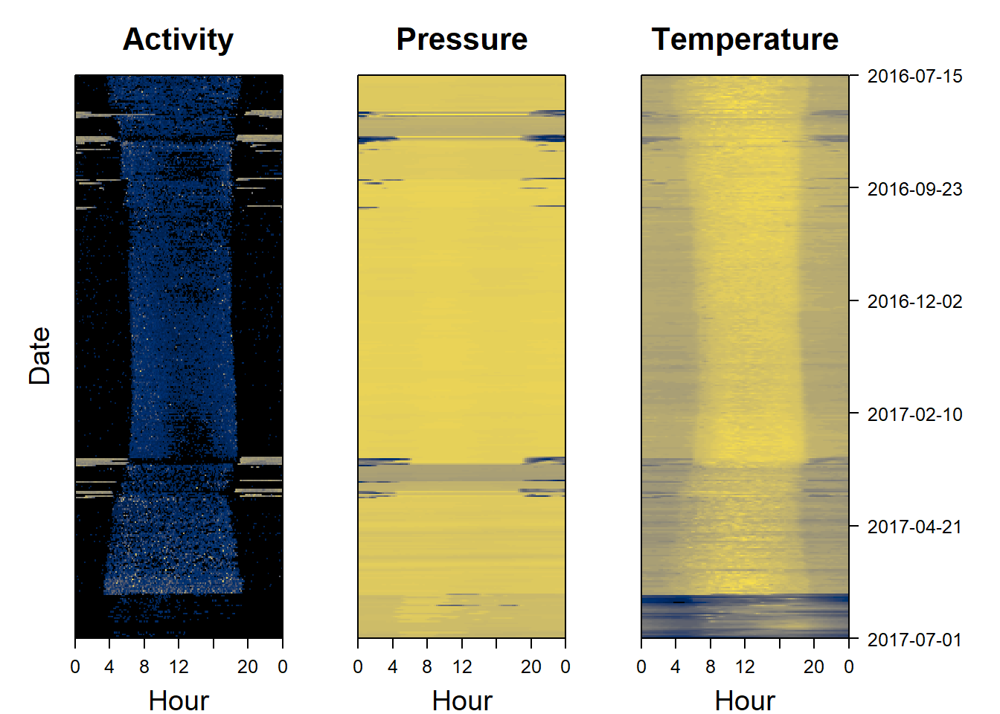

# Data Visualisation {#dataviz}


## Formatting data

> **Never forget to get rid of periods where ther logger is not on the bird**


``` r
# make sure the cropping period is in the correct date format
start = as.POSIXct("2016-07-01","%Y-%m-%d", tz="UTC")
end = as.POSIXct("2017-07-01","%Y-%m-%d", tz="UTC")

# Crop the data
PAM_data = create_crop(hoopoe,start,end)
```


## Quick multiplots

For a quick look at the data, it's possible to use `plot_timeseries`. The user can specify which arguments to use, using `measurements`. There's a choice between different combinations of `"pressure"`, `"light"`, `"acceleration"`, `"temperature"` and `"magnetic"`. You can add any parameters from `?plot`, here I illustrate it with `col="cornflowerblue"` and by showing how to  restrict the x-axis limits `xlim` with the date format, to zoom into the post breeding mihration period of a hoopoe


``` r
par(mar=c(3,4,0.5,0.5))
plot_timeseries(hoopoe, col="cornflowerblue",
                measurements = c("pressure", "light", "acceleration"),
                xlim=c(as.POSIXct("2016-08-20","%Y-%m-%d", tz="UTC"),
                       as.POSIXct("2016-09-01","%Y-%m-%d", tz="UTC")))
```


## Interactive timeseries

To have a better overview of the data, it is possible to create interactive `plot_interactive_timeseries()` plots which allow the user to compare different measurements recorded by the logger. These might for instance include light, temperature, pressure, activity, pitch and magnetism. 

If you are **working from Rstudio**, this bit of code should be run:


``` r
# In Rstudio, it will display in the viewer by default and use a lot of ram, and is better in html
backup_options <- options() 
options(viewer=NULL) # ensure it is viewed in internet browser
plot_interactive_timeseries(dta = PAM_data) # plot
options(backup_options) # restore previous viewer settings
```

If you are **working from base R** use this instead:

To save space here we only plot only one variable - pressure .


``` r
plot_interactive_timeseries(dta = PAM_data, to_plot = c("pressure")) 
```

```{=html}
<div class="dygraphs html-widget html-fill-item" id="htmlwidget-668e1de7a6e373f286d9" style="width:960px;height:500px;"></div>
<script type="application/json" data-for="htmlwidget-668e1de7a6e373f286d9">{"x":{"attrs":{"title":"Pressure as a function of time","xlabel":"Time","ylabel":"Pressure (hPa)","labels":["minute","V1"],"retainDateWindow":false,"axes":{"x":{"pixelsPerLabel":60,"drawAxis":true},"y":{"drawAxis":true}},"showRangeSelector":true,"dateWindow":["2016-07-15T00:00:00.000Z","2017-07-01T00:00:00.000Z"],"rangeSelectorHeight":40,"rangeSelectorPlotFillColor":" #A7B1C4","rangeSelectorPlotStrokeColor":"#808FAB","interactionModel":"Dygraph.Interaction.defaultModel","highlightCircleSize":3,"highlightSeriesBackgroundAlpha":0.5,"highlightSeriesOpts":{"strokeWidth":2},"legend":"auto","labelsDivWidth":600,"labelsShowZeroValues":true,"labelsSeparateLines":false,"hideOverlayOnMouseOut":true,"stackedGraph":false,"fillGraph":false,"fillAlpha":0.15,"stepPlot":false,"drawPoints":false,"pointSize":1,"drawGapEdgePoints":false,"connectSeparatedPoints":false,"strokeWidth":1,"strokeBorderColor":"white","colors":["#FC8D62"],"colorValue":0.5,"colorSaturation":1,"includeZero":false,"drawAxesAtZero":false,"logscale":false,"axisTickSize":3,"axisLineColor":"black","axisLineWidth":0.3,"axisLabelColor":"black","axisLabelFontSize":14,"axisLabelWidth":60,"drawGrid":true,"gridLineWidth":0.3,"rightGap":5,"digitsAfterDecimal":2,"labelsKMB":false,"labelsKMG2":false,"labelsUTC":false,"maxNumberWidth":6,"animatedZooms":false,"mobileDisableYTouch":true,"disableZoom":false},"scale":"minute","group":["2016-07-15T00:00:00Z","2016-07-15T00:05:00Z","2016-07-15T00:10:00Z","2016-07-15T00:15:00Z","2016-07-15T00:20:00Z","2016-07-15T00:25:00Z","2016-07-15T00:30:00Z","2016-07-15T00:35:00Z","2016-07-15T00:40:00Z","2016-07-15T00:45:00Z","2016-07-15T00:50:00Z","2016-07-15T00:55:00Z","2016-07-15T01:00:00Z","2016-07-15T01:05:00Z","2016-07-15T01:10:00Z","2016-07-15T01:15:00Z","2016-07-15T01:20:00Z","2016-07-15T01:25:00Z","2016-07-15T01:30:00Z","2016-07-15T01:35:00Z","2016-07-15T01:40:00Z","2016-07-15T01:45:00Z","2016-07-15T01:50:00Z","2016-07-15T01:55:00Z","2016-07-15T02:00:00Z","2016-07-15T02:05:00Z","2016-07-15T02:10:00Z","2016-07-15T02:15:00Z","2016-07-15T02:20:00Z","2016-07-15T02:25:00Z","2016-07-15T02:30:00Z","2016-07-15T02:35:00Z","2016-07-15T02:40:00Z","2016-07-15T02:45:00Z","2016-07-15T02:50:00Z","2016-07-15T02:55:00Z","2016-07-15T03:00:00Z","2016-07-15T03:05:00Z","2016-07-15T03:10:00Z","2016-07-15T03:15:00Z","2016-07-15T03:20:00Z","2016-07-15T03:25:00Z","2016-07-15T03:30:00Z","2016-07-15T03:35:00Z","2016-07-15T03:40:00Z","2016-07-15T03:45:00Z","2016-07-15T03:50:00Z","2016-07-15T03:55:00Z","2016-07-15T04:00:00Z","2016-07-15T04:05:00Z","2016-07-15T04:10:00Z","2016-07-15T04:15:00Z","2016-07-15T04:20:00Z","2016-07-15T04:25:00Z","2016-07-15T04:30:00Z","2016-07-15T04:35:00Z","2016-07-15T04:40:00Z","2016-07-15T04:45:00Z","2016-07-15T04:50:00Z","2016-07-15T04:55:00Z","2016-07-15T05:00:00Z","2016-07-15T05:05:00Z","2016-07-15T05:10:00Z","2016-07-15T05:15:00Z","2016-07-15T05:20:00Z","2016-07-15T05:25:00Z","2016-07-15T05:30:00Z","2016-07-15T05:35:00Z","2016-07-15T05:40:00Z","2016-07-15T05:45:00Z","2016-07-15T05:50:00Z","2016-07-15T05:55:00Z","2016-07-15T06:00:00Z","2016-07-15T06:05:00Z","2016-07-15T06:10:00Z","2016-07-15T06:15:00Z","2016-07-15T06:20:00Z","2016-07-15T06:25:00Z","2016-07-15T06:30:00Z","2016-07-15T06:35:00Z","2016-07-15T06:40:00Z","2016-07-15T06:45:00Z","2016-07-15T06:50:00Z","2016-07-15T06:55:00Z","2016-07-15T07:00:00Z","2016-07-15T07:05:00Z","2016-07-15T07:10:00Z","2016-07-15T07:15:00Z","2016-07-15T07:20:00Z","2016-07-15T07:25:00Z","2016-07-15T07:30:00Z","2016-07-15T07:35:00Z","2016-07-15T07:40:00Z","2016-07-15T07:45:00Z","2016-07-15T07:50:00Z","2016-07-15T07:55:00Z","2016-07-15T08:00:00Z","2016-07-15T08:05:00Z","2016-07-15T08:10:00Z","2016-07-15T08:15:00Z","2016-07-15T08:20:00Z","2016-07-15T08:25:00Z","2016-07-15T08:30:00Z","2016-07-15T08:35:00Z","2016-07-15T08:40:00Z","2016-07-15T08:45:00Z","2016-07-15T08:50:00Z","2016-07-15T08:55:00Z","2016-07-15T09:00:00Z","2016-07-15T09:05:00Z","2016-07-15T09:10:00Z","2016-07-15T09:15:00Z","2016-07-15T09:20:00Z","2016-07-15T09:25:00Z","2016-07-15T09:30:00Z","2016-07-15T09:35:00Z","2016-07-15T09:40:00Z","2016-07-15T09:45:00Z","2016-07-15T09:50:00Z","2016-07-15T09:55:00Z","2016-07-15T10:00:00Z","2016-07-15T10:05:00Z","2016-07-15T10:10:00Z","2016-07-15T10:15:00Z","2016-07-15T10:20:00Z","2016-07-15T10:25:00Z","2016-07-15T10:30:00Z","2016-07-15T10:35:00Z","2016-07-15T10:40:00Z","2016-07-15T10:45:00Z","2016-07-15T10:50:00Z","2016-07-15T10:55:00Z","2016-07-15T11:00:00Z","2016-07-15T11:05:00Z","2016-07-15T11:10:00Z","2016-07-15T11:15:00Z","2016-07-15T11:20:00Z","2016-07-15T11:25:00Z","2016-07-15T11:30:00Z","2016-07-15T11:35:00Z","2016-07-15T11:40:00Z","2016-07-15T11:45:00Z","2016-07-15T11:50:00Z","2016-07-15T11:55:00Z","2016-07-15T12:00:00Z","2016-07-15T12:05:00Z","2016-07-15T12:10:00Z","2016-07-15T12:15:00Z","2016-07-15T12:20:00Z","2016-07-15T12:25:00Z","2016-07-15T12:30:00Z","2016-07-15T12:35:00Z","2016-07-15T12:40:00Z","2016-07-15T12:45:00Z","2016-07-15T12:50:00Z","2016-07-15T12:55:00Z","2016-07-15T13:00:00Z","2016-07-15T13:05:00Z","2016-07-15T13:10:00Z","2016-07-15T13:15:00Z","2016-07-15T13:20:00Z","2016-07-15T13:25:00Z","2016-07-15T13:30:00Z","2016-07-15T13:35:00Z","2016-07-15T13:40:00Z","2016-07-15T13:45:00Z","2016-07-15T13:50:00Z","2016-07-15T13:55:00Z","2016-07-15T14:00:00Z","2016-07-15T14:05:00Z","2016-07-15T14:10:00Z","2016-07-15T14:15:00Z","2016-07-15T14:20:00Z","2016-07-15T14:25:00Z","2016-07-15T14:30:00Z","2016-07-15T14:35:00Z","2016-07-15T14:40:00Z","2016-07-15T14:45:00Z","2016-07-15T14:50:00Z","2016-07-15T14:55:00Z","2016-07-15T15:00:00Z","2016-07-15T15:05:00Z","2016-07-15T15:10:00Z","2016-07-15T15:15:00Z","2016-07-15T15:20:00Z","2016-07-15T15:25:00Z","2016-07-15T15:30:00Z","2016-07-15T15:35:00Z","2016-07-15T15:40:00Z","2016-07-15T15:45:00Z","2016-07-15T15:50:00Z","2016-07-15T15:55:00Z","2016-07-15T16:00:00Z","2016-07-15T16:05:00Z","2016-07-15T16:10:00Z","2016-07-15T16:15:00Z","2016-07-15T16:20:00Z","2016-07-15T16:25:00Z","2016-07-15T16:30:00Z","2016-07-15T16:35:00Z","2016-07-15T16:40:00Z","2016-07-15T16:45:00Z","2016-07-15T16:50:00Z","2016-07-15T16:55:00Z","2016-07-15T17:00:00Z","2016-07-15T17:05:00Z","2016-07-15T17:10:00Z","2016-07-15T17:15:00Z","2016-07-15T17:20:00Z","2016-07-15T17:25:00Z","2016-07-15T17:30:00Z","2016-07-15T17:35:00Z","2016-07-15T17:40:00Z","2016-07-15T17:45:00Z","2016-07-15T17:50:00Z","2016-07-15T17:55:00Z","2016-07-15T18:00:00Z","2016-07-15T18:05:00Z","2016-07-15T18:10:00Z","2016-07-15T18:15:00Z","2016-07-15T18:20:00Z","2016-07-15T18:25:00Z","2016-07-15T18:30:00Z","2016-07-15T18:35:00Z","2016-07-15T18:40:00Z","2016-07-15T18:45:00Z","2016-07-15T18:50:00Z","2016-07-15T18:55:00Z","2016-07-15T19:00:00Z","2016-07-15T19:05:00Z","2016-07-15T19:10:00Z","2016-07-15T19:15:00Z","2016-07-15T19:20:00Z","2016-07-15T19:25:00Z","2016-07-15T19:30:00Z","2016-07-15T19:35:00Z","2016-07-15T19:40:00Z","2016-07-15T19:45:00Z","2016-07-15T19:50:00Z","2016-07-15T19:55:00Z","2016-07-15T20:00:00Z","2016-07-15T20:05:00Z","2016-07-15T20:10:00Z","2016-07-15T20:15:00Z","2016-07-15T20:20:00Z","2016-07-15T20:25:00Z","2016-07-15T20:30:00Z","2016-07-15T20:35:00Z","2016-07-15T20:40:00Z","2016-07-15T20:45:00Z","2016-07-15T20:50:00Z","2016-07-15T20:55:00Z","2016-07-15T21:00:00Z","2016-07-15T21:05:00Z","2016-07-15T21:10:00Z","2016-07-15T21:15:00Z","2016-07-15T21:20:00Z","2016-07-15T21:25:00Z","2016-07-15T21:30:00Z","2016-07-15T21:35:00Z","2016-07-15T21:40:00Z","2016-07-15T21:45:00Z","2016-07-15T21:50:00Z","2016-07-15T21:55:00Z","2016-07-15T22:00:00Z","2016-07-15T22:05:00Z","2016-07-15T22:10:00Z","2016-07-15T22:15:00Z","2016-07-15T22:20:00Z","2016-07-15T22:25:00Z","2016-07-15T22:30:00Z","2016-07-15T22:35:00Z","2016-07-15T22:40:00Z","2016-07-15T22:45:00Z","2016-07-15T22:50:00Z","2016-07-15T22:55:00Z","2016-07-15T23:00:00Z","2016-07-15T23:05:00Z","2016-07-15T23:10:00Z","2016-07-15T23:15:00Z","2016-07-15T23:20:00Z","2016-07-15T23:25:00Z","2016-07-15T23:30:00Z","2016-07-15T23:35:00Z","2016-07-15T23:40:00Z","2016-07-15T23:45:00Z","2016-07-15T23:50:00Z","2016-07-15T23:55:00Z","2016-07-16T00:00:00Z","2016-07-16T00:05:00Z","2016-07-16T00:10:00Z","2016-07-16T00:15:00Z","2016-07-16T00:20:00Z","2016-07-16T00:25:00Z","2016-07-16T00:30:00Z","2016-07-16T00:35:00Z","2016-07-16T00:40:00Z","2016-07-16T00:45:00Z","2016-07-16T00:50:00Z","2016-07-16T00:55:00Z","2016-07-16T01:00:00Z","2016-07-16T01:05:00Z","2016-07-16T01:10:00Z","2016-07-16T01:15:00Z","2016-07-16T01:20:00Z","2016-07-16T01:25:00Z","2016-07-16T01:30:00Z","2016-07-16T01:35:00Z","2016-07-16T01:40:00Z","2016-07-16T01:45:00Z","2016-07-16T01:50:00Z","2016-07-16T01:55:00Z","2016-07-16T02:00:00Z","2016-07-16T02:05:00Z","2016-07-16T02:10:00Z","2016-07-16T02:15:00Z","2016-07-16T02:20:00Z","2016-07-16T02:25:00Z","2016-07-16T02:30:00Z","2016-07-16T02:35:00Z","2016-07-16T02:40:00Z","2016-07-16T02:45:00Z","2016-07-16T02:50:00Z","2016-07-16T02:55:00Z","2016-07-16T03:00:00Z","2016-07-16T03:05:00Z","2016-07-16T03:10:00Z","2016-07-16T03:15:00Z","2016-07-16T03:20:00Z","2016-07-16T03:25:00Z","2016-07-16T03:30:00Z","2016-07-16T03:35:00Z","2016-07-16T03:40:00Z","2016-07-16T03:45:00Z","2016-07-16T03:50:00Z","2016-07-16T03:55:00Z","2016-07-16T04:00:00Z","2016-07-16T04:05:00Z","2016-07-16T04:10:00Z","2016-07-16T04:15:00Z","2016-07-16T04:20:00Z","2016-07-16T04:25:00Z","2016-07-16T04:30:00Z","2016-07-16T04:35:00Z","2016-07-16T04:40:00Z","2016-07-16T04:45:00Z","2016-07-16T04:50:00Z","2016-07-16T04:55:00Z","2016-07-16T05:00:00Z","2016-07-16T05:05:00Z","2016-07-16T05:10:00Z","2016-07-16T05:15:00Z","2016-07-16T05:20:00Z","2016-07-16T05:25:00Z","2016-07-16T05:30:00Z","2016-07-16T05:35:00Z","2016-07-16T05:40:00Z","2016-07-16T05:45:00Z","2016-07-16T05:50:00Z","2016-07-16T05:55:00Z","2016-07-16T06:00:00Z","2016-07-16T06:05:00Z","2016-07-16T06:10:00Z","2016-07-16T06:15:00Z","2016-07-16T06:20:00Z","2016-07-16T06:25:00Z","2016-07-16T06:30:00Z","2016-07-16T06:35:00Z","2016-07-16T06:40:00Z","2016-07-16T06:45:00Z","2016-07-16T06:50:00Z","2016-07-16T06:55:00Z","2016-07-16T07:00:00Z","2016-07-16T07:05:00Z","2016-07-16T07:10:00Z","2016-07-16T07:15:00Z","2016-07-16T07:20:00Z","2016-07-16T07:25:00Z","2016-07-16T07:30:00Z","2016-07-16T07:35:00Z","2016-07-16T07:40:00Z","2016-07-16T07:45:00Z","2016-07-16T07:50:00Z","2016-07-16T07:55:00Z","2016-07-16T08:00:00Z","2016-07-16T08:05:00Z","2016-07-16T08:10:00Z","2016-07-16T08:15:00Z","2016-07-16T08:20:00Z","2016-07-16T08:25:00Z","2016-07-16T08:30:00Z","2016-07-16T08:35:00Z","2016-07-16T08:40:00Z","2016-07-16T08:45:00Z","2016-07-16T08:50:00Z","2016-07-16T08:55:00Z","2016-07-16T09:00:00Z","2016-07-16T09:05:00Z","2016-07-16T09:10:00Z","2016-07-16T09:15:00Z","2016-07-16T09:20:00Z","2016-07-16T09:25:00Z","2016-07-16T09:30:00Z","2016-07-16T09:35:00Z","2016-07-16T09:40:00Z","2016-07-16T09:45:00Z","2016-07-16T09:50:00Z","2016-07-16T09:55:00Z","2016-07-16T10:00:00Z","2016-07-16T10:05:00Z","2016-07-16T10:10:00Z","2016-07-16T10:15:00Z","2016-07-16T10:20:00Z","2016-07-16T10:25:00Z","2016-07-16T10:30:00Z","2016-07-16T10:35:00Z","2016-07-16T10:40:00Z","2016-07-16T10:45:00Z","2016-07-16T10:50:00Z","2016-07-16T10:55:00Z","2016-07-16T11:00:00Z","2016-07-16T11:05:00Z","2016-07-16T11:10:00Z","2016-07-16T11:15:00Z","2016-07-16T11:20:00Z","2016-07-16T11:25:00Z","2016-07-16T11:30:00Z","2016-07-16T11:35:00Z","2016-07-16T11:40:00Z","2016-07-16T11:45:00Z","2016-07-16T11:50:00Z","2016-07-16T11:55:00Z","2016-07-16T12:00:00Z","2016-07-16T12:05:00Z","2016-07-16T12:10:00Z","2016-07-16T12:15:00Z","2016-07-16T12:20:00Z","2016-07-16T12:25:00Z","2016-07-16T12:30:00Z","2016-07-16T12:35:00Z","2016-07-16T12:40:00Z","2016-07-16T12:45:00Z","2016-07-16T12:50:00Z","2016-07-16T12:55:00Z","2016-07-16T13:00:00Z","2016-07-16T13:05:00Z","2016-07-16T13:10:00Z","2016-07-16T13:15:00Z","2016-07-16T13:20:00Z","2016-07-16T13:25:00Z","2016-07-16T13:30:00Z","2016-07-16T13:35:00Z","2016-07-16T13:40:00Z","2016-07-16T13:45:00Z","2016-07-16T13:50:00Z","2016-07-16T13:55:00Z","2016-07-16T14:00:00Z","2016-07-16T14:05:00Z","2016-07-16T14:10:00Z","2016-07-16T14:15:00Z","2016-07-16T14:20:00Z","2016-07-16T14:25:00Z","2016-07-16T14:30:00Z","2016-07-16T14:35:00Z","2016-07-16T14:40:00Z","2016-07-16T14:45:00Z","2016-07-16T14:50:00Z","2016-07-16T14:55:00Z","2016-07-16T15:00:00Z","2016-07-16T15:05:00Z","2016-07-16T15:10:00Z","2016-07-16T15:15:00Z","2016-07-16T15:20:00Z","2016-07-16T15:25:00Z","2016-07-16T15:30:00Z","2016-07-16T15:35:00Z","2016-07-16T15:40:00Z","2016-07-16T15:45:00Z","2016-07-16T15:50:00Z","2016-07-16T15:55:00Z","2016-07-16T16:00:00Z","2016-07-16T16:05:00Z","2016-07-16T16:10:00Z","2016-07-16T16:15:00Z","2016-07-16T16:20:00Z","2016-07-16T16:25:00Z","2016-07-16T16:30:00Z","2016-07-16T16:35:00Z","2016-07-16T16:40:00Z","2016-07-16T16:45:00Z","2016-07-16T16:50:00Z","2016-07-16T16:55:00Z","2016-07-16T17:00:00Z","2016-07-16T17:05:00Z","2016-07-16T17:10:00Z","2016-07-16T17:15:00Z","2016-07-16T17:20:00Z","2016-07-16T17:25:00Z","2016-07-16T17:30:00Z","2016-07-16T17:35:00Z","2016-07-16T17:40:00Z","2016-07-16T17:45:00Z","2016-07-16T17:50:00Z","2016-07-16T17:55:00Z","2016-07-16T18:00:00Z","2016-07-16T18:05:00Z","2016-07-16T18:10:00Z","2016-07-16T18:15:00Z","2016-07-16T18:20:00Z","2016-07-16T18:25:00Z","2016-07-16T18:30:00Z","2016-07-16T18:35:00Z","2016-07-16T18:40:00Z","2016-07-16T18:45:00Z","2016-07-16T18:50:00Z","2016-07-16T18:55:00Z","2016-07-16T19:00:00Z","2016-07-16T19:05:00Z","2016-07-16T19:10:00Z","2016-07-16T19:15:00Z","2016-07-16T19:20:00Z","2016-07-16T19:25:00Z","2016-07-16T19:30:00Z","2016-07-16T19:35:00Z","2016-07-16T19:40:00Z","2016-07-16T19:45:00Z","2016-07-16T19:50:00Z","2016-07-16T19:55:00Z","2016-07-16T20:00:00Z","2016-07-16T20:05:00Z","2016-07-16T20:10:00Z","2016-07-16T20:15:00Z","2016-07-16T20:20:00Z","2016-07-16T20:25:00Z","2016-07-16T20:30:00Z","2016-07-16T20:35:00Z","2016-07-16T20:40:00Z","2016-07-16T20:45:00Z","2016-07-16T20:50:00Z","2016-07-16T20:55:00Z","2016-07-16T21:00:00Z","2016-07-16T21:05:00Z","2016-07-16T21:10:00Z","2016-07-16T21:15:00Z","2016-07-16T21:20:00Z","2016-07-16T21:25:00Z","2016-07-16T21:30:00Z","2016-07-16T21:35:00Z","2016-07-16T21:40:00Z","2016-07-16T21:45:00Z","2016-07-16T21:50:00Z","2016-07-16T21:55:00Z","2016-07-16T22:00:00Z","2016-07-16T22:05:00Z","2016-07-16T22:10:00Z","2016-07-16T22:15:00Z","2016-07-16T22:20:00Z","2016-07-16T22:25:00Z","2016-07-16T22:30:00Z","2016-07-16T22:35:00Z","2016-07-16T22:40:00Z","2016-07-16T22:45:00Z","2016-07-16T22:50:00Z","2016-07-16T22:55:00Z","2016-07-16T23:00:00Z","2016-07-16T23:05:00Z","2016-07-16T23:10:00Z","2016-07-16T23:15:00Z","2016-07-16T23:20:00Z","2016-07-16T23:25:00Z","2016-07-16T23:30:00Z","2016-07-16T23:35:00Z","2016-07-16T23:40:00Z","2016-07-16T23:45:00Z","2016-07-16T23:50:00Z","2016-07-16T23:55:00Z","2016-07-17T00:00:00Z","2016-07-17T00:05:00Z","2016-07-17T00:10:00Z","2016-07-17T00:15:00Z","2016-07-17T00:20:00Z","2016-07-17T00:25:00Z","2016-07-17T00:30:00Z","2016-07-17T00:35:00Z","2016-07-17T00:40:00Z","2016-07-17T00:45:00Z","2016-07-17T00:50:00Z","2016-07-17T00:55:00Z","2016-07-17T01:00:00Z","2016-07-17T01:05:00Z","2016-07-17T01:10:00Z","2016-07-17T01:15:00Z","2016-07-17T01:20:00Z","2016-07-17T01:25:00Z","2016-07-17T01:30:00Z","2016-07-17T01:35:00Z","2016-07-17T01:40:00Z","2016-07-17T01:45:00Z","2016-07-17T01:50:00Z","2016-07-17T01:55:00Z","2016-07-17T02:00:00Z","2016-07-17T02:05:00Z","2016-07-17T02:10:00Z","2016-07-17T02:15:00Z","2016-07-17T02:20:00Z","2016-07-17T02:25:00Z","2016-07-17T02:30:00Z","2016-07-17T02:35:00Z","2016-07-17T02:40:00Z","2016-07-17T02:45:00Z","2016-07-17T02:50:00Z","2016-07-17T02:55:00Z","2016-07-17T03:00:00Z","2016-07-17T03:05:00Z","2016-07-17T03:10:00Z","2016-07-17T03:15:00Z","2016-07-17T03:20:00Z","2016-07-17T03:25:00Z","2016-07-17T03:30:00Z","2016-07-17T03:35:00Z","2016-07-17T03:40:00Z","2016-07-17T03:45:00Z","2016-07-17T03:50:00Z","2016-07-17T03:55:00Z","2016-07-17T04:00:00Z","2016-07-17T04:05:00Z","2016-07-17T04:10:00Z","2016-07-17T04:15:00Z","2016-07-17T04:20:00Z","2016-07-17T04:25:00Z","2016-07-17T04:30:00Z","2016-07-17T04:35:00Z","2016-07-17T04:40:00Z","2016-07-17T04:45:00Z","2016-07-17T04:50:00Z","2016-07-17T04:55:00Z","2016-07-17T05:00:00Z","2016-07-17T05:05:00Z","2016-07-17T05:10:00Z","2016-07-17T05:15:00Z","2016-07-17T05:20:00Z","2016-07-17T05:25:00Z","2016-07-17T05:30:00Z","2016-07-17T05:35:00Z","2016-07-17T05:40:00Z","2016-07-17T05:45:00Z","2016-07-17T05:50:00Z","2016-07-17T05:55:00Z","2016-07-17T06:00:00Z","2016-07-17T06:05:00Z","2016-07-17T06:10:00Z","2016-07-17T06:15:00Z","2016-07-17T06:20:00Z","2016-07-17T06:25:00Z","2016-07-17T06:30:00Z","2016-07-17T06:35:00Z","2016-07-17T06:40:00Z","2016-07-17T06:45:00Z","2016-07-17T06:50:00Z","2016-07-17T06:55:00Z","2016-07-17T07:00:00Z","2016-07-17T07:05:00Z","2016-07-17T07:10:00Z","2016-07-17T07:15:00Z","2016-07-17T07:20:00Z","2016-07-17T07:25:00Z","2016-07-17T07:30:00Z","2016-07-17T07:35:00Z","2016-07-17T07:40:00Z","2016-07-17T07:45:00Z","2016-07-17T07:50:00Z","2016-07-17T07:55:00Z","2016-07-17T08:00:00Z","2016-07-17T08:05:00Z","2016-07-17T08:10:00Z","2016-07-17T08:15:00Z","2016-07-17T08:20:00Z","2016-07-17T08:25:00Z","2016-07-17T08:30:00Z","2016-07-17T08:35:00Z","2016-07-17T08:40:00Z","2016-07-17T08:45:00Z","2016-07-17T08:50:00Z","2016-07-17T08:55:00Z","2016-07-17T09:00:00Z","2016-07-17T09:05:00Z","2016-07-17T09:10:00Z","2016-07-17T09:15:00Z","2016-07-17T09:20:00Z","2016-07-17T09:25:00Z","2016-07-17T09:30:00Z","2016-07-17T09:35:00Z","2016-07-17T09:40:00Z","2016-07-17T09:45:00Z","2016-07-17T09:50:00Z","2016-07-17T09:55:00Z","2016-07-17T10:00:00Z","2016-07-17T10:05:00Z","2016-07-17T10:10:00Z","2016-07-17T10:15:00Z","2016-07-17T10:20:00Z","2016-07-17T10:25:00Z","2016-07-17T10:30:00Z","2016-07-17T10:35:00Z","2016-07-17T10:40:00Z","2016-07-17T10:45:00Z","2016-07-17T10:50:00Z","2016-07-17T10:55:00Z","2016-07-17T11:00:00Z","2016-07-17T11:05:00Z","2016-07-17T11:10:00Z","2016-07-17T11:15:00Z","2016-07-17T11:20:00Z","2016-07-17T11:25:00Z","2016-07-17T11:30:00Z","2016-07-17T11:35:00Z","2016-07-17T11:40:00Z","2016-07-17T11:45:00Z","2016-07-17T11:50:00Z","2016-07-17T11:55:00Z","2016-07-17T12:00:00Z","2016-07-17T12:05:00Z","2016-07-17T12:10:00Z","2016-07-17T12:15:00Z","2016-07-17T12:20:00Z","2016-07-17T12:25:00Z","2016-07-17T12:30:00Z","2016-07-17T12:35:00Z","2016-07-17T12:40:00Z","2016-07-17T12:45:00Z","2016-07-17T12:50:00Z","2016-07-17T12:55:00Z","2016-07-17T13:00:00Z","2016-07-17T13:05:00Z","2016-07-17T13:10:00Z","2016-07-17T13:15:00Z","2016-07-17T13:20:00Z","2016-07-17T13:25:00Z","2016-07-17T13:30:00Z","2016-07-17T13:35:00Z","2016-07-17T13:40:00Z","2016-07-17T13:45:00Z","2016-07-17T13:50:00Z","2016-07-17T13:55:00Z","2016-07-17T14:00:00Z","2016-07-17T14:05:00Z","2016-07-17T14:10:00Z","2016-07-17T14:15:00Z","2016-07-17T14:20:00Z","2016-07-17T14:25:00Z","2016-07-17T14:30:00Z","2016-07-17T14:35:00Z","2016-07-17T14:40:00Z","2016-07-17T14:45:00Z","2016-07-17T14:50:00Z","2016-07-17T14:55:00Z","2016-07-17T15:00:00Z","2016-07-17T15:05:00Z","2016-07-17T15:10:00Z","2016-07-17T15:15:00Z","2016-07-17T15:20:00Z","2016-07-17T15:25:00Z","2016-07-17T15:30:00Z","2016-07-17T15:35:00Z","2016-07-17T15:40:00Z","2016-07-17T15:45:00Z","2016-07-17T15:50:00Z","2016-07-17T15:55:00Z","2016-07-17T16:00:00Z","2016-07-17T16:05:00Z","2016-07-17T16:10:00Z","2016-07-17T16:15:00Z","2016-07-17T16:20:00Z","2016-07-17T16:25:00Z","2016-07-17T16:30:00Z","2016-07-17T16:35:00Z","2016-07-17T16:40:00Z","2016-07-17T16:45:00Z","2016-07-17T16:50:00Z","2016-07-17T16:55:00Z","2016-07-17T17:00:00Z","2016-07-17T17:05:00Z","2016-07-17T17:10:00Z","2016-07-17T17:15:00Z","2016-07-17T17:20:00Z","2016-07-17T17:25:00Z","2016-07-17T17:30:00Z","2016-07-17T17:35:00Z","2016-07-17T17:40:00Z","2016-07-17T17:45:00Z","2016-07-17T17:50:00Z","2016-07-17T17:55:00Z","2016-07-17T18:00:00Z","2016-07-17T18:05:00Z","2016-07-17T18:10:00Z","2016-07-17T18:15:00Z","2016-07-17T18:20:00Z","2016-07-17T18:25:00Z","2016-07-17T18:30:00Z","2016-07-17T18:35:00Z","2016-07-17T18:40:00Z","2016-07-17T18:45:00Z","2016-07-17T18:50:00Z","2016-07-17T18:55:00Z","2016-07-17T19:00:00Z","2016-07-17T19:05:00Z","2016-07-17T19:10:00Z","2016-07-17T19:15:00Z","2016-07-17T19:20:00Z","2016-07-17T19:25:00Z","2016-07-17T19:30:00Z","2016-07-17T19:35:00Z","2016-07-17T19:40:00Z","2016-07-17T19:45:00Z","2016-07-17T19:50:00Z","2016-07-17T19:55:00Z","2016-07-17T20:00:00Z","2016-07-17T20:05:00Z","2016-07-17T20:10:00Z","2016-07-17T20:15:00Z","2016-07-17T20:20:00Z","2016-07-17T20:25:00Z","2016-07-17T20:30:00Z","2016-07-17T20:35:00Z","2016-07-17T20:40:00Z","2016-07-17T20:45:00Z","2016-07-17T20:50:00Z","2016-07-17T20:55:00Z","2016-07-17T21:00:00Z","2016-07-17T21:05:00Z","2016-07-17T21:10:00Z","2016-07-17T21:15:00Z","2016-07-17T21:20:00Z","2016-07-17T21:25:00Z","2016-07-17T21:30:00Z","2016-07-17T21:35:00Z","2016-07-17T21:40:00Z","2016-07-17T21:45:00Z","2016-07-17T21:50:00Z","2016-07-17T21:55:00Z","2016-07-17T22:00:00Z","2016-07-17T22:05:00Z","2016-07-17T22:10:00Z","2016-07-17T22:15:00Z","2016-07-17T22:20:00Z","2016-07-17T22:25:00Z","2016-07-17T22:30:00Z","2016-07-17T22:35:00Z","2016-07-17T22:40:00Z","2016-07-17T22:45:00Z","2016-07-17T22:50:00Z","2016-07-17T22:55:00Z","2016-07-17T23:00:00Z","2016-07-17T23:05:00Z","2016-07-17T23:10:00Z","2016-07-17T23:15:00Z","2016-07-17T23:20:00Z","2016-07-17T23:25:00Z","2016-07-17T23:30:00Z","2016-07-17T23:35:00Z","2016-07-17T23:40:00Z","2016-07-17T23:45:00Z","2016-07-17T23:50:00Z","2016-07-17T23:55:00Z","2016-07-18T00:00:00Z","2016-07-18T00:05:00Z","2016-07-18T00:10:00Z","2016-07-18T00:15:00Z","2016-07-18T00:20:00Z","2016-07-18T00:25:00Z","2016-07-18T00:30:00Z","2016-07-18T00:35:00Z","2016-07-18T00:40:00Z","2016-07-18T00:45:00Z","2016-07-18T00:50:00Z","2016-07-18T00:55:00Z","2016-07-18T01:00:00Z","2016-07-18T01:05:00Z","2016-07-18T01:10:00Z","2016-07-18T01:15:00Z","2016-07-18T01:20:00Z","2016-07-18T01:25:00Z","2016-07-18T01:30:00Z","2016-07-18T01:35:00Z","2016-07-18T01:40:00Z","2016-07-18T01:45:00Z","2016-07-18T01:50:00Z","2016-07-18T01:55:00Z","2016-07-18T02:00:00Z","2016-07-18T02:05:00Z","2016-07-18T02:10:00Z","2016-07-18T02:15:00Z","2016-07-18T02:20:00Z","2016-07-18T02:25:00Z","2016-07-18T02:30:00Z","2016-07-18T02:35:00Z","2016-07-18T02:40:00Z","2016-07-18T02:45:00Z","2016-07-18T02:50:00Z","2016-07-18T02:55:00Z","2016-07-18T03:00:00Z","2016-07-18T03:05:00Z","2016-07-18T03:10:00Z","2016-07-18T03:15:00Z","2016-07-18T03:20:00Z","2016-07-18T03:25:00Z","2016-07-18T03:30:00Z","2016-07-18T03:35:00Z","2016-07-18T03:40:00Z","2016-07-18T03:45:00Z","2016-07-18T03:50:00Z","2016-07-18T03:55:00Z","2016-07-18T04:00:00Z","2016-07-18T04:05:00Z","2016-07-18T04:10:00Z","2016-07-18T04:15:00Z","2016-07-18T04:20:00Z","2016-07-18T04:25:00Z","2016-07-18T04:30:00Z","2016-07-18T04:35:00Z","2016-07-18T04:40:00Z","2016-07-18T04:45:00Z","2016-07-18T04:50:00Z","2016-07-18T04:55:00Z","2016-07-18T05:00:00Z","2016-07-18T05:05:00Z","2016-07-18T05:10:00Z","2016-07-18T05:15:00Z","2016-07-18T05:20:00Z","2016-07-18T05:25:00Z","2016-07-18T05:30:00Z","2016-07-18T05:35:00Z","2016-07-18T05:40:00Z","2016-07-18T05:45:00Z","2016-07-18T05:50:00Z","2016-07-18T05:55:00Z","2016-07-18T06:00:00Z","2016-07-18T06:05:00Z","2016-07-18T06:10:00Z","2016-07-18T06:15:00Z","2016-07-18T06:20:00Z","2016-07-18T06:25:00Z","2016-07-18T06:30:00Z","2016-07-18T06:35:00Z","2016-07-18T06:40:00Z","2016-07-18T06:45:00Z","2016-07-18T06:50:00Z","2016-07-18T06:55:00Z","2016-07-18T07:00:00Z","2016-07-18T07:05:00Z","2016-07-18T07:10:00Z","2016-07-18T07:15:00Z","2016-07-18T07:20:00Z","2016-07-18T07:25:00Z","2016-07-18T07:30:00Z","2016-07-18T07:35:00Z","2016-07-18T07:40:00Z","2016-07-18T07:45:00Z","2016-07-18T07:50:00Z","2016-07-18T07:55:00Z","2016-07-18T08:00:00Z","2016-07-18T08:05:00Z","2016-07-18T08:10:00Z","2016-07-18T08:15:00Z","2016-07-18T08:20:00Z","2016-07-18T08:25:00Z","2016-07-18T08:30:00Z","2016-07-18T08:35:00Z","2016-07-18T08:40:00Z","2016-07-18T08:45:00Z","2016-07-18T08:50:00Z","2016-07-18T08:55:00Z","2016-07-18T09:00:00Z","2016-07-18T09:05:00Z","2016-07-18T09:10:00Z","2016-07-18T09:15:00Z","2016-07-18T09:20:00Z","2016-07-18T09:25:00Z","2016-07-18T09:30:00Z","2016-07-18T09:35:00Z","2016-07-18T09:40:00Z","2016-07-18T09:45:00Z","2016-07-18T09:50:00Z","2016-07-18T09:55:00Z","2016-07-18T10:00:00Z","2016-07-18T10:05:00Z","2016-07-18T10:10:00Z","2016-07-18T10:15:00Z","2016-07-18T10:20:00Z","2016-07-18T10:25:00Z","2016-07-18T10:30:00Z","2016-07-18T10:35:00Z","2016-07-18T10:40:00Z","2016-07-18T10:45:00Z","2016-07-18T10:50:00Z","2016-07-18T10:55:00Z","2016-07-18T11:00:00Z","2016-07-18T11:05:00Z","2016-07-18T11:10:00Z","2016-07-18T11:15:00Z","2016-07-18T11:20:00Z","2016-07-18T11:25:00Z","2016-07-18T11:30:00Z","2016-07-18T11:35:00Z","2016-07-18T11:40:00Z","2016-07-18T11:45:00Z","2016-07-18T11:50:00Z","2016-07-18T11:55:00Z","2016-07-18T12:00:00Z","2016-07-18T12:05:00Z","2016-07-18T12:10:00Z","2016-07-18T12:15:00Z","2016-07-18T12:20:00Z","2016-07-18T12:25:00Z","2016-07-18T12:30:00Z","2016-07-18T12:35:00Z","2016-07-18T12:40:00Z","2016-07-18T12:45:00Z","2016-07-18T12:50:00Z","2016-07-18T12:55:00Z","2016-07-18T13:00:00Z","2016-07-18T13:05:00Z","2016-07-18T13:10:00Z","2016-07-18T13:15:00Z","2016-07-18T13:20:00Z","2016-07-18T13:25:00Z","2016-07-18T13:30:00Z","2016-07-18T13:35:00Z","2016-07-18T13:40:00Z","2016-07-18T13:45:00Z","2016-07-18T13:50:00Z","2016-07-18T13:55:00Z","2016-07-18T14:00:00Z","2016-07-18T14:05:00Z","2016-07-18T14:10:00Z","2016-07-18T14:15:00Z","2016-07-18T14:20:00Z","2016-07-18T14:25:00Z","2016-07-18T14:30:00Z","2016-07-18T14:35:00Z","2016-07-18T14:40:00Z","2016-07-18T14:45:00Z","2016-07-18T14:50:00Z","2016-07-18T14:55:00Z","2016-07-18T15:00:00Z","2016-07-18T15:05:00Z","2016-07-18T15:10:00Z","2016-07-18T15:15:00Z","2016-07-18T15:20:00Z","2016-07-18T15:25:00Z","2016-07-18T15:30:00Z","2016-07-18T15:35:00Z","2016-07-18T15:40:00Z","2016-07-18T15:45:00Z","2016-07-18T15:50:00Z","2016-07-18T15:55:00Z","2016-07-18T16:00:00Z","2016-07-18T16:05:00Z","2016-07-18T16:10:00Z","2016-07-18T16:15:00Z","2016-07-18T16:20:00Z","2016-07-18T16:25:00Z","2016-07-18T16:30:00Z","2016-07-18T16:35:00Z","2016-07-18T16:40:00Z","2016-07-18T16:45:00Z","2016-07-18T16:50:00Z","2016-07-18T16:55:00Z","2016-07-18T17:00:00Z","2016-07-18T17:05:00Z","2016-07-18T17:10:00Z","2016-07-18T17:15:00Z","2016-07-18T17:20:00Z","2016-07-18T17:25:00Z","2016-07-18T17:30:00Z","2016-07-18T17:35:00Z","2016-07-18T17:40:00Z","2016-07-18T17:45:00Z","2016-07-18T17:50:00Z","2016-07-18T17:55:00Z","2016-07-18T18:00:00Z","2016-07-18T18:05:00Z","2016-07-18T18:10:00Z","2016-07-18T18:15:00Z","2016-07-18T18:20:00Z","2016-07-18T18:25:00Z","2016-07-18T18:30:00Z","2016-07-18T18:35:00Z","2016-07-18T18:40:00Z","2016-07-18T18:45:00Z","2016-07-18T18:50:00Z","2016-07-18T18:55:00Z","2016-07-18T19:00:00Z","2016-07-18T19:05:00Z","2016-07-18T19:10:00Z","2016-07-18T19:15:00Z","2016-07-18T19:20:00Z","2016-07-18T19:25:00Z","2016-07-18T19:30:00Z","2016-07-18T19:35:00Z","2016-07-18T19:40:00Z","2016-07-18T19:45:00Z","2016-07-18T19:50:00Z","2016-07-18T19:55:00Z","2016-07-18T20:00:00Z","2016-07-18T20:05:00Z","2016-07-18T20:10:00Z","2016-07-18T20:15:00Z","2016-07-18T20:20:00Z","2016-07-18T20:25:00Z","2016-07-18T20:30:00Z","2016-07-18T20:35:00Z","2016-07-18T20:40:00Z","2016-07-18T20:45:00Z","2016-07-18T20:50:00Z","2016-07-18T20:55:00Z","2016-07-18T21:00:00Z","2016-07-18T21:05:00Z","2016-07-18T21:10:00Z","2016-07-18T21:15:00Z","2016-07-18T21:20:00Z","2016-07-18T21:25:00Z","2016-07-18T21:30:00Z","2016-07-18T21:35:00Z","2016-07-18T21:40:00Z","2016-07-18T21:45:00Z","2016-07-18T21:50:00Z","2016-07-18T21:55:00Z","2016-07-18T22:00:00Z","2016-07-18T22:05:00Z","2016-07-18T22:10:00Z","2016-07-18T22:15:00Z","2016-07-18T22:20:00Z","2016-07-18T22:25:00Z","2016-07-18T22:30:00Z","2016-07-18T22:35:00Z","2016-07-18T22:40:00Z","2016-07-18T22:45:00Z","2016-07-18T22:50:00Z","2016-07-18T22:55:00Z","2016-07-18T23:00:00Z","2016-07-18T23:05:00Z","2016-07-18T23:10:00Z","2016-07-18T23:15:00Z","2016-07-18T23:20:00Z","2016-07-18T23:25:00Z","2016-07-18T23:30:00Z","2016-07-18T23:35:00Z","2016-07-18T23:40:00Z","2016-07-18T23:45:00Z","2016-07-18T23:50:00Z","2016-07-18T23:55:00Z","2016-07-19T00:00:00Z","2016-07-19T00:05:00Z","2016-07-19T00:10:00Z","2016-07-19T00:15:00Z","2016-07-19T00:20:00Z","2016-07-19T00:25:00Z","2016-07-19T00:30:00Z","2016-07-19T00:35:00Z","2016-07-19T00:40:00Z","2016-07-19T00:45:00Z","2016-07-19T00:50:00Z","2016-07-19T00:55:00Z","2016-07-19T01:00:00Z","2016-07-19T01:05:00Z","2016-07-19T01:10:00Z","2016-07-19T01:15:00Z","2016-07-19T01:20:00Z","2016-07-19T01:25:00Z","2016-07-19T01:30:00Z","2016-07-19T01:35:00Z","2016-07-19T01:40:00Z","2016-07-19T01:45:00Z","2016-07-19T01:50:00Z","2016-07-19T01:55:00Z","2016-07-19T02:00:00Z","2016-07-19T02:05:00Z","2016-07-19T02:10:00Z","2016-07-19T02:15:00Z","2016-07-19T02:20:00Z","2016-07-19T02:25:00Z","2016-07-19T02:30:00Z","2016-07-19T02:35:00Z","2016-07-19T02:40:00Z","2016-07-19T02:45:00Z","2016-07-19T02:50:00Z","2016-07-19T02:55:00Z","2016-07-19T03:00:00Z","2016-07-19T03:05:00Z","2016-07-19T03:10:00Z","2016-07-19T03:15:00Z","2016-07-19T03:20:00Z","2016-07-19T03:25:00Z","2016-07-19T03:30:00Z","2016-07-19T03:35:00Z","2016-07-19T03:40:00Z","2016-07-19T03:45:00Z","2016-07-19T03:50:00Z","2016-07-19T03:55:00Z","2016-07-19T04:00:00Z","2016-07-19T04:05:00Z","2016-07-19T04:10:00Z","2016-07-19T04:15:00Z","2016-07-19T04:20:00Z","2016-07-19T04:25:00Z","2016-07-19T04:30:00Z","2016-07-19T04:35:00Z","2016-07-19T04:40:00Z","2016-07-19T04:45:00Z","2016-07-19T04:50:00Z","2016-07-19T04:55:00Z","2016-07-19T05:00:00Z","2016-07-19T05:05:00Z","2016-07-19T05:10:00Z","2016-07-19T05:15:00Z","2016-07-19T05:20:00Z","2016-07-19T05:25:00Z","2016-07-19T05:30:00Z","2016-07-19T05:35:00Z","2016-07-19T05:40:00Z","2016-07-19T05:45:00Z","2016-07-19T05:50:00Z","2016-07-19T05:55:00Z","2016-07-19T06:00:00Z","2016-07-19T06:05:00Z","2016-07-19T06:10:00Z","2016-07-19T06:15:00Z","2016-07-19T06:20:00Z","2016-07-19T06:25:00Z","2016-07-19T06:30:00Z","2016-07-19T06:35:00Z","2016-07-19T06:40:00Z","2016-07-19T06:45:00Z","2016-07-19T06:50:00Z","2016-07-19T06:55:00Z","2016-07-19T07:00:00Z","2016-07-19T07:05:00Z","2016-07-19T07:10:00Z","2016-07-19T07:15:00Z","2016-07-19T07:20:00Z","2016-07-19T07:25:00Z","2016-07-19T07:30:00Z","2016-07-19T07:35:00Z","2016-07-19T07:40:00Z","2016-07-19T07:45:00Z","2016-07-19T07:50:00Z","2016-07-19T07:55:00Z","2016-07-19T08:00:00Z","2016-07-19T08:05:00Z","2016-07-19T08:10:00Z","2016-07-19T08:15:00Z","2016-07-19T08:20:00Z","2016-07-19T08:25:00Z","2016-07-19T08:30:00Z","2016-07-19T08:35:00Z","2016-07-19T08:40:00Z","2016-07-19T08:45:00Z","2016-07-19T08:50:00Z","2016-07-19T08:55:00Z","2016-07-19T09:00:00Z","2016-07-19T09:05:00Z","2016-07-19T09:10:00Z","2016-07-19T09:15:00Z","2016-07-19T09:20:00Z","2016-07-19T09:25:00Z","2016-07-19T09:30:00Z","2016-07-19T09:35:00Z","2016-07-19T09:40:00Z","2016-07-19T09:45:00Z","2016-07-19T09:50:00Z","2016-07-19T09:55:00Z","2016-07-19T10:00:00Z","2016-07-19T10:05:00Z","2016-07-19T10:10:00Z","2016-07-19T10:15:00Z","2016-07-19T10:20:00Z","2016-07-19T10:25:00Z","2016-07-19T10:30:00Z","2016-07-19T10:35:00Z","2016-07-19T10:40:00Z","2016-07-19T10:45:00Z","2016-07-19T10:50:00Z","2016-07-19T10:55:00Z","2016-07-19T11:00:00Z","2016-07-19T11:05:00Z","2016-07-19T11:10:00Z","2016-07-19T11:15:00Z","2016-07-19T11:20:00Z","2016-07-19T11:25:00Z","2016-07-19T11:30:00Z","2016-07-19T11:35:00Z","2016-07-19T11:40:00Z","2016-07-19T11:45:00Z","2016-07-19T11:50:00Z","2016-07-19T11:55:00Z","2016-07-19T12:00:00Z","2016-07-19T12:05:00Z","2016-07-19T12:10:00Z","2016-07-19T12:15:00Z","2016-07-19T12:20:00Z","2016-07-19T12:25:00Z","2016-07-19T12:30:00Z","2016-07-19T12:35:00Z","2016-07-19T12:40:00Z","2016-07-19T12:45:00Z","2016-07-19T12:50:00Z","2016-07-19T12:55:00Z","2016-07-19T13:00:00Z","2016-07-19T13:05:00Z","2016-07-19T13:10:00Z","2016-07-19T13:15:00Z","2016-07-19T13:20:00Z","2016-07-19T13:25:00Z","2016-07-19T13:30:00Z","2016-07-19T13:35:00Z","2016-07-19T13:40:00Z","2016-07-19T13:45:00Z","2016-07-19T13:50:00Z","2016-07-19T13:55:00Z","2016-07-19T14:00:00Z","2016-07-19T14:05:00Z","2016-07-19T14:10:00Z","2016-07-19T14:15:00Z","2016-07-19T14:20:00Z","2016-07-19T14:25:00Z","2016-07-19T14:30:00Z","2016-07-19T14:35:00Z","2016-07-19T14:40:00Z","2016-07-19T14:45:00Z","2016-07-19T14:50:00Z","2016-07-19T14:55:00Z","2016-07-19T15:00:00Z","2016-07-19T15:05:00Z","2016-07-19T15:10:00Z","2016-07-19T15:15:00Z","2016-07-19T15:20:00Z","2016-07-19T15:25:00Z","2016-07-19T15:30:00Z","2016-07-19T15:35:00Z","2016-07-19T15:40:00Z","2016-07-19T15:45:00Z","2016-07-19T15:50:00Z","2016-07-19T15:55:00Z","2016-07-19T16:00:00Z","2016-07-19T16:05:00Z","2016-07-19T16:10:00Z","2016-07-19T16:15:00Z","2016-07-19T16:20:00Z","2016-07-19T16:25:00Z","2016-07-19T16:30:00Z","2016-07-19T16:35:00Z","2016-07-19T16:40:00Z","2016-07-19T16:45:00Z","2016-07-19T16:50:00Z","2016-07-19T16:55:00Z","2016-07-19T17:00:00Z","2016-07-19T17:05:00Z","2016-07-19T17:10:00Z","2016-07-19T17:15:00Z","2016-07-19T17:20:00Z","2016-07-19T17:25:00Z","2016-07-19T17:30:00Z","2016-07-19T17:35:00Z","2016-07-19T17:40:00Z","2016-07-19T17:45:00Z","2016-07-19T17:50:00Z","2016-07-19T17:55:00Z","2016-07-19T18:00:00Z","2016-07-19T18:05:00Z","2016-07-19T18:10:00Z","2016-07-19T18:15:00Z","2016-07-19T18:20:00Z","2016-07-19T18:25:00Z","2016-07-19T18:30:00Z","2016-07-19T18:35:00Z","2016-07-19T18:40:00Z","2016-07-19T18:45:00Z","2016-07-19T18:50:00Z","2016-07-19T18:55:00Z","2016-07-19T19:00:00Z","2016-07-19T19:05:00Z","2016-07-19T19:10:00Z","2016-07-19T19:15:00Z","2016-07-19T19:20:00Z","2016-07-19T19:25:00Z","2016-07-19T19:30:00Z","2016-07-19T19:35:00Z","2016-07-19T19:40:00Z","2016-07-19T19:45:00Z","2016-07-19T19:50:00Z","2016-07-19T19:55:00Z","2016-07-19T20:00:00Z","2016-07-19T20:05:00Z","2016-07-19T20:10:00Z","2016-07-19T20:15:00Z","2016-07-19T20:20:00Z","2016-07-19T20:25:00Z","2016-07-19T20:30:00Z","2016-07-19T20:35:00Z","2016-07-19T20:40:00Z","2016-07-19T20:45:00Z","2016-07-19T20:50:00Z","2016-07-19T20:55:00Z","2016-07-19T21:00:00Z","2016-07-19T21:05:00Z","2016-07-19T21:10:00Z","2016-07-19T21:15:00Z","2016-07-19T21:20:00Z","2016-07-19T21:25:00Z","2016-07-19T21:30:00Z","2016-07-19T21:35:00Z","2016-07-19T21:40:00Z","2016-07-19T21:45:00Z","2016-07-19T21:50:00Z","2016-07-19T21:55:00Z","2016-07-19T22:00:00Z","2016-07-19T22:05:00Z","2016-07-19T22:10:00Z","2016-07-19T22:15:00Z","2016-07-19T22:20:00Z","2016-07-19T22:25:00Z","2016-07-19T22:30:00Z","2016-07-19T22:35:00Z","2016-07-19T22:40:00Z","2016-07-19T22:45:00Z","2016-07-19T22:50:00Z","2016-07-19T22:55:00Z","2016-07-19T23:00:00Z","2016-07-19T23:05:00Z","2016-07-19T23:10:00Z","2016-07-19T23:15:00Z","2016-07-19T23:20:00Z","2016-07-19T23:25:00Z","2016-07-19T23:30:00Z","2016-07-19T23:35:00Z","2016-07-19T23:40:00Z","2016-07-19T23:45:00Z","2016-07-19T23:50:00Z","2016-07-19T23:55:00Z","2016-07-20T00:00:00Z","2016-07-20T00:05:00Z","2016-07-20T00:10:00Z","2016-07-20T00:15:00Z","2016-07-20T00:20:00Z","2016-07-20T00:25:00Z","2016-07-20T00:30:00Z","2016-07-20T00:35:00Z","2016-07-20T00:40:00Z","2016-07-20T00:45:00Z","2016-07-20T00:50:00Z","2016-07-20T00:55:00Z","2016-07-20T01:00:00Z","2016-07-20T01:05:00Z","2016-07-20T01:10:00Z","2016-07-20T01:15:00Z","2016-07-20T01:20:00Z","2016-07-20T01:25:00Z","2016-07-20T01:30:00Z","2016-07-20T01:35:00Z","2016-07-20T01:40:00Z","2016-07-20T01:45:00Z","2016-07-20T01:50:00Z","2016-07-20T01:55:00Z","2016-07-20T02:00:00Z","2016-07-20T02:05:00Z","2016-07-20T02:10:00Z","2016-07-20T02:15:00Z","2016-07-20T02:20:00Z","2016-07-20T02:25:00Z","2016-07-20T02:30:00Z","2016-07-20T02:35:00Z","2016-07-20T02:40:00Z","2016-07-20T02:45:00Z","2016-07-20T02:50:00Z","2016-07-20T02:55:00Z","2016-07-20T03:00:00Z","2016-07-20T03:05:00Z","2016-07-20T03:10:00Z","2016-07-20T03:15:00Z","2016-07-20T03:20:00Z","2016-07-20T03:25:00Z","2016-07-20T03:30:00Z","2016-07-20T03:35:00Z","2016-07-20T03:40:00Z","2016-07-20T03:45:00Z","2016-07-20T03:50:00Z","2016-07-20T03:55:00Z","2016-07-20T04:00:00Z","2016-07-20T04:05:00Z","2016-07-20T04:10:00Z","2016-07-20T04:15:00Z","2016-07-20T04:20:00Z","2016-07-20T04:25:00Z","2016-07-20T04:30:00Z","2016-07-20T04:35:00Z","2016-07-20T04:40:00Z","2016-07-20T04:45:00Z","2016-07-20T04:50:00Z","2016-07-20T04:55:00Z","2016-07-20T05:00:00Z","2016-07-20T05:05:00Z","2016-07-20T05:10:00Z","2016-07-20T05:15:00Z","2016-07-20T05:20:00Z","2016-07-20T05:25:00Z","2016-07-20T05:30:00Z","2016-07-20T05:35:00Z","2016-07-20T05:40:00Z","2016-07-20T05:45:00Z","2016-07-20T05:50:00Z","2016-07-20T05:55:00Z","2016-07-20T06:00:00Z","2016-07-20T06:05:00Z","2016-07-20T06:10:00Z","2016-07-20T06:15:00Z","2016-07-20T06:20:00Z","2016-07-20T06:25:00Z","2016-07-20T06:30:00Z","2016-07-20T06:35:00Z","2016-07-20T06:40:00Z","2016-07-20T06:45:00Z","2016-07-20T06:50:00Z","2016-07-20T06:55:00Z","2016-07-20T07:00:00Z","2016-07-20T07:05:00Z","2016-07-20T07:10:00Z","2016-07-20T07:15:00Z","2016-07-20T07:20:00Z","2016-07-20T07:25:00Z","2016-07-20T07:30:00Z","2016-07-20T07:35:00Z","2016-07-20T07:40:00Z","2016-07-20T07:45:00Z","2016-07-20T07:50:00Z","2016-07-20T07:55:00Z","2016-07-20T08:00:00Z","2016-07-20T08:05:00Z","2016-07-20T08:10:00Z","2016-07-20T08:15:00Z","2016-07-20T08:20:00Z","2016-07-20T08:25:00Z","2016-07-20T08:30:00Z","2016-07-20T08:35:00Z","2016-07-20T08:40:00Z","2016-07-20T08:45:00Z","2016-07-20T08:50:00Z","2016-07-20T08:55:00Z","2016-07-20T09:00:00Z","2016-07-20T09:05:00Z","2016-07-20T09:10:00Z","2016-07-20T09:15:00Z","2016-07-20T09:20:00Z","2016-07-20T09:25:00Z","2016-07-20T09:30:00Z","2016-07-20T09:35:00Z","2016-07-20T09:40:00Z","2016-07-20T09:45:00Z","2016-07-20T09:50:00Z","2016-07-20T09:55:00Z","2016-07-20T10:00:00Z","2016-07-20T10:05:00Z","2016-07-20T10:10:00Z","2016-07-20T10:15:00Z","2016-07-20T10:20:00Z","2016-07-20T10:25:00Z","2016-07-20T10:30:00Z","2016-07-20T10:35:00Z","2016-07-20T10:40:00Z","2016-07-20T10:45:00Z","2016-07-20T10:50:00Z","2016-07-20T10:55:00Z","2016-07-20T11:00:00Z","2016-07-20T11:05:00Z","2016-07-20T11:10:00Z","2016-07-20T11:15:00Z","2016-07-20T11:20:00Z","2016-07-20T11:25:00Z","2016-07-20T11:30:00Z","2016-07-20T11:35:00Z","2016-07-20T11:40:00Z","2016-07-20T11:45:00Z","2016-07-20T11:50:00Z","2016-07-20T11:55:00Z","2016-07-20T12:00:00Z","2016-07-20T12:05:00Z","2016-07-20T12:10:00Z","2016-07-20T12:15:00Z","2016-07-20T12:20:00Z","2016-07-20T12:25:00Z","2016-07-20T12:30:00Z","2016-07-20T12:35:00Z","2016-07-20T12:40:00Z","2016-07-20T12:45:00Z","2016-07-20T12:50:00Z","2016-07-20T12:55:00Z","2016-07-20T13:00:00Z","2016-07-20T13:05:00Z","2016-07-20T13:10:00Z","2016-07-20T13:15:00Z","2016-07-20T13:20:00Z","2016-07-20T13:25:00Z","2016-07-20T13:30:00Z","2016-07-20T13:35:00Z","2016-07-20T13:40:00Z","2016-07-20T13:45:00Z","2016-07-20T13:50:00Z","2016-07-20T13:55:00Z","2016-07-20T14:00:00Z","2016-07-20T14:05:00Z","2016-07-20T14:10:00Z","2016-07-20T14:15:00Z","2016-07-20T14:20:00Z","2016-07-20T14:25:00Z","2016-07-20T14:30:00Z","2016-07-20T14:35:00Z","2016-07-20T14:40:00Z","2016-07-20T14:45:00Z","2016-07-20T14:50:00Z","2016-07-20T14:55:00Z","2016-07-20T15:00:00Z","2016-07-20T15:05:00Z","2016-07-20T15:10:00Z","2016-07-20T15:15:00Z","2016-07-20T15:20:00Z","2016-07-20T15:25:00Z","2016-07-20T15:30:00Z","2016-07-20T15:35:00Z","2016-07-20T15:40:00Z","2016-07-20T15:45:00Z","2016-07-20T15:50:00Z","2016-07-20T15:55:00Z","2016-07-20T16:00:00Z","2016-07-20T16:05:00Z","2016-07-20T16:10:00Z","2016-07-20T16:15:00Z","2016-07-20T16:20:00Z","2016-07-20T16:25:00Z","2016-07-20T16:30:00Z","2016-07-20T16:35:00Z","2016-07-20T16:40:00Z","2016-07-20T16:45:00Z","2016-07-20T16:50:00Z","2016-07-20T16:55:00Z","2016-07-20T17:00:00Z","2016-07-20T17:05:00Z","2016-07-20T17:10:00Z","2016-07-20T17:15:00Z","2016-07-20T17:20:00Z","2016-07-20T17:25:00Z","2016-07-20T17:30:00Z","2016-07-20T17:35:00Z","2016-07-20T17:40:00Z","2016-07-20T17:45:00Z","2016-07-20T17:50:00Z","2016-07-20T17:55:00Z","2016-07-20T18:00:00Z","2016-07-20T18:05:00Z","2016-07-20T18:10:00Z","2016-07-20T18:15:00Z","2016-07-20T18:20:00Z","2016-07-20T18:25:00Z","2016-07-20T18:30:00Z","2016-07-20T18:35:00Z","2016-07-20T18:40:00Z","2016-07-20T18:45:00Z","2016-07-20T18:50:00Z","2016-07-20T18:55:00Z","2016-07-20T19:00:00Z","2016-07-20T19:05:00Z","2016-07-20T19:10:00Z","2016-07-20T19:15:00Z","2016-07-20T19:20:00Z","2016-07-20T19:25:00Z","2016-07-20T19:30:00Z","2016-07-20T19:35:00Z","2016-07-20T19:40:00Z","2016-07-20T19:45:00Z","2016-07-20T19:50:00Z","2016-07-20T19:55:00Z","2016-07-20T20:00:00Z","2016-07-20T20:05:00Z","2016-07-20T20:10:00Z","2016-07-20T20:15:00Z","2016-07-20T20:20:00Z","2016-07-20T20:25:00Z","2016-07-20T20:30:00Z","2016-07-20T20:35:00Z","2016-07-20T20:40:00Z","2016-07-20T20:45:00Z","2016-07-20T20:50:00Z","2016-07-20T20:55:00Z","2016-07-20T21:00:00Z","2016-07-20T21:05:00Z","2016-07-20T21:10:00Z","2016-07-20T21:15:00Z","2016-07-20T21:20:00Z","2016-07-20T21:25:00Z","2016-07-20T21:30:00Z","2016-07-20T21:35:00Z","2016-07-20T21:40:00Z","2016-07-20T21:45:00Z","2016-07-20T21:50:00Z","2016-07-20T21:55:00Z","2016-07-20T22:00:00Z","2016-07-20T22:05:00Z","2016-07-20T22:10:00Z","2016-07-20T22:15:00Z","2016-07-20T22:20:00Z","2016-07-20T22:25:00Z","2016-07-20T22:30:00Z","2016-07-20T22:35:00Z","2016-07-20T22:40:00Z","2016-07-20T22:45:00Z","2016-07-20T22:50:00Z","2016-07-20T22:55:00Z","2016-07-20T23:00:00Z","2016-07-20T23:05:00Z","2016-07-20T23:10:00Z","2016-07-20T23:15:00Z","2016-07-20T23:20:00Z","2016-07-20T23:25:00Z","2016-07-20T23:30:00Z","2016-07-20T23:35:00Z","2016-07-20T23:40:00Z","2016-07-20T23:45:00Z","2016-07-20T23:50:00Z","2016-07-20T23:55:00Z","2016-07-21T00:00:00Z","2016-07-21T00:05:00Z","2016-07-21T00:10:00Z","2016-07-21T00:15:00Z","2016-07-21T00:20:00Z","2016-07-21T00:25:00Z","2016-07-21T00:30:00Z","2016-07-21T00:35:00Z","2016-07-21T00:40:00Z","2016-07-21T00:45:00Z","2016-07-21T00:50:00Z","2016-07-21T00:55:00Z","2016-07-21T01:00:00Z","2016-07-21T01:05:00Z","2016-07-21T01:10:00Z","2016-07-21T01:15:00Z","2016-07-21T01:20:00Z","2016-07-21T01:25:00Z","2016-07-21T01:30:00Z","2016-07-21T01:35:00Z","2016-07-21T01:40:00Z","2016-07-21T01:45:00Z","2016-07-21T01:50:00Z","2016-07-21T01:55:00Z","2016-07-21T02:00:00Z","2016-07-21T02:05:00Z","2016-07-21T02:10:00Z","2016-07-21T02:15:00Z","2016-07-21T02:20:00Z","2016-07-21T02:25:00Z","2016-07-21T02:30:00Z","2016-07-21T02:35:00Z","2016-07-21T02:40:00Z","2016-07-21T02:45:00Z","2016-07-21T02:50:00Z","2016-07-21T02:55:00Z","2016-07-21T03:00:00Z","2016-07-21T03:05:00Z","2016-07-21T03:10:00Z","2016-07-21T03:15:00Z","2016-07-21T03:20:00Z","2016-07-21T03:25:00Z","2016-07-21T03:30:00Z","2016-07-21T03:35:00Z","2016-07-21T03:40:00Z","2016-07-21T03:45:00Z","2016-07-21T03:50:00Z","2016-07-21T03:55:00Z","2016-07-21T04:00:00Z","2016-07-21T04:05:00Z","2016-07-21T04:10:00Z","2016-07-21T04:15:00Z","2016-07-21T04:20:00Z","2016-07-21T04:25:00Z","2016-07-21T04:30:00Z","2016-07-21T04:35:00Z","2016-07-21T04:40:00Z","2016-07-21T04:45:00Z","2016-07-21T04:50:00Z","2016-07-21T04:55:00Z","2016-07-21T05:00:00Z","2016-07-21T05:05:00Z","2016-07-21T05:10:00Z","2016-07-21T05:15:00Z","2016-07-21T05:20:00Z","2016-07-21T05:25:00Z","2016-07-21T05:30:00Z","2016-07-21T05:35:00Z","2016-07-21T05:40:00Z","2016-07-21T05:45:00Z","2016-07-21T05:50:00Z","2016-07-21T05:55:00Z","2016-07-21T06:00:00Z","2016-07-21T06:05:00Z","2016-07-21T06:10:00Z","2016-07-21T06:15:00Z","2016-07-21T06:20:00Z","2016-07-21T06:25:00Z","2016-07-21T06:30:00Z","2016-07-21T06:35:00Z","2016-07-21T06:40:00Z","2016-07-21T06:45:00Z","2016-07-21T06:50:00Z","2016-07-21T06:55:00Z","2016-07-21T07:00:00Z","2016-07-21T07:05:00Z","2016-07-21T07:10:00Z","2016-07-21T07:15:00Z","2016-07-21T07:20:00Z","2016-07-21T07:25:00Z","2016-07-21T07:30:00Z","2016-07-21T07:35:00Z","2016-07-21T07:40:00Z","2016-07-21T07:45:00Z","2016-07-21T07:50:00Z","2016-07-21T07:55:00Z","2016-07-21T08:00:00Z","2016-07-21T08:05:00Z","2016-07-21T08:10:00Z","2016-07-21T08:15:00Z","2016-07-21T08:20:00Z","2016-07-21T08:25:00Z","2016-07-21T08:30:00Z","2016-07-21T08:35:00Z","2016-07-21T08:40:00Z","2016-07-21T08:45:00Z","2016-07-21T08:50:00Z","2016-07-21T08:55:00Z","2016-07-21T09:00:00Z","2016-07-21T09:05:00Z","2016-07-21T09:10:00Z","2016-07-21T09:15:00Z","2016-07-21T09:20:00Z","2016-07-21T09:25:00Z","2016-07-21T09:30:00Z","2016-07-21T09:35:00Z","2016-07-21T09:40:00Z","2016-07-21T09:45:00Z","2016-07-21T09:50:00Z","2016-07-21T09:55:00Z","2016-07-21T10:00:00Z","2016-07-21T10:05:00Z","2016-07-21T10:10:00Z","2016-07-21T10:15:00Z","2016-07-21T10:20:00Z","2016-07-21T10:25:00Z","2016-07-21T10:30:00Z","2016-07-21T10:35:00Z","2016-07-21T10:40:00Z","2016-07-21T10:45:00Z","2016-07-21T10:50:00Z","2016-07-21T10:55:00Z","2016-07-21T11:00:00Z","2016-07-21T11:05:00Z","2016-07-21T11:10:00Z","2016-07-21T11:15:00Z","2016-07-21T11:20:00Z","2016-07-21T11:25:00Z","2016-07-21T11:30:00Z","2016-07-21T11:35:00Z","2016-07-21T11:40:00Z","2016-07-21T11:45:00Z","2016-07-21T11:50:00Z","2016-07-21T11:55:00Z","2016-07-21T12:00:00Z","2016-07-21T12:05:00Z","2016-07-21T12:10:00Z","2016-07-21T12:15:00Z","2016-07-21T12:20:00Z","2016-07-21T12:25:00Z","2016-07-21T12:30:00Z","2016-07-21T12:35:00Z","2016-07-21T12:40:00Z","2016-07-21T12:45:00Z","2016-07-21T12:50:00Z","2016-07-21T12:55:00Z","2016-07-21T13:00:00Z","2016-07-21T13:05:00Z","2016-07-21T13:10:00Z","2016-07-21T13:15:00Z","2016-07-21T13:20:00Z","2016-07-21T13:25:00Z","2016-07-21T13:30:00Z","2016-07-21T13:35:00Z","2016-07-21T13:40:00Z","2016-07-21T13:45:00Z","2016-07-21T13:50:00Z","2016-07-21T13:55:00Z","2016-07-21T14:00:00Z","2016-07-21T14:05:00Z","2016-07-21T14:10:00Z","2016-07-21T14:15:00Z","2016-07-21T14:20:00Z","2016-07-21T14:25:00Z","2016-07-21T14:30:00Z","2016-07-21T14:35:00Z","2016-07-21T14:40:00Z","2016-07-21T14:45:00Z","2016-07-21T14:50:00Z","2016-07-21T14:55:00Z","2016-07-21T15:00:00Z","2016-07-21T15:05:00Z","2016-07-21T15:10:00Z","2016-07-21T15:15:00Z","2016-07-21T15:20:00Z","2016-07-21T15:25:00Z","2016-07-21T15:30:00Z","2016-07-21T15:35:00Z","2016-07-21T15:40:00Z","2016-07-21T15:45:00Z","2016-07-21T15:50:00Z","2016-07-21T15:55:00Z","2016-07-21T16:00:00Z","2016-07-21T16:05:00Z","2016-07-21T16:10:00Z","2016-07-21T16:15:00Z","2016-07-21T16:20:00Z","2016-07-21T16:25:00Z","2016-07-21T16:30:00Z","2016-07-21T16:35:00Z","2016-07-21T16:40:00Z","2016-07-21T16:45:00Z","2016-07-21T16:50:00Z","2016-07-21T16:55:00Z","2016-07-21T17:00:00Z","2016-07-21T17:05:00Z","2016-07-21T17:10:00Z","2016-07-21T17:15:00Z","2016-07-21T17:20:00Z","2016-07-21T17:25:00Z","2016-07-21T17:30:00Z","2016-07-21T17:35:00Z","2016-07-21T17:40:00Z","2016-07-21T17:45:00Z","2016-07-21T17:50:00Z","2016-07-21T17:55:00Z","2016-07-21T18:00:00Z","2016-07-21T18:05:00Z","2016-07-21T18:10:00Z","2016-07-21T18:15:00Z","2016-07-21T18:20:00Z","2016-07-21T18:25:00Z","2016-07-21T18:30:00Z","2016-07-21T18:35:00Z","2016-07-21T18:40:00Z","2016-07-21T18:45:00Z","2016-07-21T18:50:00Z","2016-07-21T18:55:00Z","2016-07-21T19:00:00Z","2016-07-21T19:05:00Z","2016-07-21T19:10:00Z","2016-07-21T19:15:00Z","2016-07-21T19:20:00Z","2016-07-21T19:25:00Z","2016-07-21T19:30:00Z","2016-07-21T19:35:00Z","2016-07-21T19:40:00Z","2016-07-21T19:45:00Z","2016-07-21T19:50:00Z","2016-07-21T19:55:00Z","2016-07-21T20:00:00Z","2016-07-21T20:05:00Z","2016-07-21T20:10:00Z","2016-07-21T20:15:00Z","2016-07-21T20:20:00Z","2016-07-21T20:25:00Z","2016-07-21T20:30:00Z","2016-07-21T20:35:00Z","2016-07-21T20:40:00Z","2016-07-21T20:45:00Z","2016-07-21T20:50:00Z","2016-07-21T20:55:00Z","2016-07-21T21:00:00Z","2016-07-21T21:05:00Z","2016-07-21T21:10:00Z","2016-07-21T21:15:00Z","2016-07-21T21:20:00Z","2016-07-21T21:25:00Z","2016-07-21T21:30:00Z","2016-07-21T21:35:00Z","2016-07-21T21:40:00Z","2016-07-21T21:45:00Z","2016-07-21T21:50:00Z","2016-07-21T21:55:00Z","2016-07-21T22:00:00Z","2016-07-21T22:05:00Z","2016-07-21T22:10:00Z","2016-07-21T22:15:00Z","2016-07-21T22:20:00Z","2016-07-21T22:25:00Z","2016-07-21T22:30:00Z","2016-07-21T22:35:00Z","2016-07-21T22:40:00Z","2016-07-21T22:45:00Z","2016-07-21T22:50:00Z","2016-07-21T22:55:00Z","2016-07-21T23:00:00Z","2016-07-21T23:05:00Z","2016-07-21T23:10:00Z","2016-07-21T23:15:00Z","2016-07-21T23:20:00Z","2016-07-21T23:25:00Z","2016-07-21T23:30:00Z","2016-07-21T23:35:00Z","2016-07-21T23:40:00Z","2016-07-21T23:45:00Z","2016-07-21T23:50:00Z","2016-07-21T23:55:00Z","2016-07-22T00:00:00Z","2016-07-22T00:05:00Z","2016-07-22T00:10:00Z","2016-07-22T00:15:00Z","2016-07-22T00:20:00Z","2016-07-22T00:25:00Z","2016-07-22T00:30:00Z","2016-07-22T00:35:00Z","2016-07-22T00:40:00Z","2016-07-22T00:45:00Z","2016-07-22T00:50:00Z","2016-07-22T00:55:00Z","2016-07-22T01:00:00Z","2016-07-22T01:05:00Z","2016-07-22T01:10:00Z","2016-07-22T01:15:00Z","2016-07-22T01:20:00Z","2016-07-22T01:25:00Z","2016-07-22T01:30:00Z","2016-07-22T01:35:00Z","2016-07-22T01:40:00Z","2016-07-22T01:45:00Z","2016-07-22T01:50:00Z","2016-07-22T01:55:00Z","2016-07-22T02:00:00Z","2016-07-22T02:05:00Z","2016-07-22T02:10:00Z","2016-07-22T02:15:00Z","2016-07-22T02:20:00Z","2016-07-22T02:25:00Z","2016-07-22T02:30:00Z","2016-07-22T02:35:00Z","2016-07-22T02:40:00Z","2016-07-22T02:45:00Z","2016-07-22T02:50:00Z","2016-07-22T02:55:00Z","2016-07-22T03:00:00Z","2016-07-22T03:05:00Z","2016-07-22T03:10:00Z","2016-07-22T03:15:00Z","2016-07-22T03:20:00Z","2016-07-22T03:25:00Z","2016-07-22T03:30:00Z","2016-07-22T03:35:00Z","2016-07-22T03:40:00Z","2016-07-22T03:45:00Z","2016-07-22T03:50:00Z","2016-07-22T03:55:00Z","2016-07-22T04:00:00Z","2016-07-22T04:05:00Z","2016-07-22T04:10:00Z","2016-07-22T04:15:00Z","2016-07-22T04:20:00Z","2016-07-22T04:25:00Z","2016-07-22T04:30:00Z","2016-07-22T04:35:00Z","2016-07-22T04:40:00Z","2016-07-22T04:45:00Z","2016-07-22T04:50:00Z","2016-07-22T04:55:00Z","2016-07-22T05:00:00Z","2016-07-22T05:05:00Z","2016-07-22T05:10:00Z","2016-07-22T05:15:00Z","2016-07-22T05:20:00Z","2016-07-22T05:25:00Z","2016-07-22T05:30:00Z","2016-07-22T05:35:00Z","2016-07-22T05:40:00Z","2016-07-22T05:45:00Z","2016-07-22T05:50:00Z","2016-07-22T05:55:00Z","2016-07-22T06:00:00Z","2016-07-22T06:05:00Z","2016-07-22T06:10:00Z","2016-07-22T06:15:00Z","2016-07-22T06:20:00Z","2016-07-22T06:25:00Z","2016-07-22T06:30:00Z","2016-07-22T06:35:00Z","2016-07-22T06:40:00Z","2016-07-22T06:45:00Z","2016-07-22T06:50:00Z","2016-07-22T06:55:00Z","2016-07-22T07:00:00Z","2016-07-22T07:05:00Z","2016-07-22T07:10:00Z","2016-07-22T07:15:00Z","2016-07-22T07:20:00Z","2016-07-22T07:25:00Z","2016-07-22T07:30:00Z","2016-07-22T07:35:00Z","2016-07-22T07:40:00Z","2016-07-22T07:45:00Z","2016-07-22T07:50:00Z","2016-07-22T07:55:00Z","2016-07-22T08:00:00Z","2016-07-22T08:05:00Z","2016-07-22T08:10:00Z","2016-07-22T08:15:00Z","2016-07-22T08:20:00Z","2016-07-22T08:25:00Z","2016-07-22T08:30:00Z","2016-07-22T08:35:00Z","2016-07-22T08:40:00Z","2016-07-22T08:45:00Z","2016-07-22T08:50:00Z","2016-07-22T08:55:00Z","2016-07-22T09:00:00Z","2016-07-22T09:05:00Z","2016-07-22T09:10:00Z","2016-07-22T09:15:00Z","2016-07-22T09:20:00Z","2016-07-22T09:25:00Z","2016-07-22T09:30:00Z","2016-07-22T09:35:00Z","2016-07-22T09:40:00Z","2016-07-22T09:45:00Z","2016-07-22T09:50:00Z","2016-07-22T09:55:00Z","2016-07-22T10:00:00Z","2016-07-22T10:05:00Z","2016-07-22T10:10:00Z","2016-07-22T10:15:00Z","2016-07-22T10:20:00Z","2016-07-22T10:25:00Z","2016-07-22T10:30:00Z","2016-07-22T10:35:00Z","2016-07-22T10:40:00Z","2016-07-22T10:45:00Z","2016-07-22T10:50:00Z","2016-07-22T10:55:00Z","2016-07-22T11:00:00Z","2016-07-22T11:05:00Z","2016-07-22T11:10:00Z","2016-07-22T11:15:00Z","2016-07-22T11:20:00Z","2016-07-22T11:25:00Z","2016-07-22T11:30:00Z","2016-07-22T11:35:00Z","2016-07-22T11:40:00Z","2016-07-22T11:45:00Z","2016-07-22T11:50:00Z","2016-07-22T11:55:00Z","2016-07-22T12:00:00Z","2016-07-22T12:05:00Z","2016-07-22T12:10:00Z","2016-07-22T12:15:00Z","2016-07-22T12:20:00Z","2016-07-22T12:25:00Z","2016-07-22T12:30:00Z","2016-07-22T12:35:00Z","2016-07-22T12:40:00Z","2016-07-22T12:45:00Z","2016-07-22T12:50:00Z","2016-07-22T12:55:00Z","2016-07-22T13:00:00Z","2016-07-22T13:05:00Z","2016-07-22T13:10:00Z","2016-07-22T13:15:00Z","2016-07-22T13:20:00Z","2016-07-22T13:25:00Z","2016-07-22T13:30:00Z","2016-07-22T13:35:00Z","2016-07-22T13:40:00Z","2016-07-22T13:45:00Z","2016-07-22T13:50:00Z","2016-07-22T13:55:00Z","2016-07-22T14:00:00Z","2016-07-22T14:05:00Z","2016-07-22T14:10:00Z","2016-07-22T14:15:00Z","2016-07-22T14:20:00Z","2016-07-22T14:25:00Z","2016-07-22T14:30:00Z","2016-07-22T14:35:00Z","2016-07-22T14:40:00Z","2016-07-22T14:45:00Z","2016-07-22T14:50:00Z","2016-07-22T14:55:00Z","2016-07-22T15:00:00Z","2016-07-22T15:05:00Z","2016-07-22T15:10:00Z","2016-07-22T15:15:00Z","2016-07-22T15:20:00Z","2016-07-22T15:25:00Z","2016-07-22T15:30:00Z","2016-07-22T15:35:00Z","2016-07-22T15:40:00Z","2016-07-22T15:45:00Z","2016-07-22T15:50:00Z","2016-07-22T15:55:00Z","2016-07-22T16:00:00Z","2016-07-22T16:05:00Z","2016-07-22T16:10:00Z","2016-07-22T16:15:00Z","2016-07-22T16:20:00Z","2016-07-22T16:25:00Z","2016-07-22T16:30:00Z","2016-07-22T16:35:00Z","2016-07-22T16:40:00Z","2016-07-22T16:45:00Z","2016-07-22T16:50:00Z","2016-07-22T16:55:00Z","2016-07-22T17:00:00Z","2016-07-22T17:05:00Z","2016-07-22T17:10:00Z","2016-07-22T17:15:00Z","2016-07-22T17:20:00Z","2016-07-22T17:25:00Z","2016-07-22T17:30:00Z","2016-07-22T17:35:00Z","2016-07-22T17:40:00Z","2016-07-22T17:45:00Z","2016-07-22T17:50:00Z","2016-07-22T17:55:00Z","2016-07-22T18:00:00Z","2016-07-22T18:05:00Z","2016-07-22T18:10:00Z","2016-07-22T18:15:00Z","2016-07-22T18:20:00Z","2016-07-22T18:25:00Z","2016-07-22T18:30:00Z","2016-07-22T18:35:00Z","2016-07-22T18:40:00Z","2016-07-22T18:45:00Z","2016-07-22T18:50:00Z","2016-07-22T18:55:00Z","2016-07-22T19:00:00Z","2016-07-22T19:05:00Z","2016-07-22T19:10:00Z","2016-07-22T19:15:00Z","2016-07-22T19:20:00Z","2016-07-22T19:25:00Z","2016-07-22T19:30:00Z","2016-07-22T19:35:00Z","2016-07-22T19:40:00Z","2016-07-22T19:45:00Z","2016-07-22T19:50:00Z","2016-07-22T19:55:00Z","2016-07-22T20:00:00Z","2016-07-22T20:05:00Z","2016-07-22T20:10:00Z","2016-07-22T20:15:00Z","2016-07-22T20:20:00Z","2016-07-22T20:25:00Z","2016-07-22T20:30:00Z","2016-07-22T20:35:00Z","2016-07-22T20:40:00Z","2016-07-22T20:45:00Z","2016-07-22T20:50:00Z","2016-07-22T20:55:00Z","2016-07-22T21:00:00Z","2016-07-22T21:05:00Z","2016-07-22T21:10:00Z","2016-07-22T21:15:00Z","2016-07-22T21:20:00Z","2016-07-22T21:25:00Z","2016-07-22T21:30:00Z","2016-07-22T21:35:00Z","2016-07-22T21:40:00Z","2016-07-22T21:45:00Z","2016-07-22T21:50:00Z","2016-07-22T21:55:00Z","2016-07-22T22:00:00Z","2016-07-22T22:05:00Z","2016-07-22T22:10:00Z","2016-07-22T22:15:00Z","2016-07-22T22:20:00Z","2016-07-22T22:25:00Z","2016-07-22T22:30:00Z","2016-07-22T22:35:00Z","2016-07-22T22:40:00Z","2016-07-22T22:45:00Z","2016-07-22T22:50:00Z","2016-07-22T22:55:00Z","2016-07-22T23:00:00Z","2016-07-22T23:05:00Z","2016-07-22T23:10:00Z","2016-07-22T23:15:00Z","2016-07-22T23:20:00Z","2016-07-22T23:25:00Z","2016-07-22T23:30:00Z","2016-07-22T23:35:00Z","2016-07-22T23:40:00Z","2016-07-22T23:45:00Z","2016-07-22T23:50:00Z","2016-07-22T23:55:00Z","2016-07-23T00:00:00Z","2016-07-23T00:05:00Z","2016-07-23T00:10:00Z","2016-07-23T00:15:00Z","2016-07-23T00:20:00Z","2016-07-23T00:25:00Z","2016-07-23T00:30:00Z","2016-07-23T00:35:00Z","2016-07-23T00:40:00Z","2016-07-23T00:45:00Z","2016-07-23T00:50:00Z","2016-07-23T00:55:00Z","2016-07-23T01:00:00Z","2016-07-23T01:05:00Z","2016-07-23T01:10:00Z","2016-07-23T01:15:00Z","2016-07-23T01:20:00Z","2016-07-23T01:25:00Z","2016-07-23T01:30:00Z","2016-07-23T01:35:00Z","2016-07-23T01:40:00Z","2016-07-23T01:45:00Z","2016-07-23T01:50:00Z","2016-07-23T01:55:00Z","2016-07-23T02:00:00Z","2016-07-23T02:05:00Z","2016-07-23T02:10:00Z","2016-07-23T02:15:00Z","2016-07-23T02:20:00Z","2016-07-23T02:25:00Z","2016-07-23T02:30:00Z","2016-07-23T02:35:00Z","2016-07-23T02:40:00Z","2016-07-23T02:45:00Z","2016-07-23T02:50:00Z","2016-07-23T02:55:00Z","2016-07-23T03:00:00Z","2016-07-23T03:05:00Z","2016-07-23T03:10:00Z","2016-07-23T03:15:00Z","2016-07-23T03:20:00Z","2016-07-23T03:25:00Z","2016-07-23T03:30:00Z","2016-07-23T03:35:00Z","2016-07-23T03:40:00Z","2016-07-23T03:45:00Z","2016-07-23T03:50:00Z","2016-07-23T03:55:00Z","2016-07-23T04:00:00Z","2016-07-23T04:05:00Z","2016-07-23T04:10:00Z","2016-07-23T04:15:00Z","2016-07-23T04:20:00Z","2016-07-23T04:25:00Z","2016-07-23T04:30:00Z","2016-07-23T04:35:00Z","2016-07-23T04:40:00Z","2016-07-23T04:45:00Z","2016-07-23T04:50:00Z","2016-07-23T04:55:00Z","2016-07-23T05:00:00Z","2016-07-23T05:05:00Z","2016-07-23T05:10:00Z","2016-07-23T05:15:00Z","2016-07-23T05:20:00Z","2016-07-23T05:25:00Z","2016-07-23T05:30:00Z","2016-07-23T05:35:00Z","2016-07-23T05:40:00Z","2016-07-23T05:45:00Z","2016-07-23T05:50:00Z","2016-07-23T05:55:00Z","2016-07-23T06:00:00Z","2016-07-23T06:05:00Z","2016-07-23T06:10:00Z","2016-07-23T06:15:00Z","2016-07-23T06:20:00Z","2016-07-23T06:25:00Z","2016-07-23T06:30:00Z","2016-07-23T06:35:00Z","2016-07-23T06:40:00Z","2016-07-23T06:45:00Z","2016-07-23T06:50:00Z","2016-07-23T06:55:00Z","2016-07-23T07:00:00Z","2016-07-23T07:05:00Z","2016-07-23T07:10:00Z","2016-07-23T07:15:00Z","2016-07-23T07:20:00Z","2016-07-23T07:25:00Z","2016-07-23T07:30:00Z","2016-07-23T07:35:00Z","2016-07-23T07:40:00Z","2016-07-23T07:45:00Z","2016-07-23T07:50:00Z","2016-07-23T07:55:00Z","2016-07-23T08:00:00Z","2016-07-23T08:05:00Z","2016-07-23T08:10:00Z","2016-07-23T08:15:00Z","2016-07-23T08:20:00Z","2016-07-23T08:25:00Z","2016-07-23T08:30:00Z","2016-07-23T08:35:00Z","2016-07-23T08:40:00Z","2016-07-23T08:45:00Z","2016-07-23T08:50:00Z","2016-07-23T08:55:00Z","2016-07-23T09:00:00Z","2016-07-23T09:05:00Z","2016-07-23T09:10:00Z","2016-07-23T09:15:00Z","2016-07-23T09:20:00Z","2016-07-23T09:25:00Z","2016-07-23T09:30:00Z","2016-07-23T09:35:00Z","2016-07-23T09:40:00Z","2016-07-23T09:45:00Z","2016-07-23T09:50:00Z","2016-07-23T09:55:00Z","2016-07-23T10:00:00Z","2016-07-23T10:05:00Z","2016-07-23T10:10:00Z","2016-07-23T10:15:00Z","2016-07-23T10:20:00Z","2016-07-23T10:25:00Z","2016-07-23T10:30:00Z","2016-07-23T10:35:00Z","2016-07-23T10:40:00Z","2016-07-23T10:45:00Z","2016-07-23T10:50:00Z","2016-07-23T10:55:00Z","2016-07-23T11:00:00Z","2016-07-23T11:05:00Z","2016-07-23T11:10:00Z","2016-07-23T11:15:00Z","2016-07-23T11:20:00Z","2016-07-23T11:25:00Z","2016-07-23T11:30:00Z","2016-07-23T11:35:00Z","2016-07-23T11:40:00Z","2016-07-23T11:45:00Z","2016-07-23T11:50:00Z","2016-07-23T11:55:00Z","2016-07-23T12:00:00Z","2016-07-23T12:05:00Z","2016-07-23T12:10:00Z","2016-07-23T12:15:00Z","2016-07-23T12:20:00Z","2016-07-23T12:25:00Z","2016-07-23T12:30:00Z","2016-07-23T12:35:00Z","2016-07-23T12:40:00Z","2016-07-23T12:45:00Z","2016-07-23T12:50:00Z","2016-07-23T12:55:00Z","2016-07-23T13:00:00Z","2016-07-23T13:05:00Z","2016-07-23T13:10:00Z","2016-07-23T13:15:00Z","2016-07-23T13:20:00Z","2016-07-23T13:25:00Z","2016-07-23T13:30:00Z","2016-07-23T13:35:00Z","2016-07-23T13:40:00Z","2016-07-23T13:45:00Z","2016-07-23T13:50:00Z","2016-07-23T13:55:00Z","2016-07-23T14:00:00Z","2016-07-23T14:05:00Z","2016-07-23T14:10:00Z","2016-07-23T14:15:00Z","2016-07-23T14:20:00Z","2016-07-23T14:25:00Z","2016-07-23T14:30:00Z","2016-07-23T14:35:00Z","2016-07-23T14:40:00Z","2016-07-23T14:45:00Z","2016-07-23T14:50:00Z","2016-07-23T14:55:00Z","2016-07-23T15:00:00Z","2016-07-23T15:05:00Z","2016-07-23T15:10:00Z","2016-07-23T15:15:00Z","2016-07-23T15:20:00Z","2016-07-23T15:25:00Z","2016-07-23T15:30:00Z","2016-07-23T15:35:00Z","2016-07-23T15:40:00Z","2016-07-23T15:45:00Z","2016-07-23T15:50:00Z","2016-07-23T15:55:00Z","2016-07-23T16:00:00Z","2016-07-23T16:05:00Z","2016-07-23T16:10:00Z","2016-07-23T16:15:00Z","2016-07-23T16:20:00Z","2016-07-23T16:25:00Z","2016-07-23T16:30:00Z","2016-07-23T16:35:00Z","2016-07-23T16:40:00Z","2016-07-23T16:45:00Z","2016-07-23T16:50:00Z","2016-07-23T16:55:00Z","2016-07-23T17:00:00Z","2016-07-23T17:05:00Z","2016-07-23T17:10:00Z","2016-07-23T17:15:00Z","2016-07-23T17:20:00Z","2016-07-23T17:25:00Z","2016-07-23T17:30:00Z","2016-07-23T17:35:00Z","2016-07-23T17:40:00Z","2016-07-23T17:45:00Z","2016-07-23T17:50:00Z","2016-07-23T17:55:00Z","2016-07-23T18:00:00Z","2016-07-23T18:05:00Z","2016-07-23T18:10:00Z","2016-07-23T18:15:00Z","2016-07-23T18:20:00Z","2016-07-23T18:25:00Z","2016-07-23T18:30:00Z","2016-07-23T18:35:00Z","2016-07-23T18:40:00Z","2016-07-23T18:45:00Z","2016-07-23T18:50:00Z","2016-07-23T18:55:00Z","2016-07-23T19:00:00Z","2016-07-23T19:05:00Z","2016-07-23T19:10:00Z","2016-07-23T19:15:00Z","2016-07-23T19:20:00Z","2016-07-23T19:25:00Z","2016-07-23T19:30:00Z","2016-07-23T19:35:00Z","2016-07-23T19:40:00Z","2016-07-23T19:45:00Z","2016-07-23T19:50:00Z","2016-07-23T19:55:00Z","2016-07-23T20:00:00Z","2016-07-23T20:05:00Z","2016-07-23T20:10:00Z","2016-07-23T20:15:00Z","2016-07-23T20:20:00Z","2016-07-23T20:25:00Z","2016-07-23T20:30:00Z","2016-07-23T20:35:00Z","2016-07-23T20:40:00Z","2016-07-23T20:45:00Z","2016-07-23T20:50:00Z","2016-07-23T20:55:00Z","2016-07-23T21:00:00Z","2016-07-23T21:05:00Z","2016-07-23T21:10:00Z","2016-07-23T21:15:00Z","2016-07-23T21:20:00Z","2016-07-23T21:25:00Z","2016-07-23T21:30:00Z","2016-07-23T21:35:00Z","2016-07-23T21:40:00Z","2016-07-23T21:45:00Z","2016-07-23T21:50:00Z","2016-07-23T21:55:00Z","2016-07-23T22:00:00Z","2016-07-23T22:05:00Z","2016-07-23T22:10:00Z","2016-07-23T22:15:00Z","2016-07-23T22:20:00Z","2016-07-23T22:25:00Z","2016-07-23T22:30:00Z","2016-07-23T22:35:00Z","2016-07-23T22:40:00Z","2016-07-23T22:45:00Z","2016-07-23T22:50:00Z","2016-07-23T22:55:00Z","2016-07-23T23:00:00Z","2016-07-23T23:05:00Z","2016-07-23T23:10:00Z","2016-07-23T23:15:00Z","2016-07-23T23:20:00Z","2016-07-23T23:25:00Z","2016-07-23T23:30:00Z","2016-07-23T23:35:00Z","2016-07-23T23:40:00Z","2016-07-23T23:45:00Z","2016-07-23T23:50:00Z","2016-07-23T23:55:00Z","2016-07-24T00:00:00Z","2016-07-24T00:05:00Z","2016-07-24T00:10:00Z","2016-07-24T00:15:00Z","2016-07-24T00:20:00Z","2016-07-24T00:25:00Z","2016-07-24T00:30:00Z","2016-07-24T00:35:00Z","2016-07-24T00:40:00Z","2016-07-24T00:45:00Z","2016-07-24T00:50:00Z","2016-07-24T00:55:00Z","2016-07-24T01:00:00Z","2016-07-24T01:05:00Z","2016-07-24T01:10:00Z","2016-07-24T01:15:00Z","2016-07-24T01:20:00Z","2016-07-24T01:25:00Z","2016-07-24T01:30:00Z","2016-07-24T01:35:00Z","2016-07-24T01:40:00Z","2016-07-24T01:45:00Z","2016-07-24T01:50:00Z","2016-07-24T01:55:00Z","2016-07-24T02:00:00Z","2016-07-24T02:05:00Z","2016-07-24T02:10:00Z","2016-07-24T02:15:00Z","2016-07-24T02:20:00Z","2016-07-24T02:25:00Z","2016-07-24T02:30:00Z","2016-07-24T02:35:00Z","2016-07-24T02:40:00Z","2016-07-24T02:45:00Z","2016-07-24T02:50:00Z","2016-07-24T02:55:00Z","2016-07-24T03:00:00Z","2016-07-24T03:05:00Z","2016-07-24T03:10:00Z","2016-07-24T03:15:00Z","2016-07-24T03:20:00Z","2016-07-24T03:25:00Z","2016-07-24T03:30:00Z","2016-07-24T03:35:00Z","2016-07-24T03:40:00Z","2016-07-24T03:45:00Z","2016-07-24T03:50:00Z","2016-07-24T03:55:00Z","2016-07-24T04:00:00Z","2016-07-24T04:05:00Z","2016-07-24T04:10:00Z","2016-07-24T04:15:00Z","2016-07-24T04:20:00Z","2016-07-24T04:25:00Z","2016-07-24T04:30:00Z","2016-07-24T04:35:00Z","2016-07-24T04:40:00Z","2016-07-24T04:45:00Z","2016-07-24T04:50:00Z","2016-07-24T04:55:00Z","2016-07-24T05:00:00Z","2016-07-24T05:05:00Z","2016-07-24T05:10:00Z","2016-07-24T05:15:00Z","2016-07-24T05:20:00Z","2016-07-24T05:25:00Z","2016-07-24T05:30:00Z","2016-07-24T05:35:00Z","2016-07-24T05:40:00Z","2016-07-24T05:45:00Z","2016-07-24T05:50:00Z","2016-07-24T05:55:00Z","2016-07-24T06:00:00Z","2016-07-24T06:05:00Z","2016-07-24T06:10:00Z","2016-07-24T06:15:00Z","2016-07-24T06:20:00Z","2016-07-24T06:25:00Z","2016-07-24T06:30:00Z","2016-07-24T06:35:00Z","2016-07-24T06:40:00Z","2016-07-24T06:45:00Z","2016-07-24T06:50:00Z","2016-07-24T06:55:00Z","2016-07-24T07:00:00Z","2016-07-24T07:05:00Z","2016-07-24T07:10:00Z","2016-07-24T07:15:00Z","2016-07-24T07:20:00Z","2016-07-24T07:25:00Z","2016-07-24T07:30:00Z","2016-07-24T07:35:00Z","2016-07-24T07:40:00Z","2016-07-24T07:45:00Z","2016-07-24T07:50:00Z","2016-07-24T07:55:00Z","2016-07-24T08:00:00Z","2016-07-24T08:05:00Z","2016-07-24T08:10:00Z","2016-07-24T08:15:00Z","2016-07-24T08:20:00Z","2016-07-24T08:25:00Z","2016-07-24T08:30:00Z","2016-07-24T08:35:00Z","2016-07-24T08:40:00Z","2016-07-24T08:45:00Z","2016-07-24T08:50:00Z","2016-07-24T08:55:00Z","2016-07-24T09:00:00Z","2016-07-24T09:05:00Z","2016-07-24T09:10:00Z","2016-07-24T09:15:00Z","2016-07-24T09:20:00Z","2016-07-24T09:25:00Z","2016-07-24T09:30:00Z","2016-07-24T09:35:00Z","2016-07-24T09:40:00Z","2016-07-24T09:45:00Z","2016-07-24T09:50:00Z","2016-07-24T09:55:00Z","2016-07-24T10:00:00Z","2016-07-24T10:05:00Z","2016-07-24T10:10:00Z","2016-07-24T10:15:00Z","2016-07-24T10:20:00Z","2016-07-24T10:25:00Z","2016-07-24T10:30:00Z","2016-07-24T10:35:00Z","2016-07-24T10:40:00Z","2016-07-24T10:45:00Z","2016-07-24T10:50:00Z","2016-07-24T10:55:00Z","2016-07-24T11:00:00Z","2016-07-24T11:05:00Z","2016-07-24T11:10:00Z","2016-07-24T11:15:00Z","2016-07-24T11:20:00Z","2016-07-24T11:25:00Z","2016-07-24T11:30:00Z","2016-07-24T11:35:00Z","2016-07-24T11:40:00Z","2016-07-24T11:45:00Z","2016-07-24T11:50:00Z","2016-07-24T11:55:00Z","2016-07-24T12:00:00Z","2016-07-24T12:05:00Z","2016-07-24T12:10:00Z","2016-07-24T12:15:00Z","2016-07-24T12:20:00Z","2016-07-24T12:25:00Z","2016-07-24T12:30:00Z","2016-07-24T12:35:00Z","2016-07-24T12:40:00Z","2016-07-24T12:45:00Z","2016-07-24T12:50:00Z","2016-07-24T12:55:00Z","2016-07-24T13:00:00Z","2016-07-24T13:05:00Z","2016-07-24T13:10:00Z","2016-07-24T13:15:00Z","2016-07-24T13:20:00Z","2016-07-24T13:25:00Z","2016-07-24T13:30:00Z","2016-07-24T13:35:00Z","2016-07-24T13:40:00Z","2016-07-24T13:45:00Z","2016-07-24T13:50:00Z","2016-07-24T13:55:00Z","2016-07-24T14:00:00Z","2016-07-24T14:05:00Z","2016-07-24T14:10:00Z","2016-07-24T14:15:00Z","2016-07-24T14:20:00Z","2016-07-24T14:25:00Z","2016-07-24T14:30:00Z","2016-07-24T14:35:00Z","2016-07-24T14:40:00Z","2016-07-24T14:45:00Z","2016-07-24T14:50:00Z","2016-07-24T14:55:00Z","2016-07-24T15:00:00Z","2016-07-24T15:05:00Z","2016-07-24T15:10:00Z","2016-07-24T15:15:00Z","2016-07-24T15:20:00Z","2016-07-24T15:25:00Z","2016-07-24T15:30:00Z","2016-07-24T15:35:00Z","2016-07-24T15:40:00Z","2016-07-24T15:45:00Z","2016-07-24T15:50:00Z","2016-07-24T15:55:00Z","2016-07-24T16:00:00Z","2016-07-24T16:05:00Z","2016-07-24T16:10:00Z","2016-07-24T16:15:00Z","2016-07-24T16:20:00Z","2016-07-24T16:25:00Z","2016-07-24T16:30:00Z","2016-07-24T16:35:00Z","2016-07-24T16:40:00Z","2016-07-24T16:45:00Z","2016-07-24T16:50:00Z","2016-07-24T16:55:00Z","2016-07-24T17:00:00Z","2016-07-24T17:05:00Z","2016-07-24T17:10:00Z","2016-07-24T17:15:00Z","2016-07-24T17:20:00Z","2016-07-24T17:25:00Z","2016-07-24T17:30:00Z","2016-07-24T17:35:00Z","2016-07-24T17:40:00Z","2016-07-24T17:45:00Z","2016-07-24T17:50:00Z","2016-07-24T17:55:00Z","2016-07-24T18:00:00Z","2016-07-24T18:05:00Z","2016-07-24T18:10:00Z","2016-07-24T18:15:00Z","2016-07-24T18:20:00Z","2016-07-24T18:25:00Z","2016-07-24T18:30:00Z","2016-07-24T18:35:00Z","2016-07-24T18:40:00Z","2016-07-24T18:45:00Z","2016-07-24T18:50:00Z","2016-07-24T18:55:00Z","2016-07-24T19:00:00Z","2016-07-24T19:05:00Z","2016-07-24T19:10:00Z","2016-07-24T19:15:00Z","2016-07-24T19:20:00Z","2016-07-24T19:25:00Z","2016-07-24T19:30:00Z","2016-07-24T19:35:00Z","2016-07-24T19:40:00Z","2016-07-24T19:45:00Z","2016-07-24T19:50:00Z","2016-07-24T19:55:00Z","2016-07-24T20:00:00Z","2016-07-24T20:05:00Z","2016-07-24T20:10:00Z","2016-07-24T20:15:00Z","2016-07-24T20:20:00Z","2016-07-24T20:25:00Z","2016-07-24T20:30:00Z","2016-07-24T20:35:00Z","2016-07-24T20:40:00Z","2016-07-24T20:45:00Z","2016-07-24T20:50:00Z","2016-07-24T20:55:00Z","2016-07-24T21:00:00Z","2016-07-24T21:05:00Z","2016-07-24T21:10:00Z","2016-07-24T21:15:00Z","2016-07-24T21:20:00Z","2016-07-24T21:25:00Z","2016-07-24T21:30:00Z","2016-07-24T21:35:00Z","2016-07-24T21:40:00Z","2016-07-24T21:45:00Z","2016-07-24T21:50:00Z","2016-07-24T21:55:00Z","2016-07-24T22:00:00Z","2016-07-24T22:05:00Z","2016-07-24T22:10:00Z","2016-07-24T22:15:00Z","2016-07-24T22:20:00Z","2016-07-24T22:25:00Z","2016-07-24T22:30:00Z","2016-07-24T22:35:00Z","2016-07-24T22:40:00Z","2016-07-24T22:45:00Z","2016-07-24T22:50:00Z","2016-07-24T22:55:00Z","2016-07-24T23:00:00Z","2016-07-24T23:05:00Z","2016-07-24T23:10:00Z","2016-07-24T23:15:00Z","2016-07-24T23:20:00Z","2016-07-24T23:25:00Z","2016-07-24T23:30:00Z","2016-07-24T23:35:00Z","2016-07-24T23:40:00Z","2016-07-24T23:45:00Z","2016-07-24T23:50:00Z","2016-07-24T23:55:00Z","2016-07-25T00:00:00Z","2016-07-25T00:05:00Z","2016-07-25T00:10:00Z","2016-07-25T00:15:00Z","2016-07-25T00:20:00Z","2016-07-25T00:25:00Z","2016-07-25T00:30:00Z","2016-07-25T00:35:00Z","2016-07-25T00:40:00Z","2016-07-25T00:45:00Z","2016-07-25T00:50:00Z","2016-07-25T00:55:00Z","2016-07-25T01:00:00Z","2016-07-25T01:05:00Z","2016-07-25T01:10:00Z","2016-07-25T01:15:00Z","2016-07-25T01:20:00Z","2016-07-25T01:25:00Z","2016-07-25T01:30:00Z","2016-07-25T01:35:00Z","2016-07-25T01:40:00Z","2016-07-25T01:45:00Z","2016-07-25T01:50:00Z","2016-07-25T01:55:00Z","2016-07-25T02:00:00Z","2016-07-25T02:05:00Z","2016-07-25T02:10:00Z","2016-07-25T02:15:00Z","2016-07-25T02:20:00Z","2016-07-25T02:25:00Z","2016-07-25T02:30:00Z","2016-07-25T02:35:00Z","2016-07-25T02:40:00Z","2016-07-25T02:45:00Z","2016-07-25T02:50:00Z","2016-07-25T02:55:00Z","2016-07-25T03:00:00Z","2016-07-25T03:05:00Z","2016-07-25T03:10:00Z","2016-07-25T03:15:00Z","2016-07-25T03:20:00Z","2016-07-25T03:25:00Z","2016-07-25T03:30:00Z","2016-07-25T03:35:00Z","2016-07-25T03:40:00Z","2016-07-25T03:45:00Z","2016-07-25T03:50:00Z","2016-07-25T03:55:00Z","2016-07-25T04:00:00Z","2016-07-25T04:05:00Z","2016-07-25T04:10:00Z","2016-07-25T04:15:00Z","2016-07-25T04:20:00Z","2016-07-25T04:25:00Z","2016-07-25T04:30:00Z","2016-07-25T04:35:00Z","2016-07-25T04:40:00Z","2016-07-25T04:45:00Z","2016-07-25T04:50:00Z","2016-07-25T04:55:00Z","2016-07-25T05:00:00Z","2016-07-25T05:05:00Z","2016-07-25T05:10:00Z","2016-07-25T05:15:00Z","2016-07-25T05:20:00Z","2016-07-25T05:25:00Z","2016-07-25T05:30:00Z","2016-07-25T05:35:00Z","2016-07-25T05:40:00Z","2016-07-25T05:45:00Z","2016-07-25T05:50:00Z","2016-07-25T05:55:00Z","2016-07-25T06:00:00Z","2016-07-25T06:05:00Z","2016-07-25T06:10:00Z","2016-07-25T06:15:00Z","2016-07-25T06:20:00Z","2016-07-25T06:25:00Z","2016-07-25T06:30:00Z","2016-07-25T06:35:00Z","2016-07-25T06:40:00Z","2016-07-25T06:45:00Z","2016-07-25T06:50:00Z","2016-07-25T06:55:00Z","2016-07-25T07:00:00Z","2016-07-25T07:05:00Z","2016-07-25T07:10:00Z","2016-07-25T07:15:00Z","2016-07-25T07:20:00Z","2016-07-25T07:25:00Z","2016-07-25T07:30:00Z","2016-07-25T07:35:00Z","2016-07-25T07:40:00Z","2016-07-25T07:45:00Z","2016-07-25T07:50:00Z","2016-07-25T07:55:00Z","2016-07-25T08:00:00Z","2016-07-25T08:05:00Z","2016-07-25T08:10:00Z","2016-07-25T08:15:00Z","2016-07-25T08:20:00Z","2016-07-25T08:25:00Z","2016-07-25T08:30:00Z","2016-07-25T08:35:00Z","2016-07-25T08:40:00Z","2016-07-25T08:45:00Z","2016-07-25T08:50:00Z","2016-07-25T08:55:00Z","2016-07-25T09:00:00Z","2016-07-25T09:05:00Z","2016-07-25T09:10:00Z","2016-07-25T09:15:00Z","2016-07-25T09:20:00Z","2016-07-25T09:25:00Z","2016-07-25T09:30:00Z","2016-07-25T09:35:00Z","2016-07-25T09:40:00Z","2016-07-25T09:45:00Z","2016-07-25T09:50:00Z","2016-07-25T09:55:00Z","2016-07-25T10:00:00Z","2016-07-25T10:05:00Z","2016-07-25T10:10:00Z","2016-07-25T10:15:00Z","2016-07-25T10:20:00Z","2016-07-25T10:25:00Z","2016-07-25T10:30:00Z","2016-07-25T10:35:00Z","2016-07-25T10:40:00Z","2016-07-25T10:45:00Z","2016-07-25T10:50:00Z","2016-07-25T10:55:00Z","2016-07-25T11:00:00Z","2016-07-25T11:05:00Z","2016-07-25T11:10:00Z","2016-07-25T11:15:00Z","2016-07-25T11:20:00Z","2016-07-25T11:25:00Z","2016-07-25T11:30:00Z","2016-07-25T11:35:00Z","2016-07-25T11:40:00Z","2016-07-25T11:45:00Z","2016-07-25T11:50:00Z","2016-07-25T11:55:00Z","2016-07-25T12:00:00Z","2016-07-25T12:05:00Z","2016-07-25T12:10:00Z","2016-07-25T12:15:00Z","2016-07-25T12:20:00Z","2016-07-25T12:25:00Z","2016-07-25T12:30:00Z","2016-07-25T12:35:00Z","2016-07-25T12:40:00Z","2016-07-25T12:45:00Z","2016-07-25T12:50:00Z","2016-07-25T12:55:00Z","2016-07-25T13:00:00Z","2016-07-25T13:05:00Z","2016-07-25T13:10:00Z","2016-07-25T13:15:00Z","2016-07-25T13:20:00Z","2016-07-25T13:25:00Z","2016-07-25T13:30:00Z","2016-07-25T13:35:00Z","2016-07-25T13:40:00Z","2016-07-25T13:45:00Z","2016-07-25T13:50:00Z","2016-07-25T13:55:00Z","2016-07-25T14:00:00Z","2016-07-25T14:05:00Z","2016-07-25T14:10:00Z","2016-07-25T14:15:00Z","2016-07-25T14:20:00Z","2016-07-25T14:25:00Z","2016-07-25T14:30:00Z","2016-07-25T14:35:00Z","2016-07-25T14:40:00Z","2016-07-25T14:45:00Z","2016-07-25T14:50:00Z","2016-07-25T14:55:00Z","2016-07-25T15:00:00Z","2016-07-25T15:05:00Z","2016-07-25T15:10:00Z","2016-07-25T15:15:00Z","2016-07-25T15:20:00Z","2016-07-25T15:25:00Z","2016-07-25T15:30:00Z","2016-07-25T15:35:00Z","2016-07-25T15:40:00Z","2016-07-25T15:45:00Z","2016-07-25T15:50:00Z","2016-07-25T15:55:00Z","2016-07-25T16:00:00Z","2016-07-25T16:05:00Z","2016-07-25T16:10:00Z","2016-07-25T16:15:00Z","2016-07-25T16:20:00Z","2016-07-25T16:25:00Z","2016-07-25T16:30:00Z","2016-07-25T16:35:00Z","2016-07-25T16:40:00Z","2016-07-25T16:45:00Z","2016-07-25T16:50:00Z","2016-07-25T16:55:00Z","2016-07-25T17:00:00Z","2016-07-25T17:05:00Z","2016-07-25T17:10:00Z","2016-07-25T17:15:00Z","2016-07-25T17:20:00Z","2016-07-25T17:25:00Z","2016-07-25T17:30:00Z","2016-07-25T17:35:00Z","2016-07-25T17:40:00Z","2016-07-25T17:45:00Z","2016-07-25T17:50:00Z","2016-07-25T17:55:00Z","2016-07-25T18:00:00Z","2016-07-25T18:05:00Z","2016-07-25T18:10:00Z","2016-07-25T18:15:00Z","2016-07-25T18:20:00Z","2016-07-25T18:25:00Z","2016-07-25T18:30:00Z","2016-07-25T18:35:00Z","2016-07-25T18:40:00Z","2016-07-25T18:45:00Z","2016-07-25T18:50:00Z","2016-07-25T18:55:00Z","2016-07-25T19:00:00Z","2016-07-25T19:05:00Z","2016-07-25T19:10:00Z","2016-07-25T19:15:00Z","2016-07-25T19:20:00Z","2016-07-25T19:25:00Z","2016-07-25T19:30:00Z","2016-07-25T19:35:00Z","2016-07-25T19:40:00Z","2016-07-25T19:45:00Z","2016-07-25T19:50:00Z","2016-07-25T19:55:00Z","2016-07-25T20:00:00Z","2016-07-25T20:05:00Z","2016-07-25T20:10:00Z","2016-07-25T20:15:00Z","2016-07-25T20:20:00Z","2016-07-25T20:25:00Z","2016-07-25T20:30:00Z","2016-07-25T20:35:00Z","2016-07-25T20:40:00Z","2016-07-25T20:45:00Z","2016-07-25T20:50:00Z","2016-07-25T20:55:00Z","2016-07-25T21:00:00Z","2016-07-25T21:05:00Z","2016-07-25T21:10:00Z","2016-07-25T21:15:00Z","2016-07-25T21:20:00Z","2016-07-25T21:25:00Z","2016-07-25T21:30:00Z","2016-07-25T21:35:00Z","2016-07-25T21:40:00Z","2016-07-25T21:45:00Z","2016-07-25T21:50:00Z","2016-07-25T21:55:00Z","2016-07-25T22:00:00Z","2016-07-25T22:05:00Z","2016-07-25T22:10:00Z","2016-07-25T22:15:00Z","2016-07-25T22:20:00Z","2016-07-25T22:25:00Z","2016-07-25T22:30:00Z","2016-07-25T22:35:00Z","2016-07-25T22:40:00Z","2016-07-25T22:45:00Z","2016-07-25T22:50:00Z","2016-07-25T22:55:00Z","2016-07-25T23:00:00Z","2016-07-25T23:05:00Z","2016-07-25T23:10:00Z","2016-07-25T23:15:00Z","2016-07-25T23:20:00Z","2016-07-25T23:25:00Z","2016-07-25T23:30:00Z","2016-07-25T23:35:00Z","2016-07-25T23:40:00Z","2016-07-25T23:45:00Z","2016-07-25T23:50:00Z","2016-07-25T23:55:00Z","2016-07-26T00:00:00Z","2016-07-26T00:05:00Z","2016-07-26T00:10:00Z","2016-07-26T00:15:00Z","2016-07-26T00:20:00Z","2016-07-26T00:25:00Z","2016-07-26T00:30:00Z","2016-07-26T00:35:00Z","2016-07-26T00:40:00Z","2016-07-26T00:45:00Z","2016-07-26T00:50:00Z","2016-07-26T00:55:00Z","2016-07-26T01:00:00Z","2016-07-26T01:05:00Z","2016-07-26T01:10:00Z","2016-07-26T01:15:00Z","2016-07-26T01:20:00Z","2016-07-26T01:25:00Z","2016-07-26T01:30:00Z","2016-07-26T01:35:00Z","2016-07-26T01:40:00Z","2016-07-26T01:45:00Z","2016-07-26T01:50:00Z","2016-07-26T01:55:00Z","2016-07-26T02:00:00Z","2016-07-26T02:05:00Z","2016-07-26T02:10:00Z","2016-07-26T02:15:00Z","2016-07-26T02:20:00Z","2016-07-26T02:25:00Z","2016-07-26T02:30:00Z","2016-07-26T02:35:00Z","2016-07-26T02:40:00Z","2016-07-26T02:45:00Z","2016-07-26T02:50:00Z","2016-07-26T02:55:00Z","2016-07-26T03:00:00Z","2016-07-26T03:05:00Z","2016-07-26T03:10:00Z","2016-07-26T03:15:00Z","2016-07-26T03:20:00Z","2016-07-26T03:25:00Z","2016-07-26T03:30:00Z","2016-07-26T03:35:00Z","2016-07-26T03:40:00Z","2016-07-26T03:45:00Z","2016-07-26T03:50:00Z","2016-07-26T03:55:00Z","2016-07-26T04:00:00Z","2016-07-26T04:05:00Z","2016-07-26T04:10:00Z","2016-07-26T04:15:00Z","2016-07-26T04:20:00Z","2016-07-26T04:25:00Z","2016-07-26T04:30:00Z","2016-07-26T04:35:00Z","2016-07-26T04:40:00Z","2016-07-26T04:45:00Z","2016-07-26T04:50:00Z","2016-07-26T04:55:00Z","2016-07-26T05:00:00Z","2016-07-26T05:05:00Z","2016-07-26T05:10:00Z","2016-07-26T05:15:00Z","2016-07-26T05:20:00Z","2016-07-26T05:25:00Z","2016-07-26T05:30:00Z","2016-07-26T05:35:00Z","2016-07-26T05:40:00Z","2016-07-26T05:45:00Z","2016-07-26T05:50:00Z","2016-07-26T05:55:00Z","2016-07-26T06:00:00Z","2016-07-26T06:05:00Z","2016-07-26T06:10:00Z","2016-07-26T06:15:00Z","2016-07-26T06:20:00Z","2016-07-26T06:25:00Z","2016-07-26T06:30:00Z","2016-07-26T06:35:00Z","2016-07-26T06:40:00Z","2016-07-26T06:45:00Z","2016-07-26T06:50:00Z","2016-07-26T06:55:00Z","2016-07-26T07:00:00Z","2016-07-26T07:05:00Z","2016-07-26T07:10:00Z","2016-07-26T07:15:00Z","2016-07-26T07:20:00Z","2016-07-26T07:25:00Z","2016-07-26T07:30:00Z","2016-07-26T07:35:00Z","2016-07-26T07:40:00Z","2016-07-26T07:45:00Z","2016-07-26T07:50:00Z","2016-07-26T07:55:00Z","2016-07-26T08:00:00Z","2016-07-26T08:05:00Z","2016-07-26T08:10:00Z","2016-07-26T08:15:00Z","2016-07-26T08:20:00Z","2016-07-26T08:25:00Z","2016-07-26T08:30:00Z","2016-07-26T08:35:00Z","2016-07-26T08:40:00Z","2016-07-26T08:45:00Z","2016-07-26T08:50:00Z","2016-07-26T08:55:00Z","2016-07-26T09:00:00Z","2016-07-26T09:05:00Z","2016-07-26T09:10:00Z","2016-07-26T09:15:00Z","2016-07-26T09:20:00Z","2016-07-26T09:25:00Z","2016-07-26T09:30:00Z","2016-07-26T09:35:00Z","2016-07-26T09:40:00Z","2016-07-26T09:45:00Z","2016-07-26T09:50:00Z","2016-07-26T09:55:00Z","2016-07-26T10:00:00Z","2016-07-26T10:05:00Z","2016-07-26T10:10:00Z","2016-07-26T10:15:00Z","2016-07-26T10:20:00Z","2016-07-26T10:25:00Z","2016-07-26T10:30:00Z","2016-07-26T10:35:00Z","2016-07-26T10:40:00Z","2016-07-26T10:45:00Z","2016-07-26T10:50:00Z","2016-07-26T10:55:00Z","2016-07-26T11:00:00Z","2016-07-26T11:05:00Z","2016-07-26T11:10:00Z","2016-07-26T11:15:00Z","2016-07-26T11:20:00Z","2016-07-26T11:25:00Z","2016-07-26T11:30:00Z","2016-07-26T11:35:00Z","2016-07-26T11:40:00Z","2016-07-26T11:45:00Z","2016-07-26T11:50:00Z","2016-07-26T11:55:00Z","2016-07-26T12:00:00Z","2016-07-26T12:05:00Z","2016-07-26T12:10:00Z","2016-07-26T12:15:00Z","2016-07-26T12:20:00Z","2016-07-26T12:25:00Z","2016-07-26T12:30:00Z","2016-07-26T12:35:00Z","2016-07-26T12:40:00Z","2016-07-26T12:45:00Z","2016-07-26T12:50:00Z","2016-07-26T12:55:00Z","2016-07-26T13:00:00Z","2016-07-26T13:05:00Z","2016-07-26T13:10:00Z","2016-07-26T13:15:00Z","2016-07-26T13:20:00Z","2016-07-26T13:25:00Z","2016-07-26T13:30:00Z","2016-07-26T13:35:00Z","2016-07-26T13:40:00Z","2016-07-26T13:45:00Z","2016-07-26T13:50:00Z","2016-07-26T13:55:00Z","2016-07-26T14:00:00Z","2016-07-26T14:05:00Z","2016-07-26T14:10:00Z","2016-07-26T14:15:00Z","2016-07-26T14:20:00Z","2016-07-26T14:25:00Z","2016-07-26T14:30:00Z","2016-07-26T14:35:00Z","2016-07-26T14:40:00Z","2016-07-26T14:45:00Z","2016-07-26T14:50:00Z","2016-07-26T14:55:00Z","2016-07-26T15:00:00Z","2016-07-26T15:05:00Z","2016-07-26T15:10:00Z","2016-07-26T15:15:00Z","2016-07-26T15:20:00Z","2016-07-26T15:25:00Z","2016-07-26T15:30:00Z","2016-07-26T15:35:00Z","2016-07-26T15:40:00Z","2016-07-26T15:45:00Z","2016-07-26T15:50:00Z","2016-07-26T15:55:00Z","2016-07-26T16:00:00Z","2016-07-26T16:05:00Z","2016-07-26T16:10:00Z","2016-07-26T16:15:00Z","2016-07-26T16:20:00Z","2016-07-26T16:25:00Z","2016-07-26T16:30:00Z","2016-07-26T16:35:00Z","2016-07-26T16:40:00Z","2016-07-26T16:45:00Z","2016-07-26T16:50:00Z","2016-07-26T16:55:00Z","2016-07-26T17:00:00Z","2016-07-26T17:05:00Z","2016-07-26T17:10:00Z","2016-07-26T17:15:00Z","2016-07-26T17:20:00Z","2016-07-26T17:25:00Z","2016-07-26T17:30:00Z","2016-07-26T17:35:00Z","2016-07-26T17:40:00Z","2016-07-26T17:45:00Z","2016-07-26T17:50:00Z","2016-07-26T17:55:00Z","2016-07-26T18:00:00Z","2016-07-26T18:05:00Z","2016-07-26T18:10:00Z","2016-07-26T18:15:00Z","2016-07-26T18:20:00Z","2016-07-26T18:25:00Z","2016-07-26T18:30:00Z","2016-07-26T18:35:00Z","2016-07-26T18:40:00Z","2016-07-26T18:45:00Z","2016-07-26T18:50:00Z","2016-07-26T18:55:00Z","2016-07-26T19:00:00Z","2016-07-26T19:05:00Z","2016-07-26T19:10:00Z","2016-07-26T19:15:00Z","2016-07-26T19:20:00Z","2016-07-26T19:25:00Z","2016-07-26T19:30:00Z","2016-07-26T19:35:00Z","2016-07-26T19:40:00Z","2016-07-26T19:45:00Z","2016-07-26T19:50:00Z","2016-07-26T19:55:00Z","2016-07-26T20:00:00Z","2016-07-26T20:05:00Z","2016-07-26T20:10:00Z","2016-07-26T20:15:00Z","2016-07-26T20:20:00Z","2016-07-26T20:25:00Z","2016-07-26T20:30:00Z","2016-07-26T20:35:00Z","2016-07-26T20:40:00Z","2016-07-26T20:45:00Z","2016-07-26T20:50:00Z","2016-07-26T20:55:00Z","2016-07-26T21:00:00Z","2016-07-26T21:05:00Z","2016-07-26T21:10:00Z","2016-07-26T21:15:00Z","2016-07-26T21:20:00Z","2016-07-26T21:25:00Z","2016-07-26T21:30:00Z","2016-07-26T21:35:00Z","2016-07-26T21:40:00Z","2016-07-26T21:45:00Z","2016-07-26T21:50:00Z","2016-07-26T21:55:00Z","2016-07-26T22:00:00Z","2016-07-26T22:05:00Z","2016-07-26T22:10:00Z","2016-07-26T22:15:00Z","2016-07-26T22:20:00Z","2016-07-26T22:25:00Z","2016-07-26T22:30:00Z","2016-07-26T22:35:00Z","2016-07-26T22:40:00Z","2016-07-26T22:45:00Z","2016-07-26T22:50:00Z","2016-07-26T22:55:00Z","2016-07-26T23:00:00Z","2016-07-26T23:05:00Z","2016-07-26T23:10:00Z","2016-07-26T23:15:00Z","2016-07-26T23:20:00Z","2016-07-26T23:25:00Z","2016-07-26T23:30:00Z","2016-07-26T23:35:00Z","2016-07-26T23:40:00Z","2016-07-26T23:45:00Z","2016-07-26T23:50:00Z","2016-07-26T23:55:00Z","2016-07-27T00:00:00Z","2016-07-27T00:05:00Z","2016-07-27T00:10:00Z","2016-07-27T00:15:00Z","2016-07-27T00:20:00Z","2016-07-27T00:25:00Z","2016-07-27T00:30:00Z","2016-07-27T00:35:00Z","2016-07-27T00:40:00Z","2016-07-27T00:45:00Z","2016-07-27T00:50:00Z","2016-07-27T00:55:00Z","2016-07-27T01:00:00Z","2016-07-27T01:05:00Z","2016-07-27T01:10:00Z","2016-07-27T01:15:00Z","2016-07-27T01:20:00Z","2016-07-27T01:25:00Z","2016-07-27T01:30:00Z","2016-07-27T01:35:00Z","2016-07-27T01:40:00Z","2016-07-27T01:45:00Z","2016-07-27T01:50:00Z","2016-07-27T01:55:00Z","2016-07-27T02:00:00Z","2016-07-27T02:05:00Z","2016-07-27T02:10:00Z","2016-07-27T02:15:00Z","2016-07-27T02:20:00Z","2016-07-27T02:25:00Z","2016-07-27T02:30:00Z","2016-07-27T02:35:00Z","2016-07-27T02:40:00Z","2016-07-27T02:45:00Z","2016-07-27T02:50:00Z","2016-07-27T02:55:00Z","2016-07-27T03:00:00Z","2016-07-27T03:05:00Z","2016-07-27T03:10:00Z","2016-07-27T03:15:00Z","2016-07-27T03:20:00Z","2016-07-27T03:25:00Z","2016-07-27T03:30:00Z","2016-07-27T03:35:00Z","2016-07-27T03:40:00Z","2016-07-27T03:45:00Z","2016-07-27T03:50:00Z","2016-07-27T03:55:00Z","2016-07-27T04:00:00Z","2016-07-27T04:05:00Z","2016-07-27T04:10:00Z","2016-07-27T04:15:00Z","2016-07-27T04:20:00Z","2016-07-27T04:25:00Z","2016-07-27T04:30:00Z","2016-07-27T04:35:00Z","2016-07-27T04:40:00Z","2016-07-27T04:45:00Z","2016-07-27T04:50:00Z","2016-07-27T04:55:00Z","2016-07-27T05:00:00Z","2016-07-27T05:05:00Z","2016-07-27T05:10:00Z","2016-07-27T05:15:00Z","2016-07-27T05:20:00Z","2016-07-27T05:25:00Z","2016-07-27T05:30:00Z","2016-07-27T05:35:00Z","2016-07-27T05:40:00Z","2016-07-27T05:45:00Z","2016-07-27T05:50:00Z","2016-07-27T05:55:00Z","2016-07-27T06:00:00Z","2016-07-27T06:05:00Z","2016-07-27T06:10:00Z","2016-07-27T06:15:00Z","2016-07-27T06:20:00Z","2016-07-27T06:25:00Z","2016-07-27T06:30:00Z","2016-07-27T06:35:00Z","2016-07-27T06:40:00Z","2016-07-27T06:45:00Z","2016-07-27T06:50:00Z","2016-07-27T06:55:00Z","2016-07-27T07:00:00Z","2016-07-27T07:05:00Z","2016-07-27T07:10:00Z","2016-07-27T07:15:00Z","2016-07-27T07:20:00Z","2016-07-27T07:25:00Z","2016-07-27T07:30:00Z","2016-07-27T07:35:00Z","2016-07-27T07:40:00Z","2016-07-27T07:45:00Z","2016-07-27T07:50:00Z","2016-07-27T07:55:00Z","2016-07-27T08:00:00Z","2016-07-27T08:05:00Z","2016-07-27T08:10:00Z","2016-07-27T08:15:00Z","2016-07-27T08:20:00Z","2016-07-27T08:25:00Z","2016-07-27T08:30:00Z","2016-07-27T08:35:00Z","2016-07-27T08:40:00Z","2016-07-27T08:45:00Z","2016-07-27T08:50:00Z","2016-07-27T08:55:00Z","2016-07-27T09:00:00Z","2016-07-27T09:05:00Z","2016-07-27T09:10:00Z","2016-07-27T09:15:00Z","2016-07-27T09:20:00Z","2016-07-27T09:25:00Z","2016-07-27T09:30:00Z","2016-07-27T09:35:00Z","2016-07-27T09:40:00Z","2016-07-27T09:45:00Z","2016-07-27T09:50:00Z","2016-07-27T09:55:00Z","2016-07-27T10:00:00Z","2016-07-27T10:05:00Z","2016-07-27T10:10:00Z","2016-07-27T10:15:00Z","2016-07-27T10:20:00Z","2016-07-27T10:25:00Z","2016-07-27T10:30:00Z","2016-07-27T10:35:00Z","2016-07-27T10:40:00Z","2016-07-27T10:45:00Z","2016-07-27T10:50:00Z","2016-07-27T10:55:00Z","2016-07-27T11:00:00Z","2016-07-27T11:05:00Z","2016-07-27T11:10:00Z","2016-07-27T11:15:00Z","2016-07-27T11:20:00Z","2016-07-27T11:25:00Z","2016-07-27T11:30:00Z","2016-07-27T11:35:00Z","2016-07-27T11:40:00Z","2016-07-27T11:45:00Z","2016-07-27T11:50:00Z","2016-07-27T11:55:00Z","2016-07-27T12:00:00Z","2016-07-27T12:05:00Z","2016-07-27T12:10:00Z","2016-07-27T12:15:00Z","2016-07-27T12:20:00Z","2016-07-27T12:25:00Z","2016-07-27T12:30:00Z","2016-07-27T12:35:00Z","2016-07-27T12:40:00Z","2016-07-27T12:45:00Z","2016-07-27T12:50:00Z","2016-07-27T12:55:00Z","2016-07-27T13:00:00Z","2016-07-27T13:05:00Z","2016-07-27T13:10:00Z","2016-07-27T13:15:00Z","2016-07-27T13:20:00Z","2016-07-27T13:25:00Z","2016-07-27T13:30:00Z","2016-07-27T13:35:00Z","2016-07-27T13:40:00Z","2016-07-27T13:45:00Z","2016-07-27T13:50:00Z","2016-07-27T13:55:00Z","2016-07-27T14:00:00Z","2016-07-27T14:05:00Z","2016-07-27T14:10:00Z","2016-07-27T14:15:00Z","2016-07-27T14:20:00Z","2016-07-27T14:25:00Z","2016-07-27T14:30:00Z","2016-07-27T14:35:00Z","2016-07-27T14:40:00Z","2016-07-27T14:45:00Z","2016-07-27T14:50:00Z","2016-07-27T14:55:00Z","2016-07-27T15:00:00Z","2016-07-27T15:05:00Z","2016-07-27T15:10:00Z","2016-07-27T15:15:00Z","2016-07-27T15:20:00Z","2016-07-27T15:25:00Z","2016-07-27T15:30:00Z","2016-07-27T15:35:00Z","2016-07-27T15:40:00Z","2016-07-27T15:45:00Z","2016-07-27T15:50:00Z","2016-07-27T15:55:00Z","2016-07-27T16:00:00Z","2016-07-27T16:05:00Z","2016-07-27T16:10:00Z","2016-07-27T16:15:00Z","2016-07-27T16:20:00Z","2016-07-27T16:25:00Z","2016-07-27T16:30:00Z","2016-07-27T16:35:00Z","2016-07-27T16:40:00Z","2016-07-27T16:45:00Z","2016-07-27T16:50:00Z","2016-07-27T16:55:00Z","2016-07-27T17:00:00Z","2016-07-27T17:05:00Z","2016-07-27T17:10:00Z","2016-07-27T17:15:00Z","2016-07-27T17:20:00Z","2016-07-27T17:25:00Z","2016-07-27T17:30:00Z","2016-07-27T17:35:00Z","2016-07-27T17:40:00Z","2016-07-27T17:45:00Z","2016-07-27T17:50:00Z","2016-07-27T17:55:00Z","2016-07-27T18:00:00Z","2016-07-27T18:05:00Z","2016-07-27T18:10:00Z","2016-07-27T18:15:00Z","2016-07-27T18:20:00Z","2016-07-27T18:25:00Z","2016-07-27T18:30:00Z","2016-07-27T18:35:00Z","2016-07-27T18:40:00Z","2016-07-27T18:45:00Z","2016-07-27T18:50:00Z","2016-07-27T18:55:00Z","2016-07-27T19:00:00Z","2016-07-27T19:05:00Z","2016-07-27T19:10:00Z","2016-07-27T19:15:00Z","2016-07-27T19:20:00Z","2016-07-27T19:25:00Z","2016-07-27T19:30:00Z","2016-07-27T19:35:00Z","2016-07-27T19:40:00Z","2016-07-27T19:45:00Z","2016-07-27T19:50:00Z","2016-07-27T19:55:00Z","2016-07-27T20:00:00Z","2016-07-27T20:05:00Z","2016-07-27T20:10:00Z","2016-07-27T20:15:00Z","2016-07-27T20:20:00Z","2016-07-27T20:25:00Z","2016-07-27T20:30:00Z","2016-07-27T20:35:00Z","2016-07-27T20:40:00Z","2016-07-27T20:45:00Z","2016-07-27T20:50:00Z","2016-07-27T20:55:00Z","2016-07-27T21:00:00Z","2016-07-27T21:05:00Z","2016-07-27T21:10:00Z","2016-07-27T21:15:00Z","2016-07-27T21:20:00Z","2016-07-27T21:25:00Z","2016-07-27T21:30:00Z","2016-07-27T21:35:00Z","2016-07-27T21:40:00Z","2016-07-27T21:45:00Z","2016-07-27T21:50:00Z","2016-07-27T21:55:00Z","2016-07-27T22:00:00Z","2016-07-27T22:05:00Z","2016-07-27T22:10:00Z","2016-07-27T22:15:00Z","2016-07-27T22:20:00Z","2016-07-27T22:25:00Z","2016-07-27T22:30:00Z","2016-07-27T22:35:00Z","2016-07-27T22:40:00Z","2016-07-27T22:45:00Z","2016-07-27T22:50:00Z","2016-07-27T22:55:00Z","2016-07-27T23:00:00Z","2016-07-27T23:05:00Z","2016-07-27T23:10:00Z","2016-07-27T23:15:00Z","2016-07-27T23:20:00Z","2016-07-27T23:25:00Z","2016-07-27T23:30:00Z","2016-07-27T23:35:00Z","2016-07-27T23:40:00Z","2016-07-27T23:45:00Z","2016-07-27T23:50:00Z","2016-07-27T23:55:00Z","2016-07-28T00:00:00Z","2016-07-28T00:05:00Z","2016-07-28T00:10:00Z","2016-07-28T00:15:00Z","2016-07-28T00:20:00Z","2016-07-28T00:25:00Z","2016-07-28T00:30:00Z","2016-07-28T00:35:00Z","2016-07-28T00:40:00Z","2016-07-28T00:45:00Z","2016-07-28T00:50:00Z","2016-07-28T00:55:00Z","2016-07-28T01:00:00Z","2016-07-28T01:05:00Z","2016-07-28T01:10:00Z","2016-07-28T01:15:00Z","2016-07-28T01:20:00Z","2016-07-28T01:25:00Z","2016-07-28T01:30:00Z","2016-07-28T01:35:00Z","2016-07-28T01:40:00Z","2016-07-28T01:45:00Z","2016-07-28T01:50:00Z","2016-07-28T01:55:00Z","2016-07-28T02:00:00Z","2016-07-28T02:05:00Z","2016-07-28T02:10:00Z","2016-07-28T02:15:00Z","2016-07-28T02:20:00Z","2016-07-28T02:25:00Z","2016-07-28T02:30:00Z","2016-07-28T02:35:00Z","2016-07-28T02:40:00Z","2016-07-28T02:45:00Z","2016-07-28T02:50:00Z","2016-07-28T02:55:00Z","2016-07-28T03:00:00Z","2016-07-28T03:05:00Z","2016-07-28T03:10:00Z","2016-07-28T03:15:00Z","2016-07-28T03:20:00Z","2016-07-28T03:25:00Z","2016-07-28T03:30:00Z","2016-07-28T03:35:00Z","2016-07-28T03:40:00Z","2016-07-28T03:45:00Z","2016-07-28T03:50:00Z","2016-07-28T03:55:00Z","2016-07-28T04:00:00Z","2016-07-28T04:05:00Z","2016-07-28T04:10:00Z","2016-07-28T04:15:00Z","2016-07-28T04:20:00Z","2016-07-28T04:25:00Z","2016-07-28T04:30:00Z","2016-07-28T04:35:00Z","2016-07-28T04:40:00Z","2016-07-28T04:45:00Z","2016-07-28T04:50:00Z","2016-07-28T04:55:00Z","2016-07-28T05:00:00Z","2016-07-28T05:05:00Z","2016-07-28T05:10:00Z","2016-07-28T05:15:00Z","2016-07-28T05:20:00Z","2016-07-28T05:25:00Z","2016-07-28T05:30:00Z","2016-07-28T05:35:00Z","2016-07-28T05:40:00Z","2016-07-28T05:45:00Z","2016-07-28T05:50:00Z","2016-07-28T05:55:00Z","2016-07-28T06:00:00Z","2016-07-28T06:05:00Z","2016-07-28T06:10:00Z","2016-07-28T06:15:00Z","2016-07-28T06:20:00Z","2016-07-28T06:25:00Z","2016-07-28T06:30:00Z","2016-07-28T06:35:00Z","2016-07-28T06:40:00Z","2016-07-28T06:45:00Z","2016-07-28T06:50:00Z","2016-07-28T06:55:00Z","2016-07-28T07:00:00Z","2016-07-28T07:05:00Z","2016-07-28T07:10:00Z","2016-07-28T07:15:00Z","2016-07-28T07:20:00Z","2016-07-28T07:25:00Z","2016-07-28T07:30:00Z","2016-07-28T07:35:00Z","2016-07-28T07:40:00Z","2016-07-28T07:45:00Z","2016-07-28T07:50:00Z","2016-07-28T07:55:00Z","2016-07-28T08:00:00Z","2016-07-28T08:05:00Z","2016-07-28T08:10:00Z","2016-07-28T08:15:00Z","2016-07-28T08:20:00Z","2016-07-28T08:25:00Z","2016-07-28T08:30:00Z","2016-07-28T08:35:00Z","2016-07-28T08:40:00Z","2016-07-28T08:45:00Z","2016-07-28T08:50:00Z","2016-07-28T08:55:00Z","2016-07-28T09:00:00Z","2016-07-28T09:05:00Z","2016-07-28T09:10:00Z","2016-07-28T09:15:00Z","2016-07-28T09:20:00Z","2016-07-28T09:25:00Z","2016-07-28T09:30:00Z","2016-07-28T09:35:00Z","2016-07-28T09:40:00Z","2016-07-28T09:45:00Z","2016-07-28T09:50:00Z","2016-07-28T09:55:00Z","2016-07-28T10:00:00Z","2016-07-28T10:05:00Z","2016-07-28T10:10:00Z","2016-07-28T10:15:00Z","2016-07-28T10:20:00Z","2016-07-28T10:25:00Z","2016-07-28T10:30:00Z","2016-07-28T10:35:00Z","2016-07-28T10:40:00Z","2016-07-28T10:45:00Z","2016-07-28T10:50:00Z","2016-07-28T10:55:00Z","2016-07-28T11:00:00Z","2016-07-28T11:05:00Z","2016-07-28T11:10:00Z","2016-07-28T11:15:00Z","2016-07-28T11:20:00Z","2016-07-28T11:25:00Z","2016-07-28T11:30:00Z","2016-07-28T11:35:00Z","2016-07-28T11:40:00Z","2016-07-28T11:45:00Z","2016-07-28T11:50:00Z","2016-07-28T11:55:00Z","2016-07-28T12:00:00Z","2016-07-28T12:05:00Z","2016-07-28T12:10:00Z","2016-07-28T12:15:00Z","2016-07-28T12:20:00Z","2016-07-28T12:25:00Z","2016-07-28T12:30:00Z","2016-07-28T12:35:00Z","2016-07-28T12:40:00Z","2016-07-28T12:45:00Z","2016-07-28T12:50:00Z","2016-07-28T12:55:00Z","2016-07-28T13:00:00Z","2016-07-28T13:05:00Z","2016-07-28T13:10:00Z","2016-07-28T13:15:00Z","2016-07-28T13:20:00Z","2016-07-28T13:25:00Z","2016-07-28T13:30:00Z","2016-07-28T13:35:00Z","2016-07-28T13:40:00Z","2016-07-28T13:45:00Z","2016-07-28T13:50:00Z","2016-07-28T13:55:00Z","2016-07-28T14:00:00Z","2016-07-28T14:05:00Z","2016-07-28T14:10:00Z","2016-07-28T14:15:00Z","2016-07-28T14:20:00Z","2016-07-28T14:25:00Z","2016-07-28T14:30:00Z","2016-07-28T14:35:00Z","2016-07-28T14:40:00Z","2016-07-28T14:45:00Z","2016-07-28T14:50:00Z","2016-07-28T14:55:00Z","2016-07-28T15:00:00Z","2016-07-28T15:05:00Z","2016-07-28T15:10:00Z","2016-07-28T15:15:00Z","2016-07-28T15:20:00Z","2016-07-28T15:25:00Z","2016-07-28T15:30:00Z","2016-07-28T15:35:00Z","2016-07-28T15:40:00Z","2016-07-28T15:45:00Z","2016-07-28T15:50:00Z","2016-07-28T15:55:00Z","2016-07-28T16:00:00Z","2016-07-28T16:05:00Z","2016-07-28T16:10:00Z","2016-07-28T16:15:00Z","2016-07-28T16:20:00Z","2016-07-28T16:25:00Z","2016-07-28T16:30:00Z","2016-07-28T16:35:00Z","2016-07-28T16:40:00Z","2016-07-28T16:45:00Z","2016-07-28T16:50:00Z","2016-07-28T16:55:00Z","2016-07-28T17:00:00Z","2016-07-28T17:05:00Z","2016-07-28T17:10:00Z","2016-07-28T17:15:00Z","2016-07-28T17:20:00Z","2016-07-28T17:25:00Z","2016-07-28T17:30:00Z","2016-07-28T17:35:00Z","2016-07-28T17:40:00Z","2016-07-28T17:45:00Z","2016-07-28T17:50:00Z","2016-07-28T17:55:00Z","2016-07-28T18:00:00Z","2016-07-28T18:05:00Z","2016-07-28T18:10:00Z","2016-07-28T18:15:00Z","2016-07-28T18:20:00Z","2016-07-28T18:25:00Z","2016-07-28T18:30:00Z","2016-07-28T18:35:00Z","2016-07-28T18:40:00Z","2016-07-28T18:45:00Z","2016-07-28T18:50:00Z","2016-07-28T18:55:00Z","2016-07-28T19:00:00Z","2016-07-28T19:05:00Z","2016-07-28T19:10:00Z","2016-07-28T19:15:00Z","2016-07-28T19:20:00Z","2016-07-28T19:25:00Z","2016-07-28T19:30:00Z","2016-07-28T19:35:00Z","2016-07-28T19:40:00Z","2016-07-28T19:45:00Z","2016-07-28T19:50:00Z","2016-07-28T19:55:00Z","2016-07-28T20:00:00Z","2016-07-28T20:05:00Z","2016-07-28T20:10:00Z","2016-07-28T20:15:00Z","2016-07-28T20:20:00Z","2016-07-28T20:25:00Z","2016-07-28T20:30:00Z","2016-07-28T20:35:00Z","2016-07-28T20:40:00Z","2016-07-28T20:45:00Z","2016-07-28T20:50:00Z","2016-07-28T20:55:00Z","2016-07-28T21:00:00Z","2016-07-28T21:05:00Z","2016-07-28T21:10:00Z","2016-07-28T21:15:00Z","2016-07-28T21:20:00Z","2016-07-28T21:25:00Z","2016-07-28T21:30:00Z","2016-07-28T21:35:00Z","2016-07-28T21:40:00Z","2016-07-28T21:45:00Z","2016-07-28T21:50:00Z","2016-07-28T21:55:00Z","2016-07-28T22:00:00Z","2016-07-28T22:05:00Z","2016-07-28T22:10:00Z","2016-07-28T22:15:00Z","2016-07-28T22:20:00Z","2016-07-28T22:25:00Z","2016-07-28T22:30:00Z","2016-07-28T22:35:00Z","2016-07-28T22:40:00Z","2016-07-28T22:45:00Z","2016-07-28T22:50:00Z","2016-07-28T22:55:00Z","2016-07-28T23:00:00Z","2016-07-28T23:05:00Z","2016-07-28T23:10:00Z","2016-07-28T23:15:00Z","2016-07-28T23:20:00Z","2016-07-28T23:25:00Z","2016-07-28T23:30:00Z","2016-07-28T23:35:00Z","2016-07-28T23:40:00Z","2016-07-28T23:45:00Z","2016-07-28T23:50:00Z","2016-07-28T23:55:00Z","2016-07-29T00:00:00Z","2016-07-29T00:05:00Z","2016-07-29T00:10:00Z","2016-07-29T00:15:00Z","2016-07-29T00:20:00Z","2016-07-29T00:25:00Z","2016-07-29T00:30:00Z","2016-07-29T00:35:00Z","2016-07-29T00:40:00Z","2016-07-29T00:45:00Z","2016-07-29T00:50:00Z","2016-07-29T00:55:00Z","2016-07-29T01:00:00Z","2016-07-29T01:05:00Z","2016-07-29T01:10:00Z","2016-07-29T01:15:00Z","2016-07-29T01:20:00Z","2016-07-29T01:25:00Z","2016-07-29T01:30:00Z","2016-07-29T01:35:00Z","2016-07-29T01:40:00Z","2016-07-29T01:45:00Z","2016-07-29T01:50:00Z","2016-07-29T01:55:00Z","2016-07-29T02:00:00Z","2016-07-29T02:05:00Z","2016-07-29T02:10:00Z","2016-07-29T02:15:00Z","2016-07-29T02:20:00Z","2016-07-29T02:25:00Z","2016-07-29T02:30:00Z","2016-07-29T02:35:00Z","2016-07-29T02:40:00Z","2016-07-29T02:45:00Z","2016-07-29T02:50:00Z","2016-07-29T02:55:00Z","2016-07-29T03:00:00Z","2016-07-29T03:05:00Z","2016-07-29T03:10:00Z","2016-07-29T03:15:00Z","2016-07-29T03:20:00Z","2016-07-29T03:25:00Z","2016-07-29T03:30:00Z","2016-07-29T03:35:00Z","2016-07-29T03:40:00Z","2016-07-29T03:45:00Z","2016-07-29T03:50:00Z","2016-07-29T03:55:00Z","2016-07-29T04:00:00Z","2016-07-29T04:05:00Z","2016-07-29T04:10:00Z","2016-07-29T04:15:00Z","2016-07-29T04:20:00Z","2016-07-29T04:25:00Z","2016-07-29T04:30:00Z","2016-07-29T04:35:00Z","2016-07-29T04:40:00Z","2016-07-29T04:45:00Z","2016-07-29T04:50:00Z","2016-07-29T04:55:00Z","2016-07-29T05:00:00Z","2016-07-29T05:05:00Z","2016-07-29T05:10:00Z","2016-07-29T05:15:00Z","2016-07-29T05:20:00Z","2016-07-29T05:25:00Z","2016-07-29T05:30:00Z","2016-07-29T05:35:00Z","2016-07-29T05:40:00Z","2016-07-29T05:45:00Z","2016-07-29T05:50:00Z","2016-07-29T05:55:00Z","2016-07-29T06:00:00Z","2016-07-29T06:05:00Z","2016-07-29T06:10:00Z","2016-07-29T06:15:00Z","2016-07-29T06:20:00Z","2016-07-29T06:25:00Z","2016-07-29T06:30:00Z","2016-07-29T06:35:00Z","2016-07-29T06:40:00Z","2016-07-29T06:45:00Z","2016-07-29T06:50:00Z","2016-07-29T06:55:00Z","2016-07-29T07:00:00Z","2016-07-29T07:05:00Z","2016-07-29T07:10:00Z","2016-07-29T07:15:00Z","2016-07-29T07:20:00Z","2016-07-29T07:25:00Z","2016-07-29T07:30:00Z","2016-07-29T07:35:00Z","2016-07-29T07:40:00Z","2016-07-29T07:45:00Z","2016-07-29T07:50:00Z","2016-07-29T07:55:00Z","2016-07-29T08:00:00Z","2016-07-29T08:05:00Z","2016-07-29T08:10:00Z","2016-07-29T08:15:00Z","2016-07-29T08:20:00Z","2016-07-29T08:25:00Z","2016-07-29T08:30:00Z","2016-07-29T08:35:00Z","2016-07-29T08:40:00Z","2016-07-29T08:45:00Z","2016-07-29T08:50:00Z","2016-07-29T08:55:00Z","2016-07-29T09:00:00Z","2016-07-29T09:05:00Z","2016-07-29T09:10:00Z","2016-07-29T09:15:00Z","2016-07-29T09:20:00Z","2016-07-29T09:25:00Z","2016-07-29T09:30:00Z","2016-07-29T09:35:00Z","2016-07-29T09:40:00Z","2016-07-29T09:45:00Z","2016-07-29T09:50:00Z","2016-07-29T09:55:00Z","2016-07-29T10:00:00Z","2016-07-29T10:05:00Z","2016-07-29T10:10:00Z","2016-07-29T10:15:00Z","2016-07-29T10:20:00Z","2016-07-29T10:25:00Z","2016-07-29T10:30:00Z","2016-07-29T10:35:00Z","2016-07-29T10:40:00Z","2016-07-29T10:45:00Z","2016-07-29T10:50:00Z","2016-07-29T10:55:00Z","2016-07-29T11:00:00Z","2016-07-29T11:05:00Z","2016-07-29T11:10:00Z","2016-07-29T11:15:00Z","2016-07-29T11:20:00Z","2016-07-29T11:25:00Z","2016-07-29T11:30:00Z","2016-07-29T11:35:00Z","2016-07-29T11:40:00Z","2016-07-29T11:45:00Z","2016-07-29T11:50:00Z","2016-07-29T11:55:00Z","2016-07-29T12:00:00Z","2016-07-29T12:05:00Z","2016-07-29T12:10:00Z","2016-07-29T12:15:00Z","2016-07-29T12:20:00Z","2016-07-29T12:25:00Z","2016-07-29T12:30:00Z","2016-07-29T12:35:00Z","2016-07-29T12:40:00Z","2016-07-29T12:45:00Z","2016-07-29T12:50:00Z","2016-07-29T12:55:00Z","2016-07-29T13:00:00Z","2016-07-29T13:05:00Z","2016-07-29T13:10:00Z","2016-07-29T13:15:00Z","2016-07-29T13:20:00Z","2016-07-29T13:25:00Z","2016-07-29T13:30:00Z","2016-07-29T13:35:00Z","2016-07-29T13:40:00Z","2016-07-29T13:45:00Z","2016-07-29T13:50:00Z","2016-07-29T13:55:00Z","2016-07-29T14:00:00Z","2016-07-29T14:05:00Z","2016-07-29T14:10:00Z","2016-07-29T14:15:00Z","2016-07-29T14:20:00Z","2016-07-29T14:25:00Z","2016-07-29T14:30:00Z","2016-07-29T14:35:00Z","2016-07-29T14:40:00Z","2016-07-29T14:45:00Z","2016-07-29T14:50:00Z","2016-07-29T14:55:00Z","2016-07-29T15:00:00Z","2016-07-29T15:05:00Z","2016-07-29T15:10:00Z","2016-07-29T15:15:00Z","2016-07-29T15:20:00Z","2016-07-29T15:25:00Z","2016-07-29T15:30:00Z","2016-07-29T15:35:00Z","2016-07-29T15:40:00Z","2016-07-29T15:45:00Z","2016-07-29T15:50:00Z","2016-07-29T15:55:00Z","2016-07-29T16:00:00Z","2016-07-29T16:05:00Z","2016-07-29T16:10:00Z","2016-07-29T16:15:00Z","2016-07-29T16:20:00Z","2016-07-29T16:25:00Z","2016-07-29T16:30:00Z","2016-07-29T16:35:00Z","2016-07-29T16:40:00Z","2016-07-29T16:45:00Z","2016-07-29T16:50:00Z","2016-07-29T16:55:00Z","2016-07-29T17:00:00Z","2016-07-29T17:05:00Z","2016-07-29T17:10:00Z","2016-07-29T17:15:00Z","2016-07-29T17:20:00Z","2016-07-29T17:25:00Z","2016-07-29T17:30:00Z","2016-07-29T17:35:00Z","2016-07-29T17:40:00Z","2016-07-29T17:45:00Z","2016-07-29T17:50:00Z","2016-07-29T17:55:00Z","2016-07-29T18:00:00Z","2016-07-29T18:05:00Z","2016-07-29T18:10:00Z","2016-07-29T18:15:00Z","2016-07-29T18:20:00Z","2016-07-29T18:25:00Z","2016-07-29T18:30:00Z","2016-07-29T18:35:00Z","2016-07-29T18:40:00Z","2016-07-29T18:45:00Z","2016-07-29T18:50:00Z","2016-07-29T18:55:00Z","2016-07-29T19:00:00Z","2016-07-29T19:05:00Z","2016-07-29T19:10:00Z","2016-07-29T19:15:00Z","2016-07-29T19:20:00Z","2016-07-29T19:25:00Z","2016-07-29T19:30:00Z","2016-07-29T19:35:00Z","2016-07-29T19:40:00Z","2016-07-29T19:45:00Z","2016-07-29T19:50:00Z","2016-07-29T19:55:00Z","2016-07-29T20:00:00Z","2016-07-29T20:05:00Z","2016-07-29T20:10:00Z","2016-07-29T20:15:00Z","2016-07-29T20:20:00Z","2016-07-29T20:25:00Z","2016-07-29T20:30:00Z","2016-07-29T20:35:00Z","2016-07-29T20:40:00Z","2016-07-29T20:45:00Z","2016-07-29T20:50:00Z","2016-07-29T20:55:00Z","2016-07-29T21:00:00Z","2016-07-29T21:05:00Z","2016-07-29T21:10:00Z","2016-07-29T21:15:00Z","2016-07-29T21:20:00Z","2016-07-29T21:25:00Z","2016-07-29T21:30:00Z","2016-07-29T21:35:00Z","2016-07-29T21:40:00Z","2016-07-29T21:45:00Z","2016-07-29T21:50:00Z","2016-07-29T21:55:00Z","2016-07-29T22:00:00Z","2016-07-29T22:05:00Z","2016-07-29T22:10:00Z","2016-07-29T22:15:00Z","2016-07-29T22:20:00Z","2016-07-29T22:25:00Z","2016-07-29T22:30:00Z","2016-07-29T22:35:00Z","2016-07-29T22:40:00Z","2016-07-29T22:45:00Z","2016-07-29T22:50:00Z","2016-07-29T22:55:00Z","2016-07-29T23:00:00Z","2016-07-29T23:05:00Z","2016-07-29T23:10:00Z","2016-07-29T23:15:00Z","2016-07-29T23:20:00Z","2016-07-29T23:25:00Z","2016-07-29T23:30:00Z","2016-07-29T23:35:00Z","2016-07-29T23:40:00Z","2016-07-29T23:45:00Z","2016-07-29T23:50:00Z","2016-07-29T23:55:00Z","2016-07-30T00:00:00Z","2016-07-30T00:05:00Z","2016-07-30T00:10:00Z","2016-07-30T00:15:00Z","2016-07-30T00:20:00Z","2016-07-30T00:25:00Z","2016-07-30T00:30:00Z","2016-07-30T00:35:00Z","2016-07-30T00:40:00Z","2016-07-30T00:45:00Z","2016-07-30T00:50:00Z","2016-07-30T00:55:00Z","2016-07-30T01:00:00Z","2016-07-30T01:05:00Z","2016-07-30T01:10:00Z","2016-07-30T01:15:00Z","2016-07-30T01:20:00Z","2016-07-30T01:25:00Z","2016-07-30T01:30:00Z","2016-07-30T01:35:00Z","2016-07-30T01:40:00Z","2016-07-30T01:45:00Z","2016-07-30T01:50:00Z","2016-07-30T01:55:00Z","2016-07-30T02:00:00Z","2016-07-30T02:05:00Z","2016-07-30T02:10:00Z","2016-07-30T02:15:00Z","2016-07-30T02:20:00Z","2016-07-30T02:25:00Z","2016-07-30T02:30:00Z","2016-07-30T02:35:00Z","2016-07-30T02:40:00Z","2016-07-30T02:45:00Z","2016-07-30T02:50:00Z","2016-07-30T02:55:00Z","2016-07-30T03:00:00Z","2016-07-30T03:05:00Z","2016-07-30T03:10:00Z","2016-07-30T03:15:00Z","2016-07-30T03:20:00Z","2016-07-30T03:25:00Z","2016-07-30T03:30:00Z","2016-07-30T03:35:00Z","2016-07-30T03:40:00Z","2016-07-30T03:45:00Z","2016-07-30T03:50:00Z","2016-07-30T03:55:00Z","2016-07-30T04:00:00Z","2016-07-30T04:05:00Z","2016-07-30T04:10:00Z","2016-07-30T04:15:00Z","2016-07-30T04:20:00Z","2016-07-30T04:25:00Z","2016-07-30T04:30:00Z","2016-07-30T04:35:00Z","2016-07-30T04:40:00Z","2016-07-30T04:45:00Z","2016-07-30T04:50:00Z","2016-07-30T04:55:00Z","2016-07-30T05:00:00Z","2016-07-30T05:05:00Z","2016-07-30T05:10:00Z","2016-07-30T05:15:00Z","2016-07-30T05:20:00Z","2016-07-30T05:25:00Z","2016-07-30T05:30:00Z","2016-07-30T05:35:00Z","2016-07-30T05:40:00Z","2016-07-30T05:45:00Z","2016-07-30T05:50:00Z","2016-07-30T05:55:00Z","2016-07-30T06:00:00Z","2016-07-30T06:05:00Z","2016-07-30T06:10:00Z","2016-07-30T06:15:00Z","2016-07-30T06:20:00Z","2016-07-30T06:25:00Z","2016-07-30T06:30:00Z","2016-07-30T06:35:00Z","2016-07-30T06:40:00Z","2016-07-30T06:45:00Z","2016-07-30T06:50:00Z","2016-07-30T06:55:00Z","2016-07-30T07:00:00Z","2016-07-30T07:05:00Z","2016-07-30T07:10:00Z","2016-07-30T07:15:00Z","2016-07-30T07:20:00Z","2016-07-30T07:25:00Z","2016-07-30T07:30:00Z","2016-07-30T07:35:00Z","2016-07-30T07:40:00Z","2016-07-30T07:45:00Z","2016-07-30T07:50:00Z","2016-07-30T07:55:00Z","2016-07-30T08:00:00Z","2016-07-30T08:05:00Z","2016-07-30T08:10:00Z","2016-07-30T08:15:00Z","2016-07-30T08:20:00Z","2016-07-30T08:25:00Z","2016-07-30T08:30:00Z","2016-07-30T08:35:00Z","2016-07-30T08:40:00Z","2016-07-30T08:45:00Z","2016-07-30T08:50:00Z","2016-07-30T08:55:00Z","2016-07-30T09:00:00Z","2016-07-30T09:05:00Z","2016-07-30T09:10:00Z","2016-07-30T09:15:00Z","2016-07-30T09:20:00Z","2016-07-30T09:25:00Z","2016-07-30T09:30:00Z","2016-07-30T09:35:00Z","2016-07-30T09:40:00Z","2016-07-30T09:45:00Z","2016-07-30T09:50:00Z","2016-07-30T09:55:00Z","2016-07-30T10:00:00Z","2016-07-30T10:05:00Z","2016-07-30T10:10:00Z","2016-07-30T10:15:00Z","2016-07-30T10:20:00Z","2016-07-30T10:25:00Z","2016-07-30T10:30:00Z","2016-07-30T10:35:00Z","2016-07-30T10:40:00Z","2016-07-30T10:45:00Z","2016-07-30T10:50:00Z","2016-07-30T10:55:00Z","2016-07-30T11:00:00Z","2016-07-30T11:05:00Z","2016-07-30T11:10:00Z","2016-07-30T11:15:00Z","2016-07-30T11:20:00Z","2016-07-30T11:25:00Z","2016-07-30T11:30:00Z","2016-07-30T11:35:00Z","2016-07-30T11:40:00Z","2016-07-30T11:45:00Z","2016-07-30T11:50:00Z","2016-07-30T11:55:00Z","2016-07-30T12:00:00Z","2016-07-30T12:05:00Z","2016-07-30T12:10:00Z","2016-07-30T12:15:00Z","2016-07-30T12:20:00Z","2016-07-30T12:25:00Z","2016-07-30T12:30:00Z","2016-07-30T12:35:00Z","2016-07-30T12:40:00Z","2016-07-30T12:45:00Z","2016-07-30T12:50:00Z","2016-07-30T12:55:00Z","2016-07-30T13:00:00Z","2016-07-30T13:05:00Z","2016-07-30T13:10:00Z","2016-07-30T13:15:00Z","2016-07-30T13:20:00Z","2016-07-30T13:25:00Z","2016-07-30T13:30:00Z","2016-07-30T13:35:00Z","2016-07-30T13:40:00Z","2016-07-30T13:45:00Z","2016-07-30T13:50:00Z","2016-07-30T13:55:00Z","2016-07-30T14:00:00Z","2016-07-30T14:05:00Z","2016-07-30T14:10:00Z","2016-07-30T14:15:00Z","2016-07-30T14:20:00Z","2016-07-30T14:25:00Z","2016-07-30T14:30:00Z","2016-07-30T14:35:00Z","2016-07-30T14:40:00Z","2016-07-30T14:45:00Z","2016-07-30T14:50:00Z","2016-07-30T14:55:00Z","2016-07-30T15:00:00Z","2016-07-30T15:05:00Z","2016-07-30T15:10:00Z","2016-07-30T15:15:00Z","2016-07-30T15:20:00Z","2016-07-30T15:25:00Z","2016-07-30T15:30:00Z","2016-07-30T15:35:00Z","2016-07-30T15:40:00Z","2016-07-30T15:45:00Z","2016-07-30T15:50:00Z","2016-07-30T15:55:00Z","2016-07-30T16:00:00Z","2016-07-30T16:05:00Z","2016-07-30T16:10:00Z","2016-07-30T16:15:00Z","2016-07-30T16:20:00Z","2016-07-30T16:25:00Z","2016-07-30T16:30:00Z","2016-07-30T16:35:00Z","2016-07-30T16:40:00Z","2016-07-30T16:45:00Z","2016-07-30T16:50:00Z","2016-07-30T16:55:00Z","2016-07-30T17:00:00Z","2016-07-30T17:05:00Z","2016-07-30T17:10:00Z","2016-07-30T17:15:00Z","2016-07-30T17:20:00Z","2016-07-30T17:25:00Z","2016-07-30T17:30:00Z","2016-07-30T17:35:00Z","2016-07-30T17:40:00Z","2016-07-30T17:45:00Z","2016-07-30T17:50:00Z","2016-07-30T17:55:00Z","2016-07-30T18:00:00Z","2016-07-30T18:05:00Z","2016-07-30T18:10:00Z","2016-07-30T18:15:00Z","2016-07-30T18:20:00Z","2016-07-30T18:25:00Z","2016-07-30T18:30:00Z","2016-07-30T18:35:00Z","2016-07-30T18:40:00Z","2016-07-30T18:45:00Z","2016-07-30T18:50:00Z","2016-07-30T18:55:00Z","2016-07-30T19:00:00Z","2016-07-30T19:05:00Z","2016-07-30T19:10:00Z","2016-07-30T19:15:00Z","2016-07-30T19:20:00Z","2016-07-30T19:25:00Z","2016-07-30T19:30:00Z","2016-07-30T19:35:00Z","2016-07-30T19:40:00Z","2016-07-30T19:45:00Z","2016-07-30T19:50:00Z","2016-07-30T19:55:00Z","2016-07-30T20:00:00Z","2016-07-30T20:05:00Z","2016-07-30T20:10:00Z","2016-07-30T20:15:00Z","2016-07-30T20:20:00Z","2016-07-30T20:25:00Z","2016-07-30T20:30:00Z","2016-07-30T20:35:00Z","2016-07-30T20:40:00Z","2016-07-30T20:45:00Z","2016-07-30T20:50:00Z","2016-07-30T20:55:00Z","2016-07-30T21:00:00Z","2016-07-30T21:05:00Z","2016-07-30T21:10:00Z","2016-07-30T21:15:00Z","2016-07-30T21:20:00Z","2016-07-30T21:25:00Z","2016-07-30T21:30:00Z","2016-07-30T21:35:00Z","2016-07-30T21:40:00Z","2016-07-30T21:45:00Z","2016-07-30T21:50:00Z","2016-07-30T21:55:00Z","2016-07-30T22:00:00Z","2016-07-30T22:05:00Z","2016-07-30T22:10:00Z","2016-07-30T22:15:00Z","2016-07-30T22:20:00Z","2016-07-30T22:25:00Z","2016-07-30T22:30:00Z","2016-07-30T22:35:00Z","2016-07-30T22:40:00Z","2016-07-30T22:45:00Z","2016-07-30T22:50:00Z","2016-07-30T22:55:00Z","2016-07-30T23:00:00Z","2016-07-30T23:05:00Z","2016-07-30T23:10:00Z","2016-07-30T23:15:00Z","2016-07-30T23:20:00Z","2016-07-30T23:25:00Z","2016-07-30T23:30:00Z","2016-07-30T23:35:00Z","2016-07-30T23:40:00Z","2016-07-30T23:45:00Z","2016-07-30T23:50:00Z","2016-07-30T23:55:00Z","2016-07-31T00:00:00Z","2016-07-31T00:05:00Z","2016-07-31T00:10:00Z","2016-07-31T00:15:00Z","2016-07-31T00:20:00Z","2016-07-31T00:25:00Z","2016-07-31T00:30:00Z","2016-07-31T00:35:00Z","2016-07-31T00:40:00Z","2016-07-31T00:45:00Z","2016-07-31T00:50:00Z","2016-07-31T00:55:00Z","2016-07-31T01:00:00Z","2016-07-31T01:05:00Z","2016-07-31T01:10:00Z","2016-07-31T01:15:00Z","2016-07-31T01:20:00Z","2016-07-31T01:25:00Z","2016-07-31T01:30:00Z","2016-07-31T01:35:00Z","2016-07-31T01:40:00Z","2016-07-31T01:45:00Z","2016-07-31T01:50:00Z","2016-07-31T01:55:00Z","2016-07-31T02:00:00Z","2016-07-31T02:05:00Z","2016-07-31T02:10:00Z","2016-07-31T02:15:00Z","2016-07-31T02:20:00Z","2016-07-31T02:25:00Z","2016-07-31T02:30:00Z","2016-07-31T02:35:00Z","2016-07-31T02:40:00Z","2016-07-31T02:45:00Z","2016-07-31T02:50:00Z","2016-07-31T02:55:00Z","2016-07-31T03:00:00Z","2016-07-31T03:05:00Z","2016-07-31T03:10:00Z","2016-07-31T03:15:00Z","2016-07-31T03:20:00Z","2016-07-31T03:25:00Z","2016-07-31T03:30:00Z","2016-07-31T03:35:00Z","2016-07-31T03:40:00Z","2016-07-31T03:45:00Z","2016-07-31T03:50:00Z","2016-07-31T03:55:00Z","2016-07-31T04:00:00Z","2016-07-31T04:05:00Z","2016-07-31T04:10:00Z","2016-07-31T04:15:00Z","2016-07-31T04:20:00Z","2016-07-31T04:25:00Z","2016-07-31T04:30:00Z","2016-07-31T04:35:00Z","2016-07-31T04:40:00Z","2016-07-31T04:45:00Z","2016-07-31T04:50:00Z","2016-07-31T04:55:00Z","2016-07-31T05:00:00Z","2016-07-31T05:05:00Z","2016-07-31T05:10:00Z","2016-07-31T05:15:00Z","2016-07-31T05:20:00Z","2016-07-31T05:25:00Z","2016-07-31T05:30:00Z","2016-07-31T05:35:00Z","2016-07-31T05:40:00Z","2016-07-31T05:45:00Z","2016-07-31T05:50:00Z","2016-07-31T05:55:00Z","2016-07-31T06:00:00Z","2016-07-31T06:05:00Z","2016-07-31T06:10:00Z","2016-07-31T06:15:00Z","2016-07-31T06:20:00Z","2016-07-31T06:25:00Z","2016-07-31T06:30:00Z","2016-07-31T06:35:00Z","2016-07-31T06:40:00Z","2016-07-31T06:45:00Z","2016-07-31T06:50:00Z","2016-07-31T06:55:00Z","2016-07-31T07:00:00Z","2016-07-31T07:05:00Z","2016-07-31T07:10:00Z","2016-07-31T07:15:00Z","2016-07-31T07:20:00Z","2016-07-31T07:25:00Z","2016-07-31T07:30:00Z","2016-07-31T07:35:00Z","2016-07-31T07:40:00Z","2016-07-31T07:45:00Z","2016-07-31T07:50:00Z","2016-07-31T07:55:00Z","2016-07-31T08:00:00Z","2016-07-31T08:05:00Z","2016-07-31T08:10:00Z","2016-07-31T08:15:00Z","2016-07-31T08:20:00Z","2016-07-31T08:25:00Z","2016-07-31T08:30:00Z","2016-07-31T08:35:00Z","2016-07-31T08:40:00Z","2016-07-31T08:45:00Z","2016-07-31T08:50:00Z","2016-07-31T08:55:00Z","2016-07-31T09:00:00Z","2016-07-31T09:05:00Z","2016-07-31T09:10:00Z","2016-07-31T09:15:00Z","2016-07-31T09:20:00Z","2016-07-31T09:25:00Z","2016-07-31T09:30:00Z","2016-07-31T09:35:00Z","2016-07-31T09:40:00Z","2016-07-31T09:45:00Z","2016-07-31T09:50:00Z","2016-07-31T09:55:00Z","2016-07-31T10:00:00Z","2016-07-31T10:05:00Z","2016-07-31T10:10:00Z","2016-07-31T10:15:00Z","2016-07-31T10:20:00Z","2016-07-31T10:25:00Z","2016-07-31T10:30:00Z","2016-07-31T10:35:00Z","2016-07-31T10:40:00Z","2016-07-31T10:45:00Z","2016-07-31T10:50:00Z","2016-07-31T10:55:00Z","2016-07-31T11:00:00Z","2016-07-31T11:05:00Z","2016-07-31T11:10:00Z","2016-07-31T11:15:00Z","2016-07-31T11:20:00Z","2016-07-31T11:25:00Z","2016-07-31T11:30:00Z","2016-07-31T11:35:00Z","2016-07-31T11:40:00Z","2016-07-31T11:45:00Z","2016-07-31T11:50:00Z","2016-07-31T11:55:00Z","2016-07-31T12:00:00Z","2016-07-31T12:05:00Z","2016-07-31T12:10:00Z","2016-07-31T12:15:00Z","2016-07-31T12:20:00Z","2016-07-31T12:25:00Z","2016-07-31T12:30:00Z","2016-07-31T12:35:00Z","2016-07-31T12:40:00Z","2016-07-31T12:45:00Z","2016-07-31T12:50:00Z","2016-07-31T12:55:00Z","2016-07-31T13:00:00Z","2016-07-31T13:05:00Z","2016-07-31T13:10:00Z","2016-07-31T13:15:00Z","2016-07-31T13:20:00Z","2016-07-31T13:25:00Z","2016-07-31T13:30:00Z","2016-07-31T13:35:00Z","2016-07-31T13:40:00Z","2016-07-31T13:45:00Z","2016-07-31T13:50:00Z","2016-07-31T13:55:00Z","2016-07-31T14:00:00Z","2016-07-31T14:05:00Z","2016-07-31T14:10:00Z","2016-07-31T14:15:00Z","2016-07-31T14:20:00Z","2016-07-31T14:25:00Z","2016-07-31T14:30:00Z","2016-07-31T14:35:00Z","2016-07-31T14:40:00Z","2016-07-31T14:45:00Z","2016-07-31T14:50:00Z","2016-07-31T14:55:00Z","2016-07-31T15:00:00Z","2016-07-31T15:05:00Z","2016-07-31T15:10:00Z","2016-07-31T15:15:00Z","2016-07-31T15:20:00Z","2016-07-31T15:25:00Z","2016-07-31T15:30:00Z","2016-07-31T15:35:00Z","2016-07-31T15:40:00Z","2016-07-31T15:45:00Z","2016-07-31T15:50:00Z","2016-07-31T15:55:00Z","2016-07-31T16:00:00Z","2016-07-31T16:05:00Z","2016-07-31T16:10:00Z","2016-07-31T16:15:00Z","2016-07-31T16:20:00Z","2016-07-31T16:25:00Z","2016-07-31T16:30:00Z","2016-07-31T16:35:00Z","2016-07-31T16:40:00Z","2016-07-31T16:45:00Z","2016-07-31T16:50:00Z","2016-07-31T16:55:00Z","2016-07-31T17:00:00Z","2016-07-31T17:05:00Z","2016-07-31T17:10:00Z","2016-07-31T17:15:00Z","2016-07-31T17:20:00Z","2016-07-31T17:25:00Z","2016-07-31T17:30:00Z","2016-07-31T17:35:00Z","2016-07-31T17:40:00Z","2016-07-31T17:45:00Z","2016-07-31T17:50:00Z","2016-07-31T17:55:00Z","2016-07-31T18:00:00Z","2016-07-31T18:05:00Z","2016-07-31T18:10:00Z","2016-07-31T18:15:00Z","2016-07-31T18:20:00Z","2016-07-31T18:25:00Z","2016-07-31T18:30:00Z","2016-07-31T18:35:00Z","2016-07-31T18:40:00Z","2016-07-31T18:45:00Z","2016-07-31T18:50:00Z","2016-07-31T18:55:00Z","2016-07-31T19:00:00Z","2016-07-31T19:05:00Z","2016-07-31T19:10:00Z","2016-07-31T19:15:00Z","2016-07-31T19:20:00Z","2016-07-31T19:25:00Z","2016-07-31T19:30:00Z","2016-07-31T19:35:00Z","2016-07-31T19:40:00Z","2016-07-31T19:45:00Z","2016-07-31T19:50:00Z","2016-07-31T19:55:00Z","2016-07-31T20:00:00Z","2016-07-31T20:05:00Z","2016-07-31T20:10:00Z","2016-07-31T20:15:00Z","2016-07-31T20:20:00Z","2016-07-31T20:25:00Z","2016-07-31T20:30:00Z","2016-07-31T20:35:00Z","2016-07-31T20:40:00Z","2016-07-31T20:45:00Z","2016-07-31T20:50:00Z","2016-07-31T20:55:00Z","2016-07-31T21:00:00Z","2016-07-31T21:05:00Z","2016-07-31T21:10:00Z","2016-07-31T21:15:00Z","2016-07-31T21:20:00Z","2016-07-31T21:25:00Z","2016-07-31T21:30:00Z","2016-07-31T21:35:00Z","2016-07-31T21:40:00Z","2016-07-31T21:45:00Z","2016-07-31T21:50:00Z","2016-07-31T21:55:00Z","2016-07-31T22:00:00Z","2016-07-31T22:05:00Z","2016-07-31T22:10:00Z","2016-07-31T22:15:00Z","2016-07-31T22:20:00Z","2016-07-31T22:25:00Z","2016-07-31T22:30:00Z","2016-07-31T22:35:00Z","2016-07-31T22:40:00Z","2016-07-31T22:45:00Z","2016-07-31T22:50:00Z","2016-07-31T22:55:00Z","2016-07-31T23:00:00Z","2016-07-31T23:05:00Z","2016-07-31T23:10:00Z","2016-07-31T23:15:00Z","2016-07-31T23:20:00Z","2016-07-31T23:25:00Z","2016-07-31T23:30:00Z","2016-07-31T23:35:00Z","2016-07-31T23:40:00Z","2016-07-31T23:45:00Z","2016-07-31T23:50:00Z","2016-07-31T23:55:00Z","2016-08-01T00:00:00Z","2016-08-01T00:05:00Z","2016-08-01T00:10:00Z","2016-08-01T00:15:00Z","2016-08-01T00:20:00Z","2016-08-01T00:25:00Z","2016-08-01T00:30:00Z","2016-08-01T00:35:00Z","2016-08-01T00:40:00Z","2016-08-01T00:45:00Z","2016-08-01T00:50:00Z","2016-08-01T00:55:00Z","2016-08-01T01:00:00Z","2016-08-01T01:05:00Z","2016-08-01T01:10:00Z","2016-08-01T01:15:00Z","2016-08-01T01:20:00Z","2016-08-01T01:25:00Z","2016-08-01T01:30:00Z","2016-08-01T01:35:00Z","2016-08-01T01:40:00Z","2016-08-01T01:45:00Z","2016-08-01T01:50:00Z","2016-08-01T01:55:00Z","2016-08-01T02:00:00Z","2016-08-01T02:05:00Z","2016-08-01T02:10:00Z","2016-08-01T02:15:00Z","2016-08-01T02:20:00Z","2016-08-01T02:25:00Z","2016-08-01T02:30:00Z","2016-08-01T02:35:00Z","2016-08-01T02:40:00Z","2016-08-01T02:45:00Z","2016-08-01T02:50:00Z","2016-08-01T02:55:00Z","2016-08-01T03:00:00Z","2016-08-01T03:05:00Z","2016-08-01T03:10:00Z","2016-08-01T03:15:00Z","2016-08-01T03:20:00Z","2016-08-01T03:25:00Z","2016-08-01T03:30:00Z","2016-08-01T03:35:00Z","2016-08-01T03:40:00Z","2016-08-01T03:45:00Z","2016-08-01T03:50:00Z","2016-08-01T03:55:00Z","2016-08-01T04:00:00Z","2016-08-01T04:05:00Z","2016-08-01T04:10:00Z","2016-08-01T04:15:00Z","2016-08-01T04:20:00Z","2016-08-01T04:25:00Z","2016-08-01T04:30:00Z","2016-08-01T04:35:00Z","2016-08-01T04:40:00Z","2016-08-01T04:45:00Z","2016-08-01T04:50:00Z","2016-08-01T04:55:00Z","2016-08-01T05:00:00Z","2016-08-01T05:05:00Z","2016-08-01T05:10:00Z","2016-08-01T05:15:00Z","2016-08-01T05:20:00Z","2016-08-01T05:25:00Z","2016-08-01T05:30:00Z","2016-08-01T05:35:00Z","2016-08-01T05:40:00Z","2016-08-01T05:45:00Z","2016-08-01T05:50:00Z","2016-08-01T05:55:00Z","2016-08-01T06:00:00Z","2016-08-01T06:05:00Z","2016-08-01T06:10:00Z","2016-08-01T06:15:00Z","2016-08-01T06:20:00Z","2016-08-01T06:25:00Z","2016-08-01T06:30:00Z","2016-08-01T06:35:00Z","2016-08-01T06:40:00Z","2016-08-01T06:45:00Z","2016-08-01T06:50:00Z","2016-08-01T06:55:00Z","2016-08-01T07:00:00Z","2016-08-01T07:05:00Z","2016-08-01T07:10:00Z","2016-08-01T07:15:00Z","2016-08-01T07:20:00Z","2016-08-01T07:25:00Z","2016-08-01T07:30:00Z","2016-08-01T07:35:00Z","2016-08-01T07:40:00Z","2016-08-01T07:45:00Z","2016-08-01T07:50:00Z","2016-08-01T07:55:00Z","2016-08-01T08:00:00Z","2016-08-01T08:05:00Z","2016-08-01T08:10:00Z","2016-08-01T08:15:00Z","2016-08-01T08:20:00Z","2016-08-01T08:25:00Z","2016-08-01T08:30:00Z","2016-08-01T08:35:00Z","2016-08-01T08:40:00Z","2016-08-01T08:45:00Z","2016-08-01T08:50:00Z","2016-08-01T08:55:00Z","2016-08-01T09:00:00Z","2016-08-01T09:05:00Z","2016-08-01T09:10:00Z","2016-08-01T09:15:00Z","2016-08-01T09:20:00Z","2016-08-01T09:25:00Z","2016-08-01T09:30:00Z","2016-08-01T09:35:00Z","2016-08-01T09:40:00Z","2016-08-01T09:45:00Z","2016-08-01T09:50:00Z","2016-08-01T09:55:00Z","2016-08-01T10:00:00Z","2016-08-01T10:05:00Z","2016-08-01T10:10:00Z","2016-08-01T10:15:00Z","2016-08-01T10:20:00Z","2016-08-01T10:25:00Z","2016-08-01T10:30:00Z","2016-08-01T10:35:00Z","2016-08-01T10:40:00Z","2016-08-01T10:45:00Z","2016-08-01T10:50:00Z","2016-08-01T10:55:00Z","2016-08-01T11:00:00Z","2016-08-01T11:05:00Z","2016-08-01T11:10:00Z","2016-08-01T11:15:00Z","2016-08-01T11:20:00Z","2016-08-01T11:25:00Z","2016-08-01T11:30:00Z","2016-08-01T11:35:00Z","2016-08-01T11:40:00Z","2016-08-01T11:45:00Z","2016-08-01T11:50:00Z","2016-08-01T11:55:00Z","2016-08-01T12:00:00Z","2016-08-01T12:05:00Z","2016-08-01T12:10:00Z","2016-08-01T12:15:00Z","2016-08-01T12:20:00Z","2016-08-01T12:25:00Z","2016-08-01T12:30:00Z","2016-08-01T12:35:00Z","2016-08-01T12:40:00Z","2016-08-01T12:45:00Z","2016-08-01T12:50:00Z","2016-08-01T12:55:00Z","2016-08-01T13:00:00Z","2016-08-01T13:05:00Z","2016-08-01T13:10:00Z","2016-08-01T13:15:00Z","2016-08-01T13:20:00Z","2016-08-01T13:25:00Z","2016-08-01T13:30:00Z","2016-08-01T13:35:00Z","2016-08-01T13:40:00Z","2016-08-01T13:45:00Z","2016-08-01T13:50:00Z","2016-08-01T13:55:00Z","2016-08-01T14:00:00Z","2016-08-01T14:05:00Z","2016-08-01T14:10:00Z","2016-08-01T14:15:00Z","2016-08-01T14:20:00Z","2016-08-01T14:25:00Z","2016-08-01T14:30:00Z","2016-08-01T14:35:00Z","2016-08-01T14:40:00Z","2016-08-01T14:45:00Z","2016-08-01T14:50:00Z","2016-08-01T14:55:00Z","2016-08-01T15:00:00Z","2016-08-01T15:05:00Z","2016-08-01T15:10:00Z","2016-08-01T15:15:00Z","2016-08-01T15:20:00Z","2016-08-01T15:25:00Z","2016-08-01T15:30:00Z","2016-08-01T15:35:00Z","2016-08-01T15:40:00Z","2016-08-01T15:45:00Z","2016-08-01T15:50:00Z","2016-08-01T15:55:00Z","2016-08-01T16:00:00Z","2016-08-01T16:05:00Z","2016-08-01T16:10:00Z","2016-08-01T16:15:00Z","2016-08-01T16:20:00Z","2016-08-01T16:25:00Z","2016-08-01T16:30:00Z","2016-08-01T16:35:00Z","2016-08-01T16:40:00Z","2016-08-01T16:45:00Z","2016-08-01T16:50:00Z","2016-08-01T16:55:00Z","2016-08-01T17:00:00Z","2016-08-01T17:05:00Z","2016-08-01T17:10:00Z","2016-08-01T17:15:00Z","2016-08-01T17:20:00Z","2016-08-01T17:25:00Z","2016-08-01T17:30:00Z","2016-08-01T17:35:00Z","2016-08-01T17:40:00Z","2016-08-01T17:45:00Z","2016-08-01T17:50:00Z","2016-08-01T17:55:00Z","2016-08-01T18:00:00Z","2016-08-01T18:05:00Z","2016-08-01T18:10:00Z","2016-08-01T18:15:00Z","2016-08-01T18:20:00Z","2016-08-01T18:25:00Z","2016-08-01T18:30:00Z","2016-08-01T18:35:00Z","2016-08-01T18:40:00Z","2016-08-01T18:45:00Z","2016-08-01T18:50:00Z","2016-08-01T18:55:00Z","2016-08-01T19:00:00Z","2016-08-01T19:05:00Z","2016-08-01T19:10:00Z","2016-08-01T19:15:00Z","2016-08-01T19:20:00Z","2016-08-01T19:25:00Z","2016-08-01T19:30:00Z","2016-08-01T19:35:00Z","2016-08-01T19:40:00Z","2016-08-01T19:45:00Z","2016-08-01T19:50:00Z","2016-08-01T19:55:00Z","2016-08-01T20:00:00Z","2016-08-01T20:05:00Z","2016-08-01T20:10:00Z","2016-08-01T20:15:00Z","2016-08-01T20:20:00Z","2016-08-01T20:25:00Z","2016-08-01T20:30:00Z","2016-08-01T20:35:00Z","2016-08-01T20:40:00Z","2016-08-01T20:45:00Z","2016-08-01T20:50:00Z","2016-08-01T20:55:00Z","2016-08-01T21:00:00Z","2016-08-01T21:05:00Z","2016-08-01T21:10:00Z","2016-08-01T21:15:00Z","2016-08-01T21:20:00Z","2016-08-01T21:25:00Z","2016-08-01T21:30:00Z","2016-08-01T21:35:00Z","2016-08-01T21:40:00Z","2016-08-01T21:45:00Z","2016-08-01T21:50:00Z","2016-08-01T21:55:00Z","2016-08-01T22:00:00Z","2016-08-01T22:05:00Z","2016-08-01T22:10:00Z","2016-08-01T22:15:00Z","2016-08-01T22:20:00Z","2016-08-01T22:25:00Z","2016-08-01T22:30:00Z","2016-08-01T22:35:00Z","2016-08-01T22:40:00Z","2016-08-01T22:45:00Z","2016-08-01T22:50:00Z","2016-08-01T22:55:00Z","2016-08-01T23:00:00Z","2016-08-01T23:05:00Z","2016-08-01T23:10:00Z","2016-08-01T23:15:00Z","2016-08-01T23:20:00Z","2016-08-01T23:25:00Z","2016-08-01T23:30:00Z","2016-08-01T23:35:00Z","2016-08-01T23:40:00Z","2016-08-01T23:45:00Z","2016-08-01T23:50:00Z","2016-08-01T23:55:00Z","2016-08-02T00:00:00Z","2016-08-02T00:05:00Z","2016-08-02T00:10:00Z","2016-08-02T00:15:00Z","2016-08-02T00:20:00Z","2016-08-02T00:25:00Z","2016-08-02T00:30:00Z","2016-08-02T00:35:00Z","2016-08-02T00:40:00Z","2016-08-02T00:45:00Z","2016-08-02T00:50:00Z","2016-08-02T00:55:00Z","2016-08-02T01:00:00Z","2016-08-02T01:05:00Z","2016-08-02T01:10:00Z","2016-08-02T01:15:00Z","2016-08-02T01:20:00Z","2016-08-02T01:25:00Z","2016-08-02T01:30:00Z","2016-08-02T01:35:00Z","2016-08-02T01:40:00Z","2016-08-02T01:45:00Z","2016-08-02T01:50:00Z","2016-08-02T01:55:00Z","2016-08-02T02:00:00Z","2016-08-02T02:05:00Z","2016-08-02T02:10:00Z","2016-08-02T02:15:00Z","2016-08-02T02:20:00Z","2016-08-02T02:25:00Z","2016-08-02T02:30:00Z","2016-08-02T02:35:00Z","2016-08-02T02:40:00Z","2016-08-02T02:45:00Z","2016-08-02T02:50:00Z","2016-08-02T02:55:00Z","2016-08-02T03:00:00Z","2016-08-02T03:05:00Z","2016-08-02T03:10:00Z","2016-08-02T03:15:00Z","2016-08-02T03:20:00Z","2016-08-02T03:25:00Z","2016-08-02T03:30:00Z","2016-08-02T03:35:00Z","2016-08-02T03:40:00Z","2016-08-02T03:45:00Z","2016-08-02T03:50:00Z","2016-08-02T03:55:00Z","2016-08-02T04:00:00Z","2016-08-02T04:05:00Z","2016-08-02T04:10:00Z","2016-08-02T04:15:00Z","2016-08-02T04:20:00Z","2016-08-02T04:25:00Z","2016-08-02T04:30:00Z","2016-08-02T04:35:00Z","2016-08-02T04:40:00Z","2016-08-02T04:45:00Z","2016-08-02T04:50:00Z","2016-08-02T04:55:00Z","2016-08-02T05:00:00Z","2016-08-02T05:05:00Z","2016-08-02T05:10:00Z","2016-08-02T05:15:00Z","2016-08-02T05:20:00Z","2016-08-02T05:25:00Z","2016-08-02T05:30:00Z","2016-08-02T05:35:00Z","2016-08-02T05:40:00Z","2016-08-02T05:45:00Z","2016-08-02T05:50:00Z","2016-08-02T05:55:00Z","2016-08-02T06:00:00Z","2016-08-02T06:05:00Z","2016-08-02T06:10:00Z","2016-08-02T06:15:00Z","2016-08-02T06:20:00Z","2016-08-02T06:25:00Z","2016-08-02T06:30:00Z","2016-08-02T06:35:00Z","2016-08-02T06:40:00Z","2016-08-02T06:45:00Z","2016-08-02T06:50:00Z","2016-08-02T06:55:00Z","2016-08-02T07:00:00Z","2016-08-02T07:05:00Z","2016-08-02T07:10:00Z","2016-08-02T07:15:00Z","2016-08-02T07:20:00Z","2016-08-02T07:25:00Z","2016-08-02T07:30:00Z","2016-08-02T07:35:00Z","2016-08-02T07:40:00Z","2016-08-02T07:45:00Z","2016-08-02T07:50:00Z","2016-08-02T07:55:00Z","2016-08-02T08:00:00Z","2016-08-02T08:05:00Z","2016-08-02T08:10:00Z","2016-08-02T08:15:00Z","2016-08-02T08:20:00Z","2016-08-02T08:25:00Z","2016-08-02T08:30:00Z","2016-08-02T08:35:00Z","2016-08-02T08:40:00Z","2016-08-02T08:45:00Z","2016-08-02T08:50:00Z","2016-08-02T08:55:00Z","2016-08-02T09:00:00Z","2016-08-02T09:05:00Z","2016-08-02T09:10:00Z","2016-08-02T09:15:00Z","2016-08-02T09:20:00Z","2016-08-02T09:25:00Z","2016-08-02T09:30:00Z","2016-08-02T09:35:00Z","2016-08-02T09:40:00Z","2016-08-02T09:45:00Z","2016-08-02T09:50:00Z","2016-08-02T09:55:00Z","2016-08-02T10:00:00Z","2016-08-02T10:05:00Z","2016-08-02T10:10:00Z","2016-08-02T10:15:00Z","2016-08-02T10:20:00Z","2016-08-02T10:25:00Z","2016-08-02T10:30:00Z","2016-08-02T10:35:00Z","2016-08-02T10:40:00Z","2016-08-02T10:45:00Z","2016-08-02T10:50:00Z","2016-08-02T10:55:00Z","2016-08-02T11:00:00Z","2016-08-02T11:05:00Z","2016-08-02T11:10:00Z","2016-08-02T11:15:00Z","2016-08-02T11:20:00Z","2016-08-02T11:25:00Z","2016-08-02T11:30:00Z","2016-08-02T11:35:00Z","2016-08-02T11:40:00Z","2016-08-02T11:45:00Z","2016-08-02T11:50:00Z","2016-08-02T11:55:00Z","2016-08-02T12:00:00Z","2016-08-02T12:05:00Z","2016-08-02T12:10:00Z","2016-08-02T12:15:00Z","2016-08-02T12:20:00Z","2016-08-02T12:25:00Z","2016-08-02T12:30:00Z","2016-08-02T12:35:00Z","2016-08-02T12:40:00Z","2016-08-02T12:45:00Z","2016-08-02T12:50:00Z","2016-08-02T12:55:00Z","2016-08-02T13:00:00Z","2016-08-02T13:05:00Z","2016-08-02T13:10:00Z","2016-08-02T13:15:00Z","2016-08-02T13:20:00Z","2016-08-02T13:25:00Z","2016-08-02T13:30:00Z","2016-08-02T13:35:00Z","2016-08-02T13:40:00Z","2016-08-02T13:45:00Z","2016-08-02T13:50:00Z","2016-08-02T13:55:00Z","2016-08-02T14:00:00Z","2016-08-02T14:05:00Z","2016-08-02T14:10:00Z","2016-08-02T14:15:00Z","2016-08-02T14:20:00Z","2016-08-02T14:25:00Z","2016-08-02T14:30:00Z","2016-08-02T14:35:00Z","2016-08-02T14:40:00Z","2016-08-02T14:45:00Z","2016-08-02T14:50:00Z","2016-08-02T14:55:00Z","2016-08-02T15:00:00Z","2016-08-02T15:05:00Z","2016-08-02T15:10:00Z","2016-08-02T15:15:00Z","2016-08-02T15:20:00Z","2016-08-02T15:25:00Z","2016-08-02T15:30:00Z","2016-08-02T15:35:00Z","2016-08-02T15:40:00Z","2016-08-02T15:45:00Z","2016-08-02T15:50:00Z","2016-08-02T15:55:00Z","2016-08-02T16:00:00Z","2016-08-02T16:05:00Z","2016-08-02T16:10:00Z","2016-08-02T16:15:00Z","2016-08-02T16:20:00Z","2016-08-02T16:25:00Z","2016-08-02T16:30:00Z","2016-08-02T16:35:00Z","2016-08-02T16:40:00Z","2016-08-02T16:45:00Z","2016-08-02T16:50:00Z","2016-08-02T16:55:00Z","2016-08-02T17:00:00Z","2016-08-02T17:05:00Z","2016-08-02T17:10:00Z","2016-08-02T17:15:00Z","2016-08-02T17:20:00Z","2016-08-02T17:25:00Z","2016-08-02T17:30:00Z","2016-08-02T17:35:00Z","2016-08-02T17:40:00Z","2016-08-02T17:45:00Z","2016-08-02T17:50:00Z","2016-08-02T17:55:00Z","2016-08-02T18:00:00Z","2016-08-02T18:05:00Z","2016-08-02T18:10:00Z","2016-08-02T18:15:00Z","2016-08-02T18:20:00Z","2016-08-02T18:25:00Z","2016-08-02T18:30:00Z","2016-08-02T18:35:00Z","2016-08-02T18:40:00Z","2016-08-02T18:45:00Z","2016-08-02T18:50:00Z","2016-08-02T18:55:00Z","2016-08-02T19:00:00Z","2016-08-02T19:05:00Z","2016-08-02T19:10:00Z","2016-08-02T19:15:00Z","2016-08-02T19:20:00Z","2016-08-02T19:25:00Z","2016-08-02T19:30:00Z","2016-08-02T19:35:00Z","2016-08-02T19:40:00Z","2016-08-02T19:45:00Z","2016-08-02T19:50:00Z","2016-08-02T19:55:00Z","2016-08-02T20:00:00Z","2016-08-02T20:05:00Z","2016-08-02T20:10:00Z","2016-08-02T20:15:00Z","2016-08-02T20:20:00Z","2016-08-02T20:25:00Z","2016-08-02T20:30:00Z","2016-08-02T20:35:00Z","2016-08-02T20:40:00Z","2016-08-02T20:45:00Z","2016-08-02T20:50:00Z","2016-08-02T20:55:00Z","2016-08-02T21:00:00Z","2016-08-02T21:05:00Z","2016-08-02T21:10:00Z","2016-08-02T21:15:00Z","2016-08-02T21:20:00Z","2016-08-02T21:25:00Z","2016-08-02T21:30:00Z","2016-08-02T21:35:00Z","2016-08-02T21:40:00Z","2016-08-02T21:45:00Z","2016-08-02T21:50:00Z","2016-08-02T21:55:00Z","2016-08-02T22:00:00Z","2016-08-02T22:05:00Z","2016-08-02T22:10:00Z","2016-08-02T22:15:00Z","2016-08-02T22:20:00Z","2016-08-02T22:25:00Z","2016-08-02T22:30:00Z","2016-08-02T22:35:00Z","2016-08-02T22:40:00Z","2016-08-02T22:45:00Z","2016-08-02T22:50:00Z","2016-08-02T22:55:00Z","2016-08-02T23:00:00Z","2016-08-02T23:05:00Z","2016-08-02T23:10:00Z","2016-08-02T23:15:00Z","2016-08-02T23:20:00Z","2016-08-02T23:25:00Z","2016-08-02T23:30:00Z","2016-08-02T23:35:00Z","2016-08-02T23:40:00Z","2016-08-02T23:45:00Z","2016-08-02T23:50:00Z","2016-08-02T23:55:00Z","2016-08-03T00:00:00Z","2016-08-03T00:05:00Z","2016-08-03T00:10:00Z","2016-08-03T00:15:00Z","2016-08-03T00:20:00Z","2016-08-03T00:25:00Z","2016-08-03T00:30:00Z","2016-08-03T00:35:00Z","2016-08-03T00:40:00Z","2016-08-03T00:45:00Z","2016-08-03T00:50:00Z","2016-08-03T00:55:00Z","2016-08-03T01:00:00Z","2016-08-03T01:05:00Z","2016-08-03T01:10:00Z","2016-08-03T01:15:00Z","2016-08-03T01:20:00Z","2016-08-03T01:25:00Z","2016-08-03T01:30:00Z","2016-08-03T01:35:00Z","2016-08-03T01:40:00Z","2016-08-03T01:45:00Z","2016-08-03T01:50:00Z","2016-08-03T01:55:00Z","2016-08-03T02:00:00Z","2016-08-03T02:05:00Z","2016-08-03T02:10:00Z","2016-08-03T02:15:00Z","2016-08-03T02:20:00Z","2016-08-03T02:25:00Z","2016-08-03T02:30:00Z","2016-08-03T02:35:00Z","2016-08-03T02:40:00Z","2016-08-03T02:45:00Z","2016-08-03T02:50:00Z","2016-08-03T02:55:00Z","2016-08-03T03:00:00Z","2016-08-03T03:05:00Z","2016-08-03T03:10:00Z","2016-08-03T03:15:00Z","2016-08-03T03:20:00Z","2016-08-03T03:25:00Z","2016-08-03T03:30:00Z","2016-08-03T03:35:00Z","2016-08-03T03:40:00Z","2016-08-03T03:45:00Z","2016-08-03T03:50:00Z","2016-08-03T03:55:00Z","2016-08-03T04:00:00Z","2016-08-03T04:05:00Z","2016-08-03T04:10:00Z","2016-08-03T04:15:00Z","2016-08-03T04:20:00Z","2016-08-03T04:25:00Z","2016-08-03T04:30:00Z","2016-08-03T04:35:00Z","2016-08-03T04:40:00Z","2016-08-03T04:45:00Z","2016-08-03T04:50:00Z","2016-08-03T04:55:00Z","2016-08-03T05:00:00Z","2016-08-03T05:05:00Z","2016-08-03T05:10:00Z","2016-08-03T05:15:00Z","2016-08-03T05:20:00Z","2016-08-03T05:25:00Z","2016-08-03T05:30:00Z","2016-08-03T05:35:00Z","2016-08-03T05:40:00Z","2016-08-03T05:45:00Z","2016-08-03T05:50:00Z","2016-08-03T05:55:00Z","2016-08-03T06:00:00Z","2016-08-03T06:05:00Z","2016-08-03T06:10:00Z","2016-08-03T06:15:00Z","2016-08-03T06:20:00Z","2016-08-03T06:25:00Z","2016-08-03T06:30:00Z","2016-08-03T06:35:00Z","2016-08-03T06:40:00Z","2016-08-03T06:45:00Z","2016-08-03T06:50:00Z","2016-08-03T06:55:00Z","2016-08-03T07:00:00Z","2016-08-03T07:05:00Z","2016-08-03T07:10:00Z","2016-08-03T07:15:00Z","2016-08-03T07:20:00Z","2016-08-03T07:25:00Z","2016-08-03T07:30:00Z","2016-08-03T07:35:00Z","2016-08-03T07:40:00Z","2016-08-03T07:45:00Z","2016-08-03T07:50:00Z","2016-08-03T07:55:00Z","2016-08-03T08:00:00Z","2016-08-03T08:05:00Z","2016-08-03T08:10:00Z","2016-08-03T08:15:00Z","2016-08-03T08:20:00Z","2016-08-03T08:25:00Z","2016-08-03T08:30:00Z","2016-08-03T08:35:00Z","2016-08-03T08:40:00Z","2016-08-03T08:45:00Z","2016-08-03T08:50:00Z","2016-08-03T08:55:00Z","2016-08-03T09:00:00Z","2016-08-03T09:05:00Z","2016-08-03T09:10:00Z","2016-08-03T09:15:00Z","2016-08-03T09:20:00Z","2016-08-03T09:25:00Z","2016-08-03T09:30:00Z","2016-08-03T09:35:00Z","2016-08-03T09:40:00Z","2016-08-03T09:45:00Z","2016-08-03T09:50:00Z","2016-08-03T09:55:00Z","2016-08-03T10:00:00Z","2016-08-03T10:05:00Z","2016-08-03T10:10:00Z","2016-08-03T10:15:00Z","2016-08-03T10:20:00Z","2016-08-03T10:25:00Z","2016-08-03T10:30:00Z","2016-08-03T10:35:00Z","2016-08-03T10:40:00Z","2016-08-03T10:45:00Z","2016-08-03T10:50:00Z","2016-08-03T10:55:00Z","2016-08-03T11:00:00Z","2016-08-03T11:05:00Z","2016-08-03T11:10:00Z","2016-08-03T11:15:00Z","2016-08-03T11:20:00Z","2016-08-03T11:25:00Z","2016-08-03T11:30:00Z","2016-08-03T11:35:00Z","2016-08-03T11:40:00Z","2016-08-03T11:45:00Z","2016-08-03T11:50:00Z","2016-08-03T11:55:00Z","2016-08-03T12:00:00Z","2016-08-03T12:05:00Z","2016-08-03T12:10:00Z","2016-08-03T12:15:00Z","2016-08-03T12:20:00Z","2016-08-03T12:25:00Z","2016-08-03T12:30:00Z","2016-08-03T12:35:00Z","2016-08-03T12:40:00Z","2016-08-03T12:45:00Z","2016-08-03T12:50:00Z","2016-08-03T12:55:00Z","2016-08-03T13:00:00Z","2016-08-03T13:05:00Z","2016-08-03T13:10:00Z","2016-08-03T13:15:00Z","2016-08-03T13:20:00Z","2016-08-03T13:25:00Z","2016-08-03T13:30:00Z","2016-08-03T13:35:00Z","2016-08-03T13:40:00Z","2016-08-03T13:45:00Z","2016-08-03T13:50:00Z","2016-08-03T13:55:00Z","2016-08-03T14:00:00Z","2016-08-03T14:05:00Z","2016-08-03T14:10:00Z","2016-08-03T14:15:00Z","2016-08-03T14:20:00Z","2016-08-03T14:25:00Z","2016-08-03T14:30:00Z","2016-08-03T14:35:00Z","2016-08-03T14:40:00Z","2016-08-03T14:45:00Z","2016-08-03T14:50:00Z","2016-08-03T14:55:00Z","2016-08-03T15:00:00Z","2016-08-03T15:05:00Z","2016-08-03T15:10:00Z","2016-08-03T15:15:00Z","2016-08-03T15:20:00Z","2016-08-03T15:25:00Z","2016-08-03T15:30:00Z","2016-08-03T15:35:00Z","2016-08-03T15:40:00Z","2016-08-03T15:45:00Z","2016-08-03T15:50:00Z","2016-08-03T15:55:00Z","2016-08-03T16:00:00Z","2016-08-03T16:05:00Z","2016-08-03T16:10:00Z","2016-08-03T16:15:00Z","2016-08-03T16:20:00Z","2016-08-03T16:25:00Z","2016-08-03T16:30:00Z","2016-08-03T16:35:00Z","2016-08-03T16:40:00Z","2016-08-03T16:45:00Z","2016-08-03T16:50:00Z","2016-08-03T16:55:00Z","2016-08-03T17:00:00Z","2016-08-03T17:05:00Z","2016-08-03T17:10:00Z","2016-08-03T17:15:00Z","2016-08-03T17:20:00Z","2016-08-03T17:25:00Z","2016-08-03T17:30:00Z","2016-08-03T17:35:00Z","2016-08-03T17:40:00Z","2016-08-03T17:45:00Z","2016-08-03T17:50:00Z","2016-08-03T17:55:00Z","2016-08-03T18:00:00Z","2016-08-03T18:05:00Z","2016-08-03T18:10:00Z","2016-08-03T18:15:00Z","2016-08-03T18:20:00Z","2016-08-03T18:25:00Z","2016-08-03T18:30:00Z","2016-08-03T18:35:00Z","2016-08-03T18:40:00Z","2016-08-03T18:45:00Z","2016-08-03T18:50:00Z","2016-08-03T18:55:00Z","2016-08-03T19:00:00Z","2016-08-03T19:05:00Z","2016-08-03T19:10:00Z","2016-08-03T19:15:00Z","2016-08-03T19:20:00Z","2016-08-03T19:25:00Z","2016-08-03T19:30:00Z","2016-08-03T19:35:00Z","2016-08-03T19:40:00Z","2016-08-03T19:45:00Z","2016-08-03T19:50:00Z","2016-08-03T19:55:00Z","2016-08-03T20:00:00Z","2016-08-03T20:05:00Z","2016-08-03T20:10:00Z","2016-08-03T20:15:00Z","2016-08-03T20:20:00Z","2016-08-03T20:25:00Z","2016-08-03T20:30:00Z","2016-08-03T20:35:00Z","2016-08-03T20:40:00Z","2016-08-03T20:45:00Z","2016-08-03T20:50:00Z","2016-08-03T20:55:00Z","2016-08-03T21:00:00Z","2016-08-03T21:05:00Z","2016-08-03T21:10:00Z","2016-08-03T21:15:00Z","2016-08-03T21:20:00Z","2016-08-03T21:25:00Z","2016-08-03T21:30:00Z","2016-08-03T21:35:00Z","2016-08-03T21:40:00Z","2016-08-03T21:45:00Z","2016-08-03T21:50:00Z","2016-08-03T21:55:00Z","2016-08-03T22:00:00Z","2016-08-03T22:05:00Z","2016-08-03T22:10:00Z","2016-08-03T22:15:00Z","2016-08-03T22:20:00Z","2016-08-03T22:25:00Z","2016-08-03T22:30:00Z","2016-08-03T22:35:00Z","2016-08-03T22:40:00Z","2016-08-03T22:45:00Z","2016-08-03T22:50:00Z","2016-08-03T22:55:00Z","2016-08-03T23:00:00Z","2016-08-03T23:05:00Z","2016-08-03T23:10:00Z","2016-08-03T23:15:00Z","2016-08-03T23:20:00Z","2016-08-03T23:25:00Z","2016-08-03T23:30:00Z","2016-08-03T23:35:00Z","2016-08-03T23:40:00Z","2016-08-03T23:45:00Z","2016-08-03T23:50:00Z","2016-08-03T23:55:00Z","2016-08-04T00:00:00Z","2016-08-04T00:05:00Z","2016-08-04T00:10:00Z","2016-08-04T00:15:00Z","2016-08-04T00:20:00Z","2016-08-04T00:25:00Z","2016-08-04T00:30:00Z","2016-08-04T00:35:00Z","2016-08-04T00:40:00Z","2016-08-04T00:45:00Z","2016-08-04T00:50:00Z","2016-08-04T00:55:00Z","2016-08-04T01:00:00Z","2016-08-04T01:05:00Z","2016-08-04T01:10:00Z","2016-08-04T01:15:00Z","2016-08-04T01:20:00Z","2016-08-04T01:25:00Z","2016-08-04T01:30:00Z","2016-08-04T01:35:00Z","2016-08-04T01:40:00Z","2016-08-04T01:45:00Z","2016-08-04T01:50:00Z","2016-08-04T01:55:00Z","2016-08-04T02:00:00Z","2016-08-04T02:05:00Z","2016-08-04T02:10:00Z","2016-08-04T02:15:00Z","2016-08-04T02:20:00Z","2016-08-04T02:25:00Z","2016-08-04T02:30:00Z","2016-08-04T02:35:00Z","2016-08-04T02:40:00Z","2016-08-04T02:45:00Z","2016-08-04T02:50:00Z","2016-08-04T02:55:00Z","2016-08-04T03:00:00Z","2016-08-04T03:05:00Z","2016-08-04T03:10:00Z","2016-08-04T03:15:00Z","2016-08-04T03:20:00Z","2016-08-04T03:25:00Z","2016-08-04T03:30:00Z","2016-08-04T03:35:00Z","2016-08-04T03:40:00Z","2016-08-04T03:45:00Z","2016-08-04T03:50:00Z","2016-08-04T03:55:00Z","2016-08-04T04:00:00Z","2016-08-04T04:05:00Z","2016-08-04T04:10:00Z","2016-08-04T04:15:00Z","2016-08-04T04:20:00Z","2016-08-04T04:25:00Z","2016-08-04T04:30:00Z","2016-08-04T04:35:00Z","2016-08-04T04:40:00Z","2016-08-04T04:45:00Z","2016-08-04T04:50:00Z","2016-08-04T04:55:00Z","2016-08-04T05:00:00Z","2016-08-04T05:05:00Z","2016-08-04T05:10:00Z","2016-08-04T05:15:00Z","2016-08-04T05:20:00Z","2016-08-04T05:25:00Z","2016-08-04T05:30:00Z","2016-08-04T05:35:00Z","2016-08-04T05:40:00Z","2016-08-04T05:45:00Z","2016-08-04T05:50:00Z","2016-08-04T05:55:00Z","2016-08-04T06:00:00Z","2016-08-04T06:05:00Z","2016-08-04T06:10:00Z","2016-08-04T06:15:00Z","2016-08-04T06:20:00Z","2016-08-04T06:25:00Z","2016-08-04T06:30:00Z","2016-08-04T06:35:00Z","2016-08-04T06:40:00Z","2016-08-04T06:45:00Z","2016-08-04T06:50:00Z","2016-08-04T06:55:00Z","2016-08-04T07:00:00Z","2016-08-04T07:05:00Z","2016-08-04T07:10:00Z","2016-08-04T07:15:00Z","2016-08-04T07:20:00Z","2016-08-04T07:25:00Z","2016-08-04T07:30:00Z","2016-08-04T07:35:00Z","2016-08-04T07:40:00Z","2016-08-04T07:45:00Z","2016-08-04T07:50:00Z","2016-08-04T07:55:00Z","2016-08-04T08:00:00Z","2016-08-04T08:05:00Z","2016-08-04T08:10:00Z","2016-08-04T08:15:00Z","2016-08-04T08:20:00Z","2016-08-04T08:25:00Z","2016-08-04T08:30:00Z","2016-08-04T08:35:00Z","2016-08-04T08:40:00Z","2016-08-04T08:45:00Z","2016-08-04T08:50:00Z","2016-08-04T08:55:00Z","2016-08-04T09:00:00Z","2016-08-04T09:05:00Z","2016-08-04T09:10:00Z","2016-08-04T09:15:00Z","2016-08-04T09:20:00Z","2016-08-04T09:25:00Z","2016-08-04T09:30:00Z","2016-08-04T09:35:00Z","2016-08-04T09:40:00Z","2016-08-04T09:45:00Z","2016-08-04T09:50:00Z","2016-08-04T09:55:00Z","2016-08-04T10:00:00Z","2016-08-04T10:05:00Z","2016-08-04T10:10:00Z","2016-08-04T10:15:00Z","2016-08-04T10:20:00Z","2016-08-04T10:25:00Z","2016-08-04T10:30:00Z","2016-08-04T10:35:00Z","2016-08-04T10:40:00Z","2016-08-04T10:45:00Z","2016-08-04T10:50:00Z","2016-08-04T10:55:00Z","2016-08-04T11:00:00Z","2016-08-04T11:05:00Z","2016-08-04T11:10:00Z","2016-08-04T11:15:00Z","2016-08-04T11:20:00Z","2016-08-04T11:25:00Z","2016-08-04T11:30:00Z","2016-08-04T11:35:00Z","2016-08-04T11:40:00Z","2016-08-04T11:45:00Z","2016-08-04T11:50:00Z","2016-08-04T11:55:00Z","2016-08-04T12:00:00Z","2016-08-04T12:05:00Z","2016-08-04T12:10:00Z","2016-08-04T12:15:00Z","2016-08-04T12:20:00Z","2016-08-04T12:25:00Z","2016-08-04T12:30:00Z","2016-08-04T12:35:00Z","2016-08-04T12:40:00Z","2016-08-04T12:45:00Z","2016-08-04T12:50:00Z","2016-08-04T12:55:00Z","2016-08-04T13:00:00Z","2016-08-04T13:05:00Z","2016-08-04T13:10:00Z","2016-08-04T13:15:00Z","2016-08-04T13:20:00Z","2016-08-04T13:25:00Z","2016-08-04T13:30:00Z","2016-08-04T13:35:00Z","2016-08-04T13:40:00Z","2016-08-04T13:45:00Z","2016-08-04T13:50:00Z","2016-08-04T13:55:00Z","2016-08-04T14:00:00Z","2016-08-04T14:05:00Z","2016-08-04T14:10:00Z","2016-08-04T14:15:00Z","2016-08-04T14:20:00Z","2016-08-04T14:25:00Z","2016-08-04T14:30:00Z","2016-08-04T14:35:00Z","2016-08-04T14:40:00Z","2016-08-04T14:45:00Z","2016-08-04T14:50:00Z","2016-08-04T14:55:00Z","2016-08-04T15:00:00Z","2016-08-04T15:05:00Z","2016-08-04T15:10:00Z","2016-08-04T15:15:00Z","2016-08-04T15:20:00Z","2016-08-04T15:25:00Z","2016-08-04T15:30:00Z","2016-08-04T15:35:00Z","2016-08-04T15:40:00Z","2016-08-04T15:45:00Z","2016-08-04T15:50:00Z","2016-08-04T15:55:00Z","2016-08-04T16:00:00Z","2016-08-04T16:05:00Z","2016-08-04T16:10:00Z","2016-08-04T16:15:00Z","2016-08-04T16:20:00Z","2016-08-04T16:25:00Z","2016-08-04T16:30:00Z","2016-08-04T16:35:00Z","2016-08-04T16:40:00Z","2016-08-04T16:45:00Z","2016-08-04T16:50:00Z","2016-08-04T16:55:00Z","2016-08-04T17:00:00Z","2016-08-04T17:05:00Z","2016-08-04T17:10:00Z","2016-08-04T17:15:00Z","2016-08-04T17:20:00Z","2016-08-04T17:25:00Z","2016-08-04T17:30:00Z","2016-08-04T17:35:00Z","2016-08-04T17:40:00Z","2016-08-04T17:45:00Z","2016-08-04T17:50:00Z","2016-08-04T17:55:00Z","2016-08-04T18:00:00Z","2016-08-04T18:05:00Z","2016-08-04T18:10:00Z","2016-08-04T18:15:00Z","2016-08-04T18:20:00Z","2016-08-04T18:25:00Z","2016-08-04T18:30:00Z","2016-08-04T18:35:00Z","2016-08-04T18:40:00Z","2016-08-04T18:45:00Z","2016-08-04T18:50:00Z","2016-08-04T18:55:00Z","2016-08-04T19:00:00Z","2016-08-04T19:05:00Z","2016-08-04T19:10:00Z","2016-08-04T19:15:00Z","2016-08-04T19:20:00Z","2016-08-04T19:25:00Z","2016-08-04T19:30:00Z","2016-08-04T19:35:00Z","2016-08-04T19:40:00Z","2016-08-04T19:45:00Z","2016-08-04T19:50:00Z","2016-08-04T19:55:00Z","2016-08-04T20:00:00Z","2016-08-04T20:05:00Z","2016-08-04T20:10:00Z","2016-08-04T20:15:00Z","2016-08-04T20:20:00Z","2016-08-04T20:25:00Z","2016-08-04T20:30:00Z","2016-08-04T20:35:00Z","2016-08-04T20:40:00Z","2016-08-04T20:45:00Z","2016-08-04T20:50:00Z","2016-08-04T20:55:00Z","2016-08-04T21:00:00Z","2016-08-04T21:05:00Z","2016-08-04T21:10:00Z","2016-08-04T21:15:00Z","2016-08-04T21:20:00Z","2016-08-04T21:25:00Z","2016-08-04T21:30:00Z","2016-08-04T21:35:00Z","2016-08-04T21:40:00Z","2016-08-04T21:45:00Z","2016-08-04T21:50:00Z","2016-08-04T21:55:00Z","2016-08-04T22:00:00Z","2016-08-04T22:05:00Z","2016-08-04T22:10:00Z","2016-08-04T22:15:00Z","2016-08-04T22:20:00Z","2016-08-04T22:25:00Z","2016-08-04T22:30:00Z","2016-08-04T22:35:00Z","2016-08-04T22:40:00Z","2016-08-04T22:45:00Z","2016-08-04T22:50:00Z","2016-08-04T22:55:00Z","2016-08-04T23:00:00Z","2016-08-04T23:05:00Z","2016-08-04T23:10:00Z","2016-08-04T23:15:00Z","2016-08-04T23:20:00Z","2016-08-04T23:25:00Z","2016-08-04T23:30:00Z","2016-08-04T23:35:00Z","2016-08-04T23:40:00Z","2016-08-04T23:45:00Z","2016-08-04T23:50:00Z","2016-08-04T23:55:00Z","2016-08-05T00:00:00Z","2016-08-05T00:05:00Z","2016-08-05T00:10:00Z","2016-08-05T00:15:00Z","2016-08-05T00:20:00Z","2016-08-05T00:25:00Z","2016-08-05T00:30:00Z","2016-08-05T00:35:00Z","2016-08-05T00:40:00Z","2016-08-05T00:45:00Z","2016-08-05T00:50:00Z","2016-08-05T00:55:00Z","2016-08-05T01:00:00Z","2016-08-05T01:05:00Z","2016-08-05T01:10:00Z","2016-08-05T01:15:00Z","2016-08-05T01:20:00Z","2016-08-05T01:25:00Z","2016-08-05T01:30:00Z","2016-08-05T01:35:00Z","2016-08-05T01:40:00Z","2016-08-05T01:45:00Z","2016-08-05T01:50:00Z","2016-08-05T01:55:00Z","2016-08-05T02:00:00Z","2016-08-05T02:05:00Z","2016-08-05T02:10:00Z","2016-08-05T02:15:00Z","2016-08-05T02:20:00Z","2016-08-05T02:25:00Z","2016-08-05T02:30:00Z","2016-08-05T02:35:00Z","2016-08-05T02:40:00Z","2016-08-05T02:45:00Z","2016-08-05T02:50:00Z","2016-08-05T02:55:00Z","2016-08-05T03:00:00Z","2016-08-05T03:05:00Z","2016-08-05T03:10:00Z","2016-08-05T03:15:00Z","2016-08-05T03:20:00Z","2016-08-05T03:25:00Z","2016-08-05T03:30:00Z","2016-08-05T03:35:00Z","2016-08-05T03:40:00Z","2016-08-05T03:45:00Z","2016-08-05T03:50:00Z","2016-08-05T03:55:00Z","2016-08-05T04:00:00Z","2016-08-05T04:05:00Z","2016-08-05T04:10:00Z","2016-08-05T04:15:00Z","2016-08-05T04:20:00Z","2016-08-05T04:25:00Z","2016-08-05T04:30:00Z","2016-08-05T04:35:00Z","2016-08-05T04:40:00Z","2016-08-05T04:45:00Z","2016-08-05T04:50:00Z","2016-08-05T04:55:00Z","2016-08-05T05:00:00Z","2016-08-05T05:05:00Z","2016-08-05T05:10:00Z","2016-08-05T05:15:00Z","2016-08-05T05:20:00Z","2016-08-05T05:25:00Z","2016-08-05T05:30:00Z","2016-08-05T05:35:00Z","2016-08-05T05:40:00Z","2016-08-05T05:45:00Z","2016-08-05T05:50:00Z","2016-08-05T05:55:00Z","2016-08-05T06:00:00Z","2016-08-05T06:05:00Z","2016-08-05T06:10:00Z","2016-08-05T06:15:00Z","2016-08-05T06:20:00Z","2016-08-05T06:25:00Z","2016-08-05T06:30:00Z","2016-08-05T06:35:00Z","2016-08-05T06:40:00Z","2016-08-05T06:45:00Z","2016-08-05T06:50:00Z","2016-08-05T06:55:00Z","2016-08-05T07:00:00Z","2016-08-05T07:05:00Z","2016-08-05T07:10:00Z","2016-08-05T07:15:00Z","2016-08-05T07:20:00Z","2016-08-05T07:25:00Z","2016-08-05T07:30:00Z","2016-08-05T07:35:00Z","2016-08-05T07:40:00Z","2016-08-05T07:45:00Z","2016-08-05T07:50:00Z","2016-08-05T07:55:00Z","2016-08-05T08:00:00Z","2016-08-05T08:05:00Z","2016-08-05T08:10:00Z","2016-08-05T08:15:00Z","2016-08-05T08:20:00Z","2016-08-05T08:25:00Z","2016-08-05T08:30:00Z","2016-08-05T08:35:00Z","2016-08-05T08:40:00Z","2016-08-05T08:45:00Z","2016-08-05T08:50:00Z","2016-08-05T08:55:00Z","2016-08-05T09:00:00Z","2016-08-05T09:05:00Z","2016-08-05T09:10:00Z","2016-08-05T09:15:00Z","2016-08-05T09:20:00Z","2016-08-05T09:25:00Z","2016-08-05T09:30:00Z","2016-08-05T09:35:00Z","2016-08-05T09:40:00Z","2016-08-05T09:45:00Z","2016-08-05T09:50:00Z","2016-08-05T09:55:00Z","2016-08-05T10:00:00Z","2016-08-05T10:05:00Z","2016-08-05T10:10:00Z","2016-08-05T10:15:00Z","2016-08-05T10:20:00Z","2016-08-05T10:25:00Z","2016-08-05T10:30:00Z","2016-08-05T10:35:00Z","2016-08-05T10:40:00Z","2016-08-05T10:45:00Z","2016-08-05T10:50:00Z","2016-08-05T10:55:00Z","2016-08-05T11:00:00Z","2016-08-05T11:05:00Z","2016-08-05T11:10:00Z","2016-08-05T11:15:00Z","2016-08-05T11:20:00Z","2016-08-05T11:25:00Z","2016-08-05T11:30:00Z","2016-08-05T11:35:00Z","2016-08-05T11:40:00Z","2016-08-05T11:45:00Z","2016-08-05T11:50:00Z","2016-08-05T11:55:00Z","2016-08-05T12:00:00Z","2016-08-05T12:05:00Z","2016-08-05T12:10:00Z","2016-08-05T12:15:00Z","2016-08-05T12:20:00Z","2016-08-05T12:25:00Z","2016-08-05T12:30:00Z","2016-08-05T12:35:00Z","2016-08-05T12:40:00Z","2016-08-05T12:45:00Z","2016-08-05T12:50:00Z","2016-08-05T12:55:00Z","2016-08-05T13:00:00Z","2016-08-05T13:05:00Z","2016-08-05T13:10:00Z","2016-08-05T13:15:00Z","2016-08-05T13:20:00Z","2016-08-05T13:25:00Z","2016-08-05T13:30:00Z","2016-08-05T13:35:00Z","2016-08-05T13:40:00Z","2016-08-05T13:45:00Z","2016-08-05T13:50:00Z","2016-08-05T13:55:00Z","2016-08-05T14:00:00Z","2016-08-05T14:05:00Z","2016-08-05T14:10:00Z","2016-08-05T14:15:00Z","2016-08-05T14:20:00Z","2016-08-05T14:25:00Z","2016-08-05T14:30:00Z","2016-08-05T14:35:00Z","2016-08-05T14:40:00Z","2016-08-05T14:45:00Z","2016-08-05T14:50:00Z","2016-08-05T14:55:00Z","2016-08-05T15:00:00Z","2016-08-05T15:05:00Z","2016-08-05T15:10:00Z","2016-08-05T15:15:00Z","2016-08-05T15:20:00Z","2016-08-05T15:25:00Z","2016-08-05T15:30:00Z","2016-08-05T15:35:00Z","2016-08-05T15:40:00Z","2016-08-05T15:45:00Z","2016-08-05T15:50:00Z","2016-08-05T15:55:00Z","2016-08-05T16:00:00Z","2016-08-05T16:05:00Z","2016-08-05T16:10:00Z","2016-08-05T16:15:00Z","2016-08-05T16:20:00Z","2016-08-05T16:25:00Z","2016-08-05T16:30:00Z","2016-08-05T16:35:00Z","2016-08-05T16:40:00Z","2016-08-05T16:45:00Z","2016-08-05T16:50:00Z","2016-08-05T16:55:00Z","2016-08-05T17:00:00Z","2016-08-05T17:05:00Z","2016-08-05T17:10:00Z","2016-08-05T17:15:00Z","2016-08-05T17:20:00Z","2016-08-05T17:25:00Z","2016-08-05T17:30:00Z","2016-08-05T17:35:00Z","2016-08-05T17:40:00Z","2016-08-05T17:45:00Z","2016-08-05T17:50:00Z","2016-08-05T17:55:00Z","2016-08-05T18:00:00Z","2016-08-05T18:05:00Z","2016-08-05T18:10:00Z","2016-08-05T18:15:00Z","2016-08-05T18:20:00Z","2016-08-05T18:25:00Z","2016-08-05T18:30:00Z","2016-08-05T18:35:00Z","2016-08-05T18:40:00Z","2016-08-05T18:45:00Z","2016-08-05T18:50:00Z","2016-08-05T18:55:00Z","2016-08-05T19:00:00Z","2016-08-05T19:05:00Z","2016-08-05T19:10:00Z","2016-08-05T19:15:00Z","2016-08-05T19:20:00Z","2016-08-05T19:25:00Z","2016-08-05T19:30:00Z","2016-08-05T19:35:00Z","2016-08-05T19:40:00Z","2016-08-05T19:45:00Z","2016-08-05T19:50:00Z","2016-08-05T19:55:00Z","2016-08-05T20:00:00Z","2016-08-05T20:05:00Z","2016-08-05T20:10:00Z","2016-08-05T20:15:00Z","2016-08-05T20:20:00Z","2016-08-05T20:25:00Z","2016-08-05T20:30:00Z","2016-08-05T20:35:00Z","2016-08-05T20:40:00Z","2016-08-05T20:45:00Z","2016-08-05T20:50:00Z","2016-08-05T20:55:00Z","2016-08-05T21:00:00Z","2016-08-05T21:05:00Z","2016-08-05T21:10:00Z","2016-08-05T21:15:00Z","2016-08-05T21:20:00Z","2016-08-05T21:25:00Z","2016-08-05T21:30:00Z","2016-08-05T21:35:00Z","2016-08-05T21:40:00Z","2016-08-05T21:45:00Z","2016-08-05T21:50:00Z","2016-08-05T21:55:00Z","2016-08-05T22:00:00Z","2016-08-05T22:05:00Z","2016-08-05T22:10:00Z","2016-08-05T22:15:00Z","2016-08-05T22:20:00Z","2016-08-05T22:25:00Z","2016-08-05T22:30:00Z","2016-08-05T22:35:00Z","2016-08-05T22:40:00Z","2016-08-05T22:45:00Z","2016-08-05T22:50:00Z","2016-08-05T22:55:00Z","2016-08-05T23:00:00Z","2016-08-05T23:05:00Z","2016-08-05T23:10:00Z","2016-08-05T23:15:00Z","2016-08-05T23:20:00Z","2016-08-05T23:25:00Z","2016-08-05T23:30:00Z","2016-08-05T23:35:00Z","2016-08-05T23:40:00Z","2016-08-05T23:45:00Z","2016-08-05T23:50:00Z","2016-08-05T23:55:00Z","2016-08-06T00:00:00Z","2016-08-06T00:05:00Z","2016-08-06T00:10:00Z","2016-08-06T00:15:00Z","2016-08-06T00:20:00Z","2016-08-06T00:25:00Z","2016-08-06T00:30:00Z","2016-08-06T00:35:00Z","2016-08-06T00:40:00Z","2016-08-06T00:45:00Z","2016-08-06T00:50:00Z","2016-08-06T00:55:00Z","2016-08-06T01:00:00Z","2016-08-06T01:05:00Z","2016-08-06T01:10:00Z","2016-08-06T01:15:00Z","2016-08-06T01:20:00Z","2016-08-06T01:25:00Z","2016-08-06T01:30:00Z","2016-08-06T01:35:00Z","2016-08-06T01:40:00Z","2016-08-06T01:45:00Z","2016-08-06T01:50:00Z","2016-08-06T01:55:00Z","2016-08-06T02:00:00Z","2016-08-06T02:05:00Z","2016-08-06T02:10:00Z","2016-08-06T02:15:00Z","2016-08-06T02:20:00Z","2016-08-06T02:25:00Z","2016-08-06T02:30:00Z","2016-08-06T02:35:00Z","2016-08-06T02:40:00Z","2016-08-06T02:45:00Z","2016-08-06T02:50:00Z","2016-08-06T02:55:00Z","2016-08-06T03:00:00Z","2016-08-06T03:05:00Z","2016-08-06T03:10:00Z","2016-08-06T03:15:00Z","2016-08-06T03:20:00Z","2016-08-06T03:25:00Z","2016-08-06T03:30:00Z","2016-08-06T03:35:00Z","2016-08-06T03:40:00Z","2016-08-06T03:45:00Z","2016-08-06T03:50:00Z","2016-08-06T03:55:00Z","2016-08-06T04:00:00Z","2016-08-06T04:05:00Z","2016-08-06T04:10:00Z","2016-08-06T04:15:00Z","2016-08-06T04:20:00Z","2016-08-06T04:25:00Z","2016-08-06T04:30:00Z","2016-08-06T04:35:00Z","2016-08-06T04:40:00Z","2016-08-06T04:45:00Z","2016-08-06T04:50:00Z","2016-08-06T04:55:00Z","2016-08-06T05:00:00Z","2016-08-06T05:05:00Z","2016-08-06T05:10:00Z","2016-08-06T05:15:00Z","2016-08-06T05:20:00Z","2016-08-06T05:25:00Z","2016-08-06T05:30:00Z","2016-08-06T05:35:00Z","2016-08-06T05:40:00Z","2016-08-06T05:45:00Z","2016-08-06T05:50:00Z","2016-08-06T05:55:00Z","2016-08-06T06:00:00Z","2016-08-06T06:05:00Z","2016-08-06T06:10:00Z","2016-08-06T06:15:00Z","2016-08-06T06:20:00Z","2016-08-06T06:25:00Z","2016-08-06T06:30:00Z","2016-08-06T06:35:00Z","2016-08-06T06:40:00Z","2016-08-06T06:45:00Z","2016-08-06T06:50:00Z","2016-08-06T06:55:00Z","2016-08-06T07:00:00Z","2016-08-06T07:05:00Z","2016-08-06T07:10:00Z","2016-08-06T07:15:00Z","2016-08-06T07:20:00Z","2016-08-06T07:25:00Z","2016-08-06T07:30:00Z","2016-08-06T07:35:00Z","2016-08-06T07:40:00Z","2016-08-06T07:45:00Z","2016-08-06T07:50:00Z","2016-08-06T07:55:00Z","2016-08-06T08:00:00Z","2016-08-06T08:05:00Z","2016-08-06T08:10:00Z","2016-08-06T08:15:00Z","2016-08-06T08:20:00Z","2016-08-06T08:25:00Z","2016-08-06T08:30:00Z","2016-08-06T08:35:00Z","2016-08-06T08:40:00Z","2016-08-06T08:45:00Z","2016-08-06T08:50:00Z","2016-08-06T08:55:00Z","2016-08-06T09:00:00Z","2016-08-06T09:05:00Z","2016-08-06T09:10:00Z","2016-08-06T09:15:00Z","2016-08-06T09:20:00Z","2016-08-06T09:25:00Z","2016-08-06T09:30:00Z","2016-08-06T09:35:00Z","2016-08-06T09:40:00Z","2016-08-06T09:45:00Z","2016-08-06T09:50:00Z","2016-08-06T09:55:00Z","2016-08-06T10:00:00Z","2016-08-06T10:05:00Z","2016-08-06T10:10:00Z","2016-08-06T10:15:00Z","2016-08-06T10:20:00Z","2016-08-06T10:25:00Z","2016-08-06T10:30:00Z","2016-08-06T10:35:00Z","2016-08-06T10:40:00Z","2016-08-06T10:45:00Z","2016-08-06T10:50:00Z","2016-08-06T10:55:00Z","2016-08-06T11:00:00Z","2016-08-06T11:05:00Z","2016-08-06T11:10:00Z","2016-08-06T11:15:00Z","2016-08-06T11:20:00Z","2016-08-06T11:25:00Z","2016-08-06T11:30:00Z","2016-08-06T11:35:00Z","2016-08-06T11:40:00Z","2016-08-06T11:45:00Z","2016-08-06T11:50:00Z","2016-08-06T11:55:00Z","2016-08-06T12:00:00Z","2016-08-06T12:05:00Z","2016-08-06T12:10:00Z","2016-08-06T12:15:00Z","2016-08-06T12:20:00Z","2016-08-06T12:25:00Z","2016-08-06T12:30:00Z","2016-08-06T12:35:00Z","2016-08-06T12:40:00Z","2016-08-06T12:45:00Z","2016-08-06T12:50:00Z","2016-08-06T12:55:00Z","2016-08-06T13:00:00Z","2016-08-06T13:05:00Z","2016-08-06T13:10:00Z","2016-08-06T13:15:00Z","2016-08-06T13:20:00Z","2016-08-06T13:25:00Z","2016-08-06T13:30:00Z","2016-08-06T13:35:00Z","2016-08-06T13:40:00Z","2016-08-06T13:45:00Z","2016-08-06T13:50:00Z","2016-08-06T13:55:00Z","2016-08-06T14:00:00Z","2016-08-06T14:05:00Z","2016-08-06T14:10:00Z","2016-08-06T14:15:00Z","2016-08-06T14:20:00Z","2016-08-06T14:25:00Z","2016-08-06T14:30:00Z","2016-08-06T14:35:00Z","2016-08-06T14:40:00Z","2016-08-06T14:45:00Z","2016-08-06T14:50:00Z","2016-08-06T14:55:00Z","2016-08-06T15:00:00Z","2016-08-06T15:05:00Z","2016-08-06T15:10:00Z","2016-08-06T15:15:00Z","2016-08-06T15:20:00Z","2016-08-06T15:25:00Z","2016-08-06T15:30:00Z","2016-08-06T15:35:00Z","2016-08-06T15:40:00Z","2016-08-06T15:45:00Z","2016-08-06T15:50:00Z","2016-08-06T15:55:00Z","2016-08-06T16:00:00Z","2016-08-06T16:05:00Z","2016-08-06T16:10:00Z","2016-08-06T16:15:00Z","2016-08-06T16:20:00Z","2016-08-06T16:25:00Z","2016-08-06T16:30:00Z","2016-08-06T16:35:00Z","2016-08-06T16:40:00Z","2016-08-06T16:45:00Z","2016-08-06T16:50:00Z","2016-08-06T16:55:00Z","2016-08-06T17:00:00Z","2016-08-06T17:05:00Z","2016-08-06T17:10:00Z","2016-08-06T17:15:00Z","2016-08-06T17:20:00Z","2016-08-06T17:25:00Z","2016-08-06T17:30:00Z","2016-08-06T17:35:00Z","2016-08-06T17:40:00Z","2016-08-06T17:45:00Z","2016-08-06T17:50:00Z","2016-08-06T17:55:00Z","2016-08-06T18:00:00Z","2016-08-06T18:05:00Z","2016-08-06T18:10:00Z","2016-08-06T18:15:00Z","2016-08-06T18:20:00Z","2016-08-06T18:25:00Z","2016-08-06T18:30:00Z","2016-08-06T18:35:00Z","2016-08-06T18:40:00Z","2016-08-06T18:45:00Z","2016-08-06T18:50:00Z","2016-08-06T18:55:00Z","2016-08-06T19:00:00Z","2016-08-06T19:05:00Z","2016-08-06T19:10:00Z","2016-08-06T19:15:00Z","2016-08-06T19:20:00Z","2016-08-06T19:25:00Z","2016-08-06T19:30:00Z","2016-08-06T19:35:00Z","2016-08-06T19:40:00Z","2016-08-06T19:45:00Z","2016-08-06T19:50:00Z","2016-08-06T19:55:00Z","2016-08-06T20:00:00Z","2016-08-06T20:05:00Z","2016-08-06T20:10:00Z","2016-08-06T20:15:00Z","2016-08-06T20:20:00Z","2016-08-06T20:25:00Z","2016-08-06T20:30:00Z","2016-08-06T20:35:00Z","2016-08-06T20:40:00Z","2016-08-06T20:45:00Z","2016-08-06T20:50:00Z","2016-08-06T20:55:00Z","2016-08-06T21:00:00Z","2016-08-06T21:05:00Z","2016-08-06T21:10:00Z","2016-08-06T21:15:00Z","2016-08-06T21:20:00Z","2016-08-06T21:25:00Z","2016-08-06T21:30:00Z","2016-08-06T21:35:00Z","2016-08-06T21:40:00Z","2016-08-06T21:45:00Z","2016-08-06T21:50:00Z","2016-08-06T21:55:00Z","2016-08-06T22:00:00Z","2016-08-06T22:05:00Z","2016-08-06T22:10:00Z","2016-08-06T22:15:00Z","2016-08-06T22:20:00Z","2016-08-06T22:25:00Z","2016-08-06T22:30:00Z","2016-08-06T22:35:00Z","2016-08-06T22:40:00Z","2016-08-06T22:45:00Z","2016-08-06T22:50:00Z","2016-08-06T22:55:00Z","2016-08-06T23:00:00Z","2016-08-06T23:05:00Z","2016-08-06T23:10:00Z","2016-08-06T23:15:00Z","2016-08-06T23:20:00Z","2016-08-06T23:25:00Z","2016-08-06T23:30:00Z","2016-08-06T23:35:00Z","2016-08-06T23:40:00Z","2016-08-06T23:45:00Z","2016-08-06T23:50:00Z","2016-08-06T23:55:00Z","2016-08-07T00:00:00Z","2016-08-07T00:05:00Z","2016-08-07T00:10:00Z","2016-08-07T00:15:00Z","2016-08-07T00:20:00Z","2016-08-07T00:25:00Z","2016-08-07T00:30:00Z","2016-08-07T00:35:00Z","2016-08-07T00:40:00Z","2016-08-07T00:45:00Z","2016-08-07T00:50:00Z","2016-08-07T00:55:00Z","2016-08-07T01:00:00Z","2016-08-07T01:05:00Z","2016-08-07T01:10:00Z","2016-08-07T01:15:00Z","2016-08-07T01:20:00Z","2016-08-07T01:25:00Z","2016-08-07T01:30:00Z","2016-08-07T01:35:00Z","2016-08-07T01:40:00Z","2016-08-07T01:45:00Z","2016-08-07T01:50:00Z","2016-08-07T01:55:00Z","2016-08-07T02:00:00Z","2016-08-07T02:05:00Z","2016-08-07T02:10:00Z","2016-08-07T02:15:00Z","2016-08-07T02:20:00Z","2016-08-07T02:25:00Z","2016-08-07T02:30:00Z","2016-08-07T02:35:00Z","2016-08-07T02:40:00Z","2016-08-07T02:45:00Z","2016-08-07T02:50:00Z","2016-08-07T02:55:00Z","2016-08-07T03:00:00Z","2016-08-07T03:05:00Z","2016-08-07T03:10:00Z","2016-08-07T03:15:00Z","2016-08-07T03:20:00Z","2016-08-07T03:25:00Z","2016-08-07T03:30:00Z","2016-08-07T03:35:00Z","2016-08-07T03:40:00Z","2016-08-07T03:45:00Z","2016-08-07T03:50:00Z","2016-08-07T03:55:00Z","2016-08-07T04:00:00Z","2016-08-07T04:05:00Z","2016-08-07T04:10:00Z","2016-08-07T04:15:00Z","2016-08-07T04:20:00Z","2016-08-07T04:25:00Z","2016-08-07T04:30:00Z","2016-08-07T04:35:00Z","2016-08-07T04:40:00Z","2016-08-07T04:45:00Z","2016-08-07T04:50:00Z","2016-08-07T04:55:00Z","2016-08-07T05:00:00Z","2016-08-07T05:05:00Z","2016-08-07T05:10:00Z","2016-08-07T05:15:00Z","2016-08-07T05:20:00Z","2016-08-07T05:25:00Z","2016-08-07T05:30:00Z","2016-08-07T05:35:00Z","2016-08-07T05:40:00Z","2016-08-07T05:45:00Z","2016-08-07T05:50:00Z","2016-08-07T05:55:00Z","2016-08-07T06:00:00Z","2016-08-07T06:05:00Z","2016-08-07T06:10:00Z","2016-08-07T06:15:00Z","2016-08-07T06:20:00Z","2016-08-07T06:25:00Z","2016-08-07T06:30:00Z","2016-08-07T06:35:00Z","2016-08-07T06:40:00Z","2016-08-07T06:45:00Z","2016-08-07T06:50:00Z","2016-08-07T06:55:00Z","2016-08-07T07:00:00Z","2016-08-07T07:05:00Z","2016-08-07T07:10:00Z","2016-08-07T07:15:00Z","2016-08-07T07:20:00Z","2016-08-07T07:25:00Z","2016-08-07T07:30:00Z","2016-08-07T07:35:00Z","2016-08-07T07:40:00Z","2016-08-07T07:45:00Z","2016-08-07T07:50:00Z","2016-08-07T07:55:00Z","2016-08-07T08:00:00Z","2016-08-07T08:05:00Z","2016-08-07T08:10:00Z","2016-08-07T08:15:00Z","2016-08-07T08:20:00Z","2016-08-07T08:25:00Z","2016-08-07T08:30:00Z","2016-08-07T08:35:00Z","2016-08-07T08:40:00Z","2016-08-07T08:45:00Z","2016-08-07T08:50:00Z","2016-08-07T08:55:00Z","2016-08-07T09:00:00Z","2016-08-07T09:05:00Z","2016-08-07T09:10:00Z","2016-08-07T09:15:00Z","2016-08-07T09:20:00Z","2016-08-07T09:25:00Z","2016-08-07T09:30:00Z","2016-08-07T09:35:00Z","2016-08-07T09:40:00Z","2016-08-07T09:45:00Z","2016-08-07T09:50:00Z","2016-08-07T09:55:00Z","2016-08-07T10:00:00Z","2016-08-07T10:05:00Z","2016-08-07T10:10:00Z","2016-08-07T10:15:00Z","2016-08-07T10:20:00Z","2016-08-07T10:25:00Z","2016-08-07T10:30:00Z","2016-08-07T10:35:00Z","2016-08-07T10:40:00Z","2016-08-07T10:45:00Z","2016-08-07T10:50:00Z","2016-08-07T10:55:00Z","2016-08-07T11:00:00Z","2016-08-07T11:05:00Z","2016-08-07T11:10:00Z","2016-08-07T11:15:00Z","2016-08-07T11:20:00Z","2016-08-07T11:25:00Z","2016-08-07T11:30:00Z","2016-08-07T11:35:00Z","2016-08-07T11:40:00Z","2016-08-07T11:45:00Z","2016-08-07T11:50:00Z","2016-08-07T11:55:00Z","2016-08-07T12:00:00Z","2016-08-07T12:05:00Z","2016-08-07T12:10:00Z","2016-08-07T12:15:00Z","2016-08-07T12:20:00Z","2016-08-07T12:25:00Z","2016-08-07T12:30:00Z","2016-08-07T12:35:00Z","2016-08-07T12:40:00Z","2016-08-07T12:45:00Z","2016-08-07T12:50:00Z","2016-08-07T12:55:00Z","2016-08-07T13:00:00Z","2016-08-07T13:05:00Z","2016-08-07T13:10:00Z","2016-08-07T13:15:00Z","2016-08-07T13:20:00Z","2016-08-07T13:25:00Z","2016-08-07T13:30:00Z","2016-08-07T13:35:00Z","2016-08-07T13:40:00Z","2016-08-07T13:45:00Z","2016-08-07T13:50:00Z","2016-08-07T13:55:00Z","2016-08-07T14:00:00Z","2016-08-07T14:05:00Z","2016-08-07T14:10:00Z","2016-08-07T14:15:00Z","2016-08-07T14:20:00Z","2016-08-07T14:25:00Z","2016-08-07T14:30:00Z","2016-08-07T14:35:00Z","2016-08-07T14:40:00Z","2016-08-07T14:45:00Z","2016-08-07T14:50:00Z","2016-08-07T14:55:00Z","2016-08-07T15:00:00Z","2016-08-07T15:05:00Z","2016-08-07T15:10:00Z","2016-08-07T15:15:00Z","2016-08-07T15:20:00Z","2016-08-07T15:25:00Z","2016-08-07T15:30:00Z","2016-08-07T15:35:00Z","2016-08-07T15:40:00Z","2016-08-07T15:45:00Z","2016-08-07T15:50:00Z","2016-08-07T15:55:00Z","2016-08-07T16:00:00Z","2016-08-07T16:05:00Z","2016-08-07T16:10:00Z","2016-08-07T16:15:00Z","2016-08-07T16:20:00Z","2016-08-07T16:25:00Z","2016-08-07T16:30:00Z","2016-08-07T16:35:00Z","2016-08-07T16:40:00Z","2016-08-07T16:45:00Z","2016-08-07T16:50:00Z","2016-08-07T16:55:00Z","2016-08-07T17:00:00Z","2016-08-07T17:05:00Z","2016-08-07T17:10:00Z","2016-08-07T17:15:00Z","2016-08-07T17:20:00Z","2016-08-07T17:25:00Z","2016-08-07T17:30:00Z","2016-08-07T17:35:00Z","2016-08-07T17:40:00Z","2016-08-07T17:45:00Z","2016-08-07T17:50:00Z","2016-08-07T17:55:00Z","2016-08-07T18:00:00Z","2016-08-07T18:05:00Z","2016-08-07T18:10:00Z","2016-08-07T18:15:00Z","2016-08-07T18:20:00Z","2016-08-07T18:25:00Z","2016-08-07T18:30:00Z","2016-08-07T18:35:00Z","2016-08-07T18:40:00Z","2016-08-07T18:45:00Z","2016-08-07T18:50:00Z","2016-08-07T18:55:00Z","2016-08-07T19:00:00Z","2016-08-07T19:05:00Z","2016-08-07T19:10:00Z","2016-08-07T19:15:00Z","2016-08-07T19:20:00Z","2016-08-07T19:25:00Z","2016-08-07T19:30:00Z","2016-08-07T19:35:00Z","2016-08-07T19:40:00Z","2016-08-07T19:45:00Z","2016-08-07T19:50:00Z","2016-08-07T19:55:00Z","2016-08-07T20:00:00Z","2016-08-07T20:05:00Z","2016-08-07T20:10:00Z","2016-08-07T20:15:00Z","2016-08-07T20:20:00Z","2016-08-07T20:25:00Z","2016-08-07T20:30:00Z","2016-08-07T20:35:00Z","2016-08-07T20:40:00Z","2016-08-07T20:45:00Z","2016-08-07T20:50:00Z","2016-08-07T20:55:00Z","2016-08-07T21:00:00Z","2016-08-07T21:05:00Z","2016-08-07T21:10:00Z","2016-08-07T21:15:00Z","2016-08-07T21:20:00Z","2016-08-07T21:25:00Z","2016-08-07T21:30:00Z","2016-08-07T21:35:00Z","2016-08-07T21:40:00Z","2016-08-07T21:45:00Z","2016-08-07T21:50:00Z","2016-08-07T21:55:00Z","2016-08-07T22:00:00Z","2016-08-07T22:05:00Z","2016-08-07T22:10:00Z","2016-08-07T22:15:00Z","2016-08-07T22:20:00Z","2016-08-07T22:25:00Z","2016-08-07T22:30:00Z","2016-08-07T22:35:00Z","2016-08-07T22:40:00Z","2016-08-07T22:45:00Z","2016-08-07T22:50:00Z","2016-08-07T22:55:00Z","2016-08-07T23:00:00Z","2016-08-07T23:05:00Z","2016-08-07T23:10:00Z","2016-08-07T23:15:00Z","2016-08-07T23:20:00Z","2016-08-07T23:25:00Z","2016-08-07T23:30:00Z","2016-08-07T23:35:00Z","2016-08-07T23:40:00Z","2016-08-07T23:45:00Z","2016-08-07T23:50:00Z","2016-08-07T23:55:00Z","2016-08-08T00:00:00Z","2016-08-08T00:05:00Z","2016-08-08T00:10:00Z","2016-08-08T00:15:00Z","2016-08-08T00:20:00Z","2016-08-08T00:25:00Z","2016-08-08T00:30:00Z","2016-08-08T00:35:00Z","2016-08-08T00:40:00Z","2016-08-08T00:45:00Z","2016-08-08T00:50:00Z","2016-08-08T00:55:00Z","2016-08-08T01:00:00Z","2016-08-08T01:05:00Z","2016-08-08T01:10:00Z","2016-08-08T01:15:00Z","2016-08-08T01:20:00Z","2016-08-08T01:25:00Z","2016-08-08T01:30:00Z","2016-08-08T01:35:00Z","2016-08-08T01:40:00Z","2016-08-08T01:45:00Z","2016-08-08T01:50:00Z","2016-08-08T01:55:00Z","2016-08-08T02:00:00Z","2016-08-08T02:05:00Z","2016-08-08T02:10:00Z","2016-08-08T02:15:00Z","2016-08-08T02:20:00Z","2016-08-08T02:25:00Z","2016-08-08T02:30:00Z","2016-08-08T02:35:00Z","2016-08-08T02:40:00Z","2016-08-08T02:45:00Z","2016-08-08T02:50:00Z","2016-08-08T02:55:00Z","2016-08-08T03:00:00Z","2016-08-08T03:05:00Z","2016-08-08T03:10:00Z","2016-08-08T03:15:00Z","2016-08-08T03:20:00Z","2016-08-08T03:25:00Z","2016-08-08T03:30:00Z","2016-08-08T03:35:00Z","2016-08-08T03:40:00Z","2016-08-08T03:45:00Z","2016-08-08T03:50:00Z","2016-08-08T03:55:00Z","2016-08-08T04:00:00Z","2016-08-08T04:05:00Z","2016-08-08T04:10:00Z","2016-08-08T04:15:00Z","2016-08-08T04:20:00Z","2016-08-08T04:25:00Z","2016-08-08T04:30:00Z","2016-08-08T04:35:00Z","2016-08-08T04:40:00Z","2016-08-08T04:45:00Z","2016-08-08T04:50:00Z","2016-08-08T04:55:00Z","2016-08-08T05:00:00Z","2016-08-08T05:05:00Z","2016-08-08T05:10:00Z","2016-08-08T05:15:00Z","2016-08-08T05:20:00Z","2016-08-08T05:25:00Z","2016-08-08T05:30:00Z","2016-08-08T05:35:00Z","2016-08-08T05:40:00Z","2016-08-08T05:45:00Z","2016-08-08T05:50:00Z","2016-08-08T05:55:00Z","2016-08-08T06:00:00Z","2016-08-08T06:05:00Z","2016-08-08T06:10:00Z","2016-08-08T06:15:00Z","2016-08-08T06:20:00Z","2016-08-08T06:25:00Z","2016-08-08T06:30:00Z","2016-08-08T06:35:00Z","2016-08-08T06:40:00Z","2016-08-08T06:45:00Z","2016-08-08T06:50:00Z","2016-08-08T06:55:00Z","2016-08-08T07:00:00Z","2016-08-08T07:05:00Z","2016-08-08T07:10:00Z","2016-08-08T07:15:00Z","2016-08-08T07:20:00Z","2016-08-08T07:25:00Z","2016-08-08T07:30:00Z","2016-08-08T07:35:00Z","2016-08-08T07:40:00Z","2016-08-08T07:45:00Z","2016-08-08T07:50:00Z","2016-08-08T07:55:00Z","2016-08-08T08:00:00Z","2016-08-08T08:05:00Z","2016-08-08T08:10:00Z","2016-08-08T08:15:00Z","2016-08-08T08:20:00Z","2016-08-08T08:25:00Z","2016-08-08T08:30:00Z","2016-08-08T08:35:00Z","2016-08-08T08:40:00Z","2016-08-08T08:45:00Z","2016-08-08T08:50:00Z","2016-08-08T08:55:00Z","2016-08-08T09:00:00Z","2016-08-08T09:05:00Z","2016-08-08T09:10:00Z","2016-08-08T09:15:00Z","2016-08-08T09:20:00Z","2016-08-08T09:25:00Z","2016-08-08T09:30:00Z","2016-08-08T09:35:00Z","2016-08-08T09:40:00Z","2016-08-08T09:45:00Z","2016-08-08T09:50:00Z","2016-08-08T09:55:00Z","2016-08-08T10:00:00Z","2016-08-08T10:05:00Z","2016-08-08T10:10:00Z","2016-08-08T10:15:00Z","2016-08-08T10:20:00Z","2016-08-08T10:25:00Z","2016-08-08T10:30:00Z","2016-08-08T10:35:00Z","2016-08-08T10:40:00Z","2016-08-08T10:45:00Z","2016-08-08T10:50:00Z","2016-08-08T10:55:00Z","2016-08-08T11:00:00Z","2016-08-08T11:05:00Z","2016-08-08T11:10:00Z","2016-08-08T11:15:00Z","2016-08-08T11:20:00Z","2016-08-08T11:25:00Z","2016-08-08T11:30:00Z","2016-08-08T11:35:00Z","2016-08-08T11:40:00Z","2016-08-08T11:45:00Z","2016-08-08T11:50:00Z","2016-08-08T11:55:00Z","2016-08-08T12:00:00Z","2016-08-08T12:05:00Z","2016-08-08T12:10:00Z","2016-08-08T12:15:00Z","2016-08-08T12:20:00Z","2016-08-08T12:25:00Z","2016-08-08T12:30:00Z","2016-08-08T12:35:00Z","2016-08-08T12:40:00Z","2016-08-08T12:45:00Z","2016-08-08T12:50:00Z","2016-08-08T12:55:00Z","2016-08-08T13:00:00Z","2016-08-08T13:05:00Z","2016-08-08T13:10:00Z","2016-08-08T13:15:00Z","2016-08-08T13:20:00Z","2016-08-08T13:25:00Z","2016-08-08T13:30:00Z","2016-08-08T13:35:00Z","2016-08-08T13:40:00Z","2016-08-08T13:45:00Z","2016-08-08T13:50:00Z","2016-08-08T13:55:00Z","2016-08-08T14:00:00Z","2016-08-08T14:05:00Z","2016-08-08T14:10:00Z","2016-08-08T14:15:00Z","2016-08-08T14:20:00Z","2016-08-08T14:25:00Z","2016-08-08T14:30:00Z","2016-08-08T14:35:00Z","2016-08-08T14:40:00Z","2016-08-08T14:45:00Z","2016-08-08T14:50:00Z","2016-08-08T14:55:00Z","2016-08-08T15:00:00Z","2016-08-08T15:05:00Z","2016-08-08T15:10:00Z","2016-08-08T15:15:00Z","2016-08-08T15:20:00Z","2016-08-08T15:25:00Z","2016-08-08T15:30:00Z","2016-08-08T15:35:00Z","2016-08-08T15:40:00Z","2016-08-08T15:45:00Z","2016-08-08T15:50:00Z","2016-08-08T15:55:00Z","2016-08-08T16:00:00Z","2016-08-08T16:05:00Z","2016-08-08T16:10:00Z","2016-08-08T16:15:00Z","2016-08-08T16:20:00Z","2016-08-08T16:25:00Z","2016-08-08T16:30:00Z","2016-08-08T16:35:00Z","2016-08-08T16:40:00Z","2016-08-08T16:45:00Z","2016-08-08T16:50:00Z","2016-08-08T16:55:00Z","2016-08-08T17:00:00Z","2016-08-08T17:05:00Z","2016-08-08T17:10:00Z","2016-08-08T17:15:00Z","2016-08-08T17:20:00Z","2016-08-08T17:25:00Z","2016-08-08T17:30:00Z","2016-08-08T17:35:00Z","2016-08-08T17:40:00Z","2016-08-08T17:45:00Z","2016-08-08T17:50:00Z","2016-08-08T17:55:00Z","2016-08-08T18:00:00Z","2016-08-08T18:05:00Z","2016-08-08T18:10:00Z","2016-08-08T18:15:00Z","2016-08-08T18:20:00Z","2016-08-08T18:25:00Z","2016-08-08T18:30:00Z","2016-08-08T18:35:00Z","2016-08-08T18:40:00Z","2016-08-08T18:45:00Z","2016-08-08T18:50:00Z","2016-08-08T18:55:00Z","2016-08-08T19:00:00Z","2016-08-08T19:05:00Z","2016-08-08T19:10:00Z","2016-08-08T19:15:00Z","2016-08-08T19:20:00Z","2016-08-08T19:25:00Z","2016-08-08T19:30:00Z","2016-08-08T19:35:00Z","2016-08-08T19:40:00Z","2016-08-08T19:45:00Z","2016-08-08T19:50:00Z","2016-08-08T19:55:00Z","2016-08-08T20:00:00Z","2016-08-08T20:05:00Z","2016-08-08T20:10:00Z","2016-08-08T20:15:00Z","2016-08-08T20:20:00Z","2016-08-08T20:25:00Z","2016-08-08T20:30:00Z","2016-08-08T20:35:00Z","2016-08-08T20:40:00Z","2016-08-08T20:45:00Z","2016-08-08T20:50:00Z","2016-08-08T20:55:00Z","2016-08-08T21:00:00Z","2016-08-08T21:05:00Z","2016-08-08T21:10:00Z","2016-08-08T21:15:00Z","2016-08-08T21:20:00Z","2016-08-08T21:25:00Z","2016-08-08T21:30:00Z","2016-08-08T21:35:00Z","2016-08-08T21:40:00Z","2016-08-08T21:45:00Z","2016-08-08T21:50:00Z","2016-08-08T21:55:00Z","2016-08-08T22:00:00Z","2016-08-08T22:05:00Z","2016-08-08T22:10:00Z","2016-08-08T22:15:00Z","2016-08-08T22:20:00Z","2016-08-08T22:25:00Z","2016-08-08T22:30:00Z","2016-08-08T22:35:00Z","2016-08-08T22:40:00Z","2016-08-08T22:45:00Z","2016-08-08T22:50:00Z","2016-08-08T22:55:00Z","2016-08-08T23:00:00Z","2016-08-08T23:05:00Z","2016-08-08T23:10:00Z","2016-08-08T23:15:00Z","2016-08-08T23:20:00Z","2016-08-08T23:25:00Z","2016-08-08T23:30:00Z","2016-08-08T23:35:00Z","2016-08-08T23:40:00Z","2016-08-08T23:45:00Z","2016-08-08T23:50:00Z","2016-08-08T23:55:00Z","2016-08-09T00:00:00Z","2016-08-09T00:05:00Z","2016-08-09T00:10:00Z","2016-08-09T00:15:00Z","2016-08-09T00:20:00Z","2016-08-09T00:25:00Z","2016-08-09T00:30:00Z","2016-08-09T00:35:00Z","2016-08-09T00:40:00Z","2016-08-09T00:45:00Z","2016-08-09T00:50:00Z","2016-08-09T00:55:00Z","2016-08-09T01:00:00Z","2016-08-09T01:05:00Z","2016-08-09T01:10:00Z","2016-08-09T01:15:00Z","2016-08-09T01:20:00Z","2016-08-09T01:25:00Z","2016-08-09T01:30:00Z","2016-08-09T01:35:00Z","2016-08-09T01:40:00Z","2016-08-09T01:45:00Z","2016-08-09T01:50:00Z","2016-08-09T01:55:00Z","2016-08-09T02:00:00Z","2016-08-09T02:05:00Z","2016-08-09T02:10:00Z","2016-08-09T02:15:00Z","2016-08-09T02:20:00Z","2016-08-09T02:25:00Z","2016-08-09T02:30:00Z","2016-08-09T02:35:00Z","2016-08-09T02:40:00Z","2016-08-09T02:45:00Z","2016-08-09T02:50:00Z","2016-08-09T02:55:00Z","2016-08-09T03:00:00Z","2016-08-09T03:05:00Z","2016-08-09T03:10:00Z","2016-08-09T03:15:00Z","2016-08-09T03:20:00Z","2016-08-09T03:25:00Z","2016-08-09T03:30:00Z","2016-08-09T03:35:00Z","2016-08-09T03:40:00Z","2016-08-09T03:45:00Z","2016-08-09T03:50:00Z","2016-08-09T03:55:00Z","2016-08-09T04:00:00Z","2016-08-09T04:05:00Z","2016-08-09T04:10:00Z","2016-08-09T04:15:00Z","2016-08-09T04:20:00Z","2016-08-09T04:25:00Z","2016-08-09T04:30:00Z","2016-08-09T04:35:00Z","2016-08-09T04:40:00Z","2016-08-09T04:45:00Z","2016-08-09T04:50:00Z","2016-08-09T04:55:00Z","2016-08-09T05:00:00Z","2016-08-09T05:05:00Z","2016-08-09T05:10:00Z","2016-08-09T05:15:00Z","2016-08-09T05:20:00Z","2016-08-09T05:25:00Z","2016-08-09T05:30:00Z","2016-08-09T05:35:00Z","2016-08-09T05:40:00Z","2016-08-09T05:45:00Z","2016-08-09T05:50:00Z","2016-08-09T05:55:00Z","2016-08-09T06:00:00Z","2016-08-09T06:05:00Z","2016-08-09T06:10:00Z","2016-08-09T06:15:00Z","2016-08-09T06:20:00Z","2016-08-09T06:25:00Z","2016-08-09T06:30:00Z","2016-08-09T06:35:00Z","2016-08-09T06:40:00Z","2016-08-09T06:45:00Z","2016-08-09T06:50:00Z","2016-08-09T06:55:00Z","2016-08-09T07:00:00Z","2016-08-09T07:05:00Z","2016-08-09T07:10:00Z","2016-08-09T07:15:00Z","2016-08-09T07:20:00Z","2016-08-09T07:25:00Z","2016-08-09T07:30:00Z","2016-08-09T07:35:00Z","2016-08-09T07:40:00Z","2016-08-09T07:45:00Z","2016-08-09T07:50:00Z","2016-08-09T07:55:00Z","2016-08-09T08:00:00Z","2016-08-09T08:05:00Z","2016-08-09T08:10:00Z","2016-08-09T08:15:00Z","2016-08-09T08:20:00Z","2016-08-09T08:25:00Z","2016-08-09T08:30:00Z","2016-08-09T08:35:00Z","2016-08-09T08:40:00Z","2016-08-09T08:45:00Z","2016-08-09T08:50:00Z","2016-08-09T08:55:00Z","2016-08-09T09:00:00Z","2016-08-09T09:05:00Z","2016-08-09T09:10:00Z","2016-08-09T09:15:00Z","2016-08-09T09:20:00Z","2016-08-09T09:25:00Z","2016-08-09T09:30:00Z","2016-08-09T09:35:00Z","2016-08-09T09:40:00Z","2016-08-09T09:45:00Z","2016-08-09T09:50:00Z","2016-08-09T09:55:00Z","2016-08-09T10:00:00Z","2016-08-09T10:05:00Z","2016-08-09T10:10:00Z","2016-08-09T10:15:00Z","2016-08-09T10:20:00Z","2016-08-09T10:25:00Z","2016-08-09T10:30:00Z","2016-08-09T10:35:00Z","2016-08-09T10:40:00Z","2016-08-09T10:45:00Z","2016-08-09T10:50:00Z","2016-08-09T10:55:00Z","2016-08-09T11:00:00Z","2016-08-09T11:05:00Z","2016-08-09T11:10:00Z","2016-08-09T11:15:00Z","2016-08-09T11:20:00Z","2016-08-09T11:25:00Z","2016-08-09T11:30:00Z","2016-08-09T11:35:00Z","2016-08-09T11:40:00Z","2016-08-09T11:45:00Z","2016-08-09T11:50:00Z","2016-08-09T11:55:00Z","2016-08-09T12:00:00Z","2016-08-09T12:05:00Z","2016-08-09T12:10:00Z","2016-08-09T12:15:00Z","2016-08-09T12:20:00Z","2016-08-09T12:25:00Z","2016-08-09T12:30:00Z","2016-08-09T12:35:00Z","2016-08-09T12:40:00Z","2016-08-09T12:45:00Z","2016-08-09T12:50:00Z","2016-08-09T12:55:00Z","2016-08-09T13:00:00Z","2016-08-09T13:05:00Z","2016-08-09T13:10:00Z","2016-08-09T13:15:00Z","2016-08-09T13:20:00Z","2016-08-09T13:25:00Z","2016-08-09T13:30:00Z","2016-08-09T13:35:00Z","2016-08-09T13:40:00Z","2016-08-09T13:45:00Z","2016-08-09T13:50:00Z","2016-08-09T13:55:00Z","2016-08-09T14:00:00Z","2016-08-09T14:05:00Z","2016-08-09T14:10:00Z","2016-08-09T14:15:00Z","2016-08-09T14:20:00Z","2016-08-09T14:25:00Z","2016-08-09T14:30:00Z","2016-08-09T14:35:00Z","2016-08-09T14:40:00Z","2016-08-09T14:45:00Z","2016-08-09T14:50:00Z","2016-08-09T14:55:00Z","2016-08-09T15:00:00Z","2016-08-09T15:05:00Z","2016-08-09T15:10:00Z","2016-08-09T15:15:00Z","2016-08-09T15:20:00Z","2016-08-09T15:25:00Z","2016-08-09T15:30:00Z","2016-08-09T15:35:00Z","2016-08-09T15:40:00Z","2016-08-09T15:45:00Z","2016-08-09T15:50:00Z","2016-08-09T15:55:00Z","2016-08-09T16:00:00Z","2016-08-09T16:05:00Z","2016-08-09T16:10:00Z","2016-08-09T16:15:00Z","2016-08-09T16:20:00Z","2016-08-09T16:25:00Z","2016-08-09T16:30:00Z","2016-08-09T16:35:00Z","2016-08-09T16:40:00Z","2016-08-09T16:45:00Z","2016-08-09T16:50:00Z","2016-08-09T16:55:00Z","2016-08-09T17:00:00Z","2016-08-09T17:05:00Z","2016-08-09T17:10:00Z","2016-08-09T17:15:00Z","2016-08-09T17:20:00Z","2016-08-09T17:25:00Z","2016-08-09T17:30:00Z","2016-08-09T17:35:00Z","2016-08-09T17:40:00Z","2016-08-09T17:45:00Z","2016-08-09T17:50:00Z","2016-08-09T17:55:00Z","2016-08-09T18:00:00Z","2016-08-09T18:05:00Z","2016-08-09T18:10:00Z","2016-08-09T18:15:00Z","2016-08-09T18:20:00Z","2016-08-09T18:25:00Z","2016-08-09T18:30:00Z","2016-08-09T18:35:00Z","2016-08-09T18:40:00Z","2016-08-09T18:45:00Z","2016-08-09T18:50:00Z","2016-08-09T18:55:00Z","2016-08-09T19:00:00Z","2016-08-09T19:05:00Z","2016-08-09T19:10:00Z","2016-08-09T19:15:00Z","2016-08-09T19:20:00Z","2016-08-09T19:25:00Z","2016-08-09T19:30:00Z","2016-08-09T19:35:00Z","2016-08-09T19:40:00Z","2016-08-09T19:45:00Z","2016-08-09T19:50:00Z","2016-08-09T19:55:00Z","2016-08-09T20:00:00Z","2016-08-09T20:05:00Z","2016-08-09T20:10:00Z","2016-08-09T20:15:00Z","2016-08-09T20:20:00Z","2016-08-09T20:25:00Z","2016-08-09T20:30:00Z","2016-08-09T20:35:00Z","2016-08-09T20:40:00Z","2016-08-09T20:45:00Z","2016-08-09T20:50:00Z","2016-08-09T20:55:00Z","2016-08-09T21:00:00Z","2016-08-09T21:05:00Z","2016-08-09T21:10:00Z","2016-08-09T21:15:00Z","2016-08-09T21:20:00Z","2016-08-09T21:25:00Z","2016-08-09T21:30:00Z","2016-08-09T21:35:00Z","2016-08-09T21:40:00Z","2016-08-09T21:45:00Z","2016-08-09T21:50:00Z","2016-08-09T21:55:00Z","2016-08-09T22:00:00Z","2016-08-09T22:05:00Z","2016-08-09T22:10:00Z","2016-08-09T22:15:00Z","2016-08-09T22:20:00Z","2016-08-09T22:25:00Z","2016-08-09T22:30:00Z","2016-08-09T22:35:00Z","2016-08-09T22:40:00Z","2016-08-09T22:45:00Z","2016-08-09T22:50:00Z","2016-08-09T22:55:00Z","2016-08-09T23:00:00Z","2016-08-09T23:05:00Z","2016-08-09T23:10:00Z","2016-08-09T23:15:00Z","2016-08-09T23:20:00Z","2016-08-09T23:25:00Z","2016-08-09T23:30:00Z","2016-08-09T23:35:00Z","2016-08-09T23:40:00Z","2016-08-09T23:45:00Z","2016-08-09T23:50:00Z","2016-08-09T23:55:00Z","2016-08-10T00:00:00Z","2016-08-10T00:05:00Z","2016-08-10T00:10:00Z","2016-08-10T00:15:00Z","2016-08-10T00:20:00Z","2016-08-10T00:25:00Z","2016-08-10T00:30:00Z","2016-08-10T00:35:00Z","2016-08-10T00:40:00Z","2016-08-10T00:45:00Z","2016-08-10T00:50:00Z","2016-08-10T00:55:00Z","2016-08-10T01:00:00Z","2016-08-10T01:05:00Z","2016-08-10T01:10:00Z","2016-08-10T01:15:00Z","2016-08-10T01:20:00Z","2016-08-10T01:25:00Z","2016-08-10T01:30:00Z","2016-08-10T01:35:00Z","2016-08-10T01:40:00Z","2016-08-10T01:45:00Z","2016-08-10T01:50:00Z","2016-08-10T01:55:00Z","2016-08-10T02:00:00Z","2016-08-10T02:05:00Z","2016-08-10T02:10:00Z","2016-08-10T02:15:00Z","2016-08-10T02:20:00Z","2016-08-10T02:25:00Z","2016-08-10T02:30:00Z","2016-08-10T02:35:00Z","2016-08-10T02:40:00Z","2016-08-10T02:45:00Z","2016-08-10T02:50:00Z","2016-08-10T02:55:00Z","2016-08-10T03:00:00Z","2016-08-10T03:05:00Z","2016-08-10T03:10:00Z","2016-08-10T03:15:00Z","2016-08-10T03:20:00Z","2016-08-10T03:25:00Z","2016-08-10T03:30:00Z","2016-08-10T03:35:00Z","2016-08-10T03:40:00Z","2016-08-10T03:45:00Z","2016-08-10T03:50:00Z","2016-08-10T03:55:00Z","2016-08-10T04:00:00Z","2016-08-10T04:05:00Z","2016-08-10T04:10:00Z","2016-08-10T04:15:00Z","2016-08-10T04:20:00Z","2016-08-10T04:25:00Z","2016-08-10T04:30:00Z","2016-08-10T04:35:00Z","2016-08-10T04:40:00Z","2016-08-10T04:45:00Z","2016-08-10T04:50:00Z","2016-08-10T04:55:00Z","2016-08-10T05:00:00Z","2016-08-10T05:05:00Z","2016-08-10T05:10:00Z","2016-08-10T05:15:00Z","2016-08-10T05:20:00Z","2016-08-10T05:25:00Z","2016-08-10T05:30:00Z","2016-08-10T05:35:00Z","2016-08-10T05:40:00Z","2016-08-10T05:45:00Z","2016-08-10T05:50:00Z","2016-08-10T05:55:00Z","2016-08-10T06:00:00Z","2016-08-10T06:05:00Z","2016-08-10T06:10:00Z","2016-08-10T06:15:00Z","2016-08-10T06:20:00Z","2016-08-10T06:25:00Z","2016-08-10T06:30:00Z","2016-08-10T06:35:00Z","2016-08-10T06:40:00Z","2016-08-10T06:45:00Z","2016-08-10T06:50:00Z","2016-08-10T06:55:00Z","2016-08-10T07:00:00Z","2016-08-10T07:05:00Z","2016-08-10T07:10:00Z","2016-08-10T07:15:00Z","2016-08-10T07:20:00Z","2016-08-10T07:25:00Z","2016-08-10T07:30:00Z","2016-08-10T07:35:00Z","2016-08-10T07:40:00Z","2016-08-10T07:45:00Z","2016-08-10T07:50:00Z","2016-08-10T07:55:00Z","2016-08-10T08:00:00Z","2016-08-10T08:05:00Z","2016-08-10T08:10:00Z","2016-08-10T08:15:00Z","2016-08-10T08:20:00Z","2016-08-10T08:25:00Z","2016-08-10T08:30:00Z","2016-08-10T08:35:00Z","2016-08-10T08:40:00Z","2016-08-10T08:45:00Z","2016-08-10T08:50:00Z","2016-08-10T08:55:00Z","2016-08-10T09:00:00Z","2016-08-10T09:05:00Z","2016-08-10T09:10:00Z","2016-08-10T09:15:00Z","2016-08-10T09:20:00Z","2016-08-10T09:25:00Z","2016-08-10T09:30:00Z","2016-08-10T09:35:00Z","2016-08-10T09:40:00Z","2016-08-10T09:45:00Z","2016-08-10T09:50:00Z","2016-08-10T09:55:00Z","2016-08-10T10:00:00Z","2016-08-10T10:05:00Z","2016-08-10T10:10:00Z","2016-08-10T10:15:00Z","2016-08-10T10:20:00Z","2016-08-10T10:25:00Z","2016-08-10T10:30:00Z","2016-08-10T10:35:00Z","2016-08-10T10:40:00Z","2016-08-10T10:45:00Z","2016-08-10T10:50:00Z","2016-08-10T10:55:00Z","2016-08-10T11:00:00Z","2016-08-10T11:05:00Z","2016-08-10T11:10:00Z","2016-08-10T11:15:00Z","2016-08-10T11:20:00Z","2016-08-10T11:25:00Z","2016-08-10T11:30:00Z","2016-08-10T11:35:00Z","2016-08-10T11:40:00Z","2016-08-10T11:45:00Z","2016-08-10T11:50:00Z","2016-08-10T11:55:00Z","2016-08-10T12:00:00Z","2016-08-10T12:05:00Z","2016-08-10T12:10:00Z","2016-08-10T12:15:00Z","2016-08-10T12:20:00Z","2016-08-10T12:25:00Z","2016-08-10T12:30:00Z","2016-08-10T12:35:00Z","2016-08-10T12:40:00Z","2016-08-10T12:45:00Z","2016-08-10T12:50:00Z","2016-08-10T12:55:00Z","2016-08-10T13:00:00Z","2016-08-10T13:05:00Z","2016-08-10T13:10:00Z","2016-08-10T13:15:00Z","2016-08-10T13:20:00Z","2016-08-10T13:25:00Z","2016-08-10T13:30:00Z","2016-08-10T13:35:00Z","2016-08-10T13:40:00Z","2016-08-10T13:45:00Z","2016-08-10T13:50:00Z","2016-08-10T13:55:00Z","2016-08-10T14:00:00Z","2016-08-10T14:05:00Z","2016-08-10T14:10:00Z","2016-08-10T14:15:00Z","2016-08-10T14:20:00Z","2016-08-10T14:25:00Z","2016-08-10T14:30:00Z","2016-08-10T14:35:00Z","2016-08-10T14:40:00Z","2016-08-10T14:45:00Z","2016-08-10T14:50:00Z","2016-08-10T14:55:00Z","2016-08-10T15:00:00Z","2016-08-10T15:05:00Z","2016-08-10T15:10:00Z","2016-08-10T15:15:00Z","2016-08-10T15:20:00Z","2016-08-10T15:25:00Z","2016-08-10T15:30:00Z","2016-08-10T15:35:00Z","2016-08-10T15:40:00Z","2016-08-10T15:45:00Z","2016-08-10T15:50:00Z","2016-08-10T15:55:00Z","2016-08-10T16:00:00Z","2016-08-10T16:05:00Z","2016-08-10T16:10:00Z","2016-08-10T16:15:00Z","2016-08-10T16:20:00Z","2016-08-10T16:25:00Z","2016-08-10T16:30:00Z","2016-08-10T16:35:00Z","2016-08-10T16:40:00Z","2016-08-10T16:45:00Z","2016-08-10T16:50:00Z","2016-08-10T16:55:00Z","2016-08-10T17:00:00Z","2016-08-10T17:05:00Z","2016-08-10T17:10:00Z","2016-08-10T17:15:00Z","2016-08-10T17:20:00Z","2016-08-10T17:25:00Z","2016-08-10T17:30:00Z","2016-08-10T17:35:00Z","2016-08-10T17:40:00Z","2016-08-10T17:45:00Z","2016-08-10T17:50:00Z","2016-08-10T17:55:00Z","2016-08-10T18:00:00Z","2016-08-10T18:05:00Z","2016-08-10T18:10:00Z","2016-08-10T18:15:00Z","2016-08-10T18:20:00Z","2016-08-10T18:25:00Z","2016-08-10T18:30:00Z","2016-08-10T18:35:00Z","2016-08-10T18:40:00Z","2016-08-10T18:45:00Z","2016-08-10T18:50:00Z","2016-08-10T18:55:00Z","2016-08-10T19:00:00Z","2016-08-10T19:05:00Z","2016-08-10T19:10:00Z","2016-08-10T19:15:00Z","2016-08-10T19:20:00Z","2016-08-10T19:25:00Z","2016-08-10T19:30:00Z","2016-08-10T19:35:00Z","2016-08-10T19:40:00Z","2016-08-10T19:45:00Z","2016-08-10T19:50:00Z","2016-08-10T19:55:00Z","2016-08-10T20:00:00Z","2016-08-10T20:05:00Z","2016-08-10T20:10:00Z","2016-08-10T20:15:00Z","2016-08-10T20:20:00Z","2016-08-10T20:25:00Z","2016-08-10T20:30:00Z","2016-08-10T20:35:00Z","2016-08-10T20:40:00Z","2016-08-10T20:45:00Z","2016-08-10T20:50:00Z","2016-08-10T20:55:00Z","2016-08-10T21:00:00Z","2016-08-10T21:05:00Z","2016-08-10T21:10:00Z","2016-08-10T21:15:00Z","2016-08-10T21:20:00Z","2016-08-10T21:25:00Z","2016-08-10T21:30:00Z","2016-08-10T21:35:00Z","2016-08-10T21:40:00Z","2016-08-10T21:45:00Z","2016-08-10T21:50:00Z","2016-08-10T21:55:00Z","2016-08-10T22:00:00Z","2016-08-10T22:05:00Z","2016-08-10T22:10:00Z","2016-08-10T22:15:00Z","2016-08-10T22:20:00Z","2016-08-10T22:25:00Z","2016-08-10T22:30:00Z","2016-08-10T22:35:00Z","2016-08-10T22:40:00Z","2016-08-10T22:45:00Z","2016-08-10T22:50:00Z","2016-08-10T22:55:00Z","2016-08-10T23:00:00Z","2016-08-10T23:05:00Z","2016-08-10T23:10:00Z","2016-08-10T23:15:00Z","2016-08-10T23:20:00Z","2016-08-10T23:25:00Z","2016-08-10T23:30:00Z","2016-08-10T23:35:00Z","2016-08-10T23:40:00Z","2016-08-10T23:45:00Z","2016-08-10T23:50:00Z","2016-08-10T23:55:00Z","2016-08-11T00:00:00Z","2016-08-11T00:05:00Z","2016-08-11T00:10:00Z","2016-08-11T00:15:00Z","2016-08-11T00:20:00Z","2016-08-11T00:25:00Z","2016-08-11T00:30:00Z","2016-08-11T00:35:00Z","2016-08-11T00:40:00Z","2016-08-11T00:45:00Z","2016-08-11T00:50:00Z","2016-08-11T00:55:00Z","2016-08-11T01:00:00Z","2016-08-11T01:05:00Z","2016-08-11T01:10:00Z","2016-08-11T01:15:00Z","2016-08-11T01:20:00Z","2016-08-11T01:25:00Z","2016-08-11T01:30:00Z","2016-08-11T01:35:00Z","2016-08-11T01:40:00Z","2016-08-11T01:45:00Z","2016-08-11T01:50:00Z","2016-08-11T01:55:00Z","2016-08-11T02:00:00Z","2016-08-11T02:05:00Z","2016-08-11T02:10:00Z","2016-08-11T02:15:00Z","2016-08-11T02:20:00Z","2016-08-11T02:25:00Z","2016-08-11T02:30:00Z","2016-08-11T02:35:00Z","2016-08-11T02:40:00Z","2016-08-11T02:45:00Z","2016-08-11T02:50:00Z","2016-08-11T02:55:00Z","2016-08-11T03:00:00Z","2016-08-11T03:05:00Z","2016-08-11T03:10:00Z","2016-08-11T03:15:00Z","2016-08-11T03:20:00Z","2016-08-11T03:25:00Z","2016-08-11T03:30:00Z","2016-08-11T03:35:00Z","2016-08-11T03:40:00Z","2016-08-11T03:45:00Z","2016-08-11T03:50:00Z","2016-08-11T03:55:00Z","2016-08-11T04:00:00Z","2016-08-11T04:05:00Z","2016-08-11T04:10:00Z","2016-08-11T04:15:00Z","2016-08-11T04:20:00Z","2016-08-11T04:25:00Z","2016-08-11T04:30:00Z","2016-08-11T04:35:00Z","2016-08-11T04:40:00Z","2016-08-11T04:45:00Z","2016-08-11T04:50:00Z","2016-08-11T04:55:00Z","2016-08-11T05:00:00Z","2016-08-11T05:05:00Z","2016-08-11T05:10:00Z","2016-08-11T05:15:00Z","2016-08-11T05:20:00Z","2016-08-11T05:25:00Z","2016-08-11T05:30:00Z","2016-08-11T05:35:00Z","2016-08-11T05:40:00Z","2016-08-11T05:45:00Z","2016-08-11T05:50:00Z","2016-08-11T05:55:00Z","2016-08-11T06:00:00Z","2016-08-11T06:05:00Z","2016-08-11T06:10:00Z","2016-08-11T06:15:00Z","2016-08-11T06:20:00Z","2016-08-11T06:25:00Z","2016-08-11T06:30:00Z","2016-08-11T06:35:00Z","2016-08-11T06:40:00Z","2016-08-11T06:45:00Z","2016-08-11T06:50:00Z","2016-08-11T06:55:00Z","2016-08-11T07:00:00Z","2016-08-11T07:05:00Z","2016-08-11T07:10:00Z","2016-08-11T07:15:00Z","2016-08-11T07:20:00Z","2016-08-11T07:25:00Z","2016-08-11T07:30:00Z","2016-08-11T07:35:00Z","2016-08-11T07:40:00Z","2016-08-11T07:45:00Z","2016-08-11T07:50:00Z","2016-08-11T07:55:00Z","2016-08-11T08:00:00Z","2016-08-11T08:05:00Z","2016-08-11T08:10:00Z","2016-08-11T08:15:00Z","2016-08-11T08:20:00Z","2016-08-11T08:25:00Z","2016-08-11T08:30:00Z","2016-08-11T08:35:00Z","2016-08-11T08:40:00Z","2016-08-11T08:45:00Z","2016-08-11T08:50:00Z","2016-08-11T08:55:00Z","2016-08-11T09:00:00Z","2016-08-11T09:05:00Z","2016-08-11T09:10:00Z","2016-08-11T09:15:00Z","2016-08-11T09:20:00Z","2016-08-11T09:25:00Z","2016-08-11T09:30:00Z","2016-08-11T09:35:00Z","2016-08-11T09:40:00Z","2016-08-11T09:45:00Z","2016-08-11T09:50:00Z","2016-08-11T09:55:00Z","2016-08-11T10:00:00Z","2016-08-11T10:05:00Z","2016-08-11T10:10:00Z","2016-08-11T10:15:00Z","2016-08-11T10:20:00Z","2016-08-11T10:25:00Z","2016-08-11T10:30:00Z","2016-08-11T10:35:00Z","2016-08-11T10:40:00Z","2016-08-11T10:45:00Z","2016-08-11T10:50:00Z","2016-08-11T10:55:00Z","2016-08-11T11:00:00Z","2016-08-11T11:05:00Z","2016-08-11T11:10:00Z","2016-08-11T11:15:00Z","2016-08-11T11:20:00Z","2016-08-11T11:25:00Z","2016-08-11T11:30:00Z","2016-08-11T11:35:00Z","2016-08-11T11:40:00Z","2016-08-11T11:45:00Z","2016-08-11T11:50:00Z","2016-08-11T11:55:00Z","2016-08-11T12:00:00Z","2016-08-11T12:05:00Z","2016-08-11T12:10:00Z","2016-08-11T12:15:00Z","2016-08-11T12:20:00Z","2016-08-11T12:25:00Z","2016-08-11T12:30:00Z","2016-08-11T12:35:00Z","2016-08-11T12:40:00Z","2016-08-11T12:45:00Z","2016-08-11T12:50:00Z","2016-08-11T12:55:00Z","2016-08-11T13:00:00Z","2016-08-11T13:05:00Z","2016-08-11T13:10:00Z","2016-08-11T13:15:00Z","2016-08-11T13:20:00Z","2016-08-11T13:25:00Z","2016-08-11T13:30:00Z","2016-08-11T13:35:00Z","2016-08-11T13:40:00Z","2016-08-11T13:45:00Z","2016-08-11T13:50:00Z","2016-08-11T13:55:00Z","2016-08-11T14:00:00Z","2016-08-11T14:05:00Z","2016-08-11T14:10:00Z","2016-08-11T14:15:00Z","2016-08-11T14:20:00Z","2016-08-11T14:25:00Z","2016-08-11T14:30:00Z","2016-08-11T14:35:00Z","2016-08-11T14:40:00Z","2016-08-11T14:45:00Z","2016-08-11T14:50:00Z","2016-08-11T14:55:00Z","2016-08-11T15:00:00Z","2016-08-11T15:05:00Z","2016-08-11T15:10:00Z","2016-08-11T15:15:00Z","2016-08-11T15:20:00Z","2016-08-11T15:25:00Z","2016-08-11T15:30:00Z","2016-08-11T15:35:00Z","2016-08-11T15:40:00Z","2016-08-11T15:45:00Z","2016-08-11T15:50:00Z","2016-08-11T15:55:00Z","2016-08-11T16:00:00Z","2016-08-11T16:05:00Z","2016-08-11T16:10:00Z","2016-08-11T16:15:00Z","2016-08-11T16:20:00Z","2016-08-11T16:25:00Z","2016-08-11T16:30:00Z","2016-08-11T16:35:00Z","2016-08-11T16:40:00Z","2016-08-11T16:45:00Z","2016-08-11T16:50:00Z","2016-08-11T16:55:00Z","2016-08-11T17:00:00Z","2016-08-11T17:05:00Z","2016-08-11T17:10:00Z","2016-08-11T17:15:00Z","2016-08-11T17:20:00Z","2016-08-11T17:25:00Z","2016-08-11T17:30:00Z","2016-08-11T17:35:00Z","2016-08-11T17:40:00Z","2016-08-11T17:45:00Z","2016-08-11T17:50:00Z","2016-08-11T17:55:00Z","2016-08-11T18:00:00Z","2016-08-11T18:05:00Z","2016-08-11T18:10:00Z","2016-08-11T18:15:00Z","2016-08-11T18:20:00Z","2016-08-11T18:25:00Z","2016-08-11T18:30:00Z","2016-08-11T18:35:00Z","2016-08-11T18:40:00Z","2016-08-11T18:45:00Z","2016-08-11T18:50:00Z","2016-08-11T18:55:00Z","2016-08-11T19:00:00Z","2016-08-11T19:05:00Z","2016-08-11T19:10:00Z","2016-08-11T19:15:00Z","2016-08-11T19:20:00Z","2016-08-11T19:25:00Z","2016-08-11T19:30:00Z","2016-08-11T19:35:00Z","2016-08-11T19:40:00Z","2016-08-11T19:45:00Z","2016-08-11T19:50:00Z","2016-08-11T19:55:00Z","2016-08-11T20:00:00Z","2016-08-11T20:05:00Z","2016-08-11T20:10:00Z","2016-08-11T20:15:00Z","2016-08-11T20:20:00Z","2016-08-11T20:25:00Z","2016-08-11T20:30:00Z","2016-08-11T20:35:00Z","2016-08-11T20:40:00Z","2016-08-11T20:45:00Z","2016-08-11T20:50:00Z","2016-08-11T20:55:00Z","2016-08-11T21:00:00Z","2016-08-11T21:05:00Z","2016-08-11T21:10:00Z","2016-08-11T21:15:00Z","2016-08-11T21:20:00Z","2016-08-11T21:25:00Z","2016-08-11T21:30:00Z","2016-08-11T21:35:00Z","2016-08-11T21:40:00Z","2016-08-11T21:45:00Z","2016-08-11T21:50:00Z","2016-08-11T21:55:00Z","2016-08-11T22:00:00Z","2016-08-11T22:05:00Z","2016-08-11T22:10:00Z","2016-08-11T22:15:00Z","2016-08-11T22:20:00Z","2016-08-11T22:25:00Z","2016-08-11T22:30:00Z","2016-08-11T22:35:00Z","2016-08-11T22:40:00Z","2016-08-11T22:45:00Z","2016-08-11T22:50:00Z","2016-08-11T22:55:00Z","2016-08-11T23:00:00Z","2016-08-11T23:05:00Z","2016-08-11T23:10:00Z","2016-08-11T23:15:00Z","2016-08-11T23:20:00Z","2016-08-11T23:25:00Z","2016-08-11T23:30:00Z","2016-08-11T23:35:00Z","2016-08-11T23:40:00Z","2016-08-11T23:45:00Z","2016-08-11T23:50:00Z","2016-08-11T23:55:00Z","2016-08-12T00:00:00Z","2016-08-12T00:05:00Z","2016-08-12T00:10:00Z","2016-08-12T00:15:00Z","2016-08-12T00:20:00Z","2016-08-12T00:25:00Z","2016-08-12T00:30:00Z","2016-08-12T00:35:00Z","2016-08-12T00:40:00Z","2016-08-12T00:45:00Z","2016-08-12T00:50:00Z","2016-08-12T00:55:00Z","2016-08-12T01:00:00Z","2016-08-12T01:05:00Z","2016-08-12T01:10:00Z","2016-08-12T01:15:00Z","2016-08-12T01:20:00Z","2016-08-12T01:25:00Z","2016-08-12T01:30:00Z","2016-08-12T01:35:00Z","2016-08-12T01:40:00Z","2016-08-12T01:45:00Z","2016-08-12T01:50:00Z","2016-08-12T01:55:00Z","2016-08-12T02:00:00Z","2016-08-12T02:05:00Z","2016-08-12T02:10:00Z","2016-08-12T02:15:00Z","2016-08-12T02:20:00Z","2016-08-12T02:25:00Z","2016-08-12T02:30:00Z","2016-08-12T02:35:00Z","2016-08-12T02:40:00Z","2016-08-12T02:45:00Z","2016-08-12T02:50:00Z","2016-08-12T02:55:00Z","2016-08-12T03:00:00Z","2016-08-12T03:05:00Z","2016-08-12T03:10:00Z","2016-08-12T03:15:00Z","2016-08-12T03:20:00Z","2016-08-12T03:25:00Z","2016-08-12T03:30:00Z","2016-08-12T03:35:00Z","2016-08-12T03:40:00Z","2016-08-12T03:45:00Z","2016-08-12T03:50:00Z","2016-08-12T03:55:00Z","2016-08-12T04:00:00Z","2016-08-12T04:05:00Z","2016-08-12T04:10:00Z","2016-08-12T04:15:00Z","2016-08-12T04:20:00Z","2016-08-12T04:25:00Z","2016-08-12T04:30:00Z","2016-08-12T04:35:00Z","2016-08-12T04:40:00Z","2016-08-12T04:45:00Z","2016-08-12T04:50:00Z","2016-08-12T04:55:00Z","2016-08-12T05:00:00Z","2016-08-12T05:05:00Z","2016-08-12T05:10:00Z","2016-08-12T05:15:00Z","2016-08-12T05:20:00Z","2016-08-12T05:25:00Z","2016-08-12T05:30:00Z","2016-08-12T05:35:00Z","2016-08-12T05:40:00Z","2016-08-12T05:45:00Z","2016-08-12T05:50:00Z","2016-08-12T05:55:00Z","2016-08-12T06:00:00Z","2016-08-12T06:05:00Z","2016-08-12T06:10:00Z","2016-08-12T06:15:00Z","2016-08-12T06:20:00Z","2016-08-12T06:25:00Z","2016-08-12T06:30:00Z","2016-08-12T06:35:00Z","2016-08-12T06:40:00Z","2016-08-12T06:45:00Z","2016-08-12T06:50:00Z","2016-08-12T06:55:00Z","2016-08-12T07:00:00Z","2016-08-12T07:05:00Z","2016-08-12T07:10:00Z","2016-08-12T07:15:00Z","2016-08-12T07:20:00Z","2016-08-12T07:25:00Z","2016-08-12T07:30:00Z","2016-08-12T07:35:00Z","2016-08-12T07:40:00Z","2016-08-12T07:45:00Z","2016-08-12T07:50:00Z","2016-08-12T07:55:00Z","2016-08-12T08:00:00Z","2016-08-12T08:05:00Z","2016-08-12T08:10:00Z","2016-08-12T08:15:00Z","2016-08-12T08:20:00Z","2016-08-12T08:25:00Z","2016-08-12T08:30:00Z","2016-08-12T08:35:00Z","2016-08-12T08:40:00Z","2016-08-12T08:45:00Z","2016-08-12T08:50:00Z","2016-08-12T08:55:00Z","2016-08-12T09:00:00Z","2016-08-12T09:05:00Z","2016-08-12T09:10:00Z","2016-08-12T09:15:00Z","2016-08-12T09:20:00Z","2016-08-12T09:25:00Z","2016-08-12T09:30:00Z","2016-08-12T09:35:00Z","2016-08-12T09:40:00Z","2016-08-12T09:45:00Z","2016-08-12T09:50:00Z","2016-08-12T09:55:00Z","2016-08-12T10:00:00Z","2016-08-12T10:05:00Z","2016-08-12T10:10:00Z","2016-08-12T10:15:00Z","2016-08-12T10:20:00Z","2016-08-12T10:25:00Z","2016-08-12T10:30:00Z","2016-08-12T10:35:00Z","2016-08-12T10:40:00Z","2016-08-12T10:45:00Z","2016-08-12T10:50:00Z","2016-08-12T10:55:00Z","2016-08-12T11:00:00Z","2016-08-12T11:05:00Z","2016-08-12T11:10:00Z","2016-08-12T11:15:00Z","2016-08-12T11:20:00Z","2016-08-12T11:25:00Z","2016-08-12T11:30:00Z","2016-08-12T11:35:00Z","2016-08-12T11:40:00Z","2016-08-12T11:45:00Z","2016-08-12T11:50:00Z","2016-08-12T11:55:00Z","2016-08-12T12:00:00Z","2016-08-12T12:05:00Z","2016-08-12T12:10:00Z","2016-08-12T12:15:00Z","2016-08-12T12:20:00Z","2016-08-12T12:25:00Z","2016-08-12T12:30:00Z","2016-08-12T12:35:00Z","2016-08-12T12:40:00Z","2016-08-12T12:45:00Z","2016-08-12T12:50:00Z","2016-08-12T12:55:00Z","2016-08-12T13:00:00Z","2016-08-12T13:05:00Z","2016-08-12T13:10:00Z","2016-08-12T13:15:00Z","2016-08-12T13:20:00Z","2016-08-12T13:25:00Z","2016-08-12T13:30:00Z","2016-08-12T13:35:00Z","2016-08-12T13:40:00Z","2016-08-12T13:45:00Z","2016-08-12T13:50:00Z","2016-08-12T13:55:00Z","2016-08-12T14:00:00Z","2016-08-12T14:05:00Z","2016-08-12T14:10:00Z","2016-08-12T14:15:00Z","2016-08-12T14:20:00Z","2016-08-12T14:25:00Z","2016-08-12T14:30:00Z","2016-08-12T14:35:00Z","2016-08-12T14:40:00Z","2016-08-12T14:45:00Z","2016-08-12T14:50:00Z","2016-08-12T14:55:00Z","2016-08-12T15:00:00Z","2016-08-12T15:05:00Z","2016-08-12T15:10:00Z","2016-08-12T15:15:00Z","2016-08-12T15:20:00Z","2016-08-12T15:25:00Z","2016-08-12T15:30:00Z","2016-08-12T15:35:00Z","2016-08-12T15:40:00Z","2016-08-12T15:45:00Z","2016-08-12T15:50:00Z","2016-08-12T15:55:00Z","2016-08-12T16:00:00Z","2016-08-12T16:05:00Z","2016-08-12T16:10:00Z","2016-08-12T16:15:00Z","2016-08-12T16:20:00Z","2016-08-12T16:25:00Z","2016-08-12T16:30:00Z","2016-08-12T16:35:00Z","2016-08-12T16:40:00Z","2016-08-12T16:45:00Z","2016-08-12T16:50:00Z","2016-08-12T16:55:00Z","2016-08-12T17:00:00Z","2016-08-12T17:05:00Z","2016-08-12T17:10:00Z","2016-08-12T17:15:00Z","2016-08-12T17:20:00Z","2016-08-12T17:25:00Z","2016-08-12T17:30:00Z","2016-08-12T17:35:00Z","2016-08-12T17:40:00Z","2016-08-12T17:45:00Z","2016-08-12T17:50:00Z","2016-08-12T17:55:00Z","2016-08-12T18:00:00Z","2016-08-12T18:05:00Z","2016-08-12T18:10:00Z","2016-08-12T18:15:00Z","2016-08-12T18:20:00Z","2016-08-12T18:25:00Z","2016-08-12T18:30:00Z","2016-08-12T18:35:00Z","2016-08-12T18:40:00Z","2016-08-12T18:45:00Z","2016-08-12T18:50:00Z","2016-08-12T18:55:00Z","2016-08-12T19:00:00Z","2016-08-12T19:05:00Z","2016-08-12T19:10:00Z","2016-08-12T19:15:00Z","2016-08-12T19:20:00Z","2016-08-12T19:25:00Z","2016-08-12T19:30:00Z","2016-08-12T19:35:00Z","2016-08-12T19:40:00Z","2016-08-12T19:45:00Z","2016-08-12T19:50:00Z","2016-08-12T19:55:00Z","2016-08-12T20:00:00Z","2016-08-12T20:05:00Z","2016-08-12T20:10:00Z","2016-08-12T20:15:00Z","2016-08-12T20:20:00Z","2016-08-12T20:25:00Z","2016-08-12T20:30:00Z","2016-08-12T20:35:00Z","2016-08-12T20:40:00Z","2016-08-12T20:45:00Z","2016-08-12T20:50:00Z","2016-08-12T20:55:00Z","2016-08-12T21:00:00Z","2016-08-12T21:05:00Z","2016-08-12T21:10:00Z","2016-08-12T21:15:00Z","2016-08-12T21:20:00Z","2016-08-12T21:25:00Z","2016-08-12T21:30:00Z","2016-08-12T21:35:00Z","2016-08-12T21:40:00Z","2016-08-12T21:45:00Z","2016-08-12T21:50:00Z","2016-08-12T21:55:00Z","2016-08-12T22:00:00Z","2016-08-12T22:05:00Z","2016-08-12T22:10:00Z","2016-08-12T22:15:00Z","2016-08-12T22:20:00Z","2016-08-12T22:25:00Z","2016-08-12T22:30:00Z","2016-08-12T22:35:00Z","2016-08-12T22:40:00Z","2016-08-12T22:45:00Z","2016-08-12T22:50:00Z","2016-08-12T22:55:00Z","2016-08-12T23:00:00Z","2016-08-12T23:05:00Z","2016-08-12T23:10:00Z","2016-08-12T23:15:00Z","2016-08-12T23:20:00Z","2016-08-12T23:25:00Z","2016-08-12T23:30:00Z","2016-08-12T23:35:00Z","2016-08-12T23:40:00Z","2016-08-12T23:45:00Z","2016-08-12T23:50:00Z","2016-08-12T23:55:00Z","2016-08-13T00:00:00Z","2016-08-13T00:05:00Z","2016-08-13T00:10:00Z","2016-08-13T00:15:00Z","2016-08-13T00:20:00Z","2016-08-13T00:25:00Z","2016-08-13T00:30:00Z","2016-08-13T00:35:00Z","2016-08-13T00:40:00Z","2016-08-13T00:45:00Z","2016-08-13T00:50:00Z","2016-08-13T00:55:00Z","2016-08-13T01:00:00Z","2016-08-13T01:05:00Z","2016-08-13T01:10:00Z","2016-08-13T01:15:00Z","2016-08-13T01:20:00Z","2016-08-13T01:25:00Z","2016-08-13T01:30:00Z","2016-08-13T01:35:00Z","2016-08-13T01:40:00Z","2016-08-13T01:45:00Z","2016-08-13T01:50:00Z","2016-08-13T01:55:00Z","2016-08-13T02:00:00Z","2016-08-13T02:05:00Z","2016-08-13T02:10:00Z","2016-08-13T02:15:00Z","2016-08-13T02:20:00Z","2016-08-13T02:25:00Z","2016-08-13T02:30:00Z","2016-08-13T02:35:00Z","2016-08-13T02:40:00Z","2016-08-13T02:45:00Z","2016-08-13T02:50:00Z","2016-08-13T02:55:00Z","2016-08-13T03:00:00Z","2016-08-13T03:05:00Z","2016-08-13T03:10:00Z","2016-08-13T03:15:00Z","2016-08-13T03:20:00Z","2016-08-13T03:25:00Z","2016-08-13T03:30:00Z","2016-08-13T03:35:00Z","2016-08-13T03:40:00Z","2016-08-13T03:45:00Z","2016-08-13T03:50:00Z","2016-08-13T03:55:00Z","2016-08-13T04:00:00Z","2016-08-13T04:05:00Z","2016-08-13T04:10:00Z","2016-08-13T04:15:00Z","2016-08-13T04:20:00Z","2016-08-13T04:25:00Z","2016-08-13T04:30:00Z","2016-08-13T04:35:00Z","2016-08-13T04:40:00Z","2016-08-13T04:45:00Z","2016-08-13T04:50:00Z","2016-08-13T04:55:00Z","2016-08-13T05:00:00Z","2016-08-13T05:05:00Z","2016-08-13T05:10:00Z","2016-08-13T05:15:00Z","2016-08-13T05:20:00Z","2016-08-13T05:25:00Z","2016-08-13T05:30:00Z","2016-08-13T05:35:00Z","2016-08-13T05:40:00Z","2016-08-13T05:45:00Z","2016-08-13T05:50:00Z","2016-08-13T05:55:00Z","2016-08-13T06:00:00Z","2016-08-13T06:05:00Z","2016-08-13T06:10:00Z","2016-08-13T06:15:00Z","2016-08-13T06:20:00Z","2016-08-13T06:25:00Z","2016-08-13T06:30:00Z","2016-08-13T06:35:00Z","2016-08-13T06:40:00Z","2016-08-13T06:45:00Z","2016-08-13T06:50:00Z","2016-08-13T06:55:00Z","2016-08-13T07:00:00Z","2016-08-13T07:05:00Z","2016-08-13T07:10:00Z","2016-08-13T07:15:00Z","2016-08-13T07:20:00Z","2016-08-13T07:25:00Z","2016-08-13T07:30:00Z","2016-08-13T07:35:00Z","2016-08-13T07:40:00Z","2016-08-13T07:45:00Z","2016-08-13T07:50:00Z","2016-08-13T07:55:00Z","2016-08-13T08:00:00Z","2016-08-13T08:05:00Z","2016-08-13T08:10:00Z","2016-08-13T08:15:00Z","2016-08-13T08:20:00Z","2016-08-13T08:25:00Z","2016-08-13T08:30:00Z","2016-08-13T08:35:00Z","2016-08-13T08:40:00Z","2016-08-13T08:45:00Z","2016-08-13T08:50:00Z","2016-08-13T08:55:00Z","2016-08-13T09:00:00Z","2016-08-13T09:05:00Z","2016-08-13T09:10:00Z","2016-08-13T09:15:00Z","2016-08-13T09:20:00Z","2016-08-13T09:25:00Z","2016-08-13T09:30:00Z","2016-08-13T09:35:00Z","2016-08-13T09:40:00Z","2016-08-13T09:45:00Z","2016-08-13T09:50:00Z","2016-08-13T09:55:00Z","2016-08-13T10:00:00Z","2016-08-13T10:05:00Z","2016-08-13T10:10:00Z","2016-08-13T10:15:00Z","2016-08-13T10:20:00Z","2016-08-13T10:25:00Z","2016-08-13T10:30:00Z","2016-08-13T10:35:00Z","2016-08-13T10:40:00Z","2016-08-13T10:45:00Z","2016-08-13T10:50:00Z","2016-08-13T10:55:00Z","2016-08-13T11:00:00Z","2016-08-13T11:05:00Z","2016-08-13T11:10:00Z","2016-08-13T11:15:00Z","2016-08-13T11:20:00Z","2016-08-13T11:25:00Z","2016-08-13T11:30:00Z","2016-08-13T11:35:00Z","2016-08-13T11:40:00Z","2016-08-13T11:45:00Z","2016-08-13T11:50:00Z","2016-08-13T11:55:00Z","2016-08-13T12:00:00Z","2016-08-13T12:05:00Z","2016-08-13T12:10:00Z","2016-08-13T12:15:00Z","2016-08-13T12:20:00Z","2016-08-13T12:25:00Z","2016-08-13T12:30:00Z","2016-08-13T12:35:00Z","2016-08-13T12:40:00Z","2016-08-13T12:45:00Z","2016-08-13T12:50:00Z","2016-08-13T12:55:00Z","2016-08-13T13:00:00Z","2016-08-13T13:05:00Z","2016-08-13T13:10:00Z","2016-08-13T13:15:00Z","2016-08-13T13:20:00Z","2016-08-13T13:25:00Z","2016-08-13T13:30:00Z","2016-08-13T13:35:00Z","2016-08-13T13:40:00Z","2016-08-13T13:45:00Z","2016-08-13T13:50:00Z","2016-08-13T13:55:00Z","2016-08-13T14:00:00Z","2016-08-13T14:05:00Z","2016-08-13T14:10:00Z","2016-08-13T14:15:00Z","2016-08-13T14:20:00Z","2016-08-13T14:25:00Z","2016-08-13T14:30:00Z","2016-08-13T14:35:00Z","2016-08-13T14:40:00Z","2016-08-13T14:45:00Z","2016-08-13T14:50:00Z","2016-08-13T14:55:00Z","2016-08-13T15:00:00Z","2016-08-13T15:05:00Z","2016-08-13T15:10:00Z","2016-08-13T15:15:00Z","2016-08-13T15:20:00Z","2016-08-13T15:25:00Z","2016-08-13T15:30:00Z","2016-08-13T15:35:00Z","2016-08-13T15:40:00Z","2016-08-13T15:45:00Z","2016-08-13T15:50:00Z","2016-08-13T15:55:00Z","2016-08-13T16:00:00Z","2016-08-13T16:05:00Z","2016-08-13T16:10:00Z","2016-08-13T16:15:00Z","2016-08-13T16:20:00Z","2016-08-13T16:25:00Z","2016-08-13T16:30:00Z","2016-08-13T16:35:00Z","2016-08-13T16:40:00Z","2016-08-13T16:45:00Z","2016-08-13T16:50:00Z","2016-08-13T16:55:00Z","2016-08-13T17:00:00Z","2016-08-13T17:05:00Z","2016-08-13T17:10:00Z","2016-08-13T17:15:00Z","2016-08-13T17:20:00Z","2016-08-13T17:25:00Z","2016-08-13T17:30:00Z","2016-08-13T17:35:00Z","2016-08-13T17:40:00Z","2016-08-13T17:45:00Z","2016-08-13T17:50:00Z","2016-08-13T17:55:00Z","2016-08-13T18:00:00Z","2016-08-13T18:05:00Z","2016-08-13T18:10:00Z","2016-08-13T18:15:00Z","2016-08-13T18:20:00Z","2016-08-13T18:25:00Z","2016-08-13T18:30:00Z","2016-08-13T18:35:00Z","2016-08-13T18:40:00Z","2016-08-13T18:45:00Z","2016-08-13T18:50:00Z","2016-08-13T18:55:00Z","2016-08-13T19:00:00Z","2016-08-13T19:05:00Z","2016-08-13T19:10:00Z","2016-08-13T19:15:00Z","2016-08-13T19:20:00Z","2016-08-13T19:25:00Z","2016-08-13T19:30:00Z","2016-08-13T19:35:00Z","2016-08-13T19:40:00Z","2016-08-13T19:45:00Z","2016-08-13T19:50:00Z","2016-08-13T19:55:00Z","2016-08-13T20:00:00Z","2016-08-13T20:05:00Z","2016-08-13T20:10:00Z","2016-08-13T20:15:00Z","2016-08-13T20:20:00Z","2016-08-13T20:25:00Z","2016-08-13T20:30:00Z","2016-08-13T20:35:00Z","2016-08-13T20:40:00Z","2016-08-13T20:45:00Z","2016-08-13T20:50:00Z","2016-08-13T20:55:00Z","2016-08-13T21:00:00Z","2016-08-13T21:05:00Z","2016-08-13T21:10:00Z","2016-08-13T21:15:00Z","2016-08-13T21:20:00Z","2016-08-13T21:25:00Z","2016-08-13T21:30:00Z","2016-08-13T21:35:00Z","2016-08-13T21:40:00Z","2016-08-13T21:45:00Z","2016-08-13T21:50:00Z","2016-08-13T21:55:00Z","2016-08-13T22:00:00Z","2016-08-13T22:05:00Z","2016-08-13T22:10:00Z","2016-08-13T22:15:00Z","2016-08-13T22:20:00Z","2016-08-13T22:25:00Z","2016-08-13T22:30:00Z","2016-08-13T22:35:00Z","2016-08-13T22:40:00Z","2016-08-13T22:45:00Z","2016-08-13T22:50:00Z","2016-08-13T22:55:00Z","2016-08-13T23:00:00Z","2016-08-13T23:05:00Z","2016-08-13T23:10:00Z","2016-08-13T23:15:00Z","2016-08-13T23:20:00Z","2016-08-13T23:25:00Z","2016-08-13T23:30:00Z","2016-08-13T23:35:00Z","2016-08-13T23:40:00Z","2016-08-13T23:45:00Z","2016-08-13T23:50:00Z","2016-08-13T23:55:00Z","2016-08-14T00:00:00Z","2016-08-14T00:05:00Z","2016-08-14T00:10:00Z","2016-08-14T00:15:00Z","2016-08-14T00:20:00Z","2016-08-14T00:25:00Z","2016-08-14T00:30:00Z","2016-08-14T00:35:00Z","2016-08-14T00:40:00Z","2016-08-14T00:45:00Z","2016-08-14T00:50:00Z","2016-08-14T00:55:00Z","2016-08-14T01:00:00Z","2016-08-14T01:05:00Z","2016-08-14T01:10:00Z","2016-08-14T01:15:00Z","2016-08-14T01:20:00Z","2016-08-14T01:25:00Z","2016-08-14T01:30:00Z","2016-08-14T01:35:00Z","2016-08-14T01:40:00Z","2016-08-14T01:45:00Z","2016-08-14T01:50:00Z","2016-08-14T01:55:00Z","2016-08-14T02:00:00Z","2016-08-14T02:05:00Z","2016-08-14T02:10:00Z","2016-08-14T02:15:00Z","2016-08-14T02:20:00Z","2016-08-14T02:25:00Z","2016-08-14T02:30:00Z","2016-08-14T02:35:00Z","2016-08-14T02:40:00Z","2016-08-14T02:45:00Z","2016-08-14T02:50:00Z","2016-08-14T02:55:00Z","2016-08-14T03:00:00Z","2016-08-14T03:05:00Z","2016-08-14T03:10:00Z","2016-08-14T03:15:00Z","2016-08-14T03:20:00Z","2016-08-14T03:25:00Z","2016-08-14T03:30:00Z","2016-08-14T03:35:00Z","2016-08-14T03:40:00Z","2016-08-14T03:45:00Z","2016-08-14T03:50:00Z","2016-08-14T03:55:00Z","2016-08-14T04:00:00Z","2016-08-14T04:05:00Z","2016-08-14T04:10:00Z","2016-08-14T04:15:00Z","2016-08-14T04:20:00Z","2016-08-14T04:25:00Z","2016-08-14T04:30:00Z","2016-08-14T04:35:00Z","2016-08-14T04:40:00Z","2016-08-14T04:45:00Z","2016-08-14T04:50:00Z","2016-08-14T04:55:00Z","2016-08-14T05:00:00Z","2016-08-14T05:05:00Z","2016-08-14T05:10:00Z","2016-08-14T05:15:00Z","2016-08-14T05:20:00Z","2016-08-14T05:25:00Z","2016-08-14T05:30:00Z","2016-08-14T05:35:00Z","2016-08-14T05:40:00Z","2016-08-14T05:45:00Z","2016-08-14T05:50:00Z","2016-08-14T05:55:00Z","2016-08-14T06:00:00Z","2016-08-14T06:05:00Z","2016-08-14T06:10:00Z","2016-08-14T06:15:00Z","2016-08-14T06:20:00Z","2016-08-14T06:25:00Z","2016-08-14T06:30:00Z","2016-08-14T06:35:00Z","2016-08-14T06:40:00Z","2016-08-14T06:45:00Z","2016-08-14T06:50:00Z","2016-08-14T06:55:00Z","2016-08-14T07:00:00Z","2016-08-14T07:05:00Z","2016-08-14T07:10:00Z","2016-08-14T07:15:00Z","2016-08-14T07:20:00Z","2016-08-14T07:25:00Z","2016-08-14T07:30:00Z","2016-08-14T07:35:00Z","2016-08-14T07:40:00Z","2016-08-14T07:45:00Z","2016-08-14T07:50:00Z","2016-08-14T07:55:00Z","2016-08-14T08:00:00Z","2016-08-14T08:05:00Z","2016-08-14T08:10:00Z","2016-08-14T08:15:00Z","2016-08-14T08:20:00Z","2016-08-14T08:25:00Z","2016-08-14T08:30:00Z","2016-08-14T08:35:00Z","2016-08-14T08:40:00Z","2016-08-14T08:45:00Z","2016-08-14T08:50:00Z","2016-08-14T08:55:00Z","2016-08-14T09:00:00Z","2016-08-14T09:05:00Z","2016-08-14T09:10:00Z","2016-08-14T09:15:00Z","2016-08-14T09:20:00Z","2016-08-14T09:25:00Z","2016-08-14T09:30:00Z","2016-08-14T09:35:00Z","2016-08-14T09:40:00Z","2016-08-14T09:45:00Z","2016-08-14T09:50:00Z","2016-08-14T09:55:00Z","2016-08-14T10:00:00Z","2016-08-14T10:05:00Z","2016-08-14T10:10:00Z","2016-08-14T10:15:00Z","2016-08-14T10:20:00Z","2016-08-14T10:25:00Z","2016-08-14T10:30:00Z","2016-08-14T10:35:00Z","2016-08-14T10:40:00Z","2016-08-14T10:45:00Z","2016-08-14T10:50:00Z","2016-08-14T10:55:00Z","2016-08-14T11:00:00Z","2016-08-14T11:05:00Z","2016-08-14T11:10:00Z","2016-08-14T11:15:00Z","2016-08-14T11:20:00Z","2016-08-14T11:25:00Z","2016-08-14T11:30:00Z","2016-08-14T11:35:00Z","2016-08-14T11:40:00Z","2016-08-14T11:45:00Z","2016-08-14T11:50:00Z","2016-08-14T11:55:00Z","2016-08-14T12:00:00Z","2016-08-14T12:05:00Z","2016-08-14T12:10:00Z","2016-08-14T12:15:00Z","2016-08-14T12:20:00Z","2016-08-14T12:25:00Z","2016-08-14T12:30:00Z","2016-08-14T12:35:00Z","2016-08-14T12:40:00Z","2016-08-14T12:45:00Z","2016-08-14T12:50:00Z","2016-08-14T12:55:00Z","2016-08-14T13:00:00Z","2016-08-14T13:05:00Z","2016-08-14T13:10:00Z","2016-08-14T13:15:00Z","2016-08-14T13:20:00Z","2016-08-14T13:25:00Z","2016-08-14T13:30:00Z","2016-08-14T13:35:00Z","2016-08-14T13:40:00Z","2016-08-14T13:45:00Z","2016-08-14T13:50:00Z","2016-08-14T13:55:00Z","2016-08-14T14:00:00Z","2016-08-14T14:05:00Z","2016-08-14T14:10:00Z","2016-08-14T14:15:00Z","2016-08-14T14:20:00Z","2016-08-14T14:25:00Z","2016-08-14T14:30:00Z","2016-08-14T14:35:00Z","2016-08-14T14:40:00Z","2016-08-14T14:45:00Z","2016-08-14T14:50:00Z","2016-08-14T14:55:00Z","2016-08-14T15:00:00Z","2016-08-14T15:05:00Z","2016-08-14T15:10:00Z","2016-08-14T15:15:00Z","2016-08-14T15:20:00Z","2016-08-14T15:25:00Z","2016-08-14T15:30:00Z","2016-08-14T15:35:00Z","2016-08-14T15:40:00Z","2016-08-14T15:45:00Z","2016-08-14T15:50:00Z","2016-08-14T15:55:00Z","2016-08-14T16:00:00Z","2016-08-14T16:05:00Z","2016-08-14T16:10:00Z","2016-08-14T16:15:00Z","2016-08-14T16:20:00Z","2016-08-14T16:25:00Z","2016-08-14T16:30:00Z","2016-08-14T16:35:00Z","2016-08-14T16:40:00Z","2016-08-14T16:45:00Z","2016-08-14T16:50:00Z","2016-08-14T16:55:00Z","2016-08-14T17:00:00Z","2016-08-14T17:05:00Z","2016-08-14T17:10:00Z","2016-08-14T17:15:00Z","2016-08-14T17:20:00Z","2016-08-14T17:25:00Z","2016-08-14T17:30:00Z","2016-08-14T17:35:00Z","2016-08-14T17:40:00Z","2016-08-14T17:45:00Z","2016-08-14T17:50:00Z","2016-08-14T17:55:00Z","2016-08-14T18:00:00Z","2016-08-14T18:05:00Z","2016-08-14T18:10:00Z","2016-08-14T18:15:00Z","2016-08-14T18:20:00Z","2016-08-14T18:25:00Z","2016-08-14T18:30:00Z","2016-08-14T18:35:00Z","2016-08-14T18:40:00Z","2016-08-14T18:45:00Z","2016-08-14T18:50:00Z","2016-08-14T18:55:00Z","2016-08-14T19:00:00Z","2016-08-14T19:05:00Z","2016-08-14T19:10:00Z","2016-08-14T19:15:00Z","2016-08-14T19:20:00Z","2016-08-14T19:25:00Z","2016-08-14T19:30:00Z","2016-08-14T19:35:00Z","2016-08-14T19:40:00Z","2016-08-14T19:45:00Z","2016-08-14T19:50:00Z","2016-08-14T19:55:00Z","2016-08-14T20:00:00Z","2016-08-14T20:05:00Z","2016-08-14T20:10:00Z","2016-08-14T20:15:00Z","2016-08-14T20:20:00Z","2016-08-14T20:25:00Z","2016-08-14T20:30:00Z","2016-08-14T20:35:00Z","2016-08-14T20:40:00Z","2016-08-14T20:45:00Z","2016-08-14T20:50:00Z","2016-08-14T20:55:00Z","2016-08-14T21:00:00Z","2016-08-14T21:05:00Z","2016-08-14T21:10:00Z","2016-08-14T21:15:00Z","2016-08-14T21:20:00Z","2016-08-14T21:25:00Z","2016-08-14T21:30:00Z","2016-08-14T21:35:00Z","2016-08-14T21:40:00Z","2016-08-14T21:45:00Z","2016-08-14T21:50:00Z","2016-08-14T21:55:00Z","2016-08-14T22:00:00Z","2016-08-14T22:05:00Z","2016-08-14T22:10:00Z","2016-08-14T22:15:00Z","2016-08-14T22:20:00Z","2016-08-14T22:25:00Z","2016-08-14T22:30:00Z","2016-08-14T22:35:00Z","2016-08-14T22:40:00Z","2016-08-14T22:45:00Z","2016-08-14T22:50:00Z","2016-08-14T22:55:00Z","2016-08-14T23:00:00Z","2016-08-14T23:05:00Z","2016-08-14T23:10:00Z","2016-08-14T23:15:00Z","2016-08-14T23:20:00Z","2016-08-14T23:25:00Z","2016-08-14T23:30:00Z","2016-08-14T23:35:00Z","2016-08-14T23:40:00Z","2016-08-14T23:45:00Z","2016-08-14T23:50:00Z","2016-08-14T23:55:00Z","2016-08-15T00:00:00Z","2016-08-15T00:05:00Z","2016-08-15T00:10:00Z","2016-08-15T00:15:00Z","2016-08-15T00:20:00Z","2016-08-15T00:25:00Z","2016-08-15T00:30:00Z","2016-08-15T00:35:00Z","2016-08-15T00:40:00Z","2016-08-15T00:45:00Z","2016-08-15T00:50:00Z","2016-08-15T00:55:00Z","2016-08-15T01:00:00Z","2016-08-15T01:05:00Z","2016-08-15T01:10:00Z","2016-08-15T01:15:00Z","2016-08-15T01:20:00Z","2016-08-15T01:25:00Z","2016-08-15T01:30:00Z","2016-08-15T01:35:00Z","2016-08-15T01:40:00Z","2016-08-15T01:45:00Z","2016-08-15T01:50:00Z","2016-08-15T01:55:00Z","2016-08-15T02:00:00Z","2016-08-15T02:05:00Z","2016-08-15T02:10:00Z","2016-08-15T02:15:00Z","2016-08-15T02:20:00Z","2016-08-15T02:25:00Z","2016-08-15T02:30:00Z","2016-08-15T02:35:00Z","2016-08-15T02:40:00Z","2016-08-15T02:45:00Z","2016-08-15T02:50:00Z","2016-08-15T02:55:00Z","2016-08-15T03:00:00Z","2016-08-15T03:05:00Z","2016-08-15T03:10:00Z","2016-08-15T03:15:00Z","2016-08-15T03:20:00Z","2016-08-15T03:25:00Z","2016-08-15T03:30:00Z","2016-08-15T03:35:00Z","2016-08-15T03:40:00Z","2016-08-15T03:45:00Z","2016-08-15T03:50:00Z","2016-08-15T03:55:00Z","2016-08-15T04:00:00Z","2016-08-15T04:05:00Z","2016-08-15T04:10:00Z","2016-08-15T04:15:00Z","2016-08-15T04:20:00Z","2016-08-15T04:25:00Z","2016-08-15T04:30:00Z","2016-08-15T04:35:00Z","2016-08-15T04:40:00Z","2016-08-15T04:45:00Z","2016-08-15T04:50:00Z","2016-08-15T04:55:00Z","2016-08-15T05:00:00Z","2016-08-15T05:05:00Z","2016-08-15T05:10:00Z","2016-08-15T05:15:00Z","2016-08-15T05:20:00Z","2016-08-15T05:25:00Z","2016-08-15T05:30:00Z","2016-08-15T05:35:00Z","2016-08-15T05:40:00Z","2016-08-15T05:45:00Z","2016-08-15T05:50:00Z","2016-08-15T05:55:00Z","2016-08-15T06:00:00Z","2016-08-15T06:05:00Z","2016-08-15T06:10:00Z","2016-08-15T06:15:00Z","2016-08-15T06:20:00Z","2016-08-15T06:25:00Z","2016-08-15T06:30:00Z","2016-08-15T06:35:00Z","2016-08-15T06:40:00Z","2016-08-15T06:45:00Z","2016-08-15T06:50:00Z","2016-08-15T06:55:00Z","2016-08-15T07:00:00Z","2016-08-15T07:05:00Z","2016-08-15T07:10:00Z","2016-08-15T07:15:00Z","2016-08-15T07:20:00Z","2016-08-15T07:25:00Z","2016-08-15T07:30:00Z","2016-08-15T07:35:00Z","2016-08-15T07:40:00Z","2016-08-15T07:45:00Z","2016-08-15T07:50:00Z","2016-08-15T07:55:00Z","2016-08-15T08:00:00Z","2016-08-15T08:05:00Z","2016-08-15T08:10:00Z","2016-08-15T08:15:00Z","2016-08-15T08:20:00Z","2016-08-15T08:25:00Z","2016-08-15T08:30:00Z","2016-08-15T08:35:00Z","2016-08-15T08:40:00Z","2016-08-15T08:45:00Z","2016-08-15T08:50:00Z","2016-08-15T08:55:00Z","2016-08-15T09:00:00Z","2016-08-15T09:05:00Z","2016-08-15T09:10:00Z","2016-08-15T09:15:00Z","2016-08-15T09:20:00Z","2016-08-15T09:25:00Z","2016-08-15T09:30:00Z","2016-08-15T09:35:00Z","2016-08-15T09:40:00Z","2016-08-15T09:45:00Z","2016-08-15T09:50:00Z","2016-08-15T09:55:00Z","2016-08-15T10:00:00Z","2016-08-15T10:05:00Z","2016-08-15T10:10:00Z","2016-08-15T10:15:00Z","2016-08-15T10:20:00Z","2016-08-15T10:25:00Z","2016-08-15T10:30:00Z","2016-08-15T10:35:00Z","2016-08-15T10:40:00Z","2016-08-15T10:45:00Z","2016-08-15T10:50:00Z","2016-08-15T10:55:00Z","2016-08-15T11:00:00Z","2016-08-15T11:05:00Z","2016-08-15T11:10:00Z","2016-08-15T11:15:00Z","2016-08-15T11:20:00Z","2016-08-15T11:25:00Z","2016-08-15T11:30:00Z","2016-08-15T11:35:00Z","2016-08-15T11:40:00Z","2016-08-15T11:45:00Z","2016-08-15T11:50:00Z","2016-08-15T11:55:00Z","2016-08-15T12:00:00Z","2016-08-15T12:05:00Z","2016-08-15T12:10:00Z","2016-08-15T12:15:00Z","2016-08-15T12:20:00Z","2016-08-15T12:25:00Z","2016-08-15T12:30:00Z","2016-08-15T12:35:00Z","2016-08-15T12:40:00Z","2016-08-15T12:45:00Z","2016-08-15T12:50:00Z","2016-08-15T12:55:00Z","2016-08-15T13:00:00Z","2016-08-15T13:05:00Z","2016-08-15T13:10:00Z","2016-08-15T13:15:00Z","2016-08-15T13:20:00Z","2016-08-15T13:25:00Z","2016-08-15T13:30:00Z","2016-08-15T13:35:00Z","2016-08-15T13:40:00Z","2016-08-15T13:45:00Z","2016-08-15T13:50:00Z","2016-08-15T13:55:00Z","2016-08-15T14:00:00Z","2016-08-15T14:05:00Z","2016-08-15T14:10:00Z","2016-08-15T14:15:00Z","2016-08-15T14:20:00Z","2016-08-15T14:25:00Z","2016-08-15T14:30:00Z","2016-08-15T14:35:00Z","2016-08-15T14:40:00Z","2016-08-15T14:45:00Z","2016-08-15T14:50:00Z","2016-08-15T14:55:00Z","2016-08-15T15:00:00Z","2016-08-15T15:05:00Z","2016-08-15T15:10:00Z","2016-08-15T15:15:00Z","2016-08-15T15:20:00Z","2016-08-15T15:25:00Z","2016-08-15T15:30:00Z","2016-08-15T15:35:00Z","2016-08-15T15:40:00Z","2016-08-15T15:45:00Z","2016-08-15T15:50:00Z","2016-08-15T15:55:00Z","2016-08-15T16:00:00Z","2016-08-15T16:05:00Z","2016-08-15T16:10:00Z","2016-08-15T16:15:00Z","2016-08-15T16:20:00Z","2016-08-15T16:25:00Z","2016-08-15T16:30:00Z","2016-08-15T16:35:00Z","2016-08-15T16:40:00Z","2016-08-15T16:45:00Z","2016-08-15T16:50:00Z","2016-08-15T16:55:00Z","2016-08-15T17:00:00Z","2016-08-15T17:05:00Z","2016-08-15T17:10:00Z","2016-08-15T17:15:00Z","2016-08-15T17:20:00Z","2016-08-15T17:25:00Z","2016-08-15T17:30:00Z","2016-08-15T17:35:00Z","2016-08-15T17:40:00Z","2016-08-15T17:45:00Z","2016-08-15T17:50:00Z","2016-08-15T17:55:00Z","2016-08-15T18:00:00Z","2016-08-15T18:05:00Z","2016-08-15T18:10:00Z","2016-08-15T18:15:00Z","2016-08-15T18:20:00Z","2016-08-15T18:25:00Z","2016-08-15T18:30:00Z","2016-08-15T18:35:00Z","2016-08-15T18:40:00Z","2016-08-15T18:45:00Z","2016-08-15T18:50:00Z","2016-08-15T18:55:00Z","2016-08-15T19:00:00Z","2016-08-15T19:05:00Z","2016-08-15T19:10:00Z","2016-08-15T19:15:00Z","2016-08-15T19:20:00Z","2016-08-15T19:25:00Z","2016-08-15T19:30:00Z","2016-08-15T19:35:00Z","2016-08-15T19:40:00Z","2016-08-15T19:45:00Z","2016-08-15T19:50:00Z","2016-08-15T19:55:00Z","2016-08-15T20:00:00Z","2016-08-15T20:05:00Z","2016-08-15T20:10:00Z","2016-08-15T20:15:00Z","2016-08-15T20:20:00Z","2016-08-15T20:25:00Z","2016-08-15T20:30:00Z","2016-08-15T20:35:00Z","2016-08-15T20:40:00Z","2016-08-15T20:45:00Z","2016-08-15T20:50:00Z","2016-08-15T20:55:00Z","2016-08-15T21:00:00Z","2016-08-15T21:05:00Z","2016-08-15T21:10:00Z","2016-08-15T21:15:00Z","2016-08-15T21:20:00Z","2016-08-15T21:25:00Z","2016-08-15T21:30:00Z","2016-08-15T21:35:00Z","2016-08-15T21:40:00Z","2016-08-15T21:45:00Z","2016-08-15T21:50:00Z","2016-08-15T21:55:00Z","2016-08-15T22:00:00Z","2016-08-15T22:05:00Z","2016-08-15T22:10:00Z","2016-08-15T22:15:00Z","2016-08-15T22:20:00Z","2016-08-15T22:25:00Z","2016-08-15T22:30:00Z","2016-08-15T22:35:00Z","2016-08-15T22:40:00Z","2016-08-15T22:45:00Z","2016-08-15T22:50:00Z","2016-08-15T22:55:00Z","2016-08-15T23:00:00Z","2016-08-15T23:05:00Z","2016-08-15T23:10:00Z","2016-08-15T23:15:00Z","2016-08-15T23:20:00Z","2016-08-15T23:25:00Z","2016-08-15T23:30:00Z","2016-08-15T23:35:00Z","2016-08-15T23:40:00Z","2016-08-15T23:45:00Z","2016-08-15T23:50:00Z","2016-08-15T23:55:00Z","2016-08-16T00:00:00Z","2016-08-16T00:05:00Z","2016-08-16T00:10:00Z","2016-08-16T00:15:00Z","2016-08-16T00:20:00Z","2016-08-16T00:25:00Z","2016-08-16T00:30:00Z","2016-08-16T00:35:00Z","2016-08-16T00:40:00Z","2016-08-16T00:45:00Z","2016-08-16T00:50:00Z","2016-08-16T00:55:00Z","2016-08-16T01:00:00Z","2016-08-16T01:05:00Z","2016-08-16T01:10:00Z","2016-08-16T01:15:00Z","2016-08-16T01:20:00Z","2016-08-16T01:25:00Z","2016-08-16T01:30:00Z","2016-08-16T01:35:00Z","2016-08-16T01:40:00Z","2016-08-16T01:45:00Z","2016-08-16T01:50:00Z","2016-08-16T01:55:00Z","2016-08-16T02:00:00Z","2016-08-16T02:05:00Z","2016-08-16T02:10:00Z","2016-08-16T02:15:00Z","2016-08-16T02:20:00Z","2016-08-16T02:25:00Z","2016-08-16T02:30:00Z","2016-08-16T02:35:00Z","2016-08-16T02:40:00Z","2016-08-16T02:45:00Z","2016-08-16T02:50:00Z","2016-08-16T02:55:00Z","2016-08-16T03:00:00Z","2016-08-16T03:05:00Z","2016-08-16T03:10:00Z","2016-08-16T03:15:00Z","2016-08-16T03:20:00Z","2016-08-16T03:25:00Z","2016-08-16T03:30:00Z","2016-08-16T03:35:00Z","2016-08-16T03:40:00Z","2016-08-16T03:45:00Z","2016-08-16T03:50:00Z","2016-08-16T03:55:00Z","2016-08-16T04:00:00Z","2016-08-16T04:05:00Z","2016-08-16T04:10:00Z","2016-08-16T04:15:00Z","2016-08-16T04:20:00Z","2016-08-16T04:25:00Z","2016-08-16T04:30:00Z","2016-08-16T04:35:00Z","2016-08-16T04:40:00Z","2016-08-16T04:45:00Z","2016-08-16T04:50:00Z","2016-08-16T04:55:00Z","2016-08-16T05:00:00Z","2016-08-16T05:05:00Z","2016-08-16T05:10:00Z","2016-08-16T05:15:00Z","2016-08-16T05:20:00Z","2016-08-16T05:25:00Z","2016-08-16T05:30:00Z","2016-08-16T05:35:00Z","2016-08-16T05:40:00Z","2016-08-16T05:45:00Z","2016-08-16T05:50:00Z","2016-08-16T05:55:00Z","2016-08-16T06:00:00Z","2016-08-16T06:05:00Z","2016-08-16T06:10:00Z","2016-08-16T06:15:00Z","2016-08-16T06:20:00Z","2016-08-16T06:25:00Z","2016-08-16T06:30:00Z","2016-08-16T06:35:00Z","2016-08-16T06:40:00Z","2016-08-16T06:45:00Z","2016-08-16T06:50:00Z","2016-08-16T06:55:00Z","2016-08-16T07:00:00Z","2016-08-16T07:05:00Z","2016-08-16T07:10:00Z","2016-08-16T07:15:00Z","2016-08-16T07:20:00Z","2016-08-16T07:25:00Z","2016-08-16T07:30:00Z","2016-08-16T07:35:00Z","2016-08-16T07:40:00Z","2016-08-16T07:45:00Z","2016-08-16T07:50:00Z","2016-08-16T07:55:00Z","2016-08-16T08:00:00Z","2016-08-16T08:05:00Z","2016-08-16T08:10:00Z","2016-08-16T08:15:00Z","2016-08-16T08:20:00Z","2016-08-16T08:25:00Z","2016-08-16T08:30:00Z","2016-08-16T08:35:00Z","2016-08-16T08:40:00Z","2016-08-16T08:45:00Z","2016-08-16T08:50:00Z","2016-08-16T08:55:00Z","2016-08-16T09:00:00Z","2016-08-16T09:05:00Z","2016-08-16T09:10:00Z","2016-08-16T09:15:00Z","2016-08-16T09:20:00Z","2016-08-16T09:25:00Z","2016-08-16T09:30:00Z","2016-08-16T09:35:00Z","2016-08-16T09:40:00Z","2016-08-16T09:45:00Z","2016-08-16T09:50:00Z","2016-08-16T09:55:00Z","2016-08-16T10:00:00Z","2016-08-16T10:05:00Z","2016-08-16T10:10:00Z","2016-08-16T10:15:00Z","2016-08-16T10:20:00Z","2016-08-16T10:25:00Z","2016-08-16T10:30:00Z","2016-08-16T10:35:00Z","2016-08-16T10:40:00Z","2016-08-16T10:45:00Z","2016-08-16T10:50:00Z","2016-08-16T10:55:00Z","2016-08-16T11:00:00Z","2016-08-16T11:05:00Z","2016-08-16T11:10:00Z","2016-08-16T11:15:00Z","2016-08-16T11:20:00Z","2016-08-16T11:25:00Z","2016-08-16T11:30:00Z","2016-08-16T11:35:00Z","2016-08-16T11:40:00Z","2016-08-16T11:45:00Z","2016-08-16T11:50:00Z","2016-08-16T11:55:00Z","2016-08-16T12:00:00Z","2016-08-16T12:05:00Z","2016-08-16T12:10:00Z","2016-08-16T12:15:00Z","2016-08-16T12:20:00Z","2016-08-16T12:25:00Z","2016-08-16T12:30:00Z","2016-08-16T12:35:00Z","2016-08-16T12:40:00Z","2016-08-16T12:45:00Z","2016-08-16T12:50:00Z","2016-08-16T12:55:00Z","2016-08-16T13:00:00Z","2016-08-16T13:05:00Z","2016-08-16T13:10:00Z","2016-08-16T13:15:00Z","2016-08-16T13:20:00Z","2016-08-16T13:25:00Z","2016-08-16T13:30:00Z","2016-08-16T13:35:00Z","2016-08-16T13:40:00Z","2016-08-16T13:45:00Z","2016-08-16T13:50:00Z","2016-08-16T13:55:00Z","2016-08-16T14:00:00Z","2016-08-16T14:05:00Z","2016-08-16T14:10:00Z","2016-08-16T14:15:00Z","2016-08-16T14:20:00Z","2016-08-16T14:25:00Z","2016-08-16T14:30:00Z","2016-08-16T14:35:00Z","2016-08-16T14:40:00Z","2016-08-16T14:45:00Z","2016-08-16T14:50:00Z","2016-08-16T14:55:00Z","2016-08-16T15:00:00Z","2016-08-16T15:05:00Z","2016-08-16T15:10:00Z","2016-08-16T15:15:00Z","2016-08-16T15:20:00Z","2016-08-16T15:25:00Z","2016-08-16T15:30:00Z","2016-08-16T15:35:00Z","2016-08-16T15:40:00Z","2016-08-16T15:45:00Z","2016-08-16T15:50:00Z","2016-08-16T15:55:00Z","2016-08-16T16:00:00Z","2016-08-16T16:05:00Z","2016-08-16T16:10:00Z","2016-08-16T16:15:00Z","2016-08-16T16:20:00Z","2016-08-16T16:25:00Z","2016-08-16T16:30:00Z","2016-08-16T16:35:00Z","2016-08-16T16:40:00Z","2016-08-16T16:45:00Z","2016-08-16T16:50:00Z","2016-08-16T16:55:00Z","2016-08-16T17:00:00Z","2016-08-16T17:05:00Z","2016-08-16T17:10:00Z","2016-08-16T17:15:00Z","2016-08-16T17:20:00Z","2016-08-16T17:25:00Z","2016-08-16T17:30:00Z","2016-08-16T17:35:00Z","2016-08-16T17:40:00Z","2016-08-16T17:45:00Z","2016-08-16T17:50:00Z","2016-08-16T17:55:00Z","2016-08-16T18:00:00Z","2016-08-16T18:05:00Z","2016-08-16T18:10:00Z","2016-08-16T18:15:00Z","2016-08-16T18:20:00Z","2016-08-16T18:25:00Z","2016-08-16T18:30:00Z","2016-08-16T18:35:00Z","2016-08-16T18:40:00Z","2016-08-16T18:45:00Z","2016-08-16T18:50:00Z","2016-08-16T18:55:00Z","2016-08-16T19:00:00Z","2016-08-16T19:05:00Z","2016-08-16T19:10:00Z","2016-08-16T19:15:00Z","2016-08-16T19:20:00Z","2016-08-16T19:25:00Z","2016-08-16T19:30:00Z","2016-08-16T19:35:00Z","2016-08-16T19:40:00Z","2016-08-16T19:45:00Z","2016-08-16T19:50:00Z","2016-08-16T19:55:00Z","2016-08-16T20:00:00Z","2016-08-16T20:05:00Z","2016-08-16T20:10:00Z","2016-08-16T20:15:00Z","2016-08-16T20:20:00Z","2016-08-16T20:25:00Z","2016-08-16T20:30:00Z","2016-08-16T20:35:00Z","2016-08-16T20:40:00Z","2016-08-16T20:45:00Z","2016-08-16T20:50:00Z","2016-08-16T20:55:00Z","2016-08-16T21:00:00Z","2016-08-16T21:05:00Z","2016-08-16T21:10:00Z","2016-08-16T21:15:00Z","2016-08-16T21:20:00Z","2016-08-16T21:25:00Z","2016-08-16T21:30:00Z","2016-08-16T21:35:00Z","2016-08-16T21:40:00Z","2016-08-16T21:45:00Z","2016-08-16T21:50:00Z","2016-08-16T21:55:00Z","2016-08-16T22:00:00Z","2016-08-16T22:05:00Z","2016-08-16T22:10:00Z","2016-08-16T22:15:00Z","2016-08-16T22:20:00Z","2016-08-16T22:25:00Z","2016-08-16T22:30:00Z","2016-08-16T22:35:00Z","2016-08-16T22:40:00Z","2016-08-16T22:45:00Z","2016-08-16T22:50:00Z","2016-08-16T22:55:00Z","2016-08-16T23:00:00Z","2016-08-16T23:05:00Z","2016-08-16T23:10:00Z","2016-08-16T23:15:00Z","2016-08-16T23:20:00Z","2016-08-16T23:25:00Z","2016-08-16T23:30:00Z","2016-08-16T23:35:00Z","2016-08-16T23:40:00Z","2016-08-16T23:45:00Z","2016-08-16T23:50:00Z","2016-08-16T23:55:00Z","2016-08-17T00:00:00Z","2016-08-17T00:05:00Z","2016-08-17T00:10:00Z","2016-08-17T00:15:00Z","2016-08-17T00:20:00Z","2016-08-17T00:25:00Z","2016-08-17T00:30:00Z","2016-08-17T00:35:00Z","2016-08-17T00:40:00Z","2016-08-17T00:45:00Z","2016-08-17T00:50:00Z","2016-08-17T00:55:00Z","2016-08-17T01:00:00Z","2016-08-17T01:05:00Z","2016-08-17T01:10:00Z","2016-08-17T01:15:00Z","2016-08-17T01:20:00Z","2016-08-17T01:25:00Z","2016-08-17T01:30:00Z","2016-08-17T01:35:00Z","2016-08-17T01:40:00Z","2016-08-17T01:45:00Z","2016-08-17T01:50:00Z","2016-08-17T01:55:00Z","2016-08-17T02:00:00Z","2016-08-17T02:05:00Z","2016-08-17T02:10:00Z","2016-08-17T02:15:00Z","2016-08-17T02:20:00Z","2016-08-17T02:25:00Z","2016-08-17T02:30:00Z","2016-08-17T02:35:00Z","2016-08-17T02:40:00Z","2016-08-17T02:45:00Z","2016-08-17T02:50:00Z","2016-08-17T02:55:00Z","2016-08-17T03:00:00Z","2016-08-17T03:05:00Z","2016-08-17T03:10:00Z","2016-08-17T03:15:00Z","2016-08-17T03:20:00Z","2016-08-17T03:25:00Z","2016-08-17T03:30:00Z","2016-08-17T03:35:00Z","2016-08-17T03:40:00Z","2016-08-17T03:45:00Z","2016-08-17T03:50:00Z","2016-08-17T03:55:00Z","2016-08-17T04:00:00Z","2016-08-17T04:05:00Z","2016-08-17T04:10:00Z","2016-08-17T04:15:00Z","2016-08-17T04:20:00Z","2016-08-17T04:25:00Z","2016-08-17T04:30:00Z","2016-08-17T04:35:00Z","2016-08-17T04:40:00Z","2016-08-17T04:45:00Z","2016-08-17T04:50:00Z","2016-08-17T04:55:00Z","2016-08-17T05:00:00Z","2016-08-17T05:05:00Z","2016-08-17T05:10:00Z","2016-08-17T05:15:00Z","2016-08-17T05:20:00Z","2016-08-17T05:25:00Z","2016-08-17T05:30:00Z","2016-08-17T05:35:00Z","2016-08-17T05:40:00Z","2016-08-17T05:45:00Z","2016-08-17T05:50:00Z","2016-08-17T05:55:00Z","2016-08-17T06:00:00Z","2016-08-17T06:05:00Z","2016-08-17T06:10:00Z","2016-08-17T06:15:00Z","2016-08-17T06:20:00Z","2016-08-17T06:25:00Z","2016-08-17T06:30:00Z","2016-08-17T06:35:00Z","2016-08-17T06:40:00Z","2016-08-17T06:45:00Z","2016-08-17T06:50:00Z","2016-08-17T06:55:00Z","2016-08-17T07:00:00Z","2016-08-17T07:05:00Z","2016-08-17T07:10:00Z","2016-08-17T07:15:00Z","2016-08-17T07:20:00Z","2016-08-17T07:25:00Z","2016-08-17T07:30:00Z","2016-08-17T07:35:00Z","2016-08-17T07:40:00Z","2016-08-17T07:45:00Z","2016-08-17T07:50:00Z","2016-08-17T07:55:00Z","2016-08-17T08:00:00Z","2016-08-17T08:05:00Z","2016-08-17T08:10:00Z","2016-08-17T08:15:00Z","2016-08-17T08:20:00Z","2016-08-17T08:25:00Z","2016-08-17T08:30:00Z","2016-08-17T08:35:00Z","2016-08-17T08:40:00Z","2016-08-17T08:45:00Z","2016-08-17T08:50:00Z","2016-08-17T08:55:00Z","2016-08-17T09:00:00Z","2016-08-17T09:05:00Z","2016-08-17T09:10:00Z","2016-08-17T09:15:00Z","2016-08-17T09:20:00Z","2016-08-17T09:25:00Z","2016-08-17T09:30:00Z","2016-08-17T09:35:00Z","2016-08-17T09:40:00Z","2016-08-17T09:45:00Z","2016-08-17T09:50:00Z","2016-08-17T09:55:00Z","2016-08-17T10:00:00Z","2016-08-17T10:05:00Z","2016-08-17T10:10:00Z","2016-08-17T10:15:00Z","2016-08-17T10:20:00Z","2016-08-17T10:25:00Z","2016-08-17T10:30:00Z","2016-08-17T10:35:00Z","2016-08-17T10:40:00Z","2016-08-17T10:45:00Z","2016-08-17T10:50:00Z","2016-08-17T10:55:00Z","2016-08-17T11:00:00Z","2016-08-17T11:05:00Z","2016-08-17T11:10:00Z","2016-08-17T11:15:00Z","2016-08-17T11:20:00Z","2016-08-17T11:25:00Z","2016-08-17T11:30:00Z","2016-08-17T11:35:00Z","2016-08-17T11:40:00Z","2016-08-17T11:45:00Z","2016-08-17T11:50:00Z","2016-08-17T11:55:00Z","2016-08-17T12:00:00Z","2016-08-17T12:05:00Z","2016-08-17T12:10:00Z","2016-08-17T12:15:00Z","2016-08-17T12:20:00Z","2016-08-17T12:25:00Z","2016-08-17T12:30:00Z","2016-08-17T12:35:00Z","2016-08-17T12:40:00Z","2016-08-17T12:45:00Z","2016-08-17T12:50:00Z","2016-08-17T12:55:00Z","2016-08-17T13:00:00Z","2016-08-17T13:05:00Z","2016-08-17T13:10:00Z","2016-08-17T13:15:00Z","2016-08-17T13:20:00Z","2016-08-17T13:25:00Z","2016-08-17T13:30:00Z","2016-08-17T13:35:00Z","2016-08-17T13:40:00Z","2016-08-17T13:45:00Z","2016-08-17T13:50:00Z","2016-08-17T13:55:00Z","2016-08-17T14:00:00Z","2016-08-17T14:05:00Z","2016-08-17T14:10:00Z","2016-08-17T14:15:00Z","2016-08-17T14:20:00Z","2016-08-17T14:25:00Z","2016-08-17T14:30:00Z","2016-08-17T14:35:00Z","2016-08-17T14:40:00Z","2016-08-17T14:45:00Z","2016-08-17T14:50:00Z","2016-08-17T14:55:00Z","2016-08-17T15:00:00Z","2016-08-17T15:05:00Z","2016-08-17T15:10:00Z","2016-08-17T15:15:00Z","2016-08-17T15:20:00Z","2016-08-17T15:25:00Z","2016-08-17T15:30:00Z","2016-08-17T15:35:00Z","2016-08-17T15:40:00Z","2016-08-17T15:45:00Z","2016-08-17T15:50:00Z","2016-08-17T15:55:00Z","2016-08-17T16:00:00Z","2016-08-17T16:05:00Z","2016-08-17T16:10:00Z","2016-08-17T16:15:00Z","2016-08-17T16:20:00Z","2016-08-17T16:25:00Z","2016-08-17T16:30:00Z","2016-08-17T16:35:00Z","2016-08-17T16:40:00Z","2016-08-17T16:45:00Z","2016-08-17T16:50:00Z","2016-08-17T16:55:00Z","2016-08-17T17:00:00Z","2016-08-17T17:05:00Z","2016-08-17T17:10:00Z","2016-08-17T17:15:00Z","2016-08-17T17:20:00Z","2016-08-17T17:25:00Z","2016-08-17T17:30:00Z","2016-08-17T17:35:00Z","2016-08-17T17:40:00Z","2016-08-17T17:45:00Z","2016-08-17T17:50:00Z","2016-08-17T17:55:00Z","2016-08-17T18:00:00Z","2016-08-17T18:05:00Z","2016-08-17T18:10:00Z","2016-08-17T18:15:00Z","2016-08-17T18:20:00Z","2016-08-17T18:25:00Z","2016-08-17T18:30:00Z","2016-08-17T18:35:00Z","2016-08-17T18:40:00Z","2016-08-17T18:45:00Z","2016-08-17T18:50:00Z","2016-08-17T18:55:00Z","2016-08-17T19:00:00Z","2016-08-17T19:05:00Z","2016-08-17T19:10:00Z","2016-08-17T19:15:00Z","2016-08-17T19:20:00Z","2016-08-17T19:25:00Z","2016-08-17T19:30:00Z","2016-08-17T19:35:00Z","2016-08-17T19:40:00Z","2016-08-17T19:45:00Z","2016-08-17T19:50:00Z","2016-08-17T19:55:00Z","2016-08-17T20:00:00Z","2016-08-17T20:05:00Z","2016-08-17T20:10:00Z","2016-08-17T20:15:00Z","2016-08-17T20:20:00Z","2016-08-17T20:25:00Z","2016-08-17T20:30:00Z","2016-08-17T20:35:00Z","2016-08-17T20:40:00Z","2016-08-17T20:45:00Z","2016-08-17T20:50:00Z","2016-08-17T20:55:00Z","2016-08-17T21:00:00Z","2016-08-17T21:05:00Z","2016-08-17T21:10:00Z","2016-08-17T21:15:00Z","2016-08-17T21:20:00Z","2016-08-17T21:25:00Z","2016-08-17T21:30:00Z","2016-08-17T21:35:00Z","2016-08-17T21:40:00Z","2016-08-17T21:45:00Z","2016-08-17T21:50:00Z","2016-08-17T21:55:00Z","2016-08-17T22:00:00Z","2016-08-17T22:05:00Z","2016-08-17T22:10:00Z","2016-08-17T22:15:00Z","2016-08-17T22:20:00Z","2016-08-17T22:25:00Z","2016-08-17T22:30:00Z","2016-08-17T22:35:00Z","2016-08-17T22:40:00Z","2016-08-17T22:45:00Z","2016-08-17T22:50:00Z","2016-08-17T22:55:00Z","2016-08-17T23:00:00Z","2016-08-17T23:05:00Z","2016-08-17T23:10:00Z","2016-08-17T23:15:00Z","2016-08-17T23:20:00Z","2016-08-17T23:25:00Z","2016-08-17T23:30:00Z","2016-08-17T23:35:00Z","2016-08-17T23:40:00Z","2016-08-17T23:45:00Z","2016-08-17T23:50:00Z","2016-08-17T23:55:00Z","2016-08-18T00:00:00Z","2016-08-18T00:05:00Z","2016-08-18T00:10:00Z","2016-08-18T00:15:00Z","2016-08-18T00:20:00Z","2016-08-18T00:25:00Z","2016-08-18T00:30:00Z","2016-08-18T00:35:00Z","2016-08-18T00:40:00Z","2016-08-18T00:45:00Z","2016-08-18T00:50:00Z","2016-08-18T00:55:00Z","2016-08-18T01:00:00Z","2016-08-18T01:05:00Z","2016-08-18T01:10:00Z","2016-08-18T01:15:00Z","2016-08-18T01:20:00Z","2016-08-18T01:25:00Z","2016-08-18T01:30:00Z","2016-08-18T01:35:00Z","2016-08-18T01:40:00Z","2016-08-18T01:45:00Z","2016-08-18T01:50:00Z","2016-08-18T01:55:00Z","2016-08-18T02:00:00Z","2016-08-18T02:05:00Z","2016-08-18T02:10:00Z","2016-08-18T02:15:00Z","2016-08-18T02:20:00Z","2016-08-18T02:25:00Z","2016-08-18T02:30:00Z","2016-08-18T02:35:00Z","2016-08-18T02:40:00Z","2016-08-18T02:45:00Z","2016-08-18T02:50:00Z","2016-08-18T02:55:00Z","2016-08-18T03:00:00Z","2016-08-18T03:05:00Z","2016-08-18T03:10:00Z","2016-08-18T03:15:00Z","2016-08-18T03:20:00Z","2016-08-18T03:25:00Z","2016-08-18T03:30:00Z","2016-08-18T03:35:00Z","2016-08-18T03:40:00Z","2016-08-18T03:45:00Z","2016-08-18T03:50:00Z","2016-08-18T03:55:00Z","2016-08-18T04:00:00Z","2016-08-18T04:05:00Z","2016-08-18T04:10:00Z","2016-08-18T04:15:00Z","2016-08-18T04:20:00Z","2016-08-18T04:25:00Z","2016-08-18T04:30:00Z","2016-08-18T04:35:00Z","2016-08-18T04:40:00Z","2016-08-18T04:45:00Z","2016-08-18T04:50:00Z","2016-08-18T04:55:00Z","2016-08-18T05:00:00Z","2016-08-18T05:05:00Z","2016-08-18T05:10:00Z","2016-08-18T05:15:00Z","2016-08-18T05:20:00Z","2016-08-18T05:25:00Z","2016-08-18T05:30:00Z","2016-08-18T05:35:00Z","2016-08-18T05:40:00Z","2016-08-18T05:45:00Z","2016-08-18T05:50:00Z","2016-08-18T05:55:00Z","2016-08-18T06:00:00Z","2016-08-18T06:05:00Z","2016-08-18T06:10:00Z","2016-08-18T06:15:00Z","2016-08-18T06:20:00Z","2016-08-18T06:25:00Z","2016-08-18T06:30:00Z","2016-08-18T06:35:00Z","2016-08-18T06:40:00Z","2016-08-18T06:45:00Z","2016-08-18T06:50:00Z","2016-08-18T06:55:00Z","2016-08-18T07:00:00Z","2016-08-18T07:05:00Z","2016-08-18T07:10:00Z","2016-08-18T07:15:00Z","2016-08-18T07:20:00Z","2016-08-18T07:25:00Z","2016-08-18T07:30:00Z","2016-08-18T07:35:00Z","2016-08-18T07:40:00Z","2016-08-18T07:45:00Z","2016-08-18T07:50:00Z","2016-08-18T07:55:00Z","2016-08-18T08:00:00Z","2016-08-18T08:05:00Z","2016-08-18T08:10:00Z","2016-08-18T08:15:00Z","2016-08-18T08:20:00Z","2016-08-18T08:25:00Z","2016-08-18T08:30:00Z","2016-08-18T08:35:00Z","2016-08-18T08:40:00Z","2016-08-18T08:45:00Z","2016-08-18T08:50:00Z","2016-08-18T08:55:00Z","2016-08-18T09:00:00Z","2016-08-18T09:05:00Z","2016-08-18T09:10:00Z","2016-08-18T09:15:00Z","2016-08-18T09:20:00Z","2016-08-18T09:25:00Z","2016-08-18T09:30:00Z","2016-08-18T09:35:00Z","2016-08-18T09:40:00Z","2016-08-18T09:45:00Z","2016-08-18T09:50:00Z","2016-08-18T09:55:00Z","2016-08-18T10:00:00Z","2016-08-18T10:05:00Z","2016-08-18T10:10:00Z","2016-08-18T10:15:00Z","2016-08-18T10:20:00Z","2016-08-18T10:25:00Z","2016-08-18T10:30:00Z","2016-08-18T10:35:00Z","2016-08-18T10:40:00Z","2016-08-18T10:45:00Z","2016-08-18T10:50:00Z","2016-08-18T10:55:00Z","2016-08-18T11:00:00Z","2016-08-18T11:05:00Z","2016-08-18T11:10:00Z","2016-08-18T11:15:00Z","2016-08-18T11:20:00Z","2016-08-18T11:25:00Z","2016-08-18T11:30:00Z","2016-08-18T11:35:00Z","2016-08-18T11:40:00Z","2016-08-18T11:45:00Z","2016-08-18T11:50:00Z","2016-08-18T11:55:00Z","2016-08-18T12:00:00Z","2016-08-18T12:05:00Z","2016-08-18T12:10:00Z","2016-08-18T12:15:00Z","2016-08-18T12:20:00Z","2016-08-18T12:25:00Z","2016-08-18T12:30:00Z","2016-08-18T12:35:00Z","2016-08-18T12:40:00Z","2016-08-18T12:45:00Z","2016-08-18T12:50:00Z","2016-08-18T12:55:00Z","2016-08-18T13:00:00Z","2016-08-18T13:05:00Z","2016-08-18T13:10:00Z","2016-08-18T13:15:00Z","2016-08-18T13:20:00Z","2016-08-18T13:25:00Z","2016-08-18T13:30:00Z","2016-08-18T13:35:00Z","2016-08-18T13:40:00Z","2016-08-18T13:45:00Z","2016-08-18T13:50:00Z","2016-08-18T13:55:00Z","2016-08-18T14:00:00Z","2016-08-18T14:05:00Z","2016-08-18T14:10:00Z","2016-08-18T14:15:00Z","2016-08-18T14:20:00Z","2016-08-18T14:25:00Z","2016-08-18T14:30:00Z","2016-08-18T14:35:00Z","2016-08-18T14:40:00Z","2016-08-18T14:45:00Z","2016-08-18T14:50:00Z","2016-08-18T14:55:00Z","2016-08-18T15:00:00Z","2016-08-18T15:05:00Z","2016-08-18T15:10:00Z","2016-08-18T15:15:00Z","2016-08-18T15:20:00Z","2016-08-18T15:25:00Z","2016-08-18T15:30:00Z","2016-08-18T15:35:00Z","2016-08-18T15:40:00Z","2016-08-18T15:45:00Z","2016-08-18T15:50:00Z","2016-08-18T15:55:00Z","2016-08-18T16:00:00Z","2016-08-18T16:05:00Z","2016-08-18T16:10:00Z","2016-08-18T16:15:00Z","2016-08-18T16:20:00Z","2016-08-18T16:25:00Z","2016-08-18T16:30:00Z","2016-08-18T16:35:00Z","2016-08-18T16:40:00Z","2016-08-18T16:45:00Z","2016-08-18T16:50:00Z","2016-08-18T16:55:00Z","2016-08-18T17:00:00Z","2016-08-18T17:05:00Z","2016-08-18T17:10:00Z","2016-08-18T17:15:00Z","2016-08-18T17:20:00Z","2016-08-18T17:25:00Z","2016-08-18T17:30:00Z","2016-08-18T17:35:00Z","2016-08-18T17:40:00Z","2016-08-18T17:45:00Z","2016-08-18T17:50:00Z","2016-08-18T17:55:00Z","2016-08-18T18:00:00Z","2016-08-18T18:05:00Z","2016-08-18T18:10:00Z","2016-08-18T18:15:00Z","2016-08-18T18:20:00Z","2016-08-18T18:25:00Z","2016-08-18T18:30:00Z","2016-08-18T18:35:00Z","2016-08-18T18:40:00Z","2016-08-18T18:45:00Z","2016-08-18T18:50:00Z","2016-08-18T18:55:00Z","2016-08-18T19:00:00Z","2016-08-18T19:05:00Z","2016-08-18T19:10:00Z","2016-08-18T19:15:00Z","2016-08-18T19:20:00Z","2016-08-18T19:25:00Z","2016-08-18T19:30:00Z","2016-08-18T19:35:00Z","2016-08-18T19:40:00Z","2016-08-18T19:45:00Z","2016-08-18T19:50:00Z","2016-08-18T19:55:00Z","2016-08-18T20:00:00Z","2016-08-18T20:05:00Z","2016-08-18T20:10:00Z","2016-08-18T20:15:00Z","2016-08-18T20:20:00Z","2016-08-18T20:25:00Z","2016-08-18T20:30:00Z","2016-08-18T20:35:00Z","2016-08-18T20:40:00Z","2016-08-18T20:45:00Z","2016-08-18T20:50:00Z","2016-08-18T20:55:00Z","2016-08-18T21:00:00Z","2016-08-18T21:05:00Z","2016-08-18T21:10:00Z","2016-08-18T21:15:00Z","2016-08-18T21:20:00Z","2016-08-18T21:25:00Z","2016-08-18T21:30:00Z","2016-08-18T21:35:00Z","2016-08-18T21:40:00Z","2016-08-18T21:45:00Z","2016-08-18T21:50:00Z","2016-08-18T21:55:00Z","2016-08-18T22:00:00Z","2016-08-18T22:05:00Z","2016-08-18T22:10:00Z","2016-08-18T22:15:00Z","2016-08-18T22:20:00Z","2016-08-18T22:25:00Z","2016-08-18T22:30:00Z","2016-08-18T22:35:00Z","2016-08-18T22:40:00Z","2016-08-18T22:45:00Z","2016-08-18T22:50:00Z","2016-08-18T22:55:00Z","2016-08-18T23:00:00Z","2016-08-18T23:05:00Z","2016-08-18T23:10:00Z","2016-08-18T23:15:00Z","2016-08-18T23:20:00Z","2016-08-18T23:25:00Z","2016-08-18T23:30:00Z","2016-08-18T23:35:00Z","2016-08-18T23:40:00Z","2016-08-18T23:45:00Z","2016-08-18T23:50:00Z","2016-08-18T23:55:00Z","2016-08-19T00:00:00Z","2016-08-19T00:05:00Z","2016-08-19T00:10:00Z","2016-08-19T00:15:00Z","2016-08-19T00:20:00Z","2016-08-19T00:25:00Z","2016-08-19T00:30:00Z","2016-08-19T00:35:00Z","2016-08-19T00:40:00Z","2016-08-19T00:45:00Z","2016-08-19T00:50:00Z","2016-08-19T00:55:00Z","2016-08-19T01:00:00Z","2016-08-19T01:05:00Z","2016-08-19T01:10:00Z","2016-08-19T01:15:00Z","2016-08-19T01:20:00Z","2016-08-19T01:25:00Z","2016-08-19T01:30:00Z","2016-08-19T01:35:00Z","2016-08-19T01:40:00Z","2016-08-19T01:45:00Z","2016-08-19T01:50:00Z","2016-08-19T01:55:00Z","2016-08-19T02:00:00Z","2016-08-19T02:05:00Z","2016-08-19T02:10:00Z","2016-08-19T02:15:00Z","2016-08-19T02:20:00Z","2016-08-19T02:25:00Z","2016-08-19T02:30:00Z","2016-08-19T02:35:00Z","2016-08-19T02:40:00Z","2016-08-19T02:45:00Z","2016-08-19T02:50:00Z","2016-08-19T02:55:00Z","2016-08-19T03:00:00Z","2016-08-19T03:05:00Z","2016-08-19T03:10:00Z","2016-08-19T03:15:00Z","2016-08-19T03:20:00Z","2016-08-19T03:25:00Z","2016-08-19T03:30:00Z","2016-08-19T03:35:00Z","2016-08-19T03:40:00Z","2016-08-19T03:45:00Z","2016-08-19T03:50:00Z","2016-08-19T03:55:00Z","2016-08-19T04:00:00Z","2016-08-19T04:05:00Z","2016-08-19T04:10:00Z","2016-08-19T04:15:00Z","2016-08-19T04:20:00Z","2016-08-19T04:25:00Z","2016-08-19T04:30:00Z","2016-08-19T04:35:00Z","2016-08-19T04:40:00Z","2016-08-19T04:45:00Z","2016-08-19T04:50:00Z","2016-08-19T04:55:00Z","2016-08-19T05:00:00Z","2016-08-19T05:05:00Z","2016-08-19T05:10:00Z","2016-08-19T05:15:00Z","2016-08-19T05:20:00Z","2016-08-19T05:25:00Z","2016-08-19T05:30:00Z","2016-08-19T05:35:00Z","2016-08-19T05:40:00Z","2016-08-19T05:45:00Z","2016-08-19T05:50:00Z","2016-08-19T05:55:00Z","2016-08-19T06:00:00Z","2016-08-19T06:05:00Z","2016-08-19T06:10:00Z","2016-08-19T06:15:00Z","2016-08-19T06:20:00Z","2016-08-19T06:25:00Z","2016-08-19T06:30:00Z","2016-08-19T06:35:00Z","2016-08-19T06:40:00Z","2016-08-19T06:45:00Z","2016-08-19T06:50:00Z","2016-08-19T06:55:00Z","2016-08-19T07:00:00Z","2016-08-19T07:05:00Z","2016-08-19T07:10:00Z","2016-08-19T07:15:00Z","2016-08-19T07:20:00Z","2016-08-19T07:25:00Z","2016-08-19T07:30:00Z","2016-08-19T07:35:00Z","2016-08-19T07:40:00Z","2016-08-19T07:45:00Z","2016-08-19T07:50:00Z","2016-08-19T07:55:00Z","2016-08-19T08:00:00Z","2016-08-19T08:05:00Z","2016-08-19T08:10:00Z","2016-08-19T08:15:00Z","2016-08-19T08:20:00Z","2016-08-19T08:25:00Z","2016-08-19T08:30:00Z","2016-08-19T08:35:00Z","2016-08-19T08:40:00Z","2016-08-19T08:45:00Z","2016-08-19T08:50:00Z","2016-08-19T08:55:00Z","2016-08-19T09:00:00Z","2016-08-19T09:05:00Z","2016-08-19T09:10:00Z","2016-08-19T09:15:00Z","2016-08-19T09:20:00Z","2016-08-19T09:25:00Z","2016-08-19T09:30:00Z","2016-08-19T09:35:00Z","2016-08-19T09:40:00Z","2016-08-19T09:45:00Z","2016-08-19T09:50:00Z","2016-08-19T09:55:00Z","2016-08-19T10:00:00Z","2016-08-19T10:05:00Z","2016-08-19T10:10:00Z","2016-08-19T10:15:00Z","2016-08-19T10:20:00Z","2016-08-19T10:25:00Z","2016-08-19T10:30:00Z","2016-08-19T10:35:00Z","2016-08-19T10:40:00Z","2016-08-19T10:45:00Z","2016-08-19T10:50:00Z","2016-08-19T10:55:00Z","2016-08-19T11:00:00Z","2016-08-19T11:05:00Z","2016-08-19T11:10:00Z","2016-08-19T11:15:00Z","2016-08-19T11:20:00Z","2016-08-19T11:25:00Z","2016-08-19T11:30:00Z","2016-08-19T11:35:00Z","2016-08-19T11:40:00Z","2016-08-19T11:45:00Z","2016-08-19T11:50:00Z","2016-08-19T11:55:00Z","2016-08-19T12:00:00Z","2016-08-19T12:05:00Z","2016-08-19T12:10:00Z","2016-08-19T12:15:00Z","2016-08-19T12:20:00Z","2016-08-19T12:25:00Z","2016-08-19T12:30:00Z","2016-08-19T12:35:00Z","2016-08-19T12:40:00Z","2016-08-19T12:45:00Z","2016-08-19T12:50:00Z","2016-08-19T12:55:00Z","2016-08-19T13:00:00Z","2016-08-19T13:05:00Z","2016-08-19T13:10:00Z","2016-08-19T13:15:00Z","2016-08-19T13:20:00Z","2016-08-19T13:25:00Z","2016-08-19T13:30:00Z","2016-08-19T13:35:00Z","2016-08-19T13:40:00Z","2016-08-19T13:45:00Z","2016-08-19T13:50:00Z","2016-08-19T13:55:00Z","2016-08-19T14:00:00Z","2016-08-19T14:05:00Z","2016-08-19T14:10:00Z","2016-08-19T14:15:00Z","2016-08-19T14:20:00Z","2016-08-19T14:25:00Z","2016-08-19T14:30:00Z","2016-08-19T14:35:00Z","2016-08-19T14:40:00Z","2016-08-19T14:45:00Z","2016-08-19T14:50:00Z","2016-08-19T14:55:00Z","2016-08-19T15:00:00Z","2016-08-19T15:05:00Z","2016-08-19T15:10:00Z","2016-08-19T15:15:00Z","2016-08-19T15:20:00Z","2016-08-19T15:25:00Z","2016-08-19T15:30:00Z","2016-08-19T15:35:00Z","2016-08-19T15:40:00Z","2016-08-19T15:45:00Z","2016-08-19T15:50:00Z","2016-08-19T15:55:00Z","2016-08-19T16:00:00Z","2016-08-19T16:05:00Z","2016-08-19T16:10:00Z","2016-08-19T16:15:00Z","2016-08-19T16:20:00Z","2016-08-19T16:25:00Z","2016-08-19T16:30:00Z","2016-08-19T16:35:00Z","2016-08-19T16:40:00Z","2016-08-19T16:45:00Z","2016-08-19T16:50:00Z","2016-08-19T16:55:00Z","2016-08-19T17:00:00Z","2016-08-19T17:05:00Z","2016-08-19T17:10:00Z","2016-08-19T17:15:00Z","2016-08-19T17:20:00Z","2016-08-19T17:25:00Z","2016-08-19T17:30:00Z","2016-08-19T17:35:00Z","2016-08-19T17:40:00Z","2016-08-19T17:45:00Z","2016-08-19T17:50:00Z","2016-08-19T17:55:00Z","2016-08-19T18:00:00Z","2016-08-19T18:05:00Z","2016-08-19T18:10:00Z","2016-08-19T18:15:00Z","2016-08-19T18:20:00Z","2016-08-19T18:25:00Z","2016-08-19T18:30:00Z","2016-08-19T18:35:00Z","2016-08-19T18:40:00Z","2016-08-19T18:45:00Z","2016-08-19T18:50:00Z","2016-08-19T18:55:00Z","2016-08-19T19:00:00Z","2016-08-19T19:05:00Z","2016-08-19T19:10:00Z","2016-08-19T19:15:00Z","2016-08-19T19:20:00Z","2016-08-19T19:25:00Z","2016-08-19T19:30:00Z","2016-08-19T19:35:00Z","2016-08-19T19:40:00Z","2016-08-19T19:45:00Z","2016-08-19T19:50:00Z","2016-08-19T19:55:00Z","2016-08-19T20:00:00Z","2016-08-19T20:05:00Z","2016-08-19T20:10:00Z","2016-08-19T20:15:00Z","2016-08-19T20:20:00Z","2016-08-19T20:25:00Z","2016-08-19T20:30:00Z","2016-08-19T20:35:00Z","2016-08-19T20:40:00Z","2016-08-19T20:45:00Z","2016-08-19T20:50:00Z","2016-08-19T20:55:00Z","2016-08-19T21:00:00Z","2016-08-19T21:05:00Z","2016-08-19T21:10:00Z","2016-08-19T21:15:00Z","2016-08-19T21:20:00Z","2016-08-19T21:25:00Z","2016-08-19T21:30:00Z","2016-08-19T21:35:00Z","2016-08-19T21:40:00Z","2016-08-19T21:45:00Z","2016-08-19T21:50:00Z","2016-08-19T21:55:00Z","2016-08-19T22:00:00Z","2016-08-19T22:05:00Z","2016-08-19T22:10:00Z","2016-08-19T22:15:00Z","2016-08-19T22:20:00Z","2016-08-19T22:25:00Z","2016-08-19T22:30:00Z","2016-08-19T22:35:00Z","2016-08-19T22:40:00Z","2016-08-19T22:45:00Z","2016-08-19T22:50:00Z","2016-08-19T22:55:00Z","2016-08-19T23:00:00Z","2016-08-19T23:05:00Z","2016-08-19T23:10:00Z","2016-08-19T23:15:00Z","2016-08-19T23:20:00Z","2016-08-19T23:25:00Z","2016-08-19T23:30:00Z","2016-08-19T23:35:00Z","2016-08-19T23:40:00Z","2016-08-19T23:45:00Z","2016-08-19T23:50:00Z","2016-08-19T23:55:00Z","2016-08-20T00:00:00Z","2016-08-20T00:05:00Z","2016-08-20T00:10:00Z","2016-08-20T00:15:00Z","2016-08-20T00:20:00Z","2016-08-20T00:25:00Z","2016-08-20T00:30:00Z","2016-08-20T00:35:00Z","2016-08-20T00:40:00Z","2016-08-20T00:45:00Z","2016-08-20T00:50:00Z","2016-08-20T00:55:00Z","2016-08-20T01:00:00Z","2016-08-20T01:05:00Z","2016-08-20T01:10:00Z","2016-08-20T01:15:00Z","2016-08-20T01:20:00Z","2016-08-20T01:25:00Z","2016-08-20T01:30:00Z","2016-08-20T01:35:00Z","2016-08-20T01:40:00Z","2016-08-20T01:45:00Z","2016-08-20T01:50:00Z","2016-08-20T01:55:00Z","2016-08-20T02:00:00Z","2016-08-20T02:05:00Z","2016-08-20T02:10:00Z","2016-08-20T02:15:00Z","2016-08-20T02:20:00Z","2016-08-20T02:25:00Z","2016-08-20T02:30:00Z","2016-08-20T02:35:00Z","2016-08-20T02:40:00Z","2016-08-20T02:45:00Z","2016-08-20T02:50:00Z","2016-08-20T02:55:00Z","2016-08-20T03:00:00Z","2016-08-20T03:05:00Z","2016-08-20T03:10:00Z","2016-08-20T03:15:00Z","2016-08-20T03:20:00Z","2016-08-20T03:25:00Z","2016-08-20T03:30:00Z","2016-08-20T03:35:00Z","2016-08-20T03:40:00Z","2016-08-20T03:45:00Z","2016-08-20T03:50:00Z","2016-08-20T03:55:00Z","2016-08-20T04:00:00Z","2016-08-20T04:05:00Z","2016-08-20T04:10:00Z","2016-08-20T04:15:00Z","2016-08-20T04:20:00Z","2016-08-20T04:25:00Z","2016-08-20T04:30:00Z","2016-08-20T04:35:00Z","2016-08-20T04:40:00Z","2016-08-20T04:45:00Z","2016-08-20T04:50:00Z","2016-08-20T04:55:00Z","2016-08-20T05:00:00Z","2016-08-20T05:05:00Z","2016-08-20T05:10:00Z","2016-08-20T05:15:00Z","2016-08-20T05:20:00Z","2016-08-20T05:25:00Z","2016-08-20T05:30:00Z","2016-08-20T05:35:00Z","2016-08-20T05:40:00Z","2016-08-20T05:45:00Z","2016-08-20T05:50:00Z","2016-08-20T05:55:00Z","2016-08-20T06:00:00Z","2016-08-20T06:05:00Z","2016-08-20T06:10:00Z","2016-08-20T06:15:00Z","2016-08-20T06:20:00Z","2016-08-20T06:25:00Z","2016-08-20T06:30:00Z","2016-08-20T06:35:00Z","2016-08-20T06:40:00Z","2016-08-20T06:45:00Z","2016-08-20T06:50:00Z","2016-08-20T06:55:00Z","2016-08-20T07:00:00Z","2016-08-20T07:05:00Z","2016-08-20T07:10:00Z","2016-08-20T07:15:00Z","2016-08-20T07:20:00Z","2016-08-20T07:25:00Z","2016-08-20T07:30:00Z","2016-08-20T07:35:00Z","2016-08-20T07:40:00Z","2016-08-20T07:45:00Z","2016-08-20T07:50:00Z","2016-08-20T07:55:00Z","2016-08-20T08:00:00Z","2016-08-20T08:05:00Z","2016-08-20T08:10:00Z","2016-08-20T08:15:00Z","2016-08-20T08:20:00Z","2016-08-20T08:25:00Z","2016-08-20T08:30:00Z","2016-08-20T08:35:00Z","2016-08-20T08:40:00Z","2016-08-20T08:45:00Z","2016-08-20T08:50:00Z","2016-08-20T08:55:00Z","2016-08-20T09:00:00Z","2016-08-20T09:05:00Z","2016-08-20T09:10:00Z","2016-08-20T09:15:00Z","2016-08-20T09:20:00Z","2016-08-20T09:25:00Z","2016-08-20T09:30:00Z","2016-08-20T09:35:00Z","2016-08-20T09:40:00Z","2016-08-20T09:45:00Z","2016-08-20T09:50:00Z","2016-08-20T09:55:00Z","2016-08-20T10:00:00Z","2016-08-20T10:05:00Z","2016-08-20T10:10:00Z","2016-08-20T10:15:00Z","2016-08-20T10:20:00Z","2016-08-20T10:25:00Z","2016-08-20T10:30:00Z","2016-08-20T10:35:00Z","2016-08-20T10:40:00Z","2016-08-20T10:45:00Z","2016-08-20T10:50:00Z","2016-08-20T10:55:00Z","2016-08-20T11:00:00Z","2016-08-20T11:05:00Z","2016-08-20T11:10:00Z","2016-08-20T11:15:00Z","2016-08-20T11:20:00Z","2016-08-20T11:25:00Z","2016-08-20T11:30:00Z","2016-08-20T11:35:00Z","2016-08-20T11:40:00Z","2016-08-20T11:45:00Z","2016-08-20T11:50:00Z","2016-08-20T11:55:00Z","2016-08-20T12:00:00Z","2016-08-20T12:05:00Z","2016-08-20T12:10:00Z","2016-08-20T12:15:00Z","2016-08-20T12:20:00Z","2016-08-20T12:25:00Z","2016-08-20T12:30:00Z","2016-08-20T12:35:00Z","2016-08-20T12:40:00Z","2016-08-20T12:45:00Z","2016-08-20T12:50:00Z","2016-08-20T12:55:00Z","2016-08-20T13:00:00Z","2016-08-20T13:05:00Z","2016-08-20T13:10:00Z","2016-08-20T13:15:00Z","2016-08-20T13:20:00Z","2016-08-20T13:25:00Z","2016-08-20T13:30:00Z","2016-08-20T13:35:00Z","2016-08-20T13:40:00Z","2016-08-20T13:45:00Z","2016-08-20T13:50:00Z","2016-08-20T13:55:00Z","2016-08-20T14:00:00Z","2016-08-20T14:05:00Z","2016-08-20T14:10:00Z","2016-08-20T14:15:00Z","2016-08-20T14:20:00Z","2016-08-20T14:25:00Z","2016-08-20T14:30:00Z","2016-08-20T14:35:00Z","2016-08-20T14:40:00Z","2016-08-20T14:45:00Z","2016-08-20T14:50:00Z","2016-08-20T14:55:00Z","2016-08-20T15:00:00Z","2016-08-20T15:05:00Z","2016-08-20T15:10:00Z","2016-08-20T15:15:00Z","2016-08-20T15:20:00Z","2016-08-20T15:25:00Z","2016-08-20T15:30:00Z","2016-08-20T15:35:00Z","2016-08-20T15:40:00Z","2016-08-20T15:45:00Z","2016-08-20T15:50:00Z","2016-08-20T15:55:00Z","2016-08-20T16:00:00Z","2016-08-20T16:05:00Z","2016-08-20T16:10:00Z","2016-08-20T16:15:00Z","2016-08-20T16:20:00Z","2016-08-20T16:25:00Z","2016-08-20T16:30:00Z","2016-08-20T16:35:00Z","2016-08-20T16:40:00Z","2016-08-20T16:45:00Z","2016-08-20T16:50:00Z","2016-08-20T16:55:00Z","2016-08-20T17:00:00Z","2016-08-20T17:05:00Z","2016-08-20T17:10:00Z","2016-08-20T17:15:00Z","2016-08-20T17:20:00Z","2016-08-20T17:25:00Z","2016-08-20T17:30:00Z","2016-08-20T17:35:00Z","2016-08-20T17:40:00Z","2016-08-20T17:45:00Z","2016-08-20T17:50:00Z","2016-08-20T17:55:00Z","2016-08-20T18:00:00Z","2016-08-20T18:05:00Z","2016-08-20T18:10:00Z","2016-08-20T18:15:00Z","2016-08-20T18:20:00Z","2016-08-20T18:25:00Z","2016-08-20T18:30:00Z","2016-08-20T18:35:00Z","2016-08-20T18:40:00Z","2016-08-20T18:45:00Z","2016-08-20T18:50:00Z","2016-08-20T18:55:00Z","2016-08-20T19:00:00Z","2016-08-20T19:05:00Z","2016-08-20T19:10:00Z","2016-08-20T19:15:00Z","2016-08-20T19:20:00Z","2016-08-20T19:25:00Z","2016-08-20T19:30:00Z","2016-08-20T19:35:00Z","2016-08-20T19:40:00Z","2016-08-20T19:45:00Z","2016-08-20T19:50:00Z","2016-08-20T19:55:00Z","2016-08-20T20:00:00Z","2016-08-20T20:05:00Z","2016-08-20T20:10:00Z","2016-08-20T20:15:00Z","2016-08-20T20:20:00Z","2016-08-20T20:25:00Z","2016-08-20T20:30:00Z","2016-08-20T20:35:00Z","2016-08-20T20:40:00Z","2016-08-20T20:45:00Z","2016-08-20T20:50:00Z","2016-08-20T20:55:00Z","2016-08-20T21:00:00Z","2016-08-20T21:05:00Z","2016-08-20T21:10:00Z","2016-08-20T21:15:00Z","2016-08-20T21:20:00Z","2016-08-20T21:25:00Z","2016-08-20T21:30:00Z","2016-08-20T21:35:00Z","2016-08-20T21:40:00Z","2016-08-20T21:45:00Z","2016-08-20T21:50:00Z","2016-08-20T21:55:00Z","2016-08-20T22:00:00Z","2016-08-20T22:05:00Z","2016-08-20T22:10:00Z","2016-08-20T22:15:00Z","2016-08-20T22:20:00Z","2016-08-20T22:25:00Z","2016-08-20T22:30:00Z","2016-08-20T22:35:00Z","2016-08-20T22:40:00Z","2016-08-20T22:45:00Z","2016-08-20T22:50:00Z","2016-08-20T22:55:00Z","2016-08-20T23:00:00Z","2016-08-20T23:05:00Z","2016-08-20T23:10:00Z","2016-08-20T23:15:00Z","2016-08-20T23:20:00Z","2016-08-20T23:25:00Z","2016-08-20T23:30:00Z","2016-08-20T23:35:00Z","2016-08-20T23:40:00Z","2016-08-20T23:45:00Z","2016-08-20T23:50:00Z","2016-08-20T23:55:00Z","2016-08-21T00:00:00Z","2016-08-21T00:05:00Z","2016-08-21T00:10:00Z","2016-08-21T00:15:00Z","2016-08-21T00:20:00Z","2016-08-21T00:25:00Z","2016-08-21T00:30:00Z","2016-08-21T00:35:00Z","2016-08-21T00:40:00Z","2016-08-21T00:45:00Z","2016-08-21T00:50:00Z","2016-08-21T00:55:00Z","2016-08-21T01:00:00Z","2016-08-21T01:05:00Z","2016-08-21T01:10:00Z","2016-08-21T01:15:00Z","2016-08-21T01:20:00Z","2016-08-21T01:25:00Z","2016-08-21T01:30:00Z","2016-08-21T01:35:00Z","2016-08-21T01:40:00Z","2016-08-21T01:45:00Z","2016-08-21T01:50:00Z","2016-08-21T01:55:00Z","2016-08-21T02:00:00Z","2016-08-21T02:05:00Z","2016-08-21T02:10:00Z","2016-08-21T02:15:00Z","2016-08-21T02:20:00Z","2016-08-21T02:25:00Z","2016-08-21T02:30:00Z","2016-08-21T02:35:00Z","2016-08-21T02:40:00Z","2016-08-21T02:45:00Z","2016-08-21T02:50:00Z","2016-08-21T02:55:00Z","2016-08-21T03:00:00Z","2016-08-21T03:05:00Z","2016-08-21T03:10:00Z","2016-08-21T03:15:00Z","2016-08-21T03:20:00Z","2016-08-21T03:25:00Z","2016-08-21T03:30:00Z","2016-08-21T03:35:00Z","2016-08-21T03:40:00Z","2016-08-21T03:45:00Z","2016-08-21T03:50:00Z","2016-08-21T03:55:00Z","2016-08-21T04:00:00Z","2016-08-21T04:05:00Z","2016-08-21T04:10:00Z","2016-08-21T04:15:00Z","2016-08-21T04:20:00Z","2016-08-21T04:25:00Z","2016-08-21T04:30:00Z","2016-08-21T04:35:00Z","2016-08-21T04:40:00Z","2016-08-21T04:45:00Z","2016-08-21T04:50:00Z","2016-08-21T04:55:00Z","2016-08-21T05:00:00Z","2016-08-21T05:05:00Z","2016-08-21T05:10:00Z","2016-08-21T05:15:00Z","2016-08-21T05:20:00Z","2016-08-21T05:25:00Z","2016-08-21T05:30:00Z","2016-08-21T05:35:00Z","2016-08-21T05:40:00Z","2016-08-21T05:45:00Z","2016-08-21T05:50:00Z","2016-08-21T05:55:00Z","2016-08-21T06:00:00Z","2016-08-21T06:05:00Z","2016-08-21T06:10:00Z","2016-08-21T06:15:00Z","2016-08-21T06:20:00Z","2016-08-21T06:25:00Z","2016-08-21T06:30:00Z","2016-08-21T06:35:00Z","2016-08-21T06:40:00Z","2016-08-21T06:45:00Z","2016-08-21T06:50:00Z","2016-08-21T06:55:00Z","2016-08-21T07:00:00Z","2016-08-21T07:05:00Z","2016-08-21T07:10:00Z","2016-08-21T07:15:00Z","2016-08-21T07:20:00Z","2016-08-21T07:25:00Z","2016-08-21T07:30:00Z","2016-08-21T07:35:00Z","2016-08-21T07:40:00Z","2016-08-21T07:45:00Z","2016-08-21T07:50:00Z","2016-08-21T07:55:00Z","2016-08-21T08:00:00Z","2016-08-21T08:05:00Z","2016-08-21T08:10:00Z","2016-08-21T08:15:00Z","2016-08-21T08:20:00Z","2016-08-21T08:25:00Z","2016-08-21T08:30:00Z","2016-08-21T08:35:00Z","2016-08-21T08:40:00Z","2016-08-21T08:45:00Z","2016-08-21T08:50:00Z","2016-08-21T08:55:00Z","2016-08-21T09:00:00Z","2016-08-21T09:05:00Z","2016-08-21T09:10:00Z","2016-08-21T09:15:00Z","2016-08-21T09:20:00Z","2016-08-21T09:25:00Z","2016-08-21T09:30:00Z","2016-08-21T09:35:00Z","2016-08-21T09:40:00Z","2016-08-21T09:45:00Z","2016-08-21T09:50:00Z","2016-08-21T09:55:00Z","2016-08-21T10:00:00Z","2016-08-21T10:05:00Z","2016-08-21T10:10:00Z","2016-08-21T10:15:00Z","2016-08-21T10:20:00Z","2016-08-21T10:25:00Z","2016-08-21T10:30:00Z","2016-08-21T10:35:00Z","2016-08-21T10:40:00Z","2016-08-21T10:45:00Z","2016-08-21T10:50:00Z","2016-08-21T10:55:00Z","2016-08-21T11:00:00Z","2016-08-21T11:05:00Z","2016-08-21T11:10:00Z","2016-08-21T11:15:00Z","2016-08-21T11:20:00Z","2016-08-21T11:25:00Z","2016-08-21T11:30:00Z","2016-08-21T11:35:00Z","2016-08-21T11:40:00Z","2016-08-21T11:45:00Z","2016-08-21T11:50:00Z","2016-08-21T11:55:00Z","2016-08-21T12:00:00Z","2016-08-21T12:05:00Z","2016-08-21T12:10:00Z","2016-08-21T12:15:00Z","2016-08-21T12:20:00Z","2016-08-21T12:25:00Z","2016-08-21T12:30:00Z","2016-08-21T12:35:00Z","2016-08-21T12:40:00Z","2016-08-21T12:45:00Z","2016-08-21T12:50:00Z","2016-08-21T12:55:00Z","2016-08-21T13:00:00Z","2016-08-21T13:05:00Z","2016-08-21T13:10:00Z","2016-08-21T13:15:00Z","2016-08-21T13:20:00Z","2016-08-21T13:25:00Z","2016-08-21T13:30:00Z","2016-08-21T13:35:00Z","2016-08-21T13:40:00Z","2016-08-21T13:45:00Z","2016-08-21T13:50:00Z","2016-08-21T13:55:00Z","2016-08-21T14:00:00Z","2016-08-21T14:05:00Z","2016-08-21T14:10:00Z","2016-08-21T14:15:00Z","2016-08-21T14:20:00Z","2016-08-21T14:25:00Z","2016-08-21T14:30:00Z","2016-08-21T14:35:00Z","2016-08-21T14:40:00Z","2016-08-21T14:45:00Z","2016-08-21T14:50:00Z","2016-08-21T14:55:00Z","2016-08-21T15:00:00Z","2016-08-21T15:05:00Z","2016-08-21T15:10:00Z","2016-08-21T15:15:00Z","2016-08-21T15:20:00Z","2016-08-21T15:25:00Z","2016-08-21T15:30:00Z","2016-08-21T15:35:00Z","2016-08-21T15:40:00Z","2016-08-21T15:45:00Z","2016-08-21T15:50:00Z","2016-08-21T15:55:00Z","2016-08-21T16:00:00Z","2016-08-21T16:05:00Z","2016-08-21T16:10:00Z","2016-08-21T16:15:00Z","2016-08-21T16:20:00Z","2016-08-21T16:25:00Z","2016-08-21T16:30:00Z","2016-08-21T16:35:00Z","2016-08-21T16:40:00Z","2016-08-21T16:45:00Z","2016-08-21T16:50:00Z","2016-08-21T16:55:00Z","2016-08-21T17:00:00Z","2016-08-21T17:05:00Z","2016-08-21T17:10:00Z","2016-08-21T17:15:00Z","2016-08-21T17:20:00Z","2016-08-21T17:25:00Z","2016-08-21T17:30:00Z","2016-08-21T17:35:00Z","2016-08-21T17:40:00Z","2016-08-21T17:45:00Z","2016-08-21T17:50:00Z","2016-08-21T17:55:00Z","2016-08-21T18:00:00Z","2016-08-21T18:05:00Z","2016-08-21T18:10:00Z","2016-08-21T18:15:00Z","2016-08-21T18:20:00Z","2016-08-21T18:25:00Z","2016-08-21T18:30:00Z","2016-08-21T18:35:00Z","2016-08-21T18:40:00Z","2016-08-21T18:45:00Z","2016-08-21T18:50:00Z","2016-08-21T18:55:00Z","2016-08-21T19:00:00Z","2016-08-21T19:05:00Z","2016-08-21T19:10:00Z","2016-08-21T19:15:00Z","2016-08-21T19:20:00Z","2016-08-21T19:25:00Z","2016-08-21T19:30:00Z","2016-08-21T19:35:00Z","2016-08-21T19:40:00Z","2016-08-21T19:45:00Z","2016-08-21T19:50:00Z","2016-08-21T19:55:00Z","2016-08-21T20:00:00Z","2016-08-21T20:05:00Z","2016-08-21T20:10:00Z","2016-08-21T20:15:00Z","2016-08-21T20:20:00Z","2016-08-21T20:25:00Z","2016-08-21T20:30:00Z","2016-08-21T20:35:00Z","2016-08-21T20:40:00Z","2016-08-21T20:45:00Z","2016-08-21T20:50:00Z","2016-08-21T20:55:00Z","2016-08-21T21:00:00Z","2016-08-21T21:05:00Z","2016-08-21T21:10:00Z","2016-08-21T21:15:00Z","2016-08-21T21:20:00Z","2016-08-21T21:25:00Z","2016-08-21T21:30:00Z","2016-08-21T21:35:00Z","2016-08-21T21:40:00Z","2016-08-21T21:45:00Z","2016-08-21T21:50:00Z","2016-08-21T21:55:00Z","2016-08-21T22:00:00Z","2016-08-21T22:05:00Z","2016-08-21T22:10:00Z","2016-08-21T22:15:00Z","2016-08-21T22:20:00Z","2016-08-21T22:25:00Z","2016-08-21T22:30:00Z","2016-08-21T22:35:00Z","2016-08-21T22:40:00Z","2016-08-21T22:45:00Z","2016-08-21T22:50:00Z","2016-08-21T22:55:00Z","2016-08-21T23:00:00Z","2016-08-21T23:05:00Z","2016-08-21T23:10:00Z","2016-08-21T23:15:00Z","2016-08-21T23:20:00Z","2016-08-21T23:25:00Z","2016-08-21T23:30:00Z","2016-08-21T23:35:00Z","2016-08-21T23:40:00Z","2016-08-21T23:45:00Z","2016-08-21T23:50:00Z","2016-08-21T23:55:00Z","2016-08-22T00:00:00Z","2016-08-22T00:05:00Z","2016-08-22T00:10:00Z","2016-08-22T00:15:00Z","2016-08-22T00:20:00Z","2016-08-22T00:25:00Z","2016-08-22T00:30:00Z","2016-08-22T00:35:00Z","2016-08-22T00:40:00Z","2016-08-22T00:45:00Z","2016-08-22T00:50:00Z","2016-08-22T00:55:00Z","2016-08-22T01:00:00Z","2016-08-22T01:05:00Z","2016-08-22T01:10:00Z","2016-08-22T01:15:00Z","2016-08-22T01:20:00Z","2016-08-22T01:25:00Z","2016-08-22T01:30:00Z","2016-08-22T01:35:00Z","2016-08-22T01:40:00Z","2016-08-22T01:45:00Z","2016-08-22T01:50:00Z","2016-08-22T01:55:00Z","2016-08-22T02:00:00Z","2016-08-22T02:05:00Z","2016-08-22T02:10:00Z","2016-08-22T02:15:00Z","2016-08-22T02:20:00Z","2016-08-22T02:25:00Z","2016-08-22T02:30:00Z","2016-08-22T02:35:00Z","2016-08-22T02:40:00Z","2016-08-22T02:45:00Z","2016-08-22T02:50:00Z","2016-08-22T02:55:00Z","2016-08-22T03:00:00Z","2016-08-22T03:05:00Z","2016-08-22T03:10:00Z","2016-08-22T03:15:00Z","2016-08-22T03:20:00Z","2016-08-22T03:25:00Z","2016-08-22T03:30:00Z","2016-08-22T03:35:00Z","2016-08-22T03:40:00Z","2016-08-22T03:45:00Z","2016-08-22T03:50:00Z","2016-08-22T03:55:00Z","2016-08-22T04:00:00Z","2016-08-22T04:05:00Z","2016-08-22T04:10:00Z","2016-08-22T04:15:00Z","2016-08-22T04:20:00Z","2016-08-22T04:25:00Z","2016-08-22T04:30:00Z","2016-08-22T04:35:00Z","2016-08-22T04:40:00Z","2016-08-22T04:45:00Z","2016-08-22T04:50:00Z","2016-08-22T04:55:00Z","2016-08-22T05:00:00Z","2016-08-22T05:05:00Z","2016-08-22T05:10:00Z","2016-08-22T05:15:00Z","2016-08-22T05:20:00Z","2016-08-22T05:25:00Z","2016-08-22T05:30:00Z","2016-08-22T05:35:00Z","2016-08-22T05:40:00Z","2016-08-22T05:45:00Z","2016-08-22T05:50:00Z","2016-08-22T05:55:00Z","2016-08-22T06:00:00Z","2016-08-22T06:05:00Z","2016-08-22T06:10:00Z","2016-08-22T06:15:00Z","2016-08-22T06:20:00Z","2016-08-22T06:25:00Z","2016-08-22T06:30:00Z","2016-08-22T06:35:00Z","2016-08-22T06:40:00Z","2016-08-22T06:45:00Z","2016-08-22T06:50:00Z","2016-08-22T06:55:00Z","2016-08-22T07:00:00Z","2016-08-22T07:05:00Z","2016-08-22T07:10:00Z","2016-08-22T07:15:00Z","2016-08-22T07:20:00Z","2016-08-22T07:25:00Z","2016-08-22T07:30:00Z","2016-08-22T07:35:00Z","2016-08-22T07:40:00Z","2016-08-22T07:45:00Z","2016-08-22T07:50:00Z","2016-08-22T07:55:00Z","2016-08-22T08:00:00Z","2016-08-22T08:05:00Z","2016-08-22T08:10:00Z","2016-08-22T08:15:00Z","2016-08-22T08:20:00Z","2016-08-22T08:25:00Z","2016-08-22T08:30:00Z","2016-08-22T08:35:00Z","2016-08-22T08:40:00Z","2016-08-22T08:45:00Z","2016-08-22T08:50:00Z","2016-08-22T08:55:00Z","2016-08-22T09:00:00Z","2016-08-22T09:05:00Z","2016-08-22T09:10:00Z","2016-08-22T09:15:00Z","2016-08-22T09:20:00Z","2016-08-22T09:25:00Z","2016-08-22T09:30:00Z","2016-08-22T09:35:00Z","2016-08-22T09:40:00Z","2016-08-22T09:45:00Z","2016-08-22T09:50:00Z","2016-08-22T09:55:00Z","2016-08-22T10:00:00Z","2016-08-22T10:05:00Z","2016-08-22T10:10:00Z","2016-08-22T10:15:00Z","2016-08-22T10:20:00Z","2016-08-22T10:25:00Z","2016-08-22T10:30:00Z","2016-08-22T10:35:00Z","2016-08-22T10:40:00Z","2016-08-22T10:45:00Z","2016-08-22T10:50:00Z","2016-08-22T10:55:00Z","2016-08-22T11:00:00Z","2016-08-22T11:05:00Z","2016-08-22T11:10:00Z","2016-08-22T11:15:00Z","2016-08-22T11:20:00Z","2016-08-22T11:25:00Z","2016-08-22T11:30:00Z","2016-08-22T11:35:00Z","2016-08-22T11:40:00Z","2016-08-22T11:45:00Z","2016-08-22T11:50:00Z","2016-08-22T11:55:00Z","2016-08-22T12:00:00Z","2016-08-22T12:05:00Z","2016-08-22T12:10:00Z","2016-08-22T12:15:00Z","2016-08-22T12:20:00Z","2016-08-22T12:25:00Z","2016-08-22T12:30:00Z","2016-08-22T12:35:00Z","2016-08-22T12:40:00Z","2016-08-22T12:45:00Z","2016-08-22T12:50:00Z","2016-08-22T12:55:00Z","2016-08-22T13:00:00Z","2016-08-22T13:05:00Z","2016-08-22T13:10:00Z","2016-08-22T13:15:00Z","2016-08-22T13:20:00Z","2016-08-22T13:25:00Z","2016-08-22T13:30:00Z","2016-08-22T13:35:00Z","2016-08-22T13:40:00Z","2016-08-22T13:45:00Z","2016-08-22T13:50:00Z","2016-08-22T13:55:00Z","2016-08-22T14:00:00Z","2016-08-22T14:05:00Z","2016-08-22T14:10:00Z","2016-08-22T14:15:00Z","2016-08-22T14:20:00Z","2016-08-22T14:25:00Z","2016-08-22T14:30:00Z","2016-08-22T14:35:00Z","2016-08-22T14:40:00Z","2016-08-22T14:45:00Z","2016-08-22T14:50:00Z","2016-08-22T14:55:00Z","2016-08-22T15:00:00Z","2016-08-22T15:05:00Z","2016-08-22T15:10:00Z","2016-08-22T15:15:00Z","2016-08-22T15:20:00Z","2016-08-22T15:25:00Z","2016-08-22T15:30:00Z","2016-08-22T15:35:00Z","2016-08-22T15:40:00Z","2016-08-22T15:45:00Z","2016-08-22T15:50:00Z","2016-08-22T15:55:00Z","2016-08-22T16:00:00Z","2016-08-22T16:05:00Z","2016-08-22T16:10:00Z","2016-08-22T16:15:00Z","2016-08-22T16:20:00Z","2016-08-22T16:25:00Z","2016-08-22T16:30:00Z","2016-08-22T16:35:00Z","2016-08-22T16:40:00Z","2016-08-22T16:45:00Z","2016-08-22T16:50:00Z","2016-08-22T16:55:00Z","2016-08-22T17:00:00Z","2016-08-22T17:05:00Z","2016-08-22T17:10:00Z","2016-08-22T17:15:00Z","2016-08-22T17:20:00Z","2016-08-22T17:25:00Z","2016-08-22T17:30:00Z","2016-08-22T17:35:00Z","2016-08-22T17:40:00Z","2016-08-22T17:45:00Z","2016-08-22T17:50:00Z","2016-08-22T17:55:00Z","2016-08-22T18:00:00Z","2016-08-22T18:05:00Z","2016-08-22T18:10:00Z","2016-08-22T18:15:00Z","2016-08-22T18:20:00Z","2016-08-22T18:25:00Z","2016-08-22T18:30:00Z","2016-08-22T18:35:00Z","2016-08-22T18:40:00Z","2016-08-22T18:45:00Z","2016-08-22T18:50:00Z","2016-08-22T18:55:00Z","2016-08-22T19:00:00Z","2016-08-22T19:05:00Z","2016-08-22T19:10:00Z","2016-08-22T19:15:00Z","2016-08-22T19:20:00Z","2016-08-22T19:25:00Z","2016-08-22T19:30:00Z","2016-08-22T19:35:00Z","2016-08-22T19:40:00Z","2016-08-22T19:45:00Z","2016-08-22T19:50:00Z","2016-08-22T19:55:00Z","2016-08-22T20:00:00Z","2016-08-22T20:05:00Z","2016-08-22T20:10:00Z","2016-08-22T20:15:00Z","2016-08-22T20:20:00Z","2016-08-22T20:25:00Z","2016-08-22T20:30:00Z","2016-08-22T20:35:00Z","2016-08-22T20:40:00Z","2016-08-22T20:45:00Z","2016-08-22T20:50:00Z","2016-08-22T20:55:00Z","2016-08-22T21:00:00Z","2016-08-22T21:05:00Z","2016-08-22T21:10:00Z","2016-08-22T21:15:00Z","2016-08-22T21:20:00Z","2016-08-22T21:25:00Z","2016-08-22T21:30:00Z","2016-08-22T21:35:00Z","2016-08-22T21:40:00Z","2016-08-22T21:45:00Z","2016-08-22T21:50:00Z","2016-08-22T21:55:00Z","2016-08-22T22:00:00Z","2016-08-22T22:05:00Z","2016-08-22T22:10:00Z","2016-08-22T22:15:00Z","2016-08-22T22:20:00Z","2016-08-22T22:25:00Z","2016-08-22T22:30:00Z","2016-08-22T22:35:00Z","2016-08-22T22:40:00Z","2016-08-22T22:45:00Z","2016-08-22T22:50:00Z","2016-08-22T22:55:00Z","2016-08-22T23:00:00Z","2016-08-22T23:05:00Z","2016-08-22T23:10:00Z","2016-08-22T23:15:00Z","2016-08-22T23:20:00Z","2016-08-22T23:25:00Z","2016-08-22T23:30:00Z","2016-08-22T23:35:00Z","2016-08-22T23:40:00Z","2016-08-22T23:45:00Z","2016-08-22T23:50:00Z","2016-08-22T23:55:00Z","2016-08-23T00:00:00Z","2016-08-23T00:05:00Z","2016-08-23T00:10:00Z","2016-08-23T00:15:00Z","2016-08-23T00:20:00Z","2016-08-23T00:25:00Z","2016-08-23T00:30:00Z","2016-08-23T00:35:00Z","2016-08-23T00:40:00Z","2016-08-23T00:45:00Z","2016-08-23T00:50:00Z","2016-08-23T00:55:00Z","2016-08-23T01:00:00Z","2016-08-23T01:05:00Z","2016-08-23T01:10:00Z","2016-08-23T01:15:00Z","2016-08-23T01:20:00Z","2016-08-23T01:25:00Z","2016-08-23T01:30:00Z","2016-08-23T01:35:00Z","2016-08-23T01:40:00Z","2016-08-23T01:45:00Z","2016-08-23T01:50:00Z","2016-08-23T01:55:00Z","2016-08-23T02:00:00Z","2016-08-23T02:05:00Z","2016-08-23T02:10:00Z","2016-08-23T02:15:00Z","2016-08-23T02:20:00Z","2016-08-23T02:25:00Z","2016-08-23T02:30:00Z","2016-08-23T02:35:00Z","2016-08-23T02:40:00Z","2016-08-23T02:45:00Z","2016-08-23T02:50:00Z","2016-08-23T02:55:00Z","2016-08-23T03:00:00Z","2016-08-23T03:05:00Z","2016-08-23T03:10:00Z","2016-08-23T03:15:00Z","2016-08-23T03:20:00Z","2016-08-23T03:25:00Z","2016-08-23T03:30:00Z","2016-08-23T03:35:00Z","2016-08-23T03:40:00Z","2016-08-23T03:45:00Z","2016-08-23T03:50:00Z","2016-08-23T03:55:00Z","2016-08-23T04:00:00Z","2016-08-23T04:05:00Z","2016-08-23T04:10:00Z","2016-08-23T04:15:00Z","2016-08-23T04:20:00Z","2016-08-23T04:25:00Z","2016-08-23T04:30:00Z","2016-08-23T04:35:00Z","2016-08-23T04:40:00Z","2016-08-23T04:45:00Z","2016-08-23T04:50:00Z","2016-08-23T04:55:00Z","2016-08-23T05:00:00Z","2016-08-23T05:05:00Z","2016-08-23T05:10:00Z","2016-08-23T05:15:00Z","2016-08-23T05:20:00Z","2016-08-23T05:25:00Z","2016-08-23T05:30:00Z","2016-08-23T05:35:00Z","2016-08-23T05:40:00Z","2016-08-23T05:45:00Z","2016-08-23T05:50:00Z","2016-08-23T05:55:00Z","2016-08-23T06:00:00Z","2016-08-23T06:05:00Z","2016-08-23T06:10:00Z","2016-08-23T06:15:00Z","2016-08-23T06:20:00Z","2016-08-23T06:25:00Z","2016-08-23T06:30:00Z","2016-08-23T06:35:00Z","2016-08-23T06:40:00Z","2016-08-23T06:45:00Z","2016-08-23T06:50:00Z","2016-08-23T06:55:00Z","2016-08-23T07:00:00Z","2016-08-23T07:05:00Z","2016-08-23T07:10:00Z","2016-08-23T07:15:00Z","2016-08-23T07:20:00Z","2016-08-23T07:25:00Z","2016-08-23T07:30:00Z","2016-08-23T07:35:00Z","2016-08-23T07:40:00Z","2016-08-23T07:45:00Z","2016-08-23T07:50:00Z","2016-08-23T07:55:00Z","2016-08-23T08:00:00Z","2016-08-23T08:05:00Z","2016-08-23T08:10:00Z","2016-08-23T08:15:00Z","2016-08-23T08:20:00Z","2016-08-23T08:25:00Z","2016-08-23T08:30:00Z","2016-08-23T08:35:00Z","2016-08-23T08:40:00Z","2016-08-23T08:45:00Z","2016-08-23T08:50:00Z","2016-08-23T08:55:00Z","2016-08-23T09:00:00Z","2016-08-23T09:05:00Z","2016-08-23T09:10:00Z","2016-08-23T09:15:00Z","2016-08-23T09:20:00Z","2016-08-23T09:25:00Z","2016-08-23T09:30:00Z","2016-08-23T09:35:00Z","2016-08-23T09:40:00Z","2016-08-23T09:45:00Z","2016-08-23T09:50:00Z","2016-08-23T09:55:00Z","2016-08-23T10:00:00Z","2016-08-23T10:05:00Z","2016-08-23T10:10:00Z","2016-08-23T10:15:00Z","2016-08-23T10:20:00Z","2016-08-23T10:25:00Z","2016-08-23T10:30:00Z","2016-08-23T10:35:00Z","2016-08-23T10:40:00Z","2016-08-23T10:45:00Z","2016-08-23T10:50:00Z","2016-08-23T10:55:00Z","2016-08-23T11:00:00Z","2016-08-23T11:05:00Z","2016-08-23T11:10:00Z","2016-08-23T11:15:00Z","2016-08-23T11:20:00Z","2016-08-23T11:25:00Z","2016-08-23T11:30:00Z","2016-08-23T11:35:00Z","2016-08-23T11:40:00Z","2016-08-23T11:45:00Z","2016-08-23T11:50:00Z","2016-08-23T11:55:00Z","2016-08-23T12:00:00Z","2016-08-23T12:05:00Z","2016-08-23T12:10:00Z","2016-08-23T12:15:00Z","2016-08-23T12:20:00Z","2016-08-23T12:25:00Z","2016-08-23T12:30:00Z","2016-08-23T12:35:00Z","2016-08-23T12:40:00Z","2016-08-23T12:45:00Z","2016-08-23T12:50:00Z","2016-08-23T12:55:00Z","2016-08-23T13:00:00Z","2016-08-23T13:05:00Z","2016-08-23T13:10:00Z","2016-08-23T13:15:00Z","2016-08-23T13:20:00Z","2016-08-23T13:25:00Z","2016-08-23T13:30:00Z","2016-08-23T13:35:00Z","2016-08-23T13:40:00Z","2016-08-23T13:45:00Z","2016-08-23T13:50:00Z","2016-08-23T13:55:00Z","2016-08-23T14:00:00Z","2016-08-23T14:05:00Z","2016-08-23T14:10:00Z","2016-08-23T14:15:00Z","2016-08-23T14:20:00Z","2016-08-23T14:25:00Z","2016-08-23T14:30:00Z","2016-08-23T14:35:00Z","2016-08-23T14:40:00Z","2016-08-23T14:45:00Z","2016-08-23T14:50:00Z","2016-08-23T14:55:00Z","2016-08-23T15:00:00Z","2016-08-23T15:05:00Z","2016-08-23T15:10:00Z","2016-08-23T15:15:00Z","2016-08-23T15:20:00Z","2016-08-23T15:25:00Z","2016-08-23T15:30:00Z","2016-08-23T15:35:00Z","2016-08-23T15:40:00Z","2016-08-23T15:45:00Z","2016-08-23T15:50:00Z","2016-08-23T15:55:00Z","2016-08-23T16:00:00Z","2016-08-23T16:05:00Z","2016-08-23T16:10:00Z","2016-08-23T16:15:00Z","2016-08-23T16:20:00Z","2016-08-23T16:25:00Z","2016-08-23T16:30:00Z","2016-08-23T16:35:00Z","2016-08-23T16:40:00Z","2016-08-23T16:45:00Z","2016-08-23T16:50:00Z","2016-08-23T16:55:00Z","2016-08-23T17:00:00Z","2016-08-23T17:05:00Z","2016-08-23T17:10:00Z","2016-08-23T17:15:00Z","2016-08-23T17:20:00Z","2016-08-23T17:25:00Z","2016-08-23T17:30:00Z","2016-08-23T17:35:00Z","2016-08-23T17:40:00Z","2016-08-23T17:45:00Z","2016-08-23T17:50:00Z","2016-08-23T17:55:00Z","2016-08-23T18:00:00Z","2016-08-23T18:05:00Z","2016-08-23T18:10:00Z","2016-08-23T18:15:00Z","2016-08-23T18:20:00Z","2016-08-23T18:25:00Z","2016-08-23T18:30:00Z","2016-08-23T18:35:00Z","2016-08-23T18:40:00Z","2016-08-23T18:45:00Z","2016-08-23T18:50:00Z","2016-08-23T18:55:00Z","2016-08-23T19:00:00Z","2016-08-23T19:05:00Z","2016-08-23T19:10:00Z","2016-08-23T19:15:00Z","2016-08-23T19:20:00Z","2016-08-23T19:25:00Z","2016-08-23T19:30:00Z","2016-08-23T19:35:00Z","2016-08-23T19:40:00Z","2016-08-23T19:45:00Z","2016-08-23T19:50:00Z","2016-08-23T19:55:00Z","2016-08-23T20:00:00Z","2016-08-23T20:05:00Z","2016-08-23T20:10:00Z","2016-08-23T20:15:00Z","2016-08-23T20:20:00Z","2016-08-23T20:25:00Z","2016-08-23T20:30:00Z","2016-08-23T20:35:00Z","2016-08-23T20:40:00Z","2016-08-23T20:45:00Z","2016-08-23T20:50:00Z","2016-08-23T20:55:00Z","2016-08-23T21:00:00Z","2016-08-23T21:05:00Z","2016-08-23T21:10:00Z","2016-08-23T21:15:00Z","2016-08-23T21:20:00Z","2016-08-23T21:25:00Z","2016-08-23T21:30:00Z","2016-08-23T21:35:00Z","2016-08-23T21:40:00Z","2016-08-23T21:45:00Z","2016-08-23T21:50:00Z","2016-08-23T21:55:00Z","2016-08-23T22:00:00Z","2016-08-23T22:05:00Z","2016-08-23T22:10:00Z","2016-08-23T22:15:00Z","2016-08-23T22:20:00Z","2016-08-23T22:25:00Z","2016-08-23T22:30:00Z","2016-08-23T22:35:00Z","2016-08-23T22:40:00Z","2016-08-23T22:45:00Z","2016-08-23T22:50:00Z","2016-08-23T22:55:00Z","2016-08-23T23:00:00Z","2016-08-23T23:05:00Z","2016-08-23T23:10:00Z","2016-08-23T23:15:00Z","2016-08-23T23:20:00Z","2016-08-23T23:25:00Z","2016-08-23T23:30:00Z","2016-08-23T23:35:00Z","2016-08-23T23:40:00Z","2016-08-23T23:45:00Z","2016-08-23T23:50:00Z","2016-08-23T23:55:00Z","2016-08-24T00:00:00Z","2016-08-24T00:05:00Z","2016-08-24T00:10:00Z","2016-08-24T00:15:00Z","2016-08-24T00:20:00Z","2016-08-24T00:25:00Z","2016-08-24T00:30:00Z","2016-08-24T00:35:00Z","2016-08-24T00:40:00Z","2016-08-24T00:45:00Z","2016-08-24T00:50:00Z","2016-08-24T00:55:00Z","2016-08-24T01:00:00Z","2016-08-24T01:05:00Z","2016-08-24T01:10:00Z","2016-08-24T01:15:00Z","2016-08-24T01:20:00Z","2016-08-24T01:25:00Z","2016-08-24T01:30:00Z","2016-08-24T01:35:00Z","2016-08-24T01:40:00Z","2016-08-24T01:45:00Z","2016-08-24T01:50:00Z","2016-08-24T01:55:00Z","2016-08-24T02:00:00Z","2016-08-24T02:05:00Z","2016-08-24T02:10:00Z","2016-08-24T02:15:00Z","2016-08-24T02:20:00Z","2016-08-24T02:25:00Z","2016-08-24T02:30:00Z","2016-08-24T02:35:00Z","2016-08-24T02:40:00Z","2016-08-24T02:45:00Z","2016-08-24T02:50:00Z","2016-08-24T02:55:00Z","2016-08-24T03:00:00Z","2016-08-24T03:05:00Z","2016-08-24T03:10:00Z","2016-08-24T03:15:00Z","2016-08-24T03:20:00Z","2016-08-24T03:25:00Z","2016-08-24T03:30:00Z","2016-08-24T03:35:00Z","2016-08-24T03:40:00Z","2016-08-24T03:45:00Z","2016-08-24T03:50:00Z","2016-08-24T03:55:00Z","2016-08-24T04:00:00Z","2016-08-24T04:05:00Z","2016-08-24T04:10:00Z","2016-08-24T04:15:00Z","2016-08-24T04:20:00Z","2016-08-24T04:25:00Z","2016-08-24T04:30:00Z","2016-08-24T04:35:00Z","2016-08-24T04:40:00Z","2016-08-24T04:45:00Z","2016-08-24T04:50:00Z","2016-08-24T04:55:00Z","2016-08-24T05:00:00Z","2016-08-24T05:05:00Z","2016-08-24T05:10:00Z","2016-08-24T05:15:00Z","2016-08-24T05:20:00Z","2016-08-24T05:25:00Z","2016-08-24T05:30:00Z","2016-08-24T05:35:00Z","2016-08-24T05:40:00Z","2016-08-24T05:45:00Z","2016-08-24T05:50:00Z","2016-08-24T05:55:00Z","2016-08-24T06:00:00Z","2016-08-24T06:05:00Z","2016-08-24T06:10:00Z","2016-08-24T06:15:00Z","2016-08-24T06:20:00Z","2016-08-24T06:25:00Z","2016-08-24T06:30:00Z","2016-08-24T06:35:00Z","2016-08-24T06:40:00Z","2016-08-24T06:45:00Z","2016-08-24T06:50:00Z","2016-08-24T06:55:00Z","2016-08-24T07:00:00Z","2016-08-24T07:05:00Z","2016-08-24T07:10:00Z","2016-08-24T07:15:00Z","2016-08-24T07:20:00Z","2016-08-24T07:25:00Z","2016-08-24T07:30:00Z","2016-08-24T07:35:00Z","2016-08-24T07:40:00Z","2016-08-24T07:45:00Z","2016-08-24T07:50:00Z","2016-08-24T07:55:00Z","2016-08-24T08:00:00Z","2016-08-24T08:05:00Z","2016-08-24T08:10:00Z","2016-08-24T08:15:00Z","2016-08-24T08:20:00Z","2016-08-24T08:25:00Z","2016-08-24T08:30:00Z","2016-08-24T08:35:00Z","2016-08-24T08:40:00Z","2016-08-24T08:45:00Z","2016-08-24T08:50:00Z","2016-08-24T08:55:00Z","2016-08-24T09:00:00Z","2016-08-24T09:05:00Z","2016-08-24T09:10:00Z","2016-08-24T09:15:00Z","2016-08-24T09:20:00Z","2016-08-24T09:25:00Z","2016-08-24T09:30:00Z","2016-08-24T09:35:00Z","2016-08-24T09:40:00Z","2016-08-24T09:45:00Z","2016-08-24T09:50:00Z","2016-08-24T09:55:00Z","2016-08-24T10:00:00Z","2016-08-24T10:05:00Z","2016-08-24T10:10:00Z","2016-08-24T10:15:00Z","2016-08-24T10:20:00Z","2016-08-24T10:25:00Z","2016-08-24T10:30:00Z","2016-08-24T10:35:00Z","2016-08-24T10:40:00Z","2016-08-24T10:45:00Z","2016-08-24T10:50:00Z","2016-08-24T10:55:00Z","2016-08-24T11:00:00Z","2016-08-24T11:05:00Z","2016-08-24T11:10:00Z","2016-08-24T11:15:00Z","2016-08-24T11:20:00Z","2016-08-24T11:25:00Z","2016-08-24T11:30:00Z","2016-08-24T11:35:00Z","2016-08-24T11:40:00Z","2016-08-24T11:45:00Z","2016-08-24T11:50:00Z","2016-08-24T11:55:00Z","2016-08-24T12:00:00Z","2016-08-24T12:05:00Z","2016-08-24T12:10:00Z","2016-08-24T12:15:00Z","2016-08-24T12:20:00Z","2016-08-24T12:25:00Z","2016-08-24T12:30:00Z","2016-08-24T12:35:00Z","2016-08-24T12:40:00Z","2016-08-24T12:45:00Z","2016-08-24T12:50:00Z","2016-08-24T12:55:00Z","2016-08-24T13:00:00Z","2016-08-24T13:05:00Z","2016-08-24T13:10:00Z","2016-08-24T13:15:00Z","2016-08-24T13:20:00Z","2016-08-24T13:25:00Z","2016-08-24T13:30:00Z","2016-08-24T13:35:00Z","2016-08-24T13:40:00Z","2016-08-24T13:45:00Z","2016-08-24T13:50:00Z","2016-08-24T13:55:00Z","2016-08-24T14:00:00Z","2016-08-24T14:05:00Z","2016-08-24T14:10:00Z","2016-08-24T14:15:00Z","2016-08-24T14:20:00Z","2016-08-24T14:25:00Z","2016-08-24T14:30:00Z","2016-08-24T14:35:00Z","2016-08-24T14:40:00Z","2016-08-24T14:45:00Z","2016-08-24T14:50:00Z","2016-08-24T14:55:00Z","2016-08-24T15:00:00Z","2016-08-24T15:05:00Z","2016-08-24T15:10:00Z","2016-08-24T15:15:00Z","2016-08-24T15:20:00Z","2016-08-24T15:25:00Z","2016-08-24T15:30:00Z","2016-08-24T15:35:00Z","2016-08-24T15:40:00Z","2016-08-24T15:45:00Z","2016-08-24T15:50:00Z","2016-08-24T15:55:00Z","2016-08-24T16:00:00Z","2016-08-24T16:05:00Z","2016-08-24T16:10:00Z","2016-08-24T16:15:00Z","2016-08-24T16:20:00Z","2016-08-24T16:25:00Z","2016-08-24T16:30:00Z","2016-08-24T16:35:00Z","2016-08-24T16:40:00Z","2016-08-24T16:45:00Z","2016-08-24T16:50:00Z","2016-08-24T16:55:00Z","2016-08-24T17:00:00Z","2016-08-24T17:05:00Z","2016-08-24T17:10:00Z","2016-08-24T17:15:00Z","2016-08-24T17:20:00Z","2016-08-24T17:25:00Z","2016-08-24T17:30:00Z","2016-08-24T17:35:00Z","2016-08-24T17:40:00Z","2016-08-24T17:45:00Z","2016-08-24T17:50:00Z","2016-08-24T17:55:00Z","2016-08-24T18:00:00Z","2016-08-24T18:05:00Z","2016-08-24T18:10:00Z","2016-08-24T18:15:00Z","2016-08-24T18:20:00Z","2016-08-24T18:25:00Z","2016-08-24T18:30:00Z","2016-08-24T18:35:00Z","2016-08-24T18:40:00Z","2016-08-24T18:45:00Z","2016-08-24T18:50:00Z","2016-08-24T18:55:00Z","2016-08-24T19:00:00Z","2016-08-24T19:05:00Z","2016-08-24T19:10:00Z","2016-08-24T19:15:00Z","2016-08-24T19:20:00Z","2016-08-24T19:25:00Z","2016-08-24T19:30:00Z","2016-08-24T19:35:00Z","2016-08-24T19:40:00Z","2016-08-24T19:45:00Z","2016-08-24T19:50:00Z","2016-08-24T19:55:00Z","2016-08-24T20:00:00Z","2016-08-24T20:05:00Z","2016-08-24T20:10:00Z","2016-08-24T20:15:00Z","2016-08-24T20:20:00Z","2016-08-24T20:25:00Z","2016-08-24T20:30:00Z","2016-08-24T20:35:00Z","2016-08-24T20:40:00Z","2016-08-24T20:45:00Z","2016-08-24T20:50:00Z","2016-08-24T20:55:00Z","2016-08-24T21:00:00Z","2016-08-24T21:05:00Z","2016-08-24T21:10:00Z","2016-08-24T21:15:00Z","2016-08-24T21:20:00Z","2016-08-24T21:25:00Z","2016-08-24T21:30:00Z","2016-08-24T21:35:00Z","2016-08-24T21:40:00Z","2016-08-24T21:45:00Z","2016-08-24T21:50:00Z","2016-08-24T21:55:00Z","2016-08-24T22:00:00Z","2016-08-24T22:05:00Z","2016-08-24T22:10:00Z","2016-08-24T22:15:00Z","2016-08-24T22:20:00Z","2016-08-24T22:25:00Z","2016-08-24T22:30:00Z","2016-08-24T22:35:00Z","2016-08-24T22:40:00Z","2016-08-24T22:45:00Z","2016-08-24T22:50:00Z","2016-08-24T22:55:00Z","2016-08-24T23:00:00Z","2016-08-24T23:05:00Z","2016-08-24T23:10:00Z","2016-08-24T23:15:00Z","2016-08-24T23:20:00Z","2016-08-24T23:25:00Z","2016-08-24T23:30:00Z","2016-08-24T23:35:00Z","2016-08-24T23:40:00Z","2016-08-24T23:45:00Z","2016-08-24T23:50:00Z","2016-08-24T23:55:00Z","2016-08-25T00:00:00Z","2016-08-25T00:05:00Z","2016-08-25T00:10:00Z","2016-08-25T00:15:00Z","2016-08-25T00:20:00Z","2016-08-25T00:25:00Z","2016-08-25T00:30:00Z","2016-08-25T00:35:00Z","2016-08-25T00:40:00Z","2016-08-25T00:45:00Z","2016-08-25T00:50:00Z","2016-08-25T00:55:00Z","2016-08-25T01:00:00Z","2016-08-25T01:05:00Z","2016-08-25T01:10:00Z","2016-08-25T01:15:00Z","2016-08-25T01:20:00Z","2016-08-25T01:25:00Z","2016-08-25T01:30:00Z","2016-08-25T01:35:00Z","2016-08-25T01:40:00Z","2016-08-25T01:45:00Z","2016-08-25T01:50:00Z","2016-08-25T01:55:00Z","2016-08-25T02:00:00Z","2016-08-25T02:05:00Z","2016-08-25T02:10:00Z","2016-08-25T02:15:00Z","2016-08-25T02:20:00Z","2016-08-25T02:25:00Z","2016-08-25T02:30:00Z","2016-08-25T02:35:00Z","2016-08-25T02:40:00Z","2016-08-25T02:45:00Z","2016-08-25T02:50:00Z","2016-08-25T02:55:00Z","2016-08-25T03:00:00Z","2016-08-25T03:05:00Z","2016-08-25T03:10:00Z","2016-08-25T03:15:00Z","2016-08-25T03:20:00Z","2016-08-25T03:25:00Z","2016-08-25T03:30:00Z","2016-08-25T03:35:00Z","2016-08-25T03:40:00Z","2016-08-25T03:45:00Z","2016-08-25T03:50:00Z","2016-08-25T03:55:00Z","2016-08-25T04:00:00Z","2016-08-25T04:05:00Z","2016-08-25T04:10:00Z","2016-08-25T04:15:00Z","2016-08-25T04:20:00Z","2016-08-25T04:25:00Z","2016-08-25T04:30:00Z","2016-08-25T04:35:00Z","2016-08-25T04:40:00Z","2016-08-25T04:45:00Z","2016-08-25T04:50:00Z","2016-08-25T04:55:00Z","2016-08-25T05:00:00Z","2016-08-25T05:05:00Z","2016-08-25T05:10:00Z","2016-08-25T05:15:00Z","2016-08-25T05:20:00Z","2016-08-25T05:25:00Z","2016-08-25T05:30:00Z","2016-08-25T05:35:00Z","2016-08-25T05:40:00Z","2016-08-25T05:45:00Z","2016-08-25T05:50:00Z","2016-08-25T05:55:00Z","2016-08-25T06:00:00Z","2016-08-25T06:05:00Z","2016-08-25T06:10:00Z","2016-08-25T06:15:00Z","2016-08-25T06:20:00Z","2016-08-25T06:25:00Z","2016-08-25T06:30:00Z","2016-08-25T06:35:00Z","2016-08-25T06:40:00Z","2016-08-25T06:45:00Z","2016-08-25T06:50:00Z","2016-08-25T06:55:00Z","2016-08-25T07:00:00Z","2016-08-25T07:05:00Z","2016-08-25T07:10:00Z","2016-08-25T07:15:00Z","2016-08-25T07:20:00Z","2016-08-25T07:25:00Z","2016-08-25T07:30:00Z","2016-08-25T07:35:00Z","2016-08-25T07:40:00Z","2016-08-25T07:45:00Z","2016-08-25T07:50:00Z","2016-08-25T07:55:00Z","2016-08-25T08:00:00Z","2016-08-25T08:05:00Z","2016-08-25T08:10:00Z","2016-08-25T08:15:00Z","2016-08-25T08:20:00Z","2016-08-25T08:25:00Z","2016-08-25T08:30:00Z","2016-08-25T08:35:00Z","2016-08-25T08:40:00Z","2016-08-25T08:45:00Z","2016-08-25T08:50:00Z","2016-08-25T08:55:00Z","2016-08-25T09:00:00Z","2016-08-25T09:05:00Z","2016-08-25T09:10:00Z","2016-08-25T09:15:00Z","2016-08-25T09:20:00Z","2016-08-25T09:25:00Z","2016-08-25T09:30:00Z","2016-08-25T09:35:00Z","2016-08-25T09:40:00Z","2016-08-25T09:45:00Z","2016-08-25T09:50:00Z","2016-08-25T09:55:00Z","2016-08-25T10:00:00Z","2016-08-25T10:05:00Z","2016-08-25T10:10:00Z","2016-08-25T10:15:00Z","2016-08-25T10:20:00Z","2016-08-25T10:25:00Z","2016-08-25T10:30:00Z","2016-08-25T10:35:00Z","2016-08-25T10:40:00Z","2016-08-25T10:45:00Z","2016-08-25T10:50:00Z","2016-08-25T10:55:00Z","2016-08-25T11:00:00Z","2016-08-25T11:05:00Z","2016-08-25T11:10:00Z","2016-08-25T11:15:00Z","2016-08-25T11:20:00Z","2016-08-25T11:25:00Z","2016-08-25T11:30:00Z","2016-08-25T11:35:00Z","2016-08-25T11:40:00Z","2016-08-25T11:45:00Z","2016-08-25T11:50:00Z","2016-08-25T11:55:00Z","2016-08-25T12:00:00Z","2016-08-25T12:05:00Z","2016-08-25T12:10:00Z","2016-08-25T12:15:00Z","2016-08-25T12:20:00Z","2016-08-25T12:25:00Z","2016-08-25T12:30:00Z","2016-08-25T12:35:00Z","2016-08-25T12:40:00Z","2016-08-25T12:45:00Z","2016-08-25T12:50:00Z","2016-08-25T12:55:00Z","2016-08-25T13:00:00Z","2016-08-25T13:05:00Z","2016-08-25T13:10:00Z","2016-08-25T13:15:00Z","2016-08-25T13:20:00Z","2016-08-25T13:25:00Z","2016-08-25T13:30:00Z","2016-08-25T13:35:00Z","2016-08-25T13:40:00Z","2016-08-25T13:45:00Z","2016-08-25T13:50:00Z","2016-08-25T13:55:00Z","2016-08-25T14:00:00Z","2016-08-25T14:05:00Z","2016-08-25T14:10:00Z","2016-08-25T14:15:00Z","2016-08-25T14:20:00Z","2016-08-25T14:25:00Z","2016-08-25T14:30:00Z","2016-08-25T14:35:00Z","2016-08-25T14:40:00Z","2016-08-25T14:45:00Z","2016-08-25T14:50:00Z","2016-08-25T14:55:00Z","2016-08-25T15:00:00Z","2016-08-25T15:05:00Z","2016-08-25T15:10:00Z","2016-08-25T15:15:00Z","2016-08-25T15:20:00Z","2016-08-25T15:25:00Z","2016-08-25T15:30:00Z","2016-08-25T15:35:00Z","2016-08-25T15:40:00Z","2016-08-25T15:45:00Z","2016-08-25T15:50:00Z","2016-08-25T15:55:00Z","2016-08-25T16:00:00Z","2016-08-25T16:05:00Z","2016-08-25T16:10:00Z","2016-08-25T16:15:00Z","2016-08-25T16:20:00Z","2016-08-25T16:25:00Z","2016-08-25T16:30:00Z","2016-08-25T16:35:00Z","2016-08-25T16:40:00Z","2016-08-25T16:45:00Z","2016-08-25T16:50:00Z","2016-08-25T16:55:00Z","2016-08-25T17:00:00Z","2016-08-25T17:05:00Z","2016-08-25T17:10:00Z","2016-08-25T17:15:00Z","2016-08-25T17:20:00Z","2016-08-25T17:25:00Z","2016-08-25T17:30:00Z","2016-08-25T17:35:00Z","2016-08-25T17:40:00Z","2016-08-25T17:45:00Z","2016-08-25T17:50:00Z","2016-08-25T17:55:00Z","2016-08-25T18:00:00Z","2016-08-25T18:05:00Z","2016-08-25T18:10:00Z","2016-08-25T18:15:00Z","2016-08-25T18:20:00Z","2016-08-25T18:25:00Z","2016-08-25T18:30:00Z","2016-08-25T18:35:00Z","2016-08-25T18:40:00Z","2016-08-25T18:45:00Z","2016-08-25T18:50:00Z","2016-08-25T18:55:00Z","2016-08-25T19:00:00Z","2016-08-25T19:05:00Z","2016-08-25T19:10:00Z","2016-08-25T19:15:00Z","2016-08-25T19:20:00Z","2016-08-25T19:25:00Z","2016-08-25T19:30:00Z","2016-08-25T19:35:00Z","2016-08-25T19:40:00Z","2016-08-25T19:45:00Z","2016-08-25T19:50:00Z","2016-08-25T19:55:00Z","2016-08-25T20:00:00Z","2016-08-25T20:05:00Z","2016-08-25T20:10:00Z","2016-08-25T20:15:00Z","2016-08-25T20:20:00Z","2016-08-25T20:25:00Z","2016-08-25T20:30:00Z","2016-08-25T20:35:00Z","2016-08-25T20:40:00Z","2016-08-25T20:45:00Z","2016-08-25T20:50:00Z","2016-08-25T20:55:00Z","2016-08-25T21:00:00Z","2016-08-25T21:05:00Z","2016-08-25T21:10:00Z","2016-08-25T21:15:00Z","2016-08-25T21:20:00Z","2016-08-25T21:25:00Z","2016-08-25T21:30:00Z","2016-08-25T21:35:00Z","2016-08-25T21:40:00Z","2016-08-25T21:45:00Z","2016-08-25T21:50:00Z","2016-08-25T21:55:00Z","2016-08-25T22:00:00Z","2016-08-25T22:05:00Z","2016-08-25T22:10:00Z","2016-08-25T22:15:00Z","2016-08-25T22:20:00Z","2016-08-25T22:25:00Z","2016-08-25T22:30:00Z","2016-08-25T22:35:00Z","2016-08-25T22:40:00Z","2016-08-25T22:45:00Z","2016-08-25T22:50:00Z","2016-08-25T22:55:00Z","2016-08-25T23:00:00Z","2016-08-25T23:05:00Z","2016-08-25T23:10:00Z","2016-08-25T23:15:00Z","2016-08-25T23:20:00Z","2016-08-25T23:25:00Z","2016-08-25T23:30:00Z","2016-08-25T23:35:00Z","2016-08-25T23:40:00Z","2016-08-25T23:45:00Z","2016-08-25T23:50:00Z","2016-08-25T23:55:00Z","2016-08-26T00:00:00Z","2016-08-26T00:05:00Z","2016-08-26T00:10:00Z","2016-08-26T00:15:00Z","2016-08-26T00:20:00Z","2016-08-26T00:25:00Z","2016-08-26T00:30:00Z","2016-08-26T00:35:00Z","2016-08-26T00:40:00Z","2016-08-26T00:45:00Z","2016-08-26T00:50:00Z","2016-08-26T00:55:00Z","2016-08-26T01:00:00Z","2016-08-26T01:05:00Z","2016-08-26T01:10:00Z","2016-08-26T01:15:00Z","2016-08-26T01:20:00Z","2016-08-26T01:25:00Z","2016-08-26T01:30:00Z","2016-08-26T01:35:00Z","2016-08-26T01:40:00Z","2016-08-26T01:45:00Z","2016-08-26T01:50:00Z","2016-08-26T01:55:00Z","2016-08-26T02:00:00Z","2016-08-26T02:05:00Z","2016-08-26T02:10:00Z","2016-08-26T02:15:00Z","2016-08-26T02:20:00Z","2016-08-26T02:25:00Z","2016-08-26T02:30:00Z","2016-08-26T02:35:00Z","2016-08-26T02:40:00Z","2016-08-26T02:45:00Z","2016-08-26T02:50:00Z","2016-08-26T02:55:00Z","2016-08-26T03:00:00Z","2016-08-26T03:05:00Z","2016-08-26T03:10:00Z","2016-08-26T03:15:00Z","2016-08-26T03:20:00Z","2016-08-26T03:25:00Z","2016-08-26T03:30:00Z","2016-08-26T03:35:00Z","2016-08-26T03:40:00Z","2016-08-26T03:45:00Z","2016-08-26T03:50:00Z","2016-08-26T03:55:00Z","2016-08-26T04:00:00Z","2016-08-26T04:05:00Z","2016-08-26T04:10:00Z","2016-08-26T04:15:00Z","2016-08-26T04:20:00Z","2016-08-26T04:25:00Z","2016-08-26T04:30:00Z","2016-08-26T04:35:00Z","2016-08-26T04:40:00Z","2016-08-26T04:45:00Z","2016-08-26T04:50:00Z","2016-08-26T04:55:00Z","2016-08-26T05:00:00Z","2016-08-26T05:05:00Z","2016-08-26T05:10:00Z","2016-08-26T05:15:00Z","2016-08-26T05:20:00Z","2016-08-26T05:25:00Z","2016-08-26T05:30:00Z","2016-08-26T05:35:00Z","2016-08-26T05:40:00Z","2016-08-26T05:45:00Z","2016-08-26T05:50:00Z","2016-08-26T05:55:00Z","2016-08-26T06:00:00Z","2016-08-26T06:05:00Z","2016-08-26T06:10:00Z","2016-08-26T06:15:00Z","2016-08-26T06:20:00Z","2016-08-26T06:25:00Z","2016-08-26T06:30:00Z","2016-08-26T06:35:00Z","2016-08-26T06:40:00Z","2016-08-26T06:45:00Z","2016-08-26T06:50:00Z","2016-08-26T06:55:00Z","2016-08-26T07:00:00Z","2016-08-26T07:05:00Z","2016-08-26T07:10:00Z","2016-08-26T07:15:00Z","2016-08-26T07:20:00Z","2016-08-26T07:25:00Z","2016-08-26T07:30:00Z","2016-08-26T07:35:00Z","2016-08-26T07:40:00Z","2016-08-26T07:45:00Z","2016-08-26T07:50:00Z","2016-08-26T07:55:00Z","2016-08-26T08:00:00Z","2016-08-26T08:05:00Z","2016-08-26T08:10:00Z","2016-08-26T08:15:00Z","2016-08-26T08:20:00Z","2016-08-26T08:25:00Z","2016-08-26T08:30:00Z","2016-08-26T08:35:00Z","2016-08-26T08:40:00Z","2016-08-26T08:45:00Z","2016-08-26T08:50:00Z","2016-08-26T08:55:00Z","2016-08-26T09:00:00Z","2016-08-26T09:05:00Z","2016-08-26T09:10:00Z","2016-08-26T09:15:00Z","2016-08-26T09:20:00Z","2016-08-26T09:25:00Z","2016-08-26T09:30:00Z","2016-08-26T09:35:00Z","2016-08-26T09:40:00Z","2016-08-26T09:45:00Z","2016-08-26T09:50:00Z","2016-08-26T09:55:00Z","2016-08-26T10:00:00Z","2016-08-26T10:05:00Z","2016-08-26T10:10:00Z","2016-08-26T10:15:00Z","2016-08-26T10:20:00Z","2016-08-26T10:25:00Z","2016-08-26T10:30:00Z","2016-08-26T10:35:00Z","2016-08-26T10:40:00Z","2016-08-26T10:45:00Z","2016-08-26T10:50:00Z","2016-08-26T10:55:00Z","2016-08-26T11:00:00Z","2016-08-26T11:05:00Z","2016-08-26T11:10:00Z","2016-08-26T11:15:00Z","2016-08-26T11:20:00Z","2016-08-26T11:25:00Z","2016-08-26T11:30:00Z","2016-08-26T11:35:00Z","2016-08-26T11:40:00Z","2016-08-26T11:45:00Z","2016-08-26T11:50:00Z","2016-08-26T11:55:00Z","2016-08-26T12:00:00Z","2016-08-26T12:05:00Z","2016-08-26T12:10:00Z","2016-08-26T12:15:00Z","2016-08-26T12:20:00Z","2016-08-26T12:25:00Z","2016-08-26T12:30:00Z","2016-08-26T12:35:00Z","2016-08-26T12:40:00Z","2016-08-26T12:45:00Z","2016-08-26T12:50:00Z","2016-08-26T12:55:00Z","2016-08-26T13:00:00Z","2016-08-26T13:05:00Z","2016-08-26T13:10:00Z","2016-08-26T13:15:00Z","2016-08-26T13:20:00Z","2016-08-26T13:25:00Z","2016-08-26T13:30:00Z","2016-08-26T13:35:00Z","2016-08-26T13:40:00Z","2016-08-26T13:45:00Z","2016-08-26T13:50:00Z","2016-08-26T13:55:00Z","2016-08-26T14:00:00Z","2016-08-26T14:05:00Z","2016-08-26T14:10:00Z","2016-08-26T14:15:00Z","2016-08-26T14:20:00Z","2016-08-26T14:25:00Z","2016-08-26T14:30:00Z","2016-08-26T14:35:00Z","2016-08-26T14:40:00Z","2016-08-26T14:45:00Z","2016-08-26T14:50:00Z","2016-08-26T14:55:00Z","2016-08-26T15:00:00Z","2016-08-26T15:05:00Z","2016-08-26T15:10:00Z","2016-08-26T15:15:00Z","2016-08-26T15:20:00Z","2016-08-26T15:25:00Z","2016-08-26T15:30:00Z","2016-08-26T15:35:00Z","2016-08-26T15:40:00Z","2016-08-26T15:45:00Z","2016-08-26T15:50:00Z","2016-08-26T15:55:00Z","2016-08-26T16:00:00Z","2016-08-26T16:05:00Z","2016-08-26T16:10:00Z","2016-08-26T16:15:00Z","2016-08-26T16:20:00Z","2016-08-26T16:25:00Z","2016-08-26T16:30:00Z","2016-08-26T16:35:00Z","2016-08-26T16:40:00Z","2016-08-26T16:45:00Z","2016-08-26T16:50:00Z","2016-08-26T16:55:00Z","2016-08-26T17:00:00Z","2016-08-26T17:05:00Z","2016-08-26T17:10:00Z","2016-08-26T17:15:00Z","2016-08-26T17:20:00Z","2016-08-26T17:25:00Z","2016-08-26T17:30:00Z","2016-08-26T17:35:00Z","2016-08-26T17:40:00Z","2016-08-26T17:45:00Z","2016-08-26T17:50:00Z","2016-08-26T17:55:00Z","2016-08-26T18:00:00Z","2016-08-26T18:05:00Z","2016-08-26T18:10:00Z","2016-08-26T18:15:00Z","2016-08-26T18:20:00Z","2016-08-26T18:25:00Z","2016-08-26T18:30:00Z","2016-08-26T18:35:00Z","2016-08-26T18:40:00Z","2016-08-26T18:45:00Z","2016-08-26T18:50:00Z","2016-08-26T18:55:00Z","2016-08-26T19:00:00Z","2016-08-26T19:05:00Z","2016-08-26T19:10:00Z","2016-08-26T19:15:00Z","2016-08-26T19:20:00Z","2016-08-26T19:25:00Z","2016-08-26T19:30:00Z","2016-08-26T19:35:00Z","2016-08-26T19:40:00Z","2016-08-26T19:45:00Z","2016-08-26T19:50:00Z","2016-08-26T19:55:00Z","2016-08-26T20:00:00Z","2016-08-26T20:05:00Z","2016-08-26T20:10:00Z","2016-08-26T20:15:00Z","2016-08-26T20:20:00Z","2016-08-26T20:25:00Z","2016-08-26T20:30:00Z","2016-08-26T20:35:00Z","2016-08-26T20:40:00Z","2016-08-26T20:45:00Z","2016-08-26T20:50:00Z","2016-08-26T20:55:00Z","2016-08-26T21:00:00Z","2016-08-26T21:05:00Z","2016-08-26T21:10:00Z","2016-08-26T21:15:00Z","2016-08-26T21:20:00Z","2016-08-26T21:25:00Z","2016-08-26T21:30:00Z","2016-08-26T21:35:00Z","2016-08-26T21:40:00Z","2016-08-26T21:45:00Z","2016-08-26T21:50:00Z","2016-08-26T21:55:00Z","2016-08-26T22:00:00Z","2016-08-26T22:05:00Z","2016-08-26T22:10:00Z","2016-08-26T22:15:00Z","2016-08-26T22:20:00Z","2016-08-26T22:25:00Z","2016-08-26T22:30:00Z","2016-08-26T22:35:00Z","2016-08-26T22:40:00Z","2016-08-26T22:45:00Z","2016-08-26T22:50:00Z","2016-08-26T22:55:00Z","2016-08-26T23:00:00Z","2016-08-26T23:05:00Z","2016-08-26T23:10:00Z","2016-08-26T23:15:00Z","2016-08-26T23:20:00Z","2016-08-26T23:25:00Z","2016-08-26T23:30:00Z","2016-08-26T23:35:00Z","2016-08-26T23:40:00Z","2016-08-26T23:45:00Z","2016-08-26T23:50:00Z","2016-08-26T23:55:00Z","2016-08-27T00:00:00Z","2016-08-27T00:05:00Z","2016-08-27T00:10:00Z","2016-08-27T00:15:00Z","2016-08-27T00:20:00Z","2016-08-27T00:25:00Z","2016-08-27T00:30:00Z","2016-08-27T00:35:00Z","2016-08-27T00:40:00Z","2016-08-27T00:45:00Z","2016-08-27T00:50:00Z","2016-08-27T00:55:00Z","2016-08-27T01:00:00Z","2016-08-27T01:05:00Z","2016-08-27T01:10:00Z","2016-08-27T01:15:00Z","2016-08-27T01:20:00Z","2016-08-27T01:25:00Z","2016-08-27T01:30:00Z","2016-08-27T01:35:00Z","2016-08-27T01:40:00Z","2016-08-27T01:45:00Z","2016-08-27T01:50:00Z","2016-08-27T01:55:00Z","2016-08-27T02:00:00Z","2016-08-27T02:05:00Z","2016-08-27T02:10:00Z","2016-08-27T02:15:00Z","2016-08-27T02:20:00Z","2016-08-27T02:25:00Z","2016-08-27T02:30:00Z","2016-08-27T02:35:00Z","2016-08-27T02:40:00Z","2016-08-27T02:45:00Z","2016-08-27T02:50:00Z","2016-08-27T02:55:00Z","2016-08-27T03:00:00Z","2016-08-27T03:05:00Z","2016-08-27T03:10:00Z","2016-08-27T03:15:00Z","2016-08-27T03:20:00Z","2016-08-27T03:25:00Z","2016-08-27T03:30:00Z","2016-08-27T03:35:00Z","2016-08-27T03:40:00Z","2016-08-27T03:45:00Z","2016-08-27T03:50:00Z","2016-08-27T03:55:00Z","2016-08-27T04:00:00Z","2016-08-27T04:05:00Z","2016-08-27T04:10:00Z","2016-08-27T04:15:00Z","2016-08-27T04:20:00Z","2016-08-27T04:25:00Z","2016-08-27T04:30:00Z","2016-08-27T04:35:00Z","2016-08-27T04:40:00Z","2016-08-27T04:45:00Z","2016-08-27T04:50:00Z","2016-08-27T04:55:00Z","2016-08-27T05:00:00Z","2016-08-27T05:05:00Z","2016-08-27T05:10:00Z","2016-08-27T05:15:00Z","2016-08-27T05:20:00Z","2016-08-27T05:25:00Z","2016-08-27T05:30:00Z","2016-08-27T05:35:00Z","2016-08-27T05:40:00Z","2016-08-27T05:45:00Z","2016-08-27T05:50:00Z","2016-08-27T05:55:00Z","2016-08-27T06:00:00Z","2016-08-27T06:05:00Z","2016-08-27T06:10:00Z","2016-08-27T06:15:00Z","2016-08-27T06:20:00Z","2016-08-27T06:25:00Z","2016-08-27T06:30:00Z","2016-08-27T06:35:00Z","2016-08-27T06:40:00Z","2016-08-27T06:45:00Z","2016-08-27T06:50:00Z","2016-08-27T06:55:00Z","2016-08-27T07:00:00Z","2016-08-27T07:05:00Z","2016-08-27T07:10:00Z","2016-08-27T07:15:00Z","2016-08-27T07:20:00Z","2016-08-27T07:25:00Z","2016-08-27T07:30:00Z","2016-08-27T07:35:00Z","2016-08-27T07:40:00Z","2016-08-27T07:45:00Z","2016-08-27T07:50:00Z","2016-08-27T07:55:00Z","2016-08-27T08:00:00Z","2016-08-27T08:05:00Z","2016-08-27T08:10:00Z","2016-08-27T08:15:00Z","2016-08-27T08:20:00Z","2016-08-27T08:25:00Z","2016-08-27T08:30:00Z","2016-08-27T08:35:00Z","2016-08-27T08:40:00Z","2016-08-27T08:45:00Z","2016-08-27T08:50:00Z","2016-08-27T08:55:00Z","2016-08-27T09:00:00Z","2016-08-27T09:05:00Z","2016-08-27T09:10:00Z","2016-08-27T09:15:00Z","2016-08-27T09:20:00Z","2016-08-27T09:25:00Z","2016-08-27T09:30:00Z","2016-08-27T09:35:00Z","2016-08-27T09:40:00Z","2016-08-27T09:45:00Z","2016-08-27T09:50:00Z","2016-08-27T09:55:00Z","2016-08-27T10:00:00Z","2016-08-27T10:05:00Z","2016-08-27T10:10:00Z","2016-08-27T10:15:00Z","2016-08-27T10:20:00Z","2016-08-27T10:25:00Z","2016-08-27T10:30:00Z","2016-08-27T10:35:00Z","2016-08-27T10:40:00Z","2016-08-27T10:45:00Z","2016-08-27T10:50:00Z","2016-08-27T10:55:00Z","2016-08-27T11:00:00Z","2016-08-27T11:05:00Z","2016-08-27T11:10:00Z","2016-08-27T11:15:00Z","2016-08-27T11:20:00Z","2016-08-27T11:25:00Z","2016-08-27T11:30:00Z","2016-08-27T11:35:00Z","2016-08-27T11:40:00Z","2016-08-27T11:45:00Z","2016-08-27T11:50:00Z","2016-08-27T11:55:00Z","2016-08-27T12:00:00Z","2016-08-27T12:05:00Z","2016-08-27T12:10:00Z","2016-08-27T12:15:00Z","2016-08-27T12:20:00Z","2016-08-27T12:25:00Z","2016-08-27T12:30:00Z","2016-08-27T12:35:00Z","2016-08-27T12:40:00Z","2016-08-27T12:45:00Z","2016-08-27T12:50:00Z","2016-08-27T12:55:00Z","2016-08-27T13:00:00Z","2016-08-27T13:05:00Z","2016-08-27T13:10:00Z","2016-08-27T13:15:00Z","2016-08-27T13:20:00Z","2016-08-27T13:25:00Z","2016-08-27T13:30:00Z","2016-08-27T13:35:00Z","2016-08-27T13:40:00Z","2016-08-27T13:45:00Z","2016-08-27T13:50:00Z","2016-08-27T13:55:00Z","2016-08-27T14:00:00Z","2016-08-27T14:05:00Z","2016-08-27T14:10:00Z","2016-08-27T14:15:00Z","2016-08-27T14:20:00Z","2016-08-27T14:25:00Z","2016-08-27T14:30:00Z","2016-08-27T14:35:00Z","2016-08-27T14:40:00Z","2016-08-27T14:45:00Z","2016-08-27T14:50:00Z","2016-08-27T14:55:00Z","2016-08-27T15:00:00Z","2016-08-27T15:05:00Z","2016-08-27T15:10:00Z","2016-08-27T15:15:00Z","2016-08-27T15:20:00Z","2016-08-27T15:25:00Z","2016-08-27T15:30:00Z","2016-08-27T15:35:00Z","2016-08-27T15:40:00Z","2016-08-27T15:45:00Z","2016-08-27T15:50:00Z","2016-08-27T15:55:00Z","2016-08-27T16:00:00Z","2016-08-27T16:05:00Z","2016-08-27T16:10:00Z","2016-08-27T16:15:00Z","2016-08-27T16:20:00Z","2016-08-27T16:25:00Z","2016-08-27T16:30:00Z","2016-08-27T16:35:00Z","2016-08-27T16:40:00Z","2016-08-27T16:45:00Z","2016-08-27T16:50:00Z","2016-08-27T16:55:00Z","2016-08-27T17:00:00Z","2016-08-27T17:05:00Z","2016-08-27T17:10:00Z","2016-08-27T17:15:00Z","2016-08-27T17:20:00Z","2016-08-27T17:25:00Z","2016-08-27T17:30:00Z","2016-08-27T17:35:00Z","2016-08-27T17:40:00Z","2016-08-27T17:45:00Z","2016-08-27T17:50:00Z","2016-08-27T17:55:00Z","2016-08-27T18:00:00Z","2016-08-27T18:05:00Z","2016-08-27T18:10:00Z","2016-08-27T18:15:00Z","2016-08-27T18:20:00Z","2016-08-27T18:25:00Z","2016-08-27T18:30:00Z","2016-08-27T18:35:00Z","2016-08-27T18:40:00Z","2016-08-27T18:45:00Z","2016-08-27T18:50:00Z","2016-08-27T18:55:00Z","2016-08-27T19:00:00Z","2016-08-27T19:05:00Z","2016-08-27T19:10:00Z","2016-08-27T19:15:00Z","2016-08-27T19:20:00Z","2016-08-27T19:25:00Z","2016-08-27T19:30:00Z","2016-08-27T19:35:00Z","2016-08-27T19:40:00Z","2016-08-27T19:45:00Z","2016-08-27T19:50:00Z","2016-08-27T19:55:00Z","2016-08-27T20:00:00Z","2016-08-27T20:05:00Z","2016-08-27T20:10:00Z","2016-08-27T20:15:00Z","2016-08-27T20:20:00Z","2016-08-27T20:25:00Z","2016-08-27T20:30:00Z","2016-08-27T20:35:00Z","2016-08-27T20:40:00Z","2016-08-27T20:45:00Z","2016-08-27T20:50:00Z","2016-08-27T20:55:00Z","2016-08-27T21:00:00Z","2016-08-27T21:05:00Z","2016-08-27T21:10:00Z","2016-08-27T21:15:00Z","2016-08-27T21:20:00Z","2016-08-27T21:25:00Z","2016-08-27T21:30:00Z","2016-08-27T21:35:00Z","2016-08-27T21:40:00Z","2016-08-27T21:45:00Z","2016-08-27T21:50:00Z","2016-08-27T21:55:00Z","2016-08-27T22:00:00Z","2016-08-27T22:05:00Z","2016-08-27T22:10:00Z","2016-08-27T22:15:00Z","2016-08-27T22:20:00Z","2016-08-27T22:25:00Z","2016-08-27T22:30:00Z","2016-08-27T22:35:00Z","2016-08-27T22:40:00Z","2016-08-27T22:45:00Z","2016-08-27T22:50:00Z","2016-08-27T22:55:00Z","2016-08-27T23:00:00Z","2016-08-27T23:05:00Z","2016-08-27T23:10:00Z","2016-08-27T23:15:00Z","2016-08-27T23:20:00Z","2016-08-27T23:25:00Z","2016-08-27T23:30:00Z","2016-08-27T23:35:00Z","2016-08-27T23:40:00Z","2016-08-27T23:45:00Z","2016-08-27T23:50:00Z","2016-08-27T23:55:00Z","2016-08-28T00:00:00Z","2016-08-28T00:05:00Z","2016-08-28T00:10:00Z","2016-08-28T00:15:00Z","2016-08-28T00:20:00Z","2016-08-28T00:25:00Z","2016-08-28T00:30:00Z","2016-08-28T00:35:00Z","2016-08-28T00:40:00Z","2016-08-28T00:45:00Z","2016-08-28T00:50:00Z","2016-08-28T00:55:00Z","2016-08-28T01:00:00Z","2016-08-28T01:05:00Z","2016-08-28T01:10:00Z","2016-08-28T01:15:00Z","2016-08-28T01:20:00Z","2016-08-28T01:25:00Z","2016-08-28T01:30:00Z","2016-08-28T01:35:00Z","2016-08-28T01:40:00Z","2016-08-28T01:45:00Z","2016-08-28T01:50:00Z","2016-08-28T01:55:00Z","2016-08-28T02:00:00Z","2016-08-28T02:05:00Z","2016-08-28T02:10:00Z","2016-08-28T02:15:00Z","2016-08-28T02:20:00Z","2016-08-28T02:25:00Z","2016-08-28T02:30:00Z","2016-08-28T02:35:00Z","2016-08-28T02:40:00Z","2016-08-28T02:45:00Z","2016-08-28T02:50:00Z","2016-08-28T02:55:00Z","2016-08-28T03:00:00Z","2016-08-28T03:05:00Z","2016-08-28T03:10:00Z","2016-08-28T03:15:00Z","2016-08-28T03:20:00Z","2016-08-28T03:25:00Z","2016-08-28T03:30:00Z","2016-08-28T03:35:00Z","2016-08-28T03:40:00Z","2016-08-28T03:45:00Z","2016-08-28T03:50:00Z","2016-08-28T03:55:00Z","2016-08-28T04:00:00Z","2016-08-28T04:05:00Z","2016-08-28T04:10:00Z","2016-08-28T04:15:00Z","2016-08-28T04:20:00Z","2016-08-28T04:25:00Z","2016-08-28T04:30:00Z","2016-08-28T04:35:00Z","2016-08-28T04:40:00Z","2016-08-28T04:45:00Z","2016-08-28T04:50:00Z","2016-08-28T04:55:00Z","2016-08-28T05:00:00Z","2016-08-28T05:05:00Z","2016-08-28T05:10:00Z","2016-08-28T05:15:00Z","2016-08-28T05:20:00Z","2016-08-28T05:25:00Z","2016-08-28T05:30:00Z","2016-08-28T05:35:00Z","2016-08-28T05:40:00Z","2016-08-28T05:45:00Z","2016-08-28T05:50:00Z","2016-08-28T05:55:00Z","2016-08-28T06:00:00Z","2016-08-28T06:05:00Z","2016-08-28T06:10:00Z","2016-08-28T06:15:00Z","2016-08-28T06:20:00Z","2016-08-28T06:25:00Z","2016-08-28T06:30:00Z","2016-08-28T06:35:00Z","2016-08-28T06:40:00Z","2016-08-28T06:45:00Z","2016-08-28T06:50:00Z","2016-08-28T06:55:00Z","2016-08-28T07:00:00Z","2016-08-28T07:05:00Z","2016-08-28T07:10:00Z","2016-08-28T07:15:00Z","2016-08-28T07:20:00Z","2016-08-28T07:25:00Z","2016-08-28T07:30:00Z","2016-08-28T07:35:00Z","2016-08-28T07:40:00Z","2016-08-28T07:45:00Z","2016-08-28T07:50:00Z","2016-08-28T07:55:00Z","2016-08-28T08:00:00Z","2016-08-28T08:05:00Z","2016-08-28T08:10:00Z","2016-08-28T08:15:00Z","2016-08-28T08:20:00Z","2016-08-28T08:25:00Z","2016-08-28T08:30:00Z","2016-08-28T08:35:00Z","2016-08-28T08:40:00Z","2016-08-28T08:45:00Z","2016-08-28T08:50:00Z","2016-08-28T08:55:00Z","2016-08-28T09:00:00Z","2016-08-28T09:05:00Z","2016-08-28T09:10:00Z","2016-08-28T09:15:00Z","2016-08-28T09:20:00Z","2016-08-28T09:25:00Z","2016-08-28T09:30:00Z","2016-08-28T09:35:00Z","2016-08-28T09:40:00Z","2016-08-28T09:45:00Z","2016-08-28T09:50:00Z","2016-08-28T09:55:00Z","2016-08-28T10:00:00Z","2016-08-28T10:05:00Z","2016-08-28T10:10:00Z","2016-08-28T10:15:00Z","2016-08-28T10:20:00Z","2016-08-28T10:25:00Z","2016-08-28T10:30:00Z","2016-08-28T10:35:00Z","2016-08-28T10:40:00Z","2016-08-28T10:45:00Z","2016-08-28T10:50:00Z","2016-08-28T10:55:00Z","2016-08-28T11:00:00Z","2016-08-28T11:05:00Z","2016-08-28T11:10:00Z","2016-08-28T11:15:00Z","2016-08-28T11:20:00Z","2016-08-28T11:25:00Z","2016-08-28T11:30:00Z","2016-08-28T11:35:00Z","2016-08-28T11:40:00Z","2016-08-28T11:45:00Z","2016-08-28T11:50:00Z","2016-08-28T11:55:00Z","2016-08-28T12:00:00Z","2016-08-28T12:05:00Z","2016-08-28T12:10:00Z","2016-08-28T12:15:00Z","2016-08-28T12:20:00Z","2016-08-28T12:25:00Z","2016-08-28T12:30:00Z","2016-08-28T12:35:00Z","2016-08-28T12:40:00Z","2016-08-28T12:45:00Z","2016-08-28T12:50:00Z","2016-08-28T12:55:00Z","2016-08-28T13:00:00Z","2016-08-28T13:05:00Z","2016-08-28T13:10:00Z","2016-08-28T13:15:00Z","2016-08-28T13:20:00Z","2016-08-28T13:25:00Z","2016-08-28T13:30:00Z","2016-08-28T13:35:00Z","2016-08-28T13:40:00Z","2016-08-28T13:45:00Z","2016-08-28T13:50:00Z","2016-08-28T13:55:00Z","2016-08-28T14:00:00Z","2016-08-28T14:05:00Z","2016-08-28T14:10:00Z","2016-08-28T14:15:00Z","2016-08-28T14:20:00Z","2016-08-28T14:25:00Z","2016-08-28T14:30:00Z","2016-08-28T14:35:00Z","2016-08-28T14:40:00Z","2016-08-28T14:45:00Z","2016-08-28T14:50:00Z","2016-08-28T14:55:00Z","2016-08-28T15:00:00Z","2016-08-28T15:05:00Z","2016-08-28T15:10:00Z","2016-08-28T15:15:00Z","2016-08-28T15:20:00Z","2016-08-28T15:25:00Z","2016-08-28T15:30:00Z","2016-08-28T15:35:00Z","2016-08-28T15:40:00Z","2016-08-28T15:45:00Z","2016-08-28T15:50:00Z","2016-08-28T15:55:00Z","2016-08-28T16:00:00Z","2016-08-28T16:05:00Z","2016-08-28T16:10:00Z","2016-08-28T16:15:00Z","2016-08-28T16:20:00Z","2016-08-28T16:25:00Z","2016-08-28T16:30:00Z","2016-08-28T16:35:00Z","2016-08-28T16:40:00Z","2016-08-28T16:45:00Z","2016-08-28T16:50:00Z","2016-08-28T16:55:00Z","2016-08-28T17:00:00Z","2016-08-28T17:05:00Z","2016-08-28T17:10:00Z","2016-08-28T17:15:00Z","2016-08-28T17:20:00Z","2016-08-28T17:25:00Z","2016-08-28T17:30:00Z","2016-08-28T17:35:00Z","2016-08-28T17:40:00Z","2016-08-28T17:45:00Z","2016-08-28T17:50:00Z","2016-08-28T17:55:00Z","2016-08-28T18:00:00Z","2016-08-28T18:05:00Z","2016-08-28T18:10:00Z","2016-08-28T18:15:00Z","2016-08-28T18:20:00Z","2016-08-28T18:25:00Z","2016-08-28T18:30:00Z","2016-08-28T18:35:00Z","2016-08-28T18:40:00Z","2016-08-28T18:45:00Z","2016-08-28T18:50:00Z","2016-08-28T18:55:00Z","2016-08-28T19:00:00Z","2016-08-28T19:05:00Z","2016-08-28T19:10:00Z","2016-08-28T19:15:00Z","2016-08-28T19:20:00Z","2016-08-28T19:25:00Z","2016-08-28T19:30:00Z","2016-08-28T19:35:00Z","2016-08-28T19:40:00Z","2016-08-28T19:45:00Z","2016-08-28T19:50:00Z","2016-08-28T19:55:00Z","2016-08-28T20:00:00Z","2016-08-28T20:05:00Z","2016-08-28T20:10:00Z","2016-08-28T20:15:00Z","2016-08-28T20:20:00Z","2016-08-28T20:25:00Z","2016-08-28T20:30:00Z","2016-08-28T20:35:00Z","2016-08-28T20:40:00Z","2016-08-28T20:45:00Z","2016-08-28T20:50:00Z","2016-08-28T20:55:00Z","2016-08-28T21:00:00Z","2016-08-28T21:05:00Z","2016-08-28T21:10:00Z","2016-08-28T21:15:00Z","2016-08-28T21:20:00Z","2016-08-28T21:25:00Z","2016-08-28T21:30:00Z","2016-08-28T21:35:00Z","2016-08-28T21:40:00Z","2016-08-28T21:45:00Z","2016-08-28T21:50:00Z","2016-08-28T21:55:00Z","2016-08-28T22:00:00Z","2016-08-28T22:05:00Z","2016-08-28T22:10:00Z","2016-08-28T22:15:00Z","2016-08-28T22:20:00Z","2016-08-28T22:25:00Z","2016-08-28T22:30:00Z","2016-08-28T22:35:00Z","2016-08-28T22:40:00Z","2016-08-28T22:45:00Z","2016-08-28T22:50:00Z","2016-08-28T22:55:00Z","2016-08-28T23:00:00Z","2016-08-28T23:05:00Z","2016-08-28T23:10:00Z","2016-08-28T23:15:00Z","2016-08-28T23:20:00Z","2016-08-28T23:25:00Z","2016-08-28T23:30:00Z","2016-08-28T23:35:00Z","2016-08-28T23:40:00Z","2016-08-28T23:45:00Z","2016-08-28T23:50:00Z","2016-08-28T23:55:00Z","2016-08-29T00:00:00Z","2016-08-29T00:05:00Z","2016-08-29T00:10:00Z","2016-08-29T00:15:00Z","2016-08-29T00:20:00Z","2016-08-29T00:25:00Z","2016-08-29T00:30:00Z","2016-08-29T00:35:00Z","2016-08-29T00:40:00Z","2016-08-29T00:45:00Z","2016-08-29T00:50:00Z","2016-08-29T00:55:00Z","2016-08-29T01:00:00Z","2016-08-29T01:05:00Z","2016-08-29T01:10:00Z","2016-08-29T01:15:00Z","2016-08-29T01:20:00Z","2016-08-29T01:25:00Z","2016-08-29T01:30:00Z","2016-08-29T01:35:00Z","2016-08-29T01:40:00Z","2016-08-29T01:45:00Z","2016-08-29T01:50:00Z","2016-08-29T01:55:00Z","2016-08-29T02:00:00Z","2016-08-29T02:05:00Z","2016-08-29T02:10:00Z","2016-08-29T02:15:00Z","2016-08-29T02:20:00Z","2016-08-29T02:25:00Z","2016-08-29T02:30:00Z","2016-08-29T02:35:00Z","2016-08-29T02:40:00Z","2016-08-29T02:45:00Z","2016-08-29T02:50:00Z","2016-08-29T02:55:00Z","2016-08-29T03:00:00Z","2016-08-29T03:05:00Z","2016-08-29T03:10:00Z","2016-08-29T03:15:00Z","2016-08-29T03:20:00Z","2016-08-29T03:25:00Z","2016-08-29T03:30:00Z","2016-08-29T03:35:00Z","2016-08-29T03:40:00Z","2016-08-29T03:45:00Z","2016-08-29T03:50:00Z","2016-08-29T03:55:00Z","2016-08-29T04:00:00Z","2016-08-29T04:05:00Z","2016-08-29T04:10:00Z","2016-08-29T04:15:00Z","2016-08-29T04:20:00Z","2016-08-29T04:25:00Z","2016-08-29T04:30:00Z","2016-08-29T04:35:00Z","2016-08-29T04:40:00Z","2016-08-29T04:45:00Z","2016-08-29T04:50:00Z","2016-08-29T04:55:00Z","2016-08-29T05:00:00Z","2016-08-29T05:05:00Z","2016-08-29T05:10:00Z","2016-08-29T05:15:00Z","2016-08-29T05:20:00Z","2016-08-29T05:25:00Z","2016-08-29T05:30:00Z","2016-08-29T05:35:00Z","2016-08-29T05:40:00Z","2016-08-29T05:45:00Z","2016-08-29T05:50:00Z","2016-08-29T05:55:00Z","2016-08-29T06:00:00Z","2016-08-29T06:05:00Z","2016-08-29T06:10:00Z","2016-08-29T06:15:00Z","2016-08-29T06:20:00Z","2016-08-29T06:25:00Z","2016-08-29T06:30:00Z","2016-08-29T06:35:00Z","2016-08-29T06:40:00Z","2016-08-29T06:45:00Z","2016-08-29T06:50:00Z","2016-08-29T06:55:00Z","2016-08-29T07:00:00Z","2016-08-29T07:05:00Z","2016-08-29T07:10:00Z","2016-08-29T07:15:00Z","2016-08-29T07:20:00Z","2016-08-29T07:25:00Z","2016-08-29T07:30:00Z","2016-08-29T07:35:00Z","2016-08-29T07:40:00Z","2016-08-29T07:45:00Z","2016-08-29T07:50:00Z","2016-08-29T07:55:00Z","2016-08-29T08:00:00Z","2016-08-29T08:05:00Z","2016-08-29T08:10:00Z","2016-08-29T08:15:00Z","2016-08-29T08:20:00Z","2016-08-29T08:25:00Z","2016-08-29T08:30:00Z","2016-08-29T08:35:00Z","2016-08-29T08:40:00Z","2016-08-29T08:45:00Z","2016-08-29T08:50:00Z","2016-08-29T08:55:00Z","2016-08-29T09:00:00Z","2016-08-29T09:05:00Z","2016-08-29T09:10:00Z","2016-08-29T09:15:00Z","2016-08-29T09:20:00Z","2016-08-29T09:25:00Z","2016-08-29T09:30:00Z","2016-08-29T09:35:00Z","2016-08-29T09:40:00Z","2016-08-29T09:45:00Z","2016-08-29T09:50:00Z","2016-08-29T09:55:00Z","2016-08-29T10:00:00Z","2016-08-29T10:05:00Z","2016-08-29T10:10:00Z","2016-08-29T10:15:00Z","2016-08-29T10:20:00Z","2016-08-29T10:25:00Z","2016-08-29T10:30:00Z","2016-08-29T10:35:00Z","2016-08-29T10:40:00Z","2016-08-29T10:45:00Z","2016-08-29T10:50:00Z","2016-08-29T10:55:00Z","2016-08-29T11:00:00Z","2016-08-29T11:05:00Z","2016-08-29T11:10:00Z","2016-08-29T11:15:00Z","2016-08-29T11:20:00Z","2016-08-29T11:25:00Z","2016-08-29T11:30:00Z","2016-08-29T11:35:00Z","2016-08-29T11:40:00Z","2016-08-29T11:45:00Z","2016-08-29T11:50:00Z","2016-08-29T11:55:00Z","2016-08-29T12:00:00Z","2016-08-29T12:05:00Z","2016-08-29T12:10:00Z","2016-08-29T12:15:00Z","2016-08-29T12:20:00Z","2016-08-29T12:25:00Z","2016-08-29T12:30:00Z","2016-08-29T12:35:00Z","2016-08-29T12:40:00Z","2016-08-29T12:45:00Z","2016-08-29T12:50:00Z","2016-08-29T12:55:00Z","2016-08-29T13:00:00Z","2016-08-29T13:05:00Z","2016-08-29T13:10:00Z","2016-08-29T13:15:00Z","2016-08-29T13:20:00Z","2016-08-29T13:25:00Z","2016-08-29T13:30:00Z","2016-08-29T13:35:00Z","2016-08-29T13:40:00Z","2016-08-29T13:45:00Z","2016-08-29T13:50:00Z","2016-08-29T13:55:00Z","2016-08-29T14:00:00Z","2016-08-29T14:05:00Z","2016-08-29T14:10:00Z","2016-08-29T14:15:00Z","2016-08-29T14:20:00Z","2016-08-29T14:25:00Z","2016-08-29T14:30:00Z","2016-08-29T14:35:00Z","2016-08-29T14:40:00Z","2016-08-29T14:45:00Z","2016-08-29T14:50:00Z","2016-08-29T14:55:00Z","2016-08-29T15:00:00Z","2016-08-29T15:05:00Z","2016-08-29T15:10:00Z","2016-08-29T15:15:00Z","2016-08-29T15:20:00Z","2016-08-29T15:25:00Z","2016-08-29T15:30:00Z","2016-08-29T15:35:00Z","2016-08-29T15:40:00Z","2016-08-29T15:45:00Z","2016-08-29T15:50:00Z","2016-08-29T15:55:00Z","2016-08-29T16:00:00Z","2016-08-29T16:05:00Z","2016-08-29T16:10:00Z","2016-08-29T16:15:00Z","2016-08-29T16:20:00Z","2016-08-29T16:25:00Z","2016-08-29T16:30:00Z","2016-08-29T16:35:00Z","2016-08-29T16:40:00Z","2016-08-29T16:45:00Z","2016-08-29T16:50:00Z","2016-08-29T16:55:00Z","2016-08-29T17:00:00Z","2016-08-29T17:05:00Z","2016-08-29T17:10:00Z","2016-08-29T17:15:00Z","2016-08-29T17:20:00Z","2016-08-29T17:25:00Z","2016-08-29T17:30:00Z","2016-08-29T17:35:00Z","2016-08-29T17:40:00Z","2016-08-29T17:45:00Z","2016-08-29T17:50:00Z","2016-08-29T17:55:00Z","2016-08-29T18:00:00Z","2016-08-29T18:05:00Z","2016-08-29T18:10:00Z","2016-08-29T18:15:00Z","2016-08-29T18:20:00Z","2016-08-29T18:25:00Z","2016-08-29T18:30:00Z","2016-08-29T18:35:00Z","2016-08-29T18:40:00Z","2016-08-29T18:45:00Z","2016-08-29T18:50:00Z","2016-08-29T18:55:00Z","2016-08-29T19:00:00Z","2016-08-29T19:05:00Z","2016-08-29T19:10:00Z","2016-08-29T19:15:00Z","2016-08-29T19:20:00Z","2016-08-29T19:25:00Z","2016-08-29T19:30:00Z","2016-08-29T19:35:00Z","2016-08-29T19:40:00Z","2016-08-29T19:45:00Z","2016-08-29T19:50:00Z","2016-08-29T19:55:00Z","2016-08-29T20:00:00Z","2016-08-29T20:05:00Z","2016-08-29T20:10:00Z","2016-08-29T20:15:00Z","2016-08-29T20:20:00Z","2016-08-29T20:25:00Z","2016-08-29T20:30:00Z","2016-08-29T20:35:00Z","2016-08-29T20:40:00Z","2016-08-29T20:45:00Z","2016-08-29T20:50:00Z","2016-08-29T20:55:00Z","2016-08-29T21:00:00Z","2016-08-29T21:05:00Z","2016-08-29T21:10:00Z","2016-08-29T21:15:00Z","2016-08-29T21:20:00Z","2016-08-29T21:25:00Z","2016-08-29T21:30:00Z","2016-08-29T21:35:00Z","2016-08-29T21:40:00Z","2016-08-29T21:45:00Z","2016-08-29T21:50:00Z","2016-08-29T21:55:00Z","2016-08-29T22:00:00Z","2016-08-29T22:05:00Z","2016-08-29T22:10:00Z","2016-08-29T22:15:00Z","2016-08-29T22:20:00Z","2016-08-29T22:25:00Z","2016-08-29T22:30:00Z","2016-08-29T22:35:00Z","2016-08-29T22:40:00Z","2016-08-29T22:45:00Z","2016-08-29T22:50:00Z","2016-08-29T22:55:00Z","2016-08-29T23:00:00Z","2016-08-29T23:05:00Z","2016-08-29T23:10:00Z","2016-08-29T23:15:00Z","2016-08-29T23:20:00Z","2016-08-29T23:25:00Z","2016-08-29T23:30:00Z","2016-08-29T23:35:00Z","2016-08-29T23:40:00Z","2016-08-29T23:45:00Z","2016-08-29T23:50:00Z","2016-08-29T23:55:00Z","2016-08-30T00:00:00Z","2016-08-30T00:05:00Z","2016-08-30T00:10:00Z","2016-08-30T00:15:00Z","2016-08-30T00:20:00Z","2016-08-30T00:25:00Z","2016-08-30T00:30:00Z","2016-08-30T00:35:00Z","2016-08-30T00:40:00Z","2016-08-30T00:45:00Z","2016-08-30T00:50:00Z","2016-08-30T00:55:00Z","2016-08-30T01:00:00Z","2016-08-30T01:05:00Z","2016-08-30T01:10:00Z","2016-08-30T01:15:00Z","2016-08-30T01:20:00Z","2016-08-30T01:25:00Z","2016-08-30T01:30:00Z","2016-08-30T01:35:00Z","2016-08-30T01:40:00Z","2016-08-30T01:45:00Z","2016-08-30T01:50:00Z","2016-08-30T01:55:00Z","2016-08-30T02:00:00Z","2016-08-30T02:05:00Z","2016-08-30T02:10:00Z","2016-08-30T02:15:00Z","2016-08-30T02:20:00Z","2016-08-30T02:25:00Z","2016-08-30T02:30:00Z","2016-08-30T02:35:00Z","2016-08-30T02:40:00Z","2016-08-30T02:45:00Z","2016-08-30T02:50:00Z","2016-08-30T02:55:00Z","2016-08-30T03:00:00Z","2016-08-30T03:05:00Z","2016-08-30T03:10:00Z","2016-08-30T03:15:00Z","2016-08-30T03:20:00Z","2016-08-30T03:25:00Z","2016-08-30T03:30:00Z","2016-08-30T03:35:00Z","2016-08-30T03:40:00Z","2016-08-30T03:45:00Z","2016-08-30T03:50:00Z","2016-08-30T03:55:00Z","2016-08-30T04:00:00Z","2016-08-30T04:05:00Z","2016-08-30T04:10:00Z","2016-08-30T04:15:00Z","2016-08-30T04:20:00Z","2016-08-30T04:25:00Z","2016-08-30T04:30:00Z","2016-08-30T04:35:00Z","2016-08-30T04:40:00Z","2016-08-30T04:45:00Z","2016-08-30T04:50:00Z","2016-08-30T04:55:00Z","2016-08-30T05:00:00Z","2016-08-30T05:05:00Z","2016-08-30T05:10:00Z","2016-08-30T05:15:00Z","2016-08-30T05:20:00Z","2016-08-30T05:25:00Z","2016-08-30T05:30:00Z","2016-08-30T05:35:00Z","2016-08-30T05:40:00Z","2016-08-30T05:45:00Z","2016-08-30T05:50:00Z","2016-08-30T05:55:00Z","2016-08-30T06:00:00Z","2016-08-30T06:05:00Z","2016-08-30T06:10:00Z","2016-08-30T06:15:00Z","2016-08-30T06:20:00Z","2016-08-30T06:25:00Z","2016-08-30T06:30:00Z","2016-08-30T06:35:00Z","2016-08-30T06:40:00Z","2016-08-30T06:45:00Z","2016-08-30T06:50:00Z","2016-08-30T06:55:00Z","2016-08-30T07:00:00Z","2016-08-30T07:05:00Z","2016-08-30T07:10:00Z","2016-08-30T07:15:00Z","2016-08-30T07:20:00Z","2016-08-30T07:25:00Z","2016-08-30T07:30:00Z","2016-08-30T07:35:00Z","2016-08-30T07:40:00Z","2016-08-30T07:45:00Z","2016-08-30T07:50:00Z","2016-08-30T07:55:00Z","2016-08-30T08:00:00Z","2016-08-30T08:05:00Z","2016-08-30T08:10:00Z","2016-08-30T08:15:00Z","2016-08-30T08:20:00Z","2016-08-30T08:25:00Z","2016-08-30T08:30:00Z","2016-08-30T08:35:00Z","2016-08-30T08:40:00Z","2016-08-30T08:45:00Z","2016-08-30T08:50:00Z","2016-08-30T08:55:00Z","2016-08-30T09:00:00Z","2016-08-30T09:05:00Z","2016-08-30T09:10:00Z","2016-08-30T09:15:00Z","2016-08-30T09:20:00Z","2016-08-30T09:25:00Z","2016-08-30T09:30:00Z","2016-08-30T09:35:00Z","2016-08-30T09:40:00Z","2016-08-30T09:45:00Z","2016-08-30T09:50:00Z","2016-08-30T09:55:00Z","2016-08-30T10:00:00Z","2016-08-30T10:05:00Z","2016-08-30T10:10:00Z","2016-08-30T10:15:00Z","2016-08-30T10:20:00Z","2016-08-30T10:25:00Z","2016-08-30T10:30:00Z","2016-08-30T10:35:00Z","2016-08-30T10:40:00Z","2016-08-30T10:45:00Z","2016-08-30T10:50:00Z","2016-08-30T10:55:00Z","2016-08-30T11:00:00Z","2016-08-30T11:05:00Z","2016-08-30T11:10:00Z","2016-08-30T11:15:00Z","2016-08-30T11:20:00Z","2016-08-30T11:25:00Z","2016-08-30T11:30:00Z","2016-08-30T11:35:00Z","2016-08-30T11:40:00Z","2016-08-30T11:45:00Z","2016-08-30T11:50:00Z","2016-08-30T11:55:00Z","2016-08-30T12:00:00Z","2016-08-30T12:05:00Z","2016-08-30T12:10:00Z","2016-08-30T12:15:00Z","2016-08-30T12:20:00Z","2016-08-30T12:25:00Z","2016-08-30T12:30:00Z","2016-08-30T12:35:00Z","2016-08-30T12:40:00Z","2016-08-30T12:45:00Z","2016-08-30T12:50:00Z","2016-08-30T12:55:00Z","2016-08-30T13:00:00Z","2016-08-30T13:05:00Z","2016-08-30T13:10:00Z","2016-08-30T13:15:00Z","2016-08-30T13:20:00Z","2016-08-30T13:25:00Z","2016-08-30T13:30:00Z","2016-08-30T13:35:00Z","2016-08-30T13:40:00Z","2016-08-30T13:45:00Z","2016-08-30T13:50:00Z","2016-08-30T13:55:00Z","2016-08-30T14:00:00Z","2016-08-30T14:05:00Z","2016-08-30T14:10:00Z","2016-08-30T14:15:00Z","2016-08-30T14:20:00Z","2016-08-30T14:25:00Z","2016-08-30T14:30:00Z","2016-08-30T14:35:00Z","2016-08-30T14:40:00Z","2016-08-30T14:45:00Z","2016-08-30T14:50:00Z","2016-08-30T14:55:00Z","2016-08-30T15:00:00Z","2016-08-30T15:05:00Z","2016-08-30T15:10:00Z","2016-08-30T15:15:00Z","2016-08-30T15:20:00Z","2016-08-30T15:25:00Z","2016-08-30T15:30:00Z","2016-08-30T15:35:00Z","2016-08-30T15:40:00Z","2016-08-30T15:45:00Z","2016-08-30T15:50:00Z","2016-08-30T15:55:00Z","2016-08-30T16:00:00Z","2016-08-30T16:05:00Z","2016-08-30T16:10:00Z","2016-08-30T16:15:00Z","2016-08-30T16:20:00Z","2016-08-30T16:25:00Z","2016-08-30T16:30:00Z","2016-08-30T16:35:00Z","2016-08-30T16:40:00Z","2016-08-30T16:45:00Z","2016-08-30T16:50:00Z","2016-08-30T16:55:00Z","2016-08-30T17:00:00Z","2016-08-30T17:05:00Z","2016-08-30T17:10:00Z","2016-08-30T17:15:00Z","2016-08-30T17:20:00Z","2016-08-30T17:25:00Z","2016-08-30T17:30:00Z","2016-08-30T17:35:00Z","2016-08-30T17:40:00Z","2016-08-30T17:45:00Z","2016-08-30T17:50:00Z","2016-08-30T17:55:00Z","2016-08-30T18:00:00Z","2016-08-30T18:05:00Z","2016-08-30T18:10:00Z","2016-08-30T18:15:00Z","2016-08-30T18:20:00Z","2016-08-30T18:25:00Z","2016-08-30T18:30:00Z","2016-08-30T18:35:00Z","2016-08-30T18:40:00Z","2016-08-30T18:45:00Z","2016-08-30T18:50:00Z","2016-08-30T18:55:00Z","2016-08-30T19:00:00Z","2016-08-30T19:05:00Z","2016-08-30T19:10:00Z","2016-08-30T19:15:00Z","2016-08-30T19:20:00Z","2016-08-30T19:25:00Z","2016-08-30T19:30:00Z","2016-08-30T19:35:00Z","2016-08-30T19:40:00Z","2016-08-30T19:45:00Z","2016-08-30T19:50:00Z","2016-08-30T19:55:00Z","2016-08-30T20:00:00Z","2016-08-30T20:05:00Z","2016-08-30T20:10:00Z","2016-08-30T20:15:00Z","2016-08-30T20:20:00Z","2016-08-30T20:25:00Z","2016-08-30T20:30:00Z","2016-08-30T20:35:00Z","2016-08-30T20:40:00Z","2016-08-30T20:45:00Z","2016-08-30T20:50:00Z","2016-08-30T20:55:00Z","2016-08-30T21:00:00Z","2016-08-30T21:05:00Z","2016-08-30T21:10:00Z","2016-08-30T21:15:00Z","2016-08-30T21:20:00Z","2016-08-30T21:25:00Z","2016-08-30T21:30:00Z","2016-08-30T21:35:00Z","2016-08-30T21:40:00Z","2016-08-30T21:45:00Z","2016-08-30T21:50:00Z","2016-08-30T21:55:00Z","2016-08-30T22:00:00Z","2016-08-30T22:05:00Z","2016-08-30T22:10:00Z","2016-08-30T22:15:00Z","2016-08-30T22:20:00Z","2016-08-30T22:25:00Z","2016-08-30T22:30:00Z","2016-08-30T22:35:00Z","2016-08-30T22:40:00Z","2016-08-30T22:45:00Z","2016-08-30T22:50:00Z","2016-08-30T22:55:00Z","2016-08-30T23:00:00Z","2016-08-30T23:05:00Z","2016-08-30T23:10:00Z","2016-08-30T23:15:00Z","2016-08-30T23:20:00Z","2016-08-30T23:25:00Z","2016-08-30T23:30:00Z","2016-08-30T23:35:00Z","2016-08-30T23:40:00Z","2016-08-30T23:45:00Z","2016-08-30T23:50:00Z","2016-08-30T23:55:00Z","2016-08-31T00:00:00Z","2016-08-31T00:05:00Z","2016-08-31T00:10:00Z","2016-08-31T00:15:00Z","2016-08-31T00:20:00Z","2016-08-31T00:25:00Z","2016-08-31T00:30:00Z","2016-08-31T00:35:00Z","2016-08-31T00:40:00Z","2016-08-31T00:45:00Z","2016-08-31T00:50:00Z","2016-08-31T00:55:00Z","2016-08-31T01:00:00Z","2016-08-31T01:05:00Z","2016-08-31T01:10:00Z","2016-08-31T01:15:00Z","2016-08-31T01:20:00Z","2016-08-31T01:25:00Z","2016-08-31T01:30:00Z","2016-08-31T01:35:00Z","2016-08-31T01:40:00Z","2016-08-31T01:45:00Z","2016-08-31T01:50:00Z","2016-08-31T01:55:00Z","2016-08-31T02:00:00Z","2016-08-31T02:05:00Z","2016-08-31T02:10:00Z","2016-08-31T02:15:00Z","2016-08-31T02:20:00Z","2016-08-31T02:25:00Z","2016-08-31T02:30:00Z","2016-08-31T02:35:00Z","2016-08-31T02:40:00Z","2016-08-31T02:45:00Z","2016-08-31T02:50:00Z","2016-08-31T02:55:00Z","2016-08-31T03:00:00Z","2016-08-31T03:05:00Z","2016-08-31T03:10:00Z","2016-08-31T03:15:00Z","2016-08-31T03:20:00Z","2016-08-31T03:25:00Z","2016-08-31T03:30:00Z","2016-08-31T03:35:00Z","2016-08-31T03:40:00Z","2016-08-31T03:45:00Z","2016-08-31T03:50:00Z","2016-08-31T03:55:00Z","2016-08-31T04:00:00Z","2016-08-31T04:05:00Z","2016-08-31T04:10:00Z","2016-08-31T04:15:00Z","2016-08-31T04:20:00Z","2016-08-31T04:25:00Z","2016-08-31T04:30:00Z","2016-08-31T04:35:00Z","2016-08-31T04:40:00Z","2016-08-31T04:45:00Z","2016-08-31T04:50:00Z","2016-08-31T04:55:00Z","2016-08-31T05:00:00Z","2016-08-31T05:05:00Z","2016-08-31T05:10:00Z","2016-08-31T05:15:00Z","2016-08-31T05:20:00Z","2016-08-31T05:25:00Z","2016-08-31T05:30:00Z","2016-08-31T05:35:00Z","2016-08-31T05:40:00Z","2016-08-31T05:45:00Z","2016-08-31T05:50:00Z","2016-08-31T05:55:00Z","2016-08-31T06:00:00Z","2016-08-31T06:05:00Z","2016-08-31T06:10:00Z","2016-08-31T06:15:00Z","2016-08-31T06:20:00Z","2016-08-31T06:25:00Z","2016-08-31T06:30:00Z","2016-08-31T06:35:00Z","2016-08-31T06:40:00Z","2016-08-31T06:45:00Z","2016-08-31T06:50:00Z","2016-08-31T06:55:00Z","2016-08-31T07:00:00Z","2016-08-31T07:05:00Z","2016-08-31T07:10:00Z","2016-08-31T07:15:00Z","2016-08-31T07:20:00Z","2016-08-31T07:25:00Z","2016-08-31T07:30:00Z","2016-08-31T07:35:00Z","2016-08-31T07:40:00Z","2016-08-31T07:45:00Z","2016-08-31T07:50:00Z","2016-08-31T07:55:00Z","2016-08-31T08:00:00Z","2016-08-31T08:05:00Z","2016-08-31T08:10:00Z","2016-08-31T08:15:00Z","2016-08-31T08:20:00Z","2016-08-31T08:25:00Z","2016-08-31T08:30:00Z","2016-08-31T08:35:00Z","2016-08-31T08:40:00Z","2016-08-31T08:45:00Z","2016-08-31T08:50:00Z","2016-08-31T08:55:00Z","2016-08-31T09:00:00Z","2016-08-31T09:05:00Z","2016-08-31T09:10:00Z","2016-08-31T09:15:00Z","2016-08-31T09:20:00Z","2016-08-31T09:25:00Z","2016-08-31T09:30:00Z","2016-08-31T09:35:00Z","2016-08-31T09:40:00Z","2016-08-31T09:45:00Z","2016-08-31T09:50:00Z","2016-08-31T09:55:00Z","2016-08-31T10:00:00Z","2016-08-31T10:05:00Z","2016-08-31T10:10:00Z","2016-08-31T10:15:00Z","2016-08-31T10:20:00Z","2016-08-31T10:25:00Z","2016-08-31T10:30:00Z","2016-08-31T10:35:00Z","2016-08-31T10:40:00Z","2016-08-31T10:45:00Z","2016-08-31T10:50:00Z","2016-08-31T10:55:00Z","2016-08-31T11:00:00Z","2016-08-31T11:05:00Z","2016-08-31T11:10:00Z","2016-08-31T11:15:00Z","2016-08-31T11:20:00Z","2016-08-31T11:25:00Z","2016-08-31T11:30:00Z","2016-08-31T11:35:00Z","2016-08-31T11:40:00Z","2016-08-31T11:45:00Z","2016-08-31T11:50:00Z","2016-08-31T11:55:00Z","2016-08-31T12:00:00Z","2016-08-31T12:05:00Z","2016-08-31T12:10:00Z","2016-08-31T12:15:00Z","2016-08-31T12:20:00Z","2016-08-31T12:25:00Z","2016-08-31T12:30:00Z","2016-08-31T12:35:00Z","2016-08-31T12:40:00Z","2016-08-31T12:45:00Z","2016-08-31T12:50:00Z","2016-08-31T12:55:00Z","2016-08-31T13:00:00Z","2016-08-31T13:05:00Z","2016-08-31T13:10:00Z","2016-08-31T13:15:00Z","2016-08-31T13:20:00Z","2016-08-31T13:25:00Z","2016-08-31T13:30:00Z","2016-08-31T13:35:00Z","2016-08-31T13:40:00Z","2016-08-31T13:45:00Z","2016-08-31T13:50:00Z","2016-08-31T13:55:00Z","2016-08-31T14:00:00Z","2016-08-31T14:05:00Z","2016-08-31T14:10:00Z","2016-08-31T14:15:00Z","2016-08-31T14:20:00Z","2016-08-31T14:25:00Z","2016-08-31T14:30:00Z","2016-08-31T14:35:00Z","2016-08-31T14:40:00Z","2016-08-31T14:45:00Z","2016-08-31T14:50:00Z","2016-08-31T14:55:00Z","2016-08-31T15:00:00Z","2016-08-31T15:05:00Z","2016-08-31T15:10:00Z","2016-08-31T15:15:00Z","2016-08-31T15:20:00Z","2016-08-31T15:25:00Z","2016-08-31T15:30:00Z","2016-08-31T15:35:00Z","2016-08-31T15:40:00Z","2016-08-31T15:45:00Z","2016-08-31T15:50:00Z","2016-08-31T15:55:00Z","2016-08-31T16:00:00Z","2016-08-31T16:05:00Z","2016-08-31T16:10:00Z","2016-08-31T16:15:00Z","2016-08-31T16:20:00Z","2016-08-31T16:25:00Z","2016-08-31T16:30:00Z","2016-08-31T16:35:00Z","2016-08-31T16:40:00Z","2016-08-31T16:45:00Z","2016-08-31T16:50:00Z","2016-08-31T16:55:00Z","2016-08-31T17:00:00Z","2016-08-31T17:05:00Z","2016-08-31T17:10:00Z","2016-08-31T17:15:00Z","2016-08-31T17:20:00Z","2016-08-31T17:25:00Z","2016-08-31T17:30:00Z","2016-08-31T17:35:00Z","2016-08-31T17:40:00Z","2016-08-31T17:45:00Z","2016-08-31T17:50:00Z","2016-08-31T17:55:00Z","2016-08-31T18:00:00Z","2016-08-31T18:05:00Z","2016-08-31T18:10:00Z","2016-08-31T18:15:00Z","2016-08-31T18:20:00Z","2016-08-31T18:25:00Z","2016-08-31T18:30:00Z","2016-08-31T18:35:00Z","2016-08-31T18:40:00Z","2016-08-31T18:45:00Z","2016-08-31T18:50:00Z","2016-08-31T18:55:00Z","2016-08-31T19:00:00Z","2016-08-31T19:05:00Z","2016-08-31T19:10:00Z","2016-08-31T19:15:00Z","2016-08-31T19:20:00Z","2016-08-31T19:25:00Z","2016-08-31T19:30:00Z","2016-08-31T19:35:00Z","2016-08-31T19:40:00Z","2016-08-31T19:45:00Z","2016-08-31T19:50:00Z","2016-08-31T19:55:00Z","2016-08-31T20:00:00Z","2016-08-31T20:05:00Z","2016-08-31T20:10:00Z","2016-08-31T20:15:00Z","2016-08-31T20:20:00Z","2016-08-31T20:25:00Z","2016-08-31T20:30:00Z","2016-08-31T20:35:00Z","2016-08-31T20:40:00Z","2016-08-31T20:45:00Z","2016-08-31T20:50:00Z","2016-08-31T20:55:00Z","2016-08-31T21:00:00Z","2016-08-31T21:05:00Z","2016-08-31T21:10:00Z","2016-08-31T21:15:00Z","2016-08-31T21:20:00Z","2016-08-31T21:25:00Z","2016-08-31T21:30:00Z","2016-08-31T21:35:00Z","2016-08-31T21:40:00Z","2016-08-31T21:45:00Z","2016-08-31T21:50:00Z","2016-08-31T21:55:00Z","2016-08-31T22:00:00Z","2016-08-31T22:05:00Z","2016-08-31T22:10:00Z","2016-08-31T22:15:00Z","2016-08-31T22:20:00Z","2016-08-31T22:25:00Z","2016-08-31T22:30:00Z","2016-08-31T22:35:00Z","2016-08-31T22:40:00Z","2016-08-31T22:45:00Z","2016-08-31T22:50:00Z","2016-08-31T22:55:00Z","2016-08-31T23:00:00Z","2016-08-31T23:05:00Z","2016-08-31T23:10:00Z","2016-08-31T23:15:00Z","2016-08-31T23:20:00Z","2016-08-31T23:25:00Z","2016-08-31T23:30:00Z","2016-08-31T23:35:00Z","2016-08-31T23:40:00Z","2016-08-31T23:45:00Z","2016-08-31T23:50:00Z","2016-08-31T23:55:00Z","2016-09-01T00:00:00Z","2016-09-01T00:05:00Z","2016-09-01T00:10:00Z","2016-09-01T00:15:00Z","2016-09-01T00:20:00Z","2016-09-01T00:25:00Z","2016-09-01T00:30:00Z","2016-09-01T00:35:00Z","2016-09-01T00:40:00Z","2016-09-01T00:45:00Z","2016-09-01T00:50:00Z","2016-09-01T00:55:00Z","2016-09-01T01:00:00Z","2016-09-01T01:05:00Z","2016-09-01T01:10:00Z","2016-09-01T01:15:00Z","2016-09-01T01:20:00Z","2016-09-01T01:25:00Z","2016-09-01T01:30:00Z","2016-09-01T01:35:00Z","2016-09-01T01:40:00Z","2016-09-01T01:45:00Z","2016-09-01T01:50:00Z","2016-09-01T01:55:00Z","2016-09-01T02:00:00Z","2016-09-01T02:05:00Z","2016-09-01T02:10:00Z","2016-09-01T02:15:00Z","2016-09-01T02:20:00Z","2016-09-01T02:25:00Z","2016-09-01T02:30:00Z","2016-09-01T02:35:00Z","2016-09-01T02:40:00Z","2016-09-01T02:45:00Z","2016-09-01T02:50:00Z","2016-09-01T02:55:00Z","2016-09-01T03:00:00Z","2016-09-01T03:05:00Z","2016-09-01T03:10:00Z","2016-09-01T03:15:00Z","2016-09-01T03:20:00Z","2016-09-01T03:25:00Z","2016-09-01T03:30:00Z","2016-09-01T03:35:00Z","2016-09-01T03:40:00Z","2016-09-01T03:45:00Z","2016-09-01T03:50:00Z","2016-09-01T03:55:00Z","2016-09-01T04:00:00Z","2016-09-01T04:05:00Z","2016-09-01T04:10:00Z","2016-09-01T04:15:00Z","2016-09-01T04:20:00Z","2016-09-01T04:25:00Z","2016-09-01T04:30:00Z","2016-09-01T04:35:00Z","2016-09-01T04:40:00Z","2016-09-01T04:45:00Z","2016-09-01T04:50:00Z","2016-09-01T04:55:00Z","2016-09-01T05:00:00Z","2016-09-01T05:05:00Z","2016-09-01T05:10:00Z","2016-09-01T05:15:00Z","2016-09-01T05:20:00Z","2016-09-01T05:25:00Z","2016-09-01T05:30:00Z","2016-09-01T05:35:00Z","2016-09-01T05:40:00Z","2016-09-01T05:45:00Z","2016-09-01T05:50:00Z","2016-09-01T05:55:00Z","2016-09-01T06:00:00Z","2016-09-01T06:05:00Z","2016-09-01T06:10:00Z","2016-09-01T06:15:00Z","2016-09-01T06:20:00Z","2016-09-01T06:25:00Z","2016-09-01T06:30:00Z","2016-09-01T06:35:00Z","2016-09-01T06:40:00Z","2016-09-01T06:45:00Z","2016-09-01T06:50:00Z","2016-09-01T06:55:00Z","2016-09-01T07:00:00Z","2016-09-01T07:05:00Z","2016-09-01T07:10:00Z","2016-09-01T07:15:00Z","2016-09-01T07:20:00Z","2016-09-01T07:25:00Z","2016-09-01T07:30:00Z","2016-09-01T07:35:00Z","2016-09-01T07:40:00Z","2016-09-01T07:45:00Z","2016-09-01T07:50:00Z","2016-09-01T07:55:00Z","2016-09-01T08:00:00Z","2016-09-01T08:05:00Z","2016-09-01T08:10:00Z","2016-09-01T08:15:00Z","2016-09-01T08:20:00Z","2016-09-01T08:25:00Z","2016-09-01T08:30:00Z","2016-09-01T08:35:00Z","2016-09-01T08:40:00Z","2016-09-01T08:45:00Z","2016-09-01T08:50:00Z","2016-09-01T08:55:00Z","2016-09-01T09:00:00Z","2016-09-01T09:05:00Z","2016-09-01T09:10:00Z","2016-09-01T09:15:00Z","2016-09-01T09:20:00Z","2016-09-01T09:25:00Z","2016-09-01T09:30:00Z","2016-09-01T09:35:00Z","2016-09-01T09:40:00Z","2016-09-01T09:45:00Z","2016-09-01T09:50:00Z","2016-09-01T09:55:00Z","2016-09-01T10:00:00Z","2016-09-01T10:05:00Z","2016-09-01T10:10:00Z","2016-09-01T10:15:00Z","2016-09-01T10:20:00Z","2016-09-01T10:25:00Z","2016-09-01T10:30:00Z","2016-09-01T10:35:00Z","2016-09-01T10:40:00Z","2016-09-01T10:45:00Z","2016-09-01T10:50:00Z","2016-09-01T10:55:00Z","2016-09-01T11:00:00Z","2016-09-01T11:05:00Z","2016-09-01T11:10:00Z","2016-09-01T11:15:00Z","2016-09-01T11:20:00Z","2016-09-01T11:25:00Z","2016-09-01T11:30:00Z","2016-09-01T11:35:00Z","2016-09-01T11:40:00Z","2016-09-01T11:45:00Z","2016-09-01T11:50:00Z","2016-09-01T11:55:00Z","2016-09-01T12:00:00Z","2016-09-01T12:05:00Z","2016-09-01T12:10:00Z","2016-09-01T12:15:00Z","2016-09-01T12:20:00Z","2016-09-01T12:25:00Z","2016-09-01T12:30:00Z","2016-09-01T12:35:00Z","2016-09-01T12:40:00Z","2016-09-01T12:45:00Z","2016-09-01T12:50:00Z","2016-09-01T12:55:00Z","2016-09-01T13:00:00Z","2016-09-01T13:05:00Z","2016-09-01T13:10:00Z","2016-09-01T13:15:00Z","2016-09-01T13:20:00Z","2016-09-01T13:25:00Z","2016-09-01T13:30:00Z","2016-09-01T13:35:00Z","2016-09-01T13:40:00Z","2016-09-01T13:45:00Z","2016-09-01T13:50:00Z","2016-09-01T13:55:00Z","2016-09-01T14:00:00Z","2016-09-01T14:05:00Z","2016-09-01T14:10:00Z","2016-09-01T14:15:00Z","2016-09-01T14:20:00Z","2016-09-01T14:25:00Z","2016-09-01T14:30:00Z","2016-09-01T14:35:00Z","2016-09-01T14:40:00Z","2016-09-01T14:45:00Z","2016-09-01T14:50:00Z","2016-09-01T14:55:00Z","2016-09-01T15:00:00Z","2016-09-01T15:05:00Z","2016-09-01T15:10:00Z","2016-09-01T15:15:00Z","2016-09-01T15:20:00Z","2016-09-01T15:25:00Z","2016-09-01T15:30:00Z","2016-09-01T15:35:00Z","2016-09-01T15:40:00Z","2016-09-01T15:45:00Z","2016-09-01T15:50:00Z","2016-09-01T15:55:00Z","2016-09-01T16:00:00Z","2016-09-01T16:05:00Z","2016-09-01T16:10:00Z","2016-09-01T16:15:00Z","2016-09-01T16:20:00Z","2016-09-01T16:25:00Z","2016-09-01T16:30:00Z","2016-09-01T16:35:00Z","2016-09-01T16:40:00Z","2016-09-01T16:45:00Z","2016-09-01T16:50:00Z","2016-09-01T16:55:00Z","2016-09-01T17:00:00Z","2016-09-01T17:05:00Z","2016-09-01T17:10:00Z","2016-09-01T17:15:00Z","2016-09-01T17:20:00Z","2016-09-01T17:25:00Z","2016-09-01T17:30:00Z","2016-09-01T17:35:00Z","2016-09-01T17:40:00Z","2016-09-01T17:45:00Z","2016-09-01T17:50:00Z","2016-09-01T17:55:00Z","2016-09-01T18:00:00Z","2016-09-01T18:05:00Z","2016-09-01T18:10:00Z","2016-09-01T18:15:00Z","2016-09-01T18:20:00Z","2016-09-01T18:25:00Z","2016-09-01T18:30:00Z","2016-09-01T18:35:00Z","2016-09-01T18:40:00Z","2016-09-01T18:45:00Z","2016-09-01T18:50:00Z","2016-09-01T18:55:00Z","2016-09-01T19:00:00Z","2016-09-01T19:05:00Z","2016-09-01T19:10:00Z","2016-09-01T19:15:00Z","2016-09-01T19:20:00Z","2016-09-01T19:25:00Z","2016-09-01T19:30:00Z","2016-09-01T19:35:00Z","2016-09-01T19:40:00Z","2016-09-01T19:45:00Z","2016-09-01T19:50:00Z","2016-09-01T19:55:00Z","2016-09-01T20:00:00Z","2016-09-01T20:05:00Z","2016-09-01T20:10:00Z","2016-09-01T20:15:00Z","2016-09-01T20:20:00Z","2016-09-01T20:25:00Z","2016-09-01T20:30:00Z","2016-09-01T20:35:00Z","2016-09-01T20:40:00Z","2016-09-01T20:45:00Z","2016-09-01T20:50:00Z","2016-09-01T20:55:00Z","2016-09-01T21:00:00Z","2016-09-01T21:05:00Z","2016-09-01T21:10:00Z","2016-09-01T21:15:00Z","2016-09-01T21:20:00Z","2016-09-01T21:25:00Z","2016-09-01T21:30:00Z","2016-09-01T21:35:00Z","2016-09-01T21:40:00Z","2016-09-01T21:45:00Z","2016-09-01T21:50:00Z","2016-09-01T21:55:00Z","2016-09-01T22:00:00Z","2016-09-01T22:05:00Z","2016-09-01T22:10:00Z","2016-09-01T22:15:00Z","2016-09-01T22:20:00Z","2016-09-01T22:25:00Z","2016-09-01T22:30:00Z","2016-09-01T22:35:00Z","2016-09-01T22:40:00Z","2016-09-01T22:45:00Z","2016-09-01T22:50:00Z","2016-09-01T22:55:00Z","2016-09-01T23:00:00Z","2016-09-01T23:05:00Z","2016-09-01T23:10:00Z","2016-09-01T23:15:00Z","2016-09-01T23:20:00Z","2016-09-01T23:25:00Z","2016-09-01T23:30:00Z","2016-09-01T23:35:00Z","2016-09-01T23:40:00Z","2016-09-01T23:45:00Z","2016-09-01T23:50:00Z","2016-09-01T23:55:00Z","2016-09-02T00:00:00Z","2016-09-02T00:05:00Z","2016-09-02T00:10:00Z","2016-09-02T00:15:00Z","2016-09-02T00:20:00Z","2016-09-02T00:25:00Z","2016-09-02T00:30:00Z","2016-09-02T00:35:00Z","2016-09-02T00:40:00Z","2016-09-02T00:45:00Z","2016-09-02T00:50:00Z","2016-09-02T00:55:00Z","2016-09-02T01:00:00Z","2016-09-02T01:05:00Z","2016-09-02T01:10:00Z","2016-09-02T01:15:00Z","2016-09-02T01:20:00Z","2016-09-02T01:25:00Z","2016-09-02T01:30:00Z","2016-09-02T01:35:00Z","2016-09-02T01:40:00Z","2016-09-02T01:45:00Z","2016-09-02T01:50:00Z","2016-09-02T01:55:00Z","2016-09-02T02:00:00Z","2016-09-02T02:05:00Z","2016-09-02T02:10:00Z","2016-09-02T02:15:00Z","2016-09-02T02:20:00Z","2016-09-02T02:25:00Z","2016-09-02T02:30:00Z","2016-09-02T02:35:00Z","2016-09-02T02:40:00Z","2016-09-02T02:45:00Z","2016-09-02T02:50:00Z","2016-09-02T02:55:00Z","2016-09-02T03:00:00Z","2016-09-02T03:05:00Z","2016-09-02T03:10:00Z","2016-09-02T03:15:00Z","2016-09-02T03:20:00Z","2016-09-02T03:25:00Z","2016-09-02T03:30:00Z","2016-09-02T03:35:00Z","2016-09-02T03:40:00Z","2016-09-02T03:45:00Z","2016-09-02T03:50:00Z","2016-09-02T03:55:00Z","2016-09-02T04:00:00Z","2016-09-02T04:05:00Z","2016-09-02T04:10:00Z","2016-09-02T04:15:00Z","2016-09-02T04:20:00Z","2016-09-02T04:25:00Z","2016-09-02T04:30:00Z","2016-09-02T04:35:00Z","2016-09-02T04:40:00Z","2016-09-02T04:45:00Z","2016-09-02T04:50:00Z","2016-09-02T04:55:00Z","2016-09-02T05:00:00Z","2016-09-02T05:05:00Z","2016-09-02T05:10:00Z","2016-09-02T05:15:00Z","2016-09-02T05:20:00Z","2016-09-02T05:25:00Z","2016-09-02T05:30:00Z","2016-09-02T05:35:00Z","2016-09-02T05:40:00Z","2016-09-02T05:45:00Z","2016-09-02T05:50:00Z","2016-09-02T05:55:00Z","2016-09-02T06:00:00Z","2016-09-02T06:05:00Z","2016-09-02T06:10:00Z","2016-09-02T06:15:00Z","2016-09-02T06:20:00Z","2016-09-02T06:25:00Z","2016-09-02T06:30:00Z","2016-09-02T06:35:00Z","2016-09-02T06:40:00Z","2016-09-02T06:45:00Z","2016-09-02T06:50:00Z","2016-09-02T06:55:00Z","2016-09-02T07:00:00Z","2016-09-02T07:05:00Z","2016-09-02T07:10:00Z","2016-09-02T07:15:00Z","2016-09-02T07:20:00Z","2016-09-02T07:25:00Z","2016-09-02T07:30:00Z","2016-09-02T07:35:00Z","2016-09-02T07:40:00Z","2016-09-02T07:45:00Z","2016-09-02T07:50:00Z","2016-09-02T07:55:00Z","2016-09-02T08:00:00Z","2016-09-02T08:05:00Z","2016-09-02T08:10:00Z","2016-09-02T08:15:00Z","2016-09-02T08:20:00Z","2016-09-02T08:25:00Z","2016-09-02T08:30:00Z","2016-09-02T08:35:00Z","2016-09-02T08:40:00Z","2016-09-02T08:45:00Z","2016-09-02T08:50:00Z","2016-09-02T08:55:00Z","2016-09-02T09:00:00Z","2016-09-02T09:05:00Z","2016-09-02T09:10:00Z","2016-09-02T09:15:00Z","2016-09-02T09:20:00Z","2016-09-02T09:25:00Z","2016-09-02T09:30:00Z","2016-09-02T09:35:00Z","2016-09-02T09:40:00Z","2016-09-02T09:45:00Z","2016-09-02T09:50:00Z","2016-09-02T09:55:00Z","2016-09-02T10:00:00Z","2016-09-02T10:05:00Z","2016-09-02T10:10:00Z","2016-09-02T10:15:00Z","2016-09-02T10:20:00Z","2016-09-02T10:25:00Z","2016-09-02T10:30:00Z","2016-09-02T10:35:00Z","2016-09-02T10:40:00Z","2016-09-02T10:45:00Z","2016-09-02T10:50:00Z","2016-09-02T10:55:00Z","2016-09-02T11:00:00Z","2016-09-02T11:05:00Z","2016-09-02T11:10:00Z","2016-09-02T11:15:00Z","2016-09-02T11:20:00Z","2016-09-02T11:25:00Z","2016-09-02T11:30:00Z","2016-09-02T11:35:00Z","2016-09-02T11:40:00Z","2016-09-02T11:45:00Z","2016-09-02T11:50:00Z","2016-09-02T11:55:00Z","2016-09-02T12:00:00Z","2016-09-02T12:05:00Z","2016-09-02T12:10:00Z","2016-09-02T12:15:00Z","2016-09-02T12:20:00Z","2016-09-02T12:25:00Z","2016-09-02T12:30:00Z","2016-09-02T12:35:00Z","2016-09-02T12:40:00Z","2016-09-02T12:45:00Z","2016-09-02T12:50:00Z","2016-09-02T12:55:00Z","2016-09-02T13:00:00Z","2016-09-02T13:05:00Z","2016-09-02T13:10:00Z","2016-09-02T13:15:00Z","2016-09-02T13:20:00Z","2016-09-02T13:25:00Z","2016-09-02T13:30:00Z","2016-09-02T13:35:00Z","2016-09-02T13:40:00Z","2016-09-02T13:45:00Z","2016-09-02T13:50:00Z","2016-09-02T13:55:00Z","2016-09-02T14:00:00Z","2016-09-02T14:05:00Z","2016-09-02T14:10:00Z","2016-09-02T14:15:00Z","2016-09-02T14:20:00Z","2016-09-02T14:25:00Z","2016-09-02T14:30:00Z","2016-09-02T14:35:00Z","2016-09-02T14:40:00Z","2016-09-02T14:45:00Z","2016-09-02T14:50:00Z","2016-09-02T14:55:00Z","2016-09-02T15:00:00Z","2016-09-02T15:05:00Z","2016-09-02T15:10:00Z","2016-09-02T15:15:00Z","2016-09-02T15:20:00Z","2016-09-02T15:25:00Z","2016-09-02T15:30:00Z","2016-09-02T15:35:00Z","2016-09-02T15:40:00Z","2016-09-02T15:45:00Z","2016-09-02T15:50:00Z","2016-09-02T15:55:00Z","2016-09-02T16:00:00Z","2016-09-02T16:05:00Z","2016-09-02T16:10:00Z","2016-09-02T16:15:00Z","2016-09-02T16:20:00Z","2016-09-02T16:25:00Z","2016-09-02T16:30:00Z","2016-09-02T16:35:00Z","2016-09-02T16:40:00Z","2016-09-02T16:45:00Z","2016-09-02T16:50:00Z","2016-09-02T16:55:00Z","2016-09-02T17:00:00Z","2016-09-02T17:05:00Z","2016-09-02T17:10:00Z","2016-09-02T17:15:00Z","2016-09-02T17:20:00Z","2016-09-02T17:25:00Z","2016-09-02T17:30:00Z","2016-09-02T17:35:00Z","2016-09-02T17:40:00Z","2016-09-02T17:45:00Z","2016-09-02T17:50:00Z","2016-09-02T17:55:00Z","2016-09-02T18:00:00Z","2016-09-02T18:05:00Z","2016-09-02T18:10:00Z","2016-09-02T18:15:00Z","2016-09-02T18:20:00Z","2016-09-02T18:25:00Z","2016-09-02T18:30:00Z","2016-09-02T18:35:00Z","2016-09-02T18:40:00Z","2016-09-02T18:45:00Z","2016-09-02T18:50:00Z","2016-09-02T18:55:00Z","2016-09-02T19:00:00Z","2016-09-02T19:05:00Z","2016-09-02T19:10:00Z","2016-09-02T19:15:00Z","2016-09-02T19:20:00Z","2016-09-02T19:25:00Z","2016-09-02T19:30:00Z","2016-09-02T19:35:00Z","2016-09-02T19:40:00Z","2016-09-02T19:45:00Z","2016-09-02T19:50:00Z","2016-09-02T19:55:00Z","2016-09-02T20:00:00Z","2016-09-02T20:05:00Z","2016-09-02T20:10:00Z","2016-09-02T20:15:00Z","2016-09-02T20:20:00Z","2016-09-02T20:25:00Z","2016-09-02T20:30:00Z","2016-09-02T20:35:00Z","2016-09-02T20:40:00Z","2016-09-02T20:45:00Z","2016-09-02T20:50:00Z","2016-09-02T20:55:00Z","2016-09-02T21:00:00Z","2016-09-02T21:05:00Z","2016-09-02T21:10:00Z","2016-09-02T21:15:00Z","2016-09-02T21:20:00Z","2016-09-02T21:25:00Z","2016-09-02T21:30:00Z","2016-09-02T21:35:00Z","2016-09-02T21:40:00Z","2016-09-02T21:45:00Z","2016-09-02T21:50:00Z","2016-09-02T21:55:00Z","2016-09-02T22:00:00Z","2016-09-02T22:05:00Z","2016-09-02T22:10:00Z","2016-09-02T22:15:00Z","2016-09-02T22:20:00Z","2016-09-02T22:25:00Z","2016-09-02T22:30:00Z","2016-09-02T22:35:00Z","2016-09-02T22:40:00Z","2016-09-02T22:45:00Z","2016-09-02T22:50:00Z","2016-09-02T22:55:00Z","2016-09-02T23:00:00Z","2016-09-02T23:05:00Z","2016-09-02T23:10:00Z","2016-09-02T23:15:00Z","2016-09-02T23:20:00Z","2016-09-02T23:25:00Z","2016-09-02T23:30:00Z","2016-09-02T23:35:00Z","2016-09-02T23:40:00Z","2016-09-02T23:45:00Z","2016-09-02T23:50:00Z","2016-09-02T23:55:00Z","2016-09-03T00:00:00Z","2016-09-03T00:05:00Z","2016-09-03T00:10:00Z","2016-09-03T00:15:00Z","2016-09-03T00:20:00Z","2016-09-03T00:25:00Z","2016-09-03T00:30:00Z","2016-09-03T00:35:00Z","2016-09-03T00:40:00Z","2016-09-03T00:45:00Z","2016-09-03T00:50:00Z","2016-09-03T00:55:00Z","2016-09-03T01:00:00Z","2016-09-03T01:05:00Z","2016-09-03T01:10:00Z","2016-09-03T01:15:00Z","2016-09-03T01:20:00Z","2016-09-03T01:25:00Z","2016-09-03T01:30:00Z","2016-09-03T01:35:00Z","2016-09-03T01:40:00Z","2016-09-03T01:45:00Z","2016-09-03T01:50:00Z","2016-09-03T01:55:00Z","2016-09-03T02:00:00Z","2016-09-03T02:05:00Z","2016-09-03T02:10:00Z","2016-09-03T02:15:00Z","2016-09-03T02:20:00Z","2016-09-03T02:25:00Z","2016-09-03T02:30:00Z","2016-09-03T02:35:00Z","2016-09-03T02:40:00Z","2016-09-03T02:45:00Z","2016-09-03T02:50:00Z","2016-09-03T02:55:00Z","2016-09-03T03:00:00Z","2016-09-03T03:05:00Z","2016-09-03T03:10:00Z","2016-09-03T03:15:00Z","2016-09-03T03:20:00Z","2016-09-03T03:25:00Z","2016-09-03T03:30:00Z","2016-09-03T03:35:00Z","2016-09-03T03:40:00Z","2016-09-03T03:45:00Z","2016-09-03T03:50:00Z","2016-09-03T03:55:00Z","2016-09-03T04:00:00Z","2016-09-03T04:05:00Z","2016-09-03T04:10:00Z","2016-09-03T04:15:00Z","2016-09-03T04:20:00Z","2016-09-03T04:25:00Z","2016-09-03T04:30:00Z","2016-09-03T04:35:00Z","2016-09-03T04:40:00Z","2016-09-03T04:45:00Z","2016-09-03T04:50:00Z","2016-09-03T04:55:00Z","2016-09-03T05:00:00Z","2016-09-03T05:05:00Z","2016-09-03T05:10:00Z","2016-09-03T05:15:00Z","2016-09-03T05:20:00Z","2016-09-03T05:25:00Z","2016-09-03T05:30:00Z","2016-09-03T05:35:00Z","2016-09-03T05:40:00Z","2016-09-03T05:45:00Z","2016-09-03T05:50:00Z","2016-09-03T05:55:00Z","2016-09-03T06:00:00Z","2016-09-03T06:05:00Z","2016-09-03T06:10:00Z","2016-09-03T06:15:00Z","2016-09-03T06:20:00Z","2016-09-03T06:25:00Z","2016-09-03T06:30:00Z","2016-09-03T06:35:00Z","2016-09-03T06:40:00Z","2016-09-03T06:45:00Z","2016-09-03T06:50:00Z","2016-09-03T06:55:00Z","2016-09-03T07:00:00Z","2016-09-03T07:05:00Z","2016-09-03T07:10:00Z","2016-09-03T07:15:00Z","2016-09-03T07:20:00Z","2016-09-03T07:25:00Z","2016-09-03T07:30:00Z","2016-09-03T07:35:00Z","2016-09-03T07:40:00Z","2016-09-03T07:45:00Z","2016-09-03T07:50:00Z","2016-09-03T07:55:00Z","2016-09-03T08:00:00Z","2016-09-03T08:05:00Z","2016-09-03T08:10:00Z","2016-09-03T08:15:00Z","2016-09-03T08:20:00Z","2016-09-03T08:25:00Z","2016-09-03T08:30:00Z","2016-09-03T08:35:00Z","2016-09-03T08:40:00Z","2016-09-03T08:45:00Z","2016-09-03T08:50:00Z","2016-09-03T08:55:00Z","2016-09-03T09:00:00Z","2016-09-03T09:05:00Z","2016-09-03T09:10:00Z","2016-09-03T09:15:00Z","2016-09-03T09:20:00Z","2016-09-03T09:25:00Z","2016-09-03T09:30:00Z","2016-09-03T09:35:00Z","2016-09-03T09:40:00Z","2016-09-03T09:45:00Z","2016-09-03T09:50:00Z","2016-09-03T09:55:00Z","2016-09-03T10:00:00Z","2016-09-03T10:05:00Z","2016-09-03T10:10:00Z","2016-09-03T10:15:00Z","2016-09-03T10:20:00Z","2016-09-03T10:25:00Z","2016-09-03T10:30:00Z","2016-09-03T10:35:00Z","2016-09-03T10:40:00Z","2016-09-03T10:45:00Z","2016-09-03T10:50:00Z","2016-09-03T10:55:00Z","2016-09-03T11:00:00Z","2016-09-03T11:05:00Z","2016-09-03T11:10:00Z","2016-09-03T11:15:00Z","2016-09-03T11:20:00Z","2016-09-03T11:25:00Z","2016-09-03T11:30:00Z","2016-09-03T11:35:00Z","2016-09-03T11:40:00Z","2016-09-03T11:45:00Z","2016-09-03T11:50:00Z","2016-09-03T11:55:00Z","2016-09-03T12:00:00Z","2016-09-03T12:05:00Z","2016-09-03T12:10:00Z","2016-09-03T12:15:00Z","2016-09-03T12:20:00Z","2016-09-03T12:25:00Z","2016-09-03T12:30:00Z","2016-09-03T12:35:00Z","2016-09-03T12:40:00Z","2016-09-03T12:45:00Z","2016-09-03T12:50:00Z","2016-09-03T12:55:00Z","2016-09-03T13:00:00Z","2016-09-03T13:05:00Z","2016-09-03T13:10:00Z","2016-09-03T13:15:00Z","2016-09-03T13:20:00Z","2016-09-03T13:25:00Z","2016-09-03T13:30:00Z","2016-09-03T13:35:00Z","2016-09-03T13:40:00Z","2016-09-03T13:45:00Z","2016-09-03T13:50:00Z","2016-09-03T13:55:00Z","2016-09-03T14:00:00Z","2016-09-03T14:05:00Z","2016-09-03T14:10:00Z","2016-09-03T14:15:00Z","2016-09-03T14:20:00Z","2016-09-03T14:25:00Z","2016-09-03T14:30:00Z","2016-09-03T14:35:00Z","2016-09-03T14:40:00Z","2016-09-03T14:45:00Z","2016-09-03T14:50:00Z","2016-09-03T14:55:00Z","2016-09-03T15:00:00Z","2016-09-03T15:05:00Z","2016-09-03T15:10:00Z","2016-09-03T15:15:00Z","2016-09-03T15:20:00Z","2016-09-03T15:25:00Z","2016-09-03T15:30:00Z","2016-09-03T15:35:00Z","2016-09-03T15:40:00Z","2016-09-03T15:45:00Z","2016-09-03T15:50:00Z","2016-09-03T15:55:00Z","2016-09-03T16:00:00Z","2016-09-03T16:05:00Z","2016-09-03T16:10:00Z","2016-09-03T16:15:00Z","2016-09-03T16:20:00Z","2016-09-03T16:25:00Z","2016-09-03T16:30:00Z","2016-09-03T16:35:00Z","2016-09-03T16:40:00Z","2016-09-03T16:45:00Z","2016-09-03T16:50:00Z","2016-09-03T16:55:00Z","2016-09-03T17:00:00Z","2016-09-03T17:05:00Z","2016-09-03T17:10:00Z","2016-09-03T17:15:00Z","2016-09-03T17:20:00Z","2016-09-03T17:25:00Z","2016-09-03T17:30:00Z","2016-09-03T17:35:00Z","2016-09-03T17:40:00Z","2016-09-03T17:45:00Z","2016-09-03T17:50:00Z","2016-09-03T17:55:00Z","2016-09-03T18:00:00Z","2016-09-03T18:05:00Z","2016-09-03T18:10:00Z","2016-09-03T18:15:00Z","2016-09-03T18:20:00Z","2016-09-03T18:25:00Z","2016-09-03T18:30:00Z","2016-09-03T18:35:00Z","2016-09-03T18:40:00Z","2016-09-03T18:45:00Z","2016-09-03T18:50:00Z","2016-09-03T18:55:00Z","2016-09-03T19:00:00Z","2016-09-03T19:05:00Z","2016-09-03T19:10:00Z","2016-09-03T19:15:00Z","2016-09-03T19:20:00Z","2016-09-03T19:25:00Z","2016-09-03T19:30:00Z","2016-09-03T19:35:00Z","2016-09-03T19:40:00Z","2016-09-03T19:45:00Z","2016-09-03T19:50:00Z","2016-09-03T19:55:00Z","2016-09-03T20:00:00Z","2016-09-03T20:05:00Z","2016-09-03T20:10:00Z","2016-09-03T20:15:00Z","2016-09-03T20:20:00Z","2016-09-03T20:25:00Z","2016-09-03T20:30:00Z","2016-09-03T20:35:00Z","2016-09-03T20:40:00Z","2016-09-03T20:45:00Z","2016-09-03T20:50:00Z","2016-09-03T20:55:00Z","2016-09-03T21:00:00Z","2016-09-03T21:05:00Z","2016-09-03T21:10:00Z","2016-09-03T21:15:00Z","2016-09-03T21:20:00Z","2016-09-03T21:25:00Z","2016-09-03T21:30:00Z","2016-09-03T21:35:00Z","2016-09-03T21:40:00Z","2016-09-03T21:45:00Z","2016-09-03T21:50:00Z","2016-09-03T21:55:00Z","2016-09-03T22:00:00Z","2016-09-03T22:05:00Z","2016-09-03T22:10:00Z","2016-09-03T22:15:00Z","2016-09-03T22:20:00Z","2016-09-03T22:25:00Z","2016-09-03T22:30:00Z","2016-09-03T22:35:00Z","2016-09-03T22:40:00Z","2016-09-03T22:45:00Z","2016-09-03T22:50:00Z","2016-09-03T22:55:00Z","2016-09-03T23:00:00Z","2016-09-03T23:05:00Z","2016-09-03T23:10:00Z","2016-09-03T23:15:00Z","2016-09-03T23:20:00Z","2016-09-03T23:25:00Z","2016-09-03T23:30:00Z","2016-09-03T23:35:00Z","2016-09-03T23:40:00Z","2016-09-03T23:45:00Z","2016-09-03T23:50:00Z","2016-09-03T23:55:00Z","2016-09-04T00:00:00Z","2016-09-04T00:05:00Z","2016-09-04T00:10:00Z","2016-09-04T00:15:00Z","2016-09-04T00:20:00Z","2016-09-04T00:25:00Z","2016-09-04T00:30:00Z","2016-09-04T00:35:00Z","2016-09-04T00:40:00Z","2016-09-04T00:45:00Z","2016-09-04T00:50:00Z","2016-09-04T00:55:00Z","2016-09-04T01:00:00Z","2016-09-04T01:05:00Z","2016-09-04T01:10:00Z","2016-09-04T01:15:00Z","2016-09-04T01:20:00Z","2016-09-04T01:25:00Z","2016-09-04T01:30:00Z","2016-09-04T01:35:00Z","2016-09-04T01:40:00Z","2016-09-04T01:45:00Z","2016-09-04T01:50:00Z","2016-09-04T01:55:00Z","2016-09-04T02:00:00Z","2016-09-04T02:05:00Z","2016-09-04T02:10:00Z","2016-09-04T02:15:00Z","2016-09-04T02:20:00Z","2016-09-04T02:25:00Z","2016-09-04T02:30:00Z","2016-09-04T02:35:00Z","2016-09-04T02:40:00Z","2016-09-04T02:45:00Z","2016-09-04T02:50:00Z","2016-09-04T02:55:00Z","2016-09-04T03:00:00Z","2016-09-04T03:05:00Z","2016-09-04T03:10:00Z","2016-09-04T03:15:00Z","2016-09-04T03:20:00Z","2016-09-04T03:25:00Z","2016-09-04T03:30:00Z","2016-09-04T03:35:00Z","2016-09-04T03:40:00Z","2016-09-04T03:45:00Z","2016-09-04T03:50:00Z","2016-09-04T03:55:00Z","2016-09-04T04:00:00Z","2016-09-04T04:05:00Z","2016-09-04T04:10:00Z","2016-09-04T04:15:00Z","2016-09-04T04:20:00Z","2016-09-04T04:25:00Z","2016-09-04T04:30:00Z","2016-09-04T04:35:00Z","2016-09-04T04:40:00Z","2016-09-04T04:45:00Z","2016-09-04T04:50:00Z","2016-09-04T04:55:00Z","2016-09-04T05:00:00Z","2016-09-04T05:05:00Z","2016-09-04T05:10:00Z","2016-09-04T05:15:00Z","2016-09-04T05:20:00Z","2016-09-04T05:25:00Z","2016-09-04T05:30:00Z","2016-09-04T05:35:00Z","2016-09-04T05:40:00Z","2016-09-04T05:45:00Z","2016-09-04T05:50:00Z","2016-09-04T05:55:00Z","2016-09-04T06:00:00Z","2016-09-04T06:05:00Z","2016-09-04T06:10:00Z","2016-09-04T06:15:00Z","2016-09-04T06:20:00Z","2016-09-04T06:25:00Z","2016-09-04T06:30:00Z","2016-09-04T06:35:00Z","2016-09-04T06:40:00Z","2016-09-04T06:45:00Z","2016-09-04T06:50:00Z","2016-09-04T06:55:00Z","2016-09-04T07:00:00Z","2016-09-04T07:05:00Z","2016-09-04T07:10:00Z","2016-09-04T07:15:00Z","2016-09-04T07:20:00Z","2016-09-04T07:25:00Z","2016-09-04T07:30:00Z","2016-09-04T07:35:00Z","2016-09-04T07:40:00Z","2016-09-04T07:45:00Z","2016-09-04T07:50:00Z","2016-09-04T07:55:00Z","2016-09-04T08:00:00Z","2016-09-04T08:05:00Z","2016-09-04T08:10:00Z","2016-09-04T08:15:00Z","2016-09-04T08:20:00Z","2016-09-04T08:25:00Z","2016-09-04T08:30:00Z","2016-09-04T08:35:00Z","2016-09-04T08:40:00Z","2016-09-04T08:45:00Z","2016-09-04T08:50:00Z","2016-09-04T08:55:00Z","2016-09-04T09:00:00Z","2016-09-04T09:05:00Z","2016-09-04T09:10:00Z","2016-09-04T09:15:00Z","2016-09-04T09:20:00Z","2016-09-04T09:25:00Z","2016-09-04T09:30:00Z","2016-09-04T09:35:00Z","2016-09-04T09:40:00Z","2016-09-04T09:45:00Z","2016-09-04T09:50:00Z","2016-09-04T09:55:00Z","2016-09-04T10:00:00Z","2016-09-04T10:05:00Z","2016-09-04T10:10:00Z","2016-09-04T10:15:00Z","2016-09-04T10:20:00Z","2016-09-04T10:25:00Z","2016-09-04T10:30:00Z","2016-09-04T10:35:00Z","2016-09-04T10:40:00Z","2016-09-04T10:45:00Z","2016-09-04T10:50:00Z","2016-09-04T10:55:00Z","2016-09-04T11:00:00Z","2016-09-04T11:05:00Z","2016-09-04T11:10:00Z","2016-09-04T11:15:00Z","2016-09-04T11:20:00Z","2016-09-04T11:25:00Z","2016-09-04T11:30:00Z","2016-09-04T11:35:00Z","2016-09-04T11:40:00Z","2016-09-04T11:45:00Z","2016-09-04T11:50:00Z","2016-09-04T11:55:00Z","2016-09-04T12:00:00Z","2016-09-04T12:05:00Z","2016-09-04T12:10:00Z","2016-09-04T12:15:00Z","2016-09-04T12:20:00Z","2016-09-04T12:25:00Z","2016-09-04T12:30:00Z","2016-09-04T12:35:00Z","2016-09-04T12:40:00Z","2016-09-04T12:45:00Z","2016-09-04T12:50:00Z","2016-09-04T12:55:00Z","2016-09-04T13:00:00Z","2016-09-04T13:05:00Z","2016-09-04T13:10:00Z","2016-09-04T13:15:00Z","2016-09-04T13:20:00Z","2016-09-04T13:25:00Z","2016-09-04T13:30:00Z","2016-09-04T13:35:00Z","2016-09-04T13:40:00Z","2016-09-04T13:45:00Z","2016-09-04T13:50:00Z","2016-09-04T13:55:00Z","2016-09-04T14:00:00Z","2016-09-04T14:05:00Z","2016-09-04T14:10:00Z","2016-09-04T14:15:00Z","2016-09-04T14:20:00Z","2016-09-04T14:25:00Z","2016-09-04T14:30:00Z","2016-09-04T14:35:00Z","2016-09-04T14:40:00Z","2016-09-04T14:45:00Z","2016-09-04T14:50:00Z","2016-09-04T14:55:00Z","2016-09-04T15:00:00Z","2016-09-04T15:05:00Z","2016-09-04T15:10:00Z","2016-09-04T15:15:00Z","2016-09-04T15:20:00Z","2016-09-04T15:25:00Z","2016-09-04T15:30:00Z","2016-09-04T15:35:00Z","2016-09-04T15:40:00Z","2016-09-04T15:45:00Z","2016-09-04T15:50:00Z","2016-09-04T15:55:00Z","2016-09-04T16:00:00Z","2016-09-04T16:05:00Z","2016-09-04T16:10:00Z","2016-09-04T16:15:00Z","2016-09-04T16:20:00Z","2016-09-04T16:25:00Z","2016-09-04T16:30:00Z","2016-09-04T16:35:00Z","2016-09-04T16:40:00Z","2016-09-04T16:45:00Z","2016-09-04T16:50:00Z","2016-09-04T16:55:00Z","2016-09-04T17:00:00Z","2016-09-04T17:05:00Z","2016-09-04T17:10:00Z","2016-09-04T17:15:00Z","2016-09-04T17:20:00Z","2016-09-04T17:25:00Z","2016-09-04T17:30:00Z","2016-09-04T17:35:00Z","2016-09-04T17:40:00Z","2016-09-04T17:45:00Z","2016-09-04T17:50:00Z","2016-09-04T17:55:00Z","2016-09-04T18:00:00Z","2016-09-04T18:05:00Z","2016-09-04T18:10:00Z","2016-09-04T18:15:00Z","2016-09-04T18:20:00Z","2016-09-04T18:25:00Z","2016-09-04T18:30:00Z","2016-09-04T18:35:00Z","2016-09-04T18:40:00Z","2016-09-04T18:45:00Z","2016-09-04T18:50:00Z","2016-09-04T18:55:00Z","2016-09-04T19:00:00Z","2016-09-04T19:05:00Z","2016-09-04T19:10:00Z","2016-09-04T19:15:00Z","2016-09-04T19:20:00Z","2016-09-04T19:25:00Z","2016-09-04T19:30:00Z","2016-09-04T19:35:00Z","2016-09-04T19:40:00Z","2016-09-04T19:45:00Z","2016-09-04T19:50:00Z","2016-09-04T19:55:00Z","2016-09-04T20:00:00Z","2016-09-04T20:05:00Z","2016-09-04T20:10:00Z","2016-09-04T20:15:00Z","2016-09-04T20:20:00Z","2016-09-04T20:25:00Z","2016-09-04T20:30:00Z","2016-09-04T20:35:00Z","2016-09-04T20:40:00Z","2016-09-04T20:45:00Z","2016-09-04T20:50:00Z","2016-09-04T20:55:00Z","2016-09-04T21:00:00Z","2016-09-04T21:05:00Z","2016-09-04T21:10:00Z","2016-09-04T21:15:00Z","2016-09-04T21:20:00Z","2016-09-04T21:25:00Z","2016-09-04T21:30:00Z","2016-09-04T21:35:00Z","2016-09-04T21:40:00Z","2016-09-04T21:45:00Z","2016-09-04T21:50:00Z","2016-09-04T21:55:00Z","2016-09-04T22:00:00Z","2016-09-04T22:05:00Z","2016-09-04T22:10:00Z","2016-09-04T22:15:00Z","2016-09-04T22:20:00Z","2016-09-04T22:25:00Z","2016-09-04T22:30:00Z","2016-09-04T22:35:00Z","2016-09-04T22:40:00Z","2016-09-04T22:45:00Z","2016-09-04T22:50:00Z","2016-09-04T22:55:00Z","2016-09-04T23:00:00Z","2016-09-04T23:05:00Z","2016-09-04T23:10:00Z","2016-09-04T23:15:00Z","2016-09-04T23:20:00Z","2016-09-04T23:25:00Z","2016-09-04T23:30:00Z","2016-09-04T23:35:00Z","2016-09-04T23:40:00Z","2016-09-04T23:45:00Z","2016-09-04T23:50:00Z","2016-09-04T23:55:00Z","2016-09-05T00:00:00Z","2016-09-05T00:05:00Z","2016-09-05T00:10:00Z","2016-09-05T00:15:00Z","2016-09-05T00:20:00Z","2016-09-05T00:25:00Z","2016-09-05T00:30:00Z","2016-09-05T00:35:00Z","2016-09-05T00:40:00Z","2016-09-05T00:45:00Z","2016-09-05T00:50:00Z","2016-09-05T00:55:00Z","2016-09-05T01:00:00Z","2016-09-05T01:05:00Z","2016-09-05T01:10:00Z","2016-09-05T01:15:00Z","2016-09-05T01:20:00Z","2016-09-05T01:25:00Z","2016-09-05T01:30:00Z","2016-09-05T01:35:00Z","2016-09-05T01:40:00Z","2016-09-05T01:45:00Z","2016-09-05T01:50:00Z","2016-09-05T01:55:00Z","2016-09-05T02:00:00Z","2016-09-05T02:05:00Z","2016-09-05T02:10:00Z","2016-09-05T02:15:00Z","2016-09-05T02:20:00Z","2016-09-05T02:25:00Z","2016-09-05T02:30:00Z","2016-09-05T02:35:00Z","2016-09-05T02:40:00Z","2016-09-05T02:45:00Z","2016-09-05T02:50:00Z","2016-09-05T02:55:00Z","2016-09-05T03:00:00Z","2016-09-05T03:05:00Z","2016-09-05T03:10:00Z","2016-09-05T03:15:00Z","2016-09-05T03:20:00Z","2016-09-05T03:25:00Z","2016-09-05T03:30:00Z","2016-09-05T03:35:00Z","2016-09-05T03:40:00Z","2016-09-05T03:45:00Z","2016-09-05T03:50:00Z","2016-09-05T03:55:00Z","2016-09-05T04:00:00Z","2016-09-05T04:05:00Z","2016-09-05T04:10:00Z","2016-09-05T04:15:00Z","2016-09-05T04:20:00Z","2016-09-05T04:25:00Z","2016-09-05T04:30:00Z","2016-09-05T04:35:00Z","2016-09-05T04:40:00Z","2016-09-05T04:45:00Z","2016-09-05T04:50:00Z","2016-09-05T04:55:00Z","2016-09-05T05:00:00Z","2016-09-05T05:05:00Z","2016-09-05T05:10:00Z","2016-09-05T05:15:00Z","2016-09-05T05:20:00Z","2016-09-05T05:25:00Z","2016-09-05T05:30:00Z","2016-09-05T05:35:00Z","2016-09-05T05:40:00Z","2016-09-05T05:45:00Z","2016-09-05T05:50:00Z","2016-09-05T05:55:00Z","2016-09-05T06:00:00Z","2016-09-05T06:05:00Z","2016-09-05T06:10:00Z","2016-09-05T06:15:00Z","2016-09-05T06:20:00Z","2016-09-05T06:25:00Z","2016-09-05T06:30:00Z","2016-09-05T06:35:00Z","2016-09-05T06:40:00Z","2016-09-05T06:45:00Z","2016-09-05T06:50:00Z","2016-09-05T06:55:00Z","2016-09-05T07:00:00Z","2016-09-05T07:05:00Z","2016-09-05T07:10:00Z","2016-09-05T07:15:00Z","2016-09-05T07:20:00Z","2016-09-05T07:25:00Z","2016-09-05T07:30:00Z","2016-09-05T07:35:00Z","2016-09-05T07:40:00Z","2016-09-05T07:45:00Z","2016-09-05T07:50:00Z","2016-09-05T07:55:00Z","2016-09-05T08:00:00Z","2016-09-05T08:05:00Z","2016-09-05T08:10:00Z","2016-09-05T08:15:00Z","2016-09-05T08:20:00Z","2016-09-05T08:25:00Z","2016-09-05T08:30:00Z","2016-09-05T08:35:00Z","2016-09-05T08:40:00Z","2016-09-05T08:45:00Z","2016-09-05T08:50:00Z","2016-09-05T08:55:00Z","2016-09-05T09:00:00Z","2016-09-05T09:05:00Z","2016-09-05T09:10:00Z","2016-09-05T09:15:00Z","2016-09-05T09:20:00Z","2016-09-05T09:25:00Z","2016-09-05T09:30:00Z","2016-09-05T09:35:00Z","2016-09-05T09:40:00Z","2016-09-05T09:45:00Z","2016-09-05T09:50:00Z","2016-09-05T09:55:00Z","2016-09-05T10:00:00Z","2016-09-05T10:05:00Z","2016-09-05T10:10:00Z","2016-09-05T10:15:00Z","2016-09-05T10:20:00Z","2016-09-05T10:25:00Z","2016-09-05T10:30:00Z","2016-09-05T10:35:00Z","2016-09-05T10:40:00Z","2016-09-05T10:45:00Z","2016-09-05T10:50:00Z","2016-09-05T10:55:00Z","2016-09-05T11:00:00Z","2016-09-05T11:05:00Z","2016-09-05T11:10:00Z","2016-09-05T11:15:00Z","2016-09-05T11:20:00Z","2016-09-05T11:25:00Z","2016-09-05T11:30:00Z","2016-09-05T11:35:00Z","2016-09-05T11:40:00Z","2016-09-05T11:45:00Z","2016-09-05T11:50:00Z","2016-09-05T11:55:00Z","2016-09-05T12:00:00Z","2016-09-05T12:05:00Z","2016-09-05T12:10:00Z","2016-09-05T12:15:00Z","2016-09-05T12:20:00Z","2016-09-05T12:25:00Z","2016-09-05T12:30:00Z","2016-09-05T12:35:00Z","2016-09-05T12:40:00Z","2016-09-05T12:45:00Z","2016-09-05T12:50:00Z","2016-09-05T12:55:00Z","2016-09-05T13:00:00Z","2016-09-05T13:05:00Z","2016-09-05T13:10:00Z","2016-09-05T13:15:00Z","2016-09-05T13:20:00Z","2016-09-05T13:25:00Z","2016-09-05T13:30:00Z","2016-09-05T13:35:00Z","2016-09-05T13:40:00Z","2016-09-05T13:45:00Z","2016-09-05T13:50:00Z","2016-09-05T13:55:00Z","2016-09-05T14:00:00Z","2016-09-05T14:05:00Z","2016-09-05T14:10:00Z","2016-09-05T14:15:00Z","2016-09-05T14:20:00Z","2016-09-05T14:25:00Z","2016-09-05T14:30:00Z","2016-09-05T14:35:00Z","2016-09-05T14:40:00Z","2016-09-05T14:45:00Z","2016-09-05T14:50:00Z","2016-09-05T14:55:00Z","2016-09-05T15:00:00Z","2016-09-05T15:05:00Z","2016-09-05T15:10:00Z","2016-09-05T15:15:00Z","2016-09-05T15:20:00Z","2016-09-05T15:25:00Z","2016-09-05T15:30:00Z","2016-09-05T15:35:00Z","2016-09-05T15:40:00Z","2016-09-05T15:45:00Z","2016-09-05T15:50:00Z","2016-09-05T15:55:00Z","2016-09-05T16:00:00Z","2016-09-05T16:05:00Z","2016-09-05T16:10:00Z","2016-09-05T16:15:00Z","2016-09-05T16:20:00Z","2016-09-05T16:25:00Z","2016-09-05T16:30:00Z","2016-09-05T16:35:00Z","2016-09-05T16:40:00Z","2016-09-05T16:45:00Z","2016-09-05T16:50:00Z","2016-09-05T16:55:00Z","2016-09-05T17:00:00Z","2016-09-05T17:05:00Z","2016-09-05T17:10:00Z","2016-09-05T17:15:00Z","2016-09-05T17:20:00Z","2016-09-05T17:25:00Z","2016-09-05T17:30:00Z","2016-09-05T17:35:00Z","2016-09-05T17:40:00Z","2016-09-05T17:45:00Z","2016-09-05T17:50:00Z","2016-09-05T17:55:00Z","2016-09-05T18:00:00Z","2016-09-05T18:05:00Z","2016-09-05T18:10:00Z","2016-09-05T18:15:00Z","2016-09-05T18:20:00Z","2016-09-05T18:25:00Z","2016-09-05T18:30:00Z","2016-09-05T18:35:00Z","2016-09-05T18:40:00Z","2016-09-05T18:45:00Z","2016-09-05T18:50:00Z","2016-09-05T18:55:00Z","2016-09-05T19:00:00Z","2016-09-05T19:05:00Z","2016-09-05T19:10:00Z","2016-09-05T19:15:00Z","2016-09-05T19:20:00Z","2016-09-05T19:25:00Z","2016-09-05T19:30:00Z","2016-09-05T19:35:00Z","2016-09-05T19:40:00Z","2016-09-05T19:45:00Z","2016-09-05T19:50:00Z","2016-09-05T19:55:00Z","2016-09-05T20:00:00Z","2016-09-05T20:05:00Z","2016-09-05T20:10:00Z","2016-09-05T20:15:00Z","2016-09-05T20:20:00Z","2016-09-05T20:25:00Z","2016-09-05T20:30:00Z","2016-09-05T20:35:00Z","2016-09-05T20:40:00Z","2016-09-05T20:45:00Z","2016-09-05T20:50:00Z","2016-09-05T20:55:00Z","2016-09-05T21:00:00Z","2016-09-05T21:05:00Z","2016-09-05T21:10:00Z","2016-09-05T21:15:00Z","2016-09-05T21:20:00Z","2016-09-05T21:25:00Z","2016-09-05T21:30:00Z","2016-09-05T21:35:00Z","2016-09-05T21:40:00Z","2016-09-05T21:45:00Z","2016-09-05T21:50:00Z","2016-09-05T21:55:00Z","2016-09-05T22:00:00Z","2016-09-05T22:05:00Z","2016-09-05T22:10:00Z","2016-09-05T22:15:00Z","2016-09-05T22:20:00Z","2016-09-05T22:25:00Z","2016-09-05T22:30:00Z","2016-09-05T22:35:00Z","2016-09-05T22:40:00Z","2016-09-05T22:45:00Z","2016-09-05T22:50:00Z","2016-09-05T22:55:00Z","2016-09-05T23:00:00Z","2016-09-05T23:05:00Z","2016-09-05T23:10:00Z","2016-09-05T23:15:00Z","2016-09-05T23:20:00Z","2016-09-05T23:25:00Z","2016-09-05T23:30:00Z","2016-09-05T23:35:00Z","2016-09-05T23:40:00Z","2016-09-05T23:45:00Z","2016-09-05T23:50:00Z","2016-09-05T23:55:00Z","2016-09-06T00:00:00Z","2016-09-06T00:05:00Z","2016-09-06T00:10:00Z","2016-09-06T00:15:00Z","2016-09-06T00:20:00Z","2016-09-06T00:25:00Z","2016-09-06T00:30:00Z","2016-09-06T00:35:00Z","2016-09-06T00:40:00Z","2016-09-06T00:45:00Z","2016-09-06T00:50:00Z","2016-09-06T00:55:00Z","2016-09-06T01:00:00Z","2016-09-06T01:05:00Z","2016-09-06T01:10:00Z","2016-09-06T01:15:00Z","2016-09-06T01:20:00Z","2016-09-06T01:25:00Z","2016-09-06T01:30:00Z","2016-09-06T01:35:00Z","2016-09-06T01:40:00Z","2016-09-06T01:45:00Z","2016-09-06T01:50:00Z","2016-09-06T01:55:00Z","2016-09-06T02:00:00Z","2016-09-06T02:05:00Z","2016-09-06T02:10:00Z","2016-09-06T02:15:00Z","2016-09-06T02:20:00Z","2016-09-06T02:25:00Z","2016-09-06T02:30:00Z","2016-09-06T02:35:00Z","2016-09-06T02:40:00Z","2016-09-06T02:45:00Z","2016-09-06T02:50:00Z","2016-09-06T02:55:00Z","2016-09-06T03:00:00Z","2016-09-06T03:05:00Z","2016-09-06T03:10:00Z","2016-09-06T03:15:00Z","2016-09-06T03:20:00Z","2016-09-06T03:25:00Z","2016-09-06T03:30:00Z","2016-09-06T03:35:00Z","2016-09-06T03:40:00Z","2016-09-06T03:45:00Z","2016-09-06T03:50:00Z","2016-09-06T03:55:00Z","2016-09-06T04:00:00Z","2016-09-06T04:05:00Z","2016-09-06T04:10:00Z","2016-09-06T04:15:00Z","2016-09-06T04:20:00Z","2016-09-06T04:25:00Z","2016-09-06T04:30:00Z","2016-09-06T04:35:00Z","2016-09-06T04:40:00Z","2016-09-06T04:45:00Z","2016-09-06T04:50:00Z","2016-09-06T04:55:00Z","2016-09-06T05:00:00Z","2016-09-06T05:05:00Z","2016-09-06T05:10:00Z","2016-09-06T05:15:00Z","2016-09-06T05:20:00Z","2016-09-06T05:25:00Z","2016-09-06T05:30:00Z","2016-09-06T05:35:00Z","2016-09-06T05:40:00Z","2016-09-06T05:45:00Z","2016-09-06T05:50:00Z","2016-09-06T05:55:00Z","2016-09-06T06:00:00Z","2016-09-06T06:05:00Z","2016-09-06T06:10:00Z","2016-09-06T06:15:00Z","2016-09-06T06:20:00Z","2016-09-06T06:25:00Z","2016-09-06T06:30:00Z","2016-09-06T06:35:00Z","2016-09-06T06:40:00Z","2016-09-06T06:45:00Z","2016-09-06T06:50:00Z","2016-09-06T06:55:00Z","2016-09-06T07:00:00Z","2016-09-06T07:05:00Z","2016-09-06T07:10:00Z","2016-09-06T07:15:00Z","2016-09-06T07:20:00Z","2016-09-06T07:25:00Z","2016-09-06T07:30:00Z","2016-09-06T07:35:00Z","2016-09-06T07:40:00Z","2016-09-06T07:45:00Z","2016-09-06T07:50:00Z","2016-09-06T07:55:00Z","2016-09-06T08:00:00Z","2016-09-06T08:05:00Z","2016-09-06T08:10:00Z","2016-09-06T08:15:00Z","2016-09-06T08:20:00Z","2016-09-06T08:25:00Z","2016-09-06T08:30:00Z","2016-09-06T08:35:00Z","2016-09-06T08:40:00Z","2016-09-06T08:45:00Z","2016-09-06T08:50:00Z","2016-09-06T08:55:00Z","2016-09-06T09:00:00Z","2016-09-06T09:05:00Z","2016-09-06T09:10:00Z","2016-09-06T09:15:00Z","2016-09-06T09:20:00Z","2016-09-06T09:25:00Z","2016-09-06T09:30:00Z","2016-09-06T09:35:00Z","2016-09-06T09:40:00Z","2016-09-06T09:45:00Z","2016-09-06T09:50:00Z","2016-09-06T09:55:00Z","2016-09-06T10:00:00Z","2016-09-06T10:05:00Z","2016-09-06T10:10:00Z","2016-09-06T10:15:00Z","2016-09-06T10:20:00Z","2016-09-06T10:25:00Z","2016-09-06T10:30:00Z","2016-09-06T10:35:00Z","2016-09-06T10:40:00Z","2016-09-06T10:45:00Z","2016-09-06T10:50:00Z","2016-09-06T10:55:00Z","2016-09-06T11:00:00Z","2016-09-06T11:05:00Z","2016-09-06T11:10:00Z","2016-09-06T11:15:00Z","2016-09-06T11:20:00Z","2016-09-06T11:25:00Z","2016-09-06T11:30:00Z","2016-09-06T11:35:00Z","2016-09-06T11:40:00Z","2016-09-06T11:45:00Z","2016-09-06T11:50:00Z","2016-09-06T11:55:00Z","2016-09-06T12:00:00Z","2016-09-06T12:05:00Z","2016-09-06T12:10:00Z","2016-09-06T12:15:00Z","2016-09-06T12:20:00Z","2016-09-06T12:25:00Z","2016-09-06T12:30:00Z","2016-09-06T12:35:00Z","2016-09-06T12:40:00Z","2016-09-06T12:45:00Z","2016-09-06T12:50:00Z","2016-09-06T12:55:00Z","2016-09-06T13:00:00Z","2016-09-06T13:05:00Z","2016-09-06T13:10:00Z","2016-09-06T13:15:00Z","2016-09-06T13:20:00Z","2016-09-06T13:25:00Z","2016-09-06T13:30:00Z","2016-09-06T13:35:00Z","2016-09-06T13:40:00Z","2016-09-06T13:45:00Z","2016-09-06T13:50:00Z","2016-09-06T13:55:00Z","2016-09-06T14:00:00Z","2016-09-06T14:05:00Z","2016-09-06T14:10:00Z","2016-09-06T14:15:00Z","2016-09-06T14:20:00Z","2016-09-06T14:25:00Z","2016-09-06T14:30:00Z","2016-09-06T14:35:00Z","2016-09-06T14:40:00Z","2016-09-06T14:45:00Z","2016-09-06T14:50:00Z","2016-09-06T14:55:00Z","2016-09-06T15:00:00Z","2016-09-06T15:05:00Z","2016-09-06T15:10:00Z","2016-09-06T15:15:00Z","2016-09-06T15:20:00Z","2016-09-06T15:25:00Z","2016-09-06T15:30:00Z","2016-09-06T15:35:00Z","2016-09-06T15:40:00Z","2016-09-06T15:45:00Z","2016-09-06T15:50:00Z","2016-09-06T15:55:00Z","2016-09-06T16:00:00Z","2016-09-06T16:05:00Z","2016-09-06T16:10:00Z","2016-09-06T16:15:00Z","2016-09-06T16:20:00Z","2016-09-06T16:25:00Z","2016-09-06T16:30:00Z","2016-09-06T16:35:00Z","2016-09-06T16:40:00Z","2016-09-06T16:45:00Z","2016-09-06T16:50:00Z","2016-09-06T16:55:00Z","2016-09-06T17:00:00Z","2016-09-06T17:05:00Z","2016-09-06T17:10:00Z","2016-09-06T17:15:00Z","2016-09-06T17:20:00Z","2016-09-06T17:25:00Z","2016-09-06T17:30:00Z","2016-09-06T17:35:00Z","2016-09-06T17:40:00Z","2016-09-06T17:45:00Z","2016-09-06T17:50:00Z","2016-09-06T17:55:00Z","2016-09-06T18:00:00Z","2016-09-06T18:05:00Z","2016-09-06T18:10:00Z","2016-09-06T18:15:00Z","2016-09-06T18:20:00Z","2016-09-06T18:25:00Z","2016-09-06T18:30:00Z","2016-09-06T18:35:00Z","2016-09-06T18:40:00Z","2016-09-06T18:45:00Z","2016-09-06T18:50:00Z","2016-09-06T18:55:00Z","2016-09-06T19:00:00Z","2016-09-06T19:05:00Z","2016-09-06T19:10:00Z","2016-09-06T19:15:00Z","2016-09-06T19:20:00Z","2016-09-06T19:25:00Z","2016-09-06T19:30:00Z","2016-09-06T19:35:00Z","2016-09-06T19:40:00Z","2016-09-06T19:45:00Z","2016-09-06T19:50:00Z","2016-09-06T19:55:00Z","2016-09-06T20:00:00Z","2016-09-06T20:05:00Z","2016-09-06T20:10:00Z","2016-09-06T20:15:00Z","2016-09-06T20:20:00Z","2016-09-06T20:25:00Z","2016-09-06T20:30:00Z","2016-09-06T20:35:00Z","2016-09-06T20:40:00Z","2016-09-06T20:45:00Z","2016-09-06T20:50:00Z","2016-09-06T20:55:00Z","2016-09-06T21:00:00Z","2016-09-06T21:05:00Z","2016-09-06T21:10:00Z","2016-09-06T21:15:00Z","2016-09-06T21:20:00Z","2016-09-06T21:25:00Z","2016-09-06T21:30:00Z","2016-09-06T21:35:00Z","2016-09-06T21:40:00Z","2016-09-06T21:45:00Z","2016-09-06T21:50:00Z","2016-09-06T21:55:00Z","2016-09-06T22:00:00Z","2016-09-06T22:05:00Z","2016-09-06T22:10:00Z","2016-09-06T22:15:00Z","2016-09-06T22:20:00Z","2016-09-06T22:25:00Z","2016-09-06T22:30:00Z","2016-09-06T22:35:00Z","2016-09-06T22:40:00Z","2016-09-06T22:45:00Z","2016-09-06T22:50:00Z","2016-09-06T22:55:00Z","2016-09-06T23:00:00Z","2016-09-06T23:05:00Z","2016-09-06T23:10:00Z","2016-09-06T23:15:00Z","2016-09-06T23:20:00Z","2016-09-06T23:25:00Z","2016-09-06T23:30:00Z","2016-09-06T23:35:00Z","2016-09-06T23:40:00Z","2016-09-06T23:45:00Z","2016-09-06T23:50:00Z","2016-09-06T23:55:00Z","2016-09-07T00:00:00Z","2016-09-07T00:05:00Z","2016-09-07T00:10:00Z","2016-09-07T00:15:00Z","2016-09-07T00:20:00Z","2016-09-07T00:25:00Z","2016-09-07T00:30:00Z","2016-09-07T00:35:00Z","2016-09-07T00:40:00Z","2016-09-07T00:45:00Z","2016-09-07T00:50:00Z","2016-09-07T00:55:00Z","2016-09-07T01:00:00Z","2016-09-07T01:05:00Z","2016-09-07T01:10:00Z","2016-09-07T01:15:00Z","2016-09-07T01:20:00Z","2016-09-07T01:25:00Z","2016-09-07T01:30:00Z","2016-09-07T01:35:00Z","2016-09-07T01:40:00Z","2016-09-07T01:45:00Z","2016-09-07T01:50:00Z","2016-09-07T01:55:00Z","2016-09-07T02:00:00Z","2016-09-07T02:05:00Z","2016-09-07T02:10:00Z","2016-09-07T02:15:00Z","2016-09-07T02:20:00Z","2016-09-07T02:25:00Z","2016-09-07T02:30:00Z","2016-09-07T02:35:00Z","2016-09-07T02:40:00Z","2016-09-07T02:45:00Z","2016-09-07T02:50:00Z","2016-09-07T02:55:00Z","2016-09-07T03:00:00Z","2016-09-07T03:05:00Z","2016-09-07T03:10:00Z","2016-09-07T03:15:00Z","2016-09-07T03:20:00Z","2016-09-07T03:25:00Z","2016-09-07T03:30:00Z","2016-09-07T03:35:00Z","2016-09-07T03:40:00Z","2016-09-07T03:45:00Z","2016-09-07T03:50:00Z","2016-09-07T03:55:00Z","2016-09-07T04:00:00Z","2016-09-07T04:05:00Z","2016-09-07T04:10:00Z","2016-09-07T04:15:00Z","2016-09-07T04:20:00Z","2016-09-07T04:25:00Z","2016-09-07T04:30:00Z","2016-09-07T04:35:00Z","2016-09-07T04:40:00Z","2016-09-07T04:45:00Z","2016-09-07T04:50:00Z","2016-09-07T04:55:00Z","2016-09-07T05:00:00Z","2016-09-07T05:05:00Z","2016-09-07T05:10:00Z","2016-09-07T05:15:00Z","2016-09-07T05:20:00Z","2016-09-07T05:25:00Z","2016-09-07T05:30:00Z","2016-09-07T05:35:00Z","2016-09-07T05:40:00Z","2016-09-07T05:45:00Z","2016-09-07T05:50:00Z","2016-09-07T05:55:00Z","2016-09-07T06:00:00Z","2016-09-07T06:05:00Z","2016-09-07T06:10:00Z","2016-09-07T06:15:00Z","2016-09-07T06:20:00Z","2016-09-07T06:25:00Z","2016-09-07T06:30:00Z","2016-09-07T06:35:00Z","2016-09-07T06:40:00Z","2016-09-07T06:45:00Z","2016-09-07T06:50:00Z","2016-09-07T06:55:00Z","2016-09-07T07:00:00Z","2016-09-07T07:05:00Z","2016-09-07T07:10:00Z","2016-09-07T07:15:00Z","2016-09-07T07:20:00Z","2016-09-07T07:25:00Z","2016-09-07T07:30:00Z","2016-09-07T07:35:00Z","2016-09-07T07:40:00Z","2016-09-07T07:45:00Z","2016-09-07T07:50:00Z","2016-09-07T07:55:00Z","2016-09-07T08:00:00Z","2016-09-07T08:05:00Z","2016-09-07T08:10:00Z","2016-09-07T08:15:00Z","2016-09-07T08:20:00Z","2016-09-07T08:25:00Z","2016-09-07T08:30:00Z","2016-09-07T08:35:00Z","2016-09-07T08:40:00Z","2016-09-07T08:45:00Z","2016-09-07T08:50:00Z","2016-09-07T08:55:00Z","2016-09-07T09:00:00Z","2016-09-07T09:05:00Z","2016-09-07T09:10:00Z","2016-09-07T09:15:00Z","2016-09-07T09:20:00Z","2016-09-07T09:25:00Z","2016-09-07T09:30:00Z","2016-09-07T09:35:00Z","2016-09-07T09:40:00Z","2016-09-07T09:45:00Z","2016-09-07T09:50:00Z","2016-09-07T09:55:00Z","2016-09-07T10:00:00Z","2016-09-07T10:05:00Z","2016-09-07T10:10:00Z","2016-09-07T10:15:00Z","2016-09-07T10:20:00Z","2016-09-07T10:25:00Z","2016-09-07T10:30:00Z","2016-09-07T10:35:00Z","2016-09-07T10:40:00Z","2016-09-07T10:45:00Z","2016-09-07T10:50:00Z","2016-09-07T10:55:00Z","2016-09-07T11:00:00Z","2016-09-07T11:05:00Z","2016-09-07T11:10:00Z","2016-09-07T11:15:00Z","2016-09-07T11:20:00Z","2016-09-07T11:25:00Z","2016-09-07T11:30:00Z","2016-09-07T11:35:00Z","2016-09-07T11:40:00Z","2016-09-07T11:45:00Z","2016-09-07T11:50:00Z","2016-09-07T11:55:00Z","2016-09-07T12:00:00Z","2016-09-07T12:05:00Z","2016-09-07T12:10:00Z","2016-09-07T12:15:00Z","2016-09-07T12:20:00Z","2016-09-07T12:25:00Z","2016-09-07T12:30:00Z","2016-09-07T12:35:00Z","2016-09-07T12:40:00Z","2016-09-07T12:45:00Z","2016-09-07T12:50:00Z","2016-09-07T12:55:00Z","2016-09-07T13:00:00Z","2016-09-07T13:05:00Z","2016-09-07T13:10:00Z","2016-09-07T13:15:00Z","2016-09-07T13:20:00Z","2016-09-07T13:25:00Z","2016-09-07T13:30:00Z","2016-09-07T13:35:00Z","2016-09-07T13:40:00Z","2016-09-07T13:45:00Z","2016-09-07T13:50:00Z","2016-09-07T13:55:00Z","2016-09-07T14:00:00Z","2016-09-07T14:05:00Z","2016-09-07T14:10:00Z","2016-09-07T14:15:00Z","2016-09-07T14:20:00Z","2016-09-07T14:25:00Z","2016-09-07T14:30:00Z","2016-09-07T14:35:00Z","2016-09-07T14:40:00Z","2016-09-07T14:45:00Z","2016-09-07T14:50:00Z","2016-09-07T14:55:00Z","2016-09-07T15:00:00Z","2016-09-07T15:05:00Z","2016-09-07T15:10:00Z","2016-09-07T15:15:00Z","2016-09-07T15:20:00Z","2016-09-07T15:25:00Z","2016-09-07T15:30:00Z","2016-09-07T15:35:00Z","2016-09-07T15:40:00Z","2016-09-07T15:45:00Z","2016-09-07T15:50:00Z","2016-09-07T15:55:00Z","2016-09-07T16:00:00Z","2016-09-07T16:05:00Z","2016-09-07T16:10:00Z","2016-09-07T16:15:00Z","2016-09-07T16:20:00Z","2016-09-07T16:25:00Z","2016-09-07T16:30:00Z","2016-09-07T16:35:00Z","2016-09-07T16:40:00Z","2016-09-07T16:45:00Z","2016-09-07T16:50:00Z","2016-09-07T16:55:00Z","2016-09-07T17:00:00Z","2016-09-07T17:05:00Z","2016-09-07T17:10:00Z","2016-09-07T17:15:00Z","2016-09-07T17:20:00Z","2016-09-07T17:25:00Z","2016-09-07T17:30:00Z","2016-09-07T17:35:00Z","2016-09-07T17:40:00Z","2016-09-07T17:45:00Z","2016-09-07T17:50:00Z","2016-09-07T17:55:00Z","2016-09-07T18:00:00Z","2016-09-07T18:05:00Z","2016-09-07T18:10:00Z","2016-09-07T18:15:00Z","2016-09-07T18:20:00Z","2016-09-07T18:25:00Z","2016-09-07T18:30:00Z","2016-09-07T18:35:00Z","2016-09-07T18:40:00Z","2016-09-07T18:45:00Z","2016-09-07T18:50:00Z","2016-09-07T18:55:00Z","2016-09-07T19:00:00Z","2016-09-07T19:05:00Z","2016-09-07T19:10:00Z","2016-09-07T19:15:00Z","2016-09-07T19:20:00Z","2016-09-07T19:25:00Z","2016-09-07T19:30:00Z","2016-09-07T19:35:00Z","2016-09-07T19:40:00Z","2016-09-07T19:45:00Z","2016-09-07T19:50:00Z","2016-09-07T19:55:00Z","2016-09-07T20:00:00Z","2016-09-07T20:05:00Z","2016-09-07T20:10:00Z","2016-09-07T20:15:00Z","2016-09-07T20:20:00Z","2016-09-07T20:25:00Z","2016-09-07T20:30:00Z","2016-09-07T20:35:00Z","2016-09-07T20:40:00Z","2016-09-07T20:45:00Z","2016-09-07T20:50:00Z","2016-09-07T20:55:00Z","2016-09-07T21:00:00Z","2016-09-07T21:05:00Z","2016-09-07T21:10:00Z","2016-09-07T21:15:00Z","2016-09-07T21:20:00Z","2016-09-07T21:25:00Z","2016-09-07T21:30:00Z","2016-09-07T21:35:00Z","2016-09-07T21:40:00Z","2016-09-07T21:45:00Z","2016-09-07T21:50:00Z","2016-09-07T21:55:00Z","2016-09-07T22:00:00Z","2016-09-07T22:05:00Z","2016-09-07T22:10:00Z","2016-09-07T22:15:00Z","2016-09-07T22:20:00Z","2016-09-07T22:25:00Z","2016-09-07T22:30:00Z","2016-09-07T22:35:00Z","2016-09-07T22:40:00Z","2016-09-07T22:45:00Z","2016-09-07T22:50:00Z","2016-09-07T22:55:00Z","2016-09-07T23:00:00Z","2016-09-07T23:05:00Z","2016-09-07T23:10:00Z","2016-09-07T23:15:00Z","2016-09-07T23:20:00Z","2016-09-07T23:25:00Z","2016-09-07T23:30:00Z","2016-09-07T23:35:00Z","2016-09-07T23:40:00Z","2016-09-07T23:45:00Z","2016-09-07T23:50:00Z","2016-09-07T23:55:00Z","2016-09-08T00:00:00Z","2016-09-08T00:05:00Z","2016-09-08T00:10:00Z","2016-09-08T00:15:00Z","2016-09-08T00:20:00Z","2016-09-08T00:25:00Z","2016-09-08T00:30:00Z","2016-09-08T00:35:00Z","2016-09-08T00:40:00Z","2016-09-08T00:45:00Z","2016-09-08T00:50:00Z","2016-09-08T00:55:00Z","2016-09-08T01:00:00Z","2016-09-08T01:05:00Z","2016-09-08T01:10:00Z","2016-09-08T01:15:00Z","2016-09-08T01:20:00Z","2016-09-08T01:25:00Z","2016-09-08T01:30:00Z","2016-09-08T01:35:00Z","2016-09-08T01:40:00Z","2016-09-08T01:45:00Z","2016-09-08T01:50:00Z","2016-09-08T01:55:00Z","2016-09-08T02:00:00Z","2016-09-08T02:05:00Z","2016-09-08T02:10:00Z","2016-09-08T02:15:00Z","2016-09-08T02:20:00Z","2016-09-08T02:25:00Z","2016-09-08T02:30:00Z","2016-09-08T02:35:00Z","2016-09-08T02:40:00Z","2016-09-08T02:45:00Z","2016-09-08T02:50:00Z","2016-09-08T02:55:00Z","2016-09-08T03:00:00Z","2016-09-08T03:05:00Z","2016-09-08T03:10:00Z","2016-09-08T03:15:00Z","2016-09-08T03:20:00Z","2016-09-08T03:25:00Z","2016-09-08T03:30:00Z","2016-09-08T03:35:00Z","2016-09-08T03:40:00Z","2016-09-08T03:45:00Z","2016-09-08T03:50:00Z","2016-09-08T03:55:00Z","2016-09-08T04:00:00Z","2016-09-08T04:05:00Z","2016-09-08T04:10:00Z","2016-09-08T04:15:00Z","2016-09-08T04:20:00Z","2016-09-08T04:25:00Z","2016-09-08T04:30:00Z","2016-09-08T04:35:00Z","2016-09-08T04:40:00Z","2016-09-08T04:45:00Z","2016-09-08T04:50:00Z","2016-09-08T04:55:00Z","2016-09-08T05:00:00Z","2016-09-08T05:05:00Z","2016-09-08T05:10:00Z","2016-09-08T05:15:00Z","2016-09-08T05:20:00Z","2016-09-08T05:25:00Z","2016-09-08T05:30:00Z","2016-09-08T05:35:00Z","2016-09-08T05:40:00Z","2016-09-08T05:45:00Z","2016-09-08T05:50:00Z","2016-09-08T05:55:00Z","2016-09-08T06:00:00Z","2016-09-08T06:05:00Z","2016-09-08T06:10:00Z","2016-09-08T06:15:00Z","2016-09-08T06:20:00Z","2016-09-08T06:25:00Z","2016-09-08T06:30:00Z","2016-09-08T06:35:00Z","2016-09-08T06:40:00Z","2016-09-08T06:45:00Z","2016-09-08T06:50:00Z","2016-09-08T06:55:00Z","2016-09-08T07:00:00Z","2016-09-08T07:05:00Z","2016-09-08T07:10:00Z","2016-09-08T07:15:00Z","2016-09-08T07:20:00Z","2016-09-08T07:25:00Z","2016-09-08T07:30:00Z","2016-09-08T07:35:00Z","2016-09-08T07:40:00Z","2016-09-08T07:45:00Z","2016-09-08T07:50:00Z","2016-09-08T07:55:00Z","2016-09-08T08:00:00Z","2016-09-08T08:05:00Z","2016-09-08T08:10:00Z","2016-09-08T08:15:00Z","2016-09-08T08:20:00Z","2016-09-08T08:25:00Z","2016-09-08T08:30:00Z","2016-09-08T08:35:00Z","2016-09-08T08:40:00Z","2016-09-08T08:45:00Z","2016-09-08T08:50:00Z","2016-09-08T08:55:00Z","2016-09-08T09:00:00Z","2016-09-08T09:05:00Z","2016-09-08T09:10:00Z","2016-09-08T09:15:00Z","2016-09-08T09:20:00Z","2016-09-08T09:25:00Z","2016-09-08T09:30:00Z","2016-09-08T09:35:00Z","2016-09-08T09:40:00Z","2016-09-08T09:45:00Z","2016-09-08T09:50:00Z","2016-09-08T09:55:00Z","2016-09-08T10:00:00Z","2016-09-08T10:05:00Z","2016-09-08T10:10:00Z","2016-09-08T10:15:00Z","2016-09-08T10:20:00Z","2016-09-08T10:25:00Z","2016-09-08T10:30:00Z","2016-09-08T10:35:00Z","2016-09-08T10:40:00Z","2016-09-08T10:45:00Z","2016-09-08T10:50:00Z","2016-09-08T10:55:00Z","2016-09-08T11:00:00Z","2016-09-08T11:05:00Z","2016-09-08T11:10:00Z","2016-09-08T11:15:00Z","2016-09-08T11:20:00Z","2016-09-08T11:25:00Z","2016-09-08T11:30:00Z","2016-09-08T11:35:00Z","2016-09-08T11:40:00Z","2016-09-08T11:45:00Z","2016-09-08T11:50:00Z","2016-09-08T11:55:00Z","2016-09-08T12:00:00Z","2016-09-08T12:05:00Z","2016-09-08T12:10:00Z","2016-09-08T12:15:00Z","2016-09-08T12:20:00Z","2016-09-08T12:25:00Z","2016-09-08T12:30:00Z","2016-09-08T12:35:00Z","2016-09-08T12:40:00Z","2016-09-08T12:45:00Z","2016-09-08T12:50:00Z","2016-09-08T12:55:00Z","2016-09-08T13:00:00Z","2016-09-08T13:05:00Z","2016-09-08T13:10:00Z","2016-09-08T13:15:00Z","2016-09-08T13:20:00Z","2016-09-08T13:25:00Z","2016-09-08T13:30:00Z","2016-09-08T13:35:00Z","2016-09-08T13:40:00Z","2016-09-08T13:45:00Z","2016-09-08T13:50:00Z","2016-09-08T13:55:00Z","2016-09-08T14:00:00Z","2016-09-08T14:05:00Z","2016-09-08T14:10:00Z","2016-09-08T14:15:00Z","2016-09-08T14:20:00Z","2016-09-08T14:25:00Z","2016-09-08T14:30:00Z","2016-09-08T14:35:00Z","2016-09-08T14:40:00Z","2016-09-08T14:45:00Z","2016-09-08T14:50:00Z","2016-09-08T14:55:00Z","2016-09-08T15:00:00Z","2016-09-08T15:05:00Z","2016-09-08T15:10:00Z","2016-09-08T15:15:00Z","2016-09-08T15:20:00Z","2016-09-08T15:25:00Z","2016-09-08T15:30:00Z","2016-09-08T15:35:00Z","2016-09-08T15:40:00Z","2016-09-08T15:45:00Z","2016-09-08T15:50:00Z","2016-09-08T15:55:00Z","2016-09-08T16:00:00Z","2016-09-08T16:05:00Z","2016-09-08T16:10:00Z","2016-09-08T16:15:00Z","2016-09-08T16:20:00Z","2016-09-08T16:25:00Z","2016-09-08T16:30:00Z","2016-09-08T16:35:00Z","2016-09-08T16:40:00Z","2016-09-08T16:45:00Z","2016-09-08T16:50:00Z","2016-09-08T16:55:00Z","2016-09-08T17:00:00Z","2016-09-08T17:05:00Z","2016-09-08T17:10:00Z","2016-09-08T17:15:00Z","2016-09-08T17:20:00Z","2016-09-08T17:25:00Z","2016-09-08T17:30:00Z","2016-09-08T17:35:00Z","2016-09-08T17:40:00Z","2016-09-08T17:45:00Z","2016-09-08T17:50:00Z","2016-09-08T17:55:00Z","2016-09-08T18:00:00Z","2016-09-08T18:05:00Z","2016-09-08T18:10:00Z","2016-09-08T18:15:00Z","2016-09-08T18:20:00Z","2016-09-08T18:25:00Z","2016-09-08T18:30:00Z","2016-09-08T18:35:00Z","2016-09-08T18:40:00Z","2016-09-08T18:45:00Z","2016-09-08T18:50:00Z","2016-09-08T18:55:00Z","2016-09-08T19:00:00Z","2016-09-08T19:05:00Z","2016-09-08T19:10:00Z","2016-09-08T19:15:00Z","2016-09-08T19:20:00Z","2016-09-08T19:25:00Z","2016-09-08T19:30:00Z","2016-09-08T19:35:00Z","2016-09-08T19:40:00Z","2016-09-08T19:45:00Z","2016-09-08T19:50:00Z","2016-09-08T19:55:00Z","2016-09-08T20:00:00Z","2016-09-08T20:05:00Z","2016-09-08T20:10:00Z","2016-09-08T20:15:00Z","2016-09-08T20:20:00Z","2016-09-08T20:25:00Z","2016-09-08T20:30:00Z","2016-09-08T20:35:00Z","2016-09-08T20:40:00Z","2016-09-08T20:45:00Z","2016-09-08T20:50:00Z","2016-09-08T20:55:00Z","2016-09-08T21:00:00Z","2016-09-08T21:05:00Z","2016-09-08T21:10:00Z","2016-09-08T21:15:00Z","2016-09-08T21:20:00Z","2016-09-08T21:25:00Z","2016-09-08T21:30:00Z","2016-09-08T21:35:00Z","2016-09-08T21:40:00Z","2016-09-08T21:45:00Z","2016-09-08T21:50:00Z","2016-09-08T21:55:00Z","2016-09-08T22:00:00Z","2016-09-08T22:05:00Z","2016-09-08T22:10:00Z","2016-09-08T22:15:00Z","2016-09-08T22:20:00Z","2016-09-08T22:25:00Z","2016-09-08T22:30:00Z","2016-09-08T22:35:00Z","2016-09-08T22:40:00Z","2016-09-08T22:45:00Z","2016-09-08T22:50:00Z","2016-09-08T22:55:00Z","2016-09-08T23:00:00Z","2016-09-08T23:05:00Z","2016-09-08T23:10:00Z","2016-09-08T23:15:00Z","2016-09-08T23:20:00Z","2016-09-08T23:25:00Z","2016-09-08T23:30:00Z","2016-09-08T23:35:00Z","2016-09-08T23:40:00Z","2016-09-08T23:45:00Z","2016-09-08T23:50:00Z","2016-09-08T23:55:00Z","2016-09-09T00:00:00Z","2016-09-09T00:05:00Z","2016-09-09T00:10:00Z","2016-09-09T00:15:00Z","2016-09-09T00:20:00Z","2016-09-09T00:25:00Z","2016-09-09T00:30:00Z","2016-09-09T00:35:00Z","2016-09-09T00:40:00Z","2016-09-09T00:45:00Z","2016-09-09T00:50:00Z","2016-09-09T00:55:00Z","2016-09-09T01:00:00Z","2016-09-09T01:05:00Z","2016-09-09T01:10:00Z","2016-09-09T01:15:00Z","2016-09-09T01:20:00Z","2016-09-09T01:25:00Z","2016-09-09T01:30:00Z","2016-09-09T01:35:00Z","2016-09-09T01:40:00Z","2016-09-09T01:45:00Z","2016-09-09T01:50:00Z","2016-09-09T01:55:00Z","2016-09-09T02:00:00Z","2016-09-09T02:05:00Z","2016-09-09T02:10:00Z","2016-09-09T02:15:00Z","2016-09-09T02:20:00Z","2016-09-09T02:25:00Z","2016-09-09T02:30:00Z","2016-09-09T02:35:00Z","2016-09-09T02:40:00Z","2016-09-09T02:45:00Z","2016-09-09T02:50:00Z","2016-09-09T02:55:00Z","2016-09-09T03:00:00Z","2016-09-09T03:05:00Z","2016-09-09T03:10:00Z","2016-09-09T03:15:00Z","2016-09-09T03:20:00Z","2016-09-09T03:25:00Z","2016-09-09T03:30:00Z","2016-09-09T03:35:00Z","2016-09-09T03:40:00Z","2016-09-09T03:45:00Z","2016-09-09T03:50:00Z","2016-09-09T03:55:00Z","2016-09-09T04:00:00Z","2016-09-09T04:05:00Z","2016-09-09T04:10:00Z","2016-09-09T04:15:00Z","2016-09-09T04:20:00Z","2016-09-09T04:25:00Z","2016-09-09T04:30:00Z","2016-09-09T04:35:00Z","2016-09-09T04:40:00Z","2016-09-09T04:45:00Z","2016-09-09T04:50:00Z","2016-09-09T04:55:00Z","2016-09-09T05:00:00Z","2016-09-09T05:05:00Z","2016-09-09T05:10:00Z","2016-09-09T05:15:00Z","2016-09-09T05:20:00Z","2016-09-09T05:25:00Z","2016-09-09T05:30:00Z","2016-09-09T05:35:00Z","2016-09-09T05:40:00Z","2016-09-09T05:45:00Z","2016-09-09T05:50:00Z","2016-09-09T05:55:00Z","2016-09-09T06:00:00Z","2016-09-09T06:05:00Z","2016-09-09T06:10:00Z","2016-09-09T06:15:00Z","2016-09-09T06:20:00Z","2016-09-09T06:25:00Z","2016-09-09T06:30:00Z","2016-09-09T06:35:00Z","2016-09-09T06:40:00Z","2016-09-09T06:45:00Z","2016-09-09T06:50:00Z","2016-09-09T06:55:00Z","2016-09-09T07:00:00Z","2016-09-09T07:05:00Z","2016-09-09T07:10:00Z","2016-09-09T07:15:00Z","2016-09-09T07:20:00Z","2016-09-09T07:25:00Z","2016-09-09T07:30:00Z","2016-09-09T07:35:00Z","2016-09-09T07:40:00Z","2016-09-09T07:45:00Z","2016-09-09T07:50:00Z","2016-09-09T07:55:00Z","2016-09-09T08:00:00Z","2016-09-09T08:05:00Z","2016-09-09T08:10:00Z","2016-09-09T08:15:00Z","2016-09-09T08:20:00Z","2016-09-09T08:25:00Z","2016-09-09T08:30:00Z","2016-09-09T08:35:00Z","2016-09-09T08:40:00Z","2016-09-09T08:45:00Z","2016-09-09T08:50:00Z","2016-09-09T08:55:00Z","2016-09-09T09:00:00Z","2016-09-09T09:05:00Z","2016-09-09T09:10:00Z","2016-09-09T09:15:00Z","2016-09-09T09:20:00Z","2016-09-09T09:25:00Z","2016-09-09T09:30:00Z","2016-09-09T09:35:00Z","2016-09-09T09:40:00Z","2016-09-09T09:45:00Z","2016-09-09T09:50:00Z","2016-09-09T09:55:00Z","2016-09-09T10:00:00Z","2016-09-09T10:05:00Z","2016-09-09T10:10:00Z","2016-09-09T10:15:00Z","2016-09-09T10:20:00Z","2016-09-09T10:25:00Z","2016-09-09T10:30:00Z","2016-09-09T10:35:00Z","2016-09-09T10:40:00Z","2016-09-09T10:45:00Z","2016-09-09T10:50:00Z","2016-09-09T10:55:00Z","2016-09-09T11:00:00Z","2016-09-09T11:05:00Z","2016-09-09T11:10:00Z","2016-09-09T11:15:00Z","2016-09-09T11:20:00Z","2016-09-09T11:25:00Z","2016-09-09T11:30:00Z","2016-09-09T11:35:00Z","2016-09-09T11:40:00Z","2016-09-09T11:45:00Z","2016-09-09T11:50:00Z","2016-09-09T11:55:00Z","2016-09-09T12:00:00Z","2016-09-09T12:05:00Z","2016-09-09T12:10:00Z","2016-09-09T12:15:00Z","2016-09-09T12:20:00Z","2016-09-09T12:25:00Z","2016-09-09T12:30:00Z","2016-09-09T12:35:00Z","2016-09-09T12:40:00Z","2016-09-09T12:45:00Z","2016-09-09T12:50:00Z","2016-09-09T12:55:00Z","2016-09-09T13:00:00Z","2016-09-09T13:05:00Z","2016-09-09T13:10:00Z","2016-09-09T13:15:00Z","2016-09-09T13:20:00Z","2016-09-09T13:25:00Z","2016-09-09T13:30:00Z","2016-09-09T13:35:00Z","2016-09-09T13:40:00Z","2016-09-09T13:45:00Z","2016-09-09T13:50:00Z","2016-09-09T13:55:00Z","2016-09-09T14:00:00Z","2016-09-09T14:05:00Z","2016-09-09T14:10:00Z","2016-09-09T14:15:00Z","2016-09-09T14:20:00Z","2016-09-09T14:25:00Z","2016-09-09T14:30:00Z","2016-09-09T14:35:00Z","2016-09-09T14:40:00Z","2016-09-09T14:45:00Z","2016-09-09T14:50:00Z","2016-09-09T14:55:00Z","2016-09-09T15:00:00Z","2016-09-09T15:05:00Z","2016-09-09T15:10:00Z","2016-09-09T15:15:00Z","2016-09-09T15:20:00Z","2016-09-09T15:25:00Z","2016-09-09T15:30:00Z","2016-09-09T15:35:00Z","2016-09-09T15:40:00Z","2016-09-09T15:45:00Z","2016-09-09T15:50:00Z","2016-09-09T15:55:00Z","2016-09-09T16:00:00Z","2016-09-09T16:05:00Z","2016-09-09T16:10:00Z","2016-09-09T16:15:00Z","2016-09-09T16:20:00Z","2016-09-09T16:25:00Z","2016-09-09T16:30:00Z","2016-09-09T16:35:00Z","2016-09-09T16:40:00Z","2016-09-09T16:45:00Z","2016-09-09T16:50:00Z","2016-09-09T16:55:00Z","2016-09-09T17:00:00Z","2016-09-09T17:05:00Z","2016-09-09T17:10:00Z","2016-09-09T17:15:00Z","2016-09-09T17:20:00Z","2016-09-09T17:25:00Z","2016-09-09T17:30:00Z","2016-09-09T17:35:00Z","2016-09-09T17:40:00Z","2016-09-09T17:45:00Z","2016-09-09T17:50:00Z","2016-09-09T17:55:00Z","2016-09-09T18:00:00Z","2016-09-09T18:05:00Z","2016-09-09T18:10:00Z","2016-09-09T18:15:00Z","2016-09-09T18:20:00Z","2016-09-09T18:25:00Z","2016-09-09T18:30:00Z","2016-09-09T18:35:00Z","2016-09-09T18:40:00Z","2016-09-09T18:45:00Z","2016-09-09T18:50:00Z","2016-09-09T18:55:00Z","2016-09-09T19:00:00Z","2016-09-09T19:05:00Z","2016-09-09T19:10:00Z","2016-09-09T19:15:00Z","2016-09-09T19:20:00Z","2016-09-09T19:25:00Z","2016-09-09T19:30:00Z","2016-09-09T19:35:00Z","2016-09-09T19:40:00Z","2016-09-09T19:45:00Z","2016-09-09T19:50:00Z","2016-09-09T19:55:00Z","2016-09-09T20:00:00Z","2016-09-09T20:05:00Z","2016-09-09T20:10:00Z","2016-09-09T20:15:00Z","2016-09-09T20:20:00Z","2016-09-09T20:25:00Z","2016-09-09T20:30:00Z","2016-09-09T20:35:00Z","2016-09-09T20:40:00Z","2016-09-09T20:45:00Z","2016-09-09T20:50:00Z","2016-09-09T20:55:00Z","2016-09-09T21:00:00Z","2016-09-09T21:05:00Z","2016-09-09T21:10:00Z","2016-09-09T21:15:00Z","2016-09-09T21:20:00Z","2016-09-09T21:25:00Z","2016-09-09T21:30:00Z","2016-09-09T21:35:00Z","2016-09-09T21:40:00Z","2016-09-09T21:45:00Z","2016-09-09T21:50:00Z","2016-09-09T21:55:00Z","2016-09-09T22:00:00Z","2016-09-09T22:05:00Z","2016-09-09T22:10:00Z","2016-09-09T22:15:00Z","2016-09-09T22:20:00Z","2016-09-09T22:25:00Z","2016-09-09T22:30:00Z","2016-09-09T22:35:00Z","2016-09-09T22:40:00Z","2016-09-09T22:45:00Z","2016-09-09T22:50:00Z","2016-09-09T22:55:00Z","2016-09-09T23:00:00Z","2016-09-09T23:05:00Z","2016-09-09T23:10:00Z","2016-09-09T23:15:00Z","2016-09-09T23:20:00Z","2016-09-09T23:25:00Z","2016-09-09T23:30:00Z","2016-09-09T23:35:00Z","2016-09-09T23:40:00Z","2016-09-09T23:45:00Z","2016-09-09T23:50:00Z","2016-09-09T23:55:00Z","2016-09-10T00:00:00Z","2016-09-10T00:05:00Z","2016-09-10T00:10:00Z","2016-09-10T00:15:00Z","2016-09-10T00:20:00Z","2016-09-10T00:25:00Z","2016-09-10T00:30:00Z","2016-09-10T00:35:00Z","2016-09-10T00:40:00Z","2016-09-10T00:45:00Z","2016-09-10T00:50:00Z","2016-09-10T00:55:00Z","2016-09-10T01:00:00Z","2016-09-10T01:05:00Z","2016-09-10T01:10:00Z","2016-09-10T01:15:00Z","2016-09-10T01:20:00Z","2016-09-10T01:25:00Z","2016-09-10T01:30:00Z","2016-09-10T01:35:00Z","2016-09-10T01:40:00Z","2016-09-10T01:45:00Z","2016-09-10T01:50:00Z","2016-09-10T01:55:00Z","2016-09-10T02:00:00Z","2016-09-10T02:05:00Z","2016-09-10T02:10:00Z","2016-09-10T02:15:00Z","2016-09-10T02:20:00Z","2016-09-10T02:25:00Z","2016-09-10T02:30:00Z","2016-09-10T02:35:00Z","2016-09-10T02:40:00Z","2016-09-10T02:45:00Z","2016-09-10T02:50:00Z","2016-09-10T02:55:00Z","2016-09-10T03:00:00Z","2016-09-10T03:05:00Z","2016-09-10T03:10:00Z","2016-09-10T03:15:00Z","2016-09-10T03:20:00Z","2016-09-10T03:25:00Z","2016-09-10T03:30:00Z","2016-09-10T03:35:00Z","2016-09-10T03:40:00Z","2016-09-10T03:45:00Z","2016-09-10T03:50:00Z","2016-09-10T03:55:00Z","2016-09-10T04:00:00Z","2016-09-10T04:05:00Z","2016-09-10T04:10:00Z","2016-09-10T04:15:00Z","2016-09-10T04:20:00Z","2016-09-10T04:25:00Z","2016-09-10T04:30:00Z","2016-09-10T04:35:00Z","2016-09-10T04:40:00Z","2016-09-10T04:45:00Z","2016-09-10T04:50:00Z","2016-09-10T04:55:00Z","2016-09-10T05:00:00Z","2016-09-10T05:05:00Z","2016-09-10T05:10:00Z","2016-09-10T05:15:00Z","2016-09-10T05:20:00Z","2016-09-10T05:25:00Z","2016-09-10T05:30:00Z","2016-09-10T05:35:00Z","2016-09-10T05:40:00Z","2016-09-10T05:45:00Z","2016-09-10T05:50:00Z","2016-09-10T05:55:00Z","2016-09-10T06:00:00Z","2016-09-10T06:05:00Z","2016-09-10T06:10:00Z","2016-09-10T06:15:00Z","2016-09-10T06:20:00Z","2016-09-10T06:25:00Z","2016-09-10T06:30:00Z","2016-09-10T06:35:00Z","2016-09-10T06:40:00Z","2016-09-10T06:45:00Z","2016-09-10T06:50:00Z","2016-09-10T06:55:00Z","2016-09-10T07:00:00Z","2016-09-10T07:05:00Z","2016-09-10T07:10:00Z","2016-09-10T07:15:00Z","2016-09-10T07:20:00Z","2016-09-10T07:25:00Z","2016-09-10T07:30:00Z","2016-09-10T07:35:00Z","2016-09-10T07:40:00Z","2016-09-10T07:45:00Z","2016-09-10T07:50:00Z","2016-09-10T07:55:00Z","2016-09-10T08:00:00Z","2016-09-10T08:05:00Z","2016-09-10T08:10:00Z","2016-09-10T08:15:00Z","2016-09-10T08:20:00Z","2016-09-10T08:25:00Z","2016-09-10T08:30:00Z","2016-09-10T08:35:00Z","2016-09-10T08:40:00Z","2016-09-10T08:45:00Z","2016-09-10T08:50:00Z","2016-09-10T08:55:00Z","2016-09-10T09:00:00Z","2016-09-10T09:05:00Z","2016-09-10T09:10:00Z","2016-09-10T09:15:00Z","2016-09-10T09:20:00Z","2016-09-10T09:25:00Z","2016-09-10T09:30:00Z","2016-09-10T09:35:00Z","2016-09-10T09:40:00Z","2016-09-10T09:45:00Z","2016-09-10T09:50:00Z","2016-09-10T09:55:00Z","2016-09-10T10:00:00Z","2016-09-10T10:05:00Z","2016-09-10T10:10:00Z","2016-09-10T10:15:00Z","2016-09-10T10:20:00Z","2016-09-10T10:25:00Z","2016-09-10T10:30:00Z","2016-09-10T10:35:00Z","2016-09-10T10:40:00Z","2016-09-10T10:45:00Z","2016-09-10T10:50:00Z","2016-09-10T10:55:00Z","2016-09-10T11:00:00Z","2016-09-10T11:05:00Z","2016-09-10T11:10:00Z","2016-09-10T11:15:00Z","2016-09-10T11:20:00Z","2016-09-10T11:25:00Z","2016-09-10T11:30:00Z","2016-09-10T11:35:00Z","2016-09-10T11:40:00Z","2016-09-10T11:45:00Z","2016-09-10T11:50:00Z","2016-09-10T11:55:00Z","2016-09-10T12:00:00Z","2016-09-10T12:05:00Z","2016-09-10T12:10:00Z","2016-09-10T12:15:00Z","2016-09-10T12:20:00Z","2016-09-10T12:25:00Z","2016-09-10T12:30:00Z","2016-09-10T12:35:00Z","2016-09-10T12:40:00Z","2016-09-10T12:45:00Z","2016-09-10T12:50:00Z","2016-09-10T12:55:00Z","2016-09-10T13:00:00Z","2016-09-10T13:05:00Z","2016-09-10T13:10:00Z","2016-09-10T13:15:00Z","2016-09-10T13:20:00Z","2016-09-10T13:25:00Z","2016-09-10T13:30:00Z","2016-09-10T13:35:00Z","2016-09-10T13:40:00Z","2016-09-10T13:45:00Z","2016-09-10T13:50:00Z","2016-09-10T13:55:00Z","2016-09-10T14:00:00Z","2016-09-10T14:05:00Z","2016-09-10T14:10:00Z","2016-09-10T14:15:00Z","2016-09-10T14:20:00Z","2016-09-10T14:25:00Z","2016-09-10T14:30:00Z","2016-09-10T14:35:00Z","2016-09-10T14:40:00Z","2016-09-10T14:45:00Z","2016-09-10T14:50:00Z","2016-09-10T14:55:00Z","2016-09-10T15:00:00Z","2016-09-10T15:05:00Z","2016-09-10T15:10:00Z","2016-09-10T15:15:00Z","2016-09-10T15:20:00Z","2016-09-10T15:25:00Z","2016-09-10T15:30:00Z","2016-09-10T15:35:00Z","2016-09-10T15:40:00Z","2016-09-10T15:45:00Z","2016-09-10T15:50:00Z","2016-09-10T15:55:00Z","2016-09-10T16:00:00Z","2016-09-10T16:05:00Z","2016-09-10T16:10:00Z","2016-09-10T16:15:00Z","2016-09-10T16:20:00Z","2016-09-10T16:25:00Z","2016-09-10T16:30:00Z","2016-09-10T16:35:00Z","2016-09-10T16:40:00Z","2016-09-10T16:45:00Z","2016-09-10T16:50:00Z","2016-09-10T16:55:00Z","2016-09-10T17:00:00Z","2016-09-10T17:05:00Z","2016-09-10T17:10:00Z","2016-09-10T17:15:00Z","2016-09-10T17:20:00Z","2016-09-10T17:25:00Z","2016-09-10T17:30:00Z","2016-09-10T17:35:00Z","2016-09-10T17:40:00Z","2016-09-10T17:45:00Z","2016-09-10T17:50:00Z","2016-09-10T17:55:00Z","2016-09-10T18:00:00Z","2016-09-10T18:05:00Z","2016-09-10T18:10:00Z","2016-09-10T18:15:00Z","2016-09-10T18:20:00Z","2016-09-10T18:25:00Z","2016-09-10T18:30:00Z","2016-09-10T18:35:00Z","2016-09-10T18:40:00Z","2016-09-10T18:45:00Z","2016-09-10T18:50:00Z","2016-09-10T18:55:00Z","2016-09-10T19:00:00Z","2016-09-10T19:05:00Z","2016-09-10T19:10:00Z","2016-09-10T19:15:00Z","2016-09-10T19:20:00Z","2016-09-10T19:25:00Z","2016-09-10T19:30:00Z","2016-09-10T19:35:00Z","2016-09-10T19:40:00Z","2016-09-10T19:45:00Z","2016-09-10T19:50:00Z","2016-09-10T19:55:00Z","2016-09-10T20:00:00Z","2016-09-10T20:05:00Z","2016-09-10T20:10:00Z","2016-09-10T20:15:00Z","2016-09-10T20:20:00Z","2016-09-10T20:25:00Z","2016-09-10T20:30:00Z","2016-09-10T20:35:00Z","2016-09-10T20:40:00Z","2016-09-10T20:45:00Z","2016-09-10T20:50:00Z","2016-09-10T20:55:00Z","2016-09-10T21:00:00Z","2016-09-10T21:05:00Z","2016-09-10T21:10:00Z","2016-09-10T21:15:00Z","2016-09-10T21:20:00Z","2016-09-10T21:25:00Z","2016-09-10T21:30:00Z","2016-09-10T21:35:00Z","2016-09-10T21:40:00Z","2016-09-10T21:45:00Z","2016-09-10T21:50:00Z","2016-09-10T21:55:00Z","2016-09-10T22:00:00Z","2016-09-10T22:05:00Z","2016-09-10T22:10:00Z","2016-09-10T22:15:00Z","2016-09-10T22:20:00Z","2016-09-10T22:25:00Z","2016-09-10T22:30:00Z","2016-09-10T22:35:00Z","2016-09-10T22:40:00Z","2016-09-10T22:45:00Z","2016-09-10T22:50:00Z","2016-09-10T22:55:00Z","2016-09-10T23:00:00Z","2016-09-10T23:05:00Z","2016-09-10T23:10:00Z","2016-09-10T23:15:00Z","2016-09-10T23:20:00Z","2016-09-10T23:25:00Z","2016-09-10T23:30:00Z","2016-09-10T23:35:00Z","2016-09-10T23:40:00Z","2016-09-10T23:45:00Z","2016-09-10T23:50:00Z","2016-09-10T23:55:00Z","2016-09-11T00:00:00Z","2016-09-11T00:05:00Z","2016-09-11T00:10:00Z","2016-09-11T00:15:00Z","2016-09-11T00:20:00Z","2016-09-11T00:25:00Z","2016-09-11T00:30:00Z","2016-09-11T00:35:00Z","2016-09-11T00:40:00Z","2016-09-11T00:45:00Z","2016-09-11T00:50:00Z","2016-09-11T00:55:00Z","2016-09-11T01:00:00Z","2016-09-11T01:05:00Z","2016-09-11T01:10:00Z","2016-09-11T01:15:00Z","2016-09-11T01:20:00Z","2016-09-11T01:25:00Z","2016-09-11T01:30:00Z","2016-09-11T01:35:00Z","2016-09-11T01:40:00Z","2016-09-11T01:45:00Z","2016-09-11T01:50:00Z","2016-09-11T01:55:00Z","2016-09-11T02:00:00Z","2016-09-11T02:05:00Z","2016-09-11T02:10:00Z","2016-09-11T02:15:00Z","2016-09-11T02:20:00Z","2016-09-11T02:25:00Z","2016-09-11T02:30:00Z","2016-09-11T02:35:00Z","2016-09-11T02:40:00Z","2016-09-11T02:45:00Z","2016-09-11T02:50:00Z","2016-09-11T02:55:00Z","2016-09-11T03:00:00Z","2016-09-11T03:05:00Z","2016-09-11T03:10:00Z","2016-09-11T03:15:00Z","2016-09-11T03:20:00Z","2016-09-11T03:25:00Z","2016-09-11T03:30:00Z","2016-09-11T03:35:00Z","2016-09-11T03:40:00Z","2016-09-11T03:45:00Z","2016-09-11T03:50:00Z","2016-09-11T03:55:00Z","2016-09-11T04:00:00Z","2016-09-11T04:05:00Z","2016-09-11T04:10:00Z","2016-09-11T04:15:00Z","2016-09-11T04:20:00Z","2016-09-11T04:25:00Z","2016-09-11T04:30:00Z","2016-09-11T04:35:00Z","2016-09-11T04:40:00Z","2016-09-11T04:45:00Z","2016-09-11T04:50:00Z","2016-09-11T04:55:00Z","2016-09-11T05:00:00Z","2016-09-11T05:05:00Z","2016-09-11T05:10:00Z","2016-09-11T05:15:00Z","2016-09-11T05:20:00Z","2016-09-11T05:25:00Z","2016-09-11T05:30:00Z","2016-09-11T05:35:00Z","2016-09-11T05:40:00Z","2016-09-11T05:45:00Z","2016-09-11T05:50:00Z","2016-09-11T05:55:00Z","2016-09-11T06:00:00Z","2016-09-11T06:05:00Z","2016-09-11T06:10:00Z","2016-09-11T06:15:00Z","2016-09-11T06:20:00Z","2016-09-11T06:25:00Z","2016-09-11T06:30:00Z","2016-09-11T06:35:00Z","2016-09-11T06:40:00Z","2016-09-11T06:45:00Z","2016-09-11T06:50:00Z","2016-09-11T06:55:00Z","2016-09-11T07:00:00Z","2016-09-11T07:05:00Z","2016-09-11T07:10:00Z","2016-09-11T07:15:00Z","2016-09-11T07:20:00Z","2016-09-11T07:25:00Z","2016-09-11T07:30:00Z","2016-09-11T07:35:00Z","2016-09-11T07:40:00Z","2016-09-11T07:45:00Z","2016-09-11T07:50:00Z","2016-09-11T07:55:00Z","2016-09-11T08:00:00Z","2016-09-11T08:05:00Z","2016-09-11T08:10:00Z","2016-09-11T08:15:00Z","2016-09-11T08:20:00Z","2016-09-11T08:25:00Z","2016-09-11T08:30:00Z","2016-09-11T08:35:00Z","2016-09-11T08:40:00Z","2016-09-11T08:45:00Z","2016-09-11T08:50:00Z","2016-09-11T08:55:00Z","2016-09-11T09:00:00Z","2016-09-11T09:05:00Z","2016-09-11T09:10:00Z","2016-09-11T09:15:00Z","2016-09-11T09:20:00Z","2016-09-11T09:25:00Z","2016-09-11T09:30:00Z","2016-09-11T09:35:00Z","2016-09-11T09:40:00Z","2016-09-11T09:45:00Z","2016-09-11T09:50:00Z","2016-09-11T09:55:00Z","2016-09-11T10:00:00Z","2016-09-11T10:05:00Z","2016-09-11T10:10:00Z","2016-09-11T10:15:00Z","2016-09-11T10:20:00Z","2016-09-11T10:25:00Z","2016-09-11T10:30:00Z","2016-09-11T10:35:00Z","2016-09-11T10:40:00Z","2016-09-11T10:45:00Z","2016-09-11T10:50:00Z","2016-09-11T10:55:00Z","2016-09-11T11:00:00Z","2016-09-11T11:05:00Z","2016-09-11T11:10:00Z","2016-09-11T11:15:00Z","2016-09-11T11:20:00Z","2016-09-11T11:25:00Z","2016-09-11T11:30:00Z","2016-09-11T11:35:00Z","2016-09-11T11:40:00Z","2016-09-11T11:45:00Z","2016-09-11T11:50:00Z","2016-09-11T11:55:00Z","2016-09-11T12:00:00Z","2016-09-11T12:05:00Z","2016-09-11T12:10:00Z","2016-09-11T12:15:00Z","2016-09-11T12:20:00Z","2016-09-11T12:25:00Z","2016-09-11T12:30:00Z","2016-09-11T12:35:00Z","2016-09-11T12:40:00Z","2016-09-11T12:45:00Z","2016-09-11T12:50:00Z","2016-09-11T12:55:00Z","2016-09-11T13:00:00Z","2016-09-11T13:05:00Z","2016-09-11T13:10:00Z","2016-09-11T13:15:00Z","2016-09-11T13:20:00Z","2016-09-11T13:25:00Z","2016-09-11T13:30:00Z","2016-09-11T13:35:00Z","2016-09-11T13:40:00Z","2016-09-11T13:45:00Z","2016-09-11T13:50:00Z","2016-09-11T13:55:00Z","2016-09-11T14:00:00Z","2016-09-11T14:05:00Z","2016-09-11T14:10:00Z","2016-09-11T14:15:00Z","2016-09-11T14:20:00Z","2016-09-11T14:25:00Z","2016-09-11T14:30:00Z","2016-09-11T14:35:00Z","2016-09-11T14:40:00Z","2016-09-11T14:45:00Z","2016-09-11T14:50:00Z","2016-09-11T14:55:00Z","2016-09-11T15:00:00Z","2016-09-11T15:05:00Z","2016-09-11T15:10:00Z","2016-09-11T15:15:00Z","2016-09-11T15:20:00Z","2016-09-11T15:25:00Z","2016-09-11T15:30:00Z","2016-09-11T15:35:00Z","2016-09-11T15:40:00Z","2016-09-11T15:45:00Z","2016-09-11T15:50:00Z","2016-09-11T15:55:00Z","2016-09-11T16:00:00Z","2016-09-11T16:05:00Z","2016-09-11T16:10:00Z","2016-09-11T16:15:00Z","2016-09-11T16:20:00Z","2016-09-11T16:25:00Z","2016-09-11T16:30:00Z","2016-09-11T16:35:00Z","2016-09-11T16:40:00Z","2016-09-11T16:45:00Z","2016-09-11T16:50:00Z","2016-09-11T16:55:00Z","2016-09-11T17:00:00Z","2016-09-11T17:05:00Z","2016-09-11T17:10:00Z","2016-09-11T17:15:00Z","2016-09-11T17:20:00Z","2016-09-11T17:25:00Z","2016-09-11T17:30:00Z","2016-09-11T17:35:00Z","2016-09-11T17:40:00Z","2016-09-11T17:45:00Z","2016-09-11T17:50:00Z","2016-09-11T17:55:00Z","2016-09-11T18:00:00Z","2016-09-11T18:05:00Z","2016-09-11T18:10:00Z","2016-09-11T18:15:00Z","2016-09-11T18:20:00Z","2016-09-11T18:25:00Z","2016-09-11T18:30:00Z","2016-09-11T18:35:00Z","2016-09-11T18:40:00Z","2016-09-11T18:45:00Z","2016-09-11T18:50:00Z","2016-09-11T18:55:00Z","2016-09-11T19:00:00Z","2016-09-11T19:05:00Z","2016-09-11T19:10:00Z","2016-09-11T19:15:00Z","2016-09-11T19:20:00Z","2016-09-11T19:25:00Z","2016-09-11T19:30:00Z","2016-09-11T19:35:00Z","2016-09-11T19:40:00Z","2016-09-11T19:45:00Z","2016-09-11T19:50:00Z","2016-09-11T19:55:00Z","2016-09-11T20:00:00Z","2016-09-11T20:05:00Z","2016-09-11T20:10:00Z","2016-09-11T20:15:00Z","2016-09-11T20:20:00Z","2016-09-11T20:25:00Z","2016-09-11T20:30:00Z","2016-09-11T20:35:00Z","2016-09-11T20:40:00Z","2016-09-11T20:45:00Z","2016-09-11T20:50:00Z","2016-09-11T20:55:00Z","2016-09-11T21:00:00Z","2016-09-11T21:05:00Z","2016-09-11T21:10:00Z","2016-09-11T21:15:00Z","2016-09-11T21:20:00Z","2016-09-11T21:25:00Z","2016-09-11T21:30:00Z","2016-09-11T21:35:00Z","2016-09-11T21:40:00Z","2016-09-11T21:45:00Z","2016-09-11T21:50:00Z","2016-09-11T21:55:00Z","2016-09-11T22:00:00Z","2016-09-11T22:05:00Z","2016-09-11T22:10:00Z","2016-09-11T22:15:00Z","2016-09-11T22:20:00Z","2016-09-11T22:25:00Z","2016-09-11T22:30:00Z","2016-09-11T22:35:00Z","2016-09-11T22:40:00Z","2016-09-11T22:45:00Z","2016-09-11T22:50:00Z","2016-09-11T22:55:00Z","2016-09-11T23:00:00Z","2016-09-11T23:05:00Z","2016-09-11T23:10:00Z","2016-09-11T23:15:00Z","2016-09-11T23:20:00Z","2016-09-11T23:25:00Z","2016-09-11T23:30:00Z","2016-09-11T23:35:00Z","2016-09-11T23:40:00Z","2016-09-11T23:45:00Z","2016-09-11T23:50:00Z","2016-09-11T23:55:00Z","2016-09-12T00:00:00Z","2016-09-12T00:05:00Z","2016-09-12T00:10:00Z","2016-09-12T00:15:00Z","2016-09-12T00:20:00Z","2016-09-12T00:25:00Z","2016-09-12T00:30:00Z","2016-09-12T00:35:00Z","2016-09-12T00:40:00Z","2016-09-12T00:45:00Z","2016-09-12T00:50:00Z","2016-09-12T00:55:00Z","2016-09-12T01:00:00Z","2016-09-12T01:05:00Z","2016-09-12T01:10:00Z","2016-09-12T01:15:00Z","2016-09-12T01:20:00Z","2016-09-12T01:25:00Z","2016-09-12T01:30:00Z","2016-09-12T01:35:00Z","2016-09-12T01:40:00Z","2016-09-12T01:45:00Z","2016-09-12T01:50:00Z","2016-09-12T01:55:00Z","2016-09-12T02:00:00Z","2016-09-12T02:05:00Z","2016-09-12T02:10:00Z","2016-09-12T02:15:00Z","2016-09-12T02:20:00Z","2016-09-12T02:25:00Z","2016-09-12T02:30:00Z","2016-09-12T02:35:00Z","2016-09-12T02:40:00Z","2016-09-12T02:45:00Z","2016-09-12T02:50:00Z","2016-09-12T02:55:00Z","2016-09-12T03:00:00Z","2016-09-12T03:05:00Z","2016-09-12T03:10:00Z","2016-09-12T03:15:00Z","2016-09-12T03:20:00Z","2016-09-12T03:25:00Z","2016-09-12T03:30:00Z","2016-09-12T03:35:00Z","2016-09-12T03:40:00Z","2016-09-12T03:45:00Z","2016-09-12T03:50:00Z","2016-09-12T03:55:00Z","2016-09-12T04:00:00Z","2016-09-12T04:05:00Z","2016-09-12T04:10:00Z","2016-09-12T04:15:00Z","2016-09-12T04:20:00Z","2016-09-12T04:25:00Z","2016-09-12T04:30:00Z","2016-09-12T04:35:00Z","2016-09-12T04:40:00Z","2016-09-12T04:45:00Z","2016-09-12T04:50:00Z","2016-09-12T04:55:00Z","2016-09-12T05:00:00Z","2016-09-12T05:05:00Z","2016-09-12T05:10:00Z","2016-09-12T05:15:00Z","2016-09-12T05:20:00Z","2016-09-12T05:25:00Z","2016-09-12T05:30:00Z","2016-09-12T05:35:00Z","2016-09-12T05:40:00Z","2016-09-12T05:45:00Z","2016-09-12T05:50:00Z","2016-09-12T05:55:00Z","2016-09-12T06:00:00Z","2016-09-12T06:05:00Z","2016-09-12T06:10:00Z","2016-09-12T06:15:00Z","2016-09-12T06:20:00Z","2016-09-12T06:25:00Z","2016-09-12T06:30:00Z","2016-09-12T06:35:00Z","2016-09-12T06:40:00Z","2016-09-12T06:45:00Z","2016-09-12T06:50:00Z","2016-09-12T06:55:00Z","2016-09-12T07:00:00Z","2016-09-12T07:05:00Z","2016-09-12T07:10:00Z","2016-09-12T07:15:00Z","2016-09-12T07:20:00Z","2016-09-12T07:25:00Z","2016-09-12T07:30:00Z","2016-09-12T07:35:00Z","2016-09-12T07:40:00Z","2016-09-12T07:45:00Z","2016-09-12T07:50:00Z","2016-09-12T07:55:00Z","2016-09-12T08:00:00Z","2016-09-12T08:05:00Z","2016-09-12T08:10:00Z","2016-09-12T08:15:00Z","2016-09-12T08:20:00Z","2016-09-12T08:25:00Z","2016-09-12T08:30:00Z","2016-09-12T08:35:00Z","2016-09-12T08:40:00Z","2016-09-12T08:45:00Z","2016-09-12T08:50:00Z","2016-09-12T08:55:00Z","2016-09-12T09:00:00Z","2016-09-12T09:05:00Z","2016-09-12T09:10:00Z","2016-09-12T09:15:00Z","2016-09-12T09:20:00Z","2016-09-12T09:25:00Z","2016-09-12T09:30:00Z","2016-09-12T09:35:00Z","2016-09-12T09:40:00Z","2016-09-12T09:45:00Z","2016-09-12T09:50:00Z","2016-09-12T09:55:00Z","2016-09-12T10:00:00Z","2016-09-12T10:05:00Z","2016-09-12T10:10:00Z","2016-09-12T10:15:00Z","2016-09-12T10:20:00Z","2016-09-12T10:25:00Z","2016-09-12T10:30:00Z","2016-09-12T10:35:00Z","2016-09-12T10:40:00Z","2016-09-12T10:45:00Z","2016-09-12T10:50:00Z","2016-09-12T10:55:00Z","2016-09-12T11:00:00Z","2016-09-12T11:05:00Z","2016-09-12T11:10:00Z","2016-09-12T11:15:00Z","2016-09-12T11:20:00Z","2016-09-12T11:25:00Z","2016-09-12T11:30:00Z","2016-09-12T11:35:00Z","2016-09-12T11:40:00Z","2016-09-12T11:45:00Z","2016-09-12T11:50:00Z","2016-09-12T11:55:00Z","2016-09-12T12:00:00Z","2016-09-12T12:05:00Z","2016-09-12T12:10:00Z","2016-09-12T12:15:00Z","2016-09-12T12:20:00Z","2016-09-12T12:25:00Z","2016-09-12T12:30:00Z","2016-09-12T12:35:00Z","2016-09-12T12:40:00Z","2016-09-12T12:45:00Z","2016-09-12T12:50:00Z","2016-09-12T12:55:00Z","2016-09-12T13:00:00Z","2016-09-12T13:05:00Z","2016-09-12T13:10:00Z","2016-09-12T13:15:00Z","2016-09-12T13:20:00Z","2016-09-12T13:25:00Z","2016-09-12T13:30:00Z","2016-09-12T13:35:00Z","2016-09-12T13:40:00Z","2016-09-12T13:45:00Z","2016-09-12T13:50:00Z","2016-09-12T13:55:00Z","2016-09-12T14:00:00Z","2016-09-12T14:05:00Z","2016-09-12T14:10:00Z","2016-09-12T14:15:00Z","2016-09-12T14:20:00Z","2016-09-12T14:25:00Z","2016-09-12T14:30:00Z","2016-09-12T14:35:00Z","2016-09-12T14:40:00Z","2016-09-12T14:45:00Z","2016-09-12T14:50:00Z","2016-09-12T14:55:00Z","2016-09-12T15:00:00Z","2016-09-12T15:05:00Z","2016-09-12T15:10:00Z","2016-09-12T15:15:00Z","2016-09-12T15:20:00Z","2016-09-12T15:25:00Z","2016-09-12T15:30:00Z","2016-09-12T15:35:00Z","2016-09-12T15:40:00Z","2016-09-12T15:45:00Z","2016-09-12T15:50:00Z","2016-09-12T15:55:00Z","2016-09-12T16:00:00Z","2016-09-12T16:05:00Z","2016-09-12T16:10:00Z","2016-09-12T16:15:00Z","2016-09-12T16:20:00Z","2016-09-12T16:25:00Z","2016-09-12T16:30:00Z","2016-09-12T16:35:00Z","2016-09-12T16:40:00Z","2016-09-12T16:45:00Z","2016-09-12T16:50:00Z","2016-09-12T16:55:00Z","2016-09-12T17:00:00Z","2016-09-12T17:05:00Z","2016-09-12T17:10:00Z","2016-09-12T17:15:00Z","2016-09-12T17:20:00Z","2016-09-12T17:25:00Z","2016-09-12T17:30:00Z","2016-09-12T17:35:00Z","2016-09-12T17:40:00Z","2016-09-12T17:45:00Z","2016-09-12T17:50:00Z","2016-09-12T17:55:00Z","2016-09-12T18:00:00Z","2016-09-12T18:05:00Z","2016-09-12T18:10:00Z","2016-09-12T18:15:00Z","2016-09-12T18:20:00Z","2016-09-12T18:25:00Z","2016-09-12T18:30:00Z","2016-09-12T18:35:00Z","2016-09-12T18:40:00Z","2016-09-12T18:45:00Z","2016-09-12T18:50:00Z","2016-09-12T18:55:00Z","2016-09-12T19:00:00Z","2016-09-12T19:05:00Z","2016-09-12T19:10:00Z","2016-09-12T19:15:00Z","2016-09-12T19:20:00Z","2016-09-12T19:25:00Z","2016-09-12T19:30:00Z","2016-09-12T19:35:00Z","2016-09-12T19:40:00Z","2016-09-12T19:45:00Z","2016-09-12T19:50:00Z","2016-09-12T19:55:00Z","2016-09-12T20:00:00Z","2016-09-12T20:05:00Z","2016-09-12T20:10:00Z","2016-09-12T20:15:00Z","2016-09-12T20:20:00Z","2016-09-12T20:25:00Z","2016-09-12T20:30:00Z","2016-09-12T20:35:00Z","2016-09-12T20:40:00Z","2016-09-12T20:45:00Z","2016-09-12T20:50:00Z","2016-09-12T20:55:00Z","2016-09-12T21:00:00Z","2016-09-12T21:05:00Z","2016-09-12T21:10:00Z","2016-09-12T21:15:00Z","2016-09-12T21:20:00Z","2016-09-12T21:25:00Z","2016-09-12T21:30:00Z","2016-09-12T21:35:00Z","2016-09-12T21:40:00Z","2016-09-12T21:45:00Z","2016-09-12T21:50:00Z","2016-09-12T21:55:00Z","2016-09-12T22:00:00Z","2016-09-12T22:05:00Z","2016-09-12T22:10:00Z","2016-09-12T22:15:00Z","2016-09-12T22:20:00Z","2016-09-12T22:25:00Z","2016-09-12T22:30:00Z","2016-09-12T22:35:00Z","2016-09-12T22:40:00Z","2016-09-12T22:45:00Z","2016-09-12T22:50:00Z","2016-09-12T22:55:00Z","2016-09-12T23:00:00Z","2016-09-12T23:05:00Z","2016-09-12T23:10:00Z","2016-09-12T23:15:00Z","2016-09-12T23:20:00Z","2016-09-12T23:25:00Z","2016-09-12T23:30:00Z","2016-09-12T23:35:00Z","2016-09-12T23:40:00Z","2016-09-12T23:45:00Z","2016-09-12T23:50:00Z","2016-09-12T23:55:00Z","2016-09-13T00:00:00Z","2016-09-13T00:05:00Z","2016-09-13T00:10:00Z","2016-09-13T00:15:00Z","2016-09-13T00:20:00Z","2016-09-13T00:25:00Z","2016-09-13T00:30:00Z","2016-09-13T00:35:00Z","2016-09-13T00:40:00Z","2016-09-13T00:45:00Z","2016-09-13T00:50:00Z","2016-09-13T00:55:00Z","2016-09-13T01:00:00Z","2016-09-13T01:05:00Z","2016-09-13T01:10:00Z","2016-09-13T01:15:00Z","2016-09-13T01:20:00Z","2016-09-13T01:25:00Z","2016-09-13T01:30:00Z","2016-09-13T01:35:00Z","2016-09-13T01:40:00Z","2016-09-13T01:45:00Z","2016-09-13T01:50:00Z","2016-09-13T01:55:00Z","2016-09-13T02:00:00Z","2016-09-13T02:05:00Z","2016-09-13T02:10:00Z","2016-09-13T02:15:00Z","2016-09-13T02:20:00Z","2016-09-13T02:25:00Z","2016-09-13T02:30:00Z","2016-09-13T02:35:00Z","2016-09-13T02:40:00Z","2016-09-13T02:45:00Z","2016-09-13T02:50:00Z","2016-09-13T02:55:00Z","2016-09-13T03:00:00Z","2016-09-13T03:05:00Z","2016-09-13T03:10:00Z","2016-09-13T03:15:00Z","2016-09-13T03:20:00Z","2016-09-13T03:25:00Z","2016-09-13T03:30:00Z","2016-09-13T03:35:00Z","2016-09-13T03:40:00Z","2016-09-13T03:45:00Z","2016-09-13T03:50:00Z","2016-09-13T03:55:00Z","2016-09-13T04:00:00Z","2016-09-13T04:05:00Z","2016-09-13T04:10:00Z","2016-09-13T04:15:00Z","2016-09-13T04:20:00Z","2016-09-13T04:25:00Z","2016-09-13T04:30:00Z","2016-09-13T04:35:00Z","2016-09-13T04:40:00Z","2016-09-13T04:45:00Z","2016-09-13T04:50:00Z","2016-09-13T04:55:00Z","2016-09-13T05:00:00Z","2016-09-13T05:05:00Z","2016-09-13T05:10:00Z","2016-09-13T05:15:00Z","2016-09-13T05:20:00Z","2016-09-13T05:25:00Z","2016-09-13T05:30:00Z","2016-09-13T05:35:00Z","2016-09-13T05:40:00Z","2016-09-13T05:45:00Z","2016-09-13T05:50:00Z","2016-09-13T05:55:00Z","2016-09-13T06:00:00Z","2016-09-13T06:05:00Z","2016-09-13T06:10:00Z","2016-09-13T06:15:00Z","2016-09-13T06:20:00Z","2016-09-13T06:25:00Z","2016-09-13T06:30:00Z","2016-09-13T06:35:00Z","2016-09-13T06:40:00Z","2016-09-13T06:45:00Z","2016-09-13T06:50:00Z","2016-09-13T06:55:00Z","2016-09-13T07:00:00Z","2016-09-13T07:05:00Z","2016-09-13T07:10:00Z","2016-09-13T07:15:00Z","2016-09-13T07:20:00Z","2016-09-13T07:25:00Z","2016-09-13T07:30:00Z","2016-09-13T07:35:00Z","2016-09-13T07:40:00Z","2016-09-13T07:45:00Z","2016-09-13T07:50:00Z","2016-09-13T07:55:00Z","2016-09-13T08:00:00Z","2016-09-13T08:05:00Z","2016-09-13T08:10:00Z","2016-09-13T08:15:00Z","2016-09-13T08:20:00Z","2016-09-13T08:25:00Z","2016-09-13T08:30:00Z","2016-09-13T08:35:00Z","2016-09-13T08:40:00Z","2016-09-13T08:45:00Z","2016-09-13T08:50:00Z","2016-09-13T08:55:00Z","2016-09-13T09:00:00Z","2016-09-13T09:05:00Z","2016-09-13T09:10:00Z","2016-09-13T09:15:00Z","2016-09-13T09:20:00Z","2016-09-13T09:25:00Z","2016-09-13T09:30:00Z","2016-09-13T09:35:00Z","2016-09-13T09:40:00Z","2016-09-13T09:45:00Z","2016-09-13T09:50:00Z","2016-09-13T09:55:00Z","2016-09-13T10:00:00Z","2016-09-13T10:05:00Z","2016-09-13T10:10:00Z","2016-09-13T10:15:00Z","2016-09-13T10:20:00Z","2016-09-13T10:25:00Z","2016-09-13T10:30:00Z","2016-09-13T10:35:00Z","2016-09-13T10:40:00Z","2016-09-13T10:45:00Z","2016-09-13T10:50:00Z","2016-09-13T10:55:00Z","2016-09-13T11:00:00Z","2016-09-13T11:05:00Z","2016-09-13T11:10:00Z","2016-09-13T11:15:00Z","2016-09-13T11:20:00Z","2016-09-13T11:25:00Z","2016-09-13T11:30:00Z","2016-09-13T11:35:00Z","2016-09-13T11:40:00Z","2016-09-13T11:45:00Z","2016-09-13T11:50:00Z","2016-09-13T11:55:00Z","2016-09-13T12:00:00Z","2016-09-13T12:05:00Z","2016-09-13T12:10:00Z","2016-09-13T12:15:00Z","2016-09-13T12:20:00Z","2016-09-13T12:25:00Z","2016-09-13T12:30:00Z","2016-09-13T12:35:00Z","2016-09-13T12:40:00Z","2016-09-13T12:45:00Z","2016-09-13T12:50:00Z","2016-09-13T12:55:00Z","2016-09-13T13:00:00Z","2016-09-13T13:05:00Z","2016-09-13T13:10:00Z","2016-09-13T13:15:00Z","2016-09-13T13:20:00Z","2016-09-13T13:25:00Z","2016-09-13T13:30:00Z","2016-09-13T13:35:00Z","2016-09-13T13:40:00Z","2016-09-13T13:45:00Z","2016-09-13T13:50:00Z","2016-09-13T13:55:00Z","2016-09-13T14:00:00Z","2016-09-13T14:05:00Z","2016-09-13T14:10:00Z","2016-09-13T14:15:00Z","2016-09-13T14:20:00Z","2016-09-13T14:25:00Z","2016-09-13T14:30:00Z","2016-09-13T14:35:00Z","2016-09-13T14:40:00Z","2016-09-13T14:45:00Z","2016-09-13T14:50:00Z","2016-09-13T14:55:00Z","2016-09-13T15:00:00Z","2016-09-13T15:05:00Z","2016-09-13T15:10:00Z","2016-09-13T15:15:00Z","2016-09-13T15:20:00Z","2016-09-13T15:25:00Z","2016-09-13T15:30:00Z","2016-09-13T15:35:00Z","2016-09-13T15:40:00Z","2016-09-13T15:45:00Z","2016-09-13T15:50:00Z","2016-09-13T15:55:00Z","2016-09-13T16:00:00Z","2016-09-13T16:05:00Z","2016-09-13T16:10:00Z","2016-09-13T16:15:00Z","2016-09-13T16:20:00Z","2016-09-13T16:25:00Z","2016-09-13T16:30:00Z","2016-09-13T16:35:00Z","2016-09-13T16:40:00Z","2016-09-13T16:45:00Z","2016-09-13T16:50:00Z","2016-09-13T16:55:00Z","2016-09-13T17:00:00Z","2016-09-13T17:05:00Z","2016-09-13T17:10:00Z","2016-09-13T17:15:00Z","2016-09-13T17:20:00Z","2016-09-13T17:25:00Z","2016-09-13T17:30:00Z","2016-09-13T17:35:00Z","2016-09-13T17:40:00Z","2016-09-13T17:45:00Z","2016-09-13T17:50:00Z","2016-09-13T17:55:00Z","2016-09-13T18:00:00Z","2016-09-13T18:05:00Z","2016-09-13T18:10:00Z","2016-09-13T18:15:00Z","2016-09-13T18:20:00Z","2016-09-13T18:25:00Z","2016-09-13T18:30:00Z","2016-09-13T18:35:00Z","2016-09-13T18:40:00Z","2016-09-13T18:45:00Z","2016-09-13T18:50:00Z","2016-09-13T18:55:00Z","2016-09-13T19:00:00Z","2016-09-13T19:05:00Z","2016-09-13T19:10:00Z","2016-09-13T19:15:00Z","2016-09-13T19:20:00Z","2016-09-13T19:25:00Z","2016-09-13T19:30:00Z","2016-09-13T19:35:00Z","2016-09-13T19:40:00Z","2016-09-13T19:45:00Z","2016-09-13T19:50:00Z","2016-09-13T19:55:00Z","2016-09-13T20:00:00Z","2016-09-13T20:05:00Z","2016-09-13T20:10:00Z","2016-09-13T20:15:00Z","2016-09-13T20:20:00Z","2016-09-13T20:25:00Z","2016-09-13T20:30:00Z","2016-09-13T20:35:00Z","2016-09-13T20:40:00Z","2016-09-13T20:45:00Z","2016-09-13T20:50:00Z","2016-09-13T20:55:00Z","2016-09-13T21:00:00Z","2016-09-13T21:05:00Z","2016-09-13T21:10:00Z","2016-09-13T21:15:00Z","2016-09-13T21:20:00Z","2016-09-13T21:25:00Z","2016-09-13T21:30:00Z","2016-09-13T21:35:00Z","2016-09-13T21:40:00Z","2016-09-13T21:45:00Z","2016-09-13T21:50:00Z","2016-09-13T21:55:00Z","2016-09-13T22:00:00Z","2016-09-13T22:05:00Z","2016-09-13T22:10:00Z","2016-09-13T22:15:00Z","2016-09-13T22:20:00Z","2016-09-13T22:25:00Z","2016-09-13T22:30:00Z","2016-09-13T22:35:00Z","2016-09-13T22:40:00Z","2016-09-13T22:45:00Z","2016-09-13T22:50:00Z","2016-09-13T22:55:00Z","2016-09-13T23:00:00Z","2016-09-13T23:05:00Z","2016-09-13T23:10:00Z","2016-09-13T23:15:00Z","2016-09-13T23:20:00Z","2016-09-13T23:25:00Z","2016-09-13T23:30:00Z","2016-09-13T23:35:00Z","2016-09-13T23:40:00Z","2016-09-13T23:45:00Z","2016-09-13T23:50:00Z","2016-09-13T23:55:00Z","2016-09-14T00:00:00Z","2016-09-14T00:05:00Z","2016-09-14T00:10:00Z","2016-09-14T00:15:00Z","2016-09-14T00:20:00Z","2016-09-14T00:25:00Z","2016-09-14T00:30:00Z","2016-09-14T00:35:00Z","2016-09-14T00:40:00Z","2016-09-14T00:45:00Z","2016-09-14T00:50:00Z","2016-09-14T00:55:00Z","2016-09-14T01:00:00Z","2016-09-14T01:05:00Z","2016-09-14T01:10:00Z","2016-09-14T01:15:00Z","2016-09-14T01:20:00Z","2016-09-14T01:25:00Z","2016-09-14T01:30:00Z","2016-09-14T01:35:00Z","2016-09-14T01:40:00Z","2016-09-14T01:45:00Z","2016-09-14T01:50:00Z","2016-09-14T01:55:00Z","2016-09-14T02:00:00Z","2016-09-14T02:05:00Z","2016-09-14T02:10:00Z","2016-09-14T02:15:00Z","2016-09-14T02:20:00Z","2016-09-14T02:25:00Z","2016-09-14T02:30:00Z","2016-09-14T02:35:00Z","2016-09-14T02:40:00Z","2016-09-14T02:45:00Z","2016-09-14T02:50:00Z","2016-09-14T02:55:00Z","2016-09-14T03:00:00Z","2016-09-14T03:05:00Z","2016-09-14T03:10:00Z","2016-09-14T03:15:00Z","2016-09-14T03:20:00Z","2016-09-14T03:25:00Z","2016-09-14T03:30:00Z","2016-09-14T03:35:00Z","2016-09-14T03:40:00Z","2016-09-14T03:45:00Z","2016-09-14T03:50:00Z","2016-09-14T03:55:00Z","2016-09-14T04:00:00Z","2016-09-14T04:05:00Z","2016-09-14T04:10:00Z","2016-09-14T04:15:00Z","2016-09-14T04:20:00Z","2016-09-14T04:25:00Z","2016-09-14T04:30:00Z","2016-09-14T04:35:00Z","2016-09-14T04:40:00Z","2016-09-14T04:45:00Z","2016-09-14T04:50:00Z","2016-09-14T04:55:00Z","2016-09-14T05:00:00Z","2016-09-14T05:05:00Z","2016-09-14T05:10:00Z","2016-09-14T05:15:00Z","2016-09-14T05:20:00Z","2016-09-14T05:25:00Z","2016-09-14T05:30:00Z","2016-09-14T05:35:00Z","2016-09-14T05:40:00Z","2016-09-14T05:45:00Z","2016-09-14T05:50:00Z","2016-09-14T05:55:00Z","2016-09-14T06:00:00Z","2016-09-14T06:05:00Z","2016-09-14T06:10:00Z","2016-09-14T06:15:00Z","2016-09-14T06:20:00Z","2016-09-14T06:25:00Z","2016-09-14T06:30:00Z","2016-09-14T06:35:00Z","2016-09-14T06:40:00Z","2016-09-14T06:45:00Z","2016-09-14T06:50:00Z","2016-09-14T06:55:00Z","2016-09-14T07:00:00Z","2016-09-14T07:05:00Z","2016-09-14T07:10:00Z","2016-09-14T07:15:00Z","2016-09-14T07:20:00Z","2016-09-14T07:25:00Z","2016-09-14T07:30:00Z","2016-09-14T07:35:00Z","2016-09-14T07:40:00Z","2016-09-14T07:45:00Z","2016-09-14T07:50:00Z","2016-09-14T07:55:00Z","2016-09-14T08:00:00Z","2016-09-14T08:05:00Z","2016-09-14T08:10:00Z","2016-09-14T08:15:00Z","2016-09-14T08:20:00Z","2016-09-14T08:25:00Z","2016-09-14T08:30:00Z","2016-09-14T08:35:00Z","2016-09-14T08:40:00Z","2016-09-14T08:45:00Z","2016-09-14T08:50:00Z","2016-09-14T08:55:00Z","2016-09-14T09:00:00Z","2016-09-14T09:05:00Z","2016-09-14T09:10:00Z","2016-09-14T09:15:00Z","2016-09-14T09:20:00Z","2016-09-14T09:25:00Z","2016-09-14T09:30:00Z","2016-09-14T09:35:00Z","2016-09-14T09:40:00Z","2016-09-14T09:45:00Z","2016-09-14T09:50:00Z","2016-09-14T09:55:00Z","2016-09-14T10:00:00Z","2016-09-14T10:05:00Z","2016-09-14T10:10:00Z","2016-09-14T10:15:00Z","2016-09-14T10:20:00Z","2016-09-14T10:25:00Z","2016-09-14T10:30:00Z","2016-09-14T10:35:00Z","2016-09-14T10:40:00Z","2016-09-14T10:45:00Z","2016-09-14T10:50:00Z","2016-09-14T10:55:00Z","2016-09-14T11:00:00Z","2016-09-14T11:05:00Z","2016-09-14T11:10:00Z","2016-09-14T11:15:00Z","2016-09-14T11:20:00Z","2016-09-14T11:25:00Z","2016-09-14T11:30:00Z","2016-09-14T11:35:00Z","2016-09-14T11:40:00Z","2016-09-14T11:45:00Z","2016-09-14T11:50:00Z","2016-09-14T11:55:00Z","2016-09-14T12:00:00Z","2016-09-14T12:05:00Z","2016-09-14T12:10:00Z","2016-09-14T12:15:00Z","2016-09-14T12:20:00Z","2016-09-14T12:25:00Z","2016-09-14T12:30:00Z","2016-09-14T12:35:00Z","2016-09-14T12:40:00Z","2016-09-14T12:45:00Z","2016-09-14T12:50:00Z","2016-09-14T12:55:00Z","2016-09-14T13:00:00Z","2016-09-14T13:05:00Z","2016-09-14T13:10:00Z","2016-09-14T13:15:00Z","2016-09-14T13:20:00Z","2016-09-14T13:25:00Z","2016-09-14T13:30:00Z","2016-09-14T13:35:00Z","2016-09-14T13:40:00Z","2016-09-14T13:45:00Z","2016-09-14T13:50:00Z","2016-09-14T13:55:00Z","2016-09-14T14:00:00Z","2016-09-14T14:05:00Z","2016-09-14T14:10:00Z","2016-09-14T14:15:00Z","2016-09-14T14:20:00Z","2016-09-14T14:25:00Z","2016-09-14T14:30:00Z","2016-09-14T14:35:00Z","2016-09-14T14:40:00Z","2016-09-14T14:45:00Z","2016-09-14T14:50:00Z","2016-09-14T14:55:00Z","2016-09-14T15:00:00Z","2016-09-14T15:05:00Z","2016-09-14T15:10:00Z","2016-09-14T15:15:00Z","2016-09-14T15:20:00Z","2016-09-14T15:25:00Z","2016-09-14T15:30:00Z","2016-09-14T15:35:00Z","2016-09-14T15:40:00Z","2016-09-14T15:45:00Z","2016-09-14T15:50:00Z","2016-09-14T15:55:00Z","2016-09-14T16:00:00Z","2016-09-14T16:05:00Z","2016-09-14T16:10:00Z","2016-09-14T16:15:00Z","2016-09-14T16:20:00Z","2016-09-14T16:25:00Z","2016-09-14T16:30:00Z","2016-09-14T16:35:00Z","2016-09-14T16:40:00Z","2016-09-14T16:45:00Z","2016-09-14T16:50:00Z","2016-09-14T16:55:00Z","2016-09-14T17:00:00Z","2016-09-14T17:05:00Z","2016-09-14T17:10:00Z","2016-09-14T17:15:00Z","2016-09-14T17:20:00Z","2016-09-14T17:25:00Z","2016-09-14T17:30:00Z","2016-09-14T17:35:00Z","2016-09-14T17:40:00Z","2016-09-14T17:45:00Z","2016-09-14T17:50:00Z","2016-09-14T17:55:00Z","2016-09-14T18:00:00Z","2016-09-14T18:05:00Z","2016-09-14T18:10:00Z","2016-09-14T18:15:00Z","2016-09-14T18:20:00Z","2016-09-14T18:25:00Z","2016-09-14T18:30:00Z","2016-09-14T18:35:00Z","2016-09-14T18:40:00Z","2016-09-14T18:45:00Z","2016-09-14T18:50:00Z","2016-09-14T18:55:00Z","2016-09-14T19:00:00Z","2016-09-14T19:05:00Z","2016-09-14T19:10:00Z","2016-09-14T19:15:00Z","2016-09-14T19:20:00Z","2016-09-14T19:25:00Z","2016-09-14T19:30:00Z","2016-09-14T19:35:00Z","2016-09-14T19:40:00Z","2016-09-14T19:45:00Z","2016-09-14T19:50:00Z","2016-09-14T19:55:00Z","2016-09-14T20:00:00Z","2016-09-14T20:05:00Z","2016-09-14T20:10:00Z","2016-09-14T20:15:00Z","2016-09-14T20:20:00Z","2016-09-14T20:25:00Z","2016-09-14T20:30:00Z","2016-09-14T20:35:00Z","2016-09-14T20:40:00Z","2016-09-14T20:45:00Z","2016-09-14T20:50:00Z","2016-09-14T20:55:00Z","2016-09-14T21:00:00Z","2016-09-14T21:05:00Z","2016-09-14T21:10:00Z","2016-09-14T21:15:00Z","2016-09-14T21:20:00Z","2016-09-14T21:25:00Z","2016-09-14T21:30:00Z","2016-09-14T21:35:00Z","2016-09-14T21:40:00Z","2016-09-14T21:45:00Z","2016-09-14T21:50:00Z","2016-09-14T21:55:00Z","2016-09-14T22:00:00Z","2016-09-14T22:05:00Z","2016-09-14T22:10:00Z","2016-09-14T22:15:00Z","2016-09-14T22:20:00Z","2016-09-14T22:25:00Z","2016-09-14T22:30:00Z","2016-09-14T22:35:00Z","2016-09-14T22:40:00Z","2016-09-14T22:45:00Z","2016-09-14T22:50:00Z","2016-09-14T22:55:00Z","2016-09-14T23:00:00Z","2016-09-14T23:05:00Z","2016-09-14T23:10:00Z","2016-09-14T23:15:00Z","2016-09-14T23:20:00Z","2016-09-14T23:25:00Z","2016-09-14T23:30:00Z","2016-09-14T23:35:00Z","2016-09-14T23:40:00Z","2016-09-14T23:45:00Z","2016-09-14T23:50:00Z","2016-09-14T23:55:00Z","2016-09-15T00:00:00Z","2016-09-15T00:05:00Z","2016-09-15T00:10:00Z","2016-09-15T00:15:00Z","2016-09-15T00:20:00Z","2016-09-15T00:25:00Z","2016-09-15T00:30:00Z","2016-09-15T00:35:00Z","2016-09-15T00:40:00Z","2016-09-15T00:45:00Z","2016-09-15T00:50:00Z","2016-09-15T00:55:00Z","2016-09-15T01:00:00Z","2016-09-15T01:05:00Z","2016-09-15T01:10:00Z","2016-09-15T01:15:00Z","2016-09-15T01:20:00Z","2016-09-15T01:25:00Z","2016-09-15T01:30:00Z","2016-09-15T01:35:00Z","2016-09-15T01:40:00Z","2016-09-15T01:45:00Z","2016-09-15T01:50:00Z","2016-09-15T01:55:00Z","2016-09-15T02:00:00Z","2016-09-15T02:05:00Z","2016-09-15T02:10:00Z","2016-09-15T02:15:00Z","2016-09-15T02:20:00Z","2016-09-15T02:25:00Z","2016-09-15T02:30:00Z","2016-09-15T02:35:00Z","2016-09-15T02:40:00Z","2016-09-15T02:45:00Z","2016-09-15T02:50:00Z","2016-09-15T02:55:00Z","2016-09-15T03:00:00Z","2016-09-15T03:05:00Z","2016-09-15T03:10:00Z","2016-09-15T03:15:00Z","2016-09-15T03:20:00Z","2016-09-15T03:25:00Z","2016-09-15T03:30:00Z","2016-09-15T03:35:00Z","2016-09-15T03:40:00Z","2016-09-15T03:45:00Z","2016-09-15T03:50:00Z","2016-09-15T03:55:00Z","2016-09-15T04:00:00Z","2016-09-15T04:05:00Z","2016-09-15T04:10:00Z","2016-09-15T04:15:00Z","2016-09-15T04:20:00Z","2016-09-15T04:25:00Z","2016-09-15T04:30:00Z","2016-09-15T04:35:00Z","2016-09-15T04:40:00Z","2016-09-15T04:45:00Z","2016-09-15T04:50:00Z","2016-09-15T04:55:00Z","2016-09-15T05:00:00Z","2016-09-15T05:05:00Z","2016-09-15T05:10:00Z","2016-09-15T05:15:00Z","2016-09-15T05:20:00Z","2016-09-15T05:25:00Z","2016-09-15T05:30:00Z","2016-09-15T05:35:00Z","2016-09-15T05:40:00Z","2016-09-15T05:45:00Z","2016-09-15T05:50:00Z","2016-09-15T05:55:00Z","2016-09-15T06:00:00Z","2016-09-15T06:05:00Z","2016-09-15T06:10:00Z","2016-09-15T06:15:00Z","2016-09-15T06:20:00Z","2016-09-15T06:25:00Z","2016-09-15T06:30:00Z","2016-09-15T06:35:00Z","2016-09-15T06:40:00Z","2016-09-15T06:45:00Z","2016-09-15T06:50:00Z","2016-09-15T06:55:00Z","2016-09-15T07:00:00Z","2016-09-15T07:05:00Z","2016-09-15T07:10:00Z","2016-09-15T07:15:00Z","2016-09-15T07:20:00Z","2016-09-15T07:25:00Z","2016-09-15T07:30:00Z","2016-09-15T07:35:00Z","2016-09-15T07:40:00Z","2016-09-15T07:45:00Z","2016-09-15T07:50:00Z","2016-09-15T07:55:00Z","2016-09-15T08:00:00Z","2016-09-15T08:05:00Z","2016-09-15T08:10:00Z","2016-09-15T08:15:00Z","2016-09-15T08:20:00Z","2016-09-15T08:25:00Z","2016-09-15T08:30:00Z","2016-09-15T08:35:00Z","2016-09-15T08:40:00Z","2016-09-15T08:45:00Z","2016-09-15T08:50:00Z","2016-09-15T08:55:00Z","2016-09-15T09:00:00Z","2016-09-15T09:05:00Z","2016-09-15T09:10:00Z","2016-09-15T09:15:00Z","2016-09-15T09:20:00Z","2016-09-15T09:25:00Z","2016-09-15T09:30:00Z","2016-09-15T09:35:00Z","2016-09-15T09:40:00Z","2016-09-15T09:45:00Z","2016-09-15T09:50:00Z","2016-09-15T09:55:00Z","2016-09-15T10:00:00Z","2016-09-15T10:05:00Z","2016-09-15T10:10:00Z","2016-09-15T10:15:00Z","2016-09-15T10:20:00Z","2016-09-15T10:25:00Z","2016-09-15T10:30:00Z","2016-09-15T10:35:00Z","2016-09-15T10:40:00Z","2016-09-15T10:45:00Z","2016-09-15T10:50:00Z","2016-09-15T10:55:00Z","2016-09-15T11:00:00Z","2016-09-15T11:05:00Z","2016-09-15T11:10:00Z","2016-09-15T11:15:00Z","2016-09-15T11:20:00Z","2016-09-15T11:25:00Z","2016-09-15T11:30:00Z","2016-09-15T11:35:00Z","2016-09-15T11:40:00Z","2016-09-15T11:45:00Z","2016-09-15T11:50:00Z","2016-09-15T11:55:00Z","2016-09-15T12:00:00Z","2016-09-15T12:05:00Z","2016-09-15T12:10:00Z","2016-09-15T12:15:00Z","2016-09-15T12:20:00Z","2016-09-15T12:25:00Z","2016-09-15T12:30:00Z","2016-09-15T12:35:00Z","2016-09-15T12:40:00Z","2016-09-15T12:45:00Z","2016-09-15T12:50:00Z","2016-09-15T12:55:00Z","2016-09-15T13:00:00Z","2016-09-15T13:05:00Z","2016-09-15T13:10:00Z","2016-09-15T13:15:00Z","2016-09-15T13:20:00Z","2016-09-15T13:25:00Z","2016-09-15T13:30:00Z","2016-09-15T13:35:00Z","2016-09-15T13:40:00Z","2016-09-15T13:45:00Z","2016-09-15T13:50:00Z","2016-09-15T13:55:00Z","2016-09-15T14:00:00Z","2016-09-15T14:05:00Z","2016-09-15T14:10:00Z","2016-09-15T14:15:00Z","2016-09-15T14:20:00Z","2016-09-15T14:25:00Z","2016-09-15T14:30:00Z","2016-09-15T14:35:00Z","2016-09-15T14:40:00Z","2016-09-15T14:45:00Z","2016-09-15T14:50:00Z","2016-09-15T14:55:00Z","2016-09-15T15:00:00Z","2016-09-15T15:05:00Z","2016-09-15T15:10:00Z","2016-09-15T15:15:00Z","2016-09-15T15:20:00Z","2016-09-15T15:25:00Z","2016-09-15T15:30:00Z","2016-09-15T15:35:00Z","2016-09-15T15:40:00Z","2016-09-15T15:45:00Z","2016-09-15T15:50:00Z","2016-09-15T15:55:00Z","2016-09-15T16:00:00Z","2016-09-15T16:05:00Z","2016-09-15T16:10:00Z","2016-09-15T16:15:00Z","2016-09-15T16:20:00Z","2016-09-15T16:25:00Z","2016-09-15T16:30:00Z","2016-09-15T16:35:00Z","2016-09-15T16:40:00Z","2016-09-15T16:45:00Z","2016-09-15T16:50:00Z","2016-09-15T16:55:00Z","2016-09-15T17:00:00Z","2016-09-15T17:05:00Z","2016-09-15T17:10:00Z","2016-09-15T17:15:00Z","2016-09-15T17:20:00Z","2016-09-15T17:25:00Z","2016-09-15T17:30:00Z","2016-09-15T17:35:00Z","2016-09-15T17:40:00Z","2016-09-15T17:45:00Z","2016-09-15T17:50:00Z","2016-09-15T17:55:00Z","2016-09-15T18:00:00Z","2016-09-15T18:05:00Z","2016-09-15T18:10:00Z","2016-09-15T18:15:00Z","2016-09-15T18:20:00Z","2016-09-15T18:25:00Z","2016-09-15T18:30:00Z","2016-09-15T18:35:00Z","2016-09-15T18:40:00Z","2016-09-15T18:45:00Z","2016-09-15T18:50:00Z","2016-09-15T18:55:00Z","2016-09-15T19:00:00Z","2016-09-15T19:05:00Z","2016-09-15T19:10:00Z","2016-09-15T19:15:00Z","2016-09-15T19:20:00Z","2016-09-15T19:25:00Z","2016-09-15T19:30:00Z","2016-09-15T19:35:00Z","2016-09-15T19:40:00Z","2016-09-15T19:45:00Z","2016-09-15T19:50:00Z","2016-09-15T19:55:00Z","2016-09-15T20:00:00Z","2016-09-15T20:05:00Z","2016-09-15T20:10:00Z","2016-09-15T20:15:00Z","2016-09-15T20:20:00Z","2016-09-15T20:25:00Z","2016-09-15T20:30:00Z","2016-09-15T20:35:00Z","2016-09-15T20:40:00Z","2016-09-15T20:45:00Z","2016-09-15T20:50:00Z","2016-09-15T20:55:00Z","2016-09-15T21:00:00Z","2016-09-15T21:05:00Z","2016-09-15T21:10:00Z","2016-09-15T21:15:00Z","2016-09-15T21:20:00Z","2016-09-15T21:25:00Z","2016-09-15T21:30:00Z","2016-09-15T21:35:00Z","2016-09-15T21:40:00Z","2016-09-15T21:45:00Z","2016-09-15T21:50:00Z","2016-09-15T21:55:00Z","2016-09-15T22:00:00Z","2016-09-15T22:05:00Z","2016-09-15T22:10:00Z","2016-09-15T22:15:00Z","2016-09-15T22:20:00Z","2016-09-15T22:25:00Z","2016-09-15T22:30:00Z","2016-09-15T22:35:00Z","2016-09-15T22:40:00Z","2016-09-15T22:45:00Z","2016-09-15T22:50:00Z","2016-09-15T22:55:00Z","2016-09-15T23:00:00Z","2016-09-15T23:05:00Z","2016-09-15T23:10:00Z","2016-09-15T23:15:00Z","2016-09-15T23:20:00Z","2016-09-15T23:25:00Z","2016-09-15T23:30:00Z","2016-09-15T23:35:00Z","2016-09-15T23:40:00Z","2016-09-15T23:45:00Z","2016-09-15T23:50:00Z","2016-09-15T23:55:00Z","2016-09-16T00:00:00Z","2016-09-16T00:05:00Z","2016-09-16T00:10:00Z","2016-09-16T00:15:00Z","2016-09-16T00:20:00Z","2016-09-16T00:25:00Z","2016-09-16T00:30:00Z","2016-09-16T00:35:00Z","2016-09-16T00:40:00Z","2016-09-16T00:45:00Z","2016-09-16T00:50:00Z","2016-09-16T00:55:00Z","2016-09-16T01:00:00Z","2016-09-16T01:05:00Z","2016-09-16T01:10:00Z","2016-09-16T01:15:00Z","2016-09-16T01:20:00Z","2016-09-16T01:25:00Z","2016-09-16T01:30:00Z","2016-09-16T01:35:00Z","2016-09-16T01:40:00Z","2016-09-16T01:45:00Z","2016-09-16T01:50:00Z","2016-09-16T01:55:00Z","2016-09-16T02:00:00Z","2016-09-16T02:05:00Z","2016-09-16T02:10:00Z","2016-09-16T02:15:00Z","2016-09-16T02:20:00Z","2016-09-16T02:25:00Z","2016-09-16T02:30:00Z","2016-09-16T02:35:00Z","2016-09-16T02:40:00Z","2016-09-16T02:45:00Z","2016-09-16T02:50:00Z","2016-09-16T02:55:00Z","2016-09-16T03:00:00Z","2016-09-16T03:05:00Z","2016-09-16T03:10:00Z","2016-09-16T03:15:00Z","2016-09-16T03:20:00Z","2016-09-16T03:25:00Z","2016-09-16T03:30:00Z","2016-09-16T03:35:00Z","2016-09-16T03:40:00Z","2016-09-16T03:45:00Z","2016-09-16T03:50:00Z","2016-09-16T03:55:00Z","2016-09-16T04:00:00Z","2016-09-16T04:05:00Z","2016-09-16T04:10:00Z","2016-09-16T04:15:00Z","2016-09-16T04:20:00Z","2016-09-16T04:25:00Z","2016-09-16T04:30:00Z","2016-09-16T04:35:00Z","2016-09-16T04:40:00Z","2016-09-16T04:45:00Z","2016-09-16T04:50:00Z","2016-09-16T04:55:00Z","2016-09-16T05:00:00Z","2016-09-16T05:05:00Z","2016-09-16T05:10:00Z","2016-09-16T05:15:00Z","2016-09-16T05:20:00Z","2016-09-16T05:25:00Z","2016-09-16T05:30:00Z","2016-09-16T05:35:00Z","2016-09-16T05:40:00Z","2016-09-16T05:45:00Z","2016-09-16T05:50:00Z","2016-09-16T05:55:00Z","2016-09-16T06:00:00Z","2016-09-16T06:05:00Z","2016-09-16T06:10:00Z","2016-09-16T06:15:00Z","2016-09-16T06:20:00Z","2016-09-16T06:25:00Z","2016-09-16T06:30:00Z","2016-09-16T06:35:00Z","2016-09-16T06:40:00Z","2016-09-16T06:45:00Z","2016-09-16T06:50:00Z","2016-09-16T06:55:00Z","2016-09-16T07:00:00Z","2016-09-16T07:05:00Z","2016-09-16T07:10:00Z","2016-09-16T07:15:00Z","2016-09-16T07:20:00Z","2016-09-16T07:25:00Z","2016-09-16T07:30:00Z","2016-09-16T07:35:00Z","2016-09-16T07:40:00Z","2016-09-16T07:45:00Z","2016-09-16T07:50:00Z","2016-09-16T07:55:00Z","2016-09-16T08:00:00Z","2016-09-16T08:05:00Z","2016-09-16T08:10:00Z","2016-09-16T08:15:00Z","2016-09-16T08:20:00Z","2016-09-16T08:25:00Z","2016-09-16T08:30:00Z","2016-09-16T08:35:00Z","2016-09-16T08:40:00Z","2016-09-16T08:45:00Z","2016-09-16T08:50:00Z","2016-09-16T08:55:00Z","2016-09-16T09:00:00Z","2016-09-16T09:05:00Z","2016-09-16T09:10:00Z","2016-09-16T09:15:00Z","2016-09-16T09:20:00Z","2016-09-16T09:25:00Z","2016-09-16T09:30:00Z","2016-09-16T09:35:00Z","2016-09-16T09:40:00Z","2016-09-16T09:45:00Z","2016-09-16T09:50:00Z","2016-09-16T09:55:00Z","2016-09-16T10:00:00Z","2016-09-16T10:05:00Z","2016-09-16T10:10:00Z","2016-09-16T10:15:00Z","2016-09-16T10:20:00Z","2016-09-16T10:25:00Z","2016-09-16T10:30:00Z","2016-09-16T10:35:00Z","2016-09-16T10:40:00Z","2016-09-16T10:45:00Z","2016-09-16T10:50:00Z","2016-09-16T10:55:00Z","2016-09-16T11:00:00Z","2016-09-16T11:05:00Z","2016-09-16T11:10:00Z","2016-09-16T11:15:00Z","2016-09-16T11:20:00Z","2016-09-16T11:25:00Z","2016-09-16T11:30:00Z","2016-09-16T11:35:00Z","2016-09-16T11:40:00Z","2016-09-16T11:45:00Z","2016-09-16T11:50:00Z","2016-09-16T11:55:00Z","2016-09-16T12:00:00Z","2016-09-16T12:05:00Z","2016-09-16T12:10:00Z","2016-09-16T12:15:00Z","2016-09-16T12:20:00Z","2016-09-16T12:25:00Z","2016-09-16T12:30:00Z","2016-09-16T12:35:00Z","2016-09-16T12:40:00Z","2016-09-16T12:45:00Z","2016-09-16T12:50:00Z","2016-09-16T12:55:00Z","2016-09-16T13:00:00Z","2016-09-16T13:05:00Z","2016-09-16T13:10:00Z","2016-09-16T13:15:00Z","2016-09-16T13:20:00Z","2016-09-16T13:25:00Z","2016-09-16T13:30:00Z","2016-09-16T13:35:00Z","2016-09-16T13:40:00Z","2016-09-16T13:45:00Z","2016-09-16T13:50:00Z","2016-09-16T13:55:00Z","2016-09-16T14:00:00Z","2016-09-16T14:05:00Z","2016-09-16T14:10:00Z","2016-09-16T14:15:00Z","2016-09-16T14:20:00Z","2016-09-16T14:25:00Z","2016-09-16T14:30:00Z","2016-09-16T14:35:00Z","2016-09-16T14:40:00Z","2016-09-16T14:45:00Z","2016-09-16T14:50:00Z","2016-09-16T14:55:00Z","2016-09-16T15:00:00Z","2016-09-16T15:05:00Z","2016-09-16T15:10:00Z","2016-09-16T15:15:00Z","2016-09-16T15:20:00Z","2016-09-16T15:25:00Z","2016-09-16T15:30:00Z","2016-09-16T15:35:00Z","2016-09-16T15:40:00Z","2016-09-16T15:45:00Z","2016-09-16T15:50:00Z","2016-09-16T15:55:00Z","2016-09-16T16:00:00Z","2016-09-16T16:05:00Z","2016-09-16T16:10:00Z","2016-09-16T16:15:00Z","2016-09-16T16:20:00Z","2016-09-16T16:25:00Z","2016-09-16T16:30:00Z","2016-09-16T16:35:00Z","2016-09-16T16:40:00Z","2016-09-16T16:45:00Z","2016-09-16T16:50:00Z","2016-09-16T16:55:00Z","2016-09-16T17:00:00Z","2016-09-16T17:05:00Z","2016-09-16T17:10:00Z","2016-09-16T17:15:00Z","2016-09-16T17:20:00Z","2016-09-16T17:25:00Z","2016-09-16T17:30:00Z","2016-09-16T17:35:00Z","2016-09-16T17:40:00Z","2016-09-16T17:45:00Z","2016-09-16T17:50:00Z","2016-09-16T17:55:00Z","2016-09-16T18:00:00Z","2016-09-16T18:05:00Z","2016-09-16T18:10:00Z","2016-09-16T18:15:00Z","2016-09-16T18:20:00Z","2016-09-16T18:25:00Z","2016-09-16T18:30:00Z","2016-09-16T18:35:00Z","2016-09-16T18:40:00Z","2016-09-16T18:45:00Z","2016-09-16T18:50:00Z","2016-09-16T18:55:00Z","2016-09-16T19:00:00Z","2016-09-16T19:05:00Z","2016-09-16T19:10:00Z","2016-09-16T19:15:00Z","2016-09-16T19:20:00Z","2016-09-16T19:25:00Z","2016-09-16T19:30:00Z","2016-09-16T19:35:00Z","2016-09-16T19:40:00Z","2016-09-16T19:45:00Z","2016-09-16T19:50:00Z","2016-09-16T19:55:00Z","2016-09-16T20:00:00Z","2016-09-16T20:05:00Z","2016-09-16T20:10:00Z","2016-09-16T20:15:00Z","2016-09-16T20:20:00Z","2016-09-16T20:25:00Z","2016-09-16T20:30:00Z","2016-09-16T20:35:00Z","2016-09-16T20:40:00Z","2016-09-16T20:45:00Z","2016-09-16T20:50:00Z","2016-09-16T20:55:00Z","2016-09-16T21:00:00Z","2016-09-16T21:05:00Z","2016-09-16T21:10:00Z","2016-09-16T21:15:00Z","2016-09-16T21:20:00Z","2016-09-16T21:25:00Z","2016-09-16T21:30:00Z","2016-09-16T21:35:00Z","2016-09-16T21:40:00Z","2016-09-16T21:45:00Z","2016-09-16T21:50:00Z","2016-09-16T21:55:00Z","2016-09-16T22:00:00Z","2016-09-16T22:05:00Z","2016-09-16T22:10:00Z","2016-09-16T22:15:00Z","2016-09-16T22:20:00Z","2016-09-16T22:25:00Z","2016-09-16T22:30:00Z","2016-09-16T22:35:00Z","2016-09-16T22:40:00Z","2016-09-16T22:45:00Z","2016-09-16T22:50:00Z","2016-09-16T22:55:00Z","2016-09-16T23:00:00Z","2016-09-16T23:05:00Z","2016-09-16T23:10:00Z","2016-09-16T23:15:00Z","2016-09-16T23:20:00Z","2016-09-16T23:25:00Z","2016-09-16T23:30:00Z","2016-09-16T23:35:00Z","2016-09-16T23:40:00Z","2016-09-16T23:45:00Z","2016-09-16T23:50:00Z","2016-09-16T23:55:00Z","2016-09-17T00:00:00Z","2016-09-17T00:05:00Z","2016-09-17T00:10:00Z","2016-09-17T00:15:00Z","2016-09-17T00:20:00Z","2016-09-17T00:25:00Z","2016-09-17T00:30:00Z","2016-09-17T00:35:00Z","2016-09-17T00:40:00Z","2016-09-17T00:45:00Z","2016-09-17T00:50:00Z","2016-09-17T00:55:00Z","2016-09-17T01:00:00Z","2016-09-17T01:05:00Z","2016-09-17T01:10:00Z","2016-09-17T01:15:00Z","2016-09-17T01:20:00Z","2016-09-17T01:25:00Z","2016-09-17T01:30:00Z","2016-09-17T01:35:00Z","2016-09-17T01:40:00Z","2016-09-17T01:45:00Z","2016-09-17T01:50:00Z","2016-09-17T01:55:00Z","2016-09-17T02:00:00Z","2016-09-17T02:05:00Z","2016-09-17T02:10:00Z","2016-09-17T02:15:00Z","2016-09-17T02:20:00Z","2016-09-17T02:25:00Z","2016-09-17T02:30:00Z","2016-09-17T02:35:00Z","2016-09-17T02:40:00Z","2016-09-17T02:45:00Z","2016-09-17T02:50:00Z","2016-09-17T02:55:00Z","2016-09-17T03:00:00Z","2016-09-17T03:05:00Z","2016-09-17T03:10:00Z","2016-09-17T03:15:00Z","2016-09-17T03:20:00Z","2016-09-17T03:25:00Z","2016-09-17T03:30:00Z","2016-09-17T03:35:00Z","2016-09-17T03:40:00Z","2016-09-17T03:45:00Z","2016-09-17T03:50:00Z","2016-09-17T03:55:00Z","2016-09-17T04:00:00Z","2016-09-17T04:05:00Z","2016-09-17T04:10:00Z","2016-09-17T04:15:00Z","2016-09-17T04:20:00Z","2016-09-17T04:25:00Z","2016-09-17T04:30:00Z","2016-09-17T04:35:00Z","2016-09-17T04:40:00Z","2016-09-17T04:45:00Z","2016-09-17T04:50:00Z","2016-09-17T04:55:00Z","2016-09-17T05:00:00Z","2016-09-17T05:05:00Z","2016-09-17T05:10:00Z","2016-09-17T05:15:00Z","2016-09-17T05:20:00Z","2016-09-17T05:25:00Z","2016-09-17T05:30:00Z","2016-09-17T05:35:00Z","2016-09-17T05:40:00Z","2016-09-17T05:45:00Z","2016-09-17T05:50:00Z","2016-09-17T05:55:00Z","2016-09-17T06:00:00Z","2016-09-17T06:05:00Z","2016-09-17T06:10:00Z","2016-09-17T06:15:00Z","2016-09-17T06:20:00Z","2016-09-17T06:25:00Z","2016-09-17T06:30:00Z","2016-09-17T06:35:00Z","2016-09-17T06:40:00Z","2016-09-17T06:45:00Z","2016-09-17T06:50:00Z","2016-09-17T06:55:00Z","2016-09-17T07:00:00Z","2016-09-17T07:05:00Z","2016-09-17T07:10:00Z","2016-09-17T07:15:00Z","2016-09-17T07:20:00Z","2016-09-17T07:25:00Z","2016-09-17T07:30:00Z","2016-09-17T07:35:00Z","2016-09-17T07:40:00Z","2016-09-17T07:45:00Z","2016-09-17T07:50:00Z","2016-09-17T07:55:00Z","2016-09-17T08:00:00Z","2016-09-17T08:05:00Z","2016-09-17T08:10:00Z","2016-09-17T08:15:00Z","2016-09-17T08:20:00Z","2016-09-17T08:25:00Z","2016-09-17T08:30:00Z","2016-09-17T08:35:00Z","2016-09-17T08:40:00Z","2016-09-17T08:45:00Z","2016-09-17T08:50:00Z","2016-09-17T08:55:00Z","2016-09-17T09:00:00Z","2016-09-17T09:05:00Z","2016-09-17T09:10:00Z","2016-09-17T09:15:00Z","2016-09-17T09:20:00Z","2016-09-17T09:25:00Z","2016-09-17T09:30:00Z","2016-09-17T09:35:00Z","2016-09-17T09:40:00Z","2016-09-17T09:45:00Z","2016-09-17T09:50:00Z","2016-09-17T09:55:00Z","2016-09-17T10:00:00Z","2016-09-17T10:05:00Z","2016-09-17T10:10:00Z","2016-09-17T10:15:00Z","2016-09-17T10:20:00Z","2016-09-17T10:25:00Z","2016-09-17T10:30:00Z","2016-09-17T10:35:00Z","2016-09-17T10:40:00Z","2016-09-17T10:45:00Z","2016-09-17T10:50:00Z","2016-09-17T10:55:00Z","2016-09-17T11:00:00Z","2016-09-17T11:05:00Z","2016-09-17T11:10:00Z","2016-09-17T11:15:00Z","2016-09-17T11:20:00Z","2016-09-17T11:25:00Z","2016-09-17T11:30:00Z","2016-09-17T11:35:00Z","2016-09-17T11:40:00Z","2016-09-17T11:45:00Z","2016-09-17T11:50:00Z","2016-09-17T11:55:00Z","2016-09-17T12:00:00Z","2016-09-17T12:05:00Z","2016-09-17T12:10:00Z","2016-09-17T12:15:00Z","2016-09-17T12:20:00Z","2016-09-17T12:25:00Z","2016-09-17T12:30:00Z","2016-09-17T12:35:00Z","2016-09-17T12:40:00Z","2016-09-17T12:45:00Z","2016-09-17T12:50:00Z","2016-09-17T12:55:00Z","2016-09-17T13:00:00Z","2016-09-17T13:05:00Z","2016-09-17T13:10:00Z","2016-09-17T13:15:00Z","2016-09-17T13:20:00Z","2016-09-17T13:25:00Z","2016-09-17T13:30:00Z","2016-09-17T13:35:00Z","2016-09-17T13:40:00Z","2016-09-17T13:45:00Z","2016-09-17T13:50:00Z","2016-09-17T13:55:00Z","2016-09-17T14:00:00Z","2016-09-17T14:05:00Z","2016-09-17T14:10:00Z","2016-09-17T14:15:00Z","2016-09-17T14:20:00Z","2016-09-17T14:25:00Z","2016-09-17T14:30:00Z","2016-09-17T14:35:00Z","2016-09-17T14:40:00Z","2016-09-17T14:45:00Z","2016-09-17T14:50:00Z","2016-09-17T14:55:00Z","2016-09-17T15:00:00Z","2016-09-17T15:05:00Z","2016-09-17T15:10:00Z","2016-09-17T15:15:00Z","2016-09-17T15:20:00Z","2016-09-17T15:25:00Z","2016-09-17T15:30:00Z","2016-09-17T15:35:00Z","2016-09-17T15:40:00Z","2016-09-17T15:45:00Z","2016-09-17T15:50:00Z","2016-09-17T15:55:00Z","2016-09-17T16:00:00Z","2016-09-17T16:05:00Z","2016-09-17T16:10:00Z","2016-09-17T16:15:00Z","2016-09-17T16:20:00Z","2016-09-17T16:25:00Z","2016-09-17T16:30:00Z","2016-09-17T16:35:00Z","2016-09-17T16:40:00Z","2016-09-17T16:45:00Z","2016-09-17T16:50:00Z","2016-09-17T16:55:00Z","2016-09-17T17:00:00Z","2016-09-17T17:05:00Z","2016-09-17T17:10:00Z","2016-09-17T17:15:00Z","2016-09-17T17:20:00Z","2016-09-17T17:25:00Z","2016-09-17T17:30:00Z","2016-09-17T17:35:00Z","2016-09-17T17:40:00Z","2016-09-17T17:45:00Z","2016-09-17T17:50:00Z","2016-09-17T17:55:00Z","2016-09-17T18:00:00Z","2016-09-17T18:05:00Z","2016-09-17T18:10:00Z","2016-09-17T18:15:00Z","2016-09-17T18:20:00Z","2016-09-17T18:25:00Z","2016-09-17T18:30:00Z","2016-09-17T18:35:00Z","2016-09-17T18:40:00Z","2016-09-17T18:45:00Z","2016-09-17T18:50:00Z","2016-09-17T18:55:00Z","2016-09-17T19:00:00Z","2016-09-17T19:05:00Z","2016-09-17T19:10:00Z","2016-09-17T19:15:00Z","2016-09-17T19:20:00Z","2016-09-17T19:25:00Z","2016-09-17T19:30:00Z","2016-09-17T19:35:00Z","2016-09-17T19:40:00Z","2016-09-17T19:45:00Z","2016-09-17T19:50:00Z","2016-09-17T19:55:00Z","2016-09-17T20:00:00Z","2016-09-17T20:05:00Z","2016-09-17T20:10:00Z","2016-09-17T20:15:00Z","2016-09-17T20:20:00Z","2016-09-17T20:25:00Z","2016-09-17T20:30:00Z","2016-09-17T20:35:00Z","2016-09-17T20:40:00Z","2016-09-17T20:45:00Z","2016-09-17T20:50:00Z","2016-09-17T20:55:00Z","2016-09-17T21:00:00Z","2016-09-17T21:05:00Z","2016-09-17T21:10:00Z","2016-09-17T21:15:00Z","2016-09-17T21:20:00Z","2016-09-17T21:25:00Z","2016-09-17T21:30:00Z","2016-09-17T21:35:00Z","2016-09-17T21:40:00Z","2016-09-17T21:45:00Z","2016-09-17T21:50:00Z","2016-09-17T21:55:00Z","2016-09-17T22:00:00Z","2016-09-17T22:05:00Z","2016-09-17T22:10:00Z","2016-09-17T22:15:00Z","2016-09-17T22:20:00Z","2016-09-17T22:25:00Z","2016-09-17T22:30:00Z","2016-09-17T22:35:00Z","2016-09-17T22:40:00Z","2016-09-17T22:45:00Z","2016-09-17T22:50:00Z","2016-09-17T22:55:00Z","2016-09-17T23:00:00Z","2016-09-17T23:05:00Z","2016-09-17T23:10:00Z","2016-09-17T23:15:00Z","2016-09-17T23:20:00Z","2016-09-17T23:25:00Z","2016-09-17T23:30:00Z","2016-09-17T23:35:00Z","2016-09-17T23:40:00Z","2016-09-17T23:45:00Z","2016-09-17T23:50:00Z","2016-09-17T23:55:00Z","2016-09-18T00:00:00Z","2016-09-18T00:05:00Z","2016-09-18T00:10:00Z","2016-09-18T00:15:00Z","2016-09-18T00:20:00Z","2016-09-18T00:25:00Z","2016-09-18T00:30:00Z","2016-09-18T00:35:00Z","2016-09-18T00:40:00Z","2016-09-18T00:45:00Z","2016-09-18T00:50:00Z","2016-09-18T00:55:00Z","2016-09-18T01:00:00Z","2016-09-18T01:05:00Z","2016-09-18T01:10:00Z","2016-09-18T01:15:00Z","2016-09-18T01:20:00Z","2016-09-18T01:25:00Z","2016-09-18T01:30:00Z","2016-09-18T01:35:00Z","2016-09-18T01:40:00Z","2016-09-18T01:45:00Z","2016-09-18T01:50:00Z","2016-09-18T01:55:00Z","2016-09-18T02:00:00Z","2016-09-18T02:05:00Z","2016-09-18T02:10:00Z","2016-09-18T02:15:00Z","2016-09-18T02:20:00Z","2016-09-18T02:25:00Z","2016-09-18T02:30:00Z","2016-09-18T02:35:00Z","2016-09-18T02:40:00Z","2016-09-18T02:45:00Z","2016-09-18T02:50:00Z","2016-09-18T02:55:00Z","2016-09-18T03:00:00Z","2016-09-18T03:05:00Z","2016-09-18T03:10:00Z","2016-09-18T03:15:00Z","2016-09-18T03:20:00Z","2016-09-18T03:25:00Z","2016-09-18T03:30:00Z","2016-09-18T03:35:00Z","2016-09-18T03:40:00Z","2016-09-18T03:45:00Z","2016-09-18T03:50:00Z","2016-09-18T03:55:00Z","2016-09-18T04:00:00Z","2016-09-18T04:05:00Z","2016-09-18T04:10:00Z","2016-09-18T04:15:00Z","2016-09-18T04:20:00Z","2016-09-18T04:25:00Z","2016-09-18T04:30:00Z","2016-09-18T04:35:00Z","2016-09-18T04:40:00Z","2016-09-18T04:45:00Z","2016-09-18T04:50:00Z","2016-09-18T04:55:00Z","2016-09-18T05:00:00Z","2016-09-18T05:05:00Z","2016-09-18T05:10:00Z","2016-09-18T05:15:00Z","2016-09-18T05:20:00Z","2016-09-18T05:25:00Z","2016-09-18T05:30:00Z","2016-09-18T05:35:00Z","2016-09-18T05:40:00Z","2016-09-18T05:45:00Z","2016-09-18T05:50:00Z","2016-09-18T05:55:00Z","2016-09-18T06:00:00Z","2016-09-18T06:05:00Z","2016-09-18T06:10:00Z","2016-09-18T06:15:00Z","2016-09-18T06:20:00Z","2016-09-18T06:25:00Z","2016-09-18T06:30:00Z","2016-09-18T06:35:00Z","2016-09-18T06:40:00Z","2016-09-18T06:45:00Z","2016-09-18T06:50:00Z","2016-09-18T06:55:00Z","2016-09-18T07:00:00Z","2016-09-18T07:05:00Z","2016-09-18T07:10:00Z","2016-09-18T07:15:00Z","2016-09-18T07:20:00Z","2016-09-18T07:25:00Z","2016-09-18T07:30:00Z","2016-09-18T07:35:00Z","2016-09-18T07:40:00Z","2016-09-18T07:45:00Z","2016-09-18T07:50:00Z","2016-09-18T07:55:00Z","2016-09-18T08:00:00Z","2016-09-18T08:05:00Z","2016-09-18T08:10:00Z","2016-09-18T08:15:00Z","2016-09-18T08:20:00Z","2016-09-18T08:25:00Z","2016-09-18T08:30:00Z","2016-09-18T08:35:00Z","2016-09-18T08:40:00Z","2016-09-18T08:45:00Z","2016-09-18T08:50:00Z","2016-09-18T08:55:00Z","2016-09-18T09:00:00Z","2016-09-18T09:05:00Z","2016-09-18T09:10:00Z","2016-09-18T09:15:00Z","2016-09-18T09:20:00Z","2016-09-18T09:25:00Z","2016-09-18T09:30:00Z","2016-09-18T09:35:00Z","2016-09-18T09:40:00Z","2016-09-18T09:45:00Z","2016-09-18T09:50:00Z","2016-09-18T09:55:00Z","2016-09-18T10:00:00Z","2016-09-18T10:05:00Z","2016-09-18T10:10:00Z","2016-09-18T10:15:00Z","2016-09-18T10:20:00Z","2016-09-18T10:25:00Z","2016-09-18T10:30:00Z","2016-09-18T10:35:00Z","2016-09-18T10:40:00Z","2016-09-18T10:45:00Z","2016-09-18T10:50:00Z","2016-09-18T10:55:00Z","2016-09-18T11:00:00Z","2016-09-18T11:05:00Z","2016-09-18T11:10:00Z","2016-09-18T11:15:00Z","2016-09-18T11:20:00Z","2016-09-18T11:25:00Z","2016-09-18T11:30:00Z","2016-09-18T11:35:00Z","2016-09-18T11:40:00Z","2016-09-18T11:45:00Z","2016-09-18T11:50:00Z","2016-09-18T11:55:00Z","2016-09-18T12:00:00Z","2016-09-18T12:05:00Z","2016-09-18T12:10:00Z","2016-09-18T12:15:00Z","2016-09-18T12:20:00Z","2016-09-18T12:25:00Z","2016-09-18T12:30:00Z","2016-09-18T12:35:00Z","2016-09-18T12:40:00Z","2016-09-18T12:45:00Z","2016-09-18T12:50:00Z","2016-09-18T12:55:00Z","2016-09-18T13:00:00Z","2016-09-18T13:05:00Z","2016-09-18T13:10:00Z","2016-09-18T13:15:00Z","2016-09-18T13:20:00Z","2016-09-18T13:25:00Z","2016-09-18T13:30:00Z","2016-09-18T13:35:00Z","2016-09-18T13:40:00Z","2016-09-18T13:45:00Z","2016-09-18T13:50:00Z","2016-09-18T13:55:00Z","2016-09-18T14:00:00Z","2016-09-18T14:05:00Z","2016-09-18T14:10:00Z","2016-09-18T14:15:00Z","2016-09-18T14:20:00Z","2016-09-18T14:25:00Z","2016-09-18T14:30:00Z","2016-09-18T14:35:00Z","2016-09-18T14:40:00Z","2016-09-18T14:45:00Z","2016-09-18T14:50:00Z","2016-09-18T14:55:00Z","2016-09-18T15:00:00Z","2016-09-18T15:05:00Z","2016-09-18T15:10:00Z","2016-09-18T15:15:00Z","2016-09-18T15:20:00Z","2016-09-18T15:25:00Z","2016-09-18T15:30:00Z","2016-09-18T15:35:00Z","2016-09-18T15:40:00Z","2016-09-18T15:45:00Z","2016-09-18T15:50:00Z","2016-09-18T15:55:00Z","2016-09-18T16:00:00Z","2016-09-18T16:05:00Z","2016-09-18T16:10:00Z","2016-09-18T16:15:00Z","2016-09-18T16:20:00Z","2016-09-18T16:25:00Z","2016-09-18T16:30:00Z","2016-09-18T16:35:00Z","2016-09-18T16:40:00Z","2016-09-18T16:45:00Z","2016-09-18T16:50:00Z","2016-09-18T16:55:00Z","2016-09-18T17:00:00Z","2016-09-18T17:05:00Z","2016-09-18T17:10:00Z","2016-09-18T17:15:00Z","2016-09-18T17:20:00Z","2016-09-18T17:25:00Z","2016-09-18T17:30:00Z","2016-09-18T17:35:00Z","2016-09-18T17:40:00Z","2016-09-18T17:45:00Z","2016-09-18T17:50:00Z","2016-09-18T17:55:00Z","2016-09-18T18:00:00Z","2016-09-18T18:05:00Z","2016-09-18T18:10:00Z","2016-09-18T18:15:00Z","2016-09-18T18:20:00Z","2016-09-18T18:25:00Z","2016-09-18T18:30:00Z","2016-09-18T18:35:00Z","2016-09-18T18:40:00Z","2016-09-18T18:45:00Z","2016-09-18T18:50:00Z","2016-09-18T18:55:00Z","2016-09-18T19:00:00Z","2016-09-18T19:05:00Z","2016-09-18T19:10:00Z","2016-09-18T19:15:00Z","2016-09-18T19:20:00Z","2016-09-18T19:25:00Z","2016-09-18T19:30:00Z","2016-09-18T19:35:00Z","2016-09-18T19:40:00Z","2016-09-18T19:45:00Z","2016-09-18T19:50:00Z","2016-09-18T19:55:00Z","2016-09-18T20:00:00Z","2016-09-18T20:05:00Z","2016-09-18T20:10:00Z","2016-09-18T20:15:00Z","2016-09-18T20:20:00Z","2016-09-18T20:25:00Z","2016-09-18T20:30:00Z","2016-09-18T20:35:00Z","2016-09-18T20:40:00Z","2016-09-18T20:45:00Z","2016-09-18T20:50:00Z","2016-09-18T20:55:00Z","2016-09-18T21:00:00Z","2016-09-18T21:05:00Z","2016-09-18T21:10:00Z","2016-09-18T21:15:00Z","2016-09-18T21:20:00Z","2016-09-18T21:25:00Z","2016-09-18T21:30:00Z","2016-09-18T21:35:00Z","2016-09-18T21:40:00Z","2016-09-18T21:45:00Z","2016-09-18T21:50:00Z","2016-09-18T21:55:00Z","2016-09-18T22:00:00Z","2016-09-18T22:05:00Z","2016-09-18T22:10:00Z","2016-09-18T22:15:00Z","2016-09-18T22:20:00Z","2016-09-18T22:25:00Z","2016-09-18T22:30:00Z","2016-09-18T22:35:00Z","2016-09-18T22:40:00Z","2016-09-18T22:45:00Z","2016-09-18T22:50:00Z","2016-09-18T22:55:00Z","2016-09-18T23:00:00Z","2016-09-18T23:05:00Z","2016-09-18T23:10:00Z","2016-09-18T23:15:00Z","2016-09-18T23:20:00Z","2016-09-18T23:25:00Z","2016-09-18T23:30:00Z","2016-09-18T23:35:00Z","2016-09-18T23:40:00Z","2016-09-18T23:45:00Z","2016-09-18T23:50:00Z","2016-09-18T23:55:00Z","2016-09-19T00:00:00Z","2016-09-19T00:05:00Z","2016-09-19T00:10:00Z","2016-09-19T00:15:00Z","2016-09-19T00:20:00Z","2016-09-19T00:25:00Z","2016-09-19T00:30:00Z","2016-09-19T00:35:00Z","2016-09-19T00:40:00Z","2016-09-19T00:45:00Z","2016-09-19T00:50:00Z","2016-09-19T00:55:00Z","2016-09-19T01:00:00Z","2016-09-19T01:05:00Z","2016-09-19T01:10:00Z","2016-09-19T01:15:00Z","2016-09-19T01:20:00Z","2016-09-19T01:25:00Z","2016-09-19T01:30:00Z","2016-09-19T01:35:00Z","2016-09-19T01:40:00Z","2016-09-19T01:45:00Z","2016-09-19T01:50:00Z","2016-09-19T01:55:00Z","2016-09-19T02:00:00Z","2016-09-19T02:05:00Z","2016-09-19T02:10:00Z","2016-09-19T02:15:00Z","2016-09-19T02:20:00Z","2016-09-19T02:25:00Z","2016-09-19T02:30:00Z","2016-09-19T02:35:00Z","2016-09-19T02:40:00Z","2016-09-19T02:45:00Z","2016-09-19T02:50:00Z","2016-09-19T02:55:00Z","2016-09-19T03:00:00Z","2016-09-19T03:05:00Z","2016-09-19T03:10:00Z","2016-09-19T03:15:00Z","2016-09-19T03:20:00Z","2016-09-19T03:25:00Z","2016-09-19T03:30:00Z","2016-09-19T03:35:00Z","2016-09-19T03:40:00Z","2016-09-19T03:45:00Z","2016-09-19T03:50:00Z","2016-09-19T03:55:00Z","2016-09-19T04:00:00Z","2016-09-19T04:05:00Z","2016-09-19T04:10:00Z","2016-09-19T04:15:00Z","2016-09-19T04:20:00Z","2016-09-19T04:25:00Z","2016-09-19T04:30:00Z","2016-09-19T04:35:00Z","2016-09-19T04:40:00Z","2016-09-19T04:45:00Z","2016-09-19T04:50:00Z","2016-09-19T04:55:00Z","2016-09-19T05:00:00Z","2016-09-19T05:05:00Z","2016-09-19T05:10:00Z","2016-09-19T05:15:00Z","2016-09-19T05:20:00Z","2016-09-19T05:25:00Z","2016-09-19T05:30:00Z","2016-09-19T05:35:00Z","2016-09-19T05:40:00Z","2016-09-19T05:45:00Z","2016-09-19T05:50:00Z","2016-09-19T05:55:00Z","2016-09-19T06:00:00Z","2016-09-19T06:05:00Z","2016-09-19T06:10:00Z","2016-09-19T06:15:00Z","2016-09-19T06:20:00Z","2016-09-19T06:25:00Z","2016-09-19T06:30:00Z","2016-09-19T06:35:00Z","2016-09-19T06:40:00Z","2016-09-19T06:45:00Z","2016-09-19T06:50:00Z","2016-09-19T06:55:00Z","2016-09-19T07:00:00Z","2016-09-19T07:05:00Z","2016-09-19T07:10:00Z","2016-09-19T07:15:00Z","2016-09-19T07:20:00Z","2016-09-19T07:25:00Z","2016-09-19T07:30:00Z","2016-09-19T07:35:00Z","2016-09-19T07:40:00Z","2016-09-19T07:45:00Z","2016-09-19T07:50:00Z","2016-09-19T07:55:00Z","2016-09-19T08:00:00Z","2016-09-19T08:05:00Z","2016-09-19T08:10:00Z","2016-09-19T08:15:00Z","2016-09-19T08:20:00Z","2016-09-19T08:25:00Z","2016-09-19T08:30:00Z","2016-09-19T08:35:00Z","2016-09-19T08:40:00Z","2016-09-19T08:45:00Z","2016-09-19T08:50:00Z","2016-09-19T08:55:00Z","2016-09-19T09:00:00Z","2016-09-19T09:05:00Z","2016-09-19T09:10:00Z","2016-09-19T09:15:00Z","2016-09-19T09:20:00Z","2016-09-19T09:25:00Z","2016-09-19T09:30:00Z","2016-09-19T09:35:00Z","2016-09-19T09:40:00Z","2016-09-19T09:45:00Z","2016-09-19T09:50:00Z","2016-09-19T09:55:00Z","2016-09-19T10:00:00Z","2016-09-19T10:05:00Z","2016-09-19T10:10:00Z","2016-09-19T10:15:00Z","2016-09-19T10:20:00Z","2016-09-19T10:25:00Z","2016-09-19T10:30:00Z","2016-09-19T10:35:00Z","2016-09-19T10:40:00Z","2016-09-19T10:45:00Z","2016-09-19T10:50:00Z","2016-09-19T10:55:00Z","2016-09-19T11:00:00Z","2016-09-19T11:05:00Z","2016-09-19T11:10:00Z","2016-09-19T11:15:00Z","2016-09-19T11:20:00Z","2016-09-19T11:25:00Z","2016-09-19T11:30:00Z","2016-09-19T11:35:00Z","2016-09-19T11:40:00Z","2016-09-19T11:45:00Z","2016-09-19T11:50:00Z","2016-09-19T11:55:00Z","2016-09-19T12:00:00Z","2016-09-19T12:05:00Z","2016-09-19T12:10:00Z","2016-09-19T12:15:00Z","2016-09-19T12:20:00Z","2016-09-19T12:25:00Z","2016-09-19T12:30:00Z","2016-09-19T12:35:00Z","2016-09-19T12:40:00Z","2016-09-19T12:45:00Z","2016-09-19T12:50:00Z","2016-09-19T12:55:00Z","2016-09-19T13:00:00Z","2016-09-19T13:05:00Z","2016-09-19T13:10:00Z","2016-09-19T13:15:00Z","2016-09-19T13:20:00Z","2016-09-19T13:25:00Z","2016-09-19T13:30:00Z","2016-09-19T13:35:00Z","2016-09-19T13:40:00Z","2016-09-19T13:45:00Z","2016-09-19T13:50:00Z","2016-09-19T13:55:00Z","2016-09-19T14:00:00Z","2016-09-19T14:05:00Z","2016-09-19T14:10:00Z","2016-09-19T14:15:00Z","2016-09-19T14:20:00Z","2016-09-19T14:25:00Z","2016-09-19T14:30:00Z","2016-09-19T14:35:00Z","2016-09-19T14:40:00Z","2016-09-19T14:45:00Z","2016-09-19T14:50:00Z","2016-09-19T14:55:00Z","2016-09-19T15:00:00Z","2016-09-19T15:05:00Z","2016-09-19T15:10:00Z","2016-09-19T15:15:00Z","2016-09-19T15:20:00Z","2016-09-19T15:25:00Z","2016-09-19T15:30:00Z","2016-09-19T15:35:00Z","2016-09-19T15:40:00Z","2016-09-19T15:45:00Z","2016-09-19T15:50:00Z","2016-09-19T15:55:00Z","2016-09-19T16:00:00Z","2016-09-19T16:05:00Z","2016-09-19T16:10:00Z","2016-09-19T16:15:00Z","2016-09-19T16:20:00Z","2016-09-19T16:25:00Z","2016-09-19T16:30:00Z","2016-09-19T16:35:00Z","2016-09-19T16:40:00Z","2016-09-19T16:45:00Z","2016-09-19T16:50:00Z","2016-09-19T16:55:00Z","2016-09-19T17:00:00Z","2016-09-19T17:05:00Z","2016-09-19T17:10:00Z","2016-09-19T17:15:00Z","2016-09-19T17:20:00Z","2016-09-19T17:25:00Z","2016-09-19T17:30:00Z","2016-09-19T17:35:00Z","2016-09-19T17:40:00Z","2016-09-19T17:45:00Z","2016-09-19T17:50:00Z","2016-09-19T17:55:00Z","2016-09-19T18:00:00Z","2016-09-19T18:05:00Z","2016-09-19T18:10:00Z","2016-09-19T18:15:00Z","2016-09-19T18:20:00Z","2016-09-19T18:25:00Z","2016-09-19T18:30:00Z","2016-09-19T18:35:00Z","2016-09-19T18:40:00Z","2016-09-19T18:45:00Z","2016-09-19T18:50:00Z","2016-09-19T18:55:00Z","2016-09-19T19:00:00Z","2016-09-19T19:05:00Z","2016-09-19T19:10:00Z","2016-09-19T19:15:00Z","2016-09-19T19:20:00Z","2016-09-19T19:25:00Z","2016-09-19T19:30:00Z","2016-09-19T19:35:00Z","2016-09-19T19:40:00Z","2016-09-19T19:45:00Z","2016-09-19T19:50:00Z","2016-09-19T19:55:00Z","2016-09-19T20:00:00Z","2016-09-19T20:05:00Z","2016-09-19T20:10:00Z","2016-09-19T20:15:00Z","2016-09-19T20:20:00Z","2016-09-19T20:25:00Z","2016-09-19T20:30:00Z","2016-09-19T20:35:00Z","2016-09-19T20:40:00Z","2016-09-19T20:45:00Z","2016-09-19T20:50:00Z","2016-09-19T20:55:00Z","2016-09-19T21:00:00Z","2016-09-19T21:05:00Z","2016-09-19T21:10:00Z","2016-09-19T21:15:00Z","2016-09-19T21:20:00Z","2016-09-19T21:25:00Z","2016-09-19T21:30:00Z","2016-09-19T21:35:00Z","2016-09-19T21:40:00Z","2016-09-19T21:45:00Z","2016-09-19T21:50:00Z","2016-09-19T21:55:00Z","2016-09-19T22:00:00Z","2016-09-19T22:05:00Z","2016-09-19T22:10:00Z","2016-09-19T22:15:00Z","2016-09-19T22:20:00Z","2016-09-19T22:25:00Z","2016-09-19T22:30:00Z","2016-09-19T22:35:00Z","2016-09-19T22:40:00Z","2016-09-19T22:45:00Z","2016-09-19T22:50:00Z","2016-09-19T22:55:00Z","2016-09-19T23:00:00Z","2016-09-19T23:05:00Z","2016-09-19T23:10:00Z","2016-09-19T23:15:00Z","2016-09-19T23:20:00Z","2016-09-19T23:25:00Z","2016-09-19T23:30:00Z","2016-09-19T23:35:00Z","2016-09-19T23:40:00Z","2016-09-19T23:45:00Z","2016-09-19T23:50:00Z","2016-09-19T23:55:00Z","2016-09-20T00:00:00Z","2016-09-20T00:05:00Z","2016-09-20T00:10:00Z","2016-09-20T00:15:00Z","2016-09-20T00:20:00Z","2016-09-20T00:25:00Z","2016-09-20T00:30:00Z","2016-09-20T00:35:00Z","2016-09-20T00:40:00Z","2016-09-20T00:45:00Z","2016-09-20T00:50:00Z","2016-09-20T00:55:00Z","2016-09-20T01:00:00Z","2016-09-20T01:05:00Z","2016-09-20T01:10:00Z","2016-09-20T01:15:00Z","2016-09-20T01:20:00Z","2016-09-20T01:25:00Z","2016-09-20T01:30:00Z","2016-09-20T01:35:00Z","2016-09-20T01:40:00Z","2016-09-20T01:45:00Z","2016-09-20T01:50:00Z","2016-09-20T01:55:00Z","2016-09-20T02:00:00Z","2016-09-20T02:05:00Z","2016-09-20T02:10:00Z","2016-09-20T02:15:00Z","2016-09-20T02:20:00Z","2016-09-20T02:25:00Z","2016-09-20T02:30:00Z","2016-09-20T02:35:00Z","2016-09-20T02:40:00Z","2016-09-20T02:45:00Z","2016-09-20T02:50:00Z","2016-09-20T02:55:00Z","2016-09-20T03:00:00Z","2016-09-20T03:05:00Z","2016-09-20T03:10:00Z","2016-09-20T03:15:00Z","2016-09-20T03:20:00Z","2016-09-20T03:25:00Z","2016-09-20T03:30:00Z","2016-09-20T03:35:00Z","2016-09-20T03:40:00Z","2016-09-20T03:45:00Z","2016-09-20T03:50:00Z","2016-09-20T03:55:00Z","2016-09-20T04:00:00Z","2016-09-20T04:05:00Z","2016-09-20T04:10:00Z","2016-09-20T04:15:00Z","2016-09-20T04:20:00Z","2016-09-20T04:25:00Z","2016-09-20T04:30:00Z","2016-09-20T04:35:00Z","2016-09-20T04:40:00Z","2016-09-20T04:45:00Z","2016-09-20T04:50:00Z","2016-09-20T04:55:00Z","2016-09-20T05:00:00Z","2016-09-20T05:05:00Z","2016-09-20T05:10:00Z","2016-09-20T05:15:00Z","2016-09-20T05:20:00Z","2016-09-20T05:25:00Z","2016-09-20T05:30:00Z","2016-09-20T05:35:00Z","2016-09-20T05:40:00Z","2016-09-20T05:45:00Z","2016-09-20T05:50:00Z","2016-09-20T05:55:00Z","2016-09-20T06:00:00Z","2016-09-20T06:05:00Z","2016-09-20T06:10:00Z","2016-09-20T06:15:00Z","2016-09-20T06:20:00Z","2016-09-20T06:25:00Z","2016-09-20T06:30:00Z","2016-09-20T06:35:00Z","2016-09-20T06:40:00Z","2016-09-20T06:45:00Z","2016-09-20T06:50:00Z","2016-09-20T06:55:00Z","2016-09-20T07:00:00Z","2016-09-20T07:05:00Z","2016-09-20T07:10:00Z","2016-09-20T07:15:00Z","2016-09-20T07:20:00Z","2016-09-20T07:25:00Z","2016-09-20T07:30:00Z","2016-09-20T07:35:00Z","2016-09-20T07:40:00Z","2016-09-20T07:45:00Z","2016-09-20T07:50:00Z","2016-09-20T07:55:00Z","2016-09-20T08:00:00Z","2016-09-20T08:05:00Z","2016-09-20T08:10:00Z","2016-09-20T08:15:00Z","2016-09-20T08:20:00Z","2016-09-20T08:25:00Z","2016-09-20T08:30:00Z","2016-09-20T08:35:00Z","2016-09-20T08:40:00Z","2016-09-20T08:45:00Z","2016-09-20T08:50:00Z","2016-09-20T08:55:00Z","2016-09-20T09:00:00Z","2016-09-20T09:05:00Z","2016-09-20T09:10:00Z","2016-09-20T09:15:00Z","2016-09-20T09:20:00Z","2016-09-20T09:25:00Z","2016-09-20T09:30:00Z","2016-09-20T09:35:00Z","2016-09-20T09:40:00Z","2016-09-20T09:45:00Z","2016-09-20T09:50:00Z","2016-09-20T09:55:00Z","2016-09-20T10:00:00Z","2016-09-20T10:05:00Z","2016-09-20T10:10:00Z","2016-09-20T10:15:00Z","2016-09-20T10:20:00Z","2016-09-20T10:25:00Z","2016-09-20T10:30:00Z","2016-09-20T10:35:00Z","2016-09-20T10:40:00Z","2016-09-20T10:45:00Z","2016-09-20T10:50:00Z","2016-09-20T10:55:00Z","2016-09-20T11:00:00Z","2016-09-20T11:05:00Z","2016-09-20T11:10:00Z","2016-09-20T11:15:00Z","2016-09-20T11:20:00Z","2016-09-20T11:25:00Z","2016-09-20T11:30:00Z","2016-09-20T11:35:00Z","2016-09-20T11:40:00Z","2016-09-20T11:45:00Z","2016-09-20T11:50:00Z","2016-09-20T11:55:00Z","2016-09-20T12:00:00Z","2016-09-20T12:05:00Z","2016-09-20T12:10:00Z","2016-09-20T12:15:00Z","2016-09-20T12:20:00Z","2016-09-20T12:25:00Z","2016-09-20T12:30:00Z","2016-09-20T12:35:00Z","2016-09-20T12:40:00Z","2016-09-20T12:45:00Z","2016-09-20T12:50:00Z","2016-09-20T12:55:00Z","2016-09-20T13:00:00Z","2016-09-20T13:05:00Z","2016-09-20T13:10:00Z","2016-09-20T13:15:00Z","2016-09-20T13:20:00Z","2016-09-20T13:25:00Z","2016-09-20T13:30:00Z","2016-09-20T13:35:00Z","2016-09-20T13:40:00Z","2016-09-20T13:45:00Z","2016-09-20T13:50:00Z","2016-09-20T13:55:00Z","2016-09-20T14:00:00Z","2016-09-20T14:05:00Z","2016-09-20T14:10:00Z","2016-09-20T14:15:00Z","2016-09-20T14:20:00Z","2016-09-20T14:25:00Z","2016-09-20T14:30:00Z","2016-09-20T14:35:00Z","2016-09-20T14:40:00Z","2016-09-20T14:45:00Z","2016-09-20T14:50:00Z","2016-09-20T14:55:00Z","2016-09-20T15:00:00Z","2016-09-20T15:05:00Z","2016-09-20T15:10:00Z","2016-09-20T15:15:00Z","2016-09-20T15:20:00Z","2016-09-20T15:25:00Z","2016-09-20T15:30:00Z","2016-09-20T15:35:00Z","2016-09-20T15:40:00Z","2016-09-20T15:45:00Z","2016-09-20T15:50:00Z","2016-09-20T15:55:00Z","2016-09-20T16:00:00Z","2016-09-20T16:05:00Z","2016-09-20T16:10:00Z","2016-09-20T16:15:00Z","2016-09-20T16:20:00Z","2016-09-20T16:25:00Z","2016-09-20T16:30:00Z","2016-09-20T16:35:00Z","2016-09-20T16:40:00Z","2016-09-20T16:45:00Z","2016-09-20T16:50:00Z","2016-09-20T16:55:00Z","2016-09-20T17:00:00Z","2016-09-20T17:05:00Z","2016-09-20T17:10:00Z","2016-09-20T17:15:00Z","2016-09-20T17:20:00Z","2016-09-20T17:25:00Z","2016-09-20T17:30:00Z","2016-09-20T17:35:00Z","2016-09-20T17:40:00Z","2016-09-20T17:45:00Z","2016-09-20T17:50:00Z","2016-09-20T17:55:00Z","2016-09-20T18:00:00Z","2016-09-20T18:05:00Z","2016-09-20T18:10:00Z","2016-09-20T18:15:00Z","2016-09-20T18:20:00Z","2016-09-20T18:25:00Z","2016-09-20T18:30:00Z","2016-09-20T18:35:00Z","2016-09-20T18:40:00Z","2016-09-20T18:45:00Z","2016-09-20T18:50:00Z","2016-09-20T18:55:00Z","2016-09-20T19:00:00Z","2016-09-20T19:05:00Z","2016-09-20T19:10:00Z","2016-09-20T19:15:00Z","2016-09-20T19:20:00Z","2016-09-20T19:25:00Z","2016-09-20T19:30:00Z","2016-09-20T19:35:00Z","2016-09-20T19:40:00Z","2016-09-20T19:45:00Z","2016-09-20T19:50:00Z","2016-09-20T19:55:00Z","2016-09-20T20:00:00Z","2016-09-20T20:05:00Z","2016-09-20T20:10:00Z","2016-09-20T20:15:00Z","2016-09-20T20:20:00Z","2016-09-20T20:25:00Z","2016-09-20T20:30:00Z","2016-09-20T20:35:00Z","2016-09-20T20:40:00Z","2016-09-20T20:45:00Z","2016-09-20T20:50:00Z","2016-09-20T20:55:00Z","2016-09-20T21:00:00Z","2016-09-20T21:05:00Z","2016-09-20T21:10:00Z","2016-09-20T21:15:00Z","2016-09-20T21:20:00Z","2016-09-20T21:25:00Z","2016-09-20T21:30:00Z","2016-09-20T21:35:00Z","2016-09-20T21:40:00Z","2016-09-20T21:45:00Z","2016-09-20T21:50:00Z","2016-09-20T21:55:00Z","2016-09-20T22:00:00Z","2016-09-20T22:05:00Z","2016-09-20T22:10:00Z","2016-09-20T22:15:00Z","2016-09-20T22:20:00Z","2016-09-20T22:25:00Z","2016-09-20T22:30:00Z","2016-09-20T22:35:00Z","2016-09-20T22:40:00Z","2016-09-20T22:45:00Z","2016-09-20T22:50:00Z","2016-09-20T22:55:00Z","2016-09-20T23:00:00Z","2016-09-20T23:05:00Z","2016-09-20T23:10:00Z","2016-09-20T23:15:00Z","2016-09-20T23:20:00Z","2016-09-20T23:25:00Z","2016-09-20T23:30:00Z","2016-09-20T23:35:00Z","2016-09-20T23:40:00Z","2016-09-20T23:45:00Z","2016-09-20T23:50:00Z","2016-09-20T23:55:00Z","2016-09-21T00:00:00Z","2016-09-21T00:05:00Z","2016-09-21T00:10:00Z","2016-09-21T00:15:00Z","2016-09-21T00:20:00Z","2016-09-21T00:25:00Z","2016-09-21T00:30:00Z","2016-09-21T00:35:00Z","2016-09-21T00:40:00Z","2016-09-21T00:45:00Z","2016-09-21T00:50:00Z","2016-09-21T00:55:00Z","2016-09-21T01:00:00Z","2016-09-21T01:05:00Z","2016-09-21T01:10:00Z","2016-09-21T01:15:00Z","2016-09-21T01:20:00Z","2016-09-21T01:25:00Z","2016-09-21T01:30:00Z","2016-09-21T01:35:00Z","2016-09-21T01:40:00Z","2016-09-21T01:45:00Z","2016-09-21T01:50:00Z","2016-09-21T01:55:00Z","2016-09-21T02:00:00Z","2016-09-21T02:05:00Z","2016-09-21T02:10:00Z","2016-09-21T02:15:00Z","2016-09-21T02:20:00Z","2016-09-21T02:25:00Z","2016-09-21T02:30:00Z","2016-09-21T02:35:00Z","2016-09-21T02:40:00Z","2016-09-21T02:45:00Z","2016-09-21T02:50:00Z","2016-09-21T02:55:00Z","2016-09-21T03:00:00Z","2016-09-21T03:05:00Z","2016-09-21T03:10:00Z","2016-09-21T03:15:00Z","2016-09-21T03:20:00Z","2016-09-21T03:25:00Z","2016-09-21T03:30:00Z","2016-09-21T03:35:00Z","2016-09-21T03:40:00Z","2016-09-21T03:45:00Z","2016-09-21T03:50:00Z","2016-09-21T03:55:00Z","2016-09-21T04:00:00Z","2016-09-21T04:05:00Z","2016-09-21T04:10:00Z","2016-09-21T04:15:00Z","2016-09-21T04:20:00Z","2016-09-21T04:25:00Z","2016-09-21T04:30:00Z","2016-09-21T04:35:00Z","2016-09-21T04:40:00Z","2016-09-21T04:45:00Z","2016-09-21T04:50:00Z","2016-09-21T04:55:00Z","2016-09-21T05:00:00Z","2016-09-21T05:05:00Z","2016-09-21T05:10:00Z","2016-09-21T05:15:00Z","2016-09-21T05:20:00Z","2016-09-21T05:25:00Z","2016-09-21T05:30:00Z","2016-09-21T05:35:00Z","2016-09-21T05:40:00Z","2016-09-21T05:45:00Z","2016-09-21T05:50:00Z","2016-09-21T05:55:00Z","2016-09-21T06:00:00Z","2016-09-21T06:05:00Z","2016-09-21T06:10:00Z","2016-09-21T06:15:00Z","2016-09-21T06:20:00Z","2016-09-21T06:25:00Z","2016-09-21T06:30:00Z","2016-09-21T06:35:00Z","2016-09-21T06:40:00Z","2016-09-21T06:45:00Z","2016-09-21T06:50:00Z","2016-09-21T06:55:00Z","2016-09-21T07:00:00Z","2016-09-21T07:05:00Z","2016-09-21T07:10:00Z","2016-09-21T07:15:00Z","2016-09-21T07:20:00Z","2016-09-21T07:25:00Z","2016-09-21T07:30:00Z","2016-09-21T07:35:00Z","2016-09-21T07:40:00Z","2016-09-21T07:45:00Z","2016-09-21T07:50:00Z","2016-09-21T07:55:00Z","2016-09-21T08:00:00Z","2016-09-21T08:05:00Z","2016-09-21T08:10:00Z","2016-09-21T08:15:00Z","2016-09-21T08:20:00Z","2016-09-21T08:25:00Z","2016-09-21T08:30:00Z","2016-09-21T08:35:00Z","2016-09-21T08:40:00Z","2016-09-21T08:45:00Z","2016-09-21T08:50:00Z","2016-09-21T08:55:00Z","2016-09-21T09:00:00Z","2016-09-21T09:05:00Z","2016-09-21T09:10:00Z","2016-09-21T09:15:00Z","2016-09-21T09:20:00Z","2016-09-21T09:25:00Z","2016-09-21T09:30:00Z","2016-09-21T09:35:00Z","2016-09-21T09:40:00Z","2016-09-21T09:45:00Z","2016-09-21T09:50:00Z","2016-09-21T09:55:00Z","2016-09-21T10:00:00Z","2016-09-21T10:05:00Z","2016-09-21T10:10:00Z","2016-09-21T10:15:00Z","2016-09-21T10:20:00Z","2016-09-21T10:25:00Z","2016-09-21T10:30:00Z","2016-09-21T10:35:00Z","2016-09-21T10:40:00Z","2016-09-21T10:45:00Z","2016-09-21T10:50:00Z","2016-09-21T10:55:00Z","2016-09-21T11:00:00Z","2016-09-21T11:05:00Z","2016-09-21T11:10:00Z","2016-09-21T11:15:00Z","2016-09-21T11:20:00Z","2016-09-21T11:25:00Z","2016-09-21T11:30:00Z","2016-09-21T11:35:00Z","2016-09-21T11:40:00Z","2016-09-21T11:45:00Z","2016-09-21T11:50:00Z","2016-09-21T11:55:00Z","2016-09-21T12:00:00Z","2016-09-21T12:05:00Z","2016-09-21T12:10:00Z","2016-09-21T12:15:00Z","2016-09-21T12:20:00Z","2016-09-21T12:25:00Z","2016-09-21T12:30:00Z","2016-09-21T12:35:00Z","2016-09-21T12:40:00Z","2016-09-21T12:45:00Z","2016-09-21T12:50:00Z","2016-09-21T12:55:00Z","2016-09-21T13:00:00Z","2016-09-21T13:05:00Z","2016-09-21T13:10:00Z","2016-09-21T13:15:00Z","2016-09-21T13:20:00Z","2016-09-21T13:25:00Z","2016-09-21T13:30:00Z","2016-09-21T13:35:00Z","2016-09-21T13:40:00Z","2016-09-21T13:45:00Z","2016-09-21T13:50:00Z","2016-09-21T13:55:00Z","2016-09-21T14:00:00Z","2016-09-21T14:05:00Z","2016-09-21T14:10:00Z","2016-09-21T14:15:00Z","2016-09-21T14:20:00Z","2016-09-21T14:25:00Z","2016-09-21T14:30:00Z","2016-09-21T14:35:00Z","2016-09-21T14:40:00Z","2016-09-21T14:45:00Z","2016-09-21T14:50:00Z","2016-09-21T14:55:00Z","2016-09-21T15:00:00Z","2016-09-21T15:05:00Z","2016-09-21T15:10:00Z","2016-09-21T15:15:00Z","2016-09-21T15:20:00Z","2016-09-21T15:25:00Z","2016-09-21T15:30:00Z","2016-09-21T15:35:00Z","2016-09-21T15:40:00Z","2016-09-21T15:45:00Z","2016-09-21T15:50:00Z","2016-09-21T15:55:00Z","2016-09-21T16:00:00Z","2016-09-21T16:05:00Z","2016-09-21T16:10:00Z","2016-09-21T16:15:00Z","2016-09-21T16:20:00Z","2016-09-21T16:25:00Z","2016-09-21T16:30:00Z","2016-09-21T16:35:00Z","2016-09-21T16:40:00Z","2016-09-21T16:45:00Z","2016-09-21T16:50:00Z","2016-09-21T16:55:00Z","2016-09-21T17:00:00Z","2016-09-21T17:05:00Z","2016-09-21T17:10:00Z","2016-09-21T17:15:00Z","2016-09-21T17:20:00Z","2016-09-21T17:25:00Z","2016-09-21T17:30:00Z","2016-09-21T17:35:00Z","2016-09-21T17:40:00Z","2016-09-21T17:45:00Z","2016-09-21T17:50:00Z","2016-09-21T17:55:00Z","2016-09-21T18:00:00Z","2016-09-21T18:05:00Z","2016-09-21T18:10:00Z","2016-09-21T18:15:00Z","2016-09-21T18:20:00Z","2016-09-21T18:25:00Z","2016-09-21T18:30:00Z","2016-09-21T18:35:00Z","2016-09-21T18:40:00Z","2016-09-21T18:45:00Z","2016-09-21T18:50:00Z","2016-09-21T18:55:00Z","2016-09-21T19:00:00Z","2016-09-21T19:05:00Z","2016-09-21T19:10:00Z","2016-09-21T19:15:00Z","2016-09-21T19:20:00Z","2016-09-21T19:25:00Z","2016-09-21T19:30:00Z","2016-09-21T19:35:00Z","2016-09-21T19:40:00Z","2016-09-21T19:45:00Z","2016-09-21T19:50:00Z","2016-09-21T19:55:00Z","2016-09-21T20:00:00Z","2016-09-21T20:05:00Z","2016-09-21T20:10:00Z","2016-09-21T20:15:00Z","2016-09-21T20:20:00Z","2016-09-21T20:25:00Z","2016-09-21T20:30:00Z","2016-09-21T20:35:00Z","2016-09-21T20:40:00Z","2016-09-21T20:45:00Z","2016-09-21T20:50:00Z","2016-09-21T20:55:00Z","2016-09-21T21:00:00Z","2016-09-21T21:05:00Z","2016-09-21T21:10:00Z","2016-09-21T21:15:00Z","2016-09-21T21:20:00Z","2016-09-21T21:25:00Z","2016-09-21T21:30:00Z","2016-09-21T21:35:00Z","2016-09-21T21:40:00Z","2016-09-21T21:45:00Z","2016-09-21T21:50:00Z","2016-09-21T21:55:00Z","2016-09-21T22:00:00Z","2016-09-21T22:05:00Z","2016-09-21T22:10:00Z","2016-09-21T22:15:00Z","2016-09-21T22:20:00Z","2016-09-21T22:25:00Z","2016-09-21T22:30:00Z","2016-09-21T22:35:00Z","2016-09-21T22:40:00Z","2016-09-21T22:45:00Z","2016-09-21T22:50:00Z","2016-09-21T22:55:00Z","2016-09-21T23:00:00Z","2016-09-21T23:05:00Z","2016-09-21T23:10:00Z","2016-09-21T23:15:00Z","2016-09-21T23:20:00Z","2016-09-21T23:25:00Z","2016-09-21T23:30:00Z","2016-09-21T23:35:00Z","2016-09-21T23:40:00Z","2016-09-21T23:45:00Z","2016-09-21T23:50:00Z","2016-09-21T23:55:00Z","2016-09-22T00:00:00Z","2016-09-22T00:05:00Z","2016-09-22T00:10:00Z","2016-09-22T00:15:00Z","2016-09-22T00:20:00Z","2016-09-22T00:25:00Z","2016-09-22T00:30:00Z","2016-09-22T00:35:00Z","2016-09-22T00:40:00Z","2016-09-22T00:45:00Z","2016-09-22T00:50:00Z","2016-09-22T00:55:00Z","2016-09-22T01:00:00Z","2016-09-22T01:05:00Z","2016-09-22T01:10:00Z","2016-09-22T01:15:00Z","2016-09-22T01:20:00Z","2016-09-22T01:25:00Z","2016-09-22T01:30:00Z","2016-09-22T01:35:00Z","2016-09-22T01:40:00Z","2016-09-22T01:45:00Z","2016-09-22T01:50:00Z","2016-09-22T01:55:00Z","2016-09-22T02:00:00Z","2016-09-22T02:05:00Z","2016-09-22T02:10:00Z","2016-09-22T02:15:00Z","2016-09-22T02:20:00Z","2016-09-22T02:25:00Z","2016-09-22T02:30:00Z","2016-09-22T02:35:00Z","2016-09-22T02:40:00Z","2016-09-22T02:45:00Z","2016-09-22T02:50:00Z","2016-09-22T02:55:00Z","2016-09-22T03:00:00Z","2016-09-22T03:05:00Z","2016-09-22T03:10:00Z","2016-09-22T03:15:00Z","2016-09-22T03:20:00Z","2016-09-22T03:25:00Z","2016-09-22T03:30:00Z","2016-09-22T03:35:00Z","2016-09-22T03:40:00Z","2016-09-22T03:45:00Z","2016-09-22T03:50:00Z","2016-09-22T03:55:00Z","2016-09-22T04:00:00Z","2016-09-22T04:05:00Z","2016-09-22T04:10:00Z","2016-09-22T04:15:00Z","2016-09-22T04:20:00Z","2016-09-22T04:25:00Z","2016-09-22T04:30:00Z","2016-09-22T04:35:00Z","2016-09-22T04:40:00Z","2016-09-22T04:45:00Z","2016-09-22T04:50:00Z","2016-09-22T04:55:00Z","2016-09-22T05:00:00Z","2016-09-22T05:05:00Z","2016-09-22T05:10:00Z","2016-09-22T05:15:00Z","2016-09-22T05:20:00Z","2016-09-22T05:25:00Z","2016-09-22T05:30:00Z","2016-09-22T05:35:00Z","2016-09-22T05:40:00Z","2016-09-22T05:45:00Z","2016-09-22T05:50:00Z","2016-09-22T05:55:00Z","2016-09-22T06:00:00Z","2016-09-22T06:05:00Z","2016-09-22T06:10:00Z","2016-09-22T06:15:00Z","2016-09-22T06:20:00Z","2016-09-22T06:25:00Z","2016-09-22T06:30:00Z","2016-09-22T06:35:00Z","2016-09-22T06:40:00Z","2016-09-22T06:45:00Z","2016-09-22T06:50:00Z","2016-09-22T06:55:00Z","2016-09-22T07:00:00Z","2016-09-22T07:05:00Z","2016-09-22T07:10:00Z","2016-09-22T07:15:00Z","2016-09-22T07:20:00Z","2016-09-22T07:25:00Z","2016-09-22T07:30:00Z","2016-09-22T07:35:00Z","2016-09-22T07:40:00Z","2016-09-22T07:45:00Z","2016-09-22T07:50:00Z","2016-09-22T07:55:00Z","2016-09-22T08:00:00Z","2016-09-22T08:05:00Z","2016-09-22T08:10:00Z","2016-09-22T08:15:00Z","2016-09-22T08:20:00Z","2016-09-22T08:25:00Z","2016-09-22T08:30:00Z","2016-09-22T08:35:00Z","2016-09-22T08:40:00Z","2016-09-22T08:45:00Z","2016-09-22T08:50:00Z","2016-09-22T08:55:00Z","2016-09-22T09:00:00Z","2016-09-22T09:05:00Z","2016-09-22T09:10:00Z","2016-09-22T09:15:00Z","2016-09-22T09:20:00Z","2016-09-22T09:25:00Z","2016-09-22T09:30:00Z","2016-09-22T09:35:00Z","2016-09-22T09:40:00Z","2016-09-22T09:45:00Z","2016-09-22T09:50:00Z","2016-09-22T09:55:00Z","2016-09-22T10:00:00Z","2016-09-22T10:05:00Z","2016-09-22T10:10:00Z","2016-09-22T10:15:00Z","2016-09-22T10:20:00Z","2016-09-22T10:25:00Z","2016-09-22T10:30:00Z","2016-09-22T10:35:00Z","2016-09-22T10:40:00Z","2016-09-22T10:45:00Z","2016-09-22T10:50:00Z","2016-09-22T10:55:00Z","2016-09-22T11:00:00Z","2016-09-22T11:05:00Z","2016-09-22T11:10:00Z","2016-09-22T11:15:00Z","2016-09-22T11:20:00Z","2016-09-22T11:25:00Z","2016-09-22T11:30:00Z","2016-09-22T11:35:00Z","2016-09-22T11:40:00Z","2016-09-22T11:45:00Z","2016-09-22T11:50:00Z","2016-09-22T11:55:00Z","2016-09-22T12:00:00Z","2016-09-22T12:05:00Z","2016-09-22T12:10:00Z","2016-09-22T12:15:00Z","2016-09-22T12:20:00Z","2016-09-22T12:25:00Z","2016-09-22T12:30:00Z","2016-09-22T12:35:00Z","2016-09-22T12:40:00Z","2016-09-22T12:45:00Z","2016-09-22T12:50:00Z","2016-09-22T12:55:00Z","2016-09-22T13:00:00Z","2016-09-22T13:05:00Z","2016-09-22T13:10:00Z","2016-09-22T13:15:00Z","2016-09-22T13:20:00Z","2016-09-22T13:25:00Z","2016-09-22T13:30:00Z","2016-09-22T13:35:00Z","2016-09-22T13:40:00Z","2016-09-22T13:45:00Z","2016-09-22T13:50:00Z","2016-09-22T13:55:00Z","2016-09-22T14:00:00Z","2016-09-22T14:05:00Z","2016-09-22T14:10:00Z","2016-09-22T14:15:00Z","2016-09-22T14:20:00Z","2016-09-22T14:25:00Z","2016-09-22T14:30:00Z","2016-09-22T14:35:00Z","2016-09-22T14:40:00Z","2016-09-22T14:45:00Z","2016-09-22T14:50:00Z","2016-09-22T14:55:00Z","2016-09-22T15:00:00Z","2016-09-22T15:05:00Z","2016-09-22T15:10:00Z","2016-09-22T15:15:00Z","2016-09-22T15:20:00Z","2016-09-22T15:25:00Z","2016-09-22T15:30:00Z","2016-09-22T15:35:00Z","2016-09-22T15:40:00Z","2016-09-22T15:45:00Z","2016-09-22T15:50:00Z","2016-09-22T15:55:00Z","2016-09-22T16:00:00Z","2016-09-22T16:05:00Z","2016-09-22T16:10:00Z","2016-09-22T16:15:00Z","2016-09-22T16:20:00Z","2016-09-22T16:25:00Z","2016-09-22T16:30:00Z","2016-09-22T16:35:00Z","2016-09-22T16:40:00Z","2016-09-22T16:45:00Z","2016-09-22T16:50:00Z","2016-09-22T16:55:00Z","2016-09-22T17:00:00Z","2016-09-22T17:05:00Z","2016-09-22T17:10:00Z","2016-09-22T17:15:00Z","2016-09-22T17:20:00Z","2016-09-22T17:25:00Z","2016-09-22T17:30:00Z","2016-09-22T17:35:00Z","2016-09-22T17:40:00Z","2016-09-22T17:45:00Z","2016-09-22T17:50:00Z","2016-09-22T17:55:00Z","2016-09-22T18:00:00Z","2016-09-22T18:05:00Z","2016-09-22T18:10:00Z","2016-09-22T18:15:00Z","2016-09-22T18:20:00Z","2016-09-22T18:25:00Z","2016-09-22T18:30:00Z","2016-09-22T18:35:00Z","2016-09-22T18:40:00Z","2016-09-22T18:45:00Z","2016-09-22T18:50:00Z","2016-09-22T18:55:00Z","2016-09-22T19:00:00Z","2016-09-22T19:05:00Z","2016-09-22T19:10:00Z","2016-09-22T19:15:00Z","2016-09-22T19:20:00Z","2016-09-22T19:25:00Z","2016-09-22T19:30:00Z","2016-09-22T19:35:00Z","2016-09-22T19:40:00Z","2016-09-22T19:45:00Z","2016-09-22T19:50:00Z","2016-09-22T19:55:00Z","2016-09-22T20:00:00Z","2016-09-22T20:05:00Z","2016-09-22T20:10:00Z","2016-09-22T20:15:00Z","2016-09-22T20:20:00Z","2016-09-22T20:25:00Z","2016-09-22T20:30:00Z","2016-09-22T20:35:00Z","2016-09-22T20:40:00Z","2016-09-22T20:45:00Z","2016-09-22T20:50:00Z","2016-09-22T20:55:00Z","2016-09-22T21:00:00Z","2016-09-22T21:05:00Z","2016-09-22T21:10:00Z","2016-09-22T21:15:00Z","2016-09-22T21:20:00Z","2016-09-22T21:25:00Z","2016-09-22T21:30:00Z","2016-09-22T21:35:00Z","2016-09-22T21:40:00Z","2016-09-22T21:45:00Z","2016-09-22T21:50:00Z","2016-09-22T21:55:00Z","2016-09-22T22:00:00Z","2016-09-22T22:05:00Z","2016-09-22T22:10:00Z","2016-09-22T22:15:00Z","2016-09-22T22:20:00Z","2016-09-22T22:25:00Z","2016-09-22T22:30:00Z","2016-09-22T22:35:00Z","2016-09-22T22:40:00Z","2016-09-22T22:45:00Z","2016-09-22T22:50:00Z","2016-09-22T22:55:00Z","2016-09-22T23:00:00Z","2016-09-22T23:05:00Z","2016-09-22T23:10:00Z","2016-09-22T23:15:00Z","2016-09-22T23:20:00Z","2016-09-22T23:25:00Z","2016-09-22T23:30:00Z","2016-09-22T23:35:00Z","2016-09-22T23:40:00Z","2016-09-22T23:45:00Z","2016-09-22T23:50:00Z","2016-09-22T23:55:00Z","2016-09-23T00:00:00Z","2016-09-23T00:05:00Z","2016-09-23T00:10:00Z","2016-09-23T00:15:00Z","2016-09-23T00:20:00Z","2016-09-23T00:25:00Z","2016-09-23T00:30:00Z","2016-09-23T00:35:00Z","2016-09-23T00:40:00Z","2016-09-23T00:45:00Z","2016-09-23T00:50:00Z","2016-09-23T00:55:00Z","2016-09-23T01:00:00Z","2016-09-23T01:05:00Z","2016-09-23T01:10:00Z","2016-09-23T01:15:00Z","2016-09-23T01:20:00Z","2016-09-23T01:25:00Z","2016-09-23T01:30:00Z","2016-09-23T01:35:00Z","2016-09-23T01:40:00Z","2016-09-23T01:45:00Z","2016-09-23T01:50:00Z","2016-09-23T01:55:00Z","2016-09-23T02:00:00Z","2016-09-23T02:05:00Z","2016-09-23T02:10:00Z","2016-09-23T02:15:00Z","2016-09-23T02:20:00Z","2016-09-23T02:25:00Z","2016-09-23T02:30:00Z","2016-09-23T02:35:00Z","2016-09-23T02:40:00Z","2016-09-23T02:45:00Z","2016-09-23T02:50:00Z","2016-09-23T02:55:00Z","2016-09-23T03:00:00Z","2016-09-23T03:05:00Z","2016-09-23T03:10:00Z","2016-09-23T03:15:00Z","2016-09-23T03:20:00Z","2016-09-23T03:25:00Z","2016-09-23T03:30:00Z","2016-09-23T03:35:00Z","2016-09-23T03:40:00Z","2016-09-23T03:45:00Z","2016-09-23T03:50:00Z","2016-09-23T03:55:00Z","2016-09-23T04:00:00Z","2016-09-23T04:05:00Z","2016-09-23T04:10:00Z","2016-09-23T04:15:00Z","2016-09-23T04:20:00Z","2016-09-23T04:25:00Z","2016-09-23T04:30:00Z","2016-09-23T04:35:00Z","2016-09-23T04:40:00Z","2016-09-23T04:45:00Z","2016-09-23T04:50:00Z","2016-09-23T04:55:00Z","2016-09-23T05:00:00Z","2016-09-23T05:05:00Z","2016-09-23T05:10:00Z","2016-09-23T05:15:00Z","2016-09-23T05:20:00Z","2016-09-23T05:25:00Z","2016-09-23T05:30:00Z","2016-09-23T05:35:00Z","2016-09-23T05:40:00Z","2016-09-23T05:45:00Z","2016-09-23T05:50:00Z","2016-09-23T05:55:00Z","2016-09-23T06:00:00Z","2016-09-23T06:05:00Z","2016-09-23T06:10:00Z","2016-09-23T06:15:00Z","2016-09-23T06:20:00Z","2016-09-23T06:25:00Z","2016-09-23T06:30:00Z","2016-09-23T06:35:00Z","2016-09-23T06:40:00Z","2016-09-23T06:45:00Z","2016-09-23T06:50:00Z","2016-09-23T06:55:00Z","2016-09-23T07:00:00Z","2016-09-23T07:05:00Z","2016-09-23T07:10:00Z","2016-09-23T07:15:00Z","2016-09-23T07:20:00Z","2016-09-23T07:25:00Z","2016-09-23T07:30:00Z","2016-09-23T07:35:00Z","2016-09-23T07:40:00Z","2016-09-23T07:45:00Z","2016-09-23T07:50:00Z","2016-09-23T07:55:00Z","2016-09-23T08:00:00Z","2016-09-23T08:05:00Z","2016-09-23T08:10:00Z","2016-09-23T08:15:00Z","2016-09-23T08:20:00Z","2016-09-23T08:25:00Z","2016-09-23T08:30:00Z","2016-09-23T08:35:00Z","2016-09-23T08:40:00Z","2016-09-23T08:45:00Z","2016-09-23T08:50:00Z","2016-09-23T08:55:00Z","2016-09-23T09:00:00Z","2016-09-23T09:05:00Z","2016-09-23T09:10:00Z","2016-09-23T09:15:00Z","2016-09-23T09:20:00Z","2016-09-23T09:25:00Z","2016-09-23T09:30:00Z","2016-09-23T09:35:00Z","2016-09-23T09:40:00Z","2016-09-23T09:45:00Z","2016-09-23T09:50:00Z","2016-09-23T09:55:00Z","2016-09-23T10:00:00Z","2016-09-23T10:05:00Z","2016-09-23T10:10:00Z","2016-09-23T10:15:00Z","2016-09-23T10:20:00Z","2016-09-23T10:25:00Z","2016-09-23T10:30:00Z","2016-09-23T10:35:00Z","2016-09-23T10:40:00Z","2016-09-23T10:45:00Z","2016-09-23T10:50:00Z","2016-09-23T10:55:00Z","2016-09-23T11:00:00Z","2016-09-23T11:05:00Z","2016-09-23T11:10:00Z","2016-09-23T11:15:00Z","2016-09-23T11:20:00Z","2016-09-23T11:25:00Z","2016-09-23T11:30:00Z","2016-09-23T11:35:00Z","2016-09-23T11:40:00Z","2016-09-23T11:45:00Z","2016-09-23T11:50:00Z","2016-09-23T11:55:00Z","2016-09-23T12:00:00Z","2016-09-23T12:05:00Z","2016-09-23T12:10:00Z","2016-09-23T12:15:00Z","2016-09-23T12:20:00Z","2016-09-23T12:25:00Z","2016-09-23T12:30:00Z","2016-09-23T12:35:00Z","2016-09-23T12:40:00Z","2016-09-23T12:45:00Z","2016-09-23T12:50:00Z","2016-09-23T12:55:00Z","2016-09-23T13:00:00Z","2016-09-23T13:05:00Z","2016-09-23T13:10:00Z","2016-09-23T13:15:00Z","2016-09-23T13:20:00Z","2016-09-23T13:25:00Z","2016-09-23T13:30:00Z","2016-09-23T13:35:00Z","2016-09-23T13:40:00Z","2016-09-23T13:45:00Z","2016-09-23T13:50:00Z","2016-09-23T13:55:00Z","2016-09-23T14:00:00Z","2016-09-23T14:05:00Z","2016-09-23T14:10:00Z","2016-09-23T14:15:00Z","2016-09-23T14:20:00Z","2016-09-23T14:25:00Z","2016-09-23T14:30:00Z","2016-09-23T14:35:00Z","2016-09-23T14:40:00Z","2016-09-23T14:45:00Z","2016-09-23T14:50:00Z","2016-09-23T14:55:00Z","2016-09-23T15:00:00Z","2016-09-23T15:05:00Z","2016-09-23T15:10:00Z","2016-09-23T15:15:00Z","2016-09-23T15:20:00Z","2016-09-23T15:25:00Z","2016-09-23T15:30:00Z","2016-09-23T15:35:00Z","2016-09-23T15:40:00Z","2016-09-23T15:45:00Z","2016-09-23T15:50:00Z","2016-09-23T15:55:00Z","2016-09-23T16:00:00Z","2016-09-23T16:05:00Z","2016-09-23T16:10:00Z","2016-09-23T16:15:00Z","2016-09-23T16:20:00Z","2016-09-23T16:25:00Z","2016-09-23T16:30:00Z","2016-09-23T16:35:00Z","2016-09-23T16:40:00Z","2016-09-23T16:45:00Z","2016-09-23T16:50:00Z","2016-09-23T16:55:00Z","2016-09-23T17:00:00Z","2016-09-23T17:05:00Z","2016-09-23T17:10:00Z","2016-09-23T17:15:00Z","2016-09-23T17:20:00Z","2016-09-23T17:25:00Z","2016-09-23T17:30:00Z","2016-09-23T17:35:00Z","2016-09-23T17:40:00Z","2016-09-23T17:45:00Z","2016-09-23T17:50:00Z","2016-09-23T17:55:00Z","2016-09-23T18:00:00Z","2016-09-23T18:05:00Z","2016-09-23T18:10:00Z","2016-09-23T18:15:00Z","2016-09-23T18:20:00Z","2016-09-23T18:25:00Z","2016-09-23T18:30:00Z","2016-09-23T18:35:00Z","2016-09-23T18:40:00Z","2016-09-23T18:45:00Z","2016-09-23T18:50:00Z","2016-09-23T18:55:00Z","2016-09-23T19:00:00Z","2016-09-23T19:05:00Z","2016-09-23T19:10:00Z","2016-09-23T19:15:00Z","2016-09-23T19:20:00Z","2016-09-23T19:25:00Z","2016-09-23T19:30:00Z","2016-09-23T19:35:00Z","2016-09-23T19:40:00Z","2016-09-23T19:45:00Z","2016-09-23T19:50:00Z","2016-09-23T19:55:00Z","2016-09-23T20:00:00Z","2016-09-23T20:05:00Z","2016-09-23T20:10:00Z","2016-09-23T20:15:00Z","2016-09-23T20:20:00Z","2016-09-23T20:25:00Z","2016-09-23T20:30:00Z","2016-09-23T20:35:00Z","2016-09-23T20:40:00Z","2016-09-23T20:45:00Z","2016-09-23T20:50:00Z","2016-09-23T20:55:00Z","2016-09-23T21:00:00Z","2016-09-23T21:05:00Z","2016-09-23T21:10:00Z","2016-09-23T21:15:00Z","2016-09-23T21:20:00Z","2016-09-23T21:25:00Z","2016-09-23T21:30:00Z","2016-09-23T21:35:00Z","2016-09-23T21:40:00Z","2016-09-23T21:45:00Z","2016-09-23T21:50:00Z","2016-09-23T21:55:00Z","2016-09-23T22:00:00Z","2016-09-23T22:05:00Z","2016-09-23T22:10:00Z","2016-09-23T22:15:00Z","2016-09-23T22:20:00Z","2016-09-23T22:25:00Z","2016-09-23T22:30:00Z","2016-09-23T22:35:00Z","2016-09-23T22:40:00Z","2016-09-23T22:45:00Z","2016-09-23T22:50:00Z","2016-09-23T22:55:00Z","2016-09-23T23:00:00Z","2016-09-23T23:05:00Z","2016-09-23T23:10:00Z","2016-09-23T23:15:00Z","2016-09-23T23:20:00Z","2016-09-23T23:25:00Z","2016-09-23T23:30:00Z","2016-09-23T23:35:00Z","2016-09-23T23:40:00Z","2016-09-23T23:45:00Z","2016-09-23T23:50:00Z","2016-09-23T23:55:00Z","2016-09-24T00:00:00Z","2016-09-24T00:05:00Z","2016-09-24T00:10:00Z","2016-09-24T00:15:00Z","2016-09-24T00:20:00Z","2016-09-24T00:25:00Z","2016-09-24T00:30:00Z","2016-09-24T00:35:00Z","2016-09-24T00:40:00Z","2016-09-24T00:45:00Z","2016-09-24T00:50:00Z","2016-09-24T00:55:00Z","2016-09-24T01:00:00Z","2016-09-24T01:05:00Z","2016-09-24T01:10:00Z","2016-09-24T01:15:00Z","2016-09-24T01:20:00Z","2016-09-24T01:25:00Z","2016-09-24T01:30:00Z","2016-09-24T01:35:00Z","2016-09-24T01:40:00Z","2016-09-24T01:45:00Z","2016-09-24T01:50:00Z","2016-09-24T01:55:00Z","2016-09-24T02:00:00Z","2016-09-24T02:05:00Z","2016-09-24T02:10:00Z","2016-09-24T02:15:00Z","2016-09-24T02:20:00Z","2016-09-24T02:25:00Z","2016-09-24T02:30:00Z","2016-09-24T02:35:00Z","2016-09-24T02:40:00Z","2016-09-24T02:45:00Z","2016-09-24T02:50:00Z","2016-09-24T02:55:00Z","2016-09-24T03:00:00Z","2016-09-24T03:05:00Z","2016-09-24T03:10:00Z","2016-09-24T03:15:00Z","2016-09-24T03:20:00Z","2016-09-24T03:25:00Z","2016-09-24T03:30:00Z","2016-09-24T03:35:00Z","2016-09-24T03:40:00Z","2016-09-24T03:45:00Z","2016-09-24T03:50:00Z","2016-09-24T03:55:00Z","2016-09-24T04:00:00Z","2016-09-24T04:05:00Z","2016-09-24T04:10:00Z","2016-09-24T04:15:00Z","2016-09-24T04:20:00Z","2016-09-24T04:25:00Z","2016-09-24T04:30:00Z","2016-09-24T04:35:00Z","2016-09-24T04:40:00Z","2016-09-24T04:45:00Z","2016-09-24T04:50:00Z","2016-09-24T04:55:00Z","2016-09-24T05:00:00Z","2016-09-24T05:05:00Z","2016-09-24T05:10:00Z","2016-09-24T05:15:00Z","2016-09-24T05:20:00Z","2016-09-24T05:25:00Z","2016-09-24T05:30:00Z","2016-09-24T05:35:00Z","2016-09-24T05:40:00Z","2016-09-24T05:45:00Z","2016-09-24T05:50:00Z","2016-09-24T05:55:00Z","2016-09-24T06:00:00Z","2016-09-24T06:05:00Z","2016-09-24T06:10:00Z","2016-09-24T06:15:00Z","2016-09-24T06:20:00Z","2016-09-24T06:25:00Z","2016-09-24T06:30:00Z","2016-09-24T06:35:00Z","2016-09-24T06:40:00Z","2016-09-24T06:45:00Z","2016-09-24T06:50:00Z","2016-09-24T06:55:00Z","2016-09-24T07:00:00Z","2016-09-24T07:05:00Z","2016-09-24T07:10:00Z","2016-09-24T07:15:00Z","2016-09-24T07:20:00Z","2016-09-24T07:25:00Z","2016-09-24T07:30:00Z","2016-09-24T07:35:00Z","2016-09-24T07:40:00Z","2016-09-24T07:45:00Z","2016-09-24T07:50:00Z","2016-09-24T07:55:00Z","2016-09-24T08:00:00Z","2016-09-24T08:05:00Z","2016-09-24T08:10:00Z","2016-09-24T08:15:00Z","2016-09-24T08:20:00Z","2016-09-24T08:25:00Z","2016-09-24T08:30:00Z","2016-09-24T08:35:00Z","2016-09-24T08:40:00Z","2016-09-24T08:45:00Z","2016-09-24T08:50:00Z","2016-09-24T08:55:00Z","2016-09-24T09:00:00Z","2016-09-24T09:05:00Z","2016-09-24T09:10:00Z","2016-09-24T09:15:00Z","2016-09-24T09:20:00Z","2016-09-24T09:25:00Z","2016-09-24T09:30:00Z","2016-09-24T09:35:00Z","2016-09-24T09:40:00Z","2016-09-24T09:45:00Z","2016-09-24T09:50:00Z","2016-09-24T09:55:00Z","2016-09-24T10:00:00Z","2016-09-24T10:05:00Z","2016-09-24T10:10:00Z","2016-09-24T10:15:00Z","2016-09-24T10:20:00Z","2016-09-24T10:25:00Z","2016-09-24T10:30:00Z","2016-09-24T10:35:00Z","2016-09-24T10:40:00Z","2016-09-24T10:45:00Z","2016-09-24T10:50:00Z","2016-09-24T10:55:00Z","2016-09-24T11:00:00Z","2016-09-24T11:05:00Z","2016-09-24T11:10:00Z","2016-09-24T11:15:00Z","2016-09-24T11:20:00Z","2016-09-24T11:25:00Z","2016-09-24T11:30:00Z","2016-09-24T11:35:00Z","2016-09-24T11:40:00Z","2016-09-24T11:45:00Z","2016-09-24T11:50:00Z","2016-09-24T11:55:00Z","2016-09-24T12:00:00Z","2016-09-24T12:05:00Z","2016-09-24T12:10:00Z","2016-09-24T12:15:00Z","2016-09-24T12:20:00Z","2016-09-24T12:25:00Z","2016-09-24T12:30:00Z","2016-09-24T12:35:00Z","2016-09-24T12:40:00Z","2016-09-24T12:45:00Z","2016-09-24T12:50:00Z","2016-09-24T12:55:00Z","2016-09-24T13:00:00Z","2016-09-24T13:05:00Z","2016-09-24T13:10:00Z","2016-09-24T13:15:00Z","2016-09-24T13:20:00Z","2016-09-24T13:25:00Z","2016-09-24T13:30:00Z","2016-09-24T13:35:00Z","2016-09-24T13:40:00Z","2016-09-24T13:45:00Z","2016-09-24T13:50:00Z","2016-09-24T13:55:00Z","2016-09-24T14:00:00Z","2016-09-24T14:05:00Z","2016-09-24T14:10:00Z","2016-09-24T14:15:00Z","2016-09-24T14:20:00Z","2016-09-24T14:25:00Z","2016-09-24T14:30:00Z","2016-09-24T14:35:00Z","2016-09-24T14:40:00Z","2016-09-24T14:45:00Z","2016-09-24T14:50:00Z","2016-09-24T14:55:00Z","2016-09-24T15:00:00Z","2016-09-24T15:05:00Z","2016-09-24T15:10:00Z","2016-09-24T15:15:00Z","2016-09-24T15:20:00Z","2016-09-24T15:25:00Z","2016-09-24T15:30:00Z","2016-09-24T15:35:00Z","2016-09-24T15:40:00Z","2016-09-24T15:45:00Z","2016-09-24T15:50:00Z","2016-09-24T15:55:00Z","2016-09-24T16:00:00Z","2016-09-24T16:05:00Z","2016-09-24T16:10:00Z","2016-09-24T16:15:00Z","2016-09-24T16:20:00Z","2016-09-24T16:25:00Z","2016-09-24T16:30:00Z","2016-09-24T16:35:00Z","2016-09-24T16:40:00Z","2016-09-24T16:45:00Z","2016-09-24T16:50:00Z","2016-09-24T16:55:00Z","2016-09-24T17:00:00Z","2016-09-24T17:05:00Z","2016-09-24T17:10:00Z","2016-09-24T17:15:00Z","2016-09-24T17:20:00Z","2016-09-24T17:25:00Z","2016-09-24T17:30:00Z","2016-09-24T17:35:00Z","2016-09-24T17:40:00Z","2016-09-24T17:45:00Z","2016-09-24T17:50:00Z","2016-09-24T17:55:00Z","2016-09-24T18:00:00Z","2016-09-24T18:05:00Z","2016-09-24T18:10:00Z","2016-09-24T18:15:00Z","2016-09-24T18:20:00Z","2016-09-24T18:25:00Z","2016-09-24T18:30:00Z","2016-09-24T18:35:00Z","2016-09-24T18:40:00Z","2016-09-24T18:45:00Z","2016-09-24T18:50:00Z","2016-09-24T18:55:00Z","2016-09-24T19:00:00Z","2016-09-24T19:05:00Z","2016-09-24T19:10:00Z","2016-09-24T19:15:00Z","2016-09-24T19:20:00Z","2016-09-24T19:25:00Z","2016-09-24T19:30:00Z","2016-09-24T19:35:00Z","2016-09-24T19:40:00Z","2016-09-24T19:45:00Z","2016-09-24T19:50:00Z","2016-09-24T19:55:00Z","2016-09-24T20:00:00Z","2016-09-24T20:05:00Z","2016-09-24T20:10:00Z","2016-09-24T20:15:00Z","2016-09-24T20:20:00Z","2016-09-24T20:25:00Z","2016-09-24T20:30:00Z","2016-09-24T20:35:00Z","2016-09-24T20:40:00Z","2016-09-24T20:45:00Z","2016-09-24T20:50:00Z","2016-09-24T20:55:00Z","2016-09-24T21:00:00Z","2016-09-24T21:05:00Z","2016-09-24T21:10:00Z","2016-09-24T21:15:00Z","2016-09-24T21:20:00Z","2016-09-24T21:25:00Z","2016-09-24T21:30:00Z","2016-09-24T21:35:00Z","2016-09-24T21:40:00Z","2016-09-24T21:45:00Z","2016-09-24T21:50:00Z","2016-09-24T21:55:00Z","2016-09-24T22:00:00Z","2016-09-24T22:05:00Z","2016-09-24T22:10:00Z","2016-09-24T22:15:00Z","2016-09-24T22:20:00Z","2016-09-24T22:25:00Z","2016-09-24T22:30:00Z","2016-09-24T22:35:00Z","2016-09-24T22:40:00Z","2016-09-24T22:45:00Z","2016-09-24T22:50:00Z","2016-09-24T22:55:00Z","2016-09-24T23:00:00Z","2016-09-24T23:05:00Z","2016-09-24T23:10:00Z","2016-09-24T23:15:00Z","2016-09-24T23:20:00Z","2016-09-24T23:25:00Z","2016-09-24T23:30:00Z","2016-09-24T23:35:00Z","2016-09-24T23:40:00Z","2016-09-24T23:45:00Z","2016-09-24T23:50:00Z","2016-09-24T23:55:00Z","2016-09-25T00:00:00Z","2016-09-25T00:05:00Z","2016-09-25T00:10:00Z","2016-09-25T00:15:00Z","2016-09-25T00:20:00Z","2016-09-25T00:25:00Z","2016-09-25T00:30:00Z","2016-09-25T00:35:00Z","2016-09-25T00:40:00Z","2016-09-25T00:45:00Z","2016-09-25T00:50:00Z","2016-09-25T00:55:00Z","2016-09-25T01:00:00Z","2016-09-25T01:05:00Z","2016-09-25T01:10:00Z","2016-09-25T01:15:00Z","2016-09-25T01:20:00Z","2016-09-25T01:25:00Z","2016-09-25T01:30:00Z","2016-09-25T01:35:00Z","2016-09-25T01:40:00Z","2016-09-25T01:45:00Z","2016-09-25T01:50:00Z","2016-09-25T01:55:00Z","2016-09-25T02:00:00Z","2016-09-25T02:05:00Z","2016-09-25T02:10:00Z","2016-09-25T02:15:00Z","2016-09-25T02:20:00Z","2016-09-25T02:25:00Z","2016-09-25T02:30:00Z","2016-09-25T02:35:00Z","2016-09-25T02:40:00Z","2016-09-25T02:45:00Z","2016-09-25T02:50:00Z","2016-09-25T02:55:00Z","2016-09-25T03:00:00Z","2016-09-25T03:05:00Z","2016-09-25T03:10:00Z","2016-09-25T03:15:00Z","2016-09-25T03:20:00Z","2016-09-25T03:25:00Z","2016-09-25T03:30:00Z","2016-09-25T03:35:00Z","2016-09-25T03:40:00Z","2016-09-25T03:45:00Z","2016-09-25T03:50:00Z","2016-09-25T03:55:00Z","2016-09-25T04:00:00Z","2016-09-25T04:05:00Z","2016-09-25T04:10:00Z","2016-09-25T04:15:00Z","2016-09-25T04:20:00Z","2016-09-25T04:25:00Z","2016-09-25T04:30:00Z","2016-09-25T04:35:00Z","2016-09-25T04:40:00Z","2016-09-25T04:45:00Z","2016-09-25T04:50:00Z","2016-09-25T04:55:00Z","2016-09-25T05:00:00Z","2016-09-25T05:05:00Z","2016-09-25T05:10:00Z","2016-09-25T05:15:00Z","2016-09-25T05:20:00Z","2016-09-25T05:25:00Z","2016-09-25T05:30:00Z","2016-09-25T05:35:00Z","2016-09-25T05:40:00Z","2016-09-25T05:45:00Z","2016-09-25T05:50:00Z","2016-09-25T05:55:00Z","2016-09-25T06:00:00Z","2016-09-25T06:05:00Z","2016-09-25T06:10:00Z","2016-09-25T06:15:00Z","2016-09-25T06:20:00Z","2016-09-25T06:25:00Z","2016-09-25T06:30:00Z","2016-09-25T06:35:00Z","2016-09-25T06:40:00Z","2016-09-25T06:45:00Z","2016-09-25T06:50:00Z","2016-09-25T06:55:00Z","2016-09-25T07:00:00Z","2016-09-25T07:05:00Z","2016-09-25T07:10:00Z","2016-09-25T07:15:00Z","2016-09-25T07:20:00Z","2016-09-25T07:25:00Z","2016-09-25T07:30:00Z","2016-09-25T07:35:00Z","2016-09-25T07:40:00Z","2016-09-25T07:45:00Z","2016-09-25T07:50:00Z","2016-09-25T07:55:00Z","2016-09-25T08:00:00Z","2016-09-25T08:05:00Z","2016-09-25T08:10:00Z","2016-09-25T08:15:00Z","2016-09-25T08:20:00Z","2016-09-25T08:25:00Z","2016-09-25T08:30:00Z","2016-09-25T08:35:00Z","2016-09-25T08:40:00Z","2016-09-25T08:45:00Z","2016-09-25T08:50:00Z","2016-09-25T08:55:00Z","2016-09-25T09:00:00Z","2016-09-25T09:05:00Z","2016-09-25T09:10:00Z","2016-09-25T09:15:00Z","2016-09-25T09:20:00Z","2016-09-25T09:25:00Z","2016-09-25T09:30:00Z","2016-09-25T09:35:00Z","2016-09-25T09:40:00Z","2016-09-25T09:45:00Z","2016-09-25T09:50:00Z","2016-09-25T09:55:00Z","2016-09-25T10:00:00Z","2016-09-25T10:05:00Z","2016-09-25T10:10:00Z","2016-09-25T10:15:00Z","2016-09-25T10:20:00Z","2016-09-25T10:25:00Z","2016-09-25T10:30:00Z","2016-09-25T10:35:00Z","2016-09-25T10:40:00Z","2016-09-25T10:45:00Z","2016-09-25T10:50:00Z","2016-09-25T10:55:00Z","2016-09-25T11:00:00Z","2016-09-25T11:05:00Z","2016-09-25T11:10:00Z","2016-09-25T11:15:00Z","2016-09-25T11:20:00Z","2016-09-25T11:25:00Z","2016-09-25T11:30:00Z","2016-09-25T11:35:00Z","2016-09-25T11:40:00Z","2016-09-25T11:45:00Z","2016-09-25T11:50:00Z","2016-09-25T11:55:00Z","2016-09-25T12:00:00Z","2016-09-25T12:05:00Z","2016-09-25T12:10:00Z","2016-09-25T12:15:00Z","2016-09-25T12:20:00Z","2016-09-25T12:25:00Z","2016-09-25T12:30:00Z","2016-09-25T12:35:00Z","2016-09-25T12:40:00Z","2016-09-25T12:45:00Z","2016-09-25T12:50:00Z","2016-09-25T12:55:00Z","2016-09-25T13:00:00Z","2016-09-25T13:05:00Z","2016-09-25T13:10:00Z","2016-09-25T13:15:00Z","2016-09-25T13:20:00Z","2016-09-25T13:25:00Z","2016-09-25T13:30:00Z","2016-09-25T13:35:00Z","2016-09-25T13:40:00Z","2016-09-25T13:45:00Z","2016-09-25T13:50:00Z","2016-09-25T13:55:00Z","2016-09-25T14:00:00Z","2016-09-25T14:05:00Z","2016-09-25T14:10:00Z","2016-09-25T14:15:00Z","2016-09-25T14:20:00Z","2016-09-25T14:25:00Z","2016-09-25T14:30:00Z","2016-09-25T14:35:00Z","2016-09-25T14:40:00Z","2016-09-25T14:45:00Z","2016-09-25T14:50:00Z","2016-09-25T14:55:00Z","2016-09-25T15:00:00Z","2016-09-25T15:05:00Z","2016-09-25T15:10:00Z","2016-09-25T15:15:00Z","2016-09-25T15:20:00Z","2016-09-25T15:25:00Z","2016-09-25T15:30:00Z","2016-09-25T15:35:00Z","2016-09-25T15:40:00Z","2016-09-25T15:45:00Z","2016-09-25T15:50:00Z","2016-09-25T15:55:00Z","2016-09-25T16:00:00Z","2016-09-25T16:05:00Z","2016-09-25T16:10:00Z","2016-09-25T16:15:00Z","2016-09-25T16:20:00Z","2016-09-25T16:25:00Z","2016-09-25T16:30:00Z","2016-09-25T16:35:00Z","2016-09-25T16:40:00Z","2016-09-25T16:45:00Z","2016-09-25T16:50:00Z","2016-09-25T16:55:00Z","2016-09-25T17:00:00Z","2016-09-25T17:05:00Z","2016-09-25T17:10:00Z","2016-09-25T17:15:00Z","2016-09-25T17:20:00Z","2016-09-25T17:25:00Z","2016-09-25T17:30:00Z","2016-09-25T17:35:00Z","2016-09-25T17:40:00Z","2016-09-25T17:45:00Z","2016-09-25T17:50:00Z","2016-09-25T17:55:00Z","2016-09-25T18:00:00Z","2016-09-25T18:05:00Z","2016-09-25T18:10:00Z","2016-09-25T18:15:00Z","2016-09-25T18:20:00Z","2016-09-25T18:25:00Z","2016-09-25T18:30:00Z","2016-09-25T18:35:00Z","2016-09-25T18:40:00Z","2016-09-25T18:45:00Z","2016-09-25T18:50:00Z","2016-09-25T18:55:00Z","2016-09-25T19:00:00Z","2016-09-25T19:05:00Z","2016-09-25T19:10:00Z","2016-09-25T19:15:00Z","2016-09-25T19:20:00Z","2016-09-25T19:25:00Z","2016-09-25T19:30:00Z","2016-09-25T19:35:00Z","2016-09-25T19:40:00Z","2016-09-25T19:45:00Z","2016-09-25T19:50:00Z","2016-09-25T19:55:00Z","2016-09-25T20:00:00Z","2016-09-25T20:05:00Z","2016-09-25T20:10:00Z","2016-09-25T20:15:00Z","2016-09-25T20:20:00Z","2016-09-25T20:25:00Z","2016-09-25T20:30:00Z","2016-09-25T20:35:00Z","2016-09-25T20:40:00Z","2016-09-25T20:45:00Z","2016-09-25T20:50:00Z","2016-09-25T20:55:00Z","2016-09-25T21:00:00Z","2016-09-25T21:05:00Z","2016-09-25T21:10:00Z","2016-09-25T21:15:00Z","2016-09-25T21:20:00Z","2016-09-25T21:25:00Z","2016-09-25T21:30:00Z","2016-09-25T21:35:00Z","2016-09-25T21:40:00Z","2016-09-25T21:45:00Z","2016-09-25T21:50:00Z","2016-09-25T21:55:00Z","2016-09-25T22:00:00Z","2016-09-25T22:05:00Z","2016-09-25T22:10:00Z","2016-09-25T22:15:00Z","2016-09-25T22:20:00Z","2016-09-25T22:25:00Z","2016-09-25T22:30:00Z","2016-09-25T22:35:00Z","2016-09-25T22:40:00Z","2016-09-25T22:45:00Z","2016-09-25T22:50:00Z","2016-09-25T22:55:00Z","2016-09-25T23:00:00Z","2016-09-25T23:05:00Z","2016-09-25T23:10:00Z","2016-09-25T23:15:00Z","2016-09-25T23:20:00Z","2016-09-25T23:25:00Z","2016-09-25T23:30:00Z","2016-09-25T23:35:00Z","2016-09-25T23:40:00Z","2016-09-25T23:45:00Z","2016-09-25T23:50:00Z","2016-09-25T23:55:00Z","2016-09-26T00:00:00Z","2016-09-26T00:05:00Z","2016-09-26T00:10:00Z","2016-09-26T00:15:00Z","2016-09-26T00:20:00Z","2016-09-26T00:25:00Z","2016-09-26T00:30:00Z","2016-09-26T00:35:00Z","2016-09-26T00:40:00Z","2016-09-26T00:45:00Z","2016-09-26T00:50:00Z","2016-09-26T00:55:00Z","2016-09-26T01:00:00Z","2016-09-26T01:05:00Z","2016-09-26T01:10:00Z","2016-09-26T01:15:00Z","2016-09-26T01:20:00Z","2016-09-26T01:25:00Z","2016-09-26T01:30:00Z","2016-09-26T01:35:00Z","2016-09-26T01:40:00Z","2016-09-26T01:45:00Z","2016-09-26T01:50:00Z","2016-09-26T01:55:00Z","2016-09-26T02:00:00Z","2016-09-26T02:05:00Z","2016-09-26T02:10:00Z","2016-09-26T02:15:00Z","2016-09-26T02:20:00Z","2016-09-26T02:25:00Z","2016-09-26T02:30:00Z","2016-09-26T02:35:00Z","2016-09-26T02:40:00Z","2016-09-26T02:45:00Z","2016-09-26T02:50:00Z","2016-09-26T02:55:00Z","2016-09-26T03:00:00Z","2016-09-26T03:05:00Z","2016-09-26T03:10:00Z","2016-09-26T03:15:00Z","2016-09-26T03:20:00Z","2016-09-26T03:25:00Z","2016-09-26T03:30:00Z","2016-09-26T03:35:00Z","2016-09-26T03:40:00Z","2016-09-26T03:45:00Z","2016-09-26T03:50:00Z","2016-09-26T03:55:00Z","2016-09-26T04:00:00Z","2016-09-26T04:05:00Z","2016-09-26T04:10:00Z","2016-09-26T04:15:00Z","2016-09-26T04:20:00Z","2016-09-26T04:25:00Z","2016-09-26T04:30:00Z","2016-09-26T04:35:00Z","2016-09-26T04:40:00Z","2016-09-26T04:45:00Z","2016-09-26T04:50:00Z","2016-09-26T04:55:00Z","2016-09-26T05:00:00Z","2016-09-26T05:05:00Z","2016-09-26T05:10:00Z","2016-09-26T05:15:00Z","2016-09-26T05:20:00Z","2016-09-26T05:25:00Z","2016-09-26T05:30:00Z","2016-09-26T05:35:00Z","2016-09-26T05:40:00Z","2016-09-26T05:45:00Z","2016-09-26T05:50:00Z","2016-09-26T05:55:00Z","2016-09-26T06:00:00Z","2016-09-26T06:05:00Z","2016-09-26T06:10:00Z","2016-09-26T06:15:00Z","2016-09-26T06:20:00Z","2016-09-26T06:25:00Z","2016-09-26T06:30:00Z","2016-09-26T06:35:00Z","2016-09-26T06:40:00Z","2016-09-26T06:45:00Z","2016-09-26T06:50:00Z","2016-09-26T06:55:00Z","2016-09-26T07:00:00Z","2016-09-26T07:05:00Z","2016-09-26T07:10:00Z","2016-09-26T07:15:00Z","2016-09-26T07:20:00Z","2016-09-26T07:25:00Z","2016-09-26T07:30:00Z","2016-09-26T07:35:00Z","2016-09-26T07:40:00Z","2016-09-26T07:45:00Z","2016-09-26T07:50:00Z","2016-09-26T07:55:00Z","2016-09-26T08:00:00Z","2016-09-26T08:05:00Z","2016-09-26T08:10:00Z","2016-09-26T08:15:00Z","2016-09-26T08:20:00Z","2016-09-26T08:25:00Z","2016-09-26T08:30:00Z","2016-09-26T08:35:00Z","2016-09-26T08:40:00Z","2016-09-26T08:45:00Z","2016-09-26T08:50:00Z","2016-09-26T08:55:00Z","2016-09-26T09:00:00Z","2016-09-26T09:05:00Z","2016-09-26T09:10:00Z","2016-09-26T09:15:00Z","2016-09-26T09:20:00Z","2016-09-26T09:25:00Z","2016-09-26T09:30:00Z","2016-09-26T09:35:00Z","2016-09-26T09:40:00Z","2016-09-26T09:45:00Z","2016-09-26T09:50:00Z","2016-09-26T09:55:00Z","2016-09-26T10:00:00Z","2016-09-26T10:05:00Z","2016-09-26T10:10:00Z","2016-09-26T10:15:00Z","2016-09-26T10:20:00Z","2016-09-26T10:25:00Z","2016-09-26T10:30:00Z","2016-09-26T10:35:00Z","2016-09-26T10:40:00Z","2016-09-26T10:45:00Z","2016-09-26T10:50:00Z","2016-09-26T10:55:00Z","2016-09-26T11:00:00Z","2016-09-26T11:05:00Z","2016-09-26T11:10:00Z","2016-09-26T11:15:00Z","2016-09-26T11:20:00Z","2016-09-26T11:25:00Z","2016-09-26T11:30:00Z","2016-09-26T11:35:00Z","2016-09-26T11:40:00Z","2016-09-26T11:45:00Z","2016-09-26T11:50:00Z","2016-09-26T11:55:00Z","2016-09-26T12:00:00Z","2016-09-26T12:05:00Z","2016-09-26T12:10:00Z","2016-09-26T12:15:00Z","2016-09-26T12:20:00Z","2016-09-26T12:25:00Z","2016-09-26T12:30:00Z","2016-09-26T12:35:00Z","2016-09-26T12:40:00Z","2016-09-26T12:45:00Z","2016-09-26T12:50:00Z","2016-09-26T12:55:00Z","2016-09-26T13:00:00Z","2016-09-26T13:05:00Z","2016-09-26T13:10:00Z","2016-09-26T13:15:00Z","2016-09-26T13:20:00Z","2016-09-26T13:25:00Z","2016-09-26T13:30:00Z","2016-09-26T13:35:00Z","2016-09-26T13:40:00Z","2016-09-26T13:45:00Z","2016-09-26T13:50:00Z","2016-09-26T13:55:00Z","2016-09-26T14:00:00Z","2016-09-26T14:05:00Z","2016-09-26T14:10:00Z","2016-09-26T14:15:00Z","2016-09-26T14:20:00Z","2016-09-26T14:25:00Z","2016-09-26T14:30:00Z","2016-09-26T14:35:00Z","2016-09-26T14:40:00Z","2016-09-26T14:45:00Z","2016-09-26T14:50:00Z","2016-09-26T14:55:00Z","2016-09-26T15:00:00Z","2016-09-26T15:05:00Z","2016-09-26T15:10:00Z","2016-09-26T15:15:00Z","2016-09-26T15:20:00Z","2016-09-26T15:25:00Z","2016-09-26T15:30:00Z","2016-09-26T15:35:00Z","2016-09-26T15:40:00Z","2016-09-26T15:45:00Z","2016-09-26T15:50:00Z","2016-09-26T15:55:00Z","2016-09-26T16:00:00Z","2016-09-26T16:05:00Z","2016-09-26T16:10:00Z","2016-09-26T16:15:00Z","2016-09-26T16:20:00Z","2016-09-26T16:25:00Z","2016-09-26T16:30:00Z","2016-09-26T16:35:00Z","2016-09-26T16:40:00Z","2016-09-26T16:45:00Z","2016-09-26T16:50:00Z","2016-09-26T16:55:00Z","2016-09-26T17:00:00Z","2016-09-26T17:05:00Z","2016-09-26T17:10:00Z","2016-09-26T17:15:00Z","2016-09-26T17:20:00Z","2016-09-26T17:25:00Z","2016-09-26T17:30:00Z","2016-09-26T17:35:00Z","2016-09-26T17:40:00Z","2016-09-26T17:45:00Z","2016-09-26T17:50:00Z","2016-09-26T17:55:00Z","2016-09-26T18:00:00Z","2016-09-26T18:05:00Z","2016-09-26T18:10:00Z","2016-09-26T18:15:00Z","2016-09-26T18:20:00Z","2016-09-26T18:25:00Z","2016-09-26T18:30:00Z","2016-09-26T18:35:00Z","2016-09-26T18:40:00Z","2016-09-26T18:45:00Z","2016-09-26T18:50:00Z","2016-09-26T18:55:00Z","2016-09-26T19:00:00Z","2016-09-26T19:05:00Z","2016-09-26T19:10:00Z","2016-09-26T19:15:00Z","2016-09-26T19:20:00Z","2016-09-26T19:25:00Z","2016-09-26T19:30:00Z","2016-09-26T19:35:00Z","2016-09-26T19:40:00Z","2016-09-26T19:45:00Z","2016-09-26T19:50:00Z","2016-09-26T19:55:00Z","2016-09-26T20:00:00Z","2016-09-26T20:05:00Z","2016-09-26T20:10:00Z","2016-09-26T20:15:00Z","2016-09-26T20:20:00Z","2016-09-26T20:25:00Z","2016-09-26T20:30:00Z","2016-09-26T20:35:00Z","2016-09-26T20:40:00Z","2016-09-26T20:45:00Z","2016-09-26T20:50:00Z","2016-09-26T20:55:00Z","2016-09-26T21:00:00Z","2016-09-26T21:05:00Z","2016-09-26T21:10:00Z","2016-09-26T21:15:00Z","2016-09-26T21:20:00Z","2016-09-26T21:25:00Z","2016-09-26T21:30:00Z","2016-09-26T21:35:00Z","2016-09-26T21:40:00Z","2016-09-26T21:45:00Z","2016-09-26T21:50:00Z","2016-09-26T21:55:00Z","2016-09-26T22:00:00Z","2016-09-26T22:05:00Z","2016-09-26T22:10:00Z","2016-09-26T22:15:00Z","2016-09-26T22:20:00Z","2016-09-26T22:25:00Z","2016-09-26T22:30:00Z","2016-09-26T22:35:00Z","2016-09-26T22:40:00Z","2016-09-26T22:45:00Z","2016-09-26T22:50:00Z","2016-09-26T22:55:00Z","2016-09-26T23:00:00Z","2016-09-26T23:05:00Z","2016-09-26T23:10:00Z","2016-09-26T23:15:00Z","2016-09-26T23:20:00Z","2016-09-26T23:25:00Z","2016-09-26T23:30:00Z","2016-09-26T23:35:00Z","2016-09-26T23:40:00Z","2016-09-26T23:45:00Z","2016-09-26T23:50:00Z","2016-09-26T23:55:00Z","2016-09-27T00:00:00Z","2016-09-27T00:05:00Z","2016-09-27T00:10:00Z","2016-09-27T00:15:00Z","2016-09-27T00:20:00Z","2016-09-27T00:25:00Z","2016-09-27T00:30:00Z","2016-09-27T00:35:00Z","2016-09-27T00:40:00Z","2016-09-27T00:45:00Z","2016-09-27T00:50:00Z","2016-09-27T00:55:00Z","2016-09-27T01:00:00Z","2016-09-27T01:05:00Z","2016-09-27T01:10:00Z","2016-09-27T01:15:00Z","2016-09-27T01:20:00Z","2016-09-27T01:25:00Z","2016-09-27T01:30:00Z","2016-09-27T01:35:00Z","2016-09-27T01:40:00Z","2016-09-27T01:45:00Z","2016-09-27T01:50:00Z","2016-09-27T01:55:00Z","2016-09-27T02:00:00Z","2016-09-27T02:05:00Z","2016-09-27T02:10:00Z","2016-09-27T02:15:00Z","2016-09-27T02:20:00Z","2016-09-27T02:25:00Z","2016-09-27T02:30:00Z","2016-09-27T02:35:00Z","2016-09-27T02:40:00Z","2016-09-27T02:45:00Z","2016-09-27T02:50:00Z","2016-09-27T02:55:00Z","2016-09-27T03:00:00Z","2016-09-27T03:05:00Z","2016-09-27T03:10:00Z","2016-09-27T03:15:00Z","2016-09-27T03:20:00Z","2016-09-27T03:25:00Z","2016-09-27T03:30:00Z","2016-09-27T03:35:00Z","2016-09-27T03:40:00Z","2016-09-27T03:45:00Z","2016-09-27T03:50:00Z","2016-09-27T03:55:00Z","2016-09-27T04:00:00Z","2016-09-27T04:05:00Z","2016-09-27T04:10:00Z","2016-09-27T04:15:00Z","2016-09-27T04:20:00Z","2016-09-27T04:25:00Z","2016-09-27T04:30:00Z","2016-09-27T04:35:00Z","2016-09-27T04:40:00Z","2016-09-27T04:45:00Z","2016-09-27T04:50:00Z","2016-09-27T04:55:00Z","2016-09-27T05:00:00Z","2016-09-27T05:05:00Z","2016-09-27T05:10:00Z","2016-09-27T05:15:00Z","2016-09-27T05:20:00Z","2016-09-27T05:25:00Z","2016-09-27T05:30:00Z","2016-09-27T05:35:00Z","2016-09-27T05:40:00Z","2016-09-27T05:45:00Z","2016-09-27T05:50:00Z","2016-09-27T05:55:00Z","2016-09-27T06:00:00Z","2016-09-27T06:05:00Z","2016-09-27T06:10:00Z","2016-09-27T06:15:00Z","2016-09-27T06:20:00Z","2016-09-27T06:25:00Z","2016-09-27T06:30:00Z","2016-09-27T06:35:00Z","2016-09-27T06:40:00Z","2016-09-27T06:45:00Z","2016-09-27T06:50:00Z","2016-09-27T06:55:00Z","2016-09-27T07:00:00Z","2016-09-27T07:05:00Z","2016-09-27T07:10:00Z","2016-09-27T07:15:00Z","2016-09-27T07:20:00Z","2016-09-27T07:25:00Z","2016-09-27T07:30:00Z","2016-09-27T07:35:00Z","2016-09-27T07:40:00Z","2016-09-27T07:45:00Z","2016-09-27T07:50:00Z","2016-09-27T07:55:00Z","2016-09-27T08:00:00Z","2016-09-27T08:05:00Z","2016-09-27T08:10:00Z","2016-09-27T08:15:00Z","2016-09-27T08:20:00Z","2016-09-27T08:25:00Z","2016-09-27T08:30:00Z","2016-09-27T08:35:00Z","2016-09-27T08:40:00Z","2016-09-27T08:45:00Z","2016-09-27T08:50:00Z","2016-09-27T08:55:00Z","2016-09-27T09:00:00Z","2016-09-27T09:05:00Z","2016-09-27T09:10:00Z","2016-09-27T09:15:00Z","2016-09-27T09:20:00Z","2016-09-27T09:25:00Z","2016-09-27T09:30:00Z","2016-09-27T09:35:00Z","2016-09-27T09:40:00Z","2016-09-27T09:45:00Z","2016-09-27T09:50:00Z","2016-09-27T09:55:00Z","2016-09-27T10:00:00Z","2016-09-27T10:05:00Z","2016-09-27T10:10:00Z","2016-09-27T10:15:00Z","2016-09-27T10:20:00Z","2016-09-27T10:25:00Z","2016-09-27T10:30:00Z","2016-09-27T10:35:00Z","2016-09-27T10:40:00Z","2016-09-27T10:45:00Z","2016-09-27T10:50:00Z","2016-09-27T10:55:00Z","2016-09-27T11:00:00Z","2016-09-27T11:05:00Z","2016-09-27T11:10:00Z","2016-09-27T11:15:00Z","2016-09-27T11:20:00Z","2016-09-27T11:25:00Z","2016-09-27T11:30:00Z","2016-09-27T11:35:00Z","2016-09-27T11:40:00Z","2016-09-27T11:45:00Z","2016-09-27T11:50:00Z","2016-09-27T11:55:00Z","2016-09-27T12:00:00Z","2016-09-27T12:05:00Z","2016-09-27T12:10:00Z","2016-09-27T12:15:00Z","2016-09-27T12:20:00Z","2016-09-27T12:25:00Z","2016-09-27T12:30:00Z","2016-09-27T12:35:00Z","2016-09-27T12:40:00Z","2016-09-27T12:45:00Z","2016-09-27T12:50:00Z","2016-09-27T12:55:00Z","2016-09-27T13:00:00Z","2016-09-27T13:05:00Z","2016-09-27T13:10:00Z","2016-09-27T13:15:00Z","2016-09-27T13:20:00Z","2016-09-27T13:25:00Z","2016-09-27T13:30:00Z","2016-09-27T13:35:00Z","2016-09-27T13:40:00Z","2016-09-27T13:45:00Z","2016-09-27T13:50:00Z","2016-09-27T13:55:00Z","2016-09-27T14:00:00Z","2016-09-27T14:05:00Z","2016-09-27T14:10:00Z","2016-09-27T14:15:00Z","2016-09-27T14:20:00Z","2016-09-27T14:25:00Z","2016-09-27T14:30:00Z","2016-09-27T14:35:00Z","2016-09-27T14:40:00Z","2016-09-27T14:45:00Z","2016-09-27T14:50:00Z","2016-09-27T14:55:00Z","2016-09-27T15:00:00Z","2016-09-27T15:05:00Z","2016-09-27T15:10:00Z","2016-09-27T15:15:00Z","2016-09-27T15:20:00Z","2016-09-27T15:25:00Z","2016-09-27T15:30:00Z","2016-09-27T15:35:00Z","2016-09-27T15:40:00Z","2016-09-27T15:45:00Z","2016-09-27T15:50:00Z","2016-09-27T15:55:00Z","2016-09-27T16:00:00Z","2016-09-27T16:05:00Z","2016-09-27T16:10:00Z","2016-09-27T16:15:00Z","2016-09-27T16:20:00Z","2016-09-27T16:25:00Z","2016-09-27T16:30:00Z","2016-09-27T16:35:00Z","2016-09-27T16:40:00Z","2016-09-27T16:45:00Z","2016-09-27T16:50:00Z","2016-09-27T16:55:00Z","2016-09-27T17:00:00Z","2016-09-27T17:05:00Z","2016-09-27T17:10:00Z","2016-09-27T17:15:00Z","2016-09-27T17:20:00Z","2016-09-27T17:25:00Z","2016-09-27T17:30:00Z","2016-09-27T17:35:00Z","2016-09-27T17:40:00Z","2016-09-27T17:45:00Z","2016-09-27T17:50:00Z","2016-09-27T17:55:00Z","2016-09-27T18:00:00Z","2016-09-27T18:05:00Z","2016-09-27T18:10:00Z","2016-09-27T18:15:00Z","2016-09-27T18:20:00Z","2016-09-27T18:25:00Z","2016-09-27T18:30:00Z","2016-09-27T18:35:00Z","2016-09-27T18:40:00Z","2016-09-27T18:45:00Z","2016-09-27T18:50:00Z","2016-09-27T18:55:00Z","2016-09-27T19:00:00Z","2016-09-27T19:05:00Z","2016-09-27T19:10:00Z","2016-09-27T19:15:00Z","2016-09-27T19:20:00Z","2016-09-27T19:25:00Z","2016-09-27T19:30:00Z","2016-09-27T19:35:00Z","2016-09-27T19:40:00Z","2016-09-27T19:45:00Z","2016-09-27T19:50:00Z","2016-09-27T19:55:00Z","2016-09-27T20:00:00Z","2016-09-27T20:05:00Z","2016-09-27T20:10:00Z","2016-09-27T20:15:00Z","2016-09-27T20:20:00Z","2016-09-27T20:25:00Z","2016-09-27T20:30:00Z","2016-09-27T20:35:00Z","2016-09-27T20:40:00Z","2016-09-27T20:45:00Z","2016-09-27T20:50:00Z","2016-09-27T20:55:00Z","2016-09-27T21:00:00Z","2016-09-27T21:05:00Z","2016-09-27T21:10:00Z","2016-09-27T21:15:00Z","2016-09-27T21:20:00Z","2016-09-27T21:25:00Z","2016-09-27T21:30:00Z","2016-09-27T21:35:00Z","2016-09-27T21:40:00Z","2016-09-27T21:45:00Z","2016-09-27T21:50:00Z","2016-09-27T21:55:00Z","2016-09-27T22:00:00Z","2016-09-27T22:05:00Z","2016-09-27T22:10:00Z","2016-09-27T22:15:00Z","2016-09-27T22:20:00Z","2016-09-27T22:25:00Z","2016-09-27T22:30:00Z","2016-09-27T22:35:00Z","2016-09-27T22:40:00Z","2016-09-27T22:45:00Z","2016-09-27T22:50:00Z","2016-09-27T22:55:00Z","2016-09-27T23:00:00Z","2016-09-27T23:05:00Z","2016-09-27T23:10:00Z","2016-09-27T23:15:00Z","2016-09-27T23:20:00Z","2016-09-27T23:25:00Z","2016-09-27T23:30:00Z","2016-09-27T23:35:00Z","2016-09-27T23:40:00Z","2016-09-27T23:45:00Z","2016-09-27T23:50:00Z","2016-09-27T23:55:00Z","2016-09-28T00:00:00Z","2016-09-28T00:05:00Z","2016-09-28T00:10:00Z","2016-09-28T00:15:00Z","2016-09-28T00:20:00Z","2016-09-28T00:25:00Z","2016-09-28T00:30:00Z","2016-09-28T00:35:00Z","2016-09-28T00:40:00Z","2016-09-28T00:45:00Z","2016-09-28T00:50:00Z","2016-09-28T00:55:00Z","2016-09-28T01:00:00Z","2016-09-28T01:05:00Z","2016-09-28T01:10:00Z","2016-09-28T01:15:00Z","2016-09-28T01:20:00Z","2016-09-28T01:25:00Z","2016-09-28T01:30:00Z","2016-09-28T01:35:00Z","2016-09-28T01:40:00Z","2016-09-28T01:45:00Z","2016-09-28T01:50:00Z","2016-09-28T01:55:00Z","2016-09-28T02:00:00Z","2016-09-28T02:05:00Z","2016-09-28T02:10:00Z","2016-09-28T02:15:00Z","2016-09-28T02:20:00Z","2016-09-28T02:25:00Z","2016-09-28T02:30:00Z","2016-09-28T02:35:00Z","2016-09-28T02:40:00Z","2016-09-28T02:45:00Z","2016-09-28T02:50:00Z","2016-09-28T02:55:00Z","2016-09-28T03:00:00Z","2016-09-28T03:05:00Z","2016-09-28T03:10:00Z","2016-09-28T03:15:00Z","2016-09-28T03:20:00Z","2016-09-28T03:25:00Z","2016-09-28T03:30:00Z","2016-09-28T03:35:00Z","2016-09-28T03:40:00Z","2016-09-28T03:45:00Z","2016-09-28T03:50:00Z","2016-09-28T03:55:00Z","2016-09-28T04:00:00Z","2016-09-28T04:05:00Z","2016-09-28T04:10:00Z","2016-09-28T04:15:00Z","2016-09-28T04:20:00Z","2016-09-28T04:25:00Z","2016-09-28T04:30:00Z","2016-09-28T04:35:00Z","2016-09-28T04:40:00Z","2016-09-28T04:45:00Z","2016-09-28T04:50:00Z","2016-09-28T04:55:00Z","2016-09-28T05:00:00Z","2016-09-28T05:05:00Z","2016-09-28T05:10:00Z","2016-09-28T05:15:00Z","2016-09-28T05:20:00Z","2016-09-28T05:25:00Z","2016-09-28T05:30:00Z","2016-09-28T05:35:00Z","2016-09-28T05:40:00Z","2016-09-28T05:45:00Z","2016-09-28T05:50:00Z","2016-09-28T05:55:00Z","2016-09-28T06:00:00Z","2016-09-28T06:05:00Z","2016-09-28T06:10:00Z","2016-09-28T06:15:00Z","2016-09-28T06:20:00Z","2016-09-28T06:25:00Z","2016-09-28T06:30:00Z","2016-09-28T06:35:00Z","2016-09-28T06:40:00Z","2016-09-28T06:45:00Z","2016-09-28T06:50:00Z","2016-09-28T06:55:00Z","2016-09-28T07:00:00Z","2016-09-28T07:05:00Z","2016-09-28T07:10:00Z","2016-09-28T07:15:00Z","2016-09-28T07:20:00Z","2016-09-28T07:25:00Z","2016-09-28T07:30:00Z","2016-09-28T07:35:00Z","2016-09-28T07:40:00Z","2016-09-28T07:45:00Z","2016-09-28T07:50:00Z","2016-09-28T07:55:00Z","2016-09-28T08:00:00Z","2016-09-28T08:05:00Z","2016-09-28T08:10:00Z","2016-09-28T08:15:00Z","2016-09-28T08:20:00Z","2016-09-28T08:25:00Z","2016-09-28T08:30:00Z","2016-09-28T08:35:00Z","2016-09-28T08:40:00Z","2016-09-28T08:45:00Z","2016-09-28T08:50:00Z","2016-09-28T08:55:00Z","2016-09-28T09:00:00Z","2016-09-28T09:05:00Z","2016-09-28T09:10:00Z","2016-09-28T09:15:00Z","2016-09-28T09:20:00Z","2016-09-28T09:25:00Z","2016-09-28T09:30:00Z","2016-09-28T09:35:00Z","2016-09-28T09:40:00Z","2016-09-28T09:45:00Z","2016-09-28T09:50:00Z","2016-09-28T09:55:00Z","2016-09-28T10:00:00Z","2016-09-28T10:05:00Z","2016-09-28T10:10:00Z","2016-09-28T10:15:00Z","2016-09-28T10:20:00Z","2016-09-28T10:25:00Z","2016-09-28T10:30:00Z","2016-09-28T10:35:00Z","2016-09-28T10:40:00Z","2016-09-28T10:45:00Z","2016-09-28T10:50:00Z","2016-09-28T10:55:00Z","2016-09-28T11:00:00Z","2016-09-28T11:05:00Z","2016-09-28T11:10:00Z","2016-09-28T11:15:00Z","2016-09-28T11:20:00Z","2016-09-28T11:25:00Z","2016-09-28T11:30:00Z","2016-09-28T11:35:00Z","2016-09-28T11:40:00Z","2016-09-28T11:45:00Z","2016-09-28T11:50:00Z","2016-09-28T11:55:00Z","2016-09-28T12:00:00Z","2016-09-28T12:05:00Z","2016-09-28T12:10:00Z","2016-09-28T12:15:00Z","2016-09-28T12:20:00Z","2016-09-28T12:25:00Z","2016-09-28T12:30:00Z","2016-09-28T12:35:00Z","2016-09-28T12:40:00Z","2016-09-28T12:45:00Z","2016-09-28T12:50:00Z","2016-09-28T12:55:00Z","2016-09-28T13:00:00Z","2016-09-28T13:05:00Z","2016-09-28T13:10:00Z","2016-09-28T13:15:00Z","2016-09-28T13:20:00Z","2016-09-28T13:25:00Z","2016-09-28T13:30:00Z","2016-09-28T13:35:00Z","2016-09-28T13:40:00Z","2016-09-28T13:45:00Z","2016-09-28T13:50:00Z","2016-09-28T13:55:00Z","2016-09-28T14:00:00Z","2016-09-28T14:05:00Z","2016-09-28T14:10:00Z","2016-09-28T14:15:00Z","2016-09-28T14:20:00Z","2016-09-28T14:25:00Z","2016-09-28T14:30:00Z","2016-09-28T14:35:00Z","2016-09-28T14:40:00Z","2016-09-28T14:45:00Z","2016-09-28T14:50:00Z","2016-09-28T14:55:00Z","2016-09-28T15:00:00Z","2016-09-28T15:05:00Z","2016-09-28T15:10:00Z","2016-09-28T15:15:00Z","2016-09-28T15:20:00Z","2016-09-28T15:25:00Z","2016-09-28T15:30:00Z","2016-09-28T15:35:00Z","2016-09-28T15:40:00Z","2016-09-28T15:45:00Z","2016-09-28T15:50:00Z","2016-09-28T15:55:00Z","2016-09-28T16:00:00Z","2016-09-28T16:05:00Z","2016-09-28T16:10:00Z","2016-09-28T16:15:00Z","2016-09-28T16:20:00Z","2016-09-28T16:25:00Z","2016-09-28T16:30:00Z","2016-09-28T16:35:00Z","2016-09-28T16:40:00Z","2016-09-28T16:45:00Z","2016-09-28T16:50:00Z","2016-09-28T16:55:00Z","2016-09-28T17:00:00Z","2016-09-28T17:05:00Z","2016-09-28T17:10:00Z","2016-09-28T17:15:00Z","2016-09-28T17:20:00Z","2016-09-28T17:25:00Z","2016-09-28T17:30:00Z","2016-09-28T17:35:00Z","2016-09-28T17:40:00Z","2016-09-28T17:45:00Z","2016-09-28T17:50:00Z","2016-09-28T17:55:00Z","2016-09-28T18:00:00Z","2016-09-28T18:05:00Z","2016-09-28T18:10:00Z","2016-09-28T18:15:00Z","2016-09-28T18:20:00Z","2016-09-28T18:25:00Z","2016-09-28T18:30:00Z","2016-09-28T18:35:00Z","2016-09-28T18:40:00Z","2016-09-28T18:45:00Z","2016-09-28T18:50:00Z","2016-09-28T18:55:00Z","2016-09-28T19:00:00Z","2016-09-28T19:05:00Z","2016-09-28T19:10:00Z","2016-09-28T19:15:00Z","2016-09-28T19:20:00Z","2016-09-28T19:25:00Z","2016-09-28T19:30:00Z","2016-09-28T19:35:00Z","2016-09-28T19:40:00Z","2016-09-28T19:45:00Z","2016-09-28T19:50:00Z","2016-09-28T19:55:00Z","2016-09-28T20:00:00Z","2016-09-28T20:05:00Z","2016-09-28T20:10:00Z","2016-09-28T20:15:00Z","2016-09-28T20:20:00Z","2016-09-28T20:25:00Z","2016-09-28T20:30:00Z","2016-09-28T20:35:00Z","2016-09-28T20:40:00Z","2016-09-28T20:45:00Z","2016-09-28T20:50:00Z","2016-09-28T20:55:00Z","2016-09-28T21:00:00Z","2016-09-28T21:05:00Z","2016-09-28T21:10:00Z","2016-09-28T21:15:00Z","2016-09-28T21:20:00Z","2016-09-28T21:25:00Z","2016-09-28T21:30:00Z","2016-09-28T21:35:00Z","2016-09-28T21:40:00Z","2016-09-28T21:45:00Z","2016-09-28T21:50:00Z","2016-09-28T21:55:00Z","2016-09-28T22:00:00Z","2016-09-28T22:05:00Z","2016-09-28T22:10:00Z","2016-09-28T22:15:00Z","2016-09-28T22:20:00Z","2016-09-28T22:25:00Z","2016-09-28T22:30:00Z","2016-09-28T22:35:00Z","2016-09-28T22:40:00Z","2016-09-28T22:45:00Z","2016-09-28T22:50:00Z","2016-09-28T22:55:00Z","2016-09-28T23:00:00Z","2016-09-28T23:05:00Z","2016-09-28T23:10:00Z","2016-09-28T23:15:00Z","2016-09-28T23:20:00Z","2016-09-28T23:25:00Z","2016-09-28T23:30:00Z","2016-09-28T23:35:00Z","2016-09-28T23:40:00Z","2016-09-28T23:45:00Z","2016-09-28T23:50:00Z","2016-09-28T23:55:00Z","2016-09-29T00:00:00Z","2016-09-29T00:05:00Z","2016-09-29T00:10:00Z","2016-09-29T00:15:00Z","2016-09-29T00:20:00Z","2016-09-29T00:25:00Z","2016-09-29T00:30:00Z","2016-09-29T00:35:00Z","2016-09-29T00:40:00Z","2016-09-29T00:45:00Z","2016-09-29T00:50:00Z","2016-09-29T00:55:00Z","2016-09-29T01:00:00Z","2016-09-29T01:05:00Z","2016-09-29T01:10:00Z","2016-09-29T01:15:00Z","2016-09-29T01:20:00Z","2016-09-29T01:25:00Z","2016-09-29T01:30:00Z","2016-09-29T01:35:00Z","2016-09-29T01:40:00Z","2016-09-29T01:45:00Z","2016-09-29T01:50:00Z","2016-09-29T01:55:00Z","2016-09-29T02:00:00Z","2016-09-29T02:05:00Z","2016-09-29T02:10:00Z","2016-09-29T02:15:00Z","2016-09-29T02:20:00Z","2016-09-29T02:25:00Z","2016-09-29T02:30:00Z","2016-09-29T02:35:00Z","2016-09-29T02:40:00Z","2016-09-29T02:45:00Z","2016-09-29T02:50:00Z","2016-09-29T02:55:00Z","2016-09-29T03:00:00Z","2016-09-29T03:05:00Z","2016-09-29T03:10:00Z","2016-09-29T03:15:00Z","2016-09-29T03:20:00Z","2016-09-29T03:25:00Z","2016-09-29T03:30:00Z","2016-09-29T03:35:00Z","2016-09-29T03:40:00Z","2016-09-29T03:45:00Z","2016-09-29T03:50:00Z","2016-09-29T03:55:00Z","2016-09-29T04:00:00Z","2016-09-29T04:05:00Z","2016-09-29T04:10:00Z","2016-09-29T04:15:00Z","2016-09-29T04:20:00Z","2016-09-29T04:25:00Z","2016-09-29T04:30:00Z","2016-09-29T04:35:00Z","2016-09-29T04:40:00Z","2016-09-29T04:45:00Z","2016-09-29T04:50:00Z","2016-09-29T04:55:00Z","2016-09-29T05:00:00Z","2016-09-29T05:05:00Z","2016-09-29T05:10:00Z","2016-09-29T05:15:00Z","2016-09-29T05:20:00Z","2016-09-29T05:25:00Z","2016-09-29T05:30:00Z","2016-09-29T05:35:00Z","2016-09-29T05:40:00Z","2016-09-29T05:45:00Z","2016-09-29T05:50:00Z","2016-09-29T05:55:00Z","2016-09-29T06:00:00Z","2016-09-29T06:05:00Z","2016-09-29T06:10:00Z","2016-09-29T06:15:00Z","2016-09-29T06:20:00Z","2016-09-29T06:25:00Z","2016-09-29T06:30:00Z","2016-09-29T06:35:00Z","2016-09-29T06:40:00Z","2016-09-29T06:45:00Z","2016-09-29T06:50:00Z","2016-09-29T06:55:00Z","2016-09-29T07:00:00Z","2016-09-29T07:05:00Z","2016-09-29T07:10:00Z","2016-09-29T07:15:00Z","2016-09-29T07:20:00Z","2016-09-29T07:25:00Z","2016-09-29T07:30:00Z","2016-09-29T07:35:00Z","2016-09-29T07:40:00Z","2016-09-29T07:45:00Z","2016-09-29T07:50:00Z","2016-09-29T07:55:00Z","2016-09-29T08:00:00Z","2016-09-29T08:05:00Z","2016-09-29T08:10:00Z","2016-09-29T08:15:00Z","2016-09-29T08:20:00Z","2016-09-29T08:25:00Z","2016-09-29T08:30:00Z","2016-09-29T08:35:00Z","2016-09-29T08:40:00Z","2016-09-29T08:45:00Z","2016-09-29T08:50:00Z","2016-09-29T08:55:00Z","2016-09-29T09:00:00Z","2016-09-29T09:05:00Z","2016-09-29T09:10:00Z","2016-09-29T09:15:00Z","2016-09-29T09:20:00Z","2016-09-29T09:25:00Z","2016-09-29T09:30:00Z","2016-09-29T09:35:00Z","2016-09-29T09:40:00Z","2016-09-29T09:45:00Z","2016-09-29T09:50:00Z","2016-09-29T09:55:00Z","2016-09-29T10:00:00Z","2016-09-29T10:05:00Z","2016-09-29T10:10:00Z","2016-09-29T10:15:00Z","2016-09-29T10:20:00Z","2016-09-29T10:25:00Z","2016-09-29T10:30:00Z","2016-09-29T10:35:00Z","2016-09-29T10:40:00Z","2016-09-29T10:45:00Z","2016-09-29T10:50:00Z","2016-09-29T10:55:00Z","2016-09-29T11:00:00Z","2016-09-29T11:05:00Z","2016-09-29T11:10:00Z","2016-09-29T11:15:00Z","2016-09-29T11:20:00Z","2016-09-29T11:25:00Z","2016-09-29T11:30:00Z","2016-09-29T11:35:00Z","2016-09-29T11:40:00Z","2016-09-29T11:45:00Z","2016-09-29T11:50:00Z","2016-09-29T11:55:00Z","2016-09-29T12:00:00Z","2016-09-29T12:05:00Z","2016-09-29T12:10:00Z","2016-09-29T12:15:00Z","2016-09-29T12:20:00Z","2016-09-29T12:25:00Z","2016-09-29T12:30:00Z","2016-09-29T12:35:00Z","2016-09-29T12:40:00Z","2016-09-29T12:45:00Z","2016-09-29T12:50:00Z","2016-09-29T12:55:00Z","2016-09-29T13:00:00Z","2016-09-29T13:05:00Z","2016-09-29T13:10:00Z","2016-09-29T13:15:00Z","2016-09-29T13:20:00Z","2016-09-29T13:25:00Z","2016-09-29T13:30:00Z","2016-09-29T13:35:00Z","2016-09-29T13:40:00Z","2016-09-29T13:45:00Z","2016-09-29T13:50:00Z","2016-09-29T13:55:00Z","2016-09-29T14:00:00Z","2016-09-29T14:05:00Z","2016-09-29T14:10:00Z","2016-09-29T14:15:00Z","2016-09-29T14:20:00Z","2016-09-29T14:25:00Z","2016-09-29T14:30:00Z","2016-09-29T14:35:00Z","2016-09-29T14:40:00Z","2016-09-29T14:45:00Z","2016-09-29T14:50:00Z","2016-09-29T14:55:00Z","2016-09-29T15:00:00Z","2016-09-29T15:05:00Z","2016-09-29T15:10:00Z","2016-09-29T15:15:00Z","2016-09-29T15:20:00Z","2016-09-29T15:25:00Z","2016-09-29T15:30:00Z","2016-09-29T15:35:00Z","2016-09-29T15:40:00Z","2016-09-29T15:45:00Z","2016-09-29T15:50:00Z","2016-09-29T15:55:00Z","2016-09-29T16:00:00Z","2016-09-29T16:05:00Z","2016-09-29T16:10:00Z","2016-09-29T16:15:00Z","2016-09-29T16:20:00Z","2016-09-29T16:25:00Z","2016-09-29T16:30:00Z","2016-09-29T16:35:00Z","2016-09-29T16:40:00Z","2016-09-29T16:45:00Z","2016-09-29T16:50:00Z","2016-09-29T16:55:00Z","2016-09-29T17:00:00Z","2016-09-29T17:05:00Z","2016-09-29T17:10:00Z","2016-09-29T17:15:00Z","2016-09-29T17:20:00Z","2016-09-29T17:25:00Z","2016-09-29T17:30:00Z","2016-09-29T17:35:00Z","2016-09-29T17:40:00Z","2016-09-29T17:45:00Z","2016-09-29T17:50:00Z","2016-09-29T17:55:00Z","2016-09-29T18:00:00Z","2016-09-29T18:05:00Z","2016-09-29T18:10:00Z","2016-09-29T18:15:00Z","2016-09-29T18:20:00Z","2016-09-29T18:25:00Z","2016-09-29T18:30:00Z","2016-09-29T18:35:00Z","2016-09-29T18:40:00Z","2016-09-29T18:45:00Z","2016-09-29T18:50:00Z","2016-09-29T18:55:00Z","2016-09-29T19:00:00Z","2016-09-29T19:05:00Z","2016-09-29T19:10:00Z","2016-09-29T19:15:00Z","2016-09-29T19:20:00Z","2016-09-29T19:25:00Z","2016-09-29T19:30:00Z","2016-09-29T19:35:00Z","2016-09-29T19:40:00Z","2016-09-29T19:45:00Z","2016-09-29T19:50:00Z","2016-09-29T19:55:00Z","2016-09-29T20:00:00Z","2016-09-29T20:05:00Z","2016-09-29T20:10:00Z","2016-09-29T20:15:00Z","2016-09-29T20:20:00Z","2016-09-29T20:25:00Z","2016-09-29T20:30:00Z","2016-09-29T20:35:00Z","2016-09-29T20:40:00Z","2016-09-29T20:45:00Z","2016-09-29T20:50:00Z","2016-09-29T20:55:00Z","2016-09-29T21:00:00Z","2016-09-29T21:05:00Z","2016-09-29T21:10:00Z","2016-09-29T21:15:00Z","2016-09-29T21:20:00Z","2016-09-29T21:25:00Z","2016-09-29T21:30:00Z","2016-09-29T21:35:00Z","2016-09-29T21:40:00Z","2016-09-29T21:45:00Z","2016-09-29T21:50:00Z","2016-09-29T21:55:00Z","2016-09-29T22:00:00Z","2016-09-29T22:05:00Z","2016-09-29T22:10:00Z","2016-09-29T22:15:00Z","2016-09-29T22:20:00Z","2016-09-29T22:25:00Z","2016-09-29T22:30:00Z","2016-09-29T22:35:00Z","2016-09-29T22:40:00Z","2016-09-29T22:45:00Z","2016-09-29T22:50:00Z","2016-09-29T22:55:00Z","2016-09-29T23:00:00Z","2016-09-29T23:05:00Z","2016-09-29T23:10:00Z","2016-09-29T23:15:00Z","2016-09-29T23:20:00Z","2016-09-29T23:25:00Z","2016-09-29T23:30:00Z","2016-09-29T23:35:00Z","2016-09-29T23:40:00Z","2016-09-29T23:45:00Z","2016-09-29T23:50:00Z","2016-09-29T23:55:00Z","2016-09-30T00:00:00Z","2016-09-30T00:05:00Z","2016-09-30T00:10:00Z","2016-09-30T00:15:00Z","2016-09-30T00:20:00Z","2016-09-30T00:25:00Z","2016-09-30T00:30:00Z","2016-09-30T00:35:00Z","2016-09-30T00:40:00Z","2016-09-30T00:45:00Z","2016-09-30T00:50:00Z","2016-09-30T00:55:00Z","2016-09-30T01:00:00Z","2016-09-30T01:05:00Z","2016-09-30T01:10:00Z","2016-09-30T01:15:00Z","2016-09-30T01:20:00Z","2016-09-30T01:25:00Z","2016-09-30T01:30:00Z","2016-09-30T01:35:00Z","2016-09-30T01:40:00Z","2016-09-30T01:45:00Z","2016-09-30T01:50:00Z","2016-09-30T01:55:00Z","2016-09-30T02:00:00Z","2016-09-30T02:05:00Z","2016-09-30T02:10:00Z","2016-09-30T02:15:00Z","2016-09-30T02:20:00Z","2016-09-30T02:25:00Z","2016-09-30T02:30:00Z","2016-09-30T02:35:00Z","2016-09-30T02:40:00Z","2016-09-30T02:45:00Z","2016-09-30T02:50:00Z","2016-09-30T02:55:00Z","2016-09-30T03:00:00Z","2016-09-30T03:05:00Z","2016-09-30T03:10:00Z","2016-09-30T03:15:00Z","2016-09-30T03:20:00Z","2016-09-30T03:25:00Z","2016-09-30T03:30:00Z","2016-09-30T03:35:00Z","2016-09-30T03:40:00Z","2016-09-30T03:45:00Z","2016-09-30T03:50:00Z","2016-09-30T03:55:00Z","2016-09-30T04:00:00Z","2016-09-30T04:05:00Z","2016-09-30T04:10:00Z","2016-09-30T04:15:00Z","2016-09-30T04:20:00Z","2016-09-30T04:25:00Z","2016-09-30T04:30:00Z","2016-09-30T04:35:00Z","2016-09-30T04:40:00Z","2016-09-30T04:45:00Z","2016-09-30T04:50:00Z","2016-09-30T04:55:00Z","2016-09-30T05:00:00Z","2016-09-30T05:05:00Z","2016-09-30T05:10:00Z","2016-09-30T05:15:00Z","2016-09-30T05:20:00Z","2016-09-30T05:25:00Z","2016-09-30T05:30:00Z","2016-09-30T05:35:00Z","2016-09-30T05:40:00Z","2016-09-30T05:45:00Z","2016-09-30T05:50:00Z","2016-09-30T05:55:00Z","2016-09-30T06:00:00Z","2016-09-30T06:05:00Z","2016-09-30T06:10:00Z","2016-09-30T06:15:00Z","2016-09-30T06:20:00Z","2016-09-30T06:25:00Z","2016-09-30T06:30:00Z","2016-09-30T06:35:00Z","2016-09-30T06:40:00Z","2016-09-30T06:45:00Z","2016-09-30T06:50:00Z","2016-09-30T06:55:00Z","2016-09-30T07:00:00Z","2016-09-30T07:05:00Z","2016-09-30T07:10:00Z","2016-09-30T07:15:00Z","2016-09-30T07:20:00Z","2016-09-30T07:25:00Z","2016-09-30T07:30:00Z","2016-09-30T07:35:00Z","2016-09-30T07:40:00Z","2016-09-30T07:45:00Z","2016-09-30T07:50:00Z","2016-09-30T07:55:00Z","2016-09-30T08:00:00Z","2016-09-30T08:05:00Z","2016-09-30T08:10:00Z","2016-09-30T08:15:00Z","2016-09-30T08:20:00Z","2016-09-30T08:25:00Z","2016-09-30T08:30:00Z","2016-09-30T08:35:00Z","2016-09-30T08:40:00Z","2016-09-30T08:45:00Z","2016-09-30T08:50:00Z","2016-09-30T08:55:00Z","2016-09-30T09:00:00Z","2016-09-30T09:05:00Z","2016-09-30T09:10:00Z","2016-09-30T09:15:00Z","2016-09-30T09:20:00Z","2016-09-30T09:25:00Z","2016-09-30T09:30:00Z","2016-09-30T09:35:00Z","2016-09-30T09:40:00Z","2016-09-30T09:45:00Z","2016-09-30T09:50:00Z","2016-09-30T09:55:00Z","2016-09-30T10:00:00Z","2016-09-30T10:05:00Z","2016-09-30T10:10:00Z","2016-09-30T10:15:00Z","2016-09-30T10:20:00Z","2016-09-30T10:25:00Z","2016-09-30T10:30:00Z","2016-09-30T10:35:00Z","2016-09-30T10:40:00Z","2016-09-30T10:45:00Z","2016-09-30T10:50:00Z","2016-09-30T10:55:00Z","2016-09-30T11:00:00Z","2016-09-30T11:05:00Z","2016-09-30T11:10:00Z","2016-09-30T11:15:00Z","2016-09-30T11:20:00Z","2016-09-30T11:25:00Z","2016-09-30T11:30:00Z","2016-09-30T11:35:00Z","2016-09-30T11:40:00Z","2016-09-30T11:45:00Z","2016-09-30T11:50:00Z","2016-09-30T11:55:00Z","2016-09-30T12:00:00Z","2016-09-30T12:05:00Z","2016-09-30T12:10:00Z","2016-09-30T12:15:00Z","2016-09-30T12:20:00Z","2016-09-30T12:25:00Z","2016-09-30T12:30:00Z","2016-09-30T12:35:00Z","2016-09-30T12:40:00Z","2016-09-30T12:45:00Z","2016-09-30T12:50:00Z","2016-09-30T12:55:00Z","2016-09-30T13:00:00Z","2016-09-30T13:05:00Z","2016-09-30T13:10:00Z","2016-09-30T13:15:00Z","2016-09-30T13:20:00Z","2016-09-30T13:25:00Z","2016-09-30T13:30:00Z","2016-09-30T13:35:00Z","2016-09-30T13:40:00Z","2016-09-30T13:45:00Z","2016-09-30T13:50:00Z","2016-09-30T13:55:00Z","2016-09-30T14:00:00Z","2016-09-30T14:05:00Z","2016-09-30T14:10:00Z","2016-09-30T14:15:00Z","2016-09-30T14:20:00Z","2016-09-30T14:25:00Z","2016-09-30T14:30:00Z","2016-09-30T14:35:00Z","2016-09-30T14:40:00Z","2016-09-30T14:45:00Z","2016-09-30T14:50:00Z","2016-09-30T14:55:00Z","2016-09-30T15:00:00Z","2016-09-30T15:05:00Z","2016-09-30T15:10:00Z","2016-09-30T15:15:00Z","2016-09-30T15:20:00Z","2016-09-30T15:25:00Z","2016-09-30T15:30:00Z","2016-09-30T15:35:00Z","2016-09-30T15:40:00Z","2016-09-30T15:45:00Z","2016-09-30T15:50:00Z","2016-09-30T15:55:00Z","2016-09-30T16:00:00Z","2016-09-30T16:05:00Z","2016-09-30T16:10:00Z","2016-09-30T16:15:00Z","2016-09-30T16:20:00Z","2016-09-30T16:25:00Z","2016-09-30T16:30:00Z","2016-09-30T16:35:00Z","2016-09-30T16:40:00Z","2016-09-30T16:45:00Z","2016-09-30T16:50:00Z","2016-09-30T16:55:00Z","2016-09-30T17:00:00Z","2016-09-30T17:05:00Z","2016-09-30T17:10:00Z","2016-09-30T17:15:00Z","2016-09-30T17:20:00Z","2016-09-30T17:25:00Z","2016-09-30T17:30:00Z","2016-09-30T17:35:00Z","2016-09-30T17:40:00Z","2016-09-30T17:45:00Z","2016-09-30T17:50:00Z","2016-09-30T17:55:00Z","2016-09-30T18:00:00Z","2016-09-30T18:05:00Z","2016-09-30T18:10:00Z","2016-09-30T18:15:00Z","2016-09-30T18:20:00Z","2016-09-30T18:25:00Z","2016-09-30T18:30:00Z","2016-09-30T18:35:00Z","2016-09-30T18:40:00Z","2016-09-30T18:45:00Z","2016-09-30T18:50:00Z","2016-09-30T18:55:00Z","2016-09-30T19:00:00Z","2016-09-30T19:05:00Z","2016-09-30T19:10:00Z","2016-09-30T19:15:00Z","2016-09-30T19:20:00Z","2016-09-30T19:25:00Z","2016-09-30T19:30:00Z","2016-09-30T19:35:00Z","2016-09-30T19:40:00Z","2016-09-30T19:45:00Z","2016-09-30T19:50:00Z","2016-09-30T19:55:00Z","2016-09-30T20:00:00Z","2016-09-30T20:05:00Z","2016-09-30T20:10:00Z","2016-09-30T20:15:00Z","2016-09-30T20:20:00Z","2016-09-30T20:25:00Z","2016-09-30T20:30:00Z","2016-09-30T20:35:00Z","2016-09-30T20:40:00Z","2016-09-30T20:45:00Z","2016-09-30T20:50:00Z","2016-09-30T20:55:00Z","2016-09-30T21:00:00Z","2016-09-30T21:05:00Z","2016-09-30T21:10:00Z","2016-09-30T21:15:00Z","2016-09-30T21:20:00Z","2016-09-30T21:25:00Z","2016-09-30T21:30:00Z","2016-09-30T21:35:00Z","2016-09-30T21:40:00Z","2016-09-30T21:45:00Z","2016-09-30T21:50:00Z","2016-09-30T21:55:00Z","2016-09-30T22:00:00Z","2016-09-30T22:05:00Z","2016-09-30T22:10:00Z","2016-09-30T22:15:00Z","2016-09-30T22:20:00Z","2016-09-30T22:25:00Z","2016-09-30T22:30:00Z","2016-09-30T22:35:00Z","2016-09-30T22:40:00Z","2016-09-30T22:45:00Z","2016-09-30T22:50:00Z","2016-09-30T22:55:00Z","2016-09-30T23:00:00Z","2016-09-30T23:05:00Z","2016-09-30T23:10:00Z","2016-09-30T23:15:00Z","2016-09-30T23:20:00Z","2016-09-30T23:25:00Z","2016-09-30T23:30:00Z","2016-09-30T23:35:00Z","2016-09-30T23:40:00Z","2016-09-30T23:45:00Z","2016-09-30T23:50:00Z","2016-09-30T23:55:00Z","2016-10-01T00:00:00Z","2016-10-01T00:05:00Z","2016-10-01T00:10:00Z","2016-10-01T00:15:00Z","2016-10-01T00:20:00Z","2016-10-01T00:25:00Z","2016-10-01T00:30:00Z","2016-10-01T00:35:00Z","2016-10-01T00:40:00Z","2016-10-01T00:45:00Z","2016-10-01T00:50:00Z","2016-10-01T00:55:00Z","2016-10-01T01:00:00Z","2016-10-01T01:05:00Z","2016-10-01T01:10:00Z","2016-10-01T01:15:00Z","2016-10-01T01:20:00Z","2016-10-01T01:25:00Z","2016-10-01T01:30:00Z","2016-10-01T01:35:00Z","2016-10-01T01:40:00Z","2016-10-01T01:45:00Z","2016-10-01T01:50:00Z","2016-10-01T01:55:00Z","2016-10-01T02:00:00Z","2016-10-01T02:05:00Z","2016-10-01T02:10:00Z","2016-10-01T02:15:00Z","2016-10-01T02:20:00Z","2016-10-01T02:25:00Z","2016-10-01T02:30:00Z","2016-10-01T02:35:00Z","2016-10-01T02:40:00Z","2016-10-01T02:45:00Z","2016-10-01T02:50:00Z","2016-10-01T02:55:00Z","2016-10-01T03:00:00Z","2016-10-01T03:05:00Z","2016-10-01T03:10:00Z","2016-10-01T03:15:00Z","2016-10-01T03:20:00Z","2016-10-01T03:25:00Z","2016-10-01T03:30:00Z","2016-10-01T03:35:00Z","2016-10-01T03:40:00Z","2016-10-01T03:45:00Z","2016-10-01T03:50:00Z","2016-10-01T03:55:00Z","2016-10-01T04:00:00Z","2016-10-01T04:05:00Z","2016-10-01T04:10:00Z","2016-10-01T04:15:00Z","2016-10-01T04:20:00Z","2016-10-01T04:25:00Z","2016-10-01T04:30:00Z","2016-10-01T04:35:00Z","2016-10-01T04:40:00Z","2016-10-01T04:45:00Z","2016-10-01T04:50:00Z","2016-10-01T04:55:00Z","2016-10-01T05:00:00Z","2016-10-01T05:05:00Z","2016-10-01T05:10:00Z","2016-10-01T05:15:00Z","2016-10-01T05:20:00Z","2016-10-01T05:25:00Z","2016-10-01T05:30:00Z","2016-10-01T05:35:00Z","2016-10-01T05:40:00Z","2016-10-01T05:45:00Z","2016-10-01T05:50:00Z","2016-10-01T05:55:00Z","2016-10-01T06:00:00Z","2016-10-01T06:05:00Z","2016-10-01T06:10:00Z","2016-10-01T06:15:00Z","2016-10-01T06:20:00Z","2016-10-01T06:25:00Z","2016-10-01T06:30:00Z","2016-10-01T06:35:00Z","2016-10-01T06:40:00Z","2016-10-01T06:45:00Z","2016-10-01T06:50:00Z","2016-10-01T06:55:00Z","2016-10-01T07:00:00Z","2016-10-01T07:05:00Z","2016-10-01T07:10:00Z","2016-10-01T07:15:00Z","2016-10-01T07:20:00Z","2016-10-01T07:25:00Z","2016-10-01T07:30:00Z","2016-10-01T07:35:00Z","2016-10-01T07:40:00Z","2016-10-01T07:45:00Z","2016-10-01T07:50:00Z","2016-10-01T07:55:00Z","2016-10-01T08:00:00Z","2016-10-01T08:05:00Z","2016-10-01T08:10:00Z","2016-10-01T08:15:00Z","2016-10-01T08:20:00Z","2016-10-01T08:25:00Z","2016-10-01T08:30:00Z","2016-10-01T08:35:00Z","2016-10-01T08:40:00Z","2016-10-01T08:45:00Z","2016-10-01T08:50:00Z","2016-10-01T08:55:00Z","2016-10-01T09:00:00Z","2016-10-01T09:05:00Z","2016-10-01T09:10:00Z","2016-10-01T09:15:00Z","2016-10-01T09:20:00Z","2016-10-01T09:25:00Z","2016-10-01T09:30:00Z","2016-10-01T09:35:00Z","2016-10-01T09:40:00Z","2016-10-01T09:45:00Z","2016-10-01T09:50:00Z","2016-10-01T09:55:00Z","2016-10-01T10:00:00Z","2016-10-01T10:05:00Z","2016-10-01T10:10:00Z","2016-10-01T10:15:00Z","2016-10-01T10:20:00Z","2016-10-01T10:25:00Z","2016-10-01T10:30:00Z","2016-10-01T10:35:00Z","2016-10-01T10:40:00Z","2016-10-01T10:45:00Z","2016-10-01T10:50:00Z","2016-10-01T10:55:00Z","2016-10-01T11:00:00Z","2016-10-01T11:05:00Z","2016-10-01T11:10:00Z","2016-10-01T11:15:00Z","2016-10-01T11:20:00Z","2016-10-01T11:25:00Z","2016-10-01T11:30:00Z","2016-10-01T11:35:00Z","2016-10-01T11:40:00Z","2016-10-01T11:45:00Z","2016-10-01T11:50:00Z","2016-10-01T11:55:00Z","2016-10-01T12:00:00Z","2016-10-01T12:05:00Z","2016-10-01T12:10:00Z","2016-10-01T12:15:00Z","2016-10-01T12:20:00Z","2016-10-01T12:25:00Z","2016-10-01T12:30:00Z","2016-10-01T12:35:00Z","2016-10-01T12:40:00Z","2016-10-01T12:45:00Z","2016-10-01T12:50:00Z","2016-10-01T12:55:00Z","2016-10-01T13:00:00Z","2016-10-01T13:05:00Z","2016-10-01T13:10:00Z","2016-10-01T13:15:00Z","2016-10-01T13:20:00Z","2016-10-01T13:25:00Z","2016-10-01T13:30:00Z","2016-10-01T13:35:00Z","2016-10-01T13:40:00Z","2016-10-01T13:45:00Z","2016-10-01T13:50:00Z","2016-10-01T13:55:00Z","2016-10-01T14:00:00Z","2016-10-01T14:05:00Z","2016-10-01T14:10:00Z","2016-10-01T14:15:00Z","2016-10-01T14:20:00Z","2016-10-01T14:25:00Z","2016-10-01T14:30:00Z","2016-10-01T14:35:00Z","2016-10-01T14:40:00Z","2016-10-01T14:45:00Z","2016-10-01T14:50:00Z","2016-10-01T14:55:00Z","2016-10-01T15:00:00Z","2016-10-01T15:05:00Z","2016-10-01T15:10:00Z","2016-10-01T15:15:00Z","2016-10-01T15:20:00Z","2016-10-01T15:25:00Z","2016-10-01T15:30:00Z","2016-10-01T15:35:00Z","2016-10-01T15:40:00Z","2016-10-01T15:45:00Z","2016-10-01T15:50:00Z","2016-10-01T15:55:00Z","2016-10-01T16:00:00Z","2016-10-01T16:05:00Z","2016-10-01T16:10:00Z","2016-10-01T16:15:00Z","2016-10-01T16:20:00Z","2016-10-01T16:25:00Z","2016-10-01T16:30:00Z","2016-10-01T16:35:00Z","2016-10-01T16:40:00Z","2016-10-01T16:45:00Z","2016-10-01T16:50:00Z","2016-10-01T16:55:00Z","2016-10-01T17:00:00Z","2016-10-01T17:05:00Z","2016-10-01T17:10:00Z","2016-10-01T17:15:00Z","2016-10-01T17:20:00Z","2016-10-01T17:25:00Z","2016-10-01T17:30:00Z","2016-10-01T17:35:00Z","2016-10-01T17:40:00Z","2016-10-01T17:45:00Z","2016-10-01T17:50:00Z","2016-10-01T17:55:00Z","2016-10-01T18:00:00Z","2016-10-01T18:05:00Z","2016-10-01T18:10:00Z","2016-10-01T18:15:00Z","2016-10-01T18:20:00Z","2016-10-01T18:25:00Z","2016-10-01T18:30:00Z","2016-10-01T18:35:00Z","2016-10-01T18:40:00Z","2016-10-01T18:45:00Z","2016-10-01T18:50:00Z","2016-10-01T18:55:00Z","2016-10-01T19:00:00Z","2016-10-01T19:05:00Z","2016-10-01T19:10:00Z","2016-10-01T19:15:00Z","2016-10-01T19:20:00Z","2016-10-01T19:25:00Z","2016-10-01T19:30:00Z","2016-10-01T19:35:00Z","2016-10-01T19:40:00Z","2016-10-01T19:45:00Z","2016-10-01T19:50:00Z","2016-10-01T19:55:00Z","2016-10-01T20:00:00Z","2016-10-01T20:05:00Z","2016-10-01T20:10:00Z","2016-10-01T20:15:00Z","2016-10-01T20:20:00Z","2016-10-01T20:25:00Z","2016-10-01T20:30:00Z","2016-10-01T20:35:00Z","2016-10-01T20:40:00Z","2016-10-01T20:45:00Z","2016-10-01T20:50:00Z","2016-10-01T20:55:00Z","2016-10-01T21:00:00Z","2016-10-01T21:05:00Z","2016-10-01T21:10:00Z","2016-10-01T21:15:00Z","2016-10-01T21:20:00Z","2016-10-01T21:25:00Z","2016-10-01T21:30:00Z","2016-10-01T21:35:00Z","2016-10-01T21:40:00Z","2016-10-01T21:45:00Z","2016-10-01T21:50:00Z","2016-10-01T21:55:00Z","2016-10-01T22:00:00Z","2016-10-01T22:05:00Z","2016-10-01T22:10:00Z","2016-10-01T22:15:00Z","2016-10-01T22:20:00Z","2016-10-01T22:25:00Z","2016-10-01T22:30:00Z","2016-10-01T22:35:00Z","2016-10-01T22:40:00Z","2016-10-01T22:45:00Z","2016-10-01T22:50:00Z","2016-10-01T22:55:00Z","2016-10-01T23:00:00Z","2016-10-01T23:05:00Z","2016-10-01T23:10:00Z","2016-10-01T23:15:00Z","2016-10-01T23:20:00Z","2016-10-01T23:25:00Z","2016-10-01T23:30:00Z","2016-10-01T23:35:00Z","2016-10-01T23:40:00Z","2016-10-01T23:45:00Z","2016-10-01T23:50:00Z","2016-10-01T23:55:00Z","2016-10-02T00:00:00Z","2016-10-02T00:05:00Z","2016-10-02T00:10:00Z","2016-10-02T00:15:00Z","2016-10-02T00:20:00Z","2016-10-02T00:25:00Z","2016-10-02T00:30:00Z","2016-10-02T00:35:00Z","2016-10-02T00:40:00Z","2016-10-02T00:45:00Z","2016-10-02T00:50:00Z","2016-10-02T00:55:00Z","2016-10-02T01:00:00Z","2016-10-02T01:05:00Z","2016-10-02T01:10:00Z","2016-10-02T01:15:00Z","2016-10-02T01:20:00Z","2016-10-02T01:25:00Z","2016-10-02T01:30:00Z","2016-10-02T01:35:00Z","2016-10-02T01:40:00Z","2016-10-02T01:45:00Z","2016-10-02T01:50:00Z","2016-10-02T01:55:00Z","2016-10-02T02:00:00Z","2016-10-02T02:05:00Z","2016-10-02T02:10:00Z","2016-10-02T02:15:00Z","2016-10-02T02:20:00Z","2016-10-02T02:25:00Z","2016-10-02T02:30:00Z","2016-10-02T02:35:00Z","2016-10-02T02:40:00Z","2016-10-02T02:45:00Z","2016-10-02T02:50:00Z","2016-10-02T02:55:00Z","2016-10-02T03:00:00Z","2016-10-02T03:05:00Z","2016-10-02T03:10:00Z","2016-10-02T03:15:00Z","2016-10-02T03:20:00Z","2016-10-02T03:25:00Z","2016-10-02T03:30:00Z","2016-10-02T03:35:00Z","2016-10-02T03:40:00Z","2016-10-02T03:45:00Z","2016-10-02T03:50:00Z","2016-10-02T03:55:00Z","2016-10-02T04:00:00Z","2016-10-02T04:05:00Z","2016-10-02T04:10:00Z","2016-10-02T04:15:00Z","2016-10-02T04:20:00Z","2016-10-02T04:25:00Z","2016-10-02T04:30:00Z","2016-10-02T04:35:00Z","2016-10-02T04:40:00Z","2016-10-02T04:45:00Z","2016-10-02T04:50:00Z","2016-10-02T04:55:00Z","2016-10-02T05:00:00Z","2016-10-02T05:05:00Z","2016-10-02T05:10:00Z","2016-10-02T05:15:00Z","2016-10-02T05:20:00Z","2016-10-02T05:25:00Z","2016-10-02T05:30:00Z","2016-10-02T05:35:00Z","2016-10-02T05:40:00Z","2016-10-02T05:45:00Z","2016-10-02T05:50:00Z","2016-10-02T05:55:00Z","2016-10-02T06:00:00Z","2016-10-02T06:05:00Z","2016-10-02T06:10:00Z","2016-10-02T06:15:00Z","2016-10-02T06:20:00Z","2016-10-02T06:25:00Z","2016-10-02T06:30:00Z","2016-10-02T06:35:00Z","2016-10-02T06:40:00Z","2016-10-02T06:45:00Z","2016-10-02T06:50:00Z","2016-10-02T06:55:00Z","2016-10-02T07:00:00Z","2016-10-02T07:05:00Z","2016-10-02T07:10:00Z","2016-10-02T07:15:00Z","2016-10-02T07:20:00Z","2016-10-02T07:25:00Z","2016-10-02T07:30:00Z","2016-10-02T07:35:00Z","2016-10-02T07:40:00Z","2016-10-02T07:45:00Z","2016-10-02T07:50:00Z","2016-10-02T07:55:00Z","2016-10-02T08:00:00Z","2016-10-02T08:05:00Z","2016-10-02T08:10:00Z","2016-10-02T08:15:00Z","2016-10-02T08:20:00Z","2016-10-02T08:25:00Z","2016-10-02T08:30:00Z","2016-10-02T08:35:00Z","2016-10-02T08:40:00Z","2016-10-02T08:45:00Z","2016-10-02T08:50:00Z","2016-10-02T08:55:00Z","2016-10-02T09:00:00Z","2016-10-02T09:05:00Z","2016-10-02T09:10:00Z","2016-10-02T09:15:00Z","2016-10-02T09:20:00Z","2016-10-02T09:25:00Z","2016-10-02T09:30:00Z","2016-10-02T09:35:00Z","2016-10-02T09:40:00Z","2016-10-02T09:45:00Z","2016-10-02T09:50:00Z","2016-10-02T09:55:00Z","2016-10-02T10:00:00Z","2016-10-02T10:05:00Z","2016-10-02T10:10:00Z","2016-10-02T10:15:00Z","2016-10-02T10:20:00Z","2016-10-02T10:25:00Z","2016-10-02T10:30:00Z","2016-10-02T10:35:00Z","2016-10-02T10:40:00Z","2016-10-02T10:45:00Z","2016-10-02T10:50:00Z","2016-10-02T10:55:00Z","2016-10-02T11:00:00Z","2016-10-02T11:05:00Z","2016-10-02T11:10:00Z","2016-10-02T11:15:00Z","2016-10-02T11:20:00Z","2016-10-02T11:25:00Z","2016-10-02T11:30:00Z","2016-10-02T11:35:00Z","2016-10-02T11:40:00Z","2016-10-02T11:45:00Z","2016-10-02T11:50:00Z","2016-10-02T11:55:00Z","2016-10-02T12:00:00Z","2016-10-02T12:05:00Z","2016-10-02T12:10:00Z","2016-10-02T12:15:00Z","2016-10-02T12:20:00Z","2016-10-02T12:25:00Z","2016-10-02T12:30:00Z","2016-10-02T12:35:00Z","2016-10-02T12:40:00Z","2016-10-02T12:45:00Z","2016-10-02T12:50:00Z","2016-10-02T12:55:00Z","2016-10-02T13:00:00Z","2016-10-02T13:05:00Z","2016-10-02T13:10:00Z","2016-10-02T13:15:00Z","2016-10-02T13:20:00Z","2016-10-02T13:25:00Z","2016-10-02T13:30:00Z","2016-10-02T13:35:00Z","2016-10-02T13:40:00Z","2016-10-02T13:45:00Z","2016-10-02T13:50:00Z","2016-10-02T13:55:00Z","2016-10-02T14:00:00Z","2016-10-02T14:05:00Z","2016-10-02T14:10:00Z","2016-10-02T14:15:00Z","2016-10-02T14:20:00Z","2016-10-02T14:25:00Z","2016-10-02T14:30:00Z","2016-10-02T14:35:00Z","2016-10-02T14:40:00Z","2016-10-02T14:45:00Z","2016-10-02T14:50:00Z","2016-10-02T14:55:00Z","2016-10-02T15:00:00Z","2016-10-02T15:05:00Z","2016-10-02T15:10:00Z","2016-10-02T15:15:00Z","2016-10-02T15:20:00Z","2016-10-02T15:25:00Z","2016-10-02T15:30:00Z","2016-10-02T15:35:00Z","2016-10-02T15:40:00Z","2016-10-02T15:45:00Z","2016-10-02T15:50:00Z","2016-10-02T15:55:00Z","2016-10-02T16:00:00Z","2016-10-02T16:05:00Z","2016-10-02T16:10:00Z","2016-10-02T16:15:00Z","2016-10-02T16:20:00Z","2016-10-02T16:25:00Z","2016-10-02T16:30:00Z","2016-10-02T16:35:00Z","2016-10-02T16:40:00Z","2016-10-02T16:45:00Z","2016-10-02T16:50:00Z","2016-10-02T16:55:00Z","2016-10-02T17:00:00Z","2016-10-02T17:05:00Z","2016-10-02T17:10:00Z","2016-10-02T17:15:00Z","2016-10-02T17:20:00Z","2016-10-02T17:25:00Z","2016-10-02T17:30:00Z","2016-10-02T17:35:00Z","2016-10-02T17:40:00Z","2016-10-02T17:45:00Z","2016-10-02T17:50:00Z","2016-10-02T17:55:00Z","2016-10-02T18:00:00Z","2016-10-02T18:05:00Z","2016-10-02T18:10:00Z","2016-10-02T18:15:00Z","2016-10-02T18:20:00Z","2016-10-02T18:25:00Z","2016-10-02T18:30:00Z","2016-10-02T18:35:00Z","2016-10-02T18:40:00Z","2016-10-02T18:45:00Z","2016-10-02T18:50:00Z","2016-10-02T18:55:00Z","2016-10-02T19:00:00Z","2016-10-02T19:05:00Z","2016-10-02T19:10:00Z","2016-10-02T19:15:00Z","2016-10-02T19:20:00Z","2016-10-02T19:25:00Z","2016-10-02T19:30:00Z","2016-10-02T19:35:00Z","2016-10-02T19:40:00Z","2016-10-02T19:45:00Z","2016-10-02T19:50:00Z","2016-10-02T19:55:00Z","2016-10-02T20:00:00Z","2016-10-02T20:05:00Z","2016-10-02T20:10:00Z","2016-10-02T20:15:00Z","2016-10-02T20:20:00Z","2016-10-02T20:25:00Z","2016-10-02T20:30:00Z","2016-10-02T20:35:00Z","2016-10-02T20:40:00Z","2016-10-02T20:45:00Z","2016-10-02T20:50:00Z","2016-10-02T20:55:00Z","2016-10-02T21:00:00Z","2016-10-02T21:05:00Z","2016-10-02T21:10:00Z","2016-10-02T21:15:00Z","2016-10-02T21:20:00Z","2016-10-02T21:25:00Z","2016-10-02T21:30:00Z","2016-10-02T21:35:00Z","2016-10-02T21:40:00Z","2016-10-02T21:45:00Z","2016-10-02T21:50:00Z","2016-10-02T21:55:00Z","2016-10-02T22:00:00Z","2016-10-02T22:05:00Z","2016-10-02T22:10:00Z","2016-10-02T22:15:00Z","2016-10-02T22:20:00Z","2016-10-02T22:25:00Z","2016-10-02T22:30:00Z","2016-10-02T22:35:00Z","2016-10-02T22:40:00Z","2016-10-02T22:45:00Z","2016-10-02T22:50:00Z","2016-10-02T22:55:00Z","2016-10-02T23:00:00Z","2016-10-02T23:05:00Z","2016-10-02T23:10:00Z","2016-10-02T23:15:00Z","2016-10-02T23:20:00Z","2016-10-02T23:25:00Z","2016-10-02T23:30:00Z","2016-10-02T23:35:00Z","2016-10-02T23:40:00Z","2016-10-02T23:45:00Z","2016-10-02T23:50:00Z","2016-10-02T23:55:00Z","2016-10-03T00:00:00Z","2016-10-03T00:05:00Z","2016-10-03T00:10:00Z","2016-10-03T00:15:00Z","2016-10-03T00:20:00Z","2016-10-03T00:25:00Z","2016-10-03T00:30:00Z","2016-10-03T00:35:00Z","2016-10-03T00:40:00Z","2016-10-03T00:45:00Z","2016-10-03T00:50:00Z","2016-10-03T00:55:00Z","2016-10-03T01:00:00Z","2016-10-03T01:05:00Z","2016-10-03T01:10:00Z","2016-10-03T01:15:00Z","2016-10-03T01:20:00Z","2016-10-03T01:25:00Z","2016-10-03T01:30:00Z","2016-10-03T01:35:00Z","2016-10-03T01:40:00Z","2016-10-03T01:45:00Z","2016-10-03T01:50:00Z","2016-10-03T01:55:00Z","2016-10-03T02:00:00Z","2016-10-03T02:05:00Z","2016-10-03T02:10:00Z","2016-10-03T02:15:00Z","2016-10-03T02:20:00Z","2016-10-03T02:25:00Z","2016-10-03T02:30:00Z","2016-10-03T02:35:00Z","2016-10-03T02:40:00Z","2016-10-03T02:45:00Z","2016-10-03T02:50:00Z","2016-10-03T02:55:00Z","2016-10-03T03:00:00Z","2016-10-03T03:05:00Z","2016-10-03T03:10:00Z","2016-10-03T03:15:00Z","2016-10-03T03:20:00Z","2016-10-03T03:25:00Z","2016-10-03T03:30:00Z","2016-10-03T03:35:00Z","2016-10-03T03:40:00Z","2016-10-03T03:45:00Z","2016-10-03T03:50:00Z","2016-10-03T03:55:00Z","2016-10-03T04:00:00Z","2016-10-03T04:05:00Z","2016-10-03T04:10:00Z","2016-10-03T04:15:00Z","2016-10-03T04:20:00Z","2016-10-03T04:25:00Z","2016-10-03T04:30:00Z","2016-10-03T04:35:00Z","2016-10-03T04:40:00Z","2016-10-03T04:45:00Z","2016-10-03T04:50:00Z","2016-10-03T04:55:00Z","2016-10-03T05:00:00Z","2016-10-03T05:05:00Z","2016-10-03T05:10:00Z","2016-10-03T05:15:00Z","2016-10-03T05:20:00Z","2016-10-03T05:25:00Z","2016-10-03T05:30:00Z","2016-10-03T05:35:00Z","2016-10-03T05:40:00Z","2016-10-03T05:45:00Z","2016-10-03T05:50:00Z","2016-10-03T05:55:00Z","2016-10-03T06:00:00Z","2016-10-03T06:05:00Z","2016-10-03T06:10:00Z","2016-10-03T06:15:00Z","2016-10-03T06:20:00Z","2016-10-03T06:25:00Z","2016-10-03T06:30:00Z","2016-10-03T06:35:00Z","2016-10-03T06:40:00Z","2016-10-03T06:45:00Z","2016-10-03T06:50:00Z","2016-10-03T06:55:00Z","2016-10-03T07:00:00Z","2016-10-03T07:05:00Z","2016-10-03T07:10:00Z","2016-10-03T07:15:00Z","2016-10-03T07:20:00Z","2016-10-03T07:25:00Z","2016-10-03T07:30:00Z","2016-10-03T07:35:00Z","2016-10-03T07:40:00Z","2016-10-03T07:45:00Z","2016-10-03T07:50:00Z","2016-10-03T07:55:00Z","2016-10-03T08:00:00Z","2016-10-03T08:05:00Z","2016-10-03T08:10:00Z","2016-10-03T08:15:00Z","2016-10-03T08:20:00Z","2016-10-03T08:25:00Z","2016-10-03T08:30:00Z","2016-10-03T08:35:00Z","2016-10-03T08:40:00Z","2016-10-03T08:45:00Z","2016-10-03T08:50:00Z","2016-10-03T08:55:00Z","2016-10-03T09:00:00Z","2016-10-03T09:05:00Z","2016-10-03T09:10:00Z","2016-10-03T09:15:00Z","2016-10-03T09:20:00Z","2016-10-03T09:25:00Z","2016-10-03T09:30:00Z","2016-10-03T09:35:00Z","2016-10-03T09:40:00Z","2016-10-03T09:45:00Z","2016-10-03T09:50:00Z","2016-10-03T09:55:00Z","2016-10-03T10:00:00Z","2016-10-03T10:05:00Z","2016-10-03T10:10:00Z","2016-10-03T10:15:00Z","2016-10-03T10:20:00Z","2016-10-03T10:25:00Z","2016-10-03T10:30:00Z","2016-10-03T10:35:00Z","2016-10-03T10:40:00Z","2016-10-03T10:45:00Z","2016-10-03T10:50:00Z","2016-10-03T10:55:00Z","2016-10-03T11:00:00Z","2016-10-03T11:05:00Z","2016-10-03T11:10:00Z","2016-10-03T11:15:00Z","2016-10-03T11:20:00Z","2016-10-03T11:25:00Z","2016-10-03T11:30:00Z","2016-10-03T11:35:00Z","2016-10-03T11:40:00Z","2016-10-03T11:45:00Z","2016-10-03T11:50:00Z","2016-10-03T11:55:00Z","2016-10-03T12:00:00Z","2016-10-03T12:05:00Z","2016-10-03T12:10:00Z","2016-10-03T12:15:00Z","2016-10-03T12:20:00Z","2016-10-03T12:25:00Z","2016-10-03T12:30:00Z","2016-10-03T12:35:00Z","2016-10-03T12:40:00Z","2016-10-03T12:45:00Z","2016-10-03T12:50:00Z","2016-10-03T12:55:00Z","2016-10-03T13:00:00Z","2016-10-03T13:05:00Z","2016-10-03T13:10:00Z","2016-10-03T13:15:00Z","2016-10-03T13:20:00Z","2016-10-03T13:25:00Z","2016-10-03T13:30:00Z","2016-10-03T13:35:00Z","2016-10-03T13:40:00Z","2016-10-03T13:45:00Z","2016-10-03T13:50:00Z","2016-10-03T13:55:00Z","2016-10-03T14:00:00Z","2016-10-03T14:05:00Z","2016-10-03T14:10:00Z","2016-10-03T14:15:00Z","2016-10-03T14:20:00Z","2016-10-03T14:25:00Z","2016-10-03T14:30:00Z","2016-10-03T14:35:00Z","2016-10-03T14:40:00Z","2016-10-03T14:45:00Z","2016-10-03T14:50:00Z","2016-10-03T14:55:00Z","2016-10-03T15:00:00Z","2016-10-03T15:05:00Z","2016-10-03T15:10:00Z","2016-10-03T15:15:00Z","2016-10-03T15:20:00Z","2016-10-03T15:25:00Z","2016-10-03T15:30:00Z","2016-10-03T15:35:00Z","2016-10-03T15:40:00Z","2016-10-03T15:45:00Z","2016-10-03T15:50:00Z","2016-10-03T15:55:00Z","2016-10-03T16:00:00Z","2016-10-03T16:05:00Z","2016-10-03T16:10:00Z","2016-10-03T16:15:00Z","2016-10-03T16:20:00Z","2016-10-03T16:25:00Z","2016-10-03T16:30:00Z","2016-10-03T16:35:00Z","2016-10-03T16:40:00Z","2016-10-03T16:45:00Z","2016-10-03T16:50:00Z","2016-10-03T16:55:00Z","2016-10-03T17:00:00Z","2016-10-03T17:05:00Z","2016-10-03T17:10:00Z","2016-10-03T17:15:00Z","2016-10-03T17:20:00Z","2016-10-03T17:25:00Z","2016-10-03T17:30:00Z","2016-10-03T17:35:00Z","2016-10-03T17:40:00Z","2016-10-03T17:45:00Z","2016-10-03T17:50:00Z","2016-10-03T17:55:00Z","2016-10-03T18:00:00Z","2016-10-03T18:05:00Z","2016-10-03T18:10:00Z","2016-10-03T18:15:00Z","2016-10-03T18:20:00Z","2016-10-03T18:25:00Z","2016-10-03T18:30:00Z","2016-10-03T18:35:00Z","2016-10-03T18:40:00Z","2016-10-03T18:45:00Z","2016-10-03T18:50:00Z","2016-10-03T18:55:00Z","2016-10-03T19:00:00Z","2016-10-03T19:05:00Z","2016-10-03T19:10:00Z","2016-10-03T19:15:00Z","2016-10-03T19:20:00Z","2016-10-03T19:25:00Z","2016-10-03T19:30:00Z","2016-10-03T19:35:00Z","2016-10-03T19:40:00Z","2016-10-03T19:45:00Z","2016-10-03T19:50:00Z","2016-10-03T19:55:00Z","2016-10-03T20:00:00Z","2016-10-03T20:05:00Z","2016-10-03T20:10:00Z","2016-10-03T20:15:00Z","2016-10-03T20:20:00Z","2016-10-03T20:25:00Z","2016-10-03T20:30:00Z","2016-10-03T20:35:00Z","2016-10-03T20:40:00Z","2016-10-03T20:45:00Z","2016-10-03T20:50:00Z","2016-10-03T20:55:00Z","2016-10-03T21:00:00Z","2016-10-03T21:05:00Z","2016-10-03T21:10:00Z","2016-10-03T21:15:00Z","2016-10-03T21:20:00Z","2016-10-03T21:25:00Z","2016-10-03T21:30:00Z","2016-10-03T21:35:00Z","2016-10-03T21:40:00Z","2016-10-03T21:45:00Z","2016-10-03T21:50:00Z","2016-10-03T21:55:00Z","2016-10-03T22:00:00Z","2016-10-03T22:05:00Z","2016-10-03T22:10:00Z","2016-10-03T22:15:00Z","2016-10-03T22:20:00Z","2016-10-03T22:25:00Z","2016-10-03T22:30:00Z","2016-10-03T22:35:00Z","2016-10-03T22:40:00Z","2016-10-03T22:45:00Z","2016-10-03T22:50:00Z","2016-10-03T22:55:00Z","2016-10-03T23:00:00Z","2016-10-03T23:05:00Z","2016-10-03T23:10:00Z","2016-10-03T23:15:00Z","2016-10-03T23:20:00Z","2016-10-03T23:25:00Z","2016-10-03T23:30:00Z","2016-10-03T23:35:00Z","2016-10-03T23:40:00Z","2016-10-03T23:45:00Z","2016-10-03T23:50:00Z","2016-10-03T23:55:00Z","2016-10-04T00:00:00Z","2016-10-04T00:05:00Z","2016-10-04T00:10:00Z","2016-10-04T00:15:00Z","2016-10-04T00:20:00Z","2016-10-04T00:25:00Z","2016-10-04T00:30:00Z","2016-10-04T00:35:00Z","2016-10-04T00:40:00Z","2016-10-04T00:45:00Z","2016-10-04T00:50:00Z","2016-10-04T00:55:00Z","2016-10-04T01:00:00Z","2016-10-04T01:05:00Z","2016-10-04T01:10:00Z","2016-10-04T01:15:00Z","2016-10-04T01:20:00Z","2016-10-04T01:25:00Z","2016-10-04T01:30:00Z","2016-10-04T01:35:00Z","2016-10-04T01:40:00Z","2016-10-04T01:45:00Z","2016-10-04T01:50:00Z","2016-10-04T01:55:00Z","2016-10-04T02:00:00Z","2016-10-04T02:05:00Z","2016-10-04T02:10:00Z","2016-10-04T02:15:00Z","2016-10-04T02:20:00Z","2016-10-04T02:25:00Z","2016-10-04T02:30:00Z","2016-10-04T02:35:00Z","2016-10-04T02:40:00Z","2016-10-04T02:45:00Z","2016-10-04T02:50:00Z","2016-10-04T02:55:00Z","2016-10-04T03:00:00Z","2016-10-04T03:05:00Z","2016-10-04T03:10:00Z","2016-10-04T03:15:00Z","2016-10-04T03:20:00Z","2016-10-04T03:25:00Z","2016-10-04T03:30:00Z","2016-10-04T03:35:00Z","2016-10-04T03:40:00Z","2016-10-04T03:45:00Z","2016-10-04T03:50:00Z","2016-10-04T03:55:00Z","2016-10-04T04:00:00Z","2016-10-04T04:05:00Z","2016-10-04T04:10:00Z","2016-10-04T04:15:00Z","2016-10-04T04:20:00Z","2016-10-04T04:25:00Z","2016-10-04T04:30:00Z","2016-10-04T04:35:00Z","2016-10-04T04:40:00Z","2016-10-04T04:45:00Z","2016-10-04T04:50:00Z","2016-10-04T04:55:00Z","2016-10-04T05:00:00Z","2016-10-04T05:05:00Z","2016-10-04T05:10:00Z","2016-10-04T05:15:00Z","2016-10-04T05:20:00Z","2016-10-04T05:25:00Z","2016-10-04T05:30:00Z","2016-10-04T05:35:00Z","2016-10-04T05:40:00Z","2016-10-04T05:45:00Z","2016-10-04T05:50:00Z","2016-10-04T05:55:00Z","2016-10-04T06:00:00Z","2016-10-04T06:05:00Z","2016-10-04T06:10:00Z","2016-10-04T06:15:00Z","2016-10-04T06:20:00Z","2016-10-04T06:25:00Z","2016-10-04T06:30:00Z","2016-10-04T06:35:00Z","2016-10-04T06:40:00Z","2016-10-04T06:45:00Z","2016-10-04T06:50:00Z","2016-10-04T06:55:00Z","2016-10-04T07:00:00Z","2016-10-04T07:05:00Z","2016-10-04T07:10:00Z","2016-10-04T07:15:00Z","2016-10-04T07:20:00Z","2016-10-04T07:25:00Z","2016-10-04T07:30:00Z","2016-10-04T07:35:00Z","2016-10-04T07:40:00Z","2016-10-04T07:45:00Z","2016-10-04T07:50:00Z","2016-10-04T07:55:00Z","2016-10-04T08:00:00Z","2016-10-04T08:05:00Z","2016-10-04T08:10:00Z","2016-10-04T08:15:00Z","2016-10-04T08:20:00Z","2016-10-04T08:25:00Z","2016-10-04T08:30:00Z","2016-10-04T08:35:00Z","2016-10-04T08:40:00Z","2016-10-04T08:45:00Z","2016-10-04T08:50:00Z","2016-10-04T08:55:00Z","2016-10-04T09:00:00Z","2016-10-04T09:05:00Z","2016-10-04T09:10:00Z","2016-10-04T09:15:00Z","2016-10-04T09:20:00Z","2016-10-04T09:25:00Z","2016-10-04T09:30:00Z","2016-10-04T09:35:00Z","2016-10-04T09:40:00Z","2016-10-04T09:45:00Z","2016-10-04T09:50:00Z","2016-10-04T09:55:00Z","2016-10-04T10:00:00Z","2016-10-04T10:05:00Z","2016-10-04T10:10:00Z","2016-10-04T10:15:00Z","2016-10-04T10:20:00Z","2016-10-04T10:25:00Z","2016-10-04T10:30:00Z","2016-10-04T10:35:00Z","2016-10-04T10:40:00Z","2016-10-04T10:45:00Z","2016-10-04T10:50:00Z","2016-10-04T10:55:00Z","2016-10-04T11:00:00Z","2016-10-04T11:05:00Z","2016-10-04T11:10:00Z","2016-10-04T11:15:00Z","2016-10-04T11:20:00Z","2016-10-04T11:25:00Z","2016-10-04T11:30:00Z","2016-10-04T11:35:00Z","2016-10-04T11:40:00Z","2016-10-04T11:45:00Z","2016-10-04T11:50:00Z","2016-10-04T11:55:00Z","2016-10-04T12:00:00Z","2016-10-04T12:05:00Z","2016-10-04T12:10:00Z","2016-10-04T12:15:00Z","2016-10-04T12:20:00Z","2016-10-04T12:25:00Z","2016-10-04T12:30:00Z","2016-10-04T12:35:00Z","2016-10-04T12:40:00Z","2016-10-04T12:45:00Z","2016-10-04T12:50:00Z","2016-10-04T12:55:00Z","2016-10-04T13:00:00Z","2016-10-04T13:05:00Z","2016-10-04T13:10:00Z","2016-10-04T13:15:00Z","2016-10-04T13:20:00Z","2016-10-04T13:25:00Z","2016-10-04T13:30:00Z","2016-10-04T13:35:00Z","2016-10-04T13:40:00Z","2016-10-04T13:45:00Z","2016-10-04T13:50:00Z","2016-10-04T13:55:00Z","2016-10-04T14:00:00Z","2016-10-04T14:05:00Z","2016-10-04T14:10:00Z","2016-10-04T14:15:00Z","2016-10-04T14:20:00Z","2016-10-04T14:25:00Z","2016-10-04T14:30:00Z","2016-10-04T14:35:00Z","2016-10-04T14:40:00Z","2016-10-04T14:45:00Z","2016-10-04T14:50:00Z","2016-10-04T14:55:00Z","2016-10-04T15:00:00Z","2016-10-04T15:05:00Z","2016-10-04T15:10:00Z","2016-10-04T15:15:00Z","2016-10-04T15:20:00Z","2016-10-04T15:25:00Z","2016-10-04T15:30:00Z","2016-10-04T15:35:00Z","2016-10-04T15:40:00Z","2016-10-04T15:45:00Z","2016-10-04T15:50:00Z","2016-10-04T15:55:00Z","2016-10-04T16:00:00Z","2016-10-04T16:05:00Z","2016-10-04T16:10:00Z","2016-10-04T16:15:00Z","2016-10-04T16:20:00Z","2016-10-04T16:25:00Z","2016-10-04T16:30:00Z","2016-10-04T16:35:00Z","2016-10-04T16:40:00Z","2016-10-04T16:45:00Z","2016-10-04T16:50:00Z","2016-10-04T16:55:00Z","2016-10-04T17:00:00Z","2016-10-04T17:05:00Z","2016-10-04T17:10:00Z","2016-10-04T17:15:00Z","2016-10-04T17:20:00Z","2016-10-04T17:25:00Z","2016-10-04T17:30:00Z","2016-10-04T17:35:00Z","2016-10-04T17:40:00Z","2016-10-04T17:45:00Z","2016-10-04T17:50:00Z","2016-10-04T17:55:00Z","2016-10-04T18:00:00Z","2016-10-04T18:05:00Z","2016-10-04T18:10:00Z","2016-10-04T18:15:00Z","2016-10-04T18:20:00Z","2016-10-04T18:25:00Z","2016-10-04T18:30:00Z","2016-10-04T18:35:00Z","2016-10-04T18:40:00Z","2016-10-04T18:45:00Z","2016-10-04T18:50:00Z","2016-10-04T18:55:00Z","2016-10-04T19:00:00Z","2016-10-04T19:05:00Z","2016-10-04T19:10:00Z","2016-10-04T19:15:00Z","2016-10-04T19:20:00Z","2016-10-04T19:25:00Z","2016-10-04T19:30:00Z","2016-10-04T19:35:00Z","2016-10-04T19:40:00Z","2016-10-04T19:45:00Z","2016-10-04T19:50:00Z","2016-10-04T19:55:00Z","2016-10-04T20:00:00Z","2016-10-04T20:05:00Z","2016-10-04T20:10:00Z","2016-10-04T20:15:00Z","2016-10-04T20:20:00Z","2016-10-04T20:25:00Z","2016-10-04T20:30:00Z","2016-10-04T20:35:00Z","2016-10-04T20:40:00Z","2016-10-04T20:45:00Z","2016-10-04T20:50:00Z","2016-10-04T20:55:00Z","2016-10-04T21:00:00Z","2016-10-04T21:05:00Z","2016-10-04T21:10:00Z","2016-10-04T21:15:00Z","2016-10-04T21:20:00Z","2016-10-04T21:25:00Z","2016-10-04T21:30:00Z","2016-10-04T21:35:00Z","2016-10-04T21:40:00Z","2016-10-04T21:45:00Z","2016-10-04T21:50:00Z","2016-10-04T21:55:00Z","2016-10-04T22:00:00Z","2016-10-04T22:05:00Z","2016-10-04T22:10:00Z","2016-10-04T22:15:00Z","2016-10-04T22:20:00Z","2016-10-04T22:25:00Z","2016-10-04T22:30:00Z","2016-10-04T22:35:00Z","2016-10-04T22:40:00Z","2016-10-04T22:45:00Z","2016-10-04T22:50:00Z","2016-10-04T22:55:00Z","2016-10-04T23:00:00Z","2016-10-04T23:05:00Z","2016-10-04T23:10:00Z","2016-10-04T23:15:00Z","2016-10-04T23:20:00Z","2016-10-04T23:25:00Z","2016-10-04T23:30:00Z","2016-10-04T23:35:00Z","2016-10-04T23:40:00Z","2016-10-04T23:45:00Z","2016-10-04T23:50:00Z","2016-10-04T23:55:00Z","2016-10-05T00:00:00Z","2016-10-05T00:05:00Z","2016-10-05T00:10:00Z","2016-10-05T00:15:00Z","2016-10-05T00:20:00Z","2016-10-05T00:25:00Z","2016-10-05T00:30:00Z","2016-10-05T00:35:00Z","2016-10-05T00:40:00Z","2016-10-05T00:45:00Z","2016-10-05T00:50:00Z","2016-10-05T00:55:00Z","2016-10-05T01:00:00Z","2016-10-05T01:05:00Z","2016-10-05T01:10:00Z","2016-10-05T01:15:00Z","2016-10-05T01:20:00Z","2016-10-05T01:25:00Z","2016-10-05T01:30:00Z","2016-10-05T01:35:00Z","2016-10-05T01:40:00Z","2016-10-05T01:45:00Z","2016-10-05T01:50:00Z","2016-10-05T01:55:00Z","2016-10-05T02:00:00Z","2016-10-05T02:05:00Z","2016-10-05T02:10:00Z","2016-10-05T02:15:00Z","2016-10-05T02:20:00Z","2016-10-05T02:25:00Z","2016-10-05T02:30:00Z","2016-10-05T02:35:00Z","2016-10-05T02:40:00Z","2016-10-05T02:45:00Z","2016-10-05T02:50:00Z","2016-10-05T02:55:00Z","2016-10-05T03:00:00Z","2016-10-05T03:05:00Z","2016-10-05T03:10:00Z","2016-10-05T03:15:00Z","2016-10-05T03:20:00Z","2016-10-05T03:25:00Z","2016-10-05T03:30:00Z","2016-10-05T03:35:00Z","2016-10-05T03:40:00Z","2016-10-05T03:45:00Z","2016-10-05T03:50:00Z","2016-10-05T03:55:00Z","2016-10-05T04:00:00Z","2016-10-05T04:05:00Z","2016-10-05T04:10:00Z","2016-10-05T04:15:00Z","2016-10-05T04:20:00Z","2016-10-05T04:25:00Z","2016-10-05T04:30:00Z","2016-10-05T04:35:00Z","2016-10-05T04:40:00Z","2016-10-05T04:45:00Z","2016-10-05T04:50:00Z","2016-10-05T04:55:00Z","2016-10-05T05:00:00Z","2016-10-05T05:05:00Z","2016-10-05T05:10:00Z","2016-10-05T05:15:00Z","2016-10-05T05:20:00Z","2016-10-05T05:25:00Z","2016-10-05T05:30:00Z","2016-10-05T05:35:00Z","2016-10-05T05:40:00Z","2016-10-05T05:45:00Z","2016-10-05T05:50:00Z","2016-10-05T05:55:00Z","2016-10-05T06:00:00Z","2016-10-05T06:05:00Z","2016-10-05T06:10:00Z","2016-10-05T06:15:00Z","2016-10-05T06:20:00Z","2016-10-05T06:25:00Z","2016-10-05T06:30:00Z","2016-10-05T06:35:00Z","2016-10-05T06:40:00Z","2016-10-05T06:45:00Z","2016-10-05T06:50:00Z","2016-10-05T06:55:00Z","2016-10-05T07:00:00Z","2016-10-05T07:05:00Z","2016-10-05T07:10:00Z","2016-10-05T07:15:00Z","2016-10-05T07:20:00Z","2016-10-05T07:25:00Z","2016-10-05T07:30:00Z","2016-10-05T07:35:00Z","2016-10-05T07:40:00Z","2016-10-05T07:45:00Z","2016-10-05T07:50:00Z","2016-10-05T07:55:00Z","2016-10-05T08:00:00Z","2016-10-05T08:05:00Z","2016-10-05T08:10:00Z","2016-10-05T08:15:00Z","2016-10-05T08:20:00Z","2016-10-05T08:25:00Z","2016-10-05T08:30:00Z","2016-10-05T08:35:00Z","2016-10-05T08:40:00Z","2016-10-05T08:45:00Z","2016-10-05T08:50:00Z","2016-10-05T08:55:00Z","2016-10-05T09:00:00Z","2016-10-05T09:05:00Z","2016-10-05T09:10:00Z","2016-10-05T09:15:00Z","2016-10-05T09:20:00Z","2016-10-05T09:25:00Z","2016-10-05T09:30:00Z","2016-10-05T09:35:00Z","2016-10-05T09:40:00Z","2016-10-05T09:45:00Z","2016-10-05T09:50:00Z","2016-10-05T09:55:00Z","2016-10-05T10:00:00Z","2016-10-05T10:05:00Z","2016-10-05T10:10:00Z","2016-10-05T10:15:00Z","2016-10-05T10:20:00Z","2016-10-05T10:25:00Z","2016-10-05T10:30:00Z","2016-10-05T10:35:00Z","2016-10-05T10:40:00Z","2016-10-05T10:45:00Z","2016-10-05T10:50:00Z","2016-10-05T10:55:00Z","2016-10-05T11:00:00Z","2016-10-05T11:05:00Z","2016-10-05T11:10:00Z","2016-10-05T11:15:00Z","2016-10-05T11:20:00Z","2016-10-05T11:25:00Z","2016-10-05T11:30:00Z","2016-10-05T11:35:00Z","2016-10-05T11:40:00Z","2016-10-05T11:45:00Z","2016-10-05T11:50:00Z","2016-10-05T11:55:00Z","2016-10-05T12:00:00Z","2016-10-05T12:05:00Z","2016-10-05T12:10:00Z","2016-10-05T12:15:00Z","2016-10-05T12:20:00Z","2016-10-05T12:25:00Z","2016-10-05T12:30:00Z","2016-10-05T12:35:00Z","2016-10-05T12:40:00Z","2016-10-05T12:45:00Z","2016-10-05T12:50:00Z","2016-10-05T12:55:00Z","2016-10-05T13:00:00Z","2016-10-05T13:05:00Z","2016-10-05T13:10:00Z","2016-10-05T13:15:00Z","2016-10-05T13:20:00Z","2016-10-05T13:25:00Z","2016-10-05T13:30:00Z","2016-10-05T13:35:00Z","2016-10-05T13:40:00Z","2016-10-05T13:45:00Z","2016-10-05T13:50:00Z","2016-10-05T13:55:00Z","2016-10-05T14:00:00Z","2016-10-05T14:05:00Z","2016-10-05T14:10:00Z","2016-10-05T14:15:00Z","2016-10-05T14:20:00Z","2016-10-05T14:25:00Z","2016-10-05T14:30:00Z","2016-10-05T14:35:00Z","2016-10-05T14:40:00Z","2016-10-05T14:45:00Z","2016-10-05T14:50:00Z","2016-10-05T14:55:00Z","2016-10-05T15:00:00Z","2016-10-05T15:05:00Z","2016-10-05T15:10:00Z","2016-10-05T15:15:00Z","2016-10-05T15:20:00Z","2016-10-05T15:25:00Z","2016-10-05T15:30:00Z","2016-10-05T15:35:00Z","2016-10-05T15:40:00Z","2016-10-05T15:45:00Z","2016-10-05T15:50:00Z","2016-10-05T15:55:00Z","2016-10-05T16:00:00Z","2016-10-05T16:05:00Z","2016-10-05T16:10:00Z","2016-10-05T16:15:00Z","2016-10-05T16:20:00Z","2016-10-05T16:25:00Z","2016-10-05T16:30:00Z","2016-10-05T16:35:00Z","2016-10-05T16:40:00Z","2016-10-05T16:45:00Z","2016-10-05T16:50:00Z","2016-10-05T16:55:00Z","2016-10-05T17:00:00Z","2016-10-05T17:05:00Z","2016-10-05T17:10:00Z","2016-10-05T17:15:00Z","2016-10-05T17:20:00Z","2016-10-05T17:25:00Z","2016-10-05T17:30:00Z","2016-10-05T17:35:00Z","2016-10-05T17:40:00Z","2016-10-05T17:45:00Z","2016-10-05T17:50:00Z","2016-10-05T17:55:00Z","2016-10-05T18:00:00Z","2016-10-05T18:05:00Z","2016-10-05T18:10:00Z","2016-10-05T18:15:00Z","2016-10-05T18:20:00Z","2016-10-05T18:25:00Z","2016-10-05T18:30:00Z","2016-10-05T18:35:00Z","2016-10-05T18:40:00Z","2016-10-05T18:45:00Z","2016-10-05T18:50:00Z","2016-10-05T18:55:00Z","2016-10-05T19:00:00Z","2016-10-05T19:05:00Z","2016-10-05T19:10:00Z","2016-10-05T19:15:00Z","2016-10-05T19:20:00Z","2016-10-05T19:25:00Z","2016-10-05T19:30:00Z","2016-10-05T19:35:00Z","2016-10-05T19:40:00Z","2016-10-05T19:45:00Z","2016-10-05T19:50:00Z","2016-10-05T19:55:00Z","2016-10-05T20:00:00Z","2016-10-05T20:05:00Z","2016-10-05T20:10:00Z","2016-10-05T20:15:00Z","2016-10-05T20:20:00Z","2016-10-05T20:25:00Z","2016-10-05T20:30:00Z","2016-10-05T20:35:00Z","2016-10-05T20:40:00Z","2016-10-05T20:45:00Z","2016-10-05T20:50:00Z","2016-10-05T20:55:00Z","2016-10-05T21:00:00Z","2016-10-05T21:05:00Z","2016-10-05T21:10:00Z","2016-10-05T21:15:00Z","2016-10-05T21:20:00Z","2016-10-05T21:25:00Z","2016-10-05T21:30:00Z","2016-10-05T21:35:00Z","2016-10-05T21:40:00Z","2016-10-05T21:45:00Z","2016-10-05T21:50:00Z","2016-10-05T21:55:00Z","2016-10-05T22:00:00Z","2016-10-05T22:05:00Z","2016-10-05T22:10:00Z","2016-10-05T22:15:00Z","2016-10-05T22:20:00Z","2016-10-05T22:25:00Z","2016-10-05T22:30:00Z","2016-10-05T22:35:00Z","2016-10-05T22:40:00Z","2016-10-05T22:45:00Z","2016-10-05T22:50:00Z","2016-10-05T22:55:00Z","2016-10-05T23:00:00Z","2016-10-05T23:05:00Z","2016-10-05T23:10:00Z","2016-10-05T23:15:00Z","2016-10-05T23:20:00Z","2016-10-05T23:25:00Z","2016-10-05T23:30:00Z","2016-10-05T23:35:00Z","2016-10-05T23:40:00Z","2016-10-05T23:45:00Z","2016-10-05T23:50:00Z","2016-10-05T23:55:00Z","2016-10-06T00:00:00Z","2016-10-06T00:05:00Z","2016-10-06T00:10:00Z","2016-10-06T00:15:00Z","2016-10-06T00:20:00Z","2016-10-06T00:25:00Z","2016-10-06T00:30:00Z","2016-10-06T00:35:00Z","2016-10-06T00:40:00Z","2016-10-06T00:45:00Z","2016-10-06T00:50:00Z","2016-10-06T00:55:00Z","2016-10-06T01:00:00Z","2016-10-06T01:05:00Z","2016-10-06T01:10:00Z","2016-10-06T01:15:00Z","2016-10-06T01:20:00Z","2016-10-06T01:25:00Z","2016-10-06T01:30:00Z","2016-10-06T01:35:00Z","2016-10-06T01:40:00Z","2016-10-06T01:45:00Z","2016-10-06T01:50:00Z","2016-10-06T01:55:00Z","2016-10-06T02:00:00Z","2016-10-06T02:05:00Z","2016-10-06T02:10:00Z","2016-10-06T02:15:00Z","2016-10-06T02:20:00Z","2016-10-06T02:25:00Z","2016-10-06T02:30:00Z","2016-10-06T02:35:00Z","2016-10-06T02:40:00Z","2016-10-06T02:45:00Z","2016-10-06T02:50:00Z","2016-10-06T02:55:00Z","2016-10-06T03:00:00Z","2016-10-06T03:05:00Z","2016-10-06T03:10:00Z","2016-10-06T03:15:00Z","2016-10-06T03:20:00Z","2016-10-06T03:25:00Z","2016-10-06T03:30:00Z","2016-10-06T03:35:00Z","2016-10-06T03:40:00Z","2016-10-06T03:45:00Z","2016-10-06T03:50:00Z","2016-10-06T03:55:00Z","2016-10-06T04:00:00Z","2016-10-06T04:05:00Z","2016-10-06T04:10:00Z","2016-10-06T04:15:00Z","2016-10-06T04:20:00Z","2016-10-06T04:25:00Z","2016-10-06T04:30:00Z","2016-10-06T04:35:00Z","2016-10-06T04:40:00Z","2016-10-06T04:45:00Z","2016-10-06T04:50:00Z","2016-10-06T04:55:00Z","2016-10-06T05:00:00Z","2016-10-06T05:05:00Z","2016-10-06T05:10:00Z","2016-10-06T05:15:00Z","2016-10-06T05:20:00Z","2016-10-06T05:25:00Z","2016-10-06T05:30:00Z","2016-10-06T05:35:00Z","2016-10-06T05:40:00Z","2016-10-06T05:45:00Z","2016-10-06T05:50:00Z","2016-10-06T05:55:00Z","2016-10-06T06:00:00Z","2016-10-06T06:05:00Z","2016-10-06T06:10:00Z","2016-10-06T06:15:00Z","2016-10-06T06:20:00Z","2016-10-06T06:25:00Z","2016-10-06T06:30:00Z","2016-10-06T06:35:00Z","2016-10-06T06:40:00Z","2016-10-06T06:45:00Z","2016-10-06T06:50:00Z","2016-10-06T06:55:00Z","2016-10-06T07:00:00Z","2016-10-06T07:05:00Z","2016-10-06T07:10:00Z","2016-10-06T07:15:00Z","2016-10-06T07:20:00Z","2016-10-06T07:25:00Z","2016-10-06T07:30:00Z","2016-10-06T07:35:00Z","2016-10-06T07:40:00Z","2016-10-06T07:45:00Z","2016-10-06T07:50:00Z","2016-10-06T07:55:00Z","2016-10-06T08:00:00Z","2016-10-06T08:05:00Z","2016-10-06T08:10:00Z","2016-10-06T08:15:00Z","2016-10-06T08:20:00Z","2016-10-06T08:25:00Z","2016-10-06T08:30:00Z","2016-10-06T08:35:00Z","2016-10-06T08:40:00Z","2016-10-06T08:45:00Z","2016-10-06T08:50:00Z","2016-10-06T08:55:00Z","2016-10-06T09:00:00Z","2016-10-06T09:05:00Z","2016-10-06T09:10:00Z","2016-10-06T09:15:00Z","2016-10-06T09:20:00Z","2016-10-06T09:25:00Z","2016-10-06T09:30:00Z","2016-10-06T09:35:00Z","2016-10-06T09:40:00Z","2016-10-06T09:45:00Z","2016-10-06T09:50:00Z","2016-10-06T09:55:00Z","2016-10-06T10:00:00Z","2016-10-06T10:05:00Z","2016-10-06T10:10:00Z","2016-10-06T10:15:00Z","2016-10-06T10:20:00Z","2016-10-06T10:25:00Z","2016-10-06T10:30:00Z","2016-10-06T10:35:00Z","2016-10-06T10:40:00Z","2016-10-06T10:45:00Z","2016-10-06T10:50:00Z","2016-10-06T10:55:00Z","2016-10-06T11:00:00Z","2016-10-06T11:05:00Z","2016-10-06T11:10:00Z","2016-10-06T11:15:00Z","2016-10-06T11:20:00Z","2016-10-06T11:25:00Z","2016-10-06T11:30:00Z","2016-10-06T11:35:00Z","2016-10-06T11:40:00Z","2016-10-06T11:45:00Z","2016-10-06T11:50:00Z","2016-10-06T11:55:00Z","2016-10-06T12:00:00Z","2016-10-06T12:05:00Z","2016-10-06T12:10:00Z","2016-10-06T12:15:00Z","2016-10-06T12:20:00Z","2016-10-06T12:25:00Z","2016-10-06T12:30:00Z","2016-10-06T12:35:00Z","2016-10-06T12:40:00Z","2016-10-06T12:45:00Z","2016-10-06T12:50:00Z","2016-10-06T12:55:00Z","2016-10-06T13:00:00Z","2016-10-06T13:05:00Z","2016-10-06T13:10:00Z","2016-10-06T13:15:00Z","2016-10-06T13:20:00Z","2016-10-06T13:25:00Z","2016-10-06T13:30:00Z","2016-10-06T13:35:00Z","2016-10-06T13:40:00Z","2016-10-06T13:45:00Z","2016-10-06T13:50:00Z","2016-10-06T13:55:00Z","2016-10-06T14:00:00Z","2016-10-06T14:05:00Z","2016-10-06T14:10:00Z","2016-10-06T14:15:00Z","2016-10-06T14:20:00Z","2016-10-06T14:25:00Z","2016-10-06T14:30:00Z","2016-10-06T14:35:00Z","2016-10-06T14:40:00Z","2016-10-06T14:45:00Z","2016-10-06T14:50:00Z","2016-10-06T14:55:00Z","2016-10-06T15:00:00Z","2016-10-06T15:05:00Z","2016-10-06T15:10:00Z","2016-10-06T15:15:00Z","2016-10-06T15:20:00Z","2016-10-06T15:25:00Z","2016-10-06T15:30:00Z","2016-10-06T15:35:00Z","2016-10-06T15:40:00Z","2016-10-06T15:45:00Z","2016-10-06T15:50:00Z","2016-10-06T15:55:00Z","2016-10-06T16:00:00Z","2016-10-06T16:05:00Z","2016-10-06T16:10:00Z","2016-10-06T16:15:00Z","2016-10-06T16:20:00Z","2016-10-06T16:25:00Z","2016-10-06T16:30:00Z","2016-10-06T16:35:00Z","2016-10-06T16:40:00Z","2016-10-06T16:45:00Z","2016-10-06T16:50:00Z","2016-10-06T16:55:00Z","2016-10-06T17:00:00Z","2016-10-06T17:05:00Z","2016-10-06T17:10:00Z","2016-10-06T17:15:00Z","2016-10-06T17:20:00Z","2016-10-06T17:25:00Z","2016-10-06T17:30:00Z","2016-10-06T17:35:00Z","2016-10-06T17:40:00Z","2016-10-06T17:45:00Z","2016-10-06T17:50:00Z","2016-10-06T17:55:00Z","2016-10-06T18:00:00Z","2016-10-06T18:05:00Z","2016-10-06T18:10:00Z","2016-10-06T18:15:00Z","2016-10-06T18:20:00Z","2016-10-06T18:25:00Z","2016-10-06T18:30:00Z","2016-10-06T18:35:00Z","2016-10-06T18:40:00Z","2016-10-06T18:45:00Z","2016-10-06T18:50:00Z","2016-10-06T18:55:00Z","2016-10-06T19:00:00Z","2016-10-06T19:05:00Z","2016-10-06T19:10:00Z","2016-10-06T19:15:00Z","2016-10-06T19:20:00Z","2016-10-06T19:25:00Z","2016-10-06T19:30:00Z","2016-10-06T19:35:00Z","2016-10-06T19:40:00Z","2016-10-06T19:45:00Z","2016-10-06T19:50:00Z","2016-10-06T19:55:00Z","2016-10-06T20:00:00Z","2016-10-06T20:05:00Z","2016-10-06T20:10:00Z","2016-10-06T20:15:00Z","2016-10-06T20:20:00Z","2016-10-06T20:25:00Z","2016-10-06T20:30:00Z","2016-10-06T20:35:00Z","2016-10-06T20:40:00Z","2016-10-06T20:45:00Z","2016-10-06T20:50:00Z","2016-10-06T20:55:00Z","2016-10-06T21:00:00Z","2016-10-06T21:05:00Z","2016-10-06T21:10:00Z","2016-10-06T21:15:00Z","2016-10-06T21:20:00Z","2016-10-06T21:25:00Z","2016-10-06T21:30:00Z","2016-10-06T21:35:00Z","2016-10-06T21:40:00Z","2016-10-06T21:45:00Z","2016-10-06T21:50:00Z","2016-10-06T21:55:00Z","2016-10-06T22:00:00Z","2016-10-06T22:05:00Z","2016-10-06T22:10:00Z","2016-10-06T22:15:00Z","2016-10-06T22:20:00Z","2016-10-06T22:25:00Z","2016-10-06T22:30:00Z","2016-10-06T22:35:00Z","2016-10-06T22:40:00Z","2016-10-06T22:45:00Z","2016-10-06T22:50:00Z","2016-10-06T22:55:00Z","2016-10-06T23:00:00Z","2016-10-06T23:05:00Z","2016-10-06T23:10:00Z","2016-10-06T23:15:00Z","2016-10-06T23:20:00Z","2016-10-06T23:25:00Z","2016-10-06T23:30:00Z","2016-10-06T23:35:00Z","2016-10-06T23:40:00Z","2016-10-06T23:45:00Z","2016-10-06T23:50:00Z","2016-10-06T23:55:00Z","2016-10-07T00:00:00Z","2016-10-07T00:05:00Z","2016-10-07T00:10:00Z","2016-10-07T00:15:00Z","2016-10-07T00:20:00Z","2016-10-07T00:25:00Z","2016-10-07T00:30:00Z","2016-10-07T00:35:00Z","2016-10-07T00:40:00Z","2016-10-07T00:45:00Z","2016-10-07T00:50:00Z","2016-10-07T00:55:00Z","2016-10-07T01:00:00Z","2016-10-07T01:05:00Z","2016-10-07T01:10:00Z","2016-10-07T01:15:00Z","2016-10-07T01:20:00Z","2016-10-07T01:25:00Z","2016-10-07T01:30:00Z","2016-10-07T01:35:00Z","2016-10-07T01:40:00Z","2016-10-07T01:45:00Z","2016-10-07T01:50:00Z","2016-10-07T01:55:00Z","2016-10-07T02:00:00Z","2016-10-07T02:05:00Z","2016-10-07T02:10:00Z","2016-10-07T02:15:00Z","2016-10-07T02:20:00Z","2016-10-07T02:25:00Z","2016-10-07T02:30:00Z","2016-10-07T02:35:00Z","2016-10-07T02:40:00Z","2016-10-07T02:45:00Z","2016-10-07T02:50:00Z","2016-10-07T02:55:00Z","2016-10-07T03:00:00Z","2016-10-07T03:05:00Z","2016-10-07T03:10:00Z","2016-10-07T03:15:00Z","2016-10-07T03:20:00Z","2016-10-07T03:25:00Z","2016-10-07T03:30:00Z","2016-10-07T03:35:00Z","2016-10-07T03:40:00Z","2016-10-07T03:45:00Z","2016-10-07T03:50:00Z","2016-10-07T03:55:00Z","2016-10-07T04:00:00Z","2016-10-07T04:05:00Z","2016-10-07T04:10:00Z","2016-10-07T04:15:00Z","2016-10-07T04:20:00Z","2016-10-07T04:25:00Z","2016-10-07T04:30:00Z","2016-10-07T04:35:00Z","2016-10-07T04:40:00Z","2016-10-07T04:45:00Z","2016-10-07T04:50:00Z","2016-10-07T04:55:00Z","2016-10-07T05:00:00Z","2016-10-07T05:05:00Z","2016-10-07T05:10:00Z","2016-10-07T05:15:00Z","2016-10-07T05:20:00Z","2016-10-07T05:25:00Z","2016-10-07T05:30:00Z","2016-10-07T05:35:00Z","2016-10-07T05:40:00Z","2016-10-07T05:45:00Z","2016-10-07T05:50:00Z","2016-10-07T05:55:00Z","2016-10-07T06:00:00Z","2016-10-07T06:05:00Z","2016-10-07T06:10:00Z","2016-10-07T06:15:00Z","2016-10-07T06:20:00Z","2016-10-07T06:25:00Z","2016-10-07T06:30:00Z","2016-10-07T06:35:00Z","2016-10-07T06:40:00Z","2016-10-07T06:45:00Z","2016-10-07T06:50:00Z","2016-10-07T06:55:00Z","2016-10-07T07:00:00Z","2016-10-07T07:05:00Z","2016-10-07T07:10:00Z","2016-10-07T07:15:00Z","2016-10-07T07:20:00Z","2016-10-07T07:25:00Z","2016-10-07T07:30:00Z","2016-10-07T07:35:00Z","2016-10-07T07:40:00Z","2016-10-07T07:45:00Z","2016-10-07T07:50:00Z","2016-10-07T07:55:00Z","2016-10-07T08:00:00Z","2016-10-07T08:05:00Z","2016-10-07T08:10:00Z","2016-10-07T08:15:00Z","2016-10-07T08:20:00Z","2016-10-07T08:25:00Z","2016-10-07T08:30:00Z","2016-10-07T08:35:00Z","2016-10-07T08:40:00Z","2016-10-07T08:45:00Z","2016-10-07T08:50:00Z","2016-10-07T08:55:00Z","2016-10-07T09:00:00Z","2016-10-07T09:05:00Z","2016-10-07T09:10:00Z","2016-10-07T09:15:00Z","2016-10-07T09:20:00Z","2016-10-07T09:25:00Z","2016-10-07T09:30:00Z","2016-10-07T09:35:00Z","2016-10-07T09:40:00Z","2016-10-07T09:45:00Z","2016-10-07T09:50:00Z","2016-10-07T09:55:00Z","2016-10-07T10:00:00Z","2016-10-07T10:05:00Z","2016-10-07T10:10:00Z","2016-10-07T10:15:00Z","2016-10-07T10:20:00Z","2016-10-07T10:25:00Z","2016-10-07T10:30:00Z","2016-10-07T10:35:00Z","2016-10-07T10:40:00Z","2016-10-07T10:45:00Z","2016-10-07T10:50:00Z","2016-10-07T10:55:00Z","2016-10-07T11:00:00Z","2016-10-07T11:05:00Z","2016-10-07T11:10:00Z","2016-10-07T11:15:00Z","2016-10-07T11:20:00Z","2016-10-07T11:25:00Z","2016-10-07T11:30:00Z","2016-10-07T11:35:00Z","2016-10-07T11:40:00Z","2016-10-07T11:45:00Z","2016-10-07T11:50:00Z","2016-10-07T11:55:00Z","2016-10-07T12:00:00Z","2016-10-07T12:05:00Z","2016-10-07T12:10:00Z","2016-10-07T12:15:00Z","2016-10-07T12:20:00Z","2016-10-07T12:25:00Z","2016-10-07T12:30:00Z","2016-10-07T12:35:00Z","2016-10-07T12:40:00Z","2016-10-07T12:45:00Z","2016-10-07T12:50:00Z","2016-10-07T12:55:00Z","2016-10-07T13:00:00Z","2016-10-07T13:05:00Z","2016-10-07T13:10:00Z","2016-10-07T13:15:00Z","2016-10-07T13:20:00Z","2016-10-07T13:25:00Z","2016-10-07T13:30:00Z","2016-10-07T13:35:00Z","2016-10-07T13:40:00Z","2016-10-07T13:45:00Z","2016-10-07T13:50:00Z","2016-10-07T13:55:00Z","2016-10-07T14:00:00Z","2016-10-07T14:05:00Z","2016-10-07T14:10:00Z","2016-10-07T14:15:00Z","2016-10-07T14:20:00Z","2016-10-07T14:25:00Z","2016-10-07T14:30:00Z","2016-10-07T14:35:00Z","2016-10-07T14:40:00Z","2016-10-07T14:45:00Z","2016-10-07T14:50:00Z","2016-10-07T14:55:00Z","2016-10-07T15:00:00Z","2016-10-07T15:05:00Z","2016-10-07T15:10:00Z","2016-10-07T15:15:00Z","2016-10-07T15:20:00Z","2016-10-07T15:25:00Z","2016-10-07T15:30:00Z","2016-10-07T15:35:00Z","2016-10-07T15:40:00Z","2016-10-07T15:45:00Z","2016-10-07T15:50:00Z","2016-10-07T15:55:00Z","2016-10-07T16:00:00Z","2016-10-07T16:05:00Z","2016-10-07T16:10:00Z","2016-10-07T16:15:00Z","2016-10-07T16:20:00Z","2016-10-07T16:25:00Z","2016-10-07T16:30:00Z","2016-10-07T16:35:00Z","2016-10-07T16:40:00Z","2016-10-07T16:45:00Z","2016-10-07T16:50:00Z","2016-10-07T16:55:00Z","2016-10-07T17:00:00Z","2016-10-07T17:05:00Z","2016-10-07T17:10:00Z","2016-10-07T17:15:00Z","2016-10-07T17:20:00Z","2016-10-07T17:25:00Z","2016-10-07T17:30:00Z","2016-10-07T17:35:00Z","2016-10-07T17:40:00Z","2016-10-07T17:45:00Z","2016-10-07T17:50:00Z","2016-10-07T17:55:00Z","2016-10-07T18:00:00Z","2016-10-07T18:05:00Z","2016-10-07T18:10:00Z","2016-10-07T18:15:00Z","2016-10-07T18:20:00Z","2016-10-07T18:25:00Z","2016-10-07T18:30:00Z","2016-10-07T18:35:00Z","2016-10-07T18:40:00Z","2016-10-07T18:45:00Z","2016-10-07T18:50:00Z","2016-10-07T18:55:00Z","2016-10-07T19:00:00Z","2016-10-07T19:05:00Z","2016-10-07T19:10:00Z","2016-10-07T19:15:00Z","2016-10-07T19:20:00Z","2016-10-07T19:25:00Z","2016-10-07T19:30:00Z","2016-10-07T19:35:00Z","2016-10-07T19:40:00Z","2016-10-07T19:45:00Z","2016-10-07T19:50:00Z","2016-10-07T19:55:00Z","2016-10-07T20:00:00Z","2016-10-07T20:05:00Z","2016-10-07T20:10:00Z","2016-10-07T20:15:00Z","2016-10-07T20:20:00Z","2016-10-07T20:25:00Z","2016-10-07T20:30:00Z","2016-10-07T20:35:00Z","2016-10-07T20:40:00Z","2016-10-07T20:45:00Z","2016-10-07T20:50:00Z","2016-10-07T20:55:00Z","2016-10-07T21:00:00Z","2016-10-07T21:05:00Z","2016-10-07T21:10:00Z","2016-10-07T21:15:00Z","2016-10-07T21:20:00Z","2016-10-07T21:25:00Z","2016-10-07T21:30:00Z","2016-10-07T21:35:00Z","2016-10-07T21:40:00Z","2016-10-07T21:45:00Z","2016-10-07T21:50:00Z","2016-10-07T21:55:00Z","2016-10-07T22:00:00Z","2016-10-07T22:05:00Z","2016-10-07T22:10:00Z","2016-10-07T22:15:00Z","2016-10-07T22:20:00Z","2016-10-07T22:25:00Z","2016-10-07T22:30:00Z","2016-10-07T22:35:00Z","2016-10-07T22:40:00Z","2016-10-07T22:45:00Z","2016-10-07T22:50:00Z","2016-10-07T22:55:00Z","2016-10-07T23:00:00Z","2016-10-07T23:05:00Z","2016-10-07T23:10:00Z","2016-10-07T23:15:00Z","2016-10-07T23:20:00Z","2016-10-07T23:25:00Z","2016-10-07T23:30:00Z","2016-10-07T23:35:00Z","2016-10-07T23:40:00Z","2016-10-07T23:45:00Z","2016-10-07T23:50:00Z","2016-10-07T23:55:00Z","2016-10-08T00:00:00Z","2016-10-08T00:05:00Z","2016-10-08T00:10:00Z","2016-10-08T00:15:00Z","2016-10-08T00:20:00Z","2016-10-08T00:25:00Z","2016-10-08T00:30:00Z","2016-10-08T00:35:00Z","2016-10-08T00:40:00Z","2016-10-08T00:45:00Z","2016-10-08T00:50:00Z","2016-10-08T00:55:00Z","2016-10-08T01:00:00Z","2016-10-08T01:05:00Z","2016-10-08T01:10:00Z","2016-10-08T01:15:00Z","2016-10-08T01:20:00Z","2016-10-08T01:25:00Z","2016-10-08T01:30:00Z","2016-10-08T01:35:00Z","2016-10-08T01:40:00Z","2016-10-08T01:45:00Z","2016-10-08T01:50:00Z","2016-10-08T01:55:00Z","2016-10-08T02:00:00Z","2016-10-08T02:05:00Z","2016-10-08T02:10:00Z","2016-10-08T02:15:00Z","2016-10-08T02:20:00Z","2016-10-08T02:25:00Z","2016-10-08T02:30:00Z","2016-10-08T02:35:00Z","2016-10-08T02:40:00Z","2016-10-08T02:45:00Z","2016-10-08T02:50:00Z","2016-10-08T02:55:00Z","2016-10-08T03:00:00Z","2016-10-08T03:05:00Z","2016-10-08T03:10:00Z","2016-10-08T03:15:00Z","2016-10-08T03:20:00Z","2016-10-08T03:25:00Z","2016-10-08T03:30:00Z","2016-10-08T03:35:00Z","2016-10-08T03:40:00Z","2016-10-08T03:45:00Z","2016-10-08T03:50:00Z","2016-10-08T03:55:00Z","2016-10-08T04:00:00Z","2016-10-08T04:05:00Z","2016-10-08T04:10:00Z","2016-10-08T04:15:00Z","2016-10-08T04:20:00Z","2016-10-08T04:25:00Z","2016-10-08T04:30:00Z","2016-10-08T04:35:00Z","2016-10-08T04:40:00Z","2016-10-08T04:45:00Z","2016-10-08T04:50:00Z","2016-10-08T04:55:00Z","2016-10-08T05:00:00Z","2016-10-08T05:05:00Z","2016-10-08T05:10:00Z","2016-10-08T05:15:00Z","2016-10-08T05:20:00Z","2016-10-08T05:25:00Z","2016-10-08T05:30:00Z","2016-10-08T05:35:00Z","2016-10-08T05:40:00Z","2016-10-08T05:45:00Z","2016-10-08T05:50:00Z","2016-10-08T05:55:00Z","2016-10-08T06:00:00Z","2016-10-08T06:05:00Z","2016-10-08T06:10:00Z","2016-10-08T06:15:00Z","2016-10-08T06:20:00Z","2016-10-08T06:25:00Z","2016-10-08T06:30:00Z","2016-10-08T06:35:00Z","2016-10-08T06:40:00Z","2016-10-08T06:45:00Z","2016-10-08T06:50:00Z","2016-10-08T06:55:00Z","2016-10-08T07:00:00Z","2016-10-08T07:05:00Z","2016-10-08T07:10:00Z","2016-10-08T07:15:00Z","2016-10-08T07:20:00Z","2016-10-08T07:25:00Z","2016-10-08T07:30:00Z","2016-10-08T07:35:00Z","2016-10-08T07:40:00Z","2016-10-08T07:45:00Z","2016-10-08T07:50:00Z","2016-10-08T07:55:00Z","2016-10-08T08:00:00Z","2016-10-08T08:05:00Z","2016-10-08T08:10:00Z","2016-10-08T08:15:00Z","2016-10-08T08:20:00Z","2016-10-08T08:25:00Z","2016-10-08T08:30:00Z","2016-10-08T08:35:00Z","2016-10-08T08:40:00Z","2016-10-08T08:45:00Z","2016-10-08T08:50:00Z","2016-10-08T08:55:00Z","2016-10-08T09:00:00Z","2016-10-08T09:05:00Z","2016-10-08T09:10:00Z","2016-10-08T09:15:00Z","2016-10-08T09:20:00Z","2016-10-08T09:25:00Z","2016-10-08T09:30:00Z","2016-10-08T09:35:00Z","2016-10-08T09:40:00Z","2016-10-08T09:45:00Z","2016-10-08T09:50:00Z","2016-10-08T09:55:00Z","2016-10-08T10:00:00Z","2016-10-08T10:05:00Z","2016-10-08T10:10:00Z","2016-10-08T10:15:00Z","2016-10-08T10:20:00Z","2016-10-08T10:25:00Z","2016-10-08T10:30:00Z","2016-10-08T10:35:00Z","2016-10-08T10:40:00Z","2016-10-08T10:45:00Z","2016-10-08T10:50:00Z","2016-10-08T10:55:00Z","2016-10-08T11:00:00Z","2016-10-08T11:05:00Z","2016-10-08T11:10:00Z","2016-10-08T11:15:00Z","2016-10-08T11:20:00Z","2016-10-08T11:25:00Z","2016-10-08T11:30:00Z","2016-10-08T11:35:00Z","2016-10-08T11:40:00Z","2016-10-08T11:45:00Z","2016-10-08T11:50:00Z","2016-10-08T11:55:00Z","2016-10-08T12:00:00Z","2016-10-08T12:05:00Z","2016-10-08T12:10:00Z","2016-10-08T12:15:00Z","2016-10-08T12:20:00Z","2016-10-08T12:25:00Z","2016-10-08T12:30:00Z","2016-10-08T12:35:00Z","2016-10-08T12:40:00Z","2016-10-08T12:45:00Z","2016-10-08T12:50:00Z","2016-10-08T12:55:00Z","2016-10-08T13:00:00Z","2016-10-08T13:05:00Z","2016-10-08T13:10:00Z","2016-10-08T13:15:00Z","2016-10-08T13:20:00Z","2016-10-08T13:25:00Z","2016-10-08T13:30:00Z","2016-10-08T13:35:00Z","2016-10-08T13:40:00Z","2016-10-08T13:45:00Z","2016-10-08T13:50:00Z","2016-10-08T13:55:00Z","2016-10-08T14:00:00Z","2016-10-08T14:05:00Z","2016-10-08T14:10:00Z","2016-10-08T14:15:00Z","2016-10-08T14:20:00Z","2016-10-08T14:25:00Z","2016-10-08T14:30:00Z","2016-10-08T14:35:00Z","2016-10-08T14:40:00Z","2016-10-08T14:45:00Z","2016-10-08T14:50:00Z","2016-10-08T14:55:00Z","2016-10-08T15:00:00Z","2016-10-08T15:05:00Z","2016-10-08T15:10:00Z","2016-10-08T15:15:00Z","2016-10-08T15:20:00Z","2016-10-08T15:25:00Z","2016-10-08T15:30:00Z","2016-10-08T15:35:00Z","2016-10-08T15:40:00Z","2016-10-08T15:45:00Z","2016-10-08T15:50:00Z","2016-10-08T15:55:00Z","2016-10-08T16:00:00Z","2016-10-08T16:05:00Z","2016-10-08T16:10:00Z","2016-10-08T16:15:00Z","2016-10-08T16:20:00Z","2016-10-08T16:25:00Z","2016-10-08T16:30:00Z","2016-10-08T16:35:00Z","2016-10-08T16:40:00Z","2016-10-08T16:45:00Z","2016-10-08T16:50:00Z","2016-10-08T16:55:00Z","2016-10-08T17:00:00Z","2016-10-08T17:05:00Z","2016-10-08T17:10:00Z","2016-10-08T17:15:00Z","2016-10-08T17:20:00Z","2016-10-08T17:25:00Z","2016-10-08T17:30:00Z","2016-10-08T17:35:00Z","2016-10-08T17:40:00Z","2016-10-08T17:45:00Z","2016-10-08T17:50:00Z","2016-10-08T17:55:00Z","2016-10-08T18:00:00Z","2016-10-08T18:05:00Z","2016-10-08T18:10:00Z","2016-10-08T18:15:00Z","2016-10-08T18:20:00Z","2016-10-08T18:25:00Z","2016-10-08T18:30:00Z","2016-10-08T18:35:00Z","2016-10-08T18:40:00Z","2016-10-08T18:45:00Z","2016-10-08T18:50:00Z","2016-10-08T18:55:00Z","2016-10-08T19:00:00Z","2016-10-08T19:05:00Z","2016-10-08T19:10:00Z","2016-10-08T19:15:00Z","2016-10-08T19:20:00Z","2016-10-08T19:25:00Z","2016-10-08T19:30:00Z","2016-10-08T19:35:00Z","2016-10-08T19:40:00Z","2016-10-08T19:45:00Z","2016-10-08T19:50:00Z","2016-10-08T19:55:00Z","2016-10-08T20:00:00Z","2016-10-08T20:05:00Z","2016-10-08T20:10:00Z","2016-10-08T20:15:00Z","2016-10-08T20:20:00Z","2016-10-08T20:25:00Z","2016-10-08T20:30:00Z","2016-10-08T20:35:00Z","2016-10-08T20:40:00Z","2016-10-08T20:45:00Z","2016-10-08T20:50:00Z","2016-10-08T20:55:00Z","2016-10-08T21:00:00Z","2016-10-08T21:05:00Z","2016-10-08T21:10:00Z","2016-10-08T21:15:00Z","2016-10-08T21:20:00Z","2016-10-08T21:25:00Z","2016-10-08T21:30:00Z","2016-10-08T21:35:00Z","2016-10-08T21:40:00Z","2016-10-08T21:45:00Z","2016-10-08T21:50:00Z","2016-10-08T21:55:00Z","2016-10-08T22:00:00Z","2016-10-08T22:05:00Z","2016-10-08T22:10:00Z","2016-10-08T22:15:00Z","2016-10-08T22:20:00Z","2016-10-08T22:25:00Z","2016-10-08T22:30:00Z","2016-10-08T22:35:00Z","2016-10-08T22:40:00Z","2016-10-08T22:45:00Z","2016-10-08T22:50:00Z","2016-10-08T22:55:00Z","2016-10-08T23:00:00Z","2016-10-08T23:05:00Z","2016-10-08T23:10:00Z","2016-10-08T23:15:00Z","2016-10-08T23:20:00Z","2016-10-08T23:25:00Z","2016-10-08T23:30:00Z","2016-10-08T23:35:00Z","2016-10-08T23:40:00Z","2016-10-08T23:45:00Z","2016-10-08T23:50:00Z","2016-10-08T23:55:00Z","2016-10-09T00:00:00Z","2016-10-09T00:05:00Z","2016-10-09T00:10:00Z","2016-10-09T00:15:00Z","2016-10-09T00:20:00Z","2016-10-09T00:25:00Z","2016-10-09T00:30:00Z","2016-10-09T00:35:00Z","2016-10-09T00:40:00Z","2016-10-09T00:45:00Z","2016-10-09T00:50:00Z","2016-10-09T00:55:00Z","2016-10-09T01:00:00Z","2016-10-09T01:05:00Z","2016-10-09T01:10:00Z","2016-10-09T01:15:00Z","2016-10-09T01:20:00Z","2016-10-09T01:25:00Z","2016-10-09T01:30:00Z","2016-10-09T01:35:00Z","2016-10-09T01:40:00Z","2016-10-09T01:45:00Z","2016-10-09T01:50:00Z","2016-10-09T01:55:00Z","2016-10-09T02:00:00Z","2016-10-09T02:05:00Z","2016-10-09T02:10:00Z","2016-10-09T02:15:00Z","2016-10-09T02:20:00Z","2016-10-09T02:25:00Z","2016-10-09T02:30:00Z","2016-10-09T02:35:00Z","2016-10-09T02:40:00Z","2016-10-09T02:45:00Z","2016-10-09T02:50:00Z","2016-10-09T02:55:00Z","2016-10-09T03:00:00Z","2016-10-09T03:05:00Z","2016-10-09T03:10:00Z","2016-10-09T03:15:00Z","2016-10-09T03:20:00Z","2016-10-09T03:25:00Z","2016-10-09T03:30:00Z","2016-10-09T03:35:00Z","2016-10-09T03:40:00Z","2016-10-09T03:45:00Z","2016-10-09T03:50:00Z","2016-10-09T03:55:00Z","2016-10-09T04:00:00Z","2016-10-09T04:05:00Z","2016-10-09T04:10:00Z","2016-10-09T04:15:00Z","2016-10-09T04:20:00Z","2016-10-09T04:25:00Z","2016-10-09T04:30:00Z","2016-10-09T04:35:00Z","2016-10-09T04:40:00Z","2016-10-09T04:45:00Z","2016-10-09T04:50:00Z","2016-10-09T04:55:00Z","2016-10-09T05:00:00Z","2016-10-09T05:05:00Z","2016-10-09T05:10:00Z","2016-10-09T05:15:00Z","2016-10-09T05:20:00Z","2016-10-09T05:25:00Z","2016-10-09T05:30:00Z","2016-10-09T05:35:00Z","2016-10-09T05:40:00Z","2016-10-09T05:45:00Z","2016-10-09T05:50:00Z","2016-10-09T05:55:00Z","2016-10-09T06:00:00Z","2016-10-09T06:05:00Z","2016-10-09T06:10:00Z","2016-10-09T06:15:00Z","2016-10-09T06:20:00Z","2016-10-09T06:25:00Z","2016-10-09T06:30:00Z","2016-10-09T06:35:00Z","2016-10-09T06:40:00Z","2016-10-09T06:45:00Z","2016-10-09T06:50:00Z","2016-10-09T06:55:00Z","2016-10-09T07:00:00Z","2016-10-09T07:05:00Z","2016-10-09T07:10:00Z","2016-10-09T07:15:00Z","2016-10-09T07:20:00Z","2016-10-09T07:25:00Z","2016-10-09T07:30:00Z","2016-10-09T07:35:00Z","2016-10-09T07:40:00Z","2016-10-09T07:45:00Z","2016-10-09T07:50:00Z","2016-10-09T07:55:00Z","2016-10-09T08:00:00Z","2016-10-09T08:05:00Z","2016-10-09T08:10:00Z","2016-10-09T08:15:00Z","2016-10-09T08:20:00Z","2016-10-09T08:25:00Z","2016-10-09T08:30:00Z","2016-10-09T08:35:00Z","2016-10-09T08:40:00Z","2016-10-09T08:45:00Z","2016-10-09T08:50:00Z","2016-10-09T08:55:00Z","2016-10-09T09:00:00Z","2016-10-09T09:05:00Z","2016-10-09T09:10:00Z","2016-10-09T09:15:00Z","2016-10-09T09:20:00Z","2016-10-09T09:25:00Z","2016-10-09T09:30:00Z","2016-10-09T09:35:00Z","2016-10-09T09:40:00Z","2016-10-09T09:45:00Z","2016-10-09T09:50:00Z","2016-10-09T09:55:00Z","2016-10-09T10:00:00Z","2016-10-09T10:05:00Z","2016-10-09T10:10:00Z","2016-10-09T10:15:00Z","2016-10-09T10:20:00Z","2016-10-09T10:25:00Z","2016-10-09T10:30:00Z","2016-10-09T10:35:00Z","2016-10-09T10:40:00Z","2016-10-09T10:45:00Z","2016-10-09T10:50:00Z","2016-10-09T10:55:00Z","2016-10-09T11:00:00Z","2016-10-09T11:05:00Z","2016-10-09T11:10:00Z","2016-10-09T11:15:00Z","2016-10-09T11:20:00Z","2016-10-09T11:25:00Z","2016-10-09T11:30:00Z","2016-10-09T11:35:00Z","2016-10-09T11:40:00Z","2016-10-09T11:45:00Z","2016-10-09T11:50:00Z","2016-10-09T11:55:00Z","2016-10-09T12:00:00Z","2016-10-09T12:05:00Z","2016-10-09T12:10:00Z","2016-10-09T12:15:00Z","2016-10-09T12:20:00Z","2016-10-09T12:25:00Z","2016-10-09T12:30:00Z","2016-10-09T12:35:00Z","2016-10-09T12:40:00Z","2016-10-09T12:45:00Z","2016-10-09T12:50:00Z","2016-10-09T12:55:00Z","2016-10-09T13:00:00Z","2016-10-09T13:05:00Z","2016-10-09T13:10:00Z","2016-10-09T13:15:00Z","2016-10-09T13:20:00Z","2016-10-09T13:25:00Z","2016-10-09T13:30:00Z","2016-10-09T13:35:00Z","2016-10-09T13:40:00Z","2016-10-09T13:45:00Z","2016-10-09T13:50:00Z","2016-10-09T13:55:00Z","2016-10-09T14:00:00Z","2016-10-09T14:05:00Z","2016-10-09T14:10:00Z","2016-10-09T14:15:00Z","2016-10-09T14:20:00Z","2016-10-09T14:25:00Z","2016-10-09T14:30:00Z","2016-10-09T14:35:00Z","2016-10-09T14:40:00Z","2016-10-09T14:45:00Z","2016-10-09T14:50:00Z","2016-10-09T14:55:00Z","2016-10-09T15:00:00Z","2016-10-09T15:05:00Z","2016-10-09T15:10:00Z","2016-10-09T15:15:00Z","2016-10-09T15:20:00Z","2016-10-09T15:25:00Z","2016-10-09T15:30:00Z","2016-10-09T15:35:00Z","2016-10-09T15:40:00Z","2016-10-09T15:45:00Z","2016-10-09T15:50:00Z","2016-10-09T15:55:00Z","2016-10-09T16:00:00Z","2016-10-09T16:05:00Z","2016-10-09T16:10:00Z","2016-10-09T16:15:00Z","2016-10-09T16:20:00Z","2016-10-09T16:25:00Z","2016-10-09T16:30:00Z","2016-10-09T16:35:00Z","2016-10-09T16:40:00Z","2016-10-09T16:45:00Z","2016-10-09T16:50:00Z","2016-10-09T16:55:00Z","2016-10-09T17:00:00Z","2016-10-09T17:05:00Z","2016-10-09T17:10:00Z","2016-10-09T17:15:00Z","2016-10-09T17:20:00Z","2016-10-09T17:25:00Z","2016-10-09T17:30:00Z","2016-10-09T17:35:00Z","2016-10-09T17:40:00Z","2016-10-09T17:45:00Z","2016-10-09T17:50:00Z","2016-10-09T17:55:00Z","2016-10-09T18:00:00Z","2016-10-09T18:05:00Z","2016-10-09T18:10:00Z","2016-10-09T18:15:00Z","2016-10-09T18:20:00Z","2016-10-09T18:25:00Z","2016-10-09T18:30:00Z","2016-10-09T18:35:00Z","2016-10-09T18:40:00Z","2016-10-09T18:45:00Z","2016-10-09T18:50:00Z","2016-10-09T18:55:00Z","2016-10-09T19:00:00Z","2016-10-09T19:05:00Z","2016-10-09T19:10:00Z","2016-10-09T19:15:00Z","2016-10-09T19:20:00Z","2016-10-09T19:25:00Z","2016-10-09T19:30:00Z","2016-10-09T19:35:00Z","2016-10-09T19:40:00Z","2016-10-09T19:45:00Z","2016-10-09T19:50:00Z","2016-10-09T19:55:00Z","2016-10-09T20:00:00Z","2016-10-09T20:05:00Z","2016-10-09T20:10:00Z","2016-10-09T20:15:00Z","2016-10-09T20:20:00Z","2016-10-09T20:25:00Z","2016-10-09T20:30:00Z","2016-10-09T20:35:00Z","2016-10-09T20:40:00Z","2016-10-09T20:45:00Z","2016-10-09T20:50:00Z","2016-10-09T20:55:00Z","2016-10-09T21:00:00Z","2016-10-09T21:05:00Z","2016-10-09T21:10:00Z","2016-10-09T21:15:00Z","2016-10-09T21:20:00Z","2016-10-09T21:25:00Z","2016-10-09T21:30:00Z","2016-10-09T21:35:00Z","2016-10-09T21:40:00Z","2016-10-09T21:45:00Z","2016-10-09T21:50:00Z","2016-10-09T21:55:00Z","2016-10-09T22:00:00Z","2016-10-09T22:05:00Z","2016-10-09T22:10:00Z","2016-10-09T22:15:00Z","2016-10-09T22:20:00Z","2016-10-09T22:25:00Z","2016-10-09T22:30:00Z","2016-10-09T22:35:00Z","2016-10-09T22:40:00Z","2016-10-09T22:45:00Z","2016-10-09T22:50:00Z","2016-10-09T22:55:00Z","2016-10-09T23:00:00Z","2016-10-09T23:05:00Z","2016-10-09T23:10:00Z","2016-10-09T23:15:00Z","2016-10-09T23:20:00Z","2016-10-09T23:25:00Z","2016-10-09T23:30:00Z","2016-10-09T23:35:00Z","2016-10-09T23:40:00Z","2016-10-09T23:45:00Z","2016-10-09T23:50:00Z","2016-10-09T23:55:00Z","2016-10-10T00:00:00Z","2016-10-10T00:05:00Z","2016-10-10T00:10:00Z","2016-10-10T00:15:00Z","2016-10-10T00:20:00Z","2016-10-10T00:25:00Z","2016-10-10T00:30:00Z","2016-10-10T00:35:00Z","2016-10-10T00:40:00Z","2016-10-10T00:45:00Z","2016-10-10T00:50:00Z","2016-10-10T00:55:00Z","2016-10-10T01:00:00Z","2016-10-10T01:05:00Z","2016-10-10T01:10:00Z","2016-10-10T01:15:00Z","2016-10-10T01:20:00Z","2016-10-10T01:25:00Z","2016-10-10T01:30:00Z","2016-10-10T01:35:00Z","2016-10-10T01:40:00Z","2016-10-10T01:45:00Z","2016-10-10T01:50:00Z","2016-10-10T01:55:00Z","2016-10-10T02:00:00Z","2016-10-10T02:05:00Z","2016-10-10T02:10:00Z","2016-10-10T02:15:00Z","2016-10-10T02:20:00Z","2016-10-10T02:25:00Z","2016-10-10T02:30:00Z","2016-10-10T02:35:00Z","2016-10-10T02:40:00Z","2016-10-10T02:45:00Z","2016-10-10T02:50:00Z","2016-10-10T02:55:00Z","2016-10-10T03:00:00Z","2016-10-10T03:05:00Z","2016-10-10T03:10:00Z","2016-10-10T03:15:00Z","2016-10-10T03:20:00Z","2016-10-10T03:25:00Z","2016-10-10T03:30:00Z","2016-10-10T03:35:00Z","2016-10-10T03:40:00Z","2016-10-10T03:45:00Z","2016-10-10T03:50:00Z","2016-10-10T03:55:00Z","2016-10-10T04:00:00Z","2016-10-10T04:05:00Z","2016-10-10T04:10:00Z","2016-10-10T04:15:00Z","2016-10-10T04:20:00Z","2016-10-10T04:25:00Z","2016-10-10T04:30:00Z","2016-10-10T04:35:00Z","2016-10-10T04:40:00Z","2016-10-10T04:45:00Z","2016-10-10T04:50:00Z","2016-10-10T04:55:00Z","2016-10-10T05:00:00Z","2016-10-10T05:05:00Z","2016-10-10T05:10:00Z","2016-10-10T05:15:00Z","2016-10-10T05:20:00Z","2016-10-10T05:25:00Z","2016-10-10T05:30:00Z","2016-10-10T05:35:00Z","2016-10-10T05:40:00Z","2016-10-10T05:45:00Z","2016-10-10T05:50:00Z","2016-10-10T05:55:00Z","2016-10-10T06:00:00Z","2016-10-10T06:05:00Z","2016-10-10T06:10:00Z","2016-10-10T06:15:00Z","2016-10-10T06:20:00Z","2016-10-10T06:25:00Z","2016-10-10T06:30:00Z","2016-10-10T06:35:00Z","2016-10-10T06:40:00Z","2016-10-10T06:45:00Z","2016-10-10T06:50:00Z","2016-10-10T06:55:00Z","2016-10-10T07:00:00Z","2016-10-10T07:05:00Z","2016-10-10T07:10:00Z","2016-10-10T07:15:00Z","2016-10-10T07:20:00Z","2016-10-10T07:25:00Z","2016-10-10T07:30:00Z","2016-10-10T07:35:00Z","2016-10-10T07:40:00Z","2016-10-10T07:45:00Z","2016-10-10T07:50:00Z","2016-10-10T07:55:00Z","2016-10-10T08:00:00Z","2016-10-10T08:05:00Z","2016-10-10T08:10:00Z","2016-10-10T08:15:00Z","2016-10-10T08:20:00Z","2016-10-10T08:25:00Z","2016-10-10T08:30:00Z","2016-10-10T08:35:00Z","2016-10-10T08:40:00Z","2016-10-10T08:45:00Z","2016-10-10T08:50:00Z","2016-10-10T08:55:00Z","2016-10-10T09:00:00Z","2016-10-10T09:05:00Z","2016-10-10T09:10:00Z","2016-10-10T09:15:00Z","2016-10-10T09:20:00Z","2016-10-10T09:25:00Z","2016-10-10T09:30:00Z","2016-10-10T09:35:00Z","2016-10-10T09:40:00Z","2016-10-10T09:45:00Z","2016-10-10T09:50:00Z","2016-10-10T09:55:00Z","2016-10-10T10:00:00Z","2016-10-10T10:05:00Z","2016-10-10T10:10:00Z","2016-10-10T10:15:00Z","2016-10-10T10:20:00Z","2016-10-10T10:25:00Z","2016-10-10T10:30:00Z","2016-10-10T10:35:00Z","2016-10-10T10:40:00Z","2016-10-10T10:45:00Z","2016-10-10T10:50:00Z","2016-10-10T10:55:00Z","2016-10-10T11:00:00Z","2016-10-10T11:05:00Z","2016-10-10T11:10:00Z","2016-10-10T11:15:00Z","2016-10-10T11:20:00Z","2016-10-10T11:25:00Z","2016-10-10T11:30:00Z","2016-10-10T11:35:00Z","2016-10-10T11:40:00Z","2016-10-10T11:45:00Z","2016-10-10T11:50:00Z","2016-10-10T11:55:00Z","2016-10-10T12:00:00Z","2016-10-10T12:05:00Z","2016-10-10T12:10:00Z","2016-10-10T12:15:00Z","2016-10-10T12:20:00Z","2016-10-10T12:25:00Z","2016-10-10T12:30:00Z","2016-10-10T12:35:00Z","2016-10-10T12:40:00Z","2016-10-10T12:45:00Z","2016-10-10T12:50:00Z","2016-10-10T12:55:00Z","2016-10-10T13:00:00Z","2016-10-10T13:05:00Z","2016-10-10T13:10:00Z","2016-10-10T13:15:00Z","2016-10-10T13:20:00Z","2016-10-10T13:25:00Z","2016-10-10T13:30:00Z","2016-10-10T13:35:00Z","2016-10-10T13:40:00Z","2016-10-10T13:45:00Z","2016-10-10T13:50:00Z","2016-10-10T13:55:00Z","2016-10-10T14:00:00Z","2016-10-10T14:05:00Z","2016-10-10T14:10:00Z","2016-10-10T14:15:00Z","2016-10-10T14:20:00Z","2016-10-10T14:25:00Z","2016-10-10T14:30:00Z","2016-10-10T14:35:00Z","2016-10-10T14:40:00Z","2016-10-10T14:45:00Z","2016-10-10T14:50:00Z","2016-10-10T14:55:00Z","2016-10-10T15:00:00Z","2016-10-10T15:05:00Z","2016-10-10T15:10:00Z","2016-10-10T15:15:00Z","2016-10-10T15:20:00Z","2016-10-10T15:25:00Z","2016-10-10T15:30:00Z","2016-10-10T15:35:00Z","2016-10-10T15:40:00Z","2016-10-10T15:45:00Z","2016-10-10T15:50:00Z","2016-10-10T15:55:00Z","2016-10-10T16:00:00Z","2016-10-10T16:05:00Z","2016-10-10T16:10:00Z","2016-10-10T16:15:00Z","2016-10-10T16:20:00Z","2016-10-10T16:25:00Z","2016-10-10T16:30:00Z","2016-10-10T16:35:00Z","2016-10-10T16:40:00Z","2016-10-10T16:45:00Z","2016-10-10T16:50:00Z","2016-10-10T16:55:00Z","2016-10-10T17:00:00Z","2016-10-10T17:05:00Z","2016-10-10T17:10:00Z","2016-10-10T17:15:00Z","2016-10-10T17:20:00Z","2016-10-10T17:25:00Z","2016-10-10T17:30:00Z","2016-10-10T17:35:00Z","2016-10-10T17:40:00Z","2016-10-10T17:45:00Z","2016-10-10T17:50:00Z","2016-10-10T17:55:00Z","2016-10-10T18:00:00Z","2016-10-10T18:05:00Z","2016-10-10T18:10:00Z","2016-10-10T18:15:00Z","2016-10-10T18:20:00Z","2016-10-10T18:25:00Z","2016-10-10T18:30:00Z","2016-10-10T18:35:00Z","2016-10-10T18:40:00Z","2016-10-10T18:45:00Z","2016-10-10T18:50:00Z","2016-10-10T18:55:00Z","2016-10-10T19:00:00Z","2016-10-10T19:05:00Z","2016-10-10T19:10:00Z","2016-10-10T19:15:00Z","2016-10-10T19:20:00Z","2016-10-10T19:25:00Z","2016-10-10T19:30:00Z","2016-10-10T19:35:00Z","2016-10-10T19:40:00Z","2016-10-10T19:45:00Z","2016-10-10T19:50:00Z","2016-10-10T19:55:00Z","2016-10-10T20:00:00Z","2016-10-10T20:05:00Z","2016-10-10T20:10:00Z","2016-10-10T20:15:00Z","2016-10-10T20:20:00Z","2016-10-10T20:25:00Z","2016-10-10T20:30:00Z","2016-10-10T20:35:00Z","2016-10-10T20:40:00Z","2016-10-10T20:45:00Z","2016-10-10T20:50:00Z","2016-10-10T20:55:00Z","2016-10-10T21:00:00Z","2016-10-10T21:05:00Z","2016-10-10T21:10:00Z","2016-10-10T21:15:00Z","2016-10-10T21:20:00Z","2016-10-10T21:25:00Z","2016-10-10T21:30:00Z","2016-10-10T21:35:00Z","2016-10-10T21:40:00Z","2016-10-10T21:45:00Z","2016-10-10T21:50:00Z","2016-10-10T21:55:00Z","2016-10-10T22:00:00Z","2016-10-10T22:05:00Z","2016-10-10T22:10:00Z","2016-10-10T22:15:00Z","2016-10-10T22:20:00Z","2016-10-10T22:25:00Z","2016-10-10T22:30:00Z","2016-10-10T22:35:00Z","2016-10-10T22:40:00Z","2016-10-10T22:45:00Z","2016-10-10T22:50:00Z","2016-10-10T22:55:00Z","2016-10-10T23:00:00Z","2016-10-10T23:05:00Z","2016-10-10T23:10:00Z","2016-10-10T23:15:00Z","2016-10-10T23:20:00Z","2016-10-10T23:25:00Z","2016-10-10T23:30:00Z","2016-10-10T23:35:00Z","2016-10-10T23:40:00Z","2016-10-10T23:45:00Z","2016-10-10T23:50:00Z","2016-10-10T23:55:00Z","2016-10-11T00:00:00Z","2016-10-11T00:05:00Z","2016-10-11T00:10:00Z","2016-10-11T00:15:00Z","2016-10-11T00:20:00Z","2016-10-11T00:25:00Z","2016-10-11T00:30:00Z","2016-10-11T00:35:00Z","2016-10-11T00:40:00Z","2016-10-11T00:45:00Z","2016-10-11T00:50:00Z","2016-10-11T00:55:00Z","2016-10-11T01:00:00Z","2016-10-11T01:05:00Z","2016-10-11T01:10:00Z","2016-10-11T01:15:00Z","2016-10-11T01:20:00Z","2016-10-11T01:25:00Z","2016-10-11T01:30:00Z","2016-10-11T01:35:00Z","2016-10-11T01:40:00Z","2016-10-11T01:45:00Z","2016-10-11T01:50:00Z","2016-10-11T01:55:00Z","2016-10-11T02:00:00Z","2016-10-11T02:05:00Z","2016-10-11T02:10:00Z","2016-10-11T02:15:00Z","2016-10-11T02:20:00Z","2016-10-11T02:25:00Z","2016-10-11T02:30:00Z","2016-10-11T02:35:00Z","2016-10-11T02:40:00Z","2016-10-11T02:45:00Z","2016-10-11T02:50:00Z","2016-10-11T02:55:00Z","2016-10-11T03:00:00Z","2016-10-11T03:05:00Z","2016-10-11T03:10:00Z","2016-10-11T03:15:00Z","2016-10-11T03:20:00Z","2016-10-11T03:25:00Z","2016-10-11T03:30:00Z","2016-10-11T03:35:00Z","2016-10-11T03:40:00Z","2016-10-11T03:45:00Z","2016-10-11T03:50:00Z","2016-10-11T03:55:00Z","2016-10-11T04:00:00Z","2016-10-11T04:05:00Z","2016-10-11T04:10:00Z","2016-10-11T04:15:00Z","2016-10-11T04:20:00Z","2016-10-11T04:25:00Z","2016-10-11T04:30:00Z","2016-10-11T04:35:00Z","2016-10-11T04:40:00Z","2016-10-11T04:45:00Z","2016-10-11T04:50:00Z","2016-10-11T04:55:00Z","2016-10-11T05:00:00Z","2016-10-11T05:05:00Z","2016-10-11T05:10:00Z","2016-10-11T05:15:00Z","2016-10-11T05:20:00Z","2016-10-11T05:25:00Z","2016-10-11T05:30:00Z","2016-10-11T05:35:00Z","2016-10-11T05:40:00Z","2016-10-11T05:45:00Z","2016-10-11T05:50:00Z","2016-10-11T05:55:00Z","2016-10-11T06:00:00Z","2016-10-11T06:05:00Z","2016-10-11T06:10:00Z","2016-10-11T06:15:00Z","2016-10-11T06:20:00Z","2016-10-11T06:25:00Z","2016-10-11T06:30:00Z","2016-10-11T06:35:00Z","2016-10-11T06:40:00Z","2016-10-11T06:45:00Z","2016-10-11T06:50:00Z","2016-10-11T06:55:00Z","2016-10-11T07:00:00Z","2016-10-11T07:05:00Z","2016-10-11T07:10:00Z","2016-10-11T07:15:00Z","2016-10-11T07:20:00Z","2016-10-11T07:25:00Z","2016-10-11T07:30:00Z","2016-10-11T07:35:00Z","2016-10-11T07:40:00Z","2016-10-11T07:45:00Z","2016-10-11T07:50:00Z","2016-10-11T07:55:00Z","2016-10-11T08:00:00Z","2016-10-11T08:05:00Z","2016-10-11T08:10:00Z","2016-10-11T08:15:00Z","2016-10-11T08:20:00Z","2016-10-11T08:25:00Z","2016-10-11T08:30:00Z","2016-10-11T08:35:00Z","2016-10-11T08:40:00Z","2016-10-11T08:45:00Z","2016-10-11T08:50:00Z","2016-10-11T08:55:00Z","2016-10-11T09:00:00Z","2016-10-11T09:05:00Z","2016-10-11T09:10:00Z","2016-10-11T09:15:00Z","2016-10-11T09:20:00Z","2016-10-11T09:25:00Z","2016-10-11T09:30:00Z","2016-10-11T09:35:00Z","2016-10-11T09:40:00Z","2016-10-11T09:45:00Z","2016-10-11T09:50:00Z","2016-10-11T09:55:00Z","2016-10-11T10:00:00Z","2016-10-11T10:05:00Z","2016-10-11T10:10:00Z","2016-10-11T10:15:00Z","2016-10-11T10:20:00Z","2016-10-11T10:25:00Z","2016-10-11T10:30:00Z","2016-10-11T10:35:00Z","2016-10-11T10:40:00Z","2016-10-11T10:45:00Z","2016-10-11T10:50:00Z","2016-10-11T10:55:00Z","2016-10-11T11:00:00Z","2016-10-11T11:05:00Z","2016-10-11T11:10:00Z","2016-10-11T11:15:00Z","2016-10-11T11:20:00Z","2016-10-11T11:25:00Z","2016-10-11T11:30:00Z","2016-10-11T11:35:00Z","2016-10-11T11:40:00Z","2016-10-11T11:45:00Z","2016-10-11T11:50:00Z","2016-10-11T11:55:00Z","2016-10-11T12:00:00Z","2016-10-11T12:05:00Z","2016-10-11T12:10:00Z","2016-10-11T12:15:00Z","2016-10-11T12:20:00Z","2016-10-11T12:25:00Z","2016-10-11T12:30:00Z","2016-10-11T12:35:00Z","2016-10-11T12:40:00Z","2016-10-11T12:45:00Z","2016-10-11T12:50:00Z","2016-10-11T12:55:00Z","2016-10-11T13:00:00Z","2016-10-11T13:05:00Z","2016-10-11T13:10:00Z","2016-10-11T13:15:00Z","2016-10-11T13:20:00Z","2016-10-11T13:25:00Z","2016-10-11T13:30:00Z","2016-10-11T13:35:00Z","2016-10-11T13:40:00Z","2016-10-11T13:45:00Z","2016-10-11T13:50:00Z","2016-10-11T13:55:00Z","2016-10-11T14:00:00Z","2016-10-11T14:05:00Z","2016-10-11T14:10:00Z","2016-10-11T14:15:00Z","2016-10-11T14:20:00Z","2016-10-11T14:25:00Z","2016-10-11T14:30:00Z","2016-10-11T14:35:00Z","2016-10-11T14:40:00Z","2016-10-11T14:45:00Z","2016-10-11T14:50:00Z","2016-10-11T14:55:00Z","2016-10-11T15:00:00Z","2016-10-11T15:05:00Z","2016-10-11T15:10:00Z","2016-10-11T15:15:00Z","2016-10-11T15:20:00Z","2016-10-11T15:25:00Z","2016-10-11T15:30:00Z","2016-10-11T15:35:00Z","2016-10-11T15:40:00Z","2016-10-11T15:45:00Z","2016-10-11T15:50:00Z","2016-10-11T15:55:00Z","2016-10-11T16:00:00Z","2016-10-11T16:05:00Z","2016-10-11T16:10:00Z","2016-10-11T16:15:00Z","2016-10-11T16:20:00Z","2016-10-11T16:25:00Z","2016-10-11T16:30:00Z","2016-10-11T16:35:00Z","2016-10-11T16:40:00Z","2016-10-11T16:45:00Z","2016-10-11T16:50:00Z","2016-10-11T16:55:00Z","2016-10-11T17:00:00Z","2016-10-11T17:05:00Z","2016-10-11T17:10:00Z","2016-10-11T17:15:00Z","2016-10-11T17:20:00Z","2016-10-11T17:25:00Z","2016-10-11T17:30:00Z","2016-10-11T17:35:00Z","2016-10-11T17:40:00Z","2016-10-11T17:45:00Z","2016-10-11T17:50:00Z","2016-10-11T17:55:00Z","2016-10-11T18:00:00Z","2016-10-11T18:05:00Z","2016-10-11T18:10:00Z","2016-10-11T18:15:00Z","2016-10-11T18:20:00Z","2016-10-11T18:25:00Z","2016-10-11T18:30:00Z","2016-10-11T18:35:00Z","2016-10-11T18:40:00Z","2016-10-11T18:45:00Z","2016-10-11T18:50:00Z","2016-10-11T18:55:00Z","2016-10-11T19:00:00Z","2016-10-11T19:05:00Z","2016-10-11T19:10:00Z","2016-10-11T19:15:00Z","2016-10-11T19:20:00Z","2016-10-11T19:25:00Z","2016-10-11T19:30:00Z","2016-10-11T19:35:00Z","2016-10-11T19:40:00Z","2016-10-11T19:45:00Z","2016-10-11T19:50:00Z","2016-10-11T19:55:00Z","2016-10-11T20:00:00Z","2016-10-11T20:05:00Z","2016-10-11T20:10:00Z","2016-10-11T20:15:00Z","2016-10-11T20:20:00Z","2016-10-11T20:25:00Z","2016-10-11T20:30:00Z","2016-10-11T20:35:00Z","2016-10-11T20:40:00Z","2016-10-11T20:45:00Z","2016-10-11T20:50:00Z","2016-10-11T20:55:00Z","2016-10-11T21:00:00Z","2016-10-11T21:05:00Z","2016-10-11T21:10:00Z","2016-10-11T21:15:00Z","2016-10-11T21:20:00Z","2016-10-11T21:25:00Z","2016-10-11T21:30:00Z","2016-10-11T21:35:00Z","2016-10-11T21:40:00Z","2016-10-11T21:45:00Z","2016-10-11T21:50:00Z","2016-10-11T21:55:00Z","2016-10-11T22:00:00Z","2016-10-11T22:05:00Z","2016-10-11T22:10:00Z","2016-10-11T22:15:00Z","2016-10-11T22:20:00Z","2016-10-11T22:25:00Z","2016-10-11T22:30:00Z","2016-10-11T22:35:00Z","2016-10-11T22:40:00Z","2016-10-11T22:45:00Z","2016-10-11T22:50:00Z","2016-10-11T22:55:00Z","2016-10-11T23:00:00Z","2016-10-11T23:05:00Z","2016-10-11T23:10:00Z","2016-10-11T23:15:00Z","2016-10-11T23:20:00Z","2016-10-11T23:25:00Z","2016-10-11T23:30:00Z","2016-10-11T23:35:00Z","2016-10-11T23:40:00Z","2016-10-11T23:45:00Z","2016-10-11T23:50:00Z","2016-10-11T23:55:00Z","2016-10-12T00:00:00Z","2016-10-12T00:05:00Z","2016-10-12T00:10:00Z","2016-10-12T00:15:00Z","2016-10-12T00:20:00Z","2016-10-12T00:25:00Z","2016-10-12T00:30:00Z","2016-10-12T00:35:00Z","2016-10-12T00:40:00Z","2016-10-12T00:45:00Z","2016-10-12T00:50:00Z","2016-10-12T00:55:00Z","2016-10-12T01:00:00Z","2016-10-12T01:05:00Z","2016-10-12T01:10:00Z","2016-10-12T01:15:00Z","2016-10-12T01:20:00Z","2016-10-12T01:25:00Z","2016-10-12T01:30:00Z","2016-10-12T01:35:00Z","2016-10-12T01:40:00Z","2016-10-12T01:45:00Z","2016-10-12T01:50:00Z","2016-10-12T01:55:00Z","2016-10-12T02:00:00Z","2016-10-12T02:05:00Z","2016-10-12T02:10:00Z","2016-10-12T02:15:00Z","2016-10-12T02:20:00Z","2016-10-12T02:25:00Z","2016-10-12T02:30:00Z","2016-10-12T02:35:00Z","2016-10-12T02:40:00Z","2016-10-12T02:45:00Z","2016-10-12T02:50:00Z","2016-10-12T02:55:00Z","2016-10-12T03:00:00Z","2016-10-12T03:05:00Z","2016-10-12T03:10:00Z","2016-10-12T03:15:00Z","2016-10-12T03:20:00Z","2016-10-12T03:25:00Z","2016-10-12T03:30:00Z","2016-10-12T03:35:00Z","2016-10-12T03:40:00Z","2016-10-12T03:45:00Z","2016-10-12T03:50:00Z","2016-10-12T03:55:00Z","2016-10-12T04:00:00Z","2016-10-12T04:05:00Z","2016-10-12T04:10:00Z","2016-10-12T04:15:00Z","2016-10-12T04:20:00Z","2016-10-12T04:25:00Z","2016-10-12T04:30:00Z","2016-10-12T04:35:00Z","2016-10-12T04:40:00Z","2016-10-12T04:45:00Z","2016-10-12T04:50:00Z","2016-10-12T04:55:00Z","2016-10-12T05:00:00Z","2016-10-12T05:05:00Z","2016-10-12T05:10:00Z","2016-10-12T05:15:00Z","2016-10-12T05:20:00Z","2016-10-12T05:25:00Z","2016-10-12T05:30:00Z","2016-10-12T05:35:00Z","2016-10-12T05:40:00Z","2016-10-12T05:45:00Z","2016-10-12T05:50:00Z","2016-10-12T05:55:00Z","2016-10-12T06:00:00Z","2016-10-12T06:05:00Z","2016-10-12T06:10:00Z","2016-10-12T06:15:00Z","2016-10-12T06:20:00Z","2016-10-12T06:25:00Z","2016-10-12T06:30:00Z","2016-10-12T06:35:00Z","2016-10-12T06:40:00Z","2016-10-12T06:45:00Z","2016-10-12T06:50:00Z","2016-10-12T06:55:00Z","2016-10-12T07:00:00Z","2016-10-12T07:05:00Z","2016-10-12T07:10:00Z","2016-10-12T07:15:00Z","2016-10-12T07:20:00Z","2016-10-12T07:25:00Z","2016-10-12T07:30:00Z","2016-10-12T07:35:00Z","2016-10-12T07:40:00Z","2016-10-12T07:45:00Z","2016-10-12T07:50:00Z","2016-10-12T07:55:00Z","2016-10-12T08:00:00Z","2016-10-12T08:05:00Z","2016-10-12T08:10:00Z","2016-10-12T08:15:00Z","2016-10-12T08:20:00Z","2016-10-12T08:25:00Z","2016-10-12T08:30:00Z","2016-10-12T08:35:00Z","2016-10-12T08:40:00Z","2016-10-12T08:45:00Z","2016-10-12T08:50:00Z","2016-10-12T08:55:00Z","2016-10-12T09:00:00Z","2016-10-12T09:05:00Z","2016-10-12T09:10:00Z","2016-10-12T09:15:00Z","2016-10-12T09:20:00Z","2016-10-12T09:25:00Z","2016-10-12T09:30:00Z","2016-10-12T09:35:00Z","2016-10-12T09:40:00Z","2016-10-12T09:45:00Z","2016-10-12T09:50:00Z","2016-10-12T09:55:00Z","2016-10-12T10:00:00Z","2016-10-12T10:05:00Z","2016-10-12T10:10:00Z","2016-10-12T10:15:00Z","2016-10-12T10:20:00Z","2016-10-12T10:25:00Z","2016-10-12T10:30:00Z","2016-10-12T10:35:00Z","2016-10-12T10:40:00Z","2016-10-12T10:45:00Z","2016-10-12T10:50:00Z","2016-10-12T10:55:00Z","2016-10-12T11:00:00Z","2016-10-12T11:05:00Z","2016-10-12T11:10:00Z","2016-10-12T11:15:00Z","2016-10-12T11:20:00Z","2016-10-12T11:25:00Z","2016-10-12T11:30:00Z","2016-10-12T11:35:00Z","2016-10-12T11:40:00Z","2016-10-12T11:45:00Z","2016-10-12T11:50:00Z","2016-10-12T11:55:00Z","2016-10-12T12:00:00Z","2016-10-12T12:05:00Z","2016-10-12T12:10:00Z","2016-10-12T12:15:00Z","2016-10-12T12:20:00Z","2016-10-12T12:25:00Z","2016-10-12T12:30:00Z","2016-10-12T12:35:00Z","2016-10-12T12:40:00Z","2016-10-12T12:45:00Z","2016-10-12T12:50:00Z","2016-10-12T12:55:00Z","2016-10-12T13:00:00Z","2016-10-12T13:05:00Z","2016-10-12T13:10:00Z","2016-10-12T13:15:00Z","2016-10-12T13:20:00Z","2016-10-12T13:25:00Z","2016-10-12T13:30:00Z","2016-10-12T13:35:00Z","2016-10-12T13:40:00Z","2016-10-12T13:45:00Z","2016-10-12T13:50:00Z","2016-10-12T13:55:00Z","2016-10-12T14:00:00Z","2016-10-12T14:05:00Z","2016-10-12T14:10:00Z","2016-10-12T14:15:00Z","2016-10-12T14:20:00Z","2016-10-12T14:25:00Z","2016-10-12T14:30:00Z","2016-10-12T14:35:00Z","2016-10-12T14:40:00Z","2016-10-12T14:45:00Z","2016-10-12T14:50:00Z","2016-10-12T14:55:00Z","2016-10-12T15:00:00Z","2016-10-12T15:05:00Z","2016-10-12T15:10:00Z","2016-10-12T15:15:00Z","2016-10-12T15:20:00Z","2016-10-12T15:25:00Z","2016-10-12T15:30:00Z","2016-10-12T15:35:00Z","2016-10-12T15:40:00Z","2016-10-12T15:45:00Z","2016-10-12T15:50:00Z","2016-10-12T15:55:00Z","2016-10-12T16:00:00Z","2016-10-12T16:05:00Z","2016-10-12T16:10:00Z","2016-10-12T16:15:00Z","2016-10-12T16:20:00Z","2016-10-12T16:25:00Z","2016-10-12T16:30:00Z","2016-10-12T16:35:00Z","2016-10-12T16:40:00Z","2016-10-12T16:45:00Z","2016-10-12T16:50:00Z","2016-10-12T16:55:00Z","2016-10-12T17:00:00Z","2016-10-12T17:05:00Z","2016-10-12T17:10:00Z","2016-10-12T17:15:00Z","2016-10-12T17:20:00Z","2016-10-12T17:25:00Z","2016-10-12T17:30:00Z","2016-10-12T17:35:00Z","2016-10-12T17:40:00Z","2016-10-12T17:45:00Z","2016-10-12T17:50:00Z","2016-10-12T17:55:00Z","2016-10-12T18:00:00Z","2016-10-12T18:05:00Z","2016-10-12T18:10:00Z","2016-10-12T18:15:00Z","2016-10-12T18:20:00Z","2016-10-12T18:25:00Z","2016-10-12T18:30:00Z","2016-10-12T18:35:00Z","2016-10-12T18:40:00Z","2016-10-12T18:45:00Z","2016-10-12T18:50:00Z","2016-10-12T18:55:00Z","2016-10-12T19:00:00Z","2016-10-12T19:05:00Z","2016-10-12T19:10:00Z","2016-10-12T19:15:00Z","2016-10-12T19:20:00Z","2016-10-12T19:25:00Z","2016-10-12T19:30:00Z","2016-10-12T19:35:00Z","2016-10-12T19:40:00Z","2016-10-12T19:45:00Z","2016-10-12T19:50:00Z","2016-10-12T19:55:00Z","2016-10-12T20:00:00Z","2016-10-12T20:05:00Z","2016-10-12T20:10:00Z","2016-10-12T20:15:00Z","2016-10-12T20:20:00Z","2016-10-12T20:25:00Z","2016-10-12T20:30:00Z","2016-10-12T20:35:00Z","2016-10-12T20:40:00Z","2016-10-12T20:45:00Z","2016-10-12T20:50:00Z","2016-10-12T20:55:00Z","2016-10-12T21:00:00Z","2016-10-12T21:05:00Z","2016-10-12T21:10:00Z","2016-10-12T21:15:00Z","2016-10-12T21:20:00Z","2016-10-12T21:25:00Z","2016-10-12T21:30:00Z","2016-10-12T21:35:00Z","2016-10-12T21:40:00Z","2016-10-12T21:45:00Z","2016-10-12T21:50:00Z","2016-10-12T21:55:00Z","2016-10-12T22:00:00Z","2016-10-12T22:05:00Z","2016-10-12T22:10:00Z","2016-10-12T22:15:00Z","2016-10-12T22:20:00Z","2016-10-12T22:25:00Z","2016-10-12T22:30:00Z","2016-10-12T22:35:00Z","2016-10-12T22:40:00Z","2016-10-12T22:45:00Z","2016-10-12T22:50:00Z","2016-10-12T22:55:00Z","2016-10-12T23:00:00Z","2016-10-12T23:05:00Z","2016-10-12T23:10:00Z","2016-10-12T23:15:00Z","2016-10-12T23:20:00Z","2016-10-12T23:25:00Z","2016-10-12T23:30:00Z","2016-10-12T23:35:00Z","2016-10-12T23:40:00Z","2016-10-12T23:45:00Z","2016-10-12T23:50:00Z","2016-10-12T23:55:00Z","2016-10-13T00:00:00Z","2016-10-13T00:05:00Z","2016-10-13T00:10:00Z","2016-10-13T00:15:00Z","2016-10-13T00:20:00Z","2016-10-13T00:25:00Z","2016-10-13T00:30:00Z","2016-10-13T00:35:00Z","2016-10-13T00:40:00Z","2016-10-13T00:45:00Z","2016-10-13T00:50:00Z","2016-10-13T00:55:00Z","2016-10-13T01:00:00Z","2016-10-13T01:05:00Z","2016-10-13T01:10:00Z","2016-10-13T01:15:00Z","2016-10-13T01:20:00Z","2016-10-13T01:25:00Z","2016-10-13T01:30:00Z","2016-10-13T01:35:00Z","2016-10-13T01:40:00Z","2016-10-13T01:45:00Z","2016-10-13T01:50:00Z","2016-10-13T01:55:00Z","2016-10-13T02:00:00Z","2016-10-13T02:05:00Z","2016-10-13T02:10:00Z","2016-10-13T02:15:00Z","2016-10-13T02:20:00Z","2016-10-13T02:25:00Z","2016-10-13T02:30:00Z","2016-10-13T02:35:00Z","2016-10-13T02:40:00Z","2016-10-13T02:45:00Z","2016-10-13T02:50:00Z","2016-10-13T02:55:00Z","2016-10-13T03:00:00Z","2016-10-13T03:05:00Z","2016-10-13T03:10:00Z","2016-10-13T03:15:00Z","2016-10-13T03:20:00Z","2016-10-13T03:25:00Z","2016-10-13T03:30:00Z","2016-10-13T03:35:00Z","2016-10-13T03:40:00Z","2016-10-13T03:45:00Z","2016-10-13T03:50:00Z","2016-10-13T03:55:00Z","2016-10-13T04:00:00Z","2016-10-13T04:05:00Z","2016-10-13T04:10:00Z","2016-10-13T04:15:00Z","2016-10-13T04:20:00Z","2016-10-13T04:25:00Z","2016-10-13T04:30:00Z","2016-10-13T04:35:00Z","2016-10-13T04:40:00Z","2016-10-13T04:45:00Z","2016-10-13T04:50:00Z","2016-10-13T04:55:00Z","2016-10-13T05:00:00Z","2016-10-13T05:05:00Z","2016-10-13T05:10:00Z","2016-10-13T05:15:00Z","2016-10-13T05:20:00Z","2016-10-13T05:25:00Z","2016-10-13T05:30:00Z","2016-10-13T05:35:00Z","2016-10-13T05:40:00Z","2016-10-13T05:45:00Z","2016-10-13T05:50:00Z","2016-10-13T05:55:00Z","2016-10-13T06:00:00Z","2016-10-13T06:05:00Z","2016-10-13T06:10:00Z","2016-10-13T06:15:00Z","2016-10-13T06:20:00Z","2016-10-13T06:25:00Z","2016-10-13T06:30:00Z","2016-10-13T06:35:00Z","2016-10-13T06:40:00Z","2016-10-13T06:45:00Z","2016-10-13T06:50:00Z","2016-10-13T06:55:00Z","2016-10-13T07:00:00Z","2016-10-13T07:05:00Z","2016-10-13T07:10:00Z","2016-10-13T07:15:00Z","2016-10-13T07:20:00Z","2016-10-13T07:25:00Z","2016-10-13T07:30:00Z","2016-10-13T07:35:00Z","2016-10-13T07:40:00Z","2016-10-13T07:45:00Z","2016-10-13T07:50:00Z","2016-10-13T07:55:00Z","2016-10-13T08:00:00Z","2016-10-13T08:05:00Z","2016-10-13T08:10:00Z","2016-10-13T08:15:00Z","2016-10-13T08:20:00Z","2016-10-13T08:25:00Z","2016-10-13T08:30:00Z","2016-10-13T08:35:00Z","2016-10-13T08:40:00Z","2016-10-13T08:45:00Z","2016-10-13T08:50:00Z","2016-10-13T08:55:00Z","2016-10-13T09:00:00Z","2016-10-13T09:05:00Z","2016-10-13T09:10:00Z","2016-10-13T09:15:00Z","2016-10-13T09:20:00Z","2016-10-13T09:25:00Z","2016-10-13T09:30:00Z","2016-10-13T09:35:00Z","2016-10-13T09:40:00Z","2016-10-13T09:45:00Z","2016-10-13T09:50:00Z","2016-10-13T09:55:00Z","2016-10-13T10:00:00Z","2016-10-13T10:05:00Z","2016-10-13T10:10:00Z","2016-10-13T10:15:00Z","2016-10-13T10:20:00Z","2016-10-13T10:25:00Z","2016-10-13T10:30:00Z","2016-10-13T10:35:00Z","2016-10-13T10:40:00Z","2016-10-13T10:45:00Z","2016-10-13T10:50:00Z","2016-10-13T10:55:00Z","2016-10-13T11:00:00Z","2016-10-13T11:05:00Z","2016-10-13T11:10:00Z","2016-10-13T11:15:00Z","2016-10-13T11:20:00Z","2016-10-13T11:25:00Z","2016-10-13T11:30:00Z","2016-10-13T11:35:00Z","2016-10-13T11:40:00Z","2016-10-13T11:45:00Z","2016-10-13T11:50:00Z","2016-10-13T11:55:00Z","2016-10-13T12:00:00Z","2016-10-13T12:05:00Z","2016-10-13T12:10:00Z","2016-10-13T12:15:00Z","2016-10-13T12:20:00Z","2016-10-13T12:25:00Z","2016-10-13T12:30:00Z","2016-10-13T12:35:00Z","2016-10-13T12:40:00Z","2016-10-13T12:45:00Z","2016-10-13T12:50:00Z","2016-10-13T12:55:00Z","2016-10-13T13:00:00Z","2016-10-13T13:05:00Z","2016-10-13T13:10:00Z","2016-10-13T13:15:00Z","2016-10-13T13:20:00Z","2016-10-13T13:25:00Z","2016-10-13T13:30:00Z","2016-10-13T13:35:00Z","2016-10-13T13:40:00Z","2016-10-13T13:45:00Z","2016-10-13T13:50:00Z","2016-10-13T13:55:00Z","2016-10-13T14:00:00Z","2016-10-13T14:05:00Z","2016-10-13T14:10:00Z","2016-10-13T14:15:00Z","2016-10-13T14:20:00Z","2016-10-13T14:25:00Z","2016-10-13T14:30:00Z","2016-10-13T14:35:00Z","2016-10-13T14:40:00Z","2016-10-13T14:45:00Z","2016-10-13T14:50:00Z","2016-10-13T14:55:00Z","2016-10-13T15:00:00Z","2016-10-13T15:05:00Z","2016-10-13T15:10:00Z","2016-10-13T15:15:00Z","2016-10-13T15:20:00Z","2016-10-13T15:25:00Z","2016-10-13T15:30:00Z","2016-10-13T15:35:00Z","2016-10-13T15:40:00Z","2016-10-13T15:45:00Z","2016-10-13T15:50:00Z","2016-10-13T15:55:00Z","2016-10-13T16:00:00Z","2016-10-13T16:05:00Z","2016-10-13T16:10:00Z","2016-10-13T16:15:00Z","2016-10-13T16:20:00Z","2016-10-13T16:25:00Z","2016-10-13T16:30:00Z","2016-10-13T16:35:00Z","2016-10-13T16:40:00Z","2016-10-13T16:45:00Z","2016-10-13T16:50:00Z","2016-10-13T16:55:00Z","2016-10-13T17:00:00Z","2016-10-13T17:05:00Z","2016-10-13T17:10:00Z","2016-10-13T17:15:00Z","2016-10-13T17:20:00Z","2016-10-13T17:25:00Z","2016-10-13T17:30:00Z","2016-10-13T17:35:00Z","2016-10-13T17:40:00Z","2016-10-13T17:45:00Z","2016-10-13T17:50:00Z","2016-10-13T17:55:00Z","2016-10-13T18:00:00Z","2016-10-13T18:05:00Z","2016-10-13T18:10:00Z","2016-10-13T18:15:00Z","2016-10-13T18:20:00Z","2016-10-13T18:25:00Z","2016-10-13T18:30:00Z","2016-10-13T18:35:00Z","2016-10-13T18:40:00Z","2016-10-13T18:45:00Z","2016-10-13T18:50:00Z","2016-10-13T18:55:00Z","2016-10-13T19:00:00Z","2016-10-13T19:05:00Z","2016-10-13T19:10:00Z","2016-10-13T19:15:00Z","2016-10-13T19:20:00Z","2016-10-13T19:25:00Z","2016-10-13T19:30:00Z","2016-10-13T19:35:00Z","2016-10-13T19:40:00Z","2016-10-13T19:45:00Z","2016-10-13T19:50:00Z","2016-10-13T19:55:00Z","2016-10-13T20:00:00Z","2016-10-13T20:05:00Z","2016-10-13T20:10:00Z","2016-10-13T20:15:00Z","2016-10-13T20:20:00Z","2016-10-13T20:25:00Z","2016-10-13T20:30:00Z","2016-10-13T20:35:00Z","2016-10-13T20:40:00Z","2016-10-13T20:45:00Z","2016-10-13T20:50:00Z","2016-10-13T20:55:00Z","2016-10-13T21:00:00Z","2016-10-13T21:05:00Z","2016-10-13T21:10:00Z","2016-10-13T21:15:00Z","2016-10-13T21:20:00Z","2016-10-13T21:25:00Z","2016-10-13T21:30:00Z","2016-10-13T21:35:00Z","2016-10-13T21:40:00Z","2016-10-13T21:45:00Z","2016-10-13T21:50:00Z","2016-10-13T21:55:00Z","2016-10-13T22:00:00Z","2016-10-13T22:05:00Z","2016-10-13T22:10:00Z","2016-10-13T22:15:00Z","2016-10-13T22:20:00Z","2016-10-13T22:25:00Z","2016-10-13T22:30:00Z","2016-10-13T22:35:00Z","2016-10-13T22:40:00Z","2016-10-13T22:45:00Z","2016-10-13T22:50:00Z","2016-10-13T22:55:00Z","2016-10-13T23:00:00Z","2016-10-13T23:05:00Z","2016-10-13T23:10:00Z","2016-10-13T23:15:00Z","2016-10-13T23:20:00Z","2016-10-13T23:25:00Z","2016-10-13T23:30:00Z","2016-10-13T23:35:00Z","2016-10-13T23:40:00Z","2016-10-13T23:45:00Z","2016-10-13T23:50:00Z","2016-10-13T23:55:00Z","2016-10-14T00:00:00Z","2016-10-14T00:05:00Z","2016-10-14T00:10:00Z","2016-10-14T00:15:00Z","2016-10-14T00:20:00Z","2016-10-14T00:25:00Z","2016-10-14T00:30:00Z","2016-10-14T00:35:00Z","2016-10-14T00:40:00Z","2016-10-14T00:45:00Z","2016-10-14T00:50:00Z","2016-10-14T00:55:00Z","2016-10-14T01:00:00Z","2016-10-14T01:05:00Z","2016-10-14T01:10:00Z","2016-10-14T01:15:00Z","2016-10-14T01:20:00Z","2016-10-14T01:25:00Z","2016-10-14T01:30:00Z","2016-10-14T01:35:00Z","2016-10-14T01:40:00Z","2016-10-14T01:45:00Z","2016-10-14T01:50:00Z","2016-10-14T01:55:00Z","2016-10-14T02:00:00Z","2016-10-14T02:05:00Z","2016-10-14T02:10:00Z","2016-10-14T02:15:00Z","2016-10-14T02:20:00Z","2016-10-14T02:25:00Z","2016-10-14T02:30:00Z","2016-10-14T02:35:00Z","2016-10-14T02:40:00Z","2016-10-14T02:45:00Z","2016-10-14T02:50:00Z","2016-10-14T02:55:00Z","2016-10-14T03:00:00Z","2016-10-14T03:05:00Z","2016-10-14T03:10:00Z","2016-10-14T03:15:00Z","2016-10-14T03:20:00Z","2016-10-14T03:25:00Z","2016-10-14T03:30:00Z","2016-10-14T03:35:00Z","2016-10-14T03:40:00Z","2016-10-14T03:45:00Z","2016-10-14T03:50:00Z","2016-10-14T03:55:00Z","2016-10-14T04:00:00Z","2016-10-14T04:05:00Z","2016-10-14T04:10:00Z","2016-10-14T04:15:00Z","2016-10-14T04:20:00Z","2016-10-14T04:25:00Z","2016-10-14T04:30:00Z","2016-10-14T04:35:00Z","2016-10-14T04:40:00Z","2016-10-14T04:45:00Z","2016-10-14T04:50:00Z","2016-10-14T04:55:00Z","2016-10-14T05:00:00Z","2016-10-14T05:05:00Z","2016-10-14T05:10:00Z","2016-10-14T05:15:00Z","2016-10-14T05:20:00Z","2016-10-14T05:25:00Z","2016-10-14T05:30:00Z","2016-10-14T05:35:00Z","2016-10-14T05:40:00Z","2016-10-14T05:45:00Z","2016-10-14T05:50:00Z","2016-10-14T05:55:00Z","2016-10-14T06:00:00Z","2016-10-14T06:05:00Z","2016-10-14T06:10:00Z","2016-10-14T06:15:00Z","2016-10-14T06:20:00Z","2016-10-14T06:25:00Z","2016-10-14T06:30:00Z","2016-10-14T06:35:00Z","2016-10-14T06:40:00Z","2016-10-14T06:45:00Z","2016-10-14T06:50:00Z","2016-10-14T06:55:00Z","2016-10-14T07:00:00Z","2016-10-14T07:05:00Z","2016-10-14T07:10:00Z","2016-10-14T07:15:00Z","2016-10-14T07:20:00Z","2016-10-14T07:25:00Z","2016-10-14T07:30:00Z","2016-10-14T07:35:00Z","2016-10-14T07:40:00Z","2016-10-14T07:45:00Z","2016-10-14T07:50:00Z","2016-10-14T07:55:00Z","2016-10-14T08:00:00Z","2016-10-14T08:05:00Z","2016-10-14T08:10:00Z","2016-10-14T08:15:00Z","2016-10-14T08:20:00Z","2016-10-14T08:25:00Z","2016-10-14T08:30:00Z","2016-10-14T08:35:00Z","2016-10-14T08:40:00Z","2016-10-14T08:45:00Z","2016-10-14T08:50:00Z","2016-10-14T08:55:00Z","2016-10-14T09:00:00Z","2016-10-14T09:05:00Z","2016-10-14T09:10:00Z","2016-10-14T09:15:00Z","2016-10-14T09:20:00Z","2016-10-14T09:25:00Z","2016-10-14T09:30:00Z","2016-10-14T09:35:00Z","2016-10-14T09:40:00Z","2016-10-14T09:45:00Z","2016-10-14T09:50:00Z","2016-10-14T09:55:00Z","2016-10-14T10:00:00Z","2016-10-14T10:05:00Z","2016-10-14T10:10:00Z","2016-10-14T10:15:00Z","2016-10-14T10:20:00Z","2016-10-14T10:25:00Z","2016-10-14T10:30:00Z","2016-10-14T10:35:00Z","2016-10-14T10:40:00Z","2016-10-14T10:45:00Z","2016-10-14T10:50:00Z","2016-10-14T10:55:00Z","2016-10-14T11:00:00Z","2016-10-14T11:05:00Z","2016-10-14T11:10:00Z","2016-10-14T11:15:00Z","2016-10-14T11:20:00Z","2016-10-14T11:25:00Z","2016-10-14T11:30:00Z","2016-10-14T11:35:00Z","2016-10-14T11:40:00Z","2016-10-14T11:45:00Z","2016-10-14T11:50:00Z","2016-10-14T11:55:00Z","2016-10-14T12:00:00Z","2016-10-14T12:05:00Z","2016-10-14T12:10:00Z","2016-10-14T12:15:00Z","2016-10-14T12:20:00Z","2016-10-14T12:25:00Z","2016-10-14T12:30:00Z","2016-10-14T12:35:00Z","2016-10-14T12:40:00Z","2016-10-14T12:45:00Z","2016-10-14T12:50:00Z","2016-10-14T12:55:00Z","2016-10-14T13:00:00Z","2016-10-14T13:05:00Z","2016-10-14T13:10:00Z","2016-10-14T13:15:00Z","2016-10-14T13:20:00Z","2016-10-14T13:25:00Z","2016-10-14T13:30:00Z","2016-10-14T13:35:00Z","2016-10-14T13:40:00Z","2016-10-14T13:45:00Z","2016-10-14T13:50:00Z","2016-10-14T13:55:00Z","2016-10-14T14:00:00Z","2016-10-14T14:05:00Z","2016-10-14T14:10:00Z","2016-10-14T14:15:00Z","2016-10-14T14:20:00Z","2016-10-14T14:25:00Z","2016-10-14T14:30:00Z","2016-10-14T14:35:00Z","2016-10-14T14:40:00Z","2016-10-14T14:45:00Z","2016-10-14T14:50:00Z","2016-10-14T14:55:00Z","2016-10-14T15:00:00Z","2016-10-14T15:05:00Z","2016-10-14T15:10:00Z","2016-10-14T15:15:00Z","2016-10-14T15:20:00Z","2016-10-14T15:25:00Z","2016-10-14T15:30:00Z","2016-10-14T15:35:00Z","2016-10-14T15:40:00Z","2016-10-14T15:45:00Z","2016-10-14T15:50:00Z","2016-10-14T15:55:00Z","2016-10-14T16:00:00Z","2016-10-14T16:05:00Z","2016-10-14T16:10:00Z","2016-10-14T16:15:00Z","2016-10-14T16:20:00Z","2016-10-14T16:25:00Z","2016-10-14T16:30:00Z","2016-10-14T16:35:00Z","2016-10-14T16:40:00Z","2016-10-14T16:45:00Z","2016-10-14T16:50:00Z","2016-10-14T16:55:00Z","2016-10-14T17:00:00Z","2016-10-14T17:05:00Z","2016-10-14T17:10:00Z","2016-10-14T17:15:00Z","2016-10-14T17:20:00Z","2016-10-14T17:25:00Z","2016-10-14T17:30:00Z","2016-10-14T17:35:00Z","2016-10-14T17:40:00Z","2016-10-14T17:45:00Z","2016-10-14T17:50:00Z","2016-10-14T17:55:00Z","2016-10-14T18:00:00Z","2016-10-14T18:05:00Z","2016-10-14T18:10:00Z","2016-10-14T18:15:00Z","2016-10-14T18:20:00Z","2016-10-14T18:25:00Z","2016-10-14T18:30:00Z","2016-10-14T18:35:00Z","2016-10-14T18:40:00Z","2016-10-14T18:45:00Z","2016-10-14T18:50:00Z","2016-10-14T18:55:00Z","2016-10-14T19:00:00Z","2016-10-14T19:05:00Z","2016-10-14T19:10:00Z","2016-10-14T19:15:00Z","2016-10-14T19:20:00Z","2016-10-14T19:25:00Z","2016-10-14T19:30:00Z","2016-10-14T19:35:00Z","2016-10-14T19:40:00Z","2016-10-14T19:45:00Z","2016-10-14T19:50:00Z","2016-10-14T19:55:00Z","2016-10-14T20:00:00Z","2016-10-14T20:05:00Z","2016-10-14T20:10:00Z","2016-10-14T20:15:00Z","2016-10-14T20:20:00Z","2016-10-14T20:25:00Z","2016-10-14T20:30:00Z","2016-10-14T20:35:00Z","2016-10-14T20:40:00Z","2016-10-14T20:45:00Z","2016-10-14T20:50:00Z","2016-10-14T20:55:00Z","2016-10-14T21:00:00Z","2016-10-14T21:05:00Z","2016-10-14T21:10:00Z","2016-10-14T21:15:00Z","2016-10-14T21:20:00Z","2016-10-14T21:25:00Z","2016-10-14T21:30:00Z","2016-10-14T21:35:00Z","2016-10-14T21:40:00Z","2016-10-14T21:45:00Z","2016-10-14T21:50:00Z","2016-10-14T21:55:00Z","2016-10-14T22:00:00Z","2016-10-14T22:05:00Z","2016-10-14T22:10:00Z","2016-10-14T22:15:00Z","2016-10-14T22:20:00Z","2016-10-14T22:25:00Z","2016-10-14T22:30:00Z","2016-10-14T22:35:00Z","2016-10-14T22:40:00Z","2016-10-14T22:45:00Z","2016-10-14T22:50:00Z","2016-10-14T22:55:00Z","2016-10-14T23:00:00Z","2016-10-14T23:05:00Z","2016-10-14T23:10:00Z","2016-10-14T23:15:00Z","2016-10-14T23:20:00Z","2016-10-14T23:25:00Z","2016-10-14T23:30:00Z","2016-10-14T23:35:00Z","2016-10-14T23:40:00Z","2016-10-14T23:45:00Z","2016-10-14T23:50:00Z","2016-10-14T23:55:00Z","2016-10-15T00:00:00Z","2016-10-15T00:05:00Z","2016-10-15T00:10:00Z","2016-10-15T00:15:00Z","2016-10-15T00:20:00Z","2016-10-15T00:25:00Z","2016-10-15T00:30:00Z","2016-10-15T00:35:00Z","2016-10-15T00:40:00Z","2016-10-15T00:45:00Z","2016-10-15T00:50:00Z","2016-10-15T00:55:00Z","2016-10-15T01:00:00Z","2016-10-15T01:05:00Z","2016-10-15T01:10:00Z","2016-10-15T01:15:00Z","2016-10-15T01:20:00Z","2016-10-15T01:25:00Z","2016-10-15T01:30:00Z","2016-10-15T01:35:00Z","2016-10-15T01:40:00Z","2016-10-15T01:45:00Z","2016-10-15T01:50:00Z","2016-10-15T01:55:00Z","2016-10-15T02:00:00Z","2016-10-15T02:05:00Z","2016-10-15T02:10:00Z","2016-10-15T02:15:00Z","2016-10-15T02:20:00Z","2016-10-15T02:25:00Z","2016-10-15T02:30:00Z","2016-10-15T02:35:00Z","2016-10-15T02:40:00Z","2016-10-15T02:45:00Z","2016-10-15T02:50:00Z","2016-10-15T02:55:00Z","2016-10-15T03:00:00Z","2016-10-15T03:05:00Z","2016-10-15T03:10:00Z","2016-10-15T03:15:00Z","2016-10-15T03:20:00Z","2016-10-15T03:25:00Z","2016-10-15T03:30:00Z","2016-10-15T03:35:00Z","2016-10-15T03:40:00Z","2016-10-15T03:45:00Z","2016-10-15T03:50:00Z","2016-10-15T03:55:00Z","2016-10-15T04:00:00Z","2016-10-15T04:05:00Z","2016-10-15T04:10:00Z","2016-10-15T04:15:00Z","2016-10-15T04:20:00Z","2016-10-15T04:25:00Z","2016-10-15T04:30:00Z","2016-10-15T04:35:00Z","2016-10-15T04:40:00Z","2016-10-15T04:45:00Z","2016-10-15T04:50:00Z","2016-10-15T04:55:00Z","2016-10-15T05:00:00Z","2016-10-15T05:05:00Z","2016-10-15T05:10:00Z","2016-10-15T05:15:00Z","2016-10-15T05:20:00Z","2016-10-15T05:25:00Z","2016-10-15T05:30:00Z","2016-10-15T05:35:00Z","2016-10-15T05:40:00Z","2016-10-15T05:45:00Z","2016-10-15T05:50:00Z","2016-10-15T05:55:00Z","2016-10-15T06:00:00Z","2016-10-15T06:05:00Z","2016-10-15T06:10:00Z","2016-10-15T06:15:00Z","2016-10-15T06:20:00Z","2016-10-15T06:25:00Z","2016-10-15T06:30:00Z","2016-10-15T06:35:00Z","2016-10-15T06:40:00Z","2016-10-15T06:45:00Z","2016-10-15T06:50:00Z","2016-10-15T06:55:00Z","2016-10-15T07:00:00Z","2016-10-15T07:05:00Z","2016-10-15T07:10:00Z","2016-10-15T07:15:00Z","2016-10-15T07:20:00Z","2016-10-15T07:25:00Z","2016-10-15T07:30:00Z","2016-10-15T07:35:00Z","2016-10-15T07:40:00Z","2016-10-15T07:45:00Z","2016-10-15T07:50:00Z","2016-10-15T07:55:00Z","2016-10-15T08:00:00Z","2016-10-15T08:05:00Z","2016-10-15T08:10:00Z","2016-10-15T08:15:00Z","2016-10-15T08:20:00Z","2016-10-15T08:25:00Z","2016-10-15T08:30:00Z","2016-10-15T08:35:00Z","2016-10-15T08:40:00Z","2016-10-15T08:45:00Z","2016-10-15T08:50:00Z","2016-10-15T08:55:00Z","2016-10-15T09:00:00Z","2016-10-15T09:05:00Z","2016-10-15T09:10:00Z","2016-10-15T09:15:00Z","2016-10-15T09:20:00Z","2016-10-15T09:25:00Z","2016-10-15T09:30:00Z","2016-10-15T09:35:00Z","2016-10-15T09:40:00Z","2016-10-15T09:45:00Z","2016-10-15T09:50:00Z","2016-10-15T09:55:00Z","2016-10-15T10:00:00Z","2016-10-15T10:05:00Z","2016-10-15T10:10:00Z","2016-10-15T10:15:00Z","2016-10-15T10:20:00Z","2016-10-15T10:25:00Z","2016-10-15T10:30:00Z","2016-10-15T10:35:00Z","2016-10-15T10:40:00Z","2016-10-15T10:45:00Z","2016-10-15T10:50:00Z","2016-10-15T10:55:00Z","2016-10-15T11:00:00Z","2016-10-15T11:05:00Z","2016-10-15T11:10:00Z","2016-10-15T11:15:00Z","2016-10-15T11:20:00Z","2016-10-15T11:25:00Z","2016-10-15T11:30:00Z","2016-10-15T11:35:00Z","2016-10-15T11:40:00Z","2016-10-15T11:45:00Z","2016-10-15T11:50:00Z","2016-10-15T11:55:00Z","2016-10-15T12:00:00Z","2016-10-15T12:05:00Z","2016-10-15T12:10:00Z","2016-10-15T12:15:00Z","2016-10-15T12:20:00Z","2016-10-15T12:25:00Z","2016-10-15T12:30:00Z","2016-10-15T12:35:00Z","2016-10-15T12:40:00Z","2016-10-15T12:45:00Z","2016-10-15T12:50:00Z","2016-10-15T12:55:00Z","2016-10-15T13:00:00Z","2016-10-15T13:05:00Z","2016-10-15T13:10:00Z","2016-10-15T13:15:00Z","2016-10-15T13:20:00Z","2016-10-15T13:25:00Z","2016-10-15T13:30:00Z","2016-10-15T13:35:00Z","2016-10-15T13:40:00Z","2016-10-15T13:45:00Z","2016-10-15T13:50:00Z","2016-10-15T13:55:00Z","2016-10-15T14:00:00Z","2016-10-15T14:05:00Z","2016-10-15T14:10:00Z","2016-10-15T14:15:00Z","2016-10-15T14:20:00Z","2016-10-15T14:25:00Z","2016-10-15T14:30:00Z","2016-10-15T14:35:00Z","2016-10-15T14:40:00Z","2016-10-15T14:45:00Z","2016-10-15T14:50:00Z","2016-10-15T14:55:00Z","2016-10-15T15:00:00Z","2016-10-15T15:05:00Z","2016-10-15T15:10:00Z","2016-10-15T15:15:00Z","2016-10-15T15:20:00Z","2016-10-15T15:25:00Z","2016-10-15T15:30:00Z","2016-10-15T15:35:00Z","2016-10-15T15:40:00Z","2016-10-15T15:45:00Z","2016-10-15T15:50:00Z","2016-10-15T15:55:00Z","2016-10-15T16:00:00Z","2016-10-15T16:05:00Z","2016-10-15T16:10:00Z","2016-10-15T16:15:00Z","2016-10-15T16:20:00Z","2016-10-15T16:25:00Z","2016-10-15T16:30:00Z","2016-10-15T16:35:00Z","2016-10-15T16:40:00Z","2016-10-15T16:45:00Z","2016-10-15T16:50:00Z","2016-10-15T16:55:00Z","2016-10-15T17:00:00Z","2016-10-15T17:05:00Z","2016-10-15T17:10:00Z","2016-10-15T17:15:00Z","2016-10-15T17:20:00Z","2016-10-15T17:25:00Z","2016-10-15T17:30:00Z","2016-10-15T17:35:00Z","2016-10-15T17:40:00Z","2016-10-15T17:45:00Z","2016-10-15T17:50:00Z","2016-10-15T17:55:00Z","2016-10-15T18:00:00Z","2016-10-15T18:05:00Z","2016-10-15T18:10:00Z","2016-10-15T18:15:00Z","2016-10-15T18:20:00Z","2016-10-15T18:25:00Z","2016-10-15T18:30:00Z","2016-10-15T18:35:00Z","2016-10-15T18:40:00Z","2016-10-15T18:45:00Z","2016-10-15T18:50:00Z","2016-10-15T18:55:00Z","2016-10-15T19:00:00Z","2016-10-15T19:05:00Z","2016-10-15T19:10:00Z","2016-10-15T19:15:00Z","2016-10-15T19:20:00Z","2016-10-15T19:25:00Z","2016-10-15T19:30:00Z","2016-10-15T19:35:00Z","2016-10-15T19:40:00Z","2016-10-15T19:45:00Z","2016-10-15T19:50:00Z","2016-10-15T19:55:00Z","2016-10-15T20:00:00Z","2016-10-15T20:05:00Z","2016-10-15T20:10:00Z","2016-10-15T20:15:00Z","2016-10-15T20:20:00Z","2016-10-15T20:25:00Z","2016-10-15T20:30:00Z","2016-10-15T20:35:00Z","2016-10-15T20:40:00Z","2016-10-15T20:45:00Z","2016-10-15T20:50:00Z","2016-10-15T20:55:00Z","2016-10-15T21:00:00Z","2016-10-15T21:05:00Z","2016-10-15T21:10:00Z","2016-10-15T21:15:00Z","2016-10-15T21:20:00Z","2016-10-15T21:25:00Z","2016-10-15T21:30:00Z","2016-10-15T21:35:00Z","2016-10-15T21:40:00Z","2016-10-15T21:45:00Z","2016-10-15T21:50:00Z","2016-10-15T21:55:00Z","2016-10-15T22:00:00Z","2016-10-15T22:05:00Z","2016-10-15T22:10:00Z","2016-10-15T22:15:00Z","2016-10-15T22:20:00Z","2016-10-15T22:25:00Z","2016-10-15T22:30:00Z","2016-10-15T22:35:00Z","2016-10-15T22:40:00Z","2016-10-15T22:45:00Z","2016-10-15T22:50:00Z","2016-10-15T22:55:00Z","2016-10-15T23:00:00Z","2016-10-15T23:05:00Z","2016-10-15T23:10:00Z","2016-10-15T23:15:00Z","2016-10-15T23:20:00Z","2016-10-15T23:25:00Z","2016-10-15T23:30:00Z","2016-10-15T23:35:00Z","2016-10-15T23:40:00Z","2016-10-15T23:45:00Z","2016-10-15T23:50:00Z","2016-10-15T23:55:00Z","2016-10-16T00:00:00Z","2016-10-16T00:05:00Z","2016-10-16T00:10:00Z","2016-10-16T00:15:00Z","2016-10-16T00:20:00Z","2016-10-16T00:25:00Z","2016-10-16T00:30:00Z","2016-10-16T00:35:00Z","2016-10-16T00:40:00Z","2016-10-16T00:45:00Z","2016-10-16T00:50:00Z","2016-10-16T00:55:00Z","2016-10-16T01:00:00Z","2016-10-16T01:05:00Z","2016-10-16T01:10:00Z","2016-10-16T01:15:00Z","2016-10-16T01:20:00Z","2016-10-16T01:25:00Z","2016-10-16T01:30:00Z","2016-10-16T01:35:00Z","2016-10-16T01:40:00Z","2016-10-16T01:45:00Z","2016-10-16T01:50:00Z","2016-10-16T01:55:00Z","2016-10-16T02:00:00Z","2016-10-16T02:05:00Z","2016-10-16T02:10:00Z","2016-10-16T02:15:00Z","2016-10-16T02:20:00Z","2016-10-16T02:25:00Z","2016-10-16T02:30:00Z","2016-10-16T02:35:00Z","2016-10-16T02:40:00Z","2016-10-16T02:45:00Z","2016-10-16T02:50:00Z","2016-10-16T02:55:00Z","2016-10-16T03:00:00Z","2016-10-16T03:05:00Z","2016-10-16T03:10:00Z","2016-10-16T03:15:00Z","2016-10-16T03:20:00Z","2016-10-16T03:25:00Z","2016-10-16T03:30:00Z","2016-10-16T03:35:00Z","2016-10-16T03:40:00Z","2016-10-16T03:45:00Z","2016-10-16T03:50:00Z","2016-10-16T03:55:00Z","2016-10-16T04:00:00Z","2016-10-16T04:05:00Z","2016-10-16T04:10:00Z","2016-10-16T04:15:00Z","2016-10-16T04:20:00Z","2016-10-16T04:25:00Z","2016-10-16T04:30:00Z","2016-10-16T04:35:00Z","2016-10-16T04:40:00Z","2016-10-16T04:45:00Z","2016-10-16T04:50:00Z","2016-10-16T04:55:00Z","2016-10-16T05:00:00Z","2016-10-16T05:05:00Z","2016-10-16T05:10:00Z","2016-10-16T05:15:00Z","2016-10-16T05:20:00Z","2016-10-16T05:25:00Z","2016-10-16T05:30:00Z","2016-10-16T05:35:00Z","2016-10-16T05:40:00Z","2016-10-16T05:45:00Z","2016-10-16T05:50:00Z","2016-10-16T05:55:00Z","2016-10-16T06:00:00Z","2016-10-16T06:05:00Z","2016-10-16T06:10:00Z","2016-10-16T06:15:00Z","2016-10-16T06:20:00Z","2016-10-16T06:25:00Z","2016-10-16T06:30:00Z","2016-10-16T06:35:00Z","2016-10-16T06:40:00Z","2016-10-16T06:45:00Z","2016-10-16T06:50:00Z","2016-10-16T06:55:00Z","2016-10-16T07:00:00Z","2016-10-16T07:05:00Z","2016-10-16T07:10:00Z","2016-10-16T07:15:00Z","2016-10-16T07:20:00Z","2016-10-16T07:25:00Z","2016-10-16T07:30:00Z","2016-10-16T07:35:00Z","2016-10-16T07:40:00Z","2016-10-16T07:45:00Z","2016-10-16T07:50:00Z","2016-10-16T07:55:00Z","2016-10-16T08:00:00Z","2016-10-16T08:05:00Z","2016-10-16T08:10:00Z","2016-10-16T08:15:00Z","2016-10-16T08:20:00Z","2016-10-16T08:25:00Z","2016-10-16T08:30:00Z","2016-10-16T08:35:00Z","2016-10-16T08:40:00Z","2016-10-16T08:45:00Z","2016-10-16T08:50:00Z","2016-10-16T08:55:00Z","2016-10-16T09:00:00Z","2016-10-16T09:05:00Z","2016-10-16T09:10:00Z","2016-10-16T09:15:00Z","2016-10-16T09:20:00Z","2016-10-16T09:25:00Z","2016-10-16T09:30:00Z","2016-10-16T09:35:00Z","2016-10-16T09:40:00Z","2016-10-16T09:45:00Z","2016-10-16T09:50:00Z","2016-10-16T09:55:00Z","2016-10-16T10:00:00Z","2016-10-16T10:05:00Z","2016-10-16T10:10:00Z","2016-10-16T10:15:00Z","2016-10-16T10:20:00Z","2016-10-16T10:25:00Z","2016-10-16T10:30:00Z","2016-10-16T10:35:00Z","2016-10-16T10:40:00Z","2016-10-16T10:45:00Z","2016-10-16T10:50:00Z","2016-10-16T10:55:00Z","2016-10-16T11:00:00Z","2016-10-16T11:05:00Z","2016-10-16T11:10:00Z","2016-10-16T11:15:00Z","2016-10-16T11:20:00Z","2016-10-16T11:25:00Z","2016-10-16T11:30:00Z","2016-10-16T11:35:00Z","2016-10-16T11:40:00Z","2016-10-16T11:45:00Z","2016-10-16T11:50:00Z","2016-10-16T11:55:00Z","2016-10-16T12:00:00Z","2016-10-16T12:05:00Z","2016-10-16T12:10:00Z","2016-10-16T12:15:00Z","2016-10-16T12:20:00Z","2016-10-16T12:25:00Z","2016-10-16T12:30:00Z","2016-10-16T12:35:00Z","2016-10-16T12:40:00Z","2016-10-16T12:45:00Z","2016-10-16T12:50:00Z","2016-10-16T12:55:00Z","2016-10-16T13:00:00Z","2016-10-16T13:05:00Z","2016-10-16T13:10:00Z","2016-10-16T13:15:00Z","2016-10-16T13:20:00Z","2016-10-16T13:25:00Z","2016-10-16T13:30:00Z","2016-10-16T13:35:00Z","2016-10-16T13:40:00Z","2016-10-16T13:45:00Z","2016-10-16T13:50:00Z","2016-10-16T13:55:00Z","2016-10-16T14:00:00Z","2016-10-16T14:05:00Z","2016-10-16T14:10:00Z","2016-10-16T14:15:00Z","2016-10-16T14:20:00Z","2016-10-16T14:25:00Z","2016-10-16T14:30:00Z","2016-10-16T14:35:00Z","2016-10-16T14:40:00Z","2016-10-16T14:45:00Z","2016-10-16T14:50:00Z","2016-10-16T14:55:00Z","2016-10-16T15:00:00Z","2016-10-16T15:05:00Z","2016-10-16T15:10:00Z","2016-10-16T15:15:00Z","2016-10-16T15:20:00Z","2016-10-16T15:25:00Z","2016-10-16T15:30:00Z","2016-10-16T15:35:00Z","2016-10-16T15:40:00Z","2016-10-16T15:45:00Z","2016-10-16T15:50:00Z","2016-10-16T15:55:00Z","2016-10-16T16:00:00Z","2016-10-16T16:05:00Z","2016-10-16T16:10:00Z","2016-10-16T16:15:00Z","2016-10-16T16:20:00Z","2016-10-16T16:25:00Z","2016-10-16T16:30:00Z","2016-10-16T16:35:00Z","2016-10-16T16:40:00Z","2016-10-16T16:45:00Z","2016-10-16T16:50:00Z","2016-10-16T16:55:00Z","2016-10-16T17:00:00Z","2016-10-16T17:05:00Z","2016-10-16T17:10:00Z","2016-10-16T17:15:00Z","2016-10-16T17:20:00Z","2016-10-16T17:25:00Z","2016-10-16T17:30:00Z","2016-10-16T17:35:00Z","2016-10-16T17:40:00Z","2016-10-16T17:45:00Z","2016-10-16T17:50:00Z","2016-10-16T17:55:00Z","2016-10-16T18:00:00Z","2016-10-16T18:05:00Z","2016-10-16T18:10:00Z","2016-10-16T18:15:00Z","2016-10-16T18:20:00Z","2016-10-16T18:25:00Z","2016-10-16T18:30:00Z","2016-10-16T18:35:00Z","2016-10-16T18:40:00Z","2016-10-16T18:45:00Z","2016-10-16T18:50:00Z","2016-10-16T18:55:00Z","2016-10-16T19:00:00Z","2016-10-16T19:05:00Z","2016-10-16T19:10:00Z","2016-10-16T19:15:00Z","2016-10-16T19:20:00Z","2016-10-16T19:25:00Z","2016-10-16T19:30:00Z","2016-10-16T19:35:00Z","2016-10-16T19:40:00Z","2016-10-16T19:45:00Z","2016-10-16T19:50:00Z","2016-10-16T19:55:00Z","2016-10-16T20:00:00Z","2016-10-16T20:05:00Z","2016-10-16T20:10:00Z","2016-10-16T20:15:00Z","2016-10-16T20:20:00Z","2016-10-16T20:25:00Z","2016-10-16T20:30:00Z","2016-10-16T20:35:00Z","2016-10-16T20:40:00Z","2016-10-16T20:45:00Z","2016-10-16T20:50:00Z","2016-10-16T20:55:00Z","2016-10-16T21:00:00Z","2016-10-16T21:05:00Z","2016-10-16T21:10:00Z","2016-10-16T21:15:00Z","2016-10-16T21:20:00Z","2016-10-16T21:25:00Z","2016-10-16T21:30:00Z","2016-10-16T21:35:00Z","2016-10-16T21:40:00Z","2016-10-16T21:45:00Z","2016-10-16T21:50:00Z","2016-10-16T21:55:00Z","2016-10-16T22:00:00Z","2016-10-16T22:05:00Z","2016-10-16T22:10:00Z","2016-10-16T22:15:00Z","2016-10-16T22:20:00Z","2016-10-16T22:25:00Z","2016-10-16T22:30:00Z","2016-10-16T22:35:00Z","2016-10-16T22:40:00Z","2016-10-16T22:45:00Z","2016-10-16T22:50:00Z","2016-10-16T22:55:00Z","2016-10-16T23:00:00Z","2016-10-16T23:05:00Z","2016-10-16T23:10:00Z","2016-10-16T23:15:00Z","2016-10-16T23:20:00Z","2016-10-16T23:25:00Z","2016-10-16T23:30:00Z","2016-10-16T23:35:00Z","2016-10-16T23:40:00Z","2016-10-16T23:45:00Z","2016-10-16T23:50:00Z","2016-10-16T23:55:00Z","2016-10-17T00:00:00Z","2016-10-17T00:05:00Z","2016-10-17T00:10:00Z","2016-10-17T00:15:00Z","2016-10-17T00:20:00Z","2016-10-17T00:25:00Z","2016-10-17T00:30:00Z","2016-10-17T00:35:00Z","2016-10-17T00:40:00Z","2016-10-17T00:45:00Z","2016-10-17T00:50:00Z","2016-10-17T00:55:00Z","2016-10-17T01:00:00Z","2016-10-17T01:05:00Z","2016-10-17T01:10:00Z","2016-10-17T01:15:00Z","2016-10-17T01:20:00Z","2016-10-17T01:25:00Z","2016-10-17T01:30:00Z","2016-10-17T01:35:00Z","2016-10-17T01:40:00Z","2016-10-17T01:45:00Z","2016-10-17T01:50:00Z","2016-10-17T01:55:00Z","2016-10-17T02:00:00Z","2016-10-17T02:05:00Z","2016-10-17T02:10:00Z","2016-10-17T02:15:00Z","2016-10-17T02:20:00Z","2016-10-17T02:25:00Z","2016-10-17T02:30:00Z","2016-10-17T02:35:00Z","2016-10-17T02:40:00Z","2016-10-17T02:45:00Z","2016-10-17T02:50:00Z","2016-10-17T02:55:00Z","2016-10-17T03:00:00Z","2016-10-17T03:05:00Z","2016-10-17T03:10:00Z","2016-10-17T03:15:00Z","2016-10-17T03:20:00Z","2016-10-17T03:25:00Z","2016-10-17T03:30:00Z","2016-10-17T03:35:00Z","2016-10-17T03:40:00Z","2016-10-17T03:45:00Z","2016-10-17T03:50:00Z","2016-10-17T03:55:00Z","2016-10-17T04:00:00Z","2016-10-17T04:05:00Z","2016-10-17T04:10:00Z","2016-10-17T04:15:00Z","2016-10-17T04:20:00Z","2016-10-17T04:25:00Z","2016-10-17T04:30:00Z","2016-10-17T04:35:00Z","2016-10-17T04:40:00Z","2016-10-17T04:45:00Z","2016-10-17T04:50:00Z","2016-10-17T04:55:00Z","2016-10-17T05:00:00Z","2016-10-17T05:05:00Z","2016-10-17T05:10:00Z","2016-10-17T05:15:00Z","2016-10-17T05:20:00Z","2016-10-17T05:25:00Z","2016-10-17T05:30:00Z","2016-10-17T05:35:00Z","2016-10-17T05:40:00Z","2016-10-17T05:45:00Z","2016-10-17T05:50:00Z","2016-10-17T05:55:00Z","2016-10-17T06:00:00Z","2016-10-17T06:05:00Z","2016-10-17T06:10:00Z","2016-10-17T06:15:00Z","2016-10-17T06:20:00Z","2016-10-17T06:25:00Z","2016-10-17T06:30:00Z","2016-10-17T06:35:00Z","2016-10-17T06:40:00Z","2016-10-17T06:45:00Z","2016-10-17T06:50:00Z","2016-10-17T06:55:00Z","2016-10-17T07:00:00Z","2016-10-17T07:05:00Z","2016-10-17T07:10:00Z","2016-10-17T07:15:00Z","2016-10-17T07:20:00Z","2016-10-17T07:25:00Z","2016-10-17T07:30:00Z","2016-10-17T07:35:00Z","2016-10-17T07:40:00Z","2016-10-17T07:45:00Z","2016-10-17T07:50:00Z","2016-10-17T07:55:00Z","2016-10-17T08:00:00Z","2016-10-17T08:05:00Z","2016-10-17T08:10:00Z","2016-10-17T08:15:00Z","2016-10-17T08:20:00Z","2016-10-17T08:25:00Z","2016-10-17T08:30:00Z","2016-10-17T08:35:00Z","2016-10-17T08:40:00Z","2016-10-17T08:45:00Z","2016-10-17T08:50:00Z","2016-10-17T08:55:00Z","2016-10-17T09:00:00Z","2016-10-17T09:05:00Z","2016-10-17T09:10:00Z","2016-10-17T09:15:00Z","2016-10-17T09:20:00Z","2016-10-17T09:25:00Z","2016-10-17T09:30:00Z","2016-10-17T09:35:00Z","2016-10-17T09:40:00Z","2016-10-17T09:45:00Z","2016-10-17T09:50:00Z","2016-10-17T09:55:00Z","2016-10-17T10:00:00Z","2016-10-17T10:05:00Z","2016-10-17T10:10:00Z","2016-10-17T10:15:00Z","2016-10-17T10:20:00Z","2016-10-17T10:25:00Z","2016-10-17T10:30:00Z","2016-10-17T10:35:00Z","2016-10-17T10:40:00Z","2016-10-17T10:45:00Z","2016-10-17T10:50:00Z","2016-10-17T10:55:00Z","2016-10-17T11:00:00Z","2016-10-17T11:05:00Z","2016-10-17T11:10:00Z","2016-10-17T11:15:00Z","2016-10-17T11:20:00Z","2016-10-17T11:25:00Z","2016-10-17T11:30:00Z","2016-10-17T11:35:00Z","2016-10-17T11:40:00Z","2016-10-17T11:45:00Z","2016-10-17T11:50:00Z","2016-10-17T11:55:00Z","2016-10-17T12:00:00Z","2016-10-17T12:05:00Z","2016-10-17T12:10:00Z","2016-10-17T12:15:00Z","2016-10-17T12:20:00Z","2016-10-17T12:25:00Z","2016-10-17T12:30:00Z","2016-10-17T12:35:00Z","2016-10-17T12:40:00Z","2016-10-17T12:45:00Z","2016-10-17T12:50:00Z","2016-10-17T12:55:00Z","2016-10-17T13:00:00Z","2016-10-17T13:05:00Z","2016-10-17T13:10:00Z","2016-10-17T13:15:00Z","2016-10-17T13:20:00Z","2016-10-17T13:25:00Z","2016-10-17T13:30:00Z","2016-10-17T13:35:00Z","2016-10-17T13:40:00Z","2016-10-17T13:45:00Z","2016-10-17T13:50:00Z","2016-10-17T13:55:00Z","2016-10-17T14:00:00Z","2016-10-17T14:05:00Z","2016-10-17T14:10:00Z","2016-10-17T14:15:00Z","2016-10-17T14:20:00Z","2016-10-17T14:25:00Z","2016-10-17T14:30:00Z","2016-10-17T14:35:00Z","2016-10-17T14:40:00Z","2016-10-17T14:45:00Z","2016-10-17T14:50:00Z","2016-10-17T14:55:00Z","2016-10-17T15:00:00Z","2016-10-17T15:05:00Z","2016-10-17T15:10:00Z","2016-10-17T15:15:00Z","2016-10-17T15:20:00Z","2016-10-17T15:25:00Z","2016-10-17T15:30:00Z","2016-10-17T15:35:00Z","2016-10-17T15:40:00Z","2016-10-17T15:45:00Z","2016-10-17T15:50:00Z","2016-10-17T15:55:00Z","2016-10-17T16:00:00Z","2016-10-17T16:05:00Z","2016-10-17T16:10:00Z","2016-10-17T16:15:00Z","2016-10-17T16:20:00Z","2016-10-17T16:25:00Z","2016-10-17T16:30:00Z","2016-10-17T16:35:00Z","2016-10-17T16:40:00Z","2016-10-17T16:45:00Z","2016-10-17T16:50:00Z","2016-10-17T16:55:00Z","2016-10-17T17:00:00Z","2016-10-17T17:05:00Z","2016-10-17T17:10:00Z","2016-10-17T17:15:00Z","2016-10-17T17:20:00Z","2016-10-17T17:25:00Z","2016-10-17T17:30:00Z","2016-10-17T17:35:00Z","2016-10-17T17:40:00Z","2016-10-17T17:45:00Z","2016-10-17T17:50:00Z","2016-10-17T17:55:00Z","2016-10-17T18:00:00Z","2016-10-17T18:05:00Z","2016-10-17T18:10:00Z","2016-10-17T18:15:00Z","2016-10-17T18:20:00Z","2016-10-17T18:25:00Z","2016-10-17T18:30:00Z","2016-10-17T18:35:00Z","2016-10-17T18:40:00Z","2016-10-17T18:45:00Z","2016-10-17T18:50:00Z","2016-10-17T18:55:00Z","2016-10-17T19:00:00Z","2016-10-17T19:05:00Z","2016-10-17T19:10:00Z","2016-10-17T19:15:00Z","2016-10-17T19:20:00Z","2016-10-17T19:25:00Z","2016-10-17T19:30:00Z","2016-10-17T19:35:00Z","2016-10-17T19:40:00Z","2016-10-17T19:45:00Z","2016-10-17T19:50:00Z","2016-10-17T19:55:00Z","2016-10-17T20:00:00Z","2016-10-17T20:05:00Z","2016-10-17T20:10:00Z","2016-10-17T20:15:00Z","2016-10-17T20:20:00Z","2016-10-17T20:25:00Z","2016-10-17T20:30:00Z","2016-10-17T20:35:00Z","2016-10-17T20:40:00Z","2016-10-17T20:45:00Z","2016-10-17T20:50:00Z","2016-10-17T20:55:00Z","2016-10-17T21:00:00Z","2016-10-17T21:05:00Z","2016-10-17T21:10:00Z","2016-10-17T21:15:00Z","2016-10-17T21:20:00Z","2016-10-17T21:25:00Z","2016-10-17T21:30:00Z","2016-10-17T21:35:00Z","2016-10-17T21:40:00Z","2016-10-17T21:45:00Z","2016-10-17T21:50:00Z","2016-10-17T21:55:00Z","2016-10-17T22:00:00Z","2016-10-17T22:05:00Z","2016-10-17T22:10:00Z","2016-10-17T22:15:00Z","2016-10-17T22:20:00Z","2016-10-17T22:25:00Z","2016-10-17T22:30:00Z","2016-10-17T22:35:00Z","2016-10-17T22:40:00Z","2016-10-17T22:45:00Z","2016-10-17T22:50:00Z","2016-10-17T22:55:00Z","2016-10-17T23:00:00Z","2016-10-17T23:05:00Z","2016-10-17T23:10:00Z","2016-10-17T23:15:00Z","2016-10-17T23:20:00Z","2016-10-17T23:25:00Z","2016-10-17T23:30:00Z","2016-10-17T23:35:00Z","2016-10-17T23:40:00Z","2016-10-17T23:45:00Z","2016-10-17T23:50:00Z","2016-10-17T23:55:00Z","2016-10-18T00:00:00Z","2016-10-18T00:05:00Z","2016-10-18T00:10:00Z","2016-10-18T00:15:00Z","2016-10-18T00:20:00Z","2016-10-18T00:25:00Z","2016-10-18T00:30:00Z","2016-10-18T00:35:00Z","2016-10-18T00:40:00Z","2016-10-18T00:45:00Z","2016-10-18T00:50:00Z","2016-10-18T00:55:00Z","2016-10-18T01:00:00Z","2016-10-18T01:05:00Z","2016-10-18T01:10:00Z","2016-10-18T01:15:00Z","2016-10-18T01:20:00Z","2016-10-18T01:25:00Z","2016-10-18T01:30:00Z","2016-10-18T01:35:00Z","2016-10-18T01:40:00Z","2016-10-18T01:45:00Z","2016-10-18T01:50:00Z","2016-10-18T01:55:00Z","2016-10-18T02:00:00Z","2016-10-18T02:05:00Z","2016-10-18T02:10:00Z","2016-10-18T02:15:00Z","2016-10-18T02:20:00Z","2016-10-18T02:25:00Z","2016-10-18T02:30:00Z","2016-10-18T02:35:00Z","2016-10-18T02:40:00Z","2016-10-18T02:45:00Z","2016-10-18T02:50:00Z","2016-10-18T02:55:00Z","2016-10-18T03:00:00Z","2016-10-18T03:05:00Z","2016-10-18T03:10:00Z","2016-10-18T03:15:00Z","2016-10-18T03:20:00Z","2016-10-18T03:25:00Z","2016-10-18T03:30:00Z","2016-10-18T03:35:00Z","2016-10-18T03:40:00Z","2016-10-18T03:45:00Z","2016-10-18T03:50:00Z","2016-10-18T03:55:00Z","2016-10-18T04:00:00Z","2016-10-18T04:05:00Z","2016-10-18T04:10:00Z","2016-10-18T04:15:00Z","2016-10-18T04:20:00Z","2016-10-18T04:25:00Z","2016-10-18T04:30:00Z","2016-10-18T04:35:00Z","2016-10-18T04:40:00Z","2016-10-18T04:45:00Z","2016-10-18T04:50:00Z","2016-10-18T04:55:00Z","2016-10-18T05:00:00Z","2016-10-18T05:05:00Z","2016-10-18T05:10:00Z","2016-10-18T05:15:00Z","2016-10-18T05:20:00Z","2016-10-18T05:25:00Z","2016-10-18T05:30:00Z","2016-10-18T05:35:00Z","2016-10-18T05:40:00Z","2016-10-18T05:45:00Z","2016-10-18T05:50:00Z","2016-10-18T05:55:00Z","2016-10-18T06:00:00Z","2016-10-18T06:05:00Z","2016-10-18T06:10:00Z","2016-10-18T06:15:00Z","2016-10-18T06:20:00Z","2016-10-18T06:25:00Z","2016-10-18T06:30:00Z","2016-10-18T06:35:00Z","2016-10-18T06:40:00Z","2016-10-18T06:45:00Z","2016-10-18T06:50:00Z","2016-10-18T06:55:00Z","2016-10-18T07:00:00Z","2016-10-18T07:05:00Z","2016-10-18T07:10:00Z","2016-10-18T07:15:00Z","2016-10-18T07:20:00Z","2016-10-18T07:25:00Z","2016-10-18T07:30:00Z","2016-10-18T07:35:00Z","2016-10-18T07:40:00Z","2016-10-18T07:45:00Z","2016-10-18T07:50:00Z","2016-10-18T07:55:00Z","2016-10-18T08:00:00Z","2016-10-18T08:05:00Z","2016-10-18T08:10:00Z","2016-10-18T08:15:00Z","2016-10-18T08:20:00Z","2016-10-18T08:25:00Z","2016-10-18T08:30:00Z","2016-10-18T08:35:00Z","2016-10-18T08:40:00Z","2016-10-18T08:45:00Z","2016-10-18T08:50:00Z","2016-10-18T08:55:00Z","2016-10-18T09:00:00Z","2016-10-18T09:05:00Z","2016-10-18T09:10:00Z","2016-10-18T09:15:00Z","2016-10-18T09:20:00Z","2016-10-18T09:25:00Z","2016-10-18T09:30:00Z","2016-10-18T09:35:00Z","2016-10-18T09:40:00Z","2016-10-18T09:45:00Z","2016-10-18T09:50:00Z","2016-10-18T09:55:00Z","2016-10-18T10:00:00Z","2016-10-18T10:05:00Z","2016-10-18T10:10:00Z","2016-10-18T10:15:00Z","2016-10-18T10:20:00Z","2016-10-18T10:25:00Z","2016-10-18T10:30:00Z","2016-10-18T10:35:00Z","2016-10-18T10:40:00Z","2016-10-18T10:45:00Z","2016-10-18T10:50:00Z","2016-10-18T10:55:00Z","2016-10-18T11:00:00Z","2016-10-18T11:05:00Z","2016-10-18T11:10:00Z","2016-10-18T11:15:00Z","2016-10-18T11:20:00Z","2016-10-18T11:25:00Z","2016-10-18T11:30:00Z","2016-10-18T11:35:00Z","2016-10-18T11:40:00Z","2016-10-18T11:45:00Z","2016-10-18T11:50:00Z","2016-10-18T11:55:00Z","2016-10-18T12:00:00Z","2016-10-18T12:05:00Z","2016-10-18T12:10:00Z","2016-10-18T12:15:00Z","2016-10-18T12:20:00Z","2016-10-18T12:25:00Z","2016-10-18T12:30:00Z","2016-10-18T12:35:00Z","2016-10-18T12:40:00Z","2016-10-18T12:45:00Z","2016-10-18T12:50:00Z","2016-10-18T12:55:00Z","2016-10-18T13:00:00Z","2016-10-18T13:05:00Z","2016-10-18T13:10:00Z","2016-10-18T13:15:00Z","2016-10-18T13:20:00Z","2016-10-18T13:25:00Z","2016-10-18T13:30:00Z","2016-10-18T13:35:00Z","2016-10-18T13:40:00Z","2016-10-18T13:45:00Z","2016-10-18T13:50:00Z","2016-10-18T13:55:00Z","2016-10-18T14:00:00Z","2016-10-18T14:05:00Z","2016-10-18T14:10:00Z","2016-10-18T14:15:00Z","2016-10-18T14:20:00Z","2016-10-18T14:25:00Z","2016-10-18T14:30:00Z","2016-10-18T14:35:00Z","2016-10-18T14:40:00Z","2016-10-18T14:45:00Z","2016-10-18T14:50:00Z","2016-10-18T14:55:00Z","2016-10-18T15:00:00Z","2016-10-18T15:05:00Z","2016-10-18T15:10:00Z","2016-10-18T15:15:00Z","2016-10-18T15:20:00Z","2016-10-18T15:25:00Z","2016-10-18T15:30:00Z","2016-10-18T15:35:00Z","2016-10-18T15:40:00Z","2016-10-18T15:45:00Z","2016-10-18T15:50:00Z","2016-10-18T15:55:00Z","2016-10-18T16:00:00Z","2016-10-18T16:05:00Z","2016-10-18T16:10:00Z","2016-10-18T16:15:00Z","2016-10-18T16:20:00Z","2016-10-18T16:25:00Z","2016-10-18T16:30:00Z","2016-10-18T16:35:00Z","2016-10-18T16:40:00Z","2016-10-18T16:45:00Z","2016-10-18T16:50:00Z","2016-10-18T16:55:00Z","2016-10-18T17:00:00Z","2016-10-18T17:05:00Z","2016-10-18T17:10:00Z","2016-10-18T17:15:00Z","2016-10-18T17:20:00Z","2016-10-18T17:25:00Z","2016-10-18T17:30:00Z","2016-10-18T17:35:00Z","2016-10-18T17:40:00Z","2016-10-18T17:45:00Z","2016-10-18T17:50:00Z","2016-10-18T17:55:00Z","2016-10-18T18:00:00Z","2016-10-18T18:05:00Z","2016-10-18T18:10:00Z","2016-10-18T18:15:00Z","2016-10-18T18:20:00Z","2016-10-18T18:25:00Z","2016-10-18T18:30:00Z","2016-10-18T18:35:00Z","2016-10-18T18:40:00Z","2016-10-18T18:45:00Z","2016-10-18T18:50:00Z","2016-10-18T18:55:00Z","2016-10-18T19:00:00Z","2016-10-18T19:05:00Z","2016-10-18T19:10:00Z","2016-10-18T19:15:00Z","2016-10-18T19:20:00Z","2016-10-18T19:25:00Z","2016-10-18T19:30:00Z","2016-10-18T19:35:00Z","2016-10-18T19:40:00Z","2016-10-18T19:45:00Z","2016-10-18T19:50:00Z","2016-10-18T19:55:00Z","2016-10-18T20:00:00Z","2016-10-18T20:05:00Z","2016-10-18T20:10:00Z","2016-10-18T20:15:00Z","2016-10-18T20:20:00Z","2016-10-18T20:25:00Z","2016-10-18T20:30:00Z","2016-10-18T20:35:00Z","2016-10-18T20:40:00Z","2016-10-18T20:45:00Z","2016-10-18T20:50:00Z","2016-10-18T20:55:00Z","2016-10-18T21:00:00Z","2016-10-18T21:05:00Z","2016-10-18T21:10:00Z","2016-10-18T21:15:00Z","2016-10-18T21:20:00Z","2016-10-18T21:25:00Z","2016-10-18T21:30:00Z","2016-10-18T21:35:00Z","2016-10-18T21:40:00Z","2016-10-18T21:45:00Z","2016-10-18T21:50:00Z","2016-10-18T21:55:00Z","2016-10-18T22:00:00Z","2016-10-18T22:05:00Z","2016-10-18T22:10:00Z","2016-10-18T22:15:00Z","2016-10-18T22:20:00Z","2016-10-18T22:25:00Z","2016-10-18T22:30:00Z","2016-10-18T22:35:00Z","2016-10-18T22:40:00Z","2016-10-18T22:45:00Z","2016-10-18T22:50:00Z","2016-10-18T22:55:00Z","2016-10-18T23:00:00Z","2016-10-18T23:05:00Z","2016-10-18T23:10:00Z","2016-10-18T23:15:00Z","2016-10-18T23:20:00Z","2016-10-18T23:25:00Z","2016-10-18T23:30:00Z","2016-10-18T23:35:00Z","2016-10-18T23:40:00Z","2016-10-18T23:45:00Z","2016-10-18T23:50:00Z","2016-10-18T23:55:00Z","2016-10-19T00:00:00Z","2016-10-19T00:05:00Z","2016-10-19T00:10:00Z","2016-10-19T00:15:00Z","2016-10-19T00:20:00Z","2016-10-19T00:25:00Z","2016-10-19T00:30:00Z","2016-10-19T00:35:00Z","2016-10-19T00:40:00Z","2016-10-19T00:45:00Z","2016-10-19T00:50:00Z","2016-10-19T00:55:00Z","2016-10-19T01:00:00Z","2016-10-19T01:05:00Z","2016-10-19T01:10:00Z","2016-10-19T01:15:00Z","2016-10-19T01:20:00Z","2016-10-19T01:25:00Z","2016-10-19T01:30:00Z","2016-10-19T01:35:00Z","2016-10-19T01:40:00Z","2016-10-19T01:45:00Z","2016-10-19T01:50:00Z","2016-10-19T01:55:00Z","2016-10-19T02:00:00Z","2016-10-19T02:05:00Z","2016-10-19T02:10:00Z","2016-10-19T02:15:00Z","2016-10-19T02:20:00Z","2016-10-19T02:25:00Z","2016-10-19T02:30:00Z","2016-10-19T02:35:00Z","2016-10-19T02:40:00Z","2016-10-19T02:45:00Z","2016-10-19T02:50:00Z","2016-10-19T02:55:00Z","2016-10-19T03:00:00Z","2016-10-19T03:05:00Z","2016-10-19T03:10:00Z","2016-10-19T03:15:00Z","2016-10-19T03:20:00Z","2016-10-19T03:25:00Z","2016-10-19T03:30:00Z","2016-10-19T03:35:00Z","2016-10-19T03:40:00Z","2016-10-19T03:45:00Z","2016-10-19T03:50:00Z","2016-10-19T03:55:00Z","2016-10-19T04:00:00Z","2016-10-19T04:05:00Z","2016-10-19T04:10:00Z","2016-10-19T04:15:00Z","2016-10-19T04:20:00Z","2016-10-19T04:25:00Z","2016-10-19T04:30:00Z","2016-10-19T04:35:00Z","2016-10-19T04:40:00Z","2016-10-19T04:45:00Z","2016-10-19T04:50:00Z","2016-10-19T04:55:00Z","2016-10-19T05:00:00Z","2016-10-19T05:05:00Z","2016-10-19T05:10:00Z","2016-10-19T05:15:00Z","2016-10-19T05:20:00Z","2016-10-19T05:25:00Z","2016-10-19T05:30:00Z","2016-10-19T05:35:00Z","2016-10-19T05:40:00Z","2016-10-19T05:45:00Z","2016-10-19T05:50:00Z","2016-10-19T05:55:00Z","2016-10-19T06:00:00Z","2016-10-19T06:05:00Z","2016-10-19T06:10:00Z","2016-10-19T06:15:00Z","2016-10-19T06:20:00Z","2016-10-19T06:25:00Z","2016-10-19T06:30:00Z","2016-10-19T06:35:00Z","2016-10-19T06:40:00Z","2016-10-19T06:45:00Z","2016-10-19T06:50:00Z","2016-10-19T06:55:00Z","2016-10-19T07:00:00Z","2016-10-19T07:05:00Z","2016-10-19T07:10:00Z","2016-10-19T07:15:00Z","2016-10-19T07:20:00Z","2016-10-19T07:25:00Z","2016-10-19T07:30:00Z","2016-10-19T07:35:00Z","2016-10-19T07:40:00Z","2016-10-19T07:45:00Z","2016-10-19T07:50:00Z","2016-10-19T07:55:00Z","2016-10-19T08:00:00Z","2016-10-19T08:05:00Z","2016-10-19T08:10:00Z","2016-10-19T08:15:00Z","2016-10-19T08:20:00Z","2016-10-19T08:25:00Z","2016-10-19T08:30:00Z","2016-10-19T08:35:00Z","2016-10-19T08:40:00Z","2016-10-19T08:45:00Z","2016-10-19T08:50:00Z","2016-10-19T08:55:00Z","2016-10-19T09:00:00Z","2016-10-19T09:05:00Z","2016-10-19T09:10:00Z","2016-10-19T09:15:00Z","2016-10-19T09:20:00Z","2016-10-19T09:25:00Z","2016-10-19T09:30:00Z","2016-10-19T09:35:00Z","2016-10-19T09:40:00Z","2016-10-19T09:45:00Z","2016-10-19T09:50:00Z","2016-10-19T09:55:00Z","2016-10-19T10:00:00Z","2016-10-19T10:05:00Z","2016-10-19T10:10:00Z","2016-10-19T10:15:00Z","2016-10-19T10:20:00Z","2016-10-19T10:25:00Z","2016-10-19T10:30:00Z","2016-10-19T10:35:00Z","2016-10-19T10:40:00Z","2016-10-19T10:45:00Z","2016-10-19T10:50:00Z","2016-10-19T10:55:00Z","2016-10-19T11:00:00Z","2016-10-19T11:05:00Z","2016-10-19T11:10:00Z","2016-10-19T11:15:00Z","2016-10-19T11:20:00Z","2016-10-19T11:25:00Z","2016-10-19T11:30:00Z","2016-10-19T11:35:00Z","2016-10-19T11:40:00Z","2016-10-19T11:45:00Z","2016-10-19T11:50:00Z","2016-10-19T11:55:00Z","2016-10-19T12:00:00Z","2016-10-19T12:05:00Z","2016-10-19T12:10:00Z","2016-10-19T12:15:00Z","2016-10-19T12:20:00Z","2016-10-19T12:25:00Z","2016-10-19T12:30:00Z","2016-10-19T12:35:00Z","2016-10-19T12:40:00Z","2016-10-19T12:45:00Z","2016-10-19T12:50:00Z","2016-10-19T12:55:00Z","2016-10-19T13:00:00Z","2016-10-19T13:05:00Z","2016-10-19T13:10:00Z","2016-10-19T13:15:00Z","2016-10-19T13:20:00Z","2016-10-19T13:25:00Z","2016-10-19T13:30:00Z","2016-10-19T13:35:00Z","2016-10-19T13:40:00Z","2016-10-19T13:45:00Z","2016-10-19T13:50:00Z","2016-10-19T13:55:00Z","2016-10-19T14:00:00Z","2016-10-19T14:05:00Z","2016-10-19T14:10:00Z","2016-10-19T14:15:00Z","2016-10-19T14:20:00Z","2016-10-19T14:25:00Z","2016-10-19T14:30:00Z","2016-10-19T14:35:00Z","2016-10-19T14:40:00Z","2016-10-19T14:45:00Z","2016-10-19T14:50:00Z","2016-10-19T14:55:00Z","2016-10-19T15:00:00Z","2016-10-19T15:05:00Z","2016-10-19T15:10:00Z","2016-10-19T15:15:00Z","2016-10-19T15:20:00Z","2016-10-19T15:25:00Z","2016-10-19T15:30:00Z","2016-10-19T15:35:00Z","2016-10-19T15:40:00Z","2016-10-19T15:45:00Z","2016-10-19T15:50:00Z","2016-10-19T15:55:00Z","2016-10-19T16:00:00Z","2016-10-19T16:05:00Z","2016-10-19T16:10:00Z","2016-10-19T16:15:00Z","2016-10-19T16:20:00Z","2016-10-19T16:25:00Z","2016-10-19T16:30:00Z","2016-10-19T16:35:00Z","2016-10-19T16:40:00Z","2016-10-19T16:45:00Z","2016-10-19T16:50:00Z","2016-10-19T16:55:00Z","2016-10-19T17:00:00Z","2016-10-19T17:05:00Z","2016-10-19T17:10:00Z","2016-10-19T17:15:00Z","2016-10-19T17:20:00Z","2016-10-19T17:25:00Z","2016-10-19T17:30:00Z","2016-10-19T17:35:00Z","2016-10-19T17:40:00Z","2016-10-19T17:45:00Z","2016-10-19T17:50:00Z","2016-10-19T17:55:00Z","2016-10-19T18:00:00Z","2016-10-19T18:05:00Z","2016-10-19T18:10:00Z","2016-10-19T18:15:00Z","2016-10-19T18:20:00Z","2016-10-19T18:25:00Z","2016-10-19T18:30:00Z","2016-10-19T18:35:00Z","2016-10-19T18:40:00Z","2016-10-19T18:45:00Z","2016-10-19T18:50:00Z","2016-10-19T18:55:00Z","2016-10-19T19:00:00Z","2016-10-19T19:05:00Z","2016-10-19T19:10:00Z","2016-10-19T19:15:00Z","2016-10-19T19:20:00Z","2016-10-19T19:25:00Z","2016-10-19T19:30:00Z","2016-10-19T19:35:00Z","2016-10-19T19:40:00Z","2016-10-19T19:45:00Z","2016-10-19T19:50:00Z","2016-10-19T19:55:00Z","2016-10-19T20:00:00Z","2016-10-19T20:05:00Z","2016-10-19T20:10:00Z","2016-10-19T20:15:00Z","2016-10-19T20:20:00Z","2016-10-19T20:25:00Z","2016-10-19T20:30:00Z","2016-10-19T20:35:00Z","2016-10-19T20:40:00Z","2016-10-19T20:45:00Z","2016-10-19T20:50:00Z","2016-10-19T20:55:00Z","2016-10-19T21:00:00Z","2016-10-19T21:05:00Z","2016-10-19T21:10:00Z","2016-10-19T21:15:00Z","2016-10-19T21:20:00Z","2016-10-19T21:25:00Z","2016-10-19T21:30:00Z","2016-10-19T21:35:00Z","2016-10-19T21:40:00Z","2016-10-19T21:45:00Z","2016-10-19T21:50:00Z","2016-10-19T21:55:00Z","2016-10-19T22:00:00Z","2016-10-19T22:05:00Z","2016-10-19T22:10:00Z","2016-10-19T22:15:00Z","2016-10-19T22:20:00Z","2016-10-19T22:25:00Z","2016-10-19T22:30:00Z","2016-10-19T22:35:00Z","2016-10-19T22:40:00Z","2016-10-19T22:45:00Z","2016-10-19T22:50:00Z","2016-10-19T22:55:00Z","2016-10-19T23:00:00Z","2016-10-19T23:05:00Z","2016-10-19T23:10:00Z","2016-10-19T23:15:00Z","2016-10-19T23:20:00Z","2016-10-19T23:25:00Z","2016-10-19T23:30:00Z","2016-10-19T23:35:00Z","2016-10-19T23:40:00Z","2016-10-19T23:45:00Z","2016-10-19T23:50:00Z","2016-10-19T23:55:00Z","2016-10-20T00:00:00Z","2016-10-20T00:05:00Z","2016-10-20T00:10:00Z","2016-10-20T00:15:00Z","2016-10-20T00:20:00Z","2016-10-20T00:25:00Z","2016-10-20T00:30:00Z","2016-10-20T00:35:00Z","2016-10-20T00:40:00Z","2016-10-20T00:45:00Z","2016-10-20T00:50:00Z","2016-10-20T00:55:00Z","2016-10-20T01:00:00Z","2016-10-20T01:05:00Z","2016-10-20T01:10:00Z","2016-10-20T01:15:00Z","2016-10-20T01:20:00Z","2016-10-20T01:25:00Z","2016-10-20T01:30:00Z","2016-10-20T01:35:00Z","2016-10-20T01:40:00Z","2016-10-20T01:45:00Z","2016-10-20T01:50:00Z","2016-10-20T01:55:00Z","2016-10-20T02:00:00Z","2016-10-20T02:05:00Z","2016-10-20T02:10:00Z","2016-10-20T02:15:00Z","2016-10-20T02:20:00Z","2016-10-20T02:25:00Z","2016-10-20T02:30:00Z","2016-10-20T02:35:00Z","2016-10-20T02:40:00Z","2016-10-20T02:45:00Z","2016-10-20T02:50:00Z","2016-10-20T02:55:00Z","2016-10-20T03:00:00Z","2016-10-20T03:05:00Z","2016-10-20T03:10:00Z","2016-10-20T03:15:00Z","2016-10-20T03:20:00Z","2016-10-20T03:25:00Z","2016-10-20T03:30:00Z","2016-10-20T03:35:00Z","2016-10-20T03:40:00Z","2016-10-20T03:45:00Z","2016-10-20T03:50:00Z","2016-10-20T03:55:00Z","2016-10-20T04:00:00Z","2016-10-20T04:05:00Z","2016-10-20T04:10:00Z","2016-10-20T04:15:00Z","2016-10-20T04:20:00Z","2016-10-20T04:25:00Z","2016-10-20T04:30:00Z","2016-10-20T04:35:00Z","2016-10-20T04:40:00Z","2016-10-20T04:45:00Z","2016-10-20T04:50:00Z","2016-10-20T04:55:00Z","2016-10-20T05:00:00Z","2016-10-20T05:05:00Z","2016-10-20T05:10:00Z","2016-10-20T05:15:00Z","2016-10-20T05:20:00Z","2016-10-20T05:25:00Z","2016-10-20T05:30:00Z","2016-10-20T05:35:00Z","2016-10-20T05:40:00Z","2016-10-20T05:45:00Z","2016-10-20T05:50:00Z","2016-10-20T05:55:00Z","2016-10-20T06:00:00Z","2016-10-20T06:05:00Z","2016-10-20T06:10:00Z","2016-10-20T06:15:00Z","2016-10-20T06:20:00Z","2016-10-20T06:25:00Z","2016-10-20T06:30:00Z","2016-10-20T06:35:00Z","2016-10-20T06:40:00Z","2016-10-20T06:45:00Z","2016-10-20T06:50:00Z","2016-10-20T06:55:00Z","2016-10-20T07:00:00Z","2016-10-20T07:05:00Z","2016-10-20T07:10:00Z","2016-10-20T07:15:00Z","2016-10-20T07:20:00Z","2016-10-20T07:25:00Z","2016-10-20T07:30:00Z","2016-10-20T07:35:00Z","2016-10-20T07:40:00Z","2016-10-20T07:45:00Z","2016-10-20T07:50:00Z","2016-10-20T07:55:00Z","2016-10-20T08:00:00Z","2016-10-20T08:05:00Z","2016-10-20T08:10:00Z","2016-10-20T08:15:00Z","2016-10-20T08:20:00Z","2016-10-20T08:25:00Z","2016-10-20T08:30:00Z","2016-10-20T08:35:00Z","2016-10-20T08:40:00Z","2016-10-20T08:45:00Z","2016-10-20T08:50:00Z","2016-10-20T08:55:00Z","2016-10-20T09:00:00Z","2016-10-20T09:05:00Z","2016-10-20T09:10:00Z","2016-10-20T09:15:00Z","2016-10-20T09:20:00Z","2016-10-20T09:25:00Z","2016-10-20T09:30:00Z","2016-10-20T09:35:00Z","2016-10-20T09:40:00Z","2016-10-20T09:45:00Z","2016-10-20T09:50:00Z","2016-10-20T09:55:00Z","2016-10-20T10:00:00Z","2016-10-20T10:05:00Z","2016-10-20T10:10:00Z","2016-10-20T10:15:00Z","2016-10-20T10:20:00Z","2016-10-20T10:25:00Z","2016-10-20T10:30:00Z","2016-10-20T10:35:00Z","2016-10-20T10:40:00Z","2016-10-20T10:45:00Z","2016-10-20T10:50:00Z","2016-10-20T10:55:00Z","2016-10-20T11:00:00Z","2016-10-20T11:05:00Z","2016-10-20T11:10:00Z","2016-10-20T11:15:00Z","2016-10-20T11:20:00Z","2016-10-20T11:25:00Z","2016-10-20T11:30:00Z","2016-10-20T11:35:00Z","2016-10-20T11:40:00Z","2016-10-20T11:45:00Z","2016-10-20T11:50:00Z","2016-10-20T11:55:00Z","2016-10-20T12:00:00Z","2016-10-20T12:05:00Z","2016-10-20T12:10:00Z","2016-10-20T12:15:00Z","2016-10-20T12:20:00Z","2016-10-20T12:25:00Z","2016-10-20T12:30:00Z","2016-10-20T12:35:00Z","2016-10-20T12:40:00Z","2016-10-20T12:45:00Z","2016-10-20T12:50:00Z","2016-10-20T12:55:00Z","2016-10-20T13:00:00Z","2016-10-20T13:05:00Z","2016-10-20T13:10:00Z","2016-10-20T13:15:00Z","2016-10-20T13:20:00Z","2016-10-20T13:25:00Z","2016-10-20T13:30:00Z","2016-10-20T13:35:00Z","2016-10-20T13:40:00Z","2016-10-20T13:45:00Z","2016-10-20T13:50:00Z","2016-10-20T13:55:00Z","2016-10-20T14:00:00Z","2016-10-20T14:05:00Z","2016-10-20T14:10:00Z","2016-10-20T14:15:00Z","2016-10-20T14:20:00Z","2016-10-20T14:25:00Z","2016-10-20T14:30:00Z","2016-10-20T14:35:00Z","2016-10-20T14:40:00Z","2016-10-20T14:45:00Z","2016-10-20T14:50:00Z","2016-10-20T14:55:00Z","2016-10-20T15:00:00Z","2016-10-20T15:05:00Z","2016-10-20T15:10:00Z","2016-10-20T15:15:00Z","2016-10-20T15:20:00Z","2016-10-20T15:25:00Z","2016-10-20T15:30:00Z","2016-10-20T15:35:00Z","2016-10-20T15:40:00Z","2016-10-20T15:45:00Z","2016-10-20T15:50:00Z","2016-10-20T15:55:00Z","2016-10-20T16:00:00Z","2016-10-20T16:05:00Z","2016-10-20T16:10:00Z","2016-10-20T16:15:00Z","2016-10-20T16:20:00Z","2016-10-20T16:25:00Z","2016-10-20T16:30:00Z","2016-10-20T16:35:00Z","2016-10-20T16:40:00Z","2016-10-20T16:45:00Z","2016-10-20T16:50:00Z","2016-10-20T16:55:00Z","2016-10-20T17:00:00Z","2016-10-20T17:05:00Z","2016-10-20T17:10:00Z","2016-10-20T17:15:00Z","2016-10-20T17:20:00Z","2016-10-20T17:25:00Z","2016-10-20T17:30:00Z","2016-10-20T17:35:00Z","2016-10-20T17:40:00Z","2016-10-20T17:45:00Z","2016-10-20T17:50:00Z","2016-10-20T17:55:00Z","2016-10-20T18:00:00Z","2016-10-20T18:05:00Z","2016-10-20T18:10:00Z","2016-10-20T18:15:00Z","2016-10-20T18:20:00Z","2016-10-20T18:25:00Z","2016-10-20T18:30:00Z","2016-10-20T18:35:00Z","2016-10-20T18:40:00Z","2016-10-20T18:45:00Z","2016-10-20T18:50:00Z","2016-10-20T18:55:00Z","2016-10-20T19:00:00Z","2016-10-20T19:05:00Z","2016-10-20T19:10:00Z","2016-10-20T19:15:00Z","2016-10-20T19:20:00Z","2016-10-20T19:25:00Z","2016-10-20T19:30:00Z","2016-10-20T19:35:00Z","2016-10-20T19:40:00Z","2016-10-20T19:45:00Z","2016-10-20T19:50:00Z","2016-10-20T19:55:00Z","2016-10-20T20:00:00Z","2016-10-20T20:05:00Z","2016-10-20T20:10:00Z","2016-10-20T20:15:00Z","2016-10-20T20:20:00Z","2016-10-20T20:25:00Z","2016-10-20T20:30:00Z","2016-10-20T20:35:00Z","2016-10-20T20:40:00Z","2016-10-20T20:45:00Z","2016-10-20T20:50:00Z","2016-10-20T20:55:00Z","2016-10-20T21:00:00Z","2016-10-20T21:05:00Z","2016-10-20T21:10:00Z","2016-10-20T21:15:00Z","2016-10-20T21:20:00Z","2016-10-20T21:25:00Z","2016-10-20T21:30:00Z","2016-10-20T21:35:00Z","2016-10-20T21:40:00Z","2016-10-20T21:45:00Z","2016-10-20T21:50:00Z","2016-10-20T21:55:00Z","2016-10-20T22:00:00Z","2016-10-20T22:05:00Z","2016-10-20T22:10:00Z","2016-10-20T22:15:00Z","2016-10-20T22:20:00Z","2016-10-20T22:25:00Z","2016-10-20T22:30:00Z","2016-10-20T22:35:00Z","2016-10-20T22:40:00Z","2016-10-20T22:45:00Z","2016-10-20T22:50:00Z","2016-10-20T22:55:00Z","2016-10-20T23:00:00Z","2016-10-20T23:05:00Z","2016-10-20T23:10:00Z","2016-10-20T23:15:00Z","2016-10-20T23:20:00Z","2016-10-20T23:25:00Z","2016-10-20T23:30:00Z","2016-10-20T23:35:00Z","2016-10-20T23:40:00Z","2016-10-20T23:45:00Z","2016-10-20T23:50:00Z","2016-10-20T23:55:00Z","2016-10-21T00:00:00Z","2016-10-21T00:05:00Z","2016-10-21T00:10:00Z","2016-10-21T00:15:00Z","2016-10-21T00:20:00Z","2016-10-21T00:25:00Z","2016-10-21T00:30:00Z","2016-10-21T00:35:00Z","2016-10-21T00:40:00Z","2016-10-21T00:45:00Z","2016-10-21T00:50:00Z","2016-10-21T00:55:00Z","2016-10-21T01:00:00Z","2016-10-21T01:05:00Z","2016-10-21T01:10:00Z","2016-10-21T01:15:00Z","2016-10-21T01:20:00Z","2016-10-21T01:25:00Z","2016-10-21T01:30:00Z","2016-10-21T01:35:00Z","2016-10-21T01:40:00Z","2016-10-21T01:45:00Z","2016-10-21T01:50:00Z","2016-10-21T01:55:00Z","2016-10-21T02:00:00Z","2016-10-21T02:05:00Z","2016-10-21T02:10:00Z","2016-10-21T02:15:00Z","2016-10-21T02:20:00Z","2016-10-21T02:25:00Z","2016-10-21T02:30:00Z","2016-10-21T02:35:00Z","2016-10-21T02:40:00Z","2016-10-21T02:45:00Z","2016-10-21T02:50:00Z","2016-10-21T02:55:00Z","2016-10-21T03:00:00Z","2016-10-21T03:05:00Z","2016-10-21T03:10:00Z","2016-10-21T03:15:00Z","2016-10-21T03:20:00Z","2016-10-21T03:25:00Z","2016-10-21T03:30:00Z","2016-10-21T03:35:00Z","2016-10-21T03:40:00Z","2016-10-21T03:45:00Z","2016-10-21T03:50:00Z","2016-10-21T03:55:00Z","2016-10-21T04:00:00Z","2016-10-21T04:05:00Z","2016-10-21T04:10:00Z","2016-10-21T04:15:00Z","2016-10-21T04:20:00Z","2016-10-21T04:25:00Z","2016-10-21T04:30:00Z","2016-10-21T04:35:00Z","2016-10-21T04:40:00Z","2016-10-21T04:45:00Z","2016-10-21T04:50:00Z","2016-10-21T04:55:00Z","2016-10-21T05:00:00Z","2016-10-21T05:05:00Z","2016-10-21T05:10:00Z","2016-10-21T05:15:00Z","2016-10-21T05:20:00Z","2016-10-21T05:25:00Z","2016-10-21T05:30:00Z","2016-10-21T05:35:00Z","2016-10-21T05:40:00Z","2016-10-21T05:45:00Z","2016-10-21T05:50:00Z","2016-10-21T05:55:00Z","2016-10-21T06:00:00Z","2016-10-21T06:05:00Z","2016-10-21T06:10:00Z","2016-10-21T06:15:00Z","2016-10-21T06:20:00Z","2016-10-21T06:25:00Z","2016-10-21T06:30:00Z","2016-10-21T06:35:00Z","2016-10-21T06:40:00Z","2016-10-21T06:45:00Z","2016-10-21T06:50:00Z","2016-10-21T06:55:00Z","2016-10-21T07:00:00Z","2016-10-21T07:05:00Z","2016-10-21T07:10:00Z","2016-10-21T07:15:00Z","2016-10-21T07:20:00Z","2016-10-21T07:25:00Z","2016-10-21T07:30:00Z","2016-10-21T07:35:00Z","2016-10-21T07:40:00Z","2016-10-21T07:45:00Z","2016-10-21T07:50:00Z","2016-10-21T07:55:00Z","2016-10-21T08:00:00Z","2016-10-21T08:05:00Z","2016-10-21T08:10:00Z","2016-10-21T08:15:00Z","2016-10-21T08:20:00Z","2016-10-21T08:25:00Z","2016-10-21T08:30:00Z","2016-10-21T08:35:00Z","2016-10-21T08:40:00Z","2016-10-21T08:45:00Z","2016-10-21T08:50:00Z","2016-10-21T08:55:00Z","2016-10-21T09:00:00Z","2016-10-21T09:05:00Z","2016-10-21T09:10:00Z","2016-10-21T09:15:00Z","2016-10-21T09:20:00Z","2016-10-21T09:25:00Z","2016-10-21T09:30:00Z","2016-10-21T09:35:00Z","2016-10-21T09:40:00Z","2016-10-21T09:45:00Z","2016-10-21T09:50:00Z","2016-10-21T09:55:00Z","2016-10-21T10:00:00Z","2016-10-21T10:05:00Z","2016-10-21T10:10:00Z","2016-10-21T10:15:00Z","2016-10-21T10:20:00Z","2016-10-21T10:25:00Z","2016-10-21T10:30:00Z","2016-10-21T10:35:00Z","2016-10-21T10:40:00Z","2016-10-21T10:45:00Z","2016-10-21T10:50:00Z","2016-10-21T10:55:00Z","2016-10-21T11:00:00Z","2016-10-21T11:05:00Z","2016-10-21T11:10:00Z","2016-10-21T11:15:00Z","2016-10-21T11:20:00Z","2016-10-21T11:25:00Z","2016-10-21T11:30:00Z","2016-10-21T11:35:00Z","2016-10-21T11:40:00Z","2016-10-21T11:45:00Z","2016-10-21T11:50:00Z","2016-10-21T11:55:00Z","2016-10-21T12:00:00Z","2016-10-21T12:05:00Z","2016-10-21T12:10:00Z","2016-10-21T12:15:00Z","2016-10-21T12:20:00Z","2016-10-21T12:25:00Z","2016-10-21T12:30:00Z","2016-10-21T12:35:00Z","2016-10-21T12:40:00Z","2016-10-21T12:45:00Z","2016-10-21T12:50:00Z","2016-10-21T12:55:00Z","2016-10-21T13:00:00Z","2016-10-21T13:05:00Z","2016-10-21T13:10:00Z","2016-10-21T13:15:00Z","2016-10-21T13:20:00Z","2016-10-21T13:25:00Z","2016-10-21T13:30:00Z","2016-10-21T13:35:00Z","2016-10-21T13:40:00Z","2016-10-21T13:45:00Z","2016-10-21T13:50:00Z","2016-10-21T13:55:00Z","2016-10-21T14:00:00Z","2016-10-21T14:05:00Z","2016-10-21T14:10:00Z","2016-10-21T14:15:00Z","2016-10-21T14:20:00Z","2016-10-21T14:25:00Z","2016-10-21T14:30:00Z","2016-10-21T14:35:00Z","2016-10-21T14:40:00Z","2016-10-21T14:45:00Z","2016-10-21T14:50:00Z","2016-10-21T14:55:00Z","2016-10-21T15:00:00Z","2016-10-21T15:05:00Z","2016-10-21T15:10:00Z","2016-10-21T15:15:00Z","2016-10-21T15:20:00Z","2016-10-21T15:25:00Z","2016-10-21T15:30:00Z","2016-10-21T15:35:00Z","2016-10-21T15:40:00Z","2016-10-21T15:45:00Z","2016-10-21T15:50:00Z","2016-10-21T15:55:00Z","2016-10-21T16:00:00Z","2016-10-21T16:05:00Z","2016-10-21T16:10:00Z","2016-10-21T16:15:00Z","2016-10-21T16:20:00Z","2016-10-21T16:25:00Z","2016-10-21T16:30:00Z","2016-10-21T16:35:00Z","2016-10-21T16:40:00Z","2016-10-21T16:45:00Z","2016-10-21T16:50:00Z","2016-10-21T16:55:00Z","2016-10-21T17:00:00Z","2016-10-21T17:05:00Z","2016-10-21T17:10:00Z","2016-10-21T17:15:00Z","2016-10-21T17:20:00Z","2016-10-21T17:25:00Z","2016-10-21T17:30:00Z","2016-10-21T17:35:00Z","2016-10-21T17:40:00Z","2016-10-21T17:45:00Z","2016-10-21T17:50:00Z","2016-10-21T17:55:00Z","2016-10-21T18:00:00Z","2016-10-21T18:05:00Z","2016-10-21T18:10:00Z","2016-10-21T18:15:00Z","2016-10-21T18:20:00Z","2016-10-21T18:25:00Z","2016-10-21T18:30:00Z","2016-10-21T18:35:00Z","2016-10-21T18:40:00Z","2016-10-21T18:45:00Z","2016-10-21T18:50:00Z","2016-10-21T18:55:00Z","2016-10-21T19:00:00Z","2016-10-21T19:05:00Z","2016-10-21T19:10:00Z","2016-10-21T19:15:00Z","2016-10-21T19:20:00Z","2016-10-21T19:25:00Z","2016-10-21T19:30:00Z","2016-10-21T19:35:00Z","2016-10-21T19:40:00Z","2016-10-21T19:45:00Z","2016-10-21T19:50:00Z","2016-10-21T19:55:00Z","2016-10-21T20:00:00Z","2016-10-21T20:05:00Z","2016-10-21T20:10:00Z","2016-10-21T20:15:00Z","2016-10-21T20:20:00Z","2016-10-21T20:25:00Z","2016-10-21T20:30:00Z","2016-10-21T20:35:00Z","2016-10-21T20:40:00Z","2016-10-21T20:45:00Z","2016-10-21T20:50:00Z","2016-10-21T20:55:00Z","2016-10-21T21:00:00Z","2016-10-21T21:05:00Z","2016-10-21T21:10:00Z","2016-10-21T21:15:00Z","2016-10-21T21:20:00Z","2016-10-21T21:25:00Z","2016-10-21T21:30:00Z","2016-10-21T21:35:00Z","2016-10-21T21:40:00Z","2016-10-21T21:45:00Z","2016-10-21T21:50:00Z","2016-10-21T21:55:00Z","2016-10-21T22:00:00Z","2016-10-21T22:05:00Z","2016-10-21T22:10:00Z","2016-10-21T22:15:00Z","2016-10-21T22:20:00Z","2016-10-21T22:25:00Z","2016-10-21T22:30:00Z","2016-10-21T22:35:00Z","2016-10-21T22:40:00Z","2016-10-21T22:45:00Z","2016-10-21T22:50:00Z","2016-10-21T22:55:00Z","2016-10-21T23:00:00Z","2016-10-21T23:05:00Z","2016-10-21T23:10:00Z","2016-10-21T23:15:00Z","2016-10-21T23:20:00Z","2016-10-21T23:25:00Z","2016-10-21T23:30:00Z","2016-10-21T23:35:00Z","2016-10-21T23:40:00Z","2016-10-21T23:45:00Z","2016-10-21T23:50:00Z","2016-10-21T23:55:00Z","2016-10-22T00:00:00Z","2016-10-22T00:05:00Z","2016-10-22T00:10:00Z","2016-10-22T00:15:00Z","2016-10-22T00:20:00Z","2016-10-22T00:25:00Z","2016-10-22T00:30:00Z","2016-10-22T00:35:00Z","2016-10-22T00:40:00Z","2016-10-22T00:45:00Z","2016-10-22T00:50:00Z","2016-10-22T00:55:00Z","2016-10-22T01:00:00Z","2016-10-22T01:05:00Z","2016-10-22T01:10:00Z","2016-10-22T01:15:00Z","2016-10-22T01:20:00Z","2016-10-22T01:25:00Z","2016-10-22T01:30:00Z","2016-10-22T01:35:00Z","2016-10-22T01:40:00Z","2016-10-22T01:45:00Z","2016-10-22T01:50:00Z","2016-10-22T01:55:00Z","2016-10-22T02:00:00Z","2016-10-22T02:05:00Z","2016-10-22T02:10:00Z","2016-10-22T02:15:00Z","2016-10-22T02:20:00Z","2016-10-22T02:25:00Z","2016-10-22T02:30:00Z","2016-10-22T02:35:00Z","2016-10-22T02:40:00Z","2016-10-22T02:45:00Z","2016-10-22T02:50:00Z","2016-10-22T02:55:00Z","2016-10-22T03:00:00Z","2016-10-22T03:05:00Z","2016-10-22T03:10:00Z","2016-10-22T03:15:00Z","2016-10-22T03:20:00Z","2016-10-22T03:25:00Z","2016-10-22T03:30:00Z","2016-10-22T03:35:00Z","2016-10-22T03:40:00Z","2016-10-22T03:45:00Z","2016-10-22T03:50:00Z","2016-10-22T03:55:00Z","2016-10-22T04:00:00Z","2016-10-22T04:05:00Z","2016-10-22T04:10:00Z","2016-10-22T04:15:00Z","2016-10-22T04:20:00Z","2016-10-22T04:25:00Z","2016-10-22T04:30:00Z","2016-10-22T04:35:00Z","2016-10-22T04:40:00Z","2016-10-22T04:45:00Z","2016-10-22T04:50:00Z","2016-10-22T04:55:00Z","2016-10-22T05:00:00Z","2016-10-22T05:05:00Z","2016-10-22T05:10:00Z","2016-10-22T05:15:00Z","2016-10-22T05:20:00Z","2016-10-22T05:25:00Z","2016-10-22T05:30:00Z","2016-10-22T05:35:00Z","2016-10-22T05:40:00Z","2016-10-22T05:45:00Z","2016-10-22T05:50:00Z","2016-10-22T05:55:00Z","2016-10-22T06:00:00Z","2016-10-22T06:05:00Z","2016-10-22T06:10:00Z","2016-10-22T06:15:00Z","2016-10-22T06:20:00Z","2016-10-22T06:25:00Z","2016-10-22T06:30:00Z","2016-10-22T06:35:00Z","2016-10-22T06:40:00Z","2016-10-22T06:45:00Z","2016-10-22T06:50:00Z","2016-10-22T06:55:00Z","2016-10-22T07:00:00Z","2016-10-22T07:05:00Z","2016-10-22T07:10:00Z","2016-10-22T07:15:00Z","2016-10-22T07:20:00Z","2016-10-22T07:25:00Z","2016-10-22T07:30:00Z","2016-10-22T07:35:00Z","2016-10-22T07:40:00Z","2016-10-22T07:45:00Z","2016-10-22T07:50:00Z","2016-10-22T07:55:00Z","2016-10-22T08:00:00Z","2016-10-22T08:05:00Z","2016-10-22T08:10:00Z","2016-10-22T08:15:00Z","2016-10-22T08:20:00Z","2016-10-22T08:25:00Z","2016-10-22T08:30:00Z","2016-10-22T08:35:00Z","2016-10-22T08:40:00Z","2016-10-22T08:45:00Z","2016-10-22T08:50:00Z","2016-10-22T08:55:00Z","2016-10-22T09:00:00Z","2016-10-22T09:05:00Z","2016-10-22T09:10:00Z","2016-10-22T09:15:00Z","2016-10-22T09:20:00Z","2016-10-22T09:25:00Z","2016-10-22T09:30:00Z","2016-10-22T09:35:00Z","2016-10-22T09:40:00Z","2016-10-22T09:45:00Z","2016-10-22T09:50:00Z","2016-10-22T09:55:00Z","2016-10-22T10:00:00Z","2016-10-22T10:05:00Z","2016-10-22T10:10:00Z","2016-10-22T10:15:00Z","2016-10-22T10:20:00Z","2016-10-22T10:25:00Z","2016-10-22T10:30:00Z","2016-10-22T10:35:00Z","2016-10-22T10:40:00Z","2016-10-22T10:45:00Z","2016-10-22T10:50:00Z","2016-10-22T10:55:00Z","2016-10-22T11:00:00Z","2016-10-22T11:05:00Z","2016-10-22T11:10:00Z","2016-10-22T11:15:00Z","2016-10-22T11:20:00Z","2016-10-22T11:25:00Z","2016-10-22T11:30:00Z","2016-10-22T11:35:00Z","2016-10-22T11:40:00Z","2016-10-22T11:45:00Z","2016-10-22T11:50:00Z","2016-10-22T11:55:00Z","2016-10-22T12:00:00Z","2016-10-22T12:05:00Z","2016-10-22T12:10:00Z","2016-10-22T12:15:00Z","2016-10-22T12:20:00Z","2016-10-22T12:25:00Z","2016-10-22T12:30:00Z","2016-10-22T12:35:00Z","2016-10-22T12:40:00Z","2016-10-22T12:45:00Z","2016-10-22T12:50:00Z","2016-10-22T12:55:00Z","2016-10-22T13:00:00Z","2016-10-22T13:05:00Z","2016-10-22T13:10:00Z","2016-10-22T13:15:00Z","2016-10-22T13:20:00Z","2016-10-22T13:25:00Z","2016-10-22T13:30:00Z","2016-10-22T13:35:00Z","2016-10-22T13:40:00Z","2016-10-22T13:45:00Z","2016-10-22T13:50:00Z","2016-10-22T13:55:00Z","2016-10-22T14:00:00Z","2016-10-22T14:05:00Z","2016-10-22T14:10:00Z","2016-10-22T14:15:00Z","2016-10-22T14:20:00Z","2016-10-22T14:25:00Z","2016-10-22T14:30:00Z","2016-10-22T14:35:00Z","2016-10-22T14:40:00Z","2016-10-22T14:45:00Z","2016-10-22T14:50:00Z","2016-10-22T14:55:00Z","2016-10-22T15:00:00Z","2016-10-22T15:05:00Z","2016-10-22T15:10:00Z","2016-10-22T15:15:00Z","2016-10-22T15:20:00Z","2016-10-22T15:25:00Z","2016-10-22T15:30:00Z","2016-10-22T15:35:00Z","2016-10-22T15:40:00Z","2016-10-22T15:45:00Z","2016-10-22T15:50:00Z","2016-10-22T15:55:00Z","2016-10-22T16:00:00Z","2016-10-22T16:05:00Z","2016-10-22T16:10:00Z","2016-10-22T16:15:00Z","2016-10-22T16:20:00Z","2016-10-22T16:25:00Z","2016-10-22T16:30:00Z","2016-10-22T16:35:00Z","2016-10-22T16:40:00Z","2016-10-22T16:45:00Z","2016-10-22T16:50:00Z","2016-10-22T16:55:00Z","2016-10-22T17:00:00Z","2016-10-22T17:05:00Z","2016-10-22T17:10:00Z","2016-10-22T17:15:00Z","2016-10-22T17:20:00Z","2016-10-22T17:25:00Z","2016-10-22T17:30:00Z","2016-10-22T17:35:00Z","2016-10-22T17:40:00Z","2016-10-22T17:45:00Z","2016-10-22T17:50:00Z","2016-10-22T17:55:00Z","2016-10-22T18:00:00Z","2016-10-22T18:05:00Z","2016-10-22T18:10:00Z","2016-10-22T18:15:00Z","2016-10-22T18:20:00Z","2016-10-22T18:25:00Z","2016-10-22T18:30:00Z","2016-10-22T18:35:00Z","2016-10-22T18:40:00Z","2016-10-22T18:45:00Z","2016-10-22T18:50:00Z","2016-10-22T18:55:00Z","2016-10-22T19:00:00Z","2016-10-22T19:05:00Z","2016-10-22T19:10:00Z","2016-10-22T19:15:00Z","2016-10-22T19:20:00Z","2016-10-22T19:25:00Z","2016-10-22T19:30:00Z","2016-10-22T19:35:00Z","2016-10-22T19:40:00Z","2016-10-22T19:45:00Z","2016-10-22T19:50:00Z","2016-10-22T19:55:00Z","2016-10-22T20:00:00Z","2016-10-22T20:05:00Z","2016-10-22T20:10:00Z","2016-10-22T20:15:00Z","2016-10-22T20:20:00Z","2016-10-22T20:25:00Z","2016-10-22T20:30:00Z","2016-10-22T20:35:00Z","2016-10-22T20:40:00Z","2016-10-22T20:45:00Z","2016-10-22T20:50:00Z","2016-10-22T20:55:00Z","2016-10-22T21:00:00Z","2016-10-22T21:05:00Z","2016-10-22T21:10:00Z","2016-10-22T21:15:00Z","2016-10-22T21:20:00Z","2016-10-22T21:25:00Z","2016-10-22T21:30:00Z","2016-10-22T21:35:00Z","2016-10-22T21:40:00Z","2016-10-22T21:45:00Z","2016-10-22T21:50:00Z","2016-10-22T21:55:00Z","2016-10-22T22:00:00Z","2016-10-22T22:05:00Z","2016-10-22T22:10:00Z","2016-10-22T22:15:00Z","2016-10-22T22:20:00Z","2016-10-22T22:25:00Z","2016-10-22T22:30:00Z","2016-10-22T22:35:00Z","2016-10-22T22:40:00Z","2016-10-22T22:45:00Z","2016-10-22T22:50:00Z","2016-10-22T22:55:00Z","2016-10-22T23:00:00Z","2016-10-22T23:05:00Z","2016-10-22T23:10:00Z","2016-10-22T23:15:00Z","2016-10-22T23:20:00Z","2016-10-22T23:25:00Z","2016-10-22T23:30:00Z","2016-10-22T23:35:00Z","2016-10-22T23:40:00Z","2016-10-22T23:45:00Z","2016-10-22T23:50:00Z","2016-10-22T23:55:00Z","2016-10-23T00:00:00Z","2016-10-23T00:05:00Z","2016-10-23T00:10:00Z","2016-10-23T00:15:00Z","2016-10-23T00:20:00Z","2016-10-23T00:25:00Z","2016-10-23T00:30:00Z","2016-10-23T00:35:00Z","2016-10-23T00:40:00Z","2016-10-23T00:45:00Z","2016-10-23T00:50:00Z","2016-10-23T00:55:00Z","2016-10-23T01:00:00Z","2016-10-23T01:05:00Z","2016-10-23T01:10:00Z","2016-10-23T01:15:00Z","2016-10-23T01:20:00Z","2016-10-23T01:25:00Z","2016-10-23T01:30:00Z","2016-10-23T01:35:00Z","2016-10-23T01:40:00Z","2016-10-23T01:45:00Z","2016-10-23T01:50:00Z","2016-10-23T01:55:00Z","2016-10-23T02:00:00Z","2016-10-23T02:05:00Z","2016-10-23T02:10:00Z","2016-10-23T02:15:00Z","2016-10-23T02:20:00Z","2016-10-23T02:25:00Z","2016-10-23T02:30:00Z","2016-10-23T02:35:00Z","2016-10-23T02:40:00Z","2016-10-23T02:45:00Z","2016-10-23T02:50:00Z","2016-10-23T02:55:00Z","2016-10-23T03:00:00Z","2016-10-23T03:05:00Z","2016-10-23T03:10:00Z","2016-10-23T03:15:00Z","2016-10-23T03:20:00Z","2016-10-23T03:25:00Z","2016-10-23T03:30:00Z","2016-10-23T03:35:00Z","2016-10-23T03:40:00Z","2016-10-23T03:45:00Z","2016-10-23T03:50:00Z","2016-10-23T03:55:00Z","2016-10-23T04:00:00Z","2016-10-23T04:05:00Z","2016-10-23T04:10:00Z","2016-10-23T04:15:00Z","2016-10-23T04:20:00Z","2016-10-23T04:25:00Z","2016-10-23T04:30:00Z","2016-10-23T04:35:00Z","2016-10-23T04:40:00Z","2016-10-23T04:45:00Z","2016-10-23T04:50:00Z","2016-10-23T04:55:00Z","2016-10-23T05:00:00Z","2016-10-23T05:05:00Z","2016-10-23T05:10:00Z","2016-10-23T05:15:00Z","2016-10-23T05:20:00Z","2016-10-23T05:25:00Z","2016-10-23T05:30:00Z","2016-10-23T05:35:00Z","2016-10-23T05:40:00Z","2016-10-23T05:45:00Z","2016-10-23T05:50:00Z","2016-10-23T05:55:00Z","2016-10-23T06:00:00Z","2016-10-23T06:05:00Z","2016-10-23T06:10:00Z","2016-10-23T06:15:00Z","2016-10-23T06:20:00Z","2016-10-23T06:25:00Z","2016-10-23T06:30:00Z","2016-10-23T06:35:00Z","2016-10-23T06:40:00Z","2016-10-23T06:45:00Z","2016-10-23T06:50:00Z","2016-10-23T06:55:00Z","2016-10-23T07:00:00Z","2016-10-23T07:05:00Z","2016-10-23T07:10:00Z","2016-10-23T07:15:00Z","2016-10-23T07:20:00Z","2016-10-23T07:25:00Z","2016-10-23T07:30:00Z","2016-10-23T07:35:00Z","2016-10-23T07:40:00Z","2016-10-23T07:45:00Z","2016-10-23T07:50:00Z","2016-10-23T07:55:00Z","2016-10-23T08:00:00Z","2016-10-23T08:05:00Z","2016-10-23T08:10:00Z","2016-10-23T08:15:00Z","2016-10-23T08:20:00Z","2016-10-23T08:25:00Z","2016-10-23T08:30:00Z","2016-10-23T08:35:00Z","2016-10-23T08:40:00Z","2016-10-23T08:45:00Z","2016-10-23T08:50:00Z","2016-10-23T08:55:00Z","2016-10-23T09:00:00Z","2016-10-23T09:05:00Z","2016-10-23T09:10:00Z","2016-10-23T09:15:00Z","2016-10-23T09:20:00Z","2016-10-23T09:25:00Z","2016-10-23T09:30:00Z","2016-10-23T09:35:00Z","2016-10-23T09:40:00Z","2016-10-23T09:45:00Z","2016-10-23T09:50:00Z","2016-10-23T09:55:00Z","2016-10-23T10:00:00Z","2016-10-23T10:05:00Z","2016-10-23T10:10:00Z","2016-10-23T10:15:00Z","2016-10-23T10:20:00Z","2016-10-23T10:25:00Z","2016-10-23T10:30:00Z","2016-10-23T10:35:00Z","2016-10-23T10:40:00Z","2016-10-23T10:45:00Z","2016-10-23T10:50:00Z","2016-10-23T10:55:00Z","2016-10-23T11:00:00Z","2016-10-23T11:05:00Z","2016-10-23T11:10:00Z","2016-10-23T11:15:00Z","2016-10-23T11:20:00Z","2016-10-23T11:25:00Z","2016-10-23T11:30:00Z","2016-10-23T11:35:00Z","2016-10-23T11:40:00Z","2016-10-23T11:45:00Z","2016-10-23T11:50:00Z","2016-10-23T11:55:00Z","2016-10-23T12:00:00Z","2016-10-23T12:05:00Z","2016-10-23T12:10:00Z","2016-10-23T12:15:00Z","2016-10-23T12:20:00Z","2016-10-23T12:25:00Z","2016-10-23T12:30:00Z","2016-10-23T12:35:00Z","2016-10-23T12:40:00Z","2016-10-23T12:45:00Z","2016-10-23T12:50:00Z","2016-10-23T12:55:00Z","2016-10-23T13:00:00Z","2016-10-23T13:05:00Z","2016-10-23T13:10:00Z","2016-10-23T13:15:00Z","2016-10-23T13:20:00Z","2016-10-23T13:25:00Z","2016-10-23T13:30:00Z","2016-10-23T13:35:00Z","2016-10-23T13:40:00Z","2016-10-23T13:45:00Z","2016-10-23T13:50:00Z","2016-10-23T13:55:00Z","2016-10-23T14:00:00Z","2016-10-23T14:05:00Z","2016-10-23T14:10:00Z","2016-10-23T14:15:00Z","2016-10-23T14:20:00Z","2016-10-23T14:25:00Z","2016-10-23T14:30:00Z","2016-10-23T14:35:00Z","2016-10-23T14:40:00Z","2016-10-23T14:45:00Z","2016-10-23T14:50:00Z","2016-10-23T14:55:00Z","2016-10-23T15:00:00Z","2016-10-23T15:05:00Z","2016-10-23T15:10:00Z","2016-10-23T15:15:00Z","2016-10-23T15:20:00Z","2016-10-23T15:25:00Z","2016-10-23T15:30:00Z","2016-10-23T15:35:00Z","2016-10-23T15:40:00Z","2016-10-23T15:45:00Z","2016-10-23T15:50:00Z","2016-10-23T15:55:00Z","2016-10-23T16:00:00Z","2016-10-23T16:05:00Z","2016-10-23T16:10:00Z","2016-10-23T16:15:00Z","2016-10-23T16:20:00Z","2016-10-23T16:25:00Z","2016-10-23T16:30:00Z","2016-10-23T16:35:00Z","2016-10-23T16:40:00Z","2016-10-23T16:45:00Z","2016-10-23T16:50:00Z","2016-10-23T16:55:00Z","2016-10-23T17:00:00Z","2016-10-23T17:05:00Z","2016-10-23T17:10:00Z","2016-10-23T17:15:00Z","2016-10-23T17:20:00Z","2016-10-23T17:25:00Z","2016-10-23T17:30:00Z","2016-10-23T17:35:00Z","2016-10-23T17:40:00Z","2016-10-23T17:45:00Z","2016-10-23T17:50:00Z","2016-10-23T17:55:00Z","2016-10-23T18:00:00Z","2016-10-23T18:05:00Z","2016-10-23T18:10:00Z","2016-10-23T18:15:00Z","2016-10-23T18:20:00Z","2016-10-23T18:25:00Z","2016-10-23T18:30:00Z","2016-10-23T18:35:00Z","2016-10-23T18:40:00Z","2016-10-23T18:45:00Z","2016-10-23T18:50:00Z","2016-10-23T18:55:00Z","2016-10-23T19:00:00Z","2016-10-23T19:05:00Z","2016-10-23T19:10:00Z","2016-10-23T19:15:00Z","2016-10-23T19:20:00Z","2016-10-23T19:25:00Z","2016-10-23T19:30:00Z","2016-10-23T19:35:00Z","2016-10-23T19:40:00Z","2016-10-23T19:45:00Z","2016-10-23T19:50:00Z","2016-10-23T19:55:00Z","2016-10-23T20:00:00Z","2016-10-23T20:05:00Z","2016-10-23T20:10:00Z","2016-10-23T20:15:00Z","2016-10-23T20:20:00Z","2016-10-23T20:25:00Z","2016-10-23T20:30:00Z","2016-10-23T20:35:00Z","2016-10-23T20:40:00Z","2016-10-23T20:45:00Z","2016-10-23T20:50:00Z","2016-10-23T20:55:00Z","2016-10-23T21:00:00Z","2016-10-23T21:05:00Z","2016-10-23T21:10:00Z","2016-10-23T21:15:00Z","2016-10-23T21:20:00Z","2016-10-23T21:25:00Z","2016-10-23T21:30:00Z","2016-10-23T21:35:00Z","2016-10-23T21:40:00Z","2016-10-23T21:45:00Z","2016-10-23T21:50:00Z","2016-10-23T21:55:00Z","2016-10-23T22:00:00Z","2016-10-23T22:05:00Z","2016-10-23T22:10:00Z","2016-10-23T22:15:00Z","2016-10-23T22:20:00Z","2016-10-23T22:25:00Z","2016-10-23T22:30:00Z","2016-10-23T22:35:00Z","2016-10-23T22:40:00Z","2016-10-23T22:45:00Z","2016-10-23T22:50:00Z","2016-10-23T22:55:00Z","2016-10-23T23:00:00Z","2016-10-23T23:05:00Z","2016-10-23T23:10:00Z","2016-10-23T23:15:00Z","2016-10-23T23:20:00Z","2016-10-23T23:25:00Z","2016-10-23T23:30:00Z","2016-10-23T23:35:00Z","2016-10-23T23:40:00Z","2016-10-23T23:45:00Z","2016-10-23T23:50:00Z","2016-10-23T23:55:00Z","2016-10-24T00:00:00Z","2016-10-24T00:05:00Z","2016-10-24T00:10:00Z","2016-10-24T00:15:00Z","2016-10-24T00:20:00Z","2016-10-24T00:25:00Z","2016-10-24T00:30:00Z","2016-10-24T00:35:00Z","2016-10-24T00:40:00Z","2016-10-24T00:45:00Z","2016-10-24T00:50:00Z","2016-10-24T00:55:00Z","2016-10-24T01:00:00Z","2016-10-24T01:05:00Z","2016-10-24T01:10:00Z","2016-10-24T01:15:00Z","2016-10-24T01:20:00Z","2016-10-24T01:25:00Z","2016-10-24T01:30:00Z","2016-10-24T01:35:00Z","2016-10-24T01:40:00Z","2016-10-24T01:45:00Z","2016-10-24T01:50:00Z","2016-10-24T01:55:00Z","2016-10-24T02:00:00Z","2016-10-24T02:05:00Z","2016-10-24T02:10:00Z","2016-10-24T02:15:00Z","2016-10-24T02:20:00Z","2016-10-24T02:25:00Z","2016-10-24T02:30:00Z","2016-10-24T02:35:00Z","2016-10-24T02:40:00Z","2016-10-24T02:45:00Z","2016-10-24T02:50:00Z","2016-10-24T02:55:00Z","2016-10-24T03:00:00Z","2016-10-24T03:05:00Z","2016-10-24T03:10:00Z","2016-10-24T03:15:00Z","2016-10-24T03:20:00Z","2016-10-24T03:25:00Z","2016-10-24T03:30:00Z","2016-10-24T03:35:00Z","2016-10-24T03:40:00Z","2016-10-24T03:45:00Z","2016-10-24T03:50:00Z","2016-10-24T03:55:00Z","2016-10-24T04:00:00Z","2016-10-24T04:05:00Z","2016-10-24T04:10:00Z","2016-10-24T04:15:00Z","2016-10-24T04:20:00Z","2016-10-24T04:25:00Z","2016-10-24T04:30:00Z","2016-10-24T04:35:00Z","2016-10-24T04:40:00Z","2016-10-24T04:45:00Z","2016-10-24T04:50:00Z","2016-10-24T04:55:00Z","2016-10-24T05:00:00Z","2016-10-24T05:05:00Z","2016-10-24T05:10:00Z","2016-10-24T05:15:00Z","2016-10-24T05:20:00Z","2016-10-24T05:25:00Z","2016-10-24T05:30:00Z","2016-10-24T05:35:00Z","2016-10-24T05:40:00Z","2016-10-24T05:45:00Z","2016-10-24T05:50:00Z","2016-10-24T05:55:00Z","2016-10-24T06:00:00Z","2016-10-24T06:05:00Z","2016-10-24T06:10:00Z","2016-10-24T06:15:00Z","2016-10-24T06:20:00Z","2016-10-24T06:25:00Z","2016-10-24T06:30:00Z","2016-10-24T06:35:00Z","2016-10-24T06:40:00Z","2016-10-24T06:45:00Z","2016-10-24T06:50:00Z","2016-10-24T06:55:00Z","2016-10-24T07:00:00Z","2016-10-24T07:05:00Z","2016-10-24T07:10:00Z","2016-10-24T07:15:00Z","2016-10-24T07:20:00Z","2016-10-24T07:25:00Z","2016-10-24T07:30:00Z","2016-10-24T07:35:00Z","2016-10-24T07:40:00Z","2016-10-24T07:45:00Z","2016-10-24T07:50:00Z","2016-10-24T07:55:00Z","2016-10-24T08:00:00Z","2016-10-24T08:05:00Z","2016-10-24T08:10:00Z","2016-10-24T08:15:00Z","2016-10-24T08:20:00Z","2016-10-24T08:25:00Z","2016-10-24T08:30:00Z","2016-10-24T08:35:00Z","2016-10-24T08:40:00Z","2016-10-24T08:45:00Z","2016-10-24T08:50:00Z","2016-10-24T08:55:00Z","2016-10-24T09:00:00Z","2016-10-24T09:05:00Z","2016-10-24T09:10:00Z","2016-10-24T09:15:00Z","2016-10-24T09:20:00Z","2016-10-24T09:25:00Z","2016-10-24T09:30:00Z","2016-10-24T09:35:00Z","2016-10-24T09:40:00Z","2016-10-24T09:45:00Z","2016-10-24T09:50:00Z","2016-10-24T09:55:00Z","2016-10-24T10:00:00Z","2016-10-24T10:05:00Z","2016-10-24T10:10:00Z","2016-10-24T10:15:00Z","2016-10-24T10:20:00Z","2016-10-24T10:25:00Z","2016-10-24T10:30:00Z","2016-10-24T10:35:00Z","2016-10-24T10:40:00Z","2016-10-24T10:45:00Z","2016-10-24T10:50:00Z","2016-10-24T10:55:00Z","2016-10-24T11:00:00Z","2016-10-24T11:05:00Z","2016-10-24T11:10:00Z","2016-10-24T11:15:00Z","2016-10-24T11:20:00Z","2016-10-24T11:25:00Z","2016-10-24T11:30:00Z","2016-10-24T11:35:00Z","2016-10-24T11:40:00Z","2016-10-24T11:45:00Z","2016-10-24T11:50:00Z","2016-10-24T11:55:00Z","2016-10-24T12:00:00Z","2016-10-24T12:05:00Z","2016-10-24T12:10:00Z","2016-10-24T12:15:00Z","2016-10-24T12:20:00Z","2016-10-24T12:25:00Z","2016-10-24T12:30:00Z","2016-10-24T12:35:00Z","2016-10-24T12:40:00Z","2016-10-24T12:45:00Z","2016-10-24T12:50:00Z","2016-10-24T12:55:00Z","2016-10-24T13:00:00Z","2016-10-24T13:05:00Z","2016-10-24T13:10:00Z","2016-10-24T13:15:00Z","2016-10-24T13:20:00Z","2016-10-24T13:25:00Z","2016-10-24T13:30:00Z","2016-10-24T13:35:00Z","2016-10-24T13:40:00Z","2016-10-24T13:45:00Z","2016-10-24T13:50:00Z","2016-10-24T13:55:00Z","2016-10-24T14:00:00Z","2016-10-24T14:05:00Z","2016-10-24T14:10:00Z","2016-10-24T14:15:00Z","2016-10-24T14:20:00Z","2016-10-24T14:25:00Z","2016-10-24T14:30:00Z","2016-10-24T14:35:00Z","2016-10-24T14:40:00Z","2016-10-24T14:45:00Z","2016-10-24T14:50:00Z","2016-10-24T14:55:00Z","2016-10-24T15:00:00Z","2016-10-24T15:05:00Z","2016-10-24T15:10:00Z","2016-10-24T15:15:00Z","2016-10-24T15:20:00Z","2016-10-24T15:25:00Z","2016-10-24T15:30:00Z","2016-10-24T15:35:00Z","2016-10-24T15:40:00Z","2016-10-24T15:45:00Z","2016-10-24T15:50:00Z","2016-10-24T15:55:00Z","2016-10-24T16:00:00Z","2016-10-24T16:05:00Z","2016-10-24T16:10:00Z","2016-10-24T16:15:00Z","2016-10-24T16:20:00Z","2016-10-24T16:25:00Z","2016-10-24T16:30:00Z","2016-10-24T16:35:00Z","2016-10-24T16:40:00Z","2016-10-24T16:45:00Z","2016-10-24T16:50:00Z","2016-10-24T16:55:00Z","2016-10-24T17:00:00Z","2016-10-24T17:05:00Z","2016-10-24T17:10:00Z","2016-10-24T17:15:00Z","2016-10-24T17:20:00Z","2016-10-24T17:25:00Z","2016-10-24T17:30:00Z","2016-10-24T17:35:00Z","2016-10-24T17:40:00Z","2016-10-24T17:45:00Z","2016-10-24T17:50:00Z","2016-10-24T17:55:00Z","2016-10-24T18:00:00Z","2016-10-24T18:05:00Z","2016-10-24T18:10:00Z","2016-10-24T18:15:00Z","2016-10-24T18:20:00Z","2016-10-24T18:25:00Z","2016-10-24T18:30:00Z","2016-10-24T18:35:00Z","2016-10-24T18:40:00Z","2016-10-24T18:45:00Z","2016-10-24T18:50:00Z","2016-10-24T18:55:00Z","2016-10-24T19:00:00Z","2016-10-24T19:05:00Z","2016-10-24T19:10:00Z","2016-10-24T19:15:00Z","2016-10-24T19:20:00Z","2016-10-24T19:25:00Z","2016-10-24T19:30:00Z","2016-10-24T19:35:00Z","2016-10-24T19:40:00Z","2016-10-24T19:45:00Z","2016-10-24T19:50:00Z","2016-10-24T19:55:00Z","2016-10-24T20:00:00Z","2016-10-24T20:05:00Z","2016-10-24T20:10:00Z","2016-10-24T20:15:00Z","2016-10-24T20:20:00Z","2016-10-24T20:25:00Z","2016-10-24T20:30:00Z","2016-10-24T20:35:00Z","2016-10-24T20:40:00Z","2016-10-24T20:45:00Z","2016-10-24T20:50:00Z","2016-10-24T20:55:00Z","2016-10-24T21:00:00Z","2016-10-24T21:05:00Z","2016-10-24T21:10:00Z","2016-10-24T21:15:00Z","2016-10-24T21:20:00Z","2016-10-24T21:25:00Z","2016-10-24T21:30:00Z","2016-10-24T21:35:00Z","2016-10-24T21:40:00Z","2016-10-24T21:45:00Z","2016-10-24T21:50:00Z","2016-10-24T21:55:00Z","2016-10-24T22:00:00Z","2016-10-24T22:05:00Z","2016-10-24T22:10:00Z","2016-10-24T22:15:00Z","2016-10-24T22:20:00Z","2016-10-24T22:25:00Z","2016-10-24T22:30:00Z","2016-10-24T22:35:00Z","2016-10-24T22:40:00Z","2016-10-24T22:45:00Z","2016-10-24T22:50:00Z","2016-10-24T22:55:00Z","2016-10-24T23:00:00Z","2016-10-24T23:05:00Z","2016-10-24T23:10:00Z","2016-10-24T23:15:00Z","2016-10-24T23:20:00Z","2016-10-24T23:25:00Z","2016-10-24T23:30:00Z","2016-10-24T23:35:00Z","2016-10-24T23:40:00Z","2016-10-24T23:45:00Z","2016-10-24T23:50:00Z","2016-10-24T23:55:00Z","2016-10-25T00:00:00Z","2016-10-25T00:05:00Z","2016-10-25T00:10:00Z","2016-10-25T00:15:00Z","2016-10-25T00:20:00Z","2016-10-25T00:25:00Z","2016-10-25T00:30:00Z","2016-10-25T00:35:00Z","2016-10-25T00:40:00Z","2016-10-25T00:45:00Z","2016-10-25T00:50:00Z","2016-10-25T00:55:00Z","2016-10-25T01:00:00Z","2016-10-25T01:05:00Z","2016-10-25T01:10:00Z","2016-10-25T01:15:00Z","2016-10-25T01:20:00Z","2016-10-25T01:25:00Z","2016-10-25T01:30:00Z","2016-10-25T01:35:00Z","2016-10-25T01:40:00Z","2016-10-25T01:45:00Z","2016-10-25T01:50:00Z","2016-10-25T01:55:00Z","2016-10-25T02:00:00Z","2016-10-25T02:05:00Z","2016-10-25T02:10:00Z","2016-10-25T02:15:00Z","2016-10-25T02:20:00Z","2016-10-25T02:25:00Z","2016-10-25T02:30:00Z","2016-10-25T02:35:00Z","2016-10-25T02:40:00Z","2016-10-25T02:45:00Z","2016-10-25T02:50:00Z","2016-10-25T02:55:00Z","2016-10-25T03:00:00Z","2016-10-25T03:05:00Z","2016-10-25T03:10:00Z","2016-10-25T03:15:00Z","2016-10-25T03:20:00Z","2016-10-25T03:25:00Z","2016-10-25T03:30:00Z","2016-10-25T03:35:00Z","2016-10-25T03:40:00Z","2016-10-25T03:45:00Z","2016-10-25T03:50:00Z","2016-10-25T03:55:00Z","2016-10-25T04:00:00Z","2016-10-25T04:05:00Z","2016-10-25T04:10:00Z","2016-10-25T04:15:00Z","2016-10-25T04:20:00Z","2016-10-25T04:25:00Z","2016-10-25T04:30:00Z","2016-10-25T04:35:00Z","2016-10-25T04:40:00Z","2016-10-25T04:45:00Z","2016-10-25T04:50:00Z","2016-10-25T04:55:00Z","2016-10-25T05:00:00Z","2016-10-25T05:05:00Z","2016-10-25T05:10:00Z","2016-10-25T05:15:00Z","2016-10-25T05:20:00Z","2016-10-25T05:25:00Z","2016-10-25T05:30:00Z","2016-10-25T05:35:00Z","2016-10-25T05:40:00Z","2016-10-25T05:45:00Z","2016-10-25T05:50:00Z","2016-10-25T05:55:00Z","2016-10-25T06:00:00Z","2016-10-25T06:05:00Z","2016-10-25T06:10:00Z","2016-10-25T06:15:00Z","2016-10-25T06:20:00Z","2016-10-25T06:25:00Z","2016-10-25T06:30:00Z","2016-10-25T06:35:00Z","2016-10-25T06:40:00Z","2016-10-25T06:45:00Z","2016-10-25T06:50:00Z","2016-10-25T06:55:00Z","2016-10-25T07:00:00Z","2016-10-25T07:05:00Z","2016-10-25T07:10:00Z","2016-10-25T07:15:00Z","2016-10-25T07:20:00Z","2016-10-25T07:25:00Z","2016-10-25T07:30:00Z","2016-10-25T07:35:00Z","2016-10-25T07:40:00Z","2016-10-25T07:45:00Z","2016-10-25T07:50:00Z","2016-10-25T07:55:00Z","2016-10-25T08:00:00Z","2016-10-25T08:05:00Z","2016-10-25T08:10:00Z","2016-10-25T08:15:00Z","2016-10-25T08:20:00Z","2016-10-25T08:25:00Z","2016-10-25T08:30:00Z","2016-10-25T08:35:00Z","2016-10-25T08:40:00Z","2016-10-25T08:45:00Z","2016-10-25T08:50:00Z","2016-10-25T08:55:00Z","2016-10-25T09:00:00Z","2016-10-25T09:05:00Z","2016-10-25T09:10:00Z","2016-10-25T09:15:00Z","2016-10-25T09:20:00Z","2016-10-25T09:25:00Z","2016-10-25T09:30:00Z","2016-10-25T09:35:00Z","2016-10-25T09:40:00Z","2016-10-25T09:45:00Z","2016-10-25T09:50:00Z","2016-10-25T09:55:00Z","2016-10-25T10:00:00Z","2016-10-25T10:05:00Z","2016-10-25T10:10:00Z","2016-10-25T10:15:00Z","2016-10-25T10:20:00Z","2016-10-25T10:25:00Z","2016-10-25T10:30:00Z","2016-10-25T10:35:00Z","2016-10-25T10:40:00Z","2016-10-25T10:45:00Z","2016-10-25T10:50:00Z","2016-10-25T10:55:00Z","2016-10-25T11:00:00Z","2016-10-25T11:05:00Z","2016-10-25T11:10:00Z","2016-10-25T11:15:00Z","2016-10-25T11:20:00Z","2016-10-25T11:25:00Z","2016-10-25T11:30:00Z","2016-10-25T11:35:00Z","2016-10-25T11:40:00Z","2016-10-25T11:45:00Z","2016-10-25T11:50:00Z","2016-10-25T11:55:00Z","2016-10-25T12:00:00Z","2016-10-25T12:05:00Z","2016-10-25T12:10:00Z","2016-10-25T12:15:00Z","2016-10-25T12:20:00Z","2016-10-25T12:25:00Z","2016-10-25T12:30:00Z","2016-10-25T12:35:00Z","2016-10-25T12:40:00Z","2016-10-25T12:45:00Z","2016-10-25T12:50:00Z","2016-10-25T12:55:00Z","2016-10-25T13:00:00Z","2016-10-25T13:05:00Z","2016-10-25T13:10:00Z","2016-10-25T13:15:00Z","2016-10-25T13:20:00Z","2016-10-25T13:25:00Z","2016-10-25T13:30:00Z","2016-10-25T13:35:00Z","2016-10-25T13:40:00Z","2016-10-25T13:45:00Z","2016-10-25T13:50:00Z","2016-10-25T13:55:00Z","2016-10-25T14:00:00Z","2016-10-25T14:05:00Z","2016-10-25T14:10:00Z","2016-10-25T14:15:00Z","2016-10-25T14:20:00Z","2016-10-25T14:25:00Z","2016-10-25T14:30:00Z","2016-10-25T14:35:00Z","2016-10-25T14:40:00Z","2016-10-25T14:45:00Z","2016-10-25T14:50:00Z","2016-10-25T14:55:00Z","2016-10-25T15:00:00Z","2016-10-25T15:05:00Z","2016-10-25T15:10:00Z","2016-10-25T15:15:00Z","2016-10-25T15:20:00Z","2016-10-25T15:25:00Z","2016-10-25T15:30:00Z","2016-10-25T15:35:00Z","2016-10-25T15:40:00Z","2016-10-25T15:45:00Z","2016-10-25T15:50:00Z","2016-10-25T15:55:00Z","2016-10-25T16:00:00Z","2016-10-25T16:05:00Z","2016-10-25T16:10:00Z","2016-10-25T16:15:00Z","2016-10-25T16:20:00Z","2016-10-25T16:25:00Z","2016-10-25T16:30:00Z","2016-10-25T16:35:00Z","2016-10-25T16:40:00Z","2016-10-25T16:45:00Z","2016-10-25T16:50:00Z","2016-10-25T16:55:00Z","2016-10-25T17:00:00Z","2016-10-25T17:05:00Z","2016-10-25T17:10:00Z","2016-10-25T17:15:00Z","2016-10-25T17:20:00Z","2016-10-25T17:25:00Z","2016-10-25T17:30:00Z","2016-10-25T17:35:00Z","2016-10-25T17:40:00Z","2016-10-25T17:45:00Z","2016-10-25T17:50:00Z","2016-10-25T17:55:00Z","2016-10-25T18:00:00Z","2016-10-25T18:05:00Z","2016-10-25T18:10:00Z","2016-10-25T18:15:00Z","2016-10-25T18:20:00Z","2016-10-25T18:25:00Z","2016-10-25T18:30:00Z","2016-10-25T18:35:00Z","2016-10-25T18:40:00Z","2016-10-25T18:45:00Z","2016-10-25T18:50:00Z","2016-10-25T18:55:00Z","2016-10-25T19:00:00Z","2016-10-25T19:05:00Z","2016-10-25T19:10:00Z","2016-10-25T19:15:00Z","2016-10-25T19:20:00Z","2016-10-25T19:25:00Z","2016-10-25T19:30:00Z","2016-10-25T19:35:00Z","2016-10-25T19:40:00Z","2016-10-25T19:45:00Z","2016-10-25T19:50:00Z","2016-10-25T19:55:00Z","2016-10-25T20:00:00Z","2016-10-25T20:05:00Z","2016-10-25T20:10:00Z","2016-10-25T20:15:00Z","2016-10-25T20:20:00Z","2016-10-25T20:25:00Z","2016-10-25T20:30:00Z","2016-10-25T20:35:00Z","2016-10-25T20:40:00Z","2016-10-25T20:45:00Z","2016-10-25T20:50:00Z","2016-10-25T20:55:00Z","2016-10-25T21:00:00Z","2016-10-25T21:05:00Z","2016-10-25T21:10:00Z","2016-10-25T21:15:00Z","2016-10-25T21:20:00Z","2016-10-25T21:25:00Z","2016-10-25T21:30:00Z","2016-10-25T21:35:00Z","2016-10-25T21:40:00Z","2016-10-25T21:45:00Z","2016-10-25T21:50:00Z","2016-10-25T21:55:00Z","2016-10-25T22:00:00Z","2016-10-25T22:05:00Z","2016-10-25T22:10:00Z","2016-10-25T22:15:00Z","2016-10-25T22:20:00Z","2016-10-25T22:25:00Z","2016-10-25T22:30:00Z","2016-10-25T22:35:00Z","2016-10-25T22:40:00Z","2016-10-25T22:45:00Z","2016-10-25T22:50:00Z","2016-10-25T22:55:00Z","2016-10-25T23:00:00Z","2016-10-25T23:05:00Z","2016-10-25T23:10:00Z","2016-10-25T23:15:00Z","2016-10-25T23:20:00Z","2016-10-25T23:25:00Z","2016-10-25T23:30:00Z","2016-10-25T23:35:00Z","2016-10-25T23:40:00Z","2016-10-25T23:45:00Z","2016-10-25T23:50:00Z","2016-10-25T23:55:00Z","2016-10-26T00:00:00Z","2016-10-26T00:05:00Z","2016-10-26T00:10:00Z","2016-10-26T00:15:00Z","2016-10-26T00:20:00Z","2016-10-26T00:25:00Z","2016-10-26T00:30:00Z","2016-10-26T00:35:00Z","2016-10-26T00:40:00Z","2016-10-26T00:45:00Z","2016-10-26T00:50:00Z","2016-10-26T00:55:00Z","2016-10-26T01:00:00Z","2016-10-26T01:05:00Z","2016-10-26T01:10:00Z","2016-10-26T01:15:00Z","2016-10-26T01:20:00Z","2016-10-26T01:25:00Z","2016-10-26T01:30:00Z","2016-10-26T01:35:00Z","2016-10-26T01:40:00Z","2016-10-26T01:45:00Z","2016-10-26T01:50:00Z","2016-10-26T01:55:00Z","2016-10-26T02:00:00Z","2016-10-26T02:05:00Z","2016-10-26T02:10:00Z","2016-10-26T02:15:00Z","2016-10-26T02:20:00Z","2016-10-26T02:25:00Z","2016-10-26T02:30:00Z","2016-10-26T02:35:00Z","2016-10-26T02:40:00Z","2016-10-26T02:45:00Z","2016-10-26T02:50:00Z","2016-10-26T02:55:00Z","2016-10-26T03:00:00Z","2016-10-26T03:05:00Z","2016-10-26T03:10:00Z","2016-10-26T03:15:00Z","2016-10-26T03:20:00Z","2016-10-26T03:25:00Z","2016-10-26T03:30:00Z","2016-10-26T03:35:00Z","2016-10-26T03:40:00Z","2016-10-26T03:45:00Z","2016-10-26T03:50:00Z","2016-10-26T03:55:00Z","2016-10-26T04:00:00Z","2016-10-26T04:05:00Z","2016-10-26T04:10:00Z","2016-10-26T04:15:00Z","2016-10-26T04:20:00Z","2016-10-26T04:25:00Z","2016-10-26T04:30:00Z","2016-10-26T04:35:00Z","2016-10-26T04:40:00Z","2016-10-26T04:45:00Z","2016-10-26T04:50:00Z","2016-10-26T04:55:00Z","2016-10-26T05:00:00Z","2016-10-26T05:05:00Z","2016-10-26T05:10:00Z","2016-10-26T05:15:00Z","2016-10-26T05:20:00Z","2016-10-26T05:25:00Z","2016-10-26T05:30:00Z","2016-10-26T05:35:00Z","2016-10-26T05:40:00Z","2016-10-26T05:45:00Z","2016-10-26T05:50:00Z","2016-10-26T05:55:00Z","2016-10-26T06:00:00Z","2016-10-26T06:05:00Z","2016-10-26T06:10:00Z","2016-10-26T06:15:00Z","2016-10-26T06:20:00Z","2016-10-26T06:25:00Z","2016-10-26T06:30:00Z","2016-10-26T06:35:00Z","2016-10-26T06:40:00Z","2016-10-26T06:45:00Z","2016-10-26T06:50:00Z","2016-10-26T06:55:00Z","2016-10-26T07:00:00Z","2016-10-26T07:05:00Z","2016-10-26T07:10:00Z","2016-10-26T07:15:00Z","2016-10-26T07:20:00Z","2016-10-26T07:25:00Z","2016-10-26T07:30:00Z","2016-10-26T07:35:00Z","2016-10-26T07:40:00Z","2016-10-26T07:45:00Z","2016-10-26T07:50:00Z","2016-10-26T07:55:00Z","2016-10-26T08:00:00Z","2016-10-26T08:05:00Z","2016-10-26T08:10:00Z","2016-10-26T08:15:00Z","2016-10-26T08:20:00Z","2016-10-26T08:25:00Z","2016-10-26T08:30:00Z","2016-10-26T08:35:00Z","2016-10-26T08:40:00Z","2016-10-26T08:45:00Z","2016-10-26T08:50:00Z","2016-10-26T08:55:00Z","2016-10-26T09:00:00Z","2016-10-26T09:05:00Z","2016-10-26T09:10:00Z","2016-10-26T09:15:00Z","2016-10-26T09:20:00Z","2016-10-26T09:25:00Z","2016-10-26T09:30:00Z","2016-10-26T09:35:00Z","2016-10-26T09:40:00Z","2016-10-26T09:45:00Z","2016-10-26T09:50:00Z","2016-10-26T09:55:00Z","2016-10-26T10:00:00Z","2016-10-26T10:05:00Z","2016-10-26T10:10:00Z","2016-10-26T10:15:00Z","2016-10-26T10:20:00Z","2016-10-26T10:25:00Z","2016-10-26T10:30:00Z","2016-10-26T10:35:00Z","2016-10-26T10:40:00Z","2016-10-26T10:45:00Z","2016-10-26T10:50:00Z","2016-10-26T10:55:00Z","2016-10-26T11:00:00Z","2016-10-26T11:05:00Z","2016-10-26T11:10:00Z","2016-10-26T11:15:00Z","2016-10-26T11:20:00Z","2016-10-26T11:25:00Z","2016-10-26T11:30:00Z","2016-10-26T11:35:00Z","2016-10-26T11:40:00Z","2016-10-26T11:45:00Z","2016-10-26T11:50:00Z","2016-10-26T11:55:00Z","2016-10-26T12:00:00Z","2016-10-26T12:05:00Z","2016-10-26T12:10:00Z","2016-10-26T12:15:00Z","2016-10-26T12:20:00Z","2016-10-26T12:25:00Z","2016-10-26T12:30:00Z","2016-10-26T12:35:00Z","2016-10-26T12:40:00Z","2016-10-26T12:45:00Z","2016-10-26T12:50:00Z","2016-10-26T12:55:00Z","2016-10-26T13:00:00Z","2016-10-26T13:05:00Z","2016-10-26T13:10:00Z","2016-10-26T13:15:00Z","2016-10-26T13:20:00Z","2016-10-26T13:25:00Z","2016-10-26T13:30:00Z","2016-10-26T13:35:00Z","2016-10-26T13:40:00Z","2016-10-26T13:45:00Z","2016-10-26T13:50:00Z","2016-10-26T13:55:00Z","2016-10-26T14:00:00Z","2016-10-26T14:05:00Z","2016-10-26T14:10:00Z","2016-10-26T14:15:00Z","2016-10-26T14:20:00Z","2016-10-26T14:25:00Z","2016-10-26T14:30:00Z","2016-10-26T14:35:00Z","2016-10-26T14:40:00Z","2016-10-26T14:45:00Z","2016-10-26T14:50:00Z","2016-10-26T14:55:00Z","2016-10-26T15:00:00Z","2016-10-26T15:05:00Z","2016-10-26T15:10:00Z","2016-10-26T15:15:00Z","2016-10-26T15:20:00Z","2016-10-26T15:25:00Z","2016-10-26T15:30:00Z","2016-10-26T15:35:00Z","2016-10-26T15:40:00Z","2016-10-26T15:45:00Z","2016-10-26T15:50:00Z","2016-10-26T15:55:00Z","2016-10-26T16:00:00Z","2016-10-26T16:05:00Z","2016-10-26T16:10:00Z","2016-10-26T16:15:00Z","2016-10-26T16:20:00Z","2016-10-26T16:25:00Z","2016-10-26T16:30:00Z","2016-10-26T16:35:00Z","2016-10-26T16:40:00Z","2016-10-26T16:45:00Z","2016-10-26T16:50:00Z","2016-10-26T16:55:00Z","2016-10-26T17:00:00Z","2016-10-26T17:05:00Z","2016-10-26T17:10:00Z","2016-10-26T17:15:00Z","2016-10-26T17:20:00Z","2016-10-26T17:25:00Z","2016-10-26T17:30:00Z","2016-10-26T17:35:00Z","2016-10-26T17:40:00Z","2016-10-26T17:45:00Z","2016-10-26T17:50:00Z","2016-10-26T17:55:00Z","2016-10-26T18:00:00Z","2016-10-26T18:05:00Z","2016-10-26T18:10:00Z","2016-10-26T18:15:00Z","2016-10-26T18:20:00Z","2016-10-26T18:25:00Z","2016-10-26T18:30:00Z","2016-10-26T18:35:00Z","2016-10-26T18:40:00Z","2016-10-26T18:45:00Z","2016-10-26T18:50:00Z","2016-10-26T18:55:00Z","2016-10-26T19:00:00Z","2016-10-26T19:05:00Z","2016-10-26T19:10:00Z","2016-10-26T19:15:00Z","2016-10-26T19:20:00Z","2016-10-26T19:25:00Z","2016-10-26T19:30:00Z","2016-10-26T19:35:00Z","2016-10-26T19:40:00Z","2016-10-26T19:45:00Z","2016-10-26T19:50:00Z","2016-10-26T19:55:00Z","2016-10-26T20:00:00Z","2016-10-26T20:05:00Z","2016-10-26T20:10:00Z","2016-10-26T20:15:00Z","2016-10-26T20:20:00Z","2016-10-26T20:25:00Z","2016-10-26T20:30:00Z","2016-10-26T20:35:00Z","2016-10-26T20:40:00Z","2016-10-26T20:45:00Z","2016-10-26T20:50:00Z","2016-10-26T20:55:00Z","2016-10-26T21:00:00Z","2016-10-26T21:05:00Z","2016-10-26T21:10:00Z","2016-10-26T21:15:00Z","2016-10-26T21:20:00Z","2016-10-26T21:25:00Z","2016-10-26T21:30:00Z","2016-10-26T21:35:00Z","2016-10-26T21:40:00Z","2016-10-26T21:45:00Z","2016-10-26T21:50:00Z","2016-10-26T21:55:00Z","2016-10-26T22:00:00Z","2016-10-26T22:05:00Z","2016-10-26T22:10:00Z","2016-10-26T22:15:00Z","2016-10-26T22:20:00Z","2016-10-26T22:25:00Z","2016-10-26T22:30:00Z","2016-10-26T22:35:00Z","2016-10-26T22:40:00Z","2016-10-26T22:45:00Z","2016-10-26T22:50:00Z","2016-10-26T22:55:00Z","2016-10-26T23:00:00Z","2016-10-26T23:05:00Z","2016-10-26T23:10:00Z","2016-10-26T23:15:00Z","2016-10-26T23:20:00Z","2016-10-26T23:25:00Z","2016-10-26T23:30:00Z","2016-10-26T23:35:00Z","2016-10-26T23:40:00Z","2016-10-26T23:45:00Z","2016-10-26T23:50:00Z","2016-10-26T23:55:00Z","2016-10-27T00:00:00Z","2016-10-27T00:05:00Z","2016-10-27T00:10:00Z","2016-10-27T00:15:00Z","2016-10-27T00:20:00Z","2016-10-27T00:25:00Z","2016-10-27T00:30:00Z","2016-10-27T00:35:00Z","2016-10-27T00:40:00Z","2016-10-27T00:45:00Z","2016-10-27T00:50:00Z","2016-10-27T00:55:00Z","2016-10-27T01:00:00Z","2016-10-27T01:05:00Z","2016-10-27T01:10:00Z","2016-10-27T01:15:00Z","2016-10-27T01:20:00Z","2016-10-27T01:25:00Z","2016-10-27T01:30:00Z","2016-10-27T01:35:00Z","2016-10-27T01:40:00Z","2016-10-27T01:45:00Z","2016-10-27T01:50:00Z","2016-10-27T01:55:00Z","2016-10-27T02:00:00Z","2016-10-27T02:05:00Z","2016-10-27T02:10:00Z","2016-10-27T02:15:00Z","2016-10-27T02:20:00Z","2016-10-27T02:25:00Z","2016-10-27T02:30:00Z","2016-10-27T02:35:00Z","2016-10-27T02:40:00Z","2016-10-27T02:45:00Z","2016-10-27T02:50:00Z","2016-10-27T02:55:00Z","2016-10-27T03:00:00Z","2016-10-27T03:05:00Z","2016-10-27T03:10:00Z","2016-10-27T03:15:00Z","2016-10-27T03:20:00Z","2016-10-27T03:25:00Z","2016-10-27T03:30:00Z","2016-10-27T03:35:00Z","2016-10-27T03:40:00Z","2016-10-27T03:45:00Z","2016-10-27T03:50:00Z","2016-10-27T03:55:00Z","2016-10-27T04:00:00Z","2016-10-27T04:05:00Z","2016-10-27T04:10:00Z","2016-10-27T04:15:00Z","2016-10-27T04:20:00Z","2016-10-27T04:25:00Z","2016-10-27T04:30:00Z","2016-10-27T04:35:00Z","2016-10-27T04:40:00Z","2016-10-27T04:45:00Z","2016-10-27T04:50:00Z","2016-10-27T04:55:00Z","2016-10-27T05:00:00Z","2016-10-27T05:05:00Z","2016-10-27T05:10:00Z","2016-10-27T05:15:00Z","2016-10-27T05:20:00Z","2016-10-27T05:25:00Z","2016-10-27T05:30:00Z","2016-10-27T05:35:00Z","2016-10-27T05:40:00Z","2016-10-27T05:45:00Z","2016-10-27T05:50:00Z","2016-10-27T05:55:00Z","2016-10-27T06:00:00Z","2016-10-27T06:05:00Z","2016-10-27T06:10:00Z","2016-10-27T06:15:00Z","2016-10-27T06:20:00Z","2016-10-27T06:25:00Z","2016-10-27T06:30:00Z","2016-10-27T06:35:00Z","2016-10-27T06:40:00Z","2016-10-27T06:45:00Z","2016-10-27T06:50:00Z","2016-10-27T06:55:00Z","2016-10-27T07:00:00Z","2016-10-27T07:05:00Z","2016-10-27T07:10:00Z","2016-10-27T07:15:00Z","2016-10-27T07:20:00Z","2016-10-27T07:25:00Z","2016-10-27T07:30:00Z","2016-10-27T07:35:00Z","2016-10-27T07:40:00Z","2016-10-27T07:45:00Z","2016-10-27T07:50:00Z","2016-10-27T07:55:00Z","2016-10-27T08:00:00Z","2016-10-27T08:05:00Z","2016-10-27T08:10:00Z","2016-10-27T08:15:00Z","2016-10-27T08:20:00Z","2016-10-27T08:25:00Z","2016-10-27T08:30:00Z","2016-10-27T08:35:00Z","2016-10-27T08:40:00Z","2016-10-27T08:45:00Z","2016-10-27T08:50:00Z","2016-10-27T08:55:00Z","2016-10-27T09:00:00Z","2016-10-27T09:05:00Z","2016-10-27T09:10:00Z","2016-10-27T09:15:00Z","2016-10-27T09:20:00Z","2016-10-27T09:25:00Z","2016-10-27T09:30:00Z","2016-10-27T09:35:00Z","2016-10-27T09:40:00Z","2016-10-27T09:45:00Z","2016-10-27T09:50:00Z","2016-10-27T09:55:00Z","2016-10-27T10:00:00Z","2016-10-27T10:05:00Z","2016-10-27T10:10:00Z","2016-10-27T10:15:00Z","2016-10-27T10:20:00Z","2016-10-27T10:25:00Z","2016-10-27T10:30:00Z","2016-10-27T10:35:00Z","2016-10-27T10:40:00Z","2016-10-27T10:45:00Z","2016-10-27T10:50:00Z","2016-10-27T10:55:00Z","2016-10-27T11:00:00Z","2016-10-27T11:05:00Z","2016-10-27T11:10:00Z","2016-10-27T11:15:00Z","2016-10-27T11:20:00Z","2016-10-27T11:25:00Z","2016-10-27T11:30:00Z","2016-10-27T11:35:00Z","2016-10-27T11:40:00Z","2016-10-27T11:45:00Z","2016-10-27T11:50:00Z","2016-10-27T11:55:00Z","2016-10-27T12:00:00Z","2016-10-27T12:05:00Z","2016-10-27T12:10:00Z","2016-10-27T12:15:00Z","2016-10-27T12:20:00Z","2016-10-27T12:25:00Z","2016-10-27T12:30:00Z","2016-10-27T12:35:00Z","2016-10-27T12:40:00Z","2016-10-27T12:45:00Z","2016-10-27T12:50:00Z","2016-10-27T12:55:00Z","2016-10-27T13:00:00Z","2016-10-27T13:05:00Z","2016-10-27T13:10:00Z","2016-10-27T13:15:00Z","2016-10-27T13:20:00Z","2016-10-27T13:25:00Z","2016-10-27T13:30:00Z","2016-10-27T13:35:00Z","2016-10-27T13:40:00Z","2016-10-27T13:45:00Z","2016-10-27T13:50:00Z","2016-10-27T13:55:00Z","2016-10-27T14:00:00Z","2016-10-27T14:05:00Z","2016-10-27T14:10:00Z","2016-10-27T14:15:00Z","2016-10-27T14:20:00Z","2016-10-27T14:25:00Z","2016-10-27T14:30:00Z","2016-10-27T14:35:00Z","2016-10-27T14:40:00Z","2016-10-27T14:45:00Z","2016-10-27T14:50:00Z","2016-10-27T14:55:00Z","2016-10-27T15:00:00Z","2016-10-27T15:05:00Z","2016-10-27T15:10:00Z","2016-10-27T15:15:00Z","2016-10-27T15:20:00Z","2016-10-27T15:25:00Z","2016-10-27T15:30:00Z","2016-10-27T15:35:00Z","2016-10-27T15:40:00Z","2016-10-27T15:45:00Z","2016-10-27T15:50:00Z","2016-10-27T15:55:00Z","2016-10-27T16:00:00Z","2016-10-27T16:05:00Z","2016-10-27T16:10:00Z","2016-10-27T16:15:00Z","2016-10-27T16:20:00Z","2016-10-27T16:25:00Z","2016-10-27T16:30:00Z","2016-10-27T16:35:00Z","2016-10-27T16:40:00Z","2016-10-27T16:45:00Z","2016-10-27T16:50:00Z","2016-10-27T16:55:00Z","2016-10-27T17:00:00Z","2016-10-27T17:05:00Z","2016-10-27T17:10:00Z","2016-10-27T17:15:00Z","2016-10-27T17:20:00Z","2016-10-27T17:25:00Z","2016-10-27T17:30:00Z","2016-10-27T17:35:00Z","2016-10-27T17:40:00Z","2016-10-27T17:45:00Z","2016-10-27T17:50:00Z","2016-10-27T17:55:00Z","2016-10-27T18:00:00Z","2016-10-27T18:05:00Z","2016-10-27T18:10:00Z","2016-10-27T18:15:00Z","2016-10-27T18:20:00Z","2016-10-27T18:25:00Z","2016-10-27T18:30:00Z","2016-10-27T18:35:00Z","2016-10-27T18:40:00Z","2016-10-27T18:45:00Z","2016-10-27T18:50:00Z","2016-10-27T18:55:00Z","2016-10-27T19:00:00Z","2016-10-27T19:05:00Z","2016-10-27T19:10:00Z","2016-10-27T19:15:00Z","2016-10-27T19:20:00Z","2016-10-27T19:25:00Z","2016-10-27T19:30:00Z","2016-10-27T19:35:00Z","2016-10-27T19:40:00Z","2016-10-27T19:45:00Z","2016-10-27T19:50:00Z","2016-10-27T19:55:00Z","2016-10-27T20:00:00Z","2016-10-27T20:05:00Z","2016-10-27T20:10:00Z","2016-10-27T20:15:00Z","2016-10-27T20:20:00Z","2016-10-27T20:25:00Z","2016-10-27T20:30:00Z","2016-10-27T20:35:00Z","2016-10-27T20:40:00Z","2016-10-27T20:45:00Z","2016-10-27T20:50:00Z","2016-10-27T20:55:00Z","2016-10-27T21:00:00Z","2016-10-27T21:05:00Z","2016-10-27T21:10:00Z","2016-10-27T21:15:00Z","2016-10-27T21:20:00Z","2016-10-27T21:25:00Z","2016-10-27T21:30:00Z","2016-10-27T21:35:00Z","2016-10-27T21:40:00Z","2016-10-27T21:45:00Z","2016-10-27T21:50:00Z","2016-10-27T21:55:00Z","2016-10-27T22:00:00Z","2016-10-27T22:05:00Z","2016-10-27T22:10:00Z","2016-10-27T22:15:00Z","2016-10-27T22:20:00Z","2016-10-27T22:25:00Z","2016-10-27T22:30:00Z","2016-10-27T22:35:00Z","2016-10-27T22:40:00Z","2016-10-27T22:45:00Z","2016-10-27T22:50:00Z","2016-10-27T22:55:00Z","2016-10-27T23:00:00Z","2016-10-27T23:05:00Z","2016-10-27T23:10:00Z","2016-10-27T23:15:00Z","2016-10-27T23:20:00Z","2016-10-27T23:25:00Z","2016-10-27T23:30:00Z","2016-10-27T23:35:00Z","2016-10-27T23:40:00Z","2016-10-27T23:45:00Z","2016-10-27T23:50:00Z","2016-10-27T23:55:00Z","2016-10-28T00:00:00Z","2016-10-28T00:05:00Z","2016-10-28T00:10:00Z","2016-10-28T00:15:00Z","2016-10-28T00:20:00Z","2016-10-28T00:25:00Z","2016-10-28T00:30:00Z","2016-10-28T00:35:00Z","2016-10-28T00:40:00Z","2016-10-28T00:45:00Z","2016-10-28T00:50:00Z","2016-10-28T00:55:00Z","2016-10-28T01:00:00Z","2016-10-28T01:05:00Z","2016-10-28T01:10:00Z","2016-10-28T01:15:00Z","2016-10-28T01:20:00Z","2016-10-28T01:25:00Z","2016-10-28T01:30:00Z","2016-10-28T01:35:00Z","2016-10-28T01:40:00Z","2016-10-28T01:45:00Z","2016-10-28T01:50:00Z","2016-10-28T01:55:00Z","2016-10-28T02:00:00Z","2016-10-28T02:05:00Z","2016-10-28T02:10:00Z","2016-10-28T02:15:00Z","2016-10-28T02:20:00Z","2016-10-28T02:25:00Z","2016-10-28T02:30:00Z","2016-10-28T02:35:00Z","2016-10-28T02:40:00Z","2016-10-28T02:45:00Z","2016-10-28T02:50:00Z","2016-10-28T02:55:00Z","2016-10-28T03:00:00Z","2016-10-28T03:05:00Z","2016-10-28T03:10:00Z","2016-10-28T03:15:00Z","2016-10-28T03:20:00Z","2016-10-28T03:25:00Z","2016-10-28T03:30:00Z","2016-10-28T03:35:00Z","2016-10-28T03:40:00Z","2016-10-28T03:45:00Z","2016-10-28T03:50:00Z","2016-10-28T03:55:00Z","2016-10-28T04:00:00Z","2016-10-28T04:05:00Z","2016-10-28T04:10:00Z","2016-10-28T04:15:00Z","2016-10-28T04:20:00Z","2016-10-28T04:25:00Z","2016-10-28T04:30:00Z","2016-10-28T04:35:00Z","2016-10-28T04:40:00Z","2016-10-28T04:45:00Z","2016-10-28T04:50:00Z","2016-10-28T04:55:00Z","2016-10-28T05:00:00Z","2016-10-28T05:05:00Z","2016-10-28T05:10:00Z","2016-10-28T05:15:00Z","2016-10-28T05:20:00Z","2016-10-28T05:25:00Z","2016-10-28T05:30:00Z","2016-10-28T05:35:00Z","2016-10-28T05:40:00Z","2016-10-28T05:45:00Z","2016-10-28T05:50:00Z","2016-10-28T05:55:00Z","2016-10-28T06:00:00Z","2016-10-28T06:05:00Z","2016-10-28T06:10:00Z","2016-10-28T06:15:00Z","2016-10-28T06:20:00Z","2016-10-28T06:25:00Z","2016-10-28T06:30:00Z","2016-10-28T06:35:00Z","2016-10-28T06:40:00Z","2016-10-28T06:45:00Z","2016-10-28T06:50:00Z","2016-10-28T06:55:00Z","2016-10-28T07:00:00Z","2016-10-28T07:05:00Z","2016-10-28T07:10:00Z","2016-10-28T07:15:00Z","2016-10-28T07:20:00Z","2016-10-28T07:25:00Z","2016-10-28T07:30:00Z","2016-10-28T07:35:00Z","2016-10-28T07:40:00Z","2016-10-28T07:45:00Z","2016-10-28T07:50:00Z","2016-10-28T07:55:00Z","2016-10-28T08:00:00Z","2016-10-28T08:05:00Z","2016-10-28T08:10:00Z","2016-10-28T08:15:00Z","2016-10-28T08:20:00Z","2016-10-28T08:25:00Z","2016-10-28T08:30:00Z","2016-10-28T08:35:00Z","2016-10-28T08:40:00Z","2016-10-28T08:45:00Z","2016-10-28T08:50:00Z","2016-10-28T08:55:00Z","2016-10-28T09:00:00Z","2016-10-28T09:05:00Z","2016-10-28T09:10:00Z","2016-10-28T09:15:00Z","2016-10-28T09:20:00Z","2016-10-28T09:25:00Z","2016-10-28T09:30:00Z","2016-10-28T09:35:00Z","2016-10-28T09:40:00Z","2016-10-28T09:45:00Z","2016-10-28T09:50:00Z","2016-10-28T09:55:00Z","2016-10-28T10:00:00Z","2016-10-28T10:05:00Z","2016-10-28T10:10:00Z","2016-10-28T10:15:00Z","2016-10-28T10:20:00Z","2016-10-28T10:25:00Z","2016-10-28T10:30:00Z","2016-10-28T10:35:00Z","2016-10-28T10:40:00Z","2016-10-28T10:45:00Z","2016-10-28T10:50:00Z","2016-10-28T10:55:00Z","2016-10-28T11:00:00Z","2016-10-28T11:05:00Z","2016-10-28T11:10:00Z","2016-10-28T11:15:00Z","2016-10-28T11:20:00Z","2016-10-28T11:25:00Z","2016-10-28T11:30:00Z","2016-10-28T11:35:00Z","2016-10-28T11:40:00Z","2016-10-28T11:45:00Z","2016-10-28T11:50:00Z","2016-10-28T11:55:00Z","2016-10-28T12:00:00Z","2016-10-28T12:05:00Z","2016-10-28T12:10:00Z","2016-10-28T12:15:00Z","2016-10-28T12:20:00Z","2016-10-28T12:25:00Z","2016-10-28T12:30:00Z","2016-10-28T12:35:00Z","2016-10-28T12:40:00Z","2016-10-28T12:45:00Z","2016-10-28T12:50:00Z","2016-10-28T12:55:00Z","2016-10-28T13:00:00Z","2016-10-28T13:05:00Z","2016-10-28T13:10:00Z","2016-10-28T13:15:00Z","2016-10-28T13:20:00Z","2016-10-28T13:25:00Z","2016-10-28T13:30:00Z","2016-10-28T13:35:00Z","2016-10-28T13:40:00Z","2016-10-28T13:45:00Z","2016-10-28T13:50:00Z","2016-10-28T13:55:00Z","2016-10-28T14:00:00Z","2016-10-28T14:05:00Z","2016-10-28T14:10:00Z","2016-10-28T14:15:00Z","2016-10-28T14:20:00Z","2016-10-28T14:25:00Z","2016-10-28T14:30:00Z","2016-10-28T14:35:00Z","2016-10-28T14:40:00Z","2016-10-28T14:45:00Z","2016-10-28T14:50:00Z","2016-10-28T14:55:00Z","2016-10-28T15:00:00Z","2016-10-28T15:05:00Z","2016-10-28T15:10:00Z","2016-10-28T15:15:00Z","2016-10-28T15:20:00Z","2016-10-28T15:25:00Z","2016-10-28T15:30:00Z","2016-10-28T15:35:00Z","2016-10-28T15:40:00Z","2016-10-28T15:45:00Z","2016-10-28T15:50:00Z","2016-10-28T15:55:00Z","2016-10-28T16:00:00Z","2016-10-28T16:05:00Z","2016-10-28T16:10:00Z","2016-10-28T16:15:00Z","2016-10-28T16:20:00Z","2016-10-28T16:25:00Z","2016-10-28T16:30:00Z","2016-10-28T16:35:00Z","2016-10-28T16:40:00Z","2016-10-28T16:45:00Z","2016-10-28T16:50:00Z","2016-10-28T16:55:00Z","2016-10-28T17:00:00Z","2016-10-28T17:05:00Z","2016-10-28T17:10:00Z","2016-10-28T17:15:00Z","2016-10-28T17:20:00Z","2016-10-28T17:25:00Z","2016-10-28T17:30:00Z","2016-10-28T17:35:00Z","2016-10-28T17:40:00Z","2016-10-28T17:45:00Z","2016-10-28T17:50:00Z","2016-10-28T17:55:00Z","2016-10-28T18:00:00Z","2016-10-28T18:05:00Z","2016-10-28T18:10:00Z","2016-10-28T18:15:00Z","2016-10-28T18:20:00Z","2016-10-28T18:25:00Z","2016-10-28T18:30:00Z","2016-10-28T18:35:00Z","2016-10-28T18:40:00Z","2016-10-28T18:45:00Z","2016-10-28T18:50:00Z","2016-10-28T18:55:00Z","2016-10-28T19:00:00Z","2016-10-28T19:05:00Z","2016-10-28T19:10:00Z","2016-10-28T19:15:00Z","2016-10-28T19:20:00Z","2016-10-28T19:25:00Z","2016-10-28T19:30:00Z","2016-10-28T19:35:00Z","2016-10-28T19:40:00Z","2016-10-28T19:45:00Z","2016-10-28T19:50:00Z","2016-10-28T19:55:00Z","2016-10-28T20:00:00Z","2016-10-28T20:05:00Z","2016-10-28T20:10:00Z","2016-10-28T20:15:00Z","2016-10-28T20:20:00Z","2016-10-28T20:25:00Z","2016-10-28T20:30:00Z","2016-10-28T20:35:00Z","2016-10-28T20:40:00Z","2016-10-28T20:45:00Z","2016-10-28T20:50:00Z","2016-10-28T20:55:00Z","2016-10-28T21:00:00Z","2016-10-28T21:05:00Z","2016-10-28T21:10:00Z","2016-10-28T21:15:00Z","2016-10-28T21:20:00Z","2016-10-28T21:25:00Z","2016-10-28T21:30:00Z","2016-10-28T21:35:00Z","2016-10-28T21:40:00Z","2016-10-28T21:45:00Z","2016-10-28T21:50:00Z","2016-10-28T21:55:00Z","2016-10-28T22:00:00Z","2016-10-28T22:05:00Z","2016-10-28T22:10:00Z","2016-10-28T22:15:00Z","2016-10-28T22:20:00Z","2016-10-28T22:25:00Z","2016-10-28T22:30:00Z","2016-10-28T22:35:00Z","2016-10-28T22:40:00Z","2016-10-28T22:45:00Z","2016-10-28T22:50:00Z","2016-10-28T22:55:00Z","2016-10-28T23:00:00Z","2016-10-28T23:05:00Z","2016-10-28T23:10:00Z","2016-10-28T23:15:00Z","2016-10-28T23:20:00Z","2016-10-28T23:25:00Z","2016-10-28T23:30:00Z","2016-10-28T23:35:00Z","2016-10-28T23:40:00Z","2016-10-28T23:45:00Z","2016-10-28T23:50:00Z","2016-10-28T23:55:00Z","2016-10-29T00:00:00Z","2016-10-29T00:05:00Z","2016-10-29T00:10:00Z","2016-10-29T00:15:00Z","2016-10-29T00:20:00Z","2016-10-29T00:25:00Z","2016-10-29T00:30:00Z","2016-10-29T00:35:00Z","2016-10-29T00:40:00Z","2016-10-29T00:45:00Z","2016-10-29T00:50:00Z","2016-10-29T00:55:00Z","2016-10-29T01:00:00Z","2016-10-29T01:05:00Z","2016-10-29T01:10:00Z","2016-10-29T01:15:00Z","2016-10-29T01:20:00Z","2016-10-29T01:25:00Z","2016-10-29T01:30:00Z","2016-10-29T01:35:00Z","2016-10-29T01:40:00Z","2016-10-29T01:45:00Z","2016-10-29T01:50:00Z","2016-10-29T01:55:00Z","2016-10-29T02:00:00Z","2016-10-29T02:05:00Z","2016-10-29T02:10:00Z","2016-10-29T02:15:00Z","2016-10-29T02:20:00Z","2016-10-29T02:25:00Z","2016-10-29T02:30:00Z","2016-10-29T02:35:00Z","2016-10-29T02:40:00Z","2016-10-29T02:45:00Z","2016-10-29T02:50:00Z","2016-10-29T02:55:00Z","2016-10-29T03:00:00Z","2016-10-29T03:05:00Z","2016-10-29T03:10:00Z","2016-10-29T03:15:00Z","2016-10-29T03:20:00Z","2016-10-29T03:25:00Z","2016-10-29T03:30:00Z","2016-10-29T03:35:00Z","2016-10-29T03:40:00Z","2016-10-29T03:45:00Z","2016-10-29T03:50:00Z","2016-10-29T03:55:00Z","2016-10-29T04:00:00Z","2016-10-29T04:05:00Z","2016-10-29T04:10:00Z","2016-10-29T04:15:00Z","2016-10-29T04:20:00Z","2016-10-29T04:25:00Z","2016-10-29T04:30:00Z","2016-10-29T04:35:00Z","2016-10-29T04:40:00Z","2016-10-29T04:45:00Z","2016-10-29T04:50:00Z","2016-10-29T04:55:00Z","2016-10-29T05:00:00Z","2016-10-29T05:05:00Z","2016-10-29T05:10:00Z","2016-10-29T05:15:00Z","2016-10-29T05:20:00Z","2016-10-29T05:25:00Z","2016-10-29T05:30:00Z","2016-10-29T05:35:00Z","2016-10-29T05:40:00Z","2016-10-29T05:45:00Z","2016-10-29T05:50:00Z","2016-10-29T05:55:00Z","2016-10-29T06:00:00Z","2016-10-29T06:05:00Z","2016-10-29T06:10:00Z","2016-10-29T06:15:00Z","2016-10-29T06:20:00Z","2016-10-29T06:25:00Z","2016-10-29T06:30:00Z","2016-10-29T06:35:00Z","2016-10-29T06:40:00Z","2016-10-29T06:45:00Z","2016-10-29T06:50:00Z","2016-10-29T06:55:00Z","2016-10-29T07:00:00Z","2016-10-29T07:05:00Z","2016-10-29T07:10:00Z","2016-10-29T07:15:00Z","2016-10-29T07:20:00Z","2016-10-29T07:25:00Z","2016-10-29T07:30:00Z","2016-10-29T07:35:00Z","2016-10-29T07:40:00Z","2016-10-29T07:45:00Z","2016-10-29T07:50:00Z","2016-10-29T07:55:00Z","2016-10-29T08:00:00Z","2016-10-29T08:05:00Z","2016-10-29T08:10:00Z","2016-10-29T08:15:00Z","2016-10-29T08:20:00Z","2016-10-29T08:25:00Z","2016-10-29T08:30:00Z","2016-10-29T08:35:00Z","2016-10-29T08:40:00Z","2016-10-29T08:45:00Z","2016-10-29T08:50:00Z","2016-10-29T08:55:00Z","2016-10-29T09:00:00Z","2016-10-29T09:05:00Z","2016-10-29T09:10:00Z","2016-10-29T09:15:00Z","2016-10-29T09:20:00Z","2016-10-29T09:25:00Z","2016-10-29T09:30:00Z","2016-10-29T09:35:00Z","2016-10-29T09:40:00Z","2016-10-29T09:45:00Z","2016-10-29T09:50:00Z","2016-10-29T09:55:00Z","2016-10-29T10:00:00Z","2016-10-29T10:05:00Z","2016-10-29T10:10:00Z","2016-10-29T10:15:00Z","2016-10-29T10:20:00Z","2016-10-29T10:25:00Z","2016-10-29T10:30:00Z","2016-10-29T10:35:00Z","2016-10-29T10:40:00Z","2016-10-29T10:45:00Z","2016-10-29T10:50:00Z","2016-10-29T10:55:00Z","2016-10-29T11:00:00Z","2016-10-29T11:05:00Z","2016-10-29T11:10:00Z","2016-10-29T11:15:00Z","2016-10-29T11:20:00Z","2016-10-29T11:25:00Z","2016-10-29T11:30:00Z","2016-10-29T11:35:00Z","2016-10-29T11:40:00Z","2016-10-29T11:45:00Z","2016-10-29T11:50:00Z","2016-10-29T11:55:00Z","2016-10-29T12:00:00Z","2016-10-29T12:05:00Z","2016-10-29T12:10:00Z","2016-10-29T12:15:00Z","2016-10-29T12:20:00Z","2016-10-29T12:25:00Z","2016-10-29T12:30:00Z","2016-10-29T12:35:00Z","2016-10-29T12:40:00Z","2016-10-29T12:45:00Z","2016-10-29T12:50:00Z","2016-10-29T12:55:00Z","2016-10-29T13:00:00Z","2016-10-29T13:05:00Z","2016-10-29T13:10:00Z","2016-10-29T13:15:00Z","2016-10-29T13:20:00Z","2016-10-29T13:25:00Z","2016-10-29T13:30:00Z","2016-10-29T13:35:00Z","2016-10-29T13:40:00Z","2016-10-29T13:45:00Z","2016-10-29T13:50:00Z","2016-10-29T13:55:00Z","2016-10-29T14:00:00Z","2016-10-29T14:05:00Z","2016-10-29T14:10:00Z","2016-10-29T14:15:00Z","2016-10-29T14:20:00Z","2016-10-29T14:25:00Z","2016-10-29T14:30:00Z","2016-10-29T14:35:00Z","2016-10-29T14:40:00Z","2016-10-29T14:45:00Z","2016-10-29T14:50:00Z","2016-10-29T14:55:00Z","2016-10-29T15:00:00Z","2016-10-29T15:05:00Z","2016-10-29T15:10:00Z","2016-10-29T15:15:00Z","2016-10-29T15:20:00Z","2016-10-29T15:25:00Z","2016-10-29T15:30:00Z","2016-10-29T15:35:00Z","2016-10-29T15:40:00Z","2016-10-29T15:45:00Z","2016-10-29T15:50:00Z","2016-10-29T15:55:00Z","2016-10-29T16:00:00Z","2016-10-29T16:05:00Z","2016-10-29T16:10:00Z","2016-10-29T16:15:00Z","2016-10-29T16:20:00Z","2016-10-29T16:25:00Z","2016-10-29T16:30:00Z","2016-10-29T16:35:00Z","2016-10-29T16:40:00Z","2016-10-29T16:45:00Z","2016-10-29T16:50:00Z","2016-10-29T16:55:00Z","2016-10-29T17:00:00Z","2016-10-29T17:05:00Z","2016-10-29T17:10:00Z","2016-10-29T17:15:00Z","2016-10-29T17:20:00Z","2016-10-29T17:25:00Z","2016-10-29T17:30:00Z","2016-10-29T17:35:00Z","2016-10-29T17:40:00Z","2016-10-29T17:45:00Z","2016-10-29T17:50:00Z","2016-10-29T17:55:00Z","2016-10-29T18:00:00Z","2016-10-29T18:05:00Z","2016-10-29T18:10:00Z","2016-10-29T18:15:00Z","2016-10-29T18:20:00Z","2016-10-29T18:25:00Z","2016-10-29T18:30:00Z","2016-10-29T18:35:00Z","2016-10-29T18:40:00Z","2016-10-29T18:45:00Z","2016-10-29T18:50:00Z","2016-10-29T18:55:00Z","2016-10-29T19:00:00Z","2016-10-29T19:05:00Z","2016-10-29T19:10:00Z","2016-10-29T19:15:00Z","2016-10-29T19:20:00Z","2016-10-29T19:25:00Z","2016-10-29T19:30:00Z","2016-10-29T19:35:00Z","2016-10-29T19:40:00Z","2016-10-29T19:45:00Z","2016-10-29T19:50:00Z","2016-10-29T19:55:00Z","2016-10-29T20:00:00Z","2016-10-29T20:05:00Z","2016-10-29T20:10:00Z","2016-10-29T20:15:00Z","2016-10-29T20:20:00Z","2016-10-29T20:25:00Z","2016-10-29T20:30:00Z","2016-10-29T20:35:00Z","2016-10-29T20:40:00Z","2016-10-29T20:45:00Z","2016-10-29T20:50:00Z","2016-10-29T20:55:00Z","2016-10-29T21:00:00Z","2016-10-29T21:05:00Z","2016-10-29T21:10:00Z","2016-10-29T21:15:00Z","2016-10-29T21:20:00Z","2016-10-29T21:25:00Z","2016-10-29T21:30:00Z","2016-10-29T21:35:00Z","2016-10-29T21:40:00Z","2016-10-29T21:45:00Z","2016-10-29T21:50:00Z","2016-10-29T21:55:00Z","2016-10-29T22:00:00Z","2016-10-29T22:05:00Z","2016-10-29T22:10:00Z","2016-10-29T22:15:00Z","2016-10-29T22:20:00Z","2016-10-29T22:25:00Z","2016-10-29T22:30:00Z","2016-10-29T22:35:00Z","2016-10-29T22:40:00Z","2016-10-29T22:45:00Z","2016-10-29T22:50:00Z","2016-10-29T22:55:00Z","2016-10-29T23:00:00Z","2016-10-29T23:05:00Z","2016-10-29T23:10:00Z","2016-10-29T23:15:00Z","2016-10-29T23:20:00Z","2016-10-29T23:25:00Z","2016-10-29T23:30:00Z","2016-10-29T23:35:00Z","2016-10-29T23:40:00Z","2016-10-29T23:45:00Z","2016-10-29T23:50:00Z","2016-10-29T23:55:00Z","2016-10-30T00:00:00Z","2016-10-30T00:05:00Z","2016-10-30T00:10:00Z","2016-10-30T00:15:00Z","2016-10-30T00:20:00Z","2016-10-30T00:25:00Z","2016-10-30T00:30:00Z","2016-10-30T00:35:00Z","2016-10-30T00:40:00Z","2016-10-30T00:45:00Z","2016-10-30T00:50:00Z","2016-10-30T00:55:00Z","2016-10-30T01:00:00Z","2016-10-30T01:05:00Z","2016-10-30T01:10:00Z","2016-10-30T01:15:00Z","2016-10-30T01:20:00Z","2016-10-30T01:25:00Z","2016-10-30T01:30:00Z","2016-10-30T01:35:00Z","2016-10-30T01:40:00Z","2016-10-30T01:45:00Z","2016-10-30T01:50:00Z","2016-10-30T01:55:00Z","2016-10-30T02:00:00Z","2016-10-30T02:05:00Z","2016-10-30T02:10:00Z","2016-10-30T02:15:00Z","2016-10-30T02:20:00Z","2016-10-30T02:25:00Z","2016-10-30T02:30:00Z","2016-10-30T02:35:00Z","2016-10-30T02:40:00Z","2016-10-30T02:45:00Z","2016-10-30T02:50:00Z","2016-10-30T02:55:00Z","2016-10-30T03:00:00Z","2016-10-30T03:05:00Z","2016-10-30T03:10:00Z","2016-10-30T03:15:00Z","2016-10-30T03:20:00Z","2016-10-30T03:25:00Z","2016-10-30T03:30:00Z","2016-10-30T03:35:00Z","2016-10-30T03:40:00Z","2016-10-30T03:45:00Z","2016-10-30T03:50:00Z","2016-10-30T03:55:00Z","2016-10-30T04:00:00Z","2016-10-30T04:05:00Z","2016-10-30T04:10:00Z","2016-10-30T04:15:00Z","2016-10-30T04:20:00Z","2016-10-30T04:25:00Z","2016-10-30T04:30:00Z","2016-10-30T04:35:00Z","2016-10-30T04:40:00Z","2016-10-30T04:45:00Z","2016-10-30T04:50:00Z","2016-10-30T04:55:00Z","2016-10-30T05:00:00Z","2016-10-30T05:05:00Z","2016-10-30T05:10:00Z","2016-10-30T05:15:00Z","2016-10-30T05:20:00Z","2016-10-30T05:25:00Z","2016-10-30T05:30:00Z","2016-10-30T05:35:00Z","2016-10-30T05:40:00Z","2016-10-30T05:45:00Z","2016-10-30T05:50:00Z","2016-10-30T05:55:00Z","2016-10-30T06:00:00Z","2016-10-30T06:05:00Z","2016-10-30T06:10:00Z","2016-10-30T06:15:00Z","2016-10-30T06:20:00Z","2016-10-30T06:25:00Z","2016-10-30T06:30:00Z","2016-10-30T06:35:00Z","2016-10-30T06:40:00Z","2016-10-30T06:45:00Z","2016-10-30T06:50:00Z","2016-10-30T06:55:00Z","2016-10-30T07:00:00Z","2016-10-30T07:05:00Z","2016-10-30T07:10:00Z","2016-10-30T07:15:00Z","2016-10-30T07:20:00Z","2016-10-30T07:25:00Z","2016-10-30T07:30:00Z","2016-10-30T07:35:00Z","2016-10-30T07:40:00Z","2016-10-30T07:45:00Z","2016-10-30T07:50:00Z","2016-10-30T07:55:00Z","2016-10-30T08:00:00Z","2016-10-30T08:05:00Z","2016-10-30T08:10:00Z","2016-10-30T08:15:00Z","2016-10-30T08:20:00Z","2016-10-30T08:25:00Z","2016-10-30T08:30:00Z","2016-10-30T08:35:00Z","2016-10-30T08:40:00Z","2016-10-30T08:45:00Z","2016-10-30T08:50:00Z","2016-10-30T08:55:00Z","2016-10-30T09:00:00Z","2016-10-30T09:05:00Z","2016-10-30T09:10:00Z","2016-10-30T09:15:00Z","2016-10-30T09:20:00Z","2016-10-30T09:25:00Z","2016-10-30T09:30:00Z","2016-10-30T09:35:00Z","2016-10-30T09:40:00Z","2016-10-30T09:45:00Z","2016-10-30T09:50:00Z","2016-10-30T09:55:00Z","2016-10-30T10:00:00Z","2016-10-30T10:05:00Z","2016-10-30T10:10:00Z","2016-10-30T10:15:00Z","2016-10-30T10:20:00Z","2016-10-30T10:25:00Z","2016-10-30T10:30:00Z","2016-10-30T10:35:00Z","2016-10-30T10:40:00Z","2016-10-30T10:45:00Z","2016-10-30T10:50:00Z","2016-10-30T10:55:00Z","2016-10-30T11:00:00Z","2016-10-30T11:05:00Z","2016-10-30T11:10:00Z","2016-10-30T11:15:00Z","2016-10-30T11:20:00Z","2016-10-30T11:25:00Z","2016-10-30T11:30:00Z","2016-10-30T11:35:00Z","2016-10-30T11:40:00Z","2016-10-30T11:45:00Z","2016-10-30T11:50:00Z","2016-10-30T11:55:00Z","2016-10-30T12:00:00Z","2016-10-30T12:05:00Z","2016-10-30T12:10:00Z","2016-10-30T12:15:00Z","2016-10-30T12:20:00Z","2016-10-30T12:25:00Z","2016-10-30T12:30:00Z","2016-10-30T12:35:00Z","2016-10-30T12:40:00Z","2016-10-30T12:45:00Z","2016-10-30T12:50:00Z","2016-10-30T12:55:00Z","2016-10-30T13:00:00Z","2016-10-30T13:05:00Z","2016-10-30T13:10:00Z","2016-10-30T13:15:00Z","2016-10-30T13:20:00Z","2016-10-30T13:25:00Z","2016-10-30T13:30:00Z","2016-10-30T13:35:00Z","2016-10-30T13:40:00Z","2016-10-30T13:45:00Z","2016-10-30T13:50:00Z","2016-10-30T13:55:00Z","2016-10-30T14:00:00Z","2016-10-30T14:05:00Z","2016-10-30T14:10:00Z","2016-10-30T14:15:00Z","2016-10-30T14:20:00Z","2016-10-30T14:25:00Z","2016-10-30T14:30:00Z","2016-10-30T14:35:00Z","2016-10-30T14:40:00Z","2016-10-30T14:45:00Z","2016-10-30T14:50:00Z","2016-10-30T14:55:00Z","2016-10-30T15:00:00Z","2016-10-30T15:05:00Z","2016-10-30T15:10:00Z","2016-10-30T15:15:00Z","2016-10-30T15:20:00Z","2016-10-30T15:25:00Z","2016-10-30T15:30:00Z","2016-10-30T15:35:00Z","2016-10-30T15:40:00Z","2016-10-30T15:45:00Z","2016-10-30T15:50:00Z","2016-10-30T15:55:00Z","2016-10-30T16:00:00Z","2016-10-30T16:05:00Z","2016-10-30T16:10:00Z","2016-10-30T16:15:00Z","2016-10-30T16:20:00Z","2016-10-30T16:25:00Z","2016-10-30T16:30:00Z","2016-10-30T16:35:00Z","2016-10-30T16:40:00Z","2016-10-30T16:45:00Z","2016-10-30T16:50:00Z","2016-10-30T16:55:00Z","2016-10-30T17:00:00Z","2016-10-30T17:05:00Z","2016-10-30T17:10:00Z","2016-10-30T17:15:00Z","2016-10-30T17:20:00Z","2016-10-30T17:25:00Z","2016-10-30T17:30:00Z","2016-10-30T17:35:00Z","2016-10-30T17:40:00Z","2016-10-30T17:45:00Z","2016-10-30T17:50:00Z","2016-10-30T17:55:00Z","2016-10-30T18:00:00Z","2016-10-30T18:05:00Z","2016-10-30T18:10:00Z","2016-10-30T18:15:00Z","2016-10-30T18:20:00Z","2016-10-30T18:25:00Z","2016-10-30T18:30:00Z","2016-10-30T18:35:00Z","2016-10-30T18:40:00Z","2016-10-30T18:45:00Z","2016-10-30T18:50:00Z","2016-10-30T18:55:00Z","2016-10-30T19:00:00Z","2016-10-30T19:05:00Z","2016-10-30T19:10:00Z","2016-10-30T19:15:00Z","2016-10-30T19:20:00Z","2016-10-30T19:25:00Z","2016-10-30T19:30:00Z","2016-10-30T19:35:00Z","2016-10-30T19:40:00Z","2016-10-30T19:45:00Z","2016-10-30T19:50:00Z","2016-10-30T19:55:00Z","2016-10-30T20:00:00Z","2016-10-30T20:05:00Z","2016-10-30T20:10:00Z","2016-10-30T20:15:00Z","2016-10-30T20:20:00Z","2016-10-30T20:25:00Z","2016-10-30T20:30:00Z","2016-10-30T20:35:00Z","2016-10-30T20:40:00Z","2016-10-30T20:45:00Z","2016-10-30T20:50:00Z","2016-10-30T20:55:00Z","2016-10-30T21:00:00Z","2016-10-30T21:05:00Z","2016-10-30T21:10:00Z","2016-10-30T21:15:00Z","2016-10-30T21:20:00Z","2016-10-30T21:25:00Z","2016-10-30T21:30:00Z","2016-10-30T21:35:00Z","2016-10-30T21:40:00Z","2016-10-30T21:45:00Z","2016-10-30T21:50:00Z","2016-10-30T21:55:00Z","2016-10-30T22:00:00Z","2016-10-30T22:05:00Z","2016-10-30T22:10:00Z","2016-10-30T22:15:00Z","2016-10-30T22:20:00Z","2016-10-30T22:25:00Z","2016-10-30T22:30:00Z","2016-10-30T22:35:00Z","2016-10-30T22:40:00Z","2016-10-30T22:45:00Z","2016-10-30T22:50:00Z","2016-10-30T22:55:00Z","2016-10-30T23:00:00Z","2016-10-30T23:05:00Z","2016-10-30T23:10:00Z","2016-10-30T23:15:00Z","2016-10-30T23:20:00Z","2016-10-30T23:25:00Z","2016-10-30T23:30:00Z","2016-10-30T23:35:00Z","2016-10-30T23:40:00Z","2016-10-30T23:45:00Z","2016-10-30T23:50:00Z","2016-10-30T23:55:00Z","2016-10-31T00:00:00Z","2016-10-31T00:05:00Z","2016-10-31T00:10:00Z","2016-10-31T00:15:00Z","2016-10-31T00:20:00Z","2016-10-31T00:25:00Z","2016-10-31T00:30:00Z","2016-10-31T00:35:00Z","2016-10-31T00:40:00Z","2016-10-31T00:45:00Z","2016-10-31T00:50:00Z","2016-10-31T00:55:00Z","2016-10-31T01:00:00Z","2016-10-31T01:05:00Z","2016-10-31T01:10:00Z","2016-10-31T01:15:00Z","2016-10-31T01:20:00Z","2016-10-31T01:25:00Z","2016-10-31T01:30:00Z","2016-10-31T01:35:00Z","2016-10-31T01:40:00Z","2016-10-31T01:45:00Z","2016-10-31T01:50:00Z","2016-10-31T01:55:00Z","2016-10-31T02:00:00Z","2016-10-31T02:05:00Z","2016-10-31T02:10:00Z","2016-10-31T02:15:00Z","2016-10-31T02:20:00Z","2016-10-31T02:25:00Z","2016-10-31T02:30:00Z","2016-10-31T02:35:00Z","2016-10-31T02:40:00Z","2016-10-31T02:45:00Z","2016-10-31T02:50:00Z","2016-10-31T02:55:00Z","2016-10-31T03:00:00Z","2016-10-31T03:05:00Z","2016-10-31T03:10:00Z","2016-10-31T03:15:00Z","2016-10-31T03:20:00Z","2016-10-31T03:25:00Z","2016-10-31T03:30:00Z","2016-10-31T03:35:00Z","2016-10-31T03:40:00Z","2016-10-31T03:45:00Z","2016-10-31T03:50:00Z","2016-10-31T03:55:00Z","2016-10-31T04:00:00Z","2016-10-31T04:05:00Z","2016-10-31T04:10:00Z","2016-10-31T04:15:00Z","2016-10-31T04:20:00Z","2016-10-31T04:25:00Z","2016-10-31T04:30:00Z","2016-10-31T04:35:00Z","2016-10-31T04:40:00Z","2016-10-31T04:45:00Z","2016-10-31T04:50:00Z","2016-10-31T04:55:00Z","2016-10-31T05:00:00Z","2016-10-31T05:05:00Z","2016-10-31T05:10:00Z","2016-10-31T05:15:00Z","2016-10-31T05:20:00Z","2016-10-31T05:25:00Z","2016-10-31T05:30:00Z","2016-10-31T05:35:00Z","2016-10-31T05:40:00Z","2016-10-31T05:45:00Z","2016-10-31T05:50:00Z","2016-10-31T05:55:00Z","2016-10-31T06:00:00Z","2016-10-31T06:05:00Z","2016-10-31T06:10:00Z","2016-10-31T06:15:00Z","2016-10-31T06:20:00Z","2016-10-31T06:25:00Z","2016-10-31T06:30:00Z","2016-10-31T06:35:00Z","2016-10-31T06:40:00Z","2016-10-31T06:45:00Z","2016-10-31T06:50:00Z","2016-10-31T06:55:00Z","2016-10-31T07:00:00Z","2016-10-31T07:05:00Z","2016-10-31T07:10:00Z","2016-10-31T07:15:00Z","2016-10-31T07:20:00Z","2016-10-31T07:25:00Z","2016-10-31T07:30:00Z","2016-10-31T07:35:00Z","2016-10-31T07:40:00Z","2016-10-31T07:45:00Z","2016-10-31T07:50:00Z","2016-10-31T07:55:00Z","2016-10-31T08:00:00Z","2016-10-31T08:05:00Z","2016-10-31T08:10:00Z","2016-10-31T08:15:00Z","2016-10-31T08:20:00Z","2016-10-31T08:25:00Z","2016-10-31T08:30:00Z","2016-10-31T08:35:00Z","2016-10-31T08:40:00Z","2016-10-31T08:45:00Z","2016-10-31T08:50:00Z","2016-10-31T08:55:00Z","2016-10-31T09:00:00Z","2016-10-31T09:05:00Z","2016-10-31T09:10:00Z","2016-10-31T09:15:00Z","2016-10-31T09:20:00Z","2016-10-31T09:25:00Z","2016-10-31T09:30:00Z","2016-10-31T09:35:00Z","2016-10-31T09:40:00Z","2016-10-31T09:45:00Z","2016-10-31T09:50:00Z","2016-10-31T09:55:00Z","2016-10-31T10:00:00Z","2016-10-31T10:05:00Z","2016-10-31T10:10:00Z","2016-10-31T10:15:00Z","2016-10-31T10:20:00Z","2016-10-31T10:25:00Z","2016-10-31T10:30:00Z","2016-10-31T10:35:00Z","2016-10-31T10:40:00Z","2016-10-31T10:45:00Z","2016-10-31T10:50:00Z","2016-10-31T10:55:00Z","2016-10-31T11:00:00Z","2016-10-31T11:05:00Z","2016-10-31T11:10:00Z","2016-10-31T11:15:00Z","2016-10-31T11:20:00Z","2016-10-31T11:25:00Z","2016-10-31T11:30:00Z","2016-10-31T11:35:00Z","2016-10-31T11:40:00Z","2016-10-31T11:45:00Z","2016-10-31T11:50:00Z","2016-10-31T11:55:00Z","2016-10-31T12:00:00Z","2016-10-31T12:05:00Z","2016-10-31T12:10:00Z","2016-10-31T12:15:00Z","2016-10-31T12:20:00Z","2016-10-31T12:25:00Z","2016-10-31T12:30:00Z","2016-10-31T12:35:00Z","2016-10-31T12:40:00Z","2016-10-31T12:45:00Z","2016-10-31T12:50:00Z","2016-10-31T12:55:00Z","2016-10-31T13:00:00Z","2016-10-31T13:05:00Z","2016-10-31T13:10:00Z","2016-10-31T13:15:00Z","2016-10-31T13:20:00Z","2016-10-31T13:25:00Z","2016-10-31T13:30:00Z","2016-10-31T13:35:00Z","2016-10-31T13:40:00Z","2016-10-31T13:45:00Z","2016-10-31T13:50:00Z","2016-10-31T13:55:00Z","2016-10-31T14:00:00Z","2016-10-31T14:05:00Z","2016-10-31T14:10:00Z","2016-10-31T14:15:00Z","2016-10-31T14:20:00Z","2016-10-31T14:25:00Z","2016-10-31T14:30:00Z","2016-10-31T14:35:00Z","2016-10-31T14:40:00Z","2016-10-31T14:45:00Z","2016-10-31T14:50:00Z","2016-10-31T14:55:00Z","2016-10-31T15:00:00Z","2016-10-31T15:05:00Z","2016-10-31T15:10:00Z","2016-10-31T15:15:00Z","2016-10-31T15:20:00Z","2016-10-31T15:25:00Z","2016-10-31T15:30:00Z","2016-10-31T15:35:00Z","2016-10-31T15:40:00Z","2016-10-31T15:45:00Z","2016-10-31T15:50:00Z","2016-10-31T15:55:00Z","2016-10-31T16:00:00Z","2016-10-31T16:05:00Z","2016-10-31T16:10:00Z","2016-10-31T16:15:00Z","2016-10-31T16:20:00Z","2016-10-31T16:25:00Z","2016-10-31T16:30:00Z","2016-10-31T16:35:00Z","2016-10-31T16:40:00Z","2016-10-31T16:45:00Z","2016-10-31T16:50:00Z","2016-10-31T16:55:00Z","2016-10-31T17:00:00Z","2016-10-31T17:05:00Z","2016-10-31T17:10:00Z","2016-10-31T17:15:00Z","2016-10-31T17:20:00Z","2016-10-31T17:25:00Z","2016-10-31T17:30:00Z","2016-10-31T17:35:00Z","2016-10-31T17:40:00Z","2016-10-31T17:45:00Z","2016-10-31T17:50:00Z","2016-10-31T17:55:00Z","2016-10-31T18:00:00Z","2016-10-31T18:05:00Z","2016-10-31T18:10:00Z","2016-10-31T18:15:00Z","2016-10-31T18:20:00Z","2016-10-31T18:25:00Z","2016-10-31T18:30:00Z","2016-10-31T18:35:00Z","2016-10-31T18:40:00Z","2016-10-31T18:45:00Z","2016-10-31T18:50:00Z","2016-10-31T18:55:00Z","2016-10-31T19:00:00Z","2016-10-31T19:05:00Z","2016-10-31T19:10:00Z","2016-10-31T19:15:00Z","2016-10-31T19:20:00Z","2016-10-31T19:25:00Z","2016-10-31T19:30:00Z","2016-10-31T19:35:00Z","2016-10-31T19:40:00Z","2016-10-31T19:45:00Z","2016-10-31T19:50:00Z","2016-10-31T19:55:00Z","2016-10-31T20:00:00Z","2016-10-31T20:05:00Z","2016-10-31T20:10:00Z","2016-10-31T20:15:00Z","2016-10-31T20:20:00Z","2016-10-31T20:25:00Z","2016-10-31T20:30:00Z","2016-10-31T20:35:00Z","2016-10-31T20:40:00Z","2016-10-31T20:45:00Z","2016-10-31T20:50:00Z","2016-10-31T20:55:00Z","2016-10-31T21:00:00Z","2016-10-31T21:05:00Z","2016-10-31T21:10:00Z","2016-10-31T21:15:00Z","2016-10-31T21:20:00Z","2016-10-31T21:25:00Z","2016-10-31T21:30:00Z","2016-10-31T21:35:00Z","2016-10-31T21:40:00Z","2016-10-31T21:45:00Z","2016-10-31T21:50:00Z","2016-10-31T21:55:00Z","2016-10-31T22:00:00Z","2016-10-31T22:05:00Z","2016-10-31T22:10:00Z","2016-10-31T22:15:00Z","2016-10-31T22:20:00Z","2016-10-31T22:25:00Z","2016-10-31T22:30:00Z","2016-10-31T22:35:00Z","2016-10-31T22:40:00Z","2016-10-31T22:45:00Z","2016-10-31T22:50:00Z","2016-10-31T22:55:00Z","2016-10-31T23:00:00Z","2016-10-31T23:05:00Z","2016-10-31T23:10:00Z","2016-10-31T23:15:00Z","2016-10-31T23:20:00Z","2016-10-31T23:25:00Z","2016-10-31T23:30:00Z","2016-10-31T23:35:00Z","2016-10-31T23:40:00Z","2016-10-31T23:45:00Z","2016-10-31T23:50:00Z","2016-10-31T23:55:00Z","2016-11-01T00:00:00Z","2016-11-01T00:05:00Z","2016-11-01T00:10:00Z","2016-11-01T00:15:00Z","2016-11-01T00:20:00Z","2016-11-01T00:25:00Z","2016-11-01T00:30:00Z","2016-11-01T00:35:00Z","2016-11-01T00:40:00Z","2016-11-01T00:45:00Z","2016-11-01T00:50:00Z","2016-11-01T00:55:00Z","2016-11-01T01:00:00Z","2016-11-01T01:05:00Z","2016-11-01T01:10:00Z","2016-11-01T01:15:00Z","2016-11-01T01:20:00Z","2016-11-01T01:25:00Z","2016-11-01T01:30:00Z","2016-11-01T01:35:00Z","2016-11-01T01:40:00Z","2016-11-01T01:45:00Z","2016-11-01T01:50:00Z","2016-11-01T01:55:00Z","2016-11-01T02:00:00Z","2016-11-01T02:05:00Z","2016-11-01T02:10:00Z","2016-11-01T02:15:00Z","2016-11-01T02:20:00Z","2016-11-01T02:25:00Z","2016-11-01T02:30:00Z","2016-11-01T02:35:00Z","2016-11-01T02:40:00Z","2016-11-01T02:45:00Z","2016-11-01T02:50:00Z","2016-11-01T02:55:00Z","2016-11-01T03:00:00Z","2016-11-01T03:05:00Z","2016-11-01T03:10:00Z","2016-11-01T03:15:00Z","2016-11-01T03:20:00Z","2016-11-01T03:25:00Z","2016-11-01T03:30:00Z","2016-11-01T03:35:00Z","2016-11-01T03:40:00Z","2016-11-01T03:45:00Z","2016-11-01T03:50:00Z","2016-11-01T03:55:00Z","2016-11-01T04:00:00Z","2016-11-01T04:05:00Z","2016-11-01T04:10:00Z","2016-11-01T04:15:00Z","2016-11-01T04:20:00Z","2016-11-01T04:25:00Z","2016-11-01T04:30:00Z","2016-11-01T04:35:00Z","2016-11-01T04:40:00Z","2016-11-01T04:45:00Z","2016-11-01T04:50:00Z","2016-11-01T04:55:00Z","2016-11-01T05:00:00Z","2016-11-01T05:05:00Z","2016-11-01T05:10:00Z","2016-11-01T05:15:00Z","2016-11-01T05:20:00Z","2016-11-01T05:25:00Z","2016-11-01T05:30:00Z","2016-11-01T05:35:00Z","2016-11-01T05:40:00Z","2016-11-01T05:45:00Z","2016-11-01T05:50:00Z","2016-11-01T05:55:00Z","2016-11-01T06:00:00Z","2016-11-01T06:05:00Z","2016-11-01T06:10:00Z","2016-11-01T06:15:00Z","2016-11-01T06:20:00Z","2016-11-01T06:25:00Z","2016-11-01T06:30:00Z","2016-11-01T06:35:00Z","2016-11-01T06:40:00Z","2016-11-01T06:45:00Z","2016-11-01T06:50:00Z","2016-11-01T06:55:00Z","2016-11-01T07:00:00Z","2016-11-01T07:05:00Z","2016-11-01T07:10:00Z","2016-11-01T07:15:00Z","2016-11-01T07:20:00Z","2016-11-01T07:25:00Z","2016-11-01T07:30:00Z","2016-11-01T07:35:00Z","2016-11-01T07:40:00Z","2016-11-01T07:45:00Z","2016-11-01T07:50:00Z","2016-11-01T07:55:00Z","2016-11-01T08:00:00Z","2016-11-01T08:05:00Z","2016-11-01T08:10:00Z","2016-11-01T08:15:00Z","2016-11-01T08:20:00Z","2016-11-01T08:25:00Z","2016-11-01T08:30:00Z","2016-11-01T08:35:00Z","2016-11-01T08:40:00Z","2016-11-01T08:45:00Z","2016-11-01T08:50:00Z","2016-11-01T08:55:00Z","2016-11-01T09:00:00Z","2016-11-01T09:05:00Z","2016-11-01T09:10:00Z","2016-11-01T09:15:00Z","2016-11-01T09:20:00Z","2016-11-01T09:25:00Z","2016-11-01T09:30:00Z","2016-11-01T09:35:00Z","2016-11-01T09:40:00Z","2016-11-01T09:45:00Z","2016-11-01T09:50:00Z","2016-11-01T09:55:00Z","2016-11-01T10:00:00Z","2016-11-01T10:05:00Z","2016-11-01T10:10:00Z","2016-11-01T10:15:00Z","2016-11-01T10:20:00Z","2016-11-01T10:25:00Z","2016-11-01T10:30:00Z","2016-11-01T10:35:00Z","2016-11-01T10:40:00Z","2016-11-01T10:45:00Z","2016-11-01T10:50:00Z","2016-11-01T10:55:00Z","2016-11-01T11:00:00Z","2016-11-01T11:05:00Z","2016-11-01T11:10:00Z","2016-11-01T11:15:00Z","2016-11-01T11:20:00Z","2016-11-01T11:25:00Z","2016-11-01T11:30:00Z","2016-11-01T11:35:00Z","2016-11-01T11:40:00Z","2016-11-01T11:45:00Z","2016-11-01T11:50:00Z","2016-11-01T11:55:00Z","2016-11-01T12:00:00Z","2016-11-01T12:05:00Z","2016-11-01T12:10:00Z","2016-11-01T12:15:00Z","2016-11-01T12:20:00Z","2016-11-01T12:25:00Z","2016-11-01T12:30:00Z","2016-11-01T12:35:00Z","2016-11-01T12:40:00Z","2016-11-01T12:45:00Z","2016-11-01T12:50:00Z","2016-11-01T12:55:00Z","2016-11-01T13:00:00Z","2016-11-01T13:05:00Z","2016-11-01T13:10:00Z","2016-11-01T13:15:00Z","2016-11-01T13:20:00Z","2016-11-01T13:25:00Z","2016-11-01T13:30:00Z","2016-11-01T13:35:00Z","2016-11-01T13:40:00Z","2016-11-01T13:45:00Z","2016-11-01T13:50:00Z","2016-11-01T13:55:00Z","2016-11-01T14:00:00Z","2016-11-01T14:05:00Z","2016-11-01T14:10:00Z","2016-11-01T14:15:00Z","2016-11-01T14:20:00Z","2016-11-01T14:25:00Z","2016-11-01T14:30:00Z","2016-11-01T14:35:00Z","2016-11-01T14:40:00Z","2016-11-01T14:45:00Z","2016-11-01T14:50:00Z","2016-11-01T14:55:00Z","2016-11-01T15:00:00Z","2016-11-01T15:05:00Z","2016-11-01T15:10:00Z","2016-11-01T15:15:00Z","2016-11-01T15:20:00Z","2016-11-01T15:25:00Z","2016-11-01T15:30:00Z","2016-11-01T15:35:00Z","2016-11-01T15:40:00Z","2016-11-01T15:45:00Z","2016-11-01T15:50:00Z","2016-11-01T15:55:00Z","2016-11-01T16:00:00Z","2016-11-01T16:05:00Z","2016-11-01T16:10:00Z","2016-11-01T16:15:00Z","2016-11-01T16:20:00Z","2016-11-01T16:25:00Z","2016-11-01T16:30:00Z","2016-11-01T16:35:00Z","2016-11-01T16:40:00Z","2016-11-01T16:45:00Z","2016-11-01T16:50:00Z","2016-11-01T16:55:00Z","2016-11-01T17:00:00Z","2016-11-01T17:05:00Z","2016-11-01T17:10:00Z","2016-11-01T17:15:00Z","2016-11-01T17:20:00Z","2016-11-01T17:25:00Z","2016-11-01T17:30:00Z","2016-11-01T17:35:00Z","2016-11-01T17:40:00Z","2016-11-01T17:45:00Z","2016-11-01T17:50:00Z","2016-11-01T17:55:00Z","2016-11-01T18:00:00Z","2016-11-01T18:05:00Z","2016-11-01T18:10:00Z","2016-11-01T18:15:00Z","2016-11-01T18:20:00Z","2016-11-01T18:25:00Z","2016-11-01T18:30:00Z","2016-11-01T18:35:00Z","2016-11-01T18:40:00Z","2016-11-01T18:45:00Z","2016-11-01T18:50:00Z","2016-11-01T18:55:00Z","2016-11-01T19:00:00Z","2016-11-01T19:05:00Z","2016-11-01T19:10:00Z","2016-11-01T19:15:00Z","2016-11-01T19:20:00Z","2016-11-01T19:25:00Z","2016-11-01T19:30:00Z","2016-11-01T19:35:00Z","2016-11-01T19:40:00Z","2016-11-01T19:45:00Z","2016-11-01T19:50:00Z","2016-11-01T19:55:00Z","2016-11-01T20:00:00Z","2016-11-01T20:05:00Z","2016-11-01T20:10:00Z","2016-11-01T20:15:00Z","2016-11-01T20:20:00Z","2016-11-01T20:25:00Z","2016-11-01T20:30:00Z","2016-11-01T20:35:00Z","2016-11-01T20:40:00Z","2016-11-01T20:45:00Z","2016-11-01T20:50:00Z","2016-11-01T20:55:00Z","2016-11-01T21:00:00Z","2016-11-01T21:05:00Z","2016-11-01T21:10:00Z","2016-11-01T21:15:00Z","2016-11-01T21:20:00Z","2016-11-01T21:25:00Z","2016-11-01T21:30:00Z","2016-11-01T21:35:00Z","2016-11-01T21:40:00Z","2016-11-01T21:45:00Z","2016-11-01T21:50:00Z","2016-11-01T21:55:00Z","2016-11-01T22:00:00Z","2016-11-01T22:05:00Z","2016-11-01T22:10:00Z","2016-11-01T22:15:00Z","2016-11-01T22:20:00Z","2016-11-01T22:25:00Z","2016-11-01T22:30:00Z","2016-11-01T22:35:00Z","2016-11-01T22:40:00Z","2016-11-01T22:45:00Z","2016-11-01T22:50:00Z","2016-11-01T22:55:00Z","2016-11-01T23:00:00Z","2016-11-01T23:05:00Z","2016-11-01T23:10:00Z","2016-11-01T23:15:00Z","2016-11-01T23:20:00Z","2016-11-01T23:25:00Z","2016-11-01T23:30:00Z","2016-11-01T23:35:00Z","2016-11-01T23:40:00Z","2016-11-01T23:45:00Z","2016-11-01T23:50:00Z","2016-11-01T23:55:00Z","2016-11-02T00:00:00Z","2016-11-02T00:05:00Z","2016-11-02T00:10:00Z","2016-11-02T00:15:00Z","2016-11-02T00:20:00Z","2016-11-02T00:25:00Z","2016-11-02T00:30:00Z","2016-11-02T00:35:00Z","2016-11-02T00:40:00Z","2016-11-02T00:45:00Z","2016-11-02T00:50:00Z","2016-11-02T00:55:00Z","2016-11-02T01:00:00Z","2016-11-02T01:05:00Z","2016-11-02T01:10:00Z","2016-11-02T01:15:00Z","2016-11-02T01:20:00Z","2016-11-02T01:25:00Z","2016-11-02T01:30:00Z","2016-11-02T01:35:00Z","2016-11-02T01:40:00Z","2016-11-02T01:45:00Z","2016-11-02T01:50:00Z","2016-11-02T01:55:00Z","2016-11-02T02:00:00Z","2016-11-02T02:05:00Z","2016-11-02T02:10:00Z","2016-11-02T02:15:00Z","2016-11-02T02:20:00Z","2016-11-02T02:25:00Z","2016-11-02T02:30:00Z","2016-11-02T02:35:00Z","2016-11-02T02:40:00Z","2016-11-02T02:45:00Z","2016-11-02T02:50:00Z","2016-11-02T02:55:00Z","2016-11-02T03:00:00Z","2016-11-02T03:05:00Z","2016-11-02T03:10:00Z","2016-11-02T03:15:00Z","2016-11-02T03:20:00Z","2016-11-02T03:25:00Z","2016-11-02T03:30:00Z","2016-11-02T03:35:00Z","2016-11-02T03:40:00Z","2016-11-02T03:45:00Z","2016-11-02T03:50:00Z","2016-11-02T03:55:00Z","2016-11-02T04:00:00Z","2016-11-02T04:05:00Z","2016-11-02T04:10:00Z","2016-11-02T04:15:00Z","2016-11-02T04:20:00Z","2016-11-02T04:25:00Z","2016-11-02T04:30:00Z","2016-11-02T04:35:00Z","2016-11-02T04:40:00Z","2016-11-02T04:45:00Z","2016-11-02T04:50:00Z","2016-11-02T04:55:00Z","2016-11-02T05:00:00Z","2016-11-02T05:05:00Z","2016-11-02T05:10:00Z","2016-11-02T05:15:00Z","2016-11-02T05:20:00Z","2016-11-02T05:25:00Z","2016-11-02T05:30:00Z","2016-11-02T05:35:00Z","2016-11-02T05:40:00Z","2016-11-02T05:45:00Z","2016-11-02T05:50:00Z","2016-11-02T05:55:00Z","2016-11-02T06:00:00Z","2016-11-02T06:05:00Z","2016-11-02T06:10:00Z","2016-11-02T06:15:00Z","2016-11-02T06:20:00Z","2016-11-02T06:25:00Z","2016-11-02T06:30:00Z","2016-11-02T06:35:00Z","2016-11-02T06:40:00Z","2016-11-02T06:45:00Z","2016-11-02T06:50:00Z","2016-11-02T06:55:00Z","2016-11-02T07:00:00Z","2016-11-02T07:05:00Z","2016-11-02T07:10:00Z","2016-11-02T07:15:00Z","2016-11-02T07:20:00Z","2016-11-02T07:25:00Z","2016-11-02T07:30:00Z","2016-11-02T07:35:00Z","2016-11-02T07:40:00Z","2016-11-02T07:45:00Z","2016-11-02T07:50:00Z","2016-11-02T07:55:00Z","2016-11-02T08:00:00Z","2016-11-02T08:05:00Z","2016-11-02T08:10:00Z","2016-11-02T08:15:00Z","2016-11-02T08:20:00Z","2016-11-02T08:25:00Z","2016-11-02T08:30:00Z","2016-11-02T08:35:00Z","2016-11-02T08:40:00Z","2016-11-02T08:45:00Z","2016-11-02T08:50:00Z","2016-11-02T08:55:00Z","2016-11-02T09:00:00Z","2016-11-02T09:05:00Z","2016-11-02T09:10:00Z","2016-11-02T09:15:00Z","2016-11-02T09:20:00Z","2016-11-02T09:25:00Z","2016-11-02T09:30:00Z","2016-11-02T09:35:00Z","2016-11-02T09:40:00Z","2016-11-02T09:45:00Z","2016-11-02T09:50:00Z","2016-11-02T09:55:00Z","2016-11-02T10:00:00Z","2016-11-02T10:05:00Z","2016-11-02T10:10:00Z","2016-11-02T10:15:00Z","2016-11-02T10:20:00Z","2016-11-02T10:25:00Z","2016-11-02T10:30:00Z","2016-11-02T10:35:00Z","2016-11-02T10:40:00Z","2016-11-02T10:45:00Z","2016-11-02T10:50:00Z","2016-11-02T10:55:00Z","2016-11-02T11:00:00Z","2016-11-02T11:05:00Z","2016-11-02T11:10:00Z","2016-11-02T11:15:00Z","2016-11-02T11:20:00Z","2016-11-02T11:25:00Z","2016-11-02T11:30:00Z","2016-11-02T11:35:00Z","2016-11-02T11:40:00Z","2016-11-02T11:45:00Z","2016-11-02T11:50:00Z","2016-11-02T11:55:00Z","2016-11-02T12:00:00Z","2016-11-02T12:05:00Z","2016-11-02T12:10:00Z","2016-11-02T12:15:00Z","2016-11-02T12:20:00Z","2016-11-02T12:25:00Z","2016-11-02T12:30:00Z","2016-11-02T12:35:00Z","2016-11-02T12:40:00Z","2016-11-02T12:45:00Z","2016-11-02T12:50:00Z","2016-11-02T12:55:00Z","2016-11-02T13:00:00Z","2016-11-02T13:05:00Z","2016-11-02T13:10:00Z","2016-11-02T13:15:00Z","2016-11-02T13:20:00Z","2016-11-02T13:25:00Z","2016-11-02T13:30:00Z","2016-11-02T13:35:00Z","2016-11-02T13:40:00Z","2016-11-02T13:45:00Z","2016-11-02T13:50:00Z","2016-11-02T13:55:00Z","2016-11-02T14:00:00Z","2016-11-02T14:05:00Z","2016-11-02T14:10:00Z","2016-11-02T14:15:00Z","2016-11-02T14:20:00Z","2016-11-02T14:25:00Z","2016-11-02T14:30:00Z","2016-11-02T14:35:00Z","2016-11-02T14:40:00Z","2016-11-02T14:45:00Z","2016-11-02T14:50:00Z","2016-11-02T14:55:00Z","2016-11-02T15:00:00Z","2016-11-02T15:05:00Z","2016-11-02T15:10:00Z","2016-11-02T15:15:00Z","2016-11-02T15:20:00Z","2016-11-02T15:25:00Z","2016-11-02T15:30:00Z","2016-11-02T15:35:00Z","2016-11-02T15:40:00Z","2016-11-02T15:45:00Z","2016-11-02T15:50:00Z","2016-11-02T15:55:00Z","2016-11-02T16:00:00Z","2016-11-02T16:05:00Z","2016-11-02T16:10:00Z","2016-11-02T16:15:00Z","2016-11-02T16:20:00Z","2016-11-02T16:25:00Z","2016-11-02T16:30:00Z","2016-11-02T16:35:00Z","2016-11-02T16:40:00Z","2016-11-02T16:45:00Z","2016-11-02T16:50:00Z","2016-11-02T16:55:00Z","2016-11-02T17:00:00Z","2016-11-02T17:05:00Z","2016-11-02T17:10:00Z","2016-11-02T17:15:00Z","2016-11-02T17:20:00Z","2016-11-02T17:25:00Z","2016-11-02T17:30:00Z","2016-11-02T17:35:00Z","2016-11-02T17:40:00Z","2016-11-02T17:45:00Z","2016-11-02T17:50:00Z","2016-11-02T17:55:00Z","2016-11-02T18:00:00Z","2016-11-02T18:05:00Z","2016-11-02T18:10:00Z","2016-11-02T18:15:00Z","2016-11-02T18:20:00Z","2016-11-02T18:25:00Z","2016-11-02T18:30:00Z","2016-11-02T18:35:00Z","2016-11-02T18:40:00Z","2016-11-02T18:45:00Z","2016-11-02T18:50:00Z","2016-11-02T18:55:00Z","2016-11-02T19:00:00Z","2016-11-02T19:05:00Z","2016-11-02T19:10:00Z","2016-11-02T19:15:00Z","2016-11-02T19:20:00Z","2016-11-02T19:25:00Z","2016-11-02T19:30:00Z","2016-11-02T19:35:00Z","2016-11-02T19:40:00Z","2016-11-02T19:45:00Z","2016-11-02T19:50:00Z","2016-11-02T19:55:00Z","2016-11-02T20:00:00Z","2016-11-02T20:05:00Z","2016-11-02T20:10:00Z","2016-11-02T20:15:00Z","2016-11-02T20:20:00Z","2016-11-02T20:25:00Z","2016-11-02T20:30:00Z","2016-11-02T20:35:00Z","2016-11-02T20:40:00Z","2016-11-02T20:45:00Z","2016-11-02T20:50:00Z","2016-11-02T20:55:00Z","2016-11-02T21:00:00Z","2016-11-02T21:05:00Z","2016-11-02T21:10:00Z","2016-11-02T21:15:00Z","2016-11-02T21:20:00Z","2016-11-02T21:25:00Z","2016-11-02T21:30:00Z","2016-11-02T21:35:00Z","2016-11-02T21:40:00Z","2016-11-02T21:45:00Z","2016-11-02T21:50:00Z","2016-11-02T21:55:00Z","2016-11-02T22:00:00Z","2016-11-02T22:05:00Z","2016-11-02T22:10:00Z","2016-11-02T22:15:00Z","2016-11-02T22:20:00Z","2016-11-02T22:25:00Z","2016-11-02T22:30:00Z","2016-11-02T22:35:00Z","2016-11-02T22:40:00Z","2016-11-02T22:45:00Z","2016-11-02T22:50:00Z","2016-11-02T22:55:00Z","2016-11-02T23:00:00Z","2016-11-02T23:05:00Z","2016-11-02T23:10:00Z","2016-11-02T23:15:00Z","2016-11-02T23:20:00Z","2016-11-02T23:25:00Z","2016-11-02T23:30:00Z","2016-11-02T23:35:00Z","2016-11-02T23:40:00Z","2016-11-02T23:45:00Z","2016-11-02T23:50:00Z","2016-11-02T23:55:00Z","2016-11-03T00:00:00Z","2016-11-03T00:05:00Z","2016-11-03T00:10:00Z","2016-11-03T00:15:00Z","2016-11-03T00:20:00Z","2016-11-03T00:25:00Z","2016-11-03T00:30:00Z","2016-11-03T00:35:00Z","2016-11-03T00:40:00Z","2016-11-03T00:45:00Z","2016-11-03T00:50:00Z","2016-11-03T00:55:00Z","2016-11-03T01:00:00Z","2016-11-03T01:05:00Z","2016-11-03T01:10:00Z","2016-11-03T01:15:00Z","2016-11-03T01:20:00Z","2016-11-03T01:25:00Z","2016-11-03T01:30:00Z","2016-11-03T01:35:00Z","2016-11-03T01:40:00Z","2016-11-03T01:45:00Z","2016-11-03T01:50:00Z","2016-11-03T01:55:00Z","2016-11-03T02:00:00Z","2016-11-03T02:05:00Z","2016-11-03T02:10:00Z","2016-11-03T02:15:00Z","2016-11-03T02:20:00Z","2016-11-03T02:25:00Z","2016-11-03T02:30:00Z","2016-11-03T02:35:00Z","2016-11-03T02:40:00Z","2016-11-03T02:45:00Z","2016-11-03T02:50:00Z","2016-11-03T02:55:00Z","2016-11-03T03:00:00Z","2016-11-03T03:05:00Z","2016-11-03T03:10:00Z","2016-11-03T03:15:00Z","2016-11-03T03:20:00Z","2016-11-03T03:25:00Z","2016-11-03T03:30:00Z","2016-11-03T03:35:00Z","2016-11-03T03:40:00Z","2016-11-03T03:45:00Z","2016-11-03T03:50:00Z","2016-11-03T03:55:00Z","2016-11-03T04:00:00Z","2016-11-03T04:05:00Z","2016-11-03T04:10:00Z","2016-11-03T04:15:00Z","2016-11-03T04:20:00Z","2016-11-03T04:25:00Z","2016-11-03T04:30:00Z","2016-11-03T04:35:00Z","2016-11-03T04:40:00Z","2016-11-03T04:45:00Z","2016-11-03T04:50:00Z","2016-11-03T04:55:00Z","2016-11-03T05:00:00Z","2016-11-03T05:05:00Z","2016-11-03T05:10:00Z","2016-11-03T05:15:00Z","2016-11-03T05:20:00Z","2016-11-03T05:25:00Z","2016-11-03T05:30:00Z","2016-11-03T05:35:00Z","2016-11-03T05:40:00Z","2016-11-03T05:45:00Z","2016-11-03T05:50:00Z","2016-11-03T05:55:00Z","2016-11-03T06:00:00Z","2016-11-03T06:05:00Z","2016-11-03T06:10:00Z","2016-11-03T06:15:00Z","2016-11-03T06:20:00Z","2016-11-03T06:25:00Z","2016-11-03T06:30:00Z","2016-11-03T06:35:00Z","2016-11-03T06:40:00Z","2016-11-03T06:45:00Z","2016-11-03T06:50:00Z","2016-11-03T06:55:00Z","2016-11-03T07:00:00Z","2016-11-03T07:05:00Z","2016-11-03T07:10:00Z","2016-11-03T07:15:00Z","2016-11-03T07:20:00Z","2016-11-03T07:25:00Z","2016-11-03T07:30:00Z","2016-11-03T07:35:00Z","2016-11-03T07:40:00Z","2016-11-03T07:45:00Z","2016-11-03T07:50:00Z","2016-11-03T07:55:00Z","2016-11-03T08:00:00Z","2016-11-03T08:05:00Z","2016-11-03T08:10:00Z","2016-11-03T08:15:00Z","2016-11-03T08:20:00Z","2016-11-03T08:25:00Z","2016-11-03T08:30:00Z","2016-11-03T08:35:00Z","2016-11-03T08:40:00Z","2016-11-03T08:45:00Z","2016-11-03T08:50:00Z","2016-11-03T08:55:00Z","2016-11-03T09:00:00Z","2016-11-03T09:05:00Z","2016-11-03T09:10:00Z","2016-11-03T09:15:00Z","2016-11-03T09:20:00Z","2016-11-03T09:25:00Z","2016-11-03T09:30:00Z","2016-11-03T09:35:00Z","2016-11-03T09:40:00Z","2016-11-03T09:45:00Z","2016-11-03T09:50:00Z","2016-11-03T09:55:00Z","2016-11-03T10:00:00Z","2016-11-03T10:05:00Z","2016-11-03T10:10:00Z","2016-11-03T10:15:00Z","2016-11-03T10:20:00Z","2016-11-03T10:25:00Z","2016-11-03T10:30:00Z","2016-11-03T10:35:00Z","2016-11-03T10:40:00Z","2016-11-03T10:45:00Z","2016-11-03T10:50:00Z","2016-11-03T10:55:00Z","2016-11-03T11:00:00Z","2016-11-03T11:05:00Z","2016-11-03T11:10:00Z","2016-11-03T11:15:00Z","2016-11-03T11:20:00Z","2016-11-03T11:25:00Z","2016-11-03T11:30:00Z","2016-11-03T11:35:00Z","2016-11-03T11:40:00Z","2016-11-03T11:45:00Z","2016-11-03T11:50:00Z","2016-11-03T11:55:00Z","2016-11-03T12:00:00Z","2016-11-03T12:05:00Z","2016-11-03T12:10:00Z","2016-11-03T12:15:00Z","2016-11-03T12:20:00Z","2016-11-03T12:25:00Z","2016-11-03T12:30:00Z","2016-11-03T12:35:00Z","2016-11-03T12:40:00Z","2016-11-03T12:45:00Z","2016-11-03T12:50:00Z","2016-11-03T12:55:00Z","2016-11-03T13:00:00Z","2016-11-03T13:05:00Z","2016-11-03T13:10:00Z","2016-11-03T13:15:00Z","2016-11-03T13:20:00Z","2016-11-03T13:25:00Z","2016-11-03T13:30:00Z","2016-11-03T13:35:00Z","2016-11-03T13:40:00Z","2016-11-03T13:45:00Z","2016-11-03T13:50:00Z","2016-11-03T13:55:00Z","2016-11-03T14:00:00Z","2016-11-03T14:05:00Z","2016-11-03T14:10:00Z","2016-11-03T14:15:00Z","2016-11-03T14:20:00Z","2016-11-03T14:25:00Z","2016-11-03T14:30:00Z","2016-11-03T14:35:00Z","2016-11-03T14:40:00Z","2016-11-03T14:45:00Z","2016-11-03T14:50:00Z","2016-11-03T14:55:00Z","2016-11-03T15:00:00Z","2016-11-03T15:05:00Z","2016-11-03T15:10:00Z","2016-11-03T15:15:00Z","2016-11-03T15:20:00Z","2016-11-03T15:25:00Z","2016-11-03T15:30:00Z","2016-11-03T15:35:00Z","2016-11-03T15:40:00Z","2016-11-03T15:45:00Z","2016-11-03T15:50:00Z","2016-11-03T15:55:00Z","2016-11-03T16:00:00Z","2016-11-03T16:05:00Z","2016-11-03T16:10:00Z","2016-11-03T16:15:00Z","2016-11-03T16:20:00Z","2016-11-03T16:25:00Z","2016-11-03T16:30:00Z","2016-11-03T16:35:00Z","2016-11-03T16:40:00Z","2016-11-03T16:45:00Z","2016-11-03T16:50:00Z","2016-11-03T16:55:00Z","2016-11-03T17:00:00Z","2016-11-03T17:05:00Z","2016-11-03T17:10:00Z","2016-11-03T17:15:00Z","2016-11-03T17:20:00Z","2016-11-03T17:25:00Z","2016-11-03T17:30:00Z","2016-11-03T17:35:00Z","2016-11-03T17:40:00Z","2016-11-03T17:45:00Z","2016-11-03T17:50:00Z","2016-11-03T17:55:00Z","2016-11-03T18:00:00Z","2016-11-03T18:05:00Z","2016-11-03T18:10:00Z","2016-11-03T18:15:00Z","2016-11-03T18:20:00Z","2016-11-03T18:25:00Z","2016-11-03T18:30:00Z","2016-11-03T18:35:00Z","2016-11-03T18:40:00Z","2016-11-03T18:45:00Z","2016-11-03T18:50:00Z","2016-11-03T18:55:00Z","2016-11-03T19:00:00Z","2016-11-03T19:05:00Z","2016-11-03T19:10:00Z","2016-11-03T19:15:00Z","2016-11-03T19:20:00Z","2016-11-03T19:25:00Z","2016-11-03T19:30:00Z","2016-11-03T19:35:00Z","2016-11-03T19:40:00Z","2016-11-03T19:45:00Z","2016-11-03T19:50:00Z","2016-11-03T19:55:00Z","2016-11-03T20:00:00Z","2016-11-03T20:05:00Z","2016-11-03T20:10:00Z","2016-11-03T20:15:00Z","2016-11-03T20:20:00Z","2016-11-03T20:25:00Z","2016-11-03T20:30:00Z","2016-11-03T20:35:00Z","2016-11-03T20:40:00Z","2016-11-03T20:45:00Z","2016-11-03T20:50:00Z","2016-11-03T20:55:00Z","2016-11-03T21:00:00Z","2016-11-03T21:05:00Z","2016-11-03T21:10:00Z","2016-11-03T21:15:00Z","2016-11-03T21:20:00Z","2016-11-03T21:25:00Z","2016-11-03T21:30:00Z","2016-11-03T21:35:00Z","2016-11-03T21:40:00Z","2016-11-03T21:45:00Z","2016-11-03T21:50:00Z","2016-11-03T21:55:00Z","2016-11-03T22:00:00Z","2016-11-03T22:05:00Z","2016-11-03T22:10:00Z","2016-11-03T22:15:00Z","2016-11-03T22:20:00Z","2016-11-03T22:25:00Z","2016-11-03T22:30:00Z","2016-11-03T22:35:00Z","2016-11-03T22:40:00Z","2016-11-03T22:45:00Z","2016-11-03T22:50:00Z","2016-11-03T22:55:00Z","2016-11-03T23:00:00Z","2016-11-03T23:05:00Z","2016-11-03T23:10:00Z","2016-11-03T23:15:00Z","2016-11-03T23:20:00Z","2016-11-03T23:25:00Z","2016-11-03T23:30:00Z","2016-11-03T23:35:00Z","2016-11-03T23:40:00Z","2016-11-03T23:45:00Z","2016-11-03T23:50:00Z","2016-11-03T23:55:00Z","2016-11-04T00:00:00Z","2016-11-04T00:05:00Z","2016-11-04T00:10:00Z","2016-11-04T00:15:00Z","2016-11-04T00:20:00Z","2016-11-04T00:25:00Z","2016-11-04T00:30:00Z","2016-11-04T00:35:00Z","2016-11-04T00:40:00Z","2016-11-04T00:45:00Z","2016-11-04T00:50:00Z","2016-11-04T00:55:00Z","2016-11-04T01:00:00Z","2016-11-04T01:05:00Z","2016-11-04T01:10:00Z","2016-11-04T01:15:00Z","2016-11-04T01:20:00Z","2016-11-04T01:25:00Z","2016-11-04T01:30:00Z","2016-11-04T01:35:00Z","2016-11-04T01:40:00Z","2016-11-04T01:45:00Z","2016-11-04T01:50:00Z","2016-11-04T01:55:00Z","2016-11-04T02:00:00Z","2016-11-04T02:05:00Z","2016-11-04T02:10:00Z","2016-11-04T02:15:00Z","2016-11-04T02:20:00Z","2016-11-04T02:25:00Z","2016-11-04T02:30:00Z","2016-11-04T02:35:00Z","2016-11-04T02:40:00Z","2016-11-04T02:45:00Z","2016-11-04T02:50:00Z","2016-11-04T02:55:00Z","2016-11-04T03:00:00Z","2016-11-04T03:05:00Z","2016-11-04T03:10:00Z","2016-11-04T03:15:00Z","2016-11-04T03:20:00Z","2016-11-04T03:25:00Z","2016-11-04T03:30:00Z","2016-11-04T03:35:00Z","2016-11-04T03:40:00Z","2016-11-04T03:45:00Z","2016-11-04T03:50:00Z","2016-11-04T03:55:00Z","2016-11-04T04:00:00Z","2016-11-04T04:05:00Z","2016-11-04T04:10:00Z","2016-11-04T04:15:00Z","2016-11-04T04:20:00Z","2016-11-04T04:25:00Z","2016-11-04T04:30:00Z","2016-11-04T04:35:00Z","2016-11-04T04:40:00Z","2016-11-04T04:45:00Z","2016-11-04T04:50:00Z","2016-11-04T04:55:00Z","2016-11-04T05:00:00Z","2016-11-04T05:05:00Z","2016-11-04T05:10:00Z","2016-11-04T05:15:00Z","2016-11-04T05:20:00Z","2016-11-04T05:25:00Z","2016-11-04T05:30:00Z","2016-11-04T05:35:00Z","2016-11-04T05:40:00Z","2016-11-04T05:45:00Z","2016-11-04T05:50:00Z","2016-11-04T05:55:00Z","2016-11-04T06:00:00Z","2016-11-04T06:05:00Z","2016-11-04T06:10:00Z","2016-11-04T06:15:00Z","2016-11-04T06:20:00Z","2016-11-04T06:25:00Z","2016-11-04T06:30:00Z","2016-11-04T06:35:00Z","2016-11-04T06:40:00Z","2016-11-04T06:45:00Z","2016-11-04T06:50:00Z","2016-11-04T06:55:00Z","2016-11-04T07:00:00Z","2016-11-04T07:05:00Z","2016-11-04T07:10:00Z","2016-11-04T07:15:00Z","2016-11-04T07:20:00Z","2016-11-04T07:25:00Z","2016-11-04T07:30:00Z","2016-11-04T07:35:00Z","2016-11-04T07:40:00Z","2016-11-04T07:45:00Z","2016-11-04T07:50:00Z","2016-11-04T07:55:00Z","2016-11-04T08:00:00Z","2016-11-04T08:05:00Z","2016-11-04T08:10:00Z","2016-11-04T08:15:00Z","2016-11-04T08:20:00Z","2016-11-04T08:25:00Z","2016-11-04T08:30:00Z","2016-11-04T08:35:00Z","2016-11-04T08:40:00Z","2016-11-04T08:45:00Z","2016-11-04T08:50:00Z","2016-11-04T08:55:00Z","2016-11-04T09:00:00Z","2016-11-04T09:05:00Z","2016-11-04T09:10:00Z","2016-11-04T09:15:00Z","2016-11-04T09:20:00Z","2016-11-04T09:25:00Z","2016-11-04T09:30:00Z","2016-11-04T09:35:00Z","2016-11-04T09:40:00Z","2016-11-04T09:45:00Z","2016-11-04T09:50:00Z","2016-11-04T09:55:00Z","2016-11-04T10:00:00Z","2016-11-04T10:05:00Z","2016-11-04T10:10:00Z","2016-11-04T10:15:00Z","2016-11-04T10:20:00Z","2016-11-04T10:25:00Z","2016-11-04T10:30:00Z","2016-11-04T10:35:00Z","2016-11-04T10:40:00Z","2016-11-04T10:45:00Z","2016-11-04T10:50:00Z","2016-11-04T10:55:00Z","2016-11-04T11:00:00Z","2016-11-04T11:05:00Z","2016-11-04T11:10:00Z","2016-11-04T11:15:00Z","2016-11-04T11:20:00Z","2016-11-04T11:25:00Z","2016-11-04T11:30:00Z","2016-11-04T11:35:00Z","2016-11-04T11:40:00Z","2016-11-04T11:45:00Z","2016-11-04T11:50:00Z","2016-11-04T11:55:00Z","2016-11-04T12:00:00Z","2016-11-04T12:05:00Z","2016-11-04T12:10:00Z","2016-11-04T12:15:00Z","2016-11-04T12:20:00Z","2016-11-04T12:25:00Z","2016-11-04T12:30:00Z","2016-11-04T12:35:00Z","2016-11-04T12:40:00Z","2016-11-04T12:45:00Z","2016-11-04T12:50:00Z","2016-11-04T12:55:00Z","2016-11-04T13:00:00Z","2016-11-04T13:05:00Z","2016-11-04T13:10:00Z","2016-11-04T13:15:00Z","2016-11-04T13:20:00Z","2016-11-04T13:25:00Z","2016-11-04T13:30:00Z","2016-11-04T13:35:00Z","2016-11-04T13:40:00Z","2016-11-04T13:45:00Z","2016-11-04T13:50:00Z","2016-11-04T13:55:00Z","2016-11-04T14:00:00Z","2016-11-04T14:05:00Z","2016-11-04T14:10:00Z","2016-11-04T14:15:00Z","2016-11-04T14:20:00Z","2016-11-04T14:25:00Z","2016-11-04T14:30:00Z","2016-11-04T14:35:00Z","2016-11-04T14:40:00Z","2016-11-04T14:45:00Z","2016-11-04T14:50:00Z","2016-11-04T14:55:00Z","2016-11-04T15:00:00Z","2016-11-04T15:05:00Z","2016-11-04T15:10:00Z","2016-11-04T15:15:00Z","2016-11-04T15:20:00Z","2016-11-04T15:25:00Z","2016-11-04T15:30:00Z","2016-11-04T15:35:00Z","2016-11-04T15:40:00Z","2016-11-04T15:45:00Z","2016-11-04T15:50:00Z","2016-11-04T15:55:00Z","2016-11-04T16:00:00Z","2016-11-04T16:05:00Z","2016-11-04T16:10:00Z","2016-11-04T16:15:00Z","2016-11-04T16:20:00Z","2016-11-04T16:25:00Z","2016-11-04T16:30:00Z","2016-11-04T16:35:00Z","2016-11-04T16:40:00Z","2016-11-04T16:45:00Z","2016-11-04T16:50:00Z","2016-11-04T16:55:00Z","2016-11-04T17:00:00Z","2016-11-04T17:05:00Z","2016-11-04T17:10:00Z","2016-11-04T17:15:00Z","2016-11-04T17:20:00Z","2016-11-04T17:25:00Z","2016-11-04T17:30:00Z","2016-11-04T17:35:00Z","2016-11-04T17:40:00Z","2016-11-04T17:45:00Z","2016-11-04T17:50:00Z","2016-11-04T17:55:00Z","2016-11-04T18:00:00Z","2016-11-04T18:05:00Z","2016-11-04T18:10:00Z","2016-11-04T18:15:00Z","2016-11-04T18:20:00Z","2016-11-04T18:25:00Z","2016-11-04T18:30:00Z","2016-11-04T18:35:00Z","2016-11-04T18:40:00Z","2016-11-04T18:45:00Z","2016-11-04T18:50:00Z","2016-11-04T18:55:00Z","2016-11-04T19:00:00Z","2016-11-04T19:05:00Z","2016-11-04T19:10:00Z","2016-11-04T19:15:00Z","2016-11-04T19:20:00Z","2016-11-04T19:25:00Z","2016-11-04T19:30:00Z","2016-11-04T19:35:00Z","2016-11-04T19:40:00Z","2016-11-04T19:45:00Z","2016-11-04T19:50:00Z","2016-11-04T19:55:00Z","2016-11-04T20:00:00Z","2016-11-04T20:05:00Z","2016-11-04T20:10:00Z","2016-11-04T20:15:00Z","2016-11-04T20:20:00Z","2016-11-04T20:25:00Z","2016-11-04T20:30:00Z","2016-11-04T20:35:00Z","2016-11-04T20:40:00Z","2016-11-04T20:45:00Z","2016-11-04T20:50:00Z","2016-11-04T20:55:00Z","2016-11-04T21:00:00Z","2016-11-04T21:05:00Z","2016-11-04T21:10:00Z","2016-11-04T21:15:00Z","2016-11-04T21:20:00Z","2016-11-04T21:25:00Z","2016-11-04T21:30:00Z","2016-11-04T21:35:00Z","2016-11-04T21:40:00Z","2016-11-04T21:45:00Z","2016-11-04T21:50:00Z","2016-11-04T21:55:00Z","2016-11-04T22:00:00Z","2016-11-04T22:05:00Z","2016-11-04T22:10:00Z","2016-11-04T22:15:00Z","2016-11-04T22:20:00Z","2016-11-04T22:25:00Z","2016-11-04T22:30:00Z","2016-11-04T22:35:00Z","2016-11-04T22:40:00Z","2016-11-04T22:45:00Z","2016-11-04T22:50:00Z","2016-11-04T22:55:00Z","2016-11-04T23:00:00Z","2016-11-04T23:05:00Z","2016-11-04T23:10:00Z","2016-11-04T23:15:00Z","2016-11-04T23:20:00Z","2016-11-04T23:25:00Z","2016-11-04T23:30:00Z","2016-11-04T23:35:00Z","2016-11-04T23:40:00Z","2016-11-04T23:45:00Z","2016-11-04T23:50:00Z","2016-11-04T23:55:00Z","2016-11-05T00:00:00Z","2016-11-05T00:05:00Z","2016-11-05T00:10:00Z","2016-11-05T00:15:00Z","2016-11-05T00:20:00Z","2016-11-05T00:25:00Z","2016-11-05T00:30:00Z","2016-11-05T00:35:00Z","2016-11-05T00:40:00Z","2016-11-05T00:45:00Z","2016-11-05T00:50:00Z","2016-11-05T00:55:00Z","2016-11-05T01:00:00Z","2016-11-05T01:05:00Z","2016-11-05T01:10:00Z","2016-11-05T01:15:00Z","2016-11-05T01:20:00Z","2016-11-05T01:25:00Z","2016-11-05T01:30:00Z","2016-11-05T01:35:00Z","2016-11-05T01:40:00Z","2016-11-05T01:45:00Z","2016-11-05T01:50:00Z","2016-11-05T01:55:00Z","2016-11-05T02:00:00Z","2016-11-05T02:05:00Z","2016-11-05T02:10:00Z","2016-11-05T02:15:00Z","2016-11-05T02:20:00Z","2016-11-05T02:25:00Z","2016-11-05T02:30:00Z","2016-11-05T02:35:00Z","2016-11-05T02:40:00Z","2016-11-05T02:45:00Z","2016-11-05T02:50:00Z","2016-11-05T02:55:00Z","2016-11-05T03:00:00Z","2016-11-05T03:05:00Z","2016-11-05T03:10:00Z","2016-11-05T03:15:00Z","2016-11-05T03:20:00Z","2016-11-05T03:25:00Z","2016-11-05T03:30:00Z","2016-11-05T03:35:00Z","2016-11-05T03:40:00Z","2016-11-05T03:45:00Z","2016-11-05T03:50:00Z","2016-11-05T03:55:00Z","2016-11-05T04:00:00Z","2016-11-05T04:05:00Z","2016-11-05T04:10:00Z","2016-11-05T04:15:00Z","2016-11-05T04:20:00Z","2016-11-05T04:25:00Z","2016-11-05T04:30:00Z","2016-11-05T04:35:00Z","2016-11-05T04:40:00Z","2016-11-05T04:45:00Z","2016-11-05T04:50:00Z","2016-11-05T04:55:00Z","2016-11-05T05:00:00Z","2016-11-05T05:05:00Z","2016-11-05T05:10:00Z","2016-11-05T05:15:00Z","2016-11-05T05:20:00Z","2016-11-05T05:25:00Z","2016-11-05T05:30:00Z","2016-11-05T05:35:00Z","2016-11-05T05:40:00Z","2016-11-05T05:45:00Z","2016-11-05T05:50:00Z","2016-11-05T05:55:00Z","2016-11-05T06:00:00Z","2016-11-05T06:05:00Z","2016-11-05T06:10:00Z","2016-11-05T06:15:00Z","2016-11-05T06:20:00Z","2016-11-05T06:25:00Z","2016-11-05T06:30:00Z","2016-11-05T06:35:00Z","2016-11-05T06:40:00Z","2016-11-05T06:45:00Z","2016-11-05T06:50:00Z","2016-11-05T06:55:00Z","2016-11-05T07:00:00Z","2016-11-05T07:05:00Z","2016-11-05T07:10:00Z","2016-11-05T07:15:00Z","2016-11-05T07:20:00Z","2016-11-05T07:25:00Z","2016-11-05T07:30:00Z","2016-11-05T07:35:00Z","2016-11-05T07:40:00Z","2016-11-05T07:45:00Z","2016-11-05T07:50:00Z","2016-11-05T07:55:00Z","2016-11-05T08:00:00Z","2016-11-05T08:05:00Z","2016-11-05T08:10:00Z","2016-11-05T08:15:00Z","2016-11-05T08:20:00Z","2016-11-05T08:25:00Z","2016-11-05T08:30:00Z","2016-11-05T08:35:00Z","2016-11-05T08:40:00Z","2016-11-05T08:45:00Z","2016-11-05T08:50:00Z","2016-11-05T08:55:00Z","2016-11-05T09:00:00Z","2016-11-05T09:05:00Z","2016-11-05T09:10:00Z","2016-11-05T09:15:00Z","2016-11-05T09:20:00Z","2016-11-05T09:25:00Z","2016-11-05T09:30:00Z","2016-11-05T09:35:00Z","2016-11-05T09:40:00Z","2016-11-05T09:45:00Z","2016-11-05T09:50:00Z","2016-11-05T09:55:00Z","2016-11-05T10:00:00Z","2016-11-05T10:05:00Z","2016-11-05T10:10:00Z","2016-11-05T10:15:00Z","2016-11-05T10:20:00Z","2016-11-05T10:25:00Z","2016-11-05T10:30:00Z","2016-11-05T10:35:00Z","2016-11-05T10:40:00Z","2016-11-05T10:45:00Z","2016-11-05T10:50:00Z","2016-11-05T10:55:00Z","2016-11-05T11:00:00Z","2016-11-05T11:05:00Z","2016-11-05T11:10:00Z","2016-11-05T11:15:00Z","2016-11-05T11:20:00Z","2016-11-05T11:25:00Z","2016-11-05T11:30:00Z","2016-11-05T11:35:00Z","2016-11-05T11:40:00Z","2016-11-05T11:45:00Z","2016-11-05T11:50:00Z","2016-11-05T11:55:00Z","2016-11-05T12:00:00Z","2016-11-05T12:05:00Z","2016-11-05T12:10:00Z","2016-11-05T12:15:00Z","2016-11-05T12:20:00Z","2016-11-05T12:25:00Z","2016-11-05T12:30:00Z","2016-11-05T12:35:00Z","2016-11-05T12:40:00Z","2016-11-05T12:45:00Z","2016-11-05T12:50:00Z","2016-11-05T12:55:00Z","2016-11-05T13:00:00Z","2016-11-05T13:05:00Z","2016-11-05T13:10:00Z","2016-11-05T13:15:00Z","2016-11-05T13:20:00Z","2016-11-05T13:25:00Z","2016-11-05T13:30:00Z","2016-11-05T13:35:00Z","2016-11-05T13:40:00Z","2016-11-05T13:45:00Z","2016-11-05T13:50:00Z","2016-11-05T13:55:00Z","2016-11-05T14:00:00Z","2016-11-05T14:05:00Z","2016-11-05T14:10:00Z","2016-11-05T14:15:00Z","2016-11-05T14:20:00Z","2016-11-05T14:25:00Z","2016-11-05T14:30:00Z","2016-11-05T14:35:00Z","2016-11-05T14:40:00Z","2016-11-05T14:45:00Z","2016-11-05T14:50:00Z","2016-11-05T14:55:00Z","2016-11-05T15:00:00Z","2016-11-05T15:05:00Z","2016-11-05T15:10:00Z","2016-11-05T15:15:00Z","2016-11-05T15:20:00Z","2016-11-05T15:25:00Z","2016-11-05T15:30:00Z","2016-11-05T15:35:00Z","2016-11-05T15:40:00Z","2016-11-05T15:45:00Z","2016-11-05T15:50:00Z","2016-11-05T15:55:00Z","2016-11-05T16:00:00Z","2016-11-05T16:05:00Z","2016-11-05T16:10:00Z","2016-11-05T16:15:00Z","2016-11-05T16:20:00Z","2016-11-05T16:25:00Z","2016-11-05T16:30:00Z","2016-11-05T16:35:00Z","2016-11-05T16:40:00Z","2016-11-05T16:45:00Z","2016-11-05T16:50:00Z","2016-11-05T16:55:00Z","2016-11-05T17:00:00Z","2016-11-05T17:05:00Z","2016-11-05T17:10:00Z","2016-11-05T17:15:00Z","2016-11-05T17:20:00Z","2016-11-05T17:25:00Z","2016-11-05T17:30:00Z","2016-11-05T17:35:00Z","2016-11-05T17:40:00Z","2016-11-05T17:45:00Z","2016-11-05T17:50:00Z","2016-11-05T17:55:00Z","2016-11-05T18:00:00Z","2016-11-05T18:05:00Z","2016-11-05T18:10:00Z","2016-11-05T18:15:00Z","2016-11-05T18:20:00Z","2016-11-05T18:25:00Z","2016-11-05T18:30:00Z","2016-11-05T18:35:00Z","2016-11-05T18:40:00Z","2016-11-05T18:45:00Z","2016-11-05T18:50:00Z","2016-11-05T18:55:00Z","2016-11-05T19:00:00Z","2016-11-05T19:05:00Z","2016-11-05T19:10:00Z","2016-11-05T19:15:00Z","2016-11-05T19:20:00Z","2016-11-05T19:25:00Z","2016-11-05T19:30:00Z","2016-11-05T19:35:00Z","2016-11-05T19:40:00Z","2016-11-05T19:45:00Z","2016-11-05T19:50:00Z","2016-11-05T19:55:00Z","2016-11-05T20:00:00Z","2016-11-05T20:05:00Z","2016-11-05T20:10:00Z","2016-11-05T20:15:00Z","2016-11-05T20:20:00Z","2016-11-05T20:25:00Z","2016-11-05T20:30:00Z","2016-11-05T20:35:00Z","2016-11-05T20:40:00Z","2016-11-05T20:45:00Z","2016-11-05T20:50:00Z","2016-11-05T20:55:00Z","2016-11-05T21:00:00Z","2016-11-05T21:05:00Z","2016-11-05T21:10:00Z","2016-11-05T21:15:00Z","2016-11-05T21:20:00Z","2016-11-05T21:25:00Z","2016-11-05T21:30:00Z","2016-11-05T21:35:00Z","2016-11-05T21:40:00Z","2016-11-05T21:45:00Z","2016-11-05T21:50:00Z","2016-11-05T21:55:00Z","2016-11-05T22:00:00Z","2016-11-05T22:05:00Z","2016-11-05T22:10:00Z","2016-11-05T22:15:00Z","2016-11-05T22:20:00Z","2016-11-05T22:25:00Z","2016-11-05T22:30:00Z","2016-11-05T22:35:00Z","2016-11-05T22:40:00Z","2016-11-05T22:45:00Z","2016-11-05T22:50:00Z","2016-11-05T22:55:00Z","2016-11-05T23:00:00Z","2016-11-05T23:05:00Z","2016-11-05T23:10:00Z","2016-11-05T23:15:00Z","2016-11-05T23:20:00Z","2016-11-05T23:25:00Z","2016-11-05T23:30:00Z","2016-11-05T23:35:00Z","2016-11-05T23:40:00Z","2016-11-05T23:45:00Z","2016-11-05T23:50:00Z","2016-11-05T23:55:00Z","2016-11-06T00:00:00Z","2016-11-06T00:05:00Z","2016-11-06T00:10:00Z","2016-11-06T00:15:00Z","2016-11-06T00:20:00Z","2016-11-06T00:25:00Z","2016-11-06T00:30:00Z","2016-11-06T00:35:00Z","2016-11-06T00:40:00Z","2016-11-06T00:45:00Z","2016-11-06T00:50:00Z","2016-11-06T00:55:00Z","2016-11-06T01:00:00Z","2016-11-06T01:05:00Z","2016-11-06T01:10:00Z","2016-11-06T01:15:00Z","2016-11-06T01:20:00Z","2016-11-06T01:25:00Z","2016-11-06T01:30:00Z","2016-11-06T01:35:00Z","2016-11-06T01:40:00Z","2016-11-06T01:45:00Z","2016-11-06T01:50:00Z","2016-11-06T01:55:00Z","2016-11-06T02:00:00Z","2016-11-06T02:05:00Z","2016-11-06T02:10:00Z","2016-11-06T02:15:00Z","2016-11-06T02:20:00Z","2016-11-06T02:25:00Z","2016-11-06T02:30:00Z","2016-11-06T02:35:00Z","2016-11-06T02:40:00Z","2016-11-06T02:45:00Z","2016-11-06T02:50:00Z","2016-11-06T02:55:00Z","2016-11-06T03:00:00Z","2016-11-06T03:05:00Z","2016-11-06T03:10:00Z","2016-11-06T03:15:00Z","2016-11-06T03:20:00Z","2016-11-06T03:25:00Z","2016-11-06T03:30:00Z","2016-11-06T03:35:00Z","2016-11-06T03:40:00Z","2016-11-06T03:45:00Z","2016-11-06T03:50:00Z","2016-11-06T03:55:00Z","2016-11-06T04:00:00Z","2016-11-06T04:05:00Z","2016-11-06T04:10:00Z","2016-11-06T04:15:00Z","2016-11-06T04:20:00Z","2016-11-06T04:25:00Z","2016-11-06T04:30:00Z","2016-11-06T04:35:00Z","2016-11-06T04:40:00Z","2016-11-06T04:45:00Z","2016-11-06T04:50:00Z","2016-11-06T04:55:00Z","2016-11-06T05:00:00Z","2016-11-06T05:05:00Z","2016-11-06T05:10:00Z","2016-11-06T05:15:00Z","2016-11-06T05:20:00Z","2016-11-06T05:25:00Z","2016-11-06T05:30:00Z","2016-11-06T05:35:00Z","2016-11-06T05:40:00Z","2016-11-06T05:45:00Z","2016-11-06T05:50:00Z","2016-11-06T05:55:00Z","2016-11-06T06:00:00Z","2016-11-06T06:05:00Z","2016-11-06T06:10:00Z","2016-11-06T06:15:00Z","2016-11-06T06:20:00Z","2016-11-06T06:25:00Z","2016-11-06T06:30:00Z","2016-11-06T06:35:00Z","2016-11-06T06:40:00Z","2016-11-06T06:45:00Z","2016-11-06T06:50:00Z","2016-11-06T06:55:00Z","2016-11-06T07:00:00Z","2016-11-06T07:05:00Z","2016-11-06T07:10:00Z","2016-11-06T07:15:00Z","2016-11-06T07:20:00Z","2016-11-06T07:25:00Z","2016-11-06T07:30:00Z","2016-11-06T07:35:00Z","2016-11-06T07:40:00Z","2016-11-06T07:45:00Z","2016-11-06T07:50:00Z","2016-11-06T07:55:00Z","2016-11-06T08:00:00Z","2016-11-06T08:05:00Z","2016-11-06T08:10:00Z","2016-11-06T08:15:00Z","2016-11-06T08:20:00Z","2016-11-06T08:25:00Z","2016-11-06T08:30:00Z","2016-11-06T08:35:00Z","2016-11-06T08:40:00Z","2016-11-06T08:45:00Z","2016-11-06T08:50:00Z","2016-11-06T08:55:00Z","2016-11-06T09:00:00Z","2016-11-06T09:05:00Z","2016-11-06T09:10:00Z","2016-11-06T09:15:00Z","2016-11-06T09:20:00Z","2016-11-06T09:25:00Z","2016-11-06T09:30:00Z","2016-11-06T09:35:00Z","2016-11-06T09:40:00Z","2016-11-06T09:45:00Z","2016-11-06T09:50:00Z","2016-11-06T09:55:00Z","2016-11-06T10:00:00Z","2016-11-06T10:05:00Z","2016-11-06T10:10:00Z","2016-11-06T10:15:00Z","2016-11-06T10:20:00Z","2016-11-06T10:25:00Z","2016-11-06T10:30:00Z","2016-11-06T10:35:00Z","2016-11-06T10:40:00Z","2016-11-06T10:45:00Z","2016-11-06T10:50:00Z","2016-11-06T10:55:00Z","2016-11-06T11:00:00Z","2016-11-06T11:05:00Z","2016-11-06T11:10:00Z","2016-11-06T11:15:00Z","2016-11-06T11:20:00Z","2016-11-06T11:25:00Z","2016-11-06T11:30:00Z","2016-11-06T11:35:00Z","2016-11-06T11:40:00Z","2016-11-06T11:45:00Z","2016-11-06T11:50:00Z","2016-11-06T11:55:00Z","2016-11-06T12:00:00Z","2016-11-06T12:05:00Z","2016-11-06T12:10:00Z","2016-11-06T12:15:00Z","2016-11-06T12:20:00Z","2016-11-06T12:25:00Z","2016-11-06T12:30:00Z","2016-11-06T12:35:00Z","2016-11-06T12:40:00Z","2016-11-06T12:45:00Z","2016-11-06T12:50:00Z","2016-11-06T12:55:00Z","2016-11-06T13:00:00Z","2016-11-06T13:05:00Z","2016-11-06T13:10:00Z","2016-11-06T13:15:00Z","2016-11-06T13:20:00Z","2016-11-06T13:25:00Z","2016-11-06T13:30:00Z","2016-11-06T13:35:00Z","2016-11-06T13:40:00Z","2016-11-06T13:45:00Z","2016-11-06T13:50:00Z","2016-11-06T13:55:00Z","2016-11-06T14:00:00Z","2016-11-06T14:05:00Z","2016-11-06T14:10:00Z","2016-11-06T14:15:00Z","2016-11-06T14:20:00Z","2016-11-06T14:25:00Z","2016-11-06T14:30:00Z","2016-11-06T14:35:00Z","2016-11-06T14:40:00Z","2016-11-06T14:45:00Z","2016-11-06T14:50:00Z","2016-11-06T14:55:00Z","2016-11-06T15:00:00Z","2016-11-06T15:05:00Z","2016-11-06T15:10:00Z","2016-11-06T15:15:00Z","2016-11-06T15:20:00Z","2016-11-06T15:25:00Z","2016-11-06T15:30:00Z","2016-11-06T15:35:00Z","2016-11-06T15:40:00Z","2016-11-06T15:45:00Z","2016-11-06T15:50:00Z","2016-11-06T15:55:00Z","2016-11-06T16:00:00Z","2016-11-06T16:05:00Z","2016-11-06T16:10:00Z","2016-11-06T16:15:00Z","2016-11-06T16:20:00Z","2016-11-06T16:25:00Z","2016-11-06T16:30:00Z","2016-11-06T16:35:00Z","2016-11-06T16:40:00Z","2016-11-06T16:45:00Z","2016-11-06T16:50:00Z","2016-11-06T16:55:00Z","2016-11-06T17:00:00Z","2016-11-06T17:05:00Z","2016-11-06T17:10:00Z","2016-11-06T17:15:00Z","2016-11-06T17:20:00Z","2016-11-06T17:25:00Z","2016-11-06T17:30:00Z","2016-11-06T17:35:00Z","2016-11-06T17:40:00Z","2016-11-06T17:45:00Z","2016-11-06T17:50:00Z","2016-11-06T17:55:00Z","2016-11-06T18:00:00Z","2016-11-06T18:05:00Z","2016-11-06T18:10:00Z","2016-11-06T18:15:00Z","2016-11-06T18:20:00Z","2016-11-06T18:25:00Z","2016-11-06T18:30:00Z","2016-11-06T18:35:00Z","2016-11-06T18:40:00Z","2016-11-06T18:45:00Z","2016-11-06T18:50:00Z","2016-11-06T18:55:00Z","2016-11-06T19:00:00Z","2016-11-06T19:05:00Z","2016-11-06T19:10:00Z","2016-11-06T19:15:00Z","2016-11-06T19:20:00Z","2016-11-06T19:25:00Z","2016-11-06T19:30:00Z","2016-11-06T19:35:00Z","2016-11-06T19:40:00Z","2016-11-06T19:45:00Z","2016-11-06T19:50:00Z","2016-11-06T19:55:00Z","2016-11-06T20:00:00Z","2016-11-06T20:05:00Z","2016-11-06T20:10:00Z","2016-11-06T20:15:00Z","2016-11-06T20:20:00Z","2016-11-06T20:25:00Z","2016-11-06T20:30:00Z","2016-11-06T20:35:00Z","2016-11-06T20:40:00Z","2016-11-06T20:45:00Z","2016-11-06T20:50:00Z","2016-11-06T20:55:00Z","2016-11-06T21:00:00Z","2016-11-06T21:05:00Z","2016-11-06T21:10:00Z","2016-11-06T21:15:00Z","2016-11-06T21:20:00Z","2016-11-06T21:25:00Z","2016-11-06T21:30:00Z","2016-11-06T21:35:00Z","2016-11-06T21:40:00Z","2016-11-06T21:45:00Z","2016-11-06T21:50:00Z","2016-11-06T21:55:00Z","2016-11-06T22:00:00Z","2016-11-06T22:05:00Z","2016-11-06T22:10:00Z","2016-11-06T22:15:00Z","2016-11-06T22:20:00Z","2016-11-06T22:25:00Z","2016-11-06T22:30:00Z","2016-11-06T22:35:00Z","2016-11-06T22:40:00Z","2016-11-06T22:45:00Z","2016-11-06T22:50:00Z","2016-11-06T22:55:00Z","2016-11-06T23:00:00Z","2016-11-06T23:05:00Z","2016-11-06T23:10:00Z","2016-11-06T23:15:00Z","2016-11-06T23:20:00Z","2016-11-06T23:25:00Z","2016-11-06T23:30:00Z","2016-11-06T23:35:00Z","2016-11-06T23:40:00Z","2016-11-06T23:45:00Z","2016-11-06T23:50:00Z","2016-11-06T23:55:00Z","2016-11-07T00:00:00Z","2016-11-07T00:05:00Z","2016-11-07T00:10:00Z","2016-11-07T00:15:00Z","2016-11-07T00:20:00Z","2016-11-07T00:25:00Z","2016-11-07T00:30:00Z","2016-11-07T00:35:00Z","2016-11-07T00:40:00Z","2016-11-07T00:45:00Z","2016-11-07T00:50:00Z","2016-11-07T00:55:00Z","2016-11-07T01:00:00Z","2016-11-07T01:05:00Z","2016-11-07T01:10:00Z","2016-11-07T01:15:00Z","2016-11-07T01:20:00Z","2016-11-07T01:25:00Z","2016-11-07T01:30:00Z","2016-11-07T01:35:00Z","2016-11-07T01:40:00Z","2016-11-07T01:45:00Z","2016-11-07T01:50:00Z","2016-11-07T01:55:00Z","2016-11-07T02:00:00Z","2016-11-07T02:05:00Z","2016-11-07T02:10:00Z","2016-11-07T02:15:00Z","2016-11-07T02:20:00Z","2016-11-07T02:25:00Z","2016-11-07T02:30:00Z","2016-11-07T02:35:00Z","2016-11-07T02:40:00Z","2016-11-07T02:45:00Z","2016-11-07T02:50:00Z","2016-11-07T02:55:00Z","2016-11-07T03:00:00Z","2016-11-07T03:05:00Z","2016-11-07T03:10:00Z","2016-11-07T03:15:00Z","2016-11-07T03:20:00Z","2016-11-07T03:25:00Z","2016-11-07T03:30:00Z","2016-11-07T03:35:00Z","2016-11-07T03:40:00Z","2016-11-07T03:45:00Z","2016-11-07T03:50:00Z","2016-11-07T03:55:00Z","2016-11-07T04:00:00Z","2016-11-07T04:05:00Z","2016-11-07T04:10:00Z","2016-11-07T04:15:00Z","2016-11-07T04:20:00Z","2016-11-07T04:25:00Z","2016-11-07T04:30:00Z","2016-11-07T04:35:00Z","2016-11-07T04:40:00Z","2016-11-07T04:45:00Z","2016-11-07T04:50:00Z","2016-11-07T04:55:00Z","2016-11-07T05:00:00Z","2016-11-07T05:05:00Z","2016-11-07T05:10:00Z","2016-11-07T05:15:00Z","2016-11-07T05:20:00Z","2016-11-07T05:25:00Z","2016-11-07T05:30:00Z","2016-11-07T05:35:00Z","2016-11-07T05:40:00Z","2016-11-07T05:45:00Z","2016-11-07T05:50:00Z","2016-11-07T05:55:00Z","2016-11-07T06:00:00Z","2016-11-07T06:05:00Z","2016-11-07T06:10:00Z","2016-11-07T06:15:00Z","2016-11-07T06:20:00Z","2016-11-07T06:25:00Z","2016-11-07T06:30:00Z","2016-11-07T06:35:00Z","2016-11-07T06:40:00Z","2016-11-07T06:45:00Z","2016-11-07T06:50:00Z","2016-11-07T06:55:00Z","2016-11-07T07:00:00Z","2016-11-07T07:05:00Z","2016-11-07T07:10:00Z","2016-11-07T07:15:00Z","2016-11-07T07:20:00Z","2016-11-07T07:25:00Z","2016-11-07T07:30:00Z","2016-11-07T07:35:00Z","2016-11-07T07:40:00Z","2016-11-07T07:45:00Z","2016-11-07T07:50:00Z","2016-11-07T07:55:00Z","2016-11-07T08:00:00Z","2016-11-07T08:05:00Z","2016-11-07T08:10:00Z","2016-11-07T08:15:00Z","2016-11-07T08:20:00Z","2016-11-07T08:25:00Z","2016-11-07T08:30:00Z","2016-11-07T08:35:00Z","2016-11-07T08:40:00Z","2016-11-07T08:45:00Z","2016-11-07T08:50:00Z","2016-11-07T08:55:00Z","2016-11-07T09:00:00Z","2016-11-07T09:05:00Z","2016-11-07T09:10:00Z","2016-11-07T09:15:00Z","2016-11-07T09:20:00Z","2016-11-07T09:25:00Z","2016-11-07T09:30:00Z","2016-11-07T09:35:00Z","2016-11-07T09:40:00Z","2016-11-07T09:45:00Z","2016-11-07T09:50:00Z","2016-11-07T09:55:00Z","2016-11-07T10:00:00Z","2016-11-07T10:05:00Z","2016-11-07T10:10:00Z","2016-11-07T10:15:00Z","2016-11-07T10:20:00Z","2016-11-07T10:25:00Z","2016-11-07T10:30:00Z","2016-11-07T10:35:00Z","2016-11-07T10:40:00Z","2016-11-07T10:45:00Z","2016-11-07T10:50:00Z","2016-11-07T10:55:00Z","2016-11-07T11:00:00Z","2016-11-07T11:05:00Z","2016-11-07T11:10:00Z","2016-11-07T11:15:00Z","2016-11-07T11:20:00Z","2016-11-07T11:25:00Z","2016-11-07T11:30:00Z","2016-11-07T11:35:00Z","2016-11-07T11:40:00Z","2016-11-07T11:45:00Z","2016-11-07T11:50:00Z","2016-11-07T11:55:00Z","2016-11-07T12:00:00Z","2016-11-07T12:05:00Z","2016-11-07T12:10:00Z","2016-11-07T12:15:00Z","2016-11-07T12:20:00Z","2016-11-07T12:25:00Z","2016-11-07T12:30:00Z","2016-11-07T12:35:00Z","2016-11-07T12:40:00Z","2016-11-07T12:45:00Z","2016-11-07T12:50:00Z","2016-11-07T12:55:00Z","2016-11-07T13:00:00Z","2016-11-07T13:05:00Z","2016-11-07T13:10:00Z","2016-11-07T13:15:00Z","2016-11-07T13:20:00Z","2016-11-07T13:25:00Z","2016-11-07T13:30:00Z","2016-11-07T13:35:00Z","2016-11-07T13:40:00Z","2016-11-07T13:45:00Z","2016-11-07T13:50:00Z","2016-11-07T13:55:00Z","2016-11-07T14:00:00Z","2016-11-07T14:05:00Z","2016-11-07T14:10:00Z","2016-11-07T14:15:00Z","2016-11-07T14:20:00Z","2016-11-07T14:25:00Z","2016-11-07T14:30:00Z","2016-11-07T14:35:00Z","2016-11-07T14:40:00Z","2016-11-07T14:45:00Z","2016-11-07T14:50:00Z","2016-11-07T14:55:00Z","2016-11-07T15:00:00Z","2016-11-07T15:05:00Z","2016-11-07T15:10:00Z","2016-11-07T15:15:00Z","2016-11-07T15:20:00Z","2016-11-07T15:25:00Z","2016-11-07T15:30:00Z","2016-11-07T15:35:00Z","2016-11-07T15:40:00Z","2016-11-07T15:45:00Z","2016-11-07T15:50:00Z","2016-11-07T15:55:00Z","2016-11-07T16:00:00Z","2016-11-07T16:05:00Z","2016-11-07T16:10:00Z","2016-11-07T16:15:00Z","2016-11-07T16:20:00Z","2016-11-07T16:25:00Z","2016-11-07T16:30:00Z","2016-11-07T16:35:00Z","2016-11-07T16:40:00Z","2016-11-07T16:45:00Z","2016-11-07T16:50:00Z","2016-11-07T16:55:00Z","2016-11-07T17:00:00Z","2016-11-07T17:05:00Z","2016-11-07T17:10:00Z","2016-11-07T17:15:00Z","2016-11-07T17:20:00Z","2016-11-07T17:25:00Z","2016-11-07T17:30:00Z","2016-11-07T17:35:00Z","2016-11-07T17:40:00Z","2016-11-07T17:45:00Z","2016-11-07T17:50:00Z","2016-11-07T17:55:00Z","2016-11-07T18:00:00Z","2016-11-07T18:05:00Z","2016-11-07T18:10:00Z","2016-11-07T18:15:00Z","2016-11-07T18:20:00Z","2016-11-07T18:25:00Z","2016-11-07T18:30:00Z","2016-11-07T18:35:00Z","2016-11-07T18:40:00Z","2016-11-07T18:45:00Z","2016-11-07T18:50:00Z","2016-11-07T18:55:00Z","2016-11-07T19:00:00Z","2016-11-07T19:05:00Z","2016-11-07T19:10:00Z","2016-11-07T19:15:00Z","2016-11-07T19:20:00Z","2016-11-07T19:25:00Z","2016-11-07T19:30:00Z","2016-11-07T19:35:00Z","2016-11-07T19:40:00Z","2016-11-07T19:45:00Z","2016-11-07T19:50:00Z","2016-11-07T19:55:00Z","2016-11-07T20:00:00Z","2016-11-07T20:05:00Z","2016-11-07T20:10:00Z","2016-11-07T20:15:00Z","2016-11-07T20:20:00Z","2016-11-07T20:25:00Z","2016-11-07T20:30:00Z","2016-11-07T20:35:00Z","2016-11-07T20:40:00Z","2016-11-07T20:45:00Z","2016-11-07T20:50:00Z","2016-11-07T20:55:00Z","2016-11-07T21:00:00Z","2016-11-07T21:05:00Z","2016-11-07T21:10:00Z","2016-11-07T21:15:00Z","2016-11-07T21:20:00Z","2016-11-07T21:25:00Z","2016-11-07T21:30:00Z","2016-11-07T21:35:00Z","2016-11-07T21:40:00Z","2016-11-07T21:45:00Z","2016-11-07T21:50:00Z","2016-11-07T21:55:00Z","2016-11-07T22:00:00Z","2016-11-07T22:05:00Z","2016-11-07T22:10:00Z","2016-11-07T22:15:00Z","2016-11-07T22:20:00Z","2016-11-07T22:25:00Z","2016-11-07T22:30:00Z","2016-11-07T22:35:00Z","2016-11-07T22:40:00Z","2016-11-07T22:45:00Z","2016-11-07T22:50:00Z","2016-11-07T22:55:00Z","2016-11-07T23:00:00Z","2016-11-07T23:05:00Z","2016-11-07T23:10:00Z","2016-11-07T23:15:00Z","2016-11-07T23:20:00Z","2016-11-07T23:25:00Z","2016-11-07T23:30:00Z","2016-11-07T23:35:00Z","2016-11-07T23:40:00Z","2016-11-07T23:45:00Z","2016-11-07T23:50:00Z","2016-11-07T23:55:00Z","2016-11-08T00:00:00Z","2016-11-08T00:05:00Z","2016-11-08T00:10:00Z","2016-11-08T00:15:00Z","2016-11-08T00:20:00Z","2016-11-08T00:25:00Z","2016-11-08T00:30:00Z","2016-11-08T00:35:00Z","2016-11-08T00:40:00Z","2016-11-08T00:45:00Z","2016-11-08T00:50:00Z","2016-11-08T00:55:00Z","2016-11-08T01:00:00Z","2016-11-08T01:05:00Z","2016-11-08T01:10:00Z","2016-11-08T01:15:00Z","2016-11-08T01:20:00Z","2016-11-08T01:25:00Z","2016-11-08T01:30:00Z","2016-11-08T01:35:00Z","2016-11-08T01:40:00Z","2016-11-08T01:45:00Z","2016-11-08T01:50:00Z","2016-11-08T01:55:00Z","2016-11-08T02:00:00Z","2016-11-08T02:05:00Z","2016-11-08T02:10:00Z","2016-11-08T02:15:00Z","2016-11-08T02:20:00Z","2016-11-08T02:25:00Z","2016-11-08T02:30:00Z","2016-11-08T02:35:00Z","2016-11-08T02:40:00Z","2016-11-08T02:45:00Z","2016-11-08T02:50:00Z","2016-11-08T02:55:00Z","2016-11-08T03:00:00Z","2016-11-08T03:05:00Z","2016-11-08T03:10:00Z","2016-11-08T03:15:00Z","2016-11-08T03:20:00Z","2016-11-08T03:25:00Z","2016-11-08T03:30:00Z","2016-11-08T03:35:00Z","2016-11-08T03:40:00Z","2016-11-08T03:45:00Z","2016-11-08T03:50:00Z","2016-11-08T03:55:00Z","2016-11-08T04:00:00Z","2016-11-08T04:05:00Z","2016-11-08T04:10:00Z","2016-11-08T04:15:00Z","2016-11-08T04:20:00Z","2016-11-08T04:25:00Z","2016-11-08T04:30:00Z","2016-11-08T04:35:00Z","2016-11-08T04:40:00Z","2016-11-08T04:45:00Z","2016-11-08T04:50:00Z","2016-11-08T04:55:00Z","2016-11-08T05:00:00Z","2016-11-08T05:05:00Z","2016-11-08T05:10:00Z","2016-11-08T05:15:00Z","2016-11-08T05:20:00Z","2016-11-08T05:25:00Z","2016-11-08T05:30:00Z","2016-11-08T05:35:00Z","2016-11-08T05:40:00Z","2016-11-08T05:45:00Z","2016-11-08T05:50:00Z","2016-11-08T05:55:00Z","2016-11-08T06:00:00Z","2016-11-08T06:05:00Z","2016-11-08T06:10:00Z","2016-11-08T06:15:00Z","2016-11-08T06:20:00Z","2016-11-08T06:25:00Z","2016-11-08T06:30:00Z","2016-11-08T06:35:00Z","2016-11-08T06:40:00Z","2016-11-08T06:45:00Z","2016-11-08T06:50:00Z","2016-11-08T06:55:00Z","2016-11-08T07:00:00Z","2016-11-08T07:05:00Z","2016-11-08T07:10:00Z","2016-11-08T07:15:00Z","2016-11-08T07:20:00Z","2016-11-08T07:25:00Z","2016-11-08T07:30:00Z","2016-11-08T07:35:00Z","2016-11-08T07:40:00Z","2016-11-08T07:45:00Z","2016-11-08T07:50:00Z","2016-11-08T07:55:00Z","2016-11-08T08:00:00Z","2016-11-08T08:05:00Z","2016-11-08T08:10:00Z","2016-11-08T08:15:00Z","2016-11-08T08:20:00Z","2016-11-08T08:25:00Z","2016-11-08T08:30:00Z","2016-11-08T08:35:00Z","2016-11-08T08:40:00Z","2016-11-08T08:45:00Z","2016-11-08T08:50:00Z","2016-11-08T08:55:00Z","2016-11-08T09:00:00Z","2016-11-08T09:05:00Z","2016-11-08T09:10:00Z","2016-11-08T09:15:00Z","2016-11-08T09:20:00Z","2016-11-08T09:25:00Z","2016-11-08T09:30:00Z","2016-11-08T09:35:00Z","2016-11-08T09:40:00Z","2016-11-08T09:45:00Z","2016-11-08T09:50:00Z","2016-11-08T09:55:00Z","2016-11-08T10:00:00Z","2016-11-08T10:05:00Z","2016-11-08T10:10:00Z","2016-11-08T10:15:00Z","2016-11-08T10:20:00Z","2016-11-08T10:25:00Z","2016-11-08T10:30:00Z","2016-11-08T10:35:00Z","2016-11-08T10:40:00Z","2016-11-08T10:45:00Z","2016-11-08T10:50:00Z","2016-11-08T10:55:00Z","2016-11-08T11:00:00Z","2016-11-08T11:05:00Z","2016-11-08T11:10:00Z","2016-11-08T11:15:00Z","2016-11-08T11:20:00Z","2016-11-08T11:25:00Z","2016-11-08T11:30:00Z","2016-11-08T11:35:00Z","2016-11-08T11:40:00Z","2016-11-08T11:45:00Z","2016-11-08T11:50:00Z","2016-11-08T11:55:00Z","2016-11-08T12:00:00Z","2016-11-08T12:05:00Z","2016-11-08T12:10:00Z","2016-11-08T12:15:00Z","2016-11-08T12:20:00Z","2016-11-08T12:25:00Z","2016-11-08T12:30:00Z","2016-11-08T12:35:00Z","2016-11-08T12:40:00Z","2016-11-08T12:45:00Z","2016-11-08T12:50:00Z","2016-11-08T12:55:00Z","2016-11-08T13:00:00Z","2016-11-08T13:05:00Z","2016-11-08T13:10:00Z","2016-11-08T13:15:00Z","2016-11-08T13:20:00Z","2016-11-08T13:25:00Z","2016-11-08T13:30:00Z","2016-11-08T13:35:00Z","2016-11-08T13:40:00Z","2016-11-08T13:45:00Z","2016-11-08T13:50:00Z","2016-11-08T13:55:00Z","2016-11-08T14:00:00Z","2016-11-08T14:05:00Z","2016-11-08T14:10:00Z","2016-11-08T14:15:00Z","2016-11-08T14:20:00Z","2016-11-08T14:25:00Z","2016-11-08T14:30:00Z","2016-11-08T14:35:00Z","2016-11-08T14:40:00Z","2016-11-08T14:45:00Z","2016-11-08T14:50:00Z","2016-11-08T14:55:00Z","2016-11-08T15:00:00Z","2016-11-08T15:05:00Z","2016-11-08T15:10:00Z","2016-11-08T15:15:00Z","2016-11-08T15:20:00Z","2016-11-08T15:25:00Z","2016-11-08T15:30:00Z","2016-11-08T15:35:00Z","2016-11-08T15:40:00Z","2016-11-08T15:45:00Z","2016-11-08T15:50:00Z","2016-11-08T15:55:00Z","2016-11-08T16:00:00Z","2016-11-08T16:05:00Z","2016-11-08T16:10:00Z","2016-11-08T16:15:00Z","2016-11-08T16:20:00Z","2016-11-08T16:25:00Z","2016-11-08T16:30:00Z","2016-11-08T16:35:00Z","2016-11-08T16:40:00Z","2016-11-08T16:45:00Z","2016-11-08T16:50:00Z","2016-11-08T16:55:00Z","2016-11-08T17:00:00Z","2016-11-08T17:05:00Z","2016-11-08T17:10:00Z","2016-11-08T17:15:00Z","2016-11-08T17:20:00Z","2016-11-08T17:25:00Z","2016-11-08T17:30:00Z","2016-11-08T17:35:00Z","2016-11-08T17:40:00Z","2016-11-08T17:45:00Z","2016-11-08T17:50:00Z","2016-11-08T17:55:00Z","2016-11-08T18:00:00Z","2016-11-08T18:05:00Z","2016-11-08T18:10:00Z","2016-11-08T18:15:00Z","2016-11-08T18:20:00Z","2016-11-08T18:25:00Z","2016-11-08T18:30:00Z","2016-11-08T18:35:00Z","2016-11-08T18:40:00Z","2016-11-08T18:45:00Z","2016-11-08T18:50:00Z","2016-11-08T18:55:00Z","2016-11-08T19:00:00Z","2016-11-08T19:05:00Z","2016-11-08T19:10:00Z","2016-11-08T19:15:00Z","2016-11-08T19:20:00Z","2016-11-08T19:25:00Z","2016-11-08T19:30:00Z","2016-11-08T19:35:00Z","2016-11-08T19:40:00Z","2016-11-08T19:45:00Z","2016-11-08T19:50:00Z","2016-11-08T19:55:00Z","2016-11-08T20:00:00Z","2016-11-08T20:05:00Z","2016-11-08T20:10:00Z","2016-11-08T20:15:00Z","2016-11-08T20:20:00Z","2016-11-08T20:25:00Z","2016-11-08T20:30:00Z","2016-11-08T20:35:00Z","2016-11-08T20:40:00Z","2016-11-08T20:45:00Z","2016-11-08T20:50:00Z","2016-11-08T20:55:00Z","2016-11-08T21:00:00Z","2016-11-08T21:05:00Z","2016-11-08T21:10:00Z","2016-11-08T21:15:00Z","2016-11-08T21:20:00Z","2016-11-08T21:25:00Z","2016-11-08T21:30:00Z","2016-11-08T21:35:00Z","2016-11-08T21:40:00Z","2016-11-08T21:45:00Z","2016-11-08T21:50:00Z","2016-11-08T21:55:00Z","2016-11-08T22:00:00Z","2016-11-08T22:05:00Z","2016-11-08T22:10:00Z","2016-11-08T22:15:00Z","2016-11-08T22:20:00Z","2016-11-08T22:25:00Z","2016-11-08T22:30:00Z","2016-11-08T22:35:00Z","2016-11-08T22:40:00Z","2016-11-08T22:45:00Z","2016-11-08T22:50:00Z","2016-11-08T22:55:00Z","2016-11-08T23:00:00Z","2016-11-08T23:05:00Z","2016-11-08T23:10:00Z","2016-11-08T23:15:00Z","2016-11-08T23:20:00Z","2016-11-08T23:25:00Z","2016-11-08T23:30:00Z","2016-11-08T23:35:00Z","2016-11-08T23:40:00Z","2016-11-08T23:45:00Z","2016-11-08T23:50:00Z","2016-11-08T23:55:00Z","2016-11-09T00:00:00Z","2016-11-09T00:05:00Z","2016-11-09T00:10:00Z","2016-11-09T00:15:00Z","2016-11-09T00:20:00Z","2016-11-09T00:25:00Z","2016-11-09T00:30:00Z","2016-11-09T00:35:00Z","2016-11-09T00:40:00Z","2016-11-09T00:45:00Z","2016-11-09T00:50:00Z","2016-11-09T00:55:00Z","2016-11-09T01:00:00Z","2016-11-09T01:05:00Z","2016-11-09T01:10:00Z","2016-11-09T01:15:00Z","2016-11-09T01:20:00Z","2016-11-09T01:25:00Z","2016-11-09T01:30:00Z","2016-11-09T01:35:00Z","2016-11-09T01:40:00Z","2016-11-09T01:45:00Z","2016-11-09T01:50:00Z","2016-11-09T01:55:00Z","2016-11-09T02:00:00Z","2016-11-09T02:05:00Z","2016-11-09T02:10:00Z","2016-11-09T02:15:00Z","2016-11-09T02:20:00Z","2016-11-09T02:25:00Z","2016-11-09T02:30:00Z","2016-11-09T02:35:00Z","2016-11-09T02:40:00Z","2016-11-09T02:45:00Z","2016-11-09T02:50:00Z","2016-11-09T02:55:00Z","2016-11-09T03:00:00Z","2016-11-09T03:05:00Z","2016-11-09T03:10:00Z","2016-11-09T03:15:00Z","2016-11-09T03:20:00Z","2016-11-09T03:25:00Z","2016-11-09T03:30:00Z","2016-11-09T03:35:00Z","2016-11-09T03:40:00Z","2016-11-09T03:45:00Z","2016-11-09T03:50:00Z","2016-11-09T03:55:00Z","2016-11-09T04:00:00Z","2016-11-09T04:05:00Z","2016-11-09T04:10:00Z","2016-11-09T04:15:00Z","2016-11-09T04:20:00Z","2016-11-09T04:25:00Z","2016-11-09T04:30:00Z","2016-11-09T04:35:00Z","2016-11-09T04:40:00Z","2016-11-09T04:45:00Z","2016-11-09T04:50:00Z","2016-11-09T04:55:00Z","2016-11-09T05:00:00Z","2016-11-09T05:05:00Z","2016-11-09T05:10:00Z","2016-11-09T05:15:00Z","2016-11-09T05:20:00Z","2016-11-09T05:25:00Z","2016-11-09T05:30:00Z","2016-11-09T05:35:00Z","2016-11-09T05:40:00Z","2016-11-09T05:45:00Z","2016-11-09T05:50:00Z","2016-11-09T05:55:00Z","2016-11-09T06:00:00Z","2016-11-09T06:05:00Z","2016-11-09T06:10:00Z","2016-11-09T06:15:00Z","2016-11-09T06:20:00Z","2016-11-09T06:25:00Z","2016-11-09T06:30:00Z","2016-11-09T06:35:00Z","2016-11-09T06:40:00Z","2016-11-09T06:45:00Z","2016-11-09T06:50:00Z","2016-11-09T06:55:00Z","2016-11-09T07:00:00Z","2016-11-09T07:05:00Z","2016-11-09T07:10:00Z","2016-11-09T07:15:00Z","2016-11-09T07:20:00Z","2016-11-09T07:25:00Z","2016-11-09T07:30:00Z","2016-11-09T07:35:00Z","2016-11-09T07:40:00Z","2016-11-09T07:45:00Z","2016-11-09T07:50:00Z","2016-11-09T07:55:00Z","2016-11-09T08:00:00Z","2016-11-09T08:05:00Z","2016-11-09T08:10:00Z","2016-11-09T08:15:00Z","2016-11-09T08:20:00Z","2016-11-09T08:25:00Z","2016-11-09T08:30:00Z","2016-11-09T08:35:00Z","2016-11-09T08:40:00Z","2016-11-09T08:45:00Z","2016-11-09T08:50:00Z","2016-11-09T08:55:00Z","2016-11-09T09:00:00Z","2016-11-09T09:05:00Z","2016-11-09T09:10:00Z","2016-11-09T09:15:00Z","2016-11-09T09:20:00Z","2016-11-09T09:25:00Z","2016-11-09T09:30:00Z","2016-11-09T09:35:00Z","2016-11-09T09:40:00Z","2016-11-09T09:45:00Z","2016-11-09T09:50:00Z","2016-11-09T09:55:00Z","2016-11-09T10:00:00Z","2016-11-09T10:05:00Z","2016-11-09T10:10:00Z","2016-11-09T10:15:00Z","2016-11-09T10:20:00Z","2016-11-09T10:25:00Z","2016-11-09T10:30:00Z","2016-11-09T10:35:00Z","2016-11-09T10:40:00Z","2016-11-09T10:45:00Z","2016-11-09T10:50:00Z","2016-11-09T10:55:00Z","2016-11-09T11:00:00Z","2016-11-09T11:05:00Z","2016-11-09T11:10:00Z","2016-11-09T11:15:00Z","2016-11-09T11:20:00Z","2016-11-09T11:25:00Z","2016-11-09T11:30:00Z","2016-11-09T11:35:00Z","2016-11-09T11:40:00Z","2016-11-09T11:45:00Z","2016-11-09T11:50:00Z","2016-11-09T11:55:00Z","2016-11-09T12:00:00Z","2016-11-09T12:05:00Z","2016-11-09T12:10:00Z","2016-11-09T12:15:00Z","2016-11-09T12:20:00Z","2016-11-09T12:25:00Z","2016-11-09T12:30:00Z","2016-11-09T12:35:00Z","2016-11-09T12:40:00Z","2016-11-09T12:45:00Z","2016-11-09T12:50:00Z","2016-11-09T12:55:00Z","2016-11-09T13:00:00Z","2016-11-09T13:05:00Z","2016-11-09T13:10:00Z","2016-11-09T13:15:00Z","2016-11-09T13:20:00Z","2016-11-09T13:25:00Z","2016-11-09T13:30:00Z","2016-11-09T13:35:00Z","2016-11-09T13:40:00Z","2016-11-09T13:45:00Z","2016-11-09T13:50:00Z","2016-11-09T13:55:00Z","2016-11-09T14:00:00Z","2016-11-09T14:05:00Z","2016-11-09T14:10:00Z","2016-11-09T14:15:00Z","2016-11-09T14:20:00Z","2016-11-09T14:25:00Z","2016-11-09T14:30:00Z","2016-11-09T14:35:00Z","2016-11-09T14:40:00Z","2016-11-09T14:45:00Z","2016-11-09T14:50:00Z","2016-11-09T14:55:00Z","2016-11-09T15:00:00Z","2016-11-09T15:05:00Z","2016-11-09T15:10:00Z","2016-11-09T15:15:00Z","2016-11-09T15:20:00Z","2016-11-09T15:25:00Z","2016-11-09T15:30:00Z","2016-11-09T15:35:00Z","2016-11-09T15:40:00Z","2016-11-09T15:45:00Z","2016-11-09T15:50:00Z","2016-11-09T15:55:00Z","2016-11-09T16:00:00Z","2016-11-09T16:05:00Z","2016-11-09T16:10:00Z","2016-11-09T16:15:00Z","2016-11-09T16:20:00Z","2016-11-09T16:25:00Z","2016-11-09T16:30:00Z","2016-11-09T16:35:00Z","2016-11-09T16:40:00Z","2016-11-09T16:45:00Z","2016-11-09T16:50:00Z","2016-11-09T16:55:00Z","2016-11-09T17:00:00Z","2016-11-09T17:05:00Z","2016-11-09T17:10:00Z","2016-11-09T17:15:00Z","2016-11-09T17:20:00Z","2016-11-09T17:25:00Z","2016-11-09T17:30:00Z","2016-11-09T17:35:00Z","2016-11-09T17:40:00Z","2016-11-09T17:45:00Z","2016-11-09T17:50:00Z","2016-11-09T17:55:00Z","2016-11-09T18:00:00Z","2016-11-09T18:05:00Z","2016-11-09T18:10:00Z","2016-11-09T18:15:00Z","2016-11-09T18:20:00Z","2016-11-09T18:25:00Z","2016-11-09T18:30:00Z","2016-11-09T18:35:00Z","2016-11-09T18:40:00Z","2016-11-09T18:45:00Z","2016-11-09T18:50:00Z","2016-11-09T18:55:00Z","2016-11-09T19:00:00Z","2016-11-09T19:05:00Z","2016-11-09T19:10:00Z","2016-11-09T19:15:00Z","2016-11-09T19:20:00Z","2016-11-09T19:25:00Z","2016-11-09T19:30:00Z","2016-11-09T19:35:00Z","2016-11-09T19:40:00Z","2016-11-09T19:45:00Z","2016-11-09T19:50:00Z","2016-11-09T19:55:00Z","2016-11-09T20:00:00Z","2016-11-09T20:05:00Z","2016-11-09T20:10:00Z","2016-11-09T20:15:00Z","2016-11-09T20:20:00Z","2016-11-09T20:25:00Z","2016-11-09T20:30:00Z","2016-11-09T20:35:00Z","2016-11-09T20:40:00Z","2016-11-09T20:45:00Z","2016-11-09T20:50:00Z","2016-11-09T20:55:00Z","2016-11-09T21:00:00Z","2016-11-09T21:05:00Z","2016-11-09T21:10:00Z","2016-11-09T21:15:00Z","2016-11-09T21:20:00Z","2016-11-09T21:25:00Z","2016-11-09T21:30:00Z","2016-11-09T21:35:00Z","2016-11-09T21:40:00Z","2016-11-09T21:45:00Z","2016-11-09T21:50:00Z","2016-11-09T21:55:00Z","2016-11-09T22:00:00Z","2016-11-09T22:05:00Z","2016-11-09T22:10:00Z","2016-11-09T22:15:00Z","2016-11-09T22:20:00Z","2016-11-09T22:25:00Z","2016-11-09T22:30:00Z","2016-11-09T22:35:00Z","2016-11-09T22:40:00Z","2016-11-09T22:45:00Z","2016-11-09T22:50:00Z","2016-11-09T22:55:00Z","2016-11-09T23:00:00Z","2016-11-09T23:05:00Z","2016-11-09T23:10:00Z","2016-11-09T23:15:00Z","2016-11-09T23:20:00Z","2016-11-09T23:25:00Z","2016-11-09T23:30:00Z","2016-11-09T23:35:00Z","2016-11-09T23:40:00Z","2016-11-09T23:45:00Z","2016-11-09T23:50:00Z","2016-11-09T23:55:00Z","2016-11-10T00:00:00Z","2016-11-10T00:05:00Z","2016-11-10T00:10:00Z","2016-11-10T00:15:00Z","2016-11-10T00:20:00Z","2016-11-10T00:25:00Z","2016-11-10T00:30:00Z","2016-11-10T00:35:00Z","2016-11-10T00:40:00Z","2016-11-10T00:45:00Z","2016-11-10T00:50:00Z","2016-11-10T00:55:00Z","2016-11-10T01:00:00Z","2016-11-10T01:05:00Z","2016-11-10T01:10:00Z","2016-11-10T01:15:00Z","2016-11-10T01:20:00Z","2016-11-10T01:25:00Z","2016-11-10T01:30:00Z","2016-11-10T01:35:00Z","2016-11-10T01:40:00Z","2016-11-10T01:45:00Z","2016-11-10T01:50:00Z","2016-11-10T01:55:00Z","2016-11-10T02:00:00Z","2016-11-10T02:05:00Z","2016-11-10T02:10:00Z","2016-11-10T02:15:00Z","2016-11-10T02:20:00Z","2016-11-10T02:25:00Z","2016-11-10T02:30:00Z","2016-11-10T02:35:00Z","2016-11-10T02:40:00Z","2016-11-10T02:45:00Z","2016-11-10T02:50:00Z","2016-11-10T02:55:00Z","2016-11-10T03:00:00Z","2016-11-10T03:05:00Z","2016-11-10T03:10:00Z","2016-11-10T03:15:00Z","2016-11-10T03:20:00Z","2016-11-10T03:25:00Z","2016-11-10T03:30:00Z","2016-11-10T03:35:00Z","2016-11-10T03:40:00Z","2016-11-10T03:45:00Z","2016-11-10T03:50:00Z","2016-11-10T03:55:00Z","2016-11-10T04:00:00Z","2016-11-10T04:05:00Z","2016-11-10T04:10:00Z","2016-11-10T04:15:00Z","2016-11-10T04:20:00Z","2016-11-10T04:25:00Z","2016-11-10T04:30:00Z","2016-11-10T04:35:00Z","2016-11-10T04:40:00Z","2016-11-10T04:45:00Z","2016-11-10T04:50:00Z","2016-11-10T04:55:00Z","2016-11-10T05:00:00Z","2016-11-10T05:05:00Z","2016-11-10T05:10:00Z","2016-11-10T05:15:00Z","2016-11-10T05:20:00Z","2016-11-10T05:25:00Z","2016-11-10T05:30:00Z","2016-11-10T05:35:00Z","2016-11-10T05:40:00Z","2016-11-10T05:45:00Z","2016-11-10T05:50:00Z","2016-11-10T05:55:00Z","2016-11-10T06:00:00Z","2016-11-10T06:05:00Z","2016-11-10T06:10:00Z","2016-11-10T06:15:00Z","2016-11-10T06:20:00Z","2016-11-10T06:25:00Z","2016-11-10T06:30:00Z","2016-11-10T06:35:00Z","2016-11-10T06:40:00Z","2016-11-10T06:45:00Z","2016-11-10T06:50:00Z","2016-11-10T06:55:00Z","2016-11-10T07:00:00Z","2016-11-10T07:05:00Z","2016-11-10T07:10:00Z","2016-11-10T07:15:00Z","2016-11-10T07:20:00Z","2016-11-10T07:25:00Z","2016-11-10T07:30:00Z","2016-11-10T07:35:00Z","2016-11-10T07:40:00Z","2016-11-10T07:45:00Z","2016-11-10T07:50:00Z","2016-11-10T07:55:00Z","2016-11-10T08:00:00Z","2016-11-10T08:05:00Z","2016-11-10T08:10:00Z","2016-11-10T08:15:00Z","2016-11-10T08:20:00Z","2016-11-10T08:25:00Z","2016-11-10T08:30:00Z","2016-11-10T08:35:00Z","2016-11-10T08:40:00Z","2016-11-10T08:45:00Z","2016-11-10T08:50:00Z","2016-11-10T08:55:00Z","2016-11-10T09:00:00Z","2016-11-10T09:05:00Z","2016-11-10T09:10:00Z","2016-11-10T09:15:00Z","2016-11-10T09:20:00Z","2016-11-10T09:25:00Z","2016-11-10T09:30:00Z","2016-11-10T09:35:00Z","2016-11-10T09:40:00Z","2016-11-10T09:45:00Z","2016-11-10T09:50:00Z","2016-11-10T09:55:00Z","2016-11-10T10:00:00Z","2016-11-10T10:05:00Z","2016-11-10T10:10:00Z","2016-11-10T10:15:00Z","2016-11-10T10:20:00Z","2016-11-10T10:25:00Z","2016-11-10T10:30:00Z","2016-11-10T10:35:00Z","2016-11-10T10:40:00Z","2016-11-10T10:45:00Z","2016-11-10T10:50:00Z","2016-11-10T10:55:00Z","2016-11-10T11:00:00Z","2016-11-10T11:05:00Z","2016-11-10T11:10:00Z","2016-11-10T11:15:00Z","2016-11-10T11:20:00Z","2016-11-10T11:25:00Z","2016-11-10T11:30:00Z","2016-11-10T11:35:00Z","2016-11-10T11:40:00Z","2016-11-10T11:45:00Z","2016-11-10T11:50:00Z","2016-11-10T11:55:00Z","2016-11-10T12:00:00Z","2016-11-10T12:05:00Z","2016-11-10T12:10:00Z","2016-11-10T12:15:00Z","2016-11-10T12:20:00Z","2016-11-10T12:25:00Z","2016-11-10T12:30:00Z","2016-11-10T12:35:00Z","2016-11-10T12:40:00Z","2016-11-10T12:45:00Z","2016-11-10T12:50:00Z","2016-11-10T12:55:00Z","2016-11-10T13:00:00Z","2016-11-10T13:05:00Z","2016-11-10T13:10:00Z","2016-11-10T13:15:00Z","2016-11-10T13:20:00Z","2016-11-10T13:25:00Z","2016-11-10T13:30:00Z","2016-11-10T13:35:00Z","2016-11-10T13:40:00Z","2016-11-10T13:45:00Z","2016-11-10T13:50:00Z","2016-11-10T13:55:00Z","2016-11-10T14:00:00Z","2016-11-10T14:05:00Z","2016-11-10T14:10:00Z","2016-11-10T14:15:00Z","2016-11-10T14:20:00Z","2016-11-10T14:25:00Z","2016-11-10T14:30:00Z","2016-11-10T14:35:00Z","2016-11-10T14:40:00Z","2016-11-10T14:45:00Z","2016-11-10T14:50:00Z","2016-11-10T14:55:00Z","2016-11-10T15:00:00Z","2016-11-10T15:05:00Z","2016-11-10T15:10:00Z","2016-11-10T15:15:00Z","2016-11-10T15:20:00Z","2016-11-10T15:25:00Z","2016-11-10T15:30:00Z","2016-11-10T15:35:00Z","2016-11-10T15:40:00Z","2016-11-10T15:45:00Z","2016-11-10T15:50:00Z","2016-11-10T15:55:00Z","2016-11-10T16:00:00Z","2016-11-10T16:05:00Z","2016-11-10T16:10:00Z","2016-11-10T16:15:00Z","2016-11-10T16:20:00Z","2016-11-10T16:25:00Z","2016-11-10T16:30:00Z","2016-11-10T16:35:00Z","2016-11-10T16:40:00Z","2016-11-10T16:45:00Z","2016-11-10T16:50:00Z","2016-11-10T16:55:00Z","2016-11-10T17:00:00Z","2016-11-10T17:05:00Z","2016-11-10T17:10:00Z","2016-11-10T17:15:00Z","2016-11-10T17:20:00Z","2016-11-10T17:25:00Z","2016-11-10T17:30:00Z","2016-11-10T17:35:00Z","2016-11-10T17:40:00Z","2016-11-10T17:45:00Z","2016-11-10T17:50:00Z","2016-11-10T17:55:00Z","2016-11-10T18:00:00Z","2016-11-10T18:05:00Z","2016-11-10T18:10:00Z","2016-11-10T18:15:00Z","2016-11-10T18:20:00Z","2016-11-10T18:25:00Z","2016-11-10T18:30:00Z","2016-11-10T18:35:00Z","2016-11-10T18:40:00Z","2016-11-10T18:45:00Z","2016-11-10T18:50:00Z","2016-11-10T18:55:00Z","2016-11-10T19:00:00Z","2016-11-10T19:05:00Z","2016-11-10T19:10:00Z","2016-11-10T19:15:00Z","2016-11-10T19:20:00Z","2016-11-10T19:25:00Z","2016-11-10T19:30:00Z","2016-11-10T19:35:00Z","2016-11-10T19:40:00Z","2016-11-10T19:45:00Z","2016-11-10T19:50:00Z","2016-11-10T19:55:00Z","2016-11-10T20:00:00Z","2016-11-10T20:05:00Z","2016-11-10T20:10:00Z","2016-11-10T20:15:00Z","2016-11-10T20:20:00Z","2016-11-10T20:25:00Z","2016-11-10T20:30:00Z","2016-11-10T20:35:00Z","2016-11-10T20:40:00Z","2016-11-10T20:45:00Z","2016-11-10T20:50:00Z","2016-11-10T20:55:00Z","2016-11-10T21:00:00Z","2016-11-10T21:05:00Z","2016-11-10T21:10:00Z","2016-11-10T21:15:00Z","2016-11-10T21:20:00Z","2016-11-10T21:25:00Z","2016-11-10T21:30:00Z","2016-11-10T21:35:00Z","2016-11-10T21:40:00Z","2016-11-10T21:45:00Z","2016-11-10T21:50:00Z","2016-11-10T21:55:00Z","2016-11-10T22:00:00Z","2016-11-10T22:05:00Z","2016-11-10T22:10:00Z","2016-11-10T22:15:00Z","2016-11-10T22:20:00Z","2016-11-10T22:25:00Z","2016-11-10T22:30:00Z","2016-11-10T22:35:00Z","2016-11-10T22:40:00Z","2016-11-10T22:45:00Z","2016-11-10T22:50:00Z","2016-11-10T22:55:00Z","2016-11-10T23:00:00Z","2016-11-10T23:05:00Z","2016-11-10T23:10:00Z","2016-11-10T23:15:00Z","2016-11-10T23:20:00Z","2016-11-10T23:25:00Z","2016-11-10T23:30:00Z","2016-11-10T23:35:00Z","2016-11-10T23:40:00Z","2016-11-10T23:45:00Z","2016-11-10T23:50:00Z","2016-11-10T23:55:00Z","2016-11-11T00:00:00Z","2016-11-11T00:05:00Z","2016-11-11T00:10:00Z","2016-11-11T00:15:00Z","2016-11-11T00:20:00Z","2016-11-11T00:25:00Z","2016-11-11T00:30:00Z","2016-11-11T00:35:00Z","2016-11-11T00:40:00Z","2016-11-11T00:45:00Z","2016-11-11T00:50:00Z","2016-11-11T00:55:00Z","2016-11-11T01:00:00Z","2016-11-11T01:05:00Z","2016-11-11T01:10:00Z","2016-11-11T01:15:00Z","2016-11-11T01:20:00Z","2016-11-11T01:25:00Z","2016-11-11T01:30:00Z","2016-11-11T01:35:00Z","2016-11-11T01:40:00Z","2016-11-11T01:45:00Z","2016-11-11T01:50:00Z","2016-11-11T01:55:00Z","2016-11-11T02:00:00Z","2016-11-11T02:05:00Z","2016-11-11T02:10:00Z","2016-11-11T02:15:00Z","2016-11-11T02:20:00Z","2016-11-11T02:25:00Z","2016-11-11T02:30:00Z","2016-11-11T02:35:00Z","2016-11-11T02:40:00Z","2016-11-11T02:45:00Z","2016-11-11T02:50:00Z","2016-11-11T02:55:00Z","2016-11-11T03:00:00Z","2016-11-11T03:05:00Z","2016-11-11T03:10:00Z","2016-11-11T03:15:00Z","2016-11-11T03:20:00Z","2016-11-11T03:25:00Z","2016-11-11T03:30:00Z","2016-11-11T03:35:00Z","2016-11-11T03:40:00Z","2016-11-11T03:45:00Z","2016-11-11T03:50:00Z","2016-11-11T03:55:00Z","2016-11-11T04:00:00Z","2016-11-11T04:05:00Z","2016-11-11T04:10:00Z","2016-11-11T04:15:00Z","2016-11-11T04:20:00Z","2016-11-11T04:25:00Z","2016-11-11T04:30:00Z","2016-11-11T04:35:00Z","2016-11-11T04:40:00Z","2016-11-11T04:45:00Z","2016-11-11T04:50:00Z","2016-11-11T04:55:00Z","2016-11-11T05:00:00Z","2016-11-11T05:05:00Z","2016-11-11T05:10:00Z","2016-11-11T05:15:00Z","2016-11-11T05:20:00Z","2016-11-11T05:25:00Z","2016-11-11T05:30:00Z","2016-11-11T05:35:00Z","2016-11-11T05:40:00Z","2016-11-11T05:45:00Z","2016-11-11T05:50:00Z","2016-11-11T05:55:00Z","2016-11-11T06:00:00Z","2016-11-11T06:05:00Z","2016-11-11T06:10:00Z","2016-11-11T06:15:00Z","2016-11-11T06:20:00Z","2016-11-11T06:25:00Z","2016-11-11T06:30:00Z","2016-11-11T06:35:00Z","2016-11-11T06:40:00Z","2016-11-11T06:45:00Z","2016-11-11T06:50:00Z","2016-11-11T06:55:00Z","2016-11-11T07:00:00Z","2016-11-11T07:05:00Z","2016-11-11T07:10:00Z","2016-11-11T07:15:00Z","2016-11-11T07:20:00Z","2016-11-11T07:25:00Z","2016-11-11T07:30:00Z","2016-11-11T07:35:00Z","2016-11-11T07:40:00Z","2016-11-11T07:45:00Z","2016-11-11T07:50:00Z","2016-11-11T07:55:00Z","2016-11-11T08:00:00Z","2016-11-11T08:05:00Z","2016-11-11T08:10:00Z","2016-11-11T08:15:00Z","2016-11-11T08:20:00Z","2016-11-11T08:25:00Z","2016-11-11T08:30:00Z","2016-11-11T08:35:00Z","2016-11-11T08:40:00Z","2016-11-11T08:45:00Z","2016-11-11T08:50:00Z","2016-11-11T08:55:00Z","2016-11-11T09:00:00Z","2016-11-11T09:05:00Z","2016-11-11T09:10:00Z","2016-11-11T09:15:00Z","2016-11-11T09:20:00Z","2016-11-11T09:25:00Z","2016-11-11T09:30:00Z","2016-11-11T09:35:00Z","2016-11-11T09:40:00Z","2016-11-11T09:45:00Z","2016-11-11T09:50:00Z","2016-11-11T09:55:00Z","2016-11-11T10:00:00Z","2016-11-11T10:05:00Z","2016-11-11T10:10:00Z","2016-11-11T10:15:00Z","2016-11-11T10:20:00Z","2016-11-11T10:25:00Z","2016-11-11T10:30:00Z","2016-11-11T10:35:00Z","2016-11-11T10:40:00Z","2016-11-11T10:45:00Z","2016-11-11T10:50:00Z","2016-11-11T10:55:00Z","2016-11-11T11:00:00Z","2016-11-11T11:05:00Z","2016-11-11T11:10:00Z","2016-11-11T11:15:00Z","2016-11-11T11:20:00Z","2016-11-11T11:25:00Z","2016-11-11T11:30:00Z","2016-11-11T11:35:00Z","2016-11-11T11:40:00Z","2016-11-11T11:45:00Z","2016-11-11T11:50:00Z","2016-11-11T11:55:00Z","2016-11-11T12:00:00Z","2016-11-11T12:05:00Z","2016-11-11T12:10:00Z","2016-11-11T12:15:00Z","2016-11-11T12:20:00Z","2016-11-11T12:25:00Z","2016-11-11T12:30:00Z","2016-11-11T12:35:00Z","2016-11-11T12:40:00Z","2016-11-11T12:45:00Z","2016-11-11T12:50:00Z","2016-11-11T12:55:00Z","2016-11-11T13:00:00Z","2016-11-11T13:05:00Z","2016-11-11T13:10:00Z","2016-11-11T13:15:00Z","2016-11-11T13:20:00Z","2016-11-11T13:25:00Z","2016-11-11T13:30:00Z","2016-11-11T13:35:00Z","2016-11-11T13:40:00Z","2016-11-11T13:45:00Z","2016-11-11T13:50:00Z","2016-11-11T13:55:00Z","2016-11-11T14:00:00Z","2016-11-11T14:05:00Z","2016-11-11T14:10:00Z","2016-11-11T14:15:00Z","2016-11-11T14:20:00Z","2016-11-11T14:25:00Z","2016-11-11T14:30:00Z","2016-11-11T14:35:00Z","2016-11-11T14:40:00Z","2016-11-11T14:45:00Z","2016-11-11T14:50:00Z","2016-11-11T14:55:00Z","2016-11-11T15:00:00Z","2016-11-11T15:05:00Z","2016-11-11T15:10:00Z","2016-11-11T15:15:00Z","2016-11-11T15:20:00Z","2016-11-11T15:25:00Z","2016-11-11T15:30:00Z","2016-11-11T15:35:00Z","2016-11-11T15:40:00Z","2016-11-11T15:45:00Z","2016-11-11T15:50:00Z","2016-11-11T15:55:00Z","2016-11-11T16:00:00Z","2016-11-11T16:05:00Z","2016-11-11T16:10:00Z","2016-11-11T16:15:00Z","2016-11-11T16:20:00Z","2016-11-11T16:25:00Z","2016-11-11T16:30:00Z","2016-11-11T16:35:00Z","2016-11-11T16:40:00Z","2016-11-11T16:45:00Z","2016-11-11T16:50:00Z","2016-11-11T16:55:00Z","2016-11-11T17:00:00Z","2016-11-11T17:05:00Z","2016-11-11T17:10:00Z","2016-11-11T17:15:00Z","2016-11-11T17:20:00Z","2016-11-11T17:25:00Z","2016-11-11T17:30:00Z","2016-11-11T17:35:00Z","2016-11-11T17:40:00Z","2016-11-11T17:45:00Z","2016-11-11T17:50:00Z","2016-11-11T17:55:00Z","2016-11-11T18:00:00Z","2016-11-11T18:05:00Z","2016-11-11T18:10:00Z","2016-11-11T18:15:00Z","2016-11-11T18:20:00Z","2016-11-11T18:25:00Z","2016-11-11T18:30:00Z","2016-11-11T18:35:00Z","2016-11-11T18:40:00Z","2016-11-11T18:45:00Z","2016-11-11T18:50:00Z","2016-11-11T18:55:00Z","2016-11-11T19:00:00Z","2016-11-11T19:05:00Z","2016-11-11T19:10:00Z","2016-11-11T19:15:00Z","2016-11-11T19:20:00Z","2016-11-11T19:25:00Z","2016-11-11T19:30:00Z","2016-11-11T19:35:00Z","2016-11-11T19:40:00Z","2016-11-11T19:45:00Z","2016-11-11T19:50:00Z","2016-11-11T19:55:00Z","2016-11-11T20:00:00Z","2016-11-11T20:05:00Z","2016-11-11T20:10:00Z","2016-11-11T20:15:00Z","2016-11-11T20:20:00Z","2016-11-11T20:25:00Z","2016-11-11T20:30:00Z","2016-11-11T20:35:00Z","2016-11-11T20:40:00Z","2016-11-11T20:45:00Z","2016-11-11T20:50:00Z","2016-11-11T20:55:00Z","2016-11-11T21:00:00Z","2016-11-11T21:05:00Z","2016-11-11T21:10:00Z","2016-11-11T21:15:00Z","2016-11-11T21:20:00Z","2016-11-11T21:25:00Z","2016-11-11T21:30:00Z","2016-11-11T21:35:00Z","2016-11-11T21:40:00Z","2016-11-11T21:45:00Z","2016-11-11T21:50:00Z","2016-11-11T21:55:00Z","2016-11-11T22:00:00Z","2016-11-11T22:05:00Z","2016-11-11T22:10:00Z","2016-11-11T22:15:00Z","2016-11-11T22:20:00Z","2016-11-11T22:25:00Z","2016-11-11T22:30:00Z","2016-11-11T22:35:00Z","2016-11-11T22:40:00Z","2016-11-11T22:45:00Z","2016-11-11T22:50:00Z","2016-11-11T22:55:00Z","2016-11-11T23:00:00Z","2016-11-11T23:05:00Z","2016-11-11T23:10:00Z","2016-11-11T23:15:00Z","2016-11-11T23:20:00Z","2016-11-11T23:25:00Z","2016-11-11T23:30:00Z","2016-11-11T23:35:00Z","2016-11-11T23:40:00Z","2016-11-11T23:45:00Z","2016-11-11T23:50:00Z","2016-11-11T23:55:00Z","2016-11-12T00:00:00Z","2016-11-12T00:05:00Z","2016-11-12T00:10:00Z","2016-11-12T00:15:00Z","2016-11-12T00:20:00Z","2016-11-12T00:25:00Z","2016-11-12T00:30:00Z","2016-11-12T00:35:00Z","2016-11-12T00:40:00Z","2016-11-12T00:45:00Z","2016-11-12T00:50:00Z","2016-11-12T00:55:00Z","2016-11-12T01:00:00Z","2016-11-12T01:05:00Z","2016-11-12T01:10:00Z","2016-11-12T01:15:00Z","2016-11-12T01:20:00Z","2016-11-12T01:25:00Z","2016-11-12T01:30:00Z","2016-11-12T01:35:00Z","2016-11-12T01:40:00Z","2016-11-12T01:45:00Z","2016-11-12T01:50:00Z","2016-11-12T01:55:00Z","2016-11-12T02:00:00Z","2016-11-12T02:05:00Z","2016-11-12T02:10:00Z","2016-11-12T02:15:00Z","2016-11-12T02:20:00Z","2016-11-12T02:25:00Z","2016-11-12T02:30:00Z","2016-11-12T02:35:00Z","2016-11-12T02:40:00Z","2016-11-12T02:45:00Z","2016-11-12T02:50:00Z","2016-11-12T02:55:00Z","2016-11-12T03:00:00Z","2016-11-12T03:05:00Z","2016-11-12T03:10:00Z","2016-11-12T03:15:00Z","2016-11-12T03:20:00Z","2016-11-12T03:25:00Z","2016-11-12T03:30:00Z","2016-11-12T03:35:00Z","2016-11-12T03:40:00Z","2016-11-12T03:45:00Z","2016-11-12T03:50:00Z","2016-11-12T03:55:00Z","2016-11-12T04:00:00Z","2016-11-12T04:05:00Z","2016-11-12T04:10:00Z","2016-11-12T04:15:00Z","2016-11-12T04:20:00Z","2016-11-12T04:25:00Z","2016-11-12T04:30:00Z","2016-11-12T04:35:00Z","2016-11-12T04:40:00Z","2016-11-12T04:45:00Z","2016-11-12T04:50:00Z","2016-11-12T04:55:00Z","2016-11-12T05:00:00Z","2016-11-12T05:05:00Z","2016-11-12T05:10:00Z","2016-11-12T05:15:00Z","2016-11-12T05:20:00Z","2016-11-12T05:25:00Z","2016-11-12T05:30:00Z","2016-11-12T05:35:00Z","2016-11-12T05:40:00Z","2016-11-12T05:45:00Z","2016-11-12T05:50:00Z","2016-11-12T05:55:00Z","2016-11-12T06:00:00Z","2016-11-12T06:05:00Z","2016-11-12T06:10:00Z","2016-11-12T06:15:00Z","2016-11-12T06:20:00Z","2016-11-12T06:25:00Z","2016-11-12T06:30:00Z","2016-11-12T06:35:00Z","2016-11-12T06:40:00Z","2016-11-12T06:45:00Z","2016-11-12T06:50:00Z","2016-11-12T06:55:00Z","2016-11-12T07:00:00Z","2016-11-12T07:05:00Z","2016-11-12T07:10:00Z","2016-11-12T07:15:00Z","2016-11-12T07:20:00Z","2016-11-12T07:25:00Z","2016-11-12T07:30:00Z","2016-11-12T07:35:00Z","2016-11-12T07:40:00Z","2016-11-12T07:45:00Z","2016-11-12T07:50:00Z","2016-11-12T07:55:00Z","2016-11-12T08:00:00Z","2016-11-12T08:05:00Z","2016-11-12T08:10:00Z","2016-11-12T08:15:00Z","2016-11-12T08:20:00Z","2016-11-12T08:25:00Z","2016-11-12T08:30:00Z","2016-11-12T08:35:00Z","2016-11-12T08:40:00Z","2016-11-12T08:45:00Z","2016-11-12T08:50:00Z","2016-11-12T08:55:00Z","2016-11-12T09:00:00Z","2016-11-12T09:05:00Z","2016-11-12T09:10:00Z","2016-11-12T09:15:00Z","2016-11-12T09:20:00Z","2016-11-12T09:25:00Z","2016-11-12T09:30:00Z","2016-11-12T09:35:00Z","2016-11-12T09:40:00Z","2016-11-12T09:45:00Z","2016-11-12T09:50:00Z","2016-11-12T09:55:00Z","2016-11-12T10:00:00Z","2016-11-12T10:05:00Z","2016-11-12T10:10:00Z","2016-11-12T10:15:00Z","2016-11-12T10:20:00Z","2016-11-12T10:25:00Z","2016-11-12T10:30:00Z","2016-11-12T10:35:00Z","2016-11-12T10:40:00Z","2016-11-12T10:45:00Z","2016-11-12T10:50:00Z","2016-11-12T10:55:00Z","2016-11-12T11:00:00Z","2016-11-12T11:05:00Z","2016-11-12T11:10:00Z","2016-11-12T11:15:00Z","2016-11-12T11:20:00Z","2016-11-12T11:25:00Z","2016-11-12T11:30:00Z","2016-11-12T11:35:00Z","2016-11-12T11:40:00Z","2016-11-12T11:45:00Z","2016-11-12T11:50:00Z","2016-11-12T11:55:00Z","2016-11-12T12:00:00Z","2016-11-12T12:05:00Z","2016-11-12T12:10:00Z","2016-11-12T12:15:00Z","2016-11-12T12:20:00Z","2016-11-12T12:25:00Z","2016-11-12T12:30:00Z","2016-11-12T12:35:00Z","2016-11-12T12:40:00Z","2016-11-12T12:45:00Z","2016-11-12T12:50:00Z","2016-11-12T12:55:00Z","2016-11-12T13:00:00Z","2016-11-12T13:05:00Z","2016-11-12T13:10:00Z","2016-11-12T13:15:00Z","2016-11-12T13:20:00Z","2016-11-12T13:25:00Z","2016-11-12T13:30:00Z","2016-11-12T13:35:00Z","2016-11-12T13:40:00Z","2016-11-12T13:45:00Z","2016-11-12T13:50:00Z","2016-11-12T13:55:00Z","2016-11-12T14:00:00Z","2016-11-12T14:05:00Z","2016-11-12T14:10:00Z","2016-11-12T14:15:00Z","2016-11-12T14:20:00Z","2016-11-12T14:25:00Z","2016-11-12T14:30:00Z","2016-11-12T14:35:00Z","2016-11-12T14:40:00Z","2016-11-12T14:45:00Z","2016-11-12T14:50:00Z","2016-11-12T14:55:00Z","2016-11-12T15:00:00Z","2016-11-12T15:05:00Z","2016-11-12T15:10:00Z","2016-11-12T15:15:00Z","2016-11-12T15:20:00Z","2016-11-12T15:25:00Z","2016-11-12T15:30:00Z","2016-11-12T15:35:00Z","2016-11-12T15:40:00Z","2016-11-12T15:45:00Z","2016-11-12T15:50:00Z","2016-11-12T15:55:00Z","2016-11-12T16:00:00Z","2016-11-12T16:05:00Z","2016-11-12T16:10:00Z","2016-11-12T16:15:00Z","2016-11-12T16:20:00Z","2016-11-12T16:25:00Z","2016-11-12T16:30:00Z","2016-11-12T16:35:00Z","2016-11-12T16:40:00Z","2016-11-12T16:45:00Z","2016-11-12T16:50:00Z","2016-11-12T16:55:00Z","2016-11-12T17:00:00Z","2016-11-12T17:05:00Z","2016-11-12T17:10:00Z","2016-11-12T17:15:00Z","2016-11-12T17:20:00Z","2016-11-12T17:25:00Z","2016-11-12T17:30:00Z","2016-11-12T17:35:00Z","2016-11-12T17:40:00Z","2016-11-12T17:45:00Z","2016-11-12T17:50:00Z","2016-11-12T17:55:00Z","2016-11-12T18:00:00Z","2016-11-12T18:05:00Z","2016-11-12T18:10:00Z","2016-11-12T18:15:00Z","2016-11-12T18:20:00Z","2016-11-12T18:25:00Z","2016-11-12T18:30:00Z","2016-11-12T18:35:00Z","2016-11-12T18:40:00Z","2016-11-12T18:45:00Z","2016-11-12T18:50:00Z","2016-11-12T18:55:00Z","2016-11-12T19:00:00Z","2016-11-12T19:05:00Z","2016-11-12T19:10:00Z","2016-11-12T19:15:00Z","2016-11-12T19:20:00Z","2016-11-12T19:25:00Z","2016-11-12T19:30:00Z","2016-11-12T19:35:00Z","2016-11-12T19:40:00Z","2016-11-12T19:45:00Z","2016-11-12T19:50:00Z","2016-11-12T19:55:00Z","2016-11-12T20:00:00Z","2016-11-12T20:05:00Z","2016-11-12T20:10:00Z","2016-11-12T20:15:00Z","2016-11-12T20:20:00Z","2016-11-12T20:25:00Z","2016-11-12T20:30:00Z","2016-11-12T20:35:00Z","2016-11-12T20:40:00Z","2016-11-12T20:45:00Z","2016-11-12T20:50:00Z","2016-11-12T20:55:00Z","2016-11-12T21:00:00Z","2016-11-12T21:05:00Z","2016-11-12T21:10:00Z","2016-11-12T21:15:00Z","2016-11-12T21:20:00Z","2016-11-12T21:25:00Z","2016-11-12T21:30:00Z","2016-11-12T21:35:00Z","2016-11-12T21:40:00Z","2016-11-12T21:45:00Z","2016-11-12T21:50:00Z","2016-11-12T21:55:00Z","2016-11-12T22:00:00Z","2016-11-12T22:05:00Z","2016-11-12T22:10:00Z","2016-11-12T22:15:00Z","2016-11-12T22:20:00Z","2016-11-12T22:25:00Z","2016-11-12T22:30:00Z","2016-11-12T22:35:00Z","2016-11-12T22:40:00Z","2016-11-12T22:45:00Z","2016-11-12T22:50:00Z","2016-11-12T22:55:00Z","2016-11-12T23:00:00Z","2016-11-12T23:05:00Z","2016-11-12T23:10:00Z","2016-11-12T23:15:00Z","2016-11-12T23:20:00Z","2016-11-12T23:25:00Z","2016-11-12T23:30:00Z","2016-11-12T23:35:00Z","2016-11-12T23:40:00Z","2016-11-12T23:45:00Z","2016-11-12T23:50:00Z","2016-11-12T23:55:00Z","2016-11-13T00:00:00Z","2016-11-13T00:05:00Z","2016-11-13T00:10:00Z","2016-11-13T00:15:00Z","2016-11-13T00:20:00Z","2016-11-13T00:25:00Z","2016-11-13T00:30:00Z","2016-11-13T00:35:00Z","2016-11-13T00:40:00Z","2016-11-13T00:45:00Z","2016-11-13T00:50:00Z","2016-11-13T00:55:00Z","2016-11-13T01:00:00Z","2016-11-13T01:05:00Z","2016-11-13T01:10:00Z","2016-11-13T01:15:00Z","2016-11-13T01:20:00Z","2016-11-13T01:25:00Z","2016-11-13T01:30:00Z","2016-11-13T01:35:00Z","2016-11-13T01:40:00Z","2016-11-13T01:45:00Z","2016-11-13T01:50:00Z","2016-11-13T01:55:00Z","2016-11-13T02:00:00Z","2016-11-13T02:05:00Z","2016-11-13T02:10:00Z","2016-11-13T02:15:00Z","2016-11-13T02:20:00Z","2016-11-13T02:25:00Z","2016-11-13T02:30:00Z","2016-11-13T02:35:00Z","2016-11-13T02:40:00Z","2016-11-13T02:45:00Z","2016-11-13T02:50:00Z","2016-11-13T02:55:00Z","2016-11-13T03:00:00Z","2016-11-13T03:05:00Z","2016-11-13T03:10:00Z","2016-11-13T03:15:00Z","2016-11-13T03:20:00Z","2016-11-13T03:25:00Z","2016-11-13T03:30:00Z","2016-11-13T03:35:00Z","2016-11-13T03:40:00Z","2016-11-13T03:45:00Z","2016-11-13T03:50:00Z","2016-11-13T03:55:00Z","2016-11-13T04:00:00Z","2016-11-13T04:05:00Z","2016-11-13T04:10:00Z","2016-11-13T04:15:00Z","2016-11-13T04:20:00Z","2016-11-13T04:25:00Z","2016-11-13T04:30:00Z","2016-11-13T04:35:00Z","2016-11-13T04:40:00Z","2016-11-13T04:45:00Z","2016-11-13T04:50:00Z","2016-11-13T04:55:00Z","2016-11-13T05:00:00Z","2016-11-13T05:05:00Z","2016-11-13T05:10:00Z","2016-11-13T05:15:00Z","2016-11-13T05:20:00Z","2016-11-13T05:25:00Z","2016-11-13T05:30:00Z","2016-11-13T05:35:00Z","2016-11-13T05:40:00Z","2016-11-13T05:45:00Z","2016-11-13T05:50:00Z","2016-11-13T05:55:00Z","2016-11-13T06:00:00Z","2016-11-13T06:05:00Z","2016-11-13T06:10:00Z","2016-11-13T06:15:00Z","2016-11-13T06:20:00Z","2016-11-13T06:25:00Z","2016-11-13T06:30:00Z","2016-11-13T06:35:00Z","2016-11-13T06:40:00Z","2016-11-13T06:45:00Z","2016-11-13T06:50:00Z","2016-11-13T06:55:00Z","2016-11-13T07:00:00Z","2016-11-13T07:05:00Z","2016-11-13T07:10:00Z","2016-11-13T07:15:00Z","2016-11-13T07:20:00Z","2016-11-13T07:25:00Z","2016-11-13T07:30:00Z","2016-11-13T07:35:00Z","2016-11-13T07:40:00Z","2016-11-13T07:45:00Z","2016-11-13T07:50:00Z","2016-11-13T07:55:00Z","2016-11-13T08:00:00Z","2016-11-13T08:05:00Z","2016-11-13T08:10:00Z","2016-11-13T08:15:00Z","2016-11-13T08:20:00Z","2016-11-13T08:25:00Z","2016-11-13T08:30:00Z","2016-11-13T08:35:00Z","2016-11-13T08:40:00Z","2016-11-13T08:45:00Z","2016-11-13T08:50:00Z","2016-11-13T08:55:00Z","2016-11-13T09:00:00Z","2016-11-13T09:05:00Z","2016-11-13T09:10:00Z","2016-11-13T09:15:00Z","2016-11-13T09:20:00Z","2016-11-13T09:25:00Z","2016-11-13T09:30:00Z","2016-11-13T09:35:00Z","2016-11-13T09:40:00Z","2016-11-13T09:45:00Z","2016-11-13T09:50:00Z","2016-11-13T09:55:00Z","2016-11-13T10:00:00Z","2016-11-13T10:05:00Z","2016-11-13T10:10:00Z","2016-11-13T10:15:00Z","2016-11-13T10:20:00Z","2016-11-13T10:25:00Z","2016-11-13T10:30:00Z","2016-11-13T10:35:00Z","2016-11-13T10:40:00Z","2016-11-13T10:45:00Z","2016-11-13T10:50:00Z","2016-11-13T10:55:00Z","2016-11-13T11:00:00Z","2016-11-13T11:05:00Z","2016-11-13T11:10:00Z","2016-11-13T11:15:00Z","2016-11-13T11:20:00Z","2016-11-13T11:25:00Z","2016-11-13T11:30:00Z","2016-11-13T11:35:00Z","2016-11-13T11:40:00Z","2016-11-13T11:45:00Z","2016-11-13T11:50:00Z","2016-11-13T11:55:00Z","2016-11-13T12:00:00Z","2016-11-13T12:05:00Z","2016-11-13T12:10:00Z","2016-11-13T12:15:00Z","2016-11-13T12:20:00Z","2016-11-13T12:25:00Z","2016-11-13T12:30:00Z","2016-11-13T12:35:00Z","2016-11-13T12:40:00Z","2016-11-13T12:45:00Z","2016-11-13T12:50:00Z","2016-11-13T12:55:00Z","2016-11-13T13:00:00Z","2016-11-13T13:05:00Z","2016-11-13T13:10:00Z","2016-11-13T13:15:00Z","2016-11-13T13:20:00Z","2016-11-13T13:25:00Z","2016-11-13T13:30:00Z","2016-11-13T13:35:00Z","2016-11-13T13:40:00Z","2016-11-13T13:45:00Z","2016-11-13T13:50:00Z","2016-11-13T13:55:00Z","2016-11-13T14:00:00Z","2016-11-13T14:05:00Z","2016-11-13T14:10:00Z","2016-11-13T14:15:00Z","2016-11-13T14:20:00Z","2016-11-13T14:25:00Z","2016-11-13T14:30:00Z","2016-11-13T14:35:00Z","2016-11-13T14:40:00Z","2016-11-13T14:45:00Z","2016-11-13T14:50:00Z","2016-11-13T14:55:00Z","2016-11-13T15:00:00Z","2016-11-13T15:05:00Z","2016-11-13T15:10:00Z","2016-11-13T15:15:00Z","2016-11-13T15:20:00Z","2016-11-13T15:25:00Z","2016-11-13T15:30:00Z","2016-11-13T15:35:00Z","2016-11-13T15:40:00Z","2016-11-13T15:45:00Z","2016-11-13T15:50:00Z","2016-11-13T15:55:00Z","2016-11-13T16:00:00Z","2016-11-13T16:05:00Z","2016-11-13T16:10:00Z","2016-11-13T16:15:00Z","2016-11-13T16:20:00Z","2016-11-13T16:25:00Z","2016-11-13T16:30:00Z","2016-11-13T16:35:00Z","2016-11-13T16:40:00Z","2016-11-13T16:45:00Z","2016-11-13T16:50:00Z","2016-11-13T16:55:00Z","2016-11-13T17:00:00Z","2016-11-13T17:05:00Z","2016-11-13T17:10:00Z","2016-11-13T17:15:00Z","2016-11-13T17:20:00Z","2016-11-13T17:25:00Z","2016-11-13T17:30:00Z","2016-11-13T17:35:00Z","2016-11-13T17:40:00Z","2016-11-13T17:45:00Z","2016-11-13T17:50:00Z","2016-11-13T17:55:00Z","2016-11-13T18:00:00Z","2016-11-13T18:05:00Z","2016-11-13T18:10:00Z","2016-11-13T18:15:00Z","2016-11-13T18:20:00Z","2016-11-13T18:25:00Z","2016-11-13T18:30:00Z","2016-11-13T18:35:00Z","2016-11-13T18:40:00Z","2016-11-13T18:45:00Z","2016-11-13T18:50:00Z","2016-11-13T18:55:00Z","2016-11-13T19:00:00Z","2016-11-13T19:05:00Z","2016-11-13T19:10:00Z","2016-11-13T19:15:00Z","2016-11-13T19:20:00Z","2016-11-13T19:25:00Z","2016-11-13T19:30:00Z","2016-11-13T19:35:00Z","2016-11-13T19:40:00Z","2016-11-13T19:45:00Z","2016-11-13T19:50:00Z","2016-11-13T19:55:00Z","2016-11-13T20:00:00Z","2016-11-13T20:05:00Z","2016-11-13T20:10:00Z","2016-11-13T20:15:00Z","2016-11-13T20:20:00Z","2016-11-13T20:25:00Z","2016-11-13T20:30:00Z","2016-11-13T20:35:00Z","2016-11-13T20:40:00Z","2016-11-13T20:45:00Z","2016-11-13T20:50:00Z","2016-11-13T20:55:00Z","2016-11-13T21:00:00Z","2016-11-13T21:05:00Z","2016-11-13T21:10:00Z","2016-11-13T21:15:00Z","2016-11-13T21:20:00Z","2016-11-13T21:25:00Z","2016-11-13T21:30:00Z","2016-11-13T21:35:00Z","2016-11-13T21:40:00Z","2016-11-13T21:45:00Z","2016-11-13T21:50:00Z","2016-11-13T21:55:00Z","2016-11-13T22:00:00Z","2016-11-13T22:05:00Z","2016-11-13T22:10:00Z","2016-11-13T22:15:00Z","2016-11-13T22:20:00Z","2016-11-13T22:25:00Z","2016-11-13T22:30:00Z","2016-11-13T22:35:00Z","2016-11-13T22:40:00Z","2016-11-13T22:45:00Z","2016-11-13T22:50:00Z","2016-11-13T22:55:00Z","2016-11-13T23:00:00Z","2016-11-13T23:05:00Z","2016-11-13T23:10:00Z","2016-11-13T23:15:00Z","2016-11-13T23:20:00Z","2016-11-13T23:25:00Z","2016-11-13T23:30:00Z","2016-11-13T23:35:00Z","2016-11-13T23:40:00Z","2016-11-13T23:45:00Z","2016-11-13T23:50:00Z","2016-11-13T23:55:00Z","2016-11-14T00:00:00Z","2016-11-14T00:05:00Z","2016-11-14T00:10:00Z","2016-11-14T00:15:00Z","2016-11-14T00:20:00Z","2016-11-14T00:25:00Z","2016-11-14T00:30:00Z","2016-11-14T00:35:00Z","2016-11-14T00:40:00Z","2016-11-14T00:45:00Z","2016-11-14T00:50:00Z","2016-11-14T00:55:00Z","2016-11-14T01:00:00Z","2016-11-14T01:05:00Z","2016-11-14T01:10:00Z","2016-11-14T01:15:00Z","2016-11-14T01:20:00Z","2016-11-14T01:25:00Z","2016-11-14T01:30:00Z","2016-11-14T01:35:00Z","2016-11-14T01:40:00Z","2016-11-14T01:45:00Z","2016-11-14T01:50:00Z","2016-11-14T01:55:00Z","2016-11-14T02:00:00Z","2016-11-14T02:05:00Z","2016-11-14T02:10:00Z","2016-11-14T02:15:00Z","2016-11-14T02:20:00Z","2016-11-14T02:25:00Z","2016-11-14T02:30:00Z","2016-11-14T02:35:00Z","2016-11-14T02:40:00Z","2016-11-14T02:45:00Z","2016-11-14T02:50:00Z","2016-11-14T02:55:00Z","2016-11-14T03:00:00Z","2016-11-14T03:05:00Z","2016-11-14T03:10:00Z","2016-11-14T03:15:00Z","2016-11-14T03:20:00Z","2016-11-14T03:25:00Z","2016-11-14T03:30:00Z","2016-11-14T03:35:00Z","2016-11-14T03:40:00Z","2016-11-14T03:45:00Z","2016-11-14T03:50:00Z","2016-11-14T03:55:00Z","2016-11-14T04:00:00Z","2016-11-14T04:05:00Z","2016-11-14T04:10:00Z","2016-11-14T04:15:00Z","2016-11-14T04:20:00Z","2016-11-14T04:25:00Z","2016-11-14T04:30:00Z","2016-11-14T04:35:00Z","2016-11-14T04:40:00Z","2016-11-14T04:45:00Z","2016-11-14T04:50:00Z","2016-11-14T04:55:00Z","2016-11-14T05:00:00Z","2016-11-14T05:05:00Z","2016-11-14T05:10:00Z","2016-11-14T05:15:00Z","2016-11-14T05:20:00Z","2016-11-14T05:25:00Z","2016-11-14T05:30:00Z","2016-11-14T05:35:00Z","2016-11-14T05:40:00Z","2016-11-14T05:45:00Z","2016-11-14T05:50:00Z","2016-11-14T05:55:00Z","2016-11-14T06:00:00Z","2016-11-14T06:05:00Z","2016-11-14T06:10:00Z","2016-11-14T06:15:00Z","2016-11-14T06:20:00Z","2016-11-14T06:25:00Z","2016-11-14T06:30:00Z","2016-11-14T06:35:00Z","2016-11-14T06:40:00Z","2016-11-14T06:45:00Z","2016-11-14T06:50:00Z","2016-11-14T06:55:00Z","2016-11-14T07:00:00Z","2016-11-14T07:05:00Z","2016-11-14T07:10:00Z","2016-11-14T07:15:00Z","2016-11-14T07:20:00Z","2016-11-14T07:25:00Z","2016-11-14T07:30:00Z","2016-11-14T07:35:00Z","2016-11-14T07:40:00Z","2016-11-14T07:45:00Z","2016-11-14T07:50:00Z","2016-11-14T07:55:00Z","2016-11-14T08:00:00Z","2016-11-14T08:05:00Z","2016-11-14T08:10:00Z","2016-11-14T08:15:00Z","2016-11-14T08:20:00Z","2016-11-14T08:25:00Z","2016-11-14T08:30:00Z","2016-11-14T08:35:00Z","2016-11-14T08:40:00Z","2016-11-14T08:45:00Z","2016-11-14T08:50:00Z","2016-11-14T08:55:00Z","2016-11-14T09:00:00Z","2016-11-14T09:05:00Z","2016-11-14T09:10:00Z","2016-11-14T09:15:00Z","2016-11-14T09:20:00Z","2016-11-14T09:25:00Z","2016-11-14T09:30:00Z","2016-11-14T09:35:00Z","2016-11-14T09:40:00Z","2016-11-14T09:45:00Z","2016-11-14T09:50:00Z","2016-11-14T09:55:00Z","2016-11-14T10:00:00Z","2016-11-14T10:05:00Z","2016-11-14T10:10:00Z","2016-11-14T10:15:00Z","2016-11-14T10:20:00Z","2016-11-14T10:25:00Z","2016-11-14T10:30:00Z","2016-11-14T10:35:00Z","2016-11-14T10:40:00Z","2016-11-14T10:45:00Z","2016-11-14T10:50:00Z","2016-11-14T10:55:00Z","2016-11-14T11:00:00Z","2016-11-14T11:05:00Z","2016-11-14T11:10:00Z","2016-11-14T11:15:00Z","2016-11-14T11:20:00Z","2016-11-14T11:25:00Z","2016-11-14T11:30:00Z","2016-11-14T11:35:00Z","2016-11-14T11:40:00Z","2016-11-14T11:45:00Z","2016-11-14T11:50:00Z","2016-11-14T11:55:00Z","2016-11-14T12:00:00Z","2016-11-14T12:05:00Z","2016-11-14T12:10:00Z","2016-11-14T12:15:00Z","2016-11-14T12:20:00Z","2016-11-14T12:25:00Z","2016-11-14T12:30:00Z","2016-11-14T12:35:00Z","2016-11-14T12:40:00Z","2016-11-14T12:45:00Z","2016-11-14T12:50:00Z","2016-11-14T12:55:00Z","2016-11-14T13:00:00Z","2016-11-14T13:05:00Z","2016-11-14T13:10:00Z","2016-11-14T13:15:00Z","2016-11-14T13:20:00Z","2016-11-14T13:25:00Z","2016-11-14T13:30:00Z","2016-11-14T13:35:00Z","2016-11-14T13:40:00Z","2016-11-14T13:45:00Z","2016-11-14T13:50:00Z","2016-11-14T13:55:00Z","2016-11-14T14:00:00Z","2016-11-14T14:05:00Z","2016-11-14T14:10:00Z","2016-11-14T14:15:00Z","2016-11-14T14:20:00Z","2016-11-14T14:25:00Z","2016-11-14T14:30:00Z","2016-11-14T14:35:00Z","2016-11-14T14:40:00Z","2016-11-14T14:45:00Z","2016-11-14T14:50:00Z","2016-11-14T14:55:00Z","2016-11-14T15:00:00Z","2016-11-14T15:05:00Z","2016-11-14T15:10:00Z","2016-11-14T15:15:00Z","2016-11-14T15:20:00Z","2016-11-14T15:25:00Z","2016-11-14T15:30:00Z","2016-11-14T15:35:00Z","2016-11-14T15:40:00Z","2016-11-14T15:45:00Z","2016-11-14T15:50:00Z","2016-11-14T15:55:00Z","2016-11-14T16:00:00Z","2016-11-14T16:05:00Z","2016-11-14T16:10:00Z","2016-11-14T16:15:00Z","2016-11-14T16:20:00Z","2016-11-14T16:25:00Z","2016-11-14T16:30:00Z","2016-11-14T16:35:00Z","2016-11-14T16:40:00Z","2016-11-14T16:45:00Z","2016-11-14T16:50:00Z","2016-11-14T16:55:00Z","2016-11-14T17:00:00Z","2016-11-14T17:05:00Z","2016-11-14T17:10:00Z","2016-11-14T17:15:00Z","2016-11-14T17:20:00Z","2016-11-14T17:25:00Z","2016-11-14T17:30:00Z","2016-11-14T17:35:00Z","2016-11-14T17:40:00Z","2016-11-14T17:45:00Z","2016-11-14T17:50:00Z","2016-11-14T17:55:00Z","2016-11-14T18:00:00Z","2016-11-14T18:05:00Z","2016-11-14T18:10:00Z","2016-11-14T18:15:00Z","2016-11-14T18:20:00Z","2016-11-14T18:25:00Z","2016-11-14T18:30:00Z","2016-11-14T18:35:00Z","2016-11-14T18:40:00Z","2016-11-14T18:45:00Z","2016-11-14T18:50:00Z","2016-11-14T18:55:00Z","2016-11-14T19:00:00Z","2016-11-14T19:05:00Z","2016-11-14T19:10:00Z","2016-11-14T19:15:00Z","2016-11-14T19:20:00Z","2016-11-14T19:25:00Z","2016-11-14T19:30:00Z","2016-11-14T19:35:00Z","2016-11-14T19:40:00Z","2016-11-14T19:45:00Z","2016-11-14T19:50:00Z","2016-11-14T19:55:00Z","2016-11-14T20:00:00Z","2016-11-14T20:05:00Z","2016-11-14T20:10:00Z","2016-11-14T20:15:00Z","2016-11-14T20:20:00Z","2016-11-14T20:25:00Z","2016-11-14T20:30:00Z","2016-11-14T20:35:00Z","2016-11-14T20:40:00Z","2016-11-14T20:45:00Z","2016-11-14T20:50:00Z","2016-11-14T20:55:00Z","2016-11-14T21:00:00Z","2016-11-14T21:05:00Z","2016-11-14T21:10:00Z","2016-11-14T21:15:00Z","2016-11-14T21:20:00Z","2016-11-14T21:25:00Z","2016-11-14T21:30:00Z","2016-11-14T21:35:00Z","2016-11-14T21:40:00Z","2016-11-14T21:45:00Z","2016-11-14T21:50:00Z","2016-11-14T21:55:00Z","2016-11-14T22:00:00Z","2016-11-14T22:05:00Z","2016-11-14T22:10:00Z","2016-11-14T22:15:00Z","2016-11-14T22:20:00Z","2016-11-14T22:25:00Z","2016-11-14T22:30:00Z","2016-11-14T22:35:00Z","2016-11-14T22:40:00Z","2016-11-14T22:45:00Z","2016-11-14T22:50:00Z","2016-11-14T22:55:00Z","2016-11-14T23:00:00Z","2016-11-14T23:05:00Z","2016-11-14T23:10:00Z","2016-11-14T23:15:00Z","2016-11-14T23:20:00Z","2016-11-14T23:25:00Z","2016-11-14T23:30:00Z","2016-11-14T23:35:00Z","2016-11-14T23:40:00Z","2016-11-14T23:45:00Z","2016-11-14T23:50:00Z","2016-11-14T23:55:00Z","2016-11-15T00:00:00Z","2016-11-15T00:05:00Z","2016-11-15T00:10:00Z","2016-11-15T00:15:00Z","2016-11-15T00:20:00Z","2016-11-15T00:25:00Z","2016-11-15T00:30:00Z","2016-11-15T00:35:00Z","2016-11-15T00:40:00Z","2016-11-15T00:45:00Z","2016-11-15T00:50:00Z","2016-11-15T00:55:00Z","2016-11-15T01:00:00Z","2016-11-15T01:05:00Z","2016-11-15T01:10:00Z","2016-11-15T01:15:00Z","2016-11-15T01:20:00Z","2016-11-15T01:25:00Z","2016-11-15T01:30:00Z","2016-11-15T01:35:00Z","2016-11-15T01:40:00Z","2016-11-15T01:45:00Z","2016-11-15T01:50:00Z","2016-11-15T01:55:00Z","2016-11-15T02:00:00Z","2016-11-15T02:05:00Z","2016-11-15T02:10:00Z","2016-11-15T02:15:00Z","2016-11-15T02:20:00Z","2016-11-15T02:25:00Z","2016-11-15T02:30:00Z","2016-11-15T02:35:00Z","2016-11-15T02:40:00Z","2016-11-15T02:45:00Z","2016-11-15T02:50:00Z","2016-11-15T02:55:00Z","2016-11-15T03:00:00Z","2016-11-15T03:05:00Z","2016-11-15T03:10:00Z","2016-11-15T03:15:00Z","2016-11-15T03:20:00Z","2016-11-15T03:25:00Z","2016-11-15T03:30:00Z","2016-11-15T03:35:00Z","2016-11-15T03:40:00Z","2016-11-15T03:45:00Z","2016-11-15T03:50:00Z","2016-11-15T03:55:00Z","2016-11-15T04:00:00Z","2016-11-15T04:05:00Z","2016-11-15T04:10:00Z","2016-11-15T04:15:00Z","2016-11-15T04:20:00Z","2016-11-15T04:25:00Z","2016-11-15T04:30:00Z","2016-11-15T04:35:00Z","2016-11-15T04:40:00Z","2016-11-15T04:45:00Z","2016-11-15T04:50:00Z","2016-11-15T04:55:00Z","2016-11-15T05:00:00Z","2016-11-15T05:05:00Z","2016-11-15T05:10:00Z","2016-11-15T05:15:00Z","2016-11-15T05:20:00Z","2016-11-15T05:25:00Z","2016-11-15T05:30:00Z","2016-11-15T05:35:00Z","2016-11-15T05:40:00Z","2016-11-15T05:45:00Z","2016-11-15T05:50:00Z","2016-11-15T05:55:00Z","2016-11-15T06:00:00Z","2016-11-15T06:05:00Z","2016-11-15T06:10:00Z","2016-11-15T06:15:00Z","2016-11-15T06:20:00Z","2016-11-15T06:25:00Z","2016-11-15T06:30:00Z","2016-11-15T06:35:00Z","2016-11-15T06:40:00Z","2016-11-15T06:45:00Z","2016-11-15T06:50:00Z","2016-11-15T06:55:00Z","2016-11-15T07:00:00Z","2016-11-15T07:05:00Z","2016-11-15T07:10:00Z","2016-11-15T07:15:00Z","2016-11-15T07:20:00Z","2016-11-15T07:25:00Z","2016-11-15T07:30:00Z","2016-11-15T07:35:00Z","2016-11-15T07:40:00Z","2016-11-15T07:45:00Z","2016-11-15T07:50:00Z","2016-11-15T07:55:00Z","2016-11-15T08:00:00Z","2016-11-15T08:05:00Z","2016-11-15T08:10:00Z","2016-11-15T08:15:00Z","2016-11-15T08:20:00Z","2016-11-15T08:25:00Z","2016-11-15T08:30:00Z","2016-11-15T08:35:00Z","2016-11-15T08:40:00Z","2016-11-15T08:45:00Z","2016-11-15T08:50:00Z","2016-11-15T08:55:00Z","2016-11-15T09:00:00Z","2016-11-15T09:05:00Z","2016-11-15T09:10:00Z","2016-11-15T09:15:00Z","2016-11-15T09:20:00Z","2016-11-15T09:25:00Z","2016-11-15T09:30:00Z","2016-11-15T09:35:00Z","2016-11-15T09:40:00Z","2016-11-15T09:45:00Z","2016-11-15T09:50:00Z","2016-11-15T09:55:00Z","2016-11-15T10:00:00Z","2016-11-15T10:05:00Z","2016-11-15T10:10:00Z","2016-11-15T10:15:00Z","2016-11-15T10:20:00Z","2016-11-15T10:25:00Z","2016-11-15T10:30:00Z","2016-11-15T10:35:00Z","2016-11-15T10:40:00Z","2016-11-15T10:45:00Z","2016-11-15T10:50:00Z","2016-11-15T10:55:00Z","2016-11-15T11:00:00Z","2016-11-15T11:05:00Z","2016-11-15T11:10:00Z","2016-11-15T11:15:00Z","2016-11-15T11:20:00Z","2016-11-15T11:25:00Z","2016-11-15T11:30:00Z","2016-11-15T11:35:00Z","2016-11-15T11:40:00Z","2016-11-15T11:45:00Z","2016-11-15T11:50:00Z","2016-11-15T11:55:00Z","2016-11-15T12:00:00Z","2016-11-15T12:05:00Z","2016-11-15T12:10:00Z","2016-11-15T12:15:00Z","2016-11-15T12:20:00Z","2016-11-15T12:25:00Z","2016-11-15T12:30:00Z","2016-11-15T12:35:00Z","2016-11-15T12:40:00Z","2016-11-15T12:45:00Z","2016-11-15T12:50:00Z","2016-11-15T12:55:00Z","2016-11-15T13:00:00Z","2016-11-15T13:05:00Z","2016-11-15T13:10:00Z","2016-11-15T13:15:00Z","2016-11-15T13:20:00Z","2016-11-15T13:25:00Z","2016-11-15T13:30:00Z","2016-11-15T13:35:00Z","2016-11-15T13:40:00Z","2016-11-15T13:45:00Z","2016-11-15T13:50:00Z","2016-11-15T13:55:00Z","2016-11-15T14:00:00Z","2016-11-15T14:05:00Z","2016-11-15T14:10:00Z","2016-11-15T14:15:00Z","2016-11-15T14:20:00Z","2016-11-15T14:25:00Z","2016-11-15T14:30:00Z","2016-11-15T14:35:00Z","2016-11-15T14:40:00Z","2016-11-15T14:45:00Z","2016-11-15T14:50:00Z","2016-11-15T14:55:00Z","2016-11-15T15:00:00Z","2016-11-15T15:05:00Z","2016-11-15T15:10:00Z","2016-11-15T15:15:00Z","2016-11-15T15:20:00Z","2016-11-15T15:25:00Z","2016-11-15T15:30:00Z","2016-11-15T15:35:00Z","2016-11-15T15:40:00Z","2016-11-15T15:45:00Z","2016-11-15T15:50:00Z","2016-11-15T15:55:00Z","2016-11-15T16:00:00Z","2016-11-15T16:05:00Z","2016-11-15T16:10:00Z","2016-11-15T16:15:00Z","2016-11-15T16:20:00Z","2016-11-15T16:25:00Z","2016-11-15T16:30:00Z","2016-11-15T16:35:00Z","2016-11-15T16:40:00Z","2016-11-15T16:45:00Z","2016-11-15T16:50:00Z","2016-11-15T16:55:00Z","2016-11-15T17:00:00Z","2016-11-15T17:05:00Z","2016-11-15T17:10:00Z","2016-11-15T17:15:00Z","2016-11-15T17:20:00Z","2016-11-15T17:25:00Z","2016-11-15T17:30:00Z","2016-11-15T17:35:00Z","2016-11-15T17:40:00Z","2016-11-15T17:45:00Z","2016-11-15T17:50:00Z","2016-11-15T17:55:00Z","2016-11-15T18:00:00Z","2016-11-15T18:05:00Z","2016-11-15T18:10:00Z","2016-11-15T18:15:00Z","2016-11-15T18:20:00Z","2016-11-15T18:25:00Z","2016-11-15T18:30:00Z","2016-11-15T18:35:00Z","2016-11-15T18:40:00Z","2016-11-15T18:45:00Z","2016-11-15T18:50:00Z","2016-11-15T18:55:00Z","2016-11-15T19:00:00Z","2016-11-15T19:05:00Z","2016-11-15T19:10:00Z","2016-11-15T19:15:00Z","2016-11-15T19:20:00Z","2016-11-15T19:25:00Z","2016-11-15T19:30:00Z","2016-11-15T19:35:00Z","2016-11-15T19:40:00Z","2016-11-15T19:45:00Z","2016-11-15T19:50:00Z","2016-11-15T19:55:00Z","2016-11-15T20:00:00Z","2016-11-15T20:05:00Z","2016-11-15T20:10:00Z","2016-11-15T20:15:00Z","2016-11-15T20:20:00Z","2016-11-15T20:25:00Z","2016-11-15T20:30:00Z","2016-11-15T20:35:00Z","2016-11-15T20:40:00Z","2016-11-15T20:45:00Z","2016-11-15T20:50:00Z","2016-11-15T20:55:00Z","2016-11-15T21:00:00Z","2016-11-15T21:05:00Z","2016-11-15T21:10:00Z","2016-11-15T21:15:00Z","2016-11-15T21:20:00Z","2016-11-15T21:25:00Z","2016-11-15T21:30:00Z","2016-11-15T21:35:00Z","2016-11-15T21:40:00Z","2016-11-15T21:45:00Z","2016-11-15T21:50:00Z","2016-11-15T21:55:00Z","2016-11-15T22:00:00Z","2016-11-15T22:05:00Z","2016-11-15T22:10:00Z","2016-11-15T22:15:00Z","2016-11-15T22:20:00Z","2016-11-15T22:25:00Z","2016-11-15T22:30:00Z","2016-11-15T22:35:00Z","2016-11-15T22:40:00Z","2016-11-15T22:45:00Z","2016-11-15T22:50:00Z","2016-11-15T22:55:00Z","2016-11-15T23:00:00Z","2016-11-15T23:05:00Z","2016-11-15T23:10:00Z","2016-11-15T23:15:00Z","2016-11-15T23:20:00Z","2016-11-15T23:25:00Z","2016-11-15T23:30:00Z","2016-11-15T23:35:00Z","2016-11-15T23:40:00Z","2016-11-15T23:45:00Z","2016-11-15T23:50:00Z","2016-11-15T23:55:00Z","2016-11-16T00:00:00Z","2016-11-16T00:05:00Z","2016-11-16T00:10:00Z","2016-11-16T00:15:00Z","2016-11-16T00:20:00Z","2016-11-16T00:25:00Z","2016-11-16T00:30:00Z","2016-11-16T00:35:00Z","2016-11-16T00:40:00Z","2016-11-16T00:45:00Z","2016-11-16T00:50:00Z","2016-11-16T00:55:00Z","2016-11-16T01:00:00Z","2016-11-16T01:05:00Z","2016-11-16T01:10:00Z","2016-11-16T01:15:00Z","2016-11-16T01:20:00Z","2016-11-16T01:25:00Z","2016-11-16T01:30:00Z","2016-11-16T01:35:00Z","2016-11-16T01:40:00Z","2016-11-16T01:45:00Z","2016-11-16T01:50:00Z","2016-11-16T01:55:00Z","2016-11-16T02:00:00Z","2016-11-16T02:05:00Z","2016-11-16T02:10:00Z","2016-11-16T02:15:00Z","2016-11-16T02:20:00Z","2016-11-16T02:25:00Z","2016-11-16T02:30:00Z","2016-11-16T02:35:00Z","2016-11-16T02:40:00Z","2016-11-16T02:45:00Z","2016-11-16T02:50:00Z","2016-11-16T02:55:00Z","2016-11-16T03:00:00Z","2016-11-16T03:05:00Z","2016-11-16T03:10:00Z","2016-11-16T03:15:00Z","2016-11-16T03:20:00Z","2016-11-16T03:25:00Z","2016-11-16T03:30:00Z","2016-11-16T03:35:00Z","2016-11-16T03:40:00Z","2016-11-16T03:45:00Z","2016-11-16T03:50:00Z","2016-11-16T03:55:00Z","2016-11-16T04:00:00Z","2016-11-16T04:05:00Z","2016-11-16T04:10:00Z","2016-11-16T04:15:00Z","2016-11-16T04:20:00Z","2016-11-16T04:25:00Z","2016-11-16T04:30:00Z","2016-11-16T04:35:00Z","2016-11-16T04:40:00Z","2016-11-16T04:45:00Z","2016-11-16T04:50:00Z","2016-11-16T04:55:00Z","2016-11-16T05:00:00Z","2016-11-16T05:05:00Z","2016-11-16T05:10:00Z","2016-11-16T05:15:00Z","2016-11-16T05:20:00Z","2016-11-16T05:25:00Z","2016-11-16T05:30:00Z","2016-11-16T05:35:00Z","2016-11-16T05:40:00Z","2016-11-16T05:45:00Z","2016-11-16T05:50:00Z","2016-11-16T05:55:00Z","2016-11-16T06:00:00Z","2016-11-16T06:05:00Z","2016-11-16T06:10:00Z","2016-11-16T06:15:00Z","2016-11-16T06:20:00Z","2016-11-16T06:25:00Z","2016-11-16T06:30:00Z","2016-11-16T06:35:00Z","2016-11-16T06:40:00Z","2016-11-16T06:45:00Z","2016-11-16T06:50:00Z","2016-11-16T06:55:00Z","2016-11-16T07:00:00Z","2016-11-16T07:05:00Z","2016-11-16T07:10:00Z","2016-11-16T07:15:00Z","2016-11-16T07:20:00Z","2016-11-16T07:25:00Z","2016-11-16T07:30:00Z","2016-11-16T07:35:00Z","2016-11-16T07:40:00Z","2016-11-16T07:45:00Z","2016-11-16T07:50:00Z","2016-11-16T07:55:00Z","2016-11-16T08:00:00Z","2016-11-16T08:05:00Z","2016-11-16T08:10:00Z","2016-11-16T08:15:00Z","2016-11-16T08:20:00Z","2016-11-16T08:25:00Z","2016-11-16T08:30:00Z","2016-11-16T08:35:00Z","2016-11-16T08:40:00Z","2016-11-16T08:45:00Z","2016-11-16T08:50:00Z","2016-11-16T08:55:00Z","2016-11-16T09:00:00Z","2016-11-16T09:05:00Z","2016-11-16T09:10:00Z","2016-11-16T09:15:00Z","2016-11-16T09:20:00Z","2016-11-16T09:25:00Z","2016-11-16T09:30:00Z","2016-11-16T09:35:00Z","2016-11-16T09:40:00Z","2016-11-16T09:45:00Z","2016-11-16T09:50:00Z","2016-11-16T09:55:00Z","2016-11-16T10:00:00Z","2016-11-16T10:05:00Z","2016-11-16T10:10:00Z","2016-11-16T10:15:00Z","2016-11-16T10:20:00Z","2016-11-16T10:25:00Z","2016-11-16T10:30:00Z","2016-11-16T10:35:00Z","2016-11-16T10:40:00Z","2016-11-16T10:45:00Z","2016-11-16T10:50:00Z","2016-11-16T10:55:00Z","2016-11-16T11:00:00Z","2016-11-16T11:05:00Z","2016-11-16T11:10:00Z","2016-11-16T11:15:00Z","2016-11-16T11:20:00Z","2016-11-16T11:25:00Z","2016-11-16T11:30:00Z","2016-11-16T11:35:00Z","2016-11-16T11:40:00Z","2016-11-16T11:45:00Z","2016-11-16T11:50:00Z","2016-11-16T11:55:00Z","2016-11-16T12:00:00Z","2016-11-16T12:05:00Z","2016-11-16T12:10:00Z","2016-11-16T12:15:00Z","2016-11-16T12:20:00Z","2016-11-16T12:25:00Z","2016-11-16T12:30:00Z","2016-11-16T12:35:00Z","2016-11-16T12:40:00Z","2016-11-16T12:45:00Z","2016-11-16T12:50:00Z","2016-11-16T12:55:00Z","2016-11-16T13:00:00Z","2016-11-16T13:05:00Z","2016-11-16T13:10:00Z","2016-11-16T13:15:00Z","2016-11-16T13:20:00Z","2016-11-16T13:25:00Z","2016-11-16T13:30:00Z","2016-11-16T13:35:00Z","2016-11-16T13:40:00Z","2016-11-16T13:45:00Z","2016-11-16T13:50:00Z","2016-11-16T13:55:00Z","2016-11-16T14:00:00Z","2016-11-16T14:05:00Z","2016-11-16T14:10:00Z","2016-11-16T14:15:00Z","2016-11-16T14:20:00Z","2016-11-16T14:25:00Z","2016-11-16T14:30:00Z","2016-11-16T14:35:00Z","2016-11-16T14:40:00Z","2016-11-16T14:45:00Z","2016-11-16T14:50:00Z","2016-11-16T14:55:00Z","2016-11-16T15:00:00Z","2016-11-16T15:05:00Z","2016-11-16T15:10:00Z","2016-11-16T15:15:00Z","2016-11-16T15:20:00Z","2016-11-16T15:25:00Z","2016-11-16T15:30:00Z","2016-11-16T15:35:00Z","2016-11-16T15:40:00Z","2016-11-16T15:45:00Z","2016-11-16T15:50:00Z","2016-11-16T15:55:00Z","2016-11-16T16:00:00Z","2016-11-16T16:05:00Z","2016-11-16T16:10:00Z","2016-11-16T16:15:00Z","2016-11-16T16:20:00Z","2016-11-16T16:25:00Z","2016-11-16T16:30:00Z","2016-11-16T16:35:00Z","2016-11-16T16:40:00Z","2016-11-16T16:45:00Z","2016-11-16T16:50:00Z","2016-11-16T16:55:00Z","2016-11-16T17:00:00Z","2016-11-16T17:05:00Z","2016-11-16T17:10:00Z","2016-11-16T17:15:00Z","2016-11-16T17:20:00Z","2016-11-16T17:25:00Z","2016-11-16T17:30:00Z","2016-11-16T17:35:00Z","2016-11-16T17:40:00Z","2016-11-16T17:45:00Z","2016-11-16T17:50:00Z","2016-11-16T17:55:00Z","2016-11-16T18:00:00Z","2016-11-16T18:05:00Z","2016-11-16T18:10:00Z","2016-11-16T18:15:00Z","2016-11-16T18:20:00Z","2016-11-16T18:25:00Z","2016-11-16T18:30:00Z","2016-11-16T18:35:00Z","2016-11-16T18:40:00Z","2016-11-16T18:45:00Z","2016-11-16T18:50:00Z","2016-11-16T18:55:00Z","2016-11-16T19:00:00Z","2016-11-16T19:05:00Z","2016-11-16T19:10:00Z","2016-11-16T19:15:00Z","2016-11-16T19:20:00Z","2016-11-16T19:25:00Z","2016-11-16T19:30:00Z","2016-11-16T19:35:00Z","2016-11-16T19:40:00Z","2016-11-16T19:45:00Z","2016-11-16T19:50:00Z","2016-11-16T19:55:00Z","2016-11-16T20:00:00Z","2016-11-16T20:05:00Z","2016-11-16T20:10:00Z","2016-11-16T20:15:00Z","2016-11-16T20:20:00Z","2016-11-16T20:25:00Z","2016-11-16T20:30:00Z","2016-11-16T20:35:00Z","2016-11-16T20:40:00Z","2016-11-16T20:45:00Z","2016-11-16T20:50:00Z","2016-11-16T20:55:00Z","2016-11-16T21:00:00Z","2016-11-16T21:05:00Z","2016-11-16T21:10:00Z","2016-11-16T21:15:00Z","2016-11-16T21:20:00Z","2016-11-16T21:25:00Z","2016-11-16T21:30:00Z","2016-11-16T21:35:00Z","2016-11-16T21:40:00Z","2016-11-16T21:45:00Z","2016-11-16T21:50:00Z","2016-11-16T21:55:00Z","2016-11-16T22:00:00Z","2016-11-16T22:05:00Z","2016-11-16T22:10:00Z","2016-11-16T22:15:00Z","2016-11-16T22:20:00Z","2016-11-16T22:25:00Z","2016-11-16T22:30:00Z","2016-11-16T22:35:00Z","2016-11-16T22:40:00Z","2016-11-16T22:45:00Z","2016-11-16T22:50:00Z","2016-11-16T22:55:00Z","2016-11-16T23:00:00Z","2016-11-16T23:05:00Z","2016-11-16T23:10:00Z","2016-11-16T23:15:00Z","2016-11-16T23:20:00Z","2016-11-16T23:25:00Z","2016-11-16T23:30:00Z","2016-11-16T23:35:00Z","2016-11-16T23:40:00Z","2016-11-16T23:45:00Z","2016-11-16T23:50:00Z","2016-11-16T23:55:00Z","2016-11-17T00:00:00Z","2016-11-17T00:05:00Z","2016-11-17T00:10:00Z","2016-11-17T00:15:00Z","2016-11-17T00:20:00Z","2016-11-17T00:25:00Z","2016-11-17T00:30:00Z","2016-11-17T00:35:00Z","2016-11-17T00:40:00Z","2016-11-17T00:45:00Z","2016-11-17T00:50:00Z","2016-11-17T00:55:00Z","2016-11-17T01:00:00Z","2016-11-17T01:05:00Z","2016-11-17T01:10:00Z","2016-11-17T01:15:00Z","2016-11-17T01:20:00Z","2016-11-17T01:25:00Z","2016-11-17T01:30:00Z","2016-11-17T01:35:00Z","2016-11-17T01:40:00Z","2016-11-17T01:45:00Z","2016-11-17T01:50:00Z","2016-11-17T01:55:00Z","2016-11-17T02:00:00Z","2016-11-17T02:05:00Z","2016-11-17T02:10:00Z","2016-11-17T02:15:00Z","2016-11-17T02:20:00Z","2016-11-17T02:25:00Z","2016-11-17T02:30:00Z","2016-11-17T02:35:00Z","2016-11-17T02:40:00Z","2016-11-17T02:45:00Z","2016-11-17T02:50:00Z","2016-11-17T02:55:00Z","2016-11-17T03:00:00Z","2016-11-17T03:05:00Z","2016-11-17T03:10:00Z","2016-11-17T03:15:00Z","2016-11-17T03:20:00Z","2016-11-17T03:25:00Z","2016-11-17T03:30:00Z","2016-11-17T03:35:00Z","2016-11-17T03:40:00Z","2016-11-17T03:45:00Z","2016-11-17T03:50:00Z","2016-11-17T03:55:00Z","2016-11-17T04:00:00Z","2016-11-17T04:05:00Z","2016-11-17T04:10:00Z","2016-11-17T04:15:00Z","2016-11-17T04:20:00Z","2016-11-17T04:25:00Z","2016-11-17T04:30:00Z","2016-11-17T04:35:00Z","2016-11-17T04:40:00Z","2016-11-17T04:45:00Z","2016-11-17T04:50:00Z","2016-11-17T04:55:00Z","2016-11-17T05:00:00Z","2016-11-17T05:05:00Z","2016-11-17T05:10:00Z","2016-11-17T05:15:00Z","2016-11-17T05:20:00Z","2016-11-17T05:25:00Z","2016-11-17T05:30:00Z","2016-11-17T05:35:00Z","2016-11-17T05:40:00Z","2016-11-17T05:45:00Z","2016-11-17T05:50:00Z","2016-11-17T05:55:00Z","2016-11-17T06:00:00Z","2016-11-17T06:05:00Z","2016-11-17T06:10:00Z","2016-11-17T06:15:00Z","2016-11-17T06:20:00Z","2016-11-17T06:25:00Z","2016-11-17T06:30:00Z","2016-11-17T06:35:00Z","2016-11-17T06:40:00Z","2016-11-17T06:45:00Z","2016-11-17T06:50:00Z","2016-11-17T06:55:00Z","2016-11-17T07:00:00Z","2016-11-17T07:05:00Z","2016-11-17T07:10:00Z","2016-11-17T07:15:00Z","2016-11-17T07:20:00Z","2016-11-17T07:25:00Z","2016-11-17T07:30:00Z","2016-11-17T07:35:00Z","2016-11-17T07:40:00Z","2016-11-17T07:45:00Z","2016-11-17T07:50:00Z","2016-11-17T07:55:00Z","2016-11-17T08:00:00Z","2016-11-17T08:05:00Z","2016-11-17T08:10:00Z","2016-11-17T08:15:00Z","2016-11-17T08:20:00Z","2016-11-17T08:25:00Z","2016-11-17T08:30:00Z","2016-11-17T08:35:00Z","2016-11-17T08:40:00Z","2016-11-17T08:45:00Z","2016-11-17T08:50:00Z","2016-11-17T08:55:00Z","2016-11-17T09:00:00Z","2016-11-17T09:05:00Z","2016-11-17T09:10:00Z","2016-11-17T09:15:00Z","2016-11-17T09:20:00Z","2016-11-17T09:25:00Z","2016-11-17T09:30:00Z","2016-11-17T09:35:00Z","2016-11-17T09:40:00Z","2016-11-17T09:45:00Z","2016-11-17T09:50:00Z","2016-11-17T09:55:00Z","2016-11-17T10:00:00Z","2016-11-17T10:05:00Z","2016-11-17T10:10:00Z","2016-11-17T10:15:00Z","2016-11-17T10:20:00Z","2016-11-17T10:25:00Z","2016-11-17T10:30:00Z","2016-11-17T10:35:00Z","2016-11-17T10:40:00Z","2016-11-17T10:45:00Z","2016-11-17T10:50:00Z","2016-11-17T10:55:00Z","2016-11-17T11:00:00Z","2016-11-17T11:05:00Z","2016-11-17T11:10:00Z","2016-11-17T11:15:00Z","2016-11-17T11:20:00Z","2016-11-17T11:25:00Z","2016-11-17T11:30:00Z","2016-11-17T11:35:00Z","2016-11-17T11:40:00Z","2016-11-17T11:45:00Z","2016-11-17T11:50:00Z","2016-11-17T11:55:00Z","2016-11-17T12:00:00Z","2016-11-17T12:05:00Z","2016-11-17T12:10:00Z","2016-11-17T12:15:00Z","2016-11-17T12:20:00Z","2016-11-17T12:25:00Z","2016-11-17T12:30:00Z","2016-11-17T12:35:00Z","2016-11-17T12:40:00Z","2016-11-17T12:45:00Z","2016-11-17T12:50:00Z","2016-11-17T12:55:00Z","2016-11-17T13:00:00Z","2016-11-17T13:05:00Z","2016-11-17T13:10:00Z","2016-11-17T13:15:00Z","2016-11-17T13:20:00Z","2016-11-17T13:25:00Z","2016-11-17T13:30:00Z","2016-11-17T13:35:00Z","2016-11-17T13:40:00Z","2016-11-17T13:45:00Z","2016-11-17T13:50:00Z","2016-11-17T13:55:00Z","2016-11-17T14:00:00Z","2016-11-17T14:05:00Z","2016-11-17T14:10:00Z","2016-11-17T14:15:00Z","2016-11-17T14:20:00Z","2016-11-17T14:25:00Z","2016-11-17T14:30:00Z","2016-11-17T14:35:00Z","2016-11-17T14:40:00Z","2016-11-17T14:45:00Z","2016-11-17T14:50:00Z","2016-11-17T14:55:00Z","2016-11-17T15:00:00Z","2016-11-17T15:05:00Z","2016-11-17T15:10:00Z","2016-11-17T15:15:00Z","2016-11-17T15:20:00Z","2016-11-17T15:25:00Z","2016-11-17T15:30:00Z","2016-11-17T15:35:00Z","2016-11-17T15:40:00Z","2016-11-17T15:45:00Z","2016-11-17T15:50:00Z","2016-11-17T15:55:00Z","2016-11-17T16:00:00Z","2016-11-17T16:05:00Z","2016-11-17T16:10:00Z","2016-11-17T16:15:00Z","2016-11-17T16:20:00Z","2016-11-17T16:25:00Z","2016-11-17T16:30:00Z","2016-11-17T16:35:00Z","2016-11-17T16:40:00Z","2016-11-17T16:45:00Z","2016-11-17T16:50:00Z","2016-11-17T16:55:00Z","2016-11-17T17:00:00Z","2016-11-17T17:05:00Z","2016-11-17T17:10:00Z","2016-11-17T17:15:00Z","2016-11-17T17:20:00Z","2016-11-17T17:25:00Z","2016-11-17T17:30:00Z","2016-11-17T17:35:00Z","2016-11-17T17:40:00Z","2016-11-17T17:45:00Z","2016-11-17T17:50:00Z","2016-11-17T17:55:00Z","2016-11-17T18:00:00Z","2016-11-17T18:05:00Z","2016-11-17T18:10:00Z","2016-11-17T18:15:00Z","2016-11-17T18:20:00Z","2016-11-17T18:25:00Z","2016-11-17T18:30:00Z","2016-11-17T18:35:00Z","2016-11-17T18:40:00Z","2016-11-17T18:45:00Z","2016-11-17T18:50:00Z","2016-11-17T18:55:00Z","2016-11-17T19:00:00Z","2016-11-17T19:05:00Z","2016-11-17T19:10:00Z","2016-11-17T19:15:00Z","2016-11-17T19:20:00Z","2016-11-17T19:25:00Z","2016-11-17T19:30:00Z","2016-11-17T19:35:00Z","2016-11-17T19:40:00Z","2016-11-17T19:45:00Z","2016-11-17T19:50:00Z","2016-11-17T19:55:00Z","2016-11-17T20:00:00Z","2016-11-17T20:05:00Z","2016-11-17T20:10:00Z","2016-11-17T20:15:00Z","2016-11-17T20:20:00Z","2016-11-17T20:25:00Z","2016-11-17T20:30:00Z","2016-11-17T20:35:00Z","2016-11-17T20:40:00Z","2016-11-17T20:45:00Z","2016-11-17T20:50:00Z","2016-11-17T20:55:00Z","2016-11-17T21:00:00Z","2016-11-17T21:05:00Z","2016-11-17T21:10:00Z","2016-11-17T21:15:00Z","2016-11-17T21:20:00Z","2016-11-17T21:25:00Z","2016-11-17T21:30:00Z","2016-11-17T21:35:00Z","2016-11-17T21:40:00Z","2016-11-17T21:45:00Z","2016-11-17T21:50:00Z","2016-11-17T21:55:00Z","2016-11-17T22:00:00Z","2016-11-17T22:05:00Z","2016-11-17T22:10:00Z","2016-11-17T22:15:00Z","2016-11-17T22:20:00Z","2016-11-17T22:25:00Z","2016-11-17T22:30:00Z","2016-11-17T22:35:00Z","2016-11-17T22:40:00Z","2016-11-17T22:45:00Z","2016-11-17T22:50:00Z","2016-11-17T22:55:00Z","2016-11-17T23:00:00Z","2016-11-17T23:05:00Z","2016-11-17T23:10:00Z","2016-11-17T23:15:00Z","2016-11-17T23:20:00Z","2016-11-17T23:25:00Z","2016-11-17T23:30:00Z","2016-11-17T23:35:00Z","2016-11-17T23:40:00Z","2016-11-17T23:45:00Z","2016-11-17T23:50:00Z","2016-11-17T23:55:00Z","2016-11-18T00:00:00Z","2016-11-18T00:05:00Z","2016-11-18T00:10:00Z","2016-11-18T00:15:00Z","2016-11-18T00:20:00Z","2016-11-18T00:25:00Z","2016-11-18T00:30:00Z","2016-11-18T00:35:00Z","2016-11-18T00:40:00Z","2016-11-18T00:45:00Z","2016-11-18T00:50:00Z","2016-11-18T00:55:00Z","2016-11-18T01:00:00Z","2016-11-18T01:05:00Z","2016-11-18T01:10:00Z","2016-11-18T01:15:00Z","2016-11-18T01:20:00Z","2016-11-18T01:25:00Z","2016-11-18T01:30:00Z","2016-11-18T01:35:00Z","2016-11-18T01:40:00Z","2016-11-18T01:45:00Z","2016-11-18T01:50:00Z","2016-11-18T01:55:00Z","2016-11-18T02:00:00Z","2016-11-18T02:05:00Z","2016-11-18T02:10:00Z","2016-11-18T02:15:00Z","2016-11-18T02:20:00Z","2016-11-18T02:25:00Z","2016-11-18T02:30:00Z","2016-11-18T02:35:00Z","2016-11-18T02:40:00Z","2016-11-18T02:45:00Z","2016-11-18T02:50:00Z","2016-11-18T02:55:00Z","2016-11-18T03:00:00Z","2016-11-18T03:05:00Z","2016-11-18T03:10:00Z","2016-11-18T03:15:00Z","2016-11-18T03:20:00Z","2016-11-18T03:25:00Z","2016-11-18T03:30:00Z","2016-11-18T03:35:00Z","2016-11-18T03:40:00Z","2016-11-18T03:45:00Z","2016-11-18T03:50:00Z","2016-11-18T03:55:00Z","2016-11-18T04:00:00Z","2016-11-18T04:05:00Z","2016-11-18T04:10:00Z","2016-11-18T04:15:00Z","2016-11-18T04:20:00Z","2016-11-18T04:25:00Z","2016-11-18T04:30:00Z","2016-11-18T04:35:00Z","2016-11-18T04:40:00Z","2016-11-18T04:45:00Z","2016-11-18T04:50:00Z","2016-11-18T04:55:00Z","2016-11-18T05:00:00Z","2016-11-18T05:05:00Z","2016-11-18T05:10:00Z","2016-11-18T05:15:00Z","2016-11-18T05:20:00Z","2016-11-18T05:25:00Z","2016-11-18T05:30:00Z","2016-11-18T05:35:00Z","2016-11-18T05:40:00Z","2016-11-18T05:45:00Z","2016-11-18T05:50:00Z","2016-11-18T05:55:00Z","2016-11-18T06:00:00Z","2016-11-18T06:05:00Z","2016-11-18T06:10:00Z","2016-11-18T06:15:00Z","2016-11-18T06:20:00Z","2016-11-18T06:25:00Z","2016-11-18T06:30:00Z","2016-11-18T06:35:00Z","2016-11-18T06:40:00Z","2016-11-18T06:45:00Z","2016-11-18T06:50:00Z","2016-11-18T06:55:00Z","2016-11-18T07:00:00Z","2016-11-18T07:05:00Z","2016-11-18T07:10:00Z","2016-11-18T07:15:00Z","2016-11-18T07:20:00Z","2016-11-18T07:25:00Z","2016-11-18T07:30:00Z","2016-11-18T07:35:00Z","2016-11-18T07:40:00Z","2016-11-18T07:45:00Z","2016-11-18T07:50:00Z","2016-11-18T07:55:00Z","2016-11-18T08:00:00Z","2016-11-18T08:05:00Z","2016-11-18T08:10:00Z","2016-11-18T08:15:00Z","2016-11-18T08:20:00Z","2016-11-18T08:25:00Z","2016-11-18T08:30:00Z","2016-11-18T08:35:00Z","2016-11-18T08:40:00Z","2016-11-18T08:45:00Z","2016-11-18T08:50:00Z","2016-11-18T08:55:00Z","2016-11-18T09:00:00Z","2016-11-18T09:05:00Z","2016-11-18T09:10:00Z","2016-11-18T09:15:00Z","2016-11-18T09:20:00Z","2016-11-18T09:25:00Z","2016-11-18T09:30:00Z","2016-11-18T09:35:00Z","2016-11-18T09:40:00Z","2016-11-18T09:45:00Z","2016-11-18T09:50:00Z","2016-11-18T09:55:00Z","2016-11-18T10:00:00Z","2016-11-18T10:05:00Z","2016-11-18T10:10:00Z","2016-11-18T10:15:00Z","2016-11-18T10:20:00Z","2016-11-18T10:25:00Z","2016-11-18T10:30:00Z","2016-11-18T10:35:00Z","2016-11-18T10:40:00Z","2016-11-18T10:45:00Z","2016-11-18T10:50:00Z","2016-11-18T10:55:00Z","2016-11-18T11:00:00Z","2016-11-18T11:05:00Z","2016-11-18T11:10:00Z","2016-11-18T11:15:00Z","2016-11-18T11:20:00Z","2016-11-18T11:25:00Z","2016-11-18T11:30:00Z","2016-11-18T11:35:00Z","2016-11-18T11:40:00Z","2016-11-18T11:45:00Z","2016-11-18T11:50:00Z","2016-11-18T11:55:00Z","2016-11-18T12:00:00Z","2016-11-18T12:05:00Z","2016-11-18T12:10:00Z","2016-11-18T12:15:00Z","2016-11-18T12:20:00Z","2016-11-18T12:25:00Z","2016-11-18T12:30:00Z","2016-11-18T12:35:00Z","2016-11-18T12:40:00Z","2016-11-18T12:45:00Z","2016-11-18T12:50:00Z","2016-11-18T12:55:00Z","2016-11-18T13:00:00Z","2016-11-18T13:05:00Z","2016-11-18T13:10:00Z","2016-11-18T13:15:00Z","2016-11-18T13:20:00Z","2016-11-18T13:25:00Z","2016-11-18T13:30:00Z","2016-11-18T13:35:00Z","2016-11-18T13:40:00Z","2016-11-18T13:45:00Z","2016-11-18T13:50:00Z","2016-11-18T13:55:00Z","2016-11-18T14:00:00Z","2016-11-18T14:05:00Z","2016-11-18T14:10:00Z","2016-11-18T14:15:00Z","2016-11-18T14:20:00Z","2016-11-18T14:25:00Z","2016-11-18T14:30:00Z","2016-11-18T14:35:00Z","2016-11-18T14:40:00Z","2016-11-18T14:45:00Z","2016-11-18T14:50:00Z","2016-11-18T14:55:00Z","2016-11-18T15:00:00Z","2016-11-18T15:05:00Z","2016-11-18T15:10:00Z","2016-11-18T15:15:00Z","2016-11-18T15:20:00Z","2016-11-18T15:25:00Z","2016-11-18T15:30:00Z","2016-11-18T15:35:00Z","2016-11-18T15:40:00Z","2016-11-18T15:45:00Z","2016-11-18T15:50:00Z","2016-11-18T15:55:00Z","2016-11-18T16:00:00Z","2016-11-18T16:05:00Z","2016-11-18T16:10:00Z","2016-11-18T16:15:00Z","2016-11-18T16:20:00Z","2016-11-18T16:25:00Z","2016-11-18T16:30:00Z","2016-11-18T16:35:00Z","2016-11-18T16:40:00Z","2016-11-18T16:45:00Z","2016-11-18T16:50:00Z","2016-11-18T16:55:00Z","2016-11-18T17:00:00Z","2016-11-18T17:05:00Z","2016-11-18T17:10:00Z","2016-11-18T17:15:00Z","2016-11-18T17:20:00Z","2016-11-18T17:25:00Z","2016-11-18T17:30:00Z","2016-11-18T17:35:00Z","2016-11-18T17:40:00Z","2016-11-18T17:45:00Z","2016-11-18T17:50:00Z","2016-11-18T17:55:00Z","2016-11-18T18:00:00Z","2016-11-18T18:05:00Z","2016-11-18T18:10:00Z","2016-11-18T18:15:00Z","2016-11-18T18:20:00Z","2016-11-18T18:25:00Z","2016-11-18T18:30:00Z","2016-11-18T18:35:00Z","2016-11-18T18:40:00Z","2016-11-18T18:45:00Z","2016-11-18T18:50:00Z","2016-11-18T18:55:00Z","2016-11-18T19:00:00Z","2016-11-18T19:05:00Z","2016-11-18T19:10:00Z","2016-11-18T19:15:00Z","2016-11-18T19:20:00Z","2016-11-18T19:25:00Z","2016-11-18T19:30:00Z","2016-11-18T19:35:00Z","2016-11-18T19:40:00Z","2016-11-18T19:45:00Z","2016-11-18T19:50:00Z","2016-11-18T19:55:00Z","2016-11-18T20:00:00Z","2016-11-18T20:05:00Z","2016-11-18T20:10:00Z","2016-11-18T20:15:00Z","2016-11-18T20:20:00Z","2016-11-18T20:25:00Z","2016-11-18T20:30:00Z","2016-11-18T20:35:00Z","2016-11-18T20:40:00Z","2016-11-18T20:45:00Z","2016-11-18T20:50:00Z","2016-11-18T20:55:00Z","2016-11-18T21:00:00Z","2016-11-18T21:05:00Z","2016-11-18T21:10:00Z","2016-11-18T21:15:00Z","2016-11-18T21:20:00Z","2016-11-18T21:25:00Z","2016-11-18T21:30:00Z","2016-11-18T21:35:00Z","2016-11-18T21:40:00Z","2016-11-18T21:45:00Z","2016-11-18T21:50:00Z","2016-11-18T21:55:00Z","2016-11-18T22:00:00Z","2016-11-18T22:05:00Z","2016-11-18T22:10:00Z","2016-11-18T22:15:00Z","2016-11-18T22:20:00Z","2016-11-18T22:25:00Z","2016-11-18T22:30:00Z","2016-11-18T22:35:00Z","2016-11-18T22:40:00Z","2016-11-18T22:45:00Z","2016-11-18T22:50:00Z","2016-11-18T22:55:00Z","2016-11-18T23:00:00Z","2016-11-18T23:05:00Z","2016-11-18T23:10:00Z","2016-11-18T23:15:00Z","2016-11-18T23:20:00Z","2016-11-18T23:25:00Z","2016-11-18T23:30:00Z","2016-11-18T23:35:00Z","2016-11-18T23:40:00Z","2016-11-18T23:45:00Z","2016-11-18T23:50:00Z","2016-11-18T23:55:00Z","2016-11-19T00:00:00Z","2016-11-19T00:05:00Z","2016-11-19T00:10:00Z","2016-11-19T00:15:00Z","2016-11-19T00:20:00Z","2016-11-19T00:25:00Z","2016-11-19T00:30:00Z","2016-11-19T00:35:00Z","2016-11-19T00:40:00Z","2016-11-19T00:45:00Z","2016-11-19T00:50:00Z","2016-11-19T00:55:00Z","2016-11-19T01:00:00Z","2016-11-19T01:05:00Z","2016-11-19T01:10:00Z","2016-11-19T01:15:00Z","2016-11-19T01:20:00Z","2016-11-19T01:25:00Z","2016-11-19T01:30:00Z","2016-11-19T01:35:00Z","2016-11-19T01:40:00Z","2016-11-19T01:45:00Z","2016-11-19T01:50:00Z","2016-11-19T01:55:00Z","2016-11-19T02:00:00Z","2016-11-19T02:05:00Z","2016-11-19T02:10:00Z","2016-11-19T02:15:00Z","2016-11-19T02:20:00Z","2016-11-19T02:25:00Z","2016-11-19T02:30:00Z","2016-11-19T02:35:00Z","2016-11-19T02:40:00Z","2016-11-19T02:45:00Z","2016-11-19T02:50:00Z","2016-11-19T02:55:00Z","2016-11-19T03:00:00Z","2016-11-19T03:05:00Z","2016-11-19T03:10:00Z","2016-11-19T03:15:00Z","2016-11-19T03:20:00Z","2016-11-19T03:25:00Z","2016-11-19T03:30:00Z","2016-11-19T03:35:00Z","2016-11-19T03:40:00Z","2016-11-19T03:45:00Z","2016-11-19T03:50:00Z","2016-11-19T03:55:00Z","2016-11-19T04:00:00Z","2016-11-19T04:05:00Z","2016-11-19T04:10:00Z","2016-11-19T04:15:00Z","2016-11-19T04:20:00Z","2016-11-19T04:25:00Z","2016-11-19T04:30:00Z","2016-11-19T04:35:00Z","2016-11-19T04:40:00Z","2016-11-19T04:45:00Z","2016-11-19T04:50:00Z","2016-11-19T04:55:00Z","2016-11-19T05:00:00Z","2016-11-19T05:05:00Z","2016-11-19T05:10:00Z","2016-11-19T05:15:00Z","2016-11-19T05:20:00Z","2016-11-19T05:25:00Z","2016-11-19T05:30:00Z","2016-11-19T05:35:00Z","2016-11-19T05:40:00Z","2016-11-19T05:45:00Z","2016-11-19T05:50:00Z","2016-11-19T05:55:00Z","2016-11-19T06:00:00Z","2016-11-19T06:05:00Z","2016-11-19T06:10:00Z","2016-11-19T06:15:00Z","2016-11-19T06:20:00Z","2016-11-19T06:25:00Z","2016-11-19T06:30:00Z","2016-11-19T06:35:00Z","2016-11-19T06:40:00Z","2016-11-19T06:45:00Z","2016-11-19T06:50:00Z","2016-11-19T06:55:00Z","2016-11-19T07:00:00Z","2016-11-19T07:05:00Z","2016-11-19T07:10:00Z","2016-11-19T07:15:00Z","2016-11-19T07:20:00Z","2016-11-19T07:25:00Z","2016-11-19T07:30:00Z","2016-11-19T07:35:00Z","2016-11-19T07:40:00Z","2016-11-19T07:45:00Z","2016-11-19T07:50:00Z","2016-11-19T07:55:00Z","2016-11-19T08:00:00Z","2016-11-19T08:05:00Z","2016-11-19T08:10:00Z","2016-11-19T08:15:00Z","2016-11-19T08:20:00Z","2016-11-19T08:25:00Z","2016-11-19T08:30:00Z","2016-11-19T08:35:00Z","2016-11-19T08:40:00Z","2016-11-19T08:45:00Z","2016-11-19T08:50:00Z","2016-11-19T08:55:00Z","2016-11-19T09:00:00Z","2016-11-19T09:05:00Z","2016-11-19T09:10:00Z","2016-11-19T09:15:00Z","2016-11-19T09:20:00Z","2016-11-19T09:25:00Z","2016-11-19T09:30:00Z","2016-11-19T09:35:00Z","2016-11-19T09:40:00Z","2016-11-19T09:45:00Z","2016-11-19T09:50:00Z","2016-11-19T09:55:00Z","2016-11-19T10:00:00Z","2016-11-19T10:05:00Z","2016-11-19T10:10:00Z","2016-11-19T10:15:00Z","2016-11-19T10:20:00Z","2016-11-19T10:25:00Z","2016-11-19T10:30:00Z","2016-11-19T10:35:00Z","2016-11-19T10:40:00Z","2016-11-19T10:45:00Z","2016-11-19T10:50:00Z","2016-11-19T10:55:00Z","2016-11-19T11:00:00Z","2016-11-19T11:05:00Z","2016-11-19T11:10:00Z","2016-11-19T11:15:00Z","2016-11-19T11:20:00Z","2016-11-19T11:25:00Z","2016-11-19T11:30:00Z","2016-11-19T11:35:00Z","2016-11-19T11:40:00Z","2016-11-19T11:45:00Z","2016-11-19T11:50:00Z","2016-11-19T11:55:00Z","2016-11-19T12:00:00Z","2016-11-19T12:05:00Z","2016-11-19T12:10:00Z","2016-11-19T12:15:00Z","2016-11-19T12:20:00Z","2016-11-19T12:25:00Z","2016-11-19T12:30:00Z","2016-11-19T12:35:00Z","2016-11-19T12:40:00Z","2016-11-19T12:45:00Z","2016-11-19T12:50:00Z","2016-11-19T12:55:00Z","2016-11-19T13:00:00Z","2016-11-19T13:05:00Z","2016-11-19T13:10:00Z","2016-11-19T13:15:00Z","2016-11-19T13:20:00Z","2016-11-19T13:25:00Z","2016-11-19T13:30:00Z","2016-11-19T13:35:00Z","2016-11-19T13:40:00Z","2016-11-19T13:45:00Z","2016-11-19T13:50:00Z","2016-11-19T13:55:00Z","2016-11-19T14:00:00Z","2016-11-19T14:05:00Z","2016-11-19T14:10:00Z","2016-11-19T14:15:00Z","2016-11-19T14:20:00Z","2016-11-19T14:25:00Z","2016-11-19T14:30:00Z","2016-11-19T14:35:00Z","2016-11-19T14:40:00Z","2016-11-19T14:45:00Z","2016-11-19T14:50:00Z","2016-11-19T14:55:00Z","2016-11-19T15:00:00Z","2016-11-19T15:05:00Z","2016-11-19T15:10:00Z","2016-11-19T15:15:00Z","2016-11-19T15:20:00Z","2016-11-19T15:25:00Z","2016-11-19T15:30:00Z","2016-11-19T15:35:00Z","2016-11-19T15:40:00Z","2016-11-19T15:45:00Z","2016-11-19T15:50:00Z","2016-11-19T15:55:00Z","2016-11-19T16:00:00Z","2016-11-19T16:05:00Z","2016-11-19T16:10:00Z","2016-11-19T16:15:00Z","2016-11-19T16:20:00Z","2016-11-19T16:25:00Z","2016-11-19T16:30:00Z","2016-11-19T16:35:00Z","2016-11-19T16:40:00Z","2016-11-19T16:45:00Z","2016-11-19T16:50:00Z","2016-11-19T16:55:00Z","2016-11-19T17:00:00Z","2016-11-19T17:05:00Z","2016-11-19T17:10:00Z","2016-11-19T17:15:00Z","2016-11-19T17:20:00Z","2016-11-19T17:25:00Z","2016-11-19T17:30:00Z","2016-11-19T17:35:00Z","2016-11-19T17:40:00Z","2016-11-19T17:45:00Z","2016-11-19T17:50:00Z","2016-11-19T17:55:00Z","2016-11-19T18:00:00Z","2016-11-19T18:05:00Z","2016-11-19T18:10:00Z","2016-11-19T18:15:00Z","2016-11-19T18:20:00Z","2016-11-19T18:25:00Z","2016-11-19T18:30:00Z","2016-11-19T18:35:00Z","2016-11-19T18:40:00Z","2016-11-19T18:45:00Z","2016-11-19T18:50:00Z","2016-11-19T18:55:00Z","2016-11-19T19:00:00Z","2016-11-19T19:05:00Z","2016-11-19T19:10:00Z","2016-11-19T19:15:00Z","2016-11-19T19:20:00Z","2016-11-19T19:25:00Z","2016-11-19T19:30:00Z","2016-11-19T19:35:00Z","2016-11-19T19:40:00Z","2016-11-19T19:45:00Z","2016-11-19T19:50:00Z","2016-11-19T19:55:00Z","2016-11-19T20:00:00Z","2016-11-19T20:05:00Z","2016-11-19T20:10:00Z","2016-11-19T20:15:00Z","2016-11-19T20:20:00Z","2016-11-19T20:25:00Z","2016-11-19T20:30:00Z","2016-11-19T20:35:00Z","2016-11-19T20:40:00Z","2016-11-19T20:45:00Z","2016-11-19T20:50:00Z","2016-11-19T20:55:00Z","2016-11-19T21:00:00Z","2016-11-19T21:05:00Z","2016-11-19T21:10:00Z","2016-11-19T21:15:00Z","2016-11-19T21:20:00Z","2016-11-19T21:25:00Z","2016-11-19T21:30:00Z","2016-11-19T21:35:00Z","2016-11-19T21:40:00Z","2016-11-19T21:45:00Z","2016-11-19T21:50:00Z","2016-11-19T21:55:00Z","2016-11-19T22:00:00Z","2016-11-19T22:05:00Z","2016-11-19T22:10:00Z","2016-11-19T22:15:00Z","2016-11-19T22:20:00Z","2016-11-19T22:25:00Z","2016-11-19T22:30:00Z","2016-11-19T22:35:00Z","2016-11-19T22:40:00Z","2016-11-19T22:45:00Z","2016-11-19T22:50:00Z","2016-11-19T22:55:00Z","2016-11-19T23:00:00Z","2016-11-19T23:05:00Z","2016-11-19T23:10:00Z","2016-11-19T23:15:00Z","2016-11-19T23:20:00Z","2016-11-19T23:25:00Z","2016-11-19T23:30:00Z","2016-11-19T23:35:00Z","2016-11-19T23:40:00Z","2016-11-19T23:45:00Z","2016-11-19T23:50:00Z","2016-11-19T23:55:00Z","2016-11-20T00:00:00Z","2016-11-20T00:05:00Z","2016-11-20T00:10:00Z","2016-11-20T00:15:00Z","2016-11-20T00:20:00Z","2016-11-20T00:25:00Z","2016-11-20T00:30:00Z","2016-11-20T00:35:00Z","2016-11-20T00:40:00Z","2016-11-20T00:45:00Z","2016-11-20T00:50:00Z","2016-11-20T00:55:00Z","2016-11-20T01:00:00Z","2016-11-20T01:05:00Z","2016-11-20T01:10:00Z","2016-11-20T01:15:00Z","2016-11-20T01:20:00Z","2016-11-20T01:25:00Z","2016-11-20T01:30:00Z","2016-11-20T01:35:00Z","2016-11-20T01:40:00Z","2016-11-20T01:45:00Z","2016-11-20T01:50:00Z","2016-11-20T01:55:00Z","2016-11-20T02:00:00Z","2016-11-20T02:05:00Z","2016-11-20T02:10:00Z","2016-11-20T02:15:00Z","2016-11-20T02:20:00Z","2016-11-20T02:25:00Z","2016-11-20T02:30:00Z","2016-11-20T02:35:00Z","2016-11-20T02:40:00Z","2016-11-20T02:45:00Z","2016-11-20T02:50:00Z","2016-11-20T02:55:00Z","2016-11-20T03:00:00Z","2016-11-20T03:05:00Z","2016-11-20T03:10:00Z","2016-11-20T03:15:00Z","2016-11-20T03:20:00Z","2016-11-20T03:25:00Z","2016-11-20T03:30:00Z","2016-11-20T03:35:00Z","2016-11-20T03:40:00Z","2016-11-20T03:45:00Z","2016-11-20T03:50:00Z","2016-11-20T03:55:00Z","2016-11-20T04:00:00Z","2016-11-20T04:05:00Z","2016-11-20T04:10:00Z","2016-11-20T04:15:00Z","2016-11-20T04:20:00Z","2016-11-20T04:25:00Z","2016-11-20T04:30:00Z","2016-11-20T04:35:00Z","2016-11-20T04:40:00Z","2016-11-20T04:45:00Z","2016-11-20T04:50:00Z","2016-11-20T04:55:00Z","2016-11-20T05:00:00Z","2016-11-20T05:05:00Z","2016-11-20T05:10:00Z","2016-11-20T05:15:00Z","2016-11-20T05:20:00Z","2016-11-20T05:25:00Z","2016-11-20T05:30:00Z","2016-11-20T05:35:00Z","2016-11-20T05:40:00Z","2016-11-20T05:45:00Z","2016-11-20T05:50:00Z","2016-11-20T05:55:00Z","2016-11-20T06:00:00Z","2016-11-20T06:05:00Z","2016-11-20T06:10:00Z","2016-11-20T06:15:00Z","2016-11-20T06:20:00Z","2016-11-20T06:25:00Z","2016-11-20T06:30:00Z","2016-11-20T06:35:00Z","2016-11-20T06:40:00Z","2016-11-20T06:45:00Z","2016-11-20T06:50:00Z","2016-11-20T06:55:00Z","2016-11-20T07:00:00Z","2016-11-20T07:05:00Z","2016-11-20T07:10:00Z","2016-11-20T07:15:00Z","2016-11-20T07:20:00Z","2016-11-20T07:25:00Z","2016-11-20T07:30:00Z","2016-11-20T07:35:00Z","2016-11-20T07:40:00Z","2016-11-20T07:45:00Z","2016-11-20T07:50:00Z","2016-11-20T07:55:00Z","2016-11-20T08:00:00Z","2016-11-20T08:05:00Z","2016-11-20T08:10:00Z","2016-11-20T08:15:00Z","2016-11-20T08:20:00Z","2016-11-20T08:25:00Z","2016-11-20T08:30:00Z","2016-11-20T08:35:00Z","2016-11-20T08:40:00Z","2016-11-20T08:45:00Z","2016-11-20T08:50:00Z","2016-11-20T08:55:00Z","2016-11-20T09:00:00Z","2016-11-20T09:05:00Z","2016-11-20T09:10:00Z","2016-11-20T09:15:00Z","2016-11-20T09:20:00Z","2016-11-20T09:25:00Z","2016-11-20T09:30:00Z","2016-11-20T09:35:00Z","2016-11-20T09:40:00Z","2016-11-20T09:45:00Z","2016-11-20T09:50:00Z","2016-11-20T09:55:00Z","2016-11-20T10:00:00Z","2016-11-20T10:05:00Z","2016-11-20T10:10:00Z","2016-11-20T10:15:00Z","2016-11-20T10:20:00Z","2016-11-20T10:25:00Z","2016-11-20T10:30:00Z","2016-11-20T10:35:00Z","2016-11-20T10:40:00Z","2016-11-20T10:45:00Z","2016-11-20T10:50:00Z","2016-11-20T10:55:00Z","2016-11-20T11:00:00Z","2016-11-20T11:05:00Z","2016-11-20T11:10:00Z","2016-11-20T11:15:00Z","2016-11-20T11:20:00Z","2016-11-20T11:25:00Z","2016-11-20T11:30:00Z","2016-11-20T11:35:00Z","2016-11-20T11:40:00Z","2016-11-20T11:45:00Z","2016-11-20T11:50:00Z","2016-11-20T11:55:00Z","2016-11-20T12:00:00Z","2016-11-20T12:05:00Z","2016-11-20T12:10:00Z","2016-11-20T12:15:00Z","2016-11-20T12:20:00Z","2016-11-20T12:25:00Z","2016-11-20T12:30:00Z","2016-11-20T12:35:00Z","2016-11-20T12:40:00Z","2016-11-20T12:45:00Z","2016-11-20T12:50:00Z","2016-11-20T12:55:00Z","2016-11-20T13:00:00Z","2016-11-20T13:05:00Z","2016-11-20T13:10:00Z","2016-11-20T13:15:00Z","2016-11-20T13:20:00Z","2016-11-20T13:25:00Z","2016-11-20T13:30:00Z","2016-11-20T13:35:00Z","2016-11-20T13:40:00Z","2016-11-20T13:45:00Z","2016-11-20T13:50:00Z","2016-11-20T13:55:00Z","2016-11-20T14:00:00Z","2016-11-20T14:05:00Z","2016-11-20T14:10:00Z","2016-11-20T14:15:00Z","2016-11-20T14:20:00Z","2016-11-20T14:25:00Z","2016-11-20T14:30:00Z","2016-11-20T14:35:00Z","2016-11-20T14:40:00Z","2016-11-20T14:45:00Z","2016-11-20T14:50:00Z","2016-11-20T14:55:00Z","2016-11-20T15:00:00Z","2016-11-20T15:05:00Z","2016-11-20T15:10:00Z","2016-11-20T15:15:00Z","2016-11-20T15:20:00Z","2016-11-20T15:25:00Z","2016-11-20T15:30:00Z","2016-11-20T15:35:00Z","2016-11-20T15:40:00Z","2016-11-20T15:45:00Z","2016-11-20T15:50:00Z","2016-11-20T15:55:00Z","2016-11-20T16:00:00Z","2016-11-20T16:05:00Z","2016-11-20T16:10:00Z","2016-11-20T16:15:00Z","2016-11-20T16:20:00Z","2016-11-20T16:25:00Z","2016-11-20T16:30:00Z","2016-11-20T16:35:00Z","2016-11-20T16:40:00Z","2016-11-20T16:45:00Z","2016-11-20T16:50:00Z","2016-11-20T16:55:00Z","2016-11-20T17:00:00Z","2016-11-20T17:05:00Z","2016-11-20T17:10:00Z","2016-11-20T17:15:00Z","2016-11-20T17:20:00Z","2016-11-20T17:25:00Z","2016-11-20T17:30:00Z","2016-11-20T17:35:00Z","2016-11-20T17:40:00Z","2016-11-20T17:45:00Z","2016-11-20T17:50:00Z","2016-11-20T17:55:00Z","2016-11-20T18:00:00Z","2016-11-20T18:05:00Z","2016-11-20T18:10:00Z","2016-11-20T18:15:00Z","2016-11-20T18:20:00Z","2016-11-20T18:25:00Z","2016-11-20T18:30:00Z","2016-11-20T18:35:00Z","2016-11-20T18:40:00Z","2016-11-20T18:45:00Z","2016-11-20T18:50:00Z","2016-11-20T18:55:00Z","2016-11-20T19:00:00Z","2016-11-20T19:05:00Z","2016-11-20T19:10:00Z","2016-11-20T19:15:00Z","2016-11-20T19:20:00Z","2016-11-20T19:25:00Z","2016-11-20T19:30:00Z","2016-11-20T19:35:00Z","2016-11-20T19:40:00Z","2016-11-20T19:45:00Z","2016-11-20T19:50:00Z","2016-11-20T19:55:00Z","2016-11-20T20:00:00Z","2016-11-20T20:05:00Z","2016-11-20T20:10:00Z","2016-11-20T20:15:00Z","2016-11-20T20:20:00Z","2016-11-20T20:25:00Z","2016-11-20T20:30:00Z","2016-11-20T20:35:00Z","2016-11-20T20:40:00Z","2016-11-20T20:45:00Z","2016-11-20T20:50:00Z","2016-11-20T20:55:00Z","2016-11-20T21:00:00Z","2016-11-20T21:05:00Z","2016-11-20T21:10:00Z","2016-11-20T21:15:00Z","2016-11-20T21:20:00Z","2016-11-20T21:25:00Z","2016-11-20T21:30:00Z","2016-11-20T21:35:00Z","2016-11-20T21:40:00Z","2016-11-20T21:45:00Z","2016-11-20T21:50:00Z","2016-11-20T21:55:00Z","2016-11-20T22:00:00Z","2016-11-20T22:05:00Z","2016-11-20T22:10:00Z","2016-11-20T22:15:00Z","2016-11-20T22:20:00Z","2016-11-20T22:25:00Z","2016-11-20T22:30:00Z","2016-11-20T22:35:00Z","2016-11-20T22:40:00Z","2016-11-20T22:45:00Z","2016-11-20T22:50:00Z","2016-11-20T22:55:00Z","2016-11-20T23:00:00Z","2016-11-20T23:05:00Z","2016-11-20T23:10:00Z","2016-11-20T23:15:00Z","2016-11-20T23:20:00Z","2016-11-20T23:25:00Z","2016-11-20T23:30:00Z","2016-11-20T23:35:00Z","2016-11-20T23:40:00Z","2016-11-20T23:45:00Z","2016-11-20T23:50:00Z","2016-11-20T23:55:00Z","2016-11-21T00:00:00Z","2016-11-21T00:05:00Z","2016-11-21T00:10:00Z","2016-11-21T00:15:00Z","2016-11-21T00:20:00Z","2016-11-21T00:25:00Z","2016-11-21T00:30:00Z","2016-11-21T00:35:00Z","2016-11-21T00:40:00Z","2016-11-21T00:45:00Z","2016-11-21T00:50:00Z","2016-11-21T00:55:00Z","2016-11-21T01:00:00Z","2016-11-21T01:05:00Z","2016-11-21T01:10:00Z","2016-11-21T01:15:00Z","2016-11-21T01:20:00Z","2016-11-21T01:25:00Z","2016-11-21T01:30:00Z","2016-11-21T01:35:00Z","2016-11-21T01:40:00Z","2016-11-21T01:45:00Z","2016-11-21T01:50:00Z","2016-11-21T01:55:00Z","2016-11-21T02:00:00Z","2016-11-21T02:05:00Z","2016-11-21T02:10:00Z","2016-11-21T02:15:00Z","2016-11-21T02:20:00Z","2016-11-21T02:25:00Z","2016-11-21T02:30:00Z","2016-11-21T02:35:00Z","2016-11-21T02:40:00Z","2016-11-21T02:45:00Z","2016-11-21T02:50:00Z","2016-11-21T02:55:00Z","2016-11-21T03:00:00Z","2016-11-21T03:05:00Z","2016-11-21T03:10:00Z","2016-11-21T03:15:00Z","2016-11-21T03:20:00Z","2016-11-21T03:25:00Z","2016-11-21T03:30:00Z","2016-11-21T03:35:00Z","2016-11-21T03:40:00Z","2016-11-21T03:45:00Z","2016-11-21T03:50:00Z","2016-11-21T03:55:00Z","2016-11-21T04:00:00Z","2016-11-21T04:05:00Z","2016-11-21T04:10:00Z","2016-11-21T04:15:00Z","2016-11-21T04:20:00Z","2016-11-21T04:25:00Z","2016-11-21T04:30:00Z","2016-11-21T04:35:00Z","2016-11-21T04:40:00Z","2016-11-21T04:45:00Z","2016-11-21T04:50:00Z","2016-11-21T04:55:00Z","2016-11-21T05:00:00Z","2016-11-21T05:05:00Z","2016-11-21T05:10:00Z","2016-11-21T05:15:00Z","2016-11-21T05:20:00Z","2016-11-21T05:25:00Z","2016-11-21T05:30:00Z","2016-11-21T05:35:00Z","2016-11-21T05:40:00Z","2016-11-21T05:45:00Z","2016-11-21T05:50:00Z","2016-11-21T05:55:00Z","2016-11-21T06:00:00Z","2016-11-21T06:05:00Z","2016-11-21T06:10:00Z","2016-11-21T06:15:00Z","2016-11-21T06:20:00Z","2016-11-21T06:25:00Z","2016-11-21T06:30:00Z","2016-11-21T06:35:00Z","2016-11-21T06:40:00Z","2016-11-21T06:45:00Z","2016-11-21T06:50:00Z","2016-11-21T06:55:00Z","2016-11-21T07:00:00Z","2016-11-21T07:05:00Z","2016-11-21T07:10:00Z","2016-11-21T07:15:00Z","2016-11-21T07:20:00Z","2016-11-21T07:25:00Z","2016-11-21T07:30:00Z","2016-11-21T07:35:00Z","2016-11-21T07:40:00Z","2016-11-21T07:45:00Z","2016-11-21T07:50:00Z","2016-11-21T07:55:00Z","2016-11-21T08:00:00Z","2016-11-21T08:05:00Z","2016-11-21T08:10:00Z","2016-11-21T08:15:00Z","2016-11-21T08:20:00Z","2016-11-21T08:25:00Z","2016-11-21T08:30:00Z","2016-11-21T08:35:00Z","2016-11-21T08:40:00Z","2016-11-21T08:45:00Z","2016-11-21T08:50:00Z","2016-11-21T08:55:00Z","2016-11-21T09:00:00Z","2016-11-21T09:05:00Z","2016-11-21T09:10:00Z","2016-11-21T09:15:00Z","2016-11-21T09:20:00Z","2016-11-21T09:25:00Z","2016-11-21T09:30:00Z","2016-11-21T09:35:00Z","2016-11-21T09:40:00Z","2016-11-21T09:45:00Z","2016-11-21T09:50:00Z","2016-11-21T09:55:00Z","2016-11-21T10:00:00Z","2016-11-21T10:05:00Z","2016-11-21T10:10:00Z","2016-11-21T10:15:00Z","2016-11-21T10:20:00Z","2016-11-21T10:25:00Z","2016-11-21T10:30:00Z","2016-11-21T10:35:00Z","2016-11-21T10:40:00Z","2016-11-21T10:45:00Z","2016-11-21T10:50:00Z","2016-11-21T10:55:00Z","2016-11-21T11:00:00Z","2016-11-21T11:05:00Z","2016-11-21T11:10:00Z","2016-11-21T11:15:00Z","2016-11-21T11:20:00Z","2016-11-21T11:25:00Z","2016-11-21T11:30:00Z","2016-11-21T11:35:00Z","2016-11-21T11:40:00Z","2016-11-21T11:45:00Z","2016-11-21T11:50:00Z","2016-11-21T11:55:00Z","2016-11-21T12:00:00Z","2016-11-21T12:05:00Z","2016-11-21T12:10:00Z","2016-11-21T12:15:00Z","2016-11-21T12:20:00Z","2016-11-21T12:25:00Z","2016-11-21T12:30:00Z","2016-11-21T12:35:00Z","2016-11-21T12:40:00Z","2016-11-21T12:45:00Z","2016-11-21T12:50:00Z","2016-11-21T12:55:00Z","2016-11-21T13:00:00Z","2016-11-21T13:05:00Z","2016-11-21T13:10:00Z","2016-11-21T13:15:00Z","2016-11-21T13:20:00Z","2016-11-21T13:25:00Z","2016-11-21T13:30:00Z","2016-11-21T13:35:00Z","2016-11-21T13:40:00Z","2016-11-21T13:45:00Z","2016-11-21T13:50:00Z","2016-11-21T13:55:00Z","2016-11-21T14:00:00Z","2016-11-21T14:05:00Z","2016-11-21T14:10:00Z","2016-11-21T14:15:00Z","2016-11-21T14:20:00Z","2016-11-21T14:25:00Z","2016-11-21T14:30:00Z","2016-11-21T14:35:00Z","2016-11-21T14:40:00Z","2016-11-21T14:45:00Z","2016-11-21T14:50:00Z","2016-11-21T14:55:00Z","2016-11-21T15:00:00Z","2016-11-21T15:05:00Z","2016-11-21T15:10:00Z","2016-11-21T15:15:00Z","2016-11-21T15:20:00Z","2016-11-21T15:25:00Z","2016-11-21T15:30:00Z","2016-11-21T15:35:00Z","2016-11-21T15:40:00Z","2016-11-21T15:45:00Z","2016-11-21T15:50:00Z","2016-11-21T15:55:00Z","2016-11-21T16:00:00Z","2016-11-21T16:05:00Z","2016-11-21T16:10:00Z","2016-11-21T16:15:00Z","2016-11-21T16:20:00Z","2016-11-21T16:25:00Z","2016-11-21T16:30:00Z","2016-11-21T16:35:00Z","2016-11-21T16:40:00Z","2016-11-21T16:45:00Z","2016-11-21T16:50:00Z","2016-11-21T16:55:00Z","2016-11-21T17:00:00Z","2016-11-21T17:05:00Z","2016-11-21T17:10:00Z","2016-11-21T17:15:00Z","2016-11-21T17:20:00Z","2016-11-21T17:25:00Z","2016-11-21T17:30:00Z","2016-11-21T17:35:00Z","2016-11-21T17:40:00Z","2016-11-21T17:45:00Z","2016-11-21T17:50:00Z","2016-11-21T17:55:00Z","2016-11-21T18:00:00Z","2016-11-21T18:05:00Z","2016-11-21T18:10:00Z","2016-11-21T18:15:00Z","2016-11-21T18:20:00Z","2016-11-21T18:25:00Z","2016-11-21T18:30:00Z","2016-11-21T18:35:00Z","2016-11-21T18:40:00Z","2016-11-21T18:45:00Z","2016-11-21T18:50:00Z","2016-11-21T18:55:00Z","2016-11-21T19:00:00Z","2016-11-21T19:05:00Z","2016-11-21T19:10:00Z","2016-11-21T19:15:00Z","2016-11-21T19:20:00Z","2016-11-21T19:25:00Z","2016-11-21T19:30:00Z","2016-11-21T19:35:00Z","2016-11-21T19:40:00Z","2016-11-21T19:45:00Z","2016-11-21T19:50:00Z","2016-11-21T19:55:00Z","2016-11-21T20:00:00Z","2016-11-21T20:05:00Z","2016-11-21T20:10:00Z","2016-11-21T20:15:00Z","2016-11-21T20:20:00Z","2016-11-21T20:25:00Z","2016-11-21T20:30:00Z","2016-11-21T20:35:00Z","2016-11-21T20:40:00Z","2016-11-21T20:45:00Z","2016-11-21T20:50:00Z","2016-11-21T20:55:00Z","2016-11-21T21:00:00Z","2016-11-21T21:05:00Z","2016-11-21T21:10:00Z","2016-11-21T21:15:00Z","2016-11-21T21:20:00Z","2016-11-21T21:25:00Z","2016-11-21T21:30:00Z","2016-11-21T21:35:00Z","2016-11-21T21:40:00Z","2016-11-21T21:45:00Z","2016-11-21T21:50:00Z","2016-11-21T21:55:00Z","2016-11-21T22:00:00Z","2016-11-21T22:05:00Z","2016-11-21T22:10:00Z","2016-11-21T22:15:00Z","2016-11-21T22:20:00Z","2016-11-21T22:25:00Z","2016-11-21T22:30:00Z","2016-11-21T22:35:00Z","2016-11-21T22:40:00Z","2016-11-21T22:45:00Z","2016-11-21T22:50:00Z","2016-11-21T22:55:00Z","2016-11-21T23:00:00Z","2016-11-21T23:05:00Z","2016-11-21T23:10:00Z","2016-11-21T23:15:00Z","2016-11-21T23:20:00Z","2016-11-21T23:25:00Z","2016-11-21T23:30:00Z","2016-11-21T23:35:00Z","2016-11-21T23:40:00Z","2016-11-21T23:45:00Z","2016-11-21T23:50:00Z","2016-11-21T23:55:00Z","2016-11-22T00:00:00Z","2016-11-22T00:05:00Z","2016-11-22T00:10:00Z","2016-11-22T00:15:00Z","2016-11-22T00:20:00Z","2016-11-22T00:25:00Z","2016-11-22T00:30:00Z","2016-11-22T00:35:00Z","2016-11-22T00:40:00Z","2016-11-22T00:45:00Z","2016-11-22T00:50:00Z","2016-11-22T00:55:00Z","2016-11-22T01:00:00Z","2016-11-22T01:05:00Z","2016-11-22T01:10:00Z","2016-11-22T01:15:00Z","2016-11-22T01:20:00Z","2016-11-22T01:25:00Z","2016-11-22T01:30:00Z","2016-11-22T01:35:00Z","2016-11-22T01:40:00Z","2016-11-22T01:45:00Z","2016-11-22T01:50:00Z","2016-11-22T01:55:00Z","2016-11-22T02:00:00Z","2016-11-22T02:05:00Z","2016-11-22T02:10:00Z","2016-11-22T02:15:00Z","2016-11-22T02:20:00Z","2016-11-22T02:25:00Z","2016-11-22T02:30:00Z","2016-11-22T02:35:00Z","2016-11-22T02:40:00Z","2016-11-22T02:45:00Z","2016-11-22T02:50:00Z","2016-11-22T02:55:00Z","2016-11-22T03:00:00Z","2016-11-22T03:05:00Z","2016-11-22T03:10:00Z","2016-11-22T03:15:00Z","2016-11-22T03:20:00Z","2016-11-22T03:25:00Z","2016-11-22T03:30:00Z","2016-11-22T03:35:00Z","2016-11-22T03:40:00Z","2016-11-22T03:45:00Z","2016-11-22T03:50:00Z","2016-11-22T03:55:00Z","2016-11-22T04:00:00Z","2016-11-22T04:05:00Z","2016-11-22T04:10:00Z","2016-11-22T04:15:00Z","2016-11-22T04:20:00Z","2016-11-22T04:25:00Z","2016-11-22T04:30:00Z","2016-11-22T04:35:00Z","2016-11-22T04:40:00Z","2016-11-22T04:45:00Z","2016-11-22T04:50:00Z","2016-11-22T04:55:00Z","2016-11-22T05:00:00Z","2016-11-22T05:05:00Z","2016-11-22T05:10:00Z","2016-11-22T05:15:00Z","2016-11-22T05:20:00Z","2016-11-22T05:25:00Z","2016-11-22T05:30:00Z","2016-11-22T05:35:00Z","2016-11-22T05:40:00Z","2016-11-22T05:45:00Z","2016-11-22T05:50:00Z","2016-11-22T05:55:00Z","2016-11-22T06:00:00Z","2016-11-22T06:05:00Z","2016-11-22T06:10:00Z","2016-11-22T06:15:00Z","2016-11-22T06:20:00Z","2016-11-22T06:25:00Z","2016-11-22T06:30:00Z","2016-11-22T06:35:00Z","2016-11-22T06:40:00Z","2016-11-22T06:45:00Z","2016-11-22T06:50:00Z","2016-11-22T06:55:00Z","2016-11-22T07:00:00Z","2016-11-22T07:05:00Z","2016-11-22T07:10:00Z","2016-11-22T07:15:00Z","2016-11-22T07:20:00Z","2016-11-22T07:25:00Z","2016-11-22T07:30:00Z","2016-11-22T07:35:00Z","2016-11-22T07:40:00Z","2016-11-22T07:45:00Z","2016-11-22T07:50:00Z","2016-11-22T07:55:00Z","2016-11-22T08:00:00Z","2016-11-22T08:05:00Z","2016-11-22T08:10:00Z","2016-11-22T08:15:00Z","2016-11-22T08:20:00Z","2016-11-22T08:25:00Z","2016-11-22T08:30:00Z","2016-11-22T08:35:00Z","2016-11-22T08:40:00Z","2016-11-22T08:45:00Z","2016-11-22T08:50:00Z","2016-11-22T08:55:00Z","2016-11-22T09:00:00Z","2016-11-22T09:05:00Z","2016-11-22T09:10:00Z","2016-11-22T09:15:00Z","2016-11-22T09:20:00Z","2016-11-22T09:25:00Z","2016-11-22T09:30:00Z","2016-11-22T09:35:00Z","2016-11-22T09:40:00Z","2016-11-22T09:45:00Z","2016-11-22T09:50:00Z","2016-11-22T09:55:00Z","2016-11-22T10:00:00Z","2016-11-22T10:05:00Z","2016-11-22T10:10:00Z","2016-11-22T10:15:00Z","2016-11-22T10:20:00Z","2016-11-22T10:25:00Z","2016-11-22T10:30:00Z","2016-11-22T10:35:00Z","2016-11-22T10:40:00Z","2016-11-22T10:45:00Z","2016-11-22T10:50:00Z","2016-11-22T10:55:00Z","2016-11-22T11:00:00Z","2016-11-22T11:05:00Z","2016-11-22T11:10:00Z","2016-11-22T11:15:00Z","2016-11-22T11:20:00Z","2016-11-22T11:25:00Z","2016-11-22T11:30:00Z","2016-11-22T11:35:00Z","2016-11-22T11:40:00Z","2016-11-22T11:45:00Z","2016-11-22T11:50:00Z","2016-11-22T11:55:00Z","2016-11-22T12:00:00Z","2016-11-22T12:05:00Z","2016-11-22T12:10:00Z","2016-11-22T12:15:00Z","2016-11-22T12:20:00Z","2016-11-22T12:25:00Z","2016-11-22T12:30:00Z","2016-11-22T12:35:00Z","2016-11-22T12:40:00Z","2016-11-22T12:45:00Z","2016-11-22T12:50:00Z","2016-11-22T12:55:00Z","2016-11-22T13:00:00Z","2016-11-22T13:05:00Z","2016-11-22T13:10:00Z","2016-11-22T13:15:00Z","2016-11-22T13:20:00Z","2016-11-22T13:25:00Z","2016-11-22T13:30:00Z","2016-11-22T13:35:00Z","2016-11-22T13:40:00Z","2016-11-22T13:45:00Z","2016-11-22T13:50:00Z","2016-11-22T13:55:00Z","2016-11-22T14:00:00Z","2016-11-22T14:05:00Z","2016-11-22T14:10:00Z","2016-11-22T14:15:00Z","2016-11-22T14:20:00Z","2016-11-22T14:25:00Z","2016-11-22T14:30:00Z","2016-11-22T14:35:00Z","2016-11-22T14:40:00Z","2016-11-22T14:45:00Z","2016-11-22T14:50:00Z","2016-11-22T14:55:00Z","2016-11-22T15:00:00Z","2016-11-22T15:05:00Z","2016-11-22T15:10:00Z","2016-11-22T15:15:00Z","2016-11-22T15:20:00Z","2016-11-22T15:25:00Z","2016-11-22T15:30:00Z","2016-11-22T15:35:00Z","2016-11-22T15:40:00Z","2016-11-22T15:45:00Z","2016-11-22T15:50:00Z","2016-11-22T15:55:00Z","2016-11-22T16:00:00Z","2016-11-22T16:05:00Z","2016-11-22T16:10:00Z","2016-11-22T16:15:00Z","2016-11-22T16:20:00Z","2016-11-22T16:25:00Z","2016-11-22T16:30:00Z","2016-11-22T16:35:00Z","2016-11-22T16:40:00Z","2016-11-22T16:45:00Z","2016-11-22T16:50:00Z","2016-11-22T16:55:00Z","2016-11-22T17:00:00Z","2016-11-22T17:05:00Z","2016-11-22T17:10:00Z","2016-11-22T17:15:00Z","2016-11-22T17:20:00Z","2016-11-22T17:25:00Z","2016-11-22T17:30:00Z","2016-11-22T17:35:00Z","2016-11-22T17:40:00Z","2016-11-22T17:45:00Z","2016-11-22T17:50:00Z","2016-11-22T17:55:00Z","2016-11-22T18:00:00Z","2016-11-22T18:05:00Z","2016-11-22T18:10:00Z","2016-11-22T18:15:00Z","2016-11-22T18:20:00Z","2016-11-22T18:25:00Z","2016-11-22T18:30:00Z","2016-11-22T18:35:00Z","2016-11-22T18:40:00Z","2016-11-22T18:45:00Z","2016-11-22T18:50:00Z","2016-11-22T18:55:00Z","2016-11-22T19:00:00Z","2016-11-22T19:05:00Z","2016-11-22T19:10:00Z","2016-11-22T19:15:00Z","2016-11-22T19:20:00Z","2016-11-22T19:25:00Z","2016-11-22T19:30:00Z","2016-11-22T19:35:00Z","2016-11-22T19:40:00Z","2016-11-22T19:45:00Z","2016-11-22T19:50:00Z","2016-11-22T19:55:00Z","2016-11-22T20:00:00Z","2016-11-22T20:05:00Z","2016-11-22T20:10:00Z","2016-11-22T20:15:00Z","2016-11-22T20:20:00Z","2016-11-22T20:25:00Z","2016-11-22T20:30:00Z","2016-11-22T20:35:00Z","2016-11-22T20:40:00Z","2016-11-22T20:45:00Z","2016-11-22T20:50:00Z","2016-11-22T20:55:00Z","2016-11-22T21:00:00Z","2016-11-22T21:05:00Z","2016-11-22T21:10:00Z","2016-11-22T21:15:00Z","2016-11-22T21:20:00Z","2016-11-22T21:25:00Z","2016-11-22T21:30:00Z","2016-11-22T21:35:00Z","2016-11-22T21:40:00Z","2016-11-22T21:45:00Z","2016-11-22T21:50:00Z","2016-11-22T21:55:00Z","2016-11-22T22:00:00Z","2016-11-22T22:05:00Z","2016-11-22T22:10:00Z","2016-11-22T22:15:00Z","2016-11-22T22:20:00Z","2016-11-22T22:25:00Z","2016-11-22T22:30:00Z","2016-11-22T22:35:00Z","2016-11-22T22:40:00Z","2016-11-22T22:45:00Z","2016-11-22T22:50:00Z","2016-11-22T22:55:00Z","2016-11-22T23:00:00Z","2016-11-22T23:05:00Z","2016-11-22T23:10:00Z","2016-11-22T23:15:00Z","2016-11-22T23:20:00Z","2016-11-22T23:25:00Z","2016-11-22T23:30:00Z","2016-11-22T23:35:00Z","2016-11-22T23:40:00Z","2016-11-22T23:45:00Z","2016-11-22T23:50:00Z","2016-11-22T23:55:00Z","2016-11-23T00:00:00Z","2016-11-23T00:05:00Z","2016-11-23T00:10:00Z","2016-11-23T00:15:00Z","2016-11-23T00:20:00Z","2016-11-23T00:25:00Z","2016-11-23T00:30:00Z","2016-11-23T00:35:00Z","2016-11-23T00:40:00Z","2016-11-23T00:45:00Z","2016-11-23T00:50:00Z","2016-11-23T00:55:00Z","2016-11-23T01:00:00Z","2016-11-23T01:05:00Z","2016-11-23T01:10:00Z","2016-11-23T01:15:00Z","2016-11-23T01:20:00Z","2016-11-23T01:25:00Z","2016-11-23T01:30:00Z","2016-11-23T01:35:00Z","2016-11-23T01:40:00Z","2016-11-23T01:45:00Z","2016-11-23T01:50:00Z","2016-11-23T01:55:00Z","2016-11-23T02:00:00Z","2016-11-23T02:05:00Z","2016-11-23T02:10:00Z","2016-11-23T02:15:00Z","2016-11-23T02:20:00Z","2016-11-23T02:25:00Z","2016-11-23T02:30:00Z","2016-11-23T02:35:00Z","2016-11-23T02:40:00Z","2016-11-23T02:45:00Z","2016-11-23T02:50:00Z","2016-11-23T02:55:00Z","2016-11-23T03:00:00Z","2016-11-23T03:05:00Z","2016-11-23T03:10:00Z","2016-11-23T03:15:00Z","2016-11-23T03:20:00Z","2016-11-23T03:25:00Z","2016-11-23T03:30:00Z","2016-11-23T03:35:00Z","2016-11-23T03:40:00Z","2016-11-23T03:45:00Z","2016-11-23T03:50:00Z","2016-11-23T03:55:00Z","2016-11-23T04:00:00Z","2016-11-23T04:05:00Z","2016-11-23T04:10:00Z","2016-11-23T04:15:00Z","2016-11-23T04:20:00Z","2016-11-23T04:25:00Z","2016-11-23T04:30:00Z","2016-11-23T04:35:00Z","2016-11-23T04:40:00Z","2016-11-23T04:45:00Z","2016-11-23T04:50:00Z","2016-11-23T04:55:00Z","2016-11-23T05:00:00Z","2016-11-23T05:05:00Z","2016-11-23T05:10:00Z","2016-11-23T05:15:00Z","2016-11-23T05:20:00Z","2016-11-23T05:25:00Z","2016-11-23T05:30:00Z","2016-11-23T05:35:00Z","2016-11-23T05:40:00Z","2016-11-23T05:45:00Z","2016-11-23T05:50:00Z","2016-11-23T05:55:00Z","2016-11-23T06:00:00Z","2016-11-23T06:05:00Z","2016-11-23T06:10:00Z","2016-11-23T06:15:00Z","2016-11-23T06:20:00Z","2016-11-23T06:25:00Z","2016-11-23T06:30:00Z","2016-11-23T06:35:00Z","2016-11-23T06:40:00Z","2016-11-23T06:45:00Z","2016-11-23T06:50:00Z","2016-11-23T06:55:00Z","2016-11-23T07:00:00Z","2016-11-23T07:05:00Z","2016-11-23T07:10:00Z","2016-11-23T07:15:00Z","2016-11-23T07:20:00Z","2016-11-23T07:25:00Z","2016-11-23T07:30:00Z","2016-11-23T07:35:00Z","2016-11-23T07:40:00Z","2016-11-23T07:45:00Z","2016-11-23T07:50:00Z","2016-11-23T07:55:00Z","2016-11-23T08:00:00Z","2016-11-23T08:05:00Z","2016-11-23T08:10:00Z","2016-11-23T08:15:00Z","2016-11-23T08:20:00Z","2016-11-23T08:25:00Z","2016-11-23T08:30:00Z","2016-11-23T08:35:00Z","2016-11-23T08:40:00Z","2016-11-23T08:45:00Z","2016-11-23T08:50:00Z","2016-11-23T08:55:00Z","2016-11-23T09:00:00Z","2016-11-23T09:05:00Z","2016-11-23T09:10:00Z","2016-11-23T09:15:00Z","2016-11-23T09:20:00Z","2016-11-23T09:25:00Z","2016-11-23T09:30:00Z","2016-11-23T09:35:00Z","2016-11-23T09:40:00Z","2016-11-23T09:45:00Z","2016-11-23T09:50:00Z","2016-11-23T09:55:00Z","2016-11-23T10:00:00Z","2016-11-23T10:05:00Z","2016-11-23T10:10:00Z","2016-11-23T10:15:00Z","2016-11-23T10:20:00Z","2016-11-23T10:25:00Z","2016-11-23T10:30:00Z","2016-11-23T10:35:00Z","2016-11-23T10:40:00Z","2016-11-23T10:45:00Z","2016-11-23T10:50:00Z","2016-11-23T10:55:00Z","2016-11-23T11:00:00Z","2016-11-23T11:05:00Z","2016-11-23T11:10:00Z","2016-11-23T11:15:00Z","2016-11-23T11:20:00Z","2016-11-23T11:25:00Z","2016-11-23T11:30:00Z","2016-11-23T11:35:00Z","2016-11-23T11:40:00Z","2016-11-23T11:45:00Z","2016-11-23T11:50:00Z","2016-11-23T11:55:00Z","2016-11-23T12:00:00Z","2016-11-23T12:05:00Z","2016-11-23T12:10:00Z","2016-11-23T12:15:00Z","2016-11-23T12:20:00Z","2016-11-23T12:25:00Z","2016-11-23T12:30:00Z","2016-11-23T12:35:00Z","2016-11-23T12:40:00Z","2016-11-23T12:45:00Z","2016-11-23T12:50:00Z","2016-11-23T12:55:00Z","2016-11-23T13:00:00Z","2016-11-23T13:05:00Z","2016-11-23T13:10:00Z","2016-11-23T13:15:00Z","2016-11-23T13:20:00Z","2016-11-23T13:25:00Z","2016-11-23T13:30:00Z","2016-11-23T13:35:00Z","2016-11-23T13:40:00Z","2016-11-23T13:45:00Z","2016-11-23T13:50:00Z","2016-11-23T13:55:00Z","2016-11-23T14:00:00Z","2016-11-23T14:05:00Z","2016-11-23T14:10:00Z","2016-11-23T14:15:00Z","2016-11-23T14:20:00Z","2016-11-23T14:25:00Z","2016-11-23T14:30:00Z","2016-11-23T14:35:00Z","2016-11-23T14:40:00Z","2016-11-23T14:45:00Z","2016-11-23T14:50:00Z","2016-11-23T14:55:00Z","2016-11-23T15:00:00Z","2016-11-23T15:05:00Z","2016-11-23T15:10:00Z","2016-11-23T15:15:00Z","2016-11-23T15:20:00Z","2016-11-23T15:25:00Z","2016-11-23T15:30:00Z","2016-11-23T15:35:00Z","2016-11-23T15:40:00Z","2016-11-23T15:45:00Z","2016-11-23T15:50:00Z","2016-11-23T15:55:00Z","2016-11-23T16:00:00Z","2016-11-23T16:05:00Z","2016-11-23T16:10:00Z","2016-11-23T16:15:00Z","2016-11-23T16:20:00Z","2016-11-23T16:25:00Z","2016-11-23T16:30:00Z","2016-11-23T16:35:00Z","2016-11-23T16:40:00Z","2016-11-23T16:45:00Z","2016-11-23T16:50:00Z","2016-11-23T16:55:00Z","2016-11-23T17:00:00Z","2016-11-23T17:05:00Z","2016-11-23T17:10:00Z","2016-11-23T17:15:00Z","2016-11-23T17:20:00Z","2016-11-23T17:25:00Z","2016-11-23T17:30:00Z","2016-11-23T17:35:00Z","2016-11-23T17:40:00Z","2016-11-23T17:45:00Z","2016-11-23T17:50:00Z","2016-11-23T17:55:00Z","2016-11-23T18:00:00Z","2016-11-23T18:05:00Z","2016-11-23T18:10:00Z","2016-11-23T18:15:00Z","2016-11-23T18:20:00Z","2016-11-23T18:25:00Z","2016-11-23T18:30:00Z","2016-11-23T18:35:00Z","2016-11-23T18:40:00Z","2016-11-23T18:45:00Z","2016-11-23T18:50:00Z","2016-11-23T18:55:00Z","2016-11-23T19:00:00Z","2016-11-23T19:05:00Z","2016-11-23T19:10:00Z","2016-11-23T19:15:00Z","2016-11-23T19:20:00Z","2016-11-23T19:25:00Z","2016-11-23T19:30:00Z","2016-11-23T19:35:00Z","2016-11-23T19:40:00Z","2016-11-23T19:45:00Z","2016-11-23T19:50:00Z","2016-11-23T19:55:00Z","2016-11-23T20:00:00Z","2016-11-23T20:05:00Z","2016-11-23T20:10:00Z","2016-11-23T20:15:00Z","2016-11-23T20:20:00Z","2016-11-23T20:25:00Z","2016-11-23T20:30:00Z","2016-11-23T20:35:00Z","2016-11-23T20:40:00Z","2016-11-23T20:45:00Z","2016-11-23T20:50:00Z","2016-11-23T20:55:00Z","2016-11-23T21:00:00Z","2016-11-23T21:05:00Z","2016-11-23T21:10:00Z","2016-11-23T21:15:00Z","2016-11-23T21:20:00Z","2016-11-23T21:25:00Z","2016-11-23T21:30:00Z","2016-11-23T21:35:00Z","2016-11-23T21:40:00Z","2016-11-23T21:45:00Z","2016-11-23T21:50:00Z","2016-11-23T21:55:00Z","2016-11-23T22:00:00Z","2016-11-23T22:05:00Z","2016-11-23T22:10:00Z","2016-11-23T22:15:00Z","2016-11-23T22:20:00Z","2016-11-23T22:25:00Z","2016-11-23T22:30:00Z","2016-11-23T22:35:00Z","2016-11-23T22:40:00Z","2016-11-23T22:45:00Z","2016-11-23T22:50:00Z","2016-11-23T22:55:00Z","2016-11-23T23:00:00Z","2016-11-23T23:05:00Z","2016-11-23T23:10:00Z","2016-11-23T23:15:00Z","2016-11-23T23:20:00Z","2016-11-23T23:25:00Z","2016-11-23T23:30:00Z","2016-11-23T23:35:00Z","2016-11-23T23:40:00Z","2016-11-23T23:45:00Z","2016-11-23T23:50:00Z","2016-11-23T23:55:00Z","2016-11-24T00:00:00Z","2016-11-24T00:05:00Z","2016-11-24T00:10:00Z","2016-11-24T00:15:00Z","2016-11-24T00:20:00Z","2016-11-24T00:25:00Z","2016-11-24T00:30:00Z","2016-11-24T00:35:00Z","2016-11-24T00:40:00Z","2016-11-24T00:45:00Z","2016-11-24T00:50:00Z","2016-11-24T00:55:00Z","2016-11-24T01:00:00Z","2016-11-24T01:05:00Z","2016-11-24T01:10:00Z","2016-11-24T01:15:00Z","2016-11-24T01:20:00Z","2016-11-24T01:25:00Z","2016-11-24T01:30:00Z","2016-11-24T01:35:00Z","2016-11-24T01:40:00Z","2016-11-24T01:45:00Z","2016-11-24T01:50:00Z","2016-11-24T01:55:00Z","2016-11-24T02:00:00Z","2016-11-24T02:05:00Z","2016-11-24T02:10:00Z","2016-11-24T02:15:00Z","2016-11-24T02:20:00Z","2016-11-24T02:25:00Z","2016-11-24T02:30:00Z","2016-11-24T02:35:00Z","2016-11-24T02:40:00Z","2016-11-24T02:45:00Z","2016-11-24T02:50:00Z","2016-11-24T02:55:00Z","2016-11-24T03:00:00Z","2016-11-24T03:05:00Z","2016-11-24T03:10:00Z","2016-11-24T03:15:00Z","2016-11-24T03:20:00Z","2016-11-24T03:25:00Z","2016-11-24T03:30:00Z","2016-11-24T03:35:00Z","2016-11-24T03:40:00Z","2016-11-24T03:45:00Z","2016-11-24T03:50:00Z","2016-11-24T03:55:00Z","2016-11-24T04:00:00Z","2016-11-24T04:05:00Z","2016-11-24T04:10:00Z","2016-11-24T04:15:00Z","2016-11-24T04:20:00Z","2016-11-24T04:25:00Z","2016-11-24T04:30:00Z","2016-11-24T04:35:00Z","2016-11-24T04:40:00Z","2016-11-24T04:45:00Z","2016-11-24T04:50:00Z","2016-11-24T04:55:00Z","2016-11-24T05:00:00Z","2016-11-24T05:05:00Z","2016-11-24T05:10:00Z","2016-11-24T05:15:00Z","2016-11-24T05:20:00Z","2016-11-24T05:25:00Z","2016-11-24T05:30:00Z","2016-11-24T05:35:00Z","2016-11-24T05:40:00Z","2016-11-24T05:45:00Z","2016-11-24T05:50:00Z","2016-11-24T05:55:00Z","2016-11-24T06:00:00Z","2016-11-24T06:05:00Z","2016-11-24T06:10:00Z","2016-11-24T06:15:00Z","2016-11-24T06:20:00Z","2016-11-24T06:25:00Z","2016-11-24T06:30:00Z","2016-11-24T06:35:00Z","2016-11-24T06:40:00Z","2016-11-24T06:45:00Z","2016-11-24T06:50:00Z","2016-11-24T06:55:00Z","2016-11-24T07:00:00Z","2016-11-24T07:05:00Z","2016-11-24T07:10:00Z","2016-11-24T07:15:00Z","2016-11-24T07:20:00Z","2016-11-24T07:25:00Z","2016-11-24T07:30:00Z","2016-11-24T07:35:00Z","2016-11-24T07:40:00Z","2016-11-24T07:45:00Z","2016-11-24T07:50:00Z","2016-11-24T07:55:00Z","2016-11-24T08:00:00Z","2016-11-24T08:05:00Z","2016-11-24T08:10:00Z","2016-11-24T08:15:00Z","2016-11-24T08:20:00Z","2016-11-24T08:25:00Z","2016-11-24T08:30:00Z","2016-11-24T08:35:00Z","2016-11-24T08:40:00Z","2016-11-24T08:45:00Z","2016-11-24T08:50:00Z","2016-11-24T08:55:00Z","2016-11-24T09:00:00Z","2016-11-24T09:05:00Z","2016-11-24T09:10:00Z","2016-11-24T09:15:00Z","2016-11-24T09:20:00Z","2016-11-24T09:25:00Z","2016-11-24T09:30:00Z","2016-11-24T09:35:00Z","2016-11-24T09:40:00Z","2016-11-24T09:45:00Z","2016-11-24T09:50:00Z","2016-11-24T09:55:00Z","2016-11-24T10:00:00Z","2016-11-24T10:05:00Z","2016-11-24T10:10:00Z","2016-11-24T10:15:00Z","2016-11-24T10:20:00Z","2016-11-24T10:25:00Z","2016-11-24T10:30:00Z","2016-11-24T10:35:00Z","2016-11-24T10:40:00Z","2016-11-24T10:45:00Z","2016-11-24T10:50:00Z","2016-11-24T10:55:00Z","2016-11-24T11:00:00Z","2016-11-24T11:05:00Z","2016-11-24T11:10:00Z","2016-11-24T11:15:00Z","2016-11-24T11:20:00Z","2016-11-24T11:25:00Z","2016-11-24T11:30:00Z","2016-11-24T11:35:00Z","2016-11-24T11:40:00Z","2016-11-24T11:45:00Z","2016-11-24T11:50:00Z","2016-11-24T11:55:00Z","2016-11-24T12:00:00Z","2016-11-24T12:05:00Z","2016-11-24T12:10:00Z","2016-11-24T12:15:00Z","2016-11-24T12:20:00Z","2016-11-24T12:25:00Z","2016-11-24T12:30:00Z","2016-11-24T12:35:00Z","2016-11-24T12:40:00Z","2016-11-24T12:45:00Z","2016-11-24T12:50:00Z","2016-11-24T12:55:00Z","2016-11-24T13:00:00Z","2016-11-24T13:05:00Z","2016-11-24T13:10:00Z","2016-11-24T13:15:00Z","2016-11-24T13:20:00Z","2016-11-24T13:25:00Z","2016-11-24T13:30:00Z","2016-11-24T13:35:00Z","2016-11-24T13:40:00Z","2016-11-24T13:45:00Z","2016-11-24T13:50:00Z","2016-11-24T13:55:00Z","2016-11-24T14:00:00Z","2016-11-24T14:05:00Z","2016-11-24T14:10:00Z","2016-11-24T14:15:00Z","2016-11-24T14:20:00Z","2016-11-24T14:25:00Z","2016-11-24T14:30:00Z","2016-11-24T14:35:00Z","2016-11-24T14:40:00Z","2016-11-24T14:45:00Z","2016-11-24T14:50:00Z","2016-11-24T14:55:00Z","2016-11-24T15:00:00Z","2016-11-24T15:05:00Z","2016-11-24T15:10:00Z","2016-11-24T15:15:00Z","2016-11-24T15:20:00Z","2016-11-24T15:25:00Z","2016-11-24T15:30:00Z","2016-11-24T15:35:00Z","2016-11-24T15:40:00Z","2016-11-24T15:45:00Z","2016-11-24T15:50:00Z","2016-11-24T15:55:00Z","2016-11-24T16:00:00Z","2016-11-24T16:05:00Z","2016-11-24T16:10:00Z","2016-11-24T16:15:00Z","2016-11-24T16:20:00Z","2016-11-24T16:25:00Z","2016-11-24T16:30:00Z","2016-11-24T16:35:00Z","2016-11-24T16:40:00Z","2016-11-24T16:45:00Z","2016-11-24T16:50:00Z","2016-11-24T16:55:00Z","2016-11-24T17:00:00Z","2016-11-24T17:05:00Z","2016-11-24T17:10:00Z","2016-11-24T17:15:00Z","2016-11-24T17:20:00Z","2016-11-24T17:25:00Z","2016-11-24T17:30:00Z","2016-11-24T17:35:00Z","2016-11-24T17:40:00Z","2016-11-24T17:45:00Z","2016-11-24T17:50:00Z","2016-11-24T17:55:00Z","2016-11-24T18:00:00Z","2016-11-24T18:05:00Z","2016-11-24T18:10:00Z","2016-11-24T18:15:00Z","2016-11-24T18:20:00Z","2016-11-24T18:25:00Z","2016-11-24T18:30:00Z","2016-11-24T18:35:00Z","2016-11-24T18:40:00Z","2016-11-24T18:45:00Z","2016-11-24T18:50:00Z","2016-11-24T18:55:00Z","2016-11-24T19:00:00Z","2016-11-24T19:05:00Z","2016-11-24T19:10:00Z","2016-11-24T19:15:00Z","2016-11-24T19:20:00Z","2016-11-24T19:25:00Z","2016-11-24T19:30:00Z","2016-11-24T19:35:00Z","2016-11-24T19:40:00Z","2016-11-24T19:45:00Z","2016-11-24T19:50:00Z","2016-11-24T19:55:00Z","2016-11-24T20:00:00Z","2016-11-24T20:05:00Z","2016-11-24T20:10:00Z","2016-11-24T20:15:00Z","2016-11-24T20:20:00Z","2016-11-24T20:25:00Z","2016-11-24T20:30:00Z","2016-11-24T20:35:00Z","2016-11-24T20:40:00Z","2016-11-24T20:45:00Z","2016-11-24T20:50:00Z","2016-11-24T20:55:00Z","2016-11-24T21:00:00Z","2016-11-24T21:05:00Z","2016-11-24T21:10:00Z","2016-11-24T21:15:00Z","2016-11-24T21:20:00Z","2016-11-24T21:25:00Z","2016-11-24T21:30:00Z","2016-11-24T21:35:00Z","2016-11-24T21:40:00Z","2016-11-24T21:45:00Z","2016-11-24T21:50:00Z","2016-11-24T21:55:00Z","2016-11-24T22:00:00Z","2016-11-24T22:05:00Z","2016-11-24T22:10:00Z","2016-11-24T22:15:00Z","2016-11-24T22:20:00Z","2016-11-24T22:25:00Z","2016-11-24T22:30:00Z","2016-11-24T22:35:00Z","2016-11-24T22:40:00Z","2016-11-24T22:45:00Z","2016-11-24T22:50:00Z","2016-11-24T22:55:00Z","2016-11-24T23:00:00Z","2016-11-24T23:05:00Z","2016-11-24T23:10:00Z","2016-11-24T23:15:00Z","2016-11-24T23:20:00Z","2016-11-24T23:25:00Z","2016-11-24T23:30:00Z","2016-11-24T23:35:00Z","2016-11-24T23:40:00Z","2016-11-24T23:45:00Z","2016-11-24T23:50:00Z","2016-11-24T23:55:00Z","2016-11-25T00:00:00Z","2016-11-25T00:05:00Z","2016-11-25T00:10:00Z","2016-11-25T00:15:00Z","2016-11-25T00:20:00Z","2016-11-25T00:25:00Z","2016-11-25T00:30:00Z","2016-11-25T00:35:00Z","2016-11-25T00:40:00Z","2016-11-25T00:45:00Z","2016-11-25T00:50:00Z","2016-11-25T00:55:00Z","2016-11-25T01:00:00Z","2016-11-25T01:05:00Z","2016-11-25T01:10:00Z","2016-11-25T01:15:00Z","2016-11-25T01:20:00Z","2016-11-25T01:25:00Z","2016-11-25T01:30:00Z","2016-11-25T01:35:00Z","2016-11-25T01:40:00Z","2016-11-25T01:45:00Z","2016-11-25T01:50:00Z","2016-11-25T01:55:00Z","2016-11-25T02:00:00Z","2016-11-25T02:05:00Z","2016-11-25T02:10:00Z","2016-11-25T02:15:00Z","2016-11-25T02:20:00Z","2016-11-25T02:25:00Z","2016-11-25T02:30:00Z","2016-11-25T02:35:00Z","2016-11-25T02:40:00Z","2016-11-25T02:45:00Z","2016-11-25T02:50:00Z","2016-11-25T02:55:00Z","2016-11-25T03:00:00Z","2016-11-25T03:05:00Z","2016-11-25T03:10:00Z","2016-11-25T03:15:00Z","2016-11-25T03:20:00Z","2016-11-25T03:25:00Z","2016-11-25T03:30:00Z","2016-11-25T03:35:00Z","2016-11-25T03:40:00Z","2016-11-25T03:45:00Z","2016-11-25T03:50:00Z","2016-11-25T03:55:00Z","2016-11-25T04:00:00Z","2016-11-25T04:05:00Z","2016-11-25T04:10:00Z","2016-11-25T04:15:00Z","2016-11-25T04:20:00Z","2016-11-25T04:25:00Z","2016-11-25T04:30:00Z","2016-11-25T04:35:00Z","2016-11-25T04:40:00Z","2016-11-25T04:45:00Z","2016-11-25T04:50:00Z","2016-11-25T04:55:00Z","2016-11-25T05:00:00Z","2016-11-25T05:05:00Z","2016-11-25T05:10:00Z","2016-11-25T05:15:00Z","2016-11-25T05:20:00Z","2016-11-25T05:25:00Z","2016-11-25T05:30:00Z","2016-11-25T05:35:00Z","2016-11-25T05:40:00Z","2016-11-25T05:45:00Z","2016-11-25T05:50:00Z","2016-11-25T05:55:00Z","2016-11-25T06:00:00Z","2016-11-25T06:05:00Z","2016-11-25T06:10:00Z","2016-11-25T06:15:00Z","2016-11-25T06:20:00Z","2016-11-25T06:25:00Z","2016-11-25T06:30:00Z","2016-11-25T06:35:00Z","2016-11-25T06:40:00Z","2016-11-25T06:45:00Z","2016-11-25T06:50:00Z","2016-11-25T06:55:00Z","2016-11-25T07:00:00Z","2016-11-25T07:05:00Z","2016-11-25T07:10:00Z","2016-11-25T07:15:00Z","2016-11-25T07:20:00Z","2016-11-25T07:25:00Z","2016-11-25T07:30:00Z","2016-11-25T07:35:00Z","2016-11-25T07:40:00Z","2016-11-25T07:45:00Z","2016-11-25T07:50:00Z","2016-11-25T07:55:00Z","2016-11-25T08:00:00Z","2016-11-25T08:05:00Z","2016-11-25T08:10:00Z","2016-11-25T08:15:00Z","2016-11-25T08:20:00Z","2016-11-25T08:25:00Z","2016-11-25T08:30:00Z","2016-11-25T08:35:00Z","2016-11-25T08:40:00Z","2016-11-25T08:45:00Z","2016-11-25T08:50:00Z","2016-11-25T08:55:00Z","2016-11-25T09:00:00Z","2016-11-25T09:05:00Z","2016-11-25T09:10:00Z","2016-11-25T09:15:00Z","2016-11-25T09:20:00Z","2016-11-25T09:25:00Z","2016-11-25T09:30:00Z","2016-11-25T09:35:00Z","2016-11-25T09:40:00Z","2016-11-25T09:45:00Z","2016-11-25T09:50:00Z","2016-11-25T09:55:00Z","2016-11-25T10:00:00Z","2016-11-25T10:05:00Z","2016-11-25T10:10:00Z","2016-11-25T10:15:00Z","2016-11-25T10:20:00Z","2016-11-25T10:25:00Z","2016-11-25T10:30:00Z","2016-11-25T10:35:00Z","2016-11-25T10:40:00Z","2016-11-25T10:45:00Z","2016-11-25T10:50:00Z","2016-11-25T10:55:00Z","2016-11-25T11:00:00Z","2016-11-25T11:05:00Z","2016-11-25T11:10:00Z","2016-11-25T11:15:00Z","2016-11-25T11:20:00Z","2016-11-25T11:25:00Z","2016-11-25T11:30:00Z","2016-11-25T11:35:00Z","2016-11-25T11:40:00Z","2016-11-25T11:45:00Z","2016-11-25T11:50:00Z","2016-11-25T11:55:00Z","2016-11-25T12:00:00Z","2016-11-25T12:05:00Z","2016-11-25T12:10:00Z","2016-11-25T12:15:00Z","2016-11-25T12:20:00Z","2016-11-25T12:25:00Z","2016-11-25T12:30:00Z","2016-11-25T12:35:00Z","2016-11-25T12:40:00Z","2016-11-25T12:45:00Z","2016-11-25T12:50:00Z","2016-11-25T12:55:00Z","2016-11-25T13:00:00Z","2016-11-25T13:05:00Z","2016-11-25T13:10:00Z","2016-11-25T13:15:00Z","2016-11-25T13:20:00Z","2016-11-25T13:25:00Z","2016-11-25T13:30:00Z","2016-11-25T13:35:00Z","2016-11-25T13:40:00Z","2016-11-25T13:45:00Z","2016-11-25T13:50:00Z","2016-11-25T13:55:00Z","2016-11-25T14:00:00Z","2016-11-25T14:05:00Z","2016-11-25T14:10:00Z","2016-11-25T14:15:00Z","2016-11-25T14:20:00Z","2016-11-25T14:25:00Z","2016-11-25T14:30:00Z","2016-11-25T14:35:00Z","2016-11-25T14:40:00Z","2016-11-25T14:45:00Z","2016-11-25T14:50:00Z","2016-11-25T14:55:00Z","2016-11-25T15:00:00Z","2016-11-25T15:05:00Z","2016-11-25T15:10:00Z","2016-11-25T15:15:00Z","2016-11-25T15:20:00Z","2016-11-25T15:25:00Z","2016-11-25T15:30:00Z","2016-11-25T15:35:00Z","2016-11-25T15:40:00Z","2016-11-25T15:45:00Z","2016-11-25T15:50:00Z","2016-11-25T15:55:00Z","2016-11-25T16:00:00Z","2016-11-25T16:05:00Z","2016-11-25T16:10:00Z","2016-11-25T16:15:00Z","2016-11-25T16:20:00Z","2016-11-25T16:25:00Z","2016-11-25T16:30:00Z","2016-11-25T16:35:00Z","2016-11-25T16:40:00Z","2016-11-25T16:45:00Z","2016-11-25T16:50:00Z","2016-11-25T16:55:00Z","2016-11-25T17:00:00Z","2016-11-25T17:05:00Z","2016-11-25T17:10:00Z","2016-11-25T17:15:00Z","2016-11-25T17:20:00Z","2016-11-25T17:25:00Z","2016-11-25T17:30:00Z","2016-11-25T17:35:00Z","2016-11-25T17:40:00Z","2016-11-25T17:45:00Z","2016-11-25T17:50:00Z","2016-11-25T17:55:00Z","2016-11-25T18:00:00Z","2016-11-25T18:05:00Z","2016-11-25T18:10:00Z","2016-11-25T18:15:00Z","2016-11-25T18:20:00Z","2016-11-25T18:25:00Z","2016-11-25T18:30:00Z","2016-11-25T18:35:00Z","2016-11-25T18:40:00Z","2016-11-25T18:45:00Z","2016-11-25T18:50:00Z","2016-11-25T18:55:00Z","2016-11-25T19:00:00Z","2016-11-25T19:05:00Z","2016-11-25T19:10:00Z","2016-11-25T19:15:00Z","2016-11-25T19:20:00Z","2016-11-25T19:25:00Z","2016-11-25T19:30:00Z","2016-11-25T19:35:00Z","2016-11-25T19:40:00Z","2016-11-25T19:45:00Z","2016-11-25T19:50:00Z","2016-11-25T19:55:00Z","2016-11-25T20:00:00Z","2016-11-25T20:05:00Z","2016-11-25T20:10:00Z","2016-11-25T20:15:00Z","2016-11-25T20:20:00Z","2016-11-25T20:25:00Z","2016-11-25T20:30:00Z","2016-11-25T20:35:00Z","2016-11-25T20:40:00Z","2016-11-25T20:45:00Z","2016-11-25T20:50:00Z","2016-11-25T20:55:00Z","2016-11-25T21:00:00Z","2016-11-25T21:05:00Z","2016-11-25T21:10:00Z","2016-11-25T21:15:00Z","2016-11-25T21:20:00Z","2016-11-25T21:25:00Z","2016-11-25T21:30:00Z","2016-11-25T21:35:00Z","2016-11-25T21:40:00Z","2016-11-25T21:45:00Z","2016-11-25T21:50:00Z","2016-11-25T21:55:00Z","2016-11-25T22:00:00Z","2016-11-25T22:05:00Z","2016-11-25T22:10:00Z","2016-11-25T22:15:00Z","2016-11-25T22:20:00Z","2016-11-25T22:25:00Z","2016-11-25T22:30:00Z","2016-11-25T22:35:00Z","2016-11-25T22:40:00Z","2016-11-25T22:45:00Z","2016-11-25T22:50:00Z","2016-11-25T22:55:00Z","2016-11-25T23:00:00Z","2016-11-25T23:05:00Z","2016-11-25T23:10:00Z","2016-11-25T23:15:00Z","2016-11-25T23:20:00Z","2016-11-25T23:25:00Z","2016-11-25T23:30:00Z","2016-11-25T23:35:00Z","2016-11-25T23:40:00Z","2016-11-25T23:45:00Z","2016-11-25T23:50:00Z","2016-11-25T23:55:00Z","2016-11-26T00:00:00Z","2016-11-26T00:05:00Z","2016-11-26T00:10:00Z","2016-11-26T00:15:00Z","2016-11-26T00:20:00Z","2016-11-26T00:25:00Z","2016-11-26T00:30:00Z","2016-11-26T00:35:00Z","2016-11-26T00:40:00Z","2016-11-26T00:45:00Z","2016-11-26T00:50:00Z","2016-11-26T00:55:00Z","2016-11-26T01:00:00Z","2016-11-26T01:05:00Z","2016-11-26T01:10:00Z","2016-11-26T01:15:00Z","2016-11-26T01:20:00Z","2016-11-26T01:25:00Z","2016-11-26T01:30:00Z","2016-11-26T01:35:00Z","2016-11-26T01:40:00Z","2016-11-26T01:45:00Z","2016-11-26T01:50:00Z","2016-11-26T01:55:00Z","2016-11-26T02:00:00Z","2016-11-26T02:05:00Z","2016-11-26T02:10:00Z","2016-11-26T02:15:00Z","2016-11-26T02:20:00Z","2016-11-26T02:25:00Z","2016-11-26T02:30:00Z","2016-11-26T02:35:00Z","2016-11-26T02:40:00Z","2016-11-26T02:45:00Z","2016-11-26T02:50:00Z","2016-11-26T02:55:00Z","2016-11-26T03:00:00Z","2016-11-26T03:05:00Z","2016-11-26T03:10:00Z","2016-11-26T03:15:00Z","2016-11-26T03:20:00Z","2016-11-26T03:25:00Z","2016-11-26T03:30:00Z","2016-11-26T03:35:00Z","2016-11-26T03:40:00Z","2016-11-26T03:45:00Z","2016-11-26T03:50:00Z","2016-11-26T03:55:00Z","2016-11-26T04:00:00Z","2016-11-26T04:05:00Z","2016-11-26T04:10:00Z","2016-11-26T04:15:00Z","2016-11-26T04:20:00Z","2016-11-26T04:25:00Z","2016-11-26T04:30:00Z","2016-11-26T04:35:00Z","2016-11-26T04:40:00Z","2016-11-26T04:45:00Z","2016-11-26T04:50:00Z","2016-11-26T04:55:00Z","2016-11-26T05:00:00Z","2016-11-26T05:05:00Z","2016-11-26T05:10:00Z","2016-11-26T05:15:00Z","2016-11-26T05:20:00Z","2016-11-26T05:25:00Z","2016-11-26T05:30:00Z","2016-11-26T05:35:00Z","2016-11-26T05:40:00Z","2016-11-26T05:45:00Z","2016-11-26T05:50:00Z","2016-11-26T05:55:00Z","2016-11-26T06:00:00Z","2016-11-26T06:05:00Z","2016-11-26T06:10:00Z","2016-11-26T06:15:00Z","2016-11-26T06:20:00Z","2016-11-26T06:25:00Z","2016-11-26T06:30:00Z","2016-11-26T06:35:00Z","2016-11-26T06:40:00Z","2016-11-26T06:45:00Z","2016-11-26T06:50:00Z","2016-11-26T06:55:00Z","2016-11-26T07:00:00Z","2016-11-26T07:05:00Z","2016-11-26T07:10:00Z","2016-11-26T07:15:00Z","2016-11-26T07:20:00Z","2016-11-26T07:25:00Z","2016-11-26T07:30:00Z","2016-11-26T07:35:00Z","2016-11-26T07:40:00Z","2016-11-26T07:45:00Z","2016-11-26T07:50:00Z","2016-11-26T07:55:00Z","2016-11-26T08:00:00Z","2016-11-26T08:05:00Z","2016-11-26T08:10:00Z","2016-11-26T08:15:00Z","2016-11-26T08:20:00Z","2016-11-26T08:25:00Z","2016-11-26T08:30:00Z","2016-11-26T08:35:00Z","2016-11-26T08:40:00Z","2016-11-26T08:45:00Z","2016-11-26T08:50:00Z","2016-11-26T08:55:00Z","2016-11-26T09:00:00Z","2016-11-26T09:05:00Z","2016-11-26T09:10:00Z","2016-11-26T09:15:00Z","2016-11-26T09:20:00Z","2016-11-26T09:25:00Z","2016-11-26T09:30:00Z","2016-11-26T09:35:00Z","2016-11-26T09:40:00Z","2016-11-26T09:45:00Z","2016-11-26T09:50:00Z","2016-11-26T09:55:00Z","2016-11-26T10:00:00Z","2016-11-26T10:05:00Z","2016-11-26T10:10:00Z","2016-11-26T10:15:00Z","2016-11-26T10:20:00Z","2016-11-26T10:25:00Z","2016-11-26T10:30:00Z","2016-11-26T10:35:00Z","2016-11-26T10:40:00Z","2016-11-26T10:45:00Z","2016-11-26T10:50:00Z","2016-11-26T10:55:00Z","2016-11-26T11:00:00Z","2016-11-26T11:05:00Z","2016-11-26T11:10:00Z","2016-11-26T11:15:00Z","2016-11-26T11:20:00Z","2016-11-26T11:25:00Z","2016-11-26T11:30:00Z","2016-11-26T11:35:00Z","2016-11-26T11:40:00Z","2016-11-26T11:45:00Z","2016-11-26T11:50:00Z","2016-11-26T11:55:00Z","2016-11-26T12:00:00Z","2016-11-26T12:05:00Z","2016-11-26T12:10:00Z","2016-11-26T12:15:00Z","2016-11-26T12:20:00Z","2016-11-26T12:25:00Z","2016-11-26T12:30:00Z","2016-11-26T12:35:00Z","2016-11-26T12:40:00Z","2016-11-26T12:45:00Z","2016-11-26T12:50:00Z","2016-11-26T12:55:00Z","2016-11-26T13:00:00Z","2016-11-26T13:05:00Z","2016-11-26T13:10:00Z","2016-11-26T13:15:00Z","2016-11-26T13:20:00Z","2016-11-26T13:25:00Z","2016-11-26T13:30:00Z","2016-11-26T13:35:00Z","2016-11-26T13:40:00Z","2016-11-26T13:45:00Z","2016-11-26T13:50:00Z","2016-11-26T13:55:00Z","2016-11-26T14:00:00Z","2016-11-26T14:05:00Z","2016-11-26T14:10:00Z","2016-11-26T14:15:00Z","2016-11-26T14:20:00Z","2016-11-26T14:25:00Z","2016-11-26T14:30:00Z","2016-11-26T14:35:00Z","2016-11-26T14:40:00Z","2016-11-26T14:45:00Z","2016-11-26T14:50:00Z","2016-11-26T14:55:00Z","2016-11-26T15:00:00Z","2016-11-26T15:05:00Z","2016-11-26T15:10:00Z","2016-11-26T15:15:00Z","2016-11-26T15:20:00Z","2016-11-26T15:25:00Z","2016-11-26T15:30:00Z","2016-11-26T15:35:00Z","2016-11-26T15:40:00Z","2016-11-26T15:45:00Z","2016-11-26T15:50:00Z","2016-11-26T15:55:00Z","2016-11-26T16:00:00Z","2016-11-26T16:05:00Z","2016-11-26T16:10:00Z","2016-11-26T16:15:00Z","2016-11-26T16:20:00Z","2016-11-26T16:25:00Z","2016-11-26T16:30:00Z","2016-11-26T16:35:00Z","2016-11-26T16:40:00Z","2016-11-26T16:45:00Z","2016-11-26T16:50:00Z","2016-11-26T16:55:00Z","2016-11-26T17:00:00Z","2016-11-26T17:05:00Z","2016-11-26T17:10:00Z","2016-11-26T17:15:00Z","2016-11-26T17:20:00Z","2016-11-26T17:25:00Z","2016-11-26T17:30:00Z","2016-11-26T17:35:00Z","2016-11-26T17:40:00Z","2016-11-26T17:45:00Z","2016-11-26T17:50:00Z","2016-11-26T17:55:00Z","2016-11-26T18:00:00Z","2016-11-26T18:05:00Z","2016-11-26T18:10:00Z","2016-11-26T18:15:00Z","2016-11-26T18:20:00Z","2016-11-26T18:25:00Z","2016-11-26T18:30:00Z","2016-11-26T18:35:00Z","2016-11-26T18:40:00Z","2016-11-26T18:45:00Z","2016-11-26T18:50:00Z","2016-11-26T18:55:00Z","2016-11-26T19:00:00Z","2016-11-26T19:05:00Z","2016-11-26T19:10:00Z","2016-11-26T19:15:00Z","2016-11-26T19:20:00Z","2016-11-26T19:25:00Z","2016-11-26T19:30:00Z","2016-11-26T19:35:00Z","2016-11-26T19:40:00Z","2016-11-26T19:45:00Z","2016-11-26T19:50:00Z","2016-11-26T19:55:00Z","2016-11-26T20:00:00Z","2016-11-26T20:05:00Z","2016-11-26T20:10:00Z","2016-11-26T20:15:00Z","2016-11-26T20:20:00Z","2016-11-26T20:25:00Z","2016-11-26T20:30:00Z","2016-11-26T20:35:00Z","2016-11-26T20:40:00Z","2016-11-26T20:45:00Z","2016-11-26T20:50:00Z","2016-11-26T20:55:00Z","2016-11-26T21:00:00Z","2016-11-26T21:05:00Z","2016-11-26T21:10:00Z","2016-11-26T21:15:00Z","2016-11-26T21:20:00Z","2016-11-26T21:25:00Z","2016-11-26T21:30:00Z","2016-11-26T21:35:00Z","2016-11-26T21:40:00Z","2016-11-26T21:45:00Z","2016-11-26T21:50:00Z","2016-11-26T21:55:00Z","2016-11-26T22:00:00Z","2016-11-26T22:05:00Z","2016-11-26T22:10:00Z","2016-11-26T22:15:00Z","2016-11-26T22:20:00Z","2016-11-26T22:25:00Z","2016-11-26T22:30:00Z","2016-11-26T22:35:00Z","2016-11-26T22:40:00Z","2016-11-26T22:45:00Z","2016-11-26T22:50:00Z","2016-11-26T22:55:00Z","2016-11-26T23:00:00Z","2016-11-26T23:05:00Z","2016-11-26T23:10:00Z","2016-11-26T23:15:00Z","2016-11-26T23:20:00Z","2016-11-26T23:25:00Z","2016-11-26T23:30:00Z","2016-11-26T23:35:00Z","2016-11-26T23:40:00Z","2016-11-26T23:45:00Z","2016-11-26T23:50:00Z","2016-11-26T23:55:00Z","2016-11-27T00:00:00Z","2016-11-27T00:05:00Z","2016-11-27T00:10:00Z","2016-11-27T00:15:00Z","2016-11-27T00:20:00Z","2016-11-27T00:25:00Z","2016-11-27T00:30:00Z","2016-11-27T00:35:00Z","2016-11-27T00:40:00Z","2016-11-27T00:45:00Z","2016-11-27T00:50:00Z","2016-11-27T00:55:00Z","2016-11-27T01:00:00Z","2016-11-27T01:05:00Z","2016-11-27T01:10:00Z","2016-11-27T01:15:00Z","2016-11-27T01:20:00Z","2016-11-27T01:25:00Z","2016-11-27T01:30:00Z","2016-11-27T01:35:00Z","2016-11-27T01:40:00Z","2016-11-27T01:45:00Z","2016-11-27T01:50:00Z","2016-11-27T01:55:00Z","2016-11-27T02:00:00Z","2016-11-27T02:05:00Z","2016-11-27T02:10:00Z","2016-11-27T02:15:00Z","2016-11-27T02:20:00Z","2016-11-27T02:25:00Z","2016-11-27T02:30:00Z","2016-11-27T02:35:00Z","2016-11-27T02:40:00Z","2016-11-27T02:45:00Z","2016-11-27T02:50:00Z","2016-11-27T02:55:00Z","2016-11-27T03:00:00Z","2016-11-27T03:05:00Z","2016-11-27T03:10:00Z","2016-11-27T03:15:00Z","2016-11-27T03:20:00Z","2016-11-27T03:25:00Z","2016-11-27T03:30:00Z","2016-11-27T03:35:00Z","2016-11-27T03:40:00Z","2016-11-27T03:45:00Z","2016-11-27T03:50:00Z","2016-11-27T03:55:00Z","2016-11-27T04:00:00Z","2016-11-27T04:05:00Z","2016-11-27T04:10:00Z","2016-11-27T04:15:00Z","2016-11-27T04:20:00Z","2016-11-27T04:25:00Z","2016-11-27T04:30:00Z","2016-11-27T04:35:00Z","2016-11-27T04:40:00Z","2016-11-27T04:45:00Z","2016-11-27T04:50:00Z","2016-11-27T04:55:00Z","2016-11-27T05:00:00Z","2016-11-27T05:05:00Z","2016-11-27T05:10:00Z","2016-11-27T05:15:00Z","2016-11-27T05:20:00Z","2016-11-27T05:25:00Z","2016-11-27T05:30:00Z","2016-11-27T05:35:00Z","2016-11-27T05:40:00Z","2016-11-27T05:45:00Z","2016-11-27T05:50:00Z","2016-11-27T05:55:00Z","2016-11-27T06:00:00Z","2016-11-27T06:05:00Z","2016-11-27T06:10:00Z","2016-11-27T06:15:00Z","2016-11-27T06:20:00Z","2016-11-27T06:25:00Z","2016-11-27T06:30:00Z","2016-11-27T06:35:00Z","2016-11-27T06:40:00Z","2016-11-27T06:45:00Z","2016-11-27T06:50:00Z","2016-11-27T06:55:00Z","2016-11-27T07:00:00Z","2016-11-27T07:05:00Z","2016-11-27T07:10:00Z","2016-11-27T07:15:00Z","2016-11-27T07:20:00Z","2016-11-27T07:25:00Z","2016-11-27T07:30:00Z","2016-11-27T07:35:00Z","2016-11-27T07:40:00Z","2016-11-27T07:45:00Z","2016-11-27T07:50:00Z","2016-11-27T07:55:00Z","2016-11-27T08:00:00Z","2016-11-27T08:05:00Z","2016-11-27T08:10:00Z","2016-11-27T08:15:00Z","2016-11-27T08:20:00Z","2016-11-27T08:25:00Z","2016-11-27T08:30:00Z","2016-11-27T08:35:00Z","2016-11-27T08:40:00Z","2016-11-27T08:45:00Z","2016-11-27T08:50:00Z","2016-11-27T08:55:00Z","2016-11-27T09:00:00Z","2016-11-27T09:05:00Z","2016-11-27T09:10:00Z","2016-11-27T09:15:00Z","2016-11-27T09:20:00Z","2016-11-27T09:25:00Z","2016-11-27T09:30:00Z","2016-11-27T09:35:00Z","2016-11-27T09:40:00Z","2016-11-27T09:45:00Z","2016-11-27T09:50:00Z","2016-11-27T09:55:00Z","2016-11-27T10:00:00Z","2016-11-27T10:05:00Z","2016-11-27T10:10:00Z","2016-11-27T10:15:00Z","2016-11-27T10:20:00Z","2016-11-27T10:25:00Z","2016-11-27T10:30:00Z","2016-11-27T10:35:00Z","2016-11-27T10:40:00Z","2016-11-27T10:45:00Z","2016-11-27T10:50:00Z","2016-11-27T10:55:00Z","2016-11-27T11:00:00Z","2016-11-27T11:05:00Z","2016-11-27T11:10:00Z","2016-11-27T11:15:00Z","2016-11-27T11:20:00Z","2016-11-27T11:25:00Z","2016-11-27T11:30:00Z","2016-11-27T11:35:00Z","2016-11-27T11:40:00Z","2016-11-27T11:45:00Z","2016-11-27T11:50:00Z","2016-11-27T11:55:00Z","2016-11-27T12:00:00Z","2016-11-27T12:05:00Z","2016-11-27T12:10:00Z","2016-11-27T12:15:00Z","2016-11-27T12:20:00Z","2016-11-27T12:25:00Z","2016-11-27T12:30:00Z","2016-11-27T12:35:00Z","2016-11-27T12:40:00Z","2016-11-27T12:45:00Z","2016-11-27T12:50:00Z","2016-11-27T12:55:00Z","2016-11-27T13:00:00Z","2016-11-27T13:05:00Z","2016-11-27T13:10:00Z","2016-11-27T13:15:00Z","2016-11-27T13:20:00Z","2016-11-27T13:25:00Z","2016-11-27T13:30:00Z","2016-11-27T13:35:00Z","2016-11-27T13:40:00Z","2016-11-27T13:45:00Z","2016-11-27T13:50:00Z","2016-11-27T13:55:00Z","2016-11-27T14:00:00Z","2016-11-27T14:05:00Z","2016-11-27T14:10:00Z","2016-11-27T14:15:00Z","2016-11-27T14:20:00Z","2016-11-27T14:25:00Z","2016-11-27T14:30:00Z","2016-11-27T14:35:00Z","2016-11-27T14:40:00Z","2016-11-27T14:45:00Z","2016-11-27T14:50:00Z","2016-11-27T14:55:00Z","2016-11-27T15:00:00Z","2016-11-27T15:05:00Z","2016-11-27T15:10:00Z","2016-11-27T15:15:00Z","2016-11-27T15:20:00Z","2016-11-27T15:25:00Z","2016-11-27T15:30:00Z","2016-11-27T15:35:00Z","2016-11-27T15:40:00Z","2016-11-27T15:45:00Z","2016-11-27T15:50:00Z","2016-11-27T15:55:00Z","2016-11-27T16:00:00Z","2016-11-27T16:05:00Z","2016-11-27T16:10:00Z","2016-11-27T16:15:00Z","2016-11-27T16:20:00Z","2016-11-27T16:25:00Z","2016-11-27T16:30:00Z","2016-11-27T16:35:00Z","2016-11-27T16:40:00Z","2016-11-27T16:45:00Z","2016-11-27T16:50:00Z","2016-11-27T16:55:00Z","2016-11-27T17:00:00Z","2016-11-27T17:05:00Z","2016-11-27T17:10:00Z","2016-11-27T17:15:00Z","2016-11-27T17:20:00Z","2016-11-27T17:25:00Z","2016-11-27T17:30:00Z","2016-11-27T17:35:00Z","2016-11-27T17:40:00Z","2016-11-27T17:45:00Z","2016-11-27T17:50:00Z","2016-11-27T17:55:00Z","2016-11-27T18:00:00Z","2016-11-27T18:05:00Z","2016-11-27T18:10:00Z","2016-11-27T18:15:00Z","2016-11-27T18:20:00Z","2016-11-27T18:25:00Z","2016-11-27T18:30:00Z","2016-11-27T18:35:00Z","2016-11-27T18:40:00Z","2016-11-27T18:45:00Z","2016-11-27T18:50:00Z","2016-11-27T18:55:00Z","2016-11-27T19:00:00Z","2016-11-27T19:05:00Z","2016-11-27T19:10:00Z","2016-11-27T19:15:00Z","2016-11-27T19:20:00Z","2016-11-27T19:25:00Z","2016-11-27T19:30:00Z","2016-11-27T19:35:00Z","2016-11-27T19:40:00Z","2016-11-27T19:45:00Z","2016-11-27T19:50:00Z","2016-11-27T19:55:00Z","2016-11-27T20:00:00Z","2016-11-27T20:05:00Z","2016-11-27T20:10:00Z","2016-11-27T20:15:00Z","2016-11-27T20:20:00Z","2016-11-27T20:25:00Z","2016-11-27T20:30:00Z","2016-11-27T20:35:00Z","2016-11-27T20:40:00Z","2016-11-27T20:45:00Z","2016-11-27T20:50:00Z","2016-11-27T20:55:00Z","2016-11-27T21:00:00Z","2016-11-27T21:05:00Z","2016-11-27T21:10:00Z","2016-11-27T21:15:00Z","2016-11-27T21:20:00Z","2016-11-27T21:25:00Z","2016-11-27T21:30:00Z","2016-11-27T21:35:00Z","2016-11-27T21:40:00Z","2016-11-27T21:45:00Z","2016-11-27T21:50:00Z","2016-11-27T21:55:00Z","2016-11-27T22:00:00Z","2016-11-27T22:05:00Z","2016-11-27T22:10:00Z","2016-11-27T22:15:00Z","2016-11-27T22:20:00Z","2016-11-27T22:25:00Z","2016-11-27T22:30:00Z","2016-11-27T22:35:00Z","2016-11-27T22:40:00Z","2016-11-27T22:45:00Z","2016-11-27T22:50:00Z","2016-11-27T22:55:00Z","2016-11-27T23:00:00Z","2016-11-27T23:05:00Z","2016-11-27T23:10:00Z","2016-11-27T23:15:00Z","2016-11-27T23:20:00Z","2016-11-27T23:25:00Z","2016-11-27T23:30:00Z","2016-11-27T23:35:00Z","2016-11-27T23:40:00Z","2016-11-27T23:45:00Z","2016-11-27T23:50:00Z","2016-11-27T23:55:00Z","2016-11-28T00:00:00Z","2016-11-28T00:05:00Z","2016-11-28T00:10:00Z","2016-11-28T00:15:00Z","2016-11-28T00:20:00Z","2016-11-28T00:25:00Z","2016-11-28T00:30:00Z","2016-11-28T00:35:00Z","2016-11-28T00:40:00Z","2016-11-28T00:45:00Z","2016-11-28T00:50:00Z","2016-11-28T00:55:00Z","2016-11-28T01:00:00Z","2016-11-28T01:05:00Z","2016-11-28T01:10:00Z","2016-11-28T01:15:00Z","2016-11-28T01:20:00Z","2016-11-28T01:25:00Z","2016-11-28T01:30:00Z","2016-11-28T01:35:00Z","2016-11-28T01:40:00Z","2016-11-28T01:45:00Z","2016-11-28T01:50:00Z","2016-11-28T01:55:00Z","2016-11-28T02:00:00Z","2016-11-28T02:05:00Z","2016-11-28T02:10:00Z","2016-11-28T02:15:00Z","2016-11-28T02:20:00Z","2016-11-28T02:25:00Z","2016-11-28T02:30:00Z","2016-11-28T02:35:00Z","2016-11-28T02:40:00Z","2016-11-28T02:45:00Z","2016-11-28T02:50:00Z","2016-11-28T02:55:00Z","2016-11-28T03:00:00Z","2016-11-28T03:05:00Z","2016-11-28T03:10:00Z","2016-11-28T03:15:00Z","2016-11-28T03:20:00Z","2016-11-28T03:25:00Z","2016-11-28T03:30:00Z","2016-11-28T03:35:00Z","2016-11-28T03:40:00Z","2016-11-28T03:45:00Z","2016-11-28T03:50:00Z","2016-11-28T03:55:00Z","2016-11-28T04:00:00Z","2016-11-28T04:05:00Z","2016-11-28T04:10:00Z","2016-11-28T04:15:00Z","2016-11-28T04:20:00Z","2016-11-28T04:25:00Z","2016-11-28T04:30:00Z","2016-11-28T04:35:00Z","2016-11-28T04:40:00Z","2016-11-28T04:45:00Z","2016-11-28T04:50:00Z","2016-11-28T04:55:00Z","2016-11-28T05:00:00Z","2016-11-28T05:05:00Z","2016-11-28T05:10:00Z","2016-11-28T05:15:00Z","2016-11-28T05:20:00Z","2016-11-28T05:25:00Z","2016-11-28T05:30:00Z","2016-11-28T05:35:00Z","2016-11-28T05:40:00Z","2016-11-28T05:45:00Z","2016-11-28T05:50:00Z","2016-11-28T05:55:00Z","2016-11-28T06:00:00Z","2016-11-28T06:05:00Z","2016-11-28T06:10:00Z","2016-11-28T06:15:00Z","2016-11-28T06:20:00Z","2016-11-28T06:25:00Z","2016-11-28T06:30:00Z","2016-11-28T06:35:00Z","2016-11-28T06:40:00Z","2016-11-28T06:45:00Z","2016-11-28T06:50:00Z","2016-11-28T06:55:00Z","2016-11-28T07:00:00Z","2016-11-28T07:05:00Z","2016-11-28T07:10:00Z","2016-11-28T07:15:00Z","2016-11-28T07:20:00Z","2016-11-28T07:25:00Z","2016-11-28T07:30:00Z","2016-11-28T07:35:00Z","2016-11-28T07:40:00Z","2016-11-28T07:45:00Z","2016-11-28T07:50:00Z","2016-11-28T07:55:00Z","2016-11-28T08:00:00Z","2016-11-28T08:05:00Z","2016-11-28T08:10:00Z","2016-11-28T08:15:00Z","2016-11-28T08:20:00Z","2016-11-28T08:25:00Z","2016-11-28T08:30:00Z","2016-11-28T08:35:00Z","2016-11-28T08:40:00Z","2016-11-28T08:45:00Z","2016-11-28T08:50:00Z","2016-11-28T08:55:00Z","2016-11-28T09:00:00Z","2016-11-28T09:05:00Z","2016-11-28T09:10:00Z","2016-11-28T09:15:00Z","2016-11-28T09:20:00Z","2016-11-28T09:25:00Z","2016-11-28T09:30:00Z","2016-11-28T09:35:00Z","2016-11-28T09:40:00Z","2016-11-28T09:45:00Z","2016-11-28T09:50:00Z","2016-11-28T09:55:00Z","2016-11-28T10:00:00Z","2016-11-28T10:05:00Z","2016-11-28T10:10:00Z","2016-11-28T10:15:00Z","2016-11-28T10:20:00Z","2016-11-28T10:25:00Z","2016-11-28T10:30:00Z","2016-11-28T10:35:00Z","2016-11-28T10:40:00Z","2016-11-28T10:45:00Z","2016-11-28T10:50:00Z","2016-11-28T10:55:00Z","2016-11-28T11:00:00Z","2016-11-28T11:05:00Z","2016-11-28T11:10:00Z","2016-11-28T11:15:00Z","2016-11-28T11:20:00Z","2016-11-28T11:25:00Z","2016-11-28T11:30:00Z","2016-11-28T11:35:00Z","2016-11-28T11:40:00Z","2016-11-28T11:45:00Z","2016-11-28T11:50:00Z","2016-11-28T11:55:00Z","2016-11-28T12:00:00Z","2016-11-28T12:05:00Z","2016-11-28T12:10:00Z","2016-11-28T12:15:00Z","2016-11-28T12:20:00Z","2016-11-28T12:25:00Z","2016-11-28T12:30:00Z","2016-11-28T12:35:00Z","2016-11-28T12:40:00Z","2016-11-28T12:45:00Z","2016-11-28T12:50:00Z","2016-11-28T12:55:00Z","2016-11-28T13:00:00Z","2016-11-28T13:05:00Z","2016-11-28T13:10:00Z","2016-11-28T13:15:00Z","2016-11-28T13:20:00Z","2016-11-28T13:25:00Z","2016-11-28T13:30:00Z","2016-11-28T13:35:00Z","2016-11-28T13:40:00Z","2016-11-28T13:45:00Z","2016-11-28T13:50:00Z","2016-11-28T13:55:00Z","2016-11-28T14:00:00Z","2016-11-28T14:05:00Z","2016-11-28T14:10:00Z","2016-11-28T14:15:00Z","2016-11-28T14:20:00Z","2016-11-28T14:25:00Z","2016-11-28T14:30:00Z","2016-11-28T14:35:00Z","2016-11-28T14:40:00Z","2016-11-28T14:45:00Z","2016-11-28T14:50:00Z","2016-11-28T14:55:00Z","2016-11-28T15:00:00Z","2016-11-28T15:05:00Z","2016-11-28T15:10:00Z","2016-11-28T15:15:00Z","2016-11-28T15:20:00Z","2016-11-28T15:25:00Z","2016-11-28T15:30:00Z","2016-11-28T15:35:00Z","2016-11-28T15:40:00Z","2016-11-28T15:45:00Z","2016-11-28T15:50:00Z","2016-11-28T15:55:00Z","2016-11-28T16:00:00Z","2016-11-28T16:05:00Z","2016-11-28T16:10:00Z","2016-11-28T16:15:00Z","2016-11-28T16:20:00Z","2016-11-28T16:25:00Z","2016-11-28T16:30:00Z","2016-11-28T16:35:00Z","2016-11-28T16:40:00Z","2016-11-28T16:45:00Z","2016-11-28T16:50:00Z","2016-11-28T16:55:00Z","2016-11-28T17:00:00Z","2016-11-28T17:05:00Z","2016-11-28T17:10:00Z","2016-11-28T17:15:00Z","2016-11-28T17:20:00Z","2016-11-28T17:25:00Z","2016-11-28T17:30:00Z","2016-11-28T17:35:00Z","2016-11-28T17:40:00Z","2016-11-28T17:45:00Z","2016-11-28T17:50:00Z","2016-11-28T17:55:00Z","2016-11-28T18:00:00Z","2016-11-28T18:05:00Z","2016-11-28T18:10:00Z","2016-11-28T18:15:00Z","2016-11-28T18:20:00Z","2016-11-28T18:25:00Z","2016-11-28T18:30:00Z","2016-11-28T18:35:00Z","2016-11-28T18:40:00Z","2016-11-28T18:45:00Z","2016-11-28T18:50:00Z","2016-11-28T18:55:00Z","2016-11-28T19:00:00Z","2016-11-28T19:05:00Z","2016-11-28T19:10:00Z","2016-11-28T19:15:00Z","2016-11-28T19:20:00Z","2016-11-28T19:25:00Z","2016-11-28T19:30:00Z","2016-11-28T19:35:00Z","2016-11-28T19:40:00Z","2016-11-28T19:45:00Z","2016-11-28T19:50:00Z","2016-11-28T19:55:00Z","2016-11-28T20:00:00Z","2016-11-28T20:05:00Z","2016-11-28T20:10:00Z","2016-11-28T20:15:00Z","2016-11-28T20:20:00Z","2016-11-28T20:25:00Z","2016-11-28T20:30:00Z","2016-11-28T20:35:00Z","2016-11-28T20:40:00Z","2016-11-28T20:45:00Z","2016-11-28T20:50:00Z","2016-11-28T20:55:00Z","2016-11-28T21:00:00Z","2016-11-28T21:05:00Z","2016-11-28T21:10:00Z","2016-11-28T21:15:00Z","2016-11-28T21:20:00Z","2016-11-28T21:25:00Z","2016-11-28T21:30:00Z","2016-11-28T21:35:00Z","2016-11-28T21:40:00Z","2016-11-28T21:45:00Z","2016-11-28T21:50:00Z","2016-11-28T21:55:00Z","2016-11-28T22:00:00Z","2016-11-28T22:05:00Z","2016-11-28T22:10:00Z","2016-11-28T22:15:00Z","2016-11-28T22:20:00Z","2016-11-28T22:25:00Z","2016-11-28T22:30:00Z","2016-11-28T22:35:00Z","2016-11-28T22:40:00Z","2016-11-28T22:45:00Z","2016-11-28T22:50:00Z","2016-11-28T22:55:00Z","2016-11-28T23:00:00Z","2016-11-28T23:05:00Z","2016-11-28T23:10:00Z","2016-11-28T23:15:00Z","2016-11-28T23:20:00Z","2016-11-28T23:25:00Z","2016-11-28T23:30:00Z","2016-11-28T23:35:00Z","2016-11-28T23:40:00Z","2016-11-28T23:45:00Z","2016-11-28T23:50:00Z","2016-11-28T23:55:00Z","2016-11-29T00:00:00Z","2016-11-29T00:05:00Z","2016-11-29T00:10:00Z","2016-11-29T00:15:00Z","2016-11-29T00:20:00Z","2016-11-29T00:25:00Z","2016-11-29T00:30:00Z","2016-11-29T00:35:00Z","2016-11-29T00:40:00Z","2016-11-29T00:45:00Z","2016-11-29T00:50:00Z","2016-11-29T00:55:00Z","2016-11-29T01:00:00Z","2016-11-29T01:05:00Z","2016-11-29T01:10:00Z","2016-11-29T01:15:00Z","2016-11-29T01:20:00Z","2016-11-29T01:25:00Z","2016-11-29T01:30:00Z","2016-11-29T01:35:00Z","2016-11-29T01:40:00Z","2016-11-29T01:45:00Z","2016-11-29T01:50:00Z","2016-11-29T01:55:00Z","2016-11-29T02:00:00Z","2016-11-29T02:05:00Z","2016-11-29T02:10:00Z","2016-11-29T02:15:00Z","2016-11-29T02:20:00Z","2016-11-29T02:25:00Z","2016-11-29T02:30:00Z","2016-11-29T02:35:00Z","2016-11-29T02:40:00Z","2016-11-29T02:45:00Z","2016-11-29T02:50:00Z","2016-11-29T02:55:00Z","2016-11-29T03:00:00Z","2016-11-29T03:05:00Z","2016-11-29T03:10:00Z","2016-11-29T03:15:00Z","2016-11-29T03:20:00Z","2016-11-29T03:25:00Z","2016-11-29T03:30:00Z","2016-11-29T03:35:00Z","2016-11-29T03:40:00Z","2016-11-29T03:45:00Z","2016-11-29T03:50:00Z","2016-11-29T03:55:00Z","2016-11-29T04:00:00Z","2016-11-29T04:05:00Z","2016-11-29T04:10:00Z","2016-11-29T04:15:00Z","2016-11-29T04:20:00Z","2016-11-29T04:25:00Z","2016-11-29T04:30:00Z","2016-11-29T04:35:00Z","2016-11-29T04:40:00Z","2016-11-29T04:45:00Z","2016-11-29T04:50:00Z","2016-11-29T04:55:00Z","2016-11-29T05:00:00Z","2016-11-29T05:05:00Z","2016-11-29T05:10:00Z","2016-11-29T05:15:00Z","2016-11-29T05:20:00Z","2016-11-29T05:25:00Z","2016-11-29T05:30:00Z","2016-11-29T05:35:00Z","2016-11-29T05:40:00Z","2016-11-29T05:45:00Z","2016-11-29T05:50:00Z","2016-11-29T05:55:00Z","2016-11-29T06:00:00Z","2016-11-29T06:05:00Z","2016-11-29T06:10:00Z","2016-11-29T06:15:00Z","2016-11-29T06:20:00Z","2016-11-29T06:25:00Z","2016-11-29T06:30:00Z","2016-11-29T06:35:00Z","2016-11-29T06:40:00Z","2016-11-29T06:45:00Z","2016-11-29T06:50:00Z","2016-11-29T06:55:00Z","2016-11-29T07:00:00Z","2016-11-29T07:05:00Z","2016-11-29T07:10:00Z","2016-11-29T07:15:00Z","2016-11-29T07:20:00Z","2016-11-29T07:25:00Z","2016-11-29T07:30:00Z","2016-11-29T07:35:00Z","2016-11-29T07:40:00Z","2016-11-29T07:45:00Z","2016-11-29T07:50:00Z","2016-11-29T07:55:00Z","2016-11-29T08:00:00Z","2016-11-29T08:05:00Z","2016-11-29T08:10:00Z","2016-11-29T08:15:00Z","2016-11-29T08:20:00Z","2016-11-29T08:25:00Z","2016-11-29T08:30:00Z","2016-11-29T08:35:00Z","2016-11-29T08:40:00Z","2016-11-29T08:45:00Z","2016-11-29T08:50:00Z","2016-11-29T08:55:00Z","2016-11-29T09:00:00Z","2016-11-29T09:05:00Z","2016-11-29T09:10:00Z","2016-11-29T09:15:00Z","2016-11-29T09:20:00Z","2016-11-29T09:25:00Z","2016-11-29T09:30:00Z","2016-11-29T09:35:00Z","2016-11-29T09:40:00Z","2016-11-29T09:45:00Z","2016-11-29T09:50:00Z","2016-11-29T09:55:00Z","2016-11-29T10:00:00Z","2016-11-29T10:05:00Z","2016-11-29T10:10:00Z","2016-11-29T10:15:00Z","2016-11-29T10:20:00Z","2016-11-29T10:25:00Z","2016-11-29T10:30:00Z","2016-11-29T10:35:00Z","2016-11-29T10:40:00Z","2016-11-29T10:45:00Z","2016-11-29T10:50:00Z","2016-11-29T10:55:00Z","2016-11-29T11:00:00Z","2016-11-29T11:05:00Z","2016-11-29T11:10:00Z","2016-11-29T11:15:00Z","2016-11-29T11:20:00Z","2016-11-29T11:25:00Z","2016-11-29T11:30:00Z","2016-11-29T11:35:00Z","2016-11-29T11:40:00Z","2016-11-29T11:45:00Z","2016-11-29T11:50:00Z","2016-11-29T11:55:00Z","2016-11-29T12:00:00Z","2016-11-29T12:05:00Z","2016-11-29T12:10:00Z","2016-11-29T12:15:00Z","2016-11-29T12:20:00Z","2016-11-29T12:25:00Z","2016-11-29T12:30:00Z","2016-11-29T12:35:00Z","2016-11-29T12:40:00Z","2016-11-29T12:45:00Z","2016-11-29T12:50:00Z","2016-11-29T12:55:00Z","2016-11-29T13:00:00Z","2016-11-29T13:05:00Z","2016-11-29T13:10:00Z","2016-11-29T13:15:00Z","2016-11-29T13:20:00Z","2016-11-29T13:25:00Z","2016-11-29T13:30:00Z","2016-11-29T13:35:00Z","2016-11-29T13:40:00Z","2016-11-29T13:45:00Z","2016-11-29T13:50:00Z","2016-11-29T13:55:00Z","2016-11-29T14:00:00Z","2016-11-29T14:05:00Z","2016-11-29T14:10:00Z","2016-11-29T14:15:00Z","2016-11-29T14:20:00Z","2016-11-29T14:25:00Z","2016-11-29T14:30:00Z","2016-11-29T14:35:00Z","2016-11-29T14:40:00Z","2016-11-29T14:45:00Z","2016-11-29T14:50:00Z","2016-11-29T14:55:00Z","2016-11-29T15:00:00Z","2016-11-29T15:05:00Z","2016-11-29T15:10:00Z","2016-11-29T15:15:00Z","2016-11-29T15:20:00Z","2016-11-29T15:25:00Z","2016-11-29T15:30:00Z","2016-11-29T15:35:00Z","2016-11-29T15:40:00Z","2016-11-29T15:45:00Z","2016-11-29T15:50:00Z","2016-11-29T15:55:00Z","2016-11-29T16:00:00Z","2016-11-29T16:05:00Z","2016-11-29T16:10:00Z","2016-11-29T16:15:00Z","2016-11-29T16:20:00Z","2016-11-29T16:25:00Z","2016-11-29T16:30:00Z","2016-11-29T16:35:00Z","2016-11-29T16:40:00Z","2016-11-29T16:45:00Z","2016-11-29T16:50:00Z","2016-11-29T16:55:00Z","2016-11-29T17:00:00Z","2016-11-29T17:05:00Z","2016-11-29T17:10:00Z","2016-11-29T17:15:00Z","2016-11-29T17:20:00Z","2016-11-29T17:25:00Z","2016-11-29T17:30:00Z","2016-11-29T17:35:00Z","2016-11-29T17:40:00Z","2016-11-29T17:45:00Z","2016-11-29T17:50:00Z","2016-11-29T17:55:00Z","2016-11-29T18:00:00Z","2016-11-29T18:05:00Z","2016-11-29T18:10:00Z","2016-11-29T18:15:00Z","2016-11-29T18:20:00Z","2016-11-29T18:25:00Z","2016-11-29T18:30:00Z","2016-11-29T18:35:00Z","2016-11-29T18:40:00Z","2016-11-29T18:45:00Z","2016-11-29T18:50:00Z","2016-11-29T18:55:00Z","2016-11-29T19:00:00Z","2016-11-29T19:05:00Z","2016-11-29T19:10:00Z","2016-11-29T19:15:00Z","2016-11-29T19:20:00Z","2016-11-29T19:25:00Z","2016-11-29T19:30:00Z","2016-11-29T19:35:00Z","2016-11-29T19:40:00Z","2016-11-29T19:45:00Z","2016-11-29T19:50:00Z","2016-11-29T19:55:00Z","2016-11-29T20:00:00Z","2016-11-29T20:05:00Z","2016-11-29T20:10:00Z","2016-11-29T20:15:00Z","2016-11-29T20:20:00Z","2016-11-29T20:25:00Z","2016-11-29T20:30:00Z","2016-11-29T20:35:00Z","2016-11-29T20:40:00Z","2016-11-29T20:45:00Z","2016-11-29T20:50:00Z","2016-11-29T20:55:00Z","2016-11-29T21:00:00Z","2016-11-29T21:05:00Z","2016-11-29T21:10:00Z","2016-11-29T21:15:00Z","2016-11-29T21:20:00Z","2016-11-29T21:25:00Z","2016-11-29T21:30:00Z","2016-11-29T21:35:00Z","2016-11-29T21:40:00Z","2016-11-29T21:45:00Z","2016-11-29T21:50:00Z","2016-11-29T21:55:00Z","2016-11-29T22:00:00Z","2016-11-29T22:05:00Z","2016-11-29T22:10:00Z","2016-11-29T22:15:00Z","2016-11-29T22:20:00Z","2016-11-29T22:25:00Z","2016-11-29T22:30:00Z","2016-11-29T22:35:00Z","2016-11-29T22:40:00Z","2016-11-29T22:45:00Z","2016-11-29T22:50:00Z","2016-11-29T22:55:00Z","2016-11-29T23:00:00Z","2016-11-29T23:05:00Z","2016-11-29T23:10:00Z","2016-11-29T23:15:00Z","2016-11-29T23:20:00Z","2016-11-29T23:25:00Z","2016-11-29T23:30:00Z","2016-11-29T23:35:00Z","2016-11-29T23:40:00Z","2016-11-29T23:45:00Z","2016-11-29T23:50:00Z","2016-11-29T23:55:00Z","2016-11-30T00:00:00Z","2016-11-30T00:05:00Z","2016-11-30T00:10:00Z","2016-11-30T00:15:00Z","2016-11-30T00:20:00Z","2016-11-30T00:25:00Z","2016-11-30T00:30:00Z","2016-11-30T00:35:00Z","2016-11-30T00:40:00Z","2016-11-30T00:45:00Z","2016-11-30T00:50:00Z","2016-11-30T00:55:00Z","2016-11-30T01:00:00Z","2016-11-30T01:05:00Z","2016-11-30T01:10:00Z","2016-11-30T01:15:00Z","2016-11-30T01:20:00Z","2016-11-30T01:25:00Z","2016-11-30T01:30:00Z","2016-11-30T01:35:00Z","2016-11-30T01:40:00Z","2016-11-30T01:45:00Z","2016-11-30T01:50:00Z","2016-11-30T01:55:00Z","2016-11-30T02:00:00Z","2016-11-30T02:05:00Z","2016-11-30T02:10:00Z","2016-11-30T02:15:00Z","2016-11-30T02:20:00Z","2016-11-30T02:25:00Z","2016-11-30T02:30:00Z","2016-11-30T02:35:00Z","2016-11-30T02:40:00Z","2016-11-30T02:45:00Z","2016-11-30T02:50:00Z","2016-11-30T02:55:00Z","2016-11-30T03:00:00Z","2016-11-30T03:05:00Z","2016-11-30T03:10:00Z","2016-11-30T03:15:00Z","2016-11-30T03:20:00Z","2016-11-30T03:25:00Z","2016-11-30T03:30:00Z","2016-11-30T03:35:00Z","2016-11-30T03:40:00Z","2016-11-30T03:45:00Z","2016-11-30T03:50:00Z","2016-11-30T03:55:00Z","2016-11-30T04:00:00Z","2016-11-30T04:05:00Z","2016-11-30T04:10:00Z","2016-11-30T04:15:00Z","2016-11-30T04:20:00Z","2016-11-30T04:25:00Z","2016-11-30T04:30:00Z","2016-11-30T04:35:00Z","2016-11-30T04:40:00Z","2016-11-30T04:45:00Z","2016-11-30T04:50:00Z","2016-11-30T04:55:00Z","2016-11-30T05:00:00Z","2016-11-30T05:05:00Z","2016-11-30T05:10:00Z","2016-11-30T05:15:00Z","2016-11-30T05:20:00Z","2016-11-30T05:25:00Z","2016-11-30T05:30:00Z","2016-11-30T05:35:00Z","2016-11-30T05:40:00Z","2016-11-30T05:45:00Z","2016-11-30T05:50:00Z","2016-11-30T05:55:00Z","2016-11-30T06:00:00Z","2016-11-30T06:05:00Z","2016-11-30T06:10:00Z","2016-11-30T06:15:00Z","2016-11-30T06:20:00Z","2016-11-30T06:25:00Z","2016-11-30T06:30:00Z","2016-11-30T06:35:00Z","2016-11-30T06:40:00Z","2016-11-30T06:45:00Z","2016-11-30T06:50:00Z","2016-11-30T06:55:00Z","2016-11-30T07:00:00Z","2016-11-30T07:05:00Z","2016-11-30T07:10:00Z","2016-11-30T07:15:00Z","2016-11-30T07:20:00Z","2016-11-30T07:25:00Z","2016-11-30T07:30:00Z","2016-11-30T07:35:00Z","2016-11-30T07:40:00Z","2016-11-30T07:45:00Z","2016-11-30T07:50:00Z","2016-11-30T07:55:00Z","2016-11-30T08:00:00Z","2016-11-30T08:05:00Z","2016-11-30T08:10:00Z","2016-11-30T08:15:00Z","2016-11-30T08:20:00Z","2016-11-30T08:25:00Z","2016-11-30T08:30:00Z","2016-11-30T08:35:00Z","2016-11-30T08:40:00Z","2016-11-30T08:45:00Z","2016-11-30T08:50:00Z","2016-11-30T08:55:00Z","2016-11-30T09:00:00Z","2016-11-30T09:05:00Z","2016-11-30T09:10:00Z","2016-11-30T09:15:00Z","2016-11-30T09:20:00Z","2016-11-30T09:25:00Z","2016-11-30T09:30:00Z","2016-11-30T09:35:00Z","2016-11-30T09:40:00Z","2016-11-30T09:45:00Z","2016-11-30T09:50:00Z","2016-11-30T09:55:00Z","2016-11-30T10:00:00Z","2016-11-30T10:05:00Z","2016-11-30T10:10:00Z","2016-11-30T10:15:00Z","2016-11-30T10:20:00Z","2016-11-30T10:25:00Z","2016-11-30T10:30:00Z","2016-11-30T10:35:00Z","2016-11-30T10:40:00Z","2016-11-30T10:45:00Z","2016-11-30T10:50:00Z","2016-11-30T10:55:00Z","2016-11-30T11:00:00Z","2016-11-30T11:05:00Z","2016-11-30T11:10:00Z","2016-11-30T11:15:00Z","2016-11-30T11:20:00Z","2016-11-30T11:25:00Z","2016-11-30T11:30:00Z","2016-11-30T11:35:00Z","2016-11-30T11:40:00Z","2016-11-30T11:45:00Z","2016-11-30T11:50:00Z","2016-11-30T11:55:00Z","2016-11-30T12:00:00Z","2016-11-30T12:05:00Z","2016-11-30T12:10:00Z","2016-11-30T12:15:00Z","2016-11-30T12:20:00Z","2016-11-30T12:25:00Z","2016-11-30T12:30:00Z","2016-11-30T12:35:00Z","2016-11-30T12:40:00Z","2016-11-30T12:45:00Z","2016-11-30T12:50:00Z","2016-11-30T12:55:00Z","2016-11-30T13:00:00Z","2016-11-30T13:05:00Z","2016-11-30T13:10:00Z","2016-11-30T13:15:00Z","2016-11-30T13:20:00Z","2016-11-30T13:25:00Z","2016-11-30T13:30:00Z","2016-11-30T13:35:00Z","2016-11-30T13:40:00Z","2016-11-30T13:45:00Z","2016-11-30T13:50:00Z","2016-11-30T13:55:00Z","2016-11-30T14:00:00Z","2016-11-30T14:05:00Z","2016-11-30T14:10:00Z","2016-11-30T14:15:00Z","2016-11-30T14:20:00Z","2016-11-30T14:25:00Z","2016-11-30T14:30:00Z","2016-11-30T14:35:00Z","2016-11-30T14:40:00Z","2016-11-30T14:45:00Z","2016-11-30T14:50:00Z","2016-11-30T14:55:00Z","2016-11-30T15:00:00Z","2016-11-30T15:05:00Z","2016-11-30T15:10:00Z","2016-11-30T15:15:00Z","2016-11-30T15:20:00Z","2016-11-30T15:25:00Z","2016-11-30T15:30:00Z","2016-11-30T15:35:00Z","2016-11-30T15:40:00Z","2016-11-30T15:45:00Z","2016-11-30T15:50:00Z","2016-11-30T15:55:00Z","2016-11-30T16:00:00Z","2016-11-30T16:05:00Z","2016-11-30T16:10:00Z","2016-11-30T16:15:00Z","2016-11-30T16:20:00Z","2016-11-30T16:25:00Z","2016-11-30T16:30:00Z","2016-11-30T16:35:00Z","2016-11-30T16:40:00Z","2016-11-30T16:45:00Z","2016-11-30T16:50:00Z","2016-11-30T16:55:00Z","2016-11-30T17:00:00Z","2016-11-30T17:05:00Z","2016-11-30T17:10:00Z","2016-11-30T17:15:00Z","2016-11-30T17:20:00Z","2016-11-30T17:25:00Z","2016-11-30T17:30:00Z","2016-11-30T17:35:00Z","2016-11-30T17:40:00Z","2016-11-30T17:45:00Z","2016-11-30T17:50:00Z","2016-11-30T17:55:00Z","2016-11-30T18:00:00Z","2016-11-30T18:05:00Z","2016-11-30T18:10:00Z","2016-11-30T18:15:00Z","2016-11-30T18:20:00Z","2016-11-30T18:25:00Z","2016-11-30T18:30:00Z","2016-11-30T18:35:00Z","2016-11-30T18:40:00Z","2016-11-30T18:45:00Z","2016-11-30T18:50:00Z","2016-11-30T18:55:00Z","2016-11-30T19:00:00Z","2016-11-30T19:05:00Z","2016-11-30T19:10:00Z","2016-11-30T19:15:00Z","2016-11-30T19:20:00Z","2016-11-30T19:25:00Z","2016-11-30T19:30:00Z","2016-11-30T19:35:00Z","2016-11-30T19:40:00Z","2016-11-30T19:45:00Z","2016-11-30T19:50:00Z","2016-11-30T19:55:00Z","2016-11-30T20:00:00Z","2016-11-30T20:05:00Z","2016-11-30T20:10:00Z","2016-11-30T20:15:00Z","2016-11-30T20:20:00Z","2016-11-30T20:25:00Z","2016-11-30T20:30:00Z","2016-11-30T20:35:00Z","2016-11-30T20:40:00Z","2016-11-30T20:45:00Z","2016-11-30T20:50:00Z","2016-11-30T20:55:00Z","2016-11-30T21:00:00Z","2016-11-30T21:05:00Z","2016-11-30T21:10:00Z","2016-11-30T21:15:00Z","2016-11-30T21:20:00Z","2016-11-30T21:25:00Z","2016-11-30T21:30:00Z","2016-11-30T21:35:00Z","2016-11-30T21:40:00Z","2016-11-30T21:45:00Z","2016-11-30T21:50:00Z","2016-11-30T21:55:00Z","2016-11-30T22:00:00Z","2016-11-30T22:05:00Z","2016-11-30T22:10:00Z","2016-11-30T22:15:00Z","2016-11-30T22:20:00Z","2016-11-30T22:25:00Z","2016-11-30T22:30:00Z","2016-11-30T22:35:00Z","2016-11-30T22:40:00Z","2016-11-30T22:45:00Z","2016-11-30T22:50:00Z","2016-11-30T22:55:00Z","2016-11-30T23:00:00Z","2016-11-30T23:05:00Z","2016-11-30T23:10:00Z","2016-11-30T23:15:00Z","2016-11-30T23:20:00Z","2016-11-30T23:25:00Z","2016-11-30T23:30:00Z","2016-11-30T23:35:00Z","2016-11-30T23:40:00Z","2016-11-30T23:45:00Z","2016-11-30T23:50:00Z","2016-11-30T23:55:00Z","2016-12-01T00:00:00Z","2016-12-01T00:05:00Z","2016-12-01T00:10:00Z","2016-12-01T00:15:00Z","2016-12-01T00:20:00Z","2016-12-01T00:25:00Z","2016-12-01T00:30:00Z","2016-12-01T00:35:00Z","2016-12-01T00:40:00Z","2016-12-01T00:45:00Z","2016-12-01T00:50:00Z","2016-12-01T00:55:00Z","2016-12-01T01:00:00Z","2016-12-01T01:05:00Z","2016-12-01T01:10:00Z","2016-12-01T01:15:00Z","2016-12-01T01:20:00Z","2016-12-01T01:25:00Z","2016-12-01T01:30:00Z","2016-12-01T01:35:00Z","2016-12-01T01:40:00Z","2016-12-01T01:45:00Z","2016-12-01T01:50:00Z","2016-12-01T01:55:00Z","2016-12-01T02:00:00Z","2016-12-01T02:05:00Z","2016-12-01T02:10:00Z","2016-12-01T02:15:00Z","2016-12-01T02:20:00Z","2016-12-01T02:25:00Z","2016-12-01T02:30:00Z","2016-12-01T02:35:00Z","2016-12-01T02:40:00Z","2016-12-01T02:45:00Z","2016-12-01T02:50:00Z","2016-12-01T02:55:00Z","2016-12-01T03:00:00Z","2016-12-01T03:05:00Z","2016-12-01T03:10:00Z","2016-12-01T03:15:00Z","2016-12-01T03:20:00Z","2016-12-01T03:25:00Z","2016-12-01T03:30:00Z","2016-12-01T03:35:00Z","2016-12-01T03:40:00Z","2016-12-01T03:45:00Z","2016-12-01T03:50:00Z","2016-12-01T03:55:00Z","2016-12-01T04:00:00Z","2016-12-01T04:05:00Z","2016-12-01T04:10:00Z","2016-12-01T04:15:00Z","2016-12-01T04:20:00Z","2016-12-01T04:25:00Z","2016-12-01T04:30:00Z","2016-12-01T04:35:00Z","2016-12-01T04:40:00Z","2016-12-01T04:45:00Z","2016-12-01T04:50:00Z","2016-12-01T04:55:00Z","2016-12-01T05:00:00Z","2016-12-01T05:05:00Z","2016-12-01T05:10:00Z","2016-12-01T05:15:00Z","2016-12-01T05:20:00Z","2016-12-01T05:25:00Z","2016-12-01T05:30:00Z","2016-12-01T05:35:00Z","2016-12-01T05:40:00Z","2016-12-01T05:45:00Z","2016-12-01T05:50:00Z","2016-12-01T05:55:00Z","2016-12-01T06:00:00Z","2016-12-01T06:05:00Z","2016-12-01T06:10:00Z","2016-12-01T06:15:00Z","2016-12-01T06:20:00Z","2016-12-01T06:25:00Z","2016-12-01T06:30:00Z","2016-12-01T06:35:00Z","2016-12-01T06:40:00Z","2016-12-01T06:45:00Z","2016-12-01T06:50:00Z","2016-12-01T06:55:00Z","2016-12-01T07:00:00Z","2016-12-01T07:05:00Z","2016-12-01T07:10:00Z","2016-12-01T07:15:00Z","2016-12-01T07:20:00Z","2016-12-01T07:25:00Z","2016-12-01T07:30:00Z","2016-12-01T07:35:00Z","2016-12-01T07:40:00Z","2016-12-01T07:45:00Z","2016-12-01T07:50:00Z","2016-12-01T07:55:00Z","2016-12-01T08:00:00Z","2016-12-01T08:05:00Z","2016-12-01T08:10:00Z","2016-12-01T08:15:00Z","2016-12-01T08:20:00Z","2016-12-01T08:25:00Z","2016-12-01T08:30:00Z","2016-12-01T08:35:00Z","2016-12-01T08:40:00Z","2016-12-01T08:45:00Z","2016-12-01T08:50:00Z","2016-12-01T08:55:00Z","2016-12-01T09:00:00Z","2016-12-01T09:05:00Z","2016-12-01T09:10:00Z","2016-12-01T09:15:00Z","2016-12-01T09:20:00Z","2016-12-01T09:25:00Z","2016-12-01T09:30:00Z","2016-12-01T09:35:00Z","2016-12-01T09:40:00Z","2016-12-01T09:45:00Z","2016-12-01T09:50:00Z","2016-12-01T09:55:00Z","2016-12-01T10:00:00Z","2016-12-01T10:05:00Z","2016-12-01T10:10:00Z","2016-12-01T10:15:00Z","2016-12-01T10:20:00Z","2016-12-01T10:25:00Z","2016-12-01T10:30:00Z","2016-12-01T10:35:00Z","2016-12-01T10:40:00Z","2016-12-01T10:45:00Z","2016-12-01T10:50:00Z","2016-12-01T10:55:00Z","2016-12-01T11:00:00Z","2016-12-01T11:05:00Z","2016-12-01T11:10:00Z","2016-12-01T11:15:00Z","2016-12-01T11:20:00Z","2016-12-01T11:25:00Z","2016-12-01T11:30:00Z","2016-12-01T11:35:00Z","2016-12-01T11:40:00Z","2016-12-01T11:45:00Z","2016-12-01T11:50:00Z","2016-12-01T11:55:00Z","2016-12-01T12:00:00Z","2016-12-01T12:05:00Z","2016-12-01T12:10:00Z","2016-12-01T12:15:00Z","2016-12-01T12:20:00Z","2016-12-01T12:25:00Z","2016-12-01T12:30:00Z","2016-12-01T12:35:00Z","2016-12-01T12:40:00Z","2016-12-01T12:45:00Z","2016-12-01T12:50:00Z","2016-12-01T12:55:00Z","2016-12-01T13:00:00Z","2016-12-01T13:05:00Z","2016-12-01T13:10:00Z","2016-12-01T13:15:00Z","2016-12-01T13:20:00Z","2016-12-01T13:25:00Z","2016-12-01T13:30:00Z","2016-12-01T13:35:00Z","2016-12-01T13:40:00Z","2016-12-01T13:45:00Z","2016-12-01T13:50:00Z","2016-12-01T13:55:00Z","2016-12-01T14:00:00Z","2016-12-01T14:05:00Z","2016-12-01T14:10:00Z","2016-12-01T14:15:00Z","2016-12-01T14:20:00Z","2016-12-01T14:25:00Z","2016-12-01T14:30:00Z","2016-12-01T14:35:00Z","2016-12-01T14:40:00Z","2016-12-01T14:45:00Z","2016-12-01T14:50:00Z","2016-12-01T14:55:00Z","2016-12-01T15:00:00Z","2016-12-01T15:05:00Z","2016-12-01T15:10:00Z","2016-12-01T15:15:00Z","2016-12-01T15:20:00Z","2016-12-01T15:25:00Z","2016-12-01T15:30:00Z","2016-12-01T15:35:00Z","2016-12-01T15:40:00Z","2016-12-01T15:45:00Z","2016-12-01T15:50:00Z","2016-12-01T15:55:00Z","2016-12-01T16:00:00Z","2016-12-01T16:05:00Z","2016-12-01T16:10:00Z","2016-12-01T16:15:00Z","2016-12-01T16:20:00Z","2016-12-01T16:25:00Z","2016-12-01T16:30:00Z","2016-12-01T16:35:00Z","2016-12-01T16:40:00Z","2016-12-01T16:45:00Z","2016-12-01T16:50:00Z","2016-12-01T16:55:00Z","2016-12-01T17:00:00Z","2016-12-01T17:05:00Z","2016-12-01T17:10:00Z","2016-12-01T17:15:00Z","2016-12-01T17:20:00Z","2016-12-01T17:25:00Z","2016-12-01T17:30:00Z","2016-12-01T17:35:00Z","2016-12-01T17:40:00Z","2016-12-01T17:45:00Z","2016-12-01T17:50:00Z","2016-12-01T17:55:00Z","2016-12-01T18:00:00Z","2016-12-01T18:05:00Z","2016-12-01T18:10:00Z","2016-12-01T18:15:00Z","2016-12-01T18:20:00Z","2016-12-01T18:25:00Z","2016-12-01T18:30:00Z","2016-12-01T18:35:00Z","2016-12-01T18:40:00Z","2016-12-01T18:45:00Z","2016-12-01T18:50:00Z","2016-12-01T18:55:00Z","2016-12-01T19:00:00Z","2016-12-01T19:05:00Z","2016-12-01T19:10:00Z","2016-12-01T19:15:00Z","2016-12-01T19:20:00Z","2016-12-01T19:25:00Z","2016-12-01T19:30:00Z","2016-12-01T19:35:00Z","2016-12-01T19:40:00Z","2016-12-01T19:45:00Z","2016-12-01T19:50:00Z","2016-12-01T19:55:00Z","2016-12-01T20:00:00Z","2016-12-01T20:05:00Z","2016-12-01T20:10:00Z","2016-12-01T20:15:00Z","2016-12-01T20:20:00Z","2016-12-01T20:25:00Z","2016-12-01T20:30:00Z","2016-12-01T20:35:00Z","2016-12-01T20:40:00Z","2016-12-01T20:45:00Z","2016-12-01T20:50:00Z","2016-12-01T20:55:00Z","2016-12-01T21:00:00Z","2016-12-01T21:05:00Z","2016-12-01T21:10:00Z","2016-12-01T21:15:00Z","2016-12-01T21:20:00Z","2016-12-01T21:25:00Z","2016-12-01T21:30:00Z","2016-12-01T21:35:00Z","2016-12-01T21:40:00Z","2016-12-01T21:45:00Z","2016-12-01T21:50:00Z","2016-12-01T21:55:00Z","2016-12-01T22:00:00Z","2016-12-01T22:05:00Z","2016-12-01T22:10:00Z","2016-12-01T22:15:00Z","2016-12-01T22:20:00Z","2016-12-01T22:25:00Z","2016-12-01T22:30:00Z","2016-12-01T22:35:00Z","2016-12-01T22:40:00Z","2016-12-01T22:45:00Z","2016-12-01T22:50:00Z","2016-12-01T22:55:00Z","2016-12-01T23:00:00Z","2016-12-01T23:05:00Z","2016-12-01T23:10:00Z","2016-12-01T23:15:00Z","2016-12-01T23:20:00Z","2016-12-01T23:25:00Z","2016-12-01T23:30:00Z","2016-12-01T23:35:00Z","2016-12-01T23:40:00Z","2016-12-01T23:45:00Z","2016-12-01T23:50:00Z","2016-12-01T23:55:00Z","2016-12-02T00:00:00Z","2016-12-02T00:05:00Z","2016-12-02T00:10:00Z","2016-12-02T00:15:00Z","2016-12-02T00:20:00Z","2016-12-02T00:25:00Z","2016-12-02T00:30:00Z","2016-12-02T00:35:00Z","2016-12-02T00:40:00Z","2016-12-02T00:45:00Z","2016-12-02T00:50:00Z","2016-12-02T00:55:00Z","2016-12-02T01:00:00Z","2016-12-02T01:05:00Z","2016-12-02T01:10:00Z","2016-12-02T01:15:00Z","2016-12-02T01:20:00Z","2016-12-02T01:25:00Z","2016-12-02T01:30:00Z","2016-12-02T01:35:00Z","2016-12-02T01:40:00Z","2016-12-02T01:45:00Z","2016-12-02T01:50:00Z","2016-12-02T01:55:00Z","2016-12-02T02:00:00Z","2016-12-02T02:05:00Z","2016-12-02T02:10:00Z","2016-12-02T02:15:00Z","2016-12-02T02:20:00Z","2016-12-02T02:25:00Z","2016-12-02T02:30:00Z","2016-12-02T02:35:00Z","2016-12-02T02:40:00Z","2016-12-02T02:45:00Z","2016-12-02T02:50:00Z","2016-12-02T02:55:00Z","2016-12-02T03:00:00Z","2016-12-02T03:05:00Z","2016-12-02T03:10:00Z","2016-12-02T03:15:00Z","2016-12-02T03:20:00Z","2016-12-02T03:25:00Z","2016-12-02T03:30:00Z","2016-12-02T03:35:00Z","2016-12-02T03:40:00Z","2016-12-02T03:45:00Z","2016-12-02T03:50:00Z","2016-12-02T03:55:00Z","2016-12-02T04:00:00Z","2016-12-02T04:05:00Z","2016-12-02T04:10:00Z","2016-12-02T04:15:00Z","2016-12-02T04:20:00Z","2016-12-02T04:25:00Z","2016-12-02T04:30:00Z","2016-12-02T04:35:00Z","2016-12-02T04:40:00Z","2016-12-02T04:45:00Z","2016-12-02T04:50:00Z","2016-12-02T04:55:00Z","2016-12-02T05:00:00Z","2016-12-02T05:05:00Z","2016-12-02T05:10:00Z","2016-12-02T05:15:00Z","2016-12-02T05:20:00Z","2016-12-02T05:25:00Z","2016-12-02T05:30:00Z","2016-12-02T05:35:00Z","2016-12-02T05:40:00Z","2016-12-02T05:45:00Z","2016-12-02T05:50:00Z","2016-12-02T05:55:00Z","2016-12-02T06:00:00Z","2016-12-02T06:05:00Z","2016-12-02T06:10:00Z","2016-12-02T06:15:00Z","2016-12-02T06:20:00Z","2016-12-02T06:25:00Z","2016-12-02T06:30:00Z","2016-12-02T06:35:00Z","2016-12-02T06:40:00Z","2016-12-02T06:45:00Z","2016-12-02T06:50:00Z","2016-12-02T06:55:00Z","2016-12-02T07:00:00Z","2016-12-02T07:05:00Z","2016-12-02T07:10:00Z","2016-12-02T07:15:00Z","2016-12-02T07:20:00Z","2016-12-02T07:25:00Z","2016-12-02T07:30:00Z","2016-12-02T07:35:00Z","2016-12-02T07:40:00Z","2016-12-02T07:45:00Z","2016-12-02T07:50:00Z","2016-12-02T07:55:00Z","2016-12-02T08:00:00Z","2016-12-02T08:05:00Z","2016-12-02T08:10:00Z","2016-12-02T08:15:00Z","2016-12-02T08:20:00Z","2016-12-02T08:25:00Z","2016-12-02T08:30:00Z","2016-12-02T08:35:00Z","2016-12-02T08:40:00Z","2016-12-02T08:45:00Z","2016-12-02T08:50:00Z","2016-12-02T08:55:00Z","2016-12-02T09:00:00Z","2016-12-02T09:05:00Z","2016-12-02T09:10:00Z","2016-12-02T09:15:00Z","2016-12-02T09:20:00Z","2016-12-02T09:25:00Z","2016-12-02T09:30:00Z","2016-12-02T09:35:00Z","2016-12-02T09:40:00Z","2016-12-02T09:45:00Z","2016-12-02T09:50:00Z","2016-12-02T09:55:00Z","2016-12-02T10:00:00Z","2016-12-02T10:05:00Z","2016-12-02T10:10:00Z","2016-12-02T10:15:00Z","2016-12-02T10:20:00Z","2016-12-02T10:25:00Z","2016-12-02T10:30:00Z","2016-12-02T10:35:00Z","2016-12-02T10:40:00Z","2016-12-02T10:45:00Z","2016-12-02T10:50:00Z","2016-12-02T10:55:00Z","2016-12-02T11:00:00Z","2016-12-02T11:05:00Z","2016-12-02T11:10:00Z","2016-12-02T11:15:00Z","2016-12-02T11:20:00Z","2016-12-02T11:25:00Z","2016-12-02T11:30:00Z","2016-12-02T11:35:00Z","2016-12-02T11:40:00Z","2016-12-02T11:45:00Z","2016-12-02T11:50:00Z","2016-12-02T11:55:00Z","2016-12-02T12:00:00Z","2016-12-02T12:05:00Z","2016-12-02T12:10:00Z","2016-12-02T12:15:00Z","2016-12-02T12:20:00Z","2016-12-02T12:25:00Z","2016-12-02T12:30:00Z","2016-12-02T12:35:00Z","2016-12-02T12:40:00Z","2016-12-02T12:45:00Z","2016-12-02T12:50:00Z","2016-12-02T12:55:00Z","2016-12-02T13:00:00Z","2016-12-02T13:05:00Z","2016-12-02T13:10:00Z","2016-12-02T13:15:00Z","2016-12-02T13:20:00Z","2016-12-02T13:25:00Z","2016-12-02T13:30:00Z","2016-12-02T13:35:00Z","2016-12-02T13:40:00Z","2016-12-02T13:45:00Z","2016-12-02T13:50:00Z","2016-12-02T13:55:00Z","2016-12-02T14:00:00Z","2016-12-02T14:05:00Z","2016-12-02T14:10:00Z","2016-12-02T14:15:00Z","2016-12-02T14:20:00Z","2016-12-02T14:25:00Z","2016-12-02T14:30:00Z","2016-12-02T14:35:00Z","2016-12-02T14:40:00Z","2016-12-02T14:45:00Z","2016-12-02T14:50:00Z","2016-12-02T14:55:00Z","2016-12-02T15:00:00Z","2016-12-02T15:05:00Z","2016-12-02T15:10:00Z","2016-12-02T15:15:00Z","2016-12-02T15:20:00Z","2016-12-02T15:25:00Z","2016-12-02T15:30:00Z","2016-12-02T15:35:00Z","2016-12-02T15:40:00Z","2016-12-02T15:45:00Z","2016-12-02T15:50:00Z","2016-12-02T15:55:00Z","2016-12-02T16:00:00Z","2016-12-02T16:05:00Z","2016-12-02T16:10:00Z","2016-12-02T16:15:00Z","2016-12-02T16:20:00Z","2016-12-02T16:25:00Z","2016-12-02T16:30:00Z","2016-12-02T16:35:00Z","2016-12-02T16:40:00Z","2016-12-02T16:45:00Z","2016-12-02T16:50:00Z","2016-12-02T16:55:00Z","2016-12-02T17:00:00Z","2016-12-02T17:05:00Z","2016-12-02T17:10:00Z","2016-12-02T17:15:00Z","2016-12-02T17:20:00Z","2016-12-02T17:25:00Z","2016-12-02T17:30:00Z","2016-12-02T17:35:00Z","2016-12-02T17:40:00Z","2016-12-02T17:45:00Z","2016-12-02T17:50:00Z","2016-12-02T17:55:00Z","2016-12-02T18:00:00Z","2016-12-02T18:05:00Z","2016-12-02T18:10:00Z","2016-12-02T18:15:00Z","2016-12-02T18:20:00Z","2016-12-02T18:25:00Z","2016-12-02T18:30:00Z","2016-12-02T18:35:00Z","2016-12-02T18:40:00Z","2016-12-02T18:45:00Z","2016-12-02T18:50:00Z","2016-12-02T18:55:00Z","2016-12-02T19:00:00Z","2016-12-02T19:05:00Z","2016-12-02T19:10:00Z","2016-12-02T19:15:00Z","2016-12-02T19:20:00Z","2016-12-02T19:25:00Z","2016-12-02T19:30:00Z","2016-12-02T19:35:00Z","2016-12-02T19:40:00Z","2016-12-02T19:45:00Z","2016-12-02T19:50:00Z","2016-12-02T19:55:00Z","2016-12-02T20:00:00Z","2016-12-02T20:05:00Z","2016-12-02T20:10:00Z","2016-12-02T20:15:00Z","2016-12-02T20:20:00Z","2016-12-02T20:25:00Z","2016-12-02T20:30:00Z","2016-12-02T20:35:00Z","2016-12-02T20:40:00Z","2016-12-02T20:45:00Z","2016-12-02T20:50:00Z","2016-12-02T20:55:00Z","2016-12-02T21:00:00Z","2016-12-02T21:05:00Z","2016-12-02T21:10:00Z","2016-12-02T21:15:00Z","2016-12-02T21:20:00Z","2016-12-02T21:25:00Z","2016-12-02T21:30:00Z","2016-12-02T21:35:00Z","2016-12-02T21:40:00Z","2016-12-02T21:45:00Z","2016-12-02T21:50:00Z","2016-12-02T21:55:00Z","2016-12-02T22:00:00Z","2016-12-02T22:05:00Z","2016-12-02T22:10:00Z","2016-12-02T22:15:00Z","2016-12-02T22:20:00Z","2016-12-02T22:25:00Z","2016-12-02T22:30:00Z","2016-12-02T22:35:00Z","2016-12-02T22:40:00Z","2016-12-02T22:45:00Z","2016-12-02T22:50:00Z","2016-12-02T22:55:00Z","2016-12-02T23:00:00Z","2016-12-02T23:05:00Z","2016-12-02T23:10:00Z","2016-12-02T23:15:00Z","2016-12-02T23:20:00Z","2016-12-02T23:25:00Z","2016-12-02T23:30:00Z","2016-12-02T23:35:00Z","2016-12-02T23:40:00Z","2016-12-02T23:45:00Z","2016-12-02T23:50:00Z","2016-12-02T23:55:00Z","2016-12-03T00:00:00Z","2016-12-03T00:05:00Z","2016-12-03T00:10:00Z","2016-12-03T00:15:00Z","2016-12-03T00:20:00Z","2016-12-03T00:25:00Z","2016-12-03T00:30:00Z","2016-12-03T00:35:00Z","2016-12-03T00:40:00Z","2016-12-03T00:45:00Z","2016-12-03T00:50:00Z","2016-12-03T00:55:00Z","2016-12-03T01:00:00Z","2016-12-03T01:05:00Z","2016-12-03T01:10:00Z","2016-12-03T01:15:00Z","2016-12-03T01:20:00Z","2016-12-03T01:25:00Z","2016-12-03T01:30:00Z","2016-12-03T01:35:00Z","2016-12-03T01:40:00Z","2016-12-03T01:45:00Z","2016-12-03T01:50:00Z","2016-12-03T01:55:00Z","2016-12-03T02:00:00Z","2016-12-03T02:05:00Z","2016-12-03T02:10:00Z","2016-12-03T02:15:00Z","2016-12-03T02:20:00Z","2016-12-03T02:25:00Z","2016-12-03T02:30:00Z","2016-12-03T02:35:00Z","2016-12-03T02:40:00Z","2016-12-03T02:45:00Z","2016-12-03T02:50:00Z","2016-12-03T02:55:00Z","2016-12-03T03:00:00Z","2016-12-03T03:05:00Z","2016-12-03T03:10:00Z","2016-12-03T03:15:00Z","2016-12-03T03:20:00Z","2016-12-03T03:25:00Z","2016-12-03T03:30:00Z","2016-12-03T03:35:00Z","2016-12-03T03:40:00Z","2016-12-03T03:45:00Z","2016-12-03T03:50:00Z","2016-12-03T03:55:00Z","2016-12-03T04:00:00Z","2016-12-03T04:05:00Z","2016-12-03T04:10:00Z","2016-12-03T04:15:00Z","2016-12-03T04:20:00Z","2016-12-03T04:25:00Z","2016-12-03T04:30:00Z","2016-12-03T04:35:00Z","2016-12-03T04:40:00Z","2016-12-03T04:45:00Z","2016-12-03T04:50:00Z","2016-12-03T04:55:00Z","2016-12-03T05:00:00Z","2016-12-03T05:05:00Z","2016-12-03T05:10:00Z","2016-12-03T05:15:00Z","2016-12-03T05:20:00Z","2016-12-03T05:25:00Z","2016-12-03T05:30:00Z","2016-12-03T05:35:00Z","2016-12-03T05:40:00Z","2016-12-03T05:45:00Z","2016-12-03T05:50:00Z","2016-12-03T05:55:00Z","2016-12-03T06:00:00Z","2016-12-03T06:05:00Z","2016-12-03T06:10:00Z","2016-12-03T06:15:00Z","2016-12-03T06:20:00Z","2016-12-03T06:25:00Z","2016-12-03T06:30:00Z","2016-12-03T06:35:00Z","2016-12-03T06:40:00Z","2016-12-03T06:45:00Z","2016-12-03T06:50:00Z","2016-12-03T06:55:00Z","2016-12-03T07:00:00Z","2016-12-03T07:05:00Z","2016-12-03T07:10:00Z","2016-12-03T07:15:00Z","2016-12-03T07:20:00Z","2016-12-03T07:25:00Z","2016-12-03T07:30:00Z","2016-12-03T07:35:00Z","2016-12-03T07:40:00Z","2016-12-03T07:45:00Z","2016-12-03T07:50:00Z","2016-12-03T07:55:00Z","2016-12-03T08:00:00Z","2016-12-03T08:05:00Z","2016-12-03T08:10:00Z","2016-12-03T08:15:00Z","2016-12-03T08:20:00Z","2016-12-03T08:25:00Z","2016-12-03T08:30:00Z","2016-12-03T08:35:00Z","2016-12-03T08:40:00Z","2016-12-03T08:45:00Z","2016-12-03T08:50:00Z","2016-12-03T08:55:00Z","2016-12-03T09:00:00Z","2016-12-03T09:05:00Z","2016-12-03T09:10:00Z","2016-12-03T09:15:00Z","2016-12-03T09:20:00Z","2016-12-03T09:25:00Z","2016-12-03T09:30:00Z","2016-12-03T09:35:00Z","2016-12-03T09:40:00Z","2016-12-03T09:45:00Z","2016-12-03T09:50:00Z","2016-12-03T09:55:00Z","2016-12-03T10:00:00Z","2016-12-03T10:05:00Z","2016-12-03T10:10:00Z","2016-12-03T10:15:00Z","2016-12-03T10:20:00Z","2016-12-03T10:25:00Z","2016-12-03T10:30:00Z","2016-12-03T10:35:00Z","2016-12-03T10:40:00Z","2016-12-03T10:45:00Z","2016-12-03T10:50:00Z","2016-12-03T10:55:00Z","2016-12-03T11:00:00Z","2016-12-03T11:05:00Z","2016-12-03T11:10:00Z","2016-12-03T11:15:00Z","2016-12-03T11:20:00Z","2016-12-03T11:25:00Z","2016-12-03T11:30:00Z","2016-12-03T11:35:00Z","2016-12-03T11:40:00Z","2016-12-03T11:45:00Z","2016-12-03T11:50:00Z","2016-12-03T11:55:00Z","2016-12-03T12:00:00Z","2016-12-03T12:05:00Z","2016-12-03T12:10:00Z","2016-12-03T12:15:00Z","2016-12-03T12:20:00Z","2016-12-03T12:25:00Z","2016-12-03T12:30:00Z","2016-12-03T12:35:00Z","2016-12-03T12:40:00Z","2016-12-03T12:45:00Z","2016-12-03T12:50:00Z","2016-12-03T12:55:00Z","2016-12-03T13:00:00Z","2016-12-03T13:05:00Z","2016-12-03T13:10:00Z","2016-12-03T13:15:00Z","2016-12-03T13:20:00Z","2016-12-03T13:25:00Z","2016-12-03T13:30:00Z","2016-12-03T13:35:00Z","2016-12-03T13:40:00Z","2016-12-03T13:45:00Z","2016-12-03T13:50:00Z","2016-12-03T13:55:00Z","2016-12-03T14:00:00Z","2016-12-03T14:05:00Z","2016-12-03T14:10:00Z","2016-12-03T14:15:00Z","2016-12-03T14:20:00Z","2016-12-03T14:25:00Z","2016-12-03T14:30:00Z","2016-12-03T14:35:00Z","2016-12-03T14:40:00Z","2016-12-03T14:45:00Z","2016-12-03T14:50:00Z","2016-12-03T14:55:00Z","2016-12-03T15:00:00Z","2016-12-03T15:05:00Z","2016-12-03T15:10:00Z","2016-12-03T15:15:00Z","2016-12-03T15:20:00Z","2016-12-03T15:25:00Z","2016-12-03T15:30:00Z","2016-12-03T15:35:00Z","2016-12-03T15:40:00Z","2016-12-03T15:45:00Z","2016-12-03T15:50:00Z","2016-12-03T15:55:00Z","2016-12-03T16:00:00Z","2016-12-03T16:05:00Z","2016-12-03T16:10:00Z","2016-12-03T16:15:00Z","2016-12-03T16:20:00Z","2016-12-03T16:25:00Z","2016-12-03T16:30:00Z","2016-12-03T16:35:00Z","2016-12-03T16:40:00Z","2016-12-03T16:45:00Z","2016-12-03T16:50:00Z","2016-12-03T16:55:00Z","2016-12-03T17:00:00Z","2016-12-03T17:05:00Z","2016-12-03T17:10:00Z","2016-12-03T17:15:00Z","2016-12-03T17:20:00Z","2016-12-03T17:25:00Z","2016-12-03T17:30:00Z","2016-12-03T17:35:00Z","2016-12-03T17:40:00Z","2016-12-03T17:45:00Z","2016-12-03T17:50:00Z","2016-12-03T17:55:00Z","2016-12-03T18:00:00Z","2016-12-03T18:05:00Z","2016-12-03T18:10:00Z","2016-12-03T18:15:00Z","2016-12-03T18:20:00Z","2016-12-03T18:25:00Z","2016-12-03T18:30:00Z","2016-12-03T18:35:00Z","2016-12-03T18:40:00Z","2016-12-03T18:45:00Z","2016-12-03T18:50:00Z","2016-12-03T18:55:00Z","2016-12-03T19:00:00Z","2016-12-03T19:05:00Z","2016-12-03T19:10:00Z","2016-12-03T19:15:00Z","2016-12-03T19:20:00Z","2016-12-03T19:25:00Z","2016-12-03T19:30:00Z","2016-12-03T19:35:00Z","2016-12-03T19:40:00Z","2016-12-03T19:45:00Z","2016-12-03T19:50:00Z","2016-12-03T19:55:00Z","2016-12-03T20:00:00Z","2016-12-03T20:05:00Z","2016-12-03T20:10:00Z","2016-12-03T20:15:00Z","2016-12-03T20:20:00Z","2016-12-03T20:25:00Z","2016-12-03T20:30:00Z","2016-12-03T20:35:00Z","2016-12-03T20:40:00Z","2016-12-03T20:45:00Z","2016-12-03T20:50:00Z","2016-12-03T20:55:00Z","2016-12-03T21:00:00Z","2016-12-03T21:05:00Z","2016-12-03T21:10:00Z","2016-12-03T21:15:00Z","2016-12-03T21:20:00Z","2016-12-03T21:25:00Z","2016-12-03T21:30:00Z","2016-12-03T21:35:00Z","2016-12-03T21:40:00Z","2016-12-03T21:45:00Z","2016-12-03T21:50:00Z","2016-12-03T21:55:00Z","2016-12-03T22:00:00Z","2016-12-03T22:05:00Z","2016-12-03T22:10:00Z","2016-12-03T22:15:00Z","2016-12-03T22:20:00Z","2016-12-03T22:25:00Z","2016-12-03T22:30:00Z","2016-12-03T22:35:00Z","2016-12-03T22:40:00Z","2016-12-03T22:45:00Z","2016-12-03T22:50:00Z","2016-12-03T22:55:00Z","2016-12-03T23:00:00Z","2016-12-03T23:05:00Z","2016-12-03T23:10:00Z","2016-12-03T23:15:00Z","2016-12-03T23:20:00Z","2016-12-03T23:25:00Z","2016-12-03T23:30:00Z","2016-12-03T23:35:00Z","2016-12-03T23:40:00Z","2016-12-03T23:45:00Z","2016-12-03T23:50:00Z","2016-12-03T23:55:00Z","2016-12-04T00:00:00Z","2016-12-04T00:05:00Z","2016-12-04T00:10:00Z","2016-12-04T00:15:00Z","2016-12-04T00:20:00Z","2016-12-04T00:25:00Z","2016-12-04T00:30:00Z","2016-12-04T00:35:00Z","2016-12-04T00:40:00Z","2016-12-04T00:45:00Z","2016-12-04T00:50:00Z","2016-12-04T00:55:00Z","2016-12-04T01:00:00Z","2016-12-04T01:05:00Z","2016-12-04T01:10:00Z","2016-12-04T01:15:00Z","2016-12-04T01:20:00Z","2016-12-04T01:25:00Z","2016-12-04T01:30:00Z","2016-12-04T01:35:00Z","2016-12-04T01:40:00Z","2016-12-04T01:45:00Z","2016-12-04T01:50:00Z","2016-12-04T01:55:00Z","2016-12-04T02:00:00Z","2016-12-04T02:05:00Z","2016-12-04T02:10:00Z","2016-12-04T02:15:00Z","2016-12-04T02:20:00Z","2016-12-04T02:25:00Z","2016-12-04T02:30:00Z","2016-12-04T02:35:00Z","2016-12-04T02:40:00Z","2016-12-04T02:45:00Z","2016-12-04T02:50:00Z","2016-12-04T02:55:00Z","2016-12-04T03:00:00Z","2016-12-04T03:05:00Z","2016-12-04T03:10:00Z","2016-12-04T03:15:00Z","2016-12-04T03:20:00Z","2016-12-04T03:25:00Z","2016-12-04T03:30:00Z","2016-12-04T03:35:00Z","2016-12-04T03:40:00Z","2016-12-04T03:45:00Z","2016-12-04T03:50:00Z","2016-12-04T03:55:00Z","2016-12-04T04:00:00Z","2016-12-04T04:05:00Z","2016-12-04T04:10:00Z","2016-12-04T04:15:00Z","2016-12-04T04:20:00Z","2016-12-04T04:25:00Z","2016-12-04T04:30:00Z","2016-12-04T04:35:00Z","2016-12-04T04:40:00Z","2016-12-04T04:45:00Z","2016-12-04T04:50:00Z","2016-12-04T04:55:00Z","2016-12-04T05:00:00Z","2016-12-04T05:05:00Z","2016-12-04T05:10:00Z","2016-12-04T05:15:00Z","2016-12-04T05:20:00Z","2016-12-04T05:25:00Z","2016-12-04T05:30:00Z","2016-12-04T05:35:00Z","2016-12-04T05:40:00Z","2016-12-04T05:45:00Z","2016-12-04T05:50:00Z","2016-12-04T05:55:00Z","2016-12-04T06:00:00Z","2016-12-04T06:05:00Z","2016-12-04T06:10:00Z","2016-12-04T06:15:00Z","2016-12-04T06:20:00Z","2016-12-04T06:25:00Z","2016-12-04T06:30:00Z","2016-12-04T06:35:00Z","2016-12-04T06:40:00Z","2016-12-04T06:45:00Z","2016-12-04T06:50:00Z","2016-12-04T06:55:00Z","2016-12-04T07:00:00Z","2016-12-04T07:05:00Z","2016-12-04T07:10:00Z","2016-12-04T07:15:00Z","2016-12-04T07:20:00Z","2016-12-04T07:25:00Z","2016-12-04T07:30:00Z","2016-12-04T07:35:00Z","2016-12-04T07:40:00Z","2016-12-04T07:45:00Z","2016-12-04T07:50:00Z","2016-12-04T07:55:00Z","2016-12-04T08:00:00Z","2016-12-04T08:05:00Z","2016-12-04T08:10:00Z","2016-12-04T08:15:00Z","2016-12-04T08:20:00Z","2016-12-04T08:25:00Z","2016-12-04T08:30:00Z","2016-12-04T08:35:00Z","2016-12-04T08:40:00Z","2016-12-04T08:45:00Z","2016-12-04T08:50:00Z","2016-12-04T08:55:00Z","2016-12-04T09:00:00Z","2016-12-04T09:05:00Z","2016-12-04T09:10:00Z","2016-12-04T09:15:00Z","2016-12-04T09:20:00Z","2016-12-04T09:25:00Z","2016-12-04T09:30:00Z","2016-12-04T09:35:00Z","2016-12-04T09:40:00Z","2016-12-04T09:45:00Z","2016-12-04T09:50:00Z","2016-12-04T09:55:00Z","2016-12-04T10:00:00Z","2016-12-04T10:05:00Z","2016-12-04T10:10:00Z","2016-12-04T10:15:00Z","2016-12-04T10:20:00Z","2016-12-04T10:25:00Z","2016-12-04T10:30:00Z","2016-12-04T10:35:00Z","2016-12-04T10:40:00Z","2016-12-04T10:45:00Z","2016-12-04T10:50:00Z","2016-12-04T10:55:00Z","2016-12-04T11:00:00Z","2016-12-04T11:05:00Z","2016-12-04T11:10:00Z","2016-12-04T11:15:00Z","2016-12-04T11:20:00Z","2016-12-04T11:25:00Z","2016-12-04T11:30:00Z","2016-12-04T11:35:00Z","2016-12-04T11:40:00Z","2016-12-04T11:45:00Z","2016-12-04T11:50:00Z","2016-12-04T11:55:00Z","2016-12-04T12:00:00Z","2016-12-04T12:05:00Z","2016-12-04T12:10:00Z","2016-12-04T12:15:00Z","2016-12-04T12:20:00Z","2016-12-04T12:25:00Z","2016-12-04T12:30:00Z","2016-12-04T12:35:00Z","2016-12-04T12:40:00Z","2016-12-04T12:45:00Z","2016-12-04T12:50:00Z","2016-12-04T12:55:00Z","2016-12-04T13:00:00Z","2016-12-04T13:05:00Z","2016-12-04T13:10:00Z","2016-12-04T13:15:00Z","2016-12-04T13:20:00Z","2016-12-04T13:25:00Z","2016-12-04T13:30:00Z","2016-12-04T13:35:00Z","2016-12-04T13:40:00Z","2016-12-04T13:45:00Z","2016-12-04T13:50:00Z","2016-12-04T13:55:00Z","2016-12-04T14:00:00Z","2016-12-04T14:05:00Z","2016-12-04T14:10:00Z","2016-12-04T14:15:00Z","2016-12-04T14:20:00Z","2016-12-04T14:25:00Z","2016-12-04T14:30:00Z","2016-12-04T14:35:00Z","2016-12-04T14:40:00Z","2016-12-04T14:45:00Z","2016-12-04T14:50:00Z","2016-12-04T14:55:00Z","2016-12-04T15:00:00Z","2016-12-04T15:05:00Z","2016-12-04T15:10:00Z","2016-12-04T15:15:00Z","2016-12-04T15:20:00Z","2016-12-04T15:25:00Z","2016-12-04T15:30:00Z","2016-12-04T15:35:00Z","2016-12-04T15:40:00Z","2016-12-04T15:45:00Z","2016-12-04T15:50:00Z","2016-12-04T15:55:00Z","2016-12-04T16:00:00Z","2016-12-04T16:05:00Z","2016-12-04T16:10:00Z","2016-12-04T16:15:00Z","2016-12-04T16:20:00Z","2016-12-04T16:25:00Z","2016-12-04T16:30:00Z","2016-12-04T16:35:00Z","2016-12-04T16:40:00Z","2016-12-04T16:45:00Z","2016-12-04T16:50:00Z","2016-12-04T16:55:00Z","2016-12-04T17:00:00Z","2016-12-04T17:05:00Z","2016-12-04T17:10:00Z","2016-12-04T17:15:00Z","2016-12-04T17:20:00Z","2016-12-04T17:25:00Z","2016-12-04T17:30:00Z","2016-12-04T17:35:00Z","2016-12-04T17:40:00Z","2016-12-04T17:45:00Z","2016-12-04T17:50:00Z","2016-12-04T17:55:00Z","2016-12-04T18:00:00Z","2016-12-04T18:05:00Z","2016-12-04T18:10:00Z","2016-12-04T18:15:00Z","2016-12-04T18:20:00Z","2016-12-04T18:25:00Z","2016-12-04T18:30:00Z","2016-12-04T18:35:00Z","2016-12-04T18:40:00Z","2016-12-04T18:45:00Z","2016-12-04T18:50:00Z","2016-12-04T18:55:00Z","2016-12-04T19:00:00Z","2016-12-04T19:05:00Z","2016-12-04T19:10:00Z","2016-12-04T19:15:00Z","2016-12-04T19:20:00Z","2016-12-04T19:25:00Z","2016-12-04T19:30:00Z","2016-12-04T19:35:00Z","2016-12-04T19:40:00Z","2016-12-04T19:45:00Z","2016-12-04T19:50:00Z","2016-12-04T19:55:00Z","2016-12-04T20:00:00Z","2016-12-04T20:05:00Z","2016-12-04T20:10:00Z","2016-12-04T20:15:00Z","2016-12-04T20:20:00Z","2016-12-04T20:25:00Z","2016-12-04T20:30:00Z","2016-12-04T20:35:00Z","2016-12-04T20:40:00Z","2016-12-04T20:45:00Z","2016-12-04T20:50:00Z","2016-12-04T20:55:00Z","2016-12-04T21:00:00Z","2016-12-04T21:05:00Z","2016-12-04T21:10:00Z","2016-12-04T21:15:00Z","2016-12-04T21:20:00Z","2016-12-04T21:25:00Z","2016-12-04T21:30:00Z","2016-12-04T21:35:00Z","2016-12-04T21:40:00Z","2016-12-04T21:45:00Z","2016-12-04T21:50:00Z","2016-12-04T21:55:00Z","2016-12-04T22:00:00Z","2016-12-04T22:05:00Z","2016-12-04T22:10:00Z","2016-12-04T22:15:00Z","2016-12-04T22:20:00Z","2016-12-04T22:25:00Z","2016-12-04T22:30:00Z","2016-12-04T22:35:00Z","2016-12-04T22:40:00Z","2016-12-04T22:45:00Z","2016-12-04T22:50:00Z","2016-12-04T22:55:00Z","2016-12-04T23:00:00Z","2016-12-04T23:05:00Z","2016-12-04T23:10:00Z","2016-12-04T23:15:00Z","2016-12-04T23:20:00Z","2016-12-04T23:25:00Z","2016-12-04T23:30:00Z","2016-12-04T23:35:00Z","2016-12-04T23:40:00Z","2016-12-04T23:45:00Z","2016-12-04T23:50:00Z","2016-12-04T23:55:00Z","2016-12-05T00:00:00Z","2016-12-05T00:05:00Z","2016-12-05T00:10:00Z","2016-12-05T00:15:00Z","2016-12-05T00:20:00Z","2016-12-05T00:25:00Z","2016-12-05T00:30:00Z","2016-12-05T00:35:00Z","2016-12-05T00:40:00Z","2016-12-05T00:45:00Z","2016-12-05T00:50:00Z","2016-12-05T00:55:00Z","2016-12-05T01:00:00Z","2016-12-05T01:05:00Z","2016-12-05T01:10:00Z","2016-12-05T01:15:00Z","2016-12-05T01:20:00Z","2016-12-05T01:25:00Z","2016-12-05T01:30:00Z","2016-12-05T01:35:00Z","2016-12-05T01:40:00Z","2016-12-05T01:45:00Z","2016-12-05T01:50:00Z","2016-12-05T01:55:00Z","2016-12-05T02:00:00Z","2016-12-05T02:05:00Z","2016-12-05T02:10:00Z","2016-12-05T02:15:00Z","2016-12-05T02:20:00Z","2016-12-05T02:25:00Z","2016-12-05T02:30:00Z","2016-12-05T02:35:00Z","2016-12-05T02:40:00Z","2016-12-05T02:45:00Z","2016-12-05T02:50:00Z","2016-12-05T02:55:00Z","2016-12-05T03:00:00Z","2016-12-05T03:05:00Z","2016-12-05T03:10:00Z","2016-12-05T03:15:00Z","2016-12-05T03:20:00Z","2016-12-05T03:25:00Z","2016-12-05T03:30:00Z","2016-12-05T03:35:00Z","2016-12-05T03:40:00Z","2016-12-05T03:45:00Z","2016-12-05T03:50:00Z","2016-12-05T03:55:00Z","2016-12-05T04:00:00Z","2016-12-05T04:05:00Z","2016-12-05T04:10:00Z","2016-12-05T04:15:00Z","2016-12-05T04:20:00Z","2016-12-05T04:25:00Z","2016-12-05T04:30:00Z","2016-12-05T04:35:00Z","2016-12-05T04:40:00Z","2016-12-05T04:45:00Z","2016-12-05T04:50:00Z","2016-12-05T04:55:00Z","2016-12-05T05:00:00Z","2016-12-05T05:05:00Z","2016-12-05T05:10:00Z","2016-12-05T05:15:00Z","2016-12-05T05:20:00Z","2016-12-05T05:25:00Z","2016-12-05T05:30:00Z","2016-12-05T05:35:00Z","2016-12-05T05:40:00Z","2016-12-05T05:45:00Z","2016-12-05T05:50:00Z","2016-12-05T05:55:00Z","2016-12-05T06:00:00Z","2016-12-05T06:05:00Z","2016-12-05T06:10:00Z","2016-12-05T06:15:00Z","2016-12-05T06:20:00Z","2016-12-05T06:25:00Z","2016-12-05T06:30:00Z","2016-12-05T06:35:00Z","2016-12-05T06:40:00Z","2016-12-05T06:45:00Z","2016-12-05T06:50:00Z","2016-12-05T06:55:00Z","2016-12-05T07:00:00Z","2016-12-05T07:05:00Z","2016-12-05T07:10:00Z","2016-12-05T07:15:00Z","2016-12-05T07:20:00Z","2016-12-05T07:25:00Z","2016-12-05T07:30:00Z","2016-12-05T07:35:00Z","2016-12-05T07:40:00Z","2016-12-05T07:45:00Z","2016-12-05T07:50:00Z","2016-12-05T07:55:00Z","2016-12-05T08:00:00Z","2016-12-05T08:05:00Z","2016-12-05T08:10:00Z","2016-12-05T08:15:00Z","2016-12-05T08:20:00Z","2016-12-05T08:25:00Z","2016-12-05T08:30:00Z","2016-12-05T08:35:00Z","2016-12-05T08:40:00Z","2016-12-05T08:45:00Z","2016-12-05T08:50:00Z","2016-12-05T08:55:00Z","2016-12-05T09:00:00Z","2016-12-05T09:05:00Z","2016-12-05T09:10:00Z","2016-12-05T09:15:00Z","2016-12-05T09:20:00Z","2016-12-05T09:25:00Z","2016-12-05T09:30:00Z","2016-12-05T09:35:00Z","2016-12-05T09:40:00Z","2016-12-05T09:45:00Z","2016-12-05T09:50:00Z","2016-12-05T09:55:00Z","2016-12-05T10:00:00Z","2016-12-05T10:05:00Z","2016-12-05T10:10:00Z","2016-12-05T10:15:00Z","2016-12-05T10:20:00Z","2016-12-05T10:25:00Z","2016-12-05T10:30:00Z","2016-12-05T10:35:00Z","2016-12-05T10:40:00Z","2016-12-05T10:45:00Z","2016-12-05T10:50:00Z","2016-12-05T10:55:00Z","2016-12-05T11:00:00Z","2016-12-05T11:05:00Z","2016-12-05T11:10:00Z","2016-12-05T11:15:00Z","2016-12-05T11:20:00Z","2016-12-05T11:25:00Z","2016-12-05T11:30:00Z","2016-12-05T11:35:00Z","2016-12-05T11:40:00Z","2016-12-05T11:45:00Z","2016-12-05T11:50:00Z","2016-12-05T11:55:00Z","2016-12-05T12:00:00Z","2016-12-05T12:05:00Z","2016-12-05T12:10:00Z","2016-12-05T12:15:00Z","2016-12-05T12:20:00Z","2016-12-05T12:25:00Z","2016-12-05T12:30:00Z","2016-12-05T12:35:00Z","2016-12-05T12:40:00Z","2016-12-05T12:45:00Z","2016-12-05T12:50:00Z","2016-12-05T12:55:00Z","2016-12-05T13:00:00Z","2016-12-05T13:05:00Z","2016-12-05T13:10:00Z","2016-12-05T13:15:00Z","2016-12-05T13:20:00Z","2016-12-05T13:25:00Z","2016-12-05T13:30:00Z","2016-12-05T13:35:00Z","2016-12-05T13:40:00Z","2016-12-05T13:45:00Z","2016-12-05T13:50:00Z","2016-12-05T13:55:00Z","2016-12-05T14:00:00Z","2016-12-05T14:05:00Z","2016-12-05T14:10:00Z","2016-12-05T14:15:00Z","2016-12-05T14:20:00Z","2016-12-05T14:25:00Z","2016-12-05T14:30:00Z","2016-12-05T14:35:00Z","2016-12-05T14:40:00Z","2016-12-05T14:45:00Z","2016-12-05T14:50:00Z","2016-12-05T14:55:00Z","2016-12-05T15:00:00Z","2016-12-05T15:05:00Z","2016-12-05T15:10:00Z","2016-12-05T15:15:00Z","2016-12-05T15:20:00Z","2016-12-05T15:25:00Z","2016-12-05T15:30:00Z","2016-12-05T15:35:00Z","2016-12-05T15:40:00Z","2016-12-05T15:45:00Z","2016-12-05T15:50:00Z","2016-12-05T15:55:00Z","2016-12-05T16:00:00Z","2016-12-05T16:05:00Z","2016-12-05T16:10:00Z","2016-12-05T16:15:00Z","2016-12-05T16:20:00Z","2016-12-05T16:25:00Z","2016-12-05T16:30:00Z","2016-12-05T16:35:00Z","2016-12-05T16:40:00Z","2016-12-05T16:45:00Z","2016-12-05T16:50:00Z","2016-12-05T16:55:00Z","2016-12-05T17:00:00Z","2016-12-05T17:05:00Z","2016-12-05T17:10:00Z","2016-12-05T17:15:00Z","2016-12-05T17:20:00Z","2016-12-05T17:25:00Z","2016-12-05T17:30:00Z","2016-12-05T17:35:00Z","2016-12-05T17:40:00Z","2016-12-05T17:45:00Z","2016-12-05T17:50:00Z","2016-12-05T17:55:00Z","2016-12-05T18:00:00Z","2016-12-05T18:05:00Z","2016-12-05T18:10:00Z","2016-12-05T18:15:00Z","2016-12-05T18:20:00Z","2016-12-05T18:25:00Z","2016-12-05T18:30:00Z","2016-12-05T18:35:00Z","2016-12-05T18:40:00Z","2016-12-05T18:45:00Z","2016-12-05T18:50:00Z","2016-12-05T18:55:00Z","2016-12-05T19:00:00Z","2016-12-05T19:05:00Z","2016-12-05T19:10:00Z","2016-12-05T19:15:00Z","2016-12-05T19:20:00Z","2016-12-05T19:25:00Z","2016-12-05T19:30:00Z","2016-12-05T19:35:00Z","2016-12-05T19:40:00Z","2016-12-05T19:45:00Z","2016-12-05T19:50:00Z","2016-12-05T19:55:00Z","2016-12-05T20:00:00Z","2016-12-05T20:05:00Z","2016-12-05T20:10:00Z","2016-12-05T20:15:00Z","2016-12-05T20:20:00Z","2016-12-05T20:25:00Z","2016-12-05T20:30:00Z","2016-12-05T20:35:00Z","2016-12-05T20:40:00Z","2016-12-05T20:45:00Z","2016-12-05T20:50:00Z","2016-12-05T20:55:00Z","2016-12-05T21:00:00Z","2016-12-05T21:05:00Z","2016-12-05T21:10:00Z","2016-12-05T21:15:00Z","2016-12-05T21:20:00Z","2016-12-05T21:25:00Z","2016-12-05T21:30:00Z","2016-12-05T21:35:00Z","2016-12-05T21:40:00Z","2016-12-05T21:45:00Z","2016-12-05T21:50:00Z","2016-12-05T21:55:00Z","2016-12-05T22:00:00Z","2016-12-05T22:05:00Z","2016-12-05T22:10:00Z","2016-12-05T22:15:00Z","2016-12-05T22:20:00Z","2016-12-05T22:25:00Z","2016-12-05T22:30:00Z","2016-12-05T22:35:00Z","2016-12-05T22:40:00Z","2016-12-05T22:45:00Z","2016-12-05T22:50:00Z","2016-12-05T22:55:00Z","2016-12-05T23:00:00Z","2016-12-05T23:05:00Z","2016-12-05T23:10:00Z","2016-12-05T23:15:00Z","2016-12-05T23:20:00Z","2016-12-05T23:25:00Z","2016-12-05T23:30:00Z","2016-12-05T23:35:00Z","2016-12-05T23:40:00Z","2016-12-05T23:45:00Z","2016-12-05T23:50:00Z","2016-12-05T23:55:00Z","2016-12-06T00:00:00Z","2016-12-06T00:05:00Z","2016-12-06T00:10:00Z","2016-12-06T00:15:00Z","2016-12-06T00:20:00Z","2016-12-06T00:25:00Z","2016-12-06T00:30:00Z","2016-12-06T00:35:00Z","2016-12-06T00:40:00Z","2016-12-06T00:45:00Z","2016-12-06T00:50:00Z","2016-12-06T00:55:00Z","2016-12-06T01:00:00Z","2016-12-06T01:05:00Z","2016-12-06T01:10:00Z","2016-12-06T01:15:00Z","2016-12-06T01:20:00Z","2016-12-06T01:25:00Z","2016-12-06T01:30:00Z","2016-12-06T01:35:00Z","2016-12-06T01:40:00Z","2016-12-06T01:45:00Z","2016-12-06T01:50:00Z","2016-12-06T01:55:00Z","2016-12-06T02:00:00Z","2016-12-06T02:05:00Z","2016-12-06T02:10:00Z","2016-12-06T02:15:00Z","2016-12-06T02:20:00Z","2016-12-06T02:25:00Z","2016-12-06T02:30:00Z","2016-12-06T02:35:00Z","2016-12-06T02:40:00Z","2016-12-06T02:45:00Z","2016-12-06T02:50:00Z","2016-12-06T02:55:00Z","2016-12-06T03:00:00Z","2016-12-06T03:05:00Z","2016-12-06T03:10:00Z","2016-12-06T03:15:00Z","2016-12-06T03:20:00Z","2016-12-06T03:25:00Z","2016-12-06T03:30:00Z","2016-12-06T03:35:00Z","2016-12-06T03:40:00Z","2016-12-06T03:45:00Z","2016-12-06T03:50:00Z","2016-12-06T03:55:00Z","2016-12-06T04:00:00Z","2016-12-06T04:05:00Z","2016-12-06T04:10:00Z","2016-12-06T04:15:00Z","2016-12-06T04:20:00Z","2016-12-06T04:25:00Z","2016-12-06T04:30:00Z","2016-12-06T04:35:00Z","2016-12-06T04:40:00Z","2016-12-06T04:45:00Z","2016-12-06T04:50:00Z","2016-12-06T04:55:00Z","2016-12-06T05:00:00Z","2016-12-06T05:05:00Z","2016-12-06T05:10:00Z","2016-12-06T05:15:00Z","2016-12-06T05:20:00Z","2016-12-06T05:25:00Z","2016-12-06T05:30:00Z","2016-12-06T05:35:00Z","2016-12-06T05:40:00Z","2016-12-06T05:45:00Z","2016-12-06T05:50:00Z","2016-12-06T05:55:00Z","2016-12-06T06:00:00Z","2016-12-06T06:05:00Z","2016-12-06T06:10:00Z","2016-12-06T06:15:00Z","2016-12-06T06:20:00Z","2016-12-06T06:25:00Z","2016-12-06T06:30:00Z","2016-12-06T06:35:00Z","2016-12-06T06:40:00Z","2016-12-06T06:45:00Z","2016-12-06T06:50:00Z","2016-12-06T06:55:00Z","2016-12-06T07:00:00Z","2016-12-06T07:05:00Z","2016-12-06T07:10:00Z","2016-12-06T07:15:00Z","2016-12-06T07:20:00Z","2016-12-06T07:25:00Z","2016-12-06T07:30:00Z","2016-12-06T07:35:00Z","2016-12-06T07:40:00Z","2016-12-06T07:45:00Z","2016-12-06T07:50:00Z","2016-12-06T07:55:00Z","2016-12-06T08:00:00Z","2016-12-06T08:05:00Z","2016-12-06T08:10:00Z","2016-12-06T08:15:00Z","2016-12-06T08:20:00Z","2016-12-06T08:25:00Z","2016-12-06T08:30:00Z","2016-12-06T08:35:00Z","2016-12-06T08:40:00Z","2016-12-06T08:45:00Z","2016-12-06T08:50:00Z","2016-12-06T08:55:00Z","2016-12-06T09:00:00Z","2016-12-06T09:05:00Z","2016-12-06T09:10:00Z","2016-12-06T09:15:00Z","2016-12-06T09:20:00Z","2016-12-06T09:25:00Z","2016-12-06T09:30:00Z","2016-12-06T09:35:00Z","2016-12-06T09:40:00Z","2016-12-06T09:45:00Z","2016-12-06T09:50:00Z","2016-12-06T09:55:00Z","2016-12-06T10:00:00Z","2016-12-06T10:05:00Z","2016-12-06T10:10:00Z","2016-12-06T10:15:00Z","2016-12-06T10:20:00Z","2016-12-06T10:25:00Z","2016-12-06T10:30:00Z","2016-12-06T10:35:00Z","2016-12-06T10:40:00Z","2016-12-06T10:45:00Z","2016-12-06T10:50:00Z","2016-12-06T10:55:00Z","2016-12-06T11:00:00Z","2016-12-06T11:05:00Z","2016-12-06T11:10:00Z","2016-12-06T11:15:00Z","2016-12-06T11:20:00Z","2016-12-06T11:25:00Z","2016-12-06T11:30:00Z","2016-12-06T11:35:00Z","2016-12-06T11:40:00Z","2016-12-06T11:45:00Z","2016-12-06T11:50:00Z","2016-12-06T11:55:00Z","2016-12-06T12:00:00Z","2016-12-06T12:05:00Z","2016-12-06T12:10:00Z","2016-12-06T12:15:00Z","2016-12-06T12:20:00Z","2016-12-06T12:25:00Z","2016-12-06T12:30:00Z","2016-12-06T12:35:00Z","2016-12-06T12:40:00Z","2016-12-06T12:45:00Z","2016-12-06T12:50:00Z","2016-12-06T12:55:00Z","2016-12-06T13:00:00Z","2016-12-06T13:05:00Z","2016-12-06T13:10:00Z","2016-12-06T13:15:00Z","2016-12-06T13:20:00Z","2016-12-06T13:25:00Z","2016-12-06T13:30:00Z","2016-12-06T13:35:00Z","2016-12-06T13:40:00Z","2016-12-06T13:45:00Z","2016-12-06T13:50:00Z","2016-12-06T13:55:00Z","2016-12-06T14:00:00Z","2016-12-06T14:05:00Z","2016-12-06T14:10:00Z","2016-12-06T14:15:00Z","2016-12-06T14:20:00Z","2016-12-06T14:25:00Z","2016-12-06T14:30:00Z","2016-12-06T14:35:00Z","2016-12-06T14:40:00Z","2016-12-06T14:45:00Z","2016-12-06T14:50:00Z","2016-12-06T14:55:00Z","2016-12-06T15:00:00Z","2016-12-06T15:05:00Z","2016-12-06T15:10:00Z","2016-12-06T15:15:00Z","2016-12-06T15:20:00Z","2016-12-06T15:25:00Z","2016-12-06T15:30:00Z","2016-12-06T15:35:00Z","2016-12-06T15:40:00Z","2016-12-06T15:45:00Z","2016-12-06T15:50:00Z","2016-12-06T15:55:00Z","2016-12-06T16:00:00Z","2016-12-06T16:05:00Z","2016-12-06T16:10:00Z","2016-12-06T16:15:00Z","2016-12-06T16:20:00Z","2016-12-06T16:25:00Z","2016-12-06T16:30:00Z","2016-12-06T16:35:00Z","2016-12-06T16:40:00Z","2016-12-06T16:45:00Z","2016-12-06T16:50:00Z","2016-12-06T16:55:00Z","2016-12-06T17:00:00Z","2016-12-06T17:05:00Z","2016-12-06T17:10:00Z","2016-12-06T17:15:00Z","2016-12-06T17:20:00Z","2016-12-06T17:25:00Z","2016-12-06T17:30:00Z","2016-12-06T17:35:00Z","2016-12-06T17:40:00Z","2016-12-06T17:45:00Z","2016-12-06T17:50:00Z","2016-12-06T17:55:00Z","2016-12-06T18:00:00Z","2016-12-06T18:05:00Z","2016-12-06T18:10:00Z","2016-12-06T18:15:00Z","2016-12-06T18:20:00Z","2016-12-06T18:25:00Z","2016-12-06T18:30:00Z","2016-12-06T18:35:00Z","2016-12-06T18:40:00Z","2016-12-06T18:45:00Z","2016-12-06T18:50:00Z","2016-12-06T18:55:00Z","2016-12-06T19:00:00Z","2016-12-06T19:05:00Z","2016-12-06T19:10:00Z","2016-12-06T19:15:00Z","2016-12-06T19:20:00Z","2016-12-06T19:25:00Z","2016-12-06T19:30:00Z","2016-12-06T19:35:00Z","2016-12-06T19:40:00Z","2016-12-06T19:45:00Z","2016-12-06T19:50:00Z","2016-12-06T19:55:00Z","2016-12-06T20:00:00Z","2016-12-06T20:05:00Z","2016-12-06T20:10:00Z","2016-12-06T20:15:00Z","2016-12-06T20:20:00Z","2016-12-06T20:25:00Z","2016-12-06T20:30:00Z","2016-12-06T20:35:00Z","2016-12-06T20:40:00Z","2016-12-06T20:45:00Z","2016-12-06T20:50:00Z","2016-12-06T20:55:00Z","2016-12-06T21:00:00Z","2016-12-06T21:05:00Z","2016-12-06T21:10:00Z","2016-12-06T21:15:00Z","2016-12-06T21:20:00Z","2016-12-06T21:25:00Z","2016-12-06T21:30:00Z","2016-12-06T21:35:00Z","2016-12-06T21:40:00Z","2016-12-06T21:45:00Z","2016-12-06T21:50:00Z","2016-12-06T21:55:00Z","2016-12-06T22:00:00Z","2016-12-06T22:05:00Z","2016-12-06T22:10:00Z","2016-12-06T22:15:00Z","2016-12-06T22:20:00Z","2016-12-06T22:25:00Z","2016-12-06T22:30:00Z","2016-12-06T22:35:00Z","2016-12-06T22:40:00Z","2016-12-06T22:45:00Z","2016-12-06T22:50:00Z","2016-12-06T22:55:00Z","2016-12-06T23:00:00Z","2016-12-06T23:05:00Z","2016-12-06T23:10:00Z","2016-12-06T23:15:00Z","2016-12-06T23:20:00Z","2016-12-06T23:25:00Z","2016-12-06T23:30:00Z","2016-12-06T23:35:00Z","2016-12-06T23:40:00Z","2016-12-06T23:45:00Z","2016-12-06T23:50:00Z","2016-12-06T23:55:00Z","2016-12-07T00:00:00Z","2016-12-07T00:05:00Z","2016-12-07T00:10:00Z","2016-12-07T00:15:00Z","2016-12-07T00:20:00Z","2016-12-07T00:25:00Z","2016-12-07T00:30:00Z","2016-12-07T00:35:00Z","2016-12-07T00:40:00Z","2016-12-07T00:45:00Z","2016-12-07T00:50:00Z","2016-12-07T00:55:00Z","2016-12-07T01:00:00Z","2016-12-07T01:05:00Z","2016-12-07T01:10:00Z","2016-12-07T01:15:00Z","2016-12-07T01:20:00Z","2016-12-07T01:25:00Z","2016-12-07T01:30:00Z","2016-12-07T01:35:00Z","2016-12-07T01:40:00Z","2016-12-07T01:45:00Z","2016-12-07T01:50:00Z","2016-12-07T01:55:00Z","2016-12-07T02:00:00Z","2016-12-07T02:05:00Z","2016-12-07T02:10:00Z","2016-12-07T02:15:00Z","2016-12-07T02:20:00Z","2016-12-07T02:25:00Z","2016-12-07T02:30:00Z","2016-12-07T02:35:00Z","2016-12-07T02:40:00Z","2016-12-07T02:45:00Z","2016-12-07T02:50:00Z","2016-12-07T02:55:00Z","2016-12-07T03:00:00Z","2016-12-07T03:05:00Z","2016-12-07T03:10:00Z","2016-12-07T03:15:00Z","2016-12-07T03:20:00Z","2016-12-07T03:25:00Z","2016-12-07T03:30:00Z","2016-12-07T03:35:00Z","2016-12-07T03:40:00Z","2016-12-07T03:45:00Z","2016-12-07T03:50:00Z","2016-12-07T03:55:00Z","2016-12-07T04:00:00Z","2016-12-07T04:05:00Z","2016-12-07T04:10:00Z","2016-12-07T04:15:00Z","2016-12-07T04:20:00Z","2016-12-07T04:25:00Z","2016-12-07T04:30:00Z","2016-12-07T04:35:00Z","2016-12-07T04:40:00Z","2016-12-07T04:45:00Z","2016-12-07T04:50:00Z","2016-12-07T04:55:00Z","2016-12-07T05:00:00Z","2016-12-07T05:05:00Z","2016-12-07T05:10:00Z","2016-12-07T05:15:00Z","2016-12-07T05:20:00Z","2016-12-07T05:25:00Z","2016-12-07T05:30:00Z","2016-12-07T05:35:00Z","2016-12-07T05:40:00Z","2016-12-07T05:45:00Z","2016-12-07T05:50:00Z","2016-12-07T05:55:00Z","2016-12-07T06:00:00Z","2016-12-07T06:05:00Z","2016-12-07T06:10:00Z","2016-12-07T06:15:00Z","2016-12-07T06:20:00Z","2016-12-07T06:25:00Z","2016-12-07T06:30:00Z","2016-12-07T06:35:00Z","2016-12-07T06:40:00Z","2016-12-07T06:45:00Z","2016-12-07T06:50:00Z","2016-12-07T06:55:00Z","2016-12-07T07:00:00Z","2016-12-07T07:05:00Z","2016-12-07T07:10:00Z","2016-12-07T07:15:00Z","2016-12-07T07:20:00Z","2016-12-07T07:25:00Z","2016-12-07T07:30:00Z","2016-12-07T07:35:00Z","2016-12-07T07:40:00Z","2016-12-07T07:45:00Z","2016-12-07T07:50:00Z","2016-12-07T07:55:00Z","2016-12-07T08:00:00Z","2016-12-07T08:05:00Z","2016-12-07T08:10:00Z","2016-12-07T08:15:00Z","2016-12-07T08:20:00Z","2016-12-07T08:25:00Z","2016-12-07T08:30:00Z","2016-12-07T08:35:00Z","2016-12-07T08:40:00Z","2016-12-07T08:45:00Z","2016-12-07T08:50:00Z","2016-12-07T08:55:00Z","2016-12-07T09:00:00Z","2016-12-07T09:05:00Z","2016-12-07T09:10:00Z","2016-12-07T09:15:00Z","2016-12-07T09:20:00Z","2016-12-07T09:25:00Z","2016-12-07T09:30:00Z","2016-12-07T09:35:00Z","2016-12-07T09:40:00Z","2016-12-07T09:45:00Z","2016-12-07T09:50:00Z","2016-12-07T09:55:00Z","2016-12-07T10:00:00Z","2016-12-07T10:05:00Z","2016-12-07T10:10:00Z","2016-12-07T10:15:00Z","2016-12-07T10:20:00Z","2016-12-07T10:25:00Z","2016-12-07T10:30:00Z","2016-12-07T10:35:00Z","2016-12-07T10:40:00Z","2016-12-07T10:45:00Z","2016-12-07T10:50:00Z","2016-12-07T10:55:00Z","2016-12-07T11:00:00Z","2016-12-07T11:05:00Z","2016-12-07T11:10:00Z","2016-12-07T11:15:00Z","2016-12-07T11:20:00Z","2016-12-07T11:25:00Z","2016-12-07T11:30:00Z","2016-12-07T11:35:00Z","2016-12-07T11:40:00Z","2016-12-07T11:45:00Z","2016-12-07T11:50:00Z","2016-12-07T11:55:00Z","2016-12-07T12:00:00Z","2016-12-07T12:05:00Z","2016-12-07T12:10:00Z","2016-12-07T12:15:00Z","2016-12-07T12:20:00Z","2016-12-07T12:25:00Z","2016-12-07T12:30:00Z","2016-12-07T12:35:00Z","2016-12-07T12:40:00Z","2016-12-07T12:45:00Z","2016-12-07T12:50:00Z","2016-12-07T12:55:00Z","2016-12-07T13:00:00Z","2016-12-07T13:05:00Z","2016-12-07T13:10:00Z","2016-12-07T13:15:00Z","2016-12-07T13:20:00Z","2016-12-07T13:25:00Z","2016-12-07T13:30:00Z","2016-12-07T13:35:00Z","2016-12-07T13:40:00Z","2016-12-07T13:45:00Z","2016-12-07T13:50:00Z","2016-12-07T13:55:00Z","2016-12-07T14:00:00Z","2016-12-07T14:05:00Z","2016-12-07T14:10:00Z","2016-12-07T14:15:00Z","2016-12-07T14:20:00Z","2016-12-07T14:25:00Z","2016-12-07T14:30:00Z","2016-12-07T14:35:00Z","2016-12-07T14:40:00Z","2016-12-07T14:45:00Z","2016-12-07T14:50:00Z","2016-12-07T14:55:00Z","2016-12-07T15:00:00Z","2016-12-07T15:05:00Z","2016-12-07T15:10:00Z","2016-12-07T15:15:00Z","2016-12-07T15:20:00Z","2016-12-07T15:25:00Z","2016-12-07T15:30:00Z","2016-12-07T15:35:00Z","2016-12-07T15:40:00Z","2016-12-07T15:45:00Z","2016-12-07T15:50:00Z","2016-12-07T15:55:00Z","2016-12-07T16:00:00Z","2016-12-07T16:05:00Z","2016-12-07T16:10:00Z","2016-12-07T16:15:00Z","2016-12-07T16:20:00Z","2016-12-07T16:25:00Z","2016-12-07T16:30:00Z","2016-12-07T16:35:00Z","2016-12-07T16:40:00Z","2016-12-07T16:45:00Z","2016-12-07T16:50:00Z","2016-12-07T16:55:00Z","2016-12-07T17:00:00Z","2016-12-07T17:05:00Z","2016-12-07T17:10:00Z","2016-12-07T17:15:00Z","2016-12-07T17:20:00Z","2016-12-07T17:25:00Z","2016-12-07T17:30:00Z","2016-12-07T17:35:00Z","2016-12-07T17:40:00Z","2016-12-07T17:45:00Z","2016-12-07T17:50:00Z","2016-12-07T17:55:00Z","2016-12-07T18:00:00Z","2016-12-07T18:05:00Z","2016-12-07T18:10:00Z","2016-12-07T18:15:00Z","2016-12-07T18:20:00Z","2016-12-07T18:25:00Z","2016-12-07T18:30:00Z","2016-12-07T18:35:00Z","2016-12-07T18:40:00Z","2016-12-07T18:45:00Z","2016-12-07T18:50:00Z","2016-12-07T18:55:00Z","2016-12-07T19:00:00Z","2016-12-07T19:05:00Z","2016-12-07T19:10:00Z","2016-12-07T19:15:00Z","2016-12-07T19:20:00Z","2016-12-07T19:25:00Z","2016-12-07T19:30:00Z","2016-12-07T19:35:00Z","2016-12-07T19:40:00Z","2016-12-07T19:45:00Z","2016-12-07T19:50:00Z","2016-12-07T19:55:00Z","2016-12-07T20:00:00Z","2016-12-07T20:05:00Z","2016-12-07T20:10:00Z","2016-12-07T20:15:00Z","2016-12-07T20:20:00Z","2016-12-07T20:25:00Z","2016-12-07T20:30:00Z","2016-12-07T20:35:00Z","2016-12-07T20:40:00Z","2016-12-07T20:45:00Z","2016-12-07T20:50:00Z","2016-12-07T20:55:00Z","2016-12-07T21:00:00Z","2016-12-07T21:05:00Z","2016-12-07T21:10:00Z","2016-12-07T21:15:00Z","2016-12-07T21:20:00Z","2016-12-07T21:25:00Z","2016-12-07T21:30:00Z","2016-12-07T21:35:00Z","2016-12-07T21:40:00Z","2016-12-07T21:45:00Z","2016-12-07T21:50:00Z","2016-12-07T21:55:00Z","2016-12-07T22:00:00Z","2016-12-07T22:05:00Z","2016-12-07T22:10:00Z","2016-12-07T22:15:00Z","2016-12-07T22:20:00Z","2016-12-07T22:25:00Z","2016-12-07T22:30:00Z","2016-12-07T22:35:00Z","2016-12-07T22:40:00Z","2016-12-07T22:45:00Z","2016-12-07T22:50:00Z","2016-12-07T22:55:00Z","2016-12-07T23:00:00Z","2016-12-07T23:05:00Z","2016-12-07T23:10:00Z","2016-12-07T23:15:00Z","2016-12-07T23:20:00Z","2016-12-07T23:25:00Z","2016-12-07T23:30:00Z","2016-12-07T23:35:00Z","2016-12-07T23:40:00Z","2016-12-07T23:45:00Z","2016-12-07T23:50:00Z","2016-12-07T23:55:00Z","2016-12-08T00:00:00Z","2016-12-08T00:05:00Z","2016-12-08T00:10:00Z","2016-12-08T00:15:00Z","2016-12-08T00:20:00Z","2016-12-08T00:25:00Z","2016-12-08T00:30:00Z","2016-12-08T00:35:00Z","2016-12-08T00:40:00Z","2016-12-08T00:45:00Z","2016-12-08T00:50:00Z","2016-12-08T00:55:00Z","2016-12-08T01:00:00Z","2016-12-08T01:05:00Z","2016-12-08T01:10:00Z","2016-12-08T01:15:00Z","2016-12-08T01:20:00Z","2016-12-08T01:25:00Z","2016-12-08T01:30:00Z","2016-12-08T01:35:00Z","2016-12-08T01:40:00Z","2016-12-08T01:45:00Z","2016-12-08T01:50:00Z","2016-12-08T01:55:00Z","2016-12-08T02:00:00Z","2016-12-08T02:05:00Z","2016-12-08T02:10:00Z","2016-12-08T02:15:00Z","2016-12-08T02:20:00Z","2016-12-08T02:25:00Z","2016-12-08T02:30:00Z","2016-12-08T02:35:00Z","2016-12-08T02:40:00Z","2016-12-08T02:45:00Z","2016-12-08T02:50:00Z","2016-12-08T02:55:00Z","2016-12-08T03:00:00Z","2016-12-08T03:05:00Z","2016-12-08T03:10:00Z","2016-12-08T03:15:00Z","2016-12-08T03:20:00Z","2016-12-08T03:25:00Z","2016-12-08T03:30:00Z","2016-12-08T03:35:00Z","2016-12-08T03:40:00Z","2016-12-08T03:45:00Z","2016-12-08T03:50:00Z","2016-12-08T03:55:00Z","2016-12-08T04:00:00Z","2016-12-08T04:05:00Z","2016-12-08T04:10:00Z","2016-12-08T04:15:00Z","2016-12-08T04:20:00Z","2016-12-08T04:25:00Z","2016-12-08T04:30:00Z","2016-12-08T04:35:00Z","2016-12-08T04:40:00Z","2016-12-08T04:45:00Z","2016-12-08T04:50:00Z","2016-12-08T04:55:00Z","2016-12-08T05:00:00Z","2016-12-08T05:05:00Z","2016-12-08T05:10:00Z","2016-12-08T05:15:00Z","2016-12-08T05:20:00Z","2016-12-08T05:25:00Z","2016-12-08T05:30:00Z","2016-12-08T05:35:00Z","2016-12-08T05:40:00Z","2016-12-08T05:45:00Z","2016-12-08T05:50:00Z","2016-12-08T05:55:00Z","2016-12-08T06:00:00Z","2016-12-08T06:05:00Z","2016-12-08T06:10:00Z","2016-12-08T06:15:00Z","2016-12-08T06:20:00Z","2016-12-08T06:25:00Z","2016-12-08T06:30:00Z","2016-12-08T06:35:00Z","2016-12-08T06:40:00Z","2016-12-08T06:45:00Z","2016-12-08T06:50:00Z","2016-12-08T06:55:00Z","2016-12-08T07:00:00Z","2016-12-08T07:05:00Z","2016-12-08T07:10:00Z","2016-12-08T07:15:00Z","2016-12-08T07:20:00Z","2016-12-08T07:25:00Z","2016-12-08T07:30:00Z","2016-12-08T07:35:00Z","2016-12-08T07:40:00Z","2016-12-08T07:45:00Z","2016-12-08T07:50:00Z","2016-12-08T07:55:00Z","2016-12-08T08:00:00Z","2016-12-08T08:05:00Z","2016-12-08T08:10:00Z","2016-12-08T08:15:00Z","2016-12-08T08:20:00Z","2016-12-08T08:25:00Z","2016-12-08T08:30:00Z","2016-12-08T08:35:00Z","2016-12-08T08:40:00Z","2016-12-08T08:45:00Z","2016-12-08T08:50:00Z","2016-12-08T08:55:00Z","2016-12-08T09:00:00Z","2016-12-08T09:05:00Z","2016-12-08T09:10:00Z","2016-12-08T09:15:00Z","2016-12-08T09:20:00Z","2016-12-08T09:25:00Z","2016-12-08T09:30:00Z","2016-12-08T09:35:00Z","2016-12-08T09:40:00Z","2016-12-08T09:45:00Z","2016-12-08T09:50:00Z","2016-12-08T09:55:00Z","2016-12-08T10:00:00Z","2016-12-08T10:05:00Z","2016-12-08T10:10:00Z","2016-12-08T10:15:00Z","2016-12-08T10:20:00Z","2016-12-08T10:25:00Z","2016-12-08T10:30:00Z","2016-12-08T10:35:00Z","2016-12-08T10:40:00Z","2016-12-08T10:45:00Z","2016-12-08T10:50:00Z","2016-12-08T10:55:00Z","2016-12-08T11:00:00Z","2016-12-08T11:05:00Z","2016-12-08T11:10:00Z","2016-12-08T11:15:00Z","2016-12-08T11:20:00Z","2016-12-08T11:25:00Z","2016-12-08T11:30:00Z","2016-12-08T11:35:00Z","2016-12-08T11:40:00Z","2016-12-08T11:45:00Z","2016-12-08T11:50:00Z","2016-12-08T11:55:00Z","2016-12-08T12:00:00Z","2016-12-08T12:05:00Z","2016-12-08T12:10:00Z","2016-12-08T12:15:00Z","2016-12-08T12:20:00Z","2016-12-08T12:25:00Z","2016-12-08T12:30:00Z","2016-12-08T12:35:00Z","2016-12-08T12:40:00Z","2016-12-08T12:45:00Z","2016-12-08T12:50:00Z","2016-12-08T12:55:00Z","2016-12-08T13:00:00Z","2016-12-08T13:05:00Z","2016-12-08T13:10:00Z","2016-12-08T13:15:00Z","2016-12-08T13:20:00Z","2016-12-08T13:25:00Z","2016-12-08T13:30:00Z","2016-12-08T13:35:00Z","2016-12-08T13:40:00Z","2016-12-08T13:45:00Z","2016-12-08T13:50:00Z","2016-12-08T13:55:00Z","2016-12-08T14:00:00Z","2016-12-08T14:05:00Z","2016-12-08T14:10:00Z","2016-12-08T14:15:00Z","2016-12-08T14:20:00Z","2016-12-08T14:25:00Z","2016-12-08T14:30:00Z","2016-12-08T14:35:00Z","2016-12-08T14:40:00Z","2016-12-08T14:45:00Z","2016-12-08T14:50:00Z","2016-12-08T14:55:00Z","2016-12-08T15:00:00Z","2016-12-08T15:05:00Z","2016-12-08T15:10:00Z","2016-12-08T15:15:00Z","2016-12-08T15:20:00Z","2016-12-08T15:25:00Z","2016-12-08T15:30:00Z","2016-12-08T15:35:00Z","2016-12-08T15:40:00Z","2016-12-08T15:45:00Z","2016-12-08T15:50:00Z","2016-12-08T15:55:00Z","2016-12-08T16:00:00Z","2016-12-08T16:05:00Z","2016-12-08T16:10:00Z","2016-12-08T16:15:00Z","2016-12-08T16:20:00Z","2016-12-08T16:25:00Z","2016-12-08T16:30:00Z","2016-12-08T16:35:00Z","2016-12-08T16:40:00Z","2016-12-08T16:45:00Z","2016-12-08T16:50:00Z","2016-12-08T16:55:00Z","2016-12-08T17:00:00Z","2016-12-08T17:05:00Z","2016-12-08T17:10:00Z","2016-12-08T17:15:00Z","2016-12-08T17:20:00Z","2016-12-08T17:25:00Z","2016-12-08T17:30:00Z","2016-12-08T17:35:00Z","2016-12-08T17:40:00Z","2016-12-08T17:45:00Z","2016-12-08T17:50:00Z","2016-12-08T17:55:00Z","2016-12-08T18:00:00Z","2016-12-08T18:05:00Z","2016-12-08T18:10:00Z","2016-12-08T18:15:00Z","2016-12-08T18:20:00Z","2016-12-08T18:25:00Z","2016-12-08T18:30:00Z","2016-12-08T18:35:00Z","2016-12-08T18:40:00Z","2016-12-08T18:45:00Z","2016-12-08T18:50:00Z","2016-12-08T18:55:00Z","2016-12-08T19:00:00Z","2016-12-08T19:05:00Z","2016-12-08T19:10:00Z","2016-12-08T19:15:00Z","2016-12-08T19:20:00Z","2016-12-08T19:25:00Z","2016-12-08T19:30:00Z","2016-12-08T19:35:00Z","2016-12-08T19:40:00Z","2016-12-08T19:45:00Z","2016-12-08T19:50:00Z","2016-12-08T19:55:00Z","2016-12-08T20:00:00Z","2016-12-08T20:05:00Z","2016-12-08T20:10:00Z","2016-12-08T20:15:00Z","2016-12-08T20:20:00Z","2016-12-08T20:25:00Z","2016-12-08T20:30:00Z","2016-12-08T20:35:00Z","2016-12-08T20:40:00Z","2016-12-08T20:45:00Z","2016-12-08T20:50:00Z","2016-12-08T20:55:00Z","2016-12-08T21:00:00Z","2016-12-08T21:05:00Z","2016-12-08T21:10:00Z","2016-12-08T21:15:00Z","2016-12-08T21:20:00Z","2016-12-08T21:25:00Z","2016-12-08T21:30:00Z","2016-12-08T21:35:00Z","2016-12-08T21:40:00Z","2016-12-08T21:45:00Z","2016-12-08T21:50:00Z","2016-12-08T21:55:00Z","2016-12-08T22:00:00Z","2016-12-08T22:05:00Z","2016-12-08T22:10:00Z","2016-12-08T22:15:00Z","2016-12-08T22:20:00Z","2016-12-08T22:25:00Z","2016-12-08T22:30:00Z","2016-12-08T22:35:00Z","2016-12-08T22:40:00Z","2016-12-08T22:45:00Z","2016-12-08T22:50:00Z","2016-12-08T22:55:00Z","2016-12-08T23:00:00Z","2016-12-08T23:05:00Z","2016-12-08T23:10:00Z","2016-12-08T23:15:00Z","2016-12-08T23:20:00Z","2016-12-08T23:25:00Z","2016-12-08T23:30:00Z","2016-12-08T23:35:00Z","2016-12-08T23:40:00Z","2016-12-08T23:45:00Z","2016-12-08T23:50:00Z","2016-12-08T23:55:00Z","2016-12-09T00:00:00Z","2016-12-09T00:05:00Z","2016-12-09T00:10:00Z","2016-12-09T00:15:00Z","2016-12-09T00:20:00Z","2016-12-09T00:25:00Z","2016-12-09T00:30:00Z","2016-12-09T00:35:00Z","2016-12-09T00:40:00Z","2016-12-09T00:45:00Z","2016-12-09T00:50:00Z","2016-12-09T00:55:00Z","2016-12-09T01:00:00Z","2016-12-09T01:05:00Z","2016-12-09T01:10:00Z","2016-12-09T01:15:00Z","2016-12-09T01:20:00Z","2016-12-09T01:25:00Z","2016-12-09T01:30:00Z","2016-12-09T01:35:00Z","2016-12-09T01:40:00Z","2016-12-09T01:45:00Z","2016-12-09T01:50:00Z","2016-12-09T01:55:00Z","2016-12-09T02:00:00Z","2016-12-09T02:05:00Z","2016-12-09T02:10:00Z","2016-12-09T02:15:00Z","2016-12-09T02:20:00Z","2016-12-09T02:25:00Z","2016-12-09T02:30:00Z","2016-12-09T02:35:00Z","2016-12-09T02:40:00Z","2016-12-09T02:45:00Z","2016-12-09T02:50:00Z","2016-12-09T02:55:00Z","2016-12-09T03:00:00Z","2016-12-09T03:05:00Z","2016-12-09T03:10:00Z","2016-12-09T03:15:00Z","2016-12-09T03:20:00Z","2016-12-09T03:25:00Z","2016-12-09T03:30:00Z","2016-12-09T03:35:00Z","2016-12-09T03:40:00Z","2016-12-09T03:45:00Z","2016-12-09T03:50:00Z","2016-12-09T03:55:00Z","2016-12-09T04:00:00Z","2016-12-09T04:05:00Z","2016-12-09T04:10:00Z","2016-12-09T04:15:00Z","2016-12-09T04:20:00Z","2016-12-09T04:25:00Z","2016-12-09T04:30:00Z","2016-12-09T04:35:00Z","2016-12-09T04:40:00Z","2016-12-09T04:45:00Z","2016-12-09T04:50:00Z","2016-12-09T04:55:00Z","2016-12-09T05:00:00Z","2016-12-09T05:05:00Z","2016-12-09T05:10:00Z","2016-12-09T05:15:00Z","2016-12-09T05:20:00Z","2016-12-09T05:25:00Z","2016-12-09T05:30:00Z","2016-12-09T05:35:00Z","2016-12-09T05:40:00Z","2016-12-09T05:45:00Z","2016-12-09T05:50:00Z","2016-12-09T05:55:00Z","2016-12-09T06:00:00Z","2016-12-09T06:05:00Z","2016-12-09T06:10:00Z","2016-12-09T06:15:00Z","2016-12-09T06:20:00Z","2016-12-09T06:25:00Z","2016-12-09T06:30:00Z","2016-12-09T06:35:00Z","2016-12-09T06:40:00Z","2016-12-09T06:45:00Z","2016-12-09T06:50:00Z","2016-12-09T06:55:00Z","2016-12-09T07:00:00Z","2016-12-09T07:05:00Z","2016-12-09T07:10:00Z","2016-12-09T07:15:00Z","2016-12-09T07:20:00Z","2016-12-09T07:25:00Z","2016-12-09T07:30:00Z","2016-12-09T07:35:00Z","2016-12-09T07:40:00Z","2016-12-09T07:45:00Z","2016-12-09T07:50:00Z","2016-12-09T07:55:00Z","2016-12-09T08:00:00Z","2016-12-09T08:05:00Z","2016-12-09T08:10:00Z","2016-12-09T08:15:00Z","2016-12-09T08:20:00Z","2016-12-09T08:25:00Z","2016-12-09T08:30:00Z","2016-12-09T08:35:00Z","2016-12-09T08:40:00Z","2016-12-09T08:45:00Z","2016-12-09T08:50:00Z","2016-12-09T08:55:00Z","2016-12-09T09:00:00Z","2016-12-09T09:05:00Z","2016-12-09T09:10:00Z","2016-12-09T09:15:00Z","2016-12-09T09:20:00Z","2016-12-09T09:25:00Z","2016-12-09T09:30:00Z","2016-12-09T09:35:00Z","2016-12-09T09:40:00Z","2016-12-09T09:45:00Z","2016-12-09T09:50:00Z","2016-12-09T09:55:00Z","2016-12-09T10:00:00Z","2016-12-09T10:05:00Z","2016-12-09T10:10:00Z","2016-12-09T10:15:00Z","2016-12-09T10:20:00Z","2016-12-09T10:25:00Z","2016-12-09T10:30:00Z","2016-12-09T10:35:00Z","2016-12-09T10:40:00Z","2016-12-09T10:45:00Z","2016-12-09T10:50:00Z","2016-12-09T10:55:00Z","2016-12-09T11:00:00Z","2016-12-09T11:05:00Z","2016-12-09T11:10:00Z","2016-12-09T11:15:00Z","2016-12-09T11:20:00Z","2016-12-09T11:25:00Z","2016-12-09T11:30:00Z","2016-12-09T11:35:00Z","2016-12-09T11:40:00Z","2016-12-09T11:45:00Z","2016-12-09T11:50:00Z","2016-12-09T11:55:00Z","2016-12-09T12:00:00Z","2016-12-09T12:05:00Z","2016-12-09T12:10:00Z","2016-12-09T12:15:00Z","2016-12-09T12:20:00Z","2016-12-09T12:25:00Z","2016-12-09T12:30:00Z","2016-12-09T12:35:00Z","2016-12-09T12:40:00Z","2016-12-09T12:45:00Z","2016-12-09T12:50:00Z","2016-12-09T12:55:00Z","2016-12-09T13:00:00Z","2016-12-09T13:05:00Z","2016-12-09T13:10:00Z","2016-12-09T13:15:00Z","2016-12-09T13:20:00Z","2016-12-09T13:25:00Z","2016-12-09T13:30:00Z","2016-12-09T13:35:00Z","2016-12-09T13:40:00Z","2016-12-09T13:45:00Z","2016-12-09T13:50:00Z","2016-12-09T13:55:00Z","2016-12-09T14:00:00Z","2016-12-09T14:05:00Z","2016-12-09T14:10:00Z","2016-12-09T14:15:00Z","2016-12-09T14:20:00Z","2016-12-09T14:25:00Z","2016-12-09T14:30:00Z","2016-12-09T14:35:00Z","2016-12-09T14:40:00Z","2016-12-09T14:45:00Z","2016-12-09T14:50:00Z","2016-12-09T14:55:00Z","2016-12-09T15:00:00Z","2016-12-09T15:05:00Z","2016-12-09T15:10:00Z","2016-12-09T15:15:00Z","2016-12-09T15:20:00Z","2016-12-09T15:25:00Z","2016-12-09T15:30:00Z","2016-12-09T15:35:00Z","2016-12-09T15:40:00Z","2016-12-09T15:45:00Z","2016-12-09T15:50:00Z","2016-12-09T15:55:00Z","2016-12-09T16:00:00Z","2016-12-09T16:05:00Z","2016-12-09T16:10:00Z","2016-12-09T16:15:00Z","2016-12-09T16:20:00Z","2016-12-09T16:25:00Z","2016-12-09T16:30:00Z","2016-12-09T16:35:00Z","2016-12-09T16:40:00Z","2016-12-09T16:45:00Z","2016-12-09T16:50:00Z","2016-12-09T16:55:00Z","2016-12-09T17:00:00Z","2016-12-09T17:05:00Z","2016-12-09T17:10:00Z","2016-12-09T17:15:00Z","2016-12-09T17:20:00Z","2016-12-09T17:25:00Z","2016-12-09T17:30:00Z","2016-12-09T17:35:00Z","2016-12-09T17:40:00Z","2016-12-09T17:45:00Z","2016-12-09T17:50:00Z","2016-12-09T17:55:00Z","2016-12-09T18:00:00Z","2016-12-09T18:05:00Z","2016-12-09T18:10:00Z","2016-12-09T18:15:00Z","2016-12-09T18:20:00Z","2016-12-09T18:25:00Z","2016-12-09T18:30:00Z","2016-12-09T18:35:00Z","2016-12-09T18:40:00Z","2016-12-09T18:45:00Z","2016-12-09T18:50:00Z","2016-12-09T18:55:00Z","2016-12-09T19:00:00Z","2016-12-09T19:05:00Z","2016-12-09T19:10:00Z","2016-12-09T19:15:00Z","2016-12-09T19:20:00Z","2016-12-09T19:25:00Z","2016-12-09T19:30:00Z","2016-12-09T19:35:00Z","2016-12-09T19:40:00Z","2016-12-09T19:45:00Z","2016-12-09T19:50:00Z","2016-12-09T19:55:00Z","2016-12-09T20:00:00Z","2016-12-09T20:05:00Z","2016-12-09T20:10:00Z","2016-12-09T20:15:00Z","2016-12-09T20:20:00Z","2016-12-09T20:25:00Z","2016-12-09T20:30:00Z","2016-12-09T20:35:00Z","2016-12-09T20:40:00Z","2016-12-09T20:45:00Z","2016-12-09T20:50:00Z","2016-12-09T20:55:00Z","2016-12-09T21:00:00Z","2016-12-09T21:05:00Z","2016-12-09T21:10:00Z","2016-12-09T21:15:00Z","2016-12-09T21:20:00Z","2016-12-09T21:25:00Z","2016-12-09T21:30:00Z","2016-12-09T21:35:00Z","2016-12-09T21:40:00Z","2016-12-09T21:45:00Z","2016-12-09T21:50:00Z","2016-12-09T21:55:00Z","2016-12-09T22:00:00Z","2016-12-09T22:05:00Z","2016-12-09T22:10:00Z","2016-12-09T22:15:00Z","2016-12-09T22:20:00Z","2016-12-09T22:25:00Z","2016-12-09T22:30:00Z","2016-12-09T22:35:00Z","2016-12-09T22:40:00Z","2016-12-09T22:45:00Z","2016-12-09T22:50:00Z","2016-12-09T22:55:00Z","2016-12-09T23:00:00Z","2016-12-09T23:05:00Z","2016-12-09T23:10:00Z","2016-12-09T23:15:00Z","2016-12-09T23:20:00Z","2016-12-09T23:25:00Z","2016-12-09T23:30:00Z","2016-12-09T23:35:00Z","2016-12-09T23:40:00Z","2016-12-09T23:45:00Z","2016-12-09T23:50:00Z","2016-12-09T23:55:00Z","2016-12-10T00:00:00Z","2016-12-10T00:05:00Z","2016-12-10T00:10:00Z","2016-12-10T00:15:00Z","2016-12-10T00:20:00Z","2016-12-10T00:25:00Z","2016-12-10T00:30:00Z","2016-12-10T00:35:00Z","2016-12-10T00:40:00Z","2016-12-10T00:45:00Z","2016-12-10T00:50:00Z","2016-12-10T00:55:00Z","2016-12-10T01:00:00Z","2016-12-10T01:05:00Z","2016-12-10T01:10:00Z","2016-12-10T01:15:00Z","2016-12-10T01:20:00Z","2016-12-10T01:25:00Z","2016-12-10T01:30:00Z","2016-12-10T01:35:00Z","2016-12-10T01:40:00Z","2016-12-10T01:45:00Z","2016-12-10T01:50:00Z","2016-12-10T01:55:00Z","2016-12-10T02:00:00Z","2016-12-10T02:05:00Z","2016-12-10T02:10:00Z","2016-12-10T02:15:00Z","2016-12-10T02:20:00Z","2016-12-10T02:25:00Z","2016-12-10T02:30:00Z","2016-12-10T02:35:00Z","2016-12-10T02:40:00Z","2016-12-10T02:45:00Z","2016-12-10T02:50:00Z","2016-12-10T02:55:00Z","2016-12-10T03:00:00Z","2016-12-10T03:05:00Z","2016-12-10T03:10:00Z","2016-12-10T03:15:00Z","2016-12-10T03:20:00Z","2016-12-10T03:25:00Z","2016-12-10T03:30:00Z","2016-12-10T03:35:00Z","2016-12-10T03:40:00Z","2016-12-10T03:45:00Z","2016-12-10T03:50:00Z","2016-12-10T03:55:00Z","2016-12-10T04:00:00Z","2016-12-10T04:05:00Z","2016-12-10T04:10:00Z","2016-12-10T04:15:00Z","2016-12-10T04:20:00Z","2016-12-10T04:25:00Z","2016-12-10T04:30:00Z","2016-12-10T04:35:00Z","2016-12-10T04:40:00Z","2016-12-10T04:45:00Z","2016-12-10T04:50:00Z","2016-12-10T04:55:00Z","2016-12-10T05:00:00Z","2016-12-10T05:05:00Z","2016-12-10T05:10:00Z","2016-12-10T05:15:00Z","2016-12-10T05:20:00Z","2016-12-10T05:25:00Z","2016-12-10T05:30:00Z","2016-12-10T05:35:00Z","2016-12-10T05:40:00Z","2016-12-10T05:45:00Z","2016-12-10T05:50:00Z","2016-12-10T05:55:00Z","2016-12-10T06:00:00Z","2016-12-10T06:05:00Z","2016-12-10T06:10:00Z","2016-12-10T06:15:00Z","2016-12-10T06:20:00Z","2016-12-10T06:25:00Z","2016-12-10T06:30:00Z","2016-12-10T06:35:00Z","2016-12-10T06:40:00Z","2016-12-10T06:45:00Z","2016-12-10T06:50:00Z","2016-12-10T06:55:00Z","2016-12-10T07:00:00Z","2016-12-10T07:05:00Z","2016-12-10T07:10:00Z","2016-12-10T07:15:00Z","2016-12-10T07:20:00Z","2016-12-10T07:25:00Z","2016-12-10T07:30:00Z","2016-12-10T07:35:00Z","2016-12-10T07:40:00Z","2016-12-10T07:45:00Z","2016-12-10T07:50:00Z","2016-12-10T07:55:00Z","2016-12-10T08:00:00Z","2016-12-10T08:05:00Z","2016-12-10T08:10:00Z","2016-12-10T08:15:00Z","2016-12-10T08:20:00Z","2016-12-10T08:25:00Z","2016-12-10T08:30:00Z","2016-12-10T08:35:00Z","2016-12-10T08:40:00Z","2016-12-10T08:45:00Z","2016-12-10T08:50:00Z","2016-12-10T08:55:00Z","2016-12-10T09:00:00Z","2016-12-10T09:05:00Z","2016-12-10T09:10:00Z","2016-12-10T09:15:00Z","2016-12-10T09:20:00Z","2016-12-10T09:25:00Z","2016-12-10T09:30:00Z","2016-12-10T09:35:00Z","2016-12-10T09:40:00Z","2016-12-10T09:45:00Z","2016-12-10T09:50:00Z","2016-12-10T09:55:00Z","2016-12-10T10:00:00Z","2016-12-10T10:05:00Z","2016-12-10T10:10:00Z","2016-12-10T10:15:00Z","2016-12-10T10:20:00Z","2016-12-10T10:25:00Z","2016-12-10T10:30:00Z","2016-12-10T10:35:00Z","2016-12-10T10:40:00Z","2016-12-10T10:45:00Z","2016-12-10T10:50:00Z","2016-12-10T10:55:00Z","2016-12-10T11:00:00Z","2016-12-10T11:05:00Z","2016-12-10T11:10:00Z","2016-12-10T11:15:00Z","2016-12-10T11:20:00Z","2016-12-10T11:25:00Z","2016-12-10T11:30:00Z","2016-12-10T11:35:00Z","2016-12-10T11:40:00Z","2016-12-10T11:45:00Z","2016-12-10T11:50:00Z","2016-12-10T11:55:00Z","2016-12-10T12:00:00Z","2016-12-10T12:05:00Z","2016-12-10T12:10:00Z","2016-12-10T12:15:00Z","2016-12-10T12:20:00Z","2016-12-10T12:25:00Z","2016-12-10T12:30:00Z","2016-12-10T12:35:00Z","2016-12-10T12:40:00Z","2016-12-10T12:45:00Z","2016-12-10T12:50:00Z","2016-12-10T12:55:00Z","2016-12-10T13:00:00Z","2016-12-10T13:05:00Z","2016-12-10T13:10:00Z","2016-12-10T13:15:00Z","2016-12-10T13:20:00Z","2016-12-10T13:25:00Z","2016-12-10T13:30:00Z","2016-12-10T13:35:00Z","2016-12-10T13:40:00Z","2016-12-10T13:45:00Z","2016-12-10T13:50:00Z","2016-12-10T13:55:00Z","2016-12-10T14:00:00Z","2016-12-10T14:05:00Z","2016-12-10T14:10:00Z","2016-12-10T14:15:00Z","2016-12-10T14:20:00Z","2016-12-10T14:25:00Z","2016-12-10T14:30:00Z","2016-12-10T14:35:00Z","2016-12-10T14:40:00Z","2016-12-10T14:45:00Z","2016-12-10T14:50:00Z","2016-12-10T14:55:00Z","2016-12-10T15:00:00Z","2016-12-10T15:05:00Z","2016-12-10T15:10:00Z","2016-12-10T15:15:00Z","2016-12-10T15:20:00Z","2016-12-10T15:25:00Z","2016-12-10T15:30:00Z","2016-12-10T15:35:00Z","2016-12-10T15:40:00Z","2016-12-10T15:45:00Z","2016-12-10T15:50:00Z","2016-12-10T15:55:00Z","2016-12-10T16:00:00Z","2016-12-10T16:05:00Z","2016-12-10T16:10:00Z","2016-12-10T16:15:00Z","2016-12-10T16:20:00Z","2016-12-10T16:25:00Z","2016-12-10T16:30:00Z","2016-12-10T16:35:00Z","2016-12-10T16:40:00Z","2016-12-10T16:45:00Z","2016-12-10T16:50:00Z","2016-12-10T16:55:00Z","2016-12-10T17:00:00Z","2016-12-10T17:05:00Z","2016-12-10T17:10:00Z","2016-12-10T17:15:00Z","2016-12-10T17:20:00Z","2016-12-10T17:25:00Z","2016-12-10T17:30:00Z","2016-12-10T17:35:00Z","2016-12-10T17:40:00Z","2016-12-10T17:45:00Z","2016-12-10T17:50:00Z","2016-12-10T17:55:00Z","2016-12-10T18:00:00Z","2016-12-10T18:05:00Z","2016-12-10T18:10:00Z","2016-12-10T18:15:00Z","2016-12-10T18:20:00Z","2016-12-10T18:25:00Z","2016-12-10T18:30:00Z","2016-12-10T18:35:00Z","2016-12-10T18:40:00Z","2016-12-10T18:45:00Z","2016-12-10T18:50:00Z","2016-12-10T18:55:00Z","2016-12-10T19:00:00Z","2016-12-10T19:05:00Z","2016-12-10T19:10:00Z","2016-12-10T19:15:00Z","2016-12-10T19:20:00Z","2016-12-10T19:25:00Z","2016-12-10T19:30:00Z","2016-12-10T19:35:00Z","2016-12-10T19:40:00Z","2016-12-10T19:45:00Z","2016-12-10T19:50:00Z","2016-12-10T19:55:00Z","2016-12-10T20:00:00Z","2016-12-10T20:05:00Z","2016-12-10T20:10:00Z","2016-12-10T20:15:00Z","2016-12-10T20:20:00Z","2016-12-10T20:25:00Z","2016-12-10T20:30:00Z","2016-12-10T20:35:00Z","2016-12-10T20:40:00Z","2016-12-10T20:45:00Z","2016-12-10T20:50:00Z","2016-12-10T20:55:00Z","2016-12-10T21:00:00Z","2016-12-10T21:05:00Z","2016-12-10T21:10:00Z","2016-12-10T21:15:00Z","2016-12-10T21:20:00Z","2016-12-10T21:25:00Z","2016-12-10T21:30:00Z","2016-12-10T21:35:00Z","2016-12-10T21:40:00Z","2016-12-10T21:45:00Z","2016-12-10T21:50:00Z","2016-12-10T21:55:00Z","2016-12-10T22:00:00Z","2016-12-10T22:05:00Z","2016-12-10T22:10:00Z","2016-12-10T22:15:00Z","2016-12-10T22:20:00Z","2016-12-10T22:25:00Z","2016-12-10T22:30:00Z","2016-12-10T22:35:00Z","2016-12-10T22:40:00Z","2016-12-10T22:45:00Z","2016-12-10T22:50:00Z","2016-12-10T22:55:00Z","2016-12-10T23:00:00Z","2016-12-10T23:05:00Z","2016-12-10T23:10:00Z","2016-12-10T23:15:00Z","2016-12-10T23:20:00Z","2016-12-10T23:25:00Z","2016-12-10T23:30:00Z","2016-12-10T23:35:00Z","2016-12-10T23:40:00Z","2016-12-10T23:45:00Z","2016-12-10T23:50:00Z","2016-12-10T23:55:00Z","2016-12-11T00:00:00Z","2016-12-11T00:05:00Z","2016-12-11T00:10:00Z","2016-12-11T00:15:00Z","2016-12-11T00:20:00Z","2016-12-11T00:25:00Z","2016-12-11T00:30:00Z","2016-12-11T00:35:00Z","2016-12-11T00:40:00Z","2016-12-11T00:45:00Z","2016-12-11T00:50:00Z","2016-12-11T00:55:00Z","2016-12-11T01:00:00Z","2016-12-11T01:05:00Z","2016-12-11T01:10:00Z","2016-12-11T01:15:00Z","2016-12-11T01:20:00Z","2016-12-11T01:25:00Z","2016-12-11T01:30:00Z","2016-12-11T01:35:00Z","2016-12-11T01:40:00Z","2016-12-11T01:45:00Z","2016-12-11T01:50:00Z","2016-12-11T01:55:00Z","2016-12-11T02:00:00Z","2016-12-11T02:05:00Z","2016-12-11T02:10:00Z","2016-12-11T02:15:00Z","2016-12-11T02:20:00Z","2016-12-11T02:25:00Z","2016-12-11T02:30:00Z","2016-12-11T02:35:00Z","2016-12-11T02:40:00Z","2016-12-11T02:45:00Z","2016-12-11T02:50:00Z","2016-12-11T02:55:00Z","2016-12-11T03:00:00Z","2016-12-11T03:05:00Z","2016-12-11T03:10:00Z","2016-12-11T03:15:00Z","2016-12-11T03:20:00Z","2016-12-11T03:25:00Z","2016-12-11T03:30:00Z","2016-12-11T03:35:00Z","2016-12-11T03:40:00Z","2016-12-11T03:45:00Z","2016-12-11T03:50:00Z","2016-12-11T03:55:00Z","2016-12-11T04:00:00Z","2016-12-11T04:05:00Z","2016-12-11T04:10:00Z","2016-12-11T04:15:00Z","2016-12-11T04:20:00Z","2016-12-11T04:25:00Z","2016-12-11T04:30:00Z","2016-12-11T04:35:00Z","2016-12-11T04:40:00Z","2016-12-11T04:45:00Z","2016-12-11T04:50:00Z","2016-12-11T04:55:00Z","2016-12-11T05:00:00Z","2016-12-11T05:05:00Z","2016-12-11T05:10:00Z","2016-12-11T05:15:00Z","2016-12-11T05:20:00Z","2016-12-11T05:25:00Z","2016-12-11T05:30:00Z","2016-12-11T05:35:00Z","2016-12-11T05:40:00Z","2016-12-11T05:45:00Z","2016-12-11T05:50:00Z","2016-12-11T05:55:00Z","2016-12-11T06:00:00Z","2016-12-11T06:05:00Z","2016-12-11T06:10:00Z","2016-12-11T06:15:00Z","2016-12-11T06:20:00Z","2016-12-11T06:25:00Z","2016-12-11T06:30:00Z","2016-12-11T06:35:00Z","2016-12-11T06:40:00Z","2016-12-11T06:45:00Z","2016-12-11T06:50:00Z","2016-12-11T06:55:00Z","2016-12-11T07:00:00Z","2016-12-11T07:05:00Z","2016-12-11T07:10:00Z","2016-12-11T07:15:00Z","2016-12-11T07:20:00Z","2016-12-11T07:25:00Z","2016-12-11T07:30:00Z","2016-12-11T07:35:00Z","2016-12-11T07:40:00Z","2016-12-11T07:45:00Z","2016-12-11T07:50:00Z","2016-12-11T07:55:00Z","2016-12-11T08:00:00Z","2016-12-11T08:05:00Z","2016-12-11T08:10:00Z","2016-12-11T08:15:00Z","2016-12-11T08:20:00Z","2016-12-11T08:25:00Z","2016-12-11T08:30:00Z","2016-12-11T08:35:00Z","2016-12-11T08:40:00Z","2016-12-11T08:45:00Z","2016-12-11T08:50:00Z","2016-12-11T08:55:00Z","2016-12-11T09:00:00Z","2016-12-11T09:05:00Z","2016-12-11T09:10:00Z","2016-12-11T09:15:00Z","2016-12-11T09:20:00Z","2016-12-11T09:25:00Z","2016-12-11T09:30:00Z","2016-12-11T09:35:00Z","2016-12-11T09:40:00Z","2016-12-11T09:45:00Z","2016-12-11T09:50:00Z","2016-12-11T09:55:00Z","2016-12-11T10:00:00Z","2016-12-11T10:05:00Z","2016-12-11T10:10:00Z","2016-12-11T10:15:00Z","2016-12-11T10:20:00Z","2016-12-11T10:25:00Z","2016-12-11T10:30:00Z","2016-12-11T10:35:00Z","2016-12-11T10:40:00Z","2016-12-11T10:45:00Z","2016-12-11T10:50:00Z","2016-12-11T10:55:00Z","2016-12-11T11:00:00Z","2016-12-11T11:05:00Z","2016-12-11T11:10:00Z","2016-12-11T11:15:00Z","2016-12-11T11:20:00Z","2016-12-11T11:25:00Z","2016-12-11T11:30:00Z","2016-12-11T11:35:00Z","2016-12-11T11:40:00Z","2016-12-11T11:45:00Z","2016-12-11T11:50:00Z","2016-12-11T11:55:00Z","2016-12-11T12:00:00Z","2016-12-11T12:05:00Z","2016-12-11T12:10:00Z","2016-12-11T12:15:00Z","2016-12-11T12:20:00Z","2016-12-11T12:25:00Z","2016-12-11T12:30:00Z","2016-12-11T12:35:00Z","2016-12-11T12:40:00Z","2016-12-11T12:45:00Z","2016-12-11T12:50:00Z","2016-12-11T12:55:00Z","2016-12-11T13:00:00Z","2016-12-11T13:05:00Z","2016-12-11T13:10:00Z","2016-12-11T13:15:00Z","2016-12-11T13:20:00Z","2016-12-11T13:25:00Z","2016-12-11T13:30:00Z","2016-12-11T13:35:00Z","2016-12-11T13:40:00Z","2016-12-11T13:45:00Z","2016-12-11T13:50:00Z","2016-12-11T13:55:00Z","2016-12-11T14:00:00Z","2016-12-11T14:05:00Z","2016-12-11T14:10:00Z","2016-12-11T14:15:00Z","2016-12-11T14:20:00Z","2016-12-11T14:25:00Z","2016-12-11T14:30:00Z","2016-12-11T14:35:00Z","2016-12-11T14:40:00Z","2016-12-11T14:45:00Z","2016-12-11T14:50:00Z","2016-12-11T14:55:00Z","2016-12-11T15:00:00Z","2016-12-11T15:05:00Z","2016-12-11T15:10:00Z","2016-12-11T15:15:00Z","2016-12-11T15:20:00Z","2016-12-11T15:25:00Z","2016-12-11T15:30:00Z","2016-12-11T15:35:00Z","2016-12-11T15:40:00Z","2016-12-11T15:45:00Z","2016-12-11T15:50:00Z","2016-12-11T15:55:00Z","2016-12-11T16:00:00Z","2016-12-11T16:05:00Z","2016-12-11T16:10:00Z","2016-12-11T16:15:00Z","2016-12-11T16:20:00Z","2016-12-11T16:25:00Z","2016-12-11T16:30:00Z","2016-12-11T16:35:00Z","2016-12-11T16:40:00Z","2016-12-11T16:45:00Z","2016-12-11T16:50:00Z","2016-12-11T16:55:00Z","2016-12-11T17:00:00Z","2016-12-11T17:05:00Z","2016-12-11T17:10:00Z","2016-12-11T17:15:00Z","2016-12-11T17:20:00Z","2016-12-11T17:25:00Z","2016-12-11T17:30:00Z","2016-12-11T17:35:00Z","2016-12-11T17:40:00Z","2016-12-11T17:45:00Z","2016-12-11T17:50:00Z","2016-12-11T17:55:00Z","2016-12-11T18:00:00Z","2016-12-11T18:05:00Z","2016-12-11T18:10:00Z","2016-12-11T18:15:00Z","2016-12-11T18:20:00Z","2016-12-11T18:25:00Z","2016-12-11T18:30:00Z","2016-12-11T18:35:00Z","2016-12-11T18:40:00Z","2016-12-11T18:45:00Z","2016-12-11T18:50:00Z","2016-12-11T18:55:00Z","2016-12-11T19:00:00Z","2016-12-11T19:05:00Z","2016-12-11T19:10:00Z","2016-12-11T19:15:00Z","2016-12-11T19:20:00Z","2016-12-11T19:25:00Z","2016-12-11T19:30:00Z","2016-12-11T19:35:00Z","2016-12-11T19:40:00Z","2016-12-11T19:45:00Z","2016-12-11T19:50:00Z","2016-12-11T19:55:00Z","2016-12-11T20:00:00Z","2016-12-11T20:05:00Z","2016-12-11T20:10:00Z","2016-12-11T20:15:00Z","2016-12-11T20:20:00Z","2016-12-11T20:25:00Z","2016-12-11T20:30:00Z","2016-12-11T20:35:00Z","2016-12-11T20:40:00Z","2016-12-11T20:45:00Z","2016-12-11T20:50:00Z","2016-12-11T20:55:00Z","2016-12-11T21:00:00Z","2016-12-11T21:05:00Z","2016-12-11T21:10:00Z","2016-12-11T21:15:00Z","2016-12-11T21:20:00Z","2016-12-11T21:25:00Z","2016-12-11T21:30:00Z","2016-12-11T21:35:00Z","2016-12-11T21:40:00Z","2016-12-11T21:45:00Z","2016-12-11T21:50:00Z","2016-12-11T21:55:00Z","2016-12-11T22:00:00Z","2016-12-11T22:05:00Z","2016-12-11T22:10:00Z","2016-12-11T22:15:00Z","2016-12-11T22:20:00Z","2016-12-11T22:25:00Z","2016-12-11T22:30:00Z","2016-12-11T22:35:00Z","2016-12-11T22:40:00Z","2016-12-11T22:45:00Z","2016-12-11T22:50:00Z","2016-12-11T22:55:00Z","2016-12-11T23:00:00Z","2016-12-11T23:05:00Z","2016-12-11T23:10:00Z","2016-12-11T23:15:00Z","2016-12-11T23:20:00Z","2016-12-11T23:25:00Z","2016-12-11T23:30:00Z","2016-12-11T23:35:00Z","2016-12-11T23:40:00Z","2016-12-11T23:45:00Z","2016-12-11T23:50:00Z","2016-12-11T23:55:00Z","2016-12-12T00:00:00Z","2016-12-12T00:05:00Z","2016-12-12T00:10:00Z","2016-12-12T00:15:00Z","2016-12-12T00:20:00Z","2016-12-12T00:25:00Z","2016-12-12T00:30:00Z","2016-12-12T00:35:00Z","2016-12-12T00:40:00Z","2016-12-12T00:45:00Z","2016-12-12T00:50:00Z","2016-12-12T00:55:00Z","2016-12-12T01:00:00Z","2016-12-12T01:05:00Z","2016-12-12T01:10:00Z","2016-12-12T01:15:00Z","2016-12-12T01:20:00Z","2016-12-12T01:25:00Z","2016-12-12T01:30:00Z","2016-12-12T01:35:00Z","2016-12-12T01:40:00Z","2016-12-12T01:45:00Z","2016-12-12T01:50:00Z","2016-12-12T01:55:00Z","2016-12-12T02:00:00Z","2016-12-12T02:05:00Z","2016-12-12T02:10:00Z","2016-12-12T02:15:00Z","2016-12-12T02:20:00Z","2016-12-12T02:25:00Z","2016-12-12T02:30:00Z","2016-12-12T02:35:00Z","2016-12-12T02:40:00Z","2016-12-12T02:45:00Z","2016-12-12T02:50:00Z","2016-12-12T02:55:00Z","2016-12-12T03:00:00Z","2016-12-12T03:05:00Z","2016-12-12T03:10:00Z","2016-12-12T03:15:00Z","2016-12-12T03:20:00Z","2016-12-12T03:25:00Z","2016-12-12T03:30:00Z","2016-12-12T03:35:00Z","2016-12-12T03:40:00Z","2016-12-12T03:45:00Z","2016-12-12T03:50:00Z","2016-12-12T03:55:00Z","2016-12-12T04:00:00Z","2016-12-12T04:05:00Z","2016-12-12T04:10:00Z","2016-12-12T04:15:00Z","2016-12-12T04:20:00Z","2016-12-12T04:25:00Z","2016-12-12T04:30:00Z","2016-12-12T04:35:00Z","2016-12-12T04:40:00Z","2016-12-12T04:45:00Z","2016-12-12T04:50:00Z","2016-12-12T04:55:00Z","2016-12-12T05:00:00Z","2016-12-12T05:05:00Z","2016-12-12T05:10:00Z","2016-12-12T05:15:00Z","2016-12-12T05:20:00Z","2016-12-12T05:25:00Z","2016-12-12T05:30:00Z","2016-12-12T05:35:00Z","2016-12-12T05:40:00Z","2016-12-12T05:45:00Z","2016-12-12T05:50:00Z","2016-12-12T05:55:00Z","2016-12-12T06:00:00Z","2016-12-12T06:05:00Z","2016-12-12T06:10:00Z","2016-12-12T06:15:00Z","2016-12-12T06:20:00Z","2016-12-12T06:25:00Z","2016-12-12T06:30:00Z","2016-12-12T06:35:00Z","2016-12-12T06:40:00Z","2016-12-12T06:45:00Z","2016-12-12T06:50:00Z","2016-12-12T06:55:00Z","2016-12-12T07:00:00Z","2016-12-12T07:05:00Z","2016-12-12T07:10:00Z","2016-12-12T07:15:00Z","2016-12-12T07:20:00Z","2016-12-12T07:25:00Z","2016-12-12T07:30:00Z","2016-12-12T07:35:00Z","2016-12-12T07:40:00Z","2016-12-12T07:45:00Z","2016-12-12T07:50:00Z","2016-12-12T07:55:00Z","2016-12-12T08:00:00Z","2016-12-12T08:05:00Z","2016-12-12T08:10:00Z","2016-12-12T08:15:00Z","2016-12-12T08:20:00Z","2016-12-12T08:25:00Z","2016-12-12T08:30:00Z","2016-12-12T08:35:00Z","2016-12-12T08:40:00Z","2016-12-12T08:45:00Z","2016-12-12T08:50:00Z","2016-12-12T08:55:00Z","2016-12-12T09:00:00Z","2016-12-12T09:05:00Z","2016-12-12T09:10:00Z","2016-12-12T09:15:00Z","2016-12-12T09:20:00Z","2016-12-12T09:25:00Z","2016-12-12T09:30:00Z","2016-12-12T09:35:00Z","2016-12-12T09:40:00Z","2016-12-12T09:45:00Z","2016-12-12T09:50:00Z","2016-12-12T09:55:00Z","2016-12-12T10:00:00Z","2016-12-12T10:05:00Z","2016-12-12T10:10:00Z","2016-12-12T10:15:00Z","2016-12-12T10:20:00Z","2016-12-12T10:25:00Z","2016-12-12T10:30:00Z","2016-12-12T10:35:00Z","2016-12-12T10:40:00Z","2016-12-12T10:45:00Z","2016-12-12T10:50:00Z","2016-12-12T10:55:00Z","2016-12-12T11:00:00Z","2016-12-12T11:05:00Z","2016-12-12T11:10:00Z","2016-12-12T11:15:00Z","2016-12-12T11:20:00Z","2016-12-12T11:25:00Z","2016-12-12T11:30:00Z","2016-12-12T11:35:00Z","2016-12-12T11:40:00Z","2016-12-12T11:45:00Z","2016-12-12T11:50:00Z","2016-12-12T11:55:00Z","2016-12-12T12:00:00Z","2016-12-12T12:05:00Z","2016-12-12T12:10:00Z","2016-12-12T12:15:00Z","2016-12-12T12:20:00Z","2016-12-12T12:25:00Z","2016-12-12T12:30:00Z","2016-12-12T12:35:00Z","2016-12-12T12:40:00Z","2016-12-12T12:45:00Z","2016-12-12T12:50:00Z","2016-12-12T12:55:00Z","2016-12-12T13:00:00Z","2016-12-12T13:05:00Z","2016-12-12T13:10:00Z","2016-12-12T13:15:00Z","2016-12-12T13:20:00Z","2016-12-12T13:25:00Z","2016-12-12T13:30:00Z","2016-12-12T13:35:00Z","2016-12-12T13:40:00Z","2016-12-12T13:45:00Z","2016-12-12T13:50:00Z","2016-12-12T13:55:00Z","2016-12-12T14:00:00Z","2016-12-12T14:05:00Z","2016-12-12T14:10:00Z","2016-12-12T14:15:00Z","2016-12-12T14:20:00Z","2016-12-12T14:25:00Z","2016-12-12T14:30:00Z","2016-12-12T14:35:00Z","2016-12-12T14:40:00Z","2016-12-12T14:45:00Z","2016-12-12T14:50:00Z","2016-12-12T14:55:00Z","2016-12-12T15:00:00Z","2016-12-12T15:05:00Z","2016-12-12T15:10:00Z","2016-12-12T15:15:00Z","2016-12-12T15:20:00Z","2016-12-12T15:25:00Z","2016-12-12T15:30:00Z","2016-12-12T15:35:00Z","2016-12-12T15:40:00Z","2016-12-12T15:45:00Z","2016-12-12T15:50:00Z","2016-12-12T15:55:00Z","2016-12-12T16:00:00Z","2016-12-12T16:05:00Z","2016-12-12T16:10:00Z","2016-12-12T16:15:00Z","2016-12-12T16:20:00Z","2016-12-12T16:25:00Z","2016-12-12T16:30:00Z","2016-12-12T16:35:00Z","2016-12-12T16:40:00Z","2016-12-12T16:45:00Z","2016-12-12T16:50:00Z","2016-12-12T16:55:00Z","2016-12-12T17:00:00Z","2016-12-12T17:05:00Z","2016-12-12T17:10:00Z","2016-12-12T17:15:00Z","2016-12-12T17:20:00Z","2016-12-12T17:25:00Z","2016-12-12T17:30:00Z","2016-12-12T17:35:00Z","2016-12-12T17:40:00Z","2016-12-12T17:45:00Z","2016-12-12T17:50:00Z","2016-12-12T17:55:00Z","2016-12-12T18:00:00Z","2016-12-12T18:05:00Z","2016-12-12T18:10:00Z","2016-12-12T18:15:00Z","2016-12-12T18:20:00Z","2016-12-12T18:25:00Z","2016-12-12T18:30:00Z","2016-12-12T18:35:00Z","2016-12-12T18:40:00Z","2016-12-12T18:45:00Z","2016-12-12T18:50:00Z","2016-12-12T18:55:00Z","2016-12-12T19:00:00Z","2016-12-12T19:05:00Z","2016-12-12T19:10:00Z","2016-12-12T19:15:00Z","2016-12-12T19:20:00Z","2016-12-12T19:25:00Z","2016-12-12T19:30:00Z","2016-12-12T19:35:00Z","2016-12-12T19:40:00Z","2016-12-12T19:45:00Z","2016-12-12T19:50:00Z","2016-12-12T19:55:00Z","2016-12-12T20:00:00Z","2016-12-12T20:05:00Z","2016-12-12T20:10:00Z","2016-12-12T20:15:00Z","2016-12-12T20:20:00Z","2016-12-12T20:25:00Z","2016-12-12T20:30:00Z","2016-12-12T20:35:00Z","2016-12-12T20:40:00Z","2016-12-12T20:45:00Z","2016-12-12T20:50:00Z","2016-12-12T20:55:00Z","2016-12-12T21:00:00Z","2016-12-12T21:05:00Z","2016-12-12T21:10:00Z","2016-12-12T21:15:00Z","2016-12-12T21:20:00Z","2016-12-12T21:25:00Z","2016-12-12T21:30:00Z","2016-12-12T21:35:00Z","2016-12-12T21:40:00Z","2016-12-12T21:45:00Z","2016-12-12T21:50:00Z","2016-12-12T21:55:00Z","2016-12-12T22:00:00Z","2016-12-12T22:05:00Z","2016-12-12T22:10:00Z","2016-12-12T22:15:00Z","2016-12-12T22:20:00Z","2016-12-12T22:25:00Z","2016-12-12T22:30:00Z","2016-12-12T22:35:00Z","2016-12-12T22:40:00Z","2016-12-12T22:45:00Z","2016-12-12T22:50:00Z","2016-12-12T22:55:00Z","2016-12-12T23:00:00Z","2016-12-12T23:05:00Z","2016-12-12T23:10:00Z","2016-12-12T23:15:00Z","2016-12-12T23:20:00Z","2016-12-12T23:25:00Z","2016-12-12T23:30:00Z","2016-12-12T23:35:00Z","2016-12-12T23:40:00Z","2016-12-12T23:45:00Z","2016-12-12T23:50:00Z","2016-12-12T23:55:00Z","2016-12-13T00:00:00Z","2016-12-13T00:05:00Z","2016-12-13T00:10:00Z","2016-12-13T00:15:00Z","2016-12-13T00:20:00Z","2016-12-13T00:25:00Z","2016-12-13T00:30:00Z","2016-12-13T00:35:00Z","2016-12-13T00:40:00Z","2016-12-13T00:45:00Z","2016-12-13T00:50:00Z","2016-12-13T00:55:00Z","2016-12-13T01:00:00Z","2016-12-13T01:05:00Z","2016-12-13T01:10:00Z","2016-12-13T01:15:00Z","2016-12-13T01:20:00Z","2016-12-13T01:25:00Z","2016-12-13T01:30:00Z","2016-12-13T01:35:00Z","2016-12-13T01:40:00Z","2016-12-13T01:45:00Z","2016-12-13T01:50:00Z","2016-12-13T01:55:00Z","2016-12-13T02:00:00Z","2016-12-13T02:05:00Z","2016-12-13T02:10:00Z","2016-12-13T02:15:00Z","2016-12-13T02:20:00Z","2016-12-13T02:25:00Z","2016-12-13T02:30:00Z","2016-12-13T02:35:00Z","2016-12-13T02:40:00Z","2016-12-13T02:45:00Z","2016-12-13T02:50:00Z","2016-12-13T02:55:00Z","2016-12-13T03:00:00Z","2016-12-13T03:05:00Z","2016-12-13T03:10:00Z","2016-12-13T03:15:00Z","2016-12-13T03:20:00Z","2016-12-13T03:25:00Z","2016-12-13T03:30:00Z","2016-12-13T03:35:00Z","2016-12-13T03:40:00Z","2016-12-13T03:45:00Z","2016-12-13T03:50:00Z","2016-12-13T03:55:00Z","2016-12-13T04:00:00Z","2016-12-13T04:05:00Z","2016-12-13T04:10:00Z","2016-12-13T04:15:00Z","2016-12-13T04:20:00Z","2016-12-13T04:25:00Z","2016-12-13T04:30:00Z","2016-12-13T04:35:00Z","2016-12-13T04:40:00Z","2016-12-13T04:45:00Z","2016-12-13T04:50:00Z","2016-12-13T04:55:00Z","2016-12-13T05:00:00Z","2016-12-13T05:05:00Z","2016-12-13T05:10:00Z","2016-12-13T05:15:00Z","2016-12-13T05:20:00Z","2016-12-13T05:25:00Z","2016-12-13T05:30:00Z","2016-12-13T05:35:00Z","2016-12-13T05:40:00Z","2016-12-13T05:45:00Z","2016-12-13T05:50:00Z","2016-12-13T05:55:00Z","2016-12-13T06:00:00Z","2016-12-13T06:05:00Z","2016-12-13T06:10:00Z","2016-12-13T06:15:00Z","2016-12-13T06:20:00Z","2016-12-13T06:25:00Z","2016-12-13T06:30:00Z","2016-12-13T06:35:00Z","2016-12-13T06:40:00Z","2016-12-13T06:45:00Z","2016-12-13T06:50:00Z","2016-12-13T06:55:00Z","2016-12-13T07:00:00Z","2016-12-13T07:05:00Z","2016-12-13T07:10:00Z","2016-12-13T07:15:00Z","2016-12-13T07:20:00Z","2016-12-13T07:25:00Z","2016-12-13T07:30:00Z","2016-12-13T07:35:00Z","2016-12-13T07:40:00Z","2016-12-13T07:45:00Z","2016-12-13T07:50:00Z","2016-12-13T07:55:00Z","2016-12-13T08:00:00Z","2016-12-13T08:05:00Z","2016-12-13T08:10:00Z","2016-12-13T08:15:00Z","2016-12-13T08:20:00Z","2016-12-13T08:25:00Z","2016-12-13T08:30:00Z","2016-12-13T08:35:00Z","2016-12-13T08:40:00Z","2016-12-13T08:45:00Z","2016-12-13T08:50:00Z","2016-12-13T08:55:00Z","2016-12-13T09:00:00Z","2016-12-13T09:05:00Z","2016-12-13T09:10:00Z","2016-12-13T09:15:00Z","2016-12-13T09:20:00Z","2016-12-13T09:25:00Z","2016-12-13T09:30:00Z","2016-12-13T09:35:00Z","2016-12-13T09:40:00Z","2016-12-13T09:45:00Z","2016-12-13T09:50:00Z","2016-12-13T09:55:00Z","2016-12-13T10:00:00Z","2016-12-13T10:05:00Z","2016-12-13T10:10:00Z","2016-12-13T10:15:00Z","2016-12-13T10:20:00Z","2016-12-13T10:25:00Z","2016-12-13T10:30:00Z","2016-12-13T10:35:00Z","2016-12-13T10:40:00Z","2016-12-13T10:45:00Z","2016-12-13T10:50:00Z","2016-12-13T10:55:00Z","2016-12-13T11:00:00Z","2016-12-13T11:05:00Z","2016-12-13T11:10:00Z","2016-12-13T11:15:00Z","2016-12-13T11:20:00Z","2016-12-13T11:25:00Z","2016-12-13T11:30:00Z","2016-12-13T11:35:00Z","2016-12-13T11:40:00Z","2016-12-13T11:45:00Z","2016-12-13T11:50:00Z","2016-12-13T11:55:00Z","2016-12-13T12:00:00Z","2016-12-13T12:05:00Z","2016-12-13T12:10:00Z","2016-12-13T12:15:00Z","2016-12-13T12:20:00Z","2016-12-13T12:25:00Z","2016-12-13T12:30:00Z","2016-12-13T12:35:00Z","2016-12-13T12:40:00Z","2016-12-13T12:45:00Z","2016-12-13T12:50:00Z","2016-12-13T12:55:00Z","2016-12-13T13:00:00Z","2016-12-13T13:05:00Z","2016-12-13T13:10:00Z","2016-12-13T13:15:00Z","2016-12-13T13:20:00Z","2016-12-13T13:25:00Z","2016-12-13T13:30:00Z","2016-12-13T13:35:00Z","2016-12-13T13:40:00Z","2016-12-13T13:45:00Z","2016-12-13T13:50:00Z","2016-12-13T13:55:00Z","2016-12-13T14:00:00Z","2016-12-13T14:05:00Z","2016-12-13T14:10:00Z","2016-12-13T14:15:00Z","2016-12-13T14:20:00Z","2016-12-13T14:25:00Z","2016-12-13T14:30:00Z","2016-12-13T14:35:00Z","2016-12-13T14:40:00Z","2016-12-13T14:45:00Z","2016-12-13T14:50:00Z","2016-12-13T14:55:00Z","2016-12-13T15:00:00Z","2016-12-13T15:05:00Z","2016-12-13T15:10:00Z","2016-12-13T15:15:00Z","2016-12-13T15:20:00Z","2016-12-13T15:25:00Z","2016-12-13T15:30:00Z","2016-12-13T15:35:00Z","2016-12-13T15:40:00Z","2016-12-13T15:45:00Z","2016-12-13T15:50:00Z","2016-12-13T15:55:00Z","2016-12-13T16:00:00Z","2016-12-13T16:05:00Z","2016-12-13T16:10:00Z","2016-12-13T16:15:00Z","2016-12-13T16:20:00Z","2016-12-13T16:25:00Z","2016-12-13T16:30:00Z","2016-12-13T16:35:00Z","2016-12-13T16:40:00Z","2016-12-13T16:45:00Z","2016-12-13T16:50:00Z","2016-12-13T16:55:00Z","2016-12-13T17:00:00Z","2016-12-13T17:05:00Z","2016-12-13T17:10:00Z","2016-12-13T17:15:00Z","2016-12-13T17:20:00Z","2016-12-13T17:25:00Z","2016-12-13T17:30:00Z","2016-12-13T17:35:00Z","2016-12-13T17:40:00Z","2016-12-13T17:45:00Z","2016-12-13T17:50:00Z","2016-12-13T17:55:00Z","2016-12-13T18:00:00Z","2016-12-13T18:05:00Z","2016-12-13T18:10:00Z","2016-12-13T18:15:00Z","2016-12-13T18:20:00Z","2016-12-13T18:25:00Z","2016-12-13T18:30:00Z","2016-12-13T18:35:00Z","2016-12-13T18:40:00Z","2016-12-13T18:45:00Z","2016-12-13T18:50:00Z","2016-12-13T18:55:00Z","2016-12-13T19:00:00Z","2016-12-13T19:05:00Z","2016-12-13T19:10:00Z","2016-12-13T19:15:00Z","2016-12-13T19:20:00Z","2016-12-13T19:25:00Z","2016-12-13T19:30:00Z","2016-12-13T19:35:00Z","2016-12-13T19:40:00Z","2016-12-13T19:45:00Z","2016-12-13T19:50:00Z","2016-12-13T19:55:00Z","2016-12-13T20:00:00Z","2016-12-13T20:05:00Z","2016-12-13T20:10:00Z","2016-12-13T20:15:00Z","2016-12-13T20:20:00Z","2016-12-13T20:25:00Z","2016-12-13T20:30:00Z","2016-12-13T20:35:00Z","2016-12-13T20:40:00Z","2016-12-13T20:45:00Z","2016-12-13T20:50:00Z","2016-12-13T20:55:00Z","2016-12-13T21:00:00Z","2016-12-13T21:05:00Z","2016-12-13T21:10:00Z","2016-12-13T21:15:00Z","2016-12-13T21:20:00Z","2016-12-13T21:25:00Z","2016-12-13T21:30:00Z","2016-12-13T21:35:00Z","2016-12-13T21:40:00Z","2016-12-13T21:45:00Z","2016-12-13T21:50:00Z","2016-12-13T21:55:00Z","2016-12-13T22:00:00Z","2016-12-13T22:05:00Z","2016-12-13T22:10:00Z","2016-12-13T22:15:00Z","2016-12-13T22:20:00Z","2016-12-13T22:25:00Z","2016-12-13T22:30:00Z","2016-12-13T22:35:00Z","2016-12-13T22:40:00Z","2016-12-13T22:45:00Z","2016-12-13T22:50:00Z","2016-12-13T22:55:00Z","2016-12-13T23:00:00Z","2016-12-13T23:05:00Z","2016-12-13T23:10:00Z","2016-12-13T23:15:00Z","2016-12-13T23:20:00Z","2016-12-13T23:25:00Z","2016-12-13T23:30:00Z","2016-12-13T23:35:00Z","2016-12-13T23:40:00Z","2016-12-13T23:45:00Z","2016-12-13T23:50:00Z","2016-12-13T23:55:00Z","2016-12-14T00:00:00Z","2016-12-14T00:05:00Z","2016-12-14T00:10:00Z","2016-12-14T00:15:00Z","2016-12-14T00:20:00Z","2016-12-14T00:25:00Z","2016-12-14T00:30:00Z","2016-12-14T00:35:00Z","2016-12-14T00:40:00Z","2016-12-14T00:45:00Z","2016-12-14T00:50:00Z","2016-12-14T00:55:00Z","2016-12-14T01:00:00Z","2016-12-14T01:05:00Z","2016-12-14T01:10:00Z","2016-12-14T01:15:00Z","2016-12-14T01:20:00Z","2016-12-14T01:25:00Z","2016-12-14T01:30:00Z","2016-12-14T01:35:00Z","2016-12-14T01:40:00Z","2016-12-14T01:45:00Z","2016-12-14T01:50:00Z","2016-12-14T01:55:00Z","2016-12-14T02:00:00Z","2016-12-14T02:05:00Z","2016-12-14T02:10:00Z","2016-12-14T02:15:00Z","2016-12-14T02:20:00Z","2016-12-14T02:25:00Z","2016-12-14T02:30:00Z","2016-12-14T02:35:00Z","2016-12-14T02:40:00Z","2016-12-14T02:45:00Z","2016-12-14T02:50:00Z","2016-12-14T02:55:00Z","2016-12-14T03:00:00Z","2016-12-14T03:05:00Z","2016-12-14T03:10:00Z","2016-12-14T03:15:00Z","2016-12-14T03:20:00Z","2016-12-14T03:25:00Z","2016-12-14T03:30:00Z","2016-12-14T03:35:00Z","2016-12-14T03:40:00Z","2016-12-14T03:45:00Z","2016-12-14T03:50:00Z","2016-12-14T03:55:00Z","2016-12-14T04:00:00Z","2016-12-14T04:05:00Z","2016-12-14T04:10:00Z","2016-12-14T04:15:00Z","2016-12-14T04:20:00Z","2016-12-14T04:25:00Z","2016-12-14T04:30:00Z","2016-12-14T04:35:00Z","2016-12-14T04:40:00Z","2016-12-14T04:45:00Z","2016-12-14T04:50:00Z","2016-12-14T04:55:00Z","2016-12-14T05:00:00Z","2016-12-14T05:05:00Z","2016-12-14T05:10:00Z","2016-12-14T05:15:00Z","2016-12-14T05:20:00Z","2016-12-14T05:25:00Z","2016-12-14T05:30:00Z","2016-12-14T05:35:00Z","2016-12-14T05:40:00Z","2016-12-14T05:45:00Z","2016-12-14T05:50:00Z","2016-12-14T05:55:00Z","2016-12-14T06:00:00Z","2016-12-14T06:05:00Z","2016-12-14T06:10:00Z","2016-12-14T06:15:00Z","2016-12-14T06:20:00Z","2016-12-14T06:25:00Z","2016-12-14T06:30:00Z","2016-12-14T06:35:00Z","2016-12-14T06:40:00Z","2016-12-14T06:45:00Z","2016-12-14T06:50:00Z","2016-12-14T06:55:00Z","2016-12-14T07:00:00Z","2016-12-14T07:05:00Z","2016-12-14T07:10:00Z","2016-12-14T07:15:00Z","2016-12-14T07:20:00Z","2016-12-14T07:25:00Z","2016-12-14T07:30:00Z","2016-12-14T07:35:00Z","2016-12-14T07:40:00Z","2016-12-14T07:45:00Z","2016-12-14T07:50:00Z","2016-12-14T07:55:00Z","2016-12-14T08:00:00Z","2016-12-14T08:05:00Z","2016-12-14T08:10:00Z","2016-12-14T08:15:00Z","2016-12-14T08:20:00Z","2016-12-14T08:25:00Z","2016-12-14T08:30:00Z","2016-12-14T08:35:00Z","2016-12-14T08:40:00Z","2016-12-14T08:45:00Z","2016-12-14T08:50:00Z","2016-12-14T08:55:00Z","2016-12-14T09:00:00Z","2016-12-14T09:05:00Z","2016-12-14T09:10:00Z","2016-12-14T09:15:00Z","2016-12-14T09:20:00Z","2016-12-14T09:25:00Z","2016-12-14T09:30:00Z","2016-12-14T09:35:00Z","2016-12-14T09:40:00Z","2016-12-14T09:45:00Z","2016-12-14T09:50:00Z","2016-12-14T09:55:00Z","2016-12-14T10:00:00Z","2016-12-14T10:05:00Z","2016-12-14T10:10:00Z","2016-12-14T10:15:00Z","2016-12-14T10:20:00Z","2016-12-14T10:25:00Z","2016-12-14T10:30:00Z","2016-12-14T10:35:00Z","2016-12-14T10:40:00Z","2016-12-14T10:45:00Z","2016-12-14T10:50:00Z","2016-12-14T10:55:00Z","2016-12-14T11:00:00Z","2016-12-14T11:05:00Z","2016-12-14T11:10:00Z","2016-12-14T11:15:00Z","2016-12-14T11:20:00Z","2016-12-14T11:25:00Z","2016-12-14T11:30:00Z","2016-12-14T11:35:00Z","2016-12-14T11:40:00Z","2016-12-14T11:45:00Z","2016-12-14T11:50:00Z","2016-12-14T11:55:00Z","2016-12-14T12:00:00Z","2016-12-14T12:05:00Z","2016-12-14T12:10:00Z","2016-12-14T12:15:00Z","2016-12-14T12:20:00Z","2016-12-14T12:25:00Z","2016-12-14T12:30:00Z","2016-12-14T12:35:00Z","2016-12-14T12:40:00Z","2016-12-14T12:45:00Z","2016-12-14T12:50:00Z","2016-12-14T12:55:00Z","2016-12-14T13:00:00Z","2016-12-14T13:05:00Z","2016-12-14T13:10:00Z","2016-12-14T13:15:00Z","2016-12-14T13:20:00Z","2016-12-14T13:25:00Z","2016-12-14T13:30:00Z","2016-12-14T13:35:00Z","2016-12-14T13:40:00Z","2016-12-14T13:45:00Z","2016-12-14T13:50:00Z","2016-12-14T13:55:00Z","2016-12-14T14:00:00Z","2016-12-14T14:05:00Z","2016-12-14T14:10:00Z","2016-12-14T14:15:00Z","2016-12-14T14:20:00Z","2016-12-14T14:25:00Z","2016-12-14T14:30:00Z","2016-12-14T14:35:00Z","2016-12-14T14:40:00Z","2016-12-14T14:45:00Z","2016-12-14T14:50:00Z","2016-12-14T14:55:00Z","2016-12-14T15:00:00Z","2016-12-14T15:05:00Z","2016-12-14T15:10:00Z","2016-12-14T15:15:00Z","2016-12-14T15:20:00Z","2016-12-14T15:25:00Z","2016-12-14T15:30:00Z","2016-12-14T15:35:00Z","2016-12-14T15:40:00Z","2016-12-14T15:45:00Z","2016-12-14T15:50:00Z","2016-12-14T15:55:00Z","2016-12-14T16:00:00Z","2016-12-14T16:05:00Z","2016-12-14T16:10:00Z","2016-12-14T16:15:00Z","2016-12-14T16:20:00Z","2016-12-14T16:25:00Z","2016-12-14T16:30:00Z","2016-12-14T16:35:00Z","2016-12-14T16:40:00Z","2016-12-14T16:45:00Z","2016-12-14T16:50:00Z","2016-12-14T16:55:00Z","2016-12-14T17:00:00Z","2016-12-14T17:05:00Z","2016-12-14T17:10:00Z","2016-12-14T17:15:00Z","2016-12-14T17:20:00Z","2016-12-14T17:25:00Z","2016-12-14T17:30:00Z","2016-12-14T17:35:00Z","2016-12-14T17:40:00Z","2016-12-14T17:45:00Z","2016-12-14T17:50:00Z","2016-12-14T17:55:00Z","2016-12-14T18:00:00Z","2016-12-14T18:05:00Z","2016-12-14T18:10:00Z","2016-12-14T18:15:00Z","2016-12-14T18:20:00Z","2016-12-14T18:25:00Z","2016-12-14T18:30:00Z","2016-12-14T18:35:00Z","2016-12-14T18:40:00Z","2016-12-14T18:45:00Z","2016-12-14T18:50:00Z","2016-12-14T18:55:00Z","2016-12-14T19:00:00Z","2016-12-14T19:05:00Z","2016-12-14T19:10:00Z","2016-12-14T19:15:00Z","2016-12-14T19:20:00Z","2016-12-14T19:25:00Z","2016-12-14T19:30:00Z","2016-12-14T19:35:00Z","2016-12-14T19:40:00Z","2016-12-14T19:45:00Z","2016-12-14T19:50:00Z","2016-12-14T19:55:00Z","2016-12-14T20:00:00Z","2016-12-14T20:05:00Z","2016-12-14T20:10:00Z","2016-12-14T20:15:00Z","2016-12-14T20:20:00Z","2016-12-14T20:25:00Z","2016-12-14T20:30:00Z","2016-12-14T20:35:00Z","2016-12-14T20:40:00Z","2016-12-14T20:45:00Z","2016-12-14T20:50:00Z","2016-12-14T20:55:00Z","2016-12-14T21:00:00Z","2016-12-14T21:05:00Z","2016-12-14T21:10:00Z","2016-12-14T21:15:00Z","2016-12-14T21:20:00Z","2016-12-14T21:25:00Z","2016-12-14T21:30:00Z","2016-12-14T21:35:00Z","2016-12-14T21:40:00Z","2016-12-14T21:45:00Z","2016-12-14T21:50:00Z","2016-12-14T21:55:00Z","2016-12-14T22:00:00Z","2016-12-14T22:05:00Z","2016-12-14T22:10:00Z","2016-12-14T22:15:00Z","2016-12-14T22:20:00Z","2016-12-14T22:25:00Z","2016-12-14T22:30:00Z","2016-12-14T22:35:00Z","2016-12-14T22:40:00Z","2016-12-14T22:45:00Z","2016-12-14T22:50:00Z","2016-12-14T22:55:00Z","2016-12-14T23:00:00Z","2016-12-14T23:05:00Z","2016-12-14T23:10:00Z","2016-12-14T23:15:00Z","2016-12-14T23:20:00Z","2016-12-14T23:25:00Z","2016-12-14T23:30:00Z","2016-12-14T23:35:00Z","2016-12-14T23:40:00Z","2016-12-14T23:45:00Z","2016-12-14T23:50:00Z","2016-12-14T23:55:00Z","2016-12-15T00:00:00Z","2016-12-15T00:05:00Z","2016-12-15T00:10:00Z","2016-12-15T00:15:00Z","2016-12-15T00:20:00Z","2016-12-15T00:25:00Z","2016-12-15T00:30:00Z","2016-12-15T00:35:00Z","2016-12-15T00:40:00Z","2016-12-15T00:45:00Z","2016-12-15T00:50:00Z","2016-12-15T00:55:00Z","2016-12-15T01:00:00Z","2016-12-15T01:05:00Z","2016-12-15T01:10:00Z","2016-12-15T01:15:00Z","2016-12-15T01:20:00Z","2016-12-15T01:25:00Z","2016-12-15T01:30:00Z","2016-12-15T01:35:00Z","2016-12-15T01:40:00Z","2016-12-15T01:45:00Z","2016-12-15T01:50:00Z","2016-12-15T01:55:00Z","2016-12-15T02:00:00Z","2016-12-15T02:05:00Z","2016-12-15T02:10:00Z","2016-12-15T02:15:00Z","2016-12-15T02:20:00Z","2016-12-15T02:25:00Z","2016-12-15T02:30:00Z","2016-12-15T02:35:00Z","2016-12-15T02:40:00Z","2016-12-15T02:45:00Z","2016-12-15T02:50:00Z","2016-12-15T02:55:00Z","2016-12-15T03:00:00Z","2016-12-15T03:05:00Z","2016-12-15T03:10:00Z","2016-12-15T03:15:00Z","2016-12-15T03:20:00Z","2016-12-15T03:25:00Z","2016-12-15T03:30:00Z","2016-12-15T03:35:00Z","2016-12-15T03:40:00Z","2016-12-15T03:45:00Z","2016-12-15T03:50:00Z","2016-12-15T03:55:00Z","2016-12-15T04:00:00Z","2016-12-15T04:05:00Z","2016-12-15T04:10:00Z","2016-12-15T04:15:00Z","2016-12-15T04:20:00Z","2016-12-15T04:25:00Z","2016-12-15T04:30:00Z","2016-12-15T04:35:00Z","2016-12-15T04:40:00Z","2016-12-15T04:45:00Z","2016-12-15T04:50:00Z","2016-12-15T04:55:00Z","2016-12-15T05:00:00Z","2016-12-15T05:05:00Z","2016-12-15T05:10:00Z","2016-12-15T05:15:00Z","2016-12-15T05:20:00Z","2016-12-15T05:25:00Z","2016-12-15T05:30:00Z","2016-12-15T05:35:00Z","2016-12-15T05:40:00Z","2016-12-15T05:45:00Z","2016-12-15T05:50:00Z","2016-12-15T05:55:00Z","2016-12-15T06:00:00Z","2016-12-15T06:05:00Z","2016-12-15T06:10:00Z","2016-12-15T06:15:00Z","2016-12-15T06:20:00Z","2016-12-15T06:25:00Z","2016-12-15T06:30:00Z","2016-12-15T06:35:00Z","2016-12-15T06:40:00Z","2016-12-15T06:45:00Z","2016-12-15T06:50:00Z","2016-12-15T06:55:00Z","2016-12-15T07:00:00Z","2016-12-15T07:05:00Z","2016-12-15T07:10:00Z","2016-12-15T07:15:00Z","2016-12-15T07:20:00Z","2016-12-15T07:25:00Z","2016-12-15T07:30:00Z","2016-12-15T07:35:00Z","2016-12-15T07:40:00Z","2016-12-15T07:45:00Z","2016-12-15T07:50:00Z","2016-12-15T07:55:00Z","2016-12-15T08:00:00Z","2016-12-15T08:05:00Z","2016-12-15T08:10:00Z","2016-12-15T08:15:00Z","2016-12-15T08:20:00Z","2016-12-15T08:25:00Z","2016-12-15T08:30:00Z","2016-12-15T08:35:00Z","2016-12-15T08:40:00Z","2016-12-15T08:45:00Z","2016-12-15T08:50:00Z","2016-12-15T08:55:00Z","2016-12-15T09:00:00Z","2016-12-15T09:05:00Z","2016-12-15T09:10:00Z","2016-12-15T09:15:00Z","2016-12-15T09:20:00Z","2016-12-15T09:25:00Z","2016-12-15T09:30:00Z","2016-12-15T09:35:00Z","2016-12-15T09:40:00Z","2016-12-15T09:45:00Z","2016-12-15T09:50:00Z","2016-12-15T09:55:00Z","2016-12-15T10:00:00Z","2016-12-15T10:05:00Z","2016-12-15T10:10:00Z","2016-12-15T10:15:00Z","2016-12-15T10:20:00Z","2016-12-15T10:25:00Z","2016-12-15T10:30:00Z","2016-12-15T10:35:00Z","2016-12-15T10:40:00Z","2016-12-15T10:45:00Z","2016-12-15T10:50:00Z","2016-12-15T10:55:00Z","2016-12-15T11:00:00Z","2016-12-15T11:05:00Z","2016-12-15T11:10:00Z","2016-12-15T11:15:00Z","2016-12-15T11:20:00Z","2016-12-15T11:25:00Z","2016-12-15T11:30:00Z","2016-12-15T11:35:00Z","2016-12-15T11:40:00Z","2016-12-15T11:45:00Z","2016-12-15T11:50:00Z","2016-12-15T11:55:00Z","2016-12-15T12:00:00Z","2016-12-15T12:05:00Z","2016-12-15T12:10:00Z","2016-12-15T12:15:00Z","2016-12-15T12:20:00Z","2016-12-15T12:25:00Z","2016-12-15T12:30:00Z","2016-12-15T12:35:00Z","2016-12-15T12:40:00Z","2016-12-15T12:45:00Z","2016-12-15T12:50:00Z","2016-12-15T12:55:00Z","2016-12-15T13:00:00Z","2016-12-15T13:05:00Z","2016-12-15T13:10:00Z","2016-12-15T13:15:00Z","2016-12-15T13:20:00Z","2016-12-15T13:25:00Z","2016-12-15T13:30:00Z","2016-12-15T13:35:00Z","2016-12-15T13:40:00Z","2016-12-15T13:45:00Z","2016-12-15T13:50:00Z","2016-12-15T13:55:00Z","2016-12-15T14:00:00Z","2016-12-15T14:05:00Z","2016-12-15T14:10:00Z","2016-12-15T14:15:00Z","2016-12-15T14:20:00Z","2016-12-15T14:25:00Z","2016-12-15T14:30:00Z","2016-12-15T14:35:00Z","2016-12-15T14:40:00Z","2016-12-15T14:45:00Z","2016-12-15T14:50:00Z","2016-12-15T14:55:00Z","2016-12-15T15:00:00Z","2016-12-15T15:05:00Z","2016-12-15T15:10:00Z","2016-12-15T15:15:00Z","2016-12-15T15:20:00Z","2016-12-15T15:25:00Z","2016-12-15T15:30:00Z","2016-12-15T15:35:00Z","2016-12-15T15:40:00Z","2016-12-15T15:45:00Z","2016-12-15T15:50:00Z","2016-12-15T15:55:00Z","2016-12-15T16:00:00Z","2016-12-15T16:05:00Z","2016-12-15T16:10:00Z","2016-12-15T16:15:00Z","2016-12-15T16:20:00Z","2016-12-15T16:25:00Z","2016-12-15T16:30:00Z","2016-12-15T16:35:00Z","2016-12-15T16:40:00Z","2016-12-15T16:45:00Z","2016-12-15T16:50:00Z","2016-12-15T16:55:00Z","2016-12-15T17:00:00Z","2016-12-15T17:05:00Z","2016-12-15T17:10:00Z","2016-12-15T17:15:00Z","2016-12-15T17:20:00Z","2016-12-15T17:25:00Z","2016-12-15T17:30:00Z","2016-12-15T17:35:00Z","2016-12-15T17:40:00Z","2016-12-15T17:45:00Z","2016-12-15T17:50:00Z","2016-12-15T17:55:00Z","2016-12-15T18:00:00Z","2016-12-15T18:05:00Z","2016-12-15T18:10:00Z","2016-12-15T18:15:00Z","2016-12-15T18:20:00Z","2016-12-15T18:25:00Z","2016-12-15T18:30:00Z","2016-12-15T18:35:00Z","2016-12-15T18:40:00Z","2016-12-15T18:45:00Z","2016-12-15T18:50:00Z","2016-12-15T18:55:00Z","2016-12-15T19:00:00Z","2016-12-15T19:05:00Z","2016-12-15T19:10:00Z","2016-12-15T19:15:00Z","2016-12-15T19:20:00Z","2016-12-15T19:25:00Z","2016-12-15T19:30:00Z","2016-12-15T19:35:00Z","2016-12-15T19:40:00Z","2016-12-15T19:45:00Z","2016-12-15T19:50:00Z","2016-12-15T19:55:00Z","2016-12-15T20:00:00Z","2016-12-15T20:05:00Z","2016-12-15T20:10:00Z","2016-12-15T20:15:00Z","2016-12-15T20:20:00Z","2016-12-15T20:25:00Z","2016-12-15T20:30:00Z","2016-12-15T20:35:00Z","2016-12-15T20:40:00Z","2016-12-15T20:45:00Z","2016-12-15T20:50:00Z","2016-12-15T20:55:00Z","2016-12-15T21:00:00Z","2016-12-15T21:05:00Z","2016-12-15T21:10:00Z","2016-12-15T21:15:00Z","2016-12-15T21:20:00Z","2016-12-15T21:25:00Z","2016-12-15T21:30:00Z","2016-12-15T21:35:00Z","2016-12-15T21:40:00Z","2016-12-15T21:45:00Z","2016-12-15T21:50:00Z","2016-12-15T21:55:00Z","2016-12-15T22:00:00Z","2016-12-15T22:05:00Z","2016-12-15T22:10:00Z","2016-12-15T22:15:00Z","2016-12-15T22:20:00Z","2016-12-15T22:25:00Z","2016-12-15T22:30:00Z","2016-12-15T22:35:00Z","2016-12-15T22:40:00Z","2016-12-15T22:45:00Z","2016-12-15T22:50:00Z","2016-12-15T22:55:00Z","2016-12-15T23:00:00Z","2016-12-15T23:05:00Z","2016-12-15T23:10:00Z","2016-12-15T23:15:00Z","2016-12-15T23:20:00Z","2016-12-15T23:25:00Z","2016-12-15T23:30:00Z","2016-12-15T23:35:00Z","2016-12-15T23:40:00Z","2016-12-15T23:45:00Z","2016-12-15T23:50:00Z","2016-12-15T23:55:00Z","2016-12-16T00:00:00Z","2016-12-16T00:05:00Z","2016-12-16T00:10:00Z","2016-12-16T00:15:00Z","2016-12-16T00:20:00Z","2016-12-16T00:25:00Z","2016-12-16T00:30:00Z","2016-12-16T00:35:00Z","2016-12-16T00:40:00Z","2016-12-16T00:45:00Z","2016-12-16T00:50:00Z","2016-12-16T00:55:00Z","2016-12-16T01:00:00Z","2016-12-16T01:05:00Z","2016-12-16T01:10:00Z","2016-12-16T01:15:00Z","2016-12-16T01:20:00Z","2016-12-16T01:25:00Z","2016-12-16T01:30:00Z","2016-12-16T01:35:00Z","2016-12-16T01:40:00Z","2016-12-16T01:45:00Z","2016-12-16T01:50:00Z","2016-12-16T01:55:00Z","2016-12-16T02:00:00Z","2016-12-16T02:05:00Z","2016-12-16T02:10:00Z","2016-12-16T02:15:00Z","2016-12-16T02:20:00Z","2016-12-16T02:25:00Z","2016-12-16T02:30:00Z","2016-12-16T02:35:00Z","2016-12-16T02:40:00Z","2016-12-16T02:45:00Z","2016-12-16T02:50:00Z","2016-12-16T02:55:00Z","2016-12-16T03:00:00Z","2016-12-16T03:05:00Z","2016-12-16T03:10:00Z","2016-12-16T03:15:00Z","2016-12-16T03:20:00Z","2016-12-16T03:25:00Z","2016-12-16T03:30:00Z","2016-12-16T03:35:00Z","2016-12-16T03:40:00Z","2016-12-16T03:45:00Z","2016-12-16T03:50:00Z","2016-12-16T03:55:00Z","2016-12-16T04:00:00Z","2016-12-16T04:05:00Z","2016-12-16T04:10:00Z","2016-12-16T04:15:00Z","2016-12-16T04:20:00Z","2016-12-16T04:25:00Z","2016-12-16T04:30:00Z","2016-12-16T04:35:00Z","2016-12-16T04:40:00Z","2016-12-16T04:45:00Z","2016-12-16T04:50:00Z","2016-12-16T04:55:00Z","2016-12-16T05:00:00Z","2016-12-16T05:05:00Z","2016-12-16T05:10:00Z","2016-12-16T05:15:00Z","2016-12-16T05:20:00Z","2016-12-16T05:25:00Z","2016-12-16T05:30:00Z","2016-12-16T05:35:00Z","2016-12-16T05:40:00Z","2016-12-16T05:45:00Z","2016-12-16T05:50:00Z","2016-12-16T05:55:00Z","2016-12-16T06:00:00Z","2016-12-16T06:05:00Z","2016-12-16T06:10:00Z","2016-12-16T06:15:00Z","2016-12-16T06:20:00Z","2016-12-16T06:25:00Z","2016-12-16T06:30:00Z","2016-12-16T06:35:00Z","2016-12-16T06:40:00Z","2016-12-16T06:45:00Z","2016-12-16T06:50:00Z","2016-12-16T06:55:00Z","2016-12-16T07:00:00Z","2016-12-16T07:05:00Z","2016-12-16T07:10:00Z","2016-12-16T07:15:00Z","2016-12-16T07:20:00Z","2016-12-16T07:25:00Z","2016-12-16T07:30:00Z","2016-12-16T07:35:00Z","2016-12-16T07:40:00Z","2016-12-16T07:45:00Z","2016-12-16T07:50:00Z","2016-12-16T07:55:00Z","2016-12-16T08:00:00Z","2016-12-16T08:05:00Z","2016-12-16T08:10:00Z","2016-12-16T08:15:00Z","2016-12-16T08:20:00Z","2016-12-16T08:25:00Z","2016-12-16T08:30:00Z","2016-12-16T08:35:00Z","2016-12-16T08:40:00Z","2016-12-16T08:45:00Z","2016-12-16T08:50:00Z","2016-12-16T08:55:00Z","2016-12-16T09:00:00Z","2016-12-16T09:05:00Z","2016-12-16T09:10:00Z","2016-12-16T09:15:00Z","2016-12-16T09:20:00Z","2016-12-16T09:25:00Z","2016-12-16T09:30:00Z","2016-12-16T09:35:00Z","2016-12-16T09:40:00Z","2016-12-16T09:45:00Z","2016-12-16T09:50:00Z","2016-12-16T09:55:00Z","2016-12-16T10:00:00Z","2016-12-16T10:05:00Z","2016-12-16T10:10:00Z","2016-12-16T10:15:00Z","2016-12-16T10:20:00Z","2016-12-16T10:25:00Z","2016-12-16T10:30:00Z","2016-12-16T10:35:00Z","2016-12-16T10:40:00Z","2016-12-16T10:45:00Z","2016-12-16T10:50:00Z","2016-12-16T10:55:00Z","2016-12-16T11:00:00Z","2016-12-16T11:05:00Z","2016-12-16T11:10:00Z","2016-12-16T11:15:00Z","2016-12-16T11:20:00Z","2016-12-16T11:25:00Z","2016-12-16T11:30:00Z","2016-12-16T11:35:00Z","2016-12-16T11:40:00Z","2016-12-16T11:45:00Z","2016-12-16T11:50:00Z","2016-12-16T11:55:00Z","2016-12-16T12:00:00Z","2016-12-16T12:05:00Z","2016-12-16T12:10:00Z","2016-12-16T12:15:00Z","2016-12-16T12:20:00Z","2016-12-16T12:25:00Z","2016-12-16T12:30:00Z","2016-12-16T12:35:00Z","2016-12-16T12:40:00Z","2016-12-16T12:45:00Z","2016-12-16T12:50:00Z","2016-12-16T12:55:00Z","2016-12-16T13:00:00Z","2016-12-16T13:05:00Z","2016-12-16T13:10:00Z","2016-12-16T13:15:00Z","2016-12-16T13:20:00Z","2016-12-16T13:25:00Z","2016-12-16T13:30:00Z","2016-12-16T13:35:00Z","2016-12-16T13:40:00Z","2016-12-16T13:45:00Z","2016-12-16T13:50:00Z","2016-12-16T13:55:00Z","2016-12-16T14:00:00Z","2016-12-16T14:05:00Z","2016-12-16T14:10:00Z","2016-12-16T14:15:00Z","2016-12-16T14:20:00Z","2016-12-16T14:25:00Z","2016-12-16T14:30:00Z","2016-12-16T14:35:00Z","2016-12-16T14:40:00Z","2016-12-16T14:45:00Z","2016-12-16T14:50:00Z","2016-12-16T14:55:00Z","2016-12-16T15:00:00Z","2016-12-16T15:05:00Z","2016-12-16T15:10:00Z","2016-12-16T15:15:00Z","2016-12-16T15:20:00Z","2016-12-16T15:25:00Z","2016-12-16T15:30:00Z","2016-12-16T15:35:00Z","2016-12-16T15:40:00Z","2016-12-16T15:45:00Z","2016-12-16T15:50:00Z","2016-12-16T15:55:00Z","2016-12-16T16:00:00Z","2016-12-16T16:05:00Z","2016-12-16T16:10:00Z","2016-12-16T16:15:00Z","2016-12-16T16:20:00Z","2016-12-16T16:25:00Z","2016-12-16T16:30:00Z","2016-12-16T16:35:00Z","2016-12-16T16:40:00Z","2016-12-16T16:45:00Z","2016-12-16T16:50:00Z","2016-12-16T16:55:00Z","2016-12-16T17:00:00Z","2016-12-16T17:05:00Z","2016-12-16T17:10:00Z","2016-12-16T17:15:00Z","2016-12-16T17:20:00Z","2016-12-16T17:25:00Z","2016-12-16T17:30:00Z","2016-12-16T17:35:00Z","2016-12-16T17:40:00Z","2016-12-16T17:45:00Z","2016-12-16T17:50:00Z","2016-12-16T17:55:00Z","2016-12-16T18:00:00Z","2016-12-16T18:05:00Z","2016-12-16T18:10:00Z","2016-12-16T18:15:00Z","2016-12-16T18:20:00Z","2016-12-16T18:25:00Z","2016-12-16T18:30:00Z","2016-12-16T18:35:00Z","2016-12-16T18:40:00Z","2016-12-16T18:45:00Z","2016-12-16T18:50:00Z","2016-12-16T18:55:00Z","2016-12-16T19:00:00Z","2016-12-16T19:05:00Z","2016-12-16T19:10:00Z","2016-12-16T19:15:00Z","2016-12-16T19:20:00Z","2016-12-16T19:25:00Z","2016-12-16T19:30:00Z","2016-12-16T19:35:00Z","2016-12-16T19:40:00Z","2016-12-16T19:45:00Z","2016-12-16T19:50:00Z","2016-12-16T19:55:00Z","2016-12-16T20:00:00Z","2016-12-16T20:05:00Z","2016-12-16T20:10:00Z","2016-12-16T20:15:00Z","2016-12-16T20:20:00Z","2016-12-16T20:25:00Z","2016-12-16T20:30:00Z","2016-12-16T20:35:00Z","2016-12-16T20:40:00Z","2016-12-16T20:45:00Z","2016-12-16T20:50:00Z","2016-12-16T20:55:00Z","2016-12-16T21:00:00Z","2016-12-16T21:05:00Z","2016-12-16T21:10:00Z","2016-12-16T21:15:00Z","2016-12-16T21:20:00Z","2016-12-16T21:25:00Z","2016-12-16T21:30:00Z","2016-12-16T21:35:00Z","2016-12-16T21:40:00Z","2016-12-16T21:45:00Z","2016-12-16T21:50:00Z","2016-12-16T21:55:00Z","2016-12-16T22:00:00Z","2016-12-16T22:05:00Z","2016-12-16T22:10:00Z","2016-12-16T22:15:00Z","2016-12-16T22:20:00Z","2016-12-16T22:25:00Z","2016-12-16T22:30:00Z","2016-12-16T22:35:00Z","2016-12-16T22:40:00Z","2016-12-16T22:45:00Z","2016-12-16T22:50:00Z","2016-12-16T22:55:00Z","2016-12-16T23:00:00Z","2016-12-16T23:05:00Z","2016-12-16T23:10:00Z","2016-12-16T23:15:00Z","2016-12-16T23:20:00Z","2016-12-16T23:25:00Z","2016-12-16T23:30:00Z","2016-12-16T23:35:00Z","2016-12-16T23:40:00Z","2016-12-16T23:45:00Z","2016-12-16T23:50:00Z","2016-12-16T23:55:00Z","2016-12-17T00:00:00Z","2016-12-17T00:05:00Z","2016-12-17T00:10:00Z","2016-12-17T00:15:00Z","2016-12-17T00:20:00Z","2016-12-17T00:25:00Z","2016-12-17T00:30:00Z","2016-12-17T00:35:00Z","2016-12-17T00:40:00Z","2016-12-17T00:45:00Z","2016-12-17T00:50:00Z","2016-12-17T00:55:00Z","2016-12-17T01:00:00Z","2016-12-17T01:05:00Z","2016-12-17T01:10:00Z","2016-12-17T01:15:00Z","2016-12-17T01:20:00Z","2016-12-17T01:25:00Z","2016-12-17T01:30:00Z","2016-12-17T01:35:00Z","2016-12-17T01:40:00Z","2016-12-17T01:45:00Z","2016-12-17T01:50:00Z","2016-12-17T01:55:00Z","2016-12-17T02:00:00Z","2016-12-17T02:05:00Z","2016-12-17T02:10:00Z","2016-12-17T02:15:00Z","2016-12-17T02:20:00Z","2016-12-17T02:25:00Z","2016-12-17T02:30:00Z","2016-12-17T02:35:00Z","2016-12-17T02:40:00Z","2016-12-17T02:45:00Z","2016-12-17T02:50:00Z","2016-12-17T02:55:00Z","2016-12-17T03:00:00Z","2016-12-17T03:05:00Z","2016-12-17T03:10:00Z","2016-12-17T03:15:00Z","2016-12-17T03:20:00Z","2016-12-17T03:25:00Z","2016-12-17T03:30:00Z","2016-12-17T03:35:00Z","2016-12-17T03:40:00Z","2016-12-17T03:45:00Z","2016-12-17T03:50:00Z","2016-12-17T03:55:00Z","2016-12-17T04:00:00Z","2016-12-17T04:05:00Z","2016-12-17T04:10:00Z","2016-12-17T04:15:00Z","2016-12-17T04:20:00Z","2016-12-17T04:25:00Z","2016-12-17T04:30:00Z","2016-12-17T04:35:00Z","2016-12-17T04:40:00Z","2016-12-17T04:45:00Z","2016-12-17T04:50:00Z","2016-12-17T04:55:00Z","2016-12-17T05:00:00Z","2016-12-17T05:05:00Z","2016-12-17T05:10:00Z","2016-12-17T05:15:00Z","2016-12-17T05:20:00Z","2016-12-17T05:25:00Z","2016-12-17T05:30:00Z","2016-12-17T05:35:00Z","2016-12-17T05:40:00Z","2016-12-17T05:45:00Z","2016-12-17T05:50:00Z","2016-12-17T05:55:00Z","2016-12-17T06:00:00Z","2016-12-17T06:05:00Z","2016-12-17T06:10:00Z","2016-12-17T06:15:00Z","2016-12-17T06:20:00Z","2016-12-17T06:25:00Z","2016-12-17T06:30:00Z","2016-12-17T06:35:00Z","2016-12-17T06:40:00Z","2016-12-17T06:45:00Z","2016-12-17T06:50:00Z","2016-12-17T06:55:00Z","2016-12-17T07:00:00Z","2016-12-17T07:05:00Z","2016-12-17T07:10:00Z","2016-12-17T07:15:00Z","2016-12-17T07:20:00Z","2016-12-17T07:25:00Z","2016-12-17T07:30:00Z","2016-12-17T07:35:00Z","2016-12-17T07:40:00Z","2016-12-17T07:45:00Z","2016-12-17T07:50:00Z","2016-12-17T07:55:00Z","2016-12-17T08:00:00Z","2016-12-17T08:05:00Z","2016-12-17T08:10:00Z","2016-12-17T08:15:00Z","2016-12-17T08:20:00Z","2016-12-17T08:25:00Z","2016-12-17T08:30:00Z","2016-12-17T08:35:00Z","2016-12-17T08:40:00Z","2016-12-17T08:45:00Z","2016-12-17T08:50:00Z","2016-12-17T08:55:00Z","2016-12-17T09:00:00Z","2016-12-17T09:05:00Z","2016-12-17T09:10:00Z","2016-12-17T09:15:00Z","2016-12-17T09:20:00Z","2016-12-17T09:25:00Z","2016-12-17T09:30:00Z","2016-12-17T09:35:00Z","2016-12-17T09:40:00Z","2016-12-17T09:45:00Z","2016-12-17T09:50:00Z","2016-12-17T09:55:00Z","2016-12-17T10:00:00Z","2016-12-17T10:05:00Z","2016-12-17T10:10:00Z","2016-12-17T10:15:00Z","2016-12-17T10:20:00Z","2016-12-17T10:25:00Z","2016-12-17T10:30:00Z","2016-12-17T10:35:00Z","2016-12-17T10:40:00Z","2016-12-17T10:45:00Z","2016-12-17T10:50:00Z","2016-12-17T10:55:00Z","2016-12-17T11:00:00Z","2016-12-17T11:05:00Z","2016-12-17T11:10:00Z","2016-12-17T11:15:00Z","2016-12-17T11:20:00Z","2016-12-17T11:25:00Z","2016-12-17T11:30:00Z","2016-12-17T11:35:00Z","2016-12-17T11:40:00Z","2016-12-17T11:45:00Z","2016-12-17T11:50:00Z","2016-12-17T11:55:00Z","2016-12-17T12:00:00Z","2016-12-17T12:05:00Z","2016-12-17T12:10:00Z","2016-12-17T12:15:00Z","2016-12-17T12:20:00Z","2016-12-17T12:25:00Z","2016-12-17T12:30:00Z","2016-12-17T12:35:00Z","2016-12-17T12:40:00Z","2016-12-17T12:45:00Z","2016-12-17T12:50:00Z","2016-12-17T12:55:00Z","2016-12-17T13:00:00Z","2016-12-17T13:05:00Z","2016-12-17T13:10:00Z","2016-12-17T13:15:00Z","2016-12-17T13:20:00Z","2016-12-17T13:25:00Z","2016-12-17T13:30:00Z","2016-12-17T13:35:00Z","2016-12-17T13:40:00Z","2016-12-17T13:45:00Z","2016-12-17T13:50:00Z","2016-12-17T13:55:00Z","2016-12-17T14:00:00Z","2016-12-17T14:05:00Z","2016-12-17T14:10:00Z","2016-12-17T14:15:00Z","2016-12-17T14:20:00Z","2016-12-17T14:25:00Z","2016-12-17T14:30:00Z","2016-12-17T14:35:00Z","2016-12-17T14:40:00Z","2016-12-17T14:45:00Z","2016-12-17T14:50:00Z","2016-12-17T14:55:00Z","2016-12-17T15:00:00Z","2016-12-17T15:05:00Z","2016-12-17T15:10:00Z","2016-12-17T15:15:00Z","2016-12-17T15:20:00Z","2016-12-17T15:25:00Z","2016-12-17T15:30:00Z","2016-12-17T15:35:00Z","2016-12-17T15:40:00Z","2016-12-17T15:45:00Z","2016-12-17T15:50:00Z","2016-12-17T15:55:00Z","2016-12-17T16:00:00Z","2016-12-17T16:05:00Z","2016-12-17T16:10:00Z","2016-12-17T16:15:00Z","2016-12-17T16:20:00Z","2016-12-17T16:25:00Z","2016-12-17T16:30:00Z","2016-12-17T16:35:00Z","2016-12-17T16:40:00Z","2016-12-17T16:45:00Z","2016-12-17T16:50:00Z","2016-12-17T16:55:00Z","2016-12-17T17:00:00Z","2016-12-17T17:05:00Z","2016-12-17T17:10:00Z","2016-12-17T17:15:00Z","2016-12-17T17:20:00Z","2016-12-17T17:25:00Z","2016-12-17T17:30:00Z","2016-12-17T17:35:00Z","2016-12-17T17:40:00Z","2016-12-17T17:45:00Z","2016-12-17T17:50:00Z","2016-12-17T17:55:00Z","2016-12-17T18:00:00Z","2016-12-17T18:05:00Z","2016-12-17T18:10:00Z","2016-12-17T18:15:00Z","2016-12-17T18:20:00Z","2016-12-17T18:25:00Z","2016-12-17T18:30:00Z","2016-12-17T18:35:00Z","2016-12-17T18:40:00Z","2016-12-17T18:45:00Z","2016-12-17T18:50:00Z","2016-12-17T18:55:00Z","2016-12-17T19:00:00Z","2016-12-17T19:05:00Z","2016-12-17T19:10:00Z","2016-12-17T19:15:00Z","2016-12-17T19:20:00Z","2016-12-17T19:25:00Z","2016-12-17T19:30:00Z","2016-12-17T19:35:00Z","2016-12-17T19:40:00Z","2016-12-17T19:45:00Z","2016-12-17T19:50:00Z","2016-12-17T19:55:00Z","2016-12-17T20:00:00Z","2016-12-17T20:05:00Z","2016-12-17T20:10:00Z","2016-12-17T20:15:00Z","2016-12-17T20:20:00Z","2016-12-17T20:25:00Z","2016-12-17T20:30:00Z","2016-12-17T20:35:00Z","2016-12-17T20:40:00Z","2016-12-17T20:45:00Z","2016-12-17T20:50:00Z","2016-12-17T20:55:00Z","2016-12-17T21:00:00Z","2016-12-17T21:05:00Z","2016-12-17T21:10:00Z","2016-12-17T21:15:00Z","2016-12-17T21:20:00Z","2016-12-17T21:25:00Z","2016-12-17T21:30:00Z","2016-12-17T21:35:00Z","2016-12-17T21:40:00Z","2016-12-17T21:45:00Z","2016-12-17T21:50:00Z","2016-12-17T21:55:00Z","2016-12-17T22:00:00Z","2016-12-17T22:05:00Z","2016-12-17T22:10:00Z","2016-12-17T22:15:00Z","2016-12-17T22:20:00Z","2016-12-17T22:25:00Z","2016-12-17T22:30:00Z","2016-12-17T22:35:00Z","2016-12-17T22:40:00Z","2016-12-17T22:45:00Z","2016-12-17T22:50:00Z","2016-12-17T22:55:00Z","2016-12-17T23:00:00Z","2016-12-17T23:05:00Z","2016-12-17T23:10:00Z","2016-12-17T23:15:00Z","2016-12-17T23:20:00Z","2016-12-17T23:25:00Z","2016-12-17T23:30:00Z","2016-12-17T23:35:00Z","2016-12-17T23:40:00Z","2016-12-17T23:45:00Z","2016-12-17T23:50:00Z","2016-12-17T23:55:00Z","2016-12-18T00:00:00Z","2016-12-18T00:05:00Z","2016-12-18T00:10:00Z","2016-12-18T00:15:00Z","2016-12-18T00:20:00Z","2016-12-18T00:25:00Z","2016-12-18T00:30:00Z","2016-12-18T00:35:00Z","2016-12-18T00:40:00Z","2016-12-18T00:45:00Z","2016-12-18T00:50:00Z","2016-12-18T00:55:00Z","2016-12-18T01:00:00Z","2016-12-18T01:05:00Z","2016-12-18T01:10:00Z","2016-12-18T01:15:00Z","2016-12-18T01:20:00Z","2016-12-18T01:25:00Z","2016-12-18T01:30:00Z","2016-12-18T01:35:00Z","2016-12-18T01:40:00Z","2016-12-18T01:45:00Z","2016-12-18T01:50:00Z","2016-12-18T01:55:00Z","2016-12-18T02:00:00Z","2016-12-18T02:05:00Z","2016-12-18T02:10:00Z","2016-12-18T02:15:00Z","2016-12-18T02:20:00Z","2016-12-18T02:25:00Z","2016-12-18T02:30:00Z","2016-12-18T02:35:00Z","2016-12-18T02:40:00Z","2016-12-18T02:45:00Z","2016-12-18T02:50:00Z","2016-12-18T02:55:00Z","2016-12-18T03:00:00Z","2016-12-18T03:05:00Z","2016-12-18T03:10:00Z","2016-12-18T03:15:00Z","2016-12-18T03:20:00Z","2016-12-18T03:25:00Z","2016-12-18T03:30:00Z","2016-12-18T03:35:00Z","2016-12-18T03:40:00Z","2016-12-18T03:45:00Z","2016-12-18T03:50:00Z","2016-12-18T03:55:00Z","2016-12-18T04:00:00Z","2016-12-18T04:05:00Z","2016-12-18T04:10:00Z","2016-12-18T04:15:00Z","2016-12-18T04:20:00Z","2016-12-18T04:25:00Z","2016-12-18T04:30:00Z","2016-12-18T04:35:00Z","2016-12-18T04:40:00Z","2016-12-18T04:45:00Z","2016-12-18T04:50:00Z","2016-12-18T04:55:00Z","2016-12-18T05:00:00Z","2016-12-18T05:05:00Z","2016-12-18T05:10:00Z","2016-12-18T05:15:00Z","2016-12-18T05:20:00Z","2016-12-18T05:25:00Z","2016-12-18T05:30:00Z","2016-12-18T05:35:00Z","2016-12-18T05:40:00Z","2016-12-18T05:45:00Z","2016-12-18T05:50:00Z","2016-12-18T05:55:00Z","2016-12-18T06:00:00Z","2016-12-18T06:05:00Z","2016-12-18T06:10:00Z","2016-12-18T06:15:00Z","2016-12-18T06:20:00Z","2016-12-18T06:25:00Z","2016-12-18T06:30:00Z","2016-12-18T06:35:00Z","2016-12-18T06:40:00Z","2016-12-18T06:45:00Z","2016-12-18T06:50:00Z","2016-12-18T06:55:00Z","2016-12-18T07:00:00Z","2016-12-18T07:05:00Z","2016-12-18T07:10:00Z","2016-12-18T07:15:00Z","2016-12-18T07:20:00Z","2016-12-18T07:25:00Z","2016-12-18T07:30:00Z","2016-12-18T07:35:00Z","2016-12-18T07:40:00Z","2016-12-18T07:45:00Z","2016-12-18T07:50:00Z","2016-12-18T07:55:00Z","2016-12-18T08:00:00Z","2016-12-18T08:05:00Z","2016-12-18T08:10:00Z","2016-12-18T08:15:00Z","2016-12-18T08:20:00Z","2016-12-18T08:25:00Z","2016-12-18T08:30:00Z","2016-12-18T08:35:00Z","2016-12-18T08:40:00Z","2016-12-18T08:45:00Z","2016-12-18T08:50:00Z","2016-12-18T08:55:00Z","2016-12-18T09:00:00Z","2016-12-18T09:05:00Z","2016-12-18T09:10:00Z","2016-12-18T09:15:00Z","2016-12-18T09:20:00Z","2016-12-18T09:25:00Z","2016-12-18T09:30:00Z","2016-12-18T09:35:00Z","2016-12-18T09:40:00Z","2016-12-18T09:45:00Z","2016-12-18T09:50:00Z","2016-12-18T09:55:00Z","2016-12-18T10:00:00Z","2016-12-18T10:05:00Z","2016-12-18T10:10:00Z","2016-12-18T10:15:00Z","2016-12-18T10:20:00Z","2016-12-18T10:25:00Z","2016-12-18T10:30:00Z","2016-12-18T10:35:00Z","2016-12-18T10:40:00Z","2016-12-18T10:45:00Z","2016-12-18T10:50:00Z","2016-12-18T10:55:00Z","2016-12-18T11:00:00Z","2016-12-18T11:05:00Z","2016-12-18T11:10:00Z","2016-12-18T11:15:00Z","2016-12-18T11:20:00Z","2016-12-18T11:25:00Z","2016-12-18T11:30:00Z","2016-12-18T11:35:00Z","2016-12-18T11:40:00Z","2016-12-18T11:45:00Z","2016-12-18T11:50:00Z","2016-12-18T11:55:00Z","2016-12-18T12:00:00Z","2016-12-18T12:05:00Z","2016-12-18T12:10:00Z","2016-12-18T12:15:00Z","2016-12-18T12:20:00Z","2016-12-18T12:25:00Z","2016-12-18T12:30:00Z","2016-12-18T12:35:00Z","2016-12-18T12:40:00Z","2016-12-18T12:45:00Z","2016-12-18T12:50:00Z","2016-12-18T12:55:00Z","2016-12-18T13:00:00Z","2016-12-18T13:05:00Z","2016-12-18T13:10:00Z","2016-12-18T13:15:00Z","2016-12-18T13:20:00Z","2016-12-18T13:25:00Z","2016-12-18T13:30:00Z","2016-12-18T13:35:00Z","2016-12-18T13:40:00Z","2016-12-18T13:45:00Z","2016-12-18T13:50:00Z","2016-12-18T13:55:00Z","2016-12-18T14:00:00Z","2016-12-18T14:05:00Z","2016-12-18T14:10:00Z","2016-12-18T14:15:00Z","2016-12-18T14:20:00Z","2016-12-18T14:25:00Z","2016-12-18T14:30:00Z","2016-12-18T14:35:00Z","2016-12-18T14:40:00Z","2016-12-18T14:45:00Z","2016-12-18T14:50:00Z","2016-12-18T14:55:00Z","2016-12-18T15:00:00Z","2016-12-18T15:05:00Z","2016-12-18T15:10:00Z","2016-12-18T15:15:00Z","2016-12-18T15:20:00Z","2016-12-18T15:25:00Z","2016-12-18T15:30:00Z","2016-12-18T15:35:00Z","2016-12-18T15:40:00Z","2016-12-18T15:45:00Z","2016-12-18T15:50:00Z","2016-12-18T15:55:00Z","2016-12-18T16:00:00Z","2016-12-18T16:05:00Z","2016-12-18T16:10:00Z","2016-12-18T16:15:00Z","2016-12-18T16:20:00Z","2016-12-18T16:25:00Z","2016-12-18T16:30:00Z","2016-12-18T16:35:00Z","2016-12-18T16:40:00Z","2016-12-18T16:45:00Z","2016-12-18T16:50:00Z","2016-12-18T16:55:00Z","2016-12-18T17:00:00Z","2016-12-18T17:05:00Z","2016-12-18T17:10:00Z","2016-12-18T17:15:00Z","2016-12-18T17:20:00Z","2016-12-18T17:25:00Z","2016-12-18T17:30:00Z","2016-12-18T17:35:00Z","2016-12-18T17:40:00Z","2016-12-18T17:45:00Z","2016-12-18T17:50:00Z","2016-12-18T17:55:00Z","2016-12-18T18:00:00Z","2016-12-18T18:05:00Z","2016-12-18T18:10:00Z","2016-12-18T18:15:00Z","2016-12-18T18:20:00Z","2016-12-18T18:25:00Z","2016-12-18T18:30:00Z","2016-12-18T18:35:00Z","2016-12-18T18:40:00Z","2016-12-18T18:45:00Z","2016-12-18T18:50:00Z","2016-12-18T18:55:00Z","2016-12-18T19:00:00Z","2016-12-18T19:05:00Z","2016-12-18T19:10:00Z","2016-12-18T19:15:00Z","2016-12-18T19:20:00Z","2016-12-18T19:25:00Z","2016-12-18T19:30:00Z","2016-12-18T19:35:00Z","2016-12-18T19:40:00Z","2016-12-18T19:45:00Z","2016-12-18T19:50:00Z","2016-12-18T19:55:00Z","2016-12-18T20:00:00Z","2016-12-18T20:05:00Z","2016-12-18T20:10:00Z","2016-12-18T20:15:00Z","2016-12-18T20:20:00Z","2016-12-18T20:25:00Z","2016-12-18T20:30:00Z","2016-12-18T20:35:00Z","2016-12-18T20:40:00Z","2016-12-18T20:45:00Z","2016-12-18T20:50:00Z","2016-12-18T20:55:00Z","2016-12-18T21:00:00Z","2016-12-18T21:05:00Z","2016-12-18T21:10:00Z","2016-12-18T21:15:00Z","2016-12-18T21:20:00Z","2016-12-18T21:25:00Z","2016-12-18T21:30:00Z","2016-12-18T21:35:00Z","2016-12-18T21:40:00Z","2016-12-18T21:45:00Z","2016-12-18T21:50:00Z","2016-12-18T21:55:00Z","2016-12-18T22:00:00Z","2016-12-18T22:05:00Z","2016-12-18T22:10:00Z","2016-12-18T22:15:00Z","2016-12-18T22:20:00Z","2016-12-18T22:25:00Z","2016-12-18T22:30:00Z","2016-12-18T22:35:00Z","2016-12-18T22:40:00Z","2016-12-18T22:45:00Z","2016-12-18T22:50:00Z","2016-12-18T22:55:00Z","2016-12-18T23:00:00Z","2016-12-18T23:05:00Z","2016-12-18T23:10:00Z","2016-12-18T23:15:00Z","2016-12-18T23:20:00Z","2016-12-18T23:25:00Z","2016-12-18T23:30:00Z","2016-12-18T23:35:00Z","2016-12-18T23:40:00Z","2016-12-18T23:45:00Z","2016-12-18T23:50:00Z","2016-12-18T23:55:00Z","2016-12-19T00:00:00Z","2016-12-19T00:05:00Z","2016-12-19T00:10:00Z","2016-12-19T00:15:00Z","2016-12-19T00:20:00Z","2016-12-19T00:25:00Z","2016-12-19T00:30:00Z","2016-12-19T00:35:00Z","2016-12-19T00:40:00Z","2016-12-19T00:45:00Z","2016-12-19T00:50:00Z","2016-12-19T00:55:00Z","2016-12-19T01:00:00Z","2016-12-19T01:05:00Z","2016-12-19T01:10:00Z","2016-12-19T01:15:00Z","2016-12-19T01:20:00Z","2016-12-19T01:25:00Z","2016-12-19T01:30:00Z","2016-12-19T01:35:00Z","2016-12-19T01:40:00Z","2016-12-19T01:45:00Z","2016-12-19T01:50:00Z","2016-12-19T01:55:00Z","2016-12-19T02:00:00Z","2016-12-19T02:05:00Z","2016-12-19T02:10:00Z","2016-12-19T02:15:00Z","2016-12-19T02:20:00Z","2016-12-19T02:25:00Z","2016-12-19T02:30:00Z","2016-12-19T02:35:00Z","2016-12-19T02:40:00Z","2016-12-19T02:45:00Z","2016-12-19T02:50:00Z","2016-12-19T02:55:00Z","2016-12-19T03:00:00Z","2016-12-19T03:05:00Z","2016-12-19T03:10:00Z","2016-12-19T03:15:00Z","2016-12-19T03:20:00Z","2016-12-19T03:25:00Z","2016-12-19T03:30:00Z","2016-12-19T03:35:00Z","2016-12-19T03:40:00Z","2016-12-19T03:45:00Z","2016-12-19T03:50:00Z","2016-12-19T03:55:00Z","2016-12-19T04:00:00Z","2016-12-19T04:05:00Z","2016-12-19T04:10:00Z","2016-12-19T04:15:00Z","2016-12-19T04:20:00Z","2016-12-19T04:25:00Z","2016-12-19T04:30:00Z","2016-12-19T04:35:00Z","2016-12-19T04:40:00Z","2016-12-19T04:45:00Z","2016-12-19T04:50:00Z","2016-12-19T04:55:00Z","2016-12-19T05:00:00Z","2016-12-19T05:05:00Z","2016-12-19T05:10:00Z","2016-12-19T05:15:00Z","2016-12-19T05:20:00Z","2016-12-19T05:25:00Z","2016-12-19T05:30:00Z","2016-12-19T05:35:00Z","2016-12-19T05:40:00Z","2016-12-19T05:45:00Z","2016-12-19T05:50:00Z","2016-12-19T05:55:00Z","2016-12-19T06:00:00Z","2016-12-19T06:05:00Z","2016-12-19T06:10:00Z","2016-12-19T06:15:00Z","2016-12-19T06:20:00Z","2016-12-19T06:25:00Z","2016-12-19T06:30:00Z","2016-12-19T06:35:00Z","2016-12-19T06:40:00Z","2016-12-19T06:45:00Z","2016-12-19T06:50:00Z","2016-12-19T06:55:00Z","2016-12-19T07:00:00Z","2016-12-19T07:05:00Z","2016-12-19T07:10:00Z","2016-12-19T07:15:00Z","2016-12-19T07:20:00Z","2016-12-19T07:25:00Z","2016-12-19T07:30:00Z","2016-12-19T07:35:00Z","2016-12-19T07:40:00Z","2016-12-19T07:45:00Z","2016-12-19T07:50:00Z","2016-12-19T07:55:00Z","2016-12-19T08:00:00Z","2016-12-19T08:05:00Z","2016-12-19T08:10:00Z","2016-12-19T08:15:00Z","2016-12-19T08:20:00Z","2016-12-19T08:25:00Z","2016-12-19T08:30:00Z","2016-12-19T08:35:00Z","2016-12-19T08:40:00Z","2016-12-19T08:45:00Z","2016-12-19T08:50:00Z","2016-12-19T08:55:00Z","2016-12-19T09:00:00Z","2016-12-19T09:05:00Z","2016-12-19T09:10:00Z","2016-12-19T09:15:00Z","2016-12-19T09:20:00Z","2016-12-19T09:25:00Z","2016-12-19T09:30:00Z","2016-12-19T09:35:00Z","2016-12-19T09:40:00Z","2016-12-19T09:45:00Z","2016-12-19T09:50:00Z","2016-12-19T09:55:00Z","2016-12-19T10:00:00Z","2016-12-19T10:05:00Z","2016-12-19T10:10:00Z","2016-12-19T10:15:00Z","2016-12-19T10:20:00Z","2016-12-19T10:25:00Z","2016-12-19T10:30:00Z","2016-12-19T10:35:00Z","2016-12-19T10:40:00Z","2016-12-19T10:45:00Z","2016-12-19T10:50:00Z","2016-12-19T10:55:00Z","2016-12-19T11:00:00Z","2016-12-19T11:05:00Z","2016-12-19T11:10:00Z","2016-12-19T11:15:00Z","2016-12-19T11:20:00Z","2016-12-19T11:25:00Z","2016-12-19T11:30:00Z","2016-12-19T11:35:00Z","2016-12-19T11:40:00Z","2016-12-19T11:45:00Z","2016-12-19T11:50:00Z","2016-12-19T11:55:00Z","2016-12-19T12:00:00Z","2016-12-19T12:05:00Z","2016-12-19T12:10:00Z","2016-12-19T12:15:00Z","2016-12-19T12:20:00Z","2016-12-19T12:25:00Z","2016-12-19T12:30:00Z","2016-12-19T12:35:00Z","2016-12-19T12:40:00Z","2016-12-19T12:45:00Z","2016-12-19T12:50:00Z","2016-12-19T12:55:00Z","2016-12-19T13:00:00Z","2016-12-19T13:05:00Z","2016-12-19T13:10:00Z","2016-12-19T13:15:00Z","2016-12-19T13:20:00Z","2016-12-19T13:25:00Z","2016-12-19T13:30:00Z","2016-12-19T13:35:00Z","2016-12-19T13:40:00Z","2016-12-19T13:45:00Z","2016-12-19T13:50:00Z","2016-12-19T13:55:00Z","2016-12-19T14:00:00Z","2016-12-19T14:05:00Z","2016-12-19T14:10:00Z","2016-12-19T14:15:00Z","2016-12-19T14:20:00Z","2016-12-19T14:25:00Z","2016-12-19T14:30:00Z","2016-12-19T14:35:00Z","2016-12-19T14:40:00Z","2016-12-19T14:45:00Z","2016-12-19T14:50:00Z","2016-12-19T14:55:00Z","2016-12-19T15:00:00Z","2016-12-19T15:05:00Z","2016-12-19T15:10:00Z","2016-12-19T15:15:00Z","2016-12-19T15:20:00Z","2016-12-19T15:25:00Z","2016-12-19T15:30:00Z","2016-12-19T15:35:00Z","2016-12-19T15:40:00Z","2016-12-19T15:45:00Z","2016-12-19T15:50:00Z","2016-12-19T15:55:00Z","2016-12-19T16:00:00Z","2016-12-19T16:05:00Z","2016-12-19T16:10:00Z","2016-12-19T16:15:00Z","2016-12-19T16:20:00Z","2016-12-19T16:25:00Z","2016-12-19T16:30:00Z","2016-12-19T16:35:00Z","2016-12-19T16:40:00Z","2016-12-19T16:45:00Z","2016-12-19T16:50:00Z","2016-12-19T16:55:00Z","2016-12-19T17:00:00Z","2016-12-19T17:05:00Z","2016-12-19T17:10:00Z","2016-12-19T17:15:00Z","2016-12-19T17:20:00Z","2016-12-19T17:25:00Z","2016-12-19T17:30:00Z","2016-12-19T17:35:00Z","2016-12-19T17:40:00Z","2016-12-19T17:45:00Z","2016-12-19T17:50:00Z","2016-12-19T17:55:00Z","2016-12-19T18:00:00Z","2016-12-19T18:05:00Z","2016-12-19T18:10:00Z","2016-12-19T18:15:00Z","2016-12-19T18:20:00Z","2016-12-19T18:25:00Z","2016-12-19T18:30:00Z","2016-12-19T18:35:00Z","2016-12-19T18:40:00Z","2016-12-19T18:45:00Z","2016-12-19T18:50:00Z","2016-12-19T18:55:00Z","2016-12-19T19:00:00Z","2016-12-19T19:05:00Z","2016-12-19T19:10:00Z","2016-12-19T19:15:00Z","2016-12-19T19:20:00Z","2016-12-19T19:25:00Z","2016-12-19T19:30:00Z","2016-12-19T19:35:00Z","2016-12-19T19:40:00Z","2016-12-19T19:45:00Z","2016-12-19T19:50:00Z","2016-12-19T19:55:00Z","2016-12-19T20:00:00Z","2016-12-19T20:05:00Z","2016-12-19T20:10:00Z","2016-12-19T20:15:00Z","2016-12-19T20:20:00Z","2016-12-19T20:25:00Z","2016-12-19T20:30:00Z","2016-12-19T20:35:00Z","2016-12-19T20:40:00Z","2016-12-19T20:45:00Z","2016-12-19T20:50:00Z","2016-12-19T20:55:00Z","2016-12-19T21:00:00Z","2016-12-19T21:05:00Z","2016-12-19T21:10:00Z","2016-12-19T21:15:00Z","2016-12-19T21:20:00Z","2016-12-19T21:25:00Z","2016-12-19T21:30:00Z","2016-12-19T21:35:00Z","2016-12-19T21:40:00Z","2016-12-19T21:45:00Z","2016-12-19T21:50:00Z","2016-12-19T21:55:00Z","2016-12-19T22:00:00Z","2016-12-19T22:05:00Z","2016-12-19T22:10:00Z","2016-12-19T22:15:00Z","2016-12-19T22:20:00Z","2016-12-19T22:25:00Z","2016-12-19T22:30:00Z","2016-12-19T22:35:00Z","2016-12-19T22:40:00Z","2016-12-19T22:45:00Z","2016-12-19T22:50:00Z","2016-12-19T22:55:00Z","2016-12-19T23:00:00Z","2016-12-19T23:05:00Z","2016-12-19T23:10:00Z","2016-12-19T23:15:00Z","2016-12-19T23:20:00Z","2016-12-19T23:25:00Z","2016-12-19T23:30:00Z","2016-12-19T23:35:00Z","2016-12-19T23:40:00Z","2016-12-19T23:45:00Z","2016-12-19T23:50:00Z","2016-12-19T23:55:00Z","2016-12-20T00:00:00Z","2016-12-20T00:05:00Z","2016-12-20T00:10:00Z","2016-12-20T00:15:00Z","2016-12-20T00:20:00Z","2016-12-20T00:25:00Z","2016-12-20T00:30:00Z","2016-12-20T00:35:00Z","2016-12-20T00:40:00Z","2016-12-20T00:45:00Z","2016-12-20T00:50:00Z","2016-12-20T00:55:00Z","2016-12-20T01:00:00Z","2016-12-20T01:05:00Z","2016-12-20T01:10:00Z","2016-12-20T01:15:00Z","2016-12-20T01:20:00Z","2016-12-20T01:25:00Z","2016-12-20T01:30:00Z","2016-12-20T01:35:00Z","2016-12-20T01:40:00Z","2016-12-20T01:45:00Z","2016-12-20T01:50:00Z","2016-12-20T01:55:00Z","2016-12-20T02:00:00Z","2016-12-20T02:05:00Z","2016-12-20T02:10:00Z","2016-12-20T02:15:00Z","2016-12-20T02:20:00Z","2016-12-20T02:25:00Z","2016-12-20T02:30:00Z","2016-12-20T02:35:00Z","2016-12-20T02:40:00Z","2016-12-20T02:45:00Z","2016-12-20T02:50:00Z","2016-12-20T02:55:00Z","2016-12-20T03:00:00Z","2016-12-20T03:05:00Z","2016-12-20T03:10:00Z","2016-12-20T03:15:00Z","2016-12-20T03:20:00Z","2016-12-20T03:25:00Z","2016-12-20T03:30:00Z","2016-12-20T03:35:00Z","2016-12-20T03:40:00Z","2016-12-20T03:45:00Z","2016-12-20T03:50:00Z","2016-12-20T03:55:00Z","2016-12-20T04:00:00Z","2016-12-20T04:05:00Z","2016-12-20T04:10:00Z","2016-12-20T04:15:00Z","2016-12-20T04:20:00Z","2016-12-20T04:25:00Z","2016-12-20T04:30:00Z","2016-12-20T04:35:00Z","2016-12-20T04:40:00Z","2016-12-20T04:45:00Z","2016-12-20T04:50:00Z","2016-12-20T04:55:00Z","2016-12-20T05:00:00Z","2016-12-20T05:05:00Z","2016-12-20T05:10:00Z","2016-12-20T05:15:00Z","2016-12-20T05:20:00Z","2016-12-20T05:25:00Z","2016-12-20T05:30:00Z","2016-12-20T05:35:00Z","2016-12-20T05:40:00Z","2016-12-20T05:45:00Z","2016-12-20T05:50:00Z","2016-12-20T05:55:00Z","2016-12-20T06:00:00Z","2016-12-20T06:05:00Z","2016-12-20T06:10:00Z","2016-12-20T06:15:00Z","2016-12-20T06:20:00Z","2016-12-20T06:25:00Z","2016-12-20T06:30:00Z","2016-12-20T06:35:00Z","2016-12-20T06:40:00Z","2016-12-20T06:45:00Z","2016-12-20T06:50:00Z","2016-12-20T06:55:00Z","2016-12-20T07:00:00Z","2016-12-20T07:05:00Z","2016-12-20T07:10:00Z","2016-12-20T07:15:00Z","2016-12-20T07:20:00Z","2016-12-20T07:25:00Z","2016-12-20T07:30:00Z","2016-12-20T07:35:00Z","2016-12-20T07:40:00Z","2016-12-20T07:45:00Z","2016-12-20T07:50:00Z","2016-12-20T07:55:00Z","2016-12-20T08:00:00Z","2016-12-20T08:05:00Z","2016-12-20T08:10:00Z","2016-12-20T08:15:00Z","2016-12-20T08:20:00Z","2016-12-20T08:25:00Z","2016-12-20T08:30:00Z","2016-12-20T08:35:00Z","2016-12-20T08:40:00Z","2016-12-20T08:45:00Z","2016-12-20T08:50:00Z","2016-12-20T08:55:00Z","2016-12-20T09:00:00Z","2016-12-20T09:05:00Z","2016-12-20T09:10:00Z","2016-12-20T09:15:00Z","2016-12-20T09:20:00Z","2016-12-20T09:25:00Z","2016-12-20T09:30:00Z","2016-12-20T09:35:00Z","2016-12-20T09:40:00Z","2016-12-20T09:45:00Z","2016-12-20T09:50:00Z","2016-12-20T09:55:00Z","2016-12-20T10:00:00Z","2016-12-20T10:05:00Z","2016-12-20T10:10:00Z","2016-12-20T10:15:00Z","2016-12-20T10:20:00Z","2016-12-20T10:25:00Z","2016-12-20T10:30:00Z","2016-12-20T10:35:00Z","2016-12-20T10:40:00Z","2016-12-20T10:45:00Z","2016-12-20T10:50:00Z","2016-12-20T10:55:00Z","2016-12-20T11:00:00Z","2016-12-20T11:05:00Z","2016-12-20T11:10:00Z","2016-12-20T11:15:00Z","2016-12-20T11:20:00Z","2016-12-20T11:25:00Z","2016-12-20T11:30:00Z","2016-12-20T11:35:00Z","2016-12-20T11:40:00Z","2016-12-20T11:45:00Z","2016-12-20T11:50:00Z","2016-12-20T11:55:00Z","2016-12-20T12:00:00Z","2016-12-20T12:05:00Z","2016-12-20T12:10:00Z","2016-12-20T12:15:00Z","2016-12-20T12:20:00Z","2016-12-20T12:25:00Z","2016-12-20T12:30:00Z","2016-12-20T12:35:00Z","2016-12-20T12:40:00Z","2016-12-20T12:45:00Z","2016-12-20T12:50:00Z","2016-12-20T12:55:00Z","2016-12-20T13:00:00Z","2016-12-20T13:05:00Z","2016-12-20T13:10:00Z","2016-12-20T13:15:00Z","2016-12-20T13:20:00Z","2016-12-20T13:25:00Z","2016-12-20T13:30:00Z","2016-12-20T13:35:00Z","2016-12-20T13:40:00Z","2016-12-20T13:45:00Z","2016-12-20T13:50:00Z","2016-12-20T13:55:00Z","2016-12-20T14:00:00Z","2016-12-20T14:05:00Z","2016-12-20T14:10:00Z","2016-12-20T14:15:00Z","2016-12-20T14:20:00Z","2016-12-20T14:25:00Z","2016-12-20T14:30:00Z","2016-12-20T14:35:00Z","2016-12-20T14:40:00Z","2016-12-20T14:45:00Z","2016-12-20T14:50:00Z","2016-12-20T14:55:00Z","2016-12-20T15:00:00Z","2016-12-20T15:05:00Z","2016-12-20T15:10:00Z","2016-12-20T15:15:00Z","2016-12-20T15:20:00Z","2016-12-20T15:25:00Z","2016-12-20T15:30:00Z","2016-12-20T15:35:00Z","2016-12-20T15:40:00Z","2016-12-20T15:45:00Z","2016-12-20T15:50:00Z","2016-12-20T15:55:00Z","2016-12-20T16:00:00Z","2016-12-20T16:05:00Z","2016-12-20T16:10:00Z","2016-12-20T16:15:00Z","2016-12-20T16:20:00Z","2016-12-20T16:25:00Z","2016-12-20T16:30:00Z","2016-12-20T16:35:00Z","2016-12-20T16:40:00Z","2016-12-20T16:45:00Z","2016-12-20T16:50:00Z","2016-12-20T16:55:00Z","2016-12-20T17:00:00Z","2016-12-20T17:05:00Z","2016-12-20T17:10:00Z","2016-12-20T17:15:00Z","2016-12-20T17:20:00Z","2016-12-20T17:25:00Z","2016-12-20T17:30:00Z","2016-12-20T17:35:00Z","2016-12-20T17:40:00Z","2016-12-20T17:45:00Z","2016-12-20T17:50:00Z","2016-12-20T17:55:00Z","2016-12-20T18:00:00Z","2016-12-20T18:05:00Z","2016-12-20T18:10:00Z","2016-12-20T18:15:00Z","2016-12-20T18:20:00Z","2016-12-20T18:25:00Z","2016-12-20T18:30:00Z","2016-12-20T18:35:00Z","2016-12-20T18:40:00Z","2016-12-20T18:45:00Z","2016-12-20T18:50:00Z","2016-12-20T18:55:00Z","2016-12-20T19:00:00Z","2016-12-20T19:05:00Z","2016-12-20T19:10:00Z","2016-12-20T19:15:00Z","2016-12-20T19:20:00Z","2016-12-20T19:25:00Z","2016-12-20T19:30:00Z","2016-12-20T19:35:00Z","2016-12-20T19:40:00Z","2016-12-20T19:45:00Z","2016-12-20T19:50:00Z","2016-12-20T19:55:00Z","2016-12-20T20:00:00Z","2016-12-20T20:05:00Z","2016-12-20T20:10:00Z","2016-12-20T20:15:00Z","2016-12-20T20:20:00Z","2016-12-20T20:25:00Z","2016-12-20T20:30:00Z","2016-12-20T20:35:00Z","2016-12-20T20:40:00Z","2016-12-20T20:45:00Z","2016-12-20T20:50:00Z","2016-12-20T20:55:00Z","2016-12-20T21:00:00Z","2016-12-20T21:05:00Z","2016-12-20T21:10:00Z","2016-12-20T21:15:00Z","2016-12-20T21:20:00Z","2016-12-20T21:25:00Z","2016-12-20T21:30:00Z","2016-12-20T21:35:00Z","2016-12-20T21:40:00Z","2016-12-20T21:45:00Z","2016-12-20T21:50:00Z","2016-12-20T21:55:00Z","2016-12-20T22:00:00Z","2016-12-20T22:05:00Z","2016-12-20T22:10:00Z","2016-12-20T22:15:00Z","2016-12-20T22:20:00Z","2016-12-20T22:25:00Z","2016-12-20T22:30:00Z","2016-12-20T22:35:00Z","2016-12-20T22:40:00Z","2016-12-20T22:45:00Z","2016-12-20T22:50:00Z","2016-12-20T22:55:00Z","2016-12-20T23:00:00Z","2016-12-20T23:05:00Z","2016-12-20T23:10:00Z","2016-12-20T23:15:00Z","2016-12-20T23:20:00Z","2016-12-20T23:25:00Z","2016-12-20T23:30:00Z","2016-12-20T23:35:00Z","2016-12-20T23:40:00Z","2016-12-20T23:45:00Z","2016-12-20T23:50:00Z","2016-12-20T23:55:00Z","2016-12-21T00:00:00Z","2016-12-21T00:05:00Z","2016-12-21T00:10:00Z","2016-12-21T00:15:00Z","2016-12-21T00:20:00Z","2016-12-21T00:25:00Z","2016-12-21T00:30:00Z","2016-12-21T00:35:00Z","2016-12-21T00:40:00Z","2016-12-21T00:45:00Z","2016-12-21T00:50:00Z","2016-12-21T00:55:00Z","2016-12-21T01:00:00Z","2016-12-21T01:05:00Z","2016-12-21T01:10:00Z","2016-12-21T01:15:00Z","2016-12-21T01:20:00Z","2016-12-21T01:25:00Z","2016-12-21T01:30:00Z","2016-12-21T01:35:00Z","2016-12-21T01:40:00Z","2016-12-21T01:45:00Z","2016-12-21T01:50:00Z","2016-12-21T01:55:00Z","2016-12-21T02:00:00Z","2016-12-21T02:05:00Z","2016-12-21T02:10:00Z","2016-12-21T02:15:00Z","2016-12-21T02:20:00Z","2016-12-21T02:25:00Z","2016-12-21T02:30:00Z","2016-12-21T02:35:00Z","2016-12-21T02:40:00Z","2016-12-21T02:45:00Z","2016-12-21T02:50:00Z","2016-12-21T02:55:00Z","2016-12-21T03:00:00Z","2016-12-21T03:05:00Z","2016-12-21T03:10:00Z","2016-12-21T03:15:00Z","2016-12-21T03:20:00Z","2016-12-21T03:25:00Z","2016-12-21T03:30:00Z","2016-12-21T03:35:00Z","2016-12-21T03:40:00Z","2016-12-21T03:45:00Z","2016-12-21T03:50:00Z","2016-12-21T03:55:00Z","2016-12-21T04:00:00Z","2016-12-21T04:05:00Z","2016-12-21T04:10:00Z","2016-12-21T04:15:00Z","2016-12-21T04:20:00Z","2016-12-21T04:25:00Z","2016-12-21T04:30:00Z","2016-12-21T04:35:00Z","2016-12-21T04:40:00Z","2016-12-21T04:45:00Z","2016-12-21T04:50:00Z","2016-12-21T04:55:00Z","2016-12-21T05:00:00Z","2016-12-21T05:05:00Z","2016-12-21T05:10:00Z","2016-12-21T05:15:00Z","2016-12-21T05:20:00Z","2016-12-21T05:25:00Z","2016-12-21T05:30:00Z","2016-12-21T05:35:00Z","2016-12-21T05:40:00Z","2016-12-21T05:45:00Z","2016-12-21T05:50:00Z","2016-12-21T05:55:00Z","2016-12-21T06:00:00Z","2016-12-21T06:05:00Z","2016-12-21T06:10:00Z","2016-12-21T06:15:00Z","2016-12-21T06:20:00Z","2016-12-21T06:25:00Z","2016-12-21T06:30:00Z","2016-12-21T06:35:00Z","2016-12-21T06:40:00Z","2016-12-21T06:45:00Z","2016-12-21T06:50:00Z","2016-12-21T06:55:00Z","2016-12-21T07:00:00Z","2016-12-21T07:05:00Z","2016-12-21T07:10:00Z","2016-12-21T07:15:00Z","2016-12-21T07:20:00Z","2016-12-21T07:25:00Z","2016-12-21T07:30:00Z","2016-12-21T07:35:00Z","2016-12-21T07:40:00Z","2016-12-21T07:45:00Z","2016-12-21T07:50:00Z","2016-12-21T07:55:00Z","2016-12-21T08:00:00Z","2016-12-21T08:05:00Z","2016-12-21T08:10:00Z","2016-12-21T08:15:00Z","2016-12-21T08:20:00Z","2016-12-21T08:25:00Z","2016-12-21T08:30:00Z","2016-12-21T08:35:00Z","2016-12-21T08:40:00Z","2016-12-21T08:45:00Z","2016-12-21T08:50:00Z","2016-12-21T08:55:00Z","2016-12-21T09:00:00Z","2016-12-21T09:05:00Z","2016-12-21T09:10:00Z","2016-12-21T09:15:00Z","2016-12-21T09:20:00Z","2016-12-21T09:25:00Z","2016-12-21T09:30:00Z","2016-12-21T09:35:00Z","2016-12-21T09:40:00Z","2016-12-21T09:45:00Z","2016-12-21T09:50:00Z","2016-12-21T09:55:00Z","2016-12-21T10:00:00Z","2016-12-21T10:05:00Z","2016-12-21T10:10:00Z","2016-12-21T10:15:00Z","2016-12-21T10:20:00Z","2016-12-21T10:25:00Z","2016-12-21T10:30:00Z","2016-12-21T10:35:00Z","2016-12-21T10:40:00Z","2016-12-21T10:45:00Z","2016-12-21T10:50:00Z","2016-12-21T10:55:00Z","2016-12-21T11:00:00Z","2016-12-21T11:05:00Z","2016-12-21T11:10:00Z","2016-12-21T11:15:00Z","2016-12-21T11:20:00Z","2016-12-21T11:25:00Z","2016-12-21T11:30:00Z","2016-12-21T11:35:00Z","2016-12-21T11:40:00Z","2016-12-21T11:45:00Z","2016-12-21T11:50:00Z","2016-12-21T11:55:00Z","2016-12-21T12:00:00Z","2016-12-21T12:05:00Z","2016-12-21T12:10:00Z","2016-12-21T12:15:00Z","2016-12-21T12:20:00Z","2016-12-21T12:25:00Z","2016-12-21T12:30:00Z","2016-12-21T12:35:00Z","2016-12-21T12:40:00Z","2016-12-21T12:45:00Z","2016-12-21T12:50:00Z","2016-12-21T12:55:00Z","2016-12-21T13:00:00Z","2016-12-21T13:05:00Z","2016-12-21T13:10:00Z","2016-12-21T13:15:00Z","2016-12-21T13:20:00Z","2016-12-21T13:25:00Z","2016-12-21T13:30:00Z","2016-12-21T13:35:00Z","2016-12-21T13:40:00Z","2016-12-21T13:45:00Z","2016-12-21T13:50:00Z","2016-12-21T13:55:00Z","2016-12-21T14:00:00Z","2016-12-21T14:05:00Z","2016-12-21T14:10:00Z","2016-12-21T14:15:00Z","2016-12-21T14:20:00Z","2016-12-21T14:25:00Z","2016-12-21T14:30:00Z","2016-12-21T14:35:00Z","2016-12-21T14:40:00Z","2016-12-21T14:45:00Z","2016-12-21T14:50:00Z","2016-12-21T14:55:00Z","2016-12-21T15:00:00Z","2016-12-21T15:05:00Z","2016-12-21T15:10:00Z","2016-12-21T15:15:00Z","2016-12-21T15:20:00Z","2016-12-21T15:25:00Z","2016-12-21T15:30:00Z","2016-12-21T15:35:00Z","2016-12-21T15:40:00Z","2016-12-21T15:45:00Z","2016-12-21T15:50:00Z","2016-12-21T15:55:00Z","2016-12-21T16:00:00Z","2016-12-21T16:05:00Z","2016-12-21T16:10:00Z","2016-12-21T16:15:00Z","2016-12-21T16:20:00Z","2016-12-21T16:25:00Z","2016-12-21T16:30:00Z","2016-12-21T16:35:00Z","2016-12-21T16:40:00Z","2016-12-21T16:45:00Z","2016-12-21T16:50:00Z","2016-12-21T16:55:00Z","2016-12-21T17:00:00Z","2016-12-21T17:05:00Z","2016-12-21T17:10:00Z","2016-12-21T17:15:00Z","2016-12-21T17:20:00Z","2016-12-21T17:25:00Z","2016-12-21T17:30:00Z","2016-12-21T17:35:00Z","2016-12-21T17:40:00Z","2016-12-21T17:45:00Z","2016-12-21T17:50:00Z","2016-12-21T17:55:00Z","2016-12-21T18:00:00Z","2016-12-21T18:05:00Z","2016-12-21T18:10:00Z","2016-12-21T18:15:00Z","2016-12-21T18:20:00Z","2016-12-21T18:25:00Z","2016-12-21T18:30:00Z","2016-12-21T18:35:00Z","2016-12-21T18:40:00Z","2016-12-21T18:45:00Z","2016-12-21T18:50:00Z","2016-12-21T18:55:00Z","2016-12-21T19:00:00Z","2016-12-21T19:05:00Z","2016-12-21T19:10:00Z","2016-12-21T19:15:00Z","2016-12-21T19:20:00Z","2016-12-21T19:25:00Z","2016-12-21T19:30:00Z","2016-12-21T19:35:00Z","2016-12-21T19:40:00Z","2016-12-21T19:45:00Z","2016-12-21T19:50:00Z","2016-12-21T19:55:00Z","2016-12-21T20:00:00Z","2016-12-21T20:05:00Z","2016-12-21T20:10:00Z","2016-12-21T20:15:00Z","2016-12-21T20:20:00Z","2016-12-21T20:25:00Z","2016-12-21T20:30:00Z","2016-12-21T20:35:00Z","2016-12-21T20:40:00Z","2016-12-21T20:45:00Z","2016-12-21T20:50:00Z","2016-12-21T20:55:00Z","2016-12-21T21:00:00Z","2016-12-21T21:05:00Z","2016-12-21T21:10:00Z","2016-12-21T21:15:00Z","2016-12-21T21:20:00Z","2016-12-21T21:25:00Z","2016-12-21T21:30:00Z","2016-12-21T21:35:00Z","2016-12-21T21:40:00Z","2016-12-21T21:45:00Z","2016-12-21T21:50:00Z","2016-12-21T21:55:00Z","2016-12-21T22:00:00Z","2016-12-21T22:05:00Z","2016-12-21T22:10:00Z","2016-12-21T22:15:00Z","2016-12-21T22:20:00Z","2016-12-21T22:25:00Z","2016-12-21T22:30:00Z","2016-12-21T22:35:00Z","2016-12-21T22:40:00Z","2016-12-21T22:45:00Z","2016-12-21T22:50:00Z","2016-12-21T22:55:00Z","2016-12-21T23:00:00Z","2016-12-21T23:05:00Z","2016-12-21T23:10:00Z","2016-12-21T23:15:00Z","2016-12-21T23:20:00Z","2016-12-21T23:25:00Z","2016-12-21T23:30:00Z","2016-12-21T23:35:00Z","2016-12-21T23:40:00Z","2016-12-21T23:45:00Z","2016-12-21T23:50:00Z","2016-12-21T23:55:00Z","2016-12-22T00:00:00Z","2016-12-22T00:05:00Z","2016-12-22T00:10:00Z","2016-12-22T00:15:00Z","2016-12-22T00:20:00Z","2016-12-22T00:25:00Z","2016-12-22T00:30:00Z","2016-12-22T00:35:00Z","2016-12-22T00:40:00Z","2016-12-22T00:45:00Z","2016-12-22T00:50:00Z","2016-12-22T00:55:00Z","2016-12-22T01:00:00Z","2016-12-22T01:05:00Z","2016-12-22T01:10:00Z","2016-12-22T01:15:00Z","2016-12-22T01:20:00Z","2016-12-22T01:25:00Z","2016-12-22T01:30:00Z","2016-12-22T01:35:00Z","2016-12-22T01:40:00Z","2016-12-22T01:45:00Z","2016-12-22T01:50:00Z","2016-12-22T01:55:00Z","2016-12-22T02:00:00Z","2016-12-22T02:05:00Z","2016-12-22T02:10:00Z","2016-12-22T02:15:00Z","2016-12-22T02:20:00Z","2016-12-22T02:25:00Z","2016-12-22T02:30:00Z","2016-12-22T02:35:00Z","2016-12-22T02:40:00Z","2016-12-22T02:45:00Z","2016-12-22T02:50:00Z","2016-12-22T02:55:00Z","2016-12-22T03:00:00Z","2016-12-22T03:05:00Z","2016-12-22T03:10:00Z","2016-12-22T03:15:00Z","2016-12-22T03:20:00Z","2016-12-22T03:25:00Z","2016-12-22T03:30:00Z","2016-12-22T03:35:00Z","2016-12-22T03:40:00Z","2016-12-22T03:45:00Z","2016-12-22T03:50:00Z","2016-12-22T03:55:00Z","2016-12-22T04:00:00Z","2016-12-22T04:05:00Z","2016-12-22T04:10:00Z","2016-12-22T04:15:00Z","2016-12-22T04:20:00Z","2016-12-22T04:25:00Z","2016-12-22T04:30:00Z","2016-12-22T04:35:00Z","2016-12-22T04:40:00Z","2016-12-22T04:45:00Z","2016-12-22T04:50:00Z","2016-12-22T04:55:00Z","2016-12-22T05:00:00Z","2016-12-22T05:05:00Z","2016-12-22T05:10:00Z","2016-12-22T05:15:00Z","2016-12-22T05:20:00Z","2016-12-22T05:25:00Z","2016-12-22T05:30:00Z","2016-12-22T05:35:00Z","2016-12-22T05:40:00Z","2016-12-22T05:45:00Z","2016-12-22T05:50:00Z","2016-12-22T05:55:00Z","2016-12-22T06:00:00Z","2016-12-22T06:05:00Z","2016-12-22T06:10:00Z","2016-12-22T06:15:00Z","2016-12-22T06:20:00Z","2016-12-22T06:25:00Z","2016-12-22T06:30:00Z","2016-12-22T06:35:00Z","2016-12-22T06:40:00Z","2016-12-22T06:45:00Z","2016-12-22T06:50:00Z","2016-12-22T06:55:00Z","2016-12-22T07:00:00Z","2016-12-22T07:05:00Z","2016-12-22T07:10:00Z","2016-12-22T07:15:00Z","2016-12-22T07:20:00Z","2016-12-22T07:25:00Z","2016-12-22T07:30:00Z","2016-12-22T07:35:00Z","2016-12-22T07:40:00Z","2016-12-22T07:45:00Z","2016-12-22T07:50:00Z","2016-12-22T07:55:00Z","2016-12-22T08:00:00Z","2016-12-22T08:05:00Z","2016-12-22T08:10:00Z","2016-12-22T08:15:00Z","2016-12-22T08:20:00Z","2016-12-22T08:25:00Z","2016-12-22T08:30:00Z","2016-12-22T08:35:00Z","2016-12-22T08:40:00Z","2016-12-22T08:45:00Z","2016-12-22T08:50:00Z","2016-12-22T08:55:00Z","2016-12-22T09:00:00Z","2016-12-22T09:05:00Z","2016-12-22T09:10:00Z","2016-12-22T09:15:00Z","2016-12-22T09:20:00Z","2016-12-22T09:25:00Z","2016-12-22T09:30:00Z","2016-12-22T09:35:00Z","2016-12-22T09:40:00Z","2016-12-22T09:45:00Z","2016-12-22T09:50:00Z","2016-12-22T09:55:00Z","2016-12-22T10:00:00Z","2016-12-22T10:05:00Z","2016-12-22T10:10:00Z","2016-12-22T10:15:00Z","2016-12-22T10:20:00Z","2016-12-22T10:25:00Z","2016-12-22T10:30:00Z","2016-12-22T10:35:00Z","2016-12-22T10:40:00Z","2016-12-22T10:45:00Z","2016-12-22T10:50:00Z","2016-12-22T10:55:00Z","2016-12-22T11:00:00Z","2016-12-22T11:05:00Z","2016-12-22T11:10:00Z","2016-12-22T11:15:00Z","2016-12-22T11:20:00Z","2016-12-22T11:25:00Z","2016-12-22T11:30:00Z","2016-12-22T11:35:00Z","2016-12-22T11:40:00Z","2016-12-22T11:45:00Z","2016-12-22T11:50:00Z","2016-12-22T11:55:00Z","2016-12-22T12:00:00Z","2016-12-22T12:05:00Z","2016-12-22T12:10:00Z","2016-12-22T12:15:00Z","2016-12-22T12:20:00Z","2016-12-22T12:25:00Z","2016-12-22T12:30:00Z","2016-12-22T12:35:00Z","2016-12-22T12:40:00Z","2016-12-22T12:45:00Z","2016-12-22T12:50:00Z","2016-12-22T12:55:00Z","2016-12-22T13:00:00Z","2016-12-22T13:05:00Z","2016-12-22T13:10:00Z","2016-12-22T13:15:00Z","2016-12-22T13:20:00Z","2016-12-22T13:25:00Z","2016-12-22T13:30:00Z","2016-12-22T13:35:00Z","2016-12-22T13:40:00Z","2016-12-22T13:45:00Z","2016-12-22T13:50:00Z","2016-12-22T13:55:00Z","2016-12-22T14:00:00Z","2016-12-22T14:05:00Z","2016-12-22T14:10:00Z","2016-12-22T14:15:00Z","2016-12-22T14:20:00Z","2016-12-22T14:25:00Z","2016-12-22T14:30:00Z","2016-12-22T14:35:00Z","2016-12-22T14:40:00Z","2016-12-22T14:45:00Z","2016-12-22T14:50:00Z","2016-12-22T14:55:00Z","2016-12-22T15:00:00Z","2016-12-22T15:05:00Z","2016-12-22T15:10:00Z","2016-12-22T15:15:00Z","2016-12-22T15:20:00Z","2016-12-22T15:25:00Z","2016-12-22T15:30:00Z","2016-12-22T15:35:00Z","2016-12-22T15:40:00Z","2016-12-22T15:45:00Z","2016-12-22T15:50:00Z","2016-12-22T15:55:00Z","2016-12-22T16:00:00Z","2016-12-22T16:05:00Z","2016-12-22T16:10:00Z","2016-12-22T16:15:00Z","2016-12-22T16:20:00Z","2016-12-22T16:25:00Z","2016-12-22T16:30:00Z","2016-12-22T16:35:00Z","2016-12-22T16:40:00Z","2016-12-22T16:45:00Z","2016-12-22T16:50:00Z","2016-12-22T16:55:00Z","2016-12-22T17:00:00Z","2016-12-22T17:05:00Z","2016-12-22T17:10:00Z","2016-12-22T17:15:00Z","2016-12-22T17:20:00Z","2016-12-22T17:25:00Z","2016-12-22T17:30:00Z","2016-12-22T17:35:00Z","2016-12-22T17:40:00Z","2016-12-22T17:45:00Z","2016-12-22T17:50:00Z","2016-12-22T17:55:00Z","2016-12-22T18:00:00Z","2016-12-22T18:05:00Z","2016-12-22T18:10:00Z","2016-12-22T18:15:00Z","2016-12-22T18:20:00Z","2016-12-22T18:25:00Z","2016-12-22T18:30:00Z","2016-12-22T18:35:00Z","2016-12-22T18:40:00Z","2016-12-22T18:45:00Z","2016-12-22T18:50:00Z","2016-12-22T18:55:00Z","2016-12-22T19:00:00Z","2016-12-22T19:05:00Z","2016-12-22T19:10:00Z","2016-12-22T19:15:00Z","2016-12-22T19:20:00Z","2016-12-22T19:25:00Z","2016-12-22T19:30:00Z","2016-12-22T19:35:00Z","2016-12-22T19:40:00Z","2016-12-22T19:45:00Z","2016-12-22T19:50:00Z","2016-12-22T19:55:00Z","2016-12-22T20:00:00Z","2016-12-22T20:05:00Z","2016-12-22T20:10:00Z","2016-12-22T20:15:00Z","2016-12-22T20:20:00Z","2016-12-22T20:25:00Z","2016-12-22T20:30:00Z","2016-12-22T20:35:00Z","2016-12-22T20:40:00Z","2016-12-22T20:45:00Z","2016-12-22T20:50:00Z","2016-12-22T20:55:00Z","2016-12-22T21:00:00Z","2016-12-22T21:05:00Z","2016-12-22T21:10:00Z","2016-12-22T21:15:00Z","2016-12-22T21:20:00Z","2016-12-22T21:25:00Z","2016-12-22T21:30:00Z","2016-12-22T21:35:00Z","2016-12-22T21:40:00Z","2016-12-22T21:45:00Z","2016-12-22T21:50:00Z","2016-12-22T21:55:00Z","2016-12-22T22:00:00Z","2016-12-22T22:05:00Z","2016-12-22T22:10:00Z","2016-12-22T22:15:00Z","2016-12-22T22:20:00Z","2016-12-22T22:25:00Z","2016-12-22T22:30:00Z","2016-12-22T22:35:00Z","2016-12-22T22:40:00Z","2016-12-22T22:45:00Z","2016-12-22T22:50:00Z","2016-12-22T22:55:00Z","2016-12-22T23:00:00Z","2016-12-22T23:05:00Z","2016-12-22T23:10:00Z","2016-12-22T23:15:00Z","2016-12-22T23:20:00Z","2016-12-22T23:25:00Z","2016-12-22T23:30:00Z","2016-12-22T23:35:00Z","2016-12-22T23:40:00Z","2016-12-22T23:45:00Z","2016-12-22T23:50:00Z","2016-12-22T23:55:00Z","2016-12-23T00:00:00Z","2016-12-23T00:05:00Z","2016-12-23T00:10:00Z","2016-12-23T00:15:00Z","2016-12-23T00:20:00Z","2016-12-23T00:25:00Z","2016-12-23T00:30:00Z","2016-12-23T00:35:00Z","2016-12-23T00:40:00Z","2016-12-23T00:45:00Z","2016-12-23T00:50:00Z","2016-12-23T00:55:00Z","2016-12-23T01:00:00Z","2016-12-23T01:05:00Z","2016-12-23T01:10:00Z","2016-12-23T01:15:00Z","2016-12-23T01:20:00Z","2016-12-23T01:25:00Z","2016-12-23T01:30:00Z","2016-12-23T01:35:00Z","2016-12-23T01:40:00Z","2016-12-23T01:45:00Z","2016-12-23T01:50:00Z","2016-12-23T01:55:00Z","2016-12-23T02:00:00Z","2016-12-23T02:05:00Z","2016-12-23T02:10:00Z","2016-12-23T02:15:00Z","2016-12-23T02:20:00Z","2016-12-23T02:25:00Z","2016-12-23T02:30:00Z","2016-12-23T02:35:00Z","2016-12-23T02:40:00Z","2016-12-23T02:45:00Z","2016-12-23T02:50:00Z","2016-12-23T02:55:00Z","2016-12-23T03:00:00Z","2016-12-23T03:05:00Z","2016-12-23T03:10:00Z","2016-12-23T03:15:00Z","2016-12-23T03:20:00Z","2016-12-23T03:25:00Z","2016-12-23T03:30:00Z","2016-12-23T03:35:00Z","2016-12-23T03:40:00Z","2016-12-23T03:45:00Z","2016-12-23T03:50:00Z","2016-12-23T03:55:00Z","2016-12-23T04:00:00Z","2016-12-23T04:05:00Z","2016-12-23T04:10:00Z","2016-12-23T04:15:00Z","2016-12-23T04:20:00Z","2016-12-23T04:25:00Z","2016-12-23T04:30:00Z","2016-12-23T04:35:00Z","2016-12-23T04:40:00Z","2016-12-23T04:45:00Z","2016-12-23T04:50:00Z","2016-12-23T04:55:00Z","2016-12-23T05:00:00Z","2016-12-23T05:05:00Z","2016-12-23T05:10:00Z","2016-12-23T05:15:00Z","2016-12-23T05:20:00Z","2016-12-23T05:25:00Z","2016-12-23T05:30:00Z","2016-12-23T05:35:00Z","2016-12-23T05:40:00Z","2016-12-23T05:45:00Z","2016-12-23T05:50:00Z","2016-12-23T05:55:00Z","2016-12-23T06:00:00Z","2016-12-23T06:05:00Z","2016-12-23T06:10:00Z","2016-12-23T06:15:00Z","2016-12-23T06:20:00Z","2016-12-23T06:25:00Z","2016-12-23T06:30:00Z","2016-12-23T06:35:00Z","2016-12-23T06:40:00Z","2016-12-23T06:45:00Z","2016-12-23T06:50:00Z","2016-12-23T06:55:00Z","2016-12-23T07:00:00Z","2016-12-23T07:05:00Z","2016-12-23T07:10:00Z","2016-12-23T07:15:00Z","2016-12-23T07:20:00Z","2016-12-23T07:25:00Z","2016-12-23T07:30:00Z","2016-12-23T07:35:00Z","2016-12-23T07:40:00Z","2016-12-23T07:45:00Z","2016-12-23T07:50:00Z","2016-12-23T07:55:00Z","2016-12-23T08:00:00Z","2016-12-23T08:05:00Z","2016-12-23T08:10:00Z","2016-12-23T08:15:00Z","2016-12-23T08:20:00Z","2016-12-23T08:25:00Z","2016-12-23T08:30:00Z","2016-12-23T08:35:00Z","2016-12-23T08:40:00Z","2016-12-23T08:45:00Z","2016-12-23T08:50:00Z","2016-12-23T08:55:00Z","2016-12-23T09:00:00Z","2016-12-23T09:05:00Z","2016-12-23T09:10:00Z","2016-12-23T09:15:00Z","2016-12-23T09:20:00Z","2016-12-23T09:25:00Z","2016-12-23T09:30:00Z","2016-12-23T09:35:00Z","2016-12-23T09:40:00Z","2016-12-23T09:45:00Z","2016-12-23T09:50:00Z","2016-12-23T09:55:00Z","2016-12-23T10:00:00Z","2016-12-23T10:05:00Z","2016-12-23T10:10:00Z","2016-12-23T10:15:00Z","2016-12-23T10:20:00Z","2016-12-23T10:25:00Z","2016-12-23T10:30:00Z","2016-12-23T10:35:00Z","2016-12-23T10:40:00Z","2016-12-23T10:45:00Z","2016-12-23T10:50:00Z","2016-12-23T10:55:00Z","2016-12-23T11:00:00Z","2016-12-23T11:05:00Z","2016-12-23T11:10:00Z","2016-12-23T11:15:00Z","2016-12-23T11:20:00Z","2016-12-23T11:25:00Z","2016-12-23T11:30:00Z","2016-12-23T11:35:00Z","2016-12-23T11:40:00Z","2016-12-23T11:45:00Z","2016-12-23T11:50:00Z","2016-12-23T11:55:00Z","2016-12-23T12:00:00Z","2016-12-23T12:05:00Z","2016-12-23T12:10:00Z","2016-12-23T12:15:00Z","2016-12-23T12:20:00Z","2016-12-23T12:25:00Z","2016-12-23T12:30:00Z","2016-12-23T12:35:00Z","2016-12-23T12:40:00Z","2016-12-23T12:45:00Z","2016-12-23T12:50:00Z","2016-12-23T12:55:00Z","2016-12-23T13:00:00Z","2016-12-23T13:05:00Z","2016-12-23T13:10:00Z","2016-12-23T13:15:00Z","2016-12-23T13:20:00Z","2016-12-23T13:25:00Z","2016-12-23T13:30:00Z","2016-12-23T13:35:00Z","2016-12-23T13:40:00Z","2016-12-23T13:45:00Z","2016-12-23T13:50:00Z","2016-12-23T13:55:00Z","2016-12-23T14:00:00Z","2016-12-23T14:05:00Z","2016-12-23T14:10:00Z","2016-12-23T14:15:00Z","2016-12-23T14:20:00Z","2016-12-23T14:25:00Z","2016-12-23T14:30:00Z","2016-12-23T14:35:00Z","2016-12-23T14:40:00Z","2016-12-23T14:45:00Z","2016-12-23T14:50:00Z","2016-12-23T14:55:00Z","2016-12-23T15:00:00Z","2016-12-23T15:05:00Z","2016-12-23T15:10:00Z","2016-12-23T15:15:00Z","2016-12-23T15:20:00Z","2016-12-23T15:25:00Z","2016-12-23T15:30:00Z","2016-12-23T15:35:00Z","2016-12-23T15:40:00Z","2016-12-23T15:45:00Z","2016-12-23T15:50:00Z","2016-12-23T15:55:00Z","2016-12-23T16:00:00Z","2016-12-23T16:05:00Z","2016-12-23T16:10:00Z","2016-12-23T16:15:00Z","2016-12-23T16:20:00Z","2016-12-23T16:25:00Z","2016-12-23T16:30:00Z","2016-12-23T16:35:00Z","2016-12-23T16:40:00Z","2016-12-23T16:45:00Z","2016-12-23T16:50:00Z","2016-12-23T16:55:00Z","2016-12-23T17:00:00Z","2016-12-23T17:05:00Z","2016-12-23T17:10:00Z","2016-12-23T17:15:00Z","2016-12-23T17:20:00Z","2016-12-23T17:25:00Z","2016-12-23T17:30:00Z","2016-12-23T17:35:00Z","2016-12-23T17:40:00Z","2016-12-23T17:45:00Z","2016-12-23T17:50:00Z","2016-12-23T17:55:00Z","2016-12-23T18:00:00Z","2016-12-23T18:05:00Z","2016-12-23T18:10:00Z","2016-12-23T18:15:00Z","2016-12-23T18:20:00Z","2016-12-23T18:25:00Z","2016-12-23T18:30:00Z","2016-12-23T18:35:00Z","2016-12-23T18:40:00Z","2016-12-23T18:45:00Z","2016-12-23T18:50:00Z","2016-12-23T18:55:00Z","2016-12-23T19:00:00Z","2016-12-23T19:05:00Z","2016-12-23T19:10:00Z","2016-12-23T19:15:00Z","2016-12-23T19:20:00Z","2016-12-23T19:25:00Z","2016-12-23T19:30:00Z","2016-12-23T19:35:00Z","2016-12-23T19:40:00Z","2016-12-23T19:45:00Z","2016-12-23T19:50:00Z","2016-12-23T19:55:00Z","2016-12-23T20:00:00Z","2016-12-23T20:05:00Z","2016-12-23T20:10:00Z","2016-12-23T20:15:00Z","2016-12-23T20:20:00Z","2016-12-23T20:25:00Z","2016-12-23T20:30:00Z","2016-12-23T20:35:00Z","2016-12-23T20:40:00Z","2016-12-23T20:45:00Z","2016-12-23T20:50:00Z","2016-12-23T20:55:00Z","2016-12-23T21:00:00Z","2016-12-23T21:05:00Z","2016-12-23T21:10:00Z","2016-12-23T21:15:00Z","2016-12-23T21:20:00Z","2016-12-23T21:25:00Z","2016-12-23T21:30:00Z","2016-12-23T21:35:00Z","2016-12-23T21:40:00Z","2016-12-23T21:45:00Z","2016-12-23T21:50:00Z","2016-12-23T21:55:00Z","2016-12-23T22:00:00Z","2016-12-23T22:05:00Z","2016-12-23T22:10:00Z","2016-12-23T22:15:00Z","2016-12-23T22:20:00Z","2016-12-23T22:25:00Z","2016-12-23T22:30:00Z","2016-12-23T22:35:00Z","2016-12-23T22:40:00Z","2016-12-23T22:45:00Z","2016-12-23T22:50:00Z","2016-12-23T22:55:00Z","2016-12-23T23:00:00Z","2016-12-23T23:05:00Z","2016-12-23T23:10:00Z","2016-12-23T23:15:00Z","2016-12-23T23:20:00Z","2016-12-23T23:25:00Z","2016-12-23T23:30:00Z","2016-12-23T23:35:00Z","2016-12-23T23:40:00Z","2016-12-23T23:45:00Z","2016-12-23T23:50:00Z","2016-12-23T23:55:00Z","2016-12-24T00:00:00Z","2016-12-24T00:05:00Z","2016-12-24T00:10:00Z","2016-12-24T00:15:00Z","2016-12-24T00:20:00Z","2016-12-24T00:25:00Z","2016-12-24T00:30:00Z","2016-12-24T00:35:00Z","2016-12-24T00:40:00Z","2016-12-24T00:45:00Z","2016-12-24T00:50:00Z","2016-12-24T00:55:00Z","2016-12-24T01:00:00Z","2016-12-24T01:05:00Z","2016-12-24T01:10:00Z","2016-12-24T01:15:00Z","2016-12-24T01:20:00Z","2016-12-24T01:25:00Z","2016-12-24T01:30:00Z","2016-12-24T01:35:00Z","2016-12-24T01:40:00Z","2016-12-24T01:45:00Z","2016-12-24T01:50:00Z","2016-12-24T01:55:00Z","2016-12-24T02:00:00Z","2016-12-24T02:05:00Z","2016-12-24T02:10:00Z","2016-12-24T02:15:00Z","2016-12-24T02:20:00Z","2016-12-24T02:25:00Z","2016-12-24T02:30:00Z","2016-12-24T02:35:00Z","2016-12-24T02:40:00Z","2016-12-24T02:45:00Z","2016-12-24T02:50:00Z","2016-12-24T02:55:00Z","2016-12-24T03:00:00Z","2016-12-24T03:05:00Z","2016-12-24T03:10:00Z","2016-12-24T03:15:00Z","2016-12-24T03:20:00Z","2016-12-24T03:25:00Z","2016-12-24T03:30:00Z","2016-12-24T03:35:00Z","2016-12-24T03:40:00Z","2016-12-24T03:45:00Z","2016-12-24T03:50:00Z","2016-12-24T03:55:00Z","2016-12-24T04:00:00Z","2016-12-24T04:05:00Z","2016-12-24T04:10:00Z","2016-12-24T04:15:00Z","2016-12-24T04:20:00Z","2016-12-24T04:25:00Z","2016-12-24T04:30:00Z","2016-12-24T04:35:00Z","2016-12-24T04:40:00Z","2016-12-24T04:45:00Z","2016-12-24T04:50:00Z","2016-12-24T04:55:00Z","2016-12-24T05:00:00Z","2016-12-24T05:05:00Z","2016-12-24T05:10:00Z","2016-12-24T05:15:00Z","2016-12-24T05:20:00Z","2016-12-24T05:25:00Z","2016-12-24T05:30:00Z","2016-12-24T05:35:00Z","2016-12-24T05:40:00Z","2016-12-24T05:45:00Z","2016-12-24T05:50:00Z","2016-12-24T05:55:00Z","2016-12-24T06:00:00Z","2016-12-24T06:05:00Z","2016-12-24T06:10:00Z","2016-12-24T06:15:00Z","2016-12-24T06:20:00Z","2016-12-24T06:25:00Z","2016-12-24T06:30:00Z","2016-12-24T06:35:00Z","2016-12-24T06:40:00Z","2016-12-24T06:45:00Z","2016-12-24T06:50:00Z","2016-12-24T06:55:00Z","2016-12-24T07:00:00Z","2016-12-24T07:05:00Z","2016-12-24T07:10:00Z","2016-12-24T07:15:00Z","2016-12-24T07:20:00Z","2016-12-24T07:25:00Z","2016-12-24T07:30:00Z","2016-12-24T07:35:00Z","2016-12-24T07:40:00Z","2016-12-24T07:45:00Z","2016-12-24T07:50:00Z","2016-12-24T07:55:00Z","2016-12-24T08:00:00Z","2016-12-24T08:05:00Z","2016-12-24T08:10:00Z","2016-12-24T08:15:00Z","2016-12-24T08:20:00Z","2016-12-24T08:25:00Z","2016-12-24T08:30:00Z","2016-12-24T08:35:00Z","2016-12-24T08:40:00Z","2016-12-24T08:45:00Z","2016-12-24T08:50:00Z","2016-12-24T08:55:00Z","2016-12-24T09:00:00Z","2016-12-24T09:05:00Z","2016-12-24T09:10:00Z","2016-12-24T09:15:00Z","2016-12-24T09:20:00Z","2016-12-24T09:25:00Z","2016-12-24T09:30:00Z","2016-12-24T09:35:00Z","2016-12-24T09:40:00Z","2016-12-24T09:45:00Z","2016-12-24T09:50:00Z","2016-12-24T09:55:00Z","2016-12-24T10:00:00Z","2016-12-24T10:05:00Z","2016-12-24T10:10:00Z","2016-12-24T10:15:00Z","2016-12-24T10:20:00Z","2016-12-24T10:25:00Z","2016-12-24T10:30:00Z","2016-12-24T10:35:00Z","2016-12-24T10:40:00Z","2016-12-24T10:45:00Z","2016-12-24T10:50:00Z","2016-12-24T10:55:00Z","2016-12-24T11:00:00Z","2016-12-24T11:05:00Z","2016-12-24T11:10:00Z","2016-12-24T11:15:00Z","2016-12-24T11:20:00Z","2016-12-24T11:25:00Z","2016-12-24T11:30:00Z","2016-12-24T11:35:00Z","2016-12-24T11:40:00Z","2016-12-24T11:45:00Z","2016-12-24T11:50:00Z","2016-12-24T11:55:00Z","2016-12-24T12:00:00Z","2016-12-24T12:05:00Z","2016-12-24T12:10:00Z","2016-12-24T12:15:00Z","2016-12-24T12:20:00Z","2016-12-24T12:25:00Z","2016-12-24T12:30:00Z","2016-12-24T12:35:00Z","2016-12-24T12:40:00Z","2016-12-24T12:45:00Z","2016-12-24T12:50:00Z","2016-12-24T12:55:00Z","2016-12-24T13:00:00Z","2016-12-24T13:05:00Z","2016-12-24T13:10:00Z","2016-12-24T13:15:00Z","2016-12-24T13:20:00Z","2016-12-24T13:25:00Z","2016-12-24T13:30:00Z","2016-12-24T13:35:00Z","2016-12-24T13:40:00Z","2016-12-24T13:45:00Z","2016-12-24T13:50:00Z","2016-12-24T13:55:00Z","2016-12-24T14:00:00Z","2016-12-24T14:05:00Z","2016-12-24T14:10:00Z","2016-12-24T14:15:00Z","2016-12-24T14:20:00Z","2016-12-24T14:25:00Z","2016-12-24T14:30:00Z","2016-12-24T14:35:00Z","2016-12-24T14:40:00Z","2016-12-24T14:45:00Z","2016-12-24T14:50:00Z","2016-12-24T14:55:00Z","2016-12-24T15:00:00Z","2016-12-24T15:05:00Z","2016-12-24T15:10:00Z","2016-12-24T15:15:00Z","2016-12-24T15:20:00Z","2016-12-24T15:25:00Z","2016-12-24T15:30:00Z","2016-12-24T15:35:00Z","2016-12-24T15:40:00Z","2016-12-24T15:45:00Z","2016-12-24T15:50:00Z","2016-12-24T15:55:00Z","2016-12-24T16:00:00Z","2016-12-24T16:05:00Z","2016-12-24T16:10:00Z","2016-12-24T16:15:00Z","2016-12-24T16:20:00Z","2016-12-24T16:25:00Z","2016-12-24T16:30:00Z","2016-12-24T16:35:00Z","2016-12-24T16:40:00Z","2016-12-24T16:45:00Z","2016-12-24T16:50:00Z","2016-12-24T16:55:00Z","2016-12-24T17:00:00Z","2016-12-24T17:05:00Z","2016-12-24T17:10:00Z","2016-12-24T17:15:00Z","2016-12-24T17:20:00Z","2016-12-24T17:25:00Z","2016-12-24T17:30:00Z","2016-12-24T17:35:00Z","2016-12-24T17:40:00Z","2016-12-24T17:45:00Z","2016-12-24T17:50:00Z","2016-12-24T17:55:00Z","2016-12-24T18:00:00Z","2016-12-24T18:05:00Z","2016-12-24T18:10:00Z","2016-12-24T18:15:00Z","2016-12-24T18:20:00Z","2016-12-24T18:25:00Z","2016-12-24T18:30:00Z","2016-12-24T18:35:00Z","2016-12-24T18:40:00Z","2016-12-24T18:45:00Z","2016-12-24T18:50:00Z","2016-12-24T18:55:00Z","2016-12-24T19:00:00Z","2016-12-24T19:05:00Z","2016-12-24T19:10:00Z","2016-12-24T19:15:00Z","2016-12-24T19:20:00Z","2016-12-24T19:25:00Z","2016-12-24T19:30:00Z","2016-12-24T19:35:00Z","2016-12-24T19:40:00Z","2016-12-24T19:45:00Z","2016-12-24T19:50:00Z","2016-12-24T19:55:00Z","2016-12-24T20:00:00Z","2016-12-24T20:05:00Z","2016-12-24T20:10:00Z","2016-12-24T20:15:00Z","2016-12-24T20:20:00Z","2016-12-24T20:25:00Z","2016-12-24T20:30:00Z","2016-12-24T20:35:00Z","2016-12-24T20:40:00Z","2016-12-24T20:45:00Z","2016-12-24T20:50:00Z","2016-12-24T20:55:00Z","2016-12-24T21:00:00Z","2016-12-24T21:05:00Z","2016-12-24T21:10:00Z","2016-12-24T21:15:00Z","2016-12-24T21:20:00Z","2016-12-24T21:25:00Z","2016-12-24T21:30:00Z","2016-12-24T21:35:00Z","2016-12-24T21:40:00Z","2016-12-24T21:45:00Z","2016-12-24T21:50:00Z","2016-12-24T21:55:00Z","2016-12-24T22:00:00Z","2016-12-24T22:05:00Z","2016-12-24T22:10:00Z","2016-12-24T22:15:00Z","2016-12-24T22:20:00Z","2016-12-24T22:25:00Z","2016-12-24T22:30:00Z","2016-12-24T22:35:00Z","2016-12-24T22:40:00Z","2016-12-24T22:45:00Z","2016-12-24T22:50:00Z","2016-12-24T22:55:00Z","2016-12-24T23:00:00Z","2016-12-24T23:05:00Z","2016-12-24T23:10:00Z","2016-12-24T23:15:00Z","2016-12-24T23:20:00Z","2016-12-24T23:25:00Z","2016-12-24T23:30:00Z","2016-12-24T23:35:00Z","2016-12-24T23:40:00Z","2016-12-24T23:45:00Z","2016-12-24T23:50:00Z","2016-12-24T23:55:00Z","2016-12-25T00:00:00Z","2016-12-25T00:05:00Z","2016-12-25T00:10:00Z","2016-12-25T00:15:00Z","2016-12-25T00:20:00Z","2016-12-25T00:25:00Z","2016-12-25T00:30:00Z","2016-12-25T00:35:00Z","2016-12-25T00:40:00Z","2016-12-25T00:45:00Z","2016-12-25T00:50:00Z","2016-12-25T00:55:00Z","2016-12-25T01:00:00Z","2016-12-25T01:05:00Z","2016-12-25T01:10:00Z","2016-12-25T01:15:00Z","2016-12-25T01:20:00Z","2016-12-25T01:25:00Z","2016-12-25T01:30:00Z","2016-12-25T01:35:00Z","2016-12-25T01:40:00Z","2016-12-25T01:45:00Z","2016-12-25T01:50:00Z","2016-12-25T01:55:00Z","2016-12-25T02:00:00Z","2016-12-25T02:05:00Z","2016-12-25T02:10:00Z","2016-12-25T02:15:00Z","2016-12-25T02:20:00Z","2016-12-25T02:25:00Z","2016-12-25T02:30:00Z","2016-12-25T02:35:00Z","2016-12-25T02:40:00Z","2016-12-25T02:45:00Z","2016-12-25T02:50:00Z","2016-12-25T02:55:00Z","2016-12-25T03:00:00Z","2016-12-25T03:05:00Z","2016-12-25T03:10:00Z","2016-12-25T03:15:00Z","2016-12-25T03:20:00Z","2016-12-25T03:25:00Z","2016-12-25T03:30:00Z","2016-12-25T03:35:00Z","2016-12-25T03:40:00Z","2016-12-25T03:45:00Z","2016-12-25T03:50:00Z","2016-12-25T03:55:00Z","2016-12-25T04:00:00Z","2016-12-25T04:05:00Z","2016-12-25T04:10:00Z","2016-12-25T04:15:00Z","2016-12-25T04:20:00Z","2016-12-25T04:25:00Z","2016-12-25T04:30:00Z","2016-12-25T04:35:00Z","2016-12-25T04:40:00Z","2016-12-25T04:45:00Z","2016-12-25T04:50:00Z","2016-12-25T04:55:00Z","2016-12-25T05:00:00Z","2016-12-25T05:05:00Z","2016-12-25T05:10:00Z","2016-12-25T05:15:00Z","2016-12-25T05:20:00Z","2016-12-25T05:25:00Z","2016-12-25T05:30:00Z","2016-12-25T05:35:00Z","2016-12-25T05:40:00Z","2016-12-25T05:45:00Z","2016-12-25T05:50:00Z","2016-12-25T05:55:00Z","2016-12-25T06:00:00Z","2016-12-25T06:05:00Z","2016-12-25T06:10:00Z","2016-12-25T06:15:00Z","2016-12-25T06:20:00Z","2016-12-25T06:25:00Z","2016-12-25T06:30:00Z","2016-12-25T06:35:00Z","2016-12-25T06:40:00Z","2016-12-25T06:45:00Z","2016-12-25T06:50:00Z","2016-12-25T06:55:00Z","2016-12-25T07:00:00Z","2016-12-25T07:05:00Z","2016-12-25T07:10:00Z","2016-12-25T07:15:00Z","2016-12-25T07:20:00Z","2016-12-25T07:25:00Z","2016-12-25T07:30:00Z","2016-12-25T07:35:00Z","2016-12-25T07:40:00Z","2016-12-25T07:45:00Z","2016-12-25T07:50:00Z","2016-12-25T07:55:00Z","2016-12-25T08:00:00Z","2016-12-25T08:05:00Z","2016-12-25T08:10:00Z","2016-12-25T08:15:00Z","2016-12-25T08:20:00Z","2016-12-25T08:25:00Z","2016-12-25T08:30:00Z","2016-12-25T08:35:00Z","2016-12-25T08:40:00Z","2016-12-25T08:45:00Z","2016-12-25T08:50:00Z","2016-12-25T08:55:00Z","2016-12-25T09:00:00Z","2016-12-25T09:05:00Z","2016-12-25T09:10:00Z","2016-12-25T09:15:00Z","2016-12-25T09:20:00Z","2016-12-25T09:25:00Z","2016-12-25T09:30:00Z","2016-12-25T09:35:00Z","2016-12-25T09:40:00Z","2016-12-25T09:45:00Z","2016-12-25T09:50:00Z","2016-12-25T09:55:00Z","2016-12-25T10:00:00Z","2016-12-25T10:05:00Z","2016-12-25T10:10:00Z","2016-12-25T10:15:00Z","2016-12-25T10:20:00Z","2016-12-25T10:25:00Z","2016-12-25T10:30:00Z","2016-12-25T10:35:00Z","2016-12-25T10:40:00Z","2016-12-25T10:45:00Z","2016-12-25T10:50:00Z","2016-12-25T10:55:00Z","2016-12-25T11:00:00Z","2016-12-25T11:05:00Z","2016-12-25T11:10:00Z","2016-12-25T11:15:00Z","2016-12-25T11:20:00Z","2016-12-25T11:25:00Z","2016-12-25T11:30:00Z","2016-12-25T11:35:00Z","2016-12-25T11:40:00Z","2016-12-25T11:45:00Z","2016-12-25T11:50:00Z","2016-12-25T11:55:00Z","2016-12-25T12:00:00Z","2016-12-25T12:05:00Z","2016-12-25T12:10:00Z","2016-12-25T12:15:00Z","2016-12-25T12:20:00Z","2016-12-25T12:25:00Z","2016-12-25T12:30:00Z","2016-12-25T12:35:00Z","2016-12-25T12:40:00Z","2016-12-25T12:45:00Z","2016-12-25T12:50:00Z","2016-12-25T12:55:00Z","2016-12-25T13:00:00Z","2016-12-25T13:05:00Z","2016-12-25T13:10:00Z","2016-12-25T13:15:00Z","2016-12-25T13:20:00Z","2016-12-25T13:25:00Z","2016-12-25T13:30:00Z","2016-12-25T13:35:00Z","2016-12-25T13:40:00Z","2016-12-25T13:45:00Z","2016-12-25T13:50:00Z","2016-12-25T13:55:00Z","2016-12-25T14:00:00Z","2016-12-25T14:05:00Z","2016-12-25T14:10:00Z","2016-12-25T14:15:00Z","2016-12-25T14:20:00Z","2016-12-25T14:25:00Z","2016-12-25T14:30:00Z","2016-12-25T14:35:00Z","2016-12-25T14:40:00Z","2016-12-25T14:45:00Z","2016-12-25T14:50:00Z","2016-12-25T14:55:00Z","2016-12-25T15:00:00Z","2016-12-25T15:05:00Z","2016-12-25T15:10:00Z","2016-12-25T15:15:00Z","2016-12-25T15:20:00Z","2016-12-25T15:25:00Z","2016-12-25T15:30:00Z","2016-12-25T15:35:00Z","2016-12-25T15:40:00Z","2016-12-25T15:45:00Z","2016-12-25T15:50:00Z","2016-12-25T15:55:00Z","2016-12-25T16:00:00Z","2016-12-25T16:05:00Z","2016-12-25T16:10:00Z","2016-12-25T16:15:00Z","2016-12-25T16:20:00Z","2016-12-25T16:25:00Z","2016-12-25T16:30:00Z","2016-12-25T16:35:00Z","2016-12-25T16:40:00Z","2016-12-25T16:45:00Z","2016-12-25T16:50:00Z","2016-12-25T16:55:00Z","2016-12-25T17:00:00Z","2016-12-25T17:05:00Z","2016-12-25T17:10:00Z","2016-12-25T17:15:00Z","2016-12-25T17:20:00Z","2016-12-25T17:25:00Z","2016-12-25T17:30:00Z","2016-12-25T17:35:00Z","2016-12-25T17:40:00Z","2016-12-25T17:45:00Z","2016-12-25T17:50:00Z","2016-12-25T17:55:00Z","2016-12-25T18:00:00Z","2016-12-25T18:05:00Z","2016-12-25T18:10:00Z","2016-12-25T18:15:00Z","2016-12-25T18:20:00Z","2016-12-25T18:25:00Z","2016-12-25T18:30:00Z","2016-12-25T18:35:00Z","2016-12-25T18:40:00Z","2016-12-25T18:45:00Z","2016-12-25T18:50:00Z","2016-12-25T18:55:00Z","2016-12-25T19:00:00Z","2016-12-25T19:05:00Z","2016-12-25T19:10:00Z","2016-12-25T19:15:00Z","2016-12-25T19:20:00Z","2016-12-25T19:25:00Z","2016-12-25T19:30:00Z","2016-12-25T19:35:00Z","2016-12-25T19:40:00Z","2016-12-25T19:45:00Z","2016-12-25T19:50:00Z","2016-12-25T19:55:00Z","2016-12-25T20:00:00Z","2016-12-25T20:05:00Z","2016-12-25T20:10:00Z","2016-12-25T20:15:00Z","2016-12-25T20:20:00Z","2016-12-25T20:25:00Z","2016-12-25T20:30:00Z","2016-12-25T20:35:00Z","2016-12-25T20:40:00Z","2016-12-25T20:45:00Z","2016-12-25T20:50:00Z","2016-12-25T20:55:00Z","2016-12-25T21:00:00Z","2016-12-25T21:05:00Z","2016-12-25T21:10:00Z","2016-12-25T21:15:00Z","2016-12-25T21:20:00Z","2016-12-25T21:25:00Z","2016-12-25T21:30:00Z","2016-12-25T21:35:00Z","2016-12-25T21:40:00Z","2016-12-25T21:45:00Z","2016-12-25T21:50:00Z","2016-12-25T21:55:00Z","2016-12-25T22:00:00Z","2016-12-25T22:05:00Z","2016-12-25T22:10:00Z","2016-12-25T22:15:00Z","2016-12-25T22:20:00Z","2016-12-25T22:25:00Z","2016-12-25T22:30:00Z","2016-12-25T22:35:00Z","2016-12-25T22:40:00Z","2016-12-25T22:45:00Z","2016-12-25T22:50:00Z","2016-12-25T22:55:00Z","2016-12-25T23:00:00Z","2016-12-25T23:05:00Z","2016-12-25T23:10:00Z","2016-12-25T23:15:00Z","2016-12-25T23:20:00Z","2016-12-25T23:25:00Z","2016-12-25T23:30:00Z","2016-12-25T23:35:00Z","2016-12-25T23:40:00Z","2016-12-25T23:45:00Z","2016-12-25T23:50:00Z","2016-12-25T23:55:00Z","2016-12-26T00:00:00Z","2016-12-26T00:05:00Z","2016-12-26T00:10:00Z","2016-12-26T00:15:00Z","2016-12-26T00:20:00Z","2016-12-26T00:25:00Z","2016-12-26T00:30:00Z","2016-12-26T00:35:00Z","2016-12-26T00:40:00Z","2016-12-26T00:45:00Z","2016-12-26T00:50:00Z","2016-12-26T00:55:00Z","2016-12-26T01:00:00Z","2016-12-26T01:05:00Z","2016-12-26T01:10:00Z","2016-12-26T01:15:00Z","2016-12-26T01:20:00Z","2016-12-26T01:25:00Z","2016-12-26T01:30:00Z","2016-12-26T01:35:00Z","2016-12-26T01:40:00Z","2016-12-26T01:45:00Z","2016-12-26T01:50:00Z","2016-12-26T01:55:00Z","2016-12-26T02:00:00Z","2016-12-26T02:05:00Z","2016-12-26T02:10:00Z","2016-12-26T02:15:00Z","2016-12-26T02:20:00Z","2016-12-26T02:25:00Z","2016-12-26T02:30:00Z","2016-12-26T02:35:00Z","2016-12-26T02:40:00Z","2016-12-26T02:45:00Z","2016-12-26T02:50:00Z","2016-12-26T02:55:00Z","2016-12-26T03:00:00Z","2016-12-26T03:05:00Z","2016-12-26T03:10:00Z","2016-12-26T03:15:00Z","2016-12-26T03:20:00Z","2016-12-26T03:25:00Z","2016-12-26T03:30:00Z","2016-12-26T03:35:00Z","2016-12-26T03:40:00Z","2016-12-26T03:45:00Z","2016-12-26T03:50:00Z","2016-12-26T03:55:00Z","2016-12-26T04:00:00Z","2016-12-26T04:05:00Z","2016-12-26T04:10:00Z","2016-12-26T04:15:00Z","2016-12-26T04:20:00Z","2016-12-26T04:25:00Z","2016-12-26T04:30:00Z","2016-12-26T04:35:00Z","2016-12-26T04:40:00Z","2016-12-26T04:45:00Z","2016-12-26T04:50:00Z","2016-12-26T04:55:00Z","2016-12-26T05:00:00Z","2016-12-26T05:05:00Z","2016-12-26T05:10:00Z","2016-12-26T05:15:00Z","2016-12-26T05:20:00Z","2016-12-26T05:25:00Z","2016-12-26T05:30:00Z","2016-12-26T05:35:00Z","2016-12-26T05:40:00Z","2016-12-26T05:45:00Z","2016-12-26T05:50:00Z","2016-12-26T05:55:00Z","2016-12-26T06:00:00Z","2016-12-26T06:05:00Z","2016-12-26T06:10:00Z","2016-12-26T06:15:00Z","2016-12-26T06:20:00Z","2016-12-26T06:25:00Z","2016-12-26T06:30:00Z","2016-12-26T06:35:00Z","2016-12-26T06:40:00Z","2016-12-26T06:45:00Z","2016-12-26T06:50:00Z","2016-12-26T06:55:00Z","2016-12-26T07:00:00Z","2016-12-26T07:05:00Z","2016-12-26T07:10:00Z","2016-12-26T07:15:00Z","2016-12-26T07:20:00Z","2016-12-26T07:25:00Z","2016-12-26T07:30:00Z","2016-12-26T07:35:00Z","2016-12-26T07:40:00Z","2016-12-26T07:45:00Z","2016-12-26T07:50:00Z","2016-12-26T07:55:00Z","2016-12-26T08:00:00Z","2016-12-26T08:05:00Z","2016-12-26T08:10:00Z","2016-12-26T08:15:00Z","2016-12-26T08:20:00Z","2016-12-26T08:25:00Z","2016-12-26T08:30:00Z","2016-12-26T08:35:00Z","2016-12-26T08:40:00Z","2016-12-26T08:45:00Z","2016-12-26T08:50:00Z","2016-12-26T08:55:00Z","2016-12-26T09:00:00Z","2016-12-26T09:05:00Z","2016-12-26T09:10:00Z","2016-12-26T09:15:00Z","2016-12-26T09:20:00Z","2016-12-26T09:25:00Z","2016-12-26T09:30:00Z","2016-12-26T09:35:00Z","2016-12-26T09:40:00Z","2016-12-26T09:45:00Z","2016-12-26T09:50:00Z","2016-12-26T09:55:00Z","2016-12-26T10:00:00Z","2016-12-26T10:05:00Z","2016-12-26T10:10:00Z","2016-12-26T10:15:00Z","2016-12-26T10:20:00Z","2016-12-26T10:25:00Z","2016-12-26T10:30:00Z","2016-12-26T10:35:00Z","2016-12-26T10:40:00Z","2016-12-26T10:45:00Z","2016-12-26T10:50:00Z","2016-12-26T10:55:00Z","2016-12-26T11:00:00Z","2016-12-26T11:05:00Z","2016-12-26T11:10:00Z","2016-12-26T11:15:00Z","2016-12-26T11:20:00Z","2016-12-26T11:25:00Z","2016-12-26T11:30:00Z","2016-12-26T11:35:00Z","2016-12-26T11:40:00Z","2016-12-26T11:45:00Z","2016-12-26T11:50:00Z","2016-12-26T11:55:00Z","2016-12-26T12:00:00Z","2016-12-26T12:05:00Z","2016-12-26T12:10:00Z","2016-12-26T12:15:00Z","2016-12-26T12:20:00Z","2016-12-26T12:25:00Z","2016-12-26T12:30:00Z","2016-12-26T12:35:00Z","2016-12-26T12:40:00Z","2016-12-26T12:45:00Z","2016-12-26T12:50:00Z","2016-12-26T12:55:00Z","2016-12-26T13:00:00Z","2016-12-26T13:05:00Z","2016-12-26T13:10:00Z","2016-12-26T13:15:00Z","2016-12-26T13:20:00Z","2016-12-26T13:25:00Z","2016-12-26T13:30:00Z","2016-12-26T13:35:00Z","2016-12-26T13:40:00Z","2016-12-26T13:45:00Z","2016-12-26T13:50:00Z","2016-12-26T13:55:00Z","2016-12-26T14:00:00Z","2016-12-26T14:05:00Z","2016-12-26T14:10:00Z","2016-12-26T14:15:00Z","2016-12-26T14:20:00Z","2016-12-26T14:25:00Z","2016-12-26T14:30:00Z","2016-12-26T14:35:00Z","2016-12-26T14:40:00Z","2016-12-26T14:45:00Z","2016-12-26T14:50:00Z","2016-12-26T14:55:00Z","2016-12-26T15:00:00Z","2016-12-26T15:05:00Z","2016-12-26T15:10:00Z","2016-12-26T15:15:00Z","2016-12-26T15:20:00Z","2016-12-26T15:25:00Z","2016-12-26T15:30:00Z","2016-12-26T15:35:00Z","2016-12-26T15:40:00Z","2016-12-26T15:45:00Z","2016-12-26T15:50:00Z","2016-12-26T15:55:00Z","2016-12-26T16:00:00Z","2016-12-26T16:05:00Z","2016-12-26T16:10:00Z","2016-12-26T16:15:00Z","2016-12-26T16:20:00Z","2016-12-26T16:25:00Z","2016-12-26T16:30:00Z","2016-12-26T16:35:00Z","2016-12-26T16:40:00Z","2016-12-26T16:45:00Z","2016-12-26T16:50:00Z","2016-12-26T16:55:00Z","2016-12-26T17:00:00Z","2016-12-26T17:05:00Z","2016-12-26T17:10:00Z","2016-12-26T17:15:00Z","2016-12-26T17:20:00Z","2016-12-26T17:25:00Z","2016-12-26T17:30:00Z","2016-12-26T17:35:00Z","2016-12-26T17:40:00Z","2016-12-26T17:45:00Z","2016-12-26T17:50:00Z","2016-12-26T17:55:00Z","2016-12-26T18:00:00Z","2016-12-26T18:05:00Z","2016-12-26T18:10:00Z","2016-12-26T18:15:00Z","2016-12-26T18:20:00Z","2016-12-26T18:25:00Z","2016-12-26T18:30:00Z","2016-12-26T18:35:00Z","2016-12-26T18:40:00Z","2016-12-26T18:45:00Z","2016-12-26T18:50:00Z","2016-12-26T18:55:00Z","2016-12-26T19:00:00Z","2016-12-26T19:05:00Z","2016-12-26T19:10:00Z","2016-12-26T19:15:00Z","2016-12-26T19:20:00Z","2016-12-26T19:25:00Z","2016-12-26T19:30:00Z","2016-12-26T19:35:00Z","2016-12-26T19:40:00Z","2016-12-26T19:45:00Z","2016-12-26T19:50:00Z","2016-12-26T19:55:00Z","2016-12-26T20:00:00Z","2016-12-26T20:05:00Z","2016-12-26T20:10:00Z","2016-12-26T20:15:00Z","2016-12-26T20:20:00Z","2016-12-26T20:25:00Z","2016-12-26T20:30:00Z","2016-12-26T20:35:00Z","2016-12-26T20:40:00Z","2016-12-26T20:45:00Z","2016-12-26T20:50:00Z","2016-12-26T20:55:00Z","2016-12-26T21:00:00Z","2016-12-26T21:05:00Z","2016-12-26T21:10:00Z","2016-12-26T21:15:00Z","2016-12-26T21:20:00Z","2016-12-26T21:25:00Z","2016-12-26T21:30:00Z","2016-12-26T21:35:00Z","2016-12-26T21:40:00Z","2016-12-26T21:45:00Z","2016-12-26T21:50:00Z","2016-12-26T21:55:00Z","2016-12-26T22:00:00Z","2016-12-26T22:05:00Z","2016-12-26T22:10:00Z","2016-12-26T22:15:00Z","2016-12-26T22:20:00Z","2016-12-26T22:25:00Z","2016-12-26T22:30:00Z","2016-12-26T22:35:00Z","2016-12-26T22:40:00Z","2016-12-26T22:45:00Z","2016-12-26T22:50:00Z","2016-12-26T22:55:00Z","2016-12-26T23:00:00Z","2016-12-26T23:05:00Z","2016-12-26T23:10:00Z","2016-12-26T23:15:00Z","2016-12-26T23:20:00Z","2016-12-26T23:25:00Z","2016-12-26T23:30:00Z","2016-12-26T23:35:00Z","2016-12-26T23:40:00Z","2016-12-26T23:45:00Z","2016-12-26T23:50:00Z","2016-12-26T23:55:00Z","2016-12-27T00:00:00Z","2016-12-27T00:05:00Z","2016-12-27T00:10:00Z","2016-12-27T00:15:00Z","2016-12-27T00:20:00Z","2016-12-27T00:25:00Z","2016-12-27T00:30:00Z","2016-12-27T00:35:00Z","2016-12-27T00:40:00Z","2016-12-27T00:45:00Z","2016-12-27T00:50:00Z","2016-12-27T00:55:00Z","2016-12-27T01:00:00Z","2016-12-27T01:05:00Z","2016-12-27T01:10:00Z","2016-12-27T01:15:00Z","2016-12-27T01:20:00Z","2016-12-27T01:25:00Z","2016-12-27T01:30:00Z","2016-12-27T01:35:00Z","2016-12-27T01:40:00Z","2016-12-27T01:45:00Z","2016-12-27T01:50:00Z","2016-12-27T01:55:00Z","2016-12-27T02:00:00Z","2016-12-27T02:05:00Z","2016-12-27T02:10:00Z","2016-12-27T02:15:00Z","2016-12-27T02:20:00Z","2016-12-27T02:25:00Z","2016-12-27T02:30:00Z","2016-12-27T02:35:00Z","2016-12-27T02:40:00Z","2016-12-27T02:45:00Z","2016-12-27T02:50:00Z","2016-12-27T02:55:00Z","2016-12-27T03:00:00Z","2016-12-27T03:05:00Z","2016-12-27T03:10:00Z","2016-12-27T03:15:00Z","2016-12-27T03:20:00Z","2016-12-27T03:25:00Z","2016-12-27T03:30:00Z","2016-12-27T03:35:00Z","2016-12-27T03:40:00Z","2016-12-27T03:45:00Z","2016-12-27T03:50:00Z","2016-12-27T03:55:00Z","2016-12-27T04:00:00Z","2016-12-27T04:05:00Z","2016-12-27T04:10:00Z","2016-12-27T04:15:00Z","2016-12-27T04:20:00Z","2016-12-27T04:25:00Z","2016-12-27T04:30:00Z","2016-12-27T04:35:00Z","2016-12-27T04:40:00Z","2016-12-27T04:45:00Z","2016-12-27T04:50:00Z","2016-12-27T04:55:00Z","2016-12-27T05:00:00Z","2016-12-27T05:05:00Z","2016-12-27T05:10:00Z","2016-12-27T05:15:00Z","2016-12-27T05:20:00Z","2016-12-27T05:25:00Z","2016-12-27T05:30:00Z","2016-12-27T05:35:00Z","2016-12-27T05:40:00Z","2016-12-27T05:45:00Z","2016-12-27T05:50:00Z","2016-12-27T05:55:00Z","2016-12-27T06:00:00Z","2016-12-27T06:05:00Z","2016-12-27T06:10:00Z","2016-12-27T06:15:00Z","2016-12-27T06:20:00Z","2016-12-27T06:25:00Z","2016-12-27T06:30:00Z","2016-12-27T06:35:00Z","2016-12-27T06:40:00Z","2016-12-27T06:45:00Z","2016-12-27T06:50:00Z","2016-12-27T06:55:00Z","2016-12-27T07:00:00Z","2016-12-27T07:05:00Z","2016-12-27T07:10:00Z","2016-12-27T07:15:00Z","2016-12-27T07:20:00Z","2016-12-27T07:25:00Z","2016-12-27T07:30:00Z","2016-12-27T07:35:00Z","2016-12-27T07:40:00Z","2016-12-27T07:45:00Z","2016-12-27T07:50:00Z","2016-12-27T07:55:00Z","2016-12-27T08:00:00Z","2016-12-27T08:05:00Z","2016-12-27T08:10:00Z","2016-12-27T08:15:00Z","2016-12-27T08:20:00Z","2016-12-27T08:25:00Z","2016-12-27T08:30:00Z","2016-12-27T08:35:00Z","2016-12-27T08:40:00Z","2016-12-27T08:45:00Z","2016-12-27T08:50:00Z","2016-12-27T08:55:00Z","2016-12-27T09:00:00Z","2016-12-27T09:05:00Z","2016-12-27T09:10:00Z","2016-12-27T09:15:00Z","2016-12-27T09:20:00Z","2016-12-27T09:25:00Z","2016-12-27T09:30:00Z","2016-12-27T09:35:00Z","2016-12-27T09:40:00Z","2016-12-27T09:45:00Z","2016-12-27T09:50:00Z","2016-12-27T09:55:00Z","2016-12-27T10:00:00Z","2016-12-27T10:05:00Z","2016-12-27T10:10:00Z","2016-12-27T10:15:00Z","2016-12-27T10:20:00Z","2016-12-27T10:25:00Z","2016-12-27T10:30:00Z","2016-12-27T10:35:00Z","2016-12-27T10:40:00Z","2016-12-27T10:45:00Z","2016-12-27T10:50:00Z","2016-12-27T10:55:00Z","2016-12-27T11:00:00Z","2016-12-27T11:05:00Z","2016-12-27T11:10:00Z","2016-12-27T11:15:00Z","2016-12-27T11:20:00Z","2016-12-27T11:25:00Z","2016-12-27T11:30:00Z","2016-12-27T11:35:00Z","2016-12-27T11:40:00Z","2016-12-27T11:45:00Z","2016-12-27T11:50:00Z","2016-12-27T11:55:00Z","2016-12-27T12:00:00Z","2016-12-27T12:05:00Z","2016-12-27T12:10:00Z","2016-12-27T12:15:00Z","2016-12-27T12:20:00Z","2016-12-27T12:25:00Z","2016-12-27T12:30:00Z","2016-12-27T12:35:00Z","2016-12-27T12:40:00Z","2016-12-27T12:45:00Z","2016-12-27T12:50:00Z","2016-12-27T12:55:00Z","2016-12-27T13:00:00Z","2016-12-27T13:05:00Z","2016-12-27T13:10:00Z","2016-12-27T13:15:00Z","2016-12-27T13:20:00Z","2016-12-27T13:25:00Z","2016-12-27T13:30:00Z","2016-12-27T13:35:00Z","2016-12-27T13:40:00Z","2016-12-27T13:45:00Z","2016-12-27T13:50:00Z","2016-12-27T13:55:00Z","2016-12-27T14:00:00Z","2016-12-27T14:05:00Z","2016-12-27T14:10:00Z","2016-12-27T14:15:00Z","2016-12-27T14:20:00Z","2016-12-27T14:25:00Z","2016-12-27T14:30:00Z","2016-12-27T14:35:00Z","2016-12-27T14:40:00Z","2016-12-27T14:45:00Z","2016-12-27T14:50:00Z","2016-12-27T14:55:00Z","2016-12-27T15:00:00Z","2016-12-27T15:05:00Z","2016-12-27T15:10:00Z","2016-12-27T15:15:00Z","2016-12-27T15:20:00Z","2016-12-27T15:25:00Z","2016-12-27T15:30:00Z","2016-12-27T15:35:00Z","2016-12-27T15:40:00Z","2016-12-27T15:45:00Z","2016-12-27T15:50:00Z","2016-12-27T15:55:00Z","2016-12-27T16:00:00Z","2016-12-27T16:05:00Z","2016-12-27T16:10:00Z","2016-12-27T16:15:00Z","2016-12-27T16:20:00Z","2016-12-27T16:25:00Z","2016-12-27T16:30:00Z","2016-12-27T16:35:00Z","2016-12-27T16:40:00Z","2016-12-27T16:45:00Z","2016-12-27T16:50:00Z","2016-12-27T16:55:00Z","2016-12-27T17:00:00Z","2016-12-27T17:05:00Z","2016-12-27T17:10:00Z","2016-12-27T17:15:00Z","2016-12-27T17:20:00Z","2016-12-27T17:25:00Z","2016-12-27T17:30:00Z","2016-12-27T17:35:00Z","2016-12-27T17:40:00Z","2016-12-27T17:45:00Z","2016-12-27T17:50:00Z","2016-12-27T17:55:00Z","2016-12-27T18:00:00Z","2016-12-27T18:05:00Z","2016-12-27T18:10:00Z","2016-12-27T18:15:00Z","2016-12-27T18:20:00Z","2016-12-27T18:25:00Z","2016-12-27T18:30:00Z","2016-12-27T18:35:00Z","2016-12-27T18:40:00Z","2016-12-27T18:45:00Z","2016-12-27T18:50:00Z","2016-12-27T18:55:00Z","2016-12-27T19:00:00Z","2016-12-27T19:05:00Z","2016-12-27T19:10:00Z","2016-12-27T19:15:00Z","2016-12-27T19:20:00Z","2016-12-27T19:25:00Z","2016-12-27T19:30:00Z","2016-12-27T19:35:00Z","2016-12-27T19:40:00Z","2016-12-27T19:45:00Z","2016-12-27T19:50:00Z","2016-12-27T19:55:00Z","2016-12-27T20:00:00Z","2016-12-27T20:05:00Z","2016-12-27T20:10:00Z","2016-12-27T20:15:00Z","2016-12-27T20:20:00Z","2016-12-27T20:25:00Z","2016-12-27T20:30:00Z","2016-12-27T20:35:00Z","2016-12-27T20:40:00Z","2016-12-27T20:45:00Z","2016-12-27T20:50:00Z","2016-12-27T20:55:00Z","2016-12-27T21:00:00Z","2016-12-27T21:05:00Z","2016-12-27T21:10:00Z","2016-12-27T21:15:00Z","2016-12-27T21:20:00Z","2016-12-27T21:25:00Z","2016-12-27T21:30:00Z","2016-12-27T21:35:00Z","2016-12-27T21:40:00Z","2016-12-27T21:45:00Z","2016-12-27T21:50:00Z","2016-12-27T21:55:00Z","2016-12-27T22:00:00Z","2016-12-27T22:05:00Z","2016-12-27T22:10:00Z","2016-12-27T22:15:00Z","2016-12-27T22:20:00Z","2016-12-27T22:25:00Z","2016-12-27T22:30:00Z","2016-12-27T22:35:00Z","2016-12-27T22:40:00Z","2016-12-27T22:45:00Z","2016-12-27T22:50:00Z","2016-12-27T22:55:00Z","2016-12-27T23:00:00Z","2016-12-27T23:05:00Z","2016-12-27T23:10:00Z","2016-12-27T23:15:00Z","2016-12-27T23:20:00Z","2016-12-27T23:25:00Z","2016-12-27T23:30:00Z","2016-12-27T23:35:00Z","2016-12-27T23:40:00Z","2016-12-27T23:45:00Z","2016-12-27T23:50:00Z","2016-12-27T23:55:00Z","2016-12-28T00:00:00Z","2016-12-28T00:05:00Z","2016-12-28T00:10:00Z","2016-12-28T00:15:00Z","2016-12-28T00:20:00Z","2016-12-28T00:25:00Z","2016-12-28T00:30:00Z","2016-12-28T00:35:00Z","2016-12-28T00:40:00Z","2016-12-28T00:45:00Z","2016-12-28T00:50:00Z","2016-12-28T00:55:00Z","2016-12-28T01:00:00Z","2016-12-28T01:05:00Z","2016-12-28T01:10:00Z","2016-12-28T01:15:00Z","2016-12-28T01:20:00Z","2016-12-28T01:25:00Z","2016-12-28T01:30:00Z","2016-12-28T01:35:00Z","2016-12-28T01:40:00Z","2016-12-28T01:45:00Z","2016-12-28T01:50:00Z","2016-12-28T01:55:00Z","2016-12-28T02:00:00Z","2016-12-28T02:05:00Z","2016-12-28T02:10:00Z","2016-12-28T02:15:00Z","2016-12-28T02:20:00Z","2016-12-28T02:25:00Z","2016-12-28T02:30:00Z","2016-12-28T02:35:00Z","2016-12-28T02:40:00Z","2016-12-28T02:45:00Z","2016-12-28T02:50:00Z","2016-12-28T02:55:00Z","2016-12-28T03:00:00Z","2016-12-28T03:05:00Z","2016-12-28T03:10:00Z","2016-12-28T03:15:00Z","2016-12-28T03:20:00Z","2016-12-28T03:25:00Z","2016-12-28T03:30:00Z","2016-12-28T03:35:00Z","2016-12-28T03:40:00Z","2016-12-28T03:45:00Z","2016-12-28T03:50:00Z","2016-12-28T03:55:00Z","2016-12-28T04:00:00Z","2016-12-28T04:05:00Z","2016-12-28T04:10:00Z","2016-12-28T04:15:00Z","2016-12-28T04:20:00Z","2016-12-28T04:25:00Z","2016-12-28T04:30:00Z","2016-12-28T04:35:00Z","2016-12-28T04:40:00Z","2016-12-28T04:45:00Z","2016-12-28T04:50:00Z","2016-12-28T04:55:00Z","2016-12-28T05:00:00Z","2016-12-28T05:05:00Z","2016-12-28T05:10:00Z","2016-12-28T05:15:00Z","2016-12-28T05:20:00Z","2016-12-28T05:25:00Z","2016-12-28T05:30:00Z","2016-12-28T05:35:00Z","2016-12-28T05:40:00Z","2016-12-28T05:45:00Z","2016-12-28T05:50:00Z","2016-12-28T05:55:00Z","2016-12-28T06:00:00Z","2016-12-28T06:05:00Z","2016-12-28T06:10:00Z","2016-12-28T06:15:00Z","2016-12-28T06:20:00Z","2016-12-28T06:25:00Z","2016-12-28T06:30:00Z","2016-12-28T06:35:00Z","2016-12-28T06:40:00Z","2016-12-28T06:45:00Z","2016-12-28T06:50:00Z","2016-12-28T06:55:00Z","2016-12-28T07:00:00Z","2016-12-28T07:05:00Z","2016-12-28T07:10:00Z","2016-12-28T07:15:00Z","2016-12-28T07:20:00Z","2016-12-28T07:25:00Z","2016-12-28T07:30:00Z","2016-12-28T07:35:00Z","2016-12-28T07:40:00Z","2016-12-28T07:45:00Z","2016-12-28T07:50:00Z","2016-12-28T07:55:00Z","2016-12-28T08:00:00Z","2016-12-28T08:05:00Z","2016-12-28T08:10:00Z","2016-12-28T08:15:00Z","2016-12-28T08:20:00Z","2016-12-28T08:25:00Z","2016-12-28T08:30:00Z","2016-12-28T08:35:00Z","2016-12-28T08:40:00Z","2016-12-28T08:45:00Z","2016-12-28T08:50:00Z","2016-12-28T08:55:00Z","2016-12-28T09:00:00Z","2016-12-28T09:05:00Z","2016-12-28T09:10:00Z","2016-12-28T09:15:00Z","2016-12-28T09:20:00Z","2016-12-28T09:25:00Z","2016-12-28T09:30:00Z","2016-12-28T09:35:00Z","2016-12-28T09:40:00Z","2016-12-28T09:45:00Z","2016-12-28T09:50:00Z","2016-12-28T09:55:00Z","2016-12-28T10:00:00Z","2016-12-28T10:05:00Z","2016-12-28T10:10:00Z","2016-12-28T10:15:00Z","2016-12-28T10:20:00Z","2016-12-28T10:25:00Z","2016-12-28T10:30:00Z","2016-12-28T10:35:00Z","2016-12-28T10:40:00Z","2016-12-28T10:45:00Z","2016-12-28T10:50:00Z","2016-12-28T10:55:00Z","2016-12-28T11:00:00Z","2016-12-28T11:05:00Z","2016-12-28T11:10:00Z","2016-12-28T11:15:00Z","2016-12-28T11:20:00Z","2016-12-28T11:25:00Z","2016-12-28T11:30:00Z","2016-12-28T11:35:00Z","2016-12-28T11:40:00Z","2016-12-28T11:45:00Z","2016-12-28T11:50:00Z","2016-12-28T11:55:00Z","2016-12-28T12:00:00Z","2016-12-28T12:05:00Z","2016-12-28T12:10:00Z","2016-12-28T12:15:00Z","2016-12-28T12:20:00Z","2016-12-28T12:25:00Z","2016-12-28T12:30:00Z","2016-12-28T12:35:00Z","2016-12-28T12:40:00Z","2016-12-28T12:45:00Z","2016-12-28T12:50:00Z","2016-12-28T12:55:00Z","2016-12-28T13:00:00Z","2016-12-28T13:05:00Z","2016-12-28T13:10:00Z","2016-12-28T13:15:00Z","2016-12-28T13:20:00Z","2016-12-28T13:25:00Z","2016-12-28T13:30:00Z","2016-12-28T13:35:00Z","2016-12-28T13:40:00Z","2016-12-28T13:45:00Z","2016-12-28T13:50:00Z","2016-12-28T13:55:00Z","2016-12-28T14:00:00Z","2016-12-28T14:05:00Z","2016-12-28T14:10:00Z","2016-12-28T14:15:00Z","2016-12-28T14:20:00Z","2016-12-28T14:25:00Z","2016-12-28T14:30:00Z","2016-12-28T14:35:00Z","2016-12-28T14:40:00Z","2016-12-28T14:45:00Z","2016-12-28T14:50:00Z","2016-12-28T14:55:00Z","2016-12-28T15:00:00Z","2016-12-28T15:05:00Z","2016-12-28T15:10:00Z","2016-12-28T15:15:00Z","2016-12-28T15:20:00Z","2016-12-28T15:25:00Z","2016-12-28T15:30:00Z","2016-12-28T15:35:00Z","2016-12-28T15:40:00Z","2016-12-28T15:45:00Z","2016-12-28T15:50:00Z","2016-12-28T15:55:00Z","2016-12-28T16:00:00Z","2016-12-28T16:05:00Z","2016-12-28T16:10:00Z","2016-12-28T16:15:00Z","2016-12-28T16:20:00Z","2016-12-28T16:25:00Z","2016-12-28T16:30:00Z","2016-12-28T16:35:00Z","2016-12-28T16:40:00Z","2016-12-28T16:45:00Z","2016-12-28T16:50:00Z","2016-12-28T16:55:00Z","2016-12-28T17:00:00Z","2016-12-28T17:05:00Z","2016-12-28T17:10:00Z","2016-12-28T17:15:00Z","2016-12-28T17:20:00Z","2016-12-28T17:25:00Z","2016-12-28T17:30:00Z","2016-12-28T17:35:00Z","2016-12-28T17:40:00Z","2016-12-28T17:45:00Z","2016-12-28T17:50:00Z","2016-12-28T17:55:00Z","2016-12-28T18:00:00Z","2016-12-28T18:05:00Z","2016-12-28T18:10:00Z","2016-12-28T18:15:00Z","2016-12-28T18:20:00Z","2016-12-28T18:25:00Z","2016-12-28T18:30:00Z","2016-12-28T18:35:00Z","2016-12-28T18:40:00Z","2016-12-28T18:45:00Z","2016-12-28T18:50:00Z","2016-12-28T18:55:00Z","2016-12-28T19:00:00Z","2016-12-28T19:05:00Z","2016-12-28T19:10:00Z","2016-12-28T19:15:00Z","2016-12-28T19:20:00Z","2016-12-28T19:25:00Z","2016-12-28T19:30:00Z","2016-12-28T19:35:00Z","2016-12-28T19:40:00Z","2016-12-28T19:45:00Z","2016-12-28T19:50:00Z","2016-12-28T19:55:00Z","2016-12-28T20:00:00Z","2016-12-28T20:05:00Z","2016-12-28T20:10:00Z","2016-12-28T20:15:00Z","2016-12-28T20:20:00Z","2016-12-28T20:25:00Z","2016-12-28T20:30:00Z","2016-12-28T20:35:00Z","2016-12-28T20:40:00Z","2016-12-28T20:45:00Z","2016-12-28T20:50:00Z","2016-12-28T20:55:00Z","2016-12-28T21:00:00Z","2016-12-28T21:05:00Z","2016-12-28T21:10:00Z","2016-12-28T21:15:00Z","2016-12-28T21:20:00Z","2016-12-28T21:25:00Z","2016-12-28T21:30:00Z","2016-12-28T21:35:00Z","2016-12-28T21:40:00Z","2016-12-28T21:45:00Z","2016-12-28T21:50:00Z","2016-12-28T21:55:00Z","2016-12-28T22:00:00Z","2016-12-28T22:05:00Z","2016-12-28T22:10:00Z","2016-12-28T22:15:00Z","2016-12-28T22:20:00Z","2016-12-28T22:25:00Z","2016-12-28T22:30:00Z","2016-12-28T22:35:00Z","2016-12-28T22:40:00Z","2016-12-28T22:45:00Z","2016-12-28T22:50:00Z","2016-12-28T22:55:00Z","2016-12-28T23:00:00Z","2016-12-28T23:05:00Z","2016-12-28T23:10:00Z","2016-12-28T23:15:00Z","2016-12-28T23:20:00Z","2016-12-28T23:25:00Z","2016-12-28T23:30:00Z","2016-12-28T23:35:00Z","2016-12-28T23:40:00Z","2016-12-28T23:45:00Z","2016-12-28T23:50:00Z","2016-12-28T23:55:00Z","2016-12-29T00:00:00Z","2016-12-29T00:05:00Z","2016-12-29T00:10:00Z","2016-12-29T00:15:00Z","2016-12-29T00:20:00Z","2016-12-29T00:25:00Z","2016-12-29T00:30:00Z","2016-12-29T00:35:00Z","2016-12-29T00:40:00Z","2016-12-29T00:45:00Z","2016-12-29T00:50:00Z","2016-12-29T00:55:00Z","2016-12-29T01:00:00Z","2016-12-29T01:05:00Z","2016-12-29T01:10:00Z","2016-12-29T01:15:00Z","2016-12-29T01:20:00Z","2016-12-29T01:25:00Z","2016-12-29T01:30:00Z","2016-12-29T01:35:00Z","2016-12-29T01:40:00Z","2016-12-29T01:45:00Z","2016-12-29T01:50:00Z","2016-12-29T01:55:00Z","2016-12-29T02:00:00Z","2016-12-29T02:05:00Z","2016-12-29T02:10:00Z","2016-12-29T02:15:00Z","2016-12-29T02:20:00Z","2016-12-29T02:25:00Z","2016-12-29T02:30:00Z","2016-12-29T02:35:00Z","2016-12-29T02:40:00Z","2016-12-29T02:45:00Z","2016-12-29T02:50:00Z","2016-12-29T02:55:00Z","2016-12-29T03:00:00Z","2016-12-29T03:05:00Z","2016-12-29T03:10:00Z","2016-12-29T03:15:00Z","2016-12-29T03:20:00Z","2016-12-29T03:25:00Z","2016-12-29T03:30:00Z","2016-12-29T03:35:00Z","2016-12-29T03:40:00Z","2016-12-29T03:45:00Z","2016-12-29T03:50:00Z","2016-12-29T03:55:00Z","2016-12-29T04:00:00Z","2016-12-29T04:05:00Z","2016-12-29T04:10:00Z","2016-12-29T04:15:00Z","2016-12-29T04:20:00Z","2016-12-29T04:25:00Z","2016-12-29T04:30:00Z","2016-12-29T04:35:00Z","2016-12-29T04:40:00Z","2016-12-29T04:45:00Z","2016-12-29T04:50:00Z","2016-12-29T04:55:00Z","2016-12-29T05:00:00Z","2016-12-29T05:05:00Z","2016-12-29T05:10:00Z","2016-12-29T05:15:00Z","2016-12-29T05:20:00Z","2016-12-29T05:25:00Z","2016-12-29T05:30:00Z","2016-12-29T05:35:00Z","2016-12-29T05:40:00Z","2016-12-29T05:45:00Z","2016-12-29T05:50:00Z","2016-12-29T05:55:00Z","2016-12-29T06:00:00Z","2016-12-29T06:05:00Z","2016-12-29T06:10:00Z","2016-12-29T06:15:00Z","2016-12-29T06:20:00Z","2016-12-29T06:25:00Z","2016-12-29T06:30:00Z","2016-12-29T06:35:00Z","2016-12-29T06:40:00Z","2016-12-29T06:45:00Z","2016-12-29T06:50:00Z","2016-12-29T06:55:00Z","2016-12-29T07:00:00Z","2016-12-29T07:05:00Z","2016-12-29T07:10:00Z","2016-12-29T07:15:00Z","2016-12-29T07:20:00Z","2016-12-29T07:25:00Z","2016-12-29T07:30:00Z","2016-12-29T07:35:00Z","2016-12-29T07:40:00Z","2016-12-29T07:45:00Z","2016-12-29T07:50:00Z","2016-12-29T07:55:00Z","2016-12-29T08:00:00Z","2016-12-29T08:05:00Z","2016-12-29T08:10:00Z","2016-12-29T08:15:00Z","2016-12-29T08:20:00Z","2016-12-29T08:25:00Z","2016-12-29T08:30:00Z","2016-12-29T08:35:00Z","2016-12-29T08:40:00Z","2016-12-29T08:45:00Z","2016-12-29T08:50:00Z","2016-12-29T08:55:00Z","2016-12-29T09:00:00Z","2016-12-29T09:05:00Z","2016-12-29T09:10:00Z","2016-12-29T09:15:00Z","2016-12-29T09:20:00Z","2016-12-29T09:25:00Z","2016-12-29T09:30:00Z","2016-12-29T09:35:00Z","2016-12-29T09:40:00Z","2016-12-29T09:45:00Z","2016-12-29T09:50:00Z","2016-12-29T09:55:00Z","2016-12-29T10:00:00Z","2016-12-29T10:05:00Z","2016-12-29T10:10:00Z","2016-12-29T10:15:00Z","2016-12-29T10:20:00Z","2016-12-29T10:25:00Z","2016-12-29T10:30:00Z","2016-12-29T10:35:00Z","2016-12-29T10:40:00Z","2016-12-29T10:45:00Z","2016-12-29T10:50:00Z","2016-12-29T10:55:00Z","2016-12-29T11:00:00Z","2016-12-29T11:05:00Z","2016-12-29T11:10:00Z","2016-12-29T11:15:00Z","2016-12-29T11:20:00Z","2016-12-29T11:25:00Z","2016-12-29T11:30:00Z","2016-12-29T11:35:00Z","2016-12-29T11:40:00Z","2016-12-29T11:45:00Z","2016-12-29T11:50:00Z","2016-12-29T11:55:00Z","2016-12-29T12:00:00Z","2016-12-29T12:05:00Z","2016-12-29T12:10:00Z","2016-12-29T12:15:00Z","2016-12-29T12:20:00Z","2016-12-29T12:25:00Z","2016-12-29T12:30:00Z","2016-12-29T12:35:00Z","2016-12-29T12:40:00Z","2016-12-29T12:45:00Z","2016-12-29T12:50:00Z","2016-12-29T12:55:00Z","2016-12-29T13:00:00Z","2016-12-29T13:05:00Z","2016-12-29T13:10:00Z","2016-12-29T13:15:00Z","2016-12-29T13:20:00Z","2016-12-29T13:25:00Z","2016-12-29T13:30:00Z","2016-12-29T13:35:00Z","2016-12-29T13:40:00Z","2016-12-29T13:45:00Z","2016-12-29T13:50:00Z","2016-12-29T13:55:00Z","2016-12-29T14:00:00Z","2016-12-29T14:05:00Z","2016-12-29T14:10:00Z","2016-12-29T14:15:00Z","2016-12-29T14:20:00Z","2016-12-29T14:25:00Z","2016-12-29T14:30:00Z","2016-12-29T14:35:00Z","2016-12-29T14:40:00Z","2016-12-29T14:45:00Z","2016-12-29T14:50:00Z","2016-12-29T14:55:00Z","2016-12-29T15:00:00Z","2016-12-29T15:05:00Z","2016-12-29T15:10:00Z","2016-12-29T15:15:00Z","2016-12-29T15:20:00Z","2016-12-29T15:25:00Z","2016-12-29T15:30:00Z","2016-12-29T15:35:00Z","2016-12-29T15:40:00Z","2016-12-29T15:45:00Z","2016-12-29T15:50:00Z","2016-12-29T15:55:00Z","2016-12-29T16:00:00Z","2016-12-29T16:05:00Z","2016-12-29T16:10:00Z","2016-12-29T16:15:00Z","2016-12-29T16:20:00Z","2016-12-29T16:25:00Z","2016-12-29T16:30:00Z","2016-12-29T16:35:00Z","2016-12-29T16:40:00Z","2016-12-29T16:45:00Z","2016-12-29T16:50:00Z","2016-12-29T16:55:00Z","2016-12-29T17:00:00Z","2016-12-29T17:05:00Z","2016-12-29T17:10:00Z","2016-12-29T17:15:00Z","2016-12-29T17:20:00Z","2016-12-29T17:25:00Z","2016-12-29T17:30:00Z","2016-12-29T17:35:00Z","2016-12-29T17:40:00Z","2016-12-29T17:45:00Z","2016-12-29T17:50:00Z","2016-12-29T17:55:00Z","2016-12-29T18:00:00Z","2016-12-29T18:05:00Z","2016-12-29T18:10:00Z","2016-12-29T18:15:00Z","2016-12-29T18:20:00Z","2016-12-29T18:25:00Z","2016-12-29T18:30:00Z","2016-12-29T18:35:00Z","2016-12-29T18:40:00Z","2016-12-29T18:45:00Z","2016-12-29T18:50:00Z","2016-12-29T18:55:00Z","2016-12-29T19:00:00Z","2016-12-29T19:05:00Z","2016-12-29T19:10:00Z","2016-12-29T19:15:00Z","2016-12-29T19:20:00Z","2016-12-29T19:25:00Z","2016-12-29T19:30:00Z","2016-12-29T19:35:00Z","2016-12-29T19:40:00Z","2016-12-29T19:45:00Z","2016-12-29T19:50:00Z","2016-12-29T19:55:00Z","2016-12-29T20:00:00Z","2016-12-29T20:05:00Z","2016-12-29T20:10:00Z","2016-12-29T20:15:00Z","2016-12-29T20:20:00Z","2016-12-29T20:25:00Z","2016-12-29T20:30:00Z","2016-12-29T20:35:00Z","2016-12-29T20:40:00Z","2016-12-29T20:45:00Z","2016-12-29T20:50:00Z","2016-12-29T20:55:00Z","2016-12-29T21:00:00Z","2016-12-29T21:05:00Z","2016-12-29T21:10:00Z","2016-12-29T21:15:00Z","2016-12-29T21:20:00Z","2016-12-29T21:25:00Z","2016-12-29T21:30:00Z","2016-12-29T21:35:00Z","2016-12-29T21:40:00Z","2016-12-29T21:45:00Z","2016-12-29T21:50:00Z","2016-12-29T21:55:00Z","2016-12-29T22:00:00Z","2016-12-29T22:05:00Z","2016-12-29T22:10:00Z","2016-12-29T22:15:00Z","2016-12-29T22:20:00Z","2016-12-29T22:25:00Z","2016-12-29T22:30:00Z","2016-12-29T22:35:00Z","2016-12-29T22:40:00Z","2016-12-29T22:45:00Z","2016-12-29T22:50:00Z","2016-12-29T22:55:00Z","2016-12-29T23:00:00Z","2016-12-29T23:05:00Z","2016-12-29T23:10:00Z","2016-12-29T23:15:00Z","2016-12-29T23:20:00Z","2016-12-29T23:25:00Z","2016-12-29T23:30:00Z","2016-12-29T23:35:00Z","2016-12-29T23:40:00Z","2016-12-29T23:45:00Z","2016-12-29T23:50:00Z","2016-12-29T23:55:00Z","2016-12-30T00:00:00Z","2016-12-30T00:05:00Z","2016-12-30T00:10:00Z","2016-12-30T00:15:00Z","2016-12-30T00:20:00Z","2016-12-30T00:25:00Z","2016-12-30T00:30:00Z","2016-12-30T00:35:00Z","2016-12-30T00:40:00Z","2016-12-30T00:45:00Z","2016-12-30T00:50:00Z","2016-12-30T00:55:00Z","2016-12-30T01:00:00Z","2016-12-30T01:05:00Z","2016-12-30T01:10:00Z","2016-12-30T01:15:00Z","2016-12-30T01:20:00Z","2016-12-30T01:25:00Z","2016-12-30T01:30:00Z","2016-12-30T01:35:00Z","2016-12-30T01:40:00Z","2016-12-30T01:45:00Z","2016-12-30T01:50:00Z","2016-12-30T01:55:00Z","2016-12-30T02:00:00Z","2016-12-30T02:05:00Z","2016-12-30T02:10:00Z","2016-12-30T02:15:00Z","2016-12-30T02:20:00Z","2016-12-30T02:25:00Z","2016-12-30T02:30:00Z","2016-12-30T02:35:00Z","2016-12-30T02:40:00Z","2016-12-30T02:45:00Z","2016-12-30T02:50:00Z","2016-12-30T02:55:00Z","2016-12-30T03:00:00Z","2016-12-30T03:05:00Z","2016-12-30T03:10:00Z","2016-12-30T03:15:00Z","2016-12-30T03:20:00Z","2016-12-30T03:25:00Z","2016-12-30T03:30:00Z","2016-12-30T03:35:00Z","2016-12-30T03:40:00Z","2016-12-30T03:45:00Z","2016-12-30T03:50:00Z","2016-12-30T03:55:00Z","2016-12-30T04:00:00Z","2016-12-30T04:05:00Z","2016-12-30T04:10:00Z","2016-12-30T04:15:00Z","2016-12-30T04:20:00Z","2016-12-30T04:25:00Z","2016-12-30T04:30:00Z","2016-12-30T04:35:00Z","2016-12-30T04:40:00Z","2016-12-30T04:45:00Z","2016-12-30T04:50:00Z","2016-12-30T04:55:00Z","2016-12-30T05:00:00Z","2016-12-30T05:05:00Z","2016-12-30T05:10:00Z","2016-12-30T05:15:00Z","2016-12-30T05:20:00Z","2016-12-30T05:25:00Z","2016-12-30T05:30:00Z","2016-12-30T05:35:00Z","2016-12-30T05:40:00Z","2016-12-30T05:45:00Z","2016-12-30T05:50:00Z","2016-12-30T05:55:00Z","2016-12-30T06:00:00Z","2016-12-30T06:05:00Z","2016-12-30T06:10:00Z","2016-12-30T06:15:00Z","2016-12-30T06:20:00Z","2016-12-30T06:25:00Z","2016-12-30T06:30:00Z","2016-12-30T06:35:00Z","2016-12-30T06:40:00Z","2016-12-30T06:45:00Z","2016-12-30T06:50:00Z","2016-12-30T06:55:00Z","2016-12-30T07:00:00Z","2016-12-30T07:05:00Z","2016-12-30T07:10:00Z","2016-12-30T07:15:00Z","2016-12-30T07:20:00Z","2016-12-30T07:25:00Z","2016-12-30T07:30:00Z","2016-12-30T07:35:00Z","2016-12-30T07:40:00Z","2016-12-30T07:45:00Z","2016-12-30T07:50:00Z","2016-12-30T07:55:00Z","2016-12-30T08:00:00Z","2016-12-30T08:05:00Z","2016-12-30T08:10:00Z","2016-12-30T08:15:00Z","2016-12-30T08:20:00Z","2016-12-30T08:25:00Z","2016-12-30T08:30:00Z","2016-12-30T08:35:00Z","2016-12-30T08:40:00Z","2016-12-30T08:45:00Z","2016-12-30T08:50:00Z","2016-12-30T08:55:00Z","2016-12-30T09:00:00Z","2016-12-30T09:05:00Z","2016-12-30T09:10:00Z","2016-12-30T09:15:00Z","2016-12-30T09:20:00Z","2016-12-30T09:25:00Z","2016-12-30T09:30:00Z","2016-12-30T09:35:00Z","2016-12-30T09:40:00Z","2016-12-30T09:45:00Z","2016-12-30T09:50:00Z","2016-12-30T09:55:00Z","2016-12-30T10:00:00Z","2016-12-30T10:05:00Z","2016-12-30T10:10:00Z","2016-12-30T10:15:00Z","2016-12-30T10:20:00Z","2016-12-30T10:25:00Z","2016-12-30T10:30:00Z","2016-12-30T10:35:00Z","2016-12-30T10:40:00Z","2016-12-30T10:45:00Z","2016-12-30T10:50:00Z","2016-12-30T10:55:00Z","2016-12-30T11:00:00Z","2016-12-30T11:05:00Z","2016-12-30T11:10:00Z","2016-12-30T11:15:00Z","2016-12-30T11:20:00Z","2016-12-30T11:25:00Z","2016-12-30T11:30:00Z","2016-12-30T11:35:00Z","2016-12-30T11:40:00Z","2016-12-30T11:45:00Z","2016-12-30T11:50:00Z","2016-12-30T11:55:00Z","2016-12-30T12:00:00Z","2016-12-30T12:05:00Z","2016-12-30T12:10:00Z","2016-12-30T12:15:00Z","2016-12-30T12:20:00Z","2016-12-30T12:25:00Z","2016-12-30T12:30:00Z","2016-12-30T12:35:00Z","2016-12-30T12:40:00Z","2016-12-30T12:45:00Z","2016-12-30T12:50:00Z","2016-12-30T12:55:00Z","2016-12-30T13:00:00Z","2016-12-30T13:05:00Z","2016-12-30T13:10:00Z","2016-12-30T13:15:00Z","2016-12-30T13:20:00Z","2016-12-30T13:25:00Z","2016-12-30T13:30:00Z","2016-12-30T13:35:00Z","2016-12-30T13:40:00Z","2016-12-30T13:45:00Z","2016-12-30T13:50:00Z","2016-12-30T13:55:00Z","2016-12-30T14:00:00Z","2016-12-30T14:05:00Z","2016-12-30T14:10:00Z","2016-12-30T14:15:00Z","2016-12-30T14:20:00Z","2016-12-30T14:25:00Z","2016-12-30T14:30:00Z","2016-12-30T14:35:00Z","2016-12-30T14:40:00Z","2016-12-30T14:45:00Z","2016-12-30T14:50:00Z","2016-12-30T14:55:00Z","2016-12-30T15:00:00Z","2016-12-30T15:05:00Z","2016-12-30T15:10:00Z","2016-12-30T15:15:00Z","2016-12-30T15:20:00Z","2016-12-30T15:25:00Z","2016-12-30T15:30:00Z","2016-12-30T15:35:00Z","2016-12-30T15:40:00Z","2016-12-30T15:45:00Z","2016-12-30T15:50:00Z","2016-12-30T15:55:00Z","2016-12-30T16:00:00Z","2016-12-30T16:05:00Z","2016-12-30T16:10:00Z","2016-12-30T16:15:00Z","2016-12-30T16:20:00Z","2016-12-30T16:25:00Z","2016-12-30T16:30:00Z","2016-12-30T16:35:00Z","2016-12-30T16:40:00Z","2016-12-30T16:45:00Z","2016-12-30T16:50:00Z","2016-12-30T16:55:00Z","2016-12-30T17:00:00Z","2016-12-30T17:05:00Z","2016-12-30T17:10:00Z","2016-12-30T17:15:00Z","2016-12-30T17:20:00Z","2016-12-30T17:25:00Z","2016-12-30T17:30:00Z","2016-12-30T17:35:00Z","2016-12-30T17:40:00Z","2016-12-30T17:45:00Z","2016-12-30T17:50:00Z","2016-12-30T17:55:00Z","2016-12-30T18:00:00Z","2016-12-30T18:05:00Z","2016-12-30T18:10:00Z","2016-12-30T18:15:00Z","2016-12-30T18:20:00Z","2016-12-30T18:25:00Z","2016-12-30T18:30:00Z","2016-12-30T18:35:00Z","2016-12-30T18:40:00Z","2016-12-30T18:45:00Z","2016-12-30T18:50:00Z","2016-12-30T18:55:00Z","2016-12-30T19:00:00Z","2016-12-30T19:05:00Z","2016-12-30T19:10:00Z","2016-12-30T19:15:00Z","2016-12-30T19:20:00Z","2016-12-30T19:25:00Z","2016-12-30T19:30:00Z","2016-12-30T19:35:00Z","2016-12-30T19:40:00Z","2016-12-30T19:45:00Z","2016-12-30T19:50:00Z","2016-12-30T19:55:00Z","2016-12-30T20:00:00Z","2016-12-30T20:05:00Z","2016-12-30T20:10:00Z","2016-12-30T20:15:00Z","2016-12-30T20:20:00Z","2016-12-30T20:25:00Z","2016-12-30T20:30:00Z","2016-12-30T20:35:00Z","2016-12-30T20:40:00Z","2016-12-30T20:45:00Z","2016-12-30T20:50:00Z","2016-12-30T20:55:00Z","2016-12-30T21:00:00Z","2016-12-30T21:05:00Z","2016-12-30T21:10:00Z","2016-12-30T21:15:00Z","2016-12-30T21:20:00Z","2016-12-30T21:25:00Z","2016-12-30T21:30:00Z","2016-12-30T21:35:00Z","2016-12-30T21:40:00Z","2016-12-30T21:45:00Z","2016-12-30T21:50:00Z","2016-12-30T21:55:00Z","2016-12-30T22:00:00Z","2016-12-30T22:05:00Z","2016-12-30T22:10:00Z","2016-12-30T22:15:00Z","2016-12-30T22:20:00Z","2016-12-30T22:25:00Z","2016-12-30T22:30:00Z","2016-12-30T22:35:00Z","2016-12-30T22:40:00Z","2016-12-30T22:45:00Z","2016-12-30T22:50:00Z","2016-12-30T22:55:00Z","2016-12-30T23:00:00Z","2016-12-30T23:05:00Z","2016-12-30T23:10:00Z","2016-12-30T23:15:00Z","2016-12-30T23:20:00Z","2016-12-30T23:25:00Z","2016-12-30T23:30:00Z","2016-12-30T23:35:00Z","2016-12-30T23:40:00Z","2016-12-30T23:45:00Z","2016-12-30T23:50:00Z","2016-12-30T23:55:00Z","2016-12-31T00:00:00Z","2016-12-31T00:05:00Z","2016-12-31T00:10:00Z","2016-12-31T00:15:00Z","2016-12-31T00:20:00Z","2016-12-31T00:25:00Z","2016-12-31T00:30:00Z","2016-12-31T00:35:00Z","2016-12-31T00:40:00Z","2016-12-31T00:45:00Z","2016-12-31T00:50:00Z","2016-12-31T00:55:00Z","2016-12-31T01:00:00Z","2016-12-31T01:05:00Z","2016-12-31T01:10:00Z","2016-12-31T01:15:00Z","2016-12-31T01:20:00Z","2016-12-31T01:25:00Z","2016-12-31T01:30:00Z","2016-12-31T01:35:00Z","2016-12-31T01:40:00Z","2016-12-31T01:45:00Z","2016-12-31T01:50:00Z","2016-12-31T01:55:00Z","2016-12-31T02:00:00Z","2016-12-31T02:05:00Z","2016-12-31T02:10:00Z","2016-12-31T02:15:00Z","2016-12-31T02:20:00Z","2016-12-31T02:25:00Z","2016-12-31T02:30:00Z","2016-12-31T02:35:00Z","2016-12-31T02:40:00Z","2016-12-31T02:45:00Z","2016-12-31T02:50:00Z","2016-12-31T02:55:00Z","2016-12-31T03:00:00Z","2016-12-31T03:05:00Z","2016-12-31T03:10:00Z","2016-12-31T03:15:00Z","2016-12-31T03:20:00Z","2016-12-31T03:25:00Z","2016-12-31T03:30:00Z","2016-12-31T03:35:00Z","2016-12-31T03:40:00Z","2016-12-31T03:45:00Z","2016-12-31T03:50:00Z","2016-12-31T03:55:00Z","2016-12-31T04:00:00Z","2016-12-31T04:05:00Z","2016-12-31T04:10:00Z","2016-12-31T04:15:00Z","2016-12-31T04:20:00Z","2016-12-31T04:25:00Z","2016-12-31T04:30:00Z","2016-12-31T04:35:00Z","2016-12-31T04:40:00Z","2016-12-31T04:45:00Z","2016-12-31T04:50:00Z","2016-12-31T04:55:00Z","2016-12-31T05:00:00Z","2016-12-31T05:05:00Z","2016-12-31T05:10:00Z","2016-12-31T05:15:00Z","2016-12-31T05:20:00Z","2016-12-31T05:25:00Z","2016-12-31T05:30:00Z","2016-12-31T05:35:00Z","2016-12-31T05:40:00Z","2016-12-31T05:45:00Z","2016-12-31T05:50:00Z","2016-12-31T05:55:00Z","2016-12-31T06:00:00Z","2016-12-31T06:05:00Z","2016-12-31T06:10:00Z","2016-12-31T06:15:00Z","2016-12-31T06:20:00Z","2016-12-31T06:25:00Z","2016-12-31T06:30:00Z","2016-12-31T06:35:00Z","2016-12-31T06:40:00Z","2016-12-31T06:45:00Z","2016-12-31T06:50:00Z","2016-12-31T06:55:00Z","2016-12-31T07:00:00Z","2016-12-31T07:05:00Z","2016-12-31T07:10:00Z","2016-12-31T07:15:00Z","2016-12-31T07:20:00Z","2016-12-31T07:25:00Z","2016-12-31T07:30:00Z","2016-12-31T07:35:00Z","2016-12-31T07:40:00Z","2016-12-31T07:45:00Z","2016-12-31T07:50:00Z","2016-12-31T07:55:00Z","2016-12-31T08:00:00Z","2016-12-31T08:05:00Z","2016-12-31T08:10:00Z","2016-12-31T08:15:00Z","2016-12-31T08:20:00Z","2016-12-31T08:25:00Z","2016-12-31T08:30:00Z","2016-12-31T08:35:00Z","2016-12-31T08:40:00Z","2016-12-31T08:45:00Z","2016-12-31T08:50:00Z","2016-12-31T08:55:00Z","2016-12-31T09:00:00Z","2016-12-31T09:05:00Z","2016-12-31T09:10:00Z","2016-12-31T09:15:00Z","2016-12-31T09:20:00Z","2016-12-31T09:25:00Z","2016-12-31T09:30:00Z","2016-12-31T09:35:00Z","2016-12-31T09:40:00Z","2016-12-31T09:45:00Z","2016-12-31T09:50:00Z","2016-12-31T09:55:00Z","2016-12-31T10:00:00Z","2016-12-31T10:05:00Z","2016-12-31T10:10:00Z","2016-12-31T10:15:00Z","2016-12-31T10:20:00Z","2016-12-31T10:25:00Z","2016-12-31T10:30:00Z","2016-12-31T10:35:00Z","2016-12-31T10:40:00Z","2016-12-31T10:45:00Z","2016-12-31T10:50:00Z","2016-12-31T10:55:00Z","2016-12-31T11:00:00Z","2016-12-31T11:05:00Z","2016-12-31T11:10:00Z","2016-12-31T11:15:00Z","2016-12-31T11:20:00Z","2016-12-31T11:25:00Z","2016-12-31T11:30:00Z","2016-12-31T11:35:00Z","2016-12-31T11:40:00Z","2016-12-31T11:45:00Z","2016-12-31T11:50:00Z","2016-12-31T11:55:00Z","2016-12-31T12:00:00Z","2016-12-31T12:05:00Z","2016-12-31T12:10:00Z","2016-12-31T12:15:00Z","2016-12-31T12:20:00Z","2016-12-31T12:25:00Z","2016-12-31T12:30:00Z","2016-12-31T12:35:00Z","2016-12-31T12:40:00Z","2016-12-31T12:45:00Z","2016-12-31T12:50:00Z","2016-12-31T12:55:00Z","2016-12-31T13:00:00Z","2016-12-31T13:05:00Z","2016-12-31T13:10:00Z","2016-12-31T13:15:00Z","2016-12-31T13:20:00Z","2016-12-31T13:25:00Z","2016-12-31T13:30:00Z","2016-12-31T13:35:00Z","2016-12-31T13:40:00Z","2016-12-31T13:45:00Z","2016-12-31T13:50:00Z","2016-12-31T13:55:00Z","2016-12-31T14:00:00Z","2016-12-31T14:05:00Z","2016-12-31T14:10:00Z","2016-12-31T14:15:00Z","2016-12-31T14:20:00Z","2016-12-31T14:25:00Z","2016-12-31T14:30:00Z","2016-12-31T14:35:00Z","2016-12-31T14:40:00Z","2016-12-31T14:45:00Z","2016-12-31T14:50:00Z","2016-12-31T14:55:00Z","2016-12-31T15:00:00Z","2016-12-31T15:05:00Z","2016-12-31T15:10:00Z","2016-12-31T15:15:00Z","2016-12-31T15:20:00Z","2016-12-31T15:25:00Z","2016-12-31T15:30:00Z","2016-12-31T15:35:00Z","2016-12-31T15:40:00Z","2016-12-31T15:45:00Z","2016-12-31T15:50:00Z","2016-12-31T15:55:00Z","2016-12-31T16:00:00Z","2016-12-31T16:05:00Z","2016-12-31T16:10:00Z","2016-12-31T16:15:00Z","2016-12-31T16:20:00Z","2016-12-31T16:25:00Z","2016-12-31T16:30:00Z","2016-12-31T16:35:00Z","2016-12-31T16:40:00Z","2016-12-31T16:45:00Z","2016-12-31T16:50:00Z","2016-12-31T16:55:00Z","2016-12-31T17:00:00Z","2016-12-31T17:05:00Z","2016-12-31T17:10:00Z","2016-12-31T17:15:00Z","2016-12-31T17:20:00Z","2016-12-31T17:25:00Z","2016-12-31T17:30:00Z","2016-12-31T17:35:00Z","2016-12-31T17:40:00Z","2016-12-31T17:45:00Z","2016-12-31T17:50:00Z","2016-12-31T17:55:00Z","2016-12-31T18:00:00Z","2016-12-31T18:05:00Z","2016-12-31T18:10:00Z","2016-12-31T18:15:00Z","2016-12-31T18:20:00Z","2016-12-31T18:25:00Z","2016-12-31T18:30:00Z","2016-12-31T18:35:00Z","2016-12-31T18:40:00Z","2016-12-31T18:45:00Z","2016-12-31T18:50:00Z","2016-12-31T18:55:00Z","2016-12-31T19:00:00Z","2016-12-31T19:05:00Z","2016-12-31T19:10:00Z","2016-12-31T19:15:00Z","2016-12-31T19:20:00Z","2016-12-31T19:25:00Z","2016-12-31T19:30:00Z","2016-12-31T19:35:00Z","2016-12-31T19:40:00Z","2016-12-31T19:45:00Z","2016-12-31T19:50:00Z","2016-12-31T19:55:00Z","2016-12-31T20:00:00Z","2016-12-31T20:05:00Z","2016-12-31T20:10:00Z","2016-12-31T20:15:00Z","2016-12-31T20:20:00Z","2016-12-31T20:25:00Z","2016-12-31T20:30:00Z","2016-12-31T20:35:00Z","2016-12-31T20:40:00Z","2016-12-31T20:45:00Z","2016-12-31T20:50:00Z","2016-12-31T20:55:00Z","2016-12-31T21:00:00Z","2016-12-31T21:05:00Z","2016-12-31T21:10:00Z","2016-12-31T21:15:00Z","2016-12-31T21:20:00Z","2016-12-31T21:25:00Z","2016-12-31T21:30:00Z","2016-12-31T21:35:00Z","2016-12-31T21:40:00Z","2016-12-31T21:45:00Z","2016-12-31T21:50:00Z","2016-12-31T21:55:00Z","2016-12-31T22:00:00Z","2016-12-31T22:05:00Z","2016-12-31T22:10:00Z","2016-12-31T22:15:00Z","2016-12-31T22:20:00Z","2016-12-31T22:25:00Z","2016-12-31T22:30:00Z","2016-12-31T22:35:00Z","2016-12-31T22:40:00Z","2016-12-31T22:45:00Z","2016-12-31T22:50:00Z","2016-12-31T22:55:00Z","2016-12-31T23:00:00Z","2016-12-31T23:05:00Z","2016-12-31T23:10:00Z","2016-12-31T23:15:00Z","2016-12-31T23:20:00Z","2016-12-31T23:25:00Z","2016-12-31T23:30:00Z","2016-12-31T23:35:00Z","2016-12-31T23:40:00Z","2016-12-31T23:45:00Z","2016-12-31T23:50:00Z","2016-12-31T23:55:00Z","2017-01-01T00:00:00Z","2017-01-01T00:05:00Z","2017-01-01T00:10:00Z","2017-01-01T00:15:00Z","2017-01-01T00:20:00Z","2017-01-01T00:25:00Z","2017-01-01T00:30:00Z","2017-01-01T00:35:00Z","2017-01-01T00:40:00Z","2017-01-01T00:45:00Z","2017-01-01T00:50:00Z","2017-01-01T00:55:00Z","2017-01-01T01:00:00Z","2017-01-01T01:05:00Z","2017-01-01T01:10:00Z","2017-01-01T01:15:00Z","2017-01-01T01:20:00Z","2017-01-01T01:25:00Z","2017-01-01T01:30:00Z","2017-01-01T01:35:00Z","2017-01-01T01:40:00Z","2017-01-01T01:45:00Z","2017-01-01T01:50:00Z","2017-01-01T01:55:00Z","2017-01-01T02:00:00Z","2017-01-01T02:05:00Z","2017-01-01T02:10:00Z","2017-01-01T02:15:00Z","2017-01-01T02:20:00Z","2017-01-01T02:25:00Z","2017-01-01T02:30:00Z","2017-01-01T02:35:00Z","2017-01-01T02:40:00Z","2017-01-01T02:45:00Z","2017-01-01T02:50:00Z","2017-01-01T02:55:00Z","2017-01-01T03:00:00Z","2017-01-01T03:05:00Z","2017-01-01T03:10:00Z","2017-01-01T03:15:00Z","2017-01-01T03:20:00Z","2017-01-01T03:25:00Z","2017-01-01T03:30:00Z","2017-01-01T03:35:00Z","2017-01-01T03:40:00Z","2017-01-01T03:45:00Z","2017-01-01T03:50:00Z","2017-01-01T03:55:00Z","2017-01-01T04:00:00Z","2017-01-01T04:05:00Z","2017-01-01T04:10:00Z","2017-01-01T04:15:00Z","2017-01-01T04:20:00Z","2017-01-01T04:25:00Z","2017-01-01T04:30:00Z","2017-01-01T04:35:00Z","2017-01-01T04:40:00Z","2017-01-01T04:45:00Z","2017-01-01T04:50:00Z","2017-01-01T04:55:00Z","2017-01-01T05:00:00Z","2017-01-01T05:05:00Z","2017-01-01T05:10:00Z","2017-01-01T05:15:00Z","2017-01-01T05:20:00Z","2017-01-01T05:25:00Z","2017-01-01T05:30:00Z","2017-01-01T05:35:00Z","2017-01-01T05:40:00Z","2017-01-01T05:45:00Z","2017-01-01T05:50:00Z","2017-01-01T05:55:00Z","2017-01-01T06:00:00Z","2017-01-01T06:05:00Z","2017-01-01T06:10:00Z","2017-01-01T06:15:00Z","2017-01-01T06:20:00Z","2017-01-01T06:25:00Z","2017-01-01T06:30:00Z","2017-01-01T06:35:00Z","2017-01-01T06:40:00Z","2017-01-01T06:45:00Z","2017-01-01T06:50:00Z","2017-01-01T06:55:00Z","2017-01-01T07:00:00Z","2017-01-01T07:05:00Z","2017-01-01T07:10:00Z","2017-01-01T07:15:00Z","2017-01-01T07:20:00Z","2017-01-01T07:25:00Z","2017-01-01T07:30:00Z","2017-01-01T07:35:00Z","2017-01-01T07:40:00Z","2017-01-01T07:45:00Z","2017-01-01T07:50:00Z","2017-01-01T07:55:00Z","2017-01-01T08:00:00Z","2017-01-01T08:05:00Z","2017-01-01T08:10:00Z","2017-01-01T08:15:00Z","2017-01-01T08:20:00Z","2017-01-01T08:25:00Z","2017-01-01T08:30:00Z","2017-01-01T08:35:00Z","2017-01-01T08:40:00Z","2017-01-01T08:45:00Z","2017-01-01T08:50:00Z","2017-01-01T08:55:00Z","2017-01-01T09:00:00Z","2017-01-01T09:05:00Z","2017-01-01T09:10:00Z","2017-01-01T09:15:00Z","2017-01-01T09:20:00Z","2017-01-01T09:25:00Z","2017-01-01T09:30:00Z","2017-01-01T09:35:00Z","2017-01-01T09:40:00Z","2017-01-01T09:45:00Z","2017-01-01T09:50:00Z","2017-01-01T09:55:00Z","2017-01-01T10:00:00Z","2017-01-01T10:05:00Z","2017-01-01T10:10:00Z","2017-01-01T10:15:00Z","2017-01-01T10:20:00Z","2017-01-01T10:25:00Z","2017-01-01T10:30:00Z","2017-01-01T10:35:00Z","2017-01-01T10:40:00Z","2017-01-01T10:45:00Z","2017-01-01T10:50:00Z","2017-01-01T10:55:00Z","2017-01-01T11:00:00Z","2017-01-01T11:05:00Z","2017-01-01T11:10:00Z","2017-01-01T11:15:00Z","2017-01-01T11:20:00Z","2017-01-01T11:25:00Z","2017-01-01T11:30:00Z","2017-01-01T11:35:00Z","2017-01-01T11:40:00Z","2017-01-01T11:45:00Z","2017-01-01T11:50:00Z","2017-01-01T11:55:00Z","2017-01-01T12:00:00Z","2017-01-01T12:05:00Z","2017-01-01T12:10:00Z","2017-01-01T12:15:00Z","2017-01-01T12:20:00Z","2017-01-01T12:25:00Z","2017-01-01T12:30:00Z","2017-01-01T12:35:00Z","2017-01-01T12:40:00Z","2017-01-01T12:45:00Z","2017-01-01T12:50:00Z","2017-01-01T12:55:00Z","2017-01-01T13:00:00Z","2017-01-01T13:05:00Z","2017-01-01T13:10:00Z","2017-01-01T13:15:00Z","2017-01-01T13:20:00Z","2017-01-01T13:25:00Z","2017-01-01T13:30:00Z","2017-01-01T13:35:00Z","2017-01-01T13:40:00Z","2017-01-01T13:45:00Z","2017-01-01T13:50:00Z","2017-01-01T13:55:00Z","2017-01-01T14:00:00Z","2017-01-01T14:05:00Z","2017-01-01T14:10:00Z","2017-01-01T14:15:00Z","2017-01-01T14:20:00Z","2017-01-01T14:25:00Z","2017-01-01T14:30:00Z","2017-01-01T14:35:00Z","2017-01-01T14:40:00Z","2017-01-01T14:45:00Z","2017-01-01T14:50:00Z","2017-01-01T14:55:00Z","2017-01-01T15:00:00Z","2017-01-01T15:05:00Z","2017-01-01T15:10:00Z","2017-01-01T15:15:00Z","2017-01-01T15:20:00Z","2017-01-01T15:25:00Z","2017-01-01T15:30:00Z","2017-01-01T15:35:00Z","2017-01-01T15:40:00Z","2017-01-01T15:45:00Z","2017-01-01T15:50:00Z","2017-01-01T15:55:00Z","2017-01-01T16:00:00Z","2017-01-01T16:05:00Z","2017-01-01T16:10:00Z","2017-01-01T16:15:00Z","2017-01-01T16:20:00Z","2017-01-01T16:25:00Z","2017-01-01T16:30:00Z","2017-01-01T16:35:00Z","2017-01-01T16:40:00Z","2017-01-01T16:45:00Z","2017-01-01T16:50:00Z","2017-01-01T16:55:00Z","2017-01-01T17:00:00Z","2017-01-01T17:05:00Z","2017-01-01T17:10:00Z","2017-01-01T17:15:00Z","2017-01-01T17:20:00Z","2017-01-01T17:25:00Z","2017-01-01T17:30:00Z","2017-01-01T17:35:00Z","2017-01-01T17:40:00Z","2017-01-01T17:45:00Z","2017-01-01T17:50:00Z","2017-01-01T17:55:00Z","2017-01-01T18:00:00Z","2017-01-01T18:05:00Z","2017-01-01T18:10:00Z","2017-01-01T18:15:00Z","2017-01-01T18:20:00Z","2017-01-01T18:25:00Z","2017-01-01T18:30:00Z","2017-01-01T18:35:00Z","2017-01-01T18:40:00Z","2017-01-01T18:45:00Z","2017-01-01T18:50:00Z","2017-01-01T18:55:00Z","2017-01-01T19:00:00Z","2017-01-01T19:05:00Z","2017-01-01T19:10:00Z","2017-01-01T19:15:00Z","2017-01-01T19:20:00Z","2017-01-01T19:25:00Z","2017-01-01T19:30:00Z","2017-01-01T19:35:00Z","2017-01-01T19:40:00Z","2017-01-01T19:45:00Z","2017-01-01T19:50:00Z","2017-01-01T19:55:00Z","2017-01-01T20:00:00Z","2017-01-01T20:05:00Z","2017-01-01T20:10:00Z","2017-01-01T20:15:00Z","2017-01-01T20:20:00Z","2017-01-01T20:25:00Z","2017-01-01T20:30:00Z","2017-01-01T20:35:00Z","2017-01-01T20:40:00Z","2017-01-01T20:45:00Z","2017-01-01T20:50:00Z","2017-01-01T20:55:00Z","2017-01-01T21:00:00Z","2017-01-01T21:05:00Z","2017-01-01T21:10:00Z","2017-01-01T21:15:00Z","2017-01-01T21:20:00Z","2017-01-01T21:25:00Z","2017-01-01T21:30:00Z","2017-01-01T21:35:00Z","2017-01-01T21:40:00Z","2017-01-01T21:45:00Z","2017-01-01T21:50:00Z","2017-01-01T21:55:00Z","2017-01-01T22:00:00Z","2017-01-01T22:05:00Z","2017-01-01T22:10:00Z","2017-01-01T22:15:00Z","2017-01-01T22:20:00Z","2017-01-01T22:25:00Z","2017-01-01T22:30:00Z","2017-01-01T22:35:00Z","2017-01-01T22:40:00Z","2017-01-01T22:45:00Z","2017-01-01T22:50:00Z","2017-01-01T22:55:00Z","2017-01-01T23:00:00Z","2017-01-01T23:05:00Z","2017-01-01T23:10:00Z","2017-01-01T23:15:00Z","2017-01-01T23:20:00Z","2017-01-01T23:25:00Z","2017-01-01T23:30:00Z","2017-01-01T23:35:00Z","2017-01-01T23:40:00Z","2017-01-01T23:45:00Z","2017-01-01T23:50:00Z","2017-01-01T23:55:00Z","2017-01-02T00:00:00Z","2017-01-02T00:05:00Z","2017-01-02T00:10:00Z","2017-01-02T00:15:00Z","2017-01-02T00:20:00Z","2017-01-02T00:25:00Z","2017-01-02T00:30:00Z","2017-01-02T00:35:00Z","2017-01-02T00:40:00Z","2017-01-02T00:45:00Z","2017-01-02T00:50:00Z","2017-01-02T00:55:00Z","2017-01-02T01:00:00Z","2017-01-02T01:05:00Z","2017-01-02T01:10:00Z","2017-01-02T01:15:00Z","2017-01-02T01:20:00Z","2017-01-02T01:25:00Z","2017-01-02T01:30:00Z","2017-01-02T01:35:00Z","2017-01-02T01:40:00Z","2017-01-02T01:45:00Z","2017-01-02T01:50:00Z","2017-01-02T01:55:00Z","2017-01-02T02:00:00Z","2017-01-02T02:05:00Z","2017-01-02T02:10:00Z","2017-01-02T02:15:00Z","2017-01-02T02:20:00Z","2017-01-02T02:25:00Z","2017-01-02T02:30:00Z","2017-01-02T02:35:00Z","2017-01-02T02:40:00Z","2017-01-02T02:45:00Z","2017-01-02T02:50:00Z","2017-01-02T02:55:00Z","2017-01-02T03:00:00Z","2017-01-02T03:05:00Z","2017-01-02T03:10:00Z","2017-01-02T03:15:00Z","2017-01-02T03:20:00Z","2017-01-02T03:25:00Z","2017-01-02T03:30:00Z","2017-01-02T03:35:00Z","2017-01-02T03:40:00Z","2017-01-02T03:45:00Z","2017-01-02T03:50:00Z","2017-01-02T03:55:00Z","2017-01-02T04:00:00Z","2017-01-02T04:05:00Z","2017-01-02T04:10:00Z","2017-01-02T04:15:00Z","2017-01-02T04:20:00Z","2017-01-02T04:25:00Z","2017-01-02T04:30:00Z","2017-01-02T04:35:00Z","2017-01-02T04:40:00Z","2017-01-02T04:45:00Z","2017-01-02T04:50:00Z","2017-01-02T04:55:00Z","2017-01-02T05:00:00Z","2017-01-02T05:05:00Z","2017-01-02T05:10:00Z","2017-01-02T05:15:00Z","2017-01-02T05:20:00Z","2017-01-02T05:25:00Z","2017-01-02T05:30:00Z","2017-01-02T05:35:00Z","2017-01-02T05:40:00Z","2017-01-02T05:45:00Z","2017-01-02T05:50:00Z","2017-01-02T05:55:00Z","2017-01-02T06:00:00Z","2017-01-02T06:05:00Z","2017-01-02T06:10:00Z","2017-01-02T06:15:00Z","2017-01-02T06:20:00Z","2017-01-02T06:25:00Z","2017-01-02T06:30:00Z","2017-01-02T06:35:00Z","2017-01-02T06:40:00Z","2017-01-02T06:45:00Z","2017-01-02T06:50:00Z","2017-01-02T06:55:00Z","2017-01-02T07:00:00Z","2017-01-02T07:05:00Z","2017-01-02T07:10:00Z","2017-01-02T07:15:00Z","2017-01-02T07:20:00Z","2017-01-02T07:25:00Z","2017-01-02T07:30:00Z","2017-01-02T07:35:00Z","2017-01-02T07:40:00Z","2017-01-02T07:45:00Z","2017-01-02T07:50:00Z","2017-01-02T07:55:00Z","2017-01-02T08:00:00Z","2017-01-02T08:05:00Z","2017-01-02T08:10:00Z","2017-01-02T08:15:00Z","2017-01-02T08:20:00Z","2017-01-02T08:25:00Z","2017-01-02T08:30:00Z","2017-01-02T08:35:00Z","2017-01-02T08:40:00Z","2017-01-02T08:45:00Z","2017-01-02T08:50:00Z","2017-01-02T08:55:00Z","2017-01-02T09:00:00Z","2017-01-02T09:05:00Z","2017-01-02T09:10:00Z","2017-01-02T09:15:00Z","2017-01-02T09:20:00Z","2017-01-02T09:25:00Z","2017-01-02T09:30:00Z","2017-01-02T09:35:00Z","2017-01-02T09:40:00Z","2017-01-02T09:45:00Z","2017-01-02T09:50:00Z","2017-01-02T09:55:00Z","2017-01-02T10:00:00Z","2017-01-02T10:05:00Z","2017-01-02T10:10:00Z","2017-01-02T10:15:00Z","2017-01-02T10:20:00Z","2017-01-02T10:25:00Z","2017-01-02T10:30:00Z","2017-01-02T10:35:00Z","2017-01-02T10:40:00Z","2017-01-02T10:45:00Z","2017-01-02T10:50:00Z","2017-01-02T10:55:00Z","2017-01-02T11:00:00Z","2017-01-02T11:05:00Z","2017-01-02T11:10:00Z","2017-01-02T11:15:00Z","2017-01-02T11:20:00Z","2017-01-02T11:25:00Z","2017-01-02T11:30:00Z","2017-01-02T11:35:00Z","2017-01-02T11:40:00Z","2017-01-02T11:45:00Z","2017-01-02T11:50:00Z","2017-01-02T11:55:00Z","2017-01-02T12:00:00Z","2017-01-02T12:05:00Z","2017-01-02T12:10:00Z","2017-01-02T12:15:00Z","2017-01-02T12:20:00Z","2017-01-02T12:25:00Z","2017-01-02T12:30:00Z","2017-01-02T12:35:00Z","2017-01-02T12:40:00Z","2017-01-02T12:45:00Z","2017-01-02T12:50:00Z","2017-01-02T12:55:00Z","2017-01-02T13:00:00Z","2017-01-02T13:05:00Z","2017-01-02T13:10:00Z","2017-01-02T13:15:00Z","2017-01-02T13:20:00Z","2017-01-02T13:25:00Z","2017-01-02T13:30:00Z","2017-01-02T13:35:00Z","2017-01-02T13:40:00Z","2017-01-02T13:45:00Z","2017-01-02T13:50:00Z","2017-01-02T13:55:00Z","2017-01-02T14:00:00Z","2017-01-02T14:05:00Z","2017-01-02T14:10:00Z","2017-01-02T14:15:00Z","2017-01-02T14:20:00Z","2017-01-02T14:25:00Z","2017-01-02T14:30:00Z","2017-01-02T14:35:00Z","2017-01-02T14:40:00Z","2017-01-02T14:45:00Z","2017-01-02T14:50:00Z","2017-01-02T14:55:00Z","2017-01-02T15:00:00Z","2017-01-02T15:05:00Z","2017-01-02T15:10:00Z","2017-01-02T15:15:00Z","2017-01-02T15:20:00Z","2017-01-02T15:25:00Z","2017-01-02T15:30:00Z","2017-01-02T15:35:00Z","2017-01-02T15:40:00Z","2017-01-02T15:45:00Z","2017-01-02T15:50:00Z","2017-01-02T15:55:00Z","2017-01-02T16:00:00Z","2017-01-02T16:05:00Z","2017-01-02T16:10:00Z","2017-01-02T16:15:00Z","2017-01-02T16:20:00Z","2017-01-02T16:25:00Z","2017-01-02T16:30:00Z","2017-01-02T16:35:00Z","2017-01-02T16:40:00Z","2017-01-02T16:45:00Z","2017-01-02T16:50:00Z","2017-01-02T16:55:00Z","2017-01-02T17:00:00Z","2017-01-02T17:05:00Z","2017-01-02T17:10:00Z","2017-01-02T17:15:00Z","2017-01-02T17:20:00Z","2017-01-02T17:25:00Z","2017-01-02T17:30:00Z","2017-01-02T17:35:00Z","2017-01-02T17:40:00Z","2017-01-02T17:45:00Z","2017-01-02T17:50:00Z","2017-01-02T17:55:00Z","2017-01-02T18:00:00Z","2017-01-02T18:05:00Z","2017-01-02T18:10:00Z","2017-01-02T18:15:00Z","2017-01-02T18:20:00Z","2017-01-02T18:25:00Z","2017-01-02T18:30:00Z","2017-01-02T18:35:00Z","2017-01-02T18:40:00Z","2017-01-02T18:45:00Z","2017-01-02T18:50:00Z","2017-01-02T18:55:00Z","2017-01-02T19:00:00Z","2017-01-02T19:05:00Z","2017-01-02T19:10:00Z","2017-01-02T19:15:00Z","2017-01-02T19:20:00Z","2017-01-02T19:25:00Z","2017-01-02T19:30:00Z","2017-01-02T19:35:00Z","2017-01-02T19:40:00Z","2017-01-02T19:45:00Z","2017-01-02T19:50:00Z","2017-01-02T19:55:00Z","2017-01-02T20:00:00Z","2017-01-02T20:05:00Z","2017-01-02T20:10:00Z","2017-01-02T20:15:00Z","2017-01-02T20:20:00Z","2017-01-02T20:25:00Z","2017-01-02T20:30:00Z","2017-01-02T20:35:00Z","2017-01-02T20:40:00Z","2017-01-02T20:45:00Z","2017-01-02T20:50:00Z","2017-01-02T20:55:00Z","2017-01-02T21:00:00Z","2017-01-02T21:05:00Z","2017-01-02T21:10:00Z","2017-01-02T21:15:00Z","2017-01-02T21:20:00Z","2017-01-02T21:25:00Z","2017-01-02T21:30:00Z","2017-01-02T21:35:00Z","2017-01-02T21:40:00Z","2017-01-02T21:45:00Z","2017-01-02T21:50:00Z","2017-01-02T21:55:00Z","2017-01-02T22:00:00Z","2017-01-02T22:05:00Z","2017-01-02T22:10:00Z","2017-01-02T22:15:00Z","2017-01-02T22:20:00Z","2017-01-02T22:25:00Z","2017-01-02T22:30:00Z","2017-01-02T22:35:00Z","2017-01-02T22:40:00Z","2017-01-02T22:45:00Z","2017-01-02T22:50:00Z","2017-01-02T22:55:00Z","2017-01-02T23:00:00Z","2017-01-02T23:05:00Z","2017-01-02T23:10:00Z","2017-01-02T23:15:00Z","2017-01-02T23:20:00Z","2017-01-02T23:25:00Z","2017-01-02T23:30:00Z","2017-01-02T23:35:00Z","2017-01-02T23:40:00Z","2017-01-02T23:45:00Z","2017-01-02T23:50:00Z","2017-01-02T23:55:00Z","2017-01-03T00:00:00Z","2017-01-03T00:05:00Z","2017-01-03T00:10:00Z","2017-01-03T00:15:00Z","2017-01-03T00:20:00Z","2017-01-03T00:25:00Z","2017-01-03T00:30:00Z","2017-01-03T00:35:00Z","2017-01-03T00:40:00Z","2017-01-03T00:45:00Z","2017-01-03T00:50:00Z","2017-01-03T00:55:00Z","2017-01-03T01:00:00Z","2017-01-03T01:05:00Z","2017-01-03T01:10:00Z","2017-01-03T01:15:00Z","2017-01-03T01:20:00Z","2017-01-03T01:25:00Z","2017-01-03T01:30:00Z","2017-01-03T01:35:00Z","2017-01-03T01:40:00Z","2017-01-03T01:45:00Z","2017-01-03T01:50:00Z","2017-01-03T01:55:00Z","2017-01-03T02:00:00Z","2017-01-03T02:05:00Z","2017-01-03T02:10:00Z","2017-01-03T02:15:00Z","2017-01-03T02:20:00Z","2017-01-03T02:25:00Z","2017-01-03T02:30:00Z","2017-01-03T02:35:00Z","2017-01-03T02:40:00Z","2017-01-03T02:45:00Z","2017-01-03T02:50:00Z","2017-01-03T02:55:00Z","2017-01-03T03:00:00Z","2017-01-03T03:05:00Z","2017-01-03T03:10:00Z","2017-01-03T03:15:00Z","2017-01-03T03:20:00Z","2017-01-03T03:25:00Z","2017-01-03T03:30:00Z","2017-01-03T03:35:00Z","2017-01-03T03:40:00Z","2017-01-03T03:45:00Z","2017-01-03T03:50:00Z","2017-01-03T03:55:00Z","2017-01-03T04:00:00Z","2017-01-03T04:05:00Z","2017-01-03T04:10:00Z","2017-01-03T04:15:00Z","2017-01-03T04:20:00Z","2017-01-03T04:25:00Z","2017-01-03T04:30:00Z","2017-01-03T04:35:00Z","2017-01-03T04:40:00Z","2017-01-03T04:45:00Z","2017-01-03T04:50:00Z","2017-01-03T04:55:00Z","2017-01-03T05:00:00Z","2017-01-03T05:05:00Z","2017-01-03T05:10:00Z","2017-01-03T05:15:00Z","2017-01-03T05:20:00Z","2017-01-03T05:25:00Z","2017-01-03T05:30:00Z","2017-01-03T05:35:00Z","2017-01-03T05:40:00Z","2017-01-03T05:45:00Z","2017-01-03T05:50:00Z","2017-01-03T05:55:00Z","2017-01-03T06:00:00Z","2017-01-03T06:05:00Z","2017-01-03T06:10:00Z","2017-01-03T06:15:00Z","2017-01-03T06:20:00Z","2017-01-03T06:25:00Z","2017-01-03T06:30:00Z","2017-01-03T06:35:00Z","2017-01-03T06:40:00Z","2017-01-03T06:45:00Z","2017-01-03T06:50:00Z","2017-01-03T06:55:00Z","2017-01-03T07:00:00Z","2017-01-03T07:05:00Z","2017-01-03T07:10:00Z","2017-01-03T07:15:00Z","2017-01-03T07:20:00Z","2017-01-03T07:25:00Z","2017-01-03T07:30:00Z","2017-01-03T07:35:00Z","2017-01-03T07:40:00Z","2017-01-03T07:45:00Z","2017-01-03T07:50:00Z","2017-01-03T07:55:00Z","2017-01-03T08:00:00Z","2017-01-03T08:05:00Z","2017-01-03T08:10:00Z","2017-01-03T08:15:00Z","2017-01-03T08:20:00Z","2017-01-03T08:25:00Z","2017-01-03T08:30:00Z","2017-01-03T08:35:00Z","2017-01-03T08:40:00Z","2017-01-03T08:45:00Z","2017-01-03T08:50:00Z","2017-01-03T08:55:00Z","2017-01-03T09:00:00Z","2017-01-03T09:05:00Z","2017-01-03T09:10:00Z","2017-01-03T09:15:00Z","2017-01-03T09:20:00Z","2017-01-03T09:25:00Z","2017-01-03T09:30:00Z","2017-01-03T09:35:00Z","2017-01-03T09:40:00Z","2017-01-03T09:45:00Z","2017-01-03T09:50:00Z","2017-01-03T09:55:00Z","2017-01-03T10:00:00Z","2017-01-03T10:05:00Z","2017-01-03T10:10:00Z","2017-01-03T10:15:00Z","2017-01-03T10:20:00Z","2017-01-03T10:25:00Z","2017-01-03T10:30:00Z","2017-01-03T10:35:00Z","2017-01-03T10:40:00Z","2017-01-03T10:45:00Z","2017-01-03T10:50:00Z","2017-01-03T10:55:00Z","2017-01-03T11:00:00Z","2017-01-03T11:05:00Z","2017-01-03T11:10:00Z","2017-01-03T11:15:00Z","2017-01-03T11:20:00Z","2017-01-03T11:25:00Z","2017-01-03T11:30:00Z","2017-01-03T11:35:00Z","2017-01-03T11:40:00Z","2017-01-03T11:45:00Z","2017-01-03T11:50:00Z","2017-01-03T11:55:00Z","2017-01-03T12:00:00Z","2017-01-03T12:05:00Z","2017-01-03T12:10:00Z","2017-01-03T12:15:00Z","2017-01-03T12:20:00Z","2017-01-03T12:25:00Z","2017-01-03T12:30:00Z","2017-01-03T12:35:00Z","2017-01-03T12:40:00Z","2017-01-03T12:45:00Z","2017-01-03T12:50:00Z","2017-01-03T12:55:00Z","2017-01-03T13:00:00Z","2017-01-03T13:05:00Z","2017-01-03T13:10:00Z","2017-01-03T13:15:00Z","2017-01-03T13:20:00Z","2017-01-03T13:25:00Z","2017-01-03T13:30:00Z","2017-01-03T13:35:00Z","2017-01-03T13:40:00Z","2017-01-03T13:45:00Z","2017-01-03T13:50:00Z","2017-01-03T13:55:00Z","2017-01-03T14:00:00Z","2017-01-03T14:05:00Z","2017-01-03T14:10:00Z","2017-01-03T14:15:00Z","2017-01-03T14:20:00Z","2017-01-03T14:25:00Z","2017-01-03T14:30:00Z","2017-01-03T14:35:00Z","2017-01-03T14:40:00Z","2017-01-03T14:45:00Z","2017-01-03T14:50:00Z","2017-01-03T14:55:00Z","2017-01-03T15:00:00Z","2017-01-03T15:05:00Z","2017-01-03T15:10:00Z","2017-01-03T15:15:00Z","2017-01-03T15:20:00Z","2017-01-03T15:25:00Z","2017-01-03T15:30:00Z","2017-01-03T15:35:00Z","2017-01-03T15:40:00Z","2017-01-03T15:45:00Z","2017-01-03T15:50:00Z","2017-01-03T15:55:00Z","2017-01-03T16:00:00Z","2017-01-03T16:05:00Z","2017-01-03T16:10:00Z","2017-01-03T16:15:00Z","2017-01-03T16:20:00Z","2017-01-03T16:25:00Z","2017-01-03T16:30:00Z","2017-01-03T16:35:00Z","2017-01-03T16:40:00Z","2017-01-03T16:45:00Z","2017-01-03T16:50:00Z","2017-01-03T16:55:00Z","2017-01-03T17:00:00Z","2017-01-03T17:05:00Z","2017-01-03T17:10:00Z","2017-01-03T17:15:00Z","2017-01-03T17:20:00Z","2017-01-03T17:25:00Z","2017-01-03T17:30:00Z","2017-01-03T17:35:00Z","2017-01-03T17:40:00Z","2017-01-03T17:45:00Z","2017-01-03T17:50:00Z","2017-01-03T17:55:00Z","2017-01-03T18:00:00Z","2017-01-03T18:05:00Z","2017-01-03T18:10:00Z","2017-01-03T18:15:00Z","2017-01-03T18:20:00Z","2017-01-03T18:25:00Z","2017-01-03T18:30:00Z","2017-01-03T18:35:00Z","2017-01-03T18:40:00Z","2017-01-03T18:45:00Z","2017-01-03T18:50:00Z","2017-01-03T18:55:00Z","2017-01-03T19:00:00Z","2017-01-03T19:05:00Z","2017-01-03T19:10:00Z","2017-01-03T19:15:00Z","2017-01-03T19:20:00Z","2017-01-03T19:25:00Z","2017-01-03T19:30:00Z","2017-01-03T19:35:00Z","2017-01-03T19:40:00Z","2017-01-03T19:45:00Z","2017-01-03T19:50:00Z","2017-01-03T19:55:00Z","2017-01-03T20:00:00Z","2017-01-03T20:05:00Z","2017-01-03T20:10:00Z","2017-01-03T20:15:00Z","2017-01-03T20:20:00Z","2017-01-03T20:25:00Z","2017-01-03T20:30:00Z","2017-01-03T20:35:00Z","2017-01-03T20:40:00Z","2017-01-03T20:45:00Z","2017-01-03T20:50:00Z","2017-01-03T20:55:00Z","2017-01-03T21:00:00Z","2017-01-03T21:05:00Z","2017-01-03T21:10:00Z","2017-01-03T21:15:00Z","2017-01-03T21:20:00Z","2017-01-03T21:25:00Z","2017-01-03T21:30:00Z","2017-01-03T21:35:00Z","2017-01-03T21:40:00Z","2017-01-03T21:45:00Z","2017-01-03T21:50:00Z","2017-01-03T21:55:00Z","2017-01-03T22:00:00Z","2017-01-03T22:05:00Z","2017-01-03T22:10:00Z","2017-01-03T22:15:00Z","2017-01-03T22:20:00Z","2017-01-03T22:25:00Z","2017-01-03T22:30:00Z","2017-01-03T22:35:00Z","2017-01-03T22:40:00Z","2017-01-03T22:45:00Z","2017-01-03T22:50:00Z","2017-01-03T22:55:00Z","2017-01-03T23:00:00Z","2017-01-03T23:05:00Z","2017-01-03T23:10:00Z","2017-01-03T23:15:00Z","2017-01-03T23:20:00Z","2017-01-03T23:25:00Z","2017-01-03T23:30:00Z","2017-01-03T23:35:00Z","2017-01-03T23:40:00Z","2017-01-03T23:45:00Z","2017-01-03T23:50:00Z","2017-01-03T23:55:00Z","2017-01-04T00:00:00Z","2017-01-04T00:05:00Z","2017-01-04T00:10:00Z","2017-01-04T00:15:00Z","2017-01-04T00:20:00Z","2017-01-04T00:25:00Z","2017-01-04T00:30:00Z","2017-01-04T00:35:00Z","2017-01-04T00:40:00Z","2017-01-04T00:45:00Z","2017-01-04T00:50:00Z","2017-01-04T00:55:00Z","2017-01-04T01:00:00Z","2017-01-04T01:05:00Z","2017-01-04T01:10:00Z","2017-01-04T01:15:00Z","2017-01-04T01:20:00Z","2017-01-04T01:25:00Z","2017-01-04T01:30:00Z","2017-01-04T01:35:00Z","2017-01-04T01:40:00Z","2017-01-04T01:45:00Z","2017-01-04T01:50:00Z","2017-01-04T01:55:00Z","2017-01-04T02:00:00Z","2017-01-04T02:05:00Z","2017-01-04T02:10:00Z","2017-01-04T02:15:00Z","2017-01-04T02:20:00Z","2017-01-04T02:25:00Z","2017-01-04T02:30:00Z","2017-01-04T02:35:00Z","2017-01-04T02:40:00Z","2017-01-04T02:45:00Z","2017-01-04T02:50:00Z","2017-01-04T02:55:00Z","2017-01-04T03:00:00Z","2017-01-04T03:05:00Z","2017-01-04T03:10:00Z","2017-01-04T03:15:00Z","2017-01-04T03:20:00Z","2017-01-04T03:25:00Z","2017-01-04T03:30:00Z","2017-01-04T03:35:00Z","2017-01-04T03:40:00Z","2017-01-04T03:45:00Z","2017-01-04T03:50:00Z","2017-01-04T03:55:00Z","2017-01-04T04:00:00Z","2017-01-04T04:05:00Z","2017-01-04T04:10:00Z","2017-01-04T04:15:00Z","2017-01-04T04:20:00Z","2017-01-04T04:25:00Z","2017-01-04T04:30:00Z","2017-01-04T04:35:00Z","2017-01-04T04:40:00Z","2017-01-04T04:45:00Z","2017-01-04T04:50:00Z","2017-01-04T04:55:00Z","2017-01-04T05:00:00Z","2017-01-04T05:05:00Z","2017-01-04T05:10:00Z","2017-01-04T05:15:00Z","2017-01-04T05:20:00Z","2017-01-04T05:25:00Z","2017-01-04T05:30:00Z","2017-01-04T05:35:00Z","2017-01-04T05:40:00Z","2017-01-04T05:45:00Z","2017-01-04T05:50:00Z","2017-01-04T05:55:00Z","2017-01-04T06:00:00Z","2017-01-04T06:05:00Z","2017-01-04T06:10:00Z","2017-01-04T06:15:00Z","2017-01-04T06:20:00Z","2017-01-04T06:25:00Z","2017-01-04T06:30:00Z","2017-01-04T06:35:00Z","2017-01-04T06:40:00Z","2017-01-04T06:45:00Z","2017-01-04T06:50:00Z","2017-01-04T06:55:00Z","2017-01-04T07:00:00Z","2017-01-04T07:05:00Z","2017-01-04T07:10:00Z","2017-01-04T07:15:00Z","2017-01-04T07:20:00Z","2017-01-04T07:25:00Z","2017-01-04T07:30:00Z","2017-01-04T07:35:00Z","2017-01-04T07:40:00Z","2017-01-04T07:45:00Z","2017-01-04T07:50:00Z","2017-01-04T07:55:00Z","2017-01-04T08:00:00Z","2017-01-04T08:05:00Z","2017-01-04T08:10:00Z","2017-01-04T08:15:00Z","2017-01-04T08:20:00Z","2017-01-04T08:25:00Z","2017-01-04T08:30:00Z","2017-01-04T08:35:00Z","2017-01-04T08:40:00Z","2017-01-04T08:45:00Z","2017-01-04T08:50:00Z","2017-01-04T08:55:00Z","2017-01-04T09:00:00Z","2017-01-04T09:05:00Z","2017-01-04T09:10:00Z","2017-01-04T09:15:00Z","2017-01-04T09:20:00Z","2017-01-04T09:25:00Z","2017-01-04T09:30:00Z","2017-01-04T09:35:00Z","2017-01-04T09:40:00Z","2017-01-04T09:45:00Z","2017-01-04T09:50:00Z","2017-01-04T09:55:00Z","2017-01-04T10:00:00Z","2017-01-04T10:05:00Z","2017-01-04T10:10:00Z","2017-01-04T10:15:00Z","2017-01-04T10:20:00Z","2017-01-04T10:25:00Z","2017-01-04T10:30:00Z","2017-01-04T10:35:00Z","2017-01-04T10:40:00Z","2017-01-04T10:45:00Z","2017-01-04T10:50:00Z","2017-01-04T10:55:00Z","2017-01-04T11:00:00Z","2017-01-04T11:05:00Z","2017-01-04T11:10:00Z","2017-01-04T11:15:00Z","2017-01-04T11:20:00Z","2017-01-04T11:25:00Z","2017-01-04T11:30:00Z","2017-01-04T11:35:00Z","2017-01-04T11:40:00Z","2017-01-04T11:45:00Z","2017-01-04T11:50:00Z","2017-01-04T11:55:00Z","2017-01-04T12:00:00Z","2017-01-04T12:05:00Z","2017-01-04T12:10:00Z","2017-01-04T12:15:00Z","2017-01-04T12:20:00Z","2017-01-04T12:25:00Z","2017-01-04T12:30:00Z","2017-01-04T12:35:00Z","2017-01-04T12:40:00Z","2017-01-04T12:45:00Z","2017-01-04T12:50:00Z","2017-01-04T12:55:00Z","2017-01-04T13:00:00Z","2017-01-04T13:05:00Z","2017-01-04T13:10:00Z","2017-01-04T13:15:00Z","2017-01-04T13:20:00Z","2017-01-04T13:25:00Z","2017-01-04T13:30:00Z","2017-01-04T13:35:00Z","2017-01-04T13:40:00Z","2017-01-04T13:45:00Z","2017-01-04T13:50:00Z","2017-01-04T13:55:00Z","2017-01-04T14:00:00Z","2017-01-04T14:05:00Z","2017-01-04T14:10:00Z","2017-01-04T14:15:00Z","2017-01-04T14:20:00Z","2017-01-04T14:25:00Z","2017-01-04T14:30:00Z","2017-01-04T14:35:00Z","2017-01-04T14:40:00Z","2017-01-04T14:45:00Z","2017-01-04T14:50:00Z","2017-01-04T14:55:00Z","2017-01-04T15:00:00Z","2017-01-04T15:05:00Z","2017-01-04T15:10:00Z","2017-01-04T15:15:00Z","2017-01-04T15:20:00Z","2017-01-04T15:25:00Z","2017-01-04T15:30:00Z","2017-01-04T15:35:00Z","2017-01-04T15:40:00Z","2017-01-04T15:45:00Z","2017-01-04T15:50:00Z","2017-01-04T15:55:00Z","2017-01-04T16:00:00Z","2017-01-04T16:05:00Z","2017-01-04T16:10:00Z","2017-01-04T16:15:00Z","2017-01-04T16:20:00Z","2017-01-04T16:25:00Z","2017-01-04T16:30:00Z","2017-01-04T16:35:00Z","2017-01-04T16:40:00Z","2017-01-04T16:45:00Z","2017-01-04T16:50:00Z","2017-01-04T16:55:00Z","2017-01-04T17:00:00Z","2017-01-04T17:05:00Z","2017-01-04T17:10:00Z","2017-01-04T17:15:00Z","2017-01-04T17:20:00Z","2017-01-04T17:25:00Z","2017-01-04T17:30:00Z","2017-01-04T17:35:00Z","2017-01-04T17:40:00Z","2017-01-04T17:45:00Z","2017-01-04T17:50:00Z","2017-01-04T17:55:00Z","2017-01-04T18:00:00Z","2017-01-04T18:05:00Z","2017-01-04T18:10:00Z","2017-01-04T18:15:00Z","2017-01-04T18:20:00Z","2017-01-04T18:25:00Z","2017-01-04T18:30:00Z","2017-01-04T18:35:00Z","2017-01-04T18:40:00Z","2017-01-04T18:45:00Z","2017-01-04T18:50:00Z","2017-01-04T18:55:00Z","2017-01-04T19:00:00Z","2017-01-04T19:05:00Z","2017-01-04T19:10:00Z","2017-01-04T19:15:00Z","2017-01-04T19:20:00Z","2017-01-04T19:25:00Z","2017-01-04T19:30:00Z","2017-01-04T19:35:00Z","2017-01-04T19:40:00Z","2017-01-04T19:45:00Z","2017-01-04T19:50:00Z","2017-01-04T19:55:00Z","2017-01-04T20:00:00Z","2017-01-04T20:05:00Z","2017-01-04T20:10:00Z","2017-01-04T20:15:00Z","2017-01-04T20:20:00Z","2017-01-04T20:25:00Z","2017-01-04T20:30:00Z","2017-01-04T20:35:00Z","2017-01-04T20:40:00Z","2017-01-04T20:45:00Z","2017-01-04T20:50:00Z","2017-01-04T20:55:00Z","2017-01-04T21:00:00Z","2017-01-04T21:05:00Z","2017-01-04T21:10:00Z","2017-01-04T21:15:00Z","2017-01-04T21:20:00Z","2017-01-04T21:25:00Z","2017-01-04T21:30:00Z","2017-01-04T21:35:00Z","2017-01-04T21:40:00Z","2017-01-04T21:45:00Z","2017-01-04T21:50:00Z","2017-01-04T21:55:00Z","2017-01-04T22:00:00Z","2017-01-04T22:05:00Z","2017-01-04T22:10:00Z","2017-01-04T22:15:00Z","2017-01-04T22:20:00Z","2017-01-04T22:25:00Z","2017-01-04T22:30:00Z","2017-01-04T22:35:00Z","2017-01-04T22:40:00Z","2017-01-04T22:45:00Z","2017-01-04T22:50:00Z","2017-01-04T22:55:00Z","2017-01-04T23:00:00Z","2017-01-04T23:05:00Z","2017-01-04T23:10:00Z","2017-01-04T23:15:00Z","2017-01-04T23:20:00Z","2017-01-04T23:25:00Z","2017-01-04T23:30:00Z","2017-01-04T23:35:00Z","2017-01-04T23:40:00Z","2017-01-04T23:45:00Z","2017-01-04T23:50:00Z","2017-01-04T23:55:00Z","2017-01-05T00:00:00Z","2017-01-05T00:05:00Z","2017-01-05T00:10:00Z","2017-01-05T00:15:00Z","2017-01-05T00:20:00Z","2017-01-05T00:25:00Z","2017-01-05T00:30:00Z","2017-01-05T00:35:00Z","2017-01-05T00:40:00Z","2017-01-05T00:45:00Z","2017-01-05T00:50:00Z","2017-01-05T00:55:00Z","2017-01-05T01:00:00Z","2017-01-05T01:05:00Z","2017-01-05T01:10:00Z","2017-01-05T01:15:00Z","2017-01-05T01:20:00Z","2017-01-05T01:25:00Z","2017-01-05T01:30:00Z","2017-01-05T01:35:00Z","2017-01-05T01:40:00Z","2017-01-05T01:45:00Z","2017-01-05T01:50:00Z","2017-01-05T01:55:00Z","2017-01-05T02:00:00Z","2017-01-05T02:05:00Z","2017-01-05T02:10:00Z","2017-01-05T02:15:00Z","2017-01-05T02:20:00Z","2017-01-05T02:25:00Z","2017-01-05T02:30:00Z","2017-01-05T02:35:00Z","2017-01-05T02:40:00Z","2017-01-05T02:45:00Z","2017-01-05T02:50:00Z","2017-01-05T02:55:00Z","2017-01-05T03:00:00Z","2017-01-05T03:05:00Z","2017-01-05T03:10:00Z","2017-01-05T03:15:00Z","2017-01-05T03:20:00Z","2017-01-05T03:25:00Z","2017-01-05T03:30:00Z","2017-01-05T03:35:00Z","2017-01-05T03:40:00Z","2017-01-05T03:45:00Z","2017-01-05T03:50:00Z","2017-01-05T03:55:00Z","2017-01-05T04:00:00Z","2017-01-05T04:05:00Z","2017-01-05T04:10:00Z","2017-01-05T04:15:00Z","2017-01-05T04:20:00Z","2017-01-05T04:25:00Z","2017-01-05T04:30:00Z","2017-01-05T04:35:00Z","2017-01-05T04:40:00Z","2017-01-05T04:45:00Z","2017-01-05T04:50:00Z","2017-01-05T04:55:00Z","2017-01-05T05:00:00Z","2017-01-05T05:05:00Z","2017-01-05T05:10:00Z","2017-01-05T05:15:00Z","2017-01-05T05:20:00Z","2017-01-05T05:25:00Z","2017-01-05T05:30:00Z","2017-01-05T05:35:00Z","2017-01-05T05:40:00Z","2017-01-05T05:45:00Z","2017-01-05T05:50:00Z","2017-01-05T05:55:00Z","2017-01-05T06:00:00Z","2017-01-05T06:05:00Z","2017-01-05T06:10:00Z","2017-01-05T06:15:00Z","2017-01-05T06:20:00Z","2017-01-05T06:25:00Z","2017-01-05T06:30:00Z","2017-01-05T06:35:00Z","2017-01-05T06:40:00Z","2017-01-05T06:45:00Z","2017-01-05T06:50:00Z","2017-01-05T06:55:00Z","2017-01-05T07:00:00Z","2017-01-05T07:05:00Z","2017-01-05T07:10:00Z","2017-01-05T07:15:00Z","2017-01-05T07:20:00Z","2017-01-05T07:25:00Z","2017-01-05T07:30:00Z","2017-01-05T07:35:00Z","2017-01-05T07:40:00Z","2017-01-05T07:45:00Z","2017-01-05T07:50:00Z","2017-01-05T07:55:00Z","2017-01-05T08:00:00Z","2017-01-05T08:05:00Z","2017-01-05T08:10:00Z","2017-01-05T08:15:00Z","2017-01-05T08:20:00Z","2017-01-05T08:25:00Z","2017-01-05T08:30:00Z","2017-01-05T08:35:00Z","2017-01-05T08:40:00Z","2017-01-05T08:45:00Z","2017-01-05T08:50:00Z","2017-01-05T08:55:00Z","2017-01-05T09:00:00Z","2017-01-05T09:05:00Z","2017-01-05T09:10:00Z","2017-01-05T09:15:00Z","2017-01-05T09:20:00Z","2017-01-05T09:25:00Z","2017-01-05T09:30:00Z","2017-01-05T09:35:00Z","2017-01-05T09:40:00Z","2017-01-05T09:45:00Z","2017-01-05T09:50:00Z","2017-01-05T09:55:00Z","2017-01-05T10:00:00Z","2017-01-05T10:05:00Z","2017-01-05T10:10:00Z","2017-01-05T10:15:00Z","2017-01-05T10:20:00Z","2017-01-05T10:25:00Z","2017-01-05T10:30:00Z","2017-01-05T10:35:00Z","2017-01-05T10:40:00Z","2017-01-05T10:45:00Z","2017-01-05T10:50:00Z","2017-01-05T10:55:00Z","2017-01-05T11:00:00Z","2017-01-05T11:05:00Z","2017-01-05T11:10:00Z","2017-01-05T11:15:00Z","2017-01-05T11:20:00Z","2017-01-05T11:25:00Z","2017-01-05T11:30:00Z","2017-01-05T11:35:00Z","2017-01-05T11:40:00Z","2017-01-05T11:45:00Z","2017-01-05T11:50:00Z","2017-01-05T11:55:00Z","2017-01-05T12:00:00Z","2017-01-05T12:05:00Z","2017-01-05T12:10:00Z","2017-01-05T12:15:00Z","2017-01-05T12:20:00Z","2017-01-05T12:25:00Z","2017-01-05T12:30:00Z","2017-01-05T12:35:00Z","2017-01-05T12:40:00Z","2017-01-05T12:45:00Z","2017-01-05T12:50:00Z","2017-01-05T12:55:00Z","2017-01-05T13:00:00Z","2017-01-05T13:05:00Z","2017-01-05T13:10:00Z","2017-01-05T13:15:00Z","2017-01-05T13:20:00Z","2017-01-05T13:25:00Z","2017-01-05T13:30:00Z","2017-01-05T13:35:00Z","2017-01-05T13:40:00Z","2017-01-05T13:45:00Z","2017-01-05T13:50:00Z","2017-01-05T13:55:00Z","2017-01-05T14:00:00Z","2017-01-05T14:05:00Z","2017-01-05T14:10:00Z","2017-01-05T14:15:00Z","2017-01-05T14:20:00Z","2017-01-05T14:25:00Z","2017-01-05T14:30:00Z","2017-01-05T14:35:00Z","2017-01-05T14:40:00Z","2017-01-05T14:45:00Z","2017-01-05T14:50:00Z","2017-01-05T14:55:00Z","2017-01-05T15:00:00Z","2017-01-05T15:05:00Z","2017-01-05T15:10:00Z","2017-01-05T15:15:00Z","2017-01-05T15:20:00Z","2017-01-05T15:25:00Z","2017-01-05T15:30:00Z","2017-01-05T15:35:00Z","2017-01-05T15:40:00Z","2017-01-05T15:45:00Z","2017-01-05T15:50:00Z","2017-01-05T15:55:00Z","2017-01-05T16:00:00Z","2017-01-05T16:05:00Z","2017-01-05T16:10:00Z","2017-01-05T16:15:00Z","2017-01-05T16:20:00Z","2017-01-05T16:25:00Z","2017-01-05T16:30:00Z","2017-01-05T16:35:00Z","2017-01-05T16:40:00Z","2017-01-05T16:45:00Z","2017-01-05T16:50:00Z","2017-01-05T16:55:00Z","2017-01-05T17:00:00Z","2017-01-05T17:05:00Z","2017-01-05T17:10:00Z","2017-01-05T17:15:00Z","2017-01-05T17:20:00Z","2017-01-05T17:25:00Z","2017-01-05T17:30:00Z","2017-01-05T17:35:00Z","2017-01-05T17:40:00Z","2017-01-05T17:45:00Z","2017-01-05T17:50:00Z","2017-01-05T17:55:00Z","2017-01-05T18:00:00Z","2017-01-05T18:05:00Z","2017-01-05T18:10:00Z","2017-01-05T18:15:00Z","2017-01-05T18:20:00Z","2017-01-05T18:25:00Z","2017-01-05T18:30:00Z","2017-01-05T18:35:00Z","2017-01-05T18:40:00Z","2017-01-05T18:45:00Z","2017-01-05T18:50:00Z","2017-01-05T18:55:00Z","2017-01-05T19:00:00Z","2017-01-05T19:05:00Z","2017-01-05T19:10:00Z","2017-01-05T19:15:00Z","2017-01-05T19:20:00Z","2017-01-05T19:25:00Z","2017-01-05T19:30:00Z","2017-01-05T19:35:00Z","2017-01-05T19:40:00Z","2017-01-05T19:45:00Z","2017-01-05T19:50:00Z","2017-01-05T19:55:00Z","2017-01-05T20:00:00Z","2017-01-05T20:05:00Z","2017-01-05T20:10:00Z","2017-01-05T20:15:00Z","2017-01-05T20:20:00Z","2017-01-05T20:25:00Z","2017-01-05T20:30:00Z","2017-01-05T20:35:00Z","2017-01-05T20:40:00Z","2017-01-05T20:45:00Z","2017-01-05T20:50:00Z","2017-01-05T20:55:00Z","2017-01-05T21:00:00Z","2017-01-05T21:05:00Z","2017-01-05T21:10:00Z","2017-01-05T21:15:00Z","2017-01-05T21:20:00Z","2017-01-05T21:25:00Z","2017-01-05T21:30:00Z","2017-01-05T21:35:00Z","2017-01-05T21:40:00Z","2017-01-05T21:45:00Z","2017-01-05T21:50:00Z","2017-01-05T21:55:00Z","2017-01-05T22:00:00Z","2017-01-05T22:05:00Z","2017-01-05T22:10:00Z","2017-01-05T22:15:00Z","2017-01-05T22:20:00Z","2017-01-05T22:25:00Z","2017-01-05T22:30:00Z","2017-01-05T22:35:00Z","2017-01-05T22:40:00Z","2017-01-05T22:45:00Z","2017-01-05T22:50:00Z","2017-01-05T22:55:00Z","2017-01-05T23:00:00Z","2017-01-05T23:05:00Z","2017-01-05T23:10:00Z","2017-01-05T23:15:00Z","2017-01-05T23:20:00Z","2017-01-05T23:25:00Z","2017-01-05T23:30:00Z","2017-01-05T23:35:00Z","2017-01-05T23:40:00Z","2017-01-05T23:45:00Z","2017-01-05T23:50:00Z","2017-01-05T23:55:00Z","2017-01-06T00:00:00Z","2017-01-06T00:05:00Z","2017-01-06T00:10:00Z","2017-01-06T00:15:00Z","2017-01-06T00:20:00Z","2017-01-06T00:25:00Z","2017-01-06T00:30:00Z","2017-01-06T00:35:00Z","2017-01-06T00:40:00Z","2017-01-06T00:45:00Z","2017-01-06T00:50:00Z","2017-01-06T00:55:00Z","2017-01-06T01:00:00Z","2017-01-06T01:05:00Z","2017-01-06T01:10:00Z","2017-01-06T01:15:00Z","2017-01-06T01:20:00Z","2017-01-06T01:25:00Z","2017-01-06T01:30:00Z","2017-01-06T01:35:00Z","2017-01-06T01:40:00Z","2017-01-06T01:45:00Z","2017-01-06T01:50:00Z","2017-01-06T01:55:00Z","2017-01-06T02:00:00Z","2017-01-06T02:05:00Z","2017-01-06T02:10:00Z","2017-01-06T02:15:00Z","2017-01-06T02:20:00Z","2017-01-06T02:25:00Z","2017-01-06T02:30:00Z","2017-01-06T02:35:00Z","2017-01-06T02:40:00Z","2017-01-06T02:45:00Z","2017-01-06T02:50:00Z","2017-01-06T02:55:00Z","2017-01-06T03:00:00Z","2017-01-06T03:05:00Z","2017-01-06T03:10:00Z","2017-01-06T03:15:00Z","2017-01-06T03:20:00Z","2017-01-06T03:25:00Z","2017-01-06T03:30:00Z","2017-01-06T03:35:00Z","2017-01-06T03:40:00Z","2017-01-06T03:45:00Z","2017-01-06T03:50:00Z","2017-01-06T03:55:00Z","2017-01-06T04:00:00Z","2017-01-06T04:05:00Z","2017-01-06T04:10:00Z","2017-01-06T04:15:00Z","2017-01-06T04:20:00Z","2017-01-06T04:25:00Z","2017-01-06T04:30:00Z","2017-01-06T04:35:00Z","2017-01-06T04:40:00Z","2017-01-06T04:45:00Z","2017-01-06T04:50:00Z","2017-01-06T04:55:00Z","2017-01-06T05:00:00Z","2017-01-06T05:05:00Z","2017-01-06T05:10:00Z","2017-01-06T05:15:00Z","2017-01-06T05:20:00Z","2017-01-06T05:25:00Z","2017-01-06T05:30:00Z","2017-01-06T05:35:00Z","2017-01-06T05:40:00Z","2017-01-06T05:45:00Z","2017-01-06T05:50:00Z","2017-01-06T05:55:00Z","2017-01-06T06:00:00Z","2017-01-06T06:05:00Z","2017-01-06T06:10:00Z","2017-01-06T06:15:00Z","2017-01-06T06:20:00Z","2017-01-06T06:25:00Z","2017-01-06T06:30:00Z","2017-01-06T06:35:00Z","2017-01-06T06:40:00Z","2017-01-06T06:45:00Z","2017-01-06T06:50:00Z","2017-01-06T06:55:00Z","2017-01-06T07:00:00Z","2017-01-06T07:05:00Z","2017-01-06T07:10:00Z","2017-01-06T07:15:00Z","2017-01-06T07:20:00Z","2017-01-06T07:25:00Z","2017-01-06T07:30:00Z","2017-01-06T07:35:00Z","2017-01-06T07:40:00Z","2017-01-06T07:45:00Z","2017-01-06T07:50:00Z","2017-01-06T07:55:00Z","2017-01-06T08:00:00Z","2017-01-06T08:05:00Z","2017-01-06T08:10:00Z","2017-01-06T08:15:00Z","2017-01-06T08:20:00Z","2017-01-06T08:25:00Z","2017-01-06T08:30:00Z","2017-01-06T08:35:00Z","2017-01-06T08:40:00Z","2017-01-06T08:45:00Z","2017-01-06T08:50:00Z","2017-01-06T08:55:00Z","2017-01-06T09:00:00Z","2017-01-06T09:05:00Z","2017-01-06T09:10:00Z","2017-01-06T09:15:00Z","2017-01-06T09:20:00Z","2017-01-06T09:25:00Z","2017-01-06T09:30:00Z","2017-01-06T09:35:00Z","2017-01-06T09:40:00Z","2017-01-06T09:45:00Z","2017-01-06T09:50:00Z","2017-01-06T09:55:00Z","2017-01-06T10:00:00Z","2017-01-06T10:05:00Z","2017-01-06T10:10:00Z","2017-01-06T10:15:00Z","2017-01-06T10:20:00Z","2017-01-06T10:25:00Z","2017-01-06T10:30:00Z","2017-01-06T10:35:00Z","2017-01-06T10:40:00Z","2017-01-06T10:45:00Z","2017-01-06T10:50:00Z","2017-01-06T10:55:00Z","2017-01-06T11:00:00Z","2017-01-06T11:05:00Z","2017-01-06T11:10:00Z","2017-01-06T11:15:00Z","2017-01-06T11:20:00Z","2017-01-06T11:25:00Z","2017-01-06T11:30:00Z","2017-01-06T11:35:00Z","2017-01-06T11:40:00Z","2017-01-06T11:45:00Z","2017-01-06T11:50:00Z","2017-01-06T11:55:00Z","2017-01-06T12:00:00Z","2017-01-06T12:05:00Z","2017-01-06T12:10:00Z","2017-01-06T12:15:00Z","2017-01-06T12:20:00Z","2017-01-06T12:25:00Z","2017-01-06T12:30:00Z","2017-01-06T12:35:00Z","2017-01-06T12:40:00Z","2017-01-06T12:45:00Z","2017-01-06T12:50:00Z","2017-01-06T12:55:00Z","2017-01-06T13:00:00Z","2017-01-06T13:05:00Z","2017-01-06T13:10:00Z","2017-01-06T13:15:00Z","2017-01-06T13:20:00Z","2017-01-06T13:25:00Z","2017-01-06T13:30:00Z","2017-01-06T13:35:00Z","2017-01-06T13:40:00Z","2017-01-06T13:45:00Z","2017-01-06T13:50:00Z","2017-01-06T13:55:00Z","2017-01-06T14:00:00Z","2017-01-06T14:05:00Z","2017-01-06T14:10:00Z","2017-01-06T14:15:00Z","2017-01-06T14:20:00Z","2017-01-06T14:25:00Z","2017-01-06T14:30:00Z","2017-01-06T14:35:00Z","2017-01-06T14:40:00Z","2017-01-06T14:45:00Z","2017-01-06T14:50:00Z","2017-01-06T14:55:00Z","2017-01-06T15:00:00Z","2017-01-06T15:05:00Z","2017-01-06T15:10:00Z","2017-01-06T15:15:00Z","2017-01-06T15:20:00Z","2017-01-06T15:25:00Z","2017-01-06T15:30:00Z","2017-01-06T15:35:00Z","2017-01-06T15:40:00Z","2017-01-06T15:45:00Z","2017-01-06T15:50:00Z","2017-01-06T15:55:00Z","2017-01-06T16:00:00Z","2017-01-06T16:05:00Z","2017-01-06T16:10:00Z","2017-01-06T16:15:00Z","2017-01-06T16:20:00Z","2017-01-06T16:25:00Z","2017-01-06T16:30:00Z","2017-01-06T16:35:00Z","2017-01-06T16:40:00Z","2017-01-06T16:45:00Z","2017-01-06T16:50:00Z","2017-01-06T16:55:00Z","2017-01-06T17:00:00Z","2017-01-06T17:05:00Z","2017-01-06T17:10:00Z","2017-01-06T17:15:00Z","2017-01-06T17:20:00Z","2017-01-06T17:25:00Z","2017-01-06T17:30:00Z","2017-01-06T17:35:00Z","2017-01-06T17:40:00Z","2017-01-06T17:45:00Z","2017-01-06T17:50:00Z","2017-01-06T17:55:00Z","2017-01-06T18:00:00Z","2017-01-06T18:05:00Z","2017-01-06T18:10:00Z","2017-01-06T18:15:00Z","2017-01-06T18:20:00Z","2017-01-06T18:25:00Z","2017-01-06T18:30:00Z","2017-01-06T18:35:00Z","2017-01-06T18:40:00Z","2017-01-06T18:45:00Z","2017-01-06T18:50:00Z","2017-01-06T18:55:00Z","2017-01-06T19:00:00Z","2017-01-06T19:05:00Z","2017-01-06T19:10:00Z","2017-01-06T19:15:00Z","2017-01-06T19:20:00Z","2017-01-06T19:25:00Z","2017-01-06T19:30:00Z","2017-01-06T19:35:00Z","2017-01-06T19:40:00Z","2017-01-06T19:45:00Z","2017-01-06T19:50:00Z","2017-01-06T19:55:00Z","2017-01-06T20:00:00Z","2017-01-06T20:05:00Z","2017-01-06T20:10:00Z","2017-01-06T20:15:00Z","2017-01-06T20:20:00Z","2017-01-06T20:25:00Z","2017-01-06T20:30:00Z","2017-01-06T20:35:00Z","2017-01-06T20:40:00Z","2017-01-06T20:45:00Z","2017-01-06T20:50:00Z","2017-01-06T20:55:00Z","2017-01-06T21:00:00Z","2017-01-06T21:05:00Z","2017-01-06T21:10:00Z","2017-01-06T21:15:00Z","2017-01-06T21:20:00Z","2017-01-06T21:25:00Z","2017-01-06T21:30:00Z","2017-01-06T21:35:00Z","2017-01-06T21:40:00Z","2017-01-06T21:45:00Z","2017-01-06T21:50:00Z","2017-01-06T21:55:00Z","2017-01-06T22:00:00Z","2017-01-06T22:05:00Z","2017-01-06T22:10:00Z","2017-01-06T22:15:00Z","2017-01-06T22:20:00Z","2017-01-06T22:25:00Z","2017-01-06T22:30:00Z","2017-01-06T22:35:00Z","2017-01-06T22:40:00Z","2017-01-06T22:45:00Z","2017-01-06T22:50:00Z","2017-01-06T22:55:00Z","2017-01-06T23:00:00Z","2017-01-06T23:05:00Z","2017-01-06T23:10:00Z","2017-01-06T23:15:00Z","2017-01-06T23:20:00Z","2017-01-06T23:25:00Z","2017-01-06T23:30:00Z","2017-01-06T23:35:00Z","2017-01-06T23:40:00Z","2017-01-06T23:45:00Z","2017-01-06T23:50:00Z","2017-01-06T23:55:00Z","2017-01-07T00:00:00Z","2017-01-07T00:05:00Z","2017-01-07T00:10:00Z","2017-01-07T00:15:00Z","2017-01-07T00:20:00Z","2017-01-07T00:25:00Z","2017-01-07T00:30:00Z","2017-01-07T00:35:00Z","2017-01-07T00:40:00Z","2017-01-07T00:45:00Z","2017-01-07T00:50:00Z","2017-01-07T00:55:00Z","2017-01-07T01:00:00Z","2017-01-07T01:05:00Z","2017-01-07T01:10:00Z","2017-01-07T01:15:00Z","2017-01-07T01:20:00Z","2017-01-07T01:25:00Z","2017-01-07T01:30:00Z","2017-01-07T01:35:00Z","2017-01-07T01:40:00Z","2017-01-07T01:45:00Z","2017-01-07T01:50:00Z","2017-01-07T01:55:00Z","2017-01-07T02:00:00Z","2017-01-07T02:05:00Z","2017-01-07T02:10:00Z","2017-01-07T02:15:00Z","2017-01-07T02:20:00Z","2017-01-07T02:25:00Z","2017-01-07T02:30:00Z","2017-01-07T02:35:00Z","2017-01-07T02:40:00Z","2017-01-07T02:45:00Z","2017-01-07T02:50:00Z","2017-01-07T02:55:00Z","2017-01-07T03:00:00Z","2017-01-07T03:05:00Z","2017-01-07T03:10:00Z","2017-01-07T03:15:00Z","2017-01-07T03:20:00Z","2017-01-07T03:25:00Z","2017-01-07T03:30:00Z","2017-01-07T03:35:00Z","2017-01-07T03:40:00Z","2017-01-07T03:45:00Z","2017-01-07T03:50:00Z","2017-01-07T03:55:00Z","2017-01-07T04:00:00Z","2017-01-07T04:05:00Z","2017-01-07T04:10:00Z","2017-01-07T04:15:00Z","2017-01-07T04:20:00Z","2017-01-07T04:25:00Z","2017-01-07T04:30:00Z","2017-01-07T04:35:00Z","2017-01-07T04:40:00Z","2017-01-07T04:45:00Z","2017-01-07T04:50:00Z","2017-01-07T04:55:00Z","2017-01-07T05:00:00Z","2017-01-07T05:05:00Z","2017-01-07T05:10:00Z","2017-01-07T05:15:00Z","2017-01-07T05:20:00Z","2017-01-07T05:25:00Z","2017-01-07T05:30:00Z","2017-01-07T05:35:00Z","2017-01-07T05:40:00Z","2017-01-07T05:45:00Z","2017-01-07T05:50:00Z","2017-01-07T05:55:00Z","2017-01-07T06:00:00Z","2017-01-07T06:05:00Z","2017-01-07T06:10:00Z","2017-01-07T06:15:00Z","2017-01-07T06:20:00Z","2017-01-07T06:25:00Z","2017-01-07T06:30:00Z","2017-01-07T06:35:00Z","2017-01-07T06:40:00Z","2017-01-07T06:45:00Z","2017-01-07T06:50:00Z","2017-01-07T06:55:00Z","2017-01-07T07:00:00Z","2017-01-07T07:05:00Z","2017-01-07T07:10:00Z","2017-01-07T07:15:00Z","2017-01-07T07:20:00Z","2017-01-07T07:25:00Z","2017-01-07T07:30:00Z","2017-01-07T07:35:00Z","2017-01-07T07:40:00Z","2017-01-07T07:45:00Z","2017-01-07T07:50:00Z","2017-01-07T07:55:00Z","2017-01-07T08:00:00Z","2017-01-07T08:05:00Z","2017-01-07T08:10:00Z","2017-01-07T08:15:00Z","2017-01-07T08:20:00Z","2017-01-07T08:25:00Z","2017-01-07T08:30:00Z","2017-01-07T08:35:00Z","2017-01-07T08:40:00Z","2017-01-07T08:45:00Z","2017-01-07T08:50:00Z","2017-01-07T08:55:00Z","2017-01-07T09:00:00Z","2017-01-07T09:05:00Z","2017-01-07T09:10:00Z","2017-01-07T09:15:00Z","2017-01-07T09:20:00Z","2017-01-07T09:25:00Z","2017-01-07T09:30:00Z","2017-01-07T09:35:00Z","2017-01-07T09:40:00Z","2017-01-07T09:45:00Z","2017-01-07T09:50:00Z","2017-01-07T09:55:00Z","2017-01-07T10:00:00Z","2017-01-07T10:05:00Z","2017-01-07T10:10:00Z","2017-01-07T10:15:00Z","2017-01-07T10:20:00Z","2017-01-07T10:25:00Z","2017-01-07T10:30:00Z","2017-01-07T10:35:00Z","2017-01-07T10:40:00Z","2017-01-07T10:45:00Z","2017-01-07T10:50:00Z","2017-01-07T10:55:00Z","2017-01-07T11:00:00Z","2017-01-07T11:05:00Z","2017-01-07T11:10:00Z","2017-01-07T11:15:00Z","2017-01-07T11:20:00Z","2017-01-07T11:25:00Z","2017-01-07T11:30:00Z","2017-01-07T11:35:00Z","2017-01-07T11:40:00Z","2017-01-07T11:45:00Z","2017-01-07T11:50:00Z","2017-01-07T11:55:00Z","2017-01-07T12:00:00Z","2017-01-07T12:05:00Z","2017-01-07T12:10:00Z","2017-01-07T12:15:00Z","2017-01-07T12:20:00Z","2017-01-07T12:25:00Z","2017-01-07T12:30:00Z","2017-01-07T12:35:00Z","2017-01-07T12:40:00Z","2017-01-07T12:45:00Z","2017-01-07T12:50:00Z","2017-01-07T12:55:00Z","2017-01-07T13:00:00Z","2017-01-07T13:05:00Z","2017-01-07T13:10:00Z","2017-01-07T13:15:00Z","2017-01-07T13:20:00Z","2017-01-07T13:25:00Z","2017-01-07T13:30:00Z","2017-01-07T13:35:00Z","2017-01-07T13:40:00Z","2017-01-07T13:45:00Z","2017-01-07T13:50:00Z","2017-01-07T13:55:00Z","2017-01-07T14:00:00Z","2017-01-07T14:05:00Z","2017-01-07T14:10:00Z","2017-01-07T14:15:00Z","2017-01-07T14:20:00Z","2017-01-07T14:25:00Z","2017-01-07T14:30:00Z","2017-01-07T14:35:00Z","2017-01-07T14:40:00Z","2017-01-07T14:45:00Z","2017-01-07T14:50:00Z","2017-01-07T14:55:00Z","2017-01-07T15:00:00Z","2017-01-07T15:05:00Z","2017-01-07T15:10:00Z","2017-01-07T15:15:00Z","2017-01-07T15:20:00Z","2017-01-07T15:25:00Z","2017-01-07T15:30:00Z","2017-01-07T15:35:00Z","2017-01-07T15:40:00Z","2017-01-07T15:45:00Z","2017-01-07T15:50:00Z","2017-01-07T15:55:00Z","2017-01-07T16:00:00Z","2017-01-07T16:05:00Z","2017-01-07T16:10:00Z","2017-01-07T16:15:00Z","2017-01-07T16:20:00Z","2017-01-07T16:25:00Z","2017-01-07T16:30:00Z","2017-01-07T16:35:00Z","2017-01-07T16:40:00Z","2017-01-07T16:45:00Z","2017-01-07T16:50:00Z","2017-01-07T16:55:00Z","2017-01-07T17:00:00Z","2017-01-07T17:05:00Z","2017-01-07T17:10:00Z","2017-01-07T17:15:00Z","2017-01-07T17:20:00Z","2017-01-07T17:25:00Z","2017-01-07T17:30:00Z","2017-01-07T17:35:00Z","2017-01-07T17:40:00Z","2017-01-07T17:45:00Z","2017-01-07T17:50:00Z","2017-01-07T17:55:00Z","2017-01-07T18:00:00Z","2017-01-07T18:05:00Z","2017-01-07T18:10:00Z","2017-01-07T18:15:00Z","2017-01-07T18:20:00Z","2017-01-07T18:25:00Z","2017-01-07T18:30:00Z","2017-01-07T18:35:00Z","2017-01-07T18:40:00Z","2017-01-07T18:45:00Z","2017-01-07T18:50:00Z","2017-01-07T18:55:00Z","2017-01-07T19:00:00Z","2017-01-07T19:05:00Z","2017-01-07T19:10:00Z","2017-01-07T19:15:00Z","2017-01-07T19:20:00Z","2017-01-07T19:25:00Z","2017-01-07T19:30:00Z","2017-01-07T19:35:00Z","2017-01-07T19:40:00Z","2017-01-07T19:45:00Z","2017-01-07T19:50:00Z","2017-01-07T19:55:00Z","2017-01-07T20:00:00Z","2017-01-07T20:05:00Z","2017-01-07T20:10:00Z","2017-01-07T20:15:00Z","2017-01-07T20:20:00Z","2017-01-07T20:25:00Z","2017-01-07T20:30:00Z","2017-01-07T20:35:00Z","2017-01-07T20:40:00Z","2017-01-07T20:45:00Z","2017-01-07T20:50:00Z","2017-01-07T20:55:00Z","2017-01-07T21:00:00Z","2017-01-07T21:05:00Z","2017-01-07T21:10:00Z","2017-01-07T21:15:00Z","2017-01-07T21:20:00Z","2017-01-07T21:25:00Z","2017-01-07T21:30:00Z","2017-01-07T21:35:00Z","2017-01-07T21:40:00Z","2017-01-07T21:45:00Z","2017-01-07T21:50:00Z","2017-01-07T21:55:00Z","2017-01-07T22:00:00Z","2017-01-07T22:05:00Z","2017-01-07T22:10:00Z","2017-01-07T22:15:00Z","2017-01-07T22:20:00Z","2017-01-07T22:25:00Z","2017-01-07T22:30:00Z","2017-01-07T22:35:00Z","2017-01-07T22:40:00Z","2017-01-07T22:45:00Z","2017-01-07T22:50:00Z","2017-01-07T22:55:00Z","2017-01-07T23:00:00Z","2017-01-07T23:05:00Z","2017-01-07T23:10:00Z","2017-01-07T23:15:00Z","2017-01-07T23:20:00Z","2017-01-07T23:25:00Z","2017-01-07T23:30:00Z","2017-01-07T23:35:00Z","2017-01-07T23:40:00Z","2017-01-07T23:45:00Z","2017-01-07T23:50:00Z","2017-01-07T23:55:00Z","2017-01-08T00:00:00Z","2017-01-08T00:05:00Z","2017-01-08T00:10:00Z","2017-01-08T00:15:00Z","2017-01-08T00:20:00Z","2017-01-08T00:25:00Z","2017-01-08T00:30:00Z","2017-01-08T00:35:00Z","2017-01-08T00:40:00Z","2017-01-08T00:45:00Z","2017-01-08T00:50:00Z","2017-01-08T00:55:00Z","2017-01-08T01:00:00Z","2017-01-08T01:05:00Z","2017-01-08T01:10:00Z","2017-01-08T01:15:00Z","2017-01-08T01:20:00Z","2017-01-08T01:25:00Z","2017-01-08T01:30:00Z","2017-01-08T01:35:00Z","2017-01-08T01:40:00Z","2017-01-08T01:45:00Z","2017-01-08T01:50:00Z","2017-01-08T01:55:00Z","2017-01-08T02:00:00Z","2017-01-08T02:05:00Z","2017-01-08T02:10:00Z","2017-01-08T02:15:00Z","2017-01-08T02:20:00Z","2017-01-08T02:25:00Z","2017-01-08T02:30:00Z","2017-01-08T02:35:00Z","2017-01-08T02:40:00Z","2017-01-08T02:45:00Z","2017-01-08T02:50:00Z","2017-01-08T02:55:00Z","2017-01-08T03:00:00Z","2017-01-08T03:05:00Z","2017-01-08T03:10:00Z","2017-01-08T03:15:00Z","2017-01-08T03:20:00Z","2017-01-08T03:25:00Z","2017-01-08T03:30:00Z","2017-01-08T03:35:00Z","2017-01-08T03:40:00Z","2017-01-08T03:45:00Z","2017-01-08T03:50:00Z","2017-01-08T03:55:00Z","2017-01-08T04:00:00Z","2017-01-08T04:05:00Z","2017-01-08T04:10:00Z","2017-01-08T04:15:00Z","2017-01-08T04:20:00Z","2017-01-08T04:25:00Z","2017-01-08T04:30:00Z","2017-01-08T04:35:00Z","2017-01-08T04:40:00Z","2017-01-08T04:45:00Z","2017-01-08T04:50:00Z","2017-01-08T04:55:00Z","2017-01-08T05:00:00Z","2017-01-08T05:05:00Z","2017-01-08T05:10:00Z","2017-01-08T05:15:00Z","2017-01-08T05:20:00Z","2017-01-08T05:25:00Z","2017-01-08T05:30:00Z","2017-01-08T05:35:00Z","2017-01-08T05:40:00Z","2017-01-08T05:45:00Z","2017-01-08T05:50:00Z","2017-01-08T05:55:00Z","2017-01-08T06:00:00Z","2017-01-08T06:05:00Z","2017-01-08T06:10:00Z","2017-01-08T06:15:00Z","2017-01-08T06:20:00Z","2017-01-08T06:25:00Z","2017-01-08T06:30:00Z","2017-01-08T06:35:00Z","2017-01-08T06:40:00Z","2017-01-08T06:45:00Z","2017-01-08T06:50:00Z","2017-01-08T06:55:00Z","2017-01-08T07:00:00Z","2017-01-08T07:05:00Z","2017-01-08T07:10:00Z","2017-01-08T07:15:00Z","2017-01-08T07:20:00Z","2017-01-08T07:25:00Z","2017-01-08T07:30:00Z","2017-01-08T07:35:00Z","2017-01-08T07:40:00Z","2017-01-08T07:45:00Z","2017-01-08T07:50:00Z","2017-01-08T07:55:00Z","2017-01-08T08:00:00Z","2017-01-08T08:05:00Z","2017-01-08T08:10:00Z","2017-01-08T08:15:00Z","2017-01-08T08:20:00Z","2017-01-08T08:25:00Z","2017-01-08T08:30:00Z","2017-01-08T08:35:00Z","2017-01-08T08:40:00Z","2017-01-08T08:45:00Z","2017-01-08T08:50:00Z","2017-01-08T08:55:00Z","2017-01-08T09:00:00Z","2017-01-08T09:05:00Z","2017-01-08T09:10:00Z","2017-01-08T09:15:00Z","2017-01-08T09:20:00Z","2017-01-08T09:25:00Z","2017-01-08T09:30:00Z","2017-01-08T09:35:00Z","2017-01-08T09:40:00Z","2017-01-08T09:45:00Z","2017-01-08T09:50:00Z","2017-01-08T09:55:00Z","2017-01-08T10:00:00Z","2017-01-08T10:05:00Z","2017-01-08T10:10:00Z","2017-01-08T10:15:00Z","2017-01-08T10:20:00Z","2017-01-08T10:25:00Z","2017-01-08T10:30:00Z","2017-01-08T10:35:00Z","2017-01-08T10:40:00Z","2017-01-08T10:45:00Z","2017-01-08T10:50:00Z","2017-01-08T10:55:00Z","2017-01-08T11:00:00Z","2017-01-08T11:05:00Z","2017-01-08T11:10:00Z","2017-01-08T11:15:00Z","2017-01-08T11:20:00Z","2017-01-08T11:25:00Z","2017-01-08T11:30:00Z","2017-01-08T11:35:00Z","2017-01-08T11:40:00Z","2017-01-08T11:45:00Z","2017-01-08T11:50:00Z","2017-01-08T11:55:00Z","2017-01-08T12:00:00Z","2017-01-08T12:05:00Z","2017-01-08T12:10:00Z","2017-01-08T12:15:00Z","2017-01-08T12:20:00Z","2017-01-08T12:25:00Z","2017-01-08T12:30:00Z","2017-01-08T12:35:00Z","2017-01-08T12:40:00Z","2017-01-08T12:45:00Z","2017-01-08T12:50:00Z","2017-01-08T12:55:00Z","2017-01-08T13:00:00Z","2017-01-08T13:05:00Z","2017-01-08T13:10:00Z","2017-01-08T13:15:00Z","2017-01-08T13:20:00Z","2017-01-08T13:25:00Z","2017-01-08T13:30:00Z","2017-01-08T13:35:00Z","2017-01-08T13:40:00Z","2017-01-08T13:45:00Z","2017-01-08T13:50:00Z","2017-01-08T13:55:00Z","2017-01-08T14:00:00Z","2017-01-08T14:05:00Z","2017-01-08T14:10:00Z","2017-01-08T14:15:00Z","2017-01-08T14:20:00Z","2017-01-08T14:25:00Z","2017-01-08T14:30:00Z","2017-01-08T14:35:00Z","2017-01-08T14:40:00Z","2017-01-08T14:45:00Z","2017-01-08T14:50:00Z","2017-01-08T14:55:00Z","2017-01-08T15:00:00Z","2017-01-08T15:05:00Z","2017-01-08T15:10:00Z","2017-01-08T15:15:00Z","2017-01-08T15:20:00Z","2017-01-08T15:25:00Z","2017-01-08T15:30:00Z","2017-01-08T15:35:00Z","2017-01-08T15:40:00Z","2017-01-08T15:45:00Z","2017-01-08T15:50:00Z","2017-01-08T15:55:00Z","2017-01-08T16:00:00Z","2017-01-08T16:05:00Z","2017-01-08T16:10:00Z","2017-01-08T16:15:00Z","2017-01-08T16:20:00Z","2017-01-08T16:25:00Z","2017-01-08T16:30:00Z","2017-01-08T16:35:00Z","2017-01-08T16:40:00Z","2017-01-08T16:45:00Z","2017-01-08T16:50:00Z","2017-01-08T16:55:00Z","2017-01-08T17:00:00Z","2017-01-08T17:05:00Z","2017-01-08T17:10:00Z","2017-01-08T17:15:00Z","2017-01-08T17:20:00Z","2017-01-08T17:25:00Z","2017-01-08T17:30:00Z","2017-01-08T17:35:00Z","2017-01-08T17:40:00Z","2017-01-08T17:45:00Z","2017-01-08T17:50:00Z","2017-01-08T17:55:00Z","2017-01-08T18:00:00Z","2017-01-08T18:05:00Z","2017-01-08T18:10:00Z","2017-01-08T18:15:00Z","2017-01-08T18:20:00Z","2017-01-08T18:25:00Z","2017-01-08T18:30:00Z","2017-01-08T18:35:00Z","2017-01-08T18:40:00Z","2017-01-08T18:45:00Z","2017-01-08T18:50:00Z","2017-01-08T18:55:00Z","2017-01-08T19:00:00Z","2017-01-08T19:05:00Z","2017-01-08T19:10:00Z","2017-01-08T19:15:00Z","2017-01-08T19:20:00Z","2017-01-08T19:25:00Z","2017-01-08T19:30:00Z","2017-01-08T19:35:00Z","2017-01-08T19:40:00Z","2017-01-08T19:45:00Z","2017-01-08T19:50:00Z","2017-01-08T19:55:00Z","2017-01-08T20:00:00Z","2017-01-08T20:05:00Z","2017-01-08T20:10:00Z","2017-01-08T20:15:00Z","2017-01-08T20:20:00Z","2017-01-08T20:25:00Z","2017-01-08T20:30:00Z","2017-01-08T20:35:00Z","2017-01-08T20:40:00Z","2017-01-08T20:45:00Z","2017-01-08T20:50:00Z","2017-01-08T20:55:00Z","2017-01-08T21:00:00Z","2017-01-08T21:05:00Z","2017-01-08T21:10:00Z","2017-01-08T21:15:00Z","2017-01-08T21:20:00Z","2017-01-08T21:25:00Z","2017-01-08T21:30:00Z","2017-01-08T21:35:00Z","2017-01-08T21:40:00Z","2017-01-08T21:45:00Z","2017-01-08T21:50:00Z","2017-01-08T21:55:00Z","2017-01-08T22:00:00Z","2017-01-08T22:05:00Z","2017-01-08T22:10:00Z","2017-01-08T22:15:00Z","2017-01-08T22:20:00Z","2017-01-08T22:25:00Z","2017-01-08T22:30:00Z","2017-01-08T22:35:00Z","2017-01-08T22:40:00Z","2017-01-08T22:45:00Z","2017-01-08T22:50:00Z","2017-01-08T22:55:00Z","2017-01-08T23:00:00Z","2017-01-08T23:05:00Z","2017-01-08T23:10:00Z","2017-01-08T23:15:00Z","2017-01-08T23:20:00Z","2017-01-08T23:25:00Z","2017-01-08T23:30:00Z","2017-01-08T23:35:00Z","2017-01-08T23:40:00Z","2017-01-08T23:45:00Z","2017-01-08T23:50:00Z","2017-01-08T23:55:00Z","2017-01-09T00:00:00Z","2017-01-09T00:05:00Z","2017-01-09T00:10:00Z","2017-01-09T00:15:00Z","2017-01-09T00:20:00Z","2017-01-09T00:25:00Z","2017-01-09T00:30:00Z","2017-01-09T00:35:00Z","2017-01-09T00:40:00Z","2017-01-09T00:45:00Z","2017-01-09T00:50:00Z","2017-01-09T00:55:00Z","2017-01-09T01:00:00Z","2017-01-09T01:05:00Z","2017-01-09T01:10:00Z","2017-01-09T01:15:00Z","2017-01-09T01:20:00Z","2017-01-09T01:25:00Z","2017-01-09T01:30:00Z","2017-01-09T01:35:00Z","2017-01-09T01:40:00Z","2017-01-09T01:45:00Z","2017-01-09T01:50:00Z","2017-01-09T01:55:00Z","2017-01-09T02:00:00Z","2017-01-09T02:05:00Z","2017-01-09T02:10:00Z","2017-01-09T02:15:00Z","2017-01-09T02:20:00Z","2017-01-09T02:25:00Z","2017-01-09T02:30:00Z","2017-01-09T02:35:00Z","2017-01-09T02:40:00Z","2017-01-09T02:45:00Z","2017-01-09T02:50:00Z","2017-01-09T02:55:00Z","2017-01-09T03:00:00Z","2017-01-09T03:05:00Z","2017-01-09T03:10:00Z","2017-01-09T03:15:00Z","2017-01-09T03:20:00Z","2017-01-09T03:25:00Z","2017-01-09T03:30:00Z","2017-01-09T03:35:00Z","2017-01-09T03:40:00Z","2017-01-09T03:45:00Z","2017-01-09T03:50:00Z","2017-01-09T03:55:00Z","2017-01-09T04:00:00Z","2017-01-09T04:05:00Z","2017-01-09T04:10:00Z","2017-01-09T04:15:00Z","2017-01-09T04:20:00Z","2017-01-09T04:25:00Z","2017-01-09T04:30:00Z","2017-01-09T04:35:00Z","2017-01-09T04:40:00Z","2017-01-09T04:45:00Z","2017-01-09T04:50:00Z","2017-01-09T04:55:00Z","2017-01-09T05:00:00Z","2017-01-09T05:05:00Z","2017-01-09T05:10:00Z","2017-01-09T05:15:00Z","2017-01-09T05:20:00Z","2017-01-09T05:25:00Z","2017-01-09T05:30:00Z","2017-01-09T05:35:00Z","2017-01-09T05:40:00Z","2017-01-09T05:45:00Z","2017-01-09T05:50:00Z","2017-01-09T05:55:00Z","2017-01-09T06:00:00Z","2017-01-09T06:05:00Z","2017-01-09T06:10:00Z","2017-01-09T06:15:00Z","2017-01-09T06:20:00Z","2017-01-09T06:25:00Z","2017-01-09T06:30:00Z","2017-01-09T06:35:00Z","2017-01-09T06:40:00Z","2017-01-09T06:45:00Z","2017-01-09T06:50:00Z","2017-01-09T06:55:00Z","2017-01-09T07:00:00Z","2017-01-09T07:05:00Z","2017-01-09T07:10:00Z","2017-01-09T07:15:00Z","2017-01-09T07:20:00Z","2017-01-09T07:25:00Z","2017-01-09T07:30:00Z","2017-01-09T07:35:00Z","2017-01-09T07:40:00Z","2017-01-09T07:45:00Z","2017-01-09T07:50:00Z","2017-01-09T07:55:00Z","2017-01-09T08:00:00Z","2017-01-09T08:05:00Z","2017-01-09T08:10:00Z","2017-01-09T08:15:00Z","2017-01-09T08:20:00Z","2017-01-09T08:25:00Z","2017-01-09T08:30:00Z","2017-01-09T08:35:00Z","2017-01-09T08:40:00Z","2017-01-09T08:45:00Z","2017-01-09T08:50:00Z","2017-01-09T08:55:00Z","2017-01-09T09:00:00Z","2017-01-09T09:05:00Z","2017-01-09T09:10:00Z","2017-01-09T09:15:00Z","2017-01-09T09:20:00Z","2017-01-09T09:25:00Z","2017-01-09T09:30:00Z","2017-01-09T09:35:00Z","2017-01-09T09:40:00Z","2017-01-09T09:45:00Z","2017-01-09T09:50:00Z","2017-01-09T09:55:00Z","2017-01-09T10:00:00Z","2017-01-09T10:05:00Z","2017-01-09T10:10:00Z","2017-01-09T10:15:00Z","2017-01-09T10:20:00Z","2017-01-09T10:25:00Z","2017-01-09T10:30:00Z","2017-01-09T10:35:00Z","2017-01-09T10:40:00Z","2017-01-09T10:45:00Z","2017-01-09T10:50:00Z","2017-01-09T10:55:00Z","2017-01-09T11:00:00Z","2017-01-09T11:05:00Z","2017-01-09T11:10:00Z","2017-01-09T11:15:00Z","2017-01-09T11:20:00Z","2017-01-09T11:25:00Z","2017-01-09T11:30:00Z","2017-01-09T11:35:00Z","2017-01-09T11:40:00Z","2017-01-09T11:45:00Z","2017-01-09T11:50:00Z","2017-01-09T11:55:00Z","2017-01-09T12:00:00Z","2017-01-09T12:05:00Z","2017-01-09T12:10:00Z","2017-01-09T12:15:00Z","2017-01-09T12:20:00Z","2017-01-09T12:25:00Z","2017-01-09T12:30:00Z","2017-01-09T12:35:00Z","2017-01-09T12:40:00Z","2017-01-09T12:45:00Z","2017-01-09T12:50:00Z","2017-01-09T12:55:00Z","2017-01-09T13:00:00Z","2017-01-09T13:05:00Z","2017-01-09T13:10:00Z","2017-01-09T13:15:00Z","2017-01-09T13:20:00Z","2017-01-09T13:25:00Z","2017-01-09T13:30:00Z","2017-01-09T13:35:00Z","2017-01-09T13:40:00Z","2017-01-09T13:45:00Z","2017-01-09T13:50:00Z","2017-01-09T13:55:00Z","2017-01-09T14:00:00Z","2017-01-09T14:05:00Z","2017-01-09T14:10:00Z","2017-01-09T14:15:00Z","2017-01-09T14:20:00Z","2017-01-09T14:25:00Z","2017-01-09T14:30:00Z","2017-01-09T14:35:00Z","2017-01-09T14:40:00Z","2017-01-09T14:45:00Z","2017-01-09T14:50:00Z","2017-01-09T14:55:00Z","2017-01-09T15:00:00Z","2017-01-09T15:05:00Z","2017-01-09T15:10:00Z","2017-01-09T15:15:00Z","2017-01-09T15:20:00Z","2017-01-09T15:25:00Z","2017-01-09T15:30:00Z","2017-01-09T15:35:00Z","2017-01-09T15:40:00Z","2017-01-09T15:45:00Z","2017-01-09T15:50:00Z","2017-01-09T15:55:00Z","2017-01-09T16:00:00Z","2017-01-09T16:05:00Z","2017-01-09T16:10:00Z","2017-01-09T16:15:00Z","2017-01-09T16:20:00Z","2017-01-09T16:25:00Z","2017-01-09T16:30:00Z","2017-01-09T16:35:00Z","2017-01-09T16:40:00Z","2017-01-09T16:45:00Z","2017-01-09T16:50:00Z","2017-01-09T16:55:00Z","2017-01-09T17:00:00Z","2017-01-09T17:05:00Z","2017-01-09T17:10:00Z","2017-01-09T17:15:00Z","2017-01-09T17:20:00Z","2017-01-09T17:25:00Z","2017-01-09T17:30:00Z","2017-01-09T17:35:00Z","2017-01-09T17:40:00Z","2017-01-09T17:45:00Z","2017-01-09T17:50:00Z","2017-01-09T17:55:00Z","2017-01-09T18:00:00Z","2017-01-09T18:05:00Z","2017-01-09T18:10:00Z","2017-01-09T18:15:00Z","2017-01-09T18:20:00Z","2017-01-09T18:25:00Z","2017-01-09T18:30:00Z","2017-01-09T18:35:00Z","2017-01-09T18:40:00Z","2017-01-09T18:45:00Z","2017-01-09T18:50:00Z","2017-01-09T18:55:00Z","2017-01-09T19:00:00Z","2017-01-09T19:05:00Z","2017-01-09T19:10:00Z","2017-01-09T19:15:00Z","2017-01-09T19:20:00Z","2017-01-09T19:25:00Z","2017-01-09T19:30:00Z","2017-01-09T19:35:00Z","2017-01-09T19:40:00Z","2017-01-09T19:45:00Z","2017-01-09T19:50:00Z","2017-01-09T19:55:00Z","2017-01-09T20:00:00Z","2017-01-09T20:05:00Z","2017-01-09T20:10:00Z","2017-01-09T20:15:00Z","2017-01-09T20:20:00Z","2017-01-09T20:25:00Z","2017-01-09T20:30:00Z","2017-01-09T20:35:00Z","2017-01-09T20:40:00Z","2017-01-09T20:45:00Z","2017-01-09T20:50:00Z","2017-01-09T20:55:00Z","2017-01-09T21:00:00Z","2017-01-09T21:05:00Z","2017-01-09T21:10:00Z","2017-01-09T21:15:00Z","2017-01-09T21:20:00Z","2017-01-09T21:25:00Z","2017-01-09T21:30:00Z","2017-01-09T21:35:00Z","2017-01-09T21:40:00Z","2017-01-09T21:45:00Z","2017-01-09T21:50:00Z","2017-01-09T21:55:00Z","2017-01-09T22:00:00Z","2017-01-09T22:05:00Z","2017-01-09T22:10:00Z","2017-01-09T22:15:00Z","2017-01-09T22:20:00Z","2017-01-09T22:25:00Z","2017-01-09T22:30:00Z","2017-01-09T22:35:00Z","2017-01-09T22:40:00Z","2017-01-09T22:45:00Z","2017-01-09T22:50:00Z","2017-01-09T22:55:00Z","2017-01-09T23:00:00Z","2017-01-09T23:05:00Z","2017-01-09T23:10:00Z","2017-01-09T23:15:00Z","2017-01-09T23:20:00Z","2017-01-09T23:25:00Z","2017-01-09T23:30:00Z","2017-01-09T23:35:00Z","2017-01-09T23:40:00Z","2017-01-09T23:45:00Z","2017-01-09T23:50:00Z","2017-01-09T23:55:00Z","2017-01-10T00:00:00Z","2017-01-10T00:05:00Z","2017-01-10T00:10:00Z","2017-01-10T00:15:00Z","2017-01-10T00:20:00Z","2017-01-10T00:25:00Z","2017-01-10T00:30:00Z","2017-01-10T00:35:00Z","2017-01-10T00:40:00Z","2017-01-10T00:45:00Z","2017-01-10T00:50:00Z","2017-01-10T00:55:00Z","2017-01-10T01:00:00Z","2017-01-10T01:05:00Z","2017-01-10T01:10:00Z","2017-01-10T01:15:00Z","2017-01-10T01:20:00Z","2017-01-10T01:25:00Z","2017-01-10T01:30:00Z","2017-01-10T01:35:00Z","2017-01-10T01:40:00Z","2017-01-10T01:45:00Z","2017-01-10T01:50:00Z","2017-01-10T01:55:00Z","2017-01-10T02:00:00Z","2017-01-10T02:05:00Z","2017-01-10T02:10:00Z","2017-01-10T02:15:00Z","2017-01-10T02:20:00Z","2017-01-10T02:25:00Z","2017-01-10T02:30:00Z","2017-01-10T02:35:00Z","2017-01-10T02:40:00Z","2017-01-10T02:45:00Z","2017-01-10T02:50:00Z","2017-01-10T02:55:00Z","2017-01-10T03:00:00Z","2017-01-10T03:05:00Z","2017-01-10T03:10:00Z","2017-01-10T03:15:00Z","2017-01-10T03:20:00Z","2017-01-10T03:25:00Z","2017-01-10T03:30:00Z","2017-01-10T03:35:00Z","2017-01-10T03:40:00Z","2017-01-10T03:45:00Z","2017-01-10T03:50:00Z","2017-01-10T03:55:00Z","2017-01-10T04:00:00Z","2017-01-10T04:05:00Z","2017-01-10T04:10:00Z","2017-01-10T04:15:00Z","2017-01-10T04:20:00Z","2017-01-10T04:25:00Z","2017-01-10T04:30:00Z","2017-01-10T04:35:00Z","2017-01-10T04:40:00Z","2017-01-10T04:45:00Z","2017-01-10T04:50:00Z","2017-01-10T04:55:00Z","2017-01-10T05:00:00Z","2017-01-10T05:05:00Z","2017-01-10T05:10:00Z","2017-01-10T05:15:00Z","2017-01-10T05:20:00Z","2017-01-10T05:25:00Z","2017-01-10T05:30:00Z","2017-01-10T05:35:00Z","2017-01-10T05:40:00Z","2017-01-10T05:45:00Z","2017-01-10T05:50:00Z","2017-01-10T05:55:00Z","2017-01-10T06:00:00Z","2017-01-10T06:05:00Z","2017-01-10T06:10:00Z","2017-01-10T06:15:00Z","2017-01-10T06:20:00Z","2017-01-10T06:25:00Z","2017-01-10T06:30:00Z","2017-01-10T06:35:00Z","2017-01-10T06:40:00Z","2017-01-10T06:45:00Z","2017-01-10T06:50:00Z","2017-01-10T06:55:00Z","2017-01-10T07:00:00Z","2017-01-10T07:05:00Z","2017-01-10T07:10:00Z","2017-01-10T07:15:00Z","2017-01-10T07:20:00Z","2017-01-10T07:25:00Z","2017-01-10T07:30:00Z","2017-01-10T07:35:00Z","2017-01-10T07:40:00Z","2017-01-10T07:45:00Z","2017-01-10T07:50:00Z","2017-01-10T07:55:00Z","2017-01-10T08:00:00Z","2017-01-10T08:05:00Z","2017-01-10T08:10:00Z","2017-01-10T08:15:00Z","2017-01-10T08:20:00Z","2017-01-10T08:25:00Z","2017-01-10T08:30:00Z","2017-01-10T08:35:00Z","2017-01-10T08:40:00Z","2017-01-10T08:45:00Z","2017-01-10T08:50:00Z","2017-01-10T08:55:00Z","2017-01-10T09:00:00Z","2017-01-10T09:05:00Z","2017-01-10T09:10:00Z","2017-01-10T09:15:00Z","2017-01-10T09:20:00Z","2017-01-10T09:25:00Z","2017-01-10T09:30:00Z","2017-01-10T09:35:00Z","2017-01-10T09:40:00Z","2017-01-10T09:45:00Z","2017-01-10T09:50:00Z","2017-01-10T09:55:00Z","2017-01-10T10:00:00Z","2017-01-10T10:05:00Z","2017-01-10T10:10:00Z","2017-01-10T10:15:00Z","2017-01-10T10:20:00Z","2017-01-10T10:25:00Z","2017-01-10T10:30:00Z","2017-01-10T10:35:00Z","2017-01-10T10:40:00Z","2017-01-10T10:45:00Z","2017-01-10T10:50:00Z","2017-01-10T10:55:00Z","2017-01-10T11:00:00Z","2017-01-10T11:05:00Z","2017-01-10T11:10:00Z","2017-01-10T11:15:00Z","2017-01-10T11:20:00Z","2017-01-10T11:25:00Z","2017-01-10T11:30:00Z","2017-01-10T11:35:00Z","2017-01-10T11:40:00Z","2017-01-10T11:45:00Z","2017-01-10T11:50:00Z","2017-01-10T11:55:00Z","2017-01-10T12:00:00Z","2017-01-10T12:05:00Z","2017-01-10T12:10:00Z","2017-01-10T12:15:00Z","2017-01-10T12:20:00Z","2017-01-10T12:25:00Z","2017-01-10T12:30:00Z","2017-01-10T12:35:00Z","2017-01-10T12:40:00Z","2017-01-10T12:45:00Z","2017-01-10T12:50:00Z","2017-01-10T12:55:00Z","2017-01-10T13:00:00Z","2017-01-10T13:05:00Z","2017-01-10T13:10:00Z","2017-01-10T13:15:00Z","2017-01-10T13:20:00Z","2017-01-10T13:25:00Z","2017-01-10T13:30:00Z","2017-01-10T13:35:00Z","2017-01-10T13:40:00Z","2017-01-10T13:45:00Z","2017-01-10T13:50:00Z","2017-01-10T13:55:00Z","2017-01-10T14:00:00Z","2017-01-10T14:05:00Z","2017-01-10T14:10:00Z","2017-01-10T14:15:00Z","2017-01-10T14:20:00Z","2017-01-10T14:25:00Z","2017-01-10T14:30:00Z","2017-01-10T14:35:00Z","2017-01-10T14:40:00Z","2017-01-10T14:45:00Z","2017-01-10T14:50:00Z","2017-01-10T14:55:00Z","2017-01-10T15:00:00Z","2017-01-10T15:05:00Z","2017-01-10T15:10:00Z","2017-01-10T15:15:00Z","2017-01-10T15:20:00Z","2017-01-10T15:25:00Z","2017-01-10T15:30:00Z","2017-01-10T15:35:00Z","2017-01-10T15:40:00Z","2017-01-10T15:45:00Z","2017-01-10T15:50:00Z","2017-01-10T15:55:00Z","2017-01-10T16:00:00Z","2017-01-10T16:05:00Z","2017-01-10T16:10:00Z","2017-01-10T16:15:00Z","2017-01-10T16:20:00Z","2017-01-10T16:25:00Z","2017-01-10T16:30:00Z","2017-01-10T16:35:00Z","2017-01-10T16:40:00Z","2017-01-10T16:45:00Z","2017-01-10T16:50:00Z","2017-01-10T16:55:00Z","2017-01-10T17:00:00Z","2017-01-10T17:05:00Z","2017-01-10T17:10:00Z","2017-01-10T17:15:00Z","2017-01-10T17:20:00Z","2017-01-10T17:25:00Z","2017-01-10T17:30:00Z","2017-01-10T17:35:00Z","2017-01-10T17:40:00Z","2017-01-10T17:45:00Z","2017-01-10T17:50:00Z","2017-01-10T17:55:00Z","2017-01-10T18:00:00Z","2017-01-10T18:05:00Z","2017-01-10T18:10:00Z","2017-01-10T18:15:00Z","2017-01-10T18:20:00Z","2017-01-10T18:25:00Z","2017-01-10T18:30:00Z","2017-01-10T18:35:00Z","2017-01-10T18:40:00Z","2017-01-10T18:45:00Z","2017-01-10T18:50:00Z","2017-01-10T18:55:00Z","2017-01-10T19:00:00Z","2017-01-10T19:05:00Z","2017-01-10T19:10:00Z","2017-01-10T19:15:00Z","2017-01-10T19:20:00Z","2017-01-10T19:25:00Z","2017-01-10T19:30:00Z","2017-01-10T19:35:00Z","2017-01-10T19:40:00Z","2017-01-10T19:45:00Z","2017-01-10T19:50:00Z","2017-01-10T19:55:00Z","2017-01-10T20:00:00Z","2017-01-10T20:05:00Z","2017-01-10T20:10:00Z","2017-01-10T20:15:00Z","2017-01-10T20:20:00Z","2017-01-10T20:25:00Z","2017-01-10T20:30:00Z","2017-01-10T20:35:00Z","2017-01-10T20:40:00Z","2017-01-10T20:45:00Z","2017-01-10T20:50:00Z","2017-01-10T20:55:00Z","2017-01-10T21:00:00Z","2017-01-10T21:05:00Z","2017-01-10T21:10:00Z","2017-01-10T21:15:00Z","2017-01-10T21:20:00Z","2017-01-10T21:25:00Z","2017-01-10T21:30:00Z","2017-01-10T21:35:00Z","2017-01-10T21:40:00Z","2017-01-10T21:45:00Z","2017-01-10T21:50:00Z","2017-01-10T21:55:00Z","2017-01-10T22:00:00Z","2017-01-10T22:05:00Z","2017-01-10T22:10:00Z","2017-01-10T22:15:00Z","2017-01-10T22:20:00Z","2017-01-10T22:25:00Z","2017-01-10T22:30:00Z","2017-01-10T22:35:00Z","2017-01-10T22:40:00Z","2017-01-10T22:45:00Z","2017-01-10T22:50:00Z","2017-01-10T22:55:00Z","2017-01-10T23:00:00Z","2017-01-10T23:05:00Z","2017-01-10T23:10:00Z","2017-01-10T23:15:00Z","2017-01-10T23:20:00Z","2017-01-10T23:25:00Z","2017-01-10T23:30:00Z","2017-01-10T23:35:00Z","2017-01-10T23:40:00Z","2017-01-10T23:45:00Z","2017-01-10T23:50:00Z","2017-01-10T23:55:00Z","2017-01-11T00:00:00Z","2017-01-11T00:05:00Z","2017-01-11T00:10:00Z","2017-01-11T00:15:00Z","2017-01-11T00:20:00Z","2017-01-11T00:25:00Z","2017-01-11T00:30:00Z","2017-01-11T00:35:00Z","2017-01-11T00:40:00Z","2017-01-11T00:45:00Z","2017-01-11T00:50:00Z","2017-01-11T00:55:00Z","2017-01-11T01:00:00Z","2017-01-11T01:05:00Z","2017-01-11T01:10:00Z","2017-01-11T01:15:00Z","2017-01-11T01:20:00Z","2017-01-11T01:25:00Z","2017-01-11T01:30:00Z","2017-01-11T01:35:00Z","2017-01-11T01:40:00Z","2017-01-11T01:45:00Z","2017-01-11T01:50:00Z","2017-01-11T01:55:00Z","2017-01-11T02:00:00Z","2017-01-11T02:05:00Z","2017-01-11T02:10:00Z","2017-01-11T02:15:00Z","2017-01-11T02:20:00Z","2017-01-11T02:25:00Z","2017-01-11T02:30:00Z","2017-01-11T02:35:00Z","2017-01-11T02:40:00Z","2017-01-11T02:45:00Z","2017-01-11T02:50:00Z","2017-01-11T02:55:00Z","2017-01-11T03:00:00Z","2017-01-11T03:05:00Z","2017-01-11T03:10:00Z","2017-01-11T03:15:00Z","2017-01-11T03:20:00Z","2017-01-11T03:25:00Z","2017-01-11T03:30:00Z","2017-01-11T03:35:00Z","2017-01-11T03:40:00Z","2017-01-11T03:45:00Z","2017-01-11T03:50:00Z","2017-01-11T03:55:00Z","2017-01-11T04:00:00Z","2017-01-11T04:05:00Z","2017-01-11T04:10:00Z","2017-01-11T04:15:00Z","2017-01-11T04:20:00Z","2017-01-11T04:25:00Z","2017-01-11T04:30:00Z","2017-01-11T04:35:00Z","2017-01-11T04:40:00Z","2017-01-11T04:45:00Z","2017-01-11T04:50:00Z","2017-01-11T04:55:00Z","2017-01-11T05:00:00Z","2017-01-11T05:05:00Z","2017-01-11T05:10:00Z","2017-01-11T05:15:00Z","2017-01-11T05:20:00Z","2017-01-11T05:25:00Z","2017-01-11T05:30:00Z","2017-01-11T05:35:00Z","2017-01-11T05:40:00Z","2017-01-11T05:45:00Z","2017-01-11T05:50:00Z","2017-01-11T05:55:00Z","2017-01-11T06:00:00Z","2017-01-11T06:05:00Z","2017-01-11T06:10:00Z","2017-01-11T06:15:00Z","2017-01-11T06:20:00Z","2017-01-11T06:25:00Z","2017-01-11T06:30:00Z","2017-01-11T06:35:00Z","2017-01-11T06:40:00Z","2017-01-11T06:45:00Z","2017-01-11T06:50:00Z","2017-01-11T06:55:00Z","2017-01-11T07:00:00Z","2017-01-11T07:05:00Z","2017-01-11T07:10:00Z","2017-01-11T07:15:00Z","2017-01-11T07:20:00Z","2017-01-11T07:25:00Z","2017-01-11T07:30:00Z","2017-01-11T07:35:00Z","2017-01-11T07:40:00Z","2017-01-11T07:45:00Z","2017-01-11T07:50:00Z","2017-01-11T07:55:00Z","2017-01-11T08:00:00Z","2017-01-11T08:05:00Z","2017-01-11T08:10:00Z","2017-01-11T08:15:00Z","2017-01-11T08:20:00Z","2017-01-11T08:25:00Z","2017-01-11T08:30:00Z","2017-01-11T08:35:00Z","2017-01-11T08:40:00Z","2017-01-11T08:45:00Z","2017-01-11T08:50:00Z","2017-01-11T08:55:00Z","2017-01-11T09:00:00Z","2017-01-11T09:05:00Z","2017-01-11T09:10:00Z","2017-01-11T09:15:00Z","2017-01-11T09:20:00Z","2017-01-11T09:25:00Z","2017-01-11T09:30:00Z","2017-01-11T09:35:00Z","2017-01-11T09:40:00Z","2017-01-11T09:45:00Z","2017-01-11T09:50:00Z","2017-01-11T09:55:00Z","2017-01-11T10:00:00Z","2017-01-11T10:05:00Z","2017-01-11T10:10:00Z","2017-01-11T10:15:00Z","2017-01-11T10:20:00Z","2017-01-11T10:25:00Z","2017-01-11T10:30:00Z","2017-01-11T10:35:00Z","2017-01-11T10:40:00Z","2017-01-11T10:45:00Z","2017-01-11T10:50:00Z","2017-01-11T10:55:00Z","2017-01-11T11:00:00Z","2017-01-11T11:05:00Z","2017-01-11T11:10:00Z","2017-01-11T11:15:00Z","2017-01-11T11:20:00Z","2017-01-11T11:25:00Z","2017-01-11T11:30:00Z","2017-01-11T11:35:00Z","2017-01-11T11:40:00Z","2017-01-11T11:45:00Z","2017-01-11T11:50:00Z","2017-01-11T11:55:00Z","2017-01-11T12:00:00Z","2017-01-11T12:05:00Z","2017-01-11T12:10:00Z","2017-01-11T12:15:00Z","2017-01-11T12:20:00Z","2017-01-11T12:25:00Z","2017-01-11T12:30:00Z","2017-01-11T12:35:00Z","2017-01-11T12:40:00Z","2017-01-11T12:45:00Z","2017-01-11T12:50:00Z","2017-01-11T12:55:00Z","2017-01-11T13:00:00Z","2017-01-11T13:05:00Z","2017-01-11T13:10:00Z","2017-01-11T13:15:00Z","2017-01-11T13:20:00Z","2017-01-11T13:25:00Z","2017-01-11T13:30:00Z","2017-01-11T13:35:00Z","2017-01-11T13:40:00Z","2017-01-11T13:45:00Z","2017-01-11T13:50:00Z","2017-01-11T13:55:00Z","2017-01-11T14:00:00Z","2017-01-11T14:05:00Z","2017-01-11T14:10:00Z","2017-01-11T14:15:00Z","2017-01-11T14:20:00Z","2017-01-11T14:25:00Z","2017-01-11T14:30:00Z","2017-01-11T14:35:00Z","2017-01-11T14:40:00Z","2017-01-11T14:45:00Z","2017-01-11T14:50:00Z","2017-01-11T14:55:00Z","2017-01-11T15:00:00Z","2017-01-11T15:05:00Z","2017-01-11T15:10:00Z","2017-01-11T15:15:00Z","2017-01-11T15:20:00Z","2017-01-11T15:25:00Z","2017-01-11T15:30:00Z","2017-01-11T15:35:00Z","2017-01-11T15:40:00Z","2017-01-11T15:45:00Z","2017-01-11T15:50:00Z","2017-01-11T15:55:00Z","2017-01-11T16:00:00Z","2017-01-11T16:05:00Z","2017-01-11T16:10:00Z","2017-01-11T16:15:00Z","2017-01-11T16:20:00Z","2017-01-11T16:25:00Z","2017-01-11T16:30:00Z","2017-01-11T16:35:00Z","2017-01-11T16:40:00Z","2017-01-11T16:45:00Z","2017-01-11T16:50:00Z","2017-01-11T16:55:00Z","2017-01-11T17:00:00Z","2017-01-11T17:05:00Z","2017-01-11T17:10:00Z","2017-01-11T17:15:00Z","2017-01-11T17:20:00Z","2017-01-11T17:25:00Z","2017-01-11T17:30:00Z","2017-01-11T17:35:00Z","2017-01-11T17:40:00Z","2017-01-11T17:45:00Z","2017-01-11T17:50:00Z","2017-01-11T17:55:00Z","2017-01-11T18:00:00Z","2017-01-11T18:05:00Z","2017-01-11T18:10:00Z","2017-01-11T18:15:00Z","2017-01-11T18:20:00Z","2017-01-11T18:25:00Z","2017-01-11T18:30:00Z","2017-01-11T18:35:00Z","2017-01-11T18:40:00Z","2017-01-11T18:45:00Z","2017-01-11T18:50:00Z","2017-01-11T18:55:00Z","2017-01-11T19:00:00Z","2017-01-11T19:05:00Z","2017-01-11T19:10:00Z","2017-01-11T19:15:00Z","2017-01-11T19:20:00Z","2017-01-11T19:25:00Z","2017-01-11T19:30:00Z","2017-01-11T19:35:00Z","2017-01-11T19:40:00Z","2017-01-11T19:45:00Z","2017-01-11T19:50:00Z","2017-01-11T19:55:00Z","2017-01-11T20:00:00Z","2017-01-11T20:05:00Z","2017-01-11T20:10:00Z","2017-01-11T20:15:00Z","2017-01-11T20:20:00Z","2017-01-11T20:25:00Z","2017-01-11T20:30:00Z","2017-01-11T20:35:00Z","2017-01-11T20:40:00Z","2017-01-11T20:45:00Z","2017-01-11T20:50:00Z","2017-01-11T20:55:00Z","2017-01-11T21:00:00Z","2017-01-11T21:05:00Z","2017-01-11T21:10:00Z","2017-01-11T21:15:00Z","2017-01-11T21:20:00Z","2017-01-11T21:25:00Z","2017-01-11T21:30:00Z","2017-01-11T21:35:00Z","2017-01-11T21:40:00Z","2017-01-11T21:45:00Z","2017-01-11T21:50:00Z","2017-01-11T21:55:00Z","2017-01-11T22:00:00Z","2017-01-11T22:05:00Z","2017-01-11T22:10:00Z","2017-01-11T22:15:00Z","2017-01-11T22:20:00Z","2017-01-11T22:25:00Z","2017-01-11T22:30:00Z","2017-01-11T22:35:00Z","2017-01-11T22:40:00Z","2017-01-11T22:45:00Z","2017-01-11T22:50:00Z","2017-01-11T22:55:00Z","2017-01-11T23:00:00Z","2017-01-11T23:05:00Z","2017-01-11T23:10:00Z","2017-01-11T23:15:00Z","2017-01-11T23:20:00Z","2017-01-11T23:25:00Z","2017-01-11T23:30:00Z","2017-01-11T23:35:00Z","2017-01-11T23:40:00Z","2017-01-11T23:45:00Z","2017-01-11T23:50:00Z","2017-01-11T23:55:00Z","2017-01-12T00:00:00Z","2017-01-12T00:05:00Z","2017-01-12T00:10:00Z","2017-01-12T00:15:00Z","2017-01-12T00:20:00Z","2017-01-12T00:25:00Z","2017-01-12T00:30:00Z","2017-01-12T00:35:00Z","2017-01-12T00:40:00Z","2017-01-12T00:45:00Z","2017-01-12T00:50:00Z","2017-01-12T00:55:00Z","2017-01-12T01:00:00Z","2017-01-12T01:05:00Z","2017-01-12T01:10:00Z","2017-01-12T01:15:00Z","2017-01-12T01:20:00Z","2017-01-12T01:25:00Z","2017-01-12T01:30:00Z","2017-01-12T01:35:00Z","2017-01-12T01:40:00Z","2017-01-12T01:45:00Z","2017-01-12T01:50:00Z","2017-01-12T01:55:00Z","2017-01-12T02:00:00Z","2017-01-12T02:05:00Z","2017-01-12T02:10:00Z","2017-01-12T02:15:00Z","2017-01-12T02:20:00Z","2017-01-12T02:25:00Z","2017-01-12T02:30:00Z","2017-01-12T02:35:00Z","2017-01-12T02:40:00Z","2017-01-12T02:45:00Z","2017-01-12T02:50:00Z","2017-01-12T02:55:00Z","2017-01-12T03:00:00Z","2017-01-12T03:05:00Z","2017-01-12T03:10:00Z","2017-01-12T03:15:00Z","2017-01-12T03:20:00Z","2017-01-12T03:25:00Z","2017-01-12T03:30:00Z","2017-01-12T03:35:00Z","2017-01-12T03:40:00Z","2017-01-12T03:45:00Z","2017-01-12T03:50:00Z","2017-01-12T03:55:00Z","2017-01-12T04:00:00Z","2017-01-12T04:05:00Z","2017-01-12T04:10:00Z","2017-01-12T04:15:00Z","2017-01-12T04:20:00Z","2017-01-12T04:25:00Z","2017-01-12T04:30:00Z","2017-01-12T04:35:00Z","2017-01-12T04:40:00Z","2017-01-12T04:45:00Z","2017-01-12T04:50:00Z","2017-01-12T04:55:00Z","2017-01-12T05:00:00Z","2017-01-12T05:05:00Z","2017-01-12T05:10:00Z","2017-01-12T05:15:00Z","2017-01-12T05:20:00Z","2017-01-12T05:25:00Z","2017-01-12T05:30:00Z","2017-01-12T05:35:00Z","2017-01-12T05:40:00Z","2017-01-12T05:45:00Z","2017-01-12T05:50:00Z","2017-01-12T05:55:00Z","2017-01-12T06:00:00Z","2017-01-12T06:05:00Z","2017-01-12T06:10:00Z","2017-01-12T06:15:00Z","2017-01-12T06:20:00Z","2017-01-12T06:25:00Z","2017-01-12T06:30:00Z","2017-01-12T06:35:00Z","2017-01-12T06:40:00Z","2017-01-12T06:45:00Z","2017-01-12T06:50:00Z","2017-01-12T06:55:00Z","2017-01-12T07:00:00Z","2017-01-12T07:05:00Z","2017-01-12T07:10:00Z","2017-01-12T07:15:00Z","2017-01-12T07:20:00Z","2017-01-12T07:25:00Z","2017-01-12T07:30:00Z","2017-01-12T07:35:00Z","2017-01-12T07:40:00Z","2017-01-12T07:45:00Z","2017-01-12T07:50:00Z","2017-01-12T07:55:00Z","2017-01-12T08:00:00Z","2017-01-12T08:05:00Z","2017-01-12T08:10:00Z","2017-01-12T08:15:00Z","2017-01-12T08:20:00Z","2017-01-12T08:25:00Z","2017-01-12T08:30:00Z","2017-01-12T08:35:00Z","2017-01-12T08:40:00Z","2017-01-12T08:45:00Z","2017-01-12T08:50:00Z","2017-01-12T08:55:00Z","2017-01-12T09:00:00Z","2017-01-12T09:05:00Z","2017-01-12T09:10:00Z","2017-01-12T09:15:00Z","2017-01-12T09:20:00Z","2017-01-12T09:25:00Z","2017-01-12T09:30:00Z","2017-01-12T09:35:00Z","2017-01-12T09:40:00Z","2017-01-12T09:45:00Z","2017-01-12T09:50:00Z","2017-01-12T09:55:00Z","2017-01-12T10:00:00Z","2017-01-12T10:05:00Z","2017-01-12T10:10:00Z","2017-01-12T10:15:00Z","2017-01-12T10:20:00Z","2017-01-12T10:25:00Z","2017-01-12T10:30:00Z","2017-01-12T10:35:00Z","2017-01-12T10:40:00Z","2017-01-12T10:45:00Z","2017-01-12T10:50:00Z","2017-01-12T10:55:00Z","2017-01-12T11:00:00Z","2017-01-12T11:05:00Z","2017-01-12T11:10:00Z","2017-01-12T11:15:00Z","2017-01-12T11:20:00Z","2017-01-12T11:25:00Z","2017-01-12T11:30:00Z","2017-01-12T11:35:00Z","2017-01-12T11:40:00Z","2017-01-12T11:45:00Z","2017-01-12T11:50:00Z","2017-01-12T11:55:00Z","2017-01-12T12:00:00Z","2017-01-12T12:05:00Z","2017-01-12T12:10:00Z","2017-01-12T12:15:00Z","2017-01-12T12:20:00Z","2017-01-12T12:25:00Z","2017-01-12T12:30:00Z","2017-01-12T12:35:00Z","2017-01-12T12:40:00Z","2017-01-12T12:45:00Z","2017-01-12T12:50:00Z","2017-01-12T12:55:00Z","2017-01-12T13:00:00Z","2017-01-12T13:05:00Z","2017-01-12T13:10:00Z","2017-01-12T13:15:00Z","2017-01-12T13:20:00Z","2017-01-12T13:25:00Z","2017-01-12T13:30:00Z","2017-01-12T13:35:00Z","2017-01-12T13:40:00Z","2017-01-12T13:45:00Z","2017-01-12T13:50:00Z","2017-01-12T13:55:00Z","2017-01-12T14:00:00Z","2017-01-12T14:05:00Z","2017-01-12T14:10:00Z","2017-01-12T14:15:00Z","2017-01-12T14:20:00Z","2017-01-12T14:25:00Z","2017-01-12T14:30:00Z","2017-01-12T14:35:00Z","2017-01-12T14:40:00Z","2017-01-12T14:45:00Z","2017-01-12T14:50:00Z","2017-01-12T14:55:00Z","2017-01-12T15:00:00Z","2017-01-12T15:05:00Z","2017-01-12T15:10:00Z","2017-01-12T15:15:00Z","2017-01-12T15:20:00Z","2017-01-12T15:25:00Z","2017-01-12T15:30:00Z","2017-01-12T15:35:00Z","2017-01-12T15:40:00Z","2017-01-12T15:45:00Z","2017-01-12T15:50:00Z","2017-01-12T15:55:00Z","2017-01-12T16:00:00Z","2017-01-12T16:05:00Z","2017-01-12T16:10:00Z","2017-01-12T16:15:00Z","2017-01-12T16:20:00Z","2017-01-12T16:25:00Z","2017-01-12T16:30:00Z","2017-01-12T16:35:00Z","2017-01-12T16:40:00Z","2017-01-12T16:45:00Z","2017-01-12T16:50:00Z","2017-01-12T16:55:00Z","2017-01-12T17:00:00Z","2017-01-12T17:05:00Z","2017-01-12T17:10:00Z","2017-01-12T17:15:00Z","2017-01-12T17:20:00Z","2017-01-12T17:25:00Z","2017-01-12T17:30:00Z","2017-01-12T17:35:00Z","2017-01-12T17:40:00Z","2017-01-12T17:45:00Z","2017-01-12T17:50:00Z","2017-01-12T17:55:00Z","2017-01-12T18:00:00Z","2017-01-12T18:05:00Z","2017-01-12T18:10:00Z","2017-01-12T18:15:00Z","2017-01-12T18:20:00Z","2017-01-12T18:25:00Z","2017-01-12T18:30:00Z","2017-01-12T18:35:00Z","2017-01-12T18:40:00Z","2017-01-12T18:45:00Z","2017-01-12T18:50:00Z","2017-01-12T18:55:00Z","2017-01-12T19:00:00Z","2017-01-12T19:05:00Z","2017-01-12T19:10:00Z","2017-01-12T19:15:00Z","2017-01-12T19:20:00Z","2017-01-12T19:25:00Z","2017-01-12T19:30:00Z","2017-01-12T19:35:00Z","2017-01-12T19:40:00Z","2017-01-12T19:45:00Z","2017-01-12T19:50:00Z","2017-01-12T19:55:00Z","2017-01-12T20:00:00Z","2017-01-12T20:05:00Z","2017-01-12T20:10:00Z","2017-01-12T20:15:00Z","2017-01-12T20:20:00Z","2017-01-12T20:25:00Z","2017-01-12T20:30:00Z","2017-01-12T20:35:00Z","2017-01-12T20:40:00Z","2017-01-12T20:45:00Z","2017-01-12T20:50:00Z","2017-01-12T20:55:00Z","2017-01-12T21:00:00Z","2017-01-12T21:05:00Z","2017-01-12T21:10:00Z","2017-01-12T21:15:00Z","2017-01-12T21:20:00Z","2017-01-12T21:25:00Z","2017-01-12T21:30:00Z","2017-01-12T21:35:00Z","2017-01-12T21:40:00Z","2017-01-12T21:45:00Z","2017-01-12T21:50:00Z","2017-01-12T21:55:00Z","2017-01-12T22:00:00Z","2017-01-12T22:05:00Z","2017-01-12T22:10:00Z","2017-01-12T22:15:00Z","2017-01-12T22:20:00Z","2017-01-12T22:25:00Z","2017-01-12T22:30:00Z","2017-01-12T22:35:00Z","2017-01-12T22:40:00Z","2017-01-12T22:45:00Z","2017-01-12T22:50:00Z","2017-01-12T22:55:00Z","2017-01-12T23:00:00Z","2017-01-12T23:05:00Z","2017-01-12T23:10:00Z","2017-01-12T23:15:00Z","2017-01-12T23:20:00Z","2017-01-12T23:25:00Z","2017-01-12T23:30:00Z","2017-01-12T23:35:00Z","2017-01-12T23:40:00Z","2017-01-12T23:45:00Z","2017-01-12T23:50:00Z","2017-01-12T23:55:00Z","2017-01-13T00:00:00Z","2017-01-13T00:05:00Z","2017-01-13T00:10:00Z","2017-01-13T00:15:00Z","2017-01-13T00:20:00Z","2017-01-13T00:25:00Z","2017-01-13T00:30:00Z","2017-01-13T00:35:00Z","2017-01-13T00:40:00Z","2017-01-13T00:45:00Z","2017-01-13T00:50:00Z","2017-01-13T00:55:00Z","2017-01-13T01:00:00Z","2017-01-13T01:05:00Z","2017-01-13T01:10:00Z","2017-01-13T01:15:00Z","2017-01-13T01:20:00Z","2017-01-13T01:25:00Z","2017-01-13T01:30:00Z","2017-01-13T01:35:00Z","2017-01-13T01:40:00Z","2017-01-13T01:45:00Z","2017-01-13T01:50:00Z","2017-01-13T01:55:00Z","2017-01-13T02:00:00Z","2017-01-13T02:05:00Z","2017-01-13T02:10:00Z","2017-01-13T02:15:00Z","2017-01-13T02:20:00Z","2017-01-13T02:25:00Z","2017-01-13T02:30:00Z","2017-01-13T02:35:00Z","2017-01-13T02:40:00Z","2017-01-13T02:45:00Z","2017-01-13T02:50:00Z","2017-01-13T02:55:00Z","2017-01-13T03:00:00Z","2017-01-13T03:05:00Z","2017-01-13T03:10:00Z","2017-01-13T03:15:00Z","2017-01-13T03:20:00Z","2017-01-13T03:25:00Z","2017-01-13T03:30:00Z","2017-01-13T03:35:00Z","2017-01-13T03:40:00Z","2017-01-13T03:45:00Z","2017-01-13T03:50:00Z","2017-01-13T03:55:00Z","2017-01-13T04:00:00Z","2017-01-13T04:05:00Z","2017-01-13T04:10:00Z","2017-01-13T04:15:00Z","2017-01-13T04:20:00Z","2017-01-13T04:25:00Z","2017-01-13T04:30:00Z","2017-01-13T04:35:00Z","2017-01-13T04:40:00Z","2017-01-13T04:45:00Z","2017-01-13T04:50:00Z","2017-01-13T04:55:00Z","2017-01-13T05:00:00Z","2017-01-13T05:05:00Z","2017-01-13T05:10:00Z","2017-01-13T05:15:00Z","2017-01-13T05:20:00Z","2017-01-13T05:25:00Z","2017-01-13T05:30:00Z","2017-01-13T05:35:00Z","2017-01-13T05:40:00Z","2017-01-13T05:45:00Z","2017-01-13T05:50:00Z","2017-01-13T05:55:00Z","2017-01-13T06:00:00Z","2017-01-13T06:05:00Z","2017-01-13T06:10:00Z","2017-01-13T06:15:00Z","2017-01-13T06:20:00Z","2017-01-13T06:25:00Z","2017-01-13T06:30:00Z","2017-01-13T06:35:00Z","2017-01-13T06:40:00Z","2017-01-13T06:45:00Z","2017-01-13T06:50:00Z","2017-01-13T06:55:00Z","2017-01-13T07:00:00Z","2017-01-13T07:05:00Z","2017-01-13T07:10:00Z","2017-01-13T07:15:00Z","2017-01-13T07:20:00Z","2017-01-13T07:25:00Z","2017-01-13T07:30:00Z","2017-01-13T07:35:00Z","2017-01-13T07:40:00Z","2017-01-13T07:45:00Z","2017-01-13T07:50:00Z","2017-01-13T07:55:00Z","2017-01-13T08:00:00Z","2017-01-13T08:05:00Z","2017-01-13T08:10:00Z","2017-01-13T08:15:00Z","2017-01-13T08:20:00Z","2017-01-13T08:25:00Z","2017-01-13T08:30:00Z","2017-01-13T08:35:00Z","2017-01-13T08:40:00Z","2017-01-13T08:45:00Z","2017-01-13T08:50:00Z","2017-01-13T08:55:00Z","2017-01-13T09:00:00Z","2017-01-13T09:05:00Z","2017-01-13T09:10:00Z","2017-01-13T09:15:00Z","2017-01-13T09:20:00Z","2017-01-13T09:25:00Z","2017-01-13T09:30:00Z","2017-01-13T09:35:00Z","2017-01-13T09:40:00Z","2017-01-13T09:45:00Z","2017-01-13T09:50:00Z","2017-01-13T09:55:00Z","2017-01-13T10:00:00Z","2017-01-13T10:05:00Z","2017-01-13T10:10:00Z","2017-01-13T10:15:00Z","2017-01-13T10:20:00Z","2017-01-13T10:25:00Z","2017-01-13T10:30:00Z","2017-01-13T10:35:00Z","2017-01-13T10:40:00Z","2017-01-13T10:45:00Z","2017-01-13T10:50:00Z","2017-01-13T10:55:00Z","2017-01-13T11:00:00Z","2017-01-13T11:05:00Z","2017-01-13T11:10:00Z","2017-01-13T11:15:00Z","2017-01-13T11:20:00Z","2017-01-13T11:25:00Z","2017-01-13T11:30:00Z","2017-01-13T11:35:00Z","2017-01-13T11:40:00Z","2017-01-13T11:45:00Z","2017-01-13T11:50:00Z","2017-01-13T11:55:00Z","2017-01-13T12:00:00Z","2017-01-13T12:05:00Z","2017-01-13T12:10:00Z","2017-01-13T12:15:00Z","2017-01-13T12:20:00Z","2017-01-13T12:25:00Z","2017-01-13T12:30:00Z","2017-01-13T12:35:00Z","2017-01-13T12:40:00Z","2017-01-13T12:45:00Z","2017-01-13T12:50:00Z","2017-01-13T12:55:00Z","2017-01-13T13:00:00Z","2017-01-13T13:05:00Z","2017-01-13T13:10:00Z","2017-01-13T13:15:00Z","2017-01-13T13:20:00Z","2017-01-13T13:25:00Z","2017-01-13T13:30:00Z","2017-01-13T13:35:00Z","2017-01-13T13:40:00Z","2017-01-13T13:45:00Z","2017-01-13T13:50:00Z","2017-01-13T13:55:00Z","2017-01-13T14:00:00Z","2017-01-13T14:05:00Z","2017-01-13T14:10:00Z","2017-01-13T14:15:00Z","2017-01-13T14:20:00Z","2017-01-13T14:25:00Z","2017-01-13T14:30:00Z","2017-01-13T14:35:00Z","2017-01-13T14:40:00Z","2017-01-13T14:45:00Z","2017-01-13T14:50:00Z","2017-01-13T14:55:00Z","2017-01-13T15:00:00Z","2017-01-13T15:05:00Z","2017-01-13T15:10:00Z","2017-01-13T15:15:00Z","2017-01-13T15:20:00Z","2017-01-13T15:25:00Z","2017-01-13T15:30:00Z","2017-01-13T15:35:00Z","2017-01-13T15:40:00Z","2017-01-13T15:45:00Z","2017-01-13T15:50:00Z","2017-01-13T15:55:00Z","2017-01-13T16:00:00Z","2017-01-13T16:05:00Z","2017-01-13T16:10:00Z","2017-01-13T16:15:00Z","2017-01-13T16:20:00Z","2017-01-13T16:25:00Z","2017-01-13T16:30:00Z","2017-01-13T16:35:00Z","2017-01-13T16:40:00Z","2017-01-13T16:45:00Z","2017-01-13T16:50:00Z","2017-01-13T16:55:00Z","2017-01-13T17:00:00Z","2017-01-13T17:05:00Z","2017-01-13T17:10:00Z","2017-01-13T17:15:00Z","2017-01-13T17:20:00Z","2017-01-13T17:25:00Z","2017-01-13T17:30:00Z","2017-01-13T17:35:00Z","2017-01-13T17:40:00Z","2017-01-13T17:45:00Z","2017-01-13T17:50:00Z","2017-01-13T17:55:00Z","2017-01-13T18:00:00Z","2017-01-13T18:05:00Z","2017-01-13T18:10:00Z","2017-01-13T18:15:00Z","2017-01-13T18:20:00Z","2017-01-13T18:25:00Z","2017-01-13T18:30:00Z","2017-01-13T18:35:00Z","2017-01-13T18:40:00Z","2017-01-13T18:45:00Z","2017-01-13T18:50:00Z","2017-01-13T18:55:00Z","2017-01-13T19:00:00Z","2017-01-13T19:05:00Z","2017-01-13T19:10:00Z","2017-01-13T19:15:00Z","2017-01-13T19:20:00Z","2017-01-13T19:25:00Z","2017-01-13T19:30:00Z","2017-01-13T19:35:00Z","2017-01-13T19:40:00Z","2017-01-13T19:45:00Z","2017-01-13T19:50:00Z","2017-01-13T19:55:00Z","2017-01-13T20:00:00Z","2017-01-13T20:05:00Z","2017-01-13T20:10:00Z","2017-01-13T20:15:00Z","2017-01-13T20:20:00Z","2017-01-13T20:25:00Z","2017-01-13T20:30:00Z","2017-01-13T20:35:00Z","2017-01-13T20:40:00Z","2017-01-13T20:45:00Z","2017-01-13T20:50:00Z","2017-01-13T20:55:00Z","2017-01-13T21:00:00Z","2017-01-13T21:05:00Z","2017-01-13T21:10:00Z","2017-01-13T21:15:00Z","2017-01-13T21:20:00Z","2017-01-13T21:25:00Z","2017-01-13T21:30:00Z","2017-01-13T21:35:00Z","2017-01-13T21:40:00Z","2017-01-13T21:45:00Z","2017-01-13T21:50:00Z","2017-01-13T21:55:00Z","2017-01-13T22:00:00Z","2017-01-13T22:05:00Z","2017-01-13T22:10:00Z","2017-01-13T22:15:00Z","2017-01-13T22:20:00Z","2017-01-13T22:25:00Z","2017-01-13T22:30:00Z","2017-01-13T22:35:00Z","2017-01-13T22:40:00Z","2017-01-13T22:45:00Z","2017-01-13T22:50:00Z","2017-01-13T22:55:00Z","2017-01-13T23:00:00Z","2017-01-13T23:05:00Z","2017-01-13T23:10:00Z","2017-01-13T23:15:00Z","2017-01-13T23:20:00Z","2017-01-13T23:25:00Z","2017-01-13T23:30:00Z","2017-01-13T23:35:00Z","2017-01-13T23:40:00Z","2017-01-13T23:45:00Z","2017-01-13T23:50:00Z","2017-01-13T23:55:00Z","2017-01-14T00:00:00Z","2017-01-14T00:05:00Z","2017-01-14T00:10:00Z","2017-01-14T00:15:00Z","2017-01-14T00:20:00Z","2017-01-14T00:25:00Z","2017-01-14T00:30:00Z","2017-01-14T00:35:00Z","2017-01-14T00:40:00Z","2017-01-14T00:45:00Z","2017-01-14T00:50:00Z","2017-01-14T00:55:00Z","2017-01-14T01:00:00Z","2017-01-14T01:05:00Z","2017-01-14T01:10:00Z","2017-01-14T01:15:00Z","2017-01-14T01:20:00Z","2017-01-14T01:25:00Z","2017-01-14T01:30:00Z","2017-01-14T01:35:00Z","2017-01-14T01:40:00Z","2017-01-14T01:45:00Z","2017-01-14T01:50:00Z","2017-01-14T01:55:00Z","2017-01-14T02:00:00Z","2017-01-14T02:05:00Z","2017-01-14T02:10:00Z","2017-01-14T02:15:00Z","2017-01-14T02:20:00Z","2017-01-14T02:25:00Z","2017-01-14T02:30:00Z","2017-01-14T02:35:00Z","2017-01-14T02:40:00Z","2017-01-14T02:45:00Z","2017-01-14T02:50:00Z","2017-01-14T02:55:00Z","2017-01-14T03:00:00Z","2017-01-14T03:05:00Z","2017-01-14T03:10:00Z","2017-01-14T03:15:00Z","2017-01-14T03:20:00Z","2017-01-14T03:25:00Z","2017-01-14T03:30:00Z","2017-01-14T03:35:00Z","2017-01-14T03:40:00Z","2017-01-14T03:45:00Z","2017-01-14T03:50:00Z","2017-01-14T03:55:00Z","2017-01-14T04:00:00Z","2017-01-14T04:05:00Z","2017-01-14T04:10:00Z","2017-01-14T04:15:00Z","2017-01-14T04:20:00Z","2017-01-14T04:25:00Z","2017-01-14T04:30:00Z","2017-01-14T04:35:00Z","2017-01-14T04:40:00Z","2017-01-14T04:45:00Z","2017-01-14T04:50:00Z","2017-01-14T04:55:00Z","2017-01-14T05:00:00Z","2017-01-14T05:05:00Z","2017-01-14T05:10:00Z","2017-01-14T05:15:00Z","2017-01-14T05:20:00Z","2017-01-14T05:25:00Z","2017-01-14T05:30:00Z","2017-01-14T05:35:00Z","2017-01-14T05:40:00Z","2017-01-14T05:45:00Z","2017-01-14T05:50:00Z","2017-01-14T05:55:00Z","2017-01-14T06:00:00Z","2017-01-14T06:05:00Z","2017-01-14T06:10:00Z","2017-01-14T06:15:00Z","2017-01-14T06:20:00Z","2017-01-14T06:25:00Z","2017-01-14T06:30:00Z","2017-01-14T06:35:00Z","2017-01-14T06:40:00Z","2017-01-14T06:45:00Z","2017-01-14T06:50:00Z","2017-01-14T06:55:00Z","2017-01-14T07:00:00Z","2017-01-14T07:05:00Z","2017-01-14T07:10:00Z","2017-01-14T07:15:00Z","2017-01-14T07:20:00Z","2017-01-14T07:25:00Z","2017-01-14T07:30:00Z","2017-01-14T07:35:00Z","2017-01-14T07:40:00Z","2017-01-14T07:45:00Z","2017-01-14T07:50:00Z","2017-01-14T07:55:00Z","2017-01-14T08:00:00Z","2017-01-14T08:05:00Z","2017-01-14T08:10:00Z","2017-01-14T08:15:00Z","2017-01-14T08:20:00Z","2017-01-14T08:25:00Z","2017-01-14T08:30:00Z","2017-01-14T08:35:00Z","2017-01-14T08:40:00Z","2017-01-14T08:45:00Z","2017-01-14T08:50:00Z","2017-01-14T08:55:00Z","2017-01-14T09:00:00Z","2017-01-14T09:05:00Z","2017-01-14T09:10:00Z","2017-01-14T09:15:00Z","2017-01-14T09:20:00Z","2017-01-14T09:25:00Z","2017-01-14T09:30:00Z","2017-01-14T09:35:00Z","2017-01-14T09:40:00Z","2017-01-14T09:45:00Z","2017-01-14T09:50:00Z","2017-01-14T09:55:00Z","2017-01-14T10:00:00Z","2017-01-14T10:05:00Z","2017-01-14T10:10:00Z","2017-01-14T10:15:00Z","2017-01-14T10:20:00Z","2017-01-14T10:25:00Z","2017-01-14T10:30:00Z","2017-01-14T10:35:00Z","2017-01-14T10:40:00Z","2017-01-14T10:45:00Z","2017-01-14T10:50:00Z","2017-01-14T10:55:00Z","2017-01-14T11:00:00Z","2017-01-14T11:05:00Z","2017-01-14T11:10:00Z","2017-01-14T11:15:00Z","2017-01-14T11:20:00Z","2017-01-14T11:25:00Z","2017-01-14T11:30:00Z","2017-01-14T11:35:00Z","2017-01-14T11:40:00Z","2017-01-14T11:45:00Z","2017-01-14T11:50:00Z","2017-01-14T11:55:00Z","2017-01-14T12:00:00Z","2017-01-14T12:05:00Z","2017-01-14T12:10:00Z","2017-01-14T12:15:00Z","2017-01-14T12:20:00Z","2017-01-14T12:25:00Z","2017-01-14T12:30:00Z","2017-01-14T12:35:00Z","2017-01-14T12:40:00Z","2017-01-14T12:45:00Z","2017-01-14T12:50:00Z","2017-01-14T12:55:00Z","2017-01-14T13:00:00Z","2017-01-14T13:05:00Z","2017-01-14T13:10:00Z","2017-01-14T13:15:00Z","2017-01-14T13:20:00Z","2017-01-14T13:25:00Z","2017-01-14T13:30:00Z","2017-01-14T13:35:00Z","2017-01-14T13:40:00Z","2017-01-14T13:45:00Z","2017-01-14T13:50:00Z","2017-01-14T13:55:00Z","2017-01-14T14:00:00Z","2017-01-14T14:05:00Z","2017-01-14T14:10:00Z","2017-01-14T14:15:00Z","2017-01-14T14:20:00Z","2017-01-14T14:25:00Z","2017-01-14T14:30:00Z","2017-01-14T14:35:00Z","2017-01-14T14:40:00Z","2017-01-14T14:45:00Z","2017-01-14T14:50:00Z","2017-01-14T14:55:00Z","2017-01-14T15:00:00Z","2017-01-14T15:05:00Z","2017-01-14T15:10:00Z","2017-01-14T15:15:00Z","2017-01-14T15:20:00Z","2017-01-14T15:25:00Z","2017-01-14T15:30:00Z","2017-01-14T15:35:00Z","2017-01-14T15:40:00Z","2017-01-14T15:45:00Z","2017-01-14T15:50:00Z","2017-01-14T15:55:00Z","2017-01-14T16:00:00Z","2017-01-14T16:05:00Z","2017-01-14T16:10:00Z","2017-01-14T16:15:00Z","2017-01-14T16:20:00Z","2017-01-14T16:25:00Z","2017-01-14T16:30:00Z","2017-01-14T16:35:00Z","2017-01-14T16:40:00Z","2017-01-14T16:45:00Z","2017-01-14T16:50:00Z","2017-01-14T16:55:00Z","2017-01-14T17:00:00Z","2017-01-14T17:05:00Z","2017-01-14T17:10:00Z","2017-01-14T17:15:00Z","2017-01-14T17:20:00Z","2017-01-14T17:25:00Z","2017-01-14T17:30:00Z","2017-01-14T17:35:00Z","2017-01-14T17:40:00Z","2017-01-14T17:45:00Z","2017-01-14T17:50:00Z","2017-01-14T17:55:00Z","2017-01-14T18:00:00Z","2017-01-14T18:05:00Z","2017-01-14T18:10:00Z","2017-01-14T18:15:00Z","2017-01-14T18:20:00Z","2017-01-14T18:25:00Z","2017-01-14T18:30:00Z","2017-01-14T18:35:00Z","2017-01-14T18:40:00Z","2017-01-14T18:45:00Z","2017-01-14T18:50:00Z","2017-01-14T18:55:00Z","2017-01-14T19:00:00Z","2017-01-14T19:05:00Z","2017-01-14T19:10:00Z","2017-01-14T19:15:00Z","2017-01-14T19:20:00Z","2017-01-14T19:25:00Z","2017-01-14T19:30:00Z","2017-01-14T19:35:00Z","2017-01-14T19:40:00Z","2017-01-14T19:45:00Z","2017-01-14T19:50:00Z","2017-01-14T19:55:00Z","2017-01-14T20:00:00Z","2017-01-14T20:05:00Z","2017-01-14T20:10:00Z","2017-01-14T20:15:00Z","2017-01-14T20:20:00Z","2017-01-14T20:25:00Z","2017-01-14T20:30:00Z","2017-01-14T20:35:00Z","2017-01-14T20:40:00Z","2017-01-14T20:45:00Z","2017-01-14T20:50:00Z","2017-01-14T20:55:00Z","2017-01-14T21:00:00Z","2017-01-14T21:05:00Z","2017-01-14T21:10:00Z","2017-01-14T21:15:00Z","2017-01-14T21:20:00Z","2017-01-14T21:25:00Z","2017-01-14T21:30:00Z","2017-01-14T21:35:00Z","2017-01-14T21:40:00Z","2017-01-14T21:45:00Z","2017-01-14T21:50:00Z","2017-01-14T21:55:00Z","2017-01-14T22:00:00Z","2017-01-14T22:05:00Z","2017-01-14T22:10:00Z","2017-01-14T22:15:00Z","2017-01-14T22:20:00Z","2017-01-14T22:25:00Z","2017-01-14T22:30:00Z","2017-01-14T22:35:00Z","2017-01-14T22:40:00Z","2017-01-14T22:45:00Z","2017-01-14T22:50:00Z","2017-01-14T22:55:00Z","2017-01-14T23:00:00Z","2017-01-14T23:05:00Z","2017-01-14T23:10:00Z","2017-01-14T23:15:00Z","2017-01-14T23:20:00Z","2017-01-14T23:25:00Z","2017-01-14T23:30:00Z","2017-01-14T23:35:00Z","2017-01-14T23:40:00Z","2017-01-14T23:45:00Z","2017-01-14T23:50:00Z","2017-01-14T23:55:00Z","2017-01-15T00:00:00Z","2017-01-15T00:05:00Z","2017-01-15T00:10:00Z","2017-01-15T00:15:00Z","2017-01-15T00:20:00Z","2017-01-15T00:25:00Z","2017-01-15T00:30:00Z","2017-01-15T00:35:00Z","2017-01-15T00:40:00Z","2017-01-15T00:45:00Z","2017-01-15T00:50:00Z","2017-01-15T00:55:00Z","2017-01-15T01:00:00Z","2017-01-15T01:05:00Z","2017-01-15T01:10:00Z","2017-01-15T01:15:00Z","2017-01-15T01:20:00Z","2017-01-15T01:25:00Z","2017-01-15T01:30:00Z","2017-01-15T01:35:00Z","2017-01-15T01:40:00Z","2017-01-15T01:45:00Z","2017-01-15T01:50:00Z","2017-01-15T01:55:00Z","2017-01-15T02:00:00Z","2017-01-15T02:05:00Z","2017-01-15T02:10:00Z","2017-01-15T02:15:00Z","2017-01-15T02:20:00Z","2017-01-15T02:25:00Z","2017-01-15T02:30:00Z","2017-01-15T02:35:00Z","2017-01-15T02:40:00Z","2017-01-15T02:45:00Z","2017-01-15T02:50:00Z","2017-01-15T02:55:00Z","2017-01-15T03:00:00Z","2017-01-15T03:05:00Z","2017-01-15T03:10:00Z","2017-01-15T03:15:00Z","2017-01-15T03:20:00Z","2017-01-15T03:25:00Z","2017-01-15T03:30:00Z","2017-01-15T03:35:00Z","2017-01-15T03:40:00Z","2017-01-15T03:45:00Z","2017-01-15T03:50:00Z","2017-01-15T03:55:00Z","2017-01-15T04:00:00Z","2017-01-15T04:05:00Z","2017-01-15T04:10:00Z","2017-01-15T04:15:00Z","2017-01-15T04:20:00Z","2017-01-15T04:25:00Z","2017-01-15T04:30:00Z","2017-01-15T04:35:00Z","2017-01-15T04:40:00Z","2017-01-15T04:45:00Z","2017-01-15T04:50:00Z","2017-01-15T04:55:00Z","2017-01-15T05:00:00Z","2017-01-15T05:05:00Z","2017-01-15T05:10:00Z","2017-01-15T05:15:00Z","2017-01-15T05:20:00Z","2017-01-15T05:25:00Z","2017-01-15T05:30:00Z","2017-01-15T05:35:00Z","2017-01-15T05:40:00Z","2017-01-15T05:45:00Z","2017-01-15T05:50:00Z","2017-01-15T05:55:00Z","2017-01-15T06:00:00Z","2017-01-15T06:05:00Z","2017-01-15T06:10:00Z","2017-01-15T06:15:00Z","2017-01-15T06:20:00Z","2017-01-15T06:25:00Z","2017-01-15T06:30:00Z","2017-01-15T06:35:00Z","2017-01-15T06:40:00Z","2017-01-15T06:45:00Z","2017-01-15T06:50:00Z","2017-01-15T06:55:00Z","2017-01-15T07:00:00Z","2017-01-15T07:05:00Z","2017-01-15T07:10:00Z","2017-01-15T07:15:00Z","2017-01-15T07:20:00Z","2017-01-15T07:25:00Z","2017-01-15T07:30:00Z","2017-01-15T07:35:00Z","2017-01-15T07:40:00Z","2017-01-15T07:45:00Z","2017-01-15T07:50:00Z","2017-01-15T07:55:00Z","2017-01-15T08:00:00Z","2017-01-15T08:05:00Z","2017-01-15T08:10:00Z","2017-01-15T08:15:00Z","2017-01-15T08:20:00Z","2017-01-15T08:25:00Z","2017-01-15T08:30:00Z","2017-01-15T08:35:00Z","2017-01-15T08:40:00Z","2017-01-15T08:45:00Z","2017-01-15T08:50:00Z","2017-01-15T08:55:00Z","2017-01-15T09:00:00Z","2017-01-15T09:05:00Z","2017-01-15T09:10:00Z","2017-01-15T09:15:00Z","2017-01-15T09:20:00Z","2017-01-15T09:25:00Z","2017-01-15T09:30:00Z","2017-01-15T09:35:00Z","2017-01-15T09:40:00Z","2017-01-15T09:45:00Z","2017-01-15T09:50:00Z","2017-01-15T09:55:00Z","2017-01-15T10:00:00Z","2017-01-15T10:05:00Z","2017-01-15T10:10:00Z","2017-01-15T10:15:00Z","2017-01-15T10:20:00Z","2017-01-15T10:25:00Z","2017-01-15T10:30:00Z","2017-01-15T10:35:00Z","2017-01-15T10:40:00Z","2017-01-15T10:45:00Z","2017-01-15T10:50:00Z","2017-01-15T10:55:00Z","2017-01-15T11:00:00Z","2017-01-15T11:05:00Z","2017-01-15T11:10:00Z","2017-01-15T11:15:00Z","2017-01-15T11:20:00Z","2017-01-15T11:25:00Z","2017-01-15T11:30:00Z","2017-01-15T11:35:00Z","2017-01-15T11:40:00Z","2017-01-15T11:45:00Z","2017-01-15T11:50:00Z","2017-01-15T11:55:00Z","2017-01-15T12:00:00Z","2017-01-15T12:05:00Z","2017-01-15T12:10:00Z","2017-01-15T12:15:00Z","2017-01-15T12:20:00Z","2017-01-15T12:25:00Z","2017-01-15T12:30:00Z","2017-01-15T12:35:00Z","2017-01-15T12:40:00Z","2017-01-15T12:45:00Z","2017-01-15T12:50:00Z","2017-01-15T12:55:00Z","2017-01-15T13:00:00Z","2017-01-15T13:05:00Z","2017-01-15T13:10:00Z","2017-01-15T13:15:00Z","2017-01-15T13:20:00Z","2017-01-15T13:25:00Z","2017-01-15T13:30:00Z","2017-01-15T13:35:00Z","2017-01-15T13:40:00Z","2017-01-15T13:45:00Z","2017-01-15T13:50:00Z","2017-01-15T13:55:00Z","2017-01-15T14:00:00Z","2017-01-15T14:05:00Z","2017-01-15T14:10:00Z","2017-01-15T14:15:00Z","2017-01-15T14:20:00Z","2017-01-15T14:25:00Z","2017-01-15T14:30:00Z","2017-01-15T14:35:00Z","2017-01-15T14:40:00Z","2017-01-15T14:45:00Z","2017-01-15T14:50:00Z","2017-01-15T14:55:00Z","2017-01-15T15:00:00Z","2017-01-15T15:05:00Z","2017-01-15T15:10:00Z","2017-01-15T15:15:00Z","2017-01-15T15:20:00Z","2017-01-15T15:25:00Z","2017-01-15T15:30:00Z","2017-01-15T15:35:00Z","2017-01-15T15:40:00Z","2017-01-15T15:45:00Z","2017-01-15T15:50:00Z","2017-01-15T15:55:00Z","2017-01-15T16:00:00Z","2017-01-15T16:05:00Z","2017-01-15T16:10:00Z","2017-01-15T16:15:00Z","2017-01-15T16:20:00Z","2017-01-15T16:25:00Z","2017-01-15T16:30:00Z","2017-01-15T16:35:00Z","2017-01-15T16:40:00Z","2017-01-15T16:45:00Z","2017-01-15T16:50:00Z","2017-01-15T16:55:00Z","2017-01-15T17:00:00Z","2017-01-15T17:05:00Z","2017-01-15T17:10:00Z","2017-01-15T17:15:00Z","2017-01-15T17:20:00Z","2017-01-15T17:25:00Z","2017-01-15T17:30:00Z","2017-01-15T17:35:00Z","2017-01-15T17:40:00Z","2017-01-15T17:45:00Z","2017-01-15T17:50:00Z","2017-01-15T17:55:00Z","2017-01-15T18:00:00Z","2017-01-15T18:05:00Z","2017-01-15T18:10:00Z","2017-01-15T18:15:00Z","2017-01-15T18:20:00Z","2017-01-15T18:25:00Z","2017-01-15T18:30:00Z","2017-01-15T18:35:00Z","2017-01-15T18:40:00Z","2017-01-15T18:45:00Z","2017-01-15T18:50:00Z","2017-01-15T18:55:00Z","2017-01-15T19:00:00Z","2017-01-15T19:05:00Z","2017-01-15T19:10:00Z","2017-01-15T19:15:00Z","2017-01-15T19:20:00Z","2017-01-15T19:25:00Z","2017-01-15T19:30:00Z","2017-01-15T19:35:00Z","2017-01-15T19:40:00Z","2017-01-15T19:45:00Z","2017-01-15T19:50:00Z","2017-01-15T19:55:00Z","2017-01-15T20:00:00Z","2017-01-15T20:05:00Z","2017-01-15T20:10:00Z","2017-01-15T20:15:00Z","2017-01-15T20:20:00Z","2017-01-15T20:25:00Z","2017-01-15T20:30:00Z","2017-01-15T20:35:00Z","2017-01-15T20:40:00Z","2017-01-15T20:45:00Z","2017-01-15T20:50:00Z","2017-01-15T20:55:00Z","2017-01-15T21:00:00Z","2017-01-15T21:05:00Z","2017-01-15T21:10:00Z","2017-01-15T21:15:00Z","2017-01-15T21:20:00Z","2017-01-15T21:25:00Z","2017-01-15T21:30:00Z","2017-01-15T21:35:00Z","2017-01-15T21:40:00Z","2017-01-15T21:45:00Z","2017-01-15T21:50:00Z","2017-01-15T21:55:00Z","2017-01-15T22:00:00Z","2017-01-15T22:05:00Z","2017-01-15T22:10:00Z","2017-01-15T22:15:00Z","2017-01-15T22:20:00Z","2017-01-15T22:25:00Z","2017-01-15T22:30:00Z","2017-01-15T22:35:00Z","2017-01-15T22:40:00Z","2017-01-15T22:45:00Z","2017-01-15T22:50:00Z","2017-01-15T22:55:00Z","2017-01-15T23:00:00Z","2017-01-15T23:05:00Z","2017-01-15T23:10:00Z","2017-01-15T23:15:00Z","2017-01-15T23:20:00Z","2017-01-15T23:25:00Z","2017-01-15T23:30:00Z","2017-01-15T23:35:00Z","2017-01-15T23:40:00Z","2017-01-15T23:45:00Z","2017-01-15T23:50:00Z","2017-01-15T23:55:00Z","2017-01-16T00:00:00Z","2017-01-16T00:05:00Z","2017-01-16T00:10:00Z","2017-01-16T00:15:00Z","2017-01-16T00:20:00Z","2017-01-16T00:25:00Z","2017-01-16T00:30:00Z","2017-01-16T00:35:00Z","2017-01-16T00:40:00Z","2017-01-16T00:45:00Z","2017-01-16T00:50:00Z","2017-01-16T00:55:00Z","2017-01-16T01:00:00Z","2017-01-16T01:05:00Z","2017-01-16T01:10:00Z","2017-01-16T01:15:00Z","2017-01-16T01:20:00Z","2017-01-16T01:25:00Z","2017-01-16T01:30:00Z","2017-01-16T01:35:00Z","2017-01-16T01:40:00Z","2017-01-16T01:45:00Z","2017-01-16T01:50:00Z","2017-01-16T01:55:00Z","2017-01-16T02:00:00Z","2017-01-16T02:05:00Z","2017-01-16T02:10:00Z","2017-01-16T02:15:00Z","2017-01-16T02:20:00Z","2017-01-16T02:25:00Z","2017-01-16T02:30:00Z","2017-01-16T02:35:00Z","2017-01-16T02:40:00Z","2017-01-16T02:45:00Z","2017-01-16T02:50:00Z","2017-01-16T02:55:00Z","2017-01-16T03:00:00Z","2017-01-16T03:05:00Z","2017-01-16T03:10:00Z","2017-01-16T03:15:00Z","2017-01-16T03:20:00Z","2017-01-16T03:25:00Z","2017-01-16T03:30:00Z","2017-01-16T03:35:00Z","2017-01-16T03:40:00Z","2017-01-16T03:45:00Z","2017-01-16T03:50:00Z","2017-01-16T03:55:00Z","2017-01-16T04:00:00Z","2017-01-16T04:05:00Z","2017-01-16T04:10:00Z","2017-01-16T04:15:00Z","2017-01-16T04:20:00Z","2017-01-16T04:25:00Z","2017-01-16T04:30:00Z","2017-01-16T04:35:00Z","2017-01-16T04:40:00Z","2017-01-16T04:45:00Z","2017-01-16T04:50:00Z","2017-01-16T04:55:00Z","2017-01-16T05:00:00Z","2017-01-16T05:05:00Z","2017-01-16T05:10:00Z","2017-01-16T05:15:00Z","2017-01-16T05:20:00Z","2017-01-16T05:25:00Z","2017-01-16T05:30:00Z","2017-01-16T05:35:00Z","2017-01-16T05:40:00Z","2017-01-16T05:45:00Z","2017-01-16T05:50:00Z","2017-01-16T05:55:00Z","2017-01-16T06:00:00Z","2017-01-16T06:05:00Z","2017-01-16T06:10:00Z","2017-01-16T06:15:00Z","2017-01-16T06:20:00Z","2017-01-16T06:25:00Z","2017-01-16T06:30:00Z","2017-01-16T06:35:00Z","2017-01-16T06:40:00Z","2017-01-16T06:45:00Z","2017-01-16T06:50:00Z","2017-01-16T06:55:00Z","2017-01-16T07:00:00Z","2017-01-16T07:05:00Z","2017-01-16T07:10:00Z","2017-01-16T07:15:00Z","2017-01-16T07:20:00Z","2017-01-16T07:25:00Z","2017-01-16T07:30:00Z","2017-01-16T07:35:00Z","2017-01-16T07:40:00Z","2017-01-16T07:45:00Z","2017-01-16T07:50:00Z","2017-01-16T07:55:00Z","2017-01-16T08:00:00Z","2017-01-16T08:05:00Z","2017-01-16T08:10:00Z","2017-01-16T08:15:00Z","2017-01-16T08:20:00Z","2017-01-16T08:25:00Z","2017-01-16T08:30:00Z","2017-01-16T08:35:00Z","2017-01-16T08:40:00Z","2017-01-16T08:45:00Z","2017-01-16T08:50:00Z","2017-01-16T08:55:00Z","2017-01-16T09:00:00Z","2017-01-16T09:05:00Z","2017-01-16T09:10:00Z","2017-01-16T09:15:00Z","2017-01-16T09:20:00Z","2017-01-16T09:25:00Z","2017-01-16T09:30:00Z","2017-01-16T09:35:00Z","2017-01-16T09:40:00Z","2017-01-16T09:45:00Z","2017-01-16T09:50:00Z","2017-01-16T09:55:00Z","2017-01-16T10:00:00Z","2017-01-16T10:05:00Z","2017-01-16T10:10:00Z","2017-01-16T10:15:00Z","2017-01-16T10:20:00Z","2017-01-16T10:25:00Z","2017-01-16T10:30:00Z","2017-01-16T10:35:00Z","2017-01-16T10:40:00Z","2017-01-16T10:45:00Z","2017-01-16T10:50:00Z","2017-01-16T10:55:00Z","2017-01-16T11:00:00Z","2017-01-16T11:05:00Z","2017-01-16T11:10:00Z","2017-01-16T11:15:00Z","2017-01-16T11:20:00Z","2017-01-16T11:25:00Z","2017-01-16T11:30:00Z","2017-01-16T11:35:00Z","2017-01-16T11:40:00Z","2017-01-16T11:45:00Z","2017-01-16T11:50:00Z","2017-01-16T11:55:00Z","2017-01-16T12:00:00Z","2017-01-16T12:05:00Z","2017-01-16T12:10:00Z","2017-01-16T12:15:00Z","2017-01-16T12:20:00Z","2017-01-16T12:25:00Z","2017-01-16T12:30:00Z","2017-01-16T12:35:00Z","2017-01-16T12:40:00Z","2017-01-16T12:45:00Z","2017-01-16T12:50:00Z","2017-01-16T12:55:00Z","2017-01-16T13:00:00Z","2017-01-16T13:05:00Z","2017-01-16T13:10:00Z","2017-01-16T13:15:00Z","2017-01-16T13:20:00Z","2017-01-16T13:25:00Z","2017-01-16T13:30:00Z","2017-01-16T13:35:00Z","2017-01-16T13:40:00Z","2017-01-16T13:45:00Z","2017-01-16T13:50:00Z","2017-01-16T13:55:00Z","2017-01-16T14:00:00Z","2017-01-16T14:05:00Z","2017-01-16T14:10:00Z","2017-01-16T14:15:00Z","2017-01-16T14:20:00Z","2017-01-16T14:25:00Z","2017-01-16T14:30:00Z","2017-01-16T14:35:00Z","2017-01-16T14:40:00Z","2017-01-16T14:45:00Z","2017-01-16T14:50:00Z","2017-01-16T14:55:00Z","2017-01-16T15:00:00Z","2017-01-16T15:05:00Z","2017-01-16T15:10:00Z","2017-01-16T15:15:00Z","2017-01-16T15:20:00Z","2017-01-16T15:25:00Z","2017-01-16T15:30:00Z","2017-01-16T15:35:00Z","2017-01-16T15:40:00Z","2017-01-16T15:45:00Z","2017-01-16T15:50:00Z","2017-01-16T15:55:00Z","2017-01-16T16:00:00Z","2017-01-16T16:05:00Z","2017-01-16T16:10:00Z","2017-01-16T16:15:00Z","2017-01-16T16:20:00Z","2017-01-16T16:25:00Z","2017-01-16T16:30:00Z","2017-01-16T16:35:00Z","2017-01-16T16:40:00Z","2017-01-16T16:45:00Z","2017-01-16T16:50:00Z","2017-01-16T16:55:00Z","2017-01-16T17:00:00Z","2017-01-16T17:05:00Z","2017-01-16T17:10:00Z","2017-01-16T17:15:00Z","2017-01-16T17:20:00Z","2017-01-16T17:25:00Z","2017-01-16T17:30:00Z","2017-01-16T17:35:00Z","2017-01-16T17:40:00Z","2017-01-16T17:45:00Z","2017-01-16T17:50:00Z","2017-01-16T17:55:00Z","2017-01-16T18:00:00Z","2017-01-16T18:05:00Z","2017-01-16T18:10:00Z","2017-01-16T18:15:00Z","2017-01-16T18:20:00Z","2017-01-16T18:25:00Z","2017-01-16T18:30:00Z","2017-01-16T18:35:00Z","2017-01-16T18:40:00Z","2017-01-16T18:45:00Z","2017-01-16T18:50:00Z","2017-01-16T18:55:00Z","2017-01-16T19:00:00Z","2017-01-16T19:05:00Z","2017-01-16T19:10:00Z","2017-01-16T19:15:00Z","2017-01-16T19:20:00Z","2017-01-16T19:25:00Z","2017-01-16T19:30:00Z","2017-01-16T19:35:00Z","2017-01-16T19:40:00Z","2017-01-16T19:45:00Z","2017-01-16T19:50:00Z","2017-01-16T19:55:00Z","2017-01-16T20:00:00Z","2017-01-16T20:05:00Z","2017-01-16T20:10:00Z","2017-01-16T20:15:00Z","2017-01-16T20:20:00Z","2017-01-16T20:25:00Z","2017-01-16T20:30:00Z","2017-01-16T20:35:00Z","2017-01-16T20:40:00Z","2017-01-16T20:45:00Z","2017-01-16T20:50:00Z","2017-01-16T20:55:00Z","2017-01-16T21:00:00Z","2017-01-16T21:05:00Z","2017-01-16T21:10:00Z","2017-01-16T21:15:00Z","2017-01-16T21:20:00Z","2017-01-16T21:25:00Z","2017-01-16T21:30:00Z","2017-01-16T21:35:00Z","2017-01-16T21:40:00Z","2017-01-16T21:45:00Z","2017-01-16T21:50:00Z","2017-01-16T21:55:00Z","2017-01-16T22:00:00Z","2017-01-16T22:05:00Z","2017-01-16T22:10:00Z","2017-01-16T22:15:00Z","2017-01-16T22:20:00Z","2017-01-16T22:25:00Z","2017-01-16T22:30:00Z","2017-01-16T22:35:00Z","2017-01-16T22:40:00Z","2017-01-16T22:45:00Z","2017-01-16T22:50:00Z","2017-01-16T22:55:00Z","2017-01-16T23:00:00Z","2017-01-16T23:05:00Z","2017-01-16T23:10:00Z","2017-01-16T23:15:00Z","2017-01-16T23:20:00Z","2017-01-16T23:25:00Z","2017-01-16T23:30:00Z","2017-01-16T23:35:00Z","2017-01-16T23:40:00Z","2017-01-16T23:45:00Z","2017-01-16T23:50:00Z","2017-01-16T23:55:00Z","2017-01-17T00:00:00Z","2017-01-17T00:05:00Z","2017-01-17T00:10:00Z","2017-01-17T00:15:00Z","2017-01-17T00:20:00Z","2017-01-17T00:25:00Z","2017-01-17T00:30:00Z","2017-01-17T00:35:00Z","2017-01-17T00:40:00Z","2017-01-17T00:45:00Z","2017-01-17T00:50:00Z","2017-01-17T00:55:00Z","2017-01-17T01:00:00Z","2017-01-17T01:05:00Z","2017-01-17T01:10:00Z","2017-01-17T01:15:00Z","2017-01-17T01:20:00Z","2017-01-17T01:25:00Z","2017-01-17T01:30:00Z","2017-01-17T01:35:00Z","2017-01-17T01:40:00Z","2017-01-17T01:45:00Z","2017-01-17T01:50:00Z","2017-01-17T01:55:00Z","2017-01-17T02:00:00Z","2017-01-17T02:05:00Z","2017-01-17T02:10:00Z","2017-01-17T02:15:00Z","2017-01-17T02:20:00Z","2017-01-17T02:25:00Z","2017-01-17T02:30:00Z","2017-01-17T02:35:00Z","2017-01-17T02:40:00Z","2017-01-17T02:45:00Z","2017-01-17T02:50:00Z","2017-01-17T02:55:00Z","2017-01-17T03:00:00Z","2017-01-17T03:05:00Z","2017-01-17T03:10:00Z","2017-01-17T03:15:00Z","2017-01-17T03:20:00Z","2017-01-17T03:25:00Z","2017-01-17T03:30:00Z","2017-01-17T03:35:00Z","2017-01-17T03:40:00Z","2017-01-17T03:45:00Z","2017-01-17T03:50:00Z","2017-01-17T03:55:00Z","2017-01-17T04:00:00Z","2017-01-17T04:05:00Z","2017-01-17T04:10:00Z","2017-01-17T04:15:00Z","2017-01-17T04:20:00Z","2017-01-17T04:25:00Z","2017-01-17T04:30:00Z","2017-01-17T04:35:00Z","2017-01-17T04:40:00Z","2017-01-17T04:45:00Z","2017-01-17T04:50:00Z","2017-01-17T04:55:00Z","2017-01-17T05:00:00Z","2017-01-17T05:05:00Z","2017-01-17T05:10:00Z","2017-01-17T05:15:00Z","2017-01-17T05:20:00Z","2017-01-17T05:25:00Z","2017-01-17T05:30:00Z","2017-01-17T05:35:00Z","2017-01-17T05:40:00Z","2017-01-17T05:45:00Z","2017-01-17T05:50:00Z","2017-01-17T05:55:00Z","2017-01-17T06:00:00Z","2017-01-17T06:05:00Z","2017-01-17T06:10:00Z","2017-01-17T06:15:00Z","2017-01-17T06:20:00Z","2017-01-17T06:25:00Z","2017-01-17T06:30:00Z","2017-01-17T06:35:00Z","2017-01-17T06:40:00Z","2017-01-17T06:45:00Z","2017-01-17T06:50:00Z","2017-01-17T06:55:00Z","2017-01-17T07:00:00Z","2017-01-17T07:05:00Z","2017-01-17T07:10:00Z","2017-01-17T07:15:00Z","2017-01-17T07:20:00Z","2017-01-17T07:25:00Z","2017-01-17T07:30:00Z","2017-01-17T07:35:00Z","2017-01-17T07:40:00Z","2017-01-17T07:45:00Z","2017-01-17T07:50:00Z","2017-01-17T07:55:00Z","2017-01-17T08:00:00Z","2017-01-17T08:05:00Z","2017-01-17T08:10:00Z","2017-01-17T08:15:00Z","2017-01-17T08:20:00Z","2017-01-17T08:25:00Z","2017-01-17T08:30:00Z","2017-01-17T08:35:00Z","2017-01-17T08:40:00Z","2017-01-17T08:45:00Z","2017-01-17T08:50:00Z","2017-01-17T08:55:00Z","2017-01-17T09:00:00Z","2017-01-17T09:05:00Z","2017-01-17T09:10:00Z","2017-01-17T09:15:00Z","2017-01-17T09:20:00Z","2017-01-17T09:25:00Z","2017-01-17T09:30:00Z","2017-01-17T09:35:00Z","2017-01-17T09:40:00Z","2017-01-17T09:45:00Z","2017-01-17T09:50:00Z","2017-01-17T09:55:00Z","2017-01-17T10:00:00Z","2017-01-17T10:05:00Z","2017-01-17T10:10:00Z","2017-01-17T10:15:00Z","2017-01-17T10:20:00Z","2017-01-17T10:25:00Z","2017-01-17T10:30:00Z","2017-01-17T10:35:00Z","2017-01-17T10:40:00Z","2017-01-17T10:45:00Z","2017-01-17T10:50:00Z","2017-01-17T10:55:00Z","2017-01-17T11:00:00Z","2017-01-17T11:05:00Z","2017-01-17T11:10:00Z","2017-01-17T11:15:00Z","2017-01-17T11:20:00Z","2017-01-17T11:25:00Z","2017-01-17T11:30:00Z","2017-01-17T11:35:00Z","2017-01-17T11:40:00Z","2017-01-17T11:45:00Z","2017-01-17T11:50:00Z","2017-01-17T11:55:00Z","2017-01-17T12:00:00Z","2017-01-17T12:05:00Z","2017-01-17T12:10:00Z","2017-01-17T12:15:00Z","2017-01-17T12:20:00Z","2017-01-17T12:25:00Z","2017-01-17T12:30:00Z","2017-01-17T12:35:00Z","2017-01-17T12:40:00Z","2017-01-17T12:45:00Z","2017-01-17T12:50:00Z","2017-01-17T12:55:00Z","2017-01-17T13:00:00Z","2017-01-17T13:05:00Z","2017-01-17T13:10:00Z","2017-01-17T13:15:00Z","2017-01-17T13:20:00Z","2017-01-17T13:25:00Z","2017-01-17T13:30:00Z","2017-01-17T13:35:00Z","2017-01-17T13:40:00Z","2017-01-17T13:45:00Z","2017-01-17T13:50:00Z","2017-01-17T13:55:00Z","2017-01-17T14:00:00Z","2017-01-17T14:05:00Z","2017-01-17T14:10:00Z","2017-01-17T14:15:00Z","2017-01-17T14:20:00Z","2017-01-17T14:25:00Z","2017-01-17T14:30:00Z","2017-01-17T14:35:00Z","2017-01-17T14:40:00Z","2017-01-17T14:45:00Z","2017-01-17T14:50:00Z","2017-01-17T14:55:00Z","2017-01-17T15:00:00Z","2017-01-17T15:05:00Z","2017-01-17T15:10:00Z","2017-01-17T15:15:00Z","2017-01-17T15:20:00Z","2017-01-17T15:25:00Z","2017-01-17T15:30:00Z","2017-01-17T15:35:00Z","2017-01-17T15:40:00Z","2017-01-17T15:45:00Z","2017-01-17T15:50:00Z","2017-01-17T15:55:00Z","2017-01-17T16:00:00Z","2017-01-17T16:05:00Z","2017-01-17T16:10:00Z","2017-01-17T16:15:00Z","2017-01-17T16:20:00Z","2017-01-17T16:25:00Z","2017-01-17T16:30:00Z","2017-01-17T16:35:00Z","2017-01-17T16:40:00Z","2017-01-17T16:45:00Z","2017-01-17T16:50:00Z","2017-01-17T16:55:00Z","2017-01-17T17:00:00Z","2017-01-17T17:05:00Z","2017-01-17T17:10:00Z","2017-01-17T17:15:00Z","2017-01-17T17:20:00Z","2017-01-17T17:25:00Z","2017-01-17T17:30:00Z","2017-01-17T17:35:00Z","2017-01-17T17:40:00Z","2017-01-17T17:45:00Z","2017-01-17T17:50:00Z","2017-01-17T17:55:00Z","2017-01-17T18:00:00Z","2017-01-17T18:05:00Z","2017-01-17T18:10:00Z","2017-01-17T18:15:00Z","2017-01-17T18:20:00Z","2017-01-17T18:25:00Z","2017-01-17T18:30:00Z","2017-01-17T18:35:00Z","2017-01-17T18:40:00Z","2017-01-17T18:45:00Z","2017-01-17T18:50:00Z","2017-01-17T18:55:00Z","2017-01-17T19:00:00Z","2017-01-17T19:05:00Z","2017-01-17T19:10:00Z","2017-01-17T19:15:00Z","2017-01-17T19:20:00Z","2017-01-17T19:25:00Z","2017-01-17T19:30:00Z","2017-01-17T19:35:00Z","2017-01-17T19:40:00Z","2017-01-17T19:45:00Z","2017-01-17T19:50:00Z","2017-01-17T19:55:00Z","2017-01-17T20:00:00Z","2017-01-17T20:05:00Z","2017-01-17T20:10:00Z","2017-01-17T20:15:00Z","2017-01-17T20:20:00Z","2017-01-17T20:25:00Z","2017-01-17T20:30:00Z","2017-01-17T20:35:00Z","2017-01-17T20:40:00Z","2017-01-17T20:45:00Z","2017-01-17T20:50:00Z","2017-01-17T20:55:00Z","2017-01-17T21:00:00Z","2017-01-17T21:05:00Z","2017-01-17T21:10:00Z","2017-01-17T21:15:00Z","2017-01-17T21:20:00Z","2017-01-17T21:25:00Z","2017-01-17T21:30:00Z","2017-01-17T21:35:00Z","2017-01-17T21:40:00Z","2017-01-17T21:45:00Z","2017-01-17T21:50:00Z","2017-01-17T21:55:00Z","2017-01-17T22:00:00Z","2017-01-17T22:05:00Z","2017-01-17T22:10:00Z","2017-01-17T22:15:00Z","2017-01-17T22:20:00Z","2017-01-17T22:25:00Z","2017-01-17T22:30:00Z","2017-01-17T22:35:00Z","2017-01-17T22:40:00Z","2017-01-17T22:45:00Z","2017-01-17T22:50:00Z","2017-01-17T22:55:00Z","2017-01-17T23:00:00Z","2017-01-17T23:05:00Z","2017-01-17T23:10:00Z","2017-01-17T23:15:00Z","2017-01-17T23:20:00Z","2017-01-17T23:25:00Z","2017-01-17T23:30:00Z","2017-01-17T23:35:00Z","2017-01-17T23:40:00Z","2017-01-17T23:45:00Z","2017-01-17T23:50:00Z","2017-01-17T23:55:00Z","2017-01-18T00:00:00Z","2017-01-18T00:05:00Z","2017-01-18T00:10:00Z","2017-01-18T00:15:00Z","2017-01-18T00:20:00Z","2017-01-18T00:25:00Z","2017-01-18T00:30:00Z","2017-01-18T00:35:00Z","2017-01-18T00:40:00Z","2017-01-18T00:45:00Z","2017-01-18T00:50:00Z","2017-01-18T00:55:00Z","2017-01-18T01:00:00Z","2017-01-18T01:05:00Z","2017-01-18T01:10:00Z","2017-01-18T01:15:00Z","2017-01-18T01:20:00Z","2017-01-18T01:25:00Z","2017-01-18T01:30:00Z","2017-01-18T01:35:00Z","2017-01-18T01:40:00Z","2017-01-18T01:45:00Z","2017-01-18T01:50:00Z","2017-01-18T01:55:00Z","2017-01-18T02:00:00Z","2017-01-18T02:05:00Z","2017-01-18T02:10:00Z","2017-01-18T02:15:00Z","2017-01-18T02:20:00Z","2017-01-18T02:25:00Z","2017-01-18T02:30:00Z","2017-01-18T02:35:00Z","2017-01-18T02:40:00Z","2017-01-18T02:45:00Z","2017-01-18T02:50:00Z","2017-01-18T02:55:00Z","2017-01-18T03:00:00Z","2017-01-18T03:05:00Z","2017-01-18T03:10:00Z","2017-01-18T03:15:00Z","2017-01-18T03:20:00Z","2017-01-18T03:25:00Z","2017-01-18T03:30:00Z","2017-01-18T03:35:00Z","2017-01-18T03:40:00Z","2017-01-18T03:45:00Z","2017-01-18T03:50:00Z","2017-01-18T03:55:00Z","2017-01-18T04:00:00Z","2017-01-18T04:05:00Z","2017-01-18T04:10:00Z","2017-01-18T04:15:00Z","2017-01-18T04:20:00Z","2017-01-18T04:25:00Z","2017-01-18T04:30:00Z","2017-01-18T04:35:00Z","2017-01-18T04:40:00Z","2017-01-18T04:45:00Z","2017-01-18T04:50:00Z","2017-01-18T04:55:00Z","2017-01-18T05:00:00Z","2017-01-18T05:05:00Z","2017-01-18T05:10:00Z","2017-01-18T05:15:00Z","2017-01-18T05:20:00Z","2017-01-18T05:25:00Z","2017-01-18T05:30:00Z","2017-01-18T05:35:00Z","2017-01-18T05:40:00Z","2017-01-18T05:45:00Z","2017-01-18T05:50:00Z","2017-01-18T05:55:00Z","2017-01-18T06:00:00Z","2017-01-18T06:05:00Z","2017-01-18T06:10:00Z","2017-01-18T06:15:00Z","2017-01-18T06:20:00Z","2017-01-18T06:25:00Z","2017-01-18T06:30:00Z","2017-01-18T06:35:00Z","2017-01-18T06:40:00Z","2017-01-18T06:45:00Z","2017-01-18T06:50:00Z","2017-01-18T06:55:00Z","2017-01-18T07:00:00Z","2017-01-18T07:05:00Z","2017-01-18T07:10:00Z","2017-01-18T07:15:00Z","2017-01-18T07:20:00Z","2017-01-18T07:25:00Z","2017-01-18T07:30:00Z","2017-01-18T07:35:00Z","2017-01-18T07:40:00Z","2017-01-18T07:45:00Z","2017-01-18T07:50:00Z","2017-01-18T07:55:00Z","2017-01-18T08:00:00Z","2017-01-18T08:05:00Z","2017-01-18T08:10:00Z","2017-01-18T08:15:00Z","2017-01-18T08:20:00Z","2017-01-18T08:25:00Z","2017-01-18T08:30:00Z","2017-01-18T08:35:00Z","2017-01-18T08:40:00Z","2017-01-18T08:45:00Z","2017-01-18T08:50:00Z","2017-01-18T08:55:00Z","2017-01-18T09:00:00Z","2017-01-18T09:05:00Z","2017-01-18T09:10:00Z","2017-01-18T09:15:00Z","2017-01-18T09:20:00Z","2017-01-18T09:25:00Z","2017-01-18T09:30:00Z","2017-01-18T09:35:00Z","2017-01-18T09:40:00Z","2017-01-18T09:45:00Z","2017-01-18T09:50:00Z","2017-01-18T09:55:00Z","2017-01-18T10:00:00Z","2017-01-18T10:05:00Z","2017-01-18T10:10:00Z","2017-01-18T10:15:00Z","2017-01-18T10:20:00Z","2017-01-18T10:25:00Z","2017-01-18T10:30:00Z","2017-01-18T10:35:00Z","2017-01-18T10:40:00Z","2017-01-18T10:45:00Z","2017-01-18T10:50:00Z","2017-01-18T10:55:00Z","2017-01-18T11:00:00Z","2017-01-18T11:05:00Z","2017-01-18T11:10:00Z","2017-01-18T11:15:00Z","2017-01-18T11:20:00Z","2017-01-18T11:25:00Z","2017-01-18T11:30:00Z","2017-01-18T11:35:00Z","2017-01-18T11:40:00Z","2017-01-18T11:45:00Z","2017-01-18T11:50:00Z","2017-01-18T11:55:00Z","2017-01-18T12:00:00Z","2017-01-18T12:05:00Z","2017-01-18T12:10:00Z","2017-01-18T12:15:00Z","2017-01-18T12:20:00Z","2017-01-18T12:25:00Z","2017-01-18T12:30:00Z","2017-01-18T12:35:00Z","2017-01-18T12:40:00Z","2017-01-18T12:45:00Z","2017-01-18T12:50:00Z","2017-01-18T12:55:00Z","2017-01-18T13:00:00Z","2017-01-18T13:05:00Z","2017-01-18T13:10:00Z","2017-01-18T13:15:00Z","2017-01-18T13:20:00Z","2017-01-18T13:25:00Z","2017-01-18T13:30:00Z","2017-01-18T13:35:00Z","2017-01-18T13:40:00Z","2017-01-18T13:45:00Z","2017-01-18T13:50:00Z","2017-01-18T13:55:00Z","2017-01-18T14:00:00Z","2017-01-18T14:05:00Z","2017-01-18T14:10:00Z","2017-01-18T14:15:00Z","2017-01-18T14:20:00Z","2017-01-18T14:25:00Z","2017-01-18T14:30:00Z","2017-01-18T14:35:00Z","2017-01-18T14:40:00Z","2017-01-18T14:45:00Z","2017-01-18T14:50:00Z","2017-01-18T14:55:00Z","2017-01-18T15:00:00Z","2017-01-18T15:05:00Z","2017-01-18T15:10:00Z","2017-01-18T15:15:00Z","2017-01-18T15:20:00Z","2017-01-18T15:25:00Z","2017-01-18T15:30:00Z","2017-01-18T15:35:00Z","2017-01-18T15:40:00Z","2017-01-18T15:45:00Z","2017-01-18T15:50:00Z","2017-01-18T15:55:00Z","2017-01-18T16:00:00Z","2017-01-18T16:05:00Z","2017-01-18T16:10:00Z","2017-01-18T16:15:00Z","2017-01-18T16:20:00Z","2017-01-18T16:25:00Z","2017-01-18T16:30:00Z","2017-01-18T16:35:00Z","2017-01-18T16:40:00Z","2017-01-18T16:45:00Z","2017-01-18T16:50:00Z","2017-01-18T16:55:00Z","2017-01-18T17:00:00Z","2017-01-18T17:05:00Z","2017-01-18T17:10:00Z","2017-01-18T17:15:00Z","2017-01-18T17:20:00Z","2017-01-18T17:25:00Z","2017-01-18T17:30:00Z","2017-01-18T17:35:00Z","2017-01-18T17:40:00Z","2017-01-18T17:45:00Z","2017-01-18T17:50:00Z","2017-01-18T17:55:00Z","2017-01-18T18:00:00Z","2017-01-18T18:05:00Z","2017-01-18T18:10:00Z","2017-01-18T18:15:00Z","2017-01-18T18:20:00Z","2017-01-18T18:25:00Z","2017-01-18T18:30:00Z","2017-01-18T18:35:00Z","2017-01-18T18:40:00Z","2017-01-18T18:45:00Z","2017-01-18T18:50:00Z","2017-01-18T18:55:00Z","2017-01-18T19:00:00Z","2017-01-18T19:05:00Z","2017-01-18T19:10:00Z","2017-01-18T19:15:00Z","2017-01-18T19:20:00Z","2017-01-18T19:25:00Z","2017-01-18T19:30:00Z","2017-01-18T19:35:00Z","2017-01-18T19:40:00Z","2017-01-18T19:45:00Z","2017-01-18T19:50:00Z","2017-01-18T19:55:00Z","2017-01-18T20:00:00Z","2017-01-18T20:05:00Z","2017-01-18T20:10:00Z","2017-01-18T20:15:00Z","2017-01-18T20:20:00Z","2017-01-18T20:25:00Z","2017-01-18T20:30:00Z","2017-01-18T20:35:00Z","2017-01-18T20:40:00Z","2017-01-18T20:45:00Z","2017-01-18T20:50:00Z","2017-01-18T20:55:00Z","2017-01-18T21:00:00Z","2017-01-18T21:05:00Z","2017-01-18T21:10:00Z","2017-01-18T21:15:00Z","2017-01-18T21:20:00Z","2017-01-18T21:25:00Z","2017-01-18T21:30:00Z","2017-01-18T21:35:00Z","2017-01-18T21:40:00Z","2017-01-18T21:45:00Z","2017-01-18T21:50:00Z","2017-01-18T21:55:00Z","2017-01-18T22:00:00Z","2017-01-18T22:05:00Z","2017-01-18T22:10:00Z","2017-01-18T22:15:00Z","2017-01-18T22:20:00Z","2017-01-18T22:25:00Z","2017-01-18T22:30:00Z","2017-01-18T22:35:00Z","2017-01-18T22:40:00Z","2017-01-18T22:45:00Z","2017-01-18T22:50:00Z","2017-01-18T22:55:00Z","2017-01-18T23:00:00Z","2017-01-18T23:05:00Z","2017-01-18T23:10:00Z","2017-01-18T23:15:00Z","2017-01-18T23:20:00Z","2017-01-18T23:25:00Z","2017-01-18T23:30:00Z","2017-01-18T23:35:00Z","2017-01-18T23:40:00Z","2017-01-18T23:45:00Z","2017-01-18T23:50:00Z","2017-01-18T23:55:00Z","2017-01-19T00:00:00Z","2017-01-19T00:05:00Z","2017-01-19T00:10:00Z","2017-01-19T00:15:00Z","2017-01-19T00:20:00Z","2017-01-19T00:25:00Z","2017-01-19T00:30:00Z","2017-01-19T00:35:00Z","2017-01-19T00:40:00Z","2017-01-19T00:45:00Z","2017-01-19T00:50:00Z","2017-01-19T00:55:00Z","2017-01-19T01:00:00Z","2017-01-19T01:05:00Z","2017-01-19T01:10:00Z","2017-01-19T01:15:00Z","2017-01-19T01:20:00Z","2017-01-19T01:25:00Z","2017-01-19T01:30:00Z","2017-01-19T01:35:00Z","2017-01-19T01:40:00Z","2017-01-19T01:45:00Z","2017-01-19T01:50:00Z","2017-01-19T01:55:00Z","2017-01-19T02:00:00Z","2017-01-19T02:05:00Z","2017-01-19T02:10:00Z","2017-01-19T02:15:00Z","2017-01-19T02:20:00Z","2017-01-19T02:25:00Z","2017-01-19T02:30:00Z","2017-01-19T02:35:00Z","2017-01-19T02:40:00Z","2017-01-19T02:45:00Z","2017-01-19T02:50:00Z","2017-01-19T02:55:00Z","2017-01-19T03:00:00Z","2017-01-19T03:05:00Z","2017-01-19T03:10:00Z","2017-01-19T03:15:00Z","2017-01-19T03:20:00Z","2017-01-19T03:25:00Z","2017-01-19T03:30:00Z","2017-01-19T03:35:00Z","2017-01-19T03:40:00Z","2017-01-19T03:45:00Z","2017-01-19T03:50:00Z","2017-01-19T03:55:00Z","2017-01-19T04:00:00Z","2017-01-19T04:05:00Z","2017-01-19T04:10:00Z","2017-01-19T04:15:00Z","2017-01-19T04:20:00Z","2017-01-19T04:25:00Z","2017-01-19T04:30:00Z","2017-01-19T04:35:00Z","2017-01-19T04:40:00Z","2017-01-19T04:45:00Z","2017-01-19T04:50:00Z","2017-01-19T04:55:00Z","2017-01-19T05:00:00Z","2017-01-19T05:05:00Z","2017-01-19T05:10:00Z","2017-01-19T05:15:00Z","2017-01-19T05:20:00Z","2017-01-19T05:25:00Z","2017-01-19T05:30:00Z","2017-01-19T05:35:00Z","2017-01-19T05:40:00Z","2017-01-19T05:45:00Z","2017-01-19T05:50:00Z","2017-01-19T05:55:00Z","2017-01-19T06:00:00Z","2017-01-19T06:05:00Z","2017-01-19T06:10:00Z","2017-01-19T06:15:00Z","2017-01-19T06:20:00Z","2017-01-19T06:25:00Z","2017-01-19T06:30:00Z","2017-01-19T06:35:00Z","2017-01-19T06:40:00Z","2017-01-19T06:45:00Z","2017-01-19T06:50:00Z","2017-01-19T06:55:00Z","2017-01-19T07:00:00Z","2017-01-19T07:05:00Z","2017-01-19T07:10:00Z","2017-01-19T07:15:00Z","2017-01-19T07:20:00Z","2017-01-19T07:25:00Z","2017-01-19T07:30:00Z","2017-01-19T07:35:00Z","2017-01-19T07:40:00Z","2017-01-19T07:45:00Z","2017-01-19T07:50:00Z","2017-01-19T07:55:00Z","2017-01-19T08:00:00Z","2017-01-19T08:05:00Z","2017-01-19T08:10:00Z","2017-01-19T08:15:00Z","2017-01-19T08:20:00Z","2017-01-19T08:25:00Z","2017-01-19T08:30:00Z","2017-01-19T08:35:00Z","2017-01-19T08:40:00Z","2017-01-19T08:45:00Z","2017-01-19T08:50:00Z","2017-01-19T08:55:00Z","2017-01-19T09:00:00Z","2017-01-19T09:05:00Z","2017-01-19T09:10:00Z","2017-01-19T09:15:00Z","2017-01-19T09:20:00Z","2017-01-19T09:25:00Z","2017-01-19T09:30:00Z","2017-01-19T09:35:00Z","2017-01-19T09:40:00Z","2017-01-19T09:45:00Z","2017-01-19T09:50:00Z","2017-01-19T09:55:00Z","2017-01-19T10:00:00Z","2017-01-19T10:05:00Z","2017-01-19T10:10:00Z","2017-01-19T10:15:00Z","2017-01-19T10:20:00Z","2017-01-19T10:25:00Z","2017-01-19T10:30:00Z","2017-01-19T10:35:00Z","2017-01-19T10:40:00Z","2017-01-19T10:45:00Z","2017-01-19T10:50:00Z","2017-01-19T10:55:00Z","2017-01-19T11:00:00Z","2017-01-19T11:05:00Z","2017-01-19T11:10:00Z","2017-01-19T11:15:00Z","2017-01-19T11:20:00Z","2017-01-19T11:25:00Z","2017-01-19T11:30:00Z","2017-01-19T11:35:00Z","2017-01-19T11:40:00Z","2017-01-19T11:45:00Z","2017-01-19T11:50:00Z","2017-01-19T11:55:00Z","2017-01-19T12:00:00Z","2017-01-19T12:05:00Z","2017-01-19T12:10:00Z","2017-01-19T12:15:00Z","2017-01-19T12:20:00Z","2017-01-19T12:25:00Z","2017-01-19T12:30:00Z","2017-01-19T12:35:00Z","2017-01-19T12:40:00Z","2017-01-19T12:45:00Z","2017-01-19T12:50:00Z","2017-01-19T12:55:00Z","2017-01-19T13:00:00Z","2017-01-19T13:05:00Z","2017-01-19T13:10:00Z","2017-01-19T13:15:00Z","2017-01-19T13:20:00Z","2017-01-19T13:25:00Z","2017-01-19T13:30:00Z","2017-01-19T13:35:00Z","2017-01-19T13:40:00Z","2017-01-19T13:45:00Z","2017-01-19T13:50:00Z","2017-01-19T13:55:00Z","2017-01-19T14:00:00Z","2017-01-19T14:05:00Z","2017-01-19T14:10:00Z","2017-01-19T14:15:00Z","2017-01-19T14:20:00Z","2017-01-19T14:25:00Z","2017-01-19T14:30:00Z","2017-01-19T14:35:00Z","2017-01-19T14:40:00Z","2017-01-19T14:45:00Z","2017-01-19T14:50:00Z","2017-01-19T14:55:00Z","2017-01-19T15:00:00Z","2017-01-19T15:05:00Z","2017-01-19T15:10:00Z","2017-01-19T15:15:00Z","2017-01-19T15:20:00Z","2017-01-19T15:25:00Z","2017-01-19T15:30:00Z","2017-01-19T15:35:00Z","2017-01-19T15:40:00Z","2017-01-19T15:45:00Z","2017-01-19T15:50:00Z","2017-01-19T15:55:00Z","2017-01-19T16:00:00Z","2017-01-19T16:05:00Z","2017-01-19T16:10:00Z","2017-01-19T16:15:00Z","2017-01-19T16:20:00Z","2017-01-19T16:25:00Z","2017-01-19T16:30:00Z","2017-01-19T16:35:00Z","2017-01-19T16:40:00Z","2017-01-19T16:45:00Z","2017-01-19T16:50:00Z","2017-01-19T16:55:00Z","2017-01-19T17:00:00Z","2017-01-19T17:05:00Z","2017-01-19T17:10:00Z","2017-01-19T17:15:00Z","2017-01-19T17:20:00Z","2017-01-19T17:25:00Z","2017-01-19T17:30:00Z","2017-01-19T17:35:00Z","2017-01-19T17:40:00Z","2017-01-19T17:45:00Z","2017-01-19T17:50:00Z","2017-01-19T17:55:00Z","2017-01-19T18:00:00Z","2017-01-19T18:05:00Z","2017-01-19T18:10:00Z","2017-01-19T18:15:00Z","2017-01-19T18:20:00Z","2017-01-19T18:25:00Z","2017-01-19T18:30:00Z","2017-01-19T18:35:00Z","2017-01-19T18:40:00Z","2017-01-19T18:45:00Z","2017-01-19T18:50:00Z","2017-01-19T18:55:00Z","2017-01-19T19:00:00Z","2017-01-19T19:05:00Z","2017-01-19T19:10:00Z","2017-01-19T19:15:00Z","2017-01-19T19:20:00Z","2017-01-19T19:25:00Z","2017-01-19T19:30:00Z","2017-01-19T19:35:00Z","2017-01-19T19:40:00Z","2017-01-19T19:45:00Z","2017-01-19T19:50:00Z","2017-01-19T19:55:00Z","2017-01-19T20:00:00Z","2017-01-19T20:05:00Z","2017-01-19T20:10:00Z","2017-01-19T20:15:00Z","2017-01-19T20:20:00Z","2017-01-19T20:25:00Z","2017-01-19T20:30:00Z","2017-01-19T20:35:00Z","2017-01-19T20:40:00Z","2017-01-19T20:45:00Z","2017-01-19T20:50:00Z","2017-01-19T20:55:00Z","2017-01-19T21:00:00Z","2017-01-19T21:05:00Z","2017-01-19T21:10:00Z","2017-01-19T21:15:00Z","2017-01-19T21:20:00Z","2017-01-19T21:25:00Z","2017-01-19T21:30:00Z","2017-01-19T21:35:00Z","2017-01-19T21:40:00Z","2017-01-19T21:45:00Z","2017-01-19T21:50:00Z","2017-01-19T21:55:00Z","2017-01-19T22:00:00Z","2017-01-19T22:05:00Z","2017-01-19T22:10:00Z","2017-01-19T22:15:00Z","2017-01-19T22:20:00Z","2017-01-19T22:25:00Z","2017-01-19T22:30:00Z","2017-01-19T22:35:00Z","2017-01-19T22:40:00Z","2017-01-19T22:45:00Z","2017-01-19T22:50:00Z","2017-01-19T22:55:00Z","2017-01-19T23:00:00Z","2017-01-19T23:05:00Z","2017-01-19T23:10:00Z","2017-01-19T23:15:00Z","2017-01-19T23:20:00Z","2017-01-19T23:25:00Z","2017-01-19T23:30:00Z","2017-01-19T23:35:00Z","2017-01-19T23:40:00Z","2017-01-19T23:45:00Z","2017-01-19T23:50:00Z","2017-01-19T23:55:00Z","2017-01-20T00:00:00Z","2017-01-20T00:05:00Z","2017-01-20T00:10:00Z","2017-01-20T00:15:00Z","2017-01-20T00:20:00Z","2017-01-20T00:25:00Z","2017-01-20T00:30:00Z","2017-01-20T00:35:00Z","2017-01-20T00:40:00Z","2017-01-20T00:45:00Z","2017-01-20T00:50:00Z","2017-01-20T00:55:00Z","2017-01-20T01:00:00Z","2017-01-20T01:05:00Z","2017-01-20T01:10:00Z","2017-01-20T01:15:00Z","2017-01-20T01:20:00Z","2017-01-20T01:25:00Z","2017-01-20T01:30:00Z","2017-01-20T01:35:00Z","2017-01-20T01:40:00Z","2017-01-20T01:45:00Z","2017-01-20T01:50:00Z","2017-01-20T01:55:00Z","2017-01-20T02:00:00Z","2017-01-20T02:05:00Z","2017-01-20T02:10:00Z","2017-01-20T02:15:00Z","2017-01-20T02:20:00Z","2017-01-20T02:25:00Z","2017-01-20T02:30:00Z","2017-01-20T02:35:00Z","2017-01-20T02:40:00Z","2017-01-20T02:45:00Z","2017-01-20T02:50:00Z","2017-01-20T02:55:00Z","2017-01-20T03:00:00Z","2017-01-20T03:05:00Z","2017-01-20T03:10:00Z","2017-01-20T03:15:00Z","2017-01-20T03:20:00Z","2017-01-20T03:25:00Z","2017-01-20T03:30:00Z","2017-01-20T03:35:00Z","2017-01-20T03:40:00Z","2017-01-20T03:45:00Z","2017-01-20T03:50:00Z","2017-01-20T03:55:00Z","2017-01-20T04:00:00Z","2017-01-20T04:05:00Z","2017-01-20T04:10:00Z","2017-01-20T04:15:00Z","2017-01-20T04:20:00Z","2017-01-20T04:25:00Z","2017-01-20T04:30:00Z","2017-01-20T04:35:00Z","2017-01-20T04:40:00Z","2017-01-20T04:45:00Z","2017-01-20T04:50:00Z","2017-01-20T04:55:00Z","2017-01-20T05:00:00Z","2017-01-20T05:05:00Z","2017-01-20T05:10:00Z","2017-01-20T05:15:00Z","2017-01-20T05:20:00Z","2017-01-20T05:25:00Z","2017-01-20T05:30:00Z","2017-01-20T05:35:00Z","2017-01-20T05:40:00Z","2017-01-20T05:45:00Z","2017-01-20T05:50:00Z","2017-01-20T05:55:00Z","2017-01-20T06:00:00Z","2017-01-20T06:05:00Z","2017-01-20T06:10:00Z","2017-01-20T06:15:00Z","2017-01-20T06:20:00Z","2017-01-20T06:25:00Z","2017-01-20T06:30:00Z","2017-01-20T06:35:00Z","2017-01-20T06:40:00Z","2017-01-20T06:45:00Z","2017-01-20T06:50:00Z","2017-01-20T06:55:00Z","2017-01-20T07:00:00Z","2017-01-20T07:05:00Z","2017-01-20T07:10:00Z","2017-01-20T07:15:00Z","2017-01-20T07:20:00Z","2017-01-20T07:25:00Z","2017-01-20T07:30:00Z","2017-01-20T07:35:00Z","2017-01-20T07:40:00Z","2017-01-20T07:45:00Z","2017-01-20T07:50:00Z","2017-01-20T07:55:00Z","2017-01-20T08:00:00Z","2017-01-20T08:05:00Z","2017-01-20T08:10:00Z","2017-01-20T08:15:00Z","2017-01-20T08:20:00Z","2017-01-20T08:25:00Z","2017-01-20T08:30:00Z","2017-01-20T08:35:00Z","2017-01-20T08:40:00Z","2017-01-20T08:45:00Z","2017-01-20T08:50:00Z","2017-01-20T08:55:00Z","2017-01-20T09:00:00Z","2017-01-20T09:05:00Z","2017-01-20T09:10:00Z","2017-01-20T09:15:00Z","2017-01-20T09:20:00Z","2017-01-20T09:25:00Z","2017-01-20T09:30:00Z","2017-01-20T09:35:00Z","2017-01-20T09:40:00Z","2017-01-20T09:45:00Z","2017-01-20T09:50:00Z","2017-01-20T09:55:00Z","2017-01-20T10:00:00Z","2017-01-20T10:05:00Z","2017-01-20T10:10:00Z","2017-01-20T10:15:00Z","2017-01-20T10:20:00Z","2017-01-20T10:25:00Z","2017-01-20T10:30:00Z","2017-01-20T10:35:00Z","2017-01-20T10:40:00Z","2017-01-20T10:45:00Z","2017-01-20T10:50:00Z","2017-01-20T10:55:00Z","2017-01-20T11:00:00Z","2017-01-20T11:05:00Z","2017-01-20T11:10:00Z","2017-01-20T11:15:00Z","2017-01-20T11:20:00Z","2017-01-20T11:25:00Z","2017-01-20T11:30:00Z","2017-01-20T11:35:00Z","2017-01-20T11:40:00Z","2017-01-20T11:45:00Z","2017-01-20T11:50:00Z","2017-01-20T11:55:00Z","2017-01-20T12:00:00Z","2017-01-20T12:05:00Z","2017-01-20T12:10:00Z","2017-01-20T12:15:00Z","2017-01-20T12:20:00Z","2017-01-20T12:25:00Z","2017-01-20T12:30:00Z","2017-01-20T12:35:00Z","2017-01-20T12:40:00Z","2017-01-20T12:45:00Z","2017-01-20T12:50:00Z","2017-01-20T12:55:00Z","2017-01-20T13:00:00Z","2017-01-20T13:05:00Z","2017-01-20T13:10:00Z","2017-01-20T13:15:00Z","2017-01-20T13:20:00Z","2017-01-20T13:25:00Z","2017-01-20T13:30:00Z","2017-01-20T13:35:00Z","2017-01-20T13:40:00Z","2017-01-20T13:45:00Z","2017-01-20T13:50:00Z","2017-01-20T13:55:00Z","2017-01-20T14:00:00Z","2017-01-20T14:05:00Z","2017-01-20T14:10:00Z","2017-01-20T14:15:00Z","2017-01-20T14:20:00Z","2017-01-20T14:25:00Z","2017-01-20T14:30:00Z","2017-01-20T14:35:00Z","2017-01-20T14:40:00Z","2017-01-20T14:45:00Z","2017-01-20T14:50:00Z","2017-01-20T14:55:00Z","2017-01-20T15:00:00Z","2017-01-20T15:05:00Z","2017-01-20T15:10:00Z","2017-01-20T15:15:00Z","2017-01-20T15:20:00Z","2017-01-20T15:25:00Z","2017-01-20T15:30:00Z","2017-01-20T15:35:00Z","2017-01-20T15:40:00Z","2017-01-20T15:45:00Z","2017-01-20T15:50:00Z","2017-01-20T15:55:00Z","2017-01-20T16:00:00Z","2017-01-20T16:05:00Z","2017-01-20T16:10:00Z","2017-01-20T16:15:00Z","2017-01-20T16:20:00Z","2017-01-20T16:25:00Z","2017-01-20T16:30:00Z","2017-01-20T16:35:00Z","2017-01-20T16:40:00Z","2017-01-20T16:45:00Z","2017-01-20T16:50:00Z","2017-01-20T16:55:00Z","2017-01-20T17:00:00Z","2017-01-20T17:05:00Z","2017-01-20T17:10:00Z","2017-01-20T17:15:00Z","2017-01-20T17:20:00Z","2017-01-20T17:25:00Z","2017-01-20T17:30:00Z","2017-01-20T17:35:00Z","2017-01-20T17:40:00Z","2017-01-20T17:45:00Z","2017-01-20T17:50:00Z","2017-01-20T17:55:00Z","2017-01-20T18:00:00Z","2017-01-20T18:05:00Z","2017-01-20T18:10:00Z","2017-01-20T18:15:00Z","2017-01-20T18:20:00Z","2017-01-20T18:25:00Z","2017-01-20T18:30:00Z","2017-01-20T18:35:00Z","2017-01-20T18:40:00Z","2017-01-20T18:45:00Z","2017-01-20T18:50:00Z","2017-01-20T18:55:00Z","2017-01-20T19:00:00Z","2017-01-20T19:05:00Z","2017-01-20T19:10:00Z","2017-01-20T19:15:00Z","2017-01-20T19:20:00Z","2017-01-20T19:25:00Z","2017-01-20T19:30:00Z","2017-01-20T19:35:00Z","2017-01-20T19:40:00Z","2017-01-20T19:45:00Z","2017-01-20T19:50:00Z","2017-01-20T19:55:00Z","2017-01-20T20:00:00Z","2017-01-20T20:05:00Z","2017-01-20T20:10:00Z","2017-01-20T20:15:00Z","2017-01-20T20:20:00Z","2017-01-20T20:25:00Z","2017-01-20T20:30:00Z","2017-01-20T20:35:00Z","2017-01-20T20:40:00Z","2017-01-20T20:45:00Z","2017-01-20T20:50:00Z","2017-01-20T20:55:00Z","2017-01-20T21:00:00Z","2017-01-20T21:05:00Z","2017-01-20T21:10:00Z","2017-01-20T21:15:00Z","2017-01-20T21:20:00Z","2017-01-20T21:25:00Z","2017-01-20T21:30:00Z","2017-01-20T21:35:00Z","2017-01-20T21:40:00Z","2017-01-20T21:45:00Z","2017-01-20T21:50:00Z","2017-01-20T21:55:00Z","2017-01-20T22:00:00Z","2017-01-20T22:05:00Z","2017-01-20T22:10:00Z","2017-01-20T22:15:00Z","2017-01-20T22:20:00Z","2017-01-20T22:25:00Z","2017-01-20T22:30:00Z","2017-01-20T22:35:00Z","2017-01-20T22:40:00Z","2017-01-20T22:45:00Z","2017-01-20T22:50:00Z","2017-01-20T22:55:00Z","2017-01-20T23:00:00Z","2017-01-20T23:05:00Z","2017-01-20T23:10:00Z","2017-01-20T23:15:00Z","2017-01-20T23:20:00Z","2017-01-20T23:25:00Z","2017-01-20T23:30:00Z","2017-01-20T23:35:00Z","2017-01-20T23:40:00Z","2017-01-20T23:45:00Z","2017-01-20T23:50:00Z","2017-01-20T23:55:00Z","2017-01-21T00:00:00Z","2017-01-21T00:05:00Z","2017-01-21T00:10:00Z","2017-01-21T00:15:00Z","2017-01-21T00:20:00Z","2017-01-21T00:25:00Z","2017-01-21T00:30:00Z","2017-01-21T00:35:00Z","2017-01-21T00:40:00Z","2017-01-21T00:45:00Z","2017-01-21T00:50:00Z","2017-01-21T00:55:00Z","2017-01-21T01:00:00Z","2017-01-21T01:05:00Z","2017-01-21T01:10:00Z","2017-01-21T01:15:00Z","2017-01-21T01:20:00Z","2017-01-21T01:25:00Z","2017-01-21T01:30:00Z","2017-01-21T01:35:00Z","2017-01-21T01:40:00Z","2017-01-21T01:45:00Z","2017-01-21T01:50:00Z","2017-01-21T01:55:00Z","2017-01-21T02:00:00Z","2017-01-21T02:05:00Z","2017-01-21T02:10:00Z","2017-01-21T02:15:00Z","2017-01-21T02:20:00Z","2017-01-21T02:25:00Z","2017-01-21T02:30:00Z","2017-01-21T02:35:00Z","2017-01-21T02:40:00Z","2017-01-21T02:45:00Z","2017-01-21T02:50:00Z","2017-01-21T02:55:00Z","2017-01-21T03:00:00Z","2017-01-21T03:05:00Z","2017-01-21T03:10:00Z","2017-01-21T03:15:00Z","2017-01-21T03:20:00Z","2017-01-21T03:25:00Z","2017-01-21T03:30:00Z","2017-01-21T03:35:00Z","2017-01-21T03:40:00Z","2017-01-21T03:45:00Z","2017-01-21T03:50:00Z","2017-01-21T03:55:00Z","2017-01-21T04:00:00Z","2017-01-21T04:05:00Z","2017-01-21T04:10:00Z","2017-01-21T04:15:00Z","2017-01-21T04:20:00Z","2017-01-21T04:25:00Z","2017-01-21T04:30:00Z","2017-01-21T04:35:00Z","2017-01-21T04:40:00Z","2017-01-21T04:45:00Z","2017-01-21T04:50:00Z","2017-01-21T04:55:00Z","2017-01-21T05:00:00Z","2017-01-21T05:05:00Z","2017-01-21T05:10:00Z","2017-01-21T05:15:00Z","2017-01-21T05:20:00Z","2017-01-21T05:25:00Z","2017-01-21T05:30:00Z","2017-01-21T05:35:00Z","2017-01-21T05:40:00Z","2017-01-21T05:45:00Z","2017-01-21T05:50:00Z","2017-01-21T05:55:00Z","2017-01-21T06:00:00Z","2017-01-21T06:05:00Z","2017-01-21T06:10:00Z","2017-01-21T06:15:00Z","2017-01-21T06:20:00Z","2017-01-21T06:25:00Z","2017-01-21T06:30:00Z","2017-01-21T06:35:00Z","2017-01-21T06:40:00Z","2017-01-21T06:45:00Z","2017-01-21T06:50:00Z","2017-01-21T06:55:00Z","2017-01-21T07:00:00Z","2017-01-21T07:05:00Z","2017-01-21T07:10:00Z","2017-01-21T07:15:00Z","2017-01-21T07:20:00Z","2017-01-21T07:25:00Z","2017-01-21T07:30:00Z","2017-01-21T07:35:00Z","2017-01-21T07:40:00Z","2017-01-21T07:45:00Z","2017-01-21T07:50:00Z","2017-01-21T07:55:00Z","2017-01-21T08:00:00Z","2017-01-21T08:05:00Z","2017-01-21T08:10:00Z","2017-01-21T08:15:00Z","2017-01-21T08:20:00Z","2017-01-21T08:25:00Z","2017-01-21T08:30:00Z","2017-01-21T08:35:00Z","2017-01-21T08:40:00Z","2017-01-21T08:45:00Z","2017-01-21T08:50:00Z","2017-01-21T08:55:00Z","2017-01-21T09:00:00Z","2017-01-21T09:05:00Z","2017-01-21T09:10:00Z","2017-01-21T09:15:00Z","2017-01-21T09:20:00Z","2017-01-21T09:25:00Z","2017-01-21T09:30:00Z","2017-01-21T09:35:00Z","2017-01-21T09:40:00Z","2017-01-21T09:45:00Z","2017-01-21T09:50:00Z","2017-01-21T09:55:00Z","2017-01-21T10:00:00Z","2017-01-21T10:05:00Z","2017-01-21T10:10:00Z","2017-01-21T10:15:00Z","2017-01-21T10:20:00Z","2017-01-21T10:25:00Z","2017-01-21T10:30:00Z","2017-01-21T10:35:00Z","2017-01-21T10:40:00Z","2017-01-21T10:45:00Z","2017-01-21T10:50:00Z","2017-01-21T10:55:00Z","2017-01-21T11:00:00Z","2017-01-21T11:05:00Z","2017-01-21T11:10:00Z","2017-01-21T11:15:00Z","2017-01-21T11:20:00Z","2017-01-21T11:25:00Z","2017-01-21T11:30:00Z","2017-01-21T11:35:00Z","2017-01-21T11:40:00Z","2017-01-21T11:45:00Z","2017-01-21T11:50:00Z","2017-01-21T11:55:00Z","2017-01-21T12:00:00Z","2017-01-21T12:05:00Z","2017-01-21T12:10:00Z","2017-01-21T12:15:00Z","2017-01-21T12:20:00Z","2017-01-21T12:25:00Z","2017-01-21T12:30:00Z","2017-01-21T12:35:00Z","2017-01-21T12:40:00Z","2017-01-21T12:45:00Z","2017-01-21T12:50:00Z","2017-01-21T12:55:00Z","2017-01-21T13:00:00Z","2017-01-21T13:05:00Z","2017-01-21T13:10:00Z","2017-01-21T13:15:00Z","2017-01-21T13:20:00Z","2017-01-21T13:25:00Z","2017-01-21T13:30:00Z","2017-01-21T13:35:00Z","2017-01-21T13:40:00Z","2017-01-21T13:45:00Z","2017-01-21T13:50:00Z","2017-01-21T13:55:00Z","2017-01-21T14:00:00Z","2017-01-21T14:05:00Z","2017-01-21T14:10:00Z","2017-01-21T14:15:00Z","2017-01-21T14:20:00Z","2017-01-21T14:25:00Z","2017-01-21T14:30:00Z","2017-01-21T14:35:00Z","2017-01-21T14:40:00Z","2017-01-21T14:45:00Z","2017-01-21T14:50:00Z","2017-01-21T14:55:00Z","2017-01-21T15:00:00Z","2017-01-21T15:05:00Z","2017-01-21T15:10:00Z","2017-01-21T15:15:00Z","2017-01-21T15:20:00Z","2017-01-21T15:25:00Z","2017-01-21T15:30:00Z","2017-01-21T15:35:00Z","2017-01-21T15:40:00Z","2017-01-21T15:45:00Z","2017-01-21T15:50:00Z","2017-01-21T15:55:00Z","2017-01-21T16:00:00Z","2017-01-21T16:05:00Z","2017-01-21T16:10:00Z","2017-01-21T16:15:00Z","2017-01-21T16:20:00Z","2017-01-21T16:25:00Z","2017-01-21T16:30:00Z","2017-01-21T16:35:00Z","2017-01-21T16:40:00Z","2017-01-21T16:45:00Z","2017-01-21T16:50:00Z","2017-01-21T16:55:00Z","2017-01-21T17:00:00Z","2017-01-21T17:05:00Z","2017-01-21T17:10:00Z","2017-01-21T17:15:00Z","2017-01-21T17:20:00Z","2017-01-21T17:25:00Z","2017-01-21T17:30:00Z","2017-01-21T17:35:00Z","2017-01-21T17:40:00Z","2017-01-21T17:45:00Z","2017-01-21T17:50:00Z","2017-01-21T17:55:00Z","2017-01-21T18:00:00Z","2017-01-21T18:05:00Z","2017-01-21T18:10:00Z","2017-01-21T18:15:00Z","2017-01-21T18:20:00Z","2017-01-21T18:25:00Z","2017-01-21T18:30:00Z","2017-01-21T18:35:00Z","2017-01-21T18:40:00Z","2017-01-21T18:45:00Z","2017-01-21T18:50:00Z","2017-01-21T18:55:00Z","2017-01-21T19:00:00Z","2017-01-21T19:05:00Z","2017-01-21T19:10:00Z","2017-01-21T19:15:00Z","2017-01-21T19:20:00Z","2017-01-21T19:25:00Z","2017-01-21T19:30:00Z","2017-01-21T19:35:00Z","2017-01-21T19:40:00Z","2017-01-21T19:45:00Z","2017-01-21T19:50:00Z","2017-01-21T19:55:00Z","2017-01-21T20:00:00Z","2017-01-21T20:05:00Z","2017-01-21T20:10:00Z","2017-01-21T20:15:00Z","2017-01-21T20:20:00Z","2017-01-21T20:25:00Z","2017-01-21T20:30:00Z","2017-01-21T20:35:00Z","2017-01-21T20:40:00Z","2017-01-21T20:45:00Z","2017-01-21T20:50:00Z","2017-01-21T20:55:00Z","2017-01-21T21:00:00Z","2017-01-21T21:05:00Z","2017-01-21T21:10:00Z","2017-01-21T21:15:00Z","2017-01-21T21:20:00Z","2017-01-21T21:25:00Z","2017-01-21T21:30:00Z","2017-01-21T21:35:00Z","2017-01-21T21:40:00Z","2017-01-21T21:45:00Z","2017-01-21T21:50:00Z","2017-01-21T21:55:00Z","2017-01-21T22:00:00Z","2017-01-21T22:05:00Z","2017-01-21T22:10:00Z","2017-01-21T22:15:00Z","2017-01-21T22:20:00Z","2017-01-21T22:25:00Z","2017-01-21T22:30:00Z","2017-01-21T22:35:00Z","2017-01-21T22:40:00Z","2017-01-21T22:45:00Z","2017-01-21T22:50:00Z","2017-01-21T22:55:00Z","2017-01-21T23:00:00Z","2017-01-21T23:05:00Z","2017-01-21T23:10:00Z","2017-01-21T23:15:00Z","2017-01-21T23:20:00Z","2017-01-21T23:25:00Z","2017-01-21T23:30:00Z","2017-01-21T23:35:00Z","2017-01-21T23:40:00Z","2017-01-21T23:45:00Z","2017-01-21T23:50:00Z","2017-01-21T23:55:00Z","2017-01-22T00:00:00Z","2017-01-22T00:05:00Z","2017-01-22T00:10:00Z","2017-01-22T00:15:00Z","2017-01-22T00:20:00Z","2017-01-22T00:25:00Z","2017-01-22T00:30:00Z","2017-01-22T00:35:00Z","2017-01-22T00:40:00Z","2017-01-22T00:45:00Z","2017-01-22T00:50:00Z","2017-01-22T00:55:00Z","2017-01-22T01:00:00Z","2017-01-22T01:05:00Z","2017-01-22T01:10:00Z","2017-01-22T01:15:00Z","2017-01-22T01:20:00Z","2017-01-22T01:25:00Z","2017-01-22T01:30:00Z","2017-01-22T01:35:00Z","2017-01-22T01:40:00Z","2017-01-22T01:45:00Z","2017-01-22T01:50:00Z","2017-01-22T01:55:00Z","2017-01-22T02:00:00Z","2017-01-22T02:05:00Z","2017-01-22T02:10:00Z","2017-01-22T02:15:00Z","2017-01-22T02:20:00Z","2017-01-22T02:25:00Z","2017-01-22T02:30:00Z","2017-01-22T02:35:00Z","2017-01-22T02:40:00Z","2017-01-22T02:45:00Z","2017-01-22T02:50:00Z","2017-01-22T02:55:00Z","2017-01-22T03:00:00Z","2017-01-22T03:05:00Z","2017-01-22T03:10:00Z","2017-01-22T03:15:00Z","2017-01-22T03:20:00Z","2017-01-22T03:25:00Z","2017-01-22T03:30:00Z","2017-01-22T03:35:00Z","2017-01-22T03:40:00Z","2017-01-22T03:45:00Z","2017-01-22T03:50:00Z","2017-01-22T03:55:00Z","2017-01-22T04:00:00Z","2017-01-22T04:05:00Z","2017-01-22T04:10:00Z","2017-01-22T04:15:00Z","2017-01-22T04:20:00Z","2017-01-22T04:25:00Z","2017-01-22T04:30:00Z","2017-01-22T04:35:00Z","2017-01-22T04:40:00Z","2017-01-22T04:45:00Z","2017-01-22T04:50:00Z","2017-01-22T04:55:00Z","2017-01-22T05:00:00Z","2017-01-22T05:05:00Z","2017-01-22T05:10:00Z","2017-01-22T05:15:00Z","2017-01-22T05:20:00Z","2017-01-22T05:25:00Z","2017-01-22T05:30:00Z","2017-01-22T05:35:00Z","2017-01-22T05:40:00Z","2017-01-22T05:45:00Z","2017-01-22T05:50:00Z","2017-01-22T05:55:00Z","2017-01-22T06:00:00Z","2017-01-22T06:05:00Z","2017-01-22T06:10:00Z","2017-01-22T06:15:00Z","2017-01-22T06:20:00Z","2017-01-22T06:25:00Z","2017-01-22T06:30:00Z","2017-01-22T06:35:00Z","2017-01-22T06:40:00Z","2017-01-22T06:45:00Z","2017-01-22T06:50:00Z","2017-01-22T06:55:00Z","2017-01-22T07:00:00Z","2017-01-22T07:05:00Z","2017-01-22T07:10:00Z","2017-01-22T07:15:00Z","2017-01-22T07:20:00Z","2017-01-22T07:25:00Z","2017-01-22T07:30:00Z","2017-01-22T07:35:00Z","2017-01-22T07:40:00Z","2017-01-22T07:45:00Z","2017-01-22T07:50:00Z","2017-01-22T07:55:00Z","2017-01-22T08:00:00Z","2017-01-22T08:05:00Z","2017-01-22T08:10:00Z","2017-01-22T08:15:00Z","2017-01-22T08:20:00Z","2017-01-22T08:25:00Z","2017-01-22T08:30:00Z","2017-01-22T08:35:00Z","2017-01-22T08:40:00Z","2017-01-22T08:45:00Z","2017-01-22T08:50:00Z","2017-01-22T08:55:00Z","2017-01-22T09:00:00Z","2017-01-22T09:05:00Z","2017-01-22T09:10:00Z","2017-01-22T09:15:00Z","2017-01-22T09:20:00Z","2017-01-22T09:25:00Z","2017-01-22T09:30:00Z","2017-01-22T09:35:00Z","2017-01-22T09:40:00Z","2017-01-22T09:45:00Z","2017-01-22T09:50:00Z","2017-01-22T09:55:00Z","2017-01-22T10:00:00Z","2017-01-22T10:05:00Z","2017-01-22T10:10:00Z","2017-01-22T10:15:00Z","2017-01-22T10:20:00Z","2017-01-22T10:25:00Z","2017-01-22T10:30:00Z","2017-01-22T10:35:00Z","2017-01-22T10:40:00Z","2017-01-22T10:45:00Z","2017-01-22T10:50:00Z","2017-01-22T10:55:00Z","2017-01-22T11:00:00Z","2017-01-22T11:05:00Z","2017-01-22T11:10:00Z","2017-01-22T11:15:00Z","2017-01-22T11:20:00Z","2017-01-22T11:25:00Z","2017-01-22T11:30:00Z","2017-01-22T11:35:00Z","2017-01-22T11:40:00Z","2017-01-22T11:45:00Z","2017-01-22T11:50:00Z","2017-01-22T11:55:00Z","2017-01-22T12:00:00Z","2017-01-22T12:05:00Z","2017-01-22T12:10:00Z","2017-01-22T12:15:00Z","2017-01-22T12:20:00Z","2017-01-22T12:25:00Z","2017-01-22T12:30:00Z","2017-01-22T12:35:00Z","2017-01-22T12:40:00Z","2017-01-22T12:45:00Z","2017-01-22T12:50:00Z","2017-01-22T12:55:00Z","2017-01-22T13:00:00Z","2017-01-22T13:05:00Z","2017-01-22T13:10:00Z","2017-01-22T13:15:00Z","2017-01-22T13:20:00Z","2017-01-22T13:25:00Z","2017-01-22T13:30:00Z","2017-01-22T13:35:00Z","2017-01-22T13:40:00Z","2017-01-22T13:45:00Z","2017-01-22T13:50:00Z","2017-01-22T13:55:00Z","2017-01-22T14:00:00Z","2017-01-22T14:05:00Z","2017-01-22T14:10:00Z","2017-01-22T14:15:00Z","2017-01-22T14:20:00Z","2017-01-22T14:25:00Z","2017-01-22T14:30:00Z","2017-01-22T14:35:00Z","2017-01-22T14:40:00Z","2017-01-22T14:45:00Z","2017-01-22T14:50:00Z","2017-01-22T14:55:00Z","2017-01-22T15:00:00Z","2017-01-22T15:05:00Z","2017-01-22T15:10:00Z","2017-01-22T15:15:00Z","2017-01-22T15:20:00Z","2017-01-22T15:25:00Z","2017-01-22T15:30:00Z","2017-01-22T15:35:00Z","2017-01-22T15:40:00Z","2017-01-22T15:45:00Z","2017-01-22T15:50:00Z","2017-01-22T15:55:00Z","2017-01-22T16:00:00Z","2017-01-22T16:05:00Z","2017-01-22T16:10:00Z","2017-01-22T16:15:00Z","2017-01-22T16:20:00Z","2017-01-22T16:25:00Z","2017-01-22T16:30:00Z","2017-01-22T16:35:00Z","2017-01-22T16:40:00Z","2017-01-22T16:45:00Z","2017-01-22T16:50:00Z","2017-01-22T16:55:00Z","2017-01-22T17:00:00Z","2017-01-22T17:05:00Z","2017-01-22T17:10:00Z","2017-01-22T17:15:00Z","2017-01-22T17:20:00Z","2017-01-22T17:25:00Z","2017-01-22T17:30:00Z","2017-01-22T17:35:00Z","2017-01-22T17:40:00Z","2017-01-22T17:45:00Z","2017-01-22T17:50:00Z","2017-01-22T17:55:00Z","2017-01-22T18:00:00Z","2017-01-22T18:05:00Z","2017-01-22T18:10:00Z","2017-01-22T18:15:00Z","2017-01-22T18:20:00Z","2017-01-22T18:25:00Z","2017-01-22T18:30:00Z","2017-01-22T18:35:00Z","2017-01-22T18:40:00Z","2017-01-22T18:45:00Z","2017-01-22T18:50:00Z","2017-01-22T18:55:00Z","2017-01-22T19:00:00Z","2017-01-22T19:05:00Z","2017-01-22T19:10:00Z","2017-01-22T19:15:00Z","2017-01-22T19:20:00Z","2017-01-22T19:25:00Z","2017-01-22T19:30:00Z","2017-01-22T19:35:00Z","2017-01-22T19:40:00Z","2017-01-22T19:45:00Z","2017-01-22T19:50:00Z","2017-01-22T19:55:00Z","2017-01-22T20:00:00Z","2017-01-22T20:05:00Z","2017-01-22T20:10:00Z","2017-01-22T20:15:00Z","2017-01-22T20:20:00Z","2017-01-22T20:25:00Z","2017-01-22T20:30:00Z","2017-01-22T20:35:00Z","2017-01-22T20:40:00Z","2017-01-22T20:45:00Z","2017-01-22T20:50:00Z","2017-01-22T20:55:00Z","2017-01-22T21:00:00Z","2017-01-22T21:05:00Z","2017-01-22T21:10:00Z","2017-01-22T21:15:00Z","2017-01-22T21:20:00Z","2017-01-22T21:25:00Z","2017-01-22T21:30:00Z","2017-01-22T21:35:00Z","2017-01-22T21:40:00Z","2017-01-22T21:45:00Z","2017-01-22T21:50:00Z","2017-01-22T21:55:00Z","2017-01-22T22:00:00Z","2017-01-22T22:05:00Z","2017-01-22T22:10:00Z","2017-01-22T22:15:00Z","2017-01-22T22:20:00Z","2017-01-22T22:25:00Z","2017-01-22T22:30:00Z","2017-01-22T22:35:00Z","2017-01-22T22:40:00Z","2017-01-22T22:45:00Z","2017-01-22T22:50:00Z","2017-01-22T22:55:00Z","2017-01-22T23:00:00Z","2017-01-22T23:05:00Z","2017-01-22T23:10:00Z","2017-01-22T23:15:00Z","2017-01-22T23:20:00Z","2017-01-22T23:25:00Z","2017-01-22T23:30:00Z","2017-01-22T23:35:00Z","2017-01-22T23:40:00Z","2017-01-22T23:45:00Z","2017-01-22T23:50:00Z","2017-01-22T23:55:00Z","2017-01-23T00:00:00Z","2017-01-23T00:05:00Z","2017-01-23T00:10:00Z","2017-01-23T00:15:00Z","2017-01-23T00:20:00Z","2017-01-23T00:25:00Z","2017-01-23T00:30:00Z","2017-01-23T00:35:00Z","2017-01-23T00:40:00Z","2017-01-23T00:45:00Z","2017-01-23T00:50:00Z","2017-01-23T00:55:00Z","2017-01-23T01:00:00Z","2017-01-23T01:05:00Z","2017-01-23T01:10:00Z","2017-01-23T01:15:00Z","2017-01-23T01:20:00Z","2017-01-23T01:25:00Z","2017-01-23T01:30:00Z","2017-01-23T01:35:00Z","2017-01-23T01:40:00Z","2017-01-23T01:45:00Z","2017-01-23T01:50:00Z","2017-01-23T01:55:00Z","2017-01-23T02:00:00Z","2017-01-23T02:05:00Z","2017-01-23T02:10:00Z","2017-01-23T02:15:00Z","2017-01-23T02:20:00Z","2017-01-23T02:25:00Z","2017-01-23T02:30:00Z","2017-01-23T02:35:00Z","2017-01-23T02:40:00Z","2017-01-23T02:45:00Z","2017-01-23T02:50:00Z","2017-01-23T02:55:00Z","2017-01-23T03:00:00Z","2017-01-23T03:05:00Z","2017-01-23T03:10:00Z","2017-01-23T03:15:00Z","2017-01-23T03:20:00Z","2017-01-23T03:25:00Z","2017-01-23T03:30:00Z","2017-01-23T03:35:00Z","2017-01-23T03:40:00Z","2017-01-23T03:45:00Z","2017-01-23T03:50:00Z","2017-01-23T03:55:00Z","2017-01-23T04:00:00Z","2017-01-23T04:05:00Z","2017-01-23T04:10:00Z","2017-01-23T04:15:00Z","2017-01-23T04:20:00Z","2017-01-23T04:25:00Z","2017-01-23T04:30:00Z","2017-01-23T04:35:00Z","2017-01-23T04:40:00Z","2017-01-23T04:45:00Z","2017-01-23T04:50:00Z","2017-01-23T04:55:00Z","2017-01-23T05:00:00Z","2017-01-23T05:05:00Z","2017-01-23T05:10:00Z","2017-01-23T05:15:00Z","2017-01-23T05:20:00Z","2017-01-23T05:25:00Z","2017-01-23T05:30:00Z","2017-01-23T05:35:00Z","2017-01-23T05:40:00Z","2017-01-23T05:45:00Z","2017-01-23T05:50:00Z","2017-01-23T05:55:00Z","2017-01-23T06:00:00Z","2017-01-23T06:05:00Z","2017-01-23T06:10:00Z","2017-01-23T06:15:00Z","2017-01-23T06:20:00Z","2017-01-23T06:25:00Z","2017-01-23T06:30:00Z","2017-01-23T06:35:00Z","2017-01-23T06:40:00Z","2017-01-23T06:45:00Z","2017-01-23T06:50:00Z","2017-01-23T06:55:00Z","2017-01-23T07:00:00Z","2017-01-23T07:05:00Z","2017-01-23T07:10:00Z","2017-01-23T07:15:00Z","2017-01-23T07:20:00Z","2017-01-23T07:25:00Z","2017-01-23T07:30:00Z","2017-01-23T07:35:00Z","2017-01-23T07:40:00Z","2017-01-23T07:45:00Z","2017-01-23T07:50:00Z","2017-01-23T07:55:00Z","2017-01-23T08:00:00Z","2017-01-23T08:05:00Z","2017-01-23T08:10:00Z","2017-01-23T08:15:00Z","2017-01-23T08:20:00Z","2017-01-23T08:25:00Z","2017-01-23T08:30:00Z","2017-01-23T08:35:00Z","2017-01-23T08:40:00Z","2017-01-23T08:45:00Z","2017-01-23T08:50:00Z","2017-01-23T08:55:00Z","2017-01-23T09:00:00Z","2017-01-23T09:05:00Z","2017-01-23T09:10:00Z","2017-01-23T09:15:00Z","2017-01-23T09:20:00Z","2017-01-23T09:25:00Z","2017-01-23T09:30:00Z","2017-01-23T09:35:00Z","2017-01-23T09:40:00Z","2017-01-23T09:45:00Z","2017-01-23T09:50:00Z","2017-01-23T09:55:00Z","2017-01-23T10:00:00Z","2017-01-23T10:05:00Z","2017-01-23T10:10:00Z","2017-01-23T10:15:00Z","2017-01-23T10:20:00Z","2017-01-23T10:25:00Z","2017-01-23T10:30:00Z","2017-01-23T10:35:00Z","2017-01-23T10:40:00Z","2017-01-23T10:45:00Z","2017-01-23T10:50:00Z","2017-01-23T10:55:00Z","2017-01-23T11:00:00Z","2017-01-23T11:05:00Z","2017-01-23T11:10:00Z","2017-01-23T11:15:00Z","2017-01-23T11:20:00Z","2017-01-23T11:25:00Z","2017-01-23T11:30:00Z","2017-01-23T11:35:00Z","2017-01-23T11:40:00Z","2017-01-23T11:45:00Z","2017-01-23T11:50:00Z","2017-01-23T11:55:00Z","2017-01-23T12:00:00Z","2017-01-23T12:05:00Z","2017-01-23T12:10:00Z","2017-01-23T12:15:00Z","2017-01-23T12:20:00Z","2017-01-23T12:25:00Z","2017-01-23T12:30:00Z","2017-01-23T12:35:00Z","2017-01-23T12:40:00Z","2017-01-23T12:45:00Z","2017-01-23T12:50:00Z","2017-01-23T12:55:00Z","2017-01-23T13:00:00Z","2017-01-23T13:05:00Z","2017-01-23T13:10:00Z","2017-01-23T13:15:00Z","2017-01-23T13:20:00Z","2017-01-23T13:25:00Z","2017-01-23T13:30:00Z","2017-01-23T13:35:00Z","2017-01-23T13:40:00Z","2017-01-23T13:45:00Z","2017-01-23T13:50:00Z","2017-01-23T13:55:00Z","2017-01-23T14:00:00Z","2017-01-23T14:05:00Z","2017-01-23T14:10:00Z","2017-01-23T14:15:00Z","2017-01-23T14:20:00Z","2017-01-23T14:25:00Z","2017-01-23T14:30:00Z","2017-01-23T14:35:00Z","2017-01-23T14:40:00Z","2017-01-23T14:45:00Z","2017-01-23T14:50:00Z","2017-01-23T14:55:00Z","2017-01-23T15:00:00Z","2017-01-23T15:05:00Z","2017-01-23T15:10:00Z","2017-01-23T15:15:00Z","2017-01-23T15:20:00Z","2017-01-23T15:25:00Z","2017-01-23T15:30:00Z","2017-01-23T15:35:00Z","2017-01-23T15:40:00Z","2017-01-23T15:45:00Z","2017-01-23T15:50:00Z","2017-01-23T15:55:00Z","2017-01-23T16:00:00Z","2017-01-23T16:05:00Z","2017-01-23T16:10:00Z","2017-01-23T16:15:00Z","2017-01-23T16:20:00Z","2017-01-23T16:25:00Z","2017-01-23T16:30:00Z","2017-01-23T16:35:00Z","2017-01-23T16:40:00Z","2017-01-23T16:45:00Z","2017-01-23T16:50:00Z","2017-01-23T16:55:00Z","2017-01-23T17:00:00Z","2017-01-23T17:05:00Z","2017-01-23T17:10:00Z","2017-01-23T17:15:00Z","2017-01-23T17:20:00Z","2017-01-23T17:25:00Z","2017-01-23T17:30:00Z","2017-01-23T17:35:00Z","2017-01-23T17:40:00Z","2017-01-23T17:45:00Z","2017-01-23T17:50:00Z","2017-01-23T17:55:00Z","2017-01-23T18:00:00Z","2017-01-23T18:05:00Z","2017-01-23T18:10:00Z","2017-01-23T18:15:00Z","2017-01-23T18:20:00Z","2017-01-23T18:25:00Z","2017-01-23T18:30:00Z","2017-01-23T18:35:00Z","2017-01-23T18:40:00Z","2017-01-23T18:45:00Z","2017-01-23T18:50:00Z","2017-01-23T18:55:00Z","2017-01-23T19:00:00Z","2017-01-23T19:05:00Z","2017-01-23T19:10:00Z","2017-01-23T19:15:00Z","2017-01-23T19:20:00Z","2017-01-23T19:25:00Z","2017-01-23T19:30:00Z","2017-01-23T19:35:00Z","2017-01-23T19:40:00Z","2017-01-23T19:45:00Z","2017-01-23T19:50:00Z","2017-01-23T19:55:00Z","2017-01-23T20:00:00Z","2017-01-23T20:05:00Z","2017-01-23T20:10:00Z","2017-01-23T20:15:00Z","2017-01-23T20:20:00Z","2017-01-23T20:25:00Z","2017-01-23T20:30:00Z","2017-01-23T20:35:00Z","2017-01-23T20:40:00Z","2017-01-23T20:45:00Z","2017-01-23T20:50:00Z","2017-01-23T20:55:00Z","2017-01-23T21:00:00Z","2017-01-23T21:05:00Z","2017-01-23T21:10:00Z","2017-01-23T21:15:00Z","2017-01-23T21:20:00Z","2017-01-23T21:25:00Z","2017-01-23T21:30:00Z","2017-01-23T21:35:00Z","2017-01-23T21:40:00Z","2017-01-23T21:45:00Z","2017-01-23T21:50:00Z","2017-01-23T21:55:00Z","2017-01-23T22:00:00Z","2017-01-23T22:05:00Z","2017-01-23T22:10:00Z","2017-01-23T22:15:00Z","2017-01-23T22:20:00Z","2017-01-23T22:25:00Z","2017-01-23T22:30:00Z","2017-01-23T22:35:00Z","2017-01-23T22:40:00Z","2017-01-23T22:45:00Z","2017-01-23T22:50:00Z","2017-01-23T22:55:00Z","2017-01-23T23:00:00Z","2017-01-23T23:05:00Z","2017-01-23T23:10:00Z","2017-01-23T23:15:00Z","2017-01-23T23:20:00Z","2017-01-23T23:25:00Z","2017-01-23T23:30:00Z","2017-01-23T23:35:00Z","2017-01-23T23:40:00Z","2017-01-23T23:45:00Z","2017-01-23T23:50:00Z","2017-01-23T23:55:00Z","2017-01-24T00:00:00Z","2017-01-24T00:05:00Z","2017-01-24T00:10:00Z","2017-01-24T00:15:00Z","2017-01-24T00:20:00Z","2017-01-24T00:25:00Z","2017-01-24T00:30:00Z","2017-01-24T00:35:00Z","2017-01-24T00:40:00Z","2017-01-24T00:45:00Z","2017-01-24T00:50:00Z","2017-01-24T00:55:00Z","2017-01-24T01:00:00Z","2017-01-24T01:05:00Z","2017-01-24T01:10:00Z","2017-01-24T01:15:00Z","2017-01-24T01:20:00Z","2017-01-24T01:25:00Z","2017-01-24T01:30:00Z","2017-01-24T01:35:00Z","2017-01-24T01:40:00Z","2017-01-24T01:45:00Z","2017-01-24T01:50:00Z","2017-01-24T01:55:00Z","2017-01-24T02:00:00Z","2017-01-24T02:05:00Z","2017-01-24T02:10:00Z","2017-01-24T02:15:00Z","2017-01-24T02:20:00Z","2017-01-24T02:25:00Z","2017-01-24T02:30:00Z","2017-01-24T02:35:00Z","2017-01-24T02:40:00Z","2017-01-24T02:45:00Z","2017-01-24T02:50:00Z","2017-01-24T02:55:00Z","2017-01-24T03:00:00Z","2017-01-24T03:05:00Z","2017-01-24T03:10:00Z","2017-01-24T03:15:00Z","2017-01-24T03:20:00Z","2017-01-24T03:25:00Z","2017-01-24T03:30:00Z","2017-01-24T03:35:00Z","2017-01-24T03:40:00Z","2017-01-24T03:45:00Z","2017-01-24T03:50:00Z","2017-01-24T03:55:00Z","2017-01-24T04:00:00Z","2017-01-24T04:05:00Z","2017-01-24T04:10:00Z","2017-01-24T04:15:00Z","2017-01-24T04:20:00Z","2017-01-24T04:25:00Z","2017-01-24T04:30:00Z","2017-01-24T04:35:00Z","2017-01-24T04:40:00Z","2017-01-24T04:45:00Z","2017-01-24T04:50:00Z","2017-01-24T04:55:00Z","2017-01-24T05:00:00Z","2017-01-24T05:05:00Z","2017-01-24T05:10:00Z","2017-01-24T05:15:00Z","2017-01-24T05:20:00Z","2017-01-24T05:25:00Z","2017-01-24T05:30:00Z","2017-01-24T05:35:00Z","2017-01-24T05:40:00Z","2017-01-24T05:45:00Z","2017-01-24T05:50:00Z","2017-01-24T05:55:00Z","2017-01-24T06:00:00Z","2017-01-24T06:05:00Z","2017-01-24T06:10:00Z","2017-01-24T06:15:00Z","2017-01-24T06:20:00Z","2017-01-24T06:25:00Z","2017-01-24T06:30:00Z","2017-01-24T06:35:00Z","2017-01-24T06:40:00Z","2017-01-24T06:45:00Z","2017-01-24T06:50:00Z","2017-01-24T06:55:00Z","2017-01-24T07:00:00Z","2017-01-24T07:05:00Z","2017-01-24T07:10:00Z","2017-01-24T07:15:00Z","2017-01-24T07:20:00Z","2017-01-24T07:25:00Z","2017-01-24T07:30:00Z","2017-01-24T07:35:00Z","2017-01-24T07:40:00Z","2017-01-24T07:45:00Z","2017-01-24T07:50:00Z","2017-01-24T07:55:00Z","2017-01-24T08:00:00Z","2017-01-24T08:05:00Z","2017-01-24T08:10:00Z","2017-01-24T08:15:00Z","2017-01-24T08:20:00Z","2017-01-24T08:25:00Z","2017-01-24T08:30:00Z","2017-01-24T08:35:00Z","2017-01-24T08:40:00Z","2017-01-24T08:45:00Z","2017-01-24T08:50:00Z","2017-01-24T08:55:00Z","2017-01-24T09:00:00Z","2017-01-24T09:05:00Z","2017-01-24T09:10:00Z","2017-01-24T09:15:00Z","2017-01-24T09:20:00Z","2017-01-24T09:25:00Z","2017-01-24T09:30:00Z","2017-01-24T09:35:00Z","2017-01-24T09:40:00Z","2017-01-24T09:45:00Z","2017-01-24T09:50:00Z","2017-01-24T09:55:00Z","2017-01-24T10:00:00Z","2017-01-24T10:05:00Z","2017-01-24T10:10:00Z","2017-01-24T10:15:00Z","2017-01-24T10:20:00Z","2017-01-24T10:25:00Z","2017-01-24T10:30:00Z","2017-01-24T10:35:00Z","2017-01-24T10:40:00Z","2017-01-24T10:45:00Z","2017-01-24T10:50:00Z","2017-01-24T10:55:00Z","2017-01-24T11:00:00Z","2017-01-24T11:05:00Z","2017-01-24T11:10:00Z","2017-01-24T11:15:00Z","2017-01-24T11:20:00Z","2017-01-24T11:25:00Z","2017-01-24T11:30:00Z","2017-01-24T11:35:00Z","2017-01-24T11:40:00Z","2017-01-24T11:45:00Z","2017-01-24T11:50:00Z","2017-01-24T11:55:00Z","2017-01-24T12:00:00Z","2017-01-24T12:05:00Z","2017-01-24T12:10:00Z","2017-01-24T12:15:00Z","2017-01-24T12:20:00Z","2017-01-24T12:25:00Z","2017-01-24T12:30:00Z","2017-01-24T12:35:00Z","2017-01-24T12:40:00Z","2017-01-24T12:45:00Z","2017-01-24T12:50:00Z","2017-01-24T12:55:00Z","2017-01-24T13:00:00Z","2017-01-24T13:05:00Z","2017-01-24T13:10:00Z","2017-01-24T13:15:00Z","2017-01-24T13:20:00Z","2017-01-24T13:25:00Z","2017-01-24T13:30:00Z","2017-01-24T13:35:00Z","2017-01-24T13:40:00Z","2017-01-24T13:45:00Z","2017-01-24T13:50:00Z","2017-01-24T13:55:00Z","2017-01-24T14:00:00Z","2017-01-24T14:05:00Z","2017-01-24T14:10:00Z","2017-01-24T14:15:00Z","2017-01-24T14:20:00Z","2017-01-24T14:25:00Z","2017-01-24T14:30:00Z","2017-01-24T14:35:00Z","2017-01-24T14:40:00Z","2017-01-24T14:45:00Z","2017-01-24T14:50:00Z","2017-01-24T14:55:00Z","2017-01-24T15:00:00Z","2017-01-24T15:05:00Z","2017-01-24T15:10:00Z","2017-01-24T15:15:00Z","2017-01-24T15:20:00Z","2017-01-24T15:25:00Z","2017-01-24T15:30:00Z","2017-01-24T15:35:00Z","2017-01-24T15:40:00Z","2017-01-24T15:45:00Z","2017-01-24T15:50:00Z","2017-01-24T15:55:00Z","2017-01-24T16:00:00Z","2017-01-24T16:05:00Z","2017-01-24T16:10:00Z","2017-01-24T16:15:00Z","2017-01-24T16:20:00Z","2017-01-24T16:25:00Z","2017-01-24T16:30:00Z","2017-01-24T16:35:00Z","2017-01-24T16:40:00Z","2017-01-24T16:45:00Z","2017-01-24T16:50:00Z","2017-01-24T16:55:00Z","2017-01-24T17:00:00Z","2017-01-24T17:05:00Z","2017-01-24T17:10:00Z","2017-01-24T17:15:00Z","2017-01-24T17:20:00Z","2017-01-24T17:25:00Z","2017-01-24T17:30:00Z","2017-01-24T17:35:00Z","2017-01-24T17:40:00Z","2017-01-24T17:45:00Z","2017-01-24T17:50:00Z","2017-01-24T17:55:00Z","2017-01-24T18:00:00Z","2017-01-24T18:05:00Z","2017-01-24T18:10:00Z","2017-01-24T18:15:00Z","2017-01-24T18:20:00Z","2017-01-24T18:25:00Z","2017-01-24T18:30:00Z","2017-01-24T18:35:00Z","2017-01-24T18:40:00Z","2017-01-24T18:45:00Z","2017-01-24T18:50:00Z","2017-01-24T18:55:00Z","2017-01-24T19:00:00Z","2017-01-24T19:05:00Z","2017-01-24T19:10:00Z","2017-01-24T19:15:00Z","2017-01-24T19:20:00Z","2017-01-24T19:25:00Z","2017-01-24T19:30:00Z","2017-01-24T19:35:00Z","2017-01-24T19:40:00Z","2017-01-24T19:45:00Z","2017-01-24T19:50:00Z","2017-01-24T19:55:00Z","2017-01-24T20:00:00Z","2017-01-24T20:05:00Z","2017-01-24T20:10:00Z","2017-01-24T20:15:00Z","2017-01-24T20:20:00Z","2017-01-24T20:25:00Z","2017-01-24T20:30:00Z","2017-01-24T20:35:00Z","2017-01-24T20:40:00Z","2017-01-24T20:45:00Z","2017-01-24T20:50:00Z","2017-01-24T20:55:00Z","2017-01-24T21:00:00Z","2017-01-24T21:05:00Z","2017-01-24T21:10:00Z","2017-01-24T21:15:00Z","2017-01-24T21:20:00Z","2017-01-24T21:25:00Z","2017-01-24T21:30:00Z","2017-01-24T21:35:00Z","2017-01-24T21:40:00Z","2017-01-24T21:45:00Z","2017-01-24T21:50:00Z","2017-01-24T21:55:00Z","2017-01-24T22:00:00Z","2017-01-24T22:05:00Z","2017-01-24T22:10:00Z","2017-01-24T22:15:00Z","2017-01-24T22:20:00Z","2017-01-24T22:25:00Z","2017-01-24T22:30:00Z","2017-01-24T22:35:00Z","2017-01-24T22:40:00Z","2017-01-24T22:45:00Z","2017-01-24T22:50:00Z","2017-01-24T22:55:00Z","2017-01-24T23:00:00Z","2017-01-24T23:05:00Z","2017-01-24T23:10:00Z","2017-01-24T23:15:00Z","2017-01-24T23:20:00Z","2017-01-24T23:25:00Z","2017-01-24T23:30:00Z","2017-01-24T23:35:00Z","2017-01-24T23:40:00Z","2017-01-24T23:45:00Z","2017-01-24T23:50:00Z","2017-01-24T23:55:00Z","2017-01-25T00:00:00Z","2017-01-25T00:05:00Z","2017-01-25T00:10:00Z","2017-01-25T00:15:00Z","2017-01-25T00:20:00Z","2017-01-25T00:25:00Z","2017-01-25T00:30:00Z","2017-01-25T00:35:00Z","2017-01-25T00:40:00Z","2017-01-25T00:45:00Z","2017-01-25T00:50:00Z","2017-01-25T00:55:00Z","2017-01-25T01:00:00Z","2017-01-25T01:05:00Z","2017-01-25T01:10:00Z","2017-01-25T01:15:00Z","2017-01-25T01:20:00Z","2017-01-25T01:25:00Z","2017-01-25T01:30:00Z","2017-01-25T01:35:00Z","2017-01-25T01:40:00Z","2017-01-25T01:45:00Z","2017-01-25T01:50:00Z","2017-01-25T01:55:00Z","2017-01-25T02:00:00Z","2017-01-25T02:05:00Z","2017-01-25T02:10:00Z","2017-01-25T02:15:00Z","2017-01-25T02:20:00Z","2017-01-25T02:25:00Z","2017-01-25T02:30:00Z","2017-01-25T02:35:00Z","2017-01-25T02:40:00Z","2017-01-25T02:45:00Z","2017-01-25T02:50:00Z","2017-01-25T02:55:00Z","2017-01-25T03:00:00Z","2017-01-25T03:05:00Z","2017-01-25T03:10:00Z","2017-01-25T03:15:00Z","2017-01-25T03:20:00Z","2017-01-25T03:25:00Z","2017-01-25T03:30:00Z","2017-01-25T03:35:00Z","2017-01-25T03:40:00Z","2017-01-25T03:45:00Z","2017-01-25T03:50:00Z","2017-01-25T03:55:00Z","2017-01-25T04:00:00Z","2017-01-25T04:05:00Z","2017-01-25T04:10:00Z","2017-01-25T04:15:00Z","2017-01-25T04:20:00Z","2017-01-25T04:25:00Z","2017-01-25T04:30:00Z","2017-01-25T04:35:00Z","2017-01-25T04:40:00Z","2017-01-25T04:45:00Z","2017-01-25T04:50:00Z","2017-01-25T04:55:00Z","2017-01-25T05:00:00Z","2017-01-25T05:05:00Z","2017-01-25T05:10:00Z","2017-01-25T05:15:00Z","2017-01-25T05:20:00Z","2017-01-25T05:25:00Z","2017-01-25T05:30:00Z","2017-01-25T05:35:00Z","2017-01-25T05:40:00Z","2017-01-25T05:45:00Z","2017-01-25T05:50:00Z","2017-01-25T05:55:00Z","2017-01-25T06:00:00Z","2017-01-25T06:05:00Z","2017-01-25T06:10:00Z","2017-01-25T06:15:00Z","2017-01-25T06:20:00Z","2017-01-25T06:25:00Z","2017-01-25T06:30:00Z","2017-01-25T06:35:00Z","2017-01-25T06:40:00Z","2017-01-25T06:45:00Z","2017-01-25T06:50:00Z","2017-01-25T06:55:00Z","2017-01-25T07:00:00Z","2017-01-25T07:05:00Z","2017-01-25T07:10:00Z","2017-01-25T07:15:00Z","2017-01-25T07:20:00Z","2017-01-25T07:25:00Z","2017-01-25T07:30:00Z","2017-01-25T07:35:00Z","2017-01-25T07:40:00Z","2017-01-25T07:45:00Z","2017-01-25T07:50:00Z","2017-01-25T07:55:00Z","2017-01-25T08:00:00Z","2017-01-25T08:05:00Z","2017-01-25T08:10:00Z","2017-01-25T08:15:00Z","2017-01-25T08:20:00Z","2017-01-25T08:25:00Z","2017-01-25T08:30:00Z","2017-01-25T08:35:00Z","2017-01-25T08:40:00Z","2017-01-25T08:45:00Z","2017-01-25T08:50:00Z","2017-01-25T08:55:00Z","2017-01-25T09:00:00Z","2017-01-25T09:05:00Z","2017-01-25T09:10:00Z","2017-01-25T09:15:00Z","2017-01-25T09:20:00Z","2017-01-25T09:25:00Z","2017-01-25T09:30:00Z","2017-01-25T09:35:00Z","2017-01-25T09:40:00Z","2017-01-25T09:45:00Z","2017-01-25T09:50:00Z","2017-01-25T09:55:00Z","2017-01-25T10:00:00Z","2017-01-25T10:05:00Z","2017-01-25T10:10:00Z","2017-01-25T10:15:00Z","2017-01-25T10:20:00Z","2017-01-25T10:25:00Z","2017-01-25T10:30:00Z","2017-01-25T10:35:00Z","2017-01-25T10:40:00Z","2017-01-25T10:45:00Z","2017-01-25T10:50:00Z","2017-01-25T10:55:00Z","2017-01-25T11:00:00Z","2017-01-25T11:05:00Z","2017-01-25T11:10:00Z","2017-01-25T11:15:00Z","2017-01-25T11:20:00Z","2017-01-25T11:25:00Z","2017-01-25T11:30:00Z","2017-01-25T11:35:00Z","2017-01-25T11:40:00Z","2017-01-25T11:45:00Z","2017-01-25T11:50:00Z","2017-01-25T11:55:00Z","2017-01-25T12:00:00Z","2017-01-25T12:05:00Z","2017-01-25T12:10:00Z","2017-01-25T12:15:00Z","2017-01-25T12:20:00Z","2017-01-25T12:25:00Z","2017-01-25T12:30:00Z","2017-01-25T12:35:00Z","2017-01-25T12:40:00Z","2017-01-25T12:45:00Z","2017-01-25T12:50:00Z","2017-01-25T12:55:00Z","2017-01-25T13:00:00Z","2017-01-25T13:05:00Z","2017-01-25T13:10:00Z","2017-01-25T13:15:00Z","2017-01-25T13:20:00Z","2017-01-25T13:25:00Z","2017-01-25T13:30:00Z","2017-01-25T13:35:00Z","2017-01-25T13:40:00Z","2017-01-25T13:45:00Z","2017-01-25T13:50:00Z","2017-01-25T13:55:00Z","2017-01-25T14:00:00Z","2017-01-25T14:05:00Z","2017-01-25T14:10:00Z","2017-01-25T14:15:00Z","2017-01-25T14:20:00Z","2017-01-25T14:25:00Z","2017-01-25T14:30:00Z","2017-01-25T14:35:00Z","2017-01-25T14:40:00Z","2017-01-25T14:45:00Z","2017-01-25T14:50:00Z","2017-01-25T14:55:00Z","2017-01-25T15:00:00Z","2017-01-25T15:05:00Z","2017-01-25T15:10:00Z","2017-01-25T15:15:00Z","2017-01-25T15:20:00Z","2017-01-25T15:25:00Z","2017-01-25T15:30:00Z","2017-01-25T15:35:00Z","2017-01-25T15:40:00Z","2017-01-25T15:45:00Z","2017-01-25T15:50:00Z","2017-01-25T15:55:00Z","2017-01-25T16:00:00Z","2017-01-25T16:05:00Z","2017-01-25T16:10:00Z","2017-01-25T16:15:00Z","2017-01-25T16:20:00Z","2017-01-25T16:25:00Z","2017-01-25T16:30:00Z","2017-01-25T16:35:00Z","2017-01-25T16:40:00Z","2017-01-25T16:45:00Z","2017-01-25T16:50:00Z","2017-01-25T16:55:00Z","2017-01-25T17:00:00Z","2017-01-25T17:05:00Z","2017-01-25T17:10:00Z","2017-01-25T17:15:00Z","2017-01-25T17:20:00Z","2017-01-25T17:25:00Z","2017-01-25T17:30:00Z","2017-01-25T17:35:00Z","2017-01-25T17:40:00Z","2017-01-25T17:45:00Z","2017-01-25T17:50:00Z","2017-01-25T17:55:00Z","2017-01-25T18:00:00Z","2017-01-25T18:05:00Z","2017-01-25T18:10:00Z","2017-01-25T18:15:00Z","2017-01-25T18:20:00Z","2017-01-25T18:25:00Z","2017-01-25T18:30:00Z","2017-01-25T18:35:00Z","2017-01-25T18:40:00Z","2017-01-25T18:45:00Z","2017-01-25T18:50:00Z","2017-01-25T18:55:00Z","2017-01-25T19:00:00Z","2017-01-25T19:05:00Z","2017-01-25T19:10:00Z","2017-01-25T19:15:00Z","2017-01-25T19:20:00Z","2017-01-25T19:25:00Z","2017-01-25T19:30:00Z","2017-01-25T19:35:00Z","2017-01-25T19:40:00Z","2017-01-25T19:45:00Z","2017-01-25T19:50:00Z","2017-01-25T19:55:00Z","2017-01-25T20:00:00Z","2017-01-25T20:05:00Z","2017-01-25T20:10:00Z","2017-01-25T20:15:00Z","2017-01-25T20:20:00Z","2017-01-25T20:25:00Z","2017-01-25T20:30:00Z","2017-01-25T20:35:00Z","2017-01-25T20:40:00Z","2017-01-25T20:45:00Z","2017-01-25T20:50:00Z","2017-01-25T20:55:00Z","2017-01-25T21:00:00Z","2017-01-25T21:05:00Z","2017-01-25T21:10:00Z","2017-01-25T21:15:00Z","2017-01-25T21:20:00Z","2017-01-25T21:25:00Z","2017-01-25T21:30:00Z","2017-01-25T21:35:00Z","2017-01-25T21:40:00Z","2017-01-25T21:45:00Z","2017-01-25T21:50:00Z","2017-01-25T21:55:00Z","2017-01-25T22:00:00Z","2017-01-25T22:05:00Z","2017-01-25T22:10:00Z","2017-01-25T22:15:00Z","2017-01-25T22:20:00Z","2017-01-25T22:25:00Z","2017-01-25T22:30:00Z","2017-01-25T22:35:00Z","2017-01-25T22:40:00Z","2017-01-25T22:45:00Z","2017-01-25T22:50:00Z","2017-01-25T22:55:00Z","2017-01-25T23:00:00Z","2017-01-25T23:05:00Z","2017-01-25T23:10:00Z","2017-01-25T23:15:00Z","2017-01-25T23:20:00Z","2017-01-25T23:25:00Z","2017-01-25T23:30:00Z","2017-01-25T23:35:00Z","2017-01-25T23:40:00Z","2017-01-25T23:45:00Z","2017-01-25T23:50:00Z","2017-01-25T23:55:00Z","2017-01-26T00:00:00Z","2017-01-26T00:05:00Z","2017-01-26T00:10:00Z","2017-01-26T00:15:00Z","2017-01-26T00:20:00Z","2017-01-26T00:25:00Z","2017-01-26T00:30:00Z","2017-01-26T00:35:00Z","2017-01-26T00:40:00Z","2017-01-26T00:45:00Z","2017-01-26T00:50:00Z","2017-01-26T00:55:00Z","2017-01-26T01:00:00Z","2017-01-26T01:05:00Z","2017-01-26T01:10:00Z","2017-01-26T01:15:00Z","2017-01-26T01:20:00Z","2017-01-26T01:25:00Z","2017-01-26T01:30:00Z","2017-01-26T01:35:00Z","2017-01-26T01:40:00Z","2017-01-26T01:45:00Z","2017-01-26T01:50:00Z","2017-01-26T01:55:00Z","2017-01-26T02:00:00Z","2017-01-26T02:05:00Z","2017-01-26T02:10:00Z","2017-01-26T02:15:00Z","2017-01-26T02:20:00Z","2017-01-26T02:25:00Z","2017-01-26T02:30:00Z","2017-01-26T02:35:00Z","2017-01-26T02:40:00Z","2017-01-26T02:45:00Z","2017-01-26T02:50:00Z","2017-01-26T02:55:00Z","2017-01-26T03:00:00Z","2017-01-26T03:05:00Z","2017-01-26T03:10:00Z","2017-01-26T03:15:00Z","2017-01-26T03:20:00Z","2017-01-26T03:25:00Z","2017-01-26T03:30:00Z","2017-01-26T03:35:00Z","2017-01-26T03:40:00Z","2017-01-26T03:45:00Z","2017-01-26T03:50:00Z","2017-01-26T03:55:00Z","2017-01-26T04:00:00Z","2017-01-26T04:05:00Z","2017-01-26T04:10:00Z","2017-01-26T04:15:00Z","2017-01-26T04:20:00Z","2017-01-26T04:25:00Z","2017-01-26T04:30:00Z","2017-01-26T04:35:00Z","2017-01-26T04:40:00Z","2017-01-26T04:45:00Z","2017-01-26T04:50:00Z","2017-01-26T04:55:00Z","2017-01-26T05:00:00Z","2017-01-26T05:05:00Z","2017-01-26T05:10:00Z","2017-01-26T05:15:00Z","2017-01-26T05:20:00Z","2017-01-26T05:25:00Z","2017-01-26T05:30:00Z","2017-01-26T05:35:00Z","2017-01-26T05:40:00Z","2017-01-26T05:45:00Z","2017-01-26T05:50:00Z","2017-01-26T05:55:00Z","2017-01-26T06:00:00Z","2017-01-26T06:05:00Z","2017-01-26T06:10:00Z","2017-01-26T06:15:00Z","2017-01-26T06:20:00Z","2017-01-26T06:25:00Z","2017-01-26T06:30:00Z","2017-01-26T06:35:00Z","2017-01-26T06:40:00Z","2017-01-26T06:45:00Z","2017-01-26T06:50:00Z","2017-01-26T06:55:00Z","2017-01-26T07:00:00Z","2017-01-26T07:05:00Z","2017-01-26T07:10:00Z","2017-01-26T07:15:00Z","2017-01-26T07:20:00Z","2017-01-26T07:25:00Z","2017-01-26T07:30:00Z","2017-01-26T07:35:00Z","2017-01-26T07:40:00Z","2017-01-26T07:45:00Z","2017-01-26T07:50:00Z","2017-01-26T07:55:00Z","2017-01-26T08:00:00Z","2017-01-26T08:05:00Z","2017-01-26T08:10:00Z","2017-01-26T08:15:00Z","2017-01-26T08:20:00Z","2017-01-26T08:25:00Z","2017-01-26T08:30:00Z","2017-01-26T08:35:00Z","2017-01-26T08:40:00Z","2017-01-26T08:45:00Z","2017-01-26T08:50:00Z","2017-01-26T08:55:00Z","2017-01-26T09:00:00Z","2017-01-26T09:05:00Z","2017-01-26T09:10:00Z","2017-01-26T09:15:00Z","2017-01-26T09:20:00Z","2017-01-26T09:25:00Z","2017-01-26T09:30:00Z","2017-01-26T09:35:00Z","2017-01-26T09:40:00Z","2017-01-26T09:45:00Z","2017-01-26T09:50:00Z","2017-01-26T09:55:00Z","2017-01-26T10:00:00Z","2017-01-26T10:05:00Z","2017-01-26T10:10:00Z","2017-01-26T10:15:00Z","2017-01-26T10:20:00Z","2017-01-26T10:25:00Z","2017-01-26T10:30:00Z","2017-01-26T10:35:00Z","2017-01-26T10:40:00Z","2017-01-26T10:45:00Z","2017-01-26T10:50:00Z","2017-01-26T10:55:00Z","2017-01-26T11:00:00Z","2017-01-26T11:05:00Z","2017-01-26T11:10:00Z","2017-01-26T11:15:00Z","2017-01-26T11:20:00Z","2017-01-26T11:25:00Z","2017-01-26T11:30:00Z","2017-01-26T11:35:00Z","2017-01-26T11:40:00Z","2017-01-26T11:45:00Z","2017-01-26T11:50:00Z","2017-01-26T11:55:00Z","2017-01-26T12:00:00Z","2017-01-26T12:05:00Z","2017-01-26T12:10:00Z","2017-01-26T12:15:00Z","2017-01-26T12:20:00Z","2017-01-26T12:25:00Z","2017-01-26T12:30:00Z","2017-01-26T12:35:00Z","2017-01-26T12:40:00Z","2017-01-26T12:45:00Z","2017-01-26T12:50:00Z","2017-01-26T12:55:00Z","2017-01-26T13:00:00Z","2017-01-26T13:05:00Z","2017-01-26T13:10:00Z","2017-01-26T13:15:00Z","2017-01-26T13:20:00Z","2017-01-26T13:25:00Z","2017-01-26T13:30:00Z","2017-01-26T13:35:00Z","2017-01-26T13:40:00Z","2017-01-26T13:45:00Z","2017-01-26T13:50:00Z","2017-01-26T13:55:00Z","2017-01-26T14:00:00Z","2017-01-26T14:05:00Z","2017-01-26T14:10:00Z","2017-01-26T14:15:00Z","2017-01-26T14:20:00Z","2017-01-26T14:25:00Z","2017-01-26T14:30:00Z","2017-01-26T14:35:00Z","2017-01-26T14:40:00Z","2017-01-26T14:45:00Z","2017-01-26T14:50:00Z","2017-01-26T14:55:00Z","2017-01-26T15:00:00Z","2017-01-26T15:05:00Z","2017-01-26T15:10:00Z","2017-01-26T15:15:00Z","2017-01-26T15:20:00Z","2017-01-26T15:25:00Z","2017-01-26T15:30:00Z","2017-01-26T15:35:00Z","2017-01-26T15:40:00Z","2017-01-26T15:45:00Z","2017-01-26T15:50:00Z","2017-01-26T15:55:00Z","2017-01-26T16:00:00Z","2017-01-26T16:05:00Z","2017-01-26T16:10:00Z","2017-01-26T16:15:00Z","2017-01-26T16:20:00Z","2017-01-26T16:25:00Z","2017-01-26T16:30:00Z","2017-01-26T16:35:00Z","2017-01-26T16:40:00Z","2017-01-26T16:45:00Z","2017-01-26T16:50:00Z","2017-01-26T16:55:00Z","2017-01-26T17:00:00Z","2017-01-26T17:05:00Z","2017-01-26T17:10:00Z","2017-01-26T17:15:00Z","2017-01-26T17:20:00Z","2017-01-26T17:25:00Z","2017-01-26T17:30:00Z","2017-01-26T17:35:00Z","2017-01-26T17:40:00Z","2017-01-26T17:45:00Z","2017-01-26T17:50:00Z","2017-01-26T17:55:00Z","2017-01-26T18:00:00Z","2017-01-26T18:05:00Z","2017-01-26T18:10:00Z","2017-01-26T18:15:00Z","2017-01-26T18:20:00Z","2017-01-26T18:25:00Z","2017-01-26T18:30:00Z","2017-01-26T18:35:00Z","2017-01-26T18:40:00Z","2017-01-26T18:45:00Z","2017-01-26T18:50:00Z","2017-01-26T18:55:00Z","2017-01-26T19:00:00Z","2017-01-26T19:05:00Z","2017-01-26T19:10:00Z","2017-01-26T19:15:00Z","2017-01-26T19:20:00Z","2017-01-26T19:25:00Z","2017-01-26T19:30:00Z","2017-01-26T19:35:00Z","2017-01-26T19:40:00Z","2017-01-26T19:45:00Z","2017-01-26T19:50:00Z","2017-01-26T19:55:00Z","2017-01-26T20:00:00Z","2017-01-26T20:05:00Z","2017-01-26T20:10:00Z","2017-01-26T20:15:00Z","2017-01-26T20:20:00Z","2017-01-26T20:25:00Z","2017-01-26T20:30:00Z","2017-01-26T20:35:00Z","2017-01-26T20:40:00Z","2017-01-26T20:45:00Z","2017-01-26T20:50:00Z","2017-01-26T20:55:00Z","2017-01-26T21:00:00Z","2017-01-26T21:05:00Z","2017-01-26T21:10:00Z","2017-01-26T21:15:00Z","2017-01-26T21:20:00Z","2017-01-26T21:25:00Z","2017-01-26T21:30:00Z","2017-01-26T21:35:00Z","2017-01-26T21:40:00Z","2017-01-26T21:45:00Z","2017-01-26T21:50:00Z","2017-01-26T21:55:00Z","2017-01-26T22:00:00Z","2017-01-26T22:05:00Z","2017-01-26T22:10:00Z","2017-01-26T22:15:00Z","2017-01-26T22:20:00Z","2017-01-26T22:25:00Z","2017-01-26T22:30:00Z","2017-01-26T22:35:00Z","2017-01-26T22:40:00Z","2017-01-26T22:45:00Z","2017-01-26T22:50:00Z","2017-01-26T22:55:00Z","2017-01-26T23:00:00Z","2017-01-26T23:05:00Z","2017-01-26T23:10:00Z","2017-01-26T23:15:00Z","2017-01-26T23:20:00Z","2017-01-26T23:25:00Z","2017-01-26T23:30:00Z","2017-01-26T23:35:00Z","2017-01-26T23:40:00Z","2017-01-26T23:45:00Z","2017-01-26T23:50:00Z","2017-01-26T23:55:00Z","2017-01-27T00:00:00Z","2017-01-27T00:05:00Z","2017-01-27T00:10:00Z","2017-01-27T00:15:00Z","2017-01-27T00:20:00Z","2017-01-27T00:25:00Z","2017-01-27T00:30:00Z","2017-01-27T00:35:00Z","2017-01-27T00:40:00Z","2017-01-27T00:45:00Z","2017-01-27T00:50:00Z","2017-01-27T00:55:00Z","2017-01-27T01:00:00Z","2017-01-27T01:05:00Z","2017-01-27T01:10:00Z","2017-01-27T01:15:00Z","2017-01-27T01:20:00Z","2017-01-27T01:25:00Z","2017-01-27T01:30:00Z","2017-01-27T01:35:00Z","2017-01-27T01:40:00Z","2017-01-27T01:45:00Z","2017-01-27T01:50:00Z","2017-01-27T01:55:00Z","2017-01-27T02:00:00Z","2017-01-27T02:05:00Z","2017-01-27T02:10:00Z","2017-01-27T02:15:00Z","2017-01-27T02:20:00Z","2017-01-27T02:25:00Z","2017-01-27T02:30:00Z","2017-01-27T02:35:00Z","2017-01-27T02:40:00Z","2017-01-27T02:45:00Z","2017-01-27T02:50:00Z","2017-01-27T02:55:00Z","2017-01-27T03:00:00Z","2017-01-27T03:05:00Z","2017-01-27T03:10:00Z","2017-01-27T03:15:00Z","2017-01-27T03:20:00Z","2017-01-27T03:25:00Z","2017-01-27T03:30:00Z","2017-01-27T03:35:00Z","2017-01-27T03:40:00Z","2017-01-27T03:45:00Z","2017-01-27T03:50:00Z","2017-01-27T03:55:00Z","2017-01-27T04:00:00Z","2017-01-27T04:05:00Z","2017-01-27T04:10:00Z","2017-01-27T04:15:00Z","2017-01-27T04:20:00Z","2017-01-27T04:25:00Z","2017-01-27T04:30:00Z","2017-01-27T04:35:00Z","2017-01-27T04:40:00Z","2017-01-27T04:45:00Z","2017-01-27T04:50:00Z","2017-01-27T04:55:00Z","2017-01-27T05:00:00Z","2017-01-27T05:05:00Z","2017-01-27T05:10:00Z","2017-01-27T05:15:00Z","2017-01-27T05:20:00Z","2017-01-27T05:25:00Z","2017-01-27T05:30:00Z","2017-01-27T05:35:00Z","2017-01-27T05:40:00Z","2017-01-27T05:45:00Z","2017-01-27T05:50:00Z","2017-01-27T05:55:00Z","2017-01-27T06:00:00Z","2017-01-27T06:05:00Z","2017-01-27T06:10:00Z","2017-01-27T06:15:00Z","2017-01-27T06:20:00Z","2017-01-27T06:25:00Z","2017-01-27T06:30:00Z","2017-01-27T06:35:00Z","2017-01-27T06:40:00Z","2017-01-27T06:45:00Z","2017-01-27T06:50:00Z","2017-01-27T06:55:00Z","2017-01-27T07:00:00Z","2017-01-27T07:05:00Z","2017-01-27T07:10:00Z","2017-01-27T07:15:00Z","2017-01-27T07:20:00Z","2017-01-27T07:25:00Z","2017-01-27T07:30:00Z","2017-01-27T07:35:00Z","2017-01-27T07:40:00Z","2017-01-27T07:45:00Z","2017-01-27T07:50:00Z","2017-01-27T07:55:00Z","2017-01-27T08:00:00Z","2017-01-27T08:05:00Z","2017-01-27T08:10:00Z","2017-01-27T08:15:00Z","2017-01-27T08:20:00Z","2017-01-27T08:25:00Z","2017-01-27T08:30:00Z","2017-01-27T08:35:00Z","2017-01-27T08:40:00Z","2017-01-27T08:45:00Z","2017-01-27T08:50:00Z","2017-01-27T08:55:00Z","2017-01-27T09:00:00Z","2017-01-27T09:05:00Z","2017-01-27T09:10:00Z","2017-01-27T09:15:00Z","2017-01-27T09:20:00Z","2017-01-27T09:25:00Z","2017-01-27T09:30:00Z","2017-01-27T09:35:00Z","2017-01-27T09:40:00Z","2017-01-27T09:45:00Z","2017-01-27T09:50:00Z","2017-01-27T09:55:00Z","2017-01-27T10:00:00Z","2017-01-27T10:05:00Z","2017-01-27T10:10:00Z","2017-01-27T10:15:00Z","2017-01-27T10:20:00Z","2017-01-27T10:25:00Z","2017-01-27T10:30:00Z","2017-01-27T10:35:00Z","2017-01-27T10:40:00Z","2017-01-27T10:45:00Z","2017-01-27T10:50:00Z","2017-01-27T10:55:00Z","2017-01-27T11:00:00Z","2017-01-27T11:05:00Z","2017-01-27T11:10:00Z","2017-01-27T11:15:00Z","2017-01-27T11:20:00Z","2017-01-27T11:25:00Z","2017-01-27T11:30:00Z","2017-01-27T11:35:00Z","2017-01-27T11:40:00Z","2017-01-27T11:45:00Z","2017-01-27T11:50:00Z","2017-01-27T11:55:00Z","2017-01-27T12:00:00Z","2017-01-27T12:05:00Z","2017-01-27T12:10:00Z","2017-01-27T12:15:00Z","2017-01-27T12:20:00Z","2017-01-27T12:25:00Z","2017-01-27T12:30:00Z","2017-01-27T12:35:00Z","2017-01-27T12:40:00Z","2017-01-27T12:45:00Z","2017-01-27T12:50:00Z","2017-01-27T12:55:00Z","2017-01-27T13:00:00Z","2017-01-27T13:05:00Z","2017-01-27T13:10:00Z","2017-01-27T13:15:00Z","2017-01-27T13:20:00Z","2017-01-27T13:25:00Z","2017-01-27T13:30:00Z","2017-01-27T13:35:00Z","2017-01-27T13:40:00Z","2017-01-27T13:45:00Z","2017-01-27T13:50:00Z","2017-01-27T13:55:00Z","2017-01-27T14:00:00Z","2017-01-27T14:05:00Z","2017-01-27T14:10:00Z","2017-01-27T14:15:00Z","2017-01-27T14:20:00Z","2017-01-27T14:25:00Z","2017-01-27T14:30:00Z","2017-01-27T14:35:00Z","2017-01-27T14:40:00Z","2017-01-27T14:45:00Z","2017-01-27T14:50:00Z","2017-01-27T14:55:00Z","2017-01-27T15:00:00Z","2017-01-27T15:05:00Z","2017-01-27T15:10:00Z","2017-01-27T15:15:00Z","2017-01-27T15:20:00Z","2017-01-27T15:25:00Z","2017-01-27T15:30:00Z","2017-01-27T15:35:00Z","2017-01-27T15:40:00Z","2017-01-27T15:45:00Z","2017-01-27T15:50:00Z","2017-01-27T15:55:00Z","2017-01-27T16:00:00Z","2017-01-27T16:05:00Z","2017-01-27T16:10:00Z","2017-01-27T16:15:00Z","2017-01-27T16:20:00Z","2017-01-27T16:25:00Z","2017-01-27T16:30:00Z","2017-01-27T16:35:00Z","2017-01-27T16:40:00Z","2017-01-27T16:45:00Z","2017-01-27T16:50:00Z","2017-01-27T16:55:00Z","2017-01-27T17:00:00Z","2017-01-27T17:05:00Z","2017-01-27T17:10:00Z","2017-01-27T17:15:00Z","2017-01-27T17:20:00Z","2017-01-27T17:25:00Z","2017-01-27T17:30:00Z","2017-01-27T17:35:00Z","2017-01-27T17:40:00Z","2017-01-27T17:45:00Z","2017-01-27T17:50:00Z","2017-01-27T17:55:00Z","2017-01-27T18:00:00Z","2017-01-27T18:05:00Z","2017-01-27T18:10:00Z","2017-01-27T18:15:00Z","2017-01-27T18:20:00Z","2017-01-27T18:25:00Z","2017-01-27T18:30:00Z","2017-01-27T18:35:00Z","2017-01-27T18:40:00Z","2017-01-27T18:45:00Z","2017-01-27T18:50:00Z","2017-01-27T18:55:00Z","2017-01-27T19:00:00Z","2017-01-27T19:05:00Z","2017-01-27T19:10:00Z","2017-01-27T19:15:00Z","2017-01-27T19:20:00Z","2017-01-27T19:25:00Z","2017-01-27T19:30:00Z","2017-01-27T19:35:00Z","2017-01-27T19:40:00Z","2017-01-27T19:45:00Z","2017-01-27T19:50:00Z","2017-01-27T19:55:00Z","2017-01-27T20:00:00Z","2017-01-27T20:05:00Z","2017-01-27T20:10:00Z","2017-01-27T20:15:00Z","2017-01-27T20:20:00Z","2017-01-27T20:25:00Z","2017-01-27T20:30:00Z","2017-01-27T20:35:00Z","2017-01-27T20:40:00Z","2017-01-27T20:45:00Z","2017-01-27T20:50:00Z","2017-01-27T20:55:00Z","2017-01-27T21:00:00Z","2017-01-27T21:05:00Z","2017-01-27T21:10:00Z","2017-01-27T21:15:00Z","2017-01-27T21:20:00Z","2017-01-27T21:25:00Z","2017-01-27T21:30:00Z","2017-01-27T21:35:00Z","2017-01-27T21:40:00Z","2017-01-27T21:45:00Z","2017-01-27T21:50:00Z","2017-01-27T21:55:00Z","2017-01-27T22:00:00Z","2017-01-27T22:05:00Z","2017-01-27T22:10:00Z","2017-01-27T22:15:00Z","2017-01-27T22:20:00Z","2017-01-27T22:25:00Z","2017-01-27T22:30:00Z","2017-01-27T22:35:00Z","2017-01-27T22:40:00Z","2017-01-27T22:45:00Z","2017-01-27T22:50:00Z","2017-01-27T22:55:00Z","2017-01-27T23:00:00Z","2017-01-27T23:05:00Z","2017-01-27T23:10:00Z","2017-01-27T23:15:00Z","2017-01-27T23:20:00Z","2017-01-27T23:25:00Z","2017-01-27T23:30:00Z","2017-01-27T23:35:00Z","2017-01-27T23:40:00Z","2017-01-27T23:45:00Z","2017-01-27T23:50:00Z","2017-01-27T23:55:00Z","2017-01-28T00:00:00Z","2017-01-28T00:05:00Z","2017-01-28T00:10:00Z","2017-01-28T00:15:00Z","2017-01-28T00:20:00Z","2017-01-28T00:25:00Z","2017-01-28T00:30:00Z","2017-01-28T00:35:00Z","2017-01-28T00:40:00Z","2017-01-28T00:45:00Z","2017-01-28T00:50:00Z","2017-01-28T00:55:00Z","2017-01-28T01:00:00Z","2017-01-28T01:05:00Z","2017-01-28T01:10:00Z","2017-01-28T01:15:00Z","2017-01-28T01:20:00Z","2017-01-28T01:25:00Z","2017-01-28T01:30:00Z","2017-01-28T01:35:00Z","2017-01-28T01:40:00Z","2017-01-28T01:45:00Z","2017-01-28T01:50:00Z","2017-01-28T01:55:00Z","2017-01-28T02:00:00Z","2017-01-28T02:05:00Z","2017-01-28T02:10:00Z","2017-01-28T02:15:00Z","2017-01-28T02:20:00Z","2017-01-28T02:25:00Z","2017-01-28T02:30:00Z","2017-01-28T02:35:00Z","2017-01-28T02:40:00Z","2017-01-28T02:45:00Z","2017-01-28T02:50:00Z","2017-01-28T02:55:00Z","2017-01-28T03:00:00Z","2017-01-28T03:05:00Z","2017-01-28T03:10:00Z","2017-01-28T03:15:00Z","2017-01-28T03:20:00Z","2017-01-28T03:25:00Z","2017-01-28T03:30:00Z","2017-01-28T03:35:00Z","2017-01-28T03:40:00Z","2017-01-28T03:45:00Z","2017-01-28T03:50:00Z","2017-01-28T03:55:00Z","2017-01-28T04:00:00Z","2017-01-28T04:05:00Z","2017-01-28T04:10:00Z","2017-01-28T04:15:00Z","2017-01-28T04:20:00Z","2017-01-28T04:25:00Z","2017-01-28T04:30:00Z","2017-01-28T04:35:00Z","2017-01-28T04:40:00Z","2017-01-28T04:45:00Z","2017-01-28T04:50:00Z","2017-01-28T04:55:00Z","2017-01-28T05:00:00Z","2017-01-28T05:05:00Z","2017-01-28T05:10:00Z","2017-01-28T05:15:00Z","2017-01-28T05:20:00Z","2017-01-28T05:25:00Z","2017-01-28T05:30:00Z","2017-01-28T05:35:00Z","2017-01-28T05:40:00Z","2017-01-28T05:45:00Z","2017-01-28T05:50:00Z","2017-01-28T05:55:00Z","2017-01-28T06:00:00Z","2017-01-28T06:05:00Z","2017-01-28T06:10:00Z","2017-01-28T06:15:00Z","2017-01-28T06:20:00Z","2017-01-28T06:25:00Z","2017-01-28T06:30:00Z","2017-01-28T06:35:00Z","2017-01-28T06:40:00Z","2017-01-28T06:45:00Z","2017-01-28T06:50:00Z","2017-01-28T06:55:00Z","2017-01-28T07:00:00Z","2017-01-28T07:05:00Z","2017-01-28T07:10:00Z","2017-01-28T07:15:00Z","2017-01-28T07:20:00Z","2017-01-28T07:25:00Z","2017-01-28T07:30:00Z","2017-01-28T07:35:00Z","2017-01-28T07:40:00Z","2017-01-28T07:45:00Z","2017-01-28T07:50:00Z","2017-01-28T07:55:00Z","2017-01-28T08:00:00Z","2017-01-28T08:05:00Z","2017-01-28T08:10:00Z","2017-01-28T08:15:00Z","2017-01-28T08:20:00Z","2017-01-28T08:25:00Z","2017-01-28T08:30:00Z","2017-01-28T08:35:00Z","2017-01-28T08:40:00Z","2017-01-28T08:45:00Z","2017-01-28T08:50:00Z","2017-01-28T08:55:00Z","2017-01-28T09:00:00Z","2017-01-28T09:05:00Z","2017-01-28T09:10:00Z","2017-01-28T09:15:00Z","2017-01-28T09:20:00Z","2017-01-28T09:25:00Z","2017-01-28T09:30:00Z","2017-01-28T09:35:00Z","2017-01-28T09:40:00Z","2017-01-28T09:45:00Z","2017-01-28T09:50:00Z","2017-01-28T09:55:00Z","2017-01-28T10:00:00Z","2017-01-28T10:05:00Z","2017-01-28T10:10:00Z","2017-01-28T10:15:00Z","2017-01-28T10:20:00Z","2017-01-28T10:25:00Z","2017-01-28T10:30:00Z","2017-01-28T10:35:00Z","2017-01-28T10:40:00Z","2017-01-28T10:45:00Z","2017-01-28T10:50:00Z","2017-01-28T10:55:00Z","2017-01-28T11:00:00Z","2017-01-28T11:05:00Z","2017-01-28T11:10:00Z","2017-01-28T11:15:00Z","2017-01-28T11:20:00Z","2017-01-28T11:25:00Z","2017-01-28T11:30:00Z","2017-01-28T11:35:00Z","2017-01-28T11:40:00Z","2017-01-28T11:45:00Z","2017-01-28T11:50:00Z","2017-01-28T11:55:00Z","2017-01-28T12:00:00Z","2017-01-28T12:05:00Z","2017-01-28T12:10:00Z","2017-01-28T12:15:00Z","2017-01-28T12:20:00Z","2017-01-28T12:25:00Z","2017-01-28T12:30:00Z","2017-01-28T12:35:00Z","2017-01-28T12:40:00Z","2017-01-28T12:45:00Z","2017-01-28T12:50:00Z","2017-01-28T12:55:00Z","2017-01-28T13:00:00Z","2017-01-28T13:05:00Z","2017-01-28T13:10:00Z","2017-01-28T13:15:00Z","2017-01-28T13:20:00Z","2017-01-28T13:25:00Z","2017-01-28T13:30:00Z","2017-01-28T13:35:00Z","2017-01-28T13:40:00Z","2017-01-28T13:45:00Z","2017-01-28T13:50:00Z","2017-01-28T13:55:00Z","2017-01-28T14:00:00Z","2017-01-28T14:05:00Z","2017-01-28T14:10:00Z","2017-01-28T14:15:00Z","2017-01-28T14:20:00Z","2017-01-28T14:25:00Z","2017-01-28T14:30:00Z","2017-01-28T14:35:00Z","2017-01-28T14:40:00Z","2017-01-28T14:45:00Z","2017-01-28T14:50:00Z","2017-01-28T14:55:00Z","2017-01-28T15:00:00Z","2017-01-28T15:05:00Z","2017-01-28T15:10:00Z","2017-01-28T15:15:00Z","2017-01-28T15:20:00Z","2017-01-28T15:25:00Z","2017-01-28T15:30:00Z","2017-01-28T15:35:00Z","2017-01-28T15:40:00Z","2017-01-28T15:45:00Z","2017-01-28T15:50:00Z","2017-01-28T15:55:00Z","2017-01-28T16:00:00Z","2017-01-28T16:05:00Z","2017-01-28T16:10:00Z","2017-01-28T16:15:00Z","2017-01-28T16:20:00Z","2017-01-28T16:25:00Z","2017-01-28T16:30:00Z","2017-01-28T16:35:00Z","2017-01-28T16:40:00Z","2017-01-28T16:45:00Z","2017-01-28T16:50:00Z","2017-01-28T16:55:00Z","2017-01-28T17:00:00Z","2017-01-28T17:05:00Z","2017-01-28T17:10:00Z","2017-01-28T17:15:00Z","2017-01-28T17:20:00Z","2017-01-28T17:25:00Z","2017-01-28T17:30:00Z","2017-01-28T17:35:00Z","2017-01-28T17:40:00Z","2017-01-28T17:45:00Z","2017-01-28T17:50:00Z","2017-01-28T17:55:00Z","2017-01-28T18:00:00Z","2017-01-28T18:05:00Z","2017-01-28T18:10:00Z","2017-01-28T18:15:00Z","2017-01-28T18:20:00Z","2017-01-28T18:25:00Z","2017-01-28T18:30:00Z","2017-01-28T18:35:00Z","2017-01-28T18:40:00Z","2017-01-28T18:45:00Z","2017-01-28T18:50:00Z","2017-01-28T18:55:00Z","2017-01-28T19:00:00Z","2017-01-28T19:05:00Z","2017-01-28T19:10:00Z","2017-01-28T19:15:00Z","2017-01-28T19:20:00Z","2017-01-28T19:25:00Z","2017-01-28T19:30:00Z","2017-01-28T19:35:00Z","2017-01-28T19:40:00Z","2017-01-28T19:45:00Z","2017-01-28T19:50:00Z","2017-01-28T19:55:00Z","2017-01-28T20:00:00Z","2017-01-28T20:05:00Z","2017-01-28T20:10:00Z","2017-01-28T20:15:00Z","2017-01-28T20:20:00Z","2017-01-28T20:25:00Z","2017-01-28T20:30:00Z","2017-01-28T20:35:00Z","2017-01-28T20:40:00Z","2017-01-28T20:45:00Z","2017-01-28T20:50:00Z","2017-01-28T20:55:00Z","2017-01-28T21:00:00Z","2017-01-28T21:05:00Z","2017-01-28T21:10:00Z","2017-01-28T21:15:00Z","2017-01-28T21:20:00Z","2017-01-28T21:25:00Z","2017-01-28T21:30:00Z","2017-01-28T21:35:00Z","2017-01-28T21:40:00Z","2017-01-28T21:45:00Z","2017-01-28T21:50:00Z","2017-01-28T21:55:00Z","2017-01-28T22:00:00Z","2017-01-28T22:05:00Z","2017-01-28T22:10:00Z","2017-01-28T22:15:00Z","2017-01-28T22:20:00Z","2017-01-28T22:25:00Z","2017-01-28T22:30:00Z","2017-01-28T22:35:00Z","2017-01-28T22:40:00Z","2017-01-28T22:45:00Z","2017-01-28T22:50:00Z","2017-01-28T22:55:00Z","2017-01-28T23:00:00Z","2017-01-28T23:05:00Z","2017-01-28T23:10:00Z","2017-01-28T23:15:00Z","2017-01-28T23:20:00Z","2017-01-28T23:25:00Z","2017-01-28T23:30:00Z","2017-01-28T23:35:00Z","2017-01-28T23:40:00Z","2017-01-28T23:45:00Z","2017-01-28T23:50:00Z","2017-01-28T23:55:00Z","2017-01-29T00:00:00Z","2017-01-29T00:05:00Z","2017-01-29T00:10:00Z","2017-01-29T00:15:00Z","2017-01-29T00:20:00Z","2017-01-29T00:25:00Z","2017-01-29T00:30:00Z","2017-01-29T00:35:00Z","2017-01-29T00:40:00Z","2017-01-29T00:45:00Z","2017-01-29T00:50:00Z","2017-01-29T00:55:00Z","2017-01-29T01:00:00Z","2017-01-29T01:05:00Z","2017-01-29T01:10:00Z","2017-01-29T01:15:00Z","2017-01-29T01:20:00Z","2017-01-29T01:25:00Z","2017-01-29T01:30:00Z","2017-01-29T01:35:00Z","2017-01-29T01:40:00Z","2017-01-29T01:45:00Z","2017-01-29T01:50:00Z","2017-01-29T01:55:00Z","2017-01-29T02:00:00Z","2017-01-29T02:05:00Z","2017-01-29T02:10:00Z","2017-01-29T02:15:00Z","2017-01-29T02:20:00Z","2017-01-29T02:25:00Z","2017-01-29T02:30:00Z","2017-01-29T02:35:00Z","2017-01-29T02:40:00Z","2017-01-29T02:45:00Z","2017-01-29T02:50:00Z","2017-01-29T02:55:00Z","2017-01-29T03:00:00Z","2017-01-29T03:05:00Z","2017-01-29T03:10:00Z","2017-01-29T03:15:00Z","2017-01-29T03:20:00Z","2017-01-29T03:25:00Z","2017-01-29T03:30:00Z","2017-01-29T03:35:00Z","2017-01-29T03:40:00Z","2017-01-29T03:45:00Z","2017-01-29T03:50:00Z","2017-01-29T03:55:00Z","2017-01-29T04:00:00Z","2017-01-29T04:05:00Z","2017-01-29T04:10:00Z","2017-01-29T04:15:00Z","2017-01-29T04:20:00Z","2017-01-29T04:25:00Z","2017-01-29T04:30:00Z","2017-01-29T04:35:00Z","2017-01-29T04:40:00Z","2017-01-29T04:45:00Z","2017-01-29T04:50:00Z","2017-01-29T04:55:00Z","2017-01-29T05:00:00Z","2017-01-29T05:05:00Z","2017-01-29T05:10:00Z","2017-01-29T05:15:00Z","2017-01-29T05:20:00Z","2017-01-29T05:25:00Z","2017-01-29T05:30:00Z","2017-01-29T05:35:00Z","2017-01-29T05:40:00Z","2017-01-29T05:45:00Z","2017-01-29T05:50:00Z","2017-01-29T05:55:00Z","2017-01-29T06:00:00Z","2017-01-29T06:05:00Z","2017-01-29T06:10:00Z","2017-01-29T06:15:00Z","2017-01-29T06:20:00Z","2017-01-29T06:25:00Z","2017-01-29T06:30:00Z","2017-01-29T06:35:00Z","2017-01-29T06:40:00Z","2017-01-29T06:45:00Z","2017-01-29T06:50:00Z","2017-01-29T06:55:00Z","2017-01-29T07:00:00Z","2017-01-29T07:05:00Z","2017-01-29T07:10:00Z","2017-01-29T07:15:00Z","2017-01-29T07:20:00Z","2017-01-29T07:25:00Z","2017-01-29T07:30:00Z","2017-01-29T07:35:00Z","2017-01-29T07:40:00Z","2017-01-29T07:45:00Z","2017-01-29T07:50:00Z","2017-01-29T07:55:00Z","2017-01-29T08:00:00Z","2017-01-29T08:05:00Z","2017-01-29T08:10:00Z","2017-01-29T08:15:00Z","2017-01-29T08:20:00Z","2017-01-29T08:25:00Z","2017-01-29T08:30:00Z","2017-01-29T08:35:00Z","2017-01-29T08:40:00Z","2017-01-29T08:45:00Z","2017-01-29T08:50:00Z","2017-01-29T08:55:00Z","2017-01-29T09:00:00Z","2017-01-29T09:05:00Z","2017-01-29T09:10:00Z","2017-01-29T09:15:00Z","2017-01-29T09:20:00Z","2017-01-29T09:25:00Z","2017-01-29T09:30:00Z","2017-01-29T09:35:00Z","2017-01-29T09:40:00Z","2017-01-29T09:45:00Z","2017-01-29T09:50:00Z","2017-01-29T09:55:00Z","2017-01-29T10:00:00Z","2017-01-29T10:05:00Z","2017-01-29T10:10:00Z","2017-01-29T10:15:00Z","2017-01-29T10:20:00Z","2017-01-29T10:25:00Z","2017-01-29T10:30:00Z","2017-01-29T10:35:00Z","2017-01-29T10:40:00Z","2017-01-29T10:45:00Z","2017-01-29T10:50:00Z","2017-01-29T10:55:00Z","2017-01-29T11:00:00Z","2017-01-29T11:05:00Z","2017-01-29T11:10:00Z","2017-01-29T11:15:00Z","2017-01-29T11:20:00Z","2017-01-29T11:25:00Z","2017-01-29T11:30:00Z","2017-01-29T11:35:00Z","2017-01-29T11:40:00Z","2017-01-29T11:45:00Z","2017-01-29T11:50:00Z","2017-01-29T11:55:00Z","2017-01-29T12:00:00Z","2017-01-29T12:05:00Z","2017-01-29T12:10:00Z","2017-01-29T12:15:00Z","2017-01-29T12:20:00Z","2017-01-29T12:25:00Z","2017-01-29T12:30:00Z","2017-01-29T12:35:00Z","2017-01-29T12:40:00Z","2017-01-29T12:45:00Z","2017-01-29T12:50:00Z","2017-01-29T12:55:00Z","2017-01-29T13:00:00Z","2017-01-29T13:05:00Z","2017-01-29T13:10:00Z","2017-01-29T13:15:00Z","2017-01-29T13:20:00Z","2017-01-29T13:25:00Z","2017-01-29T13:30:00Z","2017-01-29T13:35:00Z","2017-01-29T13:40:00Z","2017-01-29T13:45:00Z","2017-01-29T13:50:00Z","2017-01-29T13:55:00Z","2017-01-29T14:00:00Z","2017-01-29T14:05:00Z","2017-01-29T14:10:00Z","2017-01-29T14:15:00Z","2017-01-29T14:20:00Z","2017-01-29T14:25:00Z","2017-01-29T14:30:00Z","2017-01-29T14:35:00Z","2017-01-29T14:40:00Z","2017-01-29T14:45:00Z","2017-01-29T14:50:00Z","2017-01-29T14:55:00Z","2017-01-29T15:00:00Z","2017-01-29T15:05:00Z","2017-01-29T15:10:00Z","2017-01-29T15:15:00Z","2017-01-29T15:20:00Z","2017-01-29T15:25:00Z","2017-01-29T15:30:00Z","2017-01-29T15:35:00Z","2017-01-29T15:40:00Z","2017-01-29T15:45:00Z","2017-01-29T15:50:00Z","2017-01-29T15:55:00Z","2017-01-29T16:00:00Z","2017-01-29T16:05:00Z","2017-01-29T16:10:00Z","2017-01-29T16:15:00Z","2017-01-29T16:20:00Z","2017-01-29T16:25:00Z","2017-01-29T16:30:00Z","2017-01-29T16:35:00Z","2017-01-29T16:40:00Z","2017-01-29T16:45:00Z","2017-01-29T16:50:00Z","2017-01-29T16:55:00Z","2017-01-29T17:00:00Z","2017-01-29T17:05:00Z","2017-01-29T17:10:00Z","2017-01-29T17:15:00Z","2017-01-29T17:20:00Z","2017-01-29T17:25:00Z","2017-01-29T17:30:00Z","2017-01-29T17:35:00Z","2017-01-29T17:40:00Z","2017-01-29T17:45:00Z","2017-01-29T17:50:00Z","2017-01-29T17:55:00Z","2017-01-29T18:00:00Z","2017-01-29T18:05:00Z","2017-01-29T18:10:00Z","2017-01-29T18:15:00Z","2017-01-29T18:20:00Z","2017-01-29T18:25:00Z","2017-01-29T18:30:00Z","2017-01-29T18:35:00Z","2017-01-29T18:40:00Z","2017-01-29T18:45:00Z","2017-01-29T18:50:00Z","2017-01-29T18:55:00Z","2017-01-29T19:00:00Z","2017-01-29T19:05:00Z","2017-01-29T19:10:00Z","2017-01-29T19:15:00Z","2017-01-29T19:20:00Z","2017-01-29T19:25:00Z","2017-01-29T19:30:00Z","2017-01-29T19:35:00Z","2017-01-29T19:40:00Z","2017-01-29T19:45:00Z","2017-01-29T19:50:00Z","2017-01-29T19:55:00Z","2017-01-29T20:00:00Z","2017-01-29T20:05:00Z","2017-01-29T20:10:00Z","2017-01-29T20:15:00Z","2017-01-29T20:20:00Z","2017-01-29T20:25:00Z","2017-01-29T20:30:00Z","2017-01-29T20:35:00Z","2017-01-29T20:40:00Z","2017-01-29T20:45:00Z","2017-01-29T20:50:00Z","2017-01-29T20:55:00Z","2017-01-29T21:00:00Z","2017-01-29T21:05:00Z","2017-01-29T21:10:00Z","2017-01-29T21:15:00Z","2017-01-29T21:20:00Z","2017-01-29T21:25:00Z","2017-01-29T21:30:00Z","2017-01-29T21:35:00Z","2017-01-29T21:40:00Z","2017-01-29T21:45:00Z","2017-01-29T21:50:00Z","2017-01-29T21:55:00Z","2017-01-29T22:00:00Z","2017-01-29T22:05:00Z","2017-01-29T22:10:00Z","2017-01-29T22:15:00Z","2017-01-29T22:20:00Z","2017-01-29T22:25:00Z","2017-01-29T22:30:00Z","2017-01-29T22:35:00Z","2017-01-29T22:40:00Z","2017-01-29T22:45:00Z","2017-01-29T22:50:00Z","2017-01-29T22:55:00Z","2017-01-29T23:00:00Z","2017-01-29T23:05:00Z","2017-01-29T23:10:00Z","2017-01-29T23:15:00Z","2017-01-29T23:20:00Z","2017-01-29T23:25:00Z","2017-01-29T23:30:00Z","2017-01-29T23:35:00Z","2017-01-29T23:40:00Z","2017-01-29T23:45:00Z","2017-01-29T23:50:00Z","2017-01-29T23:55:00Z","2017-01-30T00:00:00Z","2017-01-30T00:05:00Z","2017-01-30T00:10:00Z","2017-01-30T00:15:00Z","2017-01-30T00:20:00Z","2017-01-30T00:25:00Z","2017-01-30T00:30:00Z","2017-01-30T00:35:00Z","2017-01-30T00:40:00Z","2017-01-30T00:45:00Z","2017-01-30T00:50:00Z","2017-01-30T00:55:00Z","2017-01-30T01:00:00Z","2017-01-30T01:05:00Z","2017-01-30T01:10:00Z","2017-01-30T01:15:00Z","2017-01-30T01:20:00Z","2017-01-30T01:25:00Z","2017-01-30T01:30:00Z","2017-01-30T01:35:00Z","2017-01-30T01:40:00Z","2017-01-30T01:45:00Z","2017-01-30T01:50:00Z","2017-01-30T01:55:00Z","2017-01-30T02:00:00Z","2017-01-30T02:05:00Z","2017-01-30T02:10:00Z","2017-01-30T02:15:00Z","2017-01-30T02:20:00Z","2017-01-30T02:25:00Z","2017-01-30T02:30:00Z","2017-01-30T02:35:00Z","2017-01-30T02:40:00Z","2017-01-30T02:45:00Z","2017-01-30T02:50:00Z","2017-01-30T02:55:00Z","2017-01-30T03:00:00Z","2017-01-30T03:05:00Z","2017-01-30T03:10:00Z","2017-01-30T03:15:00Z","2017-01-30T03:20:00Z","2017-01-30T03:25:00Z","2017-01-30T03:30:00Z","2017-01-30T03:35:00Z","2017-01-30T03:40:00Z","2017-01-30T03:45:00Z","2017-01-30T03:50:00Z","2017-01-30T03:55:00Z","2017-01-30T04:00:00Z","2017-01-30T04:05:00Z","2017-01-30T04:10:00Z","2017-01-30T04:15:00Z","2017-01-30T04:20:00Z","2017-01-30T04:25:00Z","2017-01-30T04:30:00Z","2017-01-30T04:35:00Z","2017-01-30T04:40:00Z","2017-01-30T04:45:00Z","2017-01-30T04:50:00Z","2017-01-30T04:55:00Z","2017-01-30T05:00:00Z","2017-01-30T05:05:00Z","2017-01-30T05:10:00Z","2017-01-30T05:15:00Z","2017-01-30T05:20:00Z","2017-01-30T05:25:00Z","2017-01-30T05:30:00Z","2017-01-30T05:35:00Z","2017-01-30T05:40:00Z","2017-01-30T05:45:00Z","2017-01-30T05:50:00Z","2017-01-30T05:55:00Z","2017-01-30T06:00:00Z","2017-01-30T06:05:00Z","2017-01-30T06:10:00Z","2017-01-30T06:15:00Z","2017-01-30T06:20:00Z","2017-01-30T06:25:00Z","2017-01-30T06:30:00Z","2017-01-30T06:35:00Z","2017-01-30T06:40:00Z","2017-01-30T06:45:00Z","2017-01-30T06:50:00Z","2017-01-30T06:55:00Z","2017-01-30T07:00:00Z","2017-01-30T07:05:00Z","2017-01-30T07:10:00Z","2017-01-30T07:15:00Z","2017-01-30T07:20:00Z","2017-01-30T07:25:00Z","2017-01-30T07:30:00Z","2017-01-30T07:35:00Z","2017-01-30T07:40:00Z","2017-01-30T07:45:00Z","2017-01-30T07:50:00Z","2017-01-30T07:55:00Z","2017-01-30T08:00:00Z","2017-01-30T08:05:00Z","2017-01-30T08:10:00Z","2017-01-30T08:15:00Z","2017-01-30T08:20:00Z","2017-01-30T08:25:00Z","2017-01-30T08:30:00Z","2017-01-30T08:35:00Z","2017-01-30T08:40:00Z","2017-01-30T08:45:00Z","2017-01-30T08:50:00Z","2017-01-30T08:55:00Z","2017-01-30T09:00:00Z","2017-01-30T09:05:00Z","2017-01-30T09:10:00Z","2017-01-30T09:15:00Z","2017-01-30T09:20:00Z","2017-01-30T09:25:00Z","2017-01-30T09:30:00Z","2017-01-30T09:35:00Z","2017-01-30T09:40:00Z","2017-01-30T09:45:00Z","2017-01-30T09:50:00Z","2017-01-30T09:55:00Z","2017-01-30T10:00:00Z","2017-01-30T10:05:00Z","2017-01-30T10:10:00Z","2017-01-30T10:15:00Z","2017-01-30T10:20:00Z","2017-01-30T10:25:00Z","2017-01-30T10:30:00Z","2017-01-30T10:35:00Z","2017-01-30T10:40:00Z","2017-01-30T10:45:00Z","2017-01-30T10:50:00Z","2017-01-30T10:55:00Z","2017-01-30T11:00:00Z","2017-01-30T11:05:00Z","2017-01-30T11:10:00Z","2017-01-30T11:15:00Z","2017-01-30T11:20:00Z","2017-01-30T11:25:00Z","2017-01-30T11:30:00Z","2017-01-30T11:35:00Z","2017-01-30T11:40:00Z","2017-01-30T11:45:00Z","2017-01-30T11:50:00Z","2017-01-30T11:55:00Z","2017-01-30T12:00:00Z","2017-01-30T12:05:00Z","2017-01-30T12:10:00Z","2017-01-30T12:15:00Z","2017-01-30T12:20:00Z","2017-01-30T12:25:00Z","2017-01-30T12:30:00Z","2017-01-30T12:35:00Z","2017-01-30T12:40:00Z","2017-01-30T12:45:00Z","2017-01-30T12:50:00Z","2017-01-30T12:55:00Z","2017-01-30T13:00:00Z","2017-01-30T13:05:00Z","2017-01-30T13:10:00Z","2017-01-30T13:15:00Z","2017-01-30T13:20:00Z","2017-01-30T13:25:00Z","2017-01-30T13:30:00Z","2017-01-30T13:35:00Z","2017-01-30T13:40:00Z","2017-01-30T13:45:00Z","2017-01-30T13:50:00Z","2017-01-30T13:55:00Z","2017-01-30T14:00:00Z","2017-01-30T14:05:00Z","2017-01-30T14:10:00Z","2017-01-30T14:15:00Z","2017-01-30T14:20:00Z","2017-01-30T14:25:00Z","2017-01-30T14:30:00Z","2017-01-30T14:35:00Z","2017-01-30T14:40:00Z","2017-01-30T14:45:00Z","2017-01-30T14:50:00Z","2017-01-30T14:55:00Z","2017-01-30T15:00:00Z","2017-01-30T15:05:00Z","2017-01-30T15:10:00Z","2017-01-30T15:15:00Z","2017-01-30T15:20:00Z","2017-01-30T15:25:00Z","2017-01-30T15:30:00Z","2017-01-30T15:35:00Z","2017-01-30T15:40:00Z","2017-01-30T15:45:00Z","2017-01-30T15:50:00Z","2017-01-30T15:55:00Z","2017-01-30T16:00:00Z","2017-01-30T16:05:00Z","2017-01-30T16:10:00Z","2017-01-30T16:15:00Z","2017-01-30T16:20:00Z","2017-01-30T16:25:00Z","2017-01-30T16:30:00Z","2017-01-30T16:35:00Z","2017-01-30T16:40:00Z","2017-01-30T16:45:00Z","2017-01-30T16:50:00Z","2017-01-30T16:55:00Z","2017-01-30T17:00:00Z","2017-01-30T17:05:00Z","2017-01-30T17:10:00Z","2017-01-30T17:15:00Z","2017-01-30T17:20:00Z","2017-01-30T17:25:00Z","2017-01-30T17:30:00Z","2017-01-30T17:35:00Z","2017-01-30T17:40:00Z","2017-01-30T17:45:00Z","2017-01-30T17:50:00Z","2017-01-30T17:55:00Z","2017-01-30T18:00:00Z","2017-01-30T18:05:00Z","2017-01-30T18:10:00Z","2017-01-30T18:15:00Z","2017-01-30T18:20:00Z","2017-01-30T18:25:00Z","2017-01-30T18:30:00Z","2017-01-30T18:35:00Z","2017-01-30T18:40:00Z","2017-01-30T18:45:00Z","2017-01-30T18:50:00Z","2017-01-30T18:55:00Z","2017-01-30T19:00:00Z","2017-01-30T19:05:00Z","2017-01-30T19:10:00Z","2017-01-30T19:15:00Z","2017-01-30T19:20:00Z","2017-01-30T19:25:00Z","2017-01-30T19:30:00Z","2017-01-30T19:35:00Z","2017-01-30T19:40:00Z","2017-01-30T19:45:00Z","2017-01-30T19:50:00Z","2017-01-30T19:55:00Z","2017-01-30T20:00:00Z","2017-01-30T20:05:00Z","2017-01-30T20:10:00Z","2017-01-30T20:15:00Z","2017-01-30T20:20:00Z","2017-01-30T20:25:00Z","2017-01-30T20:30:00Z","2017-01-30T20:35:00Z","2017-01-30T20:40:00Z","2017-01-30T20:45:00Z","2017-01-30T20:50:00Z","2017-01-30T20:55:00Z","2017-01-30T21:00:00Z","2017-01-30T21:05:00Z","2017-01-30T21:10:00Z","2017-01-30T21:15:00Z","2017-01-30T21:20:00Z","2017-01-30T21:25:00Z","2017-01-30T21:30:00Z","2017-01-30T21:35:00Z","2017-01-30T21:40:00Z","2017-01-30T21:45:00Z","2017-01-30T21:50:00Z","2017-01-30T21:55:00Z","2017-01-30T22:00:00Z","2017-01-30T22:05:00Z","2017-01-30T22:10:00Z","2017-01-30T22:15:00Z","2017-01-30T22:20:00Z","2017-01-30T22:25:00Z","2017-01-30T22:30:00Z","2017-01-30T22:35:00Z","2017-01-30T22:40:00Z","2017-01-30T22:45:00Z","2017-01-30T22:50:00Z","2017-01-30T22:55:00Z","2017-01-30T23:00:00Z","2017-01-30T23:05:00Z","2017-01-30T23:10:00Z","2017-01-30T23:15:00Z","2017-01-30T23:20:00Z","2017-01-30T23:25:00Z","2017-01-30T23:30:00Z","2017-01-30T23:35:00Z","2017-01-30T23:40:00Z","2017-01-30T23:45:00Z","2017-01-30T23:50:00Z","2017-01-30T23:55:00Z","2017-01-31T00:00:00Z","2017-01-31T00:05:00Z","2017-01-31T00:10:00Z","2017-01-31T00:15:00Z","2017-01-31T00:20:00Z","2017-01-31T00:25:00Z","2017-01-31T00:30:00Z","2017-01-31T00:35:00Z","2017-01-31T00:40:00Z","2017-01-31T00:45:00Z","2017-01-31T00:50:00Z","2017-01-31T00:55:00Z","2017-01-31T01:00:00Z","2017-01-31T01:05:00Z","2017-01-31T01:10:00Z","2017-01-31T01:15:00Z","2017-01-31T01:20:00Z","2017-01-31T01:25:00Z","2017-01-31T01:30:00Z","2017-01-31T01:35:00Z","2017-01-31T01:40:00Z","2017-01-31T01:45:00Z","2017-01-31T01:50:00Z","2017-01-31T01:55:00Z","2017-01-31T02:00:00Z","2017-01-31T02:05:00Z","2017-01-31T02:10:00Z","2017-01-31T02:15:00Z","2017-01-31T02:20:00Z","2017-01-31T02:25:00Z","2017-01-31T02:30:00Z","2017-01-31T02:35:00Z","2017-01-31T02:40:00Z","2017-01-31T02:45:00Z","2017-01-31T02:50:00Z","2017-01-31T02:55:00Z","2017-01-31T03:00:00Z","2017-01-31T03:05:00Z","2017-01-31T03:10:00Z","2017-01-31T03:15:00Z","2017-01-31T03:20:00Z","2017-01-31T03:25:00Z","2017-01-31T03:30:00Z","2017-01-31T03:35:00Z","2017-01-31T03:40:00Z","2017-01-31T03:45:00Z","2017-01-31T03:50:00Z","2017-01-31T03:55:00Z","2017-01-31T04:00:00Z","2017-01-31T04:05:00Z","2017-01-31T04:10:00Z","2017-01-31T04:15:00Z","2017-01-31T04:20:00Z","2017-01-31T04:25:00Z","2017-01-31T04:30:00Z","2017-01-31T04:35:00Z","2017-01-31T04:40:00Z","2017-01-31T04:45:00Z","2017-01-31T04:50:00Z","2017-01-31T04:55:00Z","2017-01-31T05:00:00Z","2017-01-31T05:05:00Z","2017-01-31T05:10:00Z","2017-01-31T05:15:00Z","2017-01-31T05:20:00Z","2017-01-31T05:25:00Z","2017-01-31T05:30:00Z","2017-01-31T05:35:00Z","2017-01-31T05:40:00Z","2017-01-31T05:45:00Z","2017-01-31T05:50:00Z","2017-01-31T05:55:00Z","2017-01-31T06:00:00Z","2017-01-31T06:05:00Z","2017-01-31T06:10:00Z","2017-01-31T06:15:00Z","2017-01-31T06:20:00Z","2017-01-31T06:25:00Z","2017-01-31T06:30:00Z","2017-01-31T06:35:00Z","2017-01-31T06:40:00Z","2017-01-31T06:45:00Z","2017-01-31T06:50:00Z","2017-01-31T06:55:00Z","2017-01-31T07:00:00Z","2017-01-31T07:05:00Z","2017-01-31T07:10:00Z","2017-01-31T07:15:00Z","2017-01-31T07:20:00Z","2017-01-31T07:25:00Z","2017-01-31T07:30:00Z","2017-01-31T07:35:00Z","2017-01-31T07:40:00Z","2017-01-31T07:45:00Z","2017-01-31T07:50:00Z","2017-01-31T07:55:00Z","2017-01-31T08:00:00Z","2017-01-31T08:05:00Z","2017-01-31T08:10:00Z","2017-01-31T08:15:00Z","2017-01-31T08:20:00Z","2017-01-31T08:25:00Z","2017-01-31T08:30:00Z","2017-01-31T08:35:00Z","2017-01-31T08:40:00Z","2017-01-31T08:45:00Z","2017-01-31T08:50:00Z","2017-01-31T08:55:00Z","2017-01-31T09:00:00Z","2017-01-31T09:05:00Z","2017-01-31T09:10:00Z","2017-01-31T09:15:00Z","2017-01-31T09:20:00Z","2017-01-31T09:25:00Z","2017-01-31T09:30:00Z","2017-01-31T09:35:00Z","2017-01-31T09:40:00Z","2017-01-31T09:45:00Z","2017-01-31T09:50:00Z","2017-01-31T09:55:00Z","2017-01-31T10:00:00Z","2017-01-31T10:05:00Z","2017-01-31T10:10:00Z","2017-01-31T10:15:00Z","2017-01-31T10:20:00Z","2017-01-31T10:25:00Z","2017-01-31T10:30:00Z","2017-01-31T10:35:00Z","2017-01-31T10:40:00Z","2017-01-31T10:45:00Z","2017-01-31T10:50:00Z","2017-01-31T10:55:00Z","2017-01-31T11:00:00Z","2017-01-31T11:05:00Z","2017-01-31T11:10:00Z","2017-01-31T11:15:00Z","2017-01-31T11:20:00Z","2017-01-31T11:25:00Z","2017-01-31T11:30:00Z","2017-01-31T11:35:00Z","2017-01-31T11:40:00Z","2017-01-31T11:45:00Z","2017-01-31T11:50:00Z","2017-01-31T11:55:00Z","2017-01-31T12:00:00Z","2017-01-31T12:05:00Z","2017-01-31T12:10:00Z","2017-01-31T12:15:00Z","2017-01-31T12:20:00Z","2017-01-31T12:25:00Z","2017-01-31T12:30:00Z","2017-01-31T12:35:00Z","2017-01-31T12:40:00Z","2017-01-31T12:45:00Z","2017-01-31T12:50:00Z","2017-01-31T12:55:00Z","2017-01-31T13:00:00Z","2017-01-31T13:05:00Z","2017-01-31T13:10:00Z","2017-01-31T13:15:00Z","2017-01-31T13:20:00Z","2017-01-31T13:25:00Z","2017-01-31T13:30:00Z","2017-01-31T13:35:00Z","2017-01-31T13:40:00Z","2017-01-31T13:45:00Z","2017-01-31T13:50:00Z","2017-01-31T13:55:00Z","2017-01-31T14:00:00Z","2017-01-31T14:05:00Z","2017-01-31T14:10:00Z","2017-01-31T14:15:00Z","2017-01-31T14:20:00Z","2017-01-31T14:25:00Z","2017-01-31T14:30:00Z","2017-01-31T14:35:00Z","2017-01-31T14:40:00Z","2017-01-31T14:45:00Z","2017-01-31T14:50:00Z","2017-01-31T14:55:00Z","2017-01-31T15:00:00Z","2017-01-31T15:05:00Z","2017-01-31T15:10:00Z","2017-01-31T15:15:00Z","2017-01-31T15:20:00Z","2017-01-31T15:25:00Z","2017-01-31T15:30:00Z","2017-01-31T15:35:00Z","2017-01-31T15:40:00Z","2017-01-31T15:45:00Z","2017-01-31T15:50:00Z","2017-01-31T15:55:00Z","2017-01-31T16:00:00Z","2017-01-31T16:05:00Z","2017-01-31T16:10:00Z","2017-01-31T16:15:00Z","2017-01-31T16:20:00Z","2017-01-31T16:25:00Z","2017-01-31T16:30:00Z","2017-01-31T16:35:00Z","2017-01-31T16:40:00Z","2017-01-31T16:45:00Z","2017-01-31T16:50:00Z","2017-01-31T16:55:00Z","2017-01-31T17:00:00Z","2017-01-31T17:05:00Z","2017-01-31T17:10:00Z","2017-01-31T17:15:00Z","2017-01-31T17:20:00Z","2017-01-31T17:25:00Z","2017-01-31T17:30:00Z","2017-01-31T17:35:00Z","2017-01-31T17:40:00Z","2017-01-31T17:45:00Z","2017-01-31T17:50:00Z","2017-01-31T17:55:00Z","2017-01-31T18:00:00Z","2017-01-31T18:05:00Z","2017-01-31T18:10:00Z","2017-01-31T18:15:00Z","2017-01-31T18:20:00Z","2017-01-31T18:25:00Z","2017-01-31T18:30:00Z","2017-01-31T18:35:00Z","2017-01-31T18:40:00Z","2017-01-31T18:45:00Z","2017-01-31T18:50:00Z","2017-01-31T18:55:00Z","2017-01-31T19:00:00Z","2017-01-31T19:05:00Z","2017-01-31T19:10:00Z","2017-01-31T19:15:00Z","2017-01-31T19:20:00Z","2017-01-31T19:25:00Z","2017-01-31T19:30:00Z","2017-01-31T19:35:00Z","2017-01-31T19:40:00Z","2017-01-31T19:45:00Z","2017-01-31T19:50:00Z","2017-01-31T19:55:00Z","2017-01-31T20:00:00Z","2017-01-31T20:05:00Z","2017-01-31T20:10:00Z","2017-01-31T20:15:00Z","2017-01-31T20:20:00Z","2017-01-31T20:25:00Z","2017-01-31T20:30:00Z","2017-01-31T20:35:00Z","2017-01-31T20:40:00Z","2017-01-31T20:45:00Z","2017-01-31T20:50:00Z","2017-01-31T20:55:00Z","2017-01-31T21:00:00Z","2017-01-31T21:05:00Z","2017-01-31T21:10:00Z","2017-01-31T21:15:00Z","2017-01-31T21:20:00Z","2017-01-31T21:25:00Z","2017-01-31T21:30:00Z","2017-01-31T21:35:00Z","2017-01-31T21:40:00Z","2017-01-31T21:45:00Z","2017-01-31T21:50:00Z","2017-01-31T21:55:00Z","2017-01-31T22:00:00Z","2017-01-31T22:05:00Z","2017-01-31T22:10:00Z","2017-01-31T22:15:00Z","2017-01-31T22:20:00Z","2017-01-31T22:25:00Z","2017-01-31T22:30:00Z","2017-01-31T22:35:00Z","2017-01-31T22:40:00Z","2017-01-31T22:45:00Z","2017-01-31T22:50:00Z","2017-01-31T22:55:00Z","2017-01-31T23:00:00Z","2017-01-31T23:05:00Z","2017-01-31T23:10:00Z","2017-01-31T23:15:00Z","2017-01-31T23:20:00Z","2017-01-31T23:25:00Z","2017-01-31T23:30:00Z","2017-01-31T23:35:00Z","2017-01-31T23:40:00Z","2017-01-31T23:45:00Z","2017-01-31T23:50:00Z","2017-01-31T23:55:00Z","2017-02-01T00:00:00Z","2017-02-01T00:05:00Z","2017-02-01T00:10:00Z","2017-02-01T00:15:00Z","2017-02-01T00:20:00Z","2017-02-01T00:25:00Z","2017-02-01T00:30:00Z","2017-02-01T00:35:00Z","2017-02-01T00:40:00Z","2017-02-01T00:45:00Z","2017-02-01T00:50:00Z","2017-02-01T00:55:00Z","2017-02-01T01:00:00Z","2017-02-01T01:05:00Z","2017-02-01T01:10:00Z","2017-02-01T01:15:00Z","2017-02-01T01:20:00Z","2017-02-01T01:25:00Z","2017-02-01T01:30:00Z","2017-02-01T01:35:00Z","2017-02-01T01:40:00Z","2017-02-01T01:45:00Z","2017-02-01T01:50:00Z","2017-02-01T01:55:00Z","2017-02-01T02:00:00Z","2017-02-01T02:05:00Z","2017-02-01T02:10:00Z","2017-02-01T02:15:00Z","2017-02-01T02:20:00Z","2017-02-01T02:25:00Z","2017-02-01T02:30:00Z","2017-02-01T02:35:00Z","2017-02-01T02:40:00Z","2017-02-01T02:45:00Z","2017-02-01T02:50:00Z","2017-02-01T02:55:00Z","2017-02-01T03:00:00Z","2017-02-01T03:05:00Z","2017-02-01T03:10:00Z","2017-02-01T03:15:00Z","2017-02-01T03:20:00Z","2017-02-01T03:25:00Z","2017-02-01T03:30:00Z","2017-02-01T03:35:00Z","2017-02-01T03:40:00Z","2017-02-01T03:45:00Z","2017-02-01T03:50:00Z","2017-02-01T03:55:00Z","2017-02-01T04:00:00Z","2017-02-01T04:05:00Z","2017-02-01T04:10:00Z","2017-02-01T04:15:00Z","2017-02-01T04:20:00Z","2017-02-01T04:25:00Z","2017-02-01T04:30:00Z","2017-02-01T04:35:00Z","2017-02-01T04:40:00Z","2017-02-01T04:45:00Z","2017-02-01T04:50:00Z","2017-02-01T04:55:00Z","2017-02-01T05:00:00Z","2017-02-01T05:05:00Z","2017-02-01T05:10:00Z","2017-02-01T05:15:00Z","2017-02-01T05:20:00Z","2017-02-01T05:25:00Z","2017-02-01T05:30:00Z","2017-02-01T05:35:00Z","2017-02-01T05:40:00Z","2017-02-01T05:45:00Z","2017-02-01T05:50:00Z","2017-02-01T05:55:00Z","2017-02-01T06:00:00Z","2017-02-01T06:05:00Z","2017-02-01T06:10:00Z","2017-02-01T06:15:00Z","2017-02-01T06:20:00Z","2017-02-01T06:25:00Z","2017-02-01T06:30:00Z","2017-02-01T06:35:00Z","2017-02-01T06:40:00Z","2017-02-01T06:45:00Z","2017-02-01T06:50:00Z","2017-02-01T06:55:00Z","2017-02-01T07:00:00Z","2017-02-01T07:05:00Z","2017-02-01T07:10:00Z","2017-02-01T07:15:00Z","2017-02-01T07:20:00Z","2017-02-01T07:25:00Z","2017-02-01T07:30:00Z","2017-02-01T07:35:00Z","2017-02-01T07:40:00Z","2017-02-01T07:45:00Z","2017-02-01T07:50:00Z","2017-02-01T07:55:00Z","2017-02-01T08:00:00Z","2017-02-01T08:05:00Z","2017-02-01T08:10:00Z","2017-02-01T08:15:00Z","2017-02-01T08:20:00Z","2017-02-01T08:25:00Z","2017-02-01T08:30:00Z","2017-02-01T08:35:00Z","2017-02-01T08:40:00Z","2017-02-01T08:45:00Z","2017-02-01T08:50:00Z","2017-02-01T08:55:00Z","2017-02-01T09:00:00Z","2017-02-01T09:05:00Z","2017-02-01T09:10:00Z","2017-02-01T09:15:00Z","2017-02-01T09:20:00Z","2017-02-01T09:25:00Z","2017-02-01T09:30:00Z","2017-02-01T09:35:00Z","2017-02-01T09:40:00Z","2017-02-01T09:45:00Z","2017-02-01T09:50:00Z","2017-02-01T09:55:00Z","2017-02-01T10:00:00Z","2017-02-01T10:05:00Z","2017-02-01T10:10:00Z","2017-02-01T10:15:00Z","2017-02-01T10:20:00Z","2017-02-01T10:25:00Z","2017-02-01T10:30:00Z","2017-02-01T10:35:00Z","2017-02-01T10:40:00Z","2017-02-01T10:45:00Z","2017-02-01T10:50:00Z","2017-02-01T10:55:00Z","2017-02-01T11:00:00Z","2017-02-01T11:05:00Z","2017-02-01T11:10:00Z","2017-02-01T11:15:00Z","2017-02-01T11:20:00Z","2017-02-01T11:25:00Z","2017-02-01T11:30:00Z","2017-02-01T11:35:00Z","2017-02-01T11:40:00Z","2017-02-01T11:45:00Z","2017-02-01T11:50:00Z","2017-02-01T11:55:00Z","2017-02-01T12:00:00Z","2017-02-01T12:05:00Z","2017-02-01T12:10:00Z","2017-02-01T12:15:00Z","2017-02-01T12:20:00Z","2017-02-01T12:25:00Z","2017-02-01T12:30:00Z","2017-02-01T12:35:00Z","2017-02-01T12:40:00Z","2017-02-01T12:45:00Z","2017-02-01T12:50:00Z","2017-02-01T12:55:00Z","2017-02-01T13:00:00Z","2017-02-01T13:05:00Z","2017-02-01T13:10:00Z","2017-02-01T13:15:00Z","2017-02-01T13:20:00Z","2017-02-01T13:25:00Z","2017-02-01T13:30:00Z","2017-02-01T13:35:00Z","2017-02-01T13:40:00Z","2017-02-01T13:45:00Z","2017-02-01T13:50:00Z","2017-02-01T13:55:00Z","2017-02-01T14:00:00Z","2017-02-01T14:05:00Z","2017-02-01T14:10:00Z","2017-02-01T14:15:00Z","2017-02-01T14:20:00Z","2017-02-01T14:25:00Z","2017-02-01T14:30:00Z","2017-02-01T14:35:00Z","2017-02-01T14:40:00Z","2017-02-01T14:45:00Z","2017-02-01T14:50:00Z","2017-02-01T14:55:00Z","2017-02-01T15:00:00Z","2017-02-01T15:05:00Z","2017-02-01T15:10:00Z","2017-02-01T15:15:00Z","2017-02-01T15:20:00Z","2017-02-01T15:25:00Z","2017-02-01T15:30:00Z","2017-02-01T15:35:00Z","2017-02-01T15:40:00Z","2017-02-01T15:45:00Z","2017-02-01T15:50:00Z","2017-02-01T15:55:00Z","2017-02-01T16:00:00Z","2017-02-01T16:05:00Z","2017-02-01T16:10:00Z","2017-02-01T16:15:00Z","2017-02-01T16:20:00Z","2017-02-01T16:25:00Z","2017-02-01T16:30:00Z","2017-02-01T16:35:00Z","2017-02-01T16:40:00Z","2017-02-01T16:45:00Z","2017-02-01T16:50:00Z","2017-02-01T16:55:00Z","2017-02-01T17:00:00Z","2017-02-01T17:05:00Z","2017-02-01T17:10:00Z","2017-02-01T17:15:00Z","2017-02-01T17:20:00Z","2017-02-01T17:25:00Z","2017-02-01T17:30:00Z","2017-02-01T17:35:00Z","2017-02-01T17:40:00Z","2017-02-01T17:45:00Z","2017-02-01T17:50:00Z","2017-02-01T17:55:00Z","2017-02-01T18:00:00Z","2017-02-01T18:05:00Z","2017-02-01T18:10:00Z","2017-02-01T18:15:00Z","2017-02-01T18:20:00Z","2017-02-01T18:25:00Z","2017-02-01T18:30:00Z","2017-02-01T18:35:00Z","2017-02-01T18:40:00Z","2017-02-01T18:45:00Z","2017-02-01T18:50:00Z","2017-02-01T18:55:00Z","2017-02-01T19:00:00Z","2017-02-01T19:05:00Z","2017-02-01T19:10:00Z","2017-02-01T19:15:00Z","2017-02-01T19:20:00Z","2017-02-01T19:25:00Z","2017-02-01T19:30:00Z","2017-02-01T19:35:00Z","2017-02-01T19:40:00Z","2017-02-01T19:45:00Z","2017-02-01T19:50:00Z","2017-02-01T19:55:00Z","2017-02-01T20:00:00Z","2017-02-01T20:05:00Z","2017-02-01T20:10:00Z","2017-02-01T20:15:00Z","2017-02-01T20:20:00Z","2017-02-01T20:25:00Z","2017-02-01T20:30:00Z","2017-02-01T20:35:00Z","2017-02-01T20:40:00Z","2017-02-01T20:45:00Z","2017-02-01T20:50:00Z","2017-02-01T20:55:00Z","2017-02-01T21:00:00Z","2017-02-01T21:05:00Z","2017-02-01T21:10:00Z","2017-02-01T21:15:00Z","2017-02-01T21:20:00Z","2017-02-01T21:25:00Z","2017-02-01T21:30:00Z","2017-02-01T21:35:00Z","2017-02-01T21:40:00Z","2017-02-01T21:45:00Z","2017-02-01T21:50:00Z","2017-02-01T21:55:00Z","2017-02-01T22:00:00Z","2017-02-01T22:05:00Z","2017-02-01T22:10:00Z","2017-02-01T22:15:00Z","2017-02-01T22:20:00Z","2017-02-01T22:25:00Z","2017-02-01T22:30:00Z","2017-02-01T22:35:00Z","2017-02-01T22:40:00Z","2017-02-01T22:45:00Z","2017-02-01T22:50:00Z","2017-02-01T22:55:00Z","2017-02-01T23:00:00Z","2017-02-01T23:05:00Z","2017-02-01T23:10:00Z","2017-02-01T23:15:00Z","2017-02-01T23:20:00Z","2017-02-01T23:25:00Z","2017-02-01T23:30:00Z","2017-02-01T23:35:00Z","2017-02-01T23:40:00Z","2017-02-01T23:45:00Z","2017-02-01T23:50:00Z","2017-02-01T23:55:00Z","2017-02-02T00:00:00Z","2017-02-02T00:05:00Z","2017-02-02T00:10:00Z","2017-02-02T00:15:00Z","2017-02-02T00:20:00Z","2017-02-02T00:25:00Z","2017-02-02T00:30:00Z","2017-02-02T00:35:00Z","2017-02-02T00:40:00Z","2017-02-02T00:45:00Z","2017-02-02T00:50:00Z","2017-02-02T00:55:00Z","2017-02-02T01:00:00Z","2017-02-02T01:05:00Z","2017-02-02T01:10:00Z","2017-02-02T01:15:00Z","2017-02-02T01:20:00Z","2017-02-02T01:25:00Z","2017-02-02T01:30:00Z","2017-02-02T01:35:00Z","2017-02-02T01:40:00Z","2017-02-02T01:45:00Z","2017-02-02T01:50:00Z","2017-02-02T01:55:00Z","2017-02-02T02:00:00Z","2017-02-02T02:05:00Z","2017-02-02T02:10:00Z","2017-02-02T02:15:00Z","2017-02-02T02:20:00Z","2017-02-02T02:25:00Z","2017-02-02T02:30:00Z","2017-02-02T02:35:00Z","2017-02-02T02:40:00Z","2017-02-02T02:45:00Z","2017-02-02T02:50:00Z","2017-02-02T02:55:00Z","2017-02-02T03:00:00Z","2017-02-02T03:05:00Z","2017-02-02T03:10:00Z","2017-02-02T03:15:00Z","2017-02-02T03:20:00Z","2017-02-02T03:25:00Z","2017-02-02T03:30:00Z","2017-02-02T03:35:00Z","2017-02-02T03:40:00Z","2017-02-02T03:45:00Z","2017-02-02T03:50:00Z","2017-02-02T03:55:00Z","2017-02-02T04:00:00Z","2017-02-02T04:05:00Z","2017-02-02T04:10:00Z","2017-02-02T04:15:00Z","2017-02-02T04:20:00Z","2017-02-02T04:25:00Z","2017-02-02T04:30:00Z","2017-02-02T04:35:00Z","2017-02-02T04:40:00Z","2017-02-02T04:45:00Z","2017-02-02T04:50:00Z","2017-02-02T04:55:00Z","2017-02-02T05:00:00Z","2017-02-02T05:05:00Z","2017-02-02T05:10:00Z","2017-02-02T05:15:00Z","2017-02-02T05:20:00Z","2017-02-02T05:25:00Z","2017-02-02T05:30:00Z","2017-02-02T05:35:00Z","2017-02-02T05:40:00Z","2017-02-02T05:45:00Z","2017-02-02T05:50:00Z","2017-02-02T05:55:00Z","2017-02-02T06:00:00Z","2017-02-02T06:05:00Z","2017-02-02T06:10:00Z","2017-02-02T06:15:00Z","2017-02-02T06:20:00Z","2017-02-02T06:25:00Z","2017-02-02T06:30:00Z","2017-02-02T06:35:00Z","2017-02-02T06:40:00Z","2017-02-02T06:45:00Z","2017-02-02T06:50:00Z","2017-02-02T06:55:00Z","2017-02-02T07:00:00Z","2017-02-02T07:05:00Z","2017-02-02T07:10:00Z","2017-02-02T07:15:00Z","2017-02-02T07:20:00Z","2017-02-02T07:25:00Z","2017-02-02T07:30:00Z","2017-02-02T07:35:00Z","2017-02-02T07:40:00Z","2017-02-02T07:45:00Z","2017-02-02T07:50:00Z","2017-02-02T07:55:00Z","2017-02-02T08:00:00Z","2017-02-02T08:05:00Z","2017-02-02T08:10:00Z","2017-02-02T08:15:00Z","2017-02-02T08:20:00Z","2017-02-02T08:25:00Z","2017-02-02T08:30:00Z","2017-02-02T08:35:00Z","2017-02-02T08:40:00Z","2017-02-02T08:45:00Z","2017-02-02T08:50:00Z","2017-02-02T08:55:00Z","2017-02-02T09:00:00Z","2017-02-02T09:05:00Z","2017-02-02T09:10:00Z","2017-02-02T09:15:00Z","2017-02-02T09:20:00Z","2017-02-02T09:25:00Z","2017-02-02T09:30:00Z","2017-02-02T09:35:00Z","2017-02-02T09:40:00Z","2017-02-02T09:45:00Z","2017-02-02T09:50:00Z","2017-02-02T09:55:00Z","2017-02-02T10:00:00Z","2017-02-02T10:05:00Z","2017-02-02T10:10:00Z","2017-02-02T10:15:00Z","2017-02-02T10:20:00Z","2017-02-02T10:25:00Z","2017-02-02T10:30:00Z","2017-02-02T10:35:00Z","2017-02-02T10:40:00Z","2017-02-02T10:45:00Z","2017-02-02T10:50:00Z","2017-02-02T10:55:00Z","2017-02-02T11:00:00Z","2017-02-02T11:05:00Z","2017-02-02T11:10:00Z","2017-02-02T11:15:00Z","2017-02-02T11:20:00Z","2017-02-02T11:25:00Z","2017-02-02T11:30:00Z","2017-02-02T11:35:00Z","2017-02-02T11:40:00Z","2017-02-02T11:45:00Z","2017-02-02T11:50:00Z","2017-02-02T11:55:00Z","2017-02-02T12:00:00Z","2017-02-02T12:05:00Z","2017-02-02T12:10:00Z","2017-02-02T12:15:00Z","2017-02-02T12:20:00Z","2017-02-02T12:25:00Z","2017-02-02T12:30:00Z","2017-02-02T12:35:00Z","2017-02-02T12:40:00Z","2017-02-02T12:45:00Z","2017-02-02T12:50:00Z","2017-02-02T12:55:00Z","2017-02-02T13:00:00Z","2017-02-02T13:05:00Z","2017-02-02T13:10:00Z","2017-02-02T13:15:00Z","2017-02-02T13:20:00Z","2017-02-02T13:25:00Z","2017-02-02T13:30:00Z","2017-02-02T13:35:00Z","2017-02-02T13:40:00Z","2017-02-02T13:45:00Z","2017-02-02T13:50:00Z","2017-02-02T13:55:00Z","2017-02-02T14:00:00Z","2017-02-02T14:05:00Z","2017-02-02T14:10:00Z","2017-02-02T14:15:00Z","2017-02-02T14:20:00Z","2017-02-02T14:25:00Z","2017-02-02T14:30:00Z","2017-02-02T14:35:00Z","2017-02-02T14:40:00Z","2017-02-02T14:45:00Z","2017-02-02T14:50:00Z","2017-02-02T14:55:00Z","2017-02-02T15:00:00Z","2017-02-02T15:05:00Z","2017-02-02T15:10:00Z","2017-02-02T15:15:00Z","2017-02-02T15:20:00Z","2017-02-02T15:25:00Z","2017-02-02T15:30:00Z","2017-02-02T15:35:00Z","2017-02-02T15:40:00Z","2017-02-02T15:45:00Z","2017-02-02T15:50:00Z","2017-02-02T15:55:00Z","2017-02-02T16:00:00Z","2017-02-02T16:05:00Z","2017-02-02T16:10:00Z","2017-02-02T16:15:00Z","2017-02-02T16:20:00Z","2017-02-02T16:25:00Z","2017-02-02T16:30:00Z","2017-02-02T16:35:00Z","2017-02-02T16:40:00Z","2017-02-02T16:45:00Z","2017-02-02T16:50:00Z","2017-02-02T16:55:00Z","2017-02-02T17:00:00Z","2017-02-02T17:05:00Z","2017-02-02T17:10:00Z","2017-02-02T17:15:00Z","2017-02-02T17:20:00Z","2017-02-02T17:25:00Z","2017-02-02T17:30:00Z","2017-02-02T17:35:00Z","2017-02-02T17:40:00Z","2017-02-02T17:45:00Z","2017-02-02T17:50:00Z","2017-02-02T17:55:00Z","2017-02-02T18:00:00Z","2017-02-02T18:05:00Z","2017-02-02T18:10:00Z","2017-02-02T18:15:00Z","2017-02-02T18:20:00Z","2017-02-02T18:25:00Z","2017-02-02T18:30:00Z","2017-02-02T18:35:00Z","2017-02-02T18:40:00Z","2017-02-02T18:45:00Z","2017-02-02T18:50:00Z","2017-02-02T18:55:00Z","2017-02-02T19:00:00Z","2017-02-02T19:05:00Z","2017-02-02T19:10:00Z","2017-02-02T19:15:00Z","2017-02-02T19:20:00Z","2017-02-02T19:25:00Z","2017-02-02T19:30:00Z","2017-02-02T19:35:00Z","2017-02-02T19:40:00Z","2017-02-02T19:45:00Z","2017-02-02T19:50:00Z","2017-02-02T19:55:00Z","2017-02-02T20:00:00Z","2017-02-02T20:05:00Z","2017-02-02T20:10:00Z","2017-02-02T20:15:00Z","2017-02-02T20:20:00Z","2017-02-02T20:25:00Z","2017-02-02T20:30:00Z","2017-02-02T20:35:00Z","2017-02-02T20:40:00Z","2017-02-02T20:45:00Z","2017-02-02T20:50:00Z","2017-02-02T20:55:00Z","2017-02-02T21:00:00Z","2017-02-02T21:05:00Z","2017-02-02T21:10:00Z","2017-02-02T21:15:00Z","2017-02-02T21:20:00Z","2017-02-02T21:25:00Z","2017-02-02T21:30:00Z","2017-02-02T21:35:00Z","2017-02-02T21:40:00Z","2017-02-02T21:45:00Z","2017-02-02T21:50:00Z","2017-02-02T21:55:00Z","2017-02-02T22:00:00Z","2017-02-02T22:05:00Z","2017-02-02T22:10:00Z","2017-02-02T22:15:00Z","2017-02-02T22:20:00Z","2017-02-02T22:25:00Z","2017-02-02T22:30:00Z","2017-02-02T22:35:00Z","2017-02-02T22:40:00Z","2017-02-02T22:45:00Z","2017-02-02T22:50:00Z","2017-02-02T22:55:00Z","2017-02-02T23:00:00Z","2017-02-02T23:05:00Z","2017-02-02T23:10:00Z","2017-02-02T23:15:00Z","2017-02-02T23:20:00Z","2017-02-02T23:25:00Z","2017-02-02T23:30:00Z","2017-02-02T23:35:00Z","2017-02-02T23:40:00Z","2017-02-02T23:45:00Z","2017-02-02T23:50:00Z","2017-02-02T23:55:00Z","2017-02-03T00:00:00Z","2017-02-03T00:05:00Z","2017-02-03T00:10:00Z","2017-02-03T00:15:00Z","2017-02-03T00:20:00Z","2017-02-03T00:25:00Z","2017-02-03T00:30:00Z","2017-02-03T00:35:00Z","2017-02-03T00:40:00Z","2017-02-03T00:45:00Z","2017-02-03T00:50:00Z","2017-02-03T00:55:00Z","2017-02-03T01:00:00Z","2017-02-03T01:05:00Z","2017-02-03T01:10:00Z","2017-02-03T01:15:00Z","2017-02-03T01:20:00Z","2017-02-03T01:25:00Z","2017-02-03T01:30:00Z","2017-02-03T01:35:00Z","2017-02-03T01:40:00Z","2017-02-03T01:45:00Z","2017-02-03T01:50:00Z","2017-02-03T01:55:00Z","2017-02-03T02:00:00Z","2017-02-03T02:05:00Z","2017-02-03T02:10:00Z","2017-02-03T02:15:00Z","2017-02-03T02:20:00Z","2017-02-03T02:25:00Z","2017-02-03T02:30:00Z","2017-02-03T02:35:00Z","2017-02-03T02:40:00Z","2017-02-03T02:45:00Z","2017-02-03T02:50:00Z","2017-02-03T02:55:00Z","2017-02-03T03:00:00Z","2017-02-03T03:05:00Z","2017-02-03T03:10:00Z","2017-02-03T03:15:00Z","2017-02-03T03:20:00Z","2017-02-03T03:25:00Z","2017-02-03T03:30:00Z","2017-02-03T03:35:00Z","2017-02-03T03:40:00Z","2017-02-03T03:45:00Z","2017-02-03T03:50:00Z","2017-02-03T03:55:00Z","2017-02-03T04:00:00Z","2017-02-03T04:05:00Z","2017-02-03T04:10:00Z","2017-02-03T04:15:00Z","2017-02-03T04:20:00Z","2017-02-03T04:25:00Z","2017-02-03T04:30:00Z","2017-02-03T04:35:00Z","2017-02-03T04:40:00Z","2017-02-03T04:45:00Z","2017-02-03T04:50:00Z","2017-02-03T04:55:00Z","2017-02-03T05:00:00Z","2017-02-03T05:05:00Z","2017-02-03T05:10:00Z","2017-02-03T05:15:00Z","2017-02-03T05:20:00Z","2017-02-03T05:25:00Z","2017-02-03T05:30:00Z","2017-02-03T05:35:00Z","2017-02-03T05:40:00Z","2017-02-03T05:45:00Z","2017-02-03T05:50:00Z","2017-02-03T05:55:00Z","2017-02-03T06:00:00Z","2017-02-03T06:05:00Z","2017-02-03T06:10:00Z","2017-02-03T06:15:00Z","2017-02-03T06:20:00Z","2017-02-03T06:25:00Z","2017-02-03T06:30:00Z","2017-02-03T06:35:00Z","2017-02-03T06:40:00Z","2017-02-03T06:45:00Z","2017-02-03T06:50:00Z","2017-02-03T06:55:00Z","2017-02-03T07:00:00Z","2017-02-03T07:05:00Z","2017-02-03T07:10:00Z","2017-02-03T07:15:00Z","2017-02-03T07:20:00Z","2017-02-03T07:25:00Z","2017-02-03T07:30:00Z","2017-02-03T07:35:00Z","2017-02-03T07:40:00Z","2017-02-03T07:45:00Z","2017-02-03T07:50:00Z","2017-02-03T07:55:00Z","2017-02-03T08:00:00Z","2017-02-03T08:05:00Z","2017-02-03T08:10:00Z","2017-02-03T08:15:00Z","2017-02-03T08:20:00Z","2017-02-03T08:25:00Z","2017-02-03T08:30:00Z","2017-02-03T08:35:00Z","2017-02-03T08:40:00Z","2017-02-03T08:45:00Z","2017-02-03T08:50:00Z","2017-02-03T08:55:00Z","2017-02-03T09:00:00Z","2017-02-03T09:05:00Z","2017-02-03T09:10:00Z","2017-02-03T09:15:00Z","2017-02-03T09:20:00Z","2017-02-03T09:25:00Z","2017-02-03T09:30:00Z","2017-02-03T09:35:00Z","2017-02-03T09:40:00Z","2017-02-03T09:45:00Z","2017-02-03T09:50:00Z","2017-02-03T09:55:00Z","2017-02-03T10:00:00Z","2017-02-03T10:05:00Z","2017-02-03T10:10:00Z","2017-02-03T10:15:00Z","2017-02-03T10:20:00Z","2017-02-03T10:25:00Z","2017-02-03T10:30:00Z","2017-02-03T10:35:00Z","2017-02-03T10:40:00Z","2017-02-03T10:45:00Z","2017-02-03T10:50:00Z","2017-02-03T10:55:00Z","2017-02-03T11:00:00Z","2017-02-03T11:05:00Z","2017-02-03T11:10:00Z","2017-02-03T11:15:00Z","2017-02-03T11:20:00Z","2017-02-03T11:25:00Z","2017-02-03T11:30:00Z","2017-02-03T11:35:00Z","2017-02-03T11:40:00Z","2017-02-03T11:45:00Z","2017-02-03T11:50:00Z","2017-02-03T11:55:00Z","2017-02-03T12:00:00Z","2017-02-03T12:05:00Z","2017-02-03T12:10:00Z","2017-02-03T12:15:00Z","2017-02-03T12:20:00Z","2017-02-03T12:25:00Z","2017-02-03T12:30:00Z","2017-02-03T12:35:00Z","2017-02-03T12:40:00Z","2017-02-03T12:45:00Z","2017-02-03T12:50:00Z","2017-02-03T12:55:00Z","2017-02-03T13:00:00Z","2017-02-03T13:05:00Z","2017-02-03T13:10:00Z","2017-02-03T13:15:00Z","2017-02-03T13:20:00Z","2017-02-03T13:25:00Z","2017-02-03T13:30:00Z","2017-02-03T13:35:00Z","2017-02-03T13:40:00Z","2017-02-03T13:45:00Z","2017-02-03T13:50:00Z","2017-02-03T13:55:00Z","2017-02-03T14:00:00Z","2017-02-03T14:05:00Z","2017-02-03T14:10:00Z","2017-02-03T14:15:00Z","2017-02-03T14:20:00Z","2017-02-03T14:25:00Z","2017-02-03T14:30:00Z","2017-02-03T14:35:00Z","2017-02-03T14:40:00Z","2017-02-03T14:45:00Z","2017-02-03T14:50:00Z","2017-02-03T14:55:00Z","2017-02-03T15:00:00Z","2017-02-03T15:05:00Z","2017-02-03T15:10:00Z","2017-02-03T15:15:00Z","2017-02-03T15:20:00Z","2017-02-03T15:25:00Z","2017-02-03T15:30:00Z","2017-02-03T15:35:00Z","2017-02-03T15:40:00Z","2017-02-03T15:45:00Z","2017-02-03T15:50:00Z","2017-02-03T15:55:00Z","2017-02-03T16:00:00Z","2017-02-03T16:05:00Z","2017-02-03T16:10:00Z","2017-02-03T16:15:00Z","2017-02-03T16:20:00Z","2017-02-03T16:25:00Z","2017-02-03T16:30:00Z","2017-02-03T16:35:00Z","2017-02-03T16:40:00Z","2017-02-03T16:45:00Z","2017-02-03T16:50:00Z","2017-02-03T16:55:00Z","2017-02-03T17:00:00Z","2017-02-03T17:05:00Z","2017-02-03T17:10:00Z","2017-02-03T17:15:00Z","2017-02-03T17:20:00Z","2017-02-03T17:25:00Z","2017-02-03T17:30:00Z","2017-02-03T17:35:00Z","2017-02-03T17:40:00Z","2017-02-03T17:45:00Z","2017-02-03T17:50:00Z","2017-02-03T17:55:00Z","2017-02-03T18:00:00Z","2017-02-03T18:05:00Z","2017-02-03T18:10:00Z","2017-02-03T18:15:00Z","2017-02-03T18:20:00Z","2017-02-03T18:25:00Z","2017-02-03T18:30:00Z","2017-02-03T18:35:00Z","2017-02-03T18:40:00Z","2017-02-03T18:45:00Z","2017-02-03T18:50:00Z","2017-02-03T18:55:00Z","2017-02-03T19:00:00Z","2017-02-03T19:05:00Z","2017-02-03T19:10:00Z","2017-02-03T19:15:00Z","2017-02-03T19:20:00Z","2017-02-03T19:25:00Z","2017-02-03T19:30:00Z","2017-02-03T19:35:00Z","2017-02-03T19:40:00Z","2017-02-03T19:45:00Z","2017-02-03T19:50:00Z","2017-02-03T19:55:00Z","2017-02-03T20:00:00Z","2017-02-03T20:05:00Z","2017-02-03T20:10:00Z","2017-02-03T20:15:00Z","2017-02-03T20:20:00Z","2017-02-03T20:25:00Z","2017-02-03T20:30:00Z","2017-02-03T20:35:00Z","2017-02-03T20:40:00Z","2017-02-03T20:45:00Z","2017-02-03T20:50:00Z","2017-02-03T20:55:00Z","2017-02-03T21:00:00Z","2017-02-03T21:05:00Z","2017-02-03T21:10:00Z","2017-02-03T21:15:00Z","2017-02-03T21:20:00Z","2017-02-03T21:25:00Z","2017-02-03T21:30:00Z","2017-02-03T21:35:00Z","2017-02-03T21:40:00Z","2017-02-03T21:45:00Z","2017-02-03T21:50:00Z","2017-02-03T21:55:00Z","2017-02-03T22:00:00Z","2017-02-03T22:05:00Z","2017-02-03T22:10:00Z","2017-02-03T22:15:00Z","2017-02-03T22:20:00Z","2017-02-03T22:25:00Z","2017-02-03T22:30:00Z","2017-02-03T22:35:00Z","2017-02-03T22:40:00Z","2017-02-03T22:45:00Z","2017-02-03T22:50:00Z","2017-02-03T22:55:00Z","2017-02-03T23:00:00Z","2017-02-03T23:05:00Z","2017-02-03T23:10:00Z","2017-02-03T23:15:00Z","2017-02-03T23:20:00Z","2017-02-03T23:25:00Z","2017-02-03T23:30:00Z","2017-02-03T23:35:00Z","2017-02-03T23:40:00Z","2017-02-03T23:45:00Z","2017-02-03T23:50:00Z","2017-02-03T23:55:00Z","2017-02-04T00:00:00Z","2017-02-04T00:05:00Z","2017-02-04T00:10:00Z","2017-02-04T00:15:00Z","2017-02-04T00:20:00Z","2017-02-04T00:25:00Z","2017-02-04T00:30:00Z","2017-02-04T00:35:00Z","2017-02-04T00:40:00Z","2017-02-04T00:45:00Z","2017-02-04T00:50:00Z","2017-02-04T00:55:00Z","2017-02-04T01:00:00Z","2017-02-04T01:05:00Z","2017-02-04T01:10:00Z","2017-02-04T01:15:00Z","2017-02-04T01:20:00Z","2017-02-04T01:25:00Z","2017-02-04T01:30:00Z","2017-02-04T01:35:00Z","2017-02-04T01:40:00Z","2017-02-04T01:45:00Z","2017-02-04T01:50:00Z","2017-02-04T01:55:00Z","2017-02-04T02:00:00Z","2017-02-04T02:05:00Z","2017-02-04T02:10:00Z","2017-02-04T02:15:00Z","2017-02-04T02:20:00Z","2017-02-04T02:25:00Z","2017-02-04T02:30:00Z","2017-02-04T02:35:00Z","2017-02-04T02:40:00Z","2017-02-04T02:45:00Z","2017-02-04T02:50:00Z","2017-02-04T02:55:00Z","2017-02-04T03:00:00Z","2017-02-04T03:05:00Z","2017-02-04T03:10:00Z","2017-02-04T03:15:00Z","2017-02-04T03:20:00Z","2017-02-04T03:25:00Z","2017-02-04T03:30:00Z","2017-02-04T03:35:00Z","2017-02-04T03:40:00Z","2017-02-04T03:45:00Z","2017-02-04T03:50:00Z","2017-02-04T03:55:00Z","2017-02-04T04:00:00Z","2017-02-04T04:05:00Z","2017-02-04T04:10:00Z","2017-02-04T04:15:00Z","2017-02-04T04:20:00Z","2017-02-04T04:25:00Z","2017-02-04T04:30:00Z","2017-02-04T04:35:00Z","2017-02-04T04:40:00Z","2017-02-04T04:45:00Z","2017-02-04T04:50:00Z","2017-02-04T04:55:00Z","2017-02-04T05:00:00Z","2017-02-04T05:05:00Z","2017-02-04T05:10:00Z","2017-02-04T05:15:00Z","2017-02-04T05:20:00Z","2017-02-04T05:25:00Z","2017-02-04T05:30:00Z","2017-02-04T05:35:00Z","2017-02-04T05:40:00Z","2017-02-04T05:45:00Z","2017-02-04T05:50:00Z","2017-02-04T05:55:00Z","2017-02-04T06:00:00Z","2017-02-04T06:05:00Z","2017-02-04T06:10:00Z","2017-02-04T06:15:00Z","2017-02-04T06:20:00Z","2017-02-04T06:25:00Z","2017-02-04T06:30:00Z","2017-02-04T06:35:00Z","2017-02-04T06:40:00Z","2017-02-04T06:45:00Z","2017-02-04T06:50:00Z","2017-02-04T06:55:00Z","2017-02-04T07:00:00Z","2017-02-04T07:05:00Z","2017-02-04T07:10:00Z","2017-02-04T07:15:00Z","2017-02-04T07:20:00Z","2017-02-04T07:25:00Z","2017-02-04T07:30:00Z","2017-02-04T07:35:00Z","2017-02-04T07:40:00Z","2017-02-04T07:45:00Z","2017-02-04T07:50:00Z","2017-02-04T07:55:00Z","2017-02-04T08:00:00Z","2017-02-04T08:05:00Z","2017-02-04T08:10:00Z","2017-02-04T08:15:00Z","2017-02-04T08:20:00Z","2017-02-04T08:25:00Z","2017-02-04T08:30:00Z","2017-02-04T08:35:00Z","2017-02-04T08:40:00Z","2017-02-04T08:45:00Z","2017-02-04T08:50:00Z","2017-02-04T08:55:00Z","2017-02-04T09:00:00Z","2017-02-04T09:05:00Z","2017-02-04T09:10:00Z","2017-02-04T09:15:00Z","2017-02-04T09:20:00Z","2017-02-04T09:25:00Z","2017-02-04T09:30:00Z","2017-02-04T09:35:00Z","2017-02-04T09:40:00Z","2017-02-04T09:45:00Z","2017-02-04T09:50:00Z","2017-02-04T09:55:00Z","2017-02-04T10:00:00Z","2017-02-04T10:05:00Z","2017-02-04T10:10:00Z","2017-02-04T10:15:00Z","2017-02-04T10:20:00Z","2017-02-04T10:25:00Z","2017-02-04T10:30:00Z","2017-02-04T10:35:00Z","2017-02-04T10:40:00Z","2017-02-04T10:45:00Z","2017-02-04T10:50:00Z","2017-02-04T10:55:00Z","2017-02-04T11:00:00Z","2017-02-04T11:05:00Z","2017-02-04T11:10:00Z","2017-02-04T11:15:00Z","2017-02-04T11:20:00Z","2017-02-04T11:25:00Z","2017-02-04T11:30:00Z","2017-02-04T11:35:00Z","2017-02-04T11:40:00Z","2017-02-04T11:45:00Z","2017-02-04T11:50:00Z","2017-02-04T11:55:00Z","2017-02-04T12:00:00Z","2017-02-04T12:05:00Z","2017-02-04T12:10:00Z","2017-02-04T12:15:00Z","2017-02-04T12:20:00Z","2017-02-04T12:25:00Z","2017-02-04T12:30:00Z","2017-02-04T12:35:00Z","2017-02-04T12:40:00Z","2017-02-04T12:45:00Z","2017-02-04T12:50:00Z","2017-02-04T12:55:00Z","2017-02-04T13:00:00Z","2017-02-04T13:05:00Z","2017-02-04T13:10:00Z","2017-02-04T13:15:00Z","2017-02-04T13:20:00Z","2017-02-04T13:25:00Z","2017-02-04T13:30:00Z","2017-02-04T13:35:00Z","2017-02-04T13:40:00Z","2017-02-04T13:45:00Z","2017-02-04T13:50:00Z","2017-02-04T13:55:00Z","2017-02-04T14:00:00Z","2017-02-04T14:05:00Z","2017-02-04T14:10:00Z","2017-02-04T14:15:00Z","2017-02-04T14:20:00Z","2017-02-04T14:25:00Z","2017-02-04T14:30:00Z","2017-02-04T14:35:00Z","2017-02-04T14:40:00Z","2017-02-04T14:45:00Z","2017-02-04T14:50:00Z","2017-02-04T14:55:00Z","2017-02-04T15:00:00Z","2017-02-04T15:05:00Z","2017-02-04T15:10:00Z","2017-02-04T15:15:00Z","2017-02-04T15:20:00Z","2017-02-04T15:25:00Z","2017-02-04T15:30:00Z","2017-02-04T15:35:00Z","2017-02-04T15:40:00Z","2017-02-04T15:45:00Z","2017-02-04T15:50:00Z","2017-02-04T15:55:00Z","2017-02-04T16:00:00Z","2017-02-04T16:05:00Z","2017-02-04T16:10:00Z","2017-02-04T16:15:00Z","2017-02-04T16:20:00Z","2017-02-04T16:25:00Z","2017-02-04T16:30:00Z","2017-02-04T16:35:00Z","2017-02-04T16:40:00Z","2017-02-04T16:45:00Z","2017-02-04T16:50:00Z","2017-02-04T16:55:00Z","2017-02-04T17:00:00Z","2017-02-04T17:05:00Z","2017-02-04T17:10:00Z","2017-02-04T17:15:00Z","2017-02-04T17:20:00Z","2017-02-04T17:25:00Z","2017-02-04T17:30:00Z","2017-02-04T17:35:00Z","2017-02-04T17:40:00Z","2017-02-04T17:45:00Z","2017-02-04T17:50:00Z","2017-02-04T17:55:00Z","2017-02-04T18:00:00Z","2017-02-04T18:05:00Z","2017-02-04T18:10:00Z","2017-02-04T18:15:00Z","2017-02-04T18:20:00Z","2017-02-04T18:25:00Z","2017-02-04T18:30:00Z","2017-02-04T18:35:00Z","2017-02-04T18:40:00Z","2017-02-04T18:45:00Z","2017-02-04T18:50:00Z","2017-02-04T18:55:00Z","2017-02-04T19:00:00Z","2017-02-04T19:05:00Z","2017-02-04T19:10:00Z","2017-02-04T19:15:00Z","2017-02-04T19:20:00Z","2017-02-04T19:25:00Z","2017-02-04T19:30:00Z","2017-02-04T19:35:00Z","2017-02-04T19:40:00Z","2017-02-04T19:45:00Z","2017-02-04T19:50:00Z","2017-02-04T19:55:00Z","2017-02-04T20:00:00Z","2017-02-04T20:05:00Z","2017-02-04T20:10:00Z","2017-02-04T20:15:00Z","2017-02-04T20:20:00Z","2017-02-04T20:25:00Z","2017-02-04T20:30:00Z","2017-02-04T20:35:00Z","2017-02-04T20:40:00Z","2017-02-04T20:45:00Z","2017-02-04T20:50:00Z","2017-02-04T20:55:00Z","2017-02-04T21:00:00Z","2017-02-04T21:05:00Z","2017-02-04T21:10:00Z","2017-02-04T21:15:00Z","2017-02-04T21:20:00Z","2017-02-04T21:25:00Z","2017-02-04T21:30:00Z","2017-02-04T21:35:00Z","2017-02-04T21:40:00Z","2017-02-04T21:45:00Z","2017-02-04T21:50:00Z","2017-02-04T21:55:00Z","2017-02-04T22:00:00Z","2017-02-04T22:05:00Z","2017-02-04T22:10:00Z","2017-02-04T22:15:00Z","2017-02-04T22:20:00Z","2017-02-04T22:25:00Z","2017-02-04T22:30:00Z","2017-02-04T22:35:00Z","2017-02-04T22:40:00Z","2017-02-04T22:45:00Z","2017-02-04T22:50:00Z","2017-02-04T22:55:00Z","2017-02-04T23:00:00Z","2017-02-04T23:05:00Z","2017-02-04T23:10:00Z","2017-02-04T23:15:00Z","2017-02-04T23:20:00Z","2017-02-04T23:25:00Z","2017-02-04T23:30:00Z","2017-02-04T23:35:00Z","2017-02-04T23:40:00Z","2017-02-04T23:45:00Z","2017-02-04T23:50:00Z","2017-02-04T23:55:00Z","2017-02-05T00:00:00Z","2017-02-05T00:05:00Z","2017-02-05T00:10:00Z","2017-02-05T00:15:00Z","2017-02-05T00:20:00Z","2017-02-05T00:25:00Z","2017-02-05T00:30:00Z","2017-02-05T00:35:00Z","2017-02-05T00:40:00Z","2017-02-05T00:45:00Z","2017-02-05T00:50:00Z","2017-02-05T00:55:00Z","2017-02-05T01:00:00Z","2017-02-05T01:05:00Z","2017-02-05T01:10:00Z","2017-02-05T01:15:00Z","2017-02-05T01:20:00Z","2017-02-05T01:25:00Z","2017-02-05T01:30:00Z","2017-02-05T01:35:00Z","2017-02-05T01:40:00Z","2017-02-05T01:45:00Z","2017-02-05T01:50:00Z","2017-02-05T01:55:00Z","2017-02-05T02:00:00Z","2017-02-05T02:05:00Z","2017-02-05T02:10:00Z","2017-02-05T02:15:00Z","2017-02-05T02:20:00Z","2017-02-05T02:25:00Z","2017-02-05T02:30:00Z","2017-02-05T02:35:00Z","2017-02-05T02:40:00Z","2017-02-05T02:45:00Z","2017-02-05T02:50:00Z","2017-02-05T02:55:00Z","2017-02-05T03:00:00Z","2017-02-05T03:05:00Z","2017-02-05T03:10:00Z","2017-02-05T03:15:00Z","2017-02-05T03:20:00Z","2017-02-05T03:25:00Z","2017-02-05T03:30:00Z","2017-02-05T03:35:00Z","2017-02-05T03:40:00Z","2017-02-05T03:45:00Z","2017-02-05T03:50:00Z","2017-02-05T03:55:00Z","2017-02-05T04:00:00Z","2017-02-05T04:05:00Z","2017-02-05T04:10:00Z","2017-02-05T04:15:00Z","2017-02-05T04:20:00Z","2017-02-05T04:25:00Z","2017-02-05T04:30:00Z","2017-02-05T04:35:00Z","2017-02-05T04:40:00Z","2017-02-05T04:45:00Z","2017-02-05T04:50:00Z","2017-02-05T04:55:00Z","2017-02-05T05:00:00Z","2017-02-05T05:05:00Z","2017-02-05T05:10:00Z","2017-02-05T05:15:00Z","2017-02-05T05:20:00Z","2017-02-05T05:25:00Z","2017-02-05T05:30:00Z","2017-02-05T05:35:00Z","2017-02-05T05:40:00Z","2017-02-05T05:45:00Z","2017-02-05T05:50:00Z","2017-02-05T05:55:00Z","2017-02-05T06:00:00Z","2017-02-05T06:05:00Z","2017-02-05T06:10:00Z","2017-02-05T06:15:00Z","2017-02-05T06:20:00Z","2017-02-05T06:25:00Z","2017-02-05T06:30:00Z","2017-02-05T06:35:00Z","2017-02-05T06:40:00Z","2017-02-05T06:45:00Z","2017-02-05T06:50:00Z","2017-02-05T06:55:00Z","2017-02-05T07:00:00Z","2017-02-05T07:05:00Z","2017-02-05T07:10:00Z","2017-02-05T07:15:00Z","2017-02-05T07:20:00Z","2017-02-05T07:25:00Z","2017-02-05T07:30:00Z","2017-02-05T07:35:00Z","2017-02-05T07:40:00Z","2017-02-05T07:45:00Z","2017-02-05T07:50:00Z","2017-02-05T07:55:00Z","2017-02-05T08:00:00Z","2017-02-05T08:05:00Z","2017-02-05T08:10:00Z","2017-02-05T08:15:00Z","2017-02-05T08:20:00Z","2017-02-05T08:25:00Z","2017-02-05T08:30:00Z","2017-02-05T08:35:00Z","2017-02-05T08:40:00Z","2017-02-05T08:45:00Z","2017-02-05T08:50:00Z","2017-02-05T08:55:00Z","2017-02-05T09:00:00Z","2017-02-05T09:05:00Z","2017-02-05T09:10:00Z","2017-02-05T09:15:00Z","2017-02-05T09:20:00Z","2017-02-05T09:25:00Z","2017-02-05T09:30:00Z","2017-02-05T09:35:00Z","2017-02-05T09:40:00Z","2017-02-05T09:45:00Z","2017-02-05T09:50:00Z","2017-02-05T09:55:00Z","2017-02-05T10:00:00Z","2017-02-05T10:05:00Z","2017-02-05T10:10:00Z","2017-02-05T10:15:00Z","2017-02-05T10:20:00Z","2017-02-05T10:25:00Z","2017-02-05T10:30:00Z","2017-02-05T10:35:00Z","2017-02-05T10:40:00Z","2017-02-05T10:45:00Z","2017-02-05T10:50:00Z","2017-02-05T10:55:00Z","2017-02-05T11:00:00Z","2017-02-05T11:05:00Z","2017-02-05T11:10:00Z","2017-02-05T11:15:00Z","2017-02-05T11:20:00Z","2017-02-05T11:25:00Z","2017-02-05T11:30:00Z","2017-02-05T11:35:00Z","2017-02-05T11:40:00Z","2017-02-05T11:45:00Z","2017-02-05T11:50:00Z","2017-02-05T11:55:00Z","2017-02-05T12:00:00Z","2017-02-05T12:05:00Z","2017-02-05T12:10:00Z","2017-02-05T12:15:00Z","2017-02-05T12:20:00Z","2017-02-05T12:25:00Z","2017-02-05T12:30:00Z","2017-02-05T12:35:00Z","2017-02-05T12:40:00Z","2017-02-05T12:45:00Z","2017-02-05T12:50:00Z","2017-02-05T12:55:00Z","2017-02-05T13:00:00Z","2017-02-05T13:05:00Z","2017-02-05T13:10:00Z","2017-02-05T13:15:00Z","2017-02-05T13:20:00Z","2017-02-05T13:25:00Z","2017-02-05T13:30:00Z","2017-02-05T13:35:00Z","2017-02-05T13:40:00Z","2017-02-05T13:45:00Z","2017-02-05T13:50:00Z","2017-02-05T13:55:00Z","2017-02-05T14:00:00Z","2017-02-05T14:05:00Z","2017-02-05T14:10:00Z","2017-02-05T14:15:00Z","2017-02-05T14:20:00Z","2017-02-05T14:25:00Z","2017-02-05T14:30:00Z","2017-02-05T14:35:00Z","2017-02-05T14:40:00Z","2017-02-05T14:45:00Z","2017-02-05T14:50:00Z","2017-02-05T14:55:00Z","2017-02-05T15:00:00Z","2017-02-05T15:05:00Z","2017-02-05T15:10:00Z","2017-02-05T15:15:00Z","2017-02-05T15:20:00Z","2017-02-05T15:25:00Z","2017-02-05T15:30:00Z","2017-02-05T15:35:00Z","2017-02-05T15:40:00Z","2017-02-05T15:45:00Z","2017-02-05T15:50:00Z","2017-02-05T15:55:00Z","2017-02-05T16:00:00Z","2017-02-05T16:05:00Z","2017-02-05T16:10:00Z","2017-02-05T16:15:00Z","2017-02-05T16:20:00Z","2017-02-05T16:25:00Z","2017-02-05T16:30:00Z","2017-02-05T16:35:00Z","2017-02-05T16:40:00Z","2017-02-05T16:45:00Z","2017-02-05T16:50:00Z","2017-02-05T16:55:00Z","2017-02-05T17:00:00Z","2017-02-05T17:05:00Z","2017-02-05T17:10:00Z","2017-02-05T17:15:00Z","2017-02-05T17:20:00Z","2017-02-05T17:25:00Z","2017-02-05T17:30:00Z","2017-02-05T17:35:00Z","2017-02-05T17:40:00Z","2017-02-05T17:45:00Z","2017-02-05T17:50:00Z","2017-02-05T17:55:00Z","2017-02-05T18:00:00Z","2017-02-05T18:05:00Z","2017-02-05T18:10:00Z","2017-02-05T18:15:00Z","2017-02-05T18:20:00Z","2017-02-05T18:25:00Z","2017-02-05T18:30:00Z","2017-02-05T18:35:00Z","2017-02-05T18:40:00Z","2017-02-05T18:45:00Z","2017-02-05T18:50:00Z","2017-02-05T18:55:00Z","2017-02-05T19:00:00Z","2017-02-05T19:05:00Z","2017-02-05T19:10:00Z","2017-02-05T19:15:00Z","2017-02-05T19:20:00Z","2017-02-05T19:25:00Z","2017-02-05T19:30:00Z","2017-02-05T19:35:00Z","2017-02-05T19:40:00Z","2017-02-05T19:45:00Z","2017-02-05T19:50:00Z","2017-02-05T19:55:00Z","2017-02-05T20:00:00Z","2017-02-05T20:05:00Z","2017-02-05T20:10:00Z","2017-02-05T20:15:00Z","2017-02-05T20:20:00Z","2017-02-05T20:25:00Z","2017-02-05T20:30:00Z","2017-02-05T20:35:00Z","2017-02-05T20:40:00Z","2017-02-05T20:45:00Z","2017-02-05T20:50:00Z","2017-02-05T20:55:00Z","2017-02-05T21:00:00Z","2017-02-05T21:05:00Z","2017-02-05T21:10:00Z","2017-02-05T21:15:00Z","2017-02-05T21:20:00Z","2017-02-05T21:25:00Z","2017-02-05T21:30:00Z","2017-02-05T21:35:00Z","2017-02-05T21:40:00Z","2017-02-05T21:45:00Z","2017-02-05T21:50:00Z","2017-02-05T21:55:00Z","2017-02-05T22:00:00Z","2017-02-05T22:05:00Z","2017-02-05T22:10:00Z","2017-02-05T22:15:00Z","2017-02-05T22:20:00Z","2017-02-05T22:25:00Z","2017-02-05T22:30:00Z","2017-02-05T22:35:00Z","2017-02-05T22:40:00Z","2017-02-05T22:45:00Z","2017-02-05T22:50:00Z","2017-02-05T22:55:00Z","2017-02-05T23:00:00Z","2017-02-05T23:05:00Z","2017-02-05T23:10:00Z","2017-02-05T23:15:00Z","2017-02-05T23:20:00Z","2017-02-05T23:25:00Z","2017-02-05T23:30:00Z","2017-02-05T23:35:00Z","2017-02-05T23:40:00Z","2017-02-05T23:45:00Z","2017-02-05T23:50:00Z","2017-02-05T23:55:00Z","2017-02-06T00:00:00Z","2017-02-06T00:05:00Z","2017-02-06T00:10:00Z","2017-02-06T00:15:00Z","2017-02-06T00:20:00Z","2017-02-06T00:25:00Z","2017-02-06T00:30:00Z","2017-02-06T00:35:00Z","2017-02-06T00:40:00Z","2017-02-06T00:45:00Z","2017-02-06T00:50:00Z","2017-02-06T00:55:00Z","2017-02-06T01:00:00Z","2017-02-06T01:05:00Z","2017-02-06T01:10:00Z","2017-02-06T01:15:00Z","2017-02-06T01:20:00Z","2017-02-06T01:25:00Z","2017-02-06T01:30:00Z","2017-02-06T01:35:00Z","2017-02-06T01:40:00Z","2017-02-06T01:45:00Z","2017-02-06T01:50:00Z","2017-02-06T01:55:00Z","2017-02-06T02:00:00Z","2017-02-06T02:05:00Z","2017-02-06T02:10:00Z","2017-02-06T02:15:00Z","2017-02-06T02:20:00Z","2017-02-06T02:25:00Z","2017-02-06T02:30:00Z","2017-02-06T02:35:00Z","2017-02-06T02:40:00Z","2017-02-06T02:45:00Z","2017-02-06T02:50:00Z","2017-02-06T02:55:00Z","2017-02-06T03:00:00Z","2017-02-06T03:05:00Z","2017-02-06T03:10:00Z","2017-02-06T03:15:00Z","2017-02-06T03:20:00Z","2017-02-06T03:25:00Z","2017-02-06T03:30:00Z","2017-02-06T03:35:00Z","2017-02-06T03:40:00Z","2017-02-06T03:45:00Z","2017-02-06T03:50:00Z","2017-02-06T03:55:00Z","2017-02-06T04:00:00Z","2017-02-06T04:05:00Z","2017-02-06T04:10:00Z","2017-02-06T04:15:00Z","2017-02-06T04:20:00Z","2017-02-06T04:25:00Z","2017-02-06T04:30:00Z","2017-02-06T04:35:00Z","2017-02-06T04:40:00Z","2017-02-06T04:45:00Z","2017-02-06T04:50:00Z","2017-02-06T04:55:00Z","2017-02-06T05:00:00Z","2017-02-06T05:05:00Z","2017-02-06T05:10:00Z","2017-02-06T05:15:00Z","2017-02-06T05:20:00Z","2017-02-06T05:25:00Z","2017-02-06T05:30:00Z","2017-02-06T05:35:00Z","2017-02-06T05:40:00Z","2017-02-06T05:45:00Z","2017-02-06T05:50:00Z","2017-02-06T05:55:00Z","2017-02-06T06:00:00Z","2017-02-06T06:05:00Z","2017-02-06T06:10:00Z","2017-02-06T06:15:00Z","2017-02-06T06:20:00Z","2017-02-06T06:25:00Z","2017-02-06T06:30:00Z","2017-02-06T06:35:00Z","2017-02-06T06:40:00Z","2017-02-06T06:45:00Z","2017-02-06T06:50:00Z","2017-02-06T06:55:00Z","2017-02-06T07:00:00Z","2017-02-06T07:05:00Z","2017-02-06T07:10:00Z","2017-02-06T07:15:00Z","2017-02-06T07:20:00Z","2017-02-06T07:25:00Z","2017-02-06T07:30:00Z","2017-02-06T07:35:00Z","2017-02-06T07:40:00Z","2017-02-06T07:45:00Z","2017-02-06T07:50:00Z","2017-02-06T07:55:00Z","2017-02-06T08:00:00Z","2017-02-06T08:05:00Z","2017-02-06T08:10:00Z","2017-02-06T08:15:00Z","2017-02-06T08:20:00Z","2017-02-06T08:25:00Z","2017-02-06T08:30:00Z","2017-02-06T08:35:00Z","2017-02-06T08:40:00Z","2017-02-06T08:45:00Z","2017-02-06T08:50:00Z","2017-02-06T08:55:00Z","2017-02-06T09:00:00Z","2017-02-06T09:05:00Z","2017-02-06T09:10:00Z","2017-02-06T09:15:00Z","2017-02-06T09:20:00Z","2017-02-06T09:25:00Z","2017-02-06T09:30:00Z","2017-02-06T09:35:00Z","2017-02-06T09:40:00Z","2017-02-06T09:45:00Z","2017-02-06T09:50:00Z","2017-02-06T09:55:00Z","2017-02-06T10:00:00Z","2017-02-06T10:05:00Z","2017-02-06T10:10:00Z","2017-02-06T10:15:00Z","2017-02-06T10:20:00Z","2017-02-06T10:25:00Z","2017-02-06T10:30:00Z","2017-02-06T10:35:00Z","2017-02-06T10:40:00Z","2017-02-06T10:45:00Z","2017-02-06T10:50:00Z","2017-02-06T10:55:00Z","2017-02-06T11:00:00Z","2017-02-06T11:05:00Z","2017-02-06T11:10:00Z","2017-02-06T11:15:00Z","2017-02-06T11:20:00Z","2017-02-06T11:25:00Z","2017-02-06T11:30:00Z","2017-02-06T11:35:00Z","2017-02-06T11:40:00Z","2017-02-06T11:45:00Z","2017-02-06T11:50:00Z","2017-02-06T11:55:00Z","2017-02-06T12:00:00Z","2017-02-06T12:05:00Z","2017-02-06T12:10:00Z","2017-02-06T12:15:00Z","2017-02-06T12:20:00Z","2017-02-06T12:25:00Z","2017-02-06T12:30:00Z","2017-02-06T12:35:00Z","2017-02-06T12:40:00Z","2017-02-06T12:45:00Z","2017-02-06T12:50:00Z","2017-02-06T12:55:00Z","2017-02-06T13:00:00Z","2017-02-06T13:05:00Z","2017-02-06T13:10:00Z","2017-02-06T13:15:00Z","2017-02-06T13:20:00Z","2017-02-06T13:25:00Z","2017-02-06T13:30:00Z","2017-02-06T13:35:00Z","2017-02-06T13:40:00Z","2017-02-06T13:45:00Z","2017-02-06T13:50:00Z","2017-02-06T13:55:00Z","2017-02-06T14:00:00Z","2017-02-06T14:05:00Z","2017-02-06T14:10:00Z","2017-02-06T14:15:00Z","2017-02-06T14:20:00Z","2017-02-06T14:25:00Z","2017-02-06T14:30:00Z","2017-02-06T14:35:00Z","2017-02-06T14:40:00Z","2017-02-06T14:45:00Z","2017-02-06T14:50:00Z","2017-02-06T14:55:00Z","2017-02-06T15:00:00Z","2017-02-06T15:05:00Z","2017-02-06T15:10:00Z","2017-02-06T15:15:00Z","2017-02-06T15:20:00Z","2017-02-06T15:25:00Z","2017-02-06T15:30:00Z","2017-02-06T15:35:00Z","2017-02-06T15:40:00Z","2017-02-06T15:45:00Z","2017-02-06T15:50:00Z","2017-02-06T15:55:00Z","2017-02-06T16:00:00Z","2017-02-06T16:05:00Z","2017-02-06T16:10:00Z","2017-02-06T16:15:00Z","2017-02-06T16:20:00Z","2017-02-06T16:25:00Z","2017-02-06T16:30:00Z","2017-02-06T16:35:00Z","2017-02-06T16:40:00Z","2017-02-06T16:45:00Z","2017-02-06T16:50:00Z","2017-02-06T16:55:00Z","2017-02-06T17:00:00Z","2017-02-06T17:05:00Z","2017-02-06T17:10:00Z","2017-02-06T17:15:00Z","2017-02-06T17:20:00Z","2017-02-06T17:25:00Z","2017-02-06T17:30:00Z","2017-02-06T17:35:00Z","2017-02-06T17:40:00Z","2017-02-06T17:45:00Z","2017-02-06T17:50:00Z","2017-02-06T17:55:00Z","2017-02-06T18:00:00Z","2017-02-06T18:05:00Z","2017-02-06T18:10:00Z","2017-02-06T18:15:00Z","2017-02-06T18:20:00Z","2017-02-06T18:25:00Z","2017-02-06T18:30:00Z","2017-02-06T18:35:00Z","2017-02-06T18:40:00Z","2017-02-06T18:45:00Z","2017-02-06T18:50:00Z","2017-02-06T18:55:00Z","2017-02-06T19:00:00Z","2017-02-06T19:05:00Z","2017-02-06T19:10:00Z","2017-02-06T19:15:00Z","2017-02-06T19:20:00Z","2017-02-06T19:25:00Z","2017-02-06T19:30:00Z","2017-02-06T19:35:00Z","2017-02-06T19:40:00Z","2017-02-06T19:45:00Z","2017-02-06T19:50:00Z","2017-02-06T19:55:00Z","2017-02-06T20:00:00Z","2017-02-06T20:05:00Z","2017-02-06T20:10:00Z","2017-02-06T20:15:00Z","2017-02-06T20:20:00Z","2017-02-06T20:25:00Z","2017-02-06T20:30:00Z","2017-02-06T20:35:00Z","2017-02-06T20:40:00Z","2017-02-06T20:45:00Z","2017-02-06T20:50:00Z","2017-02-06T20:55:00Z","2017-02-06T21:00:00Z","2017-02-06T21:05:00Z","2017-02-06T21:10:00Z","2017-02-06T21:15:00Z","2017-02-06T21:20:00Z","2017-02-06T21:25:00Z","2017-02-06T21:30:00Z","2017-02-06T21:35:00Z","2017-02-06T21:40:00Z","2017-02-06T21:45:00Z","2017-02-06T21:50:00Z","2017-02-06T21:55:00Z","2017-02-06T22:00:00Z","2017-02-06T22:05:00Z","2017-02-06T22:10:00Z","2017-02-06T22:15:00Z","2017-02-06T22:20:00Z","2017-02-06T22:25:00Z","2017-02-06T22:30:00Z","2017-02-06T22:35:00Z","2017-02-06T22:40:00Z","2017-02-06T22:45:00Z","2017-02-06T22:50:00Z","2017-02-06T22:55:00Z","2017-02-06T23:00:00Z","2017-02-06T23:05:00Z","2017-02-06T23:10:00Z","2017-02-06T23:15:00Z","2017-02-06T23:20:00Z","2017-02-06T23:25:00Z","2017-02-06T23:30:00Z","2017-02-06T23:35:00Z","2017-02-06T23:40:00Z","2017-02-06T23:45:00Z","2017-02-06T23:50:00Z","2017-02-06T23:55:00Z","2017-02-07T00:00:00Z","2017-02-07T00:05:00Z","2017-02-07T00:10:00Z","2017-02-07T00:15:00Z","2017-02-07T00:20:00Z","2017-02-07T00:25:00Z","2017-02-07T00:30:00Z","2017-02-07T00:35:00Z","2017-02-07T00:40:00Z","2017-02-07T00:45:00Z","2017-02-07T00:50:00Z","2017-02-07T00:55:00Z","2017-02-07T01:00:00Z","2017-02-07T01:05:00Z","2017-02-07T01:10:00Z","2017-02-07T01:15:00Z","2017-02-07T01:20:00Z","2017-02-07T01:25:00Z","2017-02-07T01:30:00Z","2017-02-07T01:35:00Z","2017-02-07T01:40:00Z","2017-02-07T01:45:00Z","2017-02-07T01:50:00Z","2017-02-07T01:55:00Z","2017-02-07T02:00:00Z","2017-02-07T02:05:00Z","2017-02-07T02:10:00Z","2017-02-07T02:15:00Z","2017-02-07T02:20:00Z","2017-02-07T02:25:00Z","2017-02-07T02:30:00Z","2017-02-07T02:35:00Z","2017-02-07T02:40:00Z","2017-02-07T02:45:00Z","2017-02-07T02:50:00Z","2017-02-07T02:55:00Z","2017-02-07T03:00:00Z","2017-02-07T03:05:00Z","2017-02-07T03:10:00Z","2017-02-07T03:15:00Z","2017-02-07T03:20:00Z","2017-02-07T03:25:00Z","2017-02-07T03:30:00Z","2017-02-07T03:35:00Z","2017-02-07T03:40:00Z","2017-02-07T03:45:00Z","2017-02-07T03:50:00Z","2017-02-07T03:55:00Z","2017-02-07T04:00:00Z","2017-02-07T04:05:00Z","2017-02-07T04:10:00Z","2017-02-07T04:15:00Z","2017-02-07T04:20:00Z","2017-02-07T04:25:00Z","2017-02-07T04:30:00Z","2017-02-07T04:35:00Z","2017-02-07T04:40:00Z","2017-02-07T04:45:00Z","2017-02-07T04:50:00Z","2017-02-07T04:55:00Z","2017-02-07T05:00:00Z","2017-02-07T05:05:00Z","2017-02-07T05:10:00Z","2017-02-07T05:15:00Z","2017-02-07T05:20:00Z","2017-02-07T05:25:00Z","2017-02-07T05:30:00Z","2017-02-07T05:35:00Z","2017-02-07T05:40:00Z","2017-02-07T05:45:00Z","2017-02-07T05:50:00Z","2017-02-07T05:55:00Z","2017-02-07T06:00:00Z","2017-02-07T06:05:00Z","2017-02-07T06:10:00Z","2017-02-07T06:15:00Z","2017-02-07T06:20:00Z","2017-02-07T06:25:00Z","2017-02-07T06:30:00Z","2017-02-07T06:35:00Z","2017-02-07T06:40:00Z","2017-02-07T06:45:00Z","2017-02-07T06:50:00Z","2017-02-07T06:55:00Z","2017-02-07T07:00:00Z","2017-02-07T07:05:00Z","2017-02-07T07:10:00Z","2017-02-07T07:15:00Z","2017-02-07T07:20:00Z","2017-02-07T07:25:00Z","2017-02-07T07:30:00Z","2017-02-07T07:35:00Z","2017-02-07T07:40:00Z","2017-02-07T07:45:00Z","2017-02-07T07:50:00Z","2017-02-07T07:55:00Z","2017-02-07T08:00:00Z","2017-02-07T08:05:00Z","2017-02-07T08:10:00Z","2017-02-07T08:15:00Z","2017-02-07T08:20:00Z","2017-02-07T08:25:00Z","2017-02-07T08:30:00Z","2017-02-07T08:35:00Z","2017-02-07T08:40:00Z","2017-02-07T08:45:00Z","2017-02-07T08:50:00Z","2017-02-07T08:55:00Z","2017-02-07T09:00:00Z","2017-02-07T09:05:00Z","2017-02-07T09:10:00Z","2017-02-07T09:15:00Z","2017-02-07T09:20:00Z","2017-02-07T09:25:00Z","2017-02-07T09:30:00Z","2017-02-07T09:35:00Z","2017-02-07T09:40:00Z","2017-02-07T09:45:00Z","2017-02-07T09:50:00Z","2017-02-07T09:55:00Z","2017-02-07T10:00:00Z","2017-02-07T10:05:00Z","2017-02-07T10:10:00Z","2017-02-07T10:15:00Z","2017-02-07T10:20:00Z","2017-02-07T10:25:00Z","2017-02-07T10:30:00Z","2017-02-07T10:35:00Z","2017-02-07T10:40:00Z","2017-02-07T10:45:00Z","2017-02-07T10:50:00Z","2017-02-07T10:55:00Z","2017-02-07T11:00:00Z","2017-02-07T11:05:00Z","2017-02-07T11:10:00Z","2017-02-07T11:15:00Z","2017-02-07T11:20:00Z","2017-02-07T11:25:00Z","2017-02-07T11:30:00Z","2017-02-07T11:35:00Z","2017-02-07T11:40:00Z","2017-02-07T11:45:00Z","2017-02-07T11:50:00Z","2017-02-07T11:55:00Z","2017-02-07T12:00:00Z","2017-02-07T12:05:00Z","2017-02-07T12:10:00Z","2017-02-07T12:15:00Z","2017-02-07T12:20:00Z","2017-02-07T12:25:00Z","2017-02-07T12:30:00Z","2017-02-07T12:35:00Z","2017-02-07T12:40:00Z","2017-02-07T12:45:00Z","2017-02-07T12:50:00Z","2017-02-07T12:55:00Z","2017-02-07T13:00:00Z","2017-02-07T13:05:00Z","2017-02-07T13:10:00Z","2017-02-07T13:15:00Z","2017-02-07T13:20:00Z","2017-02-07T13:25:00Z","2017-02-07T13:30:00Z","2017-02-07T13:35:00Z","2017-02-07T13:40:00Z","2017-02-07T13:45:00Z","2017-02-07T13:50:00Z","2017-02-07T13:55:00Z","2017-02-07T14:00:00Z","2017-02-07T14:05:00Z","2017-02-07T14:10:00Z","2017-02-07T14:15:00Z","2017-02-07T14:20:00Z","2017-02-07T14:25:00Z","2017-02-07T14:30:00Z","2017-02-07T14:35:00Z","2017-02-07T14:40:00Z","2017-02-07T14:45:00Z","2017-02-07T14:50:00Z","2017-02-07T14:55:00Z","2017-02-07T15:00:00Z","2017-02-07T15:05:00Z","2017-02-07T15:10:00Z","2017-02-07T15:15:00Z","2017-02-07T15:20:00Z","2017-02-07T15:25:00Z","2017-02-07T15:30:00Z","2017-02-07T15:35:00Z","2017-02-07T15:40:00Z","2017-02-07T15:45:00Z","2017-02-07T15:50:00Z","2017-02-07T15:55:00Z","2017-02-07T16:00:00Z","2017-02-07T16:05:00Z","2017-02-07T16:10:00Z","2017-02-07T16:15:00Z","2017-02-07T16:20:00Z","2017-02-07T16:25:00Z","2017-02-07T16:30:00Z","2017-02-07T16:35:00Z","2017-02-07T16:40:00Z","2017-02-07T16:45:00Z","2017-02-07T16:50:00Z","2017-02-07T16:55:00Z","2017-02-07T17:00:00Z","2017-02-07T17:05:00Z","2017-02-07T17:10:00Z","2017-02-07T17:15:00Z","2017-02-07T17:20:00Z","2017-02-07T17:25:00Z","2017-02-07T17:30:00Z","2017-02-07T17:35:00Z","2017-02-07T17:40:00Z","2017-02-07T17:45:00Z","2017-02-07T17:50:00Z","2017-02-07T17:55:00Z","2017-02-07T18:00:00Z","2017-02-07T18:05:00Z","2017-02-07T18:10:00Z","2017-02-07T18:15:00Z","2017-02-07T18:20:00Z","2017-02-07T18:25:00Z","2017-02-07T18:30:00Z","2017-02-07T18:35:00Z","2017-02-07T18:40:00Z","2017-02-07T18:45:00Z","2017-02-07T18:50:00Z","2017-02-07T18:55:00Z","2017-02-07T19:00:00Z","2017-02-07T19:05:00Z","2017-02-07T19:10:00Z","2017-02-07T19:15:00Z","2017-02-07T19:20:00Z","2017-02-07T19:25:00Z","2017-02-07T19:30:00Z","2017-02-07T19:35:00Z","2017-02-07T19:40:00Z","2017-02-07T19:45:00Z","2017-02-07T19:50:00Z","2017-02-07T19:55:00Z","2017-02-07T20:00:00Z","2017-02-07T20:05:00Z","2017-02-07T20:10:00Z","2017-02-07T20:15:00Z","2017-02-07T20:20:00Z","2017-02-07T20:25:00Z","2017-02-07T20:30:00Z","2017-02-07T20:35:00Z","2017-02-07T20:40:00Z","2017-02-07T20:45:00Z","2017-02-07T20:50:00Z","2017-02-07T20:55:00Z","2017-02-07T21:00:00Z","2017-02-07T21:05:00Z","2017-02-07T21:10:00Z","2017-02-07T21:15:00Z","2017-02-07T21:20:00Z","2017-02-07T21:25:00Z","2017-02-07T21:30:00Z","2017-02-07T21:35:00Z","2017-02-07T21:40:00Z","2017-02-07T21:45:00Z","2017-02-07T21:50:00Z","2017-02-07T21:55:00Z","2017-02-07T22:00:00Z","2017-02-07T22:05:00Z","2017-02-07T22:10:00Z","2017-02-07T22:15:00Z","2017-02-07T22:20:00Z","2017-02-07T22:25:00Z","2017-02-07T22:30:00Z","2017-02-07T22:35:00Z","2017-02-07T22:40:00Z","2017-02-07T22:45:00Z","2017-02-07T22:50:00Z","2017-02-07T22:55:00Z","2017-02-07T23:00:00Z","2017-02-07T23:05:00Z","2017-02-07T23:10:00Z","2017-02-07T23:15:00Z","2017-02-07T23:20:00Z","2017-02-07T23:25:00Z","2017-02-07T23:30:00Z","2017-02-07T23:35:00Z","2017-02-07T23:40:00Z","2017-02-07T23:45:00Z","2017-02-07T23:50:00Z","2017-02-07T23:55:00Z","2017-02-08T00:00:00Z","2017-02-08T00:05:00Z","2017-02-08T00:10:00Z","2017-02-08T00:15:00Z","2017-02-08T00:20:00Z","2017-02-08T00:25:00Z","2017-02-08T00:30:00Z","2017-02-08T00:35:00Z","2017-02-08T00:40:00Z","2017-02-08T00:45:00Z","2017-02-08T00:50:00Z","2017-02-08T00:55:00Z","2017-02-08T01:00:00Z","2017-02-08T01:05:00Z","2017-02-08T01:10:00Z","2017-02-08T01:15:00Z","2017-02-08T01:20:00Z","2017-02-08T01:25:00Z","2017-02-08T01:30:00Z","2017-02-08T01:35:00Z","2017-02-08T01:40:00Z","2017-02-08T01:45:00Z","2017-02-08T01:50:00Z","2017-02-08T01:55:00Z","2017-02-08T02:00:00Z","2017-02-08T02:05:00Z","2017-02-08T02:10:00Z","2017-02-08T02:15:00Z","2017-02-08T02:20:00Z","2017-02-08T02:25:00Z","2017-02-08T02:30:00Z","2017-02-08T02:35:00Z","2017-02-08T02:40:00Z","2017-02-08T02:45:00Z","2017-02-08T02:50:00Z","2017-02-08T02:55:00Z","2017-02-08T03:00:00Z","2017-02-08T03:05:00Z","2017-02-08T03:10:00Z","2017-02-08T03:15:00Z","2017-02-08T03:20:00Z","2017-02-08T03:25:00Z","2017-02-08T03:30:00Z","2017-02-08T03:35:00Z","2017-02-08T03:40:00Z","2017-02-08T03:45:00Z","2017-02-08T03:50:00Z","2017-02-08T03:55:00Z","2017-02-08T04:00:00Z","2017-02-08T04:05:00Z","2017-02-08T04:10:00Z","2017-02-08T04:15:00Z","2017-02-08T04:20:00Z","2017-02-08T04:25:00Z","2017-02-08T04:30:00Z","2017-02-08T04:35:00Z","2017-02-08T04:40:00Z","2017-02-08T04:45:00Z","2017-02-08T04:50:00Z","2017-02-08T04:55:00Z","2017-02-08T05:00:00Z","2017-02-08T05:05:00Z","2017-02-08T05:10:00Z","2017-02-08T05:15:00Z","2017-02-08T05:20:00Z","2017-02-08T05:25:00Z","2017-02-08T05:30:00Z","2017-02-08T05:35:00Z","2017-02-08T05:40:00Z","2017-02-08T05:45:00Z","2017-02-08T05:50:00Z","2017-02-08T05:55:00Z","2017-02-08T06:00:00Z","2017-02-08T06:05:00Z","2017-02-08T06:10:00Z","2017-02-08T06:15:00Z","2017-02-08T06:20:00Z","2017-02-08T06:25:00Z","2017-02-08T06:30:00Z","2017-02-08T06:35:00Z","2017-02-08T06:40:00Z","2017-02-08T06:45:00Z","2017-02-08T06:50:00Z","2017-02-08T06:55:00Z","2017-02-08T07:00:00Z","2017-02-08T07:05:00Z","2017-02-08T07:10:00Z","2017-02-08T07:15:00Z","2017-02-08T07:20:00Z","2017-02-08T07:25:00Z","2017-02-08T07:30:00Z","2017-02-08T07:35:00Z","2017-02-08T07:40:00Z","2017-02-08T07:45:00Z","2017-02-08T07:50:00Z","2017-02-08T07:55:00Z","2017-02-08T08:00:00Z","2017-02-08T08:05:00Z","2017-02-08T08:10:00Z","2017-02-08T08:15:00Z","2017-02-08T08:20:00Z","2017-02-08T08:25:00Z","2017-02-08T08:30:00Z","2017-02-08T08:35:00Z","2017-02-08T08:40:00Z","2017-02-08T08:45:00Z","2017-02-08T08:50:00Z","2017-02-08T08:55:00Z","2017-02-08T09:00:00Z","2017-02-08T09:05:00Z","2017-02-08T09:10:00Z","2017-02-08T09:15:00Z","2017-02-08T09:20:00Z","2017-02-08T09:25:00Z","2017-02-08T09:30:00Z","2017-02-08T09:35:00Z","2017-02-08T09:40:00Z","2017-02-08T09:45:00Z","2017-02-08T09:50:00Z","2017-02-08T09:55:00Z","2017-02-08T10:00:00Z","2017-02-08T10:05:00Z","2017-02-08T10:10:00Z","2017-02-08T10:15:00Z","2017-02-08T10:20:00Z","2017-02-08T10:25:00Z","2017-02-08T10:30:00Z","2017-02-08T10:35:00Z","2017-02-08T10:40:00Z","2017-02-08T10:45:00Z","2017-02-08T10:50:00Z","2017-02-08T10:55:00Z","2017-02-08T11:00:00Z","2017-02-08T11:05:00Z","2017-02-08T11:10:00Z","2017-02-08T11:15:00Z","2017-02-08T11:20:00Z","2017-02-08T11:25:00Z","2017-02-08T11:30:00Z","2017-02-08T11:35:00Z","2017-02-08T11:40:00Z","2017-02-08T11:45:00Z","2017-02-08T11:50:00Z","2017-02-08T11:55:00Z","2017-02-08T12:00:00Z","2017-02-08T12:05:00Z","2017-02-08T12:10:00Z","2017-02-08T12:15:00Z","2017-02-08T12:20:00Z","2017-02-08T12:25:00Z","2017-02-08T12:30:00Z","2017-02-08T12:35:00Z","2017-02-08T12:40:00Z","2017-02-08T12:45:00Z","2017-02-08T12:50:00Z","2017-02-08T12:55:00Z","2017-02-08T13:00:00Z","2017-02-08T13:05:00Z","2017-02-08T13:10:00Z","2017-02-08T13:15:00Z","2017-02-08T13:20:00Z","2017-02-08T13:25:00Z","2017-02-08T13:30:00Z","2017-02-08T13:35:00Z","2017-02-08T13:40:00Z","2017-02-08T13:45:00Z","2017-02-08T13:50:00Z","2017-02-08T13:55:00Z","2017-02-08T14:00:00Z","2017-02-08T14:05:00Z","2017-02-08T14:10:00Z","2017-02-08T14:15:00Z","2017-02-08T14:20:00Z","2017-02-08T14:25:00Z","2017-02-08T14:30:00Z","2017-02-08T14:35:00Z","2017-02-08T14:40:00Z","2017-02-08T14:45:00Z","2017-02-08T14:50:00Z","2017-02-08T14:55:00Z","2017-02-08T15:00:00Z","2017-02-08T15:05:00Z","2017-02-08T15:10:00Z","2017-02-08T15:15:00Z","2017-02-08T15:20:00Z","2017-02-08T15:25:00Z","2017-02-08T15:30:00Z","2017-02-08T15:35:00Z","2017-02-08T15:40:00Z","2017-02-08T15:45:00Z","2017-02-08T15:50:00Z","2017-02-08T15:55:00Z","2017-02-08T16:00:00Z","2017-02-08T16:05:00Z","2017-02-08T16:10:00Z","2017-02-08T16:15:00Z","2017-02-08T16:20:00Z","2017-02-08T16:25:00Z","2017-02-08T16:30:00Z","2017-02-08T16:35:00Z","2017-02-08T16:40:00Z","2017-02-08T16:45:00Z","2017-02-08T16:50:00Z","2017-02-08T16:55:00Z","2017-02-08T17:00:00Z","2017-02-08T17:05:00Z","2017-02-08T17:10:00Z","2017-02-08T17:15:00Z","2017-02-08T17:20:00Z","2017-02-08T17:25:00Z","2017-02-08T17:30:00Z","2017-02-08T17:35:00Z","2017-02-08T17:40:00Z","2017-02-08T17:45:00Z","2017-02-08T17:50:00Z","2017-02-08T17:55:00Z","2017-02-08T18:00:00Z","2017-02-08T18:05:00Z","2017-02-08T18:10:00Z","2017-02-08T18:15:00Z","2017-02-08T18:20:00Z","2017-02-08T18:25:00Z","2017-02-08T18:30:00Z","2017-02-08T18:35:00Z","2017-02-08T18:40:00Z","2017-02-08T18:45:00Z","2017-02-08T18:50:00Z","2017-02-08T18:55:00Z","2017-02-08T19:00:00Z","2017-02-08T19:05:00Z","2017-02-08T19:10:00Z","2017-02-08T19:15:00Z","2017-02-08T19:20:00Z","2017-02-08T19:25:00Z","2017-02-08T19:30:00Z","2017-02-08T19:35:00Z","2017-02-08T19:40:00Z","2017-02-08T19:45:00Z","2017-02-08T19:50:00Z","2017-02-08T19:55:00Z","2017-02-08T20:00:00Z","2017-02-08T20:05:00Z","2017-02-08T20:10:00Z","2017-02-08T20:15:00Z","2017-02-08T20:20:00Z","2017-02-08T20:25:00Z","2017-02-08T20:30:00Z","2017-02-08T20:35:00Z","2017-02-08T20:40:00Z","2017-02-08T20:45:00Z","2017-02-08T20:50:00Z","2017-02-08T20:55:00Z","2017-02-08T21:00:00Z","2017-02-08T21:05:00Z","2017-02-08T21:10:00Z","2017-02-08T21:15:00Z","2017-02-08T21:20:00Z","2017-02-08T21:25:00Z","2017-02-08T21:30:00Z","2017-02-08T21:35:00Z","2017-02-08T21:40:00Z","2017-02-08T21:45:00Z","2017-02-08T21:50:00Z","2017-02-08T21:55:00Z","2017-02-08T22:00:00Z","2017-02-08T22:05:00Z","2017-02-08T22:10:00Z","2017-02-08T22:15:00Z","2017-02-08T22:20:00Z","2017-02-08T22:25:00Z","2017-02-08T22:30:00Z","2017-02-08T22:35:00Z","2017-02-08T22:40:00Z","2017-02-08T22:45:00Z","2017-02-08T22:50:00Z","2017-02-08T22:55:00Z","2017-02-08T23:00:00Z","2017-02-08T23:05:00Z","2017-02-08T23:10:00Z","2017-02-08T23:15:00Z","2017-02-08T23:20:00Z","2017-02-08T23:25:00Z","2017-02-08T23:30:00Z","2017-02-08T23:35:00Z","2017-02-08T23:40:00Z","2017-02-08T23:45:00Z","2017-02-08T23:50:00Z","2017-02-08T23:55:00Z","2017-02-09T00:00:00Z","2017-02-09T00:05:00Z","2017-02-09T00:10:00Z","2017-02-09T00:15:00Z","2017-02-09T00:20:00Z","2017-02-09T00:25:00Z","2017-02-09T00:30:00Z","2017-02-09T00:35:00Z","2017-02-09T00:40:00Z","2017-02-09T00:45:00Z","2017-02-09T00:50:00Z","2017-02-09T00:55:00Z","2017-02-09T01:00:00Z","2017-02-09T01:05:00Z","2017-02-09T01:10:00Z","2017-02-09T01:15:00Z","2017-02-09T01:20:00Z","2017-02-09T01:25:00Z","2017-02-09T01:30:00Z","2017-02-09T01:35:00Z","2017-02-09T01:40:00Z","2017-02-09T01:45:00Z","2017-02-09T01:50:00Z","2017-02-09T01:55:00Z","2017-02-09T02:00:00Z","2017-02-09T02:05:00Z","2017-02-09T02:10:00Z","2017-02-09T02:15:00Z","2017-02-09T02:20:00Z","2017-02-09T02:25:00Z","2017-02-09T02:30:00Z","2017-02-09T02:35:00Z","2017-02-09T02:40:00Z","2017-02-09T02:45:00Z","2017-02-09T02:50:00Z","2017-02-09T02:55:00Z","2017-02-09T03:00:00Z","2017-02-09T03:05:00Z","2017-02-09T03:10:00Z","2017-02-09T03:15:00Z","2017-02-09T03:20:00Z","2017-02-09T03:25:00Z","2017-02-09T03:30:00Z","2017-02-09T03:35:00Z","2017-02-09T03:40:00Z","2017-02-09T03:45:00Z","2017-02-09T03:50:00Z","2017-02-09T03:55:00Z","2017-02-09T04:00:00Z","2017-02-09T04:05:00Z","2017-02-09T04:10:00Z","2017-02-09T04:15:00Z","2017-02-09T04:20:00Z","2017-02-09T04:25:00Z","2017-02-09T04:30:00Z","2017-02-09T04:35:00Z","2017-02-09T04:40:00Z","2017-02-09T04:45:00Z","2017-02-09T04:50:00Z","2017-02-09T04:55:00Z","2017-02-09T05:00:00Z","2017-02-09T05:05:00Z","2017-02-09T05:10:00Z","2017-02-09T05:15:00Z","2017-02-09T05:20:00Z","2017-02-09T05:25:00Z","2017-02-09T05:30:00Z","2017-02-09T05:35:00Z","2017-02-09T05:40:00Z","2017-02-09T05:45:00Z","2017-02-09T05:50:00Z","2017-02-09T05:55:00Z","2017-02-09T06:00:00Z","2017-02-09T06:05:00Z","2017-02-09T06:10:00Z","2017-02-09T06:15:00Z","2017-02-09T06:20:00Z","2017-02-09T06:25:00Z","2017-02-09T06:30:00Z","2017-02-09T06:35:00Z","2017-02-09T06:40:00Z","2017-02-09T06:45:00Z","2017-02-09T06:50:00Z","2017-02-09T06:55:00Z","2017-02-09T07:00:00Z","2017-02-09T07:05:00Z","2017-02-09T07:10:00Z","2017-02-09T07:15:00Z","2017-02-09T07:20:00Z","2017-02-09T07:25:00Z","2017-02-09T07:30:00Z","2017-02-09T07:35:00Z","2017-02-09T07:40:00Z","2017-02-09T07:45:00Z","2017-02-09T07:50:00Z","2017-02-09T07:55:00Z","2017-02-09T08:00:00Z","2017-02-09T08:05:00Z","2017-02-09T08:10:00Z","2017-02-09T08:15:00Z","2017-02-09T08:20:00Z","2017-02-09T08:25:00Z","2017-02-09T08:30:00Z","2017-02-09T08:35:00Z","2017-02-09T08:40:00Z","2017-02-09T08:45:00Z","2017-02-09T08:50:00Z","2017-02-09T08:55:00Z","2017-02-09T09:00:00Z","2017-02-09T09:05:00Z","2017-02-09T09:10:00Z","2017-02-09T09:15:00Z","2017-02-09T09:20:00Z","2017-02-09T09:25:00Z","2017-02-09T09:30:00Z","2017-02-09T09:35:00Z","2017-02-09T09:40:00Z","2017-02-09T09:45:00Z","2017-02-09T09:50:00Z","2017-02-09T09:55:00Z","2017-02-09T10:00:00Z","2017-02-09T10:05:00Z","2017-02-09T10:10:00Z","2017-02-09T10:15:00Z","2017-02-09T10:20:00Z","2017-02-09T10:25:00Z","2017-02-09T10:30:00Z","2017-02-09T10:35:00Z","2017-02-09T10:40:00Z","2017-02-09T10:45:00Z","2017-02-09T10:50:00Z","2017-02-09T10:55:00Z","2017-02-09T11:00:00Z","2017-02-09T11:05:00Z","2017-02-09T11:10:00Z","2017-02-09T11:15:00Z","2017-02-09T11:20:00Z","2017-02-09T11:25:00Z","2017-02-09T11:30:00Z","2017-02-09T11:35:00Z","2017-02-09T11:40:00Z","2017-02-09T11:45:00Z","2017-02-09T11:50:00Z","2017-02-09T11:55:00Z","2017-02-09T12:00:00Z","2017-02-09T12:05:00Z","2017-02-09T12:10:00Z","2017-02-09T12:15:00Z","2017-02-09T12:20:00Z","2017-02-09T12:25:00Z","2017-02-09T12:30:00Z","2017-02-09T12:35:00Z","2017-02-09T12:40:00Z","2017-02-09T12:45:00Z","2017-02-09T12:50:00Z","2017-02-09T12:55:00Z","2017-02-09T13:00:00Z","2017-02-09T13:05:00Z","2017-02-09T13:10:00Z","2017-02-09T13:15:00Z","2017-02-09T13:20:00Z","2017-02-09T13:25:00Z","2017-02-09T13:30:00Z","2017-02-09T13:35:00Z","2017-02-09T13:40:00Z","2017-02-09T13:45:00Z","2017-02-09T13:50:00Z","2017-02-09T13:55:00Z","2017-02-09T14:00:00Z","2017-02-09T14:05:00Z","2017-02-09T14:10:00Z","2017-02-09T14:15:00Z","2017-02-09T14:20:00Z","2017-02-09T14:25:00Z","2017-02-09T14:30:00Z","2017-02-09T14:35:00Z","2017-02-09T14:40:00Z","2017-02-09T14:45:00Z","2017-02-09T14:50:00Z","2017-02-09T14:55:00Z","2017-02-09T15:00:00Z","2017-02-09T15:05:00Z","2017-02-09T15:10:00Z","2017-02-09T15:15:00Z","2017-02-09T15:20:00Z","2017-02-09T15:25:00Z","2017-02-09T15:30:00Z","2017-02-09T15:35:00Z","2017-02-09T15:40:00Z","2017-02-09T15:45:00Z","2017-02-09T15:50:00Z","2017-02-09T15:55:00Z","2017-02-09T16:00:00Z","2017-02-09T16:05:00Z","2017-02-09T16:10:00Z","2017-02-09T16:15:00Z","2017-02-09T16:20:00Z","2017-02-09T16:25:00Z","2017-02-09T16:30:00Z","2017-02-09T16:35:00Z","2017-02-09T16:40:00Z","2017-02-09T16:45:00Z","2017-02-09T16:50:00Z","2017-02-09T16:55:00Z","2017-02-09T17:00:00Z","2017-02-09T17:05:00Z","2017-02-09T17:10:00Z","2017-02-09T17:15:00Z","2017-02-09T17:20:00Z","2017-02-09T17:25:00Z","2017-02-09T17:30:00Z","2017-02-09T17:35:00Z","2017-02-09T17:40:00Z","2017-02-09T17:45:00Z","2017-02-09T17:50:00Z","2017-02-09T17:55:00Z","2017-02-09T18:00:00Z","2017-02-09T18:05:00Z","2017-02-09T18:10:00Z","2017-02-09T18:15:00Z","2017-02-09T18:20:00Z","2017-02-09T18:25:00Z","2017-02-09T18:30:00Z","2017-02-09T18:35:00Z","2017-02-09T18:40:00Z","2017-02-09T18:45:00Z","2017-02-09T18:50:00Z","2017-02-09T18:55:00Z","2017-02-09T19:00:00Z","2017-02-09T19:05:00Z","2017-02-09T19:10:00Z","2017-02-09T19:15:00Z","2017-02-09T19:20:00Z","2017-02-09T19:25:00Z","2017-02-09T19:30:00Z","2017-02-09T19:35:00Z","2017-02-09T19:40:00Z","2017-02-09T19:45:00Z","2017-02-09T19:50:00Z","2017-02-09T19:55:00Z","2017-02-09T20:00:00Z","2017-02-09T20:05:00Z","2017-02-09T20:10:00Z","2017-02-09T20:15:00Z","2017-02-09T20:20:00Z","2017-02-09T20:25:00Z","2017-02-09T20:30:00Z","2017-02-09T20:35:00Z","2017-02-09T20:40:00Z","2017-02-09T20:45:00Z","2017-02-09T20:50:00Z","2017-02-09T20:55:00Z","2017-02-09T21:00:00Z","2017-02-09T21:05:00Z","2017-02-09T21:10:00Z","2017-02-09T21:15:00Z","2017-02-09T21:20:00Z","2017-02-09T21:25:00Z","2017-02-09T21:30:00Z","2017-02-09T21:35:00Z","2017-02-09T21:40:00Z","2017-02-09T21:45:00Z","2017-02-09T21:50:00Z","2017-02-09T21:55:00Z","2017-02-09T22:00:00Z","2017-02-09T22:05:00Z","2017-02-09T22:10:00Z","2017-02-09T22:15:00Z","2017-02-09T22:20:00Z","2017-02-09T22:25:00Z","2017-02-09T22:30:00Z","2017-02-09T22:35:00Z","2017-02-09T22:40:00Z","2017-02-09T22:45:00Z","2017-02-09T22:50:00Z","2017-02-09T22:55:00Z","2017-02-09T23:00:00Z","2017-02-09T23:05:00Z","2017-02-09T23:10:00Z","2017-02-09T23:15:00Z","2017-02-09T23:20:00Z","2017-02-09T23:25:00Z","2017-02-09T23:30:00Z","2017-02-09T23:35:00Z","2017-02-09T23:40:00Z","2017-02-09T23:45:00Z","2017-02-09T23:50:00Z","2017-02-09T23:55:00Z","2017-02-10T00:00:00Z","2017-02-10T00:05:00Z","2017-02-10T00:10:00Z","2017-02-10T00:15:00Z","2017-02-10T00:20:00Z","2017-02-10T00:25:00Z","2017-02-10T00:30:00Z","2017-02-10T00:35:00Z","2017-02-10T00:40:00Z","2017-02-10T00:45:00Z","2017-02-10T00:50:00Z","2017-02-10T00:55:00Z","2017-02-10T01:00:00Z","2017-02-10T01:05:00Z","2017-02-10T01:10:00Z","2017-02-10T01:15:00Z","2017-02-10T01:20:00Z","2017-02-10T01:25:00Z","2017-02-10T01:30:00Z","2017-02-10T01:35:00Z","2017-02-10T01:40:00Z","2017-02-10T01:45:00Z","2017-02-10T01:50:00Z","2017-02-10T01:55:00Z","2017-02-10T02:00:00Z","2017-02-10T02:05:00Z","2017-02-10T02:10:00Z","2017-02-10T02:15:00Z","2017-02-10T02:20:00Z","2017-02-10T02:25:00Z","2017-02-10T02:30:00Z","2017-02-10T02:35:00Z","2017-02-10T02:40:00Z","2017-02-10T02:45:00Z","2017-02-10T02:50:00Z","2017-02-10T02:55:00Z","2017-02-10T03:00:00Z","2017-02-10T03:05:00Z","2017-02-10T03:10:00Z","2017-02-10T03:15:00Z","2017-02-10T03:20:00Z","2017-02-10T03:25:00Z","2017-02-10T03:30:00Z","2017-02-10T03:35:00Z","2017-02-10T03:40:00Z","2017-02-10T03:45:00Z","2017-02-10T03:50:00Z","2017-02-10T03:55:00Z","2017-02-10T04:00:00Z","2017-02-10T04:05:00Z","2017-02-10T04:10:00Z","2017-02-10T04:15:00Z","2017-02-10T04:20:00Z","2017-02-10T04:25:00Z","2017-02-10T04:30:00Z","2017-02-10T04:35:00Z","2017-02-10T04:40:00Z","2017-02-10T04:45:00Z","2017-02-10T04:50:00Z","2017-02-10T04:55:00Z","2017-02-10T05:00:00Z","2017-02-10T05:05:00Z","2017-02-10T05:10:00Z","2017-02-10T05:15:00Z","2017-02-10T05:20:00Z","2017-02-10T05:25:00Z","2017-02-10T05:30:00Z","2017-02-10T05:35:00Z","2017-02-10T05:40:00Z","2017-02-10T05:45:00Z","2017-02-10T05:50:00Z","2017-02-10T05:55:00Z","2017-02-10T06:00:00Z","2017-02-10T06:05:00Z","2017-02-10T06:10:00Z","2017-02-10T06:15:00Z","2017-02-10T06:20:00Z","2017-02-10T06:25:00Z","2017-02-10T06:30:00Z","2017-02-10T06:35:00Z","2017-02-10T06:40:00Z","2017-02-10T06:45:00Z","2017-02-10T06:50:00Z","2017-02-10T06:55:00Z","2017-02-10T07:00:00Z","2017-02-10T07:05:00Z","2017-02-10T07:10:00Z","2017-02-10T07:15:00Z","2017-02-10T07:20:00Z","2017-02-10T07:25:00Z","2017-02-10T07:30:00Z","2017-02-10T07:35:00Z","2017-02-10T07:40:00Z","2017-02-10T07:45:00Z","2017-02-10T07:50:00Z","2017-02-10T07:55:00Z","2017-02-10T08:00:00Z","2017-02-10T08:05:00Z","2017-02-10T08:10:00Z","2017-02-10T08:15:00Z","2017-02-10T08:20:00Z","2017-02-10T08:25:00Z","2017-02-10T08:30:00Z","2017-02-10T08:35:00Z","2017-02-10T08:40:00Z","2017-02-10T08:45:00Z","2017-02-10T08:50:00Z","2017-02-10T08:55:00Z","2017-02-10T09:00:00Z","2017-02-10T09:05:00Z","2017-02-10T09:10:00Z","2017-02-10T09:15:00Z","2017-02-10T09:20:00Z","2017-02-10T09:25:00Z","2017-02-10T09:30:00Z","2017-02-10T09:35:00Z","2017-02-10T09:40:00Z","2017-02-10T09:45:00Z","2017-02-10T09:50:00Z","2017-02-10T09:55:00Z","2017-02-10T10:00:00Z","2017-02-10T10:05:00Z","2017-02-10T10:10:00Z","2017-02-10T10:15:00Z","2017-02-10T10:20:00Z","2017-02-10T10:25:00Z","2017-02-10T10:30:00Z","2017-02-10T10:35:00Z","2017-02-10T10:40:00Z","2017-02-10T10:45:00Z","2017-02-10T10:50:00Z","2017-02-10T10:55:00Z","2017-02-10T11:00:00Z","2017-02-10T11:05:00Z","2017-02-10T11:10:00Z","2017-02-10T11:15:00Z","2017-02-10T11:20:00Z","2017-02-10T11:25:00Z","2017-02-10T11:30:00Z","2017-02-10T11:35:00Z","2017-02-10T11:40:00Z","2017-02-10T11:45:00Z","2017-02-10T11:50:00Z","2017-02-10T11:55:00Z","2017-02-10T12:00:00Z","2017-02-10T12:05:00Z","2017-02-10T12:10:00Z","2017-02-10T12:15:00Z","2017-02-10T12:20:00Z","2017-02-10T12:25:00Z","2017-02-10T12:30:00Z","2017-02-10T12:35:00Z","2017-02-10T12:40:00Z","2017-02-10T12:45:00Z","2017-02-10T12:50:00Z","2017-02-10T12:55:00Z","2017-02-10T13:00:00Z","2017-02-10T13:05:00Z","2017-02-10T13:10:00Z","2017-02-10T13:15:00Z","2017-02-10T13:20:00Z","2017-02-10T13:25:00Z","2017-02-10T13:30:00Z","2017-02-10T13:35:00Z","2017-02-10T13:40:00Z","2017-02-10T13:45:00Z","2017-02-10T13:50:00Z","2017-02-10T13:55:00Z","2017-02-10T14:00:00Z","2017-02-10T14:05:00Z","2017-02-10T14:10:00Z","2017-02-10T14:15:00Z","2017-02-10T14:20:00Z","2017-02-10T14:25:00Z","2017-02-10T14:30:00Z","2017-02-10T14:35:00Z","2017-02-10T14:40:00Z","2017-02-10T14:45:00Z","2017-02-10T14:50:00Z","2017-02-10T14:55:00Z","2017-02-10T15:00:00Z","2017-02-10T15:05:00Z","2017-02-10T15:10:00Z","2017-02-10T15:15:00Z","2017-02-10T15:20:00Z","2017-02-10T15:25:00Z","2017-02-10T15:30:00Z","2017-02-10T15:35:00Z","2017-02-10T15:40:00Z","2017-02-10T15:45:00Z","2017-02-10T15:50:00Z","2017-02-10T15:55:00Z","2017-02-10T16:00:00Z","2017-02-10T16:05:00Z","2017-02-10T16:10:00Z","2017-02-10T16:15:00Z","2017-02-10T16:20:00Z","2017-02-10T16:25:00Z","2017-02-10T16:30:00Z","2017-02-10T16:35:00Z","2017-02-10T16:40:00Z","2017-02-10T16:45:00Z","2017-02-10T16:50:00Z","2017-02-10T16:55:00Z","2017-02-10T17:00:00Z","2017-02-10T17:05:00Z","2017-02-10T17:10:00Z","2017-02-10T17:15:00Z","2017-02-10T17:20:00Z","2017-02-10T17:25:00Z","2017-02-10T17:30:00Z","2017-02-10T17:35:00Z","2017-02-10T17:40:00Z","2017-02-10T17:45:00Z","2017-02-10T17:50:00Z","2017-02-10T17:55:00Z","2017-02-10T18:00:00Z","2017-02-10T18:05:00Z","2017-02-10T18:10:00Z","2017-02-10T18:15:00Z","2017-02-10T18:20:00Z","2017-02-10T18:25:00Z","2017-02-10T18:30:00Z","2017-02-10T18:35:00Z","2017-02-10T18:40:00Z","2017-02-10T18:45:00Z","2017-02-10T18:50:00Z","2017-02-10T18:55:00Z","2017-02-10T19:00:00Z","2017-02-10T19:05:00Z","2017-02-10T19:10:00Z","2017-02-10T19:15:00Z","2017-02-10T19:20:00Z","2017-02-10T19:25:00Z","2017-02-10T19:30:00Z","2017-02-10T19:35:00Z","2017-02-10T19:40:00Z","2017-02-10T19:45:00Z","2017-02-10T19:50:00Z","2017-02-10T19:55:00Z","2017-02-10T20:00:00Z","2017-02-10T20:05:00Z","2017-02-10T20:10:00Z","2017-02-10T20:15:00Z","2017-02-10T20:20:00Z","2017-02-10T20:25:00Z","2017-02-10T20:30:00Z","2017-02-10T20:35:00Z","2017-02-10T20:40:00Z","2017-02-10T20:45:00Z","2017-02-10T20:50:00Z","2017-02-10T20:55:00Z","2017-02-10T21:00:00Z","2017-02-10T21:05:00Z","2017-02-10T21:10:00Z","2017-02-10T21:15:00Z","2017-02-10T21:20:00Z","2017-02-10T21:25:00Z","2017-02-10T21:30:00Z","2017-02-10T21:35:00Z","2017-02-10T21:40:00Z","2017-02-10T21:45:00Z","2017-02-10T21:50:00Z","2017-02-10T21:55:00Z","2017-02-10T22:00:00Z","2017-02-10T22:05:00Z","2017-02-10T22:10:00Z","2017-02-10T22:15:00Z","2017-02-10T22:20:00Z","2017-02-10T22:25:00Z","2017-02-10T22:30:00Z","2017-02-10T22:35:00Z","2017-02-10T22:40:00Z","2017-02-10T22:45:00Z","2017-02-10T22:50:00Z","2017-02-10T22:55:00Z","2017-02-10T23:00:00Z","2017-02-10T23:05:00Z","2017-02-10T23:10:00Z","2017-02-10T23:15:00Z","2017-02-10T23:20:00Z","2017-02-10T23:25:00Z","2017-02-10T23:30:00Z","2017-02-10T23:35:00Z","2017-02-10T23:40:00Z","2017-02-10T23:45:00Z","2017-02-10T23:50:00Z","2017-02-10T23:55:00Z","2017-02-11T00:00:00Z","2017-02-11T00:05:00Z","2017-02-11T00:10:00Z","2017-02-11T00:15:00Z","2017-02-11T00:20:00Z","2017-02-11T00:25:00Z","2017-02-11T00:30:00Z","2017-02-11T00:35:00Z","2017-02-11T00:40:00Z","2017-02-11T00:45:00Z","2017-02-11T00:50:00Z","2017-02-11T00:55:00Z","2017-02-11T01:00:00Z","2017-02-11T01:05:00Z","2017-02-11T01:10:00Z","2017-02-11T01:15:00Z","2017-02-11T01:20:00Z","2017-02-11T01:25:00Z","2017-02-11T01:30:00Z","2017-02-11T01:35:00Z","2017-02-11T01:40:00Z","2017-02-11T01:45:00Z","2017-02-11T01:50:00Z","2017-02-11T01:55:00Z","2017-02-11T02:00:00Z","2017-02-11T02:05:00Z","2017-02-11T02:10:00Z","2017-02-11T02:15:00Z","2017-02-11T02:20:00Z","2017-02-11T02:25:00Z","2017-02-11T02:30:00Z","2017-02-11T02:35:00Z","2017-02-11T02:40:00Z","2017-02-11T02:45:00Z","2017-02-11T02:50:00Z","2017-02-11T02:55:00Z","2017-02-11T03:00:00Z","2017-02-11T03:05:00Z","2017-02-11T03:10:00Z","2017-02-11T03:15:00Z","2017-02-11T03:20:00Z","2017-02-11T03:25:00Z","2017-02-11T03:30:00Z","2017-02-11T03:35:00Z","2017-02-11T03:40:00Z","2017-02-11T03:45:00Z","2017-02-11T03:50:00Z","2017-02-11T03:55:00Z","2017-02-11T04:00:00Z","2017-02-11T04:05:00Z","2017-02-11T04:10:00Z","2017-02-11T04:15:00Z","2017-02-11T04:20:00Z","2017-02-11T04:25:00Z","2017-02-11T04:30:00Z","2017-02-11T04:35:00Z","2017-02-11T04:40:00Z","2017-02-11T04:45:00Z","2017-02-11T04:50:00Z","2017-02-11T04:55:00Z","2017-02-11T05:00:00Z","2017-02-11T05:05:00Z","2017-02-11T05:10:00Z","2017-02-11T05:15:00Z","2017-02-11T05:20:00Z","2017-02-11T05:25:00Z","2017-02-11T05:30:00Z","2017-02-11T05:35:00Z","2017-02-11T05:40:00Z","2017-02-11T05:45:00Z","2017-02-11T05:50:00Z","2017-02-11T05:55:00Z","2017-02-11T06:00:00Z","2017-02-11T06:05:00Z","2017-02-11T06:10:00Z","2017-02-11T06:15:00Z","2017-02-11T06:20:00Z","2017-02-11T06:25:00Z","2017-02-11T06:30:00Z","2017-02-11T06:35:00Z","2017-02-11T06:40:00Z","2017-02-11T06:45:00Z","2017-02-11T06:50:00Z","2017-02-11T06:55:00Z","2017-02-11T07:00:00Z","2017-02-11T07:05:00Z","2017-02-11T07:10:00Z","2017-02-11T07:15:00Z","2017-02-11T07:20:00Z","2017-02-11T07:25:00Z","2017-02-11T07:30:00Z","2017-02-11T07:35:00Z","2017-02-11T07:40:00Z","2017-02-11T07:45:00Z","2017-02-11T07:50:00Z","2017-02-11T07:55:00Z","2017-02-11T08:00:00Z","2017-02-11T08:05:00Z","2017-02-11T08:10:00Z","2017-02-11T08:15:00Z","2017-02-11T08:20:00Z","2017-02-11T08:25:00Z","2017-02-11T08:30:00Z","2017-02-11T08:35:00Z","2017-02-11T08:40:00Z","2017-02-11T08:45:00Z","2017-02-11T08:50:00Z","2017-02-11T08:55:00Z","2017-02-11T09:00:00Z","2017-02-11T09:05:00Z","2017-02-11T09:10:00Z","2017-02-11T09:15:00Z","2017-02-11T09:20:00Z","2017-02-11T09:25:00Z","2017-02-11T09:30:00Z","2017-02-11T09:35:00Z","2017-02-11T09:40:00Z","2017-02-11T09:45:00Z","2017-02-11T09:50:00Z","2017-02-11T09:55:00Z","2017-02-11T10:00:00Z","2017-02-11T10:05:00Z","2017-02-11T10:10:00Z","2017-02-11T10:15:00Z","2017-02-11T10:20:00Z","2017-02-11T10:25:00Z","2017-02-11T10:30:00Z","2017-02-11T10:35:00Z","2017-02-11T10:40:00Z","2017-02-11T10:45:00Z","2017-02-11T10:50:00Z","2017-02-11T10:55:00Z","2017-02-11T11:00:00Z","2017-02-11T11:05:00Z","2017-02-11T11:10:00Z","2017-02-11T11:15:00Z","2017-02-11T11:20:00Z","2017-02-11T11:25:00Z","2017-02-11T11:30:00Z","2017-02-11T11:35:00Z","2017-02-11T11:40:00Z","2017-02-11T11:45:00Z","2017-02-11T11:50:00Z","2017-02-11T11:55:00Z","2017-02-11T12:00:00Z","2017-02-11T12:05:00Z","2017-02-11T12:10:00Z","2017-02-11T12:15:00Z","2017-02-11T12:20:00Z","2017-02-11T12:25:00Z","2017-02-11T12:30:00Z","2017-02-11T12:35:00Z","2017-02-11T12:40:00Z","2017-02-11T12:45:00Z","2017-02-11T12:50:00Z","2017-02-11T12:55:00Z","2017-02-11T13:00:00Z","2017-02-11T13:05:00Z","2017-02-11T13:10:00Z","2017-02-11T13:15:00Z","2017-02-11T13:20:00Z","2017-02-11T13:25:00Z","2017-02-11T13:30:00Z","2017-02-11T13:35:00Z","2017-02-11T13:40:00Z","2017-02-11T13:45:00Z","2017-02-11T13:50:00Z","2017-02-11T13:55:00Z","2017-02-11T14:00:00Z","2017-02-11T14:05:00Z","2017-02-11T14:10:00Z","2017-02-11T14:15:00Z","2017-02-11T14:20:00Z","2017-02-11T14:25:00Z","2017-02-11T14:30:00Z","2017-02-11T14:35:00Z","2017-02-11T14:40:00Z","2017-02-11T14:45:00Z","2017-02-11T14:50:00Z","2017-02-11T14:55:00Z","2017-02-11T15:00:00Z","2017-02-11T15:05:00Z","2017-02-11T15:10:00Z","2017-02-11T15:15:00Z","2017-02-11T15:20:00Z","2017-02-11T15:25:00Z","2017-02-11T15:30:00Z","2017-02-11T15:35:00Z","2017-02-11T15:40:00Z","2017-02-11T15:45:00Z","2017-02-11T15:50:00Z","2017-02-11T15:55:00Z","2017-02-11T16:00:00Z","2017-02-11T16:05:00Z","2017-02-11T16:10:00Z","2017-02-11T16:15:00Z","2017-02-11T16:20:00Z","2017-02-11T16:25:00Z","2017-02-11T16:30:00Z","2017-02-11T16:35:00Z","2017-02-11T16:40:00Z","2017-02-11T16:45:00Z","2017-02-11T16:50:00Z","2017-02-11T16:55:00Z","2017-02-11T17:00:00Z","2017-02-11T17:05:00Z","2017-02-11T17:10:00Z","2017-02-11T17:15:00Z","2017-02-11T17:20:00Z","2017-02-11T17:25:00Z","2017-02-11T17:30:00Z","2017-02-11T17:35:00Z","2017-02-11T17:40:00Z","2017-02-11T17:45:00Z","2017-02-11T17:50:00Z","2017-02-11T17:55:00Z","2017-02-11T18:00:00Z","2017-02-11T18:05:00Z","2017-02-11T18:10:00Z","2017-02-11T18:15:00Z","2017-02-11T18:20:00Z","2017-02-11T18:25:00Z","2017-02-11T18:30:00Z","2017-02-11T18:35:00Z","2017-02-11T18:40:00Z","2017-02-11T18:45:00Z","2017-02-11T18:50:00Z","2017-02-11T18:55:00Z","2017-02-11T19:00:00Z","2017-02-11T19:05:00Z","2017-02-11T19:10:00Z","2017-02-11T19:15:00Z","2017-02-11T19:20:00Z","2017-02-11T19:25:00Z","2017-02-11T19:30:00Z","2017-02-11T19:35:00Z","2017-02-11T19:40:00Z","2017-02-11T19:45:00Z","2017-02-11T19:50:00Z","2017-02-11T19:55:00Z","2017-02-11T20:00:00Z","2017-02-11T20:05:00Z","2017-02-11T20:10:00Z","2017-02-11T20:15:00Z","2017-02-11T20:20:00Z","2017-02-11T20:25:00Z","2017-02-11T20:30:00Z","2017-02-11T20:35:00Z","2017-02-11T20:40:00Z","2017-02-11T20:45:00Z","2017-02-11T20:50:00Z","2017-02-11T20:55:00Z","2017-02-11T21:00:00Z","2017-02-11T21:05:00Z","2017-02-11T21:10:00Z","2017-02-11T21:15:00Z","2017-02-11T21:20:00Z","2017-02-11T21:25:00Z","2017-02-11T21:30:00Z","2017-02-11T21:35:00Z","2017-02-11T21:40:00Z","2017-02-11T21:45:00Z","2017-02-11T21:50:00Z","2017-02-11T21:55:00Z","2017-02-11T22:00:00Z","2017-02-11T22:05:00Z","2017-02-11T22:10:00Z","2017-02-11T22:15:00Z","2017-02-11T22:20:00Z","2017-02-11T22:25:00Z","2017-02-11T22:30:00Z","2017-02-11T22:35:00Z","2017-02-11T22:40:00Z","2017-02-11T22:45:00Z","2017-02-11T22:50:00Z","2017-02-11T22:55:00Z","2017-02-11T23:00:00Z","2017-02-11T23:05:00Z","2017-02-11T23:10:00Z","2017-02-11T23:15:00Z","2017-02-11T23:20:00Z","2017-02-11T23:25:00Z","2017-02-11T23:30:00Z","2017-02-11T23:35:00Z","2017-02-11T23:40:00Z","2017-02-11T23:45:00Z","2017-02-11T23:50:00Z","2017-02-11T23:55:00Z","2017-02-12T00:00:00Z","2017-02-12T00:05:00Z","2017-02-12T00:10:00Z","2017-02-12T00:15:00Z","2017-02-12T00:20:00Z","2017-02-12T00:25:00Z","2017-02-12T00:30:00Z","2017-02-12T00:35:00Z","2017-02-12T00:40:00Z","2017-02-12T00:45:00Z","2017-02-12T00:50:00Z","2017-02-12T00:55:00Z","2017-02-12T01:00:00Z","2017-02-12T01:05:00Z","2017-02-12T01:10:00Z","2017-02-12T01:15:00Z","2017-02-12T01:20:00Z","2017-02-12T01:25:00Z","2017-02-12T01:30:00Z","2017-02-12T01:35:00Z","2017-02-12T01:40:00Z","2017-02-12T01:45:00Z","2017-02-12T01:50:00Z","2017-02-12T01:55:00Z","2017-02-12T02:00:00Z","2017-02-12T02:05:00Z","2017-02-12T02:10:00Z","2017-02-12T02:15:00Z","2017-02-12T02:20:00Z","2017-02-12T02:25:00Z","2017-02-12T02:30:00Z","2017-02-12T02:35:00Z","2017-02-12T02:40:00Z","2017-02-12T02:45:00Z","2017-02-12T02:50:00Z","2017-02-12T02:55:00Z","2017-02-12T03:00:00Z","2017-02-12T03:05:00Z","2017-02-12T03:10:00Z","2017-02-12T03:15:00Z","2017-02-12T03:20:00Z","2017-02-12T03:25:00Z","2017-02-12T03:30:00Z","2017-02-12T03:35:00Z","2017-02-12T03:40:00Z","2017-02-12T03:45:00Z","2017-02-12T03:50:00Z","2017-02-12T03:55:00Z","2017-02-12T04:00:00Z","2017-02-12T04:05:00Z","2017-02-12T04:10:00Z","2017-02-12T04:15:00Z","2017-02-12T04:20:00Z","2017-02-12T04:25:00Z","2017-02-12T04:30:00Z","2017-02-12T04:35:00Z","2017-02-12T04:40:00Z","2017-02-12T04:45:00Z","2017-02-12T04:50:00Z","2017-02-12T04:55:00Z","2017-02-12T05:00:00Z","2017-02-12T05:05:00Z","2017-02-12T05:10:00Z","2017-02-12T05:15:00Z","2017-02-12T05:20:00Z","2017-02-12T05:25:00Z","2017-02-12T05:30:00Z","2017-02-12T05:35:00Z","2017-02-12T05:40:00Z","2017-02-12T05:45:00Z","2017-02-12T05:50:00Z","2017-02-12T05:55:00Z","2017-02-12T06:00:00Z","2017-02-12T06:05:00Z","2017-02-12T06:10:00Z","2017-02-12T06:15:00Z","2017-02-12T06:20:00Z","2017-02-12T06:25:00Z","2017-02-12T06:30:00Z","2017-02-12T06:35:00Z","2017-02-12T06:40:00Z","2017-02-12T06:45:00Z","2017-02-12T06:50:00Z","2017-02-12T06:55:00Z","2017-02-12T07:00:00Z","2017-02-12T07:05:00Z","2017-02-12T07:10:00Z","2017-02-12T07:15:00Z","2017-02-12T07:20:00Z","2017-02-12T07:25:00Z","2017-02-12T07:30:00Z","2017-02-12T07:35:00Z","2017-02-12T07:40:00Z","2017-02-12T07:45:00Z","2017-02-12T07:50:00Z","2017-02-12T07:55:00Z","2017-02-12T08:00:00Z","2017-02-12T08:05:00Z","2017-02-12T08:10:00Z","2017-02-12T08:15:00Z","2017-02-12T08:20:00Z","2017-02-12T08:25:00Z","2017-02-12T08:30:00Z","2017-02-12T08:35:00Z","2017-02-12T08:40:00Z","2017-02-12T08:45:00Z","2017-02-12T08:50:00Z","2017-02-12T08:55:00Z","2017-02-12T09:00:00Z","2017-02-12T09:05:00Z","2017-02-12T09:10:00Z","2017-02-12T09:15:00Z","2017-02-12T09:20:00Z","2017-02-12T09:25:00Z","2017-02-12T09:30:00Z","2017-02-12T09:35:00Z","2017-02-12T09:40:00Z","2017-02-12T09:45:00Z","2017-02-12T09:50:00Z","2017-02-12T09:55:00Z","2017-02-12T10:00:00Z","2017-02-12T10:05:00Z","2017-02-12T10:10:00Z","2017-02-12T10:15:00Z","2017-02-12T10:20:00Z","2017-02-12T10:25:00Z","2017-02-12T10:30:00Z","2017-02-12T10:35:00Z","2017-02-12T10:40:00Z","2017-02-12T10:45:00Z","2017-02-12T10:50:00Z","2017-02-12T10:55:00Z","2017-02-12T11:00:00Z","2017-02-12T11:05:00Z","2017-02-12T11:10:00Z","2017-02-12T11:15:00Z","2017-02-12T11:20:00Z","2017-02-12T11:25:00Z","2017-02-12T11:30:00Z","2017-02-12T11:35:00Z","2017-02-12T11:40:00Z","2017-02-12T11:45:00Z","2017-02-12T11:50:00Z","2017-02-12T11:55:00Z","2017-02-12T12:00:00Z","2017-02-12T12:05:00Z","2017-02-12T12:10:00Z","2017-02-12T12:15:00Z","2017-02-12T12:20:00Z","2017-02-12T12:25:00Z","2017-02-12T12:30:00Z","2017-02-12T12:35:00Z","2017-02-12T12:40:00Z","2017-02-12T12:45:00Z","2017-02-12T12:50:00Z","2017-02-12T12:55:00Z","2017-02-12T13:00:00Z","2017-02-12T13:05:00Z","2017-02-12T13:10:00Z","2017-02-12T13:15:00Z","2017-02-12T13:20:00Z","2017-02-12T13:25:00Z","2017-02-12T13:30:00Z","2017-02-12T13:35:00Z","2017-02-12T13:40:00Z","2017-02-12T13:45:00Z","2017-02-12T13:50:00Z","2017-02-12T13:55:00Z","2017-02-12T14:00:00Z","2017-02-12T14:05:00Z","2017-02-12T14:10:00Z","2017-02-12T14:15:00Z","2017-02-12T14:20:00Z","2017-02-12T14:25:00Z","2017-02-12T14:30:00Z","2017-02-12T14:35:00Z","2017-02-12T14:40:00Z","2017-02-12T14:45:00Z","2017-02-12T14:50:00Z","2017-02-12T14:55:00Z","2017-02-12T15:00:00Z","2017-02-12T15:05:00Z","2017-02-12T15:10:00Z","2017-02-12T15:15:00Z","2017-02-12T15:20:00Z","2017-02-12T15:25:00Z","2017-02-12T15:30:00Z","2017-02-12T15:35:00Z","2017-02-12T15:40:00Z","2017-02-12T15:45:00Z","2017-02-12T15:50:00Z","2017-02-12T15:55:00Z","2017-02-12T16:00:00Z","2017-02-12T16:05:00Z","2017-02-12T16:10:00Z","2017-02-12T16:15:00Z","2017-02-12T16:20:00Z","2017-02-12T16:25:00Z","2017-02-12T16:30:00Z","2017-02-12T16:35:00Z","2017-02-12T16:40:00Z","2017-02-12T16:45:00Z","2017-02-12T16:50:00Z","2017-02-12T16:55:00Z","2017-02-12T17:00:00Z","2017-02-12T17:05:00Z","2017-02-12T17:10:00Z","2017-02-12T17:15:00Z","2017-02-12T17:20:00Z","2017-02-12T17:25:00Z","2017-02-12T17:30:00Z","2017-02-12T17:35:00Z","2017-02-12T17:40:00Z","2017-02-12T17:45:00Z","2017-02-12T17:50:00Z","2017-02-12T17:55:00Z","2017-02-12T18:00:00Z","2017-02-12T18:05:00Z","2017-02-12T18:10:00Z","2017-02-12T18:15:00Z","2017-02-12T18:20:00Z","2017-02-12T18:25:00Z","2017-02-12T18:30:00Z","2017-02-12T18:35:00Z","2017-02-12T18:40:00Z","2017-02-12T18:45:00Z","2017-02-12T18:50:00Z","2017-02-12T18:55:00Z","2017-02-12T19:00:00Z","2017-02-12T19:05:00Z","2017-02-12T19:10:00Z","2017-02-12T19:15:00Z","2017-02-12T19:20:00Z","2017-02-12T19:25:00Z","2017-02-12T19:30:00Z","2017-02-12T19:35:00Z","2017-02-12T19:40:00Z","2017-02-12T19:45:00Z","2017-02-12T19:50:00Z","2017-02-12T19:55:00Z","2017-02-12T20:00:00Z","2017-02-12T20:05:00Z","2017-02-12T20:10:00Z","2017-02-12T20:15:00Z","2017-02-12T20:20:00Z","2017-02-12T20:25:00Z","2017-02-12T20:30:00Z","2017-02-12T20:35:00Z","2017-02-12T20:40:00Z","2017-02-12T20:45:00Z","2017-02-12T20:50:00Z","2017-02-12T20:55:00Z","2017-02-12T21:00:00Z","2017-02-12T21:05:00Z","2017-02-12T21:10:00Z","2017-02-12T21:15:00Z","2017-02-12T21:20:00Z","2017-02-12T21:25:00Z","2017-02-12T21:30:00Z","2017-02-12T21:35:00Z","2017-02-12T21:40:00Z","2017-02-12T21:45:00Z","2017-02-12T21:50:00Z","2017-02-12T21:55:00Z","2017-02-12T22:00:00Z","2017-02-12T22:05:00Z","2017-02-12T22:10:00Z","2017-02-12T22:15:00Z","2017-02-12T22:20:00Z","2017-02-12T22:25:00Z","2017-02-12T22:30:00Z","2017-02-12T22:35:00Z","2017-02-12T22:40:00Z","2017-02-12T22:45:00Z","2017-02-12T22:50:00Z","2017-02-12T22:55:00Z","2017-02-12T23:00:00Z","2017-02-12T23:05:00Z","2017-02-12T23:10:00Z","2017-02-12T23:15:00Z","2017-02-12T23:20:00Z","2017-02-12T23:25:00Z","2017-02-12T23:30:00Z","2017-02-12T23:35:00Z","2017-02-12T23:40:00Z","2017-02-12T23:45:00Z","2017-02-12T23:50:00Z","2017-02-12T23:55:00Z","2017-02-13T00:00:00Z","2017-02-13T00:05:00Z","2017-02-13T00:10:00Z","2017-02-13T00:15:00Z","2017-02-13T00:20:00Z","2017-02-13T00:25:00Z","2017-02-13T00:30:00Z","2017-02-13T00:35:00Z","2017-02-13T00:40:00Z","2017-02-13T00:45:00Z","2017-02-13T00:50:00Z","2017-02-13T00:55:00Z","2017-02-13T01:00:00Z","2017-02-13T01:05:00Z","2017-02-13T01:10:00Z","2017-02-13T01:15:00Z","2017-02-13T01:20:00Z","2017-02-13T01:25:00Z","2017-02-13T01:30:00Z","2017-02-13T01:35:00Z","2017-02-13T01:40:00Z","2017-02-13T01:45:00Z","2017-02-13T01:50:00Z","2017-02-13T01:55:00Z","2017-02-13T02:00:00Z","2017-02-13T02:05:00Z","2017-02-13T02:10:00Z","2017-02-13T02:15:00Z","2017-02-13T02:20:00Z","2017-02-13T02:25:00Z","2017-02-13T02:30:00Z","2017-02-13T02:35:00Z","2017-02-13T02:40:00Z","2017-02-13T02:45:00Z","2017-02-13T02:50:00Z","2017-02-13T02:55:00Z","2017-02-13T03:00:00Z","2017-02-13T03:05:00Z","2017-02-13T03:10:00Z","2017-02-13T03:15:00Z","2017-02-13T03:20:00Z","2017-02-13T03:25:00Z","2017-02-13T03:30:00Z","2017-02-13T03:35:00Z","2017-02-13T03:40:00Z","2017-02-13T03:45:00Z","2017-02-13T03:50:00Z","2017-02-13T03:55:00Z","2017-02-13T04:00:00Z","2017-02-13T04:05:00Z","2017-02-13T04:10:00Z","2017-02-13T04:15:00Z","2017-02-13T04:20:00Z","2017-02-13T04:25:00Z","2017-02-13T04:30:00Z","2017-02-13T04:35:00Z","2017-02-13T04:40:00Z","2017-02-13T04:45:00Z","2017-02-13T04:50:00Z","2017-02-13T04:55:00Z","2017-02-13T05:00:00Z","2017-02-13T05:05:00Z","2017-02-13T05:10:00Z","2017-02-13T05:15:00Z","2017-02-13T05:20:00Z","2017-02-13T05:25:00Z","2017-02-13T05:30:00Z","2017-02-13T05:35:00Z","2017-02-13T05:40:00Z","2017-02-13T05:45:00Z","2017-02-13T05:50:00Z","2017-02-13T05:55:00Z","2017-02-13T06:00:00Z","2017-02-13T06:05:00Z","2017-02-13T06:10:00Z","2017-02-13T06:15:00Z","2017-02-13T06:20:00Z","2017-02-13T06:25:00Z","2017-02-13T06:30:00Z","2017-02-13T06:35:00Z","2017-02-13T06:40:00Z","2017-02-13T06:45:00Z","2017-02-13T06:50:00Z","2017-02-13T06:55:00Z","2017-02-13T07:00:00Z","2017-02-13T07:05:00Z","2017-02-13T07:10:00Z","2017-02-13T07:15:00Z","2017-02-13T07:20:00Z","2017-02-13T07:25:00Z","2017-02-13T07:30:00Z","2017-02-13T07:35:00Z","2017-02-13T07:40:00Z","2017-02-13T07:45:00Z","2017-02-13T07:50:00Z","2017-02-13T07:55:00Z","2017-02-13T08:00:00Z","2017-02-13T08:05:00Z","2017-02-13T08:10:00Z","2017-02-13T08:15:00Z","2017-02-13T08:20:00Z","2017-02-13T08:25:00Z","2017-02-13T08:30:00Z","2017-02-13T08:35:00Z","2017-02-13T08:40:00Z","2017-02-13T08:45:00Z","2017-02-13T08:50:00Z","2017-02-13T08:55:00Z","2017-02-13T09:00:00Z","2017-02-13T09:05:00Z","2017-02-13T09:10:00Z","2017-02-13T09:15:00Z","2017-02-13T09:20:00Z","2017-02-13T09:25:00Z","2017-02-13T09:30:00Z","2017-02-13T09:35:00Z","2017-02-13T09:40:00Z","2017-02-13T09:45:00Z","2017-02-13T09:50:00Z","2017-02-13T09:55:00Z","2017-02-13T10:00:00Z","2017-02-13T10:05:00Z","2017-02-13T10:10:00Z","2017-02-13T10:15:00Z","2017-02-13T10:20:00Z","2017-02-13T10:25:00Z","2017-02-13T10:30:00Z","2017-02-13T10:35:00Z","2017-02-13T10:40:00Z","2017-02-13T10:45:00Z","2017-02-13T10:50:00Z","2017-02-13T10:55:00Z","2017-02-13T11:00:00Z","2017-02-13T11:05:00Z","2017-02-13T11:10:00Z","2017-02-13T11:15:00Z","2017-02-13T11:20:00Z","2017-02-13T11:25:00Z","2017-02-13T11:30:00Z","2017-02-13T11:35:00Z","2017-02-13T11:40:00Z","2017-02-13T11:45:00Z","2017-02-13T11:50:00Z","2017-02-13T11:55:00Z","2017-02-13T12:00:00Z","2017-02-13T12:05:00Z","2017-02-13T12:10:00Z","2017-02-13T12:15:00Z","2017-02-13T12:20:00Z","2017-02-13T12:25:00Z","2017-02-13T12:30:00Z","2017-02-13T12:35:00Z","2017-02-13T12:40:00Z","2017-02-13T12:45:00Z","2017-02-13T12:50:00Z","2017-02-13T12:55:00Z","2017-02-13T13:00:00Z","2017-02-13T13:05:00Z","2017-02-13T13:10:00Z","2017-02-13T13:15:00Z","2017-02-13T13:20:00Z","2017-02-13T13:25:00Z","2017-02-13T13:30:00Z","2017-02-13T13:35:00Z","2017-02-13T13:40:00Z","2017-02-13T13:45:00Z","2017-02-13T13:50:00Z","2017-02-13T13:55:00Z","2017-02-13T14:00:00Z","2017-02-13T14:05:00Z","2017-02-13T14:10:00Z","2017-02-13T14:15:00Z","2017-02-13T14:20:00Z","2017-02-13T14:25:00Z","2017-02-13T14:30:00Z","2017-02-13T14:35:00Z","2017-02-13T14:40:00Z","2017-02-13T14:45:00Z","2017-02-13T14:50:00Z","2017-02-13T14:55:00Z","2017-02-13T15:00:00Z","2017-02-13T15:05:00Z","2017-02-13T15:10:00Z","2017-02-13T15:15:00Z","2017-02-13T15:20:00Z","2017-02-13T15:25:00Z","2017-02-13T15:30:00Z","2017-02-13T15:35:00Z","2017-02-13T15:40:00Z","2017-02-13T15:45:00Z","2017-02-13T15:50:00Z","2017-02-13T15:55:00Z","2017-02-13T16:00:00Z","2017-02-13T16:05:00Z","2017-02-13T16:10:00Z","2017-02-13T16:15:00Z","2017-02-13T16:20:00Z","2017-02-13T16:25:00Z","2017-02-13T16:30:00Z","2017-02-13T16:35:00Z","2017-02-13T16:40:00Z","2017-02-13T16:45:00Z","2017-02-13T16:50:00Z","2017-02-13T16:55:00Z","2017-02-13T17:00:00Z","2017-02-13T17:05:00Z","2017-02-13T17:10:00Z","2017-02-13T17:15:00Z","2017-02-13T17:20:00Z","2017-02-13T17:25:00Z","2017-02-13T17:30:00Z","2017-02-13T17:35:00Z","2017-02-13T17:40:00Z","2017-02-13T17:45:00Z","2017-02-13T17:50:00Z","2017-02-13T17:55:00Z","2017-02-13T18:00:00Z","2017-02-13T18:05:00Z","2017-02-13T18:10:00Z","2017-02-13T18:15:00Z","2017-02-13T18:20:00Z","2017-02-13T18:25:00Z","2017-02-13T18:30:00Z","2017-02-13T18:35:00Z","2017-02-13T18:40:00Z","2017-02-13T18:45:00Z","2017-02-13T18:50:00Z","2017-02-13T18:55:00Z","2017-02-13T19:00:00Z","2017-02-13T19:05:00Z","2017-02-13T19:10:00Z","2017-02-13T19:15:00Z","2017-02-13T19:20:00Z","2017-02-13T19:25:00Z","2017-02-13T19:30:00Z","2017-02-13T19:35:00Z","2017-02-13T19:40:00Z","2017-02-13T19:45:00Z","2017-02-13T19:50:00Z","2017-02-13T19:55:00Z","2017-02-13T20:00:00Z","2017-02-13T20:05:00Z","2017-02-13T20:10:00Z","2017-02-13T20:15:00Z","2017-02-13T20:20:00Z","2017-02-13T20:25:00Z","2017-02-13T20:30:00Z","2017-02-13T20:35:00Z","2017-02-13T20:40:00Z","2017-02-13T20:45:00Z","2017-02-13T20:50:00Z","2017-02-13T20:55:00Z","2017-02-13T21:00:00Z","2017-02-13T21:05:00Z","2017-02-13T21:10:00Z","2017-02-13T21:15:00Z","2017-02-13T21:20:00Z","2017-02-13T21:25:00Z","2017-02-13T21:30:00Z","2017-02-13T21:35:00Z","2017-02-13T21:40:00Z","2017-02-13T21:45:00Z","2017-02-13T21:50:00Z","2017-02-13T21:55:00Z","2017-02-13T22:00:00Z","2017-02-13T22:05:00Z","2017-02-13T22:10:00Z","2017-02-13T22:15:00Z","2017-02-13T22:20:00Z","2017-02-13T22:25:00Z","2017-02-13T22:30:00Z","2017-02-13T22:35:00Z","2017-02-13T22:40:00Z","2017-02-13T22:45:00Z","2017-02-13T22:50:00Z","2017-02-13T22:55:00Z","2017-02-13T23:00:00Z","2017-02-13T23:05:00Z","2017-02-13T23:10:00Z","2017-02-13T23:15:00Z","2017-02-13T23:20:00Z","2017-02-13T23:25:00Z","2017-02-13T23:30:00Z","2017-02-13T23:35:00Z","2017-02-13T23:40:00Z","2017-02-13T23:45:00Z","2017-02-13T23:50:00Z","2017-02-13T23:55:00Z","2017-02-14T00:00:00Z","2017-02-14T00:05:00Z","2017-02-14T00:10:00Z","2017-02-14T00:15:00Z","2017-02-14T00:20:00Z","2017-02-14T00:25:00Z","2017-02-14T00:30:00Z","2017-02-14T00:35:00Z","2017-02-14T00:40:00Z","2017-02-14T00:45:00Z","2017-02-14T00:50:00Z","2017-02-14T00:55:00Z","2017-02-14T01:00:00Z","2017-02-14T01:05:00Z","2017-02-14T01:10:00Z","2017-02-14T01:15:00Z","2017-02-14T01:20:00Z","2017-02-14T01:25:00Z","2017-02-14T01:30:00Z","2017-02-14T01:35:00Z","2017-02-14T01:40:00Z","2017-02-14T01:45:00Z","2017-02-14T01:50:00Z","2017-02-14T01:55:00Z","2017-02-14T02:00:00Z","2017-02-14T02:05:00Z","2017-02-14T02:10:00Z","2017-02-14T02:15:00Z","2017-02-14T02:20:00Z","2017-02-14T02:25:00Z","2017-02-14T02:30:00Z","2017-02-14T02:35:00Z","2017-02-14T02:40:00Z","2017-02-14T02:45:00Z","2017-02-14T02:50:00Z","2017-02-14T02:55:00Z","2017-02-14T03:00:00Z","2017-02-14T03:05:00Z","2017-02-14T03:10:00Z","2017-02-14T03:15:00Z","2017-02-14T03:20:00Z","2017-02-14T03:25:00Z","2017-02-14T03:30:00Z","2017-02-14T03:35:00Z","2017-02-14T03:40:00Z","2017-02-14T03:45:00Z","2017-02-14T03:50:00Z","2017-02-14T03:55:00Z","2017-02-14T04:00:00Z","2017-02-14T04:05:00Z","2017-02-14T04:10:00Z","2017-02-14T04:15:00Z","2017-02-14T04:20:00Z","2017-02-14T04:25:00Z","2017-02-14T04:30:00Z","2017-02-14T04:35:00Z","2017-02-14T04:40:00Z","2017-02-14T04:45:00Z","2017-02-14T04:50:00Z","2017-02-14T04:55:00Z","2017-02-14T05:00:00Z","2017-02-14T05:05:00Z","2017-02-14T05:10:00Z","2017-02-14T05:15:00Z","2017-02-14T05:20:00Z","2017-02-14T05:25:00Z","2017-02-14T05:30:00Z","2017-02-14T05:35:00Z","2017-02-14T05:40:00Z","2017-02-14T05:45:00Z","2017-02-14T05:50:00Z","2017-02-14T05:55:00Z","2017-02-14T06:00:00Z","2017-02-14T06:05:00Z","2017-02-14T06:10:00Z","2017-02-14T06:15:00Z","2017-02-14T06:20:00Z","2017-02-14T06:25:00Z","2017-02-14T06:30:00Z","2017-02-14T06:35:00Z","2017-02-14T06:40:00Z","2017-02-14T06:45:00Z","2017-02-14T06:50:00Z","2017-02-14T06:55:00Z","2017-02-14T07:00:00Z","2017-02-14T07:05:00Z","2017-02-14T07:10:00Z","2017-02-14T07:15:00Z","2017-02-14T07:20:00Z","2017-02-14T07:25:00Z","2017-02-14T07:30:00Z","2017-02-14T07:35:00Z","2017-02-14T07:40:00Z","2017-02-14T07:45:00Z","2017-02-14T07:50:00Z","2017-02-14T07:55:00Z","2017-02-14T08:00:00Z","2017-02-14T08:05:00Z","2017-02-14T08:10:00Z","2017-02-14T08:15:00Z","2017-02-14T08:20:00Z","2017-02-14T08:25:00Z","2017-02-14T08:30:00Z","2017-02-14T08:35:00Z","2017-02-14T08:40:00Z","2017-02-14T08:45:00Z","2017-02-14T08:50:00Z","2017-02-14T08:55:00Z","2017-02-14T09:00:00Z","2017-02-14T09:05:00Z","2017-02-14T09:10:00Z","2017-02-14T09:15:00Z","2017-02-14T09:20:00Z","2017-02-14T09:25:00Z","2017-02-14T09:30:00Z","2017-02-14T09:35:00Z","2017-02-14T09:40:00Z","2017-02-14T09:45:00Z","2017-02-14T09:50:00Z","2017-02-14T09:55:00Z","2017-02-14T10:00:00Z","2017-02-14T10:05:00Z","2017-02-14T10:10:00Z","2017-02-14T10:15:00Z","2017-02-14T10:20:00Z","2017-02-14T10:25:00Z","2017-02-14T10:30:00Z","2017-02-14T10:35:00Z","2017-02-14T10:40:00Z","2017-02-14T10:45:00Z","2017-02-14T10:50:00Z","2017-02-14T10:55:00Z","2017-02-14T11:00:00Z","2017-02-14T11:05:00Z","2017-02-14T11:10:00Z","2017-02-14T11:15:00Z","2017-02-14T11:20:00Z","2017-02-14T11:25:00Z","2017-02-14T11:30:00Z","2017-02-14T11:35:00Z","2017-02-14T11:40:00Z","2017-02-14T11:45:00Z","2017-02-14T11:50:00Z","2017-02-14T11:55:00Z","2017-02-14T12:00:00Z","2017-02-14T12:05:00Z","2017-02-14T12:10:00Z","2017-02-14T12:15:00Z","2017-02-14T12:20:00Z","2017-02-14T12:25:00Z","2017-02-14T12:30:00Z","2017-02-14T12:35:00Z","2017-02-14T12:40:00Z","2017-02-14T12:45:00Z","2017-02-14T12:50:00Z","2017-02-14T12:55:00Z","2017-02-14T13:00:00Z","2017-02-14T13:05:00Z","2017-02-14T13:10:00Z","2017-02-14T13:15:00Z","2017-02-14T13:20:00Z","2017-02-14T13:25:00Z","2017-02-14T13:30:00Z","2017-02-14T13:35:00Z","2017-02-14T13:40:00Z","2017-02-14T13:45:00Z","2017-02-14T13:50:00Z","2017-02-14T13:55:00Z","2017-02-14T14:00:00Z","2017-02-14T14:05:00Z","2017-02-14T14:10:00Z","2017-02-14T14:15:00Z","2017-02-14T14:20:00Z","2017-02-14T14:25:00Z","2017-02-14T14:30:00Z","2017-02-14T14:35:00Z","2017-02-14T14:40:00Z","2017-02-14T14:45:00Z","2017-02-14T14:50:00Z","2017-02-14T14:55:00Z","2017-02-14T15:00:00Z","2017-02-14T15:05:00Z","2017-02-14T15:10:00Z","2017-02-14T15:15:00Z","2017-02-14T15:20:00Z","2017-02-14T15:25:00Z","2017-02-14T15:30:00Z","2017-02-14T15:35:00Z","2017-02-14T15:40:00Z","2017-02-14T15:45:00Z","2017-02-14T15:50:00Z","2017-02-14T15:55:00Z","2017-02-14T16:00:00Z","2017-02-14T16:05:00Z","2017-02-14T16:10:00Z","2017-02-14T16:15:00Z","2017-02-14T16:20:00Z","2017-02-14T16:25:00Z","2017-02-14T16:30:00Z","2017-02-14T16:35:00Z","2017-02-14T16:40:00Z","2017-02-14T16:45:00Z","2017-02-14T16:50:00Z","2017-02-14T16:55:00Z","2017-02-14T17:00:00Z","2017-02-14T17:05:00Z","2017-02-14T17:10:00Z","2017-02-14T17:15:00Z","2017-02-14T17:20:00Z","2017-02-14T17:25:00Z","2017-02-14T17:30:00Z","2017-02-14T17:35:00Z","2017-02-14T17:40:00Z","2017-02-14T17:45:00Z","2017-02-14T17:50:00Z","2017-02-14T17:55:00Z","2017-02-14T18:00:00Z","2017-02-14T18:05:00Z","2017-02-14T18:10:00Z","2017-02-14T18:15:00Z","2017-02-14T18:20:00Z","2017-02-14T18:25:00Z","2017-02-14T18:30:00Z","2017-02-14T18:35:00Z","2017-02-14T18:40:00Z","2017-02-14T18:45:00Z","2017-02-14T18:50:00Z","2017-02-14T18:55:00Z","2017-02-14T19:00:00Z","2017-02-14T19:05:00Z","2017-02-14T19:10:00Z","2017-02-14T19:15:00Z","2017-02-14T19:20:00Z","2017-02-14T19:25:00Z","2017-02-14T19:30:00Z","2017-02-14T19:35:00Z","2017-02-14T19:40:00Z","2017-02-14T19:45:00Z","2017-02-14T19:50:00Z","2017-02-14T19:55:00Z","2017-02-14T20:00:00Z","2017-02-14T20:05:00Z","2017-02-14T20:10:00Z","2017-02-14T20:15:00Z","2017-02-14T20:20:00Z","2017-02-14T20:25:00Z","2017-02-14T20:30:00Z","2017-02-14T20:35:00Z","2017-02-14T20:40:00Z","2017-02-14T20:45:00Z","2017-02-14T20:50:00Z","2017-02-14T20:55:00Z","2017-02-14T21:00:00Z","2017-02-14T21:05:00Z","2017-02-14T21:10:00Z","2017-02-14T21:15:00Z","2017-02-14T21:20:00Z","2017-02-14T21:25:00Z","2017-02-14T21:30:00Z","2017-02-14T21:35:00Z","2017-02-14T21:40:00Z","2017-02-14T21:45:00Z","2017-02-14T21:50:00Z","2017-02-14T21:55:00Z","2017-02-14T22:00:00Z","2017-02-14T22:05:00Z","2017-02-14T22:10:00Z","2017-02-14T22:15:00Z","2017-02-14T22:20:00Z","2017-02-14T22:25:00Z","2017-02-14T22:30:00Z","2017-02-14T22:35:00Z","2017-02-14T22:40:00Z","2017-02-14T22:45:00Z","2017-02-14T22:50:00Z","2017-02-14T22:55:00Z","2017-02-14T23:00:00Z","2017-02-14T23:05:00Z","2017-02-14T23:10:00Z","2017-02-14T23:15:00Z","2017-02-14T23:20:00Z","2017-02-14T23:25:00Z","2017-02-14T23:30:00Z","2017-02-14T23:35:00Z","2017-02-14T23:40:00Z","2017-02-14T23:45:00Z","2017-02-14T23:50:00Z","2017-02-14T23:55:00Z","2017-02-15T00:00:00Z","2017-02-15T00:05:00Z","2017-02-15T00:10:00Z","2017-02-15T00:15:00Z","2017-02-15T00:20:00Z","2017-02-15T00:25:00Z","2017-02-15T00:30:00Z","2017-02-15T00:35:00Z","2017-02-15T00:40:00Z","2017-02-15T00:45:00Z","2017-02-15T00:50:00Z","2017-02-15T00:55:00Z","2017-02-15T01:00:00Z","2017-02-15T01:05:00Z","2017-02-15T01:10:00Z","2017-02-15T01:15:00Z","2017-02-15T01:20:00Z","2017-02-15T01:25:00Z","2017-02-15T01:30:00Z","2017-02-15T01:35:00Z","2017-02-15T01:40:00Z","2017-02-15T01:45:00Z","2017-02-15T01:50:00Z","2017-02-15T01:55:00Z","2017-02-15T02:00:00Z","2017-02-15T02:05:00Z","2017-02-15T02:10:00Z","2017-02-15T02:15:00Z","2017-02-15T02:20:00Z","2017-02-15T02:25:00Z","2017-02-15T02:30:00Z","2017-02-15T02:35:00Z","2017-02-15T02:40:00Z","2017-02-15T02:45:00Z","2017-02-15T02:50:00Z","2017-02-15T02:55:00Z","2017-02-15T03:00:00Z","2017-02-15T03:05:00Z","2017-02-15T03:10:00Z","2017-02-15T03:15:00Z","2017-02-15T03:20:00Z","2017-02-15T03:25:00Z","2017-02-15T03:30:00Z","2017-02-15T03:35:00Z","2017-02-15T03:40:00Z","2017-02-15T03:45:00Z","2017-02-15T03:50:00Z","2017-02-15T03:55:00Z","2017-02-15T04:00:00Z","2017-02-15T04:05:00Z","2017-02-15T04:10:00Z","2017-02-15T04:15:00Z","2017-02-15T04:20:00Z","2017-02-15T04:25:00Z","2017-02-15T04:30:00Z","2017-02-15T04:35:00Z","2017-02-15T04:40:00Z","2017-02-15T04:45:00Z","2017-02-15T04:50:00Z","2017-02-15T04:55:00Z","2017-02-15T05:00:00Z","2017-02-15T05:05:00Z","2017-02-15T05:10:00Z","2017-02-15T05:15:00Z","2017-02-15T05:20:00Z","2017-02-15T05:25:00Z","2017-02-15T05:30:00Z","2017-02-15T05:35:00Z","2017-02-15T05:40:00Z","2017-02-15T05:45:00Z","2017-02-15T05:50:00Z","2017-02-15T05:55:00Z","2017-02-15T06:00:00Z","2017-02-15T06:05:00Z","2017-02-15T06:10:00Z","2017-02-15T06:15:00Z","2017-02-15T06:20:00Z","2017-02-15T06:25:00Z","2017-02-15T06:30:00Z","2017-02-15T06:35:00Z","2017-02-15T06:40:00Z","2017-02-15T06:45:00Z","2017-02-15T06:50:00Z","2017-02-15T06:55:00Z","2017-02-15T07:00:00Z","2017-02-15T07:05:00Z","2017-02-15T07:10:00Z","2017-02-15T07:15:00Z","2017-02-15T07:20:00Z","2017-02-15T07:25:00Z","2017-02-15T07:30:00Z","2017-02-15T07:35:00Z","2017-02-15T07:40:00Z","2017-02-15T07:45:00Z","2017-02-15T07:50:00Z","2017-02-15T07:55:00Z","2017-02-15T08:00:00Z","2017-02-15T08:05:00Z","2017-02-15T08:10:00Z","2017-02-15T08:15:00Z","2017-02-15T08:20:00Z","2017-02-15T08:25:00Z","2017-02-15T08:30:00Z","2017-02-15T08:35:00Z","2017-02-15T08:40:00Z","2017-02-15T08:45:00Z","2017-02-15T08:50:00Z","2017-02-15T08:55:00Z","2017-02-15T09:00:00Z","2017-02-15T09:05:00Z","2017-02-15T09:10:00Z","2017-02-15T09:15:00Z","2017-02-15T09:20:00Z","2017-02-15T09:25:00Z","2017-02-15T09:30:00Z","2017-02-15T09:35:00Z","2017-02-15T09:40:00Z","2017-02-15T09:45:00Z","2017-02-15T09:50:00Z","2017-02-15T09:55:00Z","2017-02-15T10:00:00Z","2017-02-15T10:05:00Z","2017-02-15T10:10:00Z","2017-02-15T10:15:00Z","2017-02-15T10:20:00Z","2017-02-15T10:25:00Z","2017-02-15T10:30:00Z","2017-02-15T10:35:00Z","2017-02-15T10:40:00Z","2017-02-15T10:45:00Z","2017-02-15T10:50:00Z","2017-02-15T10:55:00Z","2017-02-15T11:00:00Z","2017-02-15T11:05:00Z","2017-02-15T11:10:00Z","2017-02-15T11:15:00Z","2017-02-15T11:20:00Z","2017-02-15T11:25:00Z","2017-02-15T11:30:00Z","2017-02-15T11:35:00Z","2017-02-15T11:40:00Z","2017-02-15T11:45:00Z","2017-02-15T11:50:00Z","2017-02-15T11:55:00Z","2017-02-15T12:00:00Z","2017-02-15T12:05:00Z","2017-02-15T12:10:00Z","2017-02-15T12:15:00Z","2017-02-15T12:20:00Z","2017-02-15T12:25:00Z","2017-02-15T12:30:00Z","2017-02-15T12:35:00Z","2017-02-15T12:40:00Z","2017-02-15T12:45:00Z","2017-02-15T12:50:00Z","2017-02-15T12:55:00Z","2017-02-15T13:00:00Z","2017-02-15T13:05:00Z","2017-02-15T13:10:00Z","2017-02-15T13:15:00Z","2017-02-15T13:20:00Z","2017-02-15T13:25:00Z","2017-02-15T13:30:00Z","2017-02-15T13:35:00Z","2017-02-15T13:40:00Z","2017-02-15T13:45:00Z","2017-02-15T13:50:00Z","2017-02-15T13:55:00Z","2017-02-15T14:00:00Z","2017-02-15T14:05:00Z","2017-02-15T14:10:00Z","2017-02-15T14:15:00Z","2017-02-15T14:20:00Z","2017-02-15T14:25:00Z","2017-02-15T14:30:00Z","2017-02-15T14:35:00Z","2017-02-15T14:40:00Z","2017-02-15T14:45:00Z","2017-02-15T14:50:00Z","2017-02-15T14:55:00Z","2017-02-15T15:00:00Z","2017-02-15T15:05:00Z","2017-02-15T15:10:00Z","2017-02-15T15:15:00Z","2017-02-15T15:20:00Z","2017-02-15T15:25:00Z","2017-02-15T15:30:00Z","2017-02-15T15:35:00Z","2017-02-15T15:40:00Z","2017-02-15T15:45:00Z","2017-02-15T15:50:00Z","2017-02-15T15:55:00Z","2017-02-15T16:00:00Z","2017-02-15T16:05:00Z","2017-02-15T16:10:00Z","2017-02-15T16:15:00Z","2017-02-15T16:20:00Z","2017-02-15T16:25:00Z","2017-02-15T16:30:00Z","2017-02-15T16:35:00Z","2017-02-15T16:40:00Z","2017-02-15T16:45:00Z","2017-02-15T16:50:00Z","2017-02-15T16:55:00Z","2017-02-15T17:00:00Z","2017-02-15T17:05:00Z","2017-02-15T17:10:00Z","2017-02-15T17:15:00Z","2017-02-15T17:20:00Z","2017-02-15T17:25:00Z","2017-02-15T17:30:00Z","2017-02-15T17:35:00Z","2017-02-15T17:40:00Z","2017-02-15T17:45:00Z","2017-02-15T17:50:00Z","2017-02-15T17:55:00Z","2017-02-15T18:00:00Z","2017-02-15T18:05:00Z","2017-02-15T18:10:00Z","2017-02-15T18:15:00Z","2017-02-15T18:20:00Z","2017-02-15T18:25:00Z","2017-02-15T18:30:00Z","2017-02-15T18:35:00Z","2017-02-15T18:40:00Z","2017-02-15T18:45:00Z","2017-02-15T18:50:00Z","2017-02-15T18:55:00Z","2017-02-15T19:00:00Z","2017-02-15T19:05:00Z","2017-02-15T19:10:00Z","2017-02-15T19:15:00Z","2017-02-15T19:20:00Z","2017-02-15T19:25:00Z","2017-02-15T19:30:00Z","2017-02-15T19:35:00Z","2017-02-15T19:40:00Z","2017-02-15T19:45:00Z","2017-02-15T19:50:00Z","2017-02-15T19:55:00Z","2017-02-15T20:00:00Z","2017-02-15T20:05:00Z","2017-02-15T20:10:00Z","2017-02-15T20:15:00Z","2017-02-15T20:20:00Z","2017-02-15T20:25:00Z","2017-02-15T20:30:00Z","2017-02-15T20:35:00Z","2017-02-15T20:40:00Z","2017-02-15T20:45:00Z","2017-02-15T20:50:00Z","2017-02-15T20:55:00Z","2017-02-15T21:00:00Z","2017-02-15T21:05:00Z","2017-02-15T21:10:00Z","2017-02-15T21:15:00Z","2017-02-15T21:20:00Z","2017-02-15T21:25:00Z","2017-02-15T21:30:00Z","2017-02-15T21:35:00Z","2017-02-15T21:40:00Z","2017-02-15T21:45:00Z","2017-02-15T21:50:00Z","2017-02-15T21:55:00Z","2017-02-15T22:00:00Z","2017-02-15T22:05:00Z","2017-02-15T22:10:00Z","2017-02-15T22:15:00Z","2017-02-15T22:20:00Z","2017-02-15T22:25:00Z","2017-02-15T22:30:00Z","2017-02-15T22:35:00Z","2017-02-15T22:40:00Z","2017-02-15T22:45:00Z","2017-02-15T22:50:00Z","2017-02-15T22:55:00Z","2017-02-15T23:00:00Z","2017-02-15T23:05:00Z","2017-02-15T23:10:00Z","2017-02-15T23:15:00Z","2017-02-15T23:20:00Z","2017-02-15T23:25:00Z","2017-02-15T23:30:00Z","2017-02-15T23:35:00Z","2017-02-15T23:40:00Z","2017-02-15T23:45:00Z","2017-02-15T23:50:00Z","2017-02-15T23:55:00Z","2017-02-16T00:00:00Z","2017-02-16T00:05:00Z","2017-02-16T00:10:00Z","2017-02-16T00:15:00Z","2017-02-16T00:20:00Z","2017-02-16T00:25:00Z","2017-02-16T00:30:00Z","2017-02-16T00:35:00Z","2017-02-16T00:40:00Z","2017-02-16T00:45:00Z","2017-02-16T00:50:00Z","2017-02-16T00:55:00Z","2017-02-16T01:00:00Z","2017-02-16T01:05:00Z","2017-02-16T01:10:00Z","2017-02-16T01:15:00Z","2017-02-16T01:20:00Z","2017-02-16T01:25:00Z","2017-02-16T01:30:00Z","2017-02-16T01:35:00Z","2017-02-16T01:40:00Z","2017-02-16T01:45:00Z","2017-02-16T01:50:00Z","2017-02-16T01:55:00Z","2017-02-16T02:00:00Z","2017-02-16T02:05:00Z","2017-02-16T02:10:00Z","2017-02-16T02:15:00Z","2017-02-16T02:20:00Z","2017-02-16T02:25:00Z","2017-02-16T02:30:00Z","2017-02-16T02:35:00Z","2017-02-16T02:40:00Z","2017-02-16T02:45:00Z","2017-02-16T02:50:00Z","2017-02-16T02:55:00Z","2017-02-16T03:00:00Z","2017-02-16T03:05:00Z","2017-02-16T03:10:00Z","2017-02-16T03:15:00Z","2017-02-16T03:20:00Z","2017-02-16T03:25:00Z","2017-02-16T03:30:00Z","2017-02-16T03:35:00Z","2017-02-16T03:40:00Z","2017-02-16T03:45:00Z","2017-02-16T03:50:00Z","2017-02-16T03:55:00Z","2017-02-16T04:00:00Z","2017-02-16T04:05:00Z","2017-02-16T04:10:00Z","2017-02-16T04:15:00Z","2017-02-16T04:20:00Z","2017-02-16T04:25:00Z","2017-02-16T04:30:00Z","2017-02-16T04:35:00Z","2017-02-16T04:40:00Z","2017-02-16T04:45:00Z","2017-02-16T04:50:00Z","2017-02-16T04:55:00Z","2017-02-16T05:00:00Z","2017-02-16T05:05:00Z","2017-02-16T05:10:00Z","2017-02-16T05:15:00Z","2017-02-16T05:20:00Z","2017-02-16T05:25:00Z","2017-02-16T05:30:00Z","2017-02-16T05:35:00Z","2017-02-16T05:40:00Z","2017-02-16T05:45:00Z","2017-02-16T05:50:00Z","2017-02-16T05:55:00Z","2017-02-16T06:00:00Z","2017-02-16T06:05:00Z","2017-02-16T06:10:00Z","2017-02-16T06:15:00Z","2017-02-16T06:20:00Z","2017-02-16T06:25:00Z","2017-02-16T06:30:00Z","2017-02-16T06:35:00Z","2017-02-16T06:40:00Z","2017-02-16T06:45:00Z","2017-02-16T06:50:00Z","2017-02-16T06:55:00Z","2017-02-16T07:00:00Z","2017-02-16T07:05:00Z","2017-02-16T07:10:00Z","2017-02-16T07:15:00Z","2017-02-16T07:20:00Z","2017-02-16T07:25:00Z","2017-02-16T07:30:00Z","2017-02-16T07:35:00Z","2017-02-16T07:40:00Z","2017-02-16T07:45:00Z","2017-02-16T07:50:00Z","2017-02-16T07:55:00Z","2017-02-16T08:00:00Z","2017-02-16T08:05:00Z","2017-02-16T08:10:00Z","2017-02-16T08:15:00Z","2017-02-16T08:20:00Z","2017-02-16T08:25:00Z","2017-02-16T08:30:00Z","2017-02-16T08:35:00Z","2017-02-16T08:40:00Z","2017-02-16T08:45:00Z","2017-02-16T08:50:00Z","2017-02-16T08:55:00Z","2017-02-16T09:00:00Z","2017-02-16T09:05:00Z","2017-02-16T09:10:00Z","2017-02-16T09:15:00Z","2017-02-16T09:20:00Z","2017-02-16T09:25:00Z","2017-02-16T09:30:00Z","2017-02-16T09:35:00Z","2017-02-16T09:40:00Z","2017-02-16T09:45:00Z","2017-02-16T09:50:00Z","2017-02-16T09:55:00Z","2017-02-16T10:00:00Z","2017-02-16T10:05:00Z","2017-02-16T10:10:00Z","2017-02-16T10:15:00Z","2017-02-16T10:20:00Z","2017-02-16T10:25:00Z","2017-02-16T10:30:00Z","2017-02-16T10:35:00Z","2017-02-16T10:40:00Z","2017-02-16T10:45:00Z","2017-02-16T10:50:00Z","2017-02-16T10:55:00Z","2017-02-16T11:00:00Z","2017-02-16T11:05:00Z","2017-02-16T11:10:00Z","2017-02-16T11:15:00Z","2017-02-16T11:20:00Z","2017-02-16T11:25:00Z","2017-02-16T11:30:00Z","2017-02-16T11:35:00Z","2017-02-16T11:40:00Z","2017-02-16T11:45:00Z","2017-02-16T11:50:00Z","2017-02-16T11:55:00Z","2017-02-16T12:00:00Z","2017-02-16T12:05:00Z","2017-02-16T12:10:00Z","2017-02-16T12:15:00Z","2017-02-16T12:20:00Z","2017-02-16T12:25:00Z","2017-02-16T12:30:00Z","2017-02-16T12:35:00Z","2017-02-16T12:40:00Z","2017-02-16T12:45:00Z","2017-02-16T12:50:00Z","2017-02-16T12:55:00Z","2017-02-16T13:00:00Z","2017-02-16T13:05:00Z","2017-02-16T13:10:00Z","2017-02-16T13:15:00Z","2017-02-16T13:20:00Z","2017-02-16T13:25:00Z","2017-02-16T13:30:00Z","2017-02-16T13:35:00Z","2017-02-16T13:40:00Z","2017-02-16T13:45:00Z","2017-02-16T13:50:00Z","2017-02-16T13:55:00Z","2017-02-16T14:00:00Z","2017-02-16T14:05:00Z","2017-02-16T14:10:00Z","2017-02-16T14:15:00Z","2017-02-16T14:20:00Z","2017-02-16T14:25:00Z","2017-02-16T14:30:00Z","2017-02-16T14:35:00Z","2017-02-16T14:40:00Z","2017-02-16T14:45:00Z","2017-02-16T14:50:00Z","2017-02-16T14:55:00Z","2017-02-16T15:00:00Z","2017-02-16T15:05:00Z","2017-02-16T15:10:00Z","2017-02-16T15:15:00Z","2017-02-16T15:20:00Z","2017-02-16T15:25:00Z","2017-02-16T15:30:00Z","2017-02-16T15:35:00Z","2017-02-16T15:40:00Z","2017-02-16T15:45:00Z","2017-02-16T15:50:00Z","2017-02-16T15:55:00Z","2017-02-16T16:00:00Z","2017-02-16T16:05:00Z","2017-02-16T16:10:00Z","2017-02-16T16:15:00Z","2017-02-16T16:20:00Z","2017-02-16T16:25:00Z","2017-02-16T16:30:00Z","2017-02-16T16:35:00Z","2017-02-16T16:40:00Z","2017-02-16T16:45:00Z","2017-02-16T16:50:00Z","2017-02-16T16:55:00Z","2017-02-16T17:00:00Z","2017-02-16T17:05:00Z","2017-02-16T17:10:00Z","2017-02-16T17:15:00Z","2017-02-16T17:20:00Z","2017-02-16T17:25:00Z","2017-02-16T17:30:00Z","2017-02-16T17:35:00Z","2017-02-16T17:40:00Z","2017-02-16T17:45:00Z","2017-02-16T17:50:00Z","2017-02-16T17:55:00Z","2017-02-16T18:00:00Z","2017-02-16T18:05:00Z","2017-02-16T18:10:00Z","2017-02-16T18:15:00Z","2017-02-16T18:20:00Z","2017-02-16T18:25:00Z","2017-02-16T18:30:00Z","2017-02-16T18:35:00Z","2017-02-16T18:40:00Z","2017-02-16T18:45:00Z","2017-02-16T18:50:00Z","2017-02-16T18:55:00Z","2017-02-16T19:00:00Z","2017-02-16T19:05:00Z","2017-02-16T19:10:00Z","2017-02-16T19:15:00Z","2017-02-16T19:20:00Z","2017-02-16T19:25:00Z","2017-02-16T19:30:00Z","2017-02-16T19:35:00Z","2017-02-16T19:40:00Z","2017-02-16T19:45:00Z","2017-02-16T19:50:00Z","2017-02-16T19:55:00Z","2017-02-16T20:00:00Z","2017-02-16T20:05:00Z","2017-02-16T20:10:00Z","2017-02-16T20:15:00Z","2017-02-16T20:20:00Z","2017-02-16T20:25:00Z","2017-02-16T20:30:00Z","2017-02-16T20:35:00Z","2017-02-16T20:40:00Z","2017-02-16T20:45:00Z","2017-02-16T20:50:00Z","2017-02-16T20:55:00Z","2017-02-16T21:00:00Z","2017-02-16T21:05:00Z","2017-02-16T21:10:00Z","2017-02-16T21:15:00Z","2017-02-16T21:20:00Z","2017-02-16T21:25:00Z","2017-02-16T21:30:00Z","2017-02-16T21:35:00Z","2017-02-16T21:40:00Z","2017-02-16T21:45:00Z","2017-02-16T21:50:00Z","2017-02-16T21:55:00Z","2017-02-16T22:00:00Z","2017-02-16T22:05:00Z","2017-02-16T22:10:00Z","2017-02-16T22:15:00Z","2017-02-16T22:20:00Z","2017-02-16T22:25:00Z","2017-02-16T22:30:00Z","2017-02-16T22:35:00Z","2017-02-16T22:40:00Z","2017-02-16T22:45:00Z","2017-02-16T22:50:00Z","2017-02-16T22:55:00Z","2017-02-16T23:00:00Z","2017-02-16T23:05:00Z","2017-02-16T23:10:00Z","2017-02-16T23:15:00Z","2017-02-16T23:20:00Z","2017-02-16T23:25:00Z","2017-02-16T23:30:00Z","2017-02-16T23:35:00Z","2017-02-16T23:40:00Z","2017-02-16T23:45:00Z","2017-02-16T23:50:00Z","2017-02-16T23:55:00Z","2017-02-17T00:00:00Z","2017-02-17T00:05:00Z","2017-02-17T00:10:00Z","2017-02-17T00:15:00Z","2017-02-17T00:20:00Z","2017-02-17T00:25:00Z","2017-02-17T00:30:00Z","2017-02-17T00:35:00Z","2017-02-17T00:40:00Z","2017-02-17T00:45:00Z","2017-02-17T00:50:00Z","2017-02-17T00:55:00Z","2017-02-17T01:00:00Z","2017-02-17T01:05:00Z","2017-02-17T01:10:00Z","2017-02-17T01:15:00Z","2017-02-17T01:20:00Z","2017-02-17T01:25:00Z","2017-02-17T01:30:00Z","2017-02-17T01:35:00Z","2017-02-17T01:40:00Z","2017-02-17T01:45:00Z","2017-02-17T01:50:00Z","2017-02-17T01:55:00Z","2017-02-17T02:00:00Z","2017-02-17T02:05:00Z","2017-02-17T02:10:00Z","2017-02-17T02:15:00Z","2017-02-17T02:20:00Z","2017-02-17T02:25:00Z","2017-02-17T02:30:00Z","2017-02-17T02:35:00Z","2017-02-17T02:40:00Z","2017-02-17T02:45:00Z","2017-02-17T02:50:00Z","2017-02-17T02:55:00Z","2017-02-17T03:00:00Z","2017-02-17T03:05:00Z","2017-02-17T03:10:00Z","2017-02-17T03:15:00Z","2017-02-17T03:20:00Z","2017-02-17T03:25:00Z","2017-02-17T03:30:00Z","2017-02-17T03:35:00Z","2017-02-17T03:40:00Z","2017-02-17T03:45:00Z","2017-02-17T03:50:00Z","2017-02-17T03:55:00Z","2017-02-17T04:00:00Z","2017-02-17T04:05:00Z","2017-02-17T04:10:00Z","2017-02-17T04:15:00Z","2017-02-17T04:20:00Z","2017-02-17T04:25:00Z","2017-02-17T04:30:00Z","2017-02-17T04:35:00Z","2017-02-17T04:40:00Z","2017-02-17T04:45:00Z","2017-02-17T04:50:00Z","2017-02-17T04:55:00Z","2017-02-17T05:00:00Z","2017-02-17T05:05:00Z","2017-02-17T05:10:00Z","2017-02-17T05:15:00Z","2017-02-17T05:20:00Z","2017-02-17T05:25:00Z","2017-02-17T05:30:00Z","2017-02-17T05:35:00Z","2017-02-17T05:40:00Z","2017-02-17T05:45:00Z","2017-02-17T05:50:00Z","2017-02-17T05:55:00Z","2017-02-17T06:00:00Z","2017-02-17T06:05:00Z","2017-02-17T06:10:00Z","2017-02-17T06:15:00Z","2017-02-17T06:20:00Z","2017-02-17T06:25:00Z","2017-02-17T06:30:00Z","2017-02-17T06:35:00Z","2017-02-17T06:40:00Z","2017-02-17T06:45:00Z","2017-02-17T06:50:00Z","2017-02-17T06:55:00Z","2017-02-17T07:00:00Z","2017-02-17T07:05:00Z","2017-02-17T07:10:00Z","2017-02-17T07:15:00Z","2017-02-17T07:20:00Z","2017-02-17T07:25:00Z","2017-02-17T07:30:00Z","2017-02-17T07:35:00Z","2017-02-17T07:40:00Z","2017-02-17T07:45:00Z","2017-02-17T07:50:00Z","2017-02-17T07:55:00Z","2017-02-17T08:00:00Z","2017-02-17T08:05:00Z","2017-02-17T08:10:00Z","2017-02-17T08:15:00Z","2017-02-17T08:20:00Z","2017-02-17T08:25:00Z","2017-02-17T08:30:00Z","2017-02-17T08:35:00Z","2017-02-17T08:40:00Z","2017-02-17T08:45:00Z","2017-02-17T08:50:00Z","2017-02-17T08:55:00Z","2017-02-17T09:00:00Z","2017-02-17T09:05:00Z","2017-02-17T09:10:00Z","2017-02-17T09:15:00Z","2017-02-17T09:20:00Z","2017-02-17T09:25:00Z","2017-02-17T09:30:00Z","2017-02-17T09:35:00Z","2017-02-17T09:40:00Z","2017-02-17T09:45:00Z","2017-02-17T09:50:00Z","2017-02-17T09:55:00Z","2017-02-17T10:00:00Z","2017-02-17T10:05:00Z","2017-02-17T10:10:00Z","2017-02-17T10:15:00Z","2017-02-17T10:20:00Z","2017-02-17T10:25:00Z","2017-02-17T10:30:00Z","2017-02-17T10:35:00Z","2017-02-17T10:40:00Z","2017-02-17T10:45:00Z","2017-02-17T10:50:00Z","2017-02-17T10:55:00Z","2017-02-17T11:00:00Z","2017-02-17T11:05:00Z","2017-02-17T11:10:00Z","2017-02-17T11:15:00Z","2017-02-17T11:20:00Z","2017-02-17T11:25:00Z","2017-02-17T11:30:00Z","2017-02-17T11:35:00Z","2017-02-17T11:40:00Z","2017-02-17T11:45:00Z","2017-02-17T11:50:00Z","2017-02-17T11:55:00Z","2017-02-17T12:00:00Z","2017-02-17T12:05:00Z","2017-02-17T12:10:00Z","2017-02-17T12:15:00Z","2017-02-17T12:20:00Z","2017-02-17T12:25:00Z","2017-02-17T12:30:00Z","2017-02-17T12:35:00Z","2017-02-17T12:40:00Z","2017-02-17T12:45:00Z","2017-02-17T12:50:00Z","2017-02-17T12:55:00Z","2017-02-17T13:00:00Z","2017-02-17T13:05:00Z","2017-02-17T13:10:00Z","2017-02-17T13:15:00Z","2017-02-17T13:20:00Z","2017-02-17T13:25:00Z","2017-02-17T13:30:00Z","2017-02-17T13:35:00Z","2017-02-17T13:40:00Z","2017-02-17T13:45:00Z","2017-02-17T13:50:00Z","2017-02-17T13:55:00Z","2017-02-17T14:00:00Z","2017-02-17T14:05:00Z","2017-02-17T14:10:00Z","2017-02-17T14:15:00Z","2017-02-17T14:20:00Z","2017-02-17T14:25:00Z","2017-02-17T14:30:00Z","2017-02-17T14:35:00Z","2017-02-17T14:40:00Z","2017-02-17T14:45:00Z","2017-02-17T14:50:00Z","2017-02-17T14:55:00Z","2017-02-17T15:00:00Z","2017-02-17T15:05:00Z","2017-02-17T15:10:00Z","2017-02-17T15:15:00Z","2017-02-17T15:20:00Z","2017-02-17T15:25:00Z","2017-02-17T15:30:00Z","2017-02-17T15:35:00Z","2017-02-17T15:40:00Z","2017-02-17T15:45:00Z","2017-02-17T15:50:00Z","2017-02-17T15:55:00Z","2017-02-17T16:00:00Z","2017-02-17T16:05:00Z","2017-02-17T16:10:00Z","2017-02-17T16:15:00Z","2017-02-17T16:20:00Z","2017-02-17T16:25:00Z","2017-02-17T16:30:00Z","2017-02-17T16:35:00Z","2017-02-17T16:40:00Z","2017-02-17T16:45:00Z","2017-02-17T16:50:00Z","2017-02-17T16:55:00Z","2017-02-17T17:00:00Z","2017-02-17T17:05:00Z","2017-02-17T17:10:00Z","2017-02-17T17:15:00Z","2017-02-17T17:20:00Z","2017-02-17T17:25:00Z","2017-02-17T17:30:00Z","2017-02-17T17:35:00Z","2017-02-17T17:40:00Z","2017-02-17T17:45:00Z","2017-02-17T17:50:00Z","2017-02-17T17:55:00Z","2017-02-17T18:00:00Z","2017-02-17T18:05:00Z","2017-02-17T18:10:00Z","2017-02-17T18:15:00Z","2017-02-17T18:20:00Z","2017-02-17T18:25:00Z","2017-02-17T18:30:00Z","2017-02-17T18:35:00Z","2017-02-17T18:40:00Z","2017-02-17T18:45:00Z","2017-02-17T18:50:00Z","2017-02-17T18:55:00Z","2017-02-17T19:00:00Z","2017-02-17T19:05:00Z","2017-02-17T19:10:00Z","2017-02-17T19:15:00Z","2017-02-17T19:20:00Z","2017-02-17T19:25:00Z","2017-02-17T19:30:00Z","2017-02-17T19:35:00Z","2017-02-17T19:40:00Z","2017-02-17T19:45:00Z","2017-02-17T19:50:00Z","2017-02-17T19:55:00Z","2017-02-17T20:00:00Z","2017-02-17T20:05:00Z","2017-02-17T20:10:00Z","2017-02-17T20:15:00Z","2017-02-17T20:20:00Z","2017-02-17T20:25:00Z","2017-02-17T20:30:00Z","2017-02-17T20:35:00Z","2017-02-17T20:40:00Z","2017-02-17T20:45:00Z","2017-02-17T20:50:00Z","2017-02-17T20:55:00Z","2017-02-17T21:00:00Z","2017-02-17T21:05:00Z","2017-02-17T21:10:00Z","2017-02-17T21:15:00Z","2017-02-17T21:20:00Z","2017-02-17T21:25:00Z","2017-02-17T21:30:00Z","2017-02-17T21:35:00Z","2017-02-17T21:40:00Z","2017-02-17T21:45:00Z","2017-02-17T21:50:00Z","2017-02-17T21:55:00Z","2017-02-17T22:00:00Z","2017-02-17T22:05:00Z","2017-02-17T22:10:00Z","2017-02-17T22:15:00Z","2017-02-17T22:20:00Z","2017-02-17T22:25:00Z","2017-02-17T22:30:00Z","2017-02-17T22:35:00Z","2017-02-17T22:40:00Z","2017-02-17T22:45:00Z","2017-02-17T22:50:00Z","2017-02-17T22:55:00Z","2017-02-17T23:00:00Z","2017-02-17T23:05:00Z","2017-02-17T23:10:00Z","2017-02-17T23:15:00Z","2017-02-17T23:20:00Z","2017-02-17T23:25:00Z","2017-02-17T23:30:00Z","2017-02-17T23:35:00Z","2017-02-17T23:40:00Z","2017-02-17T23:45:00Z","2017-02-17T23:50:00Z","2017-02-17T23:55:00Z","2017-02-18T00:00:00Z","2017-02-18T00:05:00Z","2017-02-18T00:10:00Z","2017-02-18T00:15:00Z","2017-02-18T00:20:00Z","2017-02-18T00:25:00Z","2017-02-18T00:30:00Z","2017-02-18T00:35:00Z","2017-02-18T00:40:00Z","2017-02-18T00:45:00Z","2017-02-18T00:50:00Z","2017-02-18T00:55:00Z","2017-02-18T01:00:00Z","2017-02-18T01:05:00Z","2017-02-18T01:10:00Z","2017-02-18T01:15:00Z","2017-02-18T01:20:00Z","2017-02-18T01:25:00Z","2017-02-18T01:30:00Z","2017-02-18T01:35:00Z","2017-02-18T01:40:00Z","2017-02-18T01:45:00Z","2017-02-18T01:50:00Z","2017-02-18T01:55:00Z","2017-02-18T02:00:00Z","2017-02-18T02:05:00Z","2017-02-18T02:10:00Z","2017-02-18T02:15:00Z","2017-02-18T02:20:00Z","2017-02-18T02:25:00Z","2017-02-18T02:30:00Z","2017-02-18T02:35:00Z","2017-02-18T02:40:00Z","2017-02-18T02:45:00Z","2017-02-18T02:50:00Z","2017-02-18T02:55:00Z","2017-02-18T03:00:00Z","2017-02-18T03:05:00Z","2017-02-18T03:10:00Z","2017-02-18T03:15:00Z","2017-02-18T03:20:00Z","2017-02-18T03:25:00Z","2017-02-18T03:30:00Z","2017-02-18T03:35:00Z","2017-02-18T03:40:00Z","2017-02-18T03:45:00Z","2017-02-18T03:50:00Z","2017-02-18T03:55:00Z","2017-02-18T04:00:00Z","2017-02-18T04:05:00Z","2017-02-18T04:10:00Z","2017-02-18T04:15:00Z","2017-02-18T04:20:00Z","2017-02-18T04:25:00Z","2017-02-18T04:30:00Z","2017-02-18T04:35:00Z","2017-02-18T04:40:00Z","2017-02-18T04:45:00Z","2017-02-18T04:50:00Z","2017-02-18T04:55:00Z","2017-02-18T05:00:00Z","2017-02-18T05:05:00Z","2017-02-18T05:10:00Z","2017-02-18T05:15:00Z","2017-02-18T05:20:00Z","2017-02-18T05:25:00Z","2017-02-18T05:30:00Z","2017-02-18T05:35:00Z","2017-02-18T05:40:00Z","2017-02-18T05:45:00Z","2017-02-18T05:50:00Z","2017-02-18T05:55:00Z","2017-02-18T06:00:00Z","2017-02-18T06:05:00Z","2017-02-18T06:10:00Z","2017-02-18T06:15:00Z","2017-02-18T06:20:00Z","2017-02-18T06:25:00Z","2017-02-18T06:30:00Z","2017-02-18T06:35:00Z","2017-02-18T06:40:00Z","2017-02-18T06:45:00Z","2017-02-18T06:50:00Z","2017-02-18T06:55:00Z","2017-02-18T07:00:00Z","2017-02-18T07:05:00Z","2017-02-18T07:10:00Z","2017-02-18T07:15:00Z","2017-02-18T07:20:00Z","2017-02-18T07:25:00Z","2017-02-18T07:30:00Z","2017-02-18T07:35:00Z","2017-02-18T07:40:00Z","2017-02-18T07:45:00Z","2017-02-18T07:50:00Z","2017-02-18T07:55:00Z","2017-02-18T08:00:00Z","2017-02-18T08:05:00Z","2017-02-18T08:10:00Z","2017-02-18T08:15:00Z","2017-02-18T08:20:00Z","2017-02-18T08:25:00Z","2017-02-18T08:30:00Z","2017-02-18T08:35:00Z","2017-02-18T08:40:00Z","2017-02-18T08:45:00Z","2017-02-18T08:50:00Z","2017-02-18T08:55:00Z","2017-02-18T09:00:00Z","2017-02-18T09:05:00Z","2017-02-18T09:10:00Z","2017-02-18T09:15:00Z","2017-02-18T09:20:00Z","2017-02-18T09:25:00Z","2017-02-18T09:30:00Z","2017-02-18T09:35:00Z","2017-02-18T09:40:00Z","2017-02-18T09:45:00Z","2017-02-18T09:50:00Z","2017-02-18T09:55:00Z","2017-02-18T10:00:00Z","2017-02-18T10:05:00Z","2017-02-18T10:10:00Z","2017-02-18T10:15:00Z","2017-02-18T10:20:00Z","2017-02-18T10:25:00Z","2017-02-18T10:30:00Z","2017-02-18T10:35:00Z","2017-02-18T10:40:00Z","2017-02-18T10:45:00Z","2017-02-18T10:50:00Z","2017-02-18T10:55:00Z","2017-02-18T11:00:00Z","2017-02-18T11:05:00Z","2017-02-18T11:10:00Z","2017-02-18T11:15:00Z","2017-02-18T11:20:00Z","2017-02-18T11:25:00Z","2017-02-18T11:30:00Z","2017-02-18T11:35:00Z","2017-02-18T11:40:00Z","2017-02-18T11:45:00Z","2017-02-18T11:50:00Z","2017-02-18T11:55:00Z","2017-02-18T12:00:00Z","2017-02-18T12:05:00Z","2017-02-18T12:10:00Z","2017-02-18T12:15:00Z","2017-02-18T12:20:00Z","2017-02-18T12:25:00Z","2017-02-18T12:30:00Z","2017-02-18T12:35:00Z","2017-02-18T12:40:00Z","2017-02-18T12:45:00Z","2017-02-18T12:50:00Z","2017-02-18T12:55:00Z","2017-02-18T13:00:00Z","2017-02-18T13:05:00Z","2017-02-18T13:10:00Z","2017-02-18T13:15:00Z","2017-02-18T13:20:00Z","2017-02-18T13:25:00Z","2017-02-18T13:30:00Z","2017-02-18T13:35:00Z","2017-02-18T13:40:00Z","2017-02-18T13:45:00Z","2017-02-18T13:50:00Z","2017-02-18T13:55:00Z","2017-02-18T14:00:00Z","2017-02-18T14:05:00Z","2017-02-18T14:10:00Z","2017-02-18T14:15:00Z","2017-02-18T14:20:00Z","2017-02-18T14:25:00Z","2017-02-18T14:30:00Z","2017-02-18T14:35:00Z","2017-02-18T14:40:00Z","2017-02-18T14:45:00Z","2017-02-18T14:50:00Z","2017-02-18T14:55:00Z","2017-02-18T15:00:00Z","2017-02-18T15:05:00Z","2017-02-18T15:10:00Z","2017-02-18T15:15:00Z","2017-02-18T15:20:00Z","2017-02-18T15:25:00Z","2017-02-18T15:30:00Z","2017-02-18T15:35:00Z","2017-02-18T15:40:00Z","2017-02-18T15:45:00Z","2017-02-18T15:50:00Z","2017-02-18T15:55:00Z","2017-02-18T16:00:00Z","2017-02-18T16:05:00Z","2017-02-18T16:10:00Z","2017-02-18T16:15:00Z","2017-02-18T16:20:00Z","2017-02-18T16:25:00Z","2017-02-18T16:30:00Z","2017-02-18T16:35:00Z","2017-02-18T16:40:00Z","2017-02-18T16:45:00Z","2017-02-18T16:50:00Z","2017-02-18T16:55:00Z","2017-02-18T17:00:00Z","2017-02-18T17:05:00Z","2017-02-18T17:10:00Z","2017-02-18T17:15:00Z","2017-02-18T17:20:00Z","2017-02-18T17:25:00Z","2017-02-18T17:30:00Z","2017-02-18T17:35:00Z","2017-02-18T17:40:00Z","2017-02-18T17:45:00Z","2017-02-18T17:50:00Z","2017-02-18T17:55:00Z","2017-02-18T18:00:00Z","2017-02-18T18:05:00Z","2017-02-18T18:10:00Z","2017-02-18T18:15:00Z","2017-02-18T18:20:00Z","2017-02-18T18:25:00Z","2017-02-18T18:30:00Z","2017-02-18T18:35:00Z","2017-02-18T18:40:00Z","2017-02-18T18:45:00Z","2017-02-18T18:50:00Z","2017-02-18T18:55:00Z","2017-02-18T19:00:00Z","2017-02-18T19:05:00Z","2017-02-18T19:10:00Z","2017-02-18T19:15:00Z","2017-02-18T19:20:00Z","2017-02-18T19:25:00Z","2017-02-18T19:30:00Z","2017-02-18T19:35:00Z","2017-02-18T19:40:00Z","2017-02-18T19:45:00Z","2017-02-18T19:50:00Z","2017-02-18T19:55:00Z","2017-02-18T20:00:00Z","2017-02-18T20:05:00Z","2017-02-18T20:10:00Z","2017-02-18T20:15:00Z","2017-02-18T20:20:00Z","2017-02-18T20:25:00Z","2017-02-18T20:30:00Z","2017-02-18T20:35:00Z","2017-02-18T20:40:00Z","2017-02-18T20:45:00Z","2017-02-18T20:50:00Z","2017-02-18T20:55:00Z","2017-02-18T21:00:00Z","2017-02-18T21:05:00Z","2017-02-18T21:10:00Z","2017-02-18T21:15:00Z","2017-02-18T21:20:00Z","2017-02-18T21:25:00Z","2017-02-18T21:30:00Z","2017-02-18T21:35:00Z","2017-02-18T21:40:00Z","2017-02-18T21:45:00Z","2017-02-18T21:50:00Z","2017-02-18T21:55:00Z","2017-02-18T22:00:00Z","2017-02-18T22:05:00Z","2017-02-18T22:10:00Z","2017-02-18T22:15:00Z","2017-02-18T22:20:00Z","2017-02-18T22:25:00Z","2017-02-18T22:30:00Z","2017-02-18T22:35:00Z","2017-02-18T22:40:00Z","2017-02-18T22:45:00Z","2017-02-18T22:50:00Z","2017-02-18T22:55:00Z","2017-02-18T23:00:00Z","2017-02-18T23:05:00Z","2017-02-18T23:10:00Z","2017-02-18T23:15:00Z","2017-02-18T23:20:00Z","2017-02-18T23:25:00Z","2017-02-18T23:30:00Z","2017-02-18T23:35:00Z","2017-02-18T23:40:00Z","2017-02-18T23:45:00Z","2017-02-18T23:50:00Z","2017-02-18T23:55:00Z","2017-02-19T00:00:00Z","2017-02-19T00:05:00Z","2017-02-19T00:10:00Z","2017-02-19T00:15:00Z","2017-02-19T00:20:00Z","2017-02-19T00:25:00Z","2017-02-19T00:30:00Z","2017-02-19T00:35:00Z","2017-02-19T00:40:00Z","2017-02-19T00:45:00Z","2017-02-19T00:50:00Z","2017-02-19T00:55:00Z","2017-02-19T01:00:00Z","2017-02-19T01:05:00Z","2017-02-19T01:10:00Z","2017-02-19T01:15:00Z","2017-02-19T01:20:00Z","2017-02-19T01:25:00Z","2017-02-19T01:30:00Z","2017-02-19T01:35:00Z","2017-02-19T01:40:00Z","2017-02-19T01:45:00Z","2017-02-19T01:50:00Z","2017-02-19T01:55:00Z","2017-02-19T02:00:00Z","2017-02-19T02:05:00Z","2017-02-19T02:10:00Z","2017-02-19T02:15:00Z","2017-02-19T02:20:00Z","2017-02-19T02:25:00Z","2017-02-19T02:30:00Z","2017-02-19T02:35:00Z","2017-02-19T02:40:00Z","2017-02-19T02:45:00Z","2017-02-19T02:50:00Z","2017-02-19T02:55:00Z","2017-02-19T03:00:00Z","2017-02-19T03:05:00Z","2017-02-19T03:10:00Z","2017-02-19T03:15:00Z","2017-02-19T03:20:00Z","2017-02-19T03:25:00Z","2017-02-19T03:30:00Z","2017-02-19T03:35:00Z","2017-02-19T03:40:00Z","2017-02-19T03:45:00Z","2017-02-19T03:50:00Z","2017-02-19T03:55:00Z","2017-02-19T04:00:00Z","2017-02-19T04:05:00Z","2017-02-19T04:10:00Z","2017-02-19T04:15:00Z","2017-02-19T04:20:00Z","2017-02-19T04:25:00Z","2017-02-19T04:30:00Z","2017-02-19T04:35:00Z","2017-02-19T04:40:00Z","2017-02-19T04:45:00Z","2017-02-19T04:50:00Z","2017-02-19T04:55:00Z","2017-02-19T05:00:00Z","2017-02-19T05:05:00Z","2017-02-19T05:10:00Z","2017-02-19T05:15:00Z","2017-02-19T05:20:00Z","2017-02-19T05:25:00Z","2017-02-19T05:30:00Z","2017-02-19T05:35:00Z","2017-02-19T05:40:00Z","2017-02-19T05:45:00Z","2017-02-19T05:50:00Z","2017-02-19T05:55:00Z","2017-02-19T06:00:00Z","2017-02-19T06:05:00Z","2017-02-19T06:10:00Z","2017-02-19T06:15:00Z","2017-02-19T06:20:00Z","2017-02-19T06:25:00Z","2017-02-19T06:30:00Z","2017-02-19T06:35:00Z","2017-02-19T06:40:00Z","2017-02-19T06:45:00Z","2017-02-19T06:50:00Z","2017-02-19T06:55:00Z","2017-02-19T07:00:00Z","2017-02-19T07:05:00Z","2017-02-19T07:10:00Z","2017-02-19T07:15:00Z","2017-02-19T07:20:00Z","2017-02-19T07:25:00Z","2017-02-19T07:30:00Z","2017-02-19T07:35:00Z","2017-02-19T07:40:00Z","2017-02-19T07:45:00Z","2017-02-19T07:50:00Z","2017-02-19T07:55:00Z","2017-02-19T08:00:00Z","2017-02-19T08:05:00Z","2017-02-19T08:10:00Z","2017-02-19T08:15:00Z","2017-02-19T08:20:00Z","2017-02-19T08:25:00Z","2017-02-19T08:30:00Z","2017-02-19T08:35:00Z","2017-02-19T08:40:00Z","2017-02-19T08:45:00Z","2017-02-19T08:50:00Z","2017-02-19T08:55:00Z","2017-02-19T09:00:00Z","2017-02-19T09:05:00Z","2017-02-19T09:10:00Z","2017-02-19T09:15:00Z","2017-02-19T09:20:00Z","2017-02-19T09:25:00Z","2017-02-19T09:30:00Z","2017-02-19T09:35:00Z","2017-02-19T09:40:00Z","2017-02-19T09:45:00Z","2017-02-19T09:50:00Z","2017-02-19T09:55:00Z","2017-02-19T10:00:00Z","2017-02-19T10:05:00Z","2017-02-19T10:10:00Z","2017-02-19T10:15:00Z","2017-02-19T10:20:00Z","2017-02-19T10:25:00Z","2017-02-19T10:30:00Z","2017-02-19T10:35:00Z","2017-02-19T10:40:00Z","2017-02-19T10:45:00Z","2017-02-19T10:50:00Z","2017-02-19T10:55:00Z","2017-02-19T11:00:00Z","2017-02-19T11:05:00Z","2017-02-19T11:10:00Z","2017-02-19T11:15:00Z","2017-02-19T11:20:00Z","2017-02-19T11:25:00Z","2017-02-19T11:30:00Z","2017-02-19T11:35:00Z","2017-02-19T11:40:00Z","2017-02-19T11:45:00Z","2017-02-19T11:50:00Z","2017-02-19T11:55:00Z","2017-02-19T12:00:00Z","2017-02-19T12:05:00Z","2017-02-19T12:10:00Z","2017-02-19T12:15:00Z","2017-02-19T12:20:00Z","2017-02-19T12:25:00Z","2017-02-19T12:30:00Z","2017-02-19T12:35:00Z","2017-02-19T12:40:00Z","2017-02-19T12:45:00Z","2017-02-19T12:50:00Z","2017-02-19T12:55:00Z","2017-02-19T13:00:00Z","2017-02-19T13:05:00Z","2017-02-19T13:10:00Z","2017-02-19T13:15:00Z","2017-02-19T13:20:00Z","2017-02-19T13:25:00Z","2017-02-19T13:30:00Z","2017-02-19T13:35:00Z","2017-02-19T13:40:00Z","2017-02-19T13:45:00Z","2017-02-19T13:50:00Z","2017-02-19T13:55:00Z","2017-02-19T14:00:00Z","2017-02-19T14:05:00Z","2017-02-19T14:10:00Z","2017-02-19T14:15:00Z","2017-02-19T14:20:00Z","2017-02-19T14:25:00Z","2017-02-19T14:30:00Z","2017-02-19T14:35:00Z","2017-02-19T14:40:00Z","2017-02-19T14:45:00Z","2017-02-19T14:50:00Z","2017-02-19T14:55:00Z","2017-02-19T15:00:00Z","2017-02-19T15:05:00Z","2017-02-19T15:10:00Z","2017-02-19T15:15:00Z","2017-02-19T15:20:00Z","2017-02-19T15:25:00Z","2017-02-19T15:30:00Z","2017-02-19T15:35:00Z","2017-02-19T15:40:00Z","2017-02-19T15:45:00Z","2017-02-19T15:50:00Z","2017-02-19T15:55:00Z","2017-02-19T16:00:00Z","2017-02-19T16:05:00Z","2017-02-19T16:10:00Z","2017-02-19T16:15:00Z","2017-02-19T16:20:00Z","2017-02-19T16:25:00Z","2017-02-19T16:30:00Z","2017-02-19T16:35:00Z","2017-02-19T16:40:00Z","2017-02-19T16:45:00Z","2017-02-19T16:50:00Z","2017-02-19T16:55:00Z","2017-02-19T17:00:00Z","2017-02-19T17:05:00Z","2017-02-19T17:10:00Z","2017-02-19T17:15:00Z","2017-02-19T17:20:00Z","2017-02-19T17:25:00Z","2017-02-19T17:30:00Z","2017-02-19T17:35:00Z","2017-02-19T17:40:00Z","2017-02-19T17:45:00Z","2017-02-19T17:50:00Z","2017-02-19T17:55:00Z","2017-02-19T18:00:00Z","2017-02-19T18:05:00Z","2017-02-19T18:10:00Z","2017-02-19T18:15:00Z","2017-02-19T18:20:00Z","2017-02-19T18:25:00Z","2017-02-19T18:30:00Z","2017-02-19T18:35:00Z","2017-02-19T18:40:00Z","2017-02-19T18:45:00Z","2017-02-19T18:50:00Z","2017-02-19T18:55:00Z","2017-02-19T19:00:00Z","2017-02-19T19:05:00Z","2017-02-19T19:10:00Z","2017-02-19T19:15:00Z","2017-02-19T19:20:00Z","2017-02-19T19:25:00Z","2017-02-19T19:30:00Z","2017-02-19T19:35:00Z","2017-02-19T19:40:00Z","2017-02-19T19:45:00Z","2017-02-19T19:50:00Z","2017-02-19T19:55:00Z","2017-02-19T20:00:00Z","2017-02-19T20:05:00Z","2017-02-19T20:10:00Z","2017-02-19T20:15:00Z","2017-02-19T20:20:00Z","2017-02-19T20:25:00Z","2017-02-19T20:30:00Z","2017-02-19T20:35:00Z","2017-02-19T20:40:00Z","2017-02-19T20:45:00Z","2017-02-19T20:50:00Z","2017-02-19T20:55:00Z","2017-02-19T21:00:00Z","2017-02-19T21:05:00Z","2017-02-19T21:10:00Z","2017-02-19T21:15:00Z","2017-02-19T21:20:00Z","2017-02-19T21:25:00Z","2017-02-19T21:30:00Z","2017-02-19T21:35:00Z","2017-02-19T21:40:00Z","2017-02-19T21:45:00Z","2017-02-19T21:50:00Z","2017-02-19T21:55:00Z","2017-02-19T22:00:00Z","2017-02-19T22:05:00Z","2017-02-19T22:10:00Z","2017-02-19T22:15:00Z","2017-02-19T22:20:00Z","2017-02-19T22:25:00Z","2017-02-19T22:30:00Z","2017-02-19T22:35:00Z","2017-02-19T22:40:00Z","2017-02-19T22:45:00Z","2017-02-19T22:50:00Z","2017-02-19T22:55:00Z","2017-02-19T23:00:00Z","2017-02-19T23:05:00Z","2017-02-19T23:10:00Z","2017-02-19T23:15:00Z","2017-02-19T23:20:00Z","2017-02-19T23:25:00Z","2017-02-19T23:30:00Z","2017-02-19T23:35:00Z","2017-02-19T23:40:00Z","2017-02-19T23:45:00Z","2017-02-19T23:50:00Z","2017-02-19T23:55:00Z","2017-02-20T00:00:00Z","2017-02-20T00:05:00Z","2017-02-20T00:10:00Z","2017-02-20T00:15:00Z","2017-02-20T00:20:00Z","2017-02-20T00:25:00Z","2017-02-20T00:30:00Z","2017-02-20T00:35:00Z","2017-02-20T00:40:00Z","2017-02-20T00:45:00Z","2017-02-20T00:50:00Z","2017-02-20T00:55:00Z","2017-02-20T01:00:00Z","2017-02-20T01:05:00Z","2017-02-20T01:10:00Z","2017-02-20T01:15:00Z","2017-02-20T01:20:00Z","2017-02-20T01:25:00Z","2017-02-20T01:30:00Z","2017-02-20T01:35:00Z","2017-02-20T01:40:00Z","2017-02-20T01:45:00Z","2017-02-20T01:50:00Z","2017-02-20T01:55:00Z","2017-02-20T02:00:00Z","2017-02-20T02:05:00Z","2017-02-20T02:10:00Z","2017-02-20T02:15:00Z","2017-02-20T02:20:00Z","2017-02-20T02:25:00Z","2017-02-20T02:30:00Z","2017-02-20T02:35:00Z","2017-02-20T02:40:00Z","2017-02-20T02:45:00Z","2017-02-20T02:50:00Z","2017-02-20T02:55:00Z","2017-02-20T03:00:00Z","2017-02-20T03:05:00Z","2017-02-20T03:10:00Z","2017-02-20T03:15:00Z","2017-02-20T03:20:00Z","2017-02-20T03:25:00Z","2017-02-20T03:30:00Z","2017-02-20T03:35:00Z","2017-02-20T03:40:00Z","2017-02-20T03:45:00Z","2017-02-20T03:50:00Z","2017-02-20T03:55:00Z","2017-02-20T04:00:00Z","2017-02-20T04:05:00Z","2017-02-20T04:10:00Z","2017-02-20T04:15:00Z","2017-02-20T04:20:00Z","2017-02-20T04:25:00Z","2017-02-20T04:30:00Z","2017-02-20T04:35:00Z","2017-02-20T04:40:00Z","2017-02-20T04:45:00Z","2017-02-20T04:50:00Z","2017-02-20T04:55:00Z","2017-02-20T05:00:00Z","2017-02-20T05:05:00Z","2017-02-20T05:10:00Z","2017-02-20T05:15:00Z","2017-02-20T05:20:00Z","2017-02-20T05:25:00Z","2017-02-20T05:30:00Z","2017-02-20T05:35:00Z","2017-02-20T05:40:00Z","2017-02-20T05:45:00Z","2017-02-20T05:50:00Z","2017-02-20T05:55:00Z","2017-02-20T06:00:00Z","2017-02-20T06:05:00Z","2017-02-20T06:10:00Z","2017-02-20T06:15:00Z","2017-02-20T06:20:00Z","2017-02-20T06:25:00Z","2017-02-20T06:30:00Z","2017-02-20T06:35:00Z","2017-02-20T06:40:00Z","2017-02-20T06:45:00Z","2017-02-20T06:50:00Z","2017-02-20T06:55:00Z","2017-02-20T07:00:00Z","2017-02-20T07:05:00Z","2017-02-20T07:10:00Z","2017-02-20T07:15:00Z","2017-02-20T07:20:00Z","2017-02-20T07:25:00Z","2017-02-20T07:30:00Z","2017-02-20T07:35:00Z","2017-02-20T07:40:00Z","2017-02-20T07:45:00Z","2017-02-20T07:50:00Z","2017-02-20T07:55:00Z","2017-02-20T08:00:00Z","2017-02-20T08:05:00Z","2017-02-20T08:10:00Z","2017-02-20T08:15:00Z","2017-02-20T08:20:00Z","2017-02-20T08:25:00Z","2017-02-20T08:30:00Z","2017-02-20T08:35:00Z","2017-02-20T08:40:00Z","2017-02-20T08:45:00Z","2017-02-20T08:50:00Z","2017-02-20T08:55:00Z","2017-02-20T09:00:00Z","2017-02-20T09:05:00Z","2017-02-20T09:10:00Z","2017-02-20T09:15:00Z","2017-02-20T09:20:00Z","2017-02-20T09:25:00Z","2017-02-20T09:30:00Z","2017-02-20T09:35:00Z","2017-02-20T09:40:00Z","2017-02-20T09:45:00Z","2017-02-20T09:50:00Z","2017-02-20T09:55:00Z","2017-02-20T10:00:00Z","2017-02-20T10:05:00Z","2017-02-20T10:10:00Z","2017-02-20T10:15:00Z","2017-02-20T10:20:00Z","2017-02-20T10:25:00Z","2017-02-20T10:30:00Z","2017-02-20T10:35:00Z","2017-02-20T10:40:00Z","2017-02-20T10:45:00Z","2017-02-20T10:50:00Z","2017-02-20T10:55:00Z","2017-02-20T11:00:00Z","2017-02-20T11:05:00Z","2017-02-20T11:10:00Z","2017-02-20T11:15:00Z","2017-02-20T11:20:00Z","2017-02-20T11:25:00Z","2017-02-20T11:30:00Z","2017-02-20T11:35:00Z","2017-02-20T11:40:00Z","2017-02-20T11:45:00Z","2017-02-20T11:50:00Z","2017-02-20T11:55:00Z","2017-02-20T12:00:00Z","2017-02-20T12:05:00Z","2017-02-20T12:10:00Z","2017-02-20T12:15:00Z","2017-02-20T12:20:00Z","2017-02-20T12:25:00Z","2017-02-20T12:30:00Z","2017-02-20T12:35:00Z","2017-02-20T12:40:00Z","2017-02-20T12:45:00Z","2017-02-20T12:50:00Z","2017-02-20T12:55:00Z","2017-02-20T13:00:00Z","2017-02-20T13:05:00Z","2017-02-20T13:10:00Z","2017-02-20T13:15:00Z","2017-02-20T13:20:00Z","2017-02-20T13:25:00Z","2017-02-20T13:30:00Z","2017-02-20T13:35:00Z","2017-02-20T13:40:00Z","2017-02-20T13:45:00Z","2017-02-20T13:50:00Z","2017-02-20T13:55:00Z","2017-02-20T14:00:00Z","2017-02-20T14:05:00Z","2017-02-20T14:10:00Z","2017-02-20T14:15:00Z","2017-02-20T14:20:00Z","2017-02-20T14:25:00Z","2017-02-20T14:30:00Z","2017-02-20T14:35:00Z","2017-02-20T14:40:00Z","2017-02-20T14:45:00Z","2017-02-20T14:50:00Z","2017-02-20T14:55:00Z","2017-02-20T15:00:00Z","2017-02-20T15:05:00Z","2017-02-20T15:10:00Z","2017-02-20T15:15:00Z","2017-02-20T15:20:00Z","2017-02-20T15:25:00Z","2017-02-20T15:30:00Z","2017-02-20T15:35:00Z","2017-02-20T15:40:00Z","2017-02-20T15:45:00Z","2017-02-20T15:50:00Z","2017-02-20T15:55:00Z","2017-02-20T16:00:00Z","2017-02-20T16:05:00Z","2017-02-20T16:10:00Z","2017-02-20T16:15:00Z","2017-02-20T16:20:00Z","2017-02-20T16:25:00Z","2017-02-20T16:30:00Z","2017-02-20T16:35:00Z","2017-02-20T16:40:00Z","2017-02-20T16:45:00Z","2017-02-20T16:50:00Z","2017-02-20T16:55:00Z","2017-02-20T17:00:00Z","2017-02-20T17:05:00Z","2017-02-20T17:10:00Z","2017-02-20T17:15:00Z","2017-02-20T17:20:00Z","2017-02-20T17:25:00Z","2017-02-20T17:30:00Z","2017-02-20T17:35:00Z","2017-02-20T17:40:00Z","2017-02-20T17:45:00Z","2017-02-20T17:50:00Z","2017-02-20T17:55:00Z","2017-02-20T18:00:00Z","2017-02-20T18:05:00Z","2017-02-20T18:10:00Z","2017-02-20T18:15:00Z","2017-02-20T18:20:00Z","2017-02-20T18:25:00Z","2017-02-20T18:30:00Z","2017-02-20T18:35:00Z","2017-02-20T18:40:00Z","2017-02-20T18:45:00Z","2017-02-20T18:50:00Z","2017-02-20T18:55:00Z","2017-02-20T19:00:00Z","2017-02-20T19:05:00Z","2017-02-20T19:10:00Z","2017-02-20T19:15:00Z","2017-02-20T19:20:00Z","2017-02-20T19:25:00Z","2017-02-20T19:30:00Z","2017-02-20T19:35:00Z","2017-02-20T19:40:00Z","2017-02-20T19:45:00Z","2017-02-20T19:50:00Z","2017-02-20T19:55:00Z","2017-02-20T20:00:00Z","2017-02-20T20:05:00Z","2017-02-20T20:10:00Z","2017-02-20T20:15:00Z","2017-02-20T20:20:00Z","2017-02-20T20:25:00Z","2017-02-20T20:30:00Z","2017-02-20T20:35:00Z","2017-02-20T20:40:00Z","2017-02-20T20:45:00Z","2017-02-20T20:50:00Z","2017-02-20T20:55:00Z","2017-02-20T21:00:00Z","2017-02-20T21:05:00Z","2017-02-20T21:10:00Z","2017-02-20T21:15:00Z","2017-02-20T21:20:00Z","2017-02-20T21:25:00Z","2017-02-20T21:30:00Z","2017-02-20T21:35:00Z","2017-02-20T21:40:00Z","2017-02-20T21:45:00Z","2017-02-20T21:50:00Z","2017-02-20T21:55:00Z","2017-02-20T22:00:00Z","2017-02-20T22:05:00Z","2017-02-20T22:10:00Z","2017-02-20T22:15:00Z","2017-02-20T22:20:00Z","2017-02-20T22:25:00Z","2017-02-20T22:30:00Z","2017-02-20T22:35:00Z","2017-02-20T22:40:00Z","2017-02-20T22:45:00Z","2017-02-20T22:50:00Z","2017-02-20T22:55:00Z","2017-02-20T23:00:00Z","2017-02-20T23:05:00Z","2017-02-20T23:10:00Z","2017-02-20T23:15:00Z","2017-02-20T23:20:00Z","2017-02-20T23:25:00Z","2017-02-20T23:30:00Z","2017-02-20T23:35:00Z","2017-02-20T23:40:00Z","2017-02-20T23:45:00Z","2017-02-20T23:50:00Z","2017-02-20T23:55:00Z","2017-02-21T00:00:00Z","2017-02-21T00:05:00Z","2017-02-21T00:10:00Z","2017-02-21T00:15:00Z","2017-02-21T00:20:00Z","2017-02-21T00:25:00Z","2017-02-21T00:30:00Z","2017-02-21T00:35:00Z","2017-02-21T00:40:00Z","2017-02-21T00:45:00Z","2017-02-21T00:50:00Z","2017-02-21T00:55:00Z","2017-02-21T01:00:00Z","2017-02-21T01:05:00Z","2017-02-21T01:10:00Z","2017-02-21T01:15:00Z","2017-02-21T01:20:00Z","2017-02-21T01:25:00Z","2017-02-21T01:30:00Z","2017-02-21T01:35:00Z","2017-02-21T01:40:00Z","2017-02-21T01:45:00Z","2017-02-21T01:50:00Z","2017-02-21T01:55:00Z","2017-02-21T02:00:00Z","2017-02-21T02:05:00Z","2017-02-21T02:10:00Z","2017-02-21T02:15:00Z","2017-02-21T02:20:00Z","2017-02-21T02:25:00Z","2017-02-21T02:30:00Z","2017-02-21T02:35:00Z","2017-02-21T02:40:00Z","2017-02-21T02:45:00Z","2017-02-21T02:50:00Z","2017-02-21T02:55:00Z","2017-02-21T03:00:00Z","2017-02-21T03:05:00Z","2017-02-21T03:10:00Z","2017-02-21T03:15:00Z","2017-02-21T03:20:00Z","2017-02-21T03:25:00Z","2017-02-21T03:30:00Z","2017-02-21T03:35:00Z","2017-02-21T03:40:00Z","2017-02-21T03:45:00Z","2017-02-21T03:50:00Z","2017-02-21T03:55:00Z","2017-02-21T04:00:00Z","2017-02-21T04:05:00Z","2017-02-21T04:10:00Z","2017-02-21T04:15:00Z","2017-02-21T04:20:00Z","2017-02-21T04:25:00Z","2017-02-21T04:30:00Z","2017-02-21T04:35:00Z","2017-02-21T04:40:00Z","2017-02-21T04:45:00Z","2017-02-21T04:50:00Z","2017-02-21T04:55:00Z","2017-02-21T05:00:00Z","2017-02-21T05:05:00Z","2017-02-21T05:10:00Z","2017-02-21T05:15:00Z","2017-02-21T05:20:00Z","2017-02-21T05:25:00Z","2017-02-21T05:30:00Z","2017-02-21T05:35:00Z","2017-02-21T05:40:00Z","2017-02-21T05:45:00Z","2017-02-21T05:50:00Z","2017-02-21T05:55:00Z","2017-02-21T06:00:00Z","2017-02-21T06:05:00Z","2017-02-21T06:10:00Z","2017-02-21T06:15:00Z","2017-02-21T06:20:00Z","2017-02-21T06:25:00Z","2017-02-21T06:30:00Z","2017-02-21T06:35:00Z","2017-02-21T06:40:00Z","2017-02-21T06:45:00Z","2017-02-21T06:50:00Z","2017-02-21T06:55:00Z","2017-02-21T07:00:00Z","2017-02-21T07:05:00Z","2017-02-21T07:10:00Z","2017-02-21T07:15:00Z","2017-02-21T07:20:00Z","2017-02-21T07:25:00Z","2017-02-21T07:30:00Z","2017-02-21T07:35:00Z","2017-02-21T07:40:00Z","2017-02-21T07:45:00Z","2017-02-21T07:50:00Z","2017-02-21T07:55:00Z","2017-02-21T08:00:00Z","2017-02-21T08:05:00Z","2017-02-21T08:10:00Z","2017-02-21T08:15:00Z","2017-02-21T08:20:00Z","2017-02-21T08:25:00Z","2017-02-21T08:30:00Z","2017-02-21T08:35:00Z","2017-02-21T08:40:00Z","2017-02-21T08:45:00Z","2017-02-21T08:50:00Z","2017-02-21T08:55:00Z","2017-02-21T09:00:00Z","2017-02-21T09:05:00Z","2017-02-21T09:10:00Z","2017-02-21T09:15:00Z","2017-02-21T09:20:00Z","2017-02-21T09:25:00Z","2017-02-21T09:30:00Z","2017-02-21T09:35:00Z","2017-02-21T09:40:00Z","2017-02-21T09:45:00Z","2017-02-21T09:50:00Z","2017-02-21T09:55:00Z","2017-02-21T10:00:00Z","2017-02-21T10:05:00Z","2017-02-21T10:10:00Z","2017-02-21T10:15:00Z","2017-02-21T10:20:00Z","2017-02-21T10:25:00Z","2017-02-21T10:30:00Z","2017-02-21T10:35:00Z","2017-02-21T10:40:00Z","2017-02-21T10:45:00Z","2017-02-21T10:50:00Z","2017-02-21T10:55:00Z","2017-02-21T11:00:00Z","2017-02-21T11:05:00Z","2017-02-21T11:10:00Z","2017-02-21T11:15:00Z","2017-02-21T11:20:00Z","2017-02-21T11:25:00Z","2017-02-21T11:30:00Z","2017-02-21T11:35:00Z","2017-02-21T11:40:00Z","2017-02-21T11:45:00Z","2017-02-21T11:50:00Z","2017-02-21T11:55:00Z","2017-02-21T12:00:00Z","2017-02-21T12:05:00Z","2017-02-21T12:10:00Z","2017-02-21T12:15:00Z","2017-02-21T12:20:00Z","2017-02-21T12:25:00Z","2017-02-21T12:30:00Z","2017-02-21T12:35:00Z","2017-02-21T12:40:00Z","2017-02-21T12:45:00Z","2017-02-21T12:50:00Z","2017-02-21T12:55:00Z","2017-02-21T13:00:00Z","2017-02-21T13:05:00Z","2017-02-21T13:10:00Z","2017-02-21T13:15:00Z","2017-02-21T13:20:00Z","2017-02-21T13:25:00Z","2017-02-21T13:30:00Z","2017-02-21T13:35:00Z","2017-02-21T13:40:00Z","2017-02-21T13:45:00Z","2017-02-21T13:50:00Z","2017-02-21T13:55:00Z","2017-02-21T14:00:00Z","2017-02-21T14:05:00Z","2017-02-21T14:10:00Z","2017-02-21T14:15:00Z","2017-02-21T14:20:00Z","2017-02-21T14:25:00Z","2017-02-21T14:30:00Z","2017-02-21T14:35:00Z","2017-02-21T14:40:00Z","2017-02-21T14:45:00Z","2017-02-21T14:50:00Z","2017-02-21T14:55:00Z","2017-02-21T15:00:00Z","2017-02-21T15:05:00Z","2017-02-21T15:10:00Z","2017-02-21T15:15:00Z","2017-02-21T15:20:00Z","2017-02-21T15:25:00Z","2017-02-21T15:30:00Z","2017-02-21T15:35:00Z","2017-02-21T15:40:00Z","2017-02-21T15:45:00Z","2017-02-21T15:50:00Z","2017-02-21T15:55:00Z","2017-02-21T16:00:00Z","2017-02-21T16:05:00Z","2017-02-21T16:10:00Z","2017-02-21T16:15:00Z","2017-02-21T16:20:00Z","2017-02-21T16:25:00Z","2017-02-21T16:30:00Z","2017-02-21T16:35:00Z","2017-02-21T16:40:00Z","2017-02-21T16:45:00Z","2017-02-21T16:50:00Z","2017-02-21T16:55:00Z","2017-02-21T17:00:00Z","2017-02-21T17:05:00Z","2017-02-21T17:10:00Z","2017-02-21T17:15:00Z","2017-02-21T17:20:00Z","2017-02-21T17:25:00Z","2017-02-21T17:30:00Z","2017-02-21T17:35:00Z","2017-02-21T17:40:00Z","2017-02-21T17:45:00Z","2017-02-21T17:50:00Z","2017-02-21T17:55:00Z","2017-02-21T18:00:00Z","2017-02-21T18:05:00Z","2017-02-21T18:10:00Z","2017-02-21T18:15:00Z","2017-02-21T18:20:00Z","2017-02-21T18:25:00Z","2017-02-21T18:30:00Z","2017-02-21T18:35:00Z","2017-02-21T18:40:00Z","2017-02-21T18:45:00Z","2017-02-21T18:50:00Z","2017-02-21T18:55:00Z","2017-02-21T19:00:00Z","2017-02-21T19:05:00Z","2017-02-21T19:10:00Z","2017-02-21T19:15:00Z","2017-02-21T19:20:00Z","2017-02-21T19:25:00Z","2017-02-21T19:30:00Z","2017-02-21T19:35:00Z","2017-02-21T19:40:00Z","2017-02-21T19:45:00Z","2017-02-21T19:50:00Z","2017-02-21T19:55:00Z","2017-02-21T20:00:00Z","2017-02-21T20:05:00Z","2017-02-21T20:10:00Z","2017-02-21T20:15:00Z","2017-02-21T20:20:00Z","2017-02-21T20:25:00Z","2017-02-21T20:30:00Z","2017-02-21T20:35:00Z","2017-02-21T20:40:00Z","2017-02-21T20:45:00Z","2017-02-21T20:50:00Z","2017-02-21T20:55:00Z","2017-02-21T21:00:00Z","2017-02-21T21:05:00Z","2017-02-21T21:10:00Z","2017-02-21T21:15:00Z","2017-02-21T21:20:00Z","2017-02-21T21:25:00Z","2017-02-21T21:30:00Z","2017-02-21T21:35:00Z","2017-02-21T21:40:00Z","2017-02-21T21:45:00Z","2017-02-21T21:50:00Z","2017-02-21T21:55:00Z","2017-02-21T22:00:00Z","2017-02-21T22:05:00Z","2017-02-21T22:10:00Z","2017-02-21T22:15:00Z","2017-02-21T22:20:00Z","2017-02-21T22:25:00Z","2017-02-21T22:30:00Z","2017-02-21T22:35:00Z","2017-02-21T22:40:00Z","2017-02-21T22:45:00Z","2017-02-21T22:50:00Z","2017-02-21T22:55:00Z","2017-02-21T23:00:00Z","2017-02-21T23:05:00Z","2017-02-21T23:10:00Z","2017-02-21T23:15:00Z","2017-02-21T23:20:00Z","2017-02-21T23:25:00Z","2017-02-21T23:30:00Z","2017-02-21T23:35:00Z","2017-02-21T23:40:00Z","2017-02-21T23:45:00Z","2017-02-21T23:50:00Z","2017-02-21T23:55:00Z","2017-02-22T00:00:00Z","2017-02-22T00:05:00Z","2017-02-22T00:10:00Z","2017-02-22T00:15:00Z","2017-02-22T00:20:00Z","2017-02-22T00:25:00Z","2017-02-22T00:30:00Z","2017-02-22T00:35:00Z","2017-02-22T00:40:00Z","2017-02-22T00:45:00Z","2017-02-22T00:50:00Z","2017-02-22T00:55:00Z","2017-02-22T01:00:00Z","2017-02-22T01:05:00Z","2017-02-22T01:10:00Z","2017-02-22T01:15:00Z","2017-02-22T01:20:00Z","2017-02-22T01:25:00Z","2017-02-22T01:30:00Z","2017-02-22T01:35:00Z","2017-02-22T01:40:00Z","2017-02-22T01:45:00Z","2017-02-22T01:50:00Z","2017-02-22T01:55:00Z","2017-02-22T02:00:00Z","2017-02-22T02:05:00Z","2017-02-22T02:10:00Z","2017-02-22T02:15:00Z","2017-02-22T02:20:00Z","2017-02-22T02:25:00Z","2017-02-22T02:30:00Z","2017-02-22T02:35:00Z","2017-02-22T02:40:00Z","2017-02-22T02:45:00Z","2017-02-22T02:50:00Z","2017-02-22T02:55:00Z","2017-02-22T03:00:00Z","2017-02-22T03:05:00Z","2017-02-22T03:10:00Z","2017-02-22T03:15:00Z","2017-02-22T03:20:00Z","2017-02-22T03:25:00Z","2017-02-22T03:30:00Z","2017-02-22T03:35:00Z","2017-02-22T03:40:00Z","2017-02-22T03:45:00Z","2017-02-22T03:50:00Z","2017-02-22T03:55:00Z","2017-02-22T04:00:00Z","2017-02-22T04:05:00Z","2017-02-22T04:10:00Z","2017-02-22T04:15:00Z","2017-02-22T04:20:00Z","2017-02-22T04:25:00Z","2017-02-22T04:30:00Z","2017-02-22T04:35:00Z","2017-02-22T04:40:00Z","2017-02-22T04:45:00Z","2017-02-22T04:50:00Z","2017-02-22T04:55:00Z","2017-02-22T05:00:00Z","2017-02-22T05:05:00Z","2017-02-22T05:10:00Z","2017-02-22T05:15:00Z","2017-02-22T05:20:00Z","2017-02-22T05:25:00Z","2017-02-22T05:30:00Z","2017-02-22T05:35:00Z","2017-02-22T05:40:00Z","2017-02-22T05:45:00Z","2017-02-22T05:50:00Z","2017-02-22T05:55:00Z","2017-02-22T06:00:00Z","2017-02-22T06:05:00Z","2017-02-22T06:10:00Z","2017-02-22T06:15:00Z","2017-02-22T06:20:00Z","2017-02-22T06:25:00Z","2017-02-22T06:30:00Z","2017-02-22T06:35:00Z","2017-02-22T06:40:00Z","2017-02-22T06:45:00Z","2017-02-22T06:50:00Z","2017-02-22T06:55:00Z","2017-02-22T07:00:00Z","2017-02-22T07:05:00Z","2017-02-22T07:10:00Z","2017-02-22T07:15:00Z","2017-02-22T07:20:00Z","2017-02-22T07:25:00Z","2017-02-22T07:30:00Z","2017-02-22T07:35:00Z","2017-02-22T07:40:00Z","2017-02-22T07:45:00Z","2017-02-22T07:50:00Z","2017-02-22T07:55:00Z","2017-02-22T08:00:00Z","2017-02-22T08:05:00Z","2017-02-22T08:10:00Z","2017-02-22T08:15:00Z","2017-02-22T08:20:00Z","2017-02-22T08:25:00Z","2017-02-22T08:30:00Z","2017-02-22T08:35:00Z","2017-02-22T08:40:00Z","2017-02-22T08:45:00Z","2017-02-22T08:50:00Z","2017-02-22T08:55:00Z","2017-02-22T09:00:00Z","2017-02-22T09:05:00Z","2017-02-22T09:10:00Z","2017-02-22T09:15:00Z","2017-02-22T09:20:00Z","2017-02-22T09:25:00Z","2017-02-22T09:30:00Z","2017-02-22T09:35:00Z","2017-02-22T09:40:00Z","2017-02-22T09:45:00Z","2017-02-22T09:50:00Z","2017-02-22T09:55:00Z","2017-02-22T10:00:00Z","2017-02-22T10:05:00Z","2017-02-22T10:10:00Z","2017-02-22T10:15:00Z","2017-02-22T10:20:00Z","2017-02-22T10:25:00Z","2017-02-22T10:30:00Z","2017-02-22T10:35:00Z","2017-02-22T10:40:00Z","2017-02-22T10:45:00Z","2017-02-22T10:50:00Z","2017-02-22T10:55:00Z","2017-02-22T11:00:00Z","2017-02-22T11:05:00Z","2017-02-22T11:10:00Z","2017-02-22T11:15:00Z","2017-02-22T11:20:00Z","2017-02-22T11:25:00Z","2017-02-22T11:30:00Z","2017-02-22T11:35:00Z","2017-02-22T11:40:00Z","2017-02-22T11:45:00Z","2017-02-22T11:50:00Z","2017-02-22T11:55:00Z","2017-02-22T12:00:00Z","2017-02-22T12:05:00Z","2017-02-22T12:10:00Z","2017-02-22T12:15:00Z","2017-02-22T12:20:00Z","2017-02-22T12:25:00Z","2017-02-22T12:30:00Z","2017-02-22T12:35:00Z","2017-02-22T12:40:00Z","2017-02-22T12:45:00Z","2017-02-22T12:50:00Z","2017-02-22T12:55:00Z","2017-02-22T13:00:00Z","2017-02-22T13:05:00Z","2017-02-22T13:10:00Z","2017-02-22T13:15:00Z","2017-02-22T13:20:00Z","2017-02-22T13:25:00Z","2017-02-22T13:30:00Z","2017-02-22T13:35:00Z","2017-02-22T13:40:00Z","2017-02-22T13:45:00Z","2017-02-22T13:50:00Z","2017-02-22T13:55:00Z","2017-02-22T14:00:00Z","2017-02-22T14:05:00Z","2017-02-22T14:10:00Z","2017-02-22T14:15:00Z","2017-02-22T14:20:00Z","2017-02-22T14:25:00Z","2017-02-22T14:30:00Z","2017-02-22T14:35:00Z","2017-02-22T14:40:00Z","2017-02-22T14:45:00Z","2017-02-22T14:50:00Z","2017-02-22T14:55:00Z","2017-02-22T15:00:00Z","2017-02-22T15:05:00Z","2017-02-22T15:10:00Z","2017-02-22T15:15:00Z","2017-02-22T15:20:00Z","2017-02-22T15:25:00Z","2017-02-22T15:30:00Z","2017-02-22T15:35:00Z","2017-02-22T15:40:00Z","2017-02-22T15:45:00Z","2017-02-22T15:50:00Z","2017-02-22T15:55:00Z","2017-02-22T16:00:00Z","2017-02-22T16:05:00Z","2017-02-22T16:10:00Z","2017-02-22T16:15:00Z","2017-02-22T16:20:00Z","2017-02-22T16:25:00Z","2017-02-22T16:30:00Z","2017-02-22T16:35:00Z","2017-02-22T16:40:00Z","2017-02-22T16:45:00Z","2017-02-22T16:50:00Z","2017-02-22T16:55:00Z","2017-02-22T17:00:00Z","2017-02-22T17:05:00Z","2017-02-22T17:10:00Z","2017-02-22T17:15:00Z","2017-02-22T17:20:00Z","2017-02-22T17:25:00Z","2017-02-22T17:30:00Z","2017-02-22T17:35:00Z","2017-02-22T17:40:00Z","2017-02-22T17:45:00Z","2017-02-22T17:50:00Z","2017-02-22T17:55:00Z","2017-02-22T18:00:00Z","2017-02-22T18:05:00Z","2017-02-22T18:10:00Z","2017-02-22T18:15:00Z","2017-02-22T18:20:00Z","2017-02-22T18:25:00Z","2017-02-22T18:30:00Z","2017-02-22T18:35:00Z","2017-02-22T18:40:00Z","2017-02-22T18:45:00Z","2017-02-22T18:50:00Z","2017-02-22T18:55:00Z","2017-02-22T19:00:00Z","2017-02-22T19:05:00Z","2017-02-22T19:10:00Z","2017-02-22T19:15:00Z","2017-02-22T19:20:00Z","2017-02-22T19:25:00Z","2017-02-22T19:30:00Z","2017-02-22T19:35:00Z","2017-02-22T19:40:00Z","2017-02-22T19:45:00Z","2017-02-22T19:50:00Z","2017-02-22T19:55:00Z","2017-02-22T20:00:00Z","2017-02-22T20:05:00Z","2017-02-22T20:10:00Z","2017-02-22T20:15:00Z","2017-02-22T20:20:00Z","2017-02-22T20:25:00Z","2017-02-22T20:30:00Z","2017-02-22T20:35:00Z","2017-02-22T20:40:00Z","2017-02-22T20:45:00Z","2017-02-22T20:50:00Z","2017-02-22T20:55:00Z","2017-02-22T21:00:00Z","2017-02-22T21:05:00Z","2017-02-22T21:10:00Z","2017-02-22T21:15:00Z","2017-02-22T21:20:00Z","2017-02-22T21:25:00Z","2017-02-22T21:30:00Z","2017-02-22T21:35:00Z","2017-02-22T21:40:00Z","2017-02-22T21:45:00Z","2017-02-22T21:50:00Z","2017-02-22T21:55:00Z","2017-02-22T22:00:00Z","2017-02-22T22:05:00Z","2017-02-22T22:10:00Z","2017-02-22T22:15:00Z","2017-02-22T22:20:00Z","2017-02-22T22:25:00Z","2017-02-22T22:30:00Z","2017-02-22T22:35:00Z","2017-02-22T22:40:00Z","2017-02-22T22:45:00Z","2017-02-22T22:50:00Z","2017-02-22T22:55:00Z","2017-02-22T23:00:00Z","2017-02-22T23:05:00Z","2017-02-22T23:10:00Z","2017-02-22T23:15:00Z","2017-02-22T23:20:00Z","2017-02-22T23:25:00Z","2017-02-22T23:30:00Z","2017-02-22T23:35:00Z","2017-02-22T23:40:00Z","2017-02-22T23:45:00Z","2017-02-22T23:50:00Z","2017-02-22T23:55:00Z","2017-02-23T00:00:00Z","2017-02-23T00:05:00Z","2017-02-23T00:10:00Z","2017-02-23T00:15:00Z","2017-02-23T00:20:00Z","2017-02-23T00:25:00Z","2017-02-23T00:30:00Z","2017-02-23T00:35:00Z","2017-02-23T00:40:00Z","2017-02-23T00:45:00Z","2017-02-23T00:50:00Z","2017-02-23T00:55:00Z","2017-02-23T01:00:00Z","2017-02-23T01:05:00Z","2017-02-23T01:10:00Z","2017-02-23T01:15:00Z","2017-02-23T01:20:00Z","2017-02-23T01:25:00Z","2017-02-23T01:30:00Z","2017-02-23T01:35:00Z","2017-02-23T01:40:00Z","2017-02-23T01:45:00Z","2017-02-23T01:50:00Z","2017-02-23T01:55:00Z","2017-02-23T02:00:00Z","2017-02-23T02:05:00Z","2017-02-23T02:10:00Z","2017-02-23T02:15:00Z","2017-02-23T02:20:00Z","2017-02-23T02:25:00Z","2017-02-23T02:30:00Z","2017-02-23T02:35:00Z","2017-02-23T02:40:00Z","2017-02-23T02:45:00Z","2017-02-23T02:50:00Z","2017-02-23T02:55:00Z","2017-02-23T03:00:00Z","2017-02-23T03:05:00Z","2017-02-23T03:10:00Z","2017-02-23T03:15:00Z","2017-02-23T03:20:00Z","2017-02-23T03:25:00Z","2017-02-23T03:30:00Z","2017-02-23T03:35:00Z","2017-02-23T03:40:00Z","2017-02-23T03:45:00Z","2017-02-23T03:50:00Z","2017-02-23T03:55:00Z","2017-02-23T04:00:00Z","2017-02-23T04:05:00Z","2017-02-23T04:10:00Z","2017-02-23T04:15:00Z","2017-02-23T04:20:00Z","2017-02-23T04:25:00Z","2017-02-23T04:30:00Z","2017-02-23T04:35:00Z","2017-02-23T04:40:00Z","2017-02-23T04:45:00Z","2017-02-23T04:50:00Z","2017-02-23T04:55:00Z","2017-02-23T05:00:00Z","2017-02-23T05:05:00Z","2017-02-23T05:10:00Z","2017-02-23T05:15:00Z","2017-02-23T05:20:00Z","2017-02-23T05:25:00Z","2017-02-23T05:30:00Z","2017-02-23T05:35:00Z","2017-02-23T05:40:00Z","2017-02-23T05:45:00Z","2017-02-23T05:50:00Z","2017-02-23T05:55:00Z","2017-02-23T06:00:00Z","2017-02-23T06:05:00Z","2017-02-23T06:10:00Z","2017-02-23T06:15:00Z","2017-02-23T06:20:00Z","2017-02-23T06:25:00Z","2017-02-23T06:30:00Z","2017-02-23T06:35:00Z","2017-02-23T06:40:00Z","2017-02-23T06:45:00Z","2017-02-23T06:50:00Z","2017-02-23T06:55:00Z","2017-02-23T07:00:00Z","2017-02-23T07:05:00Z","2017-02-23T07:10:00Z","2017-02-23T07:15:00Z","2017-02-23T07:20:00Z","2017-02-23T07:25:00Z","2017-02-23T07:30:00Z","2017-02-23T07:35:00Z","2017-02-23T07:40:00Z","2017-02-23T07:45:00Z","2017-02-23T07:50:00Z","2017-02-23T07:55:00Z","2017-02-23T08:00:00Z","2017-02-23T08:05:00Z","2017-02-23T08:10:00Z","2017-02-23T08:15:00Z","2017-02-23T08:20:00Z","2017-02-23T08:25:00Z","2017-02-23T08:30:00Z","2017-02-23T08:35:00Z","2017-02-23T08:40:00Z","2017-02-23T08:45:00Z","2017-02-23T08:50:00Z","2017-02-23T08:55:00Z","2017-02-23T09:00:00Z","2017-02-23T09:05:00Z","2017-02-23T09:10:00Z","2017-02-23T09:15:00Z","2017-02-23T09:20:00Z","2017-02-23T09:25:00Z","2017-02-23T09:30:00Z","2017-02-23T09:35:00Z","2017-02-23T09:40:00Z","2017-02-23T09:45:00Z","2017-02-23T09:50:00Z","2017-02-23T09:55:00Z","2017-02-23T10:00:00Z","2017-02-23T10:05:00Z","2017-02-23T10:10:00Z","2017-02-23T10:15:00Z","2017-02-23T10:20:00Z","2017-02-23T10:25:00Z","2017-02-23T10:30:00Z","2017-02-23T10:35:00Z","2017-02-23T10:40:00Z","2017-02-23T10:45:00Z","2017-02-23T10:50:00Z","2017-02-23T10:55:00Z","2017-02-23T11:00:00Z","2017-02-23T11:05:00Z","2017-02-23T11:10:00Z","2017-02-23T11:15:00Z","2017-02-23T11:20:00Z","2017-02-23T11:25:00Z","2017-02-23T11:30:00Z","2017-02-23T11:35:00Z","2017-02-23T11:40:00Z","2017-02-23T11:45:00Z","2017-02-23T11:50:00Z","2017-02-23T11:55:00Z","2017-02-23T12:00:00Z","2017-02-23T12:05:00Z","2017-02-23T12:10:00Z","2017-02-23T12:15:00Z","2017-02-23T12:20:00Z","2017-02-23T12:25:00Z","2017-02-23T12:30:00Z","2017-02-23T12:35:00Z","2017-02-23T12:40:00Z","2017-02-23T12:45:00Z","2017-02-23T12:50:00Z","2017-02-23T12:55:00Z","2017-02-23T13:00:00Z","2017-02-23T13:05:00Z","2017-02-23T13:10:00Z","2017-02-23T13:15:00Z","2017-02-23T13:20:00Z","2017-02-23T13:25:00Z","2017-02-23T13:30:00Z","2017-02-23T13:35:00Z","2017-02-23T13:40:00Z","2017-02-23T13:45:00Z","2017-02-23T13:50:00Z","2017-02-23T13:55:00Z","2017-02-23T14:00:00Z","2017-02-23T14:05:00Z","2017-02-23T14:10:00Z","2017-02-23T14:15:00Z","2017-02-23T14:20:00Z","2017-02-23T14:25:00Z","2017-02-23T14:30:00Z","2017-02-23T14:35:00Z","2017-02-23T14:40:00Z","2017-02-23T14:45:00Z","2017-02-23T14:50:00Z","2017-02-23T14:55:00Z","2017-02-23T15:00:00Z","2017-02-23T15:05:00Z","2017-02-23T15:10:00Z","2017-02-23T15:15:00Z","2017-02-23T15:20:00Z","2017-02-23T15:25:00Z","2017-02-23T15:30:00Z","2017-02-23T15:35:00Z","2017-02-23T15:40:00Z","2017-02-23T15:45:00Z","2017-02-23T15:50:00Z","2017-02-23T15:55:00Z","2017-02-23T16:00:00Z","2017-02-23T16:05:00Z","2017-02-23T16:10:00Z","2017-02-23T16:15:00Z","2017-02-23T16:20:00Z","2017-02-23T16:25:00Z","2017-02-23T16:30:00Z","2017-02-23T16:35:00Z","2017-02-23T16:40:00Z","2017-02-23T16:45:00Z","2017-02-23T16:50:00Z","2017-02-23T16:55:00Z","2017-02-23T17:00:00Z","2017-02-23T17:05:00Z","2017-02-23T17:10:00Z","2017-02-23T17:15:00Z","2017-02-23T17:20:00Z","2017-02-23T17:25:00Z","2017-02-23T17:30:00Z","2017-02-23T17:35:00Z","2017-02-23T17:40:00Z","2017-02-23T17:45:00Z","2017-02-23T17:50:00Z","2017-02-23T17:55:00Z","2017-02-23T18:00:00Z","2017-02-23T18:05:00Z","2017-02-23T18:10:00Z","2017-02-23T18:15:00Z","2017-02-23T18:20:00Z","2017-02-23T18:25:00Z","2017-02-23T18:30:00Z","2017-02-23T18:35:00Z","2017-02-23T18:40:00Z","2017-02-23T18:45:00Z","2017-02-23T18:50:00Z","2017-02-23T18:55:00Z","2017-02-23T19:00:00Z","2017-02-23T19:05:00Z","2017-02-23T19:10:00Z","2017-02-23T19:15:00Z","2017-02-23T19:20:00Z","2017-02-23T19:25:00Z","2017-02-23T19:30:00Z","2017-02-23T19:35:00Z","2017-02-23T19:40:00Z","2017-02-23T19:45:00Z","2017-02-23T19:50:00Z","2017-02-23T19:55:00Z","2017-02-23T20:00:00Z","2017-02-23T20:05:00Z","2017-02-23T20:10:00Z","2017-02-23T20:15:00Z","2017-02-23T20:20:00Z","2017-02-23T20:25:00Z","2017-02-23T20:30:00Z","2017-02-23T20:35:00Z","2017-02-23T20:40:00Z","2017-02-23T20:45:00Z","2017-02-23T20:50:00Z","2017-02-23T20:55:00Z","2017-02-23T21:00:00Z","2017-02-23T21:05:00Z","2017-02-23T21:10:00Z","2017-02-23T21:15:00Z","2017-02-23T21:20:00Z","2017-02-23T21:25:00Z","2017-02-23T21:30:00Z","2017-02-23T21:35:00Z","2017-02-23T21:40:00Z","2017-02-23T21:45:00Z","2017-02-23T21:50:00Z","2017-02-23T21:55:00Z","2017-02-23T22:00:00Z","2017-02-23T22:05:00Z","2017-02-23T22:10:00Z","2017-02-23T22:15:00Z","2017-02-23T22:20:00Z","2017-02-23T22:25:00Z","2017-02-23T22:30:00Z","2017-02-23T22:35:00Z","2017-02-23T22:40:00Z","2017-02-23T22:45:00Z","2017-02-23T22:50:00Z","2017-02-23T22:55:00Z","2017-02-23T23:00:00Z","2017-02-23T23:05:00Z","2017-02-23T23:10:00Z","2017-02-23T23:15:00Z","2017-02-23T23:20:00Z","2017-02-23T23:25:00Z","2017-02-23T23:30:00Z","2017-02-23T23:35:00Z","2017-02-23T23:40:00Z","2017-02-23T23:45:00Z","2017-02-23T23:50:00Z","2017-02-23T23:55:00Z","2017-02-24T00:00:00Z","2017-02-24T00:05:00Z","2017-02-24T00:10:00Z","2017-02-24T00:15:00Z","2017-02-24T00:20:00Z","2017-02-24T00:25:00Z","2017-02-24T00:30:00Z","2017-02-24T00:35:00Z","2017-02-24T00:40:00Z","2017-02-24T00:45:00Z","2017-02-24T00:50:00Z","2017-02-24T00:55:00Z","2017-02-24T01:00:00Z","2017-02-24T01:05:00Z","2017-02-24T01:10:00Z","2017-02-24T01:15:00Z","2017-02-24T01:20:00Z","2017-02-24T01:25:00Z","2017-02-24T01:30:00Z","2017-02-24T01:35:00Z","2017-02-24T01:40:00Z","2017-02-24T01:45:00Z","2017-02-24T01:50:00Z","2017-02-24T01:55:00Z","2017-02-24T02:00:00Z","2017-02-24T02:05:00Z","2017-02-24T02:10:00Z","2017-02-24T02:15:00Z","2017-02-24T02:20:00Z","2017-02-24T02:25:00Z","2017-02-24T02:30:00Z","2017-02-24T02:35:00Z","2017-02-24T02:40:00Z","2017-02-24T02:45:00Z","2017-02-24T02:50:00Z","2017-02-24T02:55:00Z","2017-02-24T03:00:00Z","2017-02-24T03:05:00Z","2017-02-24T03:10:00Z","2017-02-24T03:15:00Z","2017-02-24T03:20:00Z","2017-02-24T03:25:00Z","2017-02-24T03:30:00Z","2017-02-24T03:35:00Z","2017-02-24T03:40:00Z","2017-02-24T03:45:00Z","2017-02-24T03:50:00Z","2017-02-24T03:55:00Z","2017-02-24T04:00:00Z","2017-02-24T04:05:00Z","2017-02-24T04:10:00Z","2017-02-24T04:15:00Z","2017-02-24T04:20:00Z","2017-02-24T04:25:00Z","2017-02-24T04:30:00Z","2017-02-24T04:35:00Z","2017-02-24T04:40:00Z","2017-02-24T04:45:00Z","2017-02-24T04:50:00Z","2017-02-24T04:55:00Z","2017-02-24T05:00:00Z","2017-02-24T05:05:00Z","2017-02-24T05:10:00Z","2017-02-24T05:15:00Z","2017-02-24T05:20:00Z","2017-02-24T05:25:00Z","2017-02-24T05:30:00Z","2017-02-24T05:35:00Z","2017-02-24T05:40:00Z","2017-02-24T05:45:00Z","2017-02-24T05:50:00Z","2017-02-24T05:55:00Z","2017-02-24T06:00:00Z","2017-02-24T06:05:00Z","2017-02-24T06:10:00Z","2017-02-24T06:15:00Z","2017-02-24T06:20:00Z","2017-02-24T06:25:00Z","2017-02-24T06:30:00Z","2017-02-24T06:35:00Z","2017-02-24T06:40:00Z","2017-02-24T06:45:00Z","2017-02-24T06:50:00Z","2017-02-24T06:55:00Z","2017-02-24T07:00:00Z","2017-02-24T07:05:00Z","2017-02-24T07:10:00Z","2017-02-24T07:15:00Z","2017-02-24T07:20:00Z","2017-02-24T07:25:00Z","2017-02-24T07:30:00Z","2017-02-24T07:35:00Z","2017-02-24T07:40:00Z","2017-02-24T07:45:00Z","2017-02-24T07:50:00Z","2017-02-24T07:55:00Z","2017-02-24T08:00:00Z","2017-02-24T08:05:00Z","2017-02-24T08:10:00Z","2017-02-24T08:15:00Z","2017-02-24T08:20:00Z","2017-02-24T08:25:00Z","2017-02-24T08:30:00Z","2017-02-24T08:35:00Z","2017-02-24T08:40:00Z","2017-02-24T08:45:00Z","2017-02-24T08:50:00Z","2017-02-24T08:55:00Z","2017-02-24T09:00:00Z","2017-02-24T09:05:00Z","2017-02-24T09:10:00Z","2017-02-24T09:15:00Z","2017-02-24T09:20:00Z","2017-02-24T09:25:00Z","2017-02-24T09:30:00Z","2017-02-24T09:35:00Z","2017-02-24T09:40:00Z","2017-02-24T09:45:00Z","2017-02-24T09:50:00Z","2017-02-24T09:55:00Z","2017-02-24T10:00:00Z","2017-02-24T10:05:00Z","2017-02-24T10:10:00Z","2017-02-24T10:15:00Z","2017-02-24T10:20:00Z","2017-02-24T10:25:00Z","2017-02-24T10:30:00Z","2017-02-24T10:35:00Z","2017-02-24T10:40:00Z","2017-02-24T10:45:00Z","2017-02-24T10:50:00Z","2017-02-24T10:55:00Z","2017-02-24T11:00:00Z","2017-02-24T11:05:00Z","2017-02-24T11:10:00Z","2017-02-24T11:15:00Z","2017-02-24T11:20:00Z","2017-02-24T11:25:00Z","2017-02-24T11:30:00Z","2017-02-24T11:35:00Z","2017-02-24T11:40:00Z","2017-02-24T11:45:00Z","2017-02-24T11:50:00Z","2017-02-24T11:55:00Z","2017-02-24T12:00:00Z","2017-02-24T12:05:00Z","2017-02-24T12:10:00Z","2017-02-24T12:15:00Z","2017-02-24T12:20:00Z","2017-02-24T12:25:00Z","2017-02-24T12:30:00Z","2017-02-24T12:35:00Z","2017-02-24T12:40:00Z","2017-02-24T12:45:00Z","2017-02-24T12:50:00Z","2017-02-24T12:55:00Z","2017-02-24T13:00:00Z","2017-02-24T13:05:00Z","2017-02-24T13:10:00Z","2017-02-24T13:15:00Z","2017-02-24T13:20:00Z","2017-02-24T13:25:00Z","2017-02-24T13:30:00Z","2017-02-24T13:35:00Z","2017-02-24T13:40:00Z","2017-02-24T13:45:00Z","2017-02-24T13:50:00Z","2017-02-24T13:55:00Z","2017-02-24T14:00:00Z","2017-02-24T14:05:00Z","2017-02-24T14:10:00Z","2017-02-24T14:15:00Z","2017-02-24T14:20:00Z","2017-02-24T14:25:00Z","2017-02-24T14:30:00Z","2017-02-24T14:35:00Z","2017-02-24T14:40:00Z","2017-02-24T14:45:00Z","2017-02-24T14:50:00Z","2017-02-24T14:55:00Z","2017-02-24T15:00:00Z","2017-02-24T15:05:00Z","2017-02-24T15:10:00Z","2017-02-24T15:15:00Z","2017-02-24T15:20:00Z","2017-02-24T15:25:00Z","2017-02-24T15:30:00Z","2017-02-24T15:35:00Z","2017-02-24T15:40:00Z","2017-02-24T15:45:00Z","2017-02-24T15:50:00Z","2017-02-24T15:55:00Z","2017-02-24T16:00:00Z","2017-02-24T16:05:00Z","2017-02-24T16:10:00Z","2017-02-24T16:15:00Z","2017-02-24T16:20:00Z","2017-02-24T16:25:00Z","2017-02-24T16:30:00Z","2017-02-24T16:35:00Z","2017-02-24T16:40:00Z","2017-02-24T16:45:00Z","2017-02-24T16:50:00Z","2017-02-24T16:55:00Z","2017-02-24T17:00:00Z","2017-02-24T17:05:00Z","2017-02-24T17:10:00Z","2017-02-24T17:15:00Z","2017-02-24T17:20:00Z","2017-02-24T17:25:00Z","2017-02-24T17:30:00Z","2017-02-24T17:35:00Z","2017-02-24T17:40:00Z","2017-02-24T17:45:00Z","2017-02-24T17:50:00Z","2017-02-24T17:55:00Z","2017-02-24T18:00:00Z","2017-02-24T18:05:00Z","2017-02-24T18:10:00Z","2017-02-24T18:15:00Z","2017-02-24T18:20:00Z","2017-02-24T18:25:00Z","2017-02-24T18:30:00Z","2017-02-24T18:35:00Z","2017-02-24T18:40:00Z","2017-02-24T18:45:00Z","2017-02-24T18:50:00Z","2017-02-24T18:55:00Z","2017-02-24T19:00:00Z","2017-02-24T19:05:00Z","2017-02-24T19:10:00Z","2017-02-24T19:15:00Z","2017-02-24T19:20:00Z","2017-02-24T19:25:00Z","2017-02-24T19:30:00Z","2017-02-24T19:35:00Z","2017-02-24T19:40:00Z","2017-02-24T19:45:00Z","2017-02-24T19:50:00Z","2017-02-24T19:55:00Z","2017-02-24T20:00:00Z","2017-02-24T20:05:00Z","2017-02-24T20:10:00Z","2017-02-24T20:15:00Z","2017-02-24T20:20:00Z","2017-02-24T20:25:00Z","2017-02-24T20:30:00Z","2017-02-24T20:35:00Z","2017-02-24T20:40:00Z","2017-02-24T20:45:00Z","2017-02-24T20:50:00Z","2017-02-24T20:55:00Z","2017-02-24T21:00:00Z","2017-02-24T21:05:00Z","2017-02-24T21:10:00Z","2017-02-24T21:15:00Z","2017-02-24T21:20:00Z","2017-02-24T21:25:00Z","2017-02-24T21:30:00Z","2017-02-24T21:35:00Z","2017-02-24T21:40:00Z","2017-02-24T21:45:00Z","2017-02-24T21:50:00Z","2017-02-24T21:55:00Z","2017-02-24T22:00:00Z","2017-02-24T22:05:00Z","2017-02-24T22:10:00Z","2017-02-24T22:15:00Z","2017-02-24T22:20:00Z","2017-02-24T22:25:00Z","2017-02-24T22:30:00Z","2017-02-24T22:35:00Z","2017-02-24T22:40:00Z","2017-02-24T22:45:00Z","2017-02-24T22:50:00Z","2017-02-24T22:55:00Z","2017-02-24T23:00:00Z","2017-02-24T23:05:00Z","2017-02-24T23:10:00Z","2017-02-24T23:15:00Z","2017-02-24T23:20:00Z","2017-02-24T23:25:00Z","2017-02-24T23:30:00Z","2017-02-24T23:35:00Z","2017-02-24T23:40:00Z","2017-02-24T23:45:00Z","2017-02-24T23:50:00Z","2017-02-24T23:55:00Z","2017-02-25T00:00:00Z","2017-02-25T00:05:00Z","2017-02-25T00:10:00Z","2017-02-25T00:15:00Z","2017-02-25T00:20:00Z","2017-02-25T00:25:00Z","2017-02-25T00:30:00Z","2017-02-25T00:35:00Z","2017-02-25T00:40:00Z","2017-02-25T00:45:00Z","2017-02-25T00:50:00Z","2017-02-25T00:55:00Z","2017-02-25T01:00:00Z","2017-02-25T01:05:00Z","2017-02-25T01:10:00Z","2017-02-25T01:15:00Z","2017-02-25T01:20:00Z","2017-02-25T01:25:00Z","2017-02-25T01:30:00Z","2017-02-25T01:35:00Z","2017-02-25T01:40:00Z","2017-02-25T01:45:00Z","2017-02-25T01:50:00Z","2017-02-25T01:55:00Z","2017-02-25T02:00:00Z","2017-02-25T02:05:00Z","2017-02-25T02:10:00Z","2017-02-25T02:15:00Z","2017-02-25T02:20:00Z","2017-02-25T02:25:00Z","2017-02-25T02:30:00Z","2017-02-25T02:35:00Z","2017-02-25T02:40:00Z","2017-02-25T02:45:00Z","2017-02-25T02:50:00Z","2017-02-25T02:55:00Z","2017-02-25T03:00:00Z","2017-02-25T03:05:00Z","2017-02-25T03:10:00Z","2017-02-25T03:15:00Z","2017-02-25T03:20:00Z","2017-02-25T03:25:00Z","2017-02-25T03:30:00Z","2017-02-25T03:35:00Z","2017-02-25T03:40:00Z","2017-02-25T03:45:00Z","2017-02-25T03:50:00Z","2017-02-25T03:55:00Z","2017-02-25T04:00:00Z","2017-02-25T04:05:00Z","2017-02-25T04:10:00Z","2017-02-25T04:15:00Z","2017-02-25T04:20:00Z","2017-02-25T04:25:00Z","2017-02-25T04:30:00Z","2017-02-25T04:35:00Z","2017-02-25T04:40:00Z","2017-02-25T04:45:00Z","2017-02-25T04:50:00Z","2017-02-25T04:55:00Z","2017-02-25T05:00:00Z","2017-02-25T05:05:00Z","2017-02-25T05:10:00Z","2017-02-25T05:15:00Z","2017-02-25T05:20:00Z","2017-02-25T05:25:00Z","2017-02-25T05:30:00Z","2017-02-25T05:35:00Z","2017-02-25T05:40:00Z","2017-02-25T05:45:00Z","2017-02-25T05:50:00Z","2017-02-25T05:55:00Z","2017-02-25T06:00:00Z","2017-02-25T06:05:00Z","2017-02-25T06:10:00Z","2017-02-25T06:15:00Z","2017-02-25T06:20:00Z","2017-02-25T06:25:00Z","2017-02-25T06:30:00Z","2017-02-25T06:35:00Z","2017-02-25T06:40:00Z","2017-02-25T06:45:00Z","2017-02-25T06:50:00Z","2017-02-25T06:55:00Z","2017-02-25T07:00:00Z","2017-02-25T07:05:00Z","2017-02-25T07:10:00Z","2017-02-25T07:15:00Z","2017-02-25T07:20:00Z","2017-02-25T07:25:00Z","2017-02-25T07:30:00Z","2017-02-25T07:35:00Z","2017-02-25T07:40:00Z","2017-02-25T07:45:00Z","2017-02-25T07:50:00Z","2017-02-25T07:55:00Z","2017-02-25T08:00:00Z","2017-02-25T08:05:00Z","2017-02-25T08:10:00Z","2017-02-25T08:15:00Z","2017-02-25T08:20:00Z","2017-02-25T08:25:00Z","2017-02-25T08:30:00Z","2017-02-25T08:35:00Z","2017-02-25T08:40:00Z","2017-02-25T08:45:00Z","2017-02-25T08:50:00Z","2017-02-25T08:55:00Z","2017-02-25T09:00:00Z","2017-02-25T09:05:00Z","2017-02-25T09:10:00Z","2017-02-25T09:15:00Z","2017-02-25T09:20:00Z","2017-02-25T09:25:00Z","2017-02-25T09:30:00Z","2017-02-25T09:35:00Z","2017-02-25T09:40:00Z","2017-02-25T09:45:00Z","2017-02-25T09:50:00Z","2017-02-25T09:55:00Z","2017-02-25T10:00:00Z","2017-02-25T10:05:00Z","2017-02-25T10:10:00Z","2017-02-25T10:15:00Z","2017-02-25T10:20:00Z","2017-02-25T10:25:00Z","2017-02-25T10:30:00Z","2017-02-25T10:35:00Z","2017-02-25T10:40:00Z","2017-02-25T10:45:00Z","2017-02-25T10:50:00Z","2017-02-25T10:55:00Z","2017-02-25T11:00:00Z","2017-02-25T11:05:00Z","2017-02-25T11:10:00Z","2017-02-25T11:15:00Z","2017-02-25T11:20:00Z","2017-02-25T11:25:00Z","2017-02-25T11:30:00Z","2017-02-25T11:35:00Z","2017-02-25T11:40:00Z","2017-02-25T11:45:00Z","2017-02-25T11:50:00Z","2017-02-25T11:55:00Z","2017-02-25T12:00:00Z","2017-02-25T12:05:00Z","2017-02-25T12:10:00Z","2017-02-25T12:15:00Z","2017-02-25T12:20:00Z","2017-02-25T12:25:00Z","2017-02-25T12:30:00Z","2017-02-25T12:35:00Z","2017-02-25T12:40:00Z","2017-02-25T12:45:00Z","2017-02-25T12:50:00Z","2017-02-25T12:55:00Z","2017-02-25T13:00:00Z","2017-02-25T13:05:00Z","2017-02-25T13:10:00Z","2017-02-25T13:15:00Z","2017-02-25T13:20:00Z","2017-02-25T13:25:00Z","2017-02-25T13:30:00Z","2017-02-25T13:35:00Z","2017-02-25T13:40:00Z","2017-02-25T13:45:00Z","2017-02-25T13:50:00Z","2017-02-25T13:55:00Z","2017-02-25T14:00:00Z","2017-02-25T14:05:00Z","2017-02-25T14:10:00Z","2017-02-25T14:15:00Z","2017-02-25T14:20:00Z","2017-02-25T14:25:00Z","2017-02-25T14:30:00Z","2017-02-25T14:35:00Z","2017-02-25T14:40:00Z","2017-02-25T14:45:00Z","2017-02-25T14:50:00Z","2017-02-25T14:55:00Z","2017-02-25T15:00:00Z","2017-02-25T15:05:00Z","2017-02-25T15:10:00Z","2017-02-25T15:15:00Z","2017-02-25T15:20:00Z","2017-02-25T15:25:00Z","2017-02-25T15:30:00Z","2017-02-25T15:35:00Z","2017-02-25T15:40:00Z","2017-02-25T15:45:00Z","2017-02-25T15:50:00Z","2017-02-25T15:55:00Z","2017-02-25T16:00:00Z","2017-02-25T16:05:00Z","2017-02-25T16:10:00Z","2017-02-25T16:15:00Z","2017-02-25T16:20:00Z","2017-02-25T16:25:00Z","2017-02-25T16:30:00Z","2017-02-25T16:35:00Z","2017-02-25T16:40:00Z","2017-02-25T16:45:00Z","2017-02-25T16:50:00Z","2017-02-25T16:55:00Z","2017-02-25T17:00:00Z","2017-02-25T17:05:00Z","2017-02-25T17:10:00Z","2017-02-25T17:15:00Z","2017-02-25T17:20:00Z","2017-02-25T17:25:00Z","2017-02-25T17:30:00Z","2017-02-25T17:35:00Z","2017-02-25T17:40:00Z","2017-02-25T17:45:00Z","2017-02-25T17:50:00Z","2017-02-25T17:55:00Z","2017-02-25T18:00:00Z","2017-02-25T18:05:00Z","2017-02-25T18:10:00Z","2017-02-25T18:15:00Z","2017-02-25T18:20:00Z","2017-02-25T18:25:00Z","2017-02-25T18:30:00Z","2017-02-25T18:35:00Z","2017-02-25T18:40:00Z","2017-02-25T18:45:00Z","2017-02-25T18:50:00Z","2017-02-25T18:55:00Z","2017-02-25T19:00:00Z","2017-02-25T19:05:00Z","2017-02-25T19:10:00Z","2017-02-25T19:15:00Z","2017-02-25T19:20:00Z","2017-02-25T19:25:00Z","2017-02-25T19:30:00Z","2017-02-25T19:35:00Z","2017-02-25T19:40:00Z","2017-02-25T19:45:00Z","2017-02-25T19:50:00Z","2017-02-25T19:55:00Z","2017-02-25T20:00:00Z","2017-02-25T20:05:00Z","2017-02-25T20:10:00Z","2017-02-25T20:15:00Z","2017-02-25T20:20:00Z","2017-02-25T20:25:00Z","2017-02-25T20:30:00Z","2017-02-25T20:35:00Z","2017-02-25T20:40:00Z","2017-02-25T20:45:00Z","2017-02-25T20:50:00Z","2017-02-25T20:55:00Z","2017-02-25T21:00:00Z","2017-02-25T21:05:00Z","2017-02-25T21:10:00Z","2017-02-25T21:15:00Z","2017-02-25T21:20:00Z","2017-02-25T21:25:00Z","2017-02-25T21:30:00Z","2017-02-25T21:35:00Z","2017-02-25T21:40:00Z","2017-02-25T21:45:00Z","2017-02-25T21:50:00Z","2017-02-25T21:55:00Z","2017-02-25T22:00:00Z","2017-02-25T22:05:00Z","2017-02-25T22:10:00Z","2017-02-25T22:15:00Z","2017-02-25T22:20:00Z","2017-02-25T22:25:00Z","2017-02-25T22:30:00Z","2017-02-25T22:35:00Z","2017-02-25T22:40:00Z","2017-02-25T22:45:00Z","2017-02-25T22:50:00Z","2017-02-25T22:55:00Z","2017-02-25T23:00:00Z","2017-02-25T23:05:00Z","2017-02-25T23:10:00Z","2017-02-25T23:15:00Z","2017-02-25T23:20:00Z","2017-02-25T23:25:00Z","2017-02-25T23:30:00Z","2017-02-25T23:35:00Z","2017-02-25T23:40:00Z","2017-02-25T23:45:00Z","2017-02-25T23:50:00Z","2017-02-25T23:55:00Z","2017-02-26T00:00:00Z","2017-02-26T00:05:00Z","2017-02-26T00:10:00Z","2017-02-26T00:15:00Z","2017-02-26T00:20:00Z","2017-02-26T00:25:00Z","2017-02-26T00:30:00Z","2017-02-26T00:35:00Z","2017-02-26T00:40:00Z","2017-02-26T00:45:00Z","2017-02-26T00:50:00Z","2017-02-26T00:55:00Z","2017-02-26T01:00:00Z","2017-02-26T01:05:00Z","2017-02-26T01:10:00Z","2017-02-26T01:15:00Z","2017-02-26T01:20:00Z","2017-02-26T01:25:00Z","2017-02-26T01:30:00Z","2017-02-26T01:35:00Z","2017-02-26T01:40:00Z","2017-02-26T01:45:00Z","2017-02-26T01:50:00Z","2017-02-26T01:55:00Z","2017-02-26T02:00:00Z","2017-02-26T02:05:00Z","2017-02-26T02:10:00Z","2017-02-26T02:15:00Z","2017-02-26T02:20:00Z","2017-02-26T02:25:00Z","2017-02-26T02:30:00Z","2017-02-26T02:35:00Z","2017-02-26T02:40:00Z","2017-02-26T02:45:00Z","2017-02-26T02:50:00Z","2017-02-26T02:55:00Z","2017-02-26T03:00:00Z","2017-02-26T03:05:00Z","2017-02-26T03:10:00Z","2017-02-26T03:15:00Z","2017-02-26T03:20:00Z","2017-02-26T03:25:00Z","2017-02-26T03:30:00Z","2017-02-26T03:35:00Z","2017-02-26T03:40:00Z","2017-02-26T03:45:00Z","2017-02-26T03:50:00Z","2017-02-26T03:55:00Z","2017-02-26T04:00:00Z","2017-02-26T04:05:00Z","2017-02-26T04:10:00Z","2017-02-26T04:15:00Z","2017-02-26T04:20:00Z","2017-02-26T04:25:00Z","2017-02-26T04:30:00Z","2017-02-26T04:35:00Z","2017-02-26T04:40:00Z","2017-02-26T04:45:00Z","2017-02-26T04:50:00Z","2017-02-26T04:55:00Z","2017-02-26T05:00:00Z","2017-02-26T05:05:00Z","2017-02-26T05:10:00Z","2017-02-26T05:15:00Z","2017-02-26T05:20:00Z","2017-02-26T05:25:00Z","2017-02-26T05:30:00Z","2017-02-26T05:35:00Z","2017-02-26T05:40:00Z","2017-02-26T05:45:00Z","2017-02-26T05:50:00Z","2017-02-26T05:55:00Z","2017-02-26T06:00:00Z","2017-02-26T06:05:00Z","2017-02-26T06:10:00Z","2017-02-26T06:15:00Z","2017-02-26T06:20:00Z","2017-02-26T06:25:00Z","2017-02-26T06:30:00Z","2017-02-26T06:35:00Z","2017-02-26T06:40:00Z","2017-02-26T06:45:00Z","2017-02-26T06:50:00Z","2017-02-26T06:55:00Z","2017-02-26T07:00:00Z","2017-02-26T07:05:00Z","2017-02-26T07:10:00Z","2017-02-26T07:15:00Z","2017-02-26T07:20:00Z","2017-02-26T07:25:00Z","2017-02-26T07:30:00Z","2017-02-26T07:35:00Z","2017-02-26T07:40:00Z","2017-02-26T07:45:00Z","2017-02-26T07:50:00Z","2017-02-26T07:55:00Z","2017-02-26T08:00:00Z","2017-02-26T08:05:00Z","2017-02-26T08:10:00Z","2017-02-26T08:15:00Z","2017-02-26T08:20:00Z","2017-02-26T08:25:00Z","2017-02-26T08:30:00Z","2017-02-26T08:35:00Z","2017-02-26T08:40:00Z","2017-02-26T08:45:00Z","2017-02-26T08:50:00Z","2017-02-26T08:55:00Z","2017-02-26T09:00:00Z","2017-02-26T09:05:00Z","2017-02-26T09:10:00Z","2017-02-26T09:15:00Z","2017-02-26T09:20:00Z","2017-02-26T09:25:00Z","2017-02-26T09:30:00Z","2017-02-26T09:35:00Z","2017-02-26T09:40:00Z","2017-02-26T09:45:00Z","2017-02-26T09:50:00Z","2017-02-26T09:55:00Z","2017-02-26T10:00:00Z","2017-02-26T10:05:00Z","2017-02-26T10:10:00Z","2017-02-26T10:15:00Z","2017-02-26T10:20:00Z","2017-02-26T10:25:00Z","2017-02-26T10:30:00Z","2017-02-26T10:35:00Z","2017-02-26T10:40:00Z","2017-02-26T10:45:00Z","2017-02-26T10:50:00Z","2017-02-26T10:55:00Z","2017-02-26T11:00:00Z","2017-02-26T11:05:00Z","2017-02-26T11:10:00Z","2017-02-26T11:15:00Z","2017-02-26T11:20:00Z","2017-02-26T11:25:00Z","2017-02-26T11:30:00Z","2017-02-26T11:35:00Z","2017-02-26T11:40:00Z","2017-02-26T11:45:00Z","2017-02-26T11:50:00Z","2017-02-26T11:55:00Z","2017-02-26T12:00:00Z","2017-02-26T12:05:00Z","2017-02-26T12:10:00Z","2017-02-26T12:15:00Z","2017-02-26T12:20:00Z","2017-02-26T12:25:00Z","2017-02-26T12:30:00Z","2017-02-26T12:35:00Z","2017-02-26T12:40:00Z","2017-02-26T12:45:00Z","2017-02-26T12:50:00Z","2017-02-26T12:55:00Z","2017-02-26T13:00:00Z","2017-02-26T13:05:00Z","2017-02-26T13:10:00Z","2017-02-26T13:15:00Z","2017-02-26T13:20:00Z","2017-02-26T13:25:00Z","2017-02-26T13:30:00Z","2017-02-26T13:35:00Z","2017-02-26T13:40:00Z","2017-02-26T13:45:00Z","2017-02-26T13:50:00Z","2017-02-26T13:55:00Z","2017-02-26T14:00:00Z","2017-02-26T14:05:00Z","2017-02-26T14:10:00Z","2017-02-26T14:15:00Z","2017-02-26T14:20:00Z","2017-02-26T14:25:00Z","2017-02-26T14:30:00Z","2017-02-26T14:35:00Z","2017-02-26T14:40:00Z","2017-02-26T14:45:00Z","2017-02-26T14:50:00Z","2017-02-26T14:55:00Z","2017-02-26T15:00:00Z","2017-02-26T15:05:00Z","2017-02-26T15:10:00Z","2017-02-26T15:15:00Z","2017-02-26T15:20:00Z","2017-02-26T15:25:00Z","2017-02-26T15:30:00Z","2017-02-26T15:35:00Z","2017-02-26T15:40:00Z","2017-02-26T15:45:00Z","2017-02-26T15:50:00Z","2017-02-26T15:55:00Z","2017-02-26T16:00:00Z","2017-02-26T16:05:00Z","2017-02-26T16:10:00Z","2017-02-26T16:15:00Z","2017-02-26T16:20:00Z","2017-02-26T16:25:00Z","2017-02-26T16:30:00Z","2017-02-26T16:35:00Z","2017-02-26T16:40:00Z","2017-02-26T16:45:00Z","2017-02-26T16:50:00Z","2017-02-26T16:55:00Z","2017-02-26T17:00:00Z","2017-02-26T17:05:00Z","2017-02-26T17:10:00Z","2017-02-26T17:15:00Z","2017-02-26T17:20:00Z","2017-02-26T17:25:00Z","2017-02-26T17:30:00Z","2017-02-26T17:35:00Z","2017-02-26T17:40:00Z","2017-02-26T17:45:00Z","2017-02-26T17:50:00Z","2017-02-26T17:55:00Z","2017-02-26T18:00:00Z","2017-02-26T18:05:00Z","2017-02-26T18:10:00Z","2017-02-26T18:15:00Z","2017-02-26T18:20:00Z","2017-02-26T18:25:00Z","2017-02-26T18:30:00Z","2017-02-26T18:35:00Z","2017-02-26T18:40:00Z","2017-02-26T18:45:00Z","2017-02-26T18:50:00Z","2017-02-26T18:55:00Z","2017-02-26T19:00:00Z","2017-02-26T19:05:00Z","2017-02-26T19:10:00Z","2017-02-26T19:15:00Z","2017-02-26T19:20:00Z","2017-02-26T19:25:00Z","2017-02-26T19:30:00Z","2017-02-26T19:35:00Z","2017-02-26T19:40:00Z","2017-02-26T19:45:00Z","2017-02-26T19:50:00Z","2017-02-26T19:55:00Z","2017-02-26T20:00:00Z","2017-02-26T20:05:00Z","2017-02-26T20:10:00Z","2017-02-26T20:15:00Z","2017-02-26T20:20:00Z","2017-02-26T20:25:00Z","2017-02-26T20:30:00Z","2017-02-26T20:35:00Z","2017-02-26T20:40:00Z","2017-02-26T20:45:00Z","2017-02-26T20:50:00Z","2017-02-26T20:55:00Z","2017-02-26T21:00:00Z","2017-02-26T21:05:00Z","2017-02-26T21:10:00Z","2017-02-26T21:15:00Z","2017-02-26T21:20:00Z","2017-02-26T21:25:00Z","2017-02-26T21:30:00Z","2017-02-26T21:35:00Z","2017-02-26T21:40:00Z","2017-02-26T21:45:00Z","2017-02-26T21:50:00Z","2017-02-26T21:55:00Z","2017-02-26T22:00:00Z","2017-02-26T22:05:00Z","2017-02-26T22:10:00Z","2017-02-26T22:15:00Z","2017-02-26T22:20:00Z","2017-02-26T22:25:00Z","2017-02-26T22:30:00Z","2017-02-26T22:35:00Z","2017-02-26T22:40:00Z","2017-02-26T22:45:00Z","2017-02-26T22:50:00Z","2017-02-26T22:55:00Z","2017-02-26T23:00:00Z","2017-02-26T23:05:00Z","2017-02-26T23:10:00Z","2017-02-26T23:15:00Z","2017-02-26T23:20:00Z","2017-02-26T23:25:00Z","2017-02-26T23:30:00Z","2017-02-26T23:35:00Z","2017-02-26T23:40:00Z","2017-02-26T23:45:00Z","2017-02-26T23:50:00Z","2017-02-26T23:55:00Z","2017-02-27T00:00:00Z","2017-02-27T00:05:00Z","2017-02-27T00:10:00Z","2017-02-27T00:15:00Z","2017-02-27T00:20:00Z","2017-02-27T00:25:00Z","2017-02-27T00:30:00Z","2017-02-27T00:35:00Z","2017-02-27T00:40:00Z","2017-02-27T00:45:00Z","2017-02-27T00:50:00Z","2017-02-27T00:55:00Z","2017-02-27T01:00:00Z","2017-02-27T01:05:00Z","2017-02-27T01:10:00Z","2017-02-27T01:15:00Z","2017-02-27T01:20:00Z","2017-02-27T01:25:00Z","2017-02-27T01:30:00Z","2017-02-27T01:35:00Z","2017-02-27T01:40:00Z","2017-02-27T01:45:00Z","2017-02-27T01:50:00Z","2017-02-27T01:55:00Z","2017-02-27T02:00:00Z","2017-02-27T02:05:00Z","2017-02-27T02:10:00Z","2017-02-27T02:15:00Z","2017-02-27T02:20:00Z","2017-02-27T02:25:00Z","2017-02-27T02:30:00Z","2017-02-27T02:35:00Z","2017-02-27T02:40:00Z","2017-02-27T02:45:00Z","2017-02-27T02:50:00Z","2017-02-27T02:55:00Z","2017-02-27T03:00:00Z","2017-02-27T03:05:00Z","2017-02-27T03:10:00Z","2017-02-27T03:15:00Z","2017-02-27T03:20:00Z","2017-02-27T03:25:00Z","2017-02-27T03:30:00Z","2017-02-27T03:35:00Z","2017-02-27T03:40:00Z","2017-02-27T03:45:00Z","2017-02-27T03:50:00Z","2017-02-27T03:55:00Z","2017-02-27T04:00:00Z","2017-02-27T04:05:00Z","2017-02-27T04:10:00Z","2017-02-27T04:15:00Z","2017-02-27T04:20:00Z","2017-02-27T04:25:00Z","2017-02-27T04:30:00Z","2017-02-27T04:35:00Z","2017-02-27T04:40:00Z","2017-02-27T04:45:00Z","2017-02-27T04:50:00Z","2017-02-27T04:55:00Z","2017-02-27T05:00:00Z","2017-02-27T05:05:00Z","2017-02-27T05:10:00Z","2017-02-27T05:15:00Z","2017-02-27T05:20:00Z","2017-02-27T05:25:00Z","2017-02-27T05:30:00Z","2017-02-27T05:35:00Z","2017-02-27T05:40:00Z","2017-02-27T05:45:00Z","2017-02-27T05:50:00Z","2017-02-27T05:55:00Z","2017-02-27T06:00:00Z","2017-02-27T06:05:00Z","2017-02-27T06:10:00Z","2017-02-27T06:15:00Z","2017-02-27T06:20:00Z","2017-02-27T06:25:00Z","2017-02-27T06:30:00Z","2017-02-27T06:35:00Z","2017-02-27T06:40:00Z","2017-02-27T06:45:00Z","2017-02-27T06:50:00Z","2017-02-27T06:55:00Z","2017-02-27T07:00:00Z","2017-02-27T07:05:00Z","2017-02-27T07:10:00Z","2017-02-27T07:15:00Z","2017-02-27T07:20:00Z","2017-02-27T07:25:00Z","2017-02-27T07:30:00Z","2017-02-27T07:35:00Z","2017-02-27T07:40:00Z","2017-02-27T07:45:00Z","2017-02-27T07:50:00Z","2017-02-27T07:55:00Z","2017-02-27T08:00:00Z","2017-02-27T08:05:00Z","2017-02-27T08:10:00Z","2017-02-27T08:15:00Z","2017-02-27T08:20:00Z","2017-02-27T08:25:00Z","2017-02-27T08:30:00Z","2017-02-27T08:35:00Z","2017-02-27T08:40:00Z","2017-02-27T08:45:00Z","2017-02-27T08:50:00Z","2017-02-27T08:55:00Z","2017-02-27T09:00:00Z","2017-02-27T09:05:00Z","2017-02-27T09:10:00Z","2017-02-27T09:15:00Z","2017-02-27T09:20:00Z","2017-02-27T09:25:00Z","2017-02-27T09:30:00Z","2017-02-27T09:35:00Z","2017-02-27T09:40:00Z","2017-02-27T09:45:00Z","2017-02-27T09:50:00Z","2017-02-27T09:55:00Z","2017-02-27T10:00:00Z","2017-02-27T10:05:00Z","2017-02-27T10:10:00Z","2017-02-27T10:15:00Z","2017-02-27T10:20:00Z","2017-02-27T10:25:00Z","2017-02-27T10:30:00Z","2017-02-27T10:35:00Z","2017-02-27T10:40:00Z","2017-02-27T10:45:00Z","2017-02-27T10:50:00Z","2017-02-27T10:55:00Z","2017-02-27T11:00:00Z","2017-02-27T11:05:00Z","2017-02-27T11:10:00Z","2017-02-27T11:15:00Z","2017-02-27T11:20:00Z","2017-02-27T11:25:00Z","2017-02-27T11:30:00Z","2017-02-27T11:35:00Z","2017-02-27T11:40:00Z","2017-02-27T11:45:00Z","2017-02-27T11:50:00Z","2017-02-27T11:55:00Z","2017-02-27T12:00:00Z","2017-02-27T12:05:00Z","2017-02-27T12:10:00Z","2017-02-27T12:15:00Z","2017-02-27T12:20:00Z","2017-02-27T12:25:00Z","2017-02-27T12:30:00Z","2017-02-27T12:35:00Z","2017-02-27T12:40:00Z","2017-02-27T12:45:00Z","2017-02-27T12:50:00Z","2017-02-27T12:55:00Z","2017-02-27T13:00:00Z","2017-02-27T13:05:00Z","2017-02-27T13:10:00Z","2017-02-27T13:15:00Z","2017-02-27T13:20:00Z","2017-02-27T13:25:00Z","2017-02-27T13:30:00Z","2017-02-27T13:35:00Z","2017-02-27T13:40:00Z","2017-02-27T13:45:00Z","2017-02-27T13:50:00Z","2017-02-27T13:55:00Z","2017-02-27T14:00:00Z","2017-02-27T14:05:00Z","2017-02-27T14:10:00Z","2017-02-27T14:15:00Z","2017-02-27T14:20:00Z","2017-02-27T14:25:00Z","2017-02-27T14:30:00Z","2017-02-27T14:35:00Z","2017-02-27T14:40:00Z","2017-02-27T14:45:00Z","2017-02-27T14:50:00Z","2017-02-27T14:55:00Z","2017-02-27T15:00:00Z","2017-02-27T15:05:00Z","2017-02-27T15:10:00Z","2017-02-27T15:15:00Z","2017-02-27T15:20:00Z","2017-02-27T15:25:00Z","2017-02-27T15:30:00Z","2017-02-27T15:35:00Z","2017-02-27T15:40:00Z","2017-02-27T15:45:00Z","2017-02-27T15:50:00Z","2017-02-27T15:55:00Z","2017-02-27T16:00:00Z","2017-02-27T16:05:00Z","2017-02-27T16:10:00Z","2017-02-27T16:15:00Z","2017-02-27T16:20:00Z","2017-02-27T16:25:00Z","2017-02-27T16:30:00Z","2017-02-27T16:35:00Z","2017-02-27T16:40:00Z","2017-02-27T16:45:00Z","2017-02-27T16:50:00Z","2017-02-27T16:55:00Z","2017-02-27T17:00:00Z","2017-02-27T17:05:00Z","2017-02-27T17:10:00Z","2017-02-27T17:15:00Z","2017-02-27T17:20:00Z","2017-02-27T17:25:00Z","2017-02-27T17:30:00Z","2017-02-27T17:35:00Z","2017-02-27T17:40:00Z","2017-02-27T17:45:00Z","2017-02-27T17:50:00Z","2017-02-27T17:55:00Z","2017-02-27T18:00:00Z","2017-02-27T18:05:00Z","2017-02-27T18:10:00Z","2017-02-27T18:15:00Z","2017-02-27T18:20:00Z","2017-02-27T18:25:00Z","2017-02-27T18:30:00Z","2017-02-27T18:35:00Z","2017-02-27T18:40:00Z","2017-02-27T18:45:00Z","2017-02-27T18:50:00Z","2017-02-27T18:55:00Z","2017-02-27T19:00:00Z","2017-02-27T19:05:00Z","2017-02-27T19:10:00Z","2017-02-27T19:15:00Z","2017-02-27T19:20:00Z","2017-02-27T19:25:00Z","2017-02-27T19:30:00Z","2017-02-27T19:35:00Z","2017-02-27T19:40:00Z","2017-02-27T19:45:00Z","2017-02-27T19:50:00Z","2017-02-27T19:55:00Z","2017-02-27T20:00:00Z","2017-02-27T20:05:00Z","2017-02-27T20:10:00Z","2017-02-27T20:15:00Z","2017-02-27T20:20:00Z","2017-02-27T20:25:00Z","2017-02-27T20:30:00Z","2017-02-27T20:35:00Z","2017-02-27T20:40:00Z","2017-02-27T20:45:00Z","2017-02-27T20:50:00Z","2017-02-27T20:55:00Z","2017-02-27T21:00:00Z","2017-02-27T21:05:00Z","2017-02-27T21:10:00Z","2017-02-27T21:15:00Z","2017-02-27T21:20:00Z","2017-02-27T21:25:00Z","2017-02-27T21:30:00Z","2017-02-27T21:35:00Z","2017-02-27T21:40:00Z","2017-02-27T21:45:00Z","2017-02-27T21:50:00Z","2017-02-27T21:55:00Z","2017-02-27T22:00:00Z","2017-02-27T22:05:00Z","2017-02-27T22:10:00Z","2017-02-27T22:15:00Z","2017-02-27T22:20:00Z","2017-02-27T22:25:00Z","2017-02-27T22:30:00Z","2017-02-27T22:35:00Z","2017-02-27T22:40:00Z","2017-02-27T22:45:00Z","2017-02-27T22:50:00Z","2017-02-27T22:55:00Z","2017-02-27T23:00:00Z","2017-02-27T23:05:00Z","2017-02-27T23:10:00Z","2017-02-27T23:15:00Z","2017-02-27T23:20:00Z","2017-02-27T23:25:00Z","2017-02-27T23:30:00Z","2017-02-27T23:35:00Z","2017-02-27T23:40:00Z","2017-02-27T23:45:00Z","2017-02-27T23:50:00Z","2017-02-27T23:55:00Z","2017-02-28T00:00:00Z","2017-02-28T00:05:00Z","2017-02-28T00:10:00Z","2017-02-28T00:15:00Z","2017-02-28T00:20:00Z","2017-02-28T00:25:00Z","2017-02-28T00:30:00Z","2017-02-28T00:35:00Z","2017-02-28T00:40:00Z","2017-02-28T00:45:00Z","2017-02-28T00:50:00Z","2017-02-28T00:55:00Z","2017-02-28T01:00:00Z","2017-02-28T01:05:00Z","2017-02-28T01:10:00Z","2017-02-28T01:15:00Z","2017-02-28T01:20:00Z","2017-02-28T01:25:00Z","2017-02-28T01:30:00Z","2017-02-28T01:35:00Z","2017-02-28T01:40:00Z","2017-02-28T01:45:00Z","2017-02-28T01:50:00Z","2017-02-28T01:55:00Z","2017-02-28T02:00:00Z","2017-02-28T02:05:00Z","2017-02-28T02:10:00Z","2017-02-28T02:15:00Z","2017-02-28T02:20:00Z","2017-02-28T02:25:00Z","2017-02-28T02:30:00Z","2017-02-28T02:35:00Z","2017-02-28T02:40:00Z","2017-02-28T02:45:00Z","2017-02-28T02:50:00Z","2017-02-28T02:55:00Z","2017-02-28T03:00:00Z","2017-02-28T03:05:00Z","2017-02-28T03:10:00Z","2017-02-28T03:15:00Z","2017-02-28T03:20:00Z","2017-02-28T03:25:00Z","2017-02-28T03:30:00Z","2017-02-28T03:35:00Z","2017-02-28T03:40:00Z","2017-02-28T03:45:00Z","2017-02-28T03:50:00Z","2017-02-28T03:55:00Z","2017-02-28T04:00:00Z","2017-02-28T04:05:00Z","2017-02-28T04:10:00Z","2017-02-28T04:15:00Z","2017-02-28T04:20:00Z","2017-02-28T04:25:00Z","2017-02-28T04:30:00Z","2017-02-28T04:35:00Z","2017-02-28T04:40:00Z","2017-02-28T04:45:00Z","2017-02-28T04:50:00Z","2017-02-28T04:55:00Z","2017-02-28T05:00:00Z","2017-02-28T05:05:00Z","2017-02-28T05:10:00Z","2017-02-28T05:15:00Z","2017-02-28T05:20:00Z","2017-02-28T05:25:00Z","2017-02-28T05:30:00Z","2017-02-28T05:35:00Z","2017-02-28T05:40:00Z","2017-02-28T05:45:00Z","2017-02-28T05:50:00Z","2017-02-28T05:55:00Z","2017-02-28T06:00:00Z","2017-02-28T06:05:00Z","2017-02-28T06:10:00Z","2017-02-28T06:15:00Z","2017-02-28T06:20:00Z","2017-02-28T06:25:00Z","2017-02-28T06:30:00Z","2017-02-28T06:35:00Z","2017-02-28T06:40:00Z","2017-02-28T06:45:00Z","2017-02-28T06:50:00Z","2017-02-28T06:55:00Z","2017-02-28T07:00:00Z","2017-02-28T07:05:00Z","2017-02-28T07:10:00Z","2017-02-28T07:15:00Z","2017-02-28T07:20:00Z","2017-02-28T07:25:00Z","2017-02-28T07:30:00Z","2017-02-28T07:35:00Z","2017-02-28T07:40:00Z","2017-02-28T07:45:00Z","2017-02-28T07:50:00Z","2017-02-28T07:55:00Z","2017-02-28T08:00:00Z","2017-02-28T08:05:00Z","2017-02-28T08:10:00Z","2017-02-28T08:15:00Z","2017-02-28T08:20:00Z","2017-02-28T08:25:00Z","2017-02-28T08:30:00Z","2017-02-28T08:35:00Z","2017-02-28T08:40:00Z","2017-02-28T08:45:00Z","2017-02-28T08:50:00Z","2017-02-28T08:55:00Z","2017-02-28T09:00:00Z","2017-02-28T09:05:00Z","2017-02-28T09:10:00Z","2017-02-28T09:15:00Z","2017-02-28T09:20:00Z","2017-02-28T09:25:00Z","2017-02-28T09:30:00Z","2017-02-28T09:35:00Z","2017-02-28T09:40:00Z","2017-02-28T09:45:00Z","2017-02-28T09:50:00Z","2017-02-28T09:55:00Z","2017-02-28T10:00:00Z","2017-02-28T10:05:00Z","2017-02-28T10:10:00Z","2017-02-28T10:15:00Z","2017-02-28T10:20:00Z","2017-02-28T10:25:00Z","2017-02-28T10:30:00Z","2017-02-28T10:35:00Z","2017-02-28T10:40:00Z","2017-02-28T10:45:00Z","2017-02-28T10:50:00Z","2017-02-28T10:55:00Z","2017-02-28T11:00:00Z","2017-02-28T11:05:00Z","2017-02-28T11:10:00Z","2017-02-28T11:15:00Z","2017-02-28T11:20:00Z","2017-02-28T11:25:00Z","2017-02-28T11:30:00Z","2017-02-28T11:35:00Z","2017-02-28T11:40:00Z","2017-02-28T11:45:00Z","2017-02-28T11:50:00Z","2017-02-28T11:55:00Z","2017-02-28T12:00:00Z","2017-02-28T12:05:00Z","2017-02-28T12:10:00Z","2017-02-28T12:15:00Z","2017-02-28T12:20:00Z","2017-02-28T12:25:00Z","2017-02-28T12:30:00Z","2017-02-28T12:35:00Z","2017-02-28T12:40:00Z","2017-02-28T12:45:00Z","2017-02-28T12:50:00Z","2017-02-28T12:55:00Z","2017-02-28T13:00:00Z","2017-02-28T13:05:00Z","2017-02-28T13:10:00Z","2017-02-28T13:15:00Z","2017-02-28T13:20:00Z","2017-02-28T13:25:00Z","2017-02-28T13:30:00Z","2017-02-28T13:35:00Z","2017-02-28T13:40:00Z","2017-02-28T13:45:00Z","2017-02-28T13:50:00Z","2017-02-28T13:55:00Z","2017-02-28T14:00:00Z","2017-02-28T14:05:00Z","2017-02-28T14:10:00Z","2017-02-28T14:15:00Z","2017-02-28T14:20:00Z","2017-02-28T14:25:00Z","2017-02-28T14:30:00Z","2017-02-28T14:35:00Z","2017-02-28T14:40:00Z","2017-02-28T14:45:00Z","2017-02-28T14:50:00Z","2017-02-28T14:55:00Z","2017-02-28T15:00:00Z","2017-02-28T15:05:00Z","2017-02-28T15:10:00Z","2017-02-28T15:15:00Z","2017-02-28T15:20:00Z","2017-02-28T15:25:00Z","2017-02-28T15:30:00Z","2017-02-28T15:35:00Z","2017-02-28T15:40:00Z","2017-02-28T15:45:00Z","2017-02-28T15:50:00Z","2017-02-28T15:55:00Z","2017-02-28T16:00:00Z","2017-02-28T16:05:00Z","2017-02-28T16:10:00Z","2017-02-28T16:15:00Z","2017-02-28T16:20:00Z","2017-02-28T16:25:00Z","2017-02-28T16:30:00Z","2017-02-28T16:35:00Z","2017-02-28T16:40:00Z","2017-02-28T16:45:00Z","2017-02-28T16:50:00Z","2017-02-28T16:55:00Z","2017-02-28T17:00:00Z","2017-02-28T17:05:00Z","2017-02-28T17:10:00Z","2017-02-28T17:15:00Z","2017-02-28T17:20:00Z","2017-02-28T17:25:00Z","2017-02-28T17:30:00Z","2017-02-28T17:35:00Z","2017-02-28T17:40:00Z","2017-02-28T17:45:00Z","2017-02-28T17:50:00Z","2017-02-28T17:55:00Z","2017-02-28T18:00:00Z","2017-02-28T18:05:00Z","2017-02-28T18:10:00Z","2017-02-28T18:15:00Z","2017-02-28T18:20:00Z","2017-02-28T18:25:00Z","2017-02-28T18:30:00Z","2017-02-28T18:35:00Z","2017-02-28T18:40:00Z","2017-02-28T18:45:00Z","2017-02-28T18:50:00Z","2017-02-28T18:55:00Z","2017-02-28T19:00:00Z","2017-02-28T19:05:00Z","2017-02-28T19:10:00Z","2017-02-28T19:15:00Z","2017-02-28T19:20:00Z","2017-02-28T19:25:00Z","2017-02-28T19:30:00Z","2017-02-28T19:35:00Z","2017-02-28T19:40:00Z","2017-02-28T19:45:00Z","2017-02-28T19:50:00Z","2017-02-28T19:55:00Z","2017-02-28T20:00:00Z","2017-02-28T20:05:00Z","2017-02-28T20:10:00Z","2017-02-28T20:15:00Z","2017-02-28T20:20:00Z","2017-02-28T20:25:00Z","2017-02-28T20:30:00Z","2017-02-28T20:35:00Z","2017-02-28T20:40:00Z","2017-02-28T20:45:00Z","2017-02-28T20:50:00Z","2017-02-28T20:55:00Z","2017-02-28T21:00:00Z","2017-02-28T21:05:00Z","2017-02-28T21:10:00Z","2017-02-28T21:15:00Z","2017-02-28T21:20:00Z","2017-02-28T21:25:00Z","2017-02-28T21:30:00Z","2017-02-28T21:35:00Z","2017-02-28T21:40:00Z","2017-02-28T21:45:00Z","2017-02-28T21:50:00Z","2017-02-28T21:55:00Z","2017-02-28T22:00:00Z","2017-02-28T22:05:00Z","2017-02-28T22:10:00Z","2017-02-28T22:15:00Z","2017-02-28T22:20:00Z","2017-02-28T22:25:00Z","2017-02-28T22:30:00Z","2017-02-28T22:35:00Z","2017-02-28T22:40:00Z","2017-02-28T22:45:00Z","2017-02-28T22:50:00Z","2017-02-28T22:55:00Z","2017-02-28T23:00:00Z","2017-02-28T23:05:00Z","2017-02-28T23:10:00Z","2017-02-28T23:15:00Z","2017-02-28T23:20:00Z","2017-02-28T23:25:00Z","2017-02-28T23:30:00Z","2017-02-28T23:35:00Z","2017-02-28T23:40:00Z","2017-02-28T23:45:00Z","2017-02-28T23:50:00Z","2017-02-28T23:55:00Z","2017-03-01T00:00:00Z","2017-03-01T00:05:00Z","2017-03-01T00:10:00Z","2017-03-01T00:15:00Z","2017-03-01T00:20:00Z","2017-03-01T00:25:00Z","2017-03-01T00:30:00Z","2017-03-01T00:35:00Z","2017-03-01T00:40:00Z","2017-03-01T00:45:00Z","2017-03-01T00:50:00Z","2017-03-01T00:55:00Z","2017-03-01T01:00:00Z","2017-03-01T01:05:00Z","2017-03-01T01:10:00Z","2017-03-01T01:15:00Z","2017-03-01T01:20:00Z","2017-03-01T01:25:00Z","2017-03-01T01:30:00Z","2017-03-01T01:35:00Z","2017-03-01T01:40:00Z","2017-03-01T01:45:00Z","2017-03-01T01:50:00Z","2017-03-01T01:55:00Z","2017-03-01T02:00:00Z","2017-03-01T02:05:00Z","2017-03-01T02:10:00Z","2017-03-01T02:15:00Z","2017-03-01T02:20:00Z","2017-03-01T02:25:00Z","2017-03-01T02:30:00Z","2017-03-01T02:35:00Z","2017-03-01T02:40:00Z","2017-03-01T02:45:00Z","2017-03-01T02:50:00Z","2017-03-01T02:55:00Z","2017-03-01T03:00:00Z","2017-03-01T03:05:00Z","2017-03-01T03:10:00Z","2017-03-01T03:15:00Z","2017-03-01T03:20:00Z","2017-03-01T03:25:00Z","2017-03-01T03:30:00Z","2017-03-01T03:35:00Z","2017-03-01T03:40:00Z","2017-03-01T03:45:00Z","2017-03-01T03:50:00Z","2017-03-01T03:55:00Z","2017-03-01T04:00:00Z","2017-03-01T04:05:00Z","2017-03-01T04:10:00Z","2017-03-01T04:15:00Z","2017-03-01T04:20:00Z","2017-03-01T04:25:00Z","2017-03-01T04:30:00Z","2017-03-01T04:35:00Z","2017-03-01T04:40:00Z","2017-03-01T04:45:00Z","2017-03-01T04:50:00Z","2017-03-01T04:55:00Z","2017-03-01T05:00:00Z","2017-03-01T05:05:00Z","2017-03-01T05:10:00Z","2017-03-01T05:15:00Z","2017-03-01T05:20:00Z","2017-03-01T05:25:00Z","2017-03-01T05:30:00Z","2017-03-01T05:35:00Z","2017-03-01T05:40:00Z","2017-03-01T05:45:00Z","2017-03-01T05:50:00Z","2017-03-01T05:55:00Z","2017-03-01T06:00:00Z","2017-03-01T06:05:00Z","2017-03-01T06:10:00Z","2017-03-01T06:15:00Z","2017-03-01T06:20:00Z","2017-03-01T06:25:00Z","2017-03-01T06:30:00Z","2017-03-01T06:35:00Z","2017-03-01T06:40:00Z","2017-03-01T06:45:00Z","2017-03-01T06:50:00Z","2017-03-01T06:55:00Z","2017-03-01T07:00:00Z","2017-03-01T07:05:00Z","2017-03-01T07:10:00Z","2017-03-01T07:15:00Z","2017-03-01T07:20:00Z","2017-03-01T07:25:00Z","2017-03-01T07:30:00Z","2017-03-01T07:35:00Z","2017-03-01T07:40:00Z","2017-03-01T07:45:00Z","2017-03-01T07:50:00Z","2017-03-01T07:55:00Z","2017-03-01T08:00:00Z","2017-03-01T08:05:00Z","2017-03-01T08:10:00Z","2017-03-01T08:15:00Z","2017-03-01T08:20:00Z","2017-03-01T08:25:00Z","2017-03-01T08:30:00Z","2017-03-01T08:35:00Z","2017-03-01T08:40:00Z","2017-03-01T08:45:00Z","2017-03-01T08:50:00Z","2017-03-01T08:55:00Z","2017-03-01T09:00:00Z","2017-03-01T09:05:00Z","2017-03-01T09:10:00Z","2017-03-01T09:15:00Z","2017-03-01T09:20:00Z","2017-03-01T09:25:00Z","2017-03-01T09:30:00Z","2017-03-01T09:35:00Z","2017-03-01T09:40:00Z","2017-03-01T09:45:00Z","2017-03-01T09:50:00Z","2017-03-01T09:55:00Z","2017-03-01T10:00:00Z","2017-03-01T10:05:00Z","2017-03-01T10:10:00Z","2017-03-01T10:15:00Z","2017-03-01T10:20:00Z","2017-03-01T10:25:00Z","2017-03-01T10:30:00Z","2017-03-01T10:35:00Z","2017-03-01T10:40:00Z","2017-03-01T10:45:00Z","2017-03-01T10:50:00Z","2017-03-01T10:55:00Z","2017-03-01T11:00:00Z","2017-03-01T11:05:00Z","2017-03-01T11:10:00Z","2017-03-01T11:15:00Z","2017-03-01T11:20:00Z","2017-03-01T11:25:00Z","2017-03-01T11:30:00Z","2017-03-01T11:35:00Z","2017-03-01T11:40:00Z","2017-03-01T11:45:00Z","2017-03-01T11:50:00Z","2017-03-01T11:55:00Z","2017-03-01T12:00:00Z","2017-03-01T12:05:00Z","2017-03-01T12:10:00Z","2017-03-01T12:15:00Z","2017-03-01T12:20:00Z","2017-03-01T12:25:00Z","2017-03-01T12:30:00Z","2017-03-01T12:35:00Z","2017-03-01T12:40:00Z","2017-03-01T12:45:00Z","2017-03-01T12:50:00Z","2017-03-01T12:55:00Z","2017-03-01T13:00:00Z","2017-03-01T13:05:00Z","2017-03-01T13:10:00Z","2017-03-01T13:15:00Z","2017-03-01T13:20:00Z","2017-03-01T13:25:00Z","2017-03-01T13:30:00Z","2017-03-01T13:35:00Z","2017-03-01T13:40:00Z","2017-03-01T13:45:00Z","2017-03-01T13:50:00Z","2017-03-01T13:55:00Z","2017-03-01T14:00:00Z","2017-03-01T14:05:00Z","2017-03-01T14:10:00Z","2017-03-01T14:15:00Z","2017-03-01T14:20:00Z","2017-03-01T14:25:00Z","2017-03-01T14:30:00Z","2017-03-01T14:35:00Z","2017-03-01T14:40:00Z","2017-03-01T14:45:00Z","2017-03-01T14:50:00Z","2017-03-01T14:55:00Z","2017-03-01T15:00:00Z","2017-03-01T15:05:00Z","2017-03-01T15:10:00Z","2017-03-01T15:15:00Z","2017-03-01T15:20:00Z","2017-03-01T15:25:00Z","2017-03-01T15:30:00Z","2017-03-01T15:35:00Z","2017-03-01T15:40:00Z","2017-03-01T15:45:00Z","2017-03-01T15:50:00Z","2017-03-01T15:55:00Z","2017-03-01T16:00:00Z","2017-03-01T16:05:00Z","2017-03-01T16:10:00Z","2017-03-01T16:15:00Z","2017-03-01T16:20:00Z","2017-03-01T16:25:00Z","2017-03-01T16:30:00Z","2017-03-01T16:35:00Z","2017-03-01T16:40:00Z","2017-03-01T16:45:00Z","2017-03-01T16:50:00Z","2017-03-01T16:55:00Z","2017-03-01T17:00:00Z","2017-03-01T17:05:00Z","2017-03-01T17:10:00Z","2017-03-01T17:15:00Z","2017-03-01T17:20:00Z","2017-03-01T17:25:00Z","2017-03-01T17:30:00Z","2017-03-01T17:35:00Z","2017-03-01T17:40:00Z","2017-03-01T17:45:00Z","2017-03-01T17:50:00Z","2017-03-01T17:55:00Z","2017-03-01T18:00:00Z","2017-03-01T18:05:00Z","2017-03-01T18:10:00Z","2017-03-01T18:15:00Z","2017-03-01T18:20:00Z","2017-03-01T18:25:00Z","2017-03-01T18:30:00Z","2017-03-01T18:35:00Z","2017-03-01T18:40:00Z","2017-03-01T18:45:00Z","2017-03-01T18:50:00Z","2017-03-01T18:55:00Z","2017-03-01T19:00:00Z","2017-03-01T19:05:00Z","2017-03-01T19:10:00Z","2017-03-01T19:15:00Z","2017-03-01T19:20:00Z","2017-03-01T19:25:00Z","2017-03-01T19:30:00Z","2017-03-01T19:35:00Z","2017-03-01T19:40:00Z","2017-03-01T19:45:00Z","2017-03-01T19:50:00Z","2017-03-01T19:55:00Z","2017-03-01T20:00:00Z","2017-03-01T20:05:00Z","2017-03-01T20:10:00Z","2017-03-01T20:15:00Z","2017-03-01T20:20:00Z","2017-03-01T20:25:00Z","2017-03-01T20:30:00Z","2017-03-01T20:35:00Z","2017-03-01T20:40:00Z","2017-03-01T20:45:00Z","2017-03-01T20:50:00Z","2017-03-01T20:55:00Z","2017-03-01T21:00:00Z","2017-03-01T21:05:00Z","2017-03-01T21:10:00Z","2017-03-01T21:15:00Z","2017-03-01T21:20:00Z","2017-03-01T21:25:00Z","2017-03-01T21:30:00Z","2017-03-01T21:35:00Z","2017-03-01T21:40:00Z","2017-03-01T21:45:00Z","2017-03-01T21:50:00Z","2017-03-01T21:55:00Z","2017-03-01T22:00:00Z","2017-03-01T22:05:00Z","2017-03-01T22:10:00Z","2017-03-01T22:15:00Z","2017-03-01T22:20:00Z","2017-03-01T22:25:00Z","2017-03-01T22:30:00Z","2017-03-01T22:35:00Z","2017-03-01T22:40:00Z","2017-03-01T22:45:00Z","2017-03-01T22:50:00Z","2017-03-01T22:55:00Z","2017-03-01T23:00:00Z","2017-03-01T23:05:00Z","2017-03-01T23:10:00Z","2017-03-01T23:15:00Z","2017-03-01T23:20:00Z","2017-03-01T23:25:00Z","2017-03-01T23:30:00Z","2017-03-01T23:35:00Z","2017-03-01T23:40:00Z","2017-03-01T23:45:00Z","2017-03-01T23:50:00Z","2017-03-01T23:55:00Z","2017-03-02T00:00:00Z","2017-03-02T00:05:00Z","2017-03-02T00:10:00Z","2017-03-02T00:15:00Z","2017-03-02T00:20:00Z","2017-03-02T00:25:00Z","2017-03-02T00:30:00Z","2017-03-02T00:35:00Z","2017-03-02T00:40:00Z","2017-03-02T00:45:00Z","2017-03-02T00:50:00Z","2017-03-02T00:55:00Z","2017-03-02T01:00:00Z","2017-03-02T01:05:00Z","2017-03-02T01:10:00Z","2017-03-02T01:15:00Z","2017-03-02T01:20:00Z","2017-03-02T01:25:00Z","2017-03-02T01:30:00Z","2017-03-02T01:35:00Z","2017-03-02T01:40:00Z","2017-03-02T01:45:00Z","2017-03-02T01:50:00Z","2017-03-02T01:55:00Z","2017-03-02T02:00:00Z","2017-03-02T02:05:00Z","2017-03-02T02:10:00Z","2017-03-02T02:15:00Z","2017-03-02T02:20:00Z","2017-03-02T02:25:00Z","2017-03-02T02:30:00Z","2017-03-02T02:35:00Z","2017-03-02T02:40:00Z","2017-03-02T02:45:00Z","2017-03-02T02:50:00Z","2017-03-02T02:55:00Z","2017-03-02T03:00:00Z","2017-03-02T03:05:00Z","2017-03-02T03:10:00Z","2017-03-02T03:15:00Z","2017-03-02T03:20:00Z","2017-03-02T03:25:00Z","2017-03-02T03:30:00Z","2017-03-02T03:35:00Z","2017-03-02T03:40:00Z","2017-03-02T03:45:00Z","2017-03-02T03:50:00Z","2017-03-02T03:55:00Z","2017-03-02T04:00:00Z","2017-03-02T04:05:00Z","2017-03-02T04:10:00Z","2017-03-02T04:15:00Z","2017-03-02T04:20:00Z","2017-03-02T04:25:00Z","2017-03-02T04:30:00Z","2017-03-02T04:35:00Z","2017-03-02T04:40:00Z","2017-03-02T04:45:00Z","2017-03-02T04:50:00Z","2017-03-02T04:55:00Z","2017-03-02T05:00:00Z","2017-03-02T05:05:00Z","2017-03-02T05:10:00Z","2017-03-02T05:15:00Z","2017-03-02T05:20:00Z","2017-03-02T05:25:00Z","2017-03-02T05:30:00Z","2017-03-02T05:35:00Z","2017-03-02T05:40:00Z","2017-03-02T05:45:00Z","2017-03-02T05:50:00Z","2017-03-02T05:55:00Z","2017-03-02T06:00:00Z","2017-03-02T06:05:00Z","2017-03-02T06:10:00Z","2017-03-02T06:15:00Z","2017-03-02T06:20:00Z","2017-03-02T06:25:00Z","2017-03-02T06:30:00Z","2017-03-02T06:35:00Z","2017-03-02T06:40:00Z","2017-03-02T06:45:00Z","2017-03-02T06:50:00Z","2017-03-02T06:55:00Z","2017-03-02T07:00:00Z","2017-03-02T07:05:00Z","2017-03-02T07:10:00Z","2017-03-02T07:15:00Z","2017-03-02T07:20:00Z","2017-03-02T07:25:00Z","2017-03-02T07:30:00Z","2017-03-02T07:35:00Z","2017-03-02T07:40:00Z","2017-03-02T07:45:00Z","2017-03-02T07:50:00Z","2017-03-02T07:55:00Z","2017-03-02T08:00:00Z","2017-03-02T08:05:00Z","2017-03-02T08:10:00Z","2017-03-02T08:15:00Z","2017-03-02T08:20:00Z","2017-03-02T08:25:00Z","2017-03-02T08:30:00Z","2017-03-02T08:35:00Z","2017-03-02T08:40:00Z","2017-03-02T08:45:00Z","2017-03-02T08:50:00Z","2017-03-02T08:55:00Z","2017-03-02T09:00:00Z","2017-03-02T09:05:00Z","2017-03-02T09:10:00Z","2017-03-02T09:15:00Z","2017-03-02T09:20:00Z","2017-03-02T09:25:00Z","2017-03-02T09:30:00Z","2017-03-02T09:35:00Z","2017-03-02T09:40:00Z","2017-03-02T09:45:00Z","2017-03-02T09:50:00Z","2017-03-02T09:55:00Z","2017-03-02T10:00:00Z","2017-03-02T10:05:00Z","2017-03-02T10:10:00Z","2017-03-02T10:15:00Z","2017-03-02T10:20:00Z","2017-03-02T10:25:00Z","2017-03-02T10:30:00Z","2017-03-02T10:35:00Z","2017-03-02T10:40:00Z","2017-03-02T10:45:00Z","2017-03-02T10:50:00Z","2017-03-02T10:55:00Z","2017-03-02T11:00:00Z","2017-03-02T11:05:00Z","2017-03-02T11:10:00Z","2017-03-02T11:15:00Z","2017-03-02T11:20:00Z","2017-03-02T11:25:00Z","2017-03-02T11:30:00Z","2017-03-02T11:35:00Z","2017-03-02T11:40:00Z","2017-03-02T11:45:00Z","2017-03-02T11:50:00Z","2017-03-02T11:55:00Z","2017-03-02T12:00:00Z","2017-03-02T12:05:00Z","2017-03-02T12:10:00Z","2017-03-02T12:15:00Z","2017-03-02T12:20:00Z","2017-03-02T12:25:00Z","2017-03-02T12:30:00Z","2017-03-02T12:35:00Z","2017-03-02T12:40:00Z","2017-03-02T12:45:00Z","2017-03-02T12:50:00Z","2017-03-02T12:55:00Z","2017-03-02T13:00:00Z","2017-03-02T13:05:00Z","2017-03-02T13:10:00Z","2017-03-02T13:15:00Z","2017-03-02T13:20:00Z","2017-03-02T13:25:00Z","2017-03-02T13:30:00Z","2017-03-02T13:35:00Z","2017-03-02T13:40:00Z","2017-03-02T13:45:00Z","2017-03-02T13:50:00Z","2017-03-02T13:55:00Z","2017-03-02T14:00:00Z","2017-03-02T14:05:00Z","2017-03-02T14:10:00Z","2017-03-02T14:15:00Z","2017-03-02T14:20:00Z","2017-03-02T14:25:00Z","2017-03-02T14:30:00Z","2017-03-02T14:35:00Z","2017-03-02T14:40:00Z","2017-03-02T14:45:00Z","2017-03-02T14:50:00Z","2017-03-02T14:55:00Z","2017-03-02T15:00:00Z","2017-03-02T15:05:00Z","2017-03-02T15:10:00Z","2017-03-02T15:15:00Z","2017-03-02T15:20:00Z","2017-03-02T15:25:00Z","2017-03-02T15:30:00Z","2017-03-02T15:35:00Z","2017-03-02T15:40:00Z","2017-03-02T15:45:00Z","2017-03-02T15:50:00Z","2017-03-02T15:55:00Z","2017-03-02T16:00:00Z","2017-03-02T16:05:00Z","2017-03-02T16:10:00Z","2017-03-02T16:15:00Z","2017-03-02T16:20:00Z","2017-03-02T16:25:00Z","2017-03-02T16:30:00Z","2017-03-02T16:35:00Z","2017-03-02T16:40:00Z","2017-03-02T16:45:00Z","2017-03-02T16:50:00Z","2017-03-02T16:55:00Z","2017-03-02T17:00:00Z","2017-03-02T17:05:00Z","2017-03-02T17:10:00Z","2017-03-02T17:15:00Z","2017-03-02T17:20:00Z","2017-03-02T17:25:00Z","2017-03-02T17:30:00Z","2017-03-02T17:35:00Z","2017-03-02T17:40:00Z","2017-03-02T17:45:00Z","2017-03-02T17:50:00Z","2017-03-02T17:55:00Z","2017-03-02T18:00:00Z","2017-03-02T18:05:00Z","2017-03-02T18:10:00Z","2017-03-02T18:15:00Z","2017-03-02T18:20:00Z","2017-03-02T18:25:00Z","2017-03-02T18:30:00Z","2017-03-02T18:35:00Z","2017-03-02T18:40:00Z","2017-03-02T18:45:00Z","2017-03-02T18:50:00Z","2017-03-02T18:55:00Z","2017-03-02T19:00:00Z","2017-03-02T19:05:00Z","2017-03-02T19:10:00Z","2017-03-02T19:15:00Z","2017-03-02T19:20:00Z","2017-03-02T19:25:00Z","2017-03-02T19:30:00Z","2017-03-02T19:35:00Z","2017-03-02T19:40:00Z","2017-03-02T19:45:00Z","2017-03-02T19:50:00Z","2017-03-02T19:55:00Z","2017-03-02T20:00:00Z","2017-03-02T20:05:00Z","2017-03-02T20:10:00Z","2017-03-02T20:15:00Z","2017-03-02T20:20:00Z","2017-03-02T20:25:00Z","2017-03-02T20:30:00Z","2017-03-02T20:35:00Z","2017-03-02T20:40:00Z","2017-03-02T20:45:00Z","2017-03-02T20:50:00Z","2017-03-02T20:55:00Z","2017-03-02T21:00:00Z","2017-03-02T21:05:00Z","2017-03-02T21:10:00Z","2017-03-02T21:15:00Z","2017-03-02T21:20:00Z","2017-03-02T21:25:00Z","2017-03-02T21:30:00Z","2017-03-02T21:35:00Z","2017-03-02T21:40:00Z","2017-03-02T21:45:00Z","2017-03-02T21:50:00Z","2017-03-02T21:55:00Z","2017-03-02T22:00:00Z","2017-03-02T22:05:00Z","2017-03-02T22:10:00Z","2017-03-02T22:15:00Z","2017-03-02T22:20:00Z","2017-03-02T22:25:00Z","2017-03-02T22:30:00Z","2017-03-02T22:35:00Z","2017-03-02T22:40:00Z","2017-03-02T22:45:00Z","2017-03-02T22:50:00Z","2017-03-02T22:55:00Z","2017-03-02T23:00:00Z","2017-03-02T23:05:00Z","2017-03-02T23:10:00Z","2017-03-02T23:15:00Z","2017-03-02T23:20:00Z","2017-03-02T23:25:00Z","2017-03-02T23:30:00Z","2017-03-02T23:35:00Z","2017-03-02T23:40:00Z","2017-03-02T23:45:00Z","2017-03-02T23:50:00Z","2017-03-02T23:55:00Z","2017-03-03T00:00:00Z","2017-03-03T00:05:00Z","2017-03-03T00:10:00Z","2017-03-03T00:15:00Z","2017-03-03T00:20:00Z","2017-03-03T00:25:00Z","2017-03-03T00:30:00Z","2017-03-03T00:35:00Z","2017-03-03T00:40:00Z","2017-03-03T00:45:00Z","2017-03-03T00:50:00Z","2017-03-03T00:55:00Z","2017-03-03T01:00:00Z","2017-03-03T01:05:00Z","2017-03-03T01:10:00Z","2017-03-03T01:15:00Z","2017-03-03T01:20:00Z","2017-03-03T01:25:00Z","2017-03-03T01:30:00Z","2017-03-03T01:35:00Z","2017-03-03T01:40:00Z","2017-03-03T01:45:00Z","2017-03-03T01:50:00Z","2017-03-03T01:55:00Z","2017-03-03T02:00:00Z","2017-03-03T02:05:00Z","2017-03-03T02:10:00Z","2017-03-03T02:15:00Z","2017-03-03T02:20:00Z","2017-03-03T02:25:00Z","2017-03-03T02:30:00Z","2017-03-03T02:35:00Z","2017-03-03T02:40:00Z","2017-03-03T02:45:00Z","2017-03-03T02:50:00Z","2017-03-03T02:55:00Z","2017-03-03T03:00:00Z","2017-03-03T03:05:00Z","2017-03-03T03:10:00Z","2017-03-03T03:15:00Z","2017-03-03T03:20:00Z","2017-03-03T03:25:00Z","2017-03-03T03:30:00Z","2017-03-03T03:35:00Z","2017-03-03T03:40:00Z","2017-03-03T03:45:00Z","2017-03-03T03:50:00Z","2017-03-03T03:55:00Z","2017-03-03T04:00:00Z","2017-03-03T04:05:00Z","2017-03-03T04:10:00Z","2017-03-03T04:15:00Z","2017-03-03T04:20:00Z","2017-03-03T04:25:00Z","2017-03-03T04:30:00Z","2017-03-03T04:35:00Z","2017-03-03T04:40:00Z","2017-03-03T04:45:00Z","2017-03-03T04:50:00Z","2017-03-03T04:55:00Z","2017-03-03T05:00:00Z","2017-03-03T05:05:00Z","2017-03-03T05:10:00Z","2017-03-03T05:15:00Z","2017-03-03T05:20:00Z","2017-03-03T05:25:00Z","2017-03-03T05:30:00Z","2017-03-03T05:35:00Z","2017-03-03T05:40:00Z","2017-03-03T05:45:00Z","2017-03-03T05:50:00Z","2017-03-03T05:55:00Z","2017-03-03T06:00:00Z","2017-03-03T06:05:00Z","2017-03-03T06:10:00Z","2017-03-03T06:15:00Z","2017-03-03T06:20:00Z","2017-03-03T06:25:00Z","2017-03-03T06:30:00Z","2017-03-03T06:35:00Z","2017-03-03T06:40:00Z","2017-03-03T06:45:00Z","2017-03-03T06:50:00Z","2017-03-03T06:55:00Z","2017-03-03T07:00:00Z","2017-03-03T07:05:00Z","2017-03-03T07:10:00Z","2017-03-03T07:15:00Z","2017-03-03T07:20:00Z","2017-03-03T07:25:00Z","2017-03-03T07:30:00Z","2017-03-03T07:35:00Z","2017-03-03T07:40:00Z","2017-03-03T07:45:00Z","2017-03-03T07:50:00Z","2017-03-03T07:55:00Z","2017-03-03T08:00:00Z","2017-03-03T08:05:00Z","2017-03-03T08:10:00Z","2017-03-03T08:15:00Z","2017-03-03T08:20:00Z","2017-03-03T08:25:00Z","2017-03-03T08:30:00Z","2017-03-03T08:35:00Z","2017-03-03T08:40:00Z","2017-03-03T08:45:00Z","2017-03-03T08:50:00Z","2017-03-03T08:55:00Z","2017-03-03T09:00:00Z","2017-03-03T09:05:00Z","2017-03-03T09:10:00Z","2017-03-03T09:15:00Z","2017-03-03T09:20:00Z","2017-03-03T09:25:00Z","2017-03-03T09:30:00Z","2017-03-03T09:35:00Z","2017-03-03T09:40:00Z","2017-03-03T09:45:00Z","2017-03-03T09:50:00Z","2017-03-03T09:55:00Z","2017-03-03T10:00:00Z","2017-03-03T10:05:00Z","2017-03-03T10:10:00Z","2017-03-03T10:15:00Z","2017-03-03T10:20:00Z","2017-03-03T10:25:00Z","2017-03-03T10:30:00Z","2017-03-03T10:35:00Z","2017-03-03T10:40:00Z","2017-03-03T10:45:00Z","2017-03-03T10:50:00Z","2017-03-03T10:55:00Z","2017-03-03T11:00:00Z","2017-03-03T11:05:00Z","2017-03-03T11:10:00Z","2017-03-03T11:15:00Z","2017-03-03T11:20:00Z","2017-03-03T11:25:00Z","2017-03-03T11:30:00Z","2017-03-03T11:35:00Z","2017-03-03T11:40:00Z","2017-03-03T11:45:00Z","2017-03-03T11:50:00Z","2017-03-03T11:55:00Z","2017-03-03T12:00:00Z","2017-03-03T12:05:00Z","2017-03-03T12:10:00Z","2017-03-03T12:15:00Z","2017-03-03T12:20:00Z","2017-03-03T12:25:00Z","2017-03-03T12:30:00Z","2017-03-03T12:35:00Z","2017-03-03T12:40:00Z","2017-03-03T12:45:00Z","2017-03-03T12:50:00Z","2017-03-03T12:55:00Z","2017-03-03T13:00:00Z","2017-03-03T13:05:00Z","2017-03-03T13:10:00Z","2017-03-03T13:15:00Z","2017-03-03T13:20:00Z","2017-03-03T13:25:00Z","2017-03-03T13:30:00Z","2017-03-03T13:35:00Z","2017-03-03T13:40:00Z","2017-03-03T13:45:00Z","2017-03-03T13:50:00Z","2017-03-03T13:55:00Z","2017-03-03T14:00:00Z","2017-03-03T14:05:00Z","2017-03-03T14:10:00Z","2017-03-03T14:15:00Z","2017-03-03T14:20:00Z","2017-03-03T14:25:00Z","2017-03-03T14:30:00Z","2017-03-03T14:35:00Z","2017-03-03T14:40:00Z","2017-03-03T14:45:00Z","2017-03-03T14:50:00Z","2017-03-03T14:55:00Z","2017-03-03T15:00:00Z","2017-03-03T15:05:00Z","2017-03-03T15:10:00Z","2017-03-03T15:15:00Z","2017-03-03T15:20:00Z","2017-03-03T15:25:00Z","2017-03-03T15:30:00Z","2017-03-03T15:35:00Z","2017-03-03T15:40:00Z","2017-03-03T15:45:00Z","2017-03-03T15:50:00Z","2017-03-03T15:55:00Z","2017-03-03T16:00:00Z","2017-03-03T16:05:00Z","2017-03-03T16:10:00Z","2017-03-03T16:15:00Z","2017-03-03T16:20:00Z","2017-03-03T16:25:00Z","2017-03-03T16:30:00Z","2017-03-03T16:35:00Z","2017-03-03T16:40:00Z","2017-03-03T16:45:00Z","2017-03-03T16:50:00Z","2017-03-03T16:55:00Z","2017-03-03T17:00:00Z","2017-03-03T17:05:00Z","2017-03-03T17:10:00Z","2017-03-03T17:15:00Z","2017-03-03T17:20:00Z","2017-03-03T17:25:00Z","2017-03-03T17:30:00Z","2017-03-03T17:35:00Z","2017-03-03T17:40:00Z","2017-03-03T17:45:00Z","2017-03-03T17:50:00Z","2017-03-03T17:55:00Z","2017-03-03T18:00:00Z","2017-03-03T18:05:00Z","2017-03-03T18:10:00Z","2017-03-03T18:15:00Z","2017-03-03T18:20:00Z","2017-03-03T18:25:00Z","2017-03-03T18:30:00Z","2017-03-03T18:35:00Z","2017-03-03T18:40:00Z","2017-03-03T18:45:00Z","2017-03-03T18:50:00Z","2017-03-03T18:55:00Z","2017-03-03T19:00:00Z","2017-03-03T19:05:00Z","2017-03-03T19:10:00Z","2017-03-03T19:15:00Z","2017-03-03T19:20:00Z","2017-03-03T19:25:00Z","2017-03-03T19:30:00Z","2017-03-03T19:35:00Z","2017-03-03T19:40:00Z","2017-03-03T19:45:00Z","2017-03-03T19:50:00Z","2017-03-03T19:55:00Z","2017-03-03T20:00:00Z","2017-03-03T20:05:00Z","2017-03-03T20:10:00Z","2017-03-03T20:15:00Z","2017-03-03T20:20:00Z","2017-03-03T20:25:00Z","2017-03-03T20:30:00Z","2017-03-03T20:35:00Z","2017-03-03T20:40:00Z","2017-03-03T20:45:00Z","2017-03-03T20:50:00Z","2017-03-03T20:55:00Z","2017-03-03T21:00:00Z","2017-03-03T21:05:00Z","2017-03-03T21:10:00Z","2017-03-03T21:15:00Z","2017-03-03T21:20:00Z","2017-03-03T21:25:00Z","2017-03-03T21:30:00Z","2017-03-03T21:35:00Z","2017-03-03T21:40:00Z","2017-03-03T21:45:00Z","2017-03-03T21:50:00Z","2017-03-03T21:55:00Z","2017-03-03T22:00:00Z","2017-03-03T22:05:00Z","2017-03-03T22:10:00Z","2017-03-03T22:15:00Z","2017-03-03T22:20:00Z","2017-03-03T22:25:00Z","2017-03-03T22:30:00Z","2017-03-03T22:35:00Z","2017-03-03T22:40:00Z","2017-03-03T22:45:00Z","2017-03-03T22:50:00Z","2017-03-03T22:55:00Z","2017-03-03T23:00:00Z","2017-03-03T23:05:00Z","2017-03-03T23:10:00Z","2017-03-03T23:15:00Z","2017-03-03T23:20:00Z","2017-03-03T23:25:00Z","2017-03-03T23:30:00Z","2017-03-03T23:35:00Z","2017-03-03T23:40:00Z","2017-03-03T23:45:00Z","2017-03-03T23:50:00Z","2017-03-03T23:55:00Z","2017-03-04T00:00:00Z","2017-03-04T00:05:00Z","2017-03-04T00:10:00Z","2017-03-04T00:15:00Z","2017-03-04T00:20:00Z","2017-03-04T00:25:00Z","2017-03-04T00:30:00Z","2017-03-04T00:35:00Z","2017-03-04T00:40:00Z","2017-03-04T00:45:00Z","2017-03-04T00:50:00Z","2017-03-04T00:55:00Z","2017-03-04T01:00:00Z","2017-03-04T01:05:00Z","2017-03-04T01:10:00Z","2017-03-04T01:15:00Z","2017-03-04T01:20:00Z","2017-03-04T01:25:00Z","2017-03-04T01:30:00Z","2017-03-04T01:35:00Z","2017-03-04T01:40:00Z","2017-03-04T01:45:00Z","2017-03-04T01:50:00Z","2017-03-04T01:55:00Z","2017-03-04T02:00:00Z","2017-03-04T02:05:00Z","2017-03-04T02:10:00Z","2017-03-04T02:15:00Z","2017-03-04T02:20:00Z","2017-03-04T02:25:00Z","2017-03-04T02:30:00Z","2017-03-04T02:35:00Z","2017-03-04T02:40:00Z","2017-03-04T02:45:00Z","2017-03-04T02:50:00Z","2017-03-04T02:55:00Z","2017-03-04T03:00:00Z","2017-03-04T03:05:00Z","2017-03-04T03:10:00Z","2017-03-04T03:15:00Z","2017-03-04T03:20:00Z","2017-03-04T03:25:00Z","2017-03-04T03:30:00Z","2017-03-04T03:35:00Z","2017-03-04T03:40:00Z","2017-03-04T03:45:00Z","2017-03-04T03:50:00Z","2017-03-04T03:55:00Z","2017-03-04T04:00:00Z","2017-03-04T04:05:00Z","2017-03-04T04:10:00Z","2017-03-04T04:15:00Z","2017-03-04T04:20:00Z","2017-03-04T04:25:00Z","2017-03-04T04:30:00Z","2017-03-04T04:35:00Z","2017-03-04T04:40:00Z","2017-03-04T04:45:00Z","2017-03-04T04:50:00Z","2017-03-04T04:55:00Z","2017-03-04T05:00:00Z","2017-03-04T05:05:00Z","2017-03-04T05:10:00Z","2017-03-04T05:15:00Z","2017-03-04T05:20:00Z","2017-03-04T05:25:00Z","2017-03-04T05:30:00Z","2017-03-04T05:35:00Z","2017-03-04T05:40:00Z","2017-03-04T05:45:00Z","2017-03-04T05:50:00Z","2017-03-04T05:55:00Z","2017-03-04T06:00:00Z","2017-03-04T06:05:00Z","2017-03-04T06:10:00Z","2017-03-04T06:15:00Z","2017-03-04T06:20:00Z","2017-03-04T06:25:00Z","2017-03-04T06:30:00Z","2017-03-04T06:35:00Z","2017-03-04T06:40:00Z","2017-03-04T06:45:00Z","2017-03-04T06:50:00Z","2017-03-04T06:55:00Z","2017-03-04T07:00:00Z","2017-03-04T07:05:00Z","2017-03-04T07:10:00Z","2017-03-04T07:15:00Z","2017-03-04T07:20:00Z","2017-03-04T07:25:00Z","2017-03-04T07:30:00Z","2017-03-04T07:35:00Z","2017-03-04T07:40:00Z","2017-03-04T07:45:00Z","2017-03-04T07:50:00Z","2017-03-04T07:55:00Z","2017-03-04T08:00:00Z","2017-03-04T08:05:00Z","2017-03-04T08:10:00Z","2017-03-04T08:15:00Z","2017-03-04T08:20:00Z","2017-03-04T08:25:00Z","2017-03-04T08:30:00Z","2017-03-04T08:35:00Z","2017-03-04T08:40:00Z","2017-03-04T08:45:00Z","2017-03-04T08:50:00Z","2017-03-04T08:55:00Z","2017-03-04T09:00:00Z","2017-03-04T09:05:00Z","2017-03-04T09:10:00Z","2017-03-04T09:15:00Z","2017-03-04T09:20:00Z","2017-03-04T09:25:00Z","2017-03-04T09:30:00Z","2017-03-04T09:35:00Z","2017-03-04T09:40:00Z","2017-03-04T09:45:00Z","2017-03-04T09:50:00Z","2017-03-04T09:55:00Z","2017-03-04T10:00:00Z","2017-03-04T10:05:00Z","2017-03-04T10:10:00Z","2017-03-04T10:15:00Z","2017-03-04T10:20:00Z","2017-03-04T10:25:00Z","2017-03-04T10:30:00Z","2017-03-04T10:35:00Z","2017-03-04T10:40:00Z","2017-03-04T10:45:00Z","2017-03-04T10:50:00Z","2017-03-04T10:55:00Z","2017-03-04T11:00:00Z","2017-03-04T11:05:00Z","2017-03-04T11:10:00Z","2017-03-04T11:15:00Z","2017-03-04T11:20:00Z","2017-03-04T11:25:00Z","2017-03-04T11:30:00Z","2017-03-04T11:35:00Z","2017-03-04T11:40:00Z","2017-03-04T11:45:00Z","2017-03-04T11:50:00Z","2017-03-04T11:55:00Z","2017-03-04T12:00:00Z","2017-03-04T12:05:00Z","2017-03-04T12:10:00Z","2017-03-04T12:15:00Z","2017-03-04T12:20:00Z","2017-03-04T12:25:00Z","2017-03-04T12:30:00Z","2017-03-04T12:35:00Z","2017-03-04T12:40:00Z","2017-03-04T12:45:00Z","2017-03-04T12:50:00Z","2017-03-04T12:55:00Z","2017-03-04T13:00:00Z","2017-03-04T13:05:00Z","2017-03-04T13:10:00Z","2017-03-04T13:15:00Z","2017-03-04T13:20:00Z","2017-03-04T13:25:00Z","2017-03-04T13:30:00Z","2017-03-04T13:35:00Z","2017-03-04T13:40:00Z","2017-03-04T13:45:00Z","2017-03-04T13:50:00Z","2017-03-04T13:55:00Z","2017-03-04T14:00:00Z","2017-03-04T14:05:00Z","2017-03-04T14:10:00Z","2017-03-04T14:15:00Z","2017-03-04T14:20:00Z","2017-03-04T14:25:00Z","2017-03-04T14:30:00Z","2017-03-04T14:35:00Z","2017-03-04T14:40:00Z","2017-03-04T14:45:00Z","2017-03-04T14:50:00Z","2017-03-04T14:55:00Z","2017-03-04T15:00:00Z","2017-03-04T15:05:00Z","2017-03-04T15:10:00Z","2017-03-04T15:15:00Z","2017-03-04T15:20:00Z","2017-03-04T15:25:00Z","2017-03-04T15:30:00Z","2017-03-04T15:35:00Z","2017-03-04T15:40:00Z","2017-03-04T15:45:00Z","2017-03-04T15:50:00Z","2017-03-04T15:55:00Z","2017-03-04T16:00:00Z","2017-03-04T16:05:00Z","2017-03-04T16:10:00Z","2017-03-04T16:15:00Z","2017-03-04T16:20:00Z","2017-03-04T16:25:00Z","2017-03-04T16:30:00Z","2017-03-04T16:35:00Z","2017-03-04T16:40:00Z","2017-03-04T16:45:00Z","2017-03-04T16:50:00Z","2017-03-04T16:55:00Z","2017-03-04T17:00:00Z","2017-03-04T17:05:00Z","2017-03-04T17:10:00Z","2017-03-04T17:15:00Z","2017-03-04T17:20:00Z","2017-03-04T17:25:00Z","2017-03-04T17:30:00Z","2017-03-04T17:35:00Z","2017-03-04T17:40:00Z","2017-03-04T17:45:00Z","2017-03-04T17:50:00Z","2017-03-04T17:55:00Z","2017-03-04T18:00:00Z","2017-03-04T18:05:00Z","2017-03-04T18:10:00Z","2017-03-04T18:15:00Z","2017-03-04T18:20:00Z","2017-03-04T18:25:00Z","2017-03-04T18:30:00Z","2017-03-04T18:35:00Z","2017-03-04T18:40:00Z","2017-03-04T18:45:00Z","2017-03-04T18:50:00Z","2017-03-04T18:55:00Z","2017-03-04T19:00:00Z","2017-03-04T19:05:00Z","2017-03-04T19:10:00Z","2017-03-04T19:15:00Z","2017-03-04T19:20:00Z","2017-03-04T19:25:00Z","2017-03-04T19:30:00Z","2017-03-04T19:35:00Z","2017-03-04T19:40:00Z","2017-03-04T19:45:00Z","2017-03-04T19:50:00Z","2017-03-04T19:55:00Z","2017-03-04T20:00:00Z","2017-03-04T20:05:00Z","2017-03-04T20:10:00Z","2017-03-04T20:15:00Z","2017-03-04T20:20:00Z","2017-03-04T20:25:00Z","2017-03-04T20:30:00Z","2017-03-04T20:35:00Z","2017-03-04T20:40:00Z","2017-03-04T20:45:00Z","2017-03-04T20:50:00Z","2017-03-04T20:55:00Z","2017-03-04T21:00:00Z","2017-03-04T21:05:00Z","2017-03-04T21:10:00Z","2017-03-04T21:15:00Z","2017-03-04T21:20:00Z","2017-03-04T21:25:00Z","2017-03-04T21:30:00Z","2017-03-04T21:35:00Z","2017-03-04T21:40:00Z","2017-03-04T21:45:00Z","2017-03-04T21:50:00Z","2017-03-04T21:55:00Z","2017-03-04T22:00:00Z","2017-03-04T22:05:00Z","2017-03-04T22:10:00Z","2017-03-04T22:15:00Z","2017-03-04T22:20:00Z","2017-03-04T22:25:00Z","2017-03-04T22:30:00Z","2017-03-04T22:35:00Z","2017-03-04T22:40:00Z","2017-03-04T22:45:00Z","2017-03-04T22:50:00Z","2017-03-04T22:55:00Z","2017-03-04T23:00:00Z","2017-03-04T23:05:00Z","2017-03-04T23:10:00Z","2017-03-04T23:15:00Z","2017-03-04T23:20:00Z","2017-03-04T23:25:00Z","2017-03-04T23:30:00Z","2017-03-04T23:35:00Z","2017-03-04T23:40:00Z","2017-03-04T23:45:00Z","2017-03-04T23:50:00Z","2017-03-04T23:55:00Z","2017-03-05T00:00:00Z","2017-03-05T00:05:00Z","2017-03-05T00:10:00Z","2017-03-05T00:15:00Z","2017-03-05T00:20:00Z","2017-03-05T00:25:00Z","2017-03-05T00:30:00Z","2017-03-05T00:35:00Z","2017-03-05T00:40:00Z","2017-03-05T00:45:00Z","2017-03-05T00:50:00Z","2017-03-05T00:55:00Z","2017-03-05T01:00:00Z","2017-03-05T01:05:00Z","2017-03-05T01:10:00Z","2017-03-05T01:15:00Z","2017-03-05T01:20:00Z","2017-03-05T01:25:00Z","2017-03-05T01:30:00Z","2017-03-05T01:35:00Z","2017-03-05T01:40:00Z","2017-03-05T01:45:00Z","2017-03-05T01:50:00Z","2017-03-05T01:55:00Z","2017-03-05T02:00:00Z","2017-03-05T02:05:00Z","2017-03-05T02:10:00Z","2017-03-05T02:15:00Z","2017-03-05T02:20:00Z","2017-03-05T02:25:00Z","2017-03-05T02:30:00Z","2017-03-05T02:35:00Z","2017-03-05T02:40:00Z","2017-03-05T02:45:00Z","2017-03-05T02:50:00Z","2017-03-05T02:55:00Z","2017-03-05T03:00:00Z","2017-03-05T03:05:00Z","2017-03-05T03:10:00Z","2017-03-05T03:15:00Z","2017-03-05T03:20:00Z","2017-03-05T03:25:00Z","2017-03-05T03:30:00Z","2017-03-05T03:35:00Z","2017-03-05T03:40:00Z","2017-03-05T03:45:00Z","2017-03-05T03:50:00Z","2017-03-05T03:55:00Z","2017-03-05T04:00:00Z","2017-03-05T04:05:00Z","2017-03-05T04:10:00Z","2017-03-05T04:15:00Z","2017-03-05T04:20:00Z","2017-03-05T04:25:00Z","2017-03-05T04:30:00Z","2017-03-05T04:35:00Z","2017-03-05T04:40:00Z","2017-03-05T04:45:00Z","2017-03-05T04:50:00Z","2017-03-05T04:55:00Z","2017-03-05T05:00:00Z","2017-03-05T05:05:00Z","2017-03-05T05:10:00Z","2017-03-05T05:15:00Z","2017-03-05T05:20:00Z","2017-03-05T05:25:00Z","2017-03-05T05:30:00Z","2017-03-05T05:35:00Z","2017-03-05T05:40:00Z","2017-03-05T05:45:00Z","2017-03-05T05:50:00Z","2017-03-05T05:55:00Z","2017-03-05T06:00:00Z","2017-03-05T06:05:00Z","2017-03-05T06:10:00Z","2017-03-05T06:15:00Z","2017-03-05T06:20:00Z","2017-03-05T06:25:00Z","2017-03-05T06:30:00Z","2017-03-05T06:35:00Z","2017-03-05T06:40:00Z","2017-03-05T06:45:00Z","2017-03-05T06:50:00Z","2017-03-05T06:55:00Z","2017-03-05T07:00:00Z","2017-03-05T07:05:00Z","2017-03-05T07:10:00Z","2017-03-05T07:15:00Z","2017-03-05T07:20:00Z","2017-03-05T07:25:00Z","2017-03-05T07:30:00Z","2017-03-05T07:35:00Z","2017-03-05T07:40:00Z","2017-03-05T07:45:00Z","2017-03-05T07:50:00Z","2017-03-05T07:55:00Z","2017-03-05T08:00:00Z","2017-03-05T08:05:00Z","2017-03-05T08:10:00Z","2017-03-05T08:15:00Z","2017-03-05T08:20:00Z","2017-03-05T08:25:00Z","2017-03-05T08:30:00Z","2017-03-05T08:35:00Z","2017-03-05T08:40:00Z","2017-03-05T08:45:00Z","2017-03-05T08:50:00Z","2017-03-05T08:55:00Z","2017-03-05T09:00:00Z","2017-03-05T09:05:00Z","2017-03-05T09:10:00Z","2017-03-05T09:15:00Z","2017-03-05T09:20:00Z","2017-03-05T09:25:00Z","2017-03-05T09:30:00Z","2017-03-05T09:35:00Z","2017-03-05T09:40:00Z","2017-03-05T09:45:00Z","2017-03-05T09:50:00Z","2017-03-05T09:55:00Z","2017-03-05T10:00:00Z","2017-03-05T10:05:00Z","2017-03-05T10:10:00Z","2017-03-05T10:15:00Z","2017-03-05T10:20:00Z","2017-03-05T10:25:00Z","2017-03-05T10:30:00Z","2017-03-05T10:35:00Z","2017-03-05T10:40:00Z","2017-03-05T10:45:00Z","2017-03-05T10:50:00Z","2017-03-05T10:55:00Z","2017-03-05T11:00:00Z","2017-03-05T11:05:00Z","2017-03-05T11:10:00Z","2017-03-05T11:15:00Z","2017-03-05T11:20:00Z","2017-03-05T11:25:00Z","2017-03-05T11:30:00Z","2017-03-05T11:35:00Z","2017-03-05T11:40:00Z","2017-03-05T11:45:00Z","2017-03-05T11:50:00Z","2017-03-05T11:55:00Z","2017-03-05T12:00:00Z","2017-03-05T12:05:00Z","2017-03-05T12:10:00Z","2017-03-05T12:15:00Z","2017-03-05T12:20:00Z","2017-03-05T12:25:00Z","2017-03-05T12:30:00Z","2017-03-05T12:35:00Z","2017-03-05T12:40:00Z","2017-03-05T12:45:00Z","2017-03-05T12:50:00Z","2017-03-05T12:55:00Z","2017-03-05T13:00:00Z","2017-03-05T13:05:00Z","2017-03-05T13:10:00Z","2017-03-05T13:15:00Z","2017-03-05T13:20:00Z","2017-03-05T13:25:00Z","2017-03-05T13:30:00Z","2017-03-05T13:35:00Z","2017-03-05T13:40:00Z","2017-03-05T13:45:00Z","2017-03-05T13:50:00Z","2017-03-05T13:55:00Z","2017-03-05T14:00:00Z","2017-03-05T14:05:00Z","2017-03-05T14:10:00Z","2017-03-05T14:15:00Z","2017-03-05T14:20:00Z","2017-03-05T14:25:00Z","2017-03-05T14:30:00Z","2017-03-05T14:35:00Z","2017-03-05T14:40:00Z","2017-03-05T14:45:00Z","2017-03-05T14:50:00Z","2017-03-05T14:55:00Z","2017-03-05T15:00:00Z","2017-03-05T15:05:00Z","2017-03-05T15:10:00Z","2017-03-05T15:15:00Z","2017-03-05T15:20:00Z","2017-03-05T15:25:00Z","2017-03-05T15:30:00Z","2017-03-05T15:35:00Z","2017-03-05T15:40:00Z","2017-03-05T15:45:00Z","2017-03-05T15:50:00Z","2017-03-05T15:55:00Z","2017-03-05T16:00:00Z","2017-03-05T16:05:00Z","2017-03-05T16:10:00Z","2017-03-05T16:15:00Z","2017-03-05T16:20:00Z","2017-03-05T16:25:00Z","2017-03-05T16:30:00Z","2017-03-05T16:35:00Z","2017-03-05T16:40:00Z","2017-03-05T16:45:00Z","2017-03-05T16:50:00Z","2017-03-05T16:55:00Z","2017-03-05T17:00:00Z","2017-03-05T17:05:00Z","2017-03-05T17:10:00Z","2017-03-05T17:15:00Z","2017-03-05T17:20:00Z","2017-03-05T17:25:00Z","2017-03-05T17:30:00Z","2017-03-05T17:35:00Z","2017-03-05T17:40:00Z","2017-03-05T17:45:00Z","2017-03-05T17:50:00Z","2017-03-05T17:55:00Z","2017-03-05T18:00:00Z","2017-03-05T18:05:00Z","2017-03-05T18:10:00Z","2017-03-05T18:15:00Z","2017-03-05T18:20:00Z","2017-03-05T18:25:00Z","2017-03-05T18:30:00Z","2017-03-05T18:35:00Z","2017-03-05T18:40:00Z","2017-03-05T18:45:00Z","2017-03-05T18:50:00Z","2017-03-05T18:55:00Z","2017-03-05T19:00:00Z","2017-03-05T19:05:00Z","2017-03-05T19:10:00Z","2017-03-05T19:15:00Z","2017-03-05T19:20:00Z","2017-03-05T19:25:00Z","2017-03-05T19:30:00Z","2017-03-05T19:35:00Z","2017-03-05T19:40:00Z","2017-03-05T19:45:00Z","2017-03-05T19:50:00Z","2017-03-05T19:55:00Z","2017-03-05T20:00:00Z","2017-03-05T20:05:00Z","2017-03-05T20:10:00Z","2017-03-05T20:15:00Z","2017-03-05T20:20:00Z","2017-03-05T20:25:00Z","2017-03-05T20:30:00Z","2017-03-05T20:35:00Z","2017-03-05T20:40:00Z","2017-03-05T20:45:00Z","2017-03-05T20:50:00Z","2017-03-05T20:55:00Z","2017-03-05T21:00:00Z","2017-03-05T21:05:00Z","2017-03-05T21:10:00Z","2017-03-05T21:15:00Z","2017-03-05T21:20:00Z","2017-03-05T21:25:00Z","2017-03-05T21:30:00Z","2017-03-05T21:35:00Z","2017-03-05T21:40:00Z","2017-03-05T21:45:00Z","2017-03-05T21:50:00Z","2017-03-05T21:55:00Z","2017-03-05T22:00:00Z","2017-03-05T22:05:00Z","2017-03-05T22:10:00Z","2017-03-05T22:15:00Z","2017-03-05T22:20:00Z","2017-03-05T22:25:00Z","2017-03-05T22:30:00Z","2017-03-05T22:35:00Z","2017-03-05T22:40:00Z","2017-03-05T22:45:00Z","2017-03-05T22:50:00Z","2017-03-05T22:55:00Z","2017-03-05T23:00:00Z","2017-03-05T23:05:00Z","2017-03-05T23:10:00Z","2017-03-05T23:15:00Z","2017-03-05T23:20:00Z","2017-03-05T23:25:00Z","2017-03-05T23:30:00Z","2017-03-05T23:35:00Z","2017-03-05T23:40:00Z","2017-03-05T23:45:00Z","2017-03-05T23:50:00Z","2017-03-05T23:55:00Z","2017-03-06T00:00:00Z","2017-03-06T00:05:00Z","2017-03-06T00:10:00Z","2017-03-06T00:15:00Z","2017-03-06T00:20:00Z","2017-03-06T00:25:00Z","2017-03-06T00:30:00Z","2017-03-06T00:35:00Z","2017-03-06T00:40:00Z","2017-03-06T00:45:00Z","2017-03-06T00:50:00Z","2017-03-06T00:55:00Z","2017-03-06T01:00:00Z","2017-03-06T01:05:00Z","2017-03-06T01:10:00Z","2017-03-06T01:15:00Z","2017-03-06T01:20:00Z","2017-03-06T01:25:00Z","2017-03-06T01:30:00Z","2017-03-06T01:35:00Z","2017-03-06T01:40:00Z","2017-03-06T01:45:00Z","2017-03-06T01:50:00Z","2017-03-06T01:55:00Z","2017-03-06T02:00:00Z","2017-03-06T02:05:00Z","2017-03-06T02:10:00Z","2017-03-06T02:15:00Z","2017-03-06T02:20:00Z","2017-03-06T02:25:00Z","2017-03-06T02:30:00Z","2017-03-06T02:35:00Z","2017-03-06T02:40:00Z","2017-03-06T02:45:00Z","2017-03-06T02:50:00Z","2017-03-06T02:55:00Z","2017-03-06T03:00:00Z","2017-03-06T03:05:00Z","2017-03-06T03:10:00Z","2017-03-06T03:15:00Z","2017-03-06T03:20:00Z","2017-03-06T03:25:00Z","2017-03-06T03:30:00Z","2017-03-06T03:35:00Z","2017-03-06T03:40:00Z","2017-03-06T03:45:00Z","2017-03-06T03:50:00Z","2017-03-06T03:55:00Z","2017-03-06T04:00:00Z","2017-03-06T04:05:00Z","2017-03-06T04:10:00Z","2017-03-06T04:15:00Z","2017-03-06T04:20:00Z","2017-03-06T04:25:00Z","2017-03-06T04:30:00Z","2017-03-06T04:35:00Z","2017-03-06T04:40:00Z","2017-03-06T04:45:00Z","2017-03-06T04:50:00Z","2017-03-06T04:55:00Z","2017-03-06T05:00:00Z","2017-03-06T05:05:00Z","2017-03-06T05:10:00Z","2017-03-06T05:15:00Z","2017-03-06T05:20:00Z","2017-03-06T05:25:00Z","2017-03-06T05:30:00Z","2017-03-06T05:35:00Z","2017-03-06T05:40:00Z","2017-03-06T05:45:00Z","2017-03-06T05:50:00Z","2017-03-06T05:55:00Z","2017-03-06T06:00:00Z","2017-03-06T06:05:00Z","2017-03-06T06:10:00Z","2017-03-06T06:15:00Z","2017-03-06T06:20:00Z","2017-03-06T06:25:00Z","2017-03-06T06:30:00Z","2017-03-06T06:35:00Z","2017-03-06T06:40:00Z","2017-03-06T06:45:00Z","2017-03-06T06:50:00Z","2017-03-06T06:55:00Z","2017-03-06T07:00:00Z","2017-03-06T07:05:00Z","2017-03-06T07:10:00Z","2017-03-06T07:15:00Z","2017-03-06T07:20:00Z","2017-03-06T07:25:00Z","2017-03-06T07:30:00Z","2017-03-06T07:35:00Z","2017-03-06T07:40:00Z","2017-03-06T07:45:00Z","2017-03-06T07:50:00Z","2017-03-06T07:55:00Z","2017-03-06T08:00:00Z","2017-03-06T08:05:00Z","2017-03-06T08:10:00Z","2017-03-06T08:15:00Z","2017-03-06T08:20:00Z","2017-03-06T08:25:00Z","2017-03-06T08:30:00Z","2017-03-06T08:35:00Z","2017-03-06T08:40:00Z","2017-03-06T08:45:00Z","2017-03-06T08:50:00Z","2017-03-06T08:55:00Z","2017-03-06T09:00:00Z","2017-03-06T09:05:00Z","2017-03-06T09:10:00Z","2017-03-06T09:15:00Z","2017-03-06T09:20:00Z","2017-03-06T09:25:00Z","2017-03-06T09:30:00Z","2017-03-06T09:35:00Z","2017-03-06T09:40:00Z","2017-03-06T09:45:00Z","2017-03-06T09:50:00Z","2017-03-06T09:55:00Z","2017-03-06T10:00:00Z","2017-03-06T10:05:00Z","2017-03-06T10:10:00Z","2017-03-06T10:15:00Z","2017-03-06T10:20:00Z","2017-03-06T10:25:00Z","2017-03-06T10:30:00Z","2017-03-06T10:35:00Z","2017-03-06T10:40:00Z","2017-03-06T10:45:00Z","2017-03-06T10:50:00Z","2017-03-06T10:55:00Z","2017-03-06T11:00:00Z","2017-03-06T11:05:00Z","2017-03-06T11:10:00Z","2017-03-06T11:15:00Z","2017-03-06T11:20:00Z","2017-03-06T11:25:00Z","2017-03-06T11:30:00Z","2017-03-06T11:35:00Z","2017-03-06T11:40:00Z","2017-03-06T11:45:00Z","2017-03-06T11:50:00Z","2017-03-06T11:55:00Z","2017-03-06T12:00:00Z","2017-03-06T12:05:00Z","2017-03-06T12:10:00Z","2017-03-06T12:15:00Z","2017-03-06T12:20:00Z","2017-03-06T12:25:00Z","2017-03-06T12:30:00Z","2017-03-06T12:35:00Z","2017-03-06T12:40:00Z","2017-03-06T12:45:00Z","2017-03-06T12:50:00Z","2017-03-06T12:55:00Z","2017-03-06T13:00:00Z","2017-03-06T13:05:00Z","2017-03-06T13:10:00Z","2017-03-06T13:15:00Z","2017-03-06T13:20:00Z","2017-03-06T13:25:00Z","2017-03-06T13:30:00Z","2017-03-06T13:35:00Z","2017-03-06T13:40:00Z","2017-03-06T13:45:00Z","2017-03-06T13:50:00Z","2017-03-06T13:55:00Z","2017-03-06T14:00:00Z","2017-03-06T14:05:00Z","2017-03-06T14:10:00Z","2017-03-06T14:15:00Z","2017-03-06T14:20:00Z","2017-03-06T14:25:00Z","2017-03-06T14:30:00Z","2017-03-06T14:35:00Z","2017-03-06T14:40:00Z","2017-03-06T14:45:00Z","2017-03-06T14:50:00Z","2017-03-06T14:55:00Z","2017-03-06T15:00:00Z","2017-03-06T15:05:00Z","2017-03-06T15:10:00Z","2017-03-06T15:15:00Z","2017-03-06T15:20:00Z","2017-03-06T15:25:00Z","2017-03-06T15:30:00Z","2017-03-06T15:35:00Z","2017-03-06T15:40:00Z","2017-03-06T15:45:00Z","2017-03-06T15:50:00Z","2017-03-06T15:55:00Z","2017-03-06T16:00:00Z","2017-03-06T16:05:00Z","2017-03-06T16:10:00Z","2017-03-06T16:15:00Z","2017-03-06T16:20:00Z","2017-03-06T16:25:00Z","2017-03-06T16:30:00Z","2017-03-06T16:35:00Z","2017-03-06T16:40:00Z","2017-03-06T16:45:00Z","2017-03-06T16:50:00Z","2017-03-06T16:55:00Z","2017-03-06T17:00:00Z","2017-03-06T17:05:00Z","2017-03-06T17:10:00Z","2017-03-06T17:15:00Z","2017-03-06T17:20:00Z","2017-03-06T17:25:00Z","2017-03-06T17:30:00Z","2017-03-06T17:35:00Z","2017-03-06T17:40:00Z","2017-03-06T17:45:00Z","2017-03-06T17:50:00Z","2017-03-06T17:55:00Z","2017-03-06T18:00:00Z","2017-03-06T18:05:00Z","2017-03-06T18:10:00Z","2017-03-06T18:15:00Z","2017-03-06T18:20:00Z","2017-03-06T18:25:00Z","2017-03-06T18:30:00Z","2017-03-06T18:35:00Z","2017-03-06T18:40:00Z","2017-03-06T18:45:00Z","2017-03-06T18:50:00Z","2017-03-06T18:55:00Z","2017-03-06T19:00:00Z","2017-03-06T19:05:00Z","2017-03-06T19:10:00Z","2017-03-06T19:15:00Z","2017-03-06T19:20:00Z","2017-03-06T19:25:00Z","2017-03-06T19:30:00Z","2017-03-06T19:35:00Z","2017-03-06T19:40:00Z","2017-03-06T19:45:00Z","2017-03-06T19:50:00Z","2017-03-06T19:55:00Z","2017-03-06T20:00:00Z","2017-03-06T20:05:00Z","2017-03-06T20:10:00Z","2017-03-06T20:15:00Z","2017-03-06T20:20:00Z","2017-03-06T20:25:00Z","2017-03-06T20:30:00Z","2017-03-06T20:35:00Z","2017-03-06T20:40:00Z","2017-03-06T20:45:00Z","2017-03-06T20:50:00Z","2017-03-06T20:55:00Z","2017-03-06T21:00:00Z","2017-03-06T21:05:00Z","2017-03-06T21:10:00Z","2017-03-06T21:15:00Z","2017-03-06T21:20:00Z","2017-03-06T21:25:00Z","2017-03-06T21:30:00Z","2017-03-06T21:35:00Z","2017-03-06T21:40:00Z","2017-03-06T21:45:00Z","2017-03-06T21:50:00Z","2017-03-06T21:55:00Z","2017-03-06T22:00:00Z","2017-03-06T22:05:00Z","2017-03-06T22:10:00Z","2017-03-06T22:15:00Z","2017-03-06T22:20:00Z","2017-03-06T22:25:00Z","2017-03-06T22:30:00Z","2017-03-06T22:35:00Z","2017-03-06T22:40:00Z","2017-03-06T22:45:00Z","2017-03-06T22:50:00Z","2017-03-06T22:55:00Z","2017-03-06T23:00:00Z","2017-03-06T23:05:00Z","2017-03-06T23:10:00Z","2017-03-06T23:15:00Z","2017-03-06T23:20:00Z","2017-03-06T23:25:00Z","2017-03-06T23:30:00Z","2017-03-06T23:35:00Z","2017-03-06T23:40:00Z","2017-03-06T23:45:00Z","2017-03-06T23:50:00Z","2017-03-06T23:55:00Z","2017-03-07T00:00:00Z","2017-03-07T00:05:00Z","2017-03-07T00:10:00Z","2017-03-07T00:15:00Z","2017-03-07T00:20:00Z","2017-03-07T00:25:00Z","2017-03-07T00:30:00Z","2017-03-07T00:35:00Z","2017-03-07T00:40:00Z","2017-03-07T00:45:00Z","2017-03-07T00:50:00Z","2017-03-07T00:55:00Z","2017-03-07T01:00:00Z","2017-03-07T01:05:00Z","2017-03-07T01:10:00Z","2017-03-07T01:15:00Z","2017-03-07T01:20:00Z","2017-03-07T01:25:00Z","2017-03-07T01:30:00Z","2017-03-07T01:35:00Z","2017-03-07T01:40:00Z","2017-03-07T01:45:00Z","2017-03-07T01:50:00Z","2017-03-07T01:55:00Z","2017-03-07T02:00:00Z","2017-03-07T02:05:00Z","2017-03-07T02:10:00Z","2017-03-07T02:15:00Z","2017-03-07T02:20:00Z","2017-03-07T02:25:00Z","2017-03-07T02:30:00Z","2017-03-07T02:35:00Z","2017-03-07T02:40:00Z","2017-03-07T02:45:00Z","2017-03-07T02:50:00Z","2017-03-07T02:55:00Z","2017-03-07T03:00:00Z","2017-03-07T03:05:00Z","2017-03-07T03:10:00Z","2017-03-07T03:15:00Z","2017-03-07T03:20:00Z","2017-03-07T03:25:00Z","2017-03-07T03:30:00Z","2017-03-07T03:35:00Z","2017-03-07T03:40:00Z","2017-03-07T03:45:00Z","2017-03-07T03:50:00Z","2017-03-07T03:55:00Z","2017-03-07T04:00:00Z","2017-03-07T04:05:00Z","2017-03-07T04:10:00Z","2017-03-07T04:15:00Z","2017-03-07T04:20:00Z","2017-03-07T04:25:00Z","2017-03-07T04:30:00Z","2017-03-07T04:35:00Z","2017-03-07T04:40:00Z","2017-03-07T04:45:00Z","2017-03-07T04:50:00Z","2017-03-07T04:55:00Z","2017-03-07T05:00:00Z","2017-03-07T05:05:00Z","2017-03-07T05:10:00Z","2017-03-07T05:15:00Z","2017-03-07T05:20:00Z","2017-03-07T05:25:00Z","2017-03-07T05:30:00Z","2017-03-07T05:35:00Z","2017-03-07T05:40:00Z","2017-03-07T05:45:00Z","2017-03-07T05:50:00Z","2017-03-07T05:55:00Z","2017-03-07T06:00:00Z","2017-03-07T06:05:00Z","2017-03-07T06:10:00Z","2017-03-07T06:15:00Z","2017-03-07T06:20:00Z","2017-03-07T06:25:00Z","2017-03-07T06:30:00Z","2017-03-07T06:35:00Z","2017-03-07T06:40:00Z","2017-03-07T06:45:00Z","2017-03-07T06:50:00Z","2017-03-07T06:55:00Z","2017-03-07T07:00:00Z","2017-03-07T07:05:00Z","2017-03-07T07:10:00Z","2017-03-07T07:15:00Z","2017-03-07T07:20:00Z","2017-03-07T07:25:00Z","2017-03-07T07:30:00Z","2017-03-07T07:35:00Z","2017-03-07T07:40:00Z","2017-03-07T07:45:00Z","2017-03-07T07:50:00Z","2017-03-07T07:55:00Z","2017-03-07T08:00:00Z","2017-03-07T08:05:00Z","2017-03-07T08:10:00Z","2017-03-07T08:15:00Z","2017-03-07T08:20:00Z","2017-03-07T08:25:00Z","2017-03-07T08:30:00Z","2017-03-07T08:35:00Z","2017-03-07T08:40:00Z","2017-03-07T08:45:00Z","2017-03-07T08:50:00Z","2017-03-07T08:55:00Z","2017-03-07T09:00:00Z","2017-03-07T09:05:00Z","2017-03-07T09:10:00Z","2017-03-07T09:15:00Z","2017-03-07T09:20:00Z","2017-03-07T09:25:00Z","2017-03-07T09:30:00Z","2017-03-07T09:35:00Z","2017-03-07T09:40:00Z","2017-03-07T09:45:00Z","2017-03-07T09:50:00Z","2017-03-07T09:55:00Z","2017-03-07T10:00:00Z","2017-03-07T10:05:00Z","2017-03-07T10:10:00Z","2017-03-07T10:15:00Z","2017-03-07T10:20:00Z","2017-03-07T10:25:00Z","2017-03-07T10:30:00Z","2017-03-07T10:35:00Z","2017-03-07T10:40:00Z","2017-03-07T10:45:00Z","2017-03-07T10:50:00Z","2017-03-07T10:55:00Z","2017-03-07T11:00:00Z","2017-03-07T11:05:00Z","2017-03-07T11:10:00Z","2017-03-07T11:15:00Z","2017-03-07T11:20:00Z","2017-03-07T11:25:00Z","2017-03-07T11:30:00Z","2017-03-07T11:35:00Z","2017-03-07T11:40:00Z","2017-03-07T11:45:00Z","2017-03-07T11:50:00Z","2017-03-07T11:55:00Z","2017-03-07T12:00:00Z","2017-03-07T12:05:00Z","2017-03-07T12:10:00Z","2017-03-07T12:15:00Z","2017-03-07T12:20:00Z","2017-03-07T12:25:00Z","2017-03-07T12:30:00Z","2017-03-07T12:35:00Z","2017-03-07T12:40:00Z","2017-03-07T12:45:00Z","2017-03-07T12:50:00Z","2017-03-07T12:55:00Z","2017-03-07T13:00:00Z","2017-03-07T13:05:00Z","2017-03-07T13:10:00Z","2017-03-07T13:15:00Z","2017-03-07T13:20:00Z","2017-03-07T13:25:00Z","2017-03-07T13:30:00Z","2017-03-07T13:35:00Z","2017-03-07T13:40:00Z","2017-03-07T13:45:00Z","2017-03-07T13:50:00Z","2017-03-07T13:55:00Z","2017-03-07T14:00:00Z","2017-03-07T14:05:00Z","2017-03-07T14:10:00Z","2017-03-07T14:15:00Z","2017-03-07T14:20:00Z","2017-03-07T14:25:00Z","2017-03-07T14:30:00Z","2017-03-07T14:35:00Z","2017-03-07T14:40:00Z","2017-03-07T14:45:00Z","2017-03-07T14:50:00Z","2017-03-07T14:55:00Z","2017-03-07T15:00:00Z","2017-03-07T15:05:00Z","2017-03-07T15:10:00Z","2017-03-07T15:15:00Z","2017-03-07T15:20:00Z","2017-03-07T15:25:00Z","2017-03-07T15:30:00Z","2017-03-07T15:35:00Z","2017-03-07T15:40:00Z","2017-03-07T15:45:00Z","2017-03-07T15:50:00Z","2017-03-07T15:55:00Z","2017-03-07T16:00:00Z","2017-03-07T16:05:00Z","2017-03-07T16:10:00Z","2017-03-07T16:15:00Z","2017-03-07T16:20:00Z","2017-03-07T16:25:00Z","2017-03-07T16:30:00Z","2017-03-07T16:35:00Z","2017-03-07T16:40:00Z","2017-03-07T16:45:00Z","2017-03-07T16:50:00Z","2017-03-07T16:55:00Z","2017-03-07T17:00:00Z","2017-03-07T17:05:00Z","2017-03-07T17:10:00Z","2017-03-07T17:15:00Z","2017-03-07T17:20:00Z","2017-03-07T17:25:00Z","2017-03-07T17:30:00Z","2017-03-07T17:35:00Z","2017-03-07T17:40:00Z","2017-03-07T17:45:00Z","2017-03-07T17:50:00Z","2017-03-07T17:55:00Z","2017-03-07T18:00:00Z","2017-03-07T18:05:00Z","2017-03-07T18:10:00Z","2017-03-07T18:15:00Z","2017-03-07T18:20:00Z","2017-03-07T18:25:00Z","2017-03-07T18:30:00Z","2017-03-07T18:35:00Z","2017-03-07T18:40:00Z","2017-03-07T18:45:00Z","2017-03-07T18:50:00Z","2017-03-07T18:55:00Z","2017-03-07T19:00:00Z","2017-03-07T19:05:00Z","2017-03-07T19:10:00Z","2017-03-07T19:15:00Z","2017-03-07T19:20:00Z","2017-03-07T19:25:00Z","2017-03-07T19:30:00Z","2017-03-07T19:35:00Z","2017-03-07T19:40:00Z","2017-03-07T19:45:00Z","2017-03-07T19:50:00Z","2017-03-07T19:55:00Z","2017-03-07T20:00:00Z","2017-03-07T20:05:00Z","2017-03-07T20:10:00Z","2017-03-07T20:15:00Z","2017-03-07T20:20:00Z","2017-03-07T20:25:00Z","2017-03-07T20:30:00Z","2017-03-07T20:35:00Z","2017-03-07T20:40:00Z","2017-03-07T20:45:00Z","2017-03-07T20:50:00Z","2017-03-07T20:55:00Z","2017-03-07T21:00:00Z","2017-03-07T21:05:00Z","2017-03-07T21:10:00Z","2017-03-07T21:15:00Z","2017-03-07T21:20:00Z","2017-03-07T21:25:00Z","2017-03-07T21:30:00Z","2017-03-07T21:35:00Z","2017-03-07T21:40:00Z","2017-03-07T21:45:00Z","2017-03-07T21:50:00Z","2017-03-07T21:55:00Z","2017-03-07T22:00:00Z","2017-03-07T22:05:00Z","2017-03-07T22:10:00Z","2017-03-07T22:15:00Z","2017-03-07T22:20:00Z","2017-03-07T22:25:00Z","2017-03-07T22:30:00Z","2017-03-07T22:35:00Z","2017-03-07T22:40:00Z","2017-03-07T22:45:00Z","2017-03-07T22:50:00Z","2017-03-07T22:55:00Z","2017-03-07T23:00:00Z","2017-03-07T23:05:00Z","2017-03-07T23:10:00Z","2017-03-07T23:15:00Z","2017-03-07T23:20:00Z","2017-03-07T23:25:00Z","2017-03-07T23:30:00Z","2017-03-07T23:35:00Z","2017-03-07T23:40:00Z","2017-03-07T23:45:00Z","2017-03-07T23:50:00Z","2017-03-07T23:55:00Z","2017-03-08T00:00:00Z","2017-03-08T00:05:00Z","2017-03-08T00:10:00Z","2017-03-08T00:15:00Z","2017-03-08T00:20:00Z","2017-03-08T00:25:00Z","2017-03-08T00:30:00Z","2017-03-08T00:35:00Z","2017-03-08T00:40:00Z","2017-03-08T00:45:00Z","2017-03-08T00:50:00Z","2017-03-08T00:55:00Z","2017-03-08T01:00:00Z","2017-03-08T01:05:00Z","2017-03-08T01:10:00Z","2017-03-08T01:15:00Z","2017-03-08T01:20:00Z","2017-03-08T01:25:00Z","2017-03-08T01:30:00Z","2017-03-08T01:35:00Z","2017-03-08T01:40:00Z","2017-03-08T01:45:00Z","2017-03-08T01:50:00Z","2017-03-08T01:55:00Z","2017-03-08T02:00:00Z","2017-03-08T02:05:00Z","2017-03-08T02:10:00Z","2017-03-08T02:15:00Z","2017-03-08T02:20:00Z","2017-03-08T02:25:00Z","2017-03-08T02:30:00Z","2017-03-08T02:35:00Z","2017-03-08T02:40:00Z","2017-03-08T02:45:00Z","2017-03-08T02:50:00Z","2017-03-08T02:55:00Z","2017-03-08T03:00:00Z","2017-03-08T03:05:00Z","2017-03-08T03:10:00Z","2017-03-08T03:15:00Z","2017-03-08T03:20:00Z","2017-03-08T03:25:00Z","2017-03-08T03:30:00Z","2017-03-08T03:35:00Z","2017-03-08T03:40:00Z","2017-03-08T03:45:00Z","2017-03-08T03:50:00Z","2017-03-08T03:55:00Z","2017-03-08T04:00:00Z","2017-03-08T04:05:00Z","2017-03-08T04:10:00Z","2017-03-08T04:15:00Z","2017-03-08T04:20:00Z","2017-03-08T04:25:00Z","2017-03-08T04:30:00Z","2017-03-08T04:35:00Z","2017-03-08T04:40:00Z","2017-03-08T04:45:00Z","2017-03-08T04:50:00Z","2017-03-08T04:55:00Z","2017-03-08T05:00:00Z","2017-03-08T05:05:00Z","2017-03-08T05:10:00Z","2017-03-08T05:15:00Z","2017-03-08T05:20:00Z","2017-03-08T05:25:00Z","2017-03-08T05:30:00Z","2017-03-08T05:35:00Z","2017-03-08T05:40:00Z","2017-03-08T05:45:00Z","2017-03-08T05:50:00Z","2017-03-08T05:55:00Z","2017-03-08T06:00:00Z","2017-03-08T06:05:00Z","2017-03-08T06:10:00Z","2017-03-08T06:15:00Z","2017-03-08T06:20:00Z","2017-03-08T06:25:00Z","2017-03-08T06:30:00Z","2017-03-08T06:35:00Z","2017-03-08T06:40:00Z","2017-03-08T06:45:00Z","2017-03-08T06:50:00Z","2017-03-08T06:55:00Z","2017-03-08T07:00:00Z","2017-03-08T07:05:00Z","2017-03-08T07:10:00Z","2017-03-08T07:15:00Z","2017-03-08T07:20:00Z","2017-03-08T07:25:00Z","2017-03-08T07:30:00Z","2017-03-08T07:35:00Z","2017-03-08T07:40:00Z","2017-03-08T07:45:00Z","2017-03-08T07:50:00Z","2017-03-08T07:55:00Z","2017-03-08T08:00:00Z","2017-03-08T08:05:00Z","2017-03-08T08:10:00Z","2017-03-08T08:15:00Z","2017-03-08T08:20:00Z","2017-03-08T08:25:00Z","2017-03-08T08:30:00Z","2017-03-08T08:35:00Z","2017-03-08T08:40:00Z","2017-03-08T08:45:00Z","2017-03-08T08:50:00Z","2017-03-08T08:55:00Z","2017-03-08T09:00:00Z","2017-03-08T09:05:00Z","2017-03-08T09:10:00Z","2017-03-08T09:15:00Z","2017-03-08T09:20:00Z","2017-03-08T09:25:00Z","2017-03-08T09:30:00Z","2017-03-08T09:35:00Z","2017-03-08T09:40:00Z","2017-03-08T09:45:00Z","2017-03-08T09:50:00Z","2017-03-08T09:55:00Z","2017-03-08T10:00:00Z","2017-03-08T10:05:00Z","2017-03-08T10:10:00Z","2017-03-08T10:15:00Z","2017-03-08T10:20:00Z","2017-03-08T10:25:00Z","2017-03-08T10:30:00Z","2017-03-08T10:35:00Z","2017-03-08T10:40:00Z","2017-03-08T10:45:00Z","2017-03-08T10:50:00Z","2017-03-08T10:55:00Z","2017-03-08T11:00:00Z","2017-03-08T11:05:00Z","2017-03-08T11:10:00Z","2017-03-08T11:15:00Z","2017-03-08T11:20:00Z","2017-03-08T11:25:00Z","2017-03-08T11:30:00Z","2017-03-08T11:35:00Z","2017-03-08T11:40:00Z","2017-03-08T11:45:00Z","2017-03-08T11:50:00Z","2017-03-08T11:55:00Z","2017-03-08T12:00:00Z","2017-03-08T12:05:00Z","2017-03-08T12:10:00Z","2017-03-08T12:15:00Z","2017-03-08T12:20:00Z","2017-03-08T12:25:00Z","2017-03-08T12:30:00Z","2017-03-08T12:35:00Z","2017-03-08T12:40:00Z","2017-03-08T12:45:00Z","2017-03-08T12:50:00Z","2017-03-08T12:55:00Z","2017-03-08T13:00:00Z","2017-03-08T13:05:00Z","2017-03-08T13:10:00Z","2017-03-08T13:15:00Z","2017-03-08T13:20:00Z","2017-03-08T13:25:00Z","2017-03-08T13:30:00Z","2017-03-08T13:35:00Z","2017-03-08T13:40:00Z","2017-03-08T13:45:00Z","2017-03-08T13:50:00Z","2017-03-08T13:55:00Z","2017-03-08T14:00:00Z","2017-03-08T14:05:00Z","2017-03-08T14:10:00Z","2017-03-08T14:15:00Z","2017-03-08T14:20:00Z","2017-03-08T14:25:00Z","2017-03-08T14:30:00Z","2017-03-08T14:35:00Z","2017-03-08T14:40:00Z","2017-03-08T14:45:00Z","2017-03-08T14:50:00Z","2017-03-08T14:55:00Z","2017-03-08T15:00:00Z","2017-03-08T15:05:00Z","2017-03-08T15:10:00Z","2017-03-08T15:15:00Z","2017-03-08T15:20:00Z","2017-03-08T15:25:00Z","2017-03-08T15:30:00Z","2017-03-08T15:35:00Z","2017-03-08T15:40:00Z","2017-03-08T15:45:00Z","2017-03-08T15:50:00Z","2017-03-08T15:55:00Z","2017-03-08T16:00:00Z","2017-03-08T16:05:00Z","2017-03-08T16:10:00Z","2017-03-08T16:15:00Z","2017-03-08T16:20:00Z","2017-03-08T16:25:00Z","2017-03-08T16:30:00Z","2017-03-08T16:35:00Z","2017-03-08T16:40:00Z","2017-03-08T16:45:00Z","2017-03-08T16:50:00Z","2017-03-08T16:55:00Z","2017-03-08T17:00:00Z","2017-03-08T17:05:00Z","2017-03-08T17:10:00Z","2017-03-08T17:15:00Z","2017-03-08T17:20:00Z","2017-03-08T17:25:00Z","2017-03-08T17:30:00Z","2017-03-08T17:35:00Z","2017-03-08T17:40:00Z","2017-03-08T17:45:00Z","2017-03-08T17:50:00Z","2017-03-08T17:55:00Z","2017-03-08T18:00:00Z","2017-03-08T18:05:00Z","2017-03-08T18:10:00Z","2017-03-08T18:15:00Z","2017-03-08T18:20:00Z","2017-03-08T18:25:00Z","2017-03-08T18:30:00Z","2017-03-08T18:35:00Z","2017-03-08T18:40:00Z","2017-03-08T18:45:00Z","2017-03-08T18:50:00Z","2017-03-08T18:55:00Z","2017-03-08T19:00:00Z","2017-03-08T19:05:00Z","2017-03-08T19:10:00Z","2017-03-08T19:15:00Z","2017-03-08T19:20:00Z","2017-03-08T19:25:00Z","2017-03-08T19:30:00Z","2017-03-08T19:35:00Z","2017-03-08T19:40:00Z","2017-03-08T19:45:00Z","2017-03-08T19:50:00Z","2017-03-08T19:55:00Z","2017-03-08T20:00:00Z","2017-03-08T20:05:00Z","2017-03-08T20:10:00Z","2017-03-08T20:15:00Z","2017-03-08T20:20:00Z","2017-03-08T20:25:00Z","2017-03-08T20:30:00Z","2017-03-08T20:35:00Z","2017-03-08T20:40:00Z","2017-03-08T20:45:00Z","2017-03-08T20:50:00Z","2017-03-08T20:55:00Z","2017-03-08T21:00:00Z","2017-03-08T21:05:00Z","2017-03-08T21:10:00Z","2017-03-08T21:15:00Z","2017-03-08T21:20:00Z","2017-03-08T21:25:00Z","2017-03-08T21:30:00Z","2017-03-08T21:35:00Z","2017-03-08T21:40:00Z","2017-03-08T21:45:00Z","2017-03-08T21:50:00Z","2017-03-08T21:55:00Z","2017-03-08T22:00:00Z","2017-03-08T22:05:00Z","2017-03-08T22:10:00Z","2017-03-08T22:15:00Z","2017-03-08T22:20:00Z","2017-03-08T22:25:00Z","2017-03-08T22:30:00Z","2017-03-08T22:35:00Z","2017-03-08T22:40:00Z","2017-03-08T22:45:00Z","2017-03-08T22:50:00Z","2017-03-08T22:55:00Z","2017-03-08T23:00:00Z","2017-03-08T23:05:00Z","2017-03-08T23:10:00Z","2017-03-08T23:15:00Z","2017-03-08T23:20:00Z","2017-03-08T23:25:00Z","2017-03-08T23:30:00Z","2017-03-08T23:35:00Z","2017-03-08T23:40:00Z","2017-03-08T23:45:00Z","2017-03-08T23:50:00Z","2017-03-08T23:55:00Z","2017-03-09T00:00:00Z","2017-03-09T00:05:00Z","2017-03-09T00:10:00Z","2017-03-09T00:15:00Z","2017-03-09T00:20:00Z","2017-03-09T00:25:00Z","2017-03-09T00:30:00Z","2017-03-09T00:35:00Z","2017-03-09T00:40:00Z","2017-03-09T00:45:00Z","2017-03-09T00:50:00Z","2017-03-09T00:55:00Z","2017-03-09T01:00:00Z","2017-03-09T01:05:00Z","2017-03-09T01:10:00Z","2017-03-09T01:15:00Z","2017-03-09T01:20:00Z","2017-03-09T01:25:00Z","2017-03-09T01:30:00Z","2017-03-09T01:35:00Z","2017-03-09T01:40:00Z","2017-03-09T01:45:00Z","2017-03-09T01:50:00Z","2017-03-09T01:55:00Z","2017-03-09T02:00:00Z","2017-03-09T02:05:00Z","2017-03-09T02:10:00Z","2017-03-09T02:15:00Z","2017-03-09T02:20:00Z","2017-03-09T02:25:00Z","2017-03-09T02:30:00Z","2017-03-09T02:35:00Z","2017-03-09T02:40:00Z","2017-03-09T02:45:00Z","2017-03-09T02:50:00Z","2017-03-09T02:55:00Z","2017-03-09T03:00:00Z","2017-03-09T03:05:00Z","2017-03-09T03:10:00Z","2017-03-09T03:15:00Z","2017-03-09T03:20:00Z","2017-03-09T03:25:00Z","2017-03-09T03:30:00Z","2017-03-09T03:35:00Z","2017-03-09T03:40:00Z","2017-03-09T03:45:00Z","2017-03-09T03:50:00Z","2017-03-09T03:55:00Z","2017-03-09T04:00:00Z","2017-03-09T04:05:00Z","2017-03-09T04:10:00Z","2017-03-09T04:15:00Z","2017-03-09T04:20:00Z","2017-03-09T04:25:00Z","2017-03-09T04:30:00Z","2017-03-09T04:35:00Z","2017-03-09T04:40:00Z","2017-03-09T04:45:00Z","2017-03-09T04:50:00Z","2017-03-09T04:55:00Z","2017-03-09T05:00:00Z","2017-03-09T05:05:00Z","2017-03-09T05:10:00Z","2017-03-09T05:15:00Z","2017-03-09T05:20:00Z","2017-03-09T05:25:00Z","2017-03-09T05:30:00Z","2017-03-09T05:35:00Z","2017-03-09T05:40:00Z","2017-03-09T05:45:00Z","2017-03-09T05:50:00Z","2017-03-09T05:55:00Z","2017-03-09T06:00:00Z","2017-03-09T06:05:00Z","2017-03-09T06:10:00Z","2017-03-09T06:15:00Z","2017-03-09T06:20:00Z","2017-03-09T06:25:00Z","2017-03-09T06:30:00Z","2017-03-09T06:35:00Z","2017-03-09T06:40:00Z","2017-03-09T06:45:00Z","2017-03-09T06:50:00Z","2017-03-09T06:55:00Z","2017-03-09T07:00:00Z","2017-03-09T07:05:00Z","2017-03-09T07:10:00Z","2017-03-09T07:15:00Z","2017-03-09T07:20:00Z","2017-03-09T07:25:00Z","2017-03-09T07:30:00Z","2017-03-09T07:35:00Z","2017-03-09T07:40:00Z","2017-03-09T07:45:00Z","2017-03-09T07:50:00Z","2017-03-09T07:55:00Z","2017-03-09T08:00:00Z","2017-03-09T08:05:00Z","2017-03-09T08:10:00Z","2017-03-09T08:15:00Z","2017-03-09T08:20:00Z","2017-03-09T08:25:00Z","2017-03-09T08:30:00Z","2017-03-09T08:35:00Z","2017-03-09T08:40:00Z","2017-03-09T08:45:00Z","2017-03-09T08:50:00Z","2017-03-09T08:55:00Z","2017-03-09T09:00:00Z","2017-03-09T09:05:00Z","2017-03-09T09:10:00Z","2017-03-09T09:15:00Z","2017-03-09T09:20:00Z","2017-03-09T09:25:00Z","2017-03-09T09:30:00Z","2017-03-09T09:35:00Z","2017-03-09T09:40:00Z","2017-03-09T09:45:00Z","2017-03-09T09:50:00Z","2017-03-09T09:55:00Z","2017-03-09T10:00:00Z","2017-03-09T10:05:00Z","2017-03-09T10:10:00Z","2017-03-09T10:15:00Z","2017-03-09T10:20:00Z","2017-03-09T10:25:00Z","2017-03-09T10:30:00Z","2017-03-09T10:35:00Z","2017-03-09T10:40:00Z","2017-03-09T10:45:00Z","2017-03-09T10:50:00Z","2017-03-09T10:55:00Z","2017-03-09T11:00:00Z","2017-03-09T11:05:00Z","2017-03-09T11:10:00Z","2017-03-09T11:15:00Z","2017-03-09T11:20:00Z","2017-03-09T11:25:00Z","2017-03-09T11:30:00Z","2017-03-09T11:35:00Z","2017-03-09T11:40:00Z","2017-03-09T11:45:00Z","2017-03-09T11:50:00Z","2017-03-09T11:55:00Z","2017-03-09T12:00:00Z","2017-03-09T12:05:00Z","2017-03-09T12:10:00Z","2017-03-09T12:15:00Z","2017-03-09T12:20:00Z","2017-03-09T12:25:00Z","2017-03-09T12:30:00Z","2017-03-09T12:35:00Z","2017-03-09T12:40:00Z","2017-03-09T12:45:00Z","2017-03-09T12:50:00Z","2017-03-09T12:55:00Z","2017-03-09T13:00:00Z","2017-03-09T13:05:00Z","2017-03-09T13:10:00Z","2017-03-09T13:15:00Z","2017-03-09T13:20:00Z","2017-03-09T13:25:00Z","2017-03-09T13:30:00Z","2017-03-09T13:35:00Z","2017-03-09T13:40:00Z","2017-03-09T13:45:00Z","2017-03-09T13:50:00Z","2017-03-09T13:55:00Z","2017-03-09T14:00:00Z","2017-03-09T14:05:00Z","2017-03-09T14:10:00Z","2017-03-09T14:15:00Z","2017-03-09T14:20:00Z","2017-03-09T14:25:00Z","2017-03-09T14:30:00Z","2017-03-09T14:35:00Z","2017-03-09T14:40:00Z","2017-03-09T14:45:00Z","2017-03-09T14:50:00Z","2017-03-09T14:55:00Z","2017-03-09T15:00:00Z","2017-03-09T15:05:00Z","2017-03-09T15:10:00Z","2017-03-09T15:15:00Z","2017-03-09T15:20:00Z","2017-03-09T15:25:00Z","2017-03-09T15:30:00Z","2017-03-09T15:35:00Z","2017-03-09T15:40:00Z","2017-03-09T15:45:00Z","2017-03-09T15:50:00Z","2017-03-09T15:55:00Z","2017-03-09T16:00:00Z","2017-03-09T16:05:00Z","2017-03-09T16:10:00Z","2017-03-09T16:15:00Z","2017-03-09T16:20:00Z","2017-03-09T16:25:00Z","2017-03-09T16:30:00Z","2017-03-09T16:35:00Z","2017-03-09T16:40:00Z","2017-03-09T16:45:00Z","2017-03-09T16:50:00Z","2017-03-09T16:55:00Z","2017-03-09T17:00:00Z","2017-03-09T17:05:00Z","2017-03-09T17:10:00Z","2017-03-09T17:15:00Z","2017-03-09T17:20:00Z","2017-03-09T17:25:00Z","2017-03-09T17:30:00Z","2017-03-09T17:35:00Z","2017-03-09T17:40:00Z","2017-03-09T17:45:00Z","2017-03-09T17:50:00Z","2017-03-09T17:55:00Z","2017-03-09T18:00:00Z","2017-03-09T18:05:00Z","2017-03-09T18:10:00Z","2017-03-09T18:15:00Z","2017-03-09T18:20:00Z","2017-03-09T18:25:00Z","2017-03-09T18:30:00Z","2017-03-09T18:35:00Z","2017-03-09T18:40:00Z","2017-03-09T18:45:00Z","2017-03-09T18:50:00Z","2017-03-09T18:55:00Z","2017-03-09T19:00:00Z","2017-03-09T19:05:00Z","2017-03-09T19:10:00Z","2017-03-09T19:15:00Z","2017-03-09T19:20:00Z","2017-03-09T19:25:00Z","2017-03-09T19:30:00Z","2017-03-09T19:35:00Z","2017-03-09T19:40:00Z","2017-03-09T19:45:00Z","2017-03-09T19:50:00Z","2017-03-09T19:55:00Z","2017-03-09T20:00:00Z","2017-03-09T20:05:00Z","2017-03-09T20:10:00Z","2017-03-09T20:15:00Z","2017-03-09T20:20:00Z","2017-03-09T20:25:00Z","2017-03-09T20:30:00Z","2017-03-09T20:35:00Z","2017-03-09T20:40:00Z","2017-03-09T20:45:00Z","2017-03-09T20:50:00Z","2017-03-09T20:55:00Z","2017-03-09T21:00:00Z","2017-03-09T21:05:00Z","2017-03-09T21:10:00Z","2017-03-09T21:15:00Z","2017-03-09T21:20:00Z","2017-03-09T21:25:00Z","2017-03-09T21:30:00Z","2017-03-09T21:35:00Z","2017-03-09T21:40:00Z","2017-03-09T21:45:00Z","2017-03-09T21:50:00Z","2017-03-09T21:55:00Z","2017-03-09T22:00:00Z","2017-03-09T22:05:00Z","2017-03-09T22:10:00Z","2017-03-09T22:15:00Z","2017-03-09T22:20:00Z","2017-03-09T22:25:00Z","2017-03-09T22:30:00Z","2017-03-09T22:35:00Z","2017-03-09T22:40:00Z","2017-03-09T22:45:00Z","2017-03-09T22:50:00Z","2017-03-09T22:55:00Z","2017-03-09T23:00:00Z","2017-03-09T23:05:00Z","2017-03-09T23:10:00Z","2017-03-09T23:15:00Z","2017-03-09T23:20:00Z","2017-03-09T23:25:00Z","2017-03-09T23:30:00Z","2017-03-09T23:35:00Z","2017-03-09T23:40:00Z","2017-03-09T23:45:00Z","2017-03-09T23:50:00Z","2017-03-09T23:55:00Z","2017-03-10T00:00:00Z","2017-03-10T00:05:00Z","2017-03-10T00:10:00Z","2017-03-10T00:15:00Z","2017-03-10T00:20:00Z","2017-03-10T00:25:00Z","2017-03-10T00:30:00Z","2017-03-10T00:35:00Z","2017-03-10T00:40:00Z","2017-03-10T00:45:00Z","2017-03-10T00:50:00Z","2017-03-10T00:55:00Z","2017-03-10T01:00:00Z","2017-03-10T01:05:00Z","2017-03-10T01:10:00Z","2017-03-10T01:15:00Z","2017-03-10T01:20:00Z","2017-03-10T01:25:00Z","2017-03-10T01:30:00Z","2017-03-10T01:35:00Z","2017-03-10T01:40:00Z","2017-03-10T01:45:00Z","2017-03-10T01:50:00Z","2017-03-10T01:55:00Z","2017-03-10T02:00:00Z","2017-03-10T02:05:00Z","2017-03-10T02:10:00Z","2017-03-10T02:15:00Z","2017-03-10T02:20:00Z","2017-03-10T02:25:00Z","2017-03-10T02:30:00Z","2017-03-10T02:35:00Z","2017-03-10T02:40:00Z","2017-03-10T02:45:00Z","2017-03-10T02:50:00Z","2017-03-10T02:55:00Z","2017-03-10T03:00:00Z","2017-03-10T03:05:00Z","2017-03-10T03:10:00Z","2017-03-10T03:15:00Z","2017-03-10T03:20:00Z","2017-03-10T03:25:00Z","2017-03-10T03:30:00Z","2017-03-10T03:35:00Z","2017-03-10T03:40:00Z","2017-03-10T03:45:00Z","2017-03-10T03:50:00Z","2017-03-10T03:55:00Z","2017-03-10T04:00:00Z","2017-03-10T04:05:00Z","2017-03-10T04:10:00Z","2017-03-10T04:15:00Z","2017-03-10T04:20:00Z","2017-03-10T04:25:00Z","2017-03-10T04:30:00Z","2017-03-10T04:35:00Z","2017-03-10T04:40:00Z","2017-03-10T04:45:00Z","2017-03-10T04:50:00Z","2017-03-10T04:55:00Z","2017-03-10T05:00:00Z","2017-03-10T05:05:00Z","2017-03-10T05:10:00Z","2017-03-10T05:15:00Z","2017-03-10T05:20:00Z","2017-03-10T05:25:00Z","2017-03-10T05:30:00Z","2017-03-10T05:35:00Z","2017-03-10T05:40:00Z","2017-03-10T05:45:00Z","2017-03-10T05:50:00Z","2017-03-10T05:55:00Z","2017-03-10T06:00:00Z","2017-03-10T06:05:00Z","2017-03-10T06:10:00Z","2017-03-10T06:15:00Z","2017-03-10T06:20:00Z","2017-03-10T06:25:00Z","2017-03-10T06:30:00Z","2017-03-10T06:35:00Z","2017-03-10T06:40:00Z","2017-03-10T06:45:00Z","2017-03-10T06:50:00Z","2017-03-10T06:55:00Z","2017-03-10T07:00:00Z","2017-03-10T07:05:00Z","2017-03-10T07:10:00Z","2017-03-10T07:15:00Z","2017-03-10T07:20:00Z","2017-03-10T07:25:00Z","2017-03-10T07:30:00Z","2017-03-10T07:35:00Z","2017-03-10T07:40:00Z","2017-03-10T07:45:00Z","2017-03-10T07:50:00Z","2017-03-10T07:55:00Z","2017-03-10T08:00:00Z","2017-03-10T08:05:00Z","2017-03-10T08:10:00Z","2017-03-10T08:15:00Z","2017-03-10T08:20:00Z","2017-03-10T08:25:00Z","2017-03-10T08:30:00Z","2017-03-10T08:35:00Z","2017-03-10T08:40:00Z","2017-03-10T08:45:00Z","2017-03-10T08:50:00Z","2017-03-10T08:55:00Z","2017-03-10T09:00:00Z","2017-03-10T09:05:00Z","2017-03-10T09:10:00Z","2017-03-10T09:15:00Z","2017-03-10T09:20:00Z","2017-03-10T09:25:00Z","2017-03-10T09:30:00Z","2017-03-10T09:35:00Z","2017-03-10T09:40:00Z","2017-03-10T09:45:00Z","2017-03-10T09:50:00Z","2017-03-10T09:55:00Z","2017-03-10T10:00:00Z","2017-03-10T10:05:00Z","2017-03-10T10:10:00Z","2017-03-10T10:15:00Z","2017-03-10T10:20:00Z","2017-03-10T10:25:00Z","2017-03-10T10:30:00Z","2017-03-10T10:35:00Z","2017-03-10T10:40:00Z","2017-03-10T10:45:00Z","2017-03-10T10:50:00Z","2017-03-10T10:55:00Z","2017-03-10T11:00:00Z","2017-03-10T11:05:00Z","2017-03-10T11:10:00Z","2017-03-10T11:15:00Z","2017-03-10T11:20:00Z","2017-03-10T11:25:00Z","2017-03-10T11:30:00Z","2017-03-10T11:35:00Z","2017-03-10T11:40:00Z","2017-03-10T11:45:00Z","2017-03-10T11:50:00Z","2017-03-10T11:55:00Z","2017-03-10T12:00:00Z","2017-03-10T12:05:00Z","2017-03-10T12:10:00Z","2017-03-10T12:15:00Z","2017-03-10T12:20:00Z","2017-03-10T12:25:00Z","2017-03-10T12:30:00Z","2017-03-10T12:35:00Z","2017-03-10T12:40:00Z","2017-03-10T12:45:00Z","2017-03-10T12:50:00Z","2017-03-10T12:55:00Z","2017-03-10T13:00:00Z","2017-03-10T13:05:00Z","2017-03-10T13:10:00Z","2017-03-10T13:15:00Z","2017-03-10T13:20:00Z","2017-03-10T13:25:00Z","2017-03-10T13:30:00Z","2017-03-10T13:35:00Z","2017-03-10T13:40:00Z","2017-03-10T13:45:00Z","2017-03-10T13:50:00Z","2017-03-10T13:55:00Z","2017-03-10T14:00:00Z","2017-03-10T14:05:00Z","2017-03-10T14:10:00Z","2017-03-10T14:15:00Z","2017-03-10T14:20:00Z","2017-03-10T14:25:00Z","2017-03-10T14:30:00Z","2017-03-10T14:35:00Z","2017-03-10T14:40:00Z","2017-03-10T14:45:00Z","2017-03-10T14:50:00Z","2017-03-10T14:55:00Z","2017-03-10T15:00:00Z","2017-03-10T15:05:00Z","2017-03-10T15:10:00Z","2017-03-10T15:15:00Z","2017-03-10T15:20:00Z","2017-03-10T15:25:00Z","2017-03-10T15:30:00Z","2017-03-10T15:35:00Z","2017-03-10T15:40:00Z","2017-03-10T15:45:00Z","2017-03-10T15:50:00Z","2017-03-10T15:55:00Z","2017-03-10T16:00:00Z","2017-03-10T16:05:00Z","2017-03-10T16:10:00Z","2017-03-10T16:15:00Z","2017-03-10T16:20:00Z","2017-03-10T16:25:00Z","2017-03-10T16:30:00Z","2017-03-10T16:35:00Z","2017-03-10T16:40:00Z","2017-03-10T16:45:00Z","2017-03-10T16:50:00Z","2017-03-10T16:55:00Z","2017-03-10T17:00:00Z","2017-03-10T17:05:00Z","2017-03-10T17:10:00Z","2017-03-10T17:15:00Z","2017-03-10T17:20:00Z","2017-03-10T17:25:00Z","2017-03-10T17:30:00Z","2017-03-10T17:35:00Z","2017-03-10T17:40:00Z","2017-03-10T17:45:00Z","2017-03-10T17:50:00Z","2017-03-10T17:55:00Z","2017-03-10T18:00:00Z","2017-03-10T18:05:00Z","2017-03-10T18:10:00Z","2017-03-10T18:15:00Z","2017-03-10T18:20:00Z","2017-03-10T18:25:00Z","2017-03-10T18:30:00Z","2017-03-10T18:35:00Z","2017-03-10T18:40:00Z","2017-03-10T18:45:00Z","2017-03-10T18:50:00Z","2017-03-10T18:55:00Z","2017-03-10T19:00:00Z","2017-03-10T19:05:00Z","2017-03-10T19:10:00Z","2017-03-10T19:15:00Z","2017-03-10T19:20:00Z","2017-03-10T19:25:00Z","2017-03-10T19:30:00Z","2017-03-10T19:35:00Z","2017-03-10T19:40:00Z","2017-03-10T19:45:00Z","2017-03-10T19:50:00Z","2017-03-10T19:55:00Z","2017-03-10T20:00:00Z","2017-03-10T20:05:00Z","2017-03-10T20:10:00Z","2017-03-10T20:15:00Z","2017-03-10T20:20:00Z","2017-03-10T20:25:00Z","2017-03-10T20:30:00Z","2017-03-10T20:35:00Z","2017-03-10T20:40:00Z","2017-03-10T20:45:00Z","2017-03-10T20:50:00Z","2017-03-10T20:55:00Z","2017-03-10T21:00:00Z","2017-03-10T21:05:00Z","2017-03-10T21:10:00Z","2017-03-10T21:15:00Z","2017-03-10T21:20:00Z","2017-03-10T21:25:00Z","2017-03-10T21:30:00Z","2017-03-10T21:35:00Z","2017-03-10T21:40:00Z","2017-03-10T21:45:00Z","2017-03-10T21:50:00Z","2017-03-10T21:55:00Z","2017-03-10T22:00:00Z","2017-03-10T22:05:00Z","2017-03-10T22:10:00Z","2017-03-10T22:15:00Z","2017-03-10T22:20:00Z","2017-03-10T22:25:00Z","2017-03-10T22:30:00Z","2017-03-10T22:35:00Z","2017-03-10T22:40:00Z","2017-03-10T22:45:00Z","2017-03-10T22:50:00Z","2017-03-10T22:55:00Z","2017-03-10T23:00:00Z","2017-03-10T23:05:00Z","2017-03-10T23:10:00Z","2017-03-10T23:15:00Z","2017-03-10T23:20:00Z","2017-03-10T23:25:00Z","2017-03-10T23:30:00Z","2017-03-10T23:35:00Z","2017-03-10T23:40:00Z","2017-03-10T23:45:00Z","2017-03-10T23:50:00Z","2017-03-10T23:55:00Z","2017-03-11T00:00:00Z","2017-03-11T00:05:00Z","2017-03-11T00:10:00Z","2017-03-11T00:15:00Z","2017-03-11T00:20:00Z","2017-03-11T00:25:00Z","2017-03-11T00:30:00Z","2017-03-11T00:35:00Z","2017-03-11T00:40:00Z","2017-03-11T00:45:00Z","2017-03-11T00:50:00Z","2017-03-11T00:55:00Z","2017-03-11T01:00:00Z","2017-03-11T01:05:00Z","2017-03-11T01:10:00Z","2017-03-11T01:15:00Z","2017-03-11T01:20:00Z","2017-03-11T01:25:00Z","2017-03-11T01:30:00Z","2017-03-11T01:35:00Z","2017-03-11T01:40:00Z","2017-03-11T01:45:00Z","2017-03-11T01:50:00Z","2017-03-11T01:55:00Z","2017-03-11T02:00:00Z","2017-03-11T02:05:00Z","2017-03-11T02:10:00Z","2017-03-11T02:15:00Z","2017-03-11T02:20:00Z","2017-03-11T02:25:00Z","2017-03-11T02:30:00Z","2017-03-11T02:35:00Z","2017-03-11T02:40:00Z","2017-03-11T02:45:00Z","2017-03-11T02:50:00Z","2017-03-11T02:55:00Z","2017-03-11T03:00:00Z","2017-03-11T03:05:00Z","2017-03-11T03:10:00Z","2017-03-11T03:15:00Z","2017-03-11T03:20:00Z","2017-03-11T03:25:00Z","2017-03-11T03:30:00Z","2017-03-11T03:35:00Z","2017-03-11T03:40:00Z","2017-03-11T03:45:00Z","2017-03-11T03:50:00Z","2017-03-11T03:55:00Z","2017-03-11T04:00:00Z","2017-03-11T04:05:00Z","2017-03-11T04:10:00Z","2017-03-11T04:15:00Z","2017-03-11T04:20:00Z","2017-03-11T04:25:00Z","2017-03-11T04:30:00Z","2017-03-11T04:35:00Z","2017-03-11T04:40:00Z","2017-03-11T04:45:00Z","2017-03-11T04:50:00Z","2017-03-11T04:55:00Z","2017-03-11T05:00:00Z","2017-03-11T05:05:00Z","2017-03-11T05:10:00Z","2017-03-11T05:15:00Z","2017-03-11T05:20:00Z","2017-03-11T05:25:00Z","2017-03-11T05:30:00Z","2017-03-11T05:35:00Z","2017-03-11T05:40:00Z","2017-03-11T05:45:00Z","2017-03-11T05:50:00Z","2017-03-11T05:55:00Z","2017-03-11T06:00:00Z","2017-03-11T06:05:00Z","2017-03-11T06:10:00Z","2017-03-11T06:15:00Z","2017-03-11T06:20:00Z","2017-03-11T06:25:00Z","2017-03-11T06:30:00Z","2017-03-11T06:35:00Z","2017-03-11T06:40:00Z","2017-03-11T06:45:00Z","2017-03-11T06:50:00Z","2017-03-11T06:55:00Z","2017-03-11T07:00:00Z","2017-03-11T07:05:00Z","2017-03-11T07:10:00Z","2017-03-11T07:15:00Z","2017-03-11T07:20:00Z","2017-03-11T07:25:00Z","2017-03-11T07:30:00Z","2017-03-11T07:35:00Z","2017-03-11T07:40:00Z","2017-03-11T07:45:00Z","2017-03-11T07:50:00Z","2017-03-11T07:55:00Z","2017-03-11T08:00:00Z","2017-03-11T08:05:00Z","2017-03-11T08:10:00Z","2017-03-11T08:15:00Z","2017-03-11T08:20:00Z","2017-03-11T08:25:00Z","2017-03-11T08:30:00Z","2017-03-11T08:35:00Z","2017-03-11T08:40:00Z","2017-03-11T08:45:00Z","2017-03-11T08:50:00Z","2017-03-11T08:55:00Z","2017-03-11T09:00:00Z","2017-03-11T09:05:00Z","2017-03-11T09:10:00Z","2017-03-11T09:15:00Z","2017-03-11T09:20:00Z","2017-03-11T09:25:00Z","2017-03-11T09:30:00Z","2017-03-11T09:35:00Z","2017-03-11T09:40:00Z","2017-03-11T09:45:00Z","2017-03-11T09:50:00Z","2017-03-11T09:55:00Z","2017-03-11T10:00:00Z","2017-03-11T10:05:00Z","2017-03-11T10:10:00Z","2017-03-11T10:15:00Z","2017-03-11T10:20:00Z","2017-03-11T10:25:00Z","2017-03-11T10:30:00Z","2017-03-11T10:35:00Z","2017-03-11T10:40:00Z","2017-03-11T10:45:00Z","2017-03-11T10:50:00Z","2017-03-11T10:55:00Z","2017-03-11T11:00:00Z","2017-03-11T11:05:00Z","2017-03-11T11:10:00Z","2017-03-11T11:15:00Z","2017-03-11T11:20:00Z","2017-03-11T11:25:00Z","2017-03-11T11:30:00Z","2017-03-11T11:35:00Z","2017-03-11T11:40:00Z","2017-03-11T11:45:00Z","2017-03-11T11:50:00Z","2017-03-11T11:55:00Z","2017-03-11T12:00:00Z","2017-03-11T12:05:00Z","2017-03-11T12:10:00Z","2017-03-11T12:15:00Z","2017-03-11T12:20:00Z","2017-03-11T12:25:00Z","2017-03-11T12:30:00Z","2017-03-11T12:35:00Z","2017-03-11T12:40:00Z","2017-03-11T12:45:00Z","2017-03-11T12:50:00Z","2017-03-11T12:55:00Z","2017-03-11T13:00:00Z","2017-03-11T13:05:00Z","2017-03-11T13:10:00Z","2017-03-11T13:15:00Z","2017-03-11T13:20:00Z","2017-03-11T13:25:00Z","2017-03-11T13:30:00Z","2017-03-11T13:35:00Z","2017-03-11T13:40:00Z","2017-03-11T13:45:00Z","2017-03-11T13:50:00Z","2017-03-11T13:55:00Z","2017-03-11T14:00:00Z","2017-03-11T14:05:00Z","2017-03-11T14:10:00Z","2017-03-11T14:15:00Z","2017-03-11T14:20:00Z","2017-03-11T14:25:00Z","2017-03-11T14:30:00Z","2017-03-11T14:35:00Z","2017-03-11T14:40:00Z","2017-03-11T14:45:00Z","2017-03-11T14:50:00Z","2017-03-11T14:55:00Z","2017-03-11T15:00:00Z","2017-03-11T15:05:00Z","2017-03-11T15:10:00Z","2017-03-11T15:15:00Z","2017-03-11T15:20:00Z","2017-03-11T15:25:00Z","2017-03-11T15:30:00Z","2017-03-11T15:35:00Z","2017-03-11T15:40:00Z","2017-03-11T15:45:00Z","2017-03-11T15:50:00Z","2017-03-11T15:55:00Z","2017-03-11T16:00:00Z","2017-03-11T16:05:00Z","2017-03-11T16:10:00Z","2017-03-11T16:15:00Z","2017-03-11T16:20:00Z","2017-03-11T16:25:00Z","2017-03-11T16:30:00Z","2017-03-11T16:35:00Z","2017-03-11T16:40:00Z","2017-03-11T16:45:00Z","2017-03-11T16:50:00Z","2017-03-11T16:55:00Z","2017-03-11T17:00:00Z","2017-03-11T17:05:00Z","2017-03-11T17:10:00Z","2017-03-11T17:15:00Z","2017-03-11T17:20:00Z","2017-03-11T17:25:00Z","2017-03-11T17:30:00Z","2017-03-11T17:35:00Z","2017-03-11T17:40:00Z","2017-03-11T17:45:00Z","2017-03-11T17:50:00Z","2017-03-11T17:55:00Z","2017-03-11T18:00:00Z","2017-03-11T18:05:00Z","2017-03-11T18:10:00Z","2017-03-11T18:15:00Z","2017-03-11T18:20:00Z","2017-03-11T18:25:00Z","2017-03-11T18:30:00Z","2017-03-11T18:35:00Z","2017-03-11T18:40:00Z","2017-03-11T18:45:00Z","2017-03-11T18:50:00Z","2017-03-11T18:55:00Z","2017-03-11T19:00:00Z","2017-03-11T19:05:00Z","2017-03-11T19:10:00Z","2017-03-11T19:15:00Z","2017-03-11T19:20:00Z","2017-03-11T19:25:00Z","2017-03-11T19:30:00Z","2017-03-11T19:35:00Z","2017-03-11T19:40:00Z","2017-03-11T19:45:00Z","2017-03-11T19:50:00Z","2017-03-11T19:55:00Z","2017-03-11T20:00:00Z","2017-03-11T20:05:00Z","2017-03-11T20:10:00Z","2017-03-11T20:15:00Z","2017-03-11T20:20:00Z","2017-03-11T20:25:00Z","2017-03-11T20:30:00Z","2017-03-11T20:35:00Z","2017-03-11T20:40:00Z","2017-03-11T20:45:00Z","2017-03-11T20:50:00Z","2017-03-11T20:55:00Z","2017-03-11T21:00:00Z","2017-03-11T21:05:00Z","2017-03-11T21:10:00Z","2017-03-11T21:15:00Z","2017-03-11T21:20:00Z","2017-03-11T21:25:00Z","2017-03-11T21:30:00Z","2017-03-11T21:35:00Z","2017-03-11T21:40:00Z","2017-03-11T21:45:00Z","2017-03-11T21:50:00Z","2017-03-11T21:55:00Z","2017-03-11T22:00:00Z","2017-03-11T22:05:00Z","2017-03-11T22:10:00Z","2017-03-11T22:15:00Z","2017-03-11T22:20:00Z","2017-03-11T22:25:00Z","2017-03-11T22:30:00Z","2017-03-11T22:35:00Z","2017-03-11T22:40:00Z","2017-03-11T22:45:00Z","2017-03-11T22:50:00Z","2017-03-11T22:55:00Z","2017-03-11T23:00:00Z","2017-03-11T23:05:00Z","2017-03-11T23:10:00Z","2017-03-11T23:15:00Z","2017-03-11T23:20:00Z","2017-03-11T23:25:00Z","2017-03-11T23:30:00Z","2017-03-11T23:35:00Z","2017-03-11T23:40:00Z","2017-03-11T23:45:00Z","2017-03-11T23:50:00Z","2017-03-11T23:55:00Z","2017-03-12T00:00:00Z","2017-03-12T00:05:00Z","2017-03-12T00:10:00Z","2017-03-12T00:15:00Z","2017-03-12T00:20:00Z","2017-03-12T00:25:00Z","2017-03-12T00:30:00Z","2017-03-12T00:35:00Z","2017-03-12T00:40:00Z","2017-03-12T00:45:00Z","2017-03-12T00:50:00Z","2017-03-12T00:55:00Z","2017-03-12T01:00:00Z","2017-03-12T01:05:00Z","2017-03-12T01:10:00Z","2017-03-12T01:15:00Z","2017-03-12T01:20:00Z","2017-03-12T01:25:00Z","2017-03-12T01:30:00Z","2017-03-12T01:35:00Z","2017-03-12T01:40:00Z","2017-03-12T01:45:00Z","2017-03-12T01:50:00Z","2017-03-12T01:55:00Z","2017-03-12T02:00:00Z","2017-03-12T02:05:00Z","2017-03-12T02:10:00Z","2017-03-12T02:15:00Z","2017-03-12T02:20:00Z","2017-03-12T02:25:00Z","2017-03-12T02:30:00Z","2017-03-12T02:35:00Z","2017-03-12T02:40:00Z","2017-03-12T02:45:00Z","2017-03-12T02:50:00Z","2017-03-12T02:55:00Z","2017-03-12T03:00:00Z","2017-03-12T03:05:00Z","2017-03-12T03:10:00Z","2017-03-12T03:15:00Z","2017-03-12T03:20:00Z","2017-03-12T03:25:00Z","2017-03-12T03:30:00Z","2017-03-12T03:35:00Z","2017-03-12T03:40:00Z","2017-03-12T03:45:00Z","2017-03-12T03:50:00Z","2017-03-12T03:55:00Z","2017-03-12T04:00:00Z","2017-03-12T04:05:00Z","2017-03-12T04:10:00Z","2017-03-12T04:15:00Z","2017-03-12T04:20:00Z","2017-03-12T04:25:00Z","2017-03-12T04:30:00Z","2017-03-12T04:35:00Z","2017-03-12T04:40:00Z","2017-03-12T04:45:00Z","2017-03-12T04:50:00Z","2017-03-12T04:55:00Z","2017-03-12T05:00:00Z","2017-03-12T05:05:00Z","2017-03-12T05:10:00Z","2017-03-12T05:15:00Z","2017-03-12T05:20:00Z","2017-03-12T05:25:00Z","2017-03-12T05:30:00Z","2017-03-12T05:35:00Z","2017-03-12T05:40:00Z","2017-03-12T05:45:00Z","2017-03-12T05:50:00Z","2017-03-12T05:55:00Z","2017-03-12T06:00:00Z","2017-03-12T06:05:00Z","2017-03-12T06:10:00Z","2017-03-12T06:15:00Z","2017-03-12T06:20:00Z","2017-03-12T06:25:00Z","2017-03-12T06:30:00Z","2017-03-12T06:35:00Z","2017-03-12T06:40:00Z","2017-03-12T06:45:00Z","2017-03-12T06:50:00Z","2017-03-12T06:55:00Z","2017-03-12T07:00:00Z","2017-03-12T07:05:00Z","2017-03-12T07:10:00Z","2017-03-12T07:15:00Z","2017-03-12T07:20:00Z","2017-03-12T07:25:00Z","2017-03-12T07:30:00Z","2017-03-12T07:35:00Z","2017-03-12T07:40:00Z","2017-03-12T07:45:00Z","2017-03-12T07:50:00Z","2017-03-12T07:55:00Z","2017-03-12T08:00:00Z","2017-03-12T08:05:00Z","2017-03-12T08:10:00Z","2017-03-12T08:15:00Z","2017-03-12T08:20:00Z","2017-03-12T08:25:00Z","2017-03-12T08:30:00Z","2017-03-12T08:35:00Z","2017-03-12T08:40:00Z","2017-03-12T08:45:00Z","2017-03-12T08:50:00Z","2017-03-12T08:55:00Z","2017-03-12T09:00:00Z","2017-03-12T09:05:00Z","2017-03-12T09:10:00Z","2017-03-12T09:15:00Z","2017-03-12T09:20:00Z","2017-03-12T09:25:00Z","2017-03-12T09:30:00Z","2017-03-12T09:35:00Z","2017-03-12T09:40:00Z","2017-03-12T09:45:00Z","2017-03-12T09:50:00Z","2017-03-12T09:55:00Z","2017-03-12T10:00:00Z","2017-03-12T10:05:00Z","2017-03-12T10:10:00Z","2017-03-12T10:15:00Z","2017-03-12T10:20:00Z","2017-03-12T10:25:00Z","2017-03-12T10:30:00Z","2017-03-12T10:35:00Z","2017-03-12T10:40:00Z","2017-03-12T10:45:00Z","2017-03-12T10:50:00Z","2017-03-12T10:55:00Z","2017-03-12T11:00:00Z","2017-03-12T11:05:00Z","2017-03-12T11:10:00Z","2017-03-12T11:15:00Z","2017-03-12T11:20:00Z","2017-03-12T11:25:00Z","2017-03-12T11:30:00Z","2017-03-12T11:35:00Z","2017-03-12T11:40:00Z","2017-03-12T11:45:00Z","2017-03-12T11:50:00Z","2017-03-12T11:55:00Z","2017-03-12T12:00:00Z","2017-03-12T12:05:00Z","2017-03-12T12:10:00Z","2017-03-12T12:15:00Z","2017-03-12T12:20:00Z","2017-03-12T12:25:00Z","2017-03-12T12:30:00Z","2017-03-12T12:35:00Z","2017-03-12T12:40:00Z","2017-03-12T12:45:00Z","2017-03-12T12:50:00Z","2017-03-12T12:55:00Z","2017-03-12T13:00:00Z","2017-03-12T13:05:00Z","2017-03-12T13:10:00Z","2017-03-12T13:15:00Z","2017-03-12T13:20:00Z","2017-03-12T13:25:00Z","2017-03-12T13:30:00Z","2017-03-12T13:35:00Z","2017-03-12T13:40:00Z","2017-03-12T13:45:00Z","2017-03-12T13:50:00Z","2017-03-12T13:55:00Z","2017-03-12T14:00:00Z","2017-03-12T14:05:00Z","2017-03-12T14:10:00Z","2017-03-12T14:15:00Z","2017-03-12T14:20:00Z","2017-03-12T14:25:00Z","2017-03-12T14:30:00Z","2017-03-12T14:35:00Z","2017-03-12T14:40:00Z","2017-03-12T14:45:00Z","2017-03-12T14:50:00Z","2017-03-12T14:55:00Z","2017-03-12T15:00:00Z","2017-03-12T15:05:00Z","2017-03-12T15:10:00Z","2017-03-12T15:15:00Z","2017-03-12T15:20:00Z","2017-03-12T15:25:00Z","2017-03-12T15:30:00Z","2017-03-12T15:35:00Z","2017-03-12T15:40:00Z","2017-03-12T15:45:00Z","2017-03-12T15:50:00Z","2017-03-12T15:55:00Z","2017-03-12T16:00:00Z","2017-03-12T16:05:00Z","2017-03-12T16:10:00Z","2017-03-12T16:15:00Z","2017-03-12T16:20:00Z","2017-03-12T16:25:00Z","2017-03-12T16:30:00Z","2017-03-12T16:35:00Z","2017-03-12T16:40:00Z","2017-03-12T16:45:00Z","2017-03-12T16:50:00Z","2017-03-12T16:55:00Z","2017-03-12T17:00:00Z","2017-03-12T17:05:00Z","2017-03-12T17:10:00Z","2017-03-12T17:15:00Z","2017-03-12T17:20:00Z","2017-03-12T17:25:00Z","2017-03-12T17:30:00Z","2017-03-12T17:35:00Z","2017-03-12T17:40:00Z","2017-03-12T17:45:00Z","2017-03-12T17:50:00Z","2017-03-12T17:55:00Z","2017-03-12T18:00:00Z","2017-03-12T18:05:00Z","2017-03-12T18:10:00Z","2017-03-12T18:15:00Z","2017-03-12T18:20:00Z","2017-03-12T18:25:00Z","2017-03-12T18:30:00Z","2017-03-12T18:35:00Z","2017-03-12T18:40:00Z","2017-03-12T18:45:00Z","2017-03-12T18:50:00Z","2017-03-12T18:55:00Z","2017-03-12T19:00:00Z","2017-03-12T19:05:00Z","2017-03-12T19:10:00Z","2017-03-12T19:15:00Z","2017-03-12T19:20:00Z","2017-03-12T19:25:00Z","2017-03-12T19:30:00Z","2017-03-12T19:35:00Z","2017-03-12T19:40:00Z","2017-03-12T19:45:00Z","2017-03-12T19:50:00Z","2017-03-12T19:55:00Z","2017-03-12T20:00:00Z","2017-03-12T20:05:00Z","2017-03-12T20:10:00Z","2017-03-12T20:15:00Z","2017-03-12T20:20:00Z","2017-03-12T20:25:00Z","2017-03-12T20:30:00Z","2017-03-12T20:35:00Z","2017-03-12T20:40:00Z","2017-03-12T20:45:00Z","2017-03-12T20:50:00Z","2017-03-12T20:55:00Z","2017-03-12T21:00:00Z","2017-03-12T21:05:00Z","2017-03-12T21:10:00Z","2017-03-12T21:15:00Z","2017-03-12T21:20:00Z","2017-03-12T21:25:00Z","2017-03-12T21:30:00Z","2017-03-12T21:35:00Z","2017-03-12T21:40:00Z","2017-03-12T21:45:00Z","2017-03-12T21:50:00Z","2017-03-12T21:55:00Z","2017-03-12T22:00:00Z","2017-03-12T22:05:00Z","2017-03-12T22:10:00Z","2017-03-12T22:15:00Z","2017-03-12T22:20:00Z","2017-03-12T22:25:00Z","2017-03-12T22:30:00Z","2017-03-12T22:35:00Z","2017-03-12T22:40:00Z","2017-03-12T22:45:00Z","2017-03-12T22:50:00Z","2017-03-12T22:55:00Z","2017-03-12T23:00:00Z","2017-03-12T23:05:00Z","2017-03-12T23:10:00Z","2017-03-12T23:15:00Z","2017-03-12T23:20:00Z","2017-03-12T23:25:00Z","2017-03-12T23:30:00Z","2017-03-12T23:35:00Z","2017-03-12T23:40:00Z","2017-03-12T23:45:00Z","2017-03-12T23:50:00Z","2017-03-12T23:55:00Z","2017-03-13T00:00:00Z","2017-03-13T00:05:00Z","2017-03-13T00:10:00Z","2017-03-13T00:15:00Z","2017-03-13T00:20:00Z","2017-03-13T00:25:00Z","2017-03-13T00:30:00Z","2017-03-13T00:35:00Z","2017-03-13T00:40:00Z","2017-03-13T00:45:00Z","2017-03-13T00:50:00Z","2017-03-13T00:55:00Z","2017-03-13T01:00:00Z","2017-03-13T01:05:00Z","2017-03-13T01:10:00Z","2017-03-13T01:15:00Z","2017-03-13T01:20:00Z","2017-03-13T01:25:00Z","2017-03-13T01:30:00Z","2017-03-13T01:35:00Z","2017-03-13T01:40:00Z","2017-03-13T01:45:00Z","2017-03-13T01:50:00Z","2017-03-13T01:55:00Z","2017-03-13T02:00:00Z","2017-03-13T02:05:00Z","2017-03-13T02:10:00Z","2017-03-13T02:15:00Z","2017-03-13T02:20:00Z","2017-03-13T02:25:00Z","2017-03-13T02:30:00Z","2017-03-13T02:35:00Z","2017-03-13T02:40:00Z","2017-03-13T02:45:00Z","2017-03-13T02:50:00Z","2017-03-13T02:55:00Z","2017-03-13T03:00:00Z","2017-03-13T03:05:00Z","2017-03-13T03:10:00Z","2017-03-13T03:15:00Z","2017-03-13T03:20:00Z","2017-03-13T03:25:00Z","2017-03-13T03:30:00Z","2017-03-13T03:35:00Z","2017-03-13T03:40:00Z","2017-03-13T03:45:00Z","2017-03-13T03:50:00Z","2017-03-13T03:55:00Z","2017-03-13T04:00:00Z","2017-03-13T04:05:00Z","2017-03-13T04:10:00Z","2017-03-13T04:15:00Z","2017-03-13T04:20:00Z","2017-03-13T04:25:00Z","2017-03-13T04:30:00Z","2017-03-13T04:35:00Z","2017-03-13T04:40:00Z","2017-03-13T04:45:00Z","2017-03-13T04:50:00Z","2017-03-13T04:55:00Z","2017-03-13T05:00:00Z","2017-03-13T05:05:00Z","2017-03-13T05:10:00Z","2017-03-13T05:15:00Z","2017-03-13T05:20:00Z","2017-03-13T05:25:00Z","2017-03-13T05:30:00Z","2017-03-13T05:35:00Z","2017-03-13T05:40:00Z","2017-03-13T05:45:00Z","2017-03-13T05:50:00Z","2017-03-13T05:55:00Z","2017-03-13T06:00:00Z","2017-03-13T06:05:00Z","2017-03-13T06:10:00Z","2017-03-13T06:15:00Z","2017-03-13T06:20:00Z","2017-03-13T06:25:00Z","2017-03-13T06:30:00Z","2017-03-13T06:35:00Z","2017-03-13T06:40:00Z","2017-03-13T06:45:00Z","2017-03-13T06:50:00Z","2017-03-13T06:55:00Z","2017-03-13T07:00:00Z","2017-03-13T07:05:00Z","2017-03-13T07:10:00Z","2017-03-13T07:15:00Z","2017-03-13T07:20:00Z","2017-03-13T07:25:00Z","2017-03-13T07:30:00Z","2017-03-13T07:35:00Z","2017-03-13T07:40:00Z","2017-03-13T07:45:00Z","2017-03-13T07:50:00Z","2017-03-13T07:55:00Z","2017-03-13T08:00:00Z","2017-03-13T08:05:00Z","2017-03-13T08:10:00Z","2017-03-13T08:15:00Z","2017-03-13T08:20:00Z","2017-03-13T08:25:00Z","2017-03-13T08:30:00Z","2017-03-13T08:35:00Z","2017-03-13T08:40:00Z","2017-03-13T08:45:00Z","2017-03-13T08:50:00Z","2017-03-13T08:55:00Z","2017-03-13T09:00:00Z","2017-03-13T09:05:00Z","2017-03-13T09:10:00Z","2017-03-13T09:15:00Z","2017-03-13T09:20:00Z","2017-03-13T09:25:00Z","2017-03-13T09:30:00Z","2017-03-13T09:35:00Z","2017-03-13T09:40:00Z","2017-03-13T09:45:00Z","2017-03-13T09:50:00Z","2017-03-13T09:55:00Z","2017-03-13T10:00:00Z","2017-03-13T10:05:00Z","2017-03-13T10:10:00Z","2017-03-13T10:15:00Z","2017-03-13T10:20:00Z","2017-03-13T10:25:00Z","2017-03-13T10:30:00Z","2017-03-13T10:35:00Z","2017-03-13T10:40:00Z","2017-03-13T10:45:00Z","2017-03-13T10:50:00Z","2017-03-13T10:55:00Z","2017-03-13T11:00:00Z","2017-03-13T11:05:00Z","2017-03-13T11:10:00Z","2017-03-13T11:15:00Z","2017-03-13T11:20:00Z","2017-03-13T11:25:00Z","2017-03-13T11:30:00Z","2017-03-13T11:35:00Z","2017-03-13T11:40:00Z","2017-03-13T11:45:00Z","2017-03-13T11:50:00Z","2017-03-13T11:55:00Z","2017-03-13T12:00:00Z","2017-03-13T12:05:00Z","2017-03-13T12:10:00Z","2017-03-13T12:15:00Z","2017-03-13T12:20:00Z","2017-03-13T12:25:00Z","2017-03-13T12:30:00Z","2017-03-13T12:35:00Z","2017-03-13T12:40:00Z","2017-03-13T12:45:00Z","2017-03-13T12:50:00Z","2017-03-13T12:55:00Z","2017-03-13T13:00:00Z","2017-03-13T13:05:00Z","2017-03-13T13:10:00Z","2017-03-13T13:15:00Z","2017-03-13T13:20:00Z","2017-03-13T13:25:00Z","2017-03-13T13:30:00Z","2017-03-13T13:35:00Z","2017-03-13T13:40:00Z","2017-03-13T13:45:00Z","2017-03-13T13:50:00Z","2017-03-13T13:55:00Z","2017-03-13T14:00:00Z","2017-03-13T14:05:00Z","2017-03-13T14:10:00Z","2017-03-13T14:15:00Z","2017-03-13T14:20:00Z","2017-03-13T14:25:00Z","2017-03-13T14:30:00Z","2017-03-13T14:35:00Z","2017-03-13T14:40:00Z","2017-03-13T14:45:00Z","2017-03-13T14:50:00Z","2017-03-13T14:55:00Z","2017-03-13T15:00:00Z","2017-03-13T15:05:00Z","2017-03-13T15:10:00Z","2017-03-13T15:15:00Z","2017-03-13T15:20:00Z","2017-03-13T15:25:00Z","2017-03-13T15:30:00Z","2017-03-13T15:35:00Z","2017-03-13T15:40:00Z","2017-03-13T15:45:00Z","2017-03-13T15:50:00Z","2017-03-13T15:55:00Z","2017-03-13T16:00:00Z","2017-03-13T16:05:00Z","2017-03-13T16:10:00Z","2017-03-13T16:15:00Z","2017-03-13T16:20:00Z","2017-03-13T16:25:00Z","2017-03-13T16:30:00Z","2017-03-13T16:35:00Z","2017-03-13T16:40:00Z","2017-03-13T16:45:00Z","2017-03-13T16:50:00Z","2017-03-13T16:55:00Z","2017-03-13T17:00:00Z","2017-03-13T17:05:00Z","2017-03-13T17:10:00Z","2017-03-13T17:15:00Z","2017-03-13T17:20:00Z","2017-03-13T17:25:00Z","2017-03-13T17:30:00Z","2017-03-13T17:35:00Z","2017-03-13T17:40:00Z","2017-03-13T17:45:00Z","2017-03-13T17:50:00Z","2017-03-13T17:55:00Z","2017-03-13T18:00:00Z","2017-03-13T18:05:00Z","2017-03-13T18:10:00Z","2017-03-13T18:15:00Z","2017-03-13T18:20:00Z","2017-03-13T18:25:00Z","2017-03-13T18:30:00Z","2017-03-13T18:35:00Z","2017-03-13T18:40:00Z","2017-03-13T18:45:00Z","2017-03-13T18:50:00Z","2017-03-13T18:55:00Z","2017-03-13T19:00:00Z","2017-03-13T19:05:00Z","2017-03-13T19:10:00Z","2017-03-13T19:15:00Z","2017-03-13T19:20:00Z","2017-03-13T19:25:00Z","2017-03-13T19:30:00Z","2017-03-13T19:35:00Z","2017-03-13T19:40:00Z","2017-03-13T19:45:00Z","2017-03-13T19:50:00Z","2017-03-13T19:55:00Z","2017-03-13T20:00:00Z","2017-03-13T20:05:00Z","2017-03-13T20:10:00Z","2017-03-13T20:15:00Z","2017-03-13T20:20:00Z","2017-03-13T20:25:00Z","2017-03-13T20:30:00Z","2017-03-13T20:35:00Z","2017-03-13T20:40:00Z","2017-03-13T20:45:00Z","2017-03-13T20:50:00Z","2017-03-13T20:55:00Z","2017-03-13T21:00:00Z","2017-03-13T21:05:00Z","2017-03-13T21:10:00Z","2017-03-13T21:15:00Z","2017-03-13T21:20:00Z","2017-03-13T21:25:00Z","2017-03-13T21:30:00Z","2017-03-13T21:35:00Z","2017-03-13T21:40:00Z","2017-03-13T21:45:00Z","2017-03-13T21:50:00Z","2017-03-13T21:55:00Z","2017-03-13T22:00:00Z","2017-03-13T22:05:00Z","2017-03-13T22:10:00Z","2017-03-13T22:15:00Z","2017-03-13T22:20:00Z","2017-03-13T22:25:00Z","2017-03-13T22:30:00Z","2017-03-13T22:35:00Z","2017-03-13T22:40:00Z","2017-03-13T22:45:00Z","2017-03-13T22:50:00Z","2017-03-13T22:55:00Z","2017-03-13T23:00:00Z","2017-03-13T23:05:00Z","2017-03-13T23:10:00Z","2017-03-13T23:15:00Z","2017-03-13T23:20:00Z","2017-03-13T23:25:00Z","2017-03-13T23:30:00Z","2017-03-13T23:35:00Z","2017-03-13T23:40:00Z","2017-03-13T23:45:00Z","2017-03-13T23:50:00Z","2017-03-13T23:55:00Z","2017-03-14T00:00:00Z","2017-03-14T00:05:00Z","2017-03-14T00:10:00Z","2017-03-14T00:15:00Z","2017-03-14T00:20:00Z","2017-03-14T00:25:00Z","2017-03-14T00:30:00Z","2017-03-14T00:35:00Z","2017-03-14T00:40:00Z","2017-03-14T00:45:00Z","2017-03-14T00:50:00Z","2017-03-14T00:55:00Z","2017-03-14T01:00:00Z","2017-03-14T01:05:00Z","2017-03-14T01:10:00Z","2017-03-14T01:15:00Z","2017-03-14T01:20:00Z","2017-03-14T01:25:00Z","2017-03-14T01:30:00Z","2017-03-14T01:35:00Z","2017-03-14T01:40:00Z","2017-03-14T01:45:00Z","2017-03-14T01:50:00Z","2017-03-14T01:55:00Z","2017-03-14T02:00:00Z","2017-03-14T02:05:00Z","2017-03-14T02:10:00Z","2017-03-14T02:15:00Z","2017-03-14T02:20:00Z","2017-03-14T02:25:00Z","2017-03-14T02:30:00Z","2017-03-14T02:35:00Z","2017-03-14T02:40:00Z","2017-03-14T02:45:00Z","2017-03-14T02:50:00Z","2017-03-14T02:55:00Z","2017-03-14T03:00:00Z","2017-03-14T03:05:00Z","2017-03-14T03:10:00Z","2017-03-14T03:15:00Z","2017-03-14T03:20:00Z","2017-03-14T03:25:00Z","2017-03-14T03:30:00Z","2017-03-14T03:35:00Z","2017-03-14T03:40:00Z","2017-03-14T03:45:00Z","2017-03-14T03:50:00Z","2017-03-14T03:55:00Z","2017-03-14T04:00:00Z","2017-03-14T04:05:00Z","2017-03-14T04:10:00Z","2017-03-14T04:15:00Z","2017-03-14T04:20:00Z","2017-03-14T04:25:00Z","2017-03-14T04:30:00Z","2017-03-14T04:35:00Z","2017-03-14T04:40:00Z","2017-03-14T04:45:00Z","2017-03-14T04:50:00Z","2017-03-14T04:55:00Z","2017-03-14T05:00:00Z","2017-03-14T05:05:00Z","2017-03-14T05:10:00Z","2017-03-14T05:15:00Z","2017-03-14T05:20:00Z","2017-03-14T05:25:00Z","2017-03-14T05:30:00Z","2017-03-14T05:35:00Z","2017-03-14T05:40:00Z","2017-03-14T05:45:00Z","2017-03-14T05:50:00Z","2017-03-14T05:55:00Z","2017-03-14T06:00:00Z","2017-03-14T06:05:00Z","2017-03-14T06:10:00Z","2017-03-14T06:15:00Z","2017-03-14T06:20:00Z","2017-03-14T06:25:00Z","2017-03-14T06:30:00Z","2017-03-14T06:35:00Z","2017-03-14T06:40:00Z","2017-03-14T06:45:00Z","2017-03-14T06:50:00Z","2017-03-14T06:55:00Z","2017-03-14T07:00:00Z","2017-03-14T07:05:00Z","2017-03-14T07:10:00Z","2017-03-14T07:15:00Z","2017-03-14T07:20:00Z","2017-03-14T07:25:00Z","2017-03-14T07:30:00Z","2017-03-14T07:35:00Z","2017-03-14T07:40:00Z","2017-03-14T07:45:00Z","2017-03-14T07:50:00Z","2017-03-14T07:55:00Z","2017-03-14T08:00:00Z","2017-03-14T08:05:00Z","2017-03-14T08:10:00Z","2017-03-14T08:15:00Z","2017-03-14T08:20:00Z","2017-03-14T08:25:00Z","2017-03-14T08:30:00Z","2017-03-14T08:35:00Z","2017-03-14T08:40:00Z","2017-03-14T08:45:00Z","2017-03-14T08:50:00Z","2017-03-14T08:55:00Z","2017-03-14T09:00:00Z","2017-03-14T09:05:00Z","2017-03-14T09:10:00Z","2017-03-14T09:15:00Z","2017-03-14T09:20:00Z","2017-03-14T09:25:00Z","2017-03-14T09:30:00Z","2017-03-14T09:35:00Z","2017-03-14T09:40:00Z","2017-03-14T09:45:00Z","2017-03-14T09:50:00Z","2017-03-14T09:55:00Z","2017-03-14T10:00:00Z","2017-03-14T10:05:00Z","2017-03-14T10:10:00Z","2017-03-14T10:15:00Z","2017-03-14T10:20:00Z","2017-03-14T10:25:00Z","2017-03-14T10:30:00Z","2017-03-14T10:35:00Z","2017-03-14T10:40:00Z","2017-03-14T10:45:00Z","2017-03-14T10:50:00Z","2017-03-14T10:55:00Z","2017-03-14T11:00:00Z","2017-03-14T11:05:00Z","2017-03-14T11:10:00Z","2017-03-14T11:15:00Z","2017-03-14T11:20:00Z","2017-03-14T11:25:00Z","2017-03-14T11:30:00Z","2017-03-14T11:35:00Z","2017-03-14T11:40:00Z","2017-03-14T11:45:00Z","2017-03-14T11:50:00Z","2017-03-14T11:55:00Z","2017-03-14T12:00:00Z","2017-03-14T12:05:00Z","2017-03-14T12:10:00Z","2017-03-14T12:15:00Z","2017-03-14T12:20:00Z","2017-03-14T12:25:00Z","2017-03-14T12:30:00Z","2017-03-14T12:35:00Z","2017-03-14T12:40:00Z","2017-03-14T12:45:00Z","2017-03-14T12:50:00Z","2017-03-14T12:55:00Z","2017-03-14T13:00:00Z","2017-03-14T13:05:00Z","2017-03-14T13:10:00Z","2017-03-14T13:15:00Z","2017-03-14T13:20:00Z","2017-03-14T13:25:00Z","2017-03-14T13:30:00Z","2017-03-14T13:35:00Z","2017-03-14T13:40:00Z","2017-03-14T13:45:00Z","2017-03-14T13:50:00Z","2017-03-14T13:55:00Z","2017-03-14T14:00:00Z","2017-03-14T14:05:00Z","2017-03-14T14:10:00Z","2017-03-14T14:15:00Z","2017-03-14T14:20:00Z","2017-03-14T14:25:00Z","2017-03-14T14:30:00Z","2017-03-14T14:35:00Z","2017-03-14T14:40:00Z","2017-03-14T14:45:00Z","2017-03-14T14:50:00Z","2017-03-14T14:55:00Z","2017-03-14T15:00:00Z","2017-03-14T15:05:00Z","2017-03-14T15:10:00Z","2017-03-14T15:15:00Z","2017-03-14T15:20:00Z","2017-03-14T15:25:00Z","2017-03-14T15:30:00Z","2017-03-14T15:35:00Z","2017-03-14T15:40:00Z","2017-03-14T15:45:00Z","2017-03-14T15:50:00Z","2017-03-14T15:55:00Z","2017-03-14T16:00:00Z","2017-03-14T16:05:00Z","2017-03-14T16:10:00Z","2017-03-14T16:15:00Z","2017-03-14T16:20:00Z","2017-03-14T16:25:00Z","2017-03-14T16:30:00Z","2017-03-14T16:35:00Z","2017-03-14T16:40:00Z","2017-03-14T16:45:00Z","2017-03-14T16:50:00Z","2017-03-14T16:55:00Z","2017-03-14T17:00:00Z","2017-03-14T17:05:00Z","2017-03-14T17:10:00Z","2017-03-14T17:15:00Z","2017-03-14T17:20:00Z","2017-03-14T17:25:00Z","2017-03-14T17:30:00Z","2017-03-14T17:35:00Z","2017-03-14T17:40:00Z","2017-03-14T17:45:00Z","2017-03-14T17:50:00Z","2017-03-14T17:55:00Z","2017-03-14T18:00:00Z","2017-03-14T18:05:00Z","2017-03-14T18:10:00Z","2017-03-14T18:15:00Z","2017-03-14T18:20:00Z","2017-03-14T18:25:00Z","2017-03-14T18:30:00Z","2017-03-14T18:35:00Z","2017-03-14T18:40:00Z","2017-03-14T18:45:00Z","2017-03-14T18:50:00Z","2017-03-14T18:55:00Z","2017-03-14T19:00:00Z","2017-03-14T19:05:00Z","2017-03-14T19:10:00Z","2017-03-14T19:15:00Z","2017-03-14T19:20:00Z","2017-03-14T19:25:00Z","2017-03-14T19:30:00Z","2017-03-14T19:35:00Z","2017-03-14T19:40:00Z","2017-03-14T19:45:00Z","2017-03-14T19:50:00Z","2017-03-14T19:55:00Z","2017-03-14T20:00:00Z","2017-03-14T20:05:00Z","2017-03-14T20:10:00Z","2017-03-14T20:15:00Z","2017-03-14T20:20:00Z","2017-03-14T20:25:00Z","2017-03-14T20:30:00Z","2017-03-14T20:35:00Z","2017-03-14T20:40:00Z","2017-03-14T20:45:00Z","2017-03-14T20:50:00Z","2017-03-14T20:55:00Z","2017-03-14T21:00:00Z","2017-03-14T21:05:00Z","2017-03-14T21:10:00Z","2017-03-14T21:15:00Z","2017-03-14T21:20:00Z","2017-03-14T21:25:00Z","2017-03-14T21:30:00Z","2017-03-14T21:35:00Z","2017-03-14T21:40:00Z","2017-03-14T21:45:00Z","2017-03-14T21:50:00Z","2017-03-14T21:55:00Z","2017-03-14T22:00:00Z","2017-03-14T22:05:00Z","2017-03-14T22:10:00Z","2017-03-14T22:15:00Z","2017-03-14T22:20:00Z","2017-03-14T22:25:00Z","2017-03-14T22:30:00Z","2017-03-14T22:35:00Z","2017-03-14T22:40:00Z","2017-03-14T22:45:00Z","2017-03-14T22:50:00Z","2017-03-14T22:55:00Z","2017-03-14T23:00:00Z","2017-03-14T23:05:00Z","2017-03-14T23:10:00Z","2017-03-14T23:15:00Z","2017-03-14T23:20:00Z","2017-03-14T23:25:00Z","2017-03-14T23:30:00Z","2017-03-14T23:35:00Z","2017-03-14T23:40:00Z","2017-03-14T23:45:00Z","2017-03-14T23:50:00Z","2017-03-14T23:55:00Z","2017-03-15T00:00:00Z","2017-03-15T00:05:00Z","2017-03-15T00:10:00Z","2017-03-15T00:15:00Z","2017-03-15T00:20:00Z","2017-03-15T00:25:00Z","2017-03-15T00:30:00Z","2017-03-15T00:35:00Z","2017-03-15T00:40:00Z","2017-03-15T00:45:00Z","2017-03-15T00:50:00Z","2017-03-15T00:55:00Z","2017-03-15T01:00:00Z","2017-03-15T01:05:00Z","2017-03-15T01:10:00Z","2017-03-15T01:15:00Z","2017-03-15T01:20:00Z","2017-03-15T01:25:00Z","2017-03-15T01:30:00Z","2017-03-15T01:35:00Z","2017-03-15T01:40:00Z","2017-03-15T01:45:00Z","2017-03-15T01:50:00Z","2017-03-15T01:55:00Z","2017-03-15T02:00:00Z","2017-03-15T02:05:00Z","2017-03-15T02:10:00Z","2017-03-15T02:15:00Z","2017-03-15T02:20:00Z","2017-03-15T02:25:00Z","2017-03-15T02:30:00Z","2017-03-15T02:35:00Z","2017-03-15T02:40:00Z","2017-03-15T02:45:00Z","2017-03-15T02:50:00Z","2017-03-15T02:55:00Z","2017-03-15T03:00:00Z","2017-03-15T03:05:00Z","2017-03-15T03:10:00Z","2017-03-15T03:15:00Z","2017-03-15T03:20:00Z","2017-03-15T03:25:00Z","2017-03-15T03:30:00Z","2017-03-15T03:35:00Z","2017-03-15T03:40:00Z","2017-03-15T03:45:00Z","2017-03-15T03:50:00Z","2017-03-15T03:55:00Z","2017-03-15T04:00:00Z","2017-03-15T04:05:00Z","2017-03-15T04:10:00Z","2017-03-15T04:15:00Z","2017-03-15T04:20:00Z","2017-03-15T04:25:00Z","2017-03-15T04:30:00Z","2017-03-15T04:35:00Z","2017-03-15T04:40:00Z","2017-03-15T04:45:00Z","2017-03-15T04:50:00Z","2017-03-15T04:55:00Z","2017-03-15T05:00:00Z","2017-03-15T05:05:00Z","2017-03-15T05:10:00Z","2017-03-15T05:15:00Z","2017-03-15T05:20:00Z","2017-03-15T05:25:00Z","2017-03-15T05:30:00Z","2017-03-15T05:35:00Z","2017-03-15T05:40:00Z","2017-03-15T05:45:00Z","2017-03-15T05:50:00Z","2017-03-15T05:55:00Z","2017-03-15T06:00:00Z","2017-03-15T06:05:00Z","2017-03-15T06:10:00Z","2017-03-15T06:15:00Z","2017-03-15T06:20:00Z","2017-03-15T06:25:00Z","2017-03-15T06:30:00Z","2017-03-15T06:35:00Z","2017-03-15T06:40:00Z","2017-03-15T06:45:00Z","2017-03-15T06:50:00Z","2017-03-15T06:55:00Z","2017-03-15T07:00:00Z","2017-03-15T07:05:00Z","2017-03-15T07:10:00Z","2017-03-15T07:15:00Z","2017-03-15T07:20:00Z","2017-03-15T07:25:00Z","2017-03-15T07:30:00Z","2017-03-15T07:35:00Z","2017-03-15T07:40:00Z","2017-03-15T07:45:00Z","2017-03-15T07:50:00Z","2017-03-15T07:55:00Z","2017-03-15T08:00:00Z","2017-03-15T08:05:00Z","2017-03-15T08:10:00Z","2017-03-15T08:15:00Z","2017-03-15T08:20:00Z","2017-03-15T08:25:00Z","2017-03-15T08:30:00Z","2017-03-15T08:35:00Z","2017-03-15T08:40:00Z","2017-03-15T08:45:00Z","2017-03-15T08:50:00Z","2017-03-15T08:55:00Z","2017-03-15T09:00:00Z","2017-03-15T09:05:00Z","2017-03-15T09:10:00Z","2017-03-15T09:15:00Z","2017-03-15T09:20:00Z","2017-03-15T09:25:00Z","2017-03-15T09:30:00Z","2017-03-15T09:35:00Z","2017-03-15T09:40:00Z","2017-03-15T09:45:00Z","2017-03-15T09:50:00Z","2017-03-15T09:55:00Z","2017-03-15T10:00:00Z","2017-03-15T10:05:00Z","2017-03-15T10:10:00Z","2017-03-15T10:15:00Z","2017-03-15T10:20:00Z","2017-03-15T10:25:00Z","2017-03-15T10:30:00Z","2017-03-15T10:35:00Z","2017-03-15T10:40:00Z","2017-03-15T10:45:00Z","2017-03-15T10:50:00Z","2017-03-15T10:55:00Z","2017-03-15T11:00:00Z","2017-03-15T11:05:00Z","2017-03-15T11:10:00Z","2017-03-15T11:15:00Z","2017-03-15T11:20:00Z","2017-03-15T11:25:00Z","2017-03-15T11:30:00Z","2017-03-15T11:35:00Z","2017-03-15T11:40:00Z","2017-03-15T11:45:00Z","2017-03-15T11:50:00Z","2017-03-15T11:55:00Z","2017-03-15T12:00:00Z","2017-03-15T12:05:00Z","2017-03-15T12:10:00Z","2017-03-15T12:15:00Z","2017-03-15T12:20:00Z","2017-03-15T12:25:00Z","2017-03-15T12:30:00Z","2017-03-15T12:35:00Z","2017-03-15T12:40:00Z","2017-03-15T12:45:00Z","2017-03-15T12:50:00Z","2017-03-15T12:55:00Z","2017-03-15T13:00:00Z","2017-03-15T13:05:00Z","2017-03-15T13:10:00Z","2017-03-15T13:15:00Z","2017-03-15T13:20:00Z","2017-03-15T13:25:00Z","2017-03-15T13:30:00Z","2017-03-15T13:35:00Z","2017-03-15T13:40:00Z","2017-03-15T13:45:00Z","2017-03-15T13:50:00Z","2017-03-15T13:55:00Z","2017-03-15T14:00:00Z","2017-03-15T14:05:00Z","2017-03-15T14:10:00Z","2017-03-15T14:15:00Z","2017-03-15T14:20:00Z","2017-03-15T14:25:00Z","2017-03-15T14:30:00Z","2017-03-15T14:35:00Z","2017-03-15T14:40:00Z","2017-03-15T14:45:00Z","2017-03-15T14:50:00Z","2017-03-15T14:55:00Z","2017-03-15T15:00:00Z","2017-03-15T15:05:00Z","2017-03-15T15:10:00Z","2017-03-15T15:15:00Z","2017-03-15T15:20:00Z","2017-03-15T15:25:00Z","2017-03-15T15:30:00Z","2017-03-15T15:35:00Z","2017-03-15T15:40:00Z","2017-03-15T15:45:00Z","2017-03-15T15:50:00Z","2017-03-15T15:55:00Z","2017-03-15T16:00:00Z","2017-03-15T16:05:00Z","2017-03-15T16:10:00Z","2017-03-15T16:15:00Z","2017-03-15T16:20:00Z","2017-03-15T16:25:00Z","2017-03-15T16:30:00Z","2017-03-15T16:35:00Z","2017-03-15T16:40:00Z","2017-03-15T16:45:00Z","2017-03-15T16:50:00Z","2017-03-15T16:55:00Z","2017-03-15T17:00:00Z","2017-03-15T17:05:00Z","2017-03-15T17:10:00Z","2017-03-15T17:15:00Z","2017-03-15T17:20:00Z","2017-03-15T17:25:00Z","2017-03-15T17:30:00Z","2017-03-15T17:35:00Z","2017-03-15T17:40:00Z","2017-03-15T17:45:00Z","2017-03-15T17:50:00Z","2017-03-15T17:55:00Z","2017-03-15T18:00:00Z","2017-03-15T18:05:00Z","2017-03-15T18:10:00Z","2017-03-15T18:15:00Z","2017-03-15T18:20:00Z","2017-03-15T18:25:00Z","2017-03-15T18:30:00Z","2017-03-15T18:35:00Z","2017-03-15T18:40:00Z","2017-03-15T18:45:00Z","2017-03-15T18:50:00Z","2017-03-15T18:55:00Z","2017-03-15T19:00:00Z","2017-03-15T19:05:00Z","2017-03-15T19:10:00Z","2017-03-15T19:15:00Z","2017-03-15T19:20:00Z","2017-03-15T19:25:00Z","2017-03-15T19:30:00Z","2017-03-15T19:35:00Z","2017-03-15T19:40:00Z","2017-03-15T19:45:00Z","2017-03-15T19:50:00Z","2017-03-15T19:55:00Z","2017-03-15T20:00:00Z","2017-03-15T20:05:00Z","2017-03-15T20:10:00Z","2017-03-15T20:15:00Z","2017-03-15T20:20:00Z","2017-03-15T20:25:00Z","2017-03-15T20:30:00Z","2017-03-15T20:35:00Z","2017-03-15T20:40:00Z","2017-03-15T20:45:00Z","2017-03-15T20:50:00Z","2017-03-15T20:55:00Z","2017-03-15T21:00:00Z","2017-03-15T21:05:00Z","2017-03-15T21:10:00Z","2017-03-15T21:15:00Z","2017-03-15T21:20:00Z","2017-03-15T21:25:00Z","2017-03-15T21:30:00Z","2017-03-15T21:35:00Z","2017-03-15T21:40:00Z","2017-03-15T21:45:00Z","2017-03-15T21:50:00Z","2017-03-15T21:55:00Z","2017-03-15T22:00:00Z","2017-03-15T22:05:00Z","2017-03-15T22:10:00Z","2017-03-15T22:15:00Z","2017-03-15T22:20:00Z","2017-03-15T22:25:00Z","2017-03-15T22:30:00Z","2017-03-15T22:35:00Z","2017-03-15T22:40:00Z","2017-03-15T22:45:00Z","2017-03-15T22:50:00Z","2017-03-15T22:55:00Z","2017-03-15T23:00:00Z","2017-03-15T23:05:00Z","2017-03-15T23:10:00Z","2017-03-15T23:15:00Z","2017-03-15T23:20:00Z","2017-03-15T23:25:00Z","2017-03-15T23:30:00Z","2017-03-15T23:35:00Z","2017-03-15T23:40:00Z","2017-03-15T23:45:00Z","2017-03-15T23:50:00Z","2017-03-15T23:55:00Z","2017-03-16T00:00:00Z","2017-03-16T00:05:00Z","2017-03-16T00:10:00Z","2017-03-16T00:15:00Z","2017-03-16T00:20:00Z","2017-03-16T00:25:00Z","2017-03-16T00:30:00Z","2017-03-16T00:35:00Z","2017-03-16T00:40:00Z","2017-03-16T00:45:00Z","2017-03-16T00:50:00Z","2017-03-16T00:55:00Z","2017-03-16T01:00:00Z","2017-03-16T01:05:00Z","2017-03-16T01:10:00Z","2017-03-16T01:15:00Z","2017-03-16T01:20:00Z","2017-03-16T01:25:00Z","2017-03-16T01:30:00Z","2017-03-16T01:35:00Z","2017-03-16T01:40:00Z","2017-03-16T01:45:00Z","2017-03-16T01:50:00Z","2017-03-16T01:55:00Z","2017-03-16T02:00:00Z","2017-03-16T02:05:00Z","2017-03-16T02:10:00Z","2017-03-16T02:15:00Z","2017-03-16T02:20:00Z","2017-03-16T02:25:00Z","2017-03-16T02:30:00Z","2017-03-16T02:35:00Z","2017-03-16T02:40:00Z","2017-03-16T02:45:00Z","2017-03-16T02:50:00Z","2017-03-16T02:55:00Z","2017-03-16T03:00:00Z","2017-03-16T03:05:00Z","2017-03-16T03:10:00Z","2017-03-16T03:15:00Z","2017-03-16T03:20:00Z","2017-03-16T03:25:00Z","2017-03-16T03:30:00Z","2017-03-16T03:35:00Z","2017-03-16T03:40:00Z","2017-03-16T03:45:00Z","2017-03-16T03:50:00Z","2017-03-16T03:55:00Z","2017-03-16T04:00:00Z","2017-03-16T04:05:00Z","2017-03-16T04:10:00Z","2017-03-16T04:15:00Z","2017-03-16T04:20:00Z","2017-03-16T04:25:00Z","2017-03-16T04:30:00Z","2017-03-16T04:35:00Z","2017-03-16T04:40:00Z","2017-03-16T04:45:00Z","2017-03-16T04:50:00Z","2017-03-16T04:55:00Z","2017-03-16T05:00:00Z","2017-03-16T05:05:00Z","2017-03-16T05:10:00Z","2017-03-16T05:15:00Z","2017-03-16T05:20:00Z","2017-03-16T05:25:00Z","2017-03-16T05:30:00Z","2017-03-16T05:35:00Z","2017-03-16T05:40:00Z","2017-03-16T05:45:00Z","2017-03-16T05:50:00Z","2017-03-16T05:55:00Z","2017-03-16T06:00:00Z","2017-03-16T06:05:00Z","2017-03-16T06:10:00Z","2017-03-16T06:15:00Z","2017-03-16T06:20:00Z","2017-03-16T06:25:00Z","2017-03-16T06:30:00Z","2017-03-16T06:35:00Z","2017-03-16T06:40:00Z","2017-03-16T06:45:00Z","2017-03-16T06:50:00Z","2017-03-16T06:55:00Z","2017-03-16T07:00:00Z","2017-03-16T07:05:00Z","2017-03-16T07:10:00Z","2017-03-16T07:15:00Z","2017-03-16T07:20:00Z","2017-03-16T07:25:00Z","2017-03-16T07:30:00Z","2017-03-16T07:35:00Z","2017-03-16T07:40:00Z","2017-03-16T07:45:00Z","2017-03-16T07:50:00Z","2017-03-16T07:55:00Z","2017-03-16T08:00:00Z","2017-03-16T08:05:00Z","2017-03-16T08:10:00Z","2017-03-16T08:15:00Z","2017-03-16T08:20:00Z","2017-03-16T08:25:00Z","2017-03-16T08:30:00Z","2017-03-16T08:35:00Z","2017-03-16T08:40:00Z","2017-03-16T08:45:00Z","2017-03-16T08:50:00Z","2017-03-16T08:55:00Z","2017-03-16T09:00:00Z","2017-03-16T09:05:00Z","2017-03-16T09:10:00Z","2017-03-16T09:15:00Z","2017-03-16T09:20:00Z","2017-03-16T09:25:00Z","2017-03-16T09:30:00Z","2017-03-16T09:35:00Z","2017-03-16T09:40:00Z","2017-03-16T09:45:00Z","2017-03-16T09:50:00Z","2017-03-16T09:55:00Z","2017-03-16T10:00:00Z","2017-03-16T10:05:00Z","2017-03-16T10:10:00Z","2017-03-16T10:15:00Z","2017-03-16T10:20:00Z","2017-03-16T10:25:00Z","2017-03-16T10:30:00Z","2017-03-16T10:35:00Z","2017-03-16T10:40:00Z","2017-03-16T10:45:00Z","2017-03-16T10:50:00Z","2017-03-16T10:55:00Z","2017-03-16T11:00:00Z","2017-03-16T11:05:00Z","2017-03-16T11:10:00Z","2017-03-16T11:15:00Z","2017-03-16T11:20:00Z","2017-03-16T11:25:00Z","2017-03-16T11:30:00Z","2017-03-16T11:35:00Z","2017-03-16T11:40:00Z","2017-03-16T11:45:00Z","2017-03-16T11:50:00Z","2017-03-16T11:55:00Z","2017-03-16T12:00:00Z","2017-03-16T12:05:00Z","2017-03-16T12:10:00Z","2017-03-16T12:15:00Z","2017-03-16T12:20:00Z","2017-03-16T12:25:00Z","2017-03-16T12:30:00Z","2017-03-16T12:35:00Z","2017-03-16T12:40:00Z","2017-03-16T12:45:00Z","2017-03-16T12:50:00Z","2017-03-16T12:55:00Z","2017-03-16T13:00:00Z","2017-03-16T13:05:00Z","2017-03-16T13:10:00Z","2017-03-16T13:15:00Z","2017-03-16T13:20:00Z","2017-03-16T13:25:00Z","2017-03-16T13:30:00Z","2017-03-16T13:35:00Z","2017-03-16T13:40:00Z","2017-03-16T13:45:00Z","2017-03-16T13:50:00Z","2017-03-16T13:55:00Z","2017-03-16T14:00:00Z","2017-03-16T14:05:00Z","2017-03-16T14:10:00Z","2017-03-16T14:15:00Z","2017-03-16T14:20:00Z","2017-03-16T14:25:00Z","2017-03-16T14:30:00Z","2017-03-16T14:35:00Z","2017-03-16T14:40:00Z","2017-03-16T14:45:00Z","2017-03-16T14:50:00Z","2017-03-16T14:55:00Z","2017-03-16T15:00:00Z","2017-03-16T15:05:00Z","2017-03-16T15:10:00Z","2017-03-16T15:15:00Z","2017-03-16T15:20:00Z","2017-03-16T15:25:00Z","2017-03-16T15:30:00Z","2017-03-16T15:35:00Z","2017-03-16T15:40:00Z","2017-03-16T15:45:00Z","2017-03-16T15:50:00Z","2017-03-16T15:55:00Z","2017-03-16T16:00:00Z","2017-03-16T16:05:00Z","2017-03-16T16:10:00Z","2017-03-16T16:15:00Z","2017-03-16T16:20:00Z","2017-03-16T16:25:00Z","2017-03-16T16:30:00Z","2017-03-16T16:35:00Z","2017-03-16T16:40:00Z","2017-03-16T16:45:00Z","2017-03-16T16:50:00Z","2017-03-16T16:55:00Z","2017-03-16T17:00:00Z","2017-03-16T17:05:00Z","2017-03-16T17:10:00Z","2017-03-16T17:15:00Z","2017-03-16T17:20:00Z","2017-03-16T17:25:00Z","2017-03-16T17:30:00Z","2017-03-16T17:35:00Z","2017-03-16T17:40:00Z","2017-03-16T17:45:00Z","2017-03-16T17:50:00Z","2017-03-16T17:55:00Z","2017-03-16T18:00:00Z","2017-03-16T18:05:00Z","2017-03-16T18:10:00Z","2017-03-16T18:15:00Z","2017-03-16T18:20:00Z","2017-03-16T18:25:00Z","2017-03-16T18:30:00Z","2017-03-16T18:35:00Z","2017-03-16T18:40:00Z","2017-03-16T18:45:00Z","2017-03-16T18:50:00Z","2017-03-16T18:55:00Z","2017-03-16T19:00:00Z","2017-03-16T19:05:00Z","2017-03-16T19:10:00Z","2017-03-16T19:15:00Z","2017-03-16T19:20:00Z","2017-03-16T19:25:00Z","2017-03-16T19:30:00Z","2017-03-16T19:35:00Z","2017-03-16T19:40:00Z","2017-03-16T19:45:00Z","2017-03-16T19:50:00Z","2017-03-16T19:55:00Z","2017-03-16T20:00:00Z","2017-03-16T20:05:00Z","2017-03-16T20:10:00Z","2017-03-16T20:15:00Z","2017-03-16T20:20:00Z","2017-03-16T20:25:00Z","2017-03-16T20:30:00Z","2017-03-16T20:35:00Z","2017-03-16T20:40:00Z","2017-03-16T20:45:00Z","2017-03-16T20:50:00Z","2017-03-16T20:55:00Z","2017-03-16T21:00:00Z","2017-03-16T21:05:00Z","2017-03-16T21:10:00Z","2017-03-16T21:15:00Z","2017-03-16T21:20:00Z","2017-03-16T21:25:00Z","2017-03-16T21:30:00Z","2017-03-16T21:35:00Z","2017-03-16T21:40:00Z","2017-03-16T21:45:00Z","2017-03-16T21:50:00Z","2017-03-16T21:55:00Z","2017-03-16T22:00:00Z","2017-03-16T22:05:00Z","2017-03-16T22:10:00Z","2017-03-16T22:15:00Z","2017-03-16T22:20:00Z","2017-03-16T22:25:00Z","2017-03-16T22:30:00Z","2017-03-16T22:35:00Z","2017-03-16T22:40:00Z","2017-03-16T22:45:00Z","2017-03-16T22:50:00Z","2017-03-16T22:55:00Z","2017-03-16T23:00:00Z","2017-03-16T23:05:00Z","2017-03-16T23:10:00Z","2017-03-16T23:15:00Z","2017-03-16T23:20:00Z","2017-03-16T23:25:00Z","2017-03-16T23:30:00Z","2017-03-16T23:35:00Z","2017-03-16T23:40:00Z","2017-03-16T23:45:00Z","2017-03-16T23:50:00Z","2017-03-16T23:55:00Z","2017-03-17T00:00:00Z","2017-03-17T00:05:00Z","2017-03-17T00:10:00Z","2017-03-17T00:15:00Z","2017-03-17T00:20:00Z","2017-03-17T00:25:00Z","2017-03-17T00:30:00Z","2017-03-17T00:35:00Z","2017-03-17T00:40:00Z","2017-03-17T00:45:00Z","2017-03-17T00:50:00Z","2017-03-17T00:55:00Z","2017-03-17T01:00:00Z","2017-03-17T01:05:00Z","2017-03-17T01:10:00Z","2017-03-17T01:15:00Z","2017-03-17T01:20:00Z","2017-03-17T01:25:00Z","2017-03-17T01:30:00Z","2017-03-17T01:35:00Z","2017-03-17T01:40:00Z","2017-03-17T01:45:00Z","2017-03-17T01:50:00Z","2017-03-17T01:55:00Z","2017-03-17T02:00:00Z","2017-03-17T02:05:00Z","2017-03-17T02:10:00Z","2017-03-17T02:15:00Z","2017-03-17T02:20:00Z","2017-03-17T02:25:00Z","2017-03-17T02:30:00Z","2017-03-17T02:35:00Z","2017-03-17T02:40:00Z","2017-03-17T02:45:00Z","2017-03-17T02:50:00Z","2017-03-17T02:55:00Z","2017-03-17T03:00:00Z","2017-03-17T03:05:00Z","2017-03-17T03:10:00Z","2017-03-17T03:15:00Z","2017-03-17T03:20:00Z","2017-03-17T03:25:00Z","2017-03-17T03:30:00Z","2017-03-17T03:35:00Z","2017-03-17T03:40:00Z","2017-03-17T03:45:00Z","2017-03-17T03:50:00Z","2017-03-17T03:55:00Z","2017-03-17T04:00:00Z","2017-03-17T04:05:00Z","2017-03-17T04:10:00Z","2017-03-17T04:15:00Z","2017-03-17T04:20:00Z","2017-03-17T04:25:00Z","2017-03-17T04:30:00Z","2017-03-17T04:35:00Z","2017-03-17T04:40:00Z","2017-03-17T04:45:00Z","2017-03-17T04:50:00Z","2017-03-17T04:55:00Z","2017-03-17T05:00:00Z","2017-03-17T05:05:00Z","2017-03-17T05:10:00Z","2017-03-17T05:15:00Z","2017-03-17T05:20:00Z","2017-03-17T05:25:00Z","2017-03-17T05:30:00Z","2017-03-17T05:35:00Z","2017-03-17T05:40:00Z","2017-03-17T05:45:00Z","2017-03-17T05:50:00Z","2017-03-17T05:55:00Z","2017-03-17T06:00:00Z","2017-03-17T06:05:00Z","2017-03-17T06:10:00Z","2017-03-17T06:15:00Z","2017-03-17T06:20:00Z","2017-03-17T06:25:00Z","2017-03-17T06:30:00Z","2017-03-17T06:35:00Z","2017-03-17T06:40:00Z","2017-03-17T06:45:00Z","2017-03-17T06:50:00Z","2017-03-17T06:55:00Z","2017-03-17T07:00:00Z","2017-03-17T07:05:00Z","2017-03-17T07:10:00Z","2017-03-17T07:15:00Z","2017-03-17T07:20:00Z","2017-03-17T07:25:00Z","2017-03-17T07:30:00Z","2017-03-17T07:35:00Z","2017-03-17T07:40:00Z","2017-03-17T07:45:00Z","2017-03-17T07:50:00Z","2017-03-17T07:55:00Z","2017-03-17T08:00:00Z","2017-03-17T08:05:00Z","2017-03-17T08:10:00Z","2017-03-17T08:15:00Z","2017-03-17T08:20:00Z","2017-03-17T08:25:00Z","2017-03-17T08:30:00Z","2017-03-17T08:35:00Z","2017-03-17T08:40:00Z","2017-03-17T08:45:00Z","2017-03-17T08:50:00Z","2017-03-17T08:55:00Z","2017-03-17T09:00:00Z","2017-03-17T09:05:00Z","2017-03-17T09:10:00Z","2017-03-17T09:15:00Z","2017-03-17T09:20:00Z","2017-03-17T09:25:00Z","2017-03-17T09:30:00Z","2017-03-17T09:35:00Z","2017-03-17T09:40:00Z","2017-03-17T09:45:00Z","2017-03-17T09:50:00Z","2017-03-17T09:55:00Z","2017-03-17T10:00:00Z","2017-03-17T10:05:00Z","2017-03-17T10:10:00Z","2017-03-17T10:15:00Z","2017-03-17T10:20:00Z","2017-03-17T10:25:00Z","2017-03-17T10:30:00Z","2017-03-17T10:35:00Z","2017-03-17T10:40:00Z","2017-03-17T10:45:00Z","2017-03-17T10:50:00Z","2017-03-17T10:55:00Z","2017-03-17T11:00:00Z","2017-03-17T11:05:00Z","2017-03-17T11:10:00Z","2017-03-17T11:15:00Z","2017-03-17T11:20:00Z","2017-03-17T11:25:00Z","2017-03-17T11:30:00Z","2017-03-17T11:35:00Z","2017-03-17T11:40:00Z","2017-03-17T11:45:00Z","2017-03-17T11:50:00Z","2017-03-17T11:55:00Z","2017-03-17T12:00:00Z","2017-03-17T12:05:00Z","2017-03-17T12:10:00Z","2017-03-17T12:15:00Z","2017-03-17T12:20:00Z","2017-03-17T12:25:00Z","2017-03-17T12:30:00Z","2017-03-17T12:35:00Z","2017-03-17T12:40:00Z","2017-03-17T12:45:00Z","2017-03-17T12:50:00Z","2017-03-17T12:55:00Z","2017-03-17T13:00:00Z","2017-03-17T13:05:00Z","2017-03-17T13:10:00Z","2017-03-17T13:15:00Z","2017-03-17T13:20:00Z","2017-03-17T13:25:00Z","2017-03-17T13:30:00Z","2017-03-17T13:35:00Z","2017-03-17T13:40:00Z","2017-03-17T13:45:00Z","2017-03-17T13:50:00Z","2017-03-17T13:55:00Z","2017-03-17T14:00:00Z","2017-03-17T14:05:00Z","2017-03-17T14:10:00Z","2017-03-17T14:15:00Z","2017-03-17T14:20:00Z","2017-03-17T14:25:00Z","2017-03-17T14:30:00Z","2017-03-17T14:35:00Z","2017-03-17T14:40:00Z","2017-03-17T14:45:00Z","2017-03-17T14:50:00Z","2017-03-17T14:55:00Z","2017-03-17T15:00:00Z","2017-03-17T15:05:00Z","2017-03-17T15:10:00Z","2017-03-17T15:15:00Z","2017-03-17T15:20:00Z","2017-03-17T15:25:00Z","2017-03-17T15:30:00Z","2017-03-17T15:35:00Z","2017-03-17T15:40:00Z","2017-03-17T15:45:00Z","2017-03-17T15:50:00Z","2017-03-17T15:55:00Z","2017-03-17T16:00:00Z","2017-03-17T16:05:00Z","2017-03-17T16:10:00Z","2017-03-17T16:15:00Z","2017-03-17T16:20:00Z","2017-03-17T16:25:00Z","2017-03-17T16:30:00Z","2017-03-17T16:35:00Z","2017-03-17T16:40:00Z","2017-03-17T16:45:00Z","2017-03-17T16:50:00Z","2017-03-17T16:55:00Z","2017-03-17T17:00:00Z","2017-03-17T17:05:00Z","2017-03-17T17:10:00Z","2017-03-17T17:15:00Z","2017-03-17T17:20:00Z","2017-03-17T17:25:00Z","2017-03-17T17:30:00Z","2017-03-17T17:35:00Z","2017-03-17T17:40:00Z","2017-03-17T17:45:00Z","2017-03-17T17:50:00Z","2017-03-17T17:55:00Z","2017-03-17T18:00:00Z","2017-03-17T18:05:00Z","2017-03-17T18:10:00Z","2017-03-17T18:15:00Z","2017-03-17T18:20:00Z","2017-03-17T18:25:00Z","2017-03-17T18:30:00Z","2017-03-17T18:35:00Z","2017-03-17T18:40:00Z","2017-03-17T18:45:00Z","2017-03-17T18:50:00Z","2017-03-17T18:55:00Z","2017-03-17T19:00:00Z","2017-03-17T19:05:00Z","2017-03-17T19:10:00Z","2017-03-17T19:15:00Z","2017-03-17T19:20:00Z","2017-03-17T19:25:00Z","2017-03-17T19:30:00Z","2017-03-17T19:35:00Z","2017-03-17T19:40:00Z","2017-03-17T19:45:00Z","2017-03-17T19:50:00Z","2017-03-17T19:55:00Z","2017-03-17T20:00:00Z","2017-03-17T20:05:00Z","2017-03-17T20:10:00Z","2017-03-17T20:15:00Z","2017-03-17T20:20:00Z","2017-03-17T20:25:00Z","2017-03-17T20:30:00Z","2017-03-17T20:35:00Z","2017-03-17T20:40:00Z","2017-03-17T20:45:00Z","2017-03-17T20:50:00Z","2017-03-17T20:55:00Z","2017-03-17T21:00:00Z","2017-03-17T21:05:00Z","2017-03-17T21:10:00Z","2017-03-17T21:15:00Z","2017-03-17T21:20:00Z","2017-03-17T21:25:00Z","2017-03-17T21:30:00Z","2017-03-17T21:35:00Z","2017-03-17T21:40:00Z","2017-03-17T21:45:00Z","2017-03-17T21:50:00Z","2017-03-17T21:55:00Z","2017-03-17T22:00:00Z","2017-03-17T22:05:00Z","2017-03-17T22:10:00Z","2017-03-17T22:15:00Z","2017-03-17T22:20:00Z","2017-03-17T22:25:00Z","2017-03-17T22:30:00Z","2017-03-17T22:35:00Z","2017-03-17T22:40:00Z","2017-03-17T22:45:00Z","2017-03-17T22:50:00Z","2017-03-17T22:55:00Z","2017-03-17T23:00:00Z","2017-03-17T23:05:00Z","2017-03-17T23:10:00Z","2017-03-17T23:15:00Z","2017-03-17T23:20:00Z","2017-03-17T23:25:00Z","2017-03-17T23:30:00Z","2017-03-17T23:35:00Z","2017-03-17T23:40:00Z","2017-03-17T23:45:00Z","2017-03-17T23:50:00Z","2017-03-17T23:55:00Z","2017-03-18T00:00:00Z","2017-03-18T00:05:00Z","2017-03-18T00:10:00Z","2017-03-18T00:15:00Z","2017-03-18T00:20:00Z","2017-03-18T00:25:00Z","2017-03-18T00:30:00Z","2017-03-18T00:35:00Z","2017-03-18T00:40:00Z","2017-03-18T00:45:00Z","2017-03-18T00:50:00Z","2017-03-18T00:55:00Z","2017-03-18T01:00:00Z","2017-03-18T01:05:00Z","2017-03-18T01:10:00Z","2017-03-18T01:15:00Z","2017-03-18T01:20:00Z","2017-03-18T01:25:00Z","2017-03-18T01:30:00Z","2017-03-18T01:35:00Z","2017-03-18T01:40:00Z","2017-03-18T01:45:00Z","2017-03-18T01:50:00Z","2017-03-18T01:55:00Z","2017-03-18T02:00:00Z","2017-03-18T02:05:00Z","2017-03-18T02:10:00Z","2017-03-18T02:15:00Z","2017-03-18T02:20:00Z","2017-03-18T02:25:00Z","2017-03-18T02:30:00Z","2017-03-18T02:35:00Z","2017-03-18T02:40:00Z","2017-03-18T02:45:00Z","2017-03-18T02:50:00Z","2017-03-18T02:55:00Z","2017-03-18T03:00:00Z","2017-03-18T03:05:00Z","2017-03-18T03:10:00Z","2017-03-18T03:15:00Z","2017-03-18T03:20:00Z","2017-03-18T03:25:00Z","2017-03-18T03:30:00Z","2017-03-18T03:35:00Z","2017-03-18T03:40:00Z","2017-03-18T03:45:00Z","2017-03-18T03:50:00Z","2017-03-18T03:55:00Z","2017-03-18T04:00:00Z","2017-03-18T04:05:00Z","2017-03-18T04:10:00Z","2017-03-18T04:15:00Z","2017-03-18T04:20:00Z","2017-03-18T04:25:00Z","2017-03-18T04:30:00Z","2017-03-18T04:35:00Z","2017-03-18T04:40:00Z","2017-03-18T04:45:00Z","2017-03-18T04:50:00Z","2017-03-18T04:55:00Z","2017-03-18T05:00:00Z","2017-03-18T05:05:00Z","2017-03-18T05:10:00Z","2017-03-18T05:15:00Z","2017-03-18T05:20:00Z","2017-03-18T05:25:00Z","2017-03-18T05:30:00Z","2017-03-18T05:35:00Z","2017-03-18T05:40:00Z","2017-03-18T05:45:00Z","2017-03-18T05:50:00Z","2017-03-18T05:55:00Z","2017-03-18T06:00:00Z","2017-03-18T06:05:00Z","2017-03-18T06:10:00Z","2017-03-18T06:15:00Z","2017-03-18T06:20:00Z","2017-03-18T06:25:00Z","2017-03-18T06:30:00Z","2017-03-18T06:35:00Z","2017-03-18T06:40:00Z","2017-03-18T06:45:00Z","2017-03-18T06:50:00Z","2017-03-18T06:55:00Z","2017-03-18T07:00:00Z","2017-03-18T07:05:00Z","2017-03-18T07:10:00Z","2017-03-18T07:15:00Z","2017-03-18T07:20:00Z","2017-03-18T07:25:00Z","2017-03-18T07:30:00Z","2017-03-18T07:35:00Z","2017-03-18T07:40:00Z","2017-03-18T07:45:00Z","2017-03-18T07:50:00Z","2017-03-18T07:55:00Z","2017-03-18T08:00:00Z","2017-03-18T08:05:00Z","2017-03-18T08:10:00Z","2017-03-18T08:15:00Z","2017-03-18T08:20:00Z","2017-03-18T08:25:00Z","2017-03-18T08:30:00Z","2017-03-18T08:35:00Z","2017-03-18T08:40:00Z","2017-03-18T08:45:00Z","2017-03-18T08:50:00Z","2017-03-18T08:55:00Z","2017-03-18T09:00:00Z","2017-03-18T09:05:00Z","2017-03-18T09:10:00Z","2017-03-18T09:15:00Z","2017-03-18T09:20:00Z","2017-03-18T09:25:00Z","2017-03-18T09:30:00Z","2017-03-18T09:35:00Z","2017-03-18T09:40:00Z","2017-03-18T09:45:00Z","2017-03-18T09:50:00Z","2017-03-18T09:55:00Z","2017-03-18T10:00:00Z","2017-03-18T10:05:00Z","2017-03-18T10:10:00Z","2017-03-18T10:15:00Z","2017-03-18T10:20:00Z","2017-03-18T10:25:00Z","2017-03-18T10:30:00Z","2017-03-18T10:35:00Z","2017-03-18T10:40:00Z","2017-03-18T10:45:00Z","2017-03-18T10:50:00Z","2017-03-18T10:55:00Z","2017-03-18T11:00:00Z","2017-03-18T11:05:00Z","2017-03-18T11:10:00Z","2017-03-18T11:15:00Z","2017-03-18T11:20:00Z","2017-03-18T11:25:00Z","2017-03-18T11:30:00Z","2017-03-18T11:35:00Z","2017-03-18T11:40:00Z","2017-03-18T11:45:00Z","2017-03-18T11:50:00Z","2017-03-18T11:55:00Z","2017-03-18T12:00:00Z","2017-03-18T12:05:00Z","2017-03-18T12:10:00Z","2017-03-18T12:15:00Z","2017-03-18T12:20:00Z","2017-03-18T12:25:00Z","2017-03-18T12:30:00Z","2017-03-18T12:35:00Z","2017-03-18T12:40:00Z","2017-03-18T12:45:00Z","2017-03-18T12:50:00Z","2017-03-18T12:55:00Z","2017-03-18T13:00:00Z","2017-03-18T13:05:00Z","2017-03-18T13:10:00Z","2017-03-18T13:15:00Z","2017-03-18T13:20:00Z","2017-03-18T13:25:00Z","2017-03-18T13:30:00Z","2017-03-18T13:35:00Z","2017-03-18T13:40:00Z","2017-03-18T13:45:00Z","2017-03-18T13:50:00Z","2017-03-18T13:55:00Z","2017-03-18T14:00:00Z","2017-03-18T14:05:00Z","2017-03-18T14:10:00Z","2017-03-18T14:15:00Z","2017-03-18T14:20:00Z","2017-03-18T14:25:00Z","2017-03-18T14:30:00Z","2017-03-18T14:35:00Z","2017-03-18T14:40:00Z","2017-03-18T14:45:00Z","2017-03-18T14:50:00Z","2017-03-18T14:55:00Z","2017-03-18T15:00:00Z","2017-03-18T15:05:00Z","2017-03-18T15:10:00Z","2017-03-18T15:15:00Z","2017-03-18T15:20:00Z","2017-03-18T15:25:00Z","2017-03-18T15:30:00Z","2017-03-18T15:35:00Z","2017-03-18T15:40:00Z","2017-03-18T15:45:00Z","2017-03-18T15:50:00Z","2017-03-18T15:55:00Z","2017-03-18T16:00:00Z","2017-03-18T16:05:00Z","2017-03-18T16:10:00Z","2017-03-18T16:15:00Z","2017-03-18T16:20:00Z","2017-03-18T16:25:00Z","2017-03-18T16:30:00Z","2017-03-18T16:35:00Z","2017-03-18T16:40:00Z","2017-03-18T16:45:00Z","2017-03-18T16:50:00Z","2017-03-18T16:55:00Z","2017-03-18T17:00:00Z","2017-03-18T17:05:00Z","2017-03-18T17:10:00Z","2017-03-18T17:15:00Z","2017-03-18T17:20:00Z","2017-03-18T17:25:00Z","2017-03-18T17:30:00Z","2017-03-18T17:35:00Z","2017-03-18T17:40:00Z","2017-03-18T17:45:00Z","2017-03-18T17:50:00Z","2017-03-18T17:55:00Z","2017-03-18T18:00:00Z","2017-03-18T18:05:00Z","2017-03-18T18:10:00Z","2017-03-18T18:15:00Z","2017-03-18T18:20:00Z","2017-03-18T18:25:00Z","2017-03-18T18:30:00Z","2017-03-18T18:35:00Z","2017-03-18T18:40:00Z","2017-03-18T18:45:00Z","2017-03-18T18:50:00Z","2017-03-18T18:55:00Z","2017-03-18T19:00:00Z","2017-03-18T19:05:00Z","2017-03-18T19:10:00Z","2017-03-18T19:15:00Z","2017-03-18T19:20:00Z","2017-03-18T19:25:00Z","2017-03-18T19:30:00Z","2017-03-18T19:35:00Z","2017-03-18T19:40:00Z","2017-03-18T19:45:00Z","2017-03-18T19:50:00Z","2017-03-18T19:55:00Z","2017-03-18T20:00:00Z","2017-03-18T20:05:00Z","2017-03-18T20:10:00Z","2017-03-18T20:15:00Z","2017-03-18T20:20:00Z","2017-03-18T20:25:00Z","2017-03-18T20:30:00Z","2017-03-18T20:35:00Z","2017-03-18T20:40:00Z","2017-03-18T20:45:00Z","2017-03-18T20:50:00Z","2017-03-18T20:55:00Z","2017-03-18T21:00:00Z","2017-03-18T21:05:00Z","2017-03-18T21:10:00Z","2017-03-18T21:15:00Z","2017-03-18T21:20:00Z","2017-03-18T21:25:00Z","2017-03-18T21:30:00Z","2017-03-18T21:35:00Z","2017-03-18T21:40:00Z","2017-03-18T21:45:00Z","2017-03-18T21:50:00Z","2017-03-18T21:55:00Z","2017-03-18T22:00:00Z","2017-03-18T22:05:00Z","2017-03-18T22:10:00Z","2017-03-18T22:15:00Z","2017-03-18T22:20:00Z","2017-03-18T22:25:00Z","2017-03-18T22:30:00Z","2017-03-18T22:35:00Z","2017-03-18T22:40:00Z","2017-03-18T22:45:00Z","2017-03-18T22:50:00Z","2017-03-18T22:55:00Z","2017-03-18T23:00:00Z","2017-03-18T23:05:00Z","2017-03-18T23:10:00Z","2017-03-18T23:15:00Z","2017-03-18T23:20:00Z","2017-03-18T23:25:00Z","2017-03-18T23:30:00Z","2017-03-18T23:35:00Z","2017-03-18T23:40:00Z","2017-03-18T23:45:00Z","2017-03-18T23:50:00Z","2017-03-18T23:55:00Z","2017-03-19T00:00:00Z","2017-03-19T00:05:00Z","2017-03-19T00:10:00Z","2017-03-19T00:15:00Z","2017-03-19T00:20:00Z","2017-03-19T00:25:00Z","2017-03-19T00:30:00Z","2017-03-19T00:35:00Z","2017-03-19T00:40:00Z","2017-03-19T00:45:00Z","2017-03-19T00:50:00Z","2017-03-19T00:55:00Z","2017-03-19T01:00:00Z","2017-03-19T01:05:00Z","2017-03-19T01:10:00Z","2017-03-19T01:15:00Z","2017-03-19T01:20:00Z","2017-03-19T01:25:00Z","2017-03-19T01:30:00Z","2017-03-19T01:35:00Z","2017-03-19T01:40:00Z","2017-03-19T01:45:00Z","2017-03-19T01:50:00Z","2017-03-19T01:55:00Z","2017-03-19T02:00:00Z","2017-03-19T02:05:00Z","2017-03-19T02:10:00Z","2017-03-19T02:15:00Z","2017-03-19T02:20:00Z","2017-03-19T02:25:00Z","2017-03-19T02:30:00Z","2017-03-19T02:35:00Z","2017-03-19T02:40:00Z","2017-03-19T02:45:00Z","2017-03-19T02:50:00Z","2017-03-19T02:55:00Z","2017-03-19T03:00:00Z","2017-03-19T03:05:00Z","2017-03-19T03:10:00Z","2017-03-19T03:15:00Z","2017-03-19T03:20:00Z","2017-03-19T03:25:00Z","2017-03-19T03:30:00Z","2017-03-19T03:35:00Z","2017-03-19T03:40:00Z","2017-03-19T03:45:00Z","2017-03-19T03:50:00Z","2017-03-19T03:55:00Z","2017-03-19T04:00:00Z","2017-03-19T04:05:00Z","2017-03-19T04:10:00Z","2017-03-19T04:15:00Z","2017-03-19T04:20:00Z","2017-03-19T04:25:00Z","2017-03-19T04:30:00Z","2017-03-19T04:35:00Z","2017-03-19T04:40:00Z","2017-03-19T04:45:00Z","2017-03-19T04:50:00Z","2017-03-19T04:55:00Z","2017-03-19T05:00:00Z","2017-03-19T05:05:00Z","2017-03-19T05:10:00Z","2017-03-19T05:15:00Z","2017-03-19T05:20:00Z","2017-03-19T05:25:00Z","2017-03-19T05:30:00Z","2017-03-19T05:35:00Z","2017-03-19T05:40:00Z","2017-03-19T05:45:00Z","2017-03-19T05:50:00Z","2017-03-19T05:55:00Z","2017-03-19T06:00:00Z","2017-03-19T06:05:00Z","2017-03-19T06:10:00Z","2017-03-19T06:15:00Z","2017-03-19T06:20:00Z","2017-03-19T06:25:00Z","2017-03-19T06:30:00Z","2017-03-19T06:35:00Z","2017-03-19T06:40:00Z","2017-03-19T06:45:00Z","2017-03-19T06:50:00Z","2017-03-19T06:55:00Z","2017-03-19T07:00:00Z","2017-03-19T07:05:00Z","2017-03-19T07:10:00Z","2017-03-19T07:15:00Z","2017-03-19T07:20:00Z","2017-03-19T07:25:00Z","2017-03-19T07:30:00Z","2017-03-19T07:35:00Z","2017-03-19T07:40:00Z","2017-03-19T07:45:00Z","2017-03-19T07:50:00Z","2017-03-19T07:55:00Z","2017-03-19T08:00:00Z","2017-03-19T08:05:00Z","2017-03-19T08:10:00Z","2017-03-19T08:15:00Z","2017-03-19T08:20:00Z","2017-03-19T08:25:00Z","2017-03-19T08:30:00Z","2017-03-19T08:35:00Z","2017-03-19T08:40:00Z","2017-03-19T08:45:00Z","2017-03-19T08:50:00Z","2017-03-19T08:55:00Z","2017-03-19T09:00:00Z","2017-03-19T09:05:00Z","2017-03-19T09:10:00Z","2017-03-19T09:15:00Z","2017-03-19T09:20:00Z","2017-03-19T09:25:00Z","2017-03-19T09:30:00Z","2017-03-19T09:35:00Z","2017-03-19T09:40:00Z","2017-03-19T09:45:00Z","2017-03-19T09:50:00Z","2017-03-19T09:55:00Z","2017-03-19T10:00:00Z","2017-03-19T10:05:00Z","2017-03-19T10:10:00Z","2017-03-19T10:15:00Z","2017-03-19T10:20:00Z","2017-03-19T10:25:00Z","2017-03-19T10:30:00Z","2017-03-19T10:35:00Z","2017-03-19T10:40:00Z","2017-03-19T10:45:00Z","2017-03-19T10:50:00Z","2017-03-19T10:55:00Z","2017-03-19T11:00:00Z","2017-03-19T11:05:00Z","2017-03-19T11:10:00Z","2017-03-19T11:15:00Z","2017-03-19T11:20:00Z","2017-03-19T11:25:00Z","2017-03-19T11:30:00Z","2017-03-19T11:35:00Z","2017-03-19T11:40:00Z","2017-03-19T11:45:00Z","2017-03-19T11:50:00Z","2017-03-19T11:55:00Z","2017-03-19T12:00:00Z","2017-03-19T12:05:00Z","2017-03-19T12:10:00Z","2017-03-19T12:15:00Z","2017-03-19T12:20:00Z","2017-03-19T12:25:00Z","2017-03-19T12:30:00Z","2017-03-19T12:35:00Z","2017-03-19T12:40:00Z","2017-03-19T12:45:00Z","2017-03-19T12:50:00Z","2017-03-19T12:55:00Z","2017-03-19T13:00:00Z","2017-03-19T13:05:00Z","2017-03-19T13:10:00Z","2017-03-19T13:15:00Z","2017-03-19T13:20:00Z","2017-03-19T13:25:00Z","2017-03-19T13:30:00Z","2017-03-19T13:35:00Z","2017-03-19T13:40:00Z","2017-03-19T13:45:00Z","2017-03-19T13:50:00Z","2017-03-19T13:55:00Z","2017-03-19T14:00:00Z","2017-03-19T14:05:00Z","2017-03-19T14:10:00Z","2017-03-19T14:15:00Z","2017-03-19T14:20:00Z","2017-03-19T14:25:00Z","2017-03-19T14:30:00Z","2017-03-19T14:35:00Z","2017-03-19T14:40:00Z","2017-03-19T14:45:00Z","2017-03-19T14:50:00Z","2017-03-19T14:55:00Z","2017-03-19T15:00:00Z","2017-03-19T15:05:00Z","2017-03-19T15:10:00Z","2017-03-19T15:15:00Z","2017-03-19T15:20:00Z","2017-03-19T15:25:00Z","2017-03-19T15:30:00Z","2017-03-19T15:35:00Z","2017-03-19T15:40:00Z","2017-03-19T15:45:00Z","2017-03-19T15:50:00Z","2017-03-19T15:55:00Z","2017-03-19T16:00:00Z","2017-03-19T16:05:00Z","2017-03-19T16:10:00Z","2017-03-19T16:15:00Z","2017-03-19T16:20:00Z","2017-03-19T16:25:00Z","2017-03-19T16:30:00Z","2017-03-19T16:35:00Z","2017-03-19T16:40:00Z","2017-03-19T16:45:00Z","2017-03-19T16:50:00Z","2017-03-19T16:55:00Z","2017-03-19T17:00:00Z","2017-03-19T17:05:00Z","2017-03-19T17:10:00Z","2017-03-19T17:15:00Z","2017-03-19T17:20:00Z","2017-03-19T17:25:00Z","2017-03-19T17:30:00Z","2017-03-19T17:35:00Z","2017-03-19T17:40:00Z","2017-03-19T17:45:00Z","2017-03-19T17:50:00Z","2017-03-19T17:55:00Z","2017-03-19T18:00:00Z","2017-03-19T18:05:00Z","2017-03-19T18:10:00Z","2017-03-19T18:15:00Z","2017-03-19T18:20:00Z","2017-03-19T18:25:00Z","2017-03-19T18:30:00Z","2017-03-19T18:35:00Z","2017-03-19T18:40:00Z","2017-03-19T18:45:00Z","2017-03-19T18:50:00Z","2017-03-19T18:55:00Z","2017-03-19T19:00:00Z","2017-03-19T19:05:00Z","2017-03-19T19:10:00Z","2017-03-19T19:15:00Z","2017-03-19T19:20:00Z","2017-03-19T19:25:00Z","2017-03-19T19:30:00Z","2017-03-19T19:35:00Z","2017-03-19T19:40:00Z","2017-03-19T19:45:00Z","2017-03-19T19:50:00Z","2017-03-19T19:55:00Z","2017-03-19T20:00:00Z","2017-03-19T20:05:00Z","2017-03-19T20:10:00Z","2017-03-19T20:15:00Z","2017-03-19T20:20:00Z","2017-03-19T20:25:00Z","2017-03-19T20:30:00Z","2017-03-19T20:35:00Z","2017-03-19T20:40:00Z","2017-03-19T20:45:00Z","2017-03-19T20:50:00Z","2017-03-19T20:55:00Z","2017-03-19T21:00:00Z","2017-03-19T21:05:00Z","2017-03-19T21:10:00Z","2017-03-19T21:15:00Z","2017-03-19T21:20:00Z","2017-03-19T21:25:00Z","2017-03-19T21:30:00Z","2017-03-19T21:35:00Z","2017-03-19T21:40:00Z","2017-03-19T21:45:00Z","2017-03-19T21:50:00Z","2017-03-19T21:55:00Z","2017-03-19T22:00:00Z","2017-03-19T22:05:00Z","2017-03-19T22:10:00Z","2017-03-19T22:15:00Z","2017-03-19T22:20:00Z","2017-03-19T22:25:00Z","2017-03-19T22:30:00Z","2017-03-19T22:35:00Z","2017-03-19T22:40:00Z","2017-03-19T22:45:00Z","2017-03-19T22:50:00Z","2017-03-19T22:55:00Z","2017-03-19T23:00:00Z","2017-03-19T23:05:00Z","2017-03-19T23:10:00Z","2017-03-19T23:15:00Z","2017-03-19T23:20:00Z","2017-03-19T23:25:00Z","2017-03-19T23:30:00Z","2017-03-19T23:35:00Z","2017-03-19T23:40:00Z","2017-03-19T23:45:00Z","2017-03-19T23:50:00Z","2017-03-19T23:55:00Z","2017-03-20T00:00:00Z","2017-03-20T00:05:00Z","2017-03-20T00:10:00Z","2017-03-20T00:15:00Z","2017-03-20T00:20:00Z","2017-03-20T00:25:00Z","2017-03-20T00:30:00Z","2017-03-20T00:35:00Z","2017-03-20T00:40:00Z","2017-03-20T00:45:00Z","2017-03-20T00:50:00Z","2017-03-20T00:55:00Z","2017-03-20T01:00:00Z","2017-03-20T01:05:00Z","2017-03-20T01:10:00Z","2017-03-20T01:15:00Z","2017-03-20T01:20:00Z","2017-03-20T01:25:00Z","2017-03-20T01:30:00Z","2017-03-20T01:35:00Z","2017-03-20T01:40:00Z","2017-03-20T01:45:00Z","2017-03-20T01:50:00Z","2017-03-20T01:55:00Z","2017-03-20T02:00:00Z","2017-03-20T02:05:00Z","2017-03-20T02:10:00Z","2017-03-20T02:15:00Z","2017-03-20T02:20:00Z","2017-03-20T02:25:00Z","2017-03-20T02:30:00Z","2017-03-20T02:35:00Z","2017-03-20T02:40:00Z","2017-03-20T02:45:00Z","2017-03-20T02:50:00Z","2017-03-20T02:55:00Z","2017-03-20T03:00:00Z","2017-03-20T03:05:00Z","2017-03-20T03:10:00Z","2017-03-20T03:15:00Z","2017-03-20T03:20:00Z","2017-03-20T03:25:00Z","2017-03-20T03:30:00Z","2017-03-20T03:35:00Z","2017-03-20T03:40:00Z","2017-03-20T03:45:00Z","2017-03-20T03:50:00Z","2017-03-20T03:55:00Z","2017-03-20T04:00:00Z","2017-03-20T04:05:00Z","2017-03-20T04:10:00Z","2017-03-20T04:15:00Z","2017-03-20T04:20:00Z","2017-03-20T04:25:00Z","2017-03-20T04:30:00Z","2017-03-20T04:35:00Z","2017-03-20T04:40:00Z","2017-03-20T04:45:00Z","2017-03-20T04:50:00Z","2017-03-20T04:55:00Z","2017-03-20T05:00:00Z","2017-03-20T05:05:00Z","2017-03-20T05:10:00Z","2017-03-20T05:15:00Z","2017-03-20T05:20:00Z","2017-03-20T05:25:00Z","2017-03-20T05:30:00Z","2017-03-20T05:35:00Z","2017-03-20T05:40:00Z","2017-03-20T05:45:00Z","2017-03-20T05:50:00Z","2017-03-20T05:55:00Z","2017-03-20T06:00:00Z","2017-03-20T06:05:00Z","2017-03-20T06:10:00Z","2017-03-20T06:15:00Z","2017-03-20T06:20:00Z","2017-03-20T06:25:00Z","2017-03-20T06:30:00Z","2017-03-20T06:35:00Z","2017-03-20T06:40:00Z","2017-03-20T06:45:00Z","2017-03-20T06:50:00Z","2017-03-20T06:55:00Z","2017-03-20T07:00:00Z","2017-03-20T07:05:00Z","2017-03-20T07:10:00Z","2017-03-20T07:15:00Z","2017-03-20T07:20:00Z","2017-03-20T07:25:00Z","2017-03-20T07:30:00Z","2017-03-20T07:35:00Z","2017-03-20T07:40:00Z","2017-03-20T07:45:00Z","2017-03-20T07:50:00Z","2017-03-20T07:55:00Z","2017-03-20T08:00:00Z","2017-03-20T08:05:00Z","2017-03-20T08:10:00Z","2017-03-20T08:15:00Z","2017-03-20T08:20:00Z","2017-03-20T08:25:00Z","2017-03-20T08:30:00Z","2017-03-20T08:35:00Z","2017-03-20T08:40:00Z","2017-03-20T08:45:00Z","2017-03-20T08:50:00Z","2017-03-20T08:55:00Z","2017-03-20T09:00:00Z","2017-03-20T09:05:00Z","2017-03-20T09:10:00Z","2017-03-20T09:15:00Z","2017-03-20T09:20:00Z","2017-03-20T09:25:00Z","2017-03-20T09:30:00Z","2017-03-20T09:35:00Z","2017-03-20T09:40:00Z","2017-03-20T09:45:00Z","2017-03-20T09:50:00Z","2017-03-20T09:55:00Z","2017-03-20T10:00:00Z","2017-03-20T10:05:00Z","2017-03-20T10:10:00Z","2017-03-20T10:15:00Z","2017-03-20T10:20:00Z","2017-03-20T10:25:00Z","2017-03-20T10:30:00Z","2017-03-20T10:35:00Z","2017-03-20T10:40:00Z","2017-03-20T10:45:00Z","2017-03-20T10:50:00Z","2017-03-20T10:55:00Z","2017-03-20T11:00:00Z","2017-03-20T11:05:00Z","2017-03-20T11:10:00Z","2017-03-20T11:15:00Z","2017-03-20T11:20:00Z","2017-03-20T11:25:00Z","2017-03-20T11:30:00Z","2017-03-20T11:35:00Z","2017-03-20T11:40:00Z","2017-03-20T11:45:00Z","2017-03-20T11:50:00Z","2017-03-20T11:55:00Z","2017-03-20T12:00:00Z","2017-03-20T12:05:00Z","2017-03-20T12:10:00Z","2017-03-20T12:15:00Z","2017-03-20T12:20:00Z","2017-03-20T12:25:00Z","2017-03-20T12:30:00Z","2017-03-20T12:35:00Z","2017-03-20T12:40:00Z","2017-03-20T12:45:00Z","2017-03-20T12:50:00Z","2017-03-20T12:55:00Z","2017-03-20T13:00:00Z","2017-03-20T13:05:00Z","2017-03-20T13:10:00Z","2017-03-20T13:15:00Z","2017-03-20T13:20:00Z","2017-03-20T13:25:00Z","2017-03-20T13:30:00Z","2017-03-20T13:35:00Z","2017-03-20T13:40:00Z","2017-03-20T13:45:00Z","2017-03-20T13:50:00Z","2017-03-20T13:55:00Z","2017-03-20T14:00:00Z","2017-03-20T14:05:00Z","2017-03-20T14:10:00Z","2017-03-20T14:15:00Z","2017-03-20T14:20:00Z","2017-03-20T14:25:00Z","2017-03-20T14:30:00Z","2017-03-20T14:35:00Z","2017-03-20T14:40:00Z","2017-03-20T14:45:00Z","2017-03-20T14:50:00Z","2017-03-20T14:55:00Z","2017-03-20T15:00:00Z","2017-03-20T15:05:00Z","2017-03-20T15:10:00Z","2017-03-20T15:15:00Z","2017-03-20T15:20:00Z","2017-03-20T15:25:00Z","2017-03-20T15:30:00Z","2017-03-20T15:35:00Z","2017-03-20T15:40:00Z","2017-03-20T15:45:00Z","2017-03-20T15:50:00Z","2017-03-20T15:55:00Z","2017-03-20T16:00:00Z","2017-03-20T16:05:00Z","2017-03-20T16:10:00Z","2017-03-20T16:15:00Z","2017-03-20T16:20:00Z","2017-03-20T16:25:00Z","2017-03-20T16:30:00Z","2017-03-20T16:35:00Z","2017-03-20T16:40:00Z","2017-03-20T16:45:00Z","2017-03-20T16:50:00Z","2017-03-20T16:55:00Z","2017-03-20T17:00:00Z","2017-03-20T17:05:00Z","2017-03-20T17:10:00Z","2017-03-20T17:15:00Z","2017-03-20T17:20:00Z","2017-03-20T17:25:00Z","2017-03-20T17:30:00Z","2017-03-20T17:35:00Z","2017-03-20T17:40:00Z","2017-03-20T17:45:00Z","2017-03-20T17:50:00Z","2017-03-20T17:55:00Z","2017-03-20T18:00:00Z","2017-03-20T18:05:00Z","2017-03-20T18:10:00Z","2017-03-20T18:15:00Z","2017-03-20T18:20:00Z","2017-03-20T18:25:00Z","2017-03-20T18:30:00Z","2017-03-20T18:35:00Z","2017-03-20T18:40:00Z","2017-03-20T18:45:00Z","2017-03-20T18:50:00Z","2017-03-20T18:55:00Z","2017-03-20T19:00:00Z","2017-03-20T19:05:00Z","2017-03-20T19:10:00Z","2017-03-20T19:15:00Z","2017-03-20T19:20:00Z","2017-03-20T19:25:00Z","2017-03-20T19:30:00Z","2017-03-20T19:35:00Z","2017-03-20T19:40:00Z","2017-03-20T19:45:00Z","2017-03-20T19:50:00Z","2017-03-20T19:55:00Z","2017-03-20T20:00:00Z","2017-03-20T20:05:00Z","2017-03-20T20:10:00Z","2017-03-20T20:15:00Z","2017-03-20T20:20:00Z","2017-03-20T20:25:00Z","2017-03-20T20:30:00Z","2017-03-20T20:35:00Z","2017-03-20T20:40:00Z","2017-03-20T20:45:00Z","2017-03-20T20:50:00Z","2017-03-20T20:55:00Z","2017-03-20T21:00:00Z","2017-03-20T21:05:00Z","2017-03-20T21:10:00Z","2017-03-20T21:15:00Z","2017-03-20T21:20:00Z","2017-03-20T21:25:00Z","2017-03-20T21:30:00Z","2017-03-20T21:35:00Z","2017-03-20T21:40:00Z","2017-03-20T21:45:00Z","2017-03-20T21:50:00Z","2017-03-20T21:55:00Z","2017-03-20T22:00:00Z","2017-03-20T22:05:00Z","2017-03-20T22:10:00Z","2017-03-20T22:15:00Z","2017-03-20T22:20:00Z","2017-03-20T22:25:00Z","2017-03-20T22:30:00Z","2017-03-20T22:35:00Z","2017-03-20T22:40:00Z","2017-03-20T22:45:00Z","2017-03-20T22:50:00Z","2017-03-20T22:55:00Z","2017-03-20T23:00:00Z","2017-03-20T23:05:00Z","2017-03-20T23:10:00Z","2017-03-20T23:15:00Z","2017-03-20T23:20:00Z","2017-03-20T23:25:00Z","2017-03-20T23:30:00Z","2017-03-20T23:35:00Z","2017-03-20T23:40:00Z","2017-03-20T23:45:00Z","2017-03-20T23:50:00Z","2017-03-20T23:55:00Z","2017-03-21T00:00:00Z","2017-03-21T00:05:00Z","2017-03-21T00:10:00Z","2017-03-21T00:15:00Z","2017-03-21T00:20:00Z","2017-03-21T00:25:00Z","2017-03-21T00:30:00Z","2017-03-21T00:35:00Z","2017-03-21T00:40:00Z","2017-03-21T00:45:00Z","2017-03-21T00:50:00Z","2017-03-21T00:55:00Z","2017-03-21T01:00:00Z","2017-03-21T01:05:00Z","2017-03-21T01:10:00Z","2017-03-21T01:15:00Z","2017-03-21T01:20:00Z","2017-03-21T01:25:00Z","2017-03-21T01:30:00Z","2017-03-21T01:35:00Z","2017-03-21T01:40:00Z","2017-03-21T01:45:00Z","2017-03-21T01:50:00Z","2017-03-21T01:55:00Z","2017-03-21T02:00:00Z","2017-03-21T02:05:00Z","2017-03-21T02:10:00Z","2017-03-21T02:15:00Z","2017-03-21T02:20:00Z","2017-03-21T02:25:00Z","2017-03-21T02:30:00Z","2017-03-21T02:35:00Z","2017-03-21T02:40:00Z","2017-03-21T02:45:00Z","2017-03-21T02:50:00Z","2017-03-21T02:55:00Z","2017-03-21T03:00:00Z","2017-03-21T03:05:00Z","2017-03-21T03:10:00Z","2017-03-21T03:15:00Z","2017-03-21T03:20:00Z","2017-03-21T03:25:00Z","2017-03-21T03:30:00Z","2017-03-21T03:35:00Z","2017-03-21T03:40:00Z","2017-03-21T03:45:00Z","2017-03-21T03:50:00Z","2017-03-21T03:55:00Z","2017-03-21T04:00:00Z","2017-03-21T04:05:00Z","2017-03-21T04:10:00Z","2017-03-21T04:15:00Z","2017-03-21T04:20:00Z","2017-03-21T04:25:00Z","2017-03-21T04:30:00Z","2017-03-21T04:35:00Z","2017-03-21T04:40:00Z","2017-03-21T04:45:00Z","2017-03-21T04:50:00Z","2017-03-21T04:55:00Z","2017-03-21T05:00:00Z","2017-03-21T05:05:00Z","2017-03-21T05:10:00Z","2017-03-21T05:15:00Z","2017-03-21T05:20:00Z","2017-03-21T05:25:00Z","2017-03-21T05:30:00Z","2017-03-21T05:35:00Z","2017-03-21T05:40:00Z","2017-03-21T05:45:00Z","2017-03-21T05:50:00Z","2017-03-21T05:55:00Z","2017-03-21T06:00:00Z","2017-03-21T06:05:00Z","2017-03-21T06:10:00Z","2017-03-21T06:15:00Z","2017-03-21T06:20:00Z","2017-03-21T06:25:00Z","2017-03-21T06:30:00Z","2017-03-21T06:35:00Z","2017-03-21T06:40:00Z","2017-03-21T06:45:00Z","2017-03-21T06:50:00Z","2017-03-21T06:55:00Z","2017-03-21T07:00:00Z","2017-03-21T07:05:00Z","2017-03-21T07:10:00Z","2017-03-21T07:15:00Z","2017-03-21T07:20:00Z","2017-03-21T07:25:00Z","2017-03-21T07:30:00Z","2017-03-21T07:35:00Z","2017-03-21T07:40:00Z","2017-03-21T07:45:00Z","2017-03-21T07:50:00Z","2017-03-21T07:55:00Z","2017-03-21T08:00:00Z","2017-03-21T08:05:00Z","2017-03-21T08:10:00Z","2017-03-21T08:15:00Z","2017-03-21T08:20:00Z","2017-03-21T08:25:00Z","2017-03-21T08:30:00Z","2017-03-21T08:35:00Z","2017-03-21T08:40:00Z","2017-03-21T08:45:00Z","2017-03-21T08:50:00Z","2017-03-21T08:55:00Z","2017-03-21T09:00:00Z","2017-03-21T09:05:00Z","2017-03-21T09:10:00Z","2017-03-21T09:15:00Z","2017-03-21T09:20:00Z","2017-03-21T09:25:00Z","2017-03-21T09:30:00Z","2017-03-21T09:35:00Z","2017-03-21T09:40:00Z","2017-03-21T09:45:00Z","2017-03-21T09:50:00Z","2017-03-21T09:55:00Z","2017-03-21T10:00:00Z","2017-03-21T10:05:00Z","2017-03-21T10:10:00Z","2017-03-21T10:15:00Z","2017-03-21T10:20:00Z","2017-03-21T10:25:00Z","2017-03-21T10:30:00Z","2017-03-21T10:35:00Z","2017-03-21T10:40:00Z","2017-03-21T10:45:00Z","2017-03-21T10:50:00Z","2017-03-21T10:55:00Z","2017-03-21T11:00:00Z","2017-03-21T11:05:00Z","2017-03-21T11:10:00Z","2017-03-21T11:15:00Z","2017-03-21T11:20:00Z","2017-03-21T11:25:00Z","2017-03-21T11:30:00Z","2017-03-21T11:35:00Z","2017-03-21T11:40:00Z","2017-03-21T11:45:00Z","2017-03-21T11:50:00Z","2017-03-21T11:55:00Z","2017-03-21T12:00:00Z","2017-03-21T12:05:00Z","2017-03-21T12:10:00Z","2017-03-21T12:15:00Z","2017-03-21T12:20:00Z","2017-03-21T12:25:00Z","2017-03-21T12:30:00Z","2017-03-21T12:35:00Z","2017-03-21T12:40:00Z","2017-03-21T12:45:00Z","2017-03-21T12:50:00Z","2017-03-21T12:55:00Z","2017-03-21T13:00:00Z","2017-03-21T13:05:00Z","2017-03-21T13:10:00Z","2017-03-21T13:15:00Z","2017-03-21T13:20:00Z","2017-03-21T13:25:00Z","2017-03-21T13:30:00Z","2017-03-21T13:35:00Z","2017-03-21T13:40:00Z","2017-03-21T13:45:00Z","2017-03-21T13:50:00Z","2017-03-21T13:55:00Z","2017-03-21T14:00:00Z","2017-03-21T14:05:00Z","2017-03-21T14:10:00Z","2017-03-21T14:15:00Z","2017-03-21T14:20:00Z","2017-03-21T14:25:00Z","2017-03-21T14:30:00Z","2017-03-21T14:35:00Z","2017-03-21T14:40:00Z","2017-03-21T14:45:00Z","2017-03-21T14:50:00Z","2017-03-21T14:55:00Z","2017-03-21T15:00:00Z","2017-03-21T15:05:00Z","2017-03-21T15:10:00Z","2017-03-21T15:15:00Z","2017-03-21T15:20:00Z","2017-03-21T15:25:00Z","2017-03-21T15:30:00Z","2017-03-21T15:35:00Z","2017-03-21T15:40:00Z","2017-03-21T15:45:00Z","2017-03-21T15:50:00Z","2017-03-21T15:55:00Z","2017-03-21T16:00:00Z","2017-03-21T16:05:00Z","2017-03-21T16:10:00Z","2017-03-21T16:15:00Z","2017-03-21T16:20:00Z","2017-03-21T16:25:00Z","2017-03-21T16:30:00Z","2017-03-21T16:35:00Z","2017-03-21T16:40:00Z","2017-03-21T16:45:00Z","2017-03-21T16:50:00Z","2017-03-21T16:55:00Z","2017-03-21T17:00:00Z","2017-03-21T17:05:00Z","2017-03-21T17:10:00Z","2017-03-21T17:15:00Z","2017-03-21T17:20:00Z","2017-03-21T17:25:00Z","2017-03-21T17:30:00Z","2017-03-21T17:35:00Z","2017-03-21T17:40:00Z","2017-03-21T17:45:00Z","2017-03-21T17:50:00Z","2017-03-21T17:55:00Z","2017-03-21T18:00:00Z","2017-03-21T18:05:00Z","2017-03-21T18:10:00Z","2017-03-21T18:15:00Z","2017-03-21T18:20:00Z","2017-03-21T18:25:00Z","2017-03-21T18:30:00Z","2017-03-21T18:35:00Z","2017-03-21T18:40:00Z","2017-03-21T18:45:00Z","2017-03-21T18:50:00Z","2017-03-21T18:55:00Z","2017-03-21T19:00:00Z","2017-03-21T19:05:00Z","2017-03-21T19:10:00Z","2017-03-21T19:15:00Z","2017-03-21T19:20:00Z","2017-03-21T19:25:00Z","2017-03-21T19:30:00Z","2017-03-21T19:35:00Z","2017-03-21T19:40:00Z","2017-03-21T19:45:00Z","2017-03-21T19:50:00Z","2017-03-21T19:55:00Z","2017-03-21T20:00:00Z","2017-03-21T20:05:00Z","2017-03-21T20:10:00Z","2017-03-21T20:15:00Z","2017-03-21T20:20:00Z","2017-03-21T20:25:00Z","2017-03-21T20:30:00Z","2017-03-21T20:35:00Z","2017-03-21T20:40:00Z","2017-03-21T20:45:00Z","2017-03-21T20:50:00Z","2017-03-21T20:55:00Z","2017-03-21T21:00:00Z","2017-03-21T21:05:00Z","2017-03-21T21:10:00Z","2017-03-21T21:15:00Z","2017-03-21T21:20:00Z","2017-03-21T21:25:00Z","2017-03-21T21:30:00Z","2017-03-21T21:35:00Z","2017-03-21T21:40:00Z","2017-03-21T21:45:00Z","2017-03-21T21:50:00Z","2017-03-21T21:55:00Z","2017-03-21T22:00:00Z","2017-03-21T22:05:00Z","2017-03-21T22:10:00Z","2017-03-21T22:15:00Z","2017-03-21T22:20:00Z","2017-03-21T22:25:00Z","2017-03-21T22:30:00Z","2017-03-21T22:35:00Z","2017-03-21T22:40:00Z","2017-03-21T22:45:00Z","2017-03-21T22:50:00Z","2017-03-21T22:55:00Z","2017-03-21T23:00:00Z","2017-03-21T23:05:00Z","2017-03-21T23:10:00Z","2017-03-21T23:15:00Z","2017-03-21T23:20:00Z","2017-03-21T23:25:00Z","2017-03-21T23:30:00Z","2017-03-21T23:35:00Z","2017-03-21T23:40:00Z","2017-03-21T23:45:00Z","2017-03-21T23:50:00Z","2017-03-21T23:55:00Z","2017-03-22T00:00:00Z","2017-03-22T00:05:00Z","2017-03-22T00:10:00Z","2017-03-22T00:15:00Z","2017-03-22T00:20:00Z","2017-03-22T00:25:00Z","2017-03-22T00:30:00Z","2017-03-22T00:35:00Z","2017-03-22T00:40:00Z","2017-03-22T00:45:00Z","2017-03-22T00:50:00Z","2017-03-22T00:55:00Z","2017-03-22T01:00:00Z","2017-03-22T01:05:00Z","2017-03-22T01:10:00Z","2017-03-22T01:15:00Z","2017-03-22T01:20:00Z","2017-03-22T01:25:00Z","2017-03-22T01:30:00Z","2017-03-22T01:35:00Z","2017-03-22T01:40:00Z","2017-03-22T01:45:00Z","2017-03-22T01:50:00Z","2017-03-22T01:55:00Z","2017-03-22T02:00:00Z","2017-03-22T02:05:00Z","2017-03-22T02:10:00Z","2017-03-22T02:15:00Z","2017-03-22T02:20:00Z","2017-03-22T02:25:00Z","2017-03-22T02:30:00Z","2017-03-22T02:35:00Z","2017-03-22T02:40:00Z","2017-03-22T02:45:00Z","2017-03-22T02:50:00Z","2017-03-22T02:55:00Z","2017-03-22T03:00:00Z","2017-03-22T03:05:00Z","2017-03-22T03:10:00Z","2017-03-22T03:15:00Z","2017-03-22T03:20:00Z","2017-03-22T03:25:00Z","2017-03-22T03:30:00Z","2017-03-22T03:35:00Z","2017-03-22T03:40:00Z","2017-03-22T03:45:00Z","2017-03-22T03:50:00Z","2017-03-22T03:55:00Z","2017-03-22T04:00:00Z","2017-03-22T04:05:00Z","2017-03-22T04:10:00Z","2017-03-22T04:15:00Z","2017-03-22T04:20:00Z","2017-03-22T04:25:00Z","2017-03-22T04:30:00Z","2017-03-22T04:35:00Z","2017-03-22T04:40:00Z","2017-03-22T04:45:00Z","2017-03-22T04:50:00Z","2017-03-22T04:55:00Z","2017-03-22T05:00:00Z","2017-03-22T05:05:00Z","2017-03-22T05:10:00Z","2017-03-22T05:15:00Z","2017-03-22T05:20:00Z","2017-03-22T05:25:00Z","2017-03-22T05:30:00Z","2017-03-22T05:35:00Z","2017-03-22T05:40:00Z","2017-03-22T05:45:00Z","2017-03-22T05:50:00Z","2017-03-22T05:55:00Z","2017-03-22T06:00:00Z","2017-03-22T06:05:00Z","2017-03-22T06:10:00Z","2017-03-22T06:15:00Z","2017-03-22T06:20:00Z","2017-03-22T06:25:00Z","2017-03-22T06:30:00Z","2017-03-22T06:35:00Z","2017-03-22T06:40:00Z","2017-03-22T06:45:00Z","2017-03-22T06:50:00Z","2017-03-22T06:55:00Z","2017-03-22T07:00:00Z","2017-03-22T07:05:00Z","2017-03-22T07:10:00Z","2017-03-22T07:15:00Z","2017-03-22T07:20:00Z","2017-03-22T07:25:00Z","2017-03-22T07:30:00Z","2017-03-22T07:35:00Z","2017-03-22T07:40:00Z","2017-03-22T07:45:00Z","2017-03-22T07:50:00Z","2017-03-22T07:55:00Z","2017-03-22T08:00:00Z","2017-03-22T08:05:00Z","2017-03-22T08:10:00Z","2017-03-22T08:15:00Z","2017-03-22T08:20:00Z","2017-03-22T08:25:00Z","2017-03-22T08:30:00Z","2017-03-22T08:35:00Z","2017-03-22T08:40:00Z","2017-03-22T08:45:00Z","2017-03-22T08:50:00Z","2017-03-22T08:55:00Z","2017-03-22T09:00:00Z","2017-03-22T09:05:00Z","2017-03-22T09:10:00Z","2017-03-22T09:15:00Z","2017-03-22T09:20:00Z","2017-03-22T09:25:00Z","2017-03-22T09:30:00Z","2017-03-22T09:35:00Z","2017-03-22T09:40:00Z","2017-03-22T09:45:00Z","2017-03-22T09:50:00Z","2017-03-22T09:55:00Z","2017-03-22T10:00:00Z","2017-03-22T10:05:00Z","2017-03-22T10:10:00Z","2017-03-22T10:15:00Z","2017-03-22T10:20:00Z","2017-03-22T10:25:00Z","2017-03-22T10:30:00Z","2017-03-22T10:35:00Z","2017-03-22T10:40:00Z","2017-03-22T10:45:00Z","2017-03-22T10:50:00Z","2017-03-22T10:55:00Z","2017-03-22T11:00:00Z","2017-03-22T11:05:00Z","2017-03-22T11:10:00Z","2017-03-22T11:15:00Z","2017-03-22T11:20:00Z","2017-03-22T11:25:00Z","2017-03-22T11:30:00Z","2017-03-22T11:35:00Z","2017-03-22T11:40:00Z","2017-03-22T11:45:00Z","2017-03-22T11:50:00Z","2017-03-22T11:55:00Z","2017-03-22T12:00:00Z","2017-03-22T12:05:00Z","2017-03-22T12:10:00Z","2017-03-22T12:15:00Z","2017-03-22T12:20:00Z","2017-03-22T12:25:00Z","2017-03-22T12:30:00Z","2017-03-22T12:35:00Z","2017-03-22T12:40:00Z","2017-03-22T12:45:00Z","2017-03-22T12:50:00Z","2017-03-22T12:55:00Z","2017-03-22T13:00:00Z","2017-03-22T13:05:00Z","2017-03-22T13:10:00Z","2017-03-22T13:15:00Z","2017-03-22T13:20:00Z","2017-03-22T13:25:00Z","2017-03-22T13:30:00Z","2017-03-22T13:35:00Z","2017-03-22T13:40:00Z","2017-03-22T13:45:00Z","2017-03-22T13:50:00Z","2017-03-22T13:55:00Z","2017-03-22T14:00:00Z","2017-03-22T14:05:00Z","2017-03-22T14:10:00Z","2017-03-22T14:15:00Z","2017-03-22T14:20:00Z","2017-03-22T14:25:00Z","2017-03-22T14:30:00Z","2017-03-22T14:35:00Z","2017-03-22T14:40:00Z","2017-03-22T14:45:00Z","2017-03-22T14:50:00Z","2017-03-22T14:55:00Z","2017-03-22T15:00:00Z","2017-03-22T15:05:00Z","2017-03-22T15:10:00Z","2017-03-22T15:15:00Z","2017-03-22T15:20:00Z","2017-03-22T15:25:00Z","2017-03-22T15:30:00Z","2017-03-22T15:35:00Z","2017-03-22T15:40:00Z","2017-03-22T15:45:00Z","2017-03-22T15:50:00Z","2017-03-22T15:55:00Z","2017-03-22T16:00:00Z","2017-03-22T16:05:00Z","2017-03-22T16:10:00Z","2017-03-22T16:15:00Z","2017-03-22T16:20:00Z","2017-03-22T16:25:00Z","2017-03-22T16:30:00Z","2017-03-22T16:35:00Z","2017-03-22T16:40:00Z","2017-03-22T16:45:00Z","2017-03-22T16:50:00Z","2017-03-22T16:55:00Z","2017-03-22T17:00:00Z","2017-03-22T17:05:00Z","2017-03-22T17:10:00Z","2017-03-22T17:15:00Z","2017-03-22T17:20:00Z","2017-03-22T17:25:00Z","2017-03-22T17:30:00Z","2017-03-22T17:35:00Z","2017-03-22T17:40:00Z","2017-03-22T17:45:00Z","2017-03-22T17:50:00Z","2017-03-22T17:55:00Z","2017-03-22T18:00:00Z","2017-03-22T18:05:00Z","2017-03-22T18:10:00Z","2017-03-22T18:15:00Z","2017-03-22T18:20:00Z","2017-03-22T18:25:00Z","2017-03-22T18:30:00Z","2017-03-22T18:35:00Z","2017-03-22T18:40:00Z","2017-03-22T18:45:00Z","2017-03-22T18:50:00Z","2017-03-22T18:55:00Z","2017-03-22T19:00:00Z","2017-03-22T19:05:00Z","2017-03-22T19:10:00Z","2017-03-22T19:15:00Z","2017-03-22T19:20:00Z","2017-03-22T19:25:00Z","2017-03-22T19:30:00Z","2017-03-22T19:35:00Z","2017-03-22T19:40:00Z","2017-03-22T19:45:00Z","2017-03-22T19:50:00Z","2017-03-22T19:55:00Z","2017-03-22T20:00:00Z","2017-03-22T20:05:00Z","2017-03-22T20:10:00Z","2017-03-22T20:15:00Z","2017-03-22T20:20:00Z","2017-03-22T20:25:00Z","2017-03-22T20:30:00Z","2017-03-22T20:35:00Z","2017-03-22T20:40:00Z","2017-03-22T20:45:00Z","2017-03-22T20:50:00Z","2017-03-22T20:55:00Z","2017-03-22T21:00:00Z","2017-03-22T21:05:00Z","2017-03-22T21:10:00Z","2017-03-22T21:15:00Z","2017-03-22T21:20:00Z","2017-03-22T21:25:00Z","2017-03-22T21:30:00Z","2017-03-22T21:35:00Z","2017-03-22T21:40:00Z","2017-03-22T21:45:00Z","2017-03-22T21:50:00Z","2017-03-22T21:55:00Z","2017-03-22T22:00:00Z","2017-03-22T22:05:00Z","2017-03-22T22:10:00Z","2017-03-22T22:15:00Z","2017-03-22T22:20:00Z","2017-03-22T22:25:00Z","2017-03-22T22:30:00Z","2017-03-22T22:35:00Z","2017-03-22T22:40:00Z","2017-03-22T22:45:00Z","2017-03-22T22:50:00Z","2017-03-22T22:55:00Z","2017-03-22T23:00:00Z","2017-03-22T23:05:00Z","2017-03-22T23:10:00Z","2017-03-22T23:15:00Z","2017-03-22T23:20:00Z","2017-03-22T23:25:00Z","2017-03-22T23:30:00Z","2017-03-22T23:35:00Z","2017-03-22T23:40:00Z","2017-03-22T23:45:00Z","2017-03-22T23:50:00Z","2017-03-22T23:55:00Z","2017-03-23T00:00:00Z","2017-03-23T00:05:00Z","2017-03-23T00:10:00Z","2017-03-23T00:15:00Z","2017-03-23T00:20:00Z","2017-03-23T00:25:00Z","2017-03-23T00:30:00Z","2017-03-23T00:35:00Z","2017-03-23T00:40:00Z","2017-03-23T00:45:00Z","2017-03-23T00:50:00Z","2017-03-23T00:55:00Z","2017-03-23T01:00:00Z","2017-03-23T01:05:00Z","2017-03-23T01:10:00Z","2017-03-23T01:15:00Z","2017-03-23T01:20:00Z","2017-03-23T01:25:00Z","2017-03-23T01:30:00Z","2017-03-23T01:35:00Z","2017-03-23T01:40:00Z","2017-03-23T01:45:00Z","2017-03-23T01:50:00Z","2017-03-23T01:55:00Z","2017-03-23T02:00:00Z","2017-03-23T02:05:00Z","2017-03-23T02:10:00Z","2017-03-23T02:15:00Z","2017-03-23T02:20:00Z","2017-03-23T02:25:00Z","2017-03-23T02:30:00Z","2017-03-23T02:35:00Z","2017-03-23T02:40:00Z","2017-03-23T02:45:00Z","2017-03-23T02:50:00Z","2017-03-23T02:55:00Z","2017-03-23T03:00:00Z","2017-03-23T03:05:00Z","2017-03-23T03:10:00Z","2017-03-23T03:15:00Z","2017-03-23T03:20:00Z","2017-03-23T03:25:00Z","2017-03-23T03:30:00Z","2017-03-23T03:35:00Z","2017-03-23T03:40:00Z","2017-03-23T03:45:00Z","2017-03-23T03:50:00Z","2017-03-23T03:55:00Z","2017-03-23T04:00:00Z","2017-03-23T04:05:00Z","2017-03-23T04:10:00Z","2017-03-23T04:15:00Z","2017-03-23T04:20:00Z","2017-03-23T04:25:00Z","2017-03-23T04:30:00Z","2017-03-23T04:35:00Z","2017-03-23T04:40:00Z","2017-03-23T04:45:00Z","2017-03-23T04:50:00Z","2017-03-23T04:55:00Z","2017-03-23T05:00:00Z","2017-03-23T05:05:00Z","2017-03-23T05:10:00Z","2017-03-23T05:15:00Z","2017-03-23T05:20:00Z","2017-03-23T05:25:00Z","2017-03-23T05:30:00Z","2017-03-23T05:35:00Z","2017-03-23T05:40:00Z","2017-03-23T05:45:00Z","2017-03-23T05:50:00Z","2017-03-23T05:55:00Z","2017-03-23T06:00:00Z","2017-03-23T06:05:00Z","2017-03-23T06:10:00Z","2017-03-23T06:15:00Z","2017-03-23T06:20:00Z","2017-03-23T06:25:00Z","2017-03-23T06:30:00Z","2017-03-23T06:35:00Z","2017-03-23T06:40:00Z","2017-03-23T06:45:00Z","2017-03-23T06:50:00Z","2017-03-23T06:55:00Z","2017-03-23T07:00:00Z","2017-03-23T07:05:00Z","2017-03-23T07:10:00Z","2017-03-23T07:15:00Z","2017-03-23T07:20:00Z","2017-03-23T07:25:00Z","2017-03-23T07:30:00Z","2017-03-23T07:35:00Z","2017-03-23T07:40:00Z","2017-03-23T07:45:00Z","2017-03-23T07:50:00Z","2017-03-23T07:55:00Z","2017-03-23T08:00:00Z","2017-03-23T08:05:00Z","2017-03-23T08:10:00Z","2017-03-23T08:15:00Z","2017-03-23T08:20:00Z","2017-03-23T08:25:00Z","2017-03-23T08:30:00Z","2017-03-23T08:35:00Z","2017-03-23T08:40:00Z","2017-03-23T08:45:00Z","2017-03-23T08:50:00Z","2017-03-23T08:55:00Z","2017-03-23T09:00:00Z","2017-03-23T09:05:00Z","2017-03-23T09:10:00Z","2017-03-23T09:15:00Z","2017-03-23T09:20:00Z","2017-03-23T09:25:00Z","2017-03-23T09:30:00Z","2017-03-23T09:35:00Z","2017-03-23T09:40:00Z","2017-03-23T09:45:00Z","2017-03-23T09:50:00Z","2017-03-23T09:55:00Z","2017-03-23T10:00:00Z","2017-03-23T10:05:00Z","2017-03-23T10:10:00Z","2017-03-23T10:15:00Z","2017-03-23T10:20:00Z","2017-03-23T10:25:00Z","2017-03-23T10:30:00Z","2017-03-23T10:35:00Z","2017-03-23T10:40:00Z","2017-03-23T10:45:00Z","2017-03-23T10:50:00Z","2017-03-23T10:55:00Z","2017-03-23T11:00:00Z","2017-03-23T11:05:00Z","2017-03-23T11:10:00Z","2017-03-23T11:15:00Z","2017-03-23T11:20:00Z","2017-03-23T11:25:00Z","2017-03-23T11:30:00Z","2017-03-23T11:35:00Z","2017-03-23T11:40:00Z","2017-03-23T11:45:00Z","2017-03-23T11:50:00Z","2017-03-23T11:55:00Z","2017-03-23T12:00:00Z","2017-03-23T12:05:00Z","2017-03-23T12:10:00Z","2017-03-23T12:15:00Z","2017-03-23T12:20:00Z","2017-03-23T12:25:00Z","2017-03-23T12:30:00Z","2017-03-23T12:35:00Z","2017-03-23T12:40:00Z","2017-03-23T12:45:00Z","2017-03-23T12:50:00Z","2017-03-23T12:55:00Z","2017-03-23T13:00:00Z","2017-03-23T13:05:00Z","2017-03-23T13:10:00Z","2017-03-23T13:15:00Z","2017-03-23T13:20:00Z","2017-03-23T13:25:00Z","2017-03-23T13:30:00Z","2017-03-23T13:35:00Z","2017-03-23T13:40:00Z","2017-03-23T13:45:00Z","2017-03-23T13:50:00Z","2017-03-23T13:55:00Z","2017-03-23T14:00:00Z","2017-03-23T14:05:00Z","2017-03-23T14:10:00Z","2017-03-23T14:15:00Z","2017-03-23T14:20:00Z","2017-03-23T14:25:00Z","2017-03-23T14:30:00Z","2017-03-23T14:35:00Z","2017-03-23T14:40:00Z","2017-03-23T14:45:00Z","2017-03-23T14:50:00Z","2017-03-23T14:55:00Z","2017-03-23T15:00:00Z","2017-03-23T15:05:00Z","2017-03-23T15:10:00Z","2017-03-23T15:15:00Z","2017-03-23T15:20:00Z","2017-03-23T15:25:00Z","2017-03-23T15:30:00Z","2017-03-23T15:35:00Z","2017-03-23T15:40:00Z","2017-03-23T15:45:00Z","2017-03-23T15:50:00Z","2017-03-23T15:55:00Z","2017-03-23T16:00:00Z","2017-03-23T16:05:00Z","2017-03-23T16:10:00Z","2017-03-23T16:15:00Z","2017-03-23T16:20:00Z","2017-03-23T16:25:00Z","2017-03-23T16:30:00Z","2017-03-23T16:35:00Z","2017-03-23T16:40:00Z","2017-03-23T16:45:00Z","2017-03-23T16:50:00Z","2017-03-23T16:55:00Z","2017-03-23T17:00:00Z","2017-03-23T17:05:00Z","2017-03-23T17:10:00Z","2017-03-23T17:15:00Z","2017-03-23T17:20:00Z","2017-03-23T17:25:00Z","2017-03-23T17:30:00Z","2017-03-23T17:35:00Z","2017-03-23T17:40:00Z","2017-03-23T17:45:00Z","2017-03-23T17:50:00Z","2017-03-23T17:55:00Z","2017-03-23T18:00:00Z","2017-03-23T18:05:00Z","2017-03-23T18:10:00Z","2017-03-23T18:15:00Z","2017-03-23T18:20:00Z","2017-03-23T18:25:00Z","2017-03-23T18:30:00Z","2017-03-23T18:35:00Z","2017-03-23T18:40:00Z","2017-03-23T18:45:00Z","2017-03-23T18:50:00Z","2017-03-23T18:55:00Z","2017-03-23T19:00:00Z","2017-03-23T19:05:00Z","2017-03-23T19:10:00Z","2017-03-23T19:15:00Z","2017-03-23T19:20:00Z","2017-03-23T19:25:00Z","2017-03-23T19:30:00Z","2017-03-23T19:35:00Z","2017-03-23T19:40:00Z","2017-03-23T19:45:00Z","2017-03-23T19:50:00Z","2017-03-23T19:55:00Z","2017-03-23T20:00:00Z","2017-03-23T20:05:00Z","2017-03-23T20:10:00Z","2017-03-23T20:15:00Z","2017-03-23T20:20:00Z","2017-03-23T20:25:00Z","2017-03-23T20:30:00Z","2017-03-23T20:35:00Z","2017-03-23T20:40:00Z","2017-03-23T20:45:00Z","2017-03-23T20:50:00Z","2017-03-23T20:55:00Z","2017-03-23T21:00:00Z","2017-03-23T21:05:00Z","2017-03-23T21:10:00Z","2017-03-23T21:15:00Z","2017-03-23T21:20:00Z","2017-03-23T21:25:00Z","2017-03-23T21:30:00Z","2017-03-23T21:35:00Z","2017-03-23T21:40:00Z","2017-03-23T21:45:00Z","2017-03-23T21:50:00Z","2017-03-23T21:55:00Z","2017-03-23T22:00:00Z","2017-03-23T22:05:00Z","2017-03-23T22:10:00Z","2017-03-23T22:15:00Z","2017-03-23T22:20:00Z","2017-03-23T22:25:00Z","2017-03-23T22:30:00Z","2017-03-23T22:35:00Z","2017-03-23T22:40:00Z","2017-03-23T22:45:00Z","2017-03-23T22:50:00Z","2017-03-23T22:55:00Z","2017-03-23T23:00:00Z","2017-03-23T23:05:00Z","2017-03-23T23:10:00Z","2017-03-23T23:15:00Z","2017-03-23T23:20:00Z","2017-03-23T23:25:00Z","2017-03-23T23:30:00Z","2017-03-23T23:35:00Z","2017-03-23T23:40:00Z","2017-03-23T23:45:00Z","2017-03-23T23:50:00Z","2017-03-23T23:55:00Z","2017-03-24T00:00:00Z","2017-03-24T00:05:00Z","2017-03-24T00:10:00Z","2017-03-24T00:15:00Z","2017-03-24T00:20:00Z","2017-03-24T00:25:00Z","2017-03-24T00:30:00Z","2017-03-24T00:35:00Z","2017-03-24T00:40:00Z","2017-03-24T00:45:00Z","2017-03-24T00:50:00Z","2017-03-24T00:55:00Z","2017-03-24T01:00:00Z","2017-03-24T01:05:00Z","2017-03-24T01:10:00Z","2017-03-24T01:15:00Z","2017-03-24T01:20:00Z","2017-03-24T01:25:00Z","2017-03-24T01:30:00Z","2017-03-24T01:35:00Z","2017-03-24T01:40:00Z","2017-03-24T01:45:00Z","2017-03-24T01:50:00Z","2017-03-24T01:55:00Z","2017-03-24T02:00:00Z","2017-03-24T02:05:00Z","2017-03-24T02:10:00Z","2017-03-24T02:15:00Z","2017-03-24T02:20:00Z","2017-03-24T02:25:00Z","2017-03-24T02:30:00Z","2017-03-24T02:35:00Z","2017-03-24T02:40:00Z","2017-03-24T02:45:00Z","2017-03-24T02:50:00Z","2017-03-24T02:55:00Z","2017-03-24T03:00:00Z","2017-03-24T03:05:00Z","2017-03-24T03:10:00Z","2017-03-24T03:15:00Z","2017-03-24T03:20:00Z","2017-03-24T03:25:00Z","2017-03-24T03:30:00Z","2017-03-24T03:35:00Z","2017-03-24T03:40:00Z","2017-03-24T03:45:00Z","2017-03-24T03:50:00Z","2017-03-24T03:55:00Z","2017-03-24T04:00:00Z","2017-03-24T04:05:00Z","2017-03-24T04:10:00Z","2017-03-24T04:15:00Z","2017-03-24T04:20:00Z","2017-03-24T04:25:00Z","2017-03-24T04:30:00Z","2017-03-24T04:35:00Z","2017-03-24T04:40:00Z","2017-03-24T04:45:00Z","2017-03-24T04:50:00Z","2017-03-24T04:55:00Z","2017-03-24T05:00:00Z","2017-03-24T05:05:00Z","2017-03-24T05:10:00Z","2017-03-24T05:15:00Z","2017-03-24T05:20:00Z","2017-03-24T05:25:00Z","2017-03-24T05:30:00Z","2017-03-24T05:35:00Z","2017-03-24T05:40:00Z","2017-03-24T05:45:00Z","2017-03-24T05:50:00Z","2017-03-24T05:55:00Z","2017-03-24T06:00:00Z","2017-03-24T06:05:00Z","2017-03-24T06:10:00Z","2017-03-24T06:15:00Z","2017-03-24T06:20:00Z","2017-03-24T06:25:00Z","2017-03-24T06:30:00Z","2017-03-24T06:35:00Z","2017-03-24T06:40:00Z","2017-03-24T06:45:00Z","2017-03-24T06:50:00Z","2017-03-24T06:55:00Z","2017-03-24T07:00:00Z","2017-03-24T07:05:00Z","2017-03-24T07:10:00Z","2017-03-24T07:15:00Z","2017-03-24T07:20:00Z","2017-03-24T07:25:00Z","2017-03-24T07:30:00Z","2017-03-24T07:35:00Z","2017-03-24T07:40:00Z","2017-03-24T07:45:00Z","2017-03-24T07:50:00Z","2017-03-24T07:55:00Z","2017-03-24T08:00:00Z","2017-03-24T08:05:00Z","2017-03-24T08:10:00Z","2017-03-24T08:15:00Z","2017-03-24T08:20:00Z","2017-03-24T08:25:00Z","2017-03-24T08:30:00Z","2017-03-24T08:35:00Z","2017-03-24T08:40:00Z","2017-03-24T08:45:00Z","2017-03-24T08:50:00Z","2017-03-24T08:55:00Z","2017-03-24T09:00:00Z","2017-03-24T09:05:00Z","2017-03-24T09:10:00Z","2017-03-24T09:15:00Z","2017-03-24T09:20:00Z","2017-03-24T09:25:00Z","2017-03-24T09:30:00Z","2017-03-24T09:35:00Z","2017-03-24T09:40:00Z","2017-03-24T09:45:00Z","2017-03-24T09:50:00Z","2017-03-24T09:55:00Z","2017-03-24T10:00:00Z","2017-03-24T10:05:00Z","2017-03-24T10:10:00Z","2017-03-24T10:15:00Z","2017-03-24T10:20:00Z","2017-03-24T10:25:00Z","2017-03-24T10:30:00Z","2017-03-24T10:35:00Z","2017-03-24T10:40:00Z","2017-03-24T10:45:00Z","2017-03-24T10:50:00Z","2017-03-24T10:55:00Z","2017-03-24T11:00:00Z","2017-03-24T11:05:00Z","2017-03-24T11:10:00Z","2017-03-24T11:15:00Z","2017-03-24T11:20:00Z","2017-03-24T11:25:00Z","2017-03-24T11:30:00Z","2017-03-24T11:35:00Z","2017-03-24T11:40:00Z","2017-03-24T11:45:00Z","2017-03-24T11:50:00Z","2017-03-24T11:55:00Z","2017-03-24T12:00:00Z","2017-03-24T12:05:00Z","2017-03-24T12:10:00Z","2017-03-24T12:15:00Z","2017-03-24T12:20:00Z","2017-03-24T12:25:00Z","2017-03-24T12:30:00Z","2017-03-24T12:35:00Z","2017-03-24T12:40:00Z","2017-03-24T12:45:00Z","2017-03-24T12:50:00Z","2017-03-24T12:55:00Z","2017-03-24T13:00:00Z","2017-03-24T13:05:00Z","2017-03-24T13:10:00Z","2017-03-24T13:15:00Z","2017-03-24T13:20:00Z","2017-03-24T13:25:00Z","2017-03-24T13:30:00Z","2017-03-24T13:35:00Z","2017-03-24T13:40:00Z","2017-03-24T13:45:00Z","2017-03-24T13:50:00Z","2017-03-24T13:55:00Z","2017-03-24T14:00:00Z","2017-03-24T14:05:00Z","2017-03-24T14:10:00Z","2017-03-24T14:15:00Z","2017-03-24T14:20:00Z","2017-03-24T14:25:00Z","2017-03-24T14:30:00Z","2017-03-24T14:35:00Z","2017-03-24T14:40:00Z","2017-03-24T14:45:00Z","2017-03-24T14:50:00Z","2017-03-24T14:55:00Z","2017-03-24T15:00:00Z","2017-03-24T15:05:00Z","2017-03-24T15:10:00Z","2017-03-24T15:15:00Z","2017-03-24T15:20:00Z","2017-03-24T15:25:00Z","2017-03-24T15:30:00Z","2017-03-24T15:35:00Z","2017-03-24T15:40:00Z","2017-03-24T15:45:00Z","2017-03-24T15:50:00Z","2017-03-24T15:55:00Z","2017-03-24T16:00:00Z","2017-03-24T16:05:00Z","2017-03-24T16:10:00Z","2017-03-24T16:15:00Z","2017-03-24T16:20:00Z","2017-03-24T16:25:00Z","2017-03-24T16:30:00Z","2017-03-24T16:35:00Z","2017-03-24T16:40:00Z","2017-03-24T16:45:00Z","2017-03-24T16:50:00Z","2017-03-24T16:55:00Z","2017-03-24T17:00:00Z","2017-03-24T17:05:00Z","2017-03-24T17:10:00Z","2017-03-24T17:15:00Z","2017-03-24T17:20:00Z","2017-03-24T17:25:00Z","2017-03-24T17:30:00Z","2017-03-24T17:35:00Z","2017-03-24T17:40:00Z","2017-03-24T17:45:00Z","2017-03-24T17:50:00Z","2017-03-24T17:55:00Z","2017-03-24T18:00:00Z","2017-03-24T18:05:00Z","2017-03-24T18:10:00Z","2017-03-24T18:15:00Z","2017-03-24T18:20:00Z","2017-03-24T18:25:00Z","2017-03-24T18:30:00Z","2017-03-24T18:35:00Z","2017-03-24T18:40:00Z","2017-03-24T18:45:00Z","2017-03-24T18:50:00Z","2017-03-24T18:55:00Z","2017-03-24T19:00:00Z","2017-03-24T19:05:00Z","2017-03-24T19:10:00Z","2017-03-24T19:15:00Z","2017-03-24T19:20:00Z","2017-03-24T19:25:00Z","2017-03-24T19:30:00Z","2017-03-24T19:35:00Z","2017-03-24T19:40:00Z","2017-03-24T19:45:00Z","2017-03-24T19:50:00Z","2017-03-24T19:55:00Z","2017-03-24T20:00:00Z","2017-03-24T20:05:00Z","2017-03-24T20:10:00Z","2017-03-24T20:15:00Z","2017-03-24T20:20:00Z","2017-03-24T20:25:00Z","2017-03-24T20:30:00Z","2017-03-24T20:35:00Z","2017-03-24T20:40:00Z","2017-03-24T20:45:00Z","2017-03-24T20:50:00Z","2017-03-24T20:55:00Z","2017-03-24T21:00:00Z","2017-03-24T21:05:00Z","2017-03-24T21:10:00Z","2017-03-24T21:15:00Z","2017-03-24T21:20:00Z","2017-03-24T21:25:00Z","2017-03-24T21:30:00Z","2017-03-24T21:35:00Z","2017-03-24T21:40:00Z","2017-03-24T21:45:00Z","2017-03-24T21:50:00Z","2017-03-24T21:55:00Z","2017-03-24T22:00:00Z","2017-03-24T22:05:00Z","2017-03-24T22:10:00Z","2017-03-24T22:15:00Z","2017-03-24T22:20:00Z","2017-03-24T22:25:00Z","2017-03-24T22:30:00Z","2017-03-24T22:35:00Z","2017-03-24T22:40:00Z","2017-03-24T22:45:00Z","2017-03-24T22:50:00Z","2017-03-24T22:55:00Z","2017-03-24T23:00:00Z","2017-03-24T23:05:00Z","2017-03-24T23:10:00Z","2017-03-24T23:15:00Z","2017-03-24T23:20:00Z","2017-03-24T23:25:00Z","2017-03-24T23:30:00Z","2017-03-24T23:35:00Z","2017-03-24T23:40:00Z","2017-03-24T23:45:00Z","2017-03-24T23:50:00Z","2017-03-24T23:55:00Z","2017-03-25T00:00:00Z","2017-03-25T00:05:00Z","2017-03-25T00:10:00Z","2017-03-25T00:15:00Z","2017-03-25T00:20:00Z","2017-03-25T00:25:00Z","2017-03-25T00:30:00Z","2017-03-25T00:35:00Z","2017-03-25T00:40:00Z","2017-03-25T00:45:00Z","2017-03-25T00:50:00Z","2017-03-25T00:55:00Z","2017-03-25T01:00:00Z","2017-03-25T01:05:00Z","2017-03-25T01:10:00Z","2017-03-25T01:15:00Z","2017-03-25T01:20:00Z","2017-03-25T01:25:00Z","2017-03-25T01:30:00Z","2017-03-25T01:35:00Z","2017-03-25T01:40:00Z","2017-03-25T01:45:00Z","2017-03-25T01:50:00Z","2017-03-25T01:55:00Z","2017-03-25T02:00:00Z","2017-03-25T02:05:00Z","2017-03-25T02:10:00Z","2017-03-25T02:15:00Z","2017-03-25T02:20:00Z","2017-03-25T02:25:00Z","2017-03-25T02:30:00Z","2017-03-25T02:35:00Z","2017-03-25T02:40:00Z","2017-03-25T02:45:00Z","2017-03-25T02:50:00Z","2017-03-25T02:55:00Z","2017-03-25T03:00:00Z","2017-03-25T03:05:00Z","2017-03-25T03:10:00Z","2017-03-25T03:15:00Z","2017-03-25T03:20:00Z","2017-03-25T03:25:00Z","2017-03-25T03:30:00Z","2017-03-25T03:35:00Z","2017-03-25T03:40:00Z","2017-03-25T03:45:00Z","2017-03-25T03:50:00Z","2017-03-25T03:55:00Z","2017-03-25T04:00:00Z","2017-03-25T04:05:00Z","2017-03-25T04:10:00Z","2017-03-25T04:15:00Z","2017-03-25T04:20:00Z","2017-03-25T04:25:00Z","2017-03-25T04:30:00Z","2017-03-25T04:35:00Z","2017-03-25T04:40:00Z","2017-03-25T04:45:00Z","2017-03-25T04:50:00Z","2017-03-25T04:55:00Z","2017-03-25T05:00:00Z","2017-03-25T05:05:00Z","2017-03-25T05:10:00Z","2017-03-25T05:15:00Z","2017-03-25T05:20:00Z","2017-03-25T05:25:00Z","2017-03-25T05:30:00Z","2017-03-25T05:35:00Z","2017-03-25T05:40:00Z","2017-03-25T05:45:00Z","2017-03-25T05:50:00Z","2017-03-25T05:55:00Z","2017-03-25T06:00:00Z","2017-03-25T06:05:00Z","2017-03-25T06:10:00Z","2017-03-25T06:15:00Z","2017-03-25T06:20:00Z","2017-03-25T06:25:00Z","2017-03-25T06:30:00Z","2017-03-25T06:35:00Z","2017-03-25T06:40:00Z","2017-03-25T06:45:00Z","2017-03-25T06:50:00Z","2017-03-25T06:55:00Z","2017-03-25T07:00:00Z","2017-03-25T07:05:00Z","2017-03-25T07:10:00Z","2017-03-25T07:15:00Z","2017-03-25T07:20:00Z","2017-03-25T07:25:00Z","2017-03-25T07:30:00Z","2017-03-25T07:35:00Z","2017-03-25T07:40:00Z","2017-03-25T07:45:00Z","2017-03-25T07:50:00Z","2017-03-25T07:55:00Z","2017-03-25T08:00:00Z","2017-03-25T08:05:00Z","2017-03-25T08:10:00Z","2017-03-25T08:15:00Z","2017-03-25T08:20:00Z","2017-03-25T08:25:00Z","2017-03-25T08:30:00Z","2017-03-25T08:35:00Z","2017-03-25T08:40:00Z","2017-03-25T08:45:00Z","2017-03-25T08:50:00Z","2017-03-25T08:55:00Z","2017-03-25T09:00:00Z","2017-03-25T09:05:00Z","2017-03-25T09:10:00Z","2017-03-25T09:15:00Z","2017-03-25T09:20:00Z","2017-03-25T09:25:00Z","2017-03-25T09:30:00Z","2017-03-25T09:35:00Z","2017-03-25T09:40:00Z","2017-03-25T09:45:00Z","2017-03-25T09:50:00Z","2017-03-25T09:55:00Z","2017-03-25T10:00:00Z","2017-03-25T10:05:00Z","2017-03-25T10:10:00Z","2017-03-25T10:15:00Z","2017-03-25T10:20:00Z","2017-03-25T10:25:00Z","2017-03-25T10:30:00Z","2017-03-25T10:35:00Z","2017-03-25T10:40:00Z","2017-03-25T10:45:00Z","2017-03-25T10:50:00Z","2017-03-25T10:55:00Z","2017-03-25T11:00:00Z","2017-03-25T11:05:00Z","2017-03-25T11:10:00Z","2017-03-25T11:15:00Z","2017-03-25T11:20:00Z","2017-03-25T11:25:00Z","2017-03-25T11:30:00Z","2017-03-25T11:35:00Z","2017-03-25T11:40:00Z","2017-03-25T11:45:00Z","2017-03-25T11:50:00Z","2017-03-25T11:55:00Z","2017-03-25T12:00:00Z","2017-03-25T12:05:00Z","2017-03-25T12:10:00Z","2017-03-25T12:15:00Z","2017-03-25T12:20:00Z","2017-03-25T12:25:00Z","2017-03-25T12:30:00Z","2017-03-25T12:35:00Z","2017-03-25T12:40:00Z","2017-03-25T12:45:00Z","2017-03-25T12:50:00Z","2017-03-25T12:55:00Z","2017-03-25T13:00:00Z","2017-03-25T13:05:00Z","2017-03-25T13:10:00Z","2017-03-25T13:15:00Z","2017-03-25T13:20:00Z","2017-03-25T13:25:00Z","2017-03-25T13:30:00Z","2017-03-25T13:35:00Z","2017-03-25T13:40:00Z","2017-03-25T13:45:00Z","2017-03-25T13:50:00Z","2017-03-25T13:55:00Z","2017-03-25T14:00:00Z","2017-03-25T14:05:00Z","2017-03-25T14:10:00Z","2017-03-25T14:15:00Z","2017-03-25T14:20:00Z","2017-03-25T14:25:00Z","2017-03-25T14:30:00Z","2017-03-25T14:35:00Z","2017-03-25T14:40:00Z","2017-03-25T14:45:00Z","2017-03-25T14:50:00Z","2017-03-25T14:55:00Z","2017-03-25T15:00:00Z","2017-03-25T15:05:00Z","2017-03-25T15:10:00Z","2017-03-25T15:15:00Z","2017-03-25T15:20:00Z","2017-03-25T15:25:00Z","2017-03-25T15:30:00Z","2017-03-25T15:35:00Z","2017-03-25T15:40:00Z","2017-03-25T15:45:00Z","2017-03-25T15:50:00Z","2017-03-25T15:55:00Z","2017-03-25T16:00:00Z","2017-03-25T16:05:00Z","2017-03-25T16:10:00Z","2017-03-25T16:15:00Z","2017-03-25T16:20:00Z","2017-03-25T16:25:00Z","2017-03-25T16:30:00Z","2017-03-25T16:35:00Z","2017-03-25T16:40:00Z","2017-03-25T16:45:00Z","2017-03-25T16:50:00Z","2017-03-25T16:55:00Z","2017-03-25T17:00:00Z","2017-03-25T17:05:00Z","2017-03-25T17:10:00Z","2017-03-25T17:15:00Z","2017-03-25T17:20:00Z","2017-03-25T17:25:00Z","2017-03-25T17:30:00Z","2017-03-25T17:35:00Z","2017-03-25T17:40:00Z","2017-03-25T17:45:00Z","2017-03-25T17:50:00Z","2017-03-25T17:55:00Z","2017-03-25T18:00:00Z","2017-03-25T18:05:00Z","2017-03-25T18:10:00Z","2017-03-25T18:15:00Z","2017-03-25T18:20:00Z","2017-03-25T18:25:00Z","2017-03-25T18:30:00Z","2017-03-25T18:35:00Z","2017-03-25T18:40:00Z","2017-03-25T18:45:00Z","2017-03-25T18:50:00Z","2017-03-25T18:55:00Z","2017-03-25T19:00:00Z","2017-03-25T19:05:00Z","2017-03-25T19:10:00Z","2017-03-25T19:15:00Z","2017-03-25T19:20:00Z","2017-03-25T19:25:00Z","2017-03-25T19:30:00Z","2017-03-25T19:35:00Z","2017-03-25T19:40:00Z","2017-03-25T19:45:00Z","2017-03-25T19:50:00Z","2017-03-25T19:55:00Z","2017-03-25T20:00:00Z","2017-03-25T20:05:00Z","2017-03-25T20:10:00Z","2017-03-25T20:15:00Z","2017-03-25T20:20:00Z","2017-03-25T20:25:00Z","2017-03-25T20:30:00Z","2017-03-25T20:35:00Z","2017-03-25T20:40:00Z","2017-03-25T20:45:00Z","2017-03-25T20:50:00Z","2017-03-25T20:55:00Z","2017-03-25T21:00:00Z","2017-03-25T21:05:00Z","2017-03-25T21:10:00Z","2017-03-25T21:15:00Z","2017-03-25T21:20:00Z","2017-03-25T21:25:00Z","2017-03-25T21:30:00Z","2017-03-25T21:35:00Z","2017-03-25T21:40:00Z","2017-03-25T21:45:00Z","2017-03-25T21:50:00Z","2017-03-25T21:55:00Z","2017-03-25T22:00:00Z","2017-03-25T22:05:00Z","2017-03-25T22:10:00Z","2017-03-25T22:15:00Z","2017-03-25T22:20:00Z","2017-03-25T22:25:00Z","2017-03-25T22:30:00Z","2017-03-25T22:35:00Z","2017-03-25T22:40:00Z","2017-03-25T22:45:00Z","2017-03-25T22:50:00Z","2017-03-25T22:55:00Z","2017-03-25T23:00:00Z","2017-03-25T23:05:00Z","2017-03-25T23:10:00Z","2017-03-25T23:15:00Z","2017-03-25T23:20:00Z","2017-03-25T23:25:00Z","2017-03-25T23:30:00Z","2017-03-25T23:35:00Z","2017-03-25T23:40:00Z","2017-03-25T23:45:00Z","2017-03-25T23:50:00Z","2017-03-25T23:55:00Z","2017-03-26T00:00:00Z","2017-03-26T00:05:00Z","2017-03-26T00:10:00Z","2017-03-26T00:15:00Z","2017-03-26T00:20:00Z","2017-03-26T00:25:00Z","2017-03-26T00:30:00Z","2017-03-26T00:35:00Z","2017-03-26T00:40:00Z","2017-03-26T00:45:00Z","2017-03-26T00:50:00Z","2017-03-26T00:55:00Z","2017-03-26T01:00:00Z","2017-03-26T01:05:00Z","2017-03-26T01:10:00Z","2017-03-26T01:15:00Z","2017-03-26T01:20:00Z","2017-03-26T01:25:00Z","2017-03-26T01:30:00Z","2017-03-26T01:35:00Z","2017-03-26T01:40:00Z","2017-03-26T01:45:00Z","2017-03-26T01:50:00Z","2017-03-26T01:55:00Z","2017-03-26T02:00:00Z","2017-03-26T02:05:00Z","2017-03-26T02:10:00Z","2017-03-26T02:15:00Z","2017-03-26T02:20:00Z","2017-03-26T02:25:00Z","2017-03-26T02:30:00Z","2017-03-26T02:35:00Z","2017-03-26T02:40:00Z","2017-03-26T02:45:00Z","2017-03-26T02:50:00Z","2017-03-26T02:55:00Z","2017-03-26T03:00:00Z","2017-03-26T03:05:00Z","2017-03-26T03:10:00Z","2017-03-26T03:15:00Z","2017-03-26T03:20:00Z","2017-03-26T03:25:00Z","2017-03-26T03:30:00Z","2017-03-26T03:35:00Z","2017-03-26T03:40:00Z","2017-03-26T03:45:00Z","2017-03-26T03:50:00Z","2017-03-26T03:55:00Z","2017-03-26T04:00:00Z","2017-03-26T04:05:00Z","2017-03-26T04:10:00Z","2017-03-26T04:15:00Z","2017-03-26T04:20:00Z","2017-03-26T04:25:00Z","2017-03-26T04:30:00Z","2017-03-26T04:35:00Z","2017-03-26T04:40:00Z","2017-03-26T04:45:00Z","2017-03-26T04:50:00Z","2017-03-26T04:55:00Z","2017-03-26T05:00:00Z","2017-03-26T05:05:00Z","2017-03-26T05:10:00Z","2017-03-26T05:15:00Z","2017-03-26T05:20:00Z","2017-03-26T05:25:00Z","2017-03-26T05:30:00Z","2017-03-26T05:35:00Z","2017-03-26T05:40:00Z","2017-03-26T05:45:00Z","2017-03-26T05:50:00Z","2017-03-26T05:55:00Z","2017-03-26T06:00:00Z","2017-03-26T06:05:00Z","2017-03-26T06:10:00Z","2017-03-26T06:15:00Z","2017-03-26T06:20:00Z","2017-03-26T06:25:00Z","2017-03-26T06:30:00Z","2017-03-26T06:35:00Z","2017-03-26T06:40:00Z","2017-03-26T06:45:00Z","2017-03-26T06:50:00Z","2017-03-26T06:55:00Z","2017-03-26T07:00:00Z","2017-03-26T07:05:00Z","2017-03-26T07:10:00Z","2017-03-26T07:15:00Z","2017-03-26T07:20:00Z","2017-03-26T07:25:00Z","2017-03-26T07:30:00Z","2017-03-26T07:35:00Z","2017-03-26T07:40:00Z","2017-03-26T07:45:00Z","2017-03-26T07:50:00Z","2017-03-26T07:55:00Z","2017-03-26T08:00:00Z","2017-03-26T08:05:00Z","2017-03-26T08:10:00Z","2017-03-26T08:15:00Z","2017-03-26T08:20:00Z","2017-03-26T08:25:00Z","2017-03-26T08:30:00Z","2017-03-26T08:35:00Z","2017-03-26T08:40:00Z","2017-03-26T08:45:00Z","2017-03-26T08:50:00Z","2017-03-26T08:55:00Z","2017-03-26T09:00:00Z","2017-03-26T09:05:00Z","2017-03-26T09:10:00Z","2017-03-26T09:15:00Z","2017-03-26T09:20:00Z","2017-03-26T09:25:00Z","2017-03-26T09:30:00Z","2017-03-26T09:35:00Z","2017-03-26T09:40:00Z","2017-03-26T09:45:00Z","2017-03-26T09:50:00Z","2017-03-26T09:55:00Z","2017-03-26T10:00:00Z","2017-03-26T10:05:00Z","2017-03-26T10:10:00Z","2017-03-26T10:15:00Z","2017-03-26T10:20:00Z","2017-03-26T10:25:00Z","2017-03-26T10:30:00Z","2017-03-26T10:35:00Z","2017-03-26T10:40:00Z","2017-03-26T10:45:00Z","2017-03-26T10:50:00Z","2017-03-26T10:55:00Z","2017-03-26T11:00:00Z","2017-03-26T11:05:00Z","2017-03-26T11:10:00Z","2017-03-26T11:15:00Z","2017-03-26T11:20:00Z","2017-03-26T11:25:00Z","2017-03-26T11:30:00Z","2017-03-26T11:35:00Z","2017-03-26T11:40:00Z","2017-03-26T11:45:00Z","2017-03-26T11:50:00Z","2017-03-26T11:55:00Z","2017-03-26T12:00:00Z","2017-03-26T12:05:00Z","2017-03-26T12:10:00Z","2017-03-26T12:15:00Z","2017-03-26T12:20:00Z","2017-03-26T12:25:00Z","2017-03-26T12:30:00Z","2017-03-26T12:35:00Z","2017-03-26T12:40:00Z","2017-03-26T12:45:00Z","2017-03-26T12:50:00Z","2017-03-26T12:55:00Z","2017-03-26T13:00:00Z","2017-03-26T13:05:00Z","2017-03-26T13:10:00Z","2017-03-26T13:15:00Z","2017-03-26T13:20:00Z","2017-03-26T13:25:00Z","2017-03-26T13:30:00Z","2017-03-26T13:35:00Z","2017-03-26T13:40:00Z","2017-03-26T13:45:00Z","2017-03-26T13:50:00Z","2017-03-26T13:55:00Z","2017-03-26T14:00:00Z","2017-03-26T14:05:00Z","2017-03-26T14:10:00Z","2017-03-26T14:15:00Z","2017-03-26T14:20:00Z","2017-03-26T14:25:00Z","2017-03-26T14:30:00Z","2017-03-26T14:35:00Z","2017-03-26T14:40:00Z","2017-03-26T14:45:00Z","2017-03-26T14:50:00Z","2017-03-26T14:55:00Z","2017-03-26T15:00:00Z","2017-03-26T15:05:00Z","2017-03-26T15:10:00Z","2017-03-26T15:15:00Z","2017-03-26T15:20:00Z","2017-03-26T15:25:00Z","2017-03-26T15:30:00Z","2017-03-26T15:35:00Z","2017-03-26T15:40:00Z","2017-03-26T15:45:00Z","2017-03-26T15:50:00Z","2017-03-26T15:55:00Z","2017-03-26T16:00:00Z","2017-03-26T16:05:00Z","2017-03-26T16:10:00Z","2017-03-26T16:15:00Z","2017-03-26T16:20:00Z","2017-03-26T16:25:00Z","2017-03-26T16:30:00Z","2017-03-26T16:35:00Z","2017-03-26T16:40:00Z","2017-03-26T16:45:00Z","2017-03-26T16:50:00Z","2017-03-26T16:55:00Z","2017-03-26T17:00:00Z","2017-03-26T17:05:00Z","2017-03-26T17:10:00Z","2017-03-26T17:15:00Z","2017-03-26T17:20:00Z","2017-03-26T17:25:00Z","2017-03-26T17:30:00Z","2017-03-26T17:35:00Z","2017-03-26T17:40:00Z","2017-03-26T17:45:00Z","2017-03-26T17:50:00Z","2017-03-26T17:55:00Z","2017-03-26T18:00:00Z","2017-03-26T18:05:00Z","2017-03-26T18:10:00Z","2017-03-26T18:15:00Z","2017-03-26T18:20:00Z","2017-03-26T18:25:00Z","2017-03-26T18:30:00Z","2017-03-26T18:35:00Z","2017-03-26T18:40:00Z","2017-03-26T18:45:00Z","2017-03-26T18:50:00Z","2017-03-26T18:55:00Z","2017-03-26T19:00:00Z","2017-03-26T19:05:00Z","2017-03-26T19:10:00Z","2017-03-26T19:15:00Z","2017-03-26T19:20:00Z","2017-03-26T19:25:00Z","2017-03-26T19:30:00Z","2017-03-26T19:35:00Z","2017-03-26T19:40:00Z","2017-03-26T19:45:00Z","2017-03-26T19:50:00Z","2017-03-26T19:55:00Z","2017-03-26T20:00:00Z","2017-03-26T20:05:00Z","2017-03-26T20:10:00Z","2017-03-26T20:15:00Z","2017-03-26T20:20:00Z","2017-03-26T20:25:00Z","2017-03-26T20:30:00Z","2017-03-26T20:35:00Z","2017-03-26T20:40:00Z","2017-03-26T20:45:00Z","2017-03-26T20:50:00Z","2017-03-26T20:55:00Z","2017-03-26T21:00:00Z","2017-03-26T21:05:00Z","2017-03-26T21:10:00Z","2017-03-26T21:15:00Z","2017-03-26T21:20:00Z","2017-03-26T21:25:00Z","2017-03-26T21:30:00Z","2017-03-26T21:35:00Z","2017-03-26T21:40:00Z","2017-03-26T21:45:00Z","2017-03-26T21:50:00Z","2017-03-26T21:55:00Z","2017-03-26T22:00:00Z","2017-03-26T22:05:00Z","2017-03-26T22:10:00Z","2017-03-26T22:15:00Z","2017-03-26T22:20:00Z","2017-03-26T22:25:00Z","2017-03-26T22:30:00Z","2017-03-26T22:35:00Z","2017-03-26T22:40:00Z","2017-03-26T22:45:00Z","2017-03-26T22:50:00Z","2017-03-26T22:55:00Z","2017-03-26T23:00:00Z","2017-03-26T23:05:00Z","2017-03-26T23:10:00Z","2017-03-26T23:15:00Z","2017-03-26T23:20:00Z","2017-03-26T23:25:00Z","2017-03-26T23:30:00Z","2017-03-26T23:35:00Z","2017-03-26T23:40:00Z","2017-03-26T23:45:00Z","2017-03-26T23:50:00Z","2017-03-26T23:55:00Z","2017-03-27T00:00:00Z","2017-03-27T00:05:00Z","2017-03-27T00:10:00Z","2017-03-27T00:15:00Z","2017-03-27T00:20:00Z","2017-03-27T00:25:00Z","2017-03-27T00:30:00Z","2017-03-27T00:35:00Z","2017-03-27T00:40:00Z","2017-03-27T00:45:00Z","2017-03-27T00:50:00Z","2017-03-27T00:55:00Z","2017-03-27T01:00:00Z","2017-03-27T01:05:00Z","2017-03-27T01:10:00Z","2017-03-27T01:15:00Z","2017-03-27T01:20:00Z","2017-03-27T01:25:00Z","2017-03-27T01:30:00Z","2017-03-27T01:35:00Z","2017-03-27T01:40:00Z","2017-03-27T01:45:00Z","2017-03-27T01:50:00Z","2017-03-27T01:55:00Z","2017-03-27T02:00:00Z","2017-03-27T02:05:00Z","2017-03-27T02:10:00Z","2017-03-27T02:15:00Z","2017-03-27T02:20:00Z","2017-03-27T02:25:00Z","2017-03-27T02:30:00Z","2017-03-27T02:35:00Z","2017-03-27T02:40:00Z","2017-03-27T02:45:00Z","2017-03-27T02:50:00Z","2017-03-27T02:55:00Z","2017-03-27T03:00:00Z","2017-03-27T03:05:00Z","2017-03-27T03:10:00Z","2017-03-27T03:15:00Z","2017-03-27T03:20:00Z","2017-03-27T03:25:00Z","2017-03-27T03:30:00Z","2017-03-27T03:35:00Z","2017-03-27T03:40:00Z","2017-03-27T03:45:00Z","2017-03-27T03:50:00Z","2017-03-27T03:55:00Z","2017-03-27T04:00:00Z","2017-03-27T04:05:00Z","2017-03-27T04:10:00Z","2017-03-27T04:15:00Z","2017-03-27T04:20:00Z","2017-03-27T04:25:00Z","2017-03-27T04:30:00Z","2017-03-27T04:35:00Z","2017-03-27T04:40:00Z","2017-03-27T04:45:00Z","2017-03-27T04:50:00Z","2017-03-27T04:55:00Z","2017-03-27T05:00:00Z","2017-03-27T05:05:00Z","2017-03-27T05:10:00Z","2017-03-27T05:15:00Z","2017-03-27T05:20:00Z","2017-03-27T05:25:00Z","2017-03-27T05:30:00Z","2017-03-27T05:35:00Z","2017-03-27T05:40:00Z","2017-03-27T05:45:00Z","2017-03-27T05:50:00Z","2017-03-27T05:55:00Z","2017-03-27T06:00:00Z","2017-03-27T06:05:00Z","2017-03-27T06:10:00Z","2017-03-27T06:15:00Z","2017-03-27T06:20:00Z","2017-03-27T06:25:00Z","2017-03-27T06:30:00Z","2017-03-27T06:35:00Z","2017-03-27T06:40:00Z","2017-03-27T06:45:00Z","2017-03-27T06:50:00Z","2017-03-27T06:55:00Z","2017-03-27T07:00:00Z","2017-03-27T07:05:00Z","2017-03-27T07:10:00Z","2017-03-27T07:15:00Z","2017-03-27T07:20:00Z","2017-03-27T07:25:00Z","2017-03-27T07:30:00Z","2017-03-27T07:35:00Z","2017-03-27T07:40:00Z","2017-03-27T07:45:00Z","2017-03-27T07:50:00Z","2017-03-27T07:55:00Z","2017-03-27T08:00:00Z","2017-03-27T08:05:00Z","2017-03-27T08:10:00Z","2017-03-27T08:15:00Z","2017-03-27T08:20:00Z","2017-03-27T08:25:00Z","2017-03-27T08:30:00Z","2017-03-27T08:35:00Z","2017-03-27T08:40:00Z","2017-03-27T08:45:00Z","2017-03-27T08:50:00Z","2017-03-27T08:55:00Z","2017-03-27T09:00:00Z","2017-03-27T09:05:00Z","2017-03-27T09:10:00Z","2017-03-27T09:15:00Z","2017-03-27T09:20:00Z","2017-03-27T09:25:00Z","2017-03-27T09:30:00Z","2017-03-27T09:35:00Z","2017-03-27T09:40:00Z","2017-03-27T09:45:00Z","2017-03-27T09:50:00Z","2017-03-27T09:55:00Z","2017-03-27T10:00:00Z","2017-03-27T10:05:00Z","2017-03-27T10:10:00Z","2017-03-27T10:15:00Z","2017-03-27T10:20:00Z","2017-03-27T10:25:00Z","2017-03-27T10:30:00Z","2017-03-27T10:35:00Z","2017-03-27T10:40:00Z","2017-03-27T10:45:00Z","2017-03-27T10:50:00Z","2017-03-27T10:55:00Z","2017-03-27T11:00:00Z","2017-03-27T11:05:00Z","2017-03-27T11:10:00Z","2017-03-27T11:15:00Z","2017-03-27T11:20:00Z","2017-03-27T11:25:00Z","2017-03-27T11:30:00Z","2017-03-27T11:35:00Z","2017-03-27T11:40:00Z","2017-03-27T11:45:00Z","2017-03-27T11:50:00Z","2017-03-27T11:55:00Z","2017-03-27T12:00:00Z","2017-03-27T12:05:00Z","2017-03-27T12:10:00Z","2017-03-27T12:15:00Z","2017-03-27T12:20:00Z","2017-03-27T12:25:00Z","2017-03-27T12:30:00Z","2017-03-27T12:35:00Z","2017-03-27T12:40:00Z","2017-03-27T12:45:00Z","2017-03-27T12:50:00Z","2017-03-27T12:55:00Z","2017-03-27T13:00:00Z","2017-03-27T13:05:00Z","2017-03-27T13:10:00Z","2017-03-27T13:15:00Z","2017-03-27T13:20:00Z","2017-03-27T13:25:00Z","2017-03-27T13:30:00Z","2017-03-27T13:35:00Z","2017-03-27T13:40:00Z","2017-03-27T13:45:00Z","2017-03-27T13:50:00Z","2017-03-27T13:55:00Z","2017-03-27T14:00:00Z","2017-03-27T14:05:00Z","2017-03-27T14:10:00Z","2017-03-27T14:15:00Z","2017-03-27T14:20:00Z","2017-03-27T14:25:00Z","2017-03-27T14:30:00Z","2017-03-27T14:35:00Z","2017-03-27T14:40:00Z","2017-03-27T14:45:00Z","2017-03-27T14:50:00Z","2017-03-27T14:55:00Z","2017-03-27T15:00:00Z","2017-03-27T15:05:00Z","2017-03-27T15:10:00Z","2017-03-27T15:15:00Z","2017-03-27T15:20:00Z","2017-03-27T15:25:00Z","2017-03-27T15:30:00Z","2017-03-27T15:35:00Z","2017-03-27T15:40:00Z","2017-03-27T15:45:00Z","2017-03-27T15:50:00Z","2017-03-27T15:55:00Z","2017-03-27T16:00:00Z","2017-03-27T16:05:00Z","2017-03-27T16:10:00Z","2017-03-27T16:15:00Z","2017-03-27T16:20:00Z","2017-03-27T16:25:00Z","2017-03-27T16:30:00Z","2017-03-27T16:35:00Z","2017-03-27T16:40:00Z","2017-03-27T16:45:00Z","2017-03-27T16:50:00Z","2017-03-27T16:55:00Z","2017-03-27T17:00:00Z","2017-03-27T17:05:00Z","2017-03-27T17:10:00Z","2017-03-27T17:15:00Z","2017-03-27T17:20:00Z","2017-03-27T17:25:00Z","2017-03-27T17:30:00Z","2017-03-27T17:35:00Z","2017-03-27T17:40:00Z","2017-03-27T17:45:00Z","2017-03-27T17:50:00Z","2017-03-27T17:55:00Z","2017-03-27T18:00:00Z","2017-03-27T18:05:00Z","2017-03-27T18:10:00Z","2017-03-27T18:15:00Z","2017-03-27T18:20:00Z","2017-03-27T18:25:00Z","2017-03-27T18:30:00Z","2017-03-27T18:35:00Z","2017-03-27T18:40:00Z","2017-03-27T18:45:00Z","2017-03-27T18:50:00Z","2017-03-27T18:55:00Z","2017-03-27T19:00:00Z","2017-03-27T19:05:00Z","2017-03-27T19:10:00Z","2017-03-27T19:15:00Z","2017-03-27T19:20:00Z","2017-03-27T19:25:00Z","2017-03-27T19:30:00Z","2017-03-27T19:35:00Z","2017-03-27T19:40:00Z","2017-03-27T19:45:00Z","2017-03-27T19:50:00Z","2017-03-27T19:55:00Z","2017-03-27T20:00:00Z","2017-03-27T20:05:00Z","2017-03-27T20:10:00Z","2017-03-27T20:15:00Z","2017-03-27T20:20:00Z","2017-03-27T20:25:00Z","2017-03-27T20:30:00Z","2017-03-27T20:35:00Z","2017-03-27T20:40:00Z","2017-03-27T20:45:00Z","2017-03-27T20:50:00Z","2017-03-27T20:55:00Z","2017-03-27T21:00:00Z","2017-03-27T21:05:00Z","2017-03-27T21:10:00Z","2017-03-27T21:15:00Z","2017-03-27T21:20:00Z","2017-03-27T21:25:00Z","2017-03-27T21:30:00Z","2017-03-27T21:35:00Z","2017-03-27T21:40:00Z","2017-03-27T21:45:00Z","2017-03-27T21:50:00Z","2017-03-27T21:55:00Z","2017-03-27T22:00:00Z","2017-03-27T22:05:00Z","2017-03-27T22:10:00Z","2017-03-27T22:15:00Z","2017-03-27T22:20:00Z","2017-03-27T22:25:00Z","2017-03-27T22:30:00Z","2017-03-27T22:35:00Z","2017-03-27T22:40:00Z","2017-03-27T22:45:00Z","2017-03-27T22:50:00Z","2017-03-27T22:55:00Z","2017-03-27T23:00:00Z","2017-03-27T23:05:00Z","2017-03-27T23:10:00Z","2017-03-27T23:15:00Z","2017-03-27T23:20:00Z","2017-03-27T23:25:00Z","2017-03-27T23:30:00Z","2017-03-27T23:35:00Z","2017-03-27T23:40:00Z","2017-03-27T23:45:00Z","2017-03-27T23:50:00Z","2017-03-27T23:55:00Z","2017-03-28T00:00:00Z","2017-03-28T00:05:00Z","2017-03-28T00:10:00Z","2017-03-28T00:15:00Z","2017-03-28T00:20:00Z","2017-03-28T00:25:00Z","2017-03-28T00:30:00Z","2017-03-28T00:35:00Z","2017-03-28T00:40:00Z","2017-03-28T00:45:00Z","2017-03-28T00:50:00Z","2017-03-28T00:55:00Z","2017-03-28T01:00:00Z","2017-03-28T01:05:00Z","2017-03-28T01:10:00Z","2017-03-28T01:15:00Z","2017-03-28T01:20:00Z","2017-03-28T01:25:00Z","2017-03-28T01:30:00Z","2017-03-28T01:35:00Z","2017-03-28T01:40:00Z","2017-03-28T01:45:00Z","2017-03-28T01:50:00Z","2017-03-28T01:55:00Z","2017-03-28T02:00:00Z","2017-03-28T02:05:00Z","2017-03-28T02:10:00Z","2017-03-28T02:15:00Z","2017-03-28T02:20:00Z","2017-03-28T02:25:00Z","2017-03-28T02:30:00Z","2017-03-28T02:35:00Z","2017-03-28T02:40:00Z","2017-03-28T02:45:00Z","2017-03-28T02:50:00Z","2017-03-28T02:55:00Z","2017-03-28T03:00:00Z","2017-03-28T03:05:00Z","2017-03-28T03:10:00Z","2017-03-28T03:15:00Z","2017-03-28T03:20:00Z","2017-03-28T03:25:00Z","2017-03-28T03:30:00Z","2017-03-28T03:35:00Z","2017-03-28T03:40:00Z","2017-03-28T03:45:00Z","2017-03-28T03:50:00Z","2017-03-28T03:55:00Z","2017-03-28T04:00:00Z","2017-03-28T04:05:00Z","2017-03-28T04:10:00Z","2017-03-28T04:15:00Z","2017-03-28T04:20:00Z","2017-03-28T04:25:00Z","2017-03-28T04:30:00Z","2017-03-28T04:35:00Z","2017-03-28T04:40:00Z","2017-03-28T04:45:00Z","2017-03-28T04:50:00Z","2017-03-28T04:55:00Z","2017-03-28T05:00:00Z","2017-03-28T05:05:00Z","2017-03-28T05:10:00Z","2017-03-28T05:15:00Z","2017-03-28T05:20:00Z","2017-03-28T05:25:00Z","2017-03-28T05:30:00Z","2017-03-28T05:35:00Z","2017-03-28T05:40:00Z","2017-03-28T05:45:00Z","2017-03-28T05:50:00Z","2017-03-28T05:55:00Z","2017-03-28T06:00:00Z","2017-03-28T06:05:00Z","2017-03-28T06:10:00Z","2017-03-28T06:15:00Z","2017-03-28T06:20:00Z","2017-03-28T06:25:00Z","2017-03-28T06:30:00Z","2017-03-28T06:35:00Z","2017-03-28T06:40:00Z","2017-03-28T06:45:00Z","2017-03-28T06:50:00Z","2017-03-28T06:55:00Z","2017-03-28T07:00:00Z","2017-03-28T07:05:00Z","2017-03-28T07:10:00Z","2017-03-28T07:15:00Z","2017-03-28T07:20:00Z","2017-03-28T07:25:00Z","2017-03-28T07:30:00Z","2017-03-28T07:35:00Z","2017-03-28T07:40:00Z","2017-03-28T07:45:00Z","2017-03-28T07:50:00Z","2017-03-28T07:55:00Z","2017-03-28T08:00:00Z","2017-03-28T08:05:00Z","2017-03-28T08:10:00Z","2017-03-28T08:15:00Z","2017-03-28T08:20:00Z","2017-03-28T08:25:00Z","2017-03-28T08:30:00Z","2017-03-28T08:35:00Z","2017-03-28T08:40:00Z","2017-03-28T08:45:00Z","2017-03-28T08:50:00Z","2017-03-28T08:55:00Z","2017-03-28T09:00:00Z","2017-03-28T09:05:00Z","2017-03-28T09:10:00Z","2017-03-28T09:15:00Z","2017-03-28T09:20:00Z","2017-03-28T09:25:00Z","2017-03-28T09:30:00Z","2017-03-28T09:35:00Z","2017-03-28T09:40:00Z","2017-03-28T09:45:00Z","2017-03-28T09:50:00Z","2017-03-28T09:55:00Z","2017-03-28T10:00:00Z","2017-03-28T10:05:00Z","2017-03-28T10:10:00Z","2017-03-28T10:15:00Z","2017-03-28T10:20:00Z","2017-03-28T10:25:00Z","2017-03-28T10:30:00Z","2017-03-28T10:35:00Z","2017-03-28T10:40:00Z","2017-03-28T10:45:00Z","2017-03-28T10:50:00Z","2017-03-28T10:55:00Z","2017-03-28T11:00:00Z","2017-03-28T11:05:00Z","2017-03-28T11:10:00Z","2017-03-28T11:15:00Z","2017-03-28T11:20:00Z","2017-03-28T11:25:00Z","2017-03-28T11:30:00Z","2017-03-28T11:35:00Z","2017-03-28T11:40:00Z","2017-03-28T11:45:00Z","2017-03-28T11:50:00Z","2017-03-28T11:55:00Z","2017-03-28T12:00:00Z","2017-03-28T12:05:00Z","2017-03-28T12:10:00Z","2017-03-28T12:15:00Z","2017-03-28T12:20:00Z","2017-03-28T12:25:00Z","2017-03-28T12:30:00Z","2017-03-28T12:35:00Z","2017-03-28T12:40:00Z","2017-03-28T12:45:00Z","2017-03-28T12:50:00Z","2017-03-28T12:55:00Z","2017-03-28T13:00:00Z","2017-03-28T13:05:00Z","2017-03-28T13:10:00Z","2017-03-28T13:15:00Z","2017-03-28T13:20:00Z","2017-03-28T13:25:00Z","2017-03-28T13:30:00Z","2017-03-28T13:35:00Z","2017-03-28T13:40:00Z","2017-03-28T13:45:00Z","2017-03-28T13:50:00Z","2017-03-28T13:55:00Z","2017-03-28T14:00:00Z","2017-03-28T14:05:00Z","2017-03-28T14:10:00Z","2017-03-28T14:15:00Z","2017-03-28T14:20:00Z","2017-03-28T14:25:00Z","2017-03-28T14:30:00Z","2017-03-28T14:35:00Z","2017-03-28T14:40:00Z","2017-03-28T14:45:00Z","2017-03-28T14:50:00Z","2017-03-28T14:55:00Z","2017-03-28T15:00:00Z","2017-03-28T15:05:00Z","2017-03-28T15:10:00Z","2017-03-28T15:15:00Z","2017-03-28T15:20:00Z","2017-03-28T15:25:00Z","2017-03-28T15:30:00Z","2017-03-28T15:35:00Z","2017-03-28T15:40:00Z","2017-03-28T15:45:00Z","2017-03-28T15:50:00Z","2017-03-28T15:55:00Z","2017-03-28T16:00:00Z","2017-03-28T16:05:00Z","2017-03-28T16:10:00Z","2017-03-28T16:15:00Z","2017-03-28T16:20:00Z","2017-03-28T16:25:00Z","2017-03-28T16:30:00Z","2017-03-28T16:35:00Z","2017-03-28T16:40:00Z","2017-03-28T16:45:00Z","2017-03-28T16:50:00Z","2017-03-28T16:55:00Z","2017-03-28T17:00:00Z","2017-03-28T17:05:00Z","2017-03-28T17:10:00Z","2017-03-28T17:15:00Z","2017-03-28T17:20:00Z","2017-03-28T17:25:00Z","2017-03-28T17:30:00Z","2017-03-28T17:35:00Z","2017-03-28T17:40:00Z","2017-03-28T17:45:00Z","2017-03-28T17:50:00Z","2017-03-28T17:55:00Z","2017-03-28T18:00:00Z","2017-03-28T18:05:00Z","2017-03-28T18:10:00Z","2017-03-28T18:15:00Z","2017-03-28T18:20:00Z","2017-03-28T18:25:00Z","2017-03-28T18:30:00Z","2017-03-28T18:35:00Z","2017-03-28T18:40:00Z","2017-03-28T18:45:00Z","2017-03-28T18:50:00Z","2017-03-28T18:55:00Z","2017-03-28T19:00:00Z","2017-03-28T19:05:00Z","2017-03-28T19:10:00Z","2017-03-28T19:15:00Z","2017-03-28T19:20:00Z","2017-03-28T19:25:00Z","2017-03-28T19:30:00Z","2017-03-28T19:35:00Z","2017-03-28T19:40:00Z","2017-03-28T19:45:00Z","2017-03-28T19:50:00Z","2017-03-28T19:55:00Z","2017-03-28T20:00:00Z","2017-03-28T20:05:00Z","2017-03-28T20:10:00Z","2017-03-28T20:15:00Z","2017-03-28T20:20:00Z","2017-03-28T20:25:00Z","2017-03-28T20:30:00Z","2017-03-28T20:35:00Z","2017-03-28T20:40:00Z","2017-03-28T20:45:00Z","2017-03-28T20:50:00Z","2017-03-28T20:55:00Z","2017-03-28T21:00:00Z","2017-03-28T21:05:00Z","2017-03-28T21:10:00Z","2017-03-28T21:15:00Z","2017-03-28T21:20:00Z","2017-03-28T21:25:00Z","2017-03-28T21:30:00Z","2017-03-28T21:35:00Z","2017-03-28T21:40:00Z","2017-03-28T21:45:00Z","2017-03-28T21:50:00Z","2017-03-28T21:55:00Z","2017-03-28T22:00:00Z","2017-03-28T22:05:00Z","2017-03-28T22:10:00Z","2017-03-28T22:15:00Z","2017-03-28T22:20:00Z","2017-03-28T22:25:00Z","2017-03-28T22:30:00Z","2017-03-28T22:35:00Z","2017-03-28T22:40:00Z","2017-03-28T22:45:00Z","2017-03-28T22:50:00Z","2017-03-28T22:55:00Z","2017-03-28T23:00:00Z","2017-03-28T23:05:00Z","2017-03-28T23:10:00Z","2017-03-28T23:15:00Z","2017-03-28T23:20:00Z","2017-03-28T23:25:00Z","2017-03-28T23:30:00Z","2017-03-28T23:35:00Z","2017-03-28T23:40:00Z","2017-03-28T23:45:00Z","2017-03-28T23:50:00Z","2017-03-28T23:55:00Z","2017-03-29T00:00:00Z","2017-03-29T00:05:00Z","2017-03-29T00:10:00Z","2017-03-29T00:15:00Z","2017-03-29T00:20:00Z","2017-03-29T00:25:00Z","2017-03-29T00:30:00Z","2017-03-29T00:35:00Z","2017-03-29T00:40:00Z","2017-03-29T00:45:00Z","2017-03-29T00:50:00Z","2017-03-29T00:55:00Z","2017-03-29T01:00:00Z","2017-03-29T01:05:00Z","2017-03-29T01:10:00Z","2017-03-29T01:15:00Z","2017-03-29T01:20:00Z","2017-03-29T01:25:00Z","2017-03-29T01:30:00Z","2017-03-29T01:35:00Z","2017-03-29T01:40:00Z","2017-03-29T01:45:00Z","2017-03-29T01:50:00Z","2017-03-29T01:55:00Z","2017-03-29T02:00:00Z","2017-03-29T02:05:00Z","2017-03-29T02:10:00Z","2017-03-29T02:15:00Z","2017-03-29T02:20:00Z","2017-03-29T02:25:00Z","2017-03-29T02:30:00Z","2017-03-29T02:35:00Z","2017-03-29T02:40:00Z","2017-03-29T02:45:00Z","2017-03-29T02:50:00Z","2017-03-29T02:55:00Z","2017-03-29T03:00:00Z","2017-03-29T03:05:00Z","2017-03-29T03:10:00Z","2017-03-29T03:15:00Z","2017-03-29T03:20:00Z","2017-03-29T03:25:00Z","2017-03-29T03:30:00Z","2017-03-29T03:35:00Z","2017-03-29T03:40:00Z","2017-03-29T03:45:00Z","2017-03-29T03:50:00Z","2017-03-29T03:55:00Z","2017-03-29T04:00:00Z","2017-03-29T04:05:00Z","2017-03-29T04:10:00Z","2017-03-29T04:15:00Z","2017-03-29T04:20:00Z","2017-03-29T04:25:00Z","2017-03-29T04:30:00Z","2017-03-29T04:35:00Z","2017-03-29T04:40:00Z","2017-03-29T04:45:00Z","2017-03-29T04:50:00Z","2017-03-29T04:55:00Z","2017-03-29T05:00:00Z","2017-03-29T05:05:00Z","2017-03-29T05:10:00Z","2017-03-29T05:15:00Z","2017-03-29T05:20:00Z","2017-03-29T05:25:00Z","2017-03-29T05:30:00Z","2017-03-29T05:35:00Z","2017-03-29T05:40:00Z","2017-03-29T05:45:00Z","2017-03-29T05:50:00Z","2017-03-29T05:55:00Z","2017-03-29T06:00:00Z","2017-03-29T06:05:00Z","2017-03-29T06:10:00Z","2017-03-29T06:15:00Z","2017-03-29T06:20:00Z","2017-03-29T06:25:00Z","2017-03-29T06:30:00Z","2017-03-29T06:35:00Z","2017-03-29T06:40:00Z","2017-03-29T06:45:00Z","2017-03-29T06:50:00Z","2017-03-29T06:55:00Z","2017-03-29T07:00:00Z","2017-03-29T07:05:00Z","2017-03-29T07:10:00Z","2017-03-29T07:15:00Z","2017-03-29T07:20:00Z","2017-03-29T07:25:00Z","2017-03-29T07:30:00Z","2017-03-29T07:35:00Z","2017-03-29T07:40:00Z","2017-03-29T07:45:00Z","2017-03-29T07:50:00Z","2017-03-29T07:55:00Z","2017-03-29T08:00:00Z","2017-03-29T08:05:00Z","2017-03-29T08:10:00Z","2017-03-29T08:15:00Z","2017-03-29T08:20:00Z","2017-03-29T08:25:00Z","2017-03-29T08:30:00Z","2017-03-29T08:35:00Z","2017-03-29T08:40:00Z","2017-03-29T08:45:00Z","2017-03-29T08:50:00Z","2017-03-29T08:55:00Z","2017-03-29T09:00:00Z","2017-03-29T09:05:00Z","2017-03-29T09:10:00Z","2017-03-29T09:15:00Z","2017-03-29T09:20:00Z","2017-03-29T09:25:00Z","2017-03-29T09:30:00Z","2017-03-29T09:35:00Z","2017-03-29T09:40:00Z","2017-03-29T09:45:00Z","2017-03-29T09:50:00Z","2017-03-29T09:55:00Z","2017-03-29T10:00:00Z","2017-03-29T10:05:00Z","2017-03-29T10:10:00Z","2017-03-29T10:15:00Z","2017-03-29T10:20:00Z","2017-03-29T10:25:00Z","2017-03-29T10:30:00Z","2017-03-29T10:35:00Z","2017-03-29T10:40:00Z","2017-03-29T10:45:00Z","2017-03-29T10:50:00Z","2017-03-29T10:55:00Z","2017-03-29T11:00:00Z","2017-03-29T11:05:00Z","2017-03-29T11:10:00Z","2017-03-29T11:15:00Z","2017-03-29T11:20:00Z","2017-03-29T11:25:00Z","2017-03-29T11:30:00Z","2017-03-29T11:35:00Z","2017-03-29T11:40:00Z","2017-03-29T11:45:00Z","2017-03-29T11:50:00Z","2017-03-29T11:55:00Z","2017-03-29T12:00:00Z","2017-03-29T12:05:00Z","2017-03-29T12:10:00Z","2017-03-29T12:15:00Z","2017-03-29T12:20:00Z","2017-03-29T12:25:00Z","2017-03-29T12:30:00Z","2017-03-29T12:35:00Z","2017-03-29T12:40:00Z","2017-03-29T12:45:00Z","2017-03-29T12:50:00Z","2017-03-29T12:55:00Z","2017-03-29T13:00:00Z","2017-03-29T13:05:00Z","2017-03-29T13:10:00Z","2017-03-29T13:15:00Z","2017-03-29T13:20:00Z","2017-03-29T13:25:00Z","2017-03-29T13:30:00Z","2017-03-29T13:35:00Z","2017-03-29T13:40:00Z","2017-03-29T13:45:00Z","2017-03-29T13:50:00Z","2017-03-29T13:55:00Z","2017-03-29T14:00:00Z","2017-03-29T14:05:00Z","2017-03-29T14:10:00Z","2017-03-29T14:15:00Z","2017-03-29T14:20:00Z","2017-03-29T14:25:00Z","2017-03-29T14:30:00Z","2017-03-29T14:35:00Z","2017-03-29T14:40:00Z","2017-03-29T14:45:00Z","2017-03-29T14:50:00Z","2017-03-29T14:55:00Z","2017-03-29T15:00:00Z","2017-03-29T15:05:00Z","2017-03-29T15:10:00Z","2017-03-29T15:15:00Z","2017-03-29T15:20:00Z","2017-03-29T15:25:00Z","2017-03-29T15:30:00Z","2017-03-29T15:35:00Z","2017-03-29T15:40:00Z","2017-03-29T15:45:00Z","2017-03-29T15:50:00Z","2017-03-29T15:55:00Z","2017-03-29T16:00:00Z","2017-03-29T16:05:00Z","2017-03-29T16:10:00Z","2017-03-29T16:15:00Z","2017-03-29T16:20:00Z","2017-03-29T16:25:00Z","2017-03-29T16:30:00Z","2017-03-29T16:35:00Z","2017-03-29T16:40:00Z","2017-03-29T16:45:00Z","2017-03-29T16:50:00Z","2017-03-29T16:55:00Z","2017-03-29T17:00:00Z","2017-03-29T17:05:00Z","2017-03-29T17:10:00Z","2017-03-29T17:15:00Z","2017-03-29T17:20:00Z","2017-03-29T17:25:00Z","2017-03-29T17:30:00Z","2017-03-29T17:35:00Z","2017-03-29T17:40:00Z","2017-03-29T17:45:00Z","2017-03-29T17:50:00Z","2017-03-29T17:55:00Z","2017-03-29T18:00:00Z","2017-03-29T18:05:00Z","2017-03-29T18:10:00Z","2017-03-29T18:15:00Z","2017-03-29T18:20:00Z","2017-03-29T18:25:00Z","2017-03-29T18:30:00Z","2017-03-29T18:35:00Z","2017-03-29T18:40:00Z","2017-03-29T18:45:00Z","2017-03-29T18:50:00Z","2017-03-29T18:55:00Z","2017-03-29T19:00:00Z","2017-03-29T19:05:00Z","2017-03-29T19:10:00Z","2017-03-29T19:15:00Z","2017-03-29T19:20:00Z","2017-03-29T19:25:00Z","2017-03-29T19:30:00Z","2017-03-29T19:35:00Z","2017-03-29T19:40:00Z","2017-03-29T19:45:00Z","2017-03-29T19:50:00Z","2017-03-29T19:55:00Z","2017-03-29T20:00:00Z","2017-03-29T20:05:00Z","2017-03-29T20:10:00Z","2017-03-29T20:15:00Z","2017-03-29T20:20:00Z","2017-03-29T20:25:00Z","2017-03-29T20:30:00Z","2017-03-29T20:35:00Z","2017-03-29T20:40:00Z","2017-03-29T20:45:00Z","2017-03-29T20:50:00Z","2017-03-29T20:55:00Z","2017-03-29T21:00:00Z","2017-03-29T21:05:00Z","2017-03-29T21:10:00Z","2017-03-29T21:15:00Z","2017-03-29T21:20:00Z","2017-03-29T21:25:00Z","2017-03-29T21:30:00Z","2017-03-29T21:35:00Z","2017-03-29T21:40:00Z","2017-03-29T21:45:00Z","2017-03-29T21:50:00Z","2017-03-29T21:55:00Z","2017-03-29T22:00:00Z","2017-03-29T22:05:00Z","2017-03-29T22:10:00Z","2017-03-29T22:15:00Z","2017-03-29T22:20:00Z","2017-03-29T22:25:00Z","2017-03-29T22:30:00Z","2017-03-29T22:35:00Z","2017-03-29T22:40:00Z","2017-03-29T22:45:00Z","2017-03-29T22:50:00Z","2017-03-29T22:55:00Z","2017-03-29T23:00:00Z","2017-03-29T23:05:00Z","2017-03-29T23:10:00Z","2017-03-29T23:15:00Z","2017-03-29T23:20:00Z","2017-03-29T23:25:00Z","2017-03-29T23:30:00Z","2017-03-29T23:35:00Z","2017-03-29T23:40:00Z","2017-03-29T23:45:00Z","2017-03-29T23:50:00Z","2017-03-29T23:55:00Z","2017-03-30T00:00:00Z","2017-03-30T00:05:00Z","2017-03-30T00:10:00Z","2017-03-30T00:15:00Z","2017-03-30T00:20:00Z","2017-03-30T00:25:00Z","2017-03-30T00:30:00Z","2017-03-30T00:35:00Z","2017-03-30T00:40:00Z","2017-03-30T00:45:00Z","2017-03-30T00:50:00Z","2017-03-30T00:55:00Z","2017-03-30T01:00:00Z","2017-03-30T01:05:00Z","2017-03-30T01:10:00Z","2017-03-30T01:15:00Z","2017-03-30T01:20:00Z","2017-03-30T01:25:00Z","2017-03-30T01:30:00Z","2017-03-30T01:35:00Z","2017-03-30T01:40:00Z","2017-03-30T01:45:00Z","2017-03-30T01:50:00Z","2017-03-30T01:55:00Z","2017-03-30T02:00:00Z","2017-03-30T02:05:00Z","2017-03-30T02:10:00Z","2017-03-30T02:15:00Z","2017-03-30T02:20:00Z","2017-03-30T02:25:00Z","2017-03-30T02:30:00Z","2017-03-30T02:35:00Z","2017-03-30T02:40:00Z","2017-03-30T02:45:00Z","2017-03-30T02:50:00Z","2017-03-30T02:55:00Z","2017-03-30T03:00:00Z","2017-03-30T03:05:00Z","2017-03-30T03:10:00Z","2017-03-30T03:15:00Z","2017-03-30T03:20:00Z","2017-03-30T03:25:00Z","2017-03-30T03:30:00Z","2017-03-30T03:35:00Z","2017-03-30T03:40:00Z","2017-03-30T03:45:00Z","2017-03-30T03:50:00Z","2017-03-30T03:55:00Z","2017-03-30T04:00:00Z","2017-03-30T04:05:00Z","2017-03-30T04:10:00Z","2017-03-30T04:15:00Z","2017-03-30T04:20:00Z","2017-03-30T04:25:00Z","2017-03-30T04:30:00Z","2017-03-30T04:35:00Z","2017-03-30T04:40:00Z","2017-03-30T04:45:00Z","2017-03-30T04:50:00Z","2017-03-30T04:55:00Z","2017-03-30T05:00:00Z","2017-03-30T05:05:00Z","2017-03-30T05:10:00Z","2017-03-30T05:15:00Z","2017-03-30T05:20:00Z","2017-03-30T05:25:00Z","2017-03-30T05:30:00Z","2017-03-30T05:35:00Z","2017-03-30T05:40:00Z","2017-03-30T05:45:00Z","2017-03-30T05:50:00Z","2017-03-30T05:55:00Z","2017-03-30T06:00:00Z","2017-03-30T06:05:00Z","2017-03-30T06:10:00Z","2017-03-30T06:15:00Z","2017-03-30T06:20:00Z","2017-03-30T06:25:00Z","2017-03-30T06:30:00Z","2017-03-30T06:35:00Z","2017-03-30T06:40:00Z","2017-03-30T06:45:00Z","2017-03-30T06:50:00Z","2017-03-30T06:55:00Z","2017-03-30T07:00:00Z","2017-03-30T07:05:00Z","2017-03-30T07:10:00Z","2017-03-30T07:15:00Z","2017-03-30T07:20:00Z","2017-03-30T07:25:00Z","2017-03-30T07:30:00Z","2017-03-30T07:35:00Z","2017-03-30T07:40:00Z","2017-03-30T07:45:00Z","2017-03-30T07:50:00Z","2017-03-30T07:55:00Z","2017-03-30T08:00:00Z","2017-03-30T08:05:00Z","2017-03-30T08:10:00Z","2017-03-30T08:15:00Z","2017-03-30T08:20:00Z","2017-03-30T08:25:00Z","2017-03-30T08:30:00Z","2017-03-30T08:35:00Z","2017-03-30T08:40:00Z","2017-03-30T08:45:00Z","2017-03-30T08:50:00Z","2017-03-30T08:55:00Z","2017-03-30T09:00:00Z","2017-03-30T09:05:00Z","2017-03-30T09:10:00Z","2017-03-30T09:15:00Z","2017-03-30T09:20:00Z","2017-03-30T09:25:00Z","2017-03-30T09:30:00Z","2017-03-30T09:35:00Z","2017-03-30T09:40:00Z","2017-03-30T09:45:00Z","2017-03-30T09:50:00Z","2017-03-30T09:55:00Z","2017-03-30T10:00:00Z","2017-03-30T10:05:00Z","2017-03-30T10:10:00Z","2017-03-30T10:15:00Z","2017-03-30T10:20:00Z","2017-03-30T10:25:00Z","2017-03-30T10:30:00Z","2017-03-30T10:35:00Z","2017-03-30T10:40:00Z","2017-03-30T10:45:00Z","2017-03-30T10:50:00Z","2017-03-30T10:55:00Z","2017-03-30T11:00:00Z","2017-03-30T11:05:00Z","2017-03-30T11:10:00Z","2017-03-30T11:15:00Z","2017-03-30T11:20:00Z","2017-03-30T11:25:00Z","2017-03-30T11:30:00Z","2017-03-30T11:35:00Z","2017-03-30T11:40:00Z","2017-03-30T11:45:00Z","2017-03-30T11:50:00Z","2017-03-30T11:55:00Z","2017-03-30T12:00:00Z","2017-03-30T12:05:00Z","2017-03-30T12:10:00Z","2017-03-30T12:15:00Z","2017-03-30T12:20:00Z","2017-03-30T12:25:00Z","2017-03-30T12:30:00Z","2017-03-30T12:35:00Z","2017-03-30T12:40:00Z","2017-03-30T12:45:00Z","2017-03-30T12:50:00Z","2017-03-30T12:55:00Z","2017-03-30T13:00:00Z","2017-03-30T13:05:00Z","2017-03-30T13:10:00Z","2017-03-30T13:15:00Z","2017-03-30T13:20:00Z","2017-03-30T13:25:00Z","2017-03-30T13:30:00Z","2017-03-30T13:35:00Z","2017-03-30T13:40:00Z","2017-03-30T13:45:00Z","2017-03-30T13:50:00Z","2017-03-30T13:55:00Z","2017-03-30T14:00:00Z","2017-03-30T14:05:00Z","2017-03-30T14:10:00Z","2017-03-30T14:15:00Z","2017-03-30T14:20:00Z","2017-03-30T14:25:00Z","2017-03-30T14:30:00Z","2017-03-30T14:35:00Z","2017-03-30T14:40:00Z","2017-03-30T14:45:00Z","2017-03-30T14:50:00Z","2017-03-30T14:55:00Z","2017-03-30T15:00:00Z","2017-03-30T15:05:00Z","2017-03-30T15:10:00Z","2017-03-30T15:15:00Z","2017-03-30T15:20:00Z","2017-03-30T15:25:00Z","2017-03-30T15:30:00Z","2017-03-30T15:35:00Z","2017-03-30T15:40:00Z","2017-03-30T15:45:00Z","2017-03-30T15:50:00Z","2017-03-30T15:55:00Z","2017-03-30T16:00:00Z","2017-03-30T16:05:00Z","2017-03-30T16:10:00Z","2017-03-30T16:15:00Z","2017-03-30T16:20:00Z","2017-03-30T16:25:00Z","2017-03-30T16:30:00Z","2017-03-30T16:35:00Z","2017-03-30T16:40:00Z","2017-03-30T16:45:00Z","2017-03-30T16:50:00Z","2017-03-30T16:55:00Z","2017-03-30T17:00:00Z","2017-03-30T17:05:00Z","2017-03-30T17:10:00Z","2017-03-30T17:15:00Z","2017-03-30T17:20:00Z","2017-03-30T17:25:00Z","2017-03-30T17:30:00Z","2017-03-30T17:35:00Z","2017-03-30T17:40:00Z","2017-03-30T17:45:00Z","2017-03-30T17:50:00Z","2017-03-30T17:55:00Z","2017-03-30T18:00:00Z","2017-03-30T18:05:00Z","2017-03-30T18:10:00Z","2017-03-30T18:15:00Z","2017-03-30T18:20:00Z","2017-03-30T18:25:00Z","2017-03-30T18:30:00Z","2017-03-30T18:35:00Z","2017-03-30T18:40:00Z","2017-03-30T18:45:00Z","2017-03-30T18:50:00Z","2017-03-30T18:55:00Z","2017-03-30T19:00:00Z","2017-03-30T19:05:00Z","2017-03-30T19:10:00Z","2017-03-30T19:15:00Z","2017-03-30T19:20:00Z","2017-03-30T19:25:00Z","2017-03-30T19:30:00Z","2017-03-30T19:35:00Z","2017-03-30T19:40:00Z","2017-03-30T19:45:00Z","2017-03-30T19:50:00Z","2017-03-30T19:55:00Z","2017-03-30T20:00:00Z","2017-03-30T20:05:00Z","2017-03-30T20:10:00Z","2017-03-30T20:15:00Z","2017-03-30T20:20:00Z","2017-03-30T20:25:00Z","2017-03-30T20:30:00Z","2017-03-30T20:35:00Z","2017-03-30T20:40:00Z","2017-03-30T20:45:00Z","2017-03-30T20:50:00Z","2017-03-30T20:55:00Z","2017-03-30T21:00:00Z","2017-03-30T21:05:00Z","2017-03-30T21:10:00Z","2017-03-30T21:15:00Z","2017-03-30T21:20:00Z","2017-03-30T21:25:00Z","2017-03-30T21:30:00Z","2017-03-30T21:35:00Z","2017-03-30T21:40:00Z","2017-03-30T21:45:00Z","2017-03-30T21:50:00Z","2017-03-30T21:55:00Z","2017-03-30T22:00:00Z","2017-03-30T22:05:00Z","2017-03-30T22:10:00Z","2017-03-30T22:15:00Z","2017-03-30T22:20:00Z","2017-03-30T22:25:00Z","2017-03-30T22:30:00Z","2017-03-30T22:35:00Z","2017-03-30T22:40:00Z","2017-03-30T22:45:00Z","2017-03-30T22:50:00Z","2017-03-30T22:55:00Z","2017-03-30T23:00:00Z","2017-03-30T23:05:00Z","2017-03-30T23:10:00Z","2017-03-30T23:15:00Z","2017-03-30T23:20:00Z","2017-03-30T23:25:00Z","2017-03-30T23:30:00Z","2017-03-30T23:35:00Z","2017-03-30T23:40:00Z","2017-03-30T23:45:00Z","2017-03-30T23:50:00Z","2017-03-30T23:55:00Z","2017-03-31T00:00:00Z","2017-03-31T00:05:00Z","2017-03-31T00:10:00Z","2017-03-31T00:15:00Z","2017-03-31T00:20:00Z","2017-03-31T00:25:00Z","2017-03-31T00:30:00Z","2017-03-31T00:35:00Z","2017-03-31T00:40:00Z","2017-03-31T00:45:00Z","2017-03-31T00:50:00Z","2017-03-31T00:55:00Z","2017-03-31T01:00:00Z","2017-03-31T01:05:00Z","2017-03-31T01:10:00Z","2017-03-31T01:15:00Z","2017-03-31T01:20:00Z","2017-03-31T01:25:00Z","2017-03-31T01:30:00Z","2017-03-31T01:35:00Z","2017-03-31T01:40:00Z","2017-03-31T01:45:00Z","2017-03-31T01:50:00Z","2017-03-31T01:55:00Z","2017-03-31T02:00:00Z","2017-03-31T02:05:00Z","2017-03-31T02:10:00Z","2017-03-31T02:15:00Z","2017-03-31T02:20:00Z","2017-03-31T02:25:00Z","2017-03-31T02:30:00Z","2017-03-31T02:35:00Z","2017-03-31T02:40:00Z","2017-03-31T02:45:00Z","2017-03-31T02:50:00Z","2017-03-31T02:55:00Z","2017-03-31T03:00:00Z","2017-03-31T03:05:00Z","2017-03-31T03:10:00Z","2017-03-31T03:15:00Z","2017-03-31T03:20:00Z","2017-03-31T03:25:00Z","2017-03-31T03:30:00Z","2017-03-31T03:35:00Z","2017-03-31T03:40:00Z","2017-03-31T03:45:00Z","2017-03-31T03:50:00Z","2017-03-31T03:55:00Z","2017-03-31T04:00:00Z","2017-03-31T04:05:00Z","2017-03-31T04:10:00Z","2017-03-31T04:15:00Z","2017-03-31T04:20:00Z","2017-03-31T04:25:00Z","2017-03-31T04:30:00Z","2017-03-31T04:35:00Z","2017-03-31T04:40:00Z","2017-03-31T04:45:00Z","2017-03-31T04:50:00Z","2017-03-31T04:55:00Z","2017-03-31T05:00:00Z","2017-03-31T05:05:00Z","2017-03-31T05:10:00Z","2017-03-31T05:15:00Z","2017-03-31T05:20:00Z","2017-03-31T05:25:00Z","2017-03-31T05:30:00Z","2017-03-31T05:35:00Z","2017-03-31T05:40:00Z","2017-03-31T05:45:00Z","2017-03-31T05:50:00Z","2017-03-31T05:55:00Z","2017-03-31T06:00:00Z","2017-03-31T06:05:00Z","2017-03-31T06:10:00Z","2017-03-31T06:15:00Z","2017-03-31T06:20:00Z","2017-03-31T06:25:00Z","2017-03-31T06:30:00Z","2017-03-31T06:35:00Z","2017-03-31T06:40:00Z","2017-03-31T06:45:00Z","2017-03-31T06:50:00Z","2017-03-31T06:55:00Z","2017-03-31T07:00:00Z","2017-03-31T07:05:00Z","2017-03-31T07:10:00Z","2017-03-31T07:15:00Z","2017-03-31T07:20:00Z","2017-03-31T07:25:00Z","2017-03-31T07:30:00Z","2017-03-31T07:35:00Z","2017-03-31T07:40:00Z","2017-03-31T07:45:00Z","2017-03-31T07:50:00Z","2017-03-31T07:55:00Z","2017-03-31T08:00:00Z","2017-03-31T08:05:00Z","2017-03-31T08:10:00Z","2017-03-31T08:15:00Z","2017-03-31T08:20:00Z","2017-03-31T08:25:00Z","2017-03-31T08:30:00Z","2017-03-31T08:35:00Z","2017-03-31T08:40:00Z","2017-03-31T08:45:00Z","2017-03-31T08:50:00Z","2017-03-31T08:55:00Z","2017-03-31T09:00:00Z","2017-03-31T09:05:00Z","2017-03-31T09:10:00Z","2017-03-31T09:15:00Z","2017-03-31T09:20:00Z","2017-03-31T09:25:00Z","2017-03-31T09:30:00Z","2017-03-31T09:35:00Z","2017-03-31T09:40:00Z","2017-03-31T09:45:00Z","2017-03-31T09:50:00Z","2017-03-31T09:55:00Z","2017-03-31T10:00:00Z","2017-03-31T10:05:00Z","2017-03-31T10:10:00Z","2017-03-31T10:15:00Z","2017-03-31T10:20:00Z","2017-03-31T10:25:00Z","2017-03-31T10:30:00Z","2017-03-31T10:35:00Z","2017-03-31T10:40:00Z","2017-03-31T10:45:00Z","2017-03-31T10:50:00Z","2017-03-31T10:55:00Z","2017-03-31T11:00:00Z","2017-03-31T11:05:00Z","2017-03-31T11:10:00Z","2017-03-31T11:15:00Z","2017-03-31T11:20:00Z","2017-03-31T11:25:00Z","2017-03-31T11:30:00Z","2017-03-31T11:35:00Z","2017-03-31T11:40:00Z","2017-03-31T11:45:00Z","2017-03-31T11:50:00Z","2017-03-31T11:55:00Z","2017-03-31T12:00:00Z","2017-03-31T12:05:00Z","2017-03-31T12:10:00Z","2017-03-31T12:15:00Z","2017-03-31T12:20:00Z","2017-03-31T12:25:00Z","2017-03-31T12:30:00Z","2017-03-31T12:35:00Z","2017-03-31T12:40:00Z","2017-03-31T12:45:00Z","2017-03-31T12:50:00Z","2017-03-31T12:55:00Z","2017-03-31T13:00:00Z","2017-03-31T13:05:00Z","2017-03-31T13:10:00Z","2017-03-31T13:15:00Z","2017-03-31T13:20:00Z","2017-03-31T13:25:00Z","2017-03-31T13:30:00Z","2017-03-31T13:35:00Z","2017-03-31T13:40:00Z","2017-03-31T13:45:00Z","2017-03-31T13:50:00Z","2017-03-31T13:55:00Z","2017-03-31T14:00:00Z","2017-03-31T14:05:00Z","2017-03-31T14:10:00Z","2017-03-31T14:15:00Z","2017-03-31T14:20:00Z","2017-03-31T14:25:00Z","2017-03-31T14:30:00Z","2017-03-31T14:35:00Z","2017-03-31T14:40:00Z","2017-03-31T14:45:00Z","2017-03-31T14:50:00Z","2017-03-31T14:55:00Z","2017-03-31T15:00:00Z","2017-03-31T15:05:00Z","2017-03-31T15:10:00Z","2017-03-31T15:15:00Z","2017-03-31T15:20:00Z","2017-03-31T15:25:00Z","2017-03-31T15:30:00Z","2017-03-31T15:35:00Z","2017-03-31T15:40:00Z","2017-03-31T15:45:00Z","2017-03-31T15:50:00Z","2017-03-31T15:55:00Z","2017-03-31T16:00:00Z","2017-03-31T16:05:00Z","2017-03-31T16:10:00Z","2017-03-31T16:15:00Z","2017-03-31T16:20:00Z","2017-03-31T16:25:00Z","2017-03-31T16:30:00Z","2017-03-31T16:35:00Z","2017-03-31T16:40:00Z","2017-03-31T16:45:00Z","2017-03-31T16:50:00Z","2017-03-31T16:55:00Z","2017-03-31T17:00:00Z","2017-03-31T17:05:00Z","2017-03-31T17:10:00Z","2017-03-31T17:15:00Z","2017-03-31T17:20:00Z","2017-03-31T17:25:00Z","2017-03-31T17:30:00Z","2017-03-31T17:35:00Z","2017-03-31T17:40:00Z","2017-03-31T17:45:00Z","2017-03-31T17:50:00Z","2017-03-31T17:55:00Z","2017-03-31T18:00:00Z","2017-03-31T18:05:00Z","2017-03-31T18:10:00Z","2017-03-31T18:15:00Z","2017-03-31T18:20:00Z","2017-03-31T18:25:00Z","2017-03-31T18:30:00Z","2017-03-31T18:35:00Z","2017-03-31T18:40:00Z","2017-03-31T18:45:00Z","2017-03-31T18:50:00Z","2017-03-31T18:55:00Z","2017-03-31T19:00:00Z","2017-03-31T19:05:00Z","2017-03-31T19:10:00Z","2017-03-31T19:15:00Z","2017-03-31T19:20:00Z","2017-03-31T19:25:00Z","2017-03-31T19:30:00Z","2017-03-31T19:35:00Z","2017-03-31T19:40:00Z","2017-03-31T19:45:00Z","2017-03-31T19:50:00Z","2017-03-31T19:55:00Z","2017-03-31T20:00:00Z","2017-03-31T20:05:00Z","2017-03-31T20:10:00Z","2017-03-31T20:15:00Z","2017-03-31T20:20:00Z","2017-03-31T20:25:00Z","2017-03-31T20:30:00Z","2017-03-31T20:35:00Z","2017-03-31T20:40:00Z","2017-03-31T20:45:00Z","2017-03-31T20:50:00Z","2017-03-31T20:55:00Z","2017-03-31T21:00:00Z","2017-03-31T21:05:00Z","2017-03-31T21:10:00Z","2017-03-31T21:15:00Z","2017-03-31T21:20:00Z","2017-03-31T21:25:00Z","2017-03-31T21:30:00Z","2017-03-31T21:35:00Z","2017-03-31T21:40:00Z","2017-03-31T21:45:00Z","2017-03-31T21:50:00Z","2017-03-31T21:55:00Z","2017-03-31T22:00:00Z","2017-03-31T22:05:00Z","2017-03-31T22:10:00Z","2017-03-31T22:15:00Z","2017-03-31T22:20:00Z","2017-03-31T22:25:00Z","2017-03-31T22:30:00Z","2017-03-31T22:35:00Z","2017-03-31T22:40:00Z","2017-03-31T22:45:00Z","2017-03-31T22:50:00Z","2017-03-31T22:55:00Z","2017-03-31T23:00:00Z","2017-03-31T23:05:00Z","2017-03-31T23:10:00Z","2017-03-31T23:15:00Z","2017-03-31T23:20:00Z","2017-03-31T23:25:00Z","2017-03-31T23:30:00Z","2017-03-31T23:35:00Z","2017-03-31T23:40:00Z","2017-03-31T23:45:00Z","2017-03-31T23:50:00Z","2017-03-31T23:55:00Z","2017-04-01T00:00:00Z","2017-04-01T00:05:00Z","2017-04-01T00:10:00Z","2017-04-01T00:15:00Z","2017-04-01T00:20:00Z","2017-04-01T00:25:00Z","2017-04-01T00:30:00Z","2017-04-01T00:35:00Z","2017-04-01T00:40:00Z","2017-04-01T00:45:00Z","2017-04-01T00:50:00Z","2017-04-01T00:55:00Z","2017-04-01T01:00:00Z","2017-04-01T01:05:00Z","2017-04-01T01:10:00Z","2017-04-01T01:15:00Z","2017-04-01T01:20:00Z","2017-04-01T01:25:00Z","2017-04-01T01:30:00Z","2017-04-01T01:35:00Z","2017-04-01T01:40:00Z","2017-04-01T01:45:00Z","2017-04-01T01:50:00Z","2017-04-01T01:55:00Z","2017-04-01T02:00:00Z","2017-04-01T02:05:00Z","2017-04-01T02:10:00Z","2017-04-01T02:15:00Z","2017-04-01T02:20:00Z","2017-04-01T02:25:00Z","2017-04-01T02:30:00Z","2017-04-01T02:35:00Z","2017-04-01T02:40:00Z","2017-04-01T02:45:00Z","2017-04-01T02:50:00Z","2017-04-01T02:55:00Z","2017-04-01T03:00:00Z","2017-04-01T03:05:00Z","2017-04-01T03:10:00Z","2017-04-01T03:15:00Z","2017-04-01T03:20:00Z","2017-04-01T03:25:00Z","2017-04-01T03:30:00Z","2017-04-01T03:35:00Z","2017-04-01T03:40:00Z","2017-04-01T03:45:00Z","2017-04-01T03:50:00Z","2017-04-01T03:55:00Z","2017-04-01T04:00:00Z","2017-04-01T04:05:00Z","2017-04-01T04:10:00Z","2017-04-01T04:15:00Z","2017-04-01T04:20:00Z","2017-04-01T04:25:00Z","2017-04-01T04:30:00Z","2017-04-01T04:35:00Z","2017-04-01T04:40:00Z","2017-04-01T04:45:00Z","2017-04-01T04:50:00Z","2017-04-01T04:55:00Z","2017-04-01T05:00:00Z","2017-04-01T05:05:00Z","2017-04-01T05:10:00Z","2017-04-01T05:15:00Z","2017-04-01T05:20:00Z","2017-04-01T05:25:00Z","2017-04-01T05:30:00Z","2017-04-01T05:35:00Z","2017-04-01T05:40:00Z","2017-04-01T05:45:00Z","2017-04-01T05:50:00Z","2017-04-01T05:55:00Z","2017-04-01T06:00:00Z","2017-04-01T06:05:00Z","2017-04-01T06:10:00Z","2017-04-01T06:15:00Z","2017-04-01T06:20:00Z","2017-04-01T06:25:00Z","2017-04-01T06:30:00Z","2017-04-01T06:35:00Z","2017-04-01T06:40:00Z","2017-04-01T06:45:00Z","2017-04-01T06:50:00Z","2017-04-01T06:55:00Z","2017-04-01T07:00:00Z","2017-04-01T07:05:00Z","2017-04-01T07:10:00Z","2017-04-01T07:15:00Z","2017-04-01T07:20:00Z","2017-04-01T07:25:00Z","2017-04-01T07:30:00Z","2017-04-01T07:35:00Z","2017-04-01T07:40:00Z","2017-04-01T07:45:00Z","2017-04-01T07:50:00Z","2017-04-01T07:55:00Z","2017-04-01T08:00:00Z","2017-04-01T08:05:00Z","2017-04-01T08:10:00Z","2017-04-01T08:15:00Z","2017-04-01T08:20:00Z","2017-04-01T08:25:00Z","2017-04-01T08:30:00Z","2017-04-01T08:35:00Z","2017-04-01T08:40:00Z","2017-04-01T08:45:00Z","2017-04-01T08:50:00Z","2017-04-01T08:55:00Z","2017-04-01T09:00:00Z","2017-04-01T09:05:00Z","2017-04-01T09:10:00Z","2017-04-01T09:15:00Z","2017-04-01T09:20:00Z","2017-04-01T09:25:00Z","2017-04-01T09:30:00Z","2017-04-01T09:35:00Z","2017-04-01T09:40:00Z","2017-04-01T09:45:00Z","2017-04-01T09:50:00Z","2017-04-01T09:55:00Z","2017-04-01T10:00:00Z","2017-04-01T10:05:00Z","2017-04-01T10:10:00Z","2017-04-01T10:15:00Z","2017-04-01T10:20:00Z","2017-04-01T10:25:00Z","2017-04-01T10:30:00Z","2017-04-01T10:35:00Z","2017-04-01T10:40:00Z","2017-04-01T10:45:00Z","2017-04-01T10:50:00Z","2017-04-01T10:55:00Z","2017-04-01T11:00:00Z","2017-04-01T11:05:00Z","2017-04-01T11:10:00Z","2017-04-01T11:15:00Z","2017-04-01T11:20:00Z","2017-04-01T11:25:00Z","2017-04-01T11:30:00Z","2017-04-01T11:35:00Z","2017-04-01T11:40:00Z","2017-04-01T11:45:00Z","2017-04-01T11:50:00Z","2017-04-01T11:55:00Z","2017-04-01T12:00:00Z","2017-04-01T12:05:00Z","2017-04-01T12:10:00Z","2017-04-01T12:15:00Z","2017-04-01T12:20:00Z","2017-04-01T12:25:00Z","2017-04-01T12:30:00Z","2017-04-01T12:35:00Z","2017-04-01T12:40:00Z","2017-04-01T12:45:00Z","2017-04-01T12:50:00Z","2017-04-01T12:55:00Z","2017-04-01T13:00:00Z","2017-04-01T13:05:00Z","2017-04-01T13:10:00Z","2017-04-01T13:15:00Z","2017-04-01T13:20:00Z","2017-04-01T13:25:00Z","2017-04-01T13:30:00Z","2017-04-01T13:35:00Z","2017-04-01T13:40:00Z","2017-04-01T13:45:00Z","2017-04-01T13:50:00Z","2017-04-01T13:55:00Z","2017-04-01T14:00:00Z","2017-04-01T14:05:00Z","2017-04-01T14:10:00Z","2017-04-01T14:15:00Z","2017-04-01T14:20:00Z","2017-04-01T14:25:00Z","2017-04-01T14:30:00Z","2017-04-01T14:35:00Z","2017-04-01T14:40:00Z","2017-04-01T14:45:00Z","2017-04-01T14:50:00Z","2017-04-01T14:55:00Z","2017-04-01T15:00:00Z","2017-04-01T15:05:00Z","2017-04-01T15:10:00Z","2017-04-01T15:15:00Z","2017-04-01T15:20:00Z","2017-04-01T15:25:00Z","2017-04-01T15:30:00Z","2017-04-01T15:35:00Z","2017-04-01T15:40:00Z","2017-04-01T15:45:00Z","2017-04-01T15:50:00Z","2017-04-01T15:55:00Z","2017-04-01T16:00:00Z","2017-04-01T16:05:00Z","2017-04-01T16:10:00Z","2017-04-01T16:15:00Z","2017-04-01T16:20:00Z","2017-04-01T16:25:00Z","2017-04-01T16:30:00Z","2017-04-01T16:35:00Z","2017-04-01T16:40:00Z","2017-04-01T16:45:00Z","2017-04-01T16:50:00Z","2017-04-01T16:55:00Z","2017-04-01T17:00:00Z","2017-04-01T17:05:00Z","2017-04-01T17:10:00Z","2017-04-01T17:15:00Z","2017-04-01T17:20:00Z","2017-04-01T17:25:00Z","2017-04-01T17:30:00Z","2017-04-01T17:35:00Z","2017-04-01T17:40:00Z","2017-04-01T17:45:00Z","2017-04-01T17:50:00Z","2017-04-01T17:55:00Z","2017-04-01T18:00:00Z","2017-04-01T18:05:00Z","2017-04-01T18:10:00Z","2017-04-01T18:15:00Z","2017-04-01T18:20:00Z","2017-04-01T18:25:00Z","2017-04-01T18:30:00Z","2017-04-01T18:35:00Z","2017-04-01T18:40:00Z","2017-04-01T18:45:00Z","2017-04-01T18:50:00Z","2017-04-01T18:55:00Z","2017-04-01T19:00:00Z","2017-04-01T19:05:00Z","2017-04-01T19:10:00Z","2017-04-01T19:15:00Z","2017-04-01T19:20:00Z","2017-04-01T19:25:00Z","2017-04-01T19:30:00Z","2017-04-01T19:35:00Z","2017-04-01T19:40:00Z","2017-04-01T19:45:00Z","2017-04-01T19:50:00Z","2017-04-01T19:55:00Z","2017-04-01T20:00:00Z","2017-04-01T20:05:00Z","2017-04-01T20:10:00Z","2017-04-01T20:15:00Z","2017-04-01T20:20:00Z","2017-04-01T20:25:00Z","2017-04-01T20:30:00Z","2017-04-01T20:35:00Z","2017-04-01T20:40:00Z","2017-04-01T20:45:00Z","2017-04-01T20:50:00Z","2017-04-01T20:55:00Z","2017-04-01T21:00:00Z","2017-04-01T21:05:00Z","2017-04-01T21:10:00Z","2017-04-01T21:15:00Z","2017-04-01T21:20:00Z","2017-04-01T21:25:00Z","2017-04-01T21:30:00Z","2017-04-01T21:35:00Z","2017-04-01T21:40:00Z","2017-04-01T21:45:00Z","2017-04-01T21:50:00Z","2017-04-01T21:55:00Z","2017-04-01T22:00:00Z","2017-04-01T22:05:00Z","2017-04-01T22:10:00Z","2017-04-01T22:15:00Z","2017-04-01T22:20:00Z","2017-04-01T22:25:00Z","2017-04-01T22:30:00Z","2017-04-01T22:35:00Z","2017-04-01T22:40:00Z","2017-04-01T22:45:00Z","2017-04-01T22:50:00Z","2017-04-01T22:55:00Z","2017-04-01T23:00:00Z","2017-04-01T23:05:00Z","2017-04-01T23:10:00Z","2017-04-01T23:15:00Z","2017-04-01T23:20:00Z","2017-04-01T23:25:00Z","2017-04-01T23:30:00Z","2017-04-01T23:35:00Z","2017-04-01T23:40:00Z","2017-04-01T23:45:00Z","2017-04-01T23:50:00Z","2017-04-01T23:55:00Z","2017-04-02T00:00:00Z","2017-04-02T00:05:00Z","2017-04-02T00:10:00Z","2017-04-02T00:15:00Z","2017-04-02T00:20:00Z","2017-04-02T00:25:00Z","2017-04-02T00:30:00Z","2017-04-02T00:35:00Z","2017-04-02T00:40:00Z","2017-04-02T00:45:00Z","2017-04-02T00:50:00Z","2017-04-02T00:55:00Z","2017-04-02T01:00:00Z","2017-04-02T01:05:00Z","2017-04-02T01:10:00Z","2017-04-02T01:15:00Z","2017-04-02T01:20:00Z","2017-04-02T01:25:00Z","2017-04-02T01:30:00Z","2017-04-02T01:35:00Z","2017-04-02T01:40:00Z","2017-04-02T01:45:00Z","2017-04-02T01:50:00Z","2017-04-02T01:55:00Z","2017-04-02T02:00:00Z","2017-04-02T02:05:00Z","2017-04-02T02:10:00Z","2017-04-02T02:15:00Z","2017-04-02T02:20:00Z","2017-04-02T02:25:00Z","2017-04-02T02:30:00Z","2017-04-02T02:35:00Z","2017-04-02T02:40:00Z","2017-04-02T02:45:00Z","2017-04-02T02:50:00Z","2017-04-02T02:55:00Z","2017-04-02T03:00:00Z","2017-04-02T03:05:00Z","2017-04-02T03:10:00Z","2017-04-02T03:15:00Z","2017-04-02T03:20:00Z","2017-04-02T03:25:00Z","2017-04-02T03:30:00Z","2017-04-02T03:35:00Z","2017-04-02T03:40:00Z","2017-04-02T03:45:00Z","2017-04-02T03:50:00Z","2017-04-02T03:55:00Z","2017-04-02T04:00:00Z","2017-04-02T04:05:00Z","2017-04-02T04:10:00Z","2017-04-02T04:15:00Z","2017-04-02T04:20:00Z","2017-04-02T04:25:00Z","2017-04-02T04:30:00Z","2017-04-02T04:35:00Z","2017-04-02T04:40:00Z","2017-04-02T04:45:00Z","2017-04-02T04:50:00Z","2017-04-02T04:55:00Z","2017-04-02T05:00:00Z","2017-04-02T05:05:00Z","2017-04-02T05:10:00Z","2017-04-02T05:15:00Z","2017-04-02T05:20:00Z","2017-04-02T05:25:00Z","2017-04-02T05:30:00Z","2017-04-02T05:35:00Z","2017-04-02T05:40:00Z","2017-04-02T05:45:00Z","2017-04-02T05:50:00Z","2017-04-02T05:55:00Z","2017-04-02T06:00:00Z","2017-04-02T06:05:00Z","2017-04-02T06:10:00Z","2017-04-02T06:15:00Z","2017-04-02T06:20:00Z","2017-04-02T06:25:00Z","2017-04-02T06:30:00Z","2017-04-02T06:35:00Z","2017-04-02T06:40:00Z","2017-04-02T06:45:00Z","2017-04-02T06:50:00Z","2017-04-02T06:55:00Z","2017-04-02T07:00:00Z","2017-04-02T07:05:00Z","2017-04-02T07:10:00Z","2017-04-02T07:15:00Z","2017-04-02T07:20:00Z","2017-04-02T07:25:00Z","2017-04-02T07:30:00Z","2017-04-02T07:35:00Z","2017-04-02T07:40:00Z","2017-04-02T07:45:00Z","2017-04-02T07:50:00Z","2017-04-02T07:55:00Z","2017-04-02T08:00:00Z","2017-04-02T08:05:00Z","2017-04-02T08:10:00Z","2017-04-02T08:15:00Z","2017-04-02T08:20:00Z","2017-04-02T08:25:00Z","2017-04-02T08:30:00Z","2017-04-02T08:35:00Z","2017-04-02T08:40:00Z","2017-04-02T08:45:00Z","2017-04-02T08:50:00Z","2017-04-02T08:55:00Z","2017-04-02T09:00:00Z","2017-04-02T09:05:00Z","2017-04-02T09:10:00Z","2017-04-02T09:15:00Z","2017-04-02T09:20:00Z","2017-04-02T09:25:00Z","2017-04-02T09:30:00Z","2017-04-02T09:35:00Z","2017-04-02T09:40:00Z","2017-04-02T09:45:00Z","2017-04-02T09:50:00Z","2017-04-02T09:55:00Z","2017-04-02T10:00:00Z","2017-04-02T10:05:00Z","2017-04-02T10:10:00Z","2017-04-02T10:15:00Z","2017-04-02T10:20:00Z","2017-04-02T10:25:00Z","2017-04-02T10:30:00Z","2017-04-02T10:35:00Z","2017-04-02T10:40:00Z","2017-04-02T10:45:00Z","2017-04-02T10:50:00Z","2017-04-02T10:55:00Z","2017-04-02T11:00:00Z","2017-04-02T11:05:00Z","2017-04-02T11:10:00Z","2017-04-02T11:15:00Z","2017-04-02T11:20:00Z","2017-04-02T11:25:00Z","2017-04-02T11:30:00Z","2017-04-02T11:35:00Z","2017-04-02T11:40:00Z","2017-04-02T11:45:00Z","2017-04-02T11:50:00Z","2017-04-02T11:55:00Z","2017-04-02T12:00:00Z","2017-04-02T12:05:00Z","2017-04-02T12:10:00Z","2017-04-02T12:15:00Z","2017-04-02T12:20:00Z","2017-04-02T12:25:00Z","2017-04-02T12:30:00Z","2017-04-02T12:35:00Z","2017-04-02T12:40:00Z","2017-04-02T12:45:00Z","2017-04-02T12:50:00Z","2017-04-02T12:55:00Z","2017-04-02T13:00:00Z","2017-04-02T13:05:00Z","2017-04-02T13:10:00Z","2017-04-02T13:15:00Z","2017-04-02T13:20:00Z","2017-04-02T13:25:00Z","2017-04-02T13:30:00Z","2017-04-02T13:35:00Z","2017-04-02T13:40:00Z","2017-04-02T13:45:00Z","2017-04-02T13:50:00Z","2017-04-02T13:55:00Z","2017-04-02T14:00:00Z","2017-04-02T14:05:00Z","2017-04-02T14:10:00Z","2017-04-02T14:15:00Z","2017-04-02T14:20:00Z","2017-04-02T14:25:00Z","2017-04-02T14:30:00Z","2017-04-02T14:35:00Z","2017-04-02T14:40:00Z","2017-04-02T14:45:00Z","2017-04-02T14:50:00Z","2017-04-02T14:55:00Z","2017-04-02T15:00:00Z","2017-04-02T15:05:00Z","2017-04-02T15:10:00Z","2017-04-02T15:15:00Z","2017-04-02T15:20:00Z","2017-04-02T15:25:00Z","2017-04-02T15:30:00Z","2017-04-02T15:35:00Z","2017-04-02T15:40:00Z","2017-04-02T15:45:00Z","2017-04-02T15:50:00Z","2017-04-02T15:55:00Z","2017-04-02T16:00:00Z","2017-04-02T16:05:00Z","2017-04-02T16:10:00Z","2017-04-02T16:15:00Z","2017-04-02T16:20:00Z","2017-04-02T16:25:00Z","2017-04-02T16:30:00Z","2017-04-02T16:35:00Z","2017-04-02T16:40:00Z","2017-04-02T16:45:00Z","2017-04-02T16:50:00Z","2017-04-02T16:55:00Z","2017-04-02T17:00:00Z","2017-04-02T17:05:00Z","2017-04-02T17:10:00Z","2017-04-02T17:15:00Z","2017-04-02T17:20:00Z","2017-04-02T17:25:00Z","2017-04-02T17:30:00Z","2017-04-02T17:35:00Z","2017-04-02T17:40:00Z","2017-04-02T17:45:00Z","2017-04-02T17:50:00Z","2017-04-02T17:55:00Z","2017-04-02T18:00:00Z","2017-04-02T18:05:00Z","2017-04-02T18:10:00Z","2017-04-02T18:15:00Z","2017-04-02T18:20:00Z","2017-04-02T18:25:00Z","2017-04-02T18:30:00Z","2017-04-02T18:35:00Z","2017-04-02T18:40:00Z","2017-04-02T18:45:00Z","2017-04-02T18:50:00Z","2017-04-02T18:55:00Z","2017-04-02T19:00:00Z","2017-04-02T19:05:00Z","2017-04-02T19:10:00Z","2017-04-02T19:15:00Z","2017-04-02T19:20:00Z","2017-04-02T19:25:00Z","2017-04-02T19:30:00Z","2017-04-02T19:35:00Z","2017-04-02T19:40:00Z","2017-04-02T19:45:00Z","2017-04-02T19:50:00Z","2017-04-02T19:55:00Z","2017-04-02T20:00:00Z","2017-04-02T20:05:00Z","2017-04-02T20:10:00Z","2017-04-02T20:15:00Z","2017-04-02T20:20:00Z","2017-04-02T20:25:00Z","2017-04-02T20:30:00Z","2017-04-02T20:35:00Z","2017-04-02T20:40:00Z","2017-04-02T20:45:00Z","2017-04-02T20:50:00Z","2017-04-02T20:55:00Z","2017-04-02T21:00:00Z","2017-04-02T21:05:00Z","2017-04-02T21:10:00Z","2017-04-02T21:15:00Z","2017-04-02T21:20:00Z","2017-04-02T21:25:00Z","2017-04-02T21:30:00Z","2017-04-02T21:35:00Z","2017-04-02T21:40:00Z","2017-04-02T21:45:00Z","2017-04-02T21:50:00Z","2017-04-02T21:55:00Z","2017-04-02T22:00:00Z","2017-04-02T22:05:00Z","2017-04-02T22:10:00Z","2017-04-02T22:15:00Z","2017-04-02T22:20:00Z","2017-04-02T22:25:00Z","2017-04-02T22:30:00Z","2017-04-02T22:35:00Z","2017-04-02T22:40:00Z","2017-04-02T22:45:00Z","2017-04-02T22:50:00Z","2017-04-02T22:55:00Z","2017-04-02T23:00:00Z","2017-04-02T23:05:00Z","2017-04-02T23:10:00Z","2017-04-02T23:15:00Z","2017-04-02T23:20:00Z","2017-04-02T23:25:00Z","2017-04-02T23:30:00Z","2017-04-02T23:35:00Z","2017-04-02T23:40:00Z","2017-04-02T23:45:00Z","2017-04-02T23:50:00Z","2017-04-02T23:55:00Z","2017-04-03T00:00:00Z","2017-04-03T00:05:00Z","2017-04-03T00:10:00Z","2017-04-03T00:15:00Z","2017-04-03T00:20:00Z","2017-04-03T00:25:00Z","2017-04-03T00:30:00Z","2017-04-03T00:35:00Z","2017-04-03T00:40:00Z","2017-04-03T00:45:00Z","2017-04-03T00:50:00Z","2017-04-03T00:55:00Z","2017-04-03T01:00:00Z","2017-04-03T01:05:00Z","2017-04-03T01:10:00Z","2017-04-03T01:15:00Z","2017-04-03T01:20:00Z","2017-04-03T01:25:00Z","2017-04-03T01:30:00Z","2017-04-03T01:35:00Z","2017-04-03T01:40:00Z","2017-04-03T01:45:00Z","2017-04-03T01:50:00Z","2017-04-03T01:55:00Z","2017-04-03T02:00:00Z","2017-04-03T02:05:00Z","2017-04-03T02:10:00Z","2017-04-03T02:15:00Z","2017-04-03T02:20:00Z","2017-04-03T02:25:00Z","2017-04-03T02:30:00Z","2017-04-03T02:35:00Z","2017-04-03T02:40:00Z","2017-04-03T02:45:00Z","2017-04-03T02:50:00Z","2017-04-03T02:55:00Z","2017-04-03T03:00:00Z","2017-04-03T03:05:00Z","2017-04-03T03:10:00Z","2017-04-03T03:15:00Z","2017-04-03T03:20:00Z","2017-04-03T03:25:00Z","2017-04-03T03:30:00Z","2017-04-03T03:35:00Z","2017-04-03T03:40:00Z","2017-04-03T03:45:00Z","2017-04-03T03:50:00Z","2017-04-03T03:55:00Z","2017-04-03T04:00:00Z","2017-04-03T04:05:00Z","2017-04-03T04:10:00Z","2017-04-03T04:15:00Z","2017-04-03T04:20:00Z","2017-04-03T04:25:00Z","2017-04-03T04:30:00Z","2017-04-03T04:35:00Z","2017-04-03T04:40:00Z","2017-04-03T04:45:00Z","2017-04-03T04:50:00Z","2017-04-03T04:55:00Z","2017-04-03T05:00:00Z","2017-04-03T05:05:00Z","2017-04-03T05:10:00Z","2017-04-03T05:15:00Z","2017-04-03T05:20:00Z","2017-04-03T05:25:00Z","2017-04-03T05:30:00Z","2017-04-03T05:35:00Z","2017-04-03T05:40:00Z","2017-04-03T05:45:00Z","2017-04-03T05:50:00Z","2017-04-03T05:55:00Z","2017-04-03T06:00:00Z","2017-04-03T06:05:00Z","2017-04-03T06:10:00Z","2017-04-03T06:15:00Z","2017-04-03T06:20:00Z","2017-04-03T06:25:00Z","2017-04-03T06:30:00Z","2017-04-03T06:35:00Z","2017-04-03T06:40:00Z","2017-04-03T06:45:00Z","2017-04-03T06:50:00Z","2017-04-03T06:55:00Z","2017-04-03T07:00:00Z","2017-04-03T07:05:00Z","2017-04-03T07:10:00Z","2017-04-03T07:15:00Z","2017-04-03T07:20:00Z","2017-04-03T07:25:00Z","2017-04-03T07:30:00Z","2017-04-03T07:35:00Z","2017-04-03T07:40:00Z","2017-04-03T07:45:00Z","2017-04-03T07:50:00Z","2017-04-03T07:55:00Z","2017-04-03T08:00:00Z","2017-04-03T08:05:00Z","2017-04-03T08:10:00Z","2017-04-03T08:15:00Z","2017-04-03T08:20:00Z","2017-04-03T08:25:00Z","2017-04-03T08:30:00Z","2017-04-03T08:35:00Z","2017-04-03T08:40:00Z","2017-04-03T08:45:00Z","2017-04-03T08:50:00Z","2017-04-03T08:55:00Z","2017-04-03T09:00:00Z","2017-04-03T09:05:00Z","2017-04-03T09:10:00Z","2017-04-03T09:15:00Z","2017-04-03T09:20:00Z","2017-04-03T09:25:00Z","2017-04-03T09:30:00Z","2017-04-03T09:35:00Z","2017-04-03T09:40:00Z","2017-04-03T09:45:00Z","2017-04-03T09:50:00Z","2017-04-03T09:55:00Z","2017-04-03T10:00:00Z","2017-04-03T10:05:00Z","2017-04-03T10:10:00Z","2017-04-03T10:15:00Z","2017-04-03T10:20:00Z","2017-04-03T10:25:00Z","2017-04-03T10:30:00Z","2017-04-03T10:35:00Z","2017-04-03T10:40:00Z","2017-04-03T10:45:00Z","2017-04-03T10:50:00Z","2017-04-03T10:55:00Z","2017-04-03T11:00:00Z","2017-04-03T11:05:00Z","2017-04-03T11:10:00Z","2017-04-03T11:15:00Z","2017-04-03T11:20:00Z","2017-04-03T11:25:00Z","2017-04-03T11:30:00Z","2017-04-03T11:35:00Z","2017-04-03T11:40:00Z","2017-04-03T11:45:00Z","2017-04-03T11:50:00Z","2017-04-03T11:55:00Z","2017-04-03T12:00:00Z","2017-04-03T12:05:00Z","2017-04-03T12:10:00Z","2017-04-03T12:15:00Z","2017-04-03T12:20:00Z","2017-04-03T12:25:00Z","2017-04-03T12:30:00Z","2017-04-03T12:35:00Z","2017-04-03T12:40:00Z","2017-04-03T12:45:00Z","2017-04-03T12:50:00Z","2017-04-03T12:55:00Z","2017-04-03T13:00:00Z","2017-04-03T13:05:00Z","2017-04-03T13:10:00Z","2017-04-03T13:15:00Z","2017-04-03T13:20:00Z","2017-04-03T13:25:00Z","2017-04-03T13:30:00Z","2017-04-03T13:35:00Z","2017-04-03T13:40:00Z","2017-04-03T13:45:00Z","2017-04-03T13:50:00Z","2017-04-03T13:55:00Z","2017-04-03T14:00:00Z","2017-04-03T14:05:00Z","2017-04-03T14:10:00Z","2017-04-03T14:15:00Z","2017-04-03T14:20:00Z","2017-04-03T14:25:00Z","2017-04-03T14:30:00Z","2017-04-03T14:35:00Z","2017-04-03T14:40:00Z","2017-04-03T14:45:00Z","2017-04-03T14:50:00Z","2017-04-03T14:55:00Z","2017-04-03T15:00:00Z","2017-04-03T15:05:00Z","2017-04-03T15:10:00Z","2017-04-03T15:15:00Z","2017-04-03T15:20:00Z","2017-04-03T15:25:00Z","2017-04-03T15:30:00Z","2017-04-03T15:35:00Z","2017-04-03T15:40:00Z","2017-04-03T15:45:00Z","2017-04-03T15:50:00Z","2017-04-03T15:55:00Z","2017-04-03T16:00:00Z","2017-04-03T16:05:00Z","2017-04-03T16:10:00Z","2017-04-03T16:15:00Z","2017-04-03T16:20:00Z","2017-04-03T16:25:00Z","2017-04-03T16:30:00Z","2017-04-03T16:35:00Z","2017-04-03T16:40:00Z","2017-04-03T16:45:00Z","2017-04-03T16:50:00Z","2017-04-03T16:55:00Z","2017-04-03T17:00:00Z","2017-04-03T17:05:00Z","2017-04-03T17:10:00Z","2017-04-03T17:15:00Z","2017-04-03T17:20:00Z","2017-04-03T17:25:00Z","2017-04-03T17:30:00Z","2017-04-03T17:35:00Z","2017-04-03T17:40:00Z","2017-04-03T17:45:00Z","2017-04-03T17:50:00Z","2017-04-03T17:55:00Z","2017-04-03T18:00:00Z","2017-04-03T18:05:00Z","2017-04-03T18:10:00Z","2017-04-03T18:15:00Z","2017-04-03T18:20:00Z","2017-04-03T18:25:00Z","2017-04-03T18:30:00Z","2017-04-03T18:35:00Z","2017-04-03T18:40:00Z","2017-04-03T18:45:00Z","2017-04-03T18:50:00Z","2017-04-03T18:55:00Z","2017-04-03T19:00:00Z","2017-04-03T19:05:00Z","2017-04-03T19:10:00Z","2017-04-03T19:15:00Z","2017-04-03T19:20:00Z","2017-04-03T19:25:00Z","2017-04-03T19:30:00Z","2017-04-03T19:35:00Z","2017-04-03T19:40:00Z","2017-04-03T19:45:00Z","2017-04-03T19:50:00Z","2017-04-03T19:55:00Z","2017-04-03T20:00:00Z","2017-04-03T20:05:00Z","2017-04-03T20:10:00Z","2017-04-03T20:15:00Z","2017-04-03T20:20:00Z","2017-04-03T20:25:00Z","2017-04-03T20:30:00Z","2017-04-03T20:35:00Z","2017-04-03T20:40:00Z","2017-04-03T20:45:00Z","2017-04-03T20:50:00Z","2017-04-03T20:55:00Z","2017-04-03T21:00:00Z","2017-04-03T21:05:00Z","2017-04-03T21:10:00Z","2017-04-03T21:15:00Z","2017-04-03T21:20:00Z","2017-04-03T21:25:00Z","2017-04-03T21:30:00Z","2017-04-03T21:35:00Z","2017-04-03T21:40:00Z","2017-04-03T21:45:00Z","2017-04-03T21:50:00Z","2017-04-03T21:55:00Z","2017-04-03T22:00:00Z","2017-04-03T22:05:00Z","2017-04-03T22:10:00Z","2017-04-03T22:15:00Z","2017-04-03T22:20:00Z","2017-04-03T22:25:00Z","2017-04-03T22:30:00Z","2017-04-03T22:35:00Z","2017-04-03T22:40:00Z","2017-04-03T22:45:00Z","2017-04-03T22:50:00Z","2017-04-03T22:55:00Z","2017-04-03T23:00:00Z","2017-04-03T23:05:00Z","2017-04-03T23:10:00Z","2017-04-03T23:15:00Z","2017-04-03T23:20:00Z","2017-04-03T23:25:00Z","2017-04-03T23:30:00Z","2017-04-03T23:35:00Z","2017-04-03T23:40:00Z","2017-04-03T23:45:00Z","2017-04-03T23:50:00Z","2017-04-03T23:55:00Z","2017-04-04T00:00:00Z","2017-04-04T00:05:00Z","2017-04-04T00:10:00Z","2017-04-04T00:15:00Z","2017-04-04T00:20:00Z","2017-04-04T00:25:00Z","2017-04-04T00:30:00Z","2017-04-04T00:35:00Z","2017-04-04T00:40:00Z","2017-04-04T00:45:00Z","2017-04-04T00:50:00Z","2017-04-04T00:55:00Z","2017-04-04T01:00:00Z","2017-04-04T01:05:00Z","2017-04-04T01:10:00Z","2017-04-04T01:15:00Z","2017-04-04T01:20:00Z","2017-04-04T01:25:00Z","2017-04-04T01:30:00Z","2017-04-04T01:35:00Z","2017-04-04T01:40:00Z","2017-04-04T01:45:00Z","2017-04-04T01:50:00Z","2017-04-04T01:55:00Z","2017-04-04T02:00:00Z","2017-04-04T02:05:00Z","2017-04-04T02:10:00Z","2017-04-04T02:15:00Z","2017-04-04T02:20:00Z","2017-04-04T02:25:00Z","2017-04-04T02:30:00Z","2017-04-04T02:35:00Z","2017-04-04T02:40:00Z","2017-04-04T02:45:00Z","2017-04-04T02:50:00Z","2017-04-04T02:55:00Z","2017-04-04T03:00:00Z","2017-04-04T03:05:00Z","2017-04-04T03:10:00Z","2017-04-04T03:15:00Z","2017-04-04T03:20:00Z","2017-04-04T03:25:00Z","2017-04-04T03:30:00Z","2017-04-04T03:35:00Z","2017-04-04T03:40:00Z","2017-04-04T03:45:00Z","2017-04-04T03:50:00Z","2017-04-04T03:55:00Z","2017-04-04T04:00:00Z","2017-04-04T04:05:00Z","2017-04-04T04:10:00Z","2017-04-04T04:15:00Z","2017-04-04T04:20:00Z","2017-04-04T04:25:00Z","2017-04-04T04:30:00Z","2017-04-04T04:35:00Z","2017-04-04T04:40:00Z","2017-04-04T04:45:00Z","2017-04-04T04:50:00Z","2017-04-04T04:55:00Z","2017-04-04T05:00:00Z","2017-04-04T05:05:00Z","2017-04-04T05:10:00Z","2017-04-04T05:15:00Z","2017-04-04T05:20:00Z","2017-04-04T05:25:00Z","2017-04-04T05:30:00Z","2017-04-04T05:35:00Z","2017-04-04T05:40:00Z","2017-04-04T05:45:00Z","2017-04-04T05:50:00Z","2017-04-04T05:55:00Z","2017-04-04T06:00:00Z","2017-04-04T06:05:00Z","2017-04-04T06:10:00Z","2017-04-04T06:15:00Z","2017-04-04T06:20:00Z","2017-04-04T06:25:00Z","2017-04-04T06:30:00Z","2017-04-04T06:35:00Z","2017-04-04T06:40:00Z","2017-04-04T06:45:00Z","2017-04-04T06:50:00Z","2017-04-04T06:55:00Z","2017-04-04T07:00:00Z","2017-04-04T07:05:00Z","2017-04-04T07:10:00Z","2017-04-04T07:15:00Z","2017-04-04T07:20:00Z","2017-04-04T07:25:00Z","2017-04-04T07:30:00Z","2017-04-04T07:35:00Z","2017-04-04T07:40:00Z","2017-04-04T07:45:00Z","2017-04-04T07:50:00Z","2017-04-04T07:55:00Z","2017-04-04T08:00:00Z","2017-04-04T08:05:00Z","2017-04-04T08:10:00Z","2017-04-04T08:15:00Z","2017-04-04T08:20:00Z","2017-04-04T08:25:00Z","2017-04-04T08:30:00Z","2017-04-04T08:35:00Z","2017-04-04T08:40:00Z","2017-04-04T08:45:00Z","2017-04-04T08:50:00Z","2017-04-04T08:55:00Z","2017-04-04T09:00:00Z","2017-04-04T09:05:00Z","2017-04-04T09:10:00Z","2017-04-04T09:15:00Z","2017-04-04T09:20:00Z","2017-04-04T09:25:00Z","2017-04-04T09:30:00Z","2017-04-04T09:35:00Z","2017-04-04T09:40:00Z","2017-04-04T09:45:00Z","2017-04-04T09:50:00Z","2017-04-04T09:55:00Z","2017-04-04T10:00:00Z","2017-04-04T10:05:00Z","2017-04-04T10:10:00Z","2017-04-04T10:15:00Z","2017-04-04T10:20:00Z","2017-04-04T10:25:00Z","2017-04-04T10:30:00Z","2017-04-04T10:35:00Z","2017-04-04T10:40:00Z","2017-04-04T10:45:00Z","2017-04-04T10:50:00Z","2017-04-04T10:55:00Z","2017-04-04T11:00:00Z","2017-04-04T11:05:00Z","2017-04-04T11:10:00Z","2017-04-04T11:15:00Z","2017-04-04T11:20:00Z","2017-04-04T11:25:00Z","2017-04-04T11:30:00Z","2017-04-04T11:35:00Z","2017-04-04T11:40:00Z","2017-04-04T11:45:00Z","2017-04-04T11:50:00Z","2017-04-04T11:55:00Z","2017-04-04T12:00:00Z","2017-04-04T12:05:00Z","2017-04-04T12:10:00Z","2017-04-04T12:15:00Z","2017-04-04T12:20:00Z","2017-04-04T12:25:00Z","2017-04-04T12:30:00Z","2017-04-04T12:35:00Z","2017-04-04T12:40:00Z","2017-04-04T12:45:00Z","2017-04-04T12:50:00Z","2017-04-04T12:55:00Z","2017-04-04T13:00:00Z","2017-04-04T13:05:00Z","2017-04-04T13:10:00Z","2017-04-04T13:15:00Z","2017-04-04T13:20:00Z","2017-04-04T13:25:00Z","2017-04-04T13:30:00Z","2017-04-04T13:35:00Z","2017-04-04T13:40:00Z","2017-04-04T13:45:00Z","2017-04-04T13:50:00Z","2017-04-04T13:55:00Z","2017-04-04T14:00:00Z","2017-04-04T14:05:00Z","2017-04-04T14:10:00Z","2017-04-04T14:15:00Z","2017-04-04T14:20:00Z","2017-04-04T14:25:00Z","2017-04-04T14:30:00Z","2017-04-04T14:35:00Z","2017-04-04T14:40:00Z","2017-04-04T14:45:00Z","2017-04-04T14:50:00Z","2017-04-04T14:55:00Z","2017-04-04T15:00:00Z","2017-04-04T15:05:00Z","2017-04-04T15:10:00Z","2017-04-04T15:15:00Z","2017-04-04T15:20:00Z","2017-04-04T15:25:00Z","2017-04-04T15:30:00Z","2017-04-04T15:35:00Z","2017-04-04T15:40:00Z","2017-04-04T15:45:00Z","2017-04-04T15:50:00Z","2017-04-04T15:55:00Z","2017-04-04T16:00:00Z","2017-04-04T16:05:00Z","2017-04-04T16:10:00Z","2017-04-04T16:15:00Z","2017-04-04T16:20:00Z","2017-04-04T16:25:00Z","2017-04-04T16:30:00Z","2017-04-04T16:35:00Z","2017-04-04T16:40:00Z","2017-04-04T16:45:00Z","2017-04-04T16:50:00Z","2017-04-04T16:55:00Z","2017-04-04T17:00:00Z","2017-04-04T17:05:00Z","2017-04-04T17:10:00Z","2017-04-04T17:15:00Z","2017-04-04T17:20:00Z","2017-04-04T17:25:00Z","2017-04-04T17:30:00Z","2017-04-04T17:35:00Z","2017-04-04T17:40:00Z","2017-04-04T17:45:00Z","2017-04-04T17:50:00Z","2017-04-04T17:55:00Z","2017-04-04T18:00:00Z","2017-04-04T18:05:00Z","2017-04-04T18:10:00Z","2017-04-04T18:15:00Z","2017-04-04T18:20:00Z","2017-04-04T18:25:00Z","2017-04-04T18:30:00Z","2017-04-04T18:35:00Z","2017-04-04T18:40:00Z","2017-04-04T18:45:00Z","2017-04-04T18:50:00Z","2017-04-04T18:55:00Z","2017-04-04T19:00:00Z","2017-04-04T19:05:00Z","2017-04-04T19:10:00Z","2017-04-04T19:15:00Z","2017-04-04T19:20:00Z","2017-04-04T19:25:00Z","2017-04-04T19:30:00Z","2017-04-04T19:35:00Z","2017-04-04T19:40:00Z","2017-04-04T19:45:00Z","2017-04-04T19:50:00Z","2017-04-04T19:55:00Z","2017-04-04T20:00:00Z","2017-04-04T20:05:00Z","2017-04-04T20:10:00Z","2017-04-04T20:15:00Z","2017-04-04T20:20:00Z","2017-04-04T20:25:00Z","2017-04-04T20:30:00Z","2017-04-04T20:35:00Z","2017-04-04T20:40:00Z","2017-04-04T20:45:00Z","2017-04-04T20:50:00Z","2017-04-04T20:55:00Z","2017-04-04T21:00:00Z","2017-04-04T21:05:00Z","2017-04-04T21:10:00Z","2017-04-04T21:15:00Z","2017-04-04T21:20:00Z","2017-04-04T21:25:00Z","2017-04-04T21:30:00Z","2017-04-04T21:35:00Z","2017-04-04T21:40:00Z","2017-04-04T21:45:00Z","2017-04-04T21:50:00Z","2017-04-04T21:55:00Z","2017-04-04T22:00:00Z","2017-04-04T22:05:00Z","2017-04-04T22:10:00Z","2017-04-04T22:15:00Z","2017-04-04T22:20:00Z","2017-04-04T22:25:00Z","2017-04-04T22:30:00Z","2017-04-04T22:35:00Z","2017-04-04T22:40:00Z","2017-04-04T22:45:00Z","2017-04-04T22:50:00Z","2017-04-04T22:55:00Z","2017-04-04T23:00:00Z","2017-04-04T23:05:00Z","2017-04-04T23:10:00Z","2017-04-04T23:15:00Z","2017-04-04T23:20:00Z","2017-04-04T23:25:00Z","2017-04-04T23:30:00Z","2017-04-04T23:35:00Z","2017-04-04T23:40:00Z","2017-04-04T23:45:00Z","2017-04-04T23:50:00Z","2017-04-04T23:55:00Z","2017-04-05T00:00:00Z","2017-04-05T00:05:00Z","2017-04-05T00:10:00Z","2017-04-05T00:15:00Z","2017-04-05T00:20:00Z","2017-04-05T00:25:00Z","2017-04-05T00:30:00Z","2017-04-05T00:35:00Z","2017-04-05T00:40:00Z","2017-04-05T00:45:00Z","2017-04-05T00:50:00Z","2017-04-05T00:55:00Z","2017-04-05T01:00:00Z","2017-04-05T01:05:00Z","2017-04-05T01:10:00Z","2017-04-05T01:15:00Z","2017-04-05T01:20:00Z","2017-04-05T01:25:00Z","2017-04-05T01:30:00Z","2017-04-05T01:35:00Z","2017-04-05T01:40:00Z","2017-04-05T01:45:00Z","2017-04-05T01:50:00Z","2017-04-05T01:55:00Z","2017-04-05T02:00:00Z","2017-04-05T02:05:00Z","2017-04-05T02:10:00Z","2017-04-05T02:15:00Z","2017-04-05T02:20:00Z","2017-04-05T02:25:00Z","2017-04-05T02:30:00Z","2017-04-05T02:35:00Z","2017-04-05T02:40:00Z","2017-04-05T02:45:00Z","2017-04-05T02:50:00Z","2017-04-05T02:55:00Z","2017-04-05T03:00:00Z","2017-04-05T03:05:00Z","2017-04-05T03:10:00Z","2017-04-05T03:15:00Z","2017-04-05T03:20:00Z","2017-04-05T03:25:00Z","2017-04-05T03:30:00Z","2017-04-05T03:35:00Z","2017-04-05T03:40:00Z","2017-04-05T03:45:00Z","2017-04-05T03:50:00Z","2017-04-05T03:55:00Z","2017-04-05T04:00:00Z","2017-04-05T04:05:00Z","2017-04-05T04:10:00Z","2017-04-05T04:15:00Z","2017-04-05T04:20:00Z","2017-04-05T04:25:00Z","2017-04-05T04:30:00Z","2017-04-05T04:35:00Z","2017-04-05T04:40:00Z","2017-04-05T04:45:00Z","2017-04-05T04:50:00Z","2017-04-05T04:55:00Z","2017-04-05T05:00:00Z","2017-04-05T05:05:00Z","2017-04-05T05:10:00Z","2017-04-05T05:15:00Z","2017-04-05T05:20:00Z","2017-04-05T05:25:00Z","2017-04-05T05:30:00Z","2017-04-05T05:35:00Z","2017-04-05T05:40:00Z","2017-04-05T05:45:00Z","2017-04-05T05:50:00Z","2017-04-05T05:55:00Z","2017-04-05T06:00:00Z","2017-04-05T06:05:00Z","2017-04-05T06:10:00Z","2017-04-05T06:15:00Z","2017-04-05T06:20:00Z","2017-04-05T06:25:00Z","2017-04-05T06:30:00Z","2017-04-05T06:35:00Z","2017-04-05T06:40:00Z","2017-04-05T06:45:00Z","2017-04-05T06:50:00Z","2017-04-05T06:55:00Z","2017-04-05T07:00:00Z","2017-04-05T07:05:00Z","2017-04-05T07:10:00Z","2017-04-05T07:15:00Z","2017-04-05T07:20:00Z","2017-04-05T07:25:00Z","2017-04-05T07:30:00Z","2017-04-05T07:35:00Z","2017-04-05T07:40:00Z","2017-04-05T07:45:00Z","2017-04-05T07:50:00Z","2017-04-05T07:55:00Z","2017-04-05T08:00:00Z","2017-04-05T08:05:00Z","2017-04-05T08:10:00Z","2017-04-05T08:15:00Z","2017-04-05T08:20:00Z","2017-04-05T08:25:00Z","2017-04-05T08:30:00Z","2017-04-05T08:35:00Z","2017-04-05T08:40:00Z","2017-04-05T08:45:00Z","2017-04-05T08:50:00Z","2017-04-05T08:55:00Z","2017-04-05T09:00:00Z","2017-04-05T09:05:00Z","2017-04-05T09:10:00Z","2017-04-05T09:15:00Z","2017-04-05T09:20:00Z","2017-04-05T09:25:00Z","2017-04-05T09:30:00Z","2017-04-05T09:35:00Z","2017-04-05T09:40:00Z","2017-04-05T09:45:00Z","2017-04-05T09:50:00Z","2017-04-05T09:55:00Z","2017-04-05T10:00:00Z","2017-04-05T10:05:00Z","2017-04-05T10:10:00Z","2017-04-05T10:15:00Z","2017-04-05T10:20:00Z","2017-04-05T10:25:00Z","2017-04-05T10:30:00Z","2017-04-05T10:35:00Z","2017-04-05T10:40:00Z","2017-04-05T10:45:00Z","2017-04-05T10:50:00Z","2017-04-05T10:55:00Z","2017-04-05T11:00:00Z","2017-04-05T11:05:00Z","2017-04-05T11:10:00Z","2017-04-05T11:15:00Z","2017-04-05T11:20:00Z","2017-04-05T11:25:00Z","2017-04-05T11:30:00Z","2017-04-05T11:35:00Z","2017-04-05T11:40:00Z","2017-04-05T11:45:00Z","2017-04-05T11:50:00Z","2017-04-05T11:55:00Z","2017-04-05T12:00:00Z","2017-04-05T12:05:00Z","2017-04-05T12:10:00Z","2017-04-05T12:15:00Z","2017-04-05T12:20:00Z","2017-04-05T12:25:00Z","2017-04-05T12:30:00Z","2017-04-05T12:35:00Z","2017-04-05T12:40:00Z","2017-04-05T12:45:00Z","2017-04-05T12:50:00Z","2017-04-05T12:55:00Z","2017-04-05T13:00:00Z","2017-04-05T13:05:00Z","2017-04-05T13:10:00Z","2017-04-05T13:15:00Z","2017-04-05T13:20:00Z","2017-04-05T13:25:00Z","2017-04-05T13:30:00Z","2017-04-05T13:35:00Z","2017-04-05T13:40:00Z","2017-04-05T13:45:00Z","2017-04-05T13:50:00Z","2017-04-05T13:55:00Z","2017-04-05T14:00:00Z","2017-04-05T14:05:00Z","2017-04-05T14:10:00Z","2017-04-05T14:15:00Z","2017-04-05T14:20:00Z","2017-04-05T14:25:00Z","2017-04-05T14:30:00Z","2017-04-05T14:35:00Z","2017-04-05T14:40:00Z","2017-04-05T14:45:00Z","2017-04-05T14:50:00Z","2017-04-05T14:55:00Z","2017-04-05T15:00:00Z","2017-04-05T15:05:00Z","2017-04-05T15:10:00Z","2017-04-05T15:15:00Z","2017-04-05T15:20:00Z","2017-04-05T15:25:00Z","2017-04-05T15:30:00Z","2017-04-05T15:35:00Z","2017-04-05T15:40:00Z","2017-04-05T15:45:00Z","2017-04-05T15:50:00Z","2017-04-05T15:55:00Z","2017-04-05T16:00:00Z","2017-04-05T16:05:00Z","2017-04-05T16:10:00Z","2017-04-05T16:15:00Z","2017-04-05T16:20:00Z","2017-04-05T16:25:00Z","2017-04-05T16:30:00Z","2017-04-05T16:35:00Z","2017-04-05T16:40:00Z","2017-04-05T16:45:00Z","2017-04-05T16:50:00Z","2017-04-05T16:55:00Z","2017-04-05T17:00:00Z","2017-04-05T17:05:00Z","2017-04-05T17:10:00Z","2017-04-05T17:15:00Z","2017-04-05T17:20:00Z","2017-04-05T17:25:00Z","2017-04-05T17:30:00Z","2017-04-05T17:35:00Z","2017-04-05T17:40:00Z","2017-04-05T17:45:00Z","2017-04-05T17:50:00Z","2017-04-05T17:55:00Z","2017-04-05T18:00:00Z","2017-04-05T18:05:00Z","2017-04-05T18:10:00Z","2017-04-05T18:15:00Z","2017-04-05T18:20:00Z","2017-04-05T18:25:00Z","2017-04-05T18:30:00Z","2017-04-05T18:35:00Z","2017-04-05T18:40:00Z","2017-04-05T18:45:00Z","2017-04-05T18:50:00Z","2017-04-05T18:55:00Z","2017-04-05T19:00:00Z","2017-04-05T19:05:00Z","2017-04-05T19:10:00Z","2017-04-05T19:15:00Z","2017-04-05T19:20:00Z","2017-04-05T19:25:00Z","2017-04-05T19:30:00Z","2017-04-05T19:35:00Z","2017-04-05T19:40:00Z","2017-04-05T19:45:00Z","2017-04-05T19:50:00Z","2017-04-05T19:55:00Z","2017-04-05T20:00:00Z","2017-04-05T20:05:00Z","2017-04-05T20:10:00Z","2017-04-05T20:15:00Z","2017-04-05T20:20:00Z","2017-04-05T20:25:00Z","2017-04-05T20:30:00Z","2017-04-05T20:35:00Z","2017-04-05T20:40:00Z","2017-04-05T20:45:00Z","2017-04-05T20:50:00Z","2017-04-05T20:55:00Z","2017-04-05T21:00:00Z","2017-04-05T21:05:00Z","2017-04-05T21:10:00Z","2017-04-05T21:15:00Z","2017-04-05T21:20:00Z","2017-04-05T21:25:00Z","2017-04-05T21:30:00Z","2017-04-05T21:35:00Z","2017-04-05T21:40:00Z","2017-04-05T21:45:00Z","2017-04-05T21:50:00Z","2017-04-05T21:55:00Z","2017-04-05T22:00:00Z","2017-04-05T22:05:00Z","2017-04-05T22:10:00Z","2017-04-05T22:15:00Z","2017-04-05T22:20:00Z","2017-04-05T22:25:00Z","2017-04-05T22:30:00Z","2017-04-05T22:35:00Z","2017-04-05T22:40:00Z","2017-04-05T22:45:00Z","2017-04-05T22:50:00Z","2017-04-05T22:55:00Z","2017-04-05T23:00:00Z","2017-04-05T23:05:00Z","2017-04-05T23:10:00Z","2017-04-05T23:15:00Z","2017-04-05T23:20:00Z","2017-04-05T23:25:00Z","2017-04-05T23:30:00Z","2017-04-05T23:35:00Z","2017-04-05T23:40:00Z","2017-04-05T23:45:00Z","2017-04-05T23:50:00Z","2017-04-05T23:55:00Z","2017-04-06T00:00:00Z","2017-04-06T00:05:00Z","2017-04-06T00:10:00Z","2017-04-06T00:15:00Z","2017-04-06T00:20:00Z","2017-04-06T00:25:00Z","2017-04-06T00:30:00Z","2017-04-06T00:35:00Z","2017-04-06T00:40:00Z","2017-04-06T00:45:00Z","2017-04-06T00:50:00Z","2017-04-06T00:55:00Z","2017-04-06T01:00:00Z","2017-04-06T01:05:00Z","2017-04-06T01:10:00Z","2017-04-06T01:15:00Z","2017-04-06T01:20:00Z","2017-04-06T01:25:00Z","2017-04-06T01:30:00Z","2017-04-06T01:35:00Z","2017-04-06T01:40:00Z","2017-04-06T01:45:00Z","2017-04-06T01:50:00Z","2017-04-06T01:55:00Z","2017-04-06T02:00:00Z","2017-04-06T02:05:00Z","2017-04-06T02:10:00Z","2017-04-06T02:15:00Z","2017-04-06T02:20:00Z","2017-04-06T02:25:00Z","2017-04-06T02:30:00Z","2017-04-06T02:35:00Z","2017-04-06T02:40:00Z","2017-04-06T02:45:00Z","2017-04-06T02:50:00Z","2017-04-06T02:55:00Z","2017-04-06T03:00:00Z","2017-04-06T03:05:00Z","2017-04-06T03:10:00Z","2017-04-06T03:15:00Z","2017-04-06T03:20:00Z","2017-04-06T03:25:00Z","2017-04-06T03:30:00Z","2017-04-06T03:35:00Z","2017-04-06T03:40:00Z","2017-04-06T03:45:00Z","2017-04-06T03:50:00Z","2017-04-06T03:55:00Z","2017-04-06T04:00:00Z","2017-04-06T04:05:00Z","2017-04-06T04:10:00Z","2017-04-06T04:15:00Z","2017-04-06T04:20:00Z","2017-04-06T04:25:00Z","2017-04-06T04:30:00Z","2017-04-06T04:35:00Z","2017-04-06T04:40:00Z","2017-04-06T04:45:00Z","2017-04-06T04:50:00Z","2017-04-06T04:55:00Z","2017-04-06T05:00:00Z","2017-04-06T05:05:00Z","2017-04-06T05:10:00Z","2017-04-06T05:15:00Z","2017-04-06T05:20:00Z","2017-04-06T05:25:00Z","2017-04-06T05:30:00Z","2017-04-06T05:35:00Z","2017-04-06T05:40:00Z","2017-04-06T05:45:00Z","2017-04-06T05:50:00Z","2017-04-06T05:55:00Z","2017-04-06T06:00:00Z","2017-04-06T06:05:00Z","2017-04-06T06:10:00Z","2017-04-06T06:15:00Z","2017-04-06T06:20:00Z","2017-04-06T06:25:00Z","2017-04-06T06:30:00Z","2017-04-06T06:35:00Z","2017-04-06T06:40:00Z","2017-04-06T06:45:00Z","2017-04-06T06:50:00Z","2017-04-06T06:55:00Z","2017-04-06T07:00:00Z","2017-04-06T07:05:00Z","2017-04-06T07:10:00Z","2017-04-06T07:15:00Z","2017-04-06T07:20:00Z","2017-04-06T07:25:00Z","2017-04-06T07:30:00Z","2017-04-06T07:35:00Z","2017-04-06T07:40:00Z","2017-04-06T07:45:00Z","2017-04-06T07:50:00Z","2017-04-06T07:55:00Z","2017-04-06T08:00:00Z","2017-04-06T08:05:00Z","2017-04-06T08:10:00Z","2017-04-06T08:15:00Z","2017-04-06T08:20:00Z","2017-04-06T08:25:00Z","2017-04-06T08:30:00Z","2017-04-06T08:35:00Z","2017-04-06T08:40:00Z","2017-04-06T08:45:00Z","2017-04-06T08:50:00Z","2017-04-06T08:55:00Z","2017-04-06T09:00:00Z","2017-04-06T09:05:00Z","2017-04-06T09:10:00Z","2017-04-06T09:15:00Z","2017-04-06T09:20:00Z","2017-04-06T09:25:00Z","2017-04-06T09:30:00Z","2017-04-06T09:35:00Z","2017-04-06T09:40:00Z","2017-04-06T09:45:00Z","2017-04-06T09:50:00Z","2017-04-06T09:55:00Z","2017-04-06T10:00:00Z","2017-04-06T10:05:00Z","2017-04-06T10:10:00Z","2017-04-06T10:15:00Z","2017-04-06T10:20:00Z","2017-04-06T10:25:00Z","2017-04-06T10:30:00Z","2017-04-06T10:35:00Z","2017-04-06T10:40:00Z","2017-04-06T10:45:00Z","2017-04-06T10:50:00Z","2017-04-06T10:55:00Z","2017-04-06T11:00:00Z","2017-04-06T11:05:00Z","2017-04-06T11:10:00Z","2017-04-06T11:15:00Z","2017-04-06T11:20:00Z","2017-04-06T11:25:00Z","2017-04-06T11:30:00Z","2017-04-06T11:35:00Z","2017-04-06T11:40:00Z","2017-04-06T11:45:00Z","2017-04-06T11:50:00Z","2017-04-06T11:55:00Z","2017-04-06T12:00:00Z","2017-04-06T12:05:00Z","2017-04-06T12:10:00Z","2017-04-06T12:15:00Z","2017-04-06T12:20:00Z","2017-04-06T12:25:00Z","2017-04-06T12:30:00Z","2017-04-06T12:35:00Z","2017-04-06T12:40:00Z","2017-04-06T12:45:00Z","2017-04-06T12:50:00Z","2017-04-06T12:55:00Z","2017-04-06T13:00:00Z","2017-04-06T13:05:00Z","2017-04-06T13:10:00Z","2017-04-06T13:15:00Z","2017-04-06T13:20:00Z","2017-04-06T13:25:00Z","2017-04-06T13:30:00Z","2017-04-06T13:35:00Z","2017-04-06T13:40:00Z","2017-04-06T13:45:00Z","2017-04-06T13:50:00Z","2017-04-06T13:55:00Z","2017-04-06T14:00:00Z","2017-04-06T14:05:00Z","2017-04-06T14:10:00Z","2017-04-06T14:15:00Z","2017-04-06T14:20:00Z","2017-04-06T14:25:00Z","2017-04-06T14:30:00Z","2017-04-06T14:35:00Z","2017-04-06T14:40:00Z","2017-04-06T14:45:00Z","2017-04-06T14:50:00Z","2017-04-06T14:55:00Z","2017-04-06T15:00:00Z","2017-04-06T15:05:00Z","2017-04-06T15:10:00Z","2017-04-06T15:15:00Z","2017-04-06T15:20:00Z","2017-04-06T15:25:00Z","2017-04-06T15:30:00Z","2017-04-06T15:35:00Z","2017-04-06T15:40:00Z","2017-04-06T15:45:00Z","2017-04-06T15:50:00Z","2017-04-06T15:55:00Z","2017-04-06T16:00:00Z","2017-04-06T16:05:00Z","2017-04-06T16:10:00Z","2017-04-06T16:15:00Z","2017-04-06T16:20:00Z","2017-04-06T16:25:00Z","2017-04-06T16:30:00Z","2017-04-06T16:35:00Z","2017-04-06T16:40:00Z","2017-04-06T16:45:00Z","2017-04-06T16:50:00Z","2017-04-06T16:55:00Z","2017-04-06T17:00:00Z","2017-04-06T17:05:00Z","2017-04-06T17:10:00Z","2017-04-06T17:15:00Z","2017-04-06T17:20:00Z","2017-04-06T17:25:00Z","2017-04-06T17:30:00Z","2017-04-06T17:35:00Z","2017-04-06T17:40:00Z","2017-04-06T17:45:00Z","2017-04-06T17:50:00Z","2017-04-06T17:55:00Z","2017-04-06T18:00:00Z","2017-04-06T18:05:00Z","2017-04-06T18:10:00Z","2017-04-06T18:15:00Z","2017-04-06T18:20:00Z","2017-04-06T18:25:00Z","2017-04-06T18:30:00Z","2017-04-06T18:35:00Z","2017-04-06T18:40:00Z","2017-04-06T18:45:00Z","2017-04-06T18:50:00Z","2017-04-06T18:55:00Z","2017-04-06T19:00:00Z","2017-04-06T19:05:00Z","2017-04-06T19:10:00Z","2017-04-06T19:15:00Z","2017-04-06T19:20:00Z","2017-04-06T19:25:00Z","2017-04-06T19:30:00Z","2017-04-06T19:35:00Z","2017-04-06T19:40:00Z","2017-04-06T19:45:00Z","2017-04-06T19:50:00Z","2017-04-06T19:55:00Z","2017-04-06T20:00:00Z","2017-04-06T20:05:00Z","2017-04-06T20:10:00Z","2017-04-06T20:15:00Z","2017-04-06T20:20:00Z","2017-04-06T20:25:00Z","2017-04-06T20:30:00Z","2017-04-06T20:35:00Z","2017-04-06T20:40:00Z","2017-04-06T20:45:00Z","2017-04-06T20:50:00Z","2017-04-06T20:55:00Z","2017-04-06T21:00:00Z","2017-04-06T21:05:00Z","2017-04-06T21:10:00Z","2017-04-06T21:15:00Z","2017-04-06T21:20:00Z","2017-04-06T21:25:00Z","2017-04-06T21:30:00Z","2017-04-06T21:35:00Z","2017-04-06T21:40:00Z","2017-04-06T21:45:00Z","2017-04-06T21:50:00Z","2017-04-06T21:55:00Z","2017-04-06T22:00:00Z","2017-04-06T22:05:00Z","2017-04-06T22:10:00Z","2017-04-06T22:15:00Z","2017-04-06T22:20:00Z","2017-04-06T22:25:00Z","2017-04-06T22:30:00Z","2017-04-06T22:35:00Z","2017-04-06T22:40:00Z","2017-04-06T22:45:00Z","2017-04-06T22:50:00Z","2017-04-06T22:55:00Z","2017-04-06T23:00:00Z","2017-04-06T23:05:00Z","2017-04-06T23:10:00Z","2017-04-06T23:15:00Z","2017-04-06T23:20:00Z","2017-04-06T23:25:00Z","2017-04-06T23:30:00Z","2017-04-06T23:35:00Z","2017-04-06T23:40:00Z","2017-04-06T23:45:00Z","2017-04-06T23:50:00Z","2017-04-06T23:55:00Z","2017-04-07T00:00:00Z","2017-04-07T00:05:00Z","2017-04-07T00:10:00Z","2017-04-07T00:15:00Z","2017-04-07T00:20:00Z","2017-04-07T00:25:00Z","2017-04-07T00:30:00Z","2017-04-07T00:35:00Z","2017-04-07T00:40:00Z","2017-04-07T00:45:00Z","2017-04-07T00:50:00Z","2017-04-07T00:55:00Z","2017-04-07T01:00:00Z","2017-04-07T01:05:00Z","2017-04-07T01:10:00Z","2017-04-07T01:15:00Z","2017-04-07T01:20:00Z","2017-04-07T01:25:00Z","2017-04-07T01:30:00Z","2017-04-07T01:35:00Z","2017-04-07T01:40:00Z","2017-04-07T01:45:00Z","2017-04-07T01:50:00Z","2017-04-07T01:55:00Z","2017-04-07T02:00:00Z","2017-04-07T02:05:00Z","2017-04-07T02:10:00Z","2017-04-07T02:15:00Z","2017-04-07T02:20:00Z","2017-04-07T02:25:00Z","2017-04-07T02:30:00Z","2017-04-07T02:35:00Z","2017-04-07T02:40:00Z","2017-04-07T02:45:00Z","2017-04-07T02:50:00Z","2017-04-07T02:55:00Z","2017-04-07T03:00:00Z","2017-04-07T03:05:00Z","2017-04-07T03:10:00Z","2017-04-07T03:15:00Z","2017-04-07T03:20:00Z","2017-04-07T03:25:00Z","2017-04-07T03:30:00Z","2017-04-07T03:35:00Z","2017-04-07T03:40:00Z","2017-04-07T03:45:00Z","2017-04-07T03:50:00Z","2017-04-07T03:55:00Z","2017-04-07T04:00:00Z","2017-04-07T04:05:00Z","2017-04-07T04:10:00Z","2017-04-07T04:15:00Z","2017-04-07T04:20:00Z","2017-04-07T04:25:00Z","2017-04-07T04:30:00Z","2017-04-07T04:35:00Z","2017-04-07T04:40:00Z","2017-04-07T04:45:00Z","2017-04-07T04:50:00Z","2017-04-07T04:55:00Z","2017-04-07T05:00:00Z","2017-04-07T05:05:00Z","2017-04-07T05:10:00Z","2017-04-07T05:15:00Z","2017-04-07T05:20:00Z","2017-04-07T05:25:00Z","2017-04-07T05:30:00Z","2017-04-07T05:35:00Z","2017-04-07T05:40:00Z","2017-04-07T05:45:00Z","2017-04-07T05:50:00Z","2017-04-07T05:55:00Z","2017-04-07T06:00:00Z","2017-04-07T06:05:00Z","2017-04-07T06:10:00Z","2017-04-07T06:15:00Z","2017-04-07T06:20:00Z","2017-04-07T06:25:00Z","2017-04-07T06:30:00Z","2017-04-07T06:35:00Z","2017-04-07T06:40:00Z","2017-04-07T06:45:00Z","2017-04-07T06:50:00Z","2017-04-07T06:55:00Z","2017-04-07T07:00:00Z","2017-04-07T07:05:00Z","2017-04-07T07:10:00Z","2017-04-07T07:15:00Z","2017-04-07T07:20:00Z","2017-04-07T07:25:00Z","2017-04-07T07:30:00Z","2017-04-07T07:35:00Z","2017-04-07T07:40:00Z","2017-04-07T07:45:00Z","2017-04-07T07:50:00Z","2017-04-07T07:55:00Z","2017-04-07T08:00:00Z","2017-04-07T08:05:00Z","2017-04-07T08:10:00Z","2017-04-07T08:15:00Z","2017-04-07T08:20:00Z","2017-04-07T08:25:00Z","2017-04-07T08:30:00Z","2017-04-07T08:35:00Z","2017-04-07T08:40:00Z","2017-04-07T08:45:00Z","2017-04-07T08:50:00Z","2017-04-07T08:55:00Z","2017-04-07T09:00:00Z","2017-04-07T09:05:00Z","2017-04-07T09:10:00Z","2017-04-07T09:15:00Z","2017-04-07T09:20:00Z","2017-04-07T09:25:00Z","2017-04-07T09:30:00Z","2017-04-07T09:35:00Z","2017-04-07T09:40:00Z","2017-04-07T09:45:00Z","2017-04-07T09:50:00Z","2017-04-07T09:55:00Z","2017-04-07T10:00:00Z","2017-04-07T10:05:00Z","2017-04-07T10:10:00Z","2017-04-07T10:15:00Z","2017-04-07T10:20:00Z","2017-04-07T10:25:00Z","2017-04-07T10:30:00Z","2017-04-07T10:35:00Z","2017-04-07T10:40:00Z","2017-04-07T10:45:00Z","2017-04-07T10:50:00Z","2017-04-07T10:55:00Z","2017-04-07T11:00:00Z","2017-04-07T11:05:00Z","2017-04-07T11:10:00Z","2017-04-07T11:15:00Z","2017-04-07T11:20:00Z","2017-04-07T11:25:00Z","2017-04-07T11:30:00Z","2017-04-07T11:35:00Z","2017-04-07T11:40:00Z","2017-04-07T11:45:00Z","2017-04-07T11:50:00Z","2017-04-07T11:55:00Z","2017-04-07T12:00:00Z","2017-04-07T12:05:00Z","2017-04-07T12:10:00Z","2017-04-07T12:15:00Z","2017-04-07T12:20:00Z","2017-04-07T12:25:00Z","2017-04-07T12:30:00Z","2017-04-07T12:35:00Z","2017-04-07T12:40:00Z","2017-04-07T12:45:00Z","2017-04-07T12:50:00Z","2017-04-07T12:55:00Z","2017-04-07T13:00:00Z","2017-04-07T13:05:00Z","2017-04-07T13:10:00Z","2017-04-07T13:15:00Z","2017-04-07T13:20:00Z","2017-04-07T13:25:00Z","2017-04-07T13:30:00Z","2017-04-07T13:35:00Z","2017-04-07T13:40:00Z","2017-04-07T13:45:00Z","2017-04-07T13:50:00Z","2017-04-07T13:55:00Z","2017-04-07T14:00:00Z","2017-04-07T14:05:00Z","2017-04-07T14:10:00Z","2017-04-07T14:15:00Z","2017-04-07T14:20:00Z","2017-04-07T14:25:00Z","2017-04-07T14:30:00Z","2017-04-07T14:35:00Z","2017-04-07T14:40:00Z","2017-04-07T14:45:00Z","2017-04-07T14:50:00Z","2017-04-07T14:55:00Z","2017-04-07T15:00:00Z","2017-04-07T15:05:00Z","2017-04-07T15:10:00Z","2017-04-07T15:15:00Z","2017-04-07T15:20:00Z","2017-04-07T15:25:00Z","2017-04-07T15:30:00Z","2017-04-07T15:35:00Z","2017-04-07T15:40:00Z","2017-04-07T15:45:00Z","2017-04-07T15:50:00Z","2017-04-07T15:55:00Z","2017-04-07T16:00:00Z","2017-04-07T16:05:00Z","2017-04-07T16:10:00Z","2017-04-07T16:15:00Z","2017-04-07T16:20:00Z","2017-04-07T16:25:00Z","2017-04-07T16:30:00Z","2017-04-07T16:35:00Z","2017-04-07T16:40:00Z","2017-04-07T16:45:00Z","2017-04-07T16:50:00Z","2017-04-07T16:55:00Z","2017-04-07T17:00:00Z","2017-04-07T17:05:00Z","2017-04-07T17:10:00Z","2017-04-07T17:15:00Z","2017-04-07T17:20:00Z","2017-04-07T17:25:00Z","2017-04-07T17:30:00Z","2017-04-07T17:35:00Z","2017-04-07T17:40:00Z","2017-04-07T17:45:00Z","2017-04-07T17:50:00Z","2017-04-07T17:55:00Z","2017-04-07T18:00:00Z","2017-04-07T18:05:00Z","2017-04-07T18:10:00Z","2017-04-07T18:15:00Z","2017-04-07T18:20:00Z","2017-04-07T18:25:00Z","2017-04-07T18:30:00Z","2017-04-07T18:35:00Z","2017-04-07T18:40:00Z","2017-04-07T18:45:00Z","2017-04-07T18:50:00Z","2017-04-07T18:55:00Z","2017-04-07T19:00:00Z","2017-04-07T19:05:00Z","2017-04-07T19:10:00Z","2017-04-07T19:15:00Z","2017-04-07T19:20:00Z","2017-04-07T19:25:00Z","2017-04-07T19:30:00Z","2017-04-07T19:35:00Z","2017-04-07T19:40:00Z","2017-04-07T19:45:00Z","2017-04-07T19:50:00Z","2017-04-07T19:55:00Z","2017-04-07T20:00:00Z","2017-04-07T20:05:00Z","2017-04-07T20:10:00Z","2017-04-07T20:15:00Z","2017-04-07T20:20:00Z","2017-04-07T20:25:00Z","2017-04-07T20:30:00Z","2017-04-07T20:35:00Z","2017-04-07T20:40:00Z","2017-04-07T20:45:00Z","2017-04-07T20:50:00Z","2017-04-07T20:55:00Z","2017-04-07T21:00:00Z","2017-04-07T21:05:00Z","2017-04-07T21:10:00Z","2017-04-07T21:15:00Z","2017-04-07T21:20:00Z","2017-04-07T21:25:00Z","2017-04-07T21:30:00Z","2017-04-07T21:35:00Z","2017-04-07T21:40:00Z","2017-04-07T21:45:00Z","2017-04-07T21:50:00Z","2017-04-07T21:55:00Z","2017-04-07T22:00:00Z","2017-04-07T22:05:00Z","2017-04-07T22:10:00Z","2017-04-07T22:15:00Z","2017-04-07T22:20:00Z","2017-04-07T22:25:00Z","2017-04-07T22:30:00Z","2017-04-07T22:35:00Z","2017-04-07T22:40:00Z","2017-04-07T22:45:00Z","2017-04-07T22:50:00Z","2017-04-07T22:55:00Z","2017-04-07T23:00:00Z","2017-04-07T23:05:00Z","2017-04-07T23:10:00Z","2017-04-07T23:15:00Z","2017-04-07T23:20:00Z","2017-04-07T23:25:00Z","2017-04-07T23:30:00Z","2017-04-07T23:35:00Z","2017-04-07T23:40:00Z","2017-04-07T23:45:00Z","2017-04-07T23:50:00Z","2017-04-07T23:55:00Z","2017-04-08T00:00:00Z","2017-04-08T00:05:00Z","2017-04-08T00:10:00Z","2017-04-08T00:15:00Z","2017-04-08T00:20:00Z","2017-04-08T00:25:00Z","2017-04-08T00:30:00Z","2017-04-08T00:35:00Z","2017-04-08T00:40:00Z","2017-04-08T00:45:00Z","2017-04-08T00:50:00Z","2017-04-08T00:55:00Z","2017-04-08T01:00:00Z","2017-04-08T01:05:00Z","2017-04-08T01:10:00Z","2017-04-08T01:15:00Z","2017-04-08T01:20:00Z","2017-04-08T01:25:00Z","2017-04-08T01:30:00Z","2017-04-08T01:35:00Z","2017-04-08T01:40:00Z","2017-04-08T01:45:00Z","2017-04-08T01:50:00Z","2017-04-08T01:55:00Z","2017-04-08T02:00:00Z","2017-04-08T02:05:00Z","2017-04-08T02:10:00Z","2017-04-08T02:15:00Z","2017-04-08T02:20:00Z","2017-04-08T02:25:00Z","2017-04-08T02:30:00Z","2017-04-08T02:35:00Z","2017-04-08T02:40:00Z","2017-04-08T02:45:00Z","2017-04-08T02:50:00Z","2017-04-08T02:55:00Z","2017-04-08T03:00:00Z","2017-04-08T03:05:00Z","2017-04-08T03:10:00Z","2017-04-08T03:15:00Z","2017-04-08T03:20:00Z","2017-04-08T03:25:00Z","2017-04-08T03:30:00Z","2017-04-08T03:35:00Z","2017-04-08T03:40:00Z","2017-04-08T03:45:00Z","2017-04-08T03:50:00Z","2017-04-08T03:55:00Z","2017-04-08T04:00:00Z","2017-04-08T04:05:00Z","2017-04-08T04:10:00Z","2017-04-08T04:15:00Z","2017-04-08T04:20:00Z","2017-04-08T04:25:00Z","2017-04-08T04:30:00Z","2017-04-08T04:35:00Z","2017-04-08T04:40:00Z","2017-04-08T04:45:00Z","2017-04-08T04:50:00Z","2017-04-08T04:55:00Z","2017-04-08T05:00:00Z","2017-04-08T05:05:00Z","2017-04-08T05:10:00Z","2017-04-08T05:15:00Z","2017-04-08T05:20:00Z","2017-04-08T05:25:00Z","2017-04-08T05:30:00Z","2017-04-08T05:35:00Z","2017-04-08T05:40:00Z","2017-04-08T05:45:00Z","2017-04-08T05:50:00Z","2017-04-08T05:55:00Z","2017-04-08T06:00:00Z","2017-04-08T06:05:00Z","2017-04-08T06:10:00Z","2017-04-08T06:15:00Z","2017-04-08T06:20:00Z","2017-04-08T06:25:00Z","2017-04-08T06:30:00Z","2017-04-08T06:35:00Z","2017-04-08T06:40:00Z","2017-04-08T06:45:00Z","2017-04-08T06:50:00Z","2017-04-08T06:55:00Z","2017-04-08T07:00:00Z","2017-04-08T07:05:00Z","2017-04-08T07:10:00Z","2017-04-08T07:15:00Z","2017-04-08T07:20:00Z","2017-04-08T07:25:00Z","2017-04-08T07:30:00Z","2017-04-08T07:35:00Z","2017-04-08T07:40:00Z","2017-04-08T07:45:00Z","2017-04-08T07:50:00Z","2017-04-08T07:55:00Z","2017-04-08T08:00:00Z","2017-04-08T08:05:00Z","2017-04-08T08:10:00Z","2017-04-08T08:15:00Z","2017-04-08T08:20:00Z","2017-04-08T08:25:00Z","2017-04-08T08:30:00Z","2017-04-08T08:35:00Z","2017-04-08T08:40:00Z","2017-04-08T08:45:00Z","2017-04-08T08:50:00Z","2017-04-08T08:55:00Z","2017-04-08T09:00:00Z","2017-04-08T09:05:00Z","2017-04-08T09:10:00Z","2017-04-08T09:15:00Z","2017-04-08T09:20:00Z","2017-04-08T09:25:00Z","2017-04-08T09:30:00Z","2017-04-08T09:35:00Z","2017-04-08T09:40:00Z","2017-04-08T09:45:00Z","2017-04-08T09:50:00Z","2017-04-08T09:55:00Z","2017-04-08T10:00:00Z","2017-04-08T10:05:00Z","2017-04-08T10:10:00Z","2017-04-08T10:15:00Z","2017-04-08T10:20:00Z","2017-04-08T10:25:00Z","2017-04-08T10:30:00Z","2017-04-08T10:35:00Z","2017-04-08T10:40:00Z","2017-04-08T10:45:00Z","2017-04-08T10:50:00Z","2017-04-08T10:55:00Z","2017-04-08T11:00:00Z","2017-04-08T11:05:00Z","2017-04-08T11:10:00Z","2017-04-08T11:15:00Z","2017-04-08T11:20:00Z","2017-04-08T11:25:00Z","2017-04-08T11:30:00Z","2017-04-08T11:35:00Z","2017-04-08T11:40:00Z","2017-04-08T11:45:00Z","2017-04-08T11:50:00Z","2017-04-08T11:55:00Z","2017-04-08T12:00:00Z","2017-04-08T12:05:00Z","2017-04-08T12:10:00Z","2017-04-08T12:15:00Z","2017-04-08T12:20:00Z","2017-04-08T12:25:00Z","2017-04-08T12:30:00Z","2017-04-08T12:35:00Z","2017-04-08T12:40:00Z","2017-04-08T12:45:00Z","2017-04-08T12:50:00Z","2017-04-08T12:55:00Z","2017-04-08T13:00:00Z","2017-04-08T13:05:00Z","2017-04-08T13:10:00Z","2017-04-08T13:15:00Z","2017-04-08T13:20:00Z","2017-04-08T13:25:00Z","2017-04-08T13:30:00Z","2017-04-08T13:35:00Z","2017-04-08T13:40:00Z","2017-04-08T13:45:00Z","2017-04-08T13:50:00Z","2017-04-08T13:55:00Z","2017-04-08T14:00:00Z","2017-04-08T14:05:00Z","2017-04-08T14:10:00Z","2017-04-08T14:15:00Z","2017-04-08T14:20:00Z","2017-04-08T14:25:00Z","2017-04-08T14:30:00Z","2017-04-08T14:35:00Z","2017-04-08T14:40:00Z","2017-04-08T14:45:00Z","2017-04-08T14:50:00Z","2017-04-08T14:55:00Z","2017-04-08T15:00:00Z","2017-04-08T15:05:00Z","2017-04-08T15:10:00Z","2017-04-08T15:15:00Z","2017-04-08T15:20:00Z","2017-04-08T15:25:00Z","2017-04-08T15:30:00Z","2017-04-08T15:35:00Z","2017-04-08T15:40:00Z","2017-04-08T15:45:00Z","2017-04-08T15:50:00Z","2017-04-08T15:55:00Z","2017-04-08T16:00:00Z","2017-04-08T16:05:00Z","2017-04-08T16:10:00Z","2017-04-08T16:15:00Z","2017-04-08T16:20:00Z","2017-04-08T16:25:00Z","2017-04-08T16:30:00Z","2017-04-08T16:35:00Z","2017-04-08T16:40:00Z","2017-04-08T16:45:00Z","2017-04-08T16:50:00Z","2017-04-08T16:55:00Z","2017-04-08T17:00:00Z","2017-04-08T17:05:00Z","2017-04-08T17:10:00Z","2017-04-08T17:15:00Z","2017-04-08T17:20:00Z","2017-04-08T17:25:00Z","2017-04-08T17:30:00Z","2017-04-08T17:35:00Z","2017-04-08T17:40:00Z","2017-04-08T17:45:00Z","2017-04-08T17:50:00Z","2017-04-08T17:55:00Z","2017-04-08T18:00:00Z","2017-04-08T18:05:00Z","2017-04-08T18:10:00Z","2017-04-08T18:15:00Z","2017-04-08T18:20:00Z","2017-04-08T18:25:00Z","2017-04-08T18:30:00Z","2017-04-08T18:35:00Z","2017-04-08T18:40:00Z","2017-04-08T18:45:00Z","2017-04-08T18:50:00Z","2017-04-08T18:55:00Z","2017-04-08T19:00:00Z","2017-04-08T19:05:00Z","2017-04-08T19:10:00Z","2017-04-08T19:15:00Z","2017-04-08T19:20:00Z","2017-04-08T19:25:00Z","2017-04-08T19:30:00Z","2017-04-08T19:35:00Z","2017-04-08T19:40:00Z","2017-04-08T19:45:00Z","2017-04-08T19:50:00Z","2017-04-08T19:55:00Z","2017-04-08T20:00:00Z","2017-04-08T20:05:00Z","2017-04-08T20:10:00Z","2017-04-08T20:15:00Z","2017-04-08T20:20:00Z","2017-04-08T20:25:00Z","2017-04-08T20:30:00Z","2017-04-08T20:35:00Z","2017-04-08T20:40:00Z","2017-04-08T20:45:00Z","2017-04-08T20:50:00Z","2017-04-08T20:55:00Z","2017-04-08T21:00:00Z","2017-04-08T21:05:00Z","2017-04-08T21:10:00Z","2017-04-08T21:15:00Z","2017-04-08T21:20:00Z","2017-04-08T21:25:00Z","2017-04-08T21:30:00Z","2017-04-08T21:35:00Z","2017-04-08T21:40:00Z","2017-04-08T21:45:00Z","2017-04-08T21:50:00Z","2017-04-08T21:55:00Z","2017-04-08T22:00:00Z","2017-04-08T22:05:00Z","2017-04-08T22:10:00Z","2017-04-08T22:15:00Z","2017-04-08T22:20:00Z","2017-04-08T22:25:00Z","2017-04-08T22:30:00Z","2017-04-08T22:35:00Z","2017-04-08T22:40:00Z","2017-04-08T22:45:00Z","2017-04-08T22:50:00Z","2017-04-08T22:55:00Z","2017-04-08T23:00:00Z","2017-04-08T23:05:00Z","2017-04-08T23:10:00Z","2017-04-08T23:15:00Z","2017-04-08T23:20:00Z","2017-04-08T23:25:00Z","2017-04-08T23:30:00Z","2017-04-08T23:35:00Z","2017-04-08T23:40:00Z","2017-04-08T23:45:00Z","2017-04-08T23:50:00Z","2017-04-08T23:55:00Z","2017-04-09T00:00:00Z","2017-04-09T00:05:00Z","2017-04-09T00:10:00Z","2017-04-09T00:15:00Z","2017-04-09T00:20:00Z","2017-04-09T00:25:00Z","2017-04-09T00:30:00Z","2017-04-09T00:35:00Z","2017-04-09T00:40:00Z","2017-04-09T00:45:00Z","2017-04-09T00:50:00Z","2017-04-09T00:55:00Z","2017-04-09T01:00:00Z","2017-04-09T01:05:00Z","2017-04-09T01:10:00Z","2017-04-09T01:15:00Z","2017-04-09T01:20:00Z","2017-04-09T01:25:00Z","2017-04-09T01:30:00Z","2017-04-09T01:35:00Z","2017-04-09T01:40:00Z","2017-04-09T01:45:00Z","2017-04-09T01:50:00Z","2017-04-09T01:55:00Z","2017-04-09T02:00:00Z","2017-04-09T02:05:00Z","2017-04-09T02:10:00Z","2017-04-09T02:15:00Z","2017-04-09T02:20:00Z","2017-04-09T02:25:00Z","2017-04-09T02:30:00Z","2017-04-09T02:35:00Z","2017-04-09T02:40:00Z","2017-04-09T02:45:00Z","2017-04-09T02:50:00Z","2017-04-09T02:55:00Z","2017-04-09T03:00:00Z","2017-04-09T03:05:00Z","2017-04-09T03:10:00Z","2017-04-09T03:15:00Z","2017-04-09T03:20:00Z","2017-04-09T03:25:00Z","2017-04-09T03:30:00Z","2017-04-09T03:35:00Z","2017-04-09T03:40:00Z","2017-04-09T03:45:00Z","2017-04-09T03:50:00Z","2017-04-09T03:55:00Z","2017-04-09T04:00:00Z","2017-04-09T04:05:00Z","2017-04-09T04:10:00Z","2017-04-09T04:15:00Z","2017-04-09T04:20:00Z","2017-04-09T04:25:00Z","2017-04-09T04:30:00Z","2017-04-09T04:35:00Z","2017-04-09T04:40:00Z","2017-04-09T04:45:00Z","2017-04-09T04:50:00Z","2017-04-09T04:55:00Z","2017-04-09T05:00:00Z","2017-04-09T05:05:00Z","2017-04-09T05:10:00Z","2017-04-09T05:15:00Z","2017-04-09T05:20:00Z","2017-04-09T05:25:00Z","2017-04-09T05:30:00Z","2017-04-09T05:35:00Z","2017-04-09T05:40:00Z","2017-04-09T05:45:00Z","2017-04-09T05:50:00Z","2017-04-09T05:55:00Z","2017-04-09T06:00:00Z","2017-04-09T06:05:00Z","2017-04-09T06:10:00Z","2017-04-09T06:15:00Z","2017-04-09T06:20:00Z","2017-04-09T06:25:00Z","2017-04-09T06:30:00Z","2017-04-09T06:35:00Z","2017-04-09T06:40:00Z","2017-04-09T06:45:00Z","2017-04-09T06:50:00Z","2017-04-09T06:55:00Z","2017-04-09T07:00:00Z","2017-04-09T07:05:00Z","2017-04-09T07:10:00Z","2017-04-09T07:15:00Z","2017-04-09T07:20:00Z","2017-04-09T07:25:00Z","2017-04-09T07:30:00Z","2017-04-09T07:35:00Z","2017-04-09T07:40:00Z","2017-04-09T07:45:00Z","2017-04-09T07:50:00Z","2017-04-09T07:55:00Z","2017-04-09T08:00:00Z","2017-04-09T08:05:00Z","2017-04-09T08:10:00Z","2017-04-09T08:15:00Z","2017-04-09T08:20:00Z","2017-04-09T08:25:00Z","2017-04-09T08:30:00Z","2017-04-09T08:35:00Z","2017-04-09T08:40:00Z","2017-04-09T08:45:00Z","2017-04-09T08:50:00Z","2017-04-09T08:55:00Z","2017-04-09T09:00:00Z","2017-04-09T09:05:00Z","2017-04-09T09:10:00Z","2017-04-09T09:15:00Z","2017-04-09T09:20:00Z","2017-04-09T09:25:00Z","2017-04-09T09:30:00Z","2017-04-09T09:35:00Z","2017-04-09T09:40:00Z","2017-04-09T09:45:00Z","2017-04-09T09:50:00Z","2017-04-09T09:55:00Z","2017-04-09T10:00:00Z","2017-04-09T10:05:00Z","2017-04-09T10:10:00Z","2017-04-09T10:15:00Z","2017-04-09T10:20:00Z","2017-04-09T10:25:00Z","2017-04-09T10:30:00Z","2017-04-09T10:35:00Z","2017-04-09T10:40:00Z","2017-04-09T10:45:00Z","2017-04-09T10:50:00Z","2017-04-09T10:55:00Z","2017-04-09T11:00:00Z","2017-04-09T11:05:00Z","2017-04-09T11:10:00Z","2017-04-09T11:15:00Z","2017-04-09T11:20:00Z","2017-04-09T11:25:00Z","2017-04-09T11:30:00Z","2017-04-09T11:35:00Z","2017-04-09T11:40:00Z","2017-04-09T11:45:00Z","2017-04-09T11:50:00Z","2017-04-09T11:55:00Z","2017-04-09T12:00:00Z","2017-04-09T12:05:00Z","2017-04-09T12:10:00Z","2017-04-09T12:15:00Z","2017-04-09T12:20:00Z","2017-04-09T12:25:00Z","2017-04-09T12:30:00Z","2017-04-09T12:35:00Z","2017-04-09T12:40:00Z","2017-04-09T12:45:00Z","2017-04-09T12:50:00Z","2017-04-09T12:55:00Z","2017-04-09T13:00:00Z","2017-04-09T13:05:00Z","2017-04-09T13:10:00Z","2017-04-09T13:15:00Z","2017-04-09T13:20:00Z","2017-04-09T13:25:00Z","2017-04-09T13:30:00Z","2017-04-09T13:35:00Z","2017-04-09T13:40:00Z","2017-04-09T13:45:00Z","2017-04-09T13:50:00Z","2017-04-09T13:55:00Z","2017-04-09T14:00:00Z","2017-04-09T14:05:00Z","2017-04-09T14:10:00Z","2017-04-09T14:15:00Z","2017-04-09T14:20:00Z","2017-04-09T14:25:00Z","2017-04-09T14:30:00Z","2017-04-09T14:35:00Z","2017-04-09T14:40:00Z","2017-04-09T14:45:00Z","2017-04-09T14:50:00Z","2017-04-09T14:55:00Z","2017-04-09T15:00:00Z","2017-04-09T15:05:00Z","2017-04-09T15:10:00Z","2017-04-09T15:15:00Z","2017-04-09T15:20:00Z","2017-04-09T15:25:00Z","2017-04-09T15:30:00Z","2017-04-09T15:35:00Z","2017-04-09T15:40:00Z","2017-04-09T15:45:00Z","2017-04-09T15:50:00Z","2017-04-09T15:55:00Z","2017-04-09T16:00:00Z","2017-04-09T16:05:00Z","2017-04-09T16:10:00Z","2017-04-09T16:15:00Z","2017-04-09T16:20:00Z","2017-04-09T16:25:00Z","2017-04-09T16:30:00Z","2017-04-09T16:35:00Z","2017-04-09T16:40:00Z","2017-04-09T16:45:00Z","2017-04-09T16:50:00Z","2017-04-09T16:55:00Z","2017-04-09T17:00:00Z","2017-04-09T17:05:00Z","2017-04-09T17:10:00Z","2017-04-09T17:15:00Z","2017-04-09T17:20:00Z","2017-04-09T17:25:00Z","2017-04-09T17:30:00Z","2017-04-09T17:35:00Z","2017-04-09T17:40:00Z","2017-04-09T17:45:00Z","2017-04-09T17:50:00Z","2017-04-09T17:55:00Z","2017-04-09T18:00:00Z","2017-04-09T18:05:00Z","2017-04-09T18:10:00Z","2017-04-09T18:15:00Z","2017-04-09T18:20:00Z","2017-04-09T18:25:00Z","2017-04-09T18:30:00Z","2017-04-09T18:35:00Z","2017-04-09T18:40:00Z","2017-04-09T18:45:00Z","2017-04-09T18:50:00Z","2017-04-09T18:55:00Z","2017-04-09T19:00:00Z","2017-04-09T19:05:00Z","2017-04-09T19:10:00Z","2017-04-09T19:15:00Z","2017-04-09T19:20:00Z","2017-04-09T19:25:00Z","2017-04-09T19:30:00Z","2017-04-09T19:35:00Z","2017-04-09T19:40:00Z","2017-04-09T19:45:00Z","2017-04-09T19:50:00Z","2017-04-09T19:55:00Z","2017-04-09T20:00:00Z","2017-04-09T20:05:00Z","2017-04-09T20:10:00Z","2017-04-09T20:15:00Z","2017-04-09T20:20:00Z","2017-04-09T20:25:00Z","2017-04-09T20:30:00Z","2017-04-09T20:35:00Z","2017-04-09T20:40:00Z","2017-04-09T20:45:00Z","2017-04-09T20:50:00Z","2017-04-09T20:55:00Z","2017-04-09T21:00:00Z","2017-04-09T21:05:00Z","2017-04-09T21:10:00Z","2017-04-09T21:15:00Z","2017-04-09T21:20:00Z","2017-04-09T21:25:00Z","2017-04-09T21:30:00Z","2017-04-09T21:35:00Z","2017-04-09T21:40:00Z","2017-04-09T21:45:00Z","2017-04-09T21:50:00Z","2017-04-09T21:55:00Z","2017-04-09T22:00:00Z","2017-04-09T22:05:00Z","2017-04-09T22:10:00Z","2017-04-09T22:15:00Z","2017-04-09T22:20:00Z","2017-04-09T22:25:00Z","2017-04-09T22:30:00Z","2017-04-09T22:35:00Z","2017-04-09T22:40:00Z","2017-04-09T22:45:00Z","2017-04-09T22:50:00Z","2017-04-09T22:55:00Z","2017-04-09T23:00:00Z","2017-04-09T23:05:00Z","2017-04-09T23:10:00Z","2017-04-09T23:15:00Z","2017-04-09T23:20:00Z","2017-04-09T23:25:00Z","2017-04-09T23:30:00Z","2017-04-09T23:35:00Z","2017-04-09T23:40:00Z","2017-04-09T23:45:00Z","2017-04-09T23:50:00Z","2017-04-09T23:55:00Z","2017-04-10T00:00:00Z","2017-04-10T00:05:00Z","2017-04-10T00:10:00Z","2017-04-10T00:15:00Z","2017-04-10T00:20:00Z","2017-04-10T00:25:00Z","2017-04-10T00:30:00Z","2017-04-10T00:35:00Z","2017-04-10T00:40:00Z","2017-04-10T00:45:00Z","2017-04-10T00:50:00Z","2017-04-10T00:55:00Z","2017-04-10T01:00:00Z","2017-04-10T01:05:00Z","2017-04-10T01:10:00Z","2017-04-10T01:15:00Z","2017-04-10T01:20:00Z","2017-04-10T01:25:00Z","2017-04-10T01:30:00Z","2017-04-10T01:35:00Z","2017-04-10T01:40:00Z","2017-04-10T01:45:00Z","2017-04-10T01:50:00Z","2017-04-10T01:55:00Z","2017-04-10T02:00:00Z","2017-04-10T02:05:00Z","2017-04-10T02:10:00Z","2017-04-10T02:15:00Z","2017-04-10T02:20:00Z","2017-04-10T02:25:00Z","2017-04-10T02:30:00Z","2017-04-10T02:35:00Z","2017-04-10T02:40:00Z","2017-04-10T02:45:00Z","2017-04-10T02:50:00Z","2017-04-10T02:55:00Z","2017-04-10T03:00:00Z","2017-04-10T03:05:00Z","2017-04-10T03:10:00Z","2017-04-10T03:15:00Z","2017-04-10T03:20:00Z","2017-04-10T03:25:00Z","2017-04-10T03:30:00Z","2017-04-10T03:35:00Z","2017-04-10T03:40:00Z","2017-04-10T03:45:00Z","2017-04-10T03:50:00Z","2017-04-10T03:55:00Z","2017-04-10T04:00:00Z","2017-04-10T04:05:00Z","2017-04-10T04:10:00Z","2017-04-10T04:15:00Z","2017-04-10T04:20:00Z","2017-04-10T04:25:00Z","2017-04-10T04:30:00Z","2017-04-10T04:35:00Z","2017-04-10T04:40:00Z","2017-04-10T04:45:00Z","2017-04-10T04:50:00Z","2017-04-10T04:55:00Z","2017-04-10T05:00:00Z","2017-04-10T05:05:00Z","2017-04-10T05:10:00Z","2017-04-10T05:15:00Z","2017-04-10T05:20:00Z","2017-04-10T05:25:00Z","2017-04-10T05:30:00Z","2017-04-10T05:35:00Z","2017-04-10T05:40:00Z","2017-04-10T05:45:00Z","2017-04-10T05:50:00Z","2017-04-10T05:55:00Z","2017-04-10T06:00:00Z","2017-04-10T06:05:00Z","2017-04-10T06:10:00Z","2017-04-10T06:15:00Z","2017-04-10T06:20:00Z","2017-04-10T06:25:00Z","2017-04-10T06:30:00Z","2017-04-10T06:35:00Z","2017-04-10T06:40:00Z","2017-04-10T06:45:00Z","2017-04-10T06:50:00Z","2017-04-10T06:55:00Z","2017-04-10T07:00:00Z","2017-04-10T07:05:00Z","2017-04-10T07:10:00Z","2017-04-10T07:15:00Z","2017-04-10T07:20:00Z","2017-04-10T07:25:00Z","2017-04-10T07:30:00Z","2017-04-10T07:35:00Z","2017-04-10T07:40:00Z","2017-04-10T07:45:00Z","2017-04-10T07:50:00Z","2017-04-10T07:55:00Z","2017-04-10T08:00:00Z","2017-04-10T08:05:00Z","2017-04-10T08:10:00Z","2017-04-10T08:15:00Z","2017-04-10T08:20:00Z","2017-04-10T08:25:00Z","2017-04-10T08:30:00Z","2017-04-10T08:35:00Z","2017-04-10T08:40:00Z","2017-04-10T08:45:00Z","2017-04-10T08:50:00Z","2017-04-10T08:55:00Z","2017-04-10T09:00:00Z","2017-04-10T09:05:00Z","2017-04-10T09:10:00Z","2017-04-10T09:15:00Z","2017-04-10T09:20:00Z","2017-04-10T09:25:00Z","2017-04-10T09:30:00Z","2017-04-10T09:35:00Z","2017-04-10T09:40:00Z","2017-04-10T09:45:00Z","2017-04-10T09:50:00Z","2017-04-10T09:55:00Z","2017-04-10T10:00:00Z","2017-04-10T10:05:00Z","2017-04-10T10:10:00Z","2017-04-10T10:15:00Z","2017-04-10T10:20:00Z","2017-04-10T10:25:00Z","2017-04-10T10:30:00Z","2017-04-10T10:35:00Z","2017-04-10T10:40:00Z","2017-04-10T10:45:00Z","2017-04-10T10:50:00Z","2017-04-10T10:55:00Z","2017-04-10T11:00:00Z","2017-04-10T11:05:00Z","2017-04-10T11:10:00Z","2017-04-10T11:15:00Z","2017-04-10T11:20:00Z","2017-04-10T11:25:00Z","2017-04-10T11:30:00Z","2017-04-10T11:35:00Z","2017-04-10T11:40:00Z","2017-04-10T11:45:00Z","2017-04-10T11:50:00Z","2017-04-10T11:55:00Z","2017-04-10T12:00:00Z","2017-04-10T12:05:00Z","2017-04-10T12:10:00Z","2017-04-10T12:15:00Z","2017-04-10T12:20:00Z","2017-04-10T12:25:00Z","2017-04-10T12:30:00Z","2017-04-10T12:35:00Z","2017-04-10T12:40:00Z","2017-04-10T12:45:00Z","2017-04-10T12:50:00Z","2017-04-10T12:55:00Z","2017-04-10T13:00:00Z","2017-04-10T13:05:00Z","2017-04-10T13:10:00Z","2017-04-10T13:15:00Z","2017-04-10T13:20:00Z","2017-04-10T13:25:00Z","2017-04-10T13:30:00Z","2017-04-10T13:35:00Z","2017-04-10T13:40:00Z","2017-04-10T13:45:00Z","2017-04-10T13:50:00Z","2017-04-10T13:55:00Z","2017-04-10T14:00:00Z","2017-04-10T14:05:00Z","2017-04-10T14:10:00Z","2017-04-10T14:15:00Z","2017-04-10T14:20:00Z","2017-04-10T14:25:00Z","2017-04-10T14:30:00Z","2017-04-10T14:35:00Z","2017-04-10T14:40:00Z","2017-04-10T14:45:00Z","2017-04-10T14:50:00Z","2017-04-10T14:55:00Z","2017-04-10T15:00:00Z","2017-04-10T15:05:00Z","2017-04-10T15:10:00Z","2017-04-10T15:15:00Z","2017-04-10T15:20:00Z","2017-04-10T15:25:00Z","2017-04-10T15:30:00Z","2017-04-10T15:35:00Z","2017-04-10T15:40:00Z","2017-04-10T15:45:00Z","2017-04-10T15:50:00Z","2017-04-10T15:55:00Z","2017-04-10T16:00:00Z","2017-04-10T16:05:00Z","2017-04-10T16:10:00Z","2017-04-10T16:15:00Z","2017-04-10T16:20:00Z","2017-04-10T16:25:00Z","2017-04-10T16:30:00Z","2017-04-10T16:35:00Z","2017-04-10T16:40:00Z","2017-04-10T16:45:00Z","2017-04-10T16:50:00Z","2017-04-10T16:55:00Z","2017-04-10T17:00:00Z","2017-04-10T17:05:00Z","2017-04-10T17:10:00Z","2017-04-10T17:15:00Z","2017-04-10T17:20:00Z","2017-04-10T17:25:00Z","2017-04-10T17:30:00Z","2017-04-10T17:35:00Z","2017-04-10T17:40:00Z","2017-04-10T17:45:00Z","2017-04-10T17:50:00Z","2017-04-10T17:55:00Z","2017-04-10T18:00:00Z","2017-04-10T18:05:00Z","2017-04-10T18:10:00Z","2017-04-10T18:15:00Z","2017-04-10T18:20:00Z","2017-04-10T18:25:00Z","2017-04-10T18:30:00Z","2017-04-10T18:35:00Z","2017-04-10T18:40:00Z","2017-04-10T18:45:00Z","2017-04-10T18:50:00Z","2017-04-10T18:55:00Z","2017-04-10T19:00:00Z","2017-04-10T19:05:00Z","2017-04-10T19:10:00Z","2017-04-10T19:15:00Z","2017-04-10T19:20:00Z","2017-04-10T19:25:00Z","2017-04-10T19:30:00Z","2017-04-10T19:35:00Z","2017-04-10T19:40:00Z","2017-04-10T19:45:00Z","2017-04-10T19:50:00Z","2017-04-10T19:55:00Z","2017-04-10T20:00:00Z","2017-04-10T20:05:00Z","2017-04-10T20:10:00Z","2017-04-10T20:15:00Z","2017-04-10T20:20:00Z","2017-04-10T20:25:00Z","2017-04-10T20:30:00Z","2017-04-10T20:35:00Z","2017-04-10T20:40:00Z","2017-04-10T20:45:00Z","2017-04-10T20:50:00Z","2017-04-10T20:55:00Z","2017-04-10T21:00:00Z","2017-04-10T21:05:00Z","2017-04-10T21:10:00Z","2017-04-10T21:15:00Z","2017-04-10T21:20:00Z","2017-04-10T21:25:00Z","2017-04-10T21:30:00Z","2017-04-10T21:35:00Z","2017-04-10T21:40:00Z","2017-04-10T21:45:00Z","2017-04-10T21:50:00Z","2017-04-10T21:55:00Z","2017-04-10T22:00:00Z","2017-04-10T22:05:00Z","2017-04-10T22:10:00Z","2017-04-10T22:15:00Z","2017-04-10T22:20:00Z","2017-04-10T22:25:00Z","2017-04-10T22:30:00Z","2017-04-10T22:35:00Z","2017-04-10T22:40:00Z","2017-04-10T22:45:00Z","2017-04-10T22:50:00Z","2017-04-10T22:55:00Z","2017-04-10T23:00:00Z","2017-04-10T23:05:00Z","2017-04-10T23:10:00Z","2017-04-10T23:15:00Z","2017-04-10T23:20:00Z","2017-04-10T23:25:00Z","2017-04-10T23:30:00Z","2017-04-10T23:35:00Z","2017-04-10T23:40:00Z","2017-04-10T23:45:00Z","2017-04-10T23:50:00Z","2017-04-10T23:55:00Z","2017-04-11T00:00:00Z","2017-04-11T00:05:00Z","2017-04-11T00:10:00Z","2017-04-11T00:15:00Z","2017-04-11T00:20:00Z","2017-04-11T00:25:00Z","2017-04-11T00:30:00Z","2017-04-11T00:35:00Z","2017-04-11T00:40:00Z","2017-04-11T00:45:00Z","2017-04-11T00:50:00Z","2017-04-11T00:55:00Z","2017-04-11T01:00:00Z","2017-04-11T01:05:00Z","2017-04-11T01:10:00Z","2017-04-11T01:15:00Z","2017-04-11T01:20:00Z","2017-04-11T01:25:00Z","2017-04-11T01:30:00Z","2017-04-11T01:35:00Z","2017-04-11T01:40:00Z","2017-04-11T01:45:00Z","2017-04-11T01:50:00Z","2017-04-11T01:55:00Z","2017-04-11T02:00:00Z","2017-04-11T02:05:00Z","2017-04-11T02:10:00Z","2017-04-11T02:15:00Z","2017-04-11T02:20:00Z","2017-04-11T02:25:00Z","2017-04-11T02:30:00Z","2017-04-11T02:35:00Z","2017-04-11T02:40:00Z","2017-04-11T02:45:00Z","2017-04-11T02:50:00Z","2017-04-11T02:55:00Z","2017-04-11T03:00:00Z","2017-04-11T03:05:00Z","2017-04-11T03:10:00Z","2017-04-11T03:15:00Z","2017-04-11T03:20:00Z","2017-04-11T03:25:00Z","2017-04-11T03:30:00Z","2017-04-11T03:35:00Z","2017-04-11T03:40:00Z","2017-04-11T03:45:00Z","2017-04-11T03:50:00Z","2017-04-11T03:55:00Z","2017-04-11T04:00:00Z","2017-04-11T04:05:00Z","2017-04-11T04:10:00Z","2017-04-11T04:15:00Z","2017-04-11T04:20:00Z","2017-04-11T04:25:00Z","2017-04-11T04:30:00Z","2017-04-11T04:35:00Z","2017-04-11T04:40:00Z","2017-04-11T04:45:00Z","2017-04-11T04:50:00Z","2017-04-11T04:55:00Z","2017-04-11T05:00:00Z","2017-04-11T05:05:00Z","2017-04-11T05:10:00Z","2017-04-11T05:15:00Z","2017-04-11T05:20:00Z","2017-04-11T05:25:00Z","2017-04-11T05:30:00Z","2017-04-11T05:35:00Z","2017-04-11T05:40:00Z","2017-04-11T05:45:00Z","2017-04-11T05:50:00Z","2017-04-11T05:55:00Z","2017-04-11T06:00:00Z","2017-04-11T06:05:00Z","2017-04-11T06:10:00Z","2017-04-11T06:15:00Z","2017-04-11T06:20:00Z","2017-04-11T06:25:00Z","2017-04-11T06:30:00Z","2017-04-11T06:35:00Z","2017-04-11T06:40:00Z","2017-04-11T06:45:00Z","2017-04-11T06:50:00Z","2017-04-11T06:55:00Z","2017-04-11T07:00:00Z","2017-04-11T07:05:00Z","2017-04-11T07:10:00Z","2017-04-11T07:15:00Z","2017-04-11T07:20:00Z","2017-04-11T07:25:00Z","2017-04-11T07:30:00Z","2017-04-11T07:35:00Z","2017-04-11T07:40:00Z","2017-04-11T07:45:00Z","2017-04-11T07:50:00Z","2017-04-11T07:55:00Z","2017-04-11T08:00:00Z","2017-04-11T08:05:00Z","2017-04-11T08:10:00Z","2017-04-11T08:15:00Z","2017-04-11T08:20:00Z","2017-04-11T08:25:00Z","2017-04-11T08:30:00Z","2017-04-11T08:35:00Z","2017-04-11T08:40:00Z","2017-04-11T08:45:00Z","2017-04-11T08:50:00Z","2017-04-11T08:55:00Z","2017-04-11T09:00:00Z","2017-04-11T09:05:00Z","2017-04-11T09:10:00Z","2017-04-11T09:15:00Z","2017-04-11T09:20:00Z","2017-04-11T09:25:00Z","2017-04-11T09:30:00Z","2017-04-11T09:35:00Z","2017-04-11T09:40:00Z","2017-04-11T09:45:00Z","2017-04-11T09:50:00Z","2017-04-11T09:55:00Z","2017-04-11T10:00:00Z","2017-04-11T10:05:00Z","2017-04-11T10:10:00Z","2017-04-11T10:15:00Z","2017-04-11T10:20:00Z","2017-04-11T10:25:00Z","2017-04-11T10:30:00Z","2017-04-11T10:35:00Z","2017-04-11T10:40:00Z","2017-04-11T10:45:00Z","2017-04-11T10:50:00Z","2017-04-11T10:55:00Z","2017-04-11T11:00:00Z","2017-04-11T11:05:00Z","2017-04-11T11:10:00Z","2017-04-11T11:15:00Z","2017-04-11T11:20:00Z","2017-04-11T11:25:00Z","2017-04-11T11:30:00Z","2017-04-11T11:35:00Z","2017-04-11T11:40:00Z","2017-04-11T11:45:00Z","2017-04-11T11:50:00Z","2017-04-11T11:55:00Z","2017-04-11T12:00:00Z","2017-04-11T12:05:00Z","2017-04-11T12:10:00Z","2017-04-11T12:15:00Z","2017-04-11T12:20:00Z","2017-04-11T12:25:00Z","2017-04-11T12:30:00Z","2017-04-11T12:35:00Z","2017-04-11T12:40:00Z","2017-04-11T12:45:00Z","2017-04-11T12:50:00Z","2017-04-11T12:55:00Z","2017-04-11T13:00:00Z","2017-04-11T13:05:00Z","2017-04-11T13:10:00Z","2017-04-11T13:15:00Z","2017-04-11T13:20:00Z","2017-04-11T13:25:00Z","2017-04-11T13:30:00Z","2017-04-11T13:35:00Z","2017-04-11T13:40:00Z","2017-04-11T13:45:00Z","2017-04-11T13:50:00Z","2017-04-11T13:55:00Z","2017-04-11T14:00:00Z","2017-04-11T14:05:00Z","2017-04-11T14:10:00Z","2017-04-11T14:15:00Z","2017-04-11T14:20:00Z","2017-04-11T14:25:00Z","2017-04-11T14:30:00Z","2017-04-11T14:35:00Z","2017-04-11T14:40:00Z","2017-04-11T14:45:00Z","2017-04-11T14:50:00Z","2017-04-11T14:55:00Z","2017-04-11T15:00:00Z","2017-04-11T15:05:00Z","2017-04-11T15:10:00Z","2017-04-11T15:15:00Z","2017-04-11T15:20:00Z","2017-04-11T15:25:00Z","2017-04-11T15:30:00Z","2017-04-11T15:35:00Z","2017-04-11T15:40:00Z","2017-04-11T15:45:00Z","2017-04-11T15:50:00Z","2017-04-11T15:55:00Z","2017-04-11T16:00:00Z","2017-04-11T16:05:00Z","2017-04-11T16:10:00Z","2017-04-11T16:15:00Z","2017-04-11T16:20:00Z","2017-04-11T16:25:00Z","2017-04-11T16:30:00Z","2017-04-11T16:35:00Z","2017-04-11T16:40:00Z","2017-04-11T16:45:00Z","2017-04-11T16:50:00Z","2017-04-11T16:55:00Z","2017-04-11T17:00:00Z","2017-04-11T17:05:00Z","2017-04-11T17:10:00Z","2017-04-11T17:15:00Z","2017-04-11T17:20:00Z","2017-04-11T17:25:00Z","2017-04-11T17:30:00Z","2017-04-11T17:35:00Z","2017-04-11T17:40:00Z","2017-04-11T17:45:00Z","2017-04-11T17:50:00Z","2017-04-11T17:55:00Z","2017-04-11T18:00:00Z","2017-04-11T18:05:00Z","2017-04-11T18:10:00Z","2017-04-11T18:15:00Z","2017-04-11T18:20:00Z","2017-04-11T18:25:00Z","2017-04-11T18:30:00Z","2017-04-11T18:35:00Z","2017-04-11T18:40:00Z","2017-04-11T18:45:00Z","2017-04-11T18:50:00Z","2017-04-11T18:55:00Z","2017-04-11T19:00:00Z","2017-04-11T19:05:00Z","2017-04-11T19:10:00Z","2017-04-11T19:15:00Z","2017-04-11T19:20:00Z","2017-04-11T19:25:00Z","2017-04-11T19:30:00Z","2017-04-11T19:35:00Z","2017-04-11T19:40:00Z","2017-04-11T19:45:00Z","2017-04-11T19:50:00Z","2017-04-11T19:55:00Z","2017-04-11T20:00:00Z","2017-04-11T20:05:00Z","2017-04-11T20:10:00Z","2017-04-11T20:15:00Z","2017-04-11T20:20:00Z","2017-04-11T20:25:00Z","2017-04-11T20:30:00Z","2017-04-11T20:35:00Z","2017-04-11T20:40:00Z","2017-04-11T20:45:00Z","2017-04-11T20:50:00Z","2017-04-11T20:55:00Z","2017-04-11T21:00:00Z","2017-04-11T21:05:00Z","2017-04-11T21:10:00Z","2017-04-11T21:15:00Z","2017-04-11T21:20:00Z","2017-04-11T21:25:00Z","2017-04-11T21:30:00Z","2017-04-11T21:35:00Z","2017-04-11T21:40:00Z","2017-04-11T21:45:00Z","2017-04-11T21:50:00Z","2017-04-11T21:55:00Z","2017-04-11T22:00:00Z","2017-04-11T22:05:00Z","2017-04-11T22:10:00Z","2017-04-11T22:15:00Z","2017-04-11T22:20:00Z","2017-04-11T22:25:00Z","2017-04-11T22:30:00Z","2017-04-11T22:35:00Z","2017-04-11T22:40:00Z","2017-04-11T22:45:00Z","2017-04-11T22:50:00Z","2017-04-11T22:55:00Z","2017-04-11T23:00:00Z","2017-04-11T23:05:00Z","2017-04-11T23:10:00Z","2017-04-11T23:15:00Z","2017-04-11T23:20:00Z","2017-04-11T23:25:00Z","2017-04-11T23:30:00Z","2017-04-11T23:35:00Z","2017-04-11T23:40:00Z","2017-04-11T23:45:00Z","2017-04-11T23:50:00Z","2017-04-11T23:55:00Z","2017-04-12T00:00:00Z","2017-04-12T00:05:00Z","2017-04-12T00:10:00Z","2017-04-12T00:15:00Z","2017-04-12T00:20:00Z","2017-04-12T00:25:00Z","2017-04-12T00:30:00Z","2017-04-12T00:35:00Z","2017-04-12T00:40:00Z","2017-04-12T00:45:00Z","2017-04-12T00:50:00Z","2017-04-12T00:55:00Z","2017-04-12T01:00:00Z","2017-04-12T01:05:00Z","2017-04-12T01:10:00Z","2017-04-12T01:15:00Z","2017-04-12T01:20:00Z","2017-04-12T01:25:00Z","2017-04-12T01:30:00Z","2017-04-12T01:35:00Z","2017-04-12T01:40:00Z","2017-04-12T01:45:00Z","2017-04-12T01:50:00Z","2017-04-12T01:55:00Z","2017-04-12T02:00:00Z","2017-04-12T02:05:00Z","2017-04-12T02:10:00Z","2017-04-12T02:15:00Z","2017-04-12T02:20:00Z","2017-04-12T02:25:00Z","2017-04-12T02:30:00Z","2017-04-12T02:35:00Z","2017-04-12T02:40:00Z","2017-04-12T02:45:00Z","2017-04-12T02:50:00Z","2017-04-12T02:55:00Z","2017-04-12T03:00:00Z","2017-04-12T03:05:00Z","2017-04-12T03:10:00Z","2017-04-12T03:15:00Z","2017-04-12T03:20:00Z","2017-04-12T03:25:00Z","2017-04-12T03:30:00Z","2017-04-12T03:35:00Z","2017-04-12T03:40:00Z","2017-04-12T03:45:00Z","2017-04-12T03:50:00Z","2017-04-12T03:55:00Z","2017-04-12T04:00:00Z","2017-04-12T04:05:00Z","2017-04-12T04:10:00Z","2017-04-12T04:15:00Z","2017-04-12T04:20:00Z","2017-04-12T04:25:00Z","2017-04-12T04:30:00Z","2017-04-12T04:35:00Z","2017-04-12T04:40:00Z","2017-04-12T04:45:00Z","2017-04-12T04:50:00Z","2017-04-12T04:55:00Z","2017-04-12T05:00:00Z","2017-04-12T05:05:00Z","2017-04-12T05:10:00Z","2017-04-12T05:15:00Z","2017-04-12T05:20:00Z","2017-04-12T05:25:00Z","2017-04-12T05:30:00Z","2017-04-12T05:35:00Z","2017-04-12T05:40:00Z","2017-04-12T05:45:00Z","2017-04-12T05:50:00Z","2017-04-12T05:55:00Z","2017-04-12T06:00:00Z","2017-04-12T06:05:00Z","2017-04-12T06:10:00Z","2017-04-12T06:15:00Z","2017-04-12T06:20:00Z","2017-04-12T06:25:00Z","2017-04-12T06:30:00Z","2017-04-12T06:35:00Z","2017-04-12T06:40:00Z","2017-04-12T06:45:00Z","2017-04-12T06:50:00Z","2017-04-12T06:55:00Z","2017-04-12T07:00:00Z","2017-04-12T07:05:00Z","2017-04-12T07:10:00Z","2017-04-12T07:15:00Z","2017-04-12T07:20:00Z","2017-04-12T07:25:00Z","2017-04-12T07:30:00Z","2017-04-12T07:35:00Z","2017-04-12T07:40:00Z","2017-04-12T07:45:00Z","2017-04-12T07:50:00Z","2017-04-12T07:55:00Z","2017-04-12T08:00:00Z","2017-04-12T08:05:00Z","2017-04-12T08:10:00Z","2017-04-12T08:15:00Z","2017-04-12T08:20:00Z","2017-04-12T08:25:00Z","2017-04-12T08:30:00Z","2017-04-12T08:35:00Z","2017-04-12T08:40:00Z","2017-04-12T08:45:00Z","2017-04-12T08:50:00Z","2017-04-12T08:55:00Z","2017-04-12T09:00:00Z","2017-04-12T09:05:00Z","2017-04-12T09:10:00Z","2017-04-12T09:15:00Z","2017-04-12T09:20:00Z","2017-04-12T09:25:00Z","2017-04-12T09:30:00Z","2017-04-12T09:35:00Z","2017-04-12T09:40:00Z","2017-04-12T09:45:00Z","2017-04-12T09:50:00Z","2017-04-12T09:55:00Z","2017-04-12T10:00:00Z","2017-04-12T10:05:00Z","2017-04-12T10:10:00Z","2017-04-12T10:15:00Z","2017-04-12T10:20:00Z","2017-04-12T10:25:00Z","2017-04-12T10:30:00Z","2017-04-12T10:35:00Z","2017-04-12T10:40:00Z","2017-04-12T10:45:00Z","2017-04-12T10:50:00Z","2017-04-12T10:55:00Z","2017-04-12T11:00:00Z","2017-04-12T11:05:00Z","2017-04-12T11:10:00Z","2017-04-12T11:15:00Z","2017-04-12T11:20:00Z","2017-04-12T11:25:00Z","2017-04-12T11:30:00Z","2017-04-12T11:35:00Z","2017-04-12T11:40:00Z","2017-04-12T11:45:00Z","2017-04-12T11:50:00Z","2017-04-12T11:55:00Z","2017-04-12T12:00:00Z","2017-04-12T12:05:00Z","2017-04-12T12:10:00Z","2017-04-12T12:15:00Z","2017-04-12T12:20:00Z","2017-04-12T12:25:00Z","2017-04-12T12:30:00Z","2017-04-12T12:35:00Z","2017-04-12T12:40:00Z","2017-04-12T12:45:00Z","2017-04-12T12:50:00Z","2017-04-12T12:55:00Z","2017-04-12T13:00:00Z","2017-04-12T13:05:00Z","2017-04-12T13:10:00Z","2017-04-12T13:15:00Z","2017-04-12T13:20:00Z","2017-04-12T13:25:00Z","2017-04-12T13:30:00Z","2017-04-12T13:35:00Z","2017-04-12T13:40:00Z","2017-04-12T13:45:00Z","2017-04-12T13:50:00Z","2017-04-12T13:55:00Z","2017-04-12T14:00:00Z","2017-04-12T14:05:00Z","2017-04-12T14:10:00Z","2017-04-12T14:15:00Z","2017-04-12T14:20:00Z","2017-04-12T14:25:00Z","2017-04-12T14:30:00Z","2017-04-12T14:35:00Z","2017-04-12T14:40:00Z","2017-04-12T14:45:00Z","2017-04-12T14:50:00Z","2017-04-12T14:55:00Z","2017-04-12T15:00:00Z","2017-04-12T15:05:00Z","2017-04-12T15:10:00Z","2017-04-12T15:15:00Z","2017-04-12T15:20:00Z","2017-04-12T15:25:00Z","2017-04-12T15:30:00Z","2017-04-12T15:35:00Z","2017-04-12T15:40:00Z","2017-04-12T15:45:00Z","2017-04-12T15:50:00Z","2017-04-12T15:55:00Z","2017-04-12T16:00:00Z","2017-04-12T16:05:00Z","2017-04-12T16:10:00Z","2017-04-12T16:15:00Z","2017-04-12T16:20:00Z","2017-04-12T16:25:00Z","2017-04-12T16:30:00Z","2017-04-12T16:35:00Z","2017-04-12T16:40:00Z","2017-04-12T16:45:00Z","2017-04-12T16:50:00Z","2017-04-12T16:55:00Z","2017-04-12T17:00:00Z","2017-04-12T17:05:00Z","2017-04-12T17:10:00Z","2017-04-12T17:15:00Z","2017-04-12T17:20:00Z","2017-04-12T17:25:00Z","2017-04-12T17:30:00Z","2017-04-12T17:35:00Z","2017-04-12T17:40:00Z","2017-04-12T17:45:00Z","2017-04-12T17:50:00Z","2017-04-12T17:55:00Z","2017-04-12T18:00:00Z","2017-04-12T18:05:00Z","2017-04-12T18:10:00Z","2017-04-12T18:15:00Z","2017-04-12T18:20:00Z","2017-04-12T18:25:00Z","2017-04-12T18:30:00Z","2017-04-12T18:35:00Z","2017-04-12T18:40:00Z","2017-04-12T18:45:00Z","2017-04-12T18:50:00Z","2017-04-12T18:55:00Z","2017-04-12T19:00:00Z","2017-04-12T19:05:00Z","2017-04-12T19:10:00Z","2017-04-12T19:15:00Z","2017-04-12T19:20:00Z","2017-04-12T19:25:00Z","2017-04-12T19:30:00Z","2017-04-12T19:35:00Z","2017-04-12T19:40:00Z","2017-04-12T19:45:00Z","2017-04-12T19:50:00Z","2017-04-12T19:55:00Z","2017-04-12T20:00:00Z","2017-04-12T20:05:00Z","2017-04-12T20:10:00Z","2017-04-12T20:15:00Z","2017-04-12T20:20:00Z","2017-04-12T20:25:00Z","2017-04-12T20:30:00Z","2017-04-12T20:35:00Z","2017-04-12T20:40:00Z","2017-04-12T20:45:00Z","2017-04-12T20:50:00Z","2017-04-12T20:55:00Z","2017-04-12T21:00:00Z","2017-04-12T21:05:00Z","2017-04-12T21:10:00Z","2017-04-12T21:15:00Z","2017-04-12T21:20:00Z","2017-04-12T21:25:00Z","2017-04-12T21:30:00Z","2017-04-12T21:35:00Z","2017-04-12T21:40:00Z","2017-04-12T21:45:00Z","2017-04-12T21:50:00Z","2017-04-12T21:55:00Z","2017-04-12T22:00:00Z","2017-04-12T22:05:00Z","2017-04-12T22:10:00Z","2017-04-12T22:15:00Z","2017-04-12T22:20:00Z","2017-04-12T22:25:00Z","2017-04-12T22:30:00Z","2017-04-12T22:35:00Z","2017-04-12T22:40:00Z","2017-04-12T22:45:00Z","2017-04-12T22:50:00Z","2017-04-12T22:55:00Z","2017-04-12T23:00:00Z","2017-04-12T23:05:00Z","2017-04-12T23:10:00Z","2017-04-12T23:15:00Z","2017-04-12T23:20:00Z","2017-04-12T23:25:00Z","2017-04-12T23:30:00Z","2017-04-12T23:35:00Z","2017-04-12T23:40:00Z","2017-04-12T23:45:00Z","2017-04-12T23:50:00Z","2017-04-12T23:55:00Z","2017-04-13T00:00:00Z","2017-04-13T00:05:00Z","2017-04-13T00:10:00Z","2017-04-13T00:15:00Z","2017-04-13T00:20:00Z","2017-04-13T00:25:00Z","2017-04-13T00:30:00Z","2017-04-13T00:35:00Z","2017-04-13T00:40:00Z","2017-04-13T00:45:00Z","2017-04-13T00:50:00Z","2017-04-13T00:55:00Z","2017-04-13T01:00:00Z","2017-04-13T01:05:00Z","2017-04-13T01:10:00Z","2017-04-13T01:15:00Z","2017-04-13T01:20:00Z","2017-04-13T01:25:00Z","2017-04-13T01:30:00Z","2017-04-13T01:35:00Z","2017-04-13T01:40:00Z","2017-04-13T01:45:00Z","2017-04-13T01:50:00Z","2017-04-13T01:55:00Z","2017-04-13T02:00:00Z","2017-04-13T02:05:00Z","2017-04-13T02:10:00Z","2017-04-13T02:15:00Z","2017-04-13T02:20:00Z","2017-04-13T02:25:00Z","2017-04-13T02:30:00Z","2017-04-13T02:35:00Z","2017-04-13T02:40:00Z","2017-04-13T02:45:00Z","2017-04-13T02:50:00Z","2017-04-13T02:55:00Z","2017-04-13T03:00:00Z","2017-04-13T03:05:00Z","2017-04-13T03:10:00Z","2017-04-13T03:15:00Z","2017-04-13T03:20:00Z","2017-04-13T03:25:00Z","2017-04-13T03:30:00Z","2017-04-13T03:35:00Z","2017-04-13T03:40:00Z","2017-04-13T03:45:00Z","2017-04-13T03:50:00Z","2017-04-13T03:55:00Z","2017-04-13T04:00:00Z","2017-04-13T04:05:00Z","2017-04-13T04:10:00Z","2017-04-13T04:15:00Z","2017-04-13T04:20:00Z","2017-04-13T04:25:00Z","2017-04-13T04:30:00Z","2017-04-13T04:35:00Z","2017-04-13T04:40:00Z","2017-04-13T04:45:00Z","2017-04-13T04:50:00Z","2017-04-13T04:55:00Z","2017-04-13T05:00:00Z","2017-04-13T05:05:00Z","2017-04-13T05:10:00Z","2017-04-13T05:15:00Z","2017-04-13T05:20:00Z","2017-04-13T05:25:00Z","2017-04-13T05:30:00Z","2017-04-13T05:35:00Z","2017-04-13T05:40:00Z","2017-04-13T05:45:00Z","2017-04-13T05:50:00Z","2017-04-13T05:55:00Z","2017-04-13T06:00:00Z","2017-04-13T06:05:00Z","2017-04-13T06:10:00Z","2017-04-13T06:15:00Z","2017-04-13T06:20:00Z","2017-04-13T06:25:00Z","2017-04-13T06:30:00Z","2017-04-13T06:35:00Z","2017-04-13T06:40:00Z","2017-04-13T06:45:00Z","2017-04-13T06:50:00Z","2017-04-13T06:55:00Z","2017-04-13T07:00:00Z","2017-04-13T07:05:00Z","2017-04-13T07:10:00Z","2017-04-13T07:15:00Z","2017-04-13T07:20:00Z","2017-04-13T07:25:00Z","2017-04-13T07:30:00Z","2017-04-13T07:35:00Z","2017-04-13T07:40:00Z","2017-04-13T07:45:00Z","2017-04-13T07:50:00Z","2017-04-13T07:55:00Z","2017-04-13T08:00:00Z","2017-04-13T08:05:00Z","2017-04-13T08:10:00Z","2017-04-13T08:15:00Z","2017-04-13T08:20:00Z","2017-04-13T08:25:00Z","2017-04-13T08:30:00Z","2017-04-13T08:35:00Z","2017-04-13T08:40:00Z","2017-04-13T08:45:00Z","2017-04-13T08:50:00Z","2017-04-13T08:55:00Z","2017-04-13T09:00:00Z","2017-04-13T09:05:00Z","2017-04-13T09:10:00Z","2017-04-13T09:15:00Z","2017-04-13T09:20:00Z","2017-04-13T09:25:00Z","2017-04-13T09:30:00Z","2017-04-13T09:35:00Z","2017-04-13T09:40:00Z","2017-04-13T09:45:00Z","2017-04-13T09:50:00Z","2017-04-13T09:55:00Z","2017-04-13T10:00:00Z","2017-04-13T10:05:00Z","2017-04-13T10:10:00Z","2017-04-13T10:15:00Z","2017-04-13T10:20:00Z","2017-04-13T10:25:00Z","2017-04-13T10:30:00Z","2017-04-13T10:35:00Z","2017-04-13T10:40:00Z","2017-04-13T10:45:00Z","2017-04-13T10:50:00Z","2017-04-13T10:55:00Z","2017-04-13T11:00:00Z","2017-04-13T11:05:00Z","2017-04-13T11:10:00Z","2017-04-13T11:15:00Z","2017-04-13T11:20:00Z","2017-04-13T11:25:00Z","2017-04-13T11:30:00Z","2017-04-13T11:35:00Z","2017-04-13T11:40:00Z","2017-04-13T11:45:00Z","2017-04-13T11:50:00Z","2017-04-13T11:55:00Z","2017-04-13T12:00:00Z","2017-04-13T12:05:00Z","2017-04-13T12:10:00Z","2017-04-13T12:15:00Z","2017-04-13T12:20:00Z","2017-04-13T12:25:00Z","2017-04-13T12:30:00Z","2017-04-13T12:35:00Z","2017-04-13T12:40:00Z","2017-04-13T12:45:00Z","2017-04-13T12:50:00Z","2017-04-13T12:55:00Z","2017-04-13T13:00:00Z","2017-04-13T13:05:00Z","2017-04-13T13:10:00Z","2017-04-13T13:15:00Z","2017-04-13T13:20:00Z","2017-04-13T13:25:00Z","2017-04-13T13:30:00Z","2017-04-13T13:35:00Z","2017-04-13T13:40:00Z","2017-04-13T13:45:00Z","2017-04-13T13:50:00Z","2017-04-13T13:55:00Z","2017-04-13T14:00:00Z","2017-04-13T14:05:00Z","2017-04-13T14:10:00Z","2017-04-13T14:15:00Z","2017-04-13T14:20:00Z","2017-04-13T14:25:00Z","2017-04-13T14:30:00Z","2017-04-13T14:35:00Z","2017-04-13T14:40:00Z","2017-04-13T14:45:00Z","2017-04-13T14:50:00Z","2017-04-13T14:55:00Z","2017-04-13T15:00:00Z","2017-04-13T15:05:00Z","2017-04-13T15:10:00Z","2017-04-13T15:15:00Z","2017-04-13T15:20:00Z","2017-04-13T15:25:00Z","2017-04-13T15:30:00Z","2017-04-13T15:35:00Z","2017-04-13T15:40:00Z","2017-04-13T15:45:00Z","2017-04-13T15:50:00Z","2017-04-13T15:55:00Z","2017-04-13T16:00:00Z","2017-04-13T16:05:00Z","2017-04-13T16:10:00Z","2017-04-13T16:15:00Z","2017-04-13T16:20:00Z","2017-04-13T16:25:00Z","2017-04-13T16:30:00Z","2017-04-13T16:35:00Z","2017-04-13T16:40:00Z","2017-04-13T16:45:00Z","2017-04-13T16:50:00Z","2017-04-13T16:55:00Z","2017-04-13T17:00:00Z","2017-04-13T17:05:00Z","2017-04-13T17:10:00Z","2017-04-13T17:15:00Z","2017-04-13T17:20:00Z","2017-04-13T17:25:00Z","2017-04-13T17:30:00Z","2017-04-13T17:35:00Z","2017-04-13T17:40:00Z","2017-04-13T17:45:00Z","2017-04-13T17:50:00Z","2017-04-13T17:55:00Z","2017-04-13T18:00:00Z","2017-04-13T18:05:00Z","2017-04-13T18:10:00Z","2017-04-13T18:15:00Z","2017-04-13T18:20:00Z","2017-04-13T18:25:00Z","2017-04-13T18:30:00Z","2017-04-13T18:35:00Z","2017-04-13T18:40:00Z","2017-04-13T18:45:00Z","2017-04-13T18:50:00Z","2017-04-13T18:55:00Z","2017-04-13T19:00:00Z","2017-04-13T19:05:00Z","2017-04-13T19:10:00Z","2017-04-13T19:15:00Z","2017-04-13T19:20:00Z","2017-04-13T19:25:00Z","2017-04-13T19:30:00Z","2017-04-13T19:35:00Z","2017-04-13T19:40:00Z","2017-04-13T19:45:00Z","2017-04-13T19:50:00Z","2017-04-13T19:55:00Z","2017-04-13T20:00:00Z","2017-04-13T20:05:00Z","2017-04-13T20:10:00Z","2017-04-13T20:15:00Z","2017-04-13T20:20:00Z","2017-04-13T20:25:00Z","2017-04-13T20:30:00Z","2017-04-13T20:35:00Z","2017-04-13T20:40:00Z","2017-04-13T20:45:00Z","2017-04-13T20:50:00Z","2017-04-13T20:55:00Z","2017-04-13T21:00:00Z","2017-04-13T21:05:00Z","2017-04-13T21:10:00Z","2017-04-13T21:15:00Z","2017-04-13T21:20:00Z","2017-04-13T21:25:00Z","2017-04-13T21:30:00Z","2017-04-13T21:35:00Z","2017-04-13T21:40:00Z","2017-04-13T21:45:00Z","2017-04-13T21:50:00Z","2017-04-13T21:55:00Z","2017-04-13T22:00:00Z","2017-04-13T22:05:00Z","2017-04-13T22:10:00Z","2017-04-13T22:15:00Z","2017-04-13T22:20:00Z","2017-04-13T22:25:00Z","2017-04-13T22:30:00Z","2017-04-13T22:35:00Z","2017-04-13T22:40:00Z","2017-04-13T22:45:00Z","2017-04-13T22:50:00Z","2017-04-13T22:55:00Z","2017-04-13T23:00:00Z","2017-04-13T23:05:00Z","2017-04-13T23:10:00Z","2017-04-13T23:15:00Z","2017-04-13T23:20:00Z","2017-04-13T23:25:00Z","2017-04-13T23:30:00Z","2017-04-13T23:35:00Z","2017-04-13T23:40:00Z","2017-04-13T23:45:00Z","2017-04-13T23:50:00Z","2017-04-13T23:55:00Z","2017-04-14T00:00:00Z","2017-04-14T00:05:00Z","2017-04-14T00:10:00Z","2017-04-14T00:15:00Z","2017-04-14T00:20:00Z","2017-04-14T00:25:00Z","2017-04-14T00:30:00Z","2017-04-14T00:35:00Z","2017-04-14T00:40:00Z","2017-04-14T00:45:00Z","2017-04-14T00:50:00Z","2017-04-14T00:55:00Z","2017-04-14T01:00:00Z","2017-04-14T01:05:00Z","2017-04-14T01:10:00Z","2017-04-14T01:15:00Z","2017-04-14T01:20:00Z","2017-04-14T01:25:00Z","2017-04-14T01:30:00Z","2017-04-14T01:35:00Z","2017-04-14T01:40:00Z","2017-04-14T01:45:00Z","2017-04-14T01:50:00Z","2017-04-14T01:55:00Z","2017-04-14T02:00:00Z","2017-04-14T02:05:00Z","2017-04-14T02:10:00Z","2017-04-14T02:15:00Z","2017-04-14T02:20:00Z","2017-04-14T02:25:00Z","2017-04-14T02:30:00Z","2017-04-14T02:35:00Z","2017-04-14T02:40:00Z","2017-04-14T02:45:00Z","2017-04-14T02:50:00Z","2017-04-14T02:55:00Z","2017-04-14T03:00:00Z","2017-04-14T03:05:00Z","2017-04-14T03:10:00Z","2017-04-14T03:15:00Z","2017-04-14T03:20:00Z","2017-04-14T03:25:00Z","2017-04-14T03:30:00Z","2017-04-14T03:35:00Z","2017-04-14T03:40:00Z","2017-04-14T03:45:00Z","2017-04-14T03:50:00Z","2017-04-14T03:55:00Z","2017-04-14T04:00:00Z","2017-04-14T04:05:00Z","2017-04-14T04:10:00Z","2017-04-14T04:15:00Z","2017-04-14T04:20:00Z","2017-04-14T04:25:00Z","2017-04-14T04:30:00Z","2017-04-14T04:35:00Z","2017-04-14T04:40:00Z","2017-04-14T04:45:00Z","2017-04-14T04:50:00Z","2017-04-14T04:55:00Z","2017-04-14T05:00:00Z","2017-04-14T05:05:00Z","2017-04-14T05:10:00Z","2017-04-14T05:15:00Z","2017-04-14T05:20:00Z","2017-04-14T05:25:00Z","2017-04-14T05:30:00Z","2017-04-14T05:35:00Z","2017-04-14T05:40:00Z","2017-04-14T05:45:00Z","2017-04-14T05:50:00Z","2017-04-14T05:55:00Z","2017-04-14T06:00:00Z","2017-04-14T06:05:00Z","2017-04-14T06:10:00Z","2017-04-14T06:15:00Z","2017-04-14T06:20:00Z","2017-04-14T06:25:00Z","2017-04-14T06:30:00Z","2017-04-14T06:35:00Z","2017-04-14T06:40:00Z","2017-04-14T06:45:00Z","2017-04-14T06:50:00Z","2017-04-14T06:55:00Z","2017-04-14T07:00:00Z","2017-04-14T07:05:00Z","2017-04-14T07:10:00Z","2017-04-14T07:15:00Z","2017-04-14T07:20:00Z","2017-04-14T07:25:00Z","2017-04-14T07:30:00Z","2017-04-14T07:35:00Z","2017-04-14T07:40:00Z","2017-04-14T07:45:00Z","2017-04-14T07:50:00Z","2017-04-14T07:55:00Z","2017-04-14T08:00:00Z","2017-04-14T08:05:00Z","2017-04-14T08:10:00Z","2017-04-14T08:15:00Z","2017-04-14T08:20:00Z","2017-04-14T08:25:00Z","2017-04-14T08:30:00Z","2017-04-14T08:35:00Z","2017-04-14T08:40:00Z","2017-04-14T08:45:00Z","2017-04-14T08:50:00Z","2017-04-14T08:55:00Z","2017-04-14T09:00:00Z","2017-04-14T09:05:00Z","2017-04-14T09:10:00Z","2017-04-14T09:15:00Z","2017-04-14T09:20:00Z","2017-04-14T09:25:00Z","2017-04-14T09:30:00Z","2017-04-14T09:35:00Z","2017-04-14T09:40:00Z","2017-04-14T09:45:00Z","2017-04-14T09:50:00Z","2017-04-14T09:55:00Z","2017-04-14T10:00:00Z","2017-04-14T10:05:00Z","2017-04-14T10:10:00Z","2017-04-14T10:15:00Z","2017-04-14T10:20:00Z","2017-04-14T10:25:00Z","2017-04-14T10:30:00Z","2017-04-14T10:35:00Z","2017-04-14T10:40:00Z","2017-04-14T10:45:00Z","2017-04-14T10:50:00Z","2017-04-14T10:55:00Z","2017-04-14T11:00:00Z","2017-04-14T11:05:00Z","2017-04-14T11:10:00Z","2017-04-14T11:15:00Z","2017-04-14T11:20:00Z","2017-04-14T11:25:00Z","2017-04-14T11:30:00Z","2017-04-14T11:35:00Z","2017-04-14T11:40:00Z","2017-04-14T11:45:00Z","2017-04-14T11:50:00Z","2017-04-14T11:55:00Z","2017-04-14T12:00:00Z","2017-04-14T12:05:00Z","2017-04-14T12:10:00Z","2017-04-14T12:15:00Z","2017-04-14T12:20:00Z","2017-04-14T12:25:00Z","2017-04-14T12:30:00Z","2017-04-14T12:35:00Z","2017-04-14T12:40:00Z","2017-04-14T12:45:00Z","2017-04-14T12:50:00Z","2017-04-14T12:55:00Z","2017-04-14T13:00:00Z","2017-04-14T13:05:00Z","2017-04-14T13:10:00Z","2017-04-14T13:15:00Z","2017-04-14T13:20:00Z","2017-04-14T13:25:00Z","2017-04-14T13:30:00Z","2017-04-14T13:35:00Z","2017-04-14T13:40:00Z","2017-04-14T13:45:00Z","2017-04-14T13:50:00Z","2017-04-14T13:55:00Z","2017-04-14T14:00:00Z","2017-04-14T14:05:00Z","2017-04-14T14:10:00Z","2017-04-14T14:15:00Z","2017-04-14T14:20:00Z","2017-04-14T14:25:00Z","2017-04-14T14:30:00Z","2017-04-14T14:35:00Z","2017-04-14T14:40:00Z","2017-04-14T14:45:00Z","2017-04-14T14:50:00Z","2017-04-14T14:55:00Z","2017-04-14T15:00:00Z","2017-04-14T15:05:00Z","2017-04-14T15:10:00Z","2017-04-14T15:15:00Z","2017-04-14T15:20:00Z","2017-04-14T15:25:00Z","2017-04-14T15:30:00Z","2017-04-14T15:35:00Z","2017-04-14T15:40:00Z","2017-04-14T15:45:00Z","2017-04-14T15:50:00Z","2017-04-14T15:55:00Z","2017-04-14T16:00:00Z","2017-04-14T16:05:00Z","2017-04-14T16:10:00Z","2017-04-14T16:15:00Z","2017-04-14T16:20:00Z","2017-04-14T16:25:00Z","2017-04-14T16:30:00Z","2017-04-14T16:35:00Z","2017-04-14T16:40:00Z","2017-04-14T16:45:00Z","2017-04-14T16:50:00Z","2017-04-14T16:55:00Z","2017-04-14T17:00:00Z","2017-04-14T17:05:00Z","2017-04-14T17:10:00Z","2017-04-14T17:15:00Z","2017-04-14T17:20:00Z","2017-04-14T17:25:00Z","2017-04-14T17:30:00Z","2017-04-14T17:35:00Z","2017-04-14T17:40:00Z","2017-04-14T17:45:00Z","2017-04-14T17:50:00Z","2017-04-14T17:55:00Z","2017-04-14T18:00:00Z","2017-04-14T18:05:00Z","2017-04-14T18:10:00Z","2017-04-14T18:15:00Z","2017-04-14T18:20:00Z","2017-04-14T18:25:00Z","2017-04-14T18:30:00Z","2017-04-14T18:35:00Z","2017-04-14T18:40:00Z","2017-04-14T18:45:00Z","2017-04-14T18:50:00Z","2017-04-14T18:55:00Z","2017-04-14T19:00:00Z","2017-04-14T19:05:00Z","2017-04-14T19:10:00Z","2017-04-14T19:15:00Z","2017-04-14T19:20:00Z","2017-04-14T19:25:00Z","2017-04-14T19:30:00Z","2017-04-14T19:35:00Z","2017-04-14T19:40:00Z","2017-04-14T19:45:00Z","2017-04-14T19:50:00Z","2017-04-14T19:55:00Z","2017-04-14T20:00:00Z","2017-04-14T20:05:00Z","2017-04-14T20:10:00Z","2017-04-14T20:15:00Z","2017-04-14T20:20:00Z","2017-04-14T20:25:00Z","2017-04-14T20:30:00Z","2017-04-14T20:35:00Z","2017-04-14T20:40:00Z","2017-04-14T20:45:00Z","2017-04-14T20:50:00Z","2017-04-14T20:55:00Z","2017-04-14T21:00:00Z","2017-04-14T21:05:00Z","2017-04-14T21:10:00Z","2017-04-14T21:15:00Z","2017-04-14T21:20:00Z","2017-04-14T21:25:00Z","2017-04-14T21:30:00Z","2017-04-14T21:35:00Z","2017-04-14T21:40:00Z","2017-04-14T21:45:00Z","2017-04-14T21:50:00Z","2017-04-14T21:55:00Z","2017-04-14T22:00:00Z","2017-04-14T22:05:00Z","2017-04-14T22:10:00Z","2017-04-14T22:15:00Z","2017-04-14T22:20:00Z","2017-04-14T22:25:00Z","2017-04-14T22:30:00Z","2017-04-14T22:35:00Z","2017-04-14T22:40:00Z","2017-04-14T22:45:00Z","2017-04-14T22:50:00Z","2017-04-14T22:55:00Z","2017-04-14T23:00:00Z","2017-04-14T23:05:00Z","2017-04-14T23:10:00Z","2017-04-14T23:15:00Z","2017-04-14T23:20:00Z","2017-04-14T23:25:00Z","2017-04-14T23:30:00Z","2017-04-14T23:35:00Z","2017-04-14T23:40:00Z","2017-04-14T23:45:00Z","2017-04-14T23:50:00Z","2017-04-14T23:55:00Z","2017-04-15T00:00:00Z","2017-04-15T00:05:00Z","2017-04-15T00:10:00Z","2017-04-15T00:15:00Z","2017-04-15T00:20:00Z","2017-04-15T00:25:00Z","2017-04-15T00:30:00Z","2017-04-15T00:35:00Z","2017-04-15T00:40:00Z","2017-04-15T00:45:00Z","2017-04-15T00:50:00Z","2017-04-15T00:55:00Z","2017-04-15T01:00:00Z","2017-04-15T01:05:00Z","2017-04-15T01:10:00Z","2017-04-15T01:15:00Z","2017-04-15T01:20:00Z","2017-04-15T01:25:00Z","2017-04-15T01:30:00Z","2017-04-15T01:35:00Z","2017-04-15T01:40:00Z","2017-04-15T01:45:00Z","2017-04-15T01:50:00Z","2017-04-15T01:55:00Z","2017-04-15T02:00:00Z","2017-04-15T02:05:00Z","2017-04-15T02:10:00Z","2017-04-15T02:15:00Z","2017-04-15T02:20:00Z","2017-04-15T02:25:00Z","2017-04-15T02:30:00Z","2017-04-15T02:35:00Z","2017-04-15T02:40:00Z","2017-04-15T02:45:00Z","2017-04-15T02:50:00Z","2017-04-15T02:55:00Z","2017-04-15T03:00:00Z","2017-04-15T03:05:00Z","2017-04-15T03:10:00Z","2017-04-15T03:15:00Z","2017-04-15T03:20:00Z","2017-04-15T03:25:00Z","2017-04-15T03:30:00Z","2017-04-15T03:35:00Z","2017-04-15T03:40:00Z","2017-04-15T03:45:00Z","2017-04-15T03:50:00Z","2017-04-15T03:55:00Z","2017-04-15T04:00:00Z","2017-04-15T04:05:00Z","2017-04-15T04:10:00Z","2017-04-15T04:15:00Z","2017-04-15T04:20:00Z","2017-04-15T04:25:00Z","2017-04-15T04:30:00Z","2017-04-15T04:35:00Z","2017-04-15T04:40:00Z","2017-04-15T04:45:00Z","2017-04-15T04:50:00Z","2017-04-15T04:55:00Z","2017-04-15T05:00:00Z","2017-04-15T05:05:00Z","2017-04-15T05:10:00Z","2017-04-15T05:15:00Z","2017-04-15T05:20:00Z","2017-04-15T05:25:00Z","2017-04-15T05:30:00Z","2017-04-15T05:35:00Z","2017-04-15T05:40:00Z","2017-04-15T05:45:00Z","2017-04-15T05:50:00Z","2017-04-15T05:55:00Z","2017-04-15T06:00:00Z","2017-04-15T06:05:00Z","2017-04-15T06:10:00Z","2017-04-15T06:15:00Z","2017-04-15T06:20:00Z","2017-04-15T06:25:00Z","2017-04-15T06:30:00Z","2017-04-15T06:35:00Z","2017-04-15T06:40:00Z","2017-04-15T06:45:00Z","2017-04-15T06:50:00Z","2017-04-15T06:55:00Z","2017-04-15T07:00:00Z","2017-04-15T07:05:00Z","2017-04-15T07:10:00Z","2017-04-15T07:15:00Z","2017-04-15T07:20:00Z","2017-04-15T07:25:00Z","2017-04-15T07:30:00Z","2017-04-15T07:35:00Z","2017-04-15T07:40:00Z","2017-04-15T07:45:00Z","2017-04-15T07:50:00Z","2017-04-15T07:55:00Z","2017-04-15T08:00:00Z","2017-04-15T08:05:00Z","2017-04-15T08:10:00Z","2017-04-15T08:15:00Z","2017-04-15T08:20:00Z","2017-04-15T08:25:00Z","2017-04-15T08:30:00Z","2017-04-15T08:35:00Z","2017-04-15T08:40:00Z","2017-04-15T08:45:00Z","2017-04-15T08:50:00Z","2017-04-15T08:55:00Z","2017-04-15T09:00:00Z","2017-04-15T09:05:00Z","2017-04-15T09:10:00Z","2017-04-15T09:15:00Z","2017-04-15T09:20:00Z","2017-04-15T09:25:00Z","2017-04-15T09:30:00Z","2017-04-15T09:35:00Z","2017-04-15T09:40:00Z","2017-04-15T09:45:00Z","2017-04-15T09:50:00Z","2017-04-15T09:55:00Z","2017-04-15T10:00:00Z","2017-04-15T10:05:00Z","2017-04-15T10:10:00Z","2017-04-15T10:15:00Z","2017-04-15T10:20:00Z","2017-04-15T10:25:00Z","2017-04-15T10:30:00Z","2017-04-15T10:35:00Z","2017-04-15T10:40:00Z","2017-04-15T10:45:00Z","2017-04-15T10:50:00Z","2017-04-15T10:55:00Z","2017-04-15T11:00:00Z","2017-04-15T11:05:00Z","2017-04-15T11:10:00Z","2017-04-15T11:15:00Z","2017-04-15T11:20:00Z","2017-04-15T11:25:00Z","2017-04-15T11:30:00Z","2017-04-15T11:35:00Z","2017-04-15T11:40:00Z","2017-04-15T11:45:00Z","2017-04-15T11:50:00Z","2017-04-15T11:55:00Z","2017-04-15T12:00:00Z","2017-04-15T12:05:00Z","2017-04-15T12:10:00Z","2017-04-15T12:15:00Z","2017-04-15T12:20:00Z","2017-04-15T12:25:00Z","2017-04-15T12:30:00Z","2017-04-15T12:35:00Z","2017-04-15T12:40:00Z","2017-04-15T12:45:00Z","2017-04-15T12:50:00Z","2017-04-15T12:55:00Z","2017-04-15T13:00:00Z","2017-04-15T13:05:00Z","2017-04-15T13:10:00Z","2017-04-15T13:15:00Z","2017-04-15T13:20:00Z","2017-04-15T13:25:00Z","2017-04-15T13:30:00Z","2017-04-15T13:35:00Z","2017-04-15T13:40:00Z","2017-04-15T13:45:00Z","2017-04-15T13:50:00Z","2017-04-15T13:55:00Z","2017-04-15T14:00:00Z","2017-04-15T14:05:00Z","2017-04-15T14:10:00Z","2017-04-15T14:15:00Z","2017-04-15T14:20:00Z","2017-04-15T14:25:00Z","2017-04-15T14:30:00Z","2017-04-15T14:35:00Z","2017-04-15T14:40:00Z","2017-04-15T14:45:00Z","2017-04-15T14:50:00Z","2017-04-15T14:55:00Z","2017-04-15T15:00:00Z","2017-04-15T15:05:00Z","2017-04-15T15:10:00Z","2017-04-15T15:15:00Z","2017-04-15T15:20:00Z","2017-04-15T15:25:00Z","2017-04-15T15:30:00Z","2017-04-15T15:35:00Z","2017-04-15T15:40:00Z","2017-04-15T15:45:00Z","2017-04-15T15:50:00Z","2017-04-15T15:55:00Z","2017-04-15T16:00:00Z","2017-04-15T16:05:00Z","2017-04-15T16:10:00Z","2017-04-15T16:15:00Z","2017-04-15T16:20:00Z","2017-04-15T16:25:00Z","2017-04-15T16:30:00Z","2017-04-15T16:35:00Z","2017-04-15T16:40:00Z","2017-04-15T16:45:00Z","2017-04-15T16:50:00Z","2017-04-15T16:55:00Z","2017-04-15T17:00:00Z","2017-04-15T17:05:00Z","2017-04-15T17:10:00Z","2017-04-15T17:15:00Z","2017-04-15T17:20:00Z","2017-04-15T17:25:00Z","2017-04-15T17:30:00Z","2017-04-15T17:35:00Z","2017-04-15T17:40:00Z","2017-04-15T17:45:00Z","2017-04-15T17:50:00Z","2017-04-15T17:55:00Z","2017-04-15T18:00:00Z","2017-04-15T18:05:00Z","2017-04-15T18:10:00Z","2017-04-15T18:15:00Z","2017-04-15T18:20:00Z","2017-04-15T18:25:00Z","2017-04-15T18:30:00Z","2017-04-15T18:35:00Z","2017-04-15T18:40:00Z","2017-04-15T18:45:00Z","2017-04-15T18:50:00Z","2017-04-15T18:55:00Z","2017-04-15T19:00:00Z","2017-04-15T19:05:00Z","2017-04-15T19:10:00Z","2017-04-15T19:15:00Z","2017-04-15T19:20:00Z","2017-04-15T19:25:00Z","2017-04-15T19:30:00Z","2017-04-15T19:35:00Z","2017-04-15T19:40:00Z","2017-04-15T19:45:00Z","2017-04-15T19:50:00Z","2017-04-15T19:55:00Z","2017-04-15T20:00:00Z","2017-04-15T20:05:00Z","2017-04-15T20:10:00Z","2017-04-15T20:15:00Z","2017-04-15T20:20:00Z","2017-04-15T20:25:00Z","2017-04-15T20:30:00Z","2017-04-15T20:35:00Z","2017-04-15T20:40:00Z","2017-04-15T20:45:00Z","2017-04-15T20:50:00Z","2017-04-15T20:55:00Z","2017-04-15T21:00:00Z","2017-04-15T21:05:00Z","2017-04-15T21:10:00Z","2017-04-15T21:15:00Z","2017-04-15T21:20:00Z","2017-04-15T21:25:00Z","2017-04-15T21:30:00Z","2017-04-15T21:35:00Z","2017-04-15T21:40:00Z","2017-04-15T21:45:00Z","2017-04-15T21:50:00Z","2017-04-15T21:55:00Z","2017-04-15T22:00:00Z","2017-04-15T22:05:00Z","2017-04-15T22:10:00Z","2017-04-15T22:15:00Z","2017-04-15T22:20:00Z","2017-04-15T22:25:00Z","2017-04-15T22:30:00Z","2017-04-15T22:35:00Z","2017-04-15T22:40:00Z","2017-04-15T22:45:00Z","2017-04-15T22:50:00Z","2017-04-15T22:55:00Z","2017-04-15T23:00:00Z","2017-04-15T23:05:00Z","2017-04-15T23:10:00Z","2017-04-15T23:15:00Z","2017-04-15T23:20:00Z","2017-04-15T23:25:00Z","2017-04-15T23:30:00Z","2017-04-15T23:35:00Z","2017-04-15T23:40:00Z","2017-04-15T23:45:00Z","2017-04-15T23:50:00Z","2017-04-15T23:55:00Z","2017-04-16T00:00:00Z","2017-04-16T00:05:00Z","2017-04-16T00:10:00Z","2017-04-16T00:15:00Z","2017-04-16T00:20:00Z","2017-04-16T00:25:00Z","2017-04-16T00:30:00Z","2017-04-16T00:35:00Z","2017-04-16T00:40:00Z","2017-04-16T00:45:00Z","2017-04-16T00:50:00Z","2017-04-16T00:55:00Z","2017-04-16T01:00:00Z","2017-04-16T01:05:00Z","2017-04-16T01:10:00Z","2017-04-16T01:15:00Z","2017-04-16T01:20:00Z","2017-04-16T01:25:00Z","2017-04-16T01:30:00Z","2017-04-16T01:35:00Z","2017-04-16T01:40:00Z","2017-04-16T01:45:00Z","2017-04-16T01:50:00Z","2017-04-16T01:55:00Z","2017-04-16T02:00:00Z","2017-04-16T02:05:00Z","2017-04-16T02:10:00Z","2017-04-16T02:15:00Z","2017-04-16T02:20:00Z","2017-04-16T02:25:00Z","2017-04-16T02:30:00Z","2017-04-16T02:35:00Z","2017-04-16T02:40:00Z","2017-04-16T02:45:00Z","2017-04-16T02:50:00Z","2017-04-16T02:55:00Z","2017-04-16T03:00:00Z","2017-04-16T03:05:00Z","2017-04-16T03:10:00Z","2017-04-16T03:15:00Z","2017-04-16T03:20:00Z","2017-04-16T03:25:00Z","2017-04-16T03:30:00Z","2017-04-16T03:35:00Z","2017-04-16T03:40:00Z","2017-04-16T03:45:00Z","2017-04-16T03:50:00Z","2017-04-16T03:55:00Z","2017-04-16T04:00:00Z","2017-04-16T04:05:00Z","2017-04-16T04:10:00Z","2017-04-16T04:15:00Z","2017-04-16T04:20:00Z","2017-04-16T04:25:00Z","2017-04-16T04:30:00Z","2017-04-16T04:35:00Z","2017-04-16T04:40:00Z","2017-04-16T04:45:00Z","2017-04-16T04:50:00Z","2017-04-16T04:55:00Z","2017-04-16T05:00:00Z","2017-04-16T05:05:00Z","2017-04-16T05:10:00Z","2017-04-16T05:15:00Z","2017-04-16T05:20:00Z","2017-04-16T05:25:00Z","2017-04-16T05:30:00Z","2017-04-16T05:35:00Z","2017-04-16T05:40:00Z","2017-04-16T05:45:00Z","2017-04-16T05:50:00Z","2017-04-16T05:55:00Z","2017-04-16T06:00:00Z","2017-04-16T06:05:00Z","2017-04-16T06:10:00Z","2017-04-16T06:15:00Z","2017-04-16T06:20:00Z","2017-04-16T06:25:00Z","2017-04-16T06:30:00Z","2017-04-16T06:35:00Z","2017-04-16T06:40:00Z","2017-04-16T06:45:00Z","2017-04-16T06:50:00Z","2017-04-16T06:55:00Z","2017-04-16T07:00:00Z","2017-04-16T07:05:00Z","2017-04-16T07:10:00Z","2017-04-16T07:15:00Z","2017-04-16T07:20:00Z","2017-04-16T07:25:00Z","2017-04-16T07:30:00Z","2017-04-16T07:35:00Z","2017-04-16T07:40:00Z","2017-04-16T07:45:00Z","2017-04-16T07:50:00Z","2017-04-16T07:55:00Z","2017-04-16T08:00:00Z","2017-04-16T08:05:00Z","2017-04-16T08:10:00Z","2017-04-16T08:15:00Z","2017-04-16T08:20:00Z","2017-04-16T08:25:00Z","2017-04-16T08:30:00Z","2017-04-16T08:35:00Z","2017-04-16T08:40:00Z","2017-04-16T08:45:00Z","2017-04-16T08:50:00Z","2017-04-16T08:55:00Z","2017-04-16T09:00:00Z","2017-04-16T09:05:00Z","2017-04-16T09:10:00Z","2017-04-16T09:15:00Z","2017-04-16T09:20:00Z","2017-04-16T09:25:00Z","2017-04-16T09:30:00Z","2017-04-16T09:35:00Z","2017-04-16T09:40:00Z","2017-04-16T09:45:00Z","2017-04-16T09:50:00Z","2017-04-16T09:55:00Z","2017-04-16T10:00:00Z","2017-04-16T10:05:00Z","2017-04-16T10:10:00Z","2017-04-16T10:15:00Z","2017-04-16T10:20:00Z","2017-04-16T10:25:00Z","2017-04-16T10:30:00Z","2017-04-16T10:35:00Z","2017-04-16T10:40:00Z","2017-04-16T10:45:00Z","2017-04-16T10:50:00Z","2017-04-16T10:55:00Z","2017-04-16T11:00:00Z","2017-04-16T11:05:00Z","2017-04-16T11:10:00Z","2017-04-16T11:15:00Z","2017-04-16T11:20:00Z","2017-04-16T11:25:00Z","2017-04-16T11:30:00Z","2017-04-16T11:35:00Z","2017-04-16T11:40:00Z","2017-04-16T11:45:00Z","2017-04-16T11:50:00Z","2017-04-16T11:55:00Z","2017-04-16T12:00:00Z","2017-04-16T12:05:00Z","2017-04-16T12:10:00Z","2017-04-16T12:15:00Z","2017-04-16T12:20:00Z","2017-04-16T12:25:00Z","2017-04-16T12:30:00Z","2017-04-16T12:35:00Z","2017-04-16T12:40:00Z","2017-04-16T12:45:00Z","2017-04-16T12:50:00Z","2017-04-16T12:55:00Z","2017-04-16T13:00:00Z","2017-04-16T13:05:00Z","2017-04-16T13:10:00Z","2017-04-16T13:15:00Z","2017-04-16T13:20:00Z","2017-04-16T13:25:00Z","2017-04-16T13:30:00Z","2017-04-16T13:35:00Z","2017-04-16T13:40:00Z","2017-04-16T13:45:00Z","2017-04-16T13:50:00Z","2017-04-16T13:55:00Z","2017-04-16T14:00:00Z","2017-04-16T14:05:00Z","2017-04-16T14:10:00Z","2017-04-16T14:15:00Z","2017-04-16T14:20:00Z","2017-04-16T14:25:00Z","2017-04-16T14:30:00Z","2017-04-16T14:35:00Z","2017-04-16T14:40:00Z","2017-04-16T14:45:00Z","2017-04-16T14:50:00Z","2017-04-16T14:55:00Z","2017-04-16T15:00:00Z","2017-04-16T15:05:00Z","2017-04-16T15:10:00Z","2017-04-16T15:15:00Z","2017-04-16T15:20:00Z","2017-04-16T15:25:00Z","2017-04-16T15:30:00Z","2017-04-16T15:35:00Z","2017-04-16T15:40:00Z","2017-04-16T15:45:00Z","2017-04-16T15:50:00Z","2017-04-16T15:55:00Z","2017-04-16T16:00:00Z","2017-04-16T16:05:00Z","2017-04-16T16:10:00Z","2017-04-16T16:15:00Z","2017-04-16T16:20:00Z","2017-04-16T16:25:00Z","2017-04-16T16:30:00Z","2017-04-16T16:35:00Z","2017-04-16T16:40:00Z","2017-04-16T16:45:00Z","2017-04-16T16:50:00Z","2017-04-16T16:55:00Z","2017-04-16T17:00:00Z","2017-04-16T17:05:00Z","2017-04-16T17:10:00Z","2017-04-16T17:15:00Z","2017-04-16T17:20:00Z","2017-04-16T17:25:00Z","2017-04-16T17:30:00Z","2017-04-16T17:35:00Z","2017-04-16T17:40:00Z","2017-04-16T17:45:00Z","2017-04-16T17:50:00Z","2017-04-16T17:55:00Z","2017-04-16T18:00:00Z","2017-04-16T18:05:00Z","2017-04-16T18:10:00Z","2017-04-16T18:15:00Z","2017-04-16T18:20:00Z","2017-04-16T18:25:00Z","2017-04-16T18:30:00Z","2017-04-16T18:35:00Z","2017-04-16T18:40:00Z","2017-04-16T18:45:00Z","2017-04-16T18:50:00Z","2017-04-16T18:55:00Z","2017-04-16T19:00:00Z","2017-04-16T19:05:00Z","2017-04-16T19:10:00Z","2017-04-16T19:15:00Z","2017-04-16T19:20:00Z","2017-04-16T19:25:00Z","2017-04-16T19:30:00Z","2017-04-16T19:35:00Z","2017-04-16T19:40:00Z","2017-04-16T19:45:00Z","2017-04-16T19:50:00Z","2017-04-16T19:55:00Z","2017-04-16T20:00:00Z","2017-04-16T20:05:00Z","2017-04-16T20:10:00Z","2017-04-16T20:15:00Z","2017-04-16T20:20:00Z","2017-04-16T20:25:00Z","2017-04-16T20:30:00Z","2017-04-16T20:35:00Z","2017-04-16T20:40:00Z","2017-04-16T20:45:00Z","2017-04-16T20:50:00Z","2017-04-16T20:55:00Z","2017-04-16T21:00:00Z","2017-04-16T21:05:00Z","2017-04-16T21:10:00Z","2017-04-16T21:15:00Z","2017-04-16T21:20:00Z","2017-04-16T21:25:00Z","2017-04-16T21:30:00Z","2017-04-16T21:35:00Z","2017-04-16T21:40:00Z","2017-04-16T21:45:00Z","2017-04-16T21:50:00Z","2017-04-16T21:55:00Z","2017-04-16T22:00:00Z","2017-04-16T22:05:00Z","2017-04-16T22:10:00Z","2017-04-16T22:15:00Z","2017-04-16T22:20:00Z","2017-04-16T22:25:00Z","2017-04-16T22:30:00Z","2017-04-16T22:35:00Z","2017-04-16T22:40:00Z","2017-04-16T22:45:00Z","2017-04-16T22:50:00Z","2017-04-16T22:55:00Z","2017-04-16T23:00:00Z","2017-04-16T23:05:00Z","2017-04-16T23:10:00Z","2017-04-16T23:15:00Z","2017-04-16T23:20:00Z","2017-04-16T23:25:00Z","2017-04-16T23:30:00Z","2017-04-16T23:35:00Z","2017-04-16T23:40:00Z","2017-04-16T23:45:00Z","2017-04-16T23:50:00Z","2017-04-16T23:55:00Z","2017-04-17T00:00:00Z","2017-04-17T00:05:00Z","2017-04-17T00:10:00Z","2017-04-17T00:15:00Z","2017-04-17T00:20:00Z","2017-04-17T00:25:00Z","2017-04-17T00:30:00Z","2017-04-17T00:35:00Z","2017-04-17T00:40:00Z","2017-04-17T00:45:00Z","2017-04-17T00:50:00Z","2017-04-17T00:55:00Z","2017-04-17T01:00:00Z","2017-04-17T01:05:00Z","2017-04-17T01:10:00Z","2017-04-17T01:15:00Z","2017-04-17T01:20:00Z","2017-04-17T01:25:00Z","2017-04-17T01:30:00Z","2017-04-17T01:35:00Z","2017-04-17T01:40:00Z","2017-04-17T01:45:00Z","2017-04-17T01:50:00Z","2017-04-17T01:55:00Z","2017-04-17T02:00:00Z","2017-04-17T02:05:00Z","2017-04-17T02:10:00Z","2017-04-17T02:15:00Z","2017-04-17T02:20:00Z","2017-04-17T02:25:00Z","2017-04-17T02:30:00Z","2017-04-17T02:35:00Z","2017-04-17T02:40:00Z","2017-04-17T02:45:00Z","2017-04-17T02:50:00Z","2017-04-17T02:55:00Z","2017-04-17T03:00:00Z","2017-04-17T03:05:00Z","2017-04-17T03:10:00Z","2017-04-17T03:15:00Z","2017-04-17T03:20:00Z","2017-04-17T03:25:00Z","2017-04-17T03:30:00Z","2017-04-17T03:35:00Z","2017-04-17T03:40:00Z","2017-04-17T03:45:00Z","2017-04-17T03:50:00Z","2017-04-17T03:55:00Z","2017-04-17T04:00:00Z","2017-04-17T04:05:00Z","2017-04-17T04:10:00Z","2017-04-17T04:15:00Z","2017-04-17T04:20:00Z","2017-04-17T04:25:00Z","2017-04-17T04:30:00Z","2017-04-17T04:35:00Z","2017-04-17T04:40:00Z","2017-04-17T04:45:00Z","2017-04-17T04:50:00Z","2017-04-17T04:55:00Z","2017-04-17T05:00:00Z","2017-04-17T05:05:00Z","2017-04-17T05:10:00Z","2017-04-17T05:15:00Z","2017-04-17T05:20:00Z","2017-04-17T05:25:00Z","2017-04-17T05:30:00Z","2017-04-17T05:35:00Z","2017-04-17T05:40:00Z","2017-04-17T05:45:00Z","2017-04-17T05:50:00Z","2017-04-17T05:55:00Z","2017-04-17T06:00:00Z","2017-04-17T06:05:00Z","2017-04-17T06:10:00Z","2017-04-17T06:15:00Z","2017-04-17T06:20:00Z","2017-04-17T06:25:00Z","2017-04-17T06:30:00Z","2017-04-17T06:35:00Z","2017-04-17T06:40:00Z","2017-04-17T06:45:00Z","2017-04-17T06:50:00Z","2017-04-17T06:55:00Z","2017-04-17T07:00:00Z","2017-04-17T07:05:00Z","2017-04-17T07:10:00Z","2017-04-17T07:15:00Z","2017-04-17T07:20:00Z","2017-04-17T07:25:00Z","2017-04-17T07:30:00Z","2017-04-17T07:35:00Z","2017-04-17T07:40:00Z","2017-04-17T07:45:00Z","2017-04-17T07:50:00Z","2017-04-17T07:55:00Z","2017-04-17T08:00:00Z","2017-04-17T08:05:00Z","2017-04-17T08:10:00Z","2017-04-17T08:15:00Z","2017-04-17T08:20:00Z","2017-04-17T08:25:00Z","2017-04-17T08:30:00Z","2017-04-17T08:35:00Z","2017-04-17T08:40:00Z","2017-04-17T08:45:00Z","2017-04-17T08:50:00Z","2017-04-17T08:55:00Z","2017-04-17T09:00:00Z","2017-04-17T09:05:00Z","2017-04-17T09:10:00Z","2017-04-17T09:15:00Z","2017-04-17T09:20:00Z","2017-04-17T09:25:00Z","2017-04-17T09:30:00Z","2017-04-17T09:35:00Z","2017-04-17T09:40:00Z","2017-04-17T09:45:00Z","2017-04-17T09:50:00Z","2017-04-17T09:55:00Z","2017-04-17T10:00:00Z","2017-04-17T10:05:00Z","2017-04-17T10:10:00Z","2017-04-17T10:15:00Z","2017-04-17T10:20:00Z","2017-04-17T10:25:00Z","2017-04-17T10:30:00Z","2017-04-17T10:35:00Z","2017-04-17T10:40:00Z","2017-04-17T10:45:00Z","2017-04-17T10:50:00Z","2017-04-17T10:55:00Z","2017-04-17T11:00:00Z","2017-04-17T11:05:00Z","2017-04-17T11:10:00Z","2017-04-17T11:15:00Z","2017-04-17T11:20:00Z","2017-04-17T11:25:00Z","2017-04-17T11:30:00Z","2017-04-17T11:35:00Z","2017-04-17T11:40:00Z","2017-04-17T11:45:00Z","2017-04-17T11:50:00Z","2017-04-17T11:55:00Z","2017-04-17T12:00:00Z","2017-04-17T12:05:00Z","2017-04-17T12:10:00Z","2017-04-17T12:15:00Z","2017-04-17T12:20:00Z","2017-04-17T12:25:00Z","2017-04-17T12:30:00Z","2017-04-17T12:35:00Z","2017-04-17T12:40:00Z","2017-04-17T12:45:00Z","2017-04-17T12:50:00Z","2017-04-17T12:55:00Z","2017-04-17T13:00:00Z","2017-04-17T13:05:00Z","2017-04-17T13:10:00Z","2017-04-17T13:15:00Z","2017-04-17T13:20:00Z","2017-04-17T13:25:00Z","2017-04-17T13:30:00Z","2017-04-17T13:35:00Z","2017-04-17T13:40:00Z","2017-04-17T13:45:00Z","2017-04-17T13:50:00Z","2017-04-17T13:55:00Z","2017-04-17T14:00:00Z","2017-04-17T14:05:00Z","2017-04-17T14:10:00Z","2017-04-17T14:15:00Z","2017-04-17T14:20:00Z","2017-04-17T14:25:00Z","2017-04-17T14:30:00Z","2017-04-17T14:35:00Z","2017-04-17T14:40:00Z","2017-04-17T14:45:00Z","2017-04-17T14:50:00Z","2017-04-17T14:55:00Z","2017-04-17T15:00:00Z","2017-04-17T15:05:00Z","2017-04-17T15:10:00Z","2017-04-17T15:15:00Z","2017-04-17T15:20:00Z","2017-04-17T15:25:00Z","2017-04-17T15:30:00Z","2017-04-17T15:35:00Z","2017-04-17T15:40:00Z","2017-04-17T15:45:00Z","2017-04-17T15:50:00Z","2017-04-17T15:55:00Z","2017-04-17T16:00:00Z","2017-04-17T16:05:00Z","2017-04-17T16:10:00Z","2017-04-17T16:15:00Z","2017-04-17T16:20:00Z","2017-04-17T16:25:00Z","2017-04-17T16:30:00Z","2017-04-17T16:35:00Z","2017-04-17T16:40:00Z","2017-04-17T16:45:00Z","2017-04-17T16:50:00Z","2017-04-17T16:55:00Z","2017-04-17T17:00:00Z","2017-04-17T17:05:00Z","2017-04-17T17:10:00Z","2017-04-17T17:15:00Z","2017-04-17T17:20:00Z","2017-04-17T17:25:00Z","2017-04-17T17:30:00Z","2017-04-17T17:35:00Z","2017-04-17T17:40:00Z","2017-04-17T17:45:00Z","2017-04-17T17:50:00Z","2017-04-17T17:55:00Z","2017-04-17T18:00:00Z","2017-04-17T18:05:00Z","2017-04-17T18:10:00Z","2017-04-17T18:15:00Z","2017-04-17T18:20:00Z","2017-04-17T18:25:00Z","2017-04-17T18:30:00Z","2017-04-17T18:35:00Z","2017-04-17T18:40:00Z","2017-04-17T18:45:00Z","2017-04-17T18:50:00Z","2017-04-17T18:55:00Z","2017-04-17T19:00:00Z","2017-04-17T19:05:00Z","2017-04-17T19:10:00Z","2017-04-17T19:15:00Z","2017-04-17T19:20:00Z","2017-04-17T19:25:00Z","2017-04-17T19:30:00Z","2017-04-17T19:35:00Z","2017-04-17T19:40:00Z","2017-04-17T19:45:00Z","2017-04-17T19:50:00Z","2017-04-17T19:55:00Z","2017-04-17T20:00:00Z","2017-04-17T20:05:00Z","2017-04-17T20:10:00Z","2017-04-17T20:15:00Z","2017-04-17T20:20:00Z","2017-04-17T20:25:00Z","2017-04-17T20:30:00Z","2017-04-17T20:35:00Z","2017-04-17T20:40:00Z","2017-04-17T20:45:00Z","2017-04-17T20:50:00Z","2017-04-17T20:55:00Z","2017-04-17T21:00:00Z","2017-04-17T21:05:00Z","2017-04-17T21:10:00Z","2017-04-17T21:15:00Z","2017-04-17T21:20:00Z","2017-04-17T21:25:00Z","2017-04-17T21:30:00Z","2017-04-17T21:35:00Z","2017-04-17T21:40:00Z","2017-04-17T21:45:00Z","2017-04-17T21:50:00Z","2017-04-17T21:55:00Z","2017-04-17T22:00:00Z","2017-04-17T22:05:00Z","2017-04-17T22:10:00Z","2017-04-17T22:15:00Z","2017-04-17T22:20:00Z","2017-04-17T22:25:00Z","2017-04-17T22:30:00Z","2017-04-17T22:35:00Z","2017-04-17T22:40:00Z","2017-04-17T22:45:00Z","2017-04-17T22:50:00Z","2017-04-17T22:55:00Z","2017-04-17T23:00:00Z","2017-04-17T23:05:00Z","2017-04-17T23:10:00Z","2017-04-17T23:15:00Z","2017-04-17T23:20:00Z","2017-04-17T23:25:00Z","2017-04-17T23:30:00Z","2017-04-17T23:35:00Z","2017-04-17T23:40:00Z","2017-04-17T23:45:00Z","2017-04-17T23:50:00Z","2017-04-17T23:55:00Z","2017-04-18T00:00:00Z","2017-04-18T00:05:00Z","2017-04-18T00:10:00Z","2017-04-18T00:15:00Z","2017-04-18T00:20:00Z","2017-04-18T00:25:00Z","2017-04-18T00:30:00Z","2017-04-18T00:35:00Z","2017-04-18T00:40:00Z","2017-04-18T00:45:00Z","2017-04-18T00:50:00Z","2017-04-18T00:55:00Z","2017-04-18T01:00:00Z","2017-04-18T01:05:00Z","2017-04-18T01:10:00Z","2017-04-18T01:15:00Z","2017-04-18T01:20:00Z","2017-04-18T01:25:00Z","2017-04-18T01:30:00Z","2017-04-18T01:35:00Z","2017-04-18T01:40:00Z","2017-04-18T01:45:00Z","2017-04-18T01:50:00Z","2017-04-18T01:55:00Z","2017-04-18T02:00:00Z","2017-04-18T02:05:00Z","2017-04-18T02:10:00Z","2017-04-18T02:15:00Z","2017-04-18T02:20:00Z","2017-04-18T02:25:00Z","2017-04-18T02:30:00Z","2017-04-18T02:35:00Z","2017-04-18T02:40:00Z","2017-04-18T02:45:00Z","2017-04-18T02:50:00Z","2017-04-18T02:55:00Z","2017-04-18T03:00:00Z","2017-04-18T03:05:00Z","2017-04-18T03:10:00Z","2017-04-18T03:15:00Z","2017-04-18T03:20:00Z","2017-04-18T03:25:00Z","2017-04-18T03:30:00Z","2017-04-18T03:35:00Z","2017-04-18T03:40:00Z","2017-04-18T03:45:00Z","2017-04-18T03:50:00Z","2017-04-18T03:55:00Z","2017-04-18T04:00:00Z","2017-04-18T04:05:00Z","2017-04-18T04:10:00Z","2017-04-18T04:15:00Z","2017-04-18T04:20:00Z","2017-04-18T04:25:00Z","2017-04-18T04:30:00Z","2017-04-18T04:35:00Z","2017-04-18T04:40:00Z","2017-04-18T04:45:00Z","2017-04-18T04:50:00Z","2017-04-18T04:55:00Z","2017-04-18T05:00:00Z","2017-04-18T05:05:00Z","2017-04-18T05:10:00Z","2017-04-18T05:15:00Z","2017-04-18T05:20:00Z","2017-04-18T05:25:00Z","2017-04-18T05:30:00Z","2017-04-18T05:35:00Z","2017-04-18T05:40:00Z","2017-04-18T05:45:00Z","2017-04-18T05:50:00Z","2017-04-18T05:55:00Z","2017-04-18T06:00:00Z","2017-04-18T06:05:00Z","2017-04-18T06:10:00Z","2017-04-18T06:15:00Z","2017-04-18T06:20:00Z","2017-04-18T06:25:00Z","2017-04-18T06:30:00Z","2017-04-18T06:35:00Z","2017-04-18T06:40:00Z","2017-04-18T06:45:00Z","2017-04-18T06:50:00Z","2017-04-18T06:55:00Z","2017-04-18T07:00:00Z","2017-04-18T07:05:00Z","2017-04-18T07:10:00Z","2017-04-18T07:15:00Z","2017-04-18T07:20:00Z","2017-04-18T07:25:00Z","2017-04-18T07:30:00Z","2017-04-18T07:35:00Z","2017-04-18T07:40:00Z","2017-04-18T07:45:00Z","2017-04-18T07:50:00Z","2017-04-18T07:55:00Z","2017-04-18T08:00:00Z","2017-04-18T08:05:00Z","2017-04-18T08:10:00Z","2017-04-18T08:15:00Z","2017-04-18T08:20:00Z","2017-04-18T08:25:00Z","2017-04-18T08:30:00Z","2017-04-18T08:35:00Z","2017-04-18T08:40:00Z","2017-04-18T08:45:00Z","2017-04-18T08:50:00Z","2017-04-18T08:55:00Z","2017-04-18T09:00:00Z","2017-04-18T09:05:00Z","2017-04-18T09:10:00Z","2017-04-18T09:15:00Z","2017-04-18T09:20:00Z","2017-04-18T09:25:00Z","2017-04-18T09:30:00Z","2017-04-18T09:35:00Z","2017-04-18T09:40:00Z","2017-04-18T09:45:00Z","2017-04-18T09:50:00Z","2017-04-18T09:55:00Z","2017-04-18T10:00:00Z","2017-04-18T10:05:00Z","2017-04-18T10:10:00Z","2017-04-18T10:15:00Z","2017-04-18T10:20:00Z","2017-04-18T10:25:00Z","2017-04-18T10:30:00Z","2017-04-18T10:35:00Z","2017-04-18T10:40:00Z","2017-04-18T10:45:00Z","2017-04-18T10:50:00Z","2017-04-18T10:55:00Z","2017-04-18T11:00:00Z","2017-04-18T11:05:00Z","2017-04-18T11:10:00Z","2017-04-18T11:15:00Z","2017-04-18T11:20:00Z","2017-04-18T11:25:00Z","2017-04-18T11:30:00Z","2017-04-18T11:35:00Z","2017-04-18T11:40:00Z","2017-04-18T11:45:00Z","2017-04-18T11:50:00Z","2017-04-18T11:55:00Z","2017-04-18T12:00:00Z","2017-04-18T12:05:00Z","2017-04-18T12:10:00Z","2017-04-18T12:15:00Z","2017-04-18T12:20:00Z","2017-04-18T12:25:00Z","2017-04-18T12:30:00Z","2017-04-18T12:35:00Z","2017-04-18T12:40:00Z","2017-04-18T12:45:00Z","2017-04-18T12:50:00Z","2017-04-18T12:55:00Z","2017-04-18T13:00:00Z","2017-04-18T13:05:00Z","2017-04-18T13:10:00Z","2017-04-18T13:15:00Z","2017-04-18T13:20:00Z","2017-04-18T13:25:00Z","2017-04-18T13:30:00Z","2017-04-18T13:35:00Z","2017-04-18T13:40:00Z","2017-04-18T13:45:00Z","2017-04-18T13:50:00Z","2017-04-18T13:55:00Z","2017-04-18T14:00:00Z","2017-04-18T14:05:00Z","2017-04-18T14:10:00Z","2017-04-18T14:15:00Z","2017-04-18T14:20:00Z","2017-04-18T14:25:00Z","2017-04-18T14:30:00Z","2017-04-18T14:35:00Z","2017-04-18T14:40:00Z","2017-04-18T14:45:00Z","2017-04-18T14:50:00Z","2017-04-18T14:55:00Z","2017-04-18T15:00:00Z","2017-04-18T15:05:00Z","2017-04-18T15:10:00Z","2017-04-18T15:15:00Z","2017-04-18T15:20:00Z","2017-04-18T15:25:00Z","2017-04-18T15:30:00Z","2017-04-18T15:35:00Z","2017-04-18T15:40:00Z","2017-04-18T15:45:00Z","2017-04-18T15:50:00Z","2017-04-18T15:55:00Z","2017-04-18T16:00:00Z","2017-04-18T16:05:00Z","2017-04-18T16:10:00Z","2017-04-18T16:15:00Z","2017-04-18T16:20:00Z","2017-04-18T16:25:00Z","2017-04-18T16:30:00Z","2017-04-18T16:35:00Z","2017-04-18T16:40:00Z","2017-04-18T16:45:00Z","2017-04-18T16:50:00Z","2017-04-18T16:55:00Z","2017-04-18T17:00:00Z","2017-04-18T17:05:00Z","2017-04-18T17:10:00Z","2017-04-18T17:15:00Z","2017-04-18T17:20:00Z","2017-04-18T17:25:00Z","2017-04-18T17:30:00Z","2017-04-18T17:35:00Z","2017-04-18T17:40:00Z","2017-04-18T17:45:00Z","2017-04-18T17:50:00Z","2017-04-18T17:55:00Z","2017-04-18T18:00:00Z","2017-04-18T18:05:00Z","2017-04-18T18:10:00Z","2017-04-18T18:15:00Z","2017-04-18T18:20:00Z","2017-04-18T18:25:00Z","2017-04-18T18:30:00Z","2017-04-18T18:35:00Z","2017-04-18T18:40:00Z","2017-04-18T18:45:00Z","2017-04-18T18:50:00Z","2017-04-18T18:55:00Z","2017-04-18T19:00:00Z","2017-04-18T19:05:00Z","2017-04-18T19:10:00Z","2017-04-18T19:15:00Z","2017-04-18T19:20:00Z","2017-04-18T19:25:00Z","2017-04-18T19:30:00Z","2017-04-18T19:35:00Z","2017-04-18T19:40:00Z","2017-04-18T19:45:00Z","2017-04-18T19:50:00Z","2017-04-18T19:55:00Z","2017-04-18T20:00:00Z","2017-04-18T20:05:00Z","2017-04-18T20:10:00Z","2017-04-18T20:15:00Z","2017-04-18T20:20:00Z","2017-04-18T20:25:00Z","2017-04-18T20:30:00Z","2017-04-18T20:35:00Z","2017-04-18T20:40:00Z","2017-04-18T20:45:00Z","2017-04-18T20:50:00Z","2017-04-18T20:55:00Z","2017-04-18T21:00:00Z","2017-04-18T21:05:00Z","2017-04-18T21:10:00Z","2017-04-18T21:15:00Z","2017-04-18T21:20:00Z","2017-04-18T21:25:00Z","2017-04-18T21:30:00Z","2017-04-18T21:35:00Z","2017-04-18T21:40:00Z","2017-04-18T21:45:00Z","2017-04-18T21:50:00Z","2017-04-18T21:55:00Z","2017-04-18T22:00:00Z","2017-04-18T22:05:00Z","2017-04-18T22:10:00Z","2017-04-18T22:15:00Z","2017-04-18T22:20:00Z","2017-04-18T22:25:00Z","2017-04-18T22:30:00Z","2017-04-18T22:35:00Z","2017-04-18T22:40:00Z","2017-04-18T22:45:00Z","2017-04-18T22:50:00Z","2017-04-18T22:55:00Z","2017-04-18T23:00:00Z","2017-04-18T23:05:00Z","2017-04-18T23:10:00Z","2017-04-18T23:15:00Z","2017-04-18T23:20:00Z","2017-04-18T23:25:00Z","2017-04-18T23:30:00Z","2017-04-18T23:35:00Z","2017-04-18T23:40:00Z","2017-04-18T23:45:00Z","2017-04-18T23:50:00Z","2017-04-18T23:55:00Z","2017-04-19T00:00:00Z","2017-04-19T00:05:00Z","2017-04-19T00:10:00Z","2017-04-19T00:15:00Z","2017-04-19T00:20:00Z","2017-04-19T00:25:00Z","2017-04-19T00:30:00Z","2017-04-19T00:35:00Z","2017-04-19T00:40:00Z","2017-04-19T00:45:00Z","2017-04-19T00:50:00Z","2017-04-19T00:55:00Z","2017-04-19T01:00:00Z","2017-04-19T01:05:00Z","2017-04-19T01:10:00Z","2017-04-19T01:15:00Z","2017-04-19T01:20:00Z","2017-04-19T01:25:00Z","2017-04-19T01:30:00Z","2017-04-19T01:35:00Z","2017-04-19T01:40:00Z","2017-04-19T01:45:00Z","2017-04-19T01:50:00Z","2017-04-19T01:55:00Z","2017-04-19T02:00:00Z","2017-04-19T02:05:00Z","2017-04-19T02:10:00Z","2017-04-19T02:15:00Z","2017-04-19T02:20:00Z","2017-04-19T02:25:00Z","2017-04-19T02:30:00Z","2017-04-19T02:35:00Z","2017-04-19T02:40:00Z","2017-04-19T02:45:00Z","2017-04-19T02:50:00Z","2017-04-19T02:55:00Z","2017-04-19T03:00:00Z","2017-04-19T03:05:00Z","2017-04-19T03:10:00Z","2017-04-19T03:15:00Z","2017-04-19T03:20:00Z","2017-04-19T03:25:00Z","2017-04-19T03:30:00Z","2017-04-19T03:35:00Z","2017-04-19T03:40:00Z","2017-04-19T03:45:00Z","2017-04-19T03:50:00Z","2017-04-19T03:55:00Z","2017-04-19T04:00:00Z","2017-04-19T04:05:00Z","2017-04-19T04:10:00Z","2017-04-19T04:15:00Z","2017-04-19T04:20:00Z","2017-04-19T04:25:00Z","2017-04-19T04:30:00Z","2017-04-19T04:35:00Z","2017-04-19T04:40:00Z","2017-04-19T04:45:00Z","2017-04-19T04:50:00Z","2017-04-19T04:55:00Z","2017-04-19T05:00:00Z","2017-04-19T05:05:00Z","2017-04-19T05:10:00Z","2017-04-19T05:15:00Z","2017-04-19T05:20:00Z","2017-04-19T05:25:00Z","2017-04-19T05:30:00Z","2017-04-19T05:35:00Z","2017-04-19T05:40:00Z","2017-04-19T05:45:00Z","2017-04-19T05:50:00Z","2017-04-19T05:55:00Z","2017-04-19T06:00:00Z","2017-04-19T06:05:00Z","2017-04-19T06:10:00Z","2017-04-19T06:15:00Z","2017-04-19T06:20:00Z","2017-04-19T06:25:00Z","2017-04-19T06:30:00Z","2017-04-19T06:35:00Z","2017-04-19T06:40:00Z","2017-04-19T06:45:00Z","2017-04-19T06:50:00Z","2017-04-19T06:55:00Z","2017-04-19T07:00:00Z","2017-04-19T07:05:00Z","2017-04-19T07:10:00Z","2017-04-19T07:15:00Z","2017-04-19T07:20:00Z","2017-04-19T07:25:00Z","2017-04-19T07:30:00Z","2017-04-19T07:35:00Z","2017-04-19T07:40:00Z","2017-04-19T07:45:00Z","2017-04-19T07:50:00Z","2017-04-19T07:55:00Z","2017-04-19T08:00:00Z","2017-04-19T08:05:00Z","2017-04-19T08:10:00Z","2017-04-19T08:15:00Z","2017-04-19T08:20:00Z","2017-04-19T08:25:00Z","2017-04-19T08:30:00Z","2017-04-19T08:35:00Z","2017-04-19T08:40:00Z","2017-04-19T08:45:00Z","2017-04-19T08:50:00Z","2017-04-19T08:55:00Z","2017-04-19T09:00:00Z","2017-04-19T09:05:00Z","2017-04-19T09:10:00Z","2017-04-19T09:15:00Z","2017-04-19T09:20:00Z","2017-04-19T09:25:00Z","2017-04-19T09:30:00Z","2017-04-19T09:35:00Z","2017-04-19T09:40:00Z","2017-04-19T09:45:00Z","2017-04-19T09:50:00Z","2017-04-19T09:55:00Z","2017-04-19T10:00:00Z","2017-04-19T10:05:00Z","2017-04-19T10:10:00Z","2017-04-19T10:15:00Z","2017-04-19T10:20:00Z","2017-04-19T10:25:00Z","2017-04-19T10:30:00Z","2017-04-19T10:35:00Z","2017-04-19T10:40:00Z","2017-04-19T10:45:00Z","2017-04-19T10:50:00Z","2017-04-19T10:55:00Z","2017-04-19T11:00:00Z","2017-04-19T11:05:00Z","2017-04-19T11:10:00Z","2017-04-19T11:15:00Z","2017-04-19T11:20:00Z","2017-04-19T11:25:00Z","2017-04-19T11:30:00Z","2017-04-19T11:35:00Z","2017-04-19T11:40:00Z","2017-04-19T11:45:00Z","2017-04-19T11:50:00Z","2017-04-19T11:55:00Z","2017-04-19T12:00:00Z","2017-04-19T12:05:00Z","2017-04-19T12:10:00Z","2017-04-19T12:15:00Z","2017-04-19T12:20:00Z","2017-04-19T12:25:00Z","2017-04-19T12:30:00Z","2017-04-19T12:35:00Z","2017-04-19T12:40:00Z","2017-04-19T12:45:00Z","2017-04-19T12:50:00Z","2017-04-19T12:55:00Z","2017-04-19T13:00:00Z","2017-04-19T13:05:00Z","2017-04-19T13:10:00Z","2017-04-19T13:15:00Z","2017-04-19T13:20:00Z","2017-04-19T13:25:00Z","2017-04-19T13:30:00Z","2017-04-19T13:35:00Z","2017-04-19T13:40:00Z","2017-04-19T13:45:00Z","2017-04-19T13:50:00Z","2017-04-19T13:55:00Z","2017-04-19T14:00:00Z","2017-04-19T14:05:00Z","2017-04-19T14:10:00Z","2017-04-19T14:15:00Z","2017-04-19T14:20:00Z","2017-04-19T14:25:00Z","2017-04-19T14:30:00Z","2017-04-19T14:35:00Z","2017-04-19T14:40:00Z","2017-04-19T14:45:00Z","2017-04-19T14:50:00Z","2017-04-19T14:55:00Z","2017-04-19T15:00:00Z","2017-04-19T15:05:00Z","2017-04-19T15:10:00Z","2017-04-19T15:15:00Z","2017-04-19T15:20:00Z","2017-04-19T15:25:00Z","2017-04-19T15:30:00Z","2017-04-19T15:35:00Z","2017-04-19T15:40:00Z","2017-04-19T15:45:00Z","2017-04-19T15:50:00Z","2017-04-19T15:55:00Z","2017-04-19T16:00:00Z","2017-04-19T16:05:00Z","2017-04-19T16:10:00Z","2017-04-19T16:15:00Z","2017-04-19T16:20:00Z","2017-04-19T16:25:00Z","2017-04-19T16:30:00Z","2017-04-19T16:35:00Z","2017-04-19T16:40:00Z","2017-04-19T16:45:00Z","2017-04-19T16:50:00Z","2017-04-19T16:55:00Z","2017-04-19T17:00:00Z","2017-04-19T17:05:00Z","2017-04-19T17:10:00Z","2017-04-19T17:15:00Z","2017-04-19T17:20:00Z","2017-04-19T17:25:00Z","2017-04-19T17:30:00Z","2017-04-19T17:35:00Z","2017-04-19T17:40:00Z","2017-04-19T17:45:00Z","2017-04-19T17:50:00Z","2017-04-19T17:55:00Z","2017-04-19T18:00:00Z","2017-04-19T18:05:00Z","2017-04-19T18:10:00Z","2017-04-19T18:15:00Z","2017-04-19T18:20:00Z","2017-04-19T18:25:00Z","2017-04-19T18:30:00Z","2017-04-19T18:35:00Z","2017-04-19T18:40:00Z","2017-04-19T18:45:00Z","2017-04-19T18:50:00Z","2017-04-19T18:55:00Z","2017-04-19T19:00:00Z","2017-04-19T19:05:00Z","2017-04-19T19:10:00Z","2017-04-19T19:15:00Z","2017-04-19T19:20:00Z","2017-04-19T19:25:00Z","2017-04-19T19:30:00Z","2017-04-19T19:35:00Z","2017-04-19T19:40:00Z","2017-04-19T19:45:00Z","2017-04-19T19:50:00Z","2017-04-19T19:55:00Z","2017-04-19T20:00:00Z","2017-04-19T20:05:00Z","2017-04-19T20:10:00Z","2017-04-19T20:15:00Z","2017-04-19T20:20:00Z","2017-04-19T20:25:00Z","2017-04-19T20:30:00Z","2017-04-19T20:35:00Z","2017-04-19T20:40:00Z","2017-04-19T20:45:00Z","2017-04-19T20:50:00Z","2017-04-19T20:55:00Z","2017-04-19T21:00:00Z","2017-04-19T21:05:00Z","2017-04-19T21:10:00Z","2017-04-19T21:15:00Z","2017-04-19T21:20:00Z","2017-04-19T21:25:00Z","2017-04-19T21:30:00Z","2017-04-19T21:35:00Z","2017-04-19T21:40:00Z","2017-04-19T21:45:00Z","2017-04-19T21:50:00Z","2017-04-19T21:55:00Z","2017-04-19T22:00:00Z","2017-04-19T22:05:00Z","2017-04-19T22:10:00Z","2017-04-19T22:15:00Z","2017-04-19T22:20:00Z","2017-04-19T22:25:00Z","2017-04-19T22:30:00Z","2017-04-19T22:35:00Z","2017-04-19T22:40:00Z","2017-04-19T22:45:00Z","2017-04-19T22:50:00Z","2017-04-19T22:55:00Z","2017-04-19T23:00:00Z","2017-04-19T23:05:00Z","2017-04-19T23:10:00Z","2017-04-19T23:15:00Z","2017-04-19T23:20:00Z","2017-04-19T23:25:00Z","2017-04-19T23:30:00Z","2017-04-19T23:35:00Z","2017-04-19T23:40:00Z","2017-04-19T23:45:00Z","2017-04-19T23:50:00Z","2017-04-19T23:55:00Z","2017-04-20T00:00:00Z","2017-04-20T00:05:00Z","2017-04-20T00:10:00Z","2017-04-20T00:15:00Z","2017-04-20T00:20:00Z","2017-04-20T00:25:00Z","2017-04-20T00:30:00Z","2017-04-20T00:35:00Z","2017-04-20T00:40:00Z","2017-04-20T00:45:00Z","2017-04-20T00:50:00Z","2017-04-20T00:55:00Z","2017-04-20T01:00:00Z","2017-04-20T01:05:00Z","2017-04-20T01:10:00Z","2017-04-20T01:15:00Z","2017-04-20T01:20:00Z","2017-04-20T01:25:00Z","2017-04-20T01:30:00Z","2017-04-20T01:35:00Z","2017-04-20T01:40:00Z","2017-04-20T01:45:00Z","2017-04-20T01:50:00Z","2017-04-20T01:55:00Z","2017-04-20T02:00:00Z","2017-04-20T02:05:00Z","2017-04-20T02:10:00Z","2017-04-20T02:15:00Z","2017-04-20T02:20:00Z","2017-04-20T02:25:00Z","2017-04-20T02:30:00Z","2017-04-20T02:35:00Z","2017-04-20T02:40:00Z","2017-04-20T02:45:00Z","2017-04-20T02:50:00Z","2017-04-20T02:55:00Z","2017-04-20T03:00:00Z","2017-04-20T03:05:00Z","2017-04-20T03:10:00Z","2017-04-20T03:15:00Z","2017-04-20T03:20:00Z","2017-04-20T03:25:00Z","2017-04-20T03:30:00Z","2017-04-20T03:35:00Z","2017-04-20T03:40:00Z","2017-04-20T03:45:00Z","2017-04-20T03:50:00Z","2017-04-20T03:55:00Z","2017-04-20T04:00:00Z","2017-04-20T04:05:00Z","2017-04-20T04:10:00Z","2017-04-20T04:15:00Z","2017-04-20T04:20:00Z","2017-04-20T04:25:00Z","2017-04-20T04:30:00Z","2017-04-20T04:35:00Z","2017-04-20T04:40:00Z","2017-04-20T04:45:00Z","2017-04-20T04:50:00Z","2017-04-20T04:55:00Z","2017-04-20T05:00:00Z","2017-04-20T05:05:00Z","2017-04-20T05:10:00Z","2017-04-20T05:15:00Z","2017-04-20T05:20:00Z","2017-04-20T05:25:00Z","2017-04-20T05:30:00Z","2017-04-20T05:35:00Z","2017-04-20T05:40:00Z","2017-04-20T05:45:00Z","2017-04-20T05:50:00Z","2017-04-20T05:55:00Z","2017-04-20T06:00:00Z","2017-04-20T06:05:00Z","2017-04-20T06:10:00Z","2017-04-20T06:15:00Z","2017-04-20T06:20:00Z","2017-04-20T06:25:00Z","2017-04-20T06:30:00Z","2017-04-20T06:35:00Z","2017-04-20T06:40:00Z","2017-04-20T06:45:00Z","2017-04-20T06:50:00Z","2017-04-20T06:55:00Z","2017-04-20T07:00:00Z","2017-04-20T07:05:00Z","2017-04-20T07:10:00Z","2017-04-20T07:15:00Z","2017-04-20T07:20:00Z","2017-04-20T07:25:00Z","2017-04-20T07:30:00Z","2017-04-20T07:35:00Z","2017-04-20T07:40:00Z","2017-04-20T07:45:00Z","2017-04-20T07:50:00Z","2017-04-20T07:55:00Z","2017-04-20T08:00:00Z","2017-04-20T08:05:00Z","2017-04-20T08:10:00Z","2017-04-20T08:15:00Z","2017-04-20T08:20:00Z","2017-04-20T08:25:00Z","2017-04-20T08:30:00Z","2017-04-20T08:35:00Z","2017-04-20T08:40:00Z","2017-04-20T08:45:00Z","2017-04-20T08:50:00Z","2017-04-20T08:55:00Z","2017-04-20T09:00:00Z","2017-04-20T09:05:00Z","2017-04-20T09:10:00Z","2017-04-20T09:15:00Z","2017-04-20T09:20:00Z","2017-04-20T09:25:00Z","2017-04-20T09:30:00Z","2017-04-20T09:35:00Z","2017-04-20T09:40:00Z","2017-04-20T09:45:00Z","2017-04-20T09:50:00Z","2017-04-20T09:55:00Z","2017-04-20T10:00:00Z","2017-04-20T10:05:00Z","2017-04-20T10:10:00Z","2017-04-20T10:15:00Z","2017-04-20T10:20:00Z","2017-04-20T10:25:00Z","2017-04-20T10:30:00Z","2017-04-20T10:35:00Z","2017-04-20T10:40:00Z","2017-04-20T10:45:00Z","2017-04-20T10:50:00Z","2017-04-20T10:55:00Z","2017-04-20T11:00:00Z","2017-04-20T11:05:00Z","2017-04-20T11:10:00Z","2017-04-20T11:15:00Z","2017-04-20T11:20:00Z","2017-04-20T11:25:00Z","2017-04-20T11:30:00Z","2017-04-20T11:35:00Z","2017-04-20T11:40:00Z","2017-04-20T11:45:00Z","2017-04-20T11:50:00Z","2017-04-20T11:55:00Z","2017-04-20T12:00:00Z","2017-04-20T12:05:00Z","2017-04-20T12:10:00Z","2017-04-20T12:15:00Z","2017-04-20T12:20:00Z","2017-04-20T12:25:00Z","2017-04-20T12:30:00Z","2017-04-20T12:35:00Z","2017-04-20T12:40:00Z","2017-04-20T12:45:00Z","2017-04-20T12:50:00Z","2017-04-20T12:55:00Z","2017-04-20T13:00:00Z","2017-04-20T13:05:00Z","2017-04-20T13:10:00Z","2017-04-20T13:15:00Z","2017-04-20T13:20:00Z","2017-04-20T13:25:00Z","2017-04-20T13:30:00Z","2017-04-20T13:35:00Z","2017-04-20T13:40:00Z","2017-04-20T13:45:00Z","2017-04-20T13:50:00Z","2017-04-20T13:55:00Z","2017-04-20T14:00:00Z","2017-04-20T14:05:00Z","2017-04-20T14:10:00Z","2017-04-20T14:15:00Z","2017-04-20T14:20:00Z","2017-04-20T14:25:00Z","2017-04-20T14:30:00Z","2017-04-20T14:35:00Z","2017-04-20T14:40:00Z","2017-04-20T14:45:00Z","2017-04-20T14:50:00Z","2017-04-20T14:55:00Z","2017-04-20T15:00:00Z","2017-04-20T15:05:00Z","2017-04-20T15:10:00Z","2017-04-20T15:15:00Z","2017-04-20T15:20:00Z","2017-04-20T15:25:00Z","2017-04-20T15:30:00Z","2017-04-20T15:35:00Z","2017-04-20T15:40:00Z","2017-04-20T15:45:00Z","2017-04-20T15:50:00Z","2017-04-20T15:55:00Z","2017-04-20T16:00:00Z","2017-04-20T16:05:00Z","2017-04-20T16:10:00Z","2017-04-20T16:15:00Z","2017-04-20T16:20:00Z","2017-04-20T16:25:00Z","2017-04-20T16:30:00Z","2017-04-20T16:35:00Z","2017-04-20T16:40:00Z","2017-04-20T16:45:00Z","2017-04-20T16:50:00Z","2017-04-20T16:55:00Z","2017-04-20T17:00:00Z","2017-04-20T17:05:00Z","2017-04-20T17:10:00Z","2017-04-20T17:15:00Z","2017-04-20T17:20:00Z","2017-04-20T17:25:00Z","2017-04-20T17:30:00Z","2017-04-20T17:35:00Z","2017-04-20T17:40:00Z","2017-04-20T17:45:00Z","2017-04-20T17:50:00Z","2017-04-20T17:55:00Z","2017-04-20T18:00:00Z","2017-04-20T18:05:00Z","2017-04-20T18:10:00Z","2017-04-20T18:15:00Z","2017-04-20T18:20:00Z","2017-04-20T18:25:00Z","2017-04-20T18:30:00Z","2017-04-20T18:35:00Z","2017-04-20T18:40:00Z","2017-04-20T18:45:00Z","2017-04-20T18:50:00Z","2017-04-20T18:55:00Z","2017-04-20T19:00:00Z","2017-04-20T19:05:00Z","2017-04-20T19:10:00Z","2017-04-20T19:15:00Z","2017-04-20T19:20:00Z","2017-04-20T19:25:00Z","2017-04-20T19:30:00Z","2017-04-20T19:35:00Z","2017-04-20T19:40:00Z","2017-04-20T19:45:00Z","2017-04-20T19:50:00Z","2017-04-20T19:55:00Z","2017-04-20T20:00:00Z","2017-04-20T20:05:00Z","2017-04-20T20:10:00Z","2017-04-20T20:15:00Z","2017-04-20T20:20:00Z","2017-04-20T20:25:00Z","2017-04-20T20:30:00Z","2017-04-20T20:35:00Z","2017-04-20T20:40:00Z","2017-04-20T20:45:00Z","2017-04-20T20:50:00Z","2017-04-20T20:55:00Z","2017-04-20T21:00:00Z","2017-04-20T21:05:00Z","2017-04-20T21:10:00Z","2017-04-20T21:15:00Z","2017-04-20T21:20:00Z","2017-04-20T21:25:00Z","2017-04-20T21:30:00Z","2017-04-20T21:35:00Z","2017-04-20T21:40:00Z","2017-04-20T21:45:00Z","2017-04-20T21:50:00Z","2017-04-20T21:55:00Z","2017-04-20T22:00:00Z","2017-04-20T22:05:00Z","2017-04-20T22:10:00Z","2017-04-20T22:15:00Z","2017-04-20T22:20:00Z","2017-04-20T22:25:00Z","2017-04-20T22:30:00Z","2017-04-20T22:35:00Z","2017-04-20T22:40:00Z","2017-04-20T22:45:00Z","2017-04-20T22:50:00Z","2017-04-20T22:55:00Z","2017-04-20T23:00:00Z","2017-04-20T23:05:00Z","2017-04-20T23:10:00Z","2017-04-20T23:15:00Z","2017-04-20T23:20:00Z","2017-04-20T23:25:00Z","2017-04-20T23:30:00Z","2017-04-20T23:35:00Z","2017-04-20T23:40:00Z","2017-04-20T23:45:00Z","2017-04-20T23:50:00Z","2017-04-20T23:55:00Z","2017-04-21T00:00:00Z","2017-04-21T00:05:00Z","2017-04-21T00:10:00Z","2017-04-21T00:15:00Z","2017-04-21T00:20:00Z","2017-04-21T00:25:00Z","2017-04-21T00:30:00Z","2017-04-21T00:35:00Z","2017-04-21T00:40:00Z","2017-04-21T00:45:00Z","2017-04-21T00:50:00Z","2017-04-21T00:55:00Z","2017-04-21T01:00:00Z","2017-04-21T01:05:00Z","2017-04-21T01:10:00Z","2017-04-21T01:15:00Z","2017-04-21T01:20:00Z","2017-04-21T01:25:00Z","2017-04-21T01:30:00Z","2017-04-21T01:35:00Z","2017-04-21T01:40:00Z","2017-04-21T01:45:00Z","2017-04-21T01:50:00Z","2017-04-21T01:55:00Z","2017-04-21T02:00:00Z","2017-04-21T02:05:00Z","2017-04-21T02:10:00Z","2017-04-21T02:15:00Z","2017-04-21T02:20:00Z","2017-04-21T02:25:00Z","2017-04-21T02:30:00Z","2017-04-21T02:35:00Z","2017-04-21T02:40:00Z","2017-04-21T02:45:00Z","2017-04-21T02:50:00Z","2017-04-21T02:55:00Z","2017-04-21T03:00:00Z","2017-04-21T03:05:00Z","2017-04-21T03:10:00Z","2017-04-21T03:15:00Z","2017-04-21T03:20:00Z","2017-04-21T03:25:00Z","2017-04-21T03:30:00Z","2017-04-21T03:35:00Z","2017-04-21T03:40:00Z","2017-04-21T03:45:00Z","2017-04-21T03:50:00Z","2017-04-21T03:55:00Z","2017-04-21T04:00:00Z","2017-04-21T04:05:00Z","2017-04-21T04:10:00Z","2017-04-21T04:15:00Z","2017-04-21T04:20:00Z","2017-04-21T04:25:00Z","2017-04-21T04:30:00Z","2017-04-21T04:35:00Z","2017-04-21T04:40:00Z","2017-04-21T04:45:00Z","2017-04-21T04:50:00Z","2017-04-21T04:55:00Z","2017-04-21T05:00:00Z","2017-04-21T05:05:00Z","2017-04-21T05:10:00Z","2017-04-21T05:15:00Z","2017-04-21T05:20:00Z","2017-04-21T05:25:00Z","2017-04-21T05:30:00Z","2017-04-21T05:35:00Z","2017-04-21T05:40:00Z","2017-04-21T05:45:00Z","2017-04-21T05:50:00Z","2017-04-21T05:55:00Z","2017-04-21T06:00:00Z","2017-04-21T06:05:00Z","2017-04-21T06:10:00Z","2017-04-21T06:15:00Z","2017-04-21T06:20:00Z","2017-04-21T06:25:00Z","2017-04-21T06:30:00Z","2017-04-21T06:35:00Z","2017-04-21T06:40:00Z","2017-04-21T06:45:00Z","2017-04-21T06:50:00Z","2017-04-21T06:55:00Z","2017-04-21T07:00:00Z","2017-04-21T07:05:00Z","2017-04-21T07:10:00Z","2017-04-21T07:15:00Z","2017-04-21T07:20:00Z","2017-04-21T07:25:00Z","2017-04-21T07:30:00Z","2017-04-21T07:35:00Z","2017-04-21T07:40:00Z","2017-04-21T07:45:00Z","2017-04-21T07:50:00Z","2017-04-21T07:55:00Z","2017-04-21T08:00:00Z","2017-04-21T08:05:00Z","2017-04-21T08:10:00Z","2017-04-21T08:15:00Z","2017-04-21T08:20:00Z","2017-04-21T08:25:00Z","2017-04-21T08:30:00Z","2017-04-21T08:35:00Z","2017-04-21T08:40:00Z","2017-04-21T08:45:00Z","2017-04-21T08:50:00Z","2017-04-21T08:55:00Z","2017-04-21T09:00:00Z","2017-04-21T09:05:00Z","2017-04-21T09:10:00Z","2017-04-21T09:15:00Z","2017-04-21T09:20:00Z","2017-04-21T09:25:00Z","2017-04-21T09:30:00Z","2017-04-21T09:35:00Z","2017-04-21T09:40:00Z","2017-04-21T09:45:00Z","2017-04-21T09:50:00Z","2017-04-21T09:55:00Z","2017-04-21T10:00:00Z","2017-04-21T10:05:00Z","2017-04-21T10:10:00Z","2017-04-21T10:15:00Z","2017-04-21T10:20:00Z","2017-04-21T10:25:00Z","2017-04-21T10:30:00Z","2017-04-21T10:35:00Z","2017-04-21T10:40:00Z","2017-04-21T10:45:00Z","2017-04-21T10:50:00Z","2017-04-21T10:55:00Z","2017-04-21T11:00:00Z","2017-04-21T11:05:00Z","2017-04-21T11:10:00Z","2017-04-21T11:15:00Z","2017-04-21T11:20:00Z","2017-04-21T11:25:00Z","2017-04-21T11:30:00Z","2017-04-21T11:35:00Z","2017-04-21T11:40:00Z","2017-04-21T11:45:00Z","2017-04-21T11:50:00Z","2017-04-21T11:55:00Z","2017-04-21T12:00:00Z","2017-04-21T12:05:00Z","2017-04-21T12:10:00Z","2017-04-21T12:15:00Z","2017-04-21T12:20:00Z","2017-04-21T12:25:00Z","2017-04-21T12:30:00Z","2017-04-21T12:35:00Z","2017-04-21T12:40:00Z","2017-04-21T12:45:00Z","2017-04-21T12:50:00Z","2017-04-21T12:55:00Z","2017-04-21T13:00:00Z","2017-04-21T13:05:00Z","2017-04-21T13:10:00Z","2017-04-21T13:15:00Z","2017-04-21T13:20:00Z","2017-04-21T13:25:00Z","2017-04-21T13:30:00Z","2017-04-21T13:35:00Z","2017-04-21T13:40:00Z","2017-04-21T13:45:00Z","2017-04-21T13:50:00Z","2017-04-21T13:55:00Z","2017-04-21T14:00:00Z","2017-04-21T14:05:00Z","2017-04-21T14:10:00Z","2017-04-21T14:15:00Z","2017-04-21T14:20:00Z","2017-04-21T14:25:00Z","2017-04-21T14:30:00Z","2017-04-21T14:35:00Z","2017-04-21T14:40:00Z","2017-04-21T14:45:00Z","2017-04-21T14:50:00Z","2017-04-21T14:55:00Z","2017-04-21T15:00:00Z","2017-04-21T15:05:00Z","2017-04-21T15:10:00Z","2017-04-21T15:15:00Z","2017-04-21T15:20:00Z","2017-04-21T15:25:00Z","2017-04-21T15:30:00Z","2017-04-21T15:35:00Z","2017-04-21T15:40:00Z","2017-04-21T15:45:00Z","2017-04-21T15:50:00Z","2017-04-21T15:55:00Z","2017-04-21T16:00:00Z","2017-04-21T16:05:00Z","2017-04-21T16:10:00Z","2017-04-21T16:15:00Z","2017-04-21T16:20:00Z","2017-04-21T16:25:00Z","2017-04-21T16:30:00Z","2017-04-21T16:35:00Z","2017-04-21T16:40:00Z","2017-04-21T16:45:00Z","2017-04-21T16:50:00Z","2017-04-21T16:55:00Z","2017-04-21T17:00:00Z","2017-04-21T17:05:00Z","2017-04-21T17:10:00Z","2017-04-21T17:15:00Z","2017-04-21T17:20:00Z","2017-04-21T17:25:00Z","2017-04-21T17:30:00Z","2017-04-21T17:35:00Z","2017-04-21T17:40:00Z","2017-04-21T17:45:00Z","2017-04-21T17:50:00Z","2017-04-21T17:55:00Z","2017-04-21T18:00:00Z","2017-04-21T18:05:00Z","2017-04-21T18:10:00Z","2017-04-21T18:15:00Z","2017-04-21T18:20:00Z","2017-04-21T18:25:00Z","2017-04-21T18:30:00Z","2017-04-21T18:35:00Z","2017-04-21T18:40:00Z","2017-04-21T18:45:00Z","2017-04-21T18:50:00Z","2017-04-21T18:55:00Z","2017-04-21T19:00:00Z","2017-04-21T19:05:00Z","2017-04-21T19:10:00Z","2017-04-21T19:15:00Z","2017-04-21T19:20:00Z","2017-04-21T19:25:00Z","2017-04-21T19:30:00Z","2017-04-21T19:35:00Z","2017-04-21T19:40:00Z","2017-04-21T19:45:00Z","2017-04-21T19:50:00Z","2017-04-21T19:55:00Z","2017-04-21T20:00:00Z","2017-04-21T20:05:00Z","2017-04-21T20:10:00Z","2017-04-21T20:15:00Z","2017-04-21T20:20:00Z","2017-04-21T20:25:00Z","2017-04-21T20:30:00Z","2017-04-21T20:35:00Z","2017-04-21T20:40:00Z","2017-04-21T20:45:00Z","2017-04-21T20:50:00Z","2017-04-21T20:55:00Z","2017-04-21T21:00:00Z","2017-04-21T21:05:00Z","2017-04-21T21:10:00Z","2017-04-21T21:15:00Z","2017-04-21T21:20:00Z","2017-04-21T21:25:00Z","2017-04-21T21:30:00Z","2017-04-21T21:35:00Z","2017-04-21T21:40:00Z","2017-04-21T21:45:00Z","2017-04-21T21:50:00Z","2017-04-21T21:55:00Z","2017-04-21T22:00:00Z","2017-04-21T22:05:00Z","2017-04-21T22:10:00Z","2017-04-21T22:15:00Z","2017-04-21T22:20:00Z","2017-04-21T22:25:00Z","2017-04-21T22:30:00Z","2017-04-21T22:35:00Z","2017-04-21T22:40:00Z","2017-04-21T22:45:00Z","2017-04-21T22:50:00Z","2017-04-21T22:55:00Z","2017-04-21T23:00:00Z","2017-04-21T23:05:00Z","2017-04-21T23:10:00Z","2017-04-21T23:15:00Z","2017-04-21T23:20:00Z","2017-04-21T23:25:00Z","2017-04-21T23:30:00Z","2017-04-21T23:35:00Z","2017-04-21T23:40:00Z","2017-04-21T23:45:00Z","2017-04-21T23:50:00Z","2017-04-21T23:55:00Z","2017-04-22T00:00:00Z","2017-04-22T00:05:00Z","2017-04-22T00:10:00Z","2017-04-22T00:15:00Z","2017-04-22T00:20:00Z","2017-04-22T00:25:00Z","2017-04-22T00:30:00Z","2017-04-22T00:35:00Z","2017-04-22T00:40:00Z","2017-04-22T00:45:00Z","2017-04-22T00:50:00Z","2017-04-22T00:55:00Z","2017-04-22T01:00:00Z","2017-04-22T01:05:00Z","2017-04-22T01:10:00Z","2017-04-22T01:15:00Z","2017-04-22T01:20:00Z","2017-04-22T01:25:00Z","2017-04-22T01:30:00Z","2017-04-22T01:35:00Z","2017-04-22T01:40:00Z","2017-04-22T01:45:00Z","2017-04-22T01:50:00Z","2017-04-22T01:55:00Z","2017-04-22T02:00:00Z","2017-04-22T02:05:00Z","2017-04-22T02:10:00Z","2017-04-22T02:15:00Z","2017-04-22T02:20:00Z","2017-04-22T02:25:00Z","2017-04-22T02:30:00Z","2017-04-22T02:35:00Z","2017-04-22T02:40:00Z","2017-04-22T02:45:00Z","2017-04-22T02:50:00Z","2017-04-22T02:55:00Z","2017-04-22T03:00:00Z","2017-04-22T03:05:00Z","2017-04-22T03:10:00Z","2017-04-22T03:15:00Z","2017-04-22T03:20:00Z","2017-04-22T03:25:00Z","2017-04-22T03:30:00Z","2017-04-22T03:35:00Z","2017-04-22T03:40:00Z","2017-04-22T03:45:00Z","2017-04-22T03:50:00Z","2017-04-22T03:55:00Z","2017-04-22T04:00:00Z","2017-04-22T04:05:00Z","2017-04-22T04:10:00Z","2017-04-22T04:15:00Z","2017-04-22T04:20:00Z","2017-04-22T04:25:00Z","2017-04-22T04:30:00Z","2017-04-22T04:35:00Z","2017-04-22T04:40:00Z","2017-04-22T04:45:00Z","2017-04-22T04:50:00Z","2017-04-22T04:55:00Z","2017-04-22T05:00:00Z","2017-04-22T05:05:00Z","2017-04-22T05:10:00Z","2017-04-22T05:15:00Z","2017-04-22T05:20:00Z","2017-04-22T05:25:00Z","2017-04-22T05:30:00Z","2017-04-22T05:35:00Z","2017-04-22T05:40:00Z","2017-04-22T05:45:00Z","2017-04-22T05:50:00Z","2017-04-22T05:55:00Z","2017-04-22T06:00:00Z","2017-04-22T06:05:00Z","2017-04-22T06:10:00Z","2017-04-22T06:15:00Z","2017-04-22T06:20:00Z","2017-04-22T06:25:00Z","2017-04-22T06:30:00Z","2017-04-22T06:35:00Z","2017-04-22T06:40:00Z","2017-04-22T06:45:00Z","2017-04-22T06:50:00Z","2017-04-22T06:55:00Z","2017-04-22T07:00:00Z","2017-04-22T07:05:00Z","2017-04-22T07:10:00Z","2017-04-22T07:15:00Z","2017-04-22T07:20:00Z","2017-04-22T07:25:00Z","2017-04-22T07:30:00Z","2017-04-22T07:35:00Z","2017-04-22T07:40:00Z","2017-04-22T07:45:00Z","2017-04-22T07:50:00Z","2017-04-22T07:55:00Z","2017-04-22T08:00:00Z","2017-04-22T08:05:00Z","2017-04-22T08:10:00Z","2017-04-22T08:15:00Z","2017-04-22T08:20:00Z","2017-04-22T08:25:00Z","2017-04-22T08:30:00Z","2017-04-22T08:35:00Z","2017-04-22T08:40:00Z","2017-04-22T08:45:00Z","2017-04-22T08:50:00Z","2017-04-22T08:55:00Z","2017-04-22T09:00:00Z","2017-04-22T09:05:00Z","2017-04-22T09:10:00Z","2017-04-22T09:15:00Z","2017-04-22T09:20:00Z","2017-04-22T09:25:00Z","2017-04-22T09:30:00Z","2017-04-22T09:35:00Z","2017-04-22T09:40:00Z","2017-04-22T09:45:00Z","2017-04-22T09:50:00Z","2017-04-22T09:55:00Z","2017-04-22T10:00:00Z","2017-04-22T10:05:00Z","2017-04-22T10:10:00Z","2017-04-22T10:15:00Z","2017-04-22T10:20:00Z","2017-04-22T10:25:00Z","2017-04-22T10:30:00Z","2017-04-22T10:35:00Z","2017-04-22T10:40:00Z","2017-04-22T10:45:00Z","2017-04-22T10:50:00Z","2017-04-22T10:55:00Z","2017-04-22T11:00:00Z","2017-04-22T11:05:00Z","2017-04-22T11:10:00Z","2017-04-22T11:15:00Z","2017-04-22T11:20:00Z","2017-04-22T11:25:00Z","2017-04-22T11:30:00Z","2017-04-22T11:35:00Z","2017-04-22T11:40:00Z","2017-04-22T11:45:00Z","2017-04-22T11:50:00Z","2017-04-22T11:55:00Z","2017-04-22T12:00:00Z","2017-04-22T12:05:00Z","2017-04-22T12:10:00Z","2017-04-22T12:15:00Z","2017-04-22T12:20:00Z","2017-04-22T12:25:00Z","2017-04-22T12:30:00Z","2017-04-22T12:35:00Z","2017-04-22T12:40:00Z","2017-04-22T12:45:00Z","2017-04-22T12:50:00Z","2017-04-22T12:55:00Z","2017-04-22T13:00:00Z","2017-04-22T13:05:00Z","2017-04-22T13:10:00Z","2017-04-22T13:15:00Z","2017-04-22T13:20:00Z","2017-04-22T13:25:00Z","2017-04-22T13:30:00Z","2017-04-22T13:35:00Z","2017-04-22T13:40:00Z","2017-04-22T13:45:00Z","2017-04-22T13:50:00Z","2017-04-22T13:55:00Z","2017-04-22T14:00:00Z","2017-04-22T14:05:00Z","2017-04-22T14:10:00Z","2017-04-22T14:15:00Z","2017-04-22T14:20:00Z","2017-04-22T14:25:00Z","2017-04-22T14:30:00Z","2017-04-22T14:35:00Z","2017-04-22T14:40:00Z","2017-04-22T14:45:00Z","2017-04-22T14:50:00Z","2017-04-22T14:55:00Z","2017-04-22T15:00:00Z","2017-04-22T15:05:00Z","2017-04-22T15:10:00Z","2017-04-22T15:15:00Z","2017-04-22T15:20:00Z","2017-04-22T15:25:00Z","2017-04-22T15:30:00Z","2017-04-22T15:35:00Z","2017-04-22T15:40:00Z","2017-04-22T15:45:00Z","2017-04-22T15:50:00Z","2017-04-22T15:55:00Z","2017-04-22T16:00:00Z","2017-04-22T16:05:00Z","2017-04-22T16:10:00Z","2017-04-22T16:15:00Z","2017-04-22T16:20:00Z","2017-04-22T16:25:00Z","2017-04-22T16:30:00Z","2017-04-22T16:35:00Z","2017-04-22T16:40:00Z","2017-04-22T16:45:00Z","2017-04-22T16:50:00Z","2017-04-22T16:55:00Z","2017-04-22T17:00:00Z","2017-04-22T17:05:00Z","2017-04-22T17:10:00Z","2017-04-22T17:15:00Z","2017-04-22T17:20:00Z","2017-04-22T17:25:00Z","2017-04-22T17:30:00Z","2017-04-22T17:35:00Z","2017-04-22T17:40:00Z","2017-04-22T17:45:00Z","2017-04-22T17:50:00Z","2017-04-22T17:55:00Z","2017-04-22T18:00:00Z","2017-04-22T18:05:00Z","2017-04-22T18:10:00Z","2017-04-22T18:15:00Z","2017-04-22T18:20:00Z","2017-04-22T18:25:00Z","2017-04-22T18:30:00Z","2017-04-22T18:35:00Z","2017-04-22T18:40:00Z","2017-04-22T18:45:00Z","2017-04-22T18:50:00Z","2017-04-22T18:55:00Z","2017-04-22T19:00:00Z","2017-04-22T19:05:00Z","2017-04-22T19:10:00Z","2017-04-22T19:15:00Z","2017-04-22T19:20:00Z","2017-04-22T19:25:00Z","2017-04-22T19:30:00Z","2017-04-22T19:35:00Z","2017-04-22T19:40:00Z","2017-04-22T19:45:00Z","2017-04-22T19:50:00Z","2017-04-22T19:55:00Z","2017-04-22T20:00:00Z","2017-04-22T20:05:00Z","2017-04-22T20:10:00Z","2017-04-22T20:15:00Z","2017-04-22T20:20:00Z","2017-04-22T20:25:00Z","2017-04-22T20:30:00Z","2017-04-22T20:35:00Z","2017-04-22T20:40:00Z","2017-04-22T20:45:00Z","2017-04-22T20:50:00Z","2017-04-22T20:55:00Z","2017-04-22T21:00:00Z","2017-04-22T21:05:00Z","2017-04-22T21:10:00Z","2017-04-22T21:15:00Z","2017-04-22T21:20:00Z","2017-04-22T21:25:00Z","2017-04-22T21:30:00Z","2017-04-22T21:35:00Z","2017-04-22T21:40:00Z","2017-04-22T21:45:00Z","2017-04-22T21:50:00Z","2017-04-22T21:55:00Z","2017-04-22T22:00:00Z","2017-04-22T22:05:00Z","2017-04-22T22:10:00Z","2017-04-22T22:15:00Z","2017-04-22T22:20:00Z","2017-04-22T22:25:00Z","2017-04-22T22:30:00Z","2017-04-22T22:35:00Z","2017-04-22T22:40:00Z","2017-04-22T22:45:00Z","2017-04-22T22:50:00Z","2017-04-22T22:55:00Z","2017-04-22T23:00:00Z","2017-04-22T23:05:00Z","2017-04-22T23:10:00Z","2017-04-22T23:15:00Z","2017-04-22T23:20:00Z","2017-04-22T23:25:00Z","2017-04-22T23:30:00Z","2017-04-22T23:35:00Z","2017-04-22T23:40:00Z","2017-04-22T23:45:00Z","2017-04-22T23:50:00Z","2017-04-22T23:55:00Z","2017-04-23T00:00:00Z","2017-04-23T00:05:00Z","2017-04-23T00:10:00Z","2017-04-23T00:15:00Z","2017-04-23T00:20:00Z","2017-04-23T00:25:00Z","2017-04-23T00:30:00Z","2017-04-23T00:35:00Z","2017-04-23T00:40:00Z","2017-04-23T00:45:00Z","2017-04-23T00:50:00Z","2017-04-23T00:55:00Z","2017-04-23T01:00:00Z","2017-04-23T01:05:00Z","2017-04-23T01:10:00Z","2017-04-23T01:15:00Z","2017-04-23T01:20:00Z","2017-04-23T01:25:00Z","2017-04-23T01:30:00Z","2017-04-23T01:35:00Z","2017-04-23T01:40:00Z","2017-04-23T01:45:00Z","2017-04-23T01:50:00Z","2017-04-23T01:55:00Z","2017-04-23T02:00:00Z","2017-04-23T02:05:00Z","2017-04-23T02:10:00Z","2017-04-23T02:15:00Z","2017-04-23T02:20:00Z","2017-04-23T02:25:00Z","2017-04-23T02:30:00Z","2017-04-23T02:35:00Z","2017-04-23T02:40:00Z","2017-04-23T02:45:00Z","2017-04-23T02:50:00Z","2017-04-23T02:55:00Z","2017-04-23T03:00:00Z","2017-04-23T03:05:00Z","2017-04-23T03:10:00Z","2017-04-23T03:15:00Z","2017-04-23T03:20:00Z","2017-04-23T03:25:00Z","2017-04-23T03:30:00Z","2017-04-23T03:35:00Z","2017-04-23T03:40:00Z","2017-04-23T03:45:00Z","2017-04-23T03:50:00Z","2017-04-23T03:55:00Z","2017-04-23T04:00:00Z","2017-04-23T04:05:00Z","2017-04-23T04:10:00Z","2017-04-23T04:15:00Z","2017-04-23T04:20:00Z","2017-04-23T04:25:00Z","2017-04-23T04:30:00Z","2017-04-23T04:35:00Z","2017-04-23T04:40:00Z","2017-04-23T04:45:00Z","2017-04-23T04:50:00Z","2017-04-23T04:55:00Z","2017-04-23T05:00:00Z","2017-04-23T05:05:00Z","2017-04-23T05:10:00Z","2017-04-23T05:15:00Z","2017-04-23T05:20:00Z","2017-04-23T05:25:00Z","2017-04-23T05:30:00Z","2017-04-23T05:35:00Z","2017-04-23T05:40:00Z","2017-04-23T05:45:00Z","2017-04-23T05:50:00Z","2017-04-23T05:55:00Z","2017-04-23T06:00:00Z","2017-04-23T06:05:00Z","2017-04-23T06:10:00Z","2017-04-23T06:15:00Z","2017-04-23T06:20:00Z","2017-04-23T06:25:00Z","2017-04-23T06:30:00Z","2017-04-23T06:35:00Z","2017-04-23T06:40:00Z","2017-04-23T06:45:00Z","2017-04-23T06:50:00Z","2017-04-23T06:55:00Z","2017-04-23T07:00:00Z","2017-04-23T07:05:00Z","2017-04-23T07:10:00Z","2017-04-23T07:15:00Z","2017-04-23T07:20:00Z","2017-04-23T07:25:00Z","2017-04-23T07:30:00Z","2017-04-23T07:35:00Z","2017-04-23T07:40:00Z","2017-04-23T07:45:00Z","2017-04-23T07:50:00Z","2017-04-23T07:55:00Z","2017-04-23T08:00:00Z","2017-04-23T08:05:00Z","2017-04-23T08:10:00Z","2017-04-23T08:15:00Z","2017-04-23T08:20:00Z","2017-04-23T08:25:00Z","2017-04-23T08:30:00Z","2017-04-23T08:35:00Z","2017-04-23T08:40:00Z","2017-04-23T08:45:00Z","2017-04-23T08:50:00Z","2017-04-23T08:55:00Z","2017-04-23T09:00:00Z","2017-04-23T09:05:00Z","2017-04-23T09:10:00Z","2017-04-23T09:15:00Z","2017-04-23T09:20:00Z","2017-04-23T09:25:00Z","2017-04-23T09:30:00Z","2017-04-23T09:35:00Z","2017-04-23T09:40:00Z","2017-04-23T09:45:00Z","2017-04-23T09:50:00Z","2017-04-23T09:55:00Z","2017-04-23T10:00:00Z","2017-04-23T10:05:00Z","2017-04-23T10:10:00Z","2017-04-23T10:15:00Z","2017-04-23T10:20:00Z","2017-04-23T10:25:00Z","2017-04-23T10:30:00Z","2017-04-23T10:35:00Z","2017-04-23T10:40:00Z","2017-04-23T10:45:00Z","2017-04-23T10:50:00Z","2017-04-23T10:55:00Z","2017-04-23T11:00:00Z","2017-04-23T11:05:00Z","2017-04-23T11:10:00Z","2017-04-23T11:15:00Z","2017-04-23T11:20:00Z","2017-04-23T11:25:00Z","2017-04-23T11:30:00Z","2017-04-23T11:35:00Z","2017-04-23T11:40:00Z","2017-04-23T11:45:00Z","2017-04-23T11:50:00Z","2017-04-23T11:55:00Z","2017-04-23T12:00:00Z","2017-04-23T12:05:00Z","2017-04-23T12:10:00Z","2017-04-23T12:15:00Z","2017-04-23T12:20:00Z","2017-04-23T12:25:00Z","2017-04-23T12:30:00Z","2017-04-23T12:35:00Z","2017-04-23T12:40:00Z","2017-04-23T12:45:00Z","2017-04-23T12:50:00Z","2017-04-23T12:55:00Z","2017-04-23T13:00:00Z","2017-04-23T13:05:00Z","2017-04-23T13:10:00Z","2017-04-23T13:15:00Z","2017-04-23T13:20:00Z","2017-04-23T13:25:00Z","2017-04-23T13:30:00Z","2017-04-23T13:35:00Z","2017-04-23T13:40:00Z","2017-04-23T13:45:00Z","2017-04-23T13:50:00Z","2017-04-23T13:55:00Z","2017-04-23T14:00:00Z","2017-04-23T14:05:00Z","2017-04-23T14:10:00Z","2017-04-23T14:15:00Z","2017-04-23T14:20:00Z","2017-04-23T14:25:00Z","2017-04-23T14:30:00Z","2017-04-23T14:35:00Z","2017-04-23T14:40:00Z","2017-04-23T14:45:00Z","2017-04-23T14:50:00Z","2017-04-23T14:55:00Z","2017-04-23T15:00:00Z","2017-04-23T15:05:00Z","2017-04-23T15:10:00Z","2017-04-23T15:15:00Z","2017-04-23T15:20:00Z","2017-04-23T15:25:00Z","2017-04-23T15:30:00Z","2017-04-23T15:35:00Z","2017-04-23T15:40:00Z","2017-04-23T15:45:00Z","2017-04-23T15:50:00Z","2017-04-23T15:55:00Z","2017-04-23T16:00:00Z","2017-04-23T16:05:00Z","2017-04-23T16:10:00Z","2017-04-23T16:15:00Z","2017-04-23T16:20:00Z","2017-04-23T16:25:00Z","2017-04-23T16:30:00Z","2017-04-23T16:35:00Z","2017-04-23T16:40:00Z","2017-04-23T16:45:00Z","2017-04-23T16:50:00Z","2017-04-23T16:55:00Z","2017-04-23T17:00:00Z","2017-04-23T17:05:00Z","2017-04-23T17:10:00Z","2017-04-23T17:15:00Z","2017-04-23T17:20:00Z","2017-04-23T17:25:00Z","2017-04-23T17:30:00Z","2017-04-23T17:35:00Z","2017-04-23T17:40:00Z","2017-04-23T17:45:00Z","2017-04-23T17:50:00Z","2017-04-23T17:55:00Z","2017-04-23T18:00:00Z","2017-04-23T18:05:00Z","2017-04-23T18:10:00Z","2017-04-23T18:15:00Z","2017-04-23T18:20:00Z","2017-04-23T18:25:00Z","2017-04-23T18:30:00Z","2017-04-23T18:35:00Z","2017-04-23T18:40:00Z","2017-04-23T18:45:00Z","2017-04-23T18:50:00Z","2017-04-23T18:55:00Z","2017-04-23T19:00:00Z","2017-04-23T19:05:00Z","2017-04-23T19:10:00Z","2017-04-23T19:15:00Z","2017-04-23T19:20:00Z","2017-04-23T19:25:00Z","2017-04-23T19:30:00Z","2017-04-23T19:35:00Z","2017-04-23T19:40:00Z","2017-04-23T19:45:00Z","2017-04-23T19:50:00Z","2017-04-23T19:55:00Z","2017-04-23T20:00:00Z","2017-04-23T20:05:00Z","2017-04-23T20:10:00Z","2017-04-23T20:15:00Z","2017-04-23T20:20:00Z","2017-04-23T20:25:00Z","2017-04-23T20:30:00Z","2017-04-23T20:35:00Z","2017-04-23T20:40:00Z","2017-04-23T20:45:00Z","2017-04-23T20:50:00Z","2017-04-23T20:55:00Z","2017-04-23T21:00:00Z","2017-04-23T21:05:00Z","2017-04-23T21:10:00Z","2017-04-23T21:15:00Z","2017-04-23T21:20:00Z","2017-04-23T21:25:00Z","2017-04-23T21:30:00Z","2017-04-23T21:35:00Z","2017-04-23T21:40:00Z","2017-04-23T21:45:00Z","2017-04-23T21:50:00Z","2017-04-23T21:55:00Z","2017-04-23T22:00:00Z","2017-04-23T22:05:00Z","2017-04-23T22:10:00Z","2017-04-23T22:15:00Z","2017-04-23T22:20:00Z","2017-04-23T22:25:00Z","2017-04-23T22:30:00Z","2017-04-23T22:35:00Z","2017-04-23T22:40:00Z","2017-04-23T22:45:00Z","2017-04-23T22:50:00Z","2017-04-23T22:55:00Z","2017-04-23T23:00:00Z","2017-04-23T23:05:00Z","2017-04-23T23:10:00Z","2017-04-23T23:15:00Z","2017-04-23T23:20:00Z","2017-04-23T23:25:00Z","2017-04-23T23:30:00Z","2017-04-23T23:35:00Z","2017-04-23T23:40:00Z","2017-04-23T23:45:00Z","2017-04-23T23:50:00Z","2017-04-23T23:55:00Z","2017-04-24T00:00:00Z","2017-04-24T00:05:00Z","2017-04-24T00:10:00Z","2017-04-24T00:15:00Z","2017-04-24T00:20:00Z","2017-04-24T00:25:00Z","2017-04-24T00:30:00Z","2017-04-24T00:35:00Z","2017-04-24T00:40:00Z","2017-04-24T00:45:00Z","2017-04-24T00:50:00Z","2017-04-24T00:55:00Z","2017-04-24T01:00:00Z","2017-04-24T01:05:00Z","2017-04-24T01:10:00Z","2017-04-24T01:15:00Z","2017-04-24T01:20:00Z","2017-04-24T01:25:00Z","2017-04-24T01:30:00Z","2017-04-24T01:35:00Z","2017-04-24T01:40:00Z","2017-04-24T01:45:00Z","2017-04-24T01:50:00Z","2017-04-24T01:55:00Z","2017-04-24T02:00:00Z","2017-04-24T02:05:00Z","2017-04-24T02:10:00Z","2017-04-24T02:15:00Z","2017-04-24T02:20:00Z","2017-04-24T02:25:00Z","2017-04-24T02:30:00Z","2017-04-24T02:35:00Z","2017-04-24T02:40:00Z","2017-04-24T02:45:00Z","2017-04-24T02:50:00Z","2017-04-24T02:55:00Z","2017-04-24T03:00:00Z","2017-04-24T03:05:00Z","2017-04-24T03:10:00Z","2017-04-24T03:15:00Z","2017-04-24T03:20:00Z","2017-04-24T03:25:00Z","2017-04-24T03:30:00Z","2017-04-24T03:35:00Z","2017-04-24T03:40:00Z","2017-04-24T03:45:00Z","2017-04-24T03:50:00Z","2017-04-24T03:55:00Z","2017-04-24T04:00:00Z","2017-04-24T04:05:00Z","2017-04-24T04:10:00Z","2017-04-24T04:15:00Z","2017-04-24T04:20:00Z","2017-04-24T04:25:00Z","2017-04-24T04:30:00Z","2017-04-24T04:35:00Z","2017-04-24T04:40:00Z","2017-04-24T04:45:00Z","2017-04-24T04:50:00Z","2017-04-24T04:55:00Z","2017-04-24T05:00:00Z","2017-04-24T05:05:00Z","2017-04-24T05:10:00Z","2017-04-24T05:15:00Z","2017-04-24T05:20:00Z","2017-04-24T05:25:00Z","2017-04-24T05:30:00Z","2017-04-24T05:35:00Z","2017-04-24T05:40:00Z","2017-04-24T05:45:00Z","2017-04-24T05:50:00Z","2017-04-24T05:55:00Z","2017-04-24T06:00:00Z","2017-04-24T06:05:00Z","2017-04-24T06:10:00Z","2017-04-24T06:15:00Z","2017-04-24T06:20:00Z","2017-04-24T06:25:00Z","2017-04-24T06:30:00Z","2017-04-24T06:35:00Z","2017-04-24T06:40:00Z","2017-04-24T06:45:00Z","2017-04-24T06:50:00Z","2017-04-24T06:55:00Z","2017-04-24T07:00:00Z","2017-04-24T07:05:00Z","2017-04-24T07:10:00Z","2017-04-24T07:15:00Z","2017-04-24T07:20:00Z","2017-04-24T07:25:00Z","2017-04-24T07:30:00Z","2017-04-24T07:35:00Z","2017-04-24T07:40:00Z","2017-04-24T07:45:00Z","2017-04-24T07:50:00Z","2017-04-24T07:55:00Z","2017-04-24T08:00:00Z","2017-04-24T08:05:00Z","2017-04-24T08:10:00Z","2017-04-24T08:15:00Z","2017-04-24T08:20:00Z","2017-04-24T08:25:00Z","2017-04-24T08:30:00Z","2017-04-24T08:35:00Z","2017-04-24T08:40:00Z","2017-04-24T08:45:00Z","2017-04-24T08:50:00Z","2017-04-24T08:55:00Z","2017-04-24T09:00:00Z","2017-04-24T09:05:00Z","2017-04-24T09:10:00Z","2017-04-24T09:15:00Z","2017-04-24T09:20:00Z","2017-04-24T09:25:00Z","2017-04-24T09:30:00Z","2017-04-24T09:35:00Z","2017-04-24T09:40:00Z","2017-04-24T09:45:00Z","2017-04-24T09:50:00Z","2017-04-24T09:55:00Z","2017-04-24T10:00:00Z","2017-04-24T10:05:00Z","2017-04-24T10:10:00Z","2017-04-24T10:15:00Z","2017-04-24T10:20:00Z","2017-04-24T10:25:00Z","2017-04-24T10:30:00Z","2017-04-24T10:35:00Z","2017-04-24T10:40:00Z","2017-04-24T10:45:00Z","2017-04-24T10:50:00Z","2017-04-24T10:55:00Z","2017-04-24T11:00:00Z","2017-04-24T11:05:00Z","2017-04-24T11:10:00Z","2017-04-24T11:15:00Z","2017-04-24T11:20:00Z","2017-04-24T11:25:00Z","2017-04-24T11:30:00Z","2017-04-24T11:35:00Z","2017-04-24T11:40:00Z","2017-04-24T11:45:00Z","2017-04-24T11:50:00Z","2017-04-24T11:55:00Z","2017-04-24T12:00:00Z","2017-04-24T12:05:00Z","2017-04-24T12:10:00Z","2017-04-24T12:15:00Z","2017-04-24T12:20:00Z","2017-04-24T12:25:00Z","2017-04-24T12:30:00Z","2017-04-24T12:35:00Z","2017-04-24T12:40:00Z","2017-04-24T12:45:00Z","2017-04-24T12:50:00Z","2017-04-24T12:55:00Z","2017-04-24T13:00:00Z","2017-04-24T13:05:00Z","2017-04-24T13:10:00Z","2017-04-24T13:15:00Z","2017-04-24T13:20:00Z","2017-04-24T13:25:00Z","2017-04-24T13:30:00Z","2017-04-24T13:35:00Z","2017-04-24T13:40:00Z","2017-04-24T13:45:00Z","2017-04-24T13:50:00Z","2017-04-24T13:55:00Z","2017-04-24T14:00:00Z","2017-04-24T14:05:00Z","2017-04-24T14:10:00Z","2017-04-24T14:15:00Z","2017-04-24T14:20:00Z","2017-04-24T14:25:00Z","2017-04-24T14:30:00Z","2017-04-24T14:35:00Z","2017-04-24T14:40:00Z","2017-04-24T14:45:00Z","2017-04-24T14:50:00Z","2017-04-24T14:55:00Z","2017-04-24T15:00:00Z","2017-04-24T15:05:00Z","2017-04-24T15:10:00Z","2017-04-24T15:15:00Z","2017-04-24T15:20:00Z","2017-04-24T15:25:00Z","2017-04-24T15:30:00Z","2017-04-24T15:35:00Z","2017-04-24T15:40:00Z","2017-04-24T15:45:00Z","2017-04-24T15:50:00Z","2017-04-24T15:55:00Z","2017-04-24T16:00:00Z","2017-04-24T16:05:00Z","2017-04-24T16:10:00Z","2017-04-24T16:15:00Z","2017-04-24T16:20:00Z","2017-04-24T16:25:00Z","2017-04-24T16:30:00Z","2017-04-24T16:35:00Z","2017-04-24T16:40:00Z","2017-04-24T16:45:00Z","2017-04-24T16:50:00Z","2017-04-24T16:55:00Z","2017-04-24T17:00:00Z","2017-04-24T17:05:00Z","2017-04-24T17:10:00Z","2017-04-24T17:15:00Z","2017-04-24T17:20:00Z","2017-04-24T17:25:00Z","2017-04-24T17:30:00Z","2017-04-24T17:35:00Z","2017-04-24T17:40:00Z","2017-04-24T17:45:00Z","2017-04-24T17:50:00Z","2017-04-24T17:55:00Z","2017-04-24T18:00:00Z","2017-04-24T18:05:00Z","2017-04-24T18:10:00Z","2017-04-24T18:15:00Z","2017-04-24T18:20:00Z","2017-04-24T18:25:00Z","2017-04-24T18:30:00Z","2017-04-24T18:35:00Z","2017-04-24T18:40:00Z","2017-04-24T18:45:00Z","2017-04-24T18:50:00Z","2017-04-24T18:55:00Z","2017-04-24T19:00:00Z","2017-04-24T19:05:00Z","2017-04-24T19:10:00Z","2017-04-24T19:15:00Z","2017-04-24T19:20:00Z","2017-04-24T19:25:00Z","2017-04-24T19:30:00Z","2017-04-24T19:35:00Z","2017-04-24T19:40:00Z","2017-04-24T19:45:00Z","2017-04-24T19:50:00Z","2017-04-24T19:55:00Z","2017-04-24T20:00:00Z","2017-04-24T20:05:00Z","2017-04-24T20:10:00Z","2017-04-24T20:15:00Z","2017-04-24T20:20:00Z","2017-04-24T20:25:00Z","2017-04-24T20:30:00Z","2017-04-24T20:35:00Z","2017-04-24T20:40:00Z","2017-04-24T20:45:00Z","2017-04-24T20:50:00Z","2017-04-24T20:55:00Z","2017-04-24T21:00:00Z","2017-04-24T21:05:00Z","2017-04-24T21:10:00Z","2017-04-24T21:15:00Z","2017-04-24T21:20:00Z","2017-04-24T21:25:00Z","2017-04-24T21:30:00Z","2017-04-24T21:35:00Z","2017-04-24T21:40:00Z","2017-04-24T21:45:00Z","2017-04-24T21:50:00Z","2017-04-24T21:55:00Z","2017-04-24T22:00:00Z","2017-04-24T22:05:00Z","2017-04-24T22:10:00Z","2017-04-24T22:15:00Z","2017-04-24T22:20:00Z","2017-04-24T22:25:00Z","2017-04-24T22:30:00Z","2017-04-24T22:35:00Z","2017-04-24T22:40:00Z","2017-04-24T22:45:00Z","2017-04-24T22:50:00Z","2017-04-24T22:55:00Z","2017-04-24T23:00:00Z","2017-04-24T23:05:00Z","2017-04-24T23:10:00Z","2017-04-24T23:15:00Z","2017-04-24T23:20:00Z","2017-04-24T23:25:00Z","2017-04-24T23:30:00Z","2017-04-24T23:35:00Z","2017-04-24T23:40:00Z","2017-04-24T23:45:00Z","2017-04-24T23:50:00Z","2017-04-24T23:55:00Z","2017-04-25T00:00:00Z","2017-04-25T00:05:00Z","2017-04-25T00:10:00Z","2017-04-25T00:15:00Z","2017-04-25T00:20:00Z","2017-04-25T00:25:00Z","2017-04-25T00:30:00Z","2017-04-25T00:35:00Z","2017-04-25T00:40:00Z","2017-04-25T00:45:00Z","2017-04-25T00:50:00Z","2017-04-25T00:55:00Z","2017-04-25T01:00:00Z","2017-04-25T01:05:00Z","2017-04-25T01:10:00Z","2017-04-25T01:15:00Z","2017-04-25T01:20:00Z","2017-04-25T01:25:00Z","2017-04-25T01:30:00Z","2017-04-25T01:35:00Z","2017-04-25T01:40:00Z","2017-04-25T01:45:00Z","2017-04-25T01:50:00Z","2017-04-25T01:55:00Z","2017-04-25T02:00:00Z","2017-04-25T02:05:00Z","2017-04-25T02:10:00Z","2017-04-25T02:15:00Z","2017-04-25T02:20:00Z","2017-04-25T02:25:00Z","2017-04-25T02:30:00Z","2017-04-25T02:35:00Z","2017-04-25T02:40:00Z","2017-04-25T02:45:00Z","2017-04-25T02:50:00Z","2017-04-25T02:55:00Z","2017-04-25T03:00:00Z","2017-04-25T03:05:00Z","2017-04-25T03:10:00Z","2017-04-25T03:15:00Z","2017-04-25T03:20:00Z","2017-04-25T03:25:00Z","2017-04-25T03:30:00Z","2017-04-25T03:35:00Z","2017-04-25T03:40:00Z","2017-04-25T03:45:00Z","2017-04-25T03:50:00Z","2017-04-25T03:55:00Z","2017-04-25T04:00:00Z","2017-04-25T04:05:00Z","2017-04-25T04:10:00Z","2017-04-25T04:15:00Z","2017-04-25T04:20:00Z","2017-04-25T04:25:00Z","2017-04-25T04:30:00Z","2017-04-25T04:35:00Z","2017-04-25T04:40:00Z","2017-04-25T04:45:00Z","2017-04-25T04:50:00Z","2017-04-25T04:55:00Z","2017-04-25T05:00:00Z","2017-04-25T05:05:00Z","2017-04-25T05:10:00Z","2017-04-25T05:15:00Z","2017-04-25T05:20:00Z","2017-04-25T05:25:00Z","2017-04-25T05:30:00Z","2017-04-25T05:35:00Z","2017-04-25T05:40:00Z","2017-04-25T05:45:00Z","2017-04-25T05:50:00Z","2017-04-25T05:55:00Z","2017-04-25T06:00:00Z","2017-04-25T06:05:00Z","2017-04-25T06:10:00Z","2017-04-25T06:15:00Z","2017-04-25T06:20:00Z","2017-04-25T06:25:00Z","2017-04-25T06:30:00Z","2017-04-25T06:35:00Z","2017-04-25T06:40:00Z","2017-04-25T06:45:00Z","2017-04-25T06:50:00Z","2017-04-25T06:55:00Z","2017-04-25T07:00:00Z","2017-04-25T07:05:00Z","2017-04-25T07:10:00Z","2017-04-25T07:15:00Z","2017-04-25T07:20:00Z","2017-04-25T07:25:00Z","2017-04-25T07:30:00Z","2017-04-25T07:35:00Z","2017-04-25T07:40:00Z","2017-04-25T07:45:00Z","2017-04-25T07:50:00Z","2017-04-25T07:55:00Z","2017-04-25T08:00:00Z","2017-04-25T08:05:00Z","2017-04-25T08:10:00Z","2017-04-25T08:15:00Z","2017-04-25T08:20:00Z","2017-04-25T08:25:00Z","2017-04-25T08:30:00Z","2017-04-25T08:35:00Z","2017-04-25T08:40:00Z","2017-04-25T08:45:00Z","2017-04-25T08:50:00Z","2017-04-25T08:55:00Z","2017-04-25T09:00:00Z","2017-04-25T09:05:00Z","2017-04-25T09:10:00Z","2017-04-25T09:15:00Z","2017-04-25T09:20:00Z","2017-04-25T09:25:00Z","2017-04-25T09:30:00Z","2017-04-25T09:35:00Z","2017-04-25T09:40:00Z","2017-04-25T09:45:00Z","2017-04-25T09:50:00Z","2017-04-25T09:55:00Z","2017-04-25T10:00:00Z","2017-04-25T10:05:00Z","2017-04-25T10:10:00Z","2017-04-25T10:15:00Z","2017-04-25T10:20:00Z","2017-04-25T10:25:00Z","2017-04-25T10:30:00Z","2017-04-25T10:35:00Z","2017-04-25T10:40:00Z","2017-04-25T10:45:00Z","2017-04-25T10:50:00Z","2017-04-25T10:55:00Z","2017-04-25T11:00:00Z","2017-04-25T11:05:00Z","2017-04-25T11:10:00Z","2017-04-25T11:15:00Z","2017-04-25T11:20:00Z","2017-04-25T11:25:00Z","2017-04-25T11:30:00Z","2017-04-25T11:35:00Z","2017-04-25T11:40:00Z","2017-04-25T11:45:00Z","2017-04-25T11:50:00Z","2017-04-25T11:55:00Z","2017-04-25T12:00:00Z","2017-04-25T12:05:00Z","2017-04-25T12:10:00Z","2017-04-25T12:15:00Z","2017-04-25T12:20:00Z","2017-04-25T12:25:00Z","2017-04-25T12:30:00Z","2017-04-25T12:35:00Z","2017-04-25T12:40:00Z","2017-04-25T12:45:00Z","2017-04-25T12:50:00Z","2017-04-25T12:55:00Z","2017-04-25T13:00:00Z","2017-04-25T13:05:00Z","2017-04-25T13:10:00Z","2017-04-25T13:15:00Z","2017-04-25T13:20:00Z","2017-04-25T13:25:00Z","2017-04-25T13:30:00Z","2017-04-25T13:35:00Z","2017-04-25T13:40:00Z","2017-04-25T13:45:00Z","2017-04-25T13:50:00Z","2017-04-25T13:55:00Z","2017-04-25T14:00:00Z","2017-04-25T14:05:00Z","2017-04-25T14:10:00Z","2017-04-25T14:15:00Z","2017-04-25T14:20:00Z","2017-04-25T14:25:00Z","2017-04-25T14:30:00Z","2017-04-25T14:35:00Z","2017-04-25T14:40:00Z","2017-04-25T14:45:00Z","2017-04-25T14:50:00Z","2017-04-25T14:55:00Z","2017-04-25T15:00:00Z","2017-04-25T15:05:00Z","2017-04-25T15:10:00Z","2017-04-25T15:15:00Z","2017-04-25T15:20:00Z","2017-04-25T15:25:00Z","2017-04-25T15:30:00Z","2017-04-25T15:35:00Z","2017-04-25T15:40:00Z","2017-04-25T15:45:00Z","2017-04-25T15:50:00Z","2017-04-25T15:55:00Z","2017-04-25T16:00:00Z","2017-04-25T16:05:00Z","2017-04-25T16:10:00Z","2017-04-25T16:15:00Z","2017-04-25T16:20:00Z","2017-04-25T16:25:00Z","2017-04-25T16:30:00Z","2017-04-25T16:35:00Z","2017-04-25T16:40:00Z","2017-04-25T16:45:00Z","2017-04-25T16:50:00Z","2017-04-25T16:55:00Z","2017-04-25T17:00:00Z","2017-04-25T17:05:00Z","2017-04-25T17:10:00Z","2017-04-25T17:15:00Z","2017-04-25T17:20:00Z","2017-04-25T17:25:00Z","2017-04-25T17:30:00Z","2017-04-25T17:35:00Z","2017-04-25T17:40:00Z","2017-04-25T17:45:00Z","2017-04-25T17:50:00Z","2017-04-25T17:55:00Z","2017-04-25T18:00:00Z","2017-04-25T18:05:00Z","2017-04-25T18:10:00Z","2017-04-25T18:15:00Z","2017-04-25T18:20:00Z","2017-04-25T18:25:00Z","2017-04-25T18:30:00Z","2017-04-25T18:35:00Z","2017-04-25T18:40:00Z","2017-04-25T18:45:00Z","2017-04-25T18:50:00Z","2017-04-25T18:55:00Z","2017-04-25T19:00:00Z","2017-04-25T19:05:00Z","2017-04-25T19:10:00Z","2017-04-25T19:15:00Z","2017-04-25T19:20:00Z","2017-04-25T19:25:00Z","2017-04-25T19:30:00Z","2017-04-25T19:35:00Z","2017-04-25T19:40:00Z","2017-04-25T19:45:00Z","2017-04-25T19:50:00Z","2017-04-25T19:55:00Z","2017-04-25T20:00:00Z","2017-04-25T20:05:00Z","2017-04-25T20:10:00Z","2017-04-25T20:15:00Z","2017-04-25T20:20:00Z","2017-04-25T20:25:00Z","2017-04-25T20:30:00Z","2017-04-25T20:35:00Z","2017-04-25T20:40:00Z","2017-04-25T20:45:00Z","2017-04-25T20:50:00Z","2017-04-25T20:55:00Z","2017-04-25T21:00:00Z","2017-04-25T21:05:00Z","2017-04-25T21:10:00Z","2017-04-25T21:15:00Z","2017-04-25T21:20:00Z","2017-04-25T21:25:00Z","2017-04-25T21:30:00Z","2017-04-25T21:35:00Z","2017-04-25T21:40:00Z","2017-04-25T21:45:00Z","2017-04-25T21:50:00Z","2017-04-25T21:55:00Z","2017-04-25T22:00:00Z","2017-04-25T22:05:00Z","2017-04-25T22:10:00Z","2017-04-25T22:15:00Z","2017-04-25T22:20:00Z","2017-04-25T22:25:00Z","2017-04-25T22:30:00Z","2017-04-25T22:35:00Z","2017-04-25T22:40:00Z","2017-04-25T22:45:00Z","2017-04-25T22:50:00Z","2017-04-25T22:55:00Z","2017-04-25T23:00:00Z","2017-04-25T23:05:00Z","2017-04-25T23:10:00Z","2017-04-25T23:15:00Z","2017-04-25T23:20:00Z","2017-04-25T23:25:00Z","2017-04-25T23:30:00Z","2017-04-25T23:35:00Z","2017-04-25T23:40:00Z","2017-04-25T23:45:00Z","2017-04-25T23:50:00Z","2017-04-25T23:55:00Z","2017-04-26T00:00:00Z","2017-04-26T00:05:00Z","2017-04-26T00:10:00Z","2017-04-26T00:15:00Z","2017-04-26T00:20:00Z","2017-04-26T00:25:00Z","2017-04-26T00:30:00Z","2017-04-26T00:35:00Z","2017-04-26T00:40:00Z","2017-04-26T00:45:00Z","2017-04-26T00:50:00Z","2017-04-26T00:55:00Z","2017-04-26T01:00:00Z","2017-04-26T01:05:00Z","2017-04-26T01:10:00Z","2017-04-26T01:15:00Z","2017-04-26T01:20:00Z","2017-04-26T01:25:00Z","2017-04-26T01:30:00Z","2017-04-26T01:35:00Z","2017-04-26T01:40:00Z","2017-04-26T01:45:00Z","2017-04-26T01:50:00Z","2017-04-26T01:55:00Z","2017-04-26T02:00:00Z","2017-04-26T02:05:00Z","2017-04-26T02:10:00Z","2017-04-26T02:15:00Z","2017-04-26T02:20:00Z","2017-04-26T02:25:00Z","2017-04-26T02:30:00Z","2017-04-26T02:35:00Z","2017-04-26T02:40:00Z","2017-04-26T02:45:00Z","2017-04-26T02:50:00Z","2017-04-26T02:55:00Z","2017-04-26T03:00:00Z","2017-04-26T03:05:00Z","2017-04-26T03:10:00Z","2017-04-26T03:15:00Z","2017-04-26T03:20:00Z","2017-04-26T03:25:00Z","2017-04-26T03:30:00Z","2017-04-26T03:35:00Z","2017-04-26T03:40:00Z","2017-04-26T03:45:00Z","2017-04-26T03:50:00Z","2017-04-26T03:55:00Z","2017-04-26T04:00:00Z","2017-04-26T04:05:00Z","2017-04-26T04:10:00Z","2017-04-26T04:15:00Z","2017-04-26T04:20:00Z","2017-04-26T04:25:00Z","2017-04-26T04:30:00Z","2017-04-26T04:35:00Z","2017-04-26T04:40:00Z","2017-04-26T04:45:00Z","2017-04-26T04:50:00Z","2017-04-26T04:55:00Z","2017-04-26T05:00:00Z","2017-04-26T05:05:00Z","2017-04-26T05:10:00Z","2017-04-26T05:15:00Z","2017-04-26T05:20:00Z","2017-04-26T05:25:00Z","2017-04-26T05:30:00Z","2017-04-26T05:35:00Z","2017-04-26T05:40:00Z","2017-04-26T05:45:00Z","2017-04-26T05:50:00Z","2017-04-26T05:55:00Z","2017-04-26T06:00:00Z","2017-04-26T06:05:00Z","2017-04-26T06:10:00Z","2017-04-26T06:15:00Z","2017-04-26T06:20:00Z","2017-04-26T06:25:00Z","2017-04-26T06:30:00Z","2017-04-26T06:35:00Z","2017-04-26T06:40:00Z","2017-04-26T06:45:00Z","2017-04-26T06:50:00Z","2017-04-26T06:55:00Z","2017-04-26T07:00:00Z","2017-04-26T07:05:00Z","2017-04-26T07:10:00Z","2017-04-26T07:15:00Z","2017-04-26T07:20:00Z","2017-04-26T07:25:00Z","2017-04-26T07:30:00Z","2017-04-26T07:35:00Z","2017-04-26T07:40:00Z","2017-04-26T07:45:00Z","2017-04-26T07:50:00Z","2017-04-26T07:55:00Z","2017-04-26T08:00:00Z","2017-04-26T08:05:00Z","2017-04-26T08:10:00Z","2017-04-26T08:15:00Z","2017-04-26T08:20:00Z","2017-04-26T08:25:00Z","2017-04-26T08:30:00Z","2017-04-26T08:35:00Z","2017-04-26T08:40:00Z","2017-04-26T08:45:00Z","2017-04-26T08:50:00Z","2017-04-26T08:55:00Z","2017-04-26T09:00:00Z","2017-04-26T09:05:00Z","2017-04-26T09:10:00Z","2017-04-26T09:15:00Z","2017-04-26T09:20:00Z","2017-04-26T09:25:00Z","2017-04-26T09:30:00Z","2017-04-26T09:35:00Z","2017-04-26T09:40:00Z","2017-04-26T09:45:00Z","2017-04-26T09:50:00Z","2017-04-26T09:55:00Z","2017-04-26T10:00:00Z","2017-04-26T10:05:00Z","2017-04-26T10:10:00Z","2017-04-26T10:15:00Z","2017-04-26T10:20:00Z","2017-04-26T10:25:00Z","2017-04-26T10:30:00Z","2017-04-26T10:35:00Z","2017-04-26T10:40:00Z","2017-04-26T10:45:00Z","2017-04-26T10:50:00Z","2017-04-26T10:55:00Z","2017-04-26T11:00:00Z","2017-04-26T11:05:00Z","2017-04-26T11:10:00Z","2017-04-26T11:15:00Z","2017-04-26T11:20:00Z","2017-04-26T11:25:00Z","2017-04-26T11:30:00Z","2017-04-26T11:35:00Z","2017-04-26T11:40:00Z","2017-04-26T11:45:00Z","2017-04-26T11:50:00Z","2017-04-26T11:55:00Z","2017-04-26T12:00:00Z","2017-04-26T12:05:00Z","2017-04-26T12:10:00Z","2017-04-26T12:15:00Z","2017-04-26T12:20:00Z","2017-04-26T12:25:00Z","2017-04-26T12:30:00Z","2017-04-26T12:35:00Z","2017-04-26T12:40:00Z","2017-04-26T12:45:00Z","2017-04-26T12:50:00Z","2017-04-26T12:55:00Z","2017-04-26T13:00:00Z","2017-04-26T13:05:00Z","2017-04-26T13:10:00Z","2017-04-26T13:15:00Z","2017-04-26T13:20:00Z","2017-04-26T13:25:00Z","2017-04-26T13:30:00Z","2017-04-26T13:35:00Z","2017-04-26T13:40:00Z","2017-04-26T13:45:00Z","2017-04-26T13:50:00Z","2017-04-26T13:55:00Z","2017-04-26T14:00:00Z","2017-04-26T14:05:00Z","2017-04-26T14:10:00Z","2017-04-26T14:15:00Z","2017-04-26T14:20:00Z","2017-04-26T14:25:00Z","2017-04-26T14:30:00Z","2017-04-26T14:35:00Z","2017-04-26T14:40:00Z","2017-04-26T14:45:00Z","2017-04-26T14:50:00Z","2017-04-26T14:55:00Z","2017-04-26T15:00:00Z","2017-04-26T15:05:00Z","2017-04-26T15:10:00Z","2017-04-26T15:15:00Z","2017-04-26T15:20:00Z","2017-04-26T15:25:00Z","2017-04-26T15:30:00Z","2017-04-26T15:35:00Z","2017-04-26T15:40:00Z","2017-04-26T15:45:00Z","2017-04-26T15:50:00Z","2017-04-26T15:55:00Z","2017-04-26T16:00:00Z","2017-04-26T16:05:00Z","2017-04-26T16:10:00Z","2017-04-26T16:15:00Z","2017-04-26T16:20:00Z","2017-04-26T16:25:00Z","2017-04-26T16:30:00Z","2017-04-26T16:35:00Z","2017-04-26T16:40:00Z","2017-04-26T16:45:00Z","2017-04-26T16:50:00Z","2017-04-26T16:55:00Z","2017-04-26T17:00:00Z","2017-04-26T17:05:00Z","2017-04-26T17:10:00Z","2017-04-26T17:15:00Z","2017-04-26T17:20:00Z","2017-04-26T17:25:00Z","2017-04-26T17:30:00Z","2017-04-26T17:35:00Z","2017-04-26T17:40:00Z","2017-04-26T17:45:00Z","2017-04-26T17:50:00Z","2017-04-26T17:55:00Z","2017-04-26T18:00:00Z","2017-04-26T18:05:00Z","2017-04-26T18:10:00Z","2017-04-26T18:15:00Z","2017-04-26T18:20:00Z","2017-04-26T18:25:00Z","2017-04-26T18:30:00Z","2017-04-26T18:35:00Z","2017-04-26T18:40:00Z","2017-04-26T18:45:00Z","2017-04-26T18:50:00Z","2017-04-26T18:55:00Z","2017-04-26T19:00:00Z","2017-04-26T19:05:00Z","2017-04-26T19:10:00Z","2017-04-26T19:15:00Z","2017-04-26T19:20:00Z","2017-04-26T19:25:00Z","2017-04-26T19:30:00Z","2017-04-26T19:35:00Z","2017-04-26T19:40:00Z","2017-04-26T19:45:00Z","2017-04-26T19:50:00Z","2017-04-26T19:55:00Z","2017-04-26T20:00:00Z","2017-04-26T20:05:00Z","2017-04-26T20:10:00Z","2017-04-26T20:15:00Z","2017-04-26T20:20:00Z","2017-04-26T20:25:00Z","2017-04-26T20:30:00Z","2017-04-26T20:35:00Z","2017-04-26T20:40:00Z","2017-04-26T20:45:00Z","2017-04-26T20:50:00Z","2017-04-26T20:55:00Z","2017-04-26T21:00:00Z","2017-04-26T21:05:00Z","2017-04-26T21:10:00Z","2017-04-26T21:15:00Z","2017-04-26T21:20:00Z","2017-04-26T21:25:00Z","2017-04-26T21:30:00Z","2017-04-26T21:35:00Z","2017-04-26T21:40:00Z","2017-04-26T21:45:00Z","2017-04-26T21:50:00Z","2017-04-26T21:55:00Z","2017-04-26T22:00:00Z","2017-04-26T22:05:00Z","2017-04-26T22:10:00Z","2017-04-26T22:15:00Z","2017-04-26T22:20:00Z","2017-04-26T22:25:00Z","2017-04-26T22:30:00Z","2017-04-26T22:35:00Z","2017-04-26T22:40:00Z","2017-04-26T22:45:00Z","2017-04-26T22:50:00Z","2017-04-26T22:55:00Z","2017-04-26T23:00:00Z","2017-04-26T23:05:00Z","2017-04-26T23:10:00Z","2017-04-26T23:15:00Z","2017-04-26T23:20:00Z","2017-04-26T23:25:00Z","2017-04-26T23:30:00Z","2017-04-26T23:35:00Z","2017-04-26T23:40:00Z","2017-04-26T23:45:00Z","2017-04-26T23:50:00Z","2017-04-26T23:55:00Z","2017-04-27T00:00:00Z","2017-04-27T00:05:00Z","2017-04-27T00:10:00Z","2017-04-27T00:15:00Z","2017-04-27T00:20:00Z","2017-04-27T00:25:00Z","2017-04-27T00:30:00Z","2017-04-27T00:35:00Z","2017-04-27T00:40:00Z","2017-04-27T00:45:00Z","2017-04-27T00:50:00Z","2017-04-27T00:55:00Z","2017-04-27T01:00:00Z","2017-04-27T01:05:00Z","2017-04-27T01:10:00Z","2017-04-27T01:15:00Z","2017-04-27T01:20:00Z","2017-04-27T01:25:00Z","2017-04-27T01:30:00Z","2017-04-27T01:35:00Z","2017-04-27T01:40:00Z","2017-04-27T01:45:00Z","2017-04-27T01:50:00Z","2017-04-27T01:55:00Z","2017-04-27T02:00:00Z","2017-04-27T02:05:00Z","2017-04-27T02:10:00Z","2017-04-27T02:15:00Z","2017-04-27T02:20:00Z","2017-04-27T02:25:00Z","2017-04-27T02:30:00Z","2017-04-27T02:35:00Z","2017-04-27T02:40:00Z","2017-04-27T02:45:00Z","2017-04-27T02:50:00Z","2017-04-27T02:55:00Z","2017-04-27T03:00:00Z","2017-04-27T03:05:00Z","2017-04-27T03:10:00Z","2017-04-27T03:15:00Z","2017-04-27T03:20:00Z","2017-04-27T03:25:00Z","2017-04-27T03:30:00Z","2017-04-27T03:35:00Z","2017-04-27T03:40:00Z","2017-04-27T03:45:00Z","2017-04-27T03:50:00Z","2017-04-27T03:55:00Z","2017-04-27T04:00:00Z","2017-04-27T04:05:00Z","2017-04-27T04:10:00Z","2017-04-27T04:15:00Z","2017-04-27T04:20:00Z","2017-04-27T04:25:00Z","2017-04-27T04:30:00Z","2017-04-27T04:35:00Z","2017-04-27T04:40:00Z","2017-04-27T04:45:00Z","2017-04-27T04:50:00Z","2017-04-27T04:55:00Z","2017-04-27T05:00:00Z","2017-04-27T05:05:00Z","2017-04-27T05:10:00Z","2017-04-27T05:15:00Z","2017-04-27T05:20:00Z","2017-04-27T05:25:00Z","2017-04-27T05:30:00Z","2017-04-27T05:35:00Z","2017-04-27T05:40:00Z","2017-04-27T05:45:00Z","2017-04-27T05:50:00Z","2017-04-27T05:55:00Z","2017-04-27T06:00:00Z","2017-04-27T06:05:00Z","2017-04-27T06:10:00Z","2017-04-27T06:15:00Z","2017-04-27T06:20:00Z","2017-04-27T06:25:00Z","2017-04-27T06:30:00Z","2017-04-27T06:35:00Z","2017-04-27T06:40:00Z","2017-04-27T06:45:00Z","2017-04-27T06:50:00Z","2017-04-27T06:55:00Z","2017-04-27T07:00:00Z","2017-04-27T07:05:00Z","2017-04-27T07:10:00Z","2017-04-27T07:15:00Z","2017-04-27T07:20:00Z","2017-04-27T07:25:00Z","2017-04-27T07:30:00Z","2017-04-27T07:35:00Z","2017-04-27T07:40:00Z","2017-04-27T07:45:00Z","2017-04-27T07:50:00Z","2017-04-27T07:55:00Z","2017-04-27T08:00:00Z","2017-04-27T08:05:00Z","2017-04-27T08:10:00Z","2017-04-27T08:15:00Z","2017-04-27T08:20:00Z","2017-04-27T08:25:00Z","2017-04-27T08:30:00Z","2017-04-27T08:35:00Z","2017-04-27T08:40:00Z","2017-04-27T08:45:00Z","2017-04-27T08:50:00Z","2017-04-27T08:55:00Z","2017-04-27T09:00:00Z","2017-04-27T09:05:00Z","2017-04-27T09:10:00Z","2017-04-27T09:15:00Z","2017-04-27T09:20:00Z","2017-04-27T09:25:00Z","2017-04-27T09:30:00Z","2017-04-27T09:35:00Z","2017-04-27T09:40:00Z","2017-04-27T09:45:00Z","2017-04-27T09:50:00Z","2017-04-27T09:55:00Z","2017-04-27T10:00:00Z","2017-04-27T10:05:00Z","2017-04-27T10:10:00Z","2017-04-27T10:15:00Z","2017-04-27T10:20:00Z","2017-04-27T10:25:00Z","2017-04-27T10:30:00Z","2017-04-27T10:35:00Z","2017-04-27T10:40:00Z","2017-04-27T10:45:00Z","2017-04-27T10:50:00Z","2017-04-27T10:55:00Z","2017-04-27T11:00:00Z","2017-04-27T11:05:00Z","2017-04-27T11:10:00Z","2017-04-27T11:15:00Z","2017-04-27T11:20:00Z","2017-04-27T11:25:00Z","2017-04-27T11:30:00Z","2017-04-27T11:35:00Z","2017-04-27T11:40:00Z","2017-04-27T11:45:00Z","2017-04-27T11:50:00Z","2017-04-27T11:55:00Z","2017-04-27T12:00:00Z","2017-04-27T12:05:00Z","2017-04-27T12:10:00Z","2017-04-27T12:15:00Z","2017-04-27T12:20:00Z","2017-04-27T12:25:00Z","2017-04-27T12:30:00Z","2017-04-27T12:35:00Z","2017-04-27T12:40:00Z","2017-04-27T12:45:00Z","2017-04-27T12:50:00Z","2017-04-27T12:55:00Z","2017-04-27T13:00:00Z","2017-04-27T13:05:00Z","2017-04-27T13:10:00Z","2017-04-27T13:15:00Z","2017-04-27T13:20:00Z","2017-04-27T13:25:00Z","2017-04-27T13:30:00Z","2017-04-27T13:35:00Z","2017-04-27T13:40:00Z","2017-04-27T13:45:00Z","2017-04-27T13:50:00Z","2017-04-27T13:55:00Z","2017-04-27T14:00:00Z","2017-04-27T14:05:00Z","2017-04-27T14:10:00Z","2017-04-27T14:15:00Z","2017-04-27T14:20:00Z","2017-04-27T14:25:00Z","2017-04-27T14:30:00Z","2017-04-27T14:35:00Z","2017-04-27T14:40:00Z","2017-04-27T14:45:00Z","2017-04-27T14:50:00Z","2017-04-27T14:55:00Z","2017-04-27T15:00:00Z","2017-04-27T15:05:00Z","2017-04-27T15:10:00Z","2017-04-27T15:15:00Z","2017-04-27T15:20:00Z","2017-04-27T15:25:00Z","2017-04-27T15:30:00Z","2017-04-27T15:35:00Z","2017-04-27T15:40:00Z","2017-04-27T15:45:00Z","2017-04-27T15:50:00Z","2017-04-27T15:55:00Z","2017-04-27T16:00:00Z","2017-04-27T16:05:00Z","2017-04-27T16:10:00Z","2017-04-27T16:15:00Z","2017-04-27T16:20:00Z","2017-04-27T16:25:00Z","2017-04-27T16:30:00Z","2017-04-27T16:35:00Z","2017-04-27T16:40:00Z","2017-04-27T16:45:00Z","2017-04-27T16:50:00Z","2017-04-27T16:55:00Z","2017-04-27T17:00:00Z","2017-04-27T17:05:00Z","2017-04-27T17:10:00Z","2017-04-27T17:15:00Z","2017-04-27T17:20:00Z","2017-04-27T17:25:00Z","2017-04-27T17:30:00Z","2017-04-27T17:35:00Z","2017-04-27T17:40:00Z","2017-04-27T17:45:00Z","2017-04-27T17:50:00Z","2017-04-27T17:55:00Z","2017-04-27T18:00:00Z","2017-04-27T18:05:00Z","2017-04-27T18:10:00Z","2017-04-27T18:15:00Z","2017-04-27T18:20:00Z","2017-04-27T18:25:00Z","2017-04-27T18:30:00Z","2017-04-27T18:35:00Z","2017-04-27T18:40:00Z","2017-04-27T18:45:00Z","2017-04-27T18:50:00Z","2017-04-27T18:55:00Z","2017-04-27T19:00:00Z","2017-04-27T19:05:00Z","2017-04-27T19:10:00Z","2017-04-27T19:15:00Z","2017-04-27T19:20:00Z","2017-04-27T19:25:00Z","2017-04-27T19:30:00Z","2017-04-27T19:35:00Z","2017-04-27T19:40:00Z","2017-04-27T19:45:00Z","2017-04-27T19:50:00Z","2017-04-27T19:55:00Z","2017-04-27T20:00:00Z","2017-04-27T20:05:00Z","2017-04-27T20:10:00Z","2017-04-27T20:15:00Z","2017-04-27T20:20:00Z","2017-04-27T20:25:00Z","2017-04-27T20:30:00Z","2017-04-27T20:35:00Z","2017-04-27T20:40:00Z","2017-04-27T20:45:00Z","2017-04-27T20:50:00Z","2017-04-27T20:55:00Z","2017-04-27T21:00:00Z","2017-04-27T21:05:00Z","2017-04-27T21:10:00Z","2017-04-27T21:15:00Z","2017-04-27T21:20:00Z","2017-04-27T21:25:00Z","2017-04-27T21:30:00Z","2017-04-27T21:35:00Z","2017-04-27T21:40:00Z","2017-04-27T21:45:00Z","2017-04-27T21:50:00Z","2017-04-27T21:55:00Z","2017-04-27T22:00:00Z","2017-04-27T22:05:00Z","2017-04-27T22:10:00Z","2017-04-27T22:15:00Z","2017-04-27T22:20:00Z","2017-04-27T22:25:00Z","2017-04-27T22:30:00Z","2017-04-27T22:35:00Z","2017-04-27T22:40:00Z","2017-04-27T22:45:00Z","2017-04-27T22:50:00Z","2017-04-27T22:55:00Z","2017-04-27T23:00:00Z","2017-04-27T23:05:00Z","2017-04-27T23:10:00Z","2017-04-27T23:15:00Z","2017-04-27T23:20:00Z","2017-04-27T23:25:00Z","2017-04-27T23:30:00Z","2017-04-27T23:35:00Z","2017-04-27T23:40:00Z","2017-04-27T23:45:00Z","2017-04-27T23:50:00Z","2017-04-27T23:55:00Z","2017-04-28T00:00:00Z","2017-04-28T00:05:00Z","2017-04-28T00:10:00Z","2017-04-28T00:15:00Z","2017-04-28T00:20:00Z","2017-04-28T00:25:00Z","2017-04-28T00:30:00Z","2017-04-28T00:35:00Z","2017-04-28T00:40:00Z","2017-04-28T00:45:00Z","2017-04-28T00:50:00Z","2017-04-28T00:55:00Z","2017-04-28T01:00:00Z","2017-04-28T01:05:00Z","2017-04-28T01:10:00Z","2017-04-28T01:15:00Z","2017-04-28T01:20:00Z","2017-04-28T01:25:00Z","2017-04-28T01:30:00Z","2017-04-28T01:35:00Z","2017-04-28T01:40:00Z","2017-04-28T01:45:00Z","2017-04-28T01:50:00Z","2017-04-28T01:55:00Z","2017-04-28T02:00:00Z","2017-04-28T02:05:00Z","2017-04-28T02:10:00Z","2017-04-28T02:15:00Z","2017-04-28T02:20:00Z","2017-04-28T02:25:00Z","2017-04-28T02:30:00Z","2017-04-28T02:35:00Z","2017-04-28T02:40:00Z","2017-04-28T02:45:00Z","2017-04-28T02:50:00Z","2017-04-28T02:55:00Z","2017-04-28T03:00:00Z","2017-04-28T03:05:00Z","2017-04-28T03:10:00Z","2017-04-28T03:15:00Z","2017-04-28T03:20:00Z","2017-04-28T03:25:00Z","2017-04-28T03:30:00Z","2017-04-28T03:35:00Z","2017-04-28T03:40:00Z","2017-04-28T03:45:00Z","2017-04-28T03:50:00Z","2017-04-28T03:55:00Z","2017-04-28T04:00:00Z","2017-04-28T04:05:00Z","2017-04-28T04:10:00Z","2017-04-28T04:15:00Z","2017-04-28T04:20:00Z","2017-04-28T04:25:00Z","2017-04-28T04:30:00Z","2017-04-28T04:35:00Z","2017-04-28T04:40:00Z","2017-04-28T04:45:00Z","2017-04-28T04:50:00Z","2017-04-28T04:55:00Z","2017-04-28T05:00:00Z","2017-04-28T05:05:00Z","2017-04-28T05:10:00Z","2017-04-28T05:15:00Z","2017-04-28T05:20:00Z","2017-04-28T05:25:00Z","2017-04-28T05:30:00Z","2017-04-28T05:35:00Z","2017-04-28T05:40:00Z","2017-04-28T05:45:00Z","2017-04-28T05:50:00Z","2017-04-28T05:55:00Z","2017-04-28T06:00:00Z","2017-04-28T06:05:00Z","2017-04-28T06:10:00Z","2017-04-28T06:15:00Z","2017-04-28T06:20:00Z","2017-04-28T06:25:00Z","2017-04-28T06:30:00Z","2017-04-28T06:35:00Z","2017-04-28T06:40:00Z","2017-04-28T06:45:00Z","2017-04-28T06:50:00Z","2017-04-28T06:55:00Z","2017-04-28T07:00:00Z","2017-04-28T07:05:00Z","2017-04-28T07:10:00Z","2017-04-28T07:15:00Z","2017-04-28T07:20:00Z","2017-04-28T07:25:00Z","2017-04-28T07:30:00Z","2017-04-28T07:35:00Z","2017-04-28T07:40:00Z","2017-04-28T07:45:00Z","2017-04-28T07:50:00Z","2017-04-28T07:55:00Z","2017-04-28T08:00:00Z","2017-04-28T08:05:00Z","2017-04-28T08:10:00Z","2017-04-28T08:15:00Z","2017-04-28T08:20:00Z","2017-04-28T08:25:00Z","2017-04-28T08:30:00Z","2017-04-28T08:35:00Z","2017-04-28T08:40:00Z","2017-04-28T08:45:00Z","2017-04-28T08:50:00Z","2017-04-28T08:55:00Z","2017-04-28T09:00:00Z","2017-04-28T09:05:00Z","2017-04-28T09:10:00Z","2017-04-28T09:15:00Z","2017-04-28T09:20:00Z","2017-04-28T09:25:00Z","2017-04-28T09:30:00Z","2017-04-28T09:35:00Z","2017-04-28T09:40:00Z","2017-04-28T09:45:00Z","2017-04-28T09:50:00Z","2017-04-28T09:55:00Z","2017-04-28T10:00:00Z","2017-04-28T10:05:00Z","2017-04-28T10:10:00Z","2017-04-28T10:15:00Z","2017-04-28T10:20:00Z","2017-04-28T10:25:00Z","2017-04-28T10:30:00Z","2017-04-28T10:35:00Z","2017-04-28T10:40:00Z","2017-04-28T10:45:00Z","2017-04-28T10:50:00Z","2017-04-28T10:55:00Z","2017-04-28T11:00:00Z","2017-04-28T11:05:00Z","2017-04-28T11:10:00Z","2017-04-28T11:15:00Z","2017-04-28T11:20:00Z","2017-04-28T11:25:00Z","2017-04-28T11:30:00Z","2017-04-28T11:35:00Z","2017-04-28T11:40:00Z","2017-04-28T11:45:00Z","2017-04-28T11:50:00Z","2017-04-28T11:55:00Z","2017-04-28T12:00:00Z","2017-04-28T12:05:00Z","2017-04-28T12:10:00Z","2017-04-28T12:15:00Z","2017-04-28T12:20:00Z","2017-04-28T12:25:00Z","2017-04-28T12:30:00Z","2017-04-28T12:35:00Z","2017-04-28T12:40:00Z","2017-04-28T12:45:00Z","2017-04-28T12:50:00Z","2017-04-28T12:55:00Z","2017-04-28T13:00:00Z","2017-04-28T13:05:00Z","2017-04-28T13:10:00Z","2017-04-28T13:15:00Z","2017-04-28T13:20:00Z","2017-04-28T13:25:00Z","2017-04-28T13:30:00Z","2017-04-28T13:35:00Z","2017-04-28T13:40:00Z","2017-04-28T13:45:00Z","2017-04-28T13:50:00Z","2017-04-28T13:55:00Z","2017-04-28T14:00:00Z","2017-04-28T14:05:00Z","2017-04-28T14:10:00Z","2017-04-28T14:15:00Z","2017-04-28T14:20:00Z","2017-04-28T14:25:00Z","2017-04-28T14:30:00Z","2017-04-28T14:35:00Z","2017-04-28T14:40:00Z","2017-04-28T14:45:00Z","2017-04-28T14:50:00Z","2017-04-28T14:55:00Z","2017-04-28T15:00:00Z","2017-04-28T15:05:00Z","2017-04-28T15:10:00Z","2017-04-28T15:15:00Z","2017-04-28T15:20:00Z","2017-04-28T15:25:00Z","2017-04-28T15:30:00Z","2017-04-28T15:35:00Z","2017-04-28T15:40:00Z","2017-04-28T15:45:00Z","2017-04-28T15:50:00Z","2017-04-28T15:55:00Z","2017-04-28T16:00:00Z","2017-04-28T16:05:00Z","2017-04-28T16:10:00Z","2017-04-28T16:15:00Z","2017-04-28T16:20:00Z","2017-04-28T16:25:00Z","2017-04-28T16:30:00Z","2017-04-28T16:35:00Z","2017-04-28T16:40:00Z","2017-04-28T16:45:00Z","2017-04-28T16:50:00Z","2017-04-28T16:55:00Z","2017-04-28T17:00:00Z","2017-04-28T17:05:00Z","2017-04-28T17:10:00Z","2017-04-28T17:15:00Z","2017-04-28T17:20:00Z","2017-04-28T17:25:00Z","2017-04-28T17:30:00Z","2017-04-28T17:35:00Z","2017-04-28T17:40:00Z","2017-04-28T17:45:00Z","2017-04-28T17:50:00Z","2017-04-28T17:55:00Z","2017-04-28T18:00:00Z","2017-04-28T18:05:00Z","2017-04-28T18:10:00Z","2017-04-28T18:15:00Z","2017-04-28T18:20:00Z","2017-04-28T18:25:00Z","2017-04-28T18:30:00Z","2017-04-28T18:35:00Z","2017-04-28T18:40:00Z","2017-04-28T18:45:00Z","2017-04-28T18:50:00Z","2017-04-28T18:55:00Z","2017-04-28T19:00:00Z","2017-04-28T19:05:00Z","2017-04-28T19:10:00Z","2017-04-28T19:15:00Z","2017-04-28T19:20:00Z","2017-04-28T19:25:00Z","2017-04-28T19:30:00Z","2017-04-28T19:35:00Z","2017-04-28T19:40:00Z","2017-04-28T19:45:00Z","2017-04-28T19:50:00Z","2017-04-28T19:55:00Z","2017-04-28T20:00:00Z","2017-04-28T20:05:00Z","2017-04-28T20:10:00Z","2017-04-28T20:15:00Z","2017-04-28T20:20:00Z","2017-04-28T20:25:00Z","2017-04-28T20:30:00Z","2017-04-28T20:35:00Z","2017-04-28T20:40:00Z","2017-04-28T20:45:00Z","2017-04-28T20:50:00Z","2017-04-28T20:55:00Z","2017-04-28T21:00:00Z","2017-04-28T21:05:00Z","2017-04-28T21:10:00Z","2017-04-28T21:15:00Z","2017-04-28T21:20:00Z","2017-04-28T21:25:00Z","2017-04-28T21:30:00Z","2017-04-28T21:35:00Z","2017-04-28T21:40:00Z","2017-04-28T21:45:00Z","2017-04-28T21:50:00Z","2017-04-28T21:55:00Z","2017-04-28T22:00:00Z","2017-04-28T22:05:00Z","2017-04-28T22:10:00Z","2017-04-28T22:15:00Z","2017-04-28T22:20:00Z","2017-04-28T22:25:00Z","2017-04-28T22:30:00Z","2017-04-28T22:35:00Z","2017-04-28T22:40:00Z","2017-04-28T22:45:00Z","2017-04-28T22:50:00Z","2017-04-28T22:55:00Z","2017-04-28T23:00:00Z","2017-04-28T23:05:00Z","2017-04-28T23:10:00Z","2017-04-28T23:15:00Z","2017-04-28T23:20:00Z","2017-04-28T23:25:00Z","2017-04-28T23:30:00Z","2017-04-28T23:35:00Z","2017-04-28T23:40:00Z","2017-04-28T23:45:00Z","2017-04-28T23:50:00Z","2017-04-28T23:55:00Z","2017-04-29T00:00:00Z","2017-04-29T00:05:00Z","2017-04-29T00:10:00Z","2017-04-29T00:15:00Z","2017-04-29T00:20:00Z","2017-04-29T00:25:00Z","2017-04-29T00:30:00Z","2017-04-29T00:35:00Z","2017-04-29T00:40:00Z","2017-04-29T00:45:00Z","2017-04-29T00:50:00Z","2017-04-29T00:55:00Z","2017-04-29T01:00:00Z","2017-04-29T01:05:00Z","2017-04-29T01:10:00Z","2017-04-29T01:15:00Z","2017-04-29T01:20:00Z","2017-04-29T01:25:00Z","2017-04-29T01:30:00Z","2017-04-29T01:35:00Z","2017-04-29T01:40:00Z","2017-04-29T01:45:00Z","2017-04-29T01:50:00Z","2017-04-29T01:55:00Z","2017-04-29T02:00:00Z","2017-04-29T02:05:00Z","2017-04-29T02:10:00Z","2017-04-29T02:15:00Z","2017-04-29T02:20:00Z","2017-04-29T02:25:00Z","2017-04-29T02:30:00Z","2017-04-29T02:35:00Z","2017-04-29T02:40:00Z","2017-04-29T02:45:00Z","2017-04-29T02:50:00Z","2017-04-29T02:55:00Z","2017-04-29T03:00:00Z","2017-04-29T03:05:00Z","2017-04-29T03:10:00Z","2017-04-29T03:15:00Z","2017-04-29T03:20:00Z","2017-04-29T03:25:00Z","2017-04-29T03:30:00Z","2017-04-29T03:35:00Z","2017-04-29T03:40:00Z","2017-04-29T03:45:00Z","2017-04-29T03:50:00Z","2017-04-29T03:55:00Z","2017-04-29T04:00:00Z","2017-04-29T04:05:00Z","2017-04-29T04:10:00Z","2017-04-29T04:15:00Z","2017-04-29T04:20:00Z","2017-04-29T04:25:00Z","2017-04-29T04:30:00Z","2017-04-29T04:35:00Z","2017-04-29T04:40:00Z","2017-04-29T04:45:00Z","2017-04-29T04:50:00Z","2017-04-29T04:55:00Z","2017-04-29T05:00:00Z","2017-04-29T05:05:00Z","2017-04-29T05:10:00Z","2017-04-29T05:15:00Z","2017-04-29T05:20:00Z","2017-04-29T05:25:00Z","2017-04-29T05:30:00Z","2017-04-29T05:35:00Z","2017-04-29T05:40:00Z","2017-04-29T05:45:00Z","2017-04-29T05:50:00Z","2017-04-29T05:55:00Z","2017-04-29T06:00:00Z","2017-04-29T06:05:00Z","2017-04-29T06:10:00Z","2017-04-29T06:15:00Z","2017-04-29T06:20:00Z","2017-04-29T06:25:00Z","2017-04-29T06:30:00Z","2017-04-29T06:35:00Z","2017-04-29T06:40:00Z","2017-04-29T06:45:00Z","2017-04-29T06:50:00Z","2017-04-29T06:55:00Z","2017-04-29T07:00:00Z","2017-04-29T07:05:00Z","2017-04-29T07:10:00Z","2017-04-29T07:15:00Z","2017-04-29T07:20:00Z","2017-04-29T07:25:00Z","2017-04-29T07:30:00Z","2017-04-29T07:35:00Z","2017-04-29T07:40:00Z","2017-04-29T07:45:00Z","2017-04-29T07:50:00Z","2017-04-29T07:55:00Z","2017-04-29T08:00:00Z","2017-04-29T08:05:00Z","2017-04-29T08:10:00Z","2017-04-29T08:15:00Z","2017-04-29T08:20:00Z","2017-04-29T08:25:00Z","2017-04-29T08:30:00Z","2017-04-29T08:35:00Z","2017-04-29T08:40:00Z","2017-04-29T08:45:00Z","2017-04-29T08:50:00Z","2017-04-29T08:55:00Z","2017-04-29T09:00:00Z","2017-04-29T09:05:00Z","2017-04-29T09:10:00Z","2017-04-29T09:15:00Z","2017-04-29T09:20:00Z","2017-04-29T09:25:00Z","2017-04-29T09:30:00Z","2017-04-29T09:35:00Z","2017-04-29T09:40:00Z","2017-04-29T09:45:00Z","2017-04-29T09:50:00Z","2017-04-29T09:55:00Z","2017-04-29T10:00:00Z","2017-04-29T10:05:00Z","2017-04-29T10:10:00Z","2017-04-29T10:15:00Z","2017-04-29T10:20:00Z","2017-04-29T10:25:00Z","2017-04-29T10:30:00Z","2017-04-29T10:35:00Z","2017-04-29T10:40:00Z","2017-04-29T10:45:00Z","2017-04-29T10:50:00Z","2017-04-29T10:55:00Z","2017-04-29T11:00:00Z","2017-04-29T11:05:00Z","2017-04-29T11:10:00Z","2017-04-29T11:15:00Z","2017-04-29T11:20:00Z","2017-04-29T11:25:00Z","2017-04-29T11:30:00Z","2017-04-29T11:35:00Z","2017-04-29T11:40:00Z","2017-04-29T11:45:00Z","2017-04-29T11:50:00Z","2017-04-29T11:55:00Z","2017-04-29T12:00:00Z","2017-04-29T12:05:00Z","2017-04-29T12:10:00Z","2017-04-29T12:15:00Z","2017-04-29T12:20:00Z","2017-04-29T12:25:00Z","2017-04-29T12:30:00Z","2017-04-29T12:35:00Z","2017-04-29T12:40:00Z","2017-04-29T12:45:00Z","2017-04-29T12:50:00Z","2017-04-29T12:55:00Z","2017-04-29T13:00:00Z","2017-04-29T13:05:00Z","2017-04-29T13:10:00Z","2017-04-29T13:15:00Z","2017-04-29T13:20:00Z","2017-04-29T13:25:00Z","2017-04-29T13:30:00Z","2017-04-29T13:35:00Z","2017-04-29T13:40:00Z","2017-04-29T13:45:00Z","2017-04-29T13:50:00Z","2017-04-29T13:55:00Z","2017-04-29T14:00:00Z","2017-04-29T14:05:00Z","2017-04-29T14:10:00Z","2017-04-29T14:15:00Z","2017-04-29T14:20:00Z","2017-04-29T14:25:00Z","2017-04-29T14:30:00Z","2017-04-29T14:35:00Z","2017-04-29T14:40:00Z","2017-04-29T14:45:00Z","2017-04-29T14:50:00Z","2017-04-29T14:55:00Z","2017-04-29T15:00:00Z","2017-04-29T15:05:00Z","2017-04-29T15:10:00Z","2017-04-29T15:15:00Z","2017-04-29T15:20:00Z","2017-04-29T15:25:00Z","2017-04-29T15:30:00Z","2017-04-29T15:35:00Z","2017-04-29T15:40:00Z","2017-04-29T15:45:00Z","2017-04-29T15:50:00Z","2017-04-29T15:55:00Z","2017-04-29T16:00:00Z","2017-04-29T16:05:00Z","2017-04-29T16:10:00Z","2017-04-29T16:15:00Z","2017-04-29T16:20:00Z","2017-04-29T16:25:00Z","2017-04-29T16:30:00Z","2017-04-29T16:35:00Z","2017-04-29T16:40:00Z","2017-04-29T16:45:00Z","2017-04-29T16:50:00Z","2017-04-29T16:55:00Z","2017-04-29T17:00:00Z","2017-04-29T17:05:00Z","2017-04-29T17:10:00Z","2017-04-29T17:15:00Z","2017-04-29T17:20:00Z","2017-04-29T17:25:00Z","2017-04-29T17:30:00Z","2017-04-29T17:35:00Z","2017-04-29T17:40:00Z","2017-04-29T17:45:00Z","2017-04-29T17:50:00Z","2017-04-29T17:55:00Z","2017-04-29T18:00:00Z","2017-04-29T18:05:00Z","2017-04-29T18:10:00Z","2017-04-29T18:15:00Z","2017-04-29T18:20:00Z","2017-04-29T18:25:00Z","2017-04-29T18:30:00Z","2017-04-29T18:35:00Z","2017-04-29T18:40:00Z","2017-04-29T18:45:00Z","2017-04-29T18:50:00Z","2017-04-29T18:55:00Z","2017-04-29T19:00:00Z","2017-04-29T19:05:00Z","2017-04-29T19:10:00Z","2017-04-29T19:15:00Z","2017-04-29T19:20:00Z","2017-04-29T19:25:00Z","2017-04-29T19:30:00Z","2017-04-29T19:35:00Z","2017-04-29T19:40:00Z","2017-04-29T19:45:00Z","2017-04-29T19:50:00Z","2017-04-29T19:55:00Z","2017-04-29T20:00:00Z","2017-04-29T20:05:00Z","2017-04-29T20:10:00Z","2017-04-29T20:15:00Z","2017-04-29T20:20:00Z","2017-04-29T20:25:00Z","2017-04-29T20:30:00Z","2017-04-29T20:35:00Z","2017-04-29T20:40:00Z","2017-04-29T20:45:00Z","2017-04-29T20:50:00Z","2017-04-29T20:55:00Z","2017-04-29T21:00:00Z","2017-04-29T21:05:00Z","2017-04-29T21:10:00Z","2017-04-29T21:15:00Z","2017-04-29T21:20:00Z","2017-04-29T21:25:00Z","2017-04-29T21:30:00Z","2017-04-29T21:35:00Z","2017-04-29T21:40:00Z","2017-04-29T21:45:00Z","2017-04-29T21:50:00Z","2017-04-29T21:55:00Z","2017-04-29T22:00:00Z","2017-04-29T22:05:00Z","2017-04-29T22:10:00Z","2017-04-29T22:15:00Z","2017-04-29T22:20:00Z","2017-04-29T22:25:00Z","2017-04-29T22:30:00Z","2017-04-29T22:35:00Z","2017-04-29T22:40:00Z","2017-04-29T22:45:00Z","2017-04-29T22:50:00Z","2017-04-29T22:55:00Z","2017-04-29T23:00:00Z","2017-04-29T23:05:00Z","2017-04-29T23:10:00Z","2017-04-29T23:15:00Z","2017-04-29T23:20:00Z","2017-04-29T23:25:00Z","2017-04-29T23:30:00Z","2017-04-29T23:35:00Z","2017-04-29T23:40:00Z","2017-04-29T23:45:00Z","2017-04-29T23:50:00Z","2017-04-29T23:55:00Z","2017-04-30T00:00:00Z","2017-04-30T00:05:00Z","2017-04-30T00:10:00Z","2017-04-30T00:15:00Z","2017-04-30T00:20:00Z","2017-04-30T00:25:00Z","2017-04-30T00:30:00Z","2017-04-30T00:35:00Z","2017-04-30T00:40:00Z","2017-04-30T00:45:00Z","2017-04-30T00:50:00Z","2017-04-30T00:55:00Z","2017-04-30T01:00:00Z","2017-04-30T01:05:00Z","2017-04-30T01:10:00Z","2017-04-30T01:15:00Z","2017-04-30T01:20:00Z","2017-04-30T01:25:00Z","2017-04-30T01:30:00Z","2017-04-30T01:35:00Z","2017-04-30T01:40:00Z","2017-04-30T01:45:00Z","2017-04-30T01:50:00Z","2017-04-30T01:55:00Z","2017-04-30T02:00:00Z","2017-04-30T02:05:00Z","2017-04-30T02:10:00Z","2017-04-30T02:15:00Z","2017-04-30T02:20:00Z","2017-04-30T02:25:00Z","2017-04-30T02:30:00Z","2017-04-30T02:35:00Z","2017-04-30T02:40:00Z","2017-04-30T02:45:00Z","2017-04-30T02:50:00Z","2017-04-30T02:55:00Z","2017-04-30T03:00:00Z","2017-04-30T03:05:00Z","2017-04-30T03:10:00Z","2017-04-30T03:15:00Z","2017-04-30T03:20:00Z","2017-04-30T03:25:00Z","2017-04-30T03:30:00Z","2017-04-30T03:35:00Z","2017-04-30T03:40:00Z","2017-04-30T03:45:00Z","2017-04-30T03:50:00Z","2017-04-30T03:55:00Z","2017-04-30T04:00:00Z","2017-04-30T04:05:00Z","2017-04-30T04:10:00Z","2017-04-30T04:15:00Z","2017-04-30T04:20:00Z","2017-04-30T04:25:00Z","2017-04-30T04:30:00Z","2017-04-30T04:35:00Z","2017-04-30T04:40:00Z","2017-04-30T04:45:00Z","2017-04-30T04:50:00Z","2017-04-30T04:55:00Z","2017-04-30T05:00:00Z","2017-04-30T05:05:00Z","2017-04-30T05:10:00Z","2017-04-30T05:15:00Z","2017-04-30T05:20:00Z","2017-04-30T05:25:00Z","2017-04-30T05:30:00Z","2017-04-30T05:35:00Z","2017-04-30T05:40:00Z","2017-04-30T05:45:00Z","2017-04-30T05:50:00Z","2017-04-30T05:55:00Z","2017-04-30T06:00:00Z","2017-04-30T06:05:00Z","2017-04-30T06:10:00Z","2017-04-30T06:15:00Z","2017-04-30T06:20:00Z","2017-04-30T06:25:00Z","2017-04-30T06:30:00Z","2017-04-30T06:35:00Z","2017-04-30T06:40:00Z","2017-04-30T06:45:00Z","2017-04-30T06:50:00Z","2017-04-30T06:55:00Z","2017-04-30T07:00:00Z","2017-04-30T07:05:00Z","2017-04-30T07:10:00Z","2017-04-30T07:15:00Z","2017-04-30T07:20:00Z","2017-04-30T07:25:00Z","2017-04-30T07:30:00Z","2017-04-30T07:35:00Z","2017-04-30T07:40:00Z","2017-04-30T07:45:00Z","2017-04-30T07:50:00Z","2017-04-30T07:55:00Z","2017-04-30T08:00:00Z","2017-04-30T08:05:00Z","2017-04-30T08:10:00Z","2017-04-30T08:15:00Z","2017-04-30T08:20:00Z","2017-04-30T08:25:00Z","2017-04-30T08:30:00Z","2017-04-30T08:35:00Z","2017-04-30T08:40:00Z","2017-04-30T08:45:00Z","2017-04-30T08:50:00Z","2017-04-30T08:55:00Z","2017-04-30T09:00:00Z","2017-04-30T09:05:00Z","2017-04-30T09:10:00Z","2017-04-30T09:15:00Z","2017-04-30T09:20:00Z","2017-04-30T09:25:00Z","2017-04-30T09:30:00Z","2017-04-30T09:35:00Z","2017-04-30T09:40:00Z","2017-04-30T09:45:00Z","2017-04-30T09:50:00Z","2017-04-30T09:55:00Z","2017-04-30T10:00:00Z","2017-04-30T10:05:00Z","2017-04-30T10:10:00Z","2017-04-30T10:15:00Z","2017-04-30T10:20:00Z","2017-04-30T10:25:00Z","2017-04-30T10:30:00Z","2017-04-30T10:35:00Z","2017-04-30T10:40:00Z","2017-04-30T10:45:00Z","2017-04-30T10:50:00Z","2017-04-30T10:55:00Z","2017-04-30T11:00:00Z","2017-04-30T11:05:00Z","2017-04-30T11:10:00Z","2017-04-30T11:15:00Z","2017-04-30T11:20:00Z","2017-04-30T11:25:00Z","2017-04-30T11:30:00Z","2017-04-30T11:35:00Z","2017-04-30T11:40:00Z","2017-04-30T11:45:00Z","2017-04-30T11:50:00Z","2017-04-30T11:55:00Z","2017-04-30T12:00:00Z","2017-04-30T12:05:00Z","2017-04-30T12:10:00Z","2017-04-30T12:15:00Z","2017-04-30T12:20:00Z","2017-04-30T12:25:00Z","2017-04-30T12:30:00Z","2017-04-30T12:35:00Z","2017-04-30T12:40:00Z","2017-04-30T12:45:00Z","2017-04-30T12:50:00Z","2017-04-30T12:55:00Z","2017-04-30T13:00:00Z","2017-04-30T13:05:00Z","2017-04-30T13:10:00Z","2017-04-30T13:15:00Z","2017-04-30T13:20:00Z","2017-04-30T13:25:00Z","2017-04-30T13:30:00Z","2017-04-30T13:35:00Z","2017-04-30T13:40:00Z","2017-04-30T13:45:00Z","2017-04-30T13:50:00Z","2017-04-30T13:55:00Z","2017-04-30T14:00:00Z","2017-04-30T14:05:00Z","2017-04-30T14:10:00Z","2017-04-30T14:15:00Z","2017-04-30T14:20:00Z","2017-04-30T14:25:00Z","2017-04-30T14:30:00Z","2017-04-30T14:35:00Z","2017-04-30T14:40:00Z","2017-04-30T14:45:00Z","2017-04-30T14:50:00Z","2017-04-30T14:55:00Z","2017-04-30T15:00:00Z","2017-04-30T15:05:00Z","2017-04-30T15:10:00Z","2017-04-30T15:15:00Z","2017-04-30T15:20:00Z","2017-04-30T15:25:00Z","2017-04-30T15:30:00Z","2017-04-30T15:35:00Z","2017-04-30T15:40:00Z","2017-04-30T15:45:00Z","2017-04-30T15:50:00Z","2017-04-30T15:55:00Z","2017-04-30T16:00:00Z","2017-04-30T16:05:00Z","2017-04-30T16:10:00Z","2017-04-30T16:15:00Z","2017-04-30T16:20:00Z","2017-04-30T16:25:00Z","2017-04-30T16:30:00Z","2017-04-30T16:35:00Z","2017-04-30T16:40:00Z","2017-04-30T16:45:00Z","2017-04-30T16:50:00Z","2017-04-30T16:55:00Z","2017-04-30T17:00:00Z","2017-04-30T17:05:00Z","2017-04-30T17:10:00Z","2017-04-30T17:15:00Z","2017-04-30T17:20:00Z","2017-04-30T17:25:00Z","2017-04-30T17:30:00Z","2017-04-30T17:35:00Z","2017-04-30T17:40:00Z","2017-04-30T17:45:00Z","2017-04-30T17:50:00Z","2017-04-30T17:55:00Z","2017-04-30T18:00:00Z","2017-04-30T18:05:00Z","2017-04-30T18:10:00Z","2017-04-30T18:15:00Z","2017-04-30T18:20:00Z","2017-04-30T18:25:00Z","2017-04-30T18:30:00Z","2017-04-30T18:35:00Z","2017-04-30T18:40:00Z","2017-04-30T18:45:00Z","2017-04-30T18:50:00Z","2017-04-30T18:55:00Z","2017-04-30T19:00:00Z","2017-04-30T19:05:00Z","2017-04-30T19:10:00Z","2017-04-30T19:15:00Z","2017-04-30T19:20:00Z","2017-04-30T19:25:00Z","2017-04-30T19:30:00Z","2017-04-30T19:35:00Z","2017-04-30T19:40:00Z","2017-04-30T19:45:00Z","2017-04-30T19:50:00Z","2017-04-30T19:55:00Z","2017-04-30T20:00:00Z","2017-04-30T20:05:00Z","2017-04-30T20:10:00Z","2017-04-30T20:15:00Z","2017-04-30T20:20:00Z","2017-04-30T20:25:00Z","2017-04-30T20:30:00Z","2017-04-30T20:35:00Z","2017-04-30T20:40:00Z","2017-04-30T20:45:00Z","2017-04-30T20:50:00Z","2017-04-30T20:55:00Z","2017-04-30T21:00:00Z","2017-04-30T21:05:00Z","2017-04-30T21:10:00Z","2017-04-30T21:15:00Z","2017-04-30T21:20:00Z","2017-04-30T21:25:00Z","2017-04-30T21:30:00Z","2017-04-30T21:35:00Z","2017-04-30T21:40:00Z","2017-04-30T21:45:00Z","2017-04-30T21:50:00Z","2017-04-30T21:55:00Z","2017-04-30T22:00:00Z","2017-04-30T22:05:00Z","2017-04-30T22:10:00Z","2017-04-30T22:15:00Z","2017-04-30T22:20:00Z","2017-04-30T22:25:00Z","2017-04-30T22:30:00Z","2017-04-30T22:35:00Z","2017-04-30T22:40:00Z","2017-04-30T22:45:00Z","2017-04-30T22:50:00Z","2017-04-30T22:55:00Z","2017-04-30T23:00:00Z","2017-04-30T23:05:00Z","2017-04-30T23:10:00Z","2017-04-30T23:15:00Z","2017-04-30T23:20:00Z","2017-04-30T23:25:00Z","2017-04-30T23:30:00Z","2017-04-30T23:35:00Z","2017-04-30T23:40:00Z","2017-04-30T23:45:00Z","2017-04-30T23:50:00Z","2017-04-30T23:55:00Z","2017-05-01T00:00:00Z","2017-05-01T00:05:00Z","2017-05-01T00:10:00Z","2017-05-01T00:15:00Z","2017-05-01T00:20:00Z","2017-05-01T00:25:00Z","2017-05-01T00:30:00Z","2017-05-01T00:35:00Z","2017-05-01T00:40:00Z","2017-05-01T00:45:00Z","2017-05-01T00:50:00Z","2017-05-01T00:55:00Z","2017-05-01T01:00:00Z","2017-05-01T01:05:00Z","2017-05-01T01:10:00Z","2017-05-01T01:15:00Z","2017-05-01T01:20:00Z","2017-05-01T01:25:00Z","2017-05-01T01:30:00Z","2017-05-01T01:35:00Z","2017-05-01T01:40:00Z","2017-05-01T01:45:00Z","2017-05-01T01:50:00Z","2017-05-01T01:55:00Z","2017-05-01T02:00:00Z","2017-05-01T02:05:00Z","2017-05-01T02:10:00Z","2017-05-01T02:15:00Z","2017-05-01T02:20:00Z","2017-05-01T02:25:00Z","2017-05-01T02:30:00Z","2017-05-01T02:35:00Z","2017-05-01T02:40:00Z","2017-05-01T02:45:00Z","2017-05-01T02:50:00Z","2017-05-01T02:55:00Z","2017-05-01T03:00:00Z","2017-05-01T03:05:00Z","2017-05-01T03:10:00Z","2017-05-01T03:15:00Z","2017-05-01T03:20:00Z","2017-05-01T03:25:00Z","2017-05-01T03:30:00Z","2017-05-01T03:35:00Z","2017-05-01T03:40:00Z","2017-05-01T03:45:00Z","2017-05-01T03:50:00Z","2017-05-01T03:55:00Z","2017-05-01T04:00:00Z","2017-05-01T04:05:00Z","2017-05-01T04:10:00Z","2017-05-01T04:15:00Z","2017-05-01T04:20:00Z","2017-05-01T04:25:00Z","2017-05-01T04:30:00Z","2017-05-01T04:35:00Z","2017-05-01T04:40:00Z","2017-05-01T04:45:00Z","2017-05-01T04:50:00Z","2017-05-01T04:55:00Z","2017-05-01T05:00:00Z","2017-05-01T05:05:00Z","2017-05-01T05:10:00Z","2017-05-01T05:15:00Z","2017-05-01T05:20:00Z","2017-05-01T05:25:00Z","2017-05-01T05:30:00Z","2017-05-01T05:35:00Z","2017-05-01T05:40:00Z","2017-05-01T05:45:00Z","2017-05-01T05:50:00Z","2017-05-01T05:55:00Z","2017-05-01T06:00:00Z","2017-05-01T06:05:00Z","2017-05-01T06:10:00Z","2017-05-01T06:15:00Z","2017-05-01T06:20:00Z","2017-05-01T06:25:00Z","2017-05-01T06:30:00Z","2017-05-01T06:35:00Z","2017-05-01T06:40:00Z","2017-05-01T06:45:00Z","2017-05-01T06:50:00Z","2017-05-01T06:55:00Z","2017-05-01T07:00:00Z","2017-05-01T07:05:00Z","2017-05-01T07:10:00Z","2017-05-01T07:15:00Z","2017-05-01T07:20:00Z","2017-05-01T07:25:00Z","2017-05-01T07:30:00Z","2017-05-01T07:35:00Z","2017-05-01T07:40:00Z","2017-05-01T07:45:00Z","2017-05-01T07:50:00Z","2017-05-01T07:55:00Z","2017-05-01T08:00:00Z","2017-05-01T08:05:00Z","2017-05-01T08:10:00Z","2017-05-01T08:15:00Z","2017-05-01T08:20:00Z","2017-05-01T08:25:00Z","2017-05-01T08:30:00Z","2017-05-01T08:35:00Z","2017-05-01T08:40:00Z","2017-05-01T08:45:00Z","2017-05-01T08:50:00Z","2017-05-01T08:55:00Z","2017-05-01T09:00:00Z","2017-05-01T09:05:00Z","2017-05-01T09:10:00Z","2017-05-01T09:15:00Z","2017-05-01T09:20:00Z","2017-05-01T09:25:00Z","2017-05-01T09:30:00Z","2017-05-01T09:35:00Z","2017-05-01T09:40:00Z","2017-05-01T09:45:00Z","2017-05-01T09:50:00Z","2017-05-01T09:55:00Z","2017-05-01T10:00:00Z","2017-05-01T10:05:00Z","2017-05-01T10:10:00Z","2017-05-01T10:15:00Z","2017-05-01T10:20:00Z","2017-05-01T10:25:00Z","2017-05-01T10:30:00Z","2017-05-01T10:35:00Z","2017-05-01T10:40:00Z","2017-05-01T10:45:00Z","2017-05-01T10:50:00Z","2017-05-01T10:55:00Z","2017-05-01T11:00:00Z","2017-05-01T11:05:00Z","2017-05-01T11:10:00Z","2017-05-01T11:15:00Z","2017-05-01T11:20:00Z","2017-05-01T11:25:00Z","2017-05-01T11:30:00Z","2017-05-01T11:35:00Z","2017-05-01T11:40:00Z","2017-05-01T11:45:00Z","2017-05-01T11:50:00Z","2017-05-01T11:55:00Z","2017-05-01T12:00:00Z","2017-05-01T12:05:00Z","2017-05-01T12:10:00Z","2017-05-01T12:15:00Z","2017-05-01T12:20:00Z","2017-05-01T12:25:00Z","2017-05-01T12:30:00Z","2017-05-01T12:35:00Z","2017-05-01T12:40:00Z","2017-05-01T12:45:00Z","2017-05-01T12:50:00Z","2017-05-01T12:55:00Z","2017-05-01T13:00:00Z","2017-05-01T13:05:00Z","2017-05-01T13:10:00Z","2017-05-01T13:15:00Z","2017-05-01T13:20:00Z","2017-05-01T13:25:00Z","2017-05-01T13:30:00Z","2017-05-01T13:35:00Z","2017-05-01T13:40:00Z","2017-05-01T13:45:00Z","2017-05-01T13:50:00Z","2017-05-01T13:55:00Z","2017-05-01T14:00:00Z","2017-05-01T14:05:00Z","2017-05-01T14:10:00Z","2017-05-01T14:15:00Z","2017-05-01T14:20:00Z","2017-05-01T14:25:00Z","2017-05-01T14:30:00Z","2017-05-01T14:35:00Z","2017-05-01T14:40:00Z","2017-05-01T14:45:00Z","2017-05-01T14:50:00Z","2017-05-01T14:55:00Z","2017-05-01T15:00:00Z","2017-05-01T15:05:00Z","2017-05-01T15:10:00Z","2017-05-01T15:15:00Z","2017-05-01T15:20:00Z","2017-05-01T15:25:00Z","2017-05-01T15:30:00Z","2017-05-01T15:35:00Z","2017-05-01T15:40:00Z","2017-05-01T15:45:00Z","2017-05-01T15:50:00Z","2017-05-01T15:55:00Z","2017-05-01T16:00:00Z","2017-05-01T16:05:00Z","2017-05-01T16:10:00Z","2017-05-01T16:15:00Z","2017-05-01T16:20:00Z","2017-05-01T16:25:00Z","2017-05-01T16:30:00Z","2017-05-01T16:35:00Z","2017-05-01T16:40:00Z","2017-05-01T16:45:00Z","2017-05-01T16:50:00Z","2017-05-01T16:55:00Z","2017-05-01T17:00:00Z","2017-05-01T17:05:00Z","2017-05-01T17:10:00Z","2017-05-01T17:15:00Z","2017-05-01T17:20:00Z","2017-05-01T17:25:00Z","2017-05-01T17:30:00Z","2017-05-01T17:35:00Z","2017-05-01T17:40:00Z","2017-05-01T17:45:00Z","2017-05-01T17:50:00Z","2017-05-01T17:55:00Z","2017-05-01T18:00:00Z","2017-05-01T18:05:00Z","2017-05-01T18:10:00Z","2017-05-01T18:15:00Z","2017-05-01T18:20:00Z","2017-05-01T18:25:00Z","2017-05-01T18:30:00Z","2017-05-01T18:35:00Z","2017-05-01T18:40:00Z","2017-05-01T18:45:00Z","2017-05-01T18:50:00Z","2017-05-01T18:55:00Z","2017-05-01T19:00:00Z","2017-05-01T19:05:00Z","2017-05-01T19:10:00Z","2017-05-01T19:15:00Z","2017-05-01T19:20:00Z","2017-05-01T19:25:00Z","2017-05-01T19:30:00Z","2017-05-01T19:35:00Z","2017-05-01T19:40:00Z","2017-05-01T19:45:00Z","2017-05-01T19:50:00Z","2017-05-01T19:55:00Z","2017-05-01T20:00:00Z","2017-05-01T20:05:00Z","2017-05-01T20:10:00Z","2017-05-01T20:15:00Z","2017-05-01T20:20:00Z","2017-05-01T20:25:00Z","2017-05-01T20:30:00Z","2017-05-01T20:35:00Z","2017-05-01T20:40:00Z","2017-05-01T20:45:00Z","2017-05-01T20:50:00Z","2017-05-01T20:55:00Z","2017-05-01T21:00:00Z","2017-05-01T21:05:00Z","2017-05-01T21:10:00Z","2017-05-01T21:15:00Z","2017-05-01T21:20:00Z","2017-05-01T21:25:00Z","2017-05-01T21:30:00Z","2017-05-01T21:35:00Z","2017-05-01T21:40:00Z","2017-05-01T21:45:00Z","2017-05-01T21:50:00Z","2017-05-01T21:55:00Z","2017-05-01T22:00:00Z","2017-05-01T22:05:00Z","2017-05-01T22:10:00Z","2017-05-01T22:15:00Z","2017-05-01T22:20:00Z","2017-05-01T22:25:00Z","2017-05-01T22:30:00Z","2017-05-01T22:35:00Z","2017-05-01T22:40:00Z","2017-05-01T22:45:00Z","2017-05-01T22:50:00Z","2017-05-01T22:55:00Z","2017-05-01T23:00:00Z","2017-05-01T23:05:00Z","2017-05-01T23:10:00Z","2017-05-01T23:15:00Z","2017-05-01T23:20:00Z","2017-05-01T23:25:00Z","2017-05-01T23:30:00Z","2017-05-01T23:35:00Z","2017-05-01T23:40:00Z","2017-05-01T23:45:00Z","2017-05-01T23:50:00Z","2017-05-01T23:55:00Z","2017-05-02T00:00:00Z","2017-05-02T00:05:00Z","2017-05-02T00:10:00Z","2017-05-02T00:15:00Z","2017-05-02T00:20:00Z","2017-05-02T00:25:00Z","2017-05-02T00:30:00Z","2017-05-02T00:35:00Z","2017-05-02T00:40:00Z","2017-05-02T00:45:00Z","2017-05-02T00:50:00Z","2017-05-02T00:55:00Z","2017-05-02T01:00:00Z","2017-05-02T01:05:00Z","2017-05-02T01:10:00Z","2017-05-02T01:15:00Z","2017-05-02T01:20:00Z","2017-05-02T01:25:00Z","2017-05-02T01:30:00Z","2017-05-02T01:35:00Z","2017-05-02T01:40:00Z","2017-05-02T01:45:00Z","2017-05-02T01:50:00Z","2017-05-02T01:55:00Z","2017-05-02T02:00:00Z","2017-05-02T02:05:00Z","2017-05-02T02:10:00Z","2017-05-02T02:15:00Z","2017-05-02T02:20:00Z","2017-05-02T02:25:00Z","2017-05-02T02:30:00Z","2017-05-02T02:35:00Z","2017-05-02T02:40:00Z","2017-05-02T02:45:00Z","2017-05-02T02:50:00Z","2017-05-02T02:55:00Z","2017-05-02T03:00:00Z","2017-05-02T03:05:00Z","2017-05-02T03:10:00Z","2017-05-02T03:15:00Z","2017-05-02T03:20:00Z","2017-05-02T03:25:00Z","2017-05-02T03:30:00Z","2017-05-02T03:35:00Z","2017-05-02T03:40:00Z","2017-05-02T03:45:00Z","2017-05-02T03:50:00Z","2017-05-02T03:55:00Z","2017-05-02T04:00:00Z","2017-05-02T04:05:00Z","2017-05-02T04:10:00Z","2017-05-02T04:15:00Z","2017-05-02T04:20:00Z","2017-05-02T04:25:00Z","2017-05-02T04:30:00Z","2017-05-02T04:35:00Z","2017-05-02T04:40:00Z","2017-05-02T04:45:00Z","2017-05-02T04:50:00Z","2017-05-02T04:55:00Z","2017-05-02T05:00:00Z","2017-05-02T05:05:00Z","2017-05-02T05:10:00Z","2017-05-02T05:15:00Z","2017-05-02T05:20:00Z","2017-05-02T05:25:00Z","2017-05-02T05:30:00Z","2017-05-02T05:35:00Z","2017-05-02T05:40:00Z","2017-05-02T05:45:00Z","2017-05-02T05:50:00Z","2017-05-02T05:55:00Z","2017-05-02T06:00:00Z","2017-05-02T06:05:00Z","2017-05-02T06:10:00Z","2017-05-02T06:15:00Z","2017-05-02T06:20:00Z","2017-05-02T06:25:00Z","2017-05-02T06:30:00Z","2017-05-02T06:35:00Z","2017-05-02T06:40:00Z","2017-05-02T06:45:00Z","2017-05-02T06:50:00Z","2017-05-02T06:55:00Z","2017-05-02T07:00:00Z","2017-05-02T07:05:00Z","2017-05-02T07:10:00Z","2017-05-02T07:15:00Z","2017-05-02T07:20:00Z","2017-05-02T07:25:00Z","2017-05-02T07:30:00Z","2017-05-02T07:35:00Z","2017-05-02T07:40:00Z","2017-05-02T07:45:00Z","2017-05-02T07:50:00Z","2017-05-02T07:55:00Z","2017-05-02T08:00:00Z","2017-05-02T08:05:00Z","2017-05-02T08:10:00Z","2017-05-02T08:15:00Z","2017-05-02T08:20:00Z","2017-05-02T08:25:00Z","2017-05-02T08:30:00Z","2017-05-02T08:35:00Z","2017-05-02T08:40:00Z","2017-05-02T08:45:00Z","2017-05-02T08:50:00Z","2017-05-02T08:55:00Z","2017-05-02T09:00:00Z","2017-05-02T09:05:00Z","2017-05-02T09:10:00Z","2017-05-02T09:15:00Z","2017-05-02T09:20:00Z","2017-05-02T09:25:00Z","2017-05-02T09:30:00Z","2017-05-02T09:35:00Z","2017-05-02T09:40:00Z","2017-05-02T09:45:00Z","2017-05-02T09:50:00Z","2017-05-02T09:55:00Z","2017-05-02T10:00:00Z","2017-05-02T10:05:00Z","2017-05-02T10:10:00Z","2017-05-02T10:15:00Z","2017-05-02T10:20:00Z","2017-05-02T10:25:00Z","2017-05-02T10:30:00Z","2017-05-02T10:35:00Z","2017-05-02T10:40:00Z","2017-05-02T10:45:00Z","2017-05-02T10:50:00Z","2017-05-02T10:55:00Z","2017-05-02T11:00:00Z","2017-05-02T11:05:00Z","2017-05-02T11:10:00Z","2017-05-02T11:15:00Z","2017-05-02T11:20:00Z","2017-05-02T11:25:00Z","2017-05-02T11:30:00Z","2017-05-02T11:35:00Z","2017-05-02T11:40:00Z","2017-05-02T11:45:00Z","2017-05-02T11:50:00Z","2017-05-02T11:55:00Z","2017-05-02T12:00:00Z","2017-05-02T12:05:00Z","2017-05-02T12:10:00Z","2017-05-02T12:15:00Z","2017-05-02T12:20:00Z","2017-05-02T12:25:00Z","2017-05-02T12:30:00Z","2017-05-02T12:35:00Z","2017-05-02T12:40:00Z","2017-05-02T12:45:00Z","2017-05-02T12:50:00Z","2017-05-02T12:55:00Z","2017-05-02T13:00:00Z","2017-05-02T13:05:00Z","2017-05-02T13:10:00Z","2017-05-02T13:15:00Z","2017-05-02T13:20:00Z","2017-05-02T13:25:00Z","2017-05-02T13:30:00Z","2017-05-02T13:35:00Z","2017-05-02T13:40:00Z","2017-05-02T13:45:00Z","2017-05-02T13:50:00Z","2017-05-02T13:55:00Z","2017-05-02T14:00:00Z","2017-05-02T14:05:00Z","2017-05-02T14:10:00Z","2017-05-02T14:15:00Z","2017-05-02T14:20:00Z","2017-05-02T14:25:00Z","2017-05-02T14:30:00Z","2017-05-02T14:35:00Z","2017-05-02T14:40:00Z","2017-05-02T14:45:00Z","2017-05-02T14:50:00Z","2017-05-02T14:55:00Z","2017-05-02T15:00:00Z","2017-05-02T15:05:00Z","2017-05-02T15:10:00Z","2017-05-02T15:15:00Z","2017-05-02T15:20:00Z","2017-05-02T15:25:00Z","2017-05-02T15:30:00Z","2017-05-02T15:35:00Z","2017-05-02T15:40:00Z","2017-05-02T15:45:00Z","2017-05-02T15:50:00Z","2017-05-02T15:55:00Z","2017-05-02T16:00:00Z","2017-05-02T16:05:00Z","2017-05-02T16:10:00Z","2017-05-02T16:15:00Z","2017-05-02T16:20:00Z","2017-05-02T16:25:00Z","2017-05-02T16:30:00Z","2017-05-02T16:35:00Z","2017-05-02T16:40:00Z","2017-05-02T16:45:00Z","2017-05-02T16:50:00Z","2017-05-02T16:55:00Z","2017-05-02T17:00:00Z","2017-05-02T17:05:00Z","2017-05-02T17:10:00Z","2017-05-02T17:15:00Z","2017-05-02T17:20:00Z","2017-05-02T17:25:00Z","2017-05-02T17:30:00Z","2017-05-02T17:35:00Z","2017-05-02T17:40:00Z","2017-05-02T17:45:00Z","2017-05-02T17:50:00Z","2017-05-02T17:55:00Z","2017-05-02T18:00:00Z","2017-05-02T18:05:00Z","2017-05-02T18:10:00Z","2017-05-02T18:15:00Z","2017-05-02T18:20:00Z","2017-05-02T18:25:00Z","2017-05-02T18:30:00Z","2017-05-02T18:35:00Z","2017-05-02T18:40:00Z","2017-05-02T18:45:00Z","2017-05-02T18:50:00Z","2017-05-02T18:55:00Z","2017-05-02T19:00:00Z","2017-05-02T19:05:00Z","2017-05-02T19:10:00Z","2017-05-02T19:15:00Z","2017-05-02T19:20:00Z","2017-05-02T19:25:00Z","2017-05-02T19:30:00Z","2017-05-02T19:35:00Z","2017-05-02T19:40:00Z","2017-05-02T19:45:00Z","2017-05-02T19:50:00Z","2017-05-02T19:55:00Z","2017-05-02T20:00:00Z","2017-05-02T20:05:00Z","2017-05-02T20:10:00Z","2017-05-02T20:15:00Z","2017-05-02T20:20:00Z","2017-05-02T20:25:00Z","2017-05-02T20:30:00Z","2017-05-02T20:35:00Z","2017-05-02T20:40:00Z","2017-05-02T20:45:00Z","2017-05-02T20:50:00Z","2017-05-02T20:55:00Z","2017-05-02T21:00:00Z","2017-05-02T21:05:00Z","2017-05-02T21:10:00Z","2017-05-02T21:15:00Z","2017-05-02T21:20:00Z","2017-05-02T21:25:00Z","2017-05-02T21:30:00Z","2017-05-02T21:35:00Z","2017-05-02T21:40:00Z","2017-05-02T21:45:00Z","2017-05-02T21:50:00Z","2017-05-02T21:55:00Z","2017-05-02T22:00:00Z","2017-05-02T22:05:00Z","2017-05-02T22:10:00Z","2017-05-02T22:15:00Z","2017-05-02T22:20:00Z","2017-05-02T22:25:00Z","2017-05-02T22:30:00Z","2017-05-02T22:35:00Z","2017-05-02T22:40:00Z","2017-05-02T22:45:00Z","2017-05-02T22:50:00Z","2017-05-02T22:55:00Z","2017-05-02T23:00:00Z","2017-05-02T23:05:00Z","2017-05-02T23:10:00Z","2017-05-02T23:15:00Z","2017-05-02T23:20:00Z","2017-05-02T23:25:00Z","2017-05-02T23:30:00Z","2017-05-02T23:35:00Z","2017-05-02T23:40:00Z","2017-05-02T23:45:00Z","2017-05-02T23:50:00Z","2017-05-02T23:55:00Z","2017-05-03T00:00:00Z","2017-05-03T00:05:00Z","2017-05-03T00:10:00Z","2017-05-03T00:15:00Z","2017-05-03T00:20:00Z","2017-05-03T00:25:00Z","2017-05-03T00:30:00Z","2017-05-03T00:35:00Z","2017-05-03T00:40:00Z","2017-05-03T00:45:00Z","2017-05-03T00:50:00Z","2017-05-03T00:55:00Z","2017-05-03T01:00:00Z","2017-05-03T01:05:00Z","2017-05-03T01:10:00Z","2017-05-03T01:15:00Z","2017-05-03T01:20:00Z","2017-05-03T01:25:00Z","2017-05-03T01:30:00Z","2017-05-03T01:35:00Z","2017-05-03T01:40:00Z","2017-05-03T01:45:00Z","2017-05-03T01:50:00Z","2017-05-03T01:55:00Z","2017-05-03T02:00:00Z","2017-05-03T02:05:00Z","2017-05-03T02:10:00Z","2017-05-03T02:15:00Z","2017-05-03T02:20:00Z","2017-05-03T02:25:00Z","2017-05-03T02:30:00Z","2017-05-03T02:35:00Z","2017-05-03T02:40:00Z","2017-05-03T02:45:00Z","2017-05-03T02:50:00Z","2017-05-03T02:55:00Z","2017-05-03T03:00:00Z","2017-05-03T03:05:00Z","2017-05-03T03:10:00Z","2017-05-03T03:15:00Z","2017-05-03T03:20:00Z","2017-05-03T03:25:00Z","2017-05-03T03:30:00Z","2017-05-03T03:35:00Z","2017-05-03T03:40:00Z","2017-05-03T03:45:00Z","2017-05-03T03:50:00Z","2017-05-03T03:55:00Z","2017-05-03T04:00:00Z","2017-05-03T04:05:00Z","2017-05-03T04:10:00Z","2017-05-03T04:15:00Z","2017-05-03T04:20:00Z","2017-05-03T04:25:00Z","2017-05-03T04:30:00Z","2017-05-03T04:35:00Z","2017-05-03T04:40:00Z","2017-05-03T04:45:00Z","2017-05-03T04:50:00Z","2017-05-03T04:55:00Z","2017-05-03T05:00:00Z","2017-05-03T05:05:00Z","2017-05-03T05:10:00Z","2017-05-03T05:15:00Z","2017-05-03T05:20:00Z","2017-05-03T05:25:00Z","2017-05-03T05:30:00Z","2017-05-03T05:35:00Z","2017-05-03T05:40:00Z","2017-05-03T05:45:00Z","2017-05-03T05:50:00Z","2017-05-03T05:55:00Z","2017-05-03T06:00:00Z","2017-05-03T06:05:00Z","2017-05-03T06:10:00Z","2017-05-03T06:15:00Z","2017-05-03T06:20:00Z","2017-05-03T06:25:00Z","2017-05-03T06:30:00Z","2017-05-03T06:35:00Z","2017-05-03T06:40:00Z","2017-05-03T06:45:00Z","2017-05-03T06:50:00Z","2017-05-03T06:55:00Z","2017-05-03T07:00:00Z","2017-05-03T07:05:00Z","2017-05-03T07:10:00Z","2017-05-03T07:15:00Z","2017-05-03T07:20:00Z","2017-05-03T07:25:00Z","2017-05-03T07:30:00Z","2017-05-03T07:35:00Z","2017-05-03T07:40:00Z","2017-05-03T07:45:00Z","2017-05-03T07:50:00Z","2017-05-03T07:55:00Z","2017-05-03T08:00:00Z","2017-05-03T08:05:00Z","2017-05-03T08:10:00Z","2017-05-03T08:15:00Z","2017-05-03T08:20:00Z","2017-05-03T08:25:00Z","2017-05-03T08:30:00Z","2017-05-03T08:35:00Z","2017-05-03T08:40:00Z","2017-05-03T08:45:00Z","2017-05-03T08:50:00Z","2017-05-03T08:55:00Z","2017-05-03T09:00:00Z","2017-05-03T09:05:00Z","2017-05-03T09:10:00Z","2017-05-03T09:15:00Z","2017-05-03T09:20:00Z","2017-05-03T09:25:00Z","2017-05-03T09:30:00Z","2017-05-03T09:35:00Z","2017-05-03T09:40:00Z","2017-05-03T09:45:00Z","2017-05-03T09:50:00Z","2017-05-03T09:55:00Z","2017-05-03T10:00:00Z","2017-05-03T10:05:00Z","2017-05-03T10:10:00Z","2017-05-03T10:15:00Z","2017-05-03T10:20:00Z","2017-05-03T10:25:00Z","2017-05-03T10:30:00Z","2017-05-03T10:35:00Z","2017-05-03T10:40:00Z","2017-05-03T10:45:00Z","2017-05-03T10:50:00Z","2017-05-03T10:55:00Z","2017-05-03T11:00:00Z","2017-05-03T11:05:00Z","2017-05-03T11:10:00Z","2017-05-03T11:15:00Z","2017-05-03T11:20:00Z","2017-05-03T11:25:00Z","2017-05-03T11:30:00Z","2017-05-03T11:35:00Z","2017-05-03T11:40:00Z","2017-05-03T11:45:00Z","2017-05-03T11:50:00Z","2017-05-03T11:55:00Z","2017-05-03T12:00:00Z","2017-05-03T12:05:00Z","2017-05-03T12:10:00Z","2017-05-03T12:15:00Z","2017-05-03T12:20:00Z","2017-05-03T12:25:00Z","2017-05-03T12:30:00Z","2017-05-03T12:35:00Z","2017-05-03T12:40:00Z","2017-05-03T12:45:00Z","2017-05-03T12:50:00Z","2017-05-03T12:55:00Z","2017-05-03T13:00:00Z","2017-05-03T13:05:00Z","2017-05-03T13:10:00Z","2017-05-03T13:15:00Z","2017-05-03T13:20:00Z","2017-05-03T13:25:00Z","2017-05-03T13:30:00Z","2017-05-03T13:35:00Z","2017-05-03T13:40:00Z","2017-05-03T13:45:00Z","2017-05-03T13:50:00Z","2017-05-03T13:55:00Z","2017-05-03T14:00:00Z","2017-05-03T14:05:00Z","2017-05-03T14:10:00Z","2017-05-03T14:15:00Z","2017-05-03T14:20:00Z","2017-05-03T14:25:00Z","2017-05-03T14:30:00Z","2017-05-03T14:35:00Z","2017-05-03T14:40:00Z","2017-05-03T14:45:00Z","2017-05-03T14:50:00Z","2017-05-03T14:55:00Z","2017-05-03T15:00:00Z","2017-05-03T15:05:00Z","2017-05-03T15:10:00Z","2017-05-03T15:15:00Z","2017-05-03T15:20:00Z","2017-05-03T15:25:00Z","2017-05-03T15:30:00Z","2017-05-03T15:35:00Z","2017-05-03T15:40:00Z","2017-05-03T15:45:00Z","2017-05-03T15:50:00Z","2017-05-03T15:55:00Z","2017-05-03T16:00:00Z","2017-05-03T16:05:00Z","2017-05-03T16:10:00Z","2017-05-03T16:15:00Z","2017-05-03T16:20:00Z","2017-05-03T16:25:00Z","2017-05-03T16:30:00Z","2017-05-03T16:35:00Z","2017-05-03T16:40:00Z","2017-05-03T16:45:00Z","2017-05-03T16:50:00Z","2017-05-03T16:55:00Z","2017-05-03T17:00:00Z","2017-05-03T17:05:00Z","2017-05-03T17:10:00Z","2017-05-03T17:15:00Z","2017-05-03T17:20:00Z","2017-05-03T17:25:00Z","2017-05-03T17:30:00Z","2017-05-03T17:35:00Z","2017-05-03T17:40:00Z","2017-05-03T17:45:00Z","2017-05-03T17:50:00Z","2017-05-03T17:55:00Z","2017-05-03T18:00:00Z","2017-05-03T18:05:00Z","2017-05-03T18:10:00Z","2017-05-03T18:15:00Z","2017-05-03T18:20:00Z","2017-05-03T18:25:00Z","2017-05-03T18:30:00Z","2017-05-03T18:35:00Z","2017-05-03T18:40:00Z","2017-05-03T18:45:00Z","2017-05-03T18:50:00Z","2017-05-03T18:55:00Z","2017-05-03T19:00:00Z","2017-05-03T19:05:00Z","2017-05-03T19:10:00Z","2017-05-03T19:15:00Z","2017-05-03T19:20:00Z","2017-05-03T19:25:00Z","2017-05-03T19:30:00Z","2017-05-03T19:35:00Z","2017-05-03T19:40:00Z","2017-05-03T19:45:00Z","2017-05-03T19:50:00Z","2017-05-03T19:55:00Z","2017-05-03T20:00:00Z","2017-05-03T20:05:00Z","2017-05-03T20:10:00Z","2017-05-03T20:15:00Z","2017-05-03T20:20:00Z","2017-05-03T20:25:00Z","2017-05-03T20:30:00Z","2017-05-03T20:35:00Z","2017-05-03T20:40:00Z","2017-05-03T20:45:00Z","2017-05-03T20:50:00Z","2017-05-03T20:55:00Z","2017-05-03T21:00:00Z","2017-05-03T21:05:00Z","2017-05-03T21:10:00Z","2017-05-03T21:15:00Z","2017-05-03T21:20:00Z","2017-05-03T21:25:00Z","2017-05-03T21:30:00Z","2017-05-03T21:35:00Z","2017-05-03T21:40:00Z","2017-05-03T21:45:00Z","2017-05-03T21:50:00Z","2017-05-03T21:55:00Z","2017-05-03T22:00:00Z","2017-05-03T22:05:00Z","2017-05-03T22:10:00Z","2017-05-03T22:15:00Z","2017-05-03T22:20:00Z","2017-05-03T22:25:00Z","2017-05-03T22:30:00Z","2017-05-03T22:35:00Z","2017-05-03T22:40:00Z","2017-05-03T22:45:00Z","2017-05-03T22:50:00Z","2017-05-03T22:55:00Z","2017-05-03T23:00:00Z","2017-05-03T23:05:00Z","2017-05-03T23:10:00Z","2017-05-03T23:15:00Z","2017-05-03T23:20:00Z","2017-05-03T23:25:00Z","2017-05-03T23:30:00Z","2017-05-03T23:35:00Z","2017-05-03T23:40:00Z","2017-05-03T23:45:00Z","2017-05-03T23:50:00Z","2017-05-03T23:55:00Z","2017-05-04T00:00:00Z","2017-05-04T00:05:00Z","2017-05-04T00:10:00Z","2017-05-04T00:15:00Z","2017-05-04T00:20:00Z","2017-05-04T00:25:00Z","2017-05-04T00:30:00Z","2017-05-04T00:35:00Z","2017-05-04T00:40:00Z","2017-05-04T00:45:00Z","2017-05-04T00:50:00Z","2017-05-04T00:55:00Z","2017-05-04T01:00:00Z","2017-05-04T01:05:00Z","2017-05-04T01:10:00Z","2017-05-04T01:15:00Z","2017-05-04T01:20:00Z","2017-05-04T01:25:00Z","2017-05-04T01:30:00Z","2017-05-04T01:35:00Z","2017-05-04T01:40:00Z","2017-05-04T01:45:00Z","2017-05-04T01:50:00Z","2017-05-04T01:55:00Z","2017-05-04T02:00:00Z","2017-05-04T02:05:00Z","2017-05-04T02:10:00Z","2017-05-04T02:15:00Z","2017-05-04T02:20:00Z","2017-05-04T02:25:00Z","2017-05-04T02:30:00Z","2017-05-04T02:35:00Z","2017-05-04T02:40:00Z","2017-05-04T02:45:00Z","2017-05-04T02:50:00Z","2017-05-04T02:55:00Z","2017-05-04T03:00:00Z","2017-05-04T03:05:00Z","2017-05-04T03:10:00Z","2017-05-04T03:15:00Z","2017-05-04T03:20:00Z","2017-05-04T03:25:00Z","2017-05-04T03:30:00Z","2017-05-04T03:35:00Z","2017-05-04T03:40:00Z","2017-05-04T03:45:00Z","2017-05-04T03:50:00Z","2017-05-04T03:55:00Z","2017-05-04T04:00:00Z","2017-05-04T04:05:00Z","2017-05-04T04:10:00Z","2017-05-04T04:15:00Z","2017-05-04T04:20:00Z","2017-05-04T04:25:00Z","2017-05-04T04:30:00Z","2017-05-04T04:35:00Z","2017-05-04T04:40:00Z","2017-05-04T04:45:00Z","2017-05-04T04:50:00Z","2017-05-04T04:55:00Z","2017-05-04T05:00:00Z","2017-05-04T05:05:00Z","2017-05-04T05:10:00Z","2017-05-04T05:15:00Z","2017-05-04T05:20:00Z","2017-05-04T05:25:00Z","2017-05-04T05:30:00Z","2017-05-04T05:35:00Z","2017-05-04T05:40:00Z","2017-05-04T05:45:00Z","2017-05-04T05:50:00Z","2017-05-04T05:55:00Z","2017-05-04T06:00:00Z","2017-05-04T06:05:00Z","2017-05-04T06:10:00Z","2017-05-04T06:15:00Z","2017-05-04T06:20:00Z","2017-05-04T06:25:00Z","2017-05-04T06:30:00Z","2017-05-04T06:35:00Z","2017-05-04T06:40:00Z","2017-05-04T06:45:00Z","2017-05-04T06:50:00Z","2017-05-04T06:55:00Z","2017-05-04T07:00:00Z","2017-05-04T07:05:00Z","2017-05-04T07:10:00Z","2017-05-04T07:15:00Z","2017-05-04T07:20:00Z","2017-05-04T07:25:00Z","2017-05-04T07:30:00Z","2017-05-04T07:35:00Z","2017-05-04T07:40:00Z","2017-05-04T07:45:00Z","2017-05-04T07:50:00Z","2017-05-04T07:55:00Z","2017-05-04T08:00:00Z","2017-05-04T08:05:00Z","2017-05-04T08:10:00Z","2017-05-04T08:15:00Z","2017-05-04T08:20:00Z","2017-05-04T08:25:00Z","2017-05-04T08:30:00Z","2017-05-04T08:35:00Z","2017-05-04T08:40:00Z","2017-05-04T08:45:00Z","2017-05-04T08:50:00Z","2017-05-04T08:55:00Z","2017-05-04T09:00:00Z","2017-05-04T09:05:00Z","2017-05-04T09:10:00Z","2017-05-04T09:15:00Z","2017-05-04T09:20:00Z","2017-05-04T09:25:00Z","2017-05-04T09:30:00Z","2017-05-04T09:35:00Z","2017-05-04T09:40:00Z","2017-05-04T09:45:00Z","2017-05-04T09:50:00Z","2017-05-04T09:55:00Z","2017-05-04T10:00:00Z","2017-05-04T10:05:00Z","2017-05-04T10:10:00Z","2017-05-04T10:15:00Z","2017-05-04T10:20:00Z","2017-05-04T10:25:00Z","2017-05-04T10:30:00Z","2017-05-04T10:35:00Z","2017-05-04T10:40:00Z","2017-05-04T10:45:00Z","2017-05-04T10:50:00Z","2017-05-04T10:55:00Z","2017-05-04T11:00:00Z","2017-05-04T11:05:00Z","2017-05-04T11:10:00Z","2017-05-04T11:15:00Z","2017-05-04T11:20:00Z","2017-05-04T11:25:00Z","2017-05-04T11:30:00Z","2017-05-04T11:35:00Z","2017-05-04T11:40:00Z","2017-05-04T11:45:00Z","2017-05-04T11:50:00Z","2017-05-04T11:55:00Z","2017-05-04T12:00:00Z","2017-05-04T12:05:00Z","2017-05-04T12:10:00Z","2017-05-04T12:15:00Z","2017-05-04T12:20:00Z","2017-05-04T12:25:00Z","2017-05-04T12:30:00Z","2017-05-04T12:35:00Z","2017-05-04T12:40:00Z","2017-05-04T12:45:00Z","2017-05-04T12:50:00Z","2017-05-04T12:55:00Z","2017-05-04T13:00:00Z","2017-05-04T13:05:00Z","2017-05-04T13:10:00Z","2017-05-04T13:15:00Z","2017-05-04T13:20:00Z","2017-05-04T13:25:00Z","2017-05-04T13:30:00Z","2017-05-04T13:35:00Z","2017-05-04T13:40:00Z","2017-05-04T13:45:00Z","2017-05-04T13:50:00Z","2017-05-04T13:55:00Z","2017-05-04T14:00:00Z","2017-05-04T14:05:00Z","2017-05-04T14:10:00Z","2017-05-04T14:15:00Z","2017-05-04T14:20:00Z","2017-05-04T14:25:00Z","2017-05-04T14:30:00Z","2017-05-04T14:35:00Z","2017-05-04T14:40:00Z","2017-05-04T14:45:00Z","2017-05-04T14:50:00Z","2017-05-04T14:55:00Z","2017-05-04T15:00:00Z","2017-05-04T15:05:00Z","2017-05-04T15:10:00Z","2017-05-04T15:15:00Z","2017-05-04T15:20:00Z","2017-05-04T15:25:00Z","2017-05-04T15:30:00Z","2017-05-04T15:35:00Z","2017-05-04T15:40:00Z","2017-05-04T15:45:00Z","2017-05-04T15:50:00Z","2017-05-04T15:55:00Z","2017-05-04T16:00:00Z","2017-05-04T16:05:00Z","2017-05-04T16:10:00Z","2017-05-04T16:15:00Z","2017-05-04T16:20:00Z","2017-05-04T16:25:00Z","2017-05-04T16:30:00Z","2017-05-04T16:35:00Z","2017-05-04T16:40:00Z","2017-05-04T16:45:00Z","2017-05-04T16:50:00Z","2017-05-04T16:55:00Z","2017-05-04T17:00:00Z","2017-05-04T17:05:00Z","2017-05-04T17:10:00Z","2017-05-04T17:15:00Z","2017-05-04T17:20:00Z","2017-05-04T17:25:00Z","2017-05-04T17:30:00Z","2017-05-04T17:35:00Z","2017-05-04T17:40:00Z","2017-05-04T17:45:00Z","2017-05-04T17:50:00Z","2017-05-04T17:55:00Z","2017-05-04T18:00:00Z","2017-05-04T18:05:00Z","2017-05-04T18:10:00Z","2017-05-04T18:15:00Z","2017-05-04T18:20:00Z","2017-05-04T18:25:00Z","2017-05-04T18:30:00Z","2017-05-04T18:35:00Z","2017-05-04T18:40:00Z","2017-05-04T18:45:00Z","2017-05-04T18:50:00Z","2017-05-04T18:55:00Z","2017-05-04T19:00:00Z","2017-05-04T19:05:00Z","2017-05-04T19:10:00Z","2017-05-04T19:15:00Z","2017-05-04T19:20:00Z","2017-05-04T19:25:00Z","2017-05-04T19:30:00Z","2017-05-04T19:35:00Z","2017-05-04T19:40:00Z","2017-05-04T19:45:00Z","2017-05-04T19:50:00Z","2017-05-04T19:55:00Z","2017-05-04T20:00:00Z","2017-05-04T20:05:00Z","2017-05-04T20:10:00Z","2017-05-04T20:15:00Z","2017-05-04T20:20:00Z","2017-05-04T20:25:00Z","2017-05-04T20:30:00Z","2017-05-04T20:35:00Z","2017-05-04T20:40:00Z","2017-05-04T20:45:00Z","2017-05-04T20:50:00Z","2017-05-04T20:55:00Z","2017-05-04T21:00:00Z","2017-05-04T21:05:00Z","2017-05-04T21:10:00Z","2017-05-04T21:15:00Z","2017-05-04T21:20:00Z","2017-05-04T21:25:00Z","2017-05-04T21:30:00Z","2017-05-04T21:35:00Z","2017-05-04T21:40:00Z","2017-05-04T21:45:00Z","2017-05-04T21:50:00Z","2017-05-04T21:55:00Z","2017-05-04T22:00:00Z","2017-05-04T22:05:00Z","2017-05-04T22:10:00Z","2017-05-04T22:15:00Z","2017-05-04T22:20:00Z","2017-05-04T22:25:00Z","2017-05-04T22:30:00Z","2017-05-04T22:35:00Z","2017-05-04T22:40:00Z","2017-05-04T22:45:00Z","2017-05-04T22:50:00Z","2017-05-04T22:55:00Z","2017-05-04T23:00:00Z","2017-05-04T23:05:00Z","2017-05-04T23:10:00Z","2017-05-04T23:15:00Z","2017-05-04T23:20:00Z","2017-05-04T23:25:00Z","2017-05-04T23:30:00Z","2017-05-04T23:35:00Z","2017-05-04T23:40:00Z","2017-05-04T23:45:00Z","2017-05-04T23:50:00Z","2017-05-04T23:55:00Z","2017-05-05T00:00:00Z","2017-05-05T00:05:00Z","2017-05-05T00:10:00Z","2017-05-05T00:15:00Z","2017-05-05T00:20:00Z","2017-05-05T00:25:00Z","2017-05-05T00:30:00Z","2017-05-05T00:35:00Z","2017-05-05T00:40:00Z","2017-05-05T00:45:00Z","2017-05-05T00:50:00Z","2017-05-05T00:55:00Z","2017-05-05T01:00:00Z","2017-05-05T01:05:00Z","2017-05-05T01:10:00Z","2017-05-05T01:15:00Z","2017-05-05T01:20:00Z","2017-05-05T01:25:00Z","2017-05-05T01:30:00Z","2017-05-05T01:35:00Z","2017-05-05T01:40:00Z","2017-05-05T01:45:00Z","2017-05-05T01:50:00Z","2017-05-05T01:55:00Z","2017-05-05T02:00:00Z","2017-05-05T02:05:00Z","2017-05-05T02:10:00Z","2017-05-05T02:15:00Z","2017-05-05T02:20:00Z","2017-05-05T02:25:00Z","2017-05-05T02:30:00Z","2017-05-05T02:35:00Z","2017-05-05T02:40:00Z","2017-05-05T02:45:00Z","2017-05-05T02:50:00Z","2017-05-05T02:55:00Z","2017-05-05T03:00:00Z","2017-05-05T03:05:00Z","2017-05-05T03:10:00Z","2017-05-05T03:15:00Z","2017-05-05T03:20:00Z","2017-05-05T03:25:00Z","2017-05-05T03:30:00Z","2017-05-05T03:35:00Z","2017-05-05T03:40:00Z","2017-05-05T03:45:00Z","2017-05-05T03:50:00Z","2017-05-05T03:55:00Z","2017-05-05T04:00:00Z","2017-05-05T04:05:00Z","2017-05-05T04:10:00Z","2017-05-05T04:15:00Z","2017-05-05T04:20:00Z","2017-05-05T04:25:00Z","2017-05-05T04:30:00Z","2017-05-05T04:35:00Z","2017-05-05T04:40:00Z","2017-05-05T04:45:00Z","2017-05-05T04:50:00Z","2017-05-05T04:55:00Z","2017-05-05T05:00:00Z","2017-05-05T05:05:00Z","2017-05-05T05:10:00Z","2017-05-05T05:15:00Z","2017-05-05T05:20:00Z","2017-05-05T05:25:00Z","2017-05-05T05:30:00Z","2017-05-05T05:35:00Z","2017-05-05T05:40:00Z","2017-05-05T05:45:00Z","2017-05-05T05:50:00Z","2017-05-05T05:55:00Z","2017-05-05T06:00:00Z","2017-05-05T06:05:00Z","2017-05-05T06:10:00Z","2017-05-05T06:15:00Z","2017-05-05T06:20:00Z","2017-05-05T06:25:00Z","2017-05-05T06:30:00Z","2017-05-05T06:35:00Z","2017-05-05T06:40:00Z","2017-05-05T06:45:00Z","2017-05-05T06:50:00Z","2017-05-05T06:55:00Z","2017-05-05T07:00:00Z","2017-05-05T07:05:00Z","2017-05-05T07:10:00Z","2017-05-05T07:15:00Z","2017-05-05T07:20:00Z","2017-05-05T07:25:00Z","2017-05-05T07:30:00Z","2017-05-05T07:35:00Z","2017-05-05T07:40:00Z","2017-05-05T07:45:00Z","2017-05-05T07:50:00Z","2017-05-05T07:55:00Z","2017-05-05T08:00:00Z","2017-05-05T08:05:00Z","2017-05-05T08:10:00Z","2017-05-05T08:15:00Z","2017-05-05T08:20:00Z","2017-05-05T08:25:00Z","2017-05-05T08:30:00Z","2017-05-05T08:35:00Z","2017-05-05T08:40:00Z","2017-05-05T08:45:00Z","2017-05-05T08:50:00Z","2017-05-05T08:55:00Z","2017-05-05T09:00:00Z","2017-05-05T09:05:00Z","2017-05-05T09:10:00Z","2017-05-05T09:15:00Z","2017-05-05T09:20:00Z","2017-05-05T09:25:00Z","2017-05-05T09:30:00Z","2017-05-05T09:35:00Z","2017-05-05T09:40:00Z","2017-05-05T09:45:00Z","2017-05-05T09:50:00Z","2017-05-05T09:55:00Z","2017-05-05T10:00:00Z","2017-05-05T10:05:00Z","2017-05-05T10:10:00Z","2017-05-05T10:15:00Z","2017-05-05T10:20:00Z","2017-05-05T10:25:00Z","2017-05-05T10:30:00Z","2017-05-05T10:35:00Z","2017-05-05T10:40:00Z","2017-05-05T10:45:00Z","2017-05-05T10:50:00Z","2017-05-05T10:55:00Z","2017-05-05T11:00:00Z","2017-05-05T11:05:00Z","2017-05-05T11:10:00Z","2017-05-05T11:15:00Z","2017-05-05T11:20:00Z","2017-05-05T11:25:00Z","2017-05-05T11:30:00Z","2017-05-05T11:35:00Z","2017-05-05T11:40:00Z","2017-05-05T11:45:00Z","2017-05-05T11:50:00Z","2017-05-05T11:55:00Z","2017-05-05T12:00:00Z","2017-05-05T12:05:00Z","2017-05-05T12:10:00Z","2017-05-05T12:15:00Z","2017-05-05T12:20:00Z","2017-05-05T12:25:00Z","2017-05-05T12:30:00Z","2017-05-05T12:35:00Z","2017-05-05T12:40:00Z","2017-05-05T12:45:00Z","2017-05-05T12:50:00Z","2017-05-05T12:55:00Z","2017-05-05T13:00:00Z","2017-05-05T13:05:00Z","2017-05-05T13:10:00Z","2017-05-05T13:15:00Z","2017-05-05T13:20:00Z","2017-05-05T13:25:00Z","2017-05-05T13:30:00Z","2017-05-05T13:35:00Z","2017-05-05T13:40:00Z","2017-05-05T13:45:00Z","2017-05-05T13:50:00Z","2017-05-05T13:55:00Z","2017-05-05T14:00:00Z","2017-05-05T14:05:00Z","2017-05-05T14:10:00Z","2017-05-05T14:15:00Z","2017-05-05T14:20:00Z","2017-05-05T14:25:00Z","2017-05-05T14:30:00Z","2017-05-05T14:35:00Z","2017-05-05T14:40:00Z","2017-05-05T14:45:00Z","2017-05-05T14:50:00Z","2017-05-05T14:55:00Z","2017-05-05T15:00:00Z","2017-05-05T15:05:00Z","2017-05-05T15:10:00Z","2017-05-05T15:15:00Z","2017-05-05T15:20:00Z","2017-05-05T15:25:00Z","2017-05-05T15:30:00Z","2017-05-05T15:35:00Z","2017-05-05T15:40:00Z","2017-05-05T15:45:00Z","2017-05-05T15:50:00Z","2017-05-05T15:55:00Z","2017-05-05T16:00:00Z","2017-05-05T16:05:00Z","2017-05-05T16:10:00Z","2017-05-05T16:15:00Z","2017-05-05T16:20:00Z","2017-05-05T16:25:00Z","2017-05-05T16:30:00Z","2017-05-05T16:35:00Z","2017-05-05T16:40:00Z","2017-05-05T16:45:00Z","2017-05-05T16:50:00Z","2017-05-05T16:55:00Z","2017-05-05T17:00:00Z","2017-05-05T17:05:00Z","2017-05-05T17:10:00Z","2017-05-05T17:15:00Z","2017-05-05T17:20:00Z","2017-05-05T17:25:00Z","2017-05-05T17:30:00Z","2017-05-05T17:35:00Z","2017-05-05T17:40:00Z","2017-05-05T17:45:00Z","2017-05-05T17:50:00Z","2017-05-05T17:55:00Z","2017-05-05T18:00:00Z","2017-05-05T18:05:00Z","2017-05-05T18:10:00Z","2017-05-05T18:15:00Z","2017-05-05T18:20:00Z","2017-05-05T18:25:00Z","2017-05-05T18:30:00Z","2017-05-05T18:35:00Z","2017-05-05T18:40:00Z","2017-05-05T18:45:00Z","2017-05-05T18:50:00Z","2017-05-05T18:55:00Z","2017-05-05T19:00:00Z","2017-05-05T19:05:00Z","2017-05-05T19:10:00Z","2017-05-05T19:15:00Z","2017-05-05T19:20:00Z","2017-05-05T19:25:00Z","2017-05-05T19:30:00Z","2017-05-05T19:35:00Z","2017-05-05T19:40:00Z","2017-05-05T19:45:00Z","2017-05-05T19:50:00Z","2017-05-05T19:55:00Z","2017-05-05T20:00:00Z","2017-05-05T20:05:00Z","2017-05-05T20:10:00Z","2017-05-05T20:15:00Z","2017-05-05T20:20:00Z","2017-05-05T20:25:00Z","2017-05-05T20:30:00Z","2017-05-05T20:35:00Z","2017-05-05T20:40:00Z","2017-05-05T20:45:00Z","2017-05-05T20:50:00Z","2017-05-05T20:55:00Z","2017-05-05T21:00:00Z","2017-05-05T21:05:00Z","2017-05-05T21:10:00Z","2017-05-05T21:15:00Z","2017-05-05T21:20:00Z","2017-05-05T21:25:00Z","2017-05-05T21:30:00Z","2017-05-05T21:35:00Z","2017-05-05T21:40:00Z","2017-05-05T21:45:00Z","2017-05-05T21:50:00Z","2017-05-05T21:55:00Z","2017-05-05T22:00:00Z","2017-05-05T22:05:00Z","2017-05-05T22:10:00Z","2017-05-05T22:15:00Z","2017-05-05T22:20:00Z","2017-05-05T22:25:00Z","2017-05-05T22:30:00Z","2017-05-05T22:35:00Z","2017-05-05T22:40:00Z","2017-05-05T22:45:00Z","2017-05-05T22:50:00Z","2017-05-05T22:55:00Z","2017-05-05T23:00:00Z","2017-05-05T23:05:00Z","2017-05-05T23:10:00Z","2017-05-05T23:15:00Z","2017-05-05T23:20:00Z","2017-05-05T23:25:00Z","2017-05-05T23:30:00Z","2017-05-05T23:35:00Z","2017-05-05T23:40:00Z","2017-05-05T23:45:00Z","2017-05-05T23:50:00Z","2017-05-05T23:55:00Z","2017-05-06T00:00:00Z","2017-05-06T00:05:00Z","2017-05-06T00:10:00Z","2017-05-06T00:15:00Z","2017-05-06T00:20:00Z","2017-05-06T00:25:00Z","2017-05-06T00:30:00Z","2017-05-06T00:35:00Z","2017-05-06T00:40:00Z","2017-05-06T00:45:00Z","2017-05-06T00:50:00Z","2017-05-06T00:55:00Z","2017-05-06T01:00:00Z","2017-05-06T01:05:00Z","2017-05-06T01:10:00Z","2017-05-06T01:15:00Z","2017-05-06T01:20:00Z","2017-05-06T01:25:00Z","2017-05-06T01:30:00Z","2017-05-06T01:35:00Z","2017-05-06T01:40:00Z","2017-05-06T01:45:00Z","2017-05-06T01:50:00Z","2017-05-06T01:55:00Z","2017-05-06T02:00:00Z","2017-05-06T02:05:00Z","2017-05-06T02:10:00Z","2017-05-06T02:15:00Z","2017-05-06T02:20:00Z","2017-05-06T02:25:00Z","2017-05-06T02:30:00Z","2017-05-06T02:35:00Z","2017-05-06T02:40:00Z","2017-05-06T02:45:00Z","2017-05-06T02:50:00Z","2017-05-06T02:55:00Z","2017-05-06T03:00:00Z","2017-05-06T03:05:00Z","2017-05-06T03:10:00Z","2017-05-06T03:15:00Z","2017-05-06T03:20:00Z","2017-05-06T03:25:00Z","2017-05-06T03:30:00Z","2017-05-06T03:35:00Z","2017-05-06T03:40:00Z","2017-05-06T03:45:00Z","2017-05-06T03:50:00Z","2017-05-06T03:55:00Z","2017-05-06T04:00:00Z","2017-05-06T04:05:00Z","2017-05-06T04:10:00Z","2017-05-06T04:15:00Z","2017-05-06T04:20:00Z","2017-05-06T04:25:00Z","2017-05-06T04:30:00Z","2017-05-06T04:35:00Z","2017-05-06T04:40:00Z","2017-05-06T04:45:00Z","2017-05-06T04:50:00Z","2017-05-06T04:55:00Z","2017-05-06T05:00:00Z","2017-05-06T05:05:00Z","2017-05-06T05:10:00Z","2017-05-06T05:15:00Z","2017-05-06T05:20:00Z","2017-05-06T05:25:00Z","2017-05-06T05:30:00Z","2017-05-06T05:35:00Z","2017-05-06T05:40:00Z","2017-05-06T05:45:00Z","2017-05-06T05:50:00Z","2017-05-06T05:55:00Z","2017-05-06T06:00:00Z","2017-05-06T06:05:00Z","2017-05-06T06:10:00Z","2017-05-06T06:15:00Z","2017-05-06T06:20:00Z","2017-05-06T06:25:00Z","2017-05-06T06:30:00Z","2017-05-06T06:35:00Z","2017-05-06T06:40:00Z","2017-05-06T06:45:00Z","2017-05-06T06:50:00Z","2017-05-06T06:55:00Z","2017-05-06T07:00:00Z","2017-05-06T07:05:00Z","2017-05-06T07:10:00Z","2017-05-06T07:15:00Z","2017-05-06T07:20:00Z","2017-05-06T07:25:00Z","2017-05-06T07:30:00Z","2017-05-06T07:35:00Z","2017-05-06T07:40:00Z","2017-05-06T07:45:00Z","2017-05-06T07:50:00Z","2017-05-06T07:55:00Z","2017-05-06T08:00:00Z","2017-05-06T08:05:00Z","2017-05-06T08:10:00Z","2017-05-06T08:15:00Z","2017-05-06T08:20:00Z","2017-05-06T08:25:00Z","2017-05-06T08:30:00Z","2017-05-06T08:35:00Z","2017-05-06T08:40:00Z","2017-05-06T08:45:00Z","2017-05-06T08:50:00Z","2017-05-06T08:55:00Z","2017-05-06T09:00:00Z","2017-05-06T09:05:00Z","2017-05-06T09:10:00Z","2017-05-06T09:15:00Z","2017-05-06T09:20:00Z","2017-05-06T09:25:00Z","2017-05-06T09:30:00Z","2017-05-06T09:35:00Z","2017-05-06T09:40:00Z","2017-05-06T09:45:00Z","2017-05-06T09:50:00Z","2017-05-06T09:55:00Z","2017-05-06T10:00:00Z","2017-05-06T10:05:00Z","2017-05-06T10:10:00Z","2017-05-06T10:15:00Z","2017-05-06T10:20:00Z","2017-05-06T10:25:00Z","2017-05-06T10:30:00Z","2017-05-06T10:35:00Z","2017-05-06T10:40:00Z","2017-05-06T10:45:00Z","2017-05-06T10:50:00Z","2017-05-06T10:55:00Z","2017-05-06T11:00:00Z","2017-05-06T11:05:00Z","2017-05-06T11:10:00Z","2017-05-06T11:15:00Z","2017-05-06T11:20:00Z","2017-05-06T11:25:00Z","2017-05-06T11:30:00Z","2017-05-06T11:35:00Z","2017-05-06T11:40:00Z","2017-05-06T11:45:00Z","2017-05-06T11:50:00Z","2017-05-06T11:55:00Z","2017-05-06T12:00:00Z","2017-05-06T12:05:00Z","2017-05-06T12:10:00Z","2017-05-06T12:15:00Z","2017-05-06T12:20:00Z","2017-05-06T12:25:00Z","2017-05-06T12:30:00Z","2017-05-06T12:35:00Z","2017-05-06T12:40:00Z","2017-05-06T12:45:00Z","2017-05-06T12:50:00Z","2017-05-06T12:55:00Z","2017-05-06T13:00:00Z","2017-05-06T13:05:00Z","2017-05-06T13:10:00Z","2017-05-06T13:15:00Z","2017-05-06T13:20:00Z","2017-05-06T13:25:00Z","2017-05-06T13:30:00Z","2017-05-06T13:35:00Z","2017-05-06T13:40:00Z","2017-05-06T13:45:00Z","2017-05-06T13:50:00Z","2017-05-06T13:55:00Z","2017-05-06T14:00:00Z","2017-05-06T14:05:00Z","2017-05-06T14:10:00Z","2017-05-06T14:15:00Z","2017-05-06T14:20:00Z","2017-05-06T14:25:00Z","2017-05-06T14:30:00Z","2017-05-06T14:35:00Z","2017-05-06T14:40:00Z","2017-05-06T14:45:00Z","2017-05-06T14:50:00Z","2017-05-06T14:55:00Z","2017-05-06T15:00:00Z","2017-05-06T15:05:00Z","2017-05-06T15:10:00Z","2017-05-06T15:15:00Z","2017-05-06T15:20:00Z","2017-05-06T15:25:00Z","2017-05-06T15:30:00Z","2017-05-06T15:35:00Z","2017-05-06T15:40:00Z","2017-05-06T15:45:00Z","2017-05-06T15:50:00Z","2017-05-06T15:55:00Z","2017-05-06T16:00:00Z","2017-05-06T16:05:00Z","2017-05-06T16:10:00Z","2017-05-06T16:15:00Z","2017-05-06T16:20:00Z","2017-05-06T16:25:00Z","2017-05-06T16:30:00Z","2017-05-06T16:35:00Z","2017-05-06T16:40:00Z","2017-05-06T16:45:00Z","2017-05-06T16:50:00Z","2017-05-06T16:55:00Z","2017-05-06T17:00:00Z","2017-05-06T17:05:00Z","2017-05-06T17:10:00Z","2017-05-06T17:15:00Z","2017-05-06T17:20:00Z","2017-05-06T17:25:00Z","2017-05-06T17:30:00Z","2017-05-06T17:35:00Z","2017-05-06T17:40:00Z","2017-05-06T17:45:00Z","2017-05-06T17:50:00Z","2017-05-06T17:55:00Z","2017-05-06T18:00:00Z","2017-05-06T18:05:00Z","2017-05-06T18:10:00Z","2017-05-06T18:15:00Z","2017-05-06T18:20:00Z","2017-05-06T18:25:00Z","2017-05-06T18:30:00Z","2017-05-06T18:35:00Z","2017-05-06T18:40:00Z","2017-05-06T18:45:00Z","2017-05-06T18:50:00Z","2017-05-06T18:55:00Z","2017-05-06T19:00:00Z","2017-05-06T19:05:00Z","2017-05-06T19:10:00Z","2017-05-06T19:15:00Z","2017-05-06T19:20:00Z","2017-05-06T19:25:00Z","2017-05-06T19:30:00Z","2017-05-06T19:35:00Z","2017-05-06T19:40:00Z","2017-05-06T19:45:00Z","2017-05-06T19:50:00Z","2017-05-06T19:55:00Z","2017-05-06T20:00:00Z","2017-05-06T20:05:00Z","2017-05-06T20:10:00Z","2017-05-06T20:15:00Z","2017-05-06T20:20:00Z","2017-05-06T20:25:00Z","2017-05-06T20:30:00Z","2017-05-06T20:35:00Z","2017-05-06T20:40:00Z","2017-05-06T20:45:00Z","2017-05-06T20:50:00Z","2017-05-06T20:55:00Z","2017-05-06T21:00:00Z","2017-05-06T21:05:00Z","2017-05-06T21:10:00Z","2017-05-06T21:15:00Z","2017-05-06T21:20:00Z","2017-05-06T21:25:00Z","2017-05-06T21:30:00Z","2017-05-06T21:35:00Z","2017-05-06T21:40:00Z","2017-05-06T21:45:00Z","2017-05-06T21:50:00Z","2017-05-06T21:55:00Z","2017-05-06T22:00:00Z","2017-05-06T22:05:00Z","2017-05-06T22:10:00Z","2017-05-06T22:15:00Z","2017-05-06T22:20:00Z","2017-05-06T22:25:00Z","2017-05-06T22:30:00Z","2017-05-06T22:35:00Z","2017-05-06T22:40:00Z","2017-05-06T22:45:00Z","2017-05-06T22:50:00Z","2017-05-06T22:55:00Z","2017-05-06T23:00:00Z","2017-05-06T23:05:00Z","2017-05-06T23:10:00Z","2017-05-06T23:15:00Z","2017-05-06T23:20:00Z","2017-05-06T23:25:00Z","2017-05-06T23:30:00Z","2017-05-06T23:35:00Z","2017-05-06T23:40:00Z","2017-05-06T23:45:00Z","2017-05-06T23:50:00Z","2017-05-06T23:55:00Z","2017-05-07T00:00:00Z","2017-05-07T00:05:00Z","2017-05-07T00:10:00Z","2017-05-07T00:15:00Z","2017-05-07T00:20:00Z","2017-05-07T00:25:00Z","2017-05-07T00:30:00Z","2017-05-07T00:35:00Z","2017-05-07T00:40:00Z","2017-05-07T00:45:00Z","2017-05-07T00:50:00Z","2017-05-07T00:55:00Z","2017-05-07T01:00:00Z","2017-05-07T01:05:00Z","2017-05-07T01:10:00Z","2017-05-07T01:15:00Z","2017-05-07T01:20:00Z","2017-05-07T01:25:00Z","2017-05-07T01:30:00Z","2017-05-07T01:35:00Z","2017-05-07T01:40:00Z","2017-05-07T01:45:00Z","2017-05-07T01:50:00Z","2017-05-07T01:55:00Z","2017-05-07T02:00:00Z","2017-05-07T02:05:00Z","2017-05-07T02:10:00Z","2017-05-07T02:15:00Z","2017-05-07T02:20:00Z","2017-05-07T02:25:00Z","2017-05-07T02:30:00Z","2017-05-07T02:35:00Z","2017-05-07T02:40:00Z","2017-05-07T02:45:00Z","2017-05-07T02:50:00Z","2017-05-07T02:55:00Z","2017-05-07T03:00:00Z","2017-05-07T03:05:00Z","2017-05-07T03:10:00Z","2017-05-07T03:15:00Z","2017-05-07T03:20:00Z","2017-05-07T03:25:00Z","2017-05-07T03:30:00Z","2017-05-07T03:35:00Z","2017-05-07T03:40:00Z","2017-05-07T03:45:00Z","2017-05-07T03:50:00Z","2017-05-07T03:55:00Z","2017-05-07T04:00:00Z","2017-05-07T04:05:00Z","2017-05-07T04:10:00Z","2017-05-07T04:15:00Z","2017-05-07T04:20:00Z","2017-05-07T04:25:00Z","2017-05-07T04:30:00Z","2017-05-07T04:35:00Z","2017-05-07T04:40:00Z","2017-05-07T04:45:00Z","2017-05-07T04:50:00Z","2017-05-07T04:55:00Z","2017-05-07T05:00:00Z","2017-05-07T05:05:00Z","2017-05-07T05:10:00Z","2017-05-07T05:15:00Z","2017-05-07T05:20:00Z","2017-05-07T05:25:00Z","2017-05-07T05:30:00Z","2017-05-07T05:35:00Z","2017-05-07T05:40:00Z","2017-05-07T05:45:00Z","2017-05-07T05:50:00Z","2017-05-07T05:55:00Z","2017-05-07T06:00:00Z","2017-05-07T06:05:00Z","2017-05-07T06:10:00Z","2017-05-07T06:15:00Z","2017-05-07T06:20:00Z","2017-05-07T06:25:00Z","2017-05-07T06:30:00Z","2017-05-07T06:35:00Z","2017-05-07T06:40:00Z","2017-05-07T06:45:00Z","2017-05-07T06:50:00Z","2017-05-07T06:55:00Z","2017-05-07T07:00:00Z","2017-05-07T07:05:00Z","2017-05-07T07:10:00Z","2017-05-07T07:15:00Z","2017-05-07T07:20:00Z","2017-05-07T07:25:00Z","2017-05-07T07:30:00Z","2017-05-07T07:35:00Z","2017-05-07T07:40:00Z","2017-05-07T07:45:00Z","2017-05-07T07:50:00Z","2017-05-07T07:55:00Z","2017-05-07T08:00:00Z","2017-05-07T08:05:00Z","2017-05-07T08:10:00Z","2017-05-07T08:15:00Z","2017-05-07T08:20:00Z","2017-05-07T08:25:00Z","2017-05-07T08:30:00Z","2017-05-07T08:35:00Z","2017-05-07T08:40:00Z","2017-05-07T08:45:00Z","2017-05-07T08:50:00Z","2017-05-07T08:55:00Z","2017-05-07T09:00:00Z","2017-05-07T09:05:00Z","2017-05-07T09:10:00Z","2017-05-07T09:15:00Z","2017-05-07T09:20:00Z","2017-05-07T09:25:00Z","2017-05-07T09:30:00Z","2017-05-07T09:35:00Z","2017-05-07T09:40:00Z","2017-05-07T09:45:00Z","2017-05-07T09:50:00Z","2017-05-07T09:55:00Z","2017-05-07T10:00:00Z","2017-05-07T10:05:00Z","2017-05-07T10:10:00Z","2017-05-07T10:15:00Z","2017-05-07T10:20:00Z","2017-05-07T10:25:00Z","2017-05-07T10:30:00Z","2017-05-07T10:35:00Z","2017-05-07T10:40:00Z","2017-05-07T10:45:00Z","2017-05-07T10:50:00Z","2017-05-07T10:55:00Z","2017-05-07T11:00:00Z","2017-05-07T11:05:00Z","2017-05-07T11:10:00Z","2017-05-07T11:15:00Z","2017-05-07T11:20:00Z","2017-05-07T11:25:00Z","2017-05-07T11:30:00Z","2017-05-07T11:35:00Z","2017-05-07T11:40:00Z","2017-05-07T11:45:00Z","2017-05-07T11:50:00Z","2017-05-07T11:55:00Z","2017-05-07T12:00:00Z","2017-05-07T12:05:00Z","2017-05-07T12:10:00Z","2017-05-07T12:15:00Z","2017-05-07T12:20:00Z","2017-05-07T12:25:00Z","2017-05-07T12:30:00Z","2017-05-07T12:35:00Z","2017-05-07T12:40:00Z","2017-05-07T12:45:00Z","2017-05-07T12:50:00Z","2017-05-07T12:55:00Z","2017-05-07T13:00:00Z","2017-05-07T13:05:00Z","2017-05-07T13:10:00Z","2017-05-07T13:15:00Z","2017-05-07T13:20:00Z","2017-05-07T13:25:00Z","2017-05-07T13:30:00Z","2017-05-07T13:35:00Z","2017-05-07T13:40:00Z","2017-05-07T13:45:00Z","2017-05-07T13:50:00Z","2017-05-07T13:55:00Z","2017-05-07T14:00:00Z","2017-05-07T14:05:00Z","2017-05-07T14:10:00Z","2017-05-07T14:15:00Z","2017-05-07T14:20:00Z","2017-05-07T14:25:00Z","2017-05-07T14:30:00Z","2017-05-07T14:35:00Z","2017-05-07T14:40:00Z","2017-05-07T14:45:00Z","2017-05-07T14:50:00Z","2017-05-07T14:55:00Z","2017-05-07T15:00:00Z","2017-05-07T15:05:00Z","2017-05-07T15:10:00Z","2017-05-07T15:15:00Z","2017-05-07T15:20:00Z","2017-05-07T15:25:00Z","2017-05-07T15:30:00Z","2017-05-07T15:35:00Z","2017-05-07T15:40:00Z","2017-05-07T15:45:00Z","2017-05-07T15:50:00Z","2017-05-07T15:55:00Z","2017-05-07T16:00:00Z","2017-05-07T16:05:00Z","2017-05-07T16:10:00Z","2017-05-07T16:15:00Z","2017-05-07T16:20:00Z","2017-05-07T16:25:00Z","2017-05-07T16:30:00Z","2017-05-07T16:35:00Z","2017-05-07T16:40:00Z","2017-05-07T16:45:00Z","2017-05-07T16:50:00Z","2017-05-07T16:55:00Z","2017-05-07T17:00:00Z","2017-05-07T17:05:00Z","2017-05-07T17:10:00Z","2017-05-07T17:15:00Z","2017-05-07T17:20:00Z","2017-05-07T17:25:00Z","2017-05-07T17:30:00Z","2017-05-07T17:35:00Z","2017-05-07T17:40:00Z","2017-05-07T17:45:00Z","2017-05-07T17:50:00Z","2017-05-07T17:55:00Z","2017-05-07T18:00:00Z","2017-05-07T18:05:00Z","2017-05-07T18:10:00Z","2017-05-07T18:15:00Z","2017-05-07T18:20:00Z","2017-05-07T18:25:00Z","2017-05-07T18:30:00Z","2017-05-07T18:35:00Z","2017-05-07T18:40:00Z","2017-05-07T18:45:00Z","2017-05-07T18:50:00Z","2017-05-07T18:55:00Z","2017-05-07T19:00:00Z","2017-05-07T19:05:00Z","2017-05-07T19:10:00Z","2017-05-07T19:15:00Z","2017-05-07T19:20:00Z","2017-05-07T19:25:00Z","2017-05-07T19:30:00Z","2017-05-07T19:35:00Z","2017-05-07T19:40:00Z","2017-05-07T19:45:00Z","2017-05-07T19:50:00Z","2017-05-07T19:55:00Z","2017-05-07T20:00:00Z","2017-05-07T20:05:00Z","2017-05-07T20:10:00Z","2017-05-07T20:15:00Z","2017-05-07T20:20:00Z","2017-05-07T20:25:00Z","2017-05-07T20:30:00Z","2017-05-07T20:35:00Z","2017-05-07T20:40:00Z","2017-05-07T20:45:00Z","2017-05-07T20:50:00Z","2017-05-07T20:55:00Z","2017-05-07T21:00:00Z","2017-05-07T21:05:00Z","2017-05-07T21:10:00Z","2017-05-07T21:15:00Z","2017-05-07T21:20:00Z","2017-05-07T21:25:00Z","2017-05-07T21:30:00Z","2017-05-07T21:35:00Z","2017-05-07T21:40:00Z","2017-05-07T21:45:00Z","2017-05-07T21:50:00Z","2017-05-07T21:55:00Z","2017-05-07T22:00:00Z","2017-05-07T22:05:00Z","2017-05-07T22:10:00Z","2017-05-07T22:15:00Z","2017-05-07T22:20:00Z","2017-05-07T22:25:00Z","2017-05-07T22:30:00Z","2017-05-07T22:35:00Z","2017-05-07T22:40:00Z","2017-05-07T22:45:00Z","2017-05-07T22:50:00Z","2017-05-07T22:55:00Z","2017-05-07T23:00:00Z","2017-05-07T23:05:00Z","2017-05-07T23:10:00Z","2017-05-07T23:15:00Z","2017-05-07T23:20:00Z","2017-05-07T23:25:00Z","2017-05-07T23:30:00Z","2017-05-07T23:35:00Z","2017-05-07T23:40:00Z","2017-05-07T23:45:00Z","2017-05-07T23:50:00Z","2017-05-07T23:55:00Z","2017-05-08T00:00:00Z","2017-05-08T00:05:00Z","2017-05-08T00:10:00Z","2017-05-08T00:15:00Z","2017-05-08T00:20:00Z","2017-05-08T00:25:00Z","2017-05-08T00:30:00Z","2017-05-08T00:35:00Z","2017-05-08T00:40:00Z","2017-05-08T00:45:00Z","2017-05-08T00:50:00Z","2017-05-08T00:55:00Z","2017-05-08T01:00:00Z","2017-05-08T01:05:00Z","2017-05-08T01:10:00Z","2017-05-08T01:15:00Z","2017-05-08T01:20:00Z","2017-05-08T01:25:00Z","2017-05-08T01:30:00Z","2017-05-08T01:35:00Z","2017-05-08T01:40:00Z","2017-05-08T01:45:00Z","2017-05-08T01:50:00Z","2017-05-08T01:55:00Z","2017-05-08T02:00:00Z","2017-05-08T02:05:00Z","2017-05-08T02:10:00Z","2017-05-08T02:15:00Z","2017-05-08T02:20:00Z","2017-05-08T02:25:00Z","2017-05-08T02:30:00Z","2017-05-08T02:35:00Z","2017-05-08T02:40:00Z","2017-05-08T02:45:00Z","2017-05-08T02:50:00Z","2017-05-08T02:55:00Z","2017-05-08T03:00:00Z","2017-05-08T03:05:00Z","2017-05-08T03:10:00Z","2017-05-08T03:15:00Z","2017-05-08T03:20:00Z","2017-05-08T03:25:00Z","2017-05-08T03:30:00Z","2017-05-08T03:35:00Z","2017-05-08T03:40:00Z","2017-05-08T03:45:00Z","2017-05-08T03:50:00Z","2017-05-08T03:55:00Z","2017-05-08T04:00:00Z","2017-05-08T04:05:00Z","2017-05-08T04:10:00Z","2017-05-08T04:15:00Z","2017-05-08T04:20:00Z","2017-05-08T04:25:00Z","2017-05-08T04:30:00Z","2017-05-08T04:35:00Z","2017-05-08T04:40:00Z","2017-05-08T04:45:00Z","2017-05-08T04:50:00Z","2017-05-08T04:55:00Z","2017-05-08T05:00:00Z","2017-05-08T05:05:00Z","2017-05-08T05:10:00Z","2017-05-08T05:15:00Z","2017-05-08T05:20:00Z","2017-05-08T05:25:00Z","2017-05-08T05:30:00Z","2017-05-08T05:35:00Z","2017-05-08T05:40:00Z","2017-05-08T05:45:00Z","2017-05-08T05:50:00Z","2017-05-08T05:55:00Z","2017-05-08T06:00:00Z","2017-05-08T06:05:00Z","2017-05-08T06:10:00Z","2017-05-08T06:15:00Z","2017-05-08T06:20:00Z","2017-05-08T06:25:00Z","2017-05-08T06:30:00Z","2017-05-08T06:35:00Z","2017-05-08T06:40:00Z","2017-05-08T06:45:00Z","2017-05-08T06:50:00Z","2017-05-08T06:55:00Z","2017-05-08T07:00:00Z","2017-05-08T07:05:00Z","2017-05-08T07:10:00Z","2017-05-08T07:15:00Z","2017-05-08T07:20:00Z","2017-05-08T07:25:00Z","2017-05-08T07:30:00Z","2017-05-08T07:35:00Z","2017-05-08T07:40:00Z","2017-05-08T07:45:00Z","2017-05-08T07:50:00Z","2017-05-08T07:55:00Z","2017-05-08T08:00:00Z","2017-05-08T08:05:00Z","2017-05-08T08:10:00Z","2017-05-08T08:15:00Z","2017-05-08T08:20:00Z","2017-05-08T08:25:00Z","2017-05-08T08:30:00Z","2017-05-08T08:35:00Z","2017-05-08T08:40:00Z","2017-05-08T08:45:00Z","2017-05-08T08:50:00Z","2017-05-08T08:55:00Z","2017-05-08T09:00:00Z","2017-05-08T09:05:00Z","2017-05-08T09:10:00Z","2017-05-08T09:15:00Z","2017-05-08T09:20:00Z","2017-05-08T09:25:00Z","2017-05-08T09:30:00Z","2017-05-08T09:35:00Z","2017-05-08T09:40:00Z","2017-05-08T09:45:00Z","2017-05-08T09:50:00Z","2017-05-08T09:55:00Z","2017-05-08T10:00:00Z","2017-05-08T10:05:00Z","2017-05-08T10:10:00Z","2017-05-08T10:15:00Z","2017-05-08T10:20:00Z","2017-05-08T10:25:00Z","2017-05-08T10:30:00Z","2017-05-08T10:35:00Z","2017-05-08T10:40:00Z","2017-05-08T10:45:00Z","2017-05-08T10:50:00Z","2017-05-08T10:55:00Z","2017-05-08T11:00:00Z","2017-05-08T11:05:00Z","2017-05-08T11:10:00Z","2017-05-08T11:15:00Z","2017-05-08T11:20:00Z","2017-05-08T11:25:00Z","2017-05-08T11:30:00Z","2017-05-08T11:35:00Z","2017-05-08T11:40:00Z","2017-05-08T11:45:00Z","2017-05-08T11:50:00Z","2017-05-08T11:55:00Z","2017-05-08T12:00:00Z","2017-05-08T12:05:00Z","2017-05-08T12:10:00Z","2017-05-08T12:15:00Z","2017-05-08T12:20:00Z","2017-05-08T12:25:00Z","2017-05-08T12:30:00Z","2017-05-08T12:35:00Z","2017-05-08T12:40:00Z","2017-05-08T12:45:00Z","2017-05-08T12:50:00Z","2017-05-08T12:55:00Z","2017-05-08T13:00:00Z","2017-05-08T13:05:00Z","2017-05-08T13:10:00Z","2017-05-08T13:15:00Z","2017-05-08T13:20:00Z","2017-05-08T13:25:00Z","2017-05-08T13:30:00Z","2017-05-08T13:35:00Z","2017-05-08T13:40:00Z","2017-05-08T13:45:00Z","2017-05-08T13:50:00Z","2017-05-08T13:55:00Z","2017-05-08T14:00:00Z","2017-05-08T14:05:00Z","2017-05-08T14:10:00Z","2017-05-08T14:15:00Z","2017-05-08T14:20:00Z","2017-05-08T14:25:00Z","2017-05-08T14:30:00Z","2017-05-08T14:35:00Z","2017-05-08T14:40:00Z","2017-05-08T14:45:00Z","2017-05-08T14:50:00Z","2017-05-08T14:55:00Z","2017-05-08T15:00:00Z","2017-05-08T15:05:00Z","2017-05-08T15:10:00Z","2017-05-08T15:15:00Z","2017-05-08T15:20:00Z","2017-05-08T15:25:00Z","2017-05-08T15:30:00Z","2017-05-08T15:35:00Z","2017-05-08T15:40:00Z","2017-05-08T15:45:00Z","2017-05-08T15:50:00Z","2017-05-08T15:55:00Z","2017-05-08T16:00:00Z","2017-05-08T16:05:00Z","2017-05-08T16:10:00Z","2017-05-08T16:15:00Z","2017-05-08T16:20:00Z","2017-05-08T16:25:00Z","2017-05-08T16:30:00Z","2017-05-08T16:35:00Z","2017-05-08T16:40:00Z","2017-05-08T16:45:00Z","2017-05-08T16:50:00Z","2017-05-08T16:55:00Z","2017-05-08T17:00:00Z","2017-05-08T17:05:00Z","2017-05-08T17:10:00Z","2017-05-08T17:15:00Z","2017-05-08T17:20:00Z","2017-05-08T17:25:00Z","2017-05-08T17:30:00Z","2017-05-08T17:35:00Z","2017-05-08T17:40:00Z","2017-05-08T17:45:00Z","2017-05-08T17:50:00Z","2017-05-08T17:55:00Z","2017-05-08T18:00:00Z","2017-05-08T18:05:00Z","2017-05-08T18:10:00Z","2017-05-08T18:15:00Z","2017-05-08T18:20:00Z","2017-05-08T18:25:00Z","2017-05-08T18:30:00Z","2017-05-08T18:35:00Z","2017-05-08T18:40:00Z","2017-05-08T18:45:00Z","2017-05-08T18:50:00Z","2017-05-08T18:55:00Z","2017-05-08T19:00:00Z","2017-05-08T19:05:00Z","2017-05-08T19:10:00Z","2017-05-08T19:15:00Z","2017-05-08T19:20:00Z","2017-05-08T19:25:00Z","2017-05-08T19:30:00Z","2017-05-08T19:35:00Z","2017-05-08T19:40:00Z","2017-05-08T19:45:00Z","2017-05-08T19:50:00Z","2017-05-08T19:55:00Z","2017-05-08T20:00:00Z","2017-05-08T20:05:00Z","2017-05-08T20:10:00Z","2017-05-08T20:15:00Z","2017-05-08T20:20:00Z","2017-05-08T20:25:00Z","2017-05-08T20:30:00Z","2017-05-08T20:35:00Z","2017-05-08T20:40:00Z","2017-05-08T20:45:00Z","2017-05-08T20:50:00Z","2017-05-08T20:55:00Z","2017-05-08T21:00:00Z","2017-05-08T21:05:00Z","2017-05-08T21:10:00Z","2017-05-08T21:15:00Z","2017-05-08T21:20:00Z","2017-05-08T21:25:00Z","2017-05-08T21:30:00Z","2017-05-08T21:35:00Z","2017-05-08T21:40:00Z","2017-05-08T21:45:00Z","2017-05-08T21:50:00Z","2017-05-08T21:55:00Z","2017-05-08T22:00:00Z","2017-05-08T22:05:00Z","2017-05-08T22:10:00Z","2017-05-08T22:15:00Z","2017-05-08T22:20:00Z","2017-05-08T22:25:00Z","2017-05-08T22:30:00Z","2017-05-08T22:35:00Z","2017-05-08T22:40:00Z","2017-05-08T22:45:00Z","2017-05-08T22:50:00Z","2017-05-08T22:55:00Z","2017-05-08T23:00:00Z","2017-05-08T23:05:00Z","2017-05-08T23:10:00Z","2017-05-08T23:15:00Z","2017-05-08T23:20:00Z","2017-05-08T23:25:00Z","2017-05-08T23:30:00Z","2017-05-08T23:35:00Z","2017-05-08T23:40:00Z","2017-05-08T23:45:00Z","2017-05-08T23:50:00Z","2017-05-08T23:55:00Z","2017-05-09T00:00:00Z","2017-05-09T00:05:00Z","2017-05-09T00:10:00Z","2017-05-09T00:15:00Z","2017-05-09T00:20:00Z","2017-05-09T00:25:00Z","2017-05-09T00:30:00Z","2017-05-09T00:35:00Z","2017-05-09T00:40:00Z","2017-05-09T00:45:00Z","2017-05-09T00:50:00Z","2017-05-09T00:55:00Z","2017-05-09T01:00:00Z","2017-05-09T01:05:00Z","2017-05-09T01:10:00Z","2017-05-09T01:15:00Z","2017-05-09T01:20:00Z","2017-05-09T01:25:00Z","2017-05-09T01:30:00Z","2017-05-09T01:35:00Z","2017-05-09T01:40:00Z","2017-05-09T01:45:00Z","2017-05-09T01:50:00Z","2017-05-09T01:55:00Z","2017-05-09T02:00:00Z","2017-05-09T02:05:00Z","2017-05-09T02:10:00Z","2017-05-09T02:15:00Z","2017-05-09T02:20:00Z","2017-05-09T02:25:00Z","2017-05-09T02:30:00Z","2017-05-09T02:35:00Z","2017-05-09T02:40:00Z","2017-05-09T02:45:00Z","2017-05-09T02:50:00Z","2017-05-09T02:55:00Z","2017-05-09T03:00:00Z","2017-05-09T03:05:00Z","2017-05-09T03:10:00Z","2017-05-09T03:15:00Z","2017-05-09T03:20:00Z","2017-05-09T03:25:00Z","2017-05-09T03:30:00Z","2017-05-09T03:35:00Z","2017-05-09T03:40:00Z","2017-05-09T03:45:00Z","2017-05-09T03:50:00Z","2017-05-09T03:55:00Z","2017-05-09T04:00:00Z","2017-05-09T04:05:00Z","2017-05-09T04:10:00Z","2017-05-09T04:15:00Z","2017-05-09T04:20:00Z","2017-05-09T04:25:00Z","2017-05-09T04:30:00Z","2017-05-09T04:35:00Z","2017-05-09T04:40:00Z","2017-05-09T04:45:00Z","2017-05-09T04:50:00Z","2017-05-09T04:55:00Z","2017-05-09T05:00:00Z","2017-05-09T05:05:00Z","2017-05-09T05:10:00Z","2017-05-09T05:15:00Z","2017-05-09T05:20:00Z","2017-05-09T05:25:00Z","2017-05-09T05:30:00Z","2017-05-09T05:35:00Z","2017-05-09T05:40:00Z","2017-05-09T05:45:00Z","2017-05-09T05:50:00Z","2017-05-09T05:55:00Z","2017-05-09T06:00:00Z","2017-05-09T06:05:00Z","2017-05-09T06:10:00Z","2017-05-09T06:15:00Z","2017-05-09T06:20:00Z","2017-05-09T06:25:00Z","2017-05-09T06:30:00Z","2017-05-09T06:35:00Z","2017-05-09T06:40:00Z","2017-05-09T06:45:00Z","2017-05-09T06:50:00Z","2017-05-09T06:55:00Z","2017-05-09T07:00:00Z","2017-05-09T07:05:00Z","2017-05-09T07:10:00Z","2017-05-09T07:15:00Z","2017-05-09T07:20:00Z","2017-05-09T07:25:00Z","2017-05-09T07:30:00Z","2017-05-09T07:35:00Z","2017-05-09T07:40:00Z","2017-05-09T07:45:00Z","2017-05-09T07:50:00Z","2017-05-09T07:55:00Z","2017-05-09T08:00:00Z","2017-05-09T08:05:00Z","2017-05-09T08:10:00Z","2017-05-09T08:15:00Z","2017-05-09T08:20:00Z","2017-05-09T08:25:00Z","2017-05-09T08:30:00Z","2017-05-09T08:35:00Z","2017-05-09T08:40:00Z","2017-05-09T08:45:00Z","2017-05-09T08:50:00Z","2017-05-09T08:55:00Z","2017-05-09T09:00:00Z","2017-05-09T09:05:00Z","2017-05-09T09:10:00Z","2017-05-09T09:15:00Z","2017-05-09T09:20:00Z","2017-05-09T09:25:00Z","2017-05-09T09:30:00Z","2017-05-09T09:35:00Z","2017-05-09T09:40:00Z","2017-05-09T09:45:00Z","2017-05-09T09:50:00Z","2017-05-09T09:55:00Z","2017-05-09T10:00:00Z","2017-05-09T10:05:00Z","2017-05-09T10:10:00Z","2017-05-09T10:15:00Z","2017-05-09T10:20:00Z","2017-05-09T10:25:00Z","2017-05-09T10:30:00Z","2017-05-09T10:35:00Z","2017-05-09T10:40:00Z","2017-05-09T10:45:00Z","2017-05-09T10:50:00Z","2017-05-09T10:55:00Z","2017-05-09T11:00:00Z","2017-05-09T11:05:00Z","2017-05-09T11:10:00Z","2017-05-09T11:15:00Z","2017-05-09T11:20:00Z","2017-05-09T11:25:00Z","2017-05-09T11:30:00Z","2017-05-09T11:35:00Z","2017-05-09T11:40:00Z","2017-05-09T11:45:00Z","2017-05-09T11:50:00Z","2017-05-09T11:55:00Z","2017-05-09T12:00:00Z","2017-05-09T12:05:00Z","2017-05-09T12:10:00Z","2017-05-09T12:15:00Z","2017-05-09T12:20:00Z","2017-05-09T12:25:00Z","2017-05-09T12:30:00Z","2017-05-09T12:35:00Z","2017-05-09T12:40:00Z","2017-05-09T12:45:00Z","2017-05-09T12:50:00Z","2017-05-09T12:55:00Z","2017-05-09T13:00:00Z","2017-05-09T13:05:00Z","2017-05-09T13:10:00Z","2017-05-09T13:15:00Z","2017-05-09T13:20:00Z","2017-05-09T13:25:00Z","2017-05-09T13:30:00Z","2017-05-09T13:35:00Z","2017-05-09T13:40:00Z","2017-05-09T13:45:00Z","2017-05-09T13:50:00Z","2017-05-09T13:55:00Z","2017-05-09T14:00:00Z","2017-05-09T14:05:00Z","2017-05-09T14:10:00Z","2017-05-09T14:15:00Z","2017-05-09T14:20:00Z","2017-05-09T14:25:00Z","2017-05-09T14:30:00Z","2017-05-09T14:35:00Z","2017-05-09T14:40:00Z","2017-05-09T14:45:00Z","2017-05-09T14:50:00Z","2017-05-09T14:55:00Z","2017-05-09T15:00:00Z","2017-05-09T15:05:00Z","2017-05-09T15:10:00Z","2017-05-09T15:15:00Z","2017-05-09T15:20:00Z","2017-05-09T15:25:00Z","2017-05-09T15:30:00Z","2017-05-09T15:35:00Z","2017-05-09T15:40:00Z","2017-05-09T15:45:00Z","2017-05-09T15:50:00Z","2017-05-09T15:55:00Z","2017-05-09T16:00:00Z","2017-05-09T16:05:00Z","2017-05-09T16:10:00Z","2017-05-09T16:15:00Z","2017-05-09T16:20:00Z","2017-05-09T16:25:00Z","2017-05-09T16:30:00Z","2017-05-09T16:35:00Z","2017-05-09T16:40:00Z","2017-05-09T16:45:00Z","2017-05-09T16:50:00Z","2017-05-09T16:55:00Z","2017-05-09T17:00:00Z","2017-05-09T17:05:00Z","2017-05-09T17:10:00Z","2017-05-09T17:15:00Z","2017-05-09T17:20:00Z","2017-05-09T17:25:00Z","2017-05-09T17:30:00Z","2017-05-09T17:35:00Z","2017-05-09T17:40:00Z","2017-05-09T17:45:00Z","2017-05-09T17:50:00Z","2017-05-09T17:55:00Z","2017-05-09T18:00:00Z","2017-05-09T18:05:00Z","2017-05-09T18:10:00Z","2017-05-09T18:15:00Z","2017-05-09T18:20:00Z","2017-05-09T18:25:00Z","2017-05-09T18:30:00Z","2017-05-09T18:35:00Z","2017-05-09T18:40:00Z","2017-05-09T18:45:00Z","2017-05-09T18:50:00Z","2017-05-09T18:55:00Z","2017-05-09T19:00:00Z","2017-05-09T19:05:00Z","2017-05-09T19:10:00Z","2017-05-09T19:15:00Z","2017-05-09T19:20:00Z","2017-05-09T19:25:00Z","2017-05-09T19:30:00Z","2017-05-09T19:35:00Z","2017-05-09T19:40:00Z","2017-05-09T19:45:00Z","2017-05-09T19:50:00Z","2017-05-09T19:55:00Z","2017-05-09T20:00:00Z","2017-05-09T20:05:00Z","2017-05-09T20:10:00Z","2017-05-09T20:15:00Z","2017-05-09T20:20:00Z","2017-05-09T20:25:00Z","2017-05-09T20:30:00Z","2017-05-09T20:35:00Z","2017-05-09T20:40:00Z","2017-05-09T20:45:00Z","2017-05-09T20:50:00Z","2017-05-09T20:55:00Z","2017-05-09T21:00:00Z","2017-05-09T21:05:00Z","2017-05-09T21:10:00Z","2017-05-09T21:15:00Z","2017-05-09T21:20:00Z","2017-05-09T21:25:00Z","2017-05-09T21:30:00Z","2017-05-09T21:35:00Z","2017-05-09T21:40:00Z","2017-05-09T21:45:00Z","2017-05-09T21:50:00Z","2017-05-09T21:55:00Z","2017-05-09T22:00:00Z","2017-05-09T22:05:00Z","2017-05-09T22:10:00Z","2017-05-09T22:15:00Z","2017-05-09T22:20:00Z","2017-05-09T22:25:00Z","2017-05-09T22:30:00Z","2017-05-09T22:35:00Z","2017-05-09T22:40:00Z","2017-05-09T22:45:00Z","2017-05-09T22:50:00Z","2017-05-09T22:55:00Z","2017-05-09T23:00:00Z","2017-05-09T23:05:00Z","2017-05-09T23:10:00Z","2017-05-09T23:15:00Z","2017-05-09T23:20:00Z","2017-05-09T23:25:00Z","2017-05-09T23:30:00Z","2017-05-09T23:35:00Z","2017-05-09T23:40:00Z","2017-05-09T23:45:00Z","2017-05-09T23:50:00Z","2017-05-09T23:55:00Z","2017-05-10T00:00:00Z","2017-05-10T00:05:00Z","2017-05-10T00:10:00Z","2017-05-10T00:15:00Z","2017-05-10T00:20:00Z","2017-05-10T00:25:00Z","2017-05-10T00:30:00Z","2017-05-10T00:35:00Z","2017-05-10T00:40:00Z","2017-05-10T00:45:00Z","2017-05-10T00:50:00Z","2017-05-10T00:55:00Z","2017-05-10T01:00:00Z","2017-05-10T01:05:00Z","2017-05-10T01:10:00Z","2017-05-10T01:15:00Z","2017-05-10T01:20:00Z","2017-05-10T01:25:00Z","2017-05-10T01:30:00Z","2017-05-10T01:35:00Z","2017-05-10T01:40:00Z","2017-05-10T01:45:00Z","2017-05-10T01:50:00Z","2017-05-10T01:55:00Z","2017-05-10T02:00:00Z","2017-05-10T02:05:00Z","2017-05-10T02:10:00Z","2017-05-10T02:15:00Z","2017-05-10T02:20:00Z","2017-05-10T02:25:00Z","2017-05-10T02:30:00Z","2017-05-10T02:35:00Z","2017-05-10T02:40:00Z","2017-05-10T02:45:00Z","2017-05-10T02:50:00Z","2017-05-10T02:55:00Z","2017-05-10T03:00:00Z","2017-05-10T03:05:00Z","2017-05-10T03:10:00Z","2017-05-10T03:15:00Z","2017-05-10T03:20:00Z","2017-05-10T03:25:00Z","2017-05-10T03:30:00Z","2017-05-10T03:35:00Z","2017-05-10T03:40:00Z","2017-05-10T03:45:00Z","2017-05-10T03:50:00Z","2017-05-10T03:55:00Z","2017-05-10T04:00:00Z","2017-05-10T04:05:00Z","2017-05-10T04:10:00Z","2017-05-10T04:15:00Z","2017-05-10T04:20:00Z","2017-05-10T04:25:00Z","2017-05-10T04:30:00Z","2017-05-10T04:35:00Z","2017-05-10T04:40:00Z","2017-05-10T04:45:00Z","2017-05-10T04:50:00Z","2017-05-10T04:55:00Z","2017-05-10T05:00:00Z","2017-05-10T05:05:00Z","2017-05-10T05:10:00Z","2017-05-10T05:15:00Z","2017-05-10T05:20:00Z","2017-05-10T05:25:00Z","2017-05-10T05:30:00Z","2017-05-10T05:35:00Z","2017-05-10T05:40:00Z","2017-05-10T05:45:00Z","2017-05-10T05:50:00Z","2017-05-10T05:55:00Z","2017-05-10T06:00:00Z","2017-05-10T06:05:00Z","2017-05-10T06:10:00Z","2017-05-10T06:15:00Z","2017-05-10T06:20:00Z","2017-05-10T06:25:00Z","2017-05-10T06:30:00Z","2017-05-10T06:35:00Z","2017-05-10T06:40:00Z","2017-05-10T06:45:00Z","2017-05-10T06:50:00Z","2017-05-10T06:55:00Z","2017-05-10T07:00:00Z","2017-05-10T07:05:00Z","2017-05-10T07:10:00Z","2017-05-10T07:15:00Z","2017-05-10T07:20:00Z","2017-05-10T07:25:00Z","2017-05-10T07:30:00Z","2017-05-10T07:35:00Z","2017-05-10T07:40:00Z","2017-05-10T07:45:00Z","2017-05-10T07:50:00Z","2017-05-10T07:55:00Z","2017-05-10T08:00:00Z","2017-05-10T08:05:00Z","2017-05-10T08:10:00Z","2017-05-10T08:15:00Z","2017-05-10T08:20:00Z","2017-05-10T08:25:00Z","2017-05-10T08:30:00Z","2017-05-10T08:35:00Z","2017-05-10T08:40:00Z","2017-05-10T08:45:00Z","2017-05-10T08:50:00Z","2017-05-10T08:55:00Z","2017-05-10T09:00:00Z","2017-05-10T09:05:00Z","2017-05-10T09:10:00Z","2017-05-10T09:15:00Z","2017-05-10T09:20:00Z","2017-05-10T09:25:00Z","2017-05-10T09:30:00Z","2017-05-10T09:35:00Z","2017-05-10T09:40:00Z","2017-05-10T09:45:00Z","2017-05-10T09:50:00Z","2017-05-10T09:55:00Z","2017-05-10T10:00:00Z","2017-05-10T10:05:00Z","2017-05-10T10:10:00Z","2017-05-10T10:15:00Z","2017-05-10T10:20:00Z","2017-05-10T10:25:00Z","2017-05-10T10:30:00Z","2017-05-10T10:35:00Z","2017-05-10T10:40:00Z","2017-05-10T10:45:00Z","2017-05-10T10:50:00Z","2017-05-10T10:55:00Z","2017-05-10T11:00:00Z","2017-05-10T11:05:00Z","2017-05-10T11:10:00Z","2017-05-10T11:15:00Z","2017-05-10T11:20:00Z","2017-05-10T11:25:00Z","2017-05-10T11:30:00Z","2017-05-10T11:35:00Z","2017-05-10T11:40:00Z","2017-05-10T11:45:00Z","2017-05-10T11:50:00Z","2017-05-10T11:55:00Z","2017-05-10T12:00:00Z","2017-05-10T12:05:00Z","2017-05-10T12:10:00Z","2017-05-10T12:15:00Z","2017-05-10T12:20:00Z","2017-05-10T12:25:00Z","2017-05-10T12:30:00Z","2017-05-10T12:35:00Z","2017-05-10T12:40:00Z","2017-05-10T12:45:00Z","2017-05-10T12:50:00Z","2017-05-10T12:55:00Z","2017-05-10T13:00:00Z","2017-05-10T13:05:00Z","2017-05-10T13:10:00Z","2017-05-10T13:15:00Z","2017-05-10T13:20:00Z","2017-05-10T13:25:00Z","2017-05-10T13:30:00Z","2017-05-10T13:35:00Z","2017-05-10T13:40:00Z","2017-05-10T13:45:00Z","2017-05-10T13:50:00Z","2017-05-10T13:55:00Z","2017-05-10T14:00:00Z","2017-05-10T14:05:00Z","2017-05-10T14:10:00Z","2017-05-10T14:15:00Z","2017-05-10T14:20:00Z","2017-05-10T14:25:00Z","2017-05-10T14:30:00Z","2017-05-10T14:35:00Z","2017-05-10T14:40:00Z","2017-05-10T14:45:00Z","2017-05-10T14:50:00Z","2017-05-10T14:55:00Z","2017-05-10T15:00:00Z","2017-05-10T15:05:00Z","2017-05-10T15:10:00Z","2017-05-10T15:15:00Z","2017-05-10T15:20:00Z","2017-05-10T15:25:00Z","2017-05-10T15:30:00Z","2017-05-10T15:35:00Z","2017-05-10T15:40:00Z","2017-05-10T15:45:00Z","2017-05-10T15:50:00Z","2017-05-10T15:55:00Z","2017-05-10T16:00:00Z","2017-05-10T16:05:00Z","2017-05-10T16:10:00Z","2017-05-10T16:15:00Z","2017-05-10T16:20:00Z","2017-05-10T16:25:00Z","2017-05-10T16:30:00Z","2017-05-10T16:35:00Z","2017-05-10T16:40:00Z","2017-05-10T16:45:00Z","2017-05-10T16:50:00Z","2017-05-10T16:55:00Z","2017-05-10T17:00:00Z","2017-05-10T17:05:00Z","2017-05-10T17:10:00Z","2017-05-10T17:15:00Z","2017-05-10T17:20:00Z","2017-05-10T17:25:00Z","2017-05-10T17:30:00Z","2017-05-10T17:35:00Z","2017-05-10T17:40:00Z","2017-05-10T17:45:00Z","2017-05-10T17:50:00Z","2017-05-10T17:55:00Z","2017-05-10T18:00:00Z","2017-05-10T18:05:00Z","2017-05-10T18:10:00Z","2017-05-10T18:15:00Z","2017-05-10T18:20:00Z","2017-05-10T18:25:00Z","2017-05-10T18:30:00Z","2017-05-10T18:35:00Z","2017-05-10T18:40:00Z","2017-05-10T18:45:00Z","2017-05-10T18:50:00Z","2017-05-10T18:55:00Z","2017-05-10T19:00:00Z","2017-05-10T19:05:00Z","2017-05-10T19:10:00Z","2017-05-10T19:15:00Z","2017-05-10T19:20:00Z","2017-05-10T19:25:00Z","2017-05-10T19:30:00Z","2017-05-10T19:35:00Z","2017-05-10T19:40:00Z","2017-05-10T19:45:00Z","2017-05-10T19:50:00Z","2017-05-10T19:55:00Z","2017-05-10T20:00:00Z","2017-05-10T20:05:00Z","2017-05-10T20:10:00Z","2017-05-10T20:15:00Z","2017-05-10T20:20:00Z","2017-05-10T20:25:00Z","2017-05-10T20:30:00Z","2017-05-10T20:35:00Z","2017-05-10T20:40:00Z","2017-05-10T20:45:00Z","2017-05-10T20:50:00Z","2017-05-10T20:55:00Z","2017-05-10T21:00:00Z","2017-05-10T21:05:00Z","2017-05-10T21:10:00Z","2017-05-10T21:15:00Z","2017-05-10T21:20:00Z","2017-05-10T21:25:00Z","2017-05-10T21:30:00Z","2017-05-10T21:35:00Z","2017-05-10T21:40:00Z","2017-05-10T21:45:00Z","2017-05-10T21:50:00Z","2017-05-10T21:55:00Z","2017-05-10T22:00:00Z","2017-05-10T22:05:00Z","2017-05-10T22:10:00Z","2017-05-10T22:15:00Z","2017-05-10T22:20:00Z","2017-05-10T22:25:00Z","2017-05-10T22:30:00Z","2017-05-10T22:35:00Z","2017-05-10T22:40:00Z","2017-05-10T22:45:00Z","2017-05-10T22:50:00Z","2017-05-10T22:55:00Z","2017-05-10T23:00:00Z","2017-05-10T23:05:00Z","2017-05-10T23:10:00Z","2017-05-10T23:15:00Z","2017-05-10T23:20:00Z","2017-05-10T23:25:00Z","2017-05-10T23:30:00Z","2017-05-10T23:35:00Z","2017-05-10T23:40:00Z","2017-05-10T23:45:00Z","2017-05-10T23:50:00Z","2017-05-10T23:55:00Z","2017-05-11T00:00:00Z","2017-05-11T00:05:00Z","2017-05-11T00:10:00Z","2017-05-11T00:15:00Z","2017-05-11T00:20:00Z","2017-05-11T00:25:00Z","2017-05-11T00:30:00Z","2017-05-11T00:35:00Z","2017-05-11T00:40:00Z","2017-05-11T00:45:00Z","2017-05-11T00:50:00Z","2017-05-11T00:55:00Z","2017-05-11T01:00:00Z","2017-05-11T01:05:00Z","2017-05-11T01:10:00Z","2017-05-11T01:15:00Z","2017-05-11T01:20:00Z","2017-05-11T01:25:00Z","2017-05-11T01:30:00Z","2017-05-11T01:35:00Z","2017-05-11T01:40:00Z","2017-05-11T01:45:00Z","2017-05-11T01:50:00Z","2017-05-11T01:55:00Z","2017-05-11T02:00:00Z","2017-05-11T02:05:00Z","2017-05-11T02:10:00Z","2017-05-11T02:15:00Z","2017-05-11T02:20:00Z","2017-05-11T02:25:00Z","2017-05-11T02:30:00Z","2017-05-11T02:35:00Z","2017-05-11T02:40:00Z","2017-05-11T02:45:00Z","2017-05-11T02:50:00Z","2017-05-11T02:55:00Z","2017-05-11T03:00:00Z","2017-05-11T03:05:00Z","2017-05-11T03:10:00Z","2017-05-11T03:15:00Z","2017-05-11T03:20:00Z","2017-05-11T03:25:00Z","2017-05-11T03:30:00Z","2017-05-11T03:35:00Z","2017-05-11T03:40:00Z","2017-05-11T03:45:00Z","2017-05-11T03:50:00Z","2017-05-11T03:55:00Z","2017-05-11T04:00:00Z","2017-05-11T04:05:00Z","2017-05-11T04:10:00Z","2017-05-11T04:15:00Z","2017-05-11T04:20:00Z","2017-05-11T04:25:00Z","2017-05-11T04:30:00Z","2017-05-11T04:35:00Z","2017-05-11T04:40:00Z","2017-05-11T04:45:00Z","2017-05-11T04:50:00Z","2017-05-11T04:55:00Z","2017-05-11T05:00:00Z","2017-05-11T05:05:00Z","2017-05-11T05:10:00Z","2017-05-11T05:15:00Z","2017-05-11T05:20:00Z","2017-05-11T05:25:00Z","2017-05-11T05:30:00Z","2017-05-11T05:35:00Z","2017-05-11T05:40:00Z","2017-05-11T05:45:00Z","2017-05-11T05:50:00Z","2017-05-11T05:55:00Z","2017-05-11T06:00:00Z","2017-05-11T06:05:00Z","2017-05-11T06:10:00Z","2017-05-11T06:15:00Z","2017-05-11T06:20:00Z","2017-05-11T06:25:00Z","2017-05-11T06:30:00Z","2017-05-11T06:35:00Z","2017-05-11T06:40:00Z","2017-05-11T06:45:00Z","2017-05-11T06:50:00Z","2017-05-11T06:55:00Z","2017-05-11T07:00:00Z","2017-05-11T07:05:00Z","2017-05-11T07:10:00Z","2017-05-11T07:15:00Z","2017-05-11T07:20:00Z","2017-05-11T07:25:00Z","2017-05-11T07:30:00Z","2017-05-11T07:35:00Z","2017-05-11T07:40:00Z","2017-05-11T07:45:00Z","2017-05-11T07:50:00Z","2017-05-11T07:55:00Z","2017-05-11T08:00:00Z","2017-05-11T08:05:00Z","2017-05-11T08:10:00Z","2017-05-11T08:15:00Z","2017-05-11T08:20:00Z","2017-05-11T08:25:00Z","2017-05-11T08:30:00Z","2017-05-11T08:35:00Z","2017-05-11T08:40:00Z","2017-05-11T08:45:00Z","2017-05-11T08:50:00Z","2017-05-11T08:55:00Z","2017-05-11T09:00:00Z","2017-05-11T09:05:00Z","2017-05-11T09:10:00Z","2017-05-11T09:15:00Z","2017-05-11T09:20:00Z","2017-05-11T09:25:00Z","2017-05-11T09:30:00Z","2017-05-11T09:35:00Z","2017-05-11T09:40:00Z","2017-05-11T09:45:00Z","2017-05-11T09:50:00Z","2017-05-11T09:55:00Z","2017-05-11T10:00:00Z","2017-05-11T10:05:00Z","2017-05-11T10:10:00Z","2017-05-11T10:15:00Z","2017-05-11T10:20:00Z","2017-05-11T10:25:00Z","2017-05-11T10:30:00Z","2017-05-11T10:35:00Z","2017-05-11T10:40:00Z","2017-05-11T10:45:00Z","2017-05-11T10:50:00Z","2017-05-11T10:55:00Z","2017-05-11T11:00:00Z","2017-05-11T11:05:00Z","2017-05-11T11:10:00Z","2017-05-11T11:15:00Z","2017-05-11T11:20:00Z","2017-05-11T11:25:00Z","2017-05-11T11:30:00Z","2017-05-11T11:35:00Z","2017-05-11T11:40:00Z","2017-05-11T11:45:00Z","2017-05-11T11:50:00Z","2017-05-11T11:55:00Z","2017-05-11T12:00:00Z","2017-05-11T12:05:00Z","2017-05-11T12:10:00Z","2017-05-11T12:15:00Z","2017-05-11T12:20:00Z","2017-05-11T12:25:00Z","2017-05-11T12:30:00Z","2017-05-11T12:35:00Z","2017-05-11T12:40:00Z","2017-05-11T12:45:00Z","2017-05-11T12:50:00Z","2017-05-11T12:55:00Z","2017-05-11T13:00:00Z","2017-05-11T13:05:00Z","2017-05-11T13:10:00Z","2017-05-11T13:15:00Z","2017-05-11T13:20:00Z","2017-05-11T13:25:00Z","2017-05-11T13:30:00Z","2017-05-11T13:35:00Z","2017-05-11T13:40:00Z","2017-05-11T13:45:00Z","2017-05-11T13:50:00Z","2017-05-11T13:55:00Z","2017-05-11T14:00:00Z","2017-05-11T14:05:00Z","2017-05-11T14:10:00Z","2017-05-11T14:15:00Z","2017-05-11T14:20:00Z","2017-05-11T14:25:00Z","2017-05-11T14:30:00Z","2017-05-11T14:35:00Z","2017-05-11T14:40:00Z","2017-05-11T14:45:00Z","2017-05-11T14:50:00Z","2017-05-11T14:55:00Z","2017-05-11T15:00:00Z","2017-05-11T15:05:00Z","2017-05-11T15:10:00Z","2017-05-11T15:15:00Z","2017-05-11T15:20:00Z","2017-05-11T15:25:00Z","2017-05-11T15:30:00Z","2017-05-11T15:35:00Z","2017-05-11T15:40:00Z","2017-05-11T15:45:00Z","2017-05-11T15:50:00Z","2017-05-11T15:55:00Z","2017-05-11T16:00:00Z","2017-05-11T16:05:00Z","2017-05-11T16:10:00Z","2017-05-11T16:15:00Z","2017-05-11T16:20:00Z","2017-05-11T16:25:00Z","2017-05-11T16:30:00Z","2017-05-11T16:35:00Z","2017-05-11T16:40:00Z","2017-05-11T16:45:00Z","2017-05-11T16:50:00Z","2017-05-11T16:55:00Z","2017-05-11T17:00:00Z","2017-05-11T17:05:00Z","2017-05-11T17:10:00Z","2017-05-11T17:15:00Z","2017-05-11T17:20:00Z","2017-05-11T17:25:00Z","2017-05-11T17:30:00Z","2017-05-11T17:35:00Z","2017-05-11T17:40:00Z","2017-05-11T17:45:00Z","2017-05-11T17:50:00Z","2017-05-11T17:55:00Z","2017-05-11T18:00:00Z","2017-05-11T18:05:00Z","2017-05-11T18:10:00Z","2017-05-11T18:15:00Z","2017-05-11T18:20:00Z","2017-05-11T18:25:00Z","2017-05-11T18:30:00Z","2017-05-11T18:35:00Z","2017-05-11T18:40:00Z","2017-05-11T18:45:00Z","2017-05-11T18:50:00Z","2017-05-11T18:55:00Z","2017-05-11T19:00:00Z","2017-05-11T19:05:00Z","2017-05-11T19:10:00Z","2017-05-11T19:15:00Z","2017-05-11T19:20:00Z","2017-05-11T19:25:00Z","2017-05-11T19:30:00Z","2017-05-11T19:35:00Z","2017-05-11T19:40:00Z","2017-05-11T19:45:00Z","2017-05-11T19:50:00Z","2017-05-11T19:55:00Z","2017-05-11T20:00:00Z","2017-05-11T20:05:00Z","2017-05-11T20:10:00Z","2017-05-11T20:15:00Z","2017-05-11T20:20:00Z","2017-05-11T20:25:00Z","2017-05-11T20:30:00Z","2017-05-11T20:35:00Z","2017-05-11T20:40:00Z","2017-05-11T20:45:00Z","2017-05-11T20:50:00Z","2017-05-11T20:55:00Z","2017-05-11T21:00:00Z","2017-05-11T21:05:00Z","2017-05-11T21:10:00Z","2017-05-11T21:15:00Z","2017-05-11T21:20:00Z","2017-05-11T21:25:00Z","2017-05-11T21:30:00Z","2017-05-11T21:35:00Z","2017-05-11T21:40:00Z","2017-05-11T21:45:00Z","2017-05-11T21:50:00Z","2017-05-11T21:55:00Z","2017-05-11T22:00:00Z","2017-05-11T22:05:00Z","2017-05-11T22:10:00Z","2017-05-11T22:15:00Z","2017-05-11T22:20:00Z","2017-05-11T22:25:00Z","2017-05-11T22:30:00Z","2017-05-11T22:35:00Z","2017-05-11T22:40:00Z","2017-05-11T22:45:00Z","2017-05-11T22:50:00Z","2017-05-11T22:55:00Z","2017-05-11T23:00:00Z","2017-05-11T23:05:00Z","2017-05-11T23:10:00Z","2017-05-11T23:15:00Z","2017-05-11T23:20:00Z","2017-05-11T23:25:00Z","2017-05-11T23:30:00Z","2017-05-11T23:35:00Z","2017-05-11T23:40:00Z","2017-05-11T23:45:00Z","2017-05-11T23:50:00Z","2017-05-11T23:55:00Z","2017-05-12T00:00:00Z","2017-05-12T00:05:00Z","2017-05-12T00:10:00Z","2017-05-12T00:15:00Z","2017-05-12T00:20:00Z","2017-05-12T00:25:00Z","2017-05-12T00:30:00Z","2017-05-12T00:35:00Z","2017-05-12T00:40:00Z","2017-05-12T00:45:00Z","2017-05-12T00:50:00Z","2017-05-12T00:55:00Z","2017-05-12T01:00:00Z","2017-05-12T01:05:00Z","2017-05-12T01:10:00Z","2017-05-12T01:15:00Z","2017-05-12T01:20:00Z","2017-05-12T01:25:00Z","2017-05-12T01:30:00Z","2017-05-12T01:35:00Z","2017-05-12T01:40:00Z","2017-05-12T01:45:00Z","2017-05-12T01:50:00Z","2017-05-12T01:55:00Z","2017-05-12T02:00:00Z","2017-05-12T02:05:00Z","2017-05-12T02:10:00Z","2017-05-12T02:15:00Z","2017-05-12T02:20:00Z","2017-05-12T02:25:00Z","2017-05-12T02:30:00Z","2017-05-12T02:35:00Z","2017-05-12T02:40:00Z","2017-05-12T02:45:00Z","2017-05-12T02:50:00Z","2017-05-12T02:55:00Z","2017-05-12T03:00:00Z","2017-05-12T03:05:00Z","2017-05-12T03:10:00Z","2017-05-12T03:15:00Z","2017-05-12T03:20:00Z","2017-05-12T03:25:00Z","2017-05-12T03:30:00Z","2017-05-12T03:35:00Z","2017-05-12T03:40:00Z","2017-05-12T03:45:00Z","2017-05-12T03:50:00Z","2017-05-12T03:55:00Z","2017-05-12T04:00:00Z","2017-05-12T04:05:00Z","2017-05-12T04:10:00Z","2017-05-12T04:15:00Z","2017-05-12T04:20:00Z","2017-05-12T04:25:00Z","2017-05-12T04:30:00Z","2017-05-12T04:35:00Z","2017-05-12T04:40:00Z","2017-05-12T04:45:00Z","2017-05-12T04:50:00Z","2017-05-12T04:55:00Z","2017-05-12T05:00:00Z","2017-05-12T05:05:00Z","2017-05-12T05:10:00Z","2017-05-12T05:15:00Z","2017-05-12T05:20:00Z","2017-05-12T05:25:00Z","2017-05-12T05:30:00Z","2017-05-12T05:35:00Z","2017-05-12T05:40:00Z","2017-05-12T05:45:00Z","2017-05-12T05:50:00Z","2017-05-12T05:55:00Z","2017-05-12T06:00:00Z","2017-05-12T06:05:00Z","2017-05-12T06:10:00Z","2017-05-12T06:15:00Z","2017-05-12T06:20:00Z","2017-05-12T06:25:00Z","2017-05-12T06:30:00Z","2017-05-12T06:35:00Z","2017-05-12T06:40:00Z","2017-05-12T06:45:00Z","2017-05-12T06:50:00Z","2017-05-12T06:55:00Z","2017-05-12T07:00:00Z","2017-05-12T07:05:00Z","2017-05-12T07:10:00Z","2017-05-12T07:15:00Z","2017-05-12T07:20:00Z","2017-05-12T07:25:00Z","2017-05-12T07:30:00Z","2017-05-12T07:35:00Z","2017-05-12T07:40:00Z","2017-05-12T07:45:00Z","2017-05-12T07:50:00Z","2017-05-12T07:55:00Z","2017-05-12T08:00:00Z","2017-05-12T08:05:00Z","2017-05-12T08:10:00Z","2017-05-12T08:15:00Z","2017-05-12T08:20:00Z","2017-05-12T08:25:00Z","2017-05-12T08:30:00Z","2017-05-12T08:35:00Z","2017-05-12T08:40:00Z","2017-05-12T08:45:00Z","2017-05-12T08:50:00Z","2017-05-12T08:55:00Z","2017-05-12T09:00:00Z","2017-05-12T09:05:00Z","2017-05-12T09:10:00Z","2017-05-12T09:15:00Z","2017-05-12T09:20:00Z","2017-05-12T09:25:00Z","2017-05-12T09:30:00Z","2017-05-12T09:35:00Z","2017-05-12T09:40:00Z","2017-05-12T09:45:00Z","2017-05-12T09:50:00Z","2017-05-12T09:55:00Z","2017-05-12T10:00:00Z","2017-05-12T10:05:00Z","2017-05-12T10:10:00Z","2017-05-12T10:15:00Z","2017-05-12T10:20:00Z","2017-05-12T10:25:00Z","2017-05-12T10:30:00Z","2017-05-12T10:35:00Z","2017-05-12T10:40:00Z","2017-05-12T10:45:00Z","2017-05-12T10:50:00Z","2017-05-12T10:55:00Z","2017-05-12T11:00:00Z","2017-05-12T11:05:00Z","2017-05-12T11:10:00Z","2017-05-12T11:15:00Z","2017-05-12T11:20:00Z","2017-05-12T11:25:00Z","2017-05-12T11:30:00Z","2017-05-12T11:35:00Z","2017-05-12T11:40:00Z","2017-05-12T11:45:00Z","2017-05-12T11:50:00Z","2017-05-12T11:55:00Z","2017-05-12T12:00:00Z","2017-05-12T12:05:00Z","2017-05-12T12:10:00Z","2017-05-12T12:15:00Z","2017-05-12T12:20:00Z","2017-05-12T12:25:00Z","2017-05-12T12:30:00Z","2017-05-12T12:35:00Z","2017-05-12T12:40:00Z","2017-05-12T12:45:00Z","2017-05-12T12:50:00Z","2017-05-12T12:55:00Z","2017-05-12T13:00:00Z","2017-05-12T13:05:00Z","2017-05-12T13:10:00Z","2017-05-12T13:15:00Z","2017-05-12T13:20:00Z","2017-05-12T13:25:00Z","2017-05-12T13:30:00Z","2017-05-12T13:35:00Z","2017-05-12T13:40:00Z","2017-05-12T13:45:00Z","2017-05-12T13:50:00Z","2017-05-12T13:55:00Z","2017-05-12T14:00:00Z","2017-05-12T14:05:00Z","2017-05-12T14:10:00Z","2017-05-12T14:15:00Z","2017-05-12T14:20:00Z","2017-05-12T14:25:00Z","2017-05-12T14:30:00Z","2017-05-12T14:35:00Z","2017-05-12T14:40:00Z","2017-05-12T14:45:00Z","2017-05-12T14:50:00Z","2017-05-12T14:55:00Z","2017-05-12T15:00:00Z","2017-05-12T15:05:00Z","2017-05-12T15:10:00Z","2017-05-12T15:15:00Z","2017-05-12T15:20:00Z","2017-05-12T15:25:00Z","2017-05-12T15:30:00Z","2017-05-12T15:35:00Z","2017-05-12T15:40:00Z","2017-05-12T15:45:00Z","2017-05-12T15:50:00Z","2017-05-12T15:55:00Z","2017-05-12T16:00:00Z","2017-05-12T16:05:00Z","2017-05-12T16:10:00Z","2017-05-12T16:15:00Z","2017-05-12T16:20:00Z","2017-05-12T16:25:00Z","2017-05-12T16:30:00Z","2017-05-12T16:35:00Z","2017-05-12T16:40:00Z","2017-05-12T16:45:00Z","2017-05-12T16:50:00Z","2017-05-12T16:55:00Z","2017-05-12T17:00:00Z","2017-05-12T17:05:00Z","2017-05-12T17:10:00Z","2017-05-12T17:15:00Z","2017-05-12T17:20:00Z","2017-05-12T17:25:00Z","2017-05-12T17:30:00Z","2017-05-12T17:35:00Z","2017-05-12T17:40:00Z","2017-05-12T17:45:00Z","2017-05-12T17:50:00Z","2017-05-12T17:55:00Z","2017-05-12T18:00:00Z","2017-05-12T18:05:00Z","2017-05-12T18:10:00Z","2017-05-12T18:15:00Z","2017-05-12T18:20:00Z","2017-05-12T18:25:00Z","2017-05-12T18:30:00Z","2017-05-12T18:35:00Z","2017-05-12T18:40:00Z","2017-05-12T18:45:00Z","2017-05-12T18:50:00Z","2017-05-12T18:55:00Z","2017-05-12T19:00:00Z","2017-05-12T19:05:00Z","2017-05-12T19:10:00Z","2017-05-12T19:15:00Z","2017-05-12T19:20:00Z","2017-05-12T19:25:00Z","2017-05-12T19:30:00Z","2017-05-12T19:35:00Z","2017-05-12T19:40:00Z","2017-05-12T19:45:00Z","2017-05-12T19:50:00Z","2017-05-12T19:55:00Z","2017-05-12T20:00:00Z","2017-05-12T20:05:00Z","2017-05-12T20:10:00Z","2017-05-12T20:15:00Z","2017-05-12T20:20:00Z","2017-05-12T20:25:00Z","2017-05-12T20:30:00Z","2017-05-12T20:35:00Z","2017-05-12T20:40:00Z","2017-05-12T20:45:00Z","2017-05-12T20:50:00Z","2017-05-12T20:55:00Z","2017-05-12T21:00:00Z","2017-05-12T21:05:00Z","2017-05-12T21:10:00Z","2017-05-12T21:15:00Z","2017-05-12T21:20:00Z","2017-05-12T21:25:00Z","2017-05-12T21:30:00Z","2017-05-12T21:35:00Z","2017-05-12T21:40:00Z","2017-05-12T21:45:00Z","2017-05-12T21:50:00Z","2017-05-12T21:55:00Z","2017-05-12T22:00:00Z","2017-05-12T22:05:00Z","2017-05-12T22:10:00Z","2017-05-12T22:15:00Z","2017-05-12T22:20:00Z","2017-05-12T22:25:00Z","2017-05-12T22:30:00Z","2017-05-12T22:35:00Z","2017-05-12T22:40:00Z","2017-05-12T22:45:00Z","2017-05-12T22:50:00Z","2017-05-12T22:55:00Z","2017-05-12T23:00:00Z","2017-05-12T23:05:00Z","2017-05-12T23:10:00Z","2017-05-12T23:15:00Z","2017-05-12T23:20:00Z","2017-05-12T23:25:00Z","2017-05-12T23:30:00Z","2017-05-12T23:35:00Z","2017-05-12T23:40:00Z","2017-05-12T23:45:00Z","2017-05-12T23:50:00Z","2017-05-12T23:55:00Z","2017-05-13T00:00:00Z","2017-05-13T00:05:00Z","2017-05-13T00:10:00Z","2017-05-13T00:15:00Z","2017-05-13T00:20:00Z","2017-05-13T00:25:00Z","2017-05-13T00:30:00Z","2017-05-13T00:35:00Z","2017-05-13T00:40:00Z","2017-05-13T00:45:00Z","2017-05-13T00:50:00Z","2017-05-13T00:55:00Z","2017-05-13T01:00:00Z","2017-05-13T01:05:00Z","2017-05-13T01:10:00Z","2017-05-13T01:15:00Z","2017-05-13T01:20:00Z","2017-05-13T01:25:00Z","2017-05-13T01:30:00Z","2017-05-13T01:35:00Z","2017-05-13T01:40:00Z","2017-05-13T01:45:00Z","2017-05-13T01:50:00Z","2017-05-13T01:55:00Z","2017-05-13T02:00:00Z","2017-05-13T02:05:00Z","2017-05-13T02:10:00Z","2017-05-13T02:15:00Z","2017-05-13T02:20:00Z","2017-05-13T02:25:00Z","2017-05-13T02:30:00Z","2017-05-13T02:35:00Z","2017-05-13T02:40:00Z","2017-05-13T02:45:00Z","2017-05-13T02:50:00Z","2017-05-13T02:55:00Z","2017-05-13T03:00:00Z","2017-05-13T03:05:00Z","2017-05-13T03:10:00Z","2017-05-13T03:15:00Z","2017-05-13T03:20:00Z","2017-05-13T03:25:00Z","2017-05-13T03:30:00Z","2017-05-13T03:35:00Z","2017-05-13T03:40:00Z","2017-05-13T03:45:00Z","2017-05-13T03:50:00Z","2017-05-13T03:55:00Z","2017-05-13T04:00:00Z","2017-05-13T04:05:00Z","2017-05-13T04:10:00Z","2017-05-13T04:15:00Z","2017-05-13T04:20:00Z","2017-05-13T04:25:00Z","2017-05-13T04:30:00Z","2017-05-13T04:35:00Z","2017-05-13T04:40:00Z","2017-05-13T04:45:00Z","2017-05-13T04:50:00Z","2017-05-13T04:55:00Z","2017-05-13T05:00:00Z","2017-05-13T05:05:00Z","2017-05-13T05:10:00Z","2017-05-13T05:15:00Z","2017-05-13T05:20:00Z","2017-05-13T05:25:00Z","2017-05-13T05:30:00Z","2017-05-13T05:35:00Z","2017-05-13T05:40:00Z","2017-05-13T05:45:00Z","2017-05-13T05:50:00Z","2017-05-13T05:55:00Z","2017-05-13T06:00:00Z","2017-05-13T06:05:00Z","2017-05-13T06:10:00Z","2017-05-13T06:15:00Z","2017-05-13T06:20:00Z","2017-05-13T06:25:00Z","2017-05-13T06:30:00Z","2017-05-13T06:35:00Z","2017-05-13T06:40:00Z","2017-05-13T06:45:00Z","2017-05-13T06:50:00Z","2017-05-13T06:55:00Z","2017-05-13T07:00:00Z","2017-05-13T07:05:00Z","2017-05-13T07:10:00Z","2017-05-13T07:15:00Z","2017-05-13T07:20:00Z","2017-05-13T07:25:00Z","2017-05-13T07:30:00Z","2017-05-13T07:35:00Z","2017-05-13T07:40:00Z","2017-05-13T07:45:00Z","2017-05-13T07:50:00Z","2017-05-13T07:55:00Z","2017-05-13T08:00:00Z","2017-05-13T08:05:00Z","2017-05-13T08:10:00Z","2017-05-13T08:15:00Z","2017-05-13T08:20:00Z","2017-05-13T08:25:00Z","2017-05-13T08:30:00Z","2017-05-13T08:35:00Z","2017-05-13T08:40:00Z","2017-05-13T08:45:00Z","2017-05-13T08:50:00Z","2017-05-13T08:55:00Z","2017-05-13T09:00:00Z","2017-05-13T09:05:00Z","2017-05-13T09:10:00Z","2017-05-13T09:15:00Z","2017-05-13T09:20:00Z","2017-05-13T09:25:00Z","2017-05-13T09:30:00Z","2017-05-13T09:35:00Z","2017-05-13T09:40:00Z","2017-05-13T09:45:00Z","2017-05-13T09:50:00Z","2017-05-13T09:55:00Z","2017-05-13T10:00:00Z","2017-05-13T10:05:00Z","2017-05-13T10:10:00Z","2017-05-13T10:15:00Z","2017-05-13T10:20:00Z","2017-05-13T10:25:00Z","2017-05-13T10:30:00Z","2017-05-13T10:35:00Z","2017-05-13T10:40:00Z","2017-05-13T10:45:00Z","2017-05-13T10:50:00Z","2017-05-13T10:55:00Z","2017-05-13T11:00:00Z","2017-05-13T11:05:00Z","2017-05-13T11:10:00Z","2017-05-13T11:15:00Z","2017-05-13T11:20:00Z","2017-05-13T11:25:00Z","2017-05-13T11:30:00Z","2017-05-13T11:35:00Z","2017-05-13T11:40:00Z","2017-05-13T11:45:00Z","2017-05-13T11:50:00Z","2017-05-13T11:55:00Z","2017-05-13T12:00:00Z","2017-05-13T12:05:00Z","2017-05-13T12:10:00Z","2017-05-13T12:15:00Z","2017-05-13T12:20:00Z","2017-05-13T12:25:00Z","2017-05-13T12:30:00Z","2017-05-13T12:35:00Z","2017-05-13T12:40:00Z","2017-05-13T12:45:00Z","2017-05-13T12:50:00Z","2017-05-13T12:55:00Z","2017-05-13T13:00:00Z","2017-05-13T13:05:00Z","2017-05-13T13:10:00Z","2017-05-13T13:15:00Z","2017-05-13T13:20:00Z","2017-05-13T13:25:00Z","2017-05-13T13:30:00Z","2017-05-13T13:35:00Z","2017-05-13T13:40:00Z","2017-05-13T13:45:00Z","2017-05-13T13:50:00Z","2017-05-13T13:55:00Z","2017-05-13T14:00:00Z","2017-05-13T14:05:00Z","2017-05-13T14:10:00Z","2017-05-13T14:15:00Z","2017-05-13T14:20:00Z","2017-05-13T14:25:00Z","2017-05-13T14:30:00Z","2017-05-13T14:35:00Z","2017-05-13T14:40:00Z","2017-05-13T14:45:00Z","2017-05-13T14:50:00Z","2017-05-13T14:55:00Z","2017-05-13T15:00:00Z","2017-05-13T15:05:00Z","2017-05-13T15:10:00Z","2017-05-13T15:15:00Z","2017-05-13T15:20:00Z","2017-05-13T15:25:00Z","2017-05-13T15:30:00Z","2017-05-13T15:35:00Z","2017-05-13T15:40:00Z","2017-05-13T15:45:00Z","2017-05-13T15:50:00Z","2017-05-13T15:55:00Z","2017-05-13T16:00:00Z","2017-05-13T16:05:00Z","2017-05-13T16:10:00Z","2017-05-13T16:15:00Z","2017-05-13T16:20:00Z","2017-05-13T16:25:00Z","2017-05-13T16:30:00Z","2017-05-13T16:35:00Z","2017-05-13T16:40:00Z","2017-05-13T16:45:00Z","2017-05-13T16:50:00Z","2017-05-13T16:55:00Z","2017-05-13T17:00:00Z","2017-05-13T17:05:00Z","2017-05-13T17:10:00Z","2017-05-13T17:15:00Z","2017-05-13T17:20:00Z","2017-05-13T17:25:00Z","2017-05-13T17:30:00Z","2017-05-13T17:35:00Z","2017-05-13T17:40:00Z","2017-05-13T17:45:00Z","2017-05-13T17:50:00Z","2017-05-13T17:55:00Z","2017-05-13T18:00:00Z","2017-05-13T18:05:00Z","2017-05-13T18:10:00Z","2017-05-13T18:15:00Z","2017-05-13T18:20:00Z","2017-05-13T18:25:00Z","2017-05-13T18:30:00Z","2017-05-13T18:35:00Z","2017-05-13T18:40:00Z","2017-05-13T18:45:00Z","2017-05-13T18:50:00Z","2017-05-13T18:55:00Z","2017-05-13T19:00:00Z","2017-05-13T19:05:00Z","2017-05-13T19:10:00Z","2017-05-13T19:15:00Z","2017-05-13T19:20:00Z","2017-05-13T19:25:00Z","2017-05-13T19:30:00Z","2017-05-13T19:35:00Z","2017-05-13T19:40:00Z","2017-05-13T19:45:00Z","2017-05-13T19:50:00Z","2017-05-13T19:55:00Z","2017-05-13T20:00:00Z","2017-05-13T20:05:00Z","2017-05-13T20:10:00Z","2017-05-13T20:15:00Z","2017-05-13T20:20:00Z","2017-05-13T20:25:00Z","2017-05-13T20:30:00Z","2017-05-13T20:35:00Z","2017-05-13T20:40:00Z","2017-05-13T20:45:00Z","2017-05-13T20:50:00Z","2017-05-13T20:55:00Z","2017-05-13T21:00:00Z","2017-05-13T21:05:00Z","2017-05-13T21:10:00Z","2017-05-13T21:15:00Z","2017-05-13T21:20:00Z","2017-05-13T21:25:00Z","2017-05-13T21:30:00Z","2017-05-13T21:35:00Z","2017-05-13T21:40:00Z","2017-05-13T21:45:00Z","2017-05-13T21:50:00Z","2017-05-13T21:55:00Z","2017-05-13T22:00:00Z","2017-05-13T22:05:00Z","2017-05-13T22:10:00Z","2017-05-13T22:15:00Z","2017-05-13T22:20:00Z","2017-05-13T22:25:00Z","2017-05-13T22:30:00Z","2017-05-13T22:35:00Z","2017-05-13T22:40:00Z","2017-05-13T22:45:00Z","2017-05-13T22:50:00Z","2017-05-13T22:55:00Z","2017-05-13T23:00:00Z","2017-05-13T23:05:00Z","2017-05-13T23:10:00Z","2017-05-13T23:15:00Z","2017-05-13T23:20:00Z","2017-05-13T23:25:00Z","2017-05-13T23:30:00Z","2017-05-13T23:35:00Z","2017-05-13T23:40:00Z","2017-05-13T23:45:00Z","2017-05-13T23:50:00Z","2017-05-13T23:55:00Z","2017-05-14T00:00:00Z","2017-05-14T00:05:00Z","2017-05-14T00:10:00Z","2017-05-14T00:15:00Z","2017-05-14T00:20:00Z","2017-05-14T00:25:00Z","2017-05-14T00:30:00Z","2017-05-14T00:35:00Z","2017-05-14T00:40:00Z","2017-05-14T00:45:00Z","2017-05-14T00:50:00Z","2017-05-14T00:55:00Z","2017-05-14T01:00:00Z","2017-05-14T01:05:00Z","2017-05-14T01:10:00Z","2017-05-14T01:15:00Z","2017-05-14T01:20:00Z","2017-05-14T01:25:00Z","2017-05-14T01:30:00Z","2017-05-14T01:35:00Z","2017-05-14T01:40:00Z","2017-05-14T01:45:00Z","2017-05-14T01:50:00Z","2017-05-14T01:55:00Z","2017-05-14T02:00:00Z","2017-05-14T02:05:00Z","2017-05-14T02:10:00Z","2017-05-14T02:15:00Z","2017-05-14T02:20:00Z","2017-05-14T02:25:00Z","2017-05-14T02:30:00Z","2017-05-14T02:35:00Z","2017-05-14T02:40:00Z","2017-05-14T02:45:00Z","2017-05-14T02:50:00Z","2017-05-14T02:55:00Z","2017-05-14T03:00:00Z","2017-05-14T03:05:00Z","2017-05-14T03:10:00Z","2017-05-14T03:15:00Z","2017-05-14T03:20:00Z","2017-05-14T03:25:00Z","2017-05-14T03:30:00Z","2017-05-14T03:35:00Z","2017-05-14T03:40:00Z","2017-05-14T03:45:00Z","2017-05-14T03:50:00Z","2017-05-14T03:55:00Z","2017-05-14T04:00:00Z","2017-05-14T04:05:00Z","2017-05-14T04:10:00Z","2017-05-14T04:15:00Z","2017-05-14T04:20:00Z","2017-05-14T04:25:00Z","2017-05-14T04:30:00Z","2017-05-14T04:35:00Z","2017-05-14T04:40:00Z","2017-05-14T04:45:00Z","2017-05-14T04:50:00Z","2017-05-14T04:55:00Z","2017-05-14T05:00:00Z","2017-05-14T05:05:00Z","2017-05-14T05:10:00Z","2017-05-14T05:15:00Z","2017-05-14T05:20:00Z","2017-05-14T05:25:00Z","2017-05-14T05:30:00Z","2017-05-14T05:35:00Z","2017-05-14T05:40:00Z","2017-05-14T05:45:00Z","2017-05-14T05:50:00Z","2017-05-14T05:55:00Z","2017-05-14T06:00:00Z","2017-05-14T06:05:00Z","2017-05-14T06:10:00Z","2017-05-14T06:15:00Z","2017-05-14T06:20:00Z","2017-05-14T06:25:00Z","2017-05-14T06:30:00Z","2017-05-14T06:35:00Z","2017-05-14T06:40:00Z","2017-05-14T06:45:00Z","2017-05-14T06:50:00Z","2017-05-14T06:55:00Z","2017-05-14T07:00:00Z","2017-05-14T07:05:00Z","2017-05-14T07:10:00Z","2017-05-14T07:15:00Z","2017-05-14T07:20:00Z","2017-05-14T07:25:00Z","2017-05-14T07:30:00Z","2017-05-14T07:35:00Z","2017-05-14T07:40:00Z","2017-05-14T07:45:00Z","2017-05-14T07:50:00Z","2017-05-14T07:55:00Z","2017-05-14T08:00:00Z","2017-05-14T08:05:00Z","2017-05-14T08:10:00Z","2017-05-14T08:15:00Z","2017-05-14T08:20:00Z","2017-05-14T08:25:00Z","2017-05-14T08:30:00Z","2017-05-14T08:35:00Z","2017-05-14T08:40:00Z","2017-05-14T08:45:00Z","2017-05-14T08:50:00Z","2017-05-14T08:55:00Z","2017-05-14T09:00:00Z","2017-05-14T09:05:00Z","2017-05-14T09:10:00Z","2017-05-14T09:15:00Z","2017-05-14T09:20:00Z","2017-05-14T09:25:00Z","2017-05-14T09:30:00Z","2017-05-14T09:35:00Z","2017-05-14T09:40:00Z","2017-05-14T09:45:00Z","2017-05-14T09:50:00Z","2017-05-14T09:55:00Z","2017-05-14T10:00:00Z","2017-05-14T10:05:00Z","2017-05-14T10:10:00Z","2017-05-14T10:15:00Z","2017-05-14T10:20:00Z","2017-05-14T10:25:00Z","2017-05-14T10:30:00Z","2017-05-14T10:35:00Z","2017-05-14T10:40:00Z","2017-05-14T10:45:00Z","2017-05-14T10:50:00Z","2017-05-14T10:55:00Z","2017-05-14T11:00:00Z","2017-05-14T11:05:00Z","2017-05-14T11:10:00Z","2017-05-14T11:15:00Z","2017-05-14T11:20:00Z","2017-05-14T11:25:00Z","2017-05-14T11:30:00Z","2017-05-14T11:35:00Z","2017-05-14T11:40:00Z","2017-05-14T11:45:00Z","2017-05-14T11:50:00Z","2017-05-14T11:55:00Z","2017-05-14T12:00:00Z","2017-05-14T12:05:00Z","2017-05-14T12:10:00Z","2017-05-14T12:15:00Z","2017-05-14T12:20:00Z","2017-05-14T12:25:00Z","2017-05-14T12:30:00Z","2017-05-14T12:35:00Z","2017-05-14T12:40:00Z","2017-05-14T12:45:00Z","2017-05-14T12:50:00Z","2017-05-14T12:55:00Z","2017-05-14T13:00:00Z","2017-05-14T13:05:00Z","2017-05-14T13:10:00Z","2017-05-14T13:15:00Z","2017-05-14T13:20:00Z","2017-05-14T13:25:00Z","2017-05-14T13:30:00Z","2017-05-14T13:35:00Z","2017-05-14T13:40:00Z","2017-05-14T13:45:00Z","2017-05-14T13:50:00Z","2017-05-14T13:55:00Z","2017-05-14T14:00:00Z","2017-05-14T14:05:00Z","2017-05-14T14:10:00Z","2017-05-14T14:15:00Z","2017-05-14T14:20:00Z","2017-05-14T14:25:00Z","2017-05-14T14:30:00Z","2017-05-14T14:35:00Z","2017-05-14T14:40:00Z","2017-05-14T14:45:00Z","2017-05-14T14:50:00Z","2017-05-14T14:55:00Z","2017-05-14T15:00:00Z","2017-05-14T15:05:00Z","2017-05-14T15:10:00Z","2017-05-14T15:15:00Z","2017-05-14T15:20:00Z","2017-05-14T15:25:00Z","2017-05-14T15:30:00Z","2017-05-14T15:35:00Z","2017-05-14T15:40:00Z","2017-05-14T15:45:00Z","2017-05-14T15:50:00Z","2017-05-14T15:55:00Z","2017-05-14T16:00:00Z","2017-05-14T16:05:00Z","2017-05-14T16:10:00Z","2017-05-14T16:15:00Z","2017-05-14T16:20:00Z","2017-05-14T16:25:00Z","2017-05-14T16:30:00Z","2017-05-14T16:35:00Z","2017-05-14T16:40:00Z","2017-05-14T16:45:00Z","2017-05-14T16:50:00Z","2017-05-14T16:55:00Z","2017-05-14T17:00:00Z","2017-05-14T17:05:00Z","2017-05-14T17:10:00Z","2017-05-14T17:15:00Z","2017-05-14T17:20:00Z","2017-05-14T17:25:00Z","2017-05-14T17:30:00Z","2017-05-14T17:35:00Z","2017-05-14T17:40:00Z","2017-05-14T17:45:00Z","2017-05-14T17:50:00Z","2017-05-14T17:55:00Z","2017-05-14T18:00:00Z","2017-05-14T18:05:00Z","2017-05-14T18:10:00Z","2017-05-14T18:15:00Z","2017-05-14T18:20:00Z","2017-05-14T18:25:00Z","2017-05-14T18:30:00Z","2017-05-14T18:35:00Z","2017-05-14T18:40:00Z","2017-05-14T18:45:00Z","2017-05-14T18:50:00Z","2017-05-14T18:55:00Z","2017-05-14T19:00:00Z","2017-05-14T19:05:00Z","2017-05-14T19:10:00Z","2017-05-14T19:15:00Z","2017-05-14T19:20:00Z","2017-05-14T19:25:00Z","2017-05-14T19:30:00Z","2017-05-14T19:35:00Z","2017-05-14T19:40:00Z","2017-05-14T19:45:00Z","2017-05-14T19:50:00Z","2017-05-14T19:55:00Z","2017-05-14T20:00:00Z","2017-05-14T20:05:00Z","2017-05-14T20:10:00Z","2017-05-14T20:15:00Z","2017-05-14T20:20:00Z","2017-05-14T20:25:00Z","2017-05-14T20:30:00Z","2017-05-14T20:35:00Z","2017-05-14T20:40:00Z","2017-05-14T20:45:00Z","2017-05-14T20:50:00Z","2017-05-14T20:55:00Z","2017-05-14T21:00:00Z","2017-05-14T21:05:00Z","2017-05-14T21:10:00Z","2017-05-14T21:15:00Z","2017-05-14T21:20:00Z","2017-05-14T21:25:00Z","2017-05-14T21:30:00Z","2017-05-14T21:35:00Z","2017-05-14T21:40:00Z","2017-05-14T21:45:00Z","2017-05-14T21:50:00Z","2017-05-14T21:55:00Z","2017-05-14T22:00:00Z","2017-05-14T22:05:00Z","2017-05-14T22:10:00Z","2017-05-14T22:15:00Z","2017-05-14T22:20:00Z","2017-05-14T22:25:00Z","2017-05-14T22:30:00Z","2017-05-14T22:35:00Z","2017-05-14T22:40:00Z","2017-05-14T22:45:00Z","2017-05-14T22:50:00Z","2017-05-14T22:55:00Z","2017-05-14T23:00:00Z","2017-05-14T23:05:00Z","2017-05-14T23:10:00Z","2017-05-14T23:15:00Z","2017-05-14T23:20:00Z","2017-05-14T23:25:00Z","2017-05-14T23:30:00Z","2017-05-14T23:35:00Z","2017-05-14T23:40:00Z","2017-05-14T23:45:00Z","2017-05-14T23:50:00Z","2017-05-14T23:55:00Z","2017-05-15T00:00:00Z","2017-05-15T00:05:00Z","2017-05-15T00:10:00Z","2017-05-15T00:15:00Z","2017-05-15T00:20:00Z","2017-05-15T00:25:00Z","2017-05-15T00:30:00Z","2017-05-15T00:35:00Z","2017-05-15T00:40:00Z","2017-05-15T00:45:00Z","2017-05-15T00:50:00Z","2017-05-15T00:55:00Z","2017-05-15T01:00:00Z","2017-05-15T01:05:00Z","2017-05-15T01:10:00Z","2017-05-15T01:15:00Z","2017-05-15T01:20:00Z","2017-05-15T01:25:00Z","2017-05-15T01:30:00Z","2017-05-15T01:35:00Z","2017-05-15T01:40:00Z","2017-05-15T01:45:00Z","2017-05-15T01:50:00Z","2017-05-15T01:55:00Z","2017-05-15T02:00:00Z","2017-05-15T02:05:00Z","2017-05-15T02:10:00Z","2017-05-15T02:15:00Z","2017-05-15T02:20:00Z","2017-05-15T02:25:00Z","2017-05-15T02:30:00Z","2017-05-15T02:35:00Z","2017-05-15T02:40:00Z","2017-05-15T02:45:00Z","2017-05-15T02:50:00Z","2017-05-15T02:55:00Z","2017-05-15T03:00:00Z","2017-05-15T03:05:00Z","2017-05-15T03:10:00Z","2017-05-15T03:15:00Z","2017-05-15T03:20:00Z","2017-05-15T03:25:00Z","2017-05-15T03:30:00Z","2017-05-15T03:35:00Z","2017-05-15T03:40:00Z","2017-05-15T03:45:00Z","2017-05-15T03:50:00Z","2017-05-15T03:55:00Z","2017-05-15T04:00:00Z","2017-05-15T04:05:00Z","2017-05-15T04:10:00Z","2017-05-15T04:15:00Z","2017-05-15T04:20:00Z","2017-05-15T04:25:00Z","2017-05-15T04:30:00Z","2017-05-15T04:35:00Z","2017-05-15T04:40:00Z","2017-05-15T04:45:00Z","2017-05-15T04:50:00Z","2017-05-15T04:55:00Z","2017-05-15T05:00:00Z","2017-05-15T05:05:00Z","2017-05-15T05:10:00Z","2017-05-15T05:15:00Z","2017-05-15T05:20:00Z","2017-05-15T05:25:00Z","2017-05-15T05:30:00Z","2017-05-15T05:35:00Z","2017-05-15T05:40:00Z","2017-05-15T05:45:00Z","2017-05-15T05:50:00Z","2017-05-15T05:55:00Z","2017-05-15T06:00:00Z","2017-05-15T06:05:00Z","2017-05-15T06:10:00Z","2017-05-15T06:15:00Z","2017-05-15T06:20:00Z","2017-05-15T06:25:00Z","2017-05-15T06:30:00Z","2017-05-15T06:35:00Z","2017-05-15T06:40:00Z","2017-05-15T06:45:00Z","2017-05-15T06:50:00Z","2017-05-15T06:55:00Z","2017-05-15T07:00:00Z","2017-05-15T07:05:00Z","2017-05-15T07:10:00Z","2017-05-15T07:15:00Z","2017-05-15T07:20:00Z","2017-05-15T07:25:00Z","2017-05-15T07:30:00Z","2017-05-15T07:35:00Z","2017-05-15T07:40:00Z","2017-05-15T07:45:00Z","2017-05-15T07:50:00Z","2017-05-15T07:55:00Z","2017-05-15T08:00:00Z","2017-05-15T08:05:00Z","2017-05-15T08:10:00Z","2017-05-15T08:15:00Z","2017-05-15T08:20:00Z","2017-05-15T08:25:00Z","2017-05-15T08:30:00Z","2017-05-15T08:35:00Z","2017-05-15T08:40:00Z","2017-05-15T08:45:00Z","2017-05-15T08:50:00Z","2017-05-15T08:55:00Z","2017-05-15T09:00:00Z","2017-05-15T09:05:00Z","2017-05-15T09:10:00Z","2017-05-15T09:15:00Z","2017-05-15T09:20:00Z","2017-05-15T09:25:00Z","2017-05-15T09:30:00Z","2017-05-15T09:35:00Z","2017-05-15T09:40:00Z","2017-05-15T09:45:00Z","2017-05-15T09:50:00Z","2017-05-15T09:55:00Z","2017-05-15T10:00:00Z","2017-05-15T10:05:00Z","2017-05-15T10:10:00Z","2017-05-15T10:15:00Z","2017-05-15T10:20:00Z","2017-05-15T10:25:00Z","2017-05-15T10:30:00Z","2017-05-15T10:35:00Z","2017-05-15T10:40:00Z","2017-05-15T10:45:00Z","2017-05-15T10:50:00Z","2017-05-15T10:55:00Z","2017-05-15T11:00:00Z","2017-05-15T11:05:00Z","2017-05-15T11:10:00Z","2017-05-15T11:15:00Z","2017-05-15T11:20:00Z","2017-05-15T11:25:00Z","2017-05-15T11:30:00Z","2017-05-15T11:35:00Z","2017-05-15T11:40:00Z","2017-05-15T11:45:00Z","2017-05-15T11:50:00Z","2017-05-15T11:55:00Z","2017-05-15T12:00:00Z","2017-05-15T12:05:00Z","2017-05-15T12:10:00Z","2017-05-15T12:15:00Z","2017-05-15T12:20:00Z","2017-05-15T12:25:00Z","2017-05-15T12:30:00Z","2017-05-15T12:35:00Z","2017-05-15T12:40:00Z","2017-05-15T12:45:00Z","2017-05-15T12:50:00Z","2017-05-15T12:55:00Z","2017-05-15T13:00:00Z","2017-05-15T13:05:00Z","2017-05-15T13:10:00Z","2017-05-15T13:15:00Z","2017-05-15T13:20:00Z","2017-05-15T13:25:00Z","2017-05-15T13:30:00Z","2017-05-15T13:35:00Z","2017-05-15T13:40:00Z","2017-05-15T13:45:00Z","2017-05-15T13:50:00Z","2017-05-15T13:55:00Z","2017-05-15T14:00:00Z","2017-05-15T14:05:00Z","2017-05-15T14:10:00Z","2017-05-15T14:15:00Z","2017-05-15T14:20:00Z","2017-05-15T14:25:00Z","2017-05-15T14:30:00Z","2017-05-15T14:35:00Z","2017-05-15T14:40:00Z","2017-05-15T14:45:00Z","2017-05-15T14:50:00Z","2017-05-15T14:55:00Z","2017-05-15T15:00:00Z","2017-05-15T15:05:00Z","2017-05-15T15:10:00Z","2017-05-15T15:15:00Z","2017-05-15T15:20:00Z","2017-05-15T15:25:00Z","2017-05-15T15:30:00Z","2017-05-15T15:35:00Z","2017-05-15T15:40:00Z","2017-05-15T15:45:00Z","2017-05-15T15:50:00Z","2017-05-15T15:55:00Z","2017-05-15T16:00:00Z","2017-05-15T16:05:00Z","2017-05-15T16:10:00Z","2017-05-15T16:15:00Z","2017-05-15T16:20:00Z","2017-05-15T16:25:00Z","2017-05-15T16:30:00Z","2017-05-15T16:35:00Z","2017-05-15T16:40:00Z","2017-05-15T16:45:00Z","2017-05-15T16:50:00Z","2017-05-15T16:55:00Z","2017-05-15T17:00:00Z","2017-05-15T17:05:00Z","2017-05-15T17:10:00Z","2017-05-15T17:15:00Z","2017-05-15T17:20:00Z","2017-05-15T17:25:00Z","2017-05-15T17:30:00Z","2017-05-15T17:35:00Z","2017-05-15T17:40:00Z","2017-05-15T17:45:00Z","2017-05-15T17:50:00Z","2017-05-15T17:55:00Z","2017-05-15T18:00:00Z","2017-05-15T18:05:00Z","2017-05-15T18:10:00Z","2017-05-15T18:15:00Z","2017-05-15T18:20:00Z","2017-05-15T18:25:00Z","2017-05-15T18:30:00Z","2017-05-15T18:35:00Z","2017-05-15T18:40:00Z","2017-05-15T18:45:00Z","2017-05-15T18:50:00Z","2017-05-15T18:55:00Z","2017-05-15T19:00:00Z","2017-05-15T19:05:00Z","2017-05-15T19:10:00Z","2017-05-15T19:15:00Z","2017-05-15T19:20:00Z","2017-05-15T19:25:00Z","2017-05-15T19:30:00Z","2017-05-15T19:35:00Z","2017-05-15T19:40:00Z","2017-05-15T19:45:00Z","2017-05-15T19:50:00Z","2017-05-15T19:55:00Z","2017-05-15T20:00:00Z","2017-05-15T20:05:00Z","2017-05-15T20:10:00Z","2017-05-15T20:15:00Z","2017-05-15T20:20:00Z","2017-05-15T20:25:00Z","2017-05-15T20:30:00Z","2017-05-15T20:35:00Z","2017-05-15T20:40:00Z","2017-05-15T20:45:00Z","2017-05-15T20:50:00Z","2017-05-15T20:55:00Z","2017-05-15T21:00:00Z","2017-05-15T21:05:00Z","2017-05-15T21:10:00Z","2017-05-15T21:15:00Z","2017-05-15T21:20:00Z","2017-05-15T21:25:00Z","2017-05-15T21:30:00Z","2017-05-15T21:35:00Z","2017-05-15T21:40:00Z","2017-05-15T21:45:00Z","2017-05-15T21:50:00Z","2017-05-15T21:55:00Z","2017-05-15T22:00:00Z","2017-05-15T22:05:00Z","2017-05-15T22:10:00Z","2017-05-15T22:15:00Z","2017-05-15T22:20:00Z","2017-05-15T22:25:00Z","2017-05-15T22:30:00Z","2017-05-15T22:35:00Z","2017-05-15T22:40:00Z","2017-05-15T22:45:00Z","2017-05-15T22:50:00Z","2017-05-15T22:55:00Z","2017-05-15T23:00:00Z","2017-05-15T23:05:00Z","2017-05-15T23:10:00Z","2017-05-15T23:15:00Z","2017-05-15T23:20:00Z","2017-05-15T23:25:00Z","2017-05-15T23:30:00Z","2017-05-15T23:35:00Z","2017-05-15T23:40:00Z","2017-05-15T23:45:00Z","2017-05-15T23:50:00Z","2017-05-15T23:55:00Z","2017-05-16T00:00:00Z","2017-05-16T00:05:00Z","2017-05-16T00:10:00Z","2017-05-16T00:15:00Z","2017-05-16T00:20:00Z","2017-05-16T00:25:00Z","2017-05-16T00:30:00Z","2017-05-16T00:35:00Z","2017-05-16T00:40:00Z","2017-05-16T00:45:00Z","2017-05-16T00:50:00Z","2017-05-16T00:55:00Z","2017-05-16T01:00:00Z","2017-05-16T01:05:00Z","2017-05-16T01:10:00Z","2017-05-16T01:15:00Z","2017-05-16T01:20:00Z","2017-05-16T01:25:00Z","2017-05-16T01:30:00Z","2017-05-16T01:35:00Z","2017-05-16T01:40:00Z","2017-05-16T01:45:00Z","2017-05-16T01:50:00Z","2017-05-16T01:55:00Z","2017-05-16T02:00:00Z","2017-05-16T02:05:00Z","2017-05-16T02:10:00Z","2017-05-16T02:15:00Z","2017-05-16T02:20:00Z","2017-05-16T02:25:00Z","2017-05-16T02:30:00Z","2017-05-16T02:35:00Z","2017-05-16T02:40:00Z","2017-05-16T02:45:00Z","2017-05-16T02:50:00Z","2017-05-16T02:55:00Z","2017-05-16T03:00:00Z","2017-05-16T03:05:00Z","2017-05-16T03:10:00Z","2017-05-16T03:15:00Z","2017-05-16T03:20:00Z","2017-05-16T03:25:00Z","2017-05-16T03:30:00Z","2017-05-16T03:35:00Z","2017-05-16T03:40:00Z","2017-05-16T03:45:00Z","2017-05-16T03:50:00Z","2017-05-16T03:55:00Z","2017-05-16T04:00:00Z","2017-05-16T04:05:00Z","2017-05-16T04:10:00Z","2017-05-16T04:15:00Z","2017-05-16T04:20:00Z","2017-05-16T04:25:00Z","2017-05-16T04:30:00Z","2017-05-16T04:35:00Z","2017-05-16T04:40:00Z","2017-05-16T04:45:00Z","2017-05-16T04:50:00Z","2017-05-16T04:55:00Z","2017-05-16T05:00:00Z","2017-05-16T05:05:00Z","2017-05-16T05:10:00Z","2017-05-16T05:15:00Z","2017-05-16T05:20:00Z","2017-05-16T05:25:00Z","2017-05-16T05:30:00Z","2017-05-16T05:35:00Z","2017-05-16T05:40:00Z","2017-05-16T05:45:00Z","2017-05-16T05:50:00Z","2017-05-16T05:55:00Z","2017-05-16T06:00:00Z","2017-05-16T06:05:00Z","2017-05-16T06:10:00Z","2017-05-16T06:15:00Z","2017-05-16T06:20:00Z","2017-05-16T06:25:00Z","2017-05-16T06:30:00Z","2017-05-16T06:35:00Z","2017-05-16T06:40:00Z","2017-05-16T06:45:00Z","2017-05-16T06:50:00Z","2017-05-16T06:55:00Z","2017-05-16T07:00:00Z","2017-05-16T07:05:00Z","2017-05-16T07:10:00Z","2017-05-16T07:15:00Z","2017-05-16T07:20:00Z","2017-05-16T07:25:00Z","2017-05-16T07:30:00Z","2017-05-16T07:35:00Z","2017-05-16T07:40:00Z","2017-05-16T07:45:00Z","2017-05-16T07:50:00Z","2017-05-16T07:55:00Z","2017-05-16T08:00:00Z","2017-05-16T08:05:00Z","2017-05-16T08:10:00Z","2017-05-16T08:15:00Z","2017-05-16T08:20:00Z","2017-05-16T08:25:00Z","2017-05-16T08:30:00Z","2017-05-16T08:35:00Z","2017-05-16T08:40:00Z","2017-05-16T08:45:00Z","2017-05-16T08:50:00Z","2017-05-16T08:55:00Z","2017-05-16T09:00:00Z","2017-05-16T09:05:00Z","2017-05-16T09:10:00Z","2017-05-16T09:15:00Z","2017-05-16T09:20:00Z","2017-05-16T09:25:00Z","2017-05-16T09:30:00Z","2017-05-16T09:35:00Z","2017-05-16T09:40:00Z","2017-05-16T09:45:00Z","2017-05-16T09:50:00Z","2017-05-16T09:55:00Z","2017-05-16T10:00:00Z","2017-05-16T10:05:00Z","2017-05-16T10:10:00Z","2017-05-16T10:15:00Z","2017-05-16T10:20:00Z","2017-05-16T10:25:00Z","2017-05-16T10:30:00Z","2017-05-16T10:35:00Z","2017-05-16T10:40:00Z","2017-05-16T10:45:00Z","2017-05-16T10:50:00Z","2017-05-16T10:55:00Z","2017-05-16T11:00:00Z","2017-05-16T11:05:00Z","2017-05-16T11:10:00Z","2017-05-16T11:15:00Z","2017-05-16T11:20:00Z","2017-05-16T11:25:00Z","2017-05-16T11:30:00Z","2017-05-16T11:35:00Z","2017-05-16T11:40:00Z","2017-05-16T11:45:00Z","2017-05-16T11:50:00Z","2017-05-16T11:55:00Z","2017-05-16T12:00:00Z","2017-05-16T12:05:00Z","2017-05-16T12:10:00Z","2017-05-16T12:15:00Z","2017-05-16T12:20:00Z","2017-05-16T12:25:00Z","2017-05-16T12:30:00Z","2017-05-16T12:35:00Z","2017-05-16T12:40:00Z","2017-05-16T12:45:00Z","2017-05-16T12:50:00Z","2017-05-16T12:55:00Z","2017-05-16T13:00:00Z","2017-05-16T13:05:00Z","2017-05-16T13:10:00Z","2017-05-16T13:15:00Z","2017-05-16T13:20:00Z","2017-05-16T13:25:00Z","2017-05-16T13:30:00Z","2017-05-16T13:35:00Z","2017-05-16T13:40:00Z","2017-05-16T13:45:00Z","2017-05-16T13:50:00Z","2017-05-16T13:55:00Z","2017-05-16T14:00:00Z","2017-05-16T14:05:00Z","2017-05-16T14:10:00Z","2017-05-16T14:15:00Z","2017-05-16T14:20:00Z","2017-05-16T14:25:00Z","2017-05-16T14:30:00Z","2017-05-16T14:35:00Z","2017-05-16T14:40:00Z","2017-05-16T14:45:00Z","2017-05-16T14:50:00Z","2017-05-16T14:55:00Z","2017-05-16T15:00:00Z","2017-05-16T15:05:00Z","2017-05-16T15:10:00Z","2017-05-16T15:15:00Z","2017-05-16T15:20:00Z","2017-05-16T15:25:00Z","2017-05-16T15:30:00Z","2017-05-16T15:35:00Z","2017-05-16T15:40:00Z","2017-05-16T15:45:00Z","2017-05-16T15:50:00Z","2017-05-16T15:55:00Z","2017-05-16T16:00:00Z","2017-05-16T16:05:00Z","2017-05-16T16:10:00Z","2017-05-16T16:15:00Z","2017-05-16T16:20:00Z","2017-05-16T16:25:00Z","2017-05-16T16:30:00Z","2017-05-16T16:35:00Z","2017-05-16T16:40:00Z","2017-05-16T16:45:00Z","2017-05-16T16:50:00Z","2017-05-16T16:55:00Z","2017-05-16T17:00:00Z","2017-05-16T17:05:00Z","2017-05-16T17:10:00Z","2017-05-16T17:15:00Z","2017-05-16T17:20:00Z","2017-05-16T17:25:00Z","2017-05-16T17:30:00Z","2017-05-16T17:35:00Z","2017-05-16T17:40:00Z","2017-05-16T17:45:00Z","2017-05-16T17:50:00Z","2017-05-16T17:55:00Z","2017-05-16T18:00:00Z","2017-05-16T18:05:00Z","2017-05-16T18:10:00Z","2017-05-16T18:15:00Z","2017-05-16T18:20:00Z","2017-05-16T18:25:00Z","2017-05-16T18:30:00Z","2017-05-16T18:35:00Z","2017-05-16T18:40:00Z","2017-05-16T18:45:00Z","2017-05-16T18:50:00Z","2017-05-16T18:55:00Z","2017-05-16T19:00:00Z","2017-05-16T19:05:00Z","2017-05-16T19:10:00Z","2017-05-16T19:15:00Z","2017-05-16T19:20:00Z","2017-05-16T19:25:00Z","2017-05-16T19:30:00Z","2017-05-16T19:35:00Z","2017-05-16T19:40:00Z","2017-05-16T19:45:00Z","2017-05-16T19:50:00Z","2017-05-16T19:55:00Z","2017-05-16T20:00:00Z","2017-05-16T20:05:00Z","2017-05-16T20:10:00Z","2017-05-16T20:15:00Z","2017-05-16T20:20:00Z","2017-05-16T20:25:00Z","2017-05-16T20:30:00Z","2017-05-16T20:35:00Z","2017-05-16T20:40:00Z","2017-05-16T20:45:00Z","2017-05-16T20:50:00Z","2017-05-16T20:55:00Z","2017-05-16T21:00:00Z","2017-05-16T21:05:00Z","2017-05-16T21:10:00Z","2017-05-16T21:15:00Z","2017-05-16T21:20:00Z","2017-05-16T21:25:00Z","2017-05-16T21:30:00Z","2017-05-16T21:35:00Z","2017-05-16T21:40:00Z","2017-05-16T21:45:00Z","2017-05-16T21:50:00Z","2017-05-16T21:55:00Z","2017-05-16T22:00:00Z","2017-05-16T22:05:00Z","2017-05-16T22:10:00Z","2017-05-16T22:15:00Z","2017-05-16T22:20:00Z","2017-05-16T22:25:00Z","2017-05-16T22:30:00Z","2017-05-16T22:35:00Z","2017-05-16T22:40:00Z","2017-05-16T22:45:00Z","2017-05-16T22:50:00Z","2017-05-16T22:55:00Z","2017-05-16T23:00:00Z","2017-05-16T23:05:00Z","2017-05-16T23:10:00Z","2017-05-16T23:15:00Z","2017-05-16T23:20:00Z","2017-05-16T23:25:00Z","2017-05-16T23:30:00Z","2017-05-16T23:35:00Z","2017-05-16T23:40:00Z","2017-05-16T23:45:00Z","2017-05-16T23:50:00Z","2017-05-16T23:55:00Z","2017-05-17T00:00:00Z","2017-05-17T00:05:00Z","2017-05-17T00:10:00Z","2017-05-17T00:15:00Z","2017-05-17T00:20:00Z","2017-05-17T00:25:00Z","2017-05-17T00:30:00Z","2017-05-17T00:35:00Z","2017-05-17T00:40:00Z","2017-05-17T00:45:00Z","2017-05-17T00:50:00Z","2017-05-17T00:55:00Z","2017-05-17T01:00:00Z","2017-05-17T01:05:00Z","2017-05-17T01:10:00Z","2017-05-17T01:15:00Z","2017-05-17T01:20:00Z","2017-05-17T01:25:00Z","2017-05-17T01:30:00Z","2017-05-17T01:35:00Z","2017-05-17T01:40:00Z","2017-05-17T01:45:00Z","2017-05-17T01:50:00Z","2017-05-17T01:55:00Z","2017-05-17T02:00:00Z","2017-05-17T02:05:00Z","2017-05-17T02:10:00Z","2017-05-17T02:15:00Z","2017-05-17T02:20:00Z","2017-05-17T02:25:00Z","2017-05-17T02:30:00Z","2017-05-17T02:35:00Z","2017-05-17T02:40:00Z","2017-05-17T02:45:00Z","2017-05-17T02:50:00Z","2017-05-17T02:55:00Z","2017-05-17T03:00:00Z","2017-05-17T03:05:00Z","2017-05-17T03:10:00Z","2017-05-17T03:15:00Z","2017-05-17T03:20:00Z","2017-05-17T03:25:00Z","2017-05-17T03:30:00Z","2017-05-17T03:35:00Z","2017-05-17T03:40:00Z","2017-05-17T03:45:00Z","2017-05-17T03:50:00Z","2017-05-17T03:55:00Z","2017-05-17T04:00:00Z","2017-05-17T04:05:00Z","2017-05-17T04:10:00Z","2017-05-17T04:15:00Z","2017-05-17T04:20:00Z","2017-05-17T04:25:00Z","2017-05-17T04:30:00Z","2017-05-17T04:35:00Z","2017-05-17T04:40:00Z","2017-05-17T04:45:00Z","2017-05-17T04:50:00Z","2017-05-17T04:55:00Z","2017-05-17T05:00:00Z","2017-05-17T05:05:00Z","2017-05-17T05:10:00Z","2017-05-17T05:15:00Z","2017-05-17T05:20:00Z","2017-05-17T05:25:00Z","2017-05-17T05:30:00Z","2017-05-17T05:35:00Z","2017-05-17T05:40:00Z","2017-05-17T05:45:00Z","2017-05-17T05:50:00Z","2017-05-17T05:55:00Z","2017-05-17T06:00:00Z","2017-05-17T06:05:00Z","2017-05-17T06:10:00Z","2017-05-17T06:15:00Z","2017-05-17T06:20:00Z","2017-05-17T06:25:00Z","2017-05-17T06:30:00Z","2017-05-17T06:35:00Z","2017-05-17T06:40:00Z","2017-05-17T06:45:00Z","2017-05-17T06:50:00Z","2017-05-17T06:55:00Z","2017-05-17T07:00:00Z","2017-05-17T07:05:00Z","2017-05-17T07:10:00Z","2017-05-17T07:15:00Z","2017-05-17T07:20:00Z","2017-05-17T07:25:00Z","2017-05-17T07:30:00Z","2017-05-17T07:35:00Z","2017-05-17T07:40:00Z","2017-05-17T07:45:00Z","2017-05-17T07:50:00Z","2017-05-17T07:55:00Z","2017-05-17T08:00:00Z","2017-05-17T08:05:00Z","2017-05-17T08:10:00Z","2017-05-17T08:15:00Z","2017-05-17T08:20:00Z","2017-05-17T08:25:00Z","2017-05-17T08:30:00Z","2017-05-17T08:35:00Z","2017-05-17T08:40:00Z","2017-05-17T08:45:00Z","2017-05-17T08:50:00Z","2017-05-17T08:55:00Z","2017-05-17T09:00:00Z","2017-05-17T09:05:00Z","2017-05-17T09:10:00Z","2017-05-17T09:15:00Z","2017-05-17T09:20:00Z","2017-05-17T09:25:00Z","2017-05-17T09:30:00Z","2017-05-17T09:35:00Z","2017-05-17T09:40:00Z","2017-05-17T09:45:00Z","2017-05-17T09:50:00Z","2017-05-17T09:55:00Z","2017-05-17T10:00:00Z","2017-05-17T10:05:00Z","2017-05-17T10:10:00Z","2017-05-17T10:15:00Z","2017-05-17T10:20:00Z","2017-05-17T10:25:00Z","2017-05-17T10:30:00Z","2017-05-17T10:35:00Z","2017-05-17T10:40:00Z","2017-05-17T10:45:00Z","2017-05-17T10:50:00Z","2017-05-17T10:55:00Z","2017-05-17T11:00:00Z","2017-05-17T11:05:00Z","2017-05-17T11:10:00Z","2017-05-17T11:15:00Z","2017-05-17T11:20:00Z","2017-05-17T11:25:00Z","2017-05-17T11:30:00Z","2017-05-17T11:35:00Z","2017-05-17T11:40:00Z","2017-05-17T11:45:00Z","2017-05-17T11:50:00Z","2017-05-17T11:55:00Z","2017-05-17T12:00:00Z","2017-05-17T12:05:00Z","2017-05-17T12:10:00Z","2017-05-17T12:15:00Z","2017-05-17T12:20:00Z","2017-05-17T12:25:00Z","2017-05-17T12:30:00Z","2017-05-17T12:35:00Z","2017-05-17T12:40:00Z","2017-05-17T12:45:00Z","2017-05-17T12:50:00Z","2017-05-17T12:55:00Z","2017-05-17T13:00:00Z","2017-05-17T13:05:00Z","2017-05-17T13:10:00Z","2017-05-17T13:15:00Z","2017-05-17T13:20:00Z","2017-05-17T13:25:00Z","2017-05-17T13:30:00Z","2017-05-17T13:35:00Z","2017-05-17T13:40:00Z","2017-05-17T13:45:00Z","2017-05-17T13:50:00Z","2017-05-17T13:55:00Z","2017-05-17T14:00:00Z","2017-05-17T14:05:00Z","2017-05-17T14:10:00Z","2017-05-17T14:15:00Z","2017-05-17T14:20:00Z","2017-05-17T14:25:00Z","2017-05-17T14:30:00Z","2017-05-17T14:35:00Z","2017-05-17T14:40:00Z","2017-05-17T14:45:00Z","2017-05-17T14:50:00Z","2017-05-17T14:55:00Z","2017-05-17T15:00:00Z","2017-05-17T15:05:00Z","2017-05-17T15:10:00Z","2017-05-17T15:15:00Z","2017-05-17T15:20:00Z","2017-05-17T15:25:00Z","2017-05-17T15:30:00Z","2017-05-17T15:35:00Z","2017-05-17T15:40:00Z","2017-05-17T15:45:00Z","2017-05-17T15:50:00Z","2017-05-17T15:55:00Z","2017-05-17T16:00:00Z","2017-05-17T16:05:00Z","2017-05-17T16:10:00Z","2017-05-17T16:15:00Z","2017-05-17T16:20:00Z","2017-05-17T16:25:00Z","2017-05-17T16:30:00Z","2017-05-17T16:35:00Z","2017-05-17T16:40:00Z","2017-05-17T16:45:00Z","2017-05-17T16:50:00Z","2017-05-17T16:55:00Z","2017-05-17T17:00:00Z","2017-05-17T17:05:00Z","2017-05-17T17:10:00Z","2017-05-17T17:15:00Z","2017-05-17T17:20:00Z","2017-05-17T17:25:00Z","2017-05-17T17:30:00Z","2017-05-17T17:35:00Z","2017-05-17T17:40:00Z","2017-05-17T17:45:00Z","2017-05-17T17:50:00Z","2017-05-17T17:55:00Z","2017-05-17T18:00:00Z","2017-05-17T18:05:00Z","2017-05-17T18:10:00Z","2017-05-17T18:15:00Z","2017-05-17T18:20:00Z","2017-05-17T18:25:00Z","2017-05-17T18:30:00Z","2017-05-17T18:35:00Z","2017-05-17T18:40:00Z","2017-05-17T18:45:00Z","2017-05-17T18:50:00Z","2017-05-17T18:55:00Z","2017-05-17T19:00:00Z","2017-05-17T19:05:00Z","2017-05-17T19:10:00Z","2017-05-17T19:15:00Z","2017-05-17T19:20:00Z","2017-05-17T19:25:00Z","2017-05-17T19:30:00Z","2017-05-17T19:35:00Z","2017-05-17T19:40:00Z","2017-05-17T19:45:00Z","2017-05-17T19:50:00Z","2017-05-17T19:55:00Z","2017-05-17T20:00:00Z","2017-05-17T20:05:00Z","2017-05-17T20:10:00Z","2017-05-17T20:15:00Z","2017-05-17T20:20:00Z","2017-05-17T20:25:00Z","2017-05-17T20:30:00Z","2017-05-17T20:35:00Z","2017-05-17T20:40:00Z","2017-05-17T20:45:00Z","2017-05-17T20:50:00Z","2017-05-17T20:55:00Z","2017-05-17T21:00:00Z","2017-05-17T21:05:00Z","2017-05-17T21:10:00Z","2017-05-17T21:15:00Z","2017-05-17T21:20:00Z","2017-05-17T21:25:00Z","2017-05-17T21:30:00Z","2017-05-17T21:35:00Z","2017-05-17T21:40:00Z","2017-05-17T21:45:00Z","2017-05-17T21:50:00Z","2017-05-17T21:55:00Z","2017-05-17T22:00:00Z","2017-05-17T22:05:00Z","2017-05-17T22:10:00Z","2017-05-17T22:15:00Z","2017-05-17T22:20:00Z","2017-05-17T22:25:00Z","2017-05-17T22:30:00Z","2017-05-17T22:35:00Z","2017-05-17T22:40:00Z","2017-05-17T22:45:00Z","2017-05-17T22:50:00Z","2017-05-17T22:55:00Z","2017-05-17T23:00:00Z","2017-05-17T23:05:00Z","2017-05-17T23:10:00Z","2017-05-17T23:15:00Z","2017-05-17T23:20:00Z","2017-05-17T23:25:00Z","2017-05-17T23:30:00Z","2017-05-17T23:35:00Z","2017-05-17T23:40:00Z","2017-05-17T23:45:00Z","2017-05-17T23:50:00Z","2017-05-17T23:55:00Z","2017-05-18T00:00:00Z","2017-05-18T00:05:00Z","2017-05-18T00:10:00Z","2017-05-18T00:15:00Z","2017-05-18T00:20:00Z","2017-05-18T00:25:00Z","2017-05-18T00:30:00Z","2017-05-18T00:35:00Z","2017-05-18T00:40:00Z","2017-05-18T00:45:00Z","2017-05-18T00:50:00Z","2017-05-18T00:55:00Z","2017-05-18T01:00:00Z","2017-05-18T01:05:00Z","2017-05-18T01:10:00Z","2017-05-18T01:15:00Z","2017-05-18T01:20:00Z","2017-05-18T01:25:00Z","2017-05-18T01:30:00Z","2017-05-18T01:35:00Z","2017-05-18T01:40:00Z","2017-05-18T01:45:00Z","2017-05-18T01:50:00Z","2017-05-18T01:55:00Z","2017-05-18T02:00:00Z","2017-05-18T02:05:00Z","2017-05-18T02:10:00Z","2017-05-18T02:15:00Z","2017-05-18T02:20:00Z","2017-05-18T02:25:00Z","2017-05-18T02:30:00Z","2017-05-18T02:35:00Z","2017-05-18T02:40:00Z","2017-05-18T02:45:00Z","2017-05-18T02:50:00Z","2017-05-18T02:55:00Z","2017-05-18T03:00:00Z","2017-05-18T03:05:00Z","2017-05-18T03:10:00Z","2017-05-18T03:15:00Z","2017-05-18T03:20:00Z","2017-05-18T03:25:00Z","2017-05-18T03:30:00Z","2017-05-18T03:35:00Z","2017-05-18T03:40:00Z","2017-05-18T03:45:00Z","2017-05-18T03:50:00Z","2017-05-18T03:55:00Z","2017-05-18T04:00:00Z","2017-05-18T04:05:00Z","2017-05-18T04:10:00Z","2017-05-18T04:15:00Z","2017-05-18T04:20:00Z","2017-05-18T04:25:00Z","2017-05-18T04:30:00Z","2017-05-18T04:35:00Z","2017-05-18T04:40:00Z","2017-05-18T04:45:00Z","2017-05-18T04:50:00Z","2017-05-18T04:55:00Z","2017-05-18T05:00:00Z","2017-05-18T05:05:00Z","2017-05-18T05:10:00Z","2017-05-18T05:15:00Z","2017-05-18T05:20:00Z","2017-05-18T05:25:00Z","2017-05-18T05:30:00Z","2017-05-18T05:35:00Z","2017-05-18T05:40:00Z","2017-05-18T05:45:00Z","2017-05-18T05:50:00Z","2017-05-18T05:55:00Z","2017-05-18T06:00:00Z","2017-05-18T06:05:00Z","2017-05-18T06:10:00Z","2017-05-18T06:15:00Z","2017-05-18T06:20:00Z","2017-05-18T06:25:00Z","2017-05-18T06:30:00Z","2017-05-18T06:35:00Z","2017-05-18T06:40:00Z","2017-05-18T06:45:00Z","2017-05-18T06:50:00Z","2017-05-18T06:55:00Z","2017-05-18T07:00:00Z","2017-05-18T07:05:00Z","2017-05-18T07:10:00Z","2017-05-18T07:15:00Z","2017-05-18T07:20:00Z","2017-05-18T07:25:00Z","2017-05-18T07:30:00Z","2017-05-18T07:35:00Z","2017-05-18T07:40:00Z","2017-05-18T07:45:00Z","2017-05-18T07:50:00Z","2017-05-18T07:55:00Z","2017-05-18T08:00:00Z","2017-05-18T08:05:00Z","2017-05-18T08:10:00Z","2017-05-18T08:15:00Z","2017-05-18T08:20:00Z","2017-05-18T08:25:00Z","2017-05-18T08:30:00Z","2017-05-18T08:35:00Z","2017-05-18T08:40:00Z","2017-05-18T08:45:00Z","2017-05-18T08:50:00Z","2017-05-18T08:55:00Z","2017-05-18T09:00:00Z","2017-05-18T09:05:00Z","2017-05-18T09:10:00Z","2017-05-18T09:15:00Z","2017-05-18T09:20:00Z","2017-05-18T09:25:00Z","2017-05-18T09:30:00Z","2017-05-18T09:35:00Z","2017-05-18T09:40:00Z","2017-05-18T09:45:00Z","2017-05-18T09:50:00Z","2017-05-18T09:55:00Z","2017-05-18T10:00:00Z","2017-05-18T10:05:00Z","2017-05-18T10:10:00Z","2017-05-18T10:15:00Z","2017-05-18T10:20:00Z","2017-05-18T10:25:00Z","2017-05-18T10:30:00Z","2017-05-18T10:35:00Z","2017-05-18T10:40:00Z","2017-05-18T10:45:00Z","2017-05-18T10:50:00Z","2017-05-18T10:55:00Z","2017-05-18T11:00:00Z","2017-05-18T11:05:00Z","2017-05-18T11:10:00Z","2017-05-18T11:15:00Z","2017-05-18T11:20:00Z","2017-05-18T11:25:00Z","2017-05-18T11:30:00Z","2017-05-18T11:35:00Z","2017-05-18T11:40:00Z","2017-05-18T11:45:00Z","2017-05-18T11:50:00Z","2017-05-18T11:55:00Z","2017-05-18T12:00:00Z","2017-05-18T12:05:00Z","2017-05-18T12:10:00Z","2017-05-18T12:15:00Z","2017-05-18T12:20:00Z","2017-05-18T12:25:00Z","2017-05-18T12:30:00Z","2017-05-18T12:35:00Z","2017-05-18T12:40:00Z","2017-05-18T12:45:00Z","2017-05-18T12:50:00Z","2017-05-18T12:55:00Z","2017-05-18T13:00:00Z","2017-05-18T13:05:00Z","2017-05-18T13:10:00Z","2017-05-18T13:15:00Z","2017-05-18T13:20:00Z","2017-05-18T13:25:00Z","2017-05-18T13:30:00Z","2017-05-18T13:35:00Z","2017-05-18T13:40:00Z","2017-05-18T13:45:00Z","2017-05-18T13:50:00Z","2017-05-18T13:55:00Z","2017-05-18T14:00:00Z","2017-05-18T14:05:00Z","2017-05-18T14:10:00Z","2017-05-18T14:15:00Z","2017-05-18T14:20:00Z","2017-05-18T14:25:00Z","2017-05-18T14:30:00Z","2017-05-18T14:35:00Z","2017-05-18T14:40:00Z","2017-05-18T14:45:00Z","2017-05-18T14:50:00Z","2017-05-18T14:55:00Z","2017-05-18T15:00:00Z","2017-05-18T15:05:00Z","2017-05-18T15:10:00Z","2017-05-18T15:15:00Z","2017-05-18T15:20:00Z","2017-05-18T15:25:00Z","2017-05-18T15:30:00Z","2017-05-18T15:35:00Z","2017-05-18T15:40:00Z","2017-05-18T15:45:00Z","2017-05-18T15:50:00Z","2017-05-18T15:55:00Z","2017-05-18T16:00:00Z","2017-05-18T16:05:00Z","2017-05-18T16:10:00Z","2017-05-18T16:15:00Z","2017-05-18T16:20:00Z","2017-05-18T16:25:00Z","2017-05-18T16:30:00Z","2017-05-18T16:35:00Z","2017-05-18T16:40:00Z","2017-05-18T16:45:00Z","2017-05-18T16:50:00Z","2017-05-18T16:55:00Z","2017-05-18T17:00:00Z","2017-05-18T17:05:00Z","2017-05-18T17:10:00Z","2017-05-18T17:15:00Z","2017-05-18T17:20:00Z","2017-05-18T17:25:00Z","2017-05-18T17:30:00Z","2017-05-18T17:35:00Z","2017-05-18T17:40:00Z","2017-05-18T17:45:00Z","2017-05-18T17:50:00Z","2017-05-18T17:55:00Z","2017-05-18T18:00:00Z","2017-05-18T18:05:00Z","2017-05-18T18:10:00Z","2017-05-18T18:15:00Z","2017-05-18T18:20:00Z","2017-05-18T18:25:00Z","2017-05-18T18:30:00Z","2017-05-18T18:35:00Z","2017-05-18T18:40:00Z","2017-05-18T18:45:00Z","2017-05-18T18:50:00Z","2017-05-18T18:55:00Z","2017-05-18T19:00:00Z","2017-05-18T19:05:00Z","2017-05-18T19:10:00Z","2017-05-18T19:15:00Z","2017-05-18T19:20:00Z","2017-05-18T19:25:00Z","2017-05-18T19:30:00Z","2017-05-18T19:35:00Z","2017-05-18T19:40:00Z","2017-05-18T19:45:00Z","2017-05-18T19:50:00Z","2017-05-18T19:55:00Z","2017-05-18T20:00:00Z","2017-05-18T20:05:00Z","2017-05-18T20:10:00Z","2017-05-18T20:15:00Z","2017-05-18T20:20:00Z","2017-05-18T20:25:00Z","2017-05-18T20:30:00Z","2017-05-18T20:35:00Z","2017-05-18T20:40:00Z","2017-05-18T20:45:00Z","2017-05-18T20:50:00Z","2017-05-18T20:55:00Z","2017-05-18T21:00:00Z","2017-05-18T21:05:00Z","2017-05-18T21:10:00Z","2017-05-18T21:15:00Z","2017-05-18T21:20:00Z","2017-05-18T21:25:00Z","2017-05-18T21:30:00Z","2017-05-18T21:35:00Z","2017-05-18T21:40:00Z","2017-05-18T21:45:00Z","2017-05-18T21:50:00Z","2017-05-18T21:55:00Z","2017-05-18T22:00:00Z","2017-05-18T22:05:00Z","2017-05-18T22:10:00Z","2017-05-18T22:15:00Z","2017-05-18T22:20:00Z","2017-05-18T22:25:00Z","2017-05-18T22:30:00Z","2017-05-18T22:35:00Z","2017-05-18T22:40:00Z","2017-05-18T22:45:00Z","2017-05-18T22:50:00Z","2017-05-18T22:55:00Z","2017-05-18T23:00:00Z","2017-05-18T23:05:00Z","2017-05-18T23:10:00Z","2017-05-18T23:15:00Z","2017-05-18T23:20:00Z","2017-05-18T23:25:00Z","2017-05-18T23:30:00Z","2017-05-18T23:35:00Z","2017-05-18T23:40:00Z","2017-05-18T23:45:00Z","2017-05-18T23:50:00Z","2017-05-18T23:55:00Z","2017-05-19T00:00:00Z","2017-05-19T00:05:00Z","2017-05-19T00:10:00Z","2017-05-19T00:15:00Z","2017-05-19T00:20:00Z","2017-05-19T00:25:00Z","2017-05-19T00:30:00Z","2017-05-19T00:35:00Z","2017-05-19T00:40:00Z","2017-05-19T00:45:00Z","2017-05-19T00:50:00Z","2017-05-19T00:55:00Z","2017-05-19T01:00:00Z","2017-05-19T01:05:00Z","2017-05-19T01:10:00Z","2017-05-19T01:15:00Z","2017-05-19T01:20:00Z","2017-05-19T01:25:00Z","2017-05-19T01:30:00Z","2017-05-19T01:35:00Z","2017-05-19T01:40:00Z","2017-05-19T01:45:00Z","2017-05-19T01:50:00Z","2017-05-19T01:55:00Z","2017-05-19T02:00:00Z","2017-05-19T02:05:00Z","2017-05-19T02:10:00Z","2017-05-19T02:15:00Z","2017-05-19T02:20:00Z","2017-05-19T02:25:00Z","2017-05-19T02:30:00Z","2017-05-19T02:35:00Z","2017-05-19T02:40:00Z","2017-05-19T02:45:00Z","2017-05-19T02:50:00Z","2017-05-19T02:55:00Z","2017-05-19T03:00:00Z","2017-05-19T03:05:00Z","2017-05-19T03:10:00Z","2017-05-19T03:15:00Z","2017-05-19T03:20:00Z","2017-05-19T03:25:00Z","2017-05-19T03:30:00Z","2017-05-19T03:35:00Z","2017-05-19T03:40:00Z","2017-05-19T03:45:00Z","2017-05-19T03:50:00Z","2017-05-19T03:55:00Z","2017-05-19T04:00:00Z","2017-05-19T04:05:00Z","2017-05-19T04:10:00Z","2017-05-19T04:15:00Z","2017-05-19T04:20:00Z","2017-05-19T04:25:00Z","2017-05-19T04:30:00Z","2017-05-19T04:35:00Z","2017-05-19T04:40:00Z","2017-05-19T04:45:00Z","2017-05-19T04:50:00Z","2017-05-19T04:55:00Z","2017-05-19T05:00:00Z","2017-05-19T05:05:00Z","2017-05-19T05:10:00Z","2017-05-19T05:15:00Z","2017-05-19T05:20:00Z","2017-05-19T05:25:00Z","2017-05-19T05:30:00Z","2017-05-19T05:35:00Z","2017-05-19T05:40:00Z","2017-05-19T05:45:00Z","2017-05-19T05:50:00Z","2017-05-19T05:55:00Z","2017-05-19T06:00:00Z","2017-05-19T06:05:00Z","2017-05-19T06:10:00Z","2017-05-19T06:15:00Z","2017-05-19T06:20:00Z","2017-05-19T06:25:00Z","2017-05-19T06:30:00Z","2017-05-19T06:35:00Z","2017-05-19T06:40:00Z","2017-05-19T06:45:00Z","2017-05-19T06:50:00Z","2017-05-19T06:55:00Z","2017-05-19T07:00:00Z","2017-05-19T07:05:00Z","2017-05-19T07:10:00Z","2017-05-19T07:15:00Z","2017-05-19T07:20:00Z","2017-05-19T07:25:00Z","2017-05-19T07:30:00Z","2017-05-19T07:35:00Z","2017-05-19T07:40:00Z","2017-05-19T07:45:00Z","2017-05-19T07:50:00Z","2017-05-19T07:55:00Z","2017-05-19T08:00:00Z","2017-05-19T08:05:00Z","2017-05-19T08:10:00Z","2017-05-19T08:15:00Z","2017-05-19T08:20:00Z","2017-05-19T08:25:00Z","2017-05-19T08:30:00Z","2017-05-19T08:35:00Z","2017-05-19T08:40:00Z","2017-05-19T08:45:00Z","2017-05-19T08:50:00Z","2017-05-19T08:55:00Z","2017-05-19T09:00:00Z","2017-05-19T09:05:00Z","2017-05-19T09:10:00Z","2017-05-19T09:15:00Z","2017-05-19T09:20:00Z","2017-05-19T09:25:00Z","2017-05-19T09:30:00Z","2017-05-19T09:35:00Z","2017-05-19T09:40:00Z","2017-05-19T09:45:00Z","2017-05-19T09:50:00Z","2017-05-19T09:55:00Z","2017-05-19T10:00:00Z","2017-05-19T10:05:00Z","2017-05-19T10:10:00Z","2017-05-19T10:15:00Z","2017-05-19T10:20:00Z","2017-05-19T10:25:00Z","2017-05-19T10:30:00Z","2017-05-19T10:35:00Z","2017-05-19T10:40:00Z","2017-05-19T10:45:00Z","2017-05-19T10:50:00Z","2017-05-19T10:55:00Z","2017-05-19T11:00:00Z","2017-05-19T11:05:00Z","2017-05-19T11:10:00Z","2017-05-19T11:15:00Z","2017-05-19T11:20:00Z","2017-05-19T11:25:00Z","2017-05-19T11:30:00Z","2017-05-19T11:35:00Z","2017-05-19T11:40:00Z","2017-05-19T11:45:00Z","2017-05-19T11:50:00Z","2017-05-19T11:55:00Z","2017-05-19T12:00:00Z","2017-05-19T12:05:00Z","2017-05-19T12:10:00Z","2017-05-19T12:15:00Z","2017-05-19T12:20:00Z","2017-05-19T12:25:00Z","2017-05-19T12:30:00Z","2017-05-19T12:35:00Z","2017-05-19T12:40:00Z","2017-05-19T12:45:00Z","2017-05-19T12:50:00Z","2017-05-19T12:55:00Z","2017-05-19T13:00:00Z","2017-05-19T13:05:00Z","2017-05-19T13:10:00Z","2017-05-19T13:15:00Z","2017-05-19T13:20:00Z","2017-05-19T13:25:00Z","2017-05-19T13:30:00Z","2017-05-19T13:35:00Z","2017-05-19T13:40:00Z","2017-05-19T13:45:00Z","2017-05-19T13:50:00Z","2017-05-19T13:55:00Z","2017-05-19T14:00:00Z","2017-05-19T14:05:00Z","2017-05-19T14:10:00Z","2017-05-19T14:15:00Z","2017-05-19T14:20:00Z","2017-05-19T14:25:00Z","2017-05-19T14:30:00Z","2017-05-19T14:35:00Z","2017-05-19T14:40:00Z","2017-05-19T14:45:00Z","2017-05-19T14:50:00Z","2017-05-19T14:55:00Z","2017-05-19T15:00:00Z","2017-05-19T15:05:00Z","2017-05-19T15:10:00Z","2017-05-19T15:15:00Z","2017-05-19T15:20:00Z","2017-05-19T15:25:00Z","2017-05-19T15:30:00Z","2017-05-19T15:35:00Z","2017-05-19T15:40:00Z","2017-05-19T15:45:00Z","2017-05-19T15:50:00Z","2017-05-19T15:55:00Z","2017-05-19T16:00:00Z","2017-05-19T16:05:00Z","2017-05-19T16:10:00Z","2017-05-19T16:15:00Z","2017-05-19T16:20:00Z","2017-05-19T16:25:00Z","2017-05-19T16:30:00Z","2017-05-19T16:35:00Z","2017-05-19T16:40:00Z","2017-05-19T16:45:00Z","2017-05-19T16:50:00Z","2017-05-19T16:55:00Z","2017-05-19T17:00:00Z","2017-05-19T17:05:00Z","2017-05-19T17:10:00Z","2017-05-19T17:15:00Z","2017-05-19T17:20:00Z","2017-05-19T17:25:00Z","2017-05-19T17:30:00Z","2017-05-19T17:35:00Z","2017-05-19T17:40:00Z","2017-05-19T17:45:00Z","2017-05-19T17:50:00Z","2017-05-19T17:55:00Z","2017-05-19T18:00:00Z","2017-05-19T18:05:00Z","2017-05-19T18:10:00Z","2017-05-19T18:15:00Z","2017-05-19T18:20:00Z","2017-05-19T18:25:00Z","2017-05-19T18:30:00Z","2017-05-19T18:35:00Z","2017-05-19T18:40:00Z","2017-05-19T18:45:00Z","2017-05-19T18:50:00Z","2017-05-19T18:55:00Z","2017-05-19T19:00:00Z","2017-05-19T19:05:00Z","2017-05-19T19:10:00Z","2017-05-19T19:15:00Z","2017-05-19T19:20:00Z","2017-05-19T19:25:00Z","2017-05-19T19:30:00Z","2017-05-19T19:35:00Z","2017-05-19T19:40:00Z","2017-05-19T19:45:00Z","2017-05-19T19:50:00Z","2017-05-19T19:55:00Z","2017-05-19T20:00:00Z","2017-05-19T20:05:00Z","2017-05-19T20:10:00Z","2017-05-19T20:15:00Z","2017-05-19T20:20:00Z","2017-05-19T20:25:00Z","2017-05-19T20:30:00Z","2017-05-19T20:35:00Z","2017-05-19T20:40:00Z","2017-05-19T20:45:00Z","2017-05-19T20:50:00Z","2017-05-19T20:55:00Z","2017-05-19T21:00:00Z","2017-05-19T21:05:00Z","2017-05-19T21:10:00Z","2017-05-19T21:15:00Z","2017-05-19T21:20:00Z","2017-05-19T21:25:00Z","2017-05-19T21:30:00Z","2017-05-19T21:35:00Z","2017-05-19T21:40:00Z","2017-05-19T21:45:00Z","2017-05-19T21:50:00Z","2017-05-19T21:55:00Z","2017-05-19T22:00:00Z","2017-05-19T22:05:00Z","2017-05-19T22:10:00Z","2017-05-19T22:15:00Z","2017-05-19T22:20:00Z","2017-05-19T22:25:00Z","2017-05-19T22:30:00Z","2017-05-19T22:35:00Z","2017-05-19T22:40:00Z","2017-05-19T22:45:00Z","2017-05-19T22:50:00Z","2017-05-19T22:55:00Z","2017-05-19T23:00:00Z","2017-05-19T23:05:00Z","2017-05-19T23:10:00Z","2017-05-19T23:15:00Z","2017-05-19T23:20:00Z","2017-05-19T23:25:00Z","2017-05-19T23:30:00Z","2017-05-19T23:35:00Z","2017-05-19T23:40:00Z","2017-05-19T23:45:00Z","2017-05-19T23:50:00Z","2017-05-19T23:55:00Z","2017-05-20T00:00:00Z","2017-05-20T00:05:00Z","2017-05-20T00:10:00Z","2017-05-20T00:15:00Z","2017-05-20T00:20:00Z","2017-05-20T00:25:00Z","2017-05-20T00:30:00Z","2017-05-20T00:35:00Z","2017-05-20T00:40:00Z","2017-05-20T00:45:00Z","2017-05-20T00:50:00Z","2017-05-20T00:55:00Z","2017-05-20T01:00:00Z","2017-05-20T01:05:00Z","2017-05-20T01:10:00Z","2017-05-20T01:15:00Z","2017-05-20T01:20:00Z","2017-05-20T01:25:00Z","2017-05-20T01:30:00Z","2017-05-20T01:35:00Z","2017-05-20T01:40:00Z","2017-05-20T01:45:00Z","2017-05-20T01:50:00Z","2017-05-20T01:55:00Z","2017-05-20T02:00:00Z","2017-05-20T02:05:00Z","2017-05-20T02:10:00Z","2017-05-20T02:15:00Z","2017-05-20T02:20:00Z","2017-05-20T02:25:00Z","2017-05-20T02:30:00Z","2017-05-20T02:35:00Z","2017-05-20T02:40:00Z","2017-05-20T02:45:00Z","2017-05-20T02:50:00Z","2017-05-20T02:55:00Z","2017-05-20T03:00:00Z","2017-05-20T03:05:00Z","2017-05-20T03:10:00Z","2017-05-20T03:15:00Z","2017-05-20T03:20:00Z","2017-05-20T03:25:00Z","2017-05-20T03:30:00Z","2017-05-20T03:35:00Z","2017-05-20T03:40:00Z","2017-05-20T03:45:00Z","2017-05-20T03:50:00Z","2017-05-20T03:55:00Z","2017-05-20T04:00:00Z","2017-05-20T04:05:00Z","2017-05-20T04:10:00Z","2017-05-20T04:15:00Z","2017-05-20T04:20:00Z","2017-05-20T04:25:00Z","2017-05-20T04:30:00Z","2017-05-20T04:35:00Z","2017-05-20T04:40:00Z","2017-05-20T04:45:00Z","2017-05-20T04:50:00Z","2017-05-20T04:55:00Z","2017-05-20T05:00:00Z","2017-05-20T05:05:00Z","2017-05-20T05:10:00Z","2017-05-20T05:15:00Z","2017-05-20T05:20:00Z","2017-05-20T05:25:00Z","2017-05-20T05:30:00Z","2017-05-20T05:35:00Z","2017-05-20T05:40:00Z","2017-05-20T05:45:00Z","2017-05-20T05:50:00Z","2017-05-20T05:55:00Z","2017-05-20T06:00:00Z","2017-05-20T06:05:00Z","2017-05-20T06:10:00Z","2017-05-20T06:15:00Z","2017-05-20T06:20:00Z","2017-05-20T06:25:00Z","2017-05-20T06:30:00Z","2017-05-20T06:35:00Z","2017-05-20T06:40:00Z","2017-05-20T06:45:00Z","2017-05-20T06:50:00Z","2017-05-20T06:55:00Z","2017-05-20T07:00:00Z","2017-05-20T07:05:00Z","2017-05-20T07:10:00Z","2017-05-20T07:15:00Z","2017-05-20T07:20:00Z","2017-05-20T07:25:00Z","2017-05-20T07:30:00Z","2017-05-20T07:35:00Z","2017-05-20T07:40:00Z","2017-05-20T07:45:00Z","2017-05-20T07:50:00Z","2017-05-20T07:55:00Z","2017-05-20T08:00:00Z","2017-05-20T08:05:00Z","2017-05-20T08:10:00Z","2017-05-20T08:15:00Z","2017-05-20T08:20:00Z","2017-05-20T08:25:00Z","2017-05-20T08:30:00Z","2017-05-20T08:35:00Z","2017-05-20T08:40:00Z","2017-05-20T08:45:00Z","2017-05-20T08:50:00Z","2017-05-20T08:55:00Z","2017-05-20T09:00:00Z","2017-05-20T09:05:00Z","2017-05-20T09:10:00Z","2017-05-20T09:15:00Z","2017-05-20T09:20:00Z","2017-05-20T09:25:00Z","2017-05-20T09:30:00Z","2017-05-20T09:35:00Z","2017-05-20T09:40:00Z","2017-05-20T09:45:00Z","2017-05-20T09:50:00Z","2017-05-20T09:55:00Z","2017-05-20T10:00:00Z","2017-05-20T10:05:00Z","2017-05-20T10:10:00Z","2017-05-20T10:15:00Z","2017-05-20T10:20:00Z","2017-05-20T10:25:00Z","2017-05-20T10:30:00Z","2017-05-20T10:35:00Z","2017-05-20T10:40:00Z","2017-05-20T10:45:00Z","2017-05-20T10:50:00Z","2017-05-20T10:55:00Z","2017-05-20T11:00:00Z","2017-05-20T11:05:00Z","2017-05-20T11:10:00Z","2017-05-20T11:15:00Z","2017-05-20T11:20:00Z","2017-05-20T11:25:00Z","2017-05-20T11:30:00Z","2017-05-20T11:35:00Z","2017-05-20T11:40:00Z","2017-05-20T11:45:00Z","2017-05-20T11:50:00Z","2017-05-20T11:55:00Z","2017-05-20T12:00:00Z","2017-05-20T12:05:00Z","2017-05-20T12:10:00Z","2017-05-20T12:15:00Z","2017-05-20T12:20:00Z","2017-05-20T12:25:00Z","2017-05-20T12:30:00Z","2017-05-20T12:35:00Z","2017-05-20T12:40:00Z","2017-05-20T12:45:00Z","2017-05-20T12:50:00Z","2017-05-20T12:55:00Z","2017-05-20T13:00:00Z","2017-05-20T13:05:00Z","2017-05-20T13:10:00Z","2017-05-20T13:15:00Z","2017-05-20T13:20:00Z","2017-05-20T13:25:00Z","2017-05-20T13:30:00Z","2017-05-20T13:35:00Z","2017-05-20T13:40:00Z","2017-05-20T13:45:00Z","2017-05-20T13:50:00Z","2017-05-20T13:55:00Z","2017-05-20T14:00:00Z","2017-05-20T14:05:00Z","2017-05-20T14:10:00Z","2017-05-20T14:15:00Z","2017-05-20T14:20:00Z","2017-05-20T14:25:00Z","2017-05-20T14:30:00Z","2017-05-20T14:35:00Z","2017-05-20T14:40:00Z","2017-05-20T14:45:00Z","2017-05-20T14:50:00Z","2017-05-20T14:55:00Z","2017-05-20T15:00:00Z","2017-05-20T15:05:00Z","2017-05-20T15:10:00Z","2017-05-20T15:15:00Z","2017-05-20T15:20:00Z","2017-05-20T15:25:00Z","2017-05-20T15:30:00Z","2017-05-20T15:35:00Z","2017-05-20T15:40:00Z","2017-05-20T15:45:00Z","2017-05-20T15:50:00Z","2017-05-20T15:55:00Z","2017-05-20T16:00:00Z","2017-05-20T16:05:00Z","2017-05-20T16:10:00Z","2017-05-20T16:15:00Z","2017-05-20T16:20:00Z","2017-05-20T16:25:00Z","2017-05-20T16:30:00Z","2017-05-20T16:35:00Z","2017-05-20T16:40:00Z","2017-05-20T16:45:00Z","2017-05-20T16:50:00Z","2017-05-20T16:55:00Z","2017-05-20T17:00:00Z","2017-05-20T17:05:00Z","2017-05-20T17:10:00Z","2017-05-20T17:15:00Z","2017-05-20T17:20:00Z","2017-05-20T17:25:00Z","2017-05-20T17:30:00Z","2017-05-20T17:35:00Z","2017-05-20T17:40:00Z","2017-05-20T17:45:00Z","2017-05-20T17:50:00Z","2017-05-20T17:55:00Z","2017-05-20T18:00:00Z","2017-05-20T18:05:00Z","2017-05-20T18:10:00Z","2017-05-20T18:15:00Z","2017-05-20T18:20:00Z","2017-05-20T18:25:00Z","2017-05-20T18:30:00Z","2017-05-20T18:35:00Z","2017-05-20T18:40:00Z","2017-05-20T18:45:00Z","2017-05-20T18:50:00Z","2017-05-20T18:55:00Z","2017-05-20T19:00:00Z","2017-05-20T19:05:00Z","2017-05-20T19:10:00Z","2017-05-20T19:15:00Z","2017-05-20T19:20:00Z","2017-05-20T19:25:00Z","2017-05-20T19:30:00Z","2017-05-20T19:35:00Z","2017-05-20T19:40:00Z","2017-05-20T19:45:00Z","2017-05-20T19:50:00Z","2017-05-20T19:55:00Z","2017-05-20T20:00:00Z","2017-05-20T20:05:00Z","2017-05-20T20:10:00Z","2017-05-20T20:15:00Z","2017-05-20T20:20:00Z","2017-05-20T20:25:00Z","2017-05-20T20:30:00Z","2017-05-20T20:35:00Z","2017-05-20T20:40:00Z","2017-05-20T20:45:00Z","2017-05-20T20:50:00Z","2017-05-20T20:55:00Z","2017-05-20T21:00:00Z","2017-05-20T21:05:00Z","2017-05-20T21:10:00Z","2017-05-20T21:15:00Z","2017-05-20T21:20:00Z","2017-05-20T21:25:00Z","2017-05-20T21:30:00Z","2017-05-20T21:35:00Z","2017-05-20T21:40:00Z","2017-05-20T21:45:00Z","2017-05-20T21:50:00Z","2017-05-20T21:55:00Z","2017-05-20T22:00:00Z","2017-05-20T22:05:00Z","2017-05-20T22:10:00Z","2017-05-20T22:15:00Z","2017-05-20T22:20:00Z","2017-05-20T22:25:00Z","2017-05-20T22:30:00Z","2017-05-20T22:35:00Z","2017-05-20T22:40:00Z","2017-05-20T22:45:00Z","2017-05-20T22:50:00Z","2017-05-20T22:55:00Z","2017-05-20T23:00:00Z","2017-05-20T23:05:00Z","2017-05-20T23:10:00Z","2017-05-20T23:15:00Z","2017-05-20T23:20:00Z","2017-05-20T23:25:00Z","2017-05-20T23:30:00Z","2017-05-20T23:35:00Z","2017-05-20T23:40:00Z","2017-05-20T23:45:00Z","2017-05-20T23:50:00Z","2017-05-20T23:55:00Z","2017-05-21T00:00:00Z","2017-05-21T00:05:00Z","2017-05-21T00:10:00Z","2017-05-21T00:15:00Z","2017-05-21T00:20:00Z","2017-05-21T00:25:00Z","2017-05-21T00:30:00Z","2017-05-21T00:35:00Z","2017-05-21T00:40:00Z","2017-05-21T00:45:00Z","2017-05-21T00:50:00Z","2017-05-21T00:55:00Z","2017-05-21T01:00:00Z","2017-05-21T01:05:00Z","2017-05-21T01:10:00Z","2017-05-21T01:15:00Z","2017-05-21T01:20:00Z","2017-05-21T01:25:00Z","2017-05-21T01:30:00Z","2017-05-21T01:35:00Z","2017-05-21T01:40:00Z","2017-05-21T01:45:00Z","2017-05-21T01:50:00Z","2017-05-21T01:55:00Z","2017-05-21T02:00:00Z","2017-05-21T02:05:00Z","2017-05-21T02:10:00Z","2017-05-21T02:15:00Z","2017-05-21T02:20:00Z","2017-05-21T02:25:00Z","2017-05-21T02:30:00Z","2017-05-21T02:35:00Z","2017-05-21T02:40:00Z","2017-05-21T02:45:00Z","2017-05-21T02:50:00Z","2017-05-21T02:55:00Z","2017-05-21T03:00:00Z","2017-05-21T03:05:00Z","2017-05-21T03:10:00Z","2017-05-21T03:15:00Z","2017-05-21T03:20:00Z","2017-05-21T03:25:00Z","2017-05-21T03:30:00Z","2017-05-21T03:35:00Z","2017-05-21T03:40:00Z","2017-05-21T03:45:00Z","2017-05-21T03:50:00Z","2017-05-21T03:55:00Z","2017-05-21T04:00:00Z","2017-05-21T04:05:00Z","2017-05-21T04:10:00Z","2017-05-21T04:15:00Z","2017-05-21T04:20:00Z","2017-05-21T04:25:00Z","2017-05-21T04:30:00Z","2017-05-21T04:35:00Z","2017-05-21T04:40:00Z","2017-05-21T04:45:00Z","2017-05-21T04:50:00Z","2017-05-21T04:55:00Z","2017-05-21T05:00:00Z","2017-05-21T05:05:00Z","2017-05-21T05:10:00Z","2017-05-21T05:15:00Z","2017-05-21T05:20:00Z","2017-05-21T05:25:00Z","2017-05-21T05:30:00Z","2017-05-21T05:35:00Z","2017-05-21T05:40:00Z","2017-05-21T05:45:00Z","2017-05-21T05:50:00Z","2017-05-21T05:55:00Z","2017-05-21T06:00:00Z","2017-05-21T06:05:00Z","2017-05-21T06:10:00Z","2017-05-21T06:15:00Z","2017-05-21T06:20:00Z","2017-05-21T06:25:00Z","2017-05-21T06:30:00Z","2017-05-21T06:35:00Z","2017-05-21T06:40:00Z","2017-05-21T06:45:00Z","2017-05-21T06:50:00Z","2017-05-21T06:55:00Z","2017-05-21T07:00:00Z","2017-05-21T07:05:00Z","2017-05-21T07:10:00Z","2017-05-21T07:15:00Z","2017-05-21T07:20:00Z","2017-05-21T07:25:00Z","2017-05-21T07:30:00Z","2017-05-21T07:35:00Z","2017-05-21T07:40:00Z","2017-05-21T07:45:00Z","2017-05-21T07:50:00Z","2017-05-21T07:55:00Z","2017-05-21T08:00:00Z","2017-05-21T08:05:00Z","2017-05-21T08:10:00Z","2017-05-21T08:15:00Z","2017-05-21T08:20:00Z","2017-05-21T08:25:00Z","2017-05-21T08:30:00Z","2017-05-21T08:35:00Z","2017-05-21T08:40:00Z","2017-05-21T08:45:00Z","2017-05-21T08:50:00Z","2017-05-21T08:55:00Z","2017-05-21T09:00:00Z","2017-05-21T09:05:00Z","2017-05-21T09:10:00Z","2017-05-21T09:15:00Z","2017-05-21T09:20:00Z","2017-05-21T09:25:00Z","2017-05-21T09:30:00Z","2017-05-21T09:35:00Z","2017-05-21T09:40:00Z","2017-05-21T09:45:00Z","2017-05-21T09:50:00Z","2017-05-21T09:55:00Z","2017-05-21T10:00:00Z","2017-05-21T10:05:00Z","2017-05-21T10:10:00Z","2017-05-21T10:15:00Z","2017-05-21T10:20:00Z","2017-05-21T10:25:00Z","2017-05-21T10:30:00Z","2017-05-21T10:35:00Z","2017-05-21T10:40:00Z","2017-05-21T10:45:00Z","2017-05-21T10:50:00Z","2017-05-21T10:55:00Z","2017-05-21T11:00:00Z","2017-05-21T11:05:00Z","2017-05-21T11:10:00Z","2017-05-21T11:15:00Z","2017-05-21T11:20:00Z","2017-05-21T11:25:00Z","2017-05-21T11:30:00Z","2017-05-21T11:35:00Z","2017-05-21T11:40:00Z","2017-05-21T11:45:00Z","2017-05-21T11:50:00Z","2017-05-21T11:55:00Z","2017-05-21T12:00:00Z","2017-05-21T12:05:00Z","2017-05-21T12:10:00Z","2017-05-21T12:15:00Z","2017-05-21T12:20:00Z","2017-05-21T12:25:00Z","2017-05-21T12:30:00Z","2017-05-21T12:35:00Z","2017-05-21T12:40:00Z","2017-05-21T12:45:00Z","2017-05-21T12:50:00Z","2017-05-21T12:55:00Z","2017-05-21T13:00:00Z","2017-05-21T13:05:00Z","2017-05-21T13:10:00Z","2017-05-21T13:15:00Z","2017-05-21T13:20:00Z","2017-05-21T13:25:00Z","2017-05-21T13:30:00Z","2017-05-21T13:35:00Z","2017-05-21T13:40:00Z","2017-05-21T13:45:00Z","2017-05-21T13:50:00Z","2017-05-21T13:55:00Z","2017-05-21T14:00:00Z","2017-05-21T14:05:00Z","2017-05-21T14:10:00Z","2017-05-21T14:15:00Z","2017-05-21T14:20:00Z","2017-05-21T14:25:00Z","2017-05-21T14:30:00Z","2017-05-21T14:35:00Z","2017-05-21T14:40:00Z","2017-05-21T14:45:00Z","2017-05-21T14:50:00Z","2017-05-21T14:55:00Z","2017-05-21T15:00:00Z","2017-05-21T15:05:00Z","2017-05-21T15:10:00Z","2017-05-21T15:15:00Z","2017-05-21T15:20:00Z","2017-05-21T15:25:00Z","2017-05-21T15:30:00Z","2017-05-21T15:35:00Z","2017-05-21T15:40:00Z","2017-05-21T15:45:00Z","2017-05-21T15:50:00Z","2017-05-21T15:55:00Z","2017-05-21T16:00:00Z","2017-05-21T16:05:00Z","2017-05-21T16:10:00Z","2017-05-21T16:15:00Z","2017-05-21T16:20:00Z","2017-05-21T16:25:00Z","2017-05-21T16:30:00Z","2017-05-21T16:35:00Z","2017-05-21T16:40:00Z","2017-05-21T16:45:00Z","2017-05-21T16:50:00Z","2017-05-21T16:55:00Z","2017-05-21T17:00:00Z","2017-05-21T17:05:00Z","2017-05-21T17:10:00Z","2017-05-21T17:15:00Z","2017-05-21T17:20:00Z","2017-05-21T17:25:00Z","2017-05-21T17:30:00Z","2017-05-21T17:35:00Z","2017-05-21T17:40:00Z","2017-05-21T17:45:00Z","2017-05-21T17:50:00Z","2017-05-21T17:55:00Z","2017-05-21T18:00:00Z","2017-05-21T18:05:00Z","2017-05-21T18:10:00Z","2017-05-21T18:15:00Z","2017-05-21T18:20:00Z","2017-05-21T18:25:00Z","2017-05-21T18:30:00Z","2017-05-21T18:35:00Z","2017-05-21T18:40:00Z","2017-05-21T18:45:00Z","2017-05-21T18:50:00Z","2017-05-21T18:55:00Z","2017-05-21T19:00:00Z","2017-05-21T19:05:00Z","2017-05-21T19:10:00Z","2017-05-21T19:15:00Z","2017-05-21T19:20:00Z","2017-05-21T19:25:00Z","2017-05-21T19:30:00Z","2017-05-21T19:35:00Z","2017-05-21T19:40:00Z","2017-05-21T19:45:00Z","2017-05-21T19:50:00Z","2017-05-21T19:55:00Z","2017-05-21T20:00:00Z","2017-05-21T20:05:00Z","2017-05-21T20:10:00Z","2017-05-21T20:15:00Z","2017-05-21T20:20:00Z","2017-05-21T20:25:00Z","2017-05-21T20:30:00Z","2017-05-21T20:35:00Z","2017-05-21T20:40:00Z","2017-05-21T20:45:00Z","2017-05-21T20:50:00Z","2017-05-21T20:55:00Z","2017-05-21T21:00:00Z","2017-05-21T21:05:00Z","2017-05-21T21:10:00Z","2017-05-21T21:15:00Z","2017-05-21T21:20:00Z","2017-05-21T21:25:00Z","2017-05-21T21:30:00Z","2017-05-21T21:35:00Z","2017-05-21T21:40:00Z","2017-05-21T21:45:00Z","2017-05-21T21:50:00Z","2017-05-21T21:55:00Z","2017-05-21T22:00:00Z","2017-05-21T22:05:00Z","2017-05-21T22:10:00Z","2017-05-21T22:15:00Z","2017-05-21T22:20:00Z","2017-05-21T22:25:00Z","2017-05-21T22:30:00Z","2017-05-21T22:35:00Z","2017-05-21T22:40:00Z","2017-05-21T22:45:00Z","2017-05-21T22:50:00Z","2017-05-21T22:55:00Z","2017-05-21T23:00:00Z","2017-05-21T23:05:00Z","2017-05-21T23:10:00Z","2017-05-21T23:15:00Z","2017-05-21T23:20:00Z","2017-05-21T23:25:00Z","2017-05-21T23:30:00Z","2017-05-21T23:35:00Z","2017-05-21T23:40:00Z","2017-05-21T23:45:00Z","2017-05-21T23:50:00Z","2017-05-21T23:55:00Z","2017-05-22T00:00:00Z","2017-05-22T00:05:00Z","2017-05-22T00:10:00Z","2017-05-22T00:15:00Z","2017-05-22T00:20:00Z","2017-05-22T00:25:00Z","2017-05-22T00:30:00Z","2017-05-22T00:35:00Z","2017-05-22T00:40:00Z","2017-05-22T00:45:00Z","2017-05-22T00:50:00Z","2017-05-22T00:55:00Z","2017-05-22T01:00:00Z","2017-05-22T01:05:00Z","2017-05-22T01:10:00Z","2017-05-22T01:15:00Z","2017-05-22T01:20:00Z","2017-05-22T01:25:00Z","2017-05-22T01:30:00Z","2017-05-22T01:35:00Z","2017-05-22T01:40:00Z","2017-05-22T01:45:00Z","2017-05-22T01:50:00Z","2017-05-22T01:55:00Z","2017-05-22T02:00:00Z","2017-05-22T02:05:00Z","2017-05-22T02:10:00Z","2017-05-22T02:15:00Z","2017-05-22T02:20:00Z","2017-05-22T02:25:00Z","2017-05-22T02:30:00Z","2017-05-22T02:35:00Z","2017-05-22T02:40:00Z","2017-05-22T02:45:00Z","2017-05-22T02:50:00Z","2017-05-22T02:55:00Z","2017-05-22T03:00:00Z","2017-05-22T03:05:00Z","2017-05-22T03:10:00Z","2017-05-22T03:15:00Z","2017-05-22T03:20:00Z","2017-05-22T03:25:00Z","2017-05-22T03:30:00Z","2017-05-22T03:35:00Z","2017-05-22T03:40:00Z","2017-05-22T03:45:00Z","2017-05-22T03:50:00Z","2017-05-22T03:55:00Z","2017-05-22T04:00:00Z","2017-05-22T04:05:00Z","2017-05-22T04:10:00Z","2017-05-22T04:15:00Z","2017-05-22T04:20:00Z","2017-05-22T04:25:00Z","2017-05-22T04:30:00Z","2017-05-22T04:35:00Z","2017-05-22T04:40:00Z","2017-05-22T04:45:00Z","2017-05-22T04:50:00Z","2017-05-22T04:55:00Z","2017-05-22T05:00:00Z","2017-05-22T05:05:00Z","2017-05-22T05:10:00Z","2017-05-22T05:15:00Z","2017-05-22T05:20:00Z","2017-05-22T05:25:00Z","2017-05-22T05:30:00Z","2017-05-22T05:35:00Z","2017-05-22T05:40:00Z","2017-05-22T05:45:00Z","2017-05-22T05:50:00Z","2017-05-22T05:55:00Z","2017-05-22T06:00:00Z","2017-05-22T06:05:00Z","2017-05-22T06:10:00Z","2017-05-22T06:15:00Z","2017-05-22T06:20:00Z","2017-05-22T06:25:00Z","2017-05-22T06:30:00Z","2017-05-22T06:35:00Z","2017-05-22T06:40:00Z","2017-05-22T06:45:00Z","2017-05-22T06:50:00Z","2017-05-22T06:55:00Z","2017-05-22T07:00:00Z","2017-05-22T07:05:00Z","2017-05-22T07:10:00Z","2017-05-22T07:15:00Z","2017-05-22T07:20:00Z","2017-05-22T07:25:00Z","2017-05-22T07:30:00Z","2017-05-22T07:35:00Z","2017-05-22T07:40:00Z","2017-05-22T07:45:00Z","2017-05-22T07:50:00Z","2017-05-22T07:55:00Z","2017-05-22T08:00:00Z","2017-05-22T08:05:00Z","2017-05-22T08:10:00Z","2017-05-22T08:15:00Z","2017-05-22T08:20:00Z","2017-05-22T08:25:00Z","2017-05-22T08:30:00Z","2017-05-22T08:35:00Z","2017-05-22T08:40:00Z","2017-05-22T08:45:00Z","2017-05-22T08:50:00Z","2017-05-22T08:55:00Z","2017-05-22T09:00:00Z","2017-05-22T09:05:00Z","2017-05-22T09:10:00Z","2017-05-22T09:15:00Z","2017-05-22T09:20:00Z","2017-05-22T09:25:00Z","2017-05-22T09:30:00Z","2017-05-22T09:35:00Z","2017-05-22T09:40:00Z","2017-05-22T09:45:00Z","2017-05-22T09:50:00Z","2017-05-22T09:55:00Z","2017-05-22T10:00:00Z","2017-05-22T10:05:00Z","2017-05-22T10:10:00Z","2017-05-22T10:15:00Z","2017-05-22T10:20:00Z","2017-05-22T10:25:00Z","2017-05-22T10:30:00Z","2017-05-22T10:35:00Z","2017-05-22T10:40:00Z","2017-05-22T10:45:00Z","2017-05-22T10:50:00Z","2017-05-22T10:55:00Z","2017-05-22T11:00:00Z","2017-05-22T11:05:00Z","2017-05-22T11:10:00Z","2017-05-22T11:15:00Z","2017-05-22T11:20:00Z","2017-05-22T11:25:00Z","2017-05-22T11:30:00Z","2017-05-22T11:35:00Z","2017-05-22T11:40:00Z","2017-05-22T11:45:00Z","2017-05-22T11:50:00Z","2017-05-22T11:55:00Z","2017-05-22T12:00:00Z","2017-05-22T12:05:00Z","2017-05-22T12:10:00Z","2017-05-22T12:15:00Z","2017-05-22T12:20:00Z","2017-05-22T12:25:00Z","2017-05-22T12:30:00Z","2017-05-22T12:35:00Z","2017-05-22T12:40:00Z","2017-05-22T12:45:00Z","2017-05-22T12:50:00Z","2017-05-22T12:55:00Z","2017-05-22T13:00:00Z","2017-05-22T13:05:00Z","2017-05-22T13:10:00Z","2017-05-22T13:15:00Z","2017-05-22T13:20:00Z","2017-05-22T13:25:00Z","2017-05-22T13:30:00Z","2017-05-22T13:35:00Z","2017-05-22T13:40:00Z","2017-05-22T13:45:00Z","2017-05-22T13:50:00Z","2017-05-22T13:55:00Z","2017-05-22T14:00:00Z","2017-05-22T14:05:00Z","2017-05-22T14:10:00Z","2017-05-22T14:15:00Z","2017-05-22T14:20:00Z","2017-05-22T14:25:00Z","2017-05-22T14:30:00Z","2017-05-22T14:35:00Z","2017-05-22T14:40:00Z","2017-05-22T14:45:00Z","2017-05-22T14:50:00Z","2017-05-22T14:55:00Z","2017-05-22T15:00:00Z","2017-05-22T15:05:00Z","2017-05-22T15:10:00Z","2017-05-22T15:15:00Z","2017-05-22T15:20:00Z","2017-05-22T15:25:00Z","2017-05-22T15:30:00Z","2017-05-22T15:35:00Z","2017-05-22T15:40:00Z","2017-05-22T15:45:00Z","2017-05-22T15:50:00Z","2017-05-22T15:55:00Z","2017-05-22T16:00:00Z","2017-05-22T16:05:00Z","2017-05-22T16:10:00Z","2017-05-22T16:15:00Z","2017-05-22T16:20:00Z","2017-05-22T16:25:00Z","2017-05-22T16:30:00Z","2017-05-22T16:35:00Z","2017-05-22T16:40:00Z","2017-05-22T16:45:00Z","2017-05-22T16:50:00Z","2017-05-22T16:55:00Z","2017-05-22T17:00:00Z","2017-05-22T17:05:00Z","2017-05-22T17:10:00Z","2017-05-22T17:15:00Z","2017-05-22T17:20:00Z","2017-05-22T17:25:00Z","2017-05-22T17:30:00Z","2017-05-22T17:35:00Z","2017-05-22T17:40:00Z","2017-05-22T17:45:00Z","2017-05-22T17:50:00Z","2017-05-22T17:55:00Z","2017-05-22T18:00:00Z","2017-05-22T18:05:00Z","2017-05-22T18:10:00Z","2017-05-22T18:15:00Z","2017-05-22T18:20:00Z","2017-05-22T18:25:00Z","2017-05-22T18:30:00Z","2017-05-22T18:35:00Z","2017-05-22T18:40:00Z","2017-05-22T18:45:00Z","2017-05-22T18:50:00Z","2017-05-22T18:55:00Z","2017-05-22T19:00:00Z","2017-05-22T19:05:00Z","2017-05-22T19:10:00Z","2017-05-22T19:15:00Z","2017-05-22T19:20:00Z","2017-05-22T19:25:00Z","2017-05-22T19:30:00Z","2017-05-22T19:35:00Z","2017-05-22T19:40:00Z","2017-05-22T19:45:00Z","2017-05-22T19:50:00Z","2017-05-22T19:55:00Z","2017-05-22T20:00:00Z","2017-05-22T20:05:00Z","2017-05-22T20:10:00Z","2017-05-22T20:15:00Z","2017-05-22T20:20:00Z","2017-05-22T20:25:00Z","2017-05-22T20:30:00Z","2017-05-22T20:35:00Z","2017-05-22T20:40:00Z","2017-05-22T20:45:00Z","2017-05-22T20:50:00Z","2017-05-22T20:55:00Z","2017-05-22T21:00:00Z","2017-05-22T21:05:00Z","2017-05-22T21:10:00Z","2017-05-22T21:15:00Z","2017-05-22T21:20:00Z","2017-05-22T21:25:00Z","2017-05-22T21:30:00Z","2017-05-22T21:35:00Z","2017-05-22T21:40:00Z","2017-05-22T21:45:00Z","2017-05-22T21:50:00Z","2017-05-22T21:55:00Z","2017-05-22T22:00:00Z","2017-05-22T22:05:00Z","2017-05-22T22:10:00Z","2017-05-22T22:15:00Z","2017-05-22T22:20:00Z","2017-05-22T22:25:00Z","2017-05-22T22:30:00Z","2017-05-22T22:35:00Z","2017-05-22T22:40:00Z","2017-05-22T22:45:00Z","2017-05-22T22:50:00Z","2017-05-22T22:55:00Z","2017-05-22T23:00:00Z","2017-05-22T23:05:00Z","2017-05-22T23:10:00Z","2017-05-22T23:15:00Z","2017-05-22T23:20:00Z","2017-05-22T23:25:00Z","2017-05-22T23:30:00Z","2017-05-22T23:35:00Z","2017-05-22T23:40:00Z","2017-05-22T23:45:00Z","2017-05-22T23:50:00Z","2017-05-22T23:55:00Z","2017-05-23T00:00:00Z","2017-05-23T00:05:00Z","2017-05-23T00:10:00Z","2017-05-23T00:15:00Z","2017-05-23T00:20:00Z","2017-05-23T00:25:00Z","2017-05-23T00:30:00Z","2017-05-23T00:35:00Z","2017-05-23T00:40:00Z","2017-05-23T00:45:00Z","2017-05-23T00:50:00Z","2017-05-23T00:55:00Z","2017-05-23T01:00:00Z","2017-05-23T01:05:00Z","2017-05-23T01:10:00Z","2017-05-23T01:15:00Z","2017-05-23T01:20:00Z","2017-05-23T01:25:00Z","2017-05-23T01:30:00Z","2017-05-23T01:35:00Z","2017-05-23T01:40:00Z","2017-05-23T01:45:00Z","2017-05-23T01:50:00Z","2017-05-23T01:55:00Z","2017-05-23T02:00:00Z","2017-05-23T02:05:00Z","2017-05-23T02:10:00Z","2017-05-23T02:15:00Z","2017-05-23T02:20:00Z","2017-05-23T02:25:00Z","2017-05-23T02:30:00Z","2017-05-23T02:35:00Z","2017-05-23T02:40:00Z","2017-05-23T02:45:00Z","2017-05-23T02:50:00Z","2017-05-23T02:55:00Z","2017-05-23T03:00:00Z","2017-05-23T03:05:00Z","2017-05-23T03:10:00Z","2017-05-23T03:15:00Z","2017-05-23T03:20:00Z","2017-05-23T03:25:00Z","2017-05-23T03:30:00Z","2017-05-23T03:35:00Z","2017-05-23T03:40:00Z","2017-05-23T03:45:00Z","2017-05-23T03:50:00Z","2017-05-23T03:55:00Z","2017-05-23T04:00:00Z","2017-05-23T04:05:00Z","2017-05-23T04:10:00Z","2017-05-23T04:15:00Z","2017-05-23T04:20:00Z","2017-05-23T04:25:00Z","2017-05-23T04:30:00Z","2017-05-23T04:35:00Z","2017-05-23T04:40:00Z","2017-05-23T04:45:00Z","2017-05-23T04:50:00Z","2017-05-23T04:55:00Z","2017-05-23T05:00:00Z","2017-05-23T05:05:00Z","2017-05-23T05:10:00Z","2017-05-23T05:15:00Z","2017-05-23T05:20:00Z","2017-05-23T05:25:00Z","2017-05-23T05:30:00Z","2017-05-23T05:35:00Z","2017-05-23T05:40:00Z","2017-05-23T05:45:00Z","2017-05-23T05:50:00Z","2017-05-23T05:55:00Z","2017-05-23T06:00:00Z","2017-05-23T06:05:00Z","2017-05-23T06:10:00Z","2017-05-23T06:15:00Z","2017-05-23T06:20:00Z","2017-05-23T06:25:00Z","2017-05-23T06:30:00Z","2017-05-23T06:35:00Z","2017-05-23T06:40:00Z","2017-05-23T06:45:00Z","2017-05-23T06:50:00Z","2017-05-23T06:55:00Z","2017-05-23T07:00:00Z","2017-05-23T07:05:00Z","2017-05-23T07:10:00Z","2017-05-23T07:15:00Z","2017-05-23T07:20:00Z","2017-05-23T07:25:00Z","2017-05-23T07:30:00Z","2017-05-23T07:35:00Z","2017-05-23T07:40:00Z","2017-05-23T07:45:00Z","2017-05-23T07:50:00Z","2017-05-23T07:55:00Z","2017-05-23T08:00:00Z","2017-05-23T08:05:00Z","2017-05-23T08:10:00Z","2017-05-23T08:15:00Z","2017-05-23T08:20:00Z","2017-05-23T08:25:00Z","2017-05-23T08:30:00Z","2017-05-23T08:35:00Z","2017-05-23T08:40:00Z","2017-05-23T08:45:00Z","2017-05-23T08:50:00Z","2017-05-23T08:55:00Z","2017-05-23T09:00:00Z","2017-05-23T09:05:00Z","2017-05-23T09:10:00Z","2017-05-23T09:15:00Z","2017-05-23T09:20:00Z","2017-05-23T09:25:00Z","2017-05-23T09:30:00Z","2017-05-23T09:35:00Z","2017-05-23T09:40:00Z","2017-05-23T09:45:00Z","2017-05-23T09:50:00Z","2017-05-23T09:55:00Z","2017-05-23T10:00:00Z","2017-05-23T10:05:00Z","2017-05-23T10:10:00Z","2017-05-23T10:15:00Z","2017-05-23T10:20:00Z","2017-05-23T10:25:00Z","2017-05-23T10:30:00Z","2017-05-23T10:35:00Z","2017-05-23T10:40:00Z","2017-05-23T10:45:00Z","2017-05-23T10:50:00Z","2017-05-23T10:55:00Z","2017-05-23T11:00:00Z","2017-05-23T11:05:00Z","2017-05-23T11:10:00Z","2017-05-23T11:15:00Z","2017-05-23T11:20:00Z","2017-05-23T11:25:00Z","2017-05-23T11:30:00Z","2017-05-23T11:35:00Z","2017-05-23T11:40:00Z","2017-05-23T11:45:00Z","2017-05-23T11:50:00Z","2017-05-23T11:55:00Z","2017-05-23T12:00:00Z","2017-05-23T12:05:00Z","2017-05-23T12:10:00Z","2017-05-23T12:15:00Z","2017-05-23T12:20:00Z","2017-05-23T12:25:00Z","2017-05-23T12:30:00Z","2017-05-23T12:35:00Z","2017-05-23T12:40:00Z","2017-05-23T12:45:00Z","2017-05-23T12:50:00Z","2017-05-23T12:55:00Z","2017-05-23T13:00:00Z","2017-05-23T13:05:00Z","2017-05-23T13:10:00Z","2017-05-23T13:15:00Z","2017-05-23T13:20:00Z","2017-05-23T13:25:00Z","2017-05-23T13:30:00Z","2017-05-23T13:35:00Z","2017-05-23T13:40:00Z","2017-05-23T13:45:00Z","2017-05-23T13:50:00Z","2017-05-23T13:55:00Z","2017-05-23T14:00:00Z","2017-05-23T14:05:00Z","2017-05-23T14:10:00Z","2017-05-23T14:15:00Z","2017-05-23T14:20:00Z","2017-05-23T14:25:00Z","2017-05-23T14:30:00Z","2017-05-23T14:35:00Z","2017-05-23T14:40:00Z","2017-05-23T14:45:00Z","2017-05-23T14:50:00Z","2017-05-23T14:55:00Z","2017-05-23T15:00:00Z","2017-05-23T15:05:00Z","2017-05-23T15:10:00Z","2017-05-23T15:15:00Z","2017-05-23T15:20:00Z","2017-05-23T15:25:00Z","2017-05-23T15:30:00Z","2017-05-23T15:35:00Z","2017-05-23T15:40:00Z","2017-05-23T15:45:00Z","2017-05-23T15:50:00Z","2017-05-23T15:55:00Z","2017-05-23T16:00:00Z","2017-05-23T16:05:00Z","2017-05-23T16:10:00Z","2017-05-23T16:15:00Z","2017-05-23T16:20:00Z","2017-05-23T16:25:00Z","2017-05-23T16:30:00Z","2017-05-23T16:35:00Z","2017-05-23T16:40:00Z","2017-05-23T16:45:00Z","2017-05-23T16:50:00Z","2017-05-23T16:55:00Z","2017-05-23T17:00:00Z","2017-05-23T17:05:00Z","2017-05-23T17:10:00Z","2017-05-23T17:15:00Z","2017-05-23T17:20:00Z","2017-05-23T17:25:00Z","2017-05-23T17:30:00Z","2017-05-23T17:35:00Z","2017-05-23T17:40:00Z","2017-05-23T17:45:00Z","2017-05-23T17:50:00Z","2017-05-23T17:55:00Z","2017-05-23T18:00:00Z","2017-05-23T18:05:00Z","2017-05-23T18:10:00Z","2017-05-23T18:15:00Z","2017-05-23T18:20:00Z","2017-05-23T18:25:00Z","2017-05-23T18:30:00Z","2017-05-23T18:35:00Z","2017-05-23T18:40:00Z","2017-05-23T18:45:00Z","2017-05-23T18:50:00Z","2017-05-23T18:55:00Z","2017-05-23T19:00:00Z","2017-05-23T19:05:00Z","2017-05-23T19:10:00Z","2017-05-23T19:15:00Z","2017-05-23T19:20:00Z","2017-05-23T19:25:00Z","2017-05-23T19:30:00Z","2017-05-23T19:35:00Z","2017-05-23T19:40:00Z","2017-05-23T19:45:00Z","2017-05-23T19:50:00Z","2017-05-23T19:55:00Z","2017-05-23T20:00:00Z","2017-05-23T20:05:00Z","2017-05-23T20:10:00Z","2017-05-23T20:15:00Z","2017-05-23T20:20:00Z","2017-05-23T20:25:00Z","2017-05-23T20:30:00Z","2017-05-23T20:35:00Z","2017-05-23T20:40:00Z","2017-05-23T20:45:00Z","2017-05-23T20:50:00Z","2017-05-23T20:55:00Z","2017-05-23T21:00:00Z","2017-05-23T21:05:00Z","2017-05-23T21:10:00Z","2017-05-23T21:15:00Z","2017-05-23T21:20:00Z","2017-05-23T21:25:00Z","2017-05-23T21:30:00Z","2017-05-23T21:35:00Z","2017-05-23T21:40:00Z","2017-05-23T21:45:00Z","2017-05-23T21:50:00Z","2017-05-23T21:55:00Z","2017-05-23T22:00:00Z","2017-05-23T22:05:00Z","2017-05-23T22:10:00Z","2017-05-23T22:15:00Z","2017-05-23T22:20:00Z","2017-05-23T22:25:00Z","2017-05-23T22:30:00Z","2017-05-23T22:35:00Z","2017-05-23T22:40:00Z","2017-05-23T22:45:00Z","2017-05-23T22:50:00Z","2017-05-23T22:55:00Z","2017-05-23T23:00:00Z","2017-05-23T23:05:00Z","2017-05-23T23:10:00Z","2017-05-23T23:15:00Z","2017-05-23T23:20:00Z","2017-05-23T23:25:00Z","2017-05-23T23:30:00Z","2017-05-23T23:35:00Z","2017-05-23T23:40:00Z","2017-05-23T23:45:00Z","2017-05-23T23:50:00Z","2017-05-23T23:55:00Z","2017-05-24T00:00:00Z","2017-05-24T00:05:00Z","2017-05-24T00:10:00Z","2017-05-24T00:15:00Z","2017-05-24T00:20:00Z","2017-05-24T00:25:00Z","2017-05-24T00:30:00Z","2017-05-24T00:35:00Z","2017-05-24T00:40:00Z","2017-05-24T00:45:00Z","2017-05-24T00:50:00Z","2017-05-24T00:55:00Z","2017-05-24T01:00:00Z","2017-05-24T01:05:00Z","2017-05-24T01:10:00Z","2017-05-24T01:15:00Z","2017-05-24T01:20:00Z","2017-05-24T01:25:00Z","2017-05-24T01:30:00Z","2017-05-24T01:35:00Z","2017-05-24T01:40:00Z","2017-05-24T01:45:00Z","2017-05-24T01:50:00Z","2017-05-24T01:55:00Z","2017-05-24T02:00:00Z","2017-05-24T02:05:00Z","2017-05-24T02:10:00Z","2017-05-24T02:15:00Z","2017-05-24T02:20:00Z","2017-05-24T02:25:00Z","2017-05-24T02:30:00Z","2017-05-24T02:35:00Z","2017-05-24T02:40:00Z","2017-05-24T02:45:00Z","2017-05-24T02:50:00Z","2017-05-24T02:55:00Z","2017-05-24T03:00:00Z","2017-05-24T03:05:00Z","2017-05-24T03:10:00Z","2017-05-24T03:15:00Z","2017-05-24T03:20:00Z","2017-05-24T03:25:00Z","2017-05-24T03:30:00Z","2017-05-24T03:35:00Z","2017-05-24T03:40:00Z","2017-05-24T03:45:00Z","2017-05-24T03:50:00Z","2017-05-24T03:55:00Z","2017-05-24T04:00:00Z","2017-05-24T04:05:00Z","2017-05-24T04:10:00Z","2017-05-24T04:15:00Z","2017-05-24T04:20:00Z","2017-05-24T04:25:00Z","2017-05-24T04:30:00Z","2017-05-24T04:35:00Z","2017-05-24T04:40:00Z","2017-05-24T04:45:00Z","2017-05-24T04:50:00Z","2017-05-24T04:55:00Z","2017-05-24T05:00:00Z","2017-05-24T05:05:00Z","2017-05-24T05:10:00Z","2017-05-24T05:15:00Z","2017-05-24T05:20:00Z","2017-05-24T05:25:00Z","2017-05-24T05:30:00Z","2017-05-24T05:35:00Z","2017-05-24T05:40:00Z","2017-05-24T05:45:00Z","2017-05-24T05:50:00Z","2017-05-24T05:55:00Z","2017-05-24T06:00:00Z","2017-05-24T06:05:00Z","2017-05-24T06:10:00Z","2017-05-24T06:15:00Z","2017-05-24T06:20:00Z","2017-05-24T06:25:00Z","2017-05-24T06:30:00Z","2017-05-24T06:35:00Z","2017-05-24T06:40:00Z","2017-05-24T06:45:00Z","2017-05-24T06:50:00Z","2017-05-24T06:55:00Z","2017-05-24T07:00:00Z","2017-05-24T07:05:00Z","2017-05-24T07:10:00Z","2017-05-24T07:15:00Z","2017-05-24T07:20:00Z","2017-05-24T07:25:00Z","2017-05-24T07:30:00Z","2017-05-24T07:35:00Z","2017-05-24T07:40:00Z","2017-05-24T07:45:00Z","2017-05-24T07:50:00Z","2017-05-24T07:55:00Z","2017-05-24T08:00:00Z","2017-05-24T08:05:00Z","2017-05-24T08:10:00Z","2017-05-24T08:15:00Z","2017-05-24T08:20:00Z","2017-05-24T08:25:00Z","2017-05-24T08:30:00Z","2017-05-24T08:35:00Z","2017-05-24T08:40:00Z","2017-05-24T08:45:00Z","2017-05-24T08:50:00Z","2017-05-24T08:55:00Z","2017-05-24T09:00:00Z","2017-05-24T09:05:00Z","2017-05-24T09:10:00Z","2017-05-24T09:15:00Z","2017-05-24T09:20:00Z","2017-05-24T09:25:00Z","2017-05-24T09:30:00Z","2017-05-24T09:35:00Z","2017-05-24T09:40:00Z","2017-05-24T09:45:00Z","2017-05-24T09:50:00Z","2017-05-24T09:55:00Z","2017-05-24T10:00:00Z","2017-05-24T10:05:00Z","2017-05-24T10:10:00Z","2017-05-24T10:15:00Z","2017-05-24T10:20:00Z","2017-05-24T10:25:00Z","2017-05-24T10:30:00Z","2017-05-24T10:35:00Z","2017-05-24T10:40:00Z","2017-05-24T10:45:00Z","2017-05-24T10:50:00Z","2017-05-24T10:55:00Z","2017-05-24T11:00:00Z","2017-05-24T11:05:00Z","2017-05-24T11:10:00Z","2017-05-24T11:15:00Z","2017-05-24T11:20:00Z","2017-05-24T11:25:00Z","2017-05-24T11:30:00Z","2017-05-24T11:35:00Z","2017-05-24T11:40:00Z","2017-05-24T11:45:00Z","2017-05-24T11:50:00Z","2017-05-24T11:55:00Z","2017-05-24T12:00:00Z","2017-05-24T12:05:00Z","2017-05-24T12:10:00Z","2017-05-24T12:15:00Z","2017-05-24T12:20:00Z","2017-05-24T12:25:00Z","2017-05-24T12:30:00Z","2017-05-24T12:35:00Z","2017-05-24T12:40:00Z","2017-05-24T12:45:00Z","2017-05-24T12:50:00Z","2017-05-24T12:55:00Z","2017-05-24T13:00:00Z","2017-05-24T13:05:00Z","2017-05-24T13:10:00Z","2017-05-24T13:15:00Z","2017-05-24T13:20:00Z","2017-05-24T13:25:00Z","2017-05-24T13:30:00Z","2017-05-24T13:35:00Z","2017-05-24T13:40:00Z","2017-05-24T13:45:00Z","2017-05-24T13:50:00Z","2017-05-24T13:55:00Z","2017-05-24T14:00:00Z","2017-05-24T14:05:00Z","2017-05-24T14:10:00Z","2017-05-24T14:15:00Z","2017-05-24T14:20:00Z","2017-05-24T14:25:00Z","2017-05-24T14:30:00Z","2017-05-24T14:35:00Z","2017-05-24T14:40:00Z","2017-05-24T14:45:00Z","2017-05-24T14:50:00Z","2017-05-24T14:55:00Z","2017-05-24T15:00:00Z","2017-05-24T15:05:00Z","2017-05-24T15:10:00Z","2017-05-24T15:15:00Z","2017-05-24T15:20:00Z","2017-05-24T15:25:00Z","2017-05-24T15:30:00Z","2017-05-24T15:35:00Z","2017-05-24T15:40:00Z","2017-05-24T15:45:00Z","2017-05-24T15:50:00Z","2017-05-24T15:55:00Z","2017-05-24T16:00:00Z","2017-05-24T16:05:00Z","2017-05-24T16:10:00Z","2017-05-24T16:15:00Z","2017-05-24T16:20:00Z","2017-05-24T16:25:00Z","2017-05-24T16:30:00Z","2017-05-24T16:35:00Z","2017-05-24T16:40:00Z","2017-05-24T16:45:00Z","2017-05-24T16:50:00Z","2017-05-24T16:55:00Z","2017-05-24T17:00:00Z","2017-05-24T17:05:00Z","2017-05-24T17:10:00Z","2017-05-24T17:15:00Z","2017-05-24T17:20:00Z","2017-05-24T17:25:00Z","2017-05-24T17:30:00Z","2017-05-24T17:35:00Z","2017-05-24T17:40:00Z","2017-05-24T17:45:00Z","2017-05-24T17:50:00Z","2017-05-24T17:55:00Z","2017-05-24T18:00:00Z","2017-05-24T18:05:00Z","2017-05-24T18:10:00Z","2017-05-24T18:15:00Z","2017-05-24T18:20:00Z","2017-05-24T18:25:00Z","2017-05-24T18:30:00Z","2017-05-24T18:35:00Z","2017-05-24T18:40:00Z","2017-05-24T18:45:00Z","2017-05-24T18:50:00Z","2017-05-24T18:55:00Z","2017-05-24T19:00:00Z","2017-05-24T19:05:00Z","2017-05-24T19:10:00Z","2017-05-24T19:15:00Z","2017-05-24T19:20:00Z","2017-05-24T19:25:00Z","2017-05-24T19:30:00Z","2017-05-24T19:35:00Z","2017-05-24T19:40:00Z","2017-05-24T19:45:00Z","2017-05-24T19:50:00Z","2017-05-24T19:55:00Z","2017-05-24T20:00:00Z","2017-05-24T20:05:00Z","2017-05-24T20:10:00Z","2017-05-24T20:15:00Z","2017-05-24T20:20:00Z","2017-05-24T20:25:00Z","2017-05-24T20:30:00Z","2017-05-24T20:35:00Z","2017-05-24T20:40:00Z","2017-05-24T20:45:00Z","2017-05-24T20:50:00Z","2017-05-24T20:55:00Z","2017-05-24T21:00:00Z","2017-05-24T21:05:00Z","2017-05-24T21:10:00Z","2017-05-24T21:15:00Z","2017-05-24T21:20:00Z","2017-05-24T21:25:00Z","2017-05-24T21:30:00Z","2017-05-24T21:35:00Z","2017-05-24T21:40:00Z","2017-05-24T21:45:00Z","2017-05-24T21:50:00Z","2017-05-24T21:55:00Z","2017-05-24T22:00:00Z","2017-05-24T22:05:00Z","2017-05-24T22:10:00Z","2017-05-24T22:15:00Z","2017-05-24T22:20:00Z","2017-05-24T22:25:00Z","2017-05-24T22:30:00Z","2017-05-24T22:35:00Z","2017-05-24T22:40:00Z","2017-05-24T22:45:00Z","2017-05-24T22:50:00Z","2017-05-24T22:55:00Z","2017-05-24T23:00:00Z","2017-05-24T23:05:00Z","2017-05-24T23:10:00Z","2017-05-24T23:15:00Z","2017-05-24T23:20:00Z","2017-05-24T23:25:00Z","2017-05-24T23:30:00Z","2017-05-24T23:35:00Z","2017-05-24T23:40:00Z","2017-05-24T23:45:00Z","2017-05-24T23:50:00Z","2017-05-24T23:55:00Z","2017-05-25T00:00:00Z","2017-05-25T00:05:00Z","2017-05-25T00:10:00Z","2017-05-25T00:15:00Z","2017-05-25T00:20:00Z","2017-05-25T00:25:00Z","2017-05-25T00:30:00Z","2017-05-25T00:35:00Z","2017-05-25T00:40:00Z","2017-05-25T00:45:00Z","2017-05-25T00:50:00Z","2017-05-25T00:55:00Z","2017-05-25T01:00:00Z","2017-05-25T01:05:00Z","2017-05-25T01:10:00Z","2017-05-25T01:15:00Z","2017-05-25T01:20:00Z","2017-05-25T01:25:00Z","2017-05-25T01:30:00Z","2017-05-25T01:35:00Z","2017-05-25T01:40:00Z","2017-05-25T01:45:00Z","2017-05-25T01:50:00Z","2017-05-25T01:55:00Z","2017-05-25T02:00:00Z","2017-05-25T02:05:00Z","2017-05-25T02:10:00Z","2017-05-25T02:15:00Z","2017-05-25T02:20:00Z","2017-05-25T02:25:00Z","2017-05-25T02:30:00Z","2017-05-25T02:35:00Z","2017-05-25T02:40:00Z","2017-05-25T02:45:00Z","2017-05-25T02:50:00Z","2017-05-25T02:55:00Z","2017-05-25T03:00:00Z","2017-05-25T03:05:00Z","2017-05-25T03:10:00Z","2017-05-25T03:15:00Z","2017-05-25T03:20:00Z","2017-05-25T03:25:00Z","2017-05-25T03:30:00Z","2017-05-25T03:35:00Z","2017-05-25T03:40:00Z","2017-05-25T03:45:00Z","2017-05-25T03:50:00Z","2017-05-25T03:55:00Z","2017-05-25T04:00:00Z","2017-05-25T04:05:00Z","2017-05-25T04:10:00Z","2017-05-25T04:15:00Z","2017-05-25T04:20:00Z","2017-05-25T04:25:00Z","2017-05-25T04:30:00Z","2017-05-25T04:35:00Z","2017-05-25T04:40:00Z","2017-05-25T04:45:00Z","2017-05-25T04:50:00Z","2017-05-25T04:55:00Z","2017-05-25T05:00:00Z","2017-05-25T05:05:00Z","2017-05-25T05:10:00Z","2017-05-25T05:15:00Z","2017-05-25T05:20:00Z","2017-05-25T05:25:00Z","2017-05-25T05:30:00Z","2017-05-25T05:35:00Z","2017-05-25T05:40:00Z","2017-05-25T05:45:00Z","2017-05-25T05:50:00Z","2017-05-25T05:55:00Z","2017-05-25T06:00:00Z","2017-05-25T06:05:00Z","2017-05-25T06:10:00Z","2017-05-25T06:15:00Z","2017-05-25T06:20:00Z","2017-05-25T06:25:00Z","2017-05-25T06:30:00Z","2017-05-25T06:35:00Z","2017-05-25T06:40:00Z","2017-05-25T06:45:00Z","2017-05-25T06:50:00Z","2017-05-25T06:55:00Z","2017-05-25T07:00:00Z","2017-05-25T07:05:00Z","2017-05-25T07:10:00Z","2017-05-25T07:15:00Z","2017-05-25T07:20:00Z","2017-05-25T07:25:00Z","2017-05-25T07:30:00Z","2017-05-25T07:35:00Z","2017-05-25T07:40:00Z","2017-05-25T07:45:00Z","2017-05-25T07:50:00Z","2017-05-25T07:55:00Z","2017-05-25T08:00:00Z","2017-05-25T08:05:00Z","2017-05-25T08:10:00Z","2017-05-25T08:15:00Z","2017-05-25T08:20:00Z","2017-05-25T08:25:00Z","2017-05-25T08:30:00Z","2017-05-25T08:35:00Z","2017-05-25T08:40:00Z","2017-05-25T08:45:00Z","2017-05-25T08:50:00Z","2017-05-25T08:55:00Z","2017-05-25T09:00:00Z","2017-05-25T09:05:00Z","2017-05-25T09:10:00Z","2017-05-25T09:15:00Z","2017-05-25T09:20:00Z","2017-05-25T09:25:00Z","2017-05-25T09:30:00Z","2017-05-25T09:35:00Z","2017-05-25T09:40:00Z","2017-05-25T09:45:00Z","2017-05-25T09:50:00Z","2017-05-25T09:55:00Z","2017-05-25T10:00:00Z","2017-05-25T10:05:00Z","2017-05-25T10:10:00Z","2017-05-25T10:15:00Z","2017-05-25T10:20:00Z","2017-05-25T10:25:00Z","2017-05-25T10:30:00Z","2017-05-25T10:35:00Z","2017-05-25T10:40:00Z","2017-05-25T10:45:00Z","2017-05-25T10:50:00Z","2017-05-25T10:55:00Z","2017-05-25T11:00:00Z","2017-05-25T11:05:00Z","2017-05-25T11:10:00Z","2017-05-25T11:15:00Z","2017-05-25T11:20:00Z","2017-05-25T11:25:00Z","2017-05-25T11:30:00Z","2017-05-25T11:35:00Z","2017-05-25T11:40:00Z","2017-05-25T11:45:00Z","2017-05-25T11:50:00Z","2017-05-25T11:55:00Z","2017-05-25T12:00:00Z","2017-05-25T12:05:00Z","2017-05-25T12:10:00Z","2017-05-25T12:15:00Z","2017-05-25T12:20:00Z","2017-05-25T12:25:00Z","2017-05-25T12:30:00Z","2017-05-25T12:35:00Z","2017-05-25T12:40:00Z","2017-05-25T12:45:00Z","2017-05-25T12:50:00Z","2017-05-25T12:55:00Z","2017-05-25T13:00:00Z","2017-05-25T13:05:00Z","2017-05-25T13:10:00Z","2017-05-25T13:15:00Z","2017-05-25T13:20:00Z","2017-05-25T13:25:00Z","2017-05-25T13:30:00Z","2017-05-25T13:35:00Z","2017-05-25T13:40:00Z","2017-05-25T13:45:00Z","2017-05-25T13:50:00Z","2017-05-25T13:55:00Z","2017-05-25T14:00:00Z","2017-05-25T14:05:00Z","2017-05-25T14:10:00Z","2017-05-25T14:15:00Z","2017-05-25T14:20:00Z","2017-05-25T14:25:00Z","2017-05-25T14:30:00Z","2017-05-25T14:35:00Z","2017-05-25T14:40:00Z","2017-05-25T14:45:00Z","2017-05-25T14:50:00Z","2017-05-25T14:55:00Z","2017-05-25T15:00:00Z","2017-05-25T15:05:00Z","2017-05-25T15:10:00Z","2017-05-25T15:15:00Z","2017-05-25T15:20:00Z","2017-05-25T15:25:00Z","2017-05-25T15:30:00Z","2017-05-25T15:35:00Z","2017-05-25T15:40:00Z","2017-05-25T15:45:00Z","2017-05-25T15:50:00Z","2017-05-25T15:55:00Z","2017-05-25T16:00:00Z","2017-05-25T16:05:00Z","2017-05-25T16:10:00Z","2017-05-25T16:15:00Z","2017-05-25T16:20:00Z","2017-05-25T16:25:00Z","2017-05-25T16:30:00Z","2017-05-25T16:35:00Z","2017-05-25T16:40:00Z","2017-05-25T16:45:00Z","2017-05-25T16:50:00Z","2017-05-25T16:55:00Z","2017-05-25T17:00:00Z","2017-05-25T17:05:00Z","2017-05-25T17:10:00Z","2017-05-25T17:15:00Z","2017-05-25T17:20:00Z","2017-05-25T17:25:00Z","2017-05-25T17:30:00Z","2017-05-25T17:35:00Z","2017-05-25T17:40:00Z","2017-05-25T17:45:00Z","2017-05-25T17:50:00Z","2017-05-25T17:55:00Z","2017-05-25T18:00:00Z","2017-05-25T18:05:00Z","2017-05-25T18:10:00Z","2017-05-25T18:15:00Z","2017-05-25T18:20:00Z","2017-05-25T18:25:00Z","2017-05-25T18:30:00Z","2017-05-25T18:35:00Z","2017-05-25T18:40:00Z","2017-05-25T18:45:00Z","2017-05-25T18:50:00Z","2017-05-25T18:55:00Z","2017-05-25T19:00:00Z","2017-05-25T19:05:00Z","2017-05-25T19:10:00Z","2017-05-25T19:15:00Z","2017-05-25T19:20:00Z","2017-05-25T19:25:00Z","2017-05-25T19:30:00Z","2017-05-25T19:35:00Z","2017-05-25T19:40:00Z","2017-05-25T19:45:00Z","2017-05-25T19:50:00Z","2017-05-25T19:55:00Z","2017-05-25T20:00:00Z","2017-05-25T20:05:00Z","2017-05-25T20:10:00Z","2017-05-25T20:15:00Z","2017-05-25T20:20:00Z","2017-05-25T20:25:00Z","2017-05-25T20:30:00Z","2017-05-25T20:35:00Z","2017-05-25T20:40:00Z","2017-05-25T20:45:00Z","2017-05-25T20:50:00Z","2017-05-25T20:55:00Z","2017-05-25T21:00:00Z","2017-05-25T21:05:00Z","2017-05-25T21:10:00Z","2017-05-25T21:15:00Z","2017-05-25T21:20:00Z","2017-05-25T21:25:00Z","2017-05-25T21:30:00Z","2017-05-25T21:35:00Z","2017-05-25T21:40:00Z","2017-05-25T21:45:00Z","2017-05-25T21:50:00Z","2017-05-25T21:55:00Z","2017-05-25T22:00:00Z","2017-05-25T22:05:00Z","2017-05-25T22:10:00Z","2017-05-25T22:15:00Z","2017-05-25T22:20:00Z","2017-05-25T22:25:00Z","2017-05-25T22:30:00Z","2017-05-25T22:35:00Z","2017-05-25T22:40:00Z","2017-05-25T22:45:00Z","2017-05-25T22:50:00Z","2017-05-25T22:55:00Z","2017-05-25T23:00:00Z","2017-05-25T23:05:00Z","2017-05-25T23:10:00Z","2017-05-25T23:15:00Z","2017-05-25T23:20:00Z","2017-05-25T23:25:00Z","2017-05-25T23:30:00Z","2017-05-25T23:35:00Z","2017-05-25T23:40:00Z","2017-05-25T23:45:00Z","2017-05-25T23:50:00Z","2017-05-25T23:55:00Z","2017-05-26T00:00:00Z","2017-05-26T00:05:00Z","2017-05-26T00:10:00Z","2017-05-26T00:15:00Z","2017-05-26T00:20:00Z","2017-05-26T00:25:00Z","2017-05-26T00:30:00Z","2017-05-26T00:35:00Z","2017-05-26T00:40:00Z","2017-05-26T00:45:00Z","2017-05-26T00:50:00Z","2017-05-26T00:55:00Z","2017-05-26T01:00:00Z","2017-05-26T01:05:00Z","2017-05-26T01:10:00Z","2017-05-26T01:15:00Z","2017-05-26T01:20:00Z","2017-05-26T01:25:00Z","2017-05-26T01:30:00Z","2017-05-26T01:35:00Z","2017-05-26T01:40:00Z","2017-05-26T01:45:00Z","2017-05-26T01:50:00Z","2017-05-26T01:55:00Z","2017-05-26T02:00:00Z","2017-05-26T02:05:00Z","2017-05-26T02:10:00Z","2017-05-26T02:15:00Z","2017-05-26T02:20:00Z","2017-05-26T02:25:00Z","2017-05-26T02:30:00Z","2017-05-26T02:35:00Z","2017-05-26T02:40:00Z","2017-05-26T02:45:00Z","2017-05-26T02:50:00Z","2017-05-26T02:55:00Z","2017-05-26T03:00:00Z","2017-05-26T03:05:00Z","2017-05-26T03:10:00Z","2017-05-26T03:15:00Z","2017-05-26T03:20:00Z","2017-05-26T03:25:00Z","2017-05-26T03:30:00Z","2017-05-26T03:35:00Z","2017-05-26T03:40:00Z","2017-05-26T03:45:00Z","2017-05-26T03:50:00Z","2017-05-26T03:55:00Z","2017-05-26T04:00:00Z","2017-05-26T04:05:00Z","2017-05-26T04:10:00Z","2017-05-26T04:15:00Z","2017-05-26T04:20:00Z","2017-05-26T04:25:00Z","2017-05-26T04:30:00Z","2017-05-26T04:35:00Z","2017-05-26T04:40:00Z","2017-05-26T04:45:00Z","2017-05-26T04:50:00Z","2017-05-26T04:55:00Z","2017-05-26T05:00:00Z","2017-05-26T05:05:00Z","2017-05-26T05:10:00Z","2017-05-26T05:15:00Z","2017-05-26T05:20:00Z","2017-05-26T05:25:00Z","2017-05-26T05:30:00Z","2017-05-26T05:35:00Z","2017-05-26T05:40:00Z","2017-05-26T05:45:00Z","2017-05-26T05:50:00Z","2017-05-26T05:55:00Z","2017-05-26T06:00:00Z","2017-05-26T06:05:00Z","2017-05-26T06:10:00Z","2017-05-26T06:15:00Z","2017-05-26T06:20:00Z","2017-05-26T06:25:00Z","2017-05-26T06:30:00Z","2017-05-26T06:35:00Z","2017-05-26T06:40:00Z","2017-05-26T06:45:00Z","2017-05-26T06:50:00Z","2017-05-26T06:55:00Z","2017-05-26T07:00:00Z","2017-05-26T07:05:00Z","2017-05-26T07:10:00Z","2017-05-26T07:15:00Z","2017-05-26T07:20:00Z","2017-05-26T07:25:00Z","2017-05-26T07:30:00Z","2017-05-26T07:35:00Z","2017-05-26T07:40:00Z","2017-05-26T07:45:00Z","2017-05-26T07:50:00Z","2017-05-26T07:55:00Z","2017-05-26T08:00:00Z","2017-05-26T08:05:00Z","2017-05-26T08:10:00Z","2017-05-26T08:15:00Z","2017-05-26T08:20:00Z","2017-05-26T08:25:00Z","2017-05-26T08:30:00Z","2017-05-26T08:35:00Z","2017-05-26T08:40:00Z","2017-05-26T08:45:00Z","2017-05-26T08:50:00Z","2017-05-26T08:55:00Z","2017-05-26T09:00:00Z","2017-05-26T09:05:00Z","2017-05-26T09:10:00Z","2017-05-26T09:15:00Z","2017-05-26T09:20:00Z","2017-05-26T09:25:00Z","2017-05-26T09:30:00Z","2017-05-26T09:35:00Z","2017-05-26T09:40:00Z","2017-05-26T09:45:00Z","2017-05-26T09:50:00Z","2017-05-26T09:55:00Z","2017-05-26T10:00:00Z","2017-05-26T10:05:00Z","2017-05-26T10:10:00Z","2017-05-26T10:15:00Z","2017-05-26T10:20:00Z","2017-05-26T10:25:00Z","2017-05-26T10:30:00Z","2017-05-26T10:35:00Z","2017-05-26T10:40:00Z","2017-05-26T10:45:00Z","2017-05-26T10:50:00Z","2017-05-26T10:55:00Z","2017-05-26T11:00:00Z","2017-05-26T11:05:00Z","2017-05-26T11:10:00Z","2017-05-26T11:15:00Z","2017-05-26T11:20:00Z","2017-05-26T11:25:00Z","2017-05-26T11:30:00Z","2017-05-26T11:35:00Z","2017-05-26T11:40:00Z","2017-05-26T11:45:00Z","2017-05-26T11:50:00Z","2017-05-26T11:55:00Z","2017-05-26T12:00:00Z","2017-05-26T12:05:00Z","2017-05-26T12:10:00Z","2017-05-26T12:15:00Z","2017-05-26T12:20:00Z","2017-05-26T12:25:00Z","2017-05-26T12:30:00Z","2017-05-26T12:35:00Z","2017-05-26T12:40:00Z","2017-05-26T12:45:00Z","2017-05-26T12:50:00Z","2017-05-26T12:55:00Z","2017-05-26T13:00:00Z","2017-05-26T13:05:00Z","2017-05-26T13:10:00Z","2017-05-26T13:15:00Z","2017-05-26T13:20:00Z","2017-05-26T13:25:00Z","2017-05-26T13:30:00Z","2017-05-26T13:35:00Z","2017-05-26T13:40:00Z","2017-05-26T13:45:00Z","2017-05-26T13:50:00Z","2017-05-26T13:55:00Z","2017-05-26T14:00:00Z","2017-05-26T14:05:00Z","2017-05-26T14:10:00Z","2017-05-26T14:15:00Z","2017-05-26T14:20:00Z","2017-05-26T14:25:00Z","2017-05-26T14:30:00Z","2017-05-26T14:35:00Z","2017-05-26T14:40:00Z","2017-05-26T14:45:00Z","2017-05-26T14:50:00Z","2017-05-26T14:55:00Z","2017-05-26T15:00:00Z","2017-05-26T15:05:00Z","2017-05-26T15:10:00Z","2017-05-26T15:15:00Z","2017-05-26T15:20:00Z","2017-05-26T15:25:00Z","2017-05-26T15:30:00Z","2017-05-26T15:35:00Z","2017-05-26T15:40:00Z","2017-05-26T15:45:00Z","2017-05-26T15:50:00Z","2017-05-26T15:55:00Z","2017-05-26T16:00:00Z","2017-05-26T16:05:00Z","2017-05-26T16:10:00Z","2017-05-26T16:15:00Z","2017-05-26T16:20:00Z","2017-05-26T16:25:00Z","2017-05-26T16:30:00Z","2017-05-26T16:35:00Z","2017-05-26T16:40:00Z","2017-05-26T16:45:00Z","2017-05-26T16:50:00Z","2017-05-26T16:55:00Z","2017-05-26T17:00:00Z","2017-05-26T17:05:00Z","2017-05-26T17:10:00Z","2017-05-26T17:15:00Z","2017-05-26T17:20:00Z","2017-05-26T17:25:00Z","2017-05-26T17:30:00Z","2017-05-26T17:35:00Z","2017-05-26T17:40:00Z","2017-05-26T17:45:00Z","2017-05-26T17:50:00Z","2017-05-26T17:55:00Z","2017-05-26T18:00:00Z","2017-05-26T18:05:00Z","2017-05-26T18:10:00Z","2017-05-26T18:15:00Z","2017-05-26T18:20:00Z","2017-05-26T18:25:00Z","2017-05-26T18:30:00Z","2017-05-26T18:35:00Z","2017-05-26T18:40:00Z","2017-05-26T18:45:00Z","2017-05-26T18:50:00Z","2017-05-26T18:55:00Z","2017-05-26T19:00:00Z","2017-05-26T19:05:00Z","2017-05-26T19:10:00Z","2017-05-26T19:15:00Z","2017-05-26T19:20:00Z","2017-05-26T19:25:00Z","2017-05-26T19:30:00Z","2017-05-26T19:35:00Z","2017-05-26T19:40:00Z","2017-05-26T19:45:00Z","2017-05-26T19:50:00Z","2017-05-26T19:55:00Z","2017-05-26T20:00:00Z","2017-05-26T20:05:00Z","2017-05-26T20:10:00Z","2017-05-26T20:15:00Z","2017-05-26T20:20:00Z","2017-05-26T20:25:00Z","2017-05-26T20:30:00Z","2017-05-26T20:35:00Z","2017-05-26T20:40:00Z","2017-05-26T20:45:00Z","2017-05-26T20:50:00Z","2017-05-26T20:55:00Z","2017-05-26T21:00:00Z","2017-05-26T21:05:00Z","2017-05-26T21:10:00Z","2017-05-26T21:15:00Z","2017-05-26T21:20:00Z","2017-05-26T21:25:00Z","2017-05-26T21:30:00Z","2017-05-26T21:35:00Z","2017-05-26T21:40:00Z","2017-05-26T21:45:00Z","2017-05-26T21:50:00Z","2017-05-26T21:55:00Z","2017-05-26T22:00:00Z","2017-05-26T22:05:00Z","2017-05-26T22:10:00Z","2017-05-26T22:15:00Z","2017-05-26T22:20:00Z","2017-05-26T22:25:00Z","2017-05-26T22:30:00Z","2017-05-26T22:35:00Z","2017-05-26T22:40:00Z","2017-05-26T22:45:00Z","2017-05-26T22:50:00Z","2017-05-26T22:55:00Z","2017-05-26T23:00:00Z","2017-05-26T23:05:00Z","2017-05-26T23:10:00Z","2017-05-26T23:15:00Z","2017-05-26T23:20:00Z","2017-05-26T23:25:00Z","2017-05-26T23:30:00Z","2017-05-26T23:35:00Z","2017-05-26T23:40:00Z","2017-05-26T23:45:00Z","2017-05-26T23:50:00Z","2017-05-26T23:55:00Z","2017-05-27T00:00:00Z","2017-05-27T00:05:00Z","2017-05-27T00:10:00Z","2017-05-27T00:15:00Z","2017-05-27T00:20:00Z","2017-05-27T00:25:00Z","2017-05-27T00:30:00Z","2017-05-27T00:35:00Z","2017-05-27T00:40:00Z","2017-05-27T00:45:00Z","2017-05-27T00:50:00Z","2017-05-27T00:55:00Z","2017-05-27T01:00:00Z","2017-05-27T01:05:00Z","2017-05-27T01:10:00Z","2017-05-27T01:15:00Z","2017-05-27T01:20:00Z","2017-05-27T01:25:00Z","2017-05-27T01:30:00Z","2017-05-27T01:35:00Z","2017-05-27T01:40:00Z","2017-05-27T01:45:00Z","2017-05-27T01:50:00Z","2017-05-27T01:55:00Z","2017-05-27T02:00:00Z","2017-05-27T02:05:00Z","2017-05-27T02:10:00Z","2017-05-27T02:15:00Z","2017-05-27T02:20:00Z","2017-05-27T02:25:00Z","2017-05-27T02:30:00Z","2017-05-27T02:35:00Z","2017-05-27T02:40:00Z","2017-05-27T02:45:00Z","2017-05-27T02:50:00Z","2017-05-27T02:55:00Z","2017-05-27T03:00:00Z","2017-05-27T03:05:00Z","2017-05-27T03:10:00Z","2017-05-27T03:15:00Z","2017-05-27T03:20:00Z","2017-05-27T03:25:00Z","2017-05-27T03:30:00Z","2017-05-27T03:35:00Z","2017-05-27T03:40:00Z","2017-05-27T03:45:00Z","2017-05-27T03:50:00Z","2017-05-27T03:55:00Z","2017-05-27T04:00:00Z","2017-05-27T04:05:00Z","2017-05-27T04:10:00Z","2017-05-27T04:15:00Z","2017-05-27T04:20:00Z","2017-05-27T04:25:00Z","2017-05-27T04:30:00Z","2017-05-27T04:35:00Z","2017-05-27T04:40:00Z","2017-05-27T04:45:00Z","2017-05-27T04:50:00Z","2017-05-27T04:55:00Z","2017-05-27T05:00:00Z","2017-05-27T05:05:00Z","2017-05-27T05:10:00Z","2017-05-27T05:15:00Z","2017-05-27T05:20:00Z","2017-05-27T05:25:00Z","2017-05-27T05:30:00Z","2017-05-27T05:35:00Z","2017-05-27T05:40:00Z","2017-05-27T05:45:00Z","2017-05-27T05:50:00Z","2017-05-27T05:55:00Z","2017-05-27T06:00:00Z","2017-05-27T06:05:00Z","2017-05-27T06:10:00Z","2017-05-27T06:15:00Z","2017-05-27T06:20:00Z","2017-05-27T06:25:00Z","2017-05-27T06:30:00Z","2017-05-27T06:35:00Z","2017-05-27T06:40:00Z","2017-05-27T06:45:00Z","2017-05-27T06:50:00Z","2017-05-27T06:55:00Z","2017-05-27T07:00:00Z","2017-05-27T07:05:00Z","2017-05-27T07:10:00Z","2017-05-27T07:15:00Z","2017-05-27T07:20:00Z","2017-05-27T07:25:00Z","2017-05-27T07:30:00Z","2017-05-27T07:35:00Z","2017-05-27T07:40:00Z","2017-05-27T07:45:00Z","2017-05-27T07:50:00Z","2017-05-27T07:55:00Z","2017-05-27T08:00:00Z","2017-05-27T08:05:00Z","2017-05-27T08:10:00Z","2017-05-27T08:15:00Z","2017-05-27T08:20:00Z","2017-05-27T08:25:00Z","2017-05-27T08:30:00Z","2017-05-27T08:35:00Z","2017-05-27T08:40:00Z","2017-05-27T08:45:00Z","2017-05-27T08:50:00Z","2017-05-27T08:55:00Z","2017-05-27T09:00:00Z","2017-05-27T09:05:00Z","2017-05-27T09:10:00Z","2017-05-27T09:15:00Z","2017-05-27T09:20:00Z","2017-05-27T09:25:00Z","2017-05-27T09:30:00Z","2017-05-27T09:35:00Z","2017-05-27T09:40:00Z","2017-05-27T09:45:00Z","2017-05-27T09:50:00Z","2017-05-27T09:55:00Z","2017-05-27T10:00:00Z","2017-05-27T10:05:00Z","2017-05-27T10:10:00Z","2017-05-27T10:15:00Z","2017-05-27T10:20:00Z","2017-05-27T10:25:00Z","2017-05-27T10:30:00Z","2017-05-27T10:35:00Z","2017-05-27T10:40:00Z","2017-05-27T10:45:00Z","2017-05-27T10:50:00Z","2017-05-27T10:55:00Z","2017-05-27T11:00:00Z","2017-05-27T11:05:00Z","2017-05-27T11:10:00Z","2017-05-27T11:15:00Z","2017-05-27T11:20:00Z","2017-05-27T11:25:00Z","2017-05-27T11:30:00Z","2017-05-27T11:35:00Z","2017-05-27T11:40:00Z","2017-05-27T11:45:00Z","2017-05-27T11:50:00Z","2017-05-27T11:55:00Z","2017-05-27T12:00:00Z","2017-05-27T12:05:00Z","2017-05-27T12:10:00Z","2017-05-27T12:15:00Z","2017-05-27T12:20:00Z","2017-05-27T12:25:00Z","2017-05-27T12:30:00Z","2017-05-27T12:35:00Z","2017-05-27T12:40:00Z","2017-05-27T12:45:00Z","2017-05-27T12:50:00Z","2017-05-27T12:55:00Z","2017-05-27T13:00:00Z","2017-05-27T13:05:00Z","2017-05-27T13:10:00Z","2017-05-27T13:15:00Z","2017-05-27T13:20:00Z","2017-05-27T13:25:00Z","2017-05-27T13:30:00Z","2017-05-27T13:35:00Z","2017-05-27T13:40:00Z","2017-05-27T13:45:00Z","2017-05-27T13:50:00Z","2017-05-27T13:55:00Z","2017-05-27T14:00:00Z","2017-05-27T14:05:00Z","2017-05-27T14:10:00Z","2017-05-27T14:15:00Z","2017-05-27T14:20:00Z","2017-05-27T14:25:00Z","2017-05-27T14:30:00Z","2017-05-27T14:35:00Z","2017-05-27T14:40:00Z","2017-05-27T14:45:00Z","2017-05-27T14:50:00Z","2017-05-27T14:55:00Z","2017-05-27T15:00:00Z","2017-05-27T15:05:00Z","2017-05-27T15:10:00Z","2017-05-27T15:15:00Z","2017-05-27T15:20:00Z","2017-05-27T15:25:00Z","2017-05-27T15:30:00Z","2017-05-27T15:35:00Z","2017-05-27T15:40:00Z","2017-05-27T15:45:00Z","2017-05-27T15:50:00Z","2017-05-27T15:55:00Z","2017-05-27T16:00:00Z","2017-05-27T16:05:00Z","2017-05-27T16:10:00Z","2017-05-27T16:15:00Z","2017-05-27T16:20:00Z","2017-05-27T16:25:00Z","2017-05-27T16:30:00Z","2017-05-27T16:35:00Z","2017-05-27T16:40:00Z","2017-05-27T16:45:00Z","2017-05-27T16:50:00Z","2017-05-27T16:55:00Z","2017-05-27T17:00:00Z","2017-05-27T17:05:00Z","2017-05-27T17:10:00Z","2017-05-27T17:15:00Z","2017-05-27T17:20:00Z","2017-05-27T17:25:00Z","2017-05-27T17:30:00Z","2017-05-27T17:35:00Z","2017-05-27T17:40:00Z","2017-05-27T17:45:00Z","2017-05-27T17:50:00Z","2017-05-27T17:55:00Z","2017-05-27T18:00:00Z","2017-05-27T18:05:00Z","2017-05-27T18:10:00Z","2017-05-27T18:15:00Z","2017-05-27T18:20:00Z","2017-05-27T18:25:00Z","2017-05-27T18:30:00Z","2017-05-27T18:35:00Z","2017-05-27T18:40:00Z","2017-05-27T18:45:00Z","2017-05-27T18:50:00Z","2017-05-27T18:55:00Z","2017-05-27T19:00:00Z","2017-05-27T19:05:00Z","2017-05-27T19:10:00Z","2017-05-27T19:15:00Z","2017-05-27T19:20:00Z","2017-05-27T19:25:00Z","2017-05-27T19:30:00Z","2017-05-27T19:35:00Z","2017-05-27T19:40:00Z","2017-05-27T19:45:00Z","2017-05-27T19:50:00Z","2017-05-27T19:55:00Z","2017-05-27T20:00:00Z","2017-05-27T20:05:00Z","2017-05-27T20:10:00Z","2017-05-27T20:15:00Z","2017-05-27T20:20:00Z","2017-05-27T20:25:00Z","2017-05-27T20:30:00Z","2017-05-27T20:35:00Z","2017-05-27T20:40:00Z","2017-05-27T20:45:00Z","2017-05-27T20:50:00Z","2017-05-27T20:55:00Z","2017-05-27T21:00:00Z","2017-05-27T21:05:00Z","2017-05-27T21:10:00Z","2017-05-27T21:15:00Z","2017-05-27T21:20:00Z","2017-05-27T21:25:00Z","2017-05-27T21:30:00Z","2017-05-27T21:35:00Z","2017-05-27T21:40:00Z","2017-05-27T21:45:00Z","2017-05-27T21:50:00Z","2017-05-27T21:55:00Z","2017-05-27T22:00:00Z","2017-05-27T22:05:00Z","2017-05-27T22:10:00Z","2017-05-27T22:15:00Z","2017-05-27T22:20:00Z","2017-05-27T22:25:00Z","2017-05-27T22:30:00Z","2017-05-27T22:35:00Z","2017-05-27T22:40:00Z","2017-05-27T22:45:00Z","2017-05-27T22:50:00Z","2017-05-27T22:55:00Z","2017-05-27T23:00:00Z","2017-05-27T23:05:00Z","2017-05-27T23:10:00Z","2017-05-27T23:15:00Z","2017-05-27T23:20:00Z","2017-05-27T23:25:00Z","2017-05-27T23:30:00Z","2017-05-27T23:35:00Z","2017-05-27T23:40:00Z","2017-05-27T23:45:00Z","2017-05-27T23:50:00Z","2017-05-27T23:55:00Z","2017-05-28T00:00:00Z","2017-05-28T00:05:00Z","2017-05-28T00:10:00Z","2017-05-28T00:15:00Z","2017-05-28T00:20:00Z","2017-05-28T00:25:00Z","2017-05-28T00:30:00Z","2017-05-28T00:35:00Z","2017-05-28T00:40:00Z","2017-05-28T00:45:00Z","2017-05-28T00:50:00Z","2017-05-28T00:55:00Z","2017-05-28T01:00:00Z","2017-05-28T01:05:00Z","2017-05-28T01:10:00Z","2017-05-28T01:15:00Z","2017-05-28T01:20:00Z","2017-05-28T01:25:00Z","2017-05-28T01:30:00Z","2017-05-28T01:35:00Z","2017-05-28T01:40:00Z","2017-05-28T01:45:00Z","2017-05-28T01:50:00Z","2017-05-28T01:55:00Z","2017-05-28T02:00:00Z","2017-05-28T02:05:00Z","2017-05-28T02:10:00Z","2017-05-28T02:15:00Z","2017-05-28T02:20:00Z","2017-05-28T02:25:00Z","2017-05-28T02:30:00Z","2017-05-28T02:35:00Z","2017-05-28T02:40:00Z","2017-05-28T02:45:00Z","2017-05-28T02:50:00Z","2017-05-28T02:55:00Z","2017-05-28T03:00:00Z","2017-05-28T03:05:00Z","2017-05-28T03:10:00Z","2017-05-28T03:15:00Z","2017-05-28T03:20:00Z","2017-05-28T03:25:00Z","2017-05-28T03:30:00Z","2017-05-28T03:35:00Z","2017-05-28T03:40:00Z","2017-05-28T03:45:00Z","2017-05-28T03:50:00Z","2017-05-28T03:55:00Z","2017-05-28T04:00:00Z","2017-05-28T04:05:00Z","2017-05-28T04:10:00Z","2017-05-28T04:15:00Z","2017-05-28T04:20:00Z","2017-05-28T04:25:00Z","2017-05-28T04:30:00Z","2017-05-28T04:35:00Z","2017-05-28T04:40:00Z","2017-05-28T04:45:00Z","2017-05-28T04:50:00Z","2017-05-28T04:55:00Z","2017-05-28T05:00:00Z","2017-05-28T05:05:00Z","2017-05-28T05:10:00Z","2017-05-28T05:15:00Z","2017-05-28T05:20:00Z","2017-05-28T05:25:00Z","2017-05-28T05:30:00Z","2017-05-28T05:35:00Z","2017-05-28T05:40:00Z","2017-05-28T05:45:00Z","2017-05-28T05:50:00Z","2017-05-28T05:55:00Z","2017-05-28T06:00:00Z","2017-05-28T06:05:00Z","2017-05-28T06:10:00Z","2017-05-28T06:15:00Z","2017-05-28T06:20:00Z","2017-05-28T06:25:00Z","2017-05-28T06:30:00Z","2017-05-28T06:35:00Z","2017-05-28T06:40:00Z","2017-05-28T06:45:00Z","2017-05-28T06:50:00Z","2017-05-28T06:55:00Z","2017-05-28T07:00:00Z","2017-05-28T07:05:00Z","2017-05-28T07:10:00Z","2017-05-28T07:15:00Z","2017-05-28T07:20:00Z","2017-05-28T07:25:00Z","2017-05-28T07:30:00Z","2017-05-28T07:35:00Z","2017-05-28T07:40:00Z","2017-05-28T07:45:00Z","2017-05-28T07:50:00Z","2017-05-28T07:55:00Z","2017-05-28T08:00:00Z","2017-05-28T08:05:00Z","2017-05-28T08:10:00Z","2017-05-28T08:15:00Z","2017-05-28T08:20:00Z","2017-05-28T08:25:00Z","2017-05-28T08:30:00Z","2017-05-28T08:35:00Z","2017-05-28T08:40:00Z","2017-05-28T08:45:00Z","2017-05-28T08:50:00Z","2017-05-28T08:55:00Z","2017-05-28T09:00:00Z","2017-05-28T09:05:00Z","2017-05-28T09:10:00Z","2017-05-28T09:15:00Z","2017-05-28T09:20:00Z","2017-05-28T09:25:00Z","2017-05-28T09:30:00Z","2017-05-28T09:35:00Z","2017-05-28T09:40:00Z","2017-05-28T09:45:00Z","2017-05-28T09:50:00Z","2017-05-28T09:55:00Z","2017-05-28T10:00:00Z","2017-05-28T10:05:00Z","2017-05-28T10:10:00Z","2017-05-28T10:15:00Z","2017-05-28T10:20:00Z","2017-05-28T10:25:00Z","2017-05-28T10:30:00Z","2017-05-28T10:35:00Z","2017-05-28T10:40:00Z","2017-05-28T10:45:00Z","2017-05-28T10:50:00Z","2017-05-28T10:55:00Z","2017-05-28T11:00:00Z","2017-05-28T11:05:00Z","2017-05-28T11:10:00Z","2017-05-28T11:15:00Z","2017-05-28T11:20:00Z","2017-05-28T11:25:00Z","2017-05-28T11:30:00Z","2017-05-28T11:35:00Z","2017-05-28T11:40:00Z","2017-05-28T11:45:00Z","2017-05-28T11:50:00Z","2017-05-28T11:55:00Z","2017-05-28T12:00:00Z","2017-05-28T12:05:00Z","2017-05-28T12:10:00Z","2017-05-28T12:15:00Z","2017-05-28T12:20:00Z","2017-05-28T12:25:00Z","2017-05-28T12:30:00Z","2017-05-28T12:35:00Z","2017-05-28T12:40:00Z","2017-05-28T12:45:00Z","2017-05-28T12:50:00Z","2017-05-28T12:55:00Z","2017-05-28T13:00:00Z","2017-05-28T13:05:00Z","2017-05-28T13:10:00Z","2017-05-28T13:15:00Z","2017-05-28T13:20:00Z","2017-05-28T13:25:00Z","2017-05-28T13:30:00Z","2017-05-28T13:35:00Z","2017-05-28T13:40:00Z","2017-05-28T13:45:00Z","2017-05-28T13:50:00Z","2017-05-28T13:55:00Z","2017-05-28T14:00:00Z","2017-05-28T14:05:00Z","2017-05-28T14:10:00Z","2017-05-28T14:15:00Z","2017-05-28T14:20:00Z","2017-05-28T14:25:00Z","2017-05-28T14:30:00Z","2017-05-28T14:35:00Z","2017-05-28T14:40:00Z","2017-05-28T14:45:00Z","2017-05-28T14:50:00Z","2017-05-28T14:55:00Z","2017-05-28T15:00:00Z","2017-05-28T15:05:00Z","2017-05-28T15:10:00Z","2017-05-28T15:15:00Z","2017-05-28T15:20:00Z","2017-05-28T15:25:00Z","2017-05-28T15:30:00Z","2017-05-28T15:35:00Z","2017-05-28T15:40:00Z","2017-05-28T15:45:00Z","2017-05-28T15:50:00Z","2017-05-28T15:55:00Z","2017-05-28T16:00:00Z","2017-05-28T16:05:00Z","2017-05-28T16:10:00Z","2017-05-28T16:15:00Z","2017-05-28T16:20:00Z","2017-05-28T16:25:00Z","2017-05-28T16:30:00Z","2017-05-28T16:35:00Z","2017-05-28T16:40:00Z","2017-05-28T16:45:00Z","2017-05-28T16:50:00Z","2017-05-28T16:55:00Z","2017-05-28T17:00:00Z","2017-05-28T17:05:00Z","2017-05-28T17:10:00Z","2017-05-28T17:15:00Z","2017-05-28T17:20:00Z","2017-05-28T17:25:00Z","2017-05-28T17:30:00Z","2017-05-28T17:35:00Z","2017-05-28T17:40:00Z","2017-05-28T17:45:00Z","2017-05-28T17:50:00Z","2017-05-28T17:55:00Z","2017-05-28T18:00:00Z","2017-05-28T18:05:00Z","2017-05-28T18:10:00Z","2017-05-28T18:15:00Z","2017-05-28T18:20:00Z","2017-05-28T18:25:00Z","2017-05-28T18:30:00Z","2017-05-28T18:35:00Z","2017-05-28T18:40:00Z","2017-05-28T18:45:00Z","2017-05-28T18:50:00Z","2017-05-28T18:55:00Z","2017-05-28T19:00:00Z","2017-05-28T19:05:00Z","2017-05-28T19:10:00Z","2017-05-28T19:15:00Z","2017-05-28T19:20:00Z","2017-05-28T19:25:00Z","2017-05-28T19:30:00Z","2017-05-28T19:35:00Z","2017-05-28T19:40:00Z","2017-05-28T19:45:00Z","2017-05-28T19:50:00Z","2017-05-28T19:55:00Z","2017-05-28T20:00:00Z","2017-05-28T20:05:00Z","2017-05-28T20:10:00Z","2017-05-28T20:15:00Z","2017-05-28T20:20:00Z","2017-05-28T20:25:00Z","2017-05-28T20:30:00Z","2017-05-28T20:35:00Z","2017-05-28T20:40:00Z","2017-05-28T20:45:00Z","2017-05-28T20:50:00Z","2017-05-28T20:55:00Z","2017-05-28T21:00:00Z","2017-05-28T21:05:00Z","2017-05-28T21:10:00Z","2017-05-28T21:15:00Z","2017-05-28T21:20:00Z","2017-05-28T21:25:00Z","2017-05-28T21:30:00Z","2017-05-28T21:35:00Z","2017-05-28T21:40:00Z","2017-05-28T21:45:00Z","2017-05-28T21:50:00Z","2017-05-28T21:55:00Z","2017-05-28T22:00:00Z","2017-05-28T22:05:00Z","2017-05-28T22:10:00Z","2017-05-28T22:15:00Z","2017-05-28T22:20:00Z","2017-05-28T22:25:00Z","2017-05-28T22:30:00Z","2017-05-28T22:35:00Z","2017-05-28T22:40:00Z","2017-05-28T22:45:00Z","2017-05-28T22:50:00Z","2017-05-28T22:55:00Z","2017-05-28T23:00:00Z","2017-05-28T23:05:00Z","2017-05-28T23:10:00Z","2017-05-28T23:15:00Z","2017-05-28T23:20:00Z","2017-05-28T23:25:00Z","2017-05-28T23:30:00Z","2017-05-28T23:35:00Z","2017-05-28T23:40:00Z","2017-05-28T23:45:00Z","2017-05-28T23:50:00Z","2017-05-28T23:55:00Z","2017-05-29T00:00:00Z","2017-05-29T00:05:00Z","2017-05-29T00:10:00Z","2017-05-29T00:15:00Z","2017-05-29T00:20:00Z","2017-05-29T00:25:00Z","2017-05-29T00:30:00Z","2017-05-29T00:35:00Z","2017-05-29T00:40:00Z","2017-05-29T00:45:00Z","2017-05-29T00:50:00Z","2017-05-29T00:55:00Z","2017-05-29T01:00:00Z","2017-05-29T01:05:00Z","2017-05-29T01:10:00Z","2017-05-29T01:15:00Z","2017-05-29T01:20:00Z","2017-05-29T01:25:00Z","2017-05-29T01:30:00Z","2017-05-29T01:35:00Z","2017-05-29T01:40:00Z","2017-05-29T01:45:00Z","2017-05-29T01:50:00Z","2017-05-29T01:55:00Z","2017-05-29T02:00:00Z","2017-05-29T02:05:00Z","2017-05-29T02:10:00Z","2017-05-29T02:15:00Z","2017-05-29T02:20:00Z","2017-05-29T02:25:00Z","2017-05-29T02:30:00Z","2017-05-29T02:35:00Z","2017-05-29T02:40:00Z","2017-05-29T02:45:00Z","2017-05-29T02:50:00Z","2017-05-29T02:55:00Z","2017-05-29T03:00:00Z","2017-05-29T03:05:00Z","2017-05-29T03:10:00Z","2017-05-29T03:15:00Z","2017-05-29T03:20:00Z","2017-05-29T03:25:00Z","2017-05-29T03:30:00Z","2017-05-29T03:35:00Z","2017-05-29T03:40:00Z","2017-05-29T03:45:00Z","2017-05-29T03:50:00Z","2017-05-29T03:55:00Z","2017-05-29T04:00:00Z","2017-05-29T04:05:00Z","2017-05-29T04:10:00Z","2017-05-29T04:15:00Z","2017-05-29T04:20:00Z","2017-05-29T04:25:00Z","2017-05-29T04:30:00Z","2017-05-29T04:35:00Z","2017-05-29T04:40:00Z","2017-05-29T04:45:00Z","2017-05-29T04:50:00Z","2017-05-29T04:55:00Z","2017-05-29T05:00:00Z","2017-05-29T05:05:00Z","2017-05-29T05:10:00Z","2017-05-29T05:15:00Z","2017-05-29T05:20:00Z","2017-05-29T05:25:00Z","2017-05-29T05:30:00Z","2017-05-29T05:35:00Z","2017-05-29T05:40:00Z","2017-05-29T05:45:00Z","2017-05-29T05:50:00Z","2017-05-29T05:55:00Z","2017-05-29T06:00:00Z","2017-05-29T06:05:00Z","2017-05-29T06:10:00Z","2017-05-29T06:15:00Z","2017-05-29T06:20:00Z","2017-05-29T06:25:00Z","2017-05-29T06:30:00Z","2017-05-29T06:35:00Z","2017-05-29T06:40:00Z","2017-05-29T06:45:00Z","2017-05-29T06:50:00Z","2017-05-29T06:55:00Z","2017-05-29T07:00:00Z","2017-05-29T07:05:00Z","2017-05-29T07:10:00Z","2017-05-29T07:15:00Z","2017-05-29T07:20:00Z","2017-05-29T07:25:00Z","2017-05-29T07:30:00Z","2017-05-29T07:35:00Z","2017-05-29T07:40:00Z","2017-05-29T07:45:00Z","2017-05-29T07:50:00Z","2017-05-29T07:55:00Z","2017-05-29T08:00:00Z","2017-05-29T08:05:00Z","2017-05-29T08:10:00Z","2017-05-29T08:15:00Z","2017-05-29T08:20:00Z","2017-05-29T08:25:00Z","2017-05-29T08:30:00Z","2017-05-29T08:35:00Z","2017-05-29T08:40:00Z","2017-05-29T08:45:00Z","2017-05-29T08:50:00Z","2017-05-29T08:55:00Z","2017-05-29T09:00:00Z","2017-05-29T09:05:00Z","2017-05-29T09:10:00Z","2017-05-29T09:15:00Z","2017-05-29T09:20:00Z","2017-05-29T09:25:00Z","2017-05-29T09:30:00Z","2017-05-29T09:35:00Z","2017-05-29T09:40:00Z","2017-05-29T09:45:00Z","2017-05-29T09:50:00Z","2017-05-29T09:55:00Z","2017-05-29T10:00:00Z","2017-05-29T10:05:00Z","2017-05-29T10:10:00Z","2017-05-29T10:15:00Z","2017-05-29T10:20:00Z","2017-05-29T10:25:00Z","2017-05-29T10:30:00Z","2017-05-29T10:35:00Z","2017-05-29T10:40:00Z","2017-05-29T10:45:00Z","2017-05-29T10:50:00Z","2017-05-29T10:55:00Z","2017-05-29T11:00:00Z","2017-05-29T11:05:00Z","2017-05-29T11:10:00Z","2017-05-29T11:15:00Z","2017-05-29T11:20:00Z","2017-05-29T11:25:00Z","2017-05-29T11:30:00Z","2017-05-29T11:35:00Z","2017-05-29T11:40:00Z","2017-05-29T11:45:00Z","2017-05-29T11:50:00Z","2017-05-29T11:55:00Z","2017-05-29T12:00:00Z","2017-05-29T12:05:00Z","2017-05-29T12:10:00Z","2017-05-29T12:15:00Z","2017-05-29T12:20:00Z","2017-05-29T12:25:00Z","2017-05-29T12:30:00Z","2017-05-29T12:35:00Z","2017-05-29T12:40:00Z","2017-05-29T12:45:00Z","2017-05-29T12:50:00Z","2017-05-29T12:55:00Z","2017-05-29T13:00:00Z","2017-05-29T13:05:00Z","2017-05-29T13:10:00Z","2017-05-29T13:15:00Z","2017-05-29T13:20:00Z","2017-05-29T13:25:00Z","2017-05-29T13:30:00Z","2017-05-29T13:35:00Z","2017-05-29T13:40:00Z","2017-05-29T13:45:00Z","2017-05-29T13:50:00Z","2017-05-29T13:55:00Z","2017-05-29T14:00:00Z","2017-05-29T14:05:00Z","2017-05-29T14:10:00Z","2017-05-29T14:15:00Z","2017-05-29T14:20:00Z","2017-05-29T14:25:00Z","2017-05-29T14:30:00Z","2017-05-29T14:35:00Z","2017-05-29T14:40:00Z","2017-05-29T14:45:00Z","2017-05-29T14:50:00Z","2017-05-29T14:55:00Z","2017-05-29T15:00:00Z","2017-05-29T15:05:00Z","2017-05-29T15:10:00Z","2017-05-29T15:15:00Z","2017-05-29T15:20:00Z","2017-05-29T15:25:00Z","2017-05-29T15:30:00Z","2017-05-29T15:35:00Z","2017-05-29T15:40:00Z","2017-05-29T15:45:00Z","2017-05-29T15:50:00Z","2017-05-29T15:55:00Z","2017-05-29T16:00:00Z","2017-05-29T16:05:00Z","2017-05-29T16:10:00Z","2017-05-29T16:15:00Z","2017-05-29T16:20:00Z","2017-05-29T16:25:00Z","2017-05-29T16:30:00Z","2017-05-29T16:35:00Z","2017-05-29T16:40:00Z","2017-05-29T16:45:00Z","2017-05-29T16:50:00Z","2017-05-29T16:55:00Z","2017-05-29T17:00:00Z","2017-05-29T17:05:00Z","2017-05-29T17:10:00Z","2017-05-29T17:15:00Z","2017-05-29T17:20:00Z","2017-05-29T17:25:00Z","2017-05-29T17:30:00Z","2017-05-29T17:35:00Z","2017-05-29T17:40:00Z","2017-05-29T17:45:00Z","2017-05-29T17:50:00Z","2017-05-29T17:55:00Z","2017-05-29T18:00:00Z","2017-05-29T18:05:00Z","2017-05-29T18:10:00Z","2017-05-29T18:15:00Z","2017-05-29T18:20:00Z","2017-05-29T18:25:00Z","2017-05-29T18:30:00Z","2017-05-29T18:35:00Z","2017-05-29T18:40:00Z","2017-05-29T18:45:00Z","2017-05-29T18:50:00Z","2017-05-29T18:55:00Z","2017-05-29T19:00:00Z","2017-05-29T19:05:00Z","2017-05-29T19:10:00Z","2017-05-29T19:15:00Z","2017-05-29T19:20:00Z","2017-05-29T19:25:00Z","2017-05-29T19:30:00Z","2017-05-29T19:35:00Z","2017-05-29T19:40:00Z","2017-05-29T19:45:00Z","2017-05-29T19:50:00Z","2017-05-29T19:55:00Z","2017-05-29T20:00:00Z","2017-05-29T20:05:00Z","2017-05-29T20:10:00Z","2017-05-29T20:15:00Z","2017-05-29T20:20:00Z","2017-05-29T20:25:00Z","2017-05-29T20:30:00Z","2017-05-29T20:35:00Z","2017-05-29T20:40:00Z","2017-05-29T20:45:00Z","2017-05-29T20:50:00Z","2017-05-29T20:55:00Z","2017-05-29T21:00:00Z","2017-05-29T21:05:00Z","2017-05-29T21:10:00Z","2017-05-29T21:15:00Z","2017-05-29T21:20:00Z","2017-05-29T21:25:00Z","2017-05-29T21:30:00Z","2017-05-29T21:35:00Z","2017-05-29T21:40:00Z","2017-05-29T21:45:00Z","2017-05-29T21:50:00Z","2017-05-29T21:55:00Z","2017-05-29T22:00:00Z","2017-05-29T22:05:00Z","2017-05-29T22:10:00Z","2017-05-29T22:15:00Z","2017-05-29T22:20:00Z","2017-05-29T22:25:00Z","2017-05-29T22:30:00Z","2017-05-29T22:35:00Z","2017-05-29T22:40:00Z","2017-05-29T22:45:00Z","2017-05-29T22:50:00Z","2017-05-29T22:55:00Z","2017-05-29T23:00:00Z","2017-05-29T23:05:00Z","2017-05-29T23:10:00Z","2017-05-29T23:15:00Z","2017-05-29T23:20:00Z","2017-05-29T23:25:00Z","2017-05-29T23:30:00Z","2017-05-29T23:35:00Z","2017-05-29T23:40:00Z","2017-05-29T23:45:00Z","2017-05-29T23:50:00Z","2017-05-29T23:55:00Z","2017-05-30T00:00:00Z","2017-05-30T00:05:00Z","2017-05-30T00:10:00Z","2017-05-30T00:15:00Z","2017-05-30T00:20:00Z","2017-05-30T00:25:00Z","2017-05-30T00:30:00Z","2017-05-30T00:35:00Z","2017-05-30T00:40:00Z","2017-05-30T00:45:00Z","2017-05-30T00:50:00Z","2017-05-30T00:55:00Z","2017-05-30T01:00:00Z","2017-05-30T01:05:00Z","2017-05-30T01:10:00Z","2017-05-30T01:15:00Z","2017-05-30T01:20:00Z","2017-05-30T01:25:00Z","2017-05-30T01:30:00Z","2017-05-30T01:35:00Z","2017-05-30T01:40:00Z","2017-05-30T01:45:00Z","2017-05-30T01:50:00Z","2017-05-30T01:55:00Z","2017-05-30T02:00:00Z","2017-05-30T02:05:00Z","2017-05-30T02:10:00Z","2017-05-30T02:15:00Z","2017-05-30T02:20:00Z","2017-05-30T02:25:00Z","2017-05-30T02:30:00Z","2017-05-30T02:35:00Z","2017-05-30T02:40:00Z","2017-05-30T02:45:00Z","2017-05-30T02:50:00Z","2017-05-30T02:55:00Z","2017-05-30T03:00:00Z","2017-05-30T03:05:00Z","2017-05-30T03:10:00Z","2017-05-30T03:15:00Z","2017-05-30T03:20:00Z","2017-05-30T03:25:00Z","2017-05-30T03:30:00Z","2017-05-30T03:35:00Z","2017-05-30T03:40:00Z","2017-05-30T03:45:00Z","2017-05-30T03:50:00Z","2017-05-30T03:55:00Z","2017-05-30T04:00:00Z","2017-05-30T04:05:00Z","2017-05-30T04:10:00Z","2017-05-30T04:15:00Z","2017-05-30T04:20:00Z","2017-05-30T04:25:00Z","2017-05-30T04:30:00Z","2017-05-30T04:35:00Z","2017-05-30T04:40:00Z","2017-05-30T04:45:00Z","2017-05-30T04:50:00Z","2017-05-30T04:55:00Z","2017-05-30T05:00:00Z","2017-05-30T05:05:00Z","2017-05-30T05:10:00Z","2017-05-30T05:15:00Z","2017-05-30T05:20:00Z","2017-05-30T05:25:00Z","2017-05-30T05:30:00Z","2017-05-30T05:35:00Z","2017-05-30T05:40:00Z","2017-05-30T05:45:00Z","2017-05-30T05:50:00Z","2017-05-30T05:55:00Z","2017-05-30T06:00:00Z","2017-05-30T06:05:00Z","2017-05-30T06:10:00Z","2017-05-30T06:15:00Z","2017-05-30T06:20:00Z","2017-05-30T06:25:00Z","2017-05-30T06:30:00Z","2017-05-30T06:35:00Z","2017-05-30T06:40:00Z","2017-05-30T06:45:00Z","2017-05-30T06:50:00Z","2017-05-30T06:55:00Z","2017-05-30T07:00:00Z","2017-05-30T07:05:00Z","2017-05-30T07:10:00Z","2017-05-30T07:15:00Z","2017-05-30T07:20:00Z","2017-05-30T07:25:00Z","2017-05-30T07:30:00Z","2017-05-30T07:35:00Z","2017-05-30T07:40:00Z","2017-05-30T07:45:00Z","2017-05-30T07:50:00Z","2017-05-30T07:55:00Z","2017-05-30T08:00:00Z","2017-05-30T08:05:00Z","2017-05-30T08:10:00Z","2017-05-30T08:15:00Z","2017-05-30T08:20:00Z","2017-05-30T08:25:00Z","2017-05-30T08:30:00Z","2017-05-30T08:35:00Z","2017-05-30T08:40:00Z","2017-05-30T08:45:00Z","2017-05-30T08:50:00Z","2017-05-30T08:55:00Z","2017-05-30T09:00:00Z","2017-05-30T09:05:00Z","2017-05-30T09:10:00Z","2017-05-30T09:15:00Z","2017-05-30T09:20:00Z","2017-05-30T09:25:00Z","2017-05-30T09:30:00Z","2017-05-30T09:35:00Z","2017-05-30T09:40:00Z","2017-05-30T09:45:00Z","2017-05-30T09:50:00Z","2017-05-30T09:55:00Z","2017-05-30T10:00:00Z","2017-05-30T10:05:00Z","2017-05-30T10:10:00Z","2017-05-30T10:15:00Z","2017-05-30T10:20:00Z","2017-05-30T10:25:00Z","2017-05-30T10:30:00Z","2017-05-30T10:35:00Z","2017-05-30T10:40:00Z","2017-05-30T10:45:00Z","2017-05-30T10:50:00Z","2017-05-30T10:55:00Z","2017-05-30T11:00:00Z","2017-05-30T11:05:00Z","2017-05-30T11:10:00Z","2017-05-30T11:15:00Z","2017-05-30T11:20:00Z","2017-05-30T11:25:00Z","2017-05-30T11:30:00Z","2017-05-30T11:35:00Z","2017-05-30T11:40:00Z","2017-05-30T11:45:00Z","2017-05-30T11:50:00Z","2017-05-30T11:55:00Z","2017-05-30T12:00:00Z","2017-05-30T12:05:00Z","2017-05-30T12:10:00Z","2017-05-30T12:15:00Z","2017-05-30T12:20:00Z","2017-05-30T12:25:00Z","2017-05-30T12:30:00Z","2017-05-30T12:35:00Z","2017-05-30T12:40:00Z","2017-05-30T12:45:00Z","2017-05-30T12:50:00Z","2017-05-30T12:55:00Z","2017-05-30T13:00:00Z","2017-05-30T13:05:00Z","2017-05-30T13:10:00Z","2017-05-30T13:15:00Z","2017-05-30T13:20:00Z","2017-05-30T13:25:00Z","2017-05-30T13:30:00Z","2017-05-30T13:35:00Z","2017-05-30T13:40:00Z","2017-05-30T13:45:00Z","2017-05-30T13:50:00Z","2017-05-30T13:55:00Z","2017-05-30T14:00:00Z","2017-05-30T14:05:00Z","2017-05-30T14:10:00Z","2017-05-30T14:15:00Z","2017-05-30T14:20:00Z","2017-05-30T14:25:00Z","2017-05-30T14:30:00Z","2017-05-30T14:35:00Z","2017-05-30T14:40:00Z","2017-05-30T14:45:00Z","2017-05-30T14:50:00Z","2017-05-30T14:55:00Z","2017-05-30T15:00:00Z","2017-05-30T15:05:00Z","2017-05-30T15:10:00Z","2017-05-30T15:15:00Z","2017-05-30T15:20:00Z","2017-05-30T15:25:00Z","2017-05-30T15:30:00Z","2017-05-30T15:35:00Z","2017-05-30T15:40:00Z","2017-05-30T15:45:00Z","2017-05-30T15:50:00Z","2017-05-30T15:55:00Z","2017-05-30T16:00:00Z","2017-05-30T16:05:00Z","2017-05-30T16:10:00Z","2017-05-30T16:15:00Z","2017-05-30T16:20:00Z","2017-05-30T16:25:00Z","2017-05-30T16:30:00Z","2017-05-30T16:35:00Z","2017-05-30T16:40:00Z","2017-05-30T16:45:00Z","2017-05-30T16:50:00Z","2017-05-30T16:55:00Z","2017-05-30T17:00:00Z","2017-05-30T17:05:00Z","2017-05-30T17:10:00Z","2017-05-30T17:15:00Z","2017-05-30T17:20:00Z","2017-05-30T17:25:00Z","2017-05-30T17:30:00Z","2017-05-30T17:35:00Z","2017-05-30T17:40:00Z","2017-05-30T17:45:00Z","2017-05-30T17:50:00Z","2017-05-30T17:55:00Z","2017-05-30T18:00:00Z","2017-05-30T18:05:00Z","2017-05-30T18:10:00Z","2017-05-30T18:15:00Z","2017-05-30T18:20:00Z","2017-05-30T18:25:00Z","2017-05-30T18:30:00Z","2017-05-30T18:35:00Z","2017-05-30T18:40:00Z","2017-05-30T18:45:00Z","2017-05-30T18:50:00Z","2017-05-30T18:55:00Z","2017-05-30T19:00:00Z","2017-05-30T19:05:00Z","2017-05-30T19:10:00Z","2017-05-30T19:15:00Z","2017-05-30T19:20:00Z","2017-05-30T19:25:00Z","2017-05-30T19:30:00Z","2017-05-30T19:35:00Z","2017-05-30T19:40:00Z","2017-05-30T19:45:00Z","2017-05-30T19:50:00Z","2017-05-30T19:55:00Z","2017-05-30T20:00:00Z","2017-05-30T20:05:00Z","2017-05-30T20:10:00Z","2017-05-30T20:15:00Z","2017-05-30T20:20:00Z","2017-05-30T20:25:00Z","2017-05-30T20:30:00Z","2017-05-30T20:35:00Z","2017-05-30T20:40:00Z","2017-05-30T20:45:00Z","2017-05-30T20:50:00Z","2017-05-30T20:55:00Z","2017-05-30T21:00:00Z","2017-05-30T21:05:00Z","2017-05-30T21:10:00Z","2017-05-30T21:15:00Z","2017-05-30T21:20:00Z","2017-05-30T21:25:00Z","2017-05-30T21:30:00Z","2017-05-30T21:35:00Z","2017-05-30T21:40:00Z","2017-05-30T21:45:00Z","2017-05-30T21:50:00Z","2017-05-30T21:55:00Z","2017-05-30T22:00:00Z","2017-05-30T22:05:00Z","2017-05-30T22:10:00Z","2017-05-30T22:15:00Z","2017-05-30T22:20:00Z","2017-05-30T22:25:00Z","2017-05-30T22:30:00Z","2017-05-30T22:35:00Z","2017-05-30T22:40:00Z","2017-05-30T22:45:00Z","2017-05-30T22:50:00Z","2017-05-30T22:55:00Z","2017-05-30T23:00:00Z","2017-05-30T23:05:00Z","2017-05-30T23:10:00Z","2017-05-30T23:15:00Z","2017-05-30T23:20:00Z","2017-05-30T23:25:00Z","2017-05-30T23:30:00Z","2017-05-30T23:35:00Z","2017-05-30T23:40:00Z","2017-05-30T23:45:00Z","2017-05-30T23:50:00Z","2017-05-30T23:55:00Z","2017-05-31T00:00:00Z","2017-05-31T00:05:00Z","2017-05-31T00:10:00Z","2017-05-31T00:15:00Z","2017-05-31T00:20:00Z","2017-05-31T00:25:00Z","2017-05-31T00:30:00Z","2017-05-31T00:35:00Z","2017-05-31T00:40:00Z","2017-05-31T00:45:00Z","2017-05-31T00:50:00Z","2017-05-31T00:55:00Z","2017-05-31T01:00:00Z","2017-05-31T01:05:00Z","2017-05-31T01:10:00Z","2017-05-31T01:15:00Z","2017-05-31T01:20:00Z","2017-05-31T01:25:00Z","2017-05-31T01:30:00Z","2017-05-31T01:35:00Z","2017-05-31T01:40:00Z","2017-05-31T01:45:00Z","2017-05-31T01:50:00Z","2017-05-31T01:55:00Z","2017-05-31T02:00:00Z","2017-05-31T02:05:00Z","2017-05-31T02:10:00Z","2017-05-31T02:15:00Z","2017-05-31T02:20:00Z","2017-05-31T02:25:00Z","2017-05-31T02:30:00Z","2017-05-31T02:35:00Z","2017-05-31T02:40:00Z","2017-05-31T02:45:00Z","2017-05-31T02:50:00Z","2017-05-31T02:55:00Z","2017-05-31T03:00:00Z","2017-05-31T03:05:00Z","2017-05-31T03:10:00Z","2017-05-31T03:15:00Z","2017-05-31T03:20:00Z","2017-05-31T03:25:00Z","2017-05-31T03:30:00Z","2017-05-31T03:35:00Z","2017-05-31T03:40:00Z","2017-05-31T03:45:00Z","2017-05-31T03:50:00Z","2017-05-31T03:55:00Z","2017-05-31T04:00:00Z","2017-05-31T04:05:00Z","2017-05-31T04:10:00Z","2017-05-31T04:15:00Z","2017-05-31T04:20:00Z","2017-05-31T04:25:00Z","2017-05-31T04:30:00Z","2017-05-31T04:35:00Z","2017-05-31T04:40:00Z","2017-05-31T04:45:00Z","2017-05-31T04:50:00Z","2017-05-31T04:55:00Z","2017-05-31T05:00:00Z","2017-05-31T05:05:00Z","2017-05-31T05:10:00Z","2017-05-31T05:15:00Z","2017-05-31T05:20:00Z","2017-05-31T05:25:00Z","2017-05-31T05:30:00Z","2017-05-31T05:35:00Z","2017-05-31T05:40:00Z","2017-05-31T05:45:00Z","2017-05-31T05:50:00Z","2017-05-31T05:55:00Z","2017-05-31T06:00:00Z","2017-05-31T06:05:00Z","2017-05-31T06:10:00Z","2017-05-31T06:15:00Z","2017-05-31T06:20:00Z","2017-05-31T06:25:00Z","2017-05-31T06:30:00Z","2017-05-31T06:35:00Z","2017-05-31T06:40:00Z","2017-05-31T06:45:00Z","2017-05-31T06:50:00Z","2017-05-31T06:55:00Z","2017-05-31T07:00:00Z","2017-05-31T07:05:00Z","2017-05-31T07:10:00Z","2017-05-31T07:15:00Z","2017-05-31T07:20:00Z","2017-05-31T07:25:00Z","2017-05-31T07:30:00Z","2017-05-31T07:35:00Z","2017-05-31T07:40:00Z","2017-05-31T07:45:00Z","2017-05-31T07:50:00Z","2017-05-31T07:55:00Z","2017-05-31T08:00:00Z","2017-05-31T08:05:00Z","2017-05-31T08:10:00Z","2017-05-31T08:15:00Z","2017-05-31T08:20:00Z","2017-05-31T08:25:00Z","2017-05-31T08:30:00Z","2017-05-31T08:35:00Z","2017-05-31T08:40:00Z","2017-05-31T08:45:00Z","2017-05-31T08:50:00Z","2017-05-31T08:55:00Z","2017-05-31T09:00:00Z","2017-05-31T09:05:00Z","2017-05-31T09:10:00Z","2017-05-31T09:15:00Z","2017-05-31T09:20:00Z","2017-05-31T09:25:00Z","2017-05-31T09:30:00Z","2017-05-31T09:35:00Z","2017-05-31T09:40:00Z","2017-05-31T09:45:00Z","2017-05-31T09:50:00Z","2017-05-31T09:55:00Z","2017-05-31T10:00:00Z","2017-05-31T10:05:00Z","2017-05-31T10:10:00Z","2017-05-31T10:15:00Z","2017-05-31T10:20:00Z","2017-05-31T10:25:00Z","2017-05-31T10:30:00Z","2017-05-31T10:35:00Z","2017-05-31T10:40:00Z","2017-05-31T10:45:00Z","2017-05-31T10:50:00Z","2017-05-31T10:55:00Z","2017-05-31T11:00:00Z","2017-05-31T11:05:00Z","2017-05-31T11:10:00Z","2017-05-31T11:15:00Z","2017-05-31T11:20:00Z","2017-05-31T11:25:00Z","2017-05-31T11:30:00Z","2017-05-31T11:35:00Z","2017-05-31T11:40:00Z","2017-05-31T11:45:00Z","2017-05-31T11:50:00Z","2017-05-31T11:55:00Z","2017-05-31T12:00:00Z","2017-05-31T12:05:00Z","2017-05-31T12:10:00Z","2017-05-31T12:15:00Z","2017-05-31T12:20:00Z","2017-05-31T12:25:00Z","2017-05-31T12:30:00Z","2017-05-31T12:35:00Z","2017-05-31T12:40:00Z","2017-05-31T12:45:00Z","2017-05-31T12:50:00Z","2017-05-31T12:55:00Z","2017-05-31T13:00:00Z","2017-05-31T13:05:00Z","2017-05-31T13:10:00Z","2017-05-31T13:15:00Z","2017-05-31T13:20:00Z","2017-05-31T13:25:00Z","2017-05-31T13:30:00Z","2017-05-31T13:35:00Z","2017-05-31T13:40:00Z","2017-05-31T13:45:00Z","2017-05-31T13:50:00Z","2017-05-31T13:55:00Z","2017-05-31T14:00:00Z","2017-05-31T14:05:00Z","2017-05-31T14:10:00Z","2017-05-31T14:15:00Z","2017-05-31T14:20:00Z","2017-05-31T14:25:00Z","2017-05-31T14:30:00Z","2017-05-31T14:35:00Z","2017-05-31T14:40:00Z","2017-05-31T14:45:00Z","2017-05-31T14:50:00Z","2017-05-31T14:55:00Z","2017-05-31T15:00:00Z","2017-05-31T15:05:00Z","2017-05-31T15:10:00Z","2017-05-31T15:15:00Z","2017-05-31T15:20:00Z","2017-05-31T15:25:00Z","2017-05-31T15:30:00Z","2017-05-31T15:35:00Z","2017-05-31T15:40:00Z","2017-05-31T15:45:00Z","2017-05-31T15:50:00Z","2017-05-31T15:55:00Z","2017-05-31T16:00:00Z","2017-05-31T16:05:00Z","2017-05-31T16:10:00Z","2017-05-31T16:15:00Z","2017-05-31T16:20:00Z","2017-05-31T16:25:00Z","2017-05-31T16:30:00Z","2017-05-31T16:35:00Z","2017-05-31T16:40:00Z","2017-05-31T16:45:00Z","2017-05-31T16:50:00Z","2017-05-31T16:55:00Z","2017-05-31T17:00:00Z","2017-05-31T17:05:00Z","2017-05-31T17:10:00Z","2017-05-31T17:15:00Z","2017-05-31T17:20:00Z","2017-05-31T17:25:00Z","2017-05-31T17:30:00Z","2017-05-31T17:35:00Z","2017-05-31T17:40:00Z","2017-05-31T17:45:00Z","2017-05-31T17:50:00Z","2017-05-31T17:55:00Z","2017-05-31T18:00:00Z","2017-05-31T18:05:00Z","2017-05-31T18:10:00Z","2017-05-31T18:15:00Z","2017-05-31T18:20:00Z","2017-05-31T18:25:00Z","2017-05-31T18:30:00Z","2017-05-31T18:35:00Z","2017-05-31T18:40:00Z","2017-05-31T18:45:00Z","2017-05-31T18:50:00Z","2017-05-31T18:55:00Z","2017-05-31T19:00:00Z","2017-05-31T19:05:00Z","2017-05-31T19:10:00Z","2017-05-31T19:15:00Z","2017-05-31T19:20:00Z","2017-05-31T19:25:00Z","2017-05-31T19:30:00Z","2017-05-31T19:35:00Z","2017-05-31T19:40:00Z","2017-05-31T19:45:00Z","2017-05-31T19:50:00Z","2017-05-31T19:55:00Z","2017-05-31T20:00:00Z","2017-05-31T20:05:00Z","2017-05-31T20:10:00Z","2017-05-31T20:15:00Z","2017-05-31T20:20:00Z","2017-05-31T20:25:00Z","2017-05-31T20:30:00Z","2017-05-31T20:35:00Z","2017-05-31T20:40:00Z","2017-05-31T20:45:00Z","2017-05-31T20:50:00Z","2017-05-31T20:55:00Z","2017-05-31T21:00:00Z","2017-05-31T21:05:00Z","2017-05-31T21:10:00Z","2017-05-31T21:15:00Z","2017-05-31T21:20:00Z","2017-05-31T21:25:00Z","2017-05-31T21:30:00Z","2017-05-31T21:35:00Z","2017-05-31T21:40:00Z","2017-05-31T21:45:00Z","2017-05-31T21:50:00Z","2017-05-31T21:55:00Z","2017-05-31T22:00:00Z","2017-05-31T22:05:00Z","2017-05-31T22:10:00Z","2017-05-31T22:15:00Z","2017-05-31T22:20:00Z","2017-05-31T22:25:00Z","2017-05-31T22:30:00Z","2017-05-31T22:35:00Z","2017-05-31T22:40:00Z","2017-05-31T22:45:00Z","2017-05-31T22:50:00Z","2017-05-31T22:55:00Z","2017-05-31T23:00:00Z","2017-05-31T23:05:00Z","2017-05-31T23:10:00Z","2017-05-31T23:15:00Z","2017-05-31T23:20:00Z","2017-05-31T23:25:00Z","2017-05-31T23:30:00Z","2017-05-31T23:35:00Z","2017-05-31T23:40:00Z","2017-05-31T23:45:00Z","2017-05-31T23:50:00Z","2017-05-31T23:55:00Z","2017-06-01T00:00:00Z","2017-06-01T00:05:00Z","2017-06-01T00:10:00Z","2017-06-01T00:15:00Z","2017-06-01T00:20:00Z","2017-06-01T00:25:00Z","2017-06-01T00:30:00Z","2017-06-01T00:35:00Z","2017-06-01T00:40:00Z","2017-06-01T00:45:00Z","2017-06-01T00:50:00Z","2017-06-01T00:55:00Z","2017-06-01T01:00:00Z","2017-06-01T01:05:00Z","2017-06-01T01:10:00Z","2017-06-01T01:15:00Z","2017-06-01T01:20:00Z","2017-06-01T01:25:00Z","2017-06-01T01:30:00Z","2017-06-01T01:35:00Z","2017-06-01T01:40:00Z","2017-06-01T01:45:00Z","2017-06-01T01:50:00Z","2017-06-01T01:55:00Z","2017-06-01T02:00:00Z","2017-06-01T02:05:00Z","2017-06-01T02:10:00Z","2017-06-01T02:15:00Z","2017-06-01T02:20:00Z","2017-06-01T02:25:00Z","2017-06-01T02:30:00Z","2017-06-01T02:35:00Z","2017-06-01T02:40:00Z","2017-06-01T02:45:00Z","2017-06-01T02:50:00Z","2017-06-01T02:55:00Z","2017-06-01T03:00:00Z","2017-06-01T03:05:00Z","2017-06-01T03:10:00Z","2017-06-01T03:15:00Z","2017-06-01T03:20:00Z","2017-06-01T03:25:00Z","2017-06-01T03:30:00Z","2017-06-01T03:35:00Z","2017-06-01T03:40:00Z","2017-06-01T03:45:00Z","2017-06-01T03:50:00Z","2017-06-01T03:55:00Z","2017-06-01T04:00:00Z","2017-06-01T04:05:00Z","2017-06-01T04:10:00Z","2017-06-01T04:15:00Z","2017-06-01T04:20:00Z","2017-06-01T04:25:00Z","2017-06-01T04:30:00Z","2017-06-01T04:35:00Z","2017-06-01T04:40:00Z","2017-06-01T04:45:00Z","2017-06-01T04:50:00Z","2017-06-01T04:55:00Z","2017-06-01T05:00:00Z","2017-06-01T05:05:00Z","2017-06-01T05:10:00Z","2017-06-01T05:15:00Z","2017-06-01T05:20:00Z","2017-06-01T05:25:00Z","2017-06-01T05:30:00Z","2017-06-01T05:35:00Z","2017-06-01T05:40:00Z","2017-06-01T05:45:00Z","2017-06-01T05:50:00Z","2017-06-01T05:55:00Z","2017-06-01T06:00:00Z","2017-06-01T06:05:00Z","2017-06-01T06:10:00Z","2017-06-01T06:15:00Z","2017-06-01T06:20:00Z","2017-06-01T06:25:00Z","2017-06-01T06:30:00Z","2017-06-01T06:35:00Z","2017-06-01T06:40:00Z","2017-06-01T06:45:00Z","2017-06-01T06:50:00Z","2017-06-01T06:55:00Z","2017-06-01T07:00:00Z","2017-06-01T07:05:00Z","2017-06-01T07:10:00Z","2017-06-01T07:15:00Z","2017-06-01T07:20:00Z","2017-06-01T07:25:00Z","2017-06-01T07:30:00Z","2017-06-01T07:35:00Z","2017-06-01T07:40:00Z","2017-06-01T07:45:00Z","2017-06-01T07:50:00Z","2017-06-01T07:55:00Z","2017-06-01T08:00:00Z","2017-06-01T08:05:00Z","2017-06-01T08:10:00Z","2017-06-01T08:15:00Z","2017-06-01T08:20:00Z","2017-06-01T08:25:00Z","2017-06-01T08:30:00Z","2017-06-01T08:35:00Z","2017-06-01T08:40:00Z","2017-06-01T08:45:00Z","2017-06-01T08:50:00Z","2017-06-01T08:55:00Z","2017-06-01T09:00:00Z","2017-06-01T09:05:00Z","2017-06-01T09:10:00Z","2017-06-01T09:15:00Z","2017-06-01T09:20:00Z","2017-06-01T09:25:00Z","2017-06-01T09:30:00Z","2017-06-01T09:35:00Z","2017-06-01T09:40:00Z","2017-06-01T09:45:00Z","2017-06-01T09:50:00Z","2017-06-01T09:55:00Z","2017-06-01T10:00:00Z","2017-06-01T10:05:00Z","2017-06-01T10:10:00Z","2017-06-01T10:15:00Z","2017-06-01T10:20:00Z","2017-06-01T10:25:00Z","2017-06-01T10:30:00Z","2017-06-01T10:35:00Z","2017-06-01T10:40:00Z","2017-06-01T10:45:00Z","2017-06-01T10:50:00Z","2017-06-01T10:55:00Z","2017-06-01T11:00:00Z","2017-06-01T11:05:00Z","2017-06-01T11:10:00Z","2017-06-01T11:15:00Z","2017-06-01T11:20:00Z","2017-06-01T11:25:00Z","2017-06-01T11:30:00Z","2017-06-01T11:35:00Z","2017-06-01T11:40:00Z","2017-06-01T11:45:00Z","2017-06-01T11:50:00Z","2017-06-01T11:55:00Z","2017-06-01T12:00:00Z","2017-06-01T12:05:00Z","2017-06-01T12:10:00Z","2017-06-01T12:15:00Z","2017-06-01T12:20:00Z","2017-06-01T12:25:00Z","2017-06-01T12:30:00Z","2017-06-01T12:35:00Z","2017-06-01T12:40:00Z","2017-06-01T12:45:00Z","2017-06-01T12:50:00Z","2017-06-01T12:55:00Z","2017-06-01T13:00:00Z","2017-06-01T13:05:00Z","2017-06-01T13:10:00Z","2017-06-01T13:15:00Z","2017-06-01T13:20:00Z","2017-06-01T13:25:00Z","2017-06-01T13:30:00Z","2017-06-01T13:35:00Z","2017-06-01T13:40:00Z","2017-06-01T13:45:00Z","2017-06-01T13:50:00Z","2017-06-01T13:55:00Z","2017-06-01T14:00:00Z","2017-06-01T14:05:00Z","2017-06-01T14:10:00Z","2017-06-01T14:15:00Z","2017-06-01T14:20:00Z","2017-06-01T14:25:00Z","2017-06-01T14:30:00Z","2017-06-01T14:35:00Z","2017-06-01T14:40:00Z","2017-06-01T14:45:00Z","2017-06-01T14:50:00Z","2017-06-01T14:55:00Z","2017-06-01T15:00:00Z","2017-06-01T15:05:00Z","2017-06-01T15:10:00Z","2017-06-01T15:15:00Z","2017-06-01T15:20:00Z","2017-06-01T15:25:00Z","2017-06-01T15:30:00Z","2017-06-01T15:35:00Z","2017-06-01T15:40:00Z","2017-06-01T15:45:00Z","2017-06-01T15:50:00Z","2017-06-01T15:55:00Z","2017-06-01T16:00:00Z","2017-06-01T16:05:00Z","2017-06-01T16:10:00Z","2017-06-01T16:15:00Z","2017-06-01T16:20:00Z","2017-06-01T16:25:00Z","2017-06-01T16:30:00Z","2017-06-01T16:35:00Z","2017-06-01T16:40:00Z","2017-06-01T16:45:00Z","2017-06-01T16:50:00Z","2017-06-01T16:55:00Z","2017-06-01T17:00:00Z","2017-06-01T17:05:00Z","2017-06-01T17:10:00Z","2017-06-01T17:15:00Z","2017-06-01T17:20:00Z","2017-06-01T17:25:00Z","2017-06-01T17:30:00Z","2017-06-01T17:35:00Z","2017-06-01T17:40:00Z","2017-06-01T17:45:00Z","2017-06-01T17:50:00Z","2017-06-01T17:55:00Z","2017-06-01T18:00:00Z","2017-06-01T18:05:00Z","2017-06-01T18:10:00Z","2017-06-01T18:15:00Z","2017-06-01T18:20:00Z","2017-06-01T18:25:00Z","2017-06-01T18:30:00Z","2017-06-01T18:35:00Z","2017-06-01T18:40:00Z","2017-06-01T18:45:00Z","2017-06-01T18:50:00Z","2017-06-01T18:55:00Z","2017-06-01T19:00:00Z","2017-06-01T19:05:00Z","2017-06-01T19:10:00Z","2017-06-01T19:15:00Z","2017-06-01T19:20:00Z","2017-06-01T19:25:00Z","2017-06-01T19:30:00Z","2017-06-01T19:35:00Z","2017-06-01T19:40:00Z","2017-06-01T19:45:00Z","2017-06-01T19:50:00Z","2017-06-01T19:55:00Z","2017-06-01T20:00:00Z","2017-06-01T20:05:00Z","2017-06-01T20:10:00Z","2017-06-01T20:15:00Z","2017-06-01T20:20:00Z","2017-06-01T20:25:00Z","2017-06-01T20:30:00Z","2017-06-01T20:35:00Z","2017-06-01T20:40:00Z","2017-06-01T20:45:00Z","2017-06-01T20:50:00Z","2017-06-01T20:55:00Z","2017-06-01T21:00:00Z","2017-06-01T21:05:00Z","2017-06-01T21:10:00Z","2017-06-01T21:15:00Z","2017-06-01T21:20:00Z","2017-06-01T21:25:00Z","2017-06-01T21:30:00Z","2017-06-01T21:35:00Z","2017-06-01T21:40:00Z","2017-06-01T21:45:00Z","2017-06-01T21:50:00Z","2017-06-01T21:55:00Z","2017-06-01T22:00:00Z","2017-06-01T22:05:00Z","2017-06-01T22:10:00Z","2017-06-01T22:15:00Z","2017-06-01T22:20:00Z","2017-06-01T22:25:00Z","2017-06-01T22:30:00Z","2017-06-01T22:35:00Z","2017-06-01T22:40:00Z","2017-06-01T22:45:00Z","2017-06-01T22:50:00Z","2017-06-01T22:55:00Z","2017-06-01T23:00:00Z","2017-06-01T23:05:00Z","2017-06-01T23:10:00Z","2017-06-01T23:15:00Z","2017-06-01T23:20:00Z","2017-06-01T23:25:00Z","2017-06-01T23:30:00Z","2017-06-01T23:35:00Z","2017-06-01T23:40:00Z","2017-06-01T23:45:00Z","2017-06-01T23:50:00Z","2017-06-01T23:55:00Z","2017-06-02T00:00:00Z","2017-06-02T00:05:00Z","2017-06-02T00:10:00Z","2017-06-02T00:15:00Z","2017-06-02T00:20:00Z","2017-06-02T00:25:00Z","2017-06-02T00:30:00Z","2017-06-02T00:35:00Z","2017-06-02T00:40:00Z","2017-06-02T00:45:00Z","2017-06-02T00:50:00Z","2017-06-02T00:55:00Z","2017-06-02T01:00:00Z","2017-06-02T01:05:00Z","2017-06-02T01:10:00Z","2017-06-02T01:15:00Z","2017-06-02T01:20:00Z","2017-06-02T01:25:00Z","2017-06-02T01:30:00Z","2017-06-02T01:35:00Z","2017-06-02T01:40:00Z","2017-06-02T01:45:00Z","2017-06-02T01:50:00Z","2017-06-02T01:55:00Z","2017-06-02T02:00:00Z","2017-06-02T02:05:00Z","2017-06-02T02:10:00Z","2017-06-02T02:15:00Z","2017-06-02T02:20:00Z","2017-06-02T02:25:00Z","2017-06-02T02:30:00Z","2017-06-02T02:35:00Z","2017-06-02T02:40:00Z","2017-06-02T02:45:00Z","2017-06-02T02:50:00Z","2017-06-02T02:55:00Z","2017-06-02T03:00:00Z","2017-06-02T03:05:00Z","2017-06-02T03:10:00Z","2017-06-02T03:15:00Z","2017-06-02T03:20:00Z","2017-06-02T03:25:00Z","2017-06-02T03:30:00Z","2017-06-02T03:35:00Z","2017-06-02T03:40:00Z","2017-06-02T03:45:00Z","2017-06-02T03:50:00Z","2017-06-02T03:55:00Z","2017-06-02T04:00:00Z","2017-06-02T04:05:00Z","2017-06-02T04:10:00Z","2017-06-02T04:15:00Z","2017-06-02T04:20:00Z","2017-06-02T04:25:00Z","2017-06-02T04:30:00Z","2017-06-02T04:35:00Z","2017-06-02T04:40:00Z","2017-06-02T04:45:00Z","2017-06-02T04:50:00Z","2017-06-02T04:55:00Z","2017-06-02T05:00:00Z","2017-06-02T05:05:00Z","2017-06-02T05:10:00Z","2017-06-02T05:15:00Z","2017-06-02T05:20:00Z","2017-06-02T05:25:00Z","2017-06-02T05:30:00Z","2017-06-02T05:35:00Z","2017-06-02T05:40:00Z","2017-06-02T05:45:00Z","2017-06-02T05:50:00Z","2017-06-02T05:55:00Z","2017-06-02T06:00:00Z","2017-06-02T06:05:00Z","2017-06-02T06:10:00Z","2017-06-02T06:15:00Z","2017-06-02T06:20:00Z","2017-06-02T06:25:00Z","2017-06-02T06:30:00Z","2017-06-02T06:35:00Z","2017-06-02T06:40:00Z","2017-06-02T06:45:00Z","2017-06-02T06:50:00Z","2017-06-02T06:55:00Z","2017-06-02T07:00:00Z","2017-06-02T07:05:00Z","2017-06-02T07:10:00Z","2017-06-02T07:15:00Z","2017-06-02T07:20:00Z","2017-06-02T07:25:00Z","2017-06-02T07:30:00Z","2017-06-02T07:35:00Z","2017-06-02T07:40:00Z","2017-06-02T07:45:00Z","2017-06-02T07:50:00Z","2017-06-02T07:55:00Z","2017-06-02T08:00:00Z","2017-06-02T08:05:00Z","2017-06-02T08:10:00Z","2017-06-02T08:15:00Z","2017-06-02T08:20:00Z","2017-06-02T08:25:00Z","2017-06-02T08:30:00Z","2017-06-02T08:35:00Z","2017-06-02T08:40:00Z","2017-06-02T08:45:00Z","2017-06-02T08:50:00Z","2017-06-02T08:55:00Z","2017-06-02T09:00:00Z","2017-06-02T09:05:00Z","2017-06-02T09:10:00Z","2017-06-02T09:15:00Z","2017-06-02T09:20:00Z","2017-06-02T09:25:00Z","2017-06-02T09:30:00Z","2017-06-02T09:35:00Z","2017-06-02T09:40:00Z","2017-06-02T09:45:00Z","2017-06-02T09:50:00Z","2017-06-02T09:55:00Z","2017-06-02T10:00:00Z","2017-06-02T10:05:00Z","2017-06-02T10:10:00Z","2017-06-02T10:15:00Z","2017-06-02T10:20:00Z","2017-06-02T10:25:00Z","2017-06-02T10:30:00Z","2017-06-02T10:35:00Z","2017-06-02T10:40:00Z","2017-06-02T10:45:00Z","2017-06-02T10:50:00Z","2017-06-02T10:55:00Z","2017-06-02T11:00:00Z","2017-06-02T11:05:00Z","2017-06-02T11:10:00Z","2017-06-02T11:15:00Z","2017-06-02T11:20:00Z","2017-06-02T11:25:00Z","2017-06-02T11:30:00Z","2017-06-02T11:35:00Z","2017-06-02T11:40:00Z","2017-06-02T11:45:00Z","2017-06-02T11:50:00Z","2017-06-02T11:55:00Z","2017-06-02T12:00:00Z","2017-06-02T12:05:00Z","2017-06-02T12:10:00Z","2017-06-02T12:15:00Z","2017-06-02T12:20:00Z","2017-06-02T12:25:00Z","2017-06-02T12:30:00Z","2017-06-02T12:35:00Z","2017-06-02T12:40:00Z","2017-06-02T12:45:00Z","2017-06-02T12:50:00Z","2017-06-02T12:55:00Z","2017-06-02T13:00:00Z","2017-06-02T13:05:00Z","2017-06-02T13:10:00Z","2017-06-02T13:15:00Z","2017-06-02T13:20:00Z","2017-06-02T13:25:00Z","2017-06-02T13:30:00Z","2017-06-02T13:35:00Z","2017-06-02T13:40:00Z","2017-06-02T13:45:00Z","2017-06-02T13:50:00Z","2017-06-02T13:55:00Z","2017-06-02T14:00:00Z","2017-06-02T14:05:00Z","2017-06-02T14:10:00Z","2017-06-02T14:15:00Z","2017-06-02T14:20:00Z","2017-06-02T14:25:00Z","2017-06-02T14:30:00Z","2017-06-02T14:35:00Z","2017-06-02T14:40:00Z","2017-06-02T14:45:00Z","2017-06-02T14:50:00Z","2017-06-02T14:55:00Z","2017-06-02T15:00:00Z","2017-06-02T15:05:00Z","2017-06-02T15:10:00Z","2017-06-02T15:15:00Z","2017-06-02T15:20:00Z","2017-06-02T15:25:00Z","2017-06-02T15:30:00Z","2017-06-02T15:35:00Z","2017-06-02T15:40:00Z","2017-06-02T15:45:00Z","2017-06-02T15:50:00Z","2017-06-02T15:55:00Z","2017-06-02T16:00:00Z","2017-06-02T16:05:00Z","2017-06-02T16:10:00Z","2017-06-02T16:15:00Z","2017-06-02T16:20:00Z","2017-06-02T16:25:00Z","2017-06-02T16:30:00Z","2017-06-02T16:35:00Z","2017-06-02T16:40:00Z","2017-06-02T16:45:00Z","2017-06-02T16:50:00Z","2017-06-02T16:55:00Z","2017-06-02T17:00:00Z","2017-06-02T17:05:00Z","2017-06-02T17:10:00Z","2017-06-02T17:15:00Z","2017-06-02T17:20:00Z","2017-06-02T17:25:00Z","2017-06-02T17:30:00Z","2017-06-02T17:35:00Z","2017-06-02T17:40:00Z","2017-06-02T17:45:00Z","2017-06-02T17:50:00Z","2017-06-02T17:55:00Z","2017-06-02T18:00:00Z","2017-06-02T18:05:00Z","2017-06-02T18:10:00Z","2017-06-02T18:15:00Z","2017-06-02T18:20:00Z","2017-06-02T18:25:00Z","2017-06-02T18:30:00Z","2017-06-02T18:35:00Z","2017-06-02T18:40:00Z","2017-06-02T18:45:00Z","2017-06-02T18:50:00Z","2017-06-02T18:55:00Z","2017-06-02T19:00:00Z","2017-06-02T19:05:00Z","2017-06-02T19:10:00Z","2017-06-02T19:15:00Z","2017-06-02T19:20:00Z","2017-06-02T19:25:00Z","2017-06-02T19:30:00Z","2017-06-02T19:35:00Z","2017-06-02T19:40:00Z","2017-06-02T19:45:00Z","2017-06-02T19:50:00Z","2017-06-02T19:55:00Z","2017-06-02T20:00:00Z","2017-06-02T20:05:00Z","2017-06-02T20:10:00Z","2017-06-02T20:15:00Z","2017-06-02T20:20:00Z","2017-06-02T20:25:00Z","2017-06-02T20:30:00Z","2017-06-02T20:35:00Z","2017-06-02T20:40:00Z","2017-06-02T20:45:00Z","2017-06-02T20:50:00Z","2017-06-02T20:55:00Z","2017-06-02T21:00:00Z","2017-06-02T21:05:00Z","2017-06-02T21:10:00Z","2017-06-02T21:15:00Z","2017-06-02T21:20:00Z","2017-06-02T21:25:00Z","2017-06-02T21:30:00Z","2017-06-02T21:35:00Z","2017-06-02T21:40:00Z","2017-06-02T21:45:00Z","2017-06-02T21:50:00Z","2017-06-02T21:55:00Z","2017-06-02T22:00:00Z","2017-06-02T22:05:00Z","2017-06-02T22:10:00Z","2017-06-02T22:15:00Z","2017-06-02T22:20:00Z","2017-06-02T22:25:00Z","2017-06-02T22:30:00Z","2017-06-02T22:35:00Z","2017-06-02T22:40:00Z","2017-06-02T22:45:00Z","2017-06-02T22:50:00Z","2017-06-02T22:55:00Z","2017-06-02T23:00:00Z","2017-06-02T23:05:00Z","2017-06-02T23:10:00Z","2017-06-02T23:15:00Z","2017-06-02T23:20:00Z","2017-06-02T23:25:00Z","2017-06-02T23:30:00Z","2017-06-02T23:35:00Z","2017-06-02T23:40:00Z","2017-06-02T23:45:00Z","2017-06-02T23:50:00Z","2017-06-02T23:55:00Z","2017-06-03T00:00:00Z","2017-06-03T00:05:00Z","2017-06-03T00:10:00Z","2017-06-03T00:15:00Z","2017-06-03T00:20:00Z","2017-06-03T00:25:00Z","2017-06-03T00:30:00Z","2017-06-03T00:35:00Z","2017-06-03T00:40:00Z","2017-06-03T00:45:00Z","2017-06-03T00:50:00Z","2017-06-03T00:55:00Z","2017-06-03T01:00:00Z","2017-06-03T01:05:00Z","2017-06-03T01:10:00Z","2017-06-03T01:15:00Z","2017-06-03T01:20:00Z","2017-06-03T01:25:00Z","2017-06-03T01:30:00Z","2017-06-03T01:35:00Z","2017-06-03T01:40:00Z","2017-06-03T01:45:00Z","2017-06-03T01:50:00Z","2017-06-03T01:55:00Z","2017-06-03T02:00:00Z","2017-06-03T02:05:00Z","2017-06-03T02:10:00Z","2017-06-03T02:15:00Z","2017-06-03T02:20:00Z","2017-06-03T02:25:00Z","2017-06-03T02:30:00Z","2017-06-03T02:35:00Z","2017-06-03T02:40:00Z","2017-06-03T02:45:00Z","2017-06-03T02:50:00Z","2017-06-03T02:55:00Z","2017-06-03T03:00:00Z","2017-06-03T03:05:00Z","2017-06-03T03:10:00Z","2017-06-03T03:15:00Z","2017-06-03T03:20:00Z","2017-06-03T03:25:00Z","2017-06-03T03:30:00Z","2017-06-03T03:35:00Z","2017-06-03T03:40:00Z","2017-06-03T03:45:00Z","2017-06-03T03:50:00Z","2017-06-03T03:55:00Z","2017-06-03T04:00:00Z","2017-06-03T04:05:00Z","2017-06-03T04:10:00Z","2017-06-03T04:15:00Z","2017-06-03T04:20:00Z","2017-06-03T04:25:00Z","2017-06-03T04:30:00Z","2017-06-03T04:35:00Z","2017-06-03T04:40:00Z","2017-06-03T04:45:00Z","2017-06-03T04:50:00Z","2017-06-03T04:55:00Z","2017-06-03T05:00:00Z","2017-06-03T05:05:00Z","2017-06-03T05:10:00Z","2017-06-03T05:15:00Z","2017-06-03T05:20:00Z","2017-06-03T05:25:00Z","2017-06-03T05:30:00Z","2017-06-03T05:35:00Z","2017-06-03T05:40:00Z","2017-06-03T05:45:00Z","2017-06-03T05:50:00Z","2017-06-03T05:55:00Z","2017-06-03T06:00:00Z","2017-06-03T06:05:00Z","2017-06-03T06:10:00Z","2017-06-03T06:15:00Z","2017-06-03T06:20:00Z","2017-06-03T06:25:00Z","2017-06-03T06:30:00Z","2017-06-03T06:35:00Z","2017-06-03T06:40:00Z","2017-06-03T06:45:00Z","2017-06-03T06:50:00Z","2017-06-03T06:55:00Z","2017-06-03T07:00:00Z","2017-06-03T07:05:00Z","2017-06-03T07:10:00Z","2017-06-03T07:15:00Z","2017-06-03T07:20:00Z","2017-06-03T07:25:00Z","2017-06-03T07:30:00Z","2017-06-03T07:35:00Z","2017-06-03T07:40:00Z","2017-06-03T07:45:00Z","2017-06-03T07:50:00Z","2017-06-03T07:55:00Z","2017-06-03T08:00:00Z","2017-06-03T08:05:00Z","2017-06-03T08:10:00Z","2017-06-03T08:15:00Z","2017-06-03T08:20:00Z","2017-06-03T08:25:00Z","2017-06-03T08:30:00Z","2017-06-03T08:35:00Z","2017-06-03T08:40:00Z","2017-06-03T08:45:00Z","2017-06-03T08:50:00Z","2017-06-03T08:55:00Z","2017-06-03T09:00:00Z","2017-06-03T09:05:00Z","2017-06-03T09:10:00Z","2017-06-03T09:15:00Z","2017-06-03T09:20:00Z","2017-06-03T09:25:00Z","2017-06-03T09:30:00Z","2017-06-03T09:35:00Z","2017-06-03T09:40:00Z","2017-06-03T09:45:00Z","2017-06-03T09:50:00Z","2017-06-03T09:55:00Z","2017-06-03T10:00:00Z","2017-06-03T10:05:00Z","2017-06-03T10:10:00Z","2017-06-03T10:15:00Z","2017-06-03T10:20:00Z","2017-06-03T10:25:00Z","2017-06-03T10:30:00Z","2017-06-03T10:35:00Z","2017-06-03T10:40:00Z","2017-06-03T10:45:00Z","2017-06-03T10:50:00Z","2017-06-03T10:55:00Z","2017-06-03T11:00:00Z","2017-06-03T11:05:00Z","2017-06-03T11:10:00Z","2017-06-03T11:15:00Z","2017-06-03T11:20:00Z","2017-06-03T11:25:00Z","2017-06-03T11:30:00Z","2017-06-03T11:35:00Z","2017-06-03T11:40:00Z","2017-06-03T11:45:00Z","2017-06-03T11:50:00Z","2017-06-03T11:55:00Z","2017-06-03T12:00:00Z","2017-06-03T12:05:00Z","2017-06-03T12:10:00Z","2017-06-03T12:15:00Z","2017-06-03T12:20:00Z","2017-06-03T12:25:00Z","2017-06-03T12:30:00Z","2017-06-03T12:35:00Z","2017-06-03T12:40:00Z","2017-06-03T12:45:00Z","2017-06-03T12:50:00Z","2017-06-03T12:55:00Z","2017-06-03T13:00:00Z","2017-06-03T13:05:00Z","2017-06-03T13:10:00Z","2017-06-03T13:15:00Z","2017-06-03T13:20:00Z","2017-06-03T13:25:00Z","2017-06-03T13:30:00Z","2017-06-03T13:35:00Z","2017-06-03T13:40:00Z","2017-06-03T13:45:00Z","2017-06-03T13:50:00Z","2017-06-03T13:55:00Z","2017-06-03T14:00:00Z","2017-06-03T14:05:00Z","2017-06-03T14:10:00Z","2017-06-03T14:15:00Z","2017-06-03T14:20:00Z","2017-06-03T14:25:00Z","2017-06-03T14:30:00Z","2017-06-03T14:35:00Z","2017-06-03T14:40:00Z","2017-06-03T14:45:00Z","2017-06-03T14:50:00Z","2017-06-03T14:55:00Z","2017-06-03T15:00:00Z","2017-06-03T15:05:00Z","2017-06-03T15:10:00Z","2017-06-03T15:15:00Z","2017-06-03T15:20:00Z","2017-06-03T15:25:00Z","2017-06-03T15:30:00Z","2017-06-03T15:35:00Z","2017-06-03T15:40:00Z","2017-06-03T15:45:00Z","2017-06-03T15:50:00Z","2017-06-03T15:55:00Z","2017-06-03T16:00:00Z","2017-06-03T16:05:00Z","2017-06-03T16:10:00Z","2017-06-03T16:15:00Z","2017-06-03T16:20:00Z","2017-06-03T16:25:00Z","2017-06-03T16:30:00Z","2017-06-03T16:35:00Z","2017-06-03T16:40:00Z","2017-06-03T16:45:00Z","2017-06-03T16:50:00Z","2017-06-03T16:55:00Z","2017-06-03T17:00:00Z","2017-06-03T17:05:00Z","2017-06-03T17:10:00Z","2017-06-03T17:15:00Z","2017-06-03T17:20:00Z","2017-06-03T17:25:00Z","2017-06-03T17:30:00Z","2017-06-03T17:35:00Z","2017-06-03T17:40:00Z","2017-06-03T17:45:00Z","2017-06-03T17:50:00Z","2017-06-03T17:55:00Z","2017-06-03T18:00:00Z","2017-06-03T18:05:00Z","2017-06-03T18:10:00Z","2017-06-03T18:15:00Z","2017-06-03T18:20:00Z","2017-06-03T18:25:00Z","2017-06-03T18:30:00Z","2017-06-03T18:35:00Z","2017-06-03T18:40:00Z","2017-06-03T18:45:00Z","2017-06-03T18:50:00Z","2017-06-03T18:55:00Z","2017-06-03T19:00:00Z","2017-06-03T19:05:00Z","2017-06-03T19:10:00Z","2017-06-03T19:15:00Z","2017-06-03T19:20:00Z","2017-06-03T19:25:00Z","2017-06-03T19:30:00Z","2017-06-03T19:35:00Z","2017-06-03T19:40:00Z","2017-06-03T19:45:00Z","2017-06-03T19:50:00Z","2017-06-03T19:55:00Z","2017-06-03T20:00:00Z","2017-06-03T20:05:00Z","2017-06-03T20:10:00Z","2017-06-03T20:15:00Z","2017-06-03T20:20:00Z","2017-06-03T20:25:00Z","2017-06-03T20:30:00Z","2017-06-03T20:35:00Z","2017-06-03T20:40:00Z","2017-06-03T20:45:00Z","2017-06-03T20:50:00Z","2017-06-03T20:55:00Z","2017-06-03T21:00:00Z","2017-06-03T21:05:00Z","2017-06-03T21:10:00Z","2017-06-03T21:15:00Z","2017-06-03T21:20:00Z","2017-06-03T21:25:00Z","2017-06-03T21:30:00Z","2017-06-03T21:35:00Z","2017-06-03T21:40:00Z","2017-06-03T21:45:00Z","2017-06-03T21:50:00Z","2017-06-03T21:55:00Z","2017-06-03T22:00:00Z","2017-06-03T22:05:00Z","2017-06-03T22:10:00Z","2017-06-03T22:15:00Z","2017-06-03T22:20:00Z","2017-06-03T22:25:00Z","2017-06-03T22:30:00Z","2017-06-03T22:35:00Z","2017-06-03T22:40:00Z","2017-06-03T22:45:00Z","2017-06-03T22:50:00Z","2017-06-03T22:55:00Z","2017-06-03T23:00:00Z","2017-06-03T23:05:00Z","2017-06-03T23:10:00Z","2017-06-03T23:15:00Z","2017-06-03T23:20:00Z","2017-06-03T23:25:00Z","2017-06-03T23:30:00Z","2017-06-03T23:35:00Z","2017-06-03T23:40:00Z","2017-06-03T23:45:00Z","2017-06-03T23:50:00Z","2017-06-03T23:55:00Z","2017-06-04T00:00:00Z","2017-06-04T00:05:00Z","2017-06-04T00:10:00Z","2017-06-04T00:15:00Z","2017-06-04T00:20:00Z","2017-06-04T00:25:00Z","2017-06-04T00:30:00Z","2017-06-04T00:35:00Z","2017-06-04T00:40:00Z","2017-06-04T00:45:00Z","2017-06-04T00:50:00Z","2017-06-04T00:55:00Z","2017-06-04T01:00:00Z","2017-06-04T01:05:00Z","2017-06-04T01:10:00Z","2017-06-04T01:15:00Z","2017-06-04T01:20:00Z","2017-06-04T01:25:00Z","2017-06-04T01:30:00Z","2017-06-04T01:35:00Z","2017-06-04T01:40:00Z","2017-06-04T01:45:00Z","2017-06-04T01:50:00Z","2017-06-04T01:55:00Z","2017-06-04T02:00:00Z","2017-06-04T02:05:00Z","2017-06-04T02:10:00Z","2017-06-04T02:15:00Z","2017-06-04T02:20:00Z","2017-06-04T02:25:00Z","2017-06-04T02:30:00Z","2017-06-04T02:35:00Z","2017-06-04T02:40:00Z","2017-06-04T02:45:00Z","2017-06-04T02:50:00Z","2017-06-04T02:55:00Z","2017-06-04T03:00:00Z","2017-06-04T03:05:00Z","2017-06-04T03:10:00Z","2017-06-04T03:15:00Z","2017-06-04T03:20:00Z","2017-06-04T03:25:00Z","2017-06-04T03:30:00Z","2017-06-04T03:35:00Z","2017-06-04T03:40:00Z","2017-06-04T03:45:00Z","2017-06-04T03:50:00Z","2017-06-04T03:55:00Z","2017-06-04T04:00:00Z","2017-06-04T04:05:00Z","2017-06-04T04:10:00Z","2017-06-04T04:15:00Z","2017-06-04T04:20:00Z","2017-06-04T04:25:00Z","2017-06-04T04:30:00Z","2017-06-04T04:35:00Z","2017-06-04T04:40:00Z","2017-06-04T04:45:00Z","2017-06-04T04:50:00Z","2017-06-04T04:55:00Z","2017-06-04T05:00:00Z","2017-06-04T05:05:00Z","2017-06-04T05:10:00Z","2017-06-04T05:15:00Z","2017-06-04T05:20:00Z","2017-06-04T05:25:00Z","2017-06-04T05:30:00Z","2017-06-04T05:35:00Z","2017-06-04T05:40:00Z","2017-06-04T05:45:00Z","2017-06-04T05:50:00Z","2017-06-04T05:55:00Z","2017-06-04T06:00:00Z","2017-06-04T06:05:00Z","2017-06-04T06:10:00Z","2017-06-04T06:15:00Z","2017-06-04T06:20:00Z","2017-06-04T06:25:00Z","2017-06-04T06:30:00Z","2017-06-04T06:35:00Z","2017-06-04T06:40:00Z","2017-06-04T06:45:00Z","2017-06-04T06:50:00Z","2017-06-04T06:55:00Z","2017-06-04T07:00:00Z","2017-06-04T07:05:00Z","2017-06-04T07:10:00Z","2017-06-04T07:15:00Z","2017-06-04T07:20:00Z","2017-06-04T07:25:00Z","2017-06-04T07:30:00Z","2017-06-04T07:35:00Z","2017-06-04T07:40:00Z","2017-06-04T07:45:00Z","2017-06-04T07:50:00Z","2017-06-04T07:55:00Z","2017-06-04T08:00:00Z","2017-06-04T08:05:00Z","2017-06-04T08:10:00Z","2017-06-04T08:15:00Z","2017-06-04T08:20:00Z","2017-06-04T08:25:00Z","2017-06-04T08:30:00Z","2017-06-04T08:35:00Z","2017-06-04T08:40:00Z","2017-06-04T08:45:00Z","2017-06-04T08:50:00Z","2017-06-04T08:55:00Z","2017-06-04T09:00:00Z","2017-06-04T09:05:00Z","2017-06-04T09:10:00Z","2017-06-04T09:15:00Z","2017-06-04T09:20:00Z","2017-06-04T09:25:00Z","2017-06-04T09:30:00Z","2017-06-04T09:35:00Z","2017-06-04T09:40:00Z","2017-06-04T09:45:00Z","2017-06-04T09:50:00Z","2017-06-04T09:55:00Z","2017-06-04T10:00:00Z","2017-06-04T10:05:00Z","2017-06-04T10:10:00Z","2017-06-04T10:15:00Z","2017-06-04T10:20:00Z","2017-06-04T10:25:00Z","2017-06-04T10:30:00Z","2017-06-04T10:35:00Z","2017-06-04T10:40:00Z","2017-06-04T10:45:00Z","2017-06-04T10:50:00Z","2017-06-04T10:55:00Z","2017-06-04T11:00:00Z","2017-06-04T11:05:00Z","2017-06-04T11:10:00Z","2017-06-04T11:15:00Z","2017-06-04T11:20:00Z","2017-06-04T11:25:00Z","2017-06-04T11:30:00Z","2017-06-04T11:35:00Z","2017-06-04T11:40:00Z","2017-06-04T11:45:00Z","2017-06-04T11:50:00Z","2017-06-04T11:55:00Z","2017-06-04T12:00:00Z","2017-06-04T12:05:00Z","2017-06-04T12:10:00Z","2017-06-04T12:15:00Z","2017-06-04T12:20:00Z","2017-06-04T12:25:00Z","2017-06-04T12:30:00Z","2017-06-04T12:35:00Z","2017-06-04T12:40:00Z","2017-06-04T12:45:00Z","2017-06-04T12:50:00Z","2017-06-04T12:55:00Z","2017-06-04T13:00:00Z","2017-06-04T13:05:00Z","2017-06-04T13:10:00Z","2017-06-04T13:15:00Z","2017-06-04T13:20:00Z","2017-06-04T13:25:00Z","2017-06-04T13:30:00Z","2017-06-04T13:35:00Z","2017-06-04T13:40:00Z","2017-06-04T13:45:00Z","2017-06-04T13:50:00Z","2017-06-04T13:55:00Z","2017-06-04T14:00:00Z","2017-06-04T14:05:00Z","2017-06-04T14:10:00Z","2017-06-04T14:15:00Z","2017-06-04T14:20:00Z","2017-06-04T14:25:00Z","2017-06-04T14:30:00Z","2017-06-04T14:35:00Z","2017-06-04T14:40:00Z","2017-06-04T14:45:00Z","2017-06-04T14:50:00Z","2017-06-04T14:55:00Z","2017-06-04T15:00:00Z","2017-06-04T15:05:00Z","2017-06-04T15:10:00Z","2017-06-04T15:15:00Z","2017-06-04T15:20:00Z","2017-06-04T15:25:00Z","2017-06-04T15:30:00Z","2017-06-04T15:35:00Z","2017-06-04T15:40:00Z","2017-06-04T15:45:00Z","2017-06-04T15:50:00Z","2017-06-04T15:55:00Z","2017-06-04T16:00:00Z","2017-06-04T16:05:00Z","2017-06-04T16:10:00Z","2017-06-04T16:15:00Z","2017-06-04T16:20:00Z","2017-06-04T16:25:00Z","2017-06-04T16:30:00Z","2017-06-04T16:35:00Z","2017-06-04T16:40:00Z","2017-06-04T16:45:00Z","2017-06-04T16:50:00Z","2017-06-04T16:55:00Z","2017-06-04T17:00:00Z","2017-06-04T17:05:00Z","2017-06-04T17:10:00Z","2017-06-04T17:15:00Z","2017-06-04T17:20:00Z","2017-06-04T17:25:00Z","2017-06-04T17:30:00Z","2017-06-04T17:35:00Z","2017-06-04T17:40:00Z","2017-06-04T17:45:00Z","2017-06-04T17:50:00Z","2017-06-04T17:55:00Z","2017-06-04T18:00:00Z","2017-06-04T18:05:00Z","2017-06-04T18:10:00Z","2017-06-04T18:15:00Z","2017-06-04T18:20:00Z","2017-06-04T18:25:00Z","2017-06-04T18:30:00Z","2017-06-04T18:35:00Z","2017-06-04T18:40:00Z","2017-06-04T18:45:00Z","2017-06-04T18:50:00Z","2017-06-04T18:55:00Z","2017-06-04T19:00:00Z","2017-06-04T19:05:00Z","2017-06-04T19:10:00Z","2017-06-04T19:15:00Z","2017-06-04T19:20:00Z","2017-06-04T19:25:00Z","2017-06-04T19:30:00Z","2017-06-04T19:35:00Z","2017-06-04T19:40:00Z","2017-06-04T19:45:00Z","2017-06-04T19:50:00Z","2017-06-04T19:55:00Z","2017-06-04T20:00:00Z","2017-06-04T20:05:00Z","2017-06-04T20:10:00Z","2017-06-04T20:15:00Z","2017-06-04T20:20:00Z","2017-06-04T20:25:00Z","2017-06-04T20:30:00Z","2017-06-04T20:35:00Z","2017-06-04T20:40:00Z","2017-06-04T20:45:00Z","2017-06-04T20:50:00Z","2017-06-04T20:55:00Z","2017-06-04T21:00:00Z","2017-06-04T21:05:00Z","2017-06-04T21:10:00Z","2017-06-04T21:15:00Z","2017-06-04T21:20:00Z","2017-06-04T21:25:00Z","2017-06-04T21:30:00Z","2017-06-04T21:35:00Z","2017-06-04T21:40:00Z","2017-06-04T21:45:00Z","2017-06-04T21:50:00Z","2017-06-04T21:55:00Z","2017-06-04T22:00:00Z","2017-06-04T22:05:00Z","2017-06-04T22:10:00Z","2017-06-04T22:15:00Z","2017-06-04T22:20:00Z","2017-06-04T22:25:00Z","2017-06-04T22:30:00Z","2017-06-04T22:35:00Z","2017-06-04T22:40:00Z","2017-06-04T22:45:00Z","2017-06-04T22:50:00Z","2017-06-04T22:55:00Z","2017-06-04T23:00:00Z","2017-06-04T23:05:00Z","2017-06-04T23:10:00Z","2017-06-04T23:15:00Z","2017-06-04T23:20:00Z","2017-06-04T23:25:00Z","2017-06-04T23:30:00Z","2017-06-04T23:35:00Z","2017-06-04T23:40:00Z","2017-06-04T23:45:00Z","2017-06-04T23:50:00Z","2017-06-04T23:55:00Z","2017-06-05T00:00:00Z","2017-06-05T00:05:00Z","2017-06-05T00:10:00Z","2017-06-05T00:15:00Z","2017-06-05T00:20:00Z","2017-06-05T00:25:00Z","2017-06-05T00:30:00Z","2017-06-05T00:35:00Z","2017-06-05T00:40:00Z","2017-06-05T00:45:00Z","2017-06-05T00:50:00Z","2017-06-05T00:55:00Z","2017-06-05T01:00:00Z","2017-06-05T01:05:00Z","2017-06-05T01:10:00Z","2017-06-05T01:15:00Z","2017-06-05T01:20:00Z","2017-06-05T01:25:00Z","2017-06-05T01:30:00Z","2017-06-05T01:35:00Z","2017-06-05T01:40:00Z","2017-06-05T01:45:00Z","2017-06-05T01:50:00Z","2017-06-05T01:55:00Z","2017-06-05T02:00:00Z","2017-06-05T02:05:00Z","2017-06-05T02:10:00Z","2017-06-05T02:15:00Z","2017-06-05T02:20:00Z","2017-06-05T02:25:00Z","2017-06-05T02:30:00Z","2017-06-05T02:35:00Z","2017-06-05T02:40:00Z","2017-06-05T02:45:00Z","2017-06-05T02:50:00Z","2017-06-05T02:55:00Z","2017-06-05T03:00:00Z","2017-06-05T03:05:00Z","2017-06-05T03:10:00Z","2017-06-05T03:15:00Z","2017-06-05T03:20:00Z","2017-06-05T03:25:00Z","2017-06-05T03:30:00Z","2017-06-05T03:35:00Z","2017-06-05T03:40:00Z","2017-06-05T03:45:00Z","2017-06-05T03:50:00Z","2017-06-05T03:55:00Z","2017-06-05T04:00:00Z","2017-06-05T04:05:00Z","2017-06-05T04:10:00Z","2017-06-05T04:15:00Z","2017-06-05T04:20:00Z","2017-06-05T04:25:00Z","2017-06-05T04:30:00Z","2017-06-05T04:35:00Z","2017-06-05T04:40:00Z","2017-06-05T04:45:00Z","2017-06-05T04:50:00Z","2017-06-05T04:55:00Z","2017-06-05T05:00:00Z","2017-06-05T05:05:00Z","2017-06-05T05:10:00Z","2017-06-05T05:15:00Z","2017-06-05T05:20:00Z","2017-06-05T05:25:00Z","2017-06-05T05:30:00Z","2017-06-05T05:35:00Z","2017-06-05T05:40:00Z","2017-06-05T05:45:00Z","2017-06-05T05:50:00Z","2017-06-05T05:55:00Z","2017-06-05T06:00:00Z","2017-06-05T06:05:00Z","2017-06-05T06:10:00Z","2017-06-05T06:15:00Z","2017-06-05T06:20:00Z","2017-06-05T06:25:00Z","2017-06-05T06:30:00Z","2017-06-05T06:35:00Z","2017-06-05T06:40:00Z","2017-06-05T06:45:00Z","2017-06-05T06:50:00Z","2017-06-05T06:55:00Z","2017-06-05T07:00:00Z","2017-06-05T07:05:00Z","2017-06-05T07:10:00Z","2017-06-05T07:15:00Z","2017-06-05T07:20:00Z","2017-06-05T07:25:00Z","2017-06-05T07:30:00Z","2017-06-05T07:35:00Z","2017-06-05T07:40:00Z","2017-06-05T07:45:00Z","2017-06-05T07:50:00Z","2017-06-05T07:55:00Z","2017-06-05T08:00:00Z","2017-06-05T08:05:00Z","2017-06-05T08:10:00Z","2017-06-05T08:15:00Z","2017-06-05T08:20:00Z","2017-06-05T08:25:00Z","2017-06-05T08:30:00Z","2017-06-05T08:35:00Z","2017-06-05T08:40:00Z","2017-06-05T08:45:00Z","2017-06-05T08:50:00Z","2017-06-05T08:55:00Z","2017-06-05T09:00:00Z","2017-06-05T09:05:00Z","2017-06-05T09:10:00Z","2017-06-05T09:15:00Z","2017-06-05T09:20:00Z","2017-06-05T09:25:00Z","2017-06-05T09:30:00Z","2017-06-05T09:35:00Z","2017-06-05T09:40:00Z","2017-06-05T09:45:00Z","2017-06-05T09:50:00Z","2017-06-05T09:55:00Z","2017-06-05T10:00:00Z","2017-06-05T10:05:00Z","2017-06-05T10:10:00Z","2017-06-05T10:15:00Z","2017-06-05T10:20:00Z","2017-06-05T10:25:00Z","2017-06-05T10:30:00Z","2017-06-05T10:35:00Z","2017-06-05T10:40:00Z","2017-06-05T10:45:00Z","2017-06-05T10:50:00Z","2017-06-05T10:55:00Z","2017-06-05T11:00:00Z","2017-06-05T11:05:00Z","2017-06-05T11:10:00Z","2017-06-05T11:15:00Z","2017-06-05T11:20:00Z","2017-06-05T11:25:00Z","2017-06-05T11:30:00Z","2017-06-05T11:35:00Z","2017-06-05T11:40:00Z","2017-06-05T11:45:00Z","2017-06-05T11:50:00Z","2017-06-05T11:55:00Z","2017-06-05T12:00:00Z","2017-06-05T12:05:00Z","2017-06-05T12:10:00Z","2017-06-05T12:15:00Z","2017-06-05T12:20:00Z","2017-06-05T12:25:00Z","2017-06-05T12:30:00Z","2017-06-05T12:35:00Z","2017-06-05T12:40:00Z","2017-06-05T12:45:00Z","2017-06-05T12:50:00Z","2017-06-05T12:55:00Z","2017-06-05T13:00:00Z","2017-06-05T13:05:00Z","2017-06-05T13:10:00Z","2017-06-05T13:15:00Z","2017-06-05T13:20:00Z","2017-06-05T13:25:00Z","2017-06-05T13:30:00Z","2017-06-05T13:35:00Z","2017-06-05T13:40:00Z","2017-06-05T13:45:00Z","2017-06-05T13:50:00Z","2017-06-05T13:55:00Z","2017-06-05T14:00:00Z","2017-06-05T14:05:00Z","2017-06-05T14:10:00Z","2017-06-05T14:15:00Z","2017-06-05T14:20:00Z","2017-06-05T14:25:00Z","2017-06-05T14:30:00Z","2017-06-05T14:35:00Z","2017-06-05T14:40:00Z","2017-06-05T14:45:00Z","2017-06-05T14:50:00Z","2017-06-05T14:55:00Z","2017-06-05T15:00:00Z","2017-06-05T15:05:00Z","2017-06-05T15:10:00Z","2017-06-05T15:15:00Z","2017-06-05T15:20:00Z","2017-06-05T15:25:00Z","2017-06-05T15:30:00Z","2017-06-05T15:35:00Z","2017-06-05T15:40:00Z","2017-06-05T15:45:00Z","2017-06-05T15:50:00Z","2017-06-05T15:55:00Z","2017-06-05T16:00:00Z","2017-06-05T16:05:00Z","2017-06-05T16:10:00Z","2017-06-05T16:15:00Z","2017-06-05T16:20:00Z","2017-06-05T16:25:00Z","2017-06-05T16:30:00Z","2017-06-05T16:35:00Z","2017-06-05T16:40:00Z","2017-06-05T16:45:00Z","2017-06-05T16:50:00Z","2017-06-05T16:55:00Z","2017-06-05T17:00:00Z","2017-06-05T17:05:00Z","2017-06-05T17:10:00Z","2017-06-05T17:15:00Z","2017-06-05T17:20:00Z","2017-06-05T17:25:00Z","2017-06-05T17:30:00Z","2017-06-05T17:35:00Z","2017-06-05T17:40:00Z","2017-06-05T17:45:00Z","2017-06-05T17:50:00Z","2017-06-05T17:55:00Z","2017-06-05T18:00:00Z","2017-06-05T18:05:00Z","2017-06-05T18:10:00Z","2017-06-05T18:15:00Z","2017-06-05T18:20:00Z","2017-06-05T18:25:00Z","2017-06-05T18:30:00Z","2017-06-05T18:35:00Z","2017-06-05T18:40:00Z","2017-06-05T18:45:00Z","2017-06-05T18:50:00Z","2017-06-05T18:55:00Z","2017-06-05T19:00:00Z","2017-06-05T19:05:00Z","2017-06-05T19:10:00Z","2017-06-05T19:15:00Z","2017-06-05T19:20:00Z","2017-06-05T19:25:00Z","2017-06-05T19:30:00Z","2017-06-05T19:35:00Z","2017-06-05T19:40:00Z","2017-06-05T19:45:00Z","2017-06-05T19:50:00Z","2017-06-05T19:55:00Z","2017-06-05T20:00:00Z","2017-06-05T20:05:00Z","2017-06-05T20:10:00Z","2017-06-05T20:15:00Z","2017-06-05T20:20:00Z","2017-06-05T20:25:00Z","2017-06-05T20:30:00Z","2017-06-05T20:35:00Z","2017-06-05T20:40:00Z","2017-06-05T20:45:00Z","2017-06-05T20:50:00Z","2017-06-05T20:55:00Z","2017-06-05T21:00:00Z","2017-06-05T21:05:00Z","2017-06-05T21:10:00Z","2017-06-05T21:15:00Z","2017-06-05T21:20:00Z","2017-06-05T21:25:00Z","2017-06-05T21:30:00Z","2017-06-05T21:35:00Z","2017-06-05T21:40:00Z","2017-06-05T21:45:00Z","2017-06-05T21:50:00Z","2017-06-05T21:55:00Z","2017-06-05T22:00:00Z","2017-06-05T22:05:00Z","2017-06-05T22:10:00Z","2017-06-05T22:15:00Z","2017-06-05T22:20:00Z","2017-06-05T22:25:00Z","2017-06-05T22:30:00Z","2017-06-05T22:35:00Z","2017-06-05T22:40:00Z","2017-06-05T22:45:00Z","2017-06-05T22:50:00Z","2017-06-05T22:55:00Z","2017-06-05T23:00:00Z","2017-06-05T23:05:00Z","2017-06-05T23:10:00Z","2017-06-05T23:15:00Z","2017-06-05T23:20:00Z","2017-06-05T23:25:00Z","2017-06-05T23:30:00Z","2017-06-05T23:35:00Z","2017-06-05T23:40:00Z","2017-06-05T23:45:00Z","2017-06-05T23:50:00Z","2017-06-05T23:55:00Z","2017-06-06T00:00:00Z","2017-06-06T00:05:00Z","2017-06-06T00:10:00Z","2017-06-06T00:15:00Z","2017-06-06T00:20:00Z","2017-06-06T00:25:00Z","2017-06-06T00:30:00Z","2017-06-06T00:35:00Z","2017-06-06T00:40:00Z","2017-06-06T00:45:00Z","2017-06-06T00:50:00Z","2017-06-06T00:55:00Z","2017-06-06T01:00:00Z","2017-06-06T01:05:00Z","2017-06-06T01:10:00Z","2017-06-06T01:15:00Z","2017-06-06T01:20:00Z","2017-06-06T01:25:00Z","2017-06-06T01:30:00Z","2017-06-06T01:35:00Z","2017-06-06T01:40:00Z","2017-06-06T01:45:00Z","2017-06-06T01:50:00Z","2017-06-06T01:55:00Z","2017-06-06T02:00:00Z","2017-06-06T02:05:00Z","2017-06-06T02:10:00Z","2017-06-06T02:15:00Z","2017-06-06T02:20:00Z","2017-06-06T02:25:00Z","2017-06-06T02:30:00Z","2017-06-06T02:35:00Z","2017-06-06T02:40:00Z","2017-06-06T02:45:00Z","2017-06-06T02:50:00Z","2017-06-06T02:55:00Z","2017-06-06T03:00:00Z","2017-06-06T03:05:00Z","2017-06-06T03:10:00Z","2017-06-06T03:15:00Z","2017-06-06T03:20:00Z","2017-06-06T03:25:00Z","2017-06-06T03:30:00Z","2017-06-06T03:35:00Z","2017-06-06T03:40:00Z","2017-06-06T03:45:00Z","2017-06-06T03:50:00Z","2017-06-06T03:55:00Z","2017-06-06T04:00:00Z","2017-06-06T04:05:00Z","2017-06-06T04:10:00Z","2017-06-06T04:15:00Z","2017-06-06T04:20:00Z","2017-06-06T04:25:00Z","2017-06-06T04:30:00Z","2017-06-06T04:35:00Z","2017-06-06T04:40:00Z","2017-06-06T04:45:00Z","2017-06-06T04:50:00Z","2017-06-06T04:55:00Z","2017-06-06T05:00:00Z","2017-06-06T05:05:00Z","2017-06-06T05:10:00Z","2017-06-06T05:15:00Z","2017-06-06T05:20:00Z","2017-06-06T05:25:00Z","2017-06-06T05:30:00Z","2017-06-06T05:35:00Z","2017-06-06T05:40:00Z","2017-06-06T05:45:00Z","2017-06-06T05:50:00Z","2017-06-06T05:55:00Z","2017-06-06T06:00:00Z","2017-06-06T06:05:00Z","2017-06-06T06:10:00Z","2017-06-06T06:15:00Z","2017-06-06T06:20:00Z","2017-06-06T06:25:00Z","2017-06-06T06:30:00Z","2017-06-06T06:35:00Z","2017-06-06T06:40:00Z","2017-06-06T06:45:00Z","2017-06-06T06:50:00Z","2017-06-06T06:55:00Z","2017-06-06T07:00:00Z","2017-06-06T07:05:00Z","2017-06-06T07:10:00Z","2017-06-06T07:15:00Z","2017-06-06T07:20:00Z","2017-06-06T07:25:00Z","2017-06-06T07:30:00Z","2017-06-06T07:35:00Z","2017-06-06T07:40:00Z","2017-06-06T07:45:00Z","2017-06-06T07:50:00Z","2017-06-06T07:55:00Z","2017-06-06T08:00:00Z","2017-06-06T08:05:00Z","2017-06-06T08:10:00Z","2017-06-06T08:15:00Z","2017-06-06T08:20:00Z","2017-06-06T08:25:00Z","2017-06-06T08:30:00Z","2017-06-06T08:35:00Z","2017-06-06T08:40:00Z","2017-06-06T08:45:00Z","2017-06-06T08:50:00Z","2017-06-06T08:55:00Z","2017-06-06T09:00:00Z","2017-06-06T09:05:00Z","2017-06-06T09:10:00Z","2017-06-06T09:15:00Z","2017-06-06T09:20:00Z","2017-06-06T09:25:00Z","2017-06-06T09:30:00Z","2017-06-06T09:35:00Z","2017-06-06T09:40:00Z","2017-06-06T09:45:00Z","2017-06-06T09:50:00Z","2017-06-06T09:55:00Z","2017-06-06T10:00:00Z","2017-06-06T10:05:00Z","2017-06-06T10:10:00Z","2017-06-06T10:15:00Z","2017-06-06T10:20:00Z","2017-06-06T10:25:00Z","2017-06-06T10:30:00Z","2017-06-06T10:35:00Z","2017-06-06T10:40:00Z","2017-06-06T10:45:00Z","2017-06-06T10:50:00Z","2017-06-06T10:55:00Z","2017-06-06T11:00:00Z","2017-06-06T11:05:00Z","2017-06-06T11:10:00Z","2017-06-06T11:15:00Z","2017-06-06T11:20:00Z","2017-06-06T11:25:00Z","2017-06-06T11:30:00Z","2017-06-06T11:35:00Z","2017-06-06T11:40:00Z","2017-06-06T11:45:00Z","2017-06-06T11:50:00Z","2017-06-06T11:55:00Z","2017-06-06T12:00:00Z","2017-06-06T12:05:00Z","2017-06-06T12:10:00Z","2017-06-06T12:15:00Z","2017-06-06T12:20:00Z","2017-06-06T12:25:00Z","2017-06-06T12:30:00Z","2017-06-06T12:35:00Z","2017-06-06T12:40:00Z","2017-06-06T12:45:00Z","2017-06-06T12:50:00Z","2017-06-06T12:55:00Z","2017-06-06T13:00:00Z","2017-06-06T13:05:00Z","2017-06-06T13:10:00Z","2017-06-06T13:15:00Z","2017-06-06T13:20:00Z","2017-06-06T13:25:00Z","2017-06-06T13:30:00Z","2017-06-06T13:35:00Z","2017-06-06T13:40:00Z","2017-06-06T13:45:00Z","2017-06-06T13:50:00Z","2017-06-06T13:55:00Z","2017-06-06T14:00:00Z","2017-06-06T14:05:00Z","2017-06-06T14:10:00Z","2017-06-06T14:15:00Z","2017-06-06T14:20:00Z","2017-06-06T14:25:00Z","2017-06-06T14:30:00Z","2017-06-06T14:35:00Z","2017-06-06T14:40:00Z","2017-06-06T14:45:00Z","2017-06-06T14:50:00Z","2017-06-06T14:55:00Z","2017-06-06T15:00:00Z","2017-06-06T15:05:00Z","2017-06-06T15:10:00Z","2017-06-06T15:15:00Z","2017-06-06T15:20:00Z","2017-06-06T15:25:00Z","2017-06-06T15:30:00Z","2017-06-06T15:35:00Z","2017-06-06T15:40:00Z","2017-06-06T15:45:00Z","2017-06-06T15:50:00Z","2017-06-06T15:55:00Z","2017-06-06T16:00:00Z","2017-06-06T16:05:00Z","2017-06-06T16:10:00Z","2017-06-06T16:15:00Z","2017-06-06T16:20:00Z","2017-06-06T16:25:00Z","2017-06-06T16:30:00Z","2017-06-06T16:35:00Z","2017-06-06T16:40:00Z","2017-06-06T16:45:00Z","2017-06-06T16:50:00Z","2017-06-06T16:55:00Z","2017-06-06T17:00:00Z","2017-06-06T17:05:00Z","2017-06-06T17:10:00Z","2017-06-06T17:15:00Z","2017-06-06T17:20:00Z","2017-06-06T17:25:00Z","2017-06-06T17:30:00Z","2017-06-06T17:35:00Z","2017-06-06T17:40:00Z","2017-06-06T17:45:00Z","2017-06-06T17:50:00Z","2017-06-06T17:55:00Z","2017-06-06T18:00:00Z","2017-06-06T18:05:00Z","2017-06-06T18:10:00Z","2017-06-06T18:15:00Z","2017-06-06T18:20:00Z","2017-06-06T18:25:00Z","2017-06-06T18:30:00Z","2017-06-06T18:35:00Z","2017-06-06T18:40:00Z","2017-06-06T18:45:00Z","2017-06-06T18:50:00Z","2017-06-06T18:55:00Z","2017-06-06T19:00:00Z","2017-06-06T19:05:00Z","2017-06-06T19:10:00Z","2017-06-06T19:15:00Z","2017-06-06T19:20:00Z","2017-06-06T19:25:00Z","2017-06-06T19:30:00Z","2017-06-06T19:35:00Z","2017-06-06T19:40:00Z","2017-06-06T19:45:00Z","2017-06-06T19:50:00Z","2017-06-06T19:55:00Z","2017-06-06T20:00:00Z","2017-06-06T20:05:00Z","2017-06-06T20:10:00Z","2017-06-06T20:15:00Z","2017-06-06T20:20:00Z","2017-06-06T20:25:00Z","2017-06-06T20:30:00Z","2017-06-06T20:35:00Z","2017-06-06T20:40:00Z","2017-06-06T20:45:00Z","2017-06-06T20:50:00Z","2017-06-06T20:55:00Z","2017-06-06T21:00:00Z","2017-06-06T21:05:00Z","2017-06-06T21:10:00Z","2017-06-06T21:15:00Z","2017-06-06T21:20:00Z","2017-06-06T21:25:00Z","2017-06-06T21:30:00Z","2017-06-06T21:35:00Z","2017-06-06T21:40:00Z","2017-06-06T21:45:00Z","2017-06-06T21:50:00Z","2017-06-06T21:55:00Z","2017-06-06T22:00:00Z","2017-06-06T22:05:00Z","2017-06-06T22:10:00Z","2017-06-06T22:15:00Z","2017-06-06T22:20:00Z","2017-06-06T22:25:00Z","2017-06-06T22:30:00Z","2017-06-06T22:35:00Z","2017-06-06T22:40:00Z","2017-06-06T22:45:00Z","2017-06-06T22:50:00Z","2017-06-06T22:55:00Z","2017-06-06T23:00:00Z","2017-06-06T23:05:00Z","2017-06-06T23:10:00Z","2017-06-06T23:15:00Z","2017-06-06T23:20:00Z","2017-06-06T23:25:00Z","2017-06-06T23:30:00Z","2017-06-06T23:35:00Z","2017-06-06T23:40:00Z","2017-06-06T23:45:00Z","2017-06-06T23:50:00Z","2017-06-06T23:55:00Z","2017-06-07T00:00:00Z","2017-06-07T00:05:00Z","2017-06-07T00:10:00Z","2017-06-07T00:15:00Z","2017-06-07T00:20:00Z","2017-06-07T00:25:00Z","2017-06-07T00:30:00Z","2017-06-07T00:35:00Z","2017-06-07T00:40:00Z","2017-06-07T00:45:00Z","2017-06-07T00:50:00Z","2017-06-07T00:55:00Z","2017-06-07T01:00:00Z","2017-06-07T01:05:00Z","2017-06-07T01:10:00Z","2017-06-07T01:15:00Z","2017-06-07T01:20:00Z","2017-06-07T01:25:00Z","2017-06-07T01:30:00Z","2017-06-07T01:35:00Z","2017-06-07T01:40:00Z","2017-06-07T01:45:00Z","2017-06-07T01:50:00Z","2017-06-07T01:55:00Z","2017-06-07T02:00:00Z","2017-06-07T02:05:00Z","2017-06-07T02:10:00Z","2017-06-07T02:15:00Z","2017-06-07T02:20:00Z","2017-06-07T02:25:00Z","2017-06-07T02:30:00Z","2017-06-07T02:35:00Z","2017-06-07T02:40:00Z","2017-06-07T02:45:00Z","2017-06-07T02:50:00Z","2017-06-07T02:55:00Z","2017-06-07T03:00:00Z","2017-06-07T03:05:00Z","2017-06-07T03:10:00Z","2017-06-07T03:15:00Z","2017-06-07T03:20:00Z","2017-06-07T03:25:00Z","2017-06-07T03:30:00Z","2017-06-07T03:35:00Z","2017-06-07T03:40:00Z","2017-06-07T03:45:00Z","2017-06-07T03:50:00Z","2017-06-07T03:55:00Z","2017-06-07T04:00:00Z","2017-06-07T04:05:00Z","2017-06-07T04:10:00Z","2017-06-07T04:15:00Z","2017-06-07T04:20:00Z","2017-06-07T04:25:00Z","2017-06-07T04:30:00Z","2017-06-07T04:35:00Z","2017-06-07T04:40:00Z","2017-06-07T04:45:00Z","2017-06-07T04:50:00Z","2017-06-07T04:55:00Z","2017-06-07T05:00:00Z","2017-06-07T05:05:00Z","2017-06-07T05:10:00Z","2017-06-07T05:15:00Z","2017-06-07T05:20:00Z","2017-06-07T05:25:00Z","2017-06-07T05:30:00Z","2017-06-07T05:35:00Z","2017-06-07T05:40:00Z","2017-06-07T05:45:00Z","2017-06-07T05:50:00Z","2017-06-07T05:55:00Z","2017-06-07T06:00:00Z","2017-06-07T06:05:00Z","2017-06-07T06:10:00Z","2017-06-07T06:15:00Z","2017-06-07T06:20:00Z","2017-06-07T06:25:00Z","2017-06-07T06:30:00Z","2017-06-07T06:35:00Z","2017-06-07T06:40:00Z","2017-06-07T06:45:00Z","2017-06-07T06:50:00Z","2017-06-07T06:55:00Z","2017-06-07T07:00:00Z","2017-06-07T07:05:00Z","2017-06-07T07:10:00Z","2017-06-07T07:15:00Z","2017-06-07T07:20:00Z","2017-06-07T07:25:00Z","2017-06-07T07:30:00Z","2017-06-07T07:35:00Z","2017-06-07T07:40:00Z","2017-06-07T07:45:00Z","2017-06-07T07:50:00Z","2017-06-07T07:55:00Z","2017-06-07T08:00:00Z","2017-06-07T08:05:00Z","2017-06-07T08:10:00Z","2017-06-07T08:15:00Z","2017-06-07T08:20:00Z","2017-06-07T08:25:00Z","2017-06-07T08:30:00Z","2017-06-07T08:35:00Z","2017-06-07T08:40:00Z","2017-06-07T08:45:00Z","2017-06-07T08:50:00Z","2017-06-07T08:55:00Z","2017-06-07T09:00:00Z","2017-06-07T09:05:00Z","2017-06-07T09:10:00Z","2017-06-07T09:15:00Z","2017-06-07T09:20:00Z","2017-06-07T09:25:00Z","2017-06-07T09:30:00Z","2017-06-07T09:35:00Z","2017-06-07T09:40:00Z","2017-06-07T09:45:00Z","2017-06-07T09:50:00Z","2017-06-07T09:55:00Z","2017-06-07T10:00:00Z","2017-06-07T10:05:00Z","2017-06-07T10:10:00Z","2017-06-07T10:15:00Z","2017-06-07T10:20:00Z","2017-06-07T10:25:00Z","2017-06-07T10:30:00Z","2017-06-07T10:35:00Z","2017-06-07T10:40:00Z","2017-06-07T10:45:00Z","2017-06-07T10:50:00Z","2017-06-07T10:55:00Z","2017-06-07T11:00:00Z","2017-06-07T11:05:00Z","2017-06-07T11:10:00Z","2017-06-07T11:15:00Z","2017-06-07T11:20:00Z","2017-06-07T11:25:00Z","2017-06-07T11:30:00Z","2017-06-07T11:35:00Z","2017-06-07T11:40:00Z","2017-06-07T11:45:00Z","2017-06-07T11:50:00Z","2017-06-07T11:55:00Z","2017-06-07T12:00:00Z","2017-06-07T12:05:00Z","2017-06-07T12:10:00Z","2017-06-07T12:15:00Z","2017-06-07T12:20:00Z","2017-06-07T12:25:00Z","2017-06-07T12:30:00Z","2017-06-07T12:35:00Z","2017-06-07T12:40:00Z","2017-06-07T12:45:00Z","2017-06-07T12:50:00Z","2017-06-07T12:55:00Z","2017-06-07T13:00:00Z","2017-06-07T13:05:00Z","2017-06-07T13:10:00Z","2017-06-07T13:15:00Z","2017-06-07T13:20:00Z","2017-06-07T13:25:00Z","2017-06-07T13:30:00Z","2017-06-07T13:35:00Z","2017-06-07T13:40:00Z","2017-06-07T13:45:00Z","2017-06-07T13:50:00Z","2017-06-07T13:55:00Z","2017-06-07T14:00:00Z","2017-06-07T14:05:00Z","2017-06-07T14:10:00Z","2017-06-07T14:15:00Z","2017-06-07T14:20:00Z","2017-06-07T14:25:00Z","2017-06-07T14:30:00Z","2017-06-07T14:35:00Z","2017-06-07T14:40:00Z","2017-06-07T14:45:00Z","2017-06-07T14:50:00Z","2017-06-07T14:55:00Z","2017-06-07T15:00:00Z","2017-06-07T15:05:00Z","2017-06-07T15:10:00Z","2017-06-07T15:15:00Z","2017-06-07T15:20:00Z","2017-06-07T15:25:00Z","2017-06-07T15:30:00Z","2017-06-07T15:35:00Z","2017-06-07T15:40:00Z","2017-06-07T15:45:00Z","2017-06-07T15:50:00Z","2017-06-07T15:55:00Z","2017-06-07T16:00:00Z","2017-06-07T16:05:00Z","2017-06-07T16:10:00Z","2017-06-07T16:15:00Z","2017-06-07T16:20:00Z","2017-06-07T16:25:00Z","2017-06-07T16:30:00Z","2017-06-07T16:35:00Z","2017-06-07T16:40:00Z","2017-06-07T16:45:00Z","2017-06-07T16:50:00Z","2017-06-07T16:55:00Z","2017-06-07T17:00:00Z","2017-06-07T17:05:00Z","2017-06-07T17:10:00Z","2017-06-07T17:15:00Z","2017-06-07T17:20:00Z","2017-06-07T17:25:00Z","2017-06-07T17:30:00Z","2017-06-07T17:35:00Z","2017-06-07T17:40:00Z","2017-06-07T17:45:00Z","2017-06-07T17:50:00Z","2017-06-07T17:55:00Z","2017-06-07T18:00:00Z","2017-06-07T18:05:00Z","2017-06-07T18:10:00Z","2017-06-07T18:15:00Z","2017-06-07T18:20:00Z","2017-06-07T18:25:00Z","2017-06-07T18:30:00Z","2017-06-07T18:35:00Z","2017-06-07T18:40:00Z","2017-06-07T18:45:00Z","2017-06-07T18:50:00Z","2017-06-07T18:55:00Z","2017-06-07T19:00:00Z","2017-06-07T19:05:00Z","2017-06-07T19:10:00Z","2017-06-07T19:15:00Z","2017-06-07T19:20:00Z","2017-06-07T19:25:00Z","2017-06-07T19:30:00Z","2017-06-07T19:35:00Z","2017-06-07T19:40:00Z","2017-06-07T19:45:00Z","2017-06-07T19:50:00Z","2017-06-07T19:55:00Z","2017-06-07T20:00:00Z","2017-06-07T20:05:00Z","2017-06-07T20:10:00Z","2017-06-07T20:15:00Z","2017-06-07T20:20:00Z","2017-06-07T20:25:00Z","2017-06-07T20:30:00Z","2017-06-07T20:35:00Z","2017-06-07T20:40:00Z","2017-06-07T20:45:00Z","2017-06-07T20:50:00Z","2017-06-07T20:55:00Z","2017-06-07T21:00:00Z","2017-06-07T21:05:00Z","2017-06-07T21:10:00Z","2017-06-07T21:15:00Z","2017-06-07T21:20:00Z","2017-06-07T21:25:00Z","2017-06-07T21:30:00Z","2017-06-07T21:35:00Z","2017-06-07T21:40:00Z","2017-06-07T21:45:00Z","2017-06-07T21:50:00Z","2017-06-07T21:55:00Z","2017-06-07T22:00:00Z","2017-06-07T22:05:00Z","2017-06-07T22:10:00Z","2017-06-07T22:15:00Z","2017-06-07T22:20:00Z","2017-06-07T22:25:00Z","2017-06-07T22:30:00Z","2017-06-07T22:35:00Z","2017-06-07T22:40:00Z","2017-06-07T22:45:00Z","2017-06-07T22:50:00Z","2017-06-07T22:55:00Z","2017-06-07T23:00:00Z","2017-06-07T23:05:00Z","2017-06-07T23:10:00Z","2017-06-07T23:15:00Z","2017-06-07T23:20:00Z","2017-06-07T23:25:00Z","2017-06-07T23:30:00Z","2017-06-07T23:35:00Z","2017-06-07T23:40:00Z","2017-06-07T23:45:00Z","2017-06-07T23:50:00Z","2017-06-07T23:55:00Z","2017-06-08T00:00:00Z","2017-06-08T00:05:00Z","2017-06-08T00:10:00Z","2017-06-08T00:15:00Z","2017-06-08T00:20:00Z","2017-06-08T00:25:00Z","2017-06-08T00:30:00Z","2017-06-08T00:35:00Z","2017-06-08T00:40:00Z","2017-06-08T00:45:00Z","2017-06-08T00:50:00Z","2017-06-08T00:55:00Z","2017-06-08T01:00:00Z","2017-06-08T01:05:00Z","2017-06-08T01:10:00Z","2017-06-08T01:15:00Z","2017-06-08T01:20:00Z","2017-06-08T01:25:00Z","2017-06-08T01:30:00Z","2017-06-08T01:35:00Z","2017-06-08T01:40:00Z","2017-06-08T01:45:00Z","2017-06-08T01:50:00Z","2017-06-08T01:55:00Z","2017-06-08T02:00:00Z","2017-06-08T02:05:00Z","2017-06-08T02:10:00Z","2017-06-08T02:15:00Z","2017-06-08T02:20:00Z","2017-06-08T02:25:00Z","2017-06-08T02:30:00Z","2017-06-08T02:35:00Z","2017-06-08T02:40:00Z","2017-06-08T02:45:00Z","2017-06-08T02:50:00Z","2017-06-08T02:55:00Z","2017-06-08T03:00:00Z","2017-06-08T03:05:00Z","2017-06-08T03:10:00Z","2017-06-08T03:15:00Z","2017-06-08T03:20:00Z","2017-06-08T03:25:00Z","2017-06-08T03:30:00Z","2017-06-08T03:35:00Z","2017-06-08T03:40:00Z","2017-06-08T03:45:00Z","2017-06-08T03:50:00Z","2017-06-08T03:55:00Z","2017-06-08T04:00:00Z","2017-06-08T04:05:00Z","2017-06-08T04:10:00Z","2017-06-08T04:15:00Z","2017-06-08T04:20:00Z","2017-06-08T04:25:00Z","2017-06-08T04:30:00Z","2017-06-08T04:35:00Z","2017-06-08T04:40:00Z","2017-06-08T04:45:00Z","2017-06-08T04:50:00Z","2017-06-08T04:55:00Z","2017-06-08T05:00:00Z","2017-06-08T05:05:00Z","2017-06-08T05:10:00Z","2017-06-08T05:15:00Z","2017-06-08T05:20:00Z","2017-06-08T05:25:00Z","2017-06-08T05:30:00Z","2017-06-08T05:35:00Z","2017-06-08T05:40:00Z","2017-06-08T05:45:00Z","2017-06-08T05:50:00Z","2017-06-08T05:55:00Z","2017-06-08T06:00:00Z","2017-06-08T06:05:00Z","2017-06-08T06:10:00Z","2017-06-08T06:15:00Z","2017-06-08T06:20:00Z","2017-06-08T06:25:00Z","2017-06-08T06:30:00Z","2017-06-08T06:35:00Z","2017-06-08T06:40:00Z","2017-06-08T06:45:00Z","2017-06-08T06:50:00Z","2017-06-08T06:55:00Z","2017-06-08T07:00:00Z","2017-06-08T07:05:00Z","2017-06-08T07:10:00Z","2017-06-08T07:15:00Z","2017-06-08T07:20:00Z","2017-06-08T07:25:00Z","2017-06-08T07:30:00Z","2017-06-08T07:35:00Z","2017-06-08T07:40:00Z","2017-06-08T07:45:00Z","2017-06-08T07:50:00Z","2017-06-08T07:55:00Z","2017-06-08T08:00:00Z","2017-06-08T08:05:00Z","2017-06-08T08:10:00Z","2017-06-08T08:15:00Z","2017-06-08T08:20:00Z","2017-06-08T08:25:00Z","2017-06-08T08:30:00Z","2017-06-08T08:35:00Z","2017-06-08T08:40:00Z","2017-06-08T08:45:00Z","2017-06-08T08:50:00Z","2017-06-08T08:55:00Z","2017-06-08T09:00:00Z","2017-06-08T09:05:00Z","2017-06-08T09:10:00Z","2017-06-08T09:15:00Z","2017-06-08T09:20:00Z","2017-06-08T09:25:00Z","2017-06-08T09:30:00Z","2017-06-08T09:35:00Z","2017-06-08T09:40:00Z","2017-06-08T09:45:00Z","2017-06-08T09:50:00Z","2017-06-08T09:55:00Z","2017-06-08T10:00:00Z","2017-06-08T10:05:00Z","2017-06-08T10:10:00Z","2017-06-08T10:15:00Z","2017-06-08T10:20:00Z","2017-06-08T10:25:00Z","2017-06-08T10:30:00Z","2017-06-08T10:35:00Z","2017-06-08T10:40:00Z","2017-06-08T10:45:00Z","2017-06-08T10:50:00Z","2017-06-08T10:55:00Z","2017-06-08T11:00:00Z","2017-06-08T11:05:00Z","2017-06-08T11:10:00Z","2017-06-08T11:15:00Z","2017-06-08T11:20:00Z","2017-06-08T11:25:00Z","2017-06-08T11:30:00Z","2017-06-08T11:35:00Z","2017-06-08T11:40:00Z","2017-06-08T11:45:00Z","2017-06-08T11:50:00Z","2017-06-08T11:55:00Z","2017-06-08T12:00:00Z","2017-06-08T12:05:00Z","2017-06-08T12:10:00Z","2017-06-08T12:15:00Z","2017-06-08T12:20:00Z","2017-06-08T12:25:00Z","2017-06-08T12:30:00Z","2017-06-08T12:35:00Z","2017-06-08T12:40:00Z","2017-06-08T12:45:00Z","2017-06-08T12:50:00Z","2017-06-08T12:55:00Z","2017-06-08T13:00:00Z","2017-06-08T13:05:00Z","2017-06-08T13:10:00Z","2017-06-08T13:15:00Z","2017-06-08T13:20:00Z","2017-06-08T13:25:00Z","2017-06-08T13:30:00Z","2017-06-08T13:35:00Z","2017-06-08T13:40:00Z","2017-06-08T13:45:00Z","2017-06-08T13:50:00Z","2017-06-08T13:55:00Z","2017-06-08T14:00:00Z","2017-06-08T14:05:00Z","2017-06-08T14:10:00Z","2017-06-08T14:15:00Z","2017-06-08T14:20:00Z","2017-06-08T14:25:00Z","2017-06-08T14:30:00Z","2017-06-08T14:35:00Z","2017-06-08T14:40:00Z","2017-06-08T14:45:00Z","2017-06-08T14:50:00Z","2017-06-08T14:55:00Z","2017-06-08T15:00:00Z","2017-06-08T15:05:00Z","2017-06-08T15:10:00Z","2017-06-08T15:15:00Z","2017-06-08T15:20:00Z","2017-06-08T15:25:00Z","2017-06-08T15:30:00Z","2017-06-08T15:35:00Z","2017-06-08T15:40:00Z","2017-06-08T15:45:00Z","2017-06-08T15:50:00Z","2017-06-08T15:55:00Z","2017-06-08T16:00:00Z","2017-06-08T16:05:00Z","2017-06-08T16:10:00Z","2017-06-08T16:15:00Z","2017-06-08T16:20:00Z","2017-06-08T16:25:00Z","2017-06-08T16:30:00Z","2017-06-08T16:35:00Z","2017-06-08T16:40:00Z","2017-06-08T16:45:00Z","2017-06-08T16:50:00Z","2017-06-08T16:55:00Z","2017-06-08T17:00:00Z","2017-06-08T17:05:00Z","2017-06-08T17:10:00Z","2017-06-08T17:15:00Z","2017-06-08T17:20:00Z","2017-06-08T17:25:00Z","2017-06-08T17:30:00Z","2017-06-08T17:35:00Z","2017-06-08T17:40:00Z","2017-06-08T17:45:00Z","2017-06-08T17:50:00Z","2017-06-08T17:55:00Z","2017-06-08T18:00:00Z","2017-06-08T18:05:00Z","2017-06-08T18:10:00Z","2017-06-08T18:15:00Z","2017-06-08T18:20:00Z","2017-06-08T18:25:00Z","2017-06-08T18:30:00Z","2017-06-08T18:35:00Z","2017-06-08T18:40:00Z","2017-06-08T18:45:00Z","2017-06-08T18:50:00Z","2017-06-08T18:55:00Z","2017-06-08T19:00:00Z","2017-06-08T19:05:00Z","2017-06-08T19:10:00Z","2017-06-08T19:15:00Z","2017-06-08T19:20:00Z","2017-06-08T19:25:00Z","2017-06-08T19:30:00Z","2017-06-08T19:35:00Z","2017-06-08T19:40:00Z","2017-06-08T19:45:00Z","2017-06-08T19:50:00Z","2017-06-08T19:55:00Z","2017-06-08T20:00:00Z","2017-06-08T20:05:00Z","2017-06-08T20:10:00Z","2017-06-08T20:15:00Z","2017-06-08T20:20:00Z","2017-06-08T20:25:00Z","2017-06-08T20:30:00Z","2017-06-08T20:35:00Z","2017-06-08T20:40:00Z","2017-06-08T20:45:00Z","2017-06-08T20:50:00Z","2017-06-08T20:55:00Z","2017-06-08T21:00:00Z","2017-06-08T21:05:00Z","2017-06-08T21:10:00Z","2017-06-08T21:15:00Z","2017-06-08T21:20:00Z","2017-06-08T21:25:00Z","2017-06-08T21:30:00Z","2017-06-08T21:35:00Z","2017-06-08T21:40:00Z","2017-06-08T21:45:00Z","2017-06-08T21:50:00Z","2017-06-08T21:55:00Z","2017-06-08T22:00:00Z","2017-06-08T22:05:00Z","2017-06-08T22:10:00Z","2017-06-08T22:15:00Z","2017-06-08T22:20:00Z","2017-06-08T22:25:00Z","2017-06-08T22:30:00Z","2017-06-08T22:35:00Z","2017-06-08T22:40:00Z","2017-06-08T22:45:00Z","2017-06-08T22:50:00Z","2017-06-08T22:55:00Z","2017-06-08T23:00:00Z","2017-06-08T23:05:00Z","2017-06-08T23:10:00Z","2017-06-08T23:15:00Z","2017-06-08T23:20:00Z","2017-06-08T23:25:00Z","2017-06-08T23:30:00Z","2017-06-08T23:35:00Z","2017-06-08T23:40:00Z","2017-06-08T23:45:00Z","2017-06-08T23:50:00Z","2017-06-08T23:55:00Z","2017-06-09T00:00:00Z","2017-06-09T00:05:00Z","2017-06-09T00:10:00Z","2017-06-09T00:15:00Z","2017-06-09T00:20:00Z","2017-06-09T00:25:00Z","2017-06-09T00:30:00Z","2017-06-09T00:35:00Z","2017-06-09T00:40:00Z","2017-06-09T00:45:00Z","2017-06-09T00:50:00Z","2017-06-09T00:55:00Z","2017-06-09T01:00:00Z","2017-06-09T01:05:00Z","2017-06-09T01:10:00Z","2017-06-09T01:15:00Z","2017-06-09T01:20:00Z","2017-06-09T01:25:00Z","2017-06-09T01:30:00Z","2017-06-09T01:35:00Z","2017-06-09T01:40:00Z","2017-06-09T01:45:00Z","2017-06-09T01:50:00Z","2017-06-09T01:55:00Z","2017-06-09T02:00:00Z","2017-06-09T02:05:00Z","2017-06-09T02:10:00Z","2017-06-09T02:15:00Z","2017-06-09T02:20:00Z","2017-06-09T02:25:00Z","2017-06-09T02:30:00Z","2017-06-09T02:35:00Z","2017-06-09T02:40:00Z","2017-06-09T02:45:00Z","2017-06-09T02:50:00Z","2017-06-09T02:55:00Z","2017-06-09T03:00:00Z","2017-06-09T03:05:00Z","2017-06-09T03:10:00Z","2017-06-09T03:15:00Z","2017-06-09T03:20:00Z","2017-06-09T03:25:00Z","2017-06-09T03:30:00Z","2017-06-09T03:35:00Z","2017-06-09T03:40:00Z","2017-06-09T03:45:00Z","2017-06-09T03:50:00Z","2017-06-09T03:55:00Z","2017-06-09T04:00:00Z","2017-06-09T04:05:00Z","2017-06-09T04:10:00Z","2017-06-09T04:15:00Z","2017-06-09T04:20:00Z","2017-06-09T04:25:00Z","2017-06-09T04:30:00Z","2017-06-09T04:35:00Z","2017-06-09T04:40:00Z","2017-06-09T04:45:00Z","2017-06-09T04:50:00Z","2017-06-09T04:55:00Z","2017-06-09T05:00:00Z","2017-06-09T05:05:00Z","2017-06-09T05:10:00Z","2017-06-09T05:15:00Z","2017-06-09T05:20:00Z","2017-06-09T05:25:00Z","2017-06-09T05:30:00Z","2017-06-09T05:35:00Z","2017-06-09T05:40:00Z","2017-06-09T05:45:00Z","2017-06-09T05:50:00Z","2017-06-09T05:55:00Z","2017-06-09T06:00:00Z","2017-06-09T06:05:00Z","2017-06-09T06:10:00Z","2017-06-09T06:15:00Z","2017-06-09T06:20:00Z","2017-06-09T06:25:00Z","2017-06-09T06:30:00Z","2017-06-09T06:35:00Z","2017-06-09T06:40:00Z","2017-06-09T06:45:00Z","2017-06-09T06:50:00Z","2017-06-09T06:55:00Z","2017-06-09T07:00:00Z","2017-06-09T07:05:00Z","2017-06-09T07:10:00Z","2017-06-09T07:15:00Z","2017-06-09T07:20:00Z","2017-06-09T07:25:00Z","2017-06-09T07:30:00Z","2017-06-09T07:35:00Z","2017-06-09T07:40:00Z","2017-06-09T07:45:00Z","2017-06-09T07:50:00Z","2017-06-09T07:55:00Z","2017-06-09T08:00:00Z","2017-06-09T08:05:00Z","2017-06-09T08:10:00Z","2017-06-09T08:15:00Z","2017-06-09T08:20:00Z","2017-06-09T08:25:00Z","2017-06-09T08:30:00Z","2017-06-09T08:35:00Z","2017-06-09T08:40:00Z","2017-06-09T08:45:00Z","2017-06-09T08:50:00Z","2017-06-09T08:55:00Z","2017-06-09T09:00:00Z","2017-06-09T09:05:00Z","2017-06-09T09:10:00Z","2017-06-09T09:15:00Z","2017-06-09T09:20:00Z","2017-06-09T09:25:00Z","2017-06-09T09:30:00Z","2017-06-09T09:35:00Z","2017-06-09T09:40:00Z","2017-06-09T09:45:00Z","2017-06-09T09:50:00Z","2017-06-09T09:55:00Z","2017-06-09T10:00:00Z","2017-06-09T10:05:00Z","2017-06-09T10:10:00Z","2017-06-09T10:15:00Z","2017-06-09T10:20:00Z","2017-06-09T10:25:00Z","2017-06-09T10:30:00Z","2017-06-09T10:35:00Z","2017-06-09T10:40:00Z","2017-06-09T10:45:00Z","2017-06-09T10:50:00Z","2017-06-09T10:55:00Z","2017-06-09T11:00:00Z","2017-06-09T11:05:00Z","2017-06-09T11:10:00Z","2017-06-09T11:15:00Z","2017-06-09T11:20:00Z","2017-06-09T11:25:00Z","2017-06-09T11:30:00Z","2017-06-09T11:35:00Z","2017-06-09T11:40:00Z","2017-06-09T11:45:00Z","2017-06-09T11:50:00Z","2017-06-09T11:55:00Z","2017-06-09T12:00:00Z","2017-06-09T12:05:00Z","2017-06-09T12:10:00Z","2017-06-09T12:15:00Z","2017-06-09T12:20:00Z","2017-06-09T12:25:00Z","2017-06-09T12:30:00Z","2017-06-09T12:35:00Z","2017-06-09T12:40:00Z","2017-06-09T12:45:00Z","2017-06-09T12:50:00Z","2017-06-09T12:55:00Z","2017-06-09T13:00:00Z","2017-06-09T13:05:00Z","2017-06-09T13:10:00Z","2017-06-09T13:15:00Z","2017-06-09T13:20:00Z","2017-06-09T13:25:00Z","2017-06-09T13:30:00Z","2017-06-09T13:35:00Z","2017-06-09T13:40:00Z","2017-06-09T13:45:00Z","2017-06-09T13:50:00Z","2017-06-09T13:55:00Z","2017-06-09T14:00:00Z","2017-06-09T14:05:00Z","2017-06-09T14:10:00Z","2017-06-09T14:15:00Z","2017-06-09T14:20:00Z","2017-06-09T14:25:00Z","2017-06-09T14:30:00Z","2017-06-09T14:35:00Z","2017-06-09T14:40:00Z","2017-06-09T14:45:00Z","2017-06-09T14:50:00Z","2017-06-09T14:55:00Z","2017-06-09T15:00:00Z","2017-06-09T15:05:00Z","2017-06-09T15:10:00Z","2017-06-09T15:15:00Z","2017-06-09T15:20:00Z","2017-06-09T15:25:00Z","2017-06-09T15:30:00Z","2017-06-09T15:35:00Z","2017-06-09T15:40:00Z","2017-06-09T15:45:00Z","2017-06-09T15:50:00Z","2017-06-09T15:55:00Z","2017-06-09T16:00:00Z","2017-06-09T16:05:00Z","2017-06-09T16:10:00Z","2017-06-09T16:15:00Z","2017-06-09T16:20:00Z","2017-06-09T16:25:00Z","2017-06-09T16:30:00Z","2017-06-09T16:35:00Z","2017-06-09T16:40:00Z","2017-06-09T16:45:00Z","2017-06-09T16:50:00Z","2017-06-09T16:55:00Z","2017-06-09T17:00:00Z","2017-06-09T17:05:00Z","2017-06-09T17:10:00Z","2017-06-09T17:15:00Z","2017-06-09T17:20:00Z","2017-06-09T17:25:00Z","2017-06-09T17:30:00Z","2017-06-09T17:35:00Z","2017-06-09T17:40:00Z","2017-06-09T17:45:00Z","2017-06-09T17:50:00Z","2017-06-09T17:55:00Z","2017-06-09T18:00:00Z","2017-06-09T18:05:00Z","2017-06-09T18:10:00Z","2017-06-09T18:15:00Z","2017-06-09T18:20:00Z","2017-06-09T18:25:00Z","2017-06-09T18:30:00Z","2017-06-09T18:35:00Z","2017-06-09T18:40:00Z","2017-06-09T18:45:00Z","2017-06-09T18:50:00Z","2017-06-09T18:55:00Z","2017-06-09T19:00:00Z","2017-06-09T19:05:00Z","2017-06-09T19:10:00Z","2017-06-09T19:15:00Z","2017-06-09T19:20:00Z","2017-06-09T19:25:00Z","2017-06-09T19:30:00Z","2017-06-09T19:35:00Z","2017-06-09T19:40:00Z","2017-06-09T19:45:00Z","2017-06-09T19:50:00Z","2017-06-09T19:55:00Z","2017-06-09T20:00:00Z","2017-06-09T20:05:00Z","2017-06-09T20:10:00Z","2017-06-09T20:15:00Z","2017-06-09T20:20:00Z","2017-06-09T20:25:00Z","2017-06-09T20:30:00Z","2017-06-09T20:35:00Z","2017-06-09T20:40:00Z","2017-06-09T20:45:00Z","2017-06-09T20:50:00Z","2017-06-09T20:55:00Z","2017-06-09T21:00:00Z","2017-06-09T21:05:00Z","2017-06-09T21:10:00Z","2017-06-09T21:15:00Z","2017-06-09T21:20:00Z","2017-06-09T21:25:00Z","2017-06-09T21:30:00Z","2017-06-09T21:35:00Z","2017-06-09T21:40:00Z","2017-06-09T21:45:00Z","2017-06-09T21:50:00Z","2017-06-09T21:55:00Z","2017-06-09T22:00:00Z","2017-06-09T22:05:00Z","2017-06-09T22:10:00Z","2017-06-09T22:15:00Z","2017-06-09T22:20:00Z","2017-06-09T22:25:00Z","2017-06-09T22:30:00Z","2017-06-09T22:35:00Z","2017-06-09T22:40:00Z","2017-06-09T22:45:00Z","2017-06-09T22:50:00Z","2017-06-09T22:55:00Z","2017-06-09T23:00:00Z","2017-06-09T23:05:00Z","2017-06-09T23:10:00Z","2017-06-09T23:15:00Z","2017-06-09T23:20:00Z","2017-06-09T23:25:00Z","2017-06-09T23:30:00Z","2017-06-09T23:35:00Z","2017-06-09T23:40:00Z","2017-06-09T23:45:00Z","2017-06-09T23:50:00Z","2017-06-09T23:55:00Z","2017-06-10T00:00:00Z","2017-06-10T00:05:00Z","2017-06-10T00:10:00Z","2017-06-10T00:15:00Z","2017-06-10T00:20:00Z","2017-06-10T00:25:00Z","2017-06-10T00:30:00Z","2017-06-10T00:35:00Z","2017-06-10T00:40:00Z","2017-06-10T00:45:00Z","2017-06-10T00:50:00Z","2017-06-10T00:55:00Z","2017-06-10T01:00:00Z","2017-06-10T01:05:00Z","2017-06-10T01:10:00Z","2017-06-10T01:15:00Z","2017-06-10T01:20:00Z","2017-06-10T01:25:00Z","2017-06-10T01:30:00Z","2017-06-10T01:35:00Z","2017-06-10T01:40:00Z","2017-06-10T01:45:00Z","2017-06-10T01:50:00Z","2017-06-10T01:55:00Z","2017-06-10T02:00:00Z","2017-06-10T02:05:00Z","2017-06-10T02:10:00Z","2017-06-10T02:15:00Z","2017-06-10T02:20:00Z","2017-06-10T02:25:00Z","2017-06-10T02:30:00Z","2017-06-10T02:35:00Z","2017-06-10T02:40:00Z","2017-06-10T02:45:00Z","2017-06-10T02:50:00Z","2017-06-10T02:55:00Z","2017-06-10T03:00:00Z","2017-06-10T03:05:00Z","2017-06-10T03:10:00Z","2017-06-10T03:15:00Z","2017-06-10T03:20:00Z","2017-06-10T03:25:00Z","2017-06-10T03:30:00Z","2017-06-10T03:35:00Z","2017-06-10T03:40:00Z","2017-06-10T03:45:00Z","2017-06-10T03:50:00Z","2017-06-10T03:55:00Z","2017-06-10T04:00:00Z","2017-06-10T04:05:00Z","2017-06-10T04:10:00Z","2017-06-10T04:15:00Z","2017-06-10T04:20:00Z","2017-06-10T04:25:00Z","2017-06-10T04:30:00Z","2017-06-10T04:35:00Z","2017-06-10T04:40:00Z","2017-06-10T04:45:00Z","2017-06-10T04:50:00Z","2017-06-10T04:55:00Z","2017-06-10T05:00:00Z","2017-06-10T05:05:00Z","2017-06-10T05:10:00Z","2017-06-10T05:15:00Z","2017-06-10T05:20:00Z","2017-06-10T05:25:00Z","2017-06-10T05:30:00Z","2017-06-10T05:35:00Z","2017-06-10T05:40:00Z","2017-06-10T05:45:00Z","2017-06-10T05:50:00Z","2017-06-10T05:55:00Z","2017-06-10T06:00:00Z","2017-06-10T06:05:00Z","2017-06-10T06:10:00Z","2017-06-10T06:15:00Z","2017-06-10T06:20:00Z","2017-06-10T06:25:00Z","2017-06-10T06:30:00Z","2017-06-10T06:35:00Z","2017-06-10T06:40:00Z","2017-06-10T06:45:00Z","2017-06-10T06:50:00Z","2017-06-10T06:55:00Z","2017-06-10T07:00:00Z","2017-06-10T07:05:00Z","2017-06-10T07:10:00Z","2017-06-10T07:15:00Z","2017-06-10T07:20:00Z","2017-06-10T07:25:00Z","2017-06-10T07:30:00Z","2017-06-10T07:35:00Z","2017-06-10T07:40:00Z","2017-06-10T07:45:00Z","2017-06-10T07:50:00Z","2017-06-10T07:55:00Z","2017-06-10T08:00:00Z","2017-06-10T08:05:00Z","2017-06-10T08:10:00Z","2017-06-10T08:15:00Z","2017-06-10T08:20:00Z","2017-06-10T08:25:00Z","2017-06-10T08:30:00Z","2017-06-10T08:35:00Z","2017-06-10T08:40:00Z","2017-06-10T08:45:00Z","2017-06-10T08:50:00Z","2017-06-10T08:55:00Z","2017-06-10T09:00:00Z","2017-06-10T09:05:00Z","2017-06-10T09:10:00Z","2017-06-10T09:15:00Z","2017-06-10T09:20:00Z","2017-06-10T09:25:00Z","2017-06-10T09:30:00Z","2017-06-10T09:35:00Z","2017-06-10T09:40:00Z","2017-06-10T09:45:00Z","2017-06-10T09:50:00Z","2017-06-10T09:55:00Z","2017-06-10T10:00:00Z","2017-06-10T10:05:00Z","2017-06-10T10:10:00Z","2017-06-10T10:15:00Z","2017-06-10T10:20:00Z","2017-06-10T10:25:00Z","2017-06-10T10:30:00Z","2017-06-10T10:35:00Z","2017-06-10T10:40:00Z","2017-06-10T10:45:00Z","2017-06-10T10:50:00Z","2017-06-10T10:55:00Z","2017-06-10T11:00:00Z","2017-06-10T11:05:00Z","2017-06-10T11:10:00Z","2017-06-10T11:15:00Z","2017-06-10T11:20:00Z","2017-06-10T11:25:00Z","2017-06-10T11:30:00Z","2017-06-10T11:35:00Z","2017-06-10T11:40:00Z","2017-06-10T11:45:00Z","2017-06-10T11:50:00Z","2017-06-10T11:55:00Z","2017-06-10T12:00:00Z","2017-06-10T12:05:00Z","2017-06-10T12:10:00Z","2017-06-10T12:15:00Z","2017-06-10T12:20:00Z","2017-06-10T12:25:00Z","2017-06-10T12:30:00Z","2017-06-10T12:35:00Z","2017-06-10T12:40:00Z","2017-06-10T12:45:00Z","2017-06-10T12:50:00Z","2017-06-10T12:55:00Z","2017-06-10T13:00:00Z","2017-06-10T13:05:00Z","2017-06-10T13:10:00Z","2017-06-10T13:15:00Z","2017-06-10T13:20:00Z","2017-06-10T13:25:00Z","2017-06-10T13:30:00Z","2017-06-10T13:35:00Z","2017-06-10T13:40:00Z","2017-06-10T13:45:00Z","2017-06-10T13:50:00Z","2017-06-10T13:55:00Z","2017-06-10T14:00:00Z","2017-06-10T14:05:00Z","2017-06-10T14:10:00Z","2017-06-10T14:15:00Z","2017-06-10T14:20:00Z","2017-06-10T14:25:00Z","2017-06-10T14:30:00Z","2017-06-10T14:35:00Z","2017-06-10T14:40:00Z","2017-06-10T14:45:00Z","2017-06-10T14:50:00Z","2017-06-10T14:55:00Z","2017-06-10T15:00:00Z","2017-06-10T15:05:00Z","2017-06-10T15:10:00Z","2017-06-10T15:15:00Z","2017-06-10T15:20:00Z","2017-06-10T15:25:00Z","2017-06-10T15:30:00Z","2017-06-10T15:35:00Z","2017-06-10T15:40:00Z","2017-06-10T15:45:00Z","2017-06-10T15:50:00Z","2017-06-10T15:55:00Z","2017-06-10T16:00:00Z","2017-06-10T16:05:00Z","2017-06-10T16:10:00Z","2017-06-10T16:15:00Z","2017-06-10T16:20:00Z","2017-06-10T16:25:00Z","2017-06-10T16:30:00Z","2017-06-10T16:35:00Z","2017-06-10T16:40:00Z","2017-06-10T16:45:00Z","2017-06-10T16:50:00Z","2017-06-10T16:55:00Z","2017-06-10T17:00:00Z","2017-06-10T17:05:00Z","2017-06-10T17:10:00Z","2017-06-10T17:15:00Z","2017-06-10T17:20:00Z","2017-06-10T17:25:00Z","2017-06-10T17:30:00Z","2017-06-10T17:35:00Z","2017-06-10T17:40:00Z","2017-06-10T17:45:00Z","2017-06-10T17:50:00Z","2017-06-10T17:55:00Z","2017-06-10T18:00:00Z","2017-06-10T18:05:00Z","2017-06-10T18:10:00Z","2017-06-10T18:15:00Z","2017-06-10T18:20:00Z","2017-06-10T18:25:00Z","2017-06-10T18:30:00Z","2017-06-10T18:35:00Z","2017-06-10T18:40:00Z","2017-06-10T18:45:00Z","2017-06-10T18:50:00Z","2017-06-10T18:55:00Z","2017-06-10T19:00:00Z","2017-06-10T19:05:00Z","2017-06-10T19:10:00Z","2017-06-10T19:15:00Z","2017-06-10T19:20:00Z","2017-06-10T19:25:00Z","2017-06-10T19:30:00Z","2017-06-10T19:35:00Z","2017-06-10T19:40:00Z","2017-06-10T19:45:00Z","2017-06-10T19:50:00Z","2017-06-10T19:55:00Z","2017-06-10T20:00:00Z","2017-06-10T20:05:00Z","2017-06-10T20:10:00Z","2017-06-10T20:15:00Z","2017-06-10T20:20:00Z","2017-06-10T20:25:00Z","2017-06-10T20:30:00Z","2017-06-10T20:35:00Z","2017-06-10T20:40:00Z","2017-06-10T20:45:00Z","2017-06-10T20:50:00Z","2017-06-10T20:55:00Z","2017-06-10T21:00:00Z","2017-06-10T21:05:00Z","2017-06-10T21:10:00Z","2017-06-10T21:15:00Z","2017-06-10T21:20:00Z","2017-06-10T21:25:00Z","2017-06-10T21:30:00Z","2017-06-10T21:35:00Z","2017-06-10T21:40:00Z","2017-06-10T21:45:00Z","2017-06-10T21:50:00Z","2017-06-10T21:55:00Z","2017-06-10T22:00:00Z","2017-06-10T22:05:00Z","2017-06-10T22:10:00Z","2017-06-10T22:15:00Z","2017-06-10T22:20:00Z","2017-06-10T22:25:00Z","2017-06-10T22:30:00Z","2017-06-10T22:35:00Z","2017-06-10T22:40:00Z","2017-06-10T22:45:00Z","2017-06-10T22:50:00Z","2017-06-10T22:55:00Z","2017-06-10T23:00:00Z","2017-06-10T23:05:00Z","2017-06-10T23:10:00Z","2017-06-10T23:15:00Z","2017-06-10T23:20:00Z","2017-06-10T23:25:00Z","2017-06-10T23:30:00Z","2017-06-10T23:35:00Z","2017-06-10T23:40:00Z","2017-06-10T23:45:00Z","2017-06-10T23:50:00Z","2017-06-10T23:55:00Z","2017-06-11T00:00:00Z","2017-06-11T00:05:00Z","2017-06-11T00:10:00Z","2017-06-11T00:15:00Z","2017-06-11T00:20:00Z","2017-06-11T00:25:00Z","2017-06-11T00:30:00Z","2017-06-11T00:35:00Z","2017-06-11T00:40:00Z","2017-06-11T00:45:00Z","2017-06-11T00:50:00Z","2017-06-11T00:55:00Z","2017-06-11T01:00:00Z","2017-06-11T01:05:00Z","2017-06-11T01:10:00Z","2017-06-11T01:15:00Z","2017-06-11T01:20:00Z","2017-06-11T01:25:00Z","2017-06-11T01:30:00Z","2017-06-11T01:35:00Z","2017-06-11T01:40:00Z","2017-06-11T01:45:00Z","2017-06-11T01:50:00Z","2017-06-11T01:55:00Z","2017-06-11T02:00:00Z","2017-06-11T02:05:00Z","2017-06-11T02:10:00Z","2017-06-11T02:15:00Z","2017-06-11T02:20:00Z","2017-06-11T02:25:00Z","2017-06-11T02:30:00Z","2017-06-11T02:35:00Z","2017-06-11T02:40:00Z","2017-06-11T02:45:00Z","2017-06-11T02:50:00Z","2017-06-11T02:55:00Z","2017-06-11T03:00:00Z","2017-06-11T03:05:00Z","2017-06-11T03:10:00Z","2017-06-11T03:15:00Z","2017-06-11T03:20:00Z","2017-06-11T03:25:00Z","2017-06-11T03:30:00Z","2017-06-11T03:35:00Z","2017-06-11T03:40:00Z","2017-06-11T03:45:00Z","2017-06-11T03:50:00Z","2017-06-11T03:55:00Z","2017-06-11T04:00:00Z","2017-06-11T04:05:00Z","2017-06-11T04:10:00Z","2017-06-11T04:15:00Z","2017-06-11T04:20:00Z","2017-06-11T04:25:00Z","2017-06-11T04:30:00Z","2017-06-11T04:35:00Z","2017-06-11T04:40:00Z","2017-06-11T04:45:00Z","2017-06-11T04:50:00Z","2017-06-11T04:55:00Z","2017-06-11T05:00:00Z","2017-06-11T05:05:00Z","2017-06-11T05:10:00Z","2017-06-11T05:15:00Z","2017-06-11T05:20:00Z","2017-06-11T05:25:00Z","2017-06-11T05:30:00Z","2017-06-11T05:35:00Z","2017-06-11T05:40:00Z","2017-06-11T05:45:00Z","2017-06-11T05:50:00Z","2017-06-11T05:55:00Z","2017-06-11T06:00:00Z","2017-06-11T06:05:00Z","2017-06-11T06:10:00Z","2017-06-11T06:15:00Z","2017-06-11T06:20:00Z","2017-06-11T06:25:00Z","2017-06-11T06:30:00Z","2017-06-11T06:35:00Z","2017-06-11T06:40:00Z","2017-06-11T06:45:00Z","2017-06-11T06:50:00Z","2017-06-11T06:55:00Z","2017-06-11T07:00:00Z","2017-06-11T07:05:00Z","2017-06-11T07:10:00Z","2017-06-11T07:15:00Z","2017-06-11T07:20:00Z","2017-06-11T07:25:00Z","2017-06-11T07:30:00Z","2017-06-11T07:35:00Z","2017-06-11T07:40:00Z","2017-06-11T07:45:00Z","2017-06-11T07:50:00Z","2017-06-11T07:55:00Z","2017-06-11T08:00:00Z","2017-06-11T08:05:00Z","2017-06-11T08:10:00Z","2017-06-11T08:15:00Z","2017-06-11T08:20:00Z","2017-06-11T08:25:00Z","2017-06-11T08:30:00Z","2017-06-11T08:35:00Z","2017-06-11T08:40:00Z","2017-06-11T08:45:00Z","2017-06-11T08:50:00Z","2017-06-11T08:55:00Z","2017-06-11T09:00:00Z","2017-06-11T09:05:00Z","2017-06-11T09:10:00Z","2017-06-11T09:15:00Z","2017-06-11T09:20:00Z","2017-06-11T09:25:00Z","2017-06-11T09:30:00Z","2017-06-11T09:35:00Z","2017-06-11T09:40:00Z","2017-06-11T09:45:00Z","2017-06-11T09:50:00Z","2017-06-11T09:55:00Z","2017-06-11T10:00:00Z","2017-06-11T10:05:00Z","2017-06-11T10:10:00Z","2017-06-11T10:15:00Z","2017-06-11T10:20:00Z","2017-06-11T10:25:00Z","2017-06-11T10:30:00Z","2017-06-11T10:35:00Z","2017-06-11T10:40:00Z","2017-06-11T10:45:00Z","2017-06-11T10:50:00Z","2017-06-11T10:55:00Z","2017-06-11T11:00:00Z","2017-06-11T11:05:00Z","2017-06-11T11:10:00Z","2017-06-11T11:15:00Z","2017-06-11T11:20:00Z","2017-06-11T11:25:00Z","2017-06-11T11:30:00Z","2017-06-11T11:35:00Z","2017-06-11T11:40:00Z","2017-06-11T11:45:00Z","2017-06-11T11:50:00Z","2017-06-11T11:55:00Z","2017-06-11T12:00:00Z","2017-06-11T12:05:00Z","2017-06-11T12:10:00Z","2017-06-11T12:15:00Z","2017-06-11T12:20:00Z","2017-06-11T12:25:00Z","2017-06-11T12:30:00Z","2017-06-11T12:35:00Z","2017-06-11T12:40:00Z","2017-06-11T12:45:00Z","2017-06-11T12:50:00Z","2017-06-11T12:55:00Z","2017-06-11T13:00:00Z","2017-06-11T13:05:00Z","2017-06-11T13:10:00Z","2017-06-11T13:15:00Z","2017-06-11T13:20:00Z","2017-06-11T13:25:00Z","2017-06-11T13:30:00Z","2017-06-11T13:35:00Z","2017-06-11T13:40:00Z","2017-06-11T13:45:00Z","2017-06-11T13:50:00Z","2017-06-11T13:55:00Z","2017-06-11T14:00:00Z","2017-06-11T14:05:00Z","2017-06-11T14:10:00Z","2017-06-11T14:15:00Z","2017-06-11T14:20:00Z","2017-06-11T14:25:00Z","2017-06-11T14:30:00Z","2017-06-11T14:35:00Z","2017-06-11T14:40:00Z","2017-06-11T14:45:00Z","2017-06-11T14:50:00Z","2017-06-11T14:55:00Z","2017-06-11T15:00:00Z","2017-06-11T15:05:00Z","2017-06-11T15:10:00Z","2017-06-11T15:15:00Z","2017-06-11T15:20:00Z","2017-06-11T15:25:00Z","2017-06-11T15:30:00Z","2017-06-11T15:35:00Z","2017-06-11T15:40:00Z","2017-06-11T15:45:00Z","2017-06-11T15:50:00Z","2017-06-11T15:55:00Z","2017-06-11T16:00:00Z","2017-06-11T16:05:00Z","2017-06-11T16:10:00Z","2017-06-11T16:15:00Z","2017-06-11T16:20:00Z","2017-06-11T16:25:00Z","2017-06-11T16:30:00Z","2017-06-11T16:35:00Z","2017-06-11T16:40:00Z","2017-06-11T16:45:00Z","2017-06-11T16:50:00Z","2017-06-11T16:55:00Z","2017-06-11T17:00:00Z","2017-06-11T17:05:00Z","2017-06-11T17:10:00Z","2017-06-11T17:15:00Z","2017-06-11T17:20:00Z","2017-06-11T17:25:00Z","2017-06-11T17:30:00Z","2017-06-11T17:35:00Z","2017-06-11T17:40:00Z","2017-06-11T17:45:00Z","2017-06-11T17:50:00Z","2017-06-11T17:55:00Z","2017-06-11T18:00:00Z","2017-06-11T18:05:00Z","2017-06-11T18:10:00Z","2017-06-11T18:15:00Z","2017-06-11T18:20:00Z","2017-06-11T18:25:00Z","2017-06-11T18:30:00Z","2017-06-11T18:35:00Z","2017-06-11T18:40:00Z","2017-06-11T18:45:00Z","2017-06-11T18:50:00Z","2017-06-11T18:55:00Z","2017-06-11T19:00:00Z","2017-06-11T19:05:00Z","2017-06-11T19:10:00Z","2017-06-11T19:15:00Z","2017-06-11T19:20:00Z","2017-06-11T19:25:00Z","2017-06-11T19:30:00Z","2017-06-11T19:35:00Z","2017-06-11T19:40:00Z","2017-06-11T19:45:00Z","2017-06-11T19:50:00Z","2017-06-11T19:55:00Z","2017-06-11T20:00:00Z","2017-06-11T20:05:00Z","2017-06-11T20:10:00Z","2017-06-11T20:15:00Z","2017-06-11T20:20:00Z","2017-06-11T20:25:00Z","2017-06-11T20:30:00Z","2017-06-11T20:35:00Z","2017-06-11T20:40:00Z","2017-06-11T20:45:00Z","2017-06-11T20:50:00Z","2017-06-11T20:55:00Z","2017-06-11T21:00:00Z","2017-06-11T21:05:00Z","2017-06-11T21:10:00Z","2017-06-11T21:15:00Z","2017-06-11T21:20:00Z","2017-06-11T21:25:00Z","2017-06-11T21:30:00Z","2017-06-11T21:35:00Z","2017-06-11T21:40:00Z","2017-06-11T21:45:00Z","2017-06-11T21:50:00Z","2017-06-11T21:55:00Z","2017-06-11T22:00:00Z","2017-06-11T22:05:00Z","2017-06-11T22:10:00Z","2017-06-11T22:15:00Z","2017-06-11T22:20:00Z","2017-06-11T22:25:00Z","2017-06-11T22:30:00Z","2017-06-11T22:35:00Z","2017-06-11T22:40:00Z","2017-06-11T22:45:00Z","2017-06-11T22:50:00Z","2017-06-11T22:55:00Z","2017-06-11T23:00:00Z","2017-06-11T23:05:00Z","2017-06-11T23:10:00Z","2017-06-11T23:15:00Z","2017-06-11T23:20:00Z","2017-06-11T23:25:00Z","2017-06-11T23:30:00Z","2017-06-11T23:35:00Z","2017-06-11T23:40:00Z","2017-06-11T23:45:00Z","2017-06-11T23:50:00Z","2017-06-11T23:55:00Z","2017-06-12T00:00:00Z","2017-06-12T00:05:00Z","2017-06-12T00:10:00Z","2017-06-12T00:15:00Z","2017-06-12T00:20:00Z","2017-06-12T00:25:00Z","2017-06-12T00:30:00Z","2017-06-12T00:35:00Z","2017-06-12T00:40:00Z","2017-06-12T00:45:00Z","2017-06-12T00:50:00Z","2017-06-12T00:55:00Z","2017-06-12T01:00:00Z","2017-06-12T01:05:00Z","2017-06-12T01:10:00Z","2017-06-12T01:15:00Z","2017-06-12T01:20:00Z","2017-06-12T01:25:00Z","2017-06-12T01:30:00Z","2017-06-12T01:35:00Z","2017-06-12T01:40:00Z","2017-06-12T01:45:00Z","2017-06-12T01:50:00Z","2017-06-12T01:55:00Z","2017-06-12T02:00:00Z","2017-06-12T02:05:00Z","2017-06-12T02:10:00Z","2017-06-12T02:15:00Z","2017-06-12T02:20:00Z","2017-06-12T02:25:00Z","2017-06-12T02:30:00Z","2017-06-12T02:35:00Z","2017-06-12T02:40:00Z","2017-06-12T02:45:00Z","2017-06-12T02:50:00Z","2017-06-12T02:55:00Z","2017-06-12T03:00:00Z","2017-06-12T03:05:00Z","2017-06-12T03:10:00Z","2017-06-12T03:15:00Z","2017-06-12T03:20:00Z","2017-06-12T03:25:00Z","2017-06-12T03:30:00Z","2017-06-12T03:35:00Z","2017-06-12T03:40:00Z","2017-06-12T03:45:00Z","2017-06-12T03:50:00Z","2017-06-12T03:55:00Z","2017-06-12T04:00:00Z","2017-06-12T04:05:00Z","2017-06-12T04:10:00Z","2017-06-12T04:15:00Z","2017-06-12T04:20:00Z","2017-06-12T04:25:00Z","2017-06-12T04:30:00Z","2017-06-12T04:35:00Z","2017-06-12T04:40:00Z","2017-06-12T04:45:00Z","2017-06-12T04:50:00Z","2017-06-12T04:55:00Z","2017-06-12T05:00:00Z","2017-06-12T05:05:00Z","2017-06-12T05:10:00Z","2017-06-12T05:15:00Z","2017-06-12T05:20:00Z","2017-06-12T05:25:00Z","2017-06-12T05:30:00Z","2017-06-12T05:35:00Z","2017-06-12T05:40:00Z","2017-06-12T05:45:00Z","2017-06-12T05:50:00Z","2017-06-12T05:55:00Z","2017-06-12T06:00:00Z","2017-06-12T06:05:00Z","2017-06-12T06:10:00Z","2017-06-12T06:15:00Z","2017-06-12T06:20:00Z","2017-06-12T06:25:00Z","2017-06-12T06:30:00Z","2017-06-12T06:35:00Z","2017-06-12T06:40:00Z","2017-06-12T06:45:00Z","2017-06-12T06:50:00Z","2017-06-12T06:55:00Z","2017-06-12T07:00:00Z","2017-06-12T07:05:00Z","2017-06-12T07:10:00Z","2017-06-12T07:15:00Z","2017-06-12T07:20:00Z","2017-06-12T07:25:00Z","2017-06-12T07:30:00Z","2017-06-12T07:35:00Z","2017-06-12T07:40:00Z","2017-06-12T07:45:00Z","2017-06-12T07:50:00Z","2017-06-12T07:55:00Z","2017-06-12T08:00:00Z","2017-06-12T08:05:00Z","2017-06-12T08:10:00Z","2017-06-12T08:15:00Z","2017-06-12T08:20:00Z","2017-06-12T08:25:00Z","2017-06-12T08:30:00Z","2017-06-12T08:35:00Z","2017-06-12T08:40:00Z","2017-06-12T08:45:00Z","2017-06-12T08:50:00Z","2017-06-12T08:55:00Z","2017-06-12T09:00:00Z","2017-06-12T09:05:00Z","2017-06-12T09:10:00Z","2017-06-12T09:15:00Z","2017-06-12T09:20:00Z","2017-06-12T09:25:00Z","2017-06-12T09:30:00Z","2017-06-12T09:35:00Z","2017-06-12T09:40:00Z","2017-06-12T09:45:00Z","2017-06-12T09:50:00Z","2017-06-12T09:55:00Z","2017-06-12T10:00:00Z","2017-06-12T10:05:00Z","2017-06-12T10:10:00Z","2017-06-12T10:15:00Z","2017-06-12T10:20:00Z","2017-06-12T10:25:00Z","2017-06-12T10:30:00Z","2017-06-12T10:35:00Z","2017-06-12T10:40:00Z","2017-06-12T10:45:00Z","2017-06-12T10:50:00Z","2017-06-12T10:55:00Z","2017-06-12T11:00:00Z","2017-06-12T11:05:00Z","2017-06-12T11:10:00Z","2017-06-12T11:15:00Z","2017-06-12T11:20:00Z","2017-06-12T11:25:00Z","2017-06-12T11:30:00Z","2017-06-12T11:35:00Z","2017-06-12T11:40:00Z","2017-06-12T11:45:00Z","2017-06-12T11:50:00Z","2017-06-12T11:55:00Z","2017-06-12T12:00:00Z","2017-06-12T12:05:00Z","2017-06-12T12:10:00Z","2017-06-12T12:15:00Z","2017-06-12T12:20:00Z","2017-06-12T12:25:00Z","2017-06-12T12:30:00Z","2017-06-12T12:35:00Z","2017-06-12T12:40:00Z","2017-06-12T12:45:00Z","2017-06-12T12:50:00Z","2017-06-12T12:55:00Z","2017-06-12T13:00:00Z","2017-06-12T13:05:00Z","2017-06-12T13:10:00Z","2017-06-12T13:15:00Z","2017-06-12T13:20:00Z","2017-06-12T13:25:00Z","2017-06-12T13:30:00Z","2017-06-12T13:35:00Z","2017-06-12T13:40:00Z","2017-06-12T13:45:00Z","2017-06-12T13:50:00Z","2017-06-12T13:55:00Z","2017-06-12T14:00:00Z","2017-06-12T14:05:00Z","2017-06-12T14:10:00Z","2017-06-12T14:15:00Z","2017-06-12T14:20:00Z","2017-06-12T14:25:00Z","2017-06-12T14:30:00Z","2017-06-12T14:35:00Z","2017-06-12T14:40:00Z","2017-06-12T14:45:00Z","2017-06-12T14:50:00Z","2017-06-12T14:55:00Z","2017-06-12T15:00:00Z","2017-06-12T15:05:00Z","2017-06-12T15:10:00Z","2017-06-12T15:15:00Z","2017-06-12T15:20:00Z","2017-06-12T15:25:00Z","2017-06-12T15:30:00Z","2017-06-12T15:35:00Z","2017-06-12T15:40:00Z","2017-06-12T15:45:00Z","2017-06-12T15:50:00Z","2017-06-12T15:55:00Z","2017-06-12T16:00:00Z","2017-06-12T16:05:00Z","2017-06-12T16:10:00Z","2017-06-12T16:15:00Z","2017-06-12T16:20:00Z","2017-06-12T16:25:00Z","2017-06-12T16:30:00Z","2017-06-12T16:35:00Z","2017-06-12T16:40:00Z","2017-06-12T16:45:00Z","2017-06-12T16:50:00Z","2017-06-12T16:55:00Z","2017-06-12T17:00:00Z","2017-06-12T17:05:00Z","2017-06-12T17:10:00Z","2017-06-12T17:15:00Z","2017-06-12T17:20:00Z","2017-06-12T17:25:00Z","2017-06-12T17:30:00Z","2017-06-12T17:35:00Z","2017-06-12T17:40:00Z","2017-06-12T17:45:00Z","2017-06-12T17:50:00Z","2017-06-12T17:55:00Z","2017-06-12T18:00:00Z","2017-06-12T18:05:00Z","2017-06-12T18:10:00Z","2017-06-12T18:15:00Z","2017-06-12T18:20:00Z","2017-06-12T18:25:00Z","2017-06-12T18:30:00Z","2017-06-12T18:35:00Z","2017-06-12T18:40:00Z","2017-06-12T18:45:00Z","2017-06-12T18:50:00Z","2017-06-12T18:55:00Z","2017-06-12T19:00:00Z","2017-06-12T19:05:00Z","2017-06-12T19:10:00Z","2017-06-12T19:15:00Z","2017-06-12T19:20:00Z","2017-06-12T19:25:00Z","2017-06-12T19:30:00Z","2017-06-12T19:35:00Z","2017-06-12T19:40:00Z","2017-06-12T19:45:00Z","2017-06-12T19:50:00Z","2017-06-12T19:55:00Z","2017-06-12T20:00:00Z","2017-06-12T20:05:00Z","2017-06-12T20:10:00Z","2017-06-12T20:15:00Z","2017-06-12T20:20:00Z","2017-06-12T20:25:00Z","2017-06-12T20:30:00Z","2017-06-12T20:35:00Z","2017-06-12T20:40:00Z","2017-06-12T20:45:00Z","2017-06-12T20:50:00Z","2017-06-12T20:55:00Z","2017-06-12T21:00:00Z","2017-06-12T21:05:00Z","2017-06-12T21:10:00Z","2017-06-12T21:15:00Z","2017-06-12T21:20:00Z","2017-06-12T21:25:00Z","2017-06-12T21:30:00Z","2017-06-12T21:35:00Z","2017-06-12T21:40:00Z","2017-06-12T21:45:00Z","2017-06-12T21:50:00Z","2017-06-12T21:55:00Z","2017-06-12T22:00:00Z","2017-06-12T22:05:00Z","2017-06-12T22:10:00Z","2017-06-12T22:15:00Z","2017-06-12T22:20:00Z","2017-06-12T22:25:00Z","2017-06-12T22:30:00Z","2017-06-12T22:35:00Z","2017-06-12T22:40:00Z","2017-06-12T22:45:00Z","2017-06-12T22:50:00Z","2017-06-12T22:55:00Z","2017-06-12T23:00:00Z","2017-06-12T23:05:00Z","2017-06-12T23:10:00Z","2017-06-12T23:15:00Z","2017-06-12T23:20:00Z","2017-06-12T23:25:00Z","2017-06-12T23:30:00Z","2017-06-12T23:35:00Z","2017-06-12T23:40:00Z","2017-06-12T23:45:00Z","2017-06-12T23:50:00Z","2017-06-12T23:55:00Z","2017-06-13T00:00:00Z","2017-06-13T00:05:00Z","2017-06-13T00:10:00Z","2017-06-13T00:15:00Z","2017-06-13T00:20:00Z","2017-06-13T00:25:00Z","2017-06-13T00:30:00Z","2017-06-13T00:35:00Z","2017-06-13T00:40:00Z","2017-06-13T00:45:00Z","2017-06-13T00:50:00Z","2017-06-13T00:55:00Z","2017-06-13T01:00:00Z","2017-06-13T01:05:00Z","2017-06-13T01:10:00Z","2017-06-13T01:15:00Z","2017-06-13T01:20:00Z","2017-06-13T01:25:00Z","2017-06-13T01:30:00Z","2017-06-13T01:35:00Z","2017-06-13T01:40:00Z","2017-06-13T01:45:00Z","2017-06-13T01:50:00Z","2017-06-13T01:55:00Z","2017-06-13T02:00:00Z","2017-06-13T02:05:00Z","2017-06-13T02:10:00Z","2017-06-13T02:15:00Z","2017-06-13T02:20:00Z","2017-06-13T02:25:00Z","2017-06-13T02:30:00Z","2017-06-13T02:35:00Z","2017-06-13T02:40:00Z","2017-06-13T02:45:00Z","2017-06-13T02:50:00Z","2017-06-13T02:55:00Z","2017-06-13T03:00:00Z","2017-06-13T03:05:00Z","2017-06-13T03:10:00Z","2017-06-13T03:15:00Z","2017-06-13T03:20:00Z","2017-06-13T03:25:00Z","2017-06-13T03:30:00Z","2017-06-13T03:35:00Z","2017-06-13T03:40:00Z","2017-06-13T03:45:00Z","2017-06-13T03:50:00Z","2017-06-13T03:55:00Z","2017-06-13T04:00:00Z","2017-06-13T04:05:00Z","2017-06-13T04:10:00Z","2017-06-13T04:15:00Z","2017-06-13T04:20:00Z","2017-06-13T04:25:00Z","2017-06-13T04:30:00Z","2017-06-13T04:35:00Z","2017-06-13T04:40:00Z","2017-06-13T04:45:00Z","2017-06-13T04:50:00Z","2017-06-13T04:55:00Z","2017-06-13T05:00:00Z","2017-06-13T05:05:00Z","2017-06-13T05:10:00Z","2017-06-13T05:15:00Z","2017-06-13T05:20:00Z","2017-06-13T05:25:00Z","2017-06-13T05:30:00Z","2017-06-13T05:35:00Z","2017-06-13T05:40:00Z","2017-06-13T05:45:00Z","2017-06-13T05:50:00Z","2017-06-13T05:55:00Z","2017-06-13T06:00:00Z","2017-06-13T06:05:00Z","2017-06-13T06:10:00Z","2017-06-13T06:15:00Z","2017-06-13T06:20:00Z","2017-06-13T06:25:00Z","2017-06-13T06:30:00Z","2017-06-13T06:35:00Z","2017-06-13T06:40:00Z","2017-06-13T06:45:00Z","2017-06-13T06:50:00Z","2017-06-13T06:55:00Z","2017-06-13T07:00:00Z","2017-06-13T07:05:00Z","2017-06-13T07:10:00Z","2017-06-13T07:15:00Z","2017-06-13T07:20:00Z","2017-06-13T07:25:00Z","2017-06-13T07:30:00Z","2017-06-13T07:35:00Z","2017-06-13T07:40:00Z","2017-06-13T07:45:00Z","2017-06-13T07:50:00Z","2017-06-13T07:55:00Z","2017-06-13T08:00:00Z","2017-06-13T08:05:00Z","2017-06-13T08:10:00Z","2017-06-13T08:15:00Z","2017-06-13T08:20:00Z","2017-06-13T08:25:00Z","2017-06-13T08:30:00Z","2017-06-13T08:35:00Z","2017-06-13T08:40:00Z","2017-06-13T08:45:00Z","2017-06-13T08:50:00Z","2017-06-13T08:55:00Z","2017-06-13T09:00:00Z","2017-06-13T09:05:00Z","2017-06-13T09:10:00Z","2017-06-13T09:15:00Z","2017-06-13T09:20:00Z","2017-06-13T09:25:00Z","2017-06-13T09:30:00Z","2017-06-13T09:35:00Z","2017-06-13T09:40:00Z","2017-06-13T09:45:00Z","2017-06-13T09:50:00Z","2017-06-13T09:55:00Z","2017-06-13T10:00:00Z","2017-06-13T10:05:00Z","2017-06-13T10:10:00Z","2017-06-13T10:15:00Z","2017-06-13T10:20:00Z","2017-06-13T10:25:00Z","2017-06-13T10:30:00Z","2017-06-13T10:35:00Z","2017-06-13T10:40:00Z","2017-06-13T10:45:00Z","2017-06-13T10:50:00Z","2017-06-13T10:55:00Z","2017-06-13T11:00:00Z","2017-06-13T11:05:00Z","2017-06-13T11:10:00Z","2017-06-13T11:15:00Z","2017-06-13T11:20:00Z","2017-06-13T11:25:00Z","2017-06-13T11:30:00Z","2017-06-13T11:35:00Z","2017-06-13T11:40:00Z","2017-06-13T11:45:00Z","2017-06-13T11:50:00Z","2017-06-13T11:55:00Z","2017-06-13T12:00:00Z","2017-06-13T12:05:00Z","2017-06-13T12:10:00Z","2017-06-13T12:15:00Z","2017-06-13T12:20:00Z","2017-06-13T12:25:00Z","2017-06-13T12:30:00Z","2017-06-13T12:35:00Z","2017-06-13T12:40:00Z","2017-06-13T12:45:00Z","2017-06-13T12:50:00Z","2017-06-13T12:55:00Z","2017-06-13T13:00:00Z","2017-06-13T13:05:00Z","2017-06-13T13:10:00Z","2017-06-13T13:15:00Z","2017-06-13T13:20:00Z","2017-06-13T13:25:00Z","2017-06-13T13:30:00Z","2017-06-13T13:35:00Z","2017-06-13T13:40:00Z","2017-06-13T13:45:00Z","2017-06-13T13:50:00Z","2017-06-13T13:55:00Z","2017-06-13T14:00:00Z","2017-06-13T14:05:00Z","2017-06-13T14:10:00Z","2017-06-13T14:15:00Z","2017-06-13T14:20:00Z","2017-06-13T14:25:00Z","2017-06-13T14:30:00Z","2017-06-13T14:35:00Z","2017-06-13T14:40:00Z","2017-06-13T14:45:00Z","2017-06-13T14:50:00Z","2017-06-13T14:55:00Z","2017-06-13T15:00:00Z","2017-06-13T15:05:00Z","2017-06-13T15:10:00Z","2017-06-13T15:15:00Z","2017-06-13T15:20:00Z","2017-06-13T15:25:00Z","2017-06-13T15:30:00Z","2017-06-13T15:35:00Z","2017-06-13T15:40:00Z","2017-06-13T15:45:00Z","2017-06-13T15:50:00Z","2017-06-13T15:55:00Z","2017-06-13T16:00:00Z","2017-06-13T16:05:00Z","2017-06-13T16:10:00Z","2017-06-13T16:15:00Z","2017-06-13T16:20:00Z","2017-06-13T16:25:00Z","2017-06-13T16:30:00Z","2017-06-13T16:35:00Z","2017-06-13T16:40:00Z","2017-06-13T16:45:00Z","2017-06-13T16:50:00Z","2017-06-13T16:55:00Z","2017-06-13T17:00:00Z","2017-06-13T17:05:00Z","2017-06-13T17:10:00Z","2017-06-13T17:15:00Z","2017-06-13T17:20:00Z","2017-06-13T17:25:00Z","2017-06-13T17:30:00Z","2017-06-13T17:35:00Z","2017-06-13T17:40:00Z","2017-06-13T17:45:00Z","2017-06-13T17:50:00Z","2017-06-13T17:55:00Z","2017-06-13T18:00:00Z","2017-06-13T18:05:00Z","2017-06-13T18:10:00Z","2017-06-13T18:15:00Z","2017-06-13T18:20:00Z","2017-06-13T18:25:00Z","2017-06-13T18:30:00Z","2017-06-13T18:35:00Z","2017-06-13T18:40:00Z","2017-06-13T18:45:00Z","2017-06-13T18:50:00Z","2017-06-13T18:55:00Z","2017-06-13T19:00:00Z","2017-06-13T19:05:00Z","2017-06-13T19:10:00Z","2017-06-13T19:15:00Z","2017-06-13T19:20:00Z","2017-06-13T19:25:00Z","2017-06-13T19:30:00Z","2017-06-13T19:35:00Z","2017-06-13T19:40:00Z","2017-06-13T19:45:00Z","2017-06-13T19:50:00Z","2017-06-13T19:55:00Z","2017-06-13T20:00:00Z","2017-06-13T20:05:00Z","2017-06-13T20:10:00Z","2017-06-13T20:15:00Z","2017-06-13T20:20:00Z","2017-06-13T20:25:00Z","2017-06-13T20:30:00Z","2017-06-13T20:35:00Z","2017-06-13T20:40:00Z","2017-06-13T20:45:00Z","2017-06-13T20:50:00Z","2017-06-13T20:55:00Z","2017-06-13T21:00:00Z","2017-06-13T21:05:00Z","2017-06-13T21:10:00Z","2017-06-13T21:15:00Z","2017-06-13T21:20:00Z","2017-06-13T21:25:00Z","2017-06-13T21:30:00Z","2017-06-13T21:35:00Z","2017-06-13T21:40:00Z","2017-06-13T21:45:00Z","2017-06-13T21:50:00Z","2017-06-13T21:55:00Z","2017-06-13T22:00:00Z","2017-06-13T22:05:00Z","2017-06-13T22:10:00Z","2017-06-13T22:15:00Z","2017-06-13T22:20:00Z","2017-06-13T22:25:00Z","2017-06-13T22:30:00Z","2017-06-13T22:35:00Z","2017-06-13T22:40:00Z","2017-06-13T22:45:00Z","2017-06-13T22:50:00Z","2017-06-13T22:55:00Z","2017-06-13T23:00:00Z","2017-06-13T23:05:00Z","2017-06-13T23:10:00Z","2017-06-13T23:15:00Z","2017-06-13T23:20:00Z","2017-06-13T23:25:00Z","2017-06-13T23:30:00Z","2017-06-13T23:35:00Z","2017-06-13T23:40:00Z","2017-06-13T23:45:00Z","2017-06-13T23:50:00Z","2017-06-13T23:55:00Z","2017-06-14T00:00:00Z","2017-06-14T00:05:00Z","2017-06-14T00:10:00Z","2017-06-14T00:15:00Z","2017-06-14T00:20:00Z","2017-06-14T00:25:00Z","2017-06-14T00:30:00Z","2017-06-14T00:35:00Z","2017-06-14T00:40:00Z","2017-06-14T00:45:00Z","2017-06-14T00:50:00Z","2017-06-14T00:55:00Z","2017-06-14T01:00:00Z","2017-06-14T01:05:00Z","2017-06-14T01:10:00Z","2017-06-14T01:15:00Z","2017-06-14T01:20:00Z","2017-06-14T01:25:00Z","2017-06-14T01:30:00Z","2017-06-14T01:35:00Z","2017-06-14T01:40:00Z","2017-06-14T01:45:00Z","2017-06-14T01:50:00Z","2017-06-14T01:55:00Z","2017-06-14T02:00:00Z","2017-06-14T02:05:00Z","2017-06-14T02:10:00Z","2017-06-14T02:15:00Z","2017-06-14T02:20:00Z","2017-06-14T02:25:00Z","2017-06-14T02:30:00Z","2017-06-14T02:35:00Z","2017-06-14T02:40:00Z","2017-06-14T02:45:00Z","2017-06-14T02:50:00Z","2017-06-14T02:55:00Z","2017-06-14T03:00:00Z","2017-06-14T03:05:00Z","2017-06-14T03:10:00Z","2017-06-14T03:15:00Z","2017-06-14T03:20:00Z","2017-06-14T03:25:00Z","2017-06-14T03:30:00Z","2017-06-14T03:35:00Z","2017-06-14T03:40:00Z","2017-06-14T03:45:00Z","2017-06-14T03:50:00Z","2017-06-14T03:55:00Z","2017-06-14T04:00:00Z","2017-06-14T04:05:00Z","2017-06-14T04:10:00Z","2017-06-14T04:15:00Z","2017-06-14T04:20:00Z","2017-06-14T04:25:00Z","2017-06-14T04:30:00Z","2017-06-14T04:35:00Z","2017-06-14T04:40:00Z","2017-06-14T04:45:00Z","2017-06-14T04:50:00Z","2017-06-14T04:55:00Z","2017-06-14T05:00:00Z","2017-06-14T05:05:00Z","2017-06-14T05:10:00Z","2017-06-14T05:15:00Z","2017-06-14T05:20:00Z","2017-06-14T05:25:00Z","2017-06-14T05:30:00Z","2017-06-14T05:35:00Z","2017-06-14T05:40:00Z","2017-06-14T05:45:00Z","2017-06-14T05:50:00Z","2017-06-14T05:55:00Z","2017-06-14T06:00:00Z","2017-06-14T06:05:00Z","2017-06-14T06:10:00Z","2017-06-14T06:15:00Z","2017-06-14T06:20:00Z","2017-06-14T06:25:00Z","2017-06-14T06:30:00Z","2017-06-14T06:35:00Z","2017-06-14T06:40:00Z","2017-06-14T06:45:00Z","2017-06-14T06:50:00Z","2017-06-14T06:55:00Z","2017-06-14T07:00:00Z","2017-06-14T07:05:00Z","2017-06-14T07:10:00Z","2017-06-14T07:15:00Z","2017-06-14T07:20:00Z","2017-06-14T07:25:00Z","2017-06-14T07:30:00Z","2017-06-14T07:35:00Z","2017-06-14T07:40:00Z","2017-06-14T07:45:00Z","2017-06-14T07:50:00Z","2017-06-14T07:55:00Z","2017-06-14T08:00:00Z","2017-06-14T08:05:00Z","2017-06-14T08:10:00Z","2017-06-14T08:15:00Z","2017-06-14T08:20:00Z","2017-06-14T08:25:00Z","2017-06-14T08:30:00Z","2017-06-14T08:35:00Z","2017-06-14T08:40:00Z","2017-06-14T08:45:00Z","2017-06-14T08:50:00Z","2017-06-14T08:55:00Z","2017-06-14T09:00:00Z","2017-06-14T09:05:00Z","2017-06-14T09:10:00Z","2017-06-14T09:15:00Z","2017-06-14T09:20:00Z","2017-06-14T09:25:00Z","2017-06-14T09:30:00Z","2017-06-14T09:35:00Z","2017-06-14T09:40:00Z","2017-06-14T09:45:00Z","2017-06-14T09:50:00Z","2017-06-14T09:55:00Z","2017-06-14T10:00:00Z","2017-06-14T10:05:00Z","2017-06-14T10:10:00Z","2017-06-14T10:15:00Z","2017-06-14T10:20:00Z","2017-06-14T10:25:00Z","2017-06-14T10:30:00Z","2017-06-14T10:35:00Z","2017-06-14T10:40:00Z","2017-06-14T10:45:00Z","2017-06-14T10:50:00Z","2017-06-14T10:55:00Z","2017-06-14T11:00:00Z","2017-06-14T11:05:00Z","2017-06-14T11:10:00Z","2017-06-14T11:15:00Z","2017-06-14T11:20:00Z","2017-06-14T11:25:00Z","2017-06-14T11:30:00Z","2017-06-14T11:35:00Z","2017-06-14T11:40:00Z","2017-06-14T11:45:00Z","2017-06-14T11:50:00Z","2017-06-14T11:55:00Z","2017-06-14T12:00:00Z","2017-06-14T12:05:00Z","2017-06-14T12:10:00Z","2017-06-14T12:15:00Z","2017-06-14T12:20:00Z","2017-06-14T12:25:00Z","2017-06-14T12:30:00Z","2017-06-14T12:35:00Z","2017-06-14T12:40:00Z","2017-06-14T12:45:00Z","2017-06-14T12:50:00Z","2017-06-14T12:55:00Z","2017-06-14T13:00:00Z","2017-06-14T13:05:00Z","2017-06-14T13:10:00Z","2017-06-14T13:15:00Z","2017-06-14T13:20:00Z","2017-06-14T13:25:00Z","2017-06-14T13:30:00Z","2017-06-14T13:35:00Z","2017-06-14T13:40:00Z","2017-06-14T13:45:00Z","2017-06-14T13:50:00Z","2017-06-14T13:55:00Z","2017-06-14T14:00:00Z","2017-06-14T14:05:00Z","2017-06-14T14:10:00Z","2017-06-14T14:15:00Z","2017-06-14T14:20:00Z","2017-06-14T14:25:00Z","2017-06-14T14:30:00Z","2017-06-14T14:35:00Z","2017-06-14T14:40:00Z","2017-06-14T14:45:00Z","2017-06-14T14:50:00Z","2017-06-14T14:55:00Z","2017-06-14T15:00:00Z","2017-06-14T15:05:00Z","2017-06-14T15:10:00Z","2017-06-14T15:15:00Z","2017-06-14T15:20:00Z","2017-06-14T15:25:00Z","2017-06-14T15:30:00Z","2017-06-14T15:35:00Z","2017-06-14T15:40:00Z","2017-06-14T15:45:00Z","2017-06-14T15:50:00Z","2017-06-14T15:55:00Z","2017-06-14T16:00:00Z","2017-06-14T16:05:00Z","2017-06-14T16:10:00Z","2017-06-14T16:15:00Z","2017-06-14T16:20:00Z","2017-06-14T16:25:00Z","2017-06-14T16:30:00Z","2017-06-14T16:35:00Z","2017-06-14T16:40:00Z","2017-06-14T16:45:00Z","2017-06-14T16:50:00Z","2017-06-14T16:55:00Z","2017-06-14T17:00:00Z","2017-06-14T17:05:00Z","2017-06-14T17:10:00Z","2017-06-14T17:15:00Z","2017-06-14T17:20:00Z","2017-06-14T17:25:00Z","2017-06-14T17:30:00Z","2017-06-14T17:35:00Z","2017-06-14T17:40:00Z","2017-06-14T17:45:00Z","2017-06-14T17:50:00Z","2017-06-14T17:55:00Z","2017-06-14T18:00:00Z","2017-06-14T18:05:00Z","2017-06-14T18:10:00Z","2017-06-14T18:15:00Z","2017-06-14T18:20:00Z","2017-06-14T18:25:00Z","2017-06-14T18:30:00Z","2017-06-14T18:35:00Z","2017-06-14T18:40:00Z","2017-06-14T18:45:00Z","2017-06-14T18:50:00Z","2017-06-14T18:55:00Z","2017-06-14T19:00:00Z","2017-06-14T19:05:00Z","2017-06-14T19:10:00Z","2017-06-14T19:15:00Z","2017-06-14T19:20:00Z","2017-06-14T19:25:00Z","2017-06-14T19:30:00Z","2017-06-14T19:35:00Z","2017-06-14T19:40:00Z","2017-06-14T19:45:00Z","2017-06-14T19:50:00Z","2017-06-14T19:55:00Z","2017-06-14T20:00:00Z","2017-06-14T20:05:00Z","2017-06-14T20:10:00Z","2017-06-14T20:15:00Z","2017-06-14T20:20:00Z","2017-06-14T20:25:00Z","2017-06-14T20:30:00Z","2017-06-14T20:35:00Z","2017-06-14T20:40:00Z","2017-06-14T20:45:00Z","2017-06-14T20:50:00Z","2017-06-14T20:55:00Z","2017-06-14T21:00:00Z","2017-06-14T21:05:00Z","2017-06-14T21:10:00Z","2017-06-14T21:15:00Z","2017-06-14T21:20:00Z","2017-06-14T21:25:00Z","2017-06-14T21:30:00Z","2017-06-14T21:35:00Z","2017-06-14T21:40:00Z","2017-06-14T21:45:00Z","2017-06-14T21:50:00Z","2017-06-14T21:55:00Z","2017-06-14T22:00:00Z","2017-06-14T22:05:00Z","2017-06-14T22:10:00Z","2017-06-14T22:15:00Z","2017-06-14T22:20:00Z","2017-06-14T22:25:00Z","2017-06-14T22:30:00Z","2017-06-14T22:35:00Z","2017-06-14T22:40:00Z","2017-06-14T22:45:00Z","2017-06-14T22:50:00Z","2017-06-14T22:55:00Z","2017-06-14T23:00:00Z","2017-06-14T23:05:00Z","2017-06-14T23:10:00Z","2017-06-14T23:15:00Z","2017-06-14T23:20:00Z","2017-06-14T23:25:00Z","2017-06-14T23:30:00Z","2017-06-14T23:35:00Z","2017-06-14T23:40:00Z","2017-06-14T23:45:00Z","2017-06-14T23:50:00Z","2017-06-14T23:55:00Z","2017-06-15T00:00:00Z","2017-06-15T00:05:00Z","2017-06-15T00:10:00Z","2017-06-15T00:15:00Z","2017-06-15T00:20:00Z","2017-06-15T00:25:00Z","2017-06-15T00:30:00Z","2017-06-15T00:35:00Z","2017-06-15T00:40:00Z","2017-06-15T00:45:00Z","2017-06-15T00:50:00Z","2017-06-15T00:55:00Z","2017-06-15T01:00:00Z","2017-06-15T01:05:00Z","2017-06-15T01:10:00Z","2017-06-15T01:15:00Z","2017-06-15T01:20:00Z","2017-06-15T01:25:00Z","2017-06-15T01:30:00Z","2017-06-15T01:35:00Z","2017-06-15T01:40:00Z","2017-06-15T01:45:00Z","2017-06-15T01:50:00Z","2017-06-15T01:55:00Z","2017-06-15T02:00:00Z","2017-06-15T02:05:00Z","2017-06-15T02:10:00Z","2017-06-15T02:15:00Z","2017-06-15T02:20:00Z","2017-06-15T02:25:00Z","2017-06-15T02:30:00Z","2017-06-15T02:35:00Z","2017-06-15T02:40:00Z","2017-06-15T02:45:00Z","2017-06-15T02:50:00Z","2017-06-15T02:55:00Z","2017-06-15T03:00:00Z","2017-06-15T03:05:00Z","2017-06-15T03:10:00Z","2017-06-15T03:15:00Z","2017-06-15T03:20:00Z","2017-06-15T03:25:00Z","2017-06-15T03:30:00Z","2017-06-15T03:35:00Z","2017-06-15T03:40:00Z","2017-06-15T03:45:00Z","2017-06-15T03:50:00Z","2017-06-15T03:55:00Z","2017-06-15T04:00:00Z","2017-06-15T04:05:00Z","2017-06-15T04:10:00Z","2017-06-15T04:15:00Z","2017-06-15T04:20:00Z","2017-06-15T04:25:00Z","2017-06-15T04:30:00Z","2017-06-15T04:35:00Z","2017-06-15T04:40:00Z","2017-06-15T04:45:00Z","2017-06-15T04:50:00Z","2017-06-15T04:55:00Z","2017-06-15T05:00:00Z","2017-06-15T05:05:00Z","2017-06-15T05:10:00Z","2017-06-15T05:15:00Z","2017-06-15T05:20:00Z","2017-06-15T05:25:00Z","2017-06-15T05:30:00Z","2017-06-15T05:35:00Z","2017-06-15T05:40:00Z","2017-06-15T05:45:00Z","2017-06-15T05:50:00Z","2017-06-15T05:55:00Z","2017-06-15T06:00:00Z","2017-06-15T06:05:00Z","2017-06-15T06:10:00Z","2017-06-15T06:15:00Z","2017-06-15T06:20:00Z","2017-06-15T06:25:00Z","2017-06-15T06:30:00Z","2017-06-15T06:35:00Z","2017-06-15T06:40:00Z","2017-06-15T06:45:00Z","2017-06-15T06:50:00Z","2017-06-15T06:55:00Z","2017-06-15T07:00:00Z","2017-06-15T07:05:00Z","2017-06-15T07:10:00Z","2017-06-15T07:15:00Z","2017-06-15T07:20:00Z","2017-06-15T07:25:00Z","2017-06-15T07:30:00Z","2017-06-15T07:35:00Z","2017-06-15T07:40:00Z","2017-06-15T07:45:00Z","2017-06-15T07:50:00Z","2017-06-15T07:55:00Z","2017-06-15T08:00:00Z","2017-06-15T08:05:00Z","2017-06-15T08:10:00Z","2017-06-15T08:15:00Z","2017-06-15T08:20:00Z","2017-06-15T08:25:00Z","2017-06-15T08:30:00Z","2017-06-15T08:35:00Z","2017-06-15T08:40:00Z","2017-06-15T08:45:00Z","2017-06-15T08:50:00Z","2017-06-15T08:55:00Z","2017-06-15T09:00:00Z","2017-06-15T09:05:00Z","2017-06-15T09:10:00Z","2017-06-15T09:15:00Z","2017-06-15T09:20:00Z","2017-06-15T09:25:00Z","2017-06-15T09:30:00Z","2017-06-15T09:35:00Z","2017-06-15T09:40:00Z","2017-06-15T09:45:00Z","2017-06-15T09:50:00Z","2017-06-15T09:55:00Z","2017-06-15T10:00:00Z","2017-06-15T10:05:00Z","2017-06-15T10:10:00Z","2017-06-15T10:15:00Z","2017-06-15T10:20:00Z","2017-06-15T10:25:00Z","2017-06-15T10:30:00Z","2017-06-15T10:35:00Z","2017-06-15T10:40:00Z","2017-06-15T10:45:00Z","2017-06-15T10:50:00Z","2017-06-15T10:55:00Z","2017-06-15T11:00:00Z","2017-06-15T11:05:00Z","2017-06-15T11:10:00Z","2017-06-15T11:15:00Z","2017-06-15T11:20:00Z","2017-06-15T11:25:00Z","2017-06-15T11:30:00Z","2017-06-15T11:35:00Z","2017-06-15T11:40:00Z","2017-06-15T11:45:00Z","2017-06-15T11:50:00Z","2017-06-15T11:55:00Z","2017-06-15T12:00:00Z","2017-06-15T12:05:00Z","2017-06-15T12:10:00Z","2017-06-15T12:15:00Z","2017-06-15T12:20:00Z","2017-06-15T12:25:00Z","2017-06-15T12:30:00Z","2017-06-15T12:35:00Z","2017-06-15T12:40:00Z","2017-06-15T12:45:00Z","2017-06-15T12:50:00Z","2017-06-15T12:55:00Z","2017-06-15T13:00:00Z","2017-06-15T13:05:00Z","2017-06-15T13:10:00Z","2017-06-15T13:15:00Z","2017-06-15T13:20:00Z","2017-06-15T13:25:00Z","2017-06-15T13:30:00Z","2017-06-15T13:35:00Z","2017-06-15T13:40:00Z","2017-06-15T13:45:00Z","2017-06-15T13:50:00Z","2017-06-15T13:55:00Z","2017-06-15T14:00:00Z","2017-06-15T14:05:00Z","2017-06-15T14:10:00Z","2017-06-15T14:15:00Z","2017-06-15T14:20:00Z","2017-06-15T14:25:00Z","2017-06-15T14:30:00Z","2017-06-15T14:35:00Z","2017-06-15T14:40:00Z","2017-06-15T14:45:00Z","2017-06-15T14:50:00Z","2017-06-15T14:55:00Z","2017-06-15T15:00:00Z","2017-06-15T15:05:00Z","2017-06-15T15:10:00Z","2017-06-15T15:15:00Z","2017-06-15T15:20:00Z","2017-06-15T15:25:00Z","2017-06-15T15:30:00Z","2017-06-15T15:35:00Z","2017-06-15T15:40:00Z","2017-06-15T15:45:00Z","2017-06-15T15:50:00Z","2017-06-15T15:55:00Z","2017-06-15T16:00:00Z","2017-06-15T16:05:00Z","2017-06-15T16:10:00Z","2017-06-15T16:15:00Z","2017-06-15T16:20:00Z","2017-06-15T16:25:00Z","2017-06-15T16:30:00Z","2017-06-15T16:35:00Z","2017-06-15T16:40:00Z","2017-06-15T16:45:00Z","2017-06-15T16:50:00Z","2017-06-15T16:55:00Z","2017-06-15T17:00:00Z","2017-06-15T17:05:00Z","2017-06-15T17:10:00Z","2017-06-15T17:15:00Z","2017-06-15T17:20:00Z","2017-06-15T17:25:00Z","2017-06-15T17:30:00Z","2017-06-15T17:35:00Z","2017-06-15T17:40:00Z","2017-06-15T17:45:00Z","2017-06-15T17:50:00Z","2017-06-15T17:55:00Z","2017-06-15T18:00:00Z","2017-06-15T18:05:00Z","2017-06-15T18:10:00Z","2017-06-15T18:15:00Z","2017-06-15T18:20:00Z","2017-06-15T18:25:00Z","2017-06-15T18:30:00Z","2017-06-15T18:35:00Z","2017-06-15T18:40:00Z","2017-06-15T18:45:00Z","2017-06-15T18:50:00Z","2017-06-15T18:55:00Z","2017-06-15T19:00:00Z","2017-06-15T19:05:00Z","2017-06-15T19:10:00Z","2017-06-15T19:15:00Z","2017-06-15T19:20:00Z","2017-06-15T19:25:00Z","2017-06-15T19:30:00Z","2017-06-15T19:35:00Z","2017-06-15T19:40:00Z","2017-06-15T19:45:00Z","2017-06-15T19:50:00Z","2017-06-15T19:55:00Z","2017-06-15T20:00:00Z","2017-06-15T20:05:00Z","2017-06-15T20:10:00Z","2017-06-15T20:15:00Z","2017-06-15T20:20:00Z","2017-06-15T20:25:00Z","2017-06-15T20:30:00Z","2017-06-15T20:35:00Z","2017-06-15T20:40:00Z","2017-06-15T20:45:00Z","2017-06-15T20:50:00Z","2017-06-15T20:55:00Z","2017-06-15T21:00:00Z","2017-06-15T21:05:00Z","2017-06-15T21:10:00Z","2017-06-15T21:15:00Z","2017-06-15T21:20:00Z","2017-06-15T21:25:00Z","2017-06-15T21:30:00Z","2017-06-15T21:35:00Z","2017-06-15T21:40:00Z","2017-06-15T21:45:00Z","2017-06-15T21:50:00Z","2017-06-15T21:55:00Z","2017-06-15T22:00:00Z","2017-06-15T22:05:00Z","2017-06-15T22:10:00Z","2017-06-15T22:15:00Z","2017-06-15T22:20:00Z","2017-06-15T22:25:00Z","2017-06-15T22:30:00Z","2017-06-15T22:35:00Z","2017-06-15T22:40:00Z","2017-06-15T22:45:00Z","2017-06-15T22:50:00Z","2017-06-15T22:55:00Z","2017-06-15T23:00:00Z","2017-06-15T23:05:00Z","2017-06-15T23:10:00Z","2017-06-15T23:15:00Z","2017-06-15T23:20:00Z","2017-06-15T23:25:00Z","2017-06-15T23:30:00Z","2017-06-15T23:35:00Z","2017-06-15T23:40:00Z","2017-06-15T23:45:00Z","2017-06-15T23:50:00Z","2017-06-15T23:55:00Z","2017-06-16T00:00:00Z","2017-06-16T00:05:00Z","2017-06-16T00:10:00Z","2017-06-16T00:15:00Z","2017-06-16T00:20:00Z","2017-06-16T00:25:00Z","2017-06-16T00:30:00Z","2017-06-16T00:35:00Z","2017-06-16T00:40:00Z","2017-06-16T00:45:00Z","2017-06-16T00:50:00Z","2017-06-16T00:55:00Z","2017-06-16T01:00:00Z","2017-06-16T01:05:00Z","2017-06-16T01:10:00Z","2017-06-16T01:15:00Z","2017-06-16T01:20:00Z","2017-06-16T01:25:00Z","2017-06-16T01:30:00Z","2017-06-16T01:35:00Z","2017-06-16T01:40:00Z","2017-06-16T01:45:00Z","2017-06-16T01:50:00Z","2017-06-16T01:55:00Z","2017-06-16T02:00:00Z","2017-06-16T02:05:00Z","2017-06-16T02:10:00Z","2017-06-16T02:15:00Z","2017-06-16T02:20:00Z","2017-06-16T02:25:00Z","2017-06-16T02:30:00Z","2017-06-16T02:35:00Z","2017-06-16T02:40:00Z","2017-06-16T02:45:00Z","2017-06-16T02:50:00Z","2017-06-16T02:55:00Z","2017-06-16T03:00:00Z","2017-06-16T03:05:00Z","2017-06-16T03:10:00Z","2017-06-16T03:15:00Z","2017-06-16T03:20:00Z","2017-06-16T03:25:00Z","2017-06-16T03:30:00Z","2017-06-16T03:35:00Z","2017-06-16T03:40:00Z","2017-06-16T03:45:00Z","2017-06-16T03:50:00Z","2017-06-16T03:55:00Z","2017-06-16T04:00:00Z","2017-06-16T04:05:00Z","2017-06-16T04:10:00Z","2017-06-16T04:15:00Z","2017-06-16T04:20:00Z","2017-06-16T04:25:00Z","2017-06-16T04:30:00Z","2017-06-16T04:35:00Z","2017-06-16T04:40:00Z","2017-06-16T04:45:00Z","2017-06-16T04:50:00Z","2017-06-16T04:55:00Z","2017-06-16T05:00:00Z","2017-06-16T05:05:00Z","2017-06-16T05:10:00Z","2017-06-16T05:15:00Z","2017-06-16T05:20:00Z","2017-06-16T05:25:00Z","2017-06-16T05:30:00Z","2017-06-16T05:35:00Z","2017-06-16T05:40:00Z","2017-06-16T05:45:00Z","2017-06-16T05:50:00Z","2017-06-16T05:55:00Z","2017-06-16T06:00:00Z","2017-06-16T06:05:00Z","2017-06-16T06:10:00Z","2017-06-16T06:15:00Z","2017-06-16T06:20:00Z","2017-06-16T06:25:00Z","2017-06-16T06:30:00Z","2017-06-16T06:35:00Z","2017-06-16T06:40:00Z","2017-06-16T06:45:00Z","2017-06-16T06:50:00Z","2017-06-16T06:55:00Z","2017-06-16T07:00:00Z","2017-06-16T07:05:00Z","2017-06-16T07:10:00Z","2017-06-16T07:15:00Z","2017-06-16T07:20:00Z","2017-06-16T07:25:00Z","2017-06-16T07:30:00Z","2017-06-16T07:35:00Z","2017-06-16T07:40:00Z","2017-06-16T07:45:00Z","2017-06-16T07:50:00Z","2017-06-16T07:55:00Z","2017-06-16T08:00:00Z","2017-06-16T08:05:00Z","2017-06-16T08:10:00Z","2017-06-16T08:15:00Z","2017-06-16T08:20:00Z","2017-06-16T08:25:00Z","2017-06-16T08:30:00Z","2017-06-16T08:35:00Z","2017-06-16T08:40:00Z","2017-06-16T08:45:00Z","2017-06-16T08:50:00Z","2017-06-16T08:55:00Z","2017-06-16T09:00:00Z","2017-06-16T09:05:00Z","2017-06-16T09:10:00Z","2017-06-16T09:15:00Z","2017-06-16T09:20:00Z","2017-06-16T09:25:00Z","2017-06-16T09:30:00Z","2017-06-16T09:35:00Z","2017-06-16T09:40:00Z","2017-06-16T09:45:00Z","2017-06-16T09:50:00Z","2017-06-16T09:55:00Z","2017-06-16T10:00:00Z","2017-06-16T10:05:00Z","2017-06-16T10:10:00Z","2017-06-16T10:15:00Z","2017-06-16T10:20:00Z","2017-06-16T10:25:00Z","2017-06-16T10:30:00Z","2017-06-16T10:35:00Z","2017-06-16T10:40:00Z","2017-06-16T10:45:00Z","2017-06-16T10:50:00Z","2017-06-16T10:55:00Z","2017-06-16T11:00:00Z","2017-06-16T11:05:00Z","2017-06-16T11:10:00Z","2017-06-16T11:15:00Z","2017-06-16T11:20:00Z","2017-06-16T11:25:00Z","2017-06-16T11:30:00Z","2017-06-16T11:35:00Z","2017-06-16T11:40:00Z","2017-06-16T11:45:00Z","2017-06-16T11:50:00Z","2017-06-16T11:55:00Z","2017-06-16T12:00:00Z","2017-06-16T12:05:00Z","2017-06-16T12:10:00Z","2017-06-16T12:15:00Z","2017-06-16T12:20:00Z","2017-06-16T12:25:00Z","2017-06-16T12:30:00Z","2017-06-16T12:35:00Z","2017-06-16T12:40:00Z","2017-06-16T12:45:00Z","2017-06-16T12:50:00Z","2017-06-16T12:55:00Z","2017-06-16T13:00:00Z","2017-06-16T13:05:00Z","2017-06-16T13:10:00Z","2017-06-16T13:15:00Z","2017-06-16T13:20:00Z","2017-06-16T13:25:00Z","2017-06-16T13:30:00Z","2017-06-16T13:35:00Z","2017-06-16T13:40:00Z","2017-06-16T13:45:00Z","2017-06-16T13:50:00Z","2017-06-16T13:55:00Z","2017-06-16T14:00:00Z","2017-06-16T14:05:00Z","2017-06-16T14:10:00Z","2017-06-16T14:15:00Z","2017-06-16T14:20:00Z","2017-06-16T14:25:00Z","2017-06-16T14:30:00Z","2017-06-16T14:35:00Z","2017-06-16T14:40:00Z","2017-06-16T14:45:00Z","2017-06-16T14:50:00Z","2017-06-16T14:55:00Z","2017-06-16T15:00:00Z","2017-06-16T15:05:00Z","2017-06-16T15:10:00Z","2017-06-16T15:15:00Z","2017-06-16T15:20:00Z","2017-06-16T15:25:00Z","2017-06-16T15:30:00Z","2017-06-16T15:35:00Z","2017-06-16T15:40:00Z","2017-06-16T15:45:00Z","2017-06-16T15:50:00Z","2017-06-16T15:55:00Z","2017-06-16T16:00:00Z","2017-06-16T16:05:00Z","2017-06-16T16:10:00Z","2017-06-16T16:15:00Z","2017-06-16T16:20:00Z","2017-06-16T16:25:00Z","2017-06-16T16:30:00Z","2017-06-16T16:35:00Z","2017-06-16T16:40:00Z","2017-06-16T16:45:00Z","2017-06-16T16:50:00Z","2017-06-16T16:55:00Z","2017-06-16T17:00:00Z","2017-06-16T17:05:00Z","2017-06-16T17:10:00Z","2017-06-16T17:15:00Z","2017-06-16T17:20:00Z","2017-06-16T17:25:00Z","2017-06-16T17:30:00Z","2017-06-16T17:35:00Z","2017-06-16T17:40:00Z","2017-06-16T17:45:00Z","2017-06-16T17:50:00Z","2017-06-16T17:55:00Z","2017-06-16T18:00:00Z","2017-06-16T18:05:00Z","2017-06-16T18:10:00Z","2017-06-16T18:15:00Z","2017-06-16T18:20:00Z","2017-06-16T18:25:00Z","2017-06-16T18:30:00Z","2017-06-16T18:35:00Z","2017-06-16T18:40:00Z","2017-06-16T18:45:00Z","2017-06-16T18:50:00Z","2017-06-16T18:55:00Z","2017-06-16T19:00:00Z","2017-06-16T19:05:00Z","2017-06-16T19:10:00Z","2017-06-16T19:15:00Z","2017-06-16T19:20:00Z","2017-06-16T19:25:00Z","2017-06-16T19:30:00Z","2017-06-16T19:35:00Z","2017-06-16T19:40:00Z","2017-06-16T19:45:00Z","2017-06-16T19:50:00Z","2017-06-16T19:55:00Z","2017-06-16T20:00:00Z","2017-06-16T20:05:00Z","2017-06-16T20:10:00Z","2017-06-16T20:15:00Z","2017-06-16T20:20:00Z","2017-06-16T20:25:00Z","2017-06-16T20:30:00Z","2017-06-16T20:35:00Z","2017-06-16T20:40:00Z","2017-06-16T20:45:00Z","2017-06-16T20:50:00Z","2017-06-16T20:55:00Z","2017-06-16T21:00:00Z","2017-06-16T21:05:00Z","2017-06-16T21:10:00Z","2017-06-16T21:15:00Z","2017-06-16T21:20:00Z","2017-06-16T21:25:00Z","2017-06-16T21:30:00Z","2017-06-16T21:35:00Z","2017-06-16T21:40:00Z","2017-06-16T21:45:00Z","2017-06-16T21:50:00Z","2017-06-16T21:55:00Z","2017-06-16T22:00:00Z","2017-06-16T22:05:00Z","2017-06-16T22:10:00Z","2017-06-16T22:15:00Z","2017-06-16T22:20:00Z","2017-06-16T22:25:00Z","2017-06-16T22:30:00Z","2017-06-16T22:35:00Z","2017-06-16T22:40:00Z","2017-06-16T22:45:00Z","2017-06-16T22:50:00Z","2017-06-16T22:55:00Z","2017-06-16T23:00:00Z","2017-06-16T23:05:00Z","2017-06-16T23:10:00Z","2017-06-16T23:15:00Z","2017-06-16T23:20:00Z","2017-06-16T23:25:00Z","2017-06-16T23:30:00Z","2017-06-16T23:35:00Z","2017-06-16T23:40:00Z","2017-06-16T23:45:00Z","2017-06-16T23:50:00Z","2017-06-16T23:55:00Z","2017-06-17T00:00:00Z","2017-06-17T00:05:00Z","2017-06-17T00:10:00Z","2017-06-17T00:15:00Z","2017-06-17T00:20:00Z","2017-06-17T00:25:00Z","2017-06-17T00:30:00Z","2017-06-17T00:35:00Z","2017-06-17T00:40:00Z","2017-06-17T00:45:00Z","2017-06-17T00:50:00Z","2017-06-17T00:55:00Z","2017-06-17T01:00:00Z","2017-06-17T01:05:00Z","2017-06-17T01:10:00Z","2017-06-17T01:15:00Z","2017-06-17T01:20:00Z","2017-06-17T01:25:00Z","2017-06-17T01:30:00Z","2017-06-17T01:35:00Z","2017-06-17T01:40:00Z","2017-06-17T01:45:00Z","2017-06-17T01:50:00Z","2017-06-17T01:55:00Z","2017-06-17T02:00:00Z","2017-06-17T02:05:00Z","2017-06-17T02:10:00Z","2017-06-17T02:15:00Z","2017-06-17T02:20:00Z","2017-06-17T02:25:00Z","2017-06-17T02:30:00Z","2017-06-17T02:35:00Z","2017-06-17T02:40:00Z","2017-06-17T02:45:00Z","2017-06-17T02:50:00Z","2017-06-17T02:55:00Z","2017-06-17T03:00:00Z","2017-06-17T03:05:00Z","2017-06-17T03:10:00Z","2017-06-17T03:15:00Z","2017-06-17T03:20:00Z","2017-06-17T03:25:00Z","2017-06-17T03:30:00Z","2017-06-17T03:35:00Z","2017-06-17T03:40:00Z","2017-06-17T03:45:00Z","2017-06-17T03:50:00Z","2017-06-17T03:55:00Z","2017-06-17T04:00:00Z","2017-06-17T04:05:00Z","2017-06-17T04:10:00Z","2017-06-17T04:15:00Z","2017-06-17T04:20:00Z","2017-06-17T04:25:00Z","2017-06-17T04:30:00Z","2017-06-17T04:35:00Z","2017-06-17T04:40:00Z","2017-06-17T04:45:00Z","2017-06-17T04:50:00Z","2017-06-17T04:55:00Z","2017-06-17T05:00:00Z","2017-06-17T05:05:00Z","2017-06-17T05:10:00Z","2017-06-17T05:15:00Z","2017-06-17T05:20:00Z","2017-06-17T05:25:00Z","2017-06-17T05:30:00Z","2017-06-17T05:35:00Z","2017-06-17T05:40:00Z","2017-06-17T05:45:00Z","2017-06-17T05:50:00Z","2017-06-17T05:55:00Z","2017-06-17T06:00:00Z","2017-06-17T06:05:00Z","2017-06-17T06:10:00Z","2017-06-17T06:15:00Z","2017-06-17T06:20:00Z","2017-06-17T06:25:00Z","2017-06-17T06:30:00Z","2017-06-17T06:35:00Z","2017-06-17T06:40:00Z","2017-06-17T06:45:00Z","2017-06-17T06:50:00Z","2017-06-17T06:55:00Z","2017-06-17T07:00:00Z","2017-06-17T07:05:00Z","2017-06-17T07:10:00Z","2017-06-17T07:15:00Z","2017-06-17T07:20:00Z","2017-06-17T07:25:00Z","2017-06-17T07:30:00Z","2017-06-17T07:35:00Z","2017-06-17T07:40:00Z","2017-06-17T07:45:00Z","2017-06-17T07:50:00Z","2017-06-17T07:55:00Z","2017-06-17T08:00:00Z","2017-06-17T08:05:00Z","2017-06-17T08:10:00Z","2017-06-17T08:15:00Z","2017-06-17T08:20:00Z","2017-06-17T08:25:00Z","2017-06-17T08:30:00Z","2017-06-17T08:35:00Z","2017-06-17T08:40:00Z","2017-06-17T08:45:00Z","2017-06-17T08:50:00Z","2017-06-17T08:55:00Z","2017-06-17T09:00:00Z","2017-06-17T09:05:00Z","2017-06-17T09:10:00Z","2017-06-17T09:15:00Z","2017-06-17T09:20:00Z","2017-06-17T09:25:00Z","2017-06-17T09:30:00Z","2017-06-17T09:35:00Z","2017-06-17T09:40:00Z","2017-06-17T09:45:00Z","2017-06-17T09:50:00Z","2017-06-17T09:55:00Z","2017-06-17T10:00:00Z","2017-06-17T10:05:00Z","2017-06-17T10:10:00Z","2017-06-17T10:15:00Z","2017-06-17T10:20:00Z","2017-06-17T10:25:00Z","2017-06-17T10:30:00Z","2017-06-17T10:35:00Z","2017-06-17T10:40:00Z","2017-06-17T10:45:00Z","2017-06-17T10:50:00Z","2017-06-17T10:55:00Z","2017-06-17T11:00:00Z","2017-06-17T11:05:00Z","2017-06-17T11:10:00Z","2017-06-17T11:15:00Z","2017-06-17T11:20:00Z","2017-06-17T11:25:00Z","2017-06-17T11:30:00Z","2017-06-17T11:35:00Z","2017-06-17T11:40:00Z","2017-06-17T11:45:00Z","2017-06-17T11:50:00Z","2017-06-17T11:55:00Z","2017-06-17T12:00:00Z","2017-06-17T12:05:00Z","2017-06-17T12:10:00Z","2017-06-17T12:15:00Z","2017-06-17T12:20:00Z","2017-06-17T12:25:00Z","2017-06-17T12:30:00Z","2017-06-17T12:35:00Z","2017-06-17T12:40:00Z","2017-06-17T12:45:00Z","2017-06-17T12:50:00Z","2017-06-17T12:55:00Z","2017-06-17T13:00:00Z","2017-06-17T13:05:00Z","2017-06-17T13:10:00Z","2017-06-17T13:15:00Z","2017-06-17T13:20:00Z","2017-06-17T13:25:00Z","2017-06-17T13:30:00Z","2017-06-17T13:35:00Z","2017-06-17T13:40:00Z","2017-06-17T13:45:00Z","2017-06-17T13:50:00Z","2017-06-17T13:55:00Z","2017-06-17T14:00:00Z","2017-06-17T14:05:00Z","2017-06-17T14:10:00Z","2017-06-17T14:15:00Z","2017-06-17T14:20:00Z","2017-06-17T14:25:00Z","2017-06-17T14:30:00Z","2017-06-17T14:35:00Z","2017-06-17T14:40:00Z","2017-06-17T14:45:00Z","2017-06-17T14:50:00Z","2017-06-17T14:55:00Z","2017-06-17T15:00:00Z","2017-06-17T15:05:00Z","2017-06-17T15:10:00Z","2017-06-17T15:15:00Z","2017-06-17T15:20:00Z","2017-06-17T15:25:00Z","2017-06-17T15:30:00Z","2017-06-17T15:35:00Z","2017-06-17T15:40:00Z","2017-06-17T15:45:00Z","2017-06-17T15:50:00Z","2017-06-17T15:55:00Z","2017-06-17T16:00:00Z","2017-06-17T16:05:00Z","2017-06-17T16:10:00Z","2017-06-17T16:15:00Z","2017-06-17T16:20:00Z","2017-06-17T16:25:00Z","2017-06-17T16:30:00Z","2017-06-17T16:35:00Z","2017-06-17T16:40:00Z","2017-06-17T16:45:00Z","2017-06-17T16:50:00Z","2017-06-17T16:55:00Z","2017-06-17T17:00:00Z","2017-06-17T17:05:00Z","2017-06-17T17:10:00Z","2017-06-17T17:15:00Z","2017-06-17T17:20:00Z","2017-06-17T17:25:00Z","2017-06-17T17:30:00Z","2017-06-17T17:35:00Z","2017-06-17T17:40:00Z","2017-06-17T17:45:00Z","2017-06-17T17:50:00Z","2017-06-17T17:55:00Z","2017-06-17T18:00:00Z","2017-06-17T18:05:00Z","2017-06-17T18:10:00Z","2017-06-17T18:15:00Z","2017-06-17T18:20:00Z","2017-06-17T18:25:00Z","2017-06-17T18:30:00Z","2017-06-17T18:35:00Z","2017-06-17T18:40:00Z","2017-06-17T18:45:00Z","2017-06-17T18:50:00Z","2017-06-17T18:55:00Z","2017-06-17T19:00:00Z","2017-06-17T19:05:00Z","2017-06-17T19:10:00Z","2017-06-17T19:15:00Z","2017-06-17T19:20:00Z","2017-06-17T19:25:00Z","2017-06-17T19:30:00Z","2017-06-17T19:35:00Z","2017-06-17T19:40:00Z","2017-06-17T19:45:00Z","2017-06-17T19:50:00Z","2017-06-17T19:55:00Z","2017-06-17T20:00:00Z","2017-06-17T20:05:00Z","2017-06-17T20:10:00Z","2017-06-17T20:15:00Z","2017-06-17T20:20:00Z","2017-06-17T20:25:00Z","2017-06-17T20:30:00Z","2017-06-17T20:35:00Z","2017-06-17T20:40:00Z","2017-06-17T20:45:00Z","2017-06-17T20:50:00Z","2017-06-17T20:55:00Z","2017-06-17T21:00:00Z","2017-06-17T21:05:00Z","2017-06-17T21:10:00Z","2017-06-17T21:15:00Z","2017-06-17T21:20:00Z","2017-06-17T21:25:00Z","2017-06-17T21:30:00Z","2017-06-17T21:35:00Z","2017-06-17T21:40:00Z","2017-06-17T21:45:00Z","2017-06-17T21:50:00Z","2017-06-17T21:55:00Z","2017-06-17T22:00:00Z","2017-06-17T22:05:00Z","2017-06-17T22:10:00Z","2017-06-17T22:15:00Z","2017-06-17T22:20:00Z","2017-06-17T22:25:00Z","2017-06-17T22:30:00Z","2017-06-17T22:35:00Z","2017-06-17T22:40:00Z","2017-06-17T22:45:00Z","2017-06-17T22:50:00Z","2017-06-17T22:55:00Z","2017-06-17T23:00:00Z","2017-06-17T23:05:00Z","2017-06-17T23:10:00Z","2017-06-17T23:15:00Z","2017-06-17T23:20:00Z","2017-06-17T23:25:00Z","2017-06-17T23:30:00Z","2017-06-17T23:35:00Z","2017-06-17T23:40:00Z","2017-06-17T23:45:00Z","2017-06-17T23:50:00Z","2017-06-17T23:55:00Z","2017-06-18T00:00:00Z","2017-06-18T00:05:00Z","2017-06-18T00:10:00Z","2017-06-18T00:15:00Z","2017-06-18T00:20:00Z","2017-06-18T00:25:00Z","2017-06-18T00:30:00Z","2017-06-18T00:35:00Z","2017-06-18T00:40:00Z","2017-06-18T00:45:00Z","2017-06-18T00:50:00Z","2017-06-18T00:55:00Z","2017-06-18T01:00:00Z","2017-06-18T01:05:00Z","2017-06-18T01:10:00Z","2017-06-18T01:15:00Z","2017-06-18T01:20:00Z","2017-06-18T01:25:00Z","2017-06-18T01:30:00Z","2017-06-18T01:35:00Z","2017-06-18T01:40:00Z","2017-06-18T01:45:00Z","2017-06-18T01:50:00Z","2017-06-18T01:55:00Z","2017-06-18T02:00:00Z","2017-06-18T02:05:00Z","2017-06-18T02:10:00Z","2017-06-18T02:15:00Z","2017-06-18T02:20:00Z","2017-06-18T02:25:00Z","2017-06-18T02:30:00Z","2017-06-18T02:35:00Z","2017-06-18T02:40:00Z","2017-06-18T02:45:00Z","2017-06-18T02:50:00Z","2017-06-18T02:55:00Z","2017-06-18T03:00:00Z","2017-06-18T03:05:00Z","2017-06-18T03:10:00Z","2017-06-18T03:15:00Z","2017-06-18T03:20:00Z","2017-06-18T03:25:00Z","2017-06-18T03:30:00Z","2017-06-18T03:35:00Z","2017-06-18T03:40:00Z","2017-06-18T03:45:00Z","2017-06-18T03:50:00Z","2017-06-18T03:55:00Z","2017-06-18T04:00:00Z","2017-06-18T04:05:00Z","2017-06-18T04:10:00Z","2017-06-18T04:15:00Z","2017-06-18T04:20:00Z","2017-06-18T04:25:00Z","2017-06-18T04:30:00Z","2017-06-18T04:35:00Z","2017-06-18T04:40:00Z","2017-06-18T04:45:00Z","2017-06-18T04:50:00Z","2017-06-18T04:55:00Z","2017-06-18T05:00:00Z","2017-06-18T05:05:00Z","2017-06-18T05:10:00Z","2017-06-18T05:15:00Z","2017-06-18T05:20:00Z","2017-06-18T05:25:00Z","2017-06-18T05:30:00Z","2017-06-18T05:35:00Z","2017-06-18T05:40:00Z","2017-06-18T05:45:00Z","2017-06-18T05:50:00Z","2017-06-18T05:55:00Z","2017-06-18T06:00:00Z","2017-06-18T06:05:00Z","2017-06-18T06:10:00Z","2017-06-18T06:15:00Z","2017-06-18T06:20:00Z","2017-06-18T06:25:00Z","2017-06-18T06:30:00Z","2017-06-18T06:35:00Z","2017-06-18T06:40:00Z","2017-06-18T06:45:00Z","2017-06-18T06:50:00Z","2017-06-18T06:55:00Z","2017-06-18T07:00:00Z","2017-06-18T07:05:00Z","2017-06-18T07:10:00Z","2017-06-18T07:15:00Z","2017-06-18T07:20:00Z","2017-06-18T07:25:00Z","2017-06-18T07:30:00Z","2017-06-18T07:35:00Z","2017-06-18T07:40:00Z","2017-06-18T07:45:00Z","2017-06-18T07:50:00Z","2017-06-18T07:55:00Z","2017-06-18T08:00:00Z","2017-06-18T08:05:00Z","2017-06-18T08:10:00Z","2017-06-18T08:15:00Z","2017-06-18T08:20:00Z","2017-06-18T08:25:00Z","2017-06-18T08:30:00Z","2017-06-18T08:35:00Z","2017-06-18T08:40:00Z","2017-06-18T08:45:00Z","2017-06-18T08:50:00Z","2017-06-18T08:55:00Z","2017-06-18T09:00:00Z","2017-06-18T09:05:00Z","2017-06-18T09:10:00Z","2017-06-18T09:15:00Z","2017-06-18T09:20:00Z","2017-06-18T09:25:00Z","2017-06-18T09:30:00Z","2017-06-18T09:35:00Z","2017-06-18T09:40:00Z","2017-06-18T09:45:00Z","2017-06-18T09:50:00Z","2017-06-18T09:55:00Z","2017-06-18T10:00:00Z","2017-06-18T10:05:00Z","2017-06-18T10:10:00Z","2017-06-18T10:15:00Z","2017-06-18T10:20:00Z","2017-06-18T10:25:00Z","2017-06-18T10:30:00Z","2017-06-18T10:35:00Z","2017-06-18T10:40:00Z","2017-06-18T10:45:00Z","2017-06-18T10:50:00Z","2017-06-18T10:55:00Z","2017-06-18T11:00:00Z","2017-06-18T11:05:00Z","2017-06-18T11:10:00Z","2017-06-18T11:15:00Z","2017-06-18T11:20:00Z","2017-06-18T11:25:00Z","2017-06-18T11:30:00Z","2017-06-18T11:35:00Z","2017-06-18T11:40:00Z","2017-06-18T11:45:00Z","2017-06-18T11:50:00Z","2017-06-18T11:55:00Z","2017-06-18T12:00:00Z","2017-06-18T12:05:00Z","2017-06-18T12:10:00Z","2017-06-18T12:15:00Z","2017-06-18T12:20:00Z","2017-06-18T12:25:00Z","2017-06-18T12:30:00Z","2017-06-18T12:35:00Z","2017-06-18T12:40:00Z","2017-06-18T12:45:00Z","2017-06-18T12:50:00Z","2017-06-18T12:55:00Z","2017-06-18T13:00:00Z","2017-06-18T13:05:00Z","2017-06-18T13:10:00Z","2017-06-18T13:15:00Z","2017-06-18T13:20:00Z","2017-06-18T13:25:00Z","2017-06-18T13:30:00Z","2017-06-18T13:35:00Z","2017-06-18T13:40:00Z","2017-06-18T13:45:00Z","2017-06-18T13:50:00Z","2017-06-18T13:55:00Z","2017-06-18T14:00:00Z","2017-06-18T14:05:00Z","2017-06-18T14:10:00Z","2017-06-18T14:15:00Z","2017-06-18T14:20:00Z","2017-06-18T14:25:00Z","2017-06-18T14:30:00Z","2017-06-18T14:35:00Z","2017-06-18T14:40:00Z","2017-06-18T14:45:00Z","2017-06-18T14:50:00Z","2017-06-18T14:55:00Z","2017-06-18T15:00:00Z","2017-06-18T15:05:00Z","2017-06-18T15:10:00Z","2017-06-18T15:15:00Z","2017-06-18T15:20:00Z","2017-06-18T15:25:00Z","2017-06-18T15:30:00Z","2017-06-18T15:35:00Z","2017-06-18T15:40:00Z","2017-06-18T15:45:00Z","2017-06-18T15:50:00Z","2017-06-18T15:55:00Z","2017-06-18T16:00:00Z","2017-06-18T16:05:00Z","2017-06-18T16:10:00Z","2017-06-18T16:15:00Z","2017-06-18T16:20:00Z","2017-06-18T16:25:00Z","2017-06-18T16:30:00Z","2017-06-18T16:35:00Z","2017-06-18T16:40:00Z","2017-06-18T16:45:00Z","2017-06-18T16:50:00Z","2017-06-18T16:55:00Z","2017-06-18T17:00:00Z","2017-06-18T17:05:00Z","2017-06-18T17:10:00Z","2017-06-18T17:15:00Z","2017-06-18T17:20:00Z","2017-06-18T17:25:00Z","2017-06-18T17:30:00Z","2017-06-18T17:35:00Z","2017-06-18T17:40:00Z","2017-06-18T17:45:00Z","2017-06-18T17:50:00Z","2017-06-18T17:55:00Z","2017-06-18T18:00:00Z","2017-06-18T18:05:00Z","2017-06-18T18:10:00Z","2017-06-18T18:15:00Z","2017-06-18T18:20:00Z","2017-06-18T18:25:00Z","2017-06-18T18:30:00Z","2017-06-18T18:35:00Z","2017-06-18T18:40:00Z","2017-06-18T18:45:00Z","2017-06-18T18:50:00Z","2017-06-18T18:55:00Z","2017-06-18T19:00:00Z","2017-06-18T19:05:00Z","2017-06-18T19:10:00Z","2017-06-18T19:15:00Z","2017-06-18T19:20:00Z","2017-06-18T19:25:00Z","2017-06-18T19:30:00Z","2017-06-18T19:35:00Z","2017-06-18T19:40:00Z","2017-06-18T19:45:00Z","2017-06-18T19:50:00Z","2017-06-18T19:55:00Z","2017-06-18T20:00:00Z","2017-06-18T20:05:00Z","2017-06-18T20:10:00Z","2017-06-18T20:15:00Z","2017-06-18T20:20:00Z","2017-06-18T20:25:00Z","2017-06-18T20:30:00Z","2017-06-18T20:35:00Z","2017-06-18T20:40:00Z","2017-06-18T20:45:00Z","2017-06-18T20:50:00Z","2017-06-18T20:55:00Z","2017-06-18T21:00:00Z","2017-06-18T21:05:00Z","2017-06-18T21:10:00Z","2017-06-18T21:15:00Z","2017-06-18T21:20:00Z","2017-06-18T21:25:00Z","2017-06-18T21:30:00Z","2017-06-18T21:35:00Z","2017-06-18T21:40:00Z","2017-06-18T21:45:00Z","2017-06-18T21:50:00Z","2017-06-18T21:55:00Z","2017-06-18T22:00:00Z","2017-06-18T22:05:00Z","2017-06-18T22:10:00Z","2017-06-18T22:15:00Z","2017-06-18T22:20:00Z","2017-06-18T22:25:00Z","2017-06-18T22:30:00Z","2017-06-18T22:35:00Z","2017-06-18T22:40:00Z","2017-06-18T22:45:00Z","2017-06-18T22:50:00Z","2017-06-18T22:55:00Z","2017-06-18T23:00:00Z","2017-06-18T23:05:00Z","2017-06-18T23:10:00Z","2017-06-18T23:15:00Z","2017-06-18T23:20:00Z","2017-06-18T23:25:00Z","2017-06-18T23:30:00Z","2017-06-18T23:35:00Z","2017-06-18T23:40:00Z","2017-06-18T23:45:00Z","2017-06-18T23:50:00Z","2017-06-18T23:55:00Z","2017-06-19T00:00:00Z","2017-06-19T00:05:00Z","2017-06-19T00:10:00Z","2017-06-19T00:15:00Z","2017-06-19T00:20:00Z","2017-06-19T00:25:00Z","2017-06-19T00:30:00Z","2017-06-19T00:35:00Z","2017-06-19T00:40:00Z","2017-06-19T00:45:00Z","2017-06-19T00:50:00Z","2017-06-19T00:55:00Z","2017-06-19T01:00:00Z","2017-06-19T01:05:00Z","2017-06-19T01:10:00Z","2017-06-19T01:15:00Z","2017-06-19T01:20:00Z","2017-06-19T01:25:00Z","2017-06-19T01:30:00Z","2017-06-19T01:35:00Z","2017-06-19T01:40:00Z","2017-06-19T01:45:00Z","2017-06-19T01:50:00Z","2017-06-19T01:55:00Z","2017-06-19T02:00:00Z","2017-06-19T02:05:00Z","2017-06-19T02:10:00Z","2017-06-19T02:15:00Z","2017-06-19T02:20:00Z","2017-06-19T02:25:00Z","2017-06-19T02:30:00Z","2017-06-19T02:35:00Z","2017-06-19T02:40:00Z","2017-06-19T02:45:00Z","2017-06-19T02:50:00Z","2017-06-19T02:55:00Z","2017-06-19T03:00:00Z","2017-06-19T03:05:00Z","2017-06-19T03:10:00Z","2017-06-19T03:15:00Z","2017-06-19T03:20:00Z","2017-06-19T03:25:00Z","2017-06-19T03:30:00Z","2017-06-19T03:35:00Z","2017-06-19T03:40:00Z","2017-06-19T03:45:00Z","2017-06-19T03:50:00Z","2017-06-19T03:55:00Z","2017-06-19T04:00:00Z","2017-06-19T04:05:00Z","2017-06-19T04:10:00Z","2017-06-19T04:15:00Z","2017-06-19T04:20:00Z","2017-06-19T04:25:00Z","2017-06-19T04:30:00Z","2017-06-19T04:35:00Z","2017-06-19T04:40:00Z","2017-06-19T04:45:00Z","2017-06-19T04:50:00Z","2017-06-19T04:55:00Z","2017-06-19T05:00:00Z","2017-06-19T05:05:00Z","2017-06-19T05:10:00Z","2017-06-19T05:15:00Z","2017-06-19T05:20:00Z","2017-06-19T05:25:00Z","2017-06-19T05:30:00Z","2017-06-19T05:35:00Z","2017-06-19T05:40:00Z","2017-06-19T05:45:00Z","2017-06-19T05:50:00Z","2017-06-19T05:55:00Z","2017-06-19T06:00:00Z","2017-06-19T06:05:00Z","2017-06-19T06:10:00Z","2017-06-19T06:15:00Z","2017-06-19T06:20:00Z","2017-06-19T06:25:00Z","2017-06-19T06:30:00Z","2017-06-19T06:35:00Z","2017-06-19T06:40:00Z","2017-06-19T06:45:00Z","2017-06-19T06:50:00Z","2017-06-19T06:55:00Z","2017-06-19T07:00:00Z","2017-06-19T07:05:00Z","2017-06-19T07:10:00Z","2017-06-19T07:15:00Z","2017-06-19T07:20:00Z","2017-06-19T07:25:00Z","2017-06-19T07:30:00Z","2017-06-19T07:35:00Z","2017-06-19T07:40:00Z","2017-06-19T07:45:00Z","2017-06-19T07:50:00Z","2017-06-19T07:55:00Z","2017-06-19T08:00:00Z","2017-06-19T08:05:00Z","2017-06-19T08:10:00Z","2017-06-19T08:15:00Z","2017-06-19T08:20:00Z","2017-06-19T08:25:00Z","2017-06-19T08:30:00Z","2017-06-19T08:35:00Z","2017-06-19T08:40:00Z","2017-06-19T08:45:00Z","2017-06-19T08:50:00Z","2017-06-19T08:55:00Z","2017-06-19T09:00:00Z","2017-06-19T09:05:00Z","2017-06-19T09:10:00Z","2017-06-19T09:15:00Z","2017-06-19T09:20:00Z","2017-06-19T09:25:00Z","2017-06-19T09:30:00Z","2017-06-19T09:35:00Z","2017-06-19T09:40:00Z","2017-06-19T09:45:00Z","2017-06-19T09:50:00Z","2017-06-19T09:55:00Z","2017-06-19T10:00:00Z","2017-06-19T10:05:00Z","2017-06-19T10:10:00Z","2017-06-19T10:15:00Z","2017-06-19T10:20:00Z","2017-06-19T10:25:00Z","2017-06-19T10:30:00Z","2017-06-19T10:35:00Z","2017-06-19T10:40:00Z","2017-06-19T10:45:00Z","2017-06-19T10:50:00Z","2017-06-19T10:55:00Z","2017-06-19T11:00:00Z","2017-06-19T11:05:00Z","2017-06-19T11:10:00Z","2017-06-19T11:15:00Z","2017-06-19T11:20:00Z","2017-06-19T11:25:00Z","2017-06-19T11:30:00Z","2017-06-19T11:35:00Z","2017-06-19T11:40:00Z","2017-06-19T11:45:00Z","2017-06-19T11:50:00Z","2017-06-19T11:55:00Z","2017-06-19T12:00:00Z","2017-06-19T12:05:00Z","2017-06-19T12:10:00Z","2017-06-19T12:15:00Z","2017-06-19T12:20:00Z","2017-06-19T12:25:00Z","2017-06-19T12:30:00Z","2017-06-19T12:35:00Z","2017-06-19T12:40:00Z","2017-06-19T12:45:00Z","2017-06-19T12:50:00Z","2017-06-19T12:55:00Z","2017-06-19T13:00:00Z","2017-06-19T13:05:00Z","2017-06-19T13:10:00Z","2017-06-19T13:15:00Z","2017-06-19T13:20:00Z","2017-06-19T13:25:00Z","2017-06-19T13:30:00Z","2017-06-19T13:35:00Z","2017-06-19T13:40:00Z","2017-06-19T13:45:00Z","2017-06-19T13:50:00Z","2017-06-19T13:55:00Z","2017-06-19T14:00:00Z","2017-06-19T14:05:00Z","2017-06-19T14:10:00Z","2017-06-19T14:15:00Z","2017-06-19T14:20:00Z","2017-06-19T14:25:00Z","2017-06-19T14:30:00Z","2017-06-19T14:35:00Z","2017-06-19T14:40:00Z","2017-06-19T14:45:00Z","2017-06-19T14:50:00Z","2017-06-19T14:55:00Z","2017-06-19T15:00:00Z","2017-06-19T15:05:00Z","2017-06-19T15:10:00Z","2017-06-19T15:15:00Z","2017-06-19T15:20:00Z","2017-06-19T15:25:00Z","2017-06-19T15:30:00Z","2017-06-19T15:35:00Z","2017-06-19T15:40:00Z","2017-06-19T15:45:00Z","2017-06-19T15:50:00Z","2017-06-19T15:55:00Z","2017-06-19T16:00:00Z","2017-06-19T16:05:00Z","2017-06-19T16:10:00Z","2017-06-19T16:15:00Z","2017-06-19T16:20:00Z","2017-06-19T16:25:00Z","2017-06-19T16:30:00Z","2017-06-19T16:35:00Z","2017-06-19T16:40:00Z","2017-06-19T16:45:00Z","2017-06-19T16:50:00Z","2017-06-19T16:55:00Z","2017-06-19T17:00:00Z","2017-06-19T17:05:00Z","2017-06-19T17:10:00Z","2017-06-19T17:15:00Z","2017-06-19T17:20:00Z","2017-06-19T17:25:00Z","2017-06-19T17:30:00Z","2017-06-19T17:35:00Z","2017-06-19T17:40:00Z","2017-06-19T17:45:00Z","2017-06-19T17:50:00Z","2017-06-19T17:55:00Z","2017-06-19T18:00:00Z","2017-06-19T18:05:00Z","2017-06-19T18:10:00Z","2017-06-19T18:15:00Z","2017-06-19T18:20:00Z","2017-06-19T18:25:00Z","2017-06-19T18:30:00Z","2017-06-19T18:35:00Z","2017-06-19T18:40:00Z","2017-06-19T18:45:00Z","2017-06-19T18:50:00Z","2017-06-19T18:55:00Z","2017-06-19T19:00:00Z","2017-06-19T19:05:00Z","2017-06-19T19:10:00Z","2017-06-19T19:15:00Z","2017-06-19T19:20:00Z","2017-06-19T19:25:00Z","2017-06-19T19:30:00Z","2017-06-19T19:35:00Z","2017-06-19T19:40:00Z","2017-06-19T19:45:00Z","2017-06-19T19:50:00Z","2017-06-19T19:55:00Z","2017-06-19T20:00:00Z","2017-06-19T20:05:00Z","2017-06-19T20:10:00Z","2017-06-19T20:15:00Z","2017-06-19T20:20:00Z","2017-06-19T20:25:00Z","2017-06-19T20:30:00Z","2017-06-19T20:35:00Z","2017-06-19T20:40:00Z","2017-06-19T20:45:00Z","2017-06-19T20:50:00Z","2017-06-19T20:55:00Z","2017-06-19T21:00:00Z","2017-06-19T21:05:00Z","2017-06-19T21:10:00Z","2017-06-19T21:15:00Z","2017-06-19T21:20:00Z","2017-06-19T21:25:00Z","2017-06-19T21:30:00Z","2017-06-19T21:35:00Z","2017-06-19T21:40:00Z","2017-06-19T21:45:00Z","2017-06-19T21:50:00Z","2017-06-19T21:55:00Z","2017-06-19T22:00:00Z","2017-06-19T22:05:00Z","2017-06-19T22:10:00Z","2017-06-19T22:15:00Z","2017-06-19T22:20:00Z","2017-06-19T22:25:00Z","2017-06-19T22:30:00Z","2017-06-19T22:35:00Z","2017-06-19T22:40:00Z","2017-06-19T22:45:00Z","2017-06-19T22:50:00Z","2017-06-19T22:55:00Z","2017-06-19T23:00:00Z","2017-06-19T23:05:00Z","2017-06-19T23:10:00Z","2017-06-19T23:15:00Z","2017-06-19T23:20:00Z","2017-06-19T23:25:00Z","2017-06-19T23:30:00Z","2017-06-19T23:35:00Z","2017-06-19T23:40:00Z","2017-06-19T23:45:00Z","2017-06-19T23:50:00Z","2017-06-19T23:55:00Z","2017-06-20T00:00:00Z","2017-06-20T00:05:00Z","2017-06-20T00:10:00Z","2017-06-20T00:15:00Z","2017-06-20T00:20:00Z","2017-06-20T00:25:00Z","2017-06-20T00:30:00Z","2017-06-20T00:35:00Z","2017-06-20T00:40:00Z","2017-06-20T00:45:00Z","2017-06-20T00:50:00Z","2017-06-20T00:55:00Z","2017-06-20T01:00:00Z","2017-06-20T01:05:00Z","2017-06-20T01:10:00Z","2017-06-20T01:15:00Z","2017-06-20T01:20:00Z","2017-06-20T01:25:00Z","2017-06-20T01:30:00Z","2017-06-20T01:35:00Z","2017-06-20T01:40:00Z","2017-06-20T01:45:00Z","2017-06-20T01:50:00Z","2017-06-20T01:55:00Z","2017-06-20T02:00:00Z","2017-06-20T02:05:00Z","2017-06-20T02:10:00Z","2017-06-20T02:15:00Z","2017-06-20T02:20:00Z","2017-06-20T02:25:00Z","2017-06-20T02:30:00Z","2017-06-20T02:35:00Z","2017-06-20T02:40:00Z","2017-06-20T02:45:00Z","2017-06-20T02:50:00Z","2017-06-20T02:55:00Z","2017-06-20T03:00:00Z","2017-06-20T03:05:00Z","2017-06-20T03:10:00Z","2017-06-20T03:15:00Z","2017-06-20T03:20:00Z","2017-06-20T03:25:00Z","2017-06-20T03:30:00Z","2017-06-20T03:35:00Z","2017-06-20T03:40:00Z","2017-06-20T03:45:00Z","2017-06-20T03:50:00Z","2017-06-20T03:55:00Z","2017-06-20T04:00:00Z","2017-06-20T04:05:00Z","2017-06-20T04:10:00Z","2017-06-20T04:15:00Z","2017-06-20T04:20:00Z","2017-06-20T04:25:00Z","2017-06-20T04:30:00Z","2017-06-20T04:35:00Z","2017-06-20T04:40:00Z","2017-06-20T04:45:00Z","2017-06-20T04:50:00Z","2017-06-20T04:55:00Z","2017-06-20T05:00:00Z","2017-06-20T05:05:00Z","2017-06-20T05:10:00Z","2017-06-20T05:15:00Z","2017-06-20T05:20:00Z","2017-06-20T05:25:00Z","2017-06-20T05:30:00Z","2017-06-20T05:35:00Z","2017-06-20T05:40:00Z","2017-06-20T05:45:00Z","2017-06-20T05:50:00Z","2017-06-20T05:55:00Z","2017-06-20T06:00:00Z","2017-06-20T06:05:00Z","2017-06-20T06:10:00Z","2017-06-20T06:15:00Z","2017-06-20T06:20:00Z","2017-06-20T06:25:00Z","2017-06-20T06:30:00Z","2017-06-20T06:35:00Z","2017-06-20T06:40:00Z","2017-06-20T06:45:00Z","2017-06-20T06:50:00Z","2017-06-20T06:55:00Z","2017-06-20T07:00:00Z","2017-06-20T07:05:00Z","2017-06-20T07:10:00Z","2017-06-20T07:15:00Z","2017-06-20T07:20:00Z","2017-06-20T07:25:00Z","2017-06-20T07:30:00Z","2017-06-20T07:35:00Z","2017-06-20T07:40:00Z","2017-06-20T07:45:00Z","2017-06-20T07:50:00Z","2017-06-20T07:55:00Z","2017-06-20T08:00:00Z","2017-06-20T08:05:00Z","2017-06-20T08:10:00Z","2017-06-20T08:15:00Z","2017-06-20T08:20:00Z","2017-06-20T08:25:00Z","2017-06-20T08:30:00Z","2017-06-20T08:35:00Z","2017-06-20T08:40:00Z","2017-06-20T08:45:00Z","2017-06-20T08:50:00Z","2017-06-20T08:55:00Z","2017-06-20T09:00:00Z","2017-06-20T09:05:00Z","2017-06-20T09:10:00Z","2017-06-20T09:15:00Z","2017-06-20T09:20:00Z","2017-06-20T09:25:00Z","2017-06-20T09:30:00Z","2017-06-20T09:35:00Z","2017-06-20T09:40:00Z","2017-06-20T09:45:00Z","2017-06-20T09:50:00Z","2017-06-20T09:55:00Z","2017-06-20T10:00:00Z","2017-06-20T10:05:00Z","2017-06-20T10:10:00Z","2017-06-20T10:15:00Z","2017-06-20T10:20:00Z","2017-06-20T10:25:00Z","2017-06-20T10:30:00Z","2017-06-20T10:35:00Z","2017-06-20T10:40:00Z","2017-06-20T10:45:00Z","2017-06-20T10:50:00Z","2017-06-20T10:55:00Z","2017-06-20T11:00:00Z","2017-06-20T11:05:00Z","2017-06-20T11:10:00Z","2017-06-20T11:15:00Z","2017-06-20T11:20:00Z","2017-06-20T11:25:00Z","2017-06-20T11:30:00Z","2017-06-20T11:35:00Z","2017-06-20T11:40:00Z","2017-06-20T11:45:00Z","2017-06-20T11:50:00Z","2017-06-20T11:55:00Z","2017-06-20T12:00:00Z","2017-06-20T12:05:00Z","2017-06-20T12:10:00Z","2017-06-20T12:15:00Z","2017-06-20T12:20:00Z","2017-06-20T12:25:00Z","2017-06-20T12:30:00Z","2017-06-20T12:35:00Z","2017-06-20T12:40:00Z","2017-06-20T12:45:00Z","2017-06-20T12:50:00Z","2017-06-20T12:55:00Z","2017-06-20T13:00:00Z","2017-06-20T13:05:00Z","2017-06-20T13:10:00Z","2017-06-20T13:15:00Z","2017-06-20T13:20:00Z","2017-06-20T13:25:00Z","2017-06-20T13:30:00Z","2017-06-20T13:35:00Z","2017-06-20T13:40:00Z","2017-06-20T13:45:00Z","2017-06-20T13:50:00Z","2017-06-20T13:55:00Z","2017-06-20T14:00:00Z","2017-06-20T14:05:00Z","2017-06-20T14:10:00Z","2017-06-20T14:15:00Z","2017-06-20T14:20:00Z","2017-06-20T14:25:00Z","2017-06-20T14:30:00Z","2017-06-20T14:35:00Z","2017-06-20T14:40:00Z","2017-06-20T14:45:00Z","2017-06-20T14:50:00Z","2017-06-20T14:55:00Z","2017-06-20T15:00:00Z","2017-06-20T15:05:00Z","2017-06-20T15:10:00Z","2017-06-20T15:15:00Z","2017-06-20T15:20:00Z","2017-06-20T15:25:00Z","2017-06-20T15:30:00Z","2017-06-20T15:35:00Z","2017-06-20T15:40:00Z","2017-06-20T15:45:00Z","2017-06-20T15:50:00Z","2017-06-20T15:55:00Z","2017-06-20T16:00:00Z","2017-06-20T16:05:00Z","2017-06-20T16:10:00Z","2017-06-20T16:15:00Z","2017-06-20T16:20:00Z","2017-06-20T16:25:00Z","2017-06-20T16:30:00Z","2017-06-20T16:35:00Z","2017-06-20T16:40:00Z","2017-06-20T16:45:00Z","2017-06-20T16:50:00Z","2017-06-20T16:55:00Z","2017-06-20T17:00:00Z","2017-06-20T17:05:00Z","2017-06-20T17:10:00Z","2017-06-20T17:15:00Z","2017-06-20T17:20:00Z","2017-06-20T17:25:00Z","2017-06-20T17:30:00Z","2017-06-20T17:35:00Z","2017-06-20T17:40:00Z","2017-06-20T17:45:00Z","2017-06-20T17:50:00Z","2017-06-20T17:55:00Z","2017-06-20T18:00:00Z","2017-06-20T18:05:00Z","2017-06-20T18:10:00Z","2017-06-20T18:15:00Z","2017-06-20T18:20:00Z","2017-06-20T18:25:00Z","2017-06-20T18:30:00Z","2017-06-20T18:35:00Z","2017-06-20T18:40:00Z","2017-06-20T18:45:00Z","2017-06-20T18:50:00Z","2017-06-20T18:55:00Z","2017-06-20T19:00:00Z","2017-06-20T19:05:00Z","2017-06-20T19:10:00Z","2017-06-20T19:15:00Z","2017-06-20T19:20:00Z","2017-06-20T19:25:00Z","2017-06-20T19:30:00Z","2017-06-20T19:35:00Z","2017-06-20T19:40:00Z","2017-06-20T19:45:00Z","2017-06-20T19:50:00Z","2017-06-20T19:55:00Z","2017-06-20T20:00:00Z","2017-06-20T20:05:00Z","2017-06-20T20:10:00Z","2017-06-20T20:15:00Z","2017-06-20T20:20:00Z","2017-06-20T20:25:00Z","2017-06-20T20:30:00Z","2017-06-20T20:35:00Z","2017-06-20T20:40:00Z","2017-06-20T20:45:00Z","2017-06-20T20:50:00Z","2017-06-20T20:55:00Z","2017-06-20T21:00:00Z","2017-06-20T21:05:00Z","2017-06-20T21:10:00Z","2017-06-20T21:15:00Z","2017-06-20T21:20:00Z","2017-06-20T21:25:00Z","2017-06-20T21:30:00Z","2017-06-20T21:35:00Z","2017-06-20T21:40:00Z","2017-06-20T21:45:00Z","2017-06-20T21:50:00Z","2017-06-20T21:55:00Z","2017-06-20T22:00:00Z","2017-06-20T22:05:00Z","2017-06-20T22:10:00Z","2017-06-20T22:15:00Z","2017-06-20T22:20:00Z","2017-06-20T22:25:00Z","2017-06-20T22:30:00Z","2017-06-20T22:35:00Z","2017-06-20T22:40:00Z","2017-06-20T22:45:00Z","2017-06-20T22:50:00Z","2017-06-20T22:55:00Z","2017-06-20T23:00:00Z","2017-06-20T23:05:00Z","2017-06-20T23:10:00Z","2017-06-20T23:15:00Z","2017-06-20T23:20:00Z","2017-06-20T23:25:00Z","2017-06-20T23:30:00Z","2017-06-20T23:35:00Z","2017-06-20T23:40:00Z","2017-06-20T23:45:00Z","2017-06-20T23:50:00Z","2017-06-20T23:55:00Z","2017-06-21T00:00:00Z","2017-06-21T00:05:00Z","2017-06-21T00:10:00Z","2017-06-21T00:15:00Z","2017-06-21T00:20:00Z","2017-06-21T00:25:00Z","2017-06-21T00:30:00Z","2017-06-21T00:35:00Z","2017-06-21T00:40:00Z","2017-06-21T00:45:00Z","2017-06-21T00:50:00Z","2017-06-21T00:55:00Z","2017-06-21T01:00:00Z","2017-06-21T01:05:00Z","2017-06-21T01:10:00Z","2017-06-21T01:15:00Z","2017-06-21T01:20:00Z","2017-06-21T01:25:00Z","2017-06-21T01:30:00Z","2017-06-21T01:35:00Z","2017-06-21T01:40:00Z","2017-06-21T01:45:00Z","2017-06-21T01:50:00Z","2017-06-21T01:55:00Z","2017-06-21T02:00:00Z","2017-06-21T02:05:00Z","2017-06-21T02:10:00Z","2017-06-21T02:15:00Z","2017-06-21T02:20:00Z","2017-06-21T02:25:00Z","2017-06-21T02:30:00Z","2017-06-21T02:35:00Z","2017-06-21T02:40:00Z","2017-06-21T02:45:00Z","2017-06-21T02:50:00Z","2017-06-21T02:55:00Z","2017-06-21T03:00:00Z","2017-06-21T03:05:00Z","2017-06-21T03:10:00Z","2017-06-21T03:15:00Z","2017-06-21T03:20:00Z","2017-06-21T03:25:00Z","2017-06-21T03:30:00Z","2017-06-21T03:35:00Z","2017-06-21T03:40:00Z","2017-06-21T03:45:00Z","2017-06-21T03:50:00Z","2017-06-21T03:55:00Z","2017-06-21T04:00:00Z","2017-06-21T04:05:00Z","2017-06-21T04:10:00Z","2017-06-21T04:15:00Z","2017-06-21T04:20:00Z","2017-06-21T04:25:00Z","2017-06-21T04:30:00Z","2017-06-21T04:35:00Z","2017-06-21T04:40:00Z","2017-06-21T04:45:00Z","2017-06-21T04:50:00Z","2017-06-21T04:55:00Z","2017-06-21T05:00:00Z","2017-06-21T05:05:00Z","2017-06-21T05:10:00Z","2017-06-21T05:15:00Z","2017-06-21T05:20:00Z","2017-06-21T05:25:00Z","2017-06-21T05:30:00Z","2017-06-21T05:35:00Z","2017-06-21T05:40:00Z","2017-06-21T05:45:00Z","2017-06-21T05:50:00Z","2017-06-21T05:55:00Z","2017-06-21T06:00:00Z","2017-06-21T06:05:00Z","2017-06-21T06:10:00Z","2017-06-21T06:15:00Z","2017-06-21T06:20:00Z","2017-06-21T06:25:00Z","2017-06-21T06:30:00Z","2017-06-21T06:35:00Z","2017-06-21T06:40:00Z","2017-06-21T06:45:00Z","2017-06-21T06:50:00Z","2017-06-21T06:55:00Z","2017-06-21T07:00:00Z","2017-06-21T07:05:00Z","2017-06-21T07:10:00Z","2017-06-21T07:15:00Z","2017-06-21T07:20:00Z","2017-06-21T07:25:00Z","2017-06-21T07:30:00Z","2017-06-21T07:35:00Z","2017-06-21T07:40:00Z","2017-06-21T07:45:00Z","2017-06-21T07:50:00Z","2017-06-21T07:55:00Z","2017-06-21T08:00:00Z","2017-06-21T08:05:00Z","2017-06-21T08:10:00Z","2017-06-21T08:15:00Z","2017-06-21T08:20:00Z","2017-06-21T08:25:00Z","2017-06-21T08:30:00Z","2017-06-21T08:35:00Z","2017-06-21T08:40:00Z","2017-06-21T08:45:00Z","2017-06-21T08:50:00Z","2017-06-21T08:55:00Z","2017-06-21T09:00:00Z","2017-06-21T09:05:00Z","2017-06-21T09:10:00Z","2017-06-21T09:15:00Z","2017-06-21T09:20:00Z","2017-06-21T09:25:00Z","2017-06-21T09:30:00Z","2017-06-21T09:35:00Z","2017-06-21T09:40:00Z","2017-06-21T09:45:00Z","2017-06-21T09:50:00Z","2017-06-21T09:55:00Z","2017-06-21T10:00:00Z","2017-06-21T10:05:00Z","2017-06-21T10:10:00Z","2017-06-21T10:15:00Z","2017-06-21T10:20:00Z","2017-06-21T10:25:00Z","2017-06-21T10:30:00Z","2017-06-21T10:35:00Z","2017-06-21T10:40:00Z","2017-06-21T10:45:00Z","2017-06-21T10:50:00Z","2017-06-21T10:55:00Z","2017-06-21T11:00:00Z","2017-06-21T11:05:00Z","2017-06-21T11:10:00Z","2017-06-21T11:15:00Z","2017-06-21T11:20:00Z","2017-06-21T11:25:00Z","2017-06-21T11:30:00Z","2017-06-21T11:35:00Z","2017-06-21T11:40:00Z","2017-06-21T11:45:00Z","2017-06-21T11:50:00Z","2017-06-21T11:55:00Z","2017-06-21T12:00:00Z","2017-06-21T12:05:00Z","2017-06-21T12:10:00Z","2017-06-21T12:15:00Z","2017-06-21T12:20:00Z","2017-06-21T12:25:00Z","2017-06-21T12:30:00Z","2017-06-21T12:35:00Z","2017-06-21T12:40:00Z","2017-06-21T12:45:00Z","2017-06-21T12:50:00Z","2017-06-21T12:55:00Z","2017-06-21T13:00:00Z","2017-06-21T13:05:00Z","2017-06-21T13:10:00Z","2017-06-21T13:15:00Z","2017-06-21T13:20:00Z","2017-06-21T13:25:00Z","2017-06-21T13:30:00Z","2017-06-21T13:35:00Z","2017-06-21T13:40:00Z","2017-06-21T13:45:00Z","2017-06-21T13:50:00Z","2017-06-21T13:55:00Z","2017-06-21T14:00:00Z","2017-06-21T14:05:00Z","2017-06-21T14:10:00Z","2017-06-21T14:15:00Z","2017-06-21T14:20:00Z","2017-06-21T14:25:00Z","2017-06-21T14:30:00Z","2017-06-21T14:35:00Z","2017-06-21T14:40:00Z","2017-06-21T14:45:00Z","2017-06-21T14:50:00Z","2017-06-21T14:55:00Z","2017-06-21T15:00:00Z","2017-06-21T15:05:00Z","2017-06-21T15:10:00Z","2017-06-21T15:15:00Z","2017-06-21T15:20:00Z","2017-06-21T15:25:00Z","2017-06-21T15:30:00Z","2017-06-21T15:35:00Z","2017-06-21T15:40:00Z","2017-06-21T15:45:00Z","2017-06-21T15:50:00Z","2017-06-21T15:55:00Z","2017-06-21T16:00:00Z","2017-06-21T16:05:00Z","2017-06-21T16:10:00Z","2017-06-21T16:15:00Z","2017-06-21T16:20:00Z","2017-06-21T16:25:00Z","2017-06-21T16:30:00Z","2017-06-21T16:35:00Z","2017-06-21T16:40:00Z","2017-06-21T16:45:00Z","2017-06-21T16:50:00Z","2017-06-21T16:55:00Z","2017-06-21T17:00:00Z","2017-06-21T17:05:00Z","2017-06-21T17:10:00Z","2017-06-21T17:15:00Z","2017-06-21T17:20:00Z","2017-06-21T17:25:00Z","2017-06-21T17:30:00Z","2017-06-21T17:35:00Z","2017-06-21T17:40:00Z","2017-06-21T17:45:00Z","2017-06-21T17:50:00Z","2017-06-21T17:55:00Z","2017-06-21T18:00:00Z","2017-06-21T18:05:00Z","2017-06-21T18:10:00Z","2017-06-21T18:15:00Z","2017-06-21T18:20:00Z","2017-06-21T18:25:00Z","2017-06-21T18:30:00Z","2017-06-21T18:35:00Z","2017-06-21T18:40:00Z","2017-06-21T18:45:00Z","2017-06-21T18:50:00Z","2017-06-21T18:55:00Z","2017-06-21T19:00:00Z","2017-06-21T19:05:00Z","2017-06-21T19:10:00Z","2017-06-21T19:15:00Z","2017-06-21T19:20:00Z","2017-06-21T19:25:00Z","2017-06-21T19:30:00Z","2017-06-21T19:35:00Z","2017-06-21T19:40:00Z","2017-06-21T19:45:00Z","2017-06-21T19:50:00Z","2017-06-21T19:55:00Z","2017-06-21T20:00:00Z","2017-06-21T20:05:00Z","2017-06-21T20:10:00Z","2017-06-21T20:15:00Z","2017-06-21T20:20:00Z","2017-06-21T20:25:00Z","2017-06-21T20:30:00Z","2017-06-21T20:35:00Z","2017-06-21T20:40:00Z","2017-06-21T20:45:00Z","2017-06-21T20:50:00Z","2017-06-21T20:55:00Z","2017-06-21T21:00:00Z","2017-06-21T21:05:00Z","2017-06-21T21:10:00Z","2017-06-21T21:15:00Z","2017-06-21T21:20:00Z","2017-06-21T21:25:00Z","2017-06-21T21:30:00Z","2017-06-21T21:35:00Z","2017-06-21T21:40:00Z","2017-06-21T21:45:00Z","2017-06-21T21:50:00Z","2017-06-21T21:55:00Z","2017-06-21T22:00:00Z","2017-06-21T22:05:00Z","2017-06-21T22:10:00Z","2017-06-21T22:15:00Z","2017-06-21T22:20:00Z","2017-06-21T22:25:00Z","2017-06-21T22:30:00Z","2017-06-21T22:35:00Z","2017-06-21T22:40:00Z","2017-06-21T22:45:00Z","2017-06-21T22:50:00Z","2017-06-21T22:55:00Z","2017-06-21T23:00:00Z","2017-06-21T23:05:00Z","2017-06-21T23:10:00Z","2017-06-21T23:15:00Z","2017-06-21T23:20:00Z","2017-06-21T23:25:00Z","2017-06-21T23:30:00Z","2017-06-21T23:35:00Z","2017-06-21T23:40:00Z","2017-06-21T23:45:00Z","2017-06-21T23:50:00Z","2017-06-21T23:55:00Z","2017-06-22T00:00:00Z","2017-06-22T00:05:00Z","2017-06-22T00:10:00Z","2017-06-22T00:15:00Z","2017-06-22T00:20:00Z","2017-06-22T00:25:00Z","2017-06-22T00:30:00Z","2017-06-22T00:35:00Z","2017-06-22T00:40:00Z","2017-06-22T00:45:00Z","2017-06-22T00:50:00Z","2017-06-22T00:55:00Z","2017-06-22T01:00:00Z","2017-06-22T01:05:00Z","2017-06-22T01:10:00Z","2017-06-22T01:15:00Z","2017-06-22T01:20:00Z","2017-06-22T01:25:00Z","2017-06-22T01:30:00Z","2017-06-22T01:35:00Z","2017-06-22T01:40:00Z","2017-06-22T01:45:00Z","2017-06-22T01:50:00Z","2017-06-22T01:55:00Z","2017-06-22T02:00:00Z","2017-06-22T02:05:00Z","2017-06-22T02:10:00Z","2017-06-22T02:15:00Z","2017-06-22T02:20:00Z","2017-06-22T02:25:00Z","2017-06-22T02:30:00Z","2017-06-22T02:35:00Z","2017-06-22T02:40:00Z","2017-06-22T02:45:00Z","2017-06-22T02:50:00Z","2017-06-22T02:55:00Z","2017-06-22T03:00:00Z","2017-06-22T03:05:00Z","2017-06-22T03:10:00Z","2017-06-22T03:15:00Z","2017-06-22T03:20:00Z","2017-06-22T03:25:00Z","2017-06-22T03:30:00Z","2017-06-22T03:35:00Z","2017-06-22T03:40:00Z","2017-06-22T03:45:00Z","2017-06-22T03:50:00Z","2017-06-22T03:55:00Z","2017-06-22T04:00:00Z","2017-06-22T04:05:00Z","2017-06-22T04:10:00Z","2017-06-22T04:15:00Z","2017-06-22T04:20:00Z","2017-06-22T04:25:00Z","2017-06-22T04:30:00Z","2017-06-22T04:35:00Z","2017-06-22T04:40:00Z","2017-06-22T04:45:00Z","2017-06-22T04:50:00Z","2017-06-22T04:55:00Z","2017-06-22T05:00:00Z","2017-06-22T05:05:00Z","2017-06-22T05:10:00Z","2017-06-22T05:15:00Z","2017-06-22T05:20:00Z","2017-06-22T05:25:00Z","2017-06-22T05:30:00Z","2017-06-22T05:35:00Z","2017-06-22T05:40:00Z","2017-06-22T05:45:00Z","2017-06-22T05:50:00Z","2017-06-22T05:55:00Z","2017-06-22T06:00:00Z","2017-06-22T06:05:00Z","2017-06-22T06:10:00Z","2017-06-22T06:15:00Z","2017-06-22T06:20:00Z","2017-06-22T06:25:00Z","2017-06-22T06:30:00Z","2017-06-22T06:35:00Z","2017-06-22T06:40:00Z","2017-06-22T06:45:00Z","2017-06-22T06:50:00Z","2017-06-22T06:55:00Z","2017-06-22T07:00:00Z","2017-06-22T07:05:00Z","2017-06-22T07:10:00Z","2017-06-22T07:15:00Z","2017-06-22T07:20:00Z","2017-06-22T07:25:00Z","2017-06-22T07:30:00Z","2017-06-22T07:35:00Z","2017-06-22T07:40:00Z","2017-06-22T07:45:00Z","2017-06-22T07:50:00Z","2017-06-22T07:55:00Z","2017-06-22T08:00:00Z","2017-06-22T08:05:00Z","2017-06-22T08:10:00Z","2017-06-22T08:15:00Z","2017-06-22T08:20:00Z","2017-06-22T08:25:00Z","2017-06-22T08:30:00Z","2017-06-22T08:35:00Z","2017-06-22T08:40:00Z","2017-06-22T08:45:00Z","2017-06-22T08:50:00Z","2017-06-22T08:55:00Z","2017-06-22T09:00:00Z","2017-06-22T09:05:00Z","2017-06-22T09:10:00Z","2017-06-22T09:15:00Z","2017-06-22T09:20:00Z","2017-06-22T09:25:00Z","2017-06-22T09:30:00Z","2017-06-22T09:35:00Z","2017-06-22T09:40:00Z","2017-06-22T09:45:00Z","2017-06-22T09:50:00Z","2017-06-22T09:55:00Z","2017-06-22T10:00:00Z","2017-06-22T10:05:00Z","2017-06-22T10:10:00Z","2017-06-22T10:15:00Z","2017-06-22T10:20:00Z","2017-06-22T10:25:00Z","2017-06-22T10:30:00Z","2017-06-22T10:35:00Z","2017-06-22T10:40:00Z","2017-06-22T10:45:00Z","2017-06-22T10:50:00Z","2017-06-22T10:55:00Z","2017-06-22T11:00:00Z","2017-06-22T11:05:00Z","2017-06-22T11:10:00Z","2017-06-22T11:15:00Z","2017-06-22T11:20:00Z","2017-06-22T11:25:00Z","2017-06-22T11:30:00Z","2017-06-22T11:35:00Z","2017-06-22T11:40:00Z","2017-06-22T11:45:00Z","2017-06-22T11:50:00Z","2017-06-22T11:55:00Z","2017-06-22T12:00:00Z","2017-06-22T12:05:00Z","2017-06-22T12:10:00Z","2017-06-22T12:15:00Z","2017-06-22T12:20:00Z","2017-06-22T12:25:00Z","2017-06-22T12:30:00Z","2017-06-22T12:35:00Z","2017-06-22T12:40:00Z","2017-06-22T12:45:00Z","2017-06-22T12:50:00Z","2017-06-22T12:55:00Z","2017-06-22T13:00:00Z","2017-06-22T13:05:00Z","2017-06-22T13:10:00Z","2017-06-22T13:15:00Z","2017-06-22T13:20:00Z","2017-06-22T13:25:00Z","2017-06-22T13:30:00Z","2017-06-22T13:35:00Z","2017-06-22T13:40:00Z","2017-06-22T13:45:00Z","2017-06-22T13:50:00Z","2017-06-22T13:55:00Z","2017-06-22T14:00:00Z","2017-06-22T14:05:00Z","2017-06-22T14:10:00Z","2017-06-22T14:15:00Z","2017-06-22T14:20:00Z","2017-06-22T14:25:00Z","2017-06-22T14:30:00Z","2017-06-22T14:35:00Z","2017-06-22T14:40:00Z","2017-06-22T14:45:00Z","2017-06-22T14:50:00Z","2017-06-22T14:55:00Z","2017-06-22T15:00:00Z","2017-06-22T15:05:00Z","2017-06-22T15:10:00Z","2017-06-22T15:15:00Z","2017-06-22T15:20:00Z","2017-06-22T15:25:00Z","2017-06-22T15:30:00Z","2017-06-22T15:35:00Z","2017-06-22T15:40:00Z","2017-06-22T15:45:00Z","2017-06-22T15:50:00Z","2017-06-22T15:55:00Z","2017-06-22T16:00:00Z","2017-06-22T16:05:00Z","2017-06-22T16:10:00Z","2017-06-22T16:15:00Z","2017-06-22T16:20:00Z","2017-06-22T16:25:00Z","2017-06-22T16:30:00Z","2017-06-22T16:35:00Z","2017-06-22T16:40:00Z","2017-06-22T16:45:00Z","2017-06-22T16:50:00Z","2017-06-22T16:55:00Z","2017-06-22T17:00:00Z","2017-06-22T17:05:00Z","2017-06-22T17:10:00Z","2017-06-22T17:15:00Z","2017-06-22T17:20:00Z","2017-06-22T17:25:00Z","2017-06-22T17:30:00Z","2017-06-22T17:35:00Z","2017-06-22T17:40:00Z","2017-06-22T17:45:00Z","2017-06-22T17:50:00Z","2017-06-22T17:55:00Z","2017-06-22T18:00:00Z","2017-06-22T18:05:00Z","2017-06-22T18:10:00Z","2017-06-22T18:15:00Z","2017-06-22T18:20:00Z","2017-06-22T18:25:00Z","2017-06-22T18:30:00Z","2017-06-22T18:35:00Z","2017-06-22T18:40:00Z","2017-06-22T18:45:00Z","2017-06-22T18:50:00Z","2017-06-22T18:55:00Z","2017-06-22T19:00:00Z","2017-06-22T19:05:00Z","2017-06-22T19:10:00Z","2017-06-22T19:15:00Z","2017-06-22T19:20:00Z","2017-06-22T19:25:00Z","2017-06-22T19:30:00Z","2017-06-22T19:35:00Z","2017-06-22T19:40:00Z","2017-06-22T19:45:00Z","2017-06-22T19:50:00Z","2017-06-22T19:55:00Z","2017-06-22T20:00:00Z","2017-06-22T20:05:00Z","2017-06-22T20:10:00Z","2017-06-22T20:15:00Z","2017-06-22T20:20:00Z","2017-06-22T20:25:00Z","2017-06-22T20:30:00Z","2017-06-22T20:35:00Z","2017-06-22T20:40:00Z","2017-06-22T20:45:00Z","2017-06-22T20:50:00Z","2017-06-22T20:55:00Z","2017-06-22T21:00:00Z","2017-06-22T21:05:00Z","2017-06-22T21:10:00Z","2017-06-22T21:15:00Z","2017-06-22T21:20:00Z","2017-06-22T21:25:00Z","2017-06-22T21:30:00Z","2017-06-22T21:35:00Z","2017-06-22T21:40:00Z","2017-06-22T21:45:00Z","2017-06-22T21:50:00Z","2017-06-22T21:55:00Z","2017-06-22T22:00:00Z","2017-06-22T22:05:00Z","2017-06-22T22:10:00Z","2017-06-22T22:15:00Z","2017-06-22T22:20:00Z","2017-06-22T22:25:00Z","2017-06-22T22:30:00Z","2017-06-22T22:35:00Z","2017-06-22T22:40:00Z","2017-06-22T22:45:00Z","2017-06-22T22:50:00Z","2017-06-22T22:55:00Z","2017-06-22T23:00:00Z","2017-06-22T23:05:00Z","2017-06-22T23:10:00Z","2017-06-22T23:15:00Z","2017-06-22T23:20:00Z","2017-06-22T23:25:00Z","2017-06-22T23:30:00Z","2017-06-22T23:35:00Z","2017-06-22T23:40:00Z","2017-06-22T23:45:00Z","2017-06-22T23:50:00Z","2017-06-22T23:55:00Z","2017-06-23T00:00:00Z","2017-06-23T00:05:00Z","2017-06-23T00:10:00Z","2017-06-23T00:15:00Z","2017-06-23T00:20:00Z","2017-06-23T00:25:00Z","2017-06-23T00:30:00Z","2017-06-23T00:35:00Z","2017-06-23T00:40:00Z","2017-06-23T00:45:00Z","2017-06-23T00:50:00Z","2017-06-23T00:55:00Z","2017-06-23T01:00:00Z","2017-06-23T01:05:00Z","2017-06-23T01:10:00Z","2017-06-23T01:15:00Z","2017-06-23T01:20:00Z","2017-06-23T01:25:00Z","2017-06-23T01:30:00Z","2017-06-23T01:35:00Z","2017-06-23T01:40:00Z","2017-06-23T01:45:00Z","2017-06-23T01:50:00Z","2017-06-23T01:55:00Z","2017-06-23T02:00:00Z","2017-06-23T02:05:00Z","2017-06-23T02:10:00Z","2017-06-23T02:15:00Z","2017-06-23T02:20:00Z","2017-06-23T02:25:00Z","2017-06-23T02:30:00Z","2017-06-23T02:35:00Z","2017-06-23T02:40:00Z","2017-06-23T02:45:00Z","2017-06-23T02:50:00Z","2017-06-23T02:55:00Z","2017-06-23T03:00:00Z","2017-06-23T03:05:00Z","2017-06-23T03:10:00Z","2017-06-23T03:15:00Z","2017-06-23T03:20:00Z","2017-06-23T03:25:00Z","2017-06-23T03:30:00Z","2017-06-23T03:35:00Z","2017-06-23T03:40:00Z","2017-06-23T03:45:00Z","2017-06-23T03:50:00Z","2017-06-23T03:55:00Z","2017-06-23T04:00:00Z","2017-06-23T04:05:00Z","2017-06-23T04:10:00Z","2017-06-23T04:15:00Z","2017-06-23T04:20:00Z","2017-06-23T04:25:00Z","2017-06-23T04:30:00Z","2017-06-23T04:35:00Z","2017-06-23T04:40:00Z","2017-06-23T04:45:00Z","2017-06-23T04:50:00Z","2017-06-23T04:55:00Z","2017-06-23T05:00:00Z","2017-06-23T05:05:00Z","2017-06-23T05:10:00Z","2017-06-23T05:15:00Z","2017-06-23T05:20:00Z","2017-06-23T05:25:00Z","2017-06-23T05:30:00Z","2017-06-23T05:35:00Z","2017-06-23T05:40:00Z","2017-06-23T05:45:00Z","2017-06-23T05:50:00Z","2017-06-23T05:55:00Z","2017-06-23T06:00:00Z","2017-06-23T06:05:00Z","2017-06-23T06:10:00Z","2017-06-23T06:15:00Z","2017-06-23T06:20:00Z","2017-06-23T06:25:00Z","2017-06-23T06:30:00Z","2017-06-23T06:35:00Z","2017-06-23T06:40:00Z","2017-06-23T06:45:00Z","2017-06-23T06:50:00Z","2017-06-23T06:55:00Z","2017-06-23T07:00:00Z","2017-06-23T07:05:00Z","2017-06-23T07:10:00Z","2017-06-23T07:15:00Z","2017-06-23T07:20:00Z","2017-06-23T07:25:00Z","2017-06-23T07:30:00Z","2017-06-23T07:35:00Z","2017-06-23T07:40:00Z","2017-06-23T07:45:00Z","2017-06-23T07:50:00Z","2017-06-23T07:55:00Z","2017-06-23T08:00:00Z","2017-06-23T08:05:00Z","2017-06-23T08:10:00Z","2017-06-23T08:15:00Z","2017-06-23T08:20:00Z","2017-06-23T08:25:00Z","2017-06-23T08:30:00Z","2017-06-23T08:35:00Z","2017-06-23T08:40:00Z","2017-06-23T08:45:00Z","2017-06-23T08:50:00Z","2017-06-23T08:55:00Z","2017-06-23T09:00:00Z","2017-06-23T09:05:00Z","2017-06-23T09:10:00Z","2017-06-23T09:15:00Z","2017-06-23T09:20:00Z","2017-06-23T09:25:00Z","2017-06-23T09:30:00Z","2017-06-23T09:35:00Z","2017-06-23T09:40:00Z","2017-06-23T09:45:00Z","2017-06-23T09:50:00Z","2017-06-23T09:55:00Z","2017-06-23T10:00:00Z","2017-06-23T10:05:00Z","2017-06-23T10:10:00Z","2017-06-23T10:15:00Z","2017-06-23T10:20:00Z","2017-06-23T10:25:00Z","2017-06-23T10:30:00Z","2017-06-23T10:35:00Z","2017-06-23T10:40:00Z","2017-06-23T10:45:00Z","2017-06-23T10:50:00Z","2017-06-23T10:55:00Z","2017-06-23T11:00:00Z","2017-06-23T11:05:00Z","2017-06-23T11:10:00Z","2017-06-23T11:15:00Z","2017-06-23T11:20:00Z","2017-06-23T11:25:00Z","2017-06-23T11:30:00Z","2017-06-23T11:35:00Z","2017-06-23T11:40:00Z","2017-06-23T11:45:00Z","2017-06-23T11:50:00Z","2017-06-23T11:55:00Z","2017-06-23T12:00:00Z","2017-06-23T12:05:00Z","2017-06-23T12:10:00Z","2017-06-23T12:15:00Z","2017-06-23T12:20:00Z","2017-06-23T12:25:00Z","2017-06-23T12:30:00Z","2017-06-23T12:35:00Z","2017-06-23T12:40:00Z","2017-06-23T12:45:00Z","2017-06-23T12:50:00Z","2017-06-23T12:55:00Z","2017-06-23T13:00:00Z","2017-06-23T13:05:00Z","2017-06-23T13:10:00Z","2017-06-23T13:15:00Z","2017-06-23T13:20:00Z","2017-06-23T13:25:00Z","2017-06-23T13:30:00Z","2017-06-23T13:35:00Z","2017-06-23T13:40:00Z","2017-06-23T13:45:00Z","2017-06-23T13:50:00Z","2017-06-23T13:55:00Z","2017-06-23T14:00:00Z","2017-06-23T14:05:00Z","2017-06-23T14:10:00Z","2017-06-23T14:15:00Z","2017-06-23T14:20:00Z","2017-06-23T14:25:00Z","2017-06-23T14:30:00Z","2017-06-23T14:35:00Z","2017-06-23T14:40:00Z","2017-06-23T14:45:00Z","2017-06-23T14:50:00Z","2017-06-23T14:55:00Z","2017-06-23T15:00:00Z","2017-06-23T15:05:00Z","2017-06-23T15:10:00Z","2017-06-23T15:15:00Z","2017-06-23T15:20:00Z","2017-06-23T15:25:00Z","2017-06-23T15:30:00Z","2017-06-23T15:35:00Z","2017-06-23T15:40:00Z","2017-06-23T15:45:00Z","2017-06-23T15:50:00Z","2017-06-23T15:55:00Z","2017-06-23T16:00:00Z","2017-06-23T16:05:00Z","2017-06-23T16:10:00Z","2017-06-23T16:15:00Z","2017-06-23T16:20:00Z","2017-06-23T16:25:00Z","2017-06-23T16:30:00Z","2017-06-23T16:35:00Z","2017-06-23T16:40:00Z","2017-06-23T16:45:00Z","2017-06-23T16:50:00Z","2017-06-23T16:55:00Z","2017-06-23T17:00:00Z","2017-06-23T17:05:00Z","2017-06-23T17:10:00Z","2017-06-23T17:15:00Z","2017-06-23T17:20:00Z","2017-06-23T17:25:00Z","2017-06-23T17:30:00Z","2017-06-23T17:35:00Z","2017-06-23T17:40:00Z","2017-06-23T17:45:00Z","2017-06-23T17:50:00Z","2017-06-23T17:55:00Z","2017-06-23T18:00:00Z","2017-06-23T18:05:00Z","2017-06-23T18:10:00Z","2017-06-23T18:15:00Z","2017-06-23T18:20:00Z","2017-06-23T18:25:00Z","2017-06-23T18:30:00Z","2017-06-23T18:35:00Z","2017-06-23T18:40:00Z","2017-06-23T18:45:00Z","2017-06-23T18:50:00Z","2017-06-23T18:55:00Z","2017-06-23T19:00:00Z","2017-06-23T19:05:00Z","2017-06-23T19:10:00Z","2017-06-23T19:15:00Z","2017-06-23T19:20:00Z","2017-06-23T19:25:00Z","2017-06-23T19:30:00Z","2017-06-23T19:35:00Z","2017-06-23T19:40:00Z","2017-06-23T19:45:00Z","2017-06-23T19:50:00Z","2017-06-23T19:55:00Z","2017-06-23T20:00:00Z","2017-06-23T20:05:00Z","2017-06-23T20:10:00Z","2017-06-23T20:15:00Z","2017-06-23T20:20:00Z","2017-06-23T20:25:00Z","2017-06-23T20:30:00Z","2017-06-23T20:35:00Z","2017-06-23T20:40:00Z","2017-06-23T20:45:00Z","2017-06-23T20:50:00Z","2017-06-23T20:55:00Z","2017-06-23T21:00:00Z","2017-06-23T21:05:00Z","2017-06-23T21:10:00Z","2017-06-23T21:15:00Z","2017-06-23T21:20:00Z","2017-06-23T21:25:00Z","2017-06-23T21:30:00Z","2017-06-23T21:35:00Z","2017-06-23T21:40:00Z","2017-06-23T21:45:00Z","2017-06-23T21:50:00Z","2017-06-23T21:55:00Z","2017-06-23T22:00:00Z","2017-06-23T22:05:00Z","2017-06-23T22:10:00Z","2017-06-23T22:15:00Z","2017-06-23T22:20:00Z","2017-06-23T22:25:00Z","2017-06-23T22:30:00Z","2017-06-23T22:35:00Z","2017-06-23T22:40:00Z","2017-06-23T22:45:00Z","2017-06-23T22:50:00Z","2017-06-23T22:55:00Z","2017-06-23T23:00:00Z","2017-06-23T23:05:00Z","2017-06-23T23:10:00Z","2017-06-23T23:15:00Z","2017-06-23T23:20:00Z","2017-06-23T23:25:00Z","2017-06-23T23:30:00Z","2017-06-23T23:35:00Z","2017-06-23T23:40:00Z","2017-06-23T23:45:00Z","2017-06-23T23:50:00Z","2017-06-23T23:55:00Z","2017-06-24T00:00:00Z","2017-06-24T00:05:00Z","2017-06-24T00:10:00Z","2017-06-24T00:15:00Z","2017-06-24T00:20:00Z","2017-06-24T00:25:00Z","2017-06-24T00:30:00Z","2017-06-24T00:35:00Z","2017-06-24T00:40:00Z","2017-06-24T00:45:00Z","2017-06-24T00:50:00Z","2017-06-24T00:55:00Z","2017-06-24T01:00:00Z","2017-06-24T01:05:00Z","2017-06-24T01:10:00Z","2017-06-24T01:15:00Z","2017-06-24T01:20:00Z","2017-06-24T01:25:00Z","2017-06-24T01:30:00Z","2017-06-24T01:35:00Z","2017-06-24T01:40:00Z","2017-06-24T01:45:00Z","2017-06-24T01:50:00Z","2017-06-24T01:55:00Z","2017-06-24T02:00:00Z","2017-06-24T02:05:00Z","2017-06-24T02:10:00Z","2017-06-24T02:15:00Z","2017-06-24T02:20:00Z","2017-06-24T02:25:00Z","2017-06-24T02:30:00Z","2017-06-24T02:35:00Z","2017-06-24T02:40:00Z","2017-06-24T02:45:00Z","2017-06-24T02:50:00Z","2017-06-24T02:55:00Z","2017-06-24T03:00:00Z","2017-06-24T03:05:00Z","2017-06-24T03:10:00Z","2017-06-24T03:15:00Z","2017-06-24T03:20:00Z","2017-06-24T03:25:00Z","2017-06-24T03:30:00Z","2017-06-24T03:35:00Z","2017-06-24T03:40:00Z","2017-06-24T03:45:00Z","2017-06-24T03:50:00Z","2017-06-24T03:55:00Z","2017-06-24T04:00:00Z","2017-06-24T04:05:00Z","2017-06-24T04:10:00Z","2017-06-24T04:15:00Z","2017-06-24T04:20:00Z","2017-06-24T04:25:00Z","2017-06-24T04:30:00Z","2017-06-24T04:35:00Z","2017-06-24T04:40:00Z","2017-06-24T04:45:00Z","2017-06-24T04:50:00Z","2017-06-24T04:55:00Z","2017-06-24T05:00:00Z","2017-06-24T05:05:00Z","2017-06-24T05:10:00Z","2017-06-24T05:15:00Z","2017-06-24T05:20:00Z","2017-06-24T05:25:00Z","2017-06-24T05:30:00Z","2017-06-24T05:35:00Z","2017-06-24T05:40:00Z","2017-06-24T05:45:00Z","2017-06-24T05:50:00Z","2017-06-24T05:55:00Z","2017-06-24T06:00:00Z","2017-06-24T06:05:00Z","2017-06-24T06:10:00Z","2017-06-24T06:15:00Z","2017-06-24T06:20:00Z","2017-06-24T06:25:00Z","2017-06-24T06:30:00Z","2017-06-24T06:35:00Z","2017-06-24T06:40:00Z","2017-06-24T06:45:00Z","2017-06-24T06:50:00Z","2017-06-24T06:55:00Z","2017-06-24T07:00:00Z","2017-06-24T07:05:00Z","2017-06-24T07:10:00Z","2017-06-24T07:15:00Z","2017-06-24T07:20:00Z","2017-06-24T07:25:00Z","2017-06-24T07:30:00Z","2017-06-24T07:35:00Z","2017-06-24T07:40:00Z","2017-06-24T07:45:00Z","2017-06-24T07:50:00Z","2017-06-24T07:55:00Z","2017-06-24T08:00:00Z","2017-06-24T08:05:00Z","2017-06-24T08:10:00Z","2017-06-24T08:15:00Z","2017-06-24T08:20:00Z","2017-06-24T08:25:00Z","2017-06-24T08:30:00Z","2017-06-24T08:35:00Z","2017-06-24T08:40:00Z","2017-06-24T08:45:00Z","2017-06-24T08:50:00Z","2017-06-24T08:55:00Z","2017-06-24T09:00:00Z","2017-06-24T09:05:00Z","2017-06-24T09:10:00Z","2017-06-24T09:15:00Z","2017-06-24T09:20:00Z","2017-06-24T09:25:00Z","2017-06-24T09:30:00Z","2017-06-24T09:35:00Z","2017-06-24T09:40:00Z","2017-06-24T09:45:00Z","2017-06-24T09:50:00Z","2017-06-24T09:55:00Z","2017-06-24T10:00:00Z","2017-06-24T10:05:00Z","2017-06-24T10:10:00Z","2017-06-24T10:15:00Z","2017-06-24T10:20:00Z","2017-06-24T10:25:00Z","2017-06-24T10:30:00Z","2017-06-24T10:35:00Z","2017-06-24T10:40:00Z","2017-06-24T10:45:00Z","2017-06-24T10:50:00Z","2017-06-24T10:55:00Z","2017-06-24T11:00:00Z","2017-06-24T11:05:00Z","2017-06-24T11:10:00Z","2017-06-24T11:15:00Z","2017-06-24T11:20:00Z","2017-06-24T11:25:00Z","2017-06-24T11:30:00Z","2017-06-24T11:35:00Z","2017-06-24T11:40:00Z","2017-06-24T11:45:00Z","2017-06-24T11:50:00Z","2017-06-24T11:55:00Z","2017-06-24T12:00:00Z","2017-06-24T12:05:00Z","2017-06-24T12:10:00Z","2017-06-24T12:15:00Z","2017-06-24T12:20:00Z","2017-06-24T12:25:00Z","2017-06-24T12:30:00Z","2017-06-24T12:35:00Z","2017-06-24T12:40:00Z","2017-06-24T12:45:00Z","2017-06-24T12:50:00Z","2017-06-24T12:55:00Z","2017-06-24T13:00:00Z","2017-06-24T13:05:00Z","2017-06-24T13:10:00Z","2017-06-24T13:15:00Z","2017-06-24T13:20:00Z","2017-06-24T13:25:00Z","2017-06-24T13:30:00Z","2017-06-24T13:35:00Z","2017-06-24T13:40:00Z","2017-06-24T13:45:00Z","2017-06-24T13:50:00Z","2017-06-24T13:55:00Z","2017-06-24T14:00:00Z","2017-06-24T14:05:00Z","2017-06-24T14:10:00Z","2017-06-24T14:15:00Z","2017-06-24T14:20:00Z","2017-06-24T14:25:00Z","2017-06-24T14:30:00Z","2017-06-24T14:35:00Z","2017-06-24T14:40:00Z","2017-06-24T14:45:00Z","2017-06-24T14:50:00Z","2017-06-24T14:55:00Z","2017-06-24T15:00:00Z","2017-06-24T15:05:00Z","2017-06-24T15:10:00Z","2017-06-24T15:15:00Z","2017-06-24T15:20:00Z","2017-06-24T15:25:00Z","2017-06-24T15:30:00Z","2017-06-24T15:35:00Z","2017-06-24T15:40:00Z","2017-06-24T15:45:00Z","2017-06-24T15:50:00Z","2017-06-24T15:55:00Z","2017-06-24T16:00:00Z","2017-06-24T16:05:00Z","2017-06-24T16:10:00Z","2017-06-24T16:15:00Z","2017-06-24T16:20:00Z","2017-06-24T16:25:00Z","2017-06-24T16:30:00Z","2017-06-24T16:35:00Z","2017-06-24T16:40:00Z","2017-06-24T16:45:00Z","2017-06-24T16:50:00Z","2017-06-24T16:55:00Z","2017-06-24T17:00:00Z","2017-06-24T17:05:00Z","2017-06-24T17:10:00Z","2017-06-24T17:15:00Z","2017-06-24T17:20:00Z","2017-06-24T17:25:00Z","2017-06-24T17:30:00Z","2017-06-24T17:35:00Z","2017-06-24T17:40:00Z","2017-06-24T17:45:00Z","2017-06-24T17:50:00Z","2017-06-24T17:55:00Z","2017-06-24T18:00:00Z","2017-06-24T18:05:00Z","2017-06-24T18:10:00Z","2017-06-24T18:15:00Z","2017-06-24T18:20:00Z","2017-06-24T18:25:00Z","2017-06-24T18:30:00Z","2017-06-24T18:35:00Z","2017-06-24T18:40:00Z","2017-06-24T18:45:00Z","2017-06-24T18:50:00Z","2017-06-24T18:55:00Z","2017-06-24T19:00:00Z","2017-06-24T19:05:00Z","2017-06-24T19:10:00Z","2017-06-24T19:15:00Z","2017-06-24T19:20:00Z","2017-06-24T19:25:00Z","2017-06-24T19:30:00Z","2017-06-24T19:35:00Z","2017-06-24T19:40:00Z","2017-06-24T19:45:00Z","2017-06-24T19:50:00Z","2017-06-24T19:55:00Z","2017-06-24T20:00:00Z","2017-06-24T20:05:00Z","2017-06-24T20:10:00Z","2017-06-24T20:15:00Z","2017-06-24T20:20:00Z","2017-06-24T20:25:00Z","2017-06-24T20:30:00Z","2017-06-24T20:35:00Z","2017-06-24T20:40:00Z","2017-06-24T20:45:00Z","2017-06-24T20:50:00Z","2017-06-24T20:55:00Z","2017-06-24T21:00:00Z","2017-06-24T21:05:00Z","2017-06-24T21:10:00Z","2017-06-24T21:15:00Z","2017-06-24T21:20:00Z","2017-06-24T21:25:00Z","2017-06-24T21:30:00Z","2017-06-24T21:35:00Z","2017-06-24T21:40:00Z","2017-06-24T21:45:00Z","2017-06-24T21:50:00Z","2017-06-24T21:55:00Z","2017-06-24T22:00:00Z","2017-06-24T22:05:00Z","2017-06-24T22:10:00Z","2017-06-24T22:15:00Z","2017-06-24T22:20:00Z","2017-06-24T22:25:00Z","2017-06-24T22:30:00Z","2017-06-24T22:35:00Z","2017-06-24T22:40:00Z","2017-06-24T22:45:00Z","2017-06-24T22:50:00Z","2017-06-24T22:55:00Z","2017-06-24T23:00:00Z","2017-06-24T23:05:00Z","2017-06-24T23:10:00Z","2017-06-24T23:15:00Z","2017-06-24T23:20:00Z","2017-06-24T23:25:00Z","2017-06-24T23:30:00Z","2017-06-24T23:35:00Z","2017-06-24T23:40:00Z","2017-06-24T23:45:00Z","2017-06-24T23:50:00Z","2017-06-24T23:55:00Z","2017-06-25T00:00:00Z","2017-06-25T00:05:00Z","2017-06-25T00:10:00Z","2017-06-25T00:15:00Z","2017-06-25T00:20:00Z","2017-06-25T00:25:00Z","2017-06-25T00:30:00Z","2017-06-25T00:35:00Z","2017-06-25T00:40:00Z","2017-06-25T00:45:00Z","2017-06-25T00:50:00Z","2017-06-25T00:55:00Z","2017-06-25T01:00:00Z","2017-06-25T01:05:00Z","2017-06-25T01:10:00Z","2017-06-25T01:15:00Z","2017-06-25T01:20:00Z","2017-06-25T01:25:00Z","2017-06-25T01:30:00Z","2017-06-25T01:35:00Z","2017-06-25T01:40:00Z","2017-06-25T01:45:00Z","2017-06-25T01:50:00Z","2017-06-25T01:55:00Z","2017-06-25T02:00:00Z","2017-06-25T02:05:00Z","2017-06-25T02:10:00Z","2017-06-25T02:15:00Z","2017-06-25T02:20:00Z","2017-06-25T02:25:00Z","2017-06-25T02:30:00Z","2017-06-25T02:35:00Z","2017-06-25T02:40:00Z","2017-06-25T02:45:00Z","2017-06-25T02:50:00Z","2017-06-25T02:55:00Z","2017-06-25T03:00:00Z","2017-06-25T03:05:00Z","2017-06-25T03:10:00Z","2017-06-25T03:15:00Z","2017-06-25T03:20:00Z","2017-06-25T03:25:00Z","2017-06-25T03:30:00Z","2017-06-25T03:35:00Z","2017-06-25T03:40:00Z","2017-06-25T03:45:00Z","2017-06-25T03:50:00Z","2017-06-25T03:55:00Z","2017-06-25T04:00:00Z","2017-06-25T04:05:00Z","2017-06-25T04:10:00Z","2017-06-25T04:15:00Z","2017-06-25T04:20:00Z","2017-06-25T04:25:00Z","2017-06-25T04:30:00Z","2017-06-25T04:35:00Z","2017-06-25T04:40:00Z","2017-06-25T04:45:00Z","2017-06-25T04:50:00Z","2017-06-25T04:55:00Z","2017-06-25T05:00:00Z","2017-06-25T05:05:00Z","2017-06-25T05:10:00Z","2017-06-25T05:15:00Z","2017-06-25T05:20:00Z","2017-06-25T05:25:00Z","2017-06-25T05:30:00Z","2017-06-25T05:35:00Z","2017-06-25T05:40:00Z","2017-06-25T05:45:00Z","2017-06-25T05:50:00Z","2017-06-25T05:55:00Z","2017-06-25T06:00:00Z","2017-06-25T06:05:00Z","2017-06-25T06:10:00Z","2017-06-25T06:15:00Z","2017-06-25T06:20:00Z","2017-06-25T06:25:00Z","2017-06-25T06:30:00Z","2017-06-25T06:35:00Z","2017-06-25T06:40:00Z","2017-06-25T06:45:00Z","2017-06-25T06:50:00Z","2017-06-25T06:55:00Z","2017-06-25T07:00:00Z","2017-06-25T07:05:00Z","2017-06-25T07:10:00Z","2017-06-25T07:15:00Z","2017-06-25T07:20:00Z","2017-06-25T07:25:00Z","2017-06-25T07:30:00Z","2017-06-25T07:35:00Z","2017-06-25T07:40:00Z","2017-06-25T07:45:00Z","2017-06-25T07:50:00Z","2017-06-25T07:55:00Z","2017-06-25T08:00:00Z","2017-06-25T08:05:00Z","2017-06-25T08:10:00Z","2017-06-25T08:15:00Z","2017-06-25T08:20:00Z","2017-06-25T08:25:00Z","2017-06-25T08:30:00Z","2017-06-25T08:35:00Z","2017-06-25T08:40:00Z","2017-06-25T08:45:00Z","2017-06-25T08:50:00Z","2017-06-25T08:55:00Z","2017-06-25T09:00:00Z","2017-06-25T09:05:00Z","2017-06-25T09:10:00Z","2017-06-25T09:15:00Z","2017-06-25T09:20:00Z","2017-06-25T09:25:00Z","2017-06-25T09:30:00Z","2017-06-25T09:35:00Z","2017-06-25T09:40:00Z","2017-06-25T09:45:00Z","2017-06-25T09:50:00Z","2017-06-25T09:55:00Z","2017-06-25T10:00:00Z","2017-06-25T10:05:00Z","2017-06-25T10:10:00Z","2017-06-25T10:15:00Z","2017-06-25T10:20:00Z","2017-06-25T10:25:00Z","2017-06-25T10:30:00Z","2017-06-25T10:35:00Z","2017-06-25T10:40:00Z","2017-06-25T10:45:00Z","2017-06-25T10:50:00Z","2017-06-25T10:55:00Z","2017-06-25T11:00:00Z","2017-06-25T11:05:00Z","2017-06-25T11:10:00Z","2017-06-25T11:15:00Z","2017-06-25T11:20:00Z","2017-06-25T11:25:00Z","2017-06-25T11:30:00Z","2017-06-25T11:35:00Z","2017-06-25T11:40:00Z","2017-06-25T11:45:00Z","2017-06-25T11:50:00Z","2017-06-25T11:55:00Z","2017-06-25T12:00:00Z","2017-06-25T12:05:00Z","2017-06-25T12:10:00Z","2017-06-25T12:15:00Z","2017-06-25T12:20:00Z","2017-06-25T12:25:00Z","2017-06-25T12:30:00Z","2017-06-25T12:35:00Z","2017-06-25T12:40:00Z","2017-06-25T12:45:00Z","2017-06-25T12:50:00Z","2017-06-25T12:55:00Z","2017-06-25T13:00:00Z","2017-06-25T13:05:00Z","2017-06-25T13:10:00Z","2017-06-25T13:15:00Z","2017-06-25T13:20:00Z","2017-06-25T13:25:00Z","2017-06-25T13:30:00Z","2017-06-25T13:35:00Z","2017-06-25T13:40:00Z","2017-06-25T13:45:00Z","2017-06-25T13:50:00Z","2017-06-25T13:55:00Z","2017-06-25T14:00:00Z","2017-06-25T14:05:00Z","2017-06-25T14:10:00Z","2017-06-25T14:15:00Z","2017-06-25T14:20:00Z","2017-06-25T14:25:00Z","2017-06-25T14:30:00Z","2017-06-25T14:35:00Z","2017-06-25T14:40:00Z","2017-06-25T14:45:00Z","2017-06-25T14:50:00Z","2017-06-25T14:55:00Z","2017-06-25T15:00:00Z","2017-06-25T15:05:00Z","2017-06-25T15:10:00Z","2017-06-25T15:15:00Z","2017-06-25T15:20:00Z","2017-06-25T15:25:00Z","2017-06-25T15:30:00Z","2017-06-25T15:35:00Z","2017-06-25T15:40:00Z","2017-06-25T15:45:00Z","2017-06-25T15:50:00Z","2017-06-25T15:55:00Z","2017-06-25T16:00:00Z","2017-06-25T16:05:00Z","2017-06-25T16:10:00Z","2017-06-25T16:15:00Z","2017-06-25T16:20:00Z","2017-06-25T16:25:00Z","2017-06-25T16:30:00Z","2017-06-25T16:35:00Z","2017-06-25T16:40:00Z","2017-06-25T16:45:00Z","2017-06-25T16:50:00Z","2017-06-25T16:55:00Z","2017-06-25T17:00:00Z","2017-06-25T17:05:00Z","2017-06-25T17:10:00Z","2017-06-25T17:15:00Z","2017-06-25T17:20:00Z","2017-06-25T17:25:00Z","2017-06-25T17:30:00Z","2017-06-25T17:35:00Z","2017-06-25T17:40:00Z","2017-06-25T17:45:00Z","2017-06-25T17:50:00Z","2017-06-25T17:55:00Z","2017-06-25T18:00:00Z","2017-06-25T18:05:00Z","2017-06-25T18:10:00Z","2017-06-25T18:15:00Z","2017-06-25T18:20:00Z","2017-06-25T18:25:00Z","2017-06-25T18:30:00Z","2017-06-25T18:35:00Z","2017-06-25T18:40:00Z","2017-06-25T18:45:00Z","2017-06-25T18:50:00Z","2017-06-25T18:55:00Z","2017-06-25T19:00:00Z","2017-06-25T19:05:00Z","2017-06-25T19:10:00Z","2017-06-25T19:15:00Z","2017-06-25T19:20:00Z","2017-06-25T19:25:00Z","2017-06-25T19:30:00Z","2017-06-25T19:35:00Z","2017-06-25T19:40:00Z","2017-06-25T19:45:00Z","2017-06-25T19:50:00Z","2017-06-25T19:55:00Z","2017-06-25T20:00:00Z","2017-06-25T20:05:00Z","2017-06-25T20:10:00Z","2017-06-25T20:15:00Z","2017-06-25T20:20:00Z","2017-06-25T20:25:00Z","2017-06-25T20:30:00Z","2017-06-25T20:35:00Z","2017-06-25T20:40:00Z","2017-06-25T20:45:00Z","2017-06-25T20:50:00Z","2017-06-25T20:55:00Z","2017-06-25T21:00:00Z","2017-06-25T21:05:00Z","2017-06-25T21:10:00Z","2017-06-25T21:15:00Z","2017-06-25T21:20:00Z","2017-06-25T21:25:00Z","2017-06-25T21:30:00Z","2017-06-25T21:35:00Z","2017-06-25T21:40:00Z","2017-06-25T21:45:00Z","2017-06-25T21:50:00Z","2017-06-25T21:55:00Z","2017-06-25T22:00:00Z","2017-06-25T22:05:00Z","2017-06-25T22:10:00Z","2017-06-25T22:15:00Z","2017-06-25T22:20:00Z","2017-06-25T22:25:00Z","2017-06-25T22:30:00Z","2017-06-25T22:35:00Z","2017-06-25T22:40:00Z","2017-06-25T22:45:00Z","2017-06-25T22:50:00Z","2017-06-25T22:55:00Z","2017-06-25T23:00:00Z","2017-06-25T23:05:00Z","2017-06-25T23:10:00Z","2017-06-25T23:15:00Z","2017-06-25T23:20:00Z","2017-06-25T23:25:00Z","2017-06-25T23:30:00Z","2017-06-25T23:35:00Z","2017-06-25T23:40:00Z","2017-06-25T23:45:00Z","2017-06-25T23:50:00Z","2017-06-25T23:55:00Z","2017-06-26T00:00:00Z","2017-06-26T00:05:00Z","2017-06-26T00:10:00Z","2017-06-26T00:15:00Z","2017-06-26T00:20:00Z","2017-06-26T00:25:00Z","2017-06-26T00:30:00Z","2017-06-26T00:35:00Z","2017-06-26T00:40:00Z","2017-06-26T00:45:00Z","2017-06-26T00:50:00Z","2017-06-26T00:55:00Z","2017-06-26T01:00:00Z","2017-06-26T01:05:00Z","2017-06-26T01:10:00Z","2017-06-26T01:15:00Z","2017-06-26T01:20:00Z","2017-06-26T01:25:00Z","2017-06-26T01:30:00Z","2017-06-26T01:35:00Z","2017-06-26T01:40:00Z","2017-06-26T01:45:00Z","2017-06-26T01:50:00Z","2017-06-26T01:55:00Z","2017-06-26T02:00:00Z","2017-06-26T02:05:00Z","2017-06-26T02:10:00Z","2017-06-26T02:15:00Z","2017-06-26T02:20:00Z","2017-06-26T02:25:00Z","2017-06-26T02:30:00Z","2017-06-26T02:35:00Z","2017-06-26T02:40:00Z","2017-06-26T02:45:00Z","2017-06-26T02:50:00Z","2017-06-26T02:55:00Z","2017-06-26T03:00:00Z","2017-06-26T03:05:00Z","2017-06-26T03:10:00Z","2017-06-26T03:15:00Z","2017-06-26T03:20:00Z","2017-06-26T03:25:00Z","2017-06-26T03:30:00Z","2017-06-26T03:35:00Z","2017-06-26T03:40:00Z","2017-06-26T03:45:00Z","2017-06-26T03:50:00Z","2017-06-26T03:55:00Z","2017-06-26T04:00:00Z","2017-06-26T04:05:00Z","2017-06-26T04:10:00Z","2017-06-26T04:15:00Z","2017-06-26T04:20:00Z","2017-06-26T04:25:00Z","2017-06-26T04:30:00Z","2017-06-26T04:35:00Z","2017-06-26T04:40:00Z","2017-06-26T04:45:00Z","2017-06-26T04:50:00Z","2017-06-26T04:55:00Z","2017-06-26T05:00:00Z","2017-06-26T05:05:00Z","2017-06-26T05:10:00Z","2017-06-26T05:15:00Z","2017-06-26T05:20:00Z","2017-06-26T05:25:00Z","2017-06-26T05:30:00Z","2017-06-26T05:35:00Z","2017-06-26T05:40:00Z","2017-06-26T05:45:00Z","2017-06-26T05:50:00Z","2017-06-26T05:55:00Z","2017-06-26T06:00:00Z","2017-06-26T06:05:00Z","2017-06-26T06:10:00Z","2017-06-26T06:15:00Z","2017-06-26T06:20:00Z","2017-06-26T06:25:00Z","2017-06-26T06:30:00Z","2017-06-26T06:35:00Z","2017-06-26T06:40:00Z","2017-06-26T06:45:00Z","2017-06-26T06:50:00Z","2017-06-26T06:55:00Z","2017-06-26T07:00:00Z","2017-06-26T07:05:00Z","2017-06-26T07:10:00Z","2017-06-26T07:15:00Z","2017-06-26T07:20:00Z","2017-06-26T07:25:00Z","2017-06-26T07:30:00Z","2017-06-26T07:35:00Z","2017-06-26T07:40:00Z","2017-06-26T07:45:00Z","2017-06-26T07:50:00Z","2017-06-26T07:55:00Z","2017-06-26T08:00:00Z","2017-06-26T08:05:00Z","2017-06-26T08:10:00Z","2017-06-26T08:15:00Z","2017-06-26T08:20:00Z","2017-06-26T08:25:00Z","2017-06-26T08:30:00Z","2017-06-26T08:35:00Z","2017-06-26T08:40:00Z","2017-06-26T08:45:00Z","2017-06-26T08:50:00Z","2017-06-26T08:55:00Z","2017-06-26T09:00:00Z","2017-06-26T09:05:00Z","2017-06-26T09:10:00Z","2017-06-26T09:15:00Z","2017-06-26T09:20:00Z","2017-06-26T09:25:00Z","2017-06-26T09:30:00Z","2017-06-26T09:35:00Z","2017-06-26T09:40:00Z","2017-06-26T09:45:00Z","2017-06-26T09:50:00Z","2017-06-26T09:55:00Z","2017-06-26T10:00:00Z","2017-06-26T10:05:00Z","2017-06-26T10:10:00Z","2017-06-26T10:15:00Z","2017-06-26T10:20:00Z","2017-06-26T10:25:00Z","2017-06-26T10:30:00Z","2017-06-26T10:35:00Z","2017-06-26T10:40:00Z","2017-06-26T10:45:00Z","2017-06-26T10:50:00Z","2017-06-26T10:55:00Z","2017-06-26T11:00:00Z","2017-06-26T11:05:00Z","2017-06-26T11:10:00Z","2017-06-26T11:15:00Z","2017-06-26T11:20:00Z","2017-06-26T11:25:00Z","2017-06-26T11:30:00Z","2017-06-26T11:35:00Z","2017-06-26T11:40:00Z","2017-06-26T11:45:00Z","2017-06-26T11:50:00Z","2017-06-26T11:55:00Z","2017-06-26T12:00:00Z","2017-06-26T12:05:00Z","2017-06-26T12:10:00Z","2017-06-26T12:15:00Z","2017-06-26T12:20:00Z","2017-06-26T12:25:00Z","2017-06-26T12:30:00Z","2017-06-26T12:35:00Z","2017-06-26T12:40:00Z","2017-06-26T12:45:00Z","2017-06-26T12:50:00Z","2017-06-26T12:55:00Z","2017-06-26T13:00:00Z","2017-06-26T13:05:00Z","2017-06-26T13:10:00Z","2017-06-26T13:15:00Z","2017-06-26T13:20:00Z","2017-06-26T13:25:00Z","2017-06-26T13:30:00Z","2017-06-26T13:35:00Z","2017-06-26T13:40:00Z","2017-06-26T13:45:00Z","2017-06-26T13:50:00Z","2017-06-26T13:55:00Z","2017-06-26T14:00:00Z","2017-06-26T14:05:00Z","2017-06-26T14:10:00Z","2017-06-26T14:15:00Z","2017-06-26T14:20:00Z","2017-06-26T14:25:00Z","2017-06-26T14:30:00Z","2017-06-26T14:35:00Z","2017-06-26T14:40:00Z","2017-06-26T14:45:00Z","2017-06-26T14:50:00Z","2017-06-26T14:55:00Z","2017-06-26T15:00:00Z","2017-06-26T15:05:00Z","2017-06-26T15:10:00Z","2017-06-26T15:15:00Z","2017-06-26T15:20:00Z","2017-06-26T15:25:00Z","2017-06-26T15:30:00Z","2017-06-26T15:35:00Z","2017-06-26T15:40:00Z","2017-06-26T15:45:00Z","2017-06-26T15:50:00Z","2017-06-26T15:55:00Z","2017-06-26T16:00:00Z","2017-06-26T16:05:00Z","2017-06-26T16:10:00Z","2017-06-26T16:15:00Z","2017-06-26T16:20:00Z","2017-06-26T16:25:00Z","2017-06-26T16:30:00Z","2017-06-26T16:35:00Z","2017-06-26T16:40:00Z","2017-06-26T16:45:00Z","2017-06-26T16:50:00Z","2017-06-26T16:55:00Z","2017-06-26T17:00:00Z","2017-06-26T17:05:00Z","2017-06-26T17:10:00Z","2017-06-26T17:15:00Z","2017-06-26T17:20:00Z","2017-06-26T17:25:00Z","2017-06-26T17:30:00Z","2017-06-26T17:35:00Z","2017-06-26T17:40:00Z","2017-06-26T17:45:00Z","2017-06-26T17:50:00Z","2017-06-26T17:55:00Z","2017-06-26T18:00:00Z","2017-06-26T18:05:00Z","2017-06-26T18:10:00Z","2017-06-26T18:15:00Z","2017-06-26T18:20:00Z","2017-06-26T18:25:00Z","2017-06-26T18:30:00Z","2017-06-26T18:35:00Z","2017-06-26T18:40:00Z","2017-06-26T18:45:00Z","2017-06-26T18:50:00Z","2017-06-26T18:55:00Z","2017-06-26T19:00:00Z","2017-06-26T19:05:00Z","2017-06-26T19:10:00Z","2017-06-26T19:15:00Z","2017-06-26T19:20:00Z","2017-06-26T19:25:00Z","2017-06-26T19:30:00Z","2017-06-26T19:35:00Z","2017-06-26T19:40:00Z","2017-06-26T19:45:00Z","2017-06-26T19:50:00Z","2017-06-26T19:55:00Z","2017-06-26T20:00:00Z","2017-06-26T20:05:00Z","2017-06-26T20:10:00Z","2017-06-26T20:15:00Z","2017-06-26T20:20:00Z","2017-06-26T20:25:00Z","2017-06-26T20:30:00Z","2017-06-26T20:35:00Z","2017-06-26T20:40:00Z","2017-06-26T20:45:00Z","2017-06-26T20:50:00Z","2017-06-26T20:55:00Z","2017-06-26T21:00:00Z","2017-06-26T21:05:00Z","2017-06-26T21:10:00Z","2017-06-26T21:15:00Z","2017-06-26T21:20:00Z","2017-06-26T21:25:00Z","2017-06-26T21:30:00Z","2017-06-26T21:35:00Z","2017-06-26T21:40:00Z","2017-06-26T21:45:00Z","2017-06-26T21:50:00Z","2017-06-26T21:55:00Z","2017-06-26T22:00:00Z","2017-06-26T22:05:00Z","2017-06-26T22:10:00Z","2017-06-26T22:15:00Z","2017-06-26T22:20:00Z","2017-06-26T22:25:00Z","2017-06-26T22:30:00Z","2017-06-26T22:35:00Z","2017-06-26T22:40:00Z","2017-06-26T22:45:00Z","2017-06-26T22:50:00Z","2017-06-26T22:55:00Z","2017-06-26T23:00:00Z","2017-06-26T23:05:00Z","2017-06-26T23:10:00Z","2017-06-26T23:15:00Z","2017-06-26T23:20:00Z","2017-06-26T23:25:00Z","2017-06-26T23:30:00Z","2017-06-26T23:35:00Z","2017-06-26T23:40:00Z","2017-06-26T23:45:00Z","2017-06-26T23:50:00Z","2017-06-26T23:55:00Z","2017-06-27T00:00:00Z","2017-06-27T00:05:00Z","2017-06-27T00:10:00Z","2017-06-27T00:15:00Z","2017-06-27T00:20:00Z","2017-06-27T00:25:00Z","2017-06-27T00:30:00Z","2017-06-27T00:35:00Z","2017-06-27T00:40:00Z","2017-06-27T00:45:00Z","2017-06-27T00:50:00Z","2017-06-27T00:55:00Z","2017-06-27T01:00:00Z","2017-06-27T01:05:00Z","2017-06-27T01:10:00Z","2017-06-27T01:15:00Z","2017-06-27T01:20:00Z","2017-06-27T01:25:00Z","2017-06-27T01:30:00Z","2017-06-27T01:35:00Z","2017-06-27T01:40:00Z","2017-06-27T01:45:00Z","2017-06-27T01:50:00Z","2017-06-27T01:55:00Z","2017-06-27T02:00:00Z","2017-06-27T02:05:00Z","2017-06-27T02:10:00Z","2017-06-27T02:15:00Z","2017-06-27T02:20:00Z","2017-06-27T02:25:00Z","2017-06-27T02:30:00Z","2017-06-27T02:35:00Z","2017-06-27T02:40:00Z","2017-06-27T02:45:00Z","2017-06-27T02:50:00Z","2017-06-27T02:55:00Z","2017-06-27T03:00:00Z","2017-06-27T03:05:00Z","2017-06-27T03:10:00Z","2017-06-27T03:15:00Z","2017-06-27T03:20:00Z","2017-06-27T03:25:00Z","2017-06-27T03:30:00Z","2017-06-27T03:35:00Z","2017-06-27T03:40:00Z","2017-06-27T03:45:00Z","2017-06-27T03:50:00Z","2017-06-27T03:55:00Z","2017-06-27T04:00:00Z","2017-06-27T04:05:00Z","2017-06-27T04:10:00Z","2017-06-27T04:15:00Z","2017-06-27T04:20:00Z","2017-06-27T04:25:00Z","2017-06-27T04:30:00Z","2017-06-27T04:35:00Z","2017-06-27T04:40:00Z","2017-06-27T04:45:00Z","2017-06-27T04:50:00Z","2017-06-27T04:55:00Z","2017-06-27T05:00:00Z","2017-06-27T05:05:00Z","2017-06-27T05:10:00Z","2017-06-27T05:15:00Z","2017-06-27T05:20:00Z","2017-06-27T05:25:00Z","2017-06-27T05:30:00Z","2017-06-27T05:35:00Z","2017-06-27T05:40:00Z","2017-06-27T05:45:00Z","2017-06-27T05:50:00Z","2017-06-27T05:55:00Z","2017-06-27T06:00:00Z","2017-06-27T06:05:00Z","2017-06-27T06:10:00Z","2017-06-27T06:15:00Z","2017-06-27T06:20:00Z","2017-06-27T06:25:00Z","2017-06-27T06:30:00Z","2017-06-27T06:35:00Z","2017-06-27T06:40:00Z","2017-06-27T06:45:00Z","2017-06-27T06:50:00Z","2017-06-27T06:55:00Z","2017-06-27T07:00:00Z","2017-06-27T07:05:00Z","2017-06-27T07:10:00Z","2017-06-27T07:15:00Z","2017-06-27T07:20:00Z","2017-06-27T07:25:00Z","2017-06-27T07:30:00Z","2017-06-27T07:35:00Z","2017-06-27T07:40:00Z","2017-06-27T07:45:00Z","2017-06-27T07:50:00Z","2017-06-27T07:55:00Z","2017-06-27T08:00:00Z","2017-06-27T08:05:00Z","2017-06-27T08:10:00Z","2017-06-27T08:15:00Z","2017-06-27T08:20:00Z","2017-06-27T08:25:00Z","2017-06-27T08:30:00Z","2017-06-27T08:35:00Z","2017-06-27T08:40:00Z","2017-06-27T08:45:00Z","2017-06-27T08:50:00Z","2017-06-27T08:55:00Z","2017-06-27T09:00:00Z","2017-06-27T09:05:00Z","2017-06-27T09:10:00Z","2017-06-27T09:15:00Z","2017-06-27T09:20:00Z","2017-06-27T09:25:00Z","2017-06-27T09:30:00Z","2017-06-27T09:35:00Z","2017-06-27T09:40:00Z","2017-06-27T09:45:00Z","2017-06-27T09:50:00Z","2017-06-27T09:55:00Z","2017-06-27T10:00:00Z","2017-06-27T10:05:00Z","2017-06-27T10:10:00Z","2017-06-27T10:15:00Z","2017-06-27T10:20:00Z","2017-06-27T10:25:00Z","2017-06-27T10:30:00Z","2017-06-27T10:35:00Z","2017-06-27T10:40:00Z","2017-06-27T10:45:00Z","2017-06-27T10:50:00Z","2017-06-27T10:55:00Z","2017-06-27T11:00:00Z","2017-06-27T11:05:00Z","2017-06-27T11:10:00Z","2017-06-27T11:15:00Z","2017-06-27T11:20:00Z","2017-06-27T11:25:00Z","2017-06-27T11:30:00Z","2017-06-27T11:35:00Z","2017-06-27T11:40:00Z","2017-06-27T11:45:00Z","2017-06-27T11:50:00Z","2017-06-27T11:55:00Z","2017-06-27T12:00:00Z","2017-06-27T12:05:00Z","2017-06-27T12:10:00Z","2017-06-27T12:15:00Z","2017-06-27T12:20:00Z","2017-06-27T12:25:00Z","2017-06-27T12:30:00Z","2017-06-27T12:35:00Z","2017-06-27T12:40:00Z","2017-06-27T12:45:00Z","2017-06-27T12:50:00Z","2017-06-27T12:55:00Z","2017-06-27T13:00:00Z","2017-06-27T13:05:00Z","2017-06-27T13:10:00Z","2017-06-27T13:15:00Z","2017-06-27T13:20:00Z","2017-06-27T13:25:00Z","2017-06-27T13:30:00Z","2017-06-27T13:35:00Z","2017-06-27T13:40:00Z","2017-06-27T13:45:00Z","2017-06-27T13:50:00Z","2017-06-27T13:55:00Z","2017-06-27T14:00:00Z","2017-06-27T14:05:00Z","2017-06-27T14:10:00Z","2017-06-27T14:15:00Z","2017-06-27T14:20:00Z","2017-06-27T14:25:00Z","2017-06-27T14:30:00Z","2017-06-27T14:35:00Z","2017-06-27T14:40:00Z","2017-06-27T14:45:00Z","2017-06-27T14:50:00Z","2017-06-27T14:55:00Z","2017-06-27T15:00:00Z","2017-06-27T15:05:00Z","2017-06-27T15:10:00Z","2017-06-27T15:15:00Z","2017-06-27T15:20:00Z","2017-06-27T15:25:00Z","2017-06-27T15:30:00Z","2017-06-27T15:35:00Z","2017-06-27T15:40:00Z","2017-06-27T15:45:00Z","2017-06-27T15:50:00Z","2017-06-27T15:55:00Z","2017-06-27T16:00:00Z","2017-06-27T16:05:00Z","2017-06-27T16:10:00Z","2017-06-27T16:15:00Z","2017-06-27T16:20:00Z","2017-06-27T16:25:00Z","2017-06-27T16:30:00Z","2017-06-27T16:35:00Z","2017-06-27T16:40:00Z","2017-06-27T16:45:00Z","2017-06-27T16:50:00Z","2017-06-27T16:55:00Z","2017-06-27T17:00:00Z","2017-06-27T17:05:00Z","2017-06-27T17:10:00Z","2017-06-27T17:15:00Z","2017-06-27T17:20:00Z","2017-06-27T17:25:00Z","2017-06-27T17:30:00Z","2017-06-27T17:35:00Z","2017-06-27T17:40:00Z","2017-06-27T17:45:00Z","2017-06-27T17:50:00Z","2017-06-27T17:55:00Z","2017-06-27T18:00:00Z","2017-06-27T18:05:00Z","2017-06-27T18:10:00Z","2017-06-27T18:15:00Z","2017-06-27T18:20:00Z","2017-06-27T18:25:00Z","2017-06-27T18:30:00Z","2017-06-27T18:35:00Z","2017-06-27T18:40:00Z","2017-06-27T18:45:00Z","2017-06-27T18:50:00Z","2017-06-27T18:55:00Z","2017-06-27T19:00:00Z","2017-06-27T19:05:00Z","2017-06-27T19:10:00Z","2017-06-27T19:15:00Z","2017-06-27T19:20:00Z","2017-06-27T19:25:00Z","2017-06-27T19:30:00Z","2017-06-27T19:35:00Z","2017-06-27T19:40:00Z","2017-06-27T19:45:00Z","2017-06-27T19:50:00Z","2017-06-27T19:55:00Z","2017-06-27T20:00:00Z","2017-06-27T20:05:00Z","2017-06-27T20:10:00Z","2017-06-27T20:15:00Z","2017-06-27T20:20:00Z","2017-06-27T20:25:00Z","2017-06-27T20:30:00Z","2017-06-27T20:35:00Z","2017-06-27T20:40:00Z","2017-06-27T20:45:00Z","2017-06-27T20:50:00Z","2017-06-27T20:55:00Z","2017-06-27T21:00:00Z","2017-06-27T21:05:00Z","2017-06-27T21:10:00Z","2017-06-27T21:15:00Z","2017-06-27T21:20:00Z","2017-06-27T21:25:00Z","2017-06-27T21:30:00Z","2017-06-27T21:35:00Z","2017-06-27T21:40:00Z","2017-06-27T21:45:00Z","2017-06-27T21:50:00Z","2017-06-27T21:55:00Z","2017-06-27T22:00:00Z","2017-06-27T22:05:00Z","2017-06-27T22:10:00Z","2017-06-27T22:15:00Z","2017-06-27T22:20:00Z","2017-06-27T22:25:00Z","2017-06-27T22:30:00Z","2017-06-27T22:35:00Z","2017-06-27T22:40:00Z","2017-06-27T22:45:00Z","2017-06-27T22:50:00Z","2017-06-27T22:55:00Z","2017-06-27T23:00:00Z","2017-06-27T23:05:00Z","2017-06-27T23:10:00Z","2017-06-27T23:15:00Z","2017-06-27T23:20:00Z","2017-06-27T23:25:00Z","2017-06-27T23:30:00Z","2017-06-27T23:35:00Z","2017-06-27T23:40:00Z","2017-06-27T23:45:00Z","2017-06-27T23:50:00Z","2017-06-27T23:55:00Z","2017-06-28T00:00:00Z","2017-06-28T00:05:00Z","2017-06-28T00:10:00Z","2017-06-28T00:15:00Z","2017-06-28T00:20:00Z","2017-06-28T00:25:00Z","2017-06-28T00:30:00Z","2017-06-28T00:35:00Z","2017-06-28T00:40:00Z","2017-06-28T00:45:00Z","2017-06-28T00:50:00Z","2017-06-28T00:55:00Z","2017-06-28T01:00:00Z","2017-06-28T01:05:00Z","2017-06-28T01:10:00Z","2017-06-28T01:15:00Z","2017-06-28T01:20:00Z","2017-06-28T01:25:00Z","2017-06-28T01:30:00Z","2017-06-28T01:35:00Z","2017-06-28T01:40:00Z","2017-06-28T01:45:00Z","2017-06-28T01:50:00Z","2017-06-28T01:55:00Z","2017-06-28T02:00:00Z","2017-06-28T02:05:00Z","2017-06-28T02:10:00Z","2017-06-28T02:15:00Z","2017-06-28T02:20:00Z","2017-06-28T02:25:00Z","2017-06-28T02:30:00Z","2017-06-28T02:35:00Z","2017-06-28T02:40:00Z","2017-06-28T02:45:00Z","2017-06-28T02:50:00Z","2017-06-28T02:55:00Z","2017-06-28T03:00:00Z","2017-06-28T03:05:00Z","2017-06-28T03:10:00Z","2017-06-28T03:15:00Z","2017-06-28T03:20:00Z","2017-06-28T03:25:00Z","2017-06-28T03:30:00Z","2017-06-28T03:35:00Z","2017-06-28T03:40:00Z","2017-06-28T03:45:00Z","2017-06-28T03:50:00Z","2017-06-28T03:55:00Z","2017-06-28T04:00:00Z","2017-06-28T04:05:00Z","2017-06-28T04:10:00Z","2017-06-28T04:15:00Z","2017-06-28T04:20:00Z","2017-06-28T04:25:00Z","2017-06-28T04:30:00Z","2017-06-28T04:35:00Z","2017-06-28T04:40:00Z","2017-06-28T04:45:00Z","2017-06-28T04:50:00Z","2017-06-28T04:55:00Z","2017-06-28T05:00:00Z","2017-06-28T05:05:00Z","2017-06-28T05:10:00Z","2017-06-28T05:15:00Z","2017-06-28T05:20:00Z","2017-06-28T05:25:00Z","2017-06-28T05:30:00Z","2017-06-28T05:35:00Z","2017-06-28T05:40:00Z","2017-06-28T05:45:00Z","2017-06-28T05:50:00Z","2017-06-28T05:55:00Z","2017-06-28T06:00:00Z","2017-06-28T06:05:00Z","2017-06-28T06:10:00Z","2017-06-28T06:15:00Z","2017-06-28T06:20:00Z","2017-06-28T06:25:00Z","2017-06-28T06:30:00Z","2017-06-28T06:35:00Z","2017-06-28T06:40:00Z","2017-06-28T06:45:00Z","2017-06-28T06:50:00Z","2017-06-28T06:55:00Z","2017-06-28T07:00:00Z","2017-06-28T07:05:00Z","2017-06-28T07:10:00Z","2017-06-28T07:15:00Z","2017-06-28T07:20:00Z","2017-06-28T07:25:00Z","2017-06-28T07:30:00Z","2017-06-28T07:35:00Z","2017-06-28T07:40:00Z","2017-06-28T07:45:00Z","2017-06-28T07:50:00Z","2017-06-28T07:55:00Z","2017-06-28T08:00:00Z","2017-06-28T08:05:00Z","2017-06-28T08:10:00Z","2017-06-28T08:15:00Z","2017-06-28T08:20:00Z","2017-06-28T08:25:00Z","2017-06-28T08:30:00Z","2017-06-28T08:35:00Z","2017-06-28T08:40:00Z","2017-06-28T08:45:00Z","2017-06-28T08:50:00Z","2017-06-28T08:55:00Z","2017-06-28T09:00:00Z","2017-06-28T09:05:00Z","2017-06-28T09:10:00Z","2017-06-28T09:15:00Z","2017-06-28T09:20:00Z","2017-06-28T09:25:00Z","2017-06-28T09:30:00Z","2017-06-28T09:35:00Z","2017-06-28T09:40:00Z","2017-06-28T09:45:00Z","2017-06-28T09:50:00Z","2017-06-28T09:55:00Z","2017-06-28T10:00:00Z","2017-06-28T10:05:00Z","2017-06-28T10:10:00Z","2017-06-28T10:15:00Z","2017-06-28T10:20:00Z","2017-06-28T10:25:00Z","2017-06-28T10:30:00Z","2017-06-28T10:35:00Z","2017-06-28T10:40:00Z","2017-06-28T10:45:00Z","2017-06-28T10:50:00Z","2017-06-28T10:55:00Z","2017-06-28T11:00:00Z","2017-06-28T11:05:00Z","2017-06-28T11:10:00Z","2017-06-28T11:15:00Z","2017-06-28T11:20:00Z","2017-06-28T11:25:00Z","2017-06-28T11:30:00Z","2017-06-28T11:35:00Z","2017-06-28T11:40:00Z","2017-06-28T11:45:00Z","2017-06-28T11:50:00Z","2017-06-28T11:55:00Z","2017-06-28T12:00:00Z","2017-06-28T12:05:00Z","2017-06-28T12:10:00Z","2017-06-28T12:15:00Z","2017-06-28T12:20:00Z","2017-06-28T12:25:00Z","2017-06-28T12:30:00Z","2017-06-28T12:35:00Z","2017-06-28T12:40:00Z","2017-06-28T12:45:00Z","2017-06-28T12:50:00Z","2017-06-28T12:55:00Z","2017-06-28T13:00:00Z","2017-06-28T13:05:00Z","2017-06-28T13:10:00Z","2017-06-28T13:15:00Z","2017-06-28T13:20:00Z","2017-06-28T13:25:00Z","2017-06-28T13:30:00Z","2017-06-28T13:35:00Z","2017-06-28T13:40:00Z","2017-06-28T13:45:00Z","2017-06-28T13:50:00Z","2017-06-28T13:55:00Z","2017-06-28T14:00:00Z","2017-06-28T14:05:00Z","2017-06-28T14:10:00Z","2017-06-28T14:15:00Z","2017-06-28T14:20:00Z","2017-06-28T14:25:00Z","2017-06-28T14:30:00Z","2017-06-28T14:35:00Z","2017-06-28T14:40:00Z","2017-06-28T14:45:00Z","2017-06-28T14:50:00Z","2017-06-28T14:55:00Z","2017-06-28T15:00:00Z","2017-06-28T15:05:00Z","2017-06-28T15:10:00Z","2017-06-28T15:15:00Z","2017-06-28T15:20:00Z","2017-06-28T15:25:00Z","2017-06-28T15:30:00Z","2017-06-28T15:35:00Z","2017-06-28T15:40:00Z","2017-06-28T15:45:00Z","2017-06-28T15:50:00Z","2017-06-28T15:55:00Z","2017-06-28T16:00:00Z","2017-06-28T16:05:00Z","2017-06-28T16:10:00Z","2017-06-28T16:15:00Z","2017-06-28T16:20:00Z","2017-06-28T16:25:00Z","2017-06-28T16:30:00Z","2017-06-28T16:35:00Z","2017-06-28T16:40:00Z","2017-06-28T16:45:00Z","2017-06-28T16:50:00Z","2017-06-28T16:55:00Z","2017-06-28T17:00:00Z","2017-06-28T17:05:00Z","2017-06-28T17:10:00Z","2017-06-28T17:15:00Z","2017-06-28T17:20:00Z","2017-06-28T17:25:00Z","2017-06-28T17:30:00Z","2017-06-28T17:35:00Z","2017-06-28T17:40:00Z","2017-06-28T17:45:00Z","2017-06-28T17:50:00Z","2017-06-28T17:55:00Z","2017-06-28T18:00:00Z","2017-06-28T18:05:00Z","2017-06-28T18:10:00Z","2017-06-28T18:15:00Z","2017-06-28T18:20:00Z","2017-06-28T18:25:00Z","2017-06-28T18:30:00Z","2017-06-28T18:35:00Z","2017-06-28T18:40:00Z","2017-06-28T18:45:00Z","2017-06-28T18:50:00Z","2017-06-28T18:55:00Z","2017-06-28T19:00:00Z","2017-06-28T19:05:00Z","2017-06-28T19:10:00Z","2017-06-28T19:15:00Z","2017-06-28T19:20:00Z","2017-06-28T19:25:00Z","2017-06-28T19:30:00Z","2017-06-28T19:35:00Z","2017-06-28T19:40:00Z","2017-06-28T19:45:00Z","2017-06-28T19:50:00Z","2017-06-28T19:55:00Z","2017-06-28T20:00:00Z","2017-06-28T20:05:00Z","2017-06-28T20:10:00Z","2017-06-28T20:15:00Z","2017-06-28T20:20:00Z","2017-06-28T20:25:00Z","2017-06-28T20:30:00Z","2017-06-28T20:35:00Z","2017-06-28T20:40:00Z","2017-06-28T20:45:00Z","2017-06-28T20:50:00Z","2017-06-28T20:55:00Z","2017-06-28T21:00:00Z","2017-06-28T21:05:00Z","2017-06-28T21:10:00Z","2017-06-28T21:15:00Z","2017-06-28T21:20:00Z","2017-06-28T21:25:00Z","2017-06-28T21:30:00Z","2017-06-28T21:35:00Z","2017-06-28T21:40:00Z","2017-06-28T21:45:00Z","2017-06-28T21:50:00Z","2017-06-28T21:55:00Z","2017-06-28T22:00:00Z","2017-06-28T22:05:00Z","2017-06-28T22:10:00Z","2017-06-28T22:15:00Z","2017-06-28T22:20:00Z","2017-06-28T22:25:00Z","2017-06-28T22:30:00Z","2017-06-28T22:35:00Z","2017-06-28T22:40:00Z","2017-06-28T22:45:00Z","2017-06-28T22:50:00Z","2017-06-28T22:55:00Z","2017-06-28T23:00:00Z","2017-06-28T23:05:00Z","2017-06-28T23:10:00Z","2017-06-28T23:15:00Z","2017-06-28T23:20:00Z","2017-06-28T23:25:00Z","2017-06-28T23:30:00Z","2017-06-28T23:35:00Z","2017-06-28T23:40:00Z","2017-06-28T23:45:00Z","2017-06-28T23:50:00Z","2017-06-28T23:55:00Z","2017-06-29T00:00:00Z","2017-06-29T00:05:00Z","2017-06-29T00:10:00Z","2017-06-29T00:15:00Z","2017-06-29T00:20:00Z","2017-06-29T00:25:00Z","2017-06-29T00:30:00Z","2017-06-29T00:35:00Z","2017-06-29T00:40:00Z","2017-06-29T00:45:00Z","2017-06-29T00:50:00Z","2017-06-29T00:55:00Z","2017-06-29T01:00:00Z","2017-06-29T01:05:00Z","2017-06-29T01:10:00Z","2017-06-29T01:15:00Z","2017-06-29T01:20:00Z","2017-06-29T01:25:00Z","2017-06-29T01:30:00Z","2017-06-29T01:35:00Z","2017-06-29T01:40:00Z","2017-06-29T01:45:00Z","2017-06-29T01:50:00Z","2017-06-29T01:55:00Z","2017-06-29T02:00:00Z","2017-06-29T02:05:00Z","2017-06-29T02:10:00Z","2017-06-29T02:15:00Z","2017-06-29T02:20:00Z","2017-06-29T02:25:00Z","2017-06-29T02:30:00Z","2017-06-29T02:35:00Z","2017-06-29T02:40:00Z","2017-06-29T02:45:00Z","2017-06-29T02:50:00Z","2017-06-29T02:55:00Z","2017-06-29T03:00:00Z","2017-06-29T03:05:00Z","2017-06-29T03:10:00Z","2017-06-29T03:15:00Z","2017-06-29T03:20:00Z","2017-06-29T03:25:00Z","2017-06-29T03:30:00Z","2017-06-29T03:35:00Z","2017-06-29T03:40:00Z","2017-06-29T03:45:00Z","2017-06-29T03:50:00Z","2017-06-29T03:55:00Z","2017-06-29T04:00:00Z","2017-06-29T04:05:00Z","2017-06-29T04:10:00Z","2017-06-29T04:15:00Z","2017-06-29T04:20:00Z","2017-06-29T04:25:00Z","2017-06-29T04:30:00Z","2017-06-29T04:35:00Z","2017-06-29T04:40:00Z","2017-06-29T04:45:00Z","2017-06-29T04:50:00Z","2017-06-29T04:55:00Z","2017-06-29T05:00:00Z","2017-06-29T05:05:00Z","2017-06-29T05:10:00Z","2017-06-29T05:15:00Z","2017-06-29T05:20:00Z","2017-06-29T05:25:00Z","2017-06-29T05:30:00Z","2017-06-29T05:35:00Z","2017-06-29T05:40:00Z","2017-06-29T05:45:00Z","2017-06-29T05:50:00Z","2017-06-29T05:55:00Z","2017-06-29T06:00:00Z","2017-06-29T06:05:00Z","2017-06-29T06:10:00Z","2017-06-29T06:15:00Z","2017-06-29T06:20:00Z","2017-06-29T06:25:00Z","2017-06-29T06:30:00Z","2017-06-29T06:35:00Z","2017-06-29T06:40:00Z","2017-06-29T06:45:00Z","2017-06-29T06:50:00Z","2017-06-29T06:55:00Z","2017-06-29T07:00:00Z","2017-06-29T07:05:00Z","2017-06-29T07:10:00Z","2017-06-29T07:15:00Z","2017-06-29T07:20:00Z","2017-06-29T07:25:00Z","2017-06-29T07:30:00Z","2017-06-29T07:35:00Z","2017-06-29T07:40:00Z","2017-06-29T07:45:00Z","2017-06-29T07:50:00Z","2017-06-29T07:55:00Z","2017-06-29T08:00:00Z","2017-06-29T08:05:00Z","2017-06-29T08:10:00Z","2017-06-29T08:15:00Z","2017-06-29T08:20:00Z","2017-06-29T08:25:00Z","2017-06-29T08:30:00Z","2017-06-29T08:35:00Z","2017-06-29T08:40:00Z","2017-06-29T08:45:00Z","2017-06-29T08:50:00Z","2017-06-29T08:55:00Z","2017-06-29T09:00:00Z","2017-06-29T09:05:00Z","2017-06-29T09:10:00Z","2017-06-29T09:15:00Z","2017-06-29T09:20:00Z","2017-06-29T09:25:00Z","2017-06-29T09:30:00Z","2017-06-29T09:35:00Z","2017-06-29T09:40:00Z","2017-06-29T09:45:00Z","2017-06-29T09:50:00Z","2017-06-29T09:55:00Z","2017-06-29T10:00:00Z","2017-06-29T10:05:00Z","2017-06-29T10:10:00Z","2017-06-29T10:15:00Z","2017-06-29T10:20:00Z","2017-06-29T10:25:00Z","2017-06-29T10:30:00Z","2017-06-29T10:35:00Z","2017-06-29T10:40:00Z","2017-06-29T10:45:00Z","2017-06-29T10:50:00Z","2017-06-29T10:55:00Z","2017-06-29T11:00:00Z","2017-06-29T11:05:00Z","2017-06-29T11:10:00Z","2017-06-29T11:15:00Z","2017-06-29T11:20:00Z","2017-06-29T11:25:00Z","2017-06-29T11:30:00Z","2017-06-29T11:35:00Z","2017-06-29T11:40:00Z","2017-06-29T11:45:00Z","2017-06-29T11:50:00Z","2017-06-29T11:55:00Z","2017-06-29T12:00:00Z","2017-06-29T12:05:00Z","2017-06-29T12:10:00Z","2017-06-29T12:15:00Z","2017-06-29T12:20:00Z","2017-06-29T12:25:00Z","2017-06-29T12:30:00Z","2017-06-29T12:35:00Z","2017-06-29T12:40:00Z","2017-06-29T12:45:00Z","2017-06-29T12:50:00Z","2017-06-29T12:55:00Z","2017-06-29T13:00:00Z","2017-06-29T13:05:00Z","2017-06-29T13:10:00Z","2017-06-29T13:15:00Z","2017-06-29T13:20:00Z","2017-06-29T13:25:00Z","2017-06-29T13:30:00Z","2017-06-29T13:35:00Z","2017-06-29T13:40:00Z","2017-06-29T13:45:00Z","2017-06-29T13:50:00Z","2017-06-29T13:55:00Z","2017-06-29T14:00:00Z","2017-06-29T14:05:00Z","2017-06-29T14:10:00Z","2017-06-29T14:15:00Z","2017-06-29T14:20:00Z","2017-06-29T14:25:00Z","2017-06-29T14:30:00Z","2017-06-29T14:35:00Z","2017-06-29T14:40:00Z","2017-06-29T14:45:00Z","2017-06-29T14:50:00Z","2017-06-29T14:55:00Z","2017-06-29T15:00:00Z","2017-06-29T15:05:00Z","2017-06-29T15:10:00Z","2017-06-29T15:15:00Z","2017-06-29T15:20:00Z","2017-06-29T15:25:00Z","2017-06-29T15:30:00Z","2017-06-29T15:35:00Z","2017-06-29T15:40:00Z","2017-06-29T15:45:00Z","2017-06-29T15:50:00Z","2017-06-29T15:55:00Z","2017-06-29T16:00:00Z","2017-06-29T16:05:00Z","2017-06-29T16:10:00Z","2017-06-29T16:15:00Z","2017-06-29T16:20:00Z","2017-06-29T16:25:00Z","2017-06-29T16:30:00Z","2017-06-29T16:35:00Z","2017-06-29T16:40:00Z","2017-06-29T16:45:00Z","2017-06-29T16:50:00Z","2017-06-29T16:55:00Z","2017-06-29T17:00:00Z","2017-06-29T17:05:00Z","2017-06-29T17:10:00Z","2017-06-29T17:15:00Z","2017-06-29T17:20:00Z","2017-06-29T17:25:00Z","2017-06-29T17:30:00Z","2017-06-29T17:35:00Z","2017-06-29T17:40:00Z","2017-06-29T17:45:00Z","2017-06-29T17:50:00Z","2017-06-29T17:55:00Z","2017-06-29T18:00:00Z","2017-06-29T18:05:00Z","2017-06-29T18:10:00Z","2017-06-29T18:15:00Z","2017-06-29T18:20:00Z","2017-06-29T18:25:00Z","2017-06-29T18:30:00Z","2017-06-29T18:35:00Z","2017-06-29T18:40:00Z","2017-06-29T18:45:00Z","2017-06-29T18:50:00Z","2017-06-29T18:55:00Z","2017-06-29T19:00:00Z","2017-06-29T19:05:00Z","2017-06-29T19:10:00Z","2017-06-29T19:15:00Z","2017-06-29T19:20:00Z","2017-06-29T19:25:00Z","2017-06-29T19:30:00Z","2017-06-29T19:35:00Z","2017-06-29T19:40:00Z","2017-06-29T19:45:00Z","2017-06-29T19:50:00Z","2017-06-29T19:55:00Z","2017-06-29T20:00:00Z","2017-06-29T20:05:00Z","2017-06-29T20:10:00Z","2017-06-29T20:15:00Z","2017-06-29T20:20:00Z","2017-06-29T20:25:00Z","2017-06-29T20:30:00Z","2017-06-29T20:35:00Z","2017-06-29T20:40:00Z","2017-06-29T20:45:00Z","2017-06-29T20:50:00Z","2017-06-29T20:55:00Z","2017-06-29T21:00:00Z","2017-06-29T21:05:00Z","2017-06-29T21:10:00Z","2017-06-29T21:15:00Z","2017-06-29T21:20:00Z","2017-06-29T21:25:00Z","2017-06-29T21:30:00Z","2017-06-29T21:35:00Z","2017-06-29T21:40:00Z","2017-06-29T21:45:00Z","2017-06-29T21:50:00Z","2017-06-29T21:55:00Z","2017-06-29T22:00:00Z","2017-06-29T22:05:00Z","2017-06-29T22:10:00Z","2017-06-29T22:15:00Z","2017-06-29T22:20:00Z","2017-06-29T22:25:00Z","2017-06-29T22:30:00Z","2017-06-29T22:35:00Z","2017-06-29T22:40:00Z","2017-06-29T22:45:00Z","2017-06-29T22:50:00Z","2017-06-29T22:55:00Z","2017-06-29T23:00:00Z","2017-06-29T23:05:00Z","2017-06-29T23:10:00Z","2017-06-29T23:15:00Z","2017-06-29T23:20:00Z","2017-06-29T23:25:00Z","2017-06-29T23:30:00Z","2017-06-29T23:35:00Z","2017-06-29T23:40:00Z","2017-06-29T23:45:00Z","2017-06-29T23:50:00Z","2017-06-29T23:55:00Z","2017-06-30T00:00:00Z","2017-06-30T00:05:00Z","2017-06-30T00:10:00Z","2017-06-30T00:15:00Z","2017-06-30T00:20:00Z","2017-06-30T00:25:00Z","2017-06-30T00:30:00Z","2017-06-30T00:35:00Z","2017-06-30T00:40:00Z","2017-06-30T00:45:00Z","2017-06-30T00:50:00Z","2017-06-30T00:55:00Z","2017-06-30T01:00:00Z","2017-06-30T01:05:00Z","2017-06-30T01:10:00Z","2017-06-30T01:15:00Z","2017-06-30T01:20:00Z","2017-06-30T01:25:00Z","2017-06-30T01:30:00Z","2017-06-30T01:35:00Z","2017-06-30T01:40:00Z","2017-06-30T01:45:00Z","2017-06-30T01:50:00Z","2017-06-30T01:55:00Z","2017-06-30T02:00:00Z","2017-06-30T02:05:00Z","2017-06-30T02:10:00Z","2017-06-30T02:15:00Z","2017-06-30T02:20:00Z","2017-06-30T02:25:00Z","2017-06-30T02:30:00Z","2017-06-30T02:35:00Z","2017-06-30T02:40:00Z","2017-06-30T02:45:00Z","2017-06-30T02:50:00Z","2017-06-30T02:55:00Z","2017-06-30T03:00:00Z","2017-06-30T03:05:00Z","2017-06-30T03:10:00Z","2017-06-30T03:15:00Z","2017-06-30T03:20:00Z","2017-06-30T03:25:00Z","2017-06-30T03:30:00Z","2017-06-30T03:35:00Z","2017-06-30T03:40:00Z","2017-06-30T03:45:00Z","2017-06-30T03:50:00Z","2017-06-30T03:55:00Z","2017-06-30T04:00:00Z","2017-06-30T04:05:00Z","2017-06-30T04:10:00Z","2017-06-30T04:15:00Z","2017-06-30T04:20:00Z","2017-06-30T04:25:00Z","2017-06-30T04:30:00Z","2017-06-30T04:35:00Z","2017-06-30T04:40:00Z","2017-06-30T04:45:00Z","2017-06-30T04:50:00Z","2017-06-30T04:55:00Z","2017-06-30T05:00:00Z","2017-06-30T05:05:00Z","2017-06-30T05:10:00Z","2017-06-30T05:15:00Z","2017-06-30T05:20:00Z","2017-06-30T05:25:00Z","2017-06-30T05:30:00Z","2017-06-30T05:35:00Z","2017-06-30T05:40:00Z","2017-06-30T05:45:00Z","2017-06-30T05:50:00Z","2017-06-30T05:55:00Z","2017-06-30T06:00:00Z","2017-06-30T06:05:00Z","2017-06-30T06:10:00Z","2017-06-30T06:15:00Z","2017-06-30T06:20:00Z","2017-06-30T06:25:00Z","2017-06-30T06:30:00Z","2017-06-30T06:35:00Z","2017-06-30T06:40:00Z","2017-06-30T06:45:00Z","2017-06-30T06:50:00Z","2017-06-30T06:55:00Z","2017-06-30T07:00:00Z","2017-06-30T07:05:00Z","2017-06-30T07:10:00Z","2017-06-30T07:15:00Z","2017-06-30T07:20:00Z","2017-06-30T07:25:00Z","2017-06-30T07:30:00Z","2017-06-30T07:35:00Z","2017-06-30T07:40:00Z","2017-06-30T07:45:00Z","2017-06-30T07:50:00Z","2017-06-30T07:55:00Z","2017-06-30T08:00:00Z","2017-06-30T08:05:00Z","2017-06-30T08:10:00Z","2017-06-30T08:15:00Z","2017-06-30T08:20:00Z","2017-06-30T08:25:00Z","2017-06-30T08:30:00Z","2017-06-30T08:35:00Z","2017-06-30T08:40:00Z","2017-06-30T08:45:00Z","2017-06-30T08:50:00Z","2017-06-30T08:55:00Z","2017-06-30T09:00:00Z","2017-06-30T09:05:00Z","2017-06-30T09:10:00Z","2017-06-30T09:15:00Z","2017-06-30T09:20:00Z","2017-06-30T09:25:00Z","2017-06-30T09:30:00Z","2017-06-30T09:35:00Z","2017-06-30T09:40:00Z","2017-06-30T09:45:00Z","2017-06-30T09:50:00Z","2017-06-30T09:55:00Z","2017-06-30T10:00:00Z","2017-06-30T10:05:00Z","2017-06-30T10:10:00Z","2017-06-30T10:15:00Z","2017-06-30T10:20:00Z","2017-06-30T10:25:00Z","2017-06-30T10:30:00Z","2017-06-30T10:35:00Z","2017-06-30T10:40:00Z","2017-06-30T10:45:00Z","2017-06-30T10:50:00Z","2017-06-30T10:55:00Z","2017-06-30T11:00:00Z","2017-06-30T11:05:00Z","2017-06-30T11:10:00Z","2017-06-30T11:15:00Z","2017-06-30T11:20:00Z","2017-06-30T11:25:00Z","2017-06-30T11:30:00Z","2017-06-30T11:35:00Z","2017-06-30T11:40:00Z","2017-06-30T11:45:00Z","2017-06-30T11:50:00Z","2017-06-30T11:55:00Z","2017-06-30T12:00:00Z","2017-06-30T12:05:00Z","2017-06-30T12:10:00Z","2017-06-30T12:15:00Z","2017-06-30T12:20:00Z","2017-06-30T12:25:00Z","2017-06-30T12:30:00Z","2017-06-30T12:35:00Z","2017-06-30T12:40:00Z","2017-06-30T12:45:00Z","2017-06-30T12:50:00Z","2017-06-30T12:55:00Z","2017-06-30T13:00:00Z","2017-06-30T13:05:00Z","2017-06-30T13:10:00Z","2017-06-30T13:15:00Z","2017-06-30T13:20:00Z","2017-06-30T13:25:00Z","2017-06-30T13:30:00Z","2017-06-30T13:35:00Z","2017-06-30T13:40:00Z","2017-06-30T13:45:00Z","2017-06-30T13:50:00Z","2017-06-30T13:55:00Z","2017-06-30T14:00:00Z","2017-06-30T14:05:00Z","2017-06-30T14:10:00Z","2017-06-30T14:15:00Z","2017-06-30T14:20:00Z","2017-06-30T14:25:00Z","2017-06-30T14:30:00Z","2017-06-30T14:35:00Z","2017-06-30T14:40:00Z","2017-06-30T14:45:00Z","2017-06-30T14:50:00Z","2017-06-30T14:55:00Z","2017-06-30T15:00:00Z","2017-06-30T15:05:00Z","2017-06-30T15:10:00Z","2017-06-30T15:15:00Z","2017-06-30T15:20:00Z","2017-06-30T15:25:00Z","2017-06-30T15:30:00Z","2017-06-30T15:35:00Z","2017-06-30T15:40:00Z","2017-06-30T15:45:00Z","2017-06-30T15:50:00Z","2017-06-30T15:55:00Z","2017-06-30T16:00:00Z","2017-06-30T16:05:00Z","2017-06-30T16:10:00Z","2017-06-30T16:15:00Z","2017-06-30T16:20:00Z","2017-06-30T16:25:00Z","2017-06-30T16:30:00Z","2017-06-30T16:35:00Z","2017-06-30T16:40:00Z","2017-06-30T16:45:00Z","2017-06-30T16:50:00Z","2017-06-30T16:55:00Z","2017-06-30T17:00:00Z","2017-06-30T17:05:00Z","2017-06-30T17:10:00Z","2017-06-30T17:15:00Z","2017-06-30T17:20:00Z","2017-06-30T17:25:00Z","2017-06-30T17:30:00Z","2017-06-30T17:35:00Z","2017-06-30T17:40:00Z","2017-06-30T17:45:00Z","2017-06-30T17:50:00Z","2017-06-30T17:55:00Z","2017-06-30T18:00:00Z","2017-06-30T18:05:00Z","2017-06-30T18:10:00Z","2017-06-30T18:15:00Z","2017-06-30T18:20:00Z","2017-06-30T18:25:00Z","2017-06-30T18:30:00Z","2017-06-30T18:35:00Z","2017-06-30T18:40:00Z","2017-06-30T18:45:00Z","2017-06-30T18:50:00Z","2017-06-30T18:55:00Z","2017-06-30T19:00:00Z","2017-06-30T19:05:00Z","2017-06-30T19:10:00Z","2017-06-30T19:15:00Z","2017-06-30T19:20:00Z","2017-06-30T19:25:00Z","2017-06-30T19:30:00Z","2017-06-30T19:35:00Z","2017-06-30T19:40:00Z","2017-06-30T19:45:00Z","2017-06-30T19:50:00Z","2017-06-30T19:55:00Z","2017-06-30T20:00:00Z","2017-06-30T20:05:00Z","2017-06-30T20:10:00Z","2017-06-30T20:15:00Z","2017-06-30T20:20:00Z","2017-06-30T20:25:00Z","2017-06-30T20:30:00Z","2017-06-30T20:35:00Z","2017-06-30T20:40:00Z","2017-06-30T20:45:00Z","2017-06-30T20:50:00Z","2017-06-30T20:55:00Z","2017-06-30T21:00:00Z","2017-06-30T21:05:00Z","2017-06-30T21:10:00Z","2017-06-30T21:15:00Z","2017-06-30T21:20:00Z","2017-06-30T21:25:00Z","2017-06-30T21:30:00Z","2017-06-30T21:35:00Z","2017-06-30T21:40:00Z","2017-06-30T21:45:00Z","2017-06-30T21:50:00Z","2017-06-30T21:55:00Z","2017-06-30T22:00:00Z","2017-06-30T22:05:00Z","2017-06-30T22:10:00Z","2017-06-30T22:15:00Z","2017-06-30T22:20:00Z","2017-06-30T22:25:00Z","2017-06-30T22:30:00Z","2017-06-30T22:35:00Z","2017-06-30T22:40:00Z","2017-06-30T22:45:00Z","2017-06-30T22:50:00Z","2017-06-30T22:55:00Z","2017-06-30T23:00:00Z","2017-06-30T23:05:00Z","2017-06-30T23:10:00Z","2017-06-30T23:15:00Z","2017-06-30T23:20:00Z","2017-06-30T23:25:00Z","2017-06-30T23:30:00Z","2017-06-30T23:35:00Z","2017-06-30T23:40:00Z","2017-06-30T23:45:00Z","2017-06-30T23:50:00Z","2017-06-30T23:55:00Z","2017-07-01T00:00:00Z"],"annotations":[],"shadings":[],"events":[],"format":"date","data":[["2016-07-15T00:00:00.000Z","2016-07-15T00:15:00.000Z","2016-07-15T00:30:00.000Z","2016-07-15T00:45:00.000Z","2016-07-15T01:00:00.000Z","2016-07-15T01:15:00.000Z","2016-07-15T01:30:00.000Z","2016-07-15T01:45:00.000Z","2016-07-15T02:00:00.000Z","2016-07-15T02:15:00.000Z","2016-07-15T02:30:00.000Z","2016-07-15T02:45:00.000Z","2016-07-15T03:00:00.000Z","2016-07-15T03:15:00.000Z","2016-07-15T03:30:00.000Z","2016-07-15T03:45:00.000Z","2016-07-15T04:00:00.000Z","2016-07-15T04:15:00.000Z","2016-07-15T04:30:00.000Z","2016-07-15T04:45:00.000Z","2016-07-15T05:00:00.000Z","2016-07-15T05:15:00.000Z","2016-07-15T05:30:00.000Z","2016-07-15T05:45:00.000Z","2016-07-15T06:00:00.000Z","2016-07-15T06:15:00.000Z","2016-07-15T06:30:00.000Z","2016-07-15T06:45:00.000Z","2016-07-15T07:00:00.000Z","2016-07-15T07:15:00.000Z","2016-07-15T07:30:00.000Z","2016-07-15T07:45:00.000Z","2016-07-15T08:00:00.000Z","2016-07-15T08:15:00.000Z","2016-07-15T08:30:00.000Z","2016-07-15T08:45:00.000Z","2016-07-15T09:00:00.000Z","2016-07-15T09:15:00.000Z","2016-07-15T09:30:00.000Z","2016-07-15T09:45:00.000Z","2016-07-15T10:00:00.000Z","2016-07-15T10:15:00.000Z","2016-07-15T10:30:00.000Z","2016-07-15T10:45:00.000Z","2016-07-15T11:00:00.000Z","2016-07-15T11:15:00.000Z","2016-07-15T11:30:00.000Z","2016-07-15T11:45:00.000Z","2016-07-15T12:00:00.000Z","2016-07-15T12:15:00.000Z","2016-07-15T12:30:00.000Z","2016-07-15T12:45:00.000Z","2016-07-15T13:00:00.000Z","2016-07-15T13:15:00.000Z","2016-07-15T13:30:00.000Z","2016-07-15T13:45:00.000Z","2016-07-15T14:00:00.000Z","2016-07-15T14:15:00.000Z","2016-07-15T14:30:00.000Z","2016-07-15T14:45:00.000Z","2016-07-15T15:00:00.000Z","2016-07-15T15:15:00.000Z","2016-07-15T15:30:00.000Z","2016-07-15T15:45:00.000Z","2016-07-15T16:00:00.000Z","2016-07-15T16:15:00.000Z","2016-07-15T16:30:00.000Z","2016-07-15T16:45:00.000Z","2016-07-15T17:00:00.000Z","2016-07-15T17:15:00.000Z","2016-07-15T17:30:00.000Z","2016-07-15T17:45:00.000Z","2016-07-15T18:00:00.000Z","2016-07-15T18:15:00.000Z","2016-07-15T18:30:00.000Z","2016-07-15T18:45:00.000Z","2016-07-15T19:00:00.000Z","2016-07-15T19:15:00.000Z","2016-07-15T19:30:00.000Z","2016-07-15T19:45:00.000Z","2016-07-15T20:00:00.000Z","2016-07-15T20:15:00.000Z","2016-07-15T20:30:00.000Z","2016-07-15T20:45:00.000Z","2016-07-15T21:00:00.000Z","2016-07-15T21:15:00.000Z","2016-07-15T21:30:00.000Z","2016-07-15T21:45:00.000Z","2016-07-15T22:00:00.000Z","2016-07-15T22:15:00.000Z","2016-07-15T22:30:00.000Z","2016-07-15T22:45:00.000Z","2016-07-15T23:00:00.000Z","2016-07-15T23:15:00.000Z","2016-07-15T23:30:00.000Z","2016-07-15T23:45:00.000Z","2016-07-16T00:00:00.000Z","2016-07-16T00:15:00.000Z","2016-07-16T00:30:00.000Z","2016-07-16T00:45:00.000Z","2016-07-16T01:00:00.000Z","2016-07-16T01:15:00.000Z","2016-07-16T01:30:00.000Z","2016-07-16T01:45:00.000Z","2016-07-16T02:00:00.000Z","2016-07-16T02:15:00.000Z","2016-07-16T02:30:00.000Z","2016-07-16T02:45:00.000Z","2016-07-16T03:00:00.000Z","2016-07-16T03:15:00.000Z","2016-07-16T03:30:00.000Z","2016-07-16T03:45:00.000Z","2016-07-16T04:00:00.000Z","2016-07-16T04:15:00.000Z","2016-07-16T04:30:00.000Z","2016-07-16T04:45:00.000Z","2016-07-16T05:00:00.000Z","2016-07-16T05:15:00.000Z","2016-07-16T05:30:00.000Z","2016-07-16T05:45:00.000Z","2016-07-16T06:00:00.000Z","2016-07-16T06:15:00.000Z","2016-07-16T06:30:00.000Z","2016-07-16T06:45:00.000Z","2016-07-16T07:00:00.000Z","2016-07-16T07:15:00.000Z","2016-07-16T07:30:00.000Z","2016-07-16T07:45:00.000Z","2016-07-16T08:00:00.000Z","2016-07-16T08:15:00.000Z","2016-07-16T08:30:00.000Z","2016-07-16T08:45:00.000Z","2016-07-16T09:00:00.000Z","2016-07-16T09:15:00.000Z","2016-07-16T09:30:00.000Z","2016-07-16T09:45:00.000Z","2016-07-16T10:00:00.000Z","2016-07-16T10:15:00.000Z","2016-07-16T10:30:00.000Z","2016-07-16T10:45:00.000Z","2016-07-16T11:00:00.000Z","2016-07-16T11:15:00.000Z","2016-07-16T11:30:00.000Z","2016-07-16T11:45:00.000Z","2016-07-16T12:00:00.000Z","2016-07-16T12:15:00.000Z","2016-07-16T12:30:00.000Z","2016-07-16T12:45:00.000Z","2016-07-16T13:00:00.000Z","2016-07-16T13:15:00.000Z","2016-07-16T13:30:00.000Z","2016-07-16T13:45:00.000Z","2016-07-16T14:00:00.000Z","2016-07-16T14:15:00.000Z","2016-07-16T14:30:00.000Z","2016-07-16T14:45:00.000Z","2016-07-16T15:00:00.000Z","2016-07-16T15:15:00.000Z","2016-07-16T15:30:00.000Z","2016-07-16T15:45:00.000Z","2016-07-16T16:00:00.000Z","2016-07-16T16:15:00.000Z","2016-07-16T16:30:00.000Z","2016-07-16T16:45:00.000Z","2016-07-16T17:00:00.000Z","2016-07-16T17:15:00.000Z","2016-07-16T17:30:00.000Z","2016-07-16T17:45:00.000Z","2016-07-16T18:00:00.000Z","2016-07-16T18:15:00.000Z","2016-07-16T18:30:00.000Z","2016-07-16T18:45:00.000Z","2016-07-16T19:00:00.000Z","2016-07-16T19:15:00.000Z","2016-07-16T19:30:00.000Z","2016-07-16T19:45:00.000Z","2016-07-16T20:00:00.000Z","2016-07-16T20:15:00.000Z","2016-07-16T20:30:00.000Z","2016-07-16T20:45:00.000Z","2016-07-16T21:00:00.000Z","2016-07-16T21:15:00.000Z","2016-07-16T21:30:00.000Z","2016-07-16T21:45:00.000Z","2016-07-16T22:00:00.000Z","2016-07-16T22:15:00.000Z","2016-07-16T22:30:00.000Z","2016-07-16T22:45:00.000Z","2016-07-16T23:00:00.000Z","2016-07-16T23:15:00.000Z","2016-07-16T23:30:00.000Z","2016-07-16T23:45:00.000Z","2016-07-17T00:00:00.000Z","2016-07-17T00:15:00.000Z","2016-07-17T00:30:00.000Z","2016-07-17T00:45:00.000Z","2016-07-17T01:00:00.000Z","2016-07-17T01:15:00.000Z","2016-07-17T01:30:00.000Z","2016-07-17T01:45:00.000Z","2016-07-17T02:00:00.000Z","2016-07-17T02:15:00.000Z","2016-07-17T02:30:00.000Z","2016-07-17T02:45:00.000Z","2016-07-17T03:00:00.000Z","2016-07-17T03:15:00.000Z","2016-07-17T03:30:00.000Z","2016-07-17T03:45:00.000Z","2016-07-17T04:00:00.000Z","2016-07-17T04:15:00.000Z","2016-07-17T04:30:00.000Z","2016-07-17T04:45:00.000Z","2016-07-17T05:00:00.000Z","2016-07-17T05:15:00.000Z","2016-07-17T05:30:00.000Z","2016-07-17T05:45:00.000Z","2016-07-17T06:00:00.000Z","2016-07-17T06:15:00.000Z","2016-07-17T06:30:00.000Z","2016-07-17T06:45:00.000Z","2016-07-17T07:00:00.000Z","2016-07-17T07:15:00.000Z","2016-07-17T07:30:00.000Z","2016-07-17T07:45:00.000Z","2016-07-17T08:00:00.000Z","2016-07-17T08:15:00.000Z","2016-07-17T08:30:00.000Z","2016-07-17T08:45:00.000Z","2016-07-17T09:00:00.000Z","2016-07-17T09:15:00.000Z","2016-07-17T09:30:00.000Z","2016-07-17T09:45:00.000Z","2016-07-17T10:00:00.000Z","2016-07-17T10:15:00.000Z","2016-07-17T10:30:00.000Z","2016-07-17T10:45:00.000Z","2016-07-17T11:00:00.000Z","2016-07-17T11:15:00.000Z","2016-07-17T11:30:00.000Z","2016-07-17T11:45:00.000Z","2016-07-17T12:00:00.000Z","2016-07-17T12:15:00.000Z","2016-07-17T12:30:00.000Z","2016-07-17T12:45:00.000Z","2016-07-17T13:00:00.000Z","2016-07-17T13:15:00.000Z","2016-07-17T13:30:00.000Z","2016-07-17T13:45:00.000Z","2016-07-17T14:00:00.000Z","2016-07-17T14:15:00.000Z","2016-07-17T14:30:00.000Z","2016-07-17T14:45:00.000Z","2016-07-17T15:00:00.000Z","2016-07-17T15:15:00.000Z","2016-07-17T15:30:00.000Z","2016-07-17T15:45:00.000Z","2016-07-17T16:00:00.000Z","2016-07-17T16:15:00.000Z","2016-07-17T16:30:00.000Z","2016-07-17T16:45:00.000Z","2016-07-17T17:00:00.000Z","2016-07-17T17:15:00.000Z","2016-07-17T17:30:00.000Z","2016-07-17T17:45:00.000Z","2016-07-17T18:00:00.000Z","2016-07-17T18:15:00.000Z","2016-07-17T18:30:00.000Z","2016-07-17T18:45:00.000Z","2016-07-17T19:00:00.000Z","2016-07-17T19:15:00.000Z","2016-07-17T19:30:00.000Z","2016-07-17T19:45:00.000Z","2016-07-17T20:00:00.000Z","2016-07-17T20:15:00.000Z","2016-07-17T20:30:00.000Z","2016-07-17T20:45:00.000Z","2016-07-17T21:00:00.000Z","2016-07-17T21:15:00.000Z","2016-07-17T21:30:00.000Z","2016-07-17T21:45:00.000Z","2016-07-17T22:00:00.000Z","2016-07-17T22:15:00.000Z","2016-07-17T22:30:00.000Z","2016-07-17T22:45:00.000Z","2016-07-17T23:00:00.000Z","2016-07-17T23:15:00.000Z","2016-07-17T23:30:00.000Z","2016-07-17T23:45:00.000Z","2016-07-18T00:00:00.000Z","2016-07-18T00:15:00.000Z","2016-07-18T00:30:00.000Z","2016-07-18T00:45:00.000Z","2016-07-18T01:00:00.000Z","2016-07-18T01:15:00.000Z","2016-07-18T01:30:00.000Z","2016-07-18T01:45:00.000Z","2016-07-18T02:00:00.000Z","2016-07-18T02:15:00.000Z","2016-07-18T02:30:00.000Z","2016-07-18T02:45:00.000Z","2016-07-18T03:00:00.000Z","2016-07-18T03:15:00.000Z","2016-07-18T03:30:00.000Z","2016-07-18T03:45:00.000Z","2016-07-18T04:00:00.000Z","2016-07-18T04:15:00.000Z","2016-07-18T04:30:00.000Z","2016-07-18T04:45:00.000Z","2016-07-18T05:00:00.000Z","2016-07-18T05:15:00.000Z","2016-07-18T05:30:00.000Z","2016-07-18T05:45:00.000Z","2016-07-18T06:00:00.000Z","2016-07-18T06:15:00.000Z","2016-07-18T06:30:00.000Z","2016-07-18T06:45:00.000Z","2016-07-18T07:00:00.000Z","2016-07-18T07:15:00.000Z","2016-07-18T07:30:00.000Z","2016-07-18T07:45:00.000Z","2016-07-18T08:00:00.000Z","2016-07-18T08:15:00.000Z","2016-07-18T08:30:00.000Z","2016-07-18T08:45:00.000Z","2016-07-18T09:00:00.000Z","2016-07-18T09:15:00.000Z","2016-07-18T09:30:00.000Z","2016-07-18T09:45:00.000Z","2016-07-18T10:00:00.000Z","2016-07-18T10:15:00.000Z","2016-07-18T10:30:00.000Z","2016-07-18T10:45:00.000Z","2016-07-18T11:00:00.000Z","2016-07-18T11:15:00.000Z","2016-07-18T11:30:00.000Z","2016-07-18T11:45:00.000Z","2016-07-18T12:00:00.000Z","2016-07-18T12:15:00.000Z","2016-07-18T12:30:00.000Z","2016-07-18T12:45:00.000Z","2016-07-18T13:00:00.000Z","2016-07-18T13:15:00.000Z","2016-07-18T13:30:00.000Z","2016-07-18T13:45:00.000Z","2016-07-18T14:00:00.000Z","2016-07-18T14:15:00.000Z","2016-07-18T14:30:00.000Z","2016-07-18T14:45:00.000Z","2016-07-18T15:00:00.000Z","2016-07-18T15:15:00.000Z","2016-07-18T15:30:00.000Z","2016-07-18T15:45:00.000Z","2016-07-18T16:00:00.000Z","2016-07-18T16:15:00.000Z","2016-07-18T16:30:00.000Z","2016-07-18T16:45:00.000Z","2016-07-18T17:00:00.000Z","2016-07-18T17:15:00.000Z","2016-07-18T17:30:00.000Z","2016-07-18T17:45:00.000Z","2016-07-18T18:00:00.000Z","2016-07-18T18:15:00.000Z","2016-07-18T18:30:00.000Z","2016-07-18T18:45:00.000Z","2016-07-18T19:00:00.000Z","2016-07-18T19:15:00.000Z","2016-07-18T19:30:00.000Z","2016-07-18T19:45:00.000Z","2016-07-18T20:00:00.000Z","2016-07-18T20:15:00.000Z","2016-07-18T20:30:00.000Z","2016-07-18T20:45:00.000Z","2016-07-18T21:00:00.000Z","2016-07-18T21:15:00.000Z","2016-07-18T21:30:00.000Z","2016-07-18T21:45:00.000Z","2016-07-18T22:00:00.000Z","2016-07-18T22:15:00.000Z","2016-07-18T22:30:00.000Z","2016-07-18T22:45:00.000Z","2016-07-18T23:00:00.000Z","2016-07-18T23:15:00.000Z","2016-07-18T23:30:00.000Z","2016-07-18T23:45:00.000Z","2016-07-19T00:00:00.000Z","2016-07-19T00:15:00.000Z","2016-07-19T00:30:00.000Z","2016-07-19T00:45:00.000Z","2016-07-19T01:00:00.000Z","2016-07-19T01:15:00.000Z","2016-07-19T01:30:00.000Z","2016-07-19T01:45:00.000Z","2016-07-19T02:00:00.000Z","2016-07-19T02:15:00.000Z","2016-07-19T02:30:00.000Z","2016-07-19T02:45:00.000Z","2016-07-19T03:00:00.000Z","2016-07-19T03:15:00.000Z","2016-07-19T03:30:00.000Z","2016-07-19T03:45:00.000Z","2016-07-19T04:00:00.000Z","2016-07-19T04:15:00.000Z","2016-07-19T04:30:00.000Z","2016-07-19T04:45:00.000Z","2016-07-19T05:00:00.000Z","2016-07-19T05:15:00.000Z","2016-07-19T05:30:00.000Z","2016-07-19T05:45:00.000Z","2016-07-19T06:00:00.000Z","2016-07-19T06:15:00.000Z","2016-07-19T06:30:00.000Z","2016-07-19T06:45:00.000Z","2016-07-19T07:00:00.000Z","2016-07-19T07:15:00.000Z","2016-07-19T07:30:00.000Z","2016-07-19T07:45:00.000Z","2016-07-19T08:00:00.000Z","2016-07-19T08:15:00.000Z","2016-07-19T08:30:00.000Z","2016-07-19T08:45:00.000Z","2016-07-19T09:00:00.000Z","2016-07-19T09:15:00.000Z","2016-07-19T09:30:00.000Z","2016-07-19T09:45:00.000Z","2016-07-19T10:00:00.000Z","2016-07-19T10:15:00.000Z","2016-07-19T10:30:00.000Z","2016-07-19T10:45:00.000Z","2016-07-19T11:00:00.000Z","2016-07-19T11:15:00.000Z","2016-07-19T11:30:00.000Z","2016-07-19T11:45:00.000Z","2016-07-19T12:00:00.000Z","2016-07-19T12:15:00.000Z","2016-07-19T12:30:00.000Z","2016-07-19T12:45:00.000Z","2016-07-19T13:00:00.000Z","2016-07-19T13:15:00.000Z","2016-07-19T13:30:00.000Z","2016-07-19T13:45:00.000Z","2016-07-19T14:00:00.000Z","2016-07-19T14:15:00.000Z","2016-07-19T14:30:00.000Z","2016-07-19T14:45:00.000Z","2016-07-19T15:00:00.000Z","2016-07-19T15:15:00.000Z","2016-07-19T15:30:00.000Z","2016-07-19T15:45:00.000Z","2016-07-19T16:00:00.000Z","2016-07-19T16:15:00.000Z","2016-07-19T16:30:00.000Z","2016-07-19T16:45:00.000Z","2016-07-19T17:00:00.000Z","2016-07-19T17:15:00.000Z","2016-07-19T17:30:00.000Z","2016-07-19T17:45:00.000Z","2016-07-19T18:00:00.000Z","2016-07-19T18:15:00.000Z","2016-07-19T18:30:00.000Z","2016-07-19T18:45:00.000Z","2016-07-19T19:00:00.000Z","2016-07-19T19:15:00.000Z","2016-07-19T19:30:00.000Z","2016-07-19T19:45:00.000Z","2016-07-19T20:00:00.000Z","2016-07-19T20:15:00.000Z","2016-07-19T20:30:00.000Z","2016-07-19T20:45:00.000Z","2016-07-19T21:00:00.000Z","2016-07-19T21:15:00.000Z","2016-07-19T21:30:00.000Z","2016-07-19T21:45:00.000Z","2016-07-19T22:00:00.000Z","2016-07-19T22:15:00.000Z","2016-07-19T22:30:00.000Z","2016-07-19T22:45:00.000Z","2016-07-19T23:00:00.000Z","2016-07-19T23:15:00.000Z","2016-07-19T23:30:00.000Z","2016-07-19T23:45:00.000Z","2016-07-20T00:00:00.000Z","2016-07-20T00:15:00.000Z","2016-07-20T00:30:00.000Z","2016-07-20T00:45:00.000Z","2016-07-20T01:00:00.000Z","2016-07-20T01:15:00.000Z","2016-07-20T01:30:00.000Z","2016-07-20T01:45:00.000Z","2016-07-20T02:00:00.000Z","2016-07-20T02:15:00.000Z","2016-07-20T02:30:00.000Z","2016-07-20T02:45:00.000Z","2016-07-20T03:00:00.000Z","2016-07-20T03:15:00.000Z","2016-07-20T03:30:00.000Z","2016-07-20T03:45:00.000Z","2016-07-20T04:00:00.000Z","2016-07-20T04:15:00.000Z","2016-07-20T04:30:00.000Z","2016-07-20T04:45:00.000Z","2016-07-20T05:00:00.000Z","2016-07-20T05:15:00.000Z","2016-07-20T05:30:00.000Z","2016-07-20T05:45:00.000Z","2016-07-20T06:00:00.000Z","2016-07-20T06:15:00.000Z","2016-07-20T06:30:00.000Z","2016-07-20T06:45:00.000Z","2016-07-20T07:00:00.000Z","2016-07-20T07:15:00.000Z","2016-07-20T07:30:00.000Z","2016-07-20T07:45:00.000Z","2016-07-20T08:00:00.000Z","2016-07-20T08:15:00.000Z","2016-07-20T08:30:00.000Z","2016-07-20T08:45:00.000Z","2016-07-20T09:00:00.000Z","2016-07-20T09:15:00.000Z","2016-07-20T09:30:00.000Z","2016-07-20T09:45:00.000Z","2016-07-20T10:00:00.000Z","2016-07-20T10:15:00.000Z","2016-07-20T10:30:00.000Z","2016-07-20T10:45:00.000Z","2016-07-20T11:00:00.000Z","2016-07-20T11:15:00.000Z","2016-07-20T11:30:00.000Z","2016-07-20T11:45:00.000Z","2016-07-20T12:00:00.000Z","2016-07-20T12:15:00.000Z","2016-07-20T12:30:00.000Z","2016-07-20T12:45:00.000Z","2016-07-20T13:00:00.000Z","2016-07-20T13:15:00.000Z","2016-07-20T13:30:00.000Z","2016-07-20T13:45:00.000Z","2016-07-20T14:00:00.000Z","2016-07-20T14:15:00.000Z","2016-07-20T14:30:00.000Z","2016-07-20T14:45:00.000Z","2016-07-20T15:00:00.000Z","2016-07-20T15:15:00.000Z","2016-07-20T15:30:00.000Z","2016-07-20T15:45:00.000Z","2016-07-20T16:00:00.000Z","2016-07-20T16:15:00.000Z","2016-07-20T16:30:00.000Z","2016-07-20T16:45:00.000Z","2016-07-20T17:00:00.000Z","2016-07-20T17:15:00.000Z","2016-07-20T17:30:00.000Z","2016-07-20T17:45:00.000Z","2016-07-20T18:00:00.000Z","2016-07-20T18:15:00.000Z","2016-07-20T18:30:00.000Z","2016-07-20T18:45:00.000Z","2016-07-20T19:00:00.000Z","2016-07-20T19:15:00.000Z","2016-07-20T19:30:00.000Z","2016-07-20T19:45:00.000Z","2016-07-20T20:00:00.000Z","2016-07-20T20:15:00.000Z","2016-07-20T20:30:00.000Z","2016-07-20T20:45:00.000Z","2016-07-20T21:00:00.000Z","2016-07-20T21:15:00.000Z","2016-07-20T21:30:00.000Z","2016-07-20T21:45:00.000Z","2016-07-20T22:00:00.000Z","2016-07-20T22:15:00.000Z","2016-07-20T22:30:00.000Z","2016-07-20T22:45:00.000Z","2016-07-20T23:00:00.000Z","2016-07-20T23:15:00.000Z","2016-07-20T23:30:00.000Z","2016-07-20T23:45:00.000Z","2016-07-21T00:00:00.000Z","2016-07-21T00:15:00.000Z","2016-07-21T00:30:00.000Z","2016-07-21T00:45:00.000Z","2016-07-21T01:00:00.000Z","2016-07-21T01:15:00.000Z","2016-07-21T01:30:00.000Z","2016-07-21T01:45:00.000Z","2016-07-21T02:00:00.000Z","2016-07-21T02:15:00.000Z","2016-07-21T02:30:00.000Z","2016-07-21T02:45:00.000Z","2016-07-21T03:00:00.000Z","2016-07-21T03:15:00.000Z","2016-07-21T03:30:00.000Z","2016-07-21T03:45:00.000Z","2016-07-21T04:00:00.000Z","2016-07-21T04:15:00.000Z","2016-07-21T04:30:00.000Z","2016-07-21T04:45:00.000Z","2016-07-21T05:00:00.000Z","2016-07-21T05:15:00.000Z","2016-07-21T05:30:00.000Z","2016-07-21T05:45:00.000Z","2016-07-21T06:00:00.000Z","2016-07-21T06:15:00.000Z","2016-07-21T06:30:00.000Z","2016-07-21T06:45:00.000Z","2016-07-21T07:00:00.000Z","2016-07-21T07:15:00.000Z","2016-07-21T07:30:00.000Z","2016-07-21T07:45:00.000Z","2016-07-21T08:00:00.000Z","2016-07-21T08:15:00.000Z","2016-07-21T08:30:00.000Z","2016-07-21T08:45:00.000Z","2016-07-21T09:00:00.000Z","2016-07-21T09:15:00.000Z","2016-07-21T09:30:00.000Z","2016-07-21T09:45:00.000Z","2016-07-21T10:00:00.000Z","2016-07-21T10:15:00.000Z","2016-07-21T10:30:00.000Z","2016-07-21T10:45:00.000Z","2016-07-21T11:00:00.000Z","2016-07-21T11:15:00.000Z","2016-07-21T11:30:00.000Z","2016-07-21T11:45:00.000Z","2016-07-21T12:00:00.000Z","2016-07-21T12:15:00.000Z","2016-07-21T12:30:00.000Z","2016-07-21T12:45:00.000Z","2016-07-21T13:00:00.000Z","2016-07-21T13:15:00.000Z","2016-07-21T13:30:00.000Z","2016-07-21T13:45:00.000Z","2016-07-21T14:00:00.000Z","2016-07-21T14:15:00.000Z","2016-07-21T14:30:00.000Z","2016-07-21T14:45:00.000Z","2016-07-21T15:00:00.000Z","2016-07-21T15:15:00.000Z","2016-07-21T15:30:00.000Z","2016-07-21T15:45:00.000Z","2016-07-21T16:00:00.000Z","2016-07-21T16:15:00.000Z","2016-07-21T16:30:00.000Z","2016-07-21T16:45:00.000Z","2016-07-21T17:00:00.000Z","2016-07-21T17:15:00.000Z","2016-07-21T17:30:00.000Z","2016-07-21T17:45:00.000Z","2016-07-21T18:00:00.000Z","2016-07-21T18:15:00.000Z","2016-07-21T18:30:00.000Z","2016-07-21T18:45:00.000Z","2016-07-21T19:00:00.000Z","2016-07-21T19:15:00.000Z","2016-07-21T19:30:00.000Z","2016-07-21T19:45:00.000Z","2016-07-21T20:00:00.000Z","2016-07-21T20:15:00.000Z","2016-07-21T20:30:00.000Z","2016-07-21T20:45:00.000Z","2016-07-21T21:00:00.000Z","2016-07-21T21:15:00.000Z","2016-07-21T21:30:00.000Z","2016-07-21T21:45:00.000Z","2016-07-21T22:00:00.000Z","2016-07-21T22:15:00.000Z","2016-07-21T22:30:00.000Z","2016-07-21T22:45:00.000Z","2016-07-21T23:00:00.000Z","2016-07-21T23:15:00.000Z","2016-07-21T23:30:00.000Z","2016-07-21T23:45:00.000Z","2016-07-22T00:00:00.000Z","2016-07-22T00:15:00.000Z","2016-07-22T00:30:00.000Z","2016-07-22T00:45:00.000Z","2016-07-22T01:00:00.000Z","2016-07-22T01:15:00.000Z","2016-07-22T01:30:00.000Z","2016-07-22T01:45:00.000Z","2016-07-22T02:00:00.000Z","2016-07-22T02:15:00.000Z","2016-07-22T02:30:00.000Z","2016-07-22T02:45:00.000Z","2016-07-22T03:00:00.000Z","2016-07-22T03:15:00.000Z","2016-07-22T03:30:00.000Z","2016-07-22T03:45:00.000Z","2016-07-22T04:00:00.000Z","2016-07-22T04:15:00.000Z","2016-07-22T04:30:00.000Z","2016-07-22T04:45:00.000Z","2016-07-22T05:00:00.000Z","2016-07-22T05:15:00.000Z","2016-07-22T05:30:00.000Z","2016-07-22T05:45:00.000Z","2016-07-22T06:00:00.000Z","2016-07-22T06:15:00.000Z","2016-07-22T06:30:00.000Z","2016-07-22T06:45:00.000Z","2016-07-22T07:00:00.000Z","2016-07-22T07:15:00.000Z","2016-07-22T07:30:00.000Z","2016-07-22T07:45:00.000Z","2016-07-22T08:00:00.000Z","2016-07-22T08:15:00.000Z","2016-07-22T08:30:00.000Z","2016-07-22T08:45:00.000Z","2016-07-22T09:00:00.000Z","2016-07-22T09:15:00.000Z","2016-07-22T09:30:00.000Z","2016-07-22T09:45:00.000Z","2016-07-22T10:00:00.000Z","2016-07-22T10:15:00.000Z","2016-07-22T10:30:00.000Z","2016-07-22T10:45:00.000Z","2016-07-22T11:00:00.000Z","2016-07-22T11:15:00.000Z","2016-07-22T11:30:00.000Z","2016-07-22T11:45:00.000Z","2016-07-22T12:00:00.000Z","2016-07-22T12:15:00.000Z","2016-07-22T12:30:00.000Z","2016-07-22T12:45:00.000Z","2016-07-22T13:00:00.000Z","2016-07-22T13:15:00.000Z","2016-07-22T13:30:00.000Z","2016-07-22T13:45:00.000Z","2016-07-22T14:00:00.000Z","2016-07-22T14:15:00.000Z","2016-07-22T14:30:00.000Z","2016-07-22T14:45:00.000Z","2016-07-22T15:00:00.000Z","2016-07-22T15:15:00.000Z","2016-07-22T15:30:00.000Z","2016-07-22T15:45:00.000Z","2016-07-22T16:00:00.000Z","2016-07-22T16:15:00.000Z","2016-07-22T16:30:00.000Z","2016-07-22T16:45:00.000Z","2016-07-22T17:00:00.000Z","2016-07-22T17:15:00.000Z","2016-07-22T17:30:00.000Z","2016-07-22T17:45:00.000Z","2016-07-22T18:00:00.000Z","2016-07-22T18:15:00.000Z","2016-07-22T18:30:00.000Z","2016-07-22T18:45:00.000Z","2016-07-22T19:00:00.000Z","2016-07-22T19:15:00.000Z","2016-07-22T19:30:00.000Z","2016-07-22T19:45:00.000Z","2016-07-22T20:00:00.000Z","2016-07-22T20:15:00.000Z","2016-07-22T20:30:00.000Z","2016-07-22T20:45:00.000Z","2016-07-22T21:00:00.000Z","2016-07-22T21:15:00.000Z","2016-07-22T21:30:00.000Z","2016-07-22T21:45:00.000Z","2016-07-22T22:00:00.000Z","2016-07-22T22:15:00.000Z","2016-07-22T22:30:00.000Z","2016-07-22T22:45:00.000Z","2016-07-22T23:00:00.000Z","2016-07-22T23:15:00.000Z","2016-07-22T23:30:00.000Z","2016-07-22T23:45:00.000Z","2016-07-23T00:00:00.000Z","2016-07-23T00:15:00.000Z","2016-07-23T00:30:00.000Z","2016-07-23T00:45:00.000Z","2016-07-23T01:00:00.000Z","2016-07-23T01:15:00.000Z","2016-07-23T01:30:00.000Z","2016-07-23T01:45:00.000Z","2016-07-23T02:00:00.000Z","2016-07-23T02:15:00.000Z","2016-07-23T02:30:00.000Z","2016-07-23T02:45:00.000Z","2016-07-23T03:00:00.000Z","2016-07-23T03:15:00.000Z","2016-07-23T03:30:00.000Z","2016-07-23T03:45:00.000Z","2016-07-23T04:00:00.000Z","2016-07-23T04:15:00.000Z","2016-07-23T04:30:00.000Z","2016-07-23T04:45:00.000Z","2016-07-23T05:00:00.000Z","2016-07-23T05:15:00.000Z","2016-07-23T05:30:00.000Z","2016-07-23T05:45:00.000Z","2016-07-23T06:00:00.000Z","2016-07-23T06:15:00.000Z","2016-07-23T06:30:00.000Z","2016-07-23T06:45:00.000Z","2016-07-23T07:00:00.000Z","2016-07-23T07:15:00.000Z","2016-07-23T07:30:00.000Z","2016-07-23T07:45:00.000Z","2016-07-23T08:00:00.000Z","2016-07-23T08:15:00.000Z","2016-07-23T08:30:00.000Z","2016-07-23T08:45:00.000Z","2016-07-23T09:00:00.000Z","2016-07-23T09:15:00.000Z","2016-07-23T09:30:00.000Z","2016-07-23T09:45:00.000Z","2016-07-23T10:00:00.000Z","2016-07-23T10:15:00.000Z","2016-07-23T10:30:00.000Z","2016-07-23T10:45:00.000Z","2016-07-23T11:00:00.000Z","2016-07-23T11:15:00.000Z","2016-07-23T11:30:00.000Z","2016-07-23T11:45:00.000Z","2016-07-23T12:00:00.000Z","2016-07-23T12:15:00.000Z","2016-07-23T12:30:00.000Z","2016-07-23T12:45:00.000Z","2016-07-23T13:00:00.000Z","2016-07-23T13:15:00.000Z","2016-07-23T13:30:00.000Z","2016-07-23T13:45:00.000Z","2016-07-23T14:00:00.000Z","2016-07-23T14:15:00.000Z","2016-07-23T14:30:00.000Z","2016-07-23T14:45:00.000Z","2016-07-23T15:00:00.000Z","2016-07-23T15:15:00.000Z","2016-07-23T15:30:00.000Z","2016-07-23T15:45:00.000Z","2016-07-23T16:00:00.000Z","2016-07-23T16:15:00.000Z","2016-07-23T16:30:00.000Z","2016-07-23T16:45:00.000Z","2016-07-23T17:00:00.000Z","2016-07-23T17:15:00.000Z","2016-07-23T17:30:00.000Z","2016-07-23T17:45:00.000Z","2016-07-23T18:00:00.000Z","2016-07-23T18:15:00.000Z","2016-07-23T18:30:00.000Z","2016-07-23T18:45:00.000Z","2016-07-23T19:00:00.000Z","2016-07-23T19:15:00.000Z","2016-07-23T19:30:00.000Z","2016-07-23T19:45:00.000Z","2016-07-23T20:00:00.000Z","2016-07-23T20:15:00.000Z","2016-07-23T20:30:00.000Z","2016-07-23T20:45:00.000Z","2016-07-23T21:00:00.000Z","2016-07-23T21:15:00.000Z","2016-07-23T21:30:00.000Z","2016-07-23T21:45:00.000Z","2016-07-23T22:00:00.000Z","2016-07-23T22:15:00.000Z","2016-07-23T22:30:00.000Z","2016-07-23T22:45:00.000Z","2016-07-23T23:00:00.000Z","2016-07-23T23:15:00.000Z","2016-07-23T23:30:00.000Z","2016-07-23T23:45:00.000Z","2016-07-24T00:00:00.000Z","2016-07-24T00:15:00.000Z","2016-07-24T00:30:00.000Z","2016-07-24T00:45:00.000Z","2016-07-24T01:00:00.000Z","2016-07-24T01:15:00.000Z","2016-07-24T01:30:00.000Z","2016-07-24T01:45:00.000Z","2016-07-24T02:00:00.000Z","2016-07-24T02:15:00.000Z","2016-07-24T02:30:00.000Z","2016-07-24T02:45:00.000Z","2016-07-24T03:00:00.000Z","2016-07-24T03:15:00.000Z","2016-07-24T03:30:00.000Z","2016-07-24T03:45:00.000Z","2016-07-24T04:00:00.000Z","2016-07-24T04:15:00.000Z","2016-07-24T04:30:00.000Z","2016-07-24T04:45:00.000Z","2016-07-24T05:00:00.000Z","2016-07-24T05:15:00.000Z","2016-07-24T05:30:00.000Z","2016-07-24T05:45:00.000Z","2016-07-24T06:00:00.000Z","2016-07-24T06:15:00.000Z","2016-07-24T06:30:00.000Z","2016-07-24T06:45:00.000Z","2016-07-24T07:00:00.000Z","2016-07-24T07:15:00.000Z","2016-07-24T07:30:00.000Z","2016-07-24T07:45:00.000Z","2016-07-24T08:00:00.000Z","2016-07-24T08:15:00.000Z","2016-07-24T08:30:00.000Z","2016-07-24T08:45:00.000Z","2016-07-24T09:00:00.000Z","2016-07-24T09:15:00.000Z","2016-07-24T09:30:00.000Z","2016-07-24T09:45:00.000Z","2016-07-24T10:00:00.000Z","2016-07-24T10:15:00.000Z","2016-07-24T10:30:00.000Z","2016-07-24T10:45:00.000Z","2016-07-24T11:00:00.000Z","2016-07-24T11:15:00.000Z","2016-07-24T11:30:00.000Z","2016-07-24T11:45:00.000Z","2016-07-24T12:00:00.000Z","2016-07-24T12:15:00.000Z","2016-07-24T12:30:00.000Z","2016-07-24T12:45:00.000Z","2016-07-24T13:00:00.000Z","2016-07-24T13:15:00.000Z","2016-07-24T13:30:00.000Z","2016-07-24T13:45:00.000Z","2016-07-24T14:00:00.000Z","2016-07-24T14:15:00.000Z","2016-07-24T14:30:00.000Z","2016-07-24T14:45:00.000Z","2016-07-24T15:00:00.000Z","2016-07-24T15:15:00.000Z","2016-07-24T15:30:00.000Z","2016-07-24T15:45:00.000Z","2016-07-24T16:00:00.000Z","2016-07-24T16:15:00.000Z","2016-07-24T16:30:00.000Z","2016-07-24T16:45:00.000Z","2016-07-24T17:00:00.000Z","2016-07-24T17:15:00.000Z","2016-07-24T17:30:00.000Z","2016-07-24T17:45:00.000Z","2016-07-24T18:00:00.000Z","2016-07-24T18:15:00.000Z","2016-07-24T18:30:00.000Z","2016-07-24T18:45:00.000Z","2016-07-24T19:00:00.000Z","2016-07-24T19:15:00.000Z","2016-07-24T19:30:00.000Z","2016-07-24T19:45:00.000Z","2016-07-24T20:00:00.000Z","2016-07-24T20:15:00.000Z","2016-07-24T20:30:00.000Z","2016-07-24T20:45:00.000Z","2016-07-24T21:00:00.000Z","2016-07-24T21:15:00.000Z","2016-07-24T21:30:00.000Z","2016-07-24T21:45:00.000Z","2016-07-24T22:00:00.000Z","2016-07-24T22:15:00.000Z","2016-07-24T22:30:00.000Z","2016-07-24T22:45:00.000Z","2016-07-24T23:00:00.000Z","2016-07-24T23:15:00.000Z","2016-07-24T23:30:00.000Z","2016-07-24T23:45:00.000Z","2016-07-25T00:00:00.000Z","2016-07-25T00:15:00.000Z","2016-07-25T00:30:00.000Z","2016-07-25T00:45:00.000Z","2016-07-25T01:00:00.000Z","2016-07-25T01:15:00.000Z","2016-07-25T01:30:00.000Z","2016-07-25T01:45:00.000Z","2016-07-25T02:00:00.000Z","2016-07-25T02:15:00.000Z","2016-07-25T02:30:00.000Z","2016-07-25T02:45:00.000Z","2016-07-25T03:00:00.000Z","2016-07-25T03:15:00.000Z","2016-07-25T03:30:00.000Z","2016-07-25T03:45:00.000Z","2016-07-25T04:00:00.000Z","2016-07-25T04:15:00.000Z","2016-07-25T04:30:00.000Z","2016-07-25T04:45:00.000Z","2016-07-25T05:00:00.000Z","2016-07-25T05:15:00.000Z","2016-07-25T05:30:00.000Z","2016-07-25T05:45:00.000Z","2016-07-25T06:00:00.000Z","2016-07-25T06:15:00.000Z","2016-07-25T06:30:00.000Z","2016-07-25T06:45:00.000Z","2016-07-25T07:00:00.000Z","2016-07-25T07:15:00.000Z","2016-07-25T07:30:00.000Z","2016-07-25T07:45:00.000Z","2016-07-25T08:00:00.000Z","2016-07-25T08:15:00.000Z","2016-07-25T08:30:00.000Z","2016-07-25T08:45:00.000Z","2016-07-25T09:00:00.000Z","2016-07-25T09:15:00.000Z","2016-07-25T09:30:00.000Z","2016-07-25T09:45:00.000Z","2016-07-25T10:00:00.000Z","2016-07-25T10:15:00.000Z","2016-07-25T10:30:00.000Z","2016-07-25T10:45:00.000Z","2016-07-25T11:00:00.000Z","2016-07-25T11:15:00.000Z","2016-07-25T11:30:00.000Z","2016-07-25T11:45:00.000Z","2016-07-25T12:00:00.000Z","2016-07-25T12:15:00.000Z","2016-07-25T12:30:00.000Z","2016-07-25T12:45:00.000Z","2016-07-25T13:00:00.000Z","2016-07-25T13:15:00.000Z","2016-07-25T13:30:00.000Z","2016-07-25T13:45:00.000Z","2016-07-25T14:00:00.000Z","2016-07-25T14:15:00.000Z","2016-07-25T14:30:00.000Z","2016-07-25T14:45:00.000Z","2016-07-25T15:00:00.000Z","2016-07-25T15:15:00.000Z","2016-07-25T15:30:00.000Z","2016-07-25T15:45:00.000Z","2016-07-25T16:00:00.000Z","2016-07-25T16:15:00.000Z","2016-07-25T16:30:00.000Z","2016-07-25T16:45:00.000Z","2016-07-25T17:00:00.000Z","2016-07-25T17:15:00.000Z","2016-07-25T17:30:00.000Z","2016-07-25T17:45:00.000Z","2016-07-25T18:00:00.000Z","2016-07-25T18:15:00.000Z","2016-07-25T18:30:00.000Z","2016-07-25T18:45:00.000Z","2016-07-25T19:00:00.000Z","2016-07-25T19:15:00.000Z","2016-07-25T19:30:00.000Z","2016-07-25T19:45:00.000Z","2016-07-25T20:00:00.000Z","2016-07-25T20:15:00.000Z","2016-07-25T20:30:00.000Z","2016-07-25T20:45:00.000Z","2016-07-25T21:00:00.000Z","2016-07-25T21:15:00.000Z","2016-07-25T21:30:00.000Z","2016-07-25T21:45:00.000Z","2016-07-25T22:00:00.000Z","2016-07-25T22:15:00.000Z","2016-07-25T22:30:00.000Z","2016-07-25T22:45:00.000Z","2016-07-25T23:00:00.000Z","2016-07-25T23:15:00.000Z","2016-07-25T23:30:00.000Z","2016-07-25T23:45:00.000Z","2016-07-26T00:00:00.000Z","2016-07-26T00:15:00.000Z","2016-07-26T00:30:00.000Z","2016-07-26T00:45:00.000Z","2016-07-26T01:00:00.000Z","2016-07-26T01:15:00.000Z","2016-07-26T01:30:00.000Z","2016-07-26T01:45:00.000Z","2016-07-26T02:00:00.000Z","2016-07-26T02:15:00.000Z","2016-07-26T02:30:00.000Z","2016-07-26T02:45:00.000Z","2016-07-26T03:00:00.000Z","2016-07-26T03:15:00.000Z","2016-07-26T03:30:00.000Z","2016-07-26T03:45:00.000Z","2016-07-26T04:00:00.000Z","2016-07-26T04:15:00.000Z","2016-07-26T04:30:00.000Z","2016-07-26T04:45:00.000Z","2016-07-26T05:00:00.000Z","2016-07-26T05:15:00.000Z","2016-07-26T05:30:00.000Z","2016-07-26T05:45:00.000Z","2016-07-26T06:00:00.000Z","2016-07-26T06:15:00.000Z","2016-07-26T06:30:00.000Z","2016-07-26T06:45:00.000Z","2016-07-26T07:00:00.000Z","2016-07-26T07:15:00.000Z","2016-07-26T07:30:00.000Z","2016-07-26T07:45:00.000Z","2016-07-26T08:00:00.000Z","2016-07-26T08:15:00.000Z","2016-07-26T08:30:00.000Z","2016-07-26T08:45:00.000Z","2016-07-26T09:00:00.000Z","2016-07-26T09:15:00.000Z","2016-07-26T09:30:00.000Z","2016-07-26T09:45:00.000Z","2016-07-26T10:00:00.000Z","2016-07-26T10:15:00.000Z","2016-07-26T10:30:00.000Z","2016-07-26T10:45:00.000Z","2016-07-26T11:00:00.000Z","2016-07-26T11:15:00.000Z","2016-07-26T11:30:00.000Z","2016-07-26T11:45:00.000Z","2016-07-26T12:00:00.000Z","2016-07-26T12:15:00.000Z","2016-07-26T12:30:00.000Z","2016-07-26T12:45:00.000Z","2016-07-26T13:00:00.000Z","2016-07-26T13:15:00.000Z","2016-07-26T13:30:00.000Z","2016-07-26T13:45:00.000Z","2016-07-26T14:00:00.000Z","2016-07-26T14:15:00.000Z","2016-07-26T14:30:00.000Z","2016-07-26T14:45:00.000Z","2016-07-26T15:00:00.000Z","2016-07-26T15:15:00.000Z","2016-07-26T15:30:00.000Z","2016-07-26T15:45:00.000Z","2016-07-26T16:00:00.000Z","2016-07-26T16:15:00.000Z","2016-07-26T16:30:00.000Z","2016-07-26T16:45:00.000Z","2016-07-26T17:00:00.000Z","2016-07-26T17:15:00.000Z","2016-07-26T17:30:00.000Z","2016-07-26T17:45:00.000Z","2016-07-26T18:00:00.000Z","2016-07-26T18:15:00.000Z","2016-07-26T18:30:00.000Z","2016-07-26T18:45:00.000Z","2016-07-26T19:00:00.000Z","2016-07-26T19:15:00.000Z","2016-07-26T19:30:00.000Z","2016-07-26T19:45:00.000Z","2016-07-26T20:00:00.000Z","2016-07-26T20:15:00.000Z","2016-07-26T20:30:00.000Z","2016-07-26T20:45:00.000Z","2016-07-26T21:00:00.000Z","2016-07-26T21:15:00.000Z","2016-07-26T21:30:00.000Z","2016-07-26T21:45:00.000Z","2016-07-26T22:00:00.000Z","2016-07-26T22:15:00.000Z","2016-07-26T22:30:00.000Z","2016-07-26T22:45:00.000Z","2016-07-26T23:00:00.000Z","2016-07-26T23:15:00.000Z","2016-07-26T23:30:00.000Z","2016-07-26T23:45:00.000Z","2016-07-27T00:00:00.000Z","2016-07-27T00:15:00.000Z","2016-07-27T00:30:00.000Z","2016-07-27T00:45:00.000Z","2016-07-27T01:00:00.000Z","2016-07-27T01:15:00.000Z","2016-07-27T01:30:00.000Z","2016-07-27T01:45:00.000Z","2016-07-27T02:00:00.000Z","2016-07-27T02:15:00.000Z","2016-07-27T02:30:00.000Z","2016-07-27T02:45:00.000Z","2016-07-27T03:00:00.000Z","2016-07-27T03:15:00.000Z","2016-07-27T03:30:00.000Z","2016-07-27T03:45:00.000Z","2016-07-27T04:00:00.000Z","2016-07-27T04:15:00.000Z","2016-07-27T04:30:00.000Z","2016-07-27T04:45:00.000Z","2016-07-27T05:00:00.000Z","2016-07-27T05:15:00.000Z","2016-07-27T05:30:00.000Z","2016-07-27T05:45:00.000Z","2016-07-27T06:00:00.000Z","2016-07-27T06:15:00.000Z","2016-07-27T06:30:00.000Z","2016-07-27T06:45:00.000Z","2016-07-27T07:00:00.000Z","2016-07-27T07:15:00.000Z","2016-07-27T07:30:00.000Z","2016-07-27T07:45:00.000Z","2016-07-27T08:00:00.000Z","2016-07-27T08:15:00.000Z","2016-07-27T08:30:00.000Z","2016-07-27T08:45:00.000Z","2016-07-27T09:00:00.000Z","2016-07-27T09:15:00.000Z","2016-07-27T09:30:00.000Z","2016-07-27T09:45:00.000Z","2016-07-27T10:00:00.000Z","2016-07-27T10:15:00.000Z","2016-07-27T10:30:00.000Z","2016-07-27T10:45:00.000Z","2016-07-27T11:00:00.000Z","2016-07-27T11:15:00.000Z","2016-07-27T11:30:00.000Z","2016-07-27T11:45:00.000Z","2016-07-27T12:00:00.000Z","2016-07-27T12:15:00.000Z","2016-07-27T12:30:00.000Z","2016-07-27T12:45:00.000Z","2016-07-27T13:00:00.000Z","2016-07-27T13:15:00.000Z","2016-07-27T13:30:00.000Z","2016-07-27T13:45:00.000Z","2016-07-27T14:00:00.000Z","2016-07-27T14:15:00.000Z","2016-07-27T14:30:00.000Z","2016-07-27T14:45:00.000Z","2016-07-27T15:00:00.000Z","2016-07-27T15:15:00.000Z","2016-07-27T15:30:00.000Z","2016-07-27T15:45:00.000Z","2016-07-27T16:00:00.000Z","2016-07-27T16:15:00.000Z","2016-07-27T16:30:00.000Z","2016-07-27T16:45:00.000Z","2016-07-27T17:00:00.000Z","2016-07-27T17:15:00.000Z","2016-07-27T17:30:00.000Z","2016-07-27T17:45:00.000Z","2016-07-27T18:00:00.000Z","2016-07-27T18:15:00.000Z","2016-07-27T18:30:00.000Z","2016-07-27T18:45:00.000Z","2016-07-27T19:00:00.000Z","2016-07-27T19:15:00.000Z","2016-07-27T19:30:00.000Z","2016-07-27T19:45:00.000Z","2016-07-27T20:00:00.000Z","2016-07-27T20:15:00.000Z","2016-07-27T20:30:00.000Z","2016-07-27T20:45:00.000Z","2016-07-27T21:00:00.000Z","2016-07-27T21:15:00.000Z","2016-07-27T21:30:00.000Z","2016-07-27T21:45:00.000Z","2016-07-27T22:00:00.000Z","2016-07-27T22:15:00.000Z","2016-07-27T22:30:00.000Z","2016-07-27T22:45:00.000Z","2016-07-27T23:00:00.000Z","2016-07-27T23:15:00.000Z","2016-07-27T23:30:00.000Z","2016-07-27T23:45:00.000Z","2016-07-28T00:00:00.000Z","2016-07-28T00:15:00.000Z","2016-07-28T00:30:00.000Z","2016-07-28T00:45:00.000Z","2016-07-28T01:00:00.000Z","2016-07-28T01:15:00.000Z","2016-07-28T01:30:00.000Z","2016-07-28T01:45:00.000Z","2016-07-28T02:00:00.000Z","2016-07-28T02:15:00.000Z","2016-07-28T02:30:00.000Z","2016-07-28T02:45:00.000Z","2016-07-28T03:00:00.000Z","2016-07-28T03:15:00.000Z","2016-07-28T03:30:00.000Z","2016-07-28T03:45:00.000Z","2016-07-28T04:00:00.000Z","2016-07-28T04:15:00.000Z","2016-07-28T04:30:00.000Z","2016-07-28T04:45:00.000Z","2016-07-28T05:00:00.000Z","2016-07-28T05:15:00.000Z","2016-07-28T05:30:00.000Z","2016-07-28T05:45:00.000Z","2016-07-28T06:00:00.000Z","2016-07-28T06:15:00.000Z","2016-07-28T06:30:00.000Z","2016-07-28T06:45:00.000Z","2016-07-28T07:00:00.000Z","2016-07-28T07:15:00.000Z","2016-07-28T07:30:00.000Z","2016-07-28T07:45:00.000Z","2016-07-28T08:00:00.000Z","2016-07-28T08:15:00.000Z","2016-07-28T08:30:00.000Z","2016-07-28T08:45:00.000Z","2016-07-28T09:00:00.000Z","2016-07-28T09:15:00.000Z","2016-07-28T09:30:00.000Z","2016-07-28T09:45:00.000Z","2016-07-28T10:00:00.000Z","2016-07-28T10:15:00.000Z","2016-07-28T10:30:00.000Z","2016-07-28T10:45:00.000Z","2016-07-28T11:00:00.000Z","2016-07-28T11:15:00.000Z","2016-07-28T11:30:00.000Z","2016-07-28T11:45:00.000Z","2016-07-28T12:00:00.000Z","2016-07-28T12:15:00.000Z","2016-07-28T12:30:00.000Z","2016-07-28T12:45:00.000Z","2016-07-28T13:00:00.000Z","2016-07-28T13:15:00.000Z","2016-07-28T13:30:00.000Z","2016-07-28T13:45:00.000Z","2016-07-28T14:00:00.000Z","2016-07-28T14:15:00.000Z","2016-07-28T14:30:00.000Z","2016-07-28T14:45:00.000Z","2016-07-28T15:00:00.000Z","2016-07-28T15:15:00.000Z","2016-07-28T15:30:00.000Z","2016-07-28T15:45:00.000Z","2016-07-28T16:00:00.000Z","2016-07-28T16:15:00.000Z","2016-07-28T16:30:00.000Z","2016-07-28T16:45:00.000Z","2016-07-28T17:00:00.000Z","2016-07-28T17:15:00.000Z","2016-07-28T17:30:00.000Z","2016-07-28T17:45:00.000Z","2016-07-28T18:00:00.000Z","2016-07-28T18:15:00.000Z","2016-07-28T18:30:00.000Z","2016-07-28T18:45:00.000Z","2016-07-28T19:00:00.000Z","2016-07-28T19:15:00.000Z","2016-07-28T19:30:00.000Z","2016-07-28T19:45:00.000Z","2016-07-28T20:00:00.000Z","2016-07-28T20:15:00.000Z","2016-07-28T20:30:00.000Z","2016-07-28T20:45:00.000Z","2016-07-28T21:00:00.000Z","2016-07-28T21:15:00.000Z","2016-07-28T21:30:00.000Z","2016-07-28T21:45:00.000Z","2016-07-28T22:00:00.000Z","2016-07-28T22:15:00.000Z","2016-07-28T22:30:00.000Z","2016-07-28T22:45:00.000Z","2016-07-28T23:00:00.000Z","2016-07-28T23:15:00.000Z","2016-07-28T23:30:00.000Z","2016-07-28T23:45:00.000Z","2016-07-29T00:00:00.000Z","2016-07-29T00:15:00.000Z","2016-07-29T00:30:00.000Z","2016-07-29T00:45:00.000Z","2016-07-29T01:00:00.000Z","2016-07-29T01:15:00.000Z","2016-07-29T01:30:00.000Z","2016-07-29T01:45:00.000Z","2016-07-29T02:00:00.000Z","2016-07-29T02:15:00.000Z","2016-07-29T02:30:00.000Z","2016-07-29T02:45:00.000Z","2016-07-29T03:00:00.000Z","2016-07-29T03:15:00.000Z","2016-07-29T03:30:00.000Z","2016-07-29T03:45:00.000Z","2016-07-29T04:00:00.000Z","2016-07-29T04:15:00.000Z","2016-07-29T04:30:00.000Z","2016-07-29T04:45:00.000Z","2016-07-29T05:00:00.000Z","2016-07-29T05:15:00.000Z","2016-07-29T05:30:00.000Z","2016-07-29T05:45:00.000Z","2016-07-29T06:00:00.000Z","2016-07-29T06:15:00.000Z","2016-07-29T06:30:00.000Z","2016-07-29T06:45:00.000Z","2016-07-29T07:00:00.000Z","2016-07-29T07:15:00.000Z","2016-07-29T07:30:00.000Z","2016-07-29T07:45:00.000Z","2016-07-29T08:00:00.000Z","2016-07-29T08:15:00.000Z","2016-07-29T08:30:00.000Z","2016-07-29T08:45:00.000Z","2016-07-29T09:00:00.000Z","2016-07-29T09:15:00.000Z","2016-07-29T09:30:00.000Z","2016-07-29T09:45:00.000Z","2016-07-29T10:00:00.000Z","2016-07-29T10:15:00.000Z","2016-07-29T10:30:00.000Z","2016-07-29T10:45:00.000Z","2016-07-29T11:00:00.000Z","2016-07-29T11:15:00.000Z","2016-07-29T11:30:00.000Z","2016-07-29T11:45:00.000Z","2016-07-29T12:00:00.000Z","2016-07-29T12:15:00.000Z","2016-07-29T12:30:00.000Z","2016-07-29T12:45:00.000Z","2016-07-29T13:00:00.000Z","2016-07-29T13:15:00.000Z","2016-07-29T13:30:00.000Z","2016-07-29T13:45:00.000Z","2016-07-29T14:00:00.000Z","2016-07-29T14:15:00.000Z","2016-07-29T14:30:00.000Z","2016-07-29T14:45:00.000Z","2016-07-29T15:00:00.000Z","2016-07-29T15:15:00.000Z","2016-07-29T15:30:00.000Z","2016-07-29T15:45:00.000Z","2016-07-29T16:00:00.000Z","2016-07-29T16:15:00.000Z","2016-07-29T16:30:00.000Z","2016-07-29T16:45:00.000Z","2016-07-29T17:00:00.000Z","2016-07-29T17:15:00.000Z","2016-07-29T17:30:00.000Z","2016-07-29T17:45:00.000Z","2016-07-29T18:00:00.000Z","2016-07-29T18:15:00.000Z","2016-07-29T18:30:00.000Z","2016-07-29T18:45:00.000Z","2016-07-29T19:00:00.000Z","2016-07-29T19:15:00.000Z","2016-07-29T19:30:00.000Z","2016-07-29T19:45:00.000Z","2016-07-29T20:00:00.000Z","2016-07-29T20:15:00.000Z","2016-07-29T20:30:00.000Z","2016-07-29T20:45:00.000Z","2016-07-29T21:00:00.000Z","2016-07-29T21:15:00.000Z","2016-07-29T21:30:00.000Z","2016-07-29T21:45:00.000Z","2016-07-29T22:00:00.000Z","2016-07-29T22:15:00.000Z","2016-07-29T22:30:00.000Z","2016-07-29T22:45:00.000Z","2016-07-29T23:00:00.000Z","2016-07-29T23:15:00.000Z","2016-07-29T23:30:00.000Z","2016-07-29T23:45:00.000Z","2016-07-30T00:00:00.000Z","2016-07-30T00:15:00.000Z","2016-07-30T00:30:00.000Z","2016-07-30T00:45:00.000Z","2016-07-30T01:00:00.000Z","2016-07-30T01:15:00.000Z","2016-07-30T01:30:00.000Z","2016-07-30T01:45:00.000Z","2016-07-30T02:00:00.000Z","2016-07-30T02:15:00.000Z","2016-07-30T02:30:00.000Z","2016-07-30T02:45:00.000Z","2016-07-30T03:00:00.000Z","2016-07-30T03:15:00.000Z","2016-07-30T03:30:00.000Z","2016-07-30T03:45:00.000Z","2016-07-30T04:00:00.000Z","2016-07-30T04:15:00.000Z","2016-07-30T04:30:00.000Z","2016-07-30T04:45:00.000Z","2016-07-30T05:00:00.000Z","2016-07-30T05:15:00.000Z","2016-07-30T05:30:00.000Z","2016-07-30T05:45:00.000Z","2016-07-30T06:00:00.000Z","2016-07-30T06:15:00.000Z","2016-07-30T06:30:00.000Z","2016-07-30T06:45:00.000Z","2016-07-30T07:00:00.000Z","2016-07-30T07:15:00.000Z","2016-07-30T07:30:00.000Z","2016-07-30T07:45:00.000Z","2016-07-30T08:00:00.000Z","2016-07-30T08:15:00.000Z","2016-07-30T08:30:00.000Z","2016-07-30T08:45:00.000Z","2016-07-30T09:00:00.000Z","2016-07-30T09:15:00.000Z","2016-07-30T09:30:00.000Z","2016-07-30T09:45:00.000Z","2016-07-30T10:00:00.000Z","2016-07-30T10:15:00.000Z","2016-07-30T10:30:00.000Z","2016-07-30T10:45:00.000Z","2016-07-30T11:00:00.000Z","2016-07-30T11:15:00.000Z","2016-07-30T11:30:00.000Z","2016-07-30T11:45:00.000Z","2016-07-30T12:00:00.000Z","2016-07-30T12:15:00.000Z","2016-07-30T12:30:00.000Z","2016-07-30T12:45:00.000Z","2016-07-30T13:00:00.000Z","2016-07-30T13:15:00.000Z","2016-07-30T13:30:00.000Z","2016-07-30T13:45:00.000Z","2016-07-30T14:00:00.000Z","2016-07-30T14:15:00.000Z","2016-07-30T14:30:00.000Z","2016-07-30T14:45:00.000Z","2016-07-30T15:00:00.000Z","2016-07-30T15:15:00.000Z","2016-07-30T15:30:00.000Z","2016-07-30T15:45:00.000Z","2016-07-30T16:00:00.000Z","2016-07-30T16:15:00.000Z","2016-07-30T16:30:00.000Z","2016-07-30T16:45:00.000Z","2016-07-30T17:00:00.000Z","2016-07-30T17:15:00.000Z","2016-07-30T17:30:00.000Z","2016-07-30T17:45:00.000Z","2016-07-30T18:00:00.000Z","2016-07-30T18:15:00.000Z","2016-07-30T18:30:00.000Z","2016-07-30T18:45:00.000Z","2016-07-30T19:00:00.000Z","2016-07-30T19:15:00.000Z","2016-07-30T19:30:00.000Z","2016-07-30T19:45:00.000Z","2016-07-30T20:00:00.000Z","2016-07-30T20:15:00.000Z","2016-07-30T20:30:00.000Z","2016-07-30T20:45:00.000Z","2016-07-30T21:00:00.000Z","2016-07-30T21:15:00.000Z","2016-07-30T21:30:00.000Z","2016-07-30T21:45:00.000Z","2016-07-30T22:00:00.000Z","2016-07-30T22:15:00.000Z","2016-07-30T22:30:00.000Z","2016-07-30T22:45:00.000Z","2016-07-30T23:00:00.000Z","2016-07-30T23:15:00.000Z","2016-07-30T23:30:00.000Z","2016-07-30T23:45:00.000Z","2016-07-31T00:00:00.000Z","2016-07-31T00:15:00.000Z","2016-07-31T00:30:00.000Z","2016-07-31T00:45:00.000Z","2016-07-31T01:00:00.000Z","2016-07-31T01:15:00.000Z","2016-07-31T01:30:00.000Z","2016-07-31T01:45:00.000Z","2016-07-31T02:00:00.000Z","2016-07-31T02:15:00.000Z","2016-07-31T02:30:00.000Z","2016-07-31T02:45:00.000Z","2016-07-31T03:00:00.000Z","2016-07-31T03:15:00.000Z","2016-07-31T03:30:00.000Z","2016-07-31T03:45:00.000Z","2016-07-31T04:00:00.000Z","2016-07-31T04:15:00.000Z","2016-07-31T04:30:00.000Z","2016-07-31T04:45:00.000Z","2016-07-31T05:00:00.000Z","2016-07-31T05:15:00.000Z","2016-07-31T05:30:00.000Z","2016-07-31T05:45:00.000Z","2016-07-31T06:00:00.000Z","2016-07-31T06:15:00.000Z","2016-07-31T06:30:00.000Z","2016-07-31T06:45:00.000Z","2016-07-31T07:00:00.000Z","2016-07-31T07:15:00.000Z","2016-07-31T07:30:00.000Z","2016-07-31T07:45:00.000Z","2016-07-31T08:00:00.000Z","2016-07-31T08:15:00.000Z","2016-07-31T08:30:00.000Z","2016-07-31T08:45:00.000Z","2016-07-31T09:00:00.000Z","2016-07-31T09:15:00.000Z","2016-07-31T09:30:00.000Z","2016-07-31T09:45:00.000Z","2016-07-31T10:00:00.000Z","2016-07-31T10:15:00.000Z","2016-07-31T10:30:00.000Z","2016-07-31T10:45:00.000Z","2016-07-31T11:00:00.000Z","2016-07-31T11:15:00.000Z","2016-07-31T11:30:00.000Z","2016-07-31T11:45:00.000Z","2016-07-31T12:00:00.000Z","2016-07-31T12:15:00.000Z","2016-07-31T12:30:00.000Z","2016-07-31T12:45:00.000Z","2016-07-31T13:00:00.000Z","2016-07-31T13:15:00.000Z","2016-07-31T13:30:00.000Z","2016-07-31T13:45:00.000Z","2016-07-31T14:00:00.000Z","2016-07-31T14:15:00.000Z","2016-07-31T14:30:00.000Z","2016-07-31T14:45:00.000Z","2016-07-31T15:00:00.000Z","2016-07-31T15:15:00.000Z","2016-07-31T15:30:00.000Z","2016-07-31T15:45:00.000Z","2016-07-31T16:00:00.000Z","2016-07-31T16:15:00.000Z","2016-07-31T16:30:00.000Z","2016-07-31T16:45:00.000Z","2016-07-31T17:00:00.000Z","2016-07-31T17:15:00.000Z","2016-07-31T17:30:00.000Z","2016-07-31T17:45:00.000Z","2016-07-31T18:00:00.000Z","2016-07-31T18:15:00.000Z","2016-07-31T18:30:00.000Z","2016-07-31T18:45:00.000Z","2016-07-31T19:00:00.000Z","2016-07-31T19:15:00.000Z","2016-07-31T19:30:00.000Z","2016-07-31T19:45:00.000Z","2016-07-31T20:00:00.000Z","2016-07-31T20:15:00.000Z","2016-07-31T20:30:00.000Z","2016-07-31T20:45:00.000Z","2016-07-31T21:00:00.000Z","2016-07-31T21:15:00.000Z","2016-07-31T21:30:00.000Z","2016-07-31T21:45:00.000Z","2016-07-31T22:00:00.000Z","2016-07-31T22:15:00.000Z","2016-07-31T22:30:00.000Z","2016-07-31T22:45:00.000Z","2016-07-31T23:00:00.000Z","2016-07-31T23:15:00.000Z","2016-07-31T23:30:00.000Z","2016-07-31T23:45:00.000Z","2016-08-01T00:00:00.000Z","2016-08-01T00:15:00.000Z","2016-08-01T00:30:00.000Z","2016-08-01T00:45:00.000Z","2016-08-01T01:00:00.000Z","2016-08-01T01:15:00.000Z","2016-08-01T01:30:00.000Z","2016-08-01T01:45:00.000Z","2016-08-01T02:00:00.000Z","2016-08-01T02:15:00.000Z","2016-08-01T02:30:00.000Z","2016-08-01T02:45:00.000Z","2016-08-01T03:00:00.000Z","2016-08-01T03:15:00.000Z","2016-08-01T03:30:00.000Z","2016-08-01T03:45:00.000Z","2016-08-01T04:00:00.000Z","2016-08-01T04:15:00.000Z","2016-08-01T04:30:00.000Z","2016-08-01T04:45:00.000Z","2016-08-01T05:00:00.000Z","2016-08-01T05:15:00.000Z","2016-08-01T05:30:00.000Z","2016-08-01T05:45:00.000Z","2016-08-01T06:00:00.000Z","2016-08-01T06:15:00.000Z","2016-08-01T06:30:00.000Z","2016-08-01T06:45:00.000Z","2016-08-01T07:00:00.000Z","2016-08-01T07:15:00.000Z","2016-08-01T07:30:00.000Z","2016-08-01T07:45:00.000Z","2016-08-01T08:00:00.000Z","2016-08-01T08:15:00.000Z","2016-08-01T08:30:00.000Z","2016-08-01T08:45:00.000Z","2016-08-01T09:00:00.000Z","2016-08-01T09:15:00.000Z","2016-08-01T09:30:00.000Z","2016-08-01T09:45:00.000Z","2016-08-01T10:00:00.000Z","2016-08-01T10:15:00.000Z","2016-08-01T10:30:00.000Z","2016-08-01T10:45:00.000Z","2016-08-01T11:00:00.000Z","2016-08-01T11:15:00.000Z","2016-08-01T11:30:00.000Z","2016-08-01T11:45:00.000Z","2016-08-01T12:00:00.000Z","2016-08-01T12:15:00.000Z","2016-08-01T12:30:00.000Z","2016-08-01T12:45:00.000Z","2016-08-01T13:00:00.000Z","2016-08-01T13:15:00.000Z","2016-08-01T13:30:00.000Z","2016-08-01T13:45:00.000Z","2016-08-01T14:00:00.000Z","2016-08-01T14:15:00.000Z","2016-08-01T14:30:00.000Z","2016-08-01T14:45:00.000Z","2016-08-01T15:00:00.000Z","2016-08-01T15:15:00.000Z","2016-08-01T15:30:00.000Z","2016-08-01T15:45:00.000Z","2016-08-01T16:00:00.000Z","2016-08-01T16:15:00.000Z","2016-08-01T16:30:00.000Z","2016-08-01T16:45:00.000Z","2016-08-01T17:00:00.000Z","2016-08-01T17:15:00.000Z","2016-08-01T17:30:00.000Z","2016-08-01T17:45:00.000Z","2016-08-01T18:00:00.000Z","2016-08-01T18:15:00.000Z","2016-08-01T18:30:00.000Z","2016-08-01T18:45:00.000Z","2016-08-01T19:00:00.000Z","2016-08-01T19:15:00.000Z","2016-08-01T19:30:00.000Z","2016-08-01T19:45:00.000Z","2016-08-01T20:00:00.000Z","2016-08-01T20:15:00.000Z","2016-08-01T20:30:00.000Z","2016-08-01T20:45:00.000Z","2016-08-01T21:00:00.000Z","2016-08-01T21:15:00.000Z","2016-08-01T21:30:00.000Z","2016-08-01T21:45:00.000Z","2016-08-01T22:00:00.000Z","2016-08-01T22:15:00.000Z","2016-08-01T22:30:00.000Z","2016-08-01T22:45:00.000Z","2016-08-01T23:00:00.000Z","2016-08-01T23:15:00.000Z","2016-08-01T23:30:00.000Z","2016-08-01T23:45:00.000Z","2016-08-02T00:00:00.000Z","2016-08-02T00:15:00.000Z","2016-08-02T00:30:00.000Z","2016-08-02T00:45:00.000Z","2016-08-02T01:00:00.000Z","2016-08-02T01:15:00.000Z","2016-08-02T01:30:00.000Z","2016-08-02T01:45:00.000Z","2016-08-02T02:00:00.000Z","2016-08-02T02:15:00.000Z","2016-08-02T02:30:00.000Z","2016-08-02T02:45:00.000Z","2016-08-02T03:00:00.000Z","2016-08-02T03:15:00.000Z","2016-08-02T03:30:00.000Z","2016-08-02T03:45:00.000Z","2016-08-02T04:00:00.000Z","2016-08-02T04:15:00.000Z","2016-08-02T04:30:00.000Z","2016-08-02T04:45:00.000Z","2016-08-02T05:00:00.000Z","2016-08-02T05:15:00.000Z","2016-08-02T05:30:00.000Z","2016-08-02T05:45:00.000Z","2016-08-02T06:00:00.000Z","2016-08-02T06:15:00.000Z","2016-08-02T06:30:00.000Z","2016-08-02T06:45:00.000Z","2016-08-02T07:00:00.000Z","2016-08-02T07:15:00.000Z","2016-08-02T07:30:00.000Z","2016-08-02T07:45:00.000Z","2016-08-02T08:00:00.000Z","2016-08-02T08:15:00.000Z","2016-08-02T08:30:00.000Z","2016-08-02T08:45:00.000Z","2016-08-02T09:00:00.000Z","2016-08-02T09:15:00.000Z","2016-08-02T09:30:00.000Z","2016-08-02T09:45:00.000Z","2016-08-02T10:00:00.000Z","2016-08-02T10:15:00.000Z","2016-08-02T10:30:00.000Z","2016-08-02T10:45:00.000Z","2016-08-02T11:00:00.000Z","2016-08-02T11:15:00.000Z","2016-08-02T11:30:00.000Z","2016-08-02T11:45:00.000Z","2016-08-02T12:00:00.000Z","2016-08-02T12:15:00.000Z","2016-08-02T12:30:00.000Z","2016-08-02T12:45:00.000Z","2016-08-02T13:00:00.000Z","2016-08-02T13:15:00.000Z","2016-08-02T13:30:00.000Z","2016-08-02T13:45:00.000Z","2016-08-02T14:00:00.000Z","2016-08-02T14:15:00.000Z","2016-08-02T14:30:00.000Z","2016-08-02T14:45:00.000Z","2016-08-02T15:00:00.000Z","2016-08-02T15:15:00.000Z","2016-08-02T15:30:00.000Z","2016-08-02T15:45:00.000Z","2016-08-02T16:00:00.000Z","2016-08-02T16:15:00.000Z","2016-08-02T16:30:00.000Z","2016-08-02T16:45:00.000Z","2016-08-02T17:00:00.000Z","2016-08-02T17:15:00.000Z","2016-08-02T17:30:00.000Z","2016-08-02T17:45:00.000Z","2016-08-02T18:00:00.000Z","2016-08-02T18:15:00.000Z","2016-08-02T18:30:00.000Z","2016-08-02T18:45:00.000Z","2016-08-02T19:00:00.000Z","2016-08-02T19:15:00.000Z","2016-08-02T19:30:00.000Z","2016-08-02T19:45:00.000Z","2016-08-02T20:00:00.000Z","2016-08-02T20:15:00.000Z","2016-08-02T20:30:00.000Z","2016-08-02T20:45:00.000Z","2016-08-02T21:00:00.000Z","2016-08-02T21:15:00.000Z","2016-08-02T21:30:00.000Z","2016-08-02T21:45:00.000Z","2016-08-02T22:00:00.000Z","2016-08-02T22:15:00.000Z","2016-08-02T22:30:00.000Z","2016-08-02T22:45:00.000Z","2016-08-02T23:00:00.000Z","2016-08-02T23:15:00.000Z","2016-08-02T23:30:00.000Z","2016-08-02T23:45:00.000Z","2016-08-03T00:00:00.000Z","2016-08-03T00:15:00.000Z","2016-08-03T00:30:00.000Z","2016-08-03T00:45:00.000Z","2016-08-03T01:00:00.000Z","2016-08-03T01:15:00.000Z","2016-08-03T01:30:00.000Z","2016-08-03T01:45:00.000Z","2016-08-03T02:00:00.000Z","2016-08-03T02:15:00.000Z","2016-08-03T02:30:00.000Z","2016-08-03T02:45:00.000Z","2016-08-03T03:00:00.000Z","2016-08-03T03:15:00.000Z","2016-08-03T03:30:00.000Z","2016-08-03T03:45:00.000Z","2016-08-03T04:00:00.000Z","2016-08-03T04:15:00.000Z","2016-08-03T04:30:00.000Z","2016-08-03T04:45:00.000Z","2016-08-03T05:00:00.000Z","2016-08-03T05:15:00.000Z","2016-08-03T05:30:00.000Z","2016-08-03T05:45:00.000Z","2016-08-03T06:00:00.000Z","2016-08-03T06:15:00.000Z","2016-08-03T06:30:00.000Z","2016-08-03T06:45:00.000Z","2016-08-03T07:00:00.000Z","2016-08-03T07:15:00.000Z","2016-08-03T07:30:00.000Z","2016-08-03T07:45:00.000Z","2016-08-03T08:00:00.000Z","2016-08-03T08:15:00.000Z","2016-08-03T08:30:00.000Z","2016-08-03T08:45:00.000Z","2016-08-03T09:00:00.000Z","2016-08-03T09:15:00.000Z","2016-08-03T09:30:00.000Z","2016-08-03T09:45:00.000Z","2016-08-03T10:00:00.000Z","2016-08-03T10:15:00.000Z","2016-08-03T10:30:00.000Z","2016-08-03T10:45:00.000Z","2016-08-03T11:00:00.000Z","2016-08-03T11:15:00.000Z","2016-08-03T11:30:00.000Z","2016-08-03T11:45:00.000Z","2016-08-03T12:00:00.000Z","2016-08-03T12:15:00.000Z","2016-08-03T12:30:00.000Z","2016-08-03T12:45:00.000Z","2016-08-03T13:00:00.000Z","2016-08-03T13:15:00.000Z","2016-08-03T13:30:00.000Z","2016-08-03T13:45:00.000Z","2016-08-03T14:00:00.000Z","2016-08-03T14:15:00.000Z","2016-08-03T14:30:00.000Z","2016-08-03T14:45:00.000Z","2016-08-03T15:00:00.000Z","2016-08-03T15:15:00.000Z","2016-08-03T15:30:00.000Z","2016-08-03T15:45:00.000Z","2016-08-03T16:00:00.000Z","2016-08-03T16:15:00.000Z","2016-08-03T16:30:00.000Z","2016-08-03T16:45:00.000Z","2016-08-03T17:00:00.000Z","2016-08-03T17:15:00.000Z","2016-08-03T17:30:00.000Z","2016-08-03T17:45:00.000Z","2016-08-03T18:00:00.000Z","2016-08-03T18:15:00.000Z","2016-08-03T18:30:00.000Z","2016-08-03T18:45:00.000Z","2016-08-03T19:00:00.000Z","2016-08-03T19:15:00.000Z","2016-08-03T19:30:00.000Z","2016-08-03T19:45:00.000Z","2016-08-03T20:00:00.000Z","2016-08-03T20:15:00.000Z","2016-08-03T20:30:00.000Z","2016-08-03T20:45:00.000Z","2016-08-03T21:00:00.000Z","2016-08-03T21:15:00.000Z","2016-08-03T21:30:00.000Z","2016-08-03T21:45:00.000Z","2016-08-03T22:00:00.000Z","2016-08-03T22:15:00.000Z","2016-08-03T22:30:00.000Z","2016-08-03T22:45:00.000Z","2016-08-03T23:00:00.000Z","2016-08-03T23:15:00.000Z","2016-08-03T23:30:00.000Z","2016-08-03T23:45:00.000Z","2016-08-04T00:00:00.000Z","2016-08-04T00:15:00.000Z","2016-08-04T00:30:00.000Z","2016-08-04T00:45:00.000Z","2016-08-04T01:00:00.000Z","2016-08-04T01:15:00.000Z","2016-08-04T01:30:00.000Z","2016-08-04T01:45:00.000Z","2016-08-04T02:00:00.000Z","2016-08-04T02:15:00.000Z","2016-08-04T02:30:00.000Z","2016-08-04T02:45:00.000Z","2016-08-04T03:00:00.000Z","2016-08-04T03:15:00.000Z","2016-08-04T03:30:00.000Z","2016-08-04T03:45:00.000Z","2016-08-04T04:00:00.000Z","2016-08-04T04:15:00.000Z","2016-08-04T04:30:00.000Z","2016-08-04T04:45:00.000Z","2016-08-04T05:00:00.000Z","2016-08-04T05:15:00.000Z","2016-08-04T05:30:00.000Z","2016-08-04T05:45:00.000Z","2016-08-04T06:00:00.000Z","2016-08-04T06:15:00.000Z","2016-08-04T06:30:00.000Z","2016-08-04T06:45:00.000Z","2016-08-04T07:00:00.000Z","2016-08-04T07:15:00.000Z","2016-08-04T07:30:00.000Z","2016-08-04T07:45:00.000Z","2016-08-04T08:00:00.000Z","2016-08-04T08:15:00.000Z","2016-08-04T08:30:00.000Z","2016-08-04T08:45:00.000Z","2016-08-04T09:00:00.000Z","2016-08-04T09:15:00.000Z","2016-08-04T09:30:00.000Z","2016-08-04T09:45:00.000Z","2016-08-04T10:00:00.000Z","2016-08-04T10:15:00.000Z","2016-08-04T10:30:00.000Z","2016-08-04T10:45:00.000Z","2016-08-04T11:00:00.000Z","2016-08-04T11:15:00.000Z","2016-08-04T11:30:00.000Z","2016-08-04T11:45:00.000Z","2016-08-04T12:00:00.000Z","2016-08-04T12:15:00.000Z","2016-08-04T12:30:00.000Z","2016-08-04T12:45:00.000Z","2016-08-04T13:00:00.000Z","2016-08-04T13:15:00.000Z","2016-08-04T13:30:00.000Z","2016-08-04T13:45:00.000Z","2016-08-04T14:00:00.000Z","2016-08-04T14:15:00.000Z","2016-08-04T14:30:00.000Z","2016-08-04T14:45:00.000Z","2016-08-04T15:00:00.000Z","2016-08-04T15:15:00.000Z","2016-08-04T15:30:00.000Z","2016-08-04T15:45:00.000Z","2016-08-04T16:00:00.000Z","2016-08-04T16:15:00.000Z","2016-08-04T16:30:00.000Z","2016-08-04T16:45:00.000Z","2016-08-04T17:00:00.000Z","2016-08-04T17:15:00.000Z","2016-08-04T17:30:00.000Z","2016-08-04T17:45:00.000Z","2016-08-04T18:00:00.000Z","2016-08-04T18:15:00.000Z","2016-08-04T18:30:00.000Z","2016-08-04T18:45:00.000Z","2016-08-04T19:00:00.000Z","2016-08-04T19:15:00.000Z","2016-08-04T19:30:00.000Z","2016-08-04T19:45:00.000Z","2016-08-04T20:00:00.000Z","2016-08-04T20:15:00.000Z","2016-08-04T20:30:00.000Z","2016-08-04T20:45:00.000Z","2016-08-04T21:00:00.000Z","2016-08-04T21:15:00.000Z","2016-08-04T21:30:00.000Z","2016-08-04T21:45:00.000Z","2016-08-04T22:00:00.000Z","2016-08-04T22:15:00.000Z","2016-08-04T22:30:00.000Z","2016-08-04T22:45:00.000Z","2016-08-04T23:00:00.000Z","2016-08-04T23:15:00.000Z","2016-08-04T23:30:00.000Z","2016-08-04T23:45:00.000Z","2016-08-05T00:00:00.000Z","2016-08-05T00:15:00.000Z","2016-08-05T00:30:00.000Z","2016-08-05T00:45:00.000Z","2016-08-05T01:00:00.000Z","2016-08-05T01:15:00.000Z","2016-08-05T01:30:00.000Z","2016-08-05T01:45:00.000Z","2016-08-05T02:00:00.000Z","2016-08-05T02:15:00.000Z","2016-08-05T02:30:00.000Z","2016-08-05T02:45:00.000Z","2016-08-05T03:00:00.000Z","2016-08-05T03:15:00.000Z","2016-08-05T03:30:00.000Z","2016-08-05T03:45:00.000Z","2016-08-05T04:00:00.000Z","2016-08-05T04:15:00.000Z","2016-08-05T04:30:00.000Z","2016-08-05T04:45:00.000Z","2016-08-05T05:00:00.000Z","2016-08-05T05:15:00.000Z","2016-08-05T05:30:00.000Z","2016-08-05T05:45:00.000Z","2016-08-05T06:00:00.000Z","2016-08-05T06:15:00.000Z","2016-08-05T06:30:00.000Z","2016-08-05T06:45:00.000Z","2016-08-05T07:00:00.000Z","2016-08-05T07:15:00.000Z","2016-08-05T07:30:00.000Z","2016-08-05T07:45:00.000Z","2016-08-05T08:00:00.000Z","2016-08-05T08:15:00.000Z","2016-08-05T08:30:00.000Z","2016-08-05T08:45:00.000Z","2016-08-05T09:00:00.000Z","2016-08-05T09:15:00.000Z","2016-08-05T09:30:00.000Z","2016-08-05T09:45:00.000Z","2016-08-05T10:00:00.000Z","2016-08-05T10:15:00.000Z","2016-08-05T10:30:00.000Z","2016-08-05T10:45:00.000Z","2016-08-05T11:00:00.000Z","2016-08-05T11:15:00.000Z","2016-08-05T11:30:00.000Z","2016-08-05T11:45:00.000Z","2016-08-05T12:00:00.000Z","2016-08-05T12:15:00.000Z","2016-08-05T12:30:00.000Z","2016-08-05T12:45:00.000Z","2016-08-05T13:00:00.000Z","2016-08-05T13:15:00.000Z","2016-08-05T13:30:00.000Z","2016-08-05T13:45:00.000Z","2016-08-05T14:00:00.000Z","2016-08-05T14:15:00.000Z","2016-08-05T14:30:00.000Z","2016-08-05T14:45:00.000Z","2016-08-05T15:00:00.000Z","2016-08-05T15:15:00.000Z","2016-08-05T15:30:00.000Z","2016-08-05T15:45:00.000Z","2016-08-05T16:00:00.000Z","2016-08-05T16:15:00.000Z","2016-08-05T16:30:00.000Z","2016-08-05T16:45:00.000Z","2016-08-05T17:00:00.000Z","2016-08-05T17:15:00.000Z","2016-08-05T17:30:00.000Z","2016-08-05T17:45:00.000Z","2016-08-05T18:00:00.000Z","2016-08-05T18:15:00.000Z","2016-08-05T18:30:00.000Z","2016-08-05T18:45:00.000Z","2016-08-05T19:00:00.000Z","2016-08-05T19:15:00.000Z","2016-08-05T19:30:00.000Z","2016-08-05T19:45:00.000Z","2016-08-05T20:00:00.000Z","2016-08-05T20:15:00.000Z","2016-08-05T20:30:00.000Z","2016-08-05T20:45:00.000Z","2016-08-05T21:00:00.000Z","2016-08-05T21:15:00.000Z","2016-08-05T21:30:00.000Z","2016-08-05T21:45:00.000Z","2016-08-05T22:00:00.000Z","2016-08-05T22:15:00.000Z","2016-08-05T22:30:00.000Z","2016-08-05T22:45:00.000Z","2016-08-05T23:00:00.000Z","2016-08-05T23:15:00.000Z","2016-08-05T23:30:00.000Z","2016-08-05T23:45:00.000Z","2016-08-06T00:00:00.000Z","2016-08-06T00:15:00.000Z","2016-08-06T00:30:00.000Z","2016-08-06T00:45:00.000Z","2016-08-06T01:00:00.000Z","2016-08-06T01:15:00.000Z","2016-08-06T01:30:00.000Z","2016-08-06T01:45:00.000Z","2016-08-06T02:00:00.000Z","2016-08-06T02:15:00.000Z","2016-08-06T02:30:00.000Z","2016-08-06T02:45:00.000Z","2016-08-06T03:00:00.000Z","2016-08-06T03:15:00.000Z","2016-08-06T03:30:00.000Z","2016-08-06T03:45:00.000Z","2016-08-06T04:00:00.000Z","2016-08-06T04:15:00.000Z","2016-08-06T04:30:00.000Z","2016-08-06T04:45:00.000Z","2016-08-06T05:00:00.000Z","2016-08-06T05:15:00.000Z","2016-08-06T05:30:00.000Z","2016-08-06T05:45:00.000Z","2016-08-06T06:00:00.000Z","2016-08-06T06:15:00.000Z","2016-08-06T06:30:00.000Z","2016-08-06T06:45:00.000Z","2016-08-06T07:00:00.000Z","2016-08-06T07:15:00.000Z","2016-08-06T07:30:00.000Z","2016-08-06T07:45:00.000Z","2016-08-06T08:00:00.000Z","2016-08-06T08:15:00.000Z","2016-08-06T08:30:00.000Z","2016-08-06T08:45:00.000Z","2016-08-06T09:00:00.000Z","2016-08-06T09:15:00.000Z","2016-08-06T09:30:00.000Z","2016-08-06T09:45:00.000Z","2016-08-06T10:00:00.000Z","2016-08-06T10:15:00.000Z","2016-08-06T10:30:00.000Z","2016-08-06T10:45:00.000Z","2016-08-06T11:00:00.000Z","2016-08-06T11:15:00.000Z","2016-08-06T11:30:00.000Z","2016-08-06T11:45:00.000Z","2016-08-06T12:00:00.000Z","2016-08-06T12:15:00.000Z","2016-08-06T12:30:00.000Z","2016-08-06T12:45:00.000Z","2016-08-06T13:00:00.000Z","2016-08-06T13:15:00.000Z","2016-08-06T13:30:00.000Z","2016-08-06T13:45:00.000Z","2016-08-06T14:00:00.000Z","2016-08-06T14:15:00.000Z","2016-08-06T14:30:00.000Z","2016-08-06T14:45:00.000Z","2016-08-06T15:00:00.000Z","2016-08-06T15:15:00.000Z","2016-08-06T15:30:00.000Z","2016-08-06T15:45:00.000Z","2016-08-06T16:00:00.000Z","2016-08-06T16:15:00.000Z","2016-08-06T16:30:00.000Z","2016-08-06T16:45:00.000Z","2016-08-06T17:00:00.000Z","2016-08-06T17:15:00.000Z","2016-08-06T17:30:00.000Z","2016-08-06T17:45:00.000Z","2016-08-06T18:00:00.000Z","2016-08-06T18:15:00.000Z","2016-08-06T18:30:00.000Z","2016-08-06T18:45:00.000Z","2016-08-06T19:00:00.000Z","2016-08-06T19:15:00.000Z","2016-08-06T19:30:00.000Z","2016-08-06T19:45:00.000Z","2016-08-06T20:00:00.000Z","2016-08-06T20:15:00.000Z","2016-08-06T20:30:00.000Z","2016-08-06T20:45:00.000Z","2016-08-06T21:00:00.000Z","2016-08-06T21:15:00.000Z","2016-08-06T21:30:00.000Z","2016-08-06T21:45:00.000Z","2016-08-06T22:00:00.000Z","2016-08-06T22:15:00.000Z","2016-08-06T22:30:00.000Z","2016-08-06T22:45:00.000Z","2016-08-06T23:00:00.000Z","2016-08-06T23:15:00.000Z","2016-08-06T23:30:00.000Z","2016-08-06T23:45:00.000Z","2016-08-07T00:00:00.000Z","2016-08-07T00:15:00.000Z","2016-08-07T00:30:00.000Z","2016-08-07T00:45:00.000Z","2016-08-07T01:00:00.000Z","2016-08-07T01:15:00.000Z","2016-08-07T01:30:00.000Z","2016-08-07T01:45:00.000Z","2016-08-07T02:00:00.000Z","2016-08-07T02:15:00.000Z","2016-08-07T02:30:00.000Z","2016-08-07T02:45:00.000Z","2016-08-07T03:00:00.000Z","2016-08-07T03:15:00.000Z","2016-08-07T03:30:00.000Z","2016-08-07T03:45:00.000Z","2016-08-07T04:00:00.000Z","2016-08-07T04:15:00.000Z","2016-08-07T04:30:00.000Z","2016-08-07T04:45:00.000Z","2016-08-07T05:00:00.000Z","2016-08-07T05:15:00.000Z","2016-08-07T05:30:00.000Z","2016-08-07T05:45:00.000Z","2016-08-07T06:00:00.000Z","2016-08-07T06:15:00.000Z","2016-08-07T06:30:00.000Z","2016-08-07T06:45:00.000Z","2016-08-07T07:00:00.000Z","2016-08-07T07:15:00.000Z","2016-08-07T07:30:00.000Z","2016-08-07T07:45:00.000Z","2016-08-07T08:00:00.000Z","2016-08-07T08:15:00.000Z","2016-08-07T08:30:00.000Z","2016-08-07T08:45:00.000Z","2016-08-07T09:00:00.000Z","2016-08-07T09:15:00.000Z","2016-08-07T09:30:00.000Z","2016-08-07T09:45:00.000Z","2016-08-07T10:00:00.000Z","2016-08-07T10:15:00.000Z","2016-08-07T10:30:00.000Z","2016-08-07T10:45:00.000Z","2016-08-07T11:00:00.000Z","2016-08-07T11:15:00.000Z","2016-08-07T11:30:00.000Z","2016-08-07T11:45:00.000Z","2016-08-07T12:00:00.000Z","2016-08-07T12:15:00.000Z","2016-08-07T12:30:00.000Z","2016-08-07T12:45:00.000Z","2016-08-07T13:00:00.000Z","2016-08-07T13:15:00.000Z","2016-08-07T13:30:00.000Z","2016-08-07T13:45:00.000Z","2016-08-07T14:00:00.000Z","2016-08-07T14:15:00.000Z","2016-08-07T14:30:00.000Z","2016-08-07T14:45:00.000Z","2016-08-07T15:00:00.000Z","2016-08-07T15:15:00.000Z","2016-08-07T15:30:00.000Z","2016-08-07T15:45:00.000Z","2016-08-07T16:00:00.000Z","2016-08-07T16:15:00.000Z","2016-08-07T16:30:00.000Z","2016-08-07T16:45:00.000Z","2016-08-07T17:00:00.000Z","2016-08-07T17:15:00.000Z","2016-08-07T17:30:00.000Z","2016-08-07T17:45:00.000Z","2016-08-07T18:00:00.000Z","2016-08-07T18:15:00.000Z","2016-08-07T18:30:00.000Z","2016-08-07T18:45:00.000Z","2016-08-07T19:00:00.000Z","2016-08-07T19:15:00.000Z","2016-08-07T19:30:00.000Z","2016-08-07T19:45:00.000Z","2016-08-07T20:00:00.000Z","2016-08-07T20:15:00.000Z","2016-08-07T20:30:00.000Z","2016-08-07T20:45:00.000Z","2016-08-07T21:00:00.000Z","2016-08-07T21:15:00.000Z","2016-08-07T21:30:00.000Z","2016-08-07T21:45:00.000Z","2016-08-07T22:00:00.000Z","2016-08-07T22:15:00.000Z","2016-08-07T22:30:00.000Z","2016-08-07T22:45:00.000Z","2016-08-07T23:00:00.000Z","2016-08-07T23:15:00.000Z","2016-08-07T23:30:00.000Z","2016-08-07T23:45:00.000Z","2016-08-08T00:00:00.000Z","2016-08-08T00:15:00.000Z","2016-08-08T00:30:00.000Z","2016-08-08T00:45:00.000Z","2016-08-08T01:00:00.000Z","2016-08-08T01:15:00.000Z","2016-08-08T01:30:00.000Z","2016-08-08T01:45:00.000Z","2016-08-08T02:00:00.000Z","2016-08-08T02:15:00.000Z","2016-08-08T02:30:00.000Z","2016-08-08T02:45:00.000Z","2016-08-08T03:00:00.000Z","2016-08-08T03:15:00.000Z","2016-08-08T03:30:00.000Z","2016-08-08T03:45:00.000Z","2016-08-08T04:00:00.000Z","2016-08-08T04:15:00.000Z","2016-08-08T04:30:00.000Z","2016-08-08T04:45:00.000Z","2016-08-08T05:00:00.000Z","2016-08-08T05:15:00.000Z","2016-08-08T05:30:00.000Z","2016-08-08T05:45:00.000Z","2016-08-08T06:00:00.000Z","2016-08-08T06:15:00.000Z","2016-08-08T06:30:00.000Z","2016-08-08T06:45:00.000Z","2016-08-08T07:00:00.000Z","2016-08-08T07:15:00.000Z","2016-08-08T07:30:00.000Z","2016-08-08T07:45:00.000Z","2016-08-08T08:00:00.000Z","2016-08-08T08:15:00.000Z","2016-08-08T08:30:00.000Z","2016-08-08T08:45:00.000Z","2016-08-08T09:00:00.000Z","2016-08-08T09:15:00.000Z","2016-08-08T09:30:00.000Z","2016-08-08T09:45:00.000Z","2016-08-08T10:00:00.000Z","2016-08-08T10:15:00.000Z","2016-08-08T10:30:00.000Z","2016-08-08T10:45:00.000Z","2016-08-08T11:00:00.000Z","2016-08-08T11:15:00.000Z","2016-08-08T11:30:00.000Z","2016-08-08T11:45:00.000Z","2016-08-08T12:00:00.000Z","2016-08-08T12:15:00.000Z","2016-08-08T12:30:00.000Z","2016-08-08T12:45:00.000Z","2016-08-08T13:00:00.000Z","2016-08-08T13:15:00.000Z","2016-08-08T13:30:00.000Z","2016-08-08T13:45:00.000Z","2016-08-08T14:00:00.000Z","2016-08-08T14:15:00.000Z","2016-08-08T14:30:00.000Z","2016-08-08T14:45:00.000Z","2016-08-08T15:00:00.000Z","2016-08-08T15:15:00.000Z","2016-08-08T15:30:00.000Z","2016-08-08T15:45:00.000Z","2016-08-08T16:00:00.000Z","2016-08-08T16:15:00.000Z","2016-08-08T16:30:00.000Z","2016-08-08T16:45:00.000Z","2016-08-08T17:00:00.000Z","2016-08-08T17:15:00.000Z","2016-08-08T17:30:00.000Z","2016-08-08T17:45:00.000Z","2016-08-08T18:00:00.000Z","2016-08-08T18:15:00.000Z","2016-08-08T18:30:00.000Z","2016-08-08T18:45:00.000Z","2016-08-08T19:00:00.000Z","2016-08-08T19:15:00.000Z","2016-08-08T19:30:00.000Z","2016-08-08T19:45:00.000Z","2016-08-08T20:00:00.000Z","2016-08-08T20:15:00.000Z","2016-08-08T20:30:00.000Z","2016-08-08T20:45:00.000Z","2016-08-08T21:00:00.000Z","2016-08-08T21:15:00.000Z","2016-08-08T21:30:00.000Z","2016-08-08T21:45:00.000Z","2016-08-08T22:00:00.000Z","2016-08-08T22:15:00.000Z","2016-08-08T22:30:00.000Z","2016-08-08T22:45:00.000Z","2016-08-08T23:00:00.000Z","2016-08-08T23:15:00.000Z","2016-08-08T23:30:00.000Z","2016-08-08T23:45:00.000Z","2016-08-09T00:00:00.000Z","2016-08-09T00:15:00.000Z","2016-08-09T00:30:00.000Z","2016-08-09T00:45:00.000Z","2016-08-09T01:00:00.000Z","2016-08-09T01:15:00.000Z","2016-08-09T01:30:00.000Z","2016-08-09T01:45:00.000Z","2016-08-09T02:00:00.000Z","2016-08-09T02:15:00.000Z","2016-08-09T02:30:00.000Z","2016-08-09T02:45:00.000Z","2016-08-09T03:00:00.000Z","2016-08-09T03:15:00.000Z","2016-08-09T03:30:00.000Z","2016-08-09T03:45:00.000Z","2016-08-09T04:00:00.000Z","2016-08-09T04:15:00.000Z","2016-08-09T04:30:00.000Z","2016-08-09T04:45:00.000Z","2016-08-09T05:00:00.000Z","2016-08-09T05:15:00.000Z","2016-08-09T05:30:00.000Z","2016-08-09T05:45:00.000Z","2016-08-09T06:00:00.000Z","2016-08-09T06:15:00.000Z","2016-08-09T06:30:00.000Z","2016-08-09T06:45:00.000Z","2016-08-09T07:00:00.000Z","2016-08-09T07:15:00.000Z","2016-08-09T07:30:00.000Z","2016-08-09T07:45:00.000Z","2016-08-09T08:00:00.000Z","2016-08-09T08:15:00.000Z","2016-08-09T08:30:00.000Z","2016-08-09T08:45:00.000Z","2016-08-09T09:00:00.000Z","2016-08-09T09:15:00.000Z","2016-08-09T09:30:00.000Z","2016-08-09T09:45:00.000Z","2016-08-09T10:00:00.000Z","2016-08-09T10:15:00.000Z","2016-08-09T10:30:00.000Z","2016-08-09T10:45:00.000Z","2016-08-09T11:00:00.000Z","2016-08-09T11:15:00.000Z","2016-08-09T11:30:00.000Z","2016-08-09T11:45:00.000Z","2016-08-09T12:00:00.000Z","2016-08-09T12:15:00.000Z","2016-08-09T12:30:00.000Z","2016-08-09T12:45:00.000Z","2016-08-09T13:00:00.000Z","2016-08-09T13:15:00.000Z","2016-08-09T13:30:00.000Z","2016-08-09T13:45:00.000Z","2016-08-09T14:00:00.000Z","2016-08-09T14:15:00.000Z","2016-08-09T14:30:00.000Z","2016-08-09T14:45:00.000Z","2016-08-09T15:00:00.000Z","2016-08-09T15:15:00.000Z","2016-08-09T15:30:00.000Z","2016-08-09T15:45:00.000Z","2016-08-09T16:00:00.000Z","2016-08-09T16:15:00.000Z","2016-08-09T16:30:00.000Z","2016-08-09T16:45:00.000Z","2016-08-09T17:00:00.000Z","2016-08-09T17:15:00.000Z","2016-08-09T17:30:00.000Z","2016-08-09T17:45:00.000Z","2016-08-09T18:00:00.000Z","2016-08-09T18:15:00.000Z","2016-08-09T18:30:00.000Z","2016-08-09T18:45:00.000Z","2016-08-09T19:00:00.000Z","2016-08-09T19:15:00.000Z","2016-08-09T19:30:00.000Z","2016-08-09T19:45:00.000Z","2016-08-09T20:00:00.000Z","2016-08-09T20:15:00.000Z","2016-08-09T20:30:00.000Z","2016-08-09T20:45:00.000Z","2016-08-09T21:00:00.000Z","2016-08-09T21:15:00.000Z","2016-08-09T21:30:00.000Z","2016-08-09T21:45:00.000Z","2016-08-09T22:00:00.000Z","2016-08-09T22:15:00.000Z","2016-08-09T22:30:00.000Z","2016-08-09T22:45:00.000Z","2016-08-09T23:00:00.000Z","2016-08-09T23:15:00.000Z","2016-08-09T23:30:00.000Z","2016-08-09T23:45:00.000Z","2016-08-10T00:00:00.000Z","2016-08-10T00:15:00.000Z","2016-08-10T00:30:00.000Z","2016-08-10T00:45:00.000Z","2016-08-10T01:00:00.000Z","2016-08-10T01:15:00.000Z","2016-08-10T01:30:00.000Z","2016-08-10T01:45:00.000Z","2016-08-10T02:00:00.000Z","2016-08-10T02:15:00.000Z","2016-08-10T02:30:00.000Z","2016-08-10T02:45:00.000Z","2016-08-10T03:00:00.000Z","2016-08-10T03:15:00.000Z","2016-08-10T03:30:00.000Z","2016-08-10T03:45:00.000Z","2016-08-10T04:00:00.000Z","2016-08-10T04:15:00.000Z","2016-08-10T04:30:00.000Z","2016-08-10T04:45:00.000Z","2016-08-10T05:00:00.000Z","2016-08-10T05:15:00.000Z","2016-08-10T05:30:00.000Z","2016-08-10T05:45:00.000Z","2016-08-10T06:00:00.000Z","2016-08-10T06:15:00.000Z","2016-08-10T06:30:00.000Z","2016-08-10T06:45:00.000Z","2016-08-10T07:00:00.000Z","2016-08-10T07:15:00.000Z","2016-08-10T07:30:00.000Z","2016-08-10T07:45:00.000Z","2016-08-10T08:00:00.000Z","2016-08-10T08:15:00.000Z","2016-08-10T08:30:00.000Z","2016-08-10T08:45:00.000Z","2016-08-10T09:00:00.000Z","2016-08-10T09:15:00.000Z","2016-08-10T09:30:00.000Z","2016-08-10T09:45:00.000Z","2016-08-10T10:00:00.000Z","2016-08-10T10:15:00.000Z","2016-08-10T10:30:00.000Z","2016-08-10T10:45:00.000Z","2016-08-10T11:00:00.000Z","2016-08-10T11:15:00.000Z","2016-08-10T11:30:00.000Z","2016-08-10T11:45:00.000Z","2016-08-10T12:00:00.000Z","2016-08-10T12:15:00.000Z","2016-08-10T12:30:00.000Z","2016-08-10T12:45:00.000Z","2016-08-10T13:00:00.000Z","2016-08-10T13:15:00.000Z","2016-08-10T13:30:00.000Z","2016-08-10T13:45:00.000Z","2016-08-10T14:00:00.000Z","2016-08-10T14:15:00.000Z","2016-08-10T14:30:00.000Z","2016-08-10T14:45:00.000Z","2016-08-10T15:00:00.000Z","2016-08-10T15:15:00.000Z","2016-08-10T15:30:00.000Z","2016-08-10T15:45:00.000Z","2016-08-10T16:00:00.000Z","2016-08-10T16:15:00.000Z","2016-08-10T16:30:00.000Z","2016-08-10T16:45:00.000Z","2016-08-10T17:00:00.000Z","2016-08-10T17:15:00.000Z","2016-08-10T17:30:00.000Z","2016-08-10T17:45:00.000Z","2016-08-10T18:00:00.000Z","2016-08-10T18:15:00.000Z","2016-08-10T18:30:00.000Z","2016-08-10T18:45:00.000Z","2016-08-10T19:00:00.000Z","2016-08-10T19:15:00.000Z","2016-08-10T19:30:00.000Z","2016-08-10T19:45:00.000Z","2016-08-10T20:00:00.000Z","2016-08-10T20:15:00.000Z","2016-08-10T20:30:00.000Z","2016-08-10T20:45:00.000Z","2016-08-10T21:00:00.000Z","2016-08-10T21:15:00.000Z","2016-08-10T21:30:00.000Z","2016-08-10T21:45:00.000Z","2016-08-10T22:00:00.000Z","2016-08-10T22:15:00.000Z","2016-08-10T22:30:00.000Z","2016-08-10T22:45:00.000Z","2016-08-10T23:00:00.000Z","2016-08-10T23:15:00.000Z","2016-08-10T23:30:00.000Z","2016-08-10T23:45:00.000Z","2016-08-11T00:00:00.000Z","2016-08-11T00:15:00.000Z","2016-08-11T00:30:00.000Z","2016-08-11T00:45:00.000Z","2016-08-11T01:00:00.000Z","2016-08-11T01:15:00.000Z","2016-08-11T01:30:00.000Z","2016-08-11T01:45:00.000Z","2016-08-11T02:00:00.000Z","2016-08-11T02:15:00.000Z","2016-08-11T02:30:00.000Z","2016-08-11T02:45:00.000Z","2016-08-11T03:00:00.000Z","2016-08-11T03:15:00.000Z","2016-08-11T03:30:00.000Z","2016-08-11T03:45:00.000Z","2016-08-11T04:00:00.000Z","2016-08-11T04:15:00.000Z","2016-08-11T04:30:00.000Z","2016-08-11T04:45:00.000Z","2016-08-11T05:00:00.000Z","2016-08-11T05:15:00.000Z","2016-08-11T05:30:00.000Z","2016-08-11T05:45:00.000Z","2016-08-11T06:00:00.000Z","2016-08-11T06:15:00.000Z","2016-08-11T06:30:00.000Z","2016-08-11T06:45:00.000Z","2016-08-11T07:00:00.000Z","2016-08-11T07:15:00.000Z","2016-08-11T07:30:00.000Z","2016-08-11T07:45:00.000Z","2016-08-11T08:00:00.000Z","2016-08-11T08:15:00.000Z","2016-08-11T08:30:00.000Z","2016-08-11T08:45:00.000Z","2016-08-11T09:00:00.000Z","2016-08-11T09:15:00.000Z","2016-08-11T09:30:00.000Z","2016-08-11T09:45:00.000Z","2016-08-11T10:00:00.000Z","2016-08-11T10:15:00.000Z","2016-08-11T10:30:00.000Z","2016-08-11T10:45:00.000Z","2016-08-11T11:00:00.000Z","2016-08-11T11:15:00.000Z","2016-08-11T11:30:00.000Z","2016-08-11T11:45:00.000Z","2016-08-11T12:00:00.000Z","2016-08-11T12:15:00.000Z","2016-08-11T12:30:00.000Z","2016-08-11T12:45:00.000Z","2016-08-11T13:00:00.000Z","2016-08-11T13:15:00.000Z","2016-08-11T13:30:00.000Z","2016-08-11T13:45:00.000Z","2016-08-11T14:00:00.000Z","2016-08-11T14:15:00.000Z","2016-08-11T14:30:00.000Z","2016-08-11T14:45:00.000Z","2016-08-11T15:00:00.000Z","2016-08-11T15:15:00.000Z","2016-08-11T15:30:00.000Z","2016-08-11T15:45:00.000Z","2016-08-11T16:00:00.000Z","2016-08-11T16:15:00.000Z","2016-08-11T16:30:00.000Z","2016-08-11T16:45:00.000Z","2016-08-11T17:00:00.000Z","2016-08-11T17:15:00.000Z","2016-08-11T17:30:00.000Z","2016-08-11T17:45:00.000Z","2016-08-11T18:00:00.000Z","2016-08-11T18:15:00.000Z","2016-08-11T18:30:00.000Z","2016-08-11T18:45:00.000Z","2016-08-11T19:00:00.000Z","2016-08-11T19:15:00.000Z","2016-08-11T19:30:00.000Z","2016-08-11T19:45:00.000Z","2016-08-11T20:00:00.000Z","2016-08-11T20:15:00.000Z","2016-08-11T20:30:00.000Z","2016-08-11T20:45:00.000Z","2016-08-11T21:00:00.000Z","2016-08-11T21:15:00.000Z","2016-08-11T21:30:00.000Z","2016-08-11T21:45:00.000Z","2016-08-11T22:00:00.000Z","2016-08-11T22:15:00.000Z","2016-08-11T22:30:00.000Z","2016-08-11T22:45:00.000Z","2016-08-11T23:00:00.000Z","2016-08-11T23:15:00.000Z","2016-08-11T23:30:00.000Z","2016-08-11T23:45:00.000Z","2016-08-12T00:00:00.000Z","2016-08-12T00:15:00.000Z","2016-08-12T00:30:00.000Z","2016-08-12T00:45:00.000Z","2016-08-12T01:00:00.000Z","2016-08-12T01:15:00.000Z","2016-08-12T01:30:00.000Z","2016-08-12T01:45:00.000Z","2016-08-12T02:00:00.000Z","2016-08-12T02:15:00.000Z","2016-08-12T02:30:00.000Z","2016-08-12T02:45:00.000Z","2016-08-12T03:00:00.000Z","2016-08-12T03:15:00.000Z","2016-08-12T03:30:00.000Z","2016-08-12T03:45:00.000Z","2016-08-12T04:00:00.000Z","2016-08-12T04:15:00.000Z","2016-08-12T04:30:00.000Z","2016-08-12T04:45:00.000Z","2016-08-12T05:00:00.000Z","2016-08-12T05:15:00.000Z","2016-08-12T05:30:00.000Z","2016-08-12T05:45:00.000Z","2016-08-12T06:00:00.000Z","2016-08-12T06:15:00.000Z","2016-08-12T06:30:00.000Z","2016-08-12T06:45:00.000Z","2016-08-12T07:00:00.000Z","2016-08-12T07:15:00.000Z","2016-08-12T07:30:00.000Z","2016-08-12T07:45:00.000Z","2016-08-12T08:00:00.000Z","2016-08-12T08:15:00.000Z","2016-08-12T08:30:00.000Z","2016-08-12T08:45:00.000Z","2016-08-12T09:00:00.000Z","2016-08-12T09:15:00.000Z","2016-08-12T09:30:00.000Z","2016-08-12T09:45:00.000Z","2016-08-12T10:00:00.000Z","2016-08-12T10:15:00.000Z","2016-08-12T10:30:00.000Z","2016-08-12T10:45:00.000Z","2016-08-12T11:00:00.000Z","2016-08-12T11:15:00.000Z","2016-08-12T11:30:00.000Z","2016-08-12T11:45:00.000Z","2016-08-12T12:00:00.000Z","2016-08-12T12:15:00.000Z","2016-08-12T12:30:00.000Z","2016-08-12T12:45:00.000Z","2016-08-12T13:00:00.000Z","2016-08-12T13:15:00.000Z","2016-08-12T13:30:00.000Z","2016-08-12T13:45:00.000Z","2016-08-12T14:00:00.000Z","2016-08-12T14:15:00.000Z","2016-08-12T14:30:00.000Z","2016-08-12T14:45:00.000Z","2016-08-12T15:00:00.000Z","2016-08-12T15:15:00.000Z","2016-08-12T15:30:00.000Z","2016-08-12T15:45:00.000Z","2016-08-12T16:00:00.000Z","2016-08-12T16:15:00.000Z","2016-08-12T16:30:00.000Z","2016-08-12T16:45:00.000Z","2016-08-12T17:00:00.000Z","2016-08-12T17:15:00.000Z","2016-08-12T17:30:00.000Z","2016-08-12T17:45:00.000Z","2016-08-12T18:00:00.000Z","2016-08-12T18:15:00.000Z","2016-08-12T18:30:00.000Z","2016-08-12T18:45:00.000Z","2016-08-12T19:00:00.000Z","2016-08-12T19:15:00.000Z","2016-08-12T19:30:00.000Z","2016-08-12T19:45:00.000Z","2016-08-12T20:00:00.000Z","2016-08-12T20:15:00.000Z","2016-08-12T20:30:00.000Z","2016-08-12T20:45:00.000Z","2016-08-12T21:00:00.000Z","2016-08-12T21:15:00.000Z","2016-08-12T21:30:00.000Z","2016-08-12T21:45:00.000Z","2016-08-12T22:00:00.000Z","2016-08-12T22:15:00.000Z","2016-08-12T22:30:00.000Z","2016-08-12T22:45:00.000Z","2016-08-12T23:00:00.000Z","2016-08-12T23:15:00.000Z","2016-08-12T23:30:00.000Z","2016-08-12T23:45:00.000Z","2016-08-13T00:00:00.000Z","2016-08-13T00:15:00.000Z","2016-08-13T00:30:00.000Z","2016-08-13T00:45:00.000Z","2016-08-13T01:00:00.000Z","2016-08-13T01:15:00.000Z","2016-08-13T01:30:00.000Z","2016-08-13T01:45:00.000Z","2016-08-13T02:00:00.000Z","2016-08-13T02:15:00.000Z","2016-08-13T02:30:00.000Z","2016-08-13T02:45:00.000Z","2016-08-13T03:00:00.000Z","2016-08-13T03:15:00.000Z","2016-08-13T03:30:00.000Z","2016-08-13T03:45:00.000Z","2016-08-13T04:00:00.000Z","2016-08-13T04:15:00.000Z","2016-08-13T04:30:00.000Z","2016-08-13T04:45:00.000Z","2016-08-13T05:00:00.000Z","2016-08-13T05:15:00.000Z","2016-08-13T05:30:00.000Z","2016-08-13T05:45:00.000Z","2016-08-13T06:00:00.000Z","2016-08-13T06:15:00.000Z","2016-08-13T06:30:00.000Z","2016-08-13T06:45:00.000Z","2016-08-13T07:00:00.000Z","2016-08-13T07:15:00.000Z","2016-08-13T07:30:00.000Z","2016-08-13T07:45:00.000Z","2016-08-13T08:00:00.000Z","2016-08-13T08:15:00.000Z","2016-08-13T08:30:00.000Z","2016-08-13T08:45:00.000Z","2016-08-13T09:00:00.000Z","2016-08-13T09:15:00.000Z","2016-08-13T09:30:00.000Z","2016-08-13T09:45:00.000Z","2016-08-13T10:00:00.000Z","2016-08-13T10:15:00.000Z","2016-08-13T10:30:00.000Z","2016-08-13T10:45:00.000Z","2016-08-13T11:00:00.000Z","2016-08-13T11:15:00.000Z","2016-08-13T11:30:00.000Z","2016-08-13T11:45:00.000Z","2016-08-13T12:00:00.000Z","2016-08-13T12:15:00.000Z","2016-08-13T12:30:00.000Z","2016-08-13T12:45:00.000Z","2016-08-13T13:00:00.000Z","2016-08-13T13:15:00.000Z","2016-08-13T13:30:00.000Z","2016-08-13T13:45:00.000Z","2016-08-13T14:00:00.000Z","2016-08-13T14:15:00.000Z","2016-08-13T14:30:00.000Z","2016-08-13T14:45:00.000Z","2016-08-13T15:00:00.000Z","2016-08-13T15:15:00.000Z","2016-08-13T15:30:00.000Z","2016-08-13T15:45:00.000Z","2016-08-13T16:00:00.000Z","2016-08-13T16:15:00.000Z","2016-08-13T16:30:00.000Z","2016-08-13T16:45:00.000Z","2016-08-13T17:00:00.000Z","2016-08-13T17:15:00.000Z","2016-08-13T17:30:00.000Z","2016-08-13T17:45:00.000Z","2016-08-13T18:00:00.000Z","2016-08-13T18:15:00.000Z","2016-08-13T18:30:00.000Z","2016-08-13T18:45:00.000Z","2016-08-13T19:00:00.000Z","2016-08-13T19:15:00.000Z","2016-08-13T19:30:00.000Z","2016-08-13T19:45:00.000Z","2016-08-13T20:00:00.000Z","2016-08-13T20:15:00.000Z","2016-08-13T20:30:00.000Z","2016-08-13T20:45:00.000Z","2016-08-13T21:00:00.000Z","2016-08-13T21:15:00.000Z","2016-08-13T21:30:00.000Z","2016-08-13T21:45:00.000Z","2016-08-13T22:00:00.000Z","2016-08-13T22:15:00.000Z","2016-08-13T22:30:00.000Z","2016-08-13T22:45:00.000Z","2016-08-13T23:00:00.000Z","2016-08-13T23:15:00.000Z","2016-08-13T23:30:00.000Z","2016-08-13T23:45:00.000Z","2016-08-14T00:00:00.000Z","2016-08-14T00:15:00.000Z","2016-08-14T00:30:00.000Z","2016-08-14T00:45:00.000Z","2016-08-14T01:00:00.000Z","2016-08-14T01:15:00.000Z","2016-08-14T01:30:00.000Z","2016-08-14T01:45:00.000Z","2016-08-14T02:00:00.000Z","2016-08-14T02:15:00.000Z","2016-08-14T02:30:00.000Z","2016-08-14T02:45:00.000Z","2016-08-14T03:00:00.000Z","2016-08-14T03:15:00.000Z","2016-08-14T03:30:00.000Z","2016-08-14T03:45:00.000Z","2016-08-14T04:00:00.000Z","2016-08-14T04:15:00.000Z","2016-08-14T04:30:00.000Z","2016-08-14T04:45:00.000Z","2016-08-14T05:00:00.000Z","2016-08-14T05:15:00.000Z","2016-08-14T05:30:00.000Z","2016-08-14T05:45:00.000Z","2016-08-14T06:00:00.000Z","2016-08-14T06:15:00.000Z","2016-08-14T06:30:00.000Z","2016-08-14T06:45:00.000Z","2016-08-14T07:00:00.000Z","2016-08-14T07:15:00.000Z","2016-08-14T07:30:00.000Z","2016-08-14T07:45:00.000Z","2016-08-14T08:00:00.000Z","2016-08-14T08:15:00.000Z","2016-08-14T08:30:00.000Z","2016-08-14T08:45:00.000Z","2016-08-14T09:00:00.000Z","2016-08-14T09:15:00.000Z","2016-08-14T09:30:00.000Z","2016-08-14T09:45:00.000Z","2016-08-14T10:00:00.000Z","2016-08-14T10:15:00.000Z","2016-08-14T10:30:00.000Z","2016-08-14T10:45:00.000Z","2016-08-14T11:00:00.000Z","2016-08-14T11:15:00.000Z","2016-08-14T11:30:00.000Z","2016-08-14T11:45:00.000Z","2016-08-14T12:00:00.000Z","2016-08-14T12:15:00.000Z","2016-08-14T12:30:00.000Z","2016-08-14T12:45:00.000Z","2016-08-14T13:00:00.000Z","2016-08-14T13:15:00.000Z","2016-08-14T13:30:00.000Z","2016-08-14T13:45:00.000Z","2016-08-14T14:00:00.000Z","2016-08-14T14:15:00.000Z","2016-08-14T14:30:00.000Z","2016-08-14T14:45:00.000Z","2016-08-14T15:00:00.000Z","2016-08-14T15:15:00.000Z","2016-08-14T15:30:00.000Z","2016-08-14T15:45:00.000Z","2016-08-14T16:00:00.000Z","2016-08-14T16:15:00.000Z","2016-08-14T16:30:00.000Z","2016-08-14T16:45:00.000Z","2016-08-14T17:00:00.000Z","2016-08-14T17:15:00.000Z","2016-08-14T17:30:00.000Z","2016-08-14T17:45:00.000Z","2016-08-14T18:00:00.000Z","2016-08-14T18:15:00.000Z","2016-08-14T18:30:00.000Z","2016-08-14T18:45:00.000Z","2016-08-14T19:00:00.000Z","2016-08-14T19:15:00.000Z","2016-08-14T19:30:00.000Z","2016-08-14T19:45:00.000Z","2016-08-14T20:00:00.000Z","2016-08-14T20:15:00.000Z","2016-08-14T20:30:00.000Z","2016-08-14T20:45:00.000Z","2016-08-14T21:00:00.000Z","2016-08-14T21:15:00.000Z","2016-08-14T21:30:00.000Z","2016-08-14T21:45:00.000Z","2016-08-14T22:00:00.000Z","2016-08-14T22:15:00.000Z","2016-08-14T22:30:00.000Z","2016-08-14T22:45:00.000Z","2016-08-14T23:00:00.000Z","2016-08-14T23:15:00.000Z","2016-08-14T23:30:00.000Z","2016-08-14T23:45:00.000Z","2016-08-15T00:00:00.000Z","2016-08-15T00:15:00.000Z","2016-08-15T00:30:00.000Z","2016-08-15T00:45:00.000Z","2016-08-15T01:00:00.000Z","2016-08-15T01:15:00.000Z","2016-08-15T01:30:00.000Z","2016-08-15T01:45:00.000Z","2016-08-15T02:00:00.000Z","2016-08-15T02:15:00.000Z","2016-08-15T02:30:00.000Z","2016-08-15T02:45:00.000Z","2016-08-15T03:00:00.000Z","2016-08-15T03:15:00.000Z","2016-08-15T03:30:00.000Z","2016-08-15T03:45:00.000Z","2016-08-15T04:00:00.000Z","2016-08-15T04:15:00.000Z","2016-08-15T04:30:00.000Z","2016-08-15T04:45:00.000Z","2016-08-15T05:00:00.000Z","2016-08-15T05:15:00.000Z","2016-08-15T05:30:00.000Z","2016-08-15T05:45:00.000Z","2016-08-15T06:00:00.000Z","2016-08-15T06:15:00.000Z","2016-08-15T06:30:00.000Z","2016-08-15T06:45:00.000Z","2016-08-15T07:00:00.000Z","2016-08-15T07:15:00.000Z","2016-08-15T07:30:00.000Z","2016-08-15T07:45:00.000Z","2016-08-15T08:00:00.000Z","2016-08-15T08:15:00.000Z","2016-08-15T08:30:00.000Z","2016-08-15T08:45:00.000Z","2016-08-15T09:00:00.000Z","2016-08-15T09:15:00.000Z","2016-08-15T09:30:00.000Z","2016-08-15T09:45:00.000Z","2016-08-15T10:00:00.000Z","2016-08-15T10:15:00.000Z","2016-08-15T10:30:00.000Z","2016-08-15T10:45:00.000Z","2016-08-15T11:00:00.000Z","2016-08-15T11:15:00.000Z","2016-08-15T11:30:00.000Z","2016-08-15T11:45:00.000Z","2016-08-15T12:00:00.000Z","2016-08-15T12:15:00.000Z","2016-08-15T12:30:00.000Z","2016-08-15T12:45:00.000Z","2016-08-15T13:00:00.000Z","2016-08-15T13:15:00.000Z","2016-08-15T13:30:00.000Z","2016-08-15T13:45:00.000Z","2016-08-15T14:00:00.000Z","2016-08-15T14:15:00.000Z","2016-08-15T14:30:00.000Z","2016-08-15T14:45:00.000Z","2016-08-15T15:00:00.000Z","2016-08-15T15:15:00.000Z","2016-08-15T15:30:00.000Z","2016-08-15T15:45:00.000Z","2016-08-15T16:00:00.000Z","2016-08-15T16:15:00.000Z","2016-08-15T16:30:00.000Z","2016-08-15T16:45:00.000Z","2016-08-15T17:00:00.000Z","2016-08-15T17:15:00.000Z","2016-08-15T17:30:00.000Z","2016-08-15T17:45:00.000Z","2016-08-15T18:00:00.000Z","2016-08-15T18:15:00.000Z","2016-08-15T18:30:00.000Z","2016-08-15T18:45:00.000Z","2016-08-15T19:00:00.000Z","2016-08-15T19:15:00.000Z","2016-08-15T19:30:00.000Z","2016-08-15T19:45:00.000Z","2016-08-15T20:00:00.000Z","2016-08-15T20:15:00.000Z","2016-08-15T20:30:00.000Z","2016-08-15T20:45:00.000Z","2016-08-15T21:00:00.000Z","2016-08-15T21:15:00.000Z","2016-08-15T21:30:00.000Z","2016-08-15T21:45:00.000Z","2016-08-15T22:00:00.000Z","2016-08-15T22:15:00.000Z","2016-08-15T22:30:00.000Z","2016-08-15T22:45:00.000Z","2016-08-15T23:00:00.000Z","2016-08-15T23:15:00.000Z","2016-08-15T23:30:00.000Z","2016-08-15T23:45:00.000Z","2016-08-16T00:00:00.000Z","2016-08-16T00:15:00.000Z","2016-08-16T00:30:00.000Z","2016-08-16T00:45:00.000Z","2016-08-16T01:00:00.000Z","2016-08-16T01:15:00.000Z","2016-08-16T01:30:00.000Z","2016-08-16T01:45:00.000Z","2016-08-16T02:00:00.000Z","2016-08-16T02:15:00.000Z","2016-08-16T02:30:00.000Z","2016-08-16T02:45:00.000Z","2016-08-16T03:00:00.000Z","2016-08-16T03:15:00.000Z","2016-08-16T03:30:00.000Z","2016-08-16T03:45:00.000Z","2016-08-16T04:00:00.000Z","2016-08-16T04:15:00.000Z","2016-08-16T04:30:00.000Z","2016-08-16T04:45:00.000Z","2016-08-16T05:00:00.000Z","2016-08-16T05:15:00.000Z","2016-08-16T05:30:00.000Z","2016-08-16T05:45:00.000Z","2016-08-16T06:00:00.000Z","2016-08-16T06:15:00.000Z","2016-08-16T06:30:00.000Z","2016-08-16T06:45:00.000Z","2016-08-16T07:00:00.000Z","2016-08-16T07:15:00.000Z","2016-08-16T07:30:00.000Z","2016-08-16T07:45:00.000Z","2016-08-16T08:00:00.000Z","2016-08-16T08:15:00.000Z","2016-08-16T08:30:00.000Z","2016-08-16T08:45:00.000Z","2016-08-16T09:00:00.000Z","2016-08-16T09:15:00.000Z","2016-08-16T09:30:00.000Z","2016-08-16T09:45:00.000Z","2016-08-16T10:00:00.000Z","2016-08-16T10:15:00.000Z","2016-08-16T10:30:00.000Z","2016-08-16T10:45:00.000Z","2016-08-16T11:00:00.000Z","2016-08-16T11:15:00.000Z","2016-08-16T11:30:00.000Z","2016-08-16T11:45:00.000Z","2016-08-16T12:00:00.000Z","2016-08-16T12:15:00.000Z","2016-08-16T12:30:00.000Z","2016-08-16T12:45:00.000Z","2016-08-16T13:00:00.000Z","2016-08-16T13:15:00.000Z","2016-08-16T13:30:00.000Z","2016-08-16T13:45:00.000Z","2016-08-16T14:00:00.000Z","2016-08-16T14:15:00.000Z","2016-08-16T14:30:00.000Z","2016-08-16T14:45:00.000Z","2016-08-16T15:00:00.000Z","2016-08-16T15:15:00.000Z","2016-08-16T15:30:00.000Z","2016-08-16T15:45:00.000Z","2016-08-16T16:00:00.000Z","2016-08-16T16:15:00.000Z","2016-08-16T16:30:00.000Z","2016-08-16T16:45:00.000Z","2016-08-16T17:00:00.000Z","2016-08-16T17:15:00.000Z","2016-08-16T17:30:00.000Z","2016-08-16T17:45:00.000Z","2016-08-16T18:00:00.000Z","2016-08-16T18:15:00.000Z","2016-08-16T18:30:00.000Z","2016-08-16T18:45:00.000Z","2016-08-16T19:00:00.000Z","2016-08-16T19:15:00.000Z","2016-08-16T19:30:00.000Z","2016-08-16T19:45:00.000Z","2016-08-16T20:00:00.000Z","2016-08-16T20:15:00.000Z","2016-08-16T20:30:00.000Z","2016-08-16T20:45:00.000Z","2016-08-16T21:00:00.000Z","2016-08-16T21:15:00.000Z","2016-08-16T21:30:00.000Z","2016-08-16T21:45:00.000Z","2016-08-16T22:00:00.000Z","2016-08-16T22:15:00.000Z","2016-08-16T22:30:00.000Z","2016-08-16T22:45:00.000Z","2016-08-16T23:00:00.000Z","2016-08-16T23:15:00.000Z","2016-08-16T23:30:00.000Z","2016-08-16T23:45:00.000Z","2016-08-17T00:00:00.000Z","2016-08-17T00:15:00.000Z","2016-08-17T00:30:00.000Z","2016-08-17T00:45:00.000Z","2016-08-17T01:00:00.000Z","2016-08-17T01:15:00.000Z","2016-08-17T01:30:00.000Z","2016-08-17T01:45:00.000Z","2016-08-17T02:00:00.000Z","2016-08-17T02:15:00.000Z","2016-08-17T02:30:00.000Z","2016-08-17T02:45:00.000Z","2016-08-17T03:00:00.000Z","2016-08-17T03:15:00.000Z","2016-08-17T03:30:00.000Z","2016-08-17T03:45:00.000Z","2016-08-17T04:00:00.000Z","2016-08-17T04:15:00.000Z","2016-08-17T04:30:00.000Z","2016-08-17T04:45:00.000Z","2016-08-17T05:00:00.000Z","2016-08-17T05:15:00.000Z","2016-08-17T05:30:00.000Z","2016-08-17T05:45:00.000Z","2016-08-17T06:00:00.000Z","2016-08-17T06:15:00.000Z","2016-08-17T06:30:00.000Z","2016-08-17T06:45:00.000Z","2016-08-17T07:00:00.000Z","2016-08-17T07:15:00.000Z","2016-08-17T07:30:00.000Z","2016-08-17T07:45:00.000Z","2016-08-17T08:00:00.000Z","2016-08-17T08:15:00.000Z","2016-08-17T08:30:00.000Z","2016-08-17T08:45:00.000Z","2016-08-17T09:00:00.000Z","2016-08-17T09:15:00.000Z","2016-08-17T09:30:00.000Z","2016-08-17T09:45:00.000Z","2016-08-17T10:00:00.000Z","2016-08-17T10:15:00.000Z","2016-08-17T10:30:00.000Z","2016-08-17T10:45:00.000Z","2016-08-17T11:00:00.000Z","2016-08-17T11:15:00.000Z","2016-08-17T11:30:00.000Z","2016-08-17T11:45:00.000Z","2016-08-17T12:00:00.000Z","2016-08-17T12:15:00.000Z","2016-08-17T12:30:00.000Z","2016-08-17T12:45:00.000Z","2016-08-17T13:00:00.000Z","2016-08-17T13:15:00.000Z","2016-08-17T13:30:00.000Z","2016-08-17T13:45:00.000Z","2016-08-17T14:00:00.000Z","2016-08-17T14:15:00.000Z","2016-08-17T14:30:00.000Z","2016-08-17T14:45:00.000Z","2016-08-17T15:00:00.000Z","2016-08-17T15:15:00.000Z","2016-08-17T15:30:00.000Z","2016-08-17T15:45:00.000Z","2016-08-17T16:00:00.000Z","2016-08-17T16:15:00.000Z","2016-08-17T16:30:00.000Z","2016-08-17T16:45:00.000Z","2016-08-17T17:00:00.000Z","2016-08-17T17:15:00.000Z","2016-08-17T17:30:00.000Z","2016-08-17T17:45:00.000Z","2016-08-17T18:00:00.000Z","2016-08-17T18:15:00.000Z","2016-08-17T18:30:00.000Z","2016-08-17T18:45:00.000Z","2016-08-17T19:00:00.000Z","2016-08-17T19:15:00.000Z","2016-08-17T19:30:00.000Z","2016-08-17T19:45:00.000Z","2016-08-17T20:00:00.000Z","2016-08-17T20:15:00.000Z","2016-08-17T20:30:00.000Z","2016-08-17T20:45:00.000Z","2016-08-17T21:00:00.000Z","2016-08-17T21:15:00.000Z","2016-08-17T21:30:00.000Z","2016-08-17T21:45:00.000Z","2016-08-17T22:00:00.000Z","2016-08-17T22:15:00.000Z","2016-08-17T22:30:00.000Z","2016-08-17T22:45:00.000Z","2016-08-17T23:00:00.000Z","2016-08-17T23:15:00.000Z","2016-08-17T23:30:00.000Z","2016-08-17T23:45:00.000Z","2016-08-18T00:00:00.000Z","2016-08-18T00:15:00.000Z","2016-08-18T00:30:00.000Z","2016-08-18T00:45:00.000Z","2016-08-18T01:00:00.000Z","2016-08-18T01:15:00.000Z","2016-08-18T01:30:00.000Z","2016-08-18T01:45:00.000Z","2016-08-18T02:00:00.000Z","2016-08-18T02:15:00.000Z","2016-08-18T02:30:00.000Z","2016-08-18T02:45:00.000Z","2016-08-18T03:00:00.000Z","2016-08-18T03:15:00.000Z","2016-08-18T03:30:00.000Z","2016-08-18T03:45:00.000Z","2016-08-18T04:00:00.000Z","2016-08-18T04:15:00.000Z","2016-08-18T04:30:00.000Z","2016-08-18T04:45:00.000Z","2016-08-18T05:00:00.000Z","2016-08-18T05:15:00.000Z","2016-08-18T05:30:00.000Z","2016-08-18T05:45:00.000Z","2016-08-18T06:00:00.000Z","2016-08-18T06:15:00.000Z","2016-08-18T06:30:00.000Z","2016-08-18T06:45:00.000Z","2016-08-18T07:00:00.000Z","2016-08-18T07:15:00.000Z","2016-08-18T07:30:00.000Z","2016-08-18T07:45:00.000Z","2016-08-18T08:00:00.000Z","2016-08-18T08:15:00.000Z","2016-08-18T08:30:00.000Z","2016-08-18T08:45:00.000Z","2016-08-18T09:00:00.000Z","2016-08-18T09:15:00.000Z","2016-08-18T09:30:00.000Z","2016-08-18T09:45:00.000Z","2016-08-18T10:00:00.000Z","2016-08-18T10:15:00.000Z","2016-08-18T10:30:00.000Z","2016-08-18T10:45:00.000Z","2016-08-18T11:00:00.000Z","2016-08-18T11:15:00.000Z","2016-08-18T11:30:00.000Z","2016-08-18T11:45:00.000Z","2016-08-18T12:00:00.000Z","2016-08-18T12:15:00.000Z","2016-08-18T12:30:00.000Z","2016-08-18T12:45:00.000Z","2016-08-18T13:00:00.000Z","2016-08-18T13:15:00.000Z","2016-08-18T13:30:00.000Z","2016-08-18T13:45:00.000Z","2016-08-18T14:00:00.000Z","2016-08-18T14:15:00.000Z","2016-08-18T14:30:00.000Z","2016-08-18T14:45:00.000Z","2016-08-18T15:00:00.000Z","2016-08-18T15:15:00.000Z","2016-08-18T15:30:00.000Z","2016-08-18T15:45:00.000Z","2016-08-18T16:00:00.000Z","2016-08-18T16:15:00.000Z","2016-08-18T16:30:00.000Z","2016-08-18T16:45:00.000Z","2016-08-18T17:00:00.000Z","2016-08-18T17:15:00.000Z","2016-08-18T17:30:00.000Z","2016-08-18T17:45:00.000Z","2016-08-18T18:00:00.000Z","2016-08-18T18:15:00.000Z","2016-08-18T18:30:00.000Z","2016-08-18T18:45:00.000Z","2016-08-18T19:00:00.000Z","2016-08-18T19:15:00.000Z","2016-08-18T19:30:00.000Z","2016-08-18T19:45:00.000Z","2016-08-18T20:00:00.000Z","2016-08-18T20:15:00.000Z","2016-08-18T20:30:00.000Z","2016-08-18T20:45:00.000Z","2016-08-18T21:00:00.000Z","2016-08-18T21:15:00.000Z","2016-08-18T21:30:00.000Z","2016-08-18T21:45:00.000Z","2016-08-18T22:00:00.000Z","2016-08-18T22:15:00.000Z","2016-08-18T22:30:00.000Z","2016-08-18T22:45:00.000Z","2016-08-18T23:00:00.000Z","2016-08-18T23:15:00.000Z","2016-08-18T23:30:00.000Z","2016-08-18T23:45:00.000Z","2016-08-19T00:00:00.000Z","2016-08-19T00:15:00.000Z","2016-08-19T00:30:00.000Z","2016-08-19T00:45:00.000Z","2016-08-19T01:00:00.000Z","2016-08-19T01:15:00.000Z","2016-08-19T01:30:00.000Z","2016-08-19T01:45:00.000Z","2016-08-19T02:00:00.000Z","2016-08-19T02:15:00.000Z","2016-08-19T02:30:00.000Z","2016-08-19T02:45:00.000Z","2016-08-19T03:00:00.000Z","2016-08-19T03:15:00.000Z","2016-08-19T03:30:00.000Z","2016-08-19T03:45:00.000Z","2016-08-19T04:00:00.000Z","2016-08-19T04:15:00.000Z","2016-08-19T04:30:00.000Z","2016-08-19T04:45:00.000Z","2016-08-19T05:00:00.000Z","2016-08-19T05:15:00.000Z","2016-08-19T05:30:00.000Z","2016-08-19T05:45:00.000Z","2016-08-19T06:00:00.000Z","2016-08-19T06:15:00.000Z","2016-08-19T06:30:00.000Z","2016-08-19T06:45:00.000Z","2016-08-19T07:00:00.000Z","2016-08-19T07:15:00.000Z","2016-08-19T07:30:00.000Z","2016-08-19T07:45:00.000Z","2016-08-19T08:00:00.000Z","2016-08-19T08:15:00.000Z","2016-08-19T08:30:00.000Z","2016-08-19T08:45:00.000Z","2016-08-19T09:00:00.000Z","2016-08-19T09:15:00.000Z","2016-08-19T09:30:00.000Z","2016-08-19T09:45:00.000Z","2016-08-19T10:00:00.000Z","2016-08-19T10:15:00.000Z","2016-08-19T10:30:00.000Z","2016-08-19T10:45:00.000Z","2016-08-19T11:00:00.000Z","2016-08-19T11:15:00.000Z","2016-08-19T11:30:00.000Z","2016-08-19T11:45:00.000Z","2016-08-19T12:00:00.000Z","2016-08-19T12:15:00.000Z","2016-08-19T12:30:00.000Z","2016-08-19T12:45:00.000Z","2016-08-19T13:00:00.000Z","2016-08-19T13:15:00.000Z","2016-08-19T13:30:00.000Z","2016-08-19T13:45:00.000Z","2016-08-19T14:00:00.000Z","2016-08-19T14:15:00.000Z","2016-08-19T14:30:00.000Z","2016-08-19T14:45:00.000Z","2016-08-19T15:00:00.000Z","2016-08-19T15:15:00.000Z","2016-08-19T15:30:00.000Z","2016-08-19T15:45:00.000Z","2016-08-19T16:00:00.000Z","2016-08-19T16:15:00.000Z","2016-08-19T16:30:00.000Z","2016-08-19T16:45:00.000Z","2016-08-19T17:00:00.000Z","2016-08-19T17:15:00.000Z","2016-08-19T17:30:00.000Z","2016-08-19T17:45:00.000Z","2016-08-19T18:00:00.000Z","2016-08-19T18:15:00.000Z","2016-08-19T18:30:00.000Z","2016-08-19T18:45:00.000Z","2016-08-19T19:00:00.000Z","2016-08-19T19:15:00.000Z","2016-08-19T19:30:00.000Z","2016-08-19T19:45:00.000Z","2016-08-19T20:00:00.000Z","2016-08-19T20:15:00.000Z","2016-08-19T20:30:00.000Z","2016-08-19T20:45:00.000Z","2016-08-19T21:00:00.000Z","2016-08-19T21:15:00.000Z","2016-08-19T21:30:00.000Z","2016-08-19T21:45:00.000Z","2016-08-19T22:00:00.000Z","2016-08-19T22:15:00.000Z","2016-08-19T22:30:00.000Z","2016-08-19T22:45:00.000Z","2016-08-19T23:00:00.000Z","2016-08-19T23:15:00.000Z","2016-08-19T23:30:00.000Z","2016-08-19T23:45:00.000Z","2016-08-20T00:00:00.000Z","2016-08-20T00:15:00.000Z","2016-08-20T00:30:00.000Z","2016-08-20T00:45:00.000Z","2016-08-20T01:00:00.000Z","2016-08-20T01:15:00.000Z","2016-08-20T01:30:00.000Z","2016-08-20T01:45:00.000Z","2016-08-20T02:00:00.000Z","2016-08-20T02:15:00.000Z","2016-08-20T02:30:00.000Z","2016-08-20T02:45:00.000Z","2016-08-20T03:00:00.000Z","2016-08-20T03:15:00.000Z","2016-08-20T03:30:00.000Z","2016-08-20T03:45:00.000Z","2016-08-20T04:00:00.000Z","2016-08-20T04:15:00.000Z","2016-08-20T04:30:00.000Z","2016-08-20T04:45:00.000Z","2016-08-20T05:00:00.000Z","2016-08-20T05:15:00.000Z","2016-08-20T05:30:00.000Z","2016-08-20T05:45:00.000Z","2016-08-20T06:00:00.000Z","2016-08-20T06:15:00.000Z","2016-08-20T06:30:00.000Z","2016-08-20T06:45:00.000Z","2016-08-20T07:00:00.000Z","2016-08-20T07:15:00.000Z","2016-08-20T07:30:00.000Z","2016-08-20T07:45:00.000Z","2016-08-20T08:00:00.000Z","2016-08-20T08:15:00.000Z","2016-08-20T08:30:00.000Z","2016-08-20T08:45:00.000Z","2016-08-20T09:00:00.000Z","2016-08-20T09:15:00.000Z","2016-08-20T09:30:00.000Z","2016-08-20T09:45:00.000Z","2016-08-20T10:00:00.000Z","2016-08-20T10:15:00.000Z","2016-08-20T10:30:00.000Z","2016-08-20T10:45:00.000Z","2016-08-20T11:00:00.000Z","2016-08-20T11:15:00.000Z","2016-08-20T11:30:00.000Z","2016-08-20T11:45:00.000Z","2016-08-20T12:00:00.000Z","2016-08-20T12:15:00.000Z","2016-08-20T12:30:00.000Z","2016-08-20T12:45:00.000Z","2016-08-20T13:00:00.000Z","2016-08-20T13:15:00.000Z","2016-08-20T13:30:00.000Z","2016-08-20T13:45:00.000Z","2016-08-20T14:00:00.000Z","2016-08-20T14:15:00.000Z","2016-08-20T14:30:00.000Z","2016-08-20T14:45:00.000Z","2016-08-20T15:00:00.000Z","2016-08-20T15:15:00.000Z","2016-08-20T15:30:00.000Z","2016-08-20T15:45:00.000Z","2016-08-20T16:00:00.000Z","2016-08-20T16:15:00.000Z","2016-08-20T16:30:00.000Z","2016-08-20T16:45:00.000Z","2016-08-20T17:00:00.000Z","2016-08-20T17:15:00.000Z","2016-08-20T17:30:00.000Z","2016-08-20T17:45:00.000Z","2016-08-20T18:00:00.000Z","2016-08-20T18:15:00.000Z","2016-08-20T18:30:00.000Z","2016-08-20T18:45:00.000Z","2016-08-20T19:00:00.000Z","2016-08-20T19:15:00.000Z","2016-08-20T19:30:00.000Z","2016-08-20T19:45:00.000Z","2016-08-20T20:00:00.000Z","2016-08-20T20:15:00.000Z","2016-08-20T20:30:00.000Z","2016-08-20T20:45:00.000Z","2016-08-20T21:00:00.000Z","2016-08-20T21:15:00.000Z","2016-08-20T21:30:00.000Z","2016-08-20T21:45:00.000Z","2016-08-20T22:00:00.000Z","2016-08-20T22:15:00.000Z","2016-08-20T22:30:00.000Z","2016-08-20T22:45:00.000Z","2016-08-20T23:00:00.000Z","2016-08-20T23:15:00.000Z","2016-08-20T23:30:00.000Z","2016-08-20T23:45:00.000Z","2016-08-21T00:00:00.000Z","2016-08-21T00:15:00.000Z","2016-08-21T00:30:00.000Z","2016-08-21T00:45:00.000Z","2016-08-21T01:00:00.000Z","2016-08-21T01:15:00.000Z","2016-08-21T01:30:00.000Z","2016-08-21T01:45:00.000Z","2016-08-21T02:00:00.000Z","2016-08-21T02:15:00.000Z","2016-08-21T02:30:00.000Z","2016-08-21T02:45:00.000Z","2016-08-21T03:00:00.000Z","2016-08-21T03:15:00.000Z","2016-08-21T03:30:00.000Z","2016-08-21T03:45:00.000Z","2016-08-21T04:00:00.000Z","2016-08-21T04:15:00.000Z","2016-08-21T04:30:00.000Z","2016-08-21T04:45:00.000Z","2016-08-21T05:00:00.000Z","2016-08-21T05:15:00.000Z","2016-08-21T05:30:00.000Z","2016-08-21T05:45:00.000Z","2016-08-21T06:00:00.000Z","2016-08-21T06:15:00.000Z","2016-08-21T06:30:00.000Z","2016-08-21T06:45:00.000Z","2016-08-21T07:00:00.000Z","2016-08-21T07:15:00.000Z","2016-08-21T07:30:00.000Z","2016-08-21T07:45:00.000Z","2016-08-21T08:00:00.000Z","2016-08-21T08:15:00.000Z","2016-08-21T08:30:00.000Z","2016-08-21T08:45:00.000Z","2016-08-21T09:00:00.000Z","2016-08-21T09:15:00.000Z","2016-08-21T09:30:00.000Z","2016-08-21T09:45:00.000Z","2016-08-21T10:00:00.000Z","2016-08-21T10:15:00.000Z","2016-08-21T10:30:00.000Z","2016-08-21T10:45:00.000Z","2016-08-21T11:00:00.000Z","2016-08-21T11:15:00.000Z","2016-08-21T11:30:00.000Z","2016-08-21T11:45:00.000Z","2016-08-21T12:00:00.000Z","2016-08-21T12:15:00.000Z","2016-08-21T12:30:00.000Z","2016-08-21T12:45:00.000Z","2016-08-21T13:00:00.000Z","2016-08-21T13:15:00.000Z","2016-08-21T13:30:00.000Z","2016-08-21T13:45:00.000Z","2016-08-21T14:00:00.000Z","2016-08-21T14:15:00.000Z","2016-08-21T14:30:00.000Z","2016-08-21T14:45:00.000Z","2016-08-21T15:00:00.000Z","2016-08-21T15:15:00.000Z","2016-08-21T15:30:00.000Z","2016-08-21T15:45:00.000Z","2016-08-21T16:00:00.000Z","2016-08-21T16:15:00.000Z","2016-08-21T16:30:00.000Z","2016-08-21T16:45:00.000Z","2016-08-21T17:00:00.000Z","2016-08-21T17:15:00.000Z","2016-08-21T17:30:00.000Z","2016-08-21T17:45:00.000Z","2016-08-21T18:00:00.000Z","2016-08-21T18:15:00.000Z","2016-08-21T18:30:00.000Z","2016-08-21T18:45:00.000Z","2016-08-21T19:00:00.000Z","2016-08-21T19:15:00.000Z","2016-08-21T19:30:00.000Z","2016-08-21T19:45:00.000Z","2016-08-21T20:00:00.000Z","2016-08-21T20:15:00.000Z","2016-08-21T20:30:00.000Z","2016-08-21T20:45:00.000Z","2016-08-21T21:00:00.000Z","2016-08-21T21:15:00.000Z","2016-08-21T21:30:00.000Z","2016-08-21T21:45:00.000Z","2016-08-21T22:00:00.000Z","2016-08-21T22:15:00.000Z","2016-08-21T22:30:00.000Z","2016-08-21T22:45:00.000Z","2016-08-21T23:00:00.000Z","2016-08-21T23:15:00.000Z","2016-08-21T23:30:00.000Z","2016-08-21T23:45:00.000Z","2016-08-22T00:00:00.000Z","2016-08-22T00:15:00.000Z","2016-08-22T00:30:00.000Z","2016-08-22T00:45:00.000Z","2016-08-22T01:00:00.000Z","2016-08-22T01:15:00.000Z","2016-08-22T01:30:00.000Z","2016-08-22T01:45:00.000Z","2016-08-22T02:00:00.000Z","2016-08-22T02:15:00.000Z","2016-08-22T02:30:00.000Z","2016-08-22T02:45:00.000Z","2016-08-22T03:00:00.000Z","2016-08-22T03:15:00.000Z","2016-08-22T03:30:00.000Z","2016-08-22T03:45:00.000Z","2016-08-22T04:00:00.000Z","2016-08-22T04:15:00.000Z","2016-08-22T04:30:00.000Z","2016-08-22T04:45:00.000Z","2016-08-22T05:00:00.000Z","2016-08-22T05:15:00.000Z","2016-08-22T05:30:00.000Z","2016-08-22T05:45:00.000Z","2016-08-22T06:00:00.000Z","2016-08-22T06:15:00.000Z","2016-08-22T06:30:00.000Z","2016-08-22T06:45:00.000Z","2016-08-22T07:00:00.000Z","2016-08-22T07:15:00.000Z","2016-08-22T07:30:00.000Z","2016-08-22T07:45:00.000Z","2016-08-22T08:00:00.000Z","2016-08-22T08:15:00.000Z","2016-08-22T08:30:00.000Z","2016-08-22T08:45:00.000Z","2016-08-22T09:00:00.000Z","2016-08-22T09:15:00.000Z","2016-08-22T09:30:00.000Z","2016-08-22T09:45:00.000Z","2016-08-22T10:00:00.000Z","2016-08-22T10:15:00.000Z","2016-08-22T10:30:00.000Z","2016-08-22T10:45:00.000Z","2016-08-22T11:00:00.000Z","2016-08-22T11:15:00.000Z","2016-08-22T11:30:00.000Z","2016-08-22T11:45:00.000Z","2016-08-22T12:00:00.000Z","2016-08-22T12:15:00.000Z","2016-08-22T12:30:00.000Z","2016-08-22T12:45:00.000Z","2016-08-22T13:00:00.000Z","2016-08-22T13:15:00.000Z","2016-08-22T13:30:00.000Z","2016-08-22T13:45:00.000Z","2016-08-22T14:00:00.000Z","2016-08-22T14:15:00.000Z","2016-08-22T14:30:00.000Z","2016-08-22T14:45:00.000Z","2016-08-22T15:00:00.000Z","2016-08-22T15:15:00.000Z","2016-08-22T15:30:00.000Z","2016-08-22T15:45:00.000Z","2016-08-22T16:00:00.000Z","2016-08-22T16:15:00.000Z","2016-08-22T16:30:00.000Z","2016-08-22T16:45:00.000Z","2016-08-22T17:00:00.000Z","2016-08-22T17:15:00.000Z","2016-08-22T17:30:00.000Z","2016-08-22T17:45:00.000Z","2016-08-22T18:00:00.000Z","2016-08-22T18:15:00.000Z","2016-08-22T18:30:00.000Z","2016-08-22T18:45:00.000Z","2016-08-22T19:00:00.000Z","2016-08-22T19:15:00.000Z","2016-08-22T19:30:00.000Z","2016-08-22T19:45:00.000Z","2016-08-22T20:00:00.000Z","2016-08-22T20:15:00.000Z","2016-08-22T20:30:00.000Z","2016-08-22T20:45:00.000Z","2016-08-22T21:00:00.000Z","2016-08-22T21:15:00.000Z","2016-08-22T21:30:00.000Z","2016-08-22T21:45:00.000Z","2016-08-22T22:00:00.000Z","2016-08-22T22:15:00.000Z","2016-08-22T22:30:00.000Z","2016-08-22T22:45:00.000Z","2016-08-22T23:00:00.000Z","2016-08-22T23:15:00.000Z","2016-08-22T23:30:00.000Z","2016-08-22T23:45:00.000Z","2016-08-23T00:00:00.000Z","2016-08-23T00:15:00.000Z","2016-08-23T00:30:00.000Z","2016-08-23T00:45:00.000Z","2016-08-23T01:00:00.000Z","2016-08-23T01:15:00.000Z","2016-08-23T01:30:00.000Z","2016-08-23T01:45:00.000Z","2016-08-23T02:00:00.000Z","2016-08-23T02:15:00.000Z","2016-08-23T02:30:00.000Z","2016-08-23T02:45:00.000Z","2016-08-23T03:00:00.000Z","2016-08-23T03:15:00.000Z","2016-08-23T03:30:00.000Z","2016-08-23T03:45:00.000Z","2016-08-23T04:00:00.000Z","2016-08-23T04:15:00.000Z","2016-08-23T04:30:00.000Z","2016-08-23T04:45:00.000Z","2016-08-23T05:00:00.000Z","2016-08-23T05:15:00.000Z","2016-08-23T05:30:00.000Z","2016-08-23T05:45:00.000Z","2016-08-23T06:00:00.000Z","2016-08-23T06:15:00.000Z","2016-08-23T06:30:00.000Z","2016-08-23T06:45:00.000Z","2016-08-23T07:00:00.000Z","2016-08-23T07:15:00.000Z","2016-08-23T07:30:00.000Z","2016-08-23T07:45:00.000Z","2016-08-23T08:00:00.000Z","2016-08-23T08:15:00.000Z","2016-08-23T08:30:00.000Z","2016-08-23T08:45:00.000Z","2016-08-23T09:00:00.000Z","2016-08-23T09:15:00.000Z","2016-08-23T09:30:00.000Z","2016-08-23T09:45:00.000Z","2016-08-23T10:00:00.000Z","2016-08-23T10:15:00.000Z","2016-08-23T10:30:00.000Z","2016-08-23T10:45:00.000Z","2016-08-23T11:00:00.000Z","2016-08-23T11:15:00.000Z","2016-08-23T11:30:00.000Z","2016-08-23T11:45:00.000Z","2016-08-23T12:00:00.000Z","2016-08-23T12:15:00.000Z","2016-08-23T12:30:00.000Z","2016-08-23T12:45:00.000Z","2016-08-23T13:00:00.000Z","2016-08-23T13:15:00.000Z","2016-08-23T13:30:00.000Z","2016-08-23T13:45:00.000Z","2016-08-23T14:00:00.000Z","2016-08-23T14:15:00.000Z","2016-08-23T14:30:00.000Z","2016-08-23T14:45:00.000Z","2016-08-23T15:00:00.000Z","2016-08-23T15:15:00.000Z","2016-08-23T15:30:00.000Z","2016-08-23T15:45:00.000Z","2016-08-23T16:00:00.000Z","2016-08-23T16:15:00.000Z","2016-08-23T16:30:00.000Z","2016-08-23T16:45:00.000Z","2016-08-23T17:00:00.000Z","2016-08-23T17:15:00.000Z","2016-08-23T17:30:00.000Z","2016-08-23T17:45:00.000Z","2016-08-23T18:00:00.000Z","2016-08-23T18:15:00.000Z","2016-08-23T18:30:00.000Z","2016-08-23T18:45:00.000Z","2016-08-23T19:00:00.000Z","2016-08-23T19:15:00.000Z","2016-08-23T19:30:00.000Z","2016-08-23T19:45:00.000Z","2016-08-23T20:00:00.000Z","2016-08-23T20:15:00.000Z","2016-08-23T20:30:00.000Z","2016-08-23T20:45:00.000Z","2016-08-23T21:00:00.000Z","2016-08-23T21:15:00.000Z","2016-08-23T21:30:00.000Z","2016-08-23T21:45:00.000Z","2016-08-23T22:00:00.000Z","2016-08-23T22:15:00.000Z","2016-08-23T22:30:00.000Z","2016-08-23T22:45:00.000Z","2016-08-23T23:00:00.000Z","2016-08-23T23:15:00.000Z","2016-08-23T23:30:00.000Z","2016-08-23T23:45:00.000Z","2016-08-24T00:00:00.000Z","2016-08-24T00:15:00.000Z","2016-08-24T00:30:00.000Z","2016-08-24T00:45:00.000Z","2016-08-24T01:00:00.000Z","2016-08-24T01:15:00.000Z","2016-08-24T01:30:00.000Z","2016-08-24T01:45:00.000Z","2016-08-24T02:00:00.000Z","2016-08-24T02:15:00.000Z","2016-08-24T02:30:00.000Z","2016-08-24T02:45:00.000Z","2016-08-24T03:00:00.000Z","2016-08-24T03:15:00.000Z","2016-08-24T03:30:00.000Z","2016-08-24T03:45:00.000Z","2016-08-24T04:00:00.000Z","2016-08-24T04:15:00.000Z","2016-08-24T04:30:00.000Z","2016-08-24T04:45:00.000Z","2016-08-24T05:00:00.000Z","2016-08-24T05:15:00.000Z","2016-08-24T05:30:00.000Z","2016-08-24T05:45:00.000Z","2016-08-24T06:00:00.000Z","2016-08-24T06:15:00.000Z","2016-08-24T06:30:00.000Z","2016-08-24T06:45:00.000Z","2016-08-24T07:00:00.000Z","2016-08-24T07:15:00.000Z","2016-08-24T07:30:00.000Z","2016-08-24T07:45:00.000Z","2016-08-24T08:00:00.000Z","2016-08-24T08:15:00.000Z","2016-08-24T08:30:00.000Z","2016-08-24T08:45:00.000Z","2016-08-24T09:00:00.000Z","2016-08-24T09:15:00.000Z","2016-08-24T09:30:00.000Z","2016-08-24T09:45:00.000Z","2016-08-24T10:00:00.000Z","2016-08-24T10:15:00.000Z","2016-08-24T10:30:00.000Z","2016-08-24T10:45:00.000Z","2016-08-24T11:00:00.000Z","2016-08-24T11:15:00.000Z","2016-08-24T11:30:00.000Z","2016-08-24T11:45:00.000Z","2016-08-24T12:00:00.000Z","2016-08-24T12:15:00.000Z","2016-08-24T12:30:00.000Z","2016-08-24T12:45:00.000Z","2016-08-24T13:00:00.000Z","2016-08-24T13:15:00.000Z","2016-08-24T13:30:00.000Z","2016-08-24T13:45:00.000Z","2016-08-24T14:00:00.000Z","2016-08-24T14:15:00.000Z","2016-08-24T14:30:00.000Z","2016-08-24T14:45:00.000Z","2016-08-24T15:00:00.000Z","2016-08-24T15:15:00.000Z","2016-08-24T15:30:00.000Z","2016-08-24T15:45:00.000Z","2016-08-24T16:00:00.000Z","2016-08-24T16:15:00.000Z","2016-08-24T16:30:00.000Z","2016-08-24T16:45:00.000Z","2016-08-24T17:00:00.000Z","2016-08-24T17:15:00.000Z","2016-08-24T17:30:00.000Z","2016-08-24T17:45:00.000Z","2016-08-24T18:00:00.000Z","2016-08-24T18:15:00.000Z","2016-08-24T18:30:00.000Z","2016-08-24T18:45:00.000Z","2016-08-24T19:00:00.000Z","2016-08-24T19:15:00.000Z","2016-08-24T19:30:00.000Z","2016-08-24T19:45:00.000Z","2016-08-24T20:00:00.000Z","2016-08-24T20:15:00.000Z","2016-08-24T20:30:00.000Z","2016-08-24T20:45:00.000Z","2016-08-24T21:00:00.000Z","2016-08-24T21:15:00.000Z","2016-08-24T21:30:00.000Z","2016-08-24T21:45:00.000Z","2016-08-24T22:00:00.000Z","2016-08-24T22:15:00.000Z","2016-08-24T22:30:00.000Z","2016-08-24T22:45:00.000Z","2016-08-24T23:00:00.000Z","2016-08-24T23:15:00.000Z","2016-08-24T23:30:00.000Z","2016-08-24T23:45:00.000Z","2016-08-25T00:00:00.000Z","2016-08-25T00:15:00.000Z","2016-08-25T00:30:00.000Z","2016-08-25T00:45:00.000Z","2016-08-25T01:00:00.000Z","2016-08-25T01:15:00.000Z","2016-08-25T01:30:00.000Z","2016-08-25T01:45:00.000Z","2016-08-25T02:00:00.000Z","2016-08-25T02:15:00.000Z","2016-08-25T02:30:00.000Z","2016-08-25T02:45:00.000Z","2016-08-25T03:00:00.000Z","2016-08-25T03:15:00.000Z","2016-08-25T03:30:00.000Z","2016-08-25T03:45:00.000Z","2016-08-25T04:00:00.000Z","2016-08-25T04:15:00.000Z","2016-08-25T04:30:00.000Z","2016-08-25T04:45:00.000Z","2016-08-25T05:00:00.000Z","2016-08-25T05:15:00.000Z","2016-08-25T05:30:00.000Z","2016-08-25T05:45:00.000Z","2016-08-25T06:00:00.000Z","2016-08-25T06:15:00.000Z","2016-08-25T06:30:00.000Z","2016-08-25T06:45:00.000Z","2016-08-25T07:00:00.000Z","2016-08-25T07:15:00.000Z","2016-08-25T07:30:00.000Z","2016-08-25T07:45:00.000Z","2016-08-25T08:00:00.000Z","2016-08-25T08:15:00.000Z","2016-08-25T08:30:00.000Z","2016-08-25T08:45:00.000Z","2016-08-25T09:00:00.000Z","2016-08-25T09:15:00.000Z","2016-08-25T09:30:00.000Z","2016-08-25T09:45:00.000Z","2016-08-25T10:00:00.000Z","2016-08-25T10:15:00.000Z","2016-08-25T10:30:00.000Z","2016-08-25T10:45:00.000Z","2016-08-25T11:00:00.000Z","2016-08-25T11:15:00.000Z","2016-08-25T11:30:00.000Z","2016-08-25T11:45:00.000Z","2016-08-25T12:00:00.000Z","2016-08-25T12:15:00.000Z","2016-08-25T12:30:00.000Z","2016-08-25T12:45:00.000Z","2016-08-25T13:00:00.000Z","2016-08-25T13:15:00.000Z","2016-08-25T13:30:00.000Z","2016-08-25T13:45:00.000Z","2016-08-25T14:00:00.000Z","2016-08-25T14:15:00.000Z","2016-08-25T14:30:00.000Z","2016-08-25T14:45:00.000Z","2016-08-25T15:00:00.000Z","2016-08-25T15:15:00.000Z","2016-08-25T15:30:00.000Z","2016-08-25T15:45:00.000Z","2016-08-25T16:00:00.000Z","2016-08-25T16:15:00.000Z","2016-08-25T16:30:00.000Z","2016-08-25T16:45:00.000Z","2016-08-25T17:00:00.000Z","2016-08-25T17:15:00.000Z","2016-08-25T17:30:00.000Z","2016-08-25T17:45:00.000Z","2016-08-25T18:00:00.000Z","2016-08-25T18:15:00.000Z","2016-08-25T18:30:00.000Z","2016-08-25T18:45:00.000Z","2016-08-25T19:00:00.000Z","2016-08-25T19:15:00.000Z","2016-08-25T19:30:00.000Z","2016-08-25T19:45:00.000Z","2016-08-25T20:00:00.000Z","2016-08-25T20:15:00.000Z","2016-08-25T20:30:00.000Z","2016-08-25T20:45:00.000Z","2016-08-25T21:00:00.000Z","2016-08-25T21:15:00.000Z","2016-08-25T21:30:00.000Z","2016-08-25T21:45:00.000Z","2016-08-25T22:00:00.000Z","2016-08-25T22:15:00.000Z","2016-08-25T22:30:00.000Z","2016-08-25T22:45:00.000Z","2016-08-25T23:00:00.000Z","2016-08-25T23:15:00.000Z","2016-08-25T23:30:00.000Z","2016-08-25T23:45:00.000Z","2016-08-26T00:00:00.000Z","2016-08-26T00:15:00.000Z","2016-08-26T00:30:00.000Z","2016-08-26T00:45:00.000Z","2016-08-26T01:00:00.000Z","2016-08-26T01:15:00.000Z","2016-08-26T01:30:00.000Z","2016-08-26T01:45:00.000Z","2016-08-26T02:00:00.000Z","2016-08-26T02:15:00.000Z","2016-08-26T02:30:00.000Z","2016-08-26T02:45:00.000Z","2016-08-26T03:00:00.000Z","2016-08-26T03:15:00.000Z","2016-08-26T03:30:00.000Z","2016-08-26T03:45:00.000Z","2016-08-26T04:00:00.000Z","2016-08-26T04:15:00.000Z","2016-08-26T04:30:00.000Z","2016-08-26T04:45:00.000Z","2016-08-26T05:00:00.000Z","2016-08-26T05:15:00.000Z","2016-08-26T05:30:00.000Z","2016-08-26T05:45:00.000Z","2016-08-26T06:00:00.000Z","2016-08-26T06:15:00.000Z","2016-08-26T06:30:00.000Z","2016-08-26T06:45:00.000Z","2016-08-26T07:00:00.000Z","2016-08-26T07:15:00.000Z","2016-08-26T07:30:00.000Z","2016-08-26T07:45:00.000Z","2016-08-26T08:00:00.000Z","2016-08-26T08:15:00.000Z","2016-08-26T08:30:00.000Z","2016-08-26T08:45:00.000Z","2016-08-26T09:00:00.000Z","2016-08-26T09:15:00.000Z","2016-08-26T09:30:00.000Z","2016-08-26T09:45:00.000Z","2016-08-26T10:00:00.000Z","2016-08-26T10:15:00.000Z","2016-08-26T10:30:00.000Z","2016-08-26T10:45:00.000Z","2016-08-26T11:00:00.000Z","2016-08-26T11:15:00.000Z","2016-08-26T11:30:00.000Z","2016-08-26T11:45:00.000Z","2016-08-26T12:00:00.000Z","2016-08-26T12:15:00.000Z","2016-08-26T12:30:00.000Z","2016-08-26T12:45:00.000Z","2016-08-26T13:00:00.000Z","2016-08-26T13:15:00.000Z","2016-08-26T13:30:00.000Z","2016-08-26T13:45:00.000Z","2016-08-26T14:00:00.000Z","2016-08-26T14:15:00.000Z","2016-08-26T14:30:00.000Z","2016-08-26T14:45:00.000Z","2016-08-26T15:00:00.000Z","2016-08-26T15:15:00.000Z","2016-08-26T15:30:00.000Z","2016-08-26T15:45:00.000Z","2016-08-26T16:00:00.000Z","2016-08-26T16:15:00.000Z","2016-08-26T16:30:00.000Z","2016-08-26T16:45:00.000Z","2016-08-26T17:00:00.000Z","2016-08-26T17:15:00.000Z","2016-08-26T17:30:00.000Z","2016-08-26T17:45:00.000Z","2016-08-26T18:00:00.000Z","2016-08-26T18:15:00.000Z","2016-08-26T18:30:00.000Z","2016-08-26T18:45:00.000Z","2016-08-26T19:00:00.000Z","2016-08-26T19:15:00.000Z","2016-08-26T19:30:00.000Z","2016-08-26T19:45:00.000Z","2016-08-26T20:00:00.000Z","2016-08-26T20:15:00.000Z","2016-08-26T20:30:00.000Z","2016-08-26T20:45:00.000Z","2016-08-26T21:00:00.000Z","2016-08-26T21:15:00.000Z","2016-08-26T21:30:00.000Z","2016-08-26T21:45:00.000Z","2016-08-26T22:00:00.000Z","2016-08-26T22:15:00.000Z","2016-08-26T22:30:00.000Z","2016-08-26T22:45:00.000Z","2016-08-26T23:00:00.000Z","2016-08-26T23:15:00.000Z","2016-08-26T23:30:00.000Z","2016-08-26T23:45:00.000Z","2016-08-27T00:00:00.000Z","2016-08-27T00:15:00.000Z","2016-08-27T00:30:00.000Z","2016-08-27T00:45:00.000Z","2016-08-27T01:00:00.000Z","2016-08-27T01:15:00.000Z","2016-08-27T01:30:00.000Z","2016-08-27T01:45:00.000Z","2016-08-27T02:00:00.000Z","2016-08-27T02:15:00.000Z","2016-08-27T02:30:00.000Z","2016-08-27T02:45:00.000Z","2016-08-27T03:00:00.000Z","2016-08-27T03:15:00.000Z","2016-08-27T03:30:00.000Z","2016-08-27T03:45:00.000Z","2016-08-27T04:00:00.000Z","2016-08-27T04:15:00.000Z","2016-08-27T04:30:00.000Z","2016-08-27T04:45:00.000Z","2016-08-27T05:00:00.000Z","2016-08-27T05:15:00.000Z","2016-08-27T05:30:00.000Z","2016-08-27T05:45:00.000Z","2016-08-27T06:00:00.000Z","2016-08-27T06:15:00.000Z","2016-08-27T06:30:00.000Z","2016-08-27T06:45:00.000Z","2016-08-27T07:00:00.000Z","2016-08-27T07:15:00.000Z","2016-08-27T07:30:00.000Z","2016-08-27T07:45:00.000Z","2016-08-27T08:00:00.000Z","2016-08-27T08:15:00.000Z","2016-08-27T08:30:00.000Z","2016-08-27T08:45:00.000Z","2016-08-27T09:00:00.000Z","2016-08-27T09:15:00.000Z","2016-08-27T09:30:00.000Z","2016-08-27T09:45:00.000Z","2016-08-27T10:00:00.000Z","2016-08-27T10:15:00.000Z","2016-08-27T10:30:00.000Z","2016-08-27T10:45:00.000Z","2016-08-27T11:00:00.000Z","2016-08-27T11:15:00.000Z","2016-08-27T11:30:00.000Z","2016-08-27T11:45:00.000Z","2016-08-27T12:00:00.000Z","2016-08-27T12:15:00.000Z","2016-08-27T12:30:00.000Z","2016-08-27T12:45:00.000Z","2016-08-27T13:00:00.000Z","2016-08-27T13:15:00.000Z","2016-08-27T13:30:00.000Z","2016-08-27T13:45:00.000Z","2016-08-27T14:00:00.000Z","2016-08-27T14:15:00.000Z","2016-08-27T14:30:00.000Z","2016-08-27T14:45:00.000Z","2016-08-27T15:00:00.000Z","2016-08-27T15:15:00.000Z","2016-08-27T15:30:00.000Z","2016-08-27T15:45:00.000Z","2016-08-27T16:00:00.000Z","2016-08-27T16:15:00.000Z","2016-08-27T16:30:00.000Z","2016-08-27T16:45:00.000Z","2016-08-27T17:00:00.000Z","2016-08-27T17:15:00.000Z","2016-08-27T17:30:00.000Z","2016-08-27T17:45:00.000Z","2016-08-27T18:00:00.000Z","2016-08-27T18:15:00.000Z","2016-08-27T18:30:00.000Z","2016-08-27T18:45:00.000Z","2016-08-27T19:00:00.000Z","2016-08-27T19:15:00.000Z","2016-08-27T19:30:00.000Z","2016-08-27T19:45:00.000Z","2016-08-27T20:00:00.000Z","2016-08-27T20:15:00.000Z","2016-08-27T20:30:00.000Z","2016-08-27T20:45:00.000Z","2016-08-27T21:00:00.000Z","2016-08-27T21:15:00.000Z","2016-08-27T21:30:00.000Z","2016-08-27T21:45:00.000Z","2016-08-27T22:00:00.000Z","2016-08-27T22:15:00.000Z","2016-08-27T22:30:00.000Z","2016-08-27T22:45:00.000Z","2016-08-27T23:00:00.000Z","2016-08-27T23:15:00.000Z","2016-08-27T23:30:00.000Z","2016-08-27T23:45:00.000Z","2016-08-28T00:00:00.000Z","2016-08-28T00:15:00.000Z","2016-08-28T00:30:00.000Z","2016-08-28T00:45:00.000Z","2016-08-28T01:00:00.000Z","2016-08-28T01:15:00.000Z","2016-08-28T01:30:00.000Z","2016-08-28T01:45:00.000Z","2016-08-28T02:00:00.000Z","2016-08-28T02:15:00.000Z","2016-08-28T02:30:00.000Z","2016-08-28T02:45:00.000Z","2016-08-28T03:00:00.000Z","2016-08-28T03:15:00.000Z","2016-08-28T03:30:00.000Z","2016-08-28T03:45:00.000Z","2016-08-28T04:00:00.000Z","2016-08-28T04:15:00.000Z","2016-08-28T04:30:00.000Z","2016-08-28T04:45:00.000Z","2016-08-28T05:00:00.000Z","2016-08-28T05:15:00.000Z","2016-08-28T05:30:00.000Z","2016-08-28T05:45:00.000Z","2016-08-28T06:00:00.000Z","2016-08-28T06:15:00.000Z","2016-08-28T06:30:00.000Z","2016-08-28T06:45:00.000Z","2016-08-28T07:00:00.000Z","2016-08-28T07:15:00.000Z","2016-08-28T07:30:00.000Z","2016-08-28T07:45:00.000Z","2016-08-28T08:00:00.000Z","2016-08-28T08:15:00.000Z","2016-08-28T08:30:00.000Z","2016-08-28T08:45:00.000Z","2016-08-28T09:00:00.000Z","2016-08-28T09:15:00.000Z","2016-08-28T09:30:00.000Z","2016-08-28T09:45:00.000Z","2016-08-28T10:00:00.000Z","2016-08-28T10:15:00.000Z","2016-08-28T10:30:00.000Z","2016-08-28T10:45:00.000Z","2016-08-28T11:00:00.000Z","2016-08-28T11:15:00.000Z","2016-08-28T11:30:00.000Z","2016-08-28T11:45:00.000Z","2016-08-28T12:00:00.000Z","2016-08-28T12:15:00.000Z","2016-08-28T12:30:00.000Z","2016-08-28T12:45:00.000Z","2016-08-28T13:00:00.000Z","2016-08-28T13:15:00.000Z","2016-08-28T13:30:00.000Z","2016-08-28T13:45:00.000Z","2016-08-28T14:00:00.000Z","2016-08-28T14:15:00.000Z","2016-08-28T14:30:00.000Z","2016-08-28T14:45:00.000Z","2016-08-28T15:00:00.000Z","2016-08-28T15:15:00.000Z","2016-08-28T15:30:00.000Z","2016-08-28T15:45:00.000Z","2016-08-28T16:00:00.000Z","2016-08-28T16:15:00.000Z","2016-08-28T16:30:00.000Z","2016-08-28T16:45:00.000Z","2016-08-28T17:00:00.000Z","2016-08-28T17:15:00.000Z","2016-08-28T17:30:00.000Z","2016-08-28T17:45:00.000Z","2016-08-28T18:00:00.000Z","2016-08-28T18:15:00.000Z","2016-08-28T18:30:00.000Z","2016-08-28T18:45:00.000Z","2016-08-28T19:00:00.000Z","2016-08-28T19:15:00.000Z","2016-08-28T19:30:00.000Z","2016-08-28T19:45:00.000Z","2016-08-28T20:00:00.000Z","2016-08-28T20:15:00.000Z","2016-08-28T20:30:00.000Z","2016-08-28T20:45:00.000Z","2016-08-28T21:00:00.000Z","2016-08-28T21:15:00.000Z","2016-08-28T21:30:00.000Z","2016-08-28T21:45:00.000Z","2016-08-28T22:00:00.000Z","2016-08-28T22:15:00.000Z","2016-08-28T22:30:00.000Z","2016-08-28T22:45:00.000Z","2016-08-28T23:00:00.000Z","2016-08-28T23:15:00.000Z","2016-08-28T23:30:00.000Z","2016-08-28T23:45:00.000Z","2016-08-29T00:00:00.000Z","2016-08-29T00:15:00.000Z","2016-08-29T00:30:00.000Z","2016-08-29T00:45:00.000Z","2016-08-29T01:00:00.000Z","2016-08-29T01:15:00.000Z","2016-08-29T01:30:00.000Z","2016-08-29T01:45:00.000Z","2016-08-29T02:00:00.000Z","2016-08-29T02:15:00.000Z","2016-08-29T02:30:00.000Z","2016-08-29T02:45:00.000Z","2016-08-29T03:00:00.000Z","2016-08-29T03:15:00.000Z","2016-08-29T03:30:00.000Z","2016-08-29T03:45:00.000Z","2016-08-29T04:00:00.000Z","2016-08-29T04:15:00.000Z","2016-08-29T04:30:00.000Z","2016-08-29T04:45:00.000Z","2016-08-29T05:00:00.000Z","2016-08-29T05:15:00.000Z","2016-08-29T05:30:00.000Z","2016-08-29T05:45:00.000Z","2016-08-29T06:00:00.000Z","2016-08-29T06:15:00.000Z","2016-08-29T06:30:00.000Z","2016-08-29T06:45:00.000Z","2016-08-29T07:00:00.000Z","2016-08-29T07:15:00.000Z","2016-08-29T07:30:00.000Z","2016-08-29T07:45:00.000Z","2016-08-29T08:00:00.000Z","2016-08-29T08:15:00.000Z","2016-08-29T08:30:00.000Z","2016-08-29T08:45:00.000Z","2016-08-29T09:00:00.000Z","2016-08-29T09:15:00.000Z","2016-08-29T09:30:00.000Z","2016-08-29T09:45:00.000Z","2016-08-29T10:00:00.000Z","2016-08-29T10:15:00.000Z","2016-08-29T10:30:00.000Z","2016-08-29T10:45:00.000Z","2016-08-29T11:00:00.000Z","2016-08-29T11:15:00.000Z","2016-08-29T11:30:00.000Z","2016-08-29T11:45:00.000Z","2016-08-29T12:00:00.000Z","2016-08-29T12:15:00.000Z","2016-08-29T12:30:00.000Z","2016-08-29T12:45:00.000Z","2016-08-29T13:00:00.000Z","2016-08-29T13:15:00.000Z","2016-08-29T13:30:00.000Z","2016-08-29T13:45:00.000Z","2016-08-29T14:00:00.000Z","2016-08-29T14:15:00.000Z","2016-08-29T14:30:00.000Z","2016-08-29T14:45:00.000Z","2016-08-29T15:00:00.000Z","2016-08-29T15:15:00.000Z","2016-08-29T15:30:00.000Z","2016-08-29T15:45:00.000Z","2016-08-29T16:00:00.000Z","2016-08-29T16:15:00.000Z","2016-08-29T16:30:00.000Z","2016-08-29T16:45:00.000Z","2016-08-29T17:00:00.000Z","2016-08-29T17:15:00.000Z","2016-08-29T17:30:00.000Z","2016-08-29T17:45:00.000Z","2016-08-29T18:00:00.000Z","2016-08-29T18:15:00.000Z","2016-08-29T18:30:00.000Z","2016-08-29T18:45:00.000Z","2016-08-29T19:00:00.000Z","2016-08-29T19:15:00.000Z","2016-08-29T19:30:00.000Z","2016-08-29T19:45:00.000Z","2016-08-29T20:00:00.000Z","2016-08-29T20:15:00.000Z","2016-08-29T20:30:00.000Z","2016-08-29T20:45:00.000Z","2016-08-29T21:00:00.000Z","2016-08-29T21:15:00.000Z","2016-08-29T21:30:00.000Z","2016-08-29T21:45:00.000Z","2016-08-29T22:00:00.000Z","2016-08-29T22:15:00.000Z","2016-08-29T22:30:00.000Z","2016-08-29T22:45:00.000Z","2016-08-29T23:00:00.000Z","2016-08-29T23:15:00.000Z","2016-08-29T23:30:00.000Z","2016-08-29T23:45:00.000Z","2016-08-30T00:00:00.000Z","2016-08-30T00:15:00.000Z","2016-08-30T00:30:00.000Z","2016-08-30T00:45:00.000Z","2016-08-30T01:00:00.000Z","2016-08-30T01:15:00.000Z","2016-08-30T01:30:00.000Z","2016-08-30T01:45:00.000Z","2016-08-30T02:00:00.000Z","2016-08-30T02:15:00.000Z","2016-08-30T02:30:00.000Z","2016-08-30T02:45:00.000Z","2016-08-30T03:00:00.000Z","2016-08-30T03:15:00.000Z","2016-08-30T03:30:00.000Z","2016-08-30T03:45:00.000Z","2016-08-30T04:00:00.000Z","2016-08-30T04:15:00.000Z","2016-08-30T04:30:00.000Z","2016-08-30T04:45:00.000Z","2016-08-30T05:00:00.000Z","2016-08-30T05:15:00.000Z","2016-08-30T05:30:00.000Z","2016-08-30T05:45:00.000Z","2016-08-30T06:00:00.000Z","2016-08-30T06:15:00.000Z","2016-08-30T06:30:00.000Z","2016-08-30T06:45:00.000Z","2016-08-30T07:00:00.000Z","2016-08-30T07:15:00.000Z","2016-08-30T07:30:00.000Z","2016-08-30T07:45:00.000Z","2016-08-30T08:00:00.000Z","2016-08-30T08:15:00.000Z","2016-08-30T08:30:00.000Z","2016-08-30T08:45:00.000Z","2016-08-30T09:00:00.000Z","2016-08-30T09:15:00.000Z","2016-08-30T09:30:00.000Z","2016-08-30T09:45:00.000Z","2016-08-30T10:00:00.000Z","2016-08-30T10:15:00.000Z","2016-08-30T10:30:00.000Z","2016-08-30T10:45:00.000Z","2016-08-30T11:00:00.000Z","2016-08-30T11:15:00.000Z","2016-08-30T11:30:00.000Z","2016-08-30T11:45:00.000Z","2016-08-30T12:00:00.000Z","2016-08-30T12:15:00.000Z","2016-08-30T12:30:00.000Z","2016-08-30T12:45:00.000Z","2016-08-30T13:00:00.000Z","2016-08-30T13:15:00.000Z","2016-08-30T13:30:00.000Z","2016-08-30T13:45:00.000Z","2016-08-30T14:00:00.000Z","2016-08-30T14:15:00.000Z","2016-08-30T14:30:00.000Z","2016-08-30T14:45:00.000Z","2016-08-30T15:00:00.000Z","2016-08-30T15:15:00.000Z","2016-08-30T15:30:00.000Z","2016-08-30T15:45:00.000Z","2016-08-30T16:00:00.000Z","2016-08-30T16:15:00.000Z","2016-08-30T16:30:00.000Z","2016-08-30T16:45:00.000Z","2016-08-30T17:00:00.000Z","2016-08-30T17:15:00.000Z","2016-08-30T17:30:00.000Z","2016-08-30T17:45:00.000Z","2016-08-30T18:00:00.000Z","2016-08-30T18:15:00.000Z","2016-08-30T18:30:00.000Z","2016-08-30T18:45:00.000Z","2016-08-30T19:00:00.000Z","2016-08-30T19:15:00.000Z","2016-08-30T19:30:00.000Z","2016-08-30T19:45:00.000Z","2016-08-30T20:00:00.000Z","2016-08-30T20:15:00.000Z","2016-08-30T20:30:00.000Z","2016-08-30T20:45:00.000Z","2016-08-30T21:00:00.000Z","2016-08-30T21:15:00.000Z","2016-08-30T21:30:00.000Z","2016-08-30T21:45:00.000Z","2016-08-30T22:00:00.000Z","2016-08-30T22:15:00.000Z","2016-08-30T22:30:00.000Z","2016-08-30T22:45:00.000Z","2016-08-30T23:00:00.000Z","2016-08-30T23:15:00.000Z","2016-08-30T23:30:00.000Z","2016-08-30T23:45:00.000Z","2016-08-31T00:00:00.000Z","2016-08-31T00:15:00.000Z","2016-08-31T00:30:00.000Z","2016-08-31T00:45:00.000Z","2016-08-31T01:00:00.000Z","2016-08-31T01:15:00.000Z","2016-08-31T01:30:00.000Z","2016-08-31T01:45:00.000Z","2016-08-31T02:00:00.000Z","2016-08-31T02:15:00.000Z","2016-08-31T02:30:00.000Z","2016-08-31T02:45:00.000Z","2016-08-31T03:00:00.000Z","2016-08-31T03:15:00.000Z","2016-08-31T03:30:00.000Z","2016-08-31T03:45:00.000Z","2016-08-31T04:00:00.000Z","2016-08-31T04:15:00.000Z","2016-08-31T04:30:00.000Z","2016-08-31T04:45:00.000Z","2016-08-31T05:00:00.000Z","2016-08-31T05:15:00.000Z","2016-08-31T05:30:00.000Z","2016-08-31T05:45:00.000Z","2016-08-31T06:00:00.000Z","2016-08-31T06:15:00.000Z","2016-08-31T06:30:00.000Z","2016-08-31T06:45:00.000Z","2016-08-31T07:00:00.000Z","2016-08-31T07:15:00.000Z","2016-08-31T07:30:00.000Z","2016-08-31T07:45:00.000Z","2016-08-31T08:00:00.000Z","2016-08-31T08:15:00.000Z","2016-08-31T08:30:00.000Z","2016-08-31T08:45:00.000Z","2016-08-31T09:00:00.000Z","2016-08-31T09:15:00.000Z","2016-08-31T09:30:00.000Z","2016-08-31T09:45:00.000Z","2016-08-31T10:00:00.000Z","2016-08-31T10:15:00.000Z","2016-08-31T10:30:00.000Z","2016-08-31T10:45:00.000Z","2016-08-31T11:00:00.000Z","2016-08-31T11:15:00.000Z","2016-08-31T11:30:00.000Z","2016-08-31T11:45:00.000Z","2016-08-31T12:00:00.000Z","2016-08-31T12:15:00.000Z","2016-08-31T12:30:00.000Z","2016-08-31T12:45:00.000Z","2016-08-31T13:00:00.000Z","2016-08-31T13:15:00.000Z","2016-08-31T13:30:00.000Z","2016-08-31T13:45:00.000Z","2016-08-31T14:00:00.000Z","2016-08-31T14:15:00.000Z","2016-08-31T14:30:00.000Z","2016-08-31T14:45:00.000Z","2016-08-31T15:00:00.000Z","2016-08-31T15:15:00.000Z","2016-08-31T15:30:00.000Z","2016-08-31T15:45:00.000Z","2016-08-31T16:00:00.000Z","2016-08-31T16:15:00.000Z","2016-08-31T16:30:00.000Z","2016-08-31T16:45:00.000Z","2016-08-31T17:00:00.000Z","2016-08-31T17:15:00.000Z","2016-08-31T17:30:00.000Z","2016-08-31T17:45:00.000Z","2016-08-31T18:00:00.000Z","2016-08-31T18:15:00.000Z","2016-08-31T18:30:00.000Z","2016-08-31T18:45:00.000Z","2016-08-31T19:00:00.000Z","2016-08-31T19:15:00.000Z","2016-08-31T19:30:00.000Z","2016-08-31T19:45:00.000Z","2016-08-31T20:00:00.000Z","2016-08-31T20:15:00.000Z","2016-08-31T20:30:00.000Z","2016-08-31T20:45:00.000Z","2016-08-31T21:00:00.000Z","2016-08-31T21:15:00.000Z","2016-08-31T21:30:00.000Z","2016-08-31T21:45:00.000Z","2016-08-31T22:00:00.000Z","2016-08-31T22:15:00.000Z","2016-08-31T22:30:00.000Z","2016-08-31T22:45:00.000Z","2016-08-31T23:00:00.000Z","2016-08-31T23:15:00.000Z","2016-08-31T23:30:00.000Z","2016-08-31T23:45:00.000Z","2016-09-01T00:00:00.000Z","2016-09-01T00:15:00.000Z","2016-09-01T00:30:00.000Z","2016-09-01T00:45:00.000Z","2016-09-01T01:00:00.000Z","2016-09-01T01:15:00.000Z","2016-09-01T01:30:00.000Z","2016-09-01T01:45:00.000Z","2016-09-01T02:00:00.000Z","2016-09-01T02:15:00.000Z","2016-09-01T02:30:00.000Z","2016-09-01T02:45:00.000Z","2016-09-01T03:00:00.000Z","2016-09-01T03:15:00.000Z","2016-09-01T03:30:00.000Z","2016-09-01T03:45:00.000Z","2016-09-01T04:00:00.000Z","2016-09-01T04:15:00.000Z","2016-09-01T04:30:00.000Z","2016-09-01T04:45:00.000Z","2016-09-01T05:00:00.000Z","2016-09-01T05:15:00.000Z","2016-09-01T05:30:00.000Z","2016-09-01T05:45:00.000Z","2016-09-01T06:00:00.000Z","2016-09-01T06:15:00.000Z","2016-09-01T06:30:00.000Z","2016-09-01T06:45:00.000Z","2016-09-01T07:00:00.000Z","2016-09-01T07:15:00.000Z","2016-09-01T07:30:00.000Z","2016-09-01T07:45:00.000Z","2016-09-01T08:00:00.000Z","2016-09-01T08:15:00.000Z","2016-09-01T08:30:00.000Z","2016-09-01T08:45:00.000Z","2016-09-01T09:00:00.000Z","2016-09-01T09:15:00.000Z","2016-09-01T09:30:00.000Z","2016-09-01T09:45:00.000Z","2016-09-01T10:00:00.000Z","2016-09-01T10:15:00.000Z","2016-09-01T10:30:00.000Z","2016-09-01T10:45:00.000Z","2016-09-01T11:00:00.000Z","2016-09-01T11:15:00.000Z","2016-09-01T11:30:00.000Z","2016-09-01T11:45:00.000Z","2016-09-01T12:00:00.000Z","2016-09-01T12:15:00.000Z","2016-09-01T12:30:00.000Z","2016-09-01T12:45:00.000Z","2016-09-01T13:00:00.000Z","2016-09-01T13:15:00.000Z","2016-09-01T13:30:00.000Z","2016-09-01T13:45:00.000Z","2016-09-01T14:00:00.000Z","2016-09-01T14:15:00.000Z","2016-09-01T14:30:00.000Z","2016-09-01T14:45:00.000Z","2016-09-01T15:00:00.000Z","2016-09-01T15:15:00.000Z","2016-09-01T15:30:00.000Z","2016-09-01T15:45:00.000Z","2016-09-01T16:00:00.000Z","2016-09-01T16:15:00.000Z","2016-09-01T16:30:00.000Z","2016-09-01T16:45:00.000Z","2016-09-01T17:00:00.000Z","2016-09-01T17:15:00.000Z","2016-09-01T17:30:00.000Z","2016-09-01T17:45:00.000Z","2016-09-01T18:00:00.000Z","2016-09-01T18:15:00.000Z","2016-09-01T18:30:00.000Z","2016-09-01T18:45:00.000Z","2016-09-01T19:00:00.000Z","2016-09-01T19:15:00.000Z","2016-09-01T19:30:00.000Z","2016-09-01T19:45:00.000Z","2016-09-01T20:00:00.000Z","2016-09-01T20:15:00.000Z","2016-09-01T20:30:00.000Z","2016-09-01T20:45:00.000Z","2016-09-01T21:00:00.000Z","2016-09-01T21:15:00.000Z","2016-09-01T21:30:00.000Z","2016-09-01T21:45:00.000Z","2016-09-01T22:00:00.000Z","2016-09-01T22:15:00.000Z","2016-09-01T22:30:00.000Z","2016-09-01T22:45:00.000Z","2016-09-01T23:00:00.000Z","2016-09-01T23:15:00.000Z","2016-09-01T23:30:00.000Z","2016-09-01T23:45:00.000Z","2016-09-02T00:00:00.000Z","2016-09-02T00:15:00.000Z","2016-09-02T00:30:00.000Z","2016-09-02T00:45:00.000Z","2016-09-02T01:00:00.000Z","2016-09-02T01:15:00.000Z","2016-09-02T01:30:00.000Z","2016-09-02T01:45:00.000Z","2016-09-02T02:00:00.000Z","2016-09-02T02:15:00.000Z","2016-09-02T02:30:00.000Z","2016-09-02T02:45:00.000Z","2016-09-02T03:00:00.000Z","2016-09-02T03:15:00.000Z","2016-09-02T03:30:00.000Z","2016-09-02T03:45:00.000Z","2016-09-02T04:00:00.000Z","2016-09-02T04:15:00.000Z","2016-09-02T04:30:00.000Z","2016-09-02T04:45:00.000Z","2016-09-02T05:00:00.000Z","2016-09-02T05:15:00.000Z","2016-09-02T05:30:00.000Z","2016-09-02T05:45:00.000Z","2016-09-02T06:00:00.000Z","2016-09-02T06:15:00.000Z","2016-09-02T06:30:00.000Z","2016-09-02T06:45:00.000Z","2016-09-02T07:00:00.000Z","2016-09-02T07:15:00.000Z","2016-09-02T07:30:00.000Z","2016-09-02T07:45:00.000Z","2016-09-02T08:00:00.000Z","2016-09-02T08:15:00.000Z","2016-09-02T08:30:00.000Z","2016-09-02T08:45:00.000Z","2016-09-02T09:00:00.000Z","2016-09-02T09:15:00.000Z","2016-09-02T09:30:00.000Z","2016-09-02T09:45:00.000Z","2016-09-02T10:00:00.000Z","2016-09-02T10:15:00.000Z","2016-09-02T10:30:00.000Z","2016-09-02T10:45:00.000Z","2016-09-02T11:00:00.000Z","2016-09-02T11:15:00.000Z","2016-09-02T11:30:00.000Z","2016-09-02T11:45:00.000Z","2016-09-02T12:00:00.000Z","2016-09-02T12:15:00.000Z","2016-09-02T12:30:00.000Z","2016-09-02T12:45:00.000Z","2016-09-02T13:00:00.000Z","2016-09-02T13:15:00.000Z","2016-09-02T13:30:00.000Z","2016-09-02T13:45:00.000Z","2016-09-02T14:00:00.000Z","2016-09-02T14:15:00.000Z","2016-09-02T14:30:00.000Z","2016-09-02T14:45:00.000Z","2016-09-02T15:00:00.000Z","2016-09-02T15:15:00.000Z","2016-09-02T15:30:00.000Z","2016-09-02T15:45:00.000Z","2016-09-02T16:00:00.000Z","2016-09-02T16:15:00.000Z","2016-09-02T16:30:00.000Z","2016-09-02T16:45:00.000Z","2016-09-02T17:00:00.000Z","2016-09-02T17:15:00.000Z","2016-09-02T17:30:00.000Z","2016-09-02T17:45:00.000Z","2016-09-02T18:00:00.000Z","2016-09-02T18:15:00.000Z","2016-09-02T18:30:00.000Z","2016-09-02T18:45:00.000Z","2016-09-02T19:00:00.000Z","2016-09-02T19:15:00.000Z","2016-09-02T19:30:00.000Z","2016-09-02T19:45:00.000Z","2016-09-02T20:00:00.000Z","2016-09-02T20:15:00.000Z","2016-09-02T20:30:00.000Z","2016-09-02T20:45:00.000Z","2016-09-02T21:00:00.000Z","2016-09-02T21:15:00.000Z","2016-09-02T21:30:00.000Z","2016-09-02T21:45:00.000Z","2016-09-02T22:00:00.000Z","2016-09-02T22:15:00.000Z","2016-09-02T22:30:00.000Z","2016-09-02T22:45:00.000Z","2016-09-02T23:00:00.000Z","2016-09-02T23:15:00.000Z","2016-09-02T23:30:00.000Z","2016-09-02T23:45:00.000Z","2016-09-03T00:00:00.000Z","2016-09-03T00:15:00.000Z","2016-09-03T00:30:00.000Z","2016-09-03T00:45:00.000Z","2016-09-03T01:00:00.000Z","2016-09-03T01:15:00.000Z","2016-09-03T01:30:00.000Z","2016-09-03T01:45:00.000Z","2016-09-03T02:00:00.000Z","2016-09-03T02:15:00.000Z","2016-09-03T02:30:00.000Z","2016-09-03T02:45:00.000Z","2016-09-03T03:00:00.000Z","2016-09-03T03:15:00.000Z","2016-09-03T03:30:00.000Z","2016-09-03T03:45:00.000Z","2016-09-03T04:00:00.000Z","2016-09-03T04:15:00.000Z","2016-09-03T04:30:00.000Z","2016-09-03T04:45:00.000Z","2016-09-03T05:00:00.000Z","2016-09-03T05:15:00.000Z","2016-09-03T05:30:00.000Z","2016-09-03T05:45:00.000Z","2016-09-03T06:00:00.000Z","2016-09-03T06:15:00.000Z","2016-09-03T06:30:00.000Z","2016-09-03T06:45:00.000Z","2016-09-03T07:00:00.000Z","2016-09-03T07:15:00.000Z","2016-09-03T07:30:00.000Z","2016-09-03T07:45:00.000Z","2016-09-03T08:00:00.000Z","2016-09-03T08:15:00.000Z","2016-09-03T08:30:00.000Z","2016-09-03T08:45:00.000Z","2016-09-03T09:00:00.000Z","2016-09-03T09:15:00.000Z","2016-09-03T09:30:00.000Z","2016-09-03T09:45:00.000Z","2016-09-03T10:00:00.000Z","2016-09-03T10:15:00.000Z","2016-09-03T10:30:00.000Z","2016-09-03T10:45:00.000Z","2016-09-03T11:00:00.000Z","2016-09-03T11:15:00.000Z","2016-09-03T11:30:00.000Z","2016-09-03T11:45:00.000Z","2016-09-03T12:00:00.000Z","2016-09-03T12:15:00.000Z","2016-09-03T12:30:00.000Z","2016-09-03T12:45:00.000Z","2016-09-03T13:00:00.000Z","2016-09-03T13:15:00.000Z","2016-09-03T13:30:00.000Z","2016-09-03T13:45:00.000Z","2016-09-03T14:00:00.000Z","2016-09-03T14:15:00.000Z","2016-09-03T14:30:00.000Z","2016-09-03T14:45:00.000Z","2016-09-03T15:00:00.000Z","2016-09-03T15:15:00.000Z","2016-09-03T15:30:00.000Z","2016-09-03T15:45:00.000Z","2016-09-03T16:00:00.000Z","2016-09-03T16:15:00.000Z","2016-09-03T16:30:00.000Z","2016-09-03T16:45:00.000Z","2016-09-03T17:00:00.000Z","2016-09-03T17:15:00.000Z","2016-09-03T17:30:00.000Z","2016-09-03T17:45:00.000Z","2016-09-03T18:00:00.000Z","2016-09-03T18:15:00.000Z","2016-09-03T18:30:00.000Z","2016-09-03T18:45:00.000Z","2016-09-03T19:00:00.000Z","2016-09-03T19:15:00.000Z","2016-09-03T19:30:00.000Z","2016-09-03T19:45:00.000Z","2016-09-03T20:00:00.000Z","2016-09-03T20:15:00.000Z","2016-09-03T20:30:00.000Z","2016-09-03T20:45:00.000Z","2016-09-03T21:00:00.000Z","2016-09-03T21:15:00.000Z","2016-09-03T21:30:00.000Z","2016-09-03T21:45:00.000Z","2016-09-03T22:00:00.000Z","2016-09-03T22:15:00.000Z","2016-09-03T22:30:00.000Z","2016-09-03T22:45:00.000Z","2016-09-03T23:00:00.000Z","2016-09-03T23:15:00.000Z","2016-09-03T23:30:00.000Z","2016-09-03T23:45:00.000Z","2016-09-04T00:00:00.000Z","2016-09-04T00:15:00.000Z","2016-09-04T00:30:00.000Z","2016-09-04T00:45:00.000Z","2016-09-04T01:00:00.000Z","2016-09-04T01:15:00.000Z","2016-09-04T01:30:00.000Z","2016-09-04T01:45:00.000Z","2016-09-04T02:00:00.000Z","2016-09-04T02:15:00.000Z","2016-09-04T02:30:00.000Z","2016-09-04T02:45:00.000Z","2016-09-04T03:00:00.000Z","2016-09-04T03:15:00.000Z","2016-09-04T03:30:00.000Z","2016-09-04T03:45:00.000Z","2016-09-04T04:00:00.000Z","2016-09-04T04:15:00.000Z","2016-09-04T04:30:00.000Z","2016-09-04T04:45:00.000Z","2016-09-04T05:00:00.000Z","2016-09-04T05:15:00.000Z","2016-09-04T05:30:00.000Z","2016-09-04T05:45:00.000Z","2016-09-04T06:00:00.000Z","2016-09-04T06:15:00.000Z","2016-09-04T06:30:00.000Z","2016-09-04T06:45:00.000Z","2016-09-04T07:00:00.000Z","2016-09-04T07:15:00.000Z","2016-09-04T07:30:00.000Z","2016-09-04T07:45:00.000Z","2016-09-04T08:00:00.000Z","2016-09-04T08:15:00.000Z","2016-09-04T08:30:00.000Z","2016-09-04T08:45:00.000Z","2016-09-04T09:00:00.000Z","2016-09-04T09:15:00.000Z","2016-09-04T09:30:00.000Z","2016-09-04T09:45:00.000Z","2016-09-04T10:00:00.000Z","2016-09-04T10:15:00.000Z","2016-09-04T10:30:00.000Z","2016-09-04T10:45:00.000Z","2016-09-04T11:00:00.000Z","2016-09-04T11:15:00.000Z","2016-09-04T11:30:00.000Z","2016-09-04T11:45:00.000Z","2016-09-04T12:00:00.000Z","2016-09-04T12:15:00.000Z","2016-09-04T12:30:00.000Z","2016-09-04T12:45:00.000Z","2016-09-04T13:00:00.000Z","2016-09-04T13:15:00.000Z","2016-09-04T13:30:00.000Z","2016-09-04T13:45:00.000Z","2016-09-04T14:00:00.000Z","2016-09-04T14:15:00.000Z","2016-09-04T14:30:00.000Z","2016-09-04T14:45:00.000Z","2016-09-04T15:00:00.000Z","2016-09-04T15:15:00.000Z","2016-09-04T15:30:00.000Z","2016-09-04T15:45:00.000Z","2016-09-04T16:00:00.000Z","2016-09-04T16:15:00.000Z","2016-09-04T16:30:00.000Z","2016-09-04T16:45:00.000Z","2016-09-04T17:00:00.000Z","2016-09-04T17:15:00.000Z","2016-09-04T17:30:00.000Z","2016-09-04T17:45:00.000Z","2016-09-04T18:00:00.000Z","2016-09-04T18:15:00.000Z","2016-09-04T18:30:00.000Z","2016-09-04T18:45:00.000Z","2016-09-04T19:00:00.000Z","2016-09-04T19:15:00.000Z","2016-09-04T19:30:00.000Z","2016-09-04T19:45:00.000Z","2016-09-04T20:00:00.000Z","2016-09-04T20:15:00.000Z","2016-09-04T20:30:00.000Z","2016-09-04T20:45:00.000Z","2016-09-04T21:00:00.000Z","2016-09-04T21:15:00.000Z","2016-09-04T21:30:00.000Z","2016-09-04T21:45:00.000Z","2016-09-04T22:00:00.000Z","2016-09-04T22:15:00.000Z","2016-09-04T22:30:00.000Z","2016-09-04T22:45:00.000Z","2016-09-04T23:00:00.000Z","2016-09-04T23:15:00.000Z","2016-09-04T23:30:00.000Z","2016-09-04T23:45:00.000Z","2016-09-05T00:00:00.000Z","2016-09-05T00:15:00.000Z","2016-09-05T00:30:00.000Z","2016-09-05T00:45:00.000Z","2016-09-05T01:00:00.000Z","2016-09-05T01:15:00.000Z","2016-09-05T01:30:00.000Z","2016-09-05T01:45:00.000Z","2016-09-05T02:00:00.000Z","2016-09-05T02:15:00.000Z","2016-09-05T02:30:00.000Z","2016-09-05T02:45:00.000Z","2016-09-05T03:00:00.000Z","2016-09-05T03:15:00.000Z","2016-09-05T03:30:00.000Z","2016-09-05T03:45:00.000Z","2016-09-05T04:00:00.000Z","2016-09-05T04:15:00.000Z","2016-09-05T04:30:00.000Z","2016-09-05T04:45:00.000Z","2016-09-05T05:00:00.000Z","2016-09-05T05:15:00.000Z","2016-09-05T05:30:00.000Z","2016-09-05T05:45:00.000Z","2016-09-05T06:00:00.000Z","2016-09-05T06:15:00.000Z","2016-09-05T06:30:00.000Z","2016-09-05T06:45:00.000Z","2016-09-05T07:00:00.000Z","2016-09-05T07:15:00.000Z","2016-09-05T07:30:00.000Z","2016-09-05T07:45:00.000Z","2016-09-05T08:00:00.000Z","2016-09-05T08:15:00.000Z","2016-09-05T08:30:00.000Z","2016-09-05T08:45:00.000Z","2016-09-05T09:00:00.000Z","2016-09-05T09:15:00.000Z","2016-09-05T09:30:00.000Z","2016-09-05T09:45:00.000Z","2016-09-05T10:00:00.000Z","2016-09-05T10:15:00.000Z","2016-09-05T10:30:00.000Z","2016-09-05T10:45:00.000Z","2016-09-05T11:00:00.000Z","2016-09-05T11:15:00.000Z","2016-09-05T11:30:00.000Z","2016-09-05T11:45:00.000Z","2016-09-05T12:00:00.000Z","2016-09-05T12:15:00.000Z","2016-09-05T12:30:00.000Z","2016-09-05T12:45:00.000Z","2016-09-05T13:00:00.000Z","2016-09-05T13:15:00.000Z","2016-09-05T13:30:00.000Z","2016-09-05T13:45:00.000Z","2016-09-05T14:00:00.000Z","2016-09-05T14:15:00.000Z","2016-09-05T14:30:00.000Z","2016-09-05T14:45:00.000Z","2016-09-05T15:00:00.000Z","2016-09-05T15:15:00.000Z","2016-09-05T15:30:00.000Z","2016-09-05T15:45:00.000Z","2016-09-05T16:00:00.000Z","2016-09-05T16:15:00.000Z","2016-09-05T16:30:00.000Z","2016-09-05T16:45:00.000Z","2016-09-05T17:00:00.000Z","2016-09-05T17:15:00.000Z","2016-09-05T17:30:00.000Z","2016-09-05T17:45:00.000Z","2016-09-05T18:00:00.000Z","2016-09-05T18:15:00.000Z","2016-09-05T18:30:00.000Z","2016-09-05T18:45:00.000Z","2016-09-05T19:00:00.000Z","2016-09-05T19:15:00.000Z","2016-09-05T19:30:00.000Z","2016-09-05T19:45:00.000Z","2016-09-05T20:00:00.000Z","2016-09-05T20:15:00.000Z","2016-09-05T20:30:00.000Z","2016-09-05T20:45:00.000Z","2016-09-05T21:00:00.000Z","2016-09-05T21:15:00.000Z","2016-09-05T21:30:00.000Z","2016-09-05T21:45:00.000Z","2016-09-05T22:00:00.000Z","2016-09-05T22:15:00.000Z","2016-09-05T22:30:00.000Z","2016-09-05T22:45:00.000Z","2016-09-05T23:00:00.000Z","2016-09-05T23:15:00.000Z","2016-09-05T23:30:00.000Z","2016-09-05T23:45:00.000Z","2016-09-06T00:00:00.000Z","2016-09-06T00:15:00.000Z","2016-09-06T00:30:00.000Z","2016-09-06T00:45:00.000Z","2016-09-06T01:00:00.000Z","2016-09-06T01:15:00.000Z","2016-09-06T01:30:00.000Z","2016-09-06T01:45:00.000Z","2016-09-06T02:00:00.000Z","2016-09-06T02:15:00.000Z","2016-09-06T02:30:00.000Z","2016-09-06T02:45:00.000Z","2016-09-06T03:00:00.000Z","2016-09-06T03:15:00.000Z","2016-09-06T03:30:00.000Z","2016-09-06T03:45:00.000Z","2016-09-06T04:00:00.000Z","2016-09-06T04:15:00.000Z","2016-09-06T04:30:00.000Z","2016-09-06T04:45:00.000Z","2016-09-06T05:00:00.000Z","2016-09-06T05:15:00.000Z","2016-09-06T05:30:00.000Z","2016-09-06T05:45:00.000Z","2016-09-06T06:00:00.000Z","2016-09-06T06:15:00.000Z","2016-09-06T06:30:00.000Z","2016-09-06T06:45:00.000Z","2016-09-06T07:00:00.000Z","2016-09-06T07:15:00.000Z","2016-09-06T07:30:00.000Z","2016-09-06T07:45:00.000Z","2016-09-06T08:00:00.000Z","2016-09-06T08:15:00.000Z","2016-09-06T08:30:00.000Z","2016-09-06T08:45:00.000Z","2016-09-06T09:00:00.000Z","2016-09-06T09:15:00.000Z","2016-09-06T09:30:00.000Z","2016-09-06T09:45:00.000Z","2016-09-06T10:00:00.000Z","2016-09-06T10:15:00.000Z","2016-09-06T10:30:00.000Z","2016-09-06T10:45:00.000Z","2016-09-06T11:00:00.000Z","2016-09-06T11:15:00.000Z","2016-09-06T11:30:00.000Z","2016-09-06T11:45:00.000Z","2016-09-06T12:00:00.000Z","2016-09-06T12:15:00.000Z","2016-09-06T12:30:00.000Z","2016-09-06T12:45:00.000Z","2016-09-06T13:00:00.000Z","2016-09-06T13:15:00.000Z","2016-09-06T13:30:00.000Z","2016-09-06T13:45:00.000Z","2016-09-06T14:00:00.000Z","2016-09-06T14:15:00.000Z","2016-09-06T14:30:00.000Z","2016-09-06T14:45:00.000Z","2016-09-06T15:00:00.000Z","2016-09-06T15:15:00.000Z","2016-09-06T15:30:00.000Z","2016-09-06T15:45:00.000Z","2016-09-06T16:00:00.000Z","2016-09-06T16:15:00.000Z","2016-09-06T16:30:00.000Z","2016-09-06T16:45:00.000Z","2016-09-06T17:00:00.000Z","2016-09-06T17:15:00.000Z","2016-09-06T17:30:00.000Z","2016-09-06T17:45:00.000Z","2016-09-06T18:00:00.000Z","2016-09-06T18:15:00.000Z","2016-09-06T18:30:00.000Z","2016-09-06T18:45:00.000Z","2016-09-06T19:00:00.000Z","2016-09-06T19:15:00.000Z","2016-09-06T19:30:00.000Z","2016-09-06T19:45:00.000Z","2016-09-06T20:00:00.000Z","2016-09-06T20:15:00.000Z","2016-09-06T20:30:00.000Z","2016-09-06T20:45:00.000Z","2016-09-06T21:00:00.000Z","2016-09-06T21:15:00.000Z","2016-09-06T21:30:00.000Z","2016-09-06T21:45:00.000Z","2016-09-06T22:00:00.000Z","2016-09-06T22:15:00.000Z","2016-09-06T22:30:00.000Z","2016-09-06T22:45:00.000Z","2016-09-06T23:00:00.000Z","2016-09-06T23:15:00.000Z","2016-09-06T23:30:00.000Z","2016-09-06T23:45:00.000Z","2016-09-07T00:00:00.000Z","2016-09-07T00:15:00.000Z","2016-09-07T00:30:00.000Z","2016-09-07T00:45:00.000Z","2016-09-07T01:00:00.000Z","2016-09-07T01:15:00.000Z","2016-09-07T01:30:00.000Z","2016-09-07T01:45:00.000Z","2016-09-07T02:00:00.000Z","2016-09-07T02:15:00.000Z","2016-09-07T02:30:00.000Z","2016-09-07T02:45:00.000Z","2016-09-07T03:00:00.000Z","2016-09-07T03:15:00.000Z","2016-09-07T03:30:00.000Z","2016-09-07T03:45:00.000Z","2016-09-07T04:00:00.000Z","2016-09-07T04:15:00.000Z","2016-09-07T04:30:00.000Z","2016-09-07T04:45:00.000Z","2016-09-07T05:00:00.000Z","2016-09-07T05:15:00.000Z","2016-09-07T05:30:00.000Z","2016-09-07T05:45:00.000Z","2016-09-07T06:00:00.000Z","2016-09-07T06:15:00.000Z","2016-09-07T06:30:00.000Z","2016-09-07T06:45:00.000Z","2016-09-07T07:00:00.000Z","2016-09-07T07:15:00.000Z","2016-09-07T07:30:00.000Z","2016-09-07T07:45:00.000Z","2016-09-07T08:00:00.000Z","2016-09-07T08:15:00.000Z","2016-09-07T08:30:00.000Z","2016-09-07T08:45:00.000Z","2016-09-07T09:00:00.000Z","2016-09-07T09:15:00.000Z","2016-09-07T09:30:00.000Z","2016-09-07T09:45:00.000Z","2016-09-07T10:00:00.000Z","2016-09-07T10:15:00.000Z","2016-09-07T10:30:00.000Z","2016-09-07T10:45:00.000Z","2016-09-07T11:00:00.000Z","2016-09-07T11:15:00.000Z","2016-09-07T11:30:00.000Z","2016-09-07T11:45:00.000Z","2016-09-07T12:00:00.000Z","2016-09-07T12:15:00.000Z","2016-09-07T12:30:00.000Z","2016-09-07T12:45:00.000Z","2016-09-07T13:00:00.000Z","2016-09-07T13:15:00.000Z","2016-09-07T13:30:00.000Z","2016-09-07T13:45:00.000Z","2016-09-07T14:00:00.000Z","2016-09-07T14:15:00.000Z","2016-09-07T14:30:00.000Z","2016-09-07T14:45:00.000Z","2016-09-07T15:00:00.000Z","2016-09-07T15:15:00.000Z","2016-09-07T15:30:00.000Z","2016-09-07T15:45:00.000Z","2016-09-07T16:00:00.000Z","2016-09-07T16:15:00.000Z","2016-09-07T16:30:00.000Z","2016-09-07T16:45:00.000Z","2016-09-07T17:00:00.000Z","2016-09-07T17:15:00.000Z","2016-09-07T17:30:00.000Z","2016-09-07T17:45:00.000Z","2016-09-07T18:00:00.000Z","2016-09-07T18:15:00.000Z","2016-09-07T18:30:00.000Z","2016-09-07T18:45:00.000Z","2016-09-07T19:00:00.000Z","2016-09-07T19:15:00.000Z","2016-09-07T19:30:00.000Z","2016-09-07T19:45:00.000Z","2016-09-07T20:00:00.000Z","2016-09-07T20:15:00.000Z","2016-09-07T20:30:00.000Z","2016-09-07T20:45:00.000Z","2016-09-07T21:00:00.000Z","2016-09-07T21:15:00.000Z","2016-09-07T21:30:00.000Z","2016-09-07T21:45:00.000Z","2016-09-07T22:00:00.000Z","2016-09-07T22:15:00.000Z","2016-09-07T22:30:00.000Z","2016-09-07T22:45:00.000Z","2016-09-07T23:00:00.000Z","2016-09-07T23:15:00.000Z","2016-09-07T23:30:00.000Z","2016-09-07T23:45:00.000Z","2016-09-08T00:00:00.000Z","2016-09-08T00:15:00.000Z","2016-09-08T00:30:00.000Z","2016-09-08T00:45:00.000Z","2016-09-08T01:00:00.000Z","2016-09-08T01:15:00.000Z","2016-09-08T01:30:00.000Z","2016-09-08T01:45:00.000Z","2016-09-08T02:00:00.000Z","2016-09-08T02:15:00.000Z","2016-09-08T02:30:00.000Z","2016-09-08T02:45:00.000Z","2016-09-08T03:00:00.000Z","2016-09-08T03:15:00.000Z","2016-09-08T03:30:00.000Z","2016-09-08T03:45:00.000Z","2016-09-08T04:00:00.000Z","2016-09-08T04:15:00.000Z","2016-09-08T04:30:00.000Z","2016-09-08T04:45:00.000Z","2016-09-08T05:00:00.000Z","2016-09-08T05:15:00.000Z","2016-09-08T05:30:00.000Z","2016-09-08T05:45:00.000Z","2016-09-08T06:00:00.000Z","2016-09-08T06:15:00.000Z","2016-09-08T06:30:00.000Z","2016-09-08T06:45:00.000Z","2016-09-08T07:00:00.000Z","2016-09-08T07:15:00.000Z","2016-09-08T07:30:00.000Z","2016-09-08T07:45:00.000Z","2016-09-08T08:00:00.000Z","2016-09-08T08:15:00.000Z","2016-09-08T08:30:00.000Z","2016-09-08T08:45:00.000Z","2016-09-08T09:00:00.000Z","2016-09-08T09:15:00.000Z","2016-09-08T09:30:00.000Z","2016-09-08T09:45:00.000Z","2016-09-08T10:00:00.000Z","2016-09-08T10:15:00.000Z","2016-09-08T10:30:00.000Z","2016-09-08T10:45:00.000Z","2016-09-08T11:00:00.000Z","2016-09-08T11:15:00.000Z","2016-09-08T11:30:00.000Z","2016-09-08T11:45:00.000Z","2016-09-08T12:00:00.000Z","2016-09-08T12:15:00.000Z","2016-09-08T12:30:00.000Z","2016-09-08T12:45:00.000Z","2016-09-08T13:00:00.000Z","2016-09-08T13:15:00.000Z","2016-09-08T13:30:00.000Z","2016-09-08T13:45:00.000Z","2016-09-08T14:00:00.000Z","2016-09-08T14:15:00.000Z","2016-09-08T14:30:00.000Z","2016-09-08T14:45:00.000Z","2016-09-08T15:00:00.000Z","2016-09-08T15:15:00.000Z","2016-09-08T15:30:00.000Z","2016-09-08T15:45:00.000Z","2016-09-08T16:00:00.000Z","2016-09-08T16:15:00.000Z","2016-09-08T16:30:00.000Z","2016-09-08T16:45:00.000Z","2016-09-08T17:00:00.000Z","2016-09-08T17:15:00.000Z","2016-09-08T17:30:00.000Z","2016-09-08T17:45:00.000Z","2016-09-08T18:00:00.000Z","2016-09-08T18:15:00.000Z","2016-09-08T18:30:00.000Z","2016-09-08T18:45:00.000Z","2016-09-08T19:00:00.000Z","2016-09-08T19:15:00.000Z","2016-09-08T19:30:00.000Z","2016-09-08T19:45:00.000Z","2016-09-08T20:00:00.000Z","2016-09-08T20:15:00.000Z","2016-09-08T20:30:00.000Z","2016-09-08T20:45:00.000Z","2016-09-08T21:00:00.000Z","2016-09-08T21:15:00.000Z","2016-09-08T21:30:00.000Z","2016-09-08T21:45:00.000Z","2016-09-08T22:00:00.000Z","2016-09-08T22:15:00.000Z","2016-09-08T22:30:00.000Z","2016-09-08T22:45:00.000Z","2016-09-08T23:00:00.000Z","2016-09-08T23:15:00.000Z","2016-09-08T23:30:00.000Z","2016-09-08T23:45:00.000Z","2016-09-09T00:00:00.000Z","2016-09-09T00:15:00.000Z","2016-09-09T00:30:00.000Z","2016-09-09T00:45:00.000Z","2016-09-09T01:00:00.000Z","2016-09-09T01:15:00.000Z","2016-09-09T01:30:00.000Z","2016-09-09T01:45:00.000Z","2016-09-09T02:00:00.000Z","2016-09-09T02:15:00.000Z","2016-09-09T02:30:00.000Z","2016-09-09T02:45:00.000Z","2016-09-09T03:00:00.000Z","2016-09-09T03:15:00.000Z","2016-09-09T03:30:00.000Z","2016-09-09T03:45:00.000Z","2016-09-09T04:00:00.000Z","2016-09-09T04:15:00.000Z","2016-09-09T04:30:00.000Z","2016-09-09T04:45:00.000Z","2016-09-09T05:00:00.000Z","2016-09-09T05:15:00.000Z","2016-09-09T05:30:00.000Z","2016-09-09T05:45:00.000Z","2016-09-09T06:00:00.000Z","2016-09-09T06:15:00.000Z","2016-09-09T06:30:00.000Z","2016-09-09T06:45:00.000Z","2016-09-09T07:00:00.000Z","2016-09-09T07:15:00.000Z","2016-09-09T07:30:00.000Z","2016-09-09T07:45:00.000Z","2016-09-09T08:00:00.000Z","2016-09-09T08:15:00.000Z","2016-09-09T08:30:00.000Z","2016-09-09T08:45:00.000Z","2016-09-09T09:00:00.000Z","2016-09-09T09:15:00.000Z","2016-09-09T09:30:00.000Z","2016-09-09T09:45:00.000Z","2016-09-09T10:00:00.000Z","2016-09-09T10:15:00.000Z","2016-09-09T10:30:00.000Z","2016-09-09T10:45:00.000Z","2016-09-09T11:00:00.000Z","2016-09-09T11:15:00.000Z","2016-09-09T11:30:00.000Z","2016-09-09T11:45:00.000Z","2016-09-09T12:00:00.000Z","2016-09-09T12:15:00.000Z","2016-09-09T12:30:00.000Z","2016-09-09T12:45:00.000Z","2016-09-09T13:00:00.000Z","2016-09-09T13:15:00.000Z","2016-09-09T13:30:00.000Z","2016-09-09T13:45:00.000Z","2016-09-09T14:00:00.000Z","2016-09-09T14:15:00.000Z","2016-09-09T14:30:00.000Z","2016-09-09T14:45:00.000Z","2016-09-09T15:00:00.000Z","2016-09-09T15:15:00.000Z","2016-09-09T15:30:00.000Z","2016-09-09T15:45:00.000Z","2016-09-09T16:00:00.000Z","2016-09-09T16:15:00.000Z","2016-09-09T16:30:00.000Z","2016-09-09T16:45:00.000Z","2016-09-09T17:00:00.000Z","2016-09-09T17:15:00.000Z","2016-09-09T17:30:00.000Z","2016-09-09T17:45:00.000Z","2016-09-09T18:00:00.000Z","2016-09-09T18:15:00.000Z","2016-09-09T18:30:00.000Z","2016-09-09T18:45:00.000Z","2016-09-09T19:00:00.000Z","2016-09-09T19:15:00.000Z","2016-09-09T19:30:00.000Z","2016-09-09T19:45:00.000Z","2016-09-09T20:00:00.000Z","2016-09-09T20:15:00.000Z","2016-09-09T20:30:00.000Z","2016-09-09T20:45:00.000Z","2016-09-09T21:00:00.000Z","2016-09-09T21:15:00.000Z","2016-09-09T21:30:00.000Z","2016-09-09T21:45:00.000Z","2016-09-09T22:00:00.000Z","2016-09-09T22:15:00.000Z","2016-09-09T22:30:00.000Z","2016-09-09T22:45:00.000Z","2016-09-09T23:00:00.000Z","2016-09-09T23:15:00.000Z","2016-09-09T23:30:00.000Z","2016-09-09T23:45:00.000Z","2016-09-10T00:00:00.000Z","2016-09-10T00:15:00.000Z","2016-09-10T00:30:00.000Z","2016-09-10T00:45:00.000Z","2016-09-10T01:00:00.000Z","2016-09-10T01:15:00.000Z","2016-09-10T01:30:00.000Z","2016-09-10T01:45:00.000Z","2016-09-10T02:00:00.000Z","2016-09-10T02:15:00.000Z","2016-09-10T02:30:00.000Z","2016-09-10T02:45:00.000Z","2016-09-10T03:00:00.000Z","2016-09-10T03:15:00.000Z","2016-09-10T03:30:00.000Z","2016-09-10T03:45:00.000Z","2016-09-10T04:00:00.000Z","2016-09-10T04:15:00.000Z","2016-09-10T04:30:00.000Z","2016-09-10T04:45:00.000Z","2016-09-10T05:00:00.000Z","2016-09-10T05:15:00.000Z","2016-09-10T05:30:00.000Z","2016-09-10T05:45:00.000Z","2016-09-10T06:00:00.000Z","2016-09-10T06:15:00.000Z","2016-09-10T06:30:00.000Z","2016-09-10T06:45:00.000Z","2016-09-10T07:00:00.000Z","2016-09-10T07:15:00.000Z","2016-09-10T07:30:00.000Z","2016-09-10T07:45:00.000Z","2016-09-10T08:00:00.000Z","2016-09-10T08:15:00.000Z","2016-09-10T08:30:00.000Z","2016-09-10T08:45:00.000Z","2016-09-10T09:00:00.000Z","2016-09-10T09:15:00.000Z","2016-09-10T09:30:00.000Z","2016-09-10T09:45:00.000Z","2016-09-10T10:00:00.000Z","2016-09-10T10:15:00.000Z","2016-09-10T10:30:00.000Z","2016-09-10T10:45:00.000Z","2016-09-10T11:00:00.000Z","2016-09-10T11:15:00.000Z","2016-09-10T11:30:00.000Z","2016-09-10T11:45:00.000Z","2016-09-10T12:00:00.000Z","2016-09-10T12:15:00.000Z","2016-09-10T12:30:00.000Z","2016-09-10T12:45:00.000Z","2016-09-10T13:00:00.000Z","2016-09-10T13:15:00.000Z","2016-09-10T13:30:00.000Z","2016-09-10T13:45:00.000Z","2016-09-10T14:00:00.000Z","2016-09-10T14:15:00.000Z","2016-09-10T14:30:00.000Z","2016-09-10T14:45:00.000Z","2016-09-10T15:00:00.000Z","2016-09-10T15:15:00.000Z","2016-09-10T15:30:00.000Z","2016-09-10T15:45:00.000Z","2016-09-10T16:00:00.000Z","2016-09-10T16:15:00.000Z","2016-09-10T16:30:00.000Z","2016-09-10T16:45:00.000Z","2016-09-10T17:00:00.000Z","2016-09-10T17:15:00.000Z","2016-09-10T17:30:00.000Z","2016-09-10T17:45:00.000Z","2016-09-10T18:00:00.000Z","2016-09-10T18:15:00.000Z","2016-09-10T18:30:00.000Z","2016-09-10T18:45:00.000Z","2016-09-10T19:00:00.000Z","2016-09-10T19:15:00.000Z","2016-09-10T19:30:00.000Z","2016-09-10T19:45:00.000Z","2016-09-10T20:00:00.000Z","2016-09-10T20:15:00.000Z","2016-09-10T20:30:00.000Z","2016-09-10T20:45:00.000Z","2016-09-10T21:00:00.000Z","2016-09-10T21:15:00.000Z","2016-09-10T21:30:00.000Z","2016-09-10T21:45:00.000Z","2016-09-10T22:00:00.000Z","2016-09-10T22:15:00.000Z","2016-09-10T22:30:00.000Z","2016-09-10T22:45:00.000Z","2016-09-10T23:00:00.000Z","2016-09-10T23:15:00.000Z","2016-09-10T23:30:00.000Z","2016-09-10T23:45:00.000Z","2016-09-11T00:00:00.000Z","2016-09-11T00:15:00.000Z","2016-09-11T00:30:00.000Z","2016-09-11T00:45:00.000Z","2016-09-11T01:00:00.000Z","2016-09-11T01:15:00.000Z","2016-09-11T01:30:00.000Z","2016-09-11T01:45:00.000Z","2016-09-11T02:00:00.000Z","2016-09-11T02:15:00.000Z","2016-09-11T02:30:00.000Z","2016-09-11T02:45:00.000Z","2016-09-11T03:00:00.000Z","2016-09-11T03:15:00.000Z","2016-09-11T03:30:00.000Z","2016-09-11T03:45:00.000Z","2016-09-11T04:00:00.000Z","2016-09-11T04:15:00.000Z","2016-09-11T04:30:00.000Z","2016-09-11T04:45:00.000Z","2016-09-11T05:00:00.000Z","2016-09-11T05:15:00.000Z","2016-09-11T05:30:00.000Z","2016-09-11T05:45:00.000Z","2016-09-11T06:00:00.000Z","2016-09-11T06:15:00.000Z","2016-09-11T06:30:00.000Z","2016-09-11T06:45:00.000Z","2016-09-11T07:00:00.000Z","2016-09-11T07:15:00.000Z","2016-09-11T07:30:00.000Z","2016-09-11T07:45:00.000Z","2016-09-11T08:00:00.000Z","2016-09-11T08:15:00.000Z","2016-09-11T08:30:00.000Z","2016-09-11T08:45:00.000Z","2016-09-11T09:00:00.000Z","2016-09-11T09:15:00.000Z","2016-09-11T09:30:00.000Z","2016-09-11T09:45:00.000Z","2016-09-11T10:00:00.000Z","2016-09-11T10:15:00.000Z","2016-09-11T10:30:00.000Z","2016-09-11T10:45:00.000Z","2016-09-11T11:00:00.000Z","2016-09-11T11:15:00.000Z","2016-09-11T11:30:00.000Z","2016-09-11T11:45:00.000Z","2016-09-11T12:00:00.000Z","2016-09-11T12:15:00.000Z","2016-09-11T12:30:00.000Z","2016-09-11T12:45:00.000Z","2016-09-11T13:00:00.000Z","2016-09-11T13:15:00.000Z","2016-09-11T13:30:00.000Z","2016-09-11T13:45:00.000Z","2016-09-11T14:00:00.000Z","2016-09-11T14:15:00.000Z","2016-09-11T14:30:00.000Z","2016-09-11T14:45:00.000Z","2016-09-11T15:00:00.000Z","2016-09-11T15:15:00.000Z","2016-09-11T15:30:00.000Z","2016-09-11T15:45:00.000Z","2016-09-11T16:00:00.000Z","2016-09-11T16:15:00.000Z","2016-09-11T16:30:00.000Z","2016-09-11T16:45:00.000Z","2016-09-11T17:00:00.000Z","2016-09-11T17:15:00.000Z","2016-09-11T17:30:00.000Z","2016-09-11T17:45:00.000Z","2016-09-11T18:00:00.000Z","2016-09-11T18:15:00.000Z","2016-09-11T18:30:00.000Z","2016-09-11T18:45:00.000Z","2016-09-11T19:00:00.000Z","2016-09-11T19:15:00.000Z","2016-09-11T19:30:00.000Z","2016-09-11T19:45:00.000Z","2016-09-11T20:00:00.000Z","2016-09-11T20:15:00.000Z","2016-09-11T20:30:00.000Z","2016-09-11T20:45:00.000Z","2016-09-11T21:00:00.000Z","2016-09-11T21:15:00.000Z","2016-09-11T21:30:00.000Z","2016-09-11T21:45:00.000Z","2016-09-11T22:00:00.000Z","2016-09-11T22:15:00.000Z","2016-09-11T22:30:00.000Z","2016-09-11T22:45:00.000Z","2016-09-11T23:00:00.000Z","2016-09-11T23:15:00.000Z","2016-09-11T23:30:00.000Z","2016-09-11T23:45:00.000Z","2016-09-12T00:00:00.000Z","2016-09-12T00:15:00.000Z","2016-09-12T00:30:00.000Z","2016-09-12T00:45:00.000Z","2016-09-12T01:00:00.000Z","2016-09-12T01:15:00.000Z","2016-09-12T01:30:00.000Z","2016-09-12T01:45:00.000Z","2016-09-12T02:00:00.000Z","2016-09-12T02:15:00.000Z","2016-09-12T02:30:00.000Z","2016-09-12T02:45:00.000Z","2016-09-12T03:00:00.000Z","2016-09-12T03:15:00.000Z","2016-09-12T03:30:00.000Z","2016-09-12T03:45:00.000Z","2016-09-12T04:00:00.000Z","2016-09-12T04:15:00.000Z","2016-09-12T04:30:00.000Z","2016-09-12T04:45:00.000Z","2016-09-12T05:00:00.000Z","2016-09-12T05:15:00.000Z","2016-09-12T05:30:00.000Z","2016-09-12T05:45:00.000Z","2016-09-12T06:00:00.000Z","2016-09-12T06:15:00.000Z","2016-09-12T06:30:00.000Z","2016-09-12T06:45:00.000Z","2016-09-12T07:00:00.000Z","2016-09-12T07:15:00.000Z","2016-09-12T07:30:00.000Z","2016-09-12T07:45:00.000Z","2016-09-12T08:00:00.000Z","2016-09-12T08:15:00.000Z","2016-09-12T08:30:00.000Z","2016-09-12T08:45:00.000Z","2016-09-12T09:00:00.000Z","2016-09-12T09:15:00.000Z","2016-09-12T09:30:00.000Z","2016-09-12T09:45:00.000Z","2016-09-12T10:00:00.000Z","2016-09-12T10:15:00.000Z","2016-09-12T10:30:00.000Z","2016-09-12T10:45:00.000Z","2016-09-12T11:00:00.000Z","2016-09-12T11:15:00.000Z","2016-09-12T11:30:00.000Z","2016-09-12T11:45:00.000Z","2016-09-12T12:00:00.000Z","2016-09-12T12:15:00.000Z","2016-09-12T12:30:00.000Z","2016-09-12T12:45:00.000Z","2016-09-12T13:00:00.000Z","2016-09-12T13:15:00.000Z","2016-09-12T13:30:00.000Z","2016-09-12T13:45:00.000Z","2016-09-12T14:00:00.000Z","2016-09-12T14:15:00.000Z","2016-09-12T14:30:00.000Z","2016-09-12T14:45:00.000Z","2016-09-12T15:00:00.000Z","2016-09-12T15:15:00.000Z","2016-09-12T15:30:00.000Z","2016-09-12T15:45:00.000Z","2016-09-12T16:00:00.000Z","2016-09-12T16:15:00.000Z","2016-09-12T16:30:00.000Z","2016-09-12T16:45:00.000Z","2016-09-12T17:00:00.000Z","2016-09-12T17:15:00.000Z","2016-09-12T17:30:00.000Z","2016-09-12T17:45:00.000Z","2016-09-12T18:00:00.000Z","2016-09-12T18:15:00.000Z","2016-09-12T18:30:00.000Z","2016-09-12T18:45:00.000Z","2016-09-12T19:00:00.000Z","2016-09-12T19:15:00.000Z","2016-09-12T19:30:00.000Z","2016-09-12T19:45:00.000Z","2016-09-12T20:00:00.000Z","2016-09-12T20:15:00.000Z","2016-09-12T20:30:00.000Z","2016-09-12T20:45:00.000Z","2016-09-12T21:00:00.000Z","2016-09-12T21:15:00.000Z","2016-09-12T21:30:00.000Z","2016-09-12T21:45:00.000Z","2016-09-12T22:00:00.000Z","2016-09-12T22:15:00.000Z","2016-09-12T22:30:00.000Z","2016-09-12T22:45:00.000Z","2016-09-12T23:00:00.000Z","2016-09-12T23:15:00.000Z","2016-09-12T23:30:00.000Z","2016-09-12T23:45:00.000Z","2016-09-13T00:00:00.000Z","2016-09-13T00:15:00.000Z","2016-09-13T00:30:00.000Z","2016-09-13T00:45:00.000Z","2016-09-13T01:00:00.000Z","2016-09-13T01:15:00.000Z","2016-09-13T01:30:00.000Z","2016-09-13T01:45:00.000Z","2016-09-13T02:00:00.000Z","2016-09-13T02:15:00.000Z","2016-09-13T02:30:00.000Z","2016-09-13T02:45:00.000Z","2016-09-13T03:00:00.000Z","2016-09-13T03:15:00.000Z","2016-09-13T03:30:00.000Z","2016-09-13T03:45:00.000Z","2016-09-13T04:00:00.000Z","2016-09-13T04:15:00.000Z","2016-09-13T04:30:00.000Z","2016-09-13T04:45:00.000Z","2016-09-13T05:00:00.000Z","2016-09-13T05:15:00.000Z","2016-09-13T05:30:00.000Z","2016-09-13T05:45:00.000Z","2016-09-13T06:00:00.000Z","2016-09-13T06:15:00.000Z","2016-09-13T06:30:00.000Z","2016-09-13T06:45:00.000Z","2016-09-13T07:00:00.000Z","2016-09-13T07:15:00.000Z","2016-09-13T07:30:00.000Z","2016-09-13T07:45:00.000Z","2016-09-13T08:00:00.000Z","2016-09-13T08:15:00.000Z","2016-09-13T08:30:00.000Z","2016-09-13T08:45:00.000Z","2016-09-13T09:00:00.000Z","2016-09-13T09:15:00.000Z","2016-09-13T09:30:00.000Z","2016-09-13T09:45:00.000Z","2016-09-13T10:00:00.000Z","2016-09-13T10:15:00.000Z","2016-09-13T10:30:00.000Z","2016-09-13T10:45:00.000Z","2016-09-13T11:00:00.000Z","2016-09-13T11:15:00.000Z","2016-09-13T11:30:00.000Z","2016-09-13T11:45:00.000Z","2016-09-13T12:00:00.000Z","2016-09-13T12:15:00.000Z","2016-09-13T12:30:00.000Z","2016-09-13T12:45:00.000Z","2016-09-13T13:00:00.000Z","2016-09-13T13:15:00.000Z","2016-09-13T13:30:00.000Z","2016-09-13T13:45:00.000Z","2016-09-13T14:00:00.000Z","2016-09-13T14:15:00.000Z","2016-09-13T14:30:00.000Z","2016-09-13T14:45:00.000Z","2016-09-13T15:00:00.000Z","2016-09-13T15:15:00.000Z","2016-09-13T15:30:00.000Z","2016-09-13T15:45:00.000Z","2016-09-13T16:00:00.000Z","2016-09-13T16:15:00.000Z","2016-09-13T16:30:00.000Z","2016-09-13T16:45:00.000Z","2016-09-13T17:00:00.000Z","2016-09-13T17:15:00.000Z","2016-09-13T17:30:00.000Z","2016-09-13T17:45:00.000Z","2016-09-13T18:00:00.000Z","2016-09-13T18:15:00.000Z","2016-09-13T18:30:00.000Z","2016-09-13T18:45:00.000Z","2016-09-13T19:00:00.000Z","2016-09-13T19:15:00.000Z","2016-09-13T19:30:00.000Z","2016-09-13T19:45:00.000Z","2016-09-13T20:00:00.000Z","2016-09-13T20:15:00.000Z","2016-09-13T20:30:00.000Z","2016-09-13T20:45:00.000Z","2016-09-13T21:00:00.000Z","2016-09-13T21:15:00.000Z","2016-09-13T21:30:00.000Z","2016-09-13T21:45:00.000Z","2016-09-13T22:00:00.000Z","2016-09-13T22:15:00.000Z","2016-09-13T22:30:00.000Z","2016-09-13T22:45:00.000Z","2016-09-13T23:00:00.000Z","2016-09-13T23:15:00.000Z","2016-09-13T23:30:00.000Z","2016-09-13T23:45:00.000Z","2016-09-14T00:00:00.000Z","2016-09-14T00:15:00.000Z","2016-09-14T00:30:00.000Z","2016-09-14T00:45:00.000Z","2016-09-14T01:00:00.000Z","2016-09-14T01:15:00.000Z","2016-09-14T01:30:00.000Z","2016-09-14T01:45:00.000Z","2016-09-14T02:00:00.000Z","2016-09-14T02:15:00.000Z","2016-09-14T02:30:00.000Z","2016-09-14T02:45:00.000Z","2016-09-14T03:00:00.000Z","2016-09-14T03:15:00.000Z","2016-09-14T03:30:00.000Z","2016-09-14T03:45:00.000Z","2016-09-14T04:00:00.000Z","2016-09-14T04:15:00.000Z","2016-09-14T04:30:00.000Z","2016-09-14T04:45:00.000Z","2016-09-14T05:00:00.000Z","2016-09-14T05:15:00.000Z","2016-09-14T05:30:00.000Z","2016-09-14T05:45:00.000Z","2016-09-14T06:00:00.000Z","2016-09-14T06:15:00.000Z","2016-09-14T06:30:00.000Z","2016-09-14T06:45:00.000Z","2016-09-14T07:00:00.000Z","2016-09-14T07:15:00.000Z","2016-09-14T07:30:00.000Z","2016-09-14T07:45:00.000Z","2016-09-14T08:00:00.000Z","2016-09-14T08:15:00.000Z","2016-09-14T08:30:00.000Z","2016-09-14T08:45:00.000Z","2016-09-14T09:00:00.000Z","2016-09-14T09:15:00.000Z","2016-09-14T09:30:00.000Z","2016-09-14T09:45:00.000Z","2016-09-14T10:00:00.000Z","2016-09-14T10:15:00.000Z","2016-09-14T10:30:00.000Z","2016-09-14T10:45:00.000Z","2016-09-14T11:00:00.000Z","2016-09-14T11:15:00.000Z","2016-09-14T11:30:00.000Z","2016-09-14T11:45:00.000Z","2016-09-14T12:00:00.000Z","2016-09-14T12:15:00.000Z","2016-09-14T12:30:00.000Z","2016-09-14T12:45:00.000Z","2016-09-14T13:00:00.000Z","2016-09-14T13:15:00.000Z","2016-09-14T13:30:00.000Z","2016-09-14T13:45:00.000Z","2016-09-14T14:00:00.000Z","2016-09-14T14:15:00.000Z","2016-09-14T14:30:00.000Z","2016-09-14T14:45:00.000Z","2016-09-14T15:00:00.000Z","2016-09-14T15:15:00.000Z","2016-09-14T15:30:00.000Z","2016-09-14T15:45:00.000Z","2016-09-14T16:00:00.000Z","2016-09-14T16:15:00.000Z","2016-09-14T16:30:00.000Z","2016-09-14T16:45:00.000Z","2016-09-14T17:00:00.000Z","2016-09-14T17:15:00.000Z","2016-09-14T17:30:00.000Z","2016-09-14T17:45:00.000Z","2016-09-14T18:00:00.000Z","2016-09-14T18:15:00.000Z","2016-09-14T18:30:00.000Z","2016-09-14T18:45:00.000Z","2016-09-14T19:00:00.000Z","2016-09-14T19:15:00.000Z","2016-09-14T19:30:00.000Z","2016-09-14T19:45:00.000Z","2016-09-14T20:00:00.000Z","2016-09-14T20:15:00.000Z","2016-09-14T20:30:00.000Z","2016-09-14T20:45:00.000Z","2016-09-14T21:00:00.000Z","2016-09-14T21:15:00.000Z","2016-09-14T21:30:00.000Z","2016-09-14T21:45:00.000Z","2016-09-14T22:00:00.000Z","2016-09-14T22:15:00.000Z","2016-09-14T22:30:00.000Z","2016-09-14T22:45:00.000Z","2016-09-14T23:00:00.000Z","2016-09-14T23:15:00.000Z","2016-09-14T23:30:00.000Z","2016-09-14T23:45:00.000Z","2016-09-15T00:00:00.000Z","2016-09-15T00:15:00.000Z","2016-09-15T00:30:00.000Z","2016-09-15T00:45:00.000Z","2016-09-15T01:00:00.000Z","2016-09-15T01:15:00.000Z","2016-09-15T01:30:00.000Z","2016-09-15T01:45:00.000Z","2016-09-15T02:00:00.000Z","2016-09-15T02:15:00.000Z","2016-09-15T02:30:00.000Z","2016-09-15T02:45:00.000Z","2016-09-15T03:00:00.000Z","2016-09-15T03:15:00.000Z","2016-09-15T03:30:00.000Z","2016-09-15T03:45:00.000Z","2016-09-15T04:00:00.000Z","2016-09-15T04:15:00.000Z","2016-09-15T04:30:00.000Z","2016-09-15T04:45:00.000Z","2016-09-15T05:00:00.000Z","2016-09-15T05:15:00.000Z","2016-09-15T05:30:00.000Z","2016-09-15T05:45:00.000Z","2016-09-15T06:00:00.000Z","2016-09-15T06:15:00.000Z","2016-09-15T06:30:00.000Z","2016-09-15T06:45:00.000Z","2016-09-15T07:00:00.000Z","2016-09-15T07:15:00.000Z","2016-09-15T07:30:00.000Z","2016-09-15T07:45:00.000Z","2016-09-15T08:00:00.000Z","2016-09-15T08:15:00.000Z","2016-09-15T08:30:00.000Z","2016-09-15T08:45:00.000Z","2016-09-15T09:00:00.000Z","2016-09-15T09:15:00.000Z","2016-09-15T09:30:00.000Z","2016-09-15T09:45:00.000Z","2016-09-15T10:00:00.000Z","2016-09-15T10:15:00.000Z","2016-09-15T10:30:00.000Z","2016-09-15T10:45:00.000Z","2016-09-15T11:00:00.000Z","2016-09-15T11:15:00.000Z","2016-09-15T11:30:00.000Z","2016-09-15T11:45:00.000Z","2016-09-15T12:00:00.000Z","2016-09-15T12:15:00.000Z","2016-09-15T12:30:00.000Z","2016-09-15T12:45:00.000Z","2016-09-15T13:00:00.000Z","2016-09-15T13:15:00.000Z","2016-09-15T13:30:00.000Z","2016-09-15T13:45:00.000Z","2016-09-15T14:00:00.000Z","2016-09-15T14:15:00.000Z","2016-09-15T14:30:00.000Z","2016-09-15T14:45:00.000Z","2016-09-15T15:00:00.000Z","2016-09-15T15:15:00.000Z","2016-09-15T15:30:00.000Z","2016-09-15T15:45:00.000Z","2016-09-15T16:00:00.000Z","2016-09-15T16:15:00.000Z","2016-09-15T16:30:00.000Z","2016-09-15T16:45:00.000Z","2016-09-15T17:00:00.000Z","2016-09-15T17:15:00.000Z","2016-09-15T17:30:00.000Z","2016-09-15T17:45:00.000Z","2016-09-15T18:00:00.000Z","2016-09-15T18:15:00.000Z","2016-09-15T18:30:00.000Z","2016-09-15T18:45:00.000Z","2016-09-15T19:00:00.000Z","2016-09-15T19:15:00.000Z","2016-09-15T19:30:00.000Z","2016-09-15T19:45:00.000Z","2016-09-15T20:00:00.000Z","2016-09-15T20:15:00.000Z","2016-09-15T20:30:00.000Z","2016-09-15T20:45:00.000Z","2016-09-15T21:00:00.000Z","2016-09-15T21:15:00.000Z","2016-09-15T21:30:00.000Z","2016-09-15T21:45:00.000Z","2016-09-15T22:00:00.000Z","2016-09-15T22:15:00.000Z","2016-09-15T22:30:00.000Z","2016-09-15T22:45:00.000Z","2016-09-15T23:00:00.000Z","2016-09-15T23:15:00.000Z","2016-09-15T23:30:00.000Z","2016-09-15T23:45:00.000Z","2016-09-16T00:00:00.000Z","2016-09-16T00:15:00.000Z","2016-09-16T00:30:00.000Z","2016-09-16T00:45:00.000Z","2016-09-16T01:00:00.000Z","2016-09-16T01:15:00.000Z","2016-09-16T01:30:00.000Z","2016-09-16T01:45:00.000Z","2016-09-16T02:00:00.000Z","2016-09-16T02:15:00.000Z","2016-09-16T02:30:00.000Z","2016-09-16T02:45:00.000Z","2016-09-16T03:00:00.000Z","2016-09-16T03:15:00.000Z","2016-09-16T03:30:00.000Z","2016-09-16T03:45:00.000Z","2016-09-16T04:00:00.000Z","2016-09-16T04:15:00.000Z","2016-09-16T04:30:00.000Z","2016-09-16T04:45:00.000Z","2016-09-16T05:00:00.000Z","2016-09-16T05:15:00.000Z","2016-09-16T05:30:00.000Z","2016-09-16T05:45:00.000Z","2016-09-16T06:00:00.000Z","2016-09-16T06:15:00.000Z","2016-09-16T06:30:00.000Z","2016-09-16T06:45:00.000Z","2016-09-16T07:00:00.000Z","2016-09-16T07:15:00.000Z","2016-09-16T07:30:00.000Z","2016-09-16T07:45:00.000Z","2016-09-16T08:00:00.000Z","2016-09-16T08:15:00.000Z","2016-09-16T08:30:00.000Z","2016-09-16T08:45:00.000Z","2016-09-16T09:00:00.000Z","2016-09-16T09:15:00.000Z","2016-09-16T09:30:00.000Z","2016-09-16T09:45:00.000Z","2016-09-16T10:00:00.000Z","2016-09-16T10:15:00.000Z","2016-09-16T10:30:00.000Z","2016-09-16T10:45:00.000Z","2016-09-16T11:00:00.000Z","2016-09-16T11:15:00.000Z","2016-09-16T11:30:00.000Z","2016-09-16T11:45:00.000Z","2016-09-16T12:00:00.000Z","2016-09-16T12:15:00.000Z","2016-09-16T12:30:00.000Z","2016-09-16T12:45:00.000Z","2016-09-16T13:00:00.000Z","2016-09-16T13:15:00.000Z","2016-09-16T13:30:00.000Z","2016-09-16T13:45:00.000Z","2016-09-16T14:00:00.000Z","2016-09-16T14:15:00.000Z","2016-09-16T14:30:00.000Z","2016-09-16T14:45:00.000Z","2016-09-16T15:00:00.000Z","2016-09-16T15:15:00.000Z","2016-09-16T15:30:00.000Z","2016-09-16T15:45:00.000Z","2016-09-16T16:00:00.000Z","2016-09-16T16:15:00.000Z","2016-09-16T16:30:00.000Z","2016-09-16T16:45:00.000Z","2016-09-16T17:00:00.000Z","2016-09-16T17:15:00.000Z","2016-09-16T17:30:00.000Z","2016-09-16T17:45:00.000Z","2016-09-16T18:00:00.000Z","2016-09-16T18:15:00.000Z","2016-09-16T18:30:00.000Z","2016-09-16T18:45:00.000Z","2016-09-16T19:00:00.000Z","2016-09-16T19:15:00.000Z","2016-09-16T19:30:00.000Z","2016-09-16T19:45:00.000Z","2016-09-16T20:00:00.000Z","2016-09-16T20:15:00.000Z","2016-09-16T20:30:00.000Z","2016-09-16T20:45:00.000Z","2016-09-16T21:00:00.000Z","2016-09-16T21:15:00.000Z","2016-09-16T21:30:00.000Z","2016-09-16T21:45:00.000Z","2016-09-16T22:00:00.000Z","2016-09-16T22:15:00.000Z","2016-09-16T22:30:00.000Z","2016-09-16T22:45:00.000Z","2016-09-16T23:00:00.000Z","2016-09-16T23:15:00.000Z","2016-09-16T23:30:00.000Z","2016-09-16T23:45:00.000Z","2016-09-17T00:00:00.000Z","2016-09-17T00:15:00.000Z","2016-09-17T00:30:00.000Z","2016-09-17T00:45:00.000Z","2016-09-17T01:00:00.000Z","2016-09-17T01:15:00.000Z","2016-09-17T01:30:00.000Z","2016-09-17T01:45:00.000Z","2016-09-17T02:00:00.000Z","2016-09-17T02:15:00.000Z","2016-09-17T02:30:00.000Z","2016-09-17T02:45:00.000Z","2016-09-17T03:00:00.000Z","2016-09-17T03:15:00.000Z","2016-09-17T03:30:00.000Z","2016-09-17T03:45:00.000Z","2016-09-17T04:00:00.000Z","2016-09-17T04:15:00.000Z","2016-09-17T04:30:00.000Z","2016-09-17T04:45:00.000Z","2016-09-17T05:00:00.000Z","2016-09-17T05:15:00.000Z","2016-09-17T05:30:00.000Z","2016-09-17T05:45:00.000Z","2016-09-17T06:00:00.000Z","2016-09-17T06:15:00.000Z","2016-09-17T06:30:00.000Z","2016-09-17T06:45:00.000Z","2016-09-17T07:00:00.000Z","2016-09-17T07:15:00.000Z","2016-09-17T07:30:00.000Z","2016-09-17T07:45:00.000Z","2016-09-17T08:00:00.000Z","2016-09-17T08:15:00.000Z","2016-09-17T08:30:00.000Z","2016-09-17T08:45:00.000Z","2016-09-17T09:00:00.000Z","2016-09-17T09:15:00.000Z","2016-09-17T09:30:00.000Z","2016-09-17T09:45:00.000Z","2016-09-17T10:00:00.000Z","2016-09-17T10:15:00.000Z","2016-09-17T10:30:00.000Z","2016-09-17T10:45:00.000Z","2016-09-17T11:00:00.000Z","2016-09-17T11:15:00.000Z","2016-09-17T11:30:00.000Z","2016-09-17T11:45:00.000Z","2016-09-17T12:00:00.000Z","2016-09-17T12:15:00.000Z","2016-09-17T12:30:00.000Z","2016-09-17T12:45:00.000Z","2016-09-17T13:00:00.000Z","2016-09-17T13:15:00.000Z","2016-09-17T13:30:00.000Z","2016-09-17T13:45:00.000Z","2016-09-17T14:00:00.000Z","2016-09-17T14:15:00.000Z","2016-09-17T14:30:00.000Z","2016-09-17T14:45:00.000Z","2016-09-17T15:00:00.000Z","2016-09-17T15:15:00.000Z","2016-09-17T15:30:00.000Z","2016-09-17T15:45:00.000Z","2016-09-17T16:00:00.000Z","2016-09-17T16:15:00.000Z","2016-09-17T16:30:00.000Z","2016-09-17T16:45:00.000Z","2016-09-17T17:00:00.000Z","2016-09-17T17:15:00.000Z","2016-09-17T17:30:00.000Z","2016-09-17T17:45:00.000Z","2016-09-17T18:00:00.000Z","2016-09-17T18:15:00.000Z","2016-09-17T18:30:00.000Z","2016-09-17T18:45:00.000Z","2016-09-17T19:00:00.000Z","2016-09-17T19:15:00.000Z","2016-09-17T19:30:00.000Z","2016-09-17T19:45:00.000Z","2016-09-17T20:00:00.000Z","2016-09-17T20:15:00.000Z","2016-09-17T20:30:00.000Z","2016-09-17T20:45:00.000Z","2016-09-17T21:00:00.000Z","2016-09-17T21:15:00.000Z","2016-09-17T21:30:00.000Z","2016-09-17T21:45:00.000Z","2016-09-17T22:00:00.000Z","2016-09-17T22:15:00.000Z","2016-09-17T22:30:00.000Z","2016-09-17T22:45:00.000Z","2016-09-17T23:00:00.000Z","2016-09-17T23:15:00.000Z","2016-09-17T23:30:00.000Z","2016-09-17T23:45:00.000Z","2016-09-18T00:00:00.000Z","2016-09-18T00:15:00.000Z","2016-09-18T00:30:00.000Z","2016-09-18T00:45:00.000Z","2016-09-18T01:00:00.000Z","2016-09-18T01:15:00.000Z","2016-09-18T01:30:00.000Z","2016-09-18T01:45:00.000Z","2016-09-18T02:00:00.000Z","2016-09-18T02:15:00.000Z","2016-09-18T02:30:00.000Z","2016-09-18T02:45:00.000Z","2016-09-18T03:00:00.000Z","2016-09-18T03:15:00.000Z","2016-09-18T03:30:00.000Z","2016-09-18T03:45:00.000Z","2016-09-18T04:00:00.000Z","2016-09-18T04:15:00.000Z","2016-09-18T04:30:00.000Z","2016-09-18T04:45:00.000Z","2016-09-18T05:00:00.000Z","2016-09-18T05:15:00.000Z","2016-09-18T05:30:00.000Z","2016-09-18T05:45:00.000Z","2016-09-18T06:00:00.000Z","2016-09-18T06:15:00.000Z","2016-09-18T06:30:00.000Z","2016-09-18T06:45:00.000Z","2016-09-18T07:00:00.000Z","2016-09-18T07:15:00.000Z","2016-09-18T07:30:00.000Z","2016-09-18T07:45:00.000Z","2016-09-18T08:00:00.000Z","2016-09-18T08:15:00.000Z","2016-09-18T08:30:00.000Z","2016-09-18T08:45:00.000Z","2016-09-18T09:00:00.000Z","2016-09-18T09:15:00.000Z","2016-09-18T09:30:00.000Z","2016-09-18T09:45:00.000Z","2016-09-18T10:00:00.000Z","2016-09-18T10:15:00.000Z","2016-09-18T10:30:00.000Z","2016-09-18T10:45:00.000Z","2016-09-18T11:00:00.000Z","2016-09-18T11:15:00.000Z","2016-09-18T11:30:00.000Z","2016-09-18T11:45:00.000Z","2016-09-18T12:00:00.000Z","2016-09-18T12:15:00.000Z","2016-09-18T12:30:00.000Z","2016-09-18T12:45:00.000Z","2016-09-18T13:00:00.000Z","2016-09-18T13:15:00.000Z","2016-09-18T13:30:00.000Z","2016-09-18T13:45:00.000Z","2016-09-18T14:00:00.000Z","2016-09-18T14:15:00.000Z","2016-09-18T14:30:00.000Z","2016-09-18T14:45:00.000Z","2016-09-18T15:00:00.000Z","2016-09-18T15:15:00.000Z","2016-09-18T15:30:00.000Z","2016-09-18T15:45:00.000Z","2016-09-18T16:00:00.000Z","2016-09-18T16:15:00.000Z","2016-09-18T16:30:00.000Z","2016-09-18T16:45:00.000Z","2016-09-18T17:00:00.000Z","2016-09-18T17:15:00.000Z","2016-09-18T17:30:00.000Z","2016-09-18T17:45:00.000Z","2016-09-18T18:00:00.000Z","2016-09-18T18:15:00.000Z","2016-09-18T18:30:00.000Z","2016-09-18T18:45:00.000Z","2016-09-18T19:00:00.000Z","2016-09-18T19:15:00.000Z","2016-09-18T19:30:00.000Z","2016-09-18T19:45:00.000Z","2016-09-18T20:00:00.000Z","2016-09-18T20:15:00.000Z","2016-09-18T20:30:00.000Z","2016-09-18T20:45:00.000Z","2016-09-18T21:00:00.000Z","2016-09-18T21:15:00.000Z","2016-09-18T21:30:00.000Z","2016-09-18T21:45:00.000Z","2016-09-18T22:00:00.000Z","2016-09-18T22:15:00.000Z","2016-09-18T22:30:00.000Z","2016-09-18T22:45:00.000Z","2016-09-18T23:00:00.000Z","2016-09-18T23:15:00.000Z","2016-09-18T23:30:00.000Z","2016-09-18T23:45:00.000Z","2016-09-19T00:00:00.000Z","2016-09-19T00:15:00.000Z","2016-09-19T00:30:00.000Z","2016-09-19T00:45:00.000Z","2016-09-19T01:00:00.000Z","2016-09-19T01:15:00.000Z","2016-09-19T01:30:00.000Z","2016-09-19T01:45:00.000Z","2016-09-19T02:00:00.000Z","2016-09-19T02:15:00.000Z","2016-09-19T02:30:00.000Z","2016-09-19T02:45:00.000Z","2016-09-19T03:00:00.000Z","2016-09-19T03:15:00.000Z","2016-09-19T03:30:00.000Z","2016-09-19T03:45:00.000Z","2016-09-19T04:00:00.000Z","2016-09-19T04:15:00.000Z","2016-09-19T04:30:00.000Z","2016-09-19T04:45:00.000Z","2016-09-19T05:00:00.000Z","2016-09-19T05:15:00.000Z","2016-09-19T05:30:00.000Z","2016-09-19T05:45:00.000Z","2016-09-19T06:00:00.000Z","2016-09-19T06:15:00.000Z","2016-09-19T06:30:00.000Z","2016-09-19T06:45:00.000Z","2016-09-19T07:00:00.000Z","2016-09-19T07:15:00.000Z","2016-09-19T07:30:00.000Z","2016-09-19T07:45:00.000Z","2016-09-19T08:00:00.000Z","2016-09-19T08:15:00.000Z","2016-09-19T08:30:00.000Z","2016-09-19T08:45:00.000Z","2016-09-19T09:00:00.000Z","2016-09-19T09:15:00.000Z","2016-09-19T09:30:00.000Z","2016-09-19T09:45:00.000Z","2016-09-19T10:00:00.000Z","2016-09-19T10:15:00.000Z","2016-09-19T10:30:00.000Z","2016-09-19T10:45:00.000Z","2016-09-19T11:00:00.000Z","2016-09-19T11:15:00.000Z","2016-09-19T11:30:00.000Z","2016-09-19T11:45:00.000Z","2016-09-19T12:00:00.000Z","2016-09-19T12:15:00.000Z","2016-09-19T12:30:00.000Z","2016-09-19T12:45:00.000Z","2016-09-19T13:00:00.000Z","2016-09-19T13:15:00.000Z","2016-09-19T13:30:00.000Z","2016-09-19T13:45:00.000Z","2016-09-19T14:00:00.000Z","2016-09-19T14:15:00.000Z","2016-09-19T14:30:00.000Z","2016-09-19T14:45:00.000Z","2016-09-19T15:00:00.000Z","2016-09-19T15:15:00.000Z","2016-09-19T15:30:00.000Z","2016-09-19T15:45:00.000Z","2016-09-19T16:00:00.000Z","2016-09-19T16:15:00.000Z","2016-09-19T16:30:00.000Z","2016-09-19T16:45:00.000Z","2016-09-19T17:00:00.000Z","2016-09-19T17:15:00.000Z","2016-09-19T17:30:00.000Z","2016-09-19T17:45:00.000Z","2016-09-19T18:00:00.000Z","2016-09-19T18:15:00.000Z","2016-09-19T18:30:00.000Z","2016-09-19T18:45:00.000Z","2016-09-19T19:00:00.000Z","2016-09-19T19:15:00.000Z","2016-09-19T19:30:00.000Z","2016-09-19T19:45:00.000Z","2016-09-19T20:00:00.000Z","2016-09-19T20:15:00.000Z","2016-09-19T20:30:00.000Z","2016-09-19T20:45:00.000Z","2016-09-19T21:00:00.000Z","2016-09-19T21:15:00.000Z","2016-09-19T21:30:00.000Z","2016-09-19T21:45:00.000Z","2016-09-19T22:00:00.000Z","2016-09-19T22:15:00.000Z","2016-09-19T22:30:00.000Z","2016-09-19T22:45:00.000Z","2016-09-19T23:00:00.000Z","2016-09-19T23:15:00.000Z","2016-09-19T23:30:00.000Z","2016-09-19T23:45:00.000Z","2016-09-20T00:00:00.000Z","2016-09-20T00:15:00.000Z","2016-09-20T00:30:00.000Z","2016-09-20T00:45:00.000Z","2016-09-20T01:00:00.000Z","2016-09-20T01:15:00.000Z","2016-09-20T01:30:00.000Z","2016-09-20T01:45:00.000Z","2016-09-20T02:00:00.000Z","2016-09-20T02:15:00.000Z","2016-09-20T02:30:00.000Z","2016-09-20T02:45:00.000Z","2016-09-20T03:00:00.000Z","2016-09-20T03:15:00.000Z","2016-09-20T03:30:00.000Z","2016-09-20T03:45:00.000Z","2016-09-20T04:00:00.000Z","2016-09-20T04:15:00.000Z","2016-09-20T04:30:00.000Z","2016-09-20T04:45:00.000Z","2016-09-20T05:00:00.000Z","2016-09-20T05:15:00.000Z","2016-09-20T05:30:00.000Z","2016-09-20T05:45:00.000Z","2016-09-20T06:00:00.000Z","2016-09-20T06:15:00.000Z","2016-09-20T06:30:00.000Z","2016-09-20T06:45:00.000Z","2016-09-20T07:00:00.000Z","2016-09-20T07:15:00.000Z","2016-09-20T07:30:00.000Z","2016-09-20T07:45:00.000Z","2016-09-20T08:00:00.000Z","2016-09-20T08:15:00.000Z","2016-09-20T08:30:00.000Z","2016-09-20T08:45:00.000Z","2016-09-20T09:00:00.000Z","2016-09-20T09:15:00.000Z","2016-09-20T09:30:00.000Z","2016-09-20T09:45:00.000Z","2016-09-20T10:00:00.000Z","2016-09-20T10:15:00.000Z","2016-09-20T10:30:00.000Z","2016-09-20T10:45:00.000Z","2016-09-20T11:00:00.000Z","2016-09-20T11:15:00.000Z","2016-09-20T11:30:00.000Z","2016-09-20T11:45:00.000Z","2016-09-20T12:00:00.000Z","2016-09-20T12:15:00.000Z","2016-09-20T12:30:00.000Z","2016-09-20T12:45:00.000Z","2016-09-20T13:00:00.000Z","2016-09-20T13:15:00.000Z","2016-09-20T13:30:00.000Z","2016-09-20T13:45:00.000Z","2016-09-20T14:00:00.000Z","2016-09-20T14:15:00.000Z","2016-09-20T14:30:00.000Z","2016-09-20T14:45:00.000Z","2016-09-20T15:00:00.000Z","2016-09-20T15:15:00.000Z","2016-09-20T15:30:00.000Z","2016-09-20T15:45:00.000Z","2016-09-20T16:00:00.000Z","2016-09-20T16:15:00.000Z","2016-09-20T16:30:00.000Z","2016-09-20T16:45:00.000Z","2016-09-20T17:00:00.000Z","2016-09-20T17:15:00.000Z","2016-09-20T17:30:00.000Z","2016-09-20T17:45:00.000Z","2016-09-20T18:00:00.000Z","2016-09-20T18:15:00.000Z","2016-09-20T18:30:00.000Z","2016-09-20T18:45:00.000Z","2016-09-20T19:00:00.000Z","2016-09-20T19:15:00.000Z","2016-09-20T19:30:00.000Z","2016-09-20T19:45:00.000Z","2016-09-20T20:00:00.000Z","2016-09-20T20:15:00.000Z","2016-09-20T20:30:00.000Z","2016-09-20T20:45:00.000Z","2016-09-20T21:00:00.000Z","2016-09-20T21:15:00.000Z","2016-09-20T21:30:00.000Z","2016-09-20T21:45:00.000Z","2016-09-20T22:00:00.000Z","2016-09-20T22:15:00.000Z","2016-09-20T22:30:00.000Z","2016-09-20T22:45:00.000Z","2016-09-20T23:00:00.000Z","2016-09-20T23:15:00.000Z","2016-09-20T23:30:00.000Z","2016-09-20T23:45:00.000Z","2016-09-21T00:00:00.000Z","2016-09-21T00:15:00.000Z","2016-09-21T00:30:00.000Z","2016-09-21T00:45:00.000Z","2016-09-21T01:00:00.000Z","2016-09-21T01:15:00.000Z","2016-09-21T01:30:00.000Z","2016-09-21T01:45:00.000Z","2016-09-21T02:00:00.000Z","2016-09-21T02:15:00.000Z","2016-09-21T02:30:00.000Z","2016-09-21T02:45:00.000Z","2016-09-21T03:00:00.000Z","2016-09-21T03:15:00.000Z","2016-09-21T03:30:00.000Z","2016-09-21T03:45:00.000Z","2016-09-21T04:00:00.000Z","2016-09-21T04:15:00.000Z","2016-09-21T04:30:00.000Z","2016-09-21T04:45:00.000Z","2016-09-21T05:00:00.000Z","2016-09-21T05:15:00.000Z","2016-09-21T05:30:00.000Z","2016-09-21T05:45:00.000Z","2016-09-21T06:00:00.000Z","2016-09-21T06:15:00.000Z","2016-09-21T06:30:00.000Z","2016-09-21T06:45:00.000Z","2016-09-21T07:00:00.000Z","2016-09-21T07:15:00.000Z","2016-09-21T07:30:00.000Z","2016-09-21T07:45:00.000Z","2016-09-21T08:00:00.000Z","2016-09-21T08:15:00.000Z","2016-09-21T08:30:00.000Z","2016-09-21T08:45:00.000Z","2016-09-21T09:00:00.000Z","2016-09-21T09:15:00.000Z","2016-09-21T09:30:00.000Z","2016-09-21T09:45:00.000Z","2016-09-21T10:00:00.000Z","2016-09-21T10:15:00.000Z","2016-09-21T10:30:00.000Z","2016-09-21T10:45:00.000Z","2016-09-21T11:00:00.000Z","2016-09-21T11:15:00.000Z","2016-09-21T11:30:00.000Z","2016-09-21T11:45:00.000Z","2016-09-21T12:00:00.000Z","2016-09-21T12:15:00.000Z","2016-09-21T12:30:00.000Z","2016-09-21T12:45:00.000Z","2016-09-21T13:00:00.000Z","2016-09-21T13:15:00.000Z","2016-09-21T13:30:00.000Z","2016-09-21T13:45:00.000Z","2016-09-21T14:00:00.000Z","2016-09-21T14:15:00.000Z","2016-09-21T14:30:00.000Z","2016-09-21T14:45:00.000Z","2016-09-21T15:00:00.000Z","2016-09-21T15:15:00.000Z","2016-09-21T15:30:00.000Z","2016-09-21T15:45:00.000Z","2016-09-21T16:00:00.000Z","2016-09-21T16:15:00.000Z","2016-09-21T16:30:00.000Z","2016-09-21T16:45:00.000Z","2016-09-21T17:00:00.000Z","2016-09-21T17:15:00.000Z","2016-09-21T17:30:00.000Z","2016-09-21T17:45:00.000Z","2016-09-21T18:00:00.000Z","2016-09-21T18:15:00.000Z","2016-09-21T18:30:00.000Z","2016-09-21T18:45:00.000Z","2016-09-21T19:00:00.000Z","2016-09-21T19:15:00.000Z","2016-09-21T19:30:00.000Z","2016-09-21T19:45:00.000Z","2016-09-21T20:00:00.000Z","2016-09-21T20:15:00.000Z","2016-09-21T20:30:00.000Z","2016-09-21T20:45:00.000Z","2016-09-21T21:00:00.000Z","2016-09-21T21:15:00.000Z","2016-09-21T21:30:00.000Z","2016-09-21T21:45:00.000Z","2016-09-21T22:00:00.000Z","2016-09-21T22:15:00.000Z","2016-09-21T22:30:00.000Z","2016-09-21T22:45:00.000Z","2016-09-21T23:00:00.000Z","2016-09-21T23:15:00.000Z","2016-09-21T23:30:00.000Z","2016-09-21T23:45:00.000Z","2016-09-22T00:00:00.000Z","2016-09-22T00:15:00.000Z","2016-09-22T00:30:00.000Z","2016-09-22T00:45:00.000Z","2016-09-22T01:00:00.000Z","2016-09-22T01:15:00.000Z","2016-09-22T01:30:00.000Z","2016-09-22T01:45:00.000Z","2016-09-22T02:00:00.000Z","2016-09-22T02:15:00.000Z","2016-09-22T02:30:00.000Z","2016-09-22T02:45:00.000Z","2016-09-22T03:00:00.000Z","2016-09-22T03:15:00.000Z","2016-09-22T03:30:00.000Z","2016-09-22T03:45:00.000Z","2016-09-22T04:00:00.000Z","2016-09-22T04:15:00.000Z","2016-09-22T04:30:00.000Z","2016-09-22T04:45:00.000Z","2016-09-22T05:00:00.000Z","2016-09-22T05:15:00.000Z","2016-09-22T05:30:00.000Z","2016-09-22T05:45:00.000Z","2016-09-22T06:00:00.000Z","2016-09-22T06:15:00.000Z","2016-09-22T06:30:00.000Z","2016-09-22T06:45:00.000Z","2016-09-22T07:00:00.000Z","2016-09-22T07:15:00.000Z","2016-09-22T07:30:00.000Z","2016-09-22T07:45:00.000Z","2016-09-22T08:00:00.000Z","2016-09-22T08:15:00.000Z","2016-09-22T08:30:00.000Z","2016-09-22T08:45:00.000Z","2016-09-22T09:00:00.000Z","2016-09-22T09:15:00.000Z","2016-09-22T09:30:00.000Z","2016-09-22T09:45:00.000Z","2016-09-22T10:00:00.000Z","2016-09-22T10:15:00.000Z","2016-09-22T10:30:00.000Z","2016-09-22T10:45:00.000Z","2016-09-22T11:00:00.000Z","2016-09-22T11:15:00.000Z","2016-09-22T11:30:00.000Z","2016-09-22T11:45:00.000Z","2016-09-22T12:00:00.000Z","2016-09-22T12:15:00.000Z","2016-09-22T12:30:00.000Z","2016-09-22T12:45:00.000Z","2016-09-22T13:00:00.000Z","2016-09-22T13:15:00.000Z","2016-09-22T13:30:00.000Z","2016-09-22T13:45:00.000Z","2016-09-22T14:00:00.000Z","2016-09-22T14:15:00.000Z","2016-09-22T14:30:00.000Z","2016-09-22T14:45:00.000Z","2016-09-22T15:00:00.000Z","2016-09-22T15:15:00.000Z","2016-09-22T15:30:00.000Z","2016-09-22T15:45:00.000Z","2016-09-22T16:00:00.000Z","2016-09-22T16:15:00.000Z","2016-09-22T16:30:00.000Z","2016-09-22T16:45:00.000Z","2016-09-22T17:00:00.000Z","2016-09-22T17:15:00.000Z","2016-09-22T17:30:00.000Z","2016-09-22T17:45:00.000Z","2016-09-22T18:00:00.000Z","2016-09-22T18:15:00.000Z","2016-09-22T18:30:00.000Z","2016-09-22T18:45:00.000Z","2016-09-22T19:00:00.000Z","2016-09-22T19:15:00.000Z","2016-09-22T19:30:00.000Z","2016-09-22T19:45:00.000Z","2016-09-22T20:00:00.000Z","2016-09-22T20:15:00.000Z","2016-09-22T20:30:00.000Z","2016-09-22T20:45:00.000Z","2016-09-22T21:00:00.000Z","2016-09-22T21:15:00.000Z","2016-09-22T21:30:00.000Z","2016-09-22T21:45:00.000Z","2016-09-22T22:00:00.000Z","2016-09-22T22:15:00.000Z","2016-09-22T22:30:00.000Z","2016-09-22T22:45:00.000Z","2016-09-22T23:00:00.000Z","2016-09-22T23:15:00.000Z","2016-09-22T23:30:00.000Z","2016-09-22T23:45:00.000Z","2016-09-23T00:00:00.000Z","2016-09-23T00:15:00.000Z","2016-09-23T00:30:00.000Z","2016-09-23T00:45:00.000Z","2016-09-23T01:00:00.000Z","2016-09-23T01:15:00.000Z","2016-09-23T01:30:00.000Z","2016-09-23T01:45:00.000Z","2016-09-23T02:00:00.000Z","2016-09-23T02:15:00.000Z","2016-09-23T02:30:00.000Z","2016-09-23T02:45:00.000Z","2016-09-23T03:00:00.000Z","2016-09-23T03:15:00.000Z","2016-09-23T03:30:00.000Z","2016-09-23T03:45:00.000Z","2016-09-23T04:00:00.000Z","2016-09-23T04:15:00.000Z","2016-09-23T04:30:00.000Z","2016-09-23T04:45:00.000Z","2016-09-23T05:00:00.000Z","2016-09-23T05:15:00.000Z","2016-09-23T05:30:00.000Z","2016-09-23T05:45:00.000Z","2016-09-23T06:00:00.000Z","2016-09-23T06:15:00.000Z","2016-09-23T06:30:00.000Z","2016-09-23T06:45:00.000Z","2016-09-23T07:00:00.000Z","2016-09-23T07:15:00.000Z","2016-09-23T07:30:00.000Z","2016-09-23T07:45:00.000Z","2016-09-23T08:00:00.000Z","2016-09-23T08:15:00.000Z","2016-09-23T08:30:00.000Z","2016-09-23T08:45:00.000Z","2016-09-23T09:00:00.000Z","2016-09-23T09:15:00.000Z","2016-09-23T09:30:00.000Z","2016-09-23T09:45:00.000Z","2016-09-23T10:00:00.000Z","2016-09-23T10:15:00.000Z","2016-09-23T10:30:00.000Z","2016-09-23T10:45:00.000Z","2016-09-23T11:00:00.000Z","2016-09-23T11:15:00.000Z","2016-09-23T11:30:00.000Z","2016-09-23T11:45:00.000Z","2016-09-23T12:00:00.000Z","2016-09-23T12:15:00.000Z","2016-09-23T12:30:00.000Z","2016-09-23T12:45:00.000Z","2016-09-23T13:00:00.000Z","2016-09-23T13:15:00.000Z","2016-09-23T13:30:00.000Z","2016-09-23T13:45:00.000Z","2016-09-23T14:00:00.000Z","2016-09-23T14:15:00.000Z","2016-09-23T14:30:00.000Z","2016-09-23T14:45:00.000Z","2016-09-23T15:00:00.000Z","2016-09-23T15:15:00.000Z","2016-09-23T15:30:00.000Z","2016-09-23T15:45:00.000Z","2016-09-23T16:00:00.000Z","2016-09-23T16:15:00.000Z","2016-09-23T16:30:00.000Z","2016-09-23T16:45:00.000Z","2016-09-23T17:00:00.000Z","2016-09-23T17:15:00.000Z","2016-09-23T17:30:00.000Z","2016-09-23T17:45:00.000Z","2016-09-23T18:00:00.000Z","2016-09-23T18:15:00.000Z","2016-09-23T18:30:00.000Z","2016-09-23T18:45:00.000Z","2016-09-23T19:00:00.000Z","2016-09-23T19:15:00.000Z","2016-09-23T19:30:00.000Z","2016-09-23T19:45:00.000Z","2016-09-23T20:00:00.000Z","2016-09-23T20:15:00.000Z","2016-09-23T20:30:00.000Z","2016-09-23T20:45:00.000Z","2016-09-23T21:00:00.000Z","2016-09-23T21:15:00.000Z","2016-09-23T21:30:00.000Z","2016-09-23T21:45:00.000Z","2016-09-23T22:00:00.000Z","2016-09-23T22:15:00.000Z","2016-09-23T22:30:00.000Z","2016-09-23T22:45:00.000Z","2016-09-23T23:00:00.000Z","2016-09-23T23:15:00.000Z","2016-09-23T23:30:00.000Z","2016-09-23T23:45:00.000Z","2016-09-24T00:00:00.000Z","2016-09-24T00:15:00.000Z","2016-09-24T00:30:00.000Z","2016-09-24T00:45:00.000Z","2016-09-24T01:00:00.000Z","2016-09-24T01:15:00.000Z","2016-09-24T01:30:00.000Z","2016-09-24T01:45:00.000Z","2016-09-24T02:00:00.000Z","2016-09-24T02:15:00.000Z","2016-09-24T02:30:00.000Z","2016-09-24T02:45:00.000Z","2016-09-24T03:00:00.000Z","2016-09-24T03:15:00.000Z","2016-09-24T03:30:00.000Z","2016-09-24T03:45:00.000Z","2016-09-24T04:00:00.000Z","2016-09-24T04:15:00.000Z","2016-09-24T04:30:00.000Z","2016-09-24T04:45:00.000Z","2016-09-24T05:00:00.000Z","2016-09-24T05:15:00.000Z","2016-09-24T05:30:00.000Z","2016-09-24T05:45:00.000Z","2016-09-24T06:00:00.000Z","2016-09-24T06:15:00.000Z","2016-09-24T06:30:00.000Z","2016-09-24T06:45:00.000Z","2016-09-24T07:00:00.000Z","2016-09-24T07:15:00.000Z","2016-09-24T07:30:00.000Z","2016-09-24T07:45:00.000Z","2016-09-24T08:00:00.000Z","2016-09-24T08:15:00.000Z","2016-09-24T08:30:00.000Z","2016-09-24T08:45:00.000Z","2016-09-24T09:00:00.000Z","2016-09-24T09:15:00.000Z","2016-09-24T09:30:00.000Z","2016-09-24T09:45:00.000Z","2016-09-24T10:00:00.000Z","2016-09-24T10:15:00.000Z","2016-09-24T10:30:00.000Z","2016-09-24T10:45:00.000Z","2016-09-24T11:00:00.000Z","2016-09-24T11:15:00.000Z","2016-09-24T11:30:00.000Z","2016-09-24T11:45:00.000Z","2016-09-24T12:00:00.000Z","2016-09-24T12:15:00.000Z","2016-09-24T12:30:00.000Z","2016-09-24T12:45:00.000Z","2016-09-24T13:00:00.000Z","2016-09-24T13:15:00.000Z","2016-09-24T13:30:00.000Z","2016-09-24T13:45:00.000Z","2016-09-24T14:00:00.000Z","2016-09-24T14:15:00.000Z","2016-09-24T14:30:00.000Z","2016-09-24T14:45:00.000Z","2016-09-24T15:00:00.000Z","2016-09-24T15:15:00.000Z","2016-09-24T15:30:00.000Z","2016-09-24T15:45:00.000Z","2016-09-24T16:00:00.000Z","2016-09-24T16:15:00.000Z","2016-09-24T16:30:00.000Z","2016-09-24T16:45:00.000Z","2016-09-24T17:00:00.000Z","2016-09-24T17:15:00.000Z","2016-09-24T17:30:00.000Z","2016-09-24T17:45:00.000Z","2016-09-24T18:00:00.000Z","2016-09-24T18:15:00.000Z","2016-09-24T18:30:00.000Z","2016-09-24T18:45:00.000Z","2016-09-24T19:00:00.000Z","2016-09-24T19:15:00.000Z","2016-09-24T19:30:00.000Z","2016-09-24T19:45:00.000Z","2016-09-24T20:00:00.000Z","2016-09-24T20:15:00.000Z","2016-09-24T20:30:00.000Z","2016-09-24T20:45:00.000Z","2016-09-24T21:00:00.000Z","2016-09-24T21:15:00.000Z","2016-09-24T21:30:00.000Z","2016-09-24T21:45:00.000Z","2016-09-24T22:00:00.000Z","2016-09-24T22:15:00.000Z","2016-09-24T22:30:00.000Z","2016-09-24T22:45:00.000Z","2016-09-24T23:00:00.000Z","2016-09-24T23:15:00.000Z","2016-09-24T23:30:00.000Z","2016-09-24T23:45:00.000Z","2016-09-25T00:00:00.000Z","2016-09-25T00:15:00.000Z","2016-09-25T00:30:00.000Z","2016-09-25T00:45:00.000Z","2016-09-25T01:00:00.000Z","2016-09-25T01:15:00.000Z","2016-09-25T01:30:00.000Z","2016-09-25T01:45:00.000Z","2016-09-25T02:00:00.000Z","2016-09-25T02:15:00.000Z","2016-09-25T02:30:00.000Z","2016-09-25T02:45:00.000Z","2016-09-25T03:00:00.000Z","2016-09-25T03:15:00.000Z","2016-09-25T03:30:00.000Z","2016-09-25T03:45:00.000Z","2016-09-25T04:00:00.000Z","2016-09-25T04:15:00.000Z","2016-09-25T04:30:00.000Z","2016-09-25T04:45:00.000Z","2016-09-25T05:00:00.000Z","2016-09-25T05:15:00.000Z","2016-09-25T05:30:00.000Z","2016-09-25T05:45:00.000Z","2016-09-25T06:00:00.000Z","2016-09-25T06:15:00.000Z","2016-09-25T06:30:00.000Z","2016-09-25T06:45:00.000Z","2016-09-25T07:00:00.000Z","2016-09-25T07:15:00.000Z","2016-09-25T07:30:00.000Z","2016-09-25T07:45:00.000Z","2016-09-25T08:00:00.000Z","2016-09-25T08:15:00.000Z","2016-09-25T08:30:00.000Z","2016-09-25T08:45:00.000Z","2016-09-25T09:00:00.000Z","2016-09-25T09:15:00.000Z","2016-09-25T09:30:00.000Z","2016-09-25T09:45:00.000Z","2016-09-25T10:00:00.000Z","2016-09-25T10:15:00.000Z","2016-09-25T10:30:00.000Z","2016-09-25T10:45:00.000Z","2016-09-25T11:00:00.000Z","2016-09-25T11:15:00.000Z","2016-09-25T11:30:00.000Z","2016-09-25T11:45:00.000Z","2016-09-25T12:00:00.000Z","2016-09-25T12:15:00.000Z","2016-09-25T12:30:00.000Z","2016-09-25T12:45:00.000Z","2016-09-25T13:00:00.000Z","2016-09-25T13:15:00.000Z","2016-09-25T13:30:00.000Z","2016-09-25T13:45:00.000Z","2016-09-25T14:00:00.000Z","2016-09-25T14:15:00.000Z","2016-09-25T14:30:00.000Z","2016-09-25T14:45:00.000Z","2016-09-25T15:00:00.000Z","2016-09-25T15:15:00.000Z","2016-09-25T15:30:00.000Z","2016-09-25T15:45:00.000Z","2016-09-25T16:00:00.000Z","2016-09-25T16:15:00.000Z","2016-09-25T16:30:00.000Z","2016-09-25T16:45:00.000Z","2016-09-25T17:00:00.000Z","2016-09-25T17:15:00.000Z","2016-09-25T17:30:00.000Z","2016-09-25T17:45:00.000Z","2016-09-25T18:00:00.000Z","2016-09-25T18:15:00.000Z","2016-09-25T18:30:00.000Z","2016-09-25T18:45:00.000Z","2016-09-25T19:00:00.000Z","2016-09-25T19:15:00.000Z","2016-09-25T19:30:00.000Z","2016-09-25T19:45:00.000Z","2016-09-25T20:00:00.000Z","2016-09-25T20:15:00.000Z","2016-09-25T20:30:00.000Z","2016-09-25T20:45:00.000Z","2016-09-25T21:00:00.000Z","2016-09-25T21:15:00.000Z","2016-09-25T21:30:00.000Z","2016-09-25T21:45:00.000Z","2016-09-25T22:00:00.000Z","2016-09-25T22:15:00.000Z","2016-09-25T22:30:00.000Z","2016-09-25T22:45:00.000Z","2016-09-25T23:00:00.000Z","2016-09-25T23:15:00.000Z","2016-09-25T23:30:00.000Z","2016-09-25T23:45:00.000Z","2016-09-26T00:00:00.000Z","2016-09-26T00:15:00.000Z","2016-09-26T00:30:00.000Z","2016-09-26T00:45:00.000Z","2016-09-26T01:00:00.000Z","2016-09-26T01:15:00.000Z","2016-09-26T01:30:00.000Z","2016-09-26T01:45:00.000Z","2016-09-26T02:00:00.000Z","2016-09-26T02:15:00.000Z","2016-09-26T02:30:00.000Z","2016-09-26T02:45:00.000Z","2016-09-26T03:00:00.000Z","2016-09-26T03:15:00.000Z","2016-09-26T03:30:00.000Z","2016-09-26T03:45:00.000Z","2016-09-26T04:00:00.000Z","2016-09-26T04:15:00.000Z","2016-09-26T04:30:00.000Z","2016-09-26T04:45:00.000Z","2016-09-26T05:00:00.000Z","2016-09-26T05:15:00.000Z","2016-09-26T05:30:00.000Z","2016-09-26T05:45:00.000Z","2016-09-26T06:00:00.000Z","2016-09-26T06:15:00.000Z","2016-09-26T06:30:00.000Z","2016-09-26T06:45:00.000Z","2016-09-26T07:00:00.000Z","2016-09-26T07:15:00.000Z","2016-09-26T07:30:00.000Z","2016-09-26T07:45:00.000Z","2016-09-26T08:00:00.000Z","2016-09-26T08:15:00.000Z","2016-09-26T08:30:00.000Z","2016-09-26T08:45:00.000Z","2016-09-26T09:00:00.000Z","2016-09-26T09:15:00.000Z","2016-09-26T09:30:00.000Z","2016-09-26T09:45:00.000Z","2016-09-26T10:00:00.000Z","2016-09-26T10:15:00.000Z","2016-09-26T10:30:00.000Z","2016-09-26T10:45:00.000Z","2016-09-26T11:00:00.000Z","2016-09-26T11:15:00.000Z","2016-09-26T11:30:00.000Z","2016-09-26T11:45:00.000Z","2016-09-26T12:00:00.000Z","2016-09-26T12:15:00.000Z","2016-09-26T12:30:00.000Z","2016-09-26T12:45:00.000Z","2016-09-26T13:00:00.000Z","2016-09-26T13:15:00.000Z","2016-09-26T13:30:00.000Z","2016-09-26T13:45:00.000Z","2016-09-26T14:00:00.000Z","2016-09-26T14:15:00.000Z","2016-09-26T14:30:00.000Z","2016-09-26T14:45:00.000Z","2016-09-26T15:00:00.000Z","2016-09-26T15:15:00.000Z","2016-09-26T15:30:00.000Z","2016-09-26T15:45:00.000Z","2016-09-26T16:00:00.000Z","2016-09-26T16:15:00.000Z","2016-09-26T16:30:00.000Z","2016-09-26T16:45:00.000Z","2016-09-26T17:00:00.000Z","2016-09-26T17:15:00.000Z","2016-09-26T17:30:00.000Z","2016-09-26T17:45:00.000Z","2016-09-26T18:00:00.000Z","2016-09-26T18:15:00.000Z","2016-09-26T18:30:00.000Z","2016-09-26T18:45:00.000Z","2016-09-26T19:00:00.000Z","2016-09-26T19:15:00.000Z","2016-09-26T19:30:00.000Z","2016-09-26T19:45:00.000Z","2016-09-26T20:00:00.000Z","2016-09-26T20:15:00.000Z","2016-09-26T20:30:00.000Z","2016-09-26T20:45:00.000Z","2016-09-26T21:00:00.000Z","2016-09-26T21:15:00.000Z","2016-09-26T21:30:00.000Z","2016-09-26T21:45:00.000Z","2016-09-26T22:00:00.000Z","2016-09-26T22:15:00.000Z","2016-09-26T22:30:00.000Z","2016-09-26T22:45:00.000Z","2016-09-26T23:00:00.000Z","2016-09-26T23:15:00.000Z","2016-09-26T23:30:00.000Z","2016-09-26T23:45:00.000Z","2016-09-27T00:00:00.000Z","2016-09-27T00:15:00.000Z","2016-09-27T00:30:00.000Z","2016-09-27T00:45:00.000Z","2016-09-27T01:00:00.000Z","2016-09-27T01:15:00.000Z","2016-09-27T01:30:00.000Z","2016-09-27T01:45:00.000Z","2016-09-27T02:00:00.000Z","2016-09-27T02:15:00.000Z","2016-09-27T02:30:00.000Z","2016-09-27T02:45:00.000Z","2016-09-27T03:00:00.000Z","2016-09-27T03:15:00.000Z","2016-09-27T03:30:00.000Z","2016-09-27T03:45:00.000Z","2016-09-27T04:00:00.000Z","2016-09-27T04:15:00.000Z","2016-09-27T04:30:00.000Z","2016-09-27T04:45:00.000Z","2016-09-27T05:00:00.000Z","2016-09-27T05:15:00.000Z","2016-09-27T05:30:00.000Z","2016-09-27T05:45:00.000Z","2016-09-27T06:00:00.000Z","2016-09-27T06:15:00.000Z","2016-09-27T06:30:00.000Z","2016-09-27T06:45:00.000Z","2016-09-27T07:00:00.000Z","2016-09-27T07:15:00.000Z","2016-09-27T07:30:00.000Z","2016-09-27T07:45:00.000Z","2016-09-27T08:00:00.000Z","2016-09-27T08:15:00.000Z","2016-09-27T08:30:00.000Z","2016-09-27T08:45:00.000Z","2016-09-27T09:00:00.000Z","2016-09-27T09:15:00.000Z","2016-09-27T09:30:00.000Z","2016-09-27T09:45:00.000Z","2016-09-27T10:00:00.000Z","2016-09-27T10:15:00.000Z","2016-09-27T10:30:00.000Z","2016-09-27T10:45:00.000Z","2016-09-27T11:00:00.000Z","2016-09-27T11:15:00.000Z","2016-09-27T11:30:00.000Z","2016-09-27T11:45:00.000Z","2016-09-27T12:00:00.000Z","2016-09-27T12:15:00.000Z","2016-09-27T12:30:00.000Z","2016-09-27T12:45:00.000Z","2016-09-27T13:00:00.000Z","2016-09-27T13:15:00.000Z","2016-09-27T13:30:00.000Z","2016-09-27T13:45:00.000Z","2016-09-27T14:00:00.000Z","2016-09-27T14:15:00.000Z","2016-09-27T14:30:00.000Z","2016-09-27T14:45:00.000Z","2016-09-27T15:00:00.000Z","2016-09-27T15:15:00.000Z","2016-09-27T15:30:00.000Z","2016-09-27T15:45:00.000Z","2016-09-27T16:00:00.000Z","2016-09-27T16:15:00.000Z","2016-09-27T16:30:00.000Z","2016-09-27T16:45:00.000Z","2016-09-27T17:00:00.000Z","2016-09-27T17:15:00.000Z","2016-09-27T17:30:00.000Z","2016-09-27T17:45:00.000Z","2016-09-27T18:00:00.000Z","2016-09-27T18:15:00.000Z","2016-09-27T18:30:00.000Z","2016-09-27T18:45:00.000Z","2016-09-27T19:00:00.000Z","2016-09-27T19:15:00.000Z","2016-09-27T19:30:00.000Z","2016-09-27T19:45:00.000Z","2016-09-27T20:00:00.000Z","2016-09-27T20:15:00.000Z","2016-09-27T20:30:00.000Z","2016-09-27T20:45:00.000Z","2016-09-27T21:00:00.000Z","2016-09-27T21:15:00.000Z","2016-09-27T21:30:00.000Z","2016-09-27T21:45:00.000Z","2016-09-27T22:00:00.000Z","2016-09-27T22:15:00.000Z","2016-09-27T22:30:00.000Z","2016-09-27T22:45:00.000Z","2016-09-27T23:00:00.000Z","2016-09-27T23:15:00.000Z","2016-09-27T23:30:00.000Z","2016-09-27T23:45:00.000Z","2016-09-28T00:00:00.000Z","2016-09-28T00:15:00.000Z","2016-09-28T00:30:00.000Z","2016-09-28T00:45:00.000Z","2016-09-28T01:00:00.000Z","2016-09-28T01:15:00.000Z","2016-09-28T01:30:00.000Z","2016-09-28T01:45:00.000Z","2016-09-28T02:00:00.000Z","2016-09-28T02:15:00.000Z","2016-09-28T02:30:00.000Z","2016-09-28T02:45:00.000Z","2016-09-28T03:00:00.000Z","2016-09-28T03:15:00.000Z","2016-09-28T03:30:00.000Z","2016-09-28T03:45:00.000Z","2016-09-28T04:00:00.000Z","2016-09-28T04:15:00.000Z","2016-09-28T04:30:00.000Z","2016-09-28T04:45:00.000Z","2016-09-28T05:00:00.000Z","2016-09-28T05:15:00.000Z","2016-09-28T05:30:00.000Z","2016-09-28T05:45:00.000Z","2016-09-28T06:00:00.000Z","2016-09-28T06:15:00.000Z","2016-09-28T06:30:00.000Z","2016-09-28T06:45:00.000Z","2016-09-28T07:00:00.000Z","2016-09-28T07:15:00.000Z","2016-09-28T07:30:00.000Z","2016-09-28T07:45:00.000Z","2016-09-28T08:00:00.000Z","2016-09-28T08:15:00.000Z","2016-09-28T08:30:00.000Z","2016-09-28T08:45:00.000Z","2016-09-28T09:00:00.000Z","2016-09-28T09:15:00.000Z","2016-09-28T09:30:00.000Z","2016-09-28T09:45:00.000Z","2016-09-28T10:00:00.000Z","2016-09-28T10:15:00.000Z","2016-09-28T10:30:00.000Z","2016-09-28T10:45:00.000Z","2016-09-28T11:00:00.000Z","2016-09-28T11:15:00.000Z","2016-09-28T11:30:00.000Z","2016-09-28T11:45:00.000Z","2016-09-28T12:00:00.000Z","2016-09-28T12:15:00.000Z","2016-09-28T12:30:00.000Z","2016-09-28T12:45:00.000Z","2016-09-28T13:00:00.000Z","2016-09-28T13:15:00.000Z","2016-09-28T13:30:00.000Z","2016-09-28T13:45:00.000Z","2016-09-28T14:00:00.000Z","2016-09-28T14:15:00.000Z","2016-09-28T14:30:00.000Z","2016-09-28T14:45:00.000Z","2016-09-28T15:00:00.000Z","2016-09-28T15:15:00.000Z","2016-09-28T15:30:00.000Z","2016-09-28T15:45:00.000Z","2016-09-28T16:00:00.000Z","2016-09-28T16:15:00.000Z","2016-09-28T16:30:00.000Z","2016-09-28T16:45:00.000Z","2016-09-28T17:00:00.000Z","2016-09-28T17:15:00.000Z","2016-09-28T17:30:00.000Z","2016-09-28T17:45:00.000Z","2016-09-28T18:00:00.000Z","2016-09-28T18:15:00.000Z","2016-09-28T18:30:00.000Z","2016-09-28T18:45:00.000Z","2016-09-28T19:00:00.000Z","2016-09-28T19:15:00.000Z","2016-09-28T19:30:00.000Z","2016-09-28T19:45:00.000Z","2016-09-28T20:00:00.000Z","2016-09-28T20:15:00.000Z","2016-09-28T20:30:00.000Z","2016-09-28T20:45:00.000Z","2016-09-28T21:00:00.000Z","2016-09-28T21:15:00.000Z","2016-09-28T21:30:00.000Z","2016-09-28T21:45:00.000Z","2016-09-28T22:00:00.000Z","2016-09-28T22:15:00.000Z","2016-09-28T22:30:00.000Z","2016-09-28T22:45:00.000Z","2016-09-28T23:00:00.000Z","2016-09-28T23:15:00.000Z","2016-09-28T23:30:00.000Z","2016-09-28T23:45:00.000Z","2016-09-29T00:00:00.000Z","2016-09-29T00:15:00.000Z","2016-09-29T00:30:00.000Z","2016-09-29T00:45:00.000Z","2016-09-29T01:00:00.000Z","2016-09-29T01:15:00.000Z","2016-09-29T01:30:00.000Z","2016-09-29T01:45:00.000Z","2016-09-29T02:00:00.000Z","2016-09-29T02:15:00.000Z","2016-09-29T02:30:00.000Z","2016-09-29T02:45:00.000Z","2016-09-29T03:00:00.000Z","2016-09-29T03:15:00.000Z","2016-09-29T03:30:00.000Z","2016-09-29T03:45:00.000Z","2016-09-29T04:00:00.000Z","2016-09-29T04:15:00.000Z","2016-09-29T04:30:00.000Z","2016-09-29T04:45:00.000Z","2016-09-29T05:00:00.000Z","2016-09-29T05:15:00.000Z","2016-09-29T05:30:00.000Z","2016-09-29T05:45:00.000Z","2016-09-29T06:00:00.000Z","2016-09-29T06:15:00.000Z","2016-09-29T06:30:00.000Z","2016-09-29T06:45:00.000Z","2016-09-29T07:00:00.000Z","2016-09-29T07:15:00.000Z","2016-09-29T07:30:00.000Z","2016-09-29T07:45:00.000Z","2016-09-29T08:00:00.000Z","2016-09-29T08:15:00.000Z","2016-09-29T08:30:00.000Z","2016-09-29T08:45:00.000Z","2016-09-29T09:00:00.000Z","2016-09-29T09:15:00.000Z","2016-09-29T09:30:00.000Z","2016-09-29T09:45:00.000Z","2016-09-29T10:00:00.000Z","2016-09-29T10:15:00.000Z","2016-09-29T10:30:00.000Z","2016-09-29T10:45:00.000Z","2016-09-29T11:00:00.000Z","2016-09-29T11:15:00.000Z","2016-09-29T11:30:00.000Z","2016-09-29T11:45:00.000Z","2016-09-29T12:00:00.000Z","2016-09-29T12:15:00.000Z","2016-09-29T12:30:00.000Z","2016-09-29T12:45:00.000Z","2016-09-29T13:00:00.000Z","2016-09-29T13:15:00.000Z","2016-09-29T13:30:00.000Z","2016-09-29T13:45:00.000Z","2016-09-29T14:00:00.000Z","2016-09-29T14:15:00.000Z","2016-09-29T14:30:00.000Z","2016-09-29T14:45:00.000Z","2016-09-29T15:00:00.000Z","2016-09-29T15:15:00.000Z","2016-09-29T15:30:00.000Z","2016-09-29T15:45:00.000Z","2016-09-29T16:00:00.000Z","2016-09-29T16:15:00.000Z","2016-09-29T16:30:00.000Z","2016-09-29T16:45:00.000Z","2016-09-29T17:00:00.000Z","2016-09-29T17:15:00.000Z","2016-09-29T17:30:00.000Z","2016-09-29T17:45:00.000Z","2016-09-29T18:00:00.000Z","2016-09-29T18:15:00.000Z","2016-09-29T18:30:00.000Z","2016-09-29T18:45:00.000Z","2016-09-29T19:00:00.000Z","2016-09-29T19:15:00.000Z","2016-09-29T19:30:00.000Z","2016-09-29T19:45:00.000Z","2016-09-29T20:00:00.000Z","2016-09-29T20:15:00.000Z","2016-09-29T20:30:00.000Z","2016-09-29T20:45:00.000Z","2016-09-29T21:00:00.000Z","2016-09-29T21:15:00.000Z","2016-09-29T21:30:00.000Z","2016-09-29T21:45:00.000Z","2016-09-29T22:00:00.000Z","2016-09-29T22:15:00.000Z","2016-09-29T22:30:00.000Z","2016-09-29T22:45:00.000Z","2016-09-29T23:00:00.000Z","2016-09-29T23:15:00.000Z","2016-09-29T23:30:00.000Z","2016-09-29T23:45:00.000Z","2016-09-30T00:00:00.000Z","2016-09-30T00:15:00.000Z","2016-09-30T00:30:00.000Z","2016-09-30T00:45:00.000Z","2016-09-30T01:00:00.000Z","2016-09-30T01:15:00.000Z","2016-09-30T01:30:00.000Z","2016-09-30T01:45:00.000Z","2016-09-30T02:00:00.000Z","2016-09-30T02:15:00.000Z","2016-09-30T02:30:00.000Z","2016-09-30T02:45:00.000Z","2016-09-30T03:00:00.000Z","2016-09-30T03:15:00.000Z","2016-09-30T03:30:00.000Z","2016-09-30T03:45:00.000Z","2016-09-30T04:00:00.000Z","2016-09-30T04:15:00.000Z","2016-09-30T04:30:00.000Z","2016-09-30T04:45:00.000Z","2016-09-30T05:00:00.000Z","2016-09-30T05:15:00.000Z","2016-09-30T05:30:00.000Z","2016-09-30T05:45:00.000Z","2016-09-30T06:00:00.000Z","2016-09-30T06:15:00.000Z","2016-09-30T06:30:00.000Z","2016-09-30T06:45:00.000Z","2016-09-30T07:00:00.000Z","2016-09-30T07:15:00.000Z","2016-09-30T07:30:00.000Z","2016-09-30T07:45:00.000Z","2016-09-30T08:00:00.000Z","2016-09-30T08:15:00.000Z","2016-09-30T08:30:00.000Z","2016-09-30T08:45:00.000Z","2016-09-30T09:00:00.000Z","2016-09-30T09:15:00.000Z","2016-09-30T09:30:00.000Z","2016-09-30T09:45:00.000Z","2016-09-30T10:00:00.000Z","2016-09-30T10:15:00.000Z","2016-09-30T10:30:00.000Z","2016-09-30T10:45:00.000Z","2016-09-30T11:00:00.000Z","2016-09-30T11:15:00.000Z","2016-09-30T11:30:00.000Z","2016-09-30T11:45:00.000Z","2016-09-30T12:00:00.000Z","2016-09-30T12:15:00.000Z","2016-09-30T12:30:00.000Z","2016-09-30T12:45:00.000Z","2016-09-30T13:00:00.000Z","2016-09-30T13:15:00.000Z","2016-09-30T13:30:00.000Z","2016-09-30T13:45:00.000Z","2016-09-30T14:00:00.000Z","2016-09-30T14:15:00.000Z","2016-09-30T14:30:00.000Z","2016-09-30T14:45:00.000Z","2016-09-30T15:00:00.000Z","2016-09-30T15:15:00.000Z","2016-09-30T15:30:00.000Z","2016-09-30T15:45:00.000Z","2016-09-30T16:00:00.000Z","2016-09-30T16:15:00.000Z","2016-09-30T16:30:00.000Z","2016-09-30T16:45:00.000Z","2016-09-30T17:00:00.000Z","2016-09-30T17:15:00.000Z","2016-09-30T17:30:00.000Z","2016-09-30T17:45:00.000Z","2016-09-30T18:00:00.000Z","2016-09-30T18:15:00.000Z","2016-09-30T18:30:00.000Z","2016-09-30T18:45:00.000Z","2016-09-30T19:00:00.000Z","2016-09-30T19:15:00.000Z","2016-09-30T19:30:00.000Z","2016-09-30T19:45:00.000Z","2016-09-30T20:00:00.000Z","2016-09-30T20:15:00.000Z","2016-09-30T20:30:00.000Z","2016-09-30T20:45:00.000Z","2016-09-30T21:00:00.000Z","2016-09-30T21:15:00.000Z","2016-09-30T21:30:00.000Z","2016-09-30T21:45:00.000Z","2016-09-30T22:00:00.000Z","2016-09-30T22:15:00.000Z","2016-09-30T22:30:00.000Z","2016-09-30T22:45:00.000Z","2016-09-30T23:00:00.000Z","2016-09-30T23:15:00.000Z","2016-09-30T23:30:00.000Z","2016-09-30T23:45:00.000Z","2016-10-01T00:00:00.000Z","2016-10-01T00:15:00.000Z","2016-10-01T00:30:00.000Z","2016-10-01T00:45:00.000Z","2016-10-01T01:00:00.000Z","2016-10-01T01:15:00.000Z","2016-10-01T01:30:00.000Z","2016-10-01T01:45:00.000Z","2016-10-01T02:00:00.000Z","2016-10-01T02:15:00.000Z","2016-10-01T02:30:00.000Z","2016-10-01T02:45:00.000Z","2016-10-01T03:00:00.000Z","2016-10-01T03:15:00.000Z","2016-10-01T03:30:00.000Z","2016-10-01T03:45:00.000Z","2016-10-01T04:00:00.000Z","2016-10-01T04:15:00.000Z","2016-10-01T04:30:00.000Z","2016-10-01T04:45:00.000Z","2016-10-01T05:00:00.000Z","2016-10-01T05:15:00.000Z","2016-10-01T05:30:00.000Z","2016-10-01T05:45:00.000Z","2016-10-01T06:00:00.000Z","2016-10-01T06:15:00.000Z","2016-10-01T06:30:00.000Z","2016-10-01T06:45:00.000Z","2016-10-01T07:00:00.000Z","2016-10-01T07:15:00.000Z","2016-10-01T07:30:00.000Z","2016-10-01T07:45:00.000Z","2016-10-01T08:00:00.000Z","2016-10-01T08:15:00.000Z","2016-10-01T08:30:00.000Z","2016-10-01T08:45:00.000Z","2016-10-01T09:00:00.000Z","2016-10-01T09:15:00.000Z","2016-10-01T09:30:00.000Z","2016-10-01T09:45:00.000Z","2016-10-01T10:00:00.000Z","2016-10-01T10:15:00.000Z","2016-10-01T10:30:00.000Z","2016-10-01T10:45:00.000Z","2016-10-01T11:00:00.000Z","2016-10-01T11:15:00.000Z","2016-10-01T11:30:00.000Z","2016-10-01T11:45:00.000Z","2016-10-01T12:00:00.000Z","2016-10-01T12:15:00.000Z","2016-10-01T12:30:00.000Z","2016-10-01T12:45:00.000Z","2016-10-01T13:00:00.000Z","2016-10-01T13:15:00.000Z","2016-10-01T13:30:00.000Z","2016-10-01T13:45:00.000Z","2016-10-01T14:00:00.000Z","2016-10-01T14:15:00.000Z","2016-10-01T14:30:00.000Z","2016-10-01T14:45:00.000Z","2016-10-01T15:00:00.000Z","2016-10-01T15:15:00.000Z","2016-10-01T15:30:00.000Z","2016-10-01T15:45:00.000Z","2016-10-01T16:00:00.000Z","2016-10-01T16:15:00.000Z","2016-10-01T16:30:00.000Z","2016-10-01T16:45:00.000Z","2016-10-01T17:00:00.000Z","2016-10-01T17:15:00.000Z","2016-10-01T17:30:00.000Z","2016-10-01T17:45:00.000Z","2016-10-01T18:00:00.000Z","2016-10-01T18:15:00.000Z","2016-10-01T18:30:00.000Z","2016-10-01T18:45:00.000Z","2016-10-01T19:00:00.000Z","2016-10-01T19:15:00.000Z","2016-10-01T19:30:00.000Z","2016-10-01T19:45:00.000Z","2016-10-01T20:00:00.000Z","2016-10-01T20:15:00.000Z","2016-10-01T20:30:00.000Z","2016-10-01T20:45:00.000Z","2016-10-01T21:00:00.000Z","2016-10-01T21:15:00.000Z","2016-10-01T21:30:00.000Z","2016-10-01T21:45:00.000Z","2016-10-01T22:00:00.000Z","2016-10-01T22:15:00.000Z","2016-10-01T22:30:00.000Z","2016-10-01T22:45:00.000Z","2016-10-01T23:00:00.000Z","2016-10-01T23:15:00.000Z","2016-10-01T23:30:00.000Z","2016-10-01T23:45:00.000Z","2016-10-02T00:00:00.000Z","2016-10-02T00:15:00.000Z","2016-10-02T00:30:00.000Z","2016-10-02T00:45:00.000Z","2016-10-02T01:00:00.000Z","2016-10-02T01:15:00.000Z","2016-10-02T01:30:00.000Z","2016-10-02T01:45:00.000Z","2016-10-02T02:00:00.000Z","2016-10-02T02:15:00.000Z","2016-10-02T02:30:00.000Z","2016-10-02T02:45:00.000Z","2016-10-02T03:00:00.000Z","2016-10-02T03:15:00.000Z","2016-10-02T03:30:00.000Z","2016-10-02T03:45:00.000Z","2016-10-02T04:00:00.000Z","2016-10-02T04:15:00.000Z","2016-10-02T04:30:00.000Z","2016-10-02T04:45:00.000Z","2016-10-02T05:00:00.000Z","2016-10-02T05:15:00.000Z","2016-10-02T05:30:00.000Z","2016-10-02T05:45:00.000Z","2016-10-02T06:00:00.000Z","2016-10-02T06:15:00.000Z","2016-10-02T06:30:00.000Z","2016-10-02T06:45:00.000Z","2016-10-02T07:00:00.000Z","2016-10-02T07:15:00.000Z","2016-10-02T07:30:00.000Z","2016-10-02T07:45:00.000Z","2016-10-02T08:00:00.000Z","2016-10-02T08:15:00.000Z","2016-10-02T08:30:00.000Z","2016-10-02T08:45:00.000Z","2016-10-02T09:00:00.000Z","2016-10-02T09:15:00.000Z","2016-10-02T09:30:00.000Z","2016-10-02T09:45:00.000Z","2016-10-02T10:00:00.000Z","2016-10-02T10:15:00.000Z","2016-10-02T10:30:00.000Z","2016-10-02T10:45:00.000Z","2016-10-02T11:00:00.000Z","2016-10-02T11:15:00.000Z","2016-10-02T11:30:00.000Z","2016-10-02T11:45:00.000Z","2016-10-02T12:00:00.000Z","2016-10-02T12:15:00.000Z","2016-10-02T12:30:00.000Z","2016-10-02T12:45:00.000Z","2016-10-02T13:00:00.000Z","2016-10-02T13:15:00.000Z","2016-10-02T13:30:00.000Z","2016-10-02T13:45:00.000Z","2016-10-02T14:00:00.000Z","2016-10-02T14:15:00.000Z","2016-10-02T14:30:00.000Z","2016-10-02T14:45:00.000Z","2016-10-02T15:00:00.000Z","2016-10-02T15:15:00.000Z","2016-10-02T15:30:00.000Z","2016-10-02T15:45:00.000Z","2016-10-02T16:00:00.000Z","2016-10-02T16:15:00.000Z","2016-10-02T16:30:00.000Z","2016-10-02T16:45:00.000Z","2016-10-02T17:00:00.000Z","2016-10-02T17:15:00.000Z","2016-10-02T17:30:00.000Z","2016-10-02T17:45:00.000Z","2016-10-02T18:00:00.000Z","2016-10-02T18:15:00.000Z","2016-10-02T18:30:00.000Z","2016-10-02T18:45:00.000Z","2016-10-02T19:00:00.000Z","2016-10-02T19:15:00.000Z","2016-10-02T19:30:00.000Z","2016-10-02T19:45:00.000Z","2016-10-02T20:00:00.000Z","2016-10-02T20:15:00.000Z","2016-10-02T20:30:00.000Z","2016-10-02T20:45:00.000Z","2016-10-02T21:00:00.000Z","2016-10-02T21:15:00.000Z","2016-10-02T21:30:00.000Z","2016-10-02T21:45:00.000Z","2016-10-02T22:00:00.000Z","2016-10-02T22:15:00.000Z","2016-10-02T22:30:00.000Z","2016-10-02T22:45:00.000Z","2016-10-02T23:00:00.000Z","2016-10-02T23:15:00.000Z","2016-10-02T23:30:00.000Z","2016-10-02T23:45:00.000Z","2016-10-03T00:00:00.000Z","2016-10-03T00:15:00.000Z","2016-10-03T00:30:00.000Z","2016-10-03T00:45:00.000Z","2016-10-03T01:00:00.000Z","2016-10-03T01:15:00.000Z","2016-10-03T01:30:00.000Z","2016-10-03T01:45:00.000Z","2016-10-03T02:00:00.000Z","2016-10-03T02:15:00.000Z","2016-10-03T02:30:00.000Z","2016-10-03T02:45:00.000Z","2016-10-03T03:00:00.000Z","2016-10-03T03:15:00.000Z","2016-10-03T03:30:00.000Z","2016-10-03T03:45:00.000Z","2016-10-03T04:00:00.000Z","2016-10-03T04:15:00.000Z","2016-10-03T04:30:00.000Z","2016-10-03T04:45:00.000Z","2016-10-03T05:00:00.000Z","2016-10-03T05:15:00.000Z","2016-10-03T05:30:00.000Z","2016-10-03T05:45:00.000Z","2016-10-03T06:00:00.000Z","2016-10-03T06:15:00.000Z","2016-10-03T06:30:00.000Z","2016-10-03T06:45:00.000Z","2016-10-03T07:00:00.000Z","2016-10-03T07:15:00.000Z","2016-10-03T07:30:00.000Z","2016-10-03T07:45:00.000Z","2016-10-03T08:00:00.000Z","2016-10-03T08:15:00.000Z","2016-10-03T08:30:00.000Z","2016-10-03T08:45:00.000Z","2016-10-03T09:00:00.000Z","2016-10-03T09:15:00.000Z","2016-10-03T09:30:00.000Z","2016-10-03T09:45:00.000Z","2016-10-03T10:00:00.000Z","2016-10-03T10:15:00.000Z","2016-10-03T10:30:00.000Z","2016-10-03T10:45:00.000Z","2016-10-03T11:00:00.000Z","2016-10-03T11:15:00.000Z","2016-10-03T11:30:00.000Z","2016-10-03T11:45:00.000Z","2016-10-03T12:00:00.000Z","2016-10-03T12:15:00.000Z","2016-10-03T12:30:00.000Z","2016-10-03T12:45:00.000Z","2016-10-03T13:00:00.000Z","2016-10-03T13:15:00.000Z","2016-10-03T13:30:00.000Z","2016-10-03T13:45:00.000Z","2016-10-03T14:00:00.000Z","2016-10-03T14:15:00.000Z","2016-10-03T14:30:00.000Z","2016-10-03T14:45:00.000Z","2016-10-03T15:00:00.000Z","2016-10-03T15:15:00.000Z","2016-10-03T15:30:00.000Z","2016-10-03T15:45:00.000Z","2016-10-03T16:00:00.000Z","2016-10-03T16:15:00.000Z","2016-10-03T16:30:00.000Z","2016-10-03T16:45:00.000Z","2016-10-03T17:00:00.000Z","2016-10-03T17:15:00.000Z","2016-10-03T17:30:00.000Z","2016-10-03T17:45:00.000Z","2016-10-03T18:00:00.000Z","2016-10-03T18:15:00.000Z","2016-10-03T18:30:00.000Z","2016-10-03T18:45:00.000Z","2016-10-03T19:00:00.000Z","2016-10-03T19:15:00.000Z","2016-10-03T19:30:00.000Z","2016-10-03T19:45:00.000Z","2016-10-03T20:00:00.000Z","2016-10-03T20:15:00.000Z","2016-10-03T20:30:00.000Z","2016-10-03T20:45:00.000Z","2016-10-03T21:00:00.000Z","2016-10-03T21:15:00.000Z","2016-10-03T21:30:00.000Z","2016-10-03T21:45:00.000Z","2016-10-03T22:00:00.000Z","2016-10-03T22:15:00.000Z","2016-10-03T22:30:00.000Z","2016-10-03T22:45:00.000Z","2016-10-03T23:00:00.000Z","2016-10-03T23:15:00.000Z","2016-10-03T23:30:00.000Z","2016-10-03T23:45:00.000Z","2016-10-04T00:00:00.000Z","2016-10-04T00:15:00.000Z","2016-10-04T00:30:00.000Z","2016-10-04T00:45:00.000Z","2016-10-04T01:00:00.000Z","2016-10-04T01:15:00.000Z","2016-10-04T01:30:00.000Z","2016-10-04T01:45:00.000Z","2016-10-04T02:00:00.000Z","2016-10-04T02:15:00.000Z","2016-10-04T02:30:00.000Z","2016-10-04T02:45:00.000Z","2016-10-04T03:00:00.000Z","2016-10-04T03:15:00.000Z","2016-10-04T03:30:00.000Z","2016-10-04T03:45:00.000Z","2016-10-04T04:00:00.000Z","2016-10-04T04:15:00.000Z","2016-10-04T04:30:00.000Z","2016-10-04T04:45:00.000Z","2016-10-04T05:00:00.000Z","2016-10-04T05:15:00.000Z","2016-10-04T05:30:00.000Z","2016-10-04T05:45:00.000Z","2016-10-04T06:00:00.000Z","2016-10-04T06:15:00.000Z","2016-10-04T06:30:00.000Z","2016-10-04T06:45:00.000Z","2016-10-04T07:00:00.000Z","2016-10-04T07:15:00.000Z","2016-10-04T07:30:00.000Z","2016-10-04T07:45:00.000Z","2016-10-04T08:00:00.000Z","2016-10-04T08:15:00.000Z","2016-10-04T08:30:00.000Z","2016-10-04T08:45:00.000Z","2016-10-04T09:00:00.000Z","2016-10-04T09:15:00.000Z","2016-10-04T09:30:00.000Z","2016-10-04T09:45:00.000Z","2016-10-04T10:00:00.000Z","2016-10-04T10:15:00.000Z","2016-10-04T10:30:00.000Z","2016-10-04T10:45:00.000Z","2016-10-04T11:00:00.000Z","2016-10-04T11:15:00.000Z","2016-10-04T11:30:00.000Z","2016-10-04T11:45:00.000Z","2016-10-04T12:00:00.000Z","2016-10-04T12:15:00.000Z","2016-10-04T12:30:00.000Z","2016-10-04T12:45:00.000Z","2016-10-04T13:00:00.000Z","2016-10-04T13:15:00.000Z","2016-10-04T13:30:00.000Z","2016-10-04T13:45:00.000Z","2016-10-04T14:00:00.000Z","2016-10-04T14:15:00.000Z","2016-10-04T14:30:00.000Z","2016-10-04T14:45:00.000Z","2016-10-04T15:00:00.000Z","2016-10-04T15:15:00.000Z","2016-10-04T15:30:00.000Z","2016-10-04T15:45:00.000Z","2016-10-04T16:00:00.000Z","2016-10-04T16:15:00.000Z","2016-10-04T16:30:00.000Z","2016-10-04T16:45:00.000Z","2016-10-04T17:00:00.000Z","2016-10-04T17:15:00.000Z","2016-10-04T17:30:00.000Z","2016-10-04T17:45:00.000Z","2016-10-04T18:00:00.000Z","2016-10-04T18:15:00.000Z","2016-10-04T18:30:00.000Z","2016-10-04T18:45:00.000Z","2016-10-04T19:00:00.000Z","2016-10-04T19:15:00.000Z","2016-10-04T19:30:00.000Z","2016-10-04T19:45:00.000Z","2016-10-04T20:00:00.000Z","2016-10-04T20:15:00.000Z","2016-10-04T20:30:00.000Z","2016-10-04T20:45:00.000Z","2016-10-04T21:00:00.000Z","2016-10-04T21:15:00.000Z","2016-10-04T21:30:00.000Z","2016-10-04T21:45:00.000Z","2016-10-04T22:00:00.000Z","2016-10-04T22:15:00.000Z","2016-10-04T22:30:00.000Z","2016-10-04T22:45:00.000Z","2016-10-04T23:00:00.000Z","2016-10-04T23:15:00.000Z","2016-10-04T23:30:00.000Z","2016-10-04T23:45:00.000Z","2016-10-05T00:00:00.000Z","2016-10-05T00:15:00.000Z","2016-10-05T00:30:00.000Z","2016-10-05T00:45:00.000Z","2016-10-05T01:00:00.000Z","2016-10-05T01:15:00.000Z","2016-10-05T01:30:00.000Z","2016-10-05T01:45:00.000Z","2016-10-05T02:00:00.000Z","2016-10-05T02:15:00.000Z","2016-10-05T02:30:00.000Z","2016-10-05T02:45:00.000Z","2016-10-05T03:00:00.000Z","2016-10-05T03:15:00.000Z","2016-10-05T03:30:00.000Z","2016-10-05T03:45:00.000Z","2016-10-05T04:00:00.000Z","2016-10-05T04:15:00.000Z","2016-10-05T04:30:00.000Z","2016-10-05T04:45:00.000Z","2016-10-05T05:00:00.000Z","2016-10-05T05:15:00.000Z","2016-10-05T05:30:00.000Z","2016-10-05T05:45:00.000Z","2016-10-05T06:00:00.000Z","2016-10-05T06:15:00.000Z","2016-10-05T06:30:00.000Z","2016-10-05T06:45:00.000Z","2016-10-05T07:00:00.000Z","2016-10-05T07:15:00.000Z","2016-10-05T07:30:00.000Z","2016-10-05T07:45:00.000Z","2016-10-05T08:00:00.000Z","2016-10-05T08:15:00.000Z","2016-10-05T08:30:00.000Z","2016-10-05T08:45:00.000Z","2016-10-05T09:00:00.000Z","2016-10-05T09:15:00.000Z","2016-10-05T09:30:00.000Z","2016-10-05T09:45:00.000Z","2016-10-05T10:00:00.000Z","2016-10-05T10:15:00.000Z","2016-10-05T10:30:00.000Z","2016-10-05T10:45:00.000Z","2016-10-05T11:00:00.000Z","2016-10-05T11:15:00.000Z","2016-10-05T11:30:00.000Z","2016-10-05T11:45:00.000Z","2016-10-05T12:00:00.000Z","2016-10-05T12:15:00.000Z","2016-10-05T12:30:00.000Z","2016-10-05T12:45:00.000Z","2016-10-05T13:00:00.000Z","2016-10-05T13:15:00.000Z","2016-10-05T13:30:00.000Z","2016-10-05T13:45:00.000Z","2016-10-05T14:00:00.000Z","2016-10-05T14:15:00.000Z","2016-10-05T14:30:00.000Z","2016-10-05T14:45:00.000Z","2016-10-05T15:00:00.000Z","2016-10-05T15:15:00.000Z","2016-10-05T15:30:00.000Z","2016-10-05T15:45:00.000Z","2016-10-05T16:00:00.000Z","2016-10-05T16:15:00.000Z","2016-10-05T16:30:00.000Z","2016-10-05T16:45:00.000Z","2016-10-05T17:00:00.000Z","2016-10-05T17:15:00.000Z","2016-10-05T17:30:00.000Z","2016-10-05T17:45:00.000Z","2016-10-05T18:00:00.000Z","2016-10-05T18:15:00.000Z","2016-10-05T18:30:00.000Z","2016-10-05T18:45:00.000Z","2016-10-05T19:00:00.000Z","2016-10-05T19:15:00.000Z","2016-10-05T19:30:00.000Z","2016-10-05T19:45:00.000Z","2016-10-05T20:00:00.000Z","2016-10-05T20:15:00.000Z","2016-10-05T20:30:00.000Z","2016-10-05T20:45:00.000Z","2016-10-05T21:00:00.000Z","2016-10-05T21:15:00.000Z","2016-10-05T21:30:00.000Z","2016-10-05T21:45:00.000Z","2016-10-05T22:00:00.000Z","2016-10-05T22:15:00.000Z","2016-10-05T22:30:00.000Z","2016-10-05T22:45:00.000Z","2016-10-05T23:00:00.000Z","2016-10-05T23:15:00.000Z","2016-10-05T23:30:00.000Z","2016-10-05T23:45:00.000Z","2016-10-06T00:00:00.000Z","2016-10-06T00:15:00.000Z","2016-10-06T00:30:00.000Z","2016-10-06T00:45:00.000Z","2016-10-06T01:00:00.000Z","2016-10-06T01:15:00.000Z","2016-10-06T01:30:00.000Z","2016-10-06T01:45:00.000Z","2016-10-06T02:00:00.000Z","2016-10-06T02:15:00.000Z","2016-10-06T02:30:00.000Z","2016-10-06T02:45:00.000Z","2016-10-06T03:00:00.000Z","2016-10-06T03:15:00.000Z","2016-10-06T03:30:00.000Z","2016-10-06T03:45:00.000Z","2016-10-06T04:00:00.000Z","2016-10-06T04:15:00.000Z","2016-10-06T04:30:00.000Z","2016-10-06T04:45:00.000Z","2016-10-06T05:00:00.000Z","2016-10-06T05:15:00.000Z","2016-10-06T05:30:00.000Z","2016-10-06T05:45:00.000Z","2016-10-06T06:00:00.000Z","2016-10-06T06:15:00.000Z","2016-10-06T06:30:00.000Z","2016-10-06T06:45:00.000Z","2016-10-06T07:00:00.000Z","2016-10-06T07:15:00.000Z","2016-10-06T07:30:00.000Z","2016-10-06T07:45:00.000Z","2016-10-06T08:00:00.000Z","2016-10-06T08:15:00.000Z","2016-10-06T08:30:00.000Z","2016-10-06T08:45:00.000Z","2016-10-06T09:00:00.000Z","2016-10-06T09:15:00.000Z","2016-10-06T09:30:00.000Z","2016-10-06T09:45:00.000Z","2016-10-06T10:00:00.000Z","2016-10-06T10:15:00.000Z","2016-10-06T10:30:00.000Z","2016-10-06T10:45:00.000Z","2016-10-06T11:00:00.000Z","2016-10-06T11:15:00.000Z","2016-10-06T11:30:00.000Z","2016-10-06T11:45:00.000Z","2016-10-06T12:00:00.000Z","2016-10-06T12:15:00.000Z","2016-10-06T12:30:00.000Z","2016-10-06T12:45:00.000Z","2016-10-06T13:00:00.000Z","2016-10-06T13:15:00.000Z","2016-10-06T13:30:00.000Z","2016-10-06T13:45:00.000Z","2016-10-06T14:00:00.000Z","2016-10-06T14:15:00.000Z","2016-10-06T14:30:00.000Z","2016-10-06T14:45:00.000Z","2016-10-06T15:00:00.000Z","2016-10-06T15:15:00.000Z","2016-10-06T15:30:00.000Z","2016-10-06T15:45:00.000Z","2016-10-06T16:00:00.000Z","2016-10-06T16:15:00.000Z","2016-10-06T16:30:00.000Z","2016-10-06T16:45:00.000Z","2016-10-06T17:00:00.000Z","2016-10-06T17:15:00.000Z","2016-10-06T17:30:00.000Z","2016-10-06T17:45:00.000Z","2016-10-06T18:00:00.000Z","2016-10-06T18:15:00.000Z","2016-10-06T18:30:00.000Z","2016-10-06T18:45:00.000Z","2016-10-06T19:00:00.000Z","2016-10-06T19:15:00.000Z","2016-10-06T19:30:00.000Z","2016-10-06T19:45:00.000Z","2016-10-06T20:00:00.000Z","2016-10-06T20:15:00.000Z","2016-10-06T20:30:00.000Z","2016-10-06T20:45:00.000Z","2016-10-06T21:00:00.000Z","2016-10-06T21:15:00.000Z","2016-10-06T21:30:00.000Z","2016-10-06T21:45:00.000Z","2016-10-06T22:00:00.000Z","2016-10-06T22:15:00.000Z","2016-10-06T22:30:00.000Z","2016-10-06T22:45:00.000Z","2016-10-06T23:00:00.000Z","2016-10-06T23:15:00.000Z","2016-10-06T23:30:00.000Z","2016-10-06T23:45:00.000Z","2016-10-07T00:00:00.000Z","2016-10-07T00:15:00.000Z","2016-10-07T00:30:00.000Z","2016-10-07T00:45:00.000Z","2016-10-07T01:00:00.000Z","2016-10-07T01:15:00.000Z","2016-10-07T01:30:00.000Z","2016-10-07T01:45:00.000Z","2016-10-07T02:00:00.000Z","2016-10-07T02:15:00.000Z","2016-10-07T02:30:00.000Z","2016-10-07T02:45:00.000Z","2016-10-07T03:00:00.000Z","2016-10-07T03:15:00.000Z","2016-10-07T03:30:00.000Z","2016-10-07T03:45:00.000Z","2016-10-07T04:00:00.000Z","2016-10-07T04:15:00.000Z","2016-10-07T04:30:00.000Z","2016-10-07T04:45:00.000Z","2016-10-07T05:00:00.000Z","2016-10-07T05:15:00.000Z","2016-10-07T05:30:00.000Z","2016-10-07T05:45:00.000Z","2016-10-07T06:00:00.000Z","2016-10-07T06:15:00.000Z","2016-10-07T06:30:00.000Z","2016-10-07T06:45:00.000Z","2016-10-07T07:00:00.000Z","2016-10-07T07:15:00.000Z","2016-10-07T07:30:00.000Z","2016-10-07T07:45:00.000Z","2016-10-07T08:00:00.000Z","2016-10-07T08:15:00.000Z","2016-10-07T08:30:00.000Z","2016-10-07T08:45:00.000Z","2016-10-07T09:00:00.000Z","2016-10-07T09:15:00.000Z","2016-10-07T09:30:00.000Z","2016-10-07T09:45:00.000Z","2016-10-07T10:00:00.000Z","2016-10-07T10:15:00.000Z","2016-10-07T10:30:00.000Z","2016-10-07T10:45:00.000Z","2016-10-07T11:00:00.000Z","2016-10-07T11:15:00.000Z","2016-10-07T11:30:00.000Z","2016-10-07T11:45:00.000Z","2016-10-07T12:00:00.000Z","2016-10-07T12:15:00.000Z","2016-10-07T12:30:00.000Z","2016-10-07T12:45:00.000Z","2016-10-07T13:00:00.000Z","2016-10-07T13:15:00.000Z","2016-10-07T13:30:00.000Z","2016-10-07T13:45:00.000Z","2016-10-07T14:00:00.000Z","2016-10-07T14:15:00.000Z","2016-10-07T14:30:00.000Z","2016-10-07T14:45:00.000Z","2016-10-07T15:00:00.000Z","2016-10-07T15:15:00.000Z","2016-10-07T15:30:00.000Z","2016-10-07T15:45:00.000Z","2016-10-07T16:00:00.000Z","2016-10-07T16:15:00.000Z","2016-10-07T16:30:00.000Z","2016-10-07T16:45:00.000Z","2016-10-07T17:00:00.000Z","2016-10-07T17:15:00.000Z","2016-10-07T17:30:00.000Z","2016-10-07T17:45:00.000Z","2016-10-07T18:00:00.000Z","2016-10-07T18:15:00.000Z","2016-10-07T18:30:00.000Z","2016-10-07T18:45:00.000Z","2016-10-07T19:00:00.000Z","2016-10-07T19:15:00.000Z","2016-10-07T19:30:00.000Z","2016-10-07T19:45:00.000Z","2016-10-07T20:00:00.000Z","2016-10-07T20:15:00.000Z","2016-10-07T20:30:00.000Z","2016-10-07T20:45:00.000Z","2016-10-07T21:00:00.000Z","2016-10-07T21:15:00.000Z","2016-10-07T21:30:00.000Z","2016-10-07T21:45:00.000Z","2016-10-07T22:00:00.000Z","2016-10-07T22:15:00.000Z","2016-10-07T22:30:00.000Z","2016-10-07T22:45:00.000Z","2016-10-07T23:00:00.000Z","2016-10-07T23:15:00.000Z","2016-10-07T23:30:00.000Z","2016-10-07T23:45:00.000Z","2016-10-08T00:00:00.000Z","2016-10-08T00:15:00.000Z","2016-10-08T00:30:00.000Z","2016-10-08T00:45:00.000Z","2016-10-08T01:00:00.000Z","2016-10-08T01:15:00.000Z","2016-10-08T01:30:00.000Z","2016-10-08T01:45:00.000Z","2016-10-08T02:00:00.000Z","2016-10-08T02:15:00.000Z","2016-10-08T02:30:00.000Z","2016-10-08T02:45:00.000Z","2016-10-08T03:00:00.000Z","2016-10-08T03:15:00.000Z","2016-10-08T03:30:00.000Z","2016-10-08T03:45:00.000Z","2016-10-08T04:00:00.000Z","2016-10-08T04:15:00.000Z","2016-10-08T04:30:00.000Z","2016-10-08T04:45:00.000Z","2016-10-08T05:00:00.000Z","2016-10-08T05:15:00.000Z","2016-10-08T05:30:00.000Z","2016-10-08T05:45:00.000Z","2016-10-08T06:00:00.000Z","2016-10-08T06:15:00.000Z","2016-10-08T06:30:00.000Z","2016-10-08T06:45:00.000Z","2016-10-08T07:00:00.000Z","2016-10-08T07:15:00.000Z","2016-10-08T07:30:00.000Z","2016-10-08T07:45:00.000Z","2016-10-08T08:00:00.000Z","2016-10-08T08:15:00.000Z","2016-10-08T08:30:00.000Z","2016-10-08T08:45:00.000Z","2016-10-08T09:00:00.000Z","2016-10-08T09:15:00.000Z","2016-10-08T09:30:00.000Z","2016-10-08T09:45:00.000Z","2016-10-08T10:00:00.000Z","2016-10-08T10:15:00.000Z","2016-10-08T10:30:00.000Z","2016-10-08T10:45:00.000Z","2016-10-08T11:00:00.000Z","2016-10-08T11:15:00.000Z","2016-10-08T11:30:00.000Z","2016-10-08T11:45:00.000Z","2016-10-08T12:00:00.000Z","2016-10-08T12:15:00.000Z","2016-10-08T12:30:00.000Z","2016-10-08T12:45:00.000Z","2016-10-08T13:00:00.000Z","2016-10-08T13:15:00.000Z","2016-10-08T13:30:00.000Z","2016-10-08T13:45:00.000Z","2016-10-08T14:00:00.000Z","2016-10-08T14:15:00.000Z","2016-10-08T14:30:00.000Z","2016-10-08T14:45:00.000Z","2016-10-08T15:00:00.000Z","2016-10-08T15:15:00.000Z","2016-10-08T15:30:00.000Z","2016-10-08T15:45:00.000Z","2016-10-08T16:00:00.000Z","2016-10-08T16:15:00.000Z","2016-10-08T16:30:00.000Z","2016-10-08T16:45:00.000Z","2016-10-08T17:00:00.000Z","2016-10-08T17:15:00.000Z","2016-10-08T17:30:00.000Z","2016-10-08T17:45:00.000Z","2016-10-08T18:00:00.000Z","2016-10-08T18:15:00.000Z","2016-10-08T18:30:00.000Z","2016-10-08T18:45:00.000Z","2016-10-08T19:00:00.000Z","2016-10-08T19:15:00.000Z","2016-10-08T19:30:00.000Z","2016-10-08T19:45:00.000Z","2016-10-08T20:00:00.000Z","2016-10-08T20:15:00.000Z","2016-10-08T20:30:00.000Z","2016-10-08T20:45:00.000Z","2016-10-08T21:00:00.000Z","2016-10-08T21:15:00.000Z","2016-10-08T21:30:00.000Z","2016-10-08T21:45:00.000Z","2016-10-08T22:00:00.000Z","2016-10-08T22:15:00.000Z","2016-10-08T22:30:00.000Z","2016-10-08T22:45:00.000Z","2016-10-08T23:00:00.000Z","2016-10-08T23:15:00.000Z","2016-10-08T23:30:00.000Z","2016-10-08T23:45:00.000Z","2016-10-09T00:00:00.000Z","2016-10-09T00:15:00.000Z","2016-10-09T00:30:00.000Z","2016-10-09T00:45:00.000Z","2016-10-09T01:00:00.000Z","2016-10-09T01:15:00.000Z","2016-10-09T01:30:00.000Z","2016-10-09T01:45:00.000Z","2016-10-09T02:00:00.000Z","2016-10-09T02:15:00.000Z","2016-10-09T02:30:00.000Z","2016-10-09T02:45:00.000Z","2016-10-09T03:00:00.000Z","2016-10-09T03:15:00.000Z","2016-10-09T03:30:00.000Z","2016-10-09T03:45:00.000Z","2016-10-09T04:00:00.000Z","2016-10-09T04:15:00.000Z","2016-10-09T04:30:00.000Z","2016-10-09T04:45:00.000Z","2016-10-09T05:00:00.000Z","2016-10-09T05:15:00.000Z","2016-10-09T05:30:00.000Z","2016-10-09T05:45:00.000Z","2016-10-09T06:00:00.000Z","2016-10-09T06:15:00.000Z","2016-10-09T06:30:00.000Z","2016-10-09T06:45:00.000Z","2016-10-09T07:00:00.000Z","2016-10-09T07:15:00.000Z","2016-10-09T07:30:00.000Z","2016-10-09T07:45:00.000Z","2016-10-09T08:00:00.000Z","2016-10-09T08:15:00.000Z","2016-10-09T08:30:00.000Z","2016-10-09T08:45:00.000Z","2016-10-09T09:00:00.000Z","2016-10-09T09:15:00.000Z","2016-10-09T09:30:00.000Z","2016-10-09T09:45:00.000Z","2016-10-09T10:00:00.000Z","2016-10-09T10:15:00.000Z","2016-10-09T10:30:00.000Z","2016-10-09T10:45:00.000Z","2016-10-09T11:00:00.000Z","2016-10-09T11:15:00.000Z","2016-10-09T11:30:00.000Z","2016-10-09T11:45:00.000Z","2016-10-09T12:00:00.000Z","2016-10-09T12:15:00.000Z","2016-10-09T12:30:00.000Z","2016-10-09T12:45:00.000Z","2016-10-09T13:00:00.000Z","2016-10-09T13:15:00.000Z","2016-10-09T13:30:00.000Z","2016-10-09T13:45:00.000Z","2016-10-09T14:00:00.000Z","2016-10-09T14:15:00.000Z","2016-10-09T14:30:00.000Z","2016-10-09T14:45:00.000Z","2016-10-09T15:00:00.000Z","2016-10-09T15:15:00.000Z","2016-10-09T15:30:00.000Z","2016-10-09T15:45:00.000Z","2016-10-09T16:00:00.000Z","2016-10-09T16:15:00.000Z","2016-10-09T16:30:00.000Z","2016-10-09T16:45:00.000Z","2016-10-09T17:00:00.000Z","2016-10-09T17:15:00.000Z","2016-10-09T17:30:00.000Z","2016-10-09T17:45:00.000Z","2016-10-09T18:00:00.000Z","2016-10-09T18:15:00.000Z","2016-10-09T18:30:00.000Z","2016-10-09T18:45:00.000Z","2016-10-09T19:00:00.000Z","2016-10-09T19:15:00.000Z","2016-10-09T19:30:00.000Z","2016-10-09T19:45:00.000Z","2016-10-09T20:00:00.000Z","2016-10-09T20:15:00.000Z","2016-10-09T20:30:00.000Z","2016-10-09T20:45:00.000Z","2016-10-09T21:00:00.000Z","2016-10-09T21:15:00.000Z","2016-10-09T21:30:00.000Z","2016-10-09T21:45:00.000Z","2016-10-09T22:00:00.000Z","2016-10-09T22:15:00.000Z","2016-10-09T22:30:00.000Z","2016-10-09T22:45:00.000Z","2016-10-09T23:00:00.000Z","2016-10-09T23:15:00.000Z","2016-10-09T23:30:00.000Z","2016-10-09T23:45:00.000Z","2016-10-10T00:00:00.000Z","2016-10-10T00:15:00.000Z","2016-10-10T00:30:00.000Z","2016-10-10T00:45:00.000Z","2016-10-10T01:00:00.000Z","2016-10-10T01:15:00.000Z","2016-10-10T01:30:00.000Z","2016-10-10T01:45:00.000Z","2016-10-10T02:00:00.000Z","2016-10-10T02:15:00.000Z","2016-10-10T02:30:00.000Z","2016-10-10T02:45:00.000Z","2016-10-10T03:00:00.000Z","2016-10-10T03:15:00.000Z","2016-10-10T03:30:00.000Z","2016-10-10T03:45:00.000Z","2016-10-10T04:00:00.000Z","2016-10-10T04:15:00.000Z","2016-10-10T04:30:00.000Z","2016-10-10T04:45:00.000Z","2016-10-10T05:00:00.000Z","2016-10-10T05:15:00.000Z","2016-10-10T05:30:00.000Z","2016-10-10T05:45:00.000Z","2016-10-10T06:00:00.000Z","2016-10-10T06:15:00.000Z","2016-10-10T06:30:00.000Z","2016-10-10T06:45:00.000Z","2016-10-10T07:00:00.000Z","2016-10-10T07:15:00.000Z","2016-10-10T07:30:00.000Z","2016-10-10T07:45:00.000Z","2016-10-10T08:00:00.000Z","2016-10-10T08:15:00.000Z","2016-10-10T08:30:00.000Z","2016-10-10T08:45:00.000Z","2016-10-10T09:00:00.000Z","2016-10-10T09:15:00.000Z","2016-10-10T09:30:00.000Z","2016-10-10T09:45:00.000Z","2016-10-10T10:00:00.000Z","2016-10-10T10:15:00.000Z","2016-10-10T10:30:00.000Z","2016-10-10T10:45:00.000Z","2016-10-10T11:00:00.000Z","2016-10-10T11:15:00.000Z","2016-10-10T11:30:00.000Z","2016-10-10T11:45:00.000Z","2016-10-10T12:00:00.000Z","2016-10-10T12:15:00.000Z","2016-10-10T12:30:00.000Z","2016-10-10T12:45:00.000Z","2016-10-10T13:00:00.000Z","2016-10-10T13:15:00.000Z","2016-10-10T13:30:00.000Z","2016-10-10T13:45:00.000Z","2016-10-10T14:00:00.000Z","2016-10-10T14:15:00.000Z","2016-10-10T14:30:00.000Z","2016-10-10T14:45:00.000Z","2016-10-10T15:00:00.000Z","2016-10-10T15:15:00.000Z","2016-10-10T15:30:00.000Z","2016-10-10T15:45:00.000Z","2016-10-10T16:00:00.000Z","2016-10-10T16:15:00.000Z","2016-10-10T16:30:00.000Z","2016-10-10T16:45:00.000Z","2016-10-10T17:00:00.000Z","2016-10-10T17:15:00.000Z","2016-10-10T17:30:00.000Z","2016-10-10T17:45:00.000Z","2016-10-10T18:00:00.000Z","2016-10-10T18:15:00.000Z","2016-10-10T18:30:00.000Z","2016-10-10T18:45:00.000Z","2016-10-10T19:00:00.000Z","2016-10-10T19:15:00.000Z","2016-10-10T19:30:00.000Z","2016-10-10T19:45:00.000Z","2016-10-10T20:00:00.000Z","2016-10-10T20:15:00.000Z","2016-10-10T20:30:00.000Z","2016-10-10T20:45:00.000Z","2016-10-10T21:00:00.000Z","2016-10-10T21:15:00.000Z","2016-10-10T21:30:00.000Z","2016-10-10T21:45:00.000Z","2016-10-10T22:00:00.000Z","2016-10-10T22:15:00.000Z","2016-10-10T22:30:00.000Z","2016-10-10T22:45:00.000Z","2016-10-10T23:00:00.000Z","2016-10-10T23:15:00.000Z","2016-10-10T23:30:00.000Z","2016-10-10T23:45:00.000Z","2016-10-11T00:00:00.000Z","2016-10-11T00:15:00.000Z","2016-10-11T00:30:00.000Z","2016-10-11T00:45:00.000Z","2016-10-11T01:00:00.000Z","2016-10-11T01:15:00.000Z","2016-10-11T01:30:00.000Z","2016-10-11T01:45:00.000Z","2016-10-11T02:00:00.000Z","2016-10-11T02:15:00.000Z","2016-10-11T02:30:00.000Z","2016-10-11T02:45:00.000Z","2016-10-11T03:00:00.000Z","2016-10-11T03:15:00.000Z","2016-10-11T03:30:00.000Z","2016-10-11T03:45:00.000Z","2016-10-11T04:00:00.000Z","2016-10-11T04:15:00.000Z","2016-10-11T04:30:00.000Z","2016-10-11T04:45:00.000Z","2016-10-11T05:00:00.000Z","2016-10-11T05:15:00.000Z","2016-10-11T05:30:00.000Z","2016-10-11T05:45:00.000Z","2016-10-11T06:00:00.000Z","2016-10-11T06:15:00.000Z","2016-10-11T06:30:00.000Z","2016-10-11T06:45:00.000Z","2016-10-11T07:00:00.000Z","2016-10-11T07:15:00.000Z","2016-10-11T07:30:00.000Z","2016-10-11T07:45:00.000Z","2016-10-11T08:00:00.000Z","2016-10-11T08:15:00.000Z","2016-10-11T08:30:00.000Z","2016-10-11T08:45:00.000Z","2016-10-11T09:00:00.000Z","2016-10-11T09:15:00.000Z","2016-10-11T09:30:00.000Z","2016-10-11T09:45:00.000Z","2016-10-11T10:00:00.000Z","2016-10-11T10:15:00.000Z","2016-10-11T10:30:00.000Z","2016-10-11T10:45:00.000Z","2016-10-11T11:00:00.000Z","2016-10-11T11:15:00.000Z","2016-10-11T11:30:00.000Z","2016-10-11T11:45:00.000Z","2016-10-11T12:00:00.000Z","2016-10-11T12:15:00.000Z","2016-10-11T12:30:00.000Z","2016-10-11T12:45:00.000Z","2016-10-11T13:00:00.000Z","2016-10-11T13:15:00.000Z","2016-10-11T13:30:00.000Z","2016-10-11T13:45:00.000Z","2016-10-11T14:00:00.000Z","2016-10-11T14:15:00.000Z","2016-10-11T14:30:00.000Z","2016-10-11T14:45:00.000Z","2016-10-11T15:00:00.000Z","2016-10-11T15:15:00.000Z","2016-10-11T15:30:00.000Z","2016-10-11T15:45:00.000Z","2016-10-11T16:00:00.000Z","2016-10-11T16:15:00.000Z","2016-10-11T16:30:00.000Z","2016-10-11T16:45:00.000Z","2016-10-11T17:00:00.000Z","2016-10-11T17:15:00.000Z","2016-10-11T17:30:00.000Z","2016-10-11T17:45:00.000Z","2016-10-11T18:00:00.000Z","2016-10-11T18:15:00.000Z","2016-10-11T18:30:00.000Z","2016-10-11T18:45:00.000Z","2016-10-11T19:00:00.000Z","2016-10-11T19:15:00.000Z","2016-10-11T19:30:00.000Z","2016-10-11T19:45:00.000Z","2016-10-11T20:00:00.000Z","2016-10-11T20:15:00.000Z","2016-10-11T20:30:00.000Z","2016-10-11T20:45:00.000Z","2016-10-11T21:00:00.000Z","2016-10-11T21:15:00.000Z","2016-10-11T21:30:00.000Z","2016-10-11T21:45:00.000Z","2016-10-11T22:00:00.000Z","2016-10-11T22:15:00.000Z","2016-10-11T22:30:00.000Z","2016-10-11T22:45:00.000Z","2016-10-11T23:00:00.000Z","2016-10-11T23:15:00.000Z","2016-10-11T23:30:00.000Z","2016-10-11T23:45:00.000Z","2016-10-12T00:00:00.000Z","2016-10-12T00:15:00.000Z","2016-10-12T00:30:00.000Z","2016-10-12T00:45:00.000Z","2016-10-12T01:00:00.000Z","2016-10-12T01:15:00.000Z","2016-10-12T01:30:00.000Z","2016-10-12T01:45:00.000Z","2016-10-12T02:00:00.000Z","2016-10-12T02:15:00.000Z","2016-10-12T02:30:00.000Z","2016-10-12T02:45:00.000Z","2016-10-12T03:00:00.000Z","2016-10-12T03:15:00.000Z","2016-10-12T03:30:00.000Z","2016-10-12T03:45:00.000Z","2016-10-12T04:00:00.000Z","2016-10-12T04:15:00.000Z","2016-10-12T04:30:00.000Z","2016-10-12T04:45:00.000Z","2016-10-12T05:00:00.000Z","2016-10-12T05:15:00.000Z","2016-10-12T05:30:00.000Z","2016-10-12T05:45:00.000Z","2016-10-12T06:00:00.000Z","2016-10-12T06:15:00.000Z","2016-10-12T06:30:00.000Z","2016-10-12T06:45:00.000Z","2016-10-12T07:00:00.000Z","2016-10-12T07:15:00.000Z","2016-10-12T07:30:00.000Z","2016-10-12T07:45:00.000Z","2016-10-12T08:00:00.000Z","2016-10-12T08:15:00.000Z","2016-10-12T08:30:00.000Z","2016-10-12T08:45:00.000Z","2016-10-12T09:00:00.000Z","2016-10-12T09:15:00.000Z","2016-10-12T09:30:00.000Z","2016-10-12T09:45:00.000Z","2016-10-12T10:00:00.000Z","2016-10-12T10:15:00.000Z","2016-10-12T10:30:00.000Z","2016-10-12T10:45:00.000Z","2016-10-12T11:00:00.000Z","2016-10-12T11:15:00.000Z","2016-10-12T11:30:00.000Z","2016-10-12T11:45:00.000Z","2016-10-12T12:00:00.000Z","2016-10-12T12:15:00.000Z","2016-10-12T12:30:00.000Z","2016-10-12T12:45:00.000Z","2016-10-12T13:00:00.000Z","2016-10-12T13:15:00.000Z","2016-10-12T13:30:00.000Z","2016-10-12T13:45:00.000Z","2016-10-12T14:00:00.000Z","2016-10-12T14:15:00.000Z","2016-10-12T14:30:00.000Z","2016-10-12T14:45:00.000Z","2016-10-12T15:00:00.000Z","2016-10-12T15:15:00.000Z","2016-10-12T15:30:00.000Z","2016-10-12T15:45:00.000Z","2016-10-12T16:00:00.000Z","2016-10-12T16:15:00.000Z","2016-10-12T16:30:00.000Z","2016-10-12T16:45:00.000Z","2016-10-12T17:00:00.000Z","2016-10-12T17:15:00.000Z","2016-10-12T17:30:00.000Z","2016-10-12T17:45:00.000Z","2016-10-12T18:00:00.000Z","2016-10-12T18:15:00.000Z","2016-10-12T18:30:00.000Z","2016-10-12T18:45:00.000Z","2016-10-12T19:00:00.000Z","2016-10-12T19:15:00.000Z","2016-10-12T19:30:00.000Z","2016-10-12T19:45:00.000Z","2016-10-12T20:00:00.000Z","2016-10-12T20:15:00.000Z","2016-10-12T20:30:00.000Z","2016-10-12T20:45:00.000Z","2016-10-12T21:00:00.000Z","2016-10-12T21:15:00.000Z","2016-10-12T21:30:00.000Z","2016-10-12T21:45:00.000Z","2016-10-12T22:00:00.000Z","2016-10-12T22:15:00.000Z","2016-10-12T22:30:00.000Z","2016-10-12T22:45:00.000Z","2016-10-12T23:00:00.000Z","2016-10-12T23:15:00.000Z","2016-10-12T23:30:00.000Z","2016-10-12T23:45:00.000Z","2016-10-13T00:00:00.000Z","2016-10-13T00:15:00.000Z","2016-10-13T00:30:00.000Z","2016-10-13T00:45:00.000Z","2016-10-13T01:00:00.000Z","2016-10-13T01:15:00.000Z","2016-10-13T01:30:00.000Z","2016-10-13T01:45:00.000Z","2016-10-13T02:00:00.000Z","2016-10-13T02:15:00.000Z","2016-10-13T02:30:00.000Z","2016-10-13T02:45:00.000Z","2016-10-13T03:00:00.000Z","2016-10-13T03:15:00.000Z","2016-10-13T03:30:00.000Z","2016-10-13T03:45:00.000Z","2016-10-13T04:00:00.000Z","2016-10-13T04:15:00.000Z","2016-10-13T04:30:00.000Z","2016-10-13T04:45:00.000Z","2016-10-13T05:00:00.000Z","2016-10-13T05:15:00.000Z","2016-10-13T05:30:00.000Z","2016-10-13T05:45:00.000Z","2016-10-13T06:00:00.000Z","2016-10-13T06:15:00.000Z","2016-10-13T06:30:00.000Z","2016-10-13T06:45:00.000Z","2016-10-13T07:00:00.000Z","2016-10-13T07:15:00.000Z","2016-10-13T07:30:00.000Z","2016-10-13T07:45:00.000Z","2016-10-13T08:00:00.000Z","2016-10-13T08:15:00.000Z","2016-10-13T08:30:00.000Z","2016-10-13T08:45:00.000Z","2016-10-13T09:00:00.000Z","2016-10-13T09:15:00.000Z","2016-10-13T09:30:00.000Z","2016-10-13T09:45:00.000Z","2016-10-13T10:00:00.000Z","2016-10-13T10:15:00.000Z","2016-10-13T10:30:00.000Z","2016-10-13T10:45:00.000Z","2016-10-13T11:00:00.000Z","2016-10-13T11:15:00.000Z","2016-10-13T11:30:00.000Z","2016-10-13T11:45:00.000Z","2016-10-13T12:00:00.000Z","2016-10-13T12:15:00.000Z","2016-10-13T12:30:00.000Z","2016-10-13T12:45:00.000Z","2016-10-13T13:00:00.000Z","2016-10-13T13:15:00.000Z","2016-10-13T13:30:00.000Z","2016-10-13T13:45:00.000Z","2016-10-13T14:00:00.000Z","2016-10-13T14:15:00.000Z","2016-10-13T14:30:00.000Z","2016-10-13T14:45:00.000Z","2016-10-13T15:00:00.000Z","2016-10-13T15:15:00.000Z","2016-10-13T15:30:00.000Z","2016-10-13T15:45:00.000Z","2016-10-13T16:00:00.000Z","2016-10-13T16:15:00.000Z","2016-10-13T16:30:00.000Z","2016-10-13T16:45:00.000Z","2016-10-13T17:00:00.000Z","2016-10-13T17:15:00.000Z","2016-10-13T17:30:00.000Z","2016-10-13T17:45:00.000Z","2016-10-13T18:00:00.000Z","2016-10-13T18:15:00.000Z","2016-10-13T18:30:00.000Z","2016-10-13T18:45:00.000Z","2016-10-13T19:00:00.000Z","2016-10-13T19:15:00.000Z","2016-10-13T19:30:00.000Z","2016-10-13T19:45:00.000Z","2016-10-13T20:00:00.000Z","2016-10-13T20:15:00.000Z","2016-10-13T20:30:00.000Z","2016-10-13T20:45:00.000Z","2016-10-13T21:00:00.000Z","2016-10-13T21:15:00.000Z","2016-10-13T21:30:00.000Z","2016-10-13T21:45:00.000Z","2016-10-13T22:00:00.000Z","2016-10-13T22:15:00.000Z","2016-10-13T22:30:00.000Z","2016-10-13T22:45:00.000Z","2016-10-13T23:00:00.000Z","2016-10-13T23:15:00.000Z","2016-10-13T23:30:00.000Z","2016-10-13T23:45:00.000Z","2016-10-14T00:00:00.000Z","2016-10-14T00:15:00.000Z","2016-10-14T00:30:00.000Z","2016-10-14T00:45:00.000Z","2016-10-14T01:00:00.000Z","2016-10-14T01:15:00.000Z","2016-10-14T01:30:00.000Z","2016-10-14T01:45:00.000Z","2016-10-14T02:00:00.000Z","2016-10-14T02:15:00.000Z","2016-10-14T02:30:00.000Z","2016-10-14T02:45:00.000Z","2016-10-14T03:00:00.000Z","2016-10-14T03:15:00.000Z","2016-10-14T03:30:00.000Z","2016-10-14T03:45:00.000Z","2016-10-14T04:00:00.000Z","2016-10-14T04:15:00.000Z","2016-10-14T04:30:00.000Z","2016-10-14T04:45:00.000Z","2016-10-14T05:00:00.000Z","2016-10-14T05:15:00.000Z","2016-10-14T05:30:00.000Z","2016-10-14T05:45:00.000Z","2016-10-14T06:00:00.000Z","2016-10-14T06:15:00.000Z","2016-10-14T06:30:00.000Z","2016-10-14T06:45:00.000Z","2016-10-14T07:00:00.000Z","2016-10-14T07:15:00.000Z","2016-10-14T07:30:00.000Z","2016-10-14T07:45:00.000Z","2016-10-14T08:00:00.000Z","2016-10-14T08:15:00.000Z","2016-10-14T08:30:00.000Z","2016-10-14T08:45:00.000Z","2016-10-14T09:00:00.000Z","2016-10-14T09:15:00.000Z","2016-10-14T09:30:00.000Z","2016-10-14T09:45:00.000Z","2016-10-14T10:00:00.000Z","2016-10-14T10:15:00.000Z","2016-10-14T10:30:00.000Z","2016-10-14T10:45:00.000Z","2016-10-14T11:00:00.000Z","2016-10-14T11:15:00.000Z","2016-10-14T11:30:00.000Z","2016-10-14T11:45:00.000Z","2016-10-14T12:00:00.000Z","2016-10-14T12:15:00.000Z","2016-10-14T12:30:00.000Z","2016-10-14T12:45:00.000Z","2016-10-14T13:00:00.000Z","2016-10-14T13:15:00.000Z","2016-10-14T13:30:00.000Z","2016-10-14T13:45:00.000Z","2016-10-14T14:00:00.000Z","2016-10-14T14:15:00.000Z","2016-10-14T14:30:00.000Z","2016-10-14T14:45:00.000Z","2016-10-14T15:00:00.000Z","2016-10-14T15:15:00.000Z","2016-10-14T15:30:00.000Z","2016-10-14T15:45:00.000Z","2016-10-14T16:00:00.000Z","2016-10-14T16:15:00.000Z","2016-10-14T16:30:00.000Z","2016-10-14T16:45:00.000Z","2016-10-14T17:00:00.000Z","2016-10-14T17:15:00.000Z","2016-10-14T17:30:00.000Z","2016-10-14T17:45:00.000Z","2016-10-14T18:00:00.000Z","2016-10-14T18:15:00.000Z","2016-10-14T18:30:00.000Z","2016-10-14T18:45:00.000Z","2016-10-14T19:00:00.000Z","2016-10-14T19:15:00.000Z","2016-10-14T19:30:00.000Z","2016-10-14T19:45:00.000Z","2016-10-14T20:00:00.000Z","2016-10-14T20:15:00.000Z","2016-10-14T20:30:00.000Z","2016-10-14T20:45:00.000Z","2016-10-14T21:00:00.000Z","2016-10-14T21:15:00.000Z","2016-10-14T21:30:00.000Z","2016-10-14T21:45:00.000Z","2016-10-14T22:00:00.000Z","2016-10-14T22:15:00.000Z","2016-10-14T22:30:00.000Z","2016-10-14T22:45:00.000Z","2016-10-14T23:00:00.000Z","2016-10-14T23:15:00.000Z","2016-10-14T23:30:00.000Z","2016-10-14T23:45:00.000Z","2016-10-15T00:00:00.000Z","2016-10-15T00:15:00.000Z","2016-10-15T00:30:00.000Z","2016-10-15T00:45:00.000Z","2016-10-15T01:00:00.000Z","2016-10-15T01:15:00.000Z","2016-10-15T01:30:00.000Z","2016-10-15T01:45:00.000Z","2016-10-15T02:00:00.000Z","2016-10-15T02:15:00.000Z","2016-10-15T02:30:00.000Z","2016-10-15T02:45:00.000Z","2016-10-15T03:00:00.000Z","2016-10-15T03:15:00.000Z","2016-10-15T03:30:00.000Z","2016-10-15T03:45:00.000Z","2016-10-15T04:00:00.000Z","2016-10-15T04:15:00.000Z","2016-10-15T04:30:00.000Z","2016-10-15T04:45:00.000Z","2016-10-15T05:00:00.000Z","2016-10-15T05:15:00.000Z","2016-10-15T05:30:00.000Z","2016-10-15T05:45:00.000Z","2016-10-15T06:00:00.000Z","2016-10-15T06:15:00.000Z","2016-10-15T06:30:00.000Z","2016-10-15T06:45:00.000Z","2016-10-15T07:00:00.000Z","2016-10-15T07:15:00.000Z","2016-10-15T07:30:00.000Z","2016-10-15T07:45:00.000Z","2016-10-15T08:00:00.000Z","2016-10-15T08:15:00.000Z","2016-10-15T08:30:00.000Z","2016-10-15T08:45:00.000Z","2016-10-15T09:00:00.000Z","2016-10-15T09:15:00.000Z","2016-10-15T09:30:00.000Z","2016-10-15T09:45:00.000Z","2016-10-15T10:00:00.000Z","2016-10-15T10:15:00.000Z","2016-10-15T10:30:00.000Z","2016-10-15T10:45:00.000Z","2016-10-15T11:00:00.000Z","2016-10-15T11:15:00.000Z","2016-10-15T11:30:00.000Z","2016-10-15T11:45:00.000Z","2016-10-15T12:00:00.000Z","2016-10-15T12:15:00.000Z","2016-10-15T12:30:00.000Z","2016-10-15T12:45:00.000Z","2016-10-15T13:00:00.000Z","2016-10-15T13:15:00.000Z","2016-10-15T13:30:00.000Z","2016-10-15T13:45:00.000Z","2016-10-15T14:00:00.000Z","2016-10-15T14:15:00.000Z","2016-10-15T14:30:00.000Z","2016-10-15T14:45:00.000Z","2016-10-15T15:00:00.000Z","2016-10-15T15:15:00.000Z","2016-10-15T15:30:00.000Z","2016-10-15T15:45:00.000Z","2016-10-15T16:00:00.000Z","2016-10-15T16:15:00.000Z","2016-10-15T16:30:00.000Z","2016-10-15T16:45:00.000Z","2016-10-15T17:00:00.000Z","2016-10-15T17:15:00.000Z","2016-10-15T17:30:00.000Z","2016-10-15T17:45:00.000Z","2016-10-15T18:00:00.000Z","2016-10-15T18:15:00.000Z","2016-10-15T18:30:00.000Z","2016-10-15T18:45:00.000Z","2016-10-15T19:00:00.000Z","2016-10-15T19:15:00.000Z","2016-10-15T19:30:00.000Z","2016-10-15T19:45:00.000Z","2016-10-15T20:00:00.000Z","2016-10-15T20:15:00.000Z","2016-10-15T20:30:00.000Z","2016-10-15T20:45:00.000Z","2016-10-15T21:00:00.000Z","2016-10-15T21:15:00.000Z","2016-10-15T21:30:00.000Z","2016-10-15T21:45:00.000Z","2016-10-15T22:00:00.000Z","2016-10-15T22:15:00.000Z","2016-10-15T22:30:00.000Z","2016-10-15T22:45:00.000Z","2016-10-15T23:00:00.000Z","2016-10-15T23:15:00.000Z","2016-10-15T23:30:00.000Z","2016-10-15T23:45:00.000Z","2016-10-16T00:00:00.000Z","2016-10-16T00:15:00.000Z","2016-10-16T00:30:00.000Z","2016-10-16T00:45:00.000Z","2016-10-16T01:00:00.000Z","2016-10-16T01:15:00.000Z","2016-10-16T01:30:00.000Z","2016-10-16T01:45:00.000Z","2016-10-16T02:00:00.000Z","2016-10-16T02:15:00.000Z","2016-10-16T02:30:00.000Z","2016-10-16T02:45:00.000Z","2016-10-16T03:00:00.000Z","2016-10-16T03:15:00.000Z","2016-10-16T03:30:00.000Z","2016-10-16T03:45:00.000Z","2016-10-16T04:00:00.000Z","2016-10-16T04:15:00.000Z","2016-10-16T04:30:00.000Z","2016-10-16T04:45:00.000Z","2016-10-16T05:00:00.000Z","2016-10-16T05:15:00.000Z","2016-10-16T05:30:00.000Z","2016-10-16T05:45:00.000Z","2016-10-16T06:00:00.000Z","2016-10-16T06:15:00.000Z","2016-10-16T06:30:00.000Z","2016-10-16T06:45:00.000Z","2016-10-16T07:00:00.000Z","2016-10-16T07:15:00.000Z","2016-10-16T07:30:00.000Z","2016-10-16T07:45:00.000Z","2016-10-16T08:00:00.000Z","2016-10-16T08:15:00.000Z","2016-10-16T08:30:00.000Z","2016-10-16T08:45:00.000Z","2016-10-16T09:00:00.000Z","2016-10-16T09:15:00.000Z","2016-10-16T09:30:00.000Z","2016-10-16T09:45:00.000Z","2016-10-16T10:00:00.000Z","2016-10-16T10:15:00.000Z","2016-10-16T10:30:00.000Z","2016-10-16T10:45:00.000Z","2016-10-16T11:00:00.000Z","2016-10-16T11:15:00.000Z","2016-10-16T11:30:00.000Z","2016-10-16T11:45:00.000Z","2016-10-16T12:00:00.000Z","2016-10-16T12:15:00.000Z","2016-10-16T12:30:00.000Z","2016-10-16T12:45:00.000Z","2016-10-16T13:00:00.000Z","2016-10-16T13:15:00.000Z","2016-10-16T13:30:00.000Z","2016-10-16T13:45:00.000Z","2016-10-16T14:00:00.000Z","2016-10-16T14:15:00.000Z","2016-10-16T14:30:00.000Z","2016-10-16T14:45:00.000Z","2016-10-16T15:00:00.000Z","2016-10-16T15:15:00.000Z","2016-10-16T15:30:00.000Z","2016-10-16T15:45:00.000Z","2016-10-16T16:00:00.000Z","2016-10-16T16:15:00.000Z","2016-10-16T16:30:00.000Z","2016-10-16T16:45:00.000Z","2016-10-16T17:00:00.000Z","2016-10-16T17:15:00.000Z","2016-10-16T17:30:00.000Z","2016-10-16T17:45:00.000Z","2016-10-16T18:00:00.000Z","2016-10-16T18:15:00.000Z","2016-10-16T18:30:00.000Z","2016-10-16T18:45:00.000Z","2016-10-16T19:00:00.000Z","2016-10-16T19:15:00.000Z","2016-10-16T19:30:00.000Z","2016-10-16T19:45:00.000Z","2016-10-16T20:00:00.000Z","2016-10-16T20:15:00.000Z","2016-10-16T20:30:00.000Z","2016-10-16T20:45:00.000Z","2016-10-16T21:00:00.000Z","2016-10-16T21:15:00.000Z","2016-10-16T21:30:00.000Z","2016-10-16T21:45:00.000Z","2016-10-16T22:00:00.000Z","2016-10-16T22:15:00.000Z","2016-10-16T22:30:00.000Z","2016-10-16T22:45:00.000Z","2016-10-16T23:00:00.000Z","2016-10-16T23:15:00.000Z","2016-10-16T23:30:00.000Z","2016-10-16T23:45:00.000Z","2016-10-17T00:00:00.000Z","2016-10-17T00:15:00.000Z","2016-10-17T00:30:00.000Z","2016-10-17T00:45:00.000Z","2016-10-17T01:00:00.000Z","2016-10-17T01:15:00.000Z","2016-10-17T01:30:00.000Z","2016-10-17T01:45:00.000Z","2016-10-17T02:00:00.000Z","2016-10-17T02:15:00.000Z","2016-10-17T02:30:00.000Z","2016-10-17T02:45:00.000Z","2016-10-17T03:00:00.000Z","2016-10-17T03:15:00.000Z","2016-10-17T03:30:00.000Z","2016-10-17T03:45:00.000Z","2016-10-17T04:00:00.000Z","2016-10-17T04:15:00.000Z","2016-10-17T04:30:00.000Z","2016-10-17T04:45:00.000Z","2016-10-17T05:00:00.000Z","2016-10-17T05:15:00.000Z","2016-10-17T05:30:00.000Z","2016-10-17T05:45:00.000Z","2016-10-17T06:00:00.000Z","2016-10-17T06:15:00.000Z","2016-10-17T06:30:00.000Z","2016-10-17T06:45:00.000Z","2016-10-17T07:00:00.000Z","2016-10-17T07:15:00.000Z","2016-10-17T07:30:00.000Z","2016-10-17T07:45:00.000Z","2016-10-17T08:00:00.000Z","2016-10-17T08:15:00.000Z","2016-10-17T08:30:00.000Z","2016-10-17T08:45:00.000Z","2016-10-17T09:00:00.000Z","2016-10-17T09:15:00.000Z","2016-10-17T09:30:00.000Z","2016-10-17T09:45:00.000Z","2016-10-17T10:00:00.000Z","2016-10-17T10:15:00.000Z","2016-10-17T10:30:00.000Z","2016-10-17T10:45:00.000Z","2016-10-17T11:00:00.000Z","2016-10-17T11:15:00.000Z","2016-10-17T11:30:00.000Z","2016-10-17T11:45:00.000Z","2016-10-17T12:00:00.000Z","2016-10-17T12:15:00.000Z","2016-10-17T12:30:00.000Z","2016-10-17T12:45:00.000Z","2016-10-17T13:00:00.000Z","2016-10-17T13:15:00.000Z","2016-10-17T13:30:00.000Z","2016-10-17T13:45:00.000Z","2016-10-17T14:00:00.000Z","2016-10-17T14:15:00.000Z","2016-10-17T14:30:00.000Z","2016-10-17T14:45:00.000Z","2016-10-17T15:00:00.000Z","2016-10-17T15:15:00.000Z","2016-10-17T15:30:00.000Z","2016-10-17T15:45:00.000Z","2016-10-17T16:00:00.000Z","2016-10-17T16:15:00.000Z","2016-10-17T16:30:00.000Z","2016-10-17T16:45:00.000Z","2016-10-17T17:00:00.000Z","2016-10-17T17:15:00.000Z","2016-10-17T17:30:00.000Z","2016-10-17T17:45:00.000Z","2016-10-17T18:00:00.000Z","2016-10-17T18:15:00.000Z","2016-10-17T18:30:00.000Z","2016-10-17T18:45:00.000Z","2016-10-17T19:00:00.000Z","2016-10-17T19:15:00.000Z","2016-10-17T19:30:00.000Z","2016-10-17T19:45:00.000Z","2016-10-17T20:00:00.000Z","2016-10-17T20:15:00.000Z","2016-10-17T20:30:00.000Z","2016-10-17T20:45:00.000Z","2016-10-17T21:00:00.000Z","2016-10-17T21:15:00.000Z","2016-10-17T21:30:00.000Z","2016-10-17T21:45:00.000Z","2016-10-17T22:00:00.000Z","2016-10-17T22:15:00.000Z","2016-10-17T22:30:00.000Z","2016-10-17T22:45:00.000Z","2016-10-17T23:00:00.000Z","2016-10-17T23:15:00.000Z","2016-10-17T23:30:00.000Z","2016-10-17T23:45:00.000Z","2016-10-18T00:00:00.000Z","2016-10-18T00:15:00.000Z","2016-10-18T00:30:00.000Z","2016-10-18T00:45:00.000Z","2016-10-18T01:00:00.000Z","2016-10-18T01:15:00.000Z","2016-10-18T01:30:00.000Z","2016-10-18T01:45:00.000Z","2016-10-18T02:00:00.000Z","2016-10-18T02:15:00.000Z","2016-10-18T02:30:00.000Z","2016-10-18T02:45:00.000Z","2016-10-18T03:00:00.000Z","2016-10-18T03:15:00.000Z","2016-10-18T03:30:00.000Z","2016-10-18T03:45:00.000Z","2016-10-18T04:00:00.000Z","2016-10-18T04:15:00.000Z","2016-10-18T04:30:00.000Z","2016-10-18T04:45:00.000Z","2016-10-18T05:00:00.000Z","2016-10-18T05:15:00.000Z","2016-10-18T05:30:00.000Z","2016-10-18T05:45:00.000Z","2016-10-18T06:00:00.000Z","2016-10-18T06:15:00.000Z","2016-10-18T06:30:00.000Z","2016-10-18T06:45:00.000Z","2016-10-18T07:00:00.000Z","2016-10-18T07:15:00.000Z","2016-10-18T07:30:00.000Z","2016-10-18T07:45:00.000Z","2016-10-18T08:00:00.000Z","2016-10-18T08:15:00.000Z","2016-10-18T08:30:00.000Z","2016-10-18T08:45:00.000Z","2016-10-18T09:00:00.000Z","2016-10-18T09:15:00.000Z","2016-10-18T09:30:00.000Z","2016-10-18T09:45:00.000Z","2016-10-18T10:00:00.000Z","2016-10-18T10:15:00.000Z","2016-10-18T10:30:00.000Z","2016-10-18T10:45:00.000Z","2016-10-18T11:00:00.000Z","2016-10-18T11:15:00.000Z","2016-10-18T11:30:00.000Z","2016-10-18T11:45:00.000Z","2016-10-18T12:00:00.000Z","2016-10-18T12:15:00.000Z","2016-10-18T12:30:00.000Z","2016-10-18T12:45:00.000Z","2016-10-18T13:00:00.000Z","2016-10-18T13:15:00.000Z","2016-10-18T13:30:00.000Z","2016-10-18T13:45:00.000Z","2016-10-18T14:00:00.000Z","2016-10-18T14:15:00.000Z","2016-10-18T14:30:00.000Z","2016-10-18T14:45:00.000Z","2016-10-18T15:00:00.000Z","2016-10-18T15:15:00.000Z","2016-10-18T15:30:00.000Z","2016-10-18T15:45:00.000Z","2016-10-18T16:00:00.000Z","2016-10-18T16:15:00.000Z","2016-10-18T16:30:00.000Z","2016-10-18T16:45:00.000Z","2016-10-18T17:00:00.000Z","2016-10-18T17:15:00.000Z","2016-10-18T17:30:00.000Z","2016-10-18T17:45:00.000Z","2016-10-18T18:00:00.000Z","2016-10-18T18:15:00.000Z","2016-10-18T18:30:00.000Z","2016-10-18T18:45:00.000Z","2016-10-18T19:00:00.000Z","2016-10-18T19:15:00.000Z","2016-10-18T19:30:00.000Z","2016-10-18T19:45:00.000Z","2016-10-18T20:00:00.000Z","2016-10-18T20:15:00.000Z","2016-10-18T20:30:00.000Z","2016-10-18T20:45:00.000Z","2016-10-18T21:00:00.000Z","2016-10-18T21:15:00.000Z","2016-10-18T21:30:00.000Z","2016-10-18T21:45:00.000Z","2016-10-18T22:00:00.000Z","2016-10-18T22:15:00.000Z","2016-10-18T22:30:00.000Z","2016-10-18T22:45:00.000Z","2016-10-18T23:00:00.000Z","2016-10-18T23:15:00.000Z","2016-10-18T23:30:00.000Z","2016-10-18T23:45:00.000Z","2016-10-19T00:00:00.000Z","2016-10-19T00:15:00.000Z","2016-10-19T00:30:00.000Z","2016-10-19T00:45:00.000Z","2016-10-19T01:00:00.000Z","2016-10-19T01:15:00.000Z","2016-10-19T01:30:00.000Z","2016-10-19T01:45:00.000Z","2016-10-19T02:00:00.000Z","2016-10-19T02:15:00.000Z","2016-10-19T02:30:00.000Z","2016-10-19T02:45:00.000Z","2016-10-19T03:00:00.000Z","2016-10-19T03:15:00.000Z","2016-10-19T03:30:00.000Z","2016-10-19T03:45:00.000Z","2016-10-19T04:00:00.000Z","2016-10-19T04:15:00.000Z","2016-10-19T04:30:00.000Z","2016-10-19T04:45:00.000Z","2016-10-19T05:00:00.000Z","2016-10-19T05:15:00.000Z","2016-10-19T05:30:00.000Z","2016-10-19T05:45:00.000Z","2016-10-19T06:00:00.000Z","2016-10-19T06:15:00.000Z","2016-10-19T06:30:00.000Z","2016-10-19T06:45:00.000Z","2016-10-19T07:00:00.000Z","2016-10-19T07:15:00.000Z","2016-10-19T07:30:00.000Z","2016-10-19T07:45:00.000Z","2016-10-19T08:00:00.000Z","2016-10-19T08:15:00.000Z","2016-10-19T08:30:00.000Z","2016-10-19T08:45:00.000Z","2016-10-19T09:00:00.000Z","2016-10-19T09:15:00.000Z","2016-10-19T09:30:00.000Z","2016-10-19T09:45:00.000Z","2016-10-19T10:00:00.000Z","2016-10-19T10:15:00.000Z","2016-10-19T10:30:00.000Z","2016-10-19T10:45:00.000Z","2016-10-19T11:00:00.000Z","2016-10-19T11:15:00.000Z","2016-10-19T11:30:00.000Z","2016-10-19T11:45:00.000Z","2016-10-19T12:00:00.000Z","2016-10-19T12:15:00.000Z","2016-10-19T12:30:00.000Z","2016-10-19T12:45:00.000Z","2016-10-19T13:00:00.000Z","2016-10-19T13:15:00.000Z","2016-10-19T13:30:00.000Z","2016-10-19T13:45:00.000Z","2016-10-19T14:00:00.000Z","2016-10-19T14:15:00.000Z","2016-10-19T14:30:00.000Z","2016-10-19T14:45:00.000Z","2016-10-19T15:00:00.000Z","2016-10-19T15:15:00.000Z","2016-10-19T15:30:00.000Z","2016-10-19T15:45:00.000Z","2016-10-19T16:00:00.000Z","2016-10-19T16:15:00.000Z","2016-10-19T16:30:00.000Z","2016-10-19T16:45:00.000Z","2016-10-19T17:00:00.000Z","2016-10-19T17:15:00.000Z","2016-10-19T17:30:00.000Z","2016-10-19T17:45:00.000Z","2016-10-19T18:00:00.000Z","2016-10-19T18:15:00.000Z","2016-10-19T18:30:00.000Z","2016-10-19T18:45:00.000Z","2016-10-19T19:00:00.000Z","2016-10-19T19:15:00.000Z","2016-10-19T19:30:00.000Z","2016-10-19T19:45:00.000Z","2016-10-19T20:00:00.000Z","2016-10-19T20:15:00.000Z","2016-10-19T20:30:00.000Z","2016-10-19T20:45:00.000Z","2016-10-19T21:00:00.000Z","2016-10-19T21:15:00.000Z","2016-10-19T21:30:00.000Z","2016-10-19T21:45:00.000Z","2016-10-19T22:00:00.000Z","2016-10-19T22:15:00.000Z","2016-10-19T22:30:00.000Z","2016-10-19T22:45:00.000Z","2016-10-19T23:00:00.000Z","2016-10-19T23:15:00.000Z","2016-10-19T23:30:00.000Z","2016-10-19T23:45:00.000Z","2016-10-20T00:00:00.000Z","2016-10-20T00:15:00.000Z","2016-10-20T00:30:00.000Z","2016-10-20T00:45:00.000Z","2016-10-20T01:00:00.000Z","2016-10-20T01:15:00.000Z","2016-10-20T01:30:00.000Z","2016-10-20T01:45:00.000Z","2016-10-20T02:00:00.000Z","2016-10-20T02:15:00.000Z","2016-10-20T02:30:00.000Z","2016-10-20T02:45:00.000Z","2016-10-20T03:00:00.000Z","2016-10-20T03:15:00.000Z","2016-10-20T03:30:00.000Z","2016-10-20T03:45:00.000Z","2016-10-20T04:00:00.000Z","2016-10-20T04:15:00.000Z","2016-10-20T04:30:00.000Z","2016-10-20T04:45:00.000Z","2016-10-20T05:00:00.000Z","2016-10-20T05:15:00.000Z","2016-10-20T05:30:00.000Z","2016-10-20T05:45:00.000Z","2016-10-20T06:00:00.000Z","2016-10-20T06:15:00.000Z","2016-10-20T06:30:00.000Z","2016-10-20T06:45:00.000Z","2016-10-20T07:00:00.000Z","2016-10-20T07:15:00.000Z","2016-10-20T07:30:00.000Z","2016-10-20T07:45:00.000Z","2016-10-20T08:00:00.000Z","2016-10-20T08:15:00.000Z","2016-10-20T08:30:00.000Z","2016-10-20T08:45:00.000Z","2016-10-20T09:00:00.000Z","2016-10-20T09:15:00.000Z","2016-10-20T09:30:00.000Z","2016-10-20T09:45:00.000Z","2016-10-20T10:00:00.000Z","2016-10-20T10:15:00.000Z","2016-10-20T10:30:00.000Z","2016-10-20T10:45:00.000Z","2016-10-20T11:00:00.000Z","2016-10-20T11:15:00.000Z","2016-10-20T11:30:00.000Z","2016-10-20T11:45:00.000Z","2016-10-20T12:00:00.000Z","2016-10-20T12:15:00.000Z","2016-10-20T12:30:00.000Z","2016-10-20T12:45:00.000Z","2016-10-20T13:00:00.000Z","2016-10-20T13:15:00.000Z","2016-10-20T13:30:00.000Z","2016-10-20T13:45:00.000Z","2016-10-20T14:00:00.000Z","2016-10-20T14:15:00.000Z","2016-10-20T14:30:00.000Z","2016-10-20T14:45:00.000Z","2016-10-20T15:00:00.000Z","2016-10-20T15:15:00.000Z","2016-10-20T15:30:00.000Z","2016-10-20T15:45:00.000Z","2016-10-20T16:00:00.000Z","2016-10-20T16:15:00.000Z","2016-10-20T16:30:00.000Z","2016-10-20T16:45:00.000Z","2016-10-20T17:00:00.000Z","2016-10-20T17:15:00.000Z","2016-10-20T17:30:00.000Z","2016-10-20T17:45:00.000Z","2016-10-20T18:00:00.000Z","2016-10-20T18:15:00.000Z","2016-10-20T18:30:00.000Z","2016-10-20T18:45:00.000Z","2016-10-20T19:00:00.000Z","2016-10-20T19:15:00.000Z","2016-10-20T19:30:00.000Z","2016-10-20T19:45:00.000Z","2016-10-20T20:00:00.000Z","2016-10-20T20:15:00.000Z","2016-10-20T20:30:00.000Z","2016-10-20T20:45:00.000Z","2016-10-20T21:00:00.000Z","2016-10-20T21:15:00.000Z","2016-10-20T21:30:00.000Z","2016-10-20T21:45:00.000Z","2016-10-20T22:00:00.000Z","2016-10-20T22:15:00.000Z","2016-10-20T22:30:00.000Z","2016-10-20T22:45:00.000Z","2016-10-20T23:00:00.000Z","2016-10-20T23:15:00.000Z","2016-10-20T23:30:00.000Z","2016-10-20T23:45:00.000Z","2016-10-21T00:00:00.000Z","2016-10-21T00:15:00.000Z","2016-10-21T00:30:00.000Z","2016-10-21T00:45:00.000Z","2016-10-21T01:00:00.000Z","2016-10-21T01:15:00.000Z","2016-10-21T01:30:00.000Z","2016-10-21T01:45:00.000Z","2016-10-21T02:00:00.000Z","2016-10-21T02:15:00.000Z","2016-10-21T02:30:00.000Z","2016-10-21T02:45:00.000Z","2016-10-21T03:00:00.000Z","2016-10-21T03:15:00.000Z","2016-10-21T03:30:00.000Z","2016-10-21T03:45:00.000Z","2016-10-21T04:00:00.000Z","2016-10-21T04:15:00.000Z","2016-10-21T04:30:00.000Z","2016-10-21T04:45:00.000Z","2016-10-21T05:00:00.000Z","2016-10-21T05:15:00.000Z","2016-10-21T05:30:00.000Z","2016-10-21T05:45:00.000Z","2016-10-21T06:00:00.000Z","2016-10-21T06:15:00.000Z","2016-10-21T06:30:00.000Z","2016-10-21T06:45:00.000Z","2016-10-21T07:00:00.000Z","2016-10-21T07:15:00.000Z","2016-10-21T07:30:00.000Z","2016-10-21T07:45:00.000Z","2016-10-21T08:00:00.000Z","2016-10-21T08:15:00.000Z","2016-10-21T08:30:00.000Z","2016-10-21T08:45:00.000Z","2016-10-21T09:00:00.000Z","2016-10-21T09:15:00.000Z","2016-10-21T09:30:00.000Z","2016-10-21T09:45:00.000Z","2016-10-21T10:00:00.000Z","2016-10-21T10:15:00.000Z","2016-10-21T10:30:00.000Z","2016-10-21T10:45:00.000Z","2016-10-21T11:00:00.000Z","2016-10-21T11:15:00.000Z","2016-10-21T11:30:00.000Z","2016-10-21T11:45:00.000Z","2016-10-21T12:00:00.000Z","2016-10-21T12:15:00.000Z","2016-10-21T12:30:00.000Z","2016-10-21T12:45:00.000Z","2016-10-21T13:00:00.000Z","2016-10-21T13:15:00.000Z","2016-10-21T13:30:00.000Z","2016-10-21T13:45:00.000Z","2016-10-21T14:00:00.000Z","2016-10-21T14:15:00.000Z","2016-10-21T14:30:00.000Z","2016-10-21T14:45:00.000Z","2016-10-21T15:00:00.000Z","2016-10-21T15:15:00.000Z","2016-10-21T15:30:00.000Z","2016-10-21T15:45:00.000Z","2016-10-21T16:00:00.000Z","2016-10-21T16:15:00.000Z","2016-10-21T16:30:00.000Z","2016-10-21T16:45:00.000Z","2016-10-21T17:00:00.000Z","2016-10-21T17:15:00.000Z","2016-10-21T17:30:00.000Z","2016-10-21T17:45:00.000Z","2016-10-21T18:00:00.000Z","2016-10-21T18:15:00.000Z","2016-10-21T18:30:00.000Z","2016-10-21T18:45:00.000Z","2016-10-21T19:00:00.000Z","2016-10-21T19:15:00.000Z","2016-10-21T19:30:00.000Z","2016-10-21T19:45:00.000Z","2016-10-21T20:00:00.000Z","2016-10-21T20:15:00.000Z","2016-10-21T20:30:00.000Z","2016-10-21T20:45:00.000Z","2016-10-21T21:00:00.000Z","2016-10-21T21:15:00.000Z","2016-10-21T21:30:00.000Z","2016-10-21T21:45:00.000Z","2016-10-21T22:00:00.000Z","2016-10-21T22:15:00.000Z","2016-10-21T22:30:00.000Z","2016-10-21T22:45:00.000Z","2016-10-21T23:00:00.000Z","2016-10-21T23:15:00.000Z","2016-10-21T23:30:00.000Z","2016-10-21T23:45:00.000Z","2016-10-22T00:00:00.000Z","2016-10-22T00:15:00.000Z","2016-10-22T00:30:00.000Z","2016-10-22T00:45:00.000Z","2016-10-22T01:00:00.000Z","2016-10-22T01:15:00.000Z","2016-10-22T01:30:00.000Z","2016-10-22T01:45:00.000Z","2016-10-22T02:00:00.000Z","2016-10-22T02:15:00.000Z","2016-10-22T02:30:00.000Z","2016-10-22T02:45:00.000Z","2016-10-22T03:00:00.000Z","2016-10-22T03:15:00.000Z","2016-10-22T03:30:00.000Z","2016-10-22T03:45:00.000Z","2016-10-22T04:00:00.000Z","2016-10-22T04:15:00.000Z","2016-10-22T04:30:00.000Z","2016-10-22T04:45:00.000Z","2016-10-22T05:00:00.000Z","2016-10-22T05:15:00.000Z","2016-10-22T05:30:00.000Z","2016-10-22T05:45:00.000Z","2016-10-22T06:00:00.000Z","2016-10-22T06:15:00.000Z","2016-10-22T06:30:00.000Z","2016-10-22T06:45:00.000Z","2016-10-22T07:00:00.000Z","2016-10-22T07:15:00.000Z","2016-10-22T07:30:00.000Z","2016-10-22T07:45:00.000Z","2016-10-22T08:00:00.000Z","2016-10-22T08:15:00.000Z","2016-10-22T08:30:00.000Z","2016-10-22T08:45:00.000Z","2016-10-22T09:00:00.000Z","2016-10-22T09:15:00.000Z","2016-10-22T09:30:00.000Z","2016-10-22T09:45:00.000Z","2016-10-22T10:00:00.000Z","2016-10-22T10:15:00.000Z","2016-10-22T10:30:00.000Z","2016-10-22T10:45:00.000Z","2016-10-22T11:00:00.000Z","2016-10-22T11:15:00.000Z","2016-10-22T11:30:00.000Z","2016-10-22T11:45:00.000Z","2016-10-22T12:00:00.000Z","2016-10-22T12:15:00.000Z","2016-10-22T12:30:00.000Z","2016-10-22T12:45:00.000Z","2016-10-22T13:00:00.000Z","2016-10-22T13:15:00.000Z","2016-10-22T13:30:00.000Z","2016-10-22T13:45:00.000Z","2016-10-22T14:00:00.000Z","2016-10-22T14:15:00.000Z","2016-10-22T14:30:00.000Z","2016-10-22T14:45:00.000Z","2016-10-22T15:00:00.000Z","2016-10-22T15:15:00.000Z","2016-10-22T15:30:00.000Z","2016-10-22T15:45:00.000Z","2016-10-22T16:00:00.000Z","2016-10-22T16:15:00.000Z","2016-10-22T16:30:00.000Z","2016-10-22T16:45:00.000Z","2016-10-22T17:00:00.000Z","2016-10-22T17:15:00.000Z","2016-10-22T17:30:00.000Z","2016-10-22T17:45:00.000Z","2016-10-22T18:00:00.000Z","2016-10-22T18:15:00.000Z","2016-10-22T18:30:00.000Z","2016-10-22T18:45:00.000Z","2016-10-22T19:00:00.000Z","2016-10-22T19:15:00.000Z","2016-10-22T19:30:00.000Z","2016-10-22T19:45:00.000Z","2016-10-22T20:00:00.000Z","2016-10-22T20:15:00.000Z","2016-10-22T20:30:00.000Z","2016-10-22T20:45:00.000Z","2016-10-22T21:00:00.000Z","2016-10-22T21:15:00.000Z","2016-10-22T21:30:00.000Z","2016-10-22T21:45:00.000Z","2016-10-22T22:00:00.000Z","2016-10-22T22:15:00.000Z","2016-10-22T22:30:00.000Z","2016-10-22T22:45:00.000Z","2016-10-22T23:00:00.000Z","2016-10-22T23:15:00.000Z","2016-10-22T23:30:00.000Z","2016-10-22T23:45:00.000Z","2016-10-23T00:00:00.000Z","2016-10-23T00:15:00.000Z","2016-10-23T00:30:00.000Z","2016-10-23T00:45:00.000Z","2016-10-23T01:00:00.000Z","2016-10-23T01:15:00.000Z","2016-10-23T01:30:00.000Z","2016-10-23T01:45:00.000Z","2016-10-23T02:00:00.000Z","2016-10-23T02:15:00.000Z","2016-10-23T02:30:00.000Z","2016-10-23T02:45:00.000Z","2016-10-23T03:00:00.000Z","2016-10-23T03:15:00.000Z","2016-10-23T03:30:00.000Z","2016-10-23T03:45:00.000Z","2016-10-23T04:00:00.000Z","2016-10-23T04:15:00.000Z","2016-10-23T04:30:00.000Z","2016-10-23T04:45:00.000Z","2016-10-23T05:00:00.000Z","2016-10-23T05:15:00.000Z","2016-10-23T05:30:00.000Z","2016-10-23T05:45:00.000Z","2016-10-23T06:00:00.000Z","2016-10-23T06:15:00.000Z","2016-10-23T06:30:00.000Z","2016-10-23T06:45:00.000Z","2016-10-23T07:00:00.000Z","2016-10-23T07:15:00.000Z","2016-10-23T07:30:00.000Z","2016-10-23T07:45:00.000Z","2016-10-23T08:00:00.000Z","2016-10-23T08:15:00.000Z","2016-10-23T08:30:00.000Z","2016-10-23T08:45:00.000Z","2016-10-23T09:00:00.000Z","2016-10-23T09:15:00.000Z","2016-10-23T09:30:00.000Z","2016-10-23T09:45:00.000Z","2016-10-23T10:00:00.000Z","2016-10-23T10:15:00.000Z","2016-10-23T10:30:00.000Z","2016-10-23T10:45:00.000Z","2016-10-23T11:00:00.000Z","2016-10-23T11:15:00.000Z","2016-10-23T11:30:00.000Z","2016-10-23T11:45:00.000Z","2016-10-23T12:00:00.000Z","2016-10-23T12:15:00.000Z","2016-10-23T12:30:00.000Z","2016-10-23T12:45:00.000Z","2016-10-23T13:00:00.000Z","2016-10-23T13:15:00.000Z","2016-10-23T13:30:00.000Z","2016-10-23T13:45:00.000Z","2016-10-23T14:00:00.000Z","2016-10-23T14:15:00.000Z","2016-10-23T14:30:00.000Z","2016-10-23T14:45:00.000Z","2016-10-23T15:00:00.000Z","2016-10-23T15:15:00.000Z","2016-10-23T15:30:00.000Z","2016-10-23T15:45:00.000Z","2016-10-23T16:00:00.000Z","2016-10-23T16:15:00.000Z","2016-10-23T16:30:00.000Z","2016-10-23T16:45:00.000Z","2016-10-23T17:00:00.000Z","2016-10-23T17:15:00.000Z","2016-10-23T17:30:00.000Z","2016-10-23T17:45:00.000Z","2016-10-23T18:00:00.000Z","2016-10-23T18:15:00.000Z","2016-10-23T18:30:00.000Z","2016-10-23T18:45:00.000Z","2016-10-23T19:00:00.000Z","2016-10-23T19:15:00.000Z","2016-10-23T19:30:00.000Z","2016-10-23T19:45:00.000Z","2016-10-23T20:00:00.000Z","2016-10-23T20:15:00.000Z","2016-10-23T20:30:00.000Z","2016-10-23T20:45:00.000Z","2016-10-23T21:00:00.000Z","2016-10-23T21:15:00.000Z","2016-10-23T21:30:00.000Z","2016-10-23T21:45:00.000Z","2016-10-23T22:00:00.000Z","2016-10-23T22:15:00.000Z","2016-10-23T22:30:00.000Z","2016-10-23T22:45:00.000Z","2016-10-23T23:00:00.000Z","2016-10-23T23:15:00.000Z","2016-10-23T23:30:00.000Z","2016-10-23T23:45:00.000Z","2016-10-24T00:00:00.000Z","2016-10-24T00:15:00.000Z","2016-10-24T00:30:00.000Z","2016-10-24T00:45:00.000Z","2016-10-24T01:00:00.000Z","2016-10-24T01:15:00.000Z","2016-10-24T01:30:00.000Z","2016-10-24T01:45:00.000Z","2016-10-24T02:00:00.000Z","2016-10-24T02:15:00.000Z","2016-10-24T02:30:00.000Z","2016-10-24T02:45:00.000Z","2016-10-24T03:00:00.000Z","2016-10-24T03:15:00.000Z","2016-10-24T03:30:00.000Z","2016-10-24T03:45:00.000Z","2016-10-24T04:00:00.000Z","2016-10-24T04:15:00.000Z","2016-10-24T04:30:00.000Z","2016-10-24T04:45:00.000Z","2016-10-24T05:00:00.000Z","2016-10-24T05:15:00.000Z","2016-10-24T05:30:00.000Z","2016-10-24T05:45:00.000Z","2016-10-24T06:00:00.000Z","2016-10-24T06:15:00.000Z","2016-10-24T06:30:00.000Z","2016-10-24T06:45:00.000Z","2016-10-24T07:00:00.000Z","2016-10-24T07:15:00.000Z","2016-10-24T07:30:00.000Z","2016-10-24T07:45:00.000Z","2016-10-24T08:00:00.000Z","2016-10-24T08:15:00.000Z","2016-10-24T08:30:00.000Z","2016-10-24T08:45:00.000Z","2016-10-24T09:00:00.000Z","2016-10-24T09:15:00.000Z","2016-10-24T09:30:00.000Z","2016-10-24T09:45:00.000Z","2016-10-24T10:00:00.000Z","2016-10-24T10:15:00.000Z","2016-10-24T10:30:00.000Z","2016-10-24T10:45:00.000Z","2016-10-24T11:00:00.000Z","2016-10-24T11:15:00.000Z","2016-10-24T11:30:00.000Z","2016-10-24T11:45:00.000Z","2016-10-24T12:00:00.000Z","2016-10-24T12:15:00.000Z","2016-10-24T12:30:00.000Z","2016-10-24T12:45:00.000Z","2016-10-24T13:00:00.000Z","2016-10-24T13:15:00.000Z","2016-10-24T13:30:00.000Z","2016-10-24T13:45:00.000Z","2016-10-24T14:00:00.000Z","2016-10-24T14:15:00.000Z","2016-10-24T14:30:00.000Z","2016-10-24T14:45:00.000Z","2016-10-24T15:00:00.000Z","2016-10-24T15:15:00.000Z","2016-10-24T15:30:00.000Z","2016-10-24T15:45:00.000Z","2016-10-24T16:00:00.000Z","2016-10-24T16:15:00.000Z","2016-10-24T16:30:00.000Z","2016-10-24T16:45:00.000Z","2016-10-24T17:00:00.000Z","2016-10-24T17:15:00.000Z","2016-10-24T17:30:00.000Z","2016-10-24T17:45:00.000Z","2016-10-24T18:00:00.000Z","2016-10-24T18:15:00.000Z","2016-10-24T18:30:00.000Z","2016-10-24T18:45:00.000Z","2016-10-24T19:00:00.000Z","2016-10-24T19:15:00.000Z","2016-10-24T19:30:00.000Z","2016-10-24T19:45:00.000Z","2016-10-24T20:00:00.000Z","2016-10-24T20:15:00.000Z","2016-10-24T20:30:00.000Z","2016-10-24T20:45:00.000Z","2016-10-24T21:00:00.000Z","2016-10-24T21:15:00.000Z","2016-10-24T21:30:00.000Z","2016-10-24T21:45:00.000Z","2016-10-24T22:00:00.000Z","2016-10-24T22:15:00.000Z","2016-10-24T22:30:00.000Z","2016-10-24T22:45:00.000Z","2016-10-24T23:00:00.000Z","2016-10-24T23:15:00.000Z","2016-10-24T23:30:00.000Z","2016-10-24T23:45:00.000Z","2016-10-25T00:00:00.000Z","2016-10-25T00:15:00.000Z","2016-10-25T00:30:00.000Z","2016-10-25T00:45:00.000Z","2016-10-25T01:00:00.000Z","2016-10-25T01:15:00.000Z","2016-10-25T01:30:00.000Z","2016-10-25T01:45:00.000Z","2016-10-25T02:00:00.000Z","2016-10-25T02:15:00.000Z","2016-10-25T02:30:00.000Z","2016-10-25T02:45:00.000Z","2016-10-25T03:00:00.000Z","2016-10-25T03:15:00.000Z","2016-10-25T03:30:00.000Z","2016-10-25T03:45:00.000Z","2016-10-25T04:00:00.000Z","2016-10-25T04:15:00.000Z","2016-10-25T04:30:00.000Z","2016-10-25T04:45:00.000Z","2016-10-25T05:00:00.000Z","2016-10-25T05:15:00.000Z","2016-10-25T05:30:00.000Z","2016-10-25T05:45:00.000Z","2016-10-25T06:00:00.000Z","2016-10-25T06:15:00.000Z","2016-10-25T06:30:00.000Z","2016-10-25T06:45:00.000Z","2016-10-25T07:00:00.000Z","2016-10-25T07:15:00.000Z","2016-10-25T07:30:00.000Z","2016-10-25T07:45:00.000Z","2016-10-25T08:00:00.000Z","2016-10-25T08:15:00.000Z","2016-10-25T08:30:00.000Z","2016-10-25T08:45:00.000Z","2016-10-25T09:00:00.000Z","2016-10-25T09:15:00.000Z","2016-10-25T09:30:00.000Z","2016-10-25T09:45:00.000Z","2016-10-25T10:00:00.000Z","2016-10-25T10:15:00.000Z","2016-10-25T10:30:00.000Z","2016-10-25T10:45:00.000Z","2016-10-25T11:00:00.000Z","2016-10-25T11:15:00.000Z","2016-10-25T11:30:00.000Z","2016-10-25T11:45:00.000Z","2016-10-25T12:00:00.000Z","2016-10-25T12:15:00.000Z","2016-10-25T12:30:00.000Z","2016-10-25T12:45:00.000Z","2016-10-25T13:00:00.000Z","2016-10-25T13:15:00.000Z","2016-10-25T13:30:00.000Z","2016-10-25T13:45:00.000Z","2016-10-25T14:00:00.000Z","2016-10-25T14:15:00.000Z","2016-10-25T14:30:00.000Z","2016-10-25T14:45:00.000Z","2016-10-25T15:00:00.000Z","2016-10-25T15:15:00.000Z","2016-10-25T15:30:00.000Z","2016-10-25T15:45:00.000Z","2016-10-25T16:00:00.000Z","2016-10-25T16:15:00.000Z","2016-10-25T16:30:00.000Z","2016-10-25T16:45:00.000Z","2016-10-25T17:00:00.000Z","2016-10-25T17:15:00.000Z","2016-10-25T17:30:00.000Z","2016-10-25T17:45:00.000Z","2016-10-25T18:00:00.000Z","2016-10-25T18:15:00.000Z","2016-10-25T18:30:00.000Z","2016-10-25T18:45:00.000Z","2016-10-25T19:00:00.000Z","2016-10-25T19:15:00.000Z","2016-10-25T19:30:00.000Z","2016-10-25T19:45:00.000Z","2016-10-25T20:00:00.000Z","2016-10-25T20:15:00.000Z","2016-10-25T20:30:00.000Z","2016-10-25T20:45:00.000Z","2016-10-25T21:00:00.000Z","2016-10-25T21:15:00.000Z","2016-10-25T21:30:00.000Z","2016-10-25T21:45:00.000Z","2016-10-25T22:00:00.000Z","2016-10-25T22:15:00.000Z","2016-10-25T22:30:00.000Z","2016-10-25T22:45:00.000Z","2016-10-25T23:00:00.000Z","2016-10-25T23:15:00.000Z","2016-10-25T23:30:00.000Z","2016-10-25T23:45:00.000Z","2016-10-26T00:00:00.000Z","2016-10-26T00:15:00.000Z","2016-10-26T00:30:00.000Z","2016-10-26T00:45:00.000Z","2016-10-26T01:00:00.000Z","2016-10-26T01:15:00.000Z","2016-10-26T01:30:00.000Z","2016-10-26T01:45:00.000Z","2016-10-26T02:00:00.000Z","2016-10-26T02:15:00.000Z","2016-10-26T02:30:00.000Z","2016-10-26T02:45:00.000Z","2016-10-26T03:00:00.000Z","2016-10-26T03:15:00.000Z","2016-10-26T03:30:00.000Z","2016-10-26T03:45:00.000Z","2016-10-26T04:00:00.000Z","2016-10-26T04:15:00.000Z","2016-10-26T04:30:00.000Z","2016-10-26T04:45:00.000Z","2016-10-26T05:00:00.000Z","2016-10-26T05:15:00.000Z","2016-10-26T05:30:00.000Z","2016-10-26T05:45:00.000Z","2016-10-26T06:00:00.000Z","2016-10-26T06:15:00.000Z","2016-10-26T06:30:00.000Z","2016-10-26T06:45:00.000Z","2016-10-26T07:00:00.000Z","2016-10-26T07:15:00.000Z","2016-10-26T07:30:00.000Z","2016-10-26T07:45:00.000Z","2016-10-26T08:00:00.000Z","2016-10-26T08:15:00.000Z","2016-10-26T08:30:00.000Z","2016-10-26T08:45:00.000Z","2016-10-26T09:00:00.000Z","2016-10-26T09:15:00.000Z","2016-10-26T09:30:00.000Z","2016-10-26T09:45:00.000Z","2016-10-26T10:00:00.000Z","2016-10-26T10:15:00.000Z","2016-10-26T10:30:00.000Z","2016-10-26T10:45:00.000Z","2016-10-26T11:00:00.000Z","2016-10-26T11:15:00.000Z","2016-10-26T11:30:00.000Z","2016-10-26T11:45:00.000Z","2016-10-26T12:00:00.000Z","2016-10-26T12:15:00.000Z","2016-10-26T12:30:00.000Z","2016-10-26T12:45:00.000Z","2016-10-26T13:00:00.000Z","2016-10-26T13:15:00.000Z","2016-10-26T13:30:00.000Z","2016-10-26T13:45:00.000Z","2016-10-26T14:00:00.000Z","2016-10-26T14:15:00.000Z","2016-10-26T14:30:00.000Z","2016-10-26T14:45:00.000Z","2016-10-26T15:00:00.000Z","2016-10-26T15:15:00.000Z","2016-10-26T15:30:00.000Z","2016-10-26T15:45:00.000Z","2016-10-26T16:00:00.000Z","2016-10-26T16:15:00.000Z","2016-10-26T16:30:00.000Z","2016-10-26T16:45:00.000Z","2016-10-26T17:00:00.000Z","2016-10-26T17:15:00.000Z","2016-10-26T17:30:00.000Z","2016-10-26T17:45:00.000Z","2016-10-26T18:00:00.000Z","2016-10-26T18:15:00.000Z","2016-10-26T18:30:00.000Z","2016-10-26T18:45:00.000Z","2016-10-26T19:00:00.000Z","2016-10-26T19:15:00.000Z","2016-10-26T19:30:00.000Z","2016-10-26T19:45:00.000Z","2016-10-26T20:00:00.000Z","2016-10-26T20:15:00.000Z","2016-10-26T20:30:00.000Z","2016-10-26T20:45:00.000Z","2016-10-26T21:00:00.000Z","2016-10-26T21:15:00.000Z","2016-10-26T21:30:00.000Z","2016-10-26T21:45:00.000Z","2016-10-26T22:00:00.000Z","2016-10-26T22:15:00.000Z","2016-10-26T22:30:00.000Z","2016-10-26T22:45:00.000Z","2016-10-26T23:00:00.000Z","2016-10-26T23:15:00.000Z","2016-10-26T23:30:00.000Z","2016-10-26T23:45:00.000Z","2016-10-27T00:00:00.000Z","2016-10-27T00:15:00.000Z","2016-10-27T00:30:00.000Z","2016-10-27T00:45:00.000Z","2016-10-27T01:00:00.000Z","2016-10-27T01:15:00.000Z","2016-10-27T01:30:00.000Z","2016-10-27T01:45:00.000Z","2016-10-27T02:00:00.000Z","2016-10-27T02:15:00.000Z","2016-10-27T02:30:00.000Z","2016-10-27T02:45:00.000Z","2016-10-27T03:00:00.000Z","2016-10-27T03:15:00.000Z","2016-10-27T03:30:00.000Z","2016-10-27T03:45:00.000Z","2016-10-27T04:00:00.000Z","2016-10-27T04:15:00.000Z","2016-10-27T04:30:00.000Z","2016-10-27T04:45:00.000Z","2016-10-27T05:00:00.000Z","2016-10-27T05:15:00.000Z","2016-10-27T05:30:00.000Z","2016-10-27T05:45:00.000Z","2016-10-27T06:00:00.000Z","2016-10-27T06:15:00.000Z","2016-10-27T06:30:00.000Z","2016-10-27T06:45:00.000Z","2016-10-27T07:00:00.000Z","2016-10-27T07:15:00.000Z","2016-10-27T07:30:00.000Z","2016-10-27T07:45:00.000Z","2016-10-27T08:00:00.000Z","2016-10-27T08:15:00.000Z","2016-10-27T08:30:00.000Z","2016-10-27T08:45:00.000Z","2016-10-27T09:00:00.000Z","2016-10-27T09:15:00.000Z","2016-10-27T09:30:00.000Z","2016-10-27T09:45:00.000Z","2016-10-27T10:00:00.000Z","2016-10-27T10:15:00.000Z","2016-10-27T10:30:00.000Z","2016-10-27T10:45:00.000Z","2016-10-27T11:00:00.000Z","2016-10-27T11:15:00.000Z","2016-10-27T11:30:00.000Z","2016-10-27T11:45:00.000Z","2016-10-27T12:00:00.000Z","2016-10-27T12:15:00.000Z","2016-10-27T12:30:00.000Z","2016-10-27T12:45:00.000Z","2016-10-27T13:00:00.000Z","2016-10-27T13:15:00.000Z","2016-10-27T13:30:00.000Z","2016-10-27T13:45:00.000Z","2016-10-27T14:00:00.000Z","2016-10-27T14:15:00.000Z","2016-10-27T14:30:00.000Z","2016-10-27T14:45:00.000Z","2016-10-27T15:00:00.000Z","2016-10-27T15:15:00.000Z","2016-10-27T15:30:00.000Z","2016-10-27T15:45:00.000Z","2016-10-27T16:00:00.000Z","2016-10-27T16:15:00.000Z","2016-10-27T16:30:00.000Z","2016-10-27T16:45:00.000Z","2016-10-27T17:00:00.000Z","2016-10-27T17:15:00.000Z","2016-10-27T17:30:00.000Z","2016-10-27T17:45:00.000Z","2016-10-27T18:00:00.000Z","2016-10-27T18:15:00.000Z","2016-10-27T18:30:00.000Z","2016-10-27T18:45:00.000Z","2016-10-27T19:00:00.000Z","2016-10-27T19:15:00.000Z","2016-10-27T19:30:00.000Z","2016-10-27T19:45:00.000Z","2016-10-27T20:00:00.000Z","2016-10-27T20:15:00.000Z","2016-10-27T20:30:00.000Z","2016-10-27T20:45:00.000Z","2016-10-27T21:00:00.000Z","2016-10-27T21:15:00.000Z","2016-10-27T21:30:00.000Z","2016-10-27T21:45:00.000Z","2016-10-27T22:00:00.000Z","2016-10-27T22:15:00.000Z","2016-10-27T22:30:00.000Z","2016-10-27T22:45:00.000Z","2016-10-27T23:00:00.000Z","2016-10-27T23:15:00.000Z","2016-10-27T23:30:00.000Z","2016-10-27T23:45:00.000Z","2016-10-28T00:00:00.000Z","2016-10-28T00:15:00.000Z","2016-10-28T00:30:00.000Z","2016-10-28T00:45:00.000Z","2016-10-28T01:00:00.000Z","2016-10-28T01:15:00.000Z","2016-10-28T01:30:00.000Z","2016-10-28T01:45:00.000Z","2016-10-28T02:00:00.000Z","2016-10-28T02:15:00.000Z","2016-10-28T02:30:00.000Z","2016-10-28T02:45:00.000Z","2016-10-28T03:00:00.000Z","2016-10-28T03:15:00.000Z","2016-10-28T03:30:00.000Z","2016-10-28T03:45:00.000Z","2016-10-28T04:00:00.000Z","2016-10-28T04:15:00.000Z","2016-10-28T04:30:00.000Z","2016-10-28T04:45:00.000Z","2016-10-28T05:00:00.000Z","2016-10-28T05:15:00.000Z","2016-10-28T05:30:00.000Z","2016-10-28T05:45:00.000Z","2016-10-28T06:00:00.000Z","2016-10-28T06:15:00.000Z","2016-10-28T06:30:00.000Z","2016-10-28T06:45:00.000Z","2016-10-28T07:00:00.000Z","2016-10-28T07:15:00.000Z","2016-10-28T07:30:00.000Z","2016-10-28T07:45:00.000Z","2016-10-28T08:00:00.000Z","2016-10-28T08:15:00.000Z","2016-10-28T08:30:00.000Z","2016-10-28T08:45:00.000Z","2016-10-28T09:00:00.000Z","2016-10-28T09:15:00.000Z","2016-10-28T09:30:00.000Z","2016-10-28T09:45:00.000Z","2016-10-28T10:00:00.000Z","2016-10-28T10:15:00.000Z","2016-10-28T10:30:00.000Z","2016-10-28T10:45:00.000Z","2016-10-28T11:00:00.000Z","2016-10-28T11:15:00.000Z","2016-10-28T11:30:00.000Z","2016-10-28T11:45:00.000Z","2016-10-28T12:00:00.000Z","2016-10-28T12:15:00.000Z","2016-10-28T12:30:00.000Z","2016-10-28T12:45:00.000Z","2016-10-28T13:00:00.000Z","2016-10-28T13:15:00.000Z","2016-10-28T13:30:00.000Z","2016-10-28T13:45:00.000Z","2016-10-28T14:00:00.000Z","2016-10-28T14:15:00.000Z","2016-10-28T14:30:00.000Z","2016-10-28T14:45:00.000Z","2016-10-28T15:00:00.000Z","2016-10-28T15:15:00.000Z","2016-10-28T15:30:00.000Z","2016-10-28T15:45:00.000Z","2016-10-28T16:00:00.000Z","2016-10-28T16:15:00.000Z","2016-10-28T16:30:00.000Z","2016-10-28T16:45:00.000Z","2016-10-28T17:00:00.000Z","2016-10-28T17:15:00.000Z","2016-10-28T17:30:00.000Z","2016-10-28T17:45:00.000Z","2016-10-28T18:00:00.000Z","2016-10-28T18:15:00.000Z","2016-10-28T18:30:00.000Z","2016-10-28T18:45:00.000Z","2016-10-28T19:00:00.000Z","2016-10-28T19:15:00.000Z","2016-10-28T19:30:00.000Z","2016-10-28T19:45:00.000Z","2016-10-28T20:00:00.000Z","2016-10-28T20:15:00.000Z","2016-10-28T20:30:00.000Z","2016-10-28T20:45:00.000Z","2016-10-28T21:00:00.000Z","2016-10-28T21:15:00.000Z","2016-10-28T21:30:00.000Z","2016-10-28T21:45:00.000Z","2016-10-28T22:00:00.000Z","2016-10-28T22:15:00.000Z","2016-10-28T22:30:00.000Z","2016-10-28T22:45:00.000Z","2016-10-28T23:00:00.000Z","2016-10-28T23:15:00.000Z","2016-10-28T23:30:00.000Z","2016-10-28T23:45:00.000Z","2016-10-29T00:00:00.000Z","2016-10-29T00:15:00.000Z","2016-10-29T00:30:00.000Z","2016-10-29T00:45:00.000Z","2016-10-29T01:00:00.000Z","2016-10-29T01:15:00.000Z","2016-10-29T01:30:00.000Z","2016-10-29T01:45:00.000Z","2016-10-29T02:00:00.000Z","2016-10-29T02:15:00.000Z","2016-10-29T02:30:00.000Z","2016-10-29T02:45:00.000Z","2016-10-29T03:00:00.000Z","2016-10-29T03:15:00.000Z","2016-10-29T03:30:00.000Z","2016-10-29T03:45:00.000Z","2016-10-29T04:00:00.000Z","2016-10-29T04:15:00.000Z","2016-10-29T04:30:00.000Z","2016-10-29T04:45:00.000Z","2016-10-29T05:00:00.000Z","2016-10-29T05:15:00.000Z","2016-10-29T05:30:00.000Z","2016-10-29T05:45:00.000Z","2016-10-29T06:00:00.000Z","2016-10-29T06:15:00.000Z","2016-10-29T06:30:00.000Z","2016-10-29T06:45:00.000Z","2016-10-29T07:00:00.000Z","2016-10-29T07:15:00.000Z","2016-10-29T07:30:00.000Z","2016-10-29T07:45:00.000Z","2016-10-29T08:00:00.000Z","2016-10-29T08:15:00.000Z","2016-10-29T08:30:00.000Z","2016-10-29T08:45:00.000Z","2016-10-29T09:00:00.000Z","2016-10-29T09:15:00.000Z","2016-10-29T09:30:00.000Z","2016-10-29T09:45:00.000Z","2016-10-29T10:00:00.000Z","2016-10-29T10:15:00.000Z","2016-10-29T10:30:00.000Z","2016-10-29T10:45:00.000Z","2016-10-29T11:00:00.000Z","2016-10-29T11:15:00.000Z","2016-10-29T11:30:00.000Z","2016-10-29T11:45:00.000Z","2016-10-29T12:00:00.000Z","2016-10-29T12:15:00.000Z","2016-10-29T12:30:00.000Z","2016-10-29T12:45:00.000Z","2016-10-29T13:00:00.000Z","2016-10-29T13:15:00.000Z","2016-10-29T13:30:00.000Z","2016-10-29T13:45:00.000Z","2016-10-29T14:00:00.000Z","2016-10-29T14:15:00.000Z","2016-10-29T14:30:00.000Z","2016-10-29T14:45:00.000Z","2016-10-29T15:00:00.000Z","2016-10-29T15:15:00.000Z","2016-10-29T15:30:00.000Z","2016-10-29T15:45:00.000Z","2016-10-29T16:00:00.000Z","2016-10-29T16:15:00.000Z","2016-10-29T16:30:00.000Z","2016-10-29T16:45:00.000Z","2016-10-29T17:00:00.000Z","2016-10-29T17:15:00.000Z","2016-10-29T17:30:00.000Z","2016-10-29T17:45:00.000Z","2016-10-29T18:00:00.000Z","2016-10-29T18:15:00.000Z","2016-10-29T18:30:00.000Z","2016-10-29T18:45:00.000Z","2016-10-29T19:00:00.000Z","2016-10-29T19:15:00.000Z","2016-10-29T19:30:00.000Z","2016-10-29T19:45:00.000Z","2016-10-29T20:00:00.000Z","2016-10-29T20:15:00.000Z","2016-10-29T20:30:00.000Z","2016-10-29T20:45:00.000Z","2016-10-29T21:00:00.000Z","2016-10-29T21:15:00.000Z","2016-10-29T21:30:00.000Z","2016-10-29T21:45:00.000Z","2016-10-29T22:00:00.000Z","2016-10-29T22:15:00.000Z","2016-10-29T22:30:00.000Z","2016-10-29T22:45:00.000Z","2016-10-29T23:00:00.000Z","2016-10-29T23:15:00.000Z","2016-10-29T23:30:00.000Z","2016-10-29T23:45:00.000Z","2016-10-30T00:00:00.000Z","2016-10-30T00:15:00.000Z","2016-10-30T00:30:00.000Z","2016-10-30T00:45:00.000Z","2016-10-30T01:00:00.000Z","2016-10-30T01:15:00.000Z","2016-10-30T01:30:00.000Z","2016-10-30T01:45:00.000Z","2016-10-30T02:00:00.000Z","2016-10-30T02:15:00.000Z","2016-10-30T02:30:00.000Z","2016-10-30T02:45:00.000Z","2016-10-30T03:00:00.000Z","2016-10-30T03:15:00.000Z","2016-10-30T03:30:00.000Z","2016-10-30T03:45:00.000Z","2016-10-30T04:00:00.000Z","2016-10-30T04:15:00.000Z","2016-10-30T04:30:00.000Z","2016-10-30T04:45:00.000Z","2016-10-30T05:00:00.000Z","2016-10-30T05:15:00.000Z","2016-10-30T05:30:00.000Z","2016-10-30T05:45:00.000Z","2016-10-30T06:00:00.000Z","2016-10-30T06:15:00.000Z","2016-10-30T06:30:00.000Z","2016-10-30T06:45:00.000Z","2016-10-30T07:00:00.000Z","2016-10-30T07:15:00.000Z","2016-10-30T07:30:00.000Z","2016-10-30T07:45:00.000Z","2016-10-30T08:00:00.000Z","2016-10-30T08:15:00.000Z","2016-10-30T08:30:00.000Z","2016-10-30T08:45:00.000Z","2016-10-30T09:00:00.000Z","2016-10-30T09:15:00.000Z","2016-10-30T09:30:00.000Z","2016-10-30T09:45:00.000Z","2016-10-30T10:00:00.000Z","2016-10-30T10:15:00.000Z","2016-10-30T10:30:00.000Z","2016-10-30T10:45:00.000Z","2016-10-30T11:00:00.000Z","2016-10-30T11:15:00.000Z","2016-10-30T11:30:00.000Z","2016-10-30T11:45:00.000Z","2016-10-30T12:00:00.000Z","2016-10-30T12:15:00.000Z","2016-10-30T12:30:00.000Z","2016-10-30T12:45:00.000Z","2016-10-30T13:00:00.000Z","2016-10-30T13:15:00.000Z","2016-10-30T13:30:00.000Z","2016-10-30T13:45:00.000Z","2016-10-30T14:00:00.000Z","2016-10-30T14:15:00.000Z","2016-10-30T14:30:00.000Z","2016-10-30T14:45:00.000Z","2016-10-30T15:00:00.000Z","2016-10-30T15:15:00.000Z","2016-10-30T15:30:00.000Z","2016-10-30T15:45:00.000Z","2016-10-30T16:00:00.000Z","2016-10-30T16:15:00.000Z","2016-10-30T16:30:00.000Z","2016-10-30T16:45:00.000Z","2016-10-30T17:00:00.000Z","2016-10-30T17:15:00.000Z","2016-10-30T17:30:00.000Z","2016-10-30T17:45:00.000Z","2016-10-30T18:00:00.000Z","2016-10-30T18:15:00.000Z","2016-10-30T18:30:00.000Z","2016-10-30T18:45:00.000Z","2016-10-30T19:00:00.000Z","2016-10-30T19:15:00.000Z","2016-10-30T19:30:00.000Z","2016-10-30T19:45:00.000Z","2016-10-30T20:00:00.000Z","2016-10-30T20:15:00.000Z","2016-10-30T20:30:00.000Z","2016-10-30T20:45:00.000Z","2016-10-30T21:00:00.000Z","2016-10-30T21:15:00.000Z","2016-10-30T21:30:00.000Z","2016-10-30T21:45:00.000Z","2016-10-30T22:00:00.000Z","2016-10-30T22:15:00.000Z","2016-10-30T22:30:00.000Z","2016-10-30T22:45:00.000Z","2016-10-30T23:00:00.000Z","2016-10-30T23:15:00.000Z","2016-10-30T23:30:00.000Z","2016-10-30T23:45:00.000Z","2016-10-31T00:00:00.000Z","2016-10-31T00:15:00.000Z","2016-10-31T00:30:00.000Z","2016-10-31T00:45:00.000Z","2016-10-31T01:00:00.000Z","2016-10-31T01:15:00.000Z","2016-10-31T01:30:00.000Z","2016-10-31T01:45:00.000Z","2016-10-31T02:00:00.000Z","2016-10-31T02:15:00.000Z","2016-10-31T02:30:00.000Z","2016-10-31T02:45:00.000Z","2016-10-31T03:00:00.000Z","2016-10-31T03:15:00.000Z","2016-10-31T03:30:00.000Z","2016-10-31T03:45:00.000Z","2016-10-31T04:00:00.000Z","2016-10-31T04:15:00.000Z","2016-10-31T04:30:00.000Z","2016-10-31T04:45:00.000Z","2016-10-31T05:00:00.000Z","2016-10-31T05:15:00.000Z","2016-10-31T05:30:00.000Z","2016-10-31T05:45:00.000Z","2016-10-31T06:00:00.000Z","2016-10-31T06:15:00.000Z","2016-10-31T06:30:00.000Z","2016-10-31T06:45:00.000Z","2016-10-31T07:00:00.000Z","2016-10-31T07:15:00.000Z","2016-10-31T07:30:00.000Z","2016-10-31T07:45:00.000Z","2016-10-31T08:00:00.000Z","2016-10-31T08:15:00.000Z","2016-10-31T08:30:00.000Z","2016-10-31T08:45:00.000Z","2016-10-31T09:00:00.000Z","2016-10-31T09:15:00.000Z","2016-10-31T09:30:00.000Z","2016-10-31T09:45:00.000Z","2016-10-31T10:00:00.000Z","2016-10-31T10:15:00.000Z","2016-10-31T10:30:00.000Z","2016-10-31T10:45:00.000Z","2016-10-31T11:00:00.000Z","2016-10-31T11:15:00.000Z","2016-10-31T11:30:00.000Z","2016-10-31T11:45:00.000Z","2016-10-31T12:00:00.000Z","2016-10-31T12:15:00.000Z","2016-10-31T12:30:00.000Z","2016-10-31T12:45:00.000Z","2016-10-31T13:00:00.000Z","2016-10-31T13:15:00.000Z","2016-10-31T13:30:00.000Z","2016-10-31T13:45:00.000Z","2016-10-31T14:00:00.000Z","2016-10-31T14:15:00.000Z","2016-10-31T14:30:00.000Z","2016-10-31T14:45:00.000Z","2016-10-31T15:00:00.000Z","2016-10-31T15:15:00.000Z","2016-10-31T15:30:00.000Z","2016-10-31T15:45:00.000Z","2016-10-31T16:00:00.000Z","2016-10-31T16:15:00.000Z","2016-10-31T16:30:00.000Z","2016-10-31T16:45:00.000Z","2016-10-31T17:00:00.000Z","2016-10-31T17:15:00.000Z","2016-10-31T17:30:00.000Z","2016-10-31T17:45:00.000Z","2016-10-31T18:00:00.000Z","2016-10-31T18:15:00.000Z","2016-10-31T18:30:00.000Z","2016-10-31T18:45:00.000Z","2016-10-31T19:00:00.000Z","2016-10-31T19:15:00.000Z","2016-10-31T19:30:00.000Z","2016-10-31T19:45:00.000Z","2016-10-31T20:00:00.000Z","2016-10-31T20:15:00.000Z","2016-10-31T20:30:00.000Z","2016-10-31T20:45:00.000Z","2016-10-31T21:00:00.000Z","2016-10-31T21:15:00.000Z","2016-10-31T21:30:00.000Z","2016-10-31T21:45:00.000Z","2016-10-31T22:00:00.000Z","2016-10-31T22:15:00.000Z","2016-10-31T22:30:00.000Z","2016-10-31T22:45:00.000Z","2016-10-31T23:00:00.000Z","2016-10-31T23:15:00.000Z","2016-10-31T23:30:00.000Z","2016-10-31T23:45:00.000Z","2016-11-01T00:00:00.000Z","2016-11-01T00:15:00.000Z","2016-11-01T00:30:00.000Z","2016-11-01T00:45:00.000Z","2016-11-01T01:00:00.000Z","2016-11-01T01:15:00.000Z","2016-11-01T01:30:00.000Z","2016-11-01T01:45:00.000Z","2016-11-01T02:00:00.000Z","2016-11-01T02:15:00.000Z","2016-11-01T02:30:00.000Z","2016-11-01T02:45:00.000Z","2016-11-01T03:00:00.000Z","2016-11-01T03:15:00.000Z","2016-11-01T03:30:00.000Z","2016-11-01T03:45:00.000Z","2016-11-01T04:00:00.000Z","2016-11-01T04:15:00.000Z","2016-11-01T04:30:00.000Z","2016-11-01T04:45:00.000Z","2016-11-01T05:00:00.000Z","2016-11-01T05:15:00.000Z","2016-11-01T05:30:00.000Z","2016-11-01T05:45:00.000Z","2016-11-01T06:00:00.000Z","2016-11-01T06:15:00.000Z","2016-11-01T06:30:00.000Z","2016-11-01T06:45:00.000Z","2016-11-01T07:00:00.000Z","2016-11-01T07:15:00.000Z","2016-11-01T07:30:00.000Z","2016-11-01T07:45:00.000Z","2016-11-01T08:00:00.000Z","2016-11-01T08:15:00.000Z","2016-11-01T08:30:00.000Z","2016-11-01T08:45:00.000Z","2016-11-01T09:00:00.000Z","2016-11-01T09:15:00.000Z","2016-11-01T09:30:00.000Z","2016-11-01T09:45:00.000Z","2016-11-01T10:00:00.000Z","2016-11-01T10:15:00.000Z","2016-11-01T10:30:00.000Z","2016-11-01T10:45:00.000Z","2016-11-01T11:00:00.000Z","2016-11-01T11:15:00.000Z","2016-11-01T11:30:00.000Z","2016-11-01T11:45:00.000Z","2016-11-01T12:00:00.000Z","2016-11-01T12:15:00.000Z","2016-11-01T12:30:00.000Z","2016-11-01T12:45:00.000Z","2016-11-01T13:00:00.000Z","2016-11-01T13:15:00.000Z","2016-11-01T13:30:00.000Z","2016-11-01T13:45:00.000Z","2016-11-01T14:00:00.000Z","2016-11-01T14:15:00.000Z","2016-11-01T14:30:00.000Z","2016-11-01T14:45:00.000Z","2016-11-01T15:00:00.000Z","2016-11-01T15:15:00.000Z","2016-11-01T15:30:00.000Z","2016-11-01T15:45:00.000Z","2016-11-01T16:00:00.000Z","2016-11-01T16:15:00.000Z","2016-11-01T16:30:00.000Z","2016-11-01T16:45:00.000Z","2016-11-01T17:00:00.000Z","2016-11-01T17:15:00.000Z","2016-11-01T17:30:00.000Z","2016-11-01T17:45:00.000Z","2016-11-01T18:00:00.000Z","2016-11-01T18:15:00.000Z","2016-11-01T18:30:00.000Z","2016-11-01T18:45:00.000Z","2016-11-01T19:00:00.000Z","2016-11-01T19:15:00.000Z","2016-11-01T19:30:00.000Z","2016-11-01T19:45:00.000Z","2016-11-01T20:00:00.000Z","2016-11-01T20:15:00.000Z","2016-11-01T20:30:00.000Z","2016-11-01T20:45:00.000Z","2016-11-01T21:00:00.000Z","2016-11-01T21:15:00.000Z","2016-11-01T21:30:00.000Z","2016-11-01T21:45:00.000Z","2016-11-01T22:00:00.000Z","2016-11-01T22:15:00.000Z","2016-11-01T22:30:00.000Z","2016-11-01T22:45:00.000Z","2016-11-01T23:00:00.000Z","2016-11-01T23:15:00.000Z","2016-11-01T23:30:00.000Z","2016-11-01T23:45:00.000Z","2016-11-02T00:00:00.000Z","2016-11-02T00:15:00.000Z","2016-11-02T00:30:00.000Z","2016-11-02T00:45:00.000Z","2016-11-02T01:00:00.000Z","2016-11-02T01:15:00.000Z","2016-11-02T01:30:00.000Z","2016-11-02T01:45:00.000Z","2016-11-02T02:00:00.000Z","2016-11-02T02:15:00.000Z","2016-11-02T02:30:00.000Z","2016-11-02T02:45:00.000Z","2016-11-02T03:00:00.000Z","2016-11-02T03:15:00.000Z","2016-11-02T03:30:00.000Z","2016-11-02T03:45:00.000Z","2016-11-02T04:00:00.000Z","2016-11-02T04:15:00.000Z","2016-11-02T04:30:00.000Z","2016-11-02T04:45:00.000Z","2016-11-02T05:00:00.000Z","2016-11-02T05:15:00.000Z","2016-11-02T05:30:00.000Z","2016-11-02T05:45:00.000Z","2016-11-02T06:00:00.000Z","2016-11-02T06:15:00.000Z","2016-11-02T06:30:00.000Z","2016-11-02T06:45:00.000Z","2016-11-02T07:00:00.000Z","2016-11-02T07:15:00.000Z","2016-11-02T07:30:00.000Z","2016-11-02T07:45:00.000Z","2016-11-02T08:00:00.000Z","2016-11-02T08:15:00.000Z","2016-11-02T08:30:00.000Z","2016-11-02T08:45:00.000Z","2016-11-02T09:00:00.000Z","2016-11-02T09:15:00.000Z","2016-11-02T09:30:00.000Z","2016-11-02T09:45:00.000Z","2016-11-02T10:00:00.000Z","2016-11-02T10:15:00.000Z","2016-11-02T10:30:00.000Z","2016-11-02T10:45:00.000Z","2016-11-02T11:00:00.000Z","2016-11-02T11:15:00.000Z","2016-11-02T11:30:00.000Z","2016-11-02T11:45:00.000Z","2016-11-02T12:00:00.000Z","2016-11-02T12:15:00.000Z","2016-11-02T12:30:00.000Z","2016-11-02T12:45:00.000Z","2016-11-02T13:00:00.000Z","2016-11-02T13:15:00.000Z","2016-11-02T13:30:00.000Z","2016-11-02T13:45:00.000Z","2016-11-02T14:00:00.000Z","2016-11-02T14:15:00.000Z","2016-11-02T14:30:00.000Z","2016-11-02T14:45:00.000Z","2016-11-02T15:00:00.000Z","2016-11-02T15:15:00.000Z","2016-11-02T15:30:00.000Z","2016-11-02T15:45:00.000Z","2016-11-02T16:00:00.000Z","2016-11-02T16:15:00.000Z","2016-11-02T16:30:00.000Z","2016-11-02T16:45:00.000Z","2016-11-02T17:00:00.000Z","2016-11-02T17:15:00.000Z","2016-11-02T17:30:00.000Z","2016-11-02T17:45:00.000Z","2016-11-02T18:00:00.000Z","2016-11-02T18:15:00.000Z","2016-11-02T18:30:00.000Z","2016-11-02T18:45:00.000Z","2016-11-02T19:00:00.000Z","2016-11-02T19:15:00.000Z","2016-11-02T19:30:00.000Z","2016-11-02T19:45:00.000Z","2016-11-02T20:00:00.000Z","2016-11-02T20:15:00.000Z","2016-11-02T20:30:00.000Z","2016-11-02T20:45:00.000Z","2016-11-02T21:00:00.000Z","2016-11-02T21:15:00.000Z","2016-11-02T21:30:00.000Z","2016-11-02T21:45:00.000Z","2016-11-02T22:00:00.000Z","2016-11-02T22:15:00.000Z","2016-11-02T22:30:00.000Z","2016-11-02T22:45:00.000Z","2016-11-02T23:00:00.000Z","2016-11-02T23:15:00.000Z","2016-11-02T23:30:00.000Z","2016-11-02T23:45:00.000Z","2016-11-03T00:00:00.000Z","2016-11-03T00:15:00.000Z","2016-11-03T00:30:00.000Z","2016-11-03T00:45:00.000Z","2016-11-03T01:00:00.000Z","2016-11-03T01:15:00.000Z","2016-11-03T01:30:00.000Z","2016-11-03T01:45:00.000Z","2016-11-03T02:00:00.000Z","2016-11-03T02:15:00.000Z","2016-11-03T02:30:00.000Z","2016-11-03T02:45:00.000Z","2016-11-03T03:00:00.000Z","2016-11-03T03:15:00.000Z","2016-11-03T03:30:00.000Z","2016-11-03T03:45:00.000Z","2016-11-03T04:00:00.000Z","2016-11-03T04:15:00.000Z","2016-11-03T04:30:00.000Z","2016-11-03T04:45:00.000Z","2016-11-03T05:00:00.000Z","2016-11-03T05:15:00.000Z","2016-11-03T05:30:00.000Z","2016-11-03T05:45:00.000Z","2016-11-03T06:00:00.000Z","2016-11-03T06:15:00.000Z","2016-11-03T06:30:00.000Z","2016-11-03T06:45:00.000Z","2016-11-03T07:00:00.000Z","2016-11-03T07:15:00.000Z","2016-11-03T07:30:00.000Z","2016-11-03T07:45:00.000Z","2016-11-03T08:00:00.000Z","2016-11-03T08:15:00.000Z","2016-11-03T08:30:00.000Z","2016-11-03T08:45:00.000Z","2016-11-03T09:00:00.000Z","2016-11-03T09:15:00.000Z","2016-11-03T09:30:00.000Z","2016-11-03T09:45:00.000Z","2016-11-03T10:00:00.000Z","2016-11-03T10:15:00.000Z","2016-11-03T10:30:00.000Z","2016-11-03T10:45:00.000Z","2016-11-03T11:00:00.000Z","2016-11-03T11:15:00.000Z","2016-11-03T11:30:00.000Z","2016-11-03T11:45:00.000Z","2016-11-03T12:00:00.000Z","2016-11-03T12:15:00.000Z","2016-11-03T12:30:00.000Z","2016-11-03T12:45:00.000Z","2016-11-03T13:00:00.000Z","2016-11-03T13:15:00.000Z","2016-11-03T13:30:00.000Z","2016-11-03T13:45:00.000Z","2016-11-03T14:00:00.000Z","2016-11-03T14:15:00.000Z","2016-11-03T14:30:00.000Z","2016-11-03T14:45:00.000Z","2016-11-03T15:00:00.000Z","2016-11-03T15:15:00.000Z","2016-11-03T15:30:00.000Z","2016-11-03T15:45:00.000Z","2016-11-03T16:00:00.000Z","2016-11-03T16:15:00.000Z","2016-11-03T16:30:00.000Z","2016-11-03T16:45:00.000Z","2016-11-03T17:00:00.000Z","2016-11-03T17:15:00.000Z","2016-11-03T17:30:00.000Z","2016-11-03T17:45:00.000Z","2016-11-03T18:00:00.000Z","2016-11-03T18:15:00.000Z","2016-11-03T18:30:00.000Z","2016-11-03T18:45:00.000Z","2016-11-03T19:00:00.000Z","2016-11-03T19:15:00.000Z","2016-11-03T19:30:00.000Z","2016-11-03T19:45:00.000Z","2016-11-03T20:00:00.000Z","2016-11-03T20:15:00.000Z","2016-11-03T20:30:00.000Z","2016-11-03T20:45:00.000Z","2016-11-03T21:00:00.000Z","2016-11-03T21:15:00.000Z","2016-11-03T21:30:00.000Z","2016-11-03T21:45:00.000Z","2016-11-03T22:00:00.000Z","2016-11-03T22:15:00.000Z","2016-11-03T22:30:00.000Z","2016-11-03T22:45:00.000Z","2016-11-03T23:00:00.000Z","2016-11-03T23:15:00.000Z","2016-11-03T23:30:00.000Z","2016-11-03T23:45:00.000Z","2016-11-04T00:00:00.000Z","2016-11-04T00:15:00.000Z","2016-11-04T00:30:00.000Z","2016-11-04T00:45:00.000Z","2016-11-04T01:00:00.000Z","2016-11-04T01:15:00.000Z","2016-11-04T01:30:00.000Z","2016-11-04T01:45:00.000Z","2016-11-04T02:00:00.000Z","2016-11-04T02:15:00.000Z","2016-11-04T02:30:00.000Z","2016-11-04T02:45:00.000Z","2016-11-04T03:00:00.000Z","2016-11-04T03:15:00.000Z","2016-11-04T03:30:00.000Z","2016-11-04T03:45:00.000Z","2016-11-04T04:00:00.000Z","2016-11-04T04:15:00.000Z","2016-11-04T04:30:00.000Z","2016-11-04T04:45:00.000Z","2016-11-04T05:00:00.000Z","2016-11-04T05:15:00.000Z","2016-11-04T05:30:00.000Z","2016-11-04T05:45:00.000Z","2016-11-04T06:00:00.000Z","2016-11-04T06:15:00.000Z","2016-11-04T06:30:00.000Z","2016-11-04T06:45:00.000Z","2016-11-04T07:00:00.000Z","2016-11-04T07:15:00.000Z","2016-11-04T07:30:00.000Z","2016-11-04T07:45:00.000Z","2016-11-04T08:00:00.000Z","2016-11-04T08:15:00.000Z","2016-11-04T08:30:00.000Z","2016-11-04T08:45:00.000Z","2016-11-04T09:00:00.000Z","2016-11-04T09:15:00.000Z","2016-11-04T09:30:00.000Z","2016-11-04T09:45:00.000Z","2016-11-04T10:00:00.000Z","2016-11-04T10:15:00.000Z","2016-11-04T10:30:00.000Z","2016-11-04T10:45:00.000Z","2016-11-04T11:00:00.000Z","2016-11-04T11:15:00.000Z","2016-11-04T11:30:00.000Z","2016-11-04T11:45:00.000Z","2016-11-04T12:00:00.000Z","2016-11-04T12:15:00.000Z","2016-11-04T12:30:00.000Z","2016-11-04T12:45:00.000Z","2016-11-04T13:00:00.000Z","2016-11-04T13:15:00.000Z","2016-11-04T13:30:00.000Z","2016-11-04T13:45:00.000Z","2016-11-04T14:00:00.000Z","2016-11-04T14:15:00.000Z","2016-11-04T14:30:00.000Z","2016-11-04T14:45:00.000Z","2016-11-04T15:00:00.000Z","2016-11-04T15:15:00.000Z","2016-11-04T15:30:00.000Z","2016-11-04T15:45:00.000Z","2016-11-04T16:00:00.000Z","2016-11-04T16:15:00.000Z","2016-11-04T16:30:00.000Z","2016-11-04T16:45:00.000Z","2016-11-04T17:00:00.000Z","2016-11-04T17:15:00.000Z","2016-11-04T17:30:00.000Z","2016-11-04T17:45:00.000Z","2016-11-04T18:00:00.000Z","2016-11-04T18:15:00.000Z","2016-11-04T18:30:00.000Z","2016-11-04T18:45:00.000Z","2016-11-04T19:00:00.000Z","2016-11-04T19:15:00.000Z","2016-11-04T19:30:00.000Z","2016-11-04T19:45:00.000Z","2016-11-04T20:00:00.000Z","2016-11-04T20:15:00.000Z","2016-11-04T20:30:00.000Z","2016-11-04T20:45:00.000Z","2016-11-04T21:00:00.000Z","2016-11-04T21:15:00.000Z","2016-11-04T21:30:00.000Z","2016-11-04T21:45:00.000Z","2016-11-04T22:00:00.000Z","2016-11-04T22:15:00.000Z","2016-11-04T22:30:00.000Z","2016-11-04T22:45:00.000Z","2016-11-04T23:00:00.000Z","2016-11-04T23:15:00.000Z","2016-11-04T23:30:00.000Z","2016-11-04T23:45:00.000Z","2016-11-05T00:00:00.000Z","2016-11-05T00:15:00.000Z","2016-11-05T00:30:00.000Z","2016-11-05T00:45:00.000Z","2016-11-05T01:00:00.000Z","2016-11-05T01:15:00.000Z","2016-11-05T01:30:00.000Z","2016-11-05T01:45:00.000Z","2016-11-05T02:00:00.000Z","2016-11-05T02:15:00.000Z","2016-11-05T02:30:00.000Z","2016-11-05T02:45:00.000Z","2016-11-05T03:00:00.000Z","2016-11-05T03:15:00.000Z","2016-11-05T03:30:00.000Z","2016-11-05T03:45:00.000Z","2016-11-05T04:00:00.000Z","2016-11-05T04:15:00.000Z","2016-11-05T04:30:00.000Z","2016-11-05T04:45:00.000Z","2016-11-05T05:00:00.000Z","2016-11-05T05:15:00.000Z","2016-11-05T05:30:00.000Z","2016-11-05T05:45:00.000Z","2016-11-05T06:00:00.000Z","2016-11-05T06:15:00.000Z","2016-11-05T06:30:00.000Z","2016-11-05T06:45:00.000Z","2016-11-05T07:00:00.000Z","2016-11-05T07:15:00.000Z","2016-11-05T07:30:00.000Z","2016-11-05T07:45:00.000Z","2016-11-05T08:00:00.000Z","2016-11-05T08:15:00.000Z","2016-11-05T08:30:00.000Z","2016-11-05T08:45:00.000Z","2016-11-05T09:00:00.000Z","2016-11-05T09:15:00.000Z","2016-11-05T09:30:00.000Z","2016-11-05T09:45:00.000Z","2016-11-05T10:00:00.000Z","2016-11-05T10:15:00.000Z","2016-11-05T10:30:00.000Z","2016-11-05T10:45:00.000Z","2016-11-05T11:00:00.000Z","2016-11-05T11:15:00.000Z","2016-11-05T11:30:00.000Z","2016-11-05T11:45:00.000Z","2016-11-05T12:00:00.000Z","2016-11-05T12:15:00.000Z","2016-11-05T12:30:00.000Z","2016-11-05T12:45:00.000Z","2016-11-05T13:00:00.000Z","2016-11-05T13:15:00.000Z","2016-11-05T13:30:00.000Z","2016-11-05T13:45:00.000Z","2016-11-05T14:00:00.000Z","2016-11-05T14:15:00.000Z","2016-11-05T14:30:00.000Z","2016-11-05T14:45:00.000Z","2016-11-05T15:00:00.000Z","2016-11-05T15:15:00.000Z","2016-11-05T15:30:00.000Z","2016-11-05T15:45:00.000Z","2016-11-05T16:00:00.000Z","2016-11-05T16:15:00.000Z","2016-11-05T16:30:00.000Z","2016-11-05T16:45:00.000Z","2016-11-05T17:00:00.000Z","2016-11-05T17:15:00.000Z","2016-11-05T17:30:00.000Z","2016-11-05T17:45:00.000Z","2016-11-05T18:00:00.000Z","2016-11-05T18:15:00.000Z","2016-11-05T18:30:00.000Z","2016-11-05T18:45:00.000Z","2016-11-05T19:00:00.000Z","2016-11-05T19:15:00.000Z","2016-11-05T19:30:00.000Z","2016-11-05T19:45:00.000Z","2016-11-05T20:00:00.000Z","2016-11-05T20:15:00.000Z","2016-11-05T20:30:00.000Z","2016-11-05T20:45:00.000Z","2016-11-05T21:00:00.000Z","2016-11-05T21:15:00.000Z","2016-11-05T21:30:00.000Z","2016-11-05T21:45:00.000Z","2016-11-05T22:00:00.000Z","2016-11-05T22:15:00.000Z","2016-11-05T22:30:00.000Z","2016-11-05T22:45:00.000Z","2016-11-05T23:00:00.000Z","2016-11-05T23:15:00.000Z","2016-11-05T23:30:00.000Z","2016-11-05T23:45:00.000Z","2016-11-06T00:00:00.000Z","2016-11-06T00:15:00.000Z","2016-11-06T00:30:00.000Z","2016-11-06T00:45:00.000Z","2016-11-06T01:00:00.000Z","2016-11-06T01:15:00.000Z","2016-11-06T01:30:00.000Z","2016-11-06T01:45:00.000Z","2016-11-06T02:00:00.000Z","2016-11-06T02:15:00.000Z","2016-11-06T02:30:00.000Z","2016-11-06T02:45:00.000Z","2016-11-06T03:00:00.000Z","2016-11-06T03:15:00.000Z","2016-11-06T03:30:00.000Z","2016-11-06T03:45:00.000Z","2016-11-06T04:00:00.000Z","2016-11-06T04:15:00.000Z","2016-11-06T04:30:00.000Z","2016-11-06T04:45:00.000Z","2016-11-06T05:00:00.000Z","2016-11-06T05:15:00.000Z","2016-11-06T05:30:00.000Z","2016-11-06T05:45:00.000Z","2016-11-06T06:00:00.000Z","2016-11-06T06:15:00.000Z","2016-11-06T06:30:00.000Z","2016-11-06T06:45:00.000Z","2016-11-06T07:00:00.000Z","2016-11-06T07:15:00.000Z","2016-11-06T07:30:00.000Z","2016-11-06T07:45:00.000Z","2016-11-06T08:00:00.000Z","2016-11-06T08:15:00.000Z","2016-11-06T08:30:00.000Z","2016-11-06T08:45:00.000Z","2016-11-06T09:00:00.000Z","2016-11-06T09:15:00.000Z","2016-11-06T09:30:00.000Z","2016-11-06T09:45:00.000Z","2016-11-06T10:00:00.000Z","2016-11-06T10:15:00.000Z","2016-11-06T10:30:00.000Z","2016-11-06T10:45:00.000Z","2016-11-06T11:00:00.000Z","2016-11-06T11:15:00.000Z","2016-11-06T11:30:00.000Z","2016-11-06T11:45:00.000Z","2016-11-06T12:00:00.000Z","2016-11-06T12:15:00.000Z","2016-11-06T12:30:00.000Z","2016-11-06T12:45:00.000Z","2016-11-06T13:00:00.000Z","2016-11-06T13:15:00.000Z","2016-11-06T13:30:00.000Z","2016-11-06T13:45:00.000Z","2016-11-06T14:00:00.000Z","2016-11-06T14:15:00.000Z","2016-11-06T14:30:00.000Z","2016-11-06T14:45:00.000Z","2016-11-06T15:00:00.000Z","2016-11-06T15:15:00.000Z","2016-11-06T15:30:00.000Z","2016-11-06T15:45:00.000Z","2016-11-06T16:00:00.000Z","2016-11-06T16:15:00.000Z","2016-11-06T16:30:00.000Z","2016-11-06T16:45:00.000Z","2016-11-06T17:00:00.000Z","2016-11-06T17:15:00.000Z","2016-11-06T17:30:00.000Z","2016-11-06T17:45:00.000Z","2016-11-06T18:00:00.000Z","2016-11-06T18:15:00.000Z","2016-11-06T18:30:00.000Z","2016-11-06T18:45:00.000Z","2016-11-06T19:00:00.000Z","2016-11-06T19:15:00.000Z","2016-11-06T19:30:00.000Z","2016-11-06T19:45:00.000Z","2016-11-06T20:00:00.000Z","2016-11-06T20:15:00.000Z","2016-11-06T20:30:00.000Z","2016-11-06T20:45:00.000Z","2016-11-06T21:00:00.000Z","2016-11-06T21:15:00.000Z","2016-11-06T21:30:00.000Z","2016-11-06T21:45:00.000Z","2016-11-06T22:00:00.000Z","2016-11-06T22:15:00.000Z","2016-11-06T22:30:00.000Z","2016-11-06T22:45:00.000Z","2016-11-06T23:00:00.000Z","2016-11-06T23:15:00.000Z","2016-11-06T23:30:00.000Z","2016-11-06T23:45:00.000Z","2016-11-07T00:00:00.000Z","2016-11-07T00:15:00.000Z","2016-11-07T00:30:00.000Z","2016-11-07T00:45:00.000Z","2016-11-07T01:00:00.000Z","2016-11-07T01:15:00.000Z","2016-11-07T01:30:00.000Z","2016-11-07T01:45:00.000Z","2016-11-07T02:00:00.000Z","2016-11-07T02:15:00.000Z","2016-11-07T02:30:00.000Z","2016-11-07T02:45:00.000Z","2016-11-07T03:00:00.000Z","2016-11-07T03:15:00.000Z","2016-11-07T03:30:00.000Z","2016-11-07T03:45:00.000Z","2016-11-07T04:00:00.000Z","2016-11-07T04:15:00.000Z","2016-11-07T04:30:00.000Z","2016-11-07T04:45:00.000Z","2016-11-07T05:00:00.000Z","2016-11-07T05:15:00.000Z","2016-11-07T05:30:00.000Z","2016-11-07T05:45:00.000Z","2016-11-07T06:00:00.000Z","2016-11-07T06:15:00.000Z","2016-11-07T06:30:00.000Z","2016-11-07T06:45:00.000Z","2016-11-07T07:00:00.000Z","2016-11-07T07:15:00.000Z","2016-11-07T07:30:00.000Z","2016-11-07T07:45:00.000Z","2016-11-07T08:00:00.000Z","2016-11-07T08:15:00.000Z","2016-11-07T08:30:00.000Z","2016-11-07T08:45:00.000Z","2016-11-07T09:00:00.000Z","2016-11-07T09:15:00.000Z","2016-11-07T09:30:00.000Z","2016-11-07T09:45:00.000Z","2016-11-07T10:00:00.000Z","2016-11-07T10:15:00.000Z","2016-11-07T10:30:00.000Z","2016-11-07T10:45:00.000Z","2016-11-07T11:00:00.000Z","2016-11-07T11:15:00.000Z","2016-11-07T11:30:00.000Z","2016-11-07T11:45:00.000Z","2016-11-07T12:00:00.000Z","2016-11-07T12:15:00.000Z","2016-11-07T12:30:00.000Z","2016-11-07T12:45:00.000Z","2016-11-07T13:00:00.000Z","2016-11-07T13:15:00.000Z","2016-11-07T13:30:00.000Z","2016-11-07T13:45:00.000Z","2016-11-07T14:00:00.000Z","2016-11-07T14:15:00.000Z","2016-11-07T14:30:00.000Z","2016-11-07T14:45:00.000Z","2016-11-07T15:00:00.000Z","2016-11-07T15:15:00.000Z","2016-11-07T15:30:00.000Z","2016-11-07T15:45:00.000Z","2016-11-07T16:00:00.000Z","2016-11-07T16:15:00.000Z","2016-11-07T16:30:00.000Z","2016-11-07T16:45:00.000Z","2016-11-07T17:00:00.000Z","2016-11-07T17:15:00.000Z","2016-11-07T17:30:00.000Z","2016-11-07T17:45:00.000Z","2016-11-07T18:00:00.000Z","2016-11-07T18:15:00.000Z","2016-11-07T18:30:00.000Z","2016-11-07T18:45:00.000Z","2016-11-07T19:00:00.000Z","2016-11-07T19:15:00.000Z","2016-11-07T19:30:00.000Z","2016-11-07T19:45:00.000Z","2016-11-07T20:00:00.000Z","2016-11-07T20:15:00.000Z","2016-11-07T20:30:00.000Z","2016-11-07T20:45:00.000Z","2016-11-07T21:00:00.000Z","2016-11-07T21:15:00.000Z","2016-11-07T21:30:00.000Z","2016-11-07T21:45:00.000Z","2016-11-07T22:00:00.000Z","2016-11-07T22:15:00.000Z","2016-11-07T22:30:00.000Z","2016-11-07T22:45:00.000Z","2016-11-07T23:00:00.000Z","2016-11-07T23:15:00.000Z","2016-11-07T23:30:00.000Z","2016-11-07T23:45:00.000Z","2016-11-08T00:00:00.000Z","2016-11-08T00:15:00.000Z","2016-11-08T00:30:00.000Z","2016-11-08T00:45:00.000Z","2016-11-08T01:00:00.000Z","2016-11-08T01:15:00.000Z","2016-11-08T01:30:00.000Z","2016-11-08T01:45:00.000Z","2016-11-08T02:00:00.000Z","2016-11-08T02:15:00.000Z","2016-11-08T02:30:00.000Z","2016-11-08T02:45:00.000Z","2016-11-08T03:00:00.000Z","2016-11-08T03:15:00.000Z","2016-11-08T03:30:00.000Z","2016-11-08T03:45:00.000Z","2016-11-08T04:00:00.000Z","2016-11-08T04:15:00.000Z","2016-11-08T04:30:00.000Z","2016-11-08T04:45:00.000Z","2016-11-08T05:00:00.000Z","2016-11-08T05:15:00.000Z","2016-11-08T05:30:00.000Z","2016-11-08T05:45:00.000Z","2016-11-08T06:00:00.000Z","2016-11-08T06:15:00.000Z","2016-11-08T06:30:00.000Z","2016-11-08T06:45:00.000Z","2016-11-08T07:00:00.000Z","2016-11-08T07:15:00.000Z","2016-11-08T07:30:00.000Z","2016-11-08T07:45:00.000Z","2016-11-08T08:00:00.000Z","2016-11-08T08:15:00.000Z","2016-11-08T08:30:00.000Z","2016-11-08T08:45:00.000Z","2016-11-08T09:00:00.000Z","2016-11-08T09:15:00.000Z","2016-11-08T09:30:00.000Z","2016-11-08T09:45:00.000Z","2016-11-08T10:00:00.000Z","2016-11-08T10:15:00.000Z","2016-11-08T10:30:00.000Z","2016-11-08T10:45:00.000Z","2016-11-08T11:00:00.000Z","2016-11-08T11:15:00.000Z","2016-11-08T11:30:00.000Z","2016-11-08T11:45:00.000Z","2016-11-08T12:00:00.000Z","2016-11-08T12:15:00.000Z","2016-11-08T12:30:00.000Z","2016-11-08T12:45:00.000Z","2016-11-08T13:00:00.000Z","2016-11-08T13:15:00.000Z","2016-11-08T13:30:00.000Z","2016-11-08T13:45:00.000Z","2016-11-08T14:00:00.000Z","2016-11-08T14:15:00.000Z","2016-11-08T14:30:00.000Z","2016-11-08T14:45:00.000Z","2016-11-08T15:00:00.000Z","2016-11-08T15:15:00.000Z","2016-11-08T15:30:00.000Z","2016-11-08T15:45:00.000Z","2016-11-08T16:00:00.000Z","2016-11-08T16:15:00.000Z","2016-11-08T16:30:00.000Z","2016-11-08T16:45:00.000Z","2016-11-08T17:00:00.000Z","2016-11-08T17:15:00.000Z","2016-11-08T17:30:00.000Z","2016-11-08T17:45:00.000Z","2016-11-08T18:00:00.000Z","2016-11-08T18:15:00.000Z","2016-11-08T18:30:00.000Z","2016-11-08T18:45:00.000Z","2016-11-08T19:00:00.000Z","2016-11-08T19:15:00.000Z","2016-11-08T19:30:00.000Z","2016-11-08T19:45:00.000Z","2016-11-08T20:00:00.000Z","2016-11-08T20:15:00.000Z","2016-11-08T20:30:00.000Z","2016-11-08T20:45:00.000Z","2016-11-08T21:00:00.000Z","2016-11-08T21:15:00.000Z","2016-11-08T21:30:00.000Z","2016-11-08T21:45:00.000Z","2016-11-08T22:00:00.000Z","2016-11-08T22:15:00.000Z","2016-11-08T22:30:00.000Z","2016-11-08T22:45:00.000Z","2016-11-08T23:00:00.000Z","2016-11-08T23:15:00.000Z","2016-11-08T23:30:00.000Z","2016-11-08T23:45:00.000Z","2016-11-09T00:00:00.000Z","2016-11-09T00:15:00.000Z","2016-11-09T00:30:00.000Z","2016-11-09T00:45:00.000Z","2016-11-09T01:00:00.000Z","2016-11-09T01:15:00.000Z","2016-11-09T01:30:00.000Z","2016-11-09T01:45:00.000Z","2016-11-09T02:00:00.000Z","2016-11-09T02:15:00.000Z","2016-11-09T02:30:00.000Z","2016-11-09T02:45:00.000Z","2016-11-09T03:00:00.000Z","2016-11-09T03:15:00.000Z","2016-11-09T03:30:00.000Z","2016-11-09T03:45:00.000Z","2016-11-09T04:00:00.000Z","2016-11-09T04:15:00.000Z","2016-11-09T04:30:00.000Z","2016-11-09T04:45:00.000Z","2016-11-09T05:00:00.000Z","2016-11-09T05:15:00.000Z","2016-11-09T05:30:00.000Z","2016-11-09T05:45:00.000Z","2016-11-09T06:00:00.000Z","2016-11-09T06:15:00.000Z","2016-11-09T06:30:00.000Z","2016-11-09T06:45:00.000Z","2016-11-09T07:00:00.000Z","2016-11-09T07:15:00.000Z","2016-11-09T07:30:00.000Z","2016-11-09T07:45:00.000Z","2016-11-09T08:00:00.000Z","2016-11-09T08:15:00.000Z","2016-11-09T08:30:00.000Z","2016-11-09T08:45:00.000Z","2016-11-09T09:00:00.000Z","2016-11-09T09:15:00.000Z","2016-11-09T09:30:00.000Z","2016-11-09T09:45:00.000Z","2016-11-09T10:00:00.000Z","2016-11-09T10:15:00.000Z","2016-11-09T10:30:00.000Z","2016-11-09T10:45:00.000Z","2016-11-09T11:00:00.000Z","2016-11-09T11:15:00.000Z","2016-11-09T11:30:00.000Z","2016-11-09T11:45:00.000Z","2016-11-09T12:00:00.000Z","2016-11-09T12:15:00.000Z","2016-11-09T12:30:00.000Z","2016-11-09T12:45:00.000Z","2016-11-09T13:00:00.000Z","2016-11-09T13:15:00.000Z","2016-11-09T13:30:00.000Z","2016-11-09T13:45:00.000Z","2016-11-09T14:00:00.000Z","2016-11-09T14:15:00.000Z","2016-11-09T14:30:00.000Z","2016-11-09T14:45:00.000Z","2016-11-09T15:00:00.000Z","2016-11-09T15:15:00.000Z","2016-11-09T15:30:00.000Z","2016-11-09T15:45:00.000Z","2016-11-09T16:00:00.000Z","2016-11-09T16:15:00.000Z","2016-11-09T16:30:00.000Z","2016-11-09T16:45:00.000Z","2016-11-09T17:00:00.000Z","2016-11-09T17:15:00.000Z","2016-11-09T17:30:00.000Z","2016-11-09T17:45:00.000Z","2016-11-09T18:00:00.000Z","2016-11-09T18:15:00.000Z","2016-11-09T18:30:00.000Z","2016-11-09T18:45:00.000Z","2016-11-09T19:00:00.000Z","2016-11-09T19:15:00.000Z","2016-11-09T19:30:00.000Z","2016-11-09T19:45:00.000Z","2016-11-09T20:00:00.000Z","2016-11-09T20:15:00.000Z","2016-11-09T20:30:00.000Z","2016-11-09T20:45:00.000Z","2016-11-09T21:00:00.000Z","2016-11-09T21:15:00.000Z","2016-11-09T21:30:00.000Z","2016-11-09T21:45:00.000Z","2016-11-09T22:00:00.000Z","2016-11-09T22:15:00.000Z","2016-11-09T22:30:00.000Z","2016-11-09T22:45:00.000Z","2016-11-09T23:00:00.000Z","2016-11-09T23:15:00.000Z","2016-11-09T23:30:00.000Z","2016-11-09T23:45:00.000Z","2016-11-10T00:00:00.000Z","2016-11-10T00:15:00.000Z","2016-11-10T00:30:00.000Z","2016-11-10T00:45:00.000Z","2016-11-10T01:00:00.000Z","2016-11-10T01:15:00.000Z","2016-11-10T01:30:00.000Z","2016-11-10T01:45:00.000Z","2016-11-10T02:00:00.000Z","2016-11-10T02:15:00.000Z","2016-11-10T02:30:00.000Z","2016-11-10T02:45:00.000Z","2016-11-10T03:00:00.000Z","2016-11-10T03:15:00.000Z","2016-11-10T03:30:00.000Z","2016-11-10T03:45:00.000Z","2016-11-10T04:00:00.000Z","2016-11-10T04:15:00.000Z","2016-11-10T04:30:00.000Z","2016-11-10T04:45:00.000Z","2016-11-10T05:00:00.000Z","2016-11-10T05:15:00.000Z","2016-11-10T05:30:00.000Z","2016-11-10T05:45:00.000Z","2016-11-10T06:00:00.000Z","2016-11-10T06:15:00.000Z","2016-11-10T06:30:00.000Z","2016-11-10T06:45:00.000Z","2016-11-10T07:00:00.000Z","2016-11-10T07:15:00.000Z","2016-11-10T07:30:00.000Z","2016-11-10T07:45:00.000Z","2016-11-10T08:00:00.000Z","2016-11-10T08:15:00.000Z","2016-11-10T08:30:00.000Z","2016-11-10T08:45:00.000Z","2016-11-10T09:00:00.000Z","2016-11-10T09:15:00.000Z","2016-11-10T09:30:00.000Z","2016-11-10T09:45:00.000Z","2016-11-10T10:00:00.000Z","2016-11-10T10:15:00.000Z","2016-11-10T10:30:00.000Z","2016-11-10T10:45:00.000Z","2016-11-10T11:00:00.000Z","2016-11-10T11:15:00.000Z","2016-11-10T11:30:00.000Z","2016-11-10T11:45:00.000Z","2016-11-10T12:00:00.000Z","2016-11-10T12:15:00.000Z","2016-11-10T12:30:00.000Z","2016-11-10T12:45:00.000Z","2016-11-10T13:00:00.000Z","2016-11-10T13:15:00.000Z","2016-11-10T13:30:00.000Z","2016-11-10T13:45:00.000Z","2016-11-10T14:00:00.000Z","2016-11-10T14:15:00.000Z","2016-11-10T14:30:00.000Z","2016-11-10T14:45:00.000Z","2016-11-10T15:00:00.000Z","2016-11-10T15:15:00.000Z","2016-11-10T15:30:00.000Z","2016-11-10T15:45:00.000Z","2016-11-10T16:00:00.000Z","2016-11-10T16:15:00.000Z","2016-11-10T16:30:00.000Z","2016-11-10T16:45:00.000Z","2016-11-10T17:00:00.000Z","2016-11-10T17:15:00.000Z","2016-11-10T17:30:00.000Z","2016-11-10T17:45:00.000Z","2016-11-10T18:00:00.000Z","2016-11-10T18:15:00.000Z","2016-11-10T18:30:00.000Z","2016-11-10T18:45:00.000Z","2016-11-10T19:00:00.000Z","2016-11-10T19:15:00.000Z","2016-11-10T19:30:00.000Z","2016-11-10T19:45:00.000Z","2016-11-10T20:00:00.000Z","2016-11-10T20:15:00.000Z","2016-11-10T20:30:00.000Z","2016-11-10T20:45:00.000Z","2016-11-10T21:00:00.000Z","2016-11-10T21:15:00.000Z","2016-11-10T21:30:00.000Z","2016-11-10T21:45:00.000Z","2016-11-10T22:00:00.000Z","2016-11-10T22:15:00.000Z","2016-11-10T22:30:00.000Z","2016-11-10T22:45:00.000Z","2016-11-10T23:00:00.000Z","2016-11-10T23:15:00.000Z","2016-11-10T23:30:00.000Z","2016-11-10T23:45:00.000Z","2016-11-11T00:00:00.000Z","2016-11-11T00:15:00.000Z","2016-11-11T00:30:00.000Z","2016-11-11T00:45:00.000Z","2016-11-11T01:00:00.000Z","2016-11-11T01:15:00.000Z","2016-11-11T01:30:00.000Z","2016-11-11T01:45:00.000Z","2016-11-11T02:00:00.000Z","2016-11-11T02:15:00.000Z","2016-11-11T02:30:00.000Z","2016-11-11T02:45:00.000Z","2016-11-11T03:00:00.000Z","2016-11-11T03:15:00.000Z","2016-11-11T03:30:00.000Z","2016-11-11T03:45:00.000Z","2016-11-11T04:00:00.000Z","2016-11-11T04:15:00.000Z","2016-11-11T04:30:00.000Z","2016-11-11T04:45:00.000Z","2016-11-11T05:00:00.000Z","2016-11-11T05:15:00.000Z","2016-11-11T05:30:00.000Z","2016-11-11T05:45:00.000Z","2016-11-11T06:00:00.000Z","2016-11-11T06:15:00.000Z","2016-11-11T06:30:00.000Z","2016-11-11T06:45:00.000Z","2016-11-11T07:00:00.000Z","2016-11-11T07:15:00.000Z","2016-11-11T07:30:00.000Z","2016-11-11T07:45:00.000Z","2016-11-11T08:00:00.000Z","2016-11-11T08:15:00.000Z","2016-11-11T08:30:00.000Z","2016-11-11T08:45:00.000Z","2016-11-11T09:00:00.000Z","2016-11-11T09:15:00.000Z","2016-11-11T09:30:00.000Z","2016-11-11T09:45:00.000Z","2016-11-11T10:00:00.000Z","2016-11-11T10:15:00.000Z","2016-11-11T10:30:00.000Z","2016-11-11T10:45:00.000Z","2016-11-11T11:00:00.000Z","2016-11-11T11:15:00.000Z","2016-11-11T11:30:00.000Z","2016-11-11T11:45:00.000Z","2016-11-11T12:00:00.000Z","2016-11-11T12:15:00.000Z","2016-11-11T12:30:00.000Z","2016-11-11T12:45:00.000Z","2016-11-11T13:00:00.000Z","2016-11-11T13:15:00.000Z","2016-11-11T13:30:00.000Z","2016-11-11T13:45:00.000Z","2016-11-11T14:00:00.000Z","2016-11-11T14:15:00.000Z","2016-11-11T14:30:00.000Z","2016-11-11T14:45:00.000Z","2016-11-11T15:00:00.000Z","2016-11-11T15:15:00.000Z","2016-11-11T15:30:00.000Z","2016-11-11T15:45:00.000Z","2016-11-11T16:00:00.000Z","2016-11-11T16:15:00.000Z","2016-11-11T16:30:00.000Z","2016-11-11T16:45:00.000Z","2016-11-11T17:00:00.000Z","2016-11-11T17:15:00.000Z","2016-11-11T17:30:00.000Z","2016-11-11T17:45:00.000Z","2016-11-11T18:00:00.000Z","2016-11-11T18:15:00.000Z","2016-11-11T18:30:00.000Z","2016-11-11T18:45:00.000Z","2016-11-11T19:00:00.000Z","2016-11-11T19:15:00.000Z","2016-11-11T19:30:00.000Z","2016-11-11T19:45:00.000Z","2016-11-11T20:00:00.000Z","2016-11-11T20:15:00.000Z","2016-11-11T20:30:00.000Z","2016-11-11T20:45:00.000Z","2016-11-11T21:00:00.000Z","2016-11-11T21:15:00.000Z","2016-11-11T21:30:00.000Z","2016-11-11T21:45:00.000Z","2016-11-11T22:00:00.000Z","2016-11-11T22:15:00.000Z","2016-11-11T22:30:00.000Z","2016-11-11T22:45:00.000Z","2016-11-11T23:00:00.000Z","2016-11-11T23:15:00.000Z","2016-11-11T23:30:00.000Z","2016-11-11T23:45:00.000Z","2016-11-12T00:00:00.000Z","2016-11-12T00:15:00.000Z","2016-11-12T00:30:00.000Z","2016-11-12T00:45:00.000Z","2016-11-12T01:00:00.000Z","2016-11-12T01:15:00.000Z","2016-11-12T01:30:00.000Z","2016-11-12T01:45:00.000Z","2016-11-12T02:00:00.000Z","2016-11-12T02:15:00.000Z","2016-11-12T02:30:00.000Z","2016-11-12T02:45:00.000Z","2016-11-12T03:00:00.000Z","2016-11-12T03:15:00.000Z","2016-11-12T03:30:00.000Z","2016-11-12T03:45:00.000Z","2016-11-12T04:00:00.000Z","2016-11-12T04:15:00.000Z","2016-11-12T04:30:00.000Z","2016-11-12T04:45:00.000Z","2016-11-12T05:00:00.000Z","2016-11-12T05:15:00.000Z","2016-11-12T05:30:00.000Z","2016-11-12T05:45:00.000Z","2016-11-12T06:00:00.000Z","2016-11-12T06:15:00.000Z","2016-11-12T06:30:00.000Z","2016-11-12T06:45:00.000Z","2016-11-12T07:00:00.000Z","2016-11-12T07:15:00.000Z","2016-11-12T07:30:00.000Z","2016-11-12T07:45:00.000Z","2016-11-12T08:00:00.000Z","2016-11-12T08:15:00.000Z","2016-11-12T08:30:00.000Z","2016-11-12T08:45:00.000Z","2016-11-12T09:00:00.000Z","2016-11-12T09:15:00.000Z","2016-11-12T09:30:00.000Z","2016-11-12T09:45:00.000Z","2016-11-12T10:00:00.000Z","2016-11-12T10:15:00.000Z","2016-11-12T10:30:00.000Z","2016-11-12T10:45:00.000Z","2016-11-12T11:00:00.000Z","2016-11-12T11:15:00.000Z","2016-11-12T11:30:00.000Z","2016-11-12T11:45:00.000Z","2016-11-12T12:00:00.000Z","2016-11-12T12:15:00.000Z","2016-11-12T12:30:00.000Z","2016-11-12T12:45:00.000Z","2016-11-12T13:00:00.000Z","2016-11-12T13:15:00.000Z","2016-11-12T13:30:00.000Z","2016-11-12T13:45:00.000Z","2016-11-12T14:00:00.000Z","2016-11-12T14:15:00.000Z","2016-11-12T14:30:00.000Z","2016-11-12T14:45:00.000Z","2016-11-12T15:00:00.000Z","2016-11-12T15:15:00.000Z","2016-11-12T15:30:00.000Z","2016-11-12T15:45:00.000Z","2016-11-12T16:00:00.000Z","2016-11-12T16:15:00.000Z","2016-11-12T16:30:00.000Z","2016-11-12T16:45:00.000Z","2016-11-12T17:00:00.000Z","2016-11-12T17:15:00.000Z","2016-11-12T17:30:00.000Z","2016-11-12T17:45:00.000Z","2016-11-12T18:00:00.000Z","2016-11-12T18:15:00.000Z","2016-11-12T18:30:00.000Z","2016-11-12T18:45:00.000Z","2016-11-12T19:00:00.000Z","2016-11-12T19:15:00.000Z","2016-11-12T19:30:00.000Z","2016-11-12T19:45:00.000Z","2016-11-12T20:00:00.000Z","2016-11-12T20:15:00.000Z","2016-11-12T20:30:00.000Z","2016-11-12T20:45:00.000Z","2016-11-12T21:00:00.000Z","2016-11-12T21:15:00.000Z","2016-11-12T21:30:00.000Z","2016-11-12T21:45:00.000Z","2016-11-12T22:00:00.000Z","2016-11-12T22:15:00.000Z","2016-11-12T22:30:00.000Z","2016-11-12T22:45:00.000Z","2016-11-12T23:00:00.000Z","2016-11-12T23:15:00.000Z","2016-11-12T23:30:00.000Z","2016-11-12T23:45:00.000Z","2016-11-13T00:00:00.000Z","2016-11-13T00:15:00.000Z","2016-11-13T00:30:00.000Z","2016-11-13T00:45:00.000Z","2016-11-13T01:00:00.000Z","2016-11-13T01:15:00.000Z","2016-11-13T01:30:00.000Z","2016-11-13T01:45:00.000Z","2016-11-13T02:00:00.000Z","2016-11-13T02:15:00.000Z","2016-11-13T02:30:00.000Z","2016-11-13T02:45:00.000Z","2016-11-13T03:00:00.000Z","2016-11-13T03:15:00.000Z","2016-11-13T03:30:00.000Z","2016-11-13T03:45:00.000Z","2016-11-13T04:00:00.000Z","2016-11-13T04:15:00.000Z","2016-11-13T04:30:00.000Z","2016-11-13T04:45:00.000Z","2016-11-13T05:00:00.000Z","2016-11-13T05:15:00.000Z","2016-11-13T05:30:00.000Z","2016-11-13T05:45:00.000Z","2016-11-13T06:00:00.000Z","2016-11-13T06:15:00.000Z","2016-11-13T06:30:00.000Z","2016-11-13T06:45:00.000Z","2016-11-13T07:00:00.000Z","2016-11-13T07:15:00.000Z","2016-11-13T07:30:00.000Z","2016-11-13T07:45:00.000Z","2016-11-13T08:00:00.000Z","2016-11-13T08:15:00.000Z","2016-11-13T08:30:00.000Z","2016-11-13T08:45:00.000Z","2016-11-13T09:00:00.000Z","2016-11-13T09:15:00.000Z","2016-11-13T09:30:00.000Z","2016-11-13T09:45:00.000Z","2016-11-13T10:00:00.000Z","2016-11-13T10:15:00.000Z","2016-11-13T10:30:00.000Z","2016-11-13T10:45:00.000Z","2016-11-13T11:00:00.000Z","2016-11-13T11:15:00.000Z","2016-11-13T11:30:00.000Z","2016-11-13T11:45:00.000Z","2016-11-13T12:00:00.000Z","2016-11-13T12:15:00.000Z","2016-11-13T12:30:00.000Z","2016-11-13T12:45:00.000Z","2016-11-13T13:00:00.000Z","2016-11-13T13:15:00.000Z","2016-11-13T13:30:00.000Z","2016-11-13T13:45:00.000Z","2016-11-13T14:00:00.000Z","2016-11-13T14:15:00.000Z","2016-11-13T14:30:00.000Z","2016-11-13T14:45:00.000Z","2016-11-13T15:00:00.000Z","2016-11-13T15:15:00.000Z","2016-11-13T15:30:00.000Z","2016-11-13T15:45:00.000Z","2016-11-13T16:00:00.000Z","2016-11-13T16:15:00.000Z","2016-11-13T16:30:00.000Z","2016-11-13T16:45:00.000Z","2016-11-13T17:00:00.000Z","2016-11-13T17:15:00.000Z","2016-11-13T17:30:00.000Z","2016-11-13T17:45:00.000Z","2016-11-13T18:00:00.000Z","2016-11-13T18:15:00.000Z","2016-11-13T18:30:00.000Z","2016-11-13T18:45:00.000Z","2016-11-13T19:00:00.000Z","2016-11-13T19:15:00.000Z","2016-11-13T19:30:00.000Z","2016-11-13T19:45:00.000Z","2016-11-13T20:00:00.000Z","2016-11-13T20:15:00.000Z","2016-11-13T20:30:00.000Z","2016-11-13T20:45:00.000Z","2016-11-13T21:00:00.000Z","2016-11-13T21:15:00.000Z","2016-11-13T21:30:00.000Z","2016-11-13T21:45:00.000Z","2016-11-13T22:00:00.000Z","2016-11-13T22:15:00.000Z","2016-11-13T22:30:00.000Z","2016-11-13T22:45:00.000Z","2016-11-13T23:00:00.000Z","2016-11-13T23:15:00.000Z","2016-11-13T23:30:00.000Z","2016-11-13T23:45:00.000Z","2016-11-14T00:00:00.000Z","2016-11-14T00:15:00.000Z","2016-11-14T00:30:00.000Z","2016-11-14T00:45:00.000Z","2016-11-14T01:00:00.000Z","2016-11-14T01:15:00.000Z","2016-11-14T01:30:00.000Z","2016-11-14T01:45:00.000Z","2016-11-14T02:00:00.000Z","2016-11-14T02:15:00.000Z","2016-11-14T02:30:00.000Z","2016-11-14T02:45:00.000Z","2016-11-14T03:00:00.000Z","2016-11-14T03:15:00.000Z","2016-11-14T03:30:00.000Z","2016-11-14T03:45:00.000Z","2016-11-14T04:00:00.000Z","2016-11-14T04:15:00.000Z","2016-11-14T04:30:00.000Z","2016-11-14T04:45:00.000Z","2016-11-14T05:00:00.000Z","2016-11-14T05:15:00.000Z","2016-11-14T05:30:00.000Z","2016-11-14T05:45:00.000Z","2016-11-14T06:00:00.000Z","2016-11-14T06:15:00.000Z","2016-11-14T06:30:00.000Z","2016-11-14T06:45:00.000Z","2016-11-14T07:00:00.000Z","2016-11-14T07:15:00.000Z","2016-11-14T07:30:00.000Z","2016-11-14T07:45:00.000Z","2016-11-14T08:00:00.000Z","2016-11-14T08:15:00.000Z","2016-11-14T08:30:00.000Z","2016-11-14T08:45:00.000Z","2016-11-14T09:00:00.000Z","2016-11-14T09:15:00.000Z","2016-11-14T09:30:00.000Z","2016-11-14T09:45:00.000Z","2016-11-14T10:00:00.000Z","2016-11-14T10:15:00.000Z","2016-11-14T10:30:00.000Z","2016-11-14T10:45:00.000Z","2016-11-14T11:00:00.000Z","2016-11-14T11:15:00.000Z","2016-11-14T11:30:00.000Z","2016-11-14T11:45:00.000Z","2016-11-14T12:00:00.000Z","2016-11-14T12:15:00.000Z","2016-11-14T12:30:00.000Z","2016-11-14T12:45:00.000Z","2016-11-14T13:00:00.000Z","2016-11-14T13:15:00.000Z","2016-11-14T13:30:00.000Z","2016-11-14T13:45:00.000Z","2016-11-14T14:00:00.000Z","2016-11-14T14:15:00.000Z","2016-11-14T14:30:00.000Z","2016-11-14T14:45:00.000Z","2016-11-14T15:00:00.000Z","2016-11-14T15:15:00.000Z","2016-11-14T15:30:00.000Z","2016-11-14T15:45:00.000Z","2016-11-14T16:00:00.000Z","2016-11-14T16:15:00.000Z","2016-11-14T16:30:00.000Z","2016-11-14T16:45:00.000Z","2016-11-14T17:00:00.000Z","2016-11-14T17:15:00.000Z","2016-11-14T17:30:00.000Z","2016-11-14T17:45:00.000Z","2016-11-14T18:00:00.000Z","2016-11-14T18:15:00.000Z","2016-11-14T18:30:00.000Z","2016-11-14T18:45:00.000Z","2016-11-14T19:00:00.000Z","2016-11-14T19:15:00.000Z","2016-11-14T19:30:00.000Z","2016-11-14T19:45:00.000Z","2016-11-14T20:00:00.000Z","2016-11-14T20:15:00.000Z","2016-11-14T20:30:00.000Z","2016-11-14T20:45:00.000Z","2016-11-14T21:00:00.000Z","2016-11-14T21:15:00.000Z","2016-11-14T21:30:00.000Z","2016-11-14T21:45:00.000Z","2016-11-14T22:00:00.000Z","2016-11-14T22:15:00.000Z","2016-11-14T22:30:00.000Z","2016-11-14T22:45:00.000Z","2016-11-14T23:00:00.000Z","2016-11-14T23:15:00.000Z","2016-11-14T23:30:00.000Z","2016-11-14T23:45:00.000Z","2016-11-15T00:00:00.000Z","2016-11-15T00:15:00.000Z","2016-11-15T00:30:00.000Z","2016-11-15T00:45:00.000Z","2016-11-15T01:00:00.000Z","2016-11-15T01:15:00.000Z","2016-11-15T01:30:00.000Z","2016-11-15T01:45:00.000Z","2016-11-15T02:00:00.000Z","2016-11-15T02:15:00.000Z","2016-11-15T02:30:00.000Z","2016-11-15T02:45:00.000Z","2016-11-15T03:00:00.000Z","2016-11-15T03:15:00.000Z","2016-11-15T03:30:00.000Z","2016-11-15T03:45:00.000Z","2016-11-15T04:00:00.000Z","2016-11-15T04:15:00.000Z","2016-11-15T04:30:00.000Z","2016-11-15T04:45:00.000Z","2016-11-15T05:00:00.000Z","2016-11-15T05:15:00.000Z","2016-11-15T05:30:00.000Z","2016-11-15T05:45:00.000Z","2016-11-15T06:00:00.000Z","2016-11-15T06:15:00.000Z","2016-11-15T06:30:00.000Z","2016-11-15T06:45:00.000Z","2016-11-15T07:00:00.000Z","2016-11-15T07:15:00.000Z","2016-11-15T07:30:00.000Z","2016-11-15T07:45:00.000Z","2016-11-15T08:00:00.000Z","2016-11-15T08:15:00.000Z","2016-11-15T08:30:00.000Z","2016-11-15T08:45:00.000Z","2016-11-15T09:00:00.000Z","2016-11-15T09:15:00.000Z","2016-11-15T09:30:00.000Z","2016-11-15T09:45:00.000Z","2016-11-15T10:00:00.000Z","2016-11-15T10:15:00.000Z","2016-11-15T10:30:00.000Z","2016-11-15T10:45:00.000Z","2016-11-15T11:00:00.000Z","2016-11-15T11:15:00.000Z","2016-11-15T11:30:00.000Z","2016-11-15T11:45:00.000Z","2016-11-15T12:00:00.000Z","2016-11-15T12:15:00.000Z","2016-11-15T12:30:00.000Z","2016-11-15T12:45:00.000Z","2016-11-15T13:00:00.000Z","2016-11-15T13:15:00.000Z","2016-11-15T13:30:00.000Z","2016-11-15T13:45:00.000Z","2016-11-15T14:00:00.000Z","2016-11-15T14:15:00.000Z","2016-11-15T14:30:00.000Z","2016-11-15T14:45:00.000Z","2016-11-15T15:00:00.000Z","2016-11-15T15:15:00.000Z","2016-11-15T15:30:00.000Z","2016-11-15T15:45:00.000Z","2016-11-15T16:00:00.000Z","2016-11-15T16:15:00.000Z","2016-11-15T16:30:00.000Z","2016-11-15T16:45:00.000Z","2016-11-15T17:00:00.000Z","2016-11-15T17:15:00.000Z","2016-11-15T17:30:00.000Z","2016-11-15T17:45:00.000Z","2016-11-15T18:00:00.000Z","2016-11-15T18:15:00.000Z","2016-11-15T18:30:00.000Z","2016-11-15T18:45:00.000Z","2016-11-15T19:00:00.000Z","2016-11-15T19:15:00.000Z","2016-11-15T19:30:00.000Z","2016-11-15T19:45:00.000Z","2016-11-15T20:00:00.000Z","2016-11-15T20:15:00.000Z","2016-11-15T20:30:00.000Z","2016-11-15T20:45:00.000Z","2016-11-15T21:00:00.000Z","2016-11-15T21:15:00.000Z","2016-11-15T21:30:00.000Z","2016-11-15T21:45:00.000Z","2016-11-15T22:00:00.000Z","2016-11-15T22:15:00.000Z","2016-11-15T22:30:00.000Z","2016-11-15T22:45:00.000Z","2016-11-15T23:00:00.000Z","2016-11-15T23:15:00.000Z","2016-11-15T23:30:00.000Z","2016-11-15T23:45:00.000Z","2016-11-16T00:00:00.000Z","2016-11-16T00:15:00.000Z","2016-11-16T00:30:00.000Z","2016-11-16T00:45:00.000Z","2016-11-16T01:00:00.000Z","2016-11-16T01:15:00.000Z","2016-11-16T01:30:00.000Z","2016-11-16T01:45:00.000Z","2016-11-16T02:00:00.000Z","2016-11-16T02:15:00.000Z","2016-11-16T02:30:00.000Z","2016-11-16T02:45:00.000Z","2016-11-16T03:00:00.000Z","2016-11-16T03:15:00.000Z","2016-11-16T03:30:00.000Z","2016-11-16T03:45:00.000Z","2016-11-16T04:00:00.000Z","2016-11-16T04:15:00.000Z","2016-11-16T04:30:00.000Z","2016-11-16T04:45:00.000Z","2016-11-16T05:00:00.000Z","2016-11-16T05:15:00.000Z","2016-11-16T05:30:00.000Z","2016-11-16T05:45:00.000Z","2016-11-16T06:00:00.000Z","2016-11-16T06:15:00.000Z","2016-11-16T06:30:00.000Z","2016-11-16T06:45:00.000Z","2016-11-16T07:00:00.000Z","2016-11-16T07:15:00.000Z","2016-11-16T07:30:00.000Z","2016-11-16T07:45:00.000Z","2016-11-16T08:00:00.000Z","2016-11-16T08:15:00.000Z","2016-11-16T08:30:00.000Z","2016-11-16T08:45:00.000Z","2016-11-16T09:00:00.000Z","2016-11-16T09:15:00.000Z","2016-11-16T09:30:00.000Z","2016-11-16T09:45:00.000Z","2016-11-16T10:00:00.000Z","2016-11-16T10:15:00.000Z","2016-11-16T10:30:00.000Z","2016-11-16T10:45:00.000Z","2016-11-16T11:00:00.000Z","2016-11-16T11:15:00.000Z","2016-11-16T11:30:00.000Z","2016-11-16T11:45:00.000Z","2016-11-16T12:00:00.000Z","2016-11-16T12:15:00.000Z","2016-11-16T12:30:00.000Z","2016-11-16T12:45:00.000Z","2016-11-16T13:00:00.000Z","2016-11-16T13:15:00.000Z","2016-11-16T13:30:00.000Z","2016-11-16T13:45:00.000Z","2016-11-16T14:00:00.000Z","2016-11-16T14:15:00.000Z","2016-11-16T14:30:00.000Z","2016-11-16T14:45:00.000Z","2016-11-16T15:00:00.000Z","2016-11-16T15:15:00.000Z","2016-11-16T15:30:00.000Z","2016-11-16T15:45:00.000Z","2016-11-16T16:00:00.000Z","2016-11-16T16:15:00.000Z","2016-11-16T16:30:00.000Z","2016-11-16T16:45:00.000Z","2016-11-16T17:00:00.000Z","2016-11-16T17:15:00.000Z","2016-11-16T17:30:00.000Z","2016-11-16T17:45:00.000Z","2016-11-16T18:00:00.000Z","2016-11-16T18:15:00.000Z","2016-11-16T18:30:00.000Z","2016-11-16T18:45:00.000Z","2016-11-16T19:00:00.000Z","2016-11-16T19:15:00.000Z","2016-11-16T19:30:00.000Z","2016-11-16T19:45:00.000Z","2016-11-16T20:00:00.000Z","2016-11-16T20:15:00.000Z","2016-11-16T20:30:00.000Z","2016-11-16T20:45:00.000Z","2016-11-16T21:00:00.000Z","2016-11-16T21:15:00.000Z","2016-11-16T21:30:00.000Z","2016-11-16T21:45:00.000Z","2016-11-16T22:00:00.000Z","2016-11-16T22:15:00.000Z","2016-11-16T22:30:00.000Z","2016-11-16T22:45:00.000Z","2016-11-16T23:00:00.000Z","2016-11-16T23:15:00.000Z","2016-11-16T23:30:00.000Z","2016-11-16T23:45:00.000Z","2016-11-17T00:00:00.000Z","2016-11-17T00:15:00.000Z","2016-11-17T00:30:00.000Z","2016-11-17T00:45:00.000Z","2016-11-17T01:00:00.000Z","2016-11-17T01:15:00.000Z","2016-11-17T01:30:00.000Z","2016-11-17T01:45:00.000Z","2016-11-17T02:00:00.000Z","2016-11-17T02:15:00.000Z","2016-11-17T02:30:00.000Z","2016-11-17T02:45:00.000Z","2016-11-17T03:00:00.000Z","2016-11-17T03:15:00.000Z","2016-11-17T03:30:00.000Z","2016-11-17T03:45:00.000Z","2016-11-17T04:00:00.000Z","2016-11-17T04:15:00.000Z","2016-11-17T04:30:00.000Z","2016-11-17T04:45:00.000Z","2016-11-17T05:00:00.000Z","2016-11-17T05:15:00.000Z","2016-11-17T05:30:00.000Z","2016-11-17T05:45:00.000Z","2016-11-17T06:00:00.000Z","2016-11-17T06:15:00.000Z","2016-11-17T06:30:00.000Z","2016-11-17T06:45:00.000Z","2016-11-17T07:00:00.000Z","2016-11-17T07:15:00.000Z","2016-11-17T07:30:00.000Z","2016-11-17T07:45:00.000Z","2016-11-17T08:00:00.000Z","2016-11-17T08:15:00.000Z","2016-11-17T08:30:00.000Z","2016-11-17T08:45:00.000Z","2016-11-17T09:00:00.000Z","2016-11-17T09:15:00.000Z","2016-11-17T09:30:00.000Z","2016-11-17T09:45:00.000Z","2016-11-17T10:00:00.000Z","2016-11-17T10:15:00.000Z","2016-11-17T10:30:00.000Z","2016-11-17T10:45:00.000Z","2016-11-17T11:00:00.000Z","2016-11-17T11:15:00.000Z","2016-11-17T11:30:00.000Z","2016-11-17T11:45:00.000Z","2016-11-17T12:00:00.000Z","2016-11-17T12:15:00.000Z","2016-11-17T12:30:00.000Z","2016-11-17T12:45:00.000Z","2016-11-17T13:00:00.000Z","2016-11-17T13:15:00.000Z","2016-11-17T13:30:00.000Z","2016-11-17T13:45:00.000Z","2016-11-17T14:00:00.000Z","2016-11-17T14:15:00.000Z","2016-11-17T14:30:00.000Z","2016-11-17T14:45:00.000Z","2016-11-17T15:00:00.000Z","2016-11-17T15:15:00.000Z","2016-11-17T15:30:00.000Z","2016-11-17T15:45:00.000Z","2016-11-17T16:00:00.000Z","2016-11-17T16:15:00.000Z","2016-11-17T16:30:00.000Z","2016-11-17T16:45:00.000Z","2016-11-17T17:00:00.000Z","2016-11-17T17:15:00.000Z","2016-11-17T17:30:00.000Z","2016-11-17T17:45:00.000Z","2016-11-17T18:00:00.000Z","2016-11-17T18:15:00.000Z","2016-11-17T18:30:00.000Z","2016-11-17T18:45:00.000Z","2016-11-17T19:00:00.000Z","2016-11-17T19:15:00.000Z","2016-11-17T19:30:00.000Z","2016-11-17T19:45:00.000Z","2016-11-17T20:00:00.000Z","2016-11-17T20:15:00.000Z","2016-11-17T20:30:00.000Z","2016-11-17T20:45:00.000Z","2016-11-17T21:00:00.000Z","2016-11-17T21:15:00.000Z","2016-11-17T21:30:00.000Z","2016-11-17T21:45:00.000Z","2016-11-17T22:00:00.000Z","2016-11-17T22:15:00.000Z","2016-11-17T22:30:00.000Z","2016-11-17T22:45:00.000Z","2016-11-17T23:00:00.000Z","2016-11-17T23:15:00.000Z","2016-11-17T23:30:00.000Z","2016-11-17T23:45:00.000Z","2016-11-18T00:00:00.000Z","2016-11-18T00:15:00.000Z","2016-11-18T00:30:00.000Z","2016-11-18T00:45:00.000Z","2016-11-18T01:00:00.000Z","2016-11-18T01:15:00.000Z","2016-11-18T01:30:00.000Z","2016-11-18T01:45:00.000Z","2016-11-18T02:00:00.000Z","2016-11-18T02:15:00.000Z","2016-11-18T02:30:00.000Z","2016-11-18T02:45:00.000Z","2016-11-18T03:00:00.000Z","2016-11-18T03:15:00.000Z","2016-11-18T03:30:00.000Z","2016-11-18T03:45:00.000Z","2016-11-18T04:00:00.000Z","2016-11-18T04:15:00.000Z","2016-11-18T04:30:00.000Z","2016-11-18T04:45:00.000Z","2016-11-18T05:00:00.000Z","2016-11-18T05:15:00.000Z","2016-11-18T05:30:00.000Z","2016-11-18T05:45:00.000Z","2016-11-18T06:00:00.000Z","2016-11-18T06:15:00.000Z","2016-11-18T06:30:00.000Z","2016-11-18T06:45:00.000Z","2016-11-18T07:00:00.000Z","2016-11-18T07:15:00.000Z","2016-11-18T07:30:00.000Z","2016-11-18T07:45:00.000Z","2016-11-18T08:00:00.000Z","2016-11-18T08:15:00.000Z","2016-11-18T08:30:00.000Z","2016-11-18T08:45:00.000Z","2016-11-18T09:00:00.000Z","2016-11-18T09:15:00.000Z","2016-11-18T09:30:00.000Z","2016-11-18T09:45:00.000Z","2016-11-18T10:00:00.000Z","2016-11-18T10:15:00.000Z","2016-11-18T10:30:00.000Z","2016-11-18T10:45:00.000Z","2016-11-18T11:00:00.000Z","2016-11-18T11:15:00.000Z","2016-11-18T11:30:00.000Z","2016-11-18T11:45:00.000Z","2016-11-18T12:00:00.000Z","2016-11-18T12:15:00.000Z","2016-11-18T12:30:00.000Z","2016-11-18T12:45:00.000Z","2016-11-18T13:00:00.000Z","2016-11-18T13:15:00.000Z","2016-11-18T13:30:00.000Z","2016-11-18T13:45:00.000Z","2016-11-18T14:00:00.000Z","2016-11-18T14:15:00.000Z","2016-11-18T14:30:00.000Z","2016-11-18T14:45:00.000Z","2016-11-18T15:00:00.000Z","2016-11-18T15:15:00.000Z","2016-11-18T15:30:00.000Z","2016-11-18T15:45:00.000Z","2016-11-18T16:00:00.000Z","2016-11-18T16:15:00.000Z","2016-11-18T16:30:00.000Z","2016-11-18T16:45:00.000Z","2016-11-18T17:00:00.000Z","2016-11-18T17:15:00.000Z","2016-11-18T17:30:00.000Z","2016-11-18T17:45:00.000Z","2016-11-18T18:00:00.000Z","2016-11-18T18:15:00.000Z","2016-11-18T18:30:00.000Z","2016-11-18T18:45:00.000Z","2016-11-18T19:00:00.000Z","2016-11-18T19:15:00.000Z","2016-11-18T19:30:00.000Z","2016-11-18T19:45:00.000Z","2016-11-18T20:00:00.000Z","2016-11-18T20:15:00.000Z","2016-11-18T20:30:00.000Z","2016-11-18T20:45:00.000Z","2016-11-18T21:00:00.000Z","2016-11-18T21:15:00.000Z","2016-11-18T21:30:00.000Z","2016-11-18T21:45:00.000Z","2016-11-18T22:00:00.000Z","2016-11-18T22:15:00.000Z","2016-11-18T22:30:00.000Z","2016-11-18T22:45:00.000Z","2016-11-18T23:00:00.000Z","2016-11-18T23:15:00.000Z","2016-11-18T23:30:00.000Z","2016-11-18T23:45:00.000Z","2016-11-19T00:00:00.000Z","2016-11-19T00:15:00.000Z","2016-11-19T00:30:00.000Z","2016-11-19T00:45:00.000Z","2016-11-19T01:00:00.000Z","2016-11-19T01:15:00.000Z","2016-11-19T01:30:00.000Z","2016-11-19T01:45:00.000Z","2016-11-19T02:00:00.000Z","2016-11-19T02:15:00.000Z","2016-11-19T02:30:00.000Z","2016-11-19T02:45:00.000Z","2016-11-19T03:00:00.000Z","2016-11-19T03:15:00.000Z","2016-11-19T03:30:00.000Z","2016-11-19T03:45:00.000Z","2016-11-19T04:00:00.000Z","2016-11-19T04:15:00.000Z","2016-11-19T04:30:00.000Z","2016-11-19T04:45:00.000Z","2016-11-19T05:00:00.000Z","2016-11-19T05:15:00.000Z","2016-11-19T05:30:00.000Z","2016-11-19T05:45:00.000Z","2016-11-19T06:00:00.000Z","2016-11-19T06:15:00.000Z","2016-11-19T06:30:00.000Z","2016-11-19T06:45:00.000Z","2016-11-19T07:00:00.000Z","2016-11-19T07:15:00.000Z","2016-11-19T07:30:00.000Z","2016-11-19T07:45:00.000Z","2016-11-19T08:00:00.000Z","2016-11-19T08:15:00.000Z","2016-11-19T08:30:00.000Z","2016-11-19T08:45:00.000Z","2016-11-19T09:00:00.000Z","2016-11-19T09:15:00.000Z","2016-11-19T09:30:00.000Z","2016-11-19T09:45:00.000Z","2016-11-19T10:00:00.000Z","2016-11-19T10:15:00.000Z","2016-11-19T10:30:00.000Z","2016-11-19T10:45:00.000Z","2016-11-19T11:00:00.000Z","2016-11-19T11:15:00.000Z","2016-11-19T11:30:00.000Z","2016-11-19T11:45:00.000Z","2016-11-19T12:00:00.000Z","2016-11-19T12:15:00.000Z","2016-11-19T12:30:00.000Z","2016-11-19T12:45:00.000Z","2016-11-19T13:00:00.000Z","2016-11-19T13:15:00.000Z","2016-11-19T13:30:00.000Z","2016-11-19T13:45:00.000Z","2016-11-19T14:00:00.000Z","2016-11-19T14:15:00.000Z","2016-11-19T14:30:00.000Z","2016-11-19T14:45:00.000Z","2016-11-19T15:00:00.000Z","2016-11-19T15:15:00.000Z","2016-11-19T15:30:00.000Z","2016-11-19T15:45:00.000Z","2016-11-19T16:00:00.000Z","2016-11-19T16:15:00.000Z","2016-11-19T16:30:00.000Z","2016-11-19T16:45:00.000Z","2016-11-19T17:00:00.000Z","2016-11-19T17:15:00.000Z","2016-11-19T17:30:00.000Z","2016-11-19T17:45:00.000Z","2016-11-19T18:00:00.000Z","2016-11-19T18:15:00.000Z","2016-11-19T18:30:00.000Z","2016-11-19T18:45:00.000Z","2016-11-19T19:00:00.000Z","2016-11-19T19:15:00.000Z","2016-11-19T19:30:00.000Z","2016-11-19T19:45:00.000Z","2016-11-19T20:00:00.000Z","2016-11-19T20:15:00.000Z","2016-11-19T20:30:00.000Z","2016-11-19T20:45:00.000Z","2016-11-19T21:00:00.000Z","2016-11-19T21:15:00.000Z","2016-11-19T21:30:00.000Z","2016-11-19T21:45:00.000Z","2016-11-19T22:00:00.000Z","2016-11-19T22:15:00.000Z","2016-11-19T22:30:00.000Z","2016-11-19T22:45:00.000Z","2016-11-19T23:00:00.000Z","2016-11-19T23:15:00.000Z","2016-11-19T23:30:00.000Z","2016-11-19T23:45:00.000Z","2016-11-20T00:00:00.000Z","2016-11-20T00:15:00.000Z","2016-11-20T00:30:00.000Z","2016-11-20T00:45:00.000Z","2016-11-20T01:00:00.000Z","2016-11-20T01:15:00.000Z","2016-11-20T01:30:00.000Z","2016-11-20T01:45:00.000Z","2016-11-20T02:00:00.000Z","2016-11-20T02:15:00.000Z","2016-11-20T02:30:00.000Z","2016-11-20T02:45:00.000Z","2016-11-20T03:00:00.000Z","2016-11-20T03:15:00.000Z","2016-11-20T03:30:00.000Z","2016-11-20T03:45:00.000Z","2016-11-20T04:00:00.000Z","2016-11-20T04:15:00.000Z","2016-11-20T04:30:00.000Z","2016-11-20T04:45:00.000Z","2016-11-20T05:00:00.000Z","2016-11-20T05:15:00.000Z","2016-11-20T05:30:00.000Z","2016-11-20T05:45:00.000Z","2016-11-20T06:00:00.000Z","2016-11-20T06:15:00.000Z","2016-11-20T06:30:00.000Z","2016-11-20T06:45:00.000Z","2016-11-20T07:00:00.000Z","2016-11-20T07:15:00.000Z","2016-11-20T07:30:00.000Z","2016-11-20T07:45:00.000Z","2016-11-20T08:00:00.000Z","2016-11-20T08:15:00.000Z","2016-11-20T08:30:00.000Z","2016-11-20T08:45:00.000Z","2016-11-20T09:00:00.000Z","2016-11-20T09:15:00.000Z","2016-11-20T09:30:00.000Z","2016-11-20T09:45:00.000Z","2016-11-20T10:00:00.000Z","2016-11-20T10:15:00.000Z","2016-11-20T10:30:00.000Z","2016-11-20T10:45:00.000Z","2016-11-20T11:00:00.000Z","2016-11-20T11:15:00.000Z","2016-11-20T11:30:00.000Z","2016-11-20T11:45:00.000Z","2016-11-20T12:00:00.000Z","2016-11-20T12:15:00.000Z","2016-11-20T12:30:00.000Z","2016-11-20T12:45:00.000Z","2016-11-20T13:00:00.000Z","2016-11-20T13:15:00.000Z","2016-11-20T13:30:00.000Z","2016-11-20T13:45:00.000Z","2016-11-20T14:00:00.000Z","2016-11-20T14:15:00.000Z","2016-11-20T14:30:00.000Z","2016-11-20T14:45:00.000Z","2016-11-20T15:00:00.000Z","2016-11-20T15:15:00.000Z","2016-11-20T15:30:00.000Z","2016-11-20T15:45:00.000Z","2016-11-20T16:00:00.000Z","2016-11-20T16:15:00.000Z","2016-11-20T16:30:00.000Z","2016-11-20T16:45:00.000Z","2016-11-20T17:00:00.000Z","2016-11-20T17:15:00.000Z","2016-11-20T17:30:00.000Z","2016-11-20T17:45:00.000Z","2016-11-20T18:00:00.000Z","2016-11-20T18:15:00.000Z","2016-11-20T18:30:00.000Z","2016-11-20T18:45:00.000Z","2016-11-20T19:00:00.000Z","2016-11-20T19:15:00.000Z","2016-11-20T19:30:00.000Z","2016-11-20T19:45:00.000Z","2016-11-20T20:00:00.000Z","2016-11-20T20:15:00.000Z","2016-11-20T20:30:00.000Z","2016-11-20T20:45:00.000Z","2016-11-20T21:00:00.000Z","2016-11-20T21:15:00.000Z","2016-11-20T21:30:00.000Z","2016-11-20T21:45:00.000Z","2016-11-20T22:00:00.000Z","2016-11-20T22:15:00.000Z","2016-11-20T22:30:00.000Z","2016-11-20T22:45:00.000Z","2016-11-20T23:00:00.000Z","2016-11-20T23:15:00.000Z","2016-11-20T23:30:00.000Z","2016-11-20T23:45:00.000Z","2016-11-21T00:00:00.000Z","2016-11-21T00:15:00.000Z","2016-11-21T00:30:00.000Z","2016-11-21T00:45:00.000Z","2016-11-21T01:00:00.000Z","2016-11-21T01:15:00.000Z","2016-11-21T01:30:00.000Z","2016-11-21T01:45:00.000Z","2016-11-21T02:00:00.000Z","2016-11-21T02:15:00.000Z","2016-11-21T02:30:00.000Z","2016-11-21T02:45:00.000Z","2016-11-21T03:00:00.000Z","2016-11-21T03:15:00.000Z","2016-11-21T03:30:00.000Z","2016-11-21T03:45:00.000Z","2016-11-21T04:00:00.000Z","2016-11-21T04:15:00.000Z","2016-11-21T04:30:00.000Z","2016-11-21T04:45:00.000Z","2016-11-21T05:00:00.000Z","2016-11-21T05:15:00.000Z","2016-11-21T05:30:00.000Z","2016-11-21T05:45:00.000Z","2016-11-21T06:00:00.000Z","2016-11-21T06:15:00.000Z","2016-11-21T06:30:00.000Z","2016-11-21T06:45:00.000Z","2016-11-21T07:00:00.000Z","2016-11-21T07:15:00.000Z","2016-11-21T07:30:00.000Z","2016-11-21T07:45:00.000Z","2016-11-21T08:00:00.000Z","2016-11-21T08:15:00.000Z","2016-11-21T08:30:00.000Z","2016-11-21T08:45:00.000Z","2016-11-21T09:00:00.000Z","2016-11-21T09:15:00.000Z","2016-11-21T09:30:00.000Z","2016-11-21T09:45:00.000Z","2016-11-21T10:00:00.000Z","2016-11-21T10:15:00.000Z","2016-11-21T10:30:00.000Z","2016-11-21T10:45:00.000Z","2016-11-21T11:00:00.000Z","2016-11-21T11:15:00.000Z","2016-11-21T11:30:00.000Z","2016-11-21T11:45:00.000Z","2016-11-21T12:00:00.000Z","2016-11-21T12:15:00.000Z","2016-11-21T12:30:00.000Z","2016-11-21T12:45:00.000Z","2016-11-21T13:00:00.000Z","2016-11-21T13:15:00.000Z","2016-11-21T13:30:00.000Z","2016-11-21T13:45:00.000Z","2016-11-21T14:00:00.000Z","2016-11-21T14:15:00.000Z","2016-11-21T14:30:00.000Z","2016-11-21T14:45:00.000Z","2016-11-21T15:00:00.000Z","2016-11-21T15:15:00.000Z","2016-11-21T15:30:00.000Z","2016-11-21T15:45:00.000Z","2016-11-21T16:00:00.000Z","2016-11-21T16:15:00.000Z","2016-11-21T16:30:00.000Z","2016-11-21T16:45:00.000Z","2016-11-21T17:00:00.000Z","2016-11-21T17:15:00.000Z","2016-11-21T17:30:00.000Z","2016-11-21T17:45:00.000Z","2016-11-21T18:00:00.000Z","2016-11-21T18:15:00.000Z","2016-11-21T18:30:00.000Z","2016-11-21T18:45:00.000Z","2016-11-21T19:00:00.000Z","2016-11-21T19:15:00.000Z","2016-11-21T19:30:00.000Z","2016-11-21T19:45:00.000Z","2016-11-21T20:00:00.000Z","2016-11-21T20:15:00.000Z","2016-11-21T20:30:00.000Z","2016-11-21T20:45:00.000Z","2016-11-21T21:00:00.000Z","2016-11-21T21:15:00.000Z","2016-11-21T21:30:00.000Z","2016-11-21T21:45:00.000Z","2016-11-21T22:00:00.000Z","2016-11-21T22:15:00.000Z","2016-11-21T22:30:00.000Z","2016-11-21T22:45:00.000Z","2016-11-21T23:00:00.000Z","2016-11-21T23:15:00.000Z","2016-11-21T23:30:00.000Z","2016-11-21T23:45:00.000Z","2016-11-22T00:00:00.000Z","2016-11-22T00:15:00.000Z","2016-11-22T00:30:00.000Z","2016-11-22T00:45:00.000Z","2016-11-22T01:00:00.000Z","2016-11-22T01:15:00.000Z","2016-11-22T01:30:00.000Z","2016-11-22T01:45:00.000Z","2016-11-22T02:00:00.000Z","2016-11-22T02:15:00.000Z","2016-11-22T02:30:00.000Z","2016-11-22T02:45:00.000Z","2016-11-22T03:00:00.000Z","2016-11-22T03:15:00.000Z","2016-11-22T03:30:00.000Z","2016-11-22T03:45:00.000Z","2016-11-22T04:00:00.000Z","2016-11-22T04:15:00.000Z","2016-11-22T04:30:00.000Z","2016-11-22T04:45:00.000Z","2016-11-22T05:00:00.000Z","2016-11-22T05:15:00.000Z","2016-11-22T05:30:00.000Z","2016-11-22T05:45:00.000Z","2016-11-22T06:00:00.000Z","2016-11-22T06:15:00.000Z","2016-11-22T06:30:00.000Z","2016-11-22T06:45:00.000Z","2016-11-22T07:00:00.000Z","2016-11-22T07:15:00.000Z","2016-11-22T07:30:00.000Z","2016-11-22T07:45:00.000Z","2016-11-22T08:00:00.000Z","2016-11-22T08:15:00.000Z","2016-11-22T08:30:00.000Z","2016-11-22T08:45:00.000Z","2016-11-22T09:00:00.000Z","2016-11-22T09:15:00.000Z","2016-11-22T09:30:00.000Z","2016-11-22T09:45:00.000Z","2016-11-22T10:00:00.000Z","2016-11-22T10:15:00.000Z","2016-11-22T10:30:00.000Z","2016-11-22T10:45:00.000Z","2016-11-22T11:00:00.000Z","2016-11-22T11:15:00.000Z","2016-11-22T11:30:00.000Z","2016-11-22T11:45:00.000Z","2016-11-22T12:00:00.000Z","2016-11-22T12:15:00.000Z","2016-11-22T12:30:00.000Z","2016-11-22T12:45:00.000Z","2016-11-22T13:00:00.000Z","2016-11-22T13:15:00.000Z","2016-11-22T13:30:00.000Z","2016-11-22T13:45:00.000Z","2016-11-22T14:00:00.000Z","2016-11-22T14:15:00.000Z","2016-11-22T14:30:00.000Z","2016-11-22T14:45:00.000Z","2016-11-22T15:00:00.000Z","2016-11-22T15:15:00.000Z","2016-11-22T15:30:00.000Z","2016-11-22T15:45:00.000Z","2016-11-22T16:00:00.000Z","2016-11-22T16:15:00.000Z","2016-11-22T16:30:00.000Z","2016-11-22T16:45:00.000Z","2016-11-22T17:00:00.000Z","2016-11-22T17:15:00.000Z","2016-11-22T17:30:00.000Z","2016-11-22T17:45:00.000Z","2016-11-22T18:00:00.000Z","2016-11-22T18:15:00.000Z","2016-11-22T18:30:00.000Z","2016-11-22T18:45:00.000Z","2016-11-22T19:00:00.000Z","2016-11-22T19:15:00.000Z","2016-11-22T19:30:00.000Z","2016-11-22T19:45:00.000Z","2016-11-22T20:00:00.000Z","2016-11-22T20:15:00.000Z","2016-11-22T20:30:00.000Z","2016-11-22T20:45:00.000Z","2016-11-22T21:00:00.000Z","2016-11-22T21:15:00.000Z","2016-11-22T21:30:00.000Z","2016-11-22T21:45:00.000Z","2016-11-22T22:00:00.000Z","2016-11-22T22:15:00.000Z","2016-11-22T22:30:00.000Z","2016-11-22T22:45:00.000Z","2016-11-22T23:00:00.000Z","2016-11-22T23:15:00.000Z","2016-11-22T23:30:00.000Z","2016-11-22T23:45:00.000Z","2016-11-23T00:00:00.000Z","2016-11-23T00:15:00.000Z","2016-11-23T00:30:00.000Z","2016-11-23T00:45:00.000Z","2016-11-23T01:00:00.000Z","2016-11-23T01:15:00.000Z","2016-11-23T01:30:00.000Z","2016-11-23T01:45:00.000Z","2016-11-23T02:00:00.000Z","2016-11-23T02:15:00.000Z","2016-11-23T02:30:00.000Z","2016-11-23T02:45:00.000Z","2016-11-23T03:00:00.000Z","2016-11-23T03:15:00.000Z","2016-11-23T03:30:00.000Z","2016-11-23T03:45:00.000Z","2016-11-23T04:00:00.000Z","2016-11-23T04:15:00.000Z","2016-11-23T04:30:00.000Z","2016-11-23T04:45:00.000Z","2016-11-23T05:00:00.000Z","2016-11-23T05:15:00.000Z","2016-11-23T05:30:00.000Z","2016-11-23T05:45:00.000Z","2016-11-23T06:00:00.000Z","2016-11-23T06:15:00.000Z","2016-11-23T06:30:00.000Z","2016-11-23T06:45:00.000Z","2016-11-23T07:00:00.000Z","2016-11-23T07:15:00.000Z","2016-11-23T07:30:00.000Z","2016-11-23T07:45:00.000Z","2016-11-23T08:00:00.000Z","2016-11-23T08:15:00.000Z","2016-11-23T08:30:00.000Z","2016-11-23T08:45:00.000Z","2016-11-23T09:00:00.000Z","2016-11-23T09:15:00.000Z","2016-11-23T09:30:00.000Z","2016-11-23T09:45:00.000Z","2016-11-23T10:00:00.000Z","2016-11-23T10:15:00.000Z","2016-11-23T10:30:00.000Z","2016-11-23T10:45:00.000Z","2016-11-23T11:00:00.000Z","2016-11-23T11:15:00.000Z","2016-11-23T11:30:00.000Z","2016-11-23T11:45:00.000Z","2016-11-23T12:00:00.000Z","2016-11-23T12:15:00.000Z","2016-11-23T12:30:00.000Z","2016-11-23T12:45:00.000Z","2016-11-23T13:00:00.000Z","2016-11-23T13:15:00.000Z","2016-11-23T13:30:00.000Z","2016-11-23T13:45:00.000Z","2016-11-23T14:00:00.000Z","2016-11-23T14:15:00.000Z","2016-11-23T14:30:00.000Z","2016-11-23T14:45:00.000Z","2016-11-23T15:00:00.000Z","2016-11-23T15:15:00.000Z","2016-11-23T15:30:00.000Z","2016-11-23T15:45:00.000Z","2016-11-23T16:00:00.000Z","2016-11-23T16:15:00.000Z","2016-11-23T16:30:00.000Z","2016-11-23T16:45:00.000Z","2016-11-23T17:00:00.000Z","2016-11-23T17:15:00.000Z","2016-11-23T17:30:00.000Z","2016-11-23T17:45:00.000Z","2016-11-23T18:00:00.000Z","2016-11-23T18:15:00.000Z","2016-11-23T18:30:00.000Z","2016-11-23T18:45:00.000Z","2016-11-23T19:00:00.000Z","2016-11-23T19:15:00.000Z","2016-11-23T19:30:00.000Z","2016-11-23T19:45:00.000Z","2016-11-23T20:00:00.000Z","2016-11-23T20:15:00.000Z","2016-11-23T20:30:00.000Z","2016-11-23T20:45:00.000Z","2016-11-23T21:00:00.000Z","2016-11-23T21:15:00.000Z","2016-11-23T21:30:00.000Z","2016-11-23T21:45:00.000Z","2016-11-23T22:00:00.000Z","2016-11-23T22:15:00.000Z","2016-11-23T22:30:00.000Z","2016-11-23T22:45:00.000Z","2016-11-23T23:00:00.000Z","2016-11-23T23:15:00.000Z","2016-11-23T23:30:00.000Z","2016-11-23T23:45:00.000Z","2016-11-24T00:00:00.000Z","2016-11-24T00:15:00.000Z","2016-11-24T00:30:00.000Z","2016-11-24T00:45:00.000Z","2016-11-24T01:00:00.000Z","2016-11-24T01:15:00.000Z","2016-11-24T01:30:00.000Z","2016-11-24T01:45:00.000Z","2016-11-24T02:00:00.000Z","2016-11-24T02:15:00.000Z","2016-11-24T02:30:00.000Z","2016-11-24T02:45:00.000Z","2016-11-24T03:00:00.000Z","2016-11-24T03:15:00.000Z","2016-11-24T03:30:00.000Z","2016-11-24T03:45:00.000Z","2016-11-24T04:00:00.000Z","2016-11-24T04:15:00.000Z","2016-11-24T04:30:00.000Z","2016-11-24T04:45:00.000Z","2016-11-24T05:00:00.000Z","2016-11-24T05:15:00.000Z","2016-11-24T05:30:00.000Z","2016-11-24T05:45:00.000Z","2016-11-24T06:00:00.000Z","2016-11-24T06:15:00.000Z","2016-11-24T06:30:00.000Z","2016-11-24T06:45:00.000Z","2016-11-24T07:00:00.000Z","2016-11-24T07:15:00.000Z","2016-11-24T07:30:00.000Z","2016-11-24T07:45:00.000Z","2016-11-24T08:00:00.000Z","2016-11-24T08:15:00.000Z","2016-11-24T08:30:00.000Z","2016-11-24T08:45:00.000Z","2016-11-24T09:00:00.000Z","2016-11-24T09:15:00.000Z","2016-11-24T09:30:00.000Z","2016-11-24T09:45:00.000Z","2016-11-24T10:00:00.000Z","2016-11-24T10:15:00.000Z","2016-11-24T10:30:00.000Z","2016-11-24T10:45:00.000Z","2016-11-24T11:00:00.000Z","2016-11-24T11:15:00.000Z","2016-11-24T11:30:00.000Z","2016-11-24T11:45:00.000Z","2016-11-24T12:00:00.000Z","2016-11-24T12:15:00.000Z","2016-11-24T12:30:00.000Z","2016-11-24T12:45:00.000Z","2016-11-24T13:00:00.000Z","2016-11-24T13:15:00.000Z","2016-11-24T13:30:00.000Z","2016-11-24T13:45:00.000Z","2016-11-24T14:00:00.000Z","2016-11-24T14:15:00.000Z","2016-11-24T14:30:00.000Z","2016-11-24T14:45:00.000Z","2016-11-24T15:00:00.000Z","2016-11-24T15:15:00.000Z","2016-11-24T15:30:00.000Z","2016-11-24T15:45:00.000Z","2016-11-24T16:00:00.000Z","2016-11-24T16:15:00.000Z","2016-11-24T16:30:00.000Z","2016-11-24T16:45:00.000Z","2016-11-24T17:00:00.000Z","2016-11-24T17:15:00.000Z","2016-11-24T17:30:00.000Z","2016-11-24T17:45:00.000Z","2016-11-24T18:00:00.000Z","2016-11-24T18:15:00.000Z","2016-11-24T18:30:00.000Z","2016-11-24T18:45:00.000Z","2016-11-24T19:00:00.000Z","2016-11-24T19:15:00.000Z","2016-11-24T19:30:00.000Z","2016-11-24T19:45:00.000Z","2016-11-24T20:00:00.000Z","2016-11-24T20:15:00.000Z","2016-11-24T20:30:00.000Z","2016-11-24T20:45:00.000Z","2016-11-24T21:00:00.000Z","2016-11-24T21:15:00.000Z","2016-11-24T21:30:00.000Z","2016-11-24T21:45:00.000Z","2016-11-24T22:00:00.000Z","2016-11-24T22:15:00.000Z","2016-11-24T22:30:00.000Z","2016-11-24T22:45:00.000Z","2016-11-24T23:00:00.000Z","2016-11-24T23:15:00.000Z","2016-11-24T23:30:00.000Z","2016-11-24T23:45:00.000Z","2016-11-25T00:00:00.000Z","2016-11-25T00:15:00.000Z","2016-11-25T00:30:00.000Z","2016-11-25T00:45:00.000Z","2016-11-25T01:00:00.000Z","2016-11-25T01:15:00.000Z","2016-11-25T01:30:00.000Z","2016-11-25T01:45:00.000Z","2016-11-25T02:00:00.000Z","2016-11-25T02:15:00.000Z","2016-11-25T02:30:00.000Z","2016-11-25T02:45:00.000Z","2016-11-25T03:00:00.000Z","2016-11-25T03:15:00.000Z","2016-11-25T03:30:00.000Z","2016-11-25T03:45:00.000Z","2016-11-25T04:00:00.000Z","2016-11-25T04:15:00.000Z","2016-11-25T04:30:00.000Z","2016-11-25T04:45:00.000Z","2016-11-25T05:00:00.000Z","2016-11-25T05:15:00.000Z","2016-11-25T05:30:00.000Z","2016-11-25T05:45:00.000Z","2016-11-25T06:00:00.000Z","2016-11-25T06:15:00.000Z","2016-11-25T06:30:00.000Z","2016-11-25T06:45:00.000Z","2016-11-25T07:00:00.000Z","2016-11-25T07:15:00.000Z","2016-11-25T07:30:00.000Z","2016-11-25T07:45:00.000Z","2016-11-25T08:00:00.000Z","2016-11-25T08:15:00.000Z","2016-11-25T08:30:00.000Z","2016-11-25T08:45:00.000Z","2016-11-25T09:00:00.000Z","2016-11-25T09:15:00.000Z","2016-11-25T09:30:00.000Z","2016-11-25T09:45:00.000Z","2016-11-25T10:00:00.000Z","2016-11-25T10:15:00.000Z","2016-11-25T10:30:00.000Z","2016-11-25T10:45:00.000Z","2016-11-25T11:00:00.000Z","2016-11-25T11:15:00.000Z","2016-11-25T11:30:00.000Z","2016-11-25T11:45:00.000Z","2016-11-25T12:00:00.000Z","2016-11-25T12:15:00.000Z","2016-11-25T12:30:00.000Z","2016-11-25T12:45:00.000Z","2016-11-25T13:00:00.000Z","2016-11-25T13:15:00.000Z","2016-11-25T13:30:00.000Z","2016-11-25T13:45:00.000Z","2016-11-25T14:00:00.000Z","2016-11-25T14:15:00.000Z","2016-11-25T14:30:00.000Z","2016-11-25T14:45:00.000Z","2016-11-25T15:00:00.000Z","2016-11-25T15:15:00.000Z","2016-11-25T15:30:00.000Z","2016-11-25T15:45:00.000Z","2016-11-25T16:00:00.000Z","2016-11-25T16:15:00.000Z","2016-11-25T16:30:00.000Z","2016-11-25T16:45:00.000Z","2016-11-25T17:00:00.000Z","2016-11-25T17:15:00.000Z","2016-11-25T17:30:00.000Z","2016-11-25T17:45:00.000Z","2016-11-25T18:00:00.000Z","2016-11-25T18:15:00.000Z","2016-11-25T18:30:00.000Z","2016-11-25T18:45:00.000Z","2016-11-25T19:00:00.000Z","2016-11-25T19:15:00.000Z","2016-11-25T19:30:00.000Z","2016-11-25T19:45:00.000Z","2016-11-25T20:00:00.000Z","2016-11-25T20:15:00.000Z","2016-11-25T20:30:00.000Z","2016-11-25T20:45:00.000Z","2016-11-25T21:00:00.000Z","2016-11-25T21:15:00.000Z","2016-11-25T21:30:00.000Z","2016-11-25T21:45:00.000Z","2016-11-25T22:00:00.000Z","2016-11-25T22:15:00.000Z","2016-11-25T22:30:00.000Z","2016-11-25T22:45:00.000Z","2016-11-25T23:00:00.000Z","2016-11-25T23:15:00.000Z","2016-11-25T23:30:00.000Z","2016-11-25T23:45:00.000Z","2016-11-26T00:00:00.000Z","2016-11-26T00:15:00.000Z","2016-11-26T00:30:00.000Z","2016-11-26T00:45:00.000Z","2016-11-26T01:00:00.000Z","2016-11-26T01:15:00.000Z","2016-11-26T01:30:00.000Z","2016-11-26T01:45:00.000Z","2016-11-26T02:00:00.000Z","2016-11-26T02:15:00.000Z","2016-11-26T02:30:00.000Z","2016-11-26T02:45:00.000Z","2016-11-26T03:00:00.000Z","2016-11-26T03:15:00.000Z","2016-11-26T03:30:00.000Z","2016-11-26T03:45:00.000Z","2016-11-26T04:00:00.000Z","2016-11-26T04:15:00.000Z","2016-11-26T04:30:00.000Z","2016-11-26T04:45:00.000Z","2016-11-26T05:00:00.000Z","2016-11-26T05:15:00.000Z","2016-11-26T05:30:00.000Z","2016-11-26T05:45:00.000Z","2016-11-26T06:00:00.000Z","2016-11-26T06:15:00.000Z","2016-11-26T06:30:00.000Z","2016-11-26T06:45:00.000Z","2016-11-26T07:00:00.000Z","2016-11-26T07:15:00.000Z","2016-11-26T07:30:00.000Z","2016-11-26T07:45:00.000Z","2016-11-26T08:00:00.000Z","2016-11-26T08:15:00.000Z","2016-11-26T08:30:00.000Z","2016-11-26T08:45:00.000Z","2016-11-26T09:00:00.000Z","2016-11-26T09:15:00.000Z","2016-11-26T09:30:00.000Z","2016-11-26T09:45:00.000Z","2016-11-26T10:00:00.000Z","2016-11-26T10:15:00.000Z","2016-11-26T10:30:00.000Z","2016-11-26T10:45:00.000Z","2016-11-26T11:00:00.000Z","2016-11-26T11:15:00.000Z","2016-11-26T11:30:00.000Z","2016-11-26T11:45:00.000Z","2016-11-26T12:00:00.000Z","2016-11-26T12:15:00.000Z","2016-11-26T12:30:00.000Z","2016-11-26T12:45:00.000Z","2016-11-26T13:00:00.000Z","2016-11-26T13:15:00.000Z","2016-11-26T13:30:00.000Z","2016-11-26T13:45:00.000Z","2016-11-26T14:00:00.000Z","2016-11-26T14:15:00.000Z","2016-11-26T14:30:00.000Z","2016-11-26T14:45:00.000Z","2016-11-26T15:00:00.000Z","2016-11-26T15:15:00.000Z","2016-11-26T15:30:00.000Z","2016-11-26T15:45:00.000Z","2016-11-26T16:00:00.000Z","2016-11-26T16:15:00.000Z","2016-11-26T16:30:00.000Z","2016-11-26T16:45:00.000Z","2016-11-26T17:00:00.000Z","2016-11-26T17:15:00.000Z","2016-11-26T17:30:00.000Z","2016-11-26T17:45:00.000Z","2016-11-26T18:00:00.000Z","2016-11-26T18:15:00.000Z","2016-11-26T18:30:00.000Z","2016-11-26T18:45:00.000Z","2016-11-26T19:00:00.000Z","2016-11-26T19:15:00.000Z","2016-11-26T19:30:00.000Z","2016-11-26T19:45:00.000Z","2016-11-26T20:00:00.000Z","2016-11-26T20:15:00.000Z","2016-11-26T20:30:00.000Z","2016-11-26T20:45:00.000Z","2016-11-26T21:00:00.000Z","2016-11-26T21:15:00.000Z","2016-11-26T21:30:00.000Z","2016-11-26T21:45:00.000Z","2016-11-26T22:00:00.000Z","2016-11-26T22:15:00.000Z","2016-11-26T22:30:00.000Z","2016-11-26T22:45:00.000Z","2016-11-26T23:00:00.000Z","2016-11-26T23:15:00.000Z","2016-11-26T23:30:00.000Z","2016-11-26T23:45:00.000Z","2016-11-27T00:00:00.000Z","2016-11-27T00:15:00.000Z","2016-11-27T00:30:00.000Z","2016-11-27T00:45:00.000Z","2016-11-27T01:00:00.000Z","2016-11-27T01:15:00.000Z","2016-11-27T01:30:00.000Z","2016-11-27T01:45:00.000Z","2016-11-27T02:00:00.000Z","2016-11-27T02:15:00.000Z","2016-11-27T02:30:00.000Z","2016-11-27T02:45:00.000Z","2016-11-27T03:00:00.000Z","2016-11-27T03:15:00.000Z","2016-11-27T03:30:00.000Z","2016-11-27T03:45:00.000Z","2016-11-27T04:00:00.000Z","2016-11-27T04:15:00.000Z","2016-11-27T04:30:00.000Z","2016-11-27T04:45:00.000Z","2016-11-27T05:00:00.000Z","2016-11-27T05:15:00.000Z","2016-11-27T05:30:00.000Z","2016-11-27T05:45:00.000Z","2016-11-27T06:00:00.000Z","2016-11-27T06:15:00.000Z","2016-11-27T06:30:00.000Z","2016-11-27T06:45:00.000Z","2016-11-27T07:00:00.000Z","2016-11-27T07:15:00.000Z","2016-11-27T07:30:00.000Z","2016-11-27T07:45:00.000Z","2016-11-27T08:00:00.000Z","2016-11-27T08:15:00.000Z","2016-11-27T08:30:00.000Z","2016-11-27T08:45:00.000Z","2016-11-27T09:00:00.000Z","2016-11-27T09:15:00.000Z","2016-11-27T09:30:00.000Z","2016-11-27T09:45:00.000Z","2016-11-27T10:00:00.000Z","2016-11-27T10:15:00.000Z","2016-11-27T10:30:00.000Z","2016-11-27T10:45:00.000Z","2016-11-27T11:00:00.000Z","2016-11-27T11:15:00.000Z","2016-11-27T11:30:00.000Z","2016-11-27T11:45:00.000Z","2016-11-27T12:00:00.000Z","2016-11-27T12:15:00.000Z","2016-11-27T12:30:00.000Z","2016-11-27T12:45:00.000Z","2016-11-27T13:00:00.000Z","2016-11-27T13:15:00.000Z","2016-11-27T13:30:00.000Z","2016-11-27T13:45:00.000Z","2016-11-27T14:00:00.000Z","2016-11-27T14:15:00.000Z","2016-11-27T14:30:00.000Z","2016-11-27T14:45:00.000Z","2016-11-27T15:00:00.000Z","2016-11-27T15:15:00.000Z","2016-11-27T15:30:00.000Z","2016-11-27T15:45:00.000Z","2016-11-27T16:00:00.000Z","2016-11-27T16:15:00.000Z","2016-11-27T16:30:00.000Z","2016-11-27T16:45:00.000Z","2016-11-27T17:00:00.000Z","2016-11-27T17:15:00.000Z","2016-11-27T17:30:00.000Z","2016-11-27T17:45:00.000Z","2016-11-27T18:00:00.000Z","2016-11-27T18:15:00.000Z","2016-11-27T18:30:00.000Z","2016-11-27T18:45:00.000Z","2016-11-27T19:00:00.000Z","2016-11-27T19:15:00.000Z","2016-11-27T19:30:00.000Z","2016-11-27T19:45:00.000Z","2016-11-27T20:00:00.000Z","2016-11-27T20:15:00.000Z","2016-11-27T20:30:00.000Z","2016-11-27T20:45:00.000Z","2016-11-27T21:00:00.000Z","2016-11-27T21:15:00.000Z","2016-11-27T21:30:00.000Z","2016-11-27T21:45:00.000Z","2016-11-27T22:00:00.000Z","2016-11-27T22:15:00.000Z","2016-11-27T22:30:00.000Z","2016-11-27T22:45:00.000Z","2016-11-27T23:00:00.000Z","2016-11-27T23:15:00.000Z","2016-11-27T23:30:00.000Z","2016-11-27T23:45:00.000Z","2016-11-28T00:00:00.000Z","2016-11-28T00:15:00.000Z","2016-11-28T00:30:00.000Z","2016-11-28T00:45:00.000Z","2016-11-28T01:00:00.000Z","2016-11-28T01:15:00.000Z","2016-11-28T01:30:00.000Z","2016-11-28T01:45:00.000Z","2016-11-28T02:00:00.000Z","2016-11-28T02:15:00.000Z","2016-11-28T02:30:00.000Z","2016-11-28T02:45:00.000Z","2016-11-28T03:00:00.000Z","2016-11-28T03:15:00.000Z","2016-11-28T03:30:00.000Z","2016-11-28T03:45:00.000Z","2016-11-28T04:00:00.000Z","2016-11-28T04:15:00.000Z","2016-11-28T04:30:00.000Z","2016-11-28T04:45:00.000Z","2016-11-28T05:00:00.000Z","2016-11-28T05:15:00.000Z","2016-11-28T05:30:00.000Z","2016-11-28T05:45:00.000Z","2016-11-28T06:00:00.000Z","2016-11-28T06:15:00.000Z","2016-11-28T06:30:00.000Z","2016-11-28T06:45:00.000Z","2016-11-28T07:00:00.000Z","2016-11-28T07:15:00.000Z","2016-11-28T07:30:00.000Z","2016-11-28T07:45:00.000Z","2016-11-28T08:00:00.000Z","2016-11-28T08:15:00.000Z","2016-11-28T08:30:00.000Z","2016-11-28T08:45:00.000Z","2016-11-28T09:00:00.000Z","2016-11-28T09:15:00.000Z","2016-11-28T09:30:00.000Z","2016-11-28T09:45:00.000Z","2016-11-28T10:00:00.000Z","2016-11-28T10:15:00.000Z","2016-11-28T10:30:00.000Z","2016-11-28T10:45:00.000Z","2016-11-28T11:00:00.000Z","2016-11-28T11:15:00.000Z","2016-11-28T11:30:00.000Z","2016-11-28T11:45:00.000Z","2016-11-28T12:00:00.000Z","2016-11-28T12:15:00.000Z","2016-11-28T12:30:00.000Z","2016-11-28T12:45:00.000Z","2016-11-28T13:00:00.000Z","2016-11-28T13:15:00.000Z","2016-11-28T13:30:00.000Z","2016-11-28T13:45:00.000Z","2016-11-28T14:00:00.000Z","2016-11-28T14:15:00.000Z","2016-11-28T14:30:00.000Z","2016-11-28T14:45:00.000Z","2016-11-28T15:00:00.000Z","2016-11-28T15:15:00.000Z","2016-11-28T15:30:00.000Z","2016-11-28T15:45:00.000Z","2016-11-28T16:00:00.000Z","2016-11-28T16:15:00.000Z","2016-11-28T16:30:00.000Z","2016-11-28T16:45:00.000Z","2016-11-28T17:00:00.000Z","2016-11-28T17:15:00.000Z","2016-11-28T17:30:00.000Z","2016-11-28T17:45:00.000Z","2016-11-28T18:00:00.000Z","2016-11-28T18:15:00.000Z","2016-11-28T18:30:00.000Z","2016-11-28T18:45:00.000Z","2016-11-28T19:00:00.000Z","2016-11-28T19:15:00.000Z","2016-11-28T19:30:00.000Z","2016-11-28T19:45:00.000Z","2016-11-28T20:00:00.000Z","2016-11-28T20:15:00.000Z","2016-11-28T20:30:00.000Z","2016-11-28T20:45:00.000Z","2016-11-28T21:00:00.000Z","2016-11-28T21:15:00.000Z","2016-11-28T21:30:00.000Z","2016-11-28T21:45:00.000Z","2016-11-28T22:00:00.000Z","2016-11-28T22:15:00.000Z","2016-11-28T22:30:00.000Z","2016-11-28T22:45:00.000Z","2016-11-28T23:00:00.000Z","2016-11-28T23:15:00.000Z","2016-11-28T23:30:00.000Z","2016-11-28T23:45:00.000Z","2016-11-29T00:00:00.000Z","2016-11-29T00:15:00.000Z","2016-11-29T00:30:00.000Z","2016-11-29T00:45:00.000Z","2016-11-29T01:00:00.000Z","2016-11-29T01:15:00.000Z","2016-11-29T01:30:00.000Z","2016-11-29T01:45:00.000Z","2016-11-29T02:00:00.000Z","2016-11-29T02:15:00.000Z","2016-11-29T02:30:00.000Z","2016-11-29T02:45:00.000Z","2016-11-29T03:00:00.000Z","2016-11-29T03:15:00.000Z","2016-11-29T03:30:00.000Z","2016-11-29T03:45:00.000Z","2016-11-29T04:00:00.000Z","2016-11-29T04:15:00.000Z","2016-11-29T04:30:00.000Z","2016-11-29T04:45:00.000Z","2016-11-29T05:00:00.000Z","2016-11-29T05:15:00.000Z","2016-11-29T05:30:00.000Z","2016-11-29T05:45:00.000Z","2016-11-29T06:00:00.000Z","2016-11-29T06:15:00.000Z","2016-11-29T06:30:00.000Z","2016-11-29T06:45:00.000Z","2016-11-29T07:00:00.000Z","2016-11-29T07:15:00.000Z","2016-11-29T07:30:00.000Z","2016-11-29T07:45:00.000Z","2016-11-29T08:00:00.000Z","2016-11-29T08:15:00.000Z","2016-11-29T08:30:00.000Z","2016-11-29T08:45:00.000Z","2016-11-29T09:00:00.000Z","2016-11-29T09:15:00.000Z","2016-11-29T09:30:00.000Z","2016-11-29T09:45:00.000Z","2016-11-29T10:00:00.000Z","2016-11-29T10:15:00.000Z","2016-11-29T10:30:00.000Z","2016-11-29T10:45:00.000Z","2016-11-29T11:00:00.000Z","2016-11-29T11:15:00.000Z","2016-11-29T11:30:00.000Z","2016-11-29T11:45:00.000Z","2016-11-29T12:00:00.000Z","2016-11-29T12:15:00.000Z","2016-11-29T12:30:00.000Z","2016-11-29T12:45:00.000Z","2016-11-29T13:00:00.000Z","2016-11-29T13:15:00.000Z","2016-11-29T13:30:00.000Z","2016-11-29T13:45:00.000Z","2016-11-29T14:00:00.000Z","2016-11-29T14:15:00.000Z","2016-11-29T14:30:00.000Z","2016-11-29T14:45:00.000Z","2016-11-29T15:00:00.000Z","2016-11-29T15:15:00.000Z","2016-11-29T15:30:00.000Z","2016-11-29T15:45:00.000Z","2016-11-29T16:00:00.000Z","2016-11-29T16:15:00.000Z","2016-11-29T16:30:00.000Z","2016-11-29T16:45:00.000Z","2016-11-29T17:00:00.000Z","2016-11-29T17:15:00.000Z","2016-11-29T17:30:00.000Z","2016-11-29T17:45:00.000Z","2016-11-29T18:00:00.000Z","2016-11-29T18:15:00.000Z","2016-11-29T18:30:00.000Z","2016-11-29T18:45:00.000Z","2016-11-29T19:00:00.000Z","2016-11-29T19:15:00.000Z","2016-11-29T19:30:00.000Z","2016-11-29T19:45:00.000Z","2016-11-29T20:00:00.000Z","2016-11-29T20:15:00.000Z","2016-11-29T20:30:00.000Z","2016-11-29T20:45:00.000Z","2016-11-29T21:00:00.000Z","2016-11-29T21:15:00.000Z","2016-11-29T21:30:00.000Z","2016-11-29T21:45:00.000Z","2016-11-29T22:00:00.000Z","2016-11-29T22:15:00.000Z","2016-11-29T22:30:00.000Z","2016-11-29T22:45:00.000Z","2016-11-29T23:00:00.000Z","2016-11-29T23:15:00.000Z","2016-11-29T23:30:00.000Z","2016-11-29T23:45:00.000Z","2016-11-30T00:00:00.000Z","2016-11-30T00:15:00.000Z","2016-11-30T00:30:00.000Z","2016-11-30T00:45:00.000Z","2016-11-30T01:00:00.000Z","2016-11-30T01:15:00.000Z","2016-11-30T01:30:00.000Z","2016-11-30T01:45:00.000Z","2016-11-30T02:00:00.000Z","2016-11-30T02:15:00.000Z","2016-11-30T02:30:00.000Z","2016-11-30T02:45:00.000Z","2016-11-30T03:00:00.000Z","2016-11-30T03:15:00.000Z","2016-11-30T03:30:00.000Z","2016-11-30T03:45:00.000Z","2016-11-30T04:00:00.000Z","2016-11-30T04:15:00.000Z","2016-11-30T04:30:00.000Z","2016-11-30T04:45:00.000Z","2016-11-30T05:00:00.000Z","2016-11-30T05:15:00.000Z","2016-11-30T05:30:00.000Z","2016-11-30T05:45:00.000Z","2016-11-30T06:00:00.000Z","2016-11-30T06:15:00.000Z","2016-11-30T06:30:00.000Z","2016-11-30T06:45:00.000Z","2016-11-30T07:00:00.000Z","2016-11-30T07:15:00.000Z","2016-11-30T07:30:00.000Z","2016-11-30T07:45:00.000Z","2016-11-30T08:00:00.000Z","2016-11-30T08:15:00.000Z","2016-11-30T08:30:00.000Z","2016-11-30T08:45:00.000Z","2016-11-30T09:00:00.000Z","2016-11-30T09:15:00.000Z","2016-11-30T09:30:00.000Z","2016-11-30T09:45:00.000Z","2016-11-30T10:00:00.000Z","2016-11-30T10:15:00.000Z","2016-11-30T10:30:00.000Z","2016-11-30T10:45:00.000Z","2016-11-30T11:00:00.000Z","2016-11-30T11:15:00.000Z","2016-11-30T11:30:00.000Z","2016-11-30T11:45:00.000Z","2016-11-30T12:00:00.000Z","2016-11-30T12:15:00.000Z","2016-11-30T12:30:00.000Z","2016-11-30T12:45:00.000Z","2016-11-30T13:00:00.000Z","2016-11-30T13:15:00.000Z","2016-11-30T13:30:00.000Z","2016-11-30T13:45:00.000Z","2016-11-30T14:00:00.000Z","2016-11-30T14:15:00.000Z","2016-11-30T14:30:00.000Z","2016-11-30T14:45:00.000Z","2016-11-30T15:00:00.000Z","2016-11-30T15:15:00.000Z","2016-11-30T15:30:00.000Z","2016-11-30T15:45:00.000Z","2016-11-30T16:00:00.000Z","2016-11-30T16:15:00.000Z","2016-11-30T16:30:00.000Z","2016-11-30T16:45:00.000Z","2016-11-30T17:00:00.000Z","2016-11-30T17:15:00.000Z","2016-11-30T17:30:00.000Z","2016-11-30T17:45:00.000Z","2016-11-30T18:00:00.000Z","2016-11-30T18:15:00.000Z","2016-11-30T18:30:00.000Z","2016-11-30T18:45:00.000Z","2016-11-30T19:00:00.000Z","2016-11-30T19:15:00.000Z","2016-11-30T19:30:00.000Z","2016-11-30T19:45:00.000Z","2016-11-30T20:00:00.000Z","2016-11-30T20:15:00.000Z","2016-11-30T20:30:00.000Z","2016-11-30T20:45:00.000Z","2016-11-30T21:00:00.000Z","2016-11-30T21:15:00.000Z","2016-11-30T21:30:00.000Z","2016-11-30T21:45:00.000Z","2016-11-30T22:00:00.000Z","2016-11-30T22:15:00.000Z","2016-11-30T22:30:00.000Z","2016-11-30T22:45:00.000Z","2016-11-30T23:00:00.000Z","2016-11-30T23:15:00.000Z","2016-11-30T23:30:00.000Z","2016-11-30T23:45:00.000Z","2016-12-01T00:00:00.000Z","2016-12-01T00:15:00.000Z","2016-12-01T00:30:00.000Z","2016-12-01T00:45:00.000Z","2016-12-01T01:00:00.000Z","2016-12-01T01:15:00.000Z","2016-12-01T01:30:00.000Z","2016-12-01T01:45:00.000Z","2016-12-01T02:00:00.000Z","2016-12-01T02:15:00.000Z","2016-12-01T02:30:00.000Z","2016-12-01T02:45:00.000Z","2016-12-01T03:00:00.000Z","2016-12-01T03:15:00.000Z","2016-12-01T03:30:00.000Z","2016-12-01T03:45:00.000Z","2016-12-01T04:00:00.000Z","2016-12-01T04:15:00.000Z","2016-12-01T04:30:00.000Z","2016-12-01T04:45:00.000Z","2016-12-01T05:00:00.000Z","2016-12-01T05:15:00.000Z","2016-12-01T05:30:00.000Z","2016-12-01T05:45:00.000Z","2016-12-01T06:00:00.000Z","2016-12-01T06:15:00.000Z","2016-12-01T06:30:00.000Z","2016-12-01T06:45:00.000Z","2016-12-01T07:00:00.000Z","2016-12-01T07:15:00.000Z","2016-12-01T07:30:00.000Z","2016-12-01T07:45:00.000Z","2016-12-01T08:00:00.000Z","2016-12-01T08:15:00.000Z","2016-12-01T08:30:00.000Z","2016-12-01T08:45:00.000Z","2016-12-01T09:00:00.000Z","2016-12-01T09:15:00.000Z","2016-12-01T09:30:00.000Z","2016-12-01T09:45:00.000Z","2016-12-01T10:00:00.000Z","2016-12-01T10:15:00.000Z","2016-12-01T10:30:00.000Z","2016-12-01T10:45:00.000Z","2016-12-01T11:00:00.000Z","2016-12-01T11:15:00.000Z","2016-12-01T11:30:00.000Z","2016-12-01T11:45:00.000Z","2016-12-01T12:00:00.000Z","2016-12-01T12:15:00.000Z","2016-12-01T12:30:00.000Z","2016-12-01T12:45:00.000Z","2016-12-01T13:00:00.000Z","2016-12-01T13:15:00.000Z","2016-12-01T13:30:00.000Z","2016-12-01T13:45:00.000Z","2016-12-01T14:00:00.000Z","2016-12-01T14:15:00.000Z","2016-12-01T14:30:00.000Z","2016-12-01T14:45:00.000Z","2016-12-01T15:00:00.000Z","2016-12-01T15:15:00.000Z","2016-12-01T15:30:00.000Z","2016-12-01T15:45:00.000Z","2016-12-01T16:00:00.000Z","2016-12-01T16:15:00.000Z","2016-12-01T16:30:00.000Z","2016-12-01T16:45:00.000Z","2016-12-01T17:00:00.000Z","2016-12-01T17:15:00.000Z","2016-12-01T17:30:00.000Z","2016-12-01T17:45:00.000Z","2016-12-01T18:00:00.000Z","2016-12-01T18:15:00.000Z","2016-12-01T18:30:00.000Z","2016-12-01T18:45:00.000Z","2016-12-01T19:00:00.000Z","2016-12-01T19:15:00.000Z","2016-12-01T19:30:00.000Z","2016-12-01T19:45:00.000Z","2016-12-01T20:00:00.000Z","2016-12-01T20:15:00.000Z","2016-12-01T20:30:00.000Z","2016-12-01T20:45:00.000Z","2016-12-01T21:00:00.000Z","2016-12-01T21:15:00.000Z","2016-12-01T21:30:00.000Z","2016-12-01T21:45:00.000Z","2016-12-01T22:00:00.000Z","2016-12-01T22:15:00.000Z","2016-12-01T22:30:00.000Z","2016-12-01T22:45:00.000Z","2016-12-01T23:00:00.000Z","2016-12-01T23:15:00.000Z","2016-12-01T23:30:00.000Z","2016-12-01T23:45:00.000Z","2016-12-02T00:00:00.000Z","2016-12-02T00:15:00.000Z","2016-12-02T00:30:00.000Z","2016-12-02T00:45:00.000Z","2016-12-02T01:00:00.000Z","2016-12-02T01:15:00.000Z","2016-12-02T01:30:00.000Z","2016-12-02T01:45:00.000Z","2016-12-02T02:00:00.000Z","2016-12-02T02:15:00.000Z","2016-12-02T02:30:00.000Z","2016-12-02T02:45:00.000Z","2016-12-02T03:00:00.000Z","2016-12-02T03:15:00.000Z","2016-12-02T03:30:00.000Z","2016-12-02T03:45:00.000Z","2016-12-02T04:00:00.000Z","2016-12-02T04:15:00.000Z","2016-12-02T04:30:00.000Z","2016-12-02T04:45:00.000Z","2016-12-02T05:00:00.000Z","2016-12-02T05:15:00.000Z","2016-12-02T05:30:00.000Z","2016-12-02T05:45:00.000Z","2016-12-02T06:00:00.000Z","2016-12-02T06:15:00.000Z","2016-12-02T06:30:00.000Z","2016-12-02T06:45:00.000Z","2016-12-02T07:00:00.000Z","2016-12-02T07:15:00.000Z","2016-12-02T07:30:00.000Z","2016-12-02T07:45:00.000Z","2016-12-02T08:00:00.000Z","2016-12-02T08:15:00.000Z","2016-12-02T08:30:00.000Z","2016-12-02T08:45:00.000Z","2016-12-02T09:00:00.000Z","2016-12-02T09:15:00.000Z","2016-12-02T09:30:00.000Z","2016-12-02T09:45:00.000Z","2016-12-02T10:00:00.000Z","2016-12-02T10:15:00.000Z","2016-12-02T10:30:00.000Z","2016-12-02T10:45:00.000Z","2016-12-02T11:00:00.000Z","2016-12-02T11:15:00.000Z","2016-12-02T11:30:00.000Z","2016-12-02T11:45:00.000Z","2016-12-02T12:00:00.000Z","2016-12-02T12:15:00.000Z","2016-12-02T12:30:00.000Z","2016-12-02T12:45:00.000Z","2016-12-02T13:00:00.000Z","2016-12-02T13:15:00.000Z","2016-12-02T13:30:00.000Z","2016-12-02T13:45:00.000Z","2016-12-02T14:00:00.000Z","2016-12-02T14:15:00.000Z","2016-12-02T14:30:00.000Z","2016-12-02T14:45:00.000Z","2016-12-02T15:00:00.000Z","2016-12-02T15:15:00.000Z","2016-12-02T15:30:00.000Z","2016-12-02T15:45:00.000Z","2016-12-02T16:00:00.000Z","2016-12-02T16:15:00.000Z","2016-12-02T16:30:00.000Z","2016-12-02T16:45:00.000Z","2016-12-02T17:00:00.000Z","2016-12-02T17:15:00.000Z","2016-12-02T17:30:00.000Z","2016-12-02T17:45:00.000Z","2016-12-02T18:00:00.000Z","2016-12-02T18:15:00.000Z","2016-12-02T18:30:00.000Z","2016-12-02T18:45:00.000Z","2016-12-02T19:00:00.000Z","2016-12-02T19:15:00.000Z","2016-12-02T19:30:00.000Z","2016-12-02T19:45:00.000Z","2016-12-02T20:00:00.000Z","2016-12-02T20:15:00.000Z","2016-12-02T20:30:00.000Z","2016-12-02T20:45:00.000Z","2016-12-02T21:00:00.000Z","2016-12-02T21:15:00.000Z","2016-12-02T21:30:00.000Z","2016-12-02T21:45:00.000Z","2016-12-02T22:00:00.000Z","2016-12-02T22:15:00.000Z","2016-12-02T22:30:00.000Z","2016-12-02T22:45:00.000Z","2016-12-02T23:00:00.000Z","2016-12-02T23:15:00.000Z","2016-12-02T23:30:00.000Z","2016-12-02T23:45:00.000Z","2016-12-03T00:00:00.000Z","2016-12-03T00:15:00.000Z","2016-12-03T00:30:00.000Z","2016-12-03T00:45:00.000Z","2016-12-03T01:00:00.000Z","2016-12-03T01:15:00.000Z","2016-12-03T01:30:00.000Z","2016-12-03T01:45:00.000Z","2016-12-03T02:00:00.000Z","2016-12-03T02:15:00.000Z","2016-12-03T02:30:00.000Z","2016-12-03T02:45:00.000Z","2016-12-03T03:00:00.000Z","2016-12-03T03:15:00.000Z","2016-12-03T03:30:00.000Z","2016-12-03T03:45:00.000Z","2016-12-03T04:00:00.000Z","2016-12-03T04:15:00.000Z","2016-12-03T04:30:00.000Z","2016-12-03T04:45:00.000Z","2016-12-03T05:00:00.000Z","2016-12-03T05:15:00.000Z","2016-12-03T05:30:00.000Z","2016-12-03T05:45:00.000Z","2016-12-03T06:00:00.000Z","2016-12-03T06:15:00.000Z","2016-12-03T06:30:00.000Z","2016-12-03T06:45:00.000Z","2016-12-03T07:00:00.000Z","2016-12-03T07:15:00.000Z","2016-12-03T07:30:00.000Z","2016-12-03T07:45:00.000Z","2016-12-03T08:00:00.000Z","2016-12-03T08:15:00.000Z","2016-12-03T08:30:00.000Z","2016-12-03T08:45:00.000Z","2016-12-03T09:00:00.000Z","2016-12-03T09:15:00.000Z","2016-12-03T09:30:00.000Z","2016-12-03T09:45:00.000Z","2016-12-03T10:00:00.000Z","2016-12-03T10:15:00.000Z","2016-12-03T10:30:00.000Z","2016-12-03T10:45:00.000Z","2016-12-03T11:00:00.000Z","2016-12-03T11:15:00.000Z","2016-12-03T11:30:00.000Z","2016-12-03T11:45:00.000Z","2016-12-03T12:00:00.000Z","2016-12-03T12:15:00.000Z","2016-12-03T12:30:00.000Z","2016-12-03T12:45:00.000Z","2016-12-03T13:00:00.000Z","2016-12-03T13:15:00.000Z","2016-12-03T13:30:00.000Z","2016-12-03T13:45:00.000Z","2016-12-03T14:00:00.000Z","2016-12-03T14:15:00.000Z","2016-12-03T14:30:00.000Z","2016-12-03T14:45:00.000Z","2016-12-03T15:00:00.000Z","2016-12-03T15:15:00.000Z","2016-12-03T15:30:00.000Z","2016-12-03T15:45:00.000Z","2016-12-03T16:00:00.000Z","2016-12-03T16:15:00.000Z","2016-12-03T16:30:00.000Z","2016-12-03T16:45:00.000Z","2016-12-03T17:00:00.000Z","2016-12-03T17:15:00.000Z","2016-12-03T17:30:00.000Z","2016-12-03T17:45:00.000Z","2016-12-03T18:00:00.000Z","2016-12-03T18:15:00.000Z","2016-12-03T18:30:00.000Z","2016-12-03T18:45:00.000Z","2016-12-03T19:00:00.000Z","2016-12-03T19:15:00.000Z","2016-12-03T19:30:00.000Z","2016-12-03T19:45:00.000Z","2016-12-03T20:00:00.000Z","2016-12-03T20:15:00.000Z","2016-12-03T20:30:00.000Z","2016-12-03T20:45:00.000Z","2016-12-03T21:00:00.000Z","2016-12-03T21:15:00.000Z","2016-12-03T21:30:00.000Z","2016-12-03T21:45:00.000Z","2016-12-03T22:00:00.000Z","2016-12-03T22:15:00.000Z","2016-12-03T22:30:00.000Z","2016-12-03T22:45:00.000Z","2016-12-03T23:00:00.000Z","2016-12-03T23:15:00.000Z","2016-12-03T23:30:00.000Z","2016-12-03T23:45:00.000Z","2016-12-04T00:00:00.000Z","2016-12-04T00:15:00.000Z","2016-12-04T00:30:00.000Z","2016-12-04T00:45:00.000Z","2016-12-04T01:00:00.000Z","2016-12-04T01:15:00.000Z","2016-12-04T01:30:00.000Z","2016-12-04T01:45:00.000Z","2016-12-04T02:00:00.000Z","2016-12-04T02:15:00.000Z","2016-12-04T02:30:00.000Z","2016-12-04T02:45:00.000Z","2016-12-04T03:00:00.000Z","2016-12-04T03:15:00.000Z","2016-12-04T03:30:00.000Z","2016-12-04T03:45:00.000Z","2016-12-04T04:00:00.000Z","2016-12-04T04:15:00.000Z","2016-12-04T04:30:00.000Z","2016-12-04T04:45:00.000Z","2016-12-04T05:00:00.000Z","2016-12-04T05:15:00.000Z","2016-12-04T05:30:00.000Z","2016-12-04T05:45:00.000Z","2016-12-04T06:00:00.000Z","2016-12-04T06:15:00.000Z","2016-12-04T06:30:00.000Z","2016-12-04T06:45:00.000Z","2016-12-04T07:00:00.000Z","2016-12-04T07:15:00.000Z","2016-12-04T07:30:00.000Z","2016-12-04T07:45:00.000Z","2016-12-04T08:00:00.000Z","2016-12-04T08:15:00.000Z","2016-12-04T08:30:00.000Z","2016-12-04T08:45:00.000Z","2016-12-04T09:00:00.000Z","2016-12-04T09:15:00.000Z","2016-12-04T09:30:00.000Z","2016-12-04T09:45:00.000Z","2016-12-04T10:00:00.000Z","2016-12-04T10:15:00.000Z","2016-12-04T10:30:00.000Z","2016-12-04T10:45:00.000Z","2016-12-04T11:00:00.000Z","2016-12-04T11:15:00.000Z","2016-12-04T11:30:00.000Z","2016-12-04T11:45:00.000Z","2016-12-04T12:00:00.000Z","2016-12-04T12:15:00.000Z","2016-12-04T12:30:00.000Z","2016-12-04T12:45:00.000Z","2016-12-04T13:00:00.000Z","2016-12-04T13:15:00.000Z","2016-12-04T13:30:00.000Z","2016-12-04T13:45:00.000Z","2016-12-04T14:00:00.000Z","2016-12-04T14:15:00.000Z","2016-12-04T14:30:00.000Z","2016-12-04T14:45:00.000Z","2016-12-04T15:00:00.000Z","2016-12-04T15:15:00.000Z","2016-12-04T15:30:00.000Z","2016-12-04T15:45:00.000Z","2016-12-04T16:00:00.000Z","2016-12-04T16:15:00.000Z","2016-12-04T16:30:00.000Z","2016-12-04T16:45:00.000Z","2016-12-04T17:00:00.000Z","2016-12-04T17:15:00.000Z","2016-12-04T17:30:00.000Z","2016-12-04T17:45:00.000Z","2016-12-04T18:00:00.000Z","2016-12-04T18:15:00.000Z","2016-12-04T18:30:00.000Z","2016-12-04T18:45:00.000Z","2016-12-04T19:00:00.000Z","2016-12-04T19:15:00.000Z","2016-12-04T19:30:00.000Z","2016-12-04T19:45:00.000Z","2016-12-04T20:00:00.000Z","2016-12-04T20:15:00.000Z","2016-12-04T20:30:00.000Z","2016-12-04T20:45:00.000Z","2016-12-04T21:00:00.000Z","2016-12-04T21:15:00.000Z","2016-12-04T21:30:00.000Z","2016-12-04T21:45:00.000Z","2016-12-04T22:00:00.000Z","2016-12-04T22:15:00.000Z","2016-12-04T22:30:00.000Z","2016-12-04T22:45:00.000Z","2016-12-04T23:00:00.000Z","2016-12-04T23:15:00.000Z","2016-12-04T23:30:00.000Z","2016-12-04T23:45:00.000Z","2016-12-05T00:00:00.000Z","2016-12-05T00:15:00.000Z","2016-12-05T00:30:00.000Z","2016-12-05T00:45:00.000Z","2016-12-05T01:00:00.000Z","2016-12-05T01:15:00.000Z","2016-12-05T01:30:00.000Z","2016-12-05T01:45:00.000Z","2016-12-05T02:00:00.000Z","2016-12-05T02:15:00.000Z","2016-12-05T02:30:00.000Z","2016-12-05T02:45:00.000Z","2016-12-05T03:00:00.000Z","2016-12-05T03:15:00.000Z","2016-12-05T03:30:00.000Z","2016-12-05T03:45:00.000Z","2016-12-05T04:00:00.000Z","2016-12-05T04:15:00.000Z","2016-12-05T04:30:00.000Z","2016-12-05T04:45:00.000Z","2016-12-05T05:00:00.000Z","2016-12-05T05:15:00.000Z","2016-12-05T05:30:00.000Z","2016-12-05T05:45:00.000Z","2016-12-05T06:00:00.000Z","2016-12-05T06:15:00.000Z","2016-12-05T06:30:00.000Z","2016-12-05T06:45:00.000Z","2016-12-05T07:00:00.000Z","2016-12-05T07:15:00.000Z","2016-12-05T07:30:00.000Z","2016-12-05T07:45:00.000Z","2016-12-05T08:00:00.000Z","2016-12-05T08:15:00.000Z","2016-12-05T08:30:00.000Z","2016-12-05T08:45:00.000Z","2016-12-05T09:00:00.000Z","2016-12-05T09:15:00.000Z","2016-12-05T09:30:00.000Z","2016-12-05T09:45:00.000Z","2016-12-05T10:00:00.000Z","2016-12-05T10:15:00.000Z","2016-12-05T10:30:00.000Z","2016-12-05T10:45:00.000Z","2016-12-05T11:00:00.000Z","2016-12-05T11:15:00.000Z","2016-12-05T11:30:00.000Z","2016-12-05T11:45:00.000Z","2016-12-05T12:00:00.000Z","2016-12-05T12:15:00.000Z","2016-12-05T12:30:00.000Z","2016-12-05T12:45:00.000Z","2016-12-05T13:00:00.000Z","2016-12-05T13:15:00.000Z","2016-12-05T13:30:00.000Z","2016-12-05T13:45:00.000Z","2016-12-05T14:00:00.000Z","2016-12-05T14:15:00.000Z","2016-12-05T14:30:00.000Z","2016-12-05T14:45:00.000Z","2016-12-05T15:00:00.000Z","2016-12-05T15:15:00.000Z","2016-12-05T15:30:00.000Z","2016-12-05T15:45:00.000Z","2016-12-05T16:00:00.000Z","2016-12-05T16:15:00.000Z","2016-12-05T16:30:00.000Z","2016-12-05T16:45:00.000Z","2016-12-05T17:00:00.000Z","2016-12-05T17:15:00.000Z","2016-12-05T17:30:00.000Z","2016-12-05T17:45:00.000Z","2016-12-05T18:00:00.000Z","2016-12-05T18:15:00.000Z","2016-12-05T18:30:00.000Z","2016-12-05T18:45:00.000Z","2016-12-05T19:00:00.000Z","2016-12-05T19:15:00.000Z","2016-12-05T19:30:00.000Z","2016-12-05T19:45:00.000Z","2016-12-05T20:00:00.000Z","2016-12-05T20:15:00.000Z","2016-12-05T20:30:00.000Z","2016-12-05T20:45:00.000Z","2016-12-05T21:00:00.000Z","2016-12-05T21:15:00.000Z","2016-12-05T21:30:00.000Z","2016-12-05T21:45:00.000Z","2016-12-05T22:00:00.000Z","2016-12-05T22:15:00.000Z","2016-12-05T22:30:00.000Z","2016-12-05T22:45:00.000Z","2016-12-05T23:00:00.000Z","2016-12-05T23:15:00.000Z","2016-12-05T23:30:00.000Z","2016-12-05T23:45:00.000Z","2016-12-06T00:00:00.000Z","2016-12-06T00:15:00.000Z","2016-12-06T00:30:00.000Z","2016-12-06T00:45:00.000Z","2016-12-06T01:00:00.000Z","2016-12-06T01:15:00.000Z","2016-12-06T01:30:00.000Z","2016-12-06T01:45:00.000Z","2016-12-06T02:00:00.000Z","2016-12-06T02:15:00.000Z","2016-12-06T02:30:00.000Z","2016-12-06T02:45:00.000Z","2016-12-06T03:00:00.000Z","2016-12-06T03:15:00.000Z","2016-12-06T03:30:00.000Z","2016-12-06T03:45:00.000Z","2016-12-06T04:00:00.000Z","2016-12-06T04:15:00.000Z","2016-12-06T04:30:00.000Z","2016-12-06T04:45:00.000Z","2016-12-06T05:00:00.000Z","2016-12-06T05:15:00.000Z","2016-12-06T05:30:00.000Z","2016-12-06T05:45:00.000Z","2016-12-06T06:00:00.000Z","2016-12-06T06:15:00.000Z","2016-12-06T06:30:00.000Z","2016-12-06T06:45:00.000Z","2016-12-06T07:00:00.000Z","2016-12-06T07:15:00.000Z","2016-12-06T07:30:00.000Z","2016-12-06T07:45:00.000Z","2016-12-06T08:00:00.000Z","2016-12-06T08:15:00.000Z","2016-12-06T08:30:00.000Z","2016-12-06T08:45:00.000Z","2016-12-06T09:00:00.000Z","2016-12-06T09:15:00.000Z","2016-12-06T09:30:00.000Z","2016-12-06T09:45:00.000Z","2016-12-06T10:00:00.000Z","2016-12-06T10:15:00.000Z","2016-12-06T10:30:00.000Z","2016-12-06T10:45:00.000Z","2016-12-06T11:00:00.000Z","2016-12-06T11:15:00.000Z","2016-12-06T11:30:00.000Z","2016-12-06T11:45:00.000Z","2016-12-06T12:00:00.000Z","2016-12-06T12:15:00.000Z","2016-12-06T12:30:00.000Z","2016-12-06T12:45:00.000Z","2016-12-06T13:00:00.000Z","2016-12-06T13:15:00.000Z","2016-12-06T13:30:00.000Z","2016-12-06T13:45:00.000Z","2016-12-06T14:00:00.000Z","2016-12-06T14:15:00.000Z","2016-12-06T14:30:00.000Z","2016-12-06T14:45:00.000Z","2016-12-06T15:00:00.000Z","2016-12-06T15:15:00.000Z","2016-12-06T15:30:00.000Z","2016-12-06T15:45:00.000Z","2016-12-06T16:00:00.000Z","2016-12-06T16:15:00.000Z","2016-12-06T16:30:00.000Z","2016-12-06T16:45:00.000Z","2016-12-06T17:00:00.000Z","2016-12-06T17:15:00.000Z","2016-12-06T17:30:00.000Z","2016-12-06T17:45:00.000Z","2016-12-06T18:00:00.000Z","2016-12-06T18:15:00.000Z","2016-12-06T18:30:00.000Z","2016-12-06T18:45:00.000Z","2016-12-06T19:00:00.000Z","2016-12-06T19:15:00.000Z","2016-12-06T19:30:00.000Z","2016-12-06T19:45:00.000Z","2016-12-06T20:00:00.000Z","2016-12-06T20:15:00.000Z","2016-12-06T20:30:00.000Z","2016-12-06T20:45:00.000Z","2016-12-06T21:00:00.000Z","2016-12-06T21:15:00.000Z","2016-12-06T21:30:00.000Z","2016-12-06T21:45:00.000Z","2016-12-06T22:00:00.000Z","2016-12-06T22:15:00.000Z","2016-12-06T22:30:00.000Z","2016-12-06T22:45:00.000Z","2016-12-06T23:00:00.000Z","2016-12-06T23:15:00.000Z","2016-12-06T23:30:00.000Z","2016-12-06T23:45:00.000Z","2016-12-07T00:00:00.000Z","2016-12-07T00:15:00.000Z","2016-12-07T00:30:00.000Z","2016-12-07T00:45:00.000Z","2016-12-07T01:00:00.000Z","2016-12-07T01:15:00.000Z","2016-12-07T01:30:00.000Z","2016-12-07T01:45:00.000Z","2016-12-07T02:00:00.000Z","2016-12-07T02:15:00.000Z","2016-12-07T02:30:00.000Z","2016-12-07T02:45:00.000Z","2016-12-07T03:00:00.000Z","2016-12-07T03:15:00.000Z","2016-12-07T03:30:00.000Z","2016-12-07T03:45:00.000Z","2016-12-07T04:00:00.000Z","2016-12-07T04:15:00.000Z","2016-12-07T04:30:00.000Z","2016-12-07T04:45:00.000Z","2016-12-07T05:00:00.000Z","2016-12-07T05:15:00.000Z","2016-12-07T05:30:00.000Z","2016-12-07T05:45:00.000Z","2016-12-07T06:00:00.000Z","2016-12-07T06:15:00.000Z","2016-12-07T06:30:00.000Z","2016-12-07T06:45:00.000Z","2016-12-07T07:00:00.000Z","2016-12-07T07:15:00.000Z","2016-12-07T07:30:00.000Z","2016-12-07T07:45:00.000Z","2016-12-07T08:00:00.000Z","2016-12-07T08:15:00.000Z","2016-12-07T08:30:00.000Z","2016-12-07T08:45:00.000Z","2016-12-07T09:00:00.000Z","2016-12-07T09:15:00.000Z","2016-12-07T09:30:00.000Z","2016-12-07T09:45:00.000Z","2016-12-07T10:00:00.000Z","2016-12-07T10:15:00.000Z","2016-12-07T10:30:00.000Z","2016-12-07T10:45:00.000Z","2016-12-07T11:00:00.000Z","2016-12-07T11:15:00.000Z","2016-12-07T11:30:00.000Z","2016-12-07T11:45:00.000Z","2016-12-07T12:00:00.000Z","2016-12-07T12:15:00.000Z","2016-12-07T12:30:00.000Z","2016-12-07T12:45:00.000Z","2016-12-07T13:00:00.000Z","2016-12-07T13:15:00.000Z","2016-12-07T13:30:00.000Z","2016-12-07T13:45:00.000Z","2016-12-07T14:00:00.000Z","2016-12-07T14:15:00.000Z","2016-12-07T14:30:00.000Z","2016-12-07T14:45:00.000Z","2016-12-07T15:00:00.000Z","2016-12-07T15:15:00.000Z","2016-12-07T15:30:00.000Z","2016-12-07T15:45:00.000Z","2016-12-07T16:00:00.000Z","2016-12-07T16:15:00.000Z","2016-12-07T16:30:00.000Z","2016-12-07T16:45:00.000Z","2016-12-07T17:00:00.000Z","2016-12-07T17:15:00.000Z","2016-12-07T17:30:00.000Z","2016-12-07T17:45:00.000Z","2016-12-07T18:00:00.000Z","2016-12-07T18:15:00.000Z","2016-12-07T18:30:00.000Z","2016-12-07T18:45:00.000Z","2016-12-07T19:00:00.000Z","2016-12-07T19:15:00.000Z","2016-12-07T19:30:00.000Z","2016-12-07T19:45:00.000Z","2016-12-07T20:00:00.000Z","2016-12-07T20:15:00.000Z","2016-12-07T20:30:00.000Z","2016-12-07T20:45:00.000Z","2016-12-07T21:00:00.000Z","2016-12-07T21:15:00.000Z","2016-12-07T21:30:00.000Z","2016-12-07T21:45:00.000Z","2016-12-07T22:00:00.000Z","2016-12-07T22:15:00.000Z","2016-12-07T22:30:00.000Z","2016-12-07T22:45:00.000Z","2016-12-07T23:00:00.000Z","2016-12-07T23:15:00.000Z","2016-12-07T23:30:00.000Z","2016-12-07T23:45:00.000Z","2016-12-08T00:00:00.000Z","2016-12-08T00:15:00.000Z","2016-12-08T00:30:00.000Z","2016-12-08T00:45:00.000Z","2016-12-08T01:00:00.000Z","2016-12-08T01:15:00.000Z","2016-12-08T01:30:00.000Z","2016-12-08T01:45:00.000Z","2016-12-08T02:00:00.000Z","2016-12-08T02:15:00.000Z","2016-12-08T02:30:00.000Z","2016-12-08T02:45:00.000Z","2016-12-08T03:00:00.000Z","2016-12-08T03:15:00.000Z","2016-12-08T03:30:00.000Z","2016-12-08T03:45:00.000Z","2016-12-08T04:00:00.000Z","2016-12-08T04:15:00.000Z","2016-12-08T04:30:00.000Z","2016-12-08T04:45:00.000Z","2016-12-08T05:00:00.000Z","2016-12-08T05:15:00.000Z","2016-12-08T05:30:00.000Z","2016-12-08T05:45:00.000Z","2016-12-08T06:00:00.000Z","2016-12-08T06:15:00.000Z","2016-12-08T06:30:00.000Z","2016-12-08T06:45:00.000Z","2016-12-08T07:00:00.000Z","2016-12-08T07:15:00.000Z","2016-12-08T07:30:00.000Z","2016-12-08T07:45:00.000Z","2016-12-08T08:00:00.000Z","2016-12-08T08:15:00.000Z","2016-12-08T08:30:00.000Z","2016-12-08T08:45:00.000Z","2016-12-08T09:00:00.000Z","2016-12-08T09:15:00.000Z","2016-12-08T09:30:00.000Z","2016-12-08T09:45:00.000Z","2016-12-08T10:00:00.000Z","2016-12-08T10:15:00.000Z","2016-12-08T10:30:00.000Z","2016-12-08T10:45:00.000Z","2016-12-08T11:00:00.000Z","2016-12-08T11:15:00.000Z","2016-12-08T11:30:00.000Z","2016-12-08T11:45:00.000Z","2016-12-08T12:00:00.000Z","2016-12-08T12:15:00.000Z","2016-12-08T12:30:00.000Z","2016-12-08T12:45:00.000Z","2016-12-08T13:00:00.000Z","2016-12-08T13:15:00.000Z","2016-12-08T13:30:00.000Z","2016-12-08T13:45:00.000Z","2016-12-08T14:00:00.000Z","2016-12-08T14:15:00.000Z","2016-12-08T14:30:00.000Z","2016-12-08T14:45:00.000Z","2016-12-08T15:00:00.000Z","2016-12-08T15:15:00.000Z","2016-12-08T15:30:00.000Z","2016-12-08T15:45:00.000Z","2016-12-08T16:00:00.000Z","2016-12-08T16:15:00.000Z","2016-12-08T16:30:00.000Z","2016-12-08T16:45:00.000Z","2016-12-08T17:00:00.000Z","2016-12-08T17:15:00.000Z","2016-12-08T17:30:00.000Z","2016-12-08T17:45:00.000Z","2016-12-08T18:00:00.000Z","2016-12-08T18:15:00.000Z","2016-12-08T18:30:00.000Z","2016-12-08T18:45:00.000Z","2016-12-08T19:00:00.000Z","2016-12-08T19:15:00.000Z","2016-12-08T19:30:00.000Z","2016-12-08T19:45:00.000Z","2016-12-08T20:00:00.000Z","2016-12-08T20:15:00.000Z","2016-12-08T20:30:00.000Z","2016-12-08T20:45:00.000Z","2016-12-08T21:00:00.000Z","2016-12-08T21:15:00.000Z","2016-12-08T21:30:00.000Z","2016-12-08T21:45:00.000Z","2016-12-08T22:00:00.000Z","2016-12-08T22:15:00.000Z","2016-12-08T22:30:00.000Z","2016-12-08T22:45:00.000Z","2016-12-08T23:00:00.000Z","2016-12-08T23:15:00.000Z","2016-12-08T23:30:00.000Z","2016-12-08T23:45:00.000Z","2016-12-09T00:00:00.000Z","2016-12-09T00:15:00.000Z","2016-12-09T00:30:00.000Z","2016-12-09T00:45:00.000Z","2016-12-09T01:00:00.000Z","2016-12-09T01:15:00.000Z","2016-12-09T01:30:00.000Z","2016-12-09T01:45:00.000Z","2016-12-09T02:00:00.000Z","2016-12-09T02:15:00.000Z","2016-12-09T02:30:00.000Z","2016-12-09T02:45:00.000Z","2016-12-09T03:00:00.000Z","2016-12-09T03:15:00.000Z","2016-12-09T03:30:00.000Z","2016-12-09T03:45:00.000Z","2016-12-09T04:00:00.000Z","2016-12-09T04:15:00.000Z","2016-12-09T04:30:00.000Z","2016-12-09T04:45:00.000Z","2016-12-09T05:00:00.000Z","2016-12-09T05:15:00.000Z","2016-12-09T05:30:00.000Z","2016-12-09T05:45:00.000Z","2016-12-09T06:00:00.000Z","2016-12-09T06:15:00.000Z","2016-12-09T06:30:00.000Z","2016-12-09T06:45:00.000Z","2016-12-09T07:00:00.000Z","2016-12-09T07:15:00.000Z","2016-12-09T07:30:00.000Z","2016-12-09T07:45:00.000Z","2016-12-09T08:00:00.000Z","2016-12-09T08:15:00.000Z","2016-12-09T08:30:00.000Z","2016-12-09T08:45:00.000Z","2016-12-09T09:00:00.000Z","2016-12-09T09:15:00.000Z","2016-12-09T09:30:00.000Z","2016-12-09T09:45:00.000Z","2016-12-09T10:00:00.000Z","2016-12-09T10:15:00.000Z","2016-12-09T10:30:00.000Z","2016-12-09T10:45:00.000Z","2016-12-09T11:00:00.000Z","2016-12-09T11:15:00.000Z","2016-12-09T11:30:00.000Z","2016-12-09T11:45:00.000Z","2016-12-09T12:00:00.000Z","2016-12-09T12:15:00.000Z","2016-12-09T12:30:00.000Z","2016-12-09T12:45:00.000Z","2016-12-09T13:00:00.000Z","2016-12-09T13:15:00.000Z","2016-12-09T13:30:00.000Z","2016-12-09T13:45:00.000Z","2016-12-09T14:00:00.000Z","2016-12-09T14:15:00.000Z","2016-12-09T14:30:00.000Z","2016-12-09T14:45:00.000Z","2016-12-09T15:00:00.000Z","2016-12-09T15:15:00.000Z","2016-12-09T15:30:00.000Z","2016-12-09T15:45:00.000Z","2016-12-09T16:00:00.000Z","2016-12-09T16:15:00.000Z","2016-12-09T16:30:00.000Z","2016-12-09T16:45:00.000Z","2016-12-09T17:00:00.000Z","2016-12-09T17:15:00.000Z","2016-12-09T17:30:00.000Z","2016-12-09T17:45:00.000Z","2016-12-09T18:00:00.000Z","2016-12-09T18:15:00.000Z","2016-12-09T18:30:00.000Z","2016-12-09T18:45:00.000Z","2016-12-09T19:00:00.000Z","2016-12-09T19:15:00.000Z","2016-12-09T19:30:00.000Z","2016-12-09T19:45:00.000Z","2016-12-09T20:00:00.000Z","2016-12-09T20:15:00.000Z","2016-12-09T20:30:00.000Z","2016-12-09T20:45:00.000Z","2016-12-09T21:00:00.000Z","2016-12-09T21:15:00.000Z","2016-12-09T21:30:00.000Z","2016-12-09T21:45:00.000Z","2016-12-09T22:00:00.000Z","2016-12-09T22:15:00.000Z","2016-12-09T22:30:00.000Z","2016-12-09T22:45:00.000Z","2016-12-09T23:00:00.000Z","2016-12-09T23:15:00.000Z","2016-12-09T23:30:00.000Z","2016-12-09T23:45:00.000Z","2016-12-10T00:00:00.000Z","2016-12-10T00:15:00.000Z","2016-12-10T00:30:00.000Z","2016-12-10T00:45:00.000Z","2016-12-10T01:00:00.000Z","2016-12-10T01:15:00.000Z","2016-12-10T01:30:00.000Z","2016-12-10T01:45:00.000Z","2016-12-10T02:00:00.000Z","2016-12-10T02:15:00.000Z","2016-12-10T02:30:00.000Z","2016-12-10T02:45:00.000Z","2016-12-10T03:00:00.000Z","2016-12-10T03:15:00.000Z","2016-12-10T03:30:00.000Z","2016-12-10T03:45:00.000Z","2016-12-10T04:00:00.000Z","2016-12-10T04:15:00.000Z","2016-12-10T04:30:00.000Z","2016-12-10T04:45:00.000Z","2016-12-10T05:00:00.000Z","2016-12-10T05:15:00.000Z","2016-12-10T05:30:00.000Z","2016-12-10T05:45:00.000Z","2016-12-10T06:00:00.000Z","2016-12-10T06:15:00.000Z","2016-12-10T06:30:00.000Z","2016-12-10T06:45:00.000Z","2016-12-10T07:00:00.000Z","2016-12-10T07:15:00.000Z","2016-12-10T07:30:00.000Z","2016-12-10T07:45:00.000Z","2016-12-10T08:00:00.000Z","2016-12-10T08:15:00.000Z","2016-12-10T08:30:00.000Z","2016-12-10T08:45:00.000Z","2016-12-10T09:00:00.000Z","2016-12-10T09:15:00.000Z","2016-12-10T09:30:00.000Z","2016-12-10T09:45:00.000Z","2016-12-10T10:00:00.000Z","2016-12-10T10:15:00.000Z","2016-12-10T10:30:00.000Z","2016-12-10T10:45:00.000Z","2016-12-10T11:00:00.000Z","2016-12-10T11:15:00.000Z","2016-12-10T11:30:00.000Z","2016-12-10T11:45:00.000Z","2016-12-10T12:00:00.000Z","2016-12-10T12:15:00.000Z","2016-12-10T12:30:00.000Z","2016-12-10T12:45:00.000Z","2016-12-10T13:00:00.000Z","2016-12-10T13:15:00.000Z","2016-12-10T13:30:00.000Z","2016-12-10T13:45:00.000Z","2016-12-10T14:00:00.000Z","2016-12-10T14:15:00.000Z","2016-12-10T14:30:00.000Z","2016-12-10T14:45:00.000Z","2016-12-10T15:00:00.000Z","2016-12-10T15:15:00.000Z","2016-12-10T15:30:00.000Z","2016-12-10T15:45:00.000Z","2016-12-10T16:00:00.000Z","2016-12-10T16:15:00.000Z","2016-12-10T16:30:00.000Z","2016-12-10T16:45:00.000Z","2016-12-10T17:00:00.000Z","2016-12-10T17:15:00.000Z","2016-12-10T17:30:00.000Z","2016-12-10T17:45:00.000Z","2016-12-10T18:00:00.000Z","2016-12-10T18:15:00.000Z","2016-12-10T18:30:00.000Z","2016-12-10T18:45:00.000Z","2016-12-10T19:00:00.000Z","2016-12-10T19:15:00.000Z","2016-12-10T19:30:00.000Z","2016-12-10T19:45:00.000Z","2016-12-10T20:00:00.000Z","2016-12-10T20:15:00.000Z","2016-12-10T20:30:00.000Z","2016-12-10T20:45:00.000Z","2016-12-10T21:00:00.000Z","2016-12-10T21:15:00.000Z","2016-12-10T21:30:00.000Z","2016-12-10T21:45:00.000Z","2016-12-10T22:00:00.000Z","2016-12-10T22:15:00.000Z","2016-12-10T22:30:00.000Z","2016-12-10T22:45:00.000Z","2016-12-10T23:00:00.000Z","2016-12-10T23:15:00.000Z","2016-12-10T23:30:00.000Z","2016-12-10T23:45:00.000Z","2016-12-11T00:00:00.000Z","2016-12-11T00:15:00.000Z","2016-12-11T00:30:00.000Z","2016-12-11T00:45:00.000Z","2016-12-11T01:00:00.000Z","2016-12-11T01:15:00.000Z","2016-12-11T01:30:00.000Z","2016-12-11T01:45:00.000Z","2016-12-11T02:00:00.000Z","2016-12-11T02:15:00.000Z","2016-12-11T02:30:00.000Z","2016-12-11T02:45:00.000Z","2016-12-11T03:00:00.000Z","2016-12-11T03:15:00.000Z","2016-12-11T03:30:00.000Z","2016-12-11T03:45:00.000Z","2016-12-11T04:00:00.000Z","2016-12-11T04:15:00.000Z","2016-12-11T04:30:00.000Z","2016-12-11T04:45:00.000Z","2016-12-11T05:00:00.000Z","2016-12-11T05:15:00.000Z","2016-12-11T05:30:00.000Z","2016-12-11T05:45:00.000Z","2016-12-11T06:00:00.000Z","2016-12-11T06:15:00.000Z","2016-12-11T06:30:00.000Z","2016-12-11T06:45:00.000Z","2016-12-11T07:00:00.000Z","2016-12-11T07:15:00.000Z","2016-12-11T07:30:00.000Z","2016-12-11T07:45:00.000Z","2016-12-11T08:00:00.000Z","2016-12-11T08:15:00.000Z","2016-12-11T08:30:00.000Z","2016-12-11T08:45:00.000Z","2016-12-11T09:00:00.000Z","2016-12-11T09:15:00.000Z","2016-12-11T09:30:00.000Z","2016-12-11T09:45:00.000Z","2016-12-11T10:00:00.000Z","2016-12-11T10:15:00.000Z","2016-12-11T10:30:00.000Z","2016-12-11T10:45:00.000Z","2016-12-11T11:00:00.000Z","2016-12-11T11:15:00.000Z","2016-12-11T11:30:00.000Z","2016-12-11T11:45:00.000Z","2016-12-11T12:00:00.000Z","2016-12-11T12:15:00.000Z","2016-12-11T12:30:00.000Z","2016-12-11T12:45:00.000Z","2016-12-11T13:00:00.000Z","2016-12-11T13:15:00.000Z","2016-12-11T13:30:00.000Z","2016-12-11T13:45:00.000Z","2016-12-11T14:00:00.000Z","2016-12-11T14:15:00.000Z","2016-12-11T14:30:00.000Z","2016-12-11T14:45:00.000Z","2016-12-11T15:00:00.000Z","2016-12-11T15:15:00.000Z","2016-12-11T15:30:00.000Z","2016-12-11T15:45:00.000Z","2016-12-11T16:00:00.000Z","2016-12-11T16:15:00.000Z","2016-12-11T16:30:00.000Z","2016-12-11T16:45:00.000Z","2016-12-11T17:00:00.000Z","2016-12-11T17:15:00.000Z","2016-12-11T17:30:00.000Z","2016-12-11T17:45:00.000Z","2016-12-11T18:00:00.000Z","2016-12-11T18:15:00.000Z","2016-12-11T18:30:00.000Z","2016-12-11T18:45:00.000Z","2016-12-11T19:00:00.000Z","2016-12-11T19:15:00.000Z","2016-12-11T19:30:00.000Z","2016-12-11T19:45:00.000Z","2016-12-11T20:00:00.000Z","2016-12-11T20:15:00.000Z","2016-12-11T20:30:00.000Z","2016-12-11T20:45:00.000Z","2016-12-11T21:00:00.000Z","2016-12-11T21:15:00.000Z","2016-12-11T21:30:00.000Z","2016-12-11T21:45:00.000Z","2016-12-11T22:00:00.000Z","2016-12-11T22:15:00.000Z","2016-12-11T22:30:00.000Z","2016-12-11T22:45:00.000Z","2016-12-11T23:00:00.000Z","2016-12-11T23:15:00.000Z","2016-12-11T23:30:00.000Z","2016-12-11T23:45:00.000Z","2016-12-12T00:00:00.000Z","2016-12-12T00:15:00.000Z","2016-12-12T00:30:00.000Z","2016-12-12T00:45:00.000Z","2016-12-12T01:00:00.000Z","2016-12-12T01:15:00.000Z","2016-12-12T01:30:00.000Z","2016-12-12T01:45:00.000Z","2016-12-12T02:00:00.000Z","2016-12-12T02:15:00.000Z","2016-12-12T02:30:00.000Z","2016-12-12T02:45:00.000Z","2016-12-12T03:00:00.000Z","2016-12-12T03:15:00.000Z","2016-12-12T03:30:00.000Z","2016-12-12T03:45:00.000Z","2016-12-12T04:00:00.000Z","2016-12-12T04:15:00.000Z","2016-12-12T04:30:00.000Z","2016-12-12T04:45:00.000Z","2016-12-12T05:00:00.000Z","2016-12-12T05:15:00.000Z","2016-12-12T05:30:00.000Z","2016-12-12T05:45:00.000Z","2016-12-12T06:00:00.000Z","2016-12-12T06:15:00.000Z","2016-12-12T06:30:00.000Z","2016-12-12T06:45:00.000Z","2016-12-12T07:00:00.000Z","2016-12-12T07:15:00.000Z","2016-12-12T07:30:00.000Z","2016-12-12T07:45:00.000Z","2016-12-12T08:00:00.000Z","2016-12-12T08:15:00.000Z","2016-12-12T08:30:00.000Z","2016-12-12T08:45:00.000Z","2016-12-12T09:00:00.000Z","2016-12-12T09:15:00.000Z","2016-12-12T09:30:00.000Z","2016-12-12T09:45:00.000Z","2016-12-12T10:00:00.000Z","2016-12-12T10:15:00.000Z","2016-12-12T10:30:00.000Z","2016-12-12T10:45:00.000Z","2016-12-12T11:00:00.000Z","2016-12-12T11:15:00.000Z","2016-12-12T11:30:00.000Z","2016-12-12T11:45:00.000Z","2016-12-12T12:00:00.000Z","2016-12-12T12:15:00.000Z","2016-12-12T12:30:00.000Z","2016-12-12T12:45:00.000Z","2016-12-12T13:00:00.000Z","2016-12-12T13:15:00.000Z","2016-12-12T13:30:00.000Z","2016-12-12T13:45:00.000Z","2016-12-12T14:00:00.000Z","2016-12-12T14:15:00.000Z","2016-12-12T14:30:00.000Z","2016-12-12T14:45:00.000Z","2016-12-12T15:00:00.000Z","2016-12-12T15:15:00.000Z","2016-12-12T15:30:00.000Z","2016-12-12T15:45:00.000Z","2016-12-12T16:00:00.000Z","2016-12-12T16:15:00.000Z","2016-12-12T16:30:00.000Z","2016-12-12T16:45:00.000Z","2016-12-12T17:00:00.000Z","2016-12-12T17:15:00.000Z","2016-12-12T17:30:00.000Z","2016-12-12T17:45:00.000Z","2016-12-12T18:00:00.000Z","2016-12-12T18:15:00.000Z","2016-12-12T18:30:00.000Z","2016-12-12T18:45:00.000Z","2016-12-12T19:00:00.000Z","2016-12-12T19:15:00.000Z","2016-12-12T19:30:00.000Z","2016-12-12T19:45:00.000Z","2016-12-12T20:00:00.000Z","2016-12-12T20:15:00.000Z","2016-12-12T20:30:00.000Z","2016-12-12T20:45:00.000Z","2016-12-12T21:00:00.000Z","2016-12-12T21:15:00.000Z","2016-12-12T21:30:00.000Z","2016-12-12T21:45:00.000Z","2016-12-12T22:00:00.000Z","2016-12-12T22:15:00.000Z","2016-12-12T22:30:00.000Z","2016-12-12T22:45:00.000Z","2016-12-12T23:00:00.000Z","2016-12-12T23:15:00.000Z","2016-12-12T23:30:00.000Z","2016-12-12T23:45:00.000Z","2016-12-13T00:00:00.000Z","2016-12-13T00:15:00.000Z","2016-12-13T00:30:00.000Z","2016-12-13T00:45:00.000Z","2016-12-13T01:00:00.000Z","2016-12-13T01:15:00.000Z","2016-12-13T01:30:00.000Z","2016-12-13T01:45:00.000Z","2016-12-13T02:00:00.000Z","2016-12-13T02:15:00.000Z","2016-12-13T02:30:00.000Z","2016-12-13T02:45:00.000Z","2016-12-13T03:00:00.000Z","2016-12-13T03:15:00.000Z","2016-12-13T03:30:00.000Z","2016-12-13T03:45:00.000Z","2016-12-13T04:00:00.000Z","2016-12-13T04:15:00.000Z","2016-12-13T04:30:00.000Z","2016-12-13T04:45:00.000Z","2016-12-13T05:00:00.000Z","2016-12-13T05:15:00.000Z","2016-12-13T05:30:00.000Z","2016-12-13T05:45:00.000Z","2016-12-13T06:00:00.000Z","2016-12-13T06:15:00.000Z","2016-12-13T06:30:00.000Z","2016-12-13T06:45:00.000Z","2016-12-13T07:00:00.000Z","2016-12-13T07:15:00.000Z","2016-12-13T07:30:00.000Z","2016-12-13T07:45:00.000Z","2016-12-13T08:00:00.000Z","2016-12-13T08:15:00.000Z","2016-12-13T08:30:00.000Z","2016-12-13T08:45:00.000Z","2016-12-13T09:00:00.000Z","2016-12-13T09:15:00.000Z","2016-12-13T09:30:00.000Z","2016-12-13T09:45:00.000Z","2016-12-13T10:00:00.000Z","2016-12-13T10:15:00.000Z","2016-12-13T10:30:00.000Z","2016-12-13T10:45:00.000Z","2016-12-13T11:00:00.000Z","2016-12-13T11:15:00.000Z","2016-12-13T11:30:00.000Z","2016-12-13T11:45:00.000Z","2016-12-13T12:00:00.000Z","2016-12-13T12:15:00.000Z","2016-12-13T12:30:00.000Z","2016-12-13T12:45:00.000Z","2016-12-13T13:00:00.000Z","2016-12-13T13:15:00.000Z","2016-12-13T13:30:00.000Z","2016-12-13T13:45:00.000Z","2016-12-13T14:00:00.000Z","2016-12-13T14:15:00.000Z","2016-12-13T14:30:00.000Z","2016-12-13T14:45:00.000Z","2016-12-13T15:00:00.000Z","2016-12-13T15:15:00.000Z","2016-12-13T15:30:00.000Z","2016-12-13T15:45:00.000Z","2016-12-13T16:00:00.000Z","2016-12-13T16:15:00.000Z","2016-12-13T16:30:00.000Z","2016-12-13T16:45:00.000Z","2016-12-13T17:00:00.000Z","2016-12-13T17:15:00.000Z","2016-12-13T17:30:00.000Z","2016-12-13T17:45:00.000Z","2016-12-13T18:00:00.000Z","2016-12-13T18:15:00.000Z","2016-12-13T18:30:00.000Z","2016-12-13T18:45:00.000Z","2016-12-13T19:00:00.000Z","2016-12-13T19:15:00.000Z","2016-12-13T19:30:00.000Z","2016-12-13T19:45:00.000Z","2016-12-13T20:00:00.000Z","2016-12-13T20:15:00.000Z","2016-12-13T20:30:00.000Z","2016-12-13T20:45:00.000Z","2016-12-13T21:00:00.000Z","2016-12-13T21:15:00.000Z","2016-12-13T21:30:00.000Z","2016-12-13T21:45:00.000Z","2016-12-13T22:00:00.000Z","2016-12-13T22:15:00.000Z","2016-12-13T22:30:00.000Z","2016-12-13T22:45:00.000Z","2016-12-13T23:00:00.000Z","2016-12-13T23:15:00.000Z","2016-12-13T23:30:00.000Z","2016-12-13T23:45:00.000Z","2016-12-14T00:00:00.000Z","2016-12-14T00:15:00.000Z","2016-12-14T00:30:00.000Z","2016-12-14T00:45:00.000Z","2016-12-14T01:00:00.000Z","2016-12-14T01:15:00.000Z","2016-12-14T01:30:00.000Z","2016-12-14T01:45:00.000Z","2016-12-14T02:00:00.000Z","2016-12-14T02:15:00.000Z","2016-12-14T02:30:00.000Z","2016-12-14T02:45:00.000Z","2016-12-14T03:00:00.000Z","2016-12-14T03:15:00.000Z","2016-12-14T03:30:00.000Z","2016-12-14T03:45:00.000Z","2016-12-14T04:00:00.000Z","2016-12-14T04:15:00.000Z","2016-12-14T04:30:00.000Z","2016-12-14T04:45:00.000Z","2016-12-14T05:00:00.000Z","2016-12-14T05:15:00.000Z","2016-12-14T05:30:00.000Z","2016-12-14T05:45:00.000Z","2016-12-14T06:00:00.000Z","2016-12-14T06:15:00.000Z","2016-12-14T06:30:00.000Z","2016-12-14T06:45:00.000Z","2016-12-14T07:00:00.000Z","2016-12-14T07:15:00.000Z","2016-12-14T07:30:00.000Z","2016-12-14T07:45:00.000Z","2016-12-14T08:00:00.000Z","2016-12-14T08:15:00.000Z","2016-12-14T08:30:00.000Z","2016-12-14T08:45:00.000Z","2016-12-14T09:00:00.000Z","2016-12-14T09:15:00.000Z","2016-12-14T09:30:00.000Z","2016-12-14T09:45:00.000Z","2016-12-14T10:00:00.000Z","2016-12-14T10:15:00.000Z","2016-12-14T10:30:00.000Z","2016-12-14T10:45:00.000Z","2016-12-14T11:00:00.000Z","2016-12-14T11:15:00.000Z","2016-12-14T11:30:00.000Z","2016-12-14T11:45:00.000Z","2016-12-14T12:00:00.000Z","2016-12-14T12:15:00.000Z","2016-12-14T12:30:00.000Z","2016-12-14T12:45:00.000Z","2016-12-14T13:00:00.000Z","2016-12-14T13:15:00.000Z","2016-12-14T13:30:00.000Z","2016-12-14T13:45:00.000Z","2016-12-14T14:00:00.000Z","2016-12-14T14:15:00.000Z","2016-12-14T14:30:00.000Z","2016-12-14T14:45:00.000Z","2016-12-14T15:00:00.000Z","2016-12-14T15:15:00.000Z","2016-12-14T15:30:00.000Z","2016-12-14T15:45:00.000Z","2016-12-14T16:00:00.000Z","2016-12-14T16:15:00.000Z","2016-12-14T16:30:00.000Z","2016-12-14T16:45:00.000Z","2016-12-14T17:00:00.000Z","2016-12-14T17:15:00.000Z","2016-12-14T17:30:00.000Z","2016-12-14T17:45:00.000Z","2016-12-14T18:00:00.000Z","2016-12-14T18:15:00.000Z","2016-12-14T18:30:00.000Z","2016-12-14T18:45:00.000Z","2016-12-14T19:00:00.000Z","2016-12-14T19:15:00.000Z","2016-12-14T19:30:00.000Z","2016-12-14T19:45:00.000Z","2016-12-14T20:00:00.000Z","2016-12-14T20:15:00.000Z","2016-12-14T20:30:00.000Z","2016-12-14T20:45:00.000Z","2016-12-14T21:00:00.000Z","2016-12-14T21:15:00.000Z","2016-12-14T21:30:00.000Z","2016-12-14T21:45:00.000Z","2016-12-14T22:00:00.000Z","2016-12-14T22:15:00.000Z","2016-12-14T22:30:00.000Z","2016-12-14T22:45:00.000Z","2016-12-14T23:00:00.000Z","2016-12-14T23:15:00.000Z","2016-12-14T23:30:00.000Z","2016-12-14T23:45:00.000Z","2016-12-15T00:00:00.000Z","2016-12-15T00:15:00.000Z","2016-12-15T00:30:00.000Z","2016-12-15T00:45:00.000Z","2016-12-15T01:00:00.000Z","2016-12-15T01:15:00.000Z","2016-12-15T01:30:00.000Z","2016-12-15T01:45:00.000Z","2016-12-15T02:00:00.000Z","2016-12-15T02:15:00.000Z","2016-12-15T02:30:00.000Z","2016-12-15T02:45:00.000Z","2016-12-15T03:00:00.000Z","2016-12-15T03:15:00.000Z","2016-12-15T03:30:00.000Z","2016-12-15T03:45:00.000Z","2016-12-15T04:00:00.000Z","2016-12-15T04:15:00.000Z","2016-12-15T04:30:00.000Z","2016-12-15T04:45:00.000Z","2016-12-15T05:00:00.000Z","2016-12-15T05:15:00.000Z","2016-12-15T05:30:00.000Z","2016-12-15T05:45:00.000Z","2016-12-15T06:00:00.000Z","2016-12-15T06:15:00.000Z","2016-12-15T06:30:00.000Z","2016-12-15T06:45:00.000Z","2016-12-15T07:00:00.000Z","2016-12-15T07:15:00.000Z","2016-12-15T07:30:00.000Z","2016-12-15T07:45:00.000Z","2016-12-15T08:00:00.000Z","2016-12-15T08:15:00.000Z","2016-12-15T08:30:00.000Z","2016-12-15T08:45:00.000Z","2016-12-15T09:00:00.000Z","2016-12-15T09:15:00.000Z","2016-12-15T09:30:00.000Z","2016-12-15T09:45:00.000Z","2016-12-15T10:00:00.000Z","2016-12-15T10:15:00.000Z","2016-12-15T10:30:00.000Z","2016-12-15T10:45:00.000Z","2016-12-15T11:00:00.000Z","2016-12-15T11:15:00.000Z","2016-12-15T11:30:00.000Z","2016-12-15T11:45:00.000Z","2016-12-15T12:00:00.000Z","2016-12-15T12:15:00.000Z","2016-12-15T12:30:00.000Z","2016-12-15T12:45:00.000Z","2016-12-15T13:00:00.000Z","2016-12-15T13:15:00.000Z","2016-12-15T13:30:00.000Z","2016-12-15T13:45:00.000Z","2016-12-15T14:00:00.000Z","2016-12-15T14:15:00.000Z","2016-12-15T14:30:00.000Z","2016-12-15T14:45:00.000Z","2016-12-15T15:00:00.000Z","2016-12-15T15:15:00.000Z","2016-12-15T15:30:00.000Z","2016-12-15T15:45:00.000Z","2016-12-15T16:00:00.000Z","2016-12-15T16:15:00.000Z","2016-12-15T16:30:00.000Z","2016-12-15T16:45:00.000Z","2016-12-15T17:00:00.000Z","2016-12-15T17:15:00.000Z","2016-12-15T17:30:00.000Z","2016-12-15T17:45:00.000Z","2016-12-15T18:00:00.000Z","2016-12-15T18:15:00.000Z","2016-12-15T18:30:00.000Z","2016-12-15T18:45:00.000Z","2016-12-15T19:00:00.000Z","2016-12-15T19:15:00.000Z","2016-12-15T19:30:00.000Z","2016-12-15T19:45:00.000Z","2016-12-15T20:00:00.000Z","2016-12-15T20:15:00.000Z","2016-12-15T20:30:00.000Z","2016-12-15T20:45:00.000Z","2016-12-15T21:00:00.000Z","2016-12-15T21:15:00.000Z","2016-12-15T21:30:00.000Z","2016-12-15T21:45:00.000Z","2016-12-15T22:00:00.000Z","2016-12-15T22:15:00.000Z","2016-12-15T22:30:00.000Z","2016-12-15T22:45:00.000Z","2016-12-15T23:00:00.000Z","2016-12-15T23:15:00.000Z","2016-12-15T23:30:00.000Z","2016-12-15T23:45:00.000Z","2016-12-16T00:00:00.000Z","2016-12-16T00:15:00.000Z","2016-12-16T00:30:00.000Z","2016-12-16T00:45:00.000Z","2016-12-16T01:00:00.000Z","2016-12-16T01:15:00.000Z","2016-12-16T01:30:00.000Z","2016-12-16T01:45:00.000Z","2016-12-16T02:00:00.000Z","2016-12-16T02:15:00.000Z","2016-12-16T02:30:00.000Z","2016-12-16T02:45:00.000Z","2016-12-16T03:00:00.000Z","2016-12-16T03:15:00.000Z","2016-12-16T03:30:00.000Z","2016-12-16T03:45:00.000Z","2016-12-16T04:00:00.000Z","2016-12-16T04:15:00.000Z","2016-12-16T04:30:00.000Z","2016-12-16T04:45:00.000Z","2016-12-16T05:00:00.000Z","2016-12-16T05:15:00.000Z","2016-12-16T05:30:00.000Z","2016-12-16T05:45:00.000Z","2016-12-16T06:00:00.000Z","2016-12-16T06:15:00.000Z","2016-12-16T06:30:00.000Z","2016-12-16T06:45:00.000Z","2016-12-16T07:00:00.000Z","2016-12-16T07:15:00.000Z","2016-12-16T07:30:00.000Z","2016-12-16T07:45:00.000Z","2016-12-16T08:00:00.000Z","2016-12-16T08:15:00.000Z","2016-12-16T08:30:00.000Z","2016-12-16T08:45:00.000Z","2016-12-16T09:00:00.000Z","2016-12-16T09:15:00.000Z","2016-12-16T09:30:00.000Z","2016-12-16T09:45:00.000Z","2016-12-16T10:00:00.000Z","2016-12-16T10:15:00.000Z","2016-12-16T10:30:00.000Z","2016-12-16T10:45:00.000Z","2016-12-16T11:00:00.000Z","2016-12-16T11:15:00.000Z","2016-12-16T11:30:00.000Z","2016-12-16T11:45:00.000Z","2016-12-16T12:00:00.000Z","2016-12-16T12:15:00.000Z","2016-12-16T12:30:00.000Z","2016-12-16T12:45:00.000Z","2016-12-16T13:00:00.000Z","2016-12-16T13:15:00.000Z","2016-12-16T13:30:00.000Z","2016-12-16T13:45:00.000Z","2016-12-16T14:00:00.000Z","2016-12-16T14:15:00.000Z","2016-12-16T14:30:00.000Z","2016-12-16T14:45:00.000Z","2016-12-16T15:00:00.000Z","2016-12-16T15:15:00.000Z","2016-12-16T15:30:00.000Z","2016-12-16T15:45:00.000Z","2016-12-16T16:00:00.000Z","2016-12-16T16:15:00.000Z","2016-12-16T16:30:00.000Z","2016-12-16T16:45:00.000Z","2016-12-16T17:00:00.000Z","2016-12-16T17:15:00.000Z","2016-12-16T17:30:00.000Z","2016-12-16T17:45:00.000Z","2016-12-16T18:00:00.000Z","2016-12-16T18:15:00.000Z","2016-12-16T18:30:00.000Z","2016-12-16T18:45:00.000Z","2016-12-16T19:00:00.000Z","2016-12-16T19:15:00.000Z","2016-12-16T19:30:00.000Z","2016-12-16T19:45:00.000Z","2016-12-16T20:00:00.000Z","2016-12-16T20:15:00.000Z","2016-12-16T20:30:00.000Z","2016-12-16T20:45:00.000Z","2016-12-16T21:00:00.000Z","2016-12-16T21:15:00.000Z","2016-12-16T21:30:00.000Z","2016-12-16T21:45:00.000Z","2016-12-16T22:00:00.000Z","2016-12-16T22:15:00.000Z","2016-12-16T22:30:00.000Z","2016-12-16T22:45:00.000Z","2016-12-16T23:00:00.000Z","2016-12-16T23:15:00.000Z","2016-12-16T23:30:00.000Z","2016-12-16T23:45:00.000Z","2016-12-17T00:00:00.000Z","2016-12-17T00:15:00.000Z","2016-12-17T00:30:00.000Z","2016-12-17T00:45:00.000Z","2016-12-17T01:00:00.000Z","2016-12-17T01:15:00.000Z","2016-12-17T01:30:00.000Z","2016-12-17T01:45:00.000Z","2016-12-17T02:00:00.000Z","2016-12-17T02:15:00.000Z","2016-12-17T02:30:00.000Z","2016-12-17T02:45:00.000Z","2016-12-17T03:00:00.000Z","2016-12-17T03:15:00.000Z","2016-12-17T03:30:00.000Z","2016-12-17T03:45:00.000Z","2016-12-17T04:00:00.000Z","2016-12-17T04:15:00.000Z","2016-12-17T04:30:00.000Z","2016-12-17T04:45:00.000Z","2016-12-17T05:00:00.000Z","2016-12-17T05:15:00.000Z","2016-12-17T05:30:00.000Z","2016-12-17T05:45:00.000Z","2016-12-17T06:00:00.000Z","2016-12-17T06:15:00.000Z","2016-12-17T06:30:00.000Z","2016-12-17T06:45:00.000Z","2016-12-17T07:00:00.000Z","2016-12-17T07:15:00.000Z","2016-12-17T07:30:00.000Z","2016-12-17T07:45:00.000Z","2016-12-17T08:00:00.000Z","2016-12-17T08:15:00.000Z","2016-12-17T08:30:00.000Z","2016-12-17T08:45:00.000Z","2016-12-17T09:00:00.000Z","2016-12-17T09:15:00.000Z","2016-12-17T09:30:00.000Z","2016-12-17T09:45:00.000Z","2016-12-17T10:00:00.000Z","2016-12-17T10:15:00.000Z","2016-12-17T10:30:00.000Z","2016-12-17T10:45:00.000Z","2016-12-17T11:00:00.000Z","2016-12-17T11:15:00.000Z","2016-12-17T11:30:00.000Z","2016-12-17T11:45:00.000Z","2016-12-17T12:00:00.000Z","2016-12-17T12:15:00.000Z","2016-12-17T12:30:00.000Z","2016-12-17T12:45:00.000Z","2016-12-17T13:00:00.000Z","2016-12-17T13:15:00.000Z","2016-12-17T13:30:00.000Z","2016-12-17T13:45:00.000Z","2016-12-17T14:00:00.000Z","2016-12-17T14:15:00.000Z","2016-12-17T14:30:00.000Z","2016-12-17T14:45:00.000Z","2016-12-17T15:00:00.000Z","2016-12-17T15:15:00.000Z","2016-12-17T15:30:00.000Z","2016-12-17T15:45:00.000Z","2016-12-17T16:00:00.000Z","2016-12-17T16:15:00.000Z","2016-12-17T16:30:00.000Z","2016-12-17T16:45:00.000Z","2016-12-17T17:00:00.000Z","2016-12-17T17:15:00.000Z","2016-12-17T17:30:00.000Z","2016-12-17T17:45:00.000Z","2016-12-17T18:00:00.000Z","2016-12-17T18:15:00.000Z","2016-12-17T18:30:00.000Z","2016-12-17T18:45:00.000Z","2016-12-17T19:00:00.000Z","2016-12-17T19:15:00.000Z","2016-12-17T19:30:00.000Z","2016-12-17T19:45:00.000Z","2016-12-17T20:00:00.000Z","2016-12-17T20:15:00.000Z","2016-12-17T20:30:00.000Z","2016-12-17T20:45:00.000Z","2016-12-17T21:00:00.000Z","2016-12-17T21:15:00.000Z","2016-12-17T21:30:00.000Z","2016-12-17T21:45:00.000Z","2016-12-17T22:00:00.000Z","2016-12-17T22:15:00.000Z","2016-12-17T22:30:00.000Z","2016-12-17T22:45:00.000Z","2016-12-17T23:00:00.000Z","2016-12-17T23:15:00.000Z","2016-12-17T23:30:00.000Z","2016-12-17T23:45:00.000Z","2016-12-18T00:00:00.000Z","2016-12-18T00:15:00.000Z","2016-12-18T00:30:00.000Z","2016-12-18T00:45:00.000Z","2016-12-18T01:00:00.000Z","2016-12-18T01:15:00.000Z","2016-12-18T01:30:00.000Z","2016-12-18T01:45:00.000Z","2016-12-18T02:00:00.000Z","2016-12-18T02:15:00.000Z","2016-12-18T02:30:00.000Z","2016-12-18T02:45:00.000Z","2016-12-18T03:00:00.000Z","2016-12-18T03:15:00.000Z","2016-12-18T03:30:00.000Z","2016-12-18T03:45:00.000Z","2016-12-18T04:00:00.000Z","2016-12-18T04:15:00.000Z","2016-12-18T04:30:00.000Z","2016-12-18T04:45:00.000Z","2016-12-18T05:00:00.000Z","2016-12-18T05:15:00.000Z","2016-12-18T05:30:00.000Z","2016-12-18T05:45:00.000Z","2016-12-18T06:00:00.000Z","2016-12-18T06:15:00.000Z","2016-12-18T06:30:00.000Z","2016-12-18T06:45:00.000Z","2016-12-18T07:00:00.000Z","2016-12-18T07:15:00.000Z","2016-12-18T07:30:00.000Z","2016-12-18T07:45:00.000Z","2016-12-18T08:00:00.000Z","2016-12-18T08:15:00.000Z","2016-12-18T08:30:00.000Z","2016-12-18T08:45:00.000Z","2016-12-18T09:00:00.000Z","2016-12-18T09:15:00.000Z","2016-12-18T09:30:00.000Z","2016-12-18T09:45:00.000Z","2016-12-18T10:00:00.000Z","2016-12-18T10:15:00.000Z","2016-12-18T10:30:00.000Z","2016-12-18T10:45:00.000Z","2016-12-18T11:00:00.000Z","2016-12-18T11:15:00.000Z","2016-12-18T11:30:00.000Z","2016-12-18T11:45:00.000Z","2016-12-18T12:00:00.000Z","2016-12-18T12:15:00.000Z","2016-12-18T12:30:00.000Z","2016-12-18T12:45:00.000Z","2016-12-18T13:00:00.000Z","2016-12-18T13:15:00.000Z","2016-12-18T13:30:00.000Z","2016-12-18T13:45:00.000Z","2016-12-18T14:00:00.000Z","2016-12-18T14:15:00.000Z","2016-12-18T14:30:00.000Z","2016-12-18T14:45:00.000Z","2016-12-18T15:00:00.000Z","2016-12-18T15:15:00.000Z","2016-12-18T15:30:00.000Z","2016-12-18T15:45:00.000Z","2016-12-18T16:00:00.000Z","2016-12-18T16:15:00.000Z","2016-12-18T16:30:00.000Z","2016-12-18T16:45:00.000Z","2016-12-18T17:00:00.000Z","2016-12-18T17:15:00.000Z","2016-12-18T17:30:00.000Z","2016-12-18T17:45:00.000Z","2016-12-18T18:00:00.000Z","2016-12-18T18:15:00.000Z","2016-12-18T18:30:00.000Z","2016-12-18T18:45:00.000Z","2016-12-18T19:00:00.000Z","2016-12-18T19:15:00.000Z","2016-12-18T19:30:00.000Z","2016-12-18T19:45:00.000Z","2016-12-18T20:00:00.000Z","2016-12-18T20:15:00.000Z","2016-12-18T20:30:00.000Z","2016-12-18T20:45:00.000Z","2016-12-18T21:00:00.000Z","2016-12-18T21:15:00.000Z","2016-12-18T21:30:00.000Z","2016-12-18T21:45:00.000Z","2016-12-18T22:00:00.000Z","2016-12-18T22:15:00.000Z","2016-12-18T22:30:00.000Z","2016-12-18T22:45:00.000Z","2016-12-18T23:00:00.000Z","2016-12-18T23:15:00.000Z","2016-12-18T23:30:00.000Z","2016-12-18T23:45:00.000Z","2016-12-19T00:00:00.000Z","2016-12-19T00:15:00.000Z","2016-12-19T00:30:00.000Z","2016-12-19T00:45:00.000Z","2016-12-19T01:00:00.000Z","2016-12-19T01:15:00.000Z","2016-12-19T01:30:00.000Z","2016-12-19T01:45:00.000Z","2016-12-19T02:00:00.000Z","2016-12-19T02:15:00.000Z","2016-12-19T02:30:00.000Z","2016-12-19T02:45:00.000Z","2016-12-19T03:00:00.000Z","2016-12-19T03:15:00.000Z","2016-12-19T03:30:00.000Z","2016-12-19T03:45:00.000Z","2016-12-19T04:00:00.000Z","2016-12-19T04:15:00.000Z","2016-12-19T04:30:00.000Z","2016-12-19T04:45:00.000Z","2016-12-19T05:00:00.000Z","2016-12-19T05:15:00.000Z","2016-12-19T05:30:00.000Z","2016-12-19T05:45:00.000Z","2016-12-19T06:00:00.000Z","2016-12-19T06:15:00.000Z","2016-12-19T06:30:00.000Z","2016-12-19T06:45:00.000Z","2016-12-19T07:00:00.000Z","2016-12-19T07:15:00.000Z","2016-12-19T07:30:00.000Z","2016-12-19T07:45:00.000Z","2016-12-19T08:00:00.000Z","2016-12-19T08:15:00.000Z","2016-12-19T08:30:00.000Z","2016-12-19T08:45:00.000Z","2016-12-19T09:00:00.000Z","2016-12-19T09:15:00.000Z","2016-12-19T09:30:00.000Z","2016-12-19T09:45:00.000Z","2016-12-19T10:00:00.000Z","2016-12-19T10:15:00.000Z","2016-12-19T10:30:00.000Z","2016-12-19T10:45:00.000Z","2016-12-19T11:00:00.000Z","2016-12-19T11:15:00.000Z","2016-12-19T11:30:00.000Z","2016-12-19T11:45:00.000Z","2016-12-19T12:00:00.000Z","2016-12-19T12:15:00.000Z","2016-12-19T12:30:00.000Z","2016-12-19T12:45:00.000Z","2016-12-19T13:00:00.000Z","2016-12-19T13:15:00.000Z","2016-12-19T13:30:00.000Z","2016-12-19T13:45:00.000Z","2016-12-19T14:00:00.000Z","2016-12-19T14:15:00.000Z","2016-12-19T14:30:00.000Z","2016-12-19T14:45:00.000Z","2016-12-19T15:00:00.000Z","2016-12-19T15:15:00.000Z","2016-12-19T15:30:00.000Z","2016-12-19T15:45:00.000Z","2016-12-19T16:00:00.000Z","2016-12-19T16:15:00.000Z","2016-12-19T16:30:00.000Z","2016-12-19T16:45:00.000Z","2016-12-19T17:00:00.000Z","2016-12-19T17:15:00.000Z","2016-12-19T17:30:00.000Z","2016-12-19T17:45:00.000Z","2016-12-19T18:00:00.000Z","2016-12-19T18:15:00.000Z","2016-12-19T18:30:00.000Z","2016-12-19T18:45:00.000Z","2016-12-19T19:00:00.000Z","2016-12-19T19:15:00.000Z","2016-12-19T19:30:00.000Z","2016-12-19T19:45:00.000Z","2016-12-19T20:00:00.000Z","2016-12-19T20:15:00.000Z","2016-12-19T20:30:00.000Z","2016-12-19T20:45:00.000Z","2016-12-19T21:00:00.000Z","2016-12-19T21:15:00.000Z","2016-12-19T21:30:00.000Z","2016-12-19T21:45:00.000Z","2016-12-19T22:00:00.000Z","2016-12-19T22:15:00.000Z","2016-12-19T22:30:00.000Z","2016-12-19T22:45:00.000Z","2016-12-19T23:00:00.000Z","2016-12-19T23:15:00.000Z","2016-12-19T23:30:00.000Z","2016-12-19T23:45:00.000Z","2016-12-20T00:00:00.000Z","2016-12-20T00:15:00.000Z","2016-12-20T00:30:00.000Z","2016-12-20T00:45:00.000Z","2016-12-20T01:00:00.000Z","2016-12-20T01:15:00.000Z","2016-12-20T01:30:00.000Z","2016-12-20T01:45:00.000Z","2016-12-20T02:00:00.000Z","2016-12-20T02:15:00.000Z","2016-12-20T02:30:00.000Z","2016-12-20T02:45:00.000Z","2016-12-20T03:00:00.000Z","2016-12-20T03:15:00.000Z","2016-12-20T03:30:00.000Z","2016-12-20T03:45:00.000Z","2016-12-20T04:00:00.000Z","2016-12-20T04:15:00.000Z","2016-12-20T04:30:00.000Z","2016-12-20T04:45:00.000Z","2016-12-20T05:00:00.000Z","2016-12-20T05:15:00.000Z","2016-12-20T05:30:00.000Z","2016-12-20T05:45:00.000Z","2016-12-20T06:00:00.000Z","2016-12-20T06:15:00.000Z","2016-12-20T06:30:00.000Z","2016-12-20T06:45:00.000Z","2016-12-20T07:00:00.000Z","2016-12-20T07:15:00.000Z","2016-12-20T07:30:00.000Z","2016-12-20T07:45:00.000Z","2016-12-20T08:00:00.000Z","2016-12-20T08:15:00.000Z","2016-12-20T08:30:00.000Z","2016-12-20T08:45:00.000Z","2016-12-20T09:00:00.000Z","2016-12-20T09:15:00.000Z","2016-12-20T09:30:00.000Z","2016-12-20T09:45:00.000Z","2016-12-20T10:00:00.000Z","2016-12-20T10:15:00.000Z","2016-12-20T10:30:00.000Z","2016-12-20T10:45:00.000Z","2016-12-20T11:00:00.000Z","2016-12-20T11:15:00.000Z","2016-12-20T11:30:00.000Z","2016-12-20T11:45:00.000Z","2016-12-20T12:00:00.000Z","2016-12-20T12:15:00.000Z","2016-12-20T12:30:00.000Z","2016-12-20T12:45:00.000Z","2016-12-20T13:00:00.000Z","2016-12-20T13:15:00.000Z","2016-12-20T13:30:00.000Z","2016-12-20T13:45:00.000Z","2016-12-20T14:00:00.000Z","2016-12-20T14:15:00.000Z","2016-12-20T14:30:00.000Z","2016-12-20T14:45:00.000Z","2016-12-20T15:00:00.000Z","2016-12-20T15:15:00.000Z","2016-12-20T15:30:00.000Z","2016-12-20T15:45:00.000Z","2016-12-20T16:00:00.000Z","2016-12-20T16:15:00.000Z","2016-12-20T16:30:00.000Z","2016-12-20T16:45:00.000Z","2016-12-20T17:00:00.000Z","2016-12-20T17:15:00.000Z","2016-12-20T17:30:00.000Z","2016-12-20T17:45:00.000Z","2016-12-20T18:00:00.000Z","2016-12-20T18:15:00.000Z","2016-12-20T18:30:00.000Z","2016-12-20T18:45:00.000Z","2016-12-20T19:00:00.000Z","2016-12-20T19:15:00.000Z","2016-12-20T19:30:00.000Z","2016-12-20T19:45:00.000Z","2016-12-20T20:00:00.000Z","2016-12-20T20:15:00.000Z","2016-12-20T20:30:00.000Z","2016-12-20T20:45:00.000Z","2016-12-20T21:00:00.000Z","2016-12-20T21:15:00.000Z","2016-12-20T21:30:00.000Z","2016-12-20T21:45:00.000Z","2016-12-20T22:00:00.000Z","2016-12-20T22:15:00.000Z","2016-12-20T22:30:00.000Z","2016-12-20T22:45:00.000Z","2016-12-20T23:00:00.000Z","2016-12-20T23:15:00.000Z","2016-12-20T23:30:00.000Z","2016-12-20T23:45:00.000Z","2016-12-21T00:00:00.000Z","2016-12-21T00:15:00.000Z","2016-12-21T00:30:00.000Z","2016-12-21T00:45:00.000Z","2016-12-21T01:00:00.000Z","2016-12-21T01:15:00.000Z","2016-12-21T01:30:00.000Z","2016-12-21T01:45:00.000Z","2016-12-21T02:00:00.000Z","2016-12-21T02:15:00.000Z","2016-12-21T02:30:00.000Z","2016-12-21T02:45:00.000Z","2016-12-21T03:00:00.000Z","2016-12-21T03:15:00.000Z","2016-12-21T03:30:00.000Z","2016-12-21T03:45:00.000Z","2016-12-21T04:00:00.000Z","2016-12-21T04:15:00.000Z","2016-12-21T04:30:00.000Z","2016-12-21T04:45:00.000Z","2016-12-21T05:00:00.000Z","2016-12-21T05:15:00.000Z","2016-12-21T05:30:00.000Z","2016-12-21T05:45:00.000Z","2016-12-21T06:00:00.000Z","2016-12-21T06:15:00.000Z","2016-12-21T06:30:00.000Z","2016-12-21T06:45:00.000Z","2016-12-21T07:00:00.000Z","2016-12-21T07:15:00.000Z","2016-12-21T07:30:00.000Z","2016-12-21T07:45:00.000Z","2016-12-21T08:00:00.000Z","2016-12-21T08:15:00.000Z","2016-12-21T08:30:00.000Z","2016-12-21T08:45:00.000Z","2016-12-21T09:00:00.000Z","2016-12-21T09:15:00.000Z","2016-12-21T09:30:00.000Z","2016-12-21T09:45:00.000Z","2016-12-21T10:00:00.000Z","2016-12-21T10:15:00.000Z","2016-12-21T10:30:00.000Z","2016-12-21T10:45:00.000Z","2016-12-21T11:00:00.000Z","2016-12-21T11:15:00.000Z","2016-12-21T11:30:00.000Z","2016-12-21T11:45:00.000Z","2016-12-21T12:00:00.000Z","2016-12-21T12:15:00.000Z","2016-12-21T12:30:00.000Z","2016-12-21T12:45:00.000Z","2016-12-21T13:00:00.000Z","2016-12-21T13:15:00.000Z","2016-12-21T13:30:00.000Z","2016-12-21T13:45:00.000Z","2016-12-21T14:00:00.000Z","2016-12-21T14:15:00.000Z","2016-12-21T14:30:00.000Z","2016-12-21T14:45:00.000Z","2016-12-21T15:00:00.000Z","2016-12-21T15:15:00.000Z","2016-12-21T15:30:00.000Z","2016-12-21T15:45:00.000Z","2016-12-21T16:00:00.000Z","2016-12-21T16:15:00.000Z","2016-12-21T16:30:00.000Z","2016-12-21T16:45:00.000Z","2016-12-21T17:00:00.000Z","2016-12-21T17:15:00.000Z","2016-12-21T17:30:00.000Z","2016-12-21T17:45:00.000Z","2016-12-21T18:00:00.000Z","2016-12-21T18:15:00.000Z","2016-12-21T18:30:00.000Z","2016-12-21T18:45:00.000Z","2016-12-21T19:00:00.000Z","2016-12-21T19:15:00.000Z","2016-12-21T19:30:00.000Z","2016-12-21T19:45:00.000Z","2016-12-21T20:00:00.000Z","2016-12-21T20:15:00.000Z","2016-12-21T20:30:00.000Z","2016-12-21T20:45:00.000Z","2016-12-21T21:00:00.000Z","2016-12-21T21:15:00.000Z","2016-12-21T21:30:00.000Z","2016-12-21T21:45:00.000Z","2016-12-21T22:00:00.000Z","2016-12-21T22:15:00.000Z","2016-12-21T22:30:00.000Z","2016-12-21T22:45:00.000Z","2016-12-21T23:00:00.000Z","2016-12-21T23:15:00.000Z","2016-12-21T23:30:00.000Z","2016-12-21T23:45:00.000Z","2016-12-22T00:00:00.000Z","2016-12-22T00:15:00.000Z","2016-12-22T00:30:00.000Z","2016-12-22T00:45:00.000Z","2016-12-22T01:00:00.000Z","2016-12-22T01:15:00.000Z","2016-12-22T01:30:00.000Z","2016-12-22T01:45:00.000Z","2016-12-22T02:00:00.000Z","2016-12-22T02:15:00.000Z","2016-12-22T02:30:00.000Z","2016-12-22T02:45:00.000Z","2016-12-22T03:00:00.000Z","2016-12-22T03:15:00.000Z","2016-12-22T03:30:00.000Z","2016-12-22T03:45:00.000Z","2016-12-22T04:00:00.000Z","2016-12-22T04:15:00.000Z","2016-12-22T04:30:00.000Z","2016-12-22T04:45:00.000Z","2016-12-22T05:00:00.000Z","2016-12-22T05:15:00.000Z","2016-12-22T05:30:00.000Z","2016-12-22T05:45:00.000Z","2016-12-22T06:00:00.000Z","2016-12-22T06:15:00.000Z","2016-12-22T06:30:00.000Z","2016-12-22T06:45:00.000Z","2016-12-22T07:00:00.000Z","2016-12-22T07:15:00.000Z","2016-12-22T07:30:00.000Z","2016-12-22T07:45:00.000Z","2016-12-22T08:00:00.000Z","2016-12-22T08:15:00.000Z","2016-12-22T08:30:00.000Z","2016-12-22T08:45:00.000Z","2016-12-22T09:00:00.000Z","2016-12-22T09:15:00.000Z","2016-12-22T09:30:00.000Z","2016-12-22T09:45:00.000Z","2016-12-22T10:00:00.000Z","2016-12-22T10:15:00.000Z","2016-12-22T10:30:00.000Z","2016-12-22T10:45:00.000Z","2016-12-22T11:00:00.000Z","2016-12-22T11:15:00.000Z","2016-12-22T11:30:00.000Z","2016-12-22T11:45:00.000Z","2016-12-22T12:00:00.000Z","2016-12-22T12:15:00.000Z","2016-12-22T12:30:00.000Z","2016-12-22T12:45:00.000Z","2016-12-22T13:00:00.000Z","2016-12-22T13:15:00.000Z","2016-12-22T13:30:00.000Z","2016-12-22T13:45:00.000Z","2016-12-22T14:00:00.000Z","2016-12-22T14:15:00.000Z","2016-12-22T14:30:00.000Z","2016-12-22T14:45:00.000Z","2016-12-22T15:00:00.000Z","2016-12-22T15:15:00.000Z","2016-12-22T15:30:00.000Z","2016-12-22T15:45:00.000Z","2016-12-22T16:00:00.000Z","2016-12-22T16:15:00.000Z","2016-12-22T16:30:00.000Z","2016-12-22T16:45:00.000Z","2016-12-22T17:00:00.000Z","2016-12-22T17:15:00.000Z","2016-12-22T17:30:00.000Z","2016-12-22T17:45:00.000Z","2016-12-22T18:00:00.000Z","2016-12-22T18:15:00.000Z","2016-12-22T18:30:00.000Z","2016-12-22T18:45:00.000Z","2016-12-22T19:00:00.000Z","2016-12-22T19:15:00.000Z","2016-12-22T19:30:00.000Z","2016-12-22T19:45:00.000Z","2016-12-22T20:00:00.000Z","2016-12-22T20:15:00.000Z","2016-12-22T20:30:00.000Z","2016-12-22T20:45:00.000Z","2016-12-22T21:00:00.000Z","2016-12-22T21:15:00.000Z","2016-12-22T21:30:00.000Z","2016-12-22T21:45:00.000Z","2016-12-22T22:00:00.000Z","2016-12-22T22:15:00.000Z","2016-12-22T22:30:00.000Z","2016-12-22T22:45:00.000Z","2016-12-22T23:00:00.000Z","2016-12-22T23:15:00.000Z","2016-12-22T23:30:00.000Z","2016-12-22T23:45:00.000Z","2016-12-23T00:00:00.000Z","2016-12-23T00:15:00.000Z","2016-12-23T00:30:00.000Z","2016-12-23T00:45:00.000Z","2016-12-23T01:00:00.000Z","2016-12-23T01:15:00.000Z","2016-12-23T01:30:00.000Z","2016-12-23T01:45:00.000Z","2016-12-23T02:00:00.000Z","2016-12-23T02:15:00.000Z","2016-12-23T02:30:00.000Z","2016-12-23T02:45:00.000Z","2016-12-23T03:00:00.000Z","2016-12-23T03:15:00.000Z","2016-12-23T03:30:00.000Z","2016-12-23T03:45:00.000Z","2016-12-23T04:00:00.000Z","2016-12-23T04:15:00.000Z","2016-12-23T04:30:00.000Z","2016-12-23T04:45:00.000Z","2016-12-23T05:00:00.000Z","2016-12-23T05:15:00.000Z","2016-12-23T05:30:00.000Z","2016-12-23T05:45:00.000Z","2016-12-23T06:00:00.000Z","2016-12-23T06:15:00.000Z","2016-12-23T06:30:00.000Z","2016-12-23T06:45:00.000Z","2016-12-23T07:00:00.000Z","2016-12-23T07:15:00.000Z","2016-12-23T07:30:00.000Z","2016-12-23T07:45:00.000Z","2016-12-23T08:00:00.000Z","2016-12-23T08:15:00.000Z","2016-12-23T08:30:00.000Z","2016-12-23T08:45:00.000Z","2016-12-23T09:00:00.000Z","2016-12-23T09:15:00.000Z","2016-12-23T09:30:00.000Z","2016-12-23T09:45:00.000Z","2016-12-23T10:00:00.000Z","2016-12-23T10:15:00.000Z","2016-12-23T10:30:00.000Z","2016-12-23T10:45:00.000Z","2016-12-23T11:00:00.000Z","2016-12-23T11:15:00.000Z","2016-12-23T11:30:00.000Z","2016-12-23T11:45:00.000Z","2016-12-23T12:00:00.000Z","2016-12-23T12:15:00.000Z","2016-12-23T12:30:00.000Z","2016-12-23T12:45:00.000Z","2016-12-23T13:00:00.000Z","2016-12-23T13:15:00.000Z","2016-12-23T13:30:00.000Z","2016-12-23T13:45:00.000Z","2016-12-23T14:00:00.000Z","2016-12-23T14:15:00.000Z","2016-12-23T14:30:00.000Z","2016-12-23T14:45:00.000Z","2016-12-23T15:00:00.000Z","2016-12-23T15:15:00.000Z","2016-12-23T15:30:00.000Z","2016-12-23T15:45:00.000Z","2016-12-23T16:00:00.000Z","2016-12-23T16:15:00.000Z","2016-12-23T16:30:00.000Z","2016-12-23T16:45:00.000Z","2016-12-23T17:00:00.000Z","2016-12-23T17:15:00.000Z","2016-12-23T17:30:00.000Z","2016-12-23T17:45:00.000Z","2016-12-23T18:00:00.000Z","2016-12-23T18:15:00.000Z","2016-12-23T18:30:00.000Z","2016-12-23T18:45:00.000Z","2016-12-23T19:00:00.000Z","2016-12-23T19:15:00.000Z","2016-12-23T19:30:00.000Z","2016-12-23T19:45:00.000Z","2016-12-23T20:00:00.000Z","2016-12-23T20:15:00.000Z","2016-12-23T20:30:00.000Z","2016-12-23T20:45:00.000Z","2016-12-23T21:00:00.000Z","2016-12-23T21:15:00.000Z","2016-12-23T21:30:00.000Z","2016-12-23T21:45:00.000Z","2016-12-23T22:00:00.000Z","2016-12-23T22:15:00.000Z","2016-12-23T22:30:00.000Z","2016-12-23T22:45:00.000Z","2016-12-23T23:00:00.000Z","2016-12-23T23:15:00.000Z","2016-12-23T23:30:00.000Z","2016-12-23T23:45:00.000Z","2016-12-24T00:00:00.000Z","2016-12-24T00:15:00.000Z","2016-12-24T00:30:00.000Z","2016-12-24T00:45:00.000Z","2016-12-24T01:00:00.000Z","2016-12-24T01:15:00.000Z","2016-12-24T01:30:00.000Z","2016-12-24T01:45:00.000Z","2016-12-24T02:00:00.000Z","2016-12-24T02:15:00.000Z","2016-12-24T02:30:00.000Z","2016-12-24T02:45:00.000Z","2016-12-24T03:00:00.000Z","2016-12-24T03:15:00.000Z","2016-12-24T03:30:00.000Z","2016-12-24T03:45:00.000Z","2016-12-24T04:00:00.000Z","2016-12-24T04:15:00.000Z","2016-12-24T04:30:00.000Z","2016-12-24T04:45:00.000Z","2016-12-24T05:00:00.000Z","2016-12-24T05:15:00.000Z","2016-12-24T05:30:00.000Z","2016-12-24T05:45:00.000Z","2016-12-24T06:00:00.000Z","2016-12-24T06:15:00.000Z","2016-12-24T06:30:00.000Z","2016-12-24T06:45:00.000Z","2016-12-24T07:00:00.000Z","2016-12-24T07:15:00.000Z","2016-12-24T07:30:00.000Z","2016-12-24T07:45:00.000Z","2016-12-24T08:00:00.000Z","2016-12-24T08:15:00.000Z","2016-12-24T08:30:00.000Z","2016-12-24T08:45:00.000Z","2016-12-24T09:00:00.000Z","2016-12-24T09:15:00.000Z","2016-12-24T09:30:00.000Z","2016-12-24T09:45:00.000Z","2016-12-24T10:00:00.000Z","2016-12-24T10:15:00.000Z","2016-12-24T10:30:00.000Z","2016-12-24T10:45:00.000Z","2016-12-24T11:00:00.000Z","2016-12-24T11:15:00.000Z","2016-12-24T11:30:00.000Z","2016-12-24T11:45:00.000Z","2016-12-24T12:00:00.000Z","2016-12-24T12:15:00.000Z","2016-12-24T12:30:00.000Z","2016-12-24T12:45:00.000Z","2016-12-24T13:00:00.000Z","2016-12-24T13:15:00.000Z","2016-12-24T13:30:00.000Z","2016-12-24T13:45:00.000Z","2016-12-24T14:00:00.000Z","2016-12-24T14:15:00.000Z","2016-12-24T14:30:00.000Z","2016-12-24T14:45:00.000Z","2016-12-24T15:00:00.000Z","2016-12-24T15:15:00.000Z","2016-12-24T15:30:00.000Z","2016-12-24T15:45:00.000Z","2016-12-24T16:00:00.000Z","2016-12-24T16:15:00.000Z","2016-12-24T16:30:00.000Z","2016-12-24T16:45:00.000Z","2016-12-24T17:00:00.000Z","2016-12-24T17:15:00.000Z","2016-12-24T17:30:00.000Z","2016-12-24T17:45:00.000Z","2016-12-24T18:00:00.000Z","2016-12-24T18:15:00.000Z","2016-12-24T18:30:00.000Z","2016-12-24T18:45:00.000Z","2016-12-24T19:00:00.000Z","2016-12-24T19:15:00.000Z","2016-12-24T19:30:00.000Z","2016-12-24T19:45:00.000Z","2016-12-24T20:00:00.000Z","2016-12-24T20:15:00.000Z","2016-12-24T20:30:00.000Z","2016-12-24T20:45:00.000Z","2016-12-24T21:00:00.000Z","2016-12-24T21:15:00.000Z","2016-12-24T21:30:00.000Z","2016-12-24T21:45:00.000Z","2016-12-24T22:00:00.000Z","2016-12-24T22:15:00.000Z","2016-12-24T22:30:00.000Z","2016-12-24T22:45:00.000Z","2016-12-24T23:00:00.000Z","2016-12-24T23:15:00.000Z","2016-12-24T23:30:00.000Z","2016-12-24T23:45:00.000Z","2016-12-25T00:00:00.000Z","2016-12-25T00:15:00.000Z","2016-12-25T00:30:00.000Z","2016-12-25T00:45:00.000Z","2016-12-25T01:00:00.000Z","2016-12-25T01:15:00.000Z","2016-12-25T01:30:00.000Z","2016-12-25T01:45:00.000Z","2016-12-25T02:00:00.000Z","2016-12-25T02:15:00.000Z","2016-12-25T02:30:00.000Z","2016-12-25T02:45:00.000Z","2016-12-25T03:00:00.000Z","2016-12-25T03:15:00.000Z","2016-12-25T03:30:00.000Z","2016-12-25T03:45:00.000Z","2016-12-25T04:00:00.000Z","2016-12-25T04:15:00.000Z","2016-12-25T04:30:00.000Z","2016-12-25T04:45:00.000Z","2016-12-25T05:00:00.000Z","2016-12-25T05:15:00.000Z","2016-12-25T05:30:00.000Z","2016-12-25T05:45:00.000Z","2016-12-25T06:00:00.000Z","2016-12-25T06:15:00.000Z","2016-12-25T06:30:00.000Z","2016-12-25T06:45:00.000Z","2016-12-25T07:00:00.000Z","2016-12-25T07:15:00.000Z","2016-12-25T07:30:00.000Z","2016-12-25T07:45:00.000Z","2016-12-25T08:00:00.000Z","2016-12-25T08:15:00.000Z","2016-12-25T08:30:00.000Z","2016-12-25T08:45:00.000Z","2016-12-25T09:00:00.000Z","2016-12-25T09:15:00.000Z","2016-12-25T09:30:00.000Z","2016-12-25T09:45:00.000Z","2016-12-25T10:00:00.000Z","2016-12-25T10:15:00.000Z","2016-12-25T10:30:00.000Z","2016-12-25T10:45:00.000Z","2016-12-25T11:00:00.000Z","2016-12-25T11:15:00.000Z","2016-12-25T11:30:00.000Z","2016-12-25T11:45:00.000Z","2016-12-25T12:00:00.000Z","2016-12-25T12:15:00.000Z","2016-12-25T12:30:00.000Z","2016-12-25T12:45:00.000Z","2016-12-25T13:00:00.000Z","2016-12-25T13:15:00.000Z","2016-12-25T13:30:00.000Z","2016-12-25T13:45:00.000Z","2016-12-25T14:00:00.000Z","2016-12-25T14:15:00.000Z","2016-12-25T14:30:00.000Z","2016-12-25T14:45:00.000Z","2016-12-25T15:00:00.000Z","2016-12-25T15:15:00.000Z","2016-12-25T15:30:00.000Z","2016-12-25T15:45:00.000Z","2016-12-25T16:00:00.000Z","2016-12-25T16:15:00.000Z","2016-12-25T16:30:00.000Z","2016-12-25T16:45:00.000Z","2016-12-25T17:00:00.000Z","2016-12-25T17:15:00.000Z","2016-12-25T17:30:00.000Z","2016-12-25T17:45:00.000Z","2016-12-25T18:00:00.000Z","2016-12-25T18:15:00.000Z","2016-12-25T18:30:00.000Z","2016-12-25T18:45:00.000Z","2016-12-25T19:00:00.000Z","2016-12-25T19:15:00.000Z","2016-12-25T19:30:00.000Z","2016-12-25T19:45:00.000Z","2016-12-25T20:00:00.000Z","2016-12-25T20:15:00.000Z","2016-12-25T20:30:00.000Z","2016-12-25T20:45:00.000Z","2016-12-25T21:00:00.000Z","2016-12-25T21:15:00.000Z","2016-12-25T21:30:00.000Z","2016-12-25T21:45:00.000Z","2016-12-25T22:00:00.000Z","2016-12-25T22:15:00.000Z","2016-12-25T22:30:00.000Z","2016-12-25T22:45:00.000Z","2016-12-25T23:00:00.000Z","2016-12-25T23:15:00.000Z","2016-12-25T23:30:00.000Z","2016-12-25T23:45:00.000Z","2016-12-26T00:00:00.000Z","2016-12-26T00:15:00.000Z","2016-12-26T00:30:00.000Z","2016-12-26T00:45:00.000Z","2016-12-26T01:00:00.000Z","2016-12-26T01:15:00.000Z","2016-12-26T01:30:00.000Z","2016-12-26T01:45:00.000Z","2016-12-26T02:00:00.000Z","2016-12-26T02:15:00.000Z","2016-12-26T02:30:00.000Z","2016-12-26T02:45:00.000Z","2016-12-26T03:00:00.000Z","2016-12-26T03:15:00.000Z","2016-12-26T03:30:00.000Z","2016-12-26T03:45:00.000Z","2016-12-26T04:00:00.000Z","2016-12-26T04:15:00.000Z","2016-12-26T04:30:00.000Z","2016-12-26T04:45:00.000Z","2016-12-26T05:00:00.000Z","2016-12-26T05:15:00.000Z","2016-12-26T05:30:00.000Z","2016-12-26T05:45:00.000Z","2016-12-26T06:00:00.000Z","2016-12-26T06:15:00.000Z","2016-12-26T06:30:00.000Z","2016-12-26T06:45:00.000Z","2016-12-26T07:00:00.000Z","2016-12-26T07:15:00.000Z","2016-12-26T07:30:00.000Z","2016-12-26T07:45:00.000Z","2016-12-26T08:00:00.000Z","2016-12-26T08:15:00.000Z","2016-12-26T08:30:00.000Z","2016-12-26T08:45:00.000Z","2016-12-26T09:00:00.000Z","2016-12-26T09:15:00.000Z","2016-12-26T09:30:00.000Z","2016-12-26T09:45:00.000Z","2016-12-26T10:00:00.000Z","2016-12-26T10:15:00.000Z","2016-12-26T10:30:00.000Z","2016-12-26T10:45:00.000Z","2016-12-26T11:00:00.000Z","2016-12-26T11:15:00.000Z","2016-12-26T11:30:00.000Z","2016-12-26T11:45:00.000Z","2016-12-26T12:00:00.000Z","2016-12-26T12:15:00.000Z","2016-12-26T12:30:00.000Z","2016-12-26T12:45:00.000Z","2016-12-26T13:00:00.000Z","2016-12-26T13:15:00.000Z","2016-12-26T13:30:00.000Z","2016-12-26T13:45:00.000Z","2016-12-26T14:00:00.000Z","2016-12-26T14:15:00.000Z","2016-12-26T14:30:00.000Z","2016-12-26T14:45:00.000Z","2016-12-26T15:00:00.000Z","2016-12-26T15:15:00.000Z","2016-12-26T15:30:00.000Z","2016-12-26T15:45:00.000Z","2016-12-26T16:00:00.000Z","2016-12-26T16:15:00.000Z","2016-12-26T16:30:00.000Z","2016-12-26T16:45:00.000Z","2016-12-26T17:00:00.000Z","2016-12-26T17:15:00.000Z","2016-12-26T17:30:00.000Z","2016-12-26T17:45:00.000Z","2016-12-26T18:00:00.000Z","2016-12-26T18:15:00.000Z","2016-12-26T18:30:00.000Z","2016-12-26T18:45:00.000Z","2016-12-26T19:00:00.000Z","2016-12-26T19:15:00.000Z","2016-12-26T19:30:00.000Z","2016-12-26T19:45:00.000Z","2016-12-26T20:00:00.000Z","2016-12-26T20:15:00.000Z","2016-12-26T20:30:00.000Z","2016-12-26T20:45:00.000Z","2016-12-26T21:00:00.000Z","2016-12-26T21:15:00.000Z","2016-12-26T21:30:00.000Z","2016-12-26T21:45:00.000Z","2016-12-26T22:00:00.000Z","2016-12-26T22:15:00.000Z","2016-12-26T22:30:00.000Z","2016-12-26T22:45:00.000Z","2016-12-26T23:00:00.000Z","2016-12-26T23:15:00.000Z","2016-12-26T23:30:00.000Z","2016-12-26T23:45:00.000Z","2016-12-27T00:00:00.000Z","2016-12-27T00:15:00.000Z","2016-12-27T00:30:00.000Z","2016-12-27T00:45:00.000Z","2016-12-27T01:00:00.000Z","2016-12-27T01:15:00.000Z","2016-12-27T01:30:00.000Z","2016-12-27T01:45:00.000Z","2016-12-27T02:00:00.000Z","2016-12-27T02:15:00.000Z","2016-12-27T02:30:00.000Z","2016-12-27T02:45:00.000Z","2016-12-27T03:00:00.000Z","2016-12-27T03:15:00.000Z","2016-12-27T03:30:00.000Z","2016-12-27T03:45:00.000Z","2016-12-27T04:00:00.000Z","2016-12-27T04:15:00.000Z","2016-12-27T04:30:00.000Z","2016-12-27T04:45:00.000Z","2016-12-27T05:00:00.000Z","2016-12-27T05:15:00.000Z","2016-12-27T05:30:00.000Z","2016-12-27T05:45:00.000Z","2016-12-27T06:00:00.000Z","2016-12-27T06:15:00.000Z","2016-12-27T06:30:00.000Z","2016-12-27T06:45:00.000Z","2016-12-27T07:00:00.000Z","2016-12-27T07:15:00.000Z","2016-12-27T07:30:00.000Z","2016-12-27T07:45:00.000Z","2016-12-27T08:00:00.000Z","2016-12-27T08:15:00.000Z","2016-12-27T08:30:00.000Z","2016-12-27T08:45:00.000Z","2016-12-27T09:00:00.000Z","2016-12-27T09:15:00.000Z","2016-12-27T09:30:00.000Z","2016-12-27T09:45:00.000Z","2016-12-27T10:00:00.000Z","2016-12-27T10:15:00.000Z","2016-12-27T10:30:00.000Z","2016-12-27T10:45:00.000Z","2016-12-27T11:00:00.000Z","2016-12-27T11:15:00.000Z","2016-12-27T11:30:00.000Z","2016-12-27T11:45:00.000Z","2016-12-27T12:00:00.000Z","2016-12-27T12:15:00.000Z","2016-12-27T12:30:00.000Z","2016-12-27T12:45:00.000Z","2016-12-27T13:00:00.000Z","2016-12-27T13:15:00.000Z","2016-12-27T13:30:00.000Z","2016-12-27T13:45:00.000Z","2016-12-27T14:00:00.000Z","2016-12-27T14:15:00.000Z","2016-12-27T14:30:00.000Z","2016-12-27T14:45:00.000Z","2016-12-27T15:00:00.000Z","2016-12-27T15:15:00.000Z","2016-12-27T15:30:00.000Z","2016-12-27T15:45:00.000Z","2016-12-27T16:00:00.000Z","2016-12-27T16:15:00.000Z","2016-12-27T16:30:00.000Z","2016-12-27T16:45:00.000Z","2016-12-27T17:00:00.000Z","2016-12-27T17:15:00.000Z","2016-12-27T17:30:00.000Z","2016-12-27T17:45:00.000Z","2016-12-27T18:00:00.000Z","2016-12-27T18:15:00.000Z","2016-12-27T18:30:00.000Z","2016-12-27T18:45:00.000Z","2016-12-27T19:00:00.000Z","2016-12-27T19:15:00.000Z","2016-12-27T19:30:00.000Z","2016-12-27T19:45:00.000Z","2016-12-27T20:00:00.000Z","2016-12-27T20:15:00.000Z","2016-12-27T20:30:00.000Z","2016-12-27T20:45:00.000Z","2016-12-27T21:00:00.000Z","2016-12-27T21:15:00.000Z","2016-12-27T21:30:00.000Z","2016-12-27T21:45:00.000Z","2016-12-27T22:00:00.000Z","2016-12-27T22:15:00.000Z","2016-12-27T22:30:00.000Z","2016-12-27T22:45:00.000Z","2016-12-27T23:00:00.000Z","2016-12-27T23:15:00.000Z","2016-12-27T23:30:00.000Z","2016-12-27T23:45:00.000Z","2016-12-28T00:00:00.000Z","2016-12-28T00:15:00.000Z","2016-12-28T00:30:00.000Z","2016-12-28T00:45:00.000Z","2016-12-28T01:00:00.000Z","2016-12-28T01:15:00.000Z","2016-12-28T01:30:00.000Z","2016-12-28T01:45:00.000Z","2016-12-28T02:00:00.000Z","2016-12-28T02:15:00.000Z","2016-12-28T02:30:00.000Z","2016-12-28T02:45:00.000Z","2016-12-28T03:00:00.000Z","2016-12-28T03:15:00.000Z","2016-12-28T03:30:00.000Z","2016-12-28T03:45:00.000Z","2016-12-28T04:00:00.000Z","2016-12-28T04:15:00.000Z","2016-12-28T04:30:00.000Z","2016-12-28T04:45:00.000Z","2016-12-28T05:00:00.000Z","2016-12-28T05:15:00.000Z","2016-12-28T05:30:00.000Z","2016-12-28T05:45:00.000Z","2016-12-28T06:00:00.000Z","2016-12-28T06:15:00.000Z","2016-12-28T06:30:00.000Z","2016-12-28T06:45:00.000Z","2016-12-28T07:00:00.000Z","2016-12-28T07:15:00.000Z","2016-12-28T07:30:00.000Z","2016-12-28T07:45:00.000Z","2016-12-28T08:00:00.000Z","2016-12-28T08:15:00.000Z","2016-12-28T08:30:00.000Z","2016-12-28T08:45:00.000Z","2016-12-28T09:00:00.000Z","2016-12-28T09:15:00.000Z","2016-12-28T09:30:00.000Z","2016-12-28T09:45:00.000Z","2016-12-28T10:00:00.000Z","2016-12-28T10:15:00.000Z","2016-12-28T10:30:00.000Z","2016-12-28T10:45:00.000Z","2016-12-28T11:00:00.000Z","2016-12-28T11:15:00.000Z","2016-12-28T11:30:00.000Z","2016-12-28T11:45:00.000Z","2016-12-28T12:00:00.000Z","2016-12-28T12:15:00.000Z","2016-12-28T12:30:00.000Z","2016-12-28T12:45:00.000Z","2016-12-28T13:00:00.000Z","2016-12-28T13:15:00.000Z","2016-12-28T13:30:00.000Z","2016-12-28T13:45:00.000Z","2016-12-28T14:00:00.000Z","2016-12-28T14:15:00.000Z","2016-12-28T14:30:00.000Z","2016-12-28T14:45:00.000Z","2016-12-28T15:00:00.000Z","2016-12-28T15:15:00.000Z","2016-12-28T15:30:00.000Z","2016-12-28T15:45:00.000Z","2016-12-28T16:00:00.000Z","2016-12-28T16:15:00.000Z","2016-12-28T16:30:00.000Z","2016-12-28T16:45:00.000Z","2016-12-28T17:00:00.000Z","2016-12-28T17:15:00.000Z","2016-12-28T17:30:00.000Z","2016-12-28T17:45:00.000Z","2016-12-28T18:00:00.000Z","2016-12-28T18:15:00.000Z","2016-12-28T18:30:00.000Z","2016-12-28T18:45:00.000Z","2016-12-28T19:00:00.000Z","2016-12-28T19:15:00.000Z","2016-12-28T19:30:00.000Z","2016-12-28T19:45:00.000Z","2016-12-28T20:00:00.000Z","2016-12-28T20:15:00.000Z","2016-12-28T20:30:00.000Z","2016-12-28T20:45:00.000Z","2016-12-28T21:00:00.000Z","2016-12-28T21:15:00.000Z","2016-12-28T21:30:00.000Z","2016-12-28T21:45:00.000Z","2016-12-28T22:00:00.000Z","2016-12-28T22:15:00.000Z","2016-12-28T22:30:00.000Z","2016-12-28T22:45:00.000Z","2016-12-28T23:00:00.000Z","2016-12-28T23:15:00.000Z","2016-12-28T23:30:00.000Z","2016-12-28T23:45:00.000Z","2016-12-29T00:00:00.000Z","2016-12-29T00:15:00.000Z","2016-12-29T00:30:00.000Z","2016-12-29T00:45:00.000Z","2016-12-29T01:00:00.000Z","2016-12-29T01:15:00.000Z","2016-12-29T01:30:00.000Z","2016-12-29T01:45:00.000Z","2016-12-29T02:00:00.000Z","2016-12-29T02:15:00.000Z","2016-12-29T02:30:00.000Z","2016-12-29T02:45:00.000Z","2016-12-29T03:00:00.000Z","2016-12-29T03:15:00.000Z","2016-12-29T03:30:00.000Z","2016-12-29T03:45:00.000Z","2016-12-29T04:00:00.000Z","2016-12-29T04:15:00.000Z","2016-12-29T04:30:00.000Z","2016-12-29T04:45:00.000Z","2016-12-29T05:00:00.000Z","2016-12-29T05:15:00.000Z","2016-12-29T05:30:00.000Z","2016-12-29T05:45:00.000Z","2016-12-29T06:00:00.000Z","2016-12-29T06:15:00.000Z","2016-12-29T06:30:00.000Z","2016-12-29T06:45:00.000Z","2016-12-29T07:00:00.000Z","2016-12-29T07:15:00.000Z","2016-12-29T07:30:00.000Z","2016-12-29T07:45:00.000Z","2016-12-29T08:00:00.000Z","2016-12-29T08:15:00.000Z","2016-12-29T08:30:00.000Z","2016-12-29T08:45:00.000Z","2016-12-29T09:00:00.000Z","2016-12-29T09:15:00.000Z","2016-12-29T09:30:00.000Z","2016-12-29T09:45:00.000Z","2016-12-29T10:00:00.000Z","2016-12-29T10:15:00.000Z","2016-12-29T10:30:00.000Z","2016-12-29T10:45:00.000Z","2016-12-29T11:00:00.000Z","2016-12-29T11:15:00.000Z","2016-12-29T11:30:00.000Z","2016-12-29T11:45:00.000Z","2016-12-29T12:00:00.000Z","2016-12-29T12:15:00.000Z","2016-12-29T12:30:00.000Z","2016-12-29T12:45:00.000Z","2016-12-29T13:00:00.000Z","2016-12-29T13:15:00.000Z","2016-12-29T13:30:00.000Z","2016-12-29T13:45:00.000Z","2016-12-29T14:00:00.000Z","2016-12-29T14:15:00.000Z","2016-12-29T14:30:00.000Z","2016-12-29T14:45:00.000Z","2016-12-29T15:00:00.000Z","2016-12-29T15:15:00.000Z","2016-12-29T15:30:00.000Z","2016-12-29T15:45:00.000Z","2016-12-29T16:00:00.000Z","2016-12-29T16:15:00.000Z","2016-12-29T16:30:00.000Z","2016-12-29T16:45:00.000Z","2016-12-29T17:00:00.000Z","2016-12-29T17:15:00.000Z","2016-12-29T17:30:00.000Z","2016-12-29T17:45:00.000Z","2016-12-29T18:00:00.000Z","2016-12-29T18:15:00.000Z","2016-12-29T18:30:00.000Z","2016-12-29T18:45:00.000Z","2016-12-29T19:00:00.000Z","2016-12-29T19:15:00.000Z","2016-12-29T19:30:00.000Z","2016-12-29T19:45:00.000Z","2016-12-29T20:00:00.000Z","2016-12-29T20:15:00.000Z","2016-12-29T20:30:00.000Z","2016-12-29T20:45:00.000Z","2016-12-29T21:00:00.000Z","2016-12-29T21:15:00.000Z","2016-12-29T21:30:00.000Z","2016-12-29T21:45:00.000Z","2016-12-29T22:00:00.000Z","2016-12-29T22:15:00.000Z","2016-12-29T22:30:00.000Z","2016-12-29T22:45:00.000Z","2016-12-29T23:00:00.000Z","2016-12-29T23:15:00.000Z","2016-12-29T23:30:00.000Z","2016-12-29T23:45:00.000Z","2016-12-30T00:00:00.000Z","2016-12-30T00:15:00.000Z","2016-12-30T00:30:00.000Z","2016-12-30T00:45:00.000Z","2016-12-30T01:00:00.000Z","2016-12-30T01:15:00.000Z","2016-12-30T01:30:00.000Z","2016-12-30T01:45:00.000Z","2016-12-30T02:00:00.000Z","2016-12-30T02:15:00.000Z","2016-12-30T02:30:00.000Z","2016-12-30T02:45:00.000Z","2016-12-30T03:00:00.000Z","2016-12-30T03:15:00.000Z","2016-12-30T03:30:00.000Z","2016-12-30T03:45:00.000Z","2016-12-30T04:00:00.000Z","2016-12-30T04:15:00.000Z","2016-12-30T04:30:00.000Z","2016-12-30T04:45:00.000Z","2016-12-30T05:00:00.000Z","2016-12-30T05:15:00.000Z","2016-12-30T05:30:00.000Z","2016-12-30T05:45:00.000Z","2016-12-30T06:00:00.000Z","2016-12-30T06:15:00.000Z","2016-12-30T06:30:00.000Z","2016-12-30T06:45:00.000Z","2016-12-30T07:00:00.000Z","2016-12-30T07:15:00.000Z","2016-12-30T07:30:00.000Z","2016-12-30T07:45:00.000Z","2016-12-30T08:00:00.000Z","2016-12-30T08:15:00.000Z","2016-12-30T08:30:00.000Z","2016-12-30T08:45:00.000Z","2016-12-30T09:00:00.000Z","2016-12-30T09:15:00.000Z","2016-12-30T09:30:00.000Z","2016-12-30T09:45:00.000Z","2016-12-30T10:00:00.000Z","2016-12-30T10:15:00.000Z","2016-12-30T10:30:00.000Z","2016-12-30T10:45:00.000Z","2016-12-30T11:00:00.000Z","2016-12-30T11:15:00.000Z","2016-12-30T11:30:00.000Z","2016-12-30T11:45:00.000Z","2016-12-30T12:00:00.000Z","2016-12-30T12:15:00.000Z","2016-12-30T12:30:00.000Z","2016-12-30T12:45:00.000Z","2016-12-30T13:00:00.000Z","2016-12-30T13:15:00.000Z","2016-12-30T13:30:00.000Z","2016-12-30T13:45:00.000Z","2016-12-30T14:00:00.000Z","2016-12-30T14:15:00.000Z","2016-12-30T14:30:00.000Z","2016-12-30T14:45:00.000Z","2016-12-30T15:00:00.000Z","2016-12-30T15:15:00.000Z","2016-12-30T15:30:00.000Z","2016-12-30T15:45:00.000Z","2016-12-30T16:00:00.000Z","2016-12-30T16:15:00.000Z","2016-12-30T16:30:00.000Z","2016-12-30T16:45:00.000Z","2016-12-30T17:00:00.000Z","2016-12-30T17:15:00.000Z","2016-12-30T17:30:00.000Z","2016-12-30T17:45:00.000Z","2016-12-30T18:00:00.000Z","2016-12-30T18:15:00.000Z","2016-12-30T18:30:00.000Z","2016-12-30T18:45:00.000Z","2016-12-30T19:00:00.000Z","2016-12-30T19:15:00.000Z","2016-12-30T19:30:00.000Z","2016-12-30T19:45:00.000Z","2016-12-30T20:00:00.000Z","2016-12-30T20:15:00.000Z","2016-12-30T20:30:00.000Z","2016-12-30T20:45:00.000Z","2016-12-30T21:00:00.000Z","2016-12-30T21:15:00.000Z","2016-12-30T21:30:00.000Z","2016-12-30T21:45:00.000Z","2016-12-30T22:00:00.000Z","2016-12-30T22:15:00.000Z","2016-12-30T22:30:00.000Z","2016-12-30T22:45:00.000Z","2016-12-30T23:00:00.000Z","2016-12-30T23:15:00.000Z","2016-12-30T23:30:00.000Z","2016-12-30T23:45:00.000Z","2016-12-31T00:00:00.000Z","2016-12-31T00:15:00.000Z","2016-12-31T00:30:00.000Z","2016-12-31T00:45:00.000Z","2016-12-31T01:00:00.000Z","2016-12-31T01:15:00.000Z","2016-12-31T01:30:00.000Z","2016-12-31T01:45:00.000Z","2016-12-31T02:00:00.000Z","2016-12-31T02:15:00.000Z","2016-12-31T02:30:00.000Z","2016-12-31T02:45:00.000Z","2016-12-31T03:00:00.000Z","2016-12-31T03:15:00.000Z","2016-12-31T03:30:00.000Z","2016-12-31T03:45:00.000Z","2016-12-31T04:00:00.000Z","2016-12-31T04:15:00.000Z","2016-12-31T04:30:00.000Z","2016-12-31T04:45:00.000Z","2016-12-31T05:00:00.000Z","2016-12-31T05:15:00.000Z","2016-12-31T05:30:00.000Z","2016-12-31T05:45:00.000Z","2016-12-31T06:00:00.000Z","2016-12-31T06:15:00.000Z","2016-12-31T06:30:00.000Z","2016-12-31T06:45:00.000Z","2016-12-31T07:00:00.000Z","2016-12-31T07:15:00.000Z","2016-12-31T07:30:00.000Z","2016-12-31T07:45:00.000Z","2016-12-31T08:00:00.000Z","2016-12-31T08:15:00.000Z","2016-12-31T08:30:00.000Z","2016-12-31T08:45:00.000Z","2016-12-31T09:00:00.000Z","2016-12-31T09:15:00.000Z","2016-12-31T09:30:00.000Z","2016-12-31T09:45:00.000Z","2016-12-31T10:00:00.000Z","2016-12-31T10:15:00.000Z","2016-12-31T10:30:00.000Z","2016-12-31T10:45:00.000Z","2016-12-31T11:00:00.000Z","2016-12-31T11:15:00.000Z","2016-12-31T11:30:00.000Z","2016-12-31T11:45:00.000Z","2016-12-31T12:00:00.000Z","2016-12-31T12:15:00.000Z","2016-12-31T12:30:00.000Z","2016-12-31T12:45:00.000Z","2016-12-31T13:00:00.000Z","2016-12-31T13:15:00.000Z","2016-12-31T13:30:00.000Z","2016-12-31T13:45:00.000Z","2016-12-31T14:00:00.000Z","2016-12-31T14:15:00.000Z","2016-12-31T14:30:00.000Z","2016-12-31T14:45:00.000Z","2016-12-31T15:00:00.000Z","2016-12-31T15:15:00.000Z","2016-12-31T15:30:00.000Z","2016-12-31T15:45:00.000Z","2016-12-31T16:00:00.000Z","2016-12-31T16:15:00.000Z","2016-12-31T16:30:00.000Z","2016-12-31T16:45:00.000Z","2016-12-31T17:00:00.000Z","2016-12-31T17:15:00.000Z","2016-12-31T17:30:00.000Z","2016-12-31T17:45:00.000Z","2016-12-31T18:00:00.000Z","2016-12-31T18:15:00.000Z","2016-12-31T18:30:00.000Z","2016-12-31T18:45:00.000Z","2016-12-31T19:00:00.000Z","2016-12-31T19:15:00.000Z","2016-12-31T19:30:00.000Z","2016-12-31T19:45:00.000Z","2016-12-31T20:00:00.000Z","2016-12-31T20:15:00.000Z","2016-12-31T20:30:00.000Z","2016-12-31T20:45:00.000Z","2016-12-31T21:00:00.000Z","2016-12-31T21:15:00.000Z","2016-12-31T21:30:00.000Z","2016-12-31T21:45:00.000Z","2016-12-31T22:00:00.000Z","2016-12-31T22:15:00.000Z","2016-12-31T22:30:00.000Z","2016-12-31T22:45:00.000Z","2016-12-31T23:00:00.000Z","2016-12-31T23:15:00.000Z","2016-12-31T23:30:00.000Z","2016-12-31T23:45:00.000Z","2017-01-01T00:00:00.000Z","2017-01-01T00:15:00.000Z","2017-01-01T00:30:00.000Z","2017-01-01T00:45:00.000Z","2017-01-01T01:00:00.000Z","2017-01-01T01:15:00.000Z","2017-01-01T01:30:00.000Z","2017-01-01T01:45:00.000Z","2017-01-01T02:00:00.000Z","2017-01-01T02:15:00.000Z","2017-01-01T02:30:00.000Z","2017-01-01T02:45:00.000Z","2017-01-01T03:00:00.000Z","2017-01-01T03:15:00.000Z","2017-01-01T03:30:00.000Z","2017-01-01T03:45:00.000Z","2017-01-01T04:00:00.000Z","2017-01-01T04:15:00.000Z","2017-01-01T04:30:00.000Z","2017-01-01T04:45:00.000Z","2017-01-01T05:00:00.000Z","2017-01-01T05:15:00.000Z","2017-01-01T05:30:00.000Z","2017-01-01T05:45:00.000Z","2017-01-01T06:00:00.000Z","2017-01-01T06:15:00.000Z","2017-01-01T06:30:00.000Z","2017-01-01T06:45:00.000Z","2017-01-01T07:00:00.000Z","2017-01-01T07:15:00.000Z","2017-01-01T07:30:00.000Z","2017-01-01T07:45:00.000Z","2017-01-01T08:00:00.000Z","2017-01-01T08:15:00.000Z","2017-01-01T08:30:00.000Z","2017-01-01T08:45:00.000Z","2017-01-01T09:00:00.000Z","2017-01-01T09:15:00.000Z","2017-01-01T09:30:00.000Z","2017-01-01T09:45:00.000Z","2017-01-01T10:00:00.000Z","2017-01-01T10:15:00.000Z","2017-01-01T10:30:00.000Z","2017-01-01T10:45:00.000Z","2017-01-01T11:00:00.000Z","2017-01-01T11:15:00.000Z","2017-01-01T11:30:00.000Z","2017-01-01T11:45:00.000Z","2017-01-01T12:00:00.000Z","2017-01-01T12:15:00.000Z","2017-01-01T12:30:00.000Z","2017-01-01T12:45:00.000Z","2017-01-01T13:00:00.000Z","2017-01-01T13:15:00.000Z","2017-01-01T13:30:00.000Z","2017-01-01T13:45:00.000Z","2017-01-01T14:00:00.000Z","2017-01-01T14:15:00.000Z","2017-01-01T14:30:00.000Z","2017-01-01T14:45:00.000Z","2017-01-01T15:00:00.000Z","2017-01-01T15:15:00.000Z","2017-01-01T15:30:00.000Z","2017-01-01T15:45:00.000Z","2017-01-01T16:00:00.000Z","2017-01-01T16:15:00.000Z","2017-01-01T16:30:00.000Z","2017-01-01T16:45:00.000Z","2017-01-01T17:00:00.000Z","2017-01-01T17:15:00.000Z","2017-01-01T17:30:00.000Z","2017-01-01T17:45:00.000Z","2017-01-01T18:00:00.000Z","2017-01-01T18:15:00.000Z","2017-01-01T18:30:00.000Z","2017-01-01T18:45:00.000Z","2017-01-01T19:00:00.000Z","2017-01-01T19:15:00.000Z","2017-01-01T19:30:00.000Z","2017-01-01T19:45:00.000Z","2017-01-01T20:00:00.000Z","2017-01-01T20:15:00.000Z","2017-01-01T20:30:00.000Z","2017-01-01T20:45:00.000Z","2017-01-01T21:00:00.000Z","2017-01-01T21:15:00.000Z","2017-01-01T21:30:00.000Z","2017-01-01T21:45:00.000Z","2017-01-01T22:00:00.000Z","2017-01-01T22:15:00.000Z","2017-01-01T22:30:00.000Z","2017-01-01T22:45:00.000Z","2017-01-01T23:00:00.000Z","2017-01-01T23:15:00.000Z","2017-01-01T23:30:00.000Z","2017-01-01T23:45:00.000Z","2017-01-02T00:00:00.000Z","2017-01-02T00:15:00.000Z","2017-01-02T00:30:00.000Z","2017-01-02T00:45:00.000Z","2017-01-02T01:00:00.000Z","2017-01-02T01:15:00.000Z","2017-01-02T01:30:00.000Z","2017-01-02T01:45:00.000Z","2017-01-02T02:00:00.000Z","2017-01-02T02:15:00.000Z","2017-01-02T02:30:00.000Z","2017-01-02T02:45:00.000Z","2017-01-02T03:00:00.000Z","2017-01-02T03:15:00.000Z","2017-01-02T03:30:00.000Z","2017-01-02T03:45:00.000Z","2017-01-02T04:00:00.000Z","2017-01-02T04:15:00.000Z","2017-01-02T04:30:00.000Z","2017-01-02T04:45:00.000Z","2017-01-02T05:00:00.000Z","2017-01-02T05:15:00.000Z","2017-01-02T05:30:00.000Z","2017-01-02T05:45:00.000Z","2017-01-02T06:00:00.000Z","2017-01-02T06:15:00.000Z","2017-01-02T06:30:00.000Z","2017-01-02T06:45:00.000Z","2017-01-02T07:00:00.000Z","2017-01-02T07:15:00.000Z","2017-01-02T07:30:00.000Z","2017-01-02T07:45:00.000Z","2017-01-02T08:00:00.000Z","2017-01-02T08:15:00.000Z","2017-01-02T08:30:00.000Z","2017-01-02T08:45:00.000Z","2017-01-02T09:00:00.000Z","2017-01-02T09:15:00.000Z","2017-01-02T09:30:00.000Z","2017-01-02T09:45:00.000Z","2017-01-02T10:00:00.000Z","2017-01-02T10:15:00.000Z","2017-01-02T10:30:00.000Z","2017-01-02T10:45:00.000Z","2017-01-02T11:00:00.000Z","2017-01-02T11:15:00.000Z","2017-01-02T11:30:00.000Z","2017-01-02T11:45:00.000Z","2017-01-02T12:00:00.000Z","2017-01-02T12:15:00.000Z","2017-01-02T12:30:00.000Z","2017-01-02T12:45:00.000Z","2017-01-02T13:00:00.000Z","2017-01-02T13:15:00.000Z","2017-01-02T13:30:00.000Z","2017-01-02T13:45:00.000Z","2017-01-02T14:00:00.000Z","2017-01-02T14:15:00.000Z","2017-01-02T14:30:00.000Z","2017-01-02T14:45:00.000Z","2017-01-02T15:00:00.000Z","2017-01-02T15:15:00.000Z","2017-01-02T15:30:00.000Z","2017-01-02T15:45:00.000Z","2017-01-02T16:00:00.000Z","2017-01-02T16:15:00.000Z","2017-01-02T16:30:00.000Z","2017-01-02T16:45:00.000Z","2017-01-02T17:00:00.000Z","2017-01-02T17:15:00.000Z","2017-01-02T17:30:00.000Z","2017-01-02T17:45:00.000Z","2017-01-02T18:00:00.000Z","2017-01-02T18:15:00.000Z","2017-01-02T18:30:00.000Z","2017-01-02T18:45:00.000Z","2017-01-02T19:00:00.000Z","2017-01-02T19:15:00.000Z","2017-01-02T19:30:00.000Z","2017-01-02T19:45:00.000Z","2017-01-02T20:00:00.000Z","2017-01-02T20:15:00.000Z","2017-01-02T20:30:00.000Z","2017-01-02T20:45:00.000Z","2017-01-02T21:00:00.000Z","2017-01-02T21:15:00.000Z","2017-01-02T21:30:00.000Z","2017-01-02T21:45:00.000Z","2017-01-02T22:00:00.000Z","2017-01-02T22:15:00.000Z","2017-01-02T22:30:00.000Z","2017-01-02T22:45:00.000Z","2017-01-02T23:00:00.000Z","2017-01-02T23:15:00.000Z","2017-01-02T23:30:00.000Z","2017-01-02T23:45:00.000Z","2017-01-03T00:00:00.000Z","2017-01-03T00:15:00.000Z","2017-01-03T00:30:00.000Z","2017-01-03T00:45:00.000Z","2017-01-03T01:00:00.000Z","2017-01-03T01:15:00.000Z","2017-01-03T01:30:00.000Z","2017-01-03T01:45:00.000Z","2017-01-03T02:00:00.000Z","2017-01-03T02:15:00.000Z","2017-01-03T02:30:00.000Z","2017-01-03T02:45:00.000Z","2017-01-03T03:00:00.000Z","2017-01-03T03:15:00.000Z","2017-01-03T03:30:00.000Z","2017-01-03T03:45:00.000Z","2017-01-03T04:00:00.000Z","2017-01-03T04:15:00.000Z","2017-01-03T04:30:00.000Z","2017-01-03T04:45:00.000Z","2017-01-03T05:00:00.000Z","2017-01-03T05:15:00.000Z","2017-01-03T05:30:00.000Z","2017-01-03T05:45:00.000Z","2017-01-03T06:00:00.000Z","2017-01-03T06:15:00.000Z","2017-01-03T06:30:00.000Z","2017-01-03T06:45:00.000Z","2017-01-03T07:00:00.000Z","2017-01-03T07:15:00.000Z","2017-01-03T07:30:00.000Z","2017-01-03T07:45:00.000Z","2017-01-03T08:00:00.000Z","2017-01-03T08:15:00.000Z","2017-01-03T08:30:00.000Z","2017-01-03T08:45:00.000Z","2017-01-03T09:00:00.000Z","2017-01-03T09:15:00.000Z","2017-01-03T09:30:00.000Z","2017-01-03T09:45:00.000Z","2017-01-03T10:00:00.000Z","2017-01-03T10:15:00.000Z","2017-01-03T10:30:00.000Z","2017-01-03T10:45:00.000Z","2017-01-03T11:00:00.000Z","2017-01-03T11:15:00.000Z","2017-01-03T11:30:00.000Z","2017-01-03T11:45:00.000Z","2017-01-03T12:00:00.000Z","2017-01-03T12:15:00.000Z","2017-01-03T12:30:00.000Z","2017-01-03T12:45:00.000Z","2017-01-03T13:00:00.000Z","2017-01-03T13:15:00.000Z","2017-01-03T13:30:00.000Z","2017-01-03T13:45:00.000Z","2017-01-03T14:00:00.000Z","2017-01-03T14:15:00.000Z","2017-01-03T14:30:00.000Z","2017-01-03T14:45:00.000Z","2017-01-03T15:00:00.000Z","2017-01-03T15:15:00.000Z","2017-01-03T15:30:00.000Z","2017-01-03T15:45:00.000Z","2017-01-03T16:00:00.000Z","2017-01-03T16:15:00.000Z","2017-01-03T16:30:00.000Z","2017-01-03T16:45:00.000Z","2017-01-03T17:00:00.000Z","2017-01-03T17:15:00.000Z","2017-01-03T17:30:00.000Z","2017-01-03T17:45:00.000Z","2017-01-03T18:00:00.000Z","2017-01-03T18:15:00.000Z","2017-01-03T18:30:00.000Z","2017-01-03T18:45:00.000Z","2017-01-03T19:00:00.000Z","2017-01-03T19:15:00.000Z","2017-01-03T19:30:00.000Z","2017-01-03T19:45:00.000Z","2017-01-03T20:00:00.000Z","2017-01-03T20:15:00.000Z","2017-01-03T20:30:00.000Z","2017-01-03T20:45:00.000Z","2017-01-03T21:00:00.000Z","2017-01-03T21:15:00.000Z","2017-01-03T21:30:00.000Z","2017-01-03T21:45:00.000Z","2017-01-03T22:00:00.000Z","2017-01-03T22:15:00.000Z","2017-01-03T22:30:00.000Z","2017-01-03T22:45:00.000Z","2017-01-03T23:00:00.000Z","2017-01-03T23:15:00.000Z","2017-01-03T23:30:00.000Z","2017-01-03T23:45:00.000Z","2017-01-04T00:00:00.000Z","2017-01-04T00:15:00.000Z","2017-01-04T00:30:00.000Z","2017-01-04T00:45:00.000Z","2017-01-04T01:00:00.000Z","2017-01-04T01:15:00.000Z","2017-01-04T01:30:00.000Z","2017-01-04T01:45:00.000Z","2017-01-04T02:00:00.000Z","2017-01-04T02:15:00.000Z","2017-01-04T02:30:00.000Z","2017-01-04T02:45:00.000Z","2017-01-04T03:00:00.000Z","2017-01-04T03:15:00.000Z","2017-01-04T03:30:00.000Z","2017-01-04T03:45:00.000Z","2017-01-04T04:00:00.000Z","2017-01-04T04:15:00.000Z","2017-01-04T04:30:00.000Z","2017-01-04T04:45:00.000Z","2017-01-04T05:00:00.000Z","2017-01-04T05:15:00.000Z","2017-01-04T05:30:00.000Z","2017-01-04T05:45:00.000Z","2017-01-04T06:00:00.000Z","2017-01-04T06:15:00.000Z","2017-01-04T06:30:00.000Z","2017-01-04T06:45:00.000Z","2017-01-04T07:00:00.000Z","2017-01-04T07:15:00.000Z","2017-01-04T07:30:00.000Z","2017-01-04T07:45:00.000Z","2017-01-04T08:00:00.000Z","2017-01-04T08:15:00.000Z","2017-01-04T08:30:00.000Z","2017-01-04T08:45:00.000Z","2017-01-04T09:00:00.000Z","2017-01-04T09:15:00.000Z","2017-01-04T09:30:00.000Z","2017-01-04T09:45:00.000Z","2017-01-04T10:00:00.000Z","2017-01-04T10:15:00.000Z","2017-01-04T10:30:00.000Z","2017-01-04T10:45:00.000Z","2017-01-04T11:00:00.000Z","2017-01-04T11:15:00.000Z","2017-01-04T11:30:00.000Z","2017-01-04T11:45:00.000Z","2017-01-04T12:00:00.000Z","2017-01-04T12:15:00.000Z","2017-01-04T12:30:00.000Z","2017-01-04T12:45:00.000Z","2017-01-04T13:00:00.000Z","2017-01-04T13:15:00.000Z","2017-01-04T13:30:00.000Z","2017-01-04T13:45:00.000Z","2017-01-04T14:00:00.000Z","2017-01-04T14:15:00.000Z","2017-01-04T14:30:00.000Z","2017-01-04T14:45:00.000Z","2017-01-04T15:00:00.000Z","2017-01-04T15:15:00.000Z","2017-01-04T15:30:00.000Z","2017-01-04T15:45:00.000Z","2017-01-04T16:00:00.000Z","2017-01-04T16:15:00.000Z","2017-01-04T16:30:00.000Z","2017-01-04T16:45:00.000Z","2017-01-04T17:00:00.000Z","2017-01-04T17:15:00.000Z","2017-01-04T17:30:00.000Z","2017-01-04T17:45:00.000Z","2017-01-04T18:00:00.000Z","2017-01-04T18:15:00.000Z","2017-01-04T18:30:00.000Z","2017-01-04T18:45:00.000Z","2017-01-04T19:00:00.000Z","2017-01-04T19:15:00.000Z","2017-01-04T19:30:00.000Z","2017-01-04T19:45:00.000Z","2017-01-04T20:00:00.000Z","2017-01-04T20:15:00.000Z","2017-01-04T20:30:00.000Z","2017-01-04T20:45:00.000Z","2017-01-04T21:00:00.000Z","2017-01-04T21:15:00.000Z","2017-01-04T21:30:00.000Z","2017-01-04T21:45:00.000Z","2017-01-04T22:00:00.000Z","2017-01-04T22:15:00.000Z","2017-01-04T22:30:00.000Z","2017-01-04T22:45:00.000Z","2017-01-04T23:00:00.000Z","2017-01-04T23:15:00.000Z","2017-01-04T23:30:00.000Z","2017-01-04T23:45:00.000Z","2017-01-05T00:00:00.000Z","2017-01-05T00:15:00.000Z","2017-01-05T00:30:00.000Z","2017-01-05T00:45:00.000Z","2017-01-05T01:00:00.000Z","2017-01-05T01:15:00.000Z","2017-01-05T01:30:00.000Z","2017-01-05T01:45:00.000Z","2017-01-05T02:00:00.000Z","2017-01-05T02:15:00.000Z","2017-01-05T02:30:00.000Z","2017-01-05T02:45:00.000Z","2017-01-05T03:00:00.000Z","2017-01-05T03:15:00.000Z","2017-01-05T03:30:00.000Z","2017-01-05T03:45:00.000Z","2017-01-05T04:00:00.000Z","2017-01-05T04:15:00.000Z","2017-01-05T04:30:00.000Z","2017-01-05T04:45:00.000Z","2017-01-05T05:00:00.000Z","2017-01-05T05:15:00.000Z","2017-01-05T05:30:00.000Z","2017-01-05T05:45:00.000Z","2017-01-05T06:00:00.000Z","2017-01-05T06:15:00.000Z","2017-01-05T06:30:00.000Z","2017-01-05T06:45:00.000Z","2017-01-05T07:00:00.000Z","2017-01-05T07:15:00.000Z","2017-01-05T07:30:00.000Z","2017-01-05T07:45:00.000Z","2017-01-05T08:00:00.000Z","2017-01-05T08:15:00.000Z","2017-01-05T08:30:00.000Z","2017-01-05T08:45:00.000Z","2017-01-05T09:00:00.000Z","2017-01-05T09:15:00.000Z","2017-01-05T09:30:00.000Z","2017-01-05T09:45:00.000Z","2017-01-05T10:00:00.000Z","2017-01-05T10:15:00.000Z","2017-01-05T10:30:00.000Z","2017-01-05T10:45:00.000Z","2017-01-05T11:00:00.000Z","2017-01-05T11:15:00.000Z","2017-01-05T11:30:00.000Z","2017-01-05T11:45:00.000Z","2017-01-05T12:00:00.000Z","2017-01-05T12:15:00.000Z","2017-01-05T12:30:00.000Z","2017-01-05T12:45:00.000Z","2017-01-05T13:00:00.000Z","2017-01-05T13:15:00.000Z","2017-01-05T13:30:00.000Z","2017-01-05T13:45:00.000Z","2017-01-05T14:00:00.000Z","2017-01-05T14:15:00.000Z","2017-01-05T14:30:00.000Z","2017-01-05T14:45:00.000Z","2017-01-05T15:00:00.000Z","2017-01-05T15:15:00.000Z","2017-01-05T15:30:00.000Z","2017-01-05T15:45:00.000Z","2017-01-05T16:00:00.000Z","2017-01-05T16:15:00.000Z","2017-01-05T16:30:00.000Z","2017-01-05T16:45:00.000Z","2017-01-05T17:00:00.000Z","2017-01-05T17:15:00.000Z","2017-01-05T17:30:00.000Z","2017-01-05T17:45:00.000Z","2017-01-05T18:00:00.000Z","2017-01-05T18:15:00.000Z","2017-01-05T18:30:00.000Z","2017-01-05T18:45:00.000Z","2017-01-05T19:00:00.000Z","2017-01-05T19:15:00.000Z","2017-01-05T19:30:00.000Z","2017-01-05T19:45:00.000Z","2017-01-05T20:00:00.000Z","2017-01-05T20:15:00.000Z","2017-01-05T20:30:00.000Z","2017-01-05T20:45:00.000Z","2017-01-05T21:00:00.000Z","2017-01-05T21:15:00.000Z","2017-01-05T21:30:00.000Z","2017-01-05T21:45:00.000Z","2017-01-05T22:00:00.000Z","2017-01-05T22:15:00.000Z","2017-01-05T22:30:00.000Z","2017-01-05T22:45:00.000Z","2017-01-05T23:00:00.000Z","2017-01-05T23:15:00.000Z","2017-01-05T23:30:00.000Z","2017-01-05T23:45:00.000Z","2017-01-06T00:00:00.000Z","2017-01-06T00:15:00.000Z","2017-01-06T00:30:00.000Z","2017-01-06T00:45:00.000Z","2017-01-06T01:00:00.000Z","2017-01-06T01:15:00.000Z","2017-01-06T01:30:00.000Z","2017-01-06T01:45:00.000Z","2017-01-06T02:00:00.000Z","2017-01-06T02:15:00.000Z","2017-01-06T02:30:00.000Z","2017-01-06T02:45:00.000Z","2017-01-06T03:00:00.000Z","2017-01-06T03:15:00.000Z","2017-01-06T03:30:00.000Z","2017-01-06T03:45:00.000Z","2017-01-06T04:00:00.000Z","2017-01-06T04:15:00.000Z","2017-01-06T04:30:00.000Z","2017-01-06T04:45:00.000Z","2017-01-06T05:00:00.000Z","2017-01-06T05:15:00.000Z","2017-01-06T05:30:00.000Z","2017-01-06T05:45:00.000Z","2017-01-06T06:00:00.000Z","2017-01-06T06:15:00.000Z","2017-01-06T06:30:00.000Z","2017-01-06T06:45:00.000Z","2017-01-06T07:00:00.000Z","2017-01-06T07:15:00.000Z","2017-01-06T07:30:00.000Z","2017-01-06T07:45:00.000Z","2017-01-06T08:00:00.000Z","2017-01-06T08:15:00.000Z","2017-01-06T08:30:00.000Z","2017-01-06T08:45:00.000Z","2017-01-06T09:00:00.000Z","2017-01-06T09:15:00.000Z","2017-01-06T09:30:00.000Z","2017-01-06T09:45:00.000Z","2017-01-06T10:00:00.000Z","2017-01-06T10:15:00.000Z","2017-01-06T10:30:00.000Z","2017-01-06T10:45:00.000Z","2017-01-06T11:00:00.000Z","2017-01-06T11:15:00.000Z","2017-01-06T11:30:00.000Z","2017-01-06T11:45:00.000Z","2017-01-06T12:00:00.000Z","2017-01-06T12:15:00.000Z","2017-01-06T12:30:00.000Z","2017-01-06T12:45:00.000Z","2017-01-06T13:00:00.000Z","2017-01-06T13:15:00.000Z","2017-01-06T13:30:00.000Z","2017-01-06T13:45:00.000Z","2017-01-06T14:00:00.000Z","2017-01-06T14:15:00.000Z","2017-01-06T14:30:00.000Z","2017-01-06T14:45:00.000Z","2017-01-06T15:00:00.000Z","2017-01-06T15:15:00.000Z","2017-01-06T15:30:00.000Z","2017-01-06T15:45:00.000Z","2017-01-06T16:00:00.000Z","2017-01-06T16:15:00.000Z","2017-01-06T16:30:00.000Z","2017-01-06T16:45:00.000Z","2017-01-06T17:00:00.000Z","2017-01-06T17:15:00.000Z","2017-01-06T17:30:00.000Z","2017-01-06T17:45:00.000Z","2017-01-06T18:00:00.000Z","2017-01-06T18:15:00.000Z","2017-01-06T18:30:00.000Z","2017-01-06T18:45:00.000Z","2017-01-06T19:00:00.000Z","2017-01-06T19:15:00.000Z","2017-01-06T19:30:00.000Z","2017-01-06T19:45:00.000Z","2017-01-06T20:00:00.000Z","2017-01-06T20:15:00.000Z","2017-01-06T20:30:00.000Z","2017-01-06T20:45:00.000Z","2017-01-06T21:00:00.000Z","2017-01-06T21:15:00.000Z","2017-01-06T21:30:00.000Z","2017-01-06T21:45:00.000Z","2017-01-06T22:00:00.000Z","2017-01-06T22:15:00.000Z","2017-01-06T22:30:00.000Z","2017-01-06T22:45:00.000Z","2017-01-06T23:00:00.000Z","2017-01-06T23:15:00.000Z","2017-01-06T23:30:00.000Z","2017-01-06T23:45:00.000Z","2017-01-07T00:00:00.000Z","2017-01-07T00:15:00.000Z","2017-01-07T00:30:00.000Z","2017-01-07T00:45:00.000Z","2017-01-07T01:00:00.000Z","2017-01-07T01:15:00.000Z","2017-01-07T01:30:00.000Z","2017-01-07T01:45:00.000Z","2017-01-07T02:00:00.000Z","2017-01-07T02:15:00.000Z","2017-01-07T02:30:00.000Z","2017-01-07T02:45:00.000Z","2017-01-07T03:00:00.000Z","2017-01-07T03:15:00.000Z","2017-01-07T03:30:00.000Z","2017-01-07T03:45:00.000Z","2017-01-07T04:00:00.000Z","2017-01-07T04:15:00.000Z","2017-01-07T04:30:00.000Z","2017-01-07T04:45:00.000Z","2017-01-07T05:00:00.000Z","2017-01-07T05:15:00.000Z","2017-01-07T05:30:00.000Z","2017-01-07T05:45:00.000Z","2017-01-07T06:00:00.000Z","2017-01-07T06:15:00.000Z","2017-01-07T06:30:00.000Z","2017-01-07T06:45:00.000Z","2017-01-07T07:00:00.000Z","2017-01-07T07:15:00.000Z","2017-01-07T07:30:00.000Z","2017-01-07T07:45:00.000Z","2017-01-07T08:00:00.000Z","2017-01-07T08:15:00.000Z","2017-01-07T08:30:00.000Z","2017-01-07T08:45:00.000Z","2017-01-07T09:00:00.000Z","2017-01-07T09:15:00.000Z","2017-01-07T09:30:00.000Z","2017-01-07T09:45:00.000Z","2017-01-07T10:00:00.000Z","2017-01-07T10:15:00.000Z","2017-01-07T10:30:00.000Z","2017-01-07T10:45:00.000Z","2017-01-07T11:00:00.000Z","2017-01-07T11:15:00.000Z","2017-01-07T11:30:00.000Z","2017-01-07T11:45:00.000Z","2017-01-07T12:00:00.000Z","2017-01-07T12:15:00.000Z","2017-01-07T12:30:00.000Z","2017-01-07T12:45:00.000Z","2017-01-07T13:00:00.000Z","2017-01-07T13:15:00.000Z","2017-01-07T13:30:00.000Z","2017-01-07T13:45:00.000Z","2017-01-07T14:00:00.000Z","2017-01-07T14:15:00.000Z","2017-01-07T14:30:00.000Z","2017-01-07T14:45:00.000Z","2017-01-07T15:00:00.000Z","2017-01-07T15:15:00.000Z","2017-01-07T15:30:00.000Z","2017-01-07T15:45:00.000Z","2017-01-07T16:00:00.000Z","2017-01-07T16:15:00.000Z","2017-01-07T16:30:00.000Z","2017-01-07T16:45:00.000Z","2017-01-07T17:00:00.000Z","2017-01-07T17:15:00.000Z","2017-01-07T17:30:00.000Z","2017-01-07T17:45:00.000Z","2017-01-07T18:00:00.000Z","2017-01-07T18:15:00.000Z","2017-01-07T18:30:00.000Z","2017-01-07T18:45:00.000Z","2017-01-07T19:00:00.000Z","2017-01-07T19:15:00.000Z","2017-01-07T19:30:00.000Z","2017-01-07T19:45:00.000Z","2017-01-07T20:00:00.000Z","2017-01-07T20:15:00.000Z","2017-01-07T20:30:00.000Z","2017-01-07T20:45:00.000Z","2017-01-07T21:00:00.000Z","2017-01-07T21:15:00.000Z","2017-01-07T21:30:00.000Z","2017-01-07T21:45:00.000Z","2017-01-07T22:00:00.000Z","2017-01-07T22:15:00.000Z","2017-01-07T22:30:00.000Z","2017-01-07T22:45:00.000Z","2017-01-07T23:00:00.000Z","2017-01-07T23:15:00.000Z","2017-01-07T23:30:00.000Z","2017-01-07T23:45:00.000Z","2017-01-08T00:00:00.000Z","2017-01-08T00:15:00.000Z","2017-01-08T00:30:00.000Z","2017-01-08T00:45:00.000Z","2017-01-08T01:00:00.000Z","2017-01-08T01:15:00.000Z","2017-01-08T01:30:00.000Z","2017-01-08T01:45:00.000Z","2017-01-08T02:00:00.000Z","2017-01-08T02:15:00.000Z","2017-01-08T02:30:00.000Z","2017-01-08T02:45:00.000Z","2017-01-08T03:00:00.000Z","2017-01-08T03:15:00.000Z","2017-01-08T03:30:00.000Z","2017-01-08T03:45:00.000Z","2017-01-08T04:00:00.000Z","2017-01-08T04:15:00.000Z","2017-01-08T04:30:00.000Z","2017-01-08T04:45:00.000Z","2017-01-08T05:00:00.000Z","2017-01-08T05:15:00.000Z","2017-01-08T05:30:00.000Z","2017-01-08T05:45:00.000Z","2017-01-08T06:00:00.000Z","2017-01-08T06:15:00.000Z","2017-01-08T06:30:00.000Z","2017-01-08T06:45:00.000Z","2017-01-08T07:00:00.000Z","2017-01-08T07:15:00.000Z","2017-01-08T07:30:00.000Z","2017-01-08T07:45:00.000Z","2017-01-08T08:00:00.000Z","2017-01-08T08:15:00.000Z","2017-01-08T08:30:00.000Z","2017-01-08T08:45:00.000Z","2017-01-08T09:00:00.000Z","2017-01-08T09:15:00.000Z","2017-01-08T09:30:00.000Z","2017-01-08T09:45:00.000Z","2017-01-08T10:00:00.000Z","2017-01-08T10:15:00.000Z","2017-01-08T10:30:00.000Z","2017-01-08T10:45:00.000Z","2017-01-08T11:00:00.000Z","2017-01-08T11:15:00.000Z","2017-01-08T11:30:00.000Z","2017-01-08T11:45:00.000Z","2017-01-08T12:00:00.000Z","2017-01-08T12:15:00.000Z","2017-01-08T12:30:00.000Z","2017-01-08T12:45:00.000Z","2017-01-08T13:00:00.000Z","2017-01-08T13:15:00.000Z","2017-01-08T13:30:00.000Z","2017-01-08T13:45:00.000Z","2017-01-08T14:00:00.000Z","2017-01-08T14:15:00.000Z","2017-01-08T14:30:00.000Z","2017-01-08T14:45:00.000Z","2017-01-08T15:00:00.000Z","2017-01-08T15:15:00.000Z","2017-01-08T15:30:00.000Z","2017-01-08T15:45:00.000Z","2017-01-08T16:00:00.000Z","2017-01-08T16:15:00.000Z","2017-01-08T16:30:00.000Z","2017-01-08T16:45:00.000Z","2017-01-08T17:00:00.000Z","2017-01-08T17:15:00.000Z","2017-01-08T17:30:00.000Z","2017-01-08T17:45:00.000Z","2017-01-08T18:00:00.000Z","2017-01-08T18:15:00.000Z","2017-01-08T18:30:00.000Z","2017-01-08T18:45:00.000Z","2017-01-08T19:00:00.000Z","2017-01-08T19:15:00.000Z","2017-01-08T19:30:00.000Z","2017-01-08T19:45:00.000Z","2017-01-08T20:00:00.000Z","2017-01-08T20:15:00.000Z","2017-01-08T20:30:00.000Z","2017-01-08T20:45:00.000Z","2017-01-08T21:00:00.000Z","2017-01-08T21:15:00.000Z","2017-01-08T21:30:00.000Z","2017-01-08T21:45:00.000Z","2017-01-08T22:00:00.000Z","2017-01-08T22:15:00.000Z","2017-01-08T22:30:00.000Z","2017-01-08T22:45:00.000Z","2017-01-08T23:00:00.000Z","2017-01-08T23:15:00.000Z","2017-01-08T23:30:00.000Z","2017-01-08T23:45:00.000Z","2017-01-09T00:00:00.000Z","2017-01-09T00:15:00.000Z","2017-01-09T00:30:00.000Z","2017-01-09T00:45:00.000Z","2017-01-09T01:00:00.000Z","2017-01-09T01:15:00.000Z","2017-01-09T01:30:00.000Z","2017-01-09T01:45:00.000Z","2017-01-09T02:00:00.000Z","2017-01-09T02:15:00.000Z","2017-01-09T02:30:00.000Z","2017-01-09T02:45:00.000Z","2017-01-09T03:00:00.000Z","2017-01-09T03:15:00.000Z","2017-01-09T03:30:00.000Z","2017-01-09T03:45:00.000Z","2017-01-09T04:00:00.000Z","2017-01-09T04:15:00.000Z","2017-01-09T04:30:00.000Z","2017-01-09T04:45:00.000Z","2017-01-09T05:00:00.000Z","2017-01-09T05:15:00.000Z","2017-01-09T05:30:00.000Z","2017-01-09T05:45:00.000Z","2017-01-09T06:00:00.000Z","2017-01-09T06:15:00.000Z","2017-01-09T06:30:00.000Z","2017-01-09T06:45:00.000Z","2017-01-09T07:00:00.000Z","2017-01-09T07:15:00.000Z","2017-01-09T07:30:00.000Z","2017-01-09T07:45:00.000Z","2017-01-09T08:00:00.000Z","2017-01-09T08:15:00.000Z","2017-01-09T08:30:00.000Z","2017-01-09T08:45:00.000Z","2017-01-09T09:00:00.000Z","2017-01-09T09:15:00.000Z","2017-01-09T09:30:00.000Z","2017-01-09T09:45:00.000Z","2017-01-09T10:00:00.000Z","2017-01-09T10:15:00.000Z","2017-01-09T10:30:00.000Z","2017-01-09T10:45:00.000Z","2017-01-09T11:00:00.000Z","2017-01-09T11:15:00.000Z","2017-01-09T11:30:00.000Z","2017-01-09T11:45:00.000Z","2017-01-09T12:00:00.000Z","2017-01-09T12:15:00.000Z","2017-01-09T12:30:00.000Z","2017-01-09T12:45:00.000Z","2017-01-09T13:00:00.000Z","2017-01-09T13:15:00.000Z","2017-01-09T13:30:00.000Z","2017-01-09T13:45:00.000Z","2017-01-09T14:00:00.000Z","2017-01-09T14:15:00.000Z","2017-01-09T14:30:00.000Z","2017-01-09T14:45:00.000Z","2017-01-09T15:00:00.000Z","2017-01-09T15:15:00.000Z","2017-01-09T15:30:00.000Z","2017-01-09T15:45:00.000Z","2017-01-09T16:00:00.000Z","2017-01-09T16:15:00.000Z","2017-01-09T16:30:00.000Z","2017-01-09T16:45:00.000Z","2017-01-09T17:00:00.000Z","2017-01-09T17:15:00.000Z","2017-01-09T17:30:00.000Z","2017-01-09T17:45:00.000Z","2017-01-09T18:00:00.000Z","2017-01-09T18:15:00.000Z","2017-01-09T18:30:00.000Z","2017-01-09T18:45:00.000Z","2017-01-09T19:00:00.000Z","2017-01-09T19:15:00.000Z","2017-01-09T19:30:00.000Z","2017-01-09T19:45:00.000Z","2017-01-09T20:00:00.000Z","2017-01-09T20:15:00.000Z","2017-01-09T20:30:00.000Z","2017-01-09T20:45:00.000Z","2017-01-09T21:00:00.000Z","2017-01-09T21:15:00.000Z","2017-01-09T21:30:00.000Z","2017-01-09T21:45:00.000Z","2017-01-09T22:00:00.000Z","2017-01-09T22:15:00.000Z","2017-01-09T22:30:00.000Z","2017-01-09T22:45:00.000Z","2017-01-09T23:00:00.000Z","2017-01-09T23:15:00.000Z","2017-01-09T23:30:00.000Z","2017-01-09T23:45:00.000Z","2017-01-10T00:00:00.000Z","2017-01-10T00:15:00.000Z","2017-01-10T00:30:00.000Z","2017-01-10T00:45:00.000Z","2017-01-10T01:00:00.000Z","2017-01-10T01:15:00.000Z","2017-01-10T01:30:00.000Z","2017-01-10T01:45:00.000Z","2017-01-10T02:00:00.000Z","2017-01-10T02:15:00.000Z","2017-01-10T02:30:00.000Z","2017-01-10T02:45:00.000Z","2017-01-10T03:00:00.000Z","2017-01-10T03:15:00.000Z","2017-01-10T03:30:00.000Z","2017-01-10T03:45:00.000Z","2017-01-10T04:00:00.000Z","2017-01-10T04:15:00.000Z","2017-01-10T04:30:00.000Z","2017-01-10T04:45:00.000Z","2017-01-10T05:00:00.000Z","2017-01-10T05:15:00.000Z","2017-01-10T05:30:00.000Z","2017-01-10T05:45:00.000Z","2017-01-10T06:00:00.000Z","2017-01-10T06:15:00.000Z","2017-01-10T06:30:00.000Z","2017-01-10T06:45:00.000Z","2017-01-10T07:00:00.000Z","2017-01-10T07:15:00.000Z","2017-01-10T07:30:00.000Z","2017-01-10T07:45:00.000Z","2017-01-10T08:00:00.000Z","2017-01-10T08:15:00.000Z","2017-01-10T08:30:00.000Z","2017-01-10T08:45:00.000Z","2017-01-10T09:00:00.000Z","2017-01-10T09:15:00.000Z","2017-01-10T09:30:00.000Z","2017-01-10T09:45:00.000Z","2017-01-10T10:00:00.000Z","2017-01-10T10:15:00.000Z","2017-01-10T10:30:00.000Z","2017-01-10T10:45:00.000Z","2017-01-10T11:00:00.000Z","2017-01-10T11:15:00.000Z","2017-01-10T11:30:00.000Z","2017-01-10T11:45:00.000Z","2017-01-10T12:00:00.000Z","2017-01-10T12:15:00.000Z","2017-01-10T12:30:00.000Z","2017-01-10T12:45:00.000Z","2017-01-10T13:00:00.000Z","2017-01-10T13:15:00.000Z","2017-01-10T13:30:00.000Z","2017-01-10T13:45:00.000Z","2017-01-10T14:00:00.000Z","2017-01-10T14:15:00.000Z","2017-01-10T14:30:00.000Z","2017-01-10T14:45:00.000Z","2017-01-10T15:00:00.000Z","2017-01-10T15:15:00.000Z","2017-01-10T15:30:00.000Z","2017-01-10T15:45:00.000Z","2017-01-10T16:00:00.000Z","2017-01-10T16:15:00.000Z","2017-01-10T16:30:00.000Z","2017-01-10T16:45:00.000Z","2017-01-10T17:00:00.000Z","2017-01-10T17:15:00.000Z","2017-01-10T17:30:00.000Z","2017-01-10T17:45:00.000Z","2017-01-10T18:00:00.000Z","2017-01-10T18:15:00.000Z","2017-01-10T18:30:00.000Z","2017-01-10T18:45:00.000Z","2017-01-10T19:00:00.000Z","2017-01-10T19:15:00.000Z","2017-01-10T19:30:00.000Z","2017-01-10T19:45:00.000Z","2017-01-10T20:00:00.000Z","2017-01-10T20:15:00.000Z","2017-01-10T20:30:00.000Z","2017-01-10T20:45:00.000Z","2017-01-10T21:00:00.000Z","2017-01-10T21:15:00.000Z","2017-01-10T21:30:00.000Z","2017-01-10T21:45:00.000Z","2017-01-10T22:00:00.000Z","2017-01-10T22:15:00.000Z","2017-01-10T22:30:00.000Z","2017-01-10T22:45:00.000Z","2017-01-10T23:00:00.000Z","2017-01-10T23:15:00.000Z","2017-01-10T23:30:00.000Z","2017-01-10T23:45:00.000Z","2017-01-11T00:00:00.000Z","2017-01-11T00:15:00.000Z","2017-01-11T00:30:00.000Z","2017-01-11T00:45:00.000Z","2017-01-11T01:00:00.000Z","2017-01-11T01:15:00.000Z","2017-01-11T01:30:00.000Z","2017-01-11T01:45:00.000Z","2017-01-11T02:00:00.000Z","2017-01-11T02:15:00.000Z","2017-01-11T02:30:00.000Z","2017-01-11T02:45:00.000Z","2017-01-11T03:00:00.000Z","2017-01-11T03:15:00.000Z","2017-01-11T03:30:00.000Z","2017-01-11T03:45:00.000Z","2017-01-11T04:00:00.000Z","2017-01-11T04:15:00.000Z","2017-01-11T04:30:00.000Z","2017-01-11T04:45:00.000Z","2017-01-11T05:00:00.000Z","2017-01-11T05:15:00.000Z","2017-01-11T05:30:00.000Z","2017-01-11T05:45:00.000Z","2017-01-11T06:00:00.000Z","2017-01-11T06:15:00.000Z","2017-01-11T06:30:00.000Z","2017-01-11T06:45:00.000Z","2017-01-11T07:00:00.000Z","2017-01-11T07:15:00.000Z","2017-01-11T07:30:00.000Z","2017-01-11T07:45:00.000Z","2017-01-11T08:00:00.000Z","2017-01-11T08:15:00.000Z","2017-01-11T08:30:00.000Z","2017-01-11T08:45:00.000Z","2017-01-11T09:00:00.000Z","2017-01-11T09:15:00.000Z","2017-01-11T09:30:00.000Z","2017-01-11T09:45:00.000Z","2017-01-11T10:00:00.000Z","2017-01-11T10:15:00.000Z","2017-01-11T10:30:00.000Z","2017-01-11T10:45:00.000Z","2017-01-11T11:00:00.000Z","2017-01-11T11:15:00.000Z","2017-01-11T11:30:00.000Z","2017-01-11T11:45:00.000Z","2017-01-11T12:00:00.000Z","2017-01-11T12:15:00.000Z","2017-01-11T12:30:00.000Z","2017-01-11T12:45:00.000Z","2017-01-11T13:00:00.000Z","2017-01-11T13:15:00.000Z","2017-01-11T13:30:00.000Z","2017-01-11T13:45:00.000Z","2017-01-11T14:00:00.000Z","2017-01-11T14:15:00.000Z","2017-01-11T14:30:00.000Z","2017-01-11T14:45:00.000Z","2017-01-11T15:00:00.000Z","2017-01-11T15:15:00.000Z","2017-01-11T15:30:00.000Z","2017-01-11T15:45:00.000Z","2017-01-11T16:00:00.000Z","2017-01-11T16:15:00.000Z","2017-01-11T16:30:00.000Z","2017-01-11T16:45:00.000Z","2017-01-11T17:00:00.000Z","2017-01-11T17:15:00.000Z","2017-01-11T17:30:00.000Z","2017-01-11T17:45:00.000Z","2017-01-11T18:00:00.000Z","2017-01-11T18:15:00.000Z","2017-01-11T18:30:00.000Z","2017-01-11T18:45:00.000Z","2017-01-11T19:00:00.000Z","2017-01-11T19:15:00.000Z","2017-01-11T19:30:00.000Z","2017-01-11T19:45:00.000Z","2017-01-11T20:00:00.000Z","2017-01-11T20:15:00.000Z","2017-01-11T20:30:00.000Z","2017-01-11T20:45:00.000Z","2017-01-11T21:00:00.000Z","2017-01-11T21:15:00.000Z","2017-01-11T21:30:00.000Z","2017-01-11T21:45:00.000Z","2017-01-11T22:00:00.000Z","2017-01-11T22:15:00.000Z","2017-01-11T22:30:00.000Z","2017-01-11T22:45:00.000Z","2017-01-11T23:00:00.000Z","2017-01-11T23:15:00.000Z","2017-01-11T23:30:00.000Z","2017-01-11T23:45:00.000Z","2017-01-12T00:00:00.000Z","2017-01-12T00:15:00.000Z","2017-01-12T00:30:00.000Z","2017-01-12T00:45:00.000Z","2017-01-12T01:00:00.000Z","2017-01-12T01:15:00.000Z","2017-01-12T01:30:00.000Z","2017-01-12T01:45:00.000Z","2017-01-12T02:00:00.000Z","2017-01-12T02:15:00.000Z","2017-01-12T02:30:00.000Z","2017-01-12T02:45:00.000Z","2017-01-12T03:00:00.000Z","2017-01-12T03:15:00.000Z","2017-01-12T03:30:00.000Z","2017-01-12T03:45:00.000Z","2017-01-12T04:00:00.000Z","2017-01-12T04:15:00.000Z","2017-01-12T04:30:00.000Z","2017-01-12T04:45:00.000Z","2017-01-12T05:00:00.000Z","2017-01-12T05:15:00.000Z","2017-01-12T05:30:00.000Z","2017-01-12T05:45:00.000Z","2017-01-12T06:00:00.000Z","2017-01-12T06:15:00.000Z","2017-01-12T06:30:00.000Z","2017-01-12T06:45:00.000Z","2017-01-12T07:00:00.000Z","2017-01-12T07:15:00.000Z","2017-01-12T07:30:00.000Z","2017-01-12T07:45:00.000Z","2017-01-12T08:00:00.000Z","2017-01-12T08:15:00.000Z","2017-01-12T08:30:00.000Z","2017-01-12T08:45:00.000Z","2017-01-12T09:00:00.000Z","2017-01-12T09:15:00.000Z","2017-01-12T09:30:00.000Z","2017-01-12T09:45:00.000Z","2017-01-12T10:00:00.000Z","2017-01-12T10:15:00.000Z","2017-01-12T10:30:00.000Z","2017-01-12T10:45:00.000Z","2017-01-12T11:00:00.000Z","2017-01-12T11:15:00.000Z","2017-01-12T11:30:00.000Z","2017-01-12T11:45:00.000Z","2017-01-12T12:00:00.000Z","2017-01-12T12:15:00.000Z","2017-01-12T12:30:00.000Z","2017-01-12T12:45:00.000Z","2017-01-12T13:00:00.000Z","2017-01-12T13:15:00.000Z","2017-01-12T13:30:00.000Z","2017-01-12T13:45:00.000Z","2017-01-12T14:00:00.000Z","2017-01-12T14:15:00.000Z","2017-01-12T14:30:00.000Z","2017-01-12T14:45:00.000Z","2017-01-12T15:00:00.000Z","2017-01-12T15:15:00.000Z","2017-01-12T15:30:00.000Z","2017-01-12T15:45:00.000Z","2017-01-12T16:00:00.000Z","2017-01-12T16:15:00.000Z","2017-01-12T16:30:00.000Z","2017-01-12T16:45:00.000Z","2017-01-12T17:00:00.000Z","2017-01-12T17:15:00.000Z","2017-01-12T17:30:00.000Z","2017-01-12T17:45:00.000Z","2017-01-12T18:00:00.000Z","2017-01-12T18:15:00.000Z","2017-01-12T18:30:00.000Z","2017-01-12T18:45:00.000Z","2017-01-12T19:00:00.000Z","2017-01-12T19:15:00.000Z","2017-01-12T19:30:00.000Z","2017-01-12T19:45:00.000Z","2017-01-12T20:00:00.000Z","2017-01-12T20:15:00.000Z","2017-01-12T20:30:00.000Z","2017-01-12T20:45:00.000Z","2017-01-12T21:00:00.000Z","2017-01-12T21:15:00.000Z","2017-01-12T21:30:00.000Z","2017-01-12T21:45:00.000Z","2017-01-12T22:00:00.000Z","2017-01-12T22:15:00.000Z","2017-01-12T22:30:00.000Z","2017-01-12T22:45:00.000Z","2017-01-12T23:00:00.000Z","2017-01-12T23:15:00.000Z","2017-01-12T23:30:00.000Z","2017-01-12T23:45:00.000Z","2017-01-13T00:00:00.000Z","2017-01-13T00:15:00.000Z","2017-01-13T00:30:00.000Z","2017-01-13T00:45:00.000Z","2017-01-13T01:00:00.000Z","2017-01-13T01:15:00.000Z","2017-01-13T01:30:00.000Z","2017-01-13T01:45:00.000Z","2017-01-13T02:00:00.000Z","2017-01-13T02:15:00.000Z","2017-01-13T02:30:00.000Z","2017-01-13T02:45:00.000Z","2017-01-13T03:00:00.000Z","2017-01-13T03:15:00.000Z","2017-01-13T03:30:00.000Z","2017-01-13T03:45:00.000Z","2017-01-13T04:00:00.000Z","2017-01-13T04:15:00.000Z","2017-01-13T04:30:00.000Z","2017-01-13T04:45:00.000Z","2017-01-13T05:00:00.000Z","2017-01-13T05:15:00.000Z","2017-01-13T05:30:00.000Z","2017-01-13T05:45:00.000Z","2017-01-13T06:00:00.000Z","2017-01-13T06:15:00.000Z","2017-01-13T06:30:00.000Z","2017-01-13T06:45:00.000Z","2017-01-13T07:00:00.000Z","2017-01-13T07:15:00.000Z","2017-01-13T07:30:00.000Z","2017-01-13T07:45:00.000Z","2017-01-13T08:00:00.000Z","2017-01-13T08:15:00.000Z","2017-01-13T08:30:00.000Z","2017-01-13T08:45:00.000Z","2017-01-13T09:00:00.000Z","2017-01-13T09:15:00.000Z","2017-01-13T09:30:00.000Z","2017-01-13T09:45:00.000Z","2017-01-13T10:00:00.000Z","2017-01-13T10:15:00.000Z","2017-01-13T10:30:00.000Z","2017-01-13T10:45:00.000Z","2017-01-13T11:00:00.000Z","2017-01-13T11:15:00.000Z","2017-01-13T11:30:00.000Z","2017-01-13T11:45:00.000Z","2017-01-13T12:00:00.000Z","2017-01-13T12:15:00.000Z","2017-01-13T12:30:00.000Z","2017-01-13T12:45:00.000Z","2017-01-13T13:00:00.000Z","2017-01-13T13:15:00.000Z","2017-01-13T13:30:00.000Z","2017-01-13T13:45:00.000Z","2017-01-13T14:00:00.000Z","2017-01-13T14:15:00.000Z","2017-01-13T14:30:00.000Z","2017-01-13T14:45:00.000Z","2017-01-13T15:00:00.000Z","2017-01-13T15:15:00.000Z","2017-01-13T15:30:00.000Z","2017-01-13T15:45:00.000Z","2017-01-13T16:00:00.000Z","2017-01-13T16:15:00.000Z","2017-01-13T16:30:00.000Z","2017-01-13T16:45:00.000Z","2017-01-13T17:00:00.000Z","2017-01-13T17:15:00.000Z","2017-01-13T17:30:00.000Z","2017-01-13T17:45:00.000Z","2017-01-13T18:00:00.000Z","2017-01-13T18:15:00.000Z","2017-01-13T18:30:00.000Z","2017-01-13T18:45:00.000Z","2017-01-13T19:00:00.000Z","2017-01-13T19:15:00.000Z","2017-01-13T19:30:00.000Z","2017-01-13T19:45:00.000Z","2017-01-13T20:00:00.000Z","2017-01-13T20:15:00.000Z","2017-01-13T20:30:00.000Z","2017-01-13T20:45:00.000Z","2017-01-13T21:00:00.000Z","2017-01-13T21:15:00.000Z","2017-01-13T21:30:00.000Z","2017-01-13T21:45:00.000Z","2017-01-13T22:00:00.000Z","2017-01-13T22:15:00.000Z","2017-01-13T22:30:00.000Z","2017-01-13T22:45:00.000Z","2017-01-13T23:00:00.000Z","2017-01-13T23:15:00.000Z","2017-01-13T23:30:00.000Z","2017-01-13T23:45:00.000Z","2017-01-14T00:00:00.000Z","2017-01-14T00:15:00.000Z","2017-01-14T00:30:00.000Z","2017-01-14T00:45:00.000Z","2017-01-14T01:00:00.000Z","2017-01-14T01:15:00.000Z","2017-01-14T01:30:00.000Z","2017-01-14T01:45:00.000Z","2017-01-14T02:00:00.000Z","2017-01-14T02:15:00.000Z","2017-01-14T02:30:00.000Z","2017-01-14T02:45:00.000Z","2017-01-14T03:00:00.000Z","2017-01-14T03:15:00.000Z","2017-01-14T03:30:00.000Z","2017-01-14T03:45:00.000Z","2017-01-14T04:00:00.000Z","2017-01-14T04:15:00.000Z","2017-01-14T04:30:00.000Z","2017-01-14T04:45:00.000Z","2017-01-14T05:00:00.000Z","2017-01-14T05:15:00.000Z","2017-01-14T05:30:00.000Z","2017-01-14T05:45:00.000Z","2017-01-14T06:00:00.000Z","2017-01-14T06:15:00.000Z","2017-01-14T06:30:00.000Z","2017-01-14T06:45:00.000Z","2017-01-14T07:00:00.000Z","2017-01-14T07:15:00.000Z","2017-01-14T07:30:00.000Z","2017-01-14T07:45:00.000Z","2017-01-14T08:00:00.000Z","2017-01-14T08:15:00.000Z","2017-01-14T08:30:00.000Z","2017-01-14T08:45:00.000Z","2017-01-14T09:00:00.000Z","2017-01-14T09:15:00.000Z","2017-01-14T09:30:00.000Z","2017-01-14T09:45:00.000Z","2017-01-14T10:00:00.000Z","2017-01-14T10:15:00.000Z","2017-01-14T10:30:00.000Z","2017-01-14T10:45:00.000Z","2017-01-14T11:00:00.000Z","2017-01-14T11:15:00.000Z","2017-01-14T11:30:00.000Z","2017-01-14T11:45:00.000Z","2017-01-14T12:00:00.000Z","2017-01-14T12:15:00.000Z","2017-01-14T12:30:00.000Z","2017-01-14T12:45:00.000Z","2017-01-14T13:00:00.000Z","2017-01-14T13:15:00.000Z","2017-01-14T13:30:00.000Z","2017-01-14T13:45:00.000Z","2017-01-14T14:00:00.000Z","2017-01-14T14:15:00.000Z","2017-01-14T14:30:00.000Z","2017-01-14T14:45:00.000Z","2017-01-14T15:00:00.000Z","2017-01-14T15:15:00.000Z","2017-01-14T15:30:00.000Z","2017-01-14T15:45:00.000Z","2017-01-14T16:00:00.000Z","2017-01-14T16:15:00.000Z","2017-01-14T16:30:00.000Z","2017-01-14T16:45:00.000Z","2017-01-14T17:00:00.000Z","2017-01-14T17:15:00.000Z","2017-01-14T17:30:00.000Z","2017-01-14T17:45:00.000Z","2017-01-14T18:00:00.000Z","2017-01-14T18:15:00.000Z","2017-01-14T18:30:00.000Z","2017-01-14T18:45:00.000Z","2017-01-14T19:00:00.000Z","2017-01-14T19:15:00.000Z","2017-01-14T19:30:00.000Z","2017-01-14T19:45:00.000Z","2017-01-14T20:00:00.000Z","2017-01-14T20:15:00.000Z","2017-01-14T20:30:00.000Z","2017-01-14T20:45:00.000Z","2017-01-14T21:00:00.000Z","2017-01-14T21:15:00.000Z","2017-01-14T21:30:00.000Z","2017-01-14T21:45:00.000Z","2017-01-14T22:00:00.000Z","2017-01-14T22:15:00.000Z","2017-01-14T22:30:00.000Z","2017-01-14T22:45:00.000Z","2017-01-14T23:00:00.000Z","2017-01-14T23:15:00.000Z","2017-01-14T23:30:00.000Z","2017-01-14T23:45:00.000Z","2017-01-15T00:00:00.000Z","2017-01-15T00:15:00.000Z","2017-01-15T00:30:00.000Z","2017-01-15T00:45:00.000Z","2017-01-15T01:00:00.000Z","2017-01-15T01:15:00.000Z","2017-01-15T01:30:00.000Z","2017-01-15T01:45:00.000Z","2017-01-15T02:00:00.000Z","2017-01-15T02:15:00.000Z","2017-01-15T02:30:00.000Z","2017-01-15T02:45:00.000Z","2017-01-15T03:00:00.000Z","2017-01-15T03:15:00.000Z","2017-01-15T03:30:00.000Z","2017-01-15T03:45:00.000Z","2017-01-15T04:00:00.000Z","2017-01-15T04:15:00.000Z","2017-01-15T04:30:00.000Z","2017-01-15T04:45:00.000Z","2017-01-15T05:00:00.000Z","2017-01-15T05:15:00.000Z","2017-01-15T05:30:00.000Z","2017-01-15T05:45:00.000Z","2017-01-15T06:00:00.000Z","2017-01-15T06:15:00.000Z","2017-01-15T06:30:00.000Z","2017-01-15T06:45:00.000Z","2017-01-15T07:00:00.000Z","2017-01-15T07:15:00.000Z","2017-01-15T07:30:00.000Z","2017-01-15T07:45:00.000Z","2017-01-15T08:00:00.000Z","2017-01-15T08:15:00.000Z","2017-01-15T08:30:00.000Z","2017-01-15T08:45:00.000Z","2017-01-15T09:00:00.000Z","2017-01-15T09:15:00.000Z","2017-01-15T09:30:00.000Z","2017-01-15T09:45:00.000Z","2017-01-15T10:00:00.000Z","2017-01-15T10:15:00.000Z","2017-01-15T10:30:00.000Z","2017-01-15T10:45:00.000Z","2017-01-15T11:00:00.000Z","2017-01-15T11:15:00.000Z","2017-01-15T11:30:00.000Z","2017-01-15T11:45:00.000Z","2017-01-15T12:00:00.000Z","2017-01-15T12:15:00.000Z","2017-01-15T12:30:00.000Z","2017-01-15T12:45:00.000Z","2017-01-15T13:00:00.000Z","2017-01-15T13:15:00.000Z","2017-01-15T13:30:00.000Z","2017-01-15T13:45:00.000Z","2017-01-15T14:00:00.000Z","2017-01-15T14:15:00.000Z","2017-01-15T14:30:00.000Z","2017-01-15T14:45:00.000Z","2017-01-15T15:00:00.000Z","2017-01-15T15:15:00.000Z","2017-01-15T15:30:00.000Z","2017-01-15T15:45:00.000Z","2017-01-15T16:00:00.000Z","2017-01-15T16:15:00.000Z","2017-01-15T16:30:00.000Z","2017-01-15T16:45:00.000Z","2017-01-15T17:00:00.000Z","2017-01-15T17:15:00.000Z","2017-01-15T17:30:00.000Z","2017-01-15T17:45:00.000Z","2017-01-15T18:00:00.000Z","2017-01-15T18:15:00.000Z","2017-01-15T18:30:00.000Z","2017-01-15T18:45:00.000Z","2017-01-15T19:00:00.000Z","2017-01-15T19:15:00.000Z","2017-01-15T19:30:00.000Z","2017-01-15T19:45:00.000Z","2017-01-15T20:00:00.000Z","2017-01-15T20:15:00.000Z","2017-01-15T20:30:00.000Z","2017-01-15T20:45:00.000Z","2017-01-15T21:00:00.000Z","2017-01-15T21:15:00.000Z","2017-01-15T21:30:00.000Z","2017-01-15T21:45:00.000Z","2017-01-15T22:00:00.000Z","2017-01-15T22:15:00.000Z","2017-01-15T22:30:00.000Z","2017-01-15T22:45:00.000Z","2017-01-15T23:00:00.000Z","2017-01-15T23:15:00.000Z","2017-01-15T23:30:00.000Z","2017-01-15T23:45:00.000Z","2017-01-16T00:00:00.000Z","2017-01-16T00:15:00.000Z","2017-01-16T00:30:00.000Z","2017-01-16T00:45:00.000Z","2017-01-16T01:00:00.000Z","2017-01-16T01:15:00.000Z","2017-01-16T01:30:00.000Z","2017-01-16T01:45:00.000Z","2017-01-16T02:00:00.000Z","2017-01-16T02:15:00.000Z","2017-01-16T02:30:00.000Z","2017-01-16T02:45:00.000Z","2017-01-16T03:00:00.000Z","2017-01-16T03:15:00.000Z","2017-01-16T03:30:00.000Z","2017-01-16T03:45:00.000Z","2017-01-16T04:00:00.000Z","2017-01-16T04:15:00.000Z","2017-01-16T04:30:00.000Z","2017-01-16T04:45:00.000Z","2017-01-16T05:00:00.000Z","2017-01-16T05:15:00.000Z","2017-01-16T05:30:00.000Z","2017-01-16T05:45:00.000Z","2017-01-16T06:00:00.000Z","2017-01-16T06:15:00.000Z","2017-01-16T06:30:00.000Z","2017-01-16T06:45:00.000Z","2017-01-16T07:00:00.000Z","2017-01-16T07:15:00.000Z","2017-01-16T07:30:00.000Z","2017-01-16T07:45:00.000Z","2017-01-16T08:00:00.000Z","2017-01-16T08:15:00.000Z","2017-01-16T08:30:00.000Z","2017-01-16T08:45:00.000Z","2017-01-16T09:00:00.000Z","2017-01-16T09:15:00.000Z","2017-01-16T09:30:00.000Z","2017-01-16T09:45:00.000Z","2017-01-16T10:00:00.000Z","2017-01-16T10:15:00.000Z","2017-01-16T10:30:00.000Z","2017-01-16T10:45:00.000Z","2017-01-16T11:00:00.000Z","2017-01-16T11:15:00.000Z","2017-01-16T11:30:00.000Z","2017-01-16T11:45:00.000Z","2017-01-16T12:00:00.000Z","2017-01-16T12:15:00.000Z","2017-01-16T12:30:00.000Z","2017-01-16T12:45:00.000Z","2017-01-16T13:00:00.000Z","2017-01-16T13:15:00.000Z","2017-01-16T13:30:00.000Z","2017-01-16T13:45:00.000Z","2017-01-16T14:00:00.000Z","2017-01-16T14:15:00.000Z","2017-01-16T14:30:00.000Z","2017-01-16T14:45:00.000Z","2017-01-16T15:00:00.000Z","2017-01-16T15:15:00.000Z","2017-01-16T15:30:00.000Z","2017-01-16T15:45:00.000Z","2017-01-16T16:00:00.000Z","2017-01-16T16:15:00.000Z","2017-01-16T16:30:00.000Z","2017-01-16T16:45:00.000Z","2017-01-16T17:00:00.000Z","2017-01-16T17:15:00.000Z","2017-01-16T17:30:00.000Z","2017-01-16T17:45:00.000Z","2017-01-16T18:00:00.000Z","2017-01-16T18:15:00.000Z","2017-01-16T18:30:00.000Z","2017-01-16T18:45:00.000Z","2017-01-16T19:00:00.000Z","2017-01-16T19:15:00.000Z","2017-01-16T19:30:00.000Z","2017-01-16T19:45:00.000Z","2017-01-16T20:00:00.000Z","2017-01-16T20:15:00.000Z","2017-01-16T20:30:00.000Z","2017-01-16T20:45:00.000Z","2017-01-16T21:00:00.000Z","2017-01-16T21:15:00.000Z","2017-01-16T21:30:00.000Z","2017-01-16T21:45:00.000Z","2017-01-16T22:00:00.000Z","2017-01-16T22:15:00.000Z","2017-01-16T22:30:00.000Z","2017-01-16T22:45:00.000Z","2017-01-16T23:00:00.000Z","2017-01-16T23:15:00.000Z","2017-01-16T23:30:00.000Z","2017-01-16T23:45:00.000Z","2017-01-17T00:00:00.000Z","2017-01-17T00:15:00.000Z","2017-01-17T00:30:00.000Z","2017-01-17T00:45:00.000Z","2017-01-17T01:00:00.000Z","2017-01-17T01:15:00.000Z","2017-01-17T01:30:00.000Z","2017-01-17T01:45:00.000Z","2017-01-17T02:00:00.000Z","2017-01-17T02:15:00.000Z","2017-01-17T02:30:00.000Z","2017-01-17T02:45:00.000Z","2017-01-17T03:00:00.000Z","2017-01-17T03:15:00.000Z","2017-01-17T03:30:00.000Z","2017-01-17T03:45:00.000Z","2017-01-17T04:00:00.000Z","2017-01-17T04:15:00.000Z","2017-01-17T04:30:00.000Z","2017-01-17T04:45:00.000Z","2017-01-17T05:00:00.000Z","2017-01-17T05:15:00.000Z","2017-01-17T05:30:00.000Z","2017-01-17T05:45:00.000Z","2017-01-17T06:00:00.000Z","2017-01-17T06:15:00.000Z","2017-01-17T06:30:00.000Z","2017-01-17T06:45:00.000Z","2017-01-17T07:00:00.000Z","2017-01-17T07:15:00.000Z","2017-01-17T07:30:00.000Z","2017-01-17T07:45:00.000Z","2017-01-17T08:00:00.000Z","2017-01-17T08:15:00.000Z","2017-01-17T08:30:00.000Z","2017-01-17T08:45:00.000Z","2017-01-17T09:00:00.000Z","2017-01-17T09:15:00.000Z","2017-01-17T09:30:00.000Z","2017-01-17T09:45:00.000Z","2017-01-17T10:00:00.000Z","2017-01-17T10:15:00.000Z","2017-01-17T10:30:00.000Z","2017-01-17T10:45:00.000Z","2017-01-17T11:00:00.000Z","2017-01-17T11:15:00.000Z","2017-01-17T11:30:00.000Z","2017-01-17T11:45:00.000Z","2017-01-17T12:00:00.000Z","2017-01-17T12:15:00.000Z","2017-01-17T12:30:00.000Z","2017-01-17T12:45:00.000Z","2017-01-17T13:00:00.000Z","2017-01-17T13:15:00.000Z","2017-01-17T13:30:00.000Z","2017-01-17T13:45:00.000Z","2017-01-17T14:00:00.000Z","2017-01-17T14:15:00.000Z","2017-01-17T14:30:00.000Z","2017-01-17T14:45:00.000Z","2017-01-17T15:00:00.000Z","2017-01-17T15:15:00.000Z","2017-01-17T15:30:00.000Z","2017-01-17T15:45:00.000Z","2017-01-17T16:00:00.000Z","2017-01-17T16:15:00.000Z","2017-01-17T16:30:00.000Z","2017-01-17T16:45:00.000Z","2017-01-17T17:00:00.000Z","2017-01-17T17:15:00.000Z","2017-01-17T17:30:00.000Z","2017-01-17T17:45:00.000Z","2017-01-17T18:00:00.000Z","2017-01-17T18:15:00.000Z","2017-01-17T18:30:00.000Z","2017-01-17T18:45:00.000Z","2017-01-17T19:00:00.000Z","2017-01-17T19:15:00.000Z","2017-01-17T19:30:00.000Z","2017-01-17T19:45:00.000Z","2017-01-17T20:00:00.000Z","2017-01-17T20:15:00.000Z","2017-01-17T20:30:00.000Z","2017-01-17T20:45:00.000Z","2017-01-17T21:00:00.000Z","2017-01-17T21:15:00.000Z","2017-01-17T21:30:00.000Z","2017-01-17T21:45:00.000Z","2017-01-17T22:00:00.000Z","2017-01-17T22:15:00.000Z","2017-01-17T22:30:00.000Z","2017-01-17T22:45:00.000Z","2017-01-17T23:00:00.000Z","2017-01-17T23:15:00.000Z","2017-01-17T23:30:00.000Z","2017-01-17T23:45:00.000Z","2017-01-18T00:00:00.000Z","2017-01-18T00:15:00.000Z","2017-01-18T00:30:00.000Z","2017-01-18T00:45:00.000Z","2017-01-18T01:00:00.000Z","2017-01-18T01:15:00.000Z","2017-01-18T01:30:00.000Z","2017-01-18T01:45:00.000Z","2017-01-18T02:00:00.000Z","2017-01-18T02:15:00.000Z","2017-01-18T02:30:00.000Z","2017-01-18T02:45:00.000Z","2017-01-18T03:00:00.000Z","2017-01-18T03:15:00.000Z","2017-01-18T03:30:00.000Z","2017-01-18T03:45:00.000Z","2017-01-18T04:00:00.000Z","2017-01-18T04:15:00.000Z","2017-01-18T04:30:00.000Z","2017-01-18T04:45:00.000Z","2017-01-18T05:00:00.000Z","2017-01-18T05:15:00.000Z","2017-01-18T05:30:00.000Z","2017-01-18T05:45:00.000Z","2017-01-18T06:00:00.000Z","2017-01-18T06:15:00.000Z","2017-01-18T06:30:00.000Z","2017-01-18T06:45:00.000Z","2017-01-18T07:00:00.000Z","2017-01-18T07:15:00.000Z","2017-01-18T07:30:00.000Z","2017-01-18T07:45:00.000Z","2017-01-18T08:00:00.000Z","2017-01-18T08:15:00.000Z","2017-01-18T08:30:00.000Z","2017-01-18T08:45:00.000Z","2017-01-18T09:00:00.000Z","2017-01-18T09:15:00.000Z","2017-01-18T09:30:00.000Z","2017-01-18T09:45:00.000Z","2017-01-18T10:00:00.000Z","2017-01-18T10:15:00.000Z","2017-01-18T10:30:00.000Z","2017-01-18T10:45:00.000Z","2017-01-18T11:00:00.000Z","2017-01-18T11:15:00.000Z","2017-01-18T11:30:00.000Z","2017-01-18T11:45:00.000Z","2017-01-18T12:00:00.000Z","2017-01-18T12:15:00.000Z","2017-01-18T12:30:00.000Z","2017-01-18T12:45:00.000Z","2017-01-18T13:00:00.000Z","2017-01-18T13:15:00.000Z","2017-01-18T13:30:00.000Z","2017-01-18T13:45:00.000Z","2017-01-18T14:00:00.000Z","2017-01-18T14:15:00.000Z","2017-01-18T14:30:00.000Z","2017-01-18T14:45:00.000Z","2017-01-18T15:00:00.000Z","2017-01-18T15:15:00.000Z","2017-01-18T15:30:00.000Z","2017-01-18T15:45:00.000Z","2017-01-18T16:00:00.000Z","2017-01-18T16:15:00.000Z","2017-01-18T16:30:00.000Z","2017-01-18T16:45:00.000Z","2017-01-18T17:00:00.000Z","2017-01-18T17:15:00.000Z","2017-01-18T17:30:00.000Z","2017-01-18T17:45:00.000Z","2017-01-18T18:00:00.000Z","2017-01-18T18:15:00.000Z","2017-01-18T18:30:00.000Z","2017-01-18T18:45:00.000Z","2017-01-18T19:00:00.000Z","2017-01-18T19:15:00.000Z","2017-01-18T19:30:00.000Z","2017-01-18T19:45:00.000Z","2017-01-18T20:00:00.000Z","2017-01-18T20:15:00.000Z","2017-01-18T20:30:00.000Z","2017-01-18T20:45:00.000Z","2017-01-18T21:00:00.000Z","2017-01-18T21:15:00.000Z","2017-01-18T21:30:00.000Z","2017-01-18T21:45:00.000Z","2017-01-18T22:00:00.000Z","2017-01-18T22:15:00.000Z","2017-01-18T22:30:00.000Z","2017-01-18T22:45:00.000Z","2017-01-18T23:00:00.000Z","2017-01-18T23:15:00.000Z","2017-01-18T23:30:00.000Z","2017-01-18T23:45:00.000Z","2017-01-19T00:00:00.000Z","2017-01-19T00:15:00.000Z","2017-01-19T00:30:00.000Z","2017-01-19T00:45:00.000Z","2017-01-19T01:00:00.000Z","2017-01-19T01:15:00.000Z","2017-01-19T01:30:00.000Z","2017-01-19T01:45:00.000Z","2017-01-19T02:00:00.000Z","2017-01-19T02:15:00.000Z","2017-01-19T02:30:00.000Z","2017-01-19T02:45:00.000Z","2017-01-19T03:00:00.000Z","2017-01-19T03:15:00.000Z","2017-01-19T03:30:00.000Z","2017-01-19T03:45:00.000Z","2017-01-19T04:00:00.000Z","2017-01-19T04:15:00.000Z","2017-01-19T04:30:00.000Z","2017-01-19T04:45:00.000Z","2017-01-19T05:00:00.000Z","2017-01-19T05:15:00.000Z","2017-01-19T05:30:00.000Z","2017-01-19T05:45:00.000Z","2017-01-19T06:00:00.000Z","2017-01-19T06:15:00.000Z","2017-01-19T06:30:00.000Z","2017-01-19T06:45:00.000Z","2017-01-19T07:00:00.000Z","2017-01-19T07:15:00.000Z","2017-01-19T07:30:00.000Z","2017-01-19T07:45:00.000Z","2017-01-19T08:00:00.000Z","2017-01-19T08:15:00.000Z","2017-01-19T08:30:00.000Z","2017-01-19T08:45:00.000Z","2017-01-19T09:00:00.000Z","2017-01-19T09:15:00.000Z","2017-01-19T09:30:00.000Z","2017-01-19T09:45:00.000Z","2017-01-19T10:00:00.000Z","2017-01-19T10:15:00.000Z","2017-01-19T10:30:00.000Z","2017-01-19T10:45:00.000Z","2017-01-19T11:00:00.000Z","2017-01-19T11:15:00.000Z","2017-01-19T11:30:00.000Z","2017-01-19T11:45:00.000Z","2017-01-19T12:00:00.000Z","2017-01-19T12:15:00.000Z","2017-01-19T12:30:00.000Z","2017-01-19T12:45:00.000Z","2017-01-19T13:00:00.000Z","2017-01-19T13:15:00.000Z","2017-01-19T13:30:00.000Z","2017-01-19T13:45:00.000Z","2017-01-19T14:00:00.000Z","2017-01-19T14:15:00.000Z","2017-01-19T14:30:00.000Z","2017-01-19T14:45:00.000Z","2017-01-19T15:00:00.000Z","2017-01-19T15:15:00.000Z","2017-01-19T15:30:00.000Z","2017-01-19T15:45:00.000Z","2017-01-19T16:00:00.000Z","2017-01-19T16:15:00.000Z","2017-01-19T16:30:00.000Z","2017-01-19T16:45:00.000Z","2017-01-19T17:00:00.000Z","2017-01-19T17:15:00.000Z","2017-01-19T17:30:00.000Z","2017-01-19T17:45:00.000Z","2017-01-19T18:00:00.000Z","2017-01-19T18:15:00.000Z","2017-01-19T18:30:00.000Z","2017-01-19T18:45:00.000Z","2017-01-19T19:00:00.000Z","2017-01-19T19:15:00.000Z","2017-01-19T19:30:00.000Z","2017-01-19T19:45:00.000Z","2017-01-19T20:00:00.000Z","2017-01-19T20:15:00.000Z","2017-01-19T20:30:00.000Z","2017-01-19T20:45:00.000Z","2017-01-19T21:00:00.000Z","2017-01-19T21:15:00.000Z","2017-01-19T21:30:00.000Z","2017-01-19T21:45:00.000Z","2017-01-19T22:00:00.000Z","2017-01-19T22:15:00.000Z","2017-01-19T22:30:00.000Z","2017-01-19T22:45:00.000Z","2017-01-19T23:00:00.000Z","2017-01-19T23:15:00.000Z","2017-01-19T23:30:00.000Z","2017-01-19T23:45:00.000Z","2017-01-20T00:00:00.000Z","2017-01-20T00:15:00.000Z","2017-01-20T00:30:00.000Z","2017-01-20T00:45:00.000Z","2017-01-20T01:00:00.000Z","2017-01-20T01:15:00.000Z","2017-01-20T01:30:00.000Z","2017-01-20T01:45:00.000Z","2017-01-20T02:00:00.000Z","2017-01-20T02:15:00.000Z","2017-01-20T02:30:00.000Z","2017-01-20T02:45:00.000Z","2017-01-20T03:00:00.000Z","2017-01-20T03:15:00.000Z","2017-01-20T03:30:00.000Z","2017-01-20T03:45:00.000Z","2017-01-20T04:00:00.000Z","2017-01-20T04:15:00.000Z","2017-01-20T04:30:00.000Z","2017-01-20T04:45:00.000Z","2017-01-20T05:00:00.000Z","2017-01-20T05:15:00.000Z","2017-01-20T05:30:00.000Z","2017-01-20T05:45:00.000Z","2017-01-20T06:00:00.000Z","2017-01-20T06:15:00.000Z","2017-01-20T06:30:00.000Z","2017-01-20T06:45:00.000Z","2017-01-20T07:00:00.000Z","2017-01-20T07:15:00.000Z","2017-01-20T07:30:00.000Z","2017-01-20T07:45:00.000Z","2017-01-20T08:00:00.000Z","2017-01-20T08:15:00.000Z","2017-01-20T08:30:00.000Z","2017-01-20T08:45:00.000Z","2017-01-20T09:00:00.000Z","2017-01-20T09:15:00.000Z","2017-01-20T09:30:00.000Z","2017-01-20T09:45:00.000Z","2017-01-20T10:00:00.000Z","2017-01-20T10:15:00.000Z","2017-01-20T10:30:00.000Z","2017-01-20T10:45:00.000Z","2017-01-20T11:00:00.000Z","2017-01-20T11:15:00.000Z","2017-01-20T11:30:00.000Z","2017-01-20T11:45:00.000Z","2017-01-20T12:00:00.000Z","2017-01-20T12:15:00.000Z","2017-01-20T12:30:00.000Z","2017-01-20T12:45:00.000Z","2017-01-20T13:00:00.000Z","2017-01-20T13:15:00.000Z","2017-01-20T13:30:00.000Z","2017-01-20T13:45:00.000Z","2017-01-20T14:00:00.000Z","2017-01-20T14:15:00.000Z","2017-01-20T14:30:00.000Z","2017-01-20T14:45:00.000Z","2017-01-20T15:00:00.000Z","2017-01-20T15:15:00.000Z","2017-01-20T15:30:00.000Z","2017-01-20T15:45:00.000Z","2017-01-20T16:00:00.000Z","2017-01-20T16:15:00.000Z","2017-01-20T16:30:00.000Z","2017-01-20T16:45:00.000Z","2017-01-20T17:00:00.000Z","2017-01-20T17:15:00.000Z","2017-01-20T17:30:00.000Z","2017-01-20T17:45:00.000Z","2017-01-20T18:00:00.000Z","2017-01-20T18:15:00.000Z","2017-01-20T18:30:00.000Z","2017-01-20T18:45:00.000Z","2017-01-20T19:00:00.000Z","2017-01-20T19:15:00.000Z","2017-01-20T19:30:00.000Z","2017-01-20T19:45:00.000Z","2017-01-20T20:00:00.000Z","2017-01-20T20:15:00.000Z","2017-01-20T20:30:00.000Z","2017-01-20T20:45:00.000Z","2017-01-20T21:00:00.000Z","2017-01-20T21:15:00.000Z","2017-01-20T21:30:00.000Z","2017-01-20T21:45:00.000Z","2017-01-20T22:00:00.000Z","2017-01-20T22:15:00.000Z","2017-01-20T22:30:00.000Z","2017-01-20T22:45:00.000Z","2017-01-20T23:00:00.000Z","2017-01-20T23:15:00.000Z","2017-01-20T23:30:00.000Z","2017-01-20T23:45:00.000Z","2017-01-21T00:00:00.000Z","2017-01-21T00:15:00.000Z","2017-01-21T00:30:00.000Z","2017-01-21T00:45:00.000Z","2017-01-21T01:00:00.000Z","2017-01-21T01:15:00.000Z","2017-01-21T01:30:00.000Z","2017-01-21T01:45:00.000Z","2017-01-21T02:00:00.000Z","2017-01-21T02:15:00.000Z","2017-01-21T02:30:00.000Z","2017-01-21T02:45:00.000Z","2017-01-21T03:00:00.000Z","2017-01-21T03:15:00.000Z","2017-01-21T03:30:00.000Z","2017-01-21T03:45:00.000Z","2017-01-21T04:00:00.000Z","2017-01-21T04:15:00.000Z","2017-01-21T04:30:00.000Z","2017-01-21T04:45:00.000Z","2017-01-21T05:00:00.000Z","2017-01-21T05:15:00.000Z","2017-01-21T05:30:00.000Z","2017-01-21T05:45:00.000Z","2017-01-21T06:00:00.000Z","2017-01-21T06:15:00.000Z","2017-01-21T06:30:00.000Z","2017-01-21T06:45:00.000Z","2017-01-21T07:00:00.000Z","2017-01-21T07:15:00.000Z","2017-01-21T07:30:00.000Z","2017-01-21T07:45:00.000Z","2017-01-21T08:00:00.000Z","2017-01-21T08:15:00.000Z","2017-01-21T08:30:00.000Z","2017-01-21T08:45:00.000Z","2017-01-21T09:00:00.000Z","2017-01-21T09:15:00.000Z","2017-01-21T09:30:00.000Z","2017-01-21T09:45:00.000Z","2017-01-21T10:00:00.000Z","2017-01-21T10:15:00.000Z","2017-01-21T10:30:00.000Z","2017-01-21T10:45:00.000Z","2017-01-21T11:00:00.000Z","2017-01-21T11:15:00.000Z","2017-01-21T11:30:00.000Z","2017-01-21T11:45:00.000Z","2017-01-21T12:00:00.000Z","2017-01-21T12:15:00.000Z","2017-01-21T12:30:00.000Z","2017-01-21T12:45:00.000Z","2017-01-21T13:00:00.000Z","2017-01-21T13:15:00.000Z","2017-01-21T13:30:00.000Z","2017-01-21T13:45:00.000Z","2017-01-21T14:00:00.000Z","2017-01-21T14:15:00.000Z","2017-01-21T14:30:00.000Z","2017-01-21T14:45:00.000Z","2017-01-21T15:00:00.000Z","2017-01-21T15:15:00.000Z","2017-01-21T15:30:00.000Z","2017-01-21T15:45:00.000Z","2017-01-21T16:00:00.000Z","2017-01-21T16:15:00.000Z","2017-01-21T16:30:00.000Z","2017-01-21T16:45:00.000Z","2017-01-21T17:00:00.000Z","2017-01-21T17:15:00.000Z","2017-01-21T17:30:00.000Z","2017-01-21T17:45:00.000Z","2017-01-21T18:00:00.000Z","2017-01-21T18:15:00.000Z","2017-01-21T18:30:00.000Z","2017-01-21T18:45:00.000Z","2017-01-21T19:00:00.000Z","2017-01-21T19:15:00.000Z","2017-01-21T19:30:00.000Z","2017-01-21T19:45:00.000Z","2017-01-21T20:00:00.000Z","2017-01-21T20:15:00.000Z","2017-01-21T20:30:00.000Z","2017-01-21T20:45:00.000Z","2017-01-21T21:00:00.000Z","2017-01-21T21:15:00.000Z","2017-01-21T21:30:00.000Z","2017-01-21T21:45:00.000Z","2017-01-21T22:00:00.000Z","2017-01-21T22:15:00.000Z","2017-01-21T22:30:00.000Z","2017-01-21T22:45:00.000Z","2017-01-21T23:00:00.000Z","2017-01-21T23:15:00.000Z","2017-01-21T23:30:00.000Z","2017-01-21T23:45:00.000Z","2017-01-22T00:00:00.000Z","2017-01-22T00:15:00.000Z","2017-01-22T00:30:00.000Z","2017-01-22T00:45:00.000Z","2017-01-22T01:00:00.000Z","2017-01-22T01:15:00.000Z","2017-01-22T01:30:00.000Z","2017-01-22T01:45:00.000Z","2017-01-22T02:00:00.000Z","2017-01-22T02:15:00.000Z","2017-01-22T02:30:00.000Z","2017-01-22T02:45:00.000Z","2017-01-22T03:00:00.000Z","2017-01-22T03:15:00.000Z","2017-01-22T03:30:00.000Z","2017-01-22T03:45:00.000Z","2017-01-22T04:00:00.000Z","2017-01-22T04:15:00.000Z","2017-01-22T04:30:00.000Z","2017-01-22T04:45:00.000Z","2017-01-22T05:00:00.000Z","2017-01-22T05:15:00.000Z","2017-01-22T05:30:00.000Z","2017-01-22T05:45:00.000Z","2017-01-22T06:00:00.000Z","2017-01-22T06:15:00.000Z","2017-01-22T06:30:00.000Z","2017-01-22T06:45:00.000Z","2017-01-22T07:00:00.000Z","2017-01-22T07:15:00.000Z","2017-01-22T07:30:00.000Z","2017-01-22T07:45:00.000Z","2017-01-22T08:00:00.000Z","2017-01-22T08:15:00.000Z","2017-01-22T08:30:00.000Z","2017-01-22T08:45:00.000Z","2017-01-22T09:00:00.000Z","2017-01-22T09:15:00.000Z","2017-01-22T09:30:00.000Z","2017-01-22T09:45:00.000Z","2017-01-22T10:00:00.000Z","2017-01-22T10:15:00.000Z","2017-01-22T10:30:00.000Z","2017-01-22T10:45:00.000Z","2017-01-22T11:00:00.000Z","2017-01-22T11:15:00.000Z","2017-01-22T11:30:00.000Z","2017-01-22T11:45:00.000Z","2017-01-22T12:00:00.000Z","2017-01-22T12:15:00.000Z","2017-01-22T12:30:00.000Z","2017-01-22T12:45:00.000Z","2017-01-22T13:00:00.000Z","2017-01-22T13:15:00.000Z","2017-01-22T13:30:00.000Z","2017-01-22T13:45:00.000Z","2017-01-22T14:00:00.000Z","2017-01-22T14:15:00.000Z","2017-01-22T14:30:00.000Z","2017-01-22T14:45:00.000Z","2017-01-22T15:00:00.000Z","2017-01-22T15:15:00.000Z","2017-01-22T15:30:00.000Z","2017-01-22T15:45:00.000Z","2017-01-22T16:00:00.000Z","2017-01-22T16:15:00.000Z","2017-01-22T16:30:00.000Z","2017-01-22T16:45:00.000Z","2017-01-22T17:00:00.000Z","2017-01-22T17:15:00.000Z","2017-01-22T17:30:00.000Z","2017-01-22T17:45:00.000Z","2017-01-22T18:00:00.000Z","2017-01-22T18:15:00.000Z","2017-01-22T18:30:00.000Z","2017-01-22T18:45:00.000Z","2017-01-22T19:00:00.000Z","2017-01-22T19:15:00.000Z","2017-01-22T19:30:00.000Z","2017-01-22T19:45:00.000Z","2017-01-22T20:00:00.000Z","2017-01-22T20:15:00.000Z","2017-01-22T20:30:00.000Z","2017-01-22T20:45:00.000Z","2017-01-22T21:00:00.000Z","2017-01-22T21:15:00.000Z","2017-01-22T21:30:00.000Z","2017-01-22T21:45:00.000Z","2017-01-22T22:00:00.000Z","2017-01-22T22:15:00.000Z","2017-01-22T22:30:00.000Z","2017-01-22T22:45:00.000Z","2017-01-22T23:00:00.000Z","2017-01-22T23:15:00.000Z","2017-01-22T23:30:00.000Z","2017-01-22T23:45:00.000Z","2017-01-23T00:00:00.000Z","2017-01-23T00:15:00.000Z","2017-01-23T00:30:00.000Z","2017-01-23T00:45:00.000Z","2017-01-23T01:00:00.000Z","2017-01-23T01:15:00.000Z","2017-01-23T01:30:00.000Z","2017-01-23T01:45:00.000Z","2017-01-23T02:00:00.000Z","2017-01-23T02:15:00.000Z","2017-01-23T02:30:00.000Z","2017-01-23T02:45:00.000Z","2017-01-23T03:00:00.000Z","2017-01-23T03:15:00.000Z","2017-01-23T03:30:00.000Z","2017-01-23T03:45:00.000Z","2017-01-23T04:00:00.000Z","2017-01-23T04:15:00.000Z","2017-01-23T04:30:00.000Z","2017-01-23T04:45:00.000Z","2017-01-23T05:00:00.000Z","2017-01-23T05:15:00.000Z","2017-01-23T05:30:00.000Z","2017-01-23T05:45:00.000Z","2017-01-23T06:00:00.000Z","2017-01-23T06:15:00.000Z","2017-01-23T06:30:00.000Z","2017-01-23T06:45:00.000Z","2017-01-23T07:00:00.000Z","2017-01-23T07:15:00.000Z","2017-01-23T07:30:00.000Z","2017-01-23T07:45:00.000Z","2017-01-23T08:00:00.000Z","2017-01-23T08:15:00.000Z","2017-01-23T08:30:00.000Z","2017-01-23T08:45:00.000Z","2017-01-23T09:00:00.000Z","2017-01-23T09:15:00.000Z","2017-01-23T09:30:00.000Z","2017-01-23T09:45:00.000Z","2017-01-23T10:00:00.000Z","2017-01-23T10:15:00.000Z","2017-01-23T10:30:00.000Z","2017-01-23T10:45:00.000Z","2017-01-23T11:00:00.000Z","2017-01-23T11:15:00.000Z","2017-01-23T11:30:00.000Z","2017-01-23T11:45:00.000Z","2017-01-23T12:00:00.000Z","2017-01-23T12:15:00.000Z","2017-01-23T12:30:00.000Z","2017-01-23T12:45:00.000Z","2017-01-23T13:00:00.000Z","2017-01-23T13:15:00.000Z","2017-01-23T13:30:00.000Z","2017-01-23T13:45:00.000Z","2017-01-23T14:00:00.000Z","2017-01-23T14:15:00.000Z","2017-01-23T14:30:00.000Z","2017-01-23T14:45:00.000Z","2017-01-23T15:00:00.000Z","2017-01-23T15:15:00.000Z","2017-01-23T15:30:00.000Z","2017-01-23T15:45:00.000Z","2017-01-23T16:00:00.000Z","2017-01-23T16:15:00.000Z","2017-01-23T16:30:00.000Z","2017-01-23T16:45:00.000Z","2017-01-23T17:00:00.000Z","2017-01-23T17:15:00.000Z","2017-01-23T17:30:00.000Z","2017-01-23T17:45:00.000Z","2017-01-23T18:00:00.000Z","2017-01-23T18:15:00.000Z","2017-01-23T18:30:00.000Z","2017-01-23T18:45:00.000Z","2017-01-23T19:00:00.000Z","2017-01-23T19:15:00.000Z","2017-01-23T19:30:00.000Z","2017-01-23T19:45:00.000Z","2017-01-23T20:00:00.000Z","2017-01-23T20:15:00.000Z","2017-01-23T20:30:00.000Z","2017-01-23T20:45:00.000Z","2017-01-23T21:00:00.000Z","2017-01-23T21:15:00.000Z","2017-01-23T21:30:00.000Z","2017-01-23T21:45:00.000Z","2017-01-23T22:00:00.000Z","2017-01-23T22:15:00.000Z","2017-01-23T22:30:00.000Z","2017-01-23T22:45:00.000Z","2017-01-23T23:00:00.000Z","2017-01-23T23:15:00.000Z","2017-01-23T23:30:00.000Z","2017-01-23T23:45:00.000Z","2017-01-24T00:00:00.000Z","2017-01-24T00:15:00.000Z","2017-01-24T00:30:00.000Z","2017-01-24T00:45:00.000Z","2017-01-24T01:00:00.000Z","2017-01-24T01:15:00.000Z","2017-01-24T01:30:00.000Z","2017-01-24T01:45:00.000Z","2017-01-24T02:00:00.000Z","2017-01-24T02:15:00.000Z","2017-01-24T02:30:00.000Z","2017-01-24T02:45:00.000Z","2017-01-24T03:00:00.000Z","2017-01-24T03:15:00.000Z","2017-01-24T03:30:00.000Z","2017-01-24T03:45:00.000Z","2017-01-24T04:00:00.000Z","2017-01-24T04:15:00.000Z","2017-01-24T04:30:00.000Z","2017-01-24T04:45:00.000Z","2017-01-24T05:00:00.000Z","2017-01-24T05:15:00.000Z","2017-01-24T05:30:00.000Z","2017-01-24T05:45:00.000Z","2017-01-24T06:00:00.000Z","2017-01-24T06:15:00.000Z","2017-01-24T06:30:00.000Z","2017-01-24T06:45:00.000Z","2017-01-24T07:00:00.000Z","2017-01-24T07:15:00.000Z","2017-01-24T07:30:00.000Z","2017-01-24T07:45:00.000Z","2017-01-24T08:00:00.000Z","2017-01-24T08:15:00.000Z","2017-01-24T08:30:00.000Z","2017-01-24T08:45:00.000Z","2017-01-24T09:00:00.000Z","2017-01-24T09:15:00.000Z","2017-01-24T09:30:00.000Z","2017-01-24T09:45:00.000Z","2017-01-24T10:00:00.000Z","2017-01-24T10:15:00.000Z","2017-01-24T10:30:00.000Z","2017-01-24T10:45:00.000Z","2017-01-24T11:00:00.000Z","2017-01-24T11:15:00.000Z","2017-01-24T11:30:00.000Z","2017-01-24T11:45:00.000Z","2017-01-24T12:00:00.000Z","2017-01-24T12:15:00.000Z","2017-01-24T12:30:00.000Z","2017-01-24T12:45:00.000Z","2017-01-24T13:00:00.000Z","2017-01-24T13:15:00.000Z","2017-01-24T13:30:00.000Z","2017-01-24T13:45:00.000Z","2017-01-24T14:00:00.000Z","2017-01-24T14:15:00.000Z","2017-01-24T14:30:00.000Z","2017-01-24T14:45:00.000Z","2017-01-24T15:00:00.000Z","2017-01-24T15:15:00.000Z","2017-01-24T15:30:00.000Z","2017-01-24T15:45:00.000Z","2017-01-24T16:00:00.000Z","2017-01-24T16:15:00.000Z","2017-01-24T16:30:00.000Z","2017-01-24T16:45:00.000Z","2017-01-24T17:00:00.000Z","2017-01-24T17:15:00.000Z","2017-01-24T17:30:00.000Z","2017-01-24T17:45:00.000Z","2017-01-24T18:00:00.000Z","2017-01-24T18:15:00.000Z","2017-01-24T18:30:00.000Z","2017-01-24T18:45:00.000Z","2017-01-24T19:00:00.000Z","2017-01-24T19:15:00.000Z","2017-01-24T19:30:00.000Z","2017-01-24T19:45:00.000Z","2017-01-24T20:00:00.000Z","2017-01-24T20:15:00.000Z","2017-01-24T20:30:00.000Z","2017-01-24T20:45:00.000Z","2017-01-24T21:00:00.000Z","2017-01-24T21:15:00.000Z","2017-01-24T21:30:00.000Z","2017-01-24T21:45:00.000Z","2017-01-24T22:00:00.000Z","2017-01-24T22:15:00.000Z","2017-01-24T22:30:00.000Z","2017-01-24T22:45:00.000Z","2017-01-24T23:00:00.000Z","2017-01-24T23:15:00.000Z","2017-01-24T23:30:00.000Z","2017-01-24T23:45:00.000Z","2017-01-25T00:00:00.000Z","2017-01-25T00:15:00.000Z","2017-01-25T00:30:00.000Z","2017-01-25T00:45:00.000Z","2017-01-25T01:00:00.000Z","2017-01-25T01:15:00.000Z","2017-01-25T01:30:00.000Z","2017-01-25T01:45:00.000Z","2017-01-25T02:00:00.000Z","2017-01-25T02:15:00.000Z","2017-01-25T02:30:00.000Z","2017-01-25T02:45:00.000Z","2017-01-25T03:00:00.000Z","2017-01-25T03:15:00.000Z","2017-01-25T03:30:00.000Z","2017-01-25T03:45:00.000Z","2017-01-25T04:00:00.000Z","2017-01-25T04:15:00.000Z","2017-01-25T04:30:00.000Z","2017-01-25T04:45:00.000Z","2017-01-25T05:00:00.000Z","2017-01-25T05:15:00.000Z","2017-01-25T05:30:00.000Z","2017-01-25T05:45:00.000Z","2017-01-25T06:00:00.000Z","2017-01-25T06:15:00.000Z","2017-01-25T06:30:00.000Z","2017-01-25T06:45:00.000Z","2017-01-25T07:00:00.000Z","2017-01-25T07:15:00.000Z","2017-01-25T07:30:00.000Z","2017-01-25T07:45:00.000Z","2017-01-25T08:00:00.000Z","2017-01-25T08:15:00.000Z","2017-01-25T08:30:00.000Z","2017-01-25T08:45:00.000Z","2017-01-25T09:00:00.000Z","2017-01-25T09:15:00.000Z","2017-01-25T09:30:00.000Z","2017-01-25T09:45:00.000Z","2017-01-25T10:00:00.000Z","2017-01-25T10:15:00.000Z","2017-01-25T10:30:00.000Z","2017-01-25T10:45:00.000Z","2017-01-25T11:00:00.000Z","2017-01-25T11:15:00.000Z","2017-01-25T11:30:00.000Z","2017-01-25T11:45:00.000Z","2017-01-25T12:00:00.000Z","2017-01-25T12:15:00.000Z","2017-01-25T12:30:00.000Z","2017-01-25T12:45:00.000Z","2017-01-25T13:00:00.000Z","2017-01-25T13:15:00.000Z","2017-01-25T13:30:00.000Z","2017-01-25T13:45:00.000Z","2017-01-25T14:00:00.000Z","2017-01-25T14:15:00.000Z","2017-01-25T14:30:00.000Z","2017-01-25T14:45:00.000Z","2017-01-25T15:00:00.000Z","2017-01-25T15:15:00.000Z","2017-01-25T15:30:00.000Z","2017-01-25T15:45:00.000Z","2017-01-25T16:00:00.000Z","2017-01-25T16:15:00.000Z","2017-01-25T16:30:00.000Z","2017-01-25T16:45:00.000Z","2017-01-25T17:00:00.000Z","2017-01-25T17:15:00.000Z","2017-01-25T17:30:00.000Z","2017-01-25T17:45:00.000Z","2017-01-25T18:00:00.000Z","2017-01-25T18:15:00.000Z","2017-01-25T18:30:00.000Z","2017-01-25T18:45:00.000Z","2017-01-25T19:00:00.000Z","2017-01-25T19:15:00.000Z","2017-01-25T19:30:00.000Z","2017-01-25T19:45:00.000Z","2017-01-25T20:00:00.000Z","2017-01-25T20:15:00.000Z","2017-01-25T20:30:00.000Z","2017-01-25T20:45:00.000Z","2017-01-25T21:00:00.000Z","2017-01-25T21:15:00.000Z","2017-01-25T21:30:00.000Z","2017-01-25T21:45:00.000Z","2017-01-25T22:00:00.000Z","2017-01-25T22:15:00.000Z","2017-01-25T22:30:00.000Z","2017-01-25T22:45:00.000Z","2017-01-25T23:00:00.000Z","2017-01-25T23:15:00.000Z","2017-01-25T23:30:00.000Z","2017-01-25T23:45:00.000Z","2017-01-26T00:00:00.000Z","2017-01-26T00:15:00.000Z","2017-01-26T00:30:00.000Z","2017-01-26T00:45:00.000Z","2017-01-26T01:00:00.000Z","2017-01-26T01:15:00.000Z","2017-01-26T01:30:00.000Z","2017-01-26T01:45:00.000Z","2017-01-26T02:00:00.000Z","2017-01-26T02:15:00.000Z","2017-01-26T02:30:00.000Z","2017-01-26T02:45:00.000Z","2017-01-26T03:00:00.000Z","2017-01-26T03:15:00.000Z","2017-01-26T03:30:00.000Z","2017-01-26T03:45:00.000Z","2017-01-26T04:00:00.000Z","2017-01-26T04:15:00.000Z","2017-01-26T04:30:00.000Z","2017-01-26T04:45:00.000Z","2017-01-26T05:00:00.000Z","2017-01-26T05:15:00.000Z","2017-01-26T05:30:00.000Z","2017-01-26T05:45:00.000Z","2017-01-26T06:00:00.000Z","2017-01-26T06:15:00.000Z","2017-01-26T06:30:00.000Z","2017-01-26T06:45:00.000Z","2017-01-26T07:00:00.000Z","2017-01-26T07:15:00.000Z","2017-01-26T07:30:00.000Z","2017-01-26T07:45:00.000Z","2017-01-26T08:00:00.000Z","2017-01-26T08:15:00.000Z","2017-01-26T08:30:00.000Z","2017-01-26T08:45:00.000Z","2017-01-26T09:00:00.000Z","2017-01-26T09:15:00.000Z","2017-01-26T09:30:00.000Z","2017-01-26T09:45:00.000Z","2017-01-26T10:00:00.000Z","2017-01-26T10:15:00.000Z","2017-01-26T10:30:00.000Z","2017-01-26T10:45:00.000Z","2017-01-26T11:00:00.000Z","2017-01-26T11:15:00.000Z","2017-01-26T11:30:00.000Z","2017-01-26T11:45:00.000Z","2017-01-26T12:00:00.000Z","2017-01-26T12:15:00.000Z","2017-01-26T12:30:00.000Z","2017-01-26T12:45:00.000Z","2017-01-26T13:00:00.000Z","2017-01-26T13:15:00.000Z","2017-01-26T13:30:00.000Z","2017-01-26T13:45:00.000Z","2017-01-26T14:00:00.000Z","2017-01-26T14:15:00.000Z","2017-01-26T14:30:00.000Z","2017-01-26T14:45:00.000Z","2017-01-26T15:00:00.000Z","2017-01-26T15:15:00.000Z","2017-01-26T15:30:00.000Z","2017-01-26T15:45:00.000Z","2017-01-26T16:00:00.000Z","2017-01-26T16:15:00.000Z","2017-01-26T16:30:00.000Z","2017-01-26T16:45:00.000Z","2017-01-26T17:00:00.000Z","2017-01-26T17:15:00.000Z","2017-01-26T17:30:00.000Z","2017-01-26T17:45:00.000Z","2017-01-26T18:00:00.000Z","2017-01-26T18:15:00.000Z","2017-01-26T18:30:00.000Z","2017-01-26T18:45:00.000Z","2017-01-26T19:00:00.000Z","2017-01-26T19:15:00.000Z","2017-01-26T19:30:00.000Z","2017-01-26T19:45:00.000Z","2017-01-26T20:00:00.000Z","2017-01-26T20:15:00.000Z","2017-01-26T20:30:00.000Z","2017-01-26T20:45:00.000Z","2017-01-26T21:00:00.000Z","2017-01-26T21:15:00.000Z","2017-01-26T21:30:00.000Z","2017-01-26T21:45:00.000Z","2017-01-26T22:00:00.000Z","2017-01-26T22:15:00.000Z","2017-01-26T22:30:00.000Z","2017-01-26T22:45:00.000Z","2017-01-26T23:00:00.000Z","2017-01-26T23:15:00.000Z","2017-01-26T23:30:00.000Z","2017-01-26T23:45:00.000Z","2017-01-27T00:00:00.000Z","2017-01-27T00:15:00.000Z","2017-01-27T00:30:00.000Z","2017-01-27T00:45:00.000Z","2017-01-27T01:00:00.000Z","2017-01-27T01:15:00.000Z","2017-01-27T01:30:00.000Z","2017-01-27T01:45:00.000Z","2017-01-27T02:00:00.000Z","2017-01-27T02:15:00.000Z","2017-01-27T02:30:00.000Z","2017-01-27T02:45:00.000Z","2017-01-27T03:00:00.000Z","2017-01-27T03:15:00.000Z","2017-01-27T03:30:00.000Z","2017-01-27T03:45:00.000Z","2017-01-27T04:00:00.000Z","2017-01-27T04:15:00.000Z","2017-01-27T04:30:00.000Z","2017-01-27T04:45:00.000Z","2017-01-27T05:00:00.000Z","2017-01-27T05:15:00.000Z","2017-01-27T05:30:00.000Z","2017-01-27T05:45:00.000Z","2017-01-27T06:00:00.000Z","2017-01-27T06:15:00.000Z","2017-01-27T06:30:00.000Z","2017-01-27T06:45:00.000Z","2017-01-27T07:00:00.000Z","2017-01-27T07:15:00.000Z","2017-01-27T07:30:00.000Z","2017-01-27T07:45:00.000Z","2017-01-27T08:00:00.000Z","2017-01-27T08:15:00.000Z","2017-01-27T08:30:00.000Z","2017-01-27T08:45:00.000Z","2017-01-27T09:00:00.000Z","2017-01-27T09:15:00.000Z","2017-01-27T09:30:00.000Z","2017-01-27T09:45:00.000Z","2017-01-27T10:00:00.000Z","2017-01-27T10:15:00.000Z","2017-01-27T10:30:00.000Z","2017-01-27T10:45:00.000Z","2017-01-27T11:00:00.000Z","2017-01-27T11:15:00.000Z","2017-01-27T11:30:00.000Z","2017-01-27T11:45:00.000Z","2017-01-27T12:00:00.000Z","2017-01-27T12:15:00.000Z","2017-01-27T12:30:00.000Z","2017-01-27T12:45:00.000Z","2017-01-27T13:00:00.000Z","2017-01-27T13:15:00.000Z","2017-01-27T13:30:00.000Z","2017-01-27T13:45:00.000Z","2017-01-27T14:00:00.000Z","2017-01-27T14:15:00.000Z","2017-01-27T14:30:00.000Z","2017-01-27T14:45:00.000Z","2017-01-27T15:00:00.000Z","2017-01-27T15:15:00.000Z","2017-01-27T15:30:00.000Z","2017-01-27T15:45:00.000Z","2017-01-27T16:00:00.000Z","2017-01-27T16:15:00.000Z","2017-01-27T16:30:00.000Z","2017-01-27T16:45:00.000Z","2017-01-27T17:00:00.000Z","2017-01-27T17:15:00.000Z","2017-01-27T17:30:00.000Z","2017-01-27T17:45:00.000Z","2017-01-27T18:00:00.000Z","2017-01-27T18:15:00.000Z","2017-01-27T18:30:00.000Z","2017-01-27T18:45:00.000Z","2017-01-27T19:00:00.000Z","2017-01-27T19:15:00.000Z","2017-01-27T19:30:00.000Z","2017-01-27T19:45:00.000Z","2017-01-27T20:00:00.000Z","2017-01-27T20:15:00.000Z","2017-01-27T20:30:00.000Z","2017-01-27T20:45:00.000Z","2017-01-27T21:00:00.000Z","2017-01-27T21:15:00.000Z","2017-01-27T21:30:00.000Z","2017-01-27T21:45:00.000Z","2017-01-27T22:00:00.000Z","2017-01-27T22:15:00.000Z","2017-01-27T22:30:00.000Z","2017-01-27T22:45:00.000Z","2017-01-27T23:00:00.000Z","2017-01-27T23:15:00.000Z","2017-01-27T23:30:00.000Z","2017-01-27T23:45:00.000Z","2017-01-28T00:00:00.000Z","2017-01-28T00:15:00.000Z","2017-01-28T00:30:00.000Z","2017-01-28T00:45:00.000Z","2017-01-28T01:00:00.000Z","2017-01-28T01:15:00.000Z","2017-01-28T01:30:00.000Z","2017-01-28T01:45:00.000Z","2017-01-28T02:00:00.000Z","2017-01-28T02:15:00.000Z","2017-01-28T02:30:00.000Z","2017-01-28T02:45:00.000Z","2017-01-28T03:00:00.000Z","2017-01-28T03:15:00.000Z","2017-01-28T03:30:00.000Z","2017-01-28T03:45:00.000Z","2017-01-28T04:00:00.000Z","2017-01-28T04:15:00.000Z","2017-01-28T04:30:00.000Z","2017-01-28T04:45:00.000Z","2017-01-28T05:00:00.000Z","2017-01-28T05:15:00.000Z","2017-01-28T05:30:00.000Z","2017-01-28T05:45:00.000Z","2017-01-28T06:00:00.000Z","2017-01-28T06:15:00.000Z","2017-01-28T06:30:00.000Z","2017-01-28T06:45:00.000Z","2017-01-28T07:00:00.000Z","2017-01-28T07:15:00.000Z","2017-01-28T07:30:00.000Z","2017-01-28T07:45:00.000Z","2017-01-28T08:00:00.000Z","2017-01-28T08:15:00.000Z","2017-01-28T08:30:00.000Z","2017-01-28T08:45:00.000Z","2017-01-28T09:00:00.000Z","2017-01-28T09:15:00.000Z","2017-01-28T09:30:00.000Z","2017-01-28T09:45:00.000Z","2017-01-28T10:00:00.000Z","2017-01-28T10:15:00.000Z","2017-01-28T10:30:00.000Z","2017-01-28T10:45:00.000Z","2017-01-28T11:00:00.000Z","2017-01-28T11:15:00.000Z","2017-01-28T11:30:00.000Z","2017-01-28T11:45:00.000Z","2017-01-28T12:00:00.000Z","2017-01-28T12:15:00.000Z","2017-01-28T12:30:00.000Z","2017-01-28T12:45:00.000Z","2017-01-28T13:00:00.000Z","2017-01-28T13:15:00.000Z","2017-01-28T13:30:00.000Z","2017-01-28T13:45:00.000Z","2017-01-28T14:00:00.000Z","2017-01-28T14:15:00.000Z","2017-01-28T14:30:00.000Z","2017-01-28T14:45:00.000Z","2017-01-28T15:00:00.000Z","2017-01-28T15:15:00.000Z","2017-01-28T15:30:00.000Z","2017-01-28T15:45:00.000Z","2017-01-28T16:00:00.000Z","2017-01-28T16:15:00.000Z","2017-01-28T16:30:00.000Z","2017-01-28T16:45:00.000Z","2017-01-28T17:00:00.000Z","2017-01-28T17:15:00.000Z","2017-01-28T17:30:00.000Z","2017-01-28T17:45:00.000Z","2017-01-28T18:00:00.000Z","2017-01-28T18:15:00.000Z","2017-01-28T18:30:00.000Z","2017-01-28T18:45:00.000Z","2017-01-28T19:00:00.000Z","2017-01-28T19:15:00.000Z","2017-01-28T19:30:00.000Z","2017-01-28T19:45:00.000Z","2017-01-28T20:00:00.000Z","2017-01-28T20:15:00.000Z","2017-01-28T20:30:00.000Z","2017-01-28T20:45:00.000Z","2017-01-28T21:00:00.000Z","2017-01-28T21:15:00.000Z","2017-01-28T21:30:00.000Z","2017-01-28T21:45:00.000Z","2017-01-28T22:00:00.000Z","2017-01-28T22:15:00.000Z","2017-01-28T22:30:00.000Z","2017-01-28T22:45:00.000Z","2017-01-28T23:00:00.000Z","2017-01-28T23:15:00.000Z","2017-01-28T23:30:00.000Z","2017-01-28T23:45:00.000Z","2017-01-29T00:00:00.000Z","2017-01-29T00:15:00.000Z","2017-01-29T00:30:00.000Z","2017-01-29T00:45:00.000Z","2017-01-29T01:00:00.000Z","2017-01-29T01:15:00.000Z","2017-01-29T01:30:00.000Z","2017-01-29T01:45:00.000Z","2017-01-29T02:00:00.000Z","2017-01-29T02:15:00.000Z","2017-01-29T02:30:00.000Z","2017-01-29T02:45:00.000Z","2017-01-29T03:00:00.000Z","2017-01-29T03:15:00.000Z","2017-01-29T03:30:00.000Z","2017-01-29T03:45:00.000Z","2017-01-29T04:00:00.000Z","2017-01-29T04:15:00.000Z","2017-01-29T04:30:00.000Z","2017-01-29T04:45:00.000Z","2017-01-29T05:00:00.000Z","2017-01-29T05:15:00.000Z","2017-01-29T05:30:00.000Z","2017-01-29T05:45:00.000Z","2017-01-29T06:00:00.000Z","2017-01-29T06:15:00.000Z","2017-01-29T06:30:00.000Z","2017-01-29T06:45:00.000Z","2017-01-29T07:00:00.000Z","2017-01-29T07:15:00.000Z","2017-01-29T07:30:00.000Z","2017-01-29T07:45:00.000Z","2017-01-29T08:00:00.000Z","2017-01-29T08:15:00.000Z","2017-01-29T08:30:00.000Z","2017-01-29T08:45:00.000Z","2017-01-29T09:00:00.000Z","2017-01-29T09:15:00.000Z","2017-01-29T09:30:00.000Z","2017-01-29T09:45:00.000Z","2017-01-29T10:00:00.000Z","2017-01-29T10:15:00.000Z","2017-01-29T10:30:00.000Z","2017-01-29T10:45:00.000Z","2017-01-29T11:00:00.000Z","2017-01-29T11:15:00.000Z","2017-01-29T11:30:00.000Z","2017-01-29T11:45:00.000Z","2017-01-29T12:00:00.000Z","2017-01-29T12:15:00.000Z","2017-01-29T12:30:00.000Z","2017-01-29T12:45:00.000Z","2017-01-29T13:00:00.000Z","2017-01-29T13:15:00.000Z","2017-01-29T13:30:00.000Z","2017-01-29T13:45:00.000Z","2017-01-29T14:00:00.000Z","2017-01-29T14:15:00.000Z","2017-01-29T14:30:00.000Z","2017-01-29T14:45:00.000Z","2017-01-29T15:00:00.000Z","2017-01-29T15:15:00.000Z","2017-01-29T15:30:00.000Z","2017-01-29T15:45:00.000Z","2017-01-29T16:00:00.000Z","2017-01-29T16:15:00.000Z","2017-01-29T16:30:00.000Z","2017-01-29T16:45:00.000Z","2017-01-29T17:00:00.000Z","2017-01-29T17:15:00.000Z","2017-01-29T17:30:00.000Z","2017-01-29T17:45:00.000Z","2017-01-29T18:00:00.000Z","2017-01-29T18:15:00.000Z","2017-01-29T18:30:00.000Z","2017-01-29T18:45:00.000Z","2017-01-29T19:00:00.000Z","2017-01-29T19:15:00.000Z","2017-01-29T19:30:00.000Z","2017-01-29T19:45:00.000Z","2017-01-29T20:00:00.000Z","2017-01-29T20:15:00.000Z","2017-01-29T20:30:00.000Z","2017-01-29T20:45:00.000Z","2017-01-29T21:00:00.000Z","2017-01-29T21:15:00.000Z","2017-01-29T21:30:00.000Z","2017-01-29T21:45:00.000Z","2017-01-29T22:00:00.000Z","2017-01-29T22:15:00.000Z","2017-01-29T22:30:00.000Z","2017-01-29T22:45:00.000Z","2017-01-29T23:00:00.000Z","2017-01-29T23:15:00.000Z","2017-01-29T23:30:00.000Z","2017-01-29T23:45:00.000Z","2017-01-30T00:00:00.000Z","2017-01-30T00:15:00.000Z","2017-01-30T00:30:00.000Z","2017-01-30T00:45:00.000Z","2017-01-30T01:00:00.000Z","2017-01-30T01:15:00.000Z","2017-01-30T01:30:00.000Z","2017-01-30T01:45:00.000Z","2017-01-30T02:00:00.000Z","2017-01-30T02:15:00.000Z","2017-01-30T02:30:00.000Z","2017-01-30T02:45:00.000Z","2017-01-30T03:00:00.000Z","2017-01-30T03:15:00.000Z","2017-01-30T03:30:00.000Z","2017-01-30T03:45:00.000Z","2017-01-30T04:00:00.000Z","2017-01-30T04:15:00.000Z","2017-01-30T04:30:00.000Z","2017-01-30T04:45:00.000Z","2017-01-30T05:00:00.000Z","2017-01-30T05:15:00.000Z","2017-01-30T05:30:00.000Z","2017-01-30T05:45:00.000Z","2017-01-30T06:00:00.000Z","2017-01-30T06:15:00.000Z","2017-01-30T06:30:00.000Z","2017-01-30T06:45:00.000Z","2017-01-30T07:00:00.000Z","2017-01-30T07:15:00.000Z","2017-01-30T07:30:00.000Z","2017-01-30T07:45:00.000Z","2017-01-30T08:00:00.000Z","2017-01-30T08:15:00.000Z","2017-01-30T08:30:00.000Z","2017-01-30T08:45:00.000Z","2017-01-30T09:00:00.000Z","2017-01-30T09:15:00.000Z","2017-01-30T09:30:00.000Z","2017-01-30T09:45:00.000Z","2017-01-30T10:00:00.000Z","2017-01-30T10:15:00.000Z","2017-01-30T10:30:00.000Z","2017-01-30T10:45:00.000Z","2017-01-30T11:00:00.000Z","2017-01-30T11:15:00.000Z","2017-01-30T11:30:00.000Z","2017-01-30T11:45:00.000Z","2017-01-30T12:00:00.000Z","2017-01-30T12:15:00.000Z","2017-01-30T12:30:00.000Z","2017-01-30T12:45:00.000Z","2017-01-30T13:00:00.000Z","2017-01-30T13:15:00.000Z","2017-01-30T13:30:00.000Z","2017-01-30T13:45:00.000Z","2017-01-30T14:00:00.000Z","2017-01-30T14:15:00.000Z","2017-01-30T14:30:00.000Z","2017-01-30T14:45:00.000Z","2017-01-30T15:00:00.000Z","2017-01-30T15:15:00.000Z","2017-01-30T15:30:00.000Z","2017-01-30T15:45:00.000Z","2017-01-30T16:00:00.000Z","2017-01-30T16:15:00.000Z","2017-01-30T16:30:00.000Z","2017-01-30T16:45:00.000Z","2017-01-30T17:00:00.000Z","2017-01-30T17:15:00.000Z","2017-01-30T17:30:00.000Z","2017-01-30T17:45:00.000Z","2017-01-30T18:00:00.000Z","2017-01-30T18:15:00.000Z","2017-01-30T18:30:00.000Z","2017-01-30T18:45:00.000Z","2017-01-30T19:00:00.000Z","2017-01-30T19:15:00.000Z","2017-01-30T19:30:00.000Z","2017-01-30T19:45:00.000Z","2017-01-30T20:00:00.000Z","2017-01-30T20:15:00.000Z","2017-01-30T20:30:00.000Z","2017-01-30T20:45:00.000Z","2017-01-30T21:00:00.000Z","2017-01-30T21:15:00.000Z","2017-01-30T21:30:00.000Z","2017-01-30T21:45:00.000Z","2017-01-30T22:00:00.000Z","2017-01-30T22:15:00.000Z","2017-01-30T22:30:00.000Z","2017-01-30T22:45:00.000Z","2017-01-30T23:00:00.000Z","2017-01-30T23:15:00.000Z","2017-01-30T23:30:00.000Z","2017-01-30T23:45:00.000Z","2017-01-31T00:00:00.000Z","2017-01-31T00:15:00.000Z","2017-01-31T00:30:00.000Z","2017-01-31T00:45:00.000Z","2017-01-31T01:00:00.000Z","2017-01-31T01:15:00.000Z","2017-01-31T01:30:00.000Z","2017-01-31T01:45:00.000Z","2017-01-31T02:00:00.000Z","2017-01-31T02:15:00.000Z","2017-01-31T02:30:00.000Z","2017-01-31T02:45:00.000Z","2017-01-31T03:00:00.000Z","2017-01-31T03:15:00.000Z","2017-01-31T03:30:00.000Z","2017-01-31T03:45:00.000Z","2017-01-31T04:00:00.000Z","2017-01-31T04:15:00.000Z","2017-01-31T04:30:00.000Z","2017-01-31T04:45:00.000Z","2017-01-31T05:00:00.000Z","2017-01-31T05:15:00.000Z","2017-01-31T05:30:00.000Z","2017-01-31T05:45:00.000Z","2017-01-31T06:00:00.000Z","2017-01-31T06:15:00.000Z","2017-01-31T06:30:00.000Z","2017-01-31T06:45:00.000Z","2017-01-31T07:00:00.000Z","2017-01-31T07:15:00.000Z","2017-01-31T07:30:00.000Z","2017-01-31T07:45:00.000Z","2017-01-31T08:00:00.000Z","2017-01-31T08:15:00.000Z","2017-01-31T08:30:00.000Z","2017-01-31T08:45:00.000Z","2017-01-31T09:00:00.000Z","2017-01-31T09:15:00.000Z","2017-01-31T09:30:00.000Z","2017-01-31T09:45:00.000Z","2017-01-31T10:00:00.000Z","2017-01-31T10:15:00.000Z","2017-01-31T10:30:00.000Z","2017-01-31T10:45:00.000Z","2017-01-31T11:00:00.000Z","2017-01-31T11:15:00.000Z","2017-01-31T11:30:00.000Z","2017-01-31T11:45:00.000Z","2017-01-31T12:00:00.000Z","2017-01-31T12:15:00.000Z","2017-01-31T12:30:00.000Z","2017-01-31T12:45:00.000Z","2017-01-31T13:00:00.000Z","2017-01-31T13:15:00.000Z","2017-01-31T13:30:00.000Z","2017-01-31T13:45:00.000Z","2017-01-31T14:00:00.000Z","2017-01-31T14:15:00.000Z","2017-01-31T14:30:00.000Z","2017-01-31T14:45:00.000Z","2017-01-31T15:00:00.000Z","2017-01-31T15:15:00.000Z","2017-01-31T15:30:00.000Z","2017-01-31T15:45:00.000Z","2017-01-31T16:00:00.000Z","2017-01-31T16:15:00.000Z","2017-01-31T16:30:00.000Z","2017-01-31T16:45:00.000Z","2017-01-31T17:00:00.000Z","2017-01-31T17:15:00.000Z","2017-01-31T17:30:00.000Z","2017-01-31T17:45:00.000Z","2017-01-31T18:00:00.000Z","2017-01-31T18:15:00.000Z","2017-01-31T18:30:00.000Z","2017-01-31T18:45:00.000Z","2017-01-31T19:00:00.000Z","2017-01-31T19:15:00.000Z","2017-01-31T19:30:00.000Z","2017-01-31T19:45:00.000Z","2017-01-31T20:00:00.000Z","2017-01-31T20:15:00.000Z","2017-01-31T20:30:00.000Z","2017-01-31T20:45:00.000Z","2017-01-31T21:00:00.000Z","2017-01-31T21:15:00.000Z","2017-01-31T21:30:00.000Z","2017-01-31T21:45:00.000Z","2017-01-31T22:00:00.000Z","2017-01-31T22:15:00.000Z","2017-01-31T22:30:00.000Z","2017-01-31T22:45:00.000Z","2017-01-31T23:00:00.000Z","2017-01-31T23:15:00.000Z","2017-01-31T23:30:00.000Z","2017-01-31T23:45:00.000Z","2017-02-01T00:00:00.000Z","2017-02-01T00:15:00.000Z","2017-02-01T00:30:00.000Z","2017-02-01T00:45:00.000Z","2017-02-01T01:00:00.000Z","2017-02-01T01:15:00.000Z","2017-02-01T01:30:00.000Z","2017-02-01T01:45:00.000Z","2017-02-01T02:00:00.000Z","2017-02-01T02:15:00.000Z","2017-02-01T02:30:00.000Z","2017-02-01T02:45:00.000Z","2017-02-01T03:00:00.000Z","2017-02-01T03:15:00.000Z","2017-02-01T03:30:00.000Z","2017-02-01T03:45:00.000Z","2017-02-01T04:00:00.000Z","2017-02-01T04:15:00.000Z","2017-02-01T04:30:00.000Z","2017-02-01T04:45:00.000Z","2017-02-01T05:00:00.000Z","2017-02-01T05:15:00.000Z","2017-02-01T05:30:00.000Z","2017-02-01T05:45:00.000Z","2017-02-01T06:00:00.000Z","2017-02-01T06:15:00.000Z","2017-02-01T06:30:00.000Z","2017-02-01T06:45:00.000Z","2017-02-01T07:00:00.000Z","2017-02-01T07:15:00.000Z","2017-02-01T07:30:00.000Z","2017-02-01T07:45:00.000Z","2017-02-01T08:00:00.000Z","2017-02-01T08:15:00.000Z","2017-02-01T08:30:00.000Z","2017-02-01T08:45:00.000Z","2017-02-01T09:00:00.000Z","2017-02-01T09:15:00.000Z","2017-02-01T09:30:00.000Z","2017-02-01T09:45:00.000Z","2017-02-01T10:00:00.000Z","2017-02-01T10:15:00.000Z","2017-02-01T10:30:00.000Z","2017-02-01T10:45:00.000Z","2017-02-01T11:00:00.000Z","2017-02-01T11:15:00.000Z","2017-02-01T11:30:00.000Z","2017-02-01T11:45:00.000Z","2017-02-01T12:00:00.000Z","2017-02-01T12:15:00.000Z","2017-02-01T12:30:00.000Z","2017-02-01T12:45:00.000Z","2017-02-01T13:00:00.000Z","2017-02-01T13:15:00.000Z","2017-02-01T13:30:00.000Z","2017-02-01T13:45:00.000Z","2017-02-01T14:00:00.000Z","2017-02-01T14:15:00.000Z","2017-02-01T14:30:00.000Z","2017-02-01T14:45:00.000Z","2017-02-01T15:00:00.000Z","2017-02-01T15:15:00.000Z","2017-02-01T15:30:00.000Z","2017-02-01T15:45:00.000Z","2017-02-01T16:00:00.000Z","2017-02-01T16:15:00.000Z","2017-02-01T16:30:00.000Z","2017-02-01T16:45:00.000Z","2017-02-01T17:00:00.000Z","2017-02-01T17:15:00.000Z","2017-02-01T17:30:00.000Z","2017-02-01T17:45:00.000Z","2017-02-01T18:00:00.000Z","2017-02-01T18:15:00.000Z","2017-02-01T18:30:00.000Z","2017-02-01T18:45:00.000Z","2017-02-01T19:00:00.000Z","2017-02-01T19:15:00.000Z","2017-02-01T19:30:00.000Z","2017-02-01T19:45:00.000Z","2017-02-01T20:00:00.000Z","2017-02-01T20:15:00.000Z","2017-02-01T20:30:00.000Z","2017-02-01T20:45:00.000Z","2017-02-01T21:00:00.000Z","2017-02-01T21:15:00.000Z","2017-02-01T21:30:00.000Z","2017-02-01T21:45:00.000Z","2017-02-01T22:00:00.000Z","2017-02-01T22:15:00.000Z","2017-02-01T22:30:00.000Z","2017-02-01T22:45:00.000Z","2017-02-01T23:00:00.000Z","2017-02-01T23:15:00.000Z","2017-02-01T23:30:00.000Z","2017-02-01T23:45:00.000Z","2017-02-02T00:00:00.000Z","2017-02-02T00:15:00.000Z","2017-02-02T00:30:00.000Z","2017-02-02T00:45:00.000Z","2017-02-02T01:00:00.000Z","2017-02-02T01:15:00.000Z","2017-02-02T01:30:00.000Z","2017-02-02T01:45:00.000Z","2017-02-02T02:00:00.000Z","2017-02-02T02:15:00.000Z","2017-02-02T02:30:00.000Z","2017-02-02T02:45:00.000Z","2017-02-02T03:00:00.000Z","2017-02-02T03:15:00.000Z","2017-02-02T03:30:00.000Z","2017-02-02T03:45:00.000Z","2017-02-02T04:00:00.000Z","2017-02-02T04:15:00.000Z","2017-02-02T04:30:00.000Z","2017-02-02T04:45:00.000Z","2017-02-02T05:00:00.000Z","2017-02-02T05:15:00.000Z","2017-02-02T05:30:00.000Z","2017-02-02T05:45:00.000Z","2017-02-02T06:00:00.000Z","2017-02-02T06:15:00.000Z","2017-02-02T06:30:00.000Z","2017-02-02T06:45:00.000Z","2017-02-02T07:00:00.000Z","2017-02-02T07:15:00.000Z","2017-02-02T07:30:00.000Z","2017-02-02T07:45:00.000Z","2017-02-02T08:00:00.000Z","2017-02-02T08:15:00.000Z","2017-02-02T08:30:00.000Z","2017-02-02T08:45:00.000Z","2017-02-02T09:00:00.000Z","2017-02-02T09:15:00.000Z","2017-02-02T09:30:00.000Z","2017-02-02T09:45:00.000Z","2017-02-02T10:00:00.000Z","2017-02-02T10:15:00.000Z","2017-02-02T10:30:00.000Z","2017-02-02T10:45:00.000Z","2017-02-02T11:00:00.000Z","2017-02-02T11:15:00.000Z","2017-02-02T11:30:00.000Z","2017-02-02T11:45:00.000Z","2017-02-02T12:00:00.000Z","2017-02-02T12:15:00.000Z","2017-02-02T12:30:00.000Z","2017-02-02T12:45:00.000Z","2017-02-02T13:00:00.000Z","2017-02-02T13:15:00.000Z","2017-02-02T13:30:00.000Z","2017-02-02T13:45:00.000Z","2017-02-02T14:00:00.000Z","2017-02-02T14:15:00.000Z","2017-02-02T14:30:00.000Z","2017-02-02T14:45:00.000Z","2017-02-02T15:00:00.000Z","2017-02-02T15:15:00.000Z","2017-02-02T15:30:00.000Z","2017-02-02T15:45:00.000Z","2017-02-02T16:00:00.000Z","2017-02-02T16:15:00.000Z","2017-02-02T16:30:00.000Z","2017-02-02T16:45:00.000Z","2017-02-02T17:00:00.000Z","2017-02-02T17:15:00.000Z","2017-02-02T17:30:00.000Z","2017-02-02T17:45:00.000Z","2017-02-02T18:00:00.000Z","2017-02-02T18:15:00.000Z","2017-02-02T18:30:00.000Z","2017-02-02T18:45:00.000Z","2017-02-02T19:00:00.000Z","2017-02-02T19:15:00.000Z","2017-02-02T19:30:00.000Z","2017-02-02T19:45:00.000Z","2017-02-02T20:00:00.000Z","2017-02-02T20:15:00.000Z","2017-02-02T20:30:00.000Z","2017-02-02T20:45:00.000Z","2017-02-02T21:00:00.000Z","2017-02-02T21:15:00.000Z","2017-02-02T21:30:00.000Z","2017-02-02T21:45:00.000Z","2017-02-02T22:00:00.000Z","2017-02-02T22:15:00.000Z","2017-02-02T22:30:00.000Z","2017-02-02T22:45:00.000Z","2017-02-02T23:00:00.000Z","2017-02-02T23:15:00.000Z","2017-02-02T23:30:00.000Z","2017-02-02T23:45:00.000Z","2017-02-03T00:00:00.000Z","2017-02-03T00:15:00.000Z","2017-02-03T00:30:00.000Z","2017-02-03T00:45:00.000Z","2017-02-03T01:00:00.000Z","2017-02-03T01:15:00.000Z","2017-02-03T01:30:00.000Z","2017-02-03T01:45:00.000Z","2017-02-03T02:00:00.000Z","2017-02-03T02:15:00.000Z","2017-02-03T02:30:00.000Z","2017-02-03T02:45:00.000Z","2017-02-03T03:00:00.000Z","2017-02-03T03:15:00.000Z","2017-02-03T03:30:00.000Z","2017-02-03T03:45:00.000Z","2017-02-03T04:00:00.000Z","2017-02-03T04:15:00.000Z","2017-02-03T04:30:00.000Z","2017-02-03T04:45:00.000Z","2017-02-03T05:00:00.000Z","2017-02-03T05:15:00.000Z","2017-02-03T05:30:00.000Z","2017-02-03T05:45:00.000Z","2017-02-03T06:00:00.000Z","2017-02-03T06:15:00.000Z","2017-02-03T06:30:00.000Z","2017-02-03T06:45:00.000Z","2017-02-03T07:00:00.000Z","2017-02-03T07:15:00.000Z","2017-02-03T07:30:00.000Z","2017-02-03T07:45:00.000Z","2017-02-03T08:00:00.000Z","2017-02-03T08:15:00.000Z","2017-02-03T08:30:00.000Z","2017-02-03T08:45:00.000Z","2017-02-03T09:00:00.000Z","2017-02-03T09:15:00.000Z","2017-02-03T09:30:00.000Z","2017-02-03T09:45:00.000Z","2017-02-03T10:00:00.000Z","2017-02-03T10:15:00.000Z","2017-02-03T10:30:00.000Z","2017-02-03T10:45:00.000Z","2017-02-03T11:00:00.000Z","2017-02-03T11:15:00.000Z","2017-02-03T11:30:00.000Z","2017-02-03T11:45:00.000Z","2017-02-03T12:00:00.000Z","2017-02-03T12:15:00.000Z","2017-02-03T12:30:00.000Z","2017-02-03T12:45:00.000Z","2017-02-03T13:00:00.000Z","2017-02-03T13:15:00.000Z","2017-02-03T13:30:00.000Z","2017-02-03T13:45:00.000Z","2017-02-03T14:00:00.000Z","2017-02-03T14:15:00.000Z","2017-02-03T14:30:00.000Z","2017-02-03T14:45:00.000Z","2017-02-03T15:00:00.000Z","2017-02-03T15:15:00.000Z","2017-02-03T15:30:00.000Z","2017-02-03T15:45:00.000Z","2017-02-03T16:00:00.000Z","2017-02-03T16:15:00.000Z","2017-02-03T16:30:00.000Z","2017-02-03T16:45:00.000Z","2017-02-03T17:00:00.000Z","2017-02-03T17:15:00.000Z","2017-02-03T17:30:00.000Z","2017-02-03T17:45:00.000Z","2017-02-03T18:00:00.000Z","2017-02-03T18:15:00.000Z","2017-02-03T18:30:00.000Z","2017-02-03T18:45:00.000Z","2017-02-03T19:00:00.000Z","2017-02-03T19:15:00.000Z","2017-02-03T19:30:00.000Z","2017-02-03T19:45:00.000Z","2017-02-03T20:00:00.000Z","2017-02-03T20:15:00.000Z","2017-02-03T20:30:00.000Z","2017-02-03T20:45:00.000Z","2017-02-03T21:00:00.000Z","2017-02-03T21:15:00.000Z","2017-02-03T21:30:00.000Z","2017-02-03T21:45:00.000Z","2017-02-03T22:00:00.000Z","2017-02-03T22:15:00.000Z","2017-02-03T22:30:00.000Z","2017-02-03T22:45:00.000Z","2017-02-03T23:00:00.000Z","2017-02-03T23:15:00.000Z","2017-02-03T23:30:00.000Z","2017-02-03T23:45:00.000Z","2017-02-04T00:00:00.000Z","2017-02-04T00:15:00.000Z","2017-02-04T00:30:00.000Z","2017-02-04T00:45:00.000Z","2017-02-04T01:00:00.000Z","2017-02-04T01:15:00.000Z","2017-02-04T01:30:00.000Z","2017-02-04T01:45:00.000Z","2017-02-04T02:00:00.000Z","2017-02-04T02:15:00.000Z","2017-02-04T02:30:00.000Z","2017-02-04T02:45:00.000Z","2017-02-04T03:00:00.000Z","2017-02-04T03:15:00.000Z","2017-02-04T03:30:00.000Z","2017-02-04T03:45:00.000Z","2017-02-04T04:00:00.000Z","2017-02-04T04:15:00.000Z","2017-02-04T04:30:00.000Z","2017-02-04T04:45:00.000Z","2017-02-04T05:00:00.000Z","2017-02-04T05:15:00.000Z","2017-02-04T05:30:00.000Z","2017-02-04T05:45:00.000Z","2017-02-04T06:00:00.000Z","2017-02-04T06:15:00.000Z","2017-02-04T06:30:00.000Z","2017-02-04T06:45:00.000Z","2017-02-04T07:00:00.000Z","2017-02-04T07:15:00.000Z","2017-02-04T07:30:00.000Z","2017-02-04T07:45:00.000Z","2017-02-04T08:00:00.000Z","2017-02-04T08:15:00.000Z","2017-02-04T08:30:00.000Z","2017-02-04T08:45:00.000Z","2017-02-04T09:00:00.000Z","2017-02-04T09:15:00.000Z","2017-02-04T09:30:00.000Z","2017-02-04T09:45:00.000Z","2017-02-04T10:00:00.000Z","2017-02-04T10:15:00.000Z","2017-02-04T10:30:00.000Z","2017-02-04T10:45:00.000Z","2017-02-04T11:00:00.000Z","2017-02-04T11:15:00.000Z","2017-02-04T11:30:00.000Z","2017-02-04T11:45:00.000Z","2017-02-04T12:00:00.000Z","2017-02-04T12:15:00.000Z","2017-02-04T12:30:00.000Z","2017-02-04T12:45:00.000Z","2017-02-04T13:00:00.000Z","2017-02-04T13:15:00.000Z","2017-02-04T13:30:00.000Z","2017-02-04T13:45:00.000Z","2017-02-04T14:00:00.000Z","2017-02-04T14:15:00.000Z","2017-02-04T14:30:00.000Z","2017-02-04T14:45:00.000Z","2017-02-04T15:00:00.000Z","2017-02-04T15:15:00.000Z","2017-02-04T15:30:00.000Z","2017-02-04T15:45:00.000Z","2017-02-04T16:00:00.000Z","2017-02-04T16:15:00.000Z","2017-02-04T16:30:00.000Z","2017-02-04T16:45:00.000Z","2017-02-04T17:00:00.000Z","2017-02-04T17:15:00.000Z","2017-02-04T17:30:00.000Z","2017-02-04T17:45:00.000Z","2017-02-04T18:00:00.000Z","2017-02-04T18:15:00.000Z","2017-02-04T18:30:00.000Z","2017-02-04T18:45:00.000Z","2017-02-04T19:00:00.000Z","2017-02-04T19:15:00.000Z","2017-02-04T19:30:00.000Z","2017-02-04T19:45:00.000Z","2017-02-04T20:00:00.000Z","2017-02-04T20:15:00.000Z","2017-02-04T20:30:00.000Z","2017-02-04T20:45:00.000Z","2017-02-04T21:00:00.000Z","2017-02-04T21:15:00.000Z","2017-02-04T21:30:00.000Z","2017-02-04T21:45:00.000Z","2017-02-04T22:00:00.000Z","2017-02-04T22:15:00.000Z","2017-02-04T22:30:00.000Z","2017-02-04T22:45:00.000Z","2017-02-04T23:00:00.000Z","2017-02-04T23:15:00.000Z","2017-02-04T23:30:00.000Z","2017-02-04T23:45:00.000Z","2017-02-05T00:00:00.000Z","2017-02-05T00:15:00.000Z","2017-02-05T00:30:00.000Z","2017-02-05T00:45:00.000Z","2017-02-05T01:00:00.000Z","2017-02-05T01:15:00.000Z","2017-02-05T01:30:00.000Z","2017-02-05T01:45:00.000Z","2017-02-05T02:00:00.000Z","2017-02-05T02:15:00.000Z","2017-02-05T02:30:00.000Z","2017-02-05T02:45:00.000Z","2017-02-05T03:00:00.000Z","2017-02-05T03:15:00.000Z","2017-02-05T03:30:00.000Z","2017-02-05T03:45:00.000Z","2017-02-05T04:00:00.000Z","2017-02-05T04:15:00.000Z","2017-02-05T04:30:00.000Z","2017-02-05T04:45:00.000Z","2017-02-05T05:00:00.000Z","2017-02-05T05:15:00.000Z","2017-02-05T05:30:00.000Z","2017-02-05T05:45:00.000Z","2017-02-05T06:00:00.000Z","2017-02-05T06:15:00.000Z","2017-02-05T06:30:00.000Z","2017-02-05T06:45:00.000Z","2017-02-05T07:00:00.000Z","2017-02-05T07:15:00.000Z","2017-02-05T07:30:00.000Z","2017-02-05T07:45:00.000Z","2017-02-05T08:00:00.000Z","2017-02-05T08:15:00.000Z","2017-02-05T08:30:00.000Z","2017-02-05T08:45:00.000Z","2017-02-05T09:00:00.000Z","2017-02-05T09:15:00.000Z","2017-02-05T09:30:00.000Z","2017-02-05T09:45:00.000Z","2017-02-05T10:00:00.000Z","2017-02-05T10:15:00.000Z","2017-02-05T10:30:00.000Z","2017-02-05T10:45:00.000Z","2017-02-05T11:00:00.000Z","2017-02-05T11:15:00.000Z","2017-02-05T11:30:00.000Z","2017-02-05T11:45:00.000Z","2017-02-05T12:00:00.000Z","2017-02-05T12:15:00.000Z","2017-02-05T12:30:00.000Z","2017-02-05T12:45:00.000Z","2017-02-05T13:00:00.000Z","2017-02-05T13:15:00.000Z","2017-02-05T13:30:00.000Z","2017-02-05T13:45:00.000Z","2017-02-05T14:00:00.000Z","2017-02-05T14:15:00.000Z","2017-02-05T14:30:00.000Z","2017-02-05T14:45:00.000Z","2017-02-05T15:00:00.000Z","2017-02-05T15:15:00.000Z","2017-02-05T15:30:00.000Z","2017-02-05T15:45:00.000Z","2017-02-05T16:00:00.000Z","2017-02-05T16:15:00.000Z","2017-02-05T16:30:00.000Z","2017-02-05T16:45:00.000Z","2017-02-05T17:00:00.000Z","2017-02-05T17:15:00.000Z","2017-02-05T17:30:00.000Z","2017-02-05T17:45:00.000Z","2017-02-05T18:00:00.000Z","2017-02-05T18:15:00.000Z","2017-02-05T18:30:00.000Z","2017-02-05T18:45:00.000Z","2017-02-05T19:00:00.000Z","2017-02-05T19:15:00.000Z","2017-02-05T19:30:00.000Z","2017-02-05T19:45:00.000Z","2017-02-05T20:00:00.000Z","2017-02-05T20:15:00.000Z","2017-02-05T20:30:00.000Z","2017-02-05T20:45:00.000Z","2017-02-05T21:00:00.000Z","2017-02-05T21:15:00.000Z","2017-02-05T21:30:00.000Z","2017-02-05T21:45:00.000Z","2017-02-05T22:00:00.000Z","2017-02-05T22:15:00.000Z","2017-02-05T22:30:00.000Z","2017-02-05T22:45:00.000Z","2017-02-05T23:00:00.000Z","2017-02-05T23:15:00.000Z","2017-02-05T23:30:00.000Z","2017-02-05T23:45:00.000Z","2017-02-06T00:00:00.000Z","2017-02-06T00:15:00.000Z","2017-02-06T00:30:00.000Z","2017-02-06T00:45:00.000Z","2017-02-06T01:00:00.000Z","2017-02-06T01:15:00.000Z","2017-02-06T01:30:00.000Z","2017-02-06T01:45:00.000Z","2017-02-06T02:00:00.000Z","2017-02-06T02:15:00.000Z","2017-02-06T02:30:00.000Z","2017-02-06T02:45:00.000Z","2017-02-06T03:00:00.000Z","2017-02-06T03:15:00.000Z","2017-02-06T03:30:00.000Z","2017-02-06T03:45:00.000Z","2017-02-06T04:00:00.000Z","2017-02-06T04:15:00.000Z","2017-02-06T04:30:00.000Z","2017-02-06T04:45:00.000Z","2017-02-06T05:00:00.000Z","2017-02-06T05:15:00.000Z","2017-02-06T05:30:00.000Z","2017-02-06T05:45:00.000Z","2017-02-06T06:00:00.000Z","2017-02-06T06:15:00.000Z","2017-02-06T06:30:00.000Z","2017-02-06T06:45:00.000Z","2017-02-06T07:00:00.000Z","2017-02-06T07:15:00.000Z","2017-02-06T07:30:00.000Z","2017-02-06T07:45:00.000Z","2017-02-06T08:00:00.000Z","2017-02-06T08:15:00.000Z","2017-02-06T08:30:00.000Z","2017-02-06T08:45:00.000Z","2017-02-06T09:00:00.000Z","2017-02-06T09:15:00.000Z","2017-02-06T09:30:00.000Z","2017-02-06T09:45:00.000Z","2017-02-06T10:00:00.000Z","2017-02-06T10:15:00.000Z","2017-02-06T10:30:00.000Z","2017-02-06T10:45:00.000Z","2017-02-06T11:00:00.000Z","2017-02-06T11:15:00.000Z","2017-02-06T11:30:00.000Z","2017-02-06T11:45:00.000Z","2017-02-06T12:00:00.000Z","2017-02-06T12:15:00.000Z","2017-02-06T12:30:00.000Z","2017-02-06T12:45:00.000Z","2017-02-06T13:00:00.000Z","2017-02-06T13:15:00.000Z","2017-02-06T13:30:00.000Z","2017-02-06T13:45:00.000Z","2017-02-06T14:00:00.000Z","2017-02-06T14:15:00.000Z","2017-02-06T14:30:00.000Z","2017-02-06T14:45:00.000Z","2017-02-06T15:00:00.000Z","2017-02-06T15:15:00.000Z","2017-02-06T15:30:00.000Z","2017-02-06T15:45:00.000Z","2017-02-06T16:00:00.000Z","2017-02-06T16:15:00.000Z","2017-02-06T16:30:00.000Z","2017-02-06T16:45:00.000Z","2017-02-06T17:00:00.000Z","2017-02-06T17:15:00.000Z","2017-02-06T17:30:00.000Z","2017-02-06T17:45:00.000Z","2017-02-06T18:00:00.000Z","2017-02-06T18:15:00.000Z","2017-02-06T18:30:00.000Z","2017-02-06T18:45:00.000Z","2017-02-06T19:00:00.000Z","2017-02-06T19:15:00.000Z","2017-02-06T19:30:00.000Z","2017-02-06T19:45:00.000Z","2017-02-06T20:00:00.000Z","2017-02-06T20:15:00.000Z","2017-02-06T20:30:00.000Z","2017-02-06T20:45:00.000Z","2017-02-06T21:00:00.000Z","2017-02-06T21:15:00.000Z","2017-02-06T21:30:00.000Z","2017-02-06T21:45:00.000Z","2017-02-06T22:00:00.000Z","2017-02-06T22:15:00.000Z","2017-02-06T22:30:00.000Z","2017-02-06T22:45:00.000Z","2017-02-06T23:00:00.000Z","2017-02-06T23:15:00.000Z","2017-02-06T23:30:00.000Z","2017-02-06T23:45:00.000Z","2017-02-07T00:00:00.000Z","2017-02-07T00:15:00.000Z","2017-02-07T00:30:00.000Z","2017-02-07T00:45:00.000Z","2017-02-07T01:00:00.000Z","2017-02-07T01:15:00.000Z","2017-02-07T01:30:00.000Z","2017-02-07T01:45:00.000Z","2017-02-07T02:00:00.000Z","2017-02-07T02:15:00.000Z","2017-02-07T02:30:00.000Z","2017-02-07T02:45:00.000Z","2017-02-07T03:00:00.000Z","2017-02-07T03:15:00.000Z","2017-02-07T03:30:00.000Z","2017-02-07T03:45:00.000Z","2017-02-07T04:00:00.000Z","2017-02-07T04:15:00.000Z","2017-02-07T04:30:00.000Z","2017-02-07T04:45:00.000Z","2017-02-07T05:00:00.000Z","2017-02-07T05:15:00.000Z","2017-02-07T05:30:00.000Z","2017-02-07T05:45:00.000Z","2017-02-07T06:00:00.000Z","2017-02-07T06:15:00.000Z","2017-02-07T06:30:00.000Z","2017-02-07T06:45:00.000Z","2017-02-07T07:00:00.000Z","2017-02-07T07:15:00.000Z","2017-02-07T07:30:00.000Z","2017-02-07T07:45:00.000Z","2017-02-07T08:00:00.000Z","2017-02-07T08:15:00.000Z","2017-02-07T08:30:00.000Z","2017-02-07T08:45:00.000Z","2017-02-07T09:00:00.000Z","2017-02-07T09:15:00.000Z","2017-02-07T09:30:00.000Z","2017-02-07T09:45:00.000Z","2017-02-07T10:00:00.000Z","2017-02-07T10:15:00.000Z","2017-02-07T10:30:00.000Z","2017-02-07T10:45:00.000Z","2017-02-07T11:00:00.000Z","2017-02-07T11:15:00.000Z","2017-02-07T11:30:00.000Z","2017-02-07T11:45:00.000Z","2017-02-07T12:00:00.000Z","2017-02-07T12:15:00.000Z","2017-02-07T12:30:00.000Z","2017-02-07T12:45:00.000Z","2017-02-07T13:00:00.000Z","2017-02-07T13:15:00.000Z","2017-02-07T13:30:00.000Z","2017-02-07T13:45:00.000Z","2017-02-07T14:00:00.000Z","2017-02-07T14:15:00.000Z","2017-02-07T14:30:00.000Z","2017-02-07T14:45:00.000Z","2017-02-07T15:00:00.000Z","2017-02-07T15:15:00.000Z","2017-02-07T15:30:00.000Z","2017-02-07T15:45:00.000Z","2017-02-07T16:00:00.000Z","2017-02-07T16:15:00.000Z","2017-02-07T16:30:00.000Z","2017-02-07T16:45:00.000Z","2017-02-07T17:00:00.000Z","2017-02-07T17:15:00.000Z","2017-02-07T17:30:00.000Z","2017-02-07T17:45:00.000Z","2017-02-07T18:00:00.000Z","2017-02-07T18:15:00.000Z","2017-02-07T18:30:00.000Z","2017-02-07T18:45:00.000Z","2017-02-07T19:00:00.000Z","2017-02-07T19:15:00.000Z","2017-02-07T19:30:00.000Z","2017-02-07T19:45:00.000Z","2017-02-07T20:00:00.000Z","2017-02-07T20:15:00.000Z","2017-02-07T20:30:00.000Z","2017-02-07T20:45:00.000Z","2017-02-07T21:00:00.000Z","2017-02-07T21:15:00.000Z","2017-02-07T21:30:00.000Z","2017-02-07T21:45:00.000Z","2017-02-07T22:00:00.000Z","2017-02-07T22:15:00.000Z","2017-02-07T22:30:00.000Z","2017-02-07T22:45:00.000Z","2017-02-07T23:00:00.000Z","2017-02-07T23:15:00.000Z","2017-02-07T23:30:00.000Z","2017-02-07T23:45:00.000Z","2017-02-08T00:00:00.000Z","2017-02-08T00:15:00.000Z","2017-02-08T00:30:00.000Z","2017-02-08T00:45:00.000Z","2017-02-08T01:00:00.000Z","2017-02-08T01:15:00.000Z","2017-02-08T01:30:00.000Z","2017-02-08T01:45:00.000Z","2017-02-08T02:00:00.000Z","2017-02-08T02:15:00.000Z","2017-02-08T02:30:00.000Z","2017-02-08T02:45:00.000Z","2017-02-08T03:00:00.000Z","2017-02-08T03:15:00.000Z","2017-02-08T03:30:00.000Z","2017-02-08T03:45:00.000Z","2017-02-08T04:00:00.000Z","2017-02-08T04:15:00.000Z","2017-02-08T04:30:00.000Z","2017-02-08T04:45:00.000Z","2017-02-08T05:00:00.000Z","2017-02-08T05:15:00.000Z","2017-02-08T05:30:00.000Z","2017-02-08T05:45:00.000Z","2017-02-08T06:00:00.000Z","2017-02-08T06:15:00.000Z","2017-02-08T06:30:00.000Z","2017-02-08T06:45:00.000Z","2017-02-08T07:00:00.000Z","2017-02-08T07:15:00.000Z","2017-02-08T07:30:00.000Z","2017-02-08T07:45:00.000Z","2017-02-08T08:00:00.000Z","2017-02-08T08:15:00.000Z","2017-02-08T08:30:00.000Z","2017-02-08T08:45:00.000Z","2017-02-08T09:00:00.000Z","2017-02-08T09:15:00.000Z","2017-02-08T09:30:00.000Z","2017-02-08T09:45:00.000Z","2017-02-08T10:00:00.000Z","2017-02-08T10:15:00.000Z","2017-02-08T10:30:00.000Z","2017-02-08T10:45:00.000Z","2017-02-08T11:00:00.000Z","2017-02-08T11:15:00.000Z","2017-02-08T11:30:00.000Z","2017-02-08T11:45:00.000Z","2017-02-08T12:00:00.000Z","2017-02-08T12:15:00.000Z","2017-02-08T12:30:00.000Z","2017-02-08T12:45:00.000Z","2017-02-08T13:00:00.000Z","2017-02-08T13:15:00.000Z","2017-02-08T13:30:00.000Z","2017-02-08T13:45:00.000Z","2017-02-08T14:00:00.000Z","2017-02-08T14:15:00.000Z","2017-02-08T14:30:00.000Z","2017-02-08T14:45:00.000Z","2017-02-08T15:00:00.000Z","2017-02-08T15:15:00.000Z","2017-02-08T15:30:00.000Z","2017-02-08T15:45:00.000Z","2017-02-08T16:00:00.000Z","2017-02-08T16:15:00.000Z","2017-02-08T16:30:00.000Z","2017-02-08T16:45:00.000Z","2017-02-08T17:00:00.000Z","2017-02-08T17:15:00.000Z","2017-02-08T17:30:00.000Z","2017-02-08T17:45:00.000Z","2017-02-08T18:00:00.000Z","2017-02-08T18:15:00.000Z","2017-02-08T18:30:00.000Z","2017-02-08T18:45:00.000Z","2017-02-08T19:00:00.000Z","2017-02-08T19:15:00.000Z","2017-02-08T19:30:00.000Z","2017-02-08T19:45:00.000Z","2017-02-08T20:00:00.000Z","2017-02-08T20:15:00.000Z","2017-02-08T20:30:00.000Z","2017-02-08T20:45:00.000Z","2017-02-08T21:00:00.000Z","2017-02-08T21:15:00.000Z","2017-02-08T21:30:00.000Z","2017-02-08T21:45:00.000Z","2017-02-08T22:00:00.000Z","2017-02-08T22:15:00.000Z","2017-02-08T22:30:00.000Z","2017-02-08T22:45:00.000Z","2017-02-08T23:00:00.000Z","2017-02-08T23:15:00.000Z","2017-02-08T23:30:00.000Z","2017-02-08T23:45:00.000Z","2017-02-09T00:00:00.000Z","2017-02-09T00:15:00.000Z","2017-02-09T00:30:00.000Z","2017-02-09T00:45:00.000Z","2017-02-09T01:00:00.000Z","2017-02-09T01:15:00.000Z","2017-02-09T01:30:00.000Z","2017-02-09T01:45:00.000Z","2017-02-09T02:00:00.000Z","2017-02-09T02:15:00.000Z","2017-02-09T02:30:00.000Z","2017-02-09T02:45:00.000Z","2017-02-09T03:00:00.000Z","2017-02-09T03:15:00.000Z","2017-02-09T03:30:00.000Z","2017-02-09T03:45:00.000Z","2017-02-09T04:00:00.000Z","2017-02-09T04:15:00.000Z","2017-02-09T04:30:00.000Z","2017-02-09T04:45:00.000Z","2017-02-09T05:00:00.000Z","2017-02-09T05:15:00.000Z","2017-02-09T05:30:00.000Z","2017-02-09T05:45:00.000Z","2017-02-09T06:00:00.000Z","2017-02-09T06:15:00.000Z","2017-02-09T06:30:00.000Z","2017-02-09T06:45:00.000Z","2017-02-09T07:00:00.000Z","2017-02-09T07:15:00.000Z","2017-02-09T07:30:00.000Z","2017-02-09T07:45:00.000Z","2017-02-09T08:00:00.000Z","2017-02-09T08:15:00.000Z","2017-02-09T08:30:00.000Z","2017-02-09T08:45:00.000Z","2017-02-09T09:00:00.000Z","2017-02-09T09:15:00.000Z","2017-02-09T09:30:00.000Z","2017-02-09T09:45:00.000Z","2017-02-09T10:00:00.000Z","2017-02-09T10:15:00.000Z","2017-02-09T10:30:00.000Z","2017-02-09T10:45:00.000Z","2017-02-09T11:00:00.000Z","2017-02-09T11:15:00.000Z","2017-02-09T11:30:00.000Z","2017-02-09T11:45:00.000Z","2017-02-09T12:00:00.000Z","2017-02-09T12:15:00.000Z","2017-02-09T12:30:00.000Z","2017-02-09T12:45:00.000Z","2017-02-09T13:00:00.000Z","2017-02-09T13:15:00.000Z","2017-02-09T13:30:00.000Z","2017-02-09T13:45:00.000Z","2017-02-09T14:00:00.000Z","2017-02-09T14:15:00.000Z","2017-02-09T14:30:00.000Z","2017-02-09T14:45:00.000Z","2017-02-09T15:00:00.000Z","2017-02-09T15:15:00.000Z","2017-02-09T15:30:00.000Z","2017-02-09T15:45:00.000Z","2017-02-09T16:00:00.000Z","2017-02-09T16:15:00.000Z","2017-02-09T16:30:00.000Z","2017-02-09T16:45:00.000Z","2017-02-09T17:00:00.000Z","2017-02-09T17:15:00.000Z","2017-02-09T17:30:00.000Z","2017-02-09T17:45:00.000Z","2017-02-09T18:00:00.000Z","2017-02-09T18:15:00.000Z","2017-02-09T18:30:00.000Z","2017-02-09T18:45:00.000Z","2017-02-09T19:00:00.000Z","2017-02-09T19:15:00.000Z","2017-02-09T19:30:00.000Z","2017-02-09T19:45:00.000Z","2017-02-09T20:00:00.000Z","2017-02-09T20:15:00.000Z","2017-02-09T20:30:00.000Z","2017-02-09T20:45:00.000Z","2017-02-09T21:00:00.000Z","2017-02-09T21:15:00.000Z","2017-02-09T21:30:00.000Z","2017-02-09T21:45:00.000Z","2017-02-09T22:00:00.000Z","2017-02-09T22:15:00.000Z","2017-02-09T22:30:00.000Z","2017-02-09T22:45:00.000Z","2017-02-09T23:00:00.000Z","2017-02-09T23:15:00.000Z","2017-02-09T23:30:00.000Z","2017-02-09T23:45:00.000Z","2017-02-10T00:00:00.000Z","2017-02-10T00:15:00.000Z","2017-02-10T00:30:00.000Z","2017-02-10T00:45:00.000Z","2017-02-10T01:00:00.000Z","2017-02-10T01:15:00.000Z","2017-02-10T01:30:00.000Z","2017-02-10T01:45:00.000Z","2017-02-10T02:00:00.000Z","2017-02-10T02:15:00.000Z","2017-02-10T02:30:00.000Z","2017-02-10T02:45:00.000Z","2017-02-10T03:00:00.000Z","2017-02-10T03:15:00.000Z","2017-02-10T03:30:00.000Z","2017-02-10T03:45:00.000Z","2017-02-10T04:00:00.000Z","2017-02-10T04:15:00.000Z","2017-02-10T04:30:00.000Z","2017-02-10T04:45:00.000Z","2017-02-10T05:00:00.000Z","2017-02-10T05:15:00.000Z","2017-02-10T05:30:00.000Z","2017-02-10T05:45:00.000Z","2017-02-10T06:00:00.000Z","2017-02-10T06:15:00.000Z","2017-02-10T06:30:00.000Z","2017-02-10T06:45:00.000Z","2017-02-10T07:00:00.000Z","2017-02-10T07:15:00.000Z","2017-02-10T07:30:00.000Z","2017-02-10T07:45:00.000Z","2017-02-10T08:00:00.000Z","2017-02-10T08:15:00.000Z","2017-02-10T08:30:00.000Z","2017-02-10T08:45:00.000Z","2017-02-10T09:00:00.000Z","2017-02-10T09:15:00.000Z","2017-02-10T09:30:00.000Z","2017-02-10T09:45:00.000Z","2017-02-10T10:00:00.000Z","2017-02-10T10:15:00.000Z","2017-02-10T10:30:00.000Z","2017-02-10T10:45:00.000Z","2017-02-10T11:00:00.000Z","2017-02-10T11:15:00.000Z","2017-02-10T11:30:00.000Z","2017-02-10T11:45:00.000Z","2017-02-10T12:00:00.000Z","2017-02-10T12:15:00.000Z","2017-02-10T12:30:00.000Z","2017-02-10T12:45:00.000Z","2017-02-10T13:00:00.000Z","2017-02-10T13:15:00.000Z","2017-02-10T13:30:00.000Z","2017-02-10T13:45:00.000Z","2017-02-10T14:00:00.000Z","2017-02-10T14:15:00.000Z","2017-02-10T14:30:00.000Z","2017-02-10T14:45:00.000Z","2017-02-10T15:00:00.000Z","2017-02-10T15:15:00.000Z","2017-02-10T15:30:00.000Z","2017-02-10T15:45:00.000Z","2017-02-10T16:00:00.000Z","2017-02-10T16:15:00.000Z","2017-02-10T16:30:00.000Z","2017-02-10T16:45:00.000Z","2017-02-10T17:00:00.000Z","2017-02-10T17:15:00.000Z","2017-02-10T17:30:00.000Z","2017-02-10T17:45:00.000Z","2017-02-10T18:00:00.000Z","2017-02-10T18:15:00.000Z","2017-02-10T18:30:00.000Z","2017-02-10T18:45:00.000Z","2017-02-10T19:00:00.000Z","2017-02-10T19:15:00.000Z","2017-02-10T19:30:00.000Z","2017-02-10T19:45:00.000Z","2017-02-10T20:00:00.000Z","2017-02-10T20:15:00.000Z","2017-02-10T20:30:00.000Z","2017-02-10T20:45:00.000Z","2017-02-10T21:00:00.000Z","2017-02-10T21:15:00.000Z","2017-02-10T21:30:00.000Z","2017-02-10T21:45:00.000Z","2017-02-10T22:00:00.000Z","2017-02-10T22:15:00.000Z","2017-02-10T22:30:00.000Z","2017-02-10T22:45:00.000Z","2017-02-10T23:00:00.000Z","2017-02-10T23:15:00.000Z","2017-02-10T23:30:00.000Z","2017-02-10T23:45:00.000Z","2017-02-11T00:00:00.000Z","2017-02-11T00:15:00.000Z","2017-02-11T00:30:00.000Z","2017-02-11T00:45:00.000Z","2017-02-11T01:00:00.000Z","2017-02-11T01:15:00.000Z","2017-02-11T01:30:00.000Z","2017-02-11T01:45:00.000Z","2017-02-11T02:00:00.000Z","2017-02-11T02:15:00.000Z","2017-02-11T02:30:00.000Z","2017-02-11T02:45:00.000Z","2017-02-11T03:00:00.000Z","2017-02-11T03:15:00.000Z","2017-02-11T03:30:00.000Z","2017-02-11T03:45:00.000Z","2017-02-11T04:00:00.000Z","2017-02-11T04:15:00.000Z","2017-02-11T04:30:00.000Z","2017-02-11T04:45:00.000Z","2017-02-11T05:00:00.000Z","2017-02-11T05:15:00.000Z","2017-02-11T05:30:00.000Z","2017-02-11T05:45:00.000Z","2017-02-11T06:00:00.000Z","2017-02-11T06:15:00.000Z","2017-02-11T06:30:00.000Z","2017-02-11T06:45:00.000Z","2017-02-11T07:00:00.000Z","2017-02-11T07:15:00.000Z","2017-02-11T07:30:00.000Z","2017-02-11T07:45:00.000Z","2017-02-11T08:00:00.000Z","2017-02-11T08:15:00.000Z","2017-02-11T08:30:00.000Z","2017-02-11T08:45:00.000Z","2017-02-11T09:00:00.000Z","2017-02-11T09:15:00.000Z","2017-02-11T09:30:00.000Z","2017-02-11T09:45:00.000Z","2017-02-11T10:00:00.000Z","2017-02-11T10:15:00.000Z","2017-02-11T10:30:00.000Z","2017-02-11T10:45:00.000Z","2017-02-11T11:00:00.000Z","2017-02-11T11:15:00.000Z","2017-02-11T11:30:00.000Z","2017-02-11T11:45:00.000Z","2017-02-11T12:00:00.000Z","2017-02-11T12:15:00.000Z","2017-02-11T12:30:00.000Z","2017-02-11T12:45:00.000Z","2017-02-11T13:00:00.000Z","2017-02-11T13:15:00.000Z","2017-02-11T13:30:00.000Z","2017-02-11T13:45:00.000Z","2017-02-11T14:00:00.000Z","2017-02-11T14:15:00.000Z","2017-02-11T14:30:00.000Z","2017-02-11T14:45:00.000Z","2017-02-11T15:00:00.000Z","2017-02-11T15:15:00.000Z","2017-02-11T15:30:00.000Z","2017-02-11T15:45:00.000Z","2017-02-11T16:00:00.000Z","2017-02-11T16:15:00.000Z","2017-02-11T16:30:00.000Z","2017-02-11T16:45:00.000Z","2017-02-11T17:00:00.000Z","2017-02-11T17:15:00.000Z","2017-02-11T17:30:00.000Z","2017-02-11T17:45:00.000Z","2017-02-11T18:00:00.000Z","2017-02-11T18:15:00.000Z","2017-02-11T18:30:00.000Z","2017-02-11T18:45:00.000Z","2017-02-11T19:00:00.000Z","2017-02-11T19:15:00.000Z","2017-02-11T19:30:00.000Z","2017-02-11T19:45:00.000Z","2017-02-11T20:00:00.000Z","2017-02-11T20:15:00.000Z","2017-02-11T20:30:00.000Z","2017-02-11T20:45:00.000Z","2017-02-11T21:00:00.000Z","2017-02-11T21:15:00.000Z","2017-02-11T21:30:00.000Z","2017-02-11T21:45:00.000Z","2017-02-11T22:00:00.000Z","2017-02-11T22:15:00.000Z","2017-02-11T22:30:00.000Z","2017-02-11T22:45:00.000Z","2017-02-11T23:00:00.000Z","2017-02-11T23:15:00.000Z","2017-02-11T23:30:00.000Z","2017-02-11T23:45:00.000Z","2017-02-12T00:00:00.000Z","2017-02-12T00:15:00.000Z","2017-02-12T00:30:00.000Z","2017-02-12T00:45:00.000Z","2017-02-12T01:00:00.000Z","2017-02-12T01:15:00.000Z","2017-02-12T01:30:00.000Z","2017-02-12T01:45:00.000Z","2017-02-12T02:00:00.000Z","2017-02-12T02:15:00.000Z","2017-02-12T02:30:00.000Z","2017-02-12T02:45:00.000Z","2017-02-12T03:00:00.000Z","2017-02-12T03:15:00.000Z","2017-02-12T03:30:00.000Z","2017-02-12T03:45:00.000Z","2017-02-12T04:00:00.000Z","2017-02-12T04:15:00.000Z","2017-02-12T04:30:00.000Z","2017-02-12T04:45:00.000Z","2017-02-12T05:00:00.000Z","2017-02-12T05:15:00.000Z","2017-02-12T05:30:00.000Z","2017-02-12T05:45:00.000Z","2017-02-12T06:00:00.000Z","2017-02-12T06:15:00.000Z","2017-02-12T06:30:00.000Z","2017-02-12T06:45:00.000Z","2017-02-12T07:00:00.000Z","2017-02-12T07:15:00.000Z","2017-02-12T07:30:00.000Z","2017-02-12T07:45:00.000Z","2017-02-12T08:00:00.000Z","2017-02-12T08:15:00.000Z","2017-02-12T08:30:00.000Z","2017-02-12T08:45:00.000Z","2017-02-12T09:00:00.000Z","2017-02-12T09:15:00.000Z","2017-02-12T09:30:00.000Z","2017-02-12T09:45:00.000Z","2017-02-12T10:00:00.000Z","2017-02-12T10:15:00.000Z","2017-02-12T10:30:00.000Z","2017-02-12T10:45:00.000Z","2017-02-12T11:00:00.000Z","2017-02-12T11:15:00.000Z","2017-02-12T11:30:00.000Z","2017-02-12T11:45:00.000Z","2017-02-12T12:00:00.000Z","2017-02-12T12:15:00.000Z","2017-02-12T12:30:00.000Z","2017-02-12T12:45:00.000Z","2017-02-12T13:00:00.000Z","2017-02-12T13:15:00.000Z","2017-02-12T13:30:00.000Z","2017-02-12T13:45:00.000Z","2017-02-12T14:00:00.000Z","2017-02-12T14:15:00.000Z","2017-02-12T14:30:00.000Z","2017-02-12T14:45:00.000Z","2017-02-12T15:00:00.000Z","2017-02-12T15:15:00.000Z","2017-02-12T15:30:00.000Z","2017-02-12T15:45:00.000Z","2017-02-12T16:00:00.000Z","2017-02-12T16:15:00.000Z","2017-02-12T16:30:00.000Z","2017-02-12T16:45:00.000Z","2017-02-12T17:00:00.000Z","2017-02-12T17:15:00.000Z","2017-02-12T17:30:00.000Z","2017-02-12T17:45:00.000Z","2017-02-12T18:00:00.000Z","2017-02-12T18:15:00.000Z","2017-02-12T18:30:00.000Z","2017-02-12T18:45:00.000Z","2017-02-12T19:00:00.000Z","2017-02-12T19:15:00.000Z","2017-02-12T19:30:00.000Z","2017-02-12T19:45:00.000Z","2017-02-12T20:00:00.000Z","2017-02-12T20:15:00.000Z","2017-02-12T20:30:00.000Z","2017-02-12T20:45:00.000Z","2017-02-12T21:00:00.000Z","2017-02-12T21:15:00.000Z","2017-02-12T21:30:00.000Z","2017-02-12T21:45:00.000Z","2017-02-12T22:00:00.000Z","2017-02-12T22:15:00.000Z","2017-02-12T22:30:00.000Z","2017-02-12T22:45:00.000Z","2017-02-12T23:00:00.000Z","2017-02-12T23:15:00.000Z","2017-02-12T23:30:00.000Z","2017-02-12T23:45:00.000Z","2017-02-13T00:00:00.000Z","2017-02-13T00:15:00.000Z","2017-02-13T00:30:00.000Z","2017-02-13T00:45:00.000Z","2017-02-13T01:00:00.000Z","2017-02-13T01:15:00.000Z","2017-02-13T01:30:00.000Z","2017-02-13T01:45:00.000Z","2017-02-13T02:00:00.000Z","2017-02-13T02:15:00.000Z","2017-02-13T02:30:00.000Z","2017-02-13T02:45:00.000Z","2017-02-13T03:00:00.000Z","2017-02-13T03:15:00.000Z","2017-02-13T03:30:00.000Z","2017-02-13T03:45:00.000Z","2017-02-13T04:00:00.000Z","2017-02-13T04:15:00.000Z","2017-02-13T04:30:00.000Z","2017-02-13T04:45:00.000Z","2017-02-13T05:00:00.000Z","2017-02-13T05:15:00.000Z","2017-02-13T05:30:00.000Z","2017-02-13T05:45:00.000Z","2017-02-13T06:00:00.000Z","2017-02-13T06:15:00.000Z","2017-02-13T06:30:00.000Z","2017-02-13T06:45:00.000Z","2017-02-13T07:00:00.000Z","2017-02-13T07:15:00.000Z","2017-02-13T07:30:00.000Z","2017-02-13T07:45:00.000Z","2017-02-13T08:00:00.000Z","2017-02-13T08:15:00.000Z","2017-02-13T08:30:00.000Z","2017-02-13T08:45:00.000Z","2017-02-13T09:00:00.000Z","2017-02-13T09:15:00.000Z","2017-02-13T09:30:00.000Z","2017-02-13T09:45:00.000Z","2017-02-13T10:00:00.000Z","2017-02-13T10:15:00.000Z","2017-02-13T10:30:00.000Z","2017-02-13T10:45:00.000Z","2017-02-13T11:00:00.000Z","2017-02-13T11:15:00.000Z","2017-02-13T11:30:00.000Z","2017-02-13T11:45:00.000Z","2017-02-13T12:00:00.000Z","2017-02-13T12:15:00.000Z","2017-02-13T12:30:00.000Z","2017-02-13T12:45:00.000Z","2017-02-13T13:00:00.000Z","2017-02-13T13:15:00.000Z","2017-02-13T13:30:00.000Z","2017-02-13T13:45:00.000Z","2017-02-13T14:00:00.000Z","2017-02-13T14:15:00.000Z","2017-02-13T14:30:00.000Z","2017-02-13T14:45:00.000Z","2017-02-13T15:00:00.000Z","2017-02-13T15:15:00.000Z","2017-02-13T15:30:00.000Z","2017-02-13T15:45:00.000Z","2017-02-13T16:00:00.000Z","2017-02-13T16:15:00.000Z","2017-02-13T16:30:00.000Z","2017-02-13T16:45:00.000Z","2017-02-13T17:00:00.000Z","2017-02-13T17:15:00.000Z","2017-02-13T17:30:00.000Z","2017-02-13T17:45:00.000Z","2017-02-13T18:00:00.000Z","2017-02-13T18:15:00.000Z","2017-02-13T18:30:00.000Z","2017-02-13T18:45:00.000Z","2017-02-13T19:00:00.000Z","2017-02-13T19:15:00.000Z","2017-02-13T19:30:00.000Z","2017-02-13T19:45:00.000Z","2017-02-13T20:00:00.000Z","2017-02-13T20:15:00.000Z","2017-02-13T20:30:00.000Z","2017-02-13T20:45:00.000Z","2017-02-13T21:00:00.000Z","2017-02-13T21:15:00.000Z","2017-02-13T21:30:00.000Z","2017-02-13T21:45:00.000Z","2017-02-13T22:00:00.000Z","2017-02-13T22:15:00.000Z","2017-02-13T22:30:00.000Z","2017-02-13T22:45:00.000Z","2017-02-13T23:00:00.000Z","2017-02-13T23:15:00.000Z","2017-02-13T23:30:00.000Z","2017-02-13T23:45:00.000Z","2017-02-14T00:00:00.000Z","2017-02-14T00:15:00.000Z","2017-02-14T00:30:00.000Z","2017-02-14T00:45:00.000Z","2017-02-14T01:00:00.000Z","2017-02-14T01:15:00.000Z","2017-02-14T01:30:00.000Z","2017-02-14T01:45:00.000Z","2017-02-14T02:00:00.000Z","2017-02-14T02:15:00.000Z","2017-02-14T02:30:00.000Z","2017-02-14T02:45:00.000Z","2017-02-14T03:00:00.000Z","2017-02-14T03:15:00.000Z","2017-02-14T03:30:00.000Z","2017-02-14T03:45:00.000Z","2017-02-14T04:00:00.000Z","2017-02-14T04:15:00.000Z","2017-02-14T04:30:00.000Z","2017-02-14T04:45:00.000Z","2017-02-14T05:00:00.000Z","2017-02-14T05:15:00.000Z","2017-02-14T05:30:00.000Z","2017-02-14T05:45:00.000Z","2017-02-14T06:00:00.000Z","2017-02-14T06:15:00.000Z","2017-02-14T06:30:00.000Z","2017-02-14T06:45:00.000Z","2017-02-14T07:00:00.000Z","2017-02-14T07:15:00.000Z","2017-02-14T07:30:00.000Z","2017-02-14T07:45:00.000Z","2017-02-14T08:00:00.000Z","2017-02-14T08:15:00.000Z","2017-02-14T08:30:00.000Z","2017-02-14T08:45:00.000Z","2017-02-14T09:00:00.000Z","2017-02-14T09:15:00.000Z","2017-02-14T09:30:00.000Z","2017-02-14T09:45:00.000Z","2017-02-14T10:00:00.000Z","2017-02-14T10:15:00.000Z","2017-02-14T10:30:00.000Z","2017-02-14T10:45:00.000Z","2017-02-14T11:00:00.000Z","2017-02-14T11:15:00.000Z","2017-02-14T11:30:00.000Z","2017-02-14T11:45:00.000Z","2017-02-14T12:00:00.000Z","2017-02-14T12:15:00.000Z","2017-02-14T12:30:00.000Z","2017-02-14T12:45:00.000Z","2017-02-14T13:00:00.000Z","2017-02-14T13:15:00.000Z","2017-02-14T13:30:00.000Z","2017-02-14T13:45:00.000Z","2017-02-14T14:00:00.000Z","2017-02-14T14:15:00.000Z","2017-02-14T14:30:00.000Z","2017-02-14T14:45:00.000Z","2017-02-14T15:00:00.000Z","2017-02-14T15:15:00.000Z","2017-02-14T15:30:00.000Z","2017-02-14T15:45:00.000Z","2017-02-14T16:00:00.000Z","2017-02-14T16:15:00.000Z","2017-02-14T16:30:00.000Z","2017-02-14T16:45:00.000Z","2017-02-14T17:00:00.000Z","2017-02-14T17:15:00.000Z","2017-02-14T17:30:00.000Z","2017-02-14T17:45:00.000Z","2017-02-14T18:00:00.000Z","2017-02-14T18:15:00.000Z","2017-02-14T18:30:00.000Z","2017-02-14T18:45:00.000Z","2017-02-14T19:00:00.000Z","2017-02-14T19:15:00.000Z","2017-02-14T19:30:00.000Z","2017-02-14T19:45:00.000Z","2017-02-14T20:00:00.000Z","2017-02-14T20:15:00.000Z","2017-02-14T20:30:00.000Z","2017-02-14T20:45:00.000Z","2017-02-14T21:00:00.000Z","2017-02-14T21:15:00.000Z","2017-02-14T21:30:00.000Z","2017-02-14T21:45:00.000Z","2017-02-14T22:00:00.000Z","2017-02-14T22:15:00.000Z","2017-02-14T22:30:00.000Z","2017-02-14T22:45:00.000Z","2017-02-14T23:00:00.000Z","2017-02-14T23:15:00.000Z","2017-02-14T23:30:00.000Z","2017-02-14T23:45:00.000Z","2017-02-15T00:00:00.000Z","2017-02-15T00:15:00.000Z","2017-02-15T00:30:00.000Z","2017-02-15T00:45:00.000Z","2017-02-15T01:00:00.000Z","2017-02-15T01:15:00.000Z","2017-02-15T01:30:00.000Z","2017-02-15T01:45:00.000Z","2017-02-15T02:00:00.000Z","2017-02-15T02:15:00.000Z","2017-02-15T02:30:00.000Z","2017-02-15T02:45:00.000Z","2017-02-15T03:00:00.000Z","2017-02-15T03:15:00.000Z","2017-02-15T03:30:00.000Z","2017-02-15T03:45:00.000Z","2017-02-15T04:00:00.000Z","2017-02-15T04:15:00.000Z","2017-02-15T04:30:00.000Z","2017-02-15T04:45:00.000Z","2017-02-15T05:00:00.000Z","2017-02-15T05:15:00.000Z","2017-02-15T05:30:00.000Z","2017-02-15T05:45:00.000Z","2017-02-15T06:00:00.000Z","2017-02-15T06:15:00.000Z","2017-02-15T06:30:00.000Z","2017-02-15T06:45:00.000Z","2017-02-15T07:00:00.000Z","2017-02-15T07:15:00.000Z","2017-02-15T07:30:00.000Z","2017-02-15T07:45:00.000Z","2017-02-15T08:00:00.000Z","2017-02-15T08:15:00.000Z","2017-02-15T08:30:00.000Z","2017-02-15T08:45:00.000Z","2017-02-15T09:00:00.000Z","2017-02-15T09:15:00.000Z","2017-02-15T09:30:00.000Z","2017-02-15T09:45:00.000Z","2017-02-15T10:00:00.000Z","2017-02-15T10:15:00.000Z","2017-02-15T10:30:00.000Z","2017-02-15T10:45:00.000Z","2017-02-15T11:00:00.000Z","2017-02-15T11:15:00.000Z","2017-02-15T11:30:00.000Z","2017-02-15T11:45:00.000Z","2017-02-15T12:00:00.000Z","2017-02-15T12:15:00.000Z","2017-02-15T12:30:00.000Z","2017-02-15T12:45:00.000Z","2017-02-15T13:00:00.000Z","2017-02-15T13:15:00.000Z","2017-02-15T13:30:00.000Z","2017-02-15T13:45:00.000Z","2017-02-15T14:00:00.000Z","2017-02-15T14:15:00.000Z","2017-02-15T14:30:00.000Z","2017-02-15T14:45:00.000Z","2017-02-15T15:00:00.000Z","2017-02-15T15:15:00.000Z","2017-02-15T15:30:00.000Z","2017-02-15T15:45:00.000Z","2017-02-15T16:00:00.000Z","2017-02-15T16:15:00.000Z","2017-02-15T16:30:00.000Z","2017-02-15T16:45:00.000Z","2017-02-15T17:00:00.000Z","2017-02-15T17:15:00.000Z","2017-02-15T17:30:00.000Z","2017-02-15T17:45:00.000Z","2017-02-15T18:00:00.000Z","2017-02-15T18:15:00.000Z","2017-02-15T18:30:00.000Z","2017-02-15T18:45:00.000Z","2017-02-15T19:00:00.000Z","2017-02-15T19:15:00.000Z","2017-02-15T19:30:00.000Z","2017-02-15T19:45:00.000Z","2017-02-15T20:00:00.000Z","2017-02-15T20:15:00.000Z","2017-02-15T20:30:00.000Z","2017-02-15T20:45:00.000Z","2017-02-15T21:00:00.000Z","2017-02-15T21:15:00.000Z","2017-02-15T21:30:00.000Z","2017-02-15T21:45:00.000Z","2017-02-15T22:00:00.000Z","2017-02-15T22:15:00.000Z","2017-02-15T22:30:00.000Z","2017-02-15T22:45:00.000Z","2017-02-15T23:00:00.000Z","2017-02-15T23:15:00.000Z","2017-02-15T23:30:00.000Z","2017-02-15T23:45:00.000Z","2017-02-16T00:00:00.000Z","2017-02-16T00:15:00.000Z","2017-02-16T00:30:00.000Z","2017-02-16T00:45:00.000Z","2017-02-16T01:00:00.000Z","2017-02-16T01:15:00.000Z","2017-02-16T01:30:00.000Z","2017-02-16T01:45:00.000Z","2017-02-16T02:00:00.000Z","2017-02-16T02:15:00.000Z","2017-02-16T02:30:00.000Z","2017-02-16T02:45:00.000Z","2017-02-16T03:00:00.000Z","2017-02-16T03:15:00.000Z","2017-02-16T03:30:00.000Z","2017-02-16T03:45:00.000Z","2017-02-16T04:00:00.000Z","2017-02-16T04:15:00.000Z","2017-02-16T04:30:00.000Z","2017-02-16T04:45:00.000Z","2017-02-16T05:00:00.000Z","2017-02-16T05:15:00.000Z","2017-02-16T05:30:00.000Z","2017-02-16T05:45:00.000Z","2017-02-16T06:00:00.000Z","2017-02-16T06:15:00.000Z","2017-02-16T06:30:00.000Z","2017-02-16T06:45:00.000Z","2017-02-16T07:00:00.000Z","2017-02-16T07:15:00.000Z","2017-02-16T07:30:00.000Z","2017-02-16T07:45:00.000Z","2017-02-16T08:00:00.000Z","2017-02-16T08:15:00.000Z","2017-02-16T08:30:00.000Z","2017-02-16T08:45:00.000Z","2017-02-16T09:00:00.000Z","2017-02-16T09:15:00.000Z","2017-02-16T09:30:00.000Z","2017-02-16T09:45:00.000Z","2017-02-16T10:00:00.000Z","2017-02-16T10:15:00.000Z","2017-02-16T10:30:00.000Z","2017-02-16T10:45:00.000Z","2017-02-16T11:00:00.000Z","2017-02-16T11:15:00.000Z","2017-02-16T11:30:00.000Z","2017-02-16T11:45:00.000Z","2017-02-16T12:00:00.000Z","2017-02-16T12:15:00.000Z","2017-02-16T12:30:00.000Z","2017-02-16T12:45:00.000Z","2017-02-16T13:00:00.000Z","2017-02-16T13:15:00.000Z","2017-02-16T13:30:00.000Z","2017-02-16T13:45:00.000Z","2017-02-16T14:00:00.000Z","2017-02-16T14:15:00.000Z","2017-02-16T14:30:00.000Z","2017-02-16T14:45:00.000Z","2017-02-16T15:00:00.000Z","2017-02-16T15:15:00.000Z","2017-02-16T15:30:00.000Z","2017-02-16T15:45:00.000Z","2017-02-16T16:00:00.000Z","2017-02-16T16:15:00.000Z","2017-02-16T16:30:00.000Z","2017-02-16T16:45:00.000Z","2017-02-16T17:00:00.000Z","2017-02-16T17:15:00.000Z","2017-02-16T17:30:00.000Z","2017-02-16T17:45:00.000Z","2017-02-16T18:00:00.000Z","2017-02-16T18:15:00.000Z","2017-02-16T18:30:00.000Z","2017-02-16T18:45:00.000Z","2017-02-16T19:00:00.000Z","2017-02-16T19:15:00.000Z","2017-02-16T19:30:00.000Z","2017-02-16T19:45:00.000Z","2017-02-16T20:00:00.000Z","2017-02-16T20:15:00.000Z","2017-02-16T20:30:00.000Z","2017-02-16T20:45:00.000Z","2017-02-16T21:00:00.000Z","2017-02-16T21:15:00.000Z","2017-02-16T21:30:00.000Z","2017-02-16T21:45:00.000Z","2017-02-16T22:00:00.000Z","2017-02-16T22:15:00.000Z","2017-02-16T22:30:00.000Z","2017-02-16T22:45:00.000Z","2017-02-16T23:00:00.000Z","2017-02-16T23:15:00.000Z","2017-02-16T23:30:00.000Z","2017-02-16T23:45:00.000Z","2017-02-17T00:00:00.000Z","2017-02-17T00:15:00.000Z","2017-02-17T00:30:00.000Z","2017-02-17T00:45:00.000Z","2017-02-17T01:00:00.000Z","2017-02-17T01:15:00.000Z","2017-02-17T01:30:00.000Z","2017-02-17T01:45:00.000Z","2017-02-17T02:00:00.000Z","2017-02-17T02:15:00.000Z","2017-02-17T02:30:00.000Z","2017-02-17T02:45:00.000Z","2017-02-17T03:00:00.000Z","2017-02-17T03:15:00.000Z","2017-02-17T03:30:00.000Z","2017-02-17T03:45:00.000Z","2017-02-17T04:00:00.000Z","2017-02-17T04:15:00.000Z","2017-02-17T04:30:00.000Z","2017-02-17T04:45:00.000Z","2017-02-17T05:00:00.000Z","2017-02-17T05:15:00.000Z","2017-02-17T05:30:00.000Z","2017-02-17T05:45:00.000Z","2017-02-17T06:00:00.000Z","2017-02-17T06:15:00.000Z","2017-02-17T06:30:00.000Z","2017-02-17T06:45:00.000Z","2017-02-17T07:00:00.000Z","2017-02-17T07:15:00.000Z","2017-02-17T07:30:00.000Z","2017-02-17T07:45:00.000Z","2017-02-17T08:00:00.000Z","2017-02-17T08:15:00.000Z","2017-02-17T08:30:00.000Z","2017-02-17T08:45:00.000Z","2017-02-17T09:00:00.000Z","2017-02-17T09:15:00.000Z","2017-02-17T09:30:00.000Z","2017-02-17T09:45:00.000Z","2017-02-17T10:00:00.000Z","2017-02-17T10:15:00.000Z","2017-02-17T10:30:00.000Z","2017-02-17T10:45:00.000Z","2017-02-17T11:00:00.000Z","2017-02-17T11:15:00.000Z","2017-02-17T11:30:00.000Z","2017-02-17T11:45:00.000Z","2017-02-17T12:00:00.000Z","2017-02-17T12:15:00.000Z","2017-02-17T12:30:00.000Z","2017-02-17T12:45:00.000Z","2017-02-17T13:00:00.000Z","2017-02-17T13:15:00.000Z","2017-02-17T13:30:00.000Z","2017-02-17T13:45:00.000Z","2017-02-17T14:00:00.000Z","2017-02-17T14:15:00.000Z","2017-02-17T14:30:00.000Z","2017-02-17T14:45:00.000Z","2017-02-17T15:00:00.000Z","2017-02-17T15:15:00.000Z","2017-02-17T15:30:00.000Z","2017-02-17T15:45:00.000Z","2017-02-17T16:00:00.000Z","2017-02-17T16:15:00.000Z","2017-02-17T16:30:00.000Z","2017-02-17T16:45:00.000Z","2017-02-17T17:00:00.000Z","2017-02-17T17:15:00.000Z","2017-02-17T17:30:00.000Z","2017-02-17T17:45:00.000Z","2017-02-17T18:00:00.000Z","2017-02-17T18:15:00.000Z","2017-02-17T18:30:00.000Z","2017-02-17T18:45:00.000Z","2017-02-17T19:00:00.000Z","2017-02-17T19:15:00.000Z","2017-02-17T19:30:00.000Z","2017-02-17T19:45:00.000Z","2017-02-17T20:00:00.000Z","2017-02-17T20:15:00.000Z","2017-02-17T20:30:00.000Z","2017-02-17T20:45:00.000Z","2017-02-17T21:00:00.000Z","2017-02-17T21:15:00.000Z","2017-02-17T21:30:00.000Z","2017-02-17T21:45:00.000Z","2017-02-17T22:00:00.000Z","2017-02-17T22:15:00.000Z","2017-02-17T22:30:00.000Z","2017-02-17T22:45:00.000Z","2017-02-17T23:00:00.000Z","2017-02-17T23:15:00.000Z","2017-02-17T23:30:00.000Z","2017-02-17T23:45:00.000Z","2017-02-18T00:00:00.000Z","2017-02-18T00:15:00.000Z","2017-02-18T00:30:00.000Z","2017-02-18T00:45:00.000Z","2017-02-18T01:00:00.000Z","2017-02-18T01:15:00.000Z","2017-02-18T01:30:00.000Z","2017-02-18T01:45:00.000Z","2017-02-18T02:00:00.000Z","2017-02-18T02:15:00.000Z","2017-02-18T02:30:00.000Z","2017-02-18T02:45:00.000Z","2017-02-18T03:00:00.000Z","2017-02-18T03:15:00.000Z","2017-02-18T03:30:00.000Z","2017-02-18T03:45:00.000Z","2017-02-18T04:00:00.000Z","2017-02-18T04:15:00.000Z","2017-02-18T04:30:00.000Z","2017-02-18T04:45:00.000Z","2017-02-18T05:00:00.000Z","2017-02-18T05:15:00.000Z","2017-02-18T05:30:00.000Z","2017-02-18T05:45:00.000Z","2017-02-18T06:00:00.000Z","2017-02-18T06:15:00.000Z","2017-02-18T06:30:00.000Z","2017-02-18T06:45:00.000Z","2017-02-18T07:00:00.000Z","2017-02-18T07:15:00.000Z","2017-02-18T07:30:00.000Z","2017-02-18T07:45:00.000Z","2017-02-18T08:00:00.000Z","2017-02-18T08:15:00.000Z","2017-02-18T08:30:00.000Z","2017-02-18T08:45:00.000Z","2017-02-18T09:00:00.000Z","2017-02-18T09:15:00.000Z","2017-02-18T09:30:00.000Z","2017-02-18T09:45:00.000Z","2017-02-18T10:00:00.000Z","2017-02-18T10:15:00.000Z","2017-02-18T10:30:00.000Z","2017-02-18T10:45:00.000Z","2017-02-18T11:00:00.000Z","2017-02-18T11:15:00.000Z","2017-02-18T11:30:00.000Z","2017-02-18T11:45:00.000Z","2017-02-18T12:00:00.000Z","2017-02-18T12:15:00.000Z","2017-02-18T12:30:00.000Z","2017-02-18T12:45:00.000Z","2017-02-18T13:00:00.000Z","2017-02-18T13:15:00.000Z","2017-02-18T13:30:00.000Z","2017-02-18T13:45:00.000Z","2017-02-18T14:00:00.000Z","2017-02-18T14:15:00.000Z","2017-02-18T14:30:00.000Z","2017-02-18T14:45:00.000Z","2017-02-18T15:00:00.000Z","2017-02-18T15:15:00.000Z","2017-02-18T15:30:00.000Z","2017-02-18T15:45:00.000Z","2017-02-18T16:00:00.000Z","2017-02-18T16:15:00.000Z","2017-02-18T16:30:00.000Z","2017-02-18T16:45:00.000Z","2017-02-18T17:00:00.000Z","2017-02-18T17:15:00.000Z","2017-02-18T17:30:00.000Z","2017-02-18T17:45:00.000Z","2017-02-18T18:00:00.000Z","2017-02-18T18:15:00.000Z","2017-02-18T18:30:00.000Z","2017-02-18T18:45:00.000Z","2017-02-18T19:00:00.000Z","2017-02-18T19:15:00.000Z","2017-02-18T19:30:00.000Z","2017-02-18T19:45:00.000Z","2017-02-18T20:00:00.000Z","2017-02-18T20:15:00.000Z","2017-02-18T20:30:00.000Z","2017-02-18T20:45:00.000Z","2017-02-18T21:00:00.000Z","2017-02-18T21:15:00.000Z","2017-02-18T21:30:00.000Z","2017-02-18T21:45:00.000Z","2017-02-18T22:00:00.000Z","2017-02-18T22:15:00.000Z","2017-02-18T22:30:00.000Z","2017-02-18T22:45:00.000Z","2017-02-18T23:00:00.000Z","2017-02-18T23:15:00.000Z","2017-02-18T23:30:00.000Z","2017-02-18T23:45:00.000Z","2017-02-19T00:00:00.000Z","2017-02-19T00:15:00.000Z","2017-02-19T00:30:00.000Z","2017-02-19T00:45:00.000Z","2017-02-19T01:00:00.000Z","2017-02-19T01:15:00.000Z","2017-02-19T01:30:00.000Z","2017-02-19T01:45:00.000Z","2017-02-19T02:00:00.000Z","2017-02-19T02:15:00.000Z","2017-02-19T02:30:00.000Z","2017-02-19T02:45:00.000Z","2017-02-19T03:00:00.000Z","2017-02-19T03:15:00.000Z","2017-02-19T03:30:00.000Z","2017-02-19T03:45:00.000Z","2017-02-19T04:00:00.000Z","2017-02-19T04:15:00.000Z","2017-02-19T04:30:00.000Z","2017-02-19T04:45:00.000Z","2017-02-19T05:00:00.000Z","2017-02-19T05:15:00.000Z","2017-02-19T05:30:00.000Z","2017-02-19T05:45:00.000Z","2017-02-19T06:00:00.000Z","2017-02-19T06:15:00.000Z","2017-02-19T06:30:00.000Z","2017-02-19T06:45:00.000Z","2017-02-19T07:00:00.000Z","2017-02-19T07:15:00.000Z","2017-02-19T07:30:00.000Z","2017-02-19T07:45:00.000Z","2017-02-19T08:00:00.000Z","2017-02-19T08:15:00.000Z","2017-02-19T08:30:00.000Z","2017-02-19T08:45:00.000Z","2017-02-19T09:00:00.000Z","2017-02-19T09:15:00.000Z","2017-02-19T09:30:00.000Z","2017-02-19T09:45:00.000Z","2017-02-19T10:00:00.000Z","2017-02-19T10:15:00.000Z","2017-02-19T10:30:00.000Z","2017-02-19T10:45:00.000Z","2017-02-19T11:00:00.000Z","2017-02-19T11:15:00.000Z","2017-02-19T11:30:00.000Z","2017-02-19T11:45:00.000Z","2017-02-19T12:00:00.000Z","2017-02-19T12:15:00.000Z","2017-02-19T12:30:00.000Z","2017-02-19T12:45:00.000Z","2017-02-19T13:00:00.000Z","2017-02-19T13:15:00.000Z","2017-02-19T13:30:00.000Z","2017-02-19T13:45:00.000Z","2017-02-19T14:00:00.000Z","2017-02-19T14:15:00.000Z","2017-02-19T14:30:00.000Z","2017-02-19T14:45:00.000Z","2017-02-19T15:00:00.000Z","2017-02-19T15:15:00.000Z","2017-02-19T15:30:00.000Z","2017-02-19T15:45:00.000Z","2017-02-19T16:00:00.000Z","2017-02-19T16:15:00.000Z","2017-02-19T16:30:00.000Z","2017-02-19T16:45:00.000Z","2017-02-19T17:00:00.000Z","2017-02-19T17:15:00.000Z","2017-02-19T17:30:00.000Z","2017-02-19T17:45:00.000Z","2017-02-19T18:00:00.000Z","2017-02-19T18:15:00.000Z","2017-02-19T18:30:00.000Z","2017-02-19T18:45:00.000Z","2017-02-19T19:00:00.000Z","2017-02-19T19:15:00.000Z","2017-02-19T19:30:00.000Z","2017-02-19T19:45:00.000Z","2017-02-19T20:00:00.000Z","2017-02-19T20:15:00.000Z","2017-02-19T20:30:00.000Z","2017-02-19T20:45:00.000Z","2017-02-19T21:00:00.000Z","2017-02-19T21:15:00.000Z","2017-02-19T21:30:00.000Z","2017-02-19T21:45:00.000Z","2017-02-19T22:00:00.000Z","2017-02-19T22:15:00.000Z","2017-02-19T22:30:00.000Z","2017-02-19T22:45:00.000Z","2017-02-19T23:00:00.000Z","2017-02-19T23:15:00.000Z","2017-02-19T23:30:00.000Z","2017-02-19T23:45:00.000Z","2017-02-20T00:00:00.000Z","2017-02-20T00:15:00.000Z","2017-02-20T00:30:00.000Z","2017-02-20T00:45:00.000Z","2017-02-20T01:00:00.000Z","2017-02-20T01:15:00.000Z","2017-02-20T01:30:00.000Z","2017-02-20T01:45:00.000Z","2017-02-20T02:00:00.000Z","2017-02-20T02:15:00.000Z","2017-02-20T02:30:00.000Z","2017-02-20T02:45:00.000Z","2017-02-20T03:00:00.000Z","2017-02-20T03:15:00.000Z","2017-02-20T03:30:00.000Z","2017-02-20T03:45:00.000Z","2017-02-20T04:00:00.000Z","2017-02-20T04:15:00.000Z","2017-02-20T04:30:00.000Z","2017-02-20T04:45:00.000Z","2017-02-20T05:00:00.000Z","2017-02-20T05:15:00.000Z","2017-02-20T05:30:00.000Z","2017-02-20T05:45:00.000Z","2017-02-20T06:00:00.000Z","2017-02-20T06:15:00.000Z","2017-02-20T06:30:00.000Z","2017-02-20T06:45:00.000Z","2017-02-20T07:00:00.000Z","2017-02-20T07:15:00.000Z","2017-02-20T07:30:00.000Z","2017-02-20T07:45:00.000Z","2017-02-20T08:00:00.000Z","2017-02-20T08:15:00.000Z","2017-02-20T08:30:00.000Z","2017-02-20T08:45:00.000Z","2017-02-20T09:00:00.000Z","2017-02-20T09:15:00.000Z","2017-02-20T09:30:00.000Z","2017-02-20T09:45:00.000Z","2017-02-20T10:00:00.000Z","2017-02-20T10:15:00.000Z","2017-02-20T10:30:00.000Z","2017-02-20T10:45:00.000Z","2017-02-20T11:00:00.000Z","2017-02-20T11:15:00.000Z","2017-02-20T11:30:00.000Z","2017-02-20T11:45:00.000Z","2017-02-20T12:00:00.000Z","2017-02-20T12:15:00.000Z","2017-02-20T12:30:00.000Z","2017-02-20T12:45:00.000Z","2017-02-20T13:00:00.000Z","2017-02-20T13:15:00.000Z","2017-02-20T13:30:00.000Z","2017-02-20T13:45:00.000Z","2017-02-20T14:00:00.000Z","2017-02-20T14:15:00.000Z","2017-02-20T14:30:00.000Z","2017-02-20T14:45:00.000Z","2017-02-20T15:00:00.000Z","2017-02-20T15:15:00.000Z","2017-02-20T15:30:00.000Z","2017-02-20T15:45:00.000Z","2017-02-20T16:00:00.000Z","2017-02-20T16:15:00.000Z","2017-02-20T16:30:00.000Z","2017-02-20T16:45:00.000Z","2017-02-20T17:00:00.000Z","2017-02-20T17:15:00.000Z","2017-02-20T17:30:00.000Z","2017-02-20T17:45:00.000Z","2017-02-20T18:00:00.000Z","2017-02-20T18:15:00.000Z","2017-02-20T18:30:00.000Z","2017-02-20T18:45:00.000Z","2017-02-20T19:00:00.000Z","2017-02-20T19:15:00.000Z","2017-02-20T19:30:00.000Z","2017-02-20T19:45:00.000Z","2017-02-20T20:00:00.000Z","2017-02-20T20:15:00.000Z","2017-02-20T20:30:00.000Z","2017-02-20T20:45:00.000Z","2017-02-20T21:00:00.000Z","2017-02-20T21:15:00.000Z","2017-02-20T21:30:00.000Z","2017-02-20T21:45:00.000Z","2017-02-20T22:00:00.000Z","2017-02-20T22:15:00.000Z","2017-02-20T22:30:00.000Z","2017-02-20T22:45:00.000Z","2017-02-20T23:00:00.000Z","2017-02-20T23:15:00.000Z","2017-02-20T23:30:00.000Z","2017-02-20T23:45:00.000Z","2017-02-21T00:00:00.000Z","2017-02-21T00:15:00.000Z","2017-02-21T00:30:00.000Z","2017-02-21T00:45:00.000Z","2017-02-21T01:00:00.000Z","2017-02-21T01:15:00.000Z","2017-02-21T01:30:00.000Z","2017-02-21T01:45:00.000Z","2017-02-21T02:00:00.000Z","2017-02-21T02:15:00.000Z","2017-02-21T02:30:00.000Z","2017-02-21T02:45:00.000Z","2017-02-21T03:00:00.000Z","2017-02-21T03:15:00.000Z","2017-02-21T03:30:00.000Z","2017-02-21T03:45:00.000Z","2017-02-21T04:00:00.000Z","2017-02-21T04:15:00.000Z","2017-02-21T04:30:00.000Z","2017-02-21T04:45:00.000Z","2017-02-21T05:00:00.000Z","2017-02-21T05:15:00.000Z","2017-02-21T05:30:00.000Z","2017-02-21T05:45:00.000Z","2017-02-21T06:00:00.000Z","2017-02-21T06:15:00.000Z","2017-02-21T06:30:00.000Z","2017-02-21T06:45:00.000Z","2017-02-21T07:00:00.000Z","2017-02-21T07:15:00.000Z","2017-02-21T07:30:00.000Z","2017-02-21T07:45:00.000Z","2017-02-21T08:00:00.000Z","2017-02-21T08:15:00.000Z","2017-02-21T08:30:00.000Z","2017-02-21T08:45:00.000Z","2017-02-21T09:00:00.000Z","2017-02-21T09:15:00.000Z","2017-02-21T09:30:00.000Z","2017-02-21T09:45:00.000Z","2017-02-21T10:00:00.000Z","2017-02-21T10:15:00.000Z","2017-02-21T10:30:00.000Z","2017-02-21T10:45:00.000Z","2017-02-21T11:00:00.000Z","2017-02-21T11:15:00.000Z","2017-02-21T11:30:00.000Z","2017-02-21T11:45:00.000Z","2017-02-21T12:00:00.000Z","2017-02-21T12:15:00.000Z","2017-02-21T12:30:00.000Z","2017-02-21T12:45:00.000Z","2017-02-21T13:00:00.000Z","2017-02-21T13:15:00.000Z","2017-02-21T13:30:00.000Z","2017-02-21T13:45:00.000Z","2017-02-21T14:00:00.000Z","2017-02-21T14:15:00.000Z","2017-02-21T14:30:00.000Z","2017-02-21T14:45:00.000Z","2017-02-21T15:00:00.000Z","2017-02-21T15:15:00.000Z","2017-02-21T15:30:00.000Z","2017-02-21T15:45:00.000Z","2017-02-21T16:00:00.000Z","2017-02-21T16:15:00.000Z","2017-02-21T16:30:00.000Z","2017-02-21T16:45:00.000Z","2017-02-21T17:00:00.000Z","2017-02-21T17:15:00.000Z","2017-02-21T17:30:00.000Z","2017-02-21T17:45:00.000Z","2017-02-21T18:00:00.000Z","2017-02-21T18:15:00.000Z","2017-02-21T18:30:00.000Z","2017-02-21T18:45:00.000Z","2017-02-21T19:00:00.000Z","2017-02-21T19:15:00.000Z","2017-02-21T19:30:00.000Z","2017-02-21T19:45:00.000Z","2017-02-21T20:00:00.000Z","2017-02-21T20:15:00.000Z","2017-02-21T20:30:00.000Z","2017-02-21T20:45:00.000Z","2017-02-21T21:00:00.000Z","2017-02-21T21:15:00.000Z","2017-02-21T21:30:00.000Z","2017-02-21T21:45:00.000Z","2017-02-21T22:00:00.000Z","2017-02-21T22:15:00.000Z","2017-02-21T22:30:00.000Z","2017-02-21T22:45:00.000Z","2017-02-21T23:00:00.000Z","2017-02-21T23:15:00.000Z","2017-02-21T23:30:00.000Z","2017-02-21T23:45:00.000Z","2017-02-22T00:00:00.000Z","2017-02-22T00:15:00.000Z","2017-02-22T00:30:00.000Z","2017-02-22T00:45:00.000Z","2017-02-22T01:00:00.000Z","2017-02-22T01:15:00.000Z","2017-02-22T01:30:00.000Z","2017-02-22T01:45:00.000Z","2017-02-22T02:00:00.000Z","2017-02-22T02:15:00.000Z","2017-02-22T02:30:00.000Z","2017-02-22T02:45:00.000Z","2017-02-22T03:00:00.000Z","2017-02-22T03:15:00.000Z","2017-02-22T03:30:00.000Z","2017-02-22T03:45:00.000Z","2017-02-22T04:00:00.000Z","2017-02-22T04:15:00.000Z","2017-02-22T04:30:00.000Z","2017-02-22T04:45:00.000Z","2017-02-22T05:00:00.000Z","2017-02-22T05:15:00.000Z","2017-02-22T05:30:00.000Z","2017-02-22T05:45:00.000Z","2017-02-22T06:00:00.000Z","2017-02-22T06:15:00.000Z","2017-02-22T06:30:00.000Z","2017-02-22T06:45:00.000Z","2017-02-22T07:00:00.000Z","2017-02-22T07:15:00.000Z","2017-02-22T07:30:00.000Z","2017-02-22T07:45:00.000Z","2017-02-22T08:00:00.000Z","2017-02-22T08:15:00.000Z","2017-02-22T08:30:00.000Z","2017-02-22T08:45:00.000Z","2017-02-22T09:00:00.000Z","2017-02-22T09:15:00.000Z","2017-02-22T09:30:00.000Z","2017-02-22T09:45:00.000Z","2017-02-22T10:00:00.000Z","2017-02-22T10:15:00.000Z","2017-02-22T10:30:00.000Z","2017-02-22T10:45:00.000Z","2017-02-22T11:00:00.000Z","2017-02-22T11:15:00.000Z","2017-02-22T11:30:00.000Z","2017-02-22T11:45:00.000Z","2017-02-22T12:00:00.000Z","2017-02-22T12:15:00.000Z","2017-02-22T12:30:00.000Z","2017-02-22T12:45:00.000Z","2017-02-22T13:00:00.000Z","2017-02-22T13:15:00.000Z","2017-02-22T13:30:00.000Z","2017-02-22T13:45:00.000Z","2017-02-22T14:00:00.000Z","2017-02-22T14:15:00.000Z","2017-02-22T14:30:00.000Z","2017-02-22T14:45:00.000Z","2017-02-22T15:00:00.000Z","2017-02-22T15:15:00.000Z","2017-02-22T15:30:00.000Z","2017-02-22T15:45:00.000Z","2017-02-22T16:00:00.000Z","2017-02-22T16:15:00.000Z","2017-02-22T16:30:00.000Z","2017-02-22T16:45:00.000Z","2017-02-22T17:00:00.000Z","2017-02-22T17:15:00.000Z","2017-02-22T17:30:00.000Z","2017-02-22T17:45:00.000Z","2017-02-22T18:00:00.000Z","2017-02-22T18:15:00.000Z","2017-02-22T18:30:00.000Z","2017-02-22T18:45:00.000Z","2017-02-22T19:00:00.000Z","2017-02-22T19:15:00.000Z","2017-02-22T19:30:00.000Z","2017-02-22T19:45:00.000Z","2017-02-22T20:00:00.000Z","2017-02-22T20:15:00.000Z","2017-02-22T20:30:00.000Z","2017-02-22T20:45:00.000Z","2017-02-22T21:00:00.000Z","2017-02-22T21:15:00.000Z","2017-02-22T21:30:00.000Z","2017-02-22T21:45:00.000Z","2017-02-22T22:00:00.000Z","2017-02-22T22:15:00.000Z","2017-02-22T22:30:00.000Z","2017-02-22T22:45:00.000Z","2017-02-22T23:00:00.000Z","2017-02-22T23:15:00.000Z","2017-02-22T23:30:00.000Z","2017-02-22T23:45:00.000Z","2017-02-23T00:00:00.000Z","2017-02-23T00:15:00.000Z","2017-02-23T00:30:00.000Z","2017-02-23T00:45:00.000Z","2017-02-23T01:00:00.000Z","2017-02-23T01:15:00.000Z","2017-02-23T01:30:00.000Z","2017-02-23T01:45:00.000Z","2017-02-23T02:00:00.000Z","2017-02-23T02:15:00.000Z","2017-02-23T02:30:00.000Z","2017-02-23T02:45:00.000Z","2017-02-23T03:00:00.000Z","2017-02-23T03:15:00.000Z","2017-02-23T03:30:00.000Z","2017-02-23T03:45:00.000Z","2017-02-23T04:00:00.000Z","2017-02-23T04:15:00.000Z","2017-02-23T04:30:00.000Z","2017-02-23T04:45:00.000Z","2017-02-23T05:00:00.000Z","2017-02-23T05:15:00.000Z","2017-02-23T05:30:00.000Z","2017-02-23T05:45:00.000Z","2017-02-23T06:00:00.000Z","2017-02-23T06:15:00.000Z","2017-02-23T06:30:00.000Z","2017-02-23T06:45:00.000Z","2017-02-23T07:00:00.000Z","2017-02-23T07:15:00.000Z","2017-02-23T07:30:00.000Z","2017-02-23T07:45:00.000Z","2017-02-23T08:00:00.000Z","2017-02-23T08:15:00.000Z","2017-02-23T08:30:00.000Z","2017-02-23T08:45:00.000Z","2017-02-23T09:00:00.000Z","2017-02-23T09:15:00.000Z","2017-02-23T09:30:00.000Z","2017-02-23T09:45:00.000Z","2017-02-23T10:00:00.000Z","2017-02-23T10:15:00.000Z","2017-02-23T10:30:00.000Z","2017-02-23T10:45:00.000Z","2017-02-23T11:00:00.000Z","2017-02-23T11:15:00.000Z","2017-02-23T11:30:00.000Z","2017-02-23T11:45:00.000Z","2017-02-23T12:00:00.000Z","2017-02-23T12:15:00.000Z","2017-02-23T12:30:00.000Z","2017-02-23T12:45:00.000Z","2017-02-23T13:00:00.000Z","2017-02-23T13:15:00.000Z","2017-02-23T13:30:00.000Z","2017-02-23T13:45:00.000Z","2017-02-23T14:00:00.000Z","2017-02-23T14:15:00.000Z","2017-02-23T14:30:00.000Z","2017-02-23T14:45:00.000Z","2017-02-23T15:00:00.000Z","2017-02-23T15:15:00.000Z","2017-02-23T15:30:00.000Z","2017-02-23T15:45:00.000Z","2017-02-23T16:00:00.000Z","2017-02-23T16:15:00.000Z","2017-02-23T16:30:00.000Z","2017-02-23T16:45:00.000Z","2017-02-23T17:00:00.000Z","2017-02-23T17:15:00.000Z","2017-02-23T17:30:00.000Z","2017-02-23T17:45:00.000Z","2017-02-23T18:00:00.000Z","2017-02-23T18:15:00.000Z","2017-02-23T18:30:00.000Z","2017-02-23T18:45:00.000Z","2017-02-23T19:00:00.000Z","2017-02-23T19:15:00.000Z","2017-02-23T19:30:00.000Z","2017-02-23T19:45:00.000Z","2017-02-23T20:00:00.000Z","2017-02-23T20:15:00.000Z","2017-02-23T20:30:00.000Z","2017-02-23T20:45:00.000Z","2017-02-23T21:00:00.000Z","2017-02-23T21:15:00.000Z","2017-02-23T21:30:00.000Z","2017-02-23T21:45:00.000Z","2017-02-23T22:00:00.000Z","2017-02-23T22:15:00.000Z","2017-02-23T22:30:00.000Z","2017-02-23T22:45:00.000Z","2017-02-23T23:00:00.000Z","2017-02-23T23:15:00.000Z","2017-02-23T23:30:00.000Z","2017-02-23T23:45:00.000Z","2017-02-24T00:00:00.000Z","2017-02-24T00:15:00.000Z","2017-02-24T00:30:00.000Z","2017-02-24T00:45:00.000Z","2017-02-24T01:00:00.000Z","2017-02-24T01:15:00.000Z","2017-02-24T01:30:00.000Z","2017-02-24T01:45:00.000Z","2017-02-24T02:00:00.000Z","2017-02-24T02:15:00.000Z","2017-02-24T02:30:00.000Z","2017-02-24T02:45:00.000Z","2017-02-24T03:00:00.000Z","2017-02-24T03:15:00.000Z","2017-02-24T03:30:00.000Z","2017-02-24T03:45:00.000Z","2017-02-24T04:00:00.000Z","2017-02-24T04:15:00.000Z","2017-02-24T04:30:00.000Z","2017-02-24T04:45:00.000Z","2017-02-24T05:00:00.000Z","2017-02-24T05:15:00.000Z","2017-02-24T05:30:00.000Z","2017-02-24T05:45:00.000Z","2017-02-24T06:00:00.000Z","2017-02-24T06:15:00.000Z","2017-02-24T06:30:00.000Z","2017-02-24T06:45:00.000Z","2017-02-24T07:00:00.000Z","2017-02-24T07:15:00.000Z","2017-02-24T07:30:00.000Z","2017-02-24T07:45:00.000Z","2017-02-24T08:00:00.000Z","2017-02-24T08:15:00.000Z","2017-02-24T08:30:00.000Z","2017-02-24T08:45:00.000Z","2017-02-24T09:00:00.000Z","2017-02-24T09:15:00.000Z","2017-02-24T09:30:00.000Z","2017-02-24T09:45:00.000Z","2017-02-24T10:00:00.000Z","2017-02-24T10:15:00.000Z","2017-02-24T10:30:00.000Z","2017-02-24T10:45:00.000Z","2017-02-24T11:00:00.000Z","2017-02-24T11:15:00.000Z","2017-02-24T11:30:00.000Z","2017-02-24T11:45:00.000Z","2017-02-24T12:00:00.000Z","2017-02-24T12:15:00.000Z","2017-02-24T12:30:00.000Z","2017-02-24T12:45:00.000Z","2017-02-24T13:00:00.000Z","2017-02-24T13:15:00.000Z","2017-02-24T13:30:00.000Z","2017-02-24T13:45:00.000Z","2017-02-24T14:00:00.000Z","2017-02-24T14:15:00.000Z","2017-02-24T14:30:00.000Z","2017-02-24T14:45:00.000Z","2017-02-24T15:00:00.000Z","2017-02-24T15:15:00.000Z","2017-02-24T15:30:00.000Z","2017-02-24T15:45:00.000Z","2017-02-24T16:00:00.000Z","2017-02-24T16:15:00.000Z","2017-02-24T16:30:00.000Z","2017-02-24T16:45:00.000Z","2017-02-24T17:00:00.000Z","2017-02-24T17:15:00.000Z","2017-02-24T17:30:00.000Z","2017-02-24T17:45:00.000Z","2017-02-24T18:00:00.000Z","2017-02-24T18:15:00.000Z","2017-02-24T18:30:00.000Z","2017-02-24T18:45:00.000Z","2017-02-24T19:00:00.000Z","2017-02-24T19:15:00.000Z","2017-02-24T19:30:00.000Z","2017-02-24T19:45:00.000Z","2017-02-24T20:00:00.000Z","2017-02-24T20:15:00.000Z","2017-02-24T20:30:00.000Z","2017-02-24T20:45:00.000Z","2017-02-24T21:00:00.000Z","2017-02-24T21:15:00.000Z","2017-02-24T21:30:00.000Z","2017-02-24T21:45:00.000Z","2017-02-24T22:00:00.000Z","2017-02-24T22:15:00.000Z","2017-02-24T22:30:00.000Z","2017-02-24T22:45:00.000Z","2017-02-24T23:00:00.000Z","2017-02-24T23:15:00.000Z","2017-02-24T23:30:00.000Z","2017-02-24T23:45:00.000Z","2017-02-25T00:00:00.000Z","2017-02-25T00:15:00.000Z","2017-02-25T00:30:00.000Z","2017-02-25T00:45:00.000Z","2017-02-25T01:00:00.000Z","2017-02-25T01:15:00.000Z","2017-02-25T01:30:00.000Z","2017-02-25T01:45:00.000Z","2017-02-25T02:00:00.000Z","2017-02-25T02:15:00.000Z","2017-02-25T02:30:00.000Z","2017-02-25T02:45:00.000Z","2017-02-25T03:00:00.000Z","2017-02-25T03:15:00.000Z","2017-02-25T03:30:00.000Z","2017-02-25T03:45:00.000Z","2017-02-25T04:00:00.000Z","2017-02-25T04:15:00.000Z","2017-02-25T04:30:00.000Z","2017-02-25T04:45:00.000Z","2017-02-25T05:00:00.000Z","2017-02-25T05:15:00.000Z","2017-02-25T05:30:00.000Z","2017-02-25T05:45:00.000Z","2017-02-25T06:00:00.000Z","2017-02-25T06:15:00.000Z","2017-02-25T06:30:00.000Z","2017-02-25T06:45:00.000Z","2017-02-25T07:00:00.000Z","2017-02-25T07:15:00.000Z","2017-02-25T07:30:00.000Z","2017-02-25T07:45:00.000Z","2017-02-25T08:00:00.000Z","2017-02-25T08:15:00.000Z","2017-02-25T08:30:00.000Z","2017-02-25T08:45:00.000Z","2017-02-25T09:00:00.000Z","2017-02-25T09:15:00.000Z","2017-02-25T09:30:00.000Z","2017-02-25T09:45:00.000Z","2017-02-25T10:00:00.000Z","2017-02-25T10:15:00.000Z","2017-02-25T10:30:00.000Z","2017-02-25T10:45:00.000Z","2017-02-25T11:00:00.000Z","2017-02-25T11:15:00.000Z","2017-02-25T11:30:00.000Z","2017-02-25T11:45:00.000Z","2017-02-25T12:00:00.000Z","2017-02-25T12:15:00.000Z","2017-02-25T12:30:00.000Z","2017-02-25T12:45:00.000Z","2017-02-25T13:00:00.000Z","2017-02-25T13:15:00.000Z","2017-02-25T13:30:00.000Z","2017-02-25T13:45:00.000Z","2017-02-25T14:00:00.000Z","2017-02-25T14:15:00.000Z","2017-02-25T14:30:00.000Z","2017-02-25T14:45:00.000Z","2017-02-25T15:00:00.000Z","2017-02-25T15:15:00.000Z","2017-02-25T15:30:00.000Z","2017-02-25T15:45:00.000Z","2017-02-25T16:00:00.000Z","2017-02-25T16:15:00.000Z","2017-02-25T16:30:00.000Z","2017-02-25T16:45:00.000Z","2017-02-25T17:00:00.000Z","2017-02-25T17:15:00.000Z","2017-02-25T17:30:00.000Z","2017-02-25T17:45:00.000Z","2017-02-25T18:00:00.000Z","2017-02-25T18:15:00.000Z","2017-02-25T18:30:00.000Z","2017-02-25T18:45:00.000Z","2017-02-25T19:00:00.000Z","2017-02-25T19:15:00.000Z","2017-02-25T19:30:00.000Z","2017-02-25T19:45:00.000Z","2017-02-25T20:00:00.000Z","2017-02-25T20:15:00.000Z","2017-02-25T20:30:00.000Z","2017-02-25T20:45:00.000Z","2017-02-25T21:00:00.000Z","2017-02-25T21:15:00.000Z","2017-02-25T21:30:00.000Z","2017-02-25T21:45:00.000Z","2017-02-25T22:00:00.000Z","2017-02-25T22:15:00.000Z","2017-02-25T22:30:00.000Z","2017-02-25T22:45:00.000Z","2017-02-25T23:00:00.000Z","2017-02-25T23:15:00.000Z","2017-02-25T23:30:00.000Z","2017-02-25T23:45:00.000Z","2017-02-26T00:00:00.000Z","2017-02-26T00:15:00.000Z","2017-02-26T00:30:00.000Z","2017-02-26T00:45:00.000Z","2017-02-26T01:00:00.000Z","2017-02-26T01:15:00.000Z","2017-02-26T01:30:00.000Z","2017-02-26T01:45:00.000Z","2017-02-26T02:00:00.000Z","2017-02-26T02:15:00.000Z","2017-02-26T02:30:00.000Z","2017-02-26T02:45:00.000Z","2017-02-26T03:00:00.000Z","2017-02-26T03:15:00.000Z","2017-02-26T03:30:00.000Z","2017-02-26T03:45:00.000Z","2017-02-26T04:00:00.000Z","2017-02-26T04:15:00.000Z","2017-02-26T04:30:00.000Z","2017-02-26T04:45:00.000Z","2017-02-26T05:00:00.000Z","2017-02-26T05:15:00.000Z","2017-02-26T05:30:00.000Z","2017-02-26T05:45:00.000Z","2017-02-26T06:00:00.000Z","2017-02-26T06:15:00.000Z","2017-02-26T06:30:00.000Z","2017-02-26T06:45:00.000Z","2017-02-26T07:00:00.000Z","2017-02-26T07:15:00.000Z","2017-02-26T07:30:00.000Z","2017-02-26T07:45:00.000Z","2017-02-26T08:00:00.000Z","2017-02-26T08:15:00.000Z","2017-02-26T08:30:00.000Z","2017-02-26T08:45:00.000Z","2017-02-26T09:00:00.000Z","2017-02-26T09:15:00.000Z","2017-02-26T09:30:00.000Z","2017-02-26T09:45:00.000Z","2017-02-26T10:00:00.000Z","2017-02-26T10:15:00.000Z","2017-02-26T10:30:00.000Z","2017-02-26T10:45:00.000Z","2017-02-26T11:00:00.000Z","2017-02-26T11:15:00.000Z","2017-02-26T11:30:00.000Z","2017-02-26T11:45:00.000Z","2017-02-26T12:00:00.000Z","2017-02-26T12:15:00.000Z","2017-02-26T12:30:00.000Z","2017-02-26T12:45:00.000Z","2017-02-26T13:00:00.000Z","2017-02-26T13:15:00.000Z","2017-02-26T13:30:00.000Z","2017-02-26T13:45:00.000Z","2017-02-26T14:00:00.000Z","2017-02-26T14:15:00.000Z","2017-02-26T14:30:00.000Z","2017-02-26T14:45:00.000Z","2017-02-26T15:00:00.000Z","2017-02-26T15:15:00.000Z","2017-02-26T15:30:00.000Z","2017-02-26T15:45:00.000Z","2017-02-26T16:00:00.000Z","2017-02-26T16:15:00.000Z","2017-02-26T16:30:00.000Z","2017-02-26T16:45:00.000Z","2017-02-26T17:00:00.000Z","2017-02-26T17:15:00.000Z","2017-02-26T17:30:00.000Z","2017-02-26T17:45:00.000Z","2017-02-26T18:00:00.000Z","2017-02-26T18:15:00.000Z","2017-02-26T18:30:00.000Z","2017-02-26T18:45:00.000Z","2017-02-26T19:00:00.000Z","2017-02-26T19:15:00.000Z","2017-02-26T19:30:00.000Z","2017-02-26T19:45:00.000Z","2017-02-26T20:00:00.000Z","2017-02-26T20:15:00.000Z","2017-02-26T20:30:00.000Z","2017-02-26T20:45:00.000Z","2017-02-26T21:00:00.000Z","2017-02-26T21:15:00.000Z","2017-02-26T21:30:00.000Z","2017-02-26T21:45:00.000Z","2017-02-26T22:00:00.000Z","2017-02-26T22:15:00.000Z","2017-02-26T22:30:00.000Z","2017-02-26T22:45:00.000Z","2017-02-26T23:00:00.000Z","2017-02-26T23:15:00.000Z","2017-02-26T23:30:00.000Z","2017-02-26T23:45:00.000Z","2017-02-27T00:00:00.000Z","2017-02-27T00:15:00.000Z","2017-02-27T00:30:00.000Z","2017-02-27T00:45:00.000Z","2017-02-27T01:00:00.000Z","2017-02-27T01:15:00.000Z","2017-02-27T01:30:00.000Z","2017-02-27T01:45:00.000Z","2017-02-27T02:00:00.000Z","2017-02-27T02:15:00.000Z","2017-02-27T02:30:00.000Z","2017-02-27T02:45:00.000Z","2017-02-27T03:00:00.000Z","2017-02-27T03:15:00.000Z","2017-02-27T03:30:00.000Z","2017-02-27T03:45:00.000Z","2017-02-27T04:00:00.000Z","2017-02-27T04:15:00.000Z","2017-02-27T04:30:00.000Z","2017-02-27T04:45:00.000Z","2017-02-27T05:00:00.000Z","2017-02-27T05:15:00.000Z","2017-02-27T05:30:00.000Z","2017-02-27T05:45:00.000Z","2017-02-27T06:00:00.000Z","2017-02-27T06:15:00.000Z","2017-02-27T06:30:00.000Z","2017-02-27T06:45:00.000Z","2017-02-27T07:00:00.000Z","2017-02-27T07:15:00.000Z","2017-02-27T07:30:00.000Z","2017-02-27T07:45:00.000Z","2017-02-27T08:00:00.000Z","2017-02-27T08:15:00.000Z","2017-02-27T08:30:00.000Z","2017-02-27T08:45:00.000Z","2017-02-27T09:00:00.000Z","2017-02-27T09:15:00.000Z","2017-02-27T09:30:00.000Z","2017-02-27T09:45:00.000Z","2017-02-27T10:00:00.000Z","2017-02-27T10:15:00.000Z","2017-02-27T10:30:00.000Z","2017-02-27T10:45:00.000Z","2017-02-27T11:00:00.000Z","2017-02-27T11:15:00.000Z","2017-02-27T11:30:00.000Z","2017-02-27T11:45:00.000Z","2017-02-27T12:00:00.000Z","2017-02-27T12:15:00.000Z","2017-02-27T12:30:00.000Z","2017-02-27T12:45:00.000Z","2017-02-27T13:00:00.000Z","2017-02-27T13:15:00.000Z","2017-02-27T13:30:00.000Z","2017-02-27T13:45:00.000Z","2017-02-27T14:00:00.000Z","2017-02-27T14:15:00.000Z","2017-02-27T14:30:00.000Z","2017-02-27T14:45:00.000Z","2017-02-27T15:00:00.000Z","2017-02-27T15:15:00.000Z","2017-02-27T15:30:00.000Z","2017-02-27T15:45:00.000Z","2017-02-27T16:00:00.000Z","2017-02-27T16:15:00.000Z","2017-02-27T16:30:00.000Z","2017-02-27T16:45:00.000Z","2017-02-27T17:00:00.000Z","2017-02-27T17:15:00.000Z","2017-02-27T17:30:00.000Z","2017-02-27T17:45:00.000Z","2017-02-27T18:00:00.000Z","2017-02-27T18:15:00.000Z","2017-02-27T18:30:00.000Z","2017-02-27T18:45:00.000Z","2017-02-27T19:00:00.000Z","2017-02-27T19:15:00.000Z","2017-02-27T19:30:00.000Z","2017-02-27T19:45:00.000Z","2017-02-27T20:00:00.000Z","2017-02-27T20:15:00.000Z","2017-02-27T20:30:00.000Z","2017-02-27T20:45:00.000Z","2017-02-27T21:00:00.000Z","2017-02-27T21:15:00.000Z","2017-02-27T21:30:00.000Z","2017-02-27T21:45:00.000Z","2017-02-27T22:00:00.000Z","2017-02-27T22:15:00.000Z","2017-02-27T22:30:00.000Z","2017-02-27T22:45:00.000Z","2017-02-27T23:00:00.000Z","2017-02-27T23:15:00.000Z","2017-02-27T23:30:00.000Z","2017-02-27T23:45:00.000Z","2017-02-28T00:00:00.000Z","2017-02-28T00:15:00.000Z","2017-02-28T00:30:00.000Z","2017-02-28T00:45:00.000Z","2017-02-28T01:00:00.000Z","2017-02-28T01:15:00.000Z","2017-02-28T01:30:00.000Z","2017-02-28T01:45:00.000Z","2017-02-28T02:00:00.000Z","2017-02-28T02:15:00.000Z","2017-02-28T02:30:00.000Z","2017-02-28T02:45:00.000Z","2017-02-28T03:00:00.000Z","2017-02-28T03:15:00.000Z","2017-02-28T03:30:00.000Z","2017-02-28T03:45:00.000Z","2017-02-28T04:00:00.000Z","2017-02-28T04:15:00.000Z","2017-02-28T04:30:00.000Z","2017-02-28T04:45:00.000Z","2017-02-28T05:00:00.000Z","2017-02-28T05:15:00.000Z","2017-02-28T05:30:00.000Z","2017-02-28T05:45:00.000Z","2017-02-28T06:00:00.000Z","2017-02-28T06:15:00.000Z","2017-02-28T06:30:00.000Z","2017-02-28T06:45:00.000Z","2017-02-28T07:00:00.000Z","2017-02-28T07:15:00.000Z","2017-02-28T07:30:00.000Z","2017-02-28T07:45:00.000Z","2017-02-28T08:00:00.000Z","2017-02-28T08:15:00.000Z","2017-02-28T08:30:00.000Z","2017-02-28T08:45:00.000Z","2017-02-28T09:00:00.000Z","2017-02-28T09:15:00.000Z","2017-02-28T09:30:00.000Z","2017-02-28T09:45:00.000Z","2017-02-28T10:00:00.000Z","2017-02-28T10:15:00.000Z","2017-02-28T10:30:00.000Z","2017-02-28T10:45:00.000Z","2017-02-28T11:00:00.000Z","2017-02-28T11:15:00.000Z","2017-02-28T11:30:00.000Z","2017-02-28T11:45:00.000Z","2017-02-28T12:00:00.000Z","2017-02-28T12:15:00.000Z","2017-02-28T12:30:00.000Z","2017-02-28T12:45:00.000Z","2017-02-28T13:00:00.000Z","2017-02-28T13:15:00.000Z","2017-02-28T13:30:00.000Z","2017-02-28T13:45:00.000Z","2017-02-28T14:00:00.000Z","2017-02-28T14:15:00.000Z","2017-02-28T14:30:00.000Z","2017-02-28T14:45:00.000Z","2017-02-28T15:00:00.000Z","2017-02-28T15:15:00.000Z","2017-02-28T15:30:00.000Z","2017-02-28T15:45:00.000Z","2017-02-28T16:00:00.000Z","2017-02-28T16:15:00.000Z","2017-02-28T16:30:00.000Z","2017-02-28T16:45:00.000Z","2017-02-28T17:00:00.000Z","2017-02-28T17:15:00.000Z","2017-02-28T17:30:00.000Z","2017-02-28T17:45:00.000Z","2017-02-28T18:00:00.000Z","2017-02-28T18:15:00.000Z","2017-02-28T18:30:00.000Z","2017-02-28T18:45:00.000Z","2017-02-28T19:00:00.000Z","2017-02-28T19:15:00.000Z","2017-02-28T19:30:00.000Z","2017-02-28T19:45:00.000Z","2017-02-28T20:00:00.000Z","2017-02-28T20:15:00.000Z","2017-02-28T20:30:00.000Z","2017-02-28T20:45:00.000Z","2017-02-28T21:00:00.000Z","2017-02-28T21:15:00.000Z","2017-02-28T21:30:00.000Z","2017-02-28T21:45:00.000Z","2017-02-28T22:00:00.000Z","2017-02-28T22:15:00.000Z","2017-02-28T22:30:00.000Z","2017-02-28T22:45:00.000Z","2017-02-28T23:00:00.000Z","2017-02-28T23:15:00.000Z","2017-02-28T23:30:00.000Z","2017-02-28T23:45:00.000Z","2017-03-01T00:00:00.000Z","2017-03-01T00:15:00.000Z","2017-03-01T00:30:00.000Z","2017-03-01T00:45:00.000Z","2017-03-01T01:00:00.000Z","2017-03-01T01:15:00.000Z","2017-03-01T01:30:00.000Z","2017-03-01T01:45:00.000Z","2017-03-01T02:00:00.000Z","2017-03-01T02:15:00.000Z","2017-03-01T02:30:00.000Z","2017-03-01T02:45:00.000Z","2017-03-01T03:00:00.000Z","2017-03-01T03:15:00.000Z","2017-03-01T03:30:00.000Z","2017-03-01T03:45:00.000Z","2017-03-01T04:00:00.000Z","2017-03-01T04:15:00.000Z","2017-03-01T04:30:00.000Z","2017-03-01T04:45:00.000Z","2017-03-01T05:00:00.000Z","2017-03-01T05:15:00.000Z","2017-03-01T05:30:00.000Z","2017-03-01T05:45:00.000Z","2017-03-01T06:00:00.000Z","2017-03-01T06:15:00.000Z","2017-03-01T06:30:00.000Z","2017-03-01T06:45:00.000Z","2017-03-01T07:00:00.000Z","2017-03-01T07:15:00.000Z","2017-03-01T07:30:00.000Z","2017-03-01T07:45:00.000Z","2017-03-01T08:00:00.000Z","2017-03-01T08:15:00.000Z","2017-03-01T08:30:00.000Z","2017-03-01T08:45:00.000Z","2017-03-01T09:00:00.000Z","2017-03-01T09:15:00.000Z","2017-03-01T09:30:00.000Z","2017-03-01T09:45:00.000Z","2017-03-01T10:00:00.000Z","2017-03-01T10:15:00.000Z","2017-03-01T10:30:00.000Z","2017-03-01T10:45:00.000Z","2017-03-01T11:00:00.000Z","2017-03-01T11:15:00.000Z","2017-03-01T11:30:00.000Z","2017-03-01T11:45:00.000Z","2017-03-01T12:00:00.000Z","2017-03-01T12:15:00.000Z","2017-03-01T12:30:00.000Z","2017-03-01T12:45:00.000Z","2017-03-01T13:00:00.000Z","2017-03-01T13:15:00.000Z","2017-03-01T13:30:00.000Z","2017-03-01T13:45:00.000Z","2017-03-01T14:00:00.000Z","2017-03-01T14:15:00.000Z","2017-03-01T14:30:00.000Z","2017-03-01T14:45:00.000Z","2017-03-01T15:00:00.000Z","2017-03-01T15:15:00.000Z","2017-03-01T15:30:00.000Z","2017-03-01T15:45:00.000Z","2017-03-01T16:00:00.000Z","2017-03-01T16:15:00.000Z","2017-03-01T16:30:00.000Z","2017-03-01T16:45:00.000Z","2017-03-01T17:00:00.000Z","2017-03-01T17:15:00.000Z","2017-03-01T17:30:00.000Z","2017-03-01T17:45:00.000Z","2017-03-01T18:00:00.000Z","2017-03-01T18:15:00.000Z","2017-03-01T18:30:00.000Z","2017-03-01T18:45:00.000Z","2017-03-01T19:00:00.000Z","2017-03-01T19:15:00.000Z","2017-03-01T19:30:00.000Z","2017-03-01T19:45:00.000Z","2017-03-01T20:00:00.000Z","2017-03-01T20:15:00.000Z","2017-03-01T20:30:00.000Z","2017-03-01T20:45:00.000Z","2017-03-01T21:00:00.000Z","2017-03-01T21:15:00.000Z","2017-03-01T21:30:00.000Z","2017-03-01T21:45:00.000Z","2017-03-01T22:00:00.000Z","2017-03-01T22:15:00.000Z","2017-03-01T22:30:00.000Z","2017-03-01T22:45:00.000Z","2017-03-01T23:00:00.000Z","2017-03-01T23:15:00.000Z","2017-03-01T23:30:00.000Z","2017-03-01T23:45:00.000Z","2017-03-02T00:00:00.000Z","2017-03-02T00:15:00.000Z","2017-03-02T00:30:00.000Z","2017-03-02T00:45:00.000Z","2017-03-02T01:00:00.000Z","2017-03-02T01:15:00.000Z","2017-03-02T01:30:00.000Z","2017-03-02T01:45:00.000Z","2017-03-02T02:00:00.000Z","2017-03-02T02:15:00.000Z","2017-03-02T02:30:00.000Z","2017-03-02T02:45:00.000Z","2017-03-02T03:00:00.000Z","2017-03-02T03:15:00.000Z","2017-03-02T03:30:00.000Z","2017-03-02T03:45:00.000Z","2017-03-02T04:00:00.000Z","2017-03-02T04:15:00.000Z","2017-03-02T04:30:00.000Z","2017-03-02T04:45:00.000Z","2017-03-02T05:00:00.000Z","2017-03-02T05:15:00.000Z","2017-03-02T05:30:00.000Z","2017-03-02T05:45:00.000Z","2017-03-02T06:00:00.000Z","2017-03-02T06:15:00.000Z","2017-03-02T06:30:00.000Z","2017-03-02T06:45:00.000Z","2017-03-02T07:00:00.000Z","2017-03-02T07:15:00.000Z","2017-03-02T07:30:00.000Z","2017-03-02T07:45:00.000Z","2017-03-02T08:00:00.000Z","2017-03-02T08:15:00.000Z","2017-03-02T08:30:00.000Z","2017-03-02T08:45:00.000Z","2017-03-02T09:00:00.000Z","2017-03-02T09:15:00.000Z","2017-03-02T09:30:00.000Z","2017-03-02T09:45:00.000Z","2017-03-02T10:00:00.000Z","2017-03-02T10:15:00.000Z","2017-03-02T10:30:00.000Z","2017-03-02T10:45:00.000Z","2017-03-02T11:00:00.000Z","2017-03-02T11:15:00.000Z","2017-03-02T11:30:00.000Z","2017-03-02T11:45:00.000Z","2017-03-02T12:00:00.000Z","2017-03-02T12:15:00.000Z","2017-03-02T12:30:00.000Z","2017-03-02T12:45:00.000Z","2017-03-02T13:00:00.000Z","2017-03-02T13:15:00.000Z","2017-03-02T13:30:00.000Z","2017-03-02T13:45:00.000Z","2017-03-02T14:00:00.000Z","2017-03-02T14:15:00.000Z","2017-03-02T14:30:00.000Z","2017-03-02T14:45:00.000Z","2017-03-02T15:00:00.000Z","2017-03-02T15:15:00.000Z","2017-03-02T15:30:00.000Z","2017-03-02T15:45:00.000Z","2017-03-02T16:00:00.000Z","2017-03-02T16:15:00.000Z","2017-03-02T16:30:00.000Z","2017-03-02T16:45:00.000Z","2017-03-02T17:00:00.000Z","2017-03-02T17:15:00.000Z","2017-03-02T17:30:00.000Z","2017-03-02T17:45:00.000Z","2017-03-02T18:00:00.000Z","2017-03-02T18:15:00.000Z","2017-03-02T18:30:00.000Z","2017-03-02T18:45:00.000Z","2017-03-02T19:00:00.000Z","2017-03-02T19:15:00.000Z","2017-03-02T19:30:00.000Z","2017-03-02T19:45:00.000Z","2017-03-02T20:00:00.000Z","2017-03-02T20:15:00.000Z","2017-03-02T20:30:00.000Z","2017-03-02T20:45:00.000Z","2017-03-02T21:00:00.000Z","2017-03-02T21:15:00.000Z","2017-03-02T21:30:00.000Z","2017-03-02T21:45:00.000Z","2017-03-02T22:00:00.000Z","2017-03-02T22:15:00.000Z","2017-03-02T22:30:00.000Z","2017-03-02T22:45:00.000Z","2017-03-02T23:00:00.000Z","2017-03-02T23:15:00.000Z","2017-03-02T23:30:00.000Z","2017-03-02T23:45:00.000Z","2017-03-03T00:00:00.000Z","2017-03-03T00:15:00.000Z","2017-03-03T00:30:00.000Z","2017-03-03T00:45:00.000Z","2017-03-03T01:00:00.000Z","2017-03-03T01:15:00.000Z","2017-03-03T01:30:00.000Z","2017-03-03T01:45:00.000Z","2017-03-03T02:00:00.000Z","2017-03-03T02:15:00.000Z","2017-03-03T02:30:00.000Z","2017-03-03T02:45:00.000Z","2017-03-03T03:00:00.000Z","2017-03-03T03:15:00.000Z","2017-03-03T03:30:00.000Z","2017-03-03T03:45:00.000Z","2017-03-03T04:00:00.000Z","2017-03-03T04:15:00.000Z","2017-03-03T04:30:00.000Z","2017-03-03T04:45:00.000Z","2017-03-03T05:00:00.000Z","2017-03-03T05:15:00.000Z","2017-03-03T05:30:00.000Z","2017-03-03T05:45:00.000Z","2017-03-03T06:00:00.000Z","2017-03-03T06:15:00.000Z","2017-03-03T06:30:00.000Z","2017-03-03T06:45:00.000Z","2017-03-03T07:00:00.000Z","2017-03-03T07:15:00.000Z","2017-03-03T07:30:00.000Z","2017-03-03T07:45:00.000Z","2017-03-03T08:00:00.000Z","2017-03-03T08:15:00.000Z","2017-03-03T08:30:00.000Z","2017-03-03T08:45:00.000Z","2017-03-03T09:00:00.000Z","2017-03-03T09:15:00.000Z","2017-03-03T09:30:00.000Z","2017-03-03T09:45:00.000Z","2017-03-03T10:00:00.000Z","2017-03-03T10:15:00.000Z","2017-03-03T10:30:00.000Z","2017-03-03T10:45:00.000Z","2017-03-03T11:00:00.000Z","2017-03-03T11:15:00.000Z","2017-03-03T11:30:00.000Z","2017-03-03T11:45:00.000Z","2017-03-03T12:00:00.000Z","2017-03-03T12:15:00.000Z","2017-03-03T12:30:00.000Z","2017-03-03T12:45:00.000Z","2017-03-03T13:00:00.000Z","2017-03-03T13:15:00.000Z","2017-03-03T13:30:00.000Z","2017-03-03T13:45:00.000Z","2017-03-03T14:00:00.000Z","2017-03-03T14:15:00.000Z","2017-03-03T14:30:00.000Z","2017-03-03T14:45:00.000Z","2017-03-03T15:00:00.000Z","2017-03-03T15:15:00.000Z","2017-03-03T15:30:00.000Z","2017-03-03T15:45:00.000Z","2017-03-03T16:00:00.000Z","2017-03-03T16:15:00.000Z","2017-03-03T16:30:00.000Z","2017-03-03T16:45:00.000Z","2017-03-03T17:00:00.000Z","2017-03-03T17:15:00.000Z","2017-03-03T17:30:00.000Z","2017-03-03T17:45:00.000Z","2017-03-03T18:00:00.000Z","2017-03-03T18:15:00.000Z","2017-03-03T18:30:00.000Z","2017-03-03T18:45:00.000Z","2017-03-03T19:00:00.000Z","2017-03-03T19:15:00.000Z","2017-03-03T19:30:00.000Z","2017-03-03T19:45:00.000Z","2017-03-03T20:00:00.000Z","2017-03-03T20:15:00.000Z","2017-03-03T20:30:00.000Z","2017-03-03T20:45:00.000Z","2017-03-03T21:00:00.000Z","2017-03-03T21:15:00.000Z","2017-03-03T21:30:00.000Z","2017-03-03T21:45:00.000Z","2017-03-03T22:00:00.000Z","2017-03-03T22:15:00.000Z","2017-03-03T22:30:00.000Z","2017-03-03T22:45:00.000Z","2017-03-03T23:00:00.000Z","2017-03-03T23:15:00.000Z","2017-03-03T23:30:00.000Z","2017-03-03T23:45:00.000Z","2017-03-04T00:00:00.000Z","2017-03-04T00:15:00.000Z","2017-03-04T00:30:00.000Z","2017-03-04T00:45:00.000Z","2017-03-04T01:00:00.000Z","2017-03-04T01:15:00.000Z","2017-03-04T01:30:00.000Z","2017-03-04T01:45:00.000Z","2017-03-04T02:00:00.000Z","2017-03-04T02:15:00.000Z","2017-03-04T02:30:00.000Z","2017-03-04T02:45:00.000Z","2017-03-04T03:00:00.000Z","2017-03-04T03:15:00.000Z","2017-03-04T03:30:00.000Z","2017-03-04T03:45:00.000Z","2017-03-04T04:00:00.000Z","2017-03-04T04:15:00.000Z","2017-03-04T04:30:00.000Z","2017-03-04T04:45:00.000Z","2017-03-04T05:00:00.000Z","2017-03-04T05:15:00.000Z","2017-03-04T05:30:00.000Z","2017-03-04T05:45:00.000Z","2017-03-04T06:00:00.000Z","2017-03-04T06:15:00.000Z","2017-03-04T06:30:00.000Z","2017-03-04T06:45:00.000Z","2017-03-04T07:00:00.000Z","2017-03-04T07:15:00.000Z","2017-03-04T07:30:00.000Z","2017-03-04T07:45:00.000Z","2017-03-04T08:00:00.000Z","2017-03-04T08:15:00.000Z","2017-03-04T08:30:00.000Z","2017-03-04T08:45:00.000Z","2017-03-04T09:00:00.000Z","2017-03-04T09:15:00.000Z","2017-03-04T09:30:00.000Z","2017-03-04T09:45:00.000Z","2017-03-04T10:00:00.000Z","2017-03-04T10:15:00.000Z","2017-03-04T10:30:00.000Z","2017-03-04T10:45:00.000Z","2017-03-04T11:00:00.000Z","2017-03-04T11:15:00.000Z","2017-03-04T11:30:00.000Z","2017-03-04T11:45:00.000Z","2017-03-04T12:00:00.000Z","2017-03-04T12:15:00.000Z","2017-03-04T12:30:00.000Z","2017-03-04T12:45:00.000Z","2017-03-04T13:00:00.000Z","2017-03-04T13:15:00.000Z","2017-03-04T13:30:00.000Z","2017-03-04T13:45:00.000Z","2017-03-04T14:00:00.000Z","2017-03-04T14:15:00.000Z","2017-03-04T14:30:00.000Z","2017-03-04T14:45:00.000Z","2017-03-04T15:00:00.000Z","2017-03-04T15:15:00.000Z","2017-03-04T15:30:00.000Z","2017-03-04T15:45:00.000Z","2017-03-04T16:00:00.000Z","2017-03-04T16:15:00.000Z","2017-03-04T16:30:00.000Z","2017-03-04T16:45:00.000Z","2017-03-04T17:00:00.000Z","2017-03-04T17:15:00.000Z","2017-03-04T17:30:00.000Z","2017-03-04T17:45:00.000Z","2017-03-04T18:00:00.000Z","2017-03-04T18:15:00.000Z","2017-03-04T18:30:00.000Z","2017-03-04T18:45:00.000Z","2017-03-04T19:00:00.000Z","2017-03-04T19:15:00.000Z","2017-03-04T19:30:00.000Z","2017-03-04T19:45:00.000Z","2017-03-04T20:00:00.000Z","2017-03-04T20:15:00.000Z","2017-03-04T20:30:00.000Z","2017-03-04T20:45:00.000Z","2017-03-04T21:00:00.000Z","2017-03-04T21:15:00.000Z","2017-03-04T21:30:00.000Z","2017-03-04T21:45:00.000Z","2017-03-04T22:00:00.000Z","2017-03-04T22:15:00.000Z","2017-03-04T22:30:00.000Z","2017-03-04T22:45:00.000Z","2017-03-04T23:00:00.000Z","2017-03-04T23:15:00.000Z","2017-03-04T23:30:00.000Z","2017-03-04T23:45:00.000Z","2017-03-05T00:00:00.000Z","2017-03-05T00:15:00.000Z","2017-03-05T00:30:00.000Z","2017-03-05T00:45:00.000Z","2017-03-05T01:00:00.000Z","2017-03-05T01:15:00.000Z","2017-03-05T01:30:00.000Z","2017-03-05T01:45:00.000Z","2017-03-05T02:00:00.000Z","2017-03-05T02:15:00.000Z","2017-03-05T02:30:00.000Z","2017-03-05T02:45:00.000Z","2017-03-05T03:00:00.000Z","2017-03-05T03:15:00.000Z","2017-03-05T03:30:00.000Z","2017-03-05T03:45:00.000Z","2017-03-05T04:00:00.000Z","2017-03-05T04:15:00.000Z","2017-03-05T04:30:00.000Z","2017-03-05T04:45:00.000Z","2017-03-05T05:00:00.000Z","2017-03-05T05:15:00.000Z","2017-03-05T05:30:00.000Z","2017-03-05T05:45:00.000Z","2017-03-05T06:00:00.000Z","2017-03-05T06:15:00.000Z","2017-03-05T06:30:00.000Z","2017-03-05T06:45:00.000Z","2017-03-05T07:00:00.000Z","2017-03-05T07:15:00.000Z","2017-03-05T07:30:00.000Z","2017-03-05T07:45:00.000Z","2017-03-05T08:00:00.000Z","2017-03-05T08:15:00.000Z","2017-03-05T08:30:00.000Z","2017-03-05T08:45:00.000Z","2017-03-05T09:00:00.000Z","2017-03-05T09:15:00.000Z","2017-03-05T09:30:00.000Z","2017-03-05T09:45:00.000Z","2017-03-05T10:00:00.000Z","2017-03-05T10:15:00.000Z","2017-03-05T10:30:00.000Z","2017-03-05T10:45:00.000Z","2017-03-05T11:00:00.000Z","2017-03-05T11:15:00.000Z","2017-03-05T11:30:00.000Z","2017-03-05T11:45:00.000Z","2017-03-05T12:00:00.000Z","2017-03-05T12:15:00.000Z","2017-03-05T12:30:00.000Z","2017-03-05T12:45:00.000Z","2017-03-05T13:00:00.000Z","2017-03-05T13:15:00.000Z","2017-03-05T13:30:00.000Z","2017-03-05T13:45:00.000Z","2017-03-05T14:00:00.000Z","2017-03-05T14:15:00.000Z","2017-03-05T14:30:00.000Z","2017-03-05T14:45:00.000Z","2017-03-05T15:00:00.000Z","2017-03-05T15:15:00.000Z","2017-03-05T15:30:00.000Z","2017-03-05T15:45:00.000Z","2017-03-05T16:00:00.000Z","2017-03-05T16:15:00.000Z","2017-03-05T16:30:00.000Z","2017-03-05T16:45:00.000Z","2017-03-05T17:00:00.000Z","2017-03-05T17:15:00.000Z","2017-03-05T17:30:00.000Z","2017-03-05T17:45:00.000Z","2017-03-05T18:00:00.000Z","2017-03-05T18:15:00.000Z","2017-03-05T18:30:00.000Z","2017-03-05T18:45:00.000Z","2017-03-05T19:00:00.000Z","2017-03-05T19:15:00.000Z","2017-03-05T19:30:00.000Z","2017-03-05T19:45:00.000Z","2017-03-05T20:00:00.000Z","2017-03-05T20:15:00.000Z","2017-03-05T20:30:00.000Z","2017-03-05T20:45:00.000Z","2017-03-05T21:00:00.000Z","2017-03-05T21:15:00.000Z","2017-03-05T21:30:00.000Z","2017-03-05T21:45:00.000Z","2017-03-05T22:00:00.000Z","2017-03-05T22:15:00.000Z","2017-03-05T22:30:00.000Z","2017-03-05T22:45:00.000Z","2017-03-05T23:00:00.000Z","2017-03-05T23:15:00.000Z","2017-03-05T23:30:00.000Z","2017-03-05T23:45:00.000Z","2017-03-06T00:00:00.000Z","2017-03-06T00:15:00.000Z","2017-03-06T00:30:00.000Z","2017-03-06T00:45:00.000Z","2017-03-06T01:00:00.000Z","2017-03-06T01:15:00.000Z","2017-03-06T01:30:00.000Z","2017-03-06T01:45:00.000Z","2017-03-06T02:00:00.000Z","2017-03-06T02:15:00.000Z","2017-03-06T02:30:00.000Z","2017-03-06T02:45:00.000Z","2017-03-06T03:00:00.000Z","2017-03-06T03:15:00.000Z","2017-03-06T03:30:00.000Z","2017-03-06T03:45:00.000Z","2017-03-06T04:00:00.000Z","2017-03-06T04:15:00.000Z","2017-03-06T04:30:00.000Z","2017-03-06T04:45:00.000Z","2017-03-06T05:00:00.000Z","2017-03-06T05:15:00.000Z","2017-03-06T05:30:00.000Z","2017-03-06T05:45:00.000Z","2017-03-06T06:00:00.000Z","2017-03-06T06:15:00.000Z","2017-03-06T06:30:00.000Z","2017-03-06T06:45:00.000Z","2017-03-06T07:00:00.000Z","2017-03-06T07:15:00.000Z","2017-03-06T07:30:00.000Z","2017-03-06T07:45:00.000Z","2017-03-06T08:00:00.000Z","2017-03-06T08:15:00.000Z","2017-03-06T08:30:00.000Z","2017-03-06T08:45:00.000Z","2017-03-06T09:00:00.000Z","2017-03-06T09:15:00.000Z","2017-03-06T09:30:00.000Z","2017-03-06T09:45:00.000Z","2017-03-06T10:00:00.000Z","2017-03-06T10:15:00.000Z","2017-03-06T10:30:00.000Z","2017-03-06T10:45:00.000Z","2017-03-06T11:00:00.000Z","2017-03-06T11:15:00.000Z","2017-03-06T11:30:00.000Z","2017-03-06T11:45:00.000Z","2017-03-06T12:00:00.000Z","2017-03-06T12:15:00.000Z","2017-03-06T12:30:00.000Z","2017-03-06T12:45:00.000Z","2017-03-06T13:00:00.000Z","2017-03-06T13:15:00.000Z","2017-03-06T13:30:00.000Z","2017-03-06T13:45:00.000Z","2017-03-06T14:00:00.000Z","2017-03-06T14:15:00.000Z","2017-03-06T14:30:00.000Z","2017-03-06T14:45:00.000Z","2017-03-06T15:00:00.000Z","2017-03-06T15:15:00.000Z","2017-03-06T15:30:00.000Z","2017-03-06T15:45:00.000Z","2017-03-06T16:00:00.000Z","2017-03-06T16:15:00.000Z","2017-03-06T16:30:00.000Z","2017-03-06T16:45:00.000Z","2017-03-06T17:00:00.000Z","2017-03-06T17:15:00.000Z","2017-03-06T17:30:00.000Z","2017-03-06T17:45:00.000Z","2017-03-06T18:00:00.000Z","2017-03-06T18:15:00.000Z","2017-03-06T18:30:00.000Z","2017-03-06T18:45:00.000Z","2017-03-06T19:00:00.000Z","2017-03-06T19:15:00.000Z","2017-03-06T19:30:00.000Z","2017-03-06T19:45:00.000Z","2017-03-06T20:00:00.000Z","2017-03-06T20:15:00.000Z","2017-03-06T20:30:00.000Z","2017-03-06T20:45:00.000Z","2017-03-06T21:00:00.000Z","2017-03-06T21:15:00.000Z","2017-03-06T21:30:00.000Z","2017-03-06T21:45:00.000Z","2017-03-06T22:00:00.000Z","2017-03-06T22:15:00.000Z","2017-03-06T22:30:00.000Z","2017-03-06T22:45:00.000Z","2017-03-06T23:00:00.000Z","2017-03-06T23:15:00.000Z","2017-03-06T23:30:00.000Z","2017-03-06T23:45:00.000Z","2017-03-07T00:00:00.000Z","2017-03-07T00:15:00.000Z","2017-03-07T00:30:00.000Z","2017-03-07T00:45:00.000Z","2017-03-07T01:00:00.000Z","2017-03-07T01:15:00.000Z","2017-03-07T01:30:00.000Z","2017-03-07T01:45:00.000Z","2017-03-07T02:00:00.000Z","2017-03-07T02:15:00.000Z","2017-03-07T02:30:00.000Z","2017-03-07T02:45:00.000Z","2017-03-07T03:00:00.000Z","2017-03-07T03:15:00.000Z","2017-03-07T03:30:00.000Z","2017-03-07T03:45:00.000Z","2017-03-07T04:00:00.000Z","2017-03-07T04:15:00.000Z","2017-03-07T04:30:00.000Z","2017-03-07T04:45:00.000Z","2017-03-07T05:00:00.000Z","2017-03-07T05:15:00.000Z","2017-03-07T05:30:00.000Z","2017-03-07T05:45:00.000Z","2017-03-07T06:00:00.000Z","2017-03-07T06:15:00.000Z","2017-03-07T06:30:00.000Z","2017-03-07T06:45:00.000Z","2017-03-07T07:00:00.000Z","2017-03-07T07:15:00.000Z","2017-03-07T07:30:00.000Z","2017-03-07T07:45:00.000Z","2017-03-07T08:00:00.000Z","2017-03-07T08:15:00.000Z","2017-03-07T08:30:00.000Z","2017-03-07T08:45:00.000Z","2017-03-07T09:00:00.000Z","2017-03-07T09:15:00.000Z","2017-03-07T09:30:00.000Z","2017-03-07T09:45:00.000Z","2017-03-07T10:00:00.000Z","2017-03-07T10:15:00.000Z","2017-03-07T10:30:00.000Z","2017-03-07T10:45:00.000Z","2017-03-07T11:00:00.000Z","2017-03-07T11:15:00.000Z","2017-03-07T11:30:00.000Z","2017-03-07T11:45:00.000Z","2017-03-07T12:00:00.000Z","2017-03-07T12:15:00.000Z","2017-03-07T12:30:00.000Z","2017-03-07T12:45:00.000Z","2017-03-07T13:00:00.000Z","2017-03-07T13:15:00.000Z","2017-03-07T13:30:00.000Z","2017-03-07T13:45:00.000Z","2017-03-07T14:00:00.000Z","2017-03-07T14:15:00.000Z","2017-03-07T14:30:00.000Z","2017-03-07T14:45:00.000Z","2017-03-07T15:00:00.000Z","2017-03-07T15:15:00.000Z","2017-03-07T15:30:00.000Z","2017-03-07T15:45:00.000Z","2017-03-07T16:00:00.000Z","2017-03-07T16:15:00.000Z","2017-03-07T16:30:00.000Z","2017-03-07T16:45:00.000Z","2017-03-07T17:00:00.000Z","2017-03-07T17:15:00.000Z","2017-03-07T17:30:00.000Z","2017-03-07T17:45:00.000Z","2017-03-07T18:00:00.000Z","2017-03-07T18:15:00.000Z","2017-03-07T18:30:00.000Z","2017-03-07T18:45:00.000Z","2017-03-07T19:00:00.000Z","2017-03-07T19:15:00.000Z","2017-03-07T19:30:00.000Z","2017-03-07T19:45:00.000Z","2017-03-07T20:00:00.000Z","2017-03-07T20:15:00.000Z","2017-03-07T20:30:00.000Z","2017-03-07T20:45:00.000Z","2017-03-07T21:00:00.000Z","2017-03-07T21:15:00.000Z","2017-03-07T21:30:00.000Z","2017-03-07T21:45:00.000Z","2017-03-07T22:00:00.000Z","2017-03-07T22:15:00.000Z","2017-03-07T22:30:00.000Z","2017-03-07T22:45:00.000Z","2017-03-07T23:00:00.000Z","2017-03-07T23:15:00.000Z","2017-03-07T23:30:00.000Z","2017-03-07T23:45:00.000Z","2017-03-08T00:00:00.000Z","2017-03-08T00:15:00.000Z","2017-03-08T00:30:00.000Z","2017-03-08T00:45:00.000Z","2017-03-08T01:00:00.000Z","2017-03-08T01:15:00.000Z","2017-03-08T01:30:00.000Z","2017-03-08T01:45:00.000Z","2017-03-08T02:00:00.000Z","2017-03-08T02:15:00.000Z","2017-03-08T02:30:00.000Z","2017-03-08T02:45:00.000Z","2017-03-08T03:00:00.000Z","2017-03-08T03:15:00.000Z","2017-03-08T03:30:00.000Z","2017-03-08T03:45:00.000Z","2017-03-08T04:00:00.000Z","2017-03-08T04:15:00.000Z","2017-03-08T04:30:00.000Z","2017-03-08T04:45:00.000Z","2017-03-08T05:00:00.000Z","2017-03-08T05:15:00.000Z","2017-03-08T05:30:00.000Z","2017-03-08T05:45:00.000Z","2017-03-08T06:00:00.000Z","2017-03-08T06:15:00.000Z","2017-03-08T06:30:00.000Z","2017-03-08T06:45:00.000Z","2017-03-08T07:00:00.000Z","2017-03-08T07:15:00.000Z","2017-03-08T07:30:00.000Z","2017-03-08T07:45:00.000Z","2017-03-08T08:00:00.000Z","2017-03-08T08:15:00.000Z","2017-03-08T08:30:00.000Z","2017-03-08T08:45:00.000Z","2017-03-08T09:00:00.000Z","2017-03-08T09:15:00.000Z","2017-03-08T09:30:00.000Z","2017-03-08T09:45:00.000Z","2017-03-08T10:00:00.000Z","2017-03-08T10:15:00.000Z","2017-03-08T10:30:00.000Z","2017-03-08T10:45:00.000Z","2017-03-08T11:00:00.000Z","2017-03-08T11:15:00.000Z","2017-03-08T11:30:00.000Z","2017-03-08T11:45:00.000Z","2017-03-08T12:00:00.000Z","2017-03-08T12:15:00.000Z","2017-03-08T12:30:00.000Z","2017-03-08T12:45:00.000Z","2017-03-08T13:00:00.000Z","2017-03-08T13:15:00.000Z","2017-03-08T13:30:00.000Z","2017-03-08T13:45:00.000Z","2017-03-08T14:00:00.000Z","2017-03-08T14:15:00.000Z","2017-03-08T14:30:00.000Z","2017-03-08T14:45:00.000Z","2017-03-08T15:00:00.000Z","2017-03-08T15:15:00.000Z","2017-03-08T15:30:00.000Z","2017-03-08T15:45:00.000Z","2017-03-08T16:00:00.000Z","2017-03-08T16:15:00.000Z","2017-03-08T16:30:00.000Z","2017-03-08T16:45:00.000Z","2017-03-08T17:00:00.000Z","2017-03-08T17:15:00.000Z","2017-03-08T17:30:00.000Z","2017-03-08T17:45:00.000Z","2017-03-08T18:00:00.000Z","2017-03-08T18:15:00.000Z","2017-03-08T18:30:00.000Z","2017-03-08T18:45:00.000Z","2017-03-08T19:00:00.000Z","2017-03-08T19:15:00.000Z","2017-03-08T19:30:00.000Z","2017-03-08T19:45:00.000Z","2017-03-08T20:00:00.000Z","2017-03-08T20:15:00.000Z","2017-03-08T20:30:00.000Z","2017-03-08T20:45:00.000Z","2017-03-08T21:00:00.000Z","2017-03-08T21:15:00.000Z","2017-03-08T21:30:00.000Z","2017-03-08T21:45:00.000Z","2017-03-08T22:00:00.000Z","2017-03-08T22:15:00.000Z","2017-03-08T22:30:00.000Z","2017-03-08T22:45:00.000Z","2017-03-08T23:00:00.000Z","2017-03-08T23:15:00.000Z","2017-03-08T23:30:00.000Z","2017-03-08T23:45:00.000Z","2017-03-09T00:00:00.000Z","2017-03-09T00:15:00.000Z","2017-03-09T00:30:00.000Z","2017-03-09T00:45:00.000Z","2017-03-09T01:00:00.000Z","2017-03-09T01:15:00.000Z","2017-03-09T01:30:00.000Z","2017-03-09T01:45:00.000Z","2017-03-09T02:00:00.000Z","2017-03-09T02:15:00.000Z","2017-03-09T02:30:00.000Z","2017-03-09T02:45:00.000Z","2017-03-09T03:00:00.000Z","2017-03-09T03:15:00.000Z","2017-03-09T03:30:00.000Z","2017-03-09T03:45:00.000Z","2017-03-09T04:00:00.000Z","2017-03-09T04:15:00.000Z","2017-03-09T04:30:00.000Z","2017-03-09T04:45:00.000Z","2017-03-09T05:00:00.000Z","2017-03-09T05:15:00.000Z","2017-03-09T05:30:00.000Z","2017-03-09T05:45:00.000Z","2017-03-09T06:00:00.000Z","2017-03-09T06:15:00.000Z","2017-03-09T06:30:00.000Z","2017-03-09T06:45:00.000Z","2017-03-09T07:00:00.000Z","2017-03-09T07:15:00.000Z","2017-03-09T07:30:00.000Z","2017-03-09T07:45:00.000Z","2017-03-09T08:00:00.000Z","2017-03-09T08:15:00.000Z","2017-03-09T08:30:00.000Z","2017-03-09T08:45:00.000Z","2017-03-09T09:00:00.000Z","2017-03-09T09:15:00.000Z","2017-03-09T09:30:00.000Z","2017-03-09T09:45:00.000Z","2017-03-09T10:00:00.000Z","2017-03-09T10:15:00.000Z","2017-03-09T10:30:00.000Z","2017-03-09T10:45:00.000Z","2017-03-09T11:00:00.000Z","2017-03-09T11:15:00.000Z","2017-03-09T11:30:00.000Z","2017-03-09T11:45:00.000Z","2017-03-09T12:00:00.000Z","2017-03-09T12:15:00.000Z","2017-03-09T12:30:00.000Z","2017-03-09T12:45:00.000Z","2017-03-09T13:00:00.000Z","2017-03-09T13:15:00.000Z","2017-03-09T13:30:00.000Z","2017-03-09T13:45:00.000Z","2017-03-09T14:00:00.000Z","2017-03-09T14:15:00.000Z","2017-03-09T14:30:00.000Z","2017-03-09T14:45:00.000Z","2017-03-09T15:00:00.000Z","2017-03-09T15:15:00.000Z","2017-03-09T15:30:00.000Z","2017-03-09T15:45:00.000Z","2017-03-09T16:00:00.000Z","2017-03-09T16:15:00.000Z","2017-03-09T16:30:00.000Z","2017-03-09T16:45:00.000Z","2017-03-09T17:00:00.000Z","2017-03-09T17:15:00.000Z","2017-03-09T17:30:00.000Z","2017-03-09T17:45:00.000Z","2017-03-09T18:00:00.000Z","2017-03-09T18:15:00.000Z","2017-03-09T18:30:00.000Z","2017-03-09T18:45:00.000Z","2017-03-09T19:00:00.000Z","2017-03-09T19:15:00.000Z","2017-03-09T19:30:00.000Z","2017-03-09T19:45:00.000Z","2017-03-09T20:00:00.000Z","2017-03-09T20:15:00.000Z","2017-03-09T20:30:00.000Z","2017-03-09T20:45:00.000Z","2017-03-09T21:00:00.000Z","2017-03-09T21:15:00.000Z","2017-03-09T21:30:00.000Z","2017-03-09T21:45:00.000Z","2017-03-09T22:00:00.000Z","2017-03-09T22:15:00.000Z","2017-03-09T22:30:00.000Z","2017-03-09T22:45:00.000Z","2017-03-09T23:00:00.000Z","2017-03-09T23:15:00.000Z","2017-03-09T23:30:00.000Z","2017-03-09T23:45:00.000Z","2017-03-10T00:00:00.000Z","2017-03-10T00:15:00.000Z","2017-03-10T00:30:00.000Z","2017-03-10T00:45:00.000Z","2017-03-10T01:00:00.000Z","2017-03-10T01:15:00.000Z","2017-03-10T01:30:00.000Z","2017-03-10T01:45:00.000Z","2017-03-10T02:00:00.000Z","2017-03-10T02:15:00.000Z","2017-03-10T02:30:00.000Z","2017-03-10T02:45:00.000Z","2017-03-10T03:00:00.000Z","2017-03-10T03:15:00.000Z","2017-03-10T03:30:00.000Z","2017-03-10T03:45:00.000Z","2017-03-10T04:00:00.000Z","2017-03-10T04:15:00.000Z","2017-03-10T04:30:00.000Z","2017-03-10T04:45:00.000Z","2017-03-10T05:00:00.000Z","2017-03-10T05:15:00.000Z","2017-03-10T05:30:00.000Z","2017-03-10T05:45:00.000Z","2017-03-10T06:00:00.000Z","2017-03-10T06:15:00.000Z","2017-03-10T06:30:00.000Z","2017-03-10T06:45:00.000Z","2017-03-10T07:00:00.000Z","2017-03-10T07:15:00.000Z","2017-03-10T07:30:00.000Z","2017-03-10T07:45:00.000Z","2017-03-10T08:00:00.000Z","2017-03-10T08:15:00.000Z","2017-03-10T08:30:00.000Z","2017-03-10T08:45:00.000Z","2017-03-10T09:00:00.000Z","2017-03-10T09:15:00.000Z","2017-03-10T09:30:00.000Z","2017-03-10T09:45:00.000Z","2017-03-10T10:00:00.000Z","2017-03-10T10:15:00.000Z","2017-03-10T10:30:00.000Z","2017-03-10T10:45:00.000Z","2017-03-10T11:00:00.000Z","2017-03-10T11:15:00.000Z","2017-03-10T11:30:00.000Z","2017-03-10T11:45:00.000Z","2017-03-10T12:00:00.000Z","2017-03-10T12:15:00.000Z","2017-03-10T12:30:00.000Z","2017-03-10T12:45:00.000Z","2017-03-10T13:00:00.000Z","2017-03-10T13:15:00.000Z","2017-03-10T13:30:00.000Z","2017-03-10T13:45:00.000Z","2017-03-10T14:00:00.000Z","2017-03-10T14:15:00.000Z","2017-03-10T14:30:00.000Z","2017-03-10T14:45:00.000Z","2017-03-10T15:00:00.000Z","2017-03-10T15:15:00.000Z","2017-03-10T15:30:00.000Z","2017-03-10T15:45:00.000Z","2017-03-10T16:00:00.000Z","2017-03-10T16:15:00.000Z","2017-03-10T16:30:00.000Z","2017-03-10T16:45:00.000Z","2017-03-10T17:00:00.000Z","2017-03-10T17:15:00.000Z","2017-03-10T17:30:00.000Z","2017-03-10T17:45:00.000Z","2017-03-10T18:00:00.000Z","2017-03-10T18:15:00.000Z","2017-03-10T18:30:00.000Z","2017-03-10T18:45:00.000Z","2017-03-10T19:00:00.000Z","2017-03-10T19:15:00.000Z","2017-03-10T19:30:00.000Z","2017-03-10T19:45:00.000Z","2017-03-10T20:00:00.000Z","2017-03-10T20:15:00.000Z","2017-03-10T20:30:00.000Z","2017-03-10T20:45:00.000Z","2017-03-10T21:00:00.000Z","2017-03-10T21:15:00.000Z","2017-03-10T21:30:00.000Z","2017-03-10T21:45:00.000Z","2017-03-10T22:00:00.000Z","2017-03-10T22:15:00.000Z","2017-03-10T22:30:00.000Z","2017-03-10T22:45:00.000Z","2017-03-10T23:00:00.000Z","2017-03-10T23:15:00.000Z","2017-03-10T23:30:00.000Z","2017-03-10T23:45:00.000Z","2017-03-11T00:00:00.000Z","2017-03-11T00:15:00.000Z","2017-03-11T00:30:00.000Z","2017-03-11T00:45:00.000Z","2017-03-11T01:00:00.000Z","2017-03-11T01:15:00.000Z","2017-03-11T01:30:00.000Z","2017-03-11T01:45:00.000Z","2017-03-11T02:00:00.000Z","2017-03-11T02:15:00.000Z","2017-03-11T02:30:00.000Z","2017-03-11T02:45:00.000Z","2017-03-11T03:00:00.000Z","2017-03-11T03:15:00.000Z","2017-03-11T03:30:00.000Z","2017-03-11T03:45:00.000Z","2017-03-11T04:00:00.000Z","2017-03-11T04:15:00.000Z","2017-03-11T04:30:00.000Z","2017-03-11T04:45:00.000Z","2017-03-11T05:00:00.000Z","2017-03-11T05:15:00.000Z","2017-03-11T05:30:00.000Z","2017-03-11T05:45:00.000Z","2017-03-11T06:00:00.000Z","2017-03-11T06:15:00.000Z","2017-03-11T06:30:00.000Z","2017-03-11T06:45:00.000Z","2017-03-11T07:00:00.000Z","2017-03-11T07:15:00.000Z","2017-03-11T07:30:00.000Z","2017-03-11T07:45:00.000Z","2017-03-11T08:00:00.000Z","2017-03-11T08:15:00.000Z","2017-03-11T08:30:00.000Z","2017-03-11T08:45:00.000Z","2017-03-11T09:00:00.000Z","2017-03-11T09:15:00.000Z","2017-03-11T09:30:00.000Z","2017-03-11T09:45:00.000Z","2017-03-11T10:00:00.000Z","2017-03-11T10:15:00.000Z","2017-03-11T10:30:00.000Z","2017-03-11T10:45:00.000Z","2017-03-11T11:00:00.000Z","2017-03-11T11:15:00.000Z","2017-03-11T11:30:00.000Z","2017-03-11T11:45:00.000Z","2017-03-11T12:00:00.000Z","2017-03-11T12:15:00.000Z","2017-03-11T12:30:00.000Z","2017-03-11T12:45:00.000Z","2017-03-11T13:00:00.000Z","2017-03-11T13:15:00.000Z","2017-03-11T13:30:00.000Z","2017-03-11T13:45:00.000Z","2017-03-11T14:00:00.000Z","2017-03-11T14:15:00.000Z","2017-03-11T14:30:00.000Z","2017-03-11T14:45:00.000Z","2017-03-11T15:00:00.000Z","2017-03-11T15:15:00.000Z","2017-03-11T15:30:00.000Z","2017-03-11T15:45:00.000Z","2017-03-11T16:00:00.000Z","2017-03-11T16:15:00.000Z","2017-03-11T16:30:00.000Z","2017-03-11T16:45:00.000Z","2017-03-11T17:00:00.000Z","2017-03-11T17:15:00.000Z","2017-03-11T17:30:00.000Z","2017-03-11T17:45:00.000Z","2017-03-11T18:00:00.000Z","2017-03-11T18:15:00.000Z","2017-03-11T18:30:00.000Z","2017-03-11T18:45:00.000Z","2017-03-11T19:00:00.000Z","2017-03-11T19:15:00.000Z","2017-03-11T19:30:00.000Z","2017-03-11T19:45:00.000Z","2017-03-11T20:00:00.000Z","2017-03-11T20:15:00.000Z","2017-03-11T20:30:00.000Z","2017-03-11T20:45:00.000Z","2017-03-11T21:00:00.000Z","2017-03-11T21:15:00.000Z","2017-03-11T21:30:00.000Z","2017-03-11T21:45:00.000Z","2017-03-11T22:00:00.000Z","2017-03-11T22:15:00.000Z","2017-03-11T22:30:00.000Z","2017-03-11T22:45:00.000Z","2017-03-11T23:00:00.000Z","2017-03-11T23:15:00.000Z","2017-03-11T23:30:00.000Z","2017-03-11T23:45:00.000Z","2017-03-12T00:00:00.000Z","2017-03-12T00:15:00.000Z","2017-03-12T00:30:00.000Z","2017-03-12T00:45:00.000Z","2017-03-12T01:00:00.000Z","2017-03-12T01:15:00.000Z","2017-03-12T01:30:00.000Z","2017-03-12T01:45:00.000Z","2017-03-12T02:00:00.000Z","2017-03-12T02:15:00.000Z","2017-03-12T02:30:00.000Z","2017-03-12T02:45:00.000Z","2017-03-12T03:00:00.000Z","2017-03-12T03:15:00.000Z","2017-03-12T03:30:00.000Z","2017-03-12T03:45:00.000Z","2017-03-12T04:00:00.000Z","2017-03-12T04:15:00.000Z","2017-03-12T04:30:00.000Z","2017-03-12T04:45:00.000Z","2017-03-12T05:00:00.000Z","2017-03-12T05:15:00.000Z","2017-03-12T05:30:00.000Z","2017-03-12T05:45:00.000Z","2017-03-12T06:00:00.000Z","2017-03-12T06:15:00.000Z","2017-03-12T06:30:00.000Z","2017-03-12T06:45:00.000Z","2017-03-12T07:00:00.000Z","2017-03-12T07:15:00.000Z","2017-03-12T07:30:00.000Z","2017-03-12T07:45:00.000Z","2017-03-12T08:00:00.000Z","2017-03-12T08:15:00.000Z","2017-03-12T08:30:00.000Z","2017-03-12T08:45:00.000Z","2017-03-12T09:00:00.000Z","2017-03-12T09:15:00.000Z","2017-03-12T09:30:00.000Z","2017-03-12T09:45:00.000Z","2017-03-12T10:00:00.000Z","2017-03-12T10:15:00.000Z","2017-03-12T10:30:00.000Z","2017-03-12T10:45:00.000Z","2017-03-12T11:00:00.000Z","2017-03-12T11:15:00.000Z","2017-03-12T11:30:00.000Z","2017-03-12T11:45:00.000Z","2017-03-12T12:00:00.000Z","2017-03-12T12:15:00.000Z","2017-03-12T12:30:00.000Z","2017-03-12T12:45:00.000Z","2017-03-12T13:00:00.000Z","2017-03-12T13:15:00.000Z","2017-03-12T13:30:00.000Z","2017-03-12T13:45:00.000Z","2017-03-12T14:00:00.000Z","2017-03-12T14:15:00.000Z","2017-03-12T14:30:00.000Z","2017-03-12T14:45:00.000Z","2017-03-12T15:00:00.000Z","2017-03-12T15:15:00.000Z","2017-03-12T15:30:00.000Z","2017-03-12T15:45:00.000Z","2017-03-12T16:00:00.000Z","2017-03-12T16:15:00.000Z","2017-03-12T16:30:00.000Z","2017-03-12T16:45:00.000Z","2017-03-12T17:00:00.000Z","2017-03-12T17:15:00.000Z","2017-03-12T17:30:00.000Z","2017-03-12T17:45:00.000Z","2017-03-12T18:00:00.000Z","2017-03-12T18:15:00.000Z","2017-03-12T18:30:00.000Z","2017-03-12T18:45:00.000Z","2017-03-12T19:00:00.000Z","2017-03-12T19:15:00.000Z","2017-03-12T19:30:00.000Z","2017-03-12T19:45:00.000Z","2017-03-12T20:00:00.000Z","2017-03-12T20:15:00.000Z","2017-03-12T20:30:00.000Z","2017-03-12T20:45:00.000Z","2017-03-12T21:00:00.000Z","2017-03-12T21:15:00.000Z","2017-03-12T21:30:00.000Z","2017-03-12T21:45:00.000Z","2017-03-12T22:00:00.000Z","2017-03-12T22:15:00.000Z","2017-03-12T22:30:00.000Z","2017-03-12T22:45:00.000Z","2017-03-12T23:00:00.000Z","2017-03-12T23:15:00.000Z","2017-03-12T23:30:00.000Z","2017-03-12T23:45:00.000Z","2017-03-13T00:00:00.000Z","2017-03-13T00:15:00.000Z","2017-03-13T00:30:00.000Z","2017-03-13T00:45:00.000Z","2017-03-13T01:00:00.000Z","2017-03-13T01:15:00.000Z","2017-03-13T01:30:00.000Z","2017-03-13T01:45:00.000Z","2017-03-13T02:00:00.000Z","2017-03-13T02:15:00.000Z","2017-03-13T02:30:00.000Z","2017-03-13T02:45:00.000Z","2017-03-13T03:00:00.000Z","2017-03-13T03:15:00.000Z","2017-03-13T03:30:00.000Z","2017-03-13T03:45:00.000Z","2017-03-13T04:00:00.000Z","2017-03-13T04:15:00.000Z","2017-03-13T04:30:00.000Z","2017-03-13T04:45:00.000Z","2017-03-13T05:00:00.000Z","2017-03-13T05:15:00.000Z","2017-03-13T05:30:00.000Z","2017-03-13T05:45:00.000Z","2017-03-13T06:00:00.000Z","2017-03-13T06:15:00.000Z","2017-03-13T06:30:00.000Z","2017-03-13T06:45:00.000Z","2017-03-13T07:00:00.000Z","2017-03-13T07:15:00.000Z","2017-03-13T07:30:00.000Z","2017-03-13T07:45:00.000Z","2017-03-13T08:00:00.000Z","2017-03-13T08:15:00.000Z","2017-03-13T08:30:00.000Z","2017-03-13T08:45:00.000Z","2017-03-13T09:00:00.000Z","2017-03-13T09:15:00.000Z","2017-03-13T09:30:00.000Z","2017-03-13T09:45:00.000Z","2017-03-13T10:00:00.000Z","2017-03-13T10:15:00.000Z","2017-03-13T10:30:00.000Z","2017-03-13T10:45:00.000Z","2017-03-13T11:00:00.000Z","2017-03-13T11:15:00.000Z","2017-03-13T11:30:00.000Z","2017-03-13T11:45:00.000Z","2017-03-13T12:00:00.000Z","2017-03-13T12:15:00.000Z","2017-03-13T12:30:00.000Z","2017-03-13T12:45:00.000Z","2017-03-13T13:00:00.000Z","2017-03-13T13:15:00.000Z","2017-03-13T13:30:00.000Z","2017-03-13T13:45:00.000Z","2017-03-13T14:00:00.000Z","2017-03-13T14:15:00.000Z","2017-03-13T14:30:00.000Z","2017-03-13T14:45:00.000Z","2017-03-13T15:00:00.000Z","2017-03-13T15:15:00.000Z","2017-03-13T15:30:00.000Z","2017-03-13T15:45:00.000Z","2017-03-13T16:00:00.000Z","2017-03-13T16:15:00.000Z","2017-03-13T16:30:00.000Z","2017-03-13T16:45:00.000Z","2017-03-13T17:00:00.000Z","2017-03-13T17:15:00.000Z","2017-03-13T17:30:00.000Z","2017-03-13T17:45:00.000Z","2017-03-13T18:00:00.000Z","2017-03-13T18:15:00.000Z","2017-03-13T18:30:00.000Z","2017-03-13T18:45:00.000Z","2017-03-13T19:00:00.000Z","2017-03-13T19:15:00.000Z","2017-03-13T19:30:00.000Z","2017-03-13T19:45:00.000Z","2017-03-13T20:00:00.000Z","2017-03-13T20:15:00.000Z","2017-03-13T20:30:00.000Z","2017-03-13T20:45:00.000Z","2017-03-13T21:00:00.000Z","2017-03-13T21:15:00.000Z","2017-03-13T21:30:00.000Z","2017-03-13T21:45:00.000Z","2017-03-13T22:00:00.000Z","2017-03-13T22:15:00.000Z","2017-03-13T22:30:00.000Z","2017-03-13T22:45:00.000Z","2017-03-13T23:00:00.000Z","2017-03-13T23:15:00.000Z","2017-03-13T23:30:00.000Z","2017-03-13T23:45:00.000Z","2017-03-14T00:00:00.000Z","2017-03-14T00:15:00.000Z","2017-03-14T00:30:00.000Z","2017-03-14T00:45:00.000Z","2017-03-14T01:00:00.000Z","2017-03-14T01:15:00.000Z","2017-03-14T01:30:00.000Z","2017-03-14T01:45:00.000Z","2017-03-14T02:00:00.000Z","2017-03-14T02:15:00.000Z","2017-03-14T02:30:00.000Z","2017-03-14T02:45:00.000Z","2017-03-14T03:00:00.000Z","2017-03-14T03:15:00.000Z","2017-03-14T03:30:00.000Z","2017-03-14T03:45:00.000Z","2017-03-14T04:00:00.000Z","2017-03-14T04:15:00.000Z","2017-03-14T04:30:00.000Z","2017-03-14T04:45:00.000Z","2017-03-14T05:00:00.000Z","2017-03-14T05:15:00.000Z","2017-03-14T05:30:00.000Z","2017-03-14T05:45:00.000Z","2017-03-14T06:00:00.000Z","2017-03-14T06:15:00.000Z","2017-03-14T06:30:00.000Z","2017-03-14T06:45:00.000Z","2017-03-14T07:00:00.000Z","2017-03-14T07:15:00.000Z","2017-03-14T07:30:00.000Z","2017-03-14T07:45:00.000Z","2017-03-14T08:00:00.000Z","2017-03-14T08:15:00.000Z","2017-03-14T08:30:00.000Z","2017-03-14T08:45:00.000Z","2017-03-14T09:00:00.000Z","2017-03-14T09:15:00.000Z","2017-03-14T09:30:00.000Z","2017-03-14T09:45:00.000Z","2017-03-14T10:00:00.000Z","2017-03-14T10:15:00.000Z","2017-03-14T10:30:00.000Z","2017-03-14T10:45:00.000Z","2017-03-14T11:00:00.000Z","2017-03-14T11:15:00.000Z","2017-03-14T11:30:00.000Z","2017-03-14T11:45:00.000Z","2017-03-14T12:00:00.000Z","2017-03-14T12:15:00.000Z","2017-03-14T12:30:00.000Z","2017-03-14T12:45:00.000Z","2017-03-14T13:00:00.000Z","2017-03-14T13:15:00.000Z","2017-03-14T13:30:00.000Z","2017-03-14T13:45:00.000Z","2017-03-14T14:00:00.000Z","2017-03-14T14:15:00.000Z","2017-03-14T14:30:00.000Z","2017-03-14T14:45:00.000Z","2017-03-14T15:00:00.000Z","2017-03-14T15:15:00.000Z","2017-03-14T15:30:00.000Z","2017-03-14T15:45:00.000Z","2017-03-14T16:00:00.000Z","2017-03-14T16:15:00.000Z","2017-03-14T16:30:00.000Z","2017-03-14T16:45:00.000Z","2017-03-14T17:00:00.000Z","2017-03-14T17:15:00.000Z","2017-03-14T17:30:00.000Z","2017-03-14T17:45:00.000Z","2017-03-14T18:00:00.000Z","2017-03-14T18:15:00.000Z","2017-03-14T18:30:00.000Z","2017-03-14T18:45:00.000Z","2017-03-14T19:00:00.000Z","2017-03-14T19:15:00.000Z","2017-03-14T19:30:00.000Z","2017-03-14T19:45:00.000Z","2017-03-14T20:00:00.000Z","2017-03-14T20:15:00.000Z","2017-03-14T20:30:00.000Z","2017-03-14T20:45:00.000Z","2017-03-14T21:00:00.000Z","2017-03-14T21:15:00.000Z","2017-03-14T21:30:00.000Z","2017-03-14T21:45:00.000Z","2017-03-14T22:00:00.000Z","2017-03-14T22:15:00.000Z","2017-03-14T22:30:00.000Z","2017-03-14T22:45:00.000Z","2017-03-14T23:00:00.000Z","2017-03-14T23:15:00.000Z","2017-03-14T23:30:00.000Z","2017-03-14T23:45:00.000Z","2017-03-15T00:00:00.000Z","2017-03-15T00:15:00.000Z","2017-03-15T00:30:00.000Z","2017-03-15T00:45:00.000Z","2017-03-15T01:00:00.000Z","2017-03-15T01:15:00.000Z","2017-03-15T01:30:00.000Z","2017-03-15T01:45:00.000Z","2017-03-15T02:00:00.000Z","2017-03-15T02:15:00.000Z","2017-03-15T02:30:00.000Z","2017-03-15T02:45:00.000Z","2017-03-15T03:00:00.000Z","2017-03-15T03:15:00.000Z","2017-03-15T03:30:00.000Z","2017-03-15T03:45:00.000Z","2017-03-15T04:00:00.000Z","2017-03-15T04:15:00.000Z","2017-03-15T04:30:00.000Z","2017-03-15T04:45:00.000Z","2017-03-15T05:00:00.000Z","2017-03-15T05:15:00.000Z","2017-03-15T05:30:00.000Z","2017-03-15T05:45:00.000Z","2017-03-15T06:00:00.000Z","2017-03-15T06:15:00.000Z","2017-03-15T06:30:00.000Z","2017-03-15T06:45:00.000Z","2017-03-15T07:00:00.000Z","2017-03-15T07:15:00.000Z","2017-03-15T07:30:00.000Z","2017-03-15T07:45:00.000Z","2017-03-15T08:00:00.000Z","2017-03-15T08:15:00.000Z","2017-03-15T08:30:00.000Z","2017-03-15T08:45:00.000Z","2017-03-15T09:00:00.000Z","2017-03-15T09:15:00.000Z","2017-03-15T09:30:00.000Z","2017-03-15T09:45:00.000Z","2017-03-15T10:00:00.000Z","2017-03-15T10:15:00.000Z","2017-03-15T10:30:00.000Z","2017-03-15T10:45:00.000Z","2017-03-15T11:00:00.000Z","2017-03-15T11:15:00.000Z","2017-03-15T11:30:00.000Z","2017-03-15T11:45:00.000Z","2017-03-15T12:00:00.000Z","2017-03-15T12:15:00.000Z","2017-03-15T12:30:00.000Z","2017-03-15T12:45:00.000Z","2017-03-15T13:00:00.000Z","2017-03-15T13:15:00.000Z","2017-03-15T13:30:00.000Z","2017-03-15T13:45:00.000Z","2017-03-15T14:00:00.000Z","2017-03-15T14:15:00.000Z","2017-03-15T14:30:00.000Z","2017-03-15T14:45:00.000Z","2017-03-15T15:00:00.000Z","2017-03-15T15:15:00.000Z","2017-03-15T15:30:00.000Z","2017-03-15T15:45:00.000Z","2017-03-15T16:00:00.000Z","2017-03-15T16:15:00.000Z","2017-03-15T16:30:00.000Z","2017-03-15T16:45:00.000Z","2017-03-15T17:00:00.000Z","2017-03-15T17:15:00.000Z","2017-03-15T17:30:00.000Z","2017-03-15T17:45:00.000Z","2017-03-15T18:00:00.000Z","2017-03-15T18:15:00.000Z","2017-03-15T18:30:00.000Z","2017-03-15T18:45:00.000Z","2017-03-15T19:00:00.000Z","2017-03-15T19:15:00.000Z","2017-03-15T19:30:00.000Z","2017-03-15T19:45:00.000Z","2017-03-15T20:00:00.000Z","2017-03-15T20:15:00.000Z","2017-03-15T20:30:00.000Z","2017-03-15T20:45:00.000Z","2017-03-15T21:00:00.000Z","2017-03-15T21:15:00.000Z","2017-03-15T21:30:00.000Z","2017-03-15T21:45:00.000Z","2017-03-15T22:00:00.000Z","2017-03-15T22:15:00.000Z","2017-03-15T22:30:00.000Z","2017-03-15T22:45:00.000Z","2017-03-15T23:00:00.000Z","2017-03-15T23:15:00.000Z","2017-03-15T23:30:00.000Z","2017-03-15T23:45:00.000Z","2017-03-16T00:00:00.000Z","2017-03-16T00:15:00.000Z","2017-03-16T00:30:00.000Z","2017-03-16T00:45:00.000Z","2017-03-16T01:00:00.000Z","2017-03-16T01:15:00.000Z","2017-03-16T01:30:00.000Z","2017-03-16T01:45:00.000Z","2017-03-16T02:00:00.000Z","2017-03-16T02:15:00.000Z","2017-03-16T02:30:00.000Z","2017-03-16T02:45:00.000Z","2017-03-16T03:00:00.000Z","2017-03-16T03:15:00.000Z","2017-03-16T03:30:00.000Z","2017-03-16T03:45:00.000Z","2017-03-16T04:00:00.000Z","2017-03-16T04:15:00.000Z","2017-03-16T04:30:00.000Z","2017-03-16T04:45:00.000Z","2017-03-16T05:00:00.000Z","2017-03-16T05:15:00.000Z","2017-03-16T05:30:00.000Z","2017-03-16T05:45:00.000Z","2017-03-16T06:00:00.000Z","2017-03-16T06:15:00.000Z","2017-03-16T06:30:00.000Z","2017-03-16T06:45:00.000Z","2017-03-16T07:00:00.000Z","2017-03-16T07:15:00.000Z","2017-03-16T07:30:00.000Z","2017-03-16T07:45:00.000Z","2017-03-16T08:00:00.000Z","2017-03-16T08:15:00.000Z","2017-03-16T08:30:00.000Z","2017-03-16T08:45:00.000Z","2017-03-16T09:00:00.000Z","2017-03-16T09:15:00.000Z","2017-03-16T09:30:00.000Z","2017-03-16T09:45:00.000Z","2017-03-16T10:00:00.000Z","2017-03-16T10:15:00.000Z","2017-03-16T10:30:00.000Z","2017-03-16T10:45:00.000Z","2017-03-16T11:00:00.000Z","2017-03-16T11:15:00.000Z","2017-03-16T11:30:00.000Z","2017-03-16T11:45:00.000Z","2017-03-16T12:00:00.000Z","2017-03-16T12:15:00.000Z","2017-03-16T12:30:00.000Z","2017-03-16T12:45:00.000Z","2017-03-16T13:00:00.000Z","2017-03-16T13:15:00.000Z","2017-03-16T13:30:00.000Z","2017-03-16T13:45:00.000Z","2017-03-16T14:00:00.000Z","2017-03-16T14:15:00.000Z","2017-03-16T14:30:00.000Z","2017-03-16T14:45:00.000Z","2017-03-16T15:00:00.000Z","2017-03-16T15:15:00.000Z","2017-03-16T15:30:00.000Z","2017-03-16T15:45:00.000Z","2017-03-16T16:00:00.000Z","2017-03-16T16:15:00.000Z","2017-03-16T16:30:00.000Z","2017-03-16T16:45:00.000Z","2017-03-16T17:00:00.000Z","2017-03-16T17:15:00.000Z","2017-03-16T17:30:00.000Z","2017-03-16T17:45:00.000Z","2017-03-16T18:00:00.000Z","2017-03-16T18:15:00.000Z","2017-03-16T18:30:00.000Z","2017-03-16T18:45:00.000Z","2017-03-16T19:00:00.000Z","2017-03-16T19:15:00.000Z","2017-03-16T19:30:00.000Z","2017-03-16T19:45:00.000Z","2017-03-16T20:00:00.000Z","2017-03-16T20:15:00.000Z","2017-03-16T20:30:00.000Z","2017-03-16T20:45:00.000Z","2017-03-16T21:00:00.000Z","2017-03-16T21:15:00.000Z","2017-03-16T21:30:00.000Z","2017-03-16T21:45:00.000Z","2017-03-16T22:00:00.000Z","2017-03-16T22:15:00.000Z","2017-03-16T22:30:00.000Z","2017-03-16T22:45:00.000Z","2017-03-16T23:00:00.000Z","2017-03-16T23:15:00.000Z","2017-03-16T23:30:00.000Z","2017-03-16T23:45:00.000Z","2017-03-17T00:00:00.000Z","2017-03-17T00:15:00.000Z","2017-03-17T00:30:00.000Z","2017-03-17T00:45:00.000Z","2017-03-17T01:00:00.000Z","2017-03-17T01:15:00.000Z","2017-03-17T01:30:00.000Z","2017-03-17T01:45:00.000Z","2017-03-17T02:00:00.000Z","2017-03-17T02:15:00.000Z","2017-03-17T02:30:00.000Z","2017-03-17T02:45:00.000Z","2017-03-17T03:00:00.000Z","2017-03-17T03:15:00.000Z","2017-03-17T03:30:00.000Z","2017-03-17T03:45:00.000Z","2017-03-17T04:00:00.000Z","2017-03-17T04:15:00.000Z","2017-03-17T04:30:00.000Z","2017-03-17T04:45:00.000Z","2017-03-17T05:00:00.000Z","2017-03-17T05:15:00.000Z","2017-03-17T05:30:00.000Z","2017-03-17T05:45:00.000Z","2017-03-17T06:00:00.000Z","2017-03-17T06:15:00.000Z","2017-03-17T06:30:00.000Z","2017-03-17T06:45:00.000Z","2017-03-17T07:00:00.000Z","2017-03-17T07:15:00.000Z","2017-03-17T07:30:00.000Z","2017-03-17T07:45:00.000Z","2017-03-17T08:00:00.000Z","2017-03-17T08:15:00.000Z","2017-03-17T08:30:00.000Z","2017-03-17T08:45:00.000Z","2017-03-17T09:00:00.000Z","2017-03-17T09:15:00.000Z","2017-03-17T09:30:00.000Z","2017-03-17T09:45:00.000Z","2017-03-17T10:00:00.000Z","2017-03-17T10:15:00.000Z","2017-03-17T10:30:00.000Z","2017-03-17T10:45:00.000Z","2017-03-17T11:00:00.000Z","2017-03-17T11:15:00.000Z","2017-03-17T11:30:00.000Z","2017-03-17T11:45:00.000Z","2017-03-17T12:00:00.000Z","2017-03-17T12:15:00.000Z","2017-03-17T12:30:00.000Z","2017-03-17T12:45:00.000Z","2017-03-17T13:00:00.000Z","2017-03-17T13:15:00.000Z","2017-03-17T13:30:00.000Z","2017-03-17T13:45:00.000Z","2017-03-17T14:00:00.000Z","2017-03-17T14:15:00.000Z","2017-03-17T14:30:00.000Z","2017-03-17T14:45:00.000Z","2017-03-17T15:00:00.000Z","2017-03-17T15:15:00.000Z","2017-03-17T15:30:00.000Z","2017-03-17T15:45:00.000Z","2017-03-17T16:00:00.000Z","2017-03-17T16:15:00.000Z","2017-03-17T16:30:00.000Z","2017-03-17T16:45:00.000Z","2017-03-17T17:00:00.000Z","2017-03-17T17:15:00.000Z","2017-03-17T17:30:00.000Z","2017-03-17T17:45:00.000Z","2017-03-17T18:00:00.000Z","2017-03-17T18:15:00.000Z","2017-03-17T18:30:00.000Z","2017-03-17T18:45:00.000Z","2017-03-17T19:00:00.000Z","2017-03-17T19:15:00.000Z","2017-03-17T19:30:00.000Z","2017-03-17T19:45:00.000Z","2017-03-17T20:00:00.000Z","2017-03-17T20:15:00.000Z","2017-03-17T20:30:00.000Z","2017-03-17T20:45:00.000Z","2017-03-17T21:00:00.000Z","2017-03-17T21:15:00.000Z","2017-03-17T21:30:00.000Z","2017-03-17T21:45:00.000Z","2017-03-17T22:00:00.000Z","2017-03-17T22:15:00.000Z","2017-03-17T22:30:00.000Z","2017-03-17T22:45:00.000Z","2017-03-17T23:00:00.000Z","2017-03-17T23:15:00.000Z","2017-03-17T23:30:00.000Z","2017-03-17T23:45:00.000Z","2017-03-18T00:00:00.000Z","2017-03-18T00:15:00.000Z","2017-03-18T00:30:00.000Z","2017-03-18T00:45:00.000Z","2017-03-18T01:00:00.000Z","2017-03-18T01:15:00.000Z","2017-03-18T01:30:00.000Z","2017-03-18T01:45:00.000Z","2017-03-18T02:00:00.000Z","2017-03-18T02:15:00.000Z","2017-03-18T02:30:00.000Z","2017-03-18T02:45:00.000Z","2017-03-18T03:00:00.000Z","2017-03-18T03:15:00.000Z","2017-03-18T03:30:00.000Z","2017-03-18T03:45:00.000Z","2017-03-18T04:00:00.000Z","2017-03-18T04:15:00.000Z","2017-03-18T04:30:00.000Z","2017-03-18T04:45:00.000Z","2017-03-18T05:00:00.000Z","2017-03-18T05:15:00.000Z","2017-03-18T05:30:00.000Z","2017-03-18T05:45:00.000Z","2017-03-18T06:00:00.000Z","2017-03-18T06:15:00.000Z","2017-03-18T06:30:00.000Z","2017-03-18T06:45:00.000Z","2017-03-18T07:00:00.000Z","2017-03-18T07:15:00.000Z","2017-03-18T07:30:00.000Z","2017-03-18T07:45:00.000Z","2017-03-18T08:00:00.000Z","2017-03-18T08:15:00.000Z","2017-03-18T08:30:00.000Z","2017-03-18T08:45:00.000Z","2017-03-18T09:00:00.000Z","2017-03-18T09:15:00.000Z","2017-03-18T09:30:00.000Z","2017-03-18T09:45:00.000Z","2017-03-18T10:00:00.000Z","2017-03-18T10:15:00.000Z","2017-03-18T10:30:00.000Z","2017-03-18T10:45:00.000Z","2017-03-18T11:00:00.000Z","2017-03-18T11:15:00.000Z","2017-03-18T11:30:00.000Z","2017-03-18T11:45:00.000Z","2017-03-18T12:00:00.000Z","2017-03-18T12:15:00.000Z","2017-03-18T12:30:00.000Z","2017-03-18T12:45:00.000Z","2017-03-18T13:00:00.000Z","2017-03-18T13:15:00.000Z","2017-03-18T13:30:00.000Z","2017-03-18T13:45:00.000Z","2017-03-18T14:00:00.000Z","2017-03-18T14:15:00.000Z","2017-03-18T14:30:00.000Z","2017-03-18T14:45:00.000Z","2017-03-18T15:00:00.000Z","2017-03-18T15:15:00.000Z","2017-03-18T15:30:00.000Z","2017-03-18T15:45:00.000Z","2017-03-18T16:00:00.000Z","2017-03-18T16:15:00.000Z","2017-03-18T16:30:00.000Z","2017-03-18T16:45:00.000Z","2017-03-18T17:00:00.000Z","2017-03-18T17:15:00.000Z","2017-03-18T17:30:00.000Z","2017-03-18T17:45:00.000Z","2017-03-18T18:00:00.000Z","2017-03-18T18:15:00.000Z","2017-03-18T18:30:00.000Z","2017-03-18T18:45:00.000Z","2017-03-18T19:00:00.000Z","2017-03-18T19:15:00.000Z","2017-03-18T19:30:00.000Z","2017-03-18T19:45:00.000Z","2017-03-18T20:00:00.000Z","2017-03-18T20:15:00.000Z","2017-03-18T20:30:00.000Z","2017-03-18T20:45:00.000Z","2017-03-18T21:00:00.000Z","2017-03-18T21:15:00.000Z","2017-03-18T21:30:00.000Z","2017-03-18T21:45:00.000Z","2017-03-18T22:00:00.000Z","2017-03-18T22:15:00.000Z","2017-03-18T22:30:00.000Z","2017-03-18T22:45:00.000Z","2017-03-18T23:00:00.000Z","2017-03-18T23:15:00.000Z","2017-03-18T23:30:00.000Z","2017-03-18T23:45:00.000Z","2017-03-19T00:00:00.000Z","2017-03-19T00:15:00.000Z","2017-03-19T00:30:00.000Z","2017-03-19T00:45:00.000Z","2017-03-19T01:00:00.000Z","2017-03-19T01:15:00.000Z","2017-03-19T01:30:00.000Z","2017-03-19T01:45:00.000Z","2017-03-19T02:00:00.000Z","2017-03-19T02:15:00.000Z","2017-03-19T02:30:00.000Z","2017-03-19T02:45:00.000Z","2017-03-19T03:00:00.000Z","2017-03-19T03:15:00.000Z","2017-03-19T03:30:00.000Z","2017-03-19T03:45:00.000Z","2017-03-19T04:00:00.000Z","2017-03-19T04:15:00.000Z","2017-03-19T04:30:00.000Z","2017-03-19T04:45:00.000Z","2017-03-19T05:00:00.000Z","2017-03-19T05:15:00.000Z","2017-03-19T05:30:00.000Z","2017-03-19T05:45:00.000Z","2017-03-19T06:00:00.000Z","2017-03-19T06:15:00.000Z","2017-03-19T06:30:00.000Z","2017-03-19T06:45:00.000Z","2017-03-19T07:00:00.000Z","2017-03-19T07:15:00.000Z","2017-03-19T07:30:00.000Z","2017-03-19T07:45:00.000Z","2017-03-19T08:00:00.000Z","2017-03-19T08:15:00.000Z","2017-03-19T08:30:00.000Z","2017-03-19T08:45:00.000Z","2017-03-19T09:00:00.000Z","2017-03-19T09:15:00.000Z","2017-03-19T09:30:00.000Z","2017-03-19T09:45:00.000Z","2017-03-19T10:00:00.000Z","2017-03-19T10:15:00.000Z","2017-03-19T10:30:00.000Z","2017-03-19T10:45:00.000Z","2017-03-19T11:00:00.000Z","2017-03-19T11:15:00.000Z","2017-03-19T11:30:00.000Z","2017-03-19T11:45:00.000Z","2017-03-19T12:00:00.000Z","2017-03-19T12:15:00.000Z","2017-03-19T12:30:00.000Z","2017-03-19T12:45:00.000Z","2017-03-19T13:00:00.000Z","2017-03-19T13:15:00.000Z","2017-03-19T13:30:00.000Z","2017-03-19T13:45:00.000Z","2017-03-19T14:00:00.000Z","2017-03-19T14:15:00.000Z","2017-03-19T14:30:00.000Z","2017-03-19T14:45:00.000Z","2017-03-19T15:00:00.000Z","2017-03-19T15:15:00.000Z","2017-03-19T15:30:00.000Z","2017-03-19T15:45:00.000Z","2017-03-19T16:00:00.000Z","2017-03-19T16:15:00.000Z","2017-03-19T16:30:00.000Z","2017-03-19T16:45:00.000Z","2017-03-19T17:00:00.000Z","2017-03-19T17:15:00.000Z","2017-03-19T17:30:00.000Z","2017-03-19T17:45:00.000Z","2017-03-19T18:00:00.000Z","2017-03-19T18:15:00.000Z","2017-03-19T18:30:00.000Z","2017-03-19T18:45:00.000Z","2017-03-19T19:00:00.000Z","2017-03-19T19:15:00.000Z","2017-03-19T19:30:00.000Z","2017-03-19T19:45:00.000Z","2017-03-19T20:00:00.000Z","2017-03-19T20:15:00.000Z","2017-03-19T20:30:00.000Z","2017-03-19T20:45:00.000Z","2017-03-19T21:00:00.000Z","2017-03-19T21:15:00.000Z","2017-03-19T21:30:00.000Z","2017-03-19T21:45:00.000Z","2017-03-19T22:00:00.000Z","2017-03-19T22:15:00.000Z","2017-03-19T22:30:00.000Z","2017-03-19T22:45:00.000Z","2017-03-19T23:00:00.000Z","2017-03-19T23:15:00.000Z","2017-03-19T23:30:00.000Z","2017-03-19T23:45:00.000Z","2017-03-20T00:00:00.000Z","2017-03-20T00:15:00.000Z","2017-03-20T00:30:00.000Z","2017-03-20T00:45:00.000Z","2017-03-20T01:00:00.000Z","2017-03-20T01:15:00.000Z","2017-03-20T01:30:00.000Z","2017-03-20T01:45:00.000Z","2017-03-20T02:00:00.000Z","2017-03-20T02:15:00.000Z","2017-03-20T02:30:00.000Z","2017-03-20T02:45:00.000Z","2017-03-20T03:00:00.000Z","2017-03-20T03:15:00.000Z","2017-03-20T03:30:00.000Z","2017-03-20T03:45:00.000Z","2017-03-20T04:00:00.000Z","2017-03-20T04:15:00.000Z","2017-03-20T04:30:00.000Z","2017-03-20T04:45:00.000Z","2017-03-20T05:00:00.000Z","2017-03-20T05:15:00.000Z","2017-03-20T05:30:00.000Z","2017-03-20T05:45:00.000Z","2017-03-20T06:00:00.000Z","2017-03-20T06:15:00.000Z","2017-03-20T06:30:00.000Z","2017-03-20T06:45:00.000Z","2017-03-20T07:00:00.000Z","2017-03-20T07:15:00.000Z","2017-03-20T07:30:00.000Z","2017-03-20T07:45:00.000Z","2017-03-20T08:00:00.000Z","2017-03-20T08:15:00.000Z","2017-03-20T08:30:00.000Z","2017-03-20T08:45:00.000Z","2017-03-20T09:00:00.000Z","2017-03-20T09:15:00.000Z","2017-03-20T09:30:00.000Z","2017-03-20T09:45:00.000Z","2017-03-20T10:00:00.000Z","2017-03-20T10:15:00.000Z","2017-03-20T10:30:00.000Z","2017-03-20T10:45:00.000Z","2017-03-20T11:00:00.000Z","2017-03-20T11:15:00.000Z","2017-03-20T11:30:00.000Z","2017-03-20T11:45:00.000Z","2017-03-20T12:00:00.000Z","2017-03-20T12:15:00.000Z","2017-03-20T12:30:00.000Z","2017-03-20T12:45:00.000Z","2017-03-20T13:00:00.000Z","2017-03-20T13:15:00.000Z","2017-03-20T13:30:00.000Z","2017-03-20T13:45:00.000Z","2017-03-20T14:00:00.000Z","2017-03-20T14:15:00.000Z","2017-03-20T14:30:00.000Z","2017-03-20T14:45:00.000Z","2017-03-20T15:00:00.000Z","2017-03-20T15:15:00.000Z","2017-03-20T15:30:00.000Z","2017-03-20T15:45:00.000Z","2017-03-20T16:00:00.000Z","2017-03-20T16:15:00.000Z","2017-03-20T16:30:00.000Z","2017-03-20T16:45:00.000Z","2017-03-20T17:00:00.000Z","2017-03-20T17:15:00.000Z","2017-03-20T17:30:00.000Z","2017-03-20T17:45:00.000Z","2017-03-20T18:00:00.000Z","2017-03-20T18:15:00.000Z","2017-03-20T18:30:00.000Z","2017-03-20T18:45:00.000Z","2017-03-20T19:00:00.000Z","2017-03-20T19:15:00.000Z","2017-03-20T19:30:00.000Z","2017-03-20T19:45:00.000Z","2017-03-20T20:00:00.000Z","2017-03-20T20:15:00.000Z","2017-03-20T20:30:00.000Z","2017-03-20T20:45:00.000Z","2017-03-20T21:00:00.000Z","2017-03-20T21:15:00.000Z","2017-03-20T21:30:00.000Z","2017-03-20T21:45:00.000Z","2017-03-20T22:00:00.000Z","2017-03-20T22:15:00.000Z","2017-03-20T22:30:00.000Z","2017-03-20T22:45:00.000Z","2017-03-20T23:00:00.000Z","2017-03-20T23:15:00.000Z","2017-03-20T23:30:00.000Z","2017-03-20T23:45:00.000Z","2017-03-21T00:00:00.000Z","2017-03-21T00:15:00.000Z","2017-03-21T00:30:00.000Z","2017-03-21T00:45:00.000Z","2017-03-21T01:00:00.000Z","2017-03-21T01:15:00.000Z","2017-03-21T01:30:00.000Z","2017-03-21T01:45:00.000Z","2017-03-21T02:00:00.000Z","2017-03-21T02:15:00.000Z","2017-03-21T02:30:00.000Z","2017-03-21T02:45:00.000Z","2017-03-21T03:00:00.000Z","2017-03-21T03:15:00.000Z","2017-03-21T03:30:00.000Z","2017-03-21T03:45:00.000Z","2017-03-21T04:00:00.000Z","2017-03-21T04:15:00.000Z","2017-03-21T04:30:00.000Z","2017-03-21T04:45:00.000Z","2017-03-21T05:00:00.000Z","2017-03-21T05:15:00.000Z","2017-03-21T05:30:00.000Z","2017-03-21T05:45:00.000Z","2017-03-21T06:00:00.000Z","2017-03-21T06:15:00.000Z","2017-03-21T06:30:00.000Z","2017-03-21T06:45:00.000Z","2017-03-21T07:00:00.000Z","2017-03-21T07:15:00.000Z","2017-03-21T07:30:00.000Z","2017-03-21T07:45:00.000Z","2017-03-21T08:00:00.000Z","2017-03-21T08:15:00.000Z","2017-03-21T08:30:00.000Z","2017-03-21T08:45:00.000Z","2017-03-21T09:00:00.000Z","2017-03-21T09:15:00.000Z","2017-03-21T09:30:00.000Z","2017-03-21T09:45:00.000Z","2017-03-21T10:00:00.000Z","2017-03-21T10:15:00.000Z","2017-03-21T10:30:00.000Z","2017-03-21T10:45:00.000Z","2017-03-21T11:00:00.000Z","2017-03-21T11:15:00.000Z","2017-03-21T11:30:00.000Z","2017-03-21T11:45:00.000Z","2017-03-21T12:00:00.000Z","2017-03-21T12:15:00.000Z","2017-03-21T12:30:00.000Z","2017-03-21T12:45:00.000Z","2017-03-21T13:00:00.000Z","2017-03-21T13:15:00.000Z","2017-03-21T13:30:00.000Z","2017-03-21T13:45:00.000Z","2017-03-21T14:00:00.000Z","2017-03-21T14:15:00.000Z","2017-03-21T14:30:00.000Z","2017-03-21T14:45:00.000Z","2017-03-21T15:00:00.000Z","2017-03-21T15:15:00.000Z","2017-03-21T15:30:00.000Z","2017-03-21T15:45:00.000Z","2017-03-21T16:00:00.000Z","2017-03-21T16:15:00.000Z","2017-03-21T16:30:00.000Z","2017-03-21T16:45:00.000Z","2017-03-21T17:00:00.000Z","2017-03-21T17:15:00.000Z","2017-03-21T17:30:00.000Z","2017-03-21T17:45:00.000Z","2017-03-21T18:00:00.000Z","2017-03-21T18:15:00.000Z","2017-03-21T18:30:00.000Z","2017-03-21T18:45:00.000Z","2017-03-21T19:00:00.000Z","2017-03-21T19:15:00.000Z","2017-03-21T19:30:00.000Z","2017-03-21T19:45:00.000Z","2017-03-21T20:00:00.000Z","2017-03-21T20:15:00.000Z","2017-03-21T20:30:00.000Z","2017-03-21T20:45:00.000Z","2017-03-21T21:00:00.000Z","2017-03-21T21:15:00.000Z","2017-03-21T21:30:00.000Z","2017-03-21T21:45:00.000Z","2017-03-21T22:00:00.000Z","2017-03-21T22:15:00.000Z","2017-03-21T22:30:00.000Z","2017-03-21T22:45:00.000Z","2017-03-21T23:00:00.000Z","2017-03-21T23:15:00.000Z","2017-03-21T23:30:00.000Z","2017-03-21T23:45:00.000Z","2017-03-22T00:00:00.000Z","2017-03-22T00:15:00.000Z","2017-03-22T00:30:00.000Z","2017-03-22T00:45:00.000Z","2017-03-22T01:00:00.000Z","2017-03-22T01:15:00.000Z","2017-03-22T01:30:00.000Z","2017-03-22T01:45:00.000Z","2017-03-22T02:00:00.000Z","2017-03-22T02:15:00.000Z","2017-03-22T02:30:00.000Z","2017-03-22T02:45:00.000Z","2017-03-22T03:00:00.000Z","2017-03-22T03:15:00.000Z","2017-03-22T03:30:00.000Z","2017-03-22T03:45:00.000Z","2017-03-22T04:00:00.000Z","2017-03-22T04:15:00.000Z","2017-03-22T04:30:00.000Z","2017-03-22T04:45:00.000Z","2017-03-22T05:00:00.000Z","2017-03-22T05:15:00.000Z","2017-03-22T05:30:00.000Z","2017-03-22T05:45:00.000Z","2017-03-22T06:00:00.000Z","2017-03-22T06:15:00.000Z","2017-03-22T06:30:00.000Z","2017-03-22T06:45:00.000Z","2017-03-22T07:00:00.000Z","2017-03-22T07:15:00.000Z","2017-03-22T07:30:00.000Z","2017-03-22T07:45:00.000Z","2017-03-22T08:00:00.000Z","2017-03-22T08:15:00.000Z","2017-03-22T08:30:00.000Z","2017-03-22T08:45:00.000Z","2017-03-22T09:00:00.000Z","2017-03-22T09:15:00.000Z","2017-03-22T09:30:00.000Z","2017-03-22T09:45:00.000Z","2017-03-22T10:00:00.000Z","2017-03-22T10:15:00.000Z","2017-03-22T10:30:00.000Z","2017-03-22T10:45:00.000Z","2017-03-22T11:00:00.000Z","2017-03-22T11:15:00.000Z","2017-03-22T11:30:00.000Z","2017-03-22T11:45:00.000Z","2017-03-22T12:00:00.000Z","2017-03-22T12:15:00.000Z","2017-03-22T12:30:00.000Z","2017-03-22T12:45:00.000Z","2017-03-22T13:00:00.000Z","2017-03-22T13:15:00.000Z","2017-03-22T13:30:00.000Z","2017-03-22T13:45:00.000Z","2017-03-22T14:00:00.000Z","2017-03-22T14:15:00.000Z","2017-03-22T14:30:00.000Z","2017-03-22T14:45:00.000Z","2017-03-22T15:00:00.000Z","2017-03-22T15:15:00.000Z","2017-03-22T15:30:00.000Z","2017-03-22T15:45:00.000Z","2017-03-22T16:00:00.000Z","2017-03-22T16:15:00.000Z","2017-03-22T16:30:00.000Z","2017-03-22T16:45:00.000Z","2017-03-22T17:00:00.000Z","2017-03-22T17:15:00.000Z","2017-03-22T17:30:00.000Z","2017-03-22T17:45:00.000Z","2017-03-22T18:00:00.000Z","2017-03-22T18:15:00.000Z","2017-03-22T18:30:00.000Z","2017-03-22T18:45:00.000Z","2017-03-22T19:00:00.000Z","2017-03-22T19:15:00.000Z","2017-03-22T19:30:00.000Z","2017-03-22T19:45:00.000Z","2017-03-22T20:00:00.000Z","2017-03-22T20:15:00.000Z","2017-03-22T20:30:00.000Z","2017-03-22T20:45:00.000Z","2017-03-22T21:00:00.000Z","2017-03-22T21:15:00.000Z","2017-03-22T21:30:00.000Z","2017-03-22T21:45:00.000Z","2017-03-22T22:00:00.000Z","2017-03-22T22:15:00.000Z","2017-03-22T22:30:00.000Z","2017-03-22T22:45:00.000Z","2017-03-22T23:00:00.000Z","2017-03-22T23:15:00.000Z","2017-03-22T23:30:00.000Z","2017-03-22T23:45:00.000Z","2017-03-23T00:00:00.000Z","2017-03-23T00:15:00.000Z","2017-03-23T00:30:00.000Z","2017-03-23T00:45:00.000Z","2017-03-23T01:00:00.000Z","2017-03-23T01:15:00.000Z","2017-03-23T01:30:00.000Z","2017-03-23T01:45:00.000Z","2017-03-23T02:00:00.000Z","2017-03-23T02:15:00.000Z","2017-03-23T02:30:00.000Z","2017-03-23T02:45:00.000Z","2017-03-23T03:00:00.000Z","2017-03-23T03:15:00.000Z","2017-03-23T03:30:00.000Z","2017-03-23T03:45:00.000Z","2017-03-23T04:00:00.000Z","2017-03-23T04:15:00.000Z","2017-03-23T04:30:00.000Z","2017-03-23T04:45:00.000Z","2017-03-23T05:00:00.000Z","2017-03-23T05:15:00.000Z","2017-03-23T05:30:00.000Z","2017-03-23T05:45:00.000Z","2017-03-23T06:00:00.000Z","2017-03-23T06:15:00.000Z","2017-03-23T06:30:00.000Z","2017-03-23T06:45:00.000Z","2017-03-23T07:00:00.000Z","2017-03-23T07:15:00.000Z","2017-03-23T07:30:00.000Z","2017-03-23T07:45:00.000Z","2017-03-23T08:00:00.000Z","2017-03-23T08:15:00.000Z","2017-03-23T08:30:00.000Z","2017-03-23T08:45:00.000Z","2017-03-23T09:00:00.000Z","2017-03-23T09:15:00.000Z","2017-03-23T09:30:00.000Z","2017-03-23T09:45:00.000Z","2017-03-23T10:00:00.000Z","2017-03-23T10:15:00.000Z","2017-03-23T10:30:00.000Z","2017-03-23T10:45:00.000Z","2017-03-23T11:00:00.000Z","2017-03-23T11:15:00.000Z","2017-03-23T11:30:00.000Z","2017-03-23T11:45:00.000Z","2017-03-23T12:00:00.000Z","2017-03-23T12:15:00.000Z","2017-03-23T12:30:00.000Z","2017-03-23T12:45:00.000Z","2017-03-23T13:00:00.000Z","2017-03-23T13:15:00.000Z","2017-03-23T13:30:00.000Z","2017-03-23T13:45:00.000Z","2017-03-23T14:00:00.000Z","2017-03-23T14:15:00.000Z","2017-03-23T14:30:00.000Z","2017-03-23T14:45:00.000Z","2017-03-23T15:00:00.000Z","2017-03-23T15:15:00.000Z","2017-03-23T15:30:00.000Z","2017-03-23T15:45:00.000Z","2017-03-23T16:00:00.000Z","2017-03-23T16:15:00.000Z","2017-03-23T16:30:00.000Z","2017-03-23T16:45:00.000Z","2017-03-23T17:00:00.000Z","2017-03-23T17:15:00.000Z","2017-03-23T17:30:00.000Z","2017-03-23T17:45:00.000Z","2017-03-23T18:00:00.000Z","2017-03-23T18:15:00.000Z","2017-03-23T18:30:00.000Z","2017-03-23T18:45:00.000Z","2017-03-23T19:00:00.000Z","2017-03-23T19:15:00.000Z","2017-03-23T19:30:00.000Z","2017-03-23T19:45:00.000Z","2017-03-23T20:00:00.000Z","2017-03-23T20:15:00.000Z","2017-03-23T20:30:00.000Z","2017-03-23T20:45:00.000Z","2017-03-23T21:00:00.000Z","2017-03-23T21:15:00.000Z","2017-03-23T21:30:00.000Z","2017-03-23T21:45:00.000Z","2017-03-23T22:00:00.000Z","2017-03-23T22:15:00.000Z","2017-03-23T22:30:00.000Z","2017-03-23T22:45:00.000Z","2017-03-23T23:00:00.000Z","2017-03-23T23:15:00.000Z","2017-03-23T23:30:00.000Z","2017-03-23T23:45:00.000Z","2017-03-24T00:00:00.000Z","2017-03-24T00:15:00.000Z","2017-03-24T00:30:00.000Z","2017-03-24T00:45:00.000Z","2017-03-24T01:00:00.000Z","2017-03-24T01:15:00.000Z","2017-03-24T01:30:00.000Z","2017-03-24T01:45:00.000Z","2017-03-24T02:00:00.000Z","2017-03-24T02:15:00.000Z","2017-03-24T02:30:00.000Z","2017-03-24T02:45:00.000Z","2017-03-24T03:00:00.000Z","2017-03-24T03:15:00.000Z","2017-03-24T03:30:00.000Z","2017-03-24T03:45:00.000Z","2017-03-24T04:00:00.000Z","2017-03-24T04:15:00.000Z","2017-03-24T04:30:00.000Z","2017-03-24T04:45:00.000Z","2017-03-24T05:00:00.000Z","2017-03-24T05:15:00.000Z","2017-03-24T05:30:00.000Z","2017-03-24T05:45:00.000Z","2017-03-24T06:00:00.000Z","2017-03-24T06:15:00.000Z","2017-03-24T06:30:00.000Z","2017-03-24T06:45:00.000Z","2017-03-24T07:00:00.000Z","2017-03-24T07:15:00.000Z","2017-03-24T07:30:00.000Z","2017-03-24T07:45:00.000Z","2017-03-24T08:00:00.000Z","2017-03-24T08:15:00.000Z","2017-03-24T08:30:00.000Z","2017-03-24T08:45:00.000Z","2017-03-24T09:00:00.000Z","2017-03-24T09:15:00.000Z","2017-03-24T09:30:00.000Z","2017-03-24T09:45:00.000Z","2017-03-24T10:00:00.000Z","2017-03-24T10:15:00.000Z","2017-03-24T10:30:00.000Z","2017-03-24T10:45:00.000Z","2017-03-24T11:00:00.000Z","2017-03-24T11:15:00.000Z","2017-03-24T11:30:00.000Z","2017-03-24T11:45:00.000Z","2017-03-24T12:00:00.000Z","2017-03-24T12:15:00.000Z","2017-03-24T12:30:00.000Z","2017-03-24T12:45:00.000Z","2017-03-24T13:00:00.000Z","2017-03-24T13:15:00.000Z","2017-03-24T13:30:00.000Z","2017-03-24T13:45:00.000Z","2017-03-24T14:00:00.000Z","2017-03-24T14:15:00.000Z","2017-03-24T14:30:00.000Z","2017-03-24T14:45:00.000Z","2017-03-24T15:00:00.000Z","2017-03-24T15:15:00.000Z","2017-03-24T15:30:00.000Z","2017-03-24T15:45:00.000Z","2017-03-24T16:00:00.000Z","2017-03-24T16:15:00.000Z","2017-03-24T16:30:00.000Z","2017-03-24T16:45:00.000Z","2017-03-24T17:00:00.000Z","2017-03-24T17:15:00.000Z","2017-03-24T17:30:00.000Z","2017-03-24T17:45:00.000Z","2017-03-24T18:00:00.000Z","2017-03-24T18:15:00.000Z","2017-03-24T18:30:00.000Z","2017-03-24T18:45:00.000Z","2017-03-24T19:00:00.000Z","2017-03-24T19:15:00.000Z","2017-03-24T19:30:00.000Z","2017-03-24T19:45:00.000Z","2017-03-24T20:00:00.000Z","2017-03-24T20:15:00.000Z","2017-03-24T20:30:00.000Z","2017-03-24T20:45:00.000Z","2017-03-24T21:00:00.000Z","2017-03-24T21:15:00.000Z","2017-03-24T21:30:00.000Z","2017-03-24T21:45:00.000Z","2017-03-24T22:00:00.000Z","2017-03-24T22:15:00.000Z","2017-03-24T22:30:00.000Z","2017-03-24T22:45:00.000Z","2017-03-24T23:00:00.000Z","2017-03-24T23:15:00.000Z","2017-03-24T23:30:00.000Z","2017-03-24T23:45:00.000Z","2017-03-25T00:00:00.000Z","2017-03-25T00:15:00.000Z","2017-03-25T00:30:00.000Z","2017-03-25T00:45:00.000Z","2017-03-25T01:00:00.000Z","2017-03-25T01:15:00.000Z","2017-03-25T01:30:00.000Z","2017-03-25T01:45:00.000Z","2017-03-25T02:00:00.000Z","2017-03-25T02:15:00.000Z","2017-03-25T02:30:00.000Z","2017-03-25T02:45:00.000Z","2017-03-25T03:00:00.000Z","2017-03-25T03:15:00.000Z","2017-03-25T03:30:00.000Z","2017-03-25T03:45:00.000Z","2017-03-25T04:00:00.000Z","2017-03-25T04:15:00.000Z","2017-03-25T04:30:00.000Z","2017-03-25T04:45:00.000Z","2017-03-25T05:00:00.000Z","2017-03-25T05:15:00.000Z","2017-03-25T05:30:00.000Z","2017-03-25T05:45:00.000Z","2017-03-25T06:00:00.000Z","2017-03-25T06:15:00.000Z","2017-03-25T06:30:00.000Z","2017-03-25T06:45:00.000Z","2017-03-25T07:00:00.000Z","2017-03-25T07:15:00.000Z","2017-03-25T07:30:00.000Z","2017-03-25T07:45:00.000Z","2017-03-25T08:00:00.000Z","2017-03-25T08:15:00.000Z","2017-03-25T08:30:00.000Z","2017-03-25T08:45:00.000Z","2017-03-25T09:00:00.000Z","2017-03-25T09:15:00.000Z","2017-03-25T09:30:00.000Z","2017-03-25T09:45:00.000Z","2017-03-25T10:00:00.000Z","2017-03-25T10:15:00.000Z","2017-03-25T10:30:00.000Z","2017-03-25T10:45:00.000Z","2017-03-25T11:00:00.000Z","2017-03-25T11:15:00.000Z","2017-03-25T11:30:00.000Z","2017-03-25T11:45:00.000Z","2017-03-25T12:00:00.000Z","2017-03-25T12:15:00.000Z","2017-03-25T12:30:00.000Z","2017-03-25T12:45:00.000Z","2017-03-25T13:00:00.000Z","2017-03-25T13:15:00.000Z","2017-03-25T13:30:00.000Z","2017-03-25T13:45:00.000Z","2017-03-25T14:00:00.000Z","2017-03-25T14:15:00.000Z","2017-03-25T14:30:00.000Z","2017-03-25T14:45:00.000Z","2017-03-25T15:00:00.000Z","2017-03-25T15:15:00.000Z","2017-03-25T15:30:00.000Z","2017-03-25T15:45:00.000Z","2017-03-25T16:00:00.000Z","2017-03-25T16:15:00.000Z","2017-03-25T16:30:00.000Z","2017-03-25T16:45:00.000Z","2017-03-25T17:00:00.000Z","2017-03-25T17:15:00.000Z","2017-03-25T17:30:00.000Z","2017-03-25T17:45:00.000Z","2017-03-25T18:00:00.000Z","2017-03-25T18:15:00.000Z","2017-03-25T18:30:00.000Z","2017-03-25T18:45:00.000Z","2017-03-25T19:00:00.000Z","2017-03-25T19:15:00.000Z","2017-03-25T19:30:00.000Z","2017-03-25T19:45:00.000Z","2017-03-25T20:00:00.000Z","2017-03-25T20:15:00.000Z","2017-03-25T20:30:00.000Z","2017-03-25T20:45:00.000Z","2017-03-25T21:00:00.000Z","2017-03-25T21:15:00.000Z","2017-03-25T21:30:00.000Z","2017-03-25T21:45:00.000Z","2017-03-25T22:00:00.000Z","2017-03-25T22:15:00.000Z","2017-03-25T22:30:00.000Z","2017-03-25T22:45:00.000Z","2017-03-25T23:00:00.000Z","2017-03-25T23:15:00.000Z","2017-03-25T23:30:00.000Z","2017-03-25T23:45:00.000Z","2017-03-26T00:00:00.000Z","2017-03-26T00:15:00.000Z","2017-03-26T00:30:00.000Z","2017-03-26T00:45:00.000Z","2017-03-26T01:00:00.000Z","2017-03-26T01:15:00.000Z","2017-03-26T01:30:00.000Z","2017-03-26T01:45:00.000Z","2017-03-26T02:00:00.000Z","2017-03-26T02:15:00.000Z","2017-03-26T02:30:00.000Z","2017-03-26T02:45:00.000Z","2017-03-26T03:00:00.000Z","2017-03-26T03:15:00.000Z","2017-03-26T03:30:00.000Z","2017-03-26T03:45:00.000Z","2017-03-26T04:00:00.000Z","2017-03-26T04:15:00.000Z","2017-03-26T04:30:00.000Z","2017-03-26T04:45:00.000Z","2017-03-26T05:00:00.000Z","2017-03-26T05:15:00.000Z","2017-03-26T05:30:00.000Z","2017-03-26T05:45:00.000Z","2017-03-26T06:00:00.000Z","2017-03-26T06:15:00.000Z","2017-03-26T06:30:00.000Z","2017-03-26T06:45:00.000Z","2017-03-26T07:00:00.000Z","2017-03-26T07:15:00.000Z","2017-03-26T07:30:00.000Z","2017-03-26T07:45:00.000Z","2017-03-26T08:00:00.000Z","2017-03-26T08:15:00.000Z","2017-03-26T08:30:00.000Z","2017-03-26T08:45:00.000Z","2017-03-26T09:00:00.000Z","2017-03-26T09:15:00.000Z","2017-03-26T09:30:00.000Z","2017-03-26T09:45:00.000Z","2017-03-26T10:00:00.000Z","2017-03-26T10:15:00.000Z","2017-03-26T10:30:00.000Z","2017-03-26T10:45:00.000Z","2017-03-26T11:00:00.000Z","2017-03-26T11:15:00.000Z","2017-03-26T11:30:00.000Z","2017-03-26T11:45:00.000Z","2017-03-26T12:00:00.000Z","2017-03-26T12:15:00.000Z","2017-03-26T12:30:00.000Z","2017-03-26T12:45:00.000Z","2017-03-26T13:00:00.000Z","2017-03-26T13:15:00.000Z","2017-03-26T13:30:00.000Z","2017-03-26T13:45:00.000Z","2017-03-26T14:00:00.000Z","2017-03-26T14:15:00.000Z","2017-03-26T14:30:00.000Z","2017-03-26T14:45:00.000Z","2017-03-26T15:00:00.000Z","2017-03-26T15:15:00.000Z","2017-03-26T15:30:00.000Z","2017-03-26T15:45:00.000Z","2017-03-26T16:00:00.000Z","2017-03-26T16:15:00.000Z","2017-03-26T16:30:00.000Z","2017-03-26T16:45:00.000Z","2017-03-26T17:00:00.000Z","2017-03-26T17:15:00.000Z","2017-03-26T17:30:00.000Z","2017-03-26T17:45:00.000Z","2017-03-26T18:00:00.000Z","2017-03-26T18:15:00.000Z","2017-03-26T18:30:00.000Z","2017-03-26T18:45:00.000Z","2017-03-26T19:00:00.000Z","2017-03-26T19:15:00.000Z","2017-03-26T19:30:00.000Z","2017-03-26T19:45:00.000Z","2017-03-26T20:00:00.000Z","2017-03-26T20:15:00.000Z","2017-03-26T20:30:00.000Z","2017-03-26T20:45:00.000Z","2017-03-26T21:00:00.000Z","2017-03-26T21:15:00.000Z","2017-03-26T21:30:00.000Z","2017-03-26T21:45:00.000Z","2017-03-26T22:00:00.000Z","2017-03-26T22:15:00.000Z","2017-03-26T22:30:00.000Z","2017-03-26T22:45:00.000Z","2017-03-26T23:00:00.000Z","2017-03-26T23:15:00.000Z","2017-03-26T23:30:00.000Z","2017-03-26T23:45:00.000Z","2017-03-27T00:00:00.000Z","2017-03-27T00:15:00.000Z","2017-03-27T00:30:00.000Z","2017-03-27T00:45:00.000Z","2017-03-27T01:00:00.000Z","2017-03-27T01:15:00.000Z","2017-03-27T01:30:00.000Z","2017-03-27T01:45:00.000Z","2017-03-27T02:00:00.000Z","2017-03-27T02:15:00.000Z","2017-03-27T02:30:00.000Z","2017-03-27T02:45:00.000Z","2017-03-27T03:00:00.000Z","2017-03-27T03:15:00.000Z","2017-03-27T03:30:00.000Z","2017-03-27T03:45:00.000Z","2017-03-27T04:00:00.000Z","2017-03-27T04:15:00.000Z","2017-03-27T04:30:00.000Z","2017-03-27T04:45:00.000Z","2017-03-27T05:00:00.000Z","2017-03-27T05:15:00.000Z","2017-03-27T05:30:00.000Z","2017-03-27T05:45:00.000Z","2017-03-27T06:00:00.000Z","2017-03-27T06:15:00.000Z","2017-03-27T06:30:00.000Z","2017-03-27T06:45:00.000Z","2017-03-27T07:00:00.000Z","2017-03-27T07:15:00.000Z","2017-03-27T07:30:00.000Z","2017-03-27T07:45:00.000Z","2017-03-27T08:00:00.000Z","2017-03-27T08:15:00.000Z","2017-03-27T08:30:00.000Z","2017-03-27T08:45:00.000Z","2017-03-27T09:00:00.000Z","2017-03-27T09:15:00.000Z","2017-03-27T09:30:00.000Z","2017-03-27T09:45:00.000Z","2017-03-27T10:00:00.000Z","2017-03-27T10:15:00.000Z","2017-03-27T10:30:00.000Z","2017-03-27T10:45:00.000Z","2017-03-27T11:00:00.000Z","2017-03-27T11:15:00.000Z","2017-03-27T11:30:00.000Z","2017-03-27T11:45:00.000Z","2017-03-27T12:00:00.000Z","2017-03-27T12:15:00.000Z","2017-03-27T12:30:00.000Z","2017-03-27T12:45:00.000Z","2017-03-27T13:00:00.000Z","2017-03-27T13:15:00.000Z","2017-03-27T13:30:00.000Z","2017-03-27T13:45:00.000Z","2017-03-27T14:00:00.000Z","2017-03-27T14:15:00.000Z","2017-03-27T14:30:00.000Z","2017-03-27T14:45:00.000Z","2017-03-27T15:00:00.000Z","2017-03-27T15:15:00.000Z","2017-03-27T15:30:00.000Z","2017-03-27T15:45:00.000Z","2017-03-27T16:00:00.000Z","2017-03-27T16:15:00.000Z","2017-03-27T16:30:00.000Z","2017-03-27T16:45:00.000Z","2017-03-27T17:00:00.000Z","2017-03-27T17:15:00.000Z","2017-03-27T17:30:00.000Z","2017-03-27T17:45:00.000Z","2017-03-27T18:00:00.000Z","2017-03-27T18:15:00.000Z","2017-03-27T18:30:00.000Z","2017-03-27T18:45:00.000Z","2017-03-27T19:00:00.000Z","2017-03-27T19:15:00.000Z","2017-03-27T19:30:00.000Z","2017-03-27T19:45:00.000Z","2017-03-27T20:00:00.000Z","2017-03-27T20:15:00.000Z","2017-03-27T20:30:00.000Z","2017-03-27T20:45:00.000Z","2017-03-27T21:00:00.000Z","2017-03-27T21:15:00.000Z","2017-03-27T21:30:00.000Z","2017-03-27T21:45:00.000Z","2017-03-27T22:00:00.000Z","2017-03-27T22:15:00.000Z","2017-03-27T22:30:00.000Z","2017-03-27T22:45:00.000Z","2017-03-27T23:00:00.000Z","2017-03-27T23:15:00.000Z","2017-03-27T23:30:00.000Z","2017-03-27T23:45:00.000Z","2017-03-28T00:00:00.000Z","2017-03-28T00:15:00.000Z","2017-03-28T00:30:00.000Z","2017-03-28T00:45:00.000Z","2017-03-28T01:00:00.000Z","2017-03-28T01:15:00.000Z","2017-03-28T01:30:00.000Z","2017-03-28T01:45:00.000Z","2017-03-28T02:00:00.000Z","2017-03-28T02:15:00.000Z","2017-03-28T02:30:00.000Z","2017-03-28T02:45:00.000Z","2017-03-28T03:00:00.000Z","2017-03-28T03:15:00.000Z","2017-03-28T03:30:00.000Z","2017-03-28T03:45:00.000Z","2017-03-28T04:00:00.000Z","2017-03-28T04:15:00.000Z","2017-03-28T04:30:00.000Z","2017-03-28T04:45:00.000Z","2017-03-28T05:00:00.000Z","2017-03-28T05:15:00.000Z","2017-03-28T05:30:00.000Z","2017-03-28T05:45:00.000Z","2017-03-28T06:00:00.000Z","2017-03-28T06:15:00.000Z","2017-03-28T06:30:00.000Z","2017-03-28T06:45:00.000Z","2017-03-28T07:00:00.000Z","2017-03-28T07:15:00.000Z","2017-03-28T07:30:00.000Z","2017-03-28T07:45:00.000Z","2017-03-28T08:00:00.000Z","2017-03-28T08:15:00.000Z","2017-03-28T08:30:00.000Z","2017-03-28T08:45:00.000Z","2017-03-28T09:00:00.000Z","2017-03-28T09:15:00.000Z","2017-03-28T09:30:00.000Z","2017-03-28T09:45:00.000Z","2017-03-28T10:00:00.000Z","2017-03-28T10:15:00.000Z","2017-03-28T10:30:00.000Z","2017-03-28T10:45:00.000Z","2017-03-28T11:00:00.000Z","2017-03-28T11:15:00.000Z","2017-03-28T11:30:00.000Z","2017-03-28T11:45:00.000Z","2017-03-28T12:00:00.000Z","2017-03-28T12:15:00.000Z","2017-03-28T12:30:00.000Z","2017-03-28T12:45:00.000Z","2017-03-28T13:00:00.000Z","2017-03-28T13:15:00.000Z","2017-03-28T13:30:00.000Z","2017-03-28T13:45:00.000Z","2017-03-28T14:00:00.000Z","2017-03-28T14:15:00.000Z","2017-03-28T14:30:00.000Z","2017-03-28T14:45:00.000Z","2017-03-28T15:00:00.000Z","2017-03-28T15:15:00.000Z","2017-03-28T15:30:00.000Z","2017-03-28T15:45:00.000Z","2017-03-28T16:00:00.000Z","2017-03-28T16:15:00.000Z","2017-03-28T16:30:00.000Z","2017-03-28T16:45:00.000Z","2017-03-28T17:00:00.000Z","2017-03-28T17:15:00.000Z","2017-03-28T17:30:00.000Z","2017-03-28T17:45:00.000Z","2017-03-28T18:00:00.000Z","2017-03-28T18:15:00.000Z","2017-03-28T18:30:00.000Z","2017-03-28T18:45:00.000Z","2017-03-28T19:00:00.000Z","2017-03-28T19:15:00.000Z","2017-03-28T19:30:00.000Z","2017-03-28T19:45:00.000Z","2017-03-28T20:00:00.000Z","2017-03-28T20:15:00.000Z","2017-03-28T20:30:00.000Z","2017-03-28T20:45:00.000Z","2017-03-28T21:00:00.000Z","2017-03-28T21:15:00.000Z","2017-03-28T21:30:00.000Z","2017-03-28T21:45:00.000Z","2017-03-28T22:00:00.000Z","2017-03-28T22:15:00.000Z","2017-03-28T22:30:00.000Z","2017-03-28T22:45:00.000Z","2017-03-28T23:00:00.000Z","2017-03-28T23:15:00.000Z","2017-03-28T23:30:00.000Z","2017-03-28T23:45:00.000Z","2017-03-29T00:00:00.000Z","2017-03-29T00:15:00.000Z","2017-03-29T00:30:00.000Z","2017-03-29T00:45:00.000Z","2017-03-29T01:00:00.000Z","2017-03-29T01:15:00.000Z","2017-03-29T01:30:00.000Z","2017-03-29T01:45:00.000Z","2017-03-29T02:00:00.000Z","2017-03-29T02:15:00.000Z","2017-03-29T02:30:00.000Z","2017-03-29T02:45:00.000Z","2017-03-29T03:00:00.000Z","2017-03-29T03:15:00.000Z","2017-03-29T03:30:00.000Z","2017-03-29T03:45:00.000Z","2017-03-29T04:00:00.000Z","2017-03-29T04:15:00.000Z","2017-03-29T04:30:00.000Z","2017-03-29T04:45:00.000Z","2017-03-29T05:00:00.000Z","2017-03-29T05:15:00.000Z","2017-03-29T05:30:00.000Z","2017-03-29T05:45:00.000Z","2017-03-29T06:00:00.000Z","2017-03-29T06:15:00.000Z","2017-03-29T06:30:00.000Z","2017-03-29T06:45:00.000Z","2017-03-29T07:00:00.000Z","2017-03-29T07:15:00.000Z","2017-03-29T07:30:00.000Z","2017-03-29T07:45:00.000Z","2017-03-29T08:00:00.000Z","2017-03-29T08:15:00.000Z","2017-03-29T08:30:00.000Z","2017-03-29T08:45:00.000Z","2017-03-29T09:00:00.000Z","2017-03-29T09:15:00.000Z","2017-03-29T09:30:00.000Z","2017-03-29T09:45:00.000Z","2017-03-29T10:00:00.000Z","2017-03-29T10:15:00.000Z","2017-03-29T10:30:00.000Z","2017-03-29T10:45:00.000Z","2017-03-29T11:00:00.000Z","2017-03-29T11:15:00.000Z","2017-03-29T11:30:00.000Z","2017-03-29T11:45:00.000Z","2017-03-29T12:00:00.000Z","2017-03-29T12:15:00.000Z","2017-03-29T12:30:00.000Z","2017-03-29T12:45:00.000Z","2017-03-29T13:00:00.000Z","2017-03-29T13:15:00.000Z","2017-03-29T13:30:00.000Z","2017-03-29T13:45:00.000Z","2017-03-29T14:00:00.000Z","2017-03-29T14:15:00.000Z","2017-03-29T14:30:00.000Z","2017-03-29T14:45:00.000Z","2017-03-29T15:00:00.000Z","2017-03-29T15:15:00.000Z","2017-03-29T15:30:00.000Z","2017-03-29T15:45:00.000Z","2017-03-29T16:00:00.000Z","2017-03-29T16:15:00.000Z","2017-03-29T16:30:00.000Z","2017-03-29T16:45:00.000Z","2017-03-29T17:00:00.000Z","2017-03-29T17:15:00.000Z","2017-03-29T17:30:00.000Z","2017-03-29T17:45:00.000Z","2017-03-29T18:00:00.000Z","2017-03-29T18:15:00.000Z","2017-03-29T18:30:00.000Z","2017-03-29T18:45:00.000Z","2017-03-29T19:00:00.000Z","2017-03-29T19:15:00.000Z","2017-03-29T19:30:00.000Z","2017-03-29T19:45:00.000Z","2017-03-29T20:00:00.000Z","2017-03-29T20:15:00.000Z","2017-03-29T20:30:00.000Z","2017-03-29T20:45:00.000Z","2017-03-29T21:00:00.000Z","2017-03-29T21:15:00.000Z","2017-03-29T21:30:00.000Z","2017-03-29T21:45:00.000Z","2017-03-29T22:00:00.000Z","2017-03-29T22:15:00.000Z","2017-03-29T22:30:00.000Z","2017-03-29T22:45:00.000Z","2017-03-29T23:00:00.000Z","2017-03-29T23:15:00.000Z","2017-03-29T23:30:00.000Z","2017-03-29T23:45:00.000Z","2017-03-30T00:00:00.000Z","2017-03-30T00:15:00.000Z","2017-03-30T00:30:00.000Z","2017-03-30T00:45:00.000Z","2017-03-30T01:00:00.000Z","2017-03-30T01:15:00.000Z","2017-03-30T01:30:00.000Z","2017-03-30T01:45:00.000Z","2017-03-30T02:00:00.000Z","2017-03-30T02:15:00.000Z","2017-03-30T02:30:00.000Z","2017-03-30T02:45:00.000Z","2017-03-30T03:00:00.000Z","2017-03-30T03:15:00.000Z","2017-03-30T03:30:00.000Z","2017-03-30T03:45:00.000Z","2017-03-30T04:00:00.000Z","2017-03-30T04:15:00.000Z","2017-03-30T04:30:00.000Z","2017-03-30T04:45:00.000Z","2017-03-30T05:00:00.000Z","2017-03-30T05:15:00.000Z","2017-03-30T05:30:00.000Z","2017-03-30T05:45:00.000Z","2017-03-30T06:00:00.000Z","2017-03-30T06:15:00.000Z","2017-03-30T06:30:00.000Z","2017-03-30T06:45:00.000Z","2017-03-30T07:00:00.000Z","2017-03-30T07:15:00.000Z","2017-03-30T07:30:00.000Z","2017-03-30T07:45:00.000Z","2017-03-30T08:00:00.000Z","2017-03-30T08:15:00.000Z","2017-03-30T08:30:00.000Z","2017-03-30T08:45:00.000Z","2017-03-30T09:00:00.000Z","2017-03-30T09:15:00.000Z","2017-03-30T09:30:00.000Z","2017-03-30T09:45:00.000Z","2017-03-30T10:00:00.000Z","2017-03-30T10:15:00.000Z","2017-03-30T10:30:00.000Z","2017-03-30T10:45:00.000Z","2017-03-30T11:00:00.000Z","2017-03-30T11:15:00.000Z","2017-03-30T11:30:00.000Z","2017-03-30T11:45:00.000Z","2017-03-30T12:00:00.000Z","2017-03-30T12:15:00.000Z","2017-03-30T12:30:00.000Z","2017-03-30T12:45:00.000Z","2017-03-30T13:00:00.000Z","2017-03-30T13:15:00.000Z","2017-03-30T13:30:00.000Z","2017-03-30T13:45:00.000Z","2017-03-30T14:00:00.000Z","2017-03-30T14:15:00.000Z","2017-03-30T14:30:00.000Z","2017-03-30T14:45:00.000Z","2017-03-30T15:00:00.000Z","2017-03-30T15:15:00.000Z","2017-03-30T15:30:00.000Z","2017-03-30T15:45:00.000Z","2017-03-30T16:00:00.000Z","2017-03-30T16:15:00.000Z","2017-03-30T16:30:00.000Z","2017-03-30T16:45:00.000Z","2017-03-30T17:00:00.000Z","2017-03-30T17:15:00.000Z","2017-03-30T17:30:00.000Z","2017-03-30T17:45:00.000Z","2017-03-30T18:00:00.000Z","2017-03-30T18:15:00.000Z","2017-03-30T18:30:00.000Z","2017-03-30T18:45:00.000Z","2017-03-30T19:00:00.000Z","2017-03-30T19:15:00.000Z","2017-03-30T19:30:00.000Z","2017-03-30T19:45:00.000Z","2017-03-30T20:00:00.000Z","2017-03-30T20:15:00.000Z","2017-03-30T20:30:00.000Z","2017-03-30T20:45:00.000Z","2017-03-30T21:00:00.000Z","2017-03-30T21:15:00.000Z","2017-03-30T21:30:00.000Z","2017-03-30T21:45:00.000Z","2017-03-30T22:00:00.000Z","2017-03-30T22:15:00.000Z","2017-03-30T22:30:00.000Z","2017-03-30T22:45:00.000Z","2017-03-30T23:00:00.000Z","2017-03-30T23:15:00.000Z","2017-03-30T23:30:00.000Z","2017-03-30T23:45:00.000Z","2017-03-31T00:00:00.000Z","2017-03-31T00:15:00.000Z","2017-03-31T00:30:00.000Z","2017-03-31T00:45:00.000Z","2017-03-31T01:00:00.000Z","2017-03-31T01:15:00.000Z","2017-03-31T01:30:00.000Z","2017-03-31T01:45:00.000Z","2017-03-31T02:00:00.000Z","2017-03-31T02:15:00.000Z","2017-03-31T02:30:00.000Z","2017-03-31T02:45:00.000Z","2017-03-31T03:00:00.000Z","2017-03-31T03:15:00.000Z","2017-03-31T03:30:00.000Z","2017-03-31T03:45:00.000Z","2017-03-31T04:00:00.000Z","2017-03-31T04:15:00.000Z","2017-03-31T04:30:00.000Z","2017-03-31T04:45:00.000Z","2017-03-31T05:00:00.000Z","2017-03-31T05:15:00.000Z","2017-03-31T05:30:00.000Z","2017-03-31T05:45:00.000Z","2017-03-31T06:00:00.000Z","2017-03-31T06:15:00.000Z","2017-03-31T06:30:00.000Z","2017-03-31T06:45:00.000Z","2017-03-31T07:00:00.000Z","2017-03-31T07:15:00.000Z","2017-03-31T07:30:00.000Z","2017-03-31T07:45:00.000Z","2017-03-31T08:00:00.000Z","2017-03-31T08:15:00.000Z","2017-03-31T08:30:00.000Z","2017-03-31T08:45:00.000Z","2017-03-31T09:00:00.000Z","2017-03-31T09:15:00.000Z","2017-03-31T09:30:00.000Z","2017-03-31T09:45:00.000Z","2017-03-31T10:00:00.000Z","2017-03-31T10:15:00.000Z","2017-03-31T10:30:00.000Z","2017-03-31T10:45:00.000Z","2017-03-31T11:00:00.000Z","2017-03-31T11:15:00.000Z","2017-03-31T11:30:00.000Z","2017-03-31T11:45:00.000Z","2017-03-31T12:00:00.000Z","2017-03-31T12:15:00.000Z","2017-03-31T12:30:00.000Z","2017-03-31T12:45:00.000Z","2017-03-31T13:00:00.000Z","2017-03-31T13:15:00.000Z","2017-03-31T13:30:00.000Z","2017-03-31T13:45:00.000Z","2017-03-31T14:00:00.000Z","2017-03-31T14:15:00.000Z","2017-03-31T14:30:00.000Z","2017-03-31T14:45:00.000Z","2017-03-31T15:00:00.000Z","2017-03-31T15:15:00.000Z","2017-03-31T15:30:00.000Z","2017-03-31T15:45:00.000Z","2017-03-31T16:00:00.000Z","2017-03-31T16:15:00.000Z","2017-03-31T16:30:00.000Z","2017-03-31T16:45:00.000Z","2017-03-31T17:00:00.000Z","2017-03-31T17:15:00.000Z","2017-03-31T17:30:00.000Z","2017-03-31T17:45:00.000Z","2017-03-31T18:00:00.000Z","2017-03-31T18:15:00.000Z","2017-03-31T18:30:00.000Z","2017-03-31T18:45:00.000Z","2017-03-31T19:00:00.000Z","2017-03-31T19:15:00.000Z","2017-03-31T19:30:00.000Z","2017-03-31T19:45:00.000Z","2017-03-31T20:00:00.000Z","2017-03-31T20:15:00.000Z","2017-03-31T20:30:00.000Z","2017-03-31T20:45:00.000Z","2017-03-31T21:00:00.000Z","2017-03-31T21:15:00.000Z","2017-03-31T21:30:00.000Z","2017-03-31T21:45:00.000Z","2017-03-31T22:00:00.000Z","2017-03-31T22:15:00.000Z","2017-03-31T22:30:00.000Z","2017-03-31T22:45:00.000Z","2017-03-31T23:00:00.000Z","2017-03-31T23:15:00.000Z","2017-03-31T23:30:00.000Z","2017-03-31T23:45:00.000Z","2017-04-01T00:00:00.000Z","2017-04-01T00:15:00.000Z","2017-04-01T00:30:00.000Z","2017-04-01T00:45:00.000Z","2017-04-01T01:00:00.000Z","2017-04-01T01:15:00.000Z","2017-04-01T01:30:00.000Z","2017-04-01T01:45:00.000Z","2017-04-01T02:00:00.000Z","2017-04-01T02:15:00.000Z","2017-04-01T02:30:00.000Z","2017-04-01T02:45:00.000Z","2017-04-01T03:00:00.000Z","2017-04-01T03:15:00.000Z","2017-04-01T03:30:00.000Z","2017-04-01T03:45:00.000Z","2017-04-01T04:00:00.000Z","2017-04-01T04:15:00.000Z","2017-04-01T04:30:00.000Z","2017-04-01T04:45:00.000Z","2017-04-01T05:00:00.000Z","2017-04-01T05:15:00.000Z","2017-04-01T05:30:00.000Z","2017-04-01T05:45:00.000Z","2017-04-01T06:00:00.000Z","2017-04-01T06:15:00.000Z","2017-04-01T06:30:00.000Z","2017-04-01T06:45:00.000Z","2017-04-01T07:00:00.000Z","2017-04-01T07:15:00.000Z","2017-04-01T07:30:00.000Z","2017-04-01T07:45:00.000Z","2017-04-01T08:00:00.000Z","2017-04-01T08:15:00.000Z","2017-04-01T08:30:00.000Z","2017-04-01T08:45:00.000Z","2017-04-01T09:00:00.000Z","2017-04-01T09:15:00.000Z","2017-04-01T09:30:00.000Z","2017-04-01T09:45:00.000Z","2017-04-01T10:00:00.000Z","2017-04-01T10:15:00.000Z","2017-04-01T10:30:00.000Z","2017-04-01T10:45:00.000Z","2017-04-01T11:00:00.000Z","2017-04-01T11:15:00.000Z","2017-04-01T11:30:00.000Z","2017-04-01T11:45:00.000Z","2017-04-01T12:00:00.000Z","2017-04-01T12:15:00.000Z","2017-04-01T12:30:00.000Z","2017-04-01T12:45:00.000Z","2017-04-01T13:00:00.000Z","2017-04-01T13:15:00.000Z","2017-04-01T13:30:00.000Z","2017-04-01T13:45:00.000Z","2017-04-01T14:00:00.000Z","2017-04-01T14:15:00.000Z","2017-04-01T14:30:00.000Z","2017-04-01T14:45:00.000Z","2017-04-01T15:00:00.000Z","2017-04-01T15:15:00.000Z","2017-04-01T15:30:00.000Z","2017-04-01T15:45:00.000Z","2017-04-01T16:00:00.000Z","2017-04-01T16:15:00.000Z","2017-04-01T16:30:00.000Z","2017-04-01T16:45:00.000Z","2017-04-01T17:00:00.000Z","2017-04-01T17:15:00.000Z","2017-04-01T17:30:00.000Z","2017-04-01T17:45:00.000Z","2017-04-01T18:00:00.000Z","2017-04-01T18:15:00.000Z","2017-04-01T18:30:00.000Z","2017-04-01T18:45:00.000Z","2017-04-01T19:00:00.000Z","2017-04-01T19:15:00.000Z","2017-04-01T19:30:00.000Z","2017-04-01T19:45:00.000Z","2017-04-01T20:00:00.000Z","2017-04-01T20:15:00.000Z","2017-04-01T20:30:00.000Z","2017-04-01T20:45:00.000Z","2017-04-01T21:00:00.000Z","2017-04-01T21:15:00.000Z","2017-04-01T21:30:00.000Z","2017-04-01T21:45:00.000Z","2017-04-01T22:00:00.000Z","2017-04-01T22:15:00.000Z","2017-04-01T22:30:00.000Z","2017-04-01T22:45:00.000Z","2017-04-01T23:00:00.000Z","2017-04-01T23:15:00.000Z","2017-04-01T23:30:00.000Z","2017-04-01T23:45:00.000Z","2017-04-02T00:00:00.000Z","2017-04-02T00:15:00.000Z","2017-04-02T00:30:00.000Z","2017-04-02T00:45:00.000Z","2017-04-02T01:00:00.000Z","2017-04-02T01:15:00.000Z","2017-04-02T01:30:00.000Z","2017-04-02T01:45:00.000Z","2017-04-02T02:00:00.000Z","2017-04-02T02:15:00.000Z","2017-04-02T02:30:00.000Z","2017-04-02T02:45:00.000Z","2017-04-02T03:00:00.000Z","2017-04-02T03:15:00.000Z","2017-04-02T03:30:00.000Z","2017-04-02T03:45:00.000Z","2017-04-02T04:00:00.000Z","2017-04-02T04:15:00.000Z","2017-04-02T04:30:00.000Z","2017-04-02T04:45:00.000Z","2017-04-02T05:00:00.000Z","2017-04-02T05:15:00.000Z","2017-04-02T05:30:00.000Z","2017-04-02T05:45:00.000Z","2017-04-02T06:00:00.000Z","2017-04-02T06:15:00.000Z","2017-04-02T06:30:00.000Z","2017-04-02T06:45:00.000Z","2017-04-02T07:00:00.000Z","2017-04-02T07:15:00.000Z","2017-04-02T07:30:00.000Z","2017-04-02T07:45:00.000Z","2017-04-02T08:00:00.000Z","2017-04-02T08:15:00.000Z","2017-04-02T08:30:00.000Z","2017-04-02T08:45:00.000Z","2017-04-02T09:00:00.000Z","2017-04-02T09:15:00.000Z","2017-04-02T09:30:00.000Z","2017-04-02T09:45:00.000Z","2017-04-02T10:00:00.000Z","2017-04-02T10:15:00.000Z","2017-04-02T10:30:00.000Z","2017-04-02T10:45:00.000Z","2017-04-02T11:00:00.000Z","2017-04-02T11:15:00.000Z","2017-04-02T11:30:00.000Z","2017-04-02T11:45:00.000Z","2017-04-02T12:00:00.000Z","2017-04-02T12:15:00.000Z","2017-04-02T12:30:00.000Z","2017-04-02T12:45:00.000Z","2017-04-02T13:00:00.000Z","2017-04-02T13:15:00.000Z","2017-04-02T13:30:00.000Z","2017-04-02T13:45:00.000Z","2017-04-02T14:00:00.000Z","2017-04-02T14:15:00.000Z","2017-04-02T14:30:00.000Z","2017-04-02T14:45:00.000Z","2017-04-02T15:00:00.000Z","2017-04-02T15:15:00.000Z","2017-04-02T15:30:00.000Z","2017-04-02T15:45:00.000Z","2017-04-02T16:00:00.000Z","2017-04-02T16:15:00.000Z","2017-04-02T16:30:00.000Z","2017-04-02T16:45:00.000Z","2017-04-02T17:00:00.000Z","2017-04-02T17:15:00.000Z","2017-04-02T17:30:00.000Z","2017-04-02T17:45:00.000Z","2017-04-02T18:00:00.000Z","2017-04-02T18:15:00.000Z","2017-04-02T18:30:00.000Z","2017-04-02T18:45:00.000Z","2017-04-02T19:00:00.000Z","2017-04-02T19:15:00.000Z","2017-04-02T19:30:00.000Z","2017-04-02T19:45:00.000Z","2017-04-02T20:00:00.000Z","2017-04-02T20:15:00.000Z","2017-04-02T20:30:00.000Z","2017-04-02T20:45:00.000Z","2017-04-02T21:00:00.000Z","2017-04-02T21:15:00.000Z","2017-04-02T21:30:00.000Z","2017-04-02T21:45:00.000Z","2017-04-02T22:00:00.000Z","2017-04-02T22:15:00.000Z","2017-04-02T22:30:00.000Z","2017-04-02T22:45:00.000Z","2017-04-02T23:00:00.000Z","2017-04-02T23:15:00.000Z","2017-04-02T23:30:00.000Z","2017-04-02T23:45:00.000Z","2017-04-03T00:00:00.000Z","2017-04-03T00:15:00.000Z","2017-04-03T00:30:00.000Z","2017-04-03T00:45:00.000Z","2017-04-03T01:00:00.000Z","2017-04-03T01:15:00.000Z","2017-04-03T01:30:00.000Z","2017-04-03T01:45:00.000Z","2017-04-03T02:00:00.000Z","2017-04-03T02:15:00.000Z","2017-04-03T02:30:00.000Z","2017-04-03T02:45:00.000Z","2017-04-03T03:00:00.000Z","2017-04-03T03:15:00.000Z","2017-04-03T03:30:00.000Z","2017-04-03T03:45:00.000Z","2017-04-03T04:00:00.000Z","2017-04-03T04:15:00.000Z","2017-04-03T04:30:00.000Z","2017-04-03T04:45:00.000Z","2017-04-03T05:00:00.000Z","2017-04-03T05:15:00.000Z","2017-04-03T05:30:00.000Z","2017-04-03T05:45:00.000Z","2017-04-03T06:00:00.000Z","2017-04-03T06:15:00.000Z","2017-04-03T06:30:00.000Z","2017-04-03T06:45:00.000Z","2017-04-03T07:00:00.000Z","2017-04-03T07:15:00.000Z","2017-04-03T07:30:00.000Z","2017-04-03T07:45:00.000Z","2017-04-03T08:00:00.000Z","2017-04-03T08:15:00.000Z","2017-04-03T08:30:00.000Z","2017-04-03T08:45:00.000Z","2017-04-03T09:00:00.000Z","2017-04-03T09:15:00.000Z","2017-04-03T09:30:00.000Z","2017-04-03T09:45:00.000Z","2017-04-03T10:00:00.000Z","2017-04-03T10:15:00.000Z","2017-04-03T10:30:00.000Z","2017-04-03T10:45:00.000Z","2017-04-03T11:00:00.000Z","2017-04-03T11:15:00.000Z","2017-04-03T11:30:00.000Z","2017-04-03T11:45:00.000Z","2017-04-03T12:00:00.000Z","2017-04-03T12:15:00.000Z","2017-04-03T12:30:00.000Z","2017-04-03T12:45:00.000Z","2017-04-03T13:00:00.000Z","2017-04-03T13:15:00.000Z","2017-04-03T13:30:00.000Z","2017-04-03T13:45:00.000Z","2017-04-03T14:00:00.000Z","2017-04-03T14:15:00.000Z","2017-04-03T14:30:00.000Z","2017-04-03T14:45:00.000Z","2017-04-03T15:00:00.000Z","2017-04-03T15:15:00.000Z","2017-04-03T15:30:00.000Z","2017-04-03T15:45:00.000Z","2017-04-03T16:00:00.000Z","2017-04-03T16:15:00.000Z","2017-04-03T16:30:00.000Z","2017-04-03T16:45:00.000Z","2017-04-03T17:00:00.000Z","2017-04-03T17:15:00.000Z","2017-04-03T17:30:00.000Z","2017-04-03T17:45:00.000Z","2017-04-03T18:00:00.000Z","2017-04-03T18:15:00.000Z","2017-04-03T18:30:00.000Z","2017-04-03T18:45:00.000Z","2017-04-03T19:00:00.000Z","2017-04-03T19:15:00.000Z","2017-04-03T19:30:00.000Z","2017-04-03T19:45:00.000Z","2017-04-03T20:00:00.000Z","2017-04-03T20:15:00.000Z","2017-04-03T20:30:00.000Z","2017-04-03T20:45:00.000Z","2017-04-03T21:00:00.000Z","2017-04-03T21:15:00.000Z","2017-04-03T21:30:00.000Z","2017-04-03T21:45:00.000Z","2017-04-03T22:00:00.000Z","2017-04-03T22:15:00.000Z","2017-04-03T22:30:00.000Z","2017-04-03T22:45:00.000Z","2017-04-03T23:00:00.000Z","2017-04-03T23:15:00.000Z","2017-04-03T23:30:00.000Z","2017-04-03T23:45:00.000Z","2017-04-04T00:00:00.000Z","2017-04-04T00:15:00.000Z","2017-04-04T00:30:00.000Z","2017-04-04T00:45:00.000Z","2017-04-04T01:00:00.000Z","2017-04-04T01:15:00.000Z","2017-04-04T01:30:00.000Z","2017-04-04T01:45:00.000Z","2017-04-04T02:00:00.000Z","2017-04-04T02:15:00.000Z","2017-04-04T02:30:00.000Z","2017-04-04T02:45:00.000Z","2017-04-04T03:00:00.000Z","2017-04-04T03:15:00.000Z","2017-04-04T03:30:00.000Z","2017-04-04T03:45:00.000Z","2017-04-04T04:00:00.000Z","2017-04-04T04:15:00.000Z","2017-04-04T04:30:00.000Z","2017-04-04T04:45:00.000Z","2017-04-04T05:00:00.000Z","2017-04-04T05:15:00.000Z","2017-04-04T05:30:00.000Z","2017-04-04T05:45:00.000Z","2017-04-04T06:00:00.000Z","2017-04-04T06:15:00.000Z","2017-04-04T06:30:00.000Z","2017-04-04T06:45:00.000Z","2017-04-04T07:00:00.000Z","2017-04-04T07:15:00.000Z","2017-04-04T07:30:00.000Z","2017-04-04T07:45:00.000Z","2017-04-04T08:00:00.000Z","2017-04-04T08:15:00.000Z","2017-04-04T08:30:00.000Z","2017-04-04T08:45:00.000Z","2017-04-04T09:00:00.000Z","2017-04-04T09:15:00.000Z","2017-04-04T09:30:00.000Z","2017-04-04T09:45:00.000Z","2017-04-04T10:00:00.000Z","2017-04-04T10:15:00.000Z","2017-04-04T10:30:00.000Z","2017-04-04T10:45:00.000Z","2017-04-04T11:00:00.000Z","2017-04-04T11:15:00.000Z","2017-04-04T11:30:00.000Z","2017-04-04T11:45:00.000Z","2017-04-04T12:00:00.000Z","2017-04-04T12:15:00.000Z","2017-04-04T12:30:00.000Z","2017-04-04T12:45:00.000Z","2017-04-04T13:00:00.000Z","2017-04-04T13:15:00.000Z","2017-04-04T13:30:00.000Z","2017-04-04T13:45:00.000Z","2017-04-04T14:00:00.000Z","2017-04-04T14:15:00.000Z","2017-04-04T14:30:00.000Z","2017-04-04T14:45:00.000Z","2017-04-04T15:00:00.000Z","2017-04-04T15:15:00.000Z","2017-04-04T15:30:00.000Z","2017-04-04T15:45:00.000Z","2017-04-04T16:00:00.000Z","2017-04-04T16:15:00.000Z","2017-04-04T16:30:00.000Z","2017-04-04T16:45:00.000Z","2017-04-04T17:00:00.000Z","2017-04-04T17:15:00.000Z","2017-04-04T17:30:00.000Z","2017-04-04T17:45:00.000Z","2017-04-04T18:00:00.000Z","2017-04-04T18:15:00.000Z","2017-04-04T18:30:00.000Z","2017-04-04T18:45:00.000Z","2017-04-04T19:00:00.000Z","2017-04-04T19:15:00.000Z","2017-04-04T19:30:00.000Z","2017-04-04T19:45:00.000Z","2017-04-04T20:00:00.000Z","2017-04-04T20:15:00.000Z","2017-04-04T20:30:00.000Z","2017-04-04T20:45:00.000Z","2017-04-04T21:00:00.000Z","2017-04-04T21:15:00.000Z","2017-04-04T21:30:00.000Z","2017-04-04T21:45:00.000Z","2017-04-04T22:00:00.000Z","2017-04-04T22:15:00.000Z","2017-04-04T22:30:00.000Z","2017-04-04T22:45:00.000Z","2017-04-04T23:00:00.000Z","2017-04-04T23:15:00.000Z","2017-04-04T23:30:00.000Z","2017-04-04T23:45:00.000Z","2017-04-05T00:00:00.000Z","2017-04-05T00:15:00.000Z","2017-04-05T00:30:00.000Z","2017-04-05T00:45:00.000Z","2017-04-05T01:00:00.000Z","2017-04-05T01:15:00.000Z","2017-04-05T01:30:00.000Z","2017-04-05T01:45:00.000Z","2017-04-05T02:00:00.000Z","2017-04-05T02:15:00.000Z","2017-04-05T02:30:00.000Z","2017-04-05T02:45:00.000Z","2017-04-05T03:00:00.000Z","2017-04-05T03:15:00.000Z","2017-04-05T03:30:00.000Z","2017-04-05T03:45:00.000Z","2017-04-05T04:00:00.000Z","2017-04-05T04:15:00.000Z","2017-04-05T04:30:00.000Z","2017-04-05T04:45:00.000Z","2017-04-05T05:00:00.000Z","2017-04-05T05:15:00.000Z","2017-04-05T05:30:00.000Z","2017-04-05T05:45:00.000Z","2017-04-05T06:00:00.000Z","2017-04-05T06:15:00.000Z","2017-04-05T06:30:00.000Z","2017-04-05T06:45:00.000Z","2017-04-05T07:00:00.000Z","2017-04-05T07:15:00.000Z","2017-04-05T07:30:00.000Z","2017-04-05T07:45:00.000Z","2017-04-05T08:00:00.000Z","2017-04-05T08:15:00.000Z","2017-04-05T08:30:00.000Z","2017-04-05T08:45:00.000Z","2017-04-05T09:00:00.000Z","2017-04-05T09:15:00.000Z","2017-04-05T09:30:00.000Z","2017-04-05T09:45:00.000Z","2017-04-05T10:00:00.000Z","2017-04-05T10:15:00.000Z","2017-04-05T10:30:00.000Z","2017-04-05T10:45:00.000Z","2017-04-05T11:00:00.000Z","2017-04-05T11:15:00.000Z","2017-04-05T11:30:00.000Z","2017-04-05T11:45:00.000Z","2017-04-05T12:00:00.000Z","2017-04-05T12:15:00.000Z","2017-04-05T12:30:00.000Z","2017-04-05T12:45:00.000Z","2017-04-05T13:00:00.000Z","2017-04-05T13:15:00.000Z","2017-04-05T13:30:00.000Z","2017-04-05T13:45:00.000Z","2017-04-05T14:00:00.000Z","2017-04-05T14:15:00.000Z","2017-04-05T14:30:00.000Z","2017-04-05T14:45:00.000Z","2017-04-05T15:00:00.000Z","2017-04-05T15:15:00.000Z","2017-04-05T15:30:00.000Z","2017-04-05T15:45:00.000Z","2017-04-05T16:00:00.000Z","2017-04-05T16:15:00.000Z","2017-04-05T16:30:00.000Z","2017-04-05T16:45:00.000Z","2017-04-05T17:00:00.000Z","2017-04-05T17:15:00.000Z","2017-04-05T17:30:00.000Z","2017-04-05T17:45:00.000Z","2017-04-05T18:00:00.000Z","2017-04-05T18:15:00.000Z","2017-04-05T18:30:00.000Z","2017-04-05T18:45:00.000Z","2017-04-05T19:00:00.000Z","2017-04-05T19:15:00.000Z","2017-04-05T19:30:00.000Z","2017-04-05T19:45:00.000Z","2017-04-05T20:00:00.000Z","2017-04-05T20:15:00.000Z","2017-04-05T20:30:00.000Z","2017-04-05T20:45:00.000Z","2017-04-05T21:00:00.000Z","2017-04-05T21:15:00.000Z","2017-04-05T21:30:00.000Z","2017-04-05T21:45:00.000Z","2017-04-05T22:00:00.000Z","2017-04-05T22:15:00.000Z","2017-04-05T22:30:00.000Z","2017-04-05T22:45:00.000Z","2017-04-05T23:00:00.000Z","2017-04-05T23:15:00.000Z","2017-04-05T23:30:00.000Z","2017-04-05T23:45:00.000Z","2017-04-06T00:00:00.000Z","2017-04-06T00:15:00.000Z","2017-04-06T00:30:00.000Z","2017-04-06T00:45:00.000Z","2017-04-06T01:00:00.000Z","2017-04-06T01:15:00.000Z","2017-04-06T01:30:00.000Z","2017-04-06T01:45:00.000Z","2017-04-06T02:00:00.000Z","2017-04-06T02:15:00.000Z","2017-04-06T02:30:00.000Z","2017-04-06T02:45:00.000Z","2017-04-06T03:00:00.000Z","2017-04-06T03:15:00.000Z","2017-04-06T03:30:00.000Z","2017-04-06T03:45:00.000Z","2017-04-06T04:00:00.000Z","2017-04-06T04:15:00.000Z","2017-04-06T04:30:00.000Z","2017-04-06T04:45:00.000Z","2017-04-06T05:00:00.000Z","2017-04-06T05:15:00.000Z","2017-04-06T05:30:00.000Z","2017-04-06T05:45:00.000Z","2017-04-06T06:00:00.000Z","2017-04-06T06:15:00.000Z","2017-04-06T06:30:00.000Z","2017-04-06T06:45:00.000Z","2017-04-06T07:00:00.000Z","2017-04-06T07:15:00.000Z","2017-04-06T07:30:00.000Z","2017-04-06T07:45:00.000Z","2017-04-06T08:00:00.000Z","2017-04-06T08:15:00.000Z","2017-04-06T08:30:00.000Z","2017-04-06T08:45:00.000Z","2017-04-06T09:00:00.000Z","2017-04-06T09:15:00.000Z","2017-04-06T09:30:00.000Z","2017-04-06T09:45:00.000Z","2017-04-06T10:00:00.000Z","2017-04-06T10:15:00.000Z","2017-04-06T10:30:00.000Z","2017-04-06T10:45:00.000Z","2017-04-06T11:00:00.000Z","2017-04-06T11:15:00.000Z","2017-04-06T11:30:00.000Z","2017-04-06T11:45:00.000Z","2017-04-06T12:00:00.000Z","2017-04-06T12:15:00.000Z","2017-04-06T12:30:00.000Z","2017-04-06T12:45:00.000Z","2017-04-06T13:00:00.000Z","2017-04-06T13:15:00.000Z","2017-04-06T13:30:00.000Z","2017-04-06T13:45:00.000Z","2017-04-06T14:00:00.000Z","2017-04-06T14:15:00.000Z","2017-04-06T14:30:00.000Z","2017-04-06T14:45:00.000Z","2017-04-06T15:00:00.000Z","2017-04-06T15:15:00.000Z","2017-04-06T15:30:00.000Z","2017-04-06T15:45:00.000Z","2017-04-06T16:00:00.000Z","2017-04-06T16:15:00.000Z","2017-04-06T16:30:00.000Z","2017-04-06T16:45:00.000Z","2017-04-06T17:00:00.000Z","2017-04-06T17:15:00.000Z","2017-04-06T17:30:00.000Z","2017-04-06T17:45:00.000Z","2017-04-06T18:00:00.000Z","2017-04-06T18:15:00.000Z","2017-04-06T18:30:00.000Z","2017-04-06T18:45:00.000Z","2017-04-06T19:00:00.000Z","2017-04-06T19:15:00.000Z","2017-04-06T19:30:00.000Z","2017-04-06T19:45:00.000Z","2017-04-06T20:00:00.000Z","2017-04-06T20:15:00.000Z","2017-04-06T20:30:00.000Z","2017-04-06T20:45:00.000Z","2017-04-06T21:00:00.000Z","2017-04-06T21:15:00.000Z","2017-04-06T21:30:00.000Z","2017-04-06T21:45:00.000Z","2017-04-06T22:00:00.000Z","2017-04-06T22:15:00.000Z","2017-04-06T22:30:00.000Z","2017-04-06T22:45:00.000Z","2017-04-06T23:00:00.000Z","2017-04-06T23:15:00.000Z","2017-04-06T23:30:00.000Z","2017-04-06T23:45:00.000Z","2017-04-07T00:00:00.000Z","2017-04-07T00:15:00.000Z","2017-04-07T00:30:00.000Z","2017-04-07T00:45:00.000Z","2017-04-07T01:00:00.000Z","2017-04-07T01:15:00.000Z","2017-04-07T01:30:00.000Z","2017-04-07T01:45:00.000Z","2017-04-07T02:00:00.000Z","2017-04-07T02:15:00.000Z","2017-04-07T02:30:00.000Z","2017-04-07T02:45:00.000Z","2017-04-07T03:00:00.000Z","2017-04-07T03:15:00.000Z","2017-04-07T03:30:00.000Z","2017-04-07T03:45:00.000Z","2017-04-07T04:00:00.000Z","2017-04-07T04:15:00.000Z","2017-04-07T04:30:00.000Z","2017-04-07T04:45:00.000Z","2017-04-07T05:00:00.000Z","2017-04-07T05:15:00.000Z","2017-04-07T05:30:00.000Z","2017-04-07T05:45:00.000Z","2017-04-07T06:00:00.000Z","2017-04-07T06:15:00.000Z","2017-04-07T06:30:00.000Z","2017-04-07T06:45:00.000Z","2017-04-07T07:00:00.000Z","2017-04-07T07:15:00.000Z","2017-04-07T07:30:00.000Z","2017-04-07T07:45:00.000Z","2017-04-07T08:00:00.000Z","2017-04-07T08:15:00.000Z","2017-04-07T08:30:00.000Z","2017-04-07T08:45:00.000Z","2017-04-07T09:00:00.000Z","2017-04-07T09:15:00.000Z","2017-04-07T09:30:00.000Z","2017-04-07T09:45:00.000Z","2017-04-07T10:00:00.000Z","2017-04-07T10:15:00.000Z","2017-04-07T10:30:00.000Z","2017-04-07T10:45:00.000Z","2017-04-07T11:00:00.000Z","2017-04-07T11:15:00.000Z","2017-04-07T11:30:00.000Z","2017-04-07T11:45:00.000Z","2017-04-07T12:00:00.000Z","2017-04-07T12:15:00.000Z","2017-04-07T12:30:00.000Z","2017-04-07T12:45:00.000Z","2017-04-07T13:00:00.000Z","2017-04-07T13:15:00.000Z","2017-04-07T13:30:00.000Z","2017-04-07T13:45:00.000Z","2017-04-07T14:00:00.000Z","2017-04-07T14:15:00.000Z","2017-04-07T14:30:00.000Z","2017-04-07T14:45:00.000Z","2017-04-07T15:00:00.000Z","2017-04-07T15:15:00.000Z","2017-04-07T15:30:00.000Z","2017-04-07T15:45:00.000Z","2017-04-07T16:00:00.000Z","2017-04-07T16:15:00.000Z","2017-04-07T16:30:00.000Z","2017-04-07T16:45:00.000Z","2017-04-07T17:00:00.000Z","2017-04-07T17:15:00.000Z","2017-04-07T17:30:00.000Z","2017-04-07T17:45:00.000Z","2017-04-07T18:00:00.000Z","2017-04-07T18:15:00.000Z","2017-04-07T18:30:00.000Z","2017-04-07T18:45:00.000Z","2017-04-07T19:00:00.000Z","2017-04-07T19:15:00.000Z","2017-04-07T19:30:00.000Z","2017-04-07T19:45:00.000Z","2017-04-07T20:00:00.000Z","2017-04-07T20:15:00.000Z","2017-04-07T20:30:00.000Z","2017-04-07T20:45:00.000Z","2017-04-07T21:00:00.000Z","2017-04-07T21:15:00.000Z","2017-04-07T21:30:00.000Z","2017-04-07T21:45:00.000Z","2017-04-07T22:00:00.000Z","2017-04-07T22:15:00.000Z","2017-04-07T22:30:00.000Z","2017-04-07T22:45:00.000Z","2017-04-07T23:00:00.000Z","2017-04-07T23:15:00.000Z","2017-04-07T23:30:00.000Z","2017-04-07T23:45:00.000Z","2017-04-08T00:00:00.000Z","2017-04-08T00:15:00.000Z","2017-04-08T00:30:00.000Z","2017-04-08T00:45:00.000Z","2017-04-08T01:00:00.000Z","2017-04-08T01:15:00.000Z","2017-04-08T01:30:00.000Z","2017-04-08T01:45:00.000Z","2017-04-08T02:00:00.000Z","2017-04-08T02:15:00.000Z","2017-04-08T02:30:00.000Z","2017-04-08T02:45:00.000Z","2017-04-08T03:00:00.000Z","2017-04-08T03:15:00.000Z","2017-04-08T03:30:00.000Z","2017-04-08T03:45:00.000Z","2017-04-08T04:00:00.000Z","2017-04-08T04:15:00.000Z","2017-04-08T04:30:00.000Z","2017-04-08T04:45:00.000Z","2017-04-08T05:00:00.000Z","2017-04-08T05:15:00.000Z","2017-04-08T05:30:00.000Z","2017-04-08T05:45:00.000Z","2017-04-08T06:00:00.000Z","2017-04-08T06:15:00.000Z","2017-04-08T06:30:00.000Z","2017-04-08T06:45:00.000Z","2017-04-08T07:00:00.000Z","2017-04-08T07:15:00.000Z","2017-04-08T07:30:00.000Z","2017-04-08T07:45:00.000Z","2017-04-08T08:00:00.000Z","2017-04-08T08:15:00.000Z","2017-04-08T08:30:00.000Z","2017-04-08T08:45:00.000Z","2017-04-08T09:00:00.000Z","2017-04-08T09:15:00.000Z","2017-04-08T09:30:00.000Z","2017-04-08T09:45:00.000Z","2017-04-08T10:00:00.000Z","2017-04-08T10:15:00.000Z","2017-04-08T10:30:00.000Z","2017-04-08T10:45:00.000Z","2017-04-08T11:00:00.000Z","2017-04-08T11:15:00.000Z","2017-04-08T11:30:00.000Z","2017-04-08T11:45:00.000Z","2017-04-08T12:00:00.000Z","2017-04-08T12:15:00.000Z","2017-04-08T12:30:00.000Z","2017-04-08T12:45:00.000Z","2017-04-08T13:00:00.000Z","2017-04-08T13:15:00.000Z","2017-04-08T13:30:00.000Z","2017-04-08T13:45:00.000Z","2017-04-08T14:00:00.000Z","2017-04-08T14:15:00.000Z","2017-04-08T14:30:00.000Z","2017-04-08T14:45:00.000Z","2017-04-08T15:00:00.000Z","2017-04-08T15:15:00.000Z","2017-04-08T15:30:00.000Z","2017-04-08T15:45:00.000Z","2017-04-08T16:00:00.000Z","2017-04-08T16:15:00.000Z","2017-04-08T16:30:00.000Z","2017-04-08T16:45:00.000Z","2017-04-08T17:00:00.000Z","2017-04-08T17:15:00.000Z","2017-04-08T17:30:00.000Z","2017-04-08T17:45:00.000Z","2017-04-08T18:00:00.000Z","2017-04-08T18:15:00.000Z","2017-04-08T18:30:00.000Z","2017-04-08T18:45:00.000Z","2017-04-08T19:00:00.000Z","2017-04-08T19:15:00.000Z","2017-04-08T19:30:00.000Z","2017-04-08T19:45:00.000Z","2017-04-08T20:00:00.000Z","2017-04-08T20:15:00.000Z","2017-04-08T20:30:00.000Z","2017-04-08T20:45:00.000Z","2017-04-08T21:00:00.000Z","2017-04-08T21:15:00.000Z","2017-04-08T21:30:00.000Z","2017-04-08T21:45:00.000Z","2017-04-08T22:00:00.000Z","2017-04-08T22:15:00.000Z","2017-04-08T22:30:00.000Z","2017-04-08T22:45:00.000Z","2017-04-08T23:00:00.000Z","2017-04-08T23:15:00.000Z","2017-04-08T23:30:00.000Z","2017-04-08T23:45:00.000Z","2017-04-09T00:00:00.000Z","2017-04-09T00:15:00.000Z","2017-04-09T00:30:00.000Z","2017-04-09T00:45:00.000Z","2017-04-09T01:00:00.000Z","2017-04-09T01:15:00.000Z","2017-04-09T01:30:00.000Z","2017-04-09T01:45:00.000Z","2017-04-09T02:00:00.000Z","2017-04-09T02:15:00.000Z","2017-04-09T02:30:00.000Z","2017-04-09T02:45:00.000Z","2017-04-09T03:00:00.000Z","2017-04-09T03:15:00.000Z","2017-04-09T03:30:00.000Z","2017-04-09T03:45:00.000Z","2017-04-09T04:00:00.000Z","2017-04-09T04:15:00.000Z","2017-04-09T04:30:00.000Z","2017-04-09T04:45:00.000Z","2017-04-09T05:00:00.000Z","2017-04-09T05:15:00.000Z","2017-04-09T05:30:00.000Z","2017-04-09T05:45:00.000Z","2017-04-09T06:00:00.000Z","2017-04-09T06:15:00.000Z","2017-04-09T06:30:00.000Z","2017-04-09T06:45:00.000Z","2017-04-09T07:00:00.000Z","2017-04-09T07:15:00.000Z","2017-04-09T07:30:00.000Z","2017-04-09T07:45:00.000Z","2017-04-09T08:00:00.000Z","2017-04-09T08:15:00.000Z","2017-04-09T08:30:00.000Z","2017-04-09T08:45:00.000Z","2017-04-09T09:00:00.000Z","2017-04-09T09:15:00.000Z","2017-04-09T09:30:00.000Z","2017-04-09T09:45:00.000Z","2017-04-09T10:00:00.000Z","2017-04-09T10:15:00.000Z","2017-04-09T10:30:00.000Z","2017-04-09T10:45:00.000Z","2017-04-09T11:00:00.000Z","2017-04-09T11:15:00.000Z","2017-04-09T11:30:00.000Z","2017-04-09T11:45:00.000Z","2017-04-09T12:00:00.000Z","2017-04-09T12:15:00.000Z","2017-04-09T12:30:00.000Z","2017-04-09T12:45:00.000Z","2017-04-09T13:00:00.000Z","2017-04-09T13:15:00.000Z","2017-04-09T13:30:00.000Z","2017-04-09T13:45:00.000Z","2017-04-09T14:00:00.000Z","2017-04-09T14:15:00.000Z","2017-04-09T14:30:00.000Z","2017-04-09T14:45:00.000Z","2017-04-09T15:00:00.000Z","2017-04-09T15:15:00.000Z","2017-04-09T15:30:00.000Z","2017-04-09T15:45:00.000Z","2017-04-09T16:00:00.000Z","2017-04-09T16:15:00.000Z","2017-04-09T16:30:00.000Z","2017-04-09T16:45:00.000Z","2017-04-09T17:00:00.000Z","2017-04-09T17:15:00.000Z","2017-04-09T17:30:00.000Z","2017-04-09T17:45:00.000Z","2017-04-09T18:00:00.000Z","2017-04-09T18:15:00.000Z","2017-04-09T18:30:00.000Z","2017-04-09T18:45:00.000Z","2017-04-09T19:00:00.000Z","2017-04-09T19:15:00.000Z","2017-04-09T19:30:00.000Z","2017-04-09T19:45:00.000Z","2017-04-09T20:00:00.000Z","2017-04-09T20:15:00.000Z","2017-04-09T20:30:00.000Z","2017-04-09T20:45:00.000Z","2017-04-09T21:00:00.000Z","2017-04-09T21:15:00.000Z","2017-04-09T21:30:00.000Z","2017-04-09T21:45:00.000Z","2017-04-09T22:00:00.000Z","2017-04-09T22:15:00.000Z","2017-04-09T22:30:00.000Z","2017-04-09T22:45:00.000Z","2017-04-09T23:00:00.000Z","2017-04-09T23:15:00.000Z","2017-04-09T23:30:00.000Z","2017-04-09T23:45:00.000Z","2017-04-10T00:00:00.000Z","2017-04-10T00:15:00.000Z","2017-04-10T00:30:00.000Z","2017-04-10T00:45:00.000Z","2017-04-10T01:00:00.000Z","2017-04-10T01:15:00.000Z","2017-04-10T01:30:00.000Z","2017-04-10T01:45:00.000Z","2017-04-10T02:00:00.000Z","2017-04-10T02:15:00.000Z","2017-04-10T02:30:00.000Z","2017-04-10T02:45:00.000Z","2017-04-10T03:00:00.000Z","2017-04-10T03:15:00.000Z","2017-04-10T03:30:00.000Z","2017-04-10T03:45:00.000Z","2017-04-10T04:00:00.000Z","2017-04-10T04:15:00.000Z","2017-04-10T04:30:00.000Z","2017-04-10T04:45:00.000Z","2017-04-10T05:00:00.000Z","2017-04-10T05:15:00.000Z","2017-04-10T05:30:00.000Z","2017-04-10T05:45:00.000Z","2017-04-10T06:00:00.000Z","2017-04-10T06:15:00.000Z","2017-04-10T06:30:00.000Z","2017-04-10T06:45:00.000Z","2017-04-10T07:00:00.000Z","2017-04-10T07:15:00.000Z","2017-04-10T07:30:00.000Z","2017-04-10T07:45:00.000Z","2017-04-10T08:00:00.000Z","2017-04-10T08:15:00.000Z","2017-04-10T08:30:00.000Z","2017-04-10T08:45:00.000Z","2017-04-10T09:00:00.000Z","2017-04-10T09:15:00.000Z","2017-04-10T09:30:00.000Z","2017-04-10T09:45:00.000Z","2017-04-10T10:00:00.000Z","2017-04-10T10:15:00.000Z","2017-04-10T10:30:00.000Z","2017-04-10T10:45:00.000Z","2017-04-10T11:00:00.000Z","2017-04-10T11:15:00.000Z","2017-04-10T11:30:00.000Z","2017-04-10T11:45:00.000Z","2017-04-10T12:00:00.000Z","2017-04-10T12:15:00.000Z","2017-04-10T12:30:00.000Z","2017-04-10T12:45:00.000Z","2017-04-10T13:00:00.000Z","2017-04-10T13:15:00.000Z","2017-04-10T13:30:00.000Z","2017-04-10T13:45:00.000Z","2017-04-10T14:00:00.000Z","2017-04-10T14:15:00.000Z","2017-04-10T14:30:00.000Z","2017-04-10T14:45:00.000Z","2017-04-10T15:00:00.000Z","2017-04-10T15:15:00.000Z","2017-04-10T15:30:00.000Z","2017-04-10T15:45:00.000Z","2017-04-10T16:00:00.000Z","2017-04-10T16:15:00.000Z","2017-04-10T16:30:00.000Z","2017-04-10T16:45:00.000Z","2017-04-10T17:00:00.000Z","2017-04-10T17:15:00.000Z","2017-04-10T17:30:00.000Z","2017-04-10T17:45:00.000Z","2017-04-10T18:00:00.000Z","2017-04-10T18:15:00.000Z","2017-04-10T18:30:00.000Z","2017-04-10T18:45:00.000Z","2017-04-10T19:00:00.000Z","2017-04-10T19:15:00.000Z","2017-04-10T19:30:00.000Z","2017-04-10T19:45:00.000Z","2017-04-10T20:00:00.000Z","2017-04-10T20:15:00.000Z","2017-04-10T20:30:00.000Z","2017-04-10T20:45:00.000Z","2017-04-10T21:00:00.000Z","2017-04-10T21:15:00.000Z","2017-04-10T21:30:00.000Z","2017-04-10T21:45:00.000Z","2017-04-10T22:00:00.000Z","2017-04-10T22:15:00.000Z","2017-04-10T22:30:00.000Z","2017-04-10T22:45:00.000Z","2017-04-10T23:00:00.000Z","2017-04-10T23:15:00.000Z","2017-04-10T23:30:00.000Z","2017-04-10T23:45:00.000Z","2017-04-11T00:00:00.000Z","2017-04-11T00:15:00.000Z","2017-04-11T00:30:00.000Z","2017-04-11T00:45:00.000Z","2017-04-11T01:00:00.000Z","2017-04-11T01:15:00.000Z","2017-04-11T01:30:00.000Z","2017-04-11T01:45:00.000Z","2017-04-11T02:00:00.000Z","2017-04-11T02:15:00.000Z","2017-04-11T02:30:00.000Z","2017-04-11T02:45:00.000Z","2017-04-11T03:00:00.000Z","2017-04-11T03:15:00.000Z","2017-04-11T03:30:00.000Z","2017-04-11T03:45:00.000Z","2017-04-11T04:00:00.000Z","2017-04-11T04:15:00.000Z","2017-04-11T04:30:00.000Z","2017-04-11T04:45:00.000Z","2017-04-11T05:00:00.000Z","2017-04-11T05:15:00.000Z","2017-04-11T05:30:00.000Z","2017-04-11T05:45:00.000Z","2017-04-11T06:00:00.000Z","2017-04-11T06:15:00.000Z","2017-04-11T06:30:00.000Z","2017-04-11T06:45:00.000Z","2017-04-11T07:00:00.000Z","2017-04-11T07:15:00.000Z","2017-04-11T07:30:00.000Z","2017-04-11T07:45:00.000Z","2017-04-11T08:00:00.000Z","2017-04-11T08:15:00.000Z","2017-04-11T08:30:00.000Z","2017-04-11T08:45:00.000Z","2017-04-11T09:00:00.000Z","2017-04-11T09:15:00.000Z","2017-04-11T09:30:00.000Z","2017-04-11T09:45:00.000Z","2017-04-11T10:00:00.000Z","2017-04-11T10:15:00.000Z","2017-04-11T10:30:00.000Z","2017-04-11T10:45:00.000Z","2017-04-11T11:00:00.000Z","2017-04-11T11:15:00.000Z","2017-04-11T11:30:00.000Z","2017-04-11T11:45:00.000Z","2017-04-11T12:00:00.000Z","2017-04-11T12:15:00.000Z","2017-04-11T12:30:00.000Z","2017-04-11T12:45:00.000Z","2017-04-11T13:00:00.000Z","2017-04-11T13:15:00.000Z","2017-04-11T13:30:00.000Z","2017-04-11T13:45:00.000Z","2017-04-11T14:00:00.000Z","2017-04-11T14:15:00.000Z","2017-04-11T14:30:00.000Z","2017-04-11T14:45:00.000Z","2017-04-11T15:00:00.000Z","2017-04-11T15:15:00.000Z","2017-04-11T15:30:00.000Z","2017-04-11T15:45:00.000Z","2017-04-11T16:00:00.000Z","2017-04-11T16:15:00.000Z","2017-04-11T16:30:00.000Z","2017-04-11T16:45:00.000Z","2017-04-11T17:00:00.000Z","2017-04-11T17:15:00.000Z","2017-04-11T17:30:00.000Z","2017-04-11T17:45:00.000Z","2017-04-11T18:00:00.000Z","2017-04-11T18:15:00.000Z","2017-04-11T18:30:00.000Z","2017-04-11T18:45:00.000Z","2017-04-11T19:00:00.000Z","2017-04-11T19:15:00.000Z","2017-04-11T19:30:00.000Z","2017-04-11T19:45:00.000Z","2017-04-11T20:00:00.000Z","2017-04-11T20:15:00.000Z","2017-04-11T20:30:00.000Z","2017-04-11T20:45:00.000Z","2017-04-11T21:00:00.000Z","2017-04-11T21:15:00.000Z","2017-04-11T21:30:00.000Z","2017-04-11T21:45:00.000Z","2017-04-11T22:00:00.000Z","2017-04-11T22:15:00.000Z","2017-04-11T22:30:00.000Z","2017-04-11T22:45:00.000Z","2017-04-11T23:00:00.000Z","2017-04-11T23:15:00.000Z","2017-04-11T23:30:00.000Z","2017-04-11T23:45:00.000Z","2017-04-12T00:00:00.000Z","2017-04-12T00:15:00.000Z","2017-04-12T00:30:00.000Z","2017-04-12T00:45:00.000Z","2017-04-12T01:00:00.000Z","2017-04-12T01:15:00.000Z","2017-04-12T01:30:00.000Z","2017-04-12T01:45:00.000Z","2017-04-12T02:00:00.000Z","2017-04-12T02:15:00.000Z","2017-04-12T02:30:00.000Z","2017-04-12T02:45:00.000Z","2017-04-12T03:00:00.000Z","2017-04-12T03:15:00.000Z","2017-04-12T03:30:00.000Z","2017-04-12T03:45:00.000Z","2017-04-12T04:00:00.000Z","2017-04-12T04:15:00.000Z","2017-04-12T04:30:00.000Z","2017-04-12T04:45:00.000Z","2017-04-12T05:00:00.000Z","2017-04-12T05:15:00.000Z","2017-04-12T05:30:00.000Z","2017-04-12T05:45:00.000Z","2017-04-12T06:00:00.000Z","2017-04-12T06:15:00.000Z","2017-04-12T06:30:00.000Z","2017-04-12T06:45:00.000Z","2017-04-12T07:00:00.000Z","2017-04-12T07:15:00.000Z","2017-04-12T07:30:00.000Z","2017-04-12T07:45:00.000Z","2017-04-12T08:00:00.000Z","2017-04-12T08:15:00.000Z","2017-04-12T08:30:00.000Z","2017-04-12T08:45:00.000Z","2017-04-12T09:00:00.000Z","2017-04-12T09:15:00.000Z","2017-04-12T09:30:00.000Z","2017-04-12T09:45:00.000Z","2017-04-12T10:00:00.000Z","2017-04-12T10:15:00.000Z","2017-04-12T10:30:00.000Z","2017-04-12T10:45:00.000Z","2017-04-12T11:00:00.000Z","2017-04-12T11:15:00.000Z","2017-04-12T11:30:00.000Z","2017-04-12T11:45:00.000Z","2017-04-12T12:00:00.000Z","2017-04-12T12:15:00.000Z","2017-04-12T12:30:00.000Z","2017-04-12T12:45:00.000Z","2017-04-12T13:00:00.000Z","2017-04-12T13:15:00.000Z","2017-04-12T13:30:00.000Z","2017-04-12T13:45:00.000Z","2017-04-12T14:00:00.000Z","2017-04-12T14:15:00.000Z","2017-04-12T14:30:00.000Z","2017-04-12T14:45:00.000Z","2017-04-12T15:00:00.000Z","2017-04-12T15:15:00.000Z","2017-04-12T15:30:00.000Z","2017-04-12T15:45:00.000Z","2017-04-12T16:00:00.000Z","2017-04-12T16:15:00.000Z","2017-04-12T16:30:00.000Z","2017-04-12T16:45:00.000Z","2017-04-12T17:00:00.000Z","2017-04-12T17:15:00.000Z","2017-04-12T17:30:00.000Z","2017-04-12T17:45:00.000Z","2017-04-12T18:00:00.000Z","2017-04-12T18:15:00.000Z","2017-04-12T18:30:00.000Z","2017-04-12T18:45:00.000Z","2017-04-12T19:00:00.000Z","2017-04-12T19:15:00.000Z","2017-04-12T19:30:00.000Z","2017-04-12T19:45:00.000Z","2017-04-12T20:00:00.000Z","2017-04-12T20:15:00.000Z","2017-04-12T20:30:00.000Z","2017-04-12T20:45:00.000Z","2017-04-12T21:00:00.000Z","2017-04-12T21:15:00.000Z","2017-04-12T21:30:00.000Z","2017-04-12T21:45:00.000Z","2017-04-12T22:00:00.000Z","2017-04-12T22:15:00.000Z","2017-04-12T22:30:00.000Z","2017-04-12T22:45:00.000Z","2017-04-12T23:00:00.000Z","2017-04-12T23:15:00.000Z","2017-04-12T23:30:00.000Z","2017-04-12T23:45:00.000Z","2017-04-13T00:00:00.000Z","2017-04-13T00:15:00.000Z","2017-04-13T00:30:00.000Z","2017-04-13T00:45:00.000Z","2017-04-13T01:00:00.000Z","2017-04-13T01:15:00.000Z","2017-04-13T01:30:00.000Z","2017-04-13T01:45:00.000Z","2017-04-13T02:00:00.000Z","2017-04-13T02:15:00.000Z","2017-04-13T02:30:00.000Z","2017-04-13T02:45:00.000Z","2017-04-13T03:00:00.000Z","2017-04-13T03:15:00.000Z","2017-04-13T03:30:00.000Z","2017-04-13T03:45:00.000Z","2017-04-13T04:00:00.000Z","2017-04-13T04:15:00.000Z","2017-04-13T04:30:00.000Z","2017-04-13T04:45:00.000Z","2017-04-13T05:00:00.000Z","2017-04-13T05:15:00.000Z","2017-04-13T05:30:00.000Z","2017-04-13T05:45:00.000Z","2017-04-13T06:00:00.000Z","2017-04-13T06:15:00.000Z","2017-04-13T06:30:00.000Z","2017-04-13T06:45:00.000Z","2017-04-13T07:00:00.000Z","2017-04-13T07:15:00.000Z","2017-04-13T07:30:00.000Z","2017-04-13T07:45:00.000Z","2017-04-13T08:00:00.000Z","2017-04-13T08:15:00.000Z","2017-04-13T08:30:00.000Z","2017-04-13T08:45:00.000Z","2017-04-13T09:00:00.000Z","2017-04-13T09:15:00.000Z","2017-04-13T09:30:00.000Z","2017-04-13T09:45:00.000Z","2017-04-13T10:00:00.000Z","2017-04-13T10:15:00.000Z","2017-04-13T10:30:00.000Z","2017-04-13T10:45:00.000Z","2017-04-13T11:00:00.000Z","2017-04-13T11:15:00.000Z","2017-04-13T11:30:00.000Z","2017-04-13T11:45:00.000Z","2017-04-13T12:00:00.000Z","2017-04-13T12:15:00.000Z","2017-04-13T12:30:00.000Z","2017-04-13T12:45:00.000Z","2017-04-13T13:00:00.000Z","2017-04-13T13:15:00.000Z","2017-04-13T13:30:00.000Z","2017-04-13T13:45:00.000Z","2017-04-13T14:00:00.000Z","2017-04-13T14:15:00.000Z","2017-04-13T14:30:00.000Z","2017-04-13T14:45:00.000Z","2017-04-13T15:00:00.000Z","2017-04-13T15:15:00.000Z","2017-04-13T15:30:00.000Z","2017-04-13T15:45:00.000Z","2017-04-13T16:00:00.000Z","2017-04-13T16:15:00.000Z","2017-04-13T16:30:00.000Z","2017-04-13T16:45:00.000Z","2017-04-13T17:00:00.000Z","2017-04-13T17:15:00.000Z","2017-04-13T17:30:00.000Z","2017-04-13T17:45:00.000Z","2017-04-13T18:00:00.000Z","2017-04-13T18:15:00.000Z","2017-04-13T18:30:00.000Z","2017-04-13T18:45:00.000Z","2017-04-13T19:00:00.000Z","2017-04-13T19:15:00.000Z","2017-04-13T19:30:00.000Z","2017-04-13T19:45:00.000Z","2017-04-13T20:00:00.000Z","2017-04-13T20:15:00.000Z","2017-04-13T20:30:00.000Z","2017-04-13T20:45:00.000Z","2017-04-13T21:00:00.000Z","2017-04-13T21:15:00.000Z","2017-04-13T21:30:00.000Z","2017-04-13T21:45:00.000Z","2017-04-13T22:00:00.000Z","2017-04-13T22:15:00.000Z","2017-04-13T22:30:00.000Z","2017-04-13T22:45:00.000Z","2017-04-13T23:00:00.000Z","2017-04-13T23:15:00.000Z","2017-04-13T23:30:00.000Z","2017-04-13T23:45:00.000Z","2017-04-14T00:00:00.000Z","2017-04-14T00:15:00.000Z","2017-04-14T00:30:00.000Z","2017-04-14T00:45:00.000Z","2017-04-14T01:00:00.000Z","2017-04-14T01:15:00.000Z","2017-04-14T01:30:00.000Z","2017-04-14T01:45:00.000Z","2017-04-14T02:00:00.000Z","2017-04-14T02:15:00.000Z","2017-04-14T02:30:00.000Z","2017-04-14T02:45:00.000Z","2017-04-14T03:00:00.000Z","2017-04-14T03:15:00.000Z","2017-04-14T03:30:00.000Z","2017-04-14T03:45:00.000Z","2017-04-14T04:00:00.000Z","2017-04-14T04:15:00.000Z","2017-04-14T04:30:00.000Z","2017-04-14T04:45:00.000Z","2017-04-14T05:00:00.000Z","2017-04-14T05:15:00.000Z","2017-04-14T05:30:00.000Z","2017-04-14T05:45:00.000Z","2017-04-14T06:00:00.000Z","2017-04-14T06:15:00.000Z","2017-04-14T06:30:00.000Z","2017-04-14T06:45:00.000Z","2017-04-14T07:00:00.000Z","2017-04-14T07:15:00.000Z","2017-04-14T07:30:00.000Z","2017-04-14T07:45:00.000Z","2017-04-14T08:00:00.000Z","2017-04-14T08:15:00.000Z","2017-04-14T08:30:00.000Z","2017-04-14T08:45:00.000Z","2017-04-14T09:00:00.000Z","2017-04-14T09:15:00.000Z","2017-04-14T09:30:00.000Z","2017-04-14T09:45:00.000Z","2017-04-14T10:00:00.000Z","2017-04-14T10:15:00.000Z","2017-04-14T10:30:00.000Z","2017-04-14T10:45:00.000Z","2017-04-14T11:00:00.000Z","2017-04-14T11:15:00.000Z","2017-04-14T11:30:00.000Z","2017-04-14T11:45:00.000Z","2017-04-14T12:00:00.000Z","2017-04-14T12:15:00.000Z","2017-04-14T12:30:00.000Z","2017-04-14T12:45:00.000Z","2017-04-14T13:00:00.000Z","2017-04-14T13:15:00.000Z","2017-04-14T13:30:00.000Z","2017-04-14T13:45:00.000Z","2017-04-14T14:00:00.000Z","2017-04-14T14:15:00.000Z","2017-04-14T14:30:00.000Z","2017-04-14T14:45:00.000Z","2017-04-14T15:00:00.000Z","2017-04-14T15:15:00.000Z","2017-04-14T15:30:00.000Z","2017-04-14T15:45:00.000Z","2017-04-14T16:00:00.000Z","2017-04-14T16:15:00.000Z","2017-04-14T16:30:00.000Z","2017-04-14T16:45:00.000Z","2017-04-14T17:00:00.000Z","2017-04-14T17:15:00.000Z","2017-04-14T17:30:00.000Z","2017-04-14T17:45:00.000Z","2017-04-14T18:00:00.000Z","2017-04-14T18:15:00.000Z","2017-04-14T18:30:00.000Z","2017-04-14T18:45:00.000Z","2017-04-14T19:00:00.000Z","2017-04-14T19:15:00.000Z","2017-04-14T19:30:00.000Z","2017-04-14T19:45:00.000Z","2017-04-14T20:00:00.000Z","2017-04-14T20:15:00.000Z","2017-04-14T20:30:00.000Z","2017-04-14T20:45:00.000Z","2017-04-14T21:00:00.000Z","2017-04-14T21:15:00.000Z","2017-04-14T21:30:00.000Z","2017-04-14T21:45:00.000Z","2017-04-14T22:00:00.000Z","2017-04-14T22:15:00.000Z","2017-04-14T22:30:00.000Z","2017-04-14T22:45:00.000Z","2017-04-14T23:00:00.000Z","2017-04-14T23:15:00.000Z","2017-04-14T23:30:00.000Z","2017-04-14T23:45:00.000Z","2017-04-15T00:00:00.000Z","2017-04-15T00:15:00.000Z","2017-04-15T00:30:00.000Z","2017-04-15T00:45:00.000Z","2017-04-15T01:00:00.000Z","2017-04-15T01:15:00.000Z","2017-04-15T01:30:00.000Z","2017-04-15T01:45:00.000Z","2017-04-15T02:00:00.000Z","2017-04-15T02:15:00.000Z","2017-04-15T02:30:00.000Z","2017-04-15T02:45:00.000Z","2017-04-15T03:00:00.000Z","2017-04-15T03:15:00.000Z","2017-04-15T03:30:00.000Z","2017-04-15T03:45:00.000Z","2017-04-15T04:00:00.000Z","2017-04-15T04:15:00.000Z","2017-04-15T04:30:00.000Z","2017-04-15T04:45:00.000Z","2017-04-15T05:00:00.000Z","2017-04-15T05:15:00.000Z","2017-04-15T05:30:00.000Z","2017-04-15T05:45:00.000Z","2017-04-15T06:00:00.000Z","2017-04-15T06:15:00.000Z","2017-04-15T06:30:00.000Z","2017-04-15T06:45:00.000Z","2017-04-15T07:00:00.000Z","2017-04-15T07:15:00.000Z","2017-04-15T07:30:00.000Z","2017-04-15T07:45:00.000Z","2017-04-15T08:00:00.000Z","2017-04-15T08:15:00.000Z","2017-04-15T08:30:00.000Z","2017-04-15T08:45:00.000Z","2017-04-15T09:00:00.000Z","2017-04-15T09:15:00.000Z","2017-04-15T09:30:00.000Z","2017-04-15T09:45:00.000Z","2017-04-15T10:00:00.000Z","2017-04-15T10:15:00.000Z","2017-04-15T10:30:00.000Z","2017-04-15T10:45:00.000Z","2017-04-15T11:00:00.000Z","2017-04-15T11:15:00.000Z","2017-04-15T11:30:00.000Z","2017-04-15T11:45:00.000Z","2017-04-15T12:00:00.000Z","2017-04-15T12:15:00.000Z","2017-04-15T12:30:00.000Z","2017-04-15T12:45:00.000Z","2017-04-15T13:00:00.000Z","2017-04-15T13:15:00.000Z","2017-04-15T13:30:00.000Z","2017-04-15T13:45:00.000Z","2017-04-15T14:00:00.000Z","2017-04-15T14:15:00.000Z","2017-04-15T14:30:00.000Z","2017-04-15T14:45:00.000Z","2017-04-15T15:00:00.000Z","2017-04-15T15:15:00.000Z","2017-04-15T15:30:00.000Z","2017-04-15T15:45:00.000Z","2017-04-15T16:00:00.000Z","2017-04-15T16:15:00.000Z","2017-04-15T16:30:00.000Z","2017-04-15T16:45:00.000Z","2017-04-15T17:00:00.000Z","2017-04-15T17:15:00.000Z","2017-04-15T17:30:00.000Z","2017-04-15T17:45:00.000Z","2017-04-15T18:00:00.000Z","2017-04-15T18:15:00.000Z","2017-04-15T18:30:00.000Z","2017-04-15T18:45:00.000Z","2017-04-15T19:00:00.000Z","2017-04-15T19:15:00.000Z","2017-04-15T19:30:00.000Z","2017-04-15T19:45:00.000Z","2017-04-15T20:00:00.000Z","2017-04-15T20:15:00.000Z","2017-04-15T20:30:00.000Z","2017-04-15T20:45:00.000Z","2017-04-15T21:00:00.000Z","2017-04-15T21:15:00.000Z","2017-04-15T21:30:00.000Z","2017-04-15T21:45:00.000Z","2017-04-15T22:00:00.000Z","2017-04-15T22:15:00.000Z","2017-04-15T22:30:00.000Z","2017-04-15T22:45:00.000Z","2017-04-15T23:00:00.000Z","2017-04-15T23:15:00.000Z","2017-04-15T23:30:00.000Z","2017-04-15T23:45:00.000Z","2017-04-16T00:00:00.000Z","2017-04-16T00:15:00.000Z","2017-04-16T00:30:00.000Z","2017-04-16T00:45:00.000Z","2017-04-16T01:00:00.000Z","2017-04-16T01:15:00.000Z","2017-04-16T01:30:00.000Z","2017-04-16T01:45:00.000Z","2017-04-16T02:00:00.000Z","2017-04-16T02:15:00.000Z","2017-04-16T02:30:00.000Z","2017-04-16T02:45:00.000Z","2017-04-16T03:00:00.000Z","2017-04-16T03:15:00.000Z","2017-04-16T03:30:00.000Z","2017-04-16T03:45:00.000Z","2017-04-16T04:00:00.000Z","2017-04-16T04:15:00.000Z","2017-04-16T04:30:00.000Z","2017-04-16T04:45:00.000Z","2017-04-16T05:00:00.000Z","2017-04-16T05:15:00.000Z","2017-04-16T05:30:00.000Z","2017-04-16T05:45:00.000Z","2017-04-16T06:00:00.000Z","2017-04-16T06:15:00.000Z","2017-04-16T06:30:00.000Z","2017-04-16T06:45:00.000Z","2017-04-16T07:00:00.000Z","2017-04-16T07:15:00.000Z","2017-04-16T07:30:00.000Z","2017-04-16T07:45:00.000Z","2017-04-16T08:00:00.000Z","2017-04-16T08:15:00.000Z","2017-04-16T08:30:00.000Z","2017-04-16T08:45:00.000Z","2017-04-16T09:00:00.000Z","2017-04-16T09:15:00.000Z","2017-04-16T09:30:00.000Z","2017-04-16T09:45:00.000Z","2017-04-16T10:00:00.000Z","2017-04-16T10:15:00.000Z","2017-04-16T10:30:00.000Z","2017-04-16T10:45:00.000Z","2017-04-16T11:00:00.000Z","2017-04-16T11:15:00.000Z","2017-04-16T11:30:00.000Z","2017-04-16T11:45:00.000Z","2017-04-16T12:00:00.000Z","2017-04-16T12:15:00.000Z","2017-04-16T12:30:00.000Z","2017-04-16T12:45:00.000Z","2017-04-16T13:00:00.000Z","2017-04-16T13:15:00.000Z","2017-04-16T13:30:00.000Z","2017-04-16T13:45:00.000Z","2017-04-16T14:00:00.000Z","2017-04-16T14:15:00.000Z","2017-04-16T14:30:00.000Z","2017-04-16T14:45:00.000Z","2017-04-16T15:00:00.000Z","2017-04-16T15:15:00.000Z","2017-04-16T15:30:00.000Z","2017-04-16T15:45:00.000Z","2017-04-16T16:00:00.000Z","2017-04-16T16:15:00.000Z","2017-04-16T16:30:00.000Z","2017-04-16T16:45:00.000Z","2017-04-16T17:00:00.000Z","2017-04-16T17:15:00.000Z","2017-04-16T17:30:00.000Z","2017-04-16T17:45:00.000Z","2017-04-16T18:00:00.000Z","2017-04-16T18:15:00.000Z","2017-04-16T18:30:00.000Z","2017-04-16T18:45:00.000Z","2017-04-16T19:00:00.000Z","2017-04-16T19:15:00.000Z","2017-04-16T19:30:00.000Z","2017-04-16T19:45:00.000Z","2017-04-16T20:00:00.000Z","2017-04-16T20:15:00.000Z","2017-04-16T20:30:00.000Z","2017-04-16T20:45:00.000Z","2017-04-16T21:00:00.000Z","2017-04-16T21:15:00.000Z","2017-04-16T21:30:00.000Z","2017-04-16T21:45:00.000Z","2017-04-16T22:00:00.000Z","2017-04-16T22:15:00.000Z","2017-04-16T22:30:00.000Z","2017-04-16T22:45:00.000Z","2017-04-16T23:00:00.000Z","2017-04-16T23:15:00.000Z","2017-04-16T23:30:00.000Z","2017-04-16T23:45:00.000Z","2017-04-17T00:00:00.000Z","2017-04-17T00:15:00.000Z","2017-04-17T00:30:00.000Z","2017-04-17T00:45:00.000Z","2017-04-17T01:00:00.000Z","2017-04-17T01:15:00.000Z","2017-04-17T01:30:00.000Z","2017-04-17T01:45:00.000Z","2017-04-17T02:00:00.000Z","2017-04-17T02:15:00.000Z","2017-04-17T02:30:00.000Z","2017-04-17T02:45:00.000Z","2017-04-17T03:00:00.000Z","2017-04-17T03:15:00.000Z","2017-04-17T03:30:00.000Z","2017-04-17T03:45:00.000Z","2017-04-17T04:00:00.000Z","2017-04-17T04:15:00.000Z","2017-04-17T04:30:00.000Z","2017-04-17T04:45:00.000Z","2017-04-17T05:00:00.000Z","2017-04-17T05:15:00.000Z","2017-04-17T05:30:00.000Z","2017-04-17T05:45:00.000Z","2017-04-17T06:00:00.000Z","2017-04-17T06:15:00.000Z","2017-04-17T06:30:00.000Z","2017-04-17T06:45:00.000Z","2017-04-17T07:00:00.000Z","2017-04-17T07:15:00.000Z","2017-04-17T07:30:00.000Z","2017-04-17T07:45:00.000Z","2017-04-17T08:00:00.000Z","2017-04-17T08:15:00.000Z","2017-04-17T08:30:00.000Z","2017-04-17T08:45:00.000Z","2017-04-17T09:00:00.000Z","2017-04-17T09:15:00.000Z","2017-04-17T09:30:00.000Z","2017-04-17T09:45:00.000Z","2017-04-17T10:00:00.000Z","2017-04-17T10:15:00.000Z","2017-04-17T10:30:00.000Z","2017-04-17T10:45:00.000Z","2017-04-17T11:00:00.000Z","2017-04-17T11:15:00.000Z","2017-04-17T11:30:00.000Z","2017-04-17T11:45:00.000Z","2017-04-17T12:00:00.000Z","2017-04-17T12:15:00.000Z","2017-04-17T12:30:00.000Z","2017-04-17T12:45:00.000Z","2017-04-17T13:00:00.000Z","2017-04-17T13:15:00.000Z","2017-04-17T13:30:00.000Z","2017-04-17T13:45:00.000Z","2017-04-17T14:00:00.000Z","2017-04-17T14:15:00.000Z","2017-04-17T14:30:00.000Z","2017-04-17T14:45:00.000Z","2017-04-17T15:00:00.000Z","2017-04-17T15:15:00.000Z","2017-04-17T15:30:00.000Z","2017-04-17T15:45:00.000Z","2017-04-17T16:00:00.000Z","2017-04-17T16:15:00.000Z","2017-04-17T16:30:00.000Z","2017-04-17T16:45:00.000Z","2017-04-17T17:00:00.000Z","2017-04-17T17:15:00.000Z","2017-04-17T17:30:00.000Z","2017-04-17T17:45:00.000Z","2017-04-17T18:00:00.000Z","2017-04-17T18:15:00.000Z","2017-04-17T18:30:00.000Z","2017-04-17T18:45:00.000Z","2017-04-17T19:00:00.000Z","2017-04-17T19:15:00.000Z","2017-04-17T19:30:00.000Z","2017-04-17T19:45:00.000Z","2017-04-17T20:00:00.000Z","2017-04-17T20:15:00.000Z","2017-04-17T20:30:00.000Z","2017-04-17T20:45:00.000Z","2017-04-17T21:00:00.000Z","2017-04-17T21:15:00.000Z","2017-04-17T21:30:00.000Z","2017-04-17T21:45:00.000Z","2017-04-17T22:00:00.000Z","2017-04-17T22:15:00.000Z","2017-04-17T22:30:00.000Z","2017-04-17T22:45:00.000Z","2017-04-17T23:00:00.000Z","2017-04-17T23:15:00.000Z","2017-04-17T23:30:00.000Z","2017-04-17T23:45:00.000Z","2017-04-18T00:00:00.000Z","2017-04-18T00:15:00.000Z","2017-04-18T00:30:00.000Z","2017-04-18T00:45:00.000Z","2017-04-18T01:00:00.000Z","2017-04-18T01:15:00.000Z","2017-04-18T01:30:00.000Z","2017-04-18T01:45:00.000Z","2017-04-18T02:00:00.000Z","2017-04-18T02:15:00.000Z","2017-04-18T02:30:00.000Z","2017-04-18T02:45:00.000Z","2017-04-18T03:00:00.000Z","2017-04-18T03:15:00.000Z","2017-04-18T03:30:00.000Z","2017-04-18T03:45:00.000Z","2017-04-18T04:00:00.000Z","2017-04-18T04:15:00.000Z","2017-04-18T04:30:00.000Z","2017-04-18T04:45:00.000Z","2017-04-18T05:00:00.000Z","2017-04-18T05:15:00.000Z","2017-04-18T05:30:00.000Z","2017-04-18T05:45:00.000Z","2017-04-18T06:00:00.000Z","2017-04-18T06:15:00.000Z","2017-04-18T06:30:00.000Z","2017-04-18T06:45:00.000Z","2017-04-18T07:00:00.000Z","2017-04-18T07:15:00.000Z","2017-04-18T07:30:00.000Z","2017-04-18T07:45:00.000Z","2017-04-18T08:00:00.000Z","2017-04-18T08:15:00.000Z","2017-04-18T08:30:00.000Z","2017-04-18T08:45:00.000Z","2017-04-18T09:00:00.000Z","2017-04-18T09:15:00.000Z","2017-04-18T09:30:00.000Z","2017-04-18T09:45:00.000Z","2017-04-18T10:00:00.000Z","2017-04-18T10:15:00.000Z","2017-04-18T10:30:00.000Z","2017-04-18T10:45:00.000Z","2017-04-18T11:00:00.000Z","2017-04-18T11:15:00.000Z","2017-04-18T11:30:00.000Z","2017-04-18T11:45:00.000Z","2017-04-18T12:00:00.000Z","2017-04-18T12:15:00.000Z","2017-04-18T12:30:00.000Z","2017-04-18T12:45:00.000Z","2017-04-18T13:00:00.000Z","2017-04-18T13:15:00.000Z","2017-04-18T13:30:00.000Z","2017-04-18T13:45:00.000Z","2017-04-18T14:00:00.000Z","2017-04-18T14:15:00.000Z","2017-04-18T14:30:00.000Z","2017-04-18T14:45:00.000Z","2017-04-18T15:00:00.000Z","2017-04-18T15:15:00.000Z","2017-04-18T15:30:00.000Z","2017-04-18T15:45:00.000Z","2017-04-18T16:00:00.000Z","2017-04-18T16:15:00.000Z","2017-04-18T16:30:00.000Z","2017-04-18T16:45:00.000Z","2017-04-18T17:00:00.000Z","2017-04-18T17:15:00.000Z","2017-04-18T17:30:00.000Z","2017-04-18T17:45:00.000Z","2017-04-18T18:00:00.000Z","2017-04-18T18:15:00.000Z","2017-04-18T18:30:00.000Z","2017-04-18T18:45:00.000Z","2017-04-18T19:00:00.000Z","2017-04-18T19:15:00.000Z","2017-04-18T19:30:00.000Z","2017-04-18T19:45:00.000Z","2017-04-18T20:00:00.000Z","2017-04-18T20:15:00.000Z","2017-04-18T20:30:00.000Z","2017-04-18T20:45:00.000Z","2017-04-18T21:00:00.000Z","2017-04-18T21:15:00.000Z","2017-04-18T21:30:00.000Z","2017-04-18T21:45:00.000Z","2017-04-18T22:00:00.000Z","2017-04-18T22:15:00.000Z","2017-04-18T22:30:00.000Z","2017-04-18T22:45:00.000Z","2017-04-18T23:00:00.000Z","2017-04-18T23:15:00.000Z","2017-04-18T23:30:00.000Z","2017-04-18T23:45:00.000Z","2017-04-19T00:00:00.000Z","2017-04-19T00:15:00.000Z","2017-04-19T00:30:00.000Z","2017-04-19T00:45:00.000Z","2017-04-19T01:00:00.000Z","2017-04-19T01:15:00.000Z","2017-04-19T01:30:00.000Z","2017-04-19T01:45:00.000Z","2017-04-19T02:00:00.000Z","2017-04-19T02:15:00.000Z","2017-04-19T02:30:00.000Z","2017-04-19T02:45:00.000Z","2017-04-19T03:00:00.000Z","2017-04-19T03:15:00.000Z","2017-04-19T03:30:00.000Z","2017-04-19T03:45:00.000Z","2017-04-19T04:00:00.000Z","2017-04-19T04:15:00.000Z","2017-04-19T04:30:00.000Z","2017-04-19T04:45:00.000Z","2017-04-19T05:00:00.000Z","2017-04-19T05:15:00.000Z","2017-04-19T05:30:00.000Z","2017-04-19T05:45:00.000Z","2017-04-19T06:00:00.000Z","2017-04-19T06:15:00.000Z","2017-04-19T06:30:00.000Z","2017-04-19T06:45:00.000Z","2017-04-19T07:00:00.000Z","2017-04-19T07:15:00.000Z","2017-04-19T07:30:00.000Z","2017-04-19T07:45:00.000Z","2017-04-19T08:00:00.000Z","2017-04-19T08:15:00.000Z","2017-04-19T08:30:00.000Z","2017-04-19T08:45:00.000Z","2017-04-19T09:00:00.000Z","2017-04-19T09:15:00.000Z","2017-04-19T09:30:00.000Z","2017-04-19T09:45:00.000Z","2017-04-19T10:00:00.000Z","2017-04-19T10:15:00.000Z","2017-04-19T10:30:00.000Z","2017-04-19T10:45:00.000Z","2017-04-19T11:00:00.000Z","2017-04-19T11:15:00.000Z","2017-04-19T11:30:00.000Z","2017-04-19T11:45:00.000Z","2017-04-19T12:00:00.000Z","2017-04-19T12:15:00.000Z","2017-04-19T12:30:00.000Z","2017-04-19T12:45:00.000Z","2017-04-19T13:00:00.000Z","2017-04-19T13:15:00.000Z","2017-04-19T13:30:00.000Z","2017-04-19T13:45:00.000Z","2017-04-19T14:00:00.000Z","2017-04-19T14:15:00.000Z","2017-04-19T14:30:00.000Z","2017-04-19T14:45:00.000Z","2017-04-19T15:00:00.000Z","2017-04-19T15:15:00.000Z","2017-04-19T15:30:00.000Z","2017-04-19T15:45:00.000Z","2017-04-19T16:00:00.000Z","2017-04-19T16:15:00.000Z","2017-04-19T16:30:00.000Z","2017-04-19T16:45:00.000Z","2017-04-19T17:00:00.000Z","2017-04-19T17:15:00.000Z","2017-04-19T17:30:00.000Z","2017-04-19T17:45:00.000Z","2017-04-19T18:00:00.000Z","2017-04-19T18:15:00.000Z","2017-04-19T18:30:00.000Z","2017-04-19T18:45:00.000Z","2017-04-19T19:00:00.000Z","2017-04-19T19:15:00.000Z","2017-04-19T19:30:00.000Z","2017-04-19T19:45:00.000Z","2017-04-19T20:00:00.000Z","2017-04-19T20:15:00.000Z","2017-04-19T20:30:00.000Z","2017-04-19T20:45:00.000Z","2017-04-19T21:00:00.000Z","2017-04-19T21:15:00.000Z","2017-04-19T21:30:00.000Z","2017-04-19T21:45:00.000Z","2017-04-19T22:00:00.000Z","2017-04-19T22:15:00.000Z","2017-04-19T22:30:00.000Z","2017-04-19T22:45:00.000Z","2017-04-19T23:00:00.000Z","2017-04-19T23:15:00.000Z","2017-04-19T23:30:00.000Z","2017-04-19T23:45:00.000Z","2017-04-20T00:00:00.000Z","2017-04-20T00:15:00.000Z","2017-04-20T00:30:00.000Z","2017-04-20T00:45:00.000Z","2017-04-20T01:00:00.000Z","2017-04-20T01:15:00.000Z","2017-04-20T01:30:00.000Z","2017-04-20T01:45:00.000Z","2017-04-20T02:00:00.000Z","2017-04-20T02:15:00.000Z","2017-04-20T02:30:00.000Z","2017-04-20T02:45:00.000Z","2017-04-20T03:00:00.000Z","2017-04-20T03:15:00.000Z","2017-04-20T03:30:00.000Z","2017-04-20T03:45:00.000Z","2017-04-20T04:00:00.000Z","2017-04-20T04:15:00.000Z","2017-04-20T04:30:00.000Z","2017-04-20T04:45:00.000Z","2017-04-20T05:00:00.000Z","2017-04-20T05:15:00.000Z","2017-04-20T05:30:00.000Z","2017-04-20T05:45:00.000Z","2017-04-20T06:00:00.000Z","2017-04-20T06:15:00.000Z","2017-04-20T06:30:00.000Z","2017-04-20T06:45:00.000Z","2017-04-20T07:00:00.000Z","2017-04-20T07:15:00.000Z","2017-04-20T07:30:00.000Z","2017-04-20T07:45:00.000Z","2017-04-20T08:00:00.000Z","2017-04-20T08:15:00.000Z","2017-04-20T08:30:00.000Z","2017-04-20T08:45:00.000Z","2017-04-20T09:00:00.000Z","2017-04-20T09:15:00.000Z","2017-04-20T09:30:00.000Z","2017-04-20T09:45:00.000Z","2017-04-20T10:00:00.000Z","2017-04-20T10:15:00.000Z","2017-04-20T10:30:00.000Z","2017-04-20T10:45:00.000Z","2017-04-20T11:00:00.000Z","2017-04-20T11:15:00.000Z","2017-04-20T11:30:00.000Z","2017-04-20T11:45:00.000Z","2017-04-20T12:00:00.000Z","2017-04-20T12:15:00.000Z","2017-04-20T12:30:00.000Z","2017-04-20T12:45:00.000Z","2017-04-20T13:00:00.000Z","2017-04-20T13:15:00.000Z","2017-04-20T13:30:00.000Z","2017-04-20T13:45:00.000Z","2017-04-20T14:00:00.000Z","2017-04-20T14:15:00.000Z","2017-04-20T14:30:00.000Z","2017-04-20T14:45:00.000Z","2017-04-20T15:00:00.000Z","2017-04-20T15:15:00.000Z","2017-04-20T15:30:00.000Z","2017-04-20T15:45:00.000Z","2017-04-20T16:00:00.000Z","2017-04-20T16:15:00.000Z","2017-04-20T16:30:00.000Z","2017-04-20T16:45:00.000Z","2017-04-20T17:00:00.000Z","2017-04-20T17:15:00.000Z","2017-04-20T17:30:00.000Z","2017-04-20T17:45:00.000Z","2017-04-20T18:00:00.000Z","2017-04-20T18:15:00.000Z","2017-04-20T18:30:00.000Z","2017-04-20T18:45:00.000Z","2017-04-20T19:00:00.000Z","2017-04-20T19:15:00.000Z","2017-04-20T19:30:00.000Z","2017-04-20T19:45:00.000Z","2017-04-20T20:00:00.000Z","2017-04-20T20:15:00.000Z","2017-04-20T20:30:00.000Z","2017-04-20T20:45:00.000Z","2017-04-20T21:00:00.000Z","2017-04-20T21:15:00.000Z","2017-04-20T21:30:00.000Z","2017-04-20T21:45:00.000Z","2017-04-20T22:00:00.000Z","2017-04-20T22:15:00.000Z","2017-04-20T22:30:00.000Z","2017-04-20T22:45:00.000Z","2017-04-20T23:00:00.000Z","2017-04-20T23:15:00.000Z","2017-04-20T23:30:00.000Z","2017-04-20T23:45:00.000Z","2017-04-21T00:00:00.000Z","2017-04-21T00:15:00.000Z","2017-04-21T00:30:00.000Z","2017-04-21T00:45:00.000Z","2017-04-21T01:00:00.000Z","2017-04-21T01:15:00.000Z","2017-04-21T01:30:00.000Z","2017-04-21T01:45:00.000Z","2017-04-21T02:00:00.000Z","2017-04-21T02:15:00.000Z","2017-04-21T02:30:00.000Z","2017-04-21T02:45:00.000Z","2017-04-21T03:00:00.000Z","2017-04-21T03:15:00.000Z","2017-04-21T03:30:00.000Z","2017-04-21T03:45:00.000Z","2017-04-21T04:00:00.000Z","2017-04-21T04:15:00.000Z","2017-04-21T04:30:00.000Z","2017-04-21T04:45:00.000Z","2017-04-21T05:00:00.000Z","2017-04-21T05:15:00.000Z","2017-04-21T05:30:00.000Z","2017-04-21T05:45:00.000Z","2017-04-21T06:00:00.000Z","2017-04-21T06:15:00.000Z","2017-04-21T06:30:00.000Z","2017-04-21T06:45:00.000Z","2017-04-21T07:00:00.000Z","2017-04-21T07:15:00.000Z","2017-04-21T07:30:00.000Z","2017-04-21T07:45:00.000Z","2017-04-21T08:00:00.000Z","2017-04-21T08:15:00.000Z","2017-04-21T08:30:00.000Z","2017-04-21T08:45:00.000Z","2017-04-21T09:00:00.000Z","2017-04-21T09:15:00.000Z","2017-04-21T09:30:00.000Z","2017-04-21T09:45:00.000Z","2017-04-21T10:00:00.000Z","2017-04-21T10:15:00.000Z","2017-04-21T10:30:00.000Z","2017-04-21T10:45:00.000Z","2017-04-21T11:00:00.000Z","2017-04-21T11:15:00.000Z","2017-04-21T11:30:00.000Z","2017-04-21T11:45:00.000Z","2017-04-21T12:00:00.000Z","2017-04-21T12:15:00.000Z","2017-04-21T12:30:00.000Z","2017-04-21T12:45:00.000Z","2017-04-21T13:00:00.000Z","2017-04-21T13:15:00.000Z","2017-04-21T13:30:00.000Z","2017-04-21T13:45:00.000Z","2017-04-21T14:00:00.000Z","2017-04-21T14:15:00.000Z","2017-04-21T14:30:00.000Z","2017-04-21T14:45:00.000Z","2017-04-21T15:00:00.000Z","2017-04-21T15:15:00.000Z","2017-04-21T15:30:00.000Z","2017-04-21T15:45:00.000Z","2017-04-21T16:00:00.000Z","2017-04-21T16:15:00.000Z","2017-04-21T16:30:00.000Z","2017-04-21T16:45:00.000Z","2017-04-21T17:00:00.000Z","2017-04-21T17:15:00.000Z","2017-04-21T17:30:00.000Z","2017-04-21T17:45:00.000Z","2017-04-21T18:00:00.000Z","2017-04-21T18:15:00.000Z","2017-04-21T18:30:00.000Z","2017-04-21T18:45:00.000Z","2017-04-21T19:00:00.000Z","2017-04-21T19:15:00.000Z","2017-04-21T19:30:00.000Z","2017-04-21T19:45:00.000Z","2017-04-21T20:00:00.000Z","2017-04-21T20:15:00.000Z","2017-04-21T20:30:00.000Z","2017-04-21T20:45:00.000Z","2017-04-21T21:00:00.000Z","2017-04-21T21:15:00.000Z","2017-04-21T21:30:00.000Z","2017-04-21T21:45:00.000Z","2017-04-21T22:00:00.000Z","2017-04-21T22:15:00.000Z","2017-04-21T22:30:00.000Z","2017-04-21T22:45:00.000Z","2017-04-21T23:00:00.000Z","2017-04-21T23:15:00.000Z","2017-04-21T23:30:00.000Z","2017-04-21T23:45:00.000Z","2017-04-22T00:00:00.000Z","2017-04-22T00:15:00.000Z","2017-04-22T00:30:00.000Z","2017-04-22T00:45:00.000Z","2017-04-22T01:00:00.000Z","2017-04-22T01:15:00.000Z","2017-04-22T01:30:00.000Z","2017-04-22T01:45:00.000Z","2017-04-22T02:00:00.000Z","2017-04-22T02:15:00.000Z","2017-04-22T02:30:00.000Z","2017-04-22T02:45:00.000Z","2017-04-22T03:00:00.000Z","2017-04-22T03:15:00.000Z","2017-04-22T03:30:00.000Z","2017-04-22T03:45:00.000Z","2017-04-22T04:00:00.000Z","2017-04-22T04:15:00.000Z","2017-04-22T04:30:00.000Z","2017-04-22T04:45:00.000Z","2017-04-22T05:00:00.000Z","2017-04-22T05:15:00.000Z","2017-04-22T05:30:00.000Z","2017-04-22T05:45:00.000Z","2017-04-22T06:00:00.000Z","2017-04-22T06:15:00.000Z","2017-04-22T06:30:00.000Z","2017-04-22T06:45:00.000Z","2017-04-22T07:00:00.000Z","2017-04-22T07:15:00.000Z","2017-04-22T07:30:00.000Z","2017-04-22T07:45:00.000Z","2017-04-22T08:00:00.000Z","2017-04-22T08:15:00.000Z","2017-04-22T08:30:00.000Z","2017-04-22T08:45:00.000Z","2017-04-22T09:00:00.000Z","2017-04-22T09:15:00.000Z","2017-04-22T09:30:00.000Z","2017-04-22T09:45:00.000Z","2017-04-22T10:00:00.000Z","2017-04-22T10:15:00.000Z","2017-04-22T10:30:00.000Z","2017-04-22T10:45:00.000Z","2017-04-22T11:00:00.000Z","2017-04-22T11:15:00.000Z","2017-04-22T11:30:00.000Z","2017-04-22T11:45:00.000Z","2017-04-22T12:00:00.000Z","2017-04-22T12:15:00.000Z","2017-04-22T12:30:00.000Z","2017-04-22T12:45:00.000Z","2017-04-22T13:00:00.000Z","2017-04-22T13:15:00.000Z","2017-04-22T13:30:00.000Z","2017-04-22T13:45:00.000Z","2017-04-22T14:00:00.000Z","2017-04-22T14:15:00.000Z","2017-04-22T14:30:00.000Z","2017-04-22T14:45:00.000Z","2017-04-22T15:00:00.000Z","2017-04-22T15:15:00.000Z","2017-04-22T15:30:00.000Z","2017-04-22T15:45:00.000Z","2017-04-22T16:00:00.000Z","2017-04-22T16:15:00.000Z","2017-04-22T16:30:00.000Z","2017-04-22T16:45:00.000Z","2017-04-22T17:00:00.000Z","2017-04-22T17:15:00.000Z","2017-04-22T17:30:00.000Z","2017-04-22T17:45:00.000Z","2017-04-22T18:00:00.000Z","2017-04-22T18:15:00.000Z","2017-04-22T18:30:00.000Z","2017-04-22T18:45:00.000Z","2017-04-22T19:00:00.000Z","2017-04-22T19:15:00.000Z","2017-04-22T19:30:00.000Z","2017-04-22T19:45:00.000Z","2017-04-22T20:00:00.000Z","2017-04-22T20:15:00.000Z","2017-04-22T20:30:00.000Z","2017-04-22T20:45:00.000Z","2017-04-22T21:00:00.000Z","2017-04-22T21:15:00.000Z","2017-04-22T21:30:00.000Z","2017-04-22T21:45:00.000Z","2017-04-22T22:00:00.000Z","2017-04-22T22:15:00.000Z","2017-04-22T22:30:00.000Z","2017-04-22T22:45:00.000Z","2017-04-22T23:00:00.000Z","2017-04-22T23:15:00.000Z","2017-04-22T23:30:00.000Z","2017-04-22T23:45:00.000Z","2017-04-23T00:00:00.000Z","2017-04-23T00:15:00.000Z","2017-04-23T00:30:00.000Z","2017-04-23T00:45:00.000Z","2017-04-23T01:00:00.000Z","2017-04-23T01:15:00.000Z","2017-04-23T01:30:00.000Z","2017-04-23T01:45:00.000Z","2017-04-23T02:00:00.000Z","2017-04-23T02:15:00.000Z","2017-04-23T02:30:00.000Z","2017-04-23T02:45:00.000Z","2017-04-23T03:00:00.000Z","2017-04-23T03:15:00.000Z","2017-04-23T03:30:00.000Z","2017-04-23T03:45:00.000Z","2017-04-23T04:00:00.000Z","2017-04-23T04:15:00.000Z","2017-04-23T04:30:00.000Z","2017-04-23T04:45:00.000Z","2017-04-23T05:00:00.000Z","2017-04-23T05:15:00.000Z","2017-04-23T05:30:00.000Z","2017-04-23T05:45:00.000Z","2017-04-23T06:00:00.000Z","2017-04-23T06:15:00.000Z","2017-04-23T06:30:00.000Z","2017-04-23T06:45:00.000Z","2017-04-23T07:00:00.000Z","2017-04-23T07:15:00.000Z","2017-04-23T07:30:00.000Z","2017-04-23T07:45:00.000Z","2017-04-23T08:00:00.000Z","2017-04-23T08:15:00.000Z","2017-04-23T08:30:00.000Z","2017-04-23T08:45:00.000Z","2017-04-23T09:00:00.000Z","2017-04-23T09:15:00.000Z","2017-04-23T09:30:00.000Z","2017-04-23T09:45:00.000Z","2017-04-23T10:00:00.000Z","2017-04-23T10:15:00.000Z","2017-04-23T10:30:00.000Z","2017-04-23T10:45:00.000Z","2017-04-23T11:00:00.000Z","2017-04-23T11:15:00.000Z","2017-04-23T11:30:00.000Z","2017-04-23T11:45:00.000Z","2017-04-23T12:00:00.000Z","2017-04-23T12:15:00.000Z","2017-04-23T12:30:00.000Z","2017-04-23T12:45:00.000Z","2017-04-23T13:00:00.000Z","2017-04-23T13:15:00.000Z","2017-04-23T13:30:00.000Z","2017-04-23T13:45:00.000Z","2017-04-23T14:00:00.000Z","2017-04-23T14:15:00.000Z","2017-04-23T14:30:00.000Z","2017-04-23T14:45:00.000Z","2017-04-23T15:00:00.000Z","2017-04-23T15:15:00.000Z","2017-04-23T15:30:00.000Z","2017-04-23T15:45:00.000Z","2017-04-23T16:00:00.000Z","2017-04-23T16:15:00.000Z","2017-04-23T16:30:00.000Z","2017-04-23T16:45:00.000Z","2017-04-23T17:00:00.000Z","2017-04-23T17:15:00.000Z","2017-04-23T17:30:00.000Z","2017-04-23T17:45:00.000Z","2017-04-23T18:00:00.000Z","2017-04-23T18:15:00.000Z","2017-04-23T18:30:00.000Z","2017-04-23T18:45:00.000Z","2017-04-23T19:00:00.000Z","2017-04-23T19:15:00.000Z","2017-04-23T19:30:00.000Z","2017-04-23T19:45:00.000Z","2017-04-23T20:00:00.000Z","2017-04-23T20:15:00.000Z","2017-04-23T20:30:00.000Z","2017-04-23T20:45:00.000Z","2017-04-23T21:00:00.000Z","2017-04-23T21:15:00.000Z","2017-04-23T21:30:00.000Z","2017-04-23T21:45:00.000Z","2017-04-23T22:00:00.000Z","2017-04-23T22:15:00.000Z","2017-04-23T22:30:00.000Z","2017-04-23T22:45:00.000Z","2017-04-23T23:00:00.000Z","2017-04-23T23:15:00.000Z","2017-04-23T23:30:00.000Z","2017-04-23T23:45:00.000Z","2017-04-24T00:00:00.000Z","2017-04-24T00:15:00.000Z","2017-04-24T00:30:00.000Z","2017-04-24T00:45:00.000Z","2017-04-24T01:00:00.000Z","2017-04-24T01:15:00.000Z","2017-04-24T01:30:00.000Z","2017-04-24T01:45:00.000Z","2017-04-24T02:00:00.000Z","2017-04-24T02:15:00.000Z","2017-04-24T02:30:00.000Z","2017-04-24T02:45:00.000Z","2017-04-24T03:00:00.000Z","2017-04-24T03:15:00.000Z","2017-04-24T03:30:00.000Z","2017-04-24T03:45:00.000Z","2017-04-24T04:00:00.000Z","2017-04-24T04:15:00.000Z","2017-04-24T04:30:00.000Z","2017-04-24T04:45:00.000Z","2017-04-24T05:00:00.000Z","2017-04-24T05:15:00.000Z","2017-04-24T05:30:00.000Z","2017-04-24T05:45:00.000Z","2017-04-24T06:00:00.000Z","2017-04-24T06:15:00.000Z","2017-04-24T06:30:00.000Z","2017-04-24T06:45:00.000Z","2017-04-24T07:00:00.000Z","2017-04-24T07:15:00.000Z","2017-04-24T07:30:00.000Z","2017-04-24T07:45:00.000Z","2017-04-24T08:00:00.000Z","2017-04-24T08:15:00.000Z","2017-04-24T08:30:00.000Z","2017-04-24T08:45:00.000Z","2017-04-24T09:00:00.000Z","2017-04-24T09:15:00.000Z","2017-04-24T09:30:00.000Z","2017-04-24T09:45:00.000Z","2017-04-24T10:00:00.000Z","2017-04-24T10:15:00.000Z","2017-04-24T10:30:00.000Z","2017-04-24T10:45:00.000Z","2017-04-24T11:00:00.000Z","2017-04-24T11:15:00.000Z","2017-04-24T11:30:00.000Z","2017-04-24T11:45:00.000Z","2017-04-24T12:00:00.000Z","2017-04-24T12:15:00.000Z","2017-04-24T12:30:00.000Z","2017-04-24T12:45:00.000Z","2017-04-24T13:00:00.000Z","2017-04-24T13:15:00.000Z","2017-04-24T13:30:00.000Z","2017-04-24T13:45:00.000Z","2017-04-24T14:00:00.000Z","2017-04-24T14:15:00.000Z","2017-04-24T14:30:00.000Z","2017-04-24T14:45:00.000Z","2017-04-24T15:00:00.000Z","2017-04-24T15:15:00.000Z","2017-04-24T15:30:00.000Z","2017-04-24T15:45:00.000Z","2017-04-24T16:00:00.000Z","2017-04-24T16:15:00.000Z","2017-04-24T16:30:00.000Z","2017-04-24T16:45:00.000Z","2017-04-24T17:00:00.000Z","2017-04-24T17:15:00.000Z","2017-04-24T17:30:00.000Z","2017-04-24T17:45:00.000Z","2017-04-24T18:00:00.000Z","2017-04-24T18:15:00.000Z","2017-04-24T18:30:00.000Z","2017-04-24T18:45:00.000Z","2017-04-24T19:00:00.000Z","2017-04-24T19:15:00.000Z","2017-04-24T19:30:00.000Z","2017-04-24T19:45:00.000Z","2017-04-24T20:00:00.000Z","2017-04-24T20:15:00.000Z","2017-04-24T20:30:00.000Z","2017-04-24T20:45:00.000Z","2017-04-24T21:00:00.000Z","2017-04-24T21:15:00.000Z","2017-04-24T21:30:00.000Z","2017-04-24T21:45:00.000Z","2017-04-24T22:00:00.000Z","2017-04-24T22:15:00.000Z","2017-04-24T22:30:00.000Z","2017-04-24T22:45:00.000Z","2017-04-24T23:00:00.000Z","2017-04-24T23:15:00.000Z","2017-04-24T23:30:00.000Z","2017-04-24T23:45:00.000Z","2017-04-25T00:00:00.000Z","2017-04-25T00:15:00.000Z","2017-04-25T00:30:00.000Z","2017-04-25T00:45:00.000Z","2017-04-25T01:00:00.000Z","2017-04-25T01:15:00.000Z","2017-04-25T01:30:00.000Z","2017-04-25T01:45:00.000Z","2017-04-25T02:00:00.000Z","2017-04-25T02:15:00.000Z","2017-04-25T02:30:00.000Z","2017-04-25T02:45:00.000Z","2017-04-25T03:00:00.000Z","2017-04-25T03:15:00.000Z","2017-04-25T03:30:00.000Z","2017-04-25T03:45:00.000Z","2017-04-25T04:00:00.000Z","2017-04-25T04:15:00.000Z","2017-04-25T04:30:00.000Z","2017-04-25T04:45:00.000Z","2017-04-25T05:00:00.000Z","2017-04-25T05:15:00.000Z","2017-04-25T05:30:00.000Z","2017-04-25T05:45:00.000Z","2017-04-25T06:00:00.000Z","2017-04-25T06:15:00.000Z","2017-04-25T06:30:00.000Z","2017-04-25T06:45:00.000Z","2017-04-25T07:00:00.000Z","2017-04-25T07:15:00.000Z","2017-04-25T07:30:00.000Z","2017-04-25T07:45:00.000Z","2017-04-25T08:00:00.000Z","2017-04-25T08:15:00.000Z","2017-04-25T08:30:00.000Z","2017-04-25T08:45:00.000Z","2017-04-25T09:00:00.000Z","2017-04-25T09:15:00.000Z","2017-04-25T09:30:00.000Z","2017-04-25T09:45:00.000Z","2017-04-25T10:00:00.000Z","2017-04-25T10:15:00.000Z","2017-04-25T10:30:00.000Z","2017-04-25T10:45:00.000Z","2017-04-25T11:00:00.000Z","2017-04-25T11:15:00.000Z","2017-04-25T11:30:00.000Z","2017-04-25T11:45:00.000Z","2017-04-25T12:00:00.000Z","2017-04-25T12:15:00.000Z","2017-04-25T12:30:00.000Z","2017-04-25T12:45:00.000Z","2017-04-25T13:00:00.000Z","2017-04-25T13:15:00.000Z","2017-04-25T13:30:00.000Z","2017-04-25T13:45:00.000Z","2017-04-25T14:00:00.000Z","2017-04-25T14:15:00.000Z","2017-04-25T14:30:00.000Z","2017-04-25T14:45:00.000Z","2017-04-25T15:00:00.000Z","2017-04-25T15:15:00.000Z","2017-04-25T15:30:00.000Z","2017-04-25T15:45:00.000Z","2017-04-25T16:00:00.000Z","2017-04-25T16:15:00.000Z","2017-04-25T16:30:00.000Z","2017-04-25T16:45:00.000Z","2017-04-25T17:00:00.000Z","2017-04-25T17:15:00.000Z","2017-04-25T17:30:00.000Z","2017-04-25T17:45:00.000Z","2017-04-25T18:00:00.000Z","2017-04-25T18:15:00.000Z","2017-04-25T18:30:00.000Z","2017-04-25T18:45:00.000Z","2017-04-25T19:00:00.000Z","2017-04-25T19:15:00.000Z","2017-04-25T19:30:00.000Z","2017-04-25T19:45:00.000Z","2017-04-25T20:00:00.000Z","2017-04-25T20:15:00.000Z","2017-04-25T20:30:00.000Z","2017-04-25T20:45:00.000Z","2017-04-25T21:00:00.000Z","2017-04-25T21:15:00.000Z","2017-04-25T21:30:00.000Z","2017-04-25T21:45:00.000Z","2017-04-25T22:00:00.000Z","2017-04-25T22:15:00.000Z","2017-04-25T22:30:00.000Z","2017-04-25T22:45:00.000Z","2017-04-25T23:00:00.000Z","2017-04-25T23:15:00.000Z","2017-04-25T23:30:00.000Z","2017-04-25T23:45:00.000Z","2017-04-26T00:00:00.000Z","2017-04-26T00:15:00.000Z","2017-04-26T00:30:00.000Z","2017-04-26T00:45:00.000Z","2017-04-26T01:00:00.000Z","2017-04-26T01:15:00.000Z","2017-04-26T01:30:00.000Z","2017-04-26T01:45:00.000Z","2017-04-26T02:00:00.000Z","2017-04-26T02:15:00.000Z","2017-04-26T02:30:00.000Z","2017-04-26T02:45:00.000Z","2017-04-26T03:00:00.000Z","2017-04-26T03:15:00.000Z","2017-04-26T03:30:00.000Z","2017-04-26T03:45:00.000Z","2017-04-26T04:00:00.000Z","2017-04-26T04:15:00.000Z","2017-04-26T04:30:00.000Z","2017-04-26T04:45:00.000Z","2017-04-26T05:00:00.000Z","2017-04-26T05:15:00.000Z","2017-04-26T05:30:00.000Z","2017-04-26T05:45:00.000Z","2017-04-26T06:00:00.000Z","2017-04-26T06:15:00.000Z","2017-04-26T06:30:00.000Z","2017-04-26T06:45:00.000Z","2017-04-26T07:00:00.000Z","2017-04-26T07:15:00.000Z","2017-04-26T07:30:00.000Z","2017-04-26T07:45:00.000Z","2017-04-26T08:00:00.000Z","2017-04-26T08:15:00.000Z","2017-04-26T08:30:00.000Z","2017-04-26T08:45:00.000Z","2017-04-26T09:00:00.000Z","2017-04-26T09:15:00.000Z","2017-04-26T09:30:00.000Z","2017-04-26T09:45:00.000Z","2017-04-26T10:00:00.000Z","2017-04-26T10:15:00.000Z","2017-04-26T10:30:00.000Z","2017-04-26T10:45:00.000Z","2017-04-26T11:00:00.000Z","2017-04-26T11:15:00.000Z","2017-04-26T11:30:00.000Z","2017-04-26T11:45:00.000Z","2017-04-26T12:00:00.000Z","2017-04-26T12:15:00.000Z","2017-04-26T12:30:00.000Z","2017-04-26T12:45:00.000Z","2017-04-26T13:00:00.000Z","2017-04-26T13:15:00.000Z","2017-04-26T13:30:00.000Z","2017-04-26T13:45:00.000Z","2017-04-26T14:00:00.000Z","2017-04-26T14:15:00.000Z","2017-04-26T14:30:00.000Z","2017-04-26T14:45:00.000Z","2017-04-26T15:00:00.000Z","2017-04-26T15:15:00.000Z","2017-04-26T15:30:00.000Z","2017-04-26T15:45:00.000Z","2017-04-26T16:00:00.000Z","2017-04-26T16:15:00.000Z","2017-04-26T16:30:00.000Z","2017-04-26T16:45:00.000Z","2017-04-26T17:00:00.000Z","2017-04-26T17:15:00.000Z","2017-04-26T17:30:00.000Z","2017-04-26T17:45:00.000Z","2017-04-26T18:00:00.000Z","2017-04-26T18:15:00.000Z","2017-04-26T18:30:00.000Z","2017-04-26T18:45:00.000Z","2017-04-26T19:00:00.000Z","2017-04-26T19:15:00.000Z","2017-04-26T19:30:00.000Z","2017-04-26T19:45:00.000Z","2017-04-26T20:00:00.000Z","2017-04-26T20:15:00.000Z","2017-04-26T20:30:00.000Z","2017-04-26T20:45:00.000Z","2017-04-26T21:00:00.000Z","2017-04-26T21:15:00.000Z","2017-04-26T21:30:00.000Z","2017-04-26T21:45:00.000Z","2017-04-26T22:00:00.000Z","2017-04-26T22:15:00.000Z","2017-04-26T22:30:00.000Z","2017-04-26T22:45:00.000Z","2017-04-26T23:00:00.000Z","2017-04-26T23:15:00.000Z","2017-04-26T23:30:00.000Z","2017-04-26T23:45:00.000Z","2017-04-27T00:00:00.000Z","2017-04-27T00:15:00.000Z","2017-04-27T00:30:00.000Z","2017-04-27T00:45:00.000Z","2017-04-27T01:00:00.000Z","2017-04-27T01:15:00.000Z","2017-04-27T01:30:00.000Z","2017-04-27T01:45:00.000Z","2017-04-27T02:00:00.000Z","2017-04-27T02:15:00.000Z","2017-04-27T02:30:00.000Z","2017-04-27T02:45:00.000Z","2017-04-27T03:00:00.000Z","2017-04-27T03:15:00.000Z","2017-04-27T03:30:00.000Z","2017-04-27T03:45:00.000Z","2017-04-27T04:00:00.000Z","2017-04-27T04:15:00.000Z","2017-04-27T04:30:00.000Z","2017-04-27T04:45:00.000Z","2017-04-27T05:00:00.000Z","2017-04-27T05:15:00.000Z","2017-04-27T05:30:00.000Z","2017-04-27T05:45:00.000Z","2017-04-27T06:00:00.000Z","2017-04-27T06:15:00.000Z","2017-04-27T06:30:00.000Z","2017-04-27T06:45:00.000Z","2017-04-27T07:00:00.000Z","2017-04-27T07:15:00.000Z","2017-04-27T07:30:00.000Z","2017-04-27T07:45:00.000Z","2017-04-27T08:00:00.000Z","2017-04-27T08:15:00.000Z","2017-04-27T08:30:00.000Z","2017-04-27T08:45:00.000Z","2017-04-27T09:00:00.000Z","2017-04-27T09:15:00.000Z","2017-04-27T09:30:00.000Z","2017-04-27T09:45:00.000Z","2017-04-27T10:00:00.000Z","2017-04-27T10:15:00.000Z","2017-04-27T10:30:00.000Z","2017-04-27T10:45:00.000Z","2017-04-27T11:00:00.000Z","2017-04-27T11:15:00.000Z","2017-04-27T11:30:00.000Z","2017-04-27T11:45:00.000Z","2017-04-27T12:00:00.000Z","2017-04-27T12:15:00.000Z","2017-04-27T12:30:00.000Z","2017-04-27T12:45:00.000Z","2017-04-27T13:00:00.000Z","2017-04-27T13:15:00.000Z","2017-04-27T13:30:00.000Z","2017-04-27T13:45:00.000Z","2017-04-27T14:00:00.000Z","2017-04-27T14:15:00.000Z","2017-04-27T14:30:00.000Z","2017-04-27T14:45:00.000Z","2017-04-27T15:00:00.000Z","2017-04-27T15:15:00.000Z","2017-04-27T15:30:00.000Z","2017-04-27T15:45:00.000Z","2017-04-27T16:00:00.000Z","2017-04-27T16:15:00.000Z","2017-04-27T16:30:00.000Z","2017-04-27T16:45:00.000Z","2017-04-27T17:00:00.000Z","2017-04-27T17:15:00.000Z","2017-04-27T17:30:00.000Z","2017-04-27T17:45:00.000Z","2017-04-27T18:00:00.000Z","2017-04-27T18:15:00.000Z","2017-04-27T18:30:00.000Z","2017-04-27T18:45:00.000Z","2017-04-27T19:00:00.000Z","2017-04-27T19:15:00.000Z","2017-04-27T19:30:00.000Z","2017-04-27T19:45:00.000Z","2017-04-27T20:00:00.000Z","2017-04-27T20:15:00.000Z","2017-04-27T20:30:00.000Z","2017-04-27T20:45:00.000Z","2017-04-27T21:00:00.000Z","2017-04-27T21:15:00.000Z","2017-04-27T21:30:00.000Z","2017-04-27T21:45:00.000Z","2017-04-27T22:00:00.000Z","2017-04-27T22:15:00.000Z","2017-04-27T22:30:00.000Z","2017-04-27T22:45:00.000Z","2017-04-27T23:00:00.000Z","2017-04-27T23:15:00.000Z","2017-04-27T23:30:00.000Z","2017-04-27T23:45:00.000Z","2017-04-28T00:00:00.000Z","2017-04-28T00:15:00.000Z","2017-04-28T00:30:00.000Z","2017-04-28T00:45:00.000Z","2017-04-28T01:00:00.000Z","2017-04-28T01:15:00.000Z","2017-04-28T01:30:00.000Z","2017-04-28T01:45:00.000Z","2017-04-28T02:00:00.000Z","2017-04-28T02:15:00.000Z","2017-04-28T02:30:00.000Z","2017-04-28T02:45:00.000Z","2017-04-28T03:00:00.000Z","2017-04-28T03:15:00.000Z","2017-04-28T03:30:00.000Z","2017-04-28T03:45:00.000Z","2017-04-28T04:00:00.000Z","2017-04-28T04:15:00.000Z","2017-04-28T04:30:00.000Z","2017-04-28T04:45:00.000Z","2017-04-28T05:00:00.000Z","2017-04-28T05:15:00.000Z","2017-04-28T05:30:00.000Z","2017-04-28T05:45:00.000Z","2017-04-28T06:00:00.000Z","2017-04-28T06:15:00.000Z","2017-04-28T06:30:00.000Z","2017-04-28T06:45:00.000Z","2017-04-28T07:00:00.000Z","2017-04-28T07:15:00.000Z","2017-04-28T07:30:00.000Z","2017-04-28T07:45:00.000Z","2017-04-28T08:00:00.000Z","2017-04-28T08:15:00.000Z","2017-04-28T08:30:00.000Z","2017-04-28T08:45:00.000Z","2017-04-28T09:00:00.000Z","2017-04-28T09:15:00.000Z","2017-04-28T09:30:00.000Z","2017-04-28T09:45:00.000Z","2017-04-28T10:00:00.000Z","2017-04-28T10:15:00.000Z","2017-04-28T10:30:00.000Z","2017-04-28T10:45:00.000Z","2017-04-28T11:00:00.000Z","2017-04-28T11:15:00.000Z","2017-04-28T11:30:00.000Z","2017-04-28T11:45:00.000Z","2017-04-28T12:00:00.000Z","2017-04-28T12:15:00.000Z","2017-04-28T12:30:00.000Z","2017-04-28T12:45:00.000Z","2017-04-28T13:00:00.000Z","2017-04-28T13:15:00.000Z","2017-04-28T13:30:00.000Z","2017-04-28T13:45:00.000Z","2017-04-28T14:00:00.000Z","2017-04-28T14:15:00.000Z","2017-04-28T14:30:00.000Z","2017-04-28T14:45:00.000Z","2017-04-28T15:00:00.000Z","2017-04-28T15:15:00.000Z","2017-04-28T15:30:00.000Z","2017-04-28T15:45:00.000Z","2017-04-28T16:00:00.000Z","2017-04-28T16:15:00.000Z","2017-04-28T16:30:00.000Z","2017-04-28T16:45:00.000Z","2017-04-28T17:00:00.000Z","2017-04-28T17:15:00.000Z","2017-04-28T17:30:00.000Z","2017-04-28T17:45:00.000Z","2017-04-28T18:00:00.000Z","2017-04-28T18:15:00.000Z","2017-04-28T18:30:00.000Z","2017-04-28T18:45:00.000Z","2017-04-28T19:00:00.000Z","2017-04-28T19:15:00.000Z","2017-04-28T19:30:00.000Z","2017-04-28T19:45:00.000Z","2017-04-28T20:00:00.000Z","2017-04-28T20:15:00.000Z","2017-04-28T20:30:00.000Z","2017-04-28T20:45:00.000Z","2017-04-28T21:00:00.000Z","2017-04-28T21:15:00.000Z","2017-04-28T21:30:00.000Z","2017-04-28T21:45:00.000Z","2017-04-28T22:00:00.000Z","2017-04-28T22:15:00.000Z","2017-04-28T22:30:00.000Z","2017-04-28T22:45:00.000Z","2017-04-28T23:00:00.000Z","2017-04-28T23:15:00.000Z","2017-04-28T23:30:00.000Z","2017-04-28T23:45:00.000Z","2017-04-29T00:00:00.000Z","2017-04-29T00:15:00.000Z","2017-04-29T00:30:00.000Z","2017-04-29T00:45:00.000Z","2017-04-29T01:00:00.000Z","2017-04-29T01:15:00.000Z","2017-04-29T01:30:00.000Z","2017-04-29T01:45:00.000Z","2017-04-29T02:00:00.000Z","2017-04-29T02:15:00.000Z","2017-04-29T02:30:00.000Z","2017-04-29T02:45:00.000Z","2017-04-29T03:00:00.000Z","2017-04-29T03:15:00.000Z","2017-04-29T03:30:00.000Z","2017-04-29T03:45:00.000Z","2017-04-29T04:00:00.000Z","2017-04-29T04:15:00.000Z","2017-04-29T04:30:00.000Z","2017-04-29T04:45:00.000Z","2017-04-29T05:00:00.000Z","2017-04-29T05:15:00.000Z","2017-04-29T05:30:00.000Z","2017-04-29T05:45:00.000Z","2017-04-29T06:00:00.000Z","2017-04-29T06:15:00.000Z","2017-04-29T06:30:00.000Z","2017-04-29T06:45:00.000Z","2017-04-29T07:00:00.000Z","2017-04-29T07:15:00.000Z","2017-04-29T07:30:00.000Z","2017-04-29T07:45:00.000Z","2017-04-29T08:00:00.000Z","2017-04-29T08:15:00.000Z","2017-04-29T08:30:00.000Z","2017-04-29T08:45:00.000Z","2017-04-29T09:00:00.000Z","2017-04-29T09:15:00.000Z","2017-04-29T09:30:00.000Z","2017-04-29T09:45:00.000Z","2017-04-29T10:00:00.000Z","2017-04-29T10:15:00.000Z","2017-04-29T10:30:00.000Z","2017-04-29T10:45:00.000Z","2017-04-29T11:00:00.000Z","2017-04-29T11:15:00.000Z","2017-04-29T11:30:00.000Z","2017-04-29T11:45:00.000Z","2017-04-29T12:00:00.000Z","2017-04-29T12:15:00.000Z","2017-04-29T12:30:00.000Z","2017-04-29T12:45:00.000Z","2017-04-29T13:00:00.000Z","2017-04-29T13:15:00.000Z","2017-04-29T13:30:00.000Z","2017-04-29T13:45:00.000Z","2017-04-29T14:00:00.000Z","2017-04-29T14:15:00.000Z","2017-04-29T14:30:00.000Z","2017-04-29T14:45:00.000Z","2017-04-29T15:00:00.000Z","2017-04-29T15:15:00.000Z","2017-04-29T15:30:00.000Z","2017-04-29T15:45:00.000Z","2017-04-29T16:00:00.000Z","2017-04-29T16:15:00.000Z","2017-04-29T16:30:00.000Z","2017-04-29T16:45:00.000Z","2017-04-29T17:00:00.000Z","2017-04-29T17:15:00.000Z","2017-04-29T17:30:00.000Z","2017-04-29T17:45:00.000Z","2017-04-29T18:00:00.000Z","2017-04-29T18:15:00.000Z","2017-04-29T18:30:00.000Z","2017-04-29T18:45:00.000Z","2017-04-29T19:00:00.000Z","2017-04-29T19:15:00.000Z","2017-04-29T19:30:00.000Z","2017-04-29T19:45:00.000Z","2017-04-29T20:00:00.000Z","2017-04-29T20:15:00.000Z","2017-04-29T20:30:00.000Z","2017-04-29T20:45:00.000Z","2017-04-29T21:00:00.000Z","2017-04-29T21:15:00.000Z","2017-04-29T21:30:00.000Z","2017-04-29T21:45:00.000Z","2017-04-29T22:00:00.000Z","2017-04-29T22:15:00.000Z","2017-04-29T22:30:00.000Z","2017-04-29T22:45:00.000Z","2017-04-29T23:00:00.000Z","2017-04-29T23:15:00.000Z","2017-04-29T23:30:00.000Z","2017-04-29T23:45:00.000Z","2017-04-30T00:00:00.000Z","2017-04-30T00:15:00.000Z","2017-04-30T00:30:00.000Z","2017-04-30T00:45:00.000Z","2017-04-30T01:00:00.000Z","2017-04-30T01:15:00.000Z","2017-04-30T01:30:00.000Z","2017-04-30T01:45:00.000Z","2017-04-30T02:00:00.000Z","2017-04-30T02:15:00.000Z","2017-04-30T02:30:00.000Z","2017-04-30T02:45:00.000Z","2017-04-30T03:00:00.000Z","2017-04-30T03:15:00.000Z","2017-04-30T03:30:00.000Z","2017-04-30T03:45:00.000Z","2017-04-30T04:00:00.000Z","2017-04-30T04:15:00.000Z","2017-04-30T04:30:00.000Z","2017-04-30T04:45:00.000Z","2017-04-30T05:00:00.000Z","2017-04-30T05:15:00.000Z","2017-04-30T05:30:00.000Z","2017-04-30T05:45:00.000Z","2017-04-30T06:00:00.000Z","2017-04-30T06:15:00.000Z","2017-04-30T06:30:00.000Z","2017-04-30T06:45:00.000Z","2017-04-30T07:00:00.000Z","2017-04-30T07:15:00.000Z","2017-04-30T07:30:00.000Z","2017-04-30T07:45:00.000Z","2017-04-30T08:00:00.000Z","2017-04-30T08:15:00.000Z","2017-04-30T08:30:00.000Z","2017-04-30T08:45:00.000Z","2017-04-30T09:00:00.000Z","2017-04-30T09:15:00.000Z","2017-04-30T09:30:00.000Z","2017-04-30T09:45:00.000Z","2017-04-30T10:00:00.000Z","2017-04-30T10:15:00.000Z","2017-04-30T10:30:00.000Z","2017-04-30T10:45:00.000Z","2017-04-30T11:00:00.000Z","2017-04-30T11:15:00.000Z","2017-04-30T11:30:00.000Z","2017-04-30T11:45:00.000Z","2017-04-30T12:00:00.000Z","2017-04-30T12:15:00.000Z","2017-04-30T12:30:00.000Z","2017-04-30T12:45:00.000Z","2017-04-30T13:00:00.000Z","2017-04-30T13:15:00.000Z","2017-04-30T13:30:00.000Z","2017-04-30T13:45:00.000Z","2017-04-30T14:00:00.000Z","2017-04-30T14:15:00.000Z","2017-04-30T14:30:00.000Z","2017-04-30T14:45:00.000Z","2017-04-30T15:00:00.000Z","2017-04-30T15:15:00.000Z","2017-04-30T15:30:00.000Z","2017-04-30T15:45:00.000Z","2017-04-30T16:00:00.000Z","2017-04-30T16:15:00.000Z","2017-04-30T16:30:00.000Z","2017-04-30T16:45:00.000Z","2017-04-30T17:00:00.000Z","2017-04-30T17:15:00.000Z","2017-04-30T17:30:00.000Z","2017-04-30T17:45:00.000Z","2017-04-30T18:00:00.000Z","2017-04-30T18:15:00.000Z","2017-04-30T18:30:00.000Z","2017-04-30T18:45:00.000Z","2017-04-30T19:00:00.000Z","2017-04-30T19:15:00.000Z","2017-04-30T19:30:00.000Z","2017-04-30T19:45:00.000Z","2017-04-30T20:00:00.000Z","2017-04-30T20:15:00.000Z","2017-04-30T20:30:00.000Z","2017-04-30T20:45:00.000Z","2017-04-30T21:00:00.000Z","2017-04-30T21:15:00.000Z","2017-04-30T21:30:00.000Z","2017-04-30T21:45:00.000Z","2017-04-30T22:00:00.000Z","2017-04-30T22:15:00.000Z","2017-04-30T22:30:00.000Z","2017-04-30T22:45:00.000Z","2017-04-30T23:00:00.000Z","2017-04-30T23:15:00.000Z","2017-04-30T23:30:00.000Z","2017-04-30T23:45:00.000Z","2017-05-01T00:00:00.000Z","2017-05-01T00:15:00.000Z","2017-05-01T00:30:00.000Z","2017-05-01T00:45:00.000Z","2017-05-01T01:00:00.000Z","2017-05-01T01:15:00.000Z","2017-05-01T01:30:00.000Z","2017-05-01T01:45:00.000Z","2017-05-01T02:00:00.000Z","2017-05-01T02:15:00.000Z","2017-05-01T02:30:00.000Z","2017-05-01T02:45:00.000Z","2017-05-01T03:00:00.000Z","2017-05-01T03:15:00.000Z","2017-05-01T03:30:00.000Z","2017-05-01T03:45:00.000Z","2017-05-01T04:00:00.000Z","2017-05-01T04:15:00.000Z","2017-05-01T04:30:00.000Z","2017-05-01T04:45:00.000Z","2017-05-01T05:00:00.000Z","2017-05-01T05:15:00.000Z","2017-05-01T05:30:00.000Z","2017-05-01T05:45:00.000Z","2017-05-01T06:00:00.000Z","2017-05-01T06:15:00.000Z","2017-05-01T06:30:00.000Z","2017-05-01T06:45:00.000Z","2017-05-01T07:00:00.000Z","2017-05-01T07:15:00.000Z","2017-05-01T07:30:00.000Z","2017-05-01T07:45:00.000Z","2017-05-01T08:00:00.000Z","2017-05-01T08:15:00.000Z","2017-05-01T08:30:00.000Z","2017-05-01T08:45:00.000Z","2017-05-01T09:00:00.000Z","2017-05-01T09:15:00.000Z","2017-05-01T09:30:00.000Z","2017-05-01T09:45:00.000Z","2017-05-01T10:00:00.000Z","2017-05-01T10:15:00.000Z","2017-05-01T10:30:00.000Z","2017-05-01T10:45:00.000Z","2017-05-01T11:00:00.000Z","2017-05-01T11:15:00.000Z","2017-05-01T11:30:00.000Z","2017-05-01T11:45:00.000Z","2017-05-01T12:00:00.000Z","2017-05-01T12:15:00.000Z","2017-05-01T12:30:00.000Z","2017-05-01T12:45:00.000Z","2017-05-01T13:00:00.000Z","2017-05-01T13:15:00.000Z","2017-05-01T13:30:00.000Z","2017-05-01T13:45:00.000Z","2017-05-01T14:00:00.000Z","2017-05-01T14:15:00.000Z","2017-05-01T14:30:00.000Z","2017-05-01T14:45:00.000Z","2017-05-01T15:00:00.000Z","2017-05-01T15:15:00.000Z","2017-05-01T15:30:00.000Z","2017-05-01T15:45:00.000Z","2017-05-01T16:00:00.000Z","2017-05-01T16:15:00.000Z","2017-05-01T16:30:00.000Z","2017-05-01T16:45:00.000Z","2017-05-01T17:00:00.000Z","2017-05-01T17:15:00.000Z","2017-05-01T17:30:00.000Z","2017-05-01T17:45:00.000Z","2017-05-01T18:00:00.000Z","2017-05-01T18:15:00.000Z","2017-05-01T18:30:00.000Z","2017-05-01T18:45:00.000Z","2017-05-01T19:00:00.000Z","2017-05-01T19:15:00.000Z","2017-05-01T19:30:00.000Z","2017-05-01T19:45:00.000Z","2017-05-01T20:00:00.000Z","2017-05-01T20:15:00.000Z","2017-05-01T20:30:00.000Z","2017-05-01T20:45:00.000Z","2017-05-01T21:00:00.000Z","2017-05-01T21:15:00.000Z","2017-05-01T21:30:00.000Z","2017-05-01T21:45:00.000Z","2017-05-01T22:00:00.000Z","2017-05-01T22:15:00.000Z","2017-05-01T22:30:00.000Z","2017-05-01T22:45:00.000Z","2017-05-01T23:00:00.000Z","2017-05-01T23:15:00.000Z","2017-05-01T23:30:00.000Z","2017-05-01T23:45:00.000Z","2017-05-02T00:00:00.000Z","2017-05-02T00:15:00.000Z","2017-05-02T00:30:00.000Z","2017-05-02T00:45:00.000Z","2017-05-02T01:00:00.000Z","2017-05-02T01:15:00.000Z","2017-05-02T01:30:00.000Z","2017-05-02T01:45:00.000Z","2017-05-02T02:00:00.000Z","2017-05-02T02:15:00.000Z","2017-05-02T02:30:00.000Z","2017-05-02T02:45:00.000Z","2017-05-02T03:00:00.000Z","2017-05-02T03:15:00.000Z","2017-05-02T03:30:00.000Z","2017-05-02T03:45:00.000Z","2017-05-02T04:00:00.000Z","2017-05-02T04:15:00.000Z","2017-05-02T04:30:00.000Z","2017-05-02T04:45:00.000Z","2017-05-02T05:00:00.000Z","2017-05-02T05:15:00.000Z","2017-05-02T05:30:00.000Z","2017-05-02T05:45:00.000Z","2017-05-02T06:00:00.000Z","2017-05-02T06:15:00.000Z","2017-05-02T06:30:00.000Z","2017-05-02T06:45:00.000Z","2017-05-02T07:00:00.000Z","2017-05-02T07:15:00.000Z","2017-05-02T07:30:00.000Z","2017-05-02T07:45:00.000Z","2017-05-02T08:00:00.000Z","2017-05-02T08:15:00.000Z","2017-05-02T08:30:00.000Z","2017-05-02T08:45:00.000Z","2017-05-02T09:00:00.000Z","2017-05-02T09:15:00.000Z","2017-05-02T09:30:00.000Z","2017-05-02T09:45:00.000Z","2017-05-02T10:00:00.000Z","2017-05-02T10:15:00.000Z","2017-05-02T10:30:00.000Z","2017-05-02T10:45:00.000Z","2017-05-02T11:00:00.000Z","2017-05-02T11:15:00.000Z","2017-05-02T11:30:00.000Z","2017-05-02T11:45:00.000Z","2017-05-02T12:00:00.000Z","2017-05-02T12:15:00.000Z","2017-05-02T12:30:00.000Z","2017-05-02T12:45:00.000Z","2017-05-02T13:00:00.000Z","2017-05-02T13:15:00.000Z","2017-05-02T13:30:00.000Z","2017-05-02T13:45:00.000Z","2017-05-02T14:00:00.000Z","2017-05-02T14:15:00.000Z","2017-05-02T14:30:00.000Z","2017-05-02T14:45:00.000Z","2017-05-02T15:00:00.000Z","2017-05-02T15:15:00.000Z","2017-05-02T15:30:00.000Z","2017-05-02T15:45:00.000Z","2017-05-02T16:00:00.000Z","2017-05-02T16:15:00.000Z","2017-05-02T16:30:00.000Z","2017-05-02T16:45:00.000Z","2017-05-02T17:00:00.000Z","2017-05-02T17:15:00.000Z","2017-05-02T17:30:00.000Z","2017-05-02T17:45:00.000Z","2017-05-02T18:00:00.000Z","2017-05-02T18:15:00.000Z","2017-05-02T18:30:00.000Z","2017-05-02T18:45:00.000Z","2017-05-02T19:00:00.000Z","2017-05-02T19:15:00.000Z","2017-05-02T19:30:00.000Z","2017-05-02T19:45:00.000Z","2017-05-02T20:00:00.000Z","2017-05-02T20:15:00.000Z","2017-05-02T20:30:00.000Z","2017-05-02T20:45:00.000Z","2017-05-02T21:00:00.000Z","2017-05-02T21:15:00.000Z","2017-05-02T21:30:00.000Z","2017-05-02T21:45:00.000Z","2017-05-02T22:00:00.000Z","2017-05-02T22:15:00.000Z","2017-05-02T22:30:00.000Z","2017-05-02T22:45:00.000Z","2017-05-02T23:00:00.000Z","2017-05-02T23:15:00.000Z","2017-05-02T23:30:00.000Z","2017-05-02T23:45:00.000Z","2017-05-03T00:00:00.000Z","2017-05-03T00:15:00.000Z","2017-05-03T00:30:00.000Z","2017-05-03T00:45:00.000Z","2017-05-03T01:00:00.000Z","2017-05-03T01:15:00.000Z","2017-05-03T01:30:00.000Z","2017-05-03T01:45:00.000Z","2017-05-03T02:00:00.000Z","2017-05-03T02:15:00.000Z","2017-05-03T02:30:00.000Z","2017-05-03T02:45:00.000Z","2017-05-03T03:00:00.000Z","2017-05-03T03:15:00.000Z","2017-05-03T03:30:00.000Z","2017-05-03T03:45:00.000Z","2017-05-03T04:00:00.000Z","2017-05-03T04:15:00.000Z","2017-05-03T04:30:00.000Z","2017-05-03T04:45:00.000Z","2017-05-03T05:00:00.000Z","2017-05-03T05:15:00.000Z","2017-05-03T05:30:00.000Z","2017-05-03T05:45:00.000Z","2017-05-03T06:00:00.000Z","2017-05-03T06:15:00.000Z","2017-05-03T06:30:00.000Z","2017-05-03T06:45:00.000Z","2017-05-03T07:00:00.000Z","2017-05-03T07:15:00.000Z","2017-05-03T07:30:00.000Z","2017-05-03T07:45:00.000Z","2017-05-03T08:00:00.000Z","2017-05-03T08:15:00.000Z","2017-05-03T08:30:00.000Z","2017-05-03T08:45:00.000Z","2017-05-03T09:00:00.000Z","2017-05-03T09:15:00.000Z","2017-05-03T09:30:00.000Z","2017-05-03T09:45:00.000Z","2017-05-03T10:00:00.000Z","2017-05-03T10:15:00.000Z","2017-05-03T10:30:00.000Z","2017-05-03T10:45:00.000Z","2017-05-03T11:00:00.000Z","2017-05-03T11:15:00.000Z","2017-05-03T11:30:00.000Z","2017-05-03T11:45:00.000Z","2017-05-03T12:00:00.000Z","2017-05-03T12:15:00.000Z","2017-05-03T12:30:00.000Z","2017-05-03T12:45:00.000Z","2017-05-03T13:00:00.000Z","2017-05-03T13:15:00.000Z","2017-05-03T13:30:00.000Z","2017-05-03T13:45:00.000Z","2017-05-03T14:00:00.000Z","2017-05-03T14:15:00.000Z","2017-05-03T14:30:00.000Z","2017-05-03T14:45:00.000Z","2017-05-03T15:00:00.000Z","2017-05-03T15:15:00.000Z","2017-05-03T15:30:00.000Z","2017-05-03T15:45:00.000Z","2017-05-03T16:00:00.000Z","2017-05-03T16:15:00.000Z","2017-05-03T16:30:00.000Z","2017-05-03T16:45:00.000Z","2017-05-03T17:00:00.000Z","2017-05-03T17:15:00.000Z","2017-05-03T17:30:00.000Z","2017-05-03T17:45:00.000Z","2017-05-03T18:00:00.000Z","2017-05-03T18:15:00.000Z","2017-05-03T18:30:00.000Z","2017-05-03T18:45:00.000Z","2017-05-03T19:00:00.000Z","2017-05-03T19:15:00.000Z","2017-05-03T19:30:00.000Z","2017-05-03T19:45:00.000Z","2017-05-03T20:00:00.000Z","2017-05-03T20:15:00.000Z","2017-05-03T20:30:00.000Z","2017-05-03T20:45:00.000Z","2017-05-03T21:00:00.000Z","2017-05-03T21:15:00.000Z","2017-05-03T21:30:00.000Z","2017-05-03T21:45:00.000Z","2017-05-03T22:00:00.000Z","2017-05-03T22:15:00.000Z","2017-05-03T22:30:00.000Z","2017-05-03T22:45:00.000Z","2017-05-03T23:00:00.000Z","2017-05-03T23:15:00.000Z","2017-05-03T23:30:00.000Z","2017-05-03T23:45:00.000Z","2017-05-04T00:00:00.000Z","2017-05-04T00:15:00.000Z","2017-05-04T00:30:00.000Z","2017-05-04T00:45:00.000Z","2017-05-04T01:00:00.000Z","2017-05-04T01:15:00.000Z","2017-05-04T01:30:00.000Z","2017-05-04T01:45:00.000Z","2017-05-04T02:00:00.000Z","2017-05-04T02:15:00.000Z","2017-05-04T02:30:00.000Z","2017-05-04T02:45:00.000Z","2017-05-04T03:00:00.000Z","2017-05-04T03:15:00.000Z","2017-05-04T03:30:00.000Z","2017-05-04T03:45:00.000Z","2017-05-04T04:00:00.000Z","2017-05-04T04:15:00.000Z","2017-05-04T04:30:00.000Z","2017-05-04T04:45:00.000Z","2017-05-04T05:00:00.000Z","2017-05-04T05:15:00.000Z","2017-05-04T05:30:00.000Z","2017-05-04T05:45:00.000Z","2017-05-04T06:00:00.000Z","2017-05-04T06:15:00.000Z","2017-05-04T06:30:00.000Z","2017-05-04T06:45:00.000Z","2017-05-04T07:00:00.000Z","2017-05-04T07:15:00.000Z","2017-05-04T07:30:00.000Z","2017-05-04T07:45:00.000Z","2017-05-04T08:00:00.000Z","2017-05-04T08:15:00.000Z","2017-05-04T08:30:00.000Z","2017-05-04T08:45:00.000Z","2017-05-04T09:00:00.000Z","2017-05-04T09:15:00.000Z","2017-05-04T09:30:00.000Z","2017-05-04T09:45:00.000Z","2017-05-04T10:00:00.000Z","2017-05-04T10:15:00.000Z","2017-05-04T10:30:00.000Z","2017-05-04T10:45:00.000Z","2017-05-04T11:00:00.000Z","2017-05-04T11:15:00.000Z","2017-05-04T11:30:00.000Z","2017-05-04T11:45:00.000Z","2017-05-04T12:00:00.000Z","2017-05-04T12:15:00.000Z","2017-05-04T12:30:00.000Z","2017-05-04T12:45:00.000Z","2017-05-04T13:00:00.000Z","2017-05-04T13:15:00.000Z","2017-05-04T13:30:00.000Z","2017-05-04T13:45:00.000Z","2017-05-04T14:00:00.000Z","2017-05-04T14:15:00.000Z","2017-05-04T14:30:00.000Z","2017-05-04T14:45:00.000Z","2017-05-04T15:00:00.000Z","2017-05-04T15:15:00.000Z","2017-05-04T15:30:00.000Z","2017-05-04T15:45:00.000Z","2017-05-04T16:00:00.000Z","2017-05-04T16:15:00.000Z","2017-05-04T16:30:00.000Z","2017-05-04T16:45:00.000Z","2017-05-04T17:00:00.000Z","2017-05-04T17:15:00.000Z","2017-05-04T17:30:00.000Z","2017-05-04T17:45:00.000Z","2017-05-04T18:00:00.000Z","2017-05-04T18:15:00.000Z","2017-05-04T18:30:00.000Z","2017-05-04T18:45:00.000Z","2017-05-04T19:00:00.000Z","2017-05-04T19:15:00.000Z","2017-05-04T19:30:00.000Z","2017-05-04T19:45:00.000Z","2017-05-04T20:00:00.000Z","2017-05-04T20:15:00.000Z","2017-05-04T20:30:00.000Z","2017-05-04T20:45:00.000Z","2017-05-04T21:00:00.000Z","2017-05-04T21:15:00.000Z","2017-05-04T21:30:00.000Z","2017-05-04T21:45:00.000Z","2017-05-04T22:00:00.000Z","2017-05-04T22:15:00.000Z","2017-05-04T22:30:00.000Z","2017-05-04T22:45:00.000Z","2017-05-04T23:00:00.000Z","2017-05-04T23:15:00.000Z","2017-05-04T23:30:00.000Z","2017-05-04T23:45:00.000Z","2017-05-05T00:00:00.000Z","2017-05-05T00:15:00.000Z","2017-05-05T00:30:00.000Z","2017-05-05T00:45:00.000Z","2017-05-05T01:00:00.000Z","2017-05-05T01:15:00.000Z","2017-05-05T01:30:00.000Z","2017-05-05T01:45:00.000Z","2017-05-05T02:00:00.000Z","2017-05-05T02:15:00.000Z","2017-05-05T02:30:00.000Z","2017-05-05T02:45:00.000Z","2017-05-05T03:00:00.000Z","2017-05-05T03:15:00.000Z","2017-05-05T03:30:00.000Z","2017-05-05T03:45:00.000Z","2017-05-05T04:00:00.000Z","2017-05-05T04:15:00.000Z","2017-05-05T04:30:00.000Z","2017-05-05T04:45:00.000Z","2017-05-05T05:00:00.000Z","2017-05-05T05:15:00.000Z","2017-05-05T05:30:00.000Z","2017-05-05T05:45:00.000Z","2017-05-05T06:00:00.000Z","2017-05-05T06:15:00.000Z","2017-05-05T06:30:00.000Z","2017-05-05T06:45:00.000Z","2017-05-05T07:00:00.000Z","2017-05-05T07:15:00.000Z","2017-05-05T07:30:00.000Z","2017-05-05T07:45:00.000Z","2017-05-05T08:00:00.000Z","2017-05-05T08:15:00.000Z","2017-05-05T08:30:00.000Z","2017-05-05T08:45:00.000Z","2017-05-05T09:00:00.000Z","2017-05-05T09:15:00.000Z","2017-05-05T09:30:00.000Z","2017-05-05T09:45:00.000Z","2017-05-05T10:00:00.000Z","2017-05-05T10:15:00.000Z","2017-05-05T10:30:00.000Z","2017-05-05T10:45:00.000Z","2017-05-05T11:00:00.000Z","2017-05-05T11:15:00.000Z","2017-05-05T11:30:00.000Z","2017-05-05T11:45:00.000Z","2017-05-05T12:00:00.000Z","2017-05-05T12:15:00.000Z","2017-05-05T12:30:00.000Z","2017-05-05T12:45:00.000Z","2017-05-05T13:00:00.000Z","2017-05-05T13:15:00.000Z","2017-05-05T13:30:00.000Z","2017-05-05T13:45:00.000Z","2017-05-05T14:00:00.000Z","2017-05-05T14:15:00.000Z","2017-05-05T14:30:00.000Z","2017-05-05T14:45:00.000Z","2017-05-05T15:00:00.000Z","2017-05-05T15:15:00.000Z","2017-05-05T15:30:00.000Z","2017-05-05T15:45:00.000Z","2017-05-05T16:00:00.000Z","2017-05-05T16:15:00.000Z","2017-05-05T16:30:00.000Z","2017-05-05T16:45:00.000Z","2017-05-05T17:00:00.000Z","2017-05-05T17:15:00.000Z","2017-05-05T17:30:00.000Z","2017-05-05T17:45:00.000Z","2017-05-05T18:00:00.000Z","2017-05-05T18:15:00.000Z","2017-05-05T18:30:00.000Z","2017-05-05T18:45:00.000Z","2017-05-05T19:00:00.000Z","2017-05-05T19:15:00.000Z","2017-05-05T19:30:00.000Z","2017-05-05T19:45:00.000Z","2017-05-05T20:00:00.000Z","2017-05-05T20:15:00.000Z","2017-05-05T20:30:00.000Z","2017-05-05T20:45:00.000Z","2017-05-05T21:00:00.000Z","2017-05-05T21:15:00.000Z","2017-05-05T21:30:00.000Z","2017-05-05T21:45:00.000Z","2017-05-05T22:00:00.000Z","2017-05-05T22:15:00.000Z","2017-05-05T22:30:00.000Z","2017-05-05T22:45:00.000Z","2017-05-05T23:00:00.000Z","2017-05-05T23:15:00.000Z","2017-05-05T23:30:00.000Z","2017-05-05T23:45:00.000Z","2017-05-06T00:00:00.000Z","2017-05-06T00:15:00.000Z","2017-05-06T00:30:00.000Z","2017-05-06T00:45:00.000Z","2017-05-06T01:00:00.000Z","2017-05-06T01:15:00.000Z","2017-05-06T01:30:00.000Z","2017-05-06T01:45:00.000Z","2017-05-06T02:00:00.000Z","2017-05-06T02:15:00.000Z","2017-05-06T02:30:00.000Z","2017-05-06T02:45:00.000Z","2017-05-06T03:00:00.000Z","2017-05-06T03:15:00.000Z","2017-05-06T03:30:00.000Z","2017-05-06T03:45:00.000Z","2017-05-06T04:00:00.000Z","2017-05-06T04:15:00.000Z","2017-05-06T04:30:00.000Z","2017-05-06T04:45:00.000Z","2017-05-06T05:00:00.000Z","2017-05-06T05:15:00.000Z","2017-05-06T05:30:00.000Z","2017-05-06T05:45:00.000Z","2017-05-06T06:00:00.000Z","2017-05-06T06:15:00.000Z","2017-05-06T06:30:00.000Z","2017-05-06T06:45:00.000Z","2017-05-06T07:00:00.000Z","2017-05-06T07:15:00.000Z","2017-05-06T07:30:00.000Z","2017-05-06T07:45:00.000Z","2017-05-06T08:00:00.000Z","2017-05-06T08:15:00.000Z","2017-05-06T08:30:00.000Z","2017-05-06T08:45:00.000Z","2017-05-06T09:00:00.000Z","2017-05-06T09:15:00.000Z","2017-05-06T09:30:00.000Z","2017-05-06T09:45:00.000Z","2017-05-06T10:00:00.000Z","2017-05-06T10:15:00.000Z","2017-05-06T10:30:00.000Z","2017-05-06T10:45:00.000Z","2017-05-06T11:00:00.000Z","2017-05-06T11:15:00.000Z","2017-05-06T11:30:00.000Z","2017-05-06T11:45:00.000Z","2017-05-06T12:00:00.000Z","2017-05-06T12:15:00.000Z","2017-05-06T12:30:00.000Z","2017-05-06T12:45:00.000Z","2017-05-06T13:00:00.000Z","2017-05-06T13:15:00.000Z","2017-05-06T13:30:00.000Z","2017-05-06T13:45:00.000Z","2017-05-06T14:00:00.000Z","2017-05-06T14:15:00.000Z","2017-05-06T14:30:00.000Z","2017-05-06T14:45:00.000Z","2017-05-06T15:00:00.000Z","2017-05-06T15:15:00.000Z","2017-05-06T15:30:00.000Z","2017-05-06T15:45:00.000Z","2017-05-06T16:00:00.000Z","2017-05-06T16:15:00.000Z","2017-05-06T16:30:00.000Z","2017-05-06T16:45:00.000Z","2017-05-06T17:00:00.000Z","2017-05-06T17:15:00.000Z","2017-05-06T17:30:00.000Z","2017-05-06T17:45:00.000Z","2017-05-06T18:00:00.000Z","2017-05-06T18:15:00.000Z","2017-05-06T18:30:00.000Z","2017-05-06T18:45:00.000Z","2017-05-06T19:00:00.000Z","2017-05-06T19:15:00.000Z","2017-05-06T19:30:00.000Z","2017-05-06T19:45:00.000Z","2017-05-06T20:00:00.000Z","2017-05-06T20:15:00.000Z","2017-05-06T20:30:00.000Z","2017-05-06T20:45:00.000Z","2017-05-06T21:00:00.000Z","2017-05-06T21:15:00.000Z","2017-05-06T21:30:00.000Z","2017-05-06T21:45:00.000Z","2017-05-06T22:00:00.000Z","2017-05-06T22:15:00.000Z","2017-05-06T22:30:00.000Z","2017-05-06T22:45:00.000Z","2017-05-06T23:00:00.000Z","2017-05-06T23:15:00.000Z","2017-05-06T23:30:00.000Z","2017-05-06T23:45:00.000Z","2017-05-07T00:00:00.000Z","2017-05-07T00:15:00.000Z","2017-05-07T00:30:00.000Z","2017-05-07T00:45:00.000Z","2017-05-07T01:00:00.000Z","2017-05-07T01:15:00.000Z","2017-05-07T01:30:00.000Z","2017-05-07T01:45:00.000Z","2017-05-07T02:00:00.000Z","2017-05-07T02:15:00.000Z","2017-05-07T02:30:00.000Z","2017-05-07T02:45:00.000Z","2017-05-07T03:00:00.000Z","2017-05-07T03:15:00.000Z","2017-05-07T03:30:00.000Z","2017-05-07T03:45:00.000Z","2017-05-07T04:00:00.000Z","2017-05-07T04:15:00.000Z","2017-05-07T04:30:00.000Z","2017-05-07T04:45:00.000Z","2017-05-07T05:00:00.000Z","2017-05-07T05:15:00.000Z","2017-05-07T05:30:00.000Z","2017-05-07T05:45:00.000Z","2017-05-07T06:00:00.000Z","2017-05-07T06:15:00.000Z","2017-05-07T06:30:00.000Z","2017-05-07T06:45:00.000Z","2017-05-07T07:00:00.000Z","2017-05-07T07:15:00.000Z","2017-05-07T07:30:00.000Z","2017-05-07T07:45:00.000Z","2017-05-07T08:00:00.000Z","2017-05-07T08:15:00.000Z","2017-05-07T08:30:00.000Z","2017-05-07T08:45:00.000Z","2017-05-07T09:00:00.000Z","2017-05-07T09:15:00.000Z","2017-05-07T09:30:00.000Z","2017-05-07T09:45:00.000Z","2017-05-07T10:00:00.000Z","2017-05-07T10:15:00.000Z","2017-05-07T10:30:00.000Z","2017-05-07T10:45:00.000Z","2017-05-07T11:00:00.000Z","2017-05-07T11:15:00.000Z","2017-05-07T11:30:00.000Z","2017-05-07T11:45:00.000Z","2017-05-07T12:00:00.000Z","2017-05-07T12:15:00.000Z","2017-05-07T12:30:00.000Z","2017-05-07T12:45:00.000Z","2017-05-07T13:00:00.000Z","2017-05-07T13:15:00.000Z","2017-05-07T13:30:00.000Z","2017-05-07T13:45:00.000Z","2017-05-07T14:00:00.000Z","2017-05-07T14:15:00.000Z","2017-05-07T14:30:00.000Z","2017-05-07T14:45:00.000Z","2017-05-07T15:00:00.000Z","2017-05-07T15:15:00.000Z","2017-05-07T15:30:00.000Z","2017-05-07T15:45:00.000Z","2017-05-07T16:00:00.000Z","2017-05-07T16:15:00.000Z","2017-05-07T16:30:00.000Z","2017-05-07T16:45:00.000Z","2017-05-07T17:00:00.000Z","2017-05-07T17:15:00.000Z","2017-05-07T17:30:00.000Z","2017-05-07T17:45:00.000Z","2017-05-07T18:00:00.000Z","2017-05-07T18:15:00.000Z","2017-05-07T18:30:00.000Z","2017-05-07T18:45:00.000Z","2017-05-07T19:00:00.000Z","2017-05-07T19:15:00.000Z","2017-05-07T19:30:00.000Z","2017-05-07T19:45:00.000Z","2017-05-07T20:00:00.000Z","2017-05-07T20:15:00.000Z","2017-05-07T20:30:00.000Z","2017-05-07T20:45:00.000Z","2017-05-07T21:00:00.000Z","2017-05-07T21:15:00.000Z","2017-05-07T21:30:00.000Z","2017-05-07T21:45:00.000Z","2017-05-07T22:00:00.000Z","2017-05-07T22:15:00.000Z","2017-05-07T22:30:00.000Z","2017-05-07T22:45:00.000Z","2017-05-07T23:00:00.000Z","2017-05-07T23:15:00.000Z","2017-05-07T23:30:00.000Z","2017-05-07T23:45:00.000Z","2017-05-08T00:00:00.000Z","2017-05-08T00:15:00.000Z","2017-05-08T00:30:00.000Z","2017-05-08T00:45:00.000Z","2017-05-08T01:00:00.000Z","2017-05-08T01:15:00.000Z","2017-05-08T01:30:00.000Z","2017-05-08T01:45:00.000Z","2017-05-08T02:00:00.000Z","2017-05-08T02:15:00.000Z","2017-05-08T02:30:00.000Z","2017-05-08T02:45:00.000Z","2017-05-08T03:00:00.000Z","2017-05-08T03:15:00.000Z","2017-05-08T03:30:00.000Z","2017-05-08T03:45:00.000Z","2017-05-08T04:00:00.000Z","2017-05-08T04:15:00.000Z","2017-05-08T04:30:00.000Z","2017-05-08T04:45:00.000Z","2017-05-08T05:00:00.000Z","2017-05-08T05:15:00.000Z","2017-05-08T05:30:00.000Z","2017-05-08T05:45:00.000Z","2017-05-08T06:00:00.000Z","2017-05-08T06:15:00.000Z","2017-05-08T06:30:00.000Z","2017-05-08T06:45:00.000Z","2017-05-08T07:00:00.000Z","2017-05-08T07:15:00.000Z","2017-05-08T07:30:00.000Z","2017-05-08T07:45:00.000Z","2017-05-08T08:00:00.000Z","2017-05-08T08:15:00.000Z","2017-05-08T08:30:00.000Z","2017-05-08T08:45:00.000Z","2017-05-08T09:00:00.000Z","2017-05-08T09:15:00.000Z","2017-05-08T09:30:00.000Z","2017-05-08T09:45:00.000Z","2017-05-08T10:00:00.000Z","2017-05-08T10:15:00.000Z","2017-05-08T10:30:00.000Z","2017-05-08T10:45:00.000Z","2017-05-08T11:00:00.000Z","2017-05-08T11:15:00.000Z","2017-05-08T11:30:00.000Z","2017-05-08T11:45:00.000Z","2017-05-08T12:00:00.000Z","2017-05-08T12:15:00.000Z","2017-05-08T12:30:00.000Z","2017-05-08T12:45:00.000Z","2017-05-08T13:00:00.000Z","2017-05-08T13:15:00.000Z","2017-05-08T13:30:00.000Z","2017-05-08T13:45:00.000Z","2017-05-08T14:00:00.000Z","2017-05-08T14:15:00.000Z","2017-05-08T14:30:00.000Z","2017-05-08T14:45:00.000Z","2017-05-08T15:00:00.000Z","2017-05-08T15:15:00.000Z","2017-05-08T15:30:00.000Z","2017-05-08T15:45:00.000Z","2017-05-08T16:00:00.000Z","2017-05-08T16:15:00.000Z","2017-05-08T16:30:00.000Z","2017-05-08T16:45:00.000Z","2017-05-08T17:00:00.000Z","2017-05-08T17:15:00.000Z","2017-05-08T17:30:00.000Z","2017-05-08T17:45:00.000Z","2017-05-08T18:00:00.000Z","2017-05-08T18:15:00.000Z","2017-05-08T18:30:00.000Z","2017-05-08T18:45:00.000Z","2017-05-08T19:00:00.000Z","2017-05-08T19:15:00.000Z","2017-05-08T19:30:00.000Z","2017-05-08T19:45:00.000Z","2017-05-08T20:00:00.000Z","2017-05-08T20:15:00.000Z","2017-05-08T20:30:00.000Z","2017-05-08T20:45:00.000Z","2017-05-08T21:00:00.000Z","2017-05-08T21:15:00.000Z","2017-05-08T21:30:00.000Z","2017-05-08T21:45:00.000Z","2017-05-08T22:00:00.000Z","2017-05-08T22:15:00.000Z","2017-05-08T22:30:00.000Z","2017-05-08T22:45:00.000Z","2017-05-08T23:00:00.000Z","2017-05-08T23:15:00.000Z","2017-05-08T23:30:00.000Z","2017-05-08T23:45:00.000Z","2017-05-09T00:00:00.000Z","2017-05-09T00:15:00.000Z","2017-05-09T00:30:00.000Z","2017-05-09T00:45:00.000Z","2017-05-09T01:00:00.000Z","2017-05-09T01:15:00.000Z","2017-05-09T01:30:00.000Z","2017-05-09T01:45:00.000Z","2017-05-09T02:00:00.000Z","2017-05-09T02:15:00.000Z","2017-05-09T02:30:00.000Z","2017-05-09T02:45:00.000Z","2017-05-09T03:00:00.000Z","2017-05-09T03:15:00.000Z","2017-05-09T03:30:00.000Z","2017-05-09T03:45:00.000Z","2017-05-09T04:00:00.000Z","2017-05-09T04:15:00.000Z","2017-05-09T04:30:00.000Z","2017-05-09T04:45:00.000Z","2017-05-09T05:00:00.000Z","2017-05-09T05:15:00.000Z","2017-05-09T05:30:00.000Z","2017-05-09T05:45:00.000Z","2017-05-09T06:00:00.000Z","2017-05-09T06:15:00.000Z","2017-05-09T06:30:00.000Z","2017-05-09T06:45:00.000Z","2017-05-09T07:00:00.000Z","2017-05-09T07:15:00.000Z","2017-05-09T07:30:00.000Z","2017-05-09T07:45:00.000Z","2017-05-09T08:00:00.000Z","2017-05-09T08:15:00.000Z","2017-05-09T08:30:00.000Z","2017-05-09T08:45:00.000Z","2017-05-09T09:00:00.000Z","2017-05-09T09:15:00.000Z","2017-05-09T09:30:00.000Z","2017-05-09T09:45:00.000Z","2017-05-09T10:00:00.000Z","2017-05-09T10:15:00.000Z","2017-05-09T10:30:00.000Z","2017-05-09T10:45:00.000Z","2017-05-09T11:00:00.000Z","2017-05-09T11:15:00.000Z","2017-05-09T11:30:00.000Z","2017-05-09T11:45:00.000Z","2017-05-09T12:00:00.000Z","2017-05-09T12:15:00.000Z","2017-05-09T12:30:00.000Z","2017-05-09T12:45:00.000Z","2017-05-09T13:00:00.000Z","2017-05-09T13:15:00.000Z","2017-05-09T13:30:00.000Z","2017-05-09T13:45:00.000Z","2017-05-09T14:00:00.000Z","2017-05-09T14:15:00.000Z","2017-05-09T14:30:00.000Z","2017-05-09T14:45:00.000Z","2017-05-09T15:00:00.000Z","2017-05-09T15:15:00.000Z","2017-05-09T15:30:00.000Z","2017-05-09T15:45:00.000Z","2017-05-09T16:00:00.000Z","2017-05-09T16:15:00.000Z","2017-05-09T16:30:00.000Z","2017-05-09T16:45:00.000Z","2017-05-09T17:00:00.000Z","2017-05-09T17:15:00.000Z","2017-05-09T17:30:00.000Z","2017-05-09T17:45:00.000Z","2017-05-09T18:00:00.000Z","2017-05-09T18:15:00.000Z","2017-05-09T18:30:00.000Z","2017-05-09T18:45:00.000Z","2017-05-09T19:00:00.000Z","2017-05-09T19:15:00.000Z","2017-05-09T19:30:00.000Z","2017-05-09T19:45:00.000Z","2017-05-09T20:00:00.000Z","2017-05-09T20:15:00.000Z","2017-05-09T20:30:00.000Z","2017-05-09T20:45:00.000Z","2017-05-09T21:00:00.000Z","2017-05-09T21:15:00.000Z","2017-05-09T21:30:00.000Z","2017-05-09T21:45:00.000Z","2017-05-09T22:00:00.000Z","2017-05-09T22:15:00.000Z","2017-05-09T22:30:00.000Z","2017-05-09T22:45:00.000Z","2017-05-09T23:00:00.000Z","2017-05-09T23:15:00.000Z","2017-05-09T23:30:00.000Z","2017-05-09T23:45:00.000Z","2017-05-10T00:00:00.000Z","2017-05-10T00:15:00.000Z","2017-05-10T00:30:00.000Z","2017-05-10T00:45:00.000Z","2017-05-10T01:00:00.000Z","2017-05-10T01:15:00.000Z","2017-05-10T01:30:00.000Z","2017-05-10T01:45:00.000Z","2017-05-10T02:00:00.000Z","2017-05-10T02:15:00.000Z","2017-05-10T02:30:00.000Z","2017-05-10T02:45:00.000Z","2017-05-10T03:00:00.000Z","2017-05-10T03:15:00.000Z","2017-05-10T03:30:00.000Z","2017-05-10T03:45:00.000Z","2017-05-10T04:00:00.000Z","2017-05-10T04:15:00.000Z","2017-05-10T04:30:00.000Z","2017-05-10T04:45:00.000Z","2017-05-10T05:00:00.000Z","2017-05-10T05:15:00.000Z","2017-05-10T05:30:00.000Z","2017-05-10T05:45:00.000Z","2017-05-10T06:00:00.000Z","2017-05-10T06:15:00.000Z","2017-05-10T06:30:00.000Z","2017-05-10T06:45:00.000Z","2017-05-10T07:00:00.000Z","2017-05-10T07:15:00.000Z","2017-05-10T07:30:00.000Z","2017-05-10T07:45:00.000Z","2017-05-10T08:00:00.000Z","2017-05-10T08:15:00.000Z","2017-05-10T08:30:00.000Z","2017-05-10T08:45:00.000Z","2017-05-10T09:00:00.000Z","2017-05-10T09:15:00.000Z","2017-05-10T09:30:00.000Z","2017-05-10T09:45:00.000Z","2017-05-10T10:00:00.000Z","2017-05-10T10:15:00.000Z","2017-05-10T10:30:00.000Z","2017-05-10T10:45:00.000Z","2017-05-10T11:00:00.000Z","2017-05-10T11:15:00.000Z","2017-05-10T11:30:00.000Z","2017-05-10T11:45:00.000Z","2017-05-10T12:00:00.000Z","2017-05-10T12:15:00.000Z","2017-05-10T12:30:00.000Z","2017-05-10T12:45:00.000Z","2017-05-10T13:00:00.000Z","2017-05-10T13:15:00.000Z","2017-05-10T13:30:00.000Z","2017-05-10T13:45:00.000Z","2017-05-10T14:00:00.000Z","2017-05-10T14:15:00.000Z","2017-05-10T14:30:00.000Z","2017-05-10T14:45:00.000Z","2017-05-10T15:00:00.000Z","2017-05-10T15:15:00.000Z","2017-05-10T15:30:00.000Z","2017-05-10T15:45:00.000Z","2017-05-10T16:00:00.000Z","2017-05-10T16:15:00.000Z","2017-05-10T16:30:00.000Z","2017-05-10T16:45:00.000Z","2017-05-10T17:00:00.000Z","2017-05-10T17:15:00.000Z","2017-05-10T17:30:00.000Z","2017-05-10T17:45:00.000Z","2017-05-10T18:00:00.000Z","2017-05-10T18:15:00.000Z","2017-05-10T18:30:00.000Z","2017-05-10T18:45:00.000Z","2017-05-10T19:00:00.000Z","2017-05-10T19:15:00.000Z","2017-05-10T19:30:00.000Z","2017-05-10T19:45:00.000Z","2017-05-10T20:00:00.000Z","2017-05-10T20:15:00.000Z","2017-05-10T20:30:00.000Z","2017-05-10T20:45:00.000Z","2017-05-10T21:00:00.000Z","2017-05-10T21:15:00.000Z","2017-05-10T21:30:00.000Z","2017-05-10T21:45:00.000Z","2017-05-10T22:00:00.000Z","2017-05-10T22:15:00.000Z","2017-05-10T22:30:00.000Z","2017-05-10T22:45:00.000Z","2017-05-10T23:00:00.000Z","2017-05-10T23:15:00.000Z","2017-05-10T23:30:00.000Z","2017-05-10T23:45:00.000Z","2017-05-11T00:00:00.000Z","2017-05-11T00:15:00.000Z","2017-05-11T00:30:00.000Z","2017-05-11T00:45:00.000Z","2017-05-11T01:00:00.000Z","2017-05-11T01:15:00.000Z","2017-05-11T01:30:00.000Z","2017-05-11T01:45:00.000Z","2017-05-11T02:00:00.000Z","2017-05-11T02:15:00.000Z","2017-05-11T02:30:00.000Z","2017-05-11T02:45:00.000Z","2017-05-11T03:00:00.000Z","2017-05-11T03:15:00.000Z","2017-05-11T03:30:00.000Z","2017-05-11T03:45:00.000Z","2017-05-11T04:00:00.000Z","2017-05-11T04:15:00.000Z","2017-05-11T04:30:00.000Z","2017-05-11T04:45:00.000Z","2017-05-11T05:00:00.000Z","2017-05-11T05:15:00.000Z","2017-05-11T05:30:00.000Z","2017-05-11T05:45:00.000Z","2017-05-11T06:00:00.000Z","2017-05-11T06:15:00.000Z","2017-05-11T06:30:00.000Z","2017-05-11T06:45:00.000Z","2017-05-11T07:00:00.000Z","2017-05-11T07:15:00.000Z","2017-05-11T07:30:00.000Z","2017-05-11T07:45:00.000Z","2017-05-11T08:00:00.000Z","2017-05-11T08:15:00.000Z","2017-05-11T08:30:00.000Z","2017-05-11T08:45:00.000Z","2017-05-11T09:00:00.000Z","2017-05-11T09:15:00.000Z","2017-05-11T09:30:00.000Z","2017-05-11T09:45:00.000Z","2017-05-11T10:00:00.000Z","2017-05-11T10:15:00.000Z","2017-05-11T10:30:00.000Z","2017-05-11T10:45:00.000Z","2017-05-11T11:00:00.000Z","2017-05-11T11:15:00.000Z","2017-05-11T11:30:00.000Z","2017-05-11T11:45:00.000Z","2017-05-11T12:00:00.000Z","2017-05-11T12:15:00.000Z","2017-05-11T12:30:00.000Z","2017-05-11T12:45:00.000Z","2017-05-11T13:00:00.000Z","2017-05-11T13:15:00.000Z","2017-05-11T13:30:00.000Z","2017-05-11T13:45:00.000Z","2017-05-11T14:00:00.000Z","2017-05-11T14:15:00.000Z","2017-05-11T14:30:00.000Z","2017-05-11T14:45:00.000Z","2017-05-11T15:00:00.000Z","2017-05-11T15:15:00.000Z","2017-05-11T15:30:00.000Z","2017-05-11T15:45:00.000Z","2017-05-11T16:00:00.000Z","2017-05-11T16:15:00.000Z","2017-05-11T16:30:00.000Z","2017-05-11T16:45:00.000Z","2017-05-11T17:00:00.000Z","2017-05-11T17:15:00.000Z","2017-05-11T17:30:00.000Z","2017-05-11T17:45:00.000Z","2017-05-11T18:00:00.000Z","2017-05-11T18:15:00.000Z","2017-05-11T18:30:00.000Z","2017-05-11T18:45:00.000Z","2017-05-11T19:00:00.000Z","2017-05-11T19:15:00.000Z","2017-05-11T19:30:00.000Z","2017-05-11T19:45:00.000Z","2017-05-11T20:00:00.000Z","2017-05-11T20:15:00.000Z","2017-05-11T20:30:00.000Z","2017-05-11T20:45:00.000Z","2017-05-11T21:00:00.000Z","2017-05-11T21:15:00.000Z","2017-05-11T21:30:00.000Z","2017-05-11T21:45:00.000Z","2017-05-11T22:00:00.000Z","2017-05-11T22:15:00.000Z","2017-05-11T22:30:00.000Z","2017-05-11T22:45:00.000Z","2017-05-11T23:00:00.000Z","2017-05-11T23:15:00.000Z","2017-05-11T23:30:00.000Z","2017-05-11T23:45:00.000Z","2017-05-12T00:00:00.000Z","2017-05-12T00:15:00.000Z","2017-05-12T00:30:00.000Z","2017-05-12T00:45:00.000Z","2017-05-12T01:00:00.000Z","2017-05-12T01:15:00.000Z","2017-05-12T01:30:00.000Z","2017-05-12T01:45:00.000Z","2017-05-12T02:00:00.000Z","2017-05-12T02:15:00.000Z","2017-05-12T02:30:00.000Z","2017-05-12T02:45:00.000Z","2017-05-12T03:00:00.000Z","2017-05-12T03:15:00.000Z","2017-05-12T03:30:00.000Z","2017-05-12T03:45:00.000Z","2017-05-12T04:00:00.000Z","2017-05-12T04:15:00.000Z","2017-05-12T04:30:00.000Z","2017-05-12T04:45:00.000Z","2017-05-12T05:00:00.000Z","2017-05-12T05:15:00.000Z","2017-05-12T05:30:00.000Z","2017-05-12T05:45:00.000Z","2017-05-12T06:00:00.000Z","2017-05-12T06:15:00.000Z","2017-05-12T06:30:00.000Z","2017-05-12T06:45:00.000Z","2017-05-12T07:00:00.000Z","2017-05-12T07:15:00.000Z","2017-05-12T07:30:00.000Z","2017-05-12T07:45:00.000Z","2017-05-12T08:00:00.000Z","2017-05-12T08:15:00.000Z","2017-05-12T08:30:00.000Z","2017-05-12T08:45:00.000Z","2017-05-12T09:00:00.000Z","2017-05-12T09:15:00.000Z","2017-05-12T09:30:00.000Z","2017-05-12T09:45:00.000Z","2017-05-12T10:00:00.000Z","2017-05-12T10:15:00.000Z","2017-05-12T10:30:00.000Z","2017-05-12T10:45:00.000Z","2017-05-12T11:00:00.000Z","2017-05-12T11:15:00.000Z","2017-05-12T11:30:00.000Z","2017-05-12T11:45:00.000Z","2017-05-12T12:00:00.000Z","2017-05-12T12:15:00.000Z","2017-05-12T12:30:00.000Z","2017-05-12T12:45:00.000Z","2017-05-12T13:00:00.000Z","2017-05-12T13:15:00.000Z","2017-05-12T13:30:00.000Z","2017-05-12T13:45:00.000Z","2017-05-12T14:00:00.000Z","2017-05-12T14:15:00.000Z","2017-05-12T14:30:00.000Z","2017-05-12T14:45:00.000Z","2017-05-12T15:00:00.000Z","2017-05-12T15:15:00.000Z","2017-05-12T15:30:00.000Z","2017-05-12T15:45:00.000Z","2017-05-12T16:00:00.000Z","2017-05-12T16:15:00.000Z","2017-05-12T16:30:00.000Z","2017-05-12T16:45:00.000Z","2017-05-12T17:00:00.000Z","2017-05-12T17:15:00.000Z","2017-05-12T17:30:00.000Z","2017-05-12T17:45:00.000Z","2017-05-12T18:00:00.000Z","2017-05-12T18:15:00.000Z","2017-05-12T18:30:00.000Z","2017-05-12T18:45:00.000Z","2017-05-12T19:00:00.000Z","2017-05-12T19:15:00.000Z","2017-05-12T19:30:00.000Z","2017-05-12T19:45:00.000Z","2017-05-12T20:00:00.000Z","2017-05-12T20:15:00.000Z","2017-05-12T20:30:00.000Z","2017-05-12T20:45:00.000Z","2017-05-12T21:00:00.000Z","2017-05-12T21:15:00.000Z","2017-05-12T21:30:00.000Z","2017-05-12T21:45:00.000Z","2017-05-12T22:00:00.000Z","2017-05-12T22:15:00.000Z","2017-05-12T22:30:00.000Z","2017-05-12T22:45:00.000Z","2017-05-12T23:00:00.000Z","2017-05-12T23:15:00.000Z","2017-05-12T23:30:00.000Z","2017-05-12T23:45:00.000Z","2017-05-13T00:00:00.000Z","2017-05-13T00:15:00.000Z","2017-05-13T00:30:00.000Z","2017-05-13T00:45:00.000Z","2017-05-13T01:00:00.000Z","2017-05-13T01:15:00.000Z","2017-05-13T01:30:00.000Z","2017-05-13T01:45:00.000Z","2017-05-13T02:00:00.000Z","2017-05-13T02:15:00.000Z","2017-05-13T02:30:00.000Z","2017-05-13T02:45:00.000Z","2017-05-13T03:00:00.000Z","2017-05-13T03:15:00.000Z","2017-05-13T03:30:00.000Z","2017-05-13T03:45:00.000Z","2017-05-13T04:00:00.000Z","2017-05-13T04:15:00.000Z","2017-05-13T04:30:00.000Z","2017-05-13T04:45:00.000Z","2017-05-13T05:00:00.000Z","2017-05-13T05:15:00.000Z","2017-05-13T05:30:00.000Z","2017-05-13T05:45:00.000Z","2017-05-13T06:00:00.000Z","2017-05-13T06:15:00.000Z","2017-05-13T06:30:00.000Z","2017-05-13T06:45:00.000Z","2017-05-13T07:00:00.000Z","2017-05-13T07:15:00.000Z","2017-05-13T07:30:00.000Z","2017-05-13T07:45:00.000Z","2017-05-13T08:00:00.000Z","2017-05-13T08:15:00.000Z","2017-05-13T08:30:00.000Z","2017-05-13T08:45:00.000Z","2017-05-13T09:00:00.000Z","2017-05-13T09:15:00.000Z","2017-05-13T09:30:00.000Z","2017-05-13T09:45:00.000Z","2017-05-13T10:00:00.000Z","2017-05-13T10:15:00.000Z","2017-05-13T10:30:00.000Z","2017-05-13T10:45:00.000Z","2017-05-13T11:00:00.000Z","2017-05-13T11:15:00.000Z","2017-05-13T11:30:00.000Z","2017-05-13T11:45:00.000Z","2017-05-13T12:00:00.000Z","2017-05-13T12:15:00.000Z","2017-05-13T12:30:00.000Z","2017-05-13T12:45:00.000Z","2017-05-13T13:00:00.000Z","2017-05-13T13:15:00.000Z","2017-05-13T13:30:00.000Z","2017-05-13T13:45:00.000Z","2017-05-13T14:00:00.000Z","2017-05-13T14:15:00.000Z","2017-05-13T14:30:00.000Z","2017-05-13T14:45:00.000Z","2017-05-13T15:00:00.000Z","2017-05-13T15:15:00.000Z","2017-05-13T15:30:00.000Z","2017-05-13T15:45:00.000Z","2017-05-13T16:00:00.000Z","2017-05-13T16:15:00.000Z","2017-05-13T16:30:00.000Z","2017-05-13T16:45:00.000Z","2017-05-13T17:00:00.000Z","2017-05-13T17:15:00.000Z","2017-05-13T17:30:00.000Z","2017-05-13T17:45:00.000Z","2017-05-13T18:00:00.000Z","2017-05-13T18:15:00.000Z","2017-05-13T18:30:00.000Z","2017-05-13T18:45:00.000Z","2017-05-13T19:00:00.000Z","2017-05-13T19:15:00.000Z","2017-05-13T19:30:00.000Z","2017-05-13T19:45:00.000Z","2017-05-13T20:00:00.000Z","2017-05-13T20:15:00.000Z","2017-05-13T20:30:00.000Z","2017-05-13T20:45:00.000Z","2017-05-13T21:00:00.000Z","2017-05-13T21:15:00.000Z","2017-05-13T21:30:00.000Z","2017-05-13T21:45:00.000Z","2017-05-13T22:00:00.000Z","2017-05-13T22:15:00.000Z","2017-05-13T22:30:00.000Z","2017-05-13T22:45:00.000Z","2017-05-13T23:00:00.000Z","2017-05-13T23:15:00.000Z","2017-05-13T23:30:00.000Z","2017-05-13T23:45:00.000Z","2017-05-14T00:00:00.000Z","2017-05-14T00:15:00.000Z","2017-05-14T00:30:00.000Z","2017-05-14T00:45:00.000Z","2017-05-14T01:00:00.000Z","2017-05-14T01:15:00.000Z","2017-05-14T01:30:00.000Z","2017-05-14T01:45:00.000Z","2017-05-14T02:00:00.000Z","2017-05-14T02:15:00.000Z","2017-05-14T02:30:00.000Z","2017-05-14T02:45:00.000Z","2017-05-14T03:00:00.000Z","2017-05-14T03:15:00.000Z","2017-05-14T03:30:00.000Z","2017-05-14T03:45:00.000Z","2017-05-14T04:00:00.000Z","2017-05-14T04:15:00.000Z","2017-05-14T04:30:00.000Z","2017-05-14T04:45:00.000Z","2017-05-14T05:00:00.000Z","2017-05-14T05:15:00.000Z","2017-05-14T05:30:00.000Z","2017-05-14T05:45:00.000Z","2017-05-14T06:00:00.000Z","2017-05-14T06:15:00.000Z","2017-05-14T06:30:00.000Z","2017-05-14T06:45:00.000Z","2017-05-14T07:00:00.000Z","2017-05-14T07:15:00.000Z","2017-05-14T07:30:00.000Z","2017-05-14T07:45:00.000Z","2017-05-14T08:00:00.000Z","2017-05-14T08:15:00.000Z","2017-05-14T08:30:00.000Z","2017-05-14T08:45:00.000Z","2017-05-14T09:00:00.000Z","2017-05-14T09:15:00.000Z","2017-05-14T09:30:00.000Z","2017-05-14T09:45:00.000Z","2017-05-14T10:00:00.000Z","2017-05-14T10:15:00.000Z","2017-05-14T10:30:00.000Z","2017-05-14T10:45:00.000Z","2017-05-14T11:00:00.000Z","2017-05-14T11:15:00.000Z","2017-05-14T11:30:00.000Z","2017-05-14T11:45:00.000Z","2017-05-14T12:00:00.000Z","2017-05-14T12:15:00.000Z","2017-05-14T12:30:00.000Z","2017-05-14T12:45:00.000Z","2017-05-14T13:00:00.000Z","2017-05-14T13:15:00.000Z","2017-05-14T13:30:00.000Z","2017-05-14T13:45:00.000Z","2017-05-14T14:00:00.000Z","2017-05-14T14:15:00.000Z","2017-05-14T14:30:00.000Z","2017-05-14T14:45:00.000Z","2017-05-14T15:00:00.000Z","2017-05-14T15:15:00.000Z","2017-05-14T15:30:00.000Z","2017-05-14T15:45:00.000Z","2017-05-14T16:00:00.000Z","2017-05-14T16:15:00.000Z","2017-05-14T16:30:00.000Z","2017-05-14T16:45:00.000Z","2017-05-14T17:00:00.000Z","2017-05-14T17:15:00.000Z","2017-05-14T17:30:00.000Z","2017-05-14T17:45:00.000Z","2017-05-14T18:00:00.000Z","2017-05-14T18:15:00.000Z","2017-05-14T18:30:00.000Z","2017-05-14T18:45:00.000Z","2017-05-14T19:00:00.000Z","2017-05-14T19:15:00.000Z","2017-05-14T19:30:00.000Z","2017-05-14T19:45:00.000Z","2017-05-14T20:00:00.000Z","2017-05-14T20:15:00.000Z","2017-05-14T20:30:00.000Z","2017-05-14T20:45:00.000Z","2017-05-14T21:00:00.000Z","2017-05-14T21:15:00.000Z","2017-05-14T21:30:00.000Z","2017-05-14T21:45:00.000Z","2017-05-14T22:00:00.000Z","2017-05-14T22:15:00.000Z","2017-05-14T22:30:00.000Z","2017-05-14T22:45:00.000Z","2017-05-14T23:00:00.000Z","2017-05-14T23:15:00.000Z","2017-05-14T23:30:00.000Z","2017-05-14T23:45:00.000Z","2017-05-15T00:00:00.000Z","2017-05-15T00:15:00.000Z","2017-05-15T00:30:00.000Z","2017-05-15T00:45:00.000Z","2017-05-15T01:00:00.000Z","2017-05-15T01:15:00.000Z","2017-05-15T01:30:00.000Z","2017-05-15T01:45:00.000Z","2017-05-15T02:00:00.000Z","2017-05-15T02:15:00.000Z","2017-05-15T02:30:00.000Z","2017-05-15T02:45:00.000Z","2017-05-15T03:00:00.000Z","2017-05-15T03:15:00.000Z","2017-05-15T03:30:00.000Z","2017-05-15T03:45:00.000Z","2017-05-15T04:00:00.000Z","2017-05-15T04:15:00.000Z","2017-05-15T04:30:00.000Z","2017-05-15T04:45:00.000Z","2017-05-15T05:00:00.000Z","2017-05-15T05:15:00.000Z","2017-05-15T05:30:00.000Z","2017-05-15T05:45:00.000Z","2017-05-15T06:00:00.000Z","2017-05-15T06:15:00.000Z","2017-05-15T06:30:00.000Z","2017-05-15T06:45:00.000Z","2017-05-15T07:00:00.000Z","2017-05-15T07:15:00.000Z","2017-05-15T07:30:00.000Z","2017-05-15T07:45:00.000Z","2017-05-15T08:00:00.000Z","2017-05-15T08:15:00.000Z","2017-05-15T08:30:00.000Z","2017-05-15T08:45:00.000Z","2017-05-15T09:00:00.000Z","2017-05-15T09:15:00.000Z","2017-05-15T09:30:00.000Z","2017-05-15T09:45:00.000Z","2017-05-15T10:00:00.000Z","2017-05-15T10:15:00.000Z","2017-05-15T10:30:00.000Z","2017-05-15T10:45:00.000Z","2017-05-15T11:00:00.000Z","2017-05-15T11:15:00.000Z","2017-05-15T11:30:00.000Z","2017-05-15T11:45:00.000Z","2017-05-15T12:00:00.000Z","2017-05-15T12:15:00.000Z","2017-05-15T12:30:00.000Z","2017-05-15T12:45:00.000Z","2017-05-15T13:00:00.000Z","2017-05-15T13:15:00.000Z","2017-05-15T13:30:00.000Z","2017-05-15T13:45:00.000Z","2017-05-15T14:00:00.000Z","2017-05-15T14:15:00.000Z","2017-05-15T14:30:00.000Z","2017-05-15T14:45:00.000Z","2017-05-15T15:00:00.000Z","2017-05-15T15:15:00.000Z","2017-05-15T15:30:00.000Z","2017-05-15T15:45:00.000Z","2017-05-15T16:00:00.000Z","2017-05-15T16:15:00.000Z","2017-05-15T16:30:00.000Z","2017-05-15T16:45:00.000Z","2017-05-15T17:00:00.000Z","2017-05-15T17:15:00.000Z","2017-05-15T17:30:00.000Z","2017-05-15T17:45:00.000Z","2017-05-15T18:00:00.000Z","2017-05-15T18:15:00.000Z","2017-05-15T18:30:00.000Z","2017-05-15T18:45:00.000Z","2017-05-15T19:00:00.000Z","2017-05-15T19:15:00.000Z","2017-05-15T19:30:00.000Z","2017-05-15T19:45:00.000Z","2017-05-15T20:00:00.000Z","2017-05-15T20:15:00.000Z","2017-05-15T20:30:00.000Z","2017-05-15T20:45:00.000Z","2017-05-15T21:00:00.000Z","2017-05-15T21:15:00.000Z","2017-05-15T21:30:00.000Z","2017-05-15T21:45:00.000Z","2017-05-15T22:00:00.000Z","2017-05-15T22:15:00.000Z","2017-05-15T22:30:00.000Z","2017-05-15T22:45:00.000Z","2017-05-15T23:00:00.000Z","2017-05-15T23:15:00.000Z","2017-05-15T23:30:00.000Z","2017-05-15T23:45:00.000Z","2017-05-16T00:00:00.000Z","2017-05-16T00:15:00.000Z","2017-05-16T00:30:00.000Z","2017-05-16T00:45:00.000Z","2017-05-16T01:00:00.000Z","2017-05-16T01:15:00.000Z","2017-05-16T01:30:00.000Z","2017-05-16T01:45:00.000Z","2017-05-16T02:00:00.000Z","2017-05-16T02:15:00.000Z","2017-05-16T02:30:00.000Z","2017-05-16T02:45:00.000Z","2017-05-16T03:00:00.000Z","2017-05-16T03:15:00.000Z","2017-05-16T03:30:00.000Z","2017-05-16T03:45:00.000Z","2017-05-16T04:00:00.000Z","2017-05-16T04:15:00.000Z","2017-05-16T04:30:00.000Z","2017-05-16T04:45:00.000Z","2017-05-16T05:00:00.000Z","2017-05-16T05:15:00.000Z","2017-05-16T05:30:00.000Z","2017-05-16T05:45:00.000Z","2017-05-16T06:00:00.000Z","2017-05-16T06:15:00.000Z","2017-05-16T06:30:00.000Z","2017-05-16T06:45:00.000Z","2017-05-16T07:00:00.000Z","2017-05-16T07:15:00.000Z","2017-05-16T07:30:00.000Z","2017-05-16T07:45:00.000Z","2017-05-16T08:00:00.000Z","2017-05-16T08:15:00.000Z","2017-05-16T08:30:00.000Z","2017-05-16T08:45:00.000Z","2017-05-16T09:00:00.000Z","2017-05-16T09:15:00.000Z","2017-05-16T09:30:00.000Z","2017-05-16T09:45:00.000Z","2017-05-16T10:00:00.000Z","2017-05-16T10:15:00.000Z","2017-05-16T10:30:00.000Z","2017-05-16T10:45:00.000Z","2017-05-16T11:00:00.000Z","2017-05-16T11:15:00.000Z","2017-05-16T11:30:00.000Z","2017-05-16T11:45:00.000Z","2017-05-16T12:00:00.000Z","2017-05-16T12:15:00.000Z","2017-05-16T12:30:00.000Z","2017-05-16T12:45:00.000Z","2017-05-16T13:00:00.000Z","2017-05-16T13:15:00.000Z","2017-05-16T13:30:00.000Z","2017-05-16T13:45:00.000Z","2017-05-16T14:00:00.000Z","2017-05-16T14:15:00.000Z","2017-05-16T14:30:00.000Z","2017-05-16T14:45:00.000Z","2017-05-16T15:00:00.000Z","2017-05-16T15:15:00.000Z","2017-05-16T15:30:00.000Z","2017-05-16T15:45:00.000Z","2017-05-16T16:00:00.000Z","2017-05-16T16:15:00.000Z","2017-05-16T16:30:00.000Z","2017-05-16T16:45:00.000Z","2017-05-16T17:00:00.000Z","2017-05-16T17:15:00.000Z","2017-05-16T17:30:00.000Z","2017-05-16T17:45:00.000Z","2017-05-16T18:00:00.000Z","2017-05-16T18:15:00.000Z","2017-05-16T18:30:00.000Z","2017-05-16T18:45:00.000Z","2017-05-16T19:00:00.000Z","2017-05-16T19:15:00.000Z","2017-05-16T19:30:00.000Z","2017-05-16T19:45:00.000Z","2017-05-16T20:00:00.000Z","2017-05-16T20:15:00.000Z","2017-05-16T20:30:00.000Z","2017-05-16T20:45:00.000Z","2017-05-16T21:00:00.000Z","2017-05-16T21:15:00.000Z","2017-05-16T21:30:00.000Z","2017-05-16T21:45:00.000Z","2017-05-16T22:00:00.000Z","2017-05-16T22:15:00.000Z","2017-05-16T22:30:00.000Z","2017-05-16T22:45:00.000Z","2017-05-16T23:00:00.000Z","2017-05-16T23:15:00.000Z","2017-05-16T23:30:00.000Z","2017-05-16T23:45:00.000Z","2017-05-17T00:00:00.000Z","2017-05-17T00:15:00.000Z","2017-05-17T00:30:00.000Z","2017-05-17T00:45:00.000Z","2017-05-17T01:00:00.000Z","2017-05-17T01:15:00.000Z","2017-05-17T01:30:00.000Z","2017-05-17T01:45:00.000Z","2017-05-17T02:00:00.000Z","2017-05-17T02:15:00.000Z","2017-05-17T02:30:00.000Z","2017-05-17T02:45:00.000Z","2017-05-17T03:00:00.000Z","2017-05-17T03:15:00.000Z","2017-05-17T03:30:00.000Z","2017-05-17T03:45:00.000Z","2017-05-17T04:00:00.000Z","2017-05-17T04:15:00.000Z","2017-05-17T04:30:00.000Z","2017-05-17T04:45:00.000Z","2017-05-17T05:00:00.000Z","2017-05-17T05:15:00.000Z","2017-05-17T05:30:00.000Z","2017-05-17T05:45:00.000Z","2017-05-17T06:00:00.000Z","2017-05-17T06:15:00.000Z","2017-05-17T06:30:00.000Z","2017-05-17T06:45:00.000Z","2017-05-17T07:00:00.000Z","2017-05-17T07:15:00.000Z","2017-05-17T07:30:00.000Z","2017-05-17T07:45:00.000Z","2017-05-17T08:00:00.000Z","2017-05-17T08:15:00.000Z","2017-05-17T08:30:00.000Z","2017-05-17T08:45:00.000Z","2017-05-17T09:00:00.000Z","2017-05-17T09:15:00.000Z","2017-05-17T09:30:00.000Z","2017-05-17T09:45:00.000Z","2017-05-17T10:00:00.000Z","2017-05-17T10:15:00.000Z","2017-05-17T10:30:00.000Z","2017-05-17T10:45:00.000Z","2017-05-17T11:00:00.000Z","2017-05-17T11:15:00.000Z","2017-05-17T11:30:00.000Z","2017-05-17T11:45:00.000Z","2017-05-17T12:00:00.000Z","2017-05-17T12:15:00.000Z","2017-05-17T12:30:00.000Z","2017-05-17T12:45:00.000Z","2017-05-17T13:00:00.000Z","2017-05-17T13:15:00.000Z","2017-05-17T13:30:00.000Z","2017-05-17T13:45:00.000Z","2017-05-17T14:00:00.000Z","2017-05-17T14:15:00.000Z","2017-05-17T14:30:00.000Z","2017-05-17T14:45:00.000Z","2017-05-17T15:00:00.000Z","2017-05-17T15:15:00.000Z","2017-05-17T15:30:00.000Z","2017-05-17T15:45:00.000Z","2017-05-17T16:00:00.000Z","2017-05-17T16:15:00.000Z","2017-05-17T16:30:00.000Z","2017-05-17T16:45:00.000Z","2017-05-17T17:00:00.000Z","2017-05-17T17:15:00.000Z","2017-05-17T17:30:00.000Z","2017-05-17T17:45:00.000Z","2017-05-17T18:00:00.000Z","2017-05-17T18:15:00.000Z","2017-05-17T18:30:00.000Z","2017-05-17T18:45:00.000Z","2017-05-17T19:00:00.000Z","2017-05-17T19:15:00.000Z","2017-05-17T19:30:00.000Z","2017-05-17T19:45:00.000Z","2017-05-17T20:00:00.000Z","2017-05-17T20:15:00.000Z","2017-05-17T20:30:00.000Z","2017-05-17T20:45:00.000Z","2017-05-17T21:00:00.000Z","2017-05-17T21:15:00.000Z","2017-05-17T21:30:00.000Z","2017-05-17T21:45:00.000Z","2017-05-17T22:00:00.000Z","2017-05-17T22:15:00.000Z","2017-05-17T22:30:00.000Z","2017-05-17T22:45:00.000Z","2017-05-17T23:00:00.000Z","2017-05-17T23:15:00.000Z","2017-05-17T23:30:00.000Z","2017-05-17T23:45:00.000Z","2017-05-18T00:00:00.000Z","2017-05-18T00:15:00.000Z","2017-05-18T00:30:00.000Z","2017-05-18T00:45:00.000Z","2017-05-18T01:00:00.000Z","2017-05-18T01:15:00.000Z","2017-05-18T01:30:00.000Z","2017-05-18T01:45:00.000Z","2017-05-18T02:00:00.000Z","2017-05-18T02:15:00.000Z","2017-05-18T02:30:00.000Z","2017-05-18T02:45:00.000Z","2017-05-18T03:00:00.000Z","2017-05-18T03:15:00.000Z","2017-05-18T03:30:00.000Z","2017-05-18T03:45:00.000Z","2017-05-18T04:00:00.000Z","2017-05-18T04:15:00.000Z","2017-05-18T04:30:00.000Z","2017-05-18T04:45:00.000Z","2017-05-18T05:00:00.000Z","2017-05-18T05:15:00.000Z","2017-05-18T05:30:00.000Z","2017-05-18T05:45:00.000Z","2017-05-18T06:00:00.000Z","2017-05-18T06:15:00.000Z","2017-05-18T06:30:00.000Z","2017-05-18T06:45:00.000Z","2017-05-18T07:00:00.000Z","2017-05-18T07:15:00.000Z","2017-05-18T07:30:00.000Z","2017-05-18T07:45:00.000Z","2017-05-18T08:00:00.000Z","2017-05-18T08:15:00.000Z","2017-05-18T08:30:00.000Z","2017-05-18T08:45:00.000Z","2017-05-18T09:00:00.000Z","2017-05-18T09:15:00.000Z","2017-05-18T09:30:00.000Z","2017-05-18T09:45:00.000Z","2017-05-18T10:00:00.000Z","2017-05-18T10:15:00.000Z","2017-05-18T10:30:00.000Z","2017-05-18T10:45:00.000Z","2017-05-18T11:00:00.000Z","2017-05-18T11:15:00.000Z","2017-05-18T11:30:00.000Z","2017-05-18T11:45:00.000Z","2017-05-18T12:00:00.000Z","2017-05-18T12:15:00.000Z","2017-05-18T12:30:00.000Z","2017-05-18T12:45:00.000Z","2017-05-18T13:00:00.000Z","2017-05-18T13:15:00.000Z","2017-05-18T13:30:00.000Z","2017-05-18T13:45:00.000Z","2017-05-18T14:00:00.000Z","2017-05-18T14:15:00.000Z","2017-05-18T14:30:00.000Z","2017-05-18T14:45:00.000Z","2017-05-18T15:00:00.000Z","2017-05-18T15:15:00.000Z","2017-05-18T15:30:00.000Z","2017-05-18T15:45:00.000Z","2017-05-18T16:00:00.000Z","2017-05-18T16:15:00.000Z","2017-05-18T16:30:00.000Z","2017-05-18T16:45:00.000Z","2017-05-18T17:00:00.000Z","2017-05-18T17:15:00.000Z","2017-05-18T17:30:00.000Z","2017-05-18T17:45:00.000Z","2017-05-18T18:00:00.000Z","2017-05-18T18:15:00.000Z","2017-05-18T18:30:00.000Z","2017-05-18T18:45:00.000Z","2017-05-18T19:00:00.000Z","2017-05-18T19:15:00.000Z","2017-05-18T19:30:00.000Z","2017-05-18T19:45:00.000Z","2017-05-18T20:00:00.000Z","2017-05-18T20:15:00.000Z","2017-05-18T20:30:00.000Z","2017-05-18T20:45:00.000Z","2017-05-18T21:00:00.000Z","2017-05-18T21:15:00.000Z","2017-05-18T21:30:00.000Z","2017-05-18T21:45:00.000Z","2017-05-18T22:00:00.000Z","2017-05-18T22:15:00.000Z","2017-05-18T22:30:00.000Z","2017-05-18T22:45:00.000Z","2017-05-18T23:00:00.000Z","2017-05-18T23:15:00.000Z","2017-05-18T23:30:00.000Z","2017-05-18T23:45:00.000Z","2017-05-19T00:00:00.000Z","2017-05-19T00:15:00.000Z","2017-05-19T00:30:00.000Z","2017-05-19T00:45:00.000Z","2017-05-19T01:00:00.000Z","2017-05-19T01:15:00.000Z","2017-05-19T01:30:00.000Z","2017-05-19T01:45:00.000Z","2017-05-19T02:00:00.000Z","2017-05-19T02:15:00.000Z","2017-05-19T02:30:00.000Z","2017-05-19T02:45:00.000Z","2017-05-19T03:00:00.000Z","2017-05-19T03:15:00.000Z","2017-05-19T03:30:00.000Z","2017-05-19T03:45:00.000Z","2017-05-19T04:00:00.000Z","2017-05-19T04:15:00.000Z","2017-05-19T04:30:00.000Z","2017-05-19T04:45:00.000Z","2017-05-19T05:00:00.000Z","2017-05-19T05:15:00.000Z","2017-05-19T05:30:00.000Z","2017-05-19T05:45:00.000Z","2017-05-19T06:00:00.000Z","2017-05-19T06:15:00.000Z","2017-05-19T06:30:00.000Z","2017-05-19T06:45:00.000Z","2017-05-19T07:00:00.000Z","2017-05-19T07:15:00.000Z","2017-05-19T07:30:00.000Z","2017-05-19T07:45:00.000Z","2017-05-19T08:00:00.000Z","2017-05-19T08:15:00.000Z","2017-05-19T08:30:00.000Z","2017-05-19T08:45:00.000Z","2017-05-19T09:00:00.000Z","2017-05-19T09:15:00.000Z","2017-05-19T09:30:00.000Z","2017-05-19T09:45:00.000Z","2017-05-19T10:00:00.000Z","2017-05-19T10:15:00.000Z","2017-05-19T10:30:00.000Z","2017-05-19T10:45:00.000Z","2017-05-19T11:00:00.000Z","2017-05-19T11:15:00.000Z","2017-05-19T11:30:00.000Z","2017-05-19T11:45:00.000Z","2017-05-19T12:00:00.000Z","2017-05-19T12:15:00.000Z","2017-05-19T12:30:00.000Z","2017-05-19T12:45:00.000Z","2017-05-19T13:00:00.000Z","2017-05-19T13:15:00.000Z","2017-05-19T13:30:00.000Z","2017-05-19T13:45:00.000Z","2017-05-19T14:00:00.000Z","2017-05-19T14:15:00.000Z","2017-05-19T14:30:00.000Z","2017-05-19T14:45:00.000Z","2017-05-19T15:00:00.000Z","2017-05-19T15:15:00.000Z","2017-05-19T15:30:00.000Z","2017-05-19T15:45:00.000Z","2017-05-19T16:00:00.000Z","2017-05-19T16:15:00.000Z","2017-05-19T16:30:00.000Z","2017-05-19T16:45:00.000Z","2017-05-19T17:00:00.000Z","2017-05-19T17:15:00.000Z","2017-05-19T17:30:00.000Z","2017-05-19T17:45:00.000Z","2017-05-19T18:00:00.000Z","2017-05-19T18:15:00.000Z","2017-05-19T18:30:00.000Z","2017-05-19T18:45:00.000Z","2017-05-19T19:00:00.000Z","2017-05-19T19:15:00.000Z","2017-05-19T19:30:00.000Z","2017-05-19T19:45:00.000Z","2017-05-19T20:00:00.000Z","2017-05-19T20:15:00.000Z","2017-05-19T20:30:00.000Z","2017-05-19T20:45:00.000Z","2017-05-19T21:00:00.000Z","2017-05-19T21:15:00.000Z","2017-05-19T21:30:00.000Z","2017-05-19T21:45:00.000Z","2017-05-19T22:00:00.000Z","2017-05-19T22:15:00.000Z","2017-05-19T22:30:00.000Z","2017-05-19T22:45:00.000Z","2017-05-19T23:00:00.000Z","2017-05-19T23:15:00.000Z","2017-05-19T23:30:00.000Z","2017-05-19T23:45:00.000Z","2017-05-20T00:00:00.000Z","2017-05-20T00:15:00.000Z","2017-05-20T00:30:00.000Z","2017-05-20T00:45:00.000Z","2017-05-20T01:00:00.000Z","2017-05-20T01:15:00.000Z","2017-05-20T01:30:00.000Z","2017-05-20T01:45:00.000Z","2017-05-20T02:00:00.000Z","2017-05-20T02:15:00.000Z","2017-05-20T02:30:00.000Z","2017-05-20T02:45:00.000Z","2017-05-20T03:00:00.000Z","2017-05-20T03:15:00.000Z","2017-05-20T03:30:00.000Z","2017-05-20T03:45:00.000Z","2017-05-20T04:00:00.000Z","2017-05-20T04:15:00.000Z","2017-05-20T04:30:00.000Z","2017-05-20T04:45:00.000Z","2017-05-20T05:00:00.000Z","2017-05-20T05:15:00.000Z","2017-05-20T05:30:00.000Z","2017-05-20T05:45:00.000Z","2017-05-20T06:00:00.000Z","2017-05-20T06:15:00.000Z","2017-05-20T06:30:00.000Z","2017-05-20T06:45:00.000Z","2017-05-20T07:00:00.000Z","2017-05-20T07:15:00.000Z","2017-05-20T07:30:00.000Z","2017-05-20T07:45:00.000Z","2017-05-20T08:00:00.000Z","2017-05-20T08:15:00.000Z","2017-05-20T08:30:00.000Z","2017-05-20T08:45:00.000Z","2017-05-20T09:00:00.000Z","2017-05-20T09:15:00.000Z","2017-05-20T09:30:00.000Z","2017-05-20T09:45:00.000Z","2017-05-20T10:00:00.000Z","2017-05-20T10:15:00.000Z","2017-05-20T10:30:00.000Z","2017-05-20T10:45:00.000Z","2017-05-20T11:00:00.000Z","2017-05-20T11:15:00.000Z","2017-05-20T11:30:00.000Z","2017-05-20T11:45:00.000Z","2017-05-20T12:00:00.000Z","2017-05-20T12:15:00.000Z","2017-05-20T12:30:00.000Z","2017-05-20T12:45:00.000Z","2017-05-20T13:00:00.000Z","2017-05-20T13:15:00.000Z","2017-05-20T13:30:00.000Z","2017-05-20T13:45:00.000Z","2017-05-20T14:00:00.000Z","2017-05-20T14:15:00.000Z","2017-05-20T14:30:00.000Z","2017-05-20T14:45:00.000Z","2017-05-20T15:00:00.000Z","2017-05-20T15:15:00.000Z","2017-05-20T15:30:00.000Z","2017-05-20T15:45:00.000Z","2017-05-20T16:00:00.000Z","2017-05-20T16:15:00.000Z","2017-05-20T16:30:00.000Z","2017-05-20T16:45:00.000Z","2017-05-20T17:00:00.000Z","2017-05-20T17:15:00.000Z","2017-05-20T17:30:00.000Z","2017-05-20T17:45:00.000Z","2017-05-20T18:00:00.000Z","2017-05-20T18:15:00.000Z","2017-05-20T18:30:00.000Z","2017-05-20T18:45:00.000Z","2017-05-20T19:00:00.000Z","2017-05-20T19:15:00.000Z","2017-05-20T19:30:00.000Z","2017-05-20T19:45:00.000Z","2017-05-20T20:00:00.000Z","2017-05-20T20:15:00.000Z","2017-05-20T20:30:00.000Z","2017-05-20T20:45:00.000Z","2017-05-20T21:00:00.000Z","2017-05-20T21:15:00.000Z","2017-05-20T21:30:00.000Z","2017-05-20T21:45:00.000Z","2017-05-20T22:00:00.000Z","2017-05-20T22:15:00.000Z","2017-05-20T22:30:00.000Z","2017-05-20T22:45:00.000Z","2017-05-20T23:00:00.000Z","2017-05-20T23:15:00.000Z","2017-05-20T23:30:00.000Z","2017-05-20T23:45:00.000Z","2017-05-21T00:00:00.000Z","2017-05-21T00:15:00.000Z","2017-05-21T00:30:00.000Z","2017-05-21T00:45:00.000Z","2017-05-21T01:00:00.000Z","2017-05-21T01:15:00.000Z","2017-05-21T01:30:00.000Z","2017-05-21T01:45:00.000Z","2017-05-21T02:00:00.000Z","2017-05-21T02:15:00.000Z","2017-05-21T02:30:00.000Z","2017-05-21T02:45:00.000Z","2017-05-21T03:00:00.000Z","2017-05-21T03:15:00.000Z","2017-05-21T03:30:00.000Z","2017-05-21T03:45:00.000Z","2017-05-21T04:00:00.000Z","2017-05-21T04:15:00.000Z","2017-05-21T04:30:00.000Z","2017-05-21T04:45:00.000Z","2017-05-21T05:00:00.000Z","2017-05-21T05:15:00.000Z","2017-05-21T05:30:00.000Z","2017-05-21T05:45:00.000Z","2017-05-21T06:00:00.000Z","2017-05-21T06:15:00.000Z","2017-05-21T06:30:00.000Z","2017-05-21T06:45:00.000Z","2017-05-21T07:00:00.000Z","2017-05-21T07:15:00.000Z","2017-05-21T07:30:00.000Z","2017-05-21T07:45:00.000Z","2017-05-21T08:00:00.000Z","2017-05-21T08:15:00.000Z","2017-05-21T08:30:00.000Z","2017-05-21T08:45:00.000Z","2017-05-21T09:00:00.000Z","2017-05-21T09:15:00.000Z","2017-05-21T09:30:00.000Z","2017-05-21T09:45:00.000Z","2017-05-21T10:00:00.000Z","2017-05-21T10:15:00.000Z","2017-05-21T10:30:00.000Z","2017-05-21T10:45:00.000Z","2017-05-21T11:00:00.000Z","2017-05-21T11:15:00.000Z","2017-05-21T11:30:00.000Z","2017-05-21T11:45:00.000Z","2017-05-21T12:00:00.000Z","2017-05-21T12:15:00.000Z","2017-05-21T12:30:00.000Z","2017-05-21T12:45:00.000Z","2017-05-21T13:00:00.000Z","2017-05-21T13:15:00.000Z","2017-05-21T13:30:00.000Z","2017-05-21T13:45:00.000Z","2017-05-21T14:00:00.000Z","2017-05-21T14:15:00.000Z","2017-05-21T14:30:00.000Z","2017-05-21T14:45:00.000Z","2017-05-21T15:00:00.000Z","2017-05-21T15:15:00.000Z","2017-05-21T15:30:00.000Z","2017-05-21T15:45:00.000Z","2017-05-21T16:00:00.000Z","2017-05-21T16:15:00.000Z","2017-05-21T16:30:00.000Z","2017-05-21T16:45:00.000Z","2017-05-21T17:00:00.000Z","2017-05-21T17:15:00.000Z","2017-05-21T17:30:00.000Z","2017-05-21T17:45:00.000Z","2017-05-21T18:00:00.000Z","2017-05-21T18:15:00.000Z","2017-05-21T18:30:00.000Z","2017-05-21T18:45:00.000Z","2017-05-21T19:00:00.000Z","2017-05-21T19:15:00.000Z","2017-05-21T19:30:00.000Z","2017-05-21T19:45:00.000Z","2017-05-21T20:00:00.000Z","2017-05-21T20:15:00.000Z","2017-05-21T20:30:00.000Z","2017-05-21T20:45:00.000Z","2017-05-21T21:00:00.000Z","2017-05-21T21:15:00.000Z","2017-05-21T21:30:00.000Z","2017-05-21T21:45:00.000Z","2017-05-21T22:00:00.000Z","2017-05-21T22:15:00.000Z","2017-05-21T22:30:00.000Z","2017-05-21T22:45:00.000Z","2017-05-21T23:00:00.000Z","2017-05-21T23:15:00.000Z","2017-05-21T23:30:00.000Z","2017-05-21T23:45:00.000Z","2017-05-22T00:00:00.000Z","2017-05-22T00:15:00.000Z","2017-05-22T00:30:00.000Z","2017-05-22T00:45:00.000Z","2017-05-22T01:00:00.000Z","2017-05-22T01:15:00.000Z","2017-05-22T01:30:00.000Z","2017-05-22T01:45:00.000Z","2017-05-22T02:00:00.000Z","2017-05-22T02:15:00.000Z","2017-05-22T02:30:00.000Z","2017-05-22T02:45:00.000Z","2017-05-22T03:00:00.000Z","2017-05-22T03:15:00.000Z","2017-05-22T03:30:00.000Z","2017-05-22T03:45:00.000Z","2017-05-22T04:00:00.000Z","2017-05-22T04:15:00.000Z","2017-05-22T04:30:00.000Z","2017-05-22T04:45:00.000Z","2017-05-22T05:00:00.000Z","2017-05-22T05:15:00.000Z","2017-05-22T05:30:00.000Z","2017-05-22T05:45:00.000Z","2017-05-22T06:00:00.000Z","2017-05-22T06:15:00.000Z","2017-05-22T06:30:00.000Z","2017-05-22T06:45:00.000Z","2017-05-22T07:00:00.000Z","2017-05-22T07:15:00.000Z","2017-05-22T07:30:00.000Z","2017-05-22T07:45:00.000Z","2017-05-22T08:00:00.000Z","2017-05-22T08:15:00.000Z","2017-05-22T08:30:00.000Z","2017-05-22T08:45:00.000Z","2017-05-22T09:00:00.000Z","2017-05-22T09:15:00.000Z","2017-05-22T09:30:00.000Z","2017-05-22T09:45:00.000Z","2017-05-22T10:00:00.000Z","2017-05-22T10:15:00.000Z","2017-05-22T10:30:00.000Z","2017-05-22T10:45:00.000Z","2017-05-22T11:00:00.000Z","2017-05-22T11:15:00.000Z","2017-05-22T11:30:00.000Z","2017-05-22T11:45:00.000Z","2017-05-22T12:00:00.000Z","2017-05-22T12:15:00.000Z","2017-05-22T12:30:00.000Z","2017-05-22T12:45:00.000Z","2017-05-22T13:00:00.000Z","2017-05-22T13:15:00.000Z","2017-05-22T13:30:00.000Z","2017-05-22T13:45:00.000Z","2017-05-22T14:00:00.000Z","2017-05-22T14:15:00.000Z","2017-05-22T14:30:00.000Z","2017-05-22T14:45:00.000Z","2017-05-22T15:00:00.000Z","2017-05-22T15:15:00.000Z","2017-05-22T15:30:00.000Z","2017-05-22T15:45:00.000Z","2017-05-22T16:00:00.000Z","2017-05-22T16:15:00.000Z","2017-05-22T16:30:00.000Z","2017-05-22T16:45:00.000Z","2017-05-22T17:00:00.000Z","2017-05-22T17:15:00.000Z","2017-05-22T17:30:00.000Z","2017-05-22T17:45:00.000Z","2017-05-22T18:00:00.000Z","2017-05-22T18:15:00.000Z","2017-05-22T18:30:00.000Z","2017-05-22T18:45:00.000Z","2017-05-22T19:00:00.000Z","2017-05-22T19:15:00.000Z","2017-05-22T19:30:00.000Z","2017-05-22T19:45:00.000Z","2017-05-22T20:00:00.000Z","2017-05-22T20:15:00.000Z","2017-05-22T20:30:00.000Z","2017-05-22T20:45:00.000Z","2017-05-22T21:00:00.000Z","2017-05-22T21:15:00.000Z","2017-05-22T21:30:00.000Z","2017-05-22T21:45:00.000Z","2017-05-22T22:00:00.000Z","2017-05-22T22:15:00.000Z","2017-05-22T22:30:00.000Z","2017-05-22T22:45:00.000Z","2017-05-22T23:00:00.000Z","2017-05-22T23:15:00.000Z","2017-05-22T23:30:00.000Z","2017-05-22T23:45:00.000Z","2017-05-23T00:00:00.000Z","2017-05-23T00:15:00.000Z","2017-05-23T00:30:00.000Z","2017-05-23T00:45:00.000Z","2017-05-23T01:00:00.000Z","2017-05-23T01:15:00.000Z","2017-05-23T01:30:00.000Z","2017-05-23T01:45:00.000Z","2017-05-23T02:00:00.000Z","2017-05-23T02:15:00.000Z","2017-05-23T02:30:00.000Z","2017-05-23T02:45:00.000Z","2017-05-23T03:00:00.000Z","2017-05-23T03:15:00.000Z","2017-05-23T03:30:00.000Z","2017-05-23T03:45:00.000Z","2017-05-23T04:00:00.000Z","2017-05-23T04:15:00.000Z","2017-05-23T04:30:00.000Z","2017-05-23T04:45:00.000Z","2017-05-23T05:00:00.000Z","2017-05-23T05:15:00.000Z","2017-05-23T05:30:00.000Z","2017-05-23T05:45:00.000Z","2017-05-23T06:00:00.000Z","2017-05-23T06:15:00.000Z","2017-05-23T06:30:00.000Z","2017-05-23T06:45:00.000Z","2017-05-23T07:00:00.000Z","2017-05-23T07:15:00.000Z","2017-05-23T07:30:00.000Z","2017-05-23T07:45:00.000Z","2017-05-23T08:00:00.000Z","2017-05-23T08:15:00.000Z","2017-05-23T08:30:00.000Z","2017-05-23T08:45:00.000Z","2017-05-23T09:00:00.000Z","2017-05-23T09:15:00.000Z","2017-05-23T09:30:00.000Z","2017-05-23T09:45:00.000Z","2017-05-23T10:00:00.000Z","2017-05-23T10:15:00.000Z","2017-05-23T10:30:00.000Z","2017-05-23T10:45:00.000Z","2017-05-23T11:00:00.000Z","2017-05-23T11:15:00.000Z","2017-05-23T11:30:00.000Z","2017-05-23T11:45:00.000Z","2017-05-23T12:00:00.000Z","2017-05-23T12:15:00.000Z","2017-05-23T12:30:00.000Z","2017-05-23T12:45:00.000Z","2017-05-23T13:00:00.000Z","2017-05-23T13:15:00.000Z","2017-05-23T13:30:00.000Z","2017-05-23T13:45:00.000Z","2017-05-23T14:00:00.000Z","2017-05-23T14:15:00.000Z","2017-05-23T14:30:00.000Z","2017-05-23T14:45:00.000Z","2017-05-23T15:00:00.000Z","2017-05-23T15:15:00.000Z","2017-05-23T15:30:00.000Z","2017-05-23T15:45:00.000Z","2017-05-23T16:00:00.000Z","2017-05-23T16:15:00.000Z","2017-05-23T16:30:00.000Z","2017-05-23T16:45:00.000Z","2017-05-23T17:00:00.000Z","2017-05-23T17:15:00.000Z","2017-05-23T17:30:00.000Z","2017-05-23T17:45:00.000Z","2017-05-23T18:00:00.000Z","2017-05-23T18:15:00.000Z","2017-05-23T18:30:00.000Z","2017-05-23T18:45:00.000Z","2017-05-23T19:00:00.000Z","2017-05-23T19:15:00.000Z","2017-05-23T19:30:00.000Z","2017-05-23T19:45:00.000Z","2017-05-23T20:00:00.000Z","2017-05-23T20:15:00.000Z","2017-05-23T20:30:00.000Z","2017-05-23T20:45:00.000Z","2017-05-23T21:00:00.000Z","2017-05-23T21:15:00.000Z","2017-05-23T21:30:00.000Z","2017-05-23T21:45:00.000Z","2017-05-23T22:00:00.000Z","2017-05-23T22:15:00.000Z","2017-05-23T22:30:00.000Z","2017-05-23T22:45:00.000Z","2017-05-23T23:00:00.000Z","2017-05-23T23:15:00.000Z","2017-05-23T23:30:00.000Z","2017-05-23T23:45:00.000Z","2017-05-24T00:00:00.000Z","2017-05-24T00:15:00.000Z","2017-05-24T00:30:00.000Z","2017-05-24T00:45:00.000Z","2017-05-24T01:00:00.000Z","2017-05-24T01:15:00.000Z","2017-05-24T01:30:00.000Z","2017-05-24T01:45:00.000Z","2017-05-24T02:00:00.000Z","2017-05-24T02:15:00.000Z","2017-05-24T02:30:00.000Z","2017-05-24T02:45:00.000Z","2017-05-24T03:00:00.000Z","2017-05-24T03:15:00.000Z","2017-05-24T03:30:00.000Z","2017-05-24T03:45:00.000Z","2017-05-24T04:00:00.000Z","2017-05-24T04:15:00.000Z","2017-05-24T04:30:00.000Z","2017-05-24T04:45:00.000Z","2017-05-24T05:00:00.000Z","2017-05-24T05:15:00.000Z","2017-05-24T05:30:00.000Z","2017-05-24T05:45:00.000Z","2017-05-24T06:00:00.000Z","2017-05-24T06:15:00.000Z","2017-05-24T06:30:00.000Z","2017-05-24T06:45:00.000Z","2017-05-24T07:00:00.000Z","2017-05-24T07:15:00.000Z","2017-05-24T07:30:00.000Z","2017-05-24T07:45:00.000Z","2017-05-24T08:00:00.000Z","2017-05-24T08:15:00.000Z","2017-05-24T08:30:00.000Z","2017-05-24T08:45:00.000Z","2017-05-24T09:00:00.000Z","2017-05-24T09:15:00.000Z","2017-05-24T09:30:00.000Z","2017-05-24T09:45:00.000Z","2017-05-24T10:00:00.000Z","2017-05-24T10:15:00.000Z","2017-05-24T10:30:00.000Z","2017-05-24T10:45:00.000Z","2017-05-24T11:00:00.000Z","2017-05-24T11:15:00.000Z","2017-05-24T11:30:00.000Z","2017-05-24T11:45:00.000Z","2017-05-24T12:00:00.000Z","2017-05-24T12:15:00.000Z","2017-05-24T12:30:00.000Z","2017-05-24T12:45:00.000Z","2017-05-24T13:00:00.000Z","2017-05-24T13:15:00.000Z","2017-05-24T13:30:00.000Z","2017-05-24T13:45:00.000Z","2017-05-24T14:00:00.000Z","2017-05-24T14:15:00.000Z","2017-05-24T14:30:00.000Z","2017-05-24T14:45:00.000Z","2017-05-24T15:00:00.000Z","2017-05-24T15:15:00.000Z","2017-05-24T15:30:00.000Z","2017-05-24T15:45:00.000Z","2017-05-24T16:00:00.000Z","2017-05-24T16:15:00.000Z","2017-05-24T16:30:00.000Z","2017-05-24T16:45:00.000Z","2017-05-24T17:00:00.000Z","2017-05-24T17:15:00.000Z","2017-05-24T17:30:00.000Z","2017-05-24T17:45:00.000Z","2017-05-24T18:00:00.000Z","2017-05-24T18:15:00.000Z","2017-05-24T18:30:00.000Z","2017-05-24T18:45:00.000Z","2017-05-24T19:00:00.000Z","2017-05-24T19:15:00.000Z","2017-05-24T19:30:00.000Z","2017-05-24T19:45:00.000Z","2017-05-24T20:00:00.000Z","2017-05-24T20:15:00.000Z","2017-05-24T20:30:00.000Z","2017-05-24T20:45:00.000Z","2017-05-24T21:00:00.000Z","2017-05-24T21:15:00.000Z","2017-05-24T21:30:00.000Z","2017-05-24T21:45:00.000Z","2017-05-24T22:00:00.000Z","2017-05-24T22:15:00.000Z","2017-05-24T22:30:00.000Z","2017-05-24T22:45:00.000Z","2017-05-24T23:00:00.000Z","2017-05-24T23:15:00.000Z","2017-05-24T23:30:00.000Z","2017-05-24T23:45:00.000Z","2017-05-25T00:00:00.000Z","2017-05-25T00:15:00.000Z","2017-05-25T00:30:00.000Z","2017-05-25T00:45:00.000Z","2017-05-25T01:00:00.000Z","2017-05-25T01:15:00.000Z","2017-05-25T01:30:00.000Z","2017-05-25T01:45:00.000Z","2017-05-25T02:00:00.000Z","2017-05-25T02:15:00.000Z","2017-05-25T02:30:00.000Z","2017-05-25T02:45:00.000Z","2017-05-25T03:00:00.000Z","2017-05-25T03:15:00.000Z","2017-05-25T03:30:00.000Z","2017-05-25T03:45:00.000Z","2017-05-25T04:00:00.000Z","2017-05-25T04:15:00.000Z","2017-05-25T04:30:00.000Z","2017-05-25T04:45:00.000Z","2017-05-25T05:00:00.000Z","2017-05-25T05:15:00.000Z","2017-05-25T05:30:00.000Z","2017-05-25T05:45:00.000Z","2017-05-25T06:00:00.000Z","2017-05-25T06:15:00.000Z","2017-05-25T06:30:00.000Z","2017-05-25T06:45:00.000Z","2017-05-25T07:00:00.000Z","2017-05-25T07:15:00.000Z","2017-05-25T07:30:00.000Z","2017-05-25T07:45:00.000Z","2017-05-25T08:00:00.000Z","2017-05-25T08:15:00.000Z","2017-05-25T08:30:00.000Z","2017-05-25T08:45:00.000Z","2017-05-25T09:00:00.000Z","2017-05-25T09:15:00.000Z","2017-05-25T09:30:00.000Z","2017-05-25T09:45:00.000Z","2017-05-25T10:00:00.000Z","2017-05-25T10:15:00.000Z","2017-05-25T10:30:00.000Z","2017-05-25T10:45:00.000Z","2017-05-25T11:00:00.000Z","2017-05-25T11:15:00.000Z","2017-05-25T11:30:00.000Z","2017-05-25T11:45:00.000Z","2017-05-25T12:00:00.000Z","2017-05-25T12:15:00.000Z","2017-05-25T12:30:00.000Z","2017-05-25T12:45:00.000Z","2017-05-25T13:00:00.000Z","2017-05-25T13:15:00.000Z","2017-05-25T13:30:00.000Z","2017-05-25T13:45:00.000Z","2017-05-25T14:00:00.000Z","2017-05-25T14:15:00.000Z","2017-05-25T14:30:00.000Z","2017-05-25T14:45:00.000Z","2017-05-25T15:00:00.000Z","2017-05-25T15:15:00.000Z","2017-05-25T15:30:00.000Z","2017-05-25T15:45:00.000Z","2017-05-25T16:00:00.000Z","2017-05-25T16:15:00.000Z","2017-05-25T16:30:00.000Z","2017-05-25T16:45:00.000Z","2017-05-25T17:00:00.000Z","2017-05-25T17:15:00.000Z","2017-05-25T17:30:00.000Z","2017-05-25T17:45:00.000Z","2017-05-25T18:00:00.000Z","2017-05-25T18:15:00.000Z","2017-05-25T18:30:00.000Z","2017-05-25T18:45:00.000Z","2017-05-25T19:00:00.000Z","2017-05-25T19:15:00.000Z","2017-05-25T19:30:00.000Z","2017-05-25T19:45:00.000Z","2017-05-25T20:00:00.000Z","2017-05-25T20:15:00.000Z","2017-05-25T20:30:00.000Z","2017-05-25T20:45:00.000Z","2017-05-25T21:00:00.000Z","2017-05-25T21:15:00.000Z","2017-05-25T21:30:00.000Z","2017-05-25T21:45:00.000Z","2017-05-25T22:00:00.000Z","2017-05-25T22:15:00.000Z","2017-05-25T22:30:00.000Z","2017-05-25T22:45:00.000Z","2017-05-25T23:00:00.000Z","2017-05-25T23:15:00.000Z","2017-05-25T23:30:00.000Z","2017-05-25T23:45:00.000Z","2017-05-26T00:00:00.000Z","2017-05-26T00:15:00.000Z","2017-05-26T00:30:00.000Z","2017-05-26T00:45:00.000Z","2017-05-26T01:00:00.000Z","2017-05-26T01:15:00.000Z","2017-05-26T01:30:00.000Z","2017-05-26T01:45:00.000Z","2017-05-26T02:00:00.000Z","2017-05-26T02:15:00.000Z","2017-05-26T02:30:00.000Z","2017-05-26T02:45:00.000Z","2017-05-26T03:00:00.000Z","2017-05-26T03:15:00.000Z","2017-05-26T03:30:00.000Z","2017-05-26T03:45:00.000Z","2017-05-26T04:00:00.000Z","2017-05-26T04:15:00.000Z","2017-05-26T04:30:00.000Z","2017-05-26T04:45:00.000Z","2017-05-26T05:00:00.000Z","2017-05-26T05:15:00.000Z","2017-05-26T05:30:00.000Z","2017-05-26T05:45:00.000Z","2017-05-26T06:00:00.000Z","2017-05-26T06:15:00.000Z","2017-05-26T06:30:00.000Z","2017-05-26T06:45:00.000Z","2017-05-26T07:00:00.000Z","2017-05-26T07:15:00.000Z","2017-05-26T07:30:00.000Z","2017-05-26T07:45:00.000Z","2017-05-26T08:00:00.000Z","2017-05-26T08:15:00.000Z","2017-05-26T08:30:00.000Z","2017-05-26T08:45:00.000Z","2017-05-26T09:00:00.000Z","2017-05-26T09:15:00.000Z","2017-05-26T09:30:00.000Z","2017-05-26T09:45:00.000Z","2017-05-26T10:00:00.000Z","2017-05-26T10:15:00.000Z","2017-05-26T10:30:00.000Z","2017-05-26T10:45:00.000Z","2017-05-26T11:00:00.000Z","2017-05-26T11:15:00.000Z","2017-05-26T11:30:00.000Z","2017-05-26T11:45:00.000Z","2017-05-26T12:00:00.000Z","2017-05-26T12:15:00.000Z","2017-05-26T12:30:00.000Z","2017-05-26T12:45:00.000Z","2017-05-26T13:00:00.000Z","2017-05-26T13:15:00.000Z","2017-05-26T13:30:00.000Z","2017-05-26T13:45:00.000Z","2017-05-26T14:00:00.000Z","2017-05-26T14:15:00.000Z","2017-05-26T14:30:00.000Z","2017-05-26T14:45:00.000Z","2017-05-26T15:00:00.000Z","2017-05-26T15:15:00.000Z","2017-05-26T15:30:00.000Z","2017-05-26T15:45:00.000Z","2017-05-26T16:00:00.000Z","2017-05-26T16:15:00.000Z","2017-05-26T16:30:00.000Z","2017-05-26T16:45:00.000Z","2017-05-26T17:00:00.000Z","2017-05-26T17:15:00.000Z","2017-05-26T17:30:00.000Z","2017-05-26T17:45:00.000Z","2017-05-26T18:00:00.000Z","2017-05-26T18:15:00.000Z","2017-05-26T18:30:00.000Z","2017-05-26T18:45:00.000Z","2017-05-26T19:00:00.000Z","2017-05-26T19:15:00.000Z","2017-05-26T19:30:00.000Z","2017-05-26T19:45:00.000Z","2017-05-26T20:00:00.000Z","2017-05-26T20:15:00.000Z","2017-05-26T20:30:00.000Z","2017-05-26T20:45:00.000Z","2017-05-26T21:00:00.000Z","2017-05-26T21:15:00.000Z","2017-05-26T21:30:00.000Z","2017-05-26T21:45:00.000Z","2017-05-26T22:00:00.000Z","2017-05-26T22:15:00.000Z","2017-05-26T22:30:00.000Z","2017-05-26T22:45:00.000Z","2017-05-26T23:00:00.000Z","2017-05-26T23:15:00.000Z","2017-05-26T23:30:00.000Z","2017-05-26T23:45:00.000Z","2017-05-27T00:00:00.000Z","2017-05-27T00:15:00.000Z","2017-05-27T00:30:00.000Z","2017-05-27T00:45:00.000Z","2017-05-27T01:00:00.000Z","2017-05-27T01:15:00.000Z","2017-05-27T01:30:00.000Z","2017-05-27T01:45:00.000Z","2017-05-27T02:00:00.000Z","2017-05-27T02:15:00.000Z","2017-05-27T02:30:00.000Z","2017-05-27T02:45:00.000Z","2017-05-27T03:00:00.000Z","2017-05-27T03:15:00.000Z","2017-05-27T03:30:00.000Z","2017-05-27T03:45:00.000Z","2017-05-27T04:00:00.000Z","2017-05-27T04:15:00.000Z","2017-05-27T04:30:00.000Z","2017-05-27T04:45:00.000Z","2017-05-27T05:00:00.000Z","2017-05-27T05:15:00.000Z","2017-05-27T05:30:00.000Z","2017-05-27T05:45:00.000Z","2017-05-27T06:00:00.000Z","2017-05-27T06:15:00.000Z","2017-05-27T06:30:00.000Z","2017-05-27T06:45:00.000Z","2017-05-27T07:00:00.000Z","2017-05-27T07:15:00.000Z","2017-05-27T07:30:00.000Z","2017-05-27T07:45:00.000Z","2017-05-27T08:00:00.000Z","2017-05-27T08:15:00.000Z","2017-05-27T08:30:00.000Z","2017-05-27T08:45:00.000Z","2017-05-27T09:00:00.000Z","2017-05-27T09:15:00.000Z","2017-05-27T09:30:00.000Z","2017-05-27T09:45:00.000Z","2017-05-27T10:00:00.000Z","2017-05-27T10:15:00.000Z","2017-05-27T10:30:00.000Z","2017-05-27T10:45:00.000Z","2017-05-27T11:00:00.000Z","2017-05-27T11:15:00.000Z","2017-05-27T11:30:00.000Z","2017-05-27T11:45:00.000Z","2017-05-27T12:00:00.000Z","2017-05-27T12:15:00.000Z","2017-05-27T12:30:00.000Z","2017-05-27T12:45:00.000Z","2017-05-27T13:00:00.000Z","2017-05-27T13:15:00.000Z","2017-05-27T13:30:00.000Z","2017-05-27T13:45:00.000Z","2017-05-27T14:00:00.000Z","2017-05-27T14:15:00.000Z","2017-05-27T14:30:00.000Z","2017-05-27T14:45:00.000Z","2017-05-27T15:00:00.000Z","2017-05-27T15:15:00.000Z","2017-05-27T15:30:00.000Z","2017-05-27T15:45:00.000Z","2017-05-27T16:00:00.000Z","2017-05-27T16:15:00.000Z","2017-05-27T16:30:00.000Z","2017-05-27T16:45:00.000Z","2017-05-27T17:00:00.000Z","2017-05-27T17:15:00.000Z","2017-05-27T17:30:00.000Z","2017-05-27T17:45:00.000Z","2017-05-27T18:00:00.000Z","2017-05-27T18:15:00.000Z","2017-05-27T18:30:00.000Z","2017-05-27T18:45:00.000Z","2017-05-27T19:00:00.000Z","2017-05-27T19:15:00.000Z","2017-05-27T19:30:00.000Z","2017-05-27T19:45:00.000Z","2017-05-27T20:00:00.000Z","2017-05-27T20:15:00.000Z","2017-05-27T20:30:00.000Z","2017-05-27T20:45:00.000Z","2017-05-27T21:00:00.000Z","2017-05-27T21:15:00.000Z","2017-05-27T21:30:00.000Z","2017-05-27T21:45:00.000Z","2017-05-27T22:00:00.000Z","2017-05-27T22:15:00.000Z","2017-05-27T22:30:00.000Z","2017-05-27T22:45:00.000Z","2017-05-27T23:00:00.000Z","2017-05-27T23:15:00.000Z","2017-05-27T23:30:00.000Z","2017-05-27T23:45:00.000Z","2017-05-28T00:00:00.000Z","2017-05-28T00:15:00.000Z","2017-05-28T00:30:00.000Z","2017-05-28T00:45:00.000Z","2017-05-28T01:00:00.000Z","2017-05-28T01:15:00.000Z","2017-05-28T01:30:00.000Z","2017-05-28T01:45:00.000Z","2017-05-28T02:00:00.000Z","2017-05-28T02:15:00.000Z","2017-05-28T02:30:00.000Z","2017-05-28T02:45:00.000Z","2017-05-28T03:00:00.000Z","2017-05-28T03:15:00.000Z","2017-05-28T03:30:00.000Z","2017-05-28T03:45:00.000Z","2017-05-28T04:00:00.000Z","2017-05-28T04:15:00.000Z","2017-05-28T04:30:00.000Z","2017-05-28T04:45:00.000Z","2017-05-28T05:00:00.000Z","2017-05-28T05:15:00.000Z","2017-05-28T05:30:00.000Z","2017-05-28T05:45:00.000Z","2017-05-28T06:00:00.000Z","2017-05-28T06:15:00.000Z","2017-05-28T06:30:00.000Z","2017-05-28T06:45:00.000Z","2017-05-28T07:00:00.000Z","2017-05-28T07:15:00.000Z","2017-05-28T07:30:00.000Z","2017-05-28T07:45:00.000Z","2017-05-28T08:00:00.000Z","2017-05-28T08:15:00.000Z","2017-05-28T08:30:00.000Z","2017-05-28T08:45:00.000Z","2017-05-28T09:00:00.000Z","2017-05-28T09:15:00.000Z","2017-05-28T09:30:00.000Z","2017-05-28T09:45:00.000Z","2017-05-28T10:00:00.000Z","2017-05-28T10:15:00.000Z","2017-05-28T10:30:00.000Z","2017-05-28T10:45:00.000Z","2017-05-28T11:00:00.000Z","2017-05-28T11:15:00.000Z","2017-05-28T11:30:00.000Z","2017-05-28T11:45:00.000Z","2017-05-28T12:00:00.000Z","2017-05-28T12:15:00.000Z","2017-05-28T12:30:00.000Z","2017-05-28T12:45:00.000Z","2017-05-28T13:00:00.000Z","2017-05-28T13:15:00.000Z","2017-05-28T13:30:00.000Z","2017-05-28T13:45:00.000Z","2017-05-28T14:00:00.000Z","2017-05-28T14:15:00.000Z","2017-05-28T14:30:00.000Z","2017-05-28T14:45:00.000Z","2017-05-28T15:00:00.000Z","2017-05-28T15:15:00.000Z","2017-05-28T15:30:00.000Z","2017-05-28T15:45:00.000Z","2017-05-28T16:00:00.000Z","2017-05-28T16:15:00.000Z","2017-05-28T16:30:00.000Z","2017-05-28T16:45:00.000Z","2017-05-28T17:00:00.000Z","2017-05-28T17:15:00.000Z","2017-05-28T17:30:00.000Z","2017-05-28T17:45:00.000Z","2017-05-28T18:00:00.000Z","2017-05-28T18:15:00.000Z","2017-05-28T18:30:00.000Z","2017-05-28T18:45:00.000Z","2017-05-28T19:00:00.000Z","2017-05-28T19:15:00.000Z","2017-05-28T19:30:00.000Z","2017-05-28T19:45:00.000Z","2017-05-28T20:00:00.000Z","2017-05-28T20:15:00.000Z","2017-05-28T20:30:00.000Z","2017-05-28T20:45:00.000Z","2017-05-28T21:00:00.000Z","2017-05-28T21:15:00.000Z","2017-05-28T21:30:00.000Z","2017-05-28T21:45:00.000Z","2017-05-28T22:00:00.000Z","2017-05-28T22:15:00.000Z","2017-05-28T22:30:00.000Z","2017-05-28T22:45:00.000Z","2017-05-28T23:00:00.000Z","2017-05-28T23:15:00.000Z","2017-05-28T23:30:00.000Z","2017-05-28T23:45:00.000Z","2017-05-29T00:00:00.000Z","2017-05-29T00:15:00.000Z","2017-05-29T00:30:00.000Z","2017-05-29T00:45:00.000Z","2017-05-29T01:00:00.000Z","2017-05-29T01:15:00.000Z","2017-05-29T01:30:00.000Z","2017-05-29T01:45:00.000Z","2017-05-29T02:00:00.000Z","2017-05-29T02:15:00.000Z","2017-05-29T02:30:00.000Z","2017-05-29T02:45:00.000Z","2017-05-29T03:00:00.000Z","2017-05-29T03:15:00.000Z","2017-05-29T03:30:00.000Z","2017-05-29T03:45:00.000Z","2017-05-29T04:00:00.000Z","2017-05-29T04:15:00.000Z","2017-05-29T04:30:00.000Z","2017-05-29T04:45:00.000Z","2017-05-29T05:00:00.000Z","2017-05-29T05:15:00.000Z","2017-05-29T05:30:00.000Z","2017-05-29T05:45:00.000Z","2017-05-29T06:00:00.000Z","2017-05-29T06:15:00.000Z","2017-05-29T06:30:00.000Z","2017-05-29T06:45:00.000Z","2017-05-29T07:00:00.000Z","2017-05-29T07:15:00.000Z","2017-05-29T07:30:00.000Z","2017-05-29T07:45:00.000Z","2017-05-29T08:00:00.000Z","2017-05-29T08:15:00.000Z","2017-05-29T08:30:00.000Z","2017-05-29T08:45:00.000Z","2017-05-29T09:00:00.000Z","2017-05-29T09:15:00.000Z","2017-05-29T09:30:00.000Z","2017-05-29T09:45:00.000Z","2017-05-29T10:00:00.000Z","2017-05-29T10:15:00.000Z","2017-05-29T10:30:00.000Z","2017-05-29T10:45:00.000Z","2017-05-29T11:00:00.000Z","2017-05-29T11:15:00.000Z","2017-05-29T11:30:00.000Z","2017-05-29T11:45:00.000Z","2017-05-29T12:00:00.000Z","2017-05-29T12:15:00.000Z","2017-05-29T12:30:00.000Z","2017-05-29T12:45:00.000Z","2017-05-29T13:00:00.000Z","2017-05-29T13:15:00.000Z","2017-05-29T13:30:00.000Z","2017-05-29T13:45:00.000Z","2017-05-29T14:00:00.000Z","2017-05-29T14:15:00.000Z","2017-05-29T14:30:00.000Z","2017-05-29T14:45:00.000Z","2017-05-29T15:00:00.000Z","2017-05-29T15:15:00.000Z","2017-05-29T15:30:00.000Z","2017-05-29T15:45:00.000Z","2017-05-29T16:00:00.000Z","2017-05-29T16:15:00.000Z","2017-05-29T16:30:00.000Z","2017-05-29T16:45:00.000Z","2017-05-29T17:00:00.000Z","2017-05-29T17:15:00.000Z","2017-05-29T17:30:00.000Z","2017-05-29T17:45:00.000Z","2017-05-29T18:00:00.000Z","2017-05-29T18:15:00.000Z","2017-05-29T18:30:00.000Z","2017-05-29T18:45:00.000Z","2017-05-29T19:00:00.000Z","2017-05-29T19:15:00.000Z","2017-05-29T19:30:00.000Z","2017-05-29T19:45:00.000Z","2017-05-29T20:00:00.000Z","2017-05-29T20:15:00.000Z","2017-05-29T20:30:00.000Z","2017-05-29T20:45:00.000Z","2017-05-29T21:00:00.000Z","2017-05-29T21:15:00.000Z","2017-05-29T21:30:00.000Z","2017-05-29T21:45:00.000Z","2017-05-29T22:00:00.000Z","2017-05-29T22:15:00.000Z","2017-05-29T22:30:00.000Z","2017-05-29T22:45:00.000Z","2017-05-29T23:00:00.000Z","2017-05-29T23:15:00.000Z","2017-05-29T23:30:00.000Z","2017-05-29T23:45:00.000Z","2017-05-30T00:00:00.000Z","2017-05-30T00:15:00.000Z","2017-05-30T00:30:00.000Z","2017-05-30T00:45:00.000Z","2017-05-30T01:00:00.000Z","2017-05-30T01:15:00.000Z","2017-05-30T01:30:00.000Z","2017-05-30T01:45:00.000Z","2017-05-30T02:00:00.000Z","2017-05-30T02:15:00.000Z","2017-05-30T02:30:00.000Z","2017-05-30T02:45:00.000Z","2017-05-30T03:00:00.000Z","2017-05-30T03:15:00.000Z","2017-05-30T03:30:00.000Z","2017-05-30T03:45:00.000Z","2017-05-30T04:00:00.000Z","2017-05-30T04:15:00.000Z","2017-05-30T04:30:00.000Z","2017-05-30T04:45:00.000Z","2017-05-30T05:00:00.000Z","2017-05-30T05:15:00.000Z","2017-05-30T05:30:00.000Z","2017-05-30T05:45:00.000Z","2017-05-30T06:00:00.000Z","2017-05-30T06:15:00.000Z","2017-05-30T06:30:00.000Z","2017-05-30T06:45:00.000Z","2017-05-30T07:00:00.000Z","2017-05-30T07:15:00.000Z","2017-05-30T07:30:00.000Z","2017-05-30T07:45:00.000Z","2017-05-30T08:00:00.000Z","2017-05-30T08:15:00.000Z","2017-05-30T08:30:00.000Z","2017-05-30T08:45:00.000Z","2017-05-30T09:00:00.000Z","2017-05-30T09:15:00.000Z","2017-05-30T09:30:00.000Z","2017-05-30T09:45:00.000Z","2017-05-30T10:00:00.000Z","2017-05-30T10:15:00.000Z","2017-05-30T10:30:00.000Z","2017-05-30T10:45:00.000Z","2017-05-30T11:00:00.000Z","2017-05-30T11:15:00.000Z","2017-05-30T11:30:00.000Z","2017-05-30T11:45:00.000Z","2017-05-30T12:00:00.000Z","2017-05-30T12:15:00.000Z","2017-05-30T12:30:00.000Z","2017-05-30T12:45:00.000Z","2017-05-30T13:00:00.000Z","2017-05-30T13:15:00.000Z","2017-05-30T13:30:00.000Z","2017-05-30T13:45:00.000Z","2017-05-30T14:00:00.000Z","2017-05-30T14:15:00.000Z","2017-05-30T14:30:00.000Z","2017-05-30T14:45:00.000Z","2017-05-30T15:00:00.000Z","2017-05-30T15:15:00.000Z","2017-05-30T15:30:00.000Z","2017-05-30T15:45:00.000Z","2017-05-30T16:00:00.000Z","2017-05-30T16:15:00.000Z","2017-05-30T16:30:00.000Z","2017-05-30T16:45:00.000Z","2017-05-30T17:00:00.000Z","2017-05-30T17:15:00.000Z","2017-05-30T17:30:00.000Z","2017-05-30T17:45:00.000Z","2017-05-30T18:00:00.000Z","2017-05-30T18:15:00.000Z","2017-05-30T18:30:00.000Z","2017-05-30T18:45:00.000Z","2017-05-30T19:00:00.000Z","2017-05-30T19:15:00.000Z","2017-05-30T19:30:00.000Z","2017-05-30T19:45:00.000Z","2017-05-30T20:00:00.000Z","2017-05-30T20:15:00.000Z","2017-05-30T20:30:00.000Z","2017-05-30T20:45:00.000Z","2017-05-30T21:00:00.000Z","2017-05-30T21:15:00.000Z","2017-05-30T21:30:00.000Z","2017-05-30T21:45:00.000Z","2017-05-30T22:00:00.000Z","2017-05-30T22:15:00.000Z","2017-05-30T22:30:00.000Z","2017-05-30T22:45:00.000Z","2017-05-30T23:00:00.000Z","2017-05-30T23:15:00.000Z","2017-05-30T23:30:00.000Z","2017-05-30T23:45:00.000Z","2017-05-31T00:00:00.000Z","2017-05-31T00:15:00.000Z","2017-05-31T00:30:00.000Z","2017-05-31T00:45:00.000Z","2017-05-31T01:00:00.000Z","2017-05-31T01:15:00.000Z","2017-05-31T01:30:00.000Z","2017-05-31T01:45:00.000Z","2017-05-31T02:00:00.000Z","2017-05-31T02:15:00.000Z","2017-05-31T02:30:00.000Z","2017-05-31T02:45:00.000Z","2017-05-31T03:00:00.000Z","2017-05-31T03:15:00.000Z","2017-05-31T03:30:00.000Z","2017-05-31T03:45:00.000Z","2017-05-31T04:00:00.000Z","2017-05-31T04:15:00.000Z","2017-05-31T04:30:00.000Z","2017-05-31T04:45:00.000Z","2017-05-31T05:00:00.000Z","2017-05-31T05:15:00.000Z","2017-05-31T05:30:00.000Z","2017-05-31T05:45:00.000Z","2017-05-31T06:00:00.000Z","2017-05-31T06:15:00.000Z","2017-05-31T06:30:00.000Z","2017-05-31T06:45:00.000Z","2017-05-31T07:00:00.000Z","2017-05-31T07:15:00.000Z","2017-05-31T07:30:00.000Z","2017-05-31T07:45:00.000Z","2017-05-31T08:00:00.000Z","2017-05-31T08:15:00.000Z","2017-05-31T08:30:00.000Z","2017-05-31T08:45:00.000Z","2017-05-31T09:00:00.000Z","2017-05-31T09:15:00.000Z","2017-05-31T09:30:00.000Z","2017-05-31T09:45:00.000Z","2017-05-31T10:00:00.000Z","2017-05-31T10:15:00.000Z","2017-05-31T10:30:00.000Z","2017-05-31T10:45:00.000Z","2017-05-31T11:00:00.000Z","2017-05-31T11:15:00.000Z","2017-05-31T11:30:00.000Z","2017-05-31T11:45:00.000Z","2017-05-31T12:00:00.000Z","2017-05-31T12:15:00.000Z","2017-05-31T12:30:00.000Z","2017-05-31T12:45:00.000Z","2017-05-31T13:00:00.000Z","2017-05-31T13:15:00.000Z","2017-05-31T13:30:00.000Z","2017-05-31T13:45:00.000Z","2017-05-31T14:00:00.000Z","2017-05-31T14:15:00.000Z","2017-05-31T14:30:00.000Z","2017-05-31T14:45:00.000Z","2017-05-31T15:00:00.000Z","2017-05-31T15:15:00.000Z","2017-05-31T15:30:00.000Z","2017-05-31T15:45:00.000Z","2017-05-31T16:00:00.000Z","2017-05-31T16:15:00.000Z","2017-05-31T16:30:00.000Z","2017-05-31T16:45:00.000Z","2017-05-31T17:00:00.000Z","2017-05-31T17:15:00.000Z","2017-05-31T17:30:00.000Z","2017-05-31T17:45:00.000Z","2017-05-31T18:00:00.000Z","2017-05-31T18:15:00.000Z","2017-05-31T18:30:00.000Z","2017-05-31T18:45:00.000Z","2017-05-31T19:00:00.000Z","2017-05-31T19:15:00.000Z","2017-05-31T19:30:00.000Z","2017-05-31T19:45:00.000Z","2017-05-31T20:00:00.000Z","2017-05-31T20:15:00.000Z","2017-05-31T20:30:00.000Z","2017-05-31T20:45:00.000Z","2017-05-31T21:00:00.000Z","2017-05-31T21:15:00.000Z","2017-05-31T21:30:00.000Z","2017-05-31T21:45:00.000Z","2017-05-31T22:00:00.000Z","2017-05-31T22:15:00.000Z","2017-05-31T22:30:00.000Z","2017-05-31T22:45:00.000Z","2017-05-31T23:00:00.000Z","2017-05-31T23:15:00.000Z","2017-05-31T23:30:00.000Z","2017-05-31T23:45:00.000Z","2017-06-01T00:00:00.000Z","2017-06-01T00:15:00.000Z","2017-06-01T00:30:00.000Z","2017-06-01T00:45:00.000Z","2017-06-01T01:00:00.000Z","2017-06-01T01:15:00.000Z","2017-06-01T01:30:00.000Z","2017-06-01T01:45:00.000Z","2017-06-01T02:00:00.000Z","2017-06-01T02:15:00.000Z","2017-06-01T02:30:00.000Z","2017-06-01T02:45:00.000Z","2017-06-01T03:00:00.000Z","2017-06-01T03:15:00.000Z","2017-06-01T03:30:00.000Z","2017-06-01T03:45:00.000Z","2017-06-01T04:00:00.000Z","2017-06-01T04:15:00.000Z","2017-06-01T04:30:00.000Z","2017-06-01T04:45:00.000Z","2017-06-01T05:00:00.000Z","2017-06-01T05:15:00.000Z","2017-06-01T05:30:00.000Z","2017-06-01T05:45:00.000Z","2017-06-01T06:00:00.000Z","2017-06-01T06:15:00.000Z","2017-06-01T06:30:00.000Z","2017-06-01T06:45:00.000Z","2017-06-01T07:00:00.000Z","2017-06-01T07:15:00.000Z","2017-06-01T07:30:00.000Z","2017-06-01T07:45:00.000Z","2017-06-01T08:00:00.000Z","2017-06-01T08:15:00.000Z","2017-06-01T08:30:00.000Z","2017-06-01T08:45:00.000Z","2017-06-01T09:00:00.000Z","2017-06-01T09:15:00.000Z","2017-06-01T09:30:00.000Z","2017-06-01T09:45:00.000Z","2017-06-01T10:00:00.000Z","2017-06-01T10:15:00.000Z","2017-06-01T10:30:00.000Z","2017-06-01T10:45:00.000Z","2017-06-01T11:00:00.000Z","2017-06-01T11:15:00.000Z","2017-06-01T11:30:00.000Z","2017-06-01T11:45:00.000Z","2017-06-01T12:00:00.000Z","2017-06-01T12:15:00.000Z","2017-06-01T12:30:00.000Z","2017-06-01T12:45:00.000Z","2017-06-01T13:00:00.000Z","2017-06-01T13:15:00.000Z","2017-06-01T13:30:00.000Z","2017-06-01T13:45:00.000Z","2017-06-01T14:00:00.000Z","2017-06-01T14:15:00.000Z","2017-06-01T14:30:00.000Z","2017-06-01T14:45:00.000Z","2017-06-01T15:00:00.000Z","2017-06-01T15:15:00.000Z","2017-06-01T15:30:00.000Z","2017-06-01T15:45:00.000Z","2017-06-01T16:00:00.000Z","2017-06-01T16:15:00.000Z","2017-06-01T16:30:00.000Z","2017-06-01T16:45:00.000Z","2017-06-01T17:00:00.000Z","2017-06-01T17:15:00.000Z","2017-06-01T17:30:00.000Z","2017-06-01T17:45:00.000Z","2017-06-01T18:00:00.000Z","2017-06-01T18:15:00.000Z","2017-06-01T18:30:00.000Z","2017-06-01T18:45:00.000Z","2017-06-01T19:00:00.000Z","2017-06-01T19:15:00.000Z","2017-06-01T19:30:00.000Z","2017-06-01T19:45:00.000Z","2017-06-01T20:00:00.000Z","2017-06-01T20:15:00.000Z","2017-06-01T20:30:00.000Z","2017-06-01T20:45:00.000Z","2017-06-01T21:00:00.000Z","2017-06-01T21:15:00.000Z","2017-06-01T21:30:00.000Z","2017-06-01T21:45:00.000Z","2017-06-01T22:00:00.000Z","2017-06-01T22:15:00.000Z","2017-06-01T22:30:00.000Z","2017-06-01T22:45:00.000Z","2017-06-01T23:00:00.000Z","2017-06-01T23:15:00.000Z","2017-06-01T23:30:00.000Z","2017-06-01T23:45:00.000Z","2017-06-02T00:00:00.000Z","2017-06-02T00:15:00.000Z","2017-06-02T00:30:00.000Z","2017-06-02T00:45:00.000Z","2017-06-02T01:00:00.000Z","2017-06-02T01:15:00.000Z","2017-06-02T01:30:00.000Z","2017-06-02T01:45:00.000Z","2017-06-02T02:00:00.000Z","2017-06-02T02:15:00.000Z","2017-06-02T02:30:00.000Z","2017-06-02T02:45:00.000Z","2017-06-02T03:00:00.000Z","2017-06-02T03:15:00.000Z","2017-06-02T03:30:00.000Z","2017-06-02T03:45:00.000Z","2017-06-02T04:00:00.000Z","2017-06-02T04:15:00.000Z","2017-06-02T04:30:00.000Z","2017-06-02T04:45:00.000Z","2017-06-02T05:00:00.000Z","2017-06-02T05:15:00.000Z","2017-06-02T05:30:00.000Z","2017-06-02T05:45:00.000Z","2017-06-02T06:00:00.000Z","2017-06-02T06:15:00.000Z","2017-06-02T06:30:00.000Z","2017-06-02T06:45:00.000Z","2017-06-02T07:00:00.000Z","2017-06-02T07:15:00.000Z","2017-06-02T07:30:00.000Z","2017-06-02T07:45:00.000Z","2017-06-02T08:00:00.000Z","2017-06-02T08:15:00.000Z","2017-06-02T08:30:00.000Z","2017-06-02T08:45:00.000Z","2017-06-02T09:00:00.000Z","2017-06-02T09:15:00.000Z","2017-06-02T09:30:00.000Z","2017-06-02T09:45:00.000Z","2017-06-02T10:00:00.000Z","2017-06-02T10:15:00.000Z","2017-06-02T10:30:00.000Z","2017-06-02T10:45:00.000Z","2017-06-02T11:00:00.000Z","2017-06-02T11:15:00.000Z","2017-06-02T11:30:00.000Z","2017-06-02T11:45:00.000Z","2017-06-02T12:00:00.000Z","2017-06-02T12:15:00.000Z","2017-06-02T12:30:00.000Z","2017-06-02T12:45:00.000Z","2017-06-02T13:00:00.000Z","2017-06-02T13:15:00.000Z","2017-06-02T13:30:00.000Z","2017-06-02T13:45:00.000Z","2017-06-02T14:00:00.000Z","2017-06-02T14:15:00.000Z","2017-06-02T14:30:00.000Z","2017-06-02T14:45:00.000Z","2017-06-02T15:00:00.000Z","2017-06-02T15:15:00.000Z","2017-06-02T15:30:00.000Z","2017-06-02T15:45:00.000Z","2017-06-02T16:00:00.000Z","2017-06-02T16:15:00.000Z","2017-06-02T16:30:00.000Z","2017-06-02T16:45:00.000Z","2017-06-02T17:00:00.000Z","2017-06-02T17:15:00.000Z","2017-06-02T17:30:00.000Z","2017-06-02T17:45:00.000Z","2017-06-02T18:00:00.000Z","2017-06-02T18:15:00.000Z","2017-06-02T18:30:00.000Z","2017-06-02T18:45:00.000Z","2017-06-02T19:00:00.000Z","2017-06-02T19:15:00.000Z","2017-06-02T19:30:00.000Z","2017-06-02T19:45:00.000Z","2017-06-02T20:00:00.000Z","2017-06-02T20:15:00.000Z","2017-06-02T20:30:00.000Z","2017-06-02T20:45:00.000Z","2017-06-02T21:00:00.000Z","2017-06-02T21:15:00.000Z","2017-06-02T21:30:00.000Z","2017-06-02T21:45:00.000Z","2017-06-02T22:00:00.000Z","2017-06-02T22:15:00.000Z","2017-06-02T22:30:00.000Z","2017-06-02T22:45:00.000Z","2017-06-02T23:00:00.000Z","2017-06-02T23:15:00.000Z","2017-06-02T23:30:00.000Z","2017-06-02T23:45:00.000Z","2017-06-03T00:00:00.000Z","2017-06-03T00:15:00.000Z","2017-06-03T00:30:00.000Z","2017-06-03T00:45:00.000Z","2017-06-03T01:00:00.000Z","2017-06-03T01:15:00.000Z","2017-06-03T01:30:00.000Z","2017-06-03T01:45:00.000Z","2017-06-03T02:00:00.000Z","2017-06-03T02:15:00.000Z","2017-06-03T02:30:00.000Z","2017-06-03T02:45:00.000Z","2017-06-03T03:00:00.000Z","2017-06-03T03:15:00.000Z","2017-06-03T03:30:00.000Z","2017-06-03T03:45:00.000Z","2017-06-03T04:00:00.000Z","2017-06-03T04:15:00.000Z","2017-06-03T04:30:00.000Z","2017-06-03T04:45:00.000Z","2017-06-03T05:00:00.000Z","2017-06-03T05:15:00.000Z","2017-06-03T05:30:00.000Z","2017-06-03T05:45:00.000Z","2017-06-03T06:00:00.000Z","2017-06-03T06:15:00.000Z","2017-06-03T06:30:00.000Z","2017-06-03T06:45:00.000Z","2017-06-03T07:00:00.000Z","2017-06-03T07:15:00.000Z","2017-06-03T07:30:00.000Z","2017-06-03T07:45:00.000Z","2017-06-03T08:00:00.000Z","2017-06-03T08:15:00.000Z","2017-06-03T08:30:00.000Z","2017-06-03T08:45:00.000Z","2017-06-03T09:00:00.000Z","2017-06-03T09:15:00.000Z","2017-06-03T09:30:00.000Z","2017-06-03T09:45:00.000Z","2017-06-03T10:00:00.000Z","2017-06-03T10:15:00.000Z","2017-06-03T10:30:00.000Z","2017-06-03T10:45:00.000Z","2017-06-03T11:00:00.000Z","2017-06-03T11:15:00.000Z","2017-06-03T11:30:00.000Z","2017-06-03T11:45:00.000Z","2017-06-03T12:00:00.000Z","2017-06-03T12:15:00.000Z","2017-06-03T12:30:00.000Z","2017-06-03T12:45:00.000Z","2017-06-03T13:00:00.000Z","2017-06-03T13:15:00.000Z","2017-06-03T13:30:00.000Z","2017-06-03T13:45:00.000Z","2017-06-03T14:00:00.000Z","2017-06-03T14:15:00.000Z","2017-06-03T14:30:00.000Z","2017-06-03T14:45:00.000Z","2017-06-03T15:00:00.000Z","2017-06-03T15:15:00.000Z","2017-06-03T15:30:00.000Z","2017-06-03T15:45:00.000Z","2017-06-03T16:00:00.000Z","2017-06-03T16:15:00.000Z","2017-06-03T16:30:00.000Z","2017-06-03T16:45:00.000Z","2017-06-03T17:00:00.000Z","2017-06-03T17:15:00.000Z","2017-06-03T17:30:00.000Z","2017-06-03T17:45:00.000Z","2017-06-03T18:00:00.000Z","2017-06-03T18:15:00.000Z","2017-06-03T18:30:00.000Z","2017-06-03T18:45:00.000Z","2017-06-03T19:00:00.000Z","2017-06-03T19:15:00.000Z","2017-06-03T19:30:00.000Z","2017-06-03T19:45:00.000Z","2017-06-03T20:00:00.000Z","2017-06-03T20:15:00.000Z","2017-06-03T20:30:00.000Z","2017-06-03T20:45:00.000Z","2017-06-03T21:00:00.000Z","2017-06-03T21:15:00.000Z","2017-06-03T21:30:00.000Z","2017-06-03T21:45:00.000Z","2017-06-03T22:00:00.000Z","2017-06-03T22:15:00.000Z","2017-06-03T22:30:00.000Z","2017-06-03T22:45:00.000Z","2017-06-03T23:00:00.000Z","2017-06-03T23:15:00.000Z","2017-06-03T23:30:00.000Z","2017-06-03T23:45:00.000Z","2017-06-04T00:00:00.000Z","2017-06-04T00:15:00.000Z","2017-06-04T00:30:00.000Z","2017-06-04T00:45:00.000Z","2017-06-04T01:00:00.000Z","2017-06-04T01:15:00.000Z","2017-06-04T01:30:00.000Z","2017-06-04T01:45:00.000Z","2017-06-04T02:00:00.000Z","2017-06-04T02:15:00.000Z","2017-06-04T02:30:00.000Z","2017-06-04T02:45:00.000Z","2017-06-04T03:00:00.000Z","2017-06-04T03:15:00.000Z","2017-06-04T03:30:00.000Z","2017-06-04T03:45:00.000Z","2017-06-04T04:00:00.000Z","2017-06-04T04:15:00.000Z","2017-06-04T04:30:00.000Z","2017-06-04T04:45:00.000Z","2017-06-04T05:00:00.000Z","2017-06-04T05:15:00.000Z","2017-06-04T05:30:00.000Z","2017-06-04T05:45:00.000Z","2017-06-04T06:00:00.000Z","2017-06-04T06:15:00.000Z","2017-06-04T06:30:00.000Z","2017-06-04T06:45:00.000Z","2017-06-04T07:00:00.000Z","2017-06-04T07:15:00.000Z","2017-06-04T07:30:00.000Z","2017-06-04T07:45:00.000Z","2017-06-04T08:00:00.000Z","2017-06-04T08:15:00.000Z","2017-06-04T08:30:00.000Z","2017-06-04T08:45:00.000Z","2017-06-04T09:00:00.000Z","2017-06-04T09:15:00.000Z","2017-06-04T09:30:00.000Z","2017-06-04T09:45:00.000Z","2017-06-04T10:00:00.000Z","2017-06-04T10:15:00.000Z","2017-06-04T10:30:00.000Z","2017-06-04T10:45:00.000Z","2017-06-04T11:00:00.000Z","2017-06-04T11:15:00.000Z","2017-06-04T11:30:00.000Z","2017-06-04T11:45:00.000Z","2017-06-04T12:00:00.000Z","2017-06-04T12:15:00.000Z","2017-06-04T12:30:00.000Z","2017-06-04T12:45:00.000Z","2017-06-04T13:00:00.000Z","2017-06-04T13:15:00.000Z","2017-06-04T13:30:00.000Z","2017-06-04T13:45:00.000Z","2017-06-04T14:00:00.000Z","2017-06-04T14:15:00.000Z","2017-06-04T14:30:00.000Z","2017-06-04T14:45:00.000Z","2017-06-04T15:00:00.000Z","2017-06-04T15:15:00.000Z","2017-06-04T15:30:00.000Z","2017-06-04T15:45:00.000Z","2017-06-04T16:00:00.000Z","2017-06-04T16:15:00.000Z","2017-06-04T16:30:00.000Z","2017-06-04T16:45:00.000Z","2017-06-04T17:00:00.000Z","2017-06-04T17:15:00.000Z","2017-06-04T17:30:00.000Z","2017-06-04T17:45:00.000Z","2017-06-04T18:00:00.000Z","2017-06-04T18:15:00.000Z","2017-06-04T18:30:00.000Z","2017-06-04T18:45:00.000Z","2017-06-04T19:00:00.000Z","2017-06-04T19:15:00.000Z","2017-06-04T19:30:00.000Z","2017-06-04T19:45:00.000Z","2017-06-04T20:00:00.000Z","2017-06-04T20:15:00.000Z","2017-06-04T20:30:00.000Z","2017-06-04T20:45:00.000Z","2017-06-04T21:00:00.000Z","2017-06-04T21:15:00.000Z","2017-06-04T21:30:00.000Z","2017-06-04T21:45:00.000Z","2017-06-04T22:00:00.000Z","2017-06-04T22:15:00.000Z","2017-06-04T22:30:00.000Z","2017-06-04T22:45:00.000Z","2017-06-04T23:00:00.000Z","2017-06-04T23:15:00.000Z","2017-06-04T23:30:00.000Z","2017-06-04T23:45:00.000Z","2017-06-05T00:00:00.000Z","2017-06-05T00:15:00.000Z","2017-06-05T00:30:00.000Z","2017-06-05T00:45:00.000Z","2017-06-05T01:00:00.000Z","2017-06-05T01:15:00.000Z","2017-06-05T01:30:00.000Z","2017-06-05T01:45:00.000Z","2017-06-05T02:00:00.000Z","2017-06-05T02:15:00.000Z","2017-06-05T02:30:00.000Z","2017-06-05T02:45:00.000Z","2017-06-05T03:00:00.000Z","2017-06-05T03:15:00.000Z","2017-06-05T03:30:00.000Z","2017-06-05T03:45:00.000Z","2017-06-05T04:00:00.000Z","2017-06-05T04:15:00.000Z","2017-06-05T04:30:00.000Z","2017-06-05T04:45:00.000Z","2017-06-05T05:00:00.000Z","2017-06-05T05:15:00.000Z","2017-06-05T05:30:00.000Z","2017-06-05T05:45:00.000Z","2017-06-05T06:00:00.000Z","2017-06-05T06:15:00.000Z","2017-06-05T06:30:00.000Z","2017-06-05T06:45:00.000Z","2017-06-05T07:00:00.000Z","2017-06-05T07:15:00.000Z","2017-06-05T07:30:00.000Z","2017-06-05T07:45:00.000Z","2017-06-05T08:00:00.000Z","2017-06-05T08:15:00.000Z","2017-06-05T08:30:00.000Z","2017-06-05T08:45:00.000Z","2017-06-05T09:00:00.000Z","2017-06-05T09:15:00.000Z","2017-06-05T09:30:00.000Z","2017-06-05T09:45:00.000Z","2017-06-05T10:00:00.000Z","2017-06-05T10:15:00.000Z","2017-06-05T10:30:00.000Z","2017-06-05T10:45:00.000Z","2017-06-05T11:00:00.000Z","2017-06-05T11:15:00.000Z","2017-06-05T11:30:00.000Z","2017-06-05T11:45:00.000Z","2017-06-05T12:00:00.000Z","2017-06-05T12:15:00.000Z","2017-06-05T12:30:00.000Z","2017-06-05T12:45:00.000Z","2017-06-05T13:00:00.000Z","2017-06-05T13:15:00.000Z","2017-06-05T13:30:00.000Z","2017-06-05T13:45:00.000Z","2017-06-05T14:00:00.000Z","2017-06-05T14:15:00.000Z","2017-06-05T14:30:00.000Z","2017-06-05T14:45:00.000Z","2017-06-05T15:00:00.000Z","2017-06-05T15:15:00.000Z","2017-06-05T15:30:00.000Z","2017-06-05T15:45:00.000Z","2017-06-05T16:00:00.000Z","2017-06-05T16:15:00.000Z","2017-06-05T16:30:00.000Z","2017-06-05T16:45:00.000Z","2017-06-05T17:00:00.000Z","2017-06-05T17:15:00.000Z","2017-06-05T17:30:00.000Z","2017-06-05T17:45:00.000Z","2017-06-05T18:00:00.000Z","2017-06-05T18:15:00.000Z","2017-06-05T18:30:00.000Z","2017-06-05T18:45:00.000Z","2017-06-05T19:00:00.000Z","2017-06-05T19:15:00.000Z","2017-06-05T19:30:00.000Z","2017-06-05T19:45:00.000Z","2017-06-05T20:00:00.000Z","2017-06-05T20:15:00.000Z","2017-06-05T20:30:00.000Z","2017-06-05T20:45:00.000Z","2017-06-05T21:00:00.000Z","2017-06-05T21:15:00.000Z","2017-06-05T21:30:00.000Z","2017-06-05T21:45:00.000Z","2017-06-05T22:00:00.000Z","2017-06-05T22:15:00.000Z","2017-06-05T22:30:00.000Z","2017-06-05T22:45:00.000Z","2017-06-05T23:00:00.000Z","2017-06-05T23:15:00.000Z","2017-06-05T23:30:00.000Z","2017-06-05T23:45:00.000Z","2017-06-06T00:00:00.000Z","2017-06-06T00:15:00.000Z","2017-06-06T00:30:00.000Z","2017-06-06T00:45:00.000Z","2017-06-06T01:00:00.000Z","2017-06-06T01:15:00.000Z","2017-06-06T01:30:00.000Z","2017-06-06T01:45:00.000Z","2017-06-06T02:00:00.000Z","2017-06-06T02:15:00.000Z","2017-06-06T02:30:00.000Z","2017-06-06T02:45:00.000Z","2017-06-06T03:00:00.000Z","2017-06-06T03:15:00.000Z","2017-06-06T03:30:00.000Z","2017-06-06T03:45:00.000Z","2017-06-06T04:00:00.000Z","2017-06-06T04:15:00.000Z","2017-06-06T04:30:00.000Z","2017-06-06T04:45:00.000Z","2017-06-06T05:00:00.000Z","2017-06-06T05:15:00.000Z","2017-06-06T05:30:00.000Z","2017-06-06T05:45:00.000Z","2017-06-06T06:00:00.000Z","2017-06-06T06:15:00.000Z","2017-06-06T06:30:00.000Z","2017-06-06T06:45:00.000Z","2017-06-06T07:00:00.000Z","2017-06-06T07:15:00.000Z","2017-06-06T07:30:00.000Z","2017-06-06T07:45:00.000Z","2017-06-06T08:00:00.000Z","2017-06-06T08:15:00.000Z","2017-06-06T08:30:00.000Z","2017-06-06T08:45:00.000Z","2017-06-06T09:00:00.000Z","2017-06-06T09:15:00.000Z","2017-06-06T09:30:00.000Z","2017-06-06T09:45:00.000Z","2017-06-06T10:00:00.000Z","2017-06-06T10:15:00.000Z","2017-06-06T10:30:00.000Z","2017-06-06T10:45:00.000Z","2017-06-06T11:00:00.000Z","2017-06-06T11:15:00.000Z","2017-06-06T11:30:00.000Z","2017-06-06T11:45:00.000Z","2017-06-06T12:00:00.000Z","2017-06-06T12:15:00.000Z","2017-06-06T12:30:00.000Z","2017-06-06T12:45:00.000Z","2017-06-06T13:00:00.000Z","2017-06-06T13:15:00.000Z","2017-06-06T13:30:00.000Z","2017-06-06T13:45:00.000Z","2017-06-06T14:00:00.000Z","2017-06-06T14:15:00.000Z","2017-06-06T14:30:00.000Z","2017-06-06T14:45:00.000Z","2017-06-06T15:00:00.000Z","2017-06-06T15:15:00.000Z","2017-06-06T15:30:00.000Z","2017-06-06T15:45:00.000Z","2017-06-06T16:00:00.000Z","2017-06-06T16:15:00.000Z","2017-06-06T16:30:00.000Z","2017-06-06T16:45:00.000Z","2017-06-06T17:00:00.000Z","2017-06-06T17:15:00.000Z","2017-06-06T17:30:00.000Z","2017-06-06T17:45:00.000Z","2017-06-06T18:00:00.000Z","2017-06-06T18:15:00.000Z","2017-06-06T18:30:00.000Z","2017-06-06T18:45:00.000Z","2017-06-06T19:00:00.000Z","2017-06-06T19:15:00.000Z","2017-06-06T19:30:00.000Z","2017-06-06T19:45:00.000Z","2017-06-06T20:00:00.000Z","2017-06-06T20:15:00.000Z","2017-06-06T20:30:00.000Z","2017-06-06T20:45:00.000Z","2017-06-06T21:00:00.000Z","2017-06-06T21:15:00.000Z","2017-06-06T21:30:00.000Z","2017-06-06T21:45:00.000Z","2017-06-06T22:00:00.000Z","2017-06-06T22:15:00.000Z","2017-06-06T22:30:00.000Z","2017-06-06T22:45:00.000Z","2017-06-06T23:00:00.000Z","2017-06-06T23:15:00.000Z","2017-06-06T23:30:00.000Z","2017-06-06T23:45:00.000Z","2017-06-07T00:00:00.000Z","2017-06-07T00:15:00.000Z","2017-06-07T00:30:00.000Z","2017-06-07T00:45:00.000Z","2017-06-07T01:00:00.000Z","2017-06-07T01:15:00.000Z","2017-06-07T01:30:00.000Z","2017-06-07T01:45:00.000Z","2017-06-07T02:00:00.000Z","2017-06-07T02:15:00.000Z","2017-06-07T02:30:00.000Z","2017-06-07T02:45:00.000Z","2017-06-07T03:00:00.000Z","2017-06-07T03:15:00.000Z","2017-06-07T03:30:00.000Z","2017-06-07T03:45:00.000Z","2017-06-07T04:00:00.000Z","2017-06-07T04:15:00.000Z","2017-06-07T04:30:00.000Z","2017-06-07T04:45:00.000Z","2017-06-07T05:00:00.000Z","2017-06-07T05:15:00.000Z","2017-06-07T05:30:00.000Z","2017-06-07T05:45:00.000Z","2017-06-07T06:00:00.000Z","2017-06-07T06:15:00.000Z","2017-06-07T06:30:00.000Z","2017-06-07T06:45:00.000Z","2017-06-07T07:00:00.000Z","2017-06-07T07:15:00.000Z","2017-06-07T07:30:00.000Z","2017-06-07T07:45:00.000Z","2017-06-07T08:00:00.000Z","2017-06-07T08:15:00.000Z","2017-06-07T08:30:00.000Z","2017-06-07T08:45:00.000Z","2017-06-07T09:00:00.000Z","2017-06-07T09:15:00.000Z","2017-06-07T09:30:00.000Z","2017-06-07T09:45:00.000Z","2017-06-07T10:00:00.000Z","2017-06-07T10:15:00.000Z","2017-06-07T10:30:00.000Z","2017-06-07T10:45:00.000Z","2017-06-07T11:00:00.000Z","2017-06-07T11:15:00.000Z","2017-06-07T11:30:00.000Z","2017-06-07T11:45:00.000Z","2017-06-07T12:00:00.000Z","2017-06-07T12:15:00.000Z","2017-06-07T12:30:00.000Z","2017-06-07T12:45:00.000Z","2017-06-07T13:00:00.000Z","2017-06-07T13:15:00.000Z","2017-06-07T13:30:00.000Z","2017-06-07T13:45:00.000Z","2017-06-07T14:00:00.000Z","2017-06-07T14:15:00.000Z","2017-06-07T14:30:00.000Z","2017-06-07T14:45:00.000Z","2017-06-07T15:00:00.000Z","2017-06-07T15:15:00.000Z","2017-06-07T15:30:00.000Z","2017-06-07T15:45:00.000Z","2017-06-07T16:00:00.000Z","2017-06-07T16:15:00.000Z","2017-06-07T16:30:00.000Z","2017-06-07T16:45:00.000Z","2017-06-07T17:00:00.000Z","2017-06-07T17:15:00.000Z","2017-06-07T17:30:00.000Z","2017-06-07T17:45:00.000Z","2017-06-07T18:00:00.000Z","2017-06-07T18:15:00.000Z","2017-06-07T18:30:00.000Z","2017-06-07T18:45:00.000Z","2017-06-07T19:00:00.000Z","2017-06-07T19:15:00.000Z","2017-06-07T19:30:00.000Z","2017-06-07T19:45:00.000Z","2017-06-07T20:00:00.000Z","2017-06-07T20:15:00.000Z","2017-06-07T20:30:00.000Z","2017-06-07T20:45:00.000Z","2017-06-07T21:00:00.000Z","2017-06-07T21:15:00.000Z","2017-06-07T21:30:00.000Z","2017-06-07T21:45:00.000Z","2017-06-07T22:00:00.000Z","2017-06-07T22:15:00.000Z","2017-06-07T22:30:00.000Z","2017-06-07T22:45:00.000Z","2017-06-07T23:00:00.000Z","2017-06-07T23:15:00.000Z","2017-06-07T23:30:00.000Z","2017-06-07T23:45:00.000Z","2017-06-08T00:00:00.000Z","2017-06-08T00:15:00.000Z","2017-06-08T00:30:00.000Z","2017-06-08T00:45:00.000Z","2017-06-08T01:00:00.000Z","2017-06-08T01:15:00.000Z","2017-06-08T01:30:00.000Z","2017-06-08T01:45:00.000Z","2017-06-08T02:00:00.000Z","2017-06-08T02:15:00.000Z","2017-06-08T02:30:00.000Z","2017-06-08T02:45:00.000Z","2017-06-08T03:00:00.000Z","2017-06-08T03:15:00.000Z","2017-06-08T03:30:00.000Z","2017-06-08T03:45:00.000Z","2017-06-08T04:00:00.000Z","2017-06-08T04:15:00.000Z","2017-06-08T04:30:00.000Z","2017-06-08T04:45:00.000Z","2017-06-08T05:00:00.000Z","2017-06-08T05:15:00.000Z","2017-06-08T05:30:00.000Z","2017-06-08T05:45:00.000Z","2017-06-08T06:00:00.000Z","2017-06-08T06:15:00.000Z","2017-06-08T06:30:00.000Z","2017-06-08T06:45:00.000Z","2017-06-08T07:00:00.000Z","2017-06-08T07:15:00.000Z","2017-06-08T07:30:00.000Z","2017-06-08T07:45:00.000Z","2017-06-08T08:00:00.000Z","2017-06-08T08:15:00.000Z","2017-06-08T08:30:00.000Z","2017-06-08T08:45:00.000Z","2017-06-08T09:00:00.000Z","2017-06-08T09:15:00.000Z","2017-06-08T09:30:00.000Z","2017-06-08T09:45:00.000Z","2017-06-08T10:00:00.000Z","2017-06-08T10:15:00.000Z","2017-06-08T10:30:00.000Z","2017-06-08T10:45:00.000Z","2017-06-08T11:00:00.000Z","2017-06-08T11:15:00.000Z","2017-06-08T11:30:00.000Z","2017-06-08T11:45:00.000Z","2017-06-08T12:00:00.000Z","2017-06-08T12:15:00.000Z","2017-06-08T12:30:00.000Z","2017-06-08T12:45:00.000Z","2017-06-08T13:00:00.000Z","2017-06-08T13:15:00.000Z","2017-06-08T13:30:00.000Z","2017-06-08T13:45:00.000Z","2017-06-08T14:00:00.000Z","2017-06-08T14:15:00.000Z","2017-06-08T14:30:00.000Z","2017-06-08T14:45:00.000Z","2017-06-08T15:00:00.000Z","2017-06-08T15:15:00.000Z","2017-06-08T15:30:00.000Z","2017-06-08T15:45:00.000Z","2017-06-08T16:00:00.000Z","2017-06-08T16:15:00.000Z","2017-06-08T16:30:00.000Z","2017-06-08T16:45:00.000Z","2017-06-08T17:00:00.000Z","2017-06-08T17:15:00.000Z","2017-06-08T17:30:00.000Z","2017-06-08T17:45:00.000Z","2017-06-08T18:00:00.000Z","2017-06-08T18:15:00.000Z","2017-06-08T18:30:00.000Z","2017-06-08T18:45:00.000Z","2017-06-08T19:00:00.000Z","2017-06-08T19:15:00.000Z","2017-06-08T19:30:00.000Z","2017-06-08T19:45:00.000Z","2017-06-08T20:00:00.000Z","2017-06-08T20:15:00.000Z","2017-06-08T20:30:00.000Z","2017-06-08T20:45:00.000Z","2017-06-08T21:00:00.000Z","2017-06-08T21:15:00.000Z","2017-06-08T21:30:00.000Z","2017-06-08T21:45:00.000Z","2017-06-08T22:00:00.000Z","2017-06-08T22:15:00.000Z","2017-06-08T22:30:00.000Z","2017-06-08T22:45:00.000Z","2017-06-08T23:00:00.000Z","2017-06-08T23:15:00.000Z","2017-06-08T23:30:00.000Z","2017-06-08T23:45:00.000Z","2017-06-09T00:00:00.000Z","2017-06-09T00:15:00.000Z","2017-06-09T00:30:00.000Z","2017-06-09T00:45:00.000Z","2017-06-09T01:00:00.000Z","2017-06-09T01:15:00.000Z","2017-06-09T01:30:00.000Z","2017-06-09T01:45:00.000Z","2017-06-09T02:00:00.000Z","2017-06-09T02:15:00.000Z","2017-06-09T02:30:00.000Z","2017-06-09T02:45:00.000Z","2017-06-09T03:00:00.000Z","2017-06-09T03:15:00.000Z","2017-06-09T03:30:00.000Z","2017-06-09T03:45:00.000Z","2017-06-09T04:00:00.000Z","2017-06-09T04:15:00.000Z","2017-06-09T04:30:00.000Z","2017-06-09T04:45:00.000Z","2017-06-09T05:00:00.000Z","2017-06-09T05:15:00.000Z","2017-06-09T05:30:00.000Z","2017-06-09T05:45:00.000Z","2017-06-09T06:00:00.000Z","2017-06-09T06:15:00.000Z","2017-06-09T06:30:00.000Z","2017-06-09T06:45:00.000Z","2017-06-09T07:00:00.000Z","2017-06-09T07:15:00.000Z","2017-06-09T07:30:00.000Z","2017-06-09T07:45:00.000Z","2017-06-09T08:00:00.000Z","2017-06-09T08:15:00.000Z","2017-06-09T08:30:00.000Z","2017-06-09T08:45:00.000Z","2017-06-09T09:00:00.000Z","2017-06-09T09:15:00.000Z","2017-06-09T09:30:00.000Z","2017-06-09T09:45:00.000Z","2017-06-09T10:00:00.000Z","2017-06-09T10:15:00.000Z","2017-06-09T10:30:00.000Z","2017-06-09T10:45:00.000Z","2017-06-09T11:00:00.000Z","2017-06-09T11:15:00.000Z","2017-06-09T11:30:00.000Z","2017-06-09T11:45:00.000Z","2017-06-09T12:00:00.000Z","2017-06-09T12:15:00.000Z","2017-06-09T12:30:00.000Z","2017-06-09T12:45:00.000Z","2017-06-09T13:00:00.000Z","2017-06-09T13:15:00.000Z","2017-06-09T13:30:00.000Z","2017-06-09T13:45:00.000Z","2017-06-09T14:00:00.000Z","2017-06-09T14:15:00.000Z","2017-06-09T14:30:00.000Z","2017-06-09T14:45:00.000Z","2017-06-09T15:00:00.000Z","2017-06-09T15:15:00.000Z","2017-06-09T15:30:00.000Z","2017-06-09T15:45:00.000Z","2017-06-09T16:00:00.000Z","2017-06-09T16:15:00.000Z","2017-06-09T16:30:00.000Z","2017-06-09T16:45:00.000Z","2017-06-09T17:00:00.000Z","2017-06-09T17:15:00.000Z","2017-06-09T17:30:00.000Z","2017-06-09T17:45:00.000Z","2017-06-09T18:00:00.000Z","2017-06-09T18:15:00.000Z","2017-06-09T18:30:00.000Z","2017-06-09T18:45:00.000Z","2017-06-09T19:00:00.000Z","2017-06-09T19:15:00.000Z","2017-06-09T19:30:00.000Z","2017-06-09T19:45:00.000Z","2017-06-09T20:00:00.000Z","2017-06-09T20:15:00.000Z","2017-06-09T20:30:00.000Z","2017-06-09T20:45:00.000Z","2017-06-09T21:00:00.000Z","2017-06-09T21:15:00.000Z","2017-06-09T21:30:00.000Z","2017-06-09T21:45:00.000Z","2017-06-09T22:00:00.000Z","2017-06-09T22:15:00.000Z","2017-06-09T22:30:00.000Z","2017-06-09T22:45:00.000Z","2017-06-09T23:00:00.000Z","2017-06-09T23:15:00.000Z","2017-06-09T23:30:00.000Z","2017-06-09T23:45:00.000Z","2017-06-10T00:00:00.000Z","2017-06-10T00:15:00.000Z","2017-06-10T00:30:00.000Z","2017-06-10T00:45:00.000Z","2017-06-10T01:00:00.000Z","2017-06-10T01:15:00.000Z","2017-06-10T01:30:00.000Z","2017-06-10T01:45:00.000Z","2017-06-10T02:00:00.000Z","2017-06-10T02:15:00.000Z","2017-06-10T02:30:00.000Z","2017-06-10T02:45:00.000Z","2017-06-10T03:00:00.000Z","2017-06-10T03:15:00.000Z","2017-06-10T03:30:00.000Z","2017-06-10T03:45:00.000Z","2017-06-10T04:00:00.000Z","2017-06-10T04:15:00.000Z","2017-06-10T04:30:00.000Z","2017-06-10T04:45:00.000Z","2017-06-10T05:00:00.000Z","2017-06-10T05:15:00.000Z","2017-06-10T05:30:00.000Z","2017-06-10T05:45:00.000Z","2017-06-10T06:00:00.000Z","2017-06-10T06:15:00.000Z","2017-06-10T06:30:00.000Z","2017-06-10T06:45:00.000Z","2017-06-10T07:00:00.000Z","2017-06-10T07:15:00.000Z","2017-06-10T07:30:00.000Z","2017-06-10T07:45:00.000Z","2017-06-10T08:00:00.000Z","2017-06-10T08:15:00.000Z","2017-06-10T08:30:00.000Z","2017-06-10T08:45:00.000Z","2017-06-10T09:00:00.000Z","2017-06-10T09:15:00.000Z","2017-06-10T09:30:00.000Z","2017-06-10T09:45:00.000Z","2017-06-10T10:00:00.000Z","2017-06-10T10:15:00.000Z","2017-06-10T10:30:00.000Z","2017-06-10T10:45:00.000Z","2017-06-10T11:00:00.000Z","2017-06-10T11:15:00.000Z","2017-06-10T11:30:00.000Z","2017-06-10T11:45:00.000Z","2017-06-10T12:00:00.000Z","2017-06-10T12:15:00.000Z","2017-06-10T12:30:00.000Z","2017-06-10T12:45:00.000Z","2017-06-10T13:00:00.000Z","2017-06-10T13:15:00.000Z","2017-06-10T13:30:00.000Z","2017-06-10T13:45:00.000Z","2017-06-10T14:00:00.000Z","2017-06-10T14:15:00.000Z","2017-06-10T14:30:00.000Z","2017-06-10T14:45:00.000Z","2017-06-10T15:00:00.000Z","2017-06-10T15:15:00.000Z","2017-06-10T15:30:00.000Z","2017-06-10T15:45:00.000Z","2017-06-10T16:00:00.000Z","2017-06-10T16:15:00.000Z","2017-06-10T16:30:00.000Z","2017-06-10T16:45:00.000Z","2017-06-10T17:00:00.000Z","2017-06-10T17:15:00.000Z","2017-06-10T17:30:00.000Z","2017-06-10T17:45:00.000Z","2017-06-10T18:00:00.000Z","2017-06-10T18:15:00.000Z","2017-06-10T18:30:00.000Z","2017-06-10T18:45:00.000Z","2017-06-10T19:00:00.000Z","2017-06-10T19:15:00.000Z","2017-06-10T19:30:00.000Z","2017-06-10T19:45:00.000Z","2017-06-10T20:00:00.000Z","2017-06-10T20:15:00.000Z","2017-06-10T20:30:00.000Z","2017-06-10T20:45:00.000Z","2017-06-10T21:00:00.000Z","2017-06-10T21:15:00.000Z","2017-06-10T21:30:00.000Z","2017-06-10T21:45:00.000Z","2017-06-10T22:00:00.000Z","2017-06-10T22:15:00.000Z","2017-06-10T22:30:00.000Z","2017-06-10T22:45:00.000Z","2017-06-10T23:00:00.000Z","2017-06-10T23:15:00.000Z","2017-06-10T23:30:00.000Z","2017-06-10T23:45:00.000Z","2017-06-11T00:00:00.000Z","2017-06-11T00:15:00.000Z","2017-06-11T00:30:00.000Z","2017-06-11T00:45:00.000Z","2017-06-11T01:00:00.000Z","2017-06-11T01:15:00.000Z","2017-06-11T01:30:00.000Z","2017-06-11T01:45:00.000Z","2017-06-11T02:00:00.000Z","2017-06-11T02:15:00.000Z","2017-06-11T02:30:00.000Z","2017-06-11T02:45:00.000Z","2017-06-11T03:00:00.000Z","2017-06-11T03:15:00.000Z","2017-06-11T03:30:00.000Z","2017-06-11T03:45:00.000Z","2017-06-11T04:00:00.000Z","2017-06-11T04:15:00.000Z","2017-06-11T04:30:00.000Z","2017-06-11T04:45:00.000Z","2017-06-11T05:00:00.000Z","2017-06-11T05:15:00.000Z","2017-06-11T05:30:00.000Z","2017-06-11T05:45:00.000Z","2017-06-11T06:00:00.000Z","2017-06-11T06:15:00.000Z","2017-06-11T06:30:00.000Z","2017-06-11T06:45:00.000Z","2017-06-11T07:00:00.000Z","2017-06-11T07:15:00.000Z","2017-06-11T07:30:00.000Z","2017-06-11T07:45:00.000Z","2017-06-11T08:00:00.000Z","2017-06-11T08:15:00.000Z","2017-06-11T08:30:00.000Z","2017-06-11T08:45:00.000Z","2017-06-11T09:00:00.000Z","2017-06-11T09:15:00.000Z","2017-06-11T09:30:00.000Z","2017-06-11T09:45:00.000Z","2017-06-11T10:00:00.000Z","2017-06-11T10:15:00.000Z","2017-06-11T10:30:00.000Z","2017-06-11T10:45:00.000Z","2017-06-11T11:00:00.000Z","2017-06-11T11:15:00.000Z","2017-06-11T11:30:00.000Z","2017-06-11T11:45:00.000Z","2017-06-11T12:00:00.000Z","2017-06-11T12:15:00.000Z","2017-06-11T12:30:00.000Z","2017-06-11T12:45:00.000Z","2017-06-11T13:00:00.000Z","2017-06-11T13:15:00.000Z","2017-06-11T13:30:00.000Z","2017-06-11T13:45:00.000Z","2017-06-11T14:00:00.000Z","2017-06-11T14:15:00.000Z","2017-06-11T14:30:00.000Z","2017-06-11T14:45:00.000Z","2017-06-11T15:00:00.000Z","2017-06-11T15:15:00.000Z","2017-06-11T15:30:00.000Z","2017-06-11T15:45:00.000Z","2017-06-11T16:00:00.000Z","2017-06-11T16:15:00.000Z","2017-06-11T16:30:00.000Z","2017-06-11T16:45:00.000Z","2017-06-11T17:00:00.000Z","2017-06-11T17:15:00.000Z","2017-06-11T17:30:00.000Z","2017-06-11T17:45:00.000Z","2017-06-11T18:00:00.000Z","2017-06-11T18:15:00.000Z","2017-06-11T18:30:00.000Z","2017-06-11T18:45:00.000Z","2017-06-11T19:00:00.000Z","2017-06-11T19:15:00.000Z","2017-06-11T19:30:00.000Z","2017-06-11T19:45:00.000Z","2017-06-11T20:00:00.000Z","2017-06-11T20:15:00.000Z","2017-06-11T20:30:00.000Z","2017-06-11T20:45:00.000Z","2017-06-11T21:00:00.000Z","2017-06-11T21:15:00.000Z","2017-06-11T21:30:00.000Z","2017-06-11T21:45:00.000Z","2017-06-11T22:00:00.000Z","2017-06-11T22:15:00.000Z","2017-06-11T22:30:00.000Z","2017-06-11T22:45:00.000Z","2017-06-11T23:00:00.000Z","2017-06-11T23:15:00.000Z","2017-06-11T23:30:00.000Z","2017-06-11T23:45:00.000Z","2017-06-12T00:00:00.000Z","2017-06-12T00:15:00.000Z","2017-06-12T00:30:00.000Z","2017-06-12T00:45:00.000Z","2017-06-12T01:00:00.000Z","2017-06-12T01:15:00.000Z","2017-06-12T01:30:00.000Z","2017-06-12T01:45:00.000Z","2017-06-12T02:00:00.000Z","2017-06-12T02:15:00.000Z","2017-06-12T02:30:00.000Z","2017-06-12T02:45:00.000Z","2017-06-12T03:00:00.000Z","2017-06-12T03:15:00.000Z","2017-06-12T03:30:00.000Z","2017-06-12T03:45:00.000Z","2017-06-12T04:00:00.000Z","2017-06-12T04:15:00.000Z","2017-06-12T04:30:00.000Z","2017-06-12T04:45:00.000Z","2017-06-12T05:00:00.000Z","2017-06-12T05:15:00.000Z","2017-06-12T05:30:00.000Z","2017-06-12T05:45:00.000Z","2017-06-12T06:00:00.000Z","2017-06-12T06:15:00.000Z","2017-06-12T06:30:00.000Z","2017-06-12T06:45:00.000Z","2017-06-12T07:00:00.000Z","2017-06-12T07:15:00.000Z","2017-06-12T07:30:00.000Z","2017-06-12T07:45:00.000Z","2017-06-12T08:00:00.000Z","2017-06-12T08:15:00.000Z","2017-06-12T08:30:00.000Z","2017-06-12T08:45:00.000Z","2017-06-12T09:00:00.000Z","2017-06-12T09:15:00.000Z","2017-06-12T09:30:00.000Z","2017-06-12T09:45:00.000Z","2017-06-12T10:00:00.000Z","2017-06-12T10:15:00.000Z","2017-06-12T10:30:00.000Z","2017-06-12T10:45:00.000Z","2017-06-12T11:00:00.000Z","2017-06-12T11:15:00.000Z","2017-06-12T11:30:00.000Z","2017-06-12T11:45:00.000Z","2017-06-12T12:00:00.000Z","2017-06-12T12:15:00.000Z","2017-06-12T12:30:00.000Z","2017-06-12T12:45:00.000Z","2017-06-12T13:00:00.000Z","2017-06-12T13:15:00.000Z","2017-06-12T13:30:00.000Z","2017-06-12T13:45:00.000Z","2017-06-12T14:00:00.000Z","2017-06-12T14:15:00.000Z","2017-06-12T14:30:00.000Z","2017-06-12T14:45:00.000Z","2017-06-12T15:00:00.000Z","2017-06-12T15:15:00.000Z","2017-06-12T15:30:00.000Z","2017-06-12T15:45:00.000Z","2017-06-12T16:00:00.000Z","2017-06-12T16:15:00.000Z","2017-06-12T16:30:00.000Z","2017-06-12T16:45:00.000Z","2017-06-12T17:00:00.000Z","2017-06-12T17:15:00.000Z","2017-06-12T17:30:00.000Z","2017-06-12T17:45:00.000Z","2017-06-12T18:00:00.000Z","2017-06-12T18:15:00.000Z","2017-06-12T18:30:00.000Z","2017-06-12T18:45:00.000Z","2017-06-12T19:00:00.000Z","2017-06-12T19:15:00.000Z","2017-06-12T19:30:00.000Z","2017-06-12T19:45:00.000Z","2017-06-12T20:00:00.000Z","2017-06-12T20:15:00.000Z","2017-06-12T20:30:00.000Z","2017-06-12T20:45:00.000Z","2017-06-12T21:00:00.000Z","2017-06-12T21:15:00.000Z","2017-06-12T21:30:00.000Z","2017-06-12T21:45:00.000Z","2017-06-12T22:00:00.000Z","2017-06-12T22:15:00.000Z","2017-06-12T22:30:00.000Z","2017-06-12T22:45:00.000Z","2017-06-12T23:00:00.000Z","2017-06-12T23:15:00.000Z","2017-06-12T23:30:00.000Z","2017-06-12T23:45:00.000Z","2017-06-13T00:00:00.000Z","2017-06-13T00:15:00.000Z","2017-06-13T00:30:00.000Z","2017-06-13T00:45:00.000Z","2017-06-13T01:00:00.000Z","2017-06-13T01:15:00.000Z","2017-06-13T01:30:00.000Z","2017-06-13T01:45:00.000Z","2017-06-13T02:00:00.000Z","2017-06-13T02:15:00.000Z","2017-06-13T02:30:00.000Z","2017-06-13T02:45:00.000Z","2017-06-13T03:00:00.000Z","2017-06-13T03:15:00.000Z","2017-06-13T03:30:00.000Z","2017-06-13T03:45:00.000Z","2017-06-13T04:00:00.000Z","2017-06-13T04:15:00.000Z","2017-06-13T04:30:00.000Z","2017-06-13T04:45:00.000Z","2017-06-13T05:00:00.000Z","2017-06-13T05:15:00.000Z","2017-06-13T05:30:00.000Z","2017-06-13T05:45:00.000Z","2017-06-13T06:00:00.000Z","2017-06-13T06:15:00.000Z","2017-06-13T06:30:00.000Z","2017-06-13T06:45:00.000Z","2017-06-13T07:00:00.000Z","2017-06-13T07:15:00.000Z","2017-06-13T07:30:00.000Z","2017-06-13T07:45:00.000Z","2017-06-13T08:00:00.000Z","2017-06-13T08:15:00.000Z","2017-06-13T08:30:00.000Z","2017-06-13T08:45:00.000Z","2017-06-13T09:00:00.000Z","2017-06-13T09:15:00.000Z","2017-06-13T09:30:00.000Z","2017-06-13T09:45:00.000Z","2017-06-13T10:00:00.000Z","2017-06-13T10:15:00.000Z","2017-06-13T10:30:00.000Z","2017-06-13T10:45:00.000Z","2017-06-13T11:00:00.000Z","2017-06-13T11:15:00.000Z","2017-06-13T11:30:00.000Z","2017-06-13T11:45:00.000Z","2017-06-13T12:00:00.000Z","2017-06-13T12:15:00.000Z","2017-06-13T12:30:00.000Z","2017-06-13T12:45:00.000Z","2017-06-13T13:00:00.000Z","2017-06-13T13:15:00.000Z","2017-06-13T13:30:00.000Z","2017-06-13T13:45:00.000Z","2017-06-13T14:00:00.000Z","2017-06-13T14:15:00.000Z","2017-06-13T14:30:00.000Z","2017-06-13T14:45:00.000Z","2017-06-13T15:00:00.000Z","2017-06-13T15:15:00.000Z","2017-06-13T15:30:00.000Z","2017-06-13T15:45:00.000Z","2017-06-13T16:00:00.000Z","2017-06-13T16:15:00.000Z","2017-06-13T16:30:00.000Z","2017-06-13T16:45:00.000Z","2017-06-13T17:00:00.000Z","2017-06-13T17:15:00.000Z","2017-06-13T17:30:00.000Z","2017-06-13T17:45:00.000Z","2017-06-13T18:00:00.000Z","2017-06-13T18:15:00.000Z","2017-06-13T18:30:00.000Z","2017-06-13T18:45:00.000Z","2017-06-13T19:00:00.000Z","2017-06-13T19:15:00.000Z","2017-06-13T19:30:00.000Z","2017-06-13T19:45:00.000Z","2017-06-13T20:00:00.000Z","2017-06-13T20:15:00.000Z","2017-06-13T20:30:00.000Z","2017-06-13T20:45:00.000Z","2017-06-13T21:00:00.000Z","2017-06-13T21:15:00.000Z","2017-06-13T21:30:00.000Z","2017-06-13T21:45:00.000Z","2017-06-13T22:00:00.000Z","2017-06-13T22:15:00.000Z","2017-06-13T22:30:00.000Z","2017-06-13T22:45:00.000Z","2017-06-13T23:00:00.000Z","2017-06-13T23:15:00.000Z","2017-06-13T23:30:00.000Z","2017-06-13T23:45:00.000Z","2017-06-14T00:00:00.000Z","2017-06-14T00:15:00.000Z","2017-06-14T00:30:00.000Z","2017-06-14T00:45:00.000Z","2017-06-14T01:00:00.000Z","2017-06-14T01:15:00.000Z","2017-06-14T01:30:00.000Z","2017-06-14T01:45:00.000Z","2017-06-14T02:00:00.000Z","2017-06-14T02:15:00.000Z","2017-06-14T02:30:00.000Z","2017-06-14T02:45:00.000Z","2017-06-14T03:00:00.000Z","2017-06-14T03:15:00.000Z","2017-06-14T03:30:00.000Z","2017-06-14T03:45:00.000Z","2017-06-14T04:00:00.000Z","2017-06-14T04:15:00.000Z","2017-06-14T04:30:00.000Z","2017-06-14T04:45:00.000Z","2017-06-14T05:00:00.000Z","2017-06-14T05:15:00.000Z","2017-06-14T05:30:00.000Z","2017-06-14T05:45:00.000Z","2017-06-14T06:00:00.000Z","2017-06-14T06:15:00.000Z","2017-06-14T06:30:00.000Z","2017-06-14T06:45:00.000Z","2017-06-14T07:00:00.000Z","2017-06-14T07:15:00.000Z","2017-06-14T07:30:00.000Z","2017-06-14T07:45:00.000Z","2017-06-14T08:00:00.000Z","2017-06-14T08:15:00.000Z","2017-06-14T08:30:00.000Z","2017-06-14T08:45:00.000Z","2017-06-14T09:00:00.000Z","2017-06-14T09:15:00.000Z","2017-06-14T09:30:00.000Z","2017-06-14T09:45:00.000Z","2017-06-14T10:00:00.000Z","2017-06-14T10:15:00.000Z","2017-06-14T10:30:00.000Z","2017-06-14T10:45:00.000Z","2017-06-14T11:00:00.000Z","2017-06-14T11:15:00.000Z","2017-06-14T11:30:00.000Z","2017-06-14T11:45:00.000Z","2017-06-14T12:00:00.000Z","2017-06-14T12:15:00.000Z","2017-06-14T12:30:00.000Z","2017-06-14T12:45:00.000Z","2017-06-14T13:00:00.000Z","2017-06-14T13:15:00.000Z","2017-06-14T13:30:00.000Z","2017-06-14T13:45:00.000Z","2017-06-14T14:00:00.000Z","2017-06-14T14:15:00.000Z","2017-06-14T14:30:00.000Z","2017-06-14T14:45:00.000Z","2017-06-14T15:00:00.000Z","2017-06-14T15:15:00.000Z","2017-06-14T15:30:00.000Z","2017-06-14T15:45:00.000Z","2017-06-14T16:00:00.000Z","2017-06-14T16:15:00.000Z","2017-06-14T16:30:00.000Z","2017-06-14T16:45:00.000Z","2017-06-14T17:00:00.000Z","2017-06-14T17:15:00.000Z","2017-06-14T17:30:00.000Z","2017-06-14T17:45:00.000Z","2017-06-14T18:00:00.000Z","2017-06-14T18:15:00.000Z","2017-06-14T18:30:00.000Z","2017-06-14T18:45:00.000Z","2017-06-14T19:00:00.000Z","2017-06-14T19:15:00.000Z","2017-06-14T19:30:00.000Z","2017-06-14T19:45:00.000Z","2017-06-14T20:00:00.000Z","2017-06-14T20:15:00.000Z","2017-06-14T20:30:00.000Z","2017-06-14T20:45:00.000Z","2017-06-14T21:00:00.000Z","2017-06-14T21:15:00.000Z","2017-06-14T21:30:00.000Z","2017-06-14T21:45:00.000Z","2017-06-14T22:00:00.000Z","2017-06-14T22:15:00.000Z","2017-06-14T22:30:00.000Z","2017-06-14T22:45:00.000Z","2017-06-14T23:00:00.000Z","2017-06-14T23:15:00.000Z","2017-06-14T23:30:00.000Z","2017-06-14T23:45:00.000Z","2017-06-15T00:00:00.000Z","2017-06-15T00:15:00.000Z","2017-06-15T00:30:00.000Z","2017-06-15T00:45:00.000Z","2017-06-15T01:00:00.000Z","2017-06-15T01:15:00.000Z","2017-06-15T01:30:00.000Z","2017-06-15T01:45:00.000Z","2017-06-15T02:00:00.000Z","2017-06-15T02:15:00.000Z","2017-06-15T02:30:00.000Z","2017-06-15T02:45:00.000Z","2017-06-15T03:00:00.000Z","2017-06-15T03:15:00.000Z","2017-06-15T03:30:00.000Z","2017-06-15T03:45:00.000Z","2017-06-15T04:00:00.000Z","2017-06-15T04:15:00.000Z","2017-06-15T04:30:00.000Z","2017-06-15T04:45:00.000Z","2017-06-15T05:00:00.000Z","2017-06-15T05:15:00.000Z","2017-06-15T05:30:00.000Z","2017-06-15T05:45:00.000Z","2017-06-15T06:00:00.000Z","2017-06-15T06:15:00.000Z","2017-06-15T06:30:00.000Z","2017-06-15T06:45:00.000Z","2017-06-15T07:00:00.000Z","2017-06-15T07:15:00.000Z","2017-06-15T07:30:00.000Z","2017-06-15T07:45:00.000Z","2017-06-15T08:00:00.000Z","2017-06-15T08:15:00.000Z","2017-06-15T08:30:00.000Z","2017-06-15T08:45:00.000Z","2017-06-15T09:00:00.000Z","2017-06-15T09:15:00.000Z","2017-06-15T09:30:00.000Z","2017-06-15T09:45:00.000Z","2017-06-15T10:00:00.000Z","2017-06-15T10:15:00.000Z","2017-06-15T10:30:00.000Z","2017-06-15T10:45:00.000Z","2017-06-15T11:00:00.000Z","2017-06-15T11:15:00.000Z","2017-06-15T11:30:00.000Z","2017-06-15T11:45:00.000Z","2017-06-15T12:00:00.000Z","2017-06-15T12:15:00.000Z","2017-06-15T12:30:00.000Z","2017-06-15T12:45:00.000Z","2017-06-15T13:00:00.000Z","2017-06-15T13:15:00.000Z","2017-06-15T13:30:00.000Z","2017-06-15T13:45:00.000Z","2017-06-15T14:00:00.000Z","2017-06-15T14:15:00.000Z","2017-06-15T14:30:00.000Z","2017-06-15T14:45:00.000Z","2017-06-15T15:00:00.000Z","2017-06-15T15:15:00.000Z","2017-06-15T15:30:00.000Z","2017-06-15T15:45:00.000Z","2017-06-15T16:00:00.000Z","2017-06-15T16:15:00.000Z","2017-06-15T16:30:00.000Z","2017-06-15T16:45:00.000Z","2017-06-15T17:00:00.000Z","2017-06-15T17:15:00.000Z","2017-06-15T17:30:00.000Z","2017-06-15T17:45:00.000Z","2017-06-15T18:00:00.000Z","2017-06-15T18:15:00.000Z","2017-06-15T18:30:00.000Z","2017-06-15T18:45:00.000Z","2017-06-15T19:00:00.000Z","2017-06-15T19:15:00.000Z","2017-06-15T19:30:00.000Z","2017-06-15T19:45:00.000Z","2017-06-15T20:00:00.000Z","2017-06-15T20:15:00.000Z","2017-06-15T20:30:00.000Z","2017-06-15T20:45:00.000Z","2017-06-15T21:00:00.000Z","2017-06-15T21:15:00.000Z","2017-06-15T21:30:00.000Z","2017-06-15T21:45:00.000Z","2017-06-15T22:00:00.000Z","2017-06-15T22:15:00.000Z","2017-06-15T22:30:00.000Z","2017-06-15T22:45:00.000Z","2017-06-15T23:00:00.000Z","2017-06-15T23:15:00.000Z","2017-06-15T23:30:00.000Z","2017-06-15T23:45:00.000Z","2017-06-16T00:00:00.000Z","2017-06-16T00:15:00.000Z","2017-06-16T00:30:00.000Z","2017-06-16T00:45:00.000Z","2017-06-16T01:00:00.000Z","2017-06-16T01:15:00.000Z","2017-06-16T01:30:00.000Z","2017-06-16T01:45:00.000Z","2017-06-16T02:00:00.000Z","2017-06-16T02:15:00.000Z","2017-06-16T02:30:00.000Z","2017-06-16T02:45:00.000Z","2017-06-16T03:00:00.000Z","2017-06-16T03:15:00.000Z","2017-06-16T03:30:00.000Z","2017-06-16T03:45:00.000Z","2017-06-16T04:00:00.000Z","2017-06-16T04:15:00.000Z","2017-06-16T04:30:00.000Z","2017-06-16T04:45:00.000Z","2017-06-16T05:00:00.000Z","2017-06-16T05:15:00.000Z","2017-06-16T05:30:00.000Z","2017-06-16T05:45:00.000Z","2017-06-16T06:00:00.000Z","2017-06-16T06:15:00.000Z","2017-06-16T06:30:00.000Z","2017-06-16T06:45:00.000Z","2017-06-16T07:00:00.000Z","2017-06-16T07:15:00.000Z","2017-06-16T07:30:00.000Z","2017-06-16T07:45:00.000Z","2017-06-16T08:00:00.000Z","2017-06-16T08:15:00.000Z","2017-06-16T08:30:00.000Z","2017-06-16T08:45:00.000Z","2017-06-16T09:00:00.000Z","2017-06-16T09:15:00.000Z","2017-06-16T09:30:00.000Z","2017-06-16T09:45:00.000Z","2017-06-16T10:00:00.000Z","2017-06-16T10:15:00.000Z","2017-06-16T10:30:00.000Z","2017-06-16T10:45:00.000Z","2017-06-16T11:00:00.000Z","2017-06-16T11:15:00.000Z","2017-06-16T11:30:00.000Z","2017-06-16T11:45:00.000Z","2017-06-16T12:00:00.000Z","2017-06-16T12:15:00.000Z","2017-06-16T12:30:00.000Z","2017-06-16T12:45:00.000Z","2017-06-16T13:00:00.000Z","2017-06-16T13:15:00.000Z","2017-06-16T13:30:00.000Z","2017-06-16T13:45:00.000Z","2017-06-16T14:00:00.000Z","2017-06-16T14:15:00.000Z","2017-06-16T14:30:00.000Z","2017-06-16T14:45:00.000Z","2017-06-16T15:00:00.000Z","2017-06-16T15:15:00.000Z","2017-06-16T15:30:00.000Z","2017-06-16T15:45:00.000Z","2017-06-16T16:00:00.000Z","2017-06-16T16:15:00.000Z","2017-06-16T16:30:00.000Z","2017-06-16T16:45:00.000Z","2017-06-16T17:00:00.000Z","2017-06-16T17:15:00.000Z","2017-06-16T17:30:00.000Z","2017-06-16T17:45:00.000Z","2017-06-16T18:00:00.000Z","2017-06-16T18:15:00.000Z","2017-06-16T18:30:00.000Z","2017-06-16T18:45:00.000Z","2017-06-16T19:00:00.000Z","2017-06-16T19:15:00.000Z","2017-06-16T19:30:00.000Z","2017-06-16T19:45:00.000Z","2017-06-16T20:00:00.000Z","2017-06-16T20:15:00.000Z","2017-06-16T20:30:00.000Z","2017-06-16T20:45:00.000Z","2017-06-16T21:00:00.000Z","2017-06-16T21:15:00.000Z","2017-06-16T21:30:00.000Z","2017-06-16T21:45:00.000Z","2017-06-16T22:00:00.000Z","2017-06-16T22:15:00.000Z","2017-06-16T22:30:00.000Z","2017-06-16T22:45:00.000Z","2017-06-16T23:00:00.000Z","2017-06-16T23:15:00.000Z","2017-06-16T23:30:00.000Z","2017-06-16T23:45:00.000Z","2017-06-17T00:00:00.000Z","2017-06-17T00:15:00.000Z","2017-06-17T00:30:00.000Z","2017-06-17T00:45:00.000Z","2017-06-17T01:00:00.000Z","2017-06-17T01:15:00.000Z","2017-06-17T01:30:00.000Z","2017-06-17T01:45:00.000Z","2017-06-17T02:00:00.000Z","2017-06-17T02:15:00.000Z","2017-06-17T02:30:00.000Z","2017-06-17T02:45:00.000Z","2017-06-17T03:00:00.000Z","2017-06-17T03:15:00.000Z","2017-06-17T03:30:00.000Z","2017-06-17T03:45:00.000Z","2017-06-17T04:00:00.000Z","2017-06-17T04:15:00.000Z","2017-06-17T04:30:00.000Z","2017-06-17T04:45:00.000Z","2017-06-17T05:00:00.000Z","2017-06-17T05:15:00.000Z","2017-06-17T05:30:00.000Z","2017-06-17T05:45:00.000Z","2017-06-17T06:00:00.000Z","2017-06-17T06:15:00.000Z","2017-06-17T06:30:00.000Z","2017-06-17T06:45:00.000Z","2017-06-17T07:00:00.000Z","2017-06-17T07:15:00.000Z","2017-06-17T07:30:00.000Z","2017-06-17T07:45:00.000Z","2017-06-17T08:00:00.000Z","2017-06-17T08:15:00.000Z","2017-06-17T08:30:00.000Z","2017-06-17T08:45:00.000Z","2017-06-17T09:00:00.000Z","2017-06-17T09:15:00.000Z","2017-06-17T09:30:00.000Z","2017-06-17T09:45:00.000Z","2017-06-17T10:00:00.000Z","2017-06-17T10:15:00.000Z","2017-06-17T10:30:00.000Z","2017-06-17T10:45:00.000Z","2017-06-17T11:00:00.000Z","2017-06-17T11:15:00.000Z","2017-06-17T11:30:00.000Z","2017-06-17T11:45:00.000Z","2017-06-17T12:00:00.000Z","2017-06-17T12:15:00.000Z","2017-06-17T12:30:00.000Z","2017-06-17T12:45:00.000Z","2017-06-17T13:00:00.000Z","2017-06-17T13:15:00.000Z","2017-06-17T13:30:00.000Z","2017-06-17T13:45:00.000Z","2017-06-17T14:00:00.000Z","2017-06-17T14:15:00.000Z","2017-06-17T14:30:00.000Z","2017-06-17T14:45:00.000Z","2017-06-17T15:00:00.000Z","2017-06-17T15:15:00.000Z","2017-06-17T15:30:00.000Z","2017-06-17T15:45:00.000Z","2017-06-17T16:00:00.000Z","2017-06-17T16:15:00.000Z","2017-06-17T16:30:00.000Z","2017-06-17T16:45:00.000Z","2017-06-17T17:00:00.000Z","2017-06-17T17:15:00.000Z","2017-06-17T17:30:00.000Z","2017-06-17T17:45:00.000Z","2017-06-17T18:00:00.000Z","2017-06-17T18:15:00.000Z","2017-06-17T18:30:00.000Z","2017-06-17T18:45:00.000Z","2017-06-17T19:00:00.000Z","2017-06-17T19:15:00.000Z","2017-06-17T19:30:00.000Z","2017-06-17T19:45:00.000Z","2017-06-17T20:00:00.000Z","2017-06-17T20:15:00.000Z","2017-06-17T20:30:00.000Z","2017-06-17T20:45:00.000Z","2017-06-17T21:00:00.000Z","2017-06-17T21:15:00.000Z","2017-06-17T21:30:00.000Z","2017-06-17T21:45:00.000Z","2017-06-17T22:00:00.000Z","2017-06-17T22:15:00.000Z","2017-06-17T22:30:00.000Z","2017-06-17T22:45:00.000Z","2017-06-17T23:00:00.000Z","2017-06-17T23:15:00.000Z","2017-06-17T23:30:00.000Z","2017-06-17T23:45:00.000Z","2017-06-18T00:00:00.000Z","2017-06-18T00:15:00.000Z","2017-06-18T00:30:00.000Z","2017-06-18T00:45:00.000Z","2017-06-18T01:00:00.000Z","2017-06-18T01:15:00.000Z","2017-06-18T01:30:00.000Z","2017-06-18T01:45:00.000Z","2017-06-18T02:00:00.000Z","2017-06-18T02:15:00.000Z","2017-06-18T02:30:00.000Z","2017-06-18T02:45:00.000Z","2017-06-18T03:00:00.000Z","2017-06-18T03:15:00.000Z","2017-06-18T03:30:00.000Z","2017-06-18T03:45:00.000Z","2017-06-18T04:00:00.000Z","2017-06-18T04:15:00.000Z","2017-06-18T04:30:00.000Z","2017-06-18T04:45:00.000Z","2017-06-18T05:00:00.000Z","2017-06-18T05:15:00.000Z","2017-06-18T05:30:00.000Z","2017-06-18T05:45:00.000Z","2017-06-18T06:00:00.000Z","2017-06-18T06:15:00.000Z","2017-06-18T06:30:00.000Z","2017-06-18T06:45:00.000Z","2017-06-18T07:00:00.000Z","2017-06-18T07:15:00.000Z","2017-06-18T07:30:00.000Z","2017-06-18T07:45:00.000Z","2017-06-18T08:00:00.000Z","2017-06-18T08:15:00.000Z","2017-06-18T08:30:00.000Z","2017-06-18T08:45:00.000Z","2017-06-18T09:00:00.000Z","2017-06-18T09:15:00.000Z","2017-06-18T09:30:00.000Z","2017-06-18T09:45:00.000Z","2017-06-18T10:00:00.000Z","2017-06-18T10:15:00.000Z","2017-06-18T10:30:00.000Z","2017-06-18T10:45:00.000Z","2017-06-18T11:00:00.000Z","2017-06-18T11:15:00.000Z","2017-06-18T11:30:00.000Z","2017-06-18T11:45:00.000Z","2017-06-18T12:00:00.000Z","2017-06-18T12:15:00.000Z","2017-06-18T12:30:00.000Z","2017-06-18T12:45:00.000Z","2017-06-18T13:00:00.000Z","2017-06-18T13:15:00.000Z","2017-06-18T13:30:00.000Z","2017-06-18T13:45:00.000Z","2017-06-18T14:00:00.000Z","2017-06-18T14:15:00.000Z","2017-06-18T14:30:00.000Z","2017-06-18T14:45:00.000Z","2017-06-18T15:00:00.000Z","2017-06-18T15:15:00.000Z","2017-06-18T15:30:00.000Z","2017-06-18T15:45:00.000Z","2017-06-18T16:00:00.000Z","2017-06-18T16:15:00.000Z","2017-06-18T16:30:00.000Z","2017-06-18T16:45:00.000Z","2017-06-18T17:00:00.000Z","2017-06-18T17:15:00.000Z","2017-06-18T17:30:00.000Z","2017-06-18T17:45:00.000Z","2017-06-18T18:00:00.000Z","2017-06-18T18:15:00.000Z","2017-06-18T18:30:00.000Z","2017-06-18T18:45:00.000Z","2017-06-18T19:00:00.000Z","2017-06-18T19:15:00.000Z","2017-06-18T19:30:00.000Z","2017-06-18T19:45:00.000Z","2017-06-18T20:00:00.000Z","2017-06-18T20:15:00.000Z","2017-06-18T20:30:00.000Z","2017-06-18T20:45:00.000Z","2017-06-18T21:00:00.000Z","2017-06-18T21:15:00.000Z","2017-06-18T21:30:00.000Z","2017-06-18T21:45:00.000Z","2017-06-18T22:00:00.000Z","2017-06-18T22:15:00.000Z","2017-06-18T22:30:00.000Z","2017-06-18T22:45:00.000Z","2017-06-18T23:00:00.000Z","2017-06-18T23:15:00.000Z","2017-06-18T23:30:00.000Z","2017-06-18T23:45:00.000Z","2017-06-19T00:00:00.000Z","2017-06-19T00:15:00.000Z","2017-06-19T00:30:00.000Z","2017-06-19T00:45:00.000Z","2017-06-19T01:00:00.000Z","2017-06-19T01:15:00.000Z","2017-06-19T01:30:00.000Z","2017-06-19T01:45:00.000Z","2017-06-19T02:00:00.000Z","2017-06-19T02:15:00.000Z","2017-06-19T02:30:00.000Z","2017-06-19T02:45:00.000Z","2017-06-19T03:00:00.000Z","2017-06-19T03:15:00.000Z","2017-06-19T03:30:00.000Z","2017-06-19T03:45:00.000Z","2017-06-19T04:00:00.000Z","2017-06-19T04:15:00.000Z","2017-06-19T04:30:00.000Z","2017-06-19T04:45:00.000Z","2017-06-19T05:00:00.000Z","2017-06-19T05:15:00.000Z","2017-06-19T05:30:00.000Z","2017-06-19T05:45:00.000Z","2017-06-19T06:00:00.000Z","2017-06-19T06:15:00.000Z","2017-06-19T06:30:00.000Z","2017-06-19T06:45:00.000Z","2017-06-19T07:00:00.000Z","2017-06-19T07:15:00.000Z","2017-06-19T07:30:00.000Z","2017-06-19T07:45:00.000Z","2017-06-19T08:00:00.000Z","2017-06-19T08:15:00.000Z","2017-06-19T08:30:00.000Z","2017-06-19T08:45:00.000Z","2017-06-19T09:00:00.000Z","2017-06-19T09:15:00.000Z","2017-06-19T09:30:00.000Z","2017-06-19T09:45:00.000Z","2017-06-19T10:00:00.000Z","2017-06-19T10:15:00.000Z","2017-06-19T10:30:00.000Z","2017-06-19T10:45:00.000Z","2017-06-19T11:00:00.000Z","2017-06-19T11:15:00.000Z","2017-06-19T11:30:00.000Z","2017-06-19T11:45:00.000Z","2017-06-19T12:00:00.000Z","2017-06-19T12:15:00.000Z","2017-06-19T12:30:00.000Z","2017-06-19T12:45:00.000Z","2017-06-19T13:00:00.000Z","2017-06-19T13:15:00.000Z","2017-06-19T13:30:00.000Z","2017-06-19T13:45:00.000Z","2017-06-19T14:00:00.000Z","2017-06-19T14:15:00.000Z","2017-06-19T14:30:00.000Z","2017-06-19T14:45:00.000Z","2017-06-19T15:00:00.000Z","2017-06-19T15:15:00.000Z","2017-06-19T15:30:00.000Z","2017-06-19T15:45:00.000Z","2017-06-19T16:00:00.000Z","2017-06-19T16:15:00.000Z","2017-06-19T16:30:00.000Z","2017-06-19T16:45:00.000Z","2017-06-19T17:00:00.000Z","2017-06-19T17:15:00.000Z","2017-06-19T17:30:00.000Z","2017-06-19T17:45:00.000Z","2017-06-19T18:00:00.000Z","2017-06-19T18:15:00.000Z","2017-06-19T18:30:00.000Z","2017-06-19T18:45:00.000Z","2017-06-19T19:00:00.000Z","2017-06-19T19:15:00.000Z","2017-06-19T19:30:00.000Z","2017-06-19T19:45:00.000Z","2017-06-19T20:00:00.000Z","2017-06-19T20:15:00.000Z","2017-06-19T20:30:00.000Z","2017-06-19T20:45:00.000Z","2017-06-19T21:00:00.000Z","2017-06-19T21:15:00.000Z","2017-06-19T21:30:00.000Z","2017-06-19T21:45:00.000Z","2017-06-19T22:00:00.000Z","2017-06-19T22:15:00.000Z","2017-06-19T22:30:00.000Z","2017-06-19T22:45:00.000Z","2017-06-19T23:00:00.000Z","2017-06-19T23:15:00.000Z","2017-06-19T23:30:00.000Z","2017-06-19T23:45:00.000Z","2017-06-20T00:00:00.000Z","2017-06-20T00:15:00.000Z","2017-06-20T00:30:00.000Z","2017-06-20T00:45:00.000Z","2017-06-20T01:00:00.000Z","2017-06-20T01:15:00.000Z","2017-06-20T01:30:00.000Z","2017-06-20T01:45:00.000Z","2017-06-20T02:00:00.000Z","2017-06-20T02:15:00.000Z","2017-06-20T02:30:00.000Z","2017-06-20T02:45:00.000Z","2017-06-20T03:00:00.000Z","2017-06-20T03:15:00.000Z","2017-06-20T03:30:00.000Z","2017-06-20T03:45:00.000Z","2017-06-20T04:00:00.000Z","2017-06-20T04:15:00.000Z","2017-06-20T04:30:00.000Z","2017-06-20T04:45:00.000Z","2017-06-20T05:00:00.000Z","2017-06-20T05:15:00.000Z","2017-06-20T05:30:00.000Z","2017-06-20T05:45:00.000Z","2017-06-20T06:00:00.000Z","2017-06-20T06:15:00.000Z","2017-06-20T06:30:00.000Z","2017-06-20T06:45:00.000Z","2017-06-20T07:00:00.000Z","2017-06-20T07:15:00.000Z","2017-06-20T07:30:00.000Z","2017-06-20T07:45:00.000Z","2017-06-20T08:00:00.000Z","2017-06-20T08:15:00.000Z","2017-06-20T08:30:00.000Z","2017-06-20T08:45:00.000Z","2017-06-20T09:00:00.000Z","2017-06-20T09:15:00.000Z","2017-06-20T09:30:00.000Z","2017-06-20T09:45:00.000Z","2017-06-20T10:00:00.000Z","2017-06-20T10:15:00.000Z","2017-06-20T10:30:00.000Z","2017-06-20T10:45:00.000Z","2017-06-20T11:00:00.000Z","2017-06-20T11:15:00.000Z","2017-06-20T11:30:00.000Z","2017-06-20T11:45:00.000Z","2017-06-20T12:00:00.000Z","2017-06-20T12:15:00.000Z","2017-06-20T12:30:00.000Z","2017-06-20T12:45:00.000Z","2017-06-20T13:00:00.000Z","2017-06-20T13:15:00.000Z","2017-06-20T13:30:00.000Z","2017-06-20T13:45:00.000Z","2017-06-20T14:00:00.000Z","2017-06-20T14:15:00.000Z","2017-06-20T14:30:00.000Z","2017-06-20T14:45:00.000Z","2017-06-20T15:00:00.000Z","2017-06-20T15:15:00.000Z","2017-06-20T15:30:00.000Z","2017-06-20T15:45:00.000Z","2017-06-20T16:00:00.000Z","2017-06-20T16:15:00.000Z","2017-06-20T16:30:00.000Z","2017-06-20T16:45:00.000Z","2017-06-20T17:00:00.000Z","2017-06-20T17:15:00.000Z","2017-06-20T17:30:00.000Z","2017-06-20T17:45:00.000Z","2017-06-20T18:00:00.000Z","2017-06-20T18:15:00.000Z","2017-06-20T18:30:00.000Z","2017-06-20T18:45:00.000Z","2017-06-20T19:00:00.000Z","2017-06-20T19:15:00.000Z","2017-06-20T19:30:00.000Z","2017-06-20T19:45:00.000Z","2017-06-20T20:00:00.000Z","2017-06-20T20:15:00.000Z","2017-06-20T20:30:00.000Z","2017-06-20T20:45:00.000Z","2017-06-20T21:00:00.000Z","2017-06-20T21:15:00.000Z","2017-06-20T21:30:00.000Z","2017-06-20T21:45:00.000Z","2017-06-20T22:00:00.000Z","2017-06-20T22:15:00.000Z","2017-06-20T22:30:00.000Z","2017-06-20T22:45:00.000Z","2017-06-20T23:00:00.000Z","2017-06-20T23:15:00.000Z","2017-06-20T23:30:00.000Z","2017-06-20T23:45:00.000Z","2017-06-21T00:00:00.000Z","2017-06-21T00:15:00.000Z","2017-06-21T00:30:00.000Z","2017-06-21T00:45:00.000Z","2017-06-21T01:00:00.000Z","2017-06-21T01:15:00.000Z","2017-06-21T01:30:00.000Z","2017-06-21T01:45:00.000Z","2017-06-21T02:00:00.000Z","2017-06-21T02:15:00.000Z","2017-06-21T02:30:00.000Z","2017-06-21T02:45:00.000Z","2017-06-21T03:00:00.000Z","2017-06-21T03:15:00.000Z","2017-06-21T03:30:00.000Z","2017-06-21T03:45:00.000Z","2017-06-21T04:00:00.000Z","2017-06-21T04:15:00.000Z","2017-06-21T04:30:00.000Z","2017-06-21T04:45:00.000Z","2017-06-21T05:00:00.000Z","2017-06-21T05:15:00.000Z","2017-06-21T05:30:00.000Z","2017-06-21T05:45:00.000Z","2017-06-21T06:00:00.000Z","2017-06-21T06:15:00.000Z","2017-06-21T06:30:00.000Z","2017-06-21T06:45:00.000Z","2017-06-21T07:00:00.000Z","2017-06-21T07:15:00.000Z","2017-06-21T07:30:00.000Z","2017-06-21T07:45:00.000Z","2017-06-21T08:00:00.000Z","2017-06-21T08:15:00.000Z","2017-06-21T08:30:00.000Z","2017-06-21T08:45:00.000Z","2017-06-21T09:00:00.000Z","2017-06-21T09:15:00.000Z","2017-06-21T09:30:00.000Z","2017-06-21T09:45:00.000Z","2017-06-21T10:00:00.000Z","2017-06-21T10:15:00.000Z","2017-06-21T10:30:00.000Z","2017-06-21T10:45:00.000Z","2017-06-21T11:00:00.000Z","2017-06-21T11:15:00.000Z","2017-06-21T11:30:00.000Z","2017-06-21T11:45:00.000Z","2017-06-21T12:00:00.000Z","2017-06-21T12:15:00.000Z","2017-06-21T12:30:00.000Z","2017-06-21T12:45:00.000Z","2017-06-21T13:00:00.000Z","2017-06-21T13:15:00.000Z","2017-06-21T13:30:00.000Z","2017-06-21T13:45:00.000Z","2017-06-21T14:00:00.000Z","2017-06-21T14:15:00.000Z","2017-06-21T14:30:00.000Z","2017-06-21T14:45:00.000Z","2017-06-21T15:00:00.000Z","2017-06-21T15:15:00.000Z","2017-06-21T15:30:00.000Z","2017-06-21T15:45:00.000Z","2017-06-21T16:00:00.000Z","2017-06-21T16:15:00.000Z","2017-06-21T16:30:00.000Z","2017-06-21T16:45:00.000Z","2017-06-21T17:00:00.000Z","2017-06-21T17:15:00.000Z","2017-06-21T17:30:00.000Z","2017-06-21T17:45:00.000Z","2017-06-21T18:00:00.000Z","2017-06-21T18:15:00.000Z","2017-06-21T18:30:00.000Z","2017-06-21T18:45:00.000Z","2017-06-21T19:00:00.000Z","2017-06-21T19:15:00.000Z","2017-06-21T19:30:00.000Z","2017-06-21T19:45:00.000Z","2017-06-21T20:00:00.000Z","2017-06-21T20:15:00.000Z","2017-06-21T20:30:00.000Z","2017-06-21T20:45:00.000Z","2017-06-21T21:00:00.000Z","2017-06-21T21:15:00.000Z","2017-06-21T21:30:00.000Z","2017-06-21T21:45:00.000Z","2017-06-21T22:00:00.000Z","2017-06-21T22:15:00.000Z","2017-06-21T22:30:00.000Z","2017-06-21T22:45:00.000Z","2017-06-21T23:00:00.000Z","2017-06-21T23:15:00.000Z","2017-06-21T23:30:00.000Z","2017-06-21T23:45:00.000Z","2017-06-22T00:00:00.000Z","2017-06-22T00:15:00.000Z","2017-06-22T00:30:00.000Z","2017-06-22T00:45:00.000Z","2017-06-22T01:00:00.000Z","2017-06-22T01:15:00.000Z","2017-06-22T01:30:00.000Z","2017-06-22T01:45:00.000Z","2017-06-22T02:00:00.000Z","2017-06-22T02:15:00.000Z","2017-06-22T02:30:00.000Z","2017-06-22T02:45:00.000Z","2017-06-22T03:00:00.000Z","2017-06-22T03:15:00.000Z","2017-06-22T03:30:00.000Z","2017-06-22T03:45:00.000Z","2017-06-22T04:00:00.000Z","2017-06-22T04:15:00.000Z","2017-06-22T04:30:00.000Z","2017-06-22T04:45:00.000Z","2017-06-22T05:00:00.000Z","2017-06-22T05:15:00.000Z","2017-06-22T05:30:00.000Z","2017-06-22T05:45:00.000Z","2017-06-22T06:00:00.000Z","2017-06-22T06:15:00.000Z","2017-06-22T06:30:00.000Z","2017-06-22T06:45:00.000Z","2017-06-22T07:00:00.000Z","2017-06-22T07:15:00.000Z","2017-06-22T07:30:00.000Z","2017-06-22T07:45:00.000Z","2017-06-22T08:00:00.000Z","2017-06-22T08:15:00.000Z","2017-06-22T08:30:00.000Z","2017-06-22T08:45:00.000Z","2017-06-22T09:00:00.000Z","2017-06-22T09:15:00.000Z","2017-06-22T09:30:00.000Z","2017-06-22T09:45:00.000Z","2017-06-22T10:00:00.000Z","2017-06-22T10:15:00.000Z","2017-06-22T10:30:00.000Z","2017-06-22T10:45:00.000Z","2017-06-22T11:00:00.000Z","2017-06-22T11:15:00.000Z","2017-06-22T11:30:00.000Z","2017-06-22T11:45:00.000Z","2017-06-22T12:00:00.000Z","2017-06-22T12:15:00.000Z","2017-06-22T12:30:00.000Z","2017-06-22T12:45:00.000Z","2017-06-22T13:00:00.000Z","2017-06-22T13:15:00.000Z","2017-06-22T13:30:00.000Z","2017-06-22T13:45:00.000Z","2017-06-22T14:00:00.000Z","2017-06-22T14:15:00.000Z","2017-06-22T14:30:00.000Z","2017-06-22T14:45:00.000Z","2017-06-22T15:00:00.000Z","2017-06-22T15:15:00.000Z","2017-06-22T15:30:00.000Z","2017-06-22T15:45:00.000Z","2017-06-22T16:00:00.000Z","2017-06-22T16:15:00.000Z","2017-06-22T16:30:00.000Z","2017-06-22T16:45:00.000Z","2017-06-22T17:00:00.000Z","2017-06-22T17:15:00.000Z","2017-06-22T17:30:00.000Z","2017-06-22T17:45:00.000Z","2017-06-22T18:00:00.000Z","2017-06-22T18:15:00.000Z","2017-06-22T18:30:00.000Z","2017-06-22T18:45:00.000Z","2017-06-22T19:00:00.000Z","2017-06-22T19:15:00.000Z","2017-06-22T19:30:00.000Z","2017-06-22T19:45:00.000Z","2017-06-22T20:00:00.000Z","2017-06-22T20:15:00.000Z","2017-06-22T20:30:00.000Z","2017-06-22T20:45:00.000Z","2017-06-22T21:00:00.000Z","2017-06-22T21:15:00.000Z","2017-06-22T21:30:00.000Z","2017-06-22T21:45:00.000Z","2017-06-22T22:00:00.000Z","2017-06-22T22:15:00.000Z","2017-06-22T22:30:00.000Z","2017-06-22T22:45:00.000Z","2017-06-22T23:00:00.000Z","2017-06-22T23:15:00.000Z","2017-06-22T23:30:00.000Z","2017-06-22T23:45:00.000Z","2017-06-23T00:00:00.000Z","2017-06-23T00:15:00.000Z","2017-06-23T00:30:00.000Z","2017-06-23T00:45:00.000Z","2017-06-23T01:00:00.000Z","2017-06-23T01:15:00.000Z","2017-06-23T01:30:00.000Z","2017-06-23T01:45:00.000Z","2017-06-23T02:00:00.000Z","2017-06-23T02:15:00.000Z","2017-06-23T02:30:00.000Z","2017-06-23T02:45:00.000Z","2017-06-23T03:00:00.000Z","2017-06-23T03:15:00.000Z","2017-06-23T03:30:00.000Z","2017-06-23T03:45:00.000Z","2017-06-23T04:00:00.000Z","2017-06-23T04:15:00.000Z","2017-06-23T04:30:00.000Z","2017-06-23T04:45:00.000Z","2017-06-23T05:00:00.000Z","2017-06-23T05:15:00.000Z","2017-06-23T05:30:00.000Z","2017-06-23T05:45:00.000Z","2017-06-23T06:00:00.000Z","2017-06-23T06:15:00.000Z","2017-06-23T06:30:00.000Z","2017-06-23T06:45:00.000Z","2017-06-23T07:00:00.000Z","2017-06-23T07:15:00.000Z","2017-06-23T07:30:00.000Z","2017-06-23T07:45:00.000Z","2017-06-23T08:00:00.000Z","2017-06-23T08:15:00.000Z","2017-06-23T08:30:00.000Z","2017-06-23T08:45:00.000Z","2017-06-23T09:00:00.000Z","2017-06-23T09:15:00.000Z","2017-06-23T09:30:00.000Z","2017-06-23T09:45:00.000Z","2017-06-23T10:00:00.000Z","2017-06-23T10:15:00.000Z","2017-06-23T10:30:00.000Z","2017-06-23T10:45:00.000Z","2017-06-23T11:00:00.000Z","2017-06-23T11:15:00.000Z","2017-06-23T11:30:00.000Z","2017-06-23T11:45:00.000Z","2017-06-23T12:00:00.000Z","2017-06-23T12:15:00.000Z","2017-06-23T12:30:00.000Z","2017-06-23T12:45:00.000Z","2017-06-23T13:00:00.000Z","2017-06-23T13:15:00.000Z","2017-06-23T13:30:00.000Z","2017-06-23T13:45:00.000Z","2017-06-23T14:00:00.000Z","2017-06-23T14:15:00.000Z","2017-06-23T14:30:00.000Z","2017-06-23T14:45:00.000Z","2017-06-23T15:00:00.000Z","2017-06-23T15:15:00.000Z","2017-06-23T15:30:00.000Z","2017-06-23T15:45:00.000Z","2017-06-23T16:00:00.000Z","2017-06-23T16:15:00.000Z","2017-06-23T16:30:00.000Z","2017-06-23T16:45:00.000Z","2017-06-23T17:00:00.000Z","2017-06-23T17:15:00.000Z","2017-06-23T17:30:00.000Z","2017-06-23T17:45:00.000Z","2017-06-23T18:00:00.000Z","2017-06-23T18:15:00.000Z","2017-06-23T18:30:00.000Z","2017-06-23T18:45:00.000Z","2017-06-23T19:00:00.000Z","2017-06-23T19:15:00.000Z","2017-06-23T19:30:00.000Z","2017-06-23T19:45:00.000Z","2017-06-23T20:00:00.000Z","2017-06-23T20:15:00.000Z","2017-06-23T20:30:00.000Z","2017-06-23T20:45:00.000Z","2017-06-23T21:00:00.000Z","2017-06-23T21:15:00.000Z","2017-06-23T21:30:00.000Z","2017-06-23T21:45:00.000Z","2017-06-23T22:00:00.000Z","2017-06-23T22:15:00.000Z","2017-06-23T22:30:00.000Z","2017-06-23T22:45:00.000Z","2017-06-23T23:00:00.000Z","2017-06-23T23:15:00.000Z","2017-06-23T23:30:00.000Z","2017-06-23T23:45:00.000Z","2017-06-24T00:00:00.000Z","2017-06-24T00:15:00.000Z","2017-06-24T00:30:00.000Z","2017-06-24T00:45:00.000Z","2017-06-24T01:00:00.000Z","2017-06-24T01:15:00.000Z","2017-06-24T01:30:00.000Z","2017-06-24T01:45:00.000Z","2017-06-24T02:00:00.000Z","2017-06-24T02:15:00.000Z","2017-06-24T02:30:00.000Z","2017-06-24T02:45:00.000Z","2017-06-24T03:00:00.000Z","2017-06-24T03:15:00.000Z","2017-06-24T03:30:00.000Z","2017-06-24T03:45:00.000Z","2017-06-24T04:00:00.000Z","2017-06-24T04:15:00.000Z","2017-06-24T04:30:00.000Z","2017-06-24T04:45:00.000Z","2017-06-24T05:00:00.000Z","2017-06-24T05:15:00.000Z","2017-06-24T05:30:00.000Z","2017-06-24T05:45:00.000Z","2017-06-24T06:00:00.000Z","2017-06-24T06:15:00.000Z","2017-06-24T06:30:00.000Z","2017-06-24T06:45:00.000Z","2017-06-24T07:00:00.000Z","2017-06-24T07:15:00.000Z","2017-06-24T07:30:00.000Z","2017-06-24T07:45:00.000Z","2017-06-24T08:00:00.000Z","2017-06-24T08:15:00.000Z","2017-06-24T08:30:00.000Z","2017-06-24T08:45:00.000Z","2017-06-24T09:00:00.000Z","2017-06-24T09:15:00.000Z","2017-06-24T09:30:00.000Z","2017-06-24T09:45:00.000Z","2017-06-24T10:00:00.000Z","2017-06-24T10:15:00.000Z","2017-06-24T10:30:00.000Z","2017-06-24T10:45:00.000Z","2017-06-24T11:00:00.000Z","2017-06-24T11:15:00.000Z","2017-06-24T11:30:00.000Z","2017-06-24T11:45:00.000Z","2017-06-24T12:00:00.000Z","2017-06-24T12:15:00.000Z","2017-06-24T12:30:00.000Z","2017-06-24T12:45:00.000Z","2017-06-24T13:00:00.000Z","2017-06-24T13:15:00.000Z","2017-06-24T13:30:00.000Z","2017-06-24T13:45:00.000Z","2017-06-24T14:00:00.000Z","2017-06-24T14:15:00.000Z","2017-06-24T14:30:00.000Z","2017-06-24T14:45:00.000Z","2017-06-24T15:00:00.000Z","2017-06-24T15:15:00.000Z","2017-06-24T15:30:00.000Z","2017-06-24T15:45:00.000Z","2017-06-24T16:00:00.000Z","2017-06-24T16:15:00.000Z","2017-06-24T16:30:00.000Z","2017-06-24T16:45:00.000Z","2017-06-24T17:00:00.000Z","2017-06-24T17:15:00.000Z","2017-06-24T17:30:00.000Z","2017-06-24T17:45:00.000Z","2017-06-24T18:00:00.000Z","2017-06-24T18:15:00.000Z","2017-06-24T18:30:00.000Z","2017-06-24T18:45:00.000Z","2017-06-24T19:00:00.000Z","2017-06-24T19:15:00.000Z","2017-06-24T19:30:00.000Z","2017-06-24T19:45:00.000Z","2017-06-24T20:00:00.000Z","2017-06-24T20:15:00.000Z","2017-06-24T20:30:00.000Z","2017-06-24T20:45:00.000Z","2017-06-24T21:00:00.000Z","2017-06-24T21:15:00.000Z","2017-06-24T21:30:00.000Z","2017-06-24T21:45:00.000Z","2017-06-24T22:00:00.000Z","2017-06-24T22:15:00.000Z","2017-06-24T22:30:00.000Z","2017-06-24T22:45:00.000Z","2017-06-24T23:00:00.000Z","2017-06-24T23:15:00.000Z","2017-06-24T23:30:00.000Z","2017-06-24T23:45:00.000Z","2017-06-25T00:00:00.000Z","2017-06-25T00:15:00.000Z","2017-06-25T00:30:00.000Z","2017-06-25T00:45:00.000Z","2017-06-25T01:00:00.000Z","2017-06-25T01:15:00.000Z","2017-06-25T01:30:00.000Z","2017-06-25T01:45:00.000Z","2017-06-25T02:00:00.000Z","2017-06-25T02:15:00.000Z","2017-06-25T02:30:00.000Z","2017-06-25T02:45:00.000Z","2017-06-25T03:00:00.000Z","2017-06-25T03:15:00.000Z","2017-06-25T03:30:00.000Z","2017-06-25T03:45:00.000Z","2017-06-25T04:00:00.000Z","2017-06-25T04:15:00.000Z","2017-06-25T04:30:00.000Z","2017-06-25T04:45:00.000Z","2017-06-25T05:00:00.000Z","2017-06-25T05:15:00.000Z","2017-06-25T05:30:00.000Z","2017-06-25T05:45:00.000Z","2017-06-25T06:00:00.000Z","2017-06-25T06:15:00.000Z","2017-06-25T06:30:00.000Z","2017-06-25T06:45:00.000Z","2017-06-25T07:00:00.000Z","2017-06-25T07:15:00.000Z","2017-06-25T07:30:00.000Z","2017-06-25T07:45:00.000Z","2017-06-25T08:00:00.000Z","2017-06-25T08:15:00.000Z","2017-06-25T08:30:00.000Z","2017-06-25T08:45:00.000Z","2017-06-25T09:00:00.000Z","2017-06-25T09:15:00.000Z","2017-06-25T09:30:00.000Z","2017-06-25T09:45:00.000Z","2017-06-25T10:00:00.000Z","2017-06-25T10:15:00.000Z","2017-06-25T10:30:00.000Z","2017-06-25T10:45:00.000Z","2017-06-25T11:00:00.000Z","2017-06-25T11:15:00.000Z","2017-06-25T11:30:00.000Z","2017-06-25T11:45:00.000Z","2017-06-25T12:00:00.000Z","2017-06-25T12:15:00.000Z","2017-06-25T12:30:00.000Z","2017-06-25T12:45:00.000Z","2017-06-25T13:00:00.000Z","2017-06-25T13:15:00.000Z","2017-06-25T13:30:00.000Z","2017-06-25T13:45:00.000Z","2017-06-25T14:00:00.000Z","2017-06-25T14:15:00.000Z","2017-06-25T14:30:00.000Z","2017-06-25T14:45:00.000Z","2017-06-25T15:00:00.000Z","2017-06-25T15:15:00.000Z","2017-06-25T15:30:00.000Z","2017-06-25T15:45:00.000Z","2017-06-25T16:00:00.000Z","2017-06-25T16:15:00.000Z","2017-06-25T16:30:00.000Z","2017-06-25T16:45:00.000Z","2017-06-25T17:00:00.000Z","2017-06-25T17:15:00.000Z","2017-06-25T17:30:00.000Z","2017-06-25T17:45:00.000Z","2017-06-25T18:00:00.000Z","2017-06-25T18:15:00.000Z","2017-06-25T18:30:00.000Z","2017-06-25T18:45:00.000Z","2017-06-25T19:00:00.000Z","2017-06-25T19:15:00.000Z","2017-06-25T19:30:00.000Z","2017-06-25T19:45:00.000Z","2017-06-25T20:00:00.000Z","2017-06-25T20:15:00.000Z","2017-06-25T20:30:00.000Z","2017-06-25T20:45:00.000Z","2017-06-25T21:00:00.000Z","2017-06-25T21:15:00.000Z","2017-06-25T21:30:00.000Z","2017-06-25T21:45:00.000Z","2017-06-25T22:00:00.000Z","2017-06-25T22:15:00.000Z","2017-06-25T22:30:00.000Z","2017-06-25T22:45:00.000Z","2017-06-25T23:00:00.000Z","2017-06-25T23:15:00.000Z","2017-06-25T23:30:00.000Z","2017-06-25T23:45:00.000Z","2017-06-26T00:00:00.000Z","2017-06-26T00:15:00.000Z","2017-06-26T00:30:00.000Z","2017-06-26T00:45:00.000Z","2017-06-26T01:00:00.000Z","2017-06-26T01:15:00.000Z","2017-06-26T01:30:00.000Z","2017-06-26T01:45:00.000Z","2017-06-26T02:00:00.000Z","2017-06-26T02:15:00.000Z","2017-06-26T02:30:00.000Z","2017-06-26T02:45:00.000Z","2017-06-26T03:00:00.000Z","2017-06-26T03:15:00.000Z","2017-06-26T03:30:00.000Z","2017-06-26T03:45:00.000Z","2017-06-26T04:00:00.000Z","2017-06-26T04:15:00.000Z","2017-06-26T04:30:00.000Z","2017-06-26T04:45:00.000Z","2017-06-26T05:00:00.000Z","2017-06-26T05:15:00.000Z","2017-06-26T05:30:00.000Z","2017-06-26T05:45:00.000Z","2017-06-26T06:00:00.000Z","2017-06-26T06:15:00.000Z","2017-06-26T06:30:00.000Z","2017-06-26T06:45:00.000Z","2017-06-26T07:00:00.000Z","2017-06-26T07:15:00.000Z","2017-06-26T07:30:00.000Z","2017-06-26T07:45:00.000Z","2017-06-26T08:00:00.000Z","2017-06-26T08:15:00.000Z","2017-06-26T08:30:00.000Z","2017-06-26T08:45:00.000Z","2017-06-26T09:00:00.000Z","2017-06-26T09:15:00.000Z","2017-06-26T09:30:00.000Z","2017-06-26T09:45:00.000Z","2017-06-26T10:00:00.000Z","2017-06-26T10:15:00.000Z","2017-06-26T10:30:00.000Z","2017-06-26T10:45:00.000Z","2017-06-26T11:00:00.000Z","2017-06-26T11:15:00.000Z","2017-06-26T11:30:00.000Z","2017-06-26T11:45:00.000Z","2017-06-26T12:00:00.000Z","2017-06-26T12:15:00.000Z","2017-06-26T12:30:00.000Z","2017-06-26T12:45:00.000Z","2017-06-26T13:00:00.000Z","2017-06-26T13:15:00.000Z","2017-06-26T13:30:00.000Z","2017-06-26T13:45:00.000Z","2017-06-26T14:00:00.000Z","2017-06-26T14:15:00.000Z","2017-06-26T14:30:00.000Z","2017-06-26T14:45:00.000Z","2017-06-26T15:00:00.000Z","2017-06-26T15:15:00.000Z","2017-06-26T15:30:00.000Z","2017-06-26T15:45:00.000Z","2017-06-26T16:00:00.000Z","2017-06-26T16:15:00.000Z","2017-06-26T16:30:00.000Z","2017-06-26T16:45:00.000Z","2017-06-26T17:00:00.000Z","2017-06-26T17:15:00.000Z","2017-06-26T17:30:00.000Z","2017-06-26T17:45:00.000Z","2017-06-26T18:00:00.000Z","2017-06-26T18:15:00.000Z","2017-06-26T18:30:00.000Z","2017-06-26T18:45:00.000Z","2017-06-26T19:00:00.000Z","2017-06-26T19:15:00.000Z","2017-06-26T19:30:00.000Z","2017-06-26T19:45:00.000Z","2017-06-26T20:00:00.000Z","2017-06-26T20:15:00.000Z","2017-06-26T20:30:00.000Z","2017-06-26T20:45:00.000Z","2017-06-26T21:00:00.000Z","2017-06-26T21:15:00.000Z","2017-06-26T21:30:00.000Z","2017-06-26T21:45:00.000Z","2017-06-26T22:00:00.000Z","2017-06-26T22:15:00.000Z","2017-06-26T22:30:00.000Z","2017-06-26T22:45:00.000Z","2017-06-26T23:00:00.000Z","2017-06-26T23:15:00.000Z","2017-06-26T23:30:00.000Z","2017-06-26T23:45:00.000Z","2017-06-27T00:00:00.000Z","2017-06-27T00:15:00.000Z","2017-06-27T00:30:00.000Z","2017-06-27T00:45:00.000Z","2017-06-27T01:00:00.000Z","2017-06-27T01:15:00.000Z","2017-06-27T01:30:00.000Z","2017-06-27T01:45:00.000Z","2017-06-27T02:00:00.000Z","2017-06-27T02:15:00.000Z","2017-06-27T02:30:00.000Z","2017-06-27T02:45:00.000Z","2017-06-27T03:00:00.000Z","2017-06-27T03:15:00.000Z","2017-06-27T03:30:00.000Z","2017-06-27T03:45:00.000Z","2017-06-27T04:00:00.000Z","2017-06-27T04:15:00.000Z","2017-06-27T04:30:00.000Z","2017-06-27T04:45:00.000Z","2017-06-27T05:00:00.000Z","2017-06-27T05:15:00.000Z","2017-06-27T05:30:00.000Z","2017-06-27T05:45:00.000Z","2017-06-27T06:00:00.000Z","2017-06-27T06:15:00.000Z","2017-06-27T06:30:00.000Z","2017-06-27T06:45:00.000Z","2017-06-27T07:00:00.000Z","2017-06-27T07:15:00.000Z","2017-06-27T07:30:00.000Z","2017-06-27T07:45:00.000Z","2017-06-27T08:00:00.000Z","2017-06-27T08:15:00.000Z","2017-06-27T08:30:00.000Z","2017-06-27T08:45:00.000Z","2017-06-27T09:00:00.000Z","2017-06-27T09:15:00.000Z","2017-06-27T09:30:00.000Z","2017-06-27T09:45:00.000Z","2017-06-27T10:00:00.000Z","2017-06-27T10:15:00.000Z","2017-06-27T10:30:00.000Z","2017-06-27T10:45:00.000Z","2017-06-27T11:00:00.000Z","2017-06-27T11:15:00.000Z","2017-06-27T11:30:00.000Z","2017-06-27T11:45:00.000Z","2017-06-27T12:00:00.000Z","2017-06-27T12:15:00.000Z","2017-06-27T12:30:00.000Z","2017-06-27T12:45:00.000Z","2017-06-27T13:00:00.000Z","2017-06-27T13:15:00.000Z","2017-06-27T13:30:00.000Z","2017-06-27T13:45:00.000Z","2017-06-27T14:00:00.000Z","2017-06-27T14:15:00.000Z","2017-06-27T14:30:00.000Z","2017-06-27T14:45:00.000Z","2017-06-27T15:00:00.000Z","2017-06-27T15:15:00.000Z","2017-06-27T15:30:00.000Z","2017-06-27T15:45:00.000Z","2017-06-27T16:00:00.000Z","2017-06-27T16:15:00.000Z","2017-06-27T16:30:00.000Z","2017-06-27T16:45:00.000Z","2017-06-27T17:00:00.000Z","2017-06-27T17:15:00.000Z","2017-06-27T17:30:00.000Z","2017-06-27T17:45:00.000Z","2017-06-27T18:00:00.000Z","2017-06-27T18:15:00.000Z","2017-06-27T18:30:00.000Z","2017-06-27T18:45:00.000Z","2017-06-27T19:00:00.000Z","2017-06-27T19:15:00.000Z","2017-06-27T19:30:00.000Z","2017-06-27T19:45:00.000Z","2017-06-27T20:00:00.000Z","2017-06-27T20:15:00.000Z","2017-06-27T20:30:00.000Z","2017-06-27T20:45:00.000Z","2017-06-27T21:00:00.000Z","2017-06-27T21:15:00.000Z","2017-06-27T21:30:00.000Z","2017-06-27T21:45:00.000Z","2017-06-27T22:00:00.000Z","2017-06-27T22:15:00.000Z","2017-06-27T22:30:00.000Z","2017-06-27T22:45:00.000Z","2017-06-27T23:00:00.000Z","2017-06-27T23:15:00.000Z","2017-06-27T23:30:00.000Z","2017-06-27T23:45:00.000Z","2017-06-28T00:00:00.000Z","2017-06-28T00:15:00.000Z","2017-06-28T00:30:00.000Z","2017-06-28T00:45:00.000Z","2017-06-28T01:00:00.000Z","2017-06-28T01:15:00.000Z","2017-06-28T01:30:00.000Z","2017-06-28T01:45:00.000Z","2017-06-28T02:00:00.000Z","2017-06-28T02:15:00.000Z","2017-06-28T02:30:00.000Z","2017-06-28T02:45:00.000Z","2017-06-28T03:00:00.000Z","2017-06-28T03:15:00.000Z","2017-06-28T03:30:00.000Z","2017-06-28T03:45:00.000Z","2017-06-28T04:00:00.000Z","2017-06-28T04:15:00.000Z","2017-06-28T04:30:00.000Z","2017-06-28T04:45:00.000Z","2017-06-28T05:00:00.000Z","2017-06-28T05:15:00.000Z","2017-06-28T05:30:00.000Z","2017-06-28T05:45:00.000Z","2017-06-28T06:00:00.000Z","2017-06-28T06:15:00.000Z","2017-06-28T06:30:00.000Z","2017-06-28T06:45:00.000Z","2017-06-28T07:00:00.000Z","2017-06-28T07:15:00.000Z","2017-06-28T07:30:00.000Z","2017-06-28T07:45:00.000Z","2017-06-28T08:00:00.000Z","2017-06-28T08:15:00.000Z","2017-06-28T08:30:00.000Z","2017-06-28T08:45:00.000Z","2017-06-28T09:00:00.000Z","2017-06-28T09:15:00.000Z","2017-06-28T09:30:00.000Z","2017-06-28T09:45:00.000Z","2017-06-28T10:00:00.000Z","2017-06-28T10:15:00.000Z","2017-06-28T10:30:00.000Z","2017-06-28T10:45:00.000Z","2017-06-28T11:00:00.000Z","2017-06-28T11:15:00.000Z","2017-06-28T11:30:00.000Z","2017-06-28T11:45:00.000Z","2017-06-28T12:00:00.000Z","2017-06-28T12:15:00.000Z","2017-06-28T12:30:00.000Z","2017-06-28T12:45:00.000Z","2017-06-28T13:00:00.000Z","2017-06-28T13:15:00.000Z","2017-06-28T13:30:00.000Z","2017-06-28T13:45:00.000Z","2017-06-28T14:00:00.000Z","2017-06-28T14:15:00.000Z","2017-06-28T14:30:00.000Z","2017-06-28T14:45:00.000Z","2017-06-28T15:00:00.000Z","2017-06-28T15:15:00.000Z","2017-06-28T15:30:00.000Z","2017-06-28T15:45:00.000Z","2017-06-28T16:00:00.000Z","2017-06-28T16:15:00.000Z","2017-06-28T16:30:00.000Z","2017-06-28T16:45:00.000Z","2017-06-28T17:00:00.000Z","2017-06-28T17:15:00.000Z","2017-06-28T17:30:00.000Z","2017-06-28T17:45:00.000Z","2017-06-28T18:00:00.000Z","2017-06-28T18:15:00.000Z","2017-06-28T18:30:00.000Z","2017-06-28T18:45:00.000Z","2017-06-28T19:00:00.000Z","2017-06-28T19:15:00.000Z","2017-06-28T19:30:00.000Z","2017-06-28T19:45:00.000Z","2017-06-28T20:00:00.000Z","2017-06-28T20:15:00.000Z","2017-06-28T20:30:00.000Z","2017-06-28T20:45:00.000Z","2017-06-28T21:00:00.000Z","2017-06-28T21:15:00.000Z","2017-06-28T21:30:00.000Z","2017-06-28T21:45:00.000Z","2017-06-28T22:00:00.000Z","2017-06-28T22:15:00.000Z","2017-06-28T22:30:00.000Z","2017-06-28T22:45:00.000Z","2017-06-28T23:00:00.000Z","2017-06-28T23:15:00.000Z","2017-06-28T23:30:00.000Z","2017-06-28T23:45:00.000Z","2017-06-29T00:00:00.000Z","2017-06-29T00:15:00.000Z","2017-06-29T00:30:00.000Z","2017-06-29T00:45:00.000Z","2017-06-29T01:00:00.000Z","2017-06-29T01:15:00.000Z","2017-06-29T01:30:00.000Z","2017-06-29T01:45:00.000Z","2017-06-29T02:00:00.000Z","2017-06-29T02:15:00.000Z","2017-06-29T02:30:00.000Z","2017-06-29T02:45:00.000Z","2017-06-29T03:00:00.000Z","2017-06-29T03:15:00.000Z","2017-06-29T03:30:00.000Z","2017-06-29T03:45:00.000Z","2017-06-29T04:00:00.000Z","2017-06-29T04:15:00.000Z","2017-06-29T04:30:00.000Z","2017-06-29T04:45:00.000Z","2017-06-29T05:00:00.000Z","2017-06-29T05:15:00.000Z","2017-06-29T05:30:00.000Z","2017-06-29T05:45:00.000Z","2017-06-29T06:00:00.000Z","2017-06-29T06:15:00.000Z","2017-06-29T06:30:00.000Z","2017-06-29T06:45:00.000Z","2017-06-29T07:00:00.000Z","2017-06-29T07:15:00.000Z","2017-06-29T07:30:00.000Z","2017-06-29T07:45:00.000Z","2017-06-29T08:00:00.000Z","2017-06-29T08:15:00.000Z","2017-06-29T08:30:00.000Z","2017-06-29T08:45:00.000Z","2017-06-29T09:00:00.000Z","2017-06-29T09:15:00.000Z","2017-06-29T09:30:00.000Z","2017-06-29T09:45:00.000Z","2017-06-29T10:00:00.000Z","2017-06-29T10:15:00.000Z","2017-06-29T10:30:00.000Z","2017-06-29T10:45:00.000Z","2017-06-29T11:00:00.000Z","2017-06-29T11:15:00.000Z","2017-06-29T11:30:00.000Z","2017-06-29T11:45:00.000Z","2017-06-29T12:00:00.000Z","2017-06-29T12:15:00.000Z","2017-06-29T12:30:00.000Z","2017-06-29T12:45:00.000Z","2017-06-29T13:00:00.000Z","2017-06-29T13:15:00.000Z","2017-06-29T13:30:00.000Z","2017-06-29T13:45:00.000Z","2017-06-29T14:00:00.000Z","2017-06-29T14:15:00.000Z","2017-06-29T14:30:00.000Z","2017-06-29T14:45:00.000Z","2017-06-29T15:00:00.000Z","2017-06-29T15:15:00.000Z","2017-06-29T15:30:00.000Z","2017-06-29T15:45:00.000Z","2017-06-29T16:00:00.000Z","2017-06-29T16:15:00.000Z","2017-06-29T16:30:00.000Z","2017-06-29T16:45:00.000Z","2017-06-29T17:00:00.000Z","2017-06-29T17:15:00.000Z","2017-06-29T17:30:00.000Z","2017-06-29T17:45:00.000Z","2017-06-29T18:00:00.000Z","2017-06-29T18:15:00.000Z","2017-06-29T18:30:00.000Z","2017-06-29T18:45:00.000Z","2017-06-29T19:00:00.000Z","2017-06-29T19:15:00.000Z","2017-06-29T19:30:00.000Z","2017-06-29T19:45:00.000Z","2017-06-29T20:00:00.000Z","2017-06-29T20:15:00.000Z","2017-06-29T20:30:00.000Z","2017-06-29T20:45:00.000Z","2017-06-29T21:00:00.000Z","2017-06-29T21:15:00.000Z","2017-06-29T21:30:00.000Z","2017-06-29T21:45:00.000Z","2017-06-29T22:00:00.000Z","2017-06-29T22:15:00.000Z","2017-06-29T22:30:00.000Z","2017-06-29T22:45:00.000Z","2017-06-29T23:00:00.000Z","2017-06-29T23:15:00.000Z","2017-06-29T23:30:00.000Z","2017-06-29T23:45:00.000Z","2017-06-30T00:00:00.000Z","2017-06-30T00:15:00.000Z","2017-06-30T00:30:00.000Z","2017-06-30T00:45:00.000Z","2017-06-30T01:00:00.000Z","2017-06-30T01:15:00.000Z","2017-06-30T01:30:00.000Z","2017-06-30T01:45:00.000Z","2017-06-30T02:00:00.000Z","2017-06-30T02:15:00.000Z","2017-06-30T02:30:00.000Z","2017-06-30T02:45:00.000Z","2017-06-30T03:00:00.000Z","2017-06-30T03:15:00.000Z","2017-06-30T03:30:00.000Z","2017-06-30T03:45:00.000Z","2017-06-30T04:00:00.000Z","2017-06-30T04:15:00.000Z","2017-06-30T04:30:00.000Z","2017-06-30T04:45:00.000Z","2017-06-30T05:00:00.000Z","2017-06-30T05:15:00.000Z","2017-06-30T05:30:00.000Z","2017-06-30T05:45:00.000Z","2017-06-30T06:00:00.000Z","2017-06-30T06:15:00.000Z","2017-06-30T06:30:00.000Z","2017-06-30T06:45:00.000Z","2017-06-30T07:00:00.000Z","2017-06-30T07:15:00.000Z","2017-06-30T07:30:00.000Z","2017-06-30T07:45:00.000Z","2017-06-30T08:00:00.000Z","2017-06-30T08:15:00.000Z","2017-06-30T08:30:00.000Z","2017-06-30T08:45:00.000Z","2017-06-30T09:00:00.000Z","2017-06-30T09:15:00.000Z","2017-06-30T09:30:00.000Z","2017-06-30T09:45:00.000Z","2017-06-30T10:00:00.000Z","2017-06-30T10:15:00.000Z","2017-06-30T10:30:00.000Z","2017-06-30T10:45:00.000Z","2017-06-30T11:00:00.000Z","2017-06-30T11:15:00.000Z","2017-06-30T11:30:00.000Z","2017-06-30T11:45:00.000Z","2017-06-30T12:00:00.000Z","2017-06-30T12:15:00.000Z","2017-06-30T12:30:00.000Z","2017-06-30T12:45:00.000Z","2017-06-30T13:00:00.000Z","2017-06-30T13:15:00.000Z","2017-06-30T13:30:00.000Z","2017-06-30T13:45:00.000Z","2017-06-30T14:00:00.000Z","2017-06-30T14:15:00.000Z","2017-06-30T14:30:00.000Z","2017-06-30T14:45:00.000Z","2017-06-30T15:00:00.000Z","2017-06-30T15:15:00.000Z","2017-06-30T15:30:00.000Z","2017-06-30T15:45:00.000Z","2017-06-30T16:00:00.000Z","2017-06-30T16:15:00.000Z","2017-06-30T16:30:00.000Z","2017-06-30T16:45:00.000Z","2017-06-30T17:00:00.000Z","2017-06-30T17:15:00.000Z","2017-06-30T17:30:00.000Z","2017-06-30T17:45:00.000Z","2017-06-30T18:00:00.000Z","2017-06-30T18:15:00.000Z","2017-06-30T18:30:00.000Z","2017-06-30T18:45:00.000Z","2017-06-30T19:00:00.000Z","2017-06-30T19:15:00.000Z","2017-06-30T19:30:00.000Z","2017-06-30T19:45:00.000Z","2017-06-30T20:00:00.000Z","2017-06-30T20:15:00.000Z","2017-06-30T20:30:00.000Z","2017-06-30T20:45:00.000Z","2017-06-30T21:00:00.000Z","2017-06-30T21:15:00.000Z","2017-06-30T21:30:00.000Z","2017-06-30T21:45:00.000Z","2017-06-30T22:00:00.000Z","2017-06-30T22:15:00.000Z","2017-06-30T22:30:00.000Z","2017-06-30T22:45:00.000Z","2017-06-30T23:00:00.000Z","2017-06-30T23:15:00.000Z","2017-06-30T23:30:00.000Z","2017-06-30T23:45:00.000Z","2017-07-01T00:00:00.000Z"],[969,969,969,969,969,969,969,969,969,969,969,969,969,969,969,970,970,970,970,970,970,970,970,970,970,970,970,970,970,970,970,970,970,970,970,970,970,970,970,969,969,969,969,969,969,969,969,969,968,968,968,968,968,968,968,969,968,969,969,968,968,968,968,968,968,968,968,968,968,968,968,969,968,969,968,969,969,969,969,969,969,969,969,969,969,969,969,969,969,970,969,970,970,970,970,970,970,970,970,970,970,970,970,970,970,970,970,970,970,970,971,970,971,971,971,970,970,971,971,971,971,971,971,971,971,971,970,970,970,971,971,970,970,970,970,969,969,970,969,969,969,968,968,968,968,967,967,967,967,967,966,966,966,966,966,966,965,965,966,966,966,966,966,966,966,966,966,966,966,966,966,966,966,966,966,966,967,967,967,967,967,968,968,968,968,968,968,968,968,968,969,968,968,968,969,968,968,968,968,968,968,969,968,968,968,969,968,969,969,969,968,969,969,968,969,969,969,970,969,969,970,970,969,969,969,969,968,968,968,968,968,968,968,968,967,967,967,967,967,966,966,966,966,966,966,966,966,965,965,965,965,965,964,964,964,964,964,964,964,964,964,965,965,964,964,965,965,965,965,965,965,966,966,966,966,966,966,967,967,967,967,967,967,967,967,968,967,968,968,968,968,968,968,968,968,968,968,968,968,968,968,968,968,968,968,969,968,968,969,968,969,969,969,969,969,969,969,969,968,968,968,968,968,968,968,968,967,967,967,967,967,967,967,967,966,966,966,966,965,965,965,965,965,965,965,965,964,964,964,964,964,964,964,964,964,964,963,964,964,964,964,965,965,964,965,965,965,965,965,966,966,966,966,966,966,966,966,966,966,967,966,967,967,967,967,967,967,967,967,967,967,967,967,967,967,967,967,967,967,967,967,968,968,968,968,968,967,968,968,968,968,968,968,968,968,968,968,967,967,967,967,967,966,966,966,965,965,965,965,965,965,964,964,964,964,964,964,963,963,963,963,963,963,963,963,963,962,962,963,962,963,962,962,962,962,963,962,962,963,963,962,963,963,963,963,963,963,964,964,964,964,964,964,965,964,964,965,965,965,965,965,965,965,965,965,965,965,965,965,965,965,965,965,965,965,965,966,966,966,966,966,966,966,966,966,966,966,965,965,965,965,965,965,965,965,964,964,964,963,963,963,963,962,962,962,962,962,962,962,962,962,961,961,961,961,961,961,961,961,960,960,960,960,960,961,960,960,960,960,960,960,961,961,961,961,961,961,960,960,961,961,961,961,961,961,961,961,961,961,961,961,962,962,961,962,961,962,962,962,962,962,962,963,963,964,964,964,963,963,963,963,963,963,964,964,964,964,964,964,964,963,964,964,964,964,964,964,963,963,963,963,963,963,963,963,962,962,962,962,961,961,961,961,960,961,960,961,960,960,960,960,960,960,960,960,960,960,960,959,959,959,959,959,959,960,959,959,960,959,960,960,959,960,960,960,960,960,961,961,961,961,961,961,961,961,962,962,962,962,961,961,961,962,962,962,962,961,961,961,961,961,961,961,961,961,961,961,961,961,961,961,961,961,961,961,960,961,961,961,961,962,963,964,963,963,963,962,962,962,962,962,962,962,962,962,962,961,962,963,962,962,962,962,962,962,961,961,961,961,961,961,960,960,961,961,961,961,962,962,962,961,962,961,962,962,963,963,963,963,963,963,963,963,963,963,963,963,963,963,963,963,963,963,963,963,963,963,963,963,963,963,963,963,963,963,963,963,963,962,962,962,963,962,963,962,963,963,964,963,964,963,963,963,964,964,964,963,963,964,963,963,963,964,964,964,964,964,963,963,963,963,963,963,963,963,963,963,962,962,962,962,962,962,962,962,962,962,962,963,963,963,963,964,964,964,964,964,965,965,964,965,965,965,964,964,964,964,965,965,965,965,965,965,965,966,966,966,966,966,966,966,966,966,966,966,966,966,966,966,966,966,966,966,966,966,966,965,965,965,966,966,966,966,966,966,966,966,966,966,966,966,966,966,966,965,966,965,966,965,965,965,965,964,964,964,964,964,963,963,964,963,963,963,963,963,963,963,962,962,962,962,962,962,962,962,962,962,962,962,963,964,964,964,963,964,964,964,964,965,964,964,964,964,964,965,965,965,965,965,965,965,965,965,965,965,965,965,965,965,965,965,965,966,965,965,965,965,965,965,966,965,965,965,965,965,965,965,965,966,965,966,966,966,966,966,966,966,966,966,966,966,965,965,965,965,965,965,965,965,965,964,964,964,964,964,964,963,963,963,963,963,962,962,963,962,962,962,962,962,962,962,962,962,962,962,963,963,963,963,963,963,963,963,964,963,963,964,964,964,964,964,964,964,964,964,965,965,964,965,965,965,965,965,965,965,965,965,965,965,965,965,965,965,965,965,965,965,965,965,965,965,965,965,966,965,965,965,965,966,966,966,966,965,966,966,966,966,966,965,965,965,965,965,965,964,964,964,964,964,964,963,963,963,963,963,963,963,962,962,962,962,962,962,962,962,962,962,962,963,962,963,963,963,963,963,963,963,963,963,963,963,963,963,963,963,963,964,964,964,964,964,964,964,964,964,964,964,964,964,964,964,964,964,964,964,964,964,965,964,965,964,964,964,964,965,964,964,964,964,964,964,964,964,965,965,965,965,965,965,965,964,964,964,964,964,963,964,964,964,964,963,963,963,962,962,962,962,962,962,961,962,961,962,961,961,961,961,961,961,961,962,962,962,962,962,962,962,962,963,963,963,963,963,963,963,964,964,964,964,964,965,965,965,965,965,965,965,965,965,965,965,965,965,965,965,964,965,965,965,965,965,965,965,965,965,965,965,965,965,965,965,965,965,965,965,965,965,965,966,966,966,966,965,965,965,965,965,965,965,965,965,965,965,965,965,965,964,964,964,964,963,963,963,963,963,963,963,962,962,962,962,962,962,962,962,961,962,961,961,961,961,961,962,962,962,962,962,962,962,962,962,962,962,962,962,962,962,962,963,963,963,963,963,963,963,963,963,964,963,963,963,963,963,964,964,964,964,964,964,964,964,964,964,964,964,964,964,964,964,964,964,964,964,964,965,964,964,964,964,965,964,964,964,964,964,964,964,964,964,963,963,963,963,963,962,962,962,962,962,962,961,961,962,961,960,961,960,961,960,960,960,960,959,960,960,960,959,960,960,959,959,959,959,960,960,960,960,960,960,960,960,960,960,960,960,961,961,961,961,961,961,961,961,961,962,962,962,962,962,962,962,962,962,962,962,962,962,962,962,962,962,962,962,962,962,963,963,963,963,963,963,963,963,963,963,963,963,963,963,963,963,963,963,962,962,962,962,962,962,961,961,961,961,961,961,961,961,961,961,961,961,961,962,961,962,962,962,962,962,962,962,962,962,962,962,962,961,961,961,961,961,961,961,961,961,961,961,961,961,961,961,961,961,961,961,961,961,961,961,961,960,961,961,962,963,963,964,965,966,966,966,966,965,965,965,965,964,964,964,964,963,963,963,962,963,962,963,963,963,962,963,963,963,963,962,963,963,963,963,963,963,963,963,962,962,962,962,961,961,961,961,960,960,960,960,960,959,959,959,959,959,959,960,960,960,960,961,961,960,960,960,960,961,960,960,961,961,961,961,960,961,961,961,962,962,962,962,962,962,962,962,962,963,963,963,962,963,963,963,962,963,963,963,963,963,963,963,963,963,963,963,963,963,963,962,963,963,963,963,963,963,963,963,963,963,964,964,964,964,964,964,964,964,964,964,964,964,964,964,964,964,964,964,964,964,963,963,963,963,963,963,963,963,963,963,963,963,963,963,963,963,963,963,963,963,963,963,963,963,963,963,963,963,963,963,963,964,963,964,964,964,964,964,965,965,965,965,965,965,965,965,965,965,965,965,965,965,966,965,966,965,966,965,965,965,965,965,965,965,966,966,966,966,966,966,966,966,967,966,967,967,967,967,967,967,967,967,967,967,968,967,967,966,967,967,967,966,966,966,966,966,966,966,966,966,966,966,966,966,966,965,966,965,966,966,965,965,965,965,965,965,965,965,965,965,965,965,965,965,965,965,965,965,965,965,965,965,965,965,965,965,965,965,965,965,965,965,966,966,966,965,965,966,966,966,965,966,965,965,965,965,965,965,965,965,965,965,965,965,965,965,965,965,965,965,966,966,965,965,965,965,965,965,965,965,965,965,964,964,964,964,963,964,963,963,963,962,962,962,962,961,961,961,961,961,961,961,961,961,960,960,960,960,960,960,960,960,960,960,959,959,960,960,960,960,960,960,960,960,960,960,961,960,961,961,961,961,961,962,961,962,962,962,962,962,962,962,962,962,962,962,962,962,962,962,962,962,962,962,963,962,962,962,962,962,962,962,962,962,963,962,961,962,962,962,963,962,962,962,962,962,962,962,962,962,961,961,961,961,960,960,959,959,959,958,958,958,957,957,957,956,956,956,956,956,956,955,956,956,955,955,955,955,955,955,955,955,955,955,955,956,956,956,957,958,958,958,958,958,958,957,960,960,960,960,960,960,960,960,960,960,960,960,960,960,960,960,959,960,960,960,959,960,959,959,959,960,960,960,960,960,960,960,961,960,961,962,962,962,962,963,963,963,963,963,963,964,964,963,963,963,964,964,964,964,965,965,965,965,965,965,965,965,965,965,965,966,965,965,966,966,966,966,966,966,966,966,967,967,967,967,967,967,967,968,968,968,968,967,968,968,968,968,968,969,969,969,969,969,969,969,970,969,969,969,969,969,969,969,970,969,969,970,970,969,970,969,970,970,970,969,970,970,970,970,970,970,970,971,971,970,971,971,972,972,972,972,972,972,972,971,971,972,971,972,972,972,972,971,972,972,971,971,970,971,971,971,970,971,970,970,970,970,970,969,970,969,969,970,969,969,969,970,969,969,969,969,970,969,970,970,970,970,970,970,970,971,970,971,971,971,971,971,971,905,836,805,773,762,725,717,703,692,682,671,665,656,658,649,643,642,638,632,681,801,846,900,901,901,901,901,901,901,901,901,901,901,902,901,902,902,902,902,901,905,905,901,901,901,901,901,901,901,901,903,903,901,901,902,901,902,901,902,901,901,901,900,901,901,901,901,901,901,901,900,901,901,901,901,901,901,901,901,901,901,901,900,901,900,900,900,900,900,900,900,900,900,897,830,798,805,800,784,779,776,745,737,743,745,784,794,800,805,812,850,895,903,924,919,881,861,848,865,886,933,988,940,954,980,1015,1018,1020,1020,1020,1021,1021,1021,1021,1020,1021,1021,1021,1021,1021,1021,1022,1022,1022,1022,1022,1022,1022,1022,1022,1022,1022,1022,1022,1020,1020,1019,1019,1018,1018,1018,1018,1018,1018,1018,1018,1017,1018,1017,1017,1017,1017,1017,1017,1012,1012,1012,1012,1012,1012,1006,1006,1006,1003,1003,999,998,999,999,911,860,856,870,870,871,857,875,857,868,832,779,737,705,690,686,674,664,658,652,662,797,994,969,953,936,997,966,925,883,856,843,826,810,852,852,852,853,856,855,855,860,844,831,871,875,875,875,875,876,875,875,875,875,875,875,875,875,874,875,875,875,874,874,874,873,873,872,872,873,873,875,875,873,873,873,874,874,874,874,874,872,872,873,872,873,873,873,872,871,871,871,871,871,871,871,872,872,872,872,872,872,872,829,789,777,789,832,858,839,819,856,856,910,860,830,869,906,918,930,930,930,930,930,930,930,930,930,930,930,930,931,931,930,930,929,929,931,933,933,933,934,936,938,937,937,937,937,937,938,938,938,938,938,938,938,938,938,938,938,938,937,937,937,937,937,937,936,936,936,936,936,936,935,936,937,937,937,937,937,937,938,938,936,937,937,937,936,936,937,937,937,938,937,938,938,938,938,938,938,939,939,938,938,911,894,914,905,883,894,894,894,894,894,894,894,894,894,894,894,894,894,894,894,894,894,894,894,894,896,897,919,919,919,918,919,920,920,920,921,920,920,920,921,920,921,921,921,921,922,922,922,922,922,921,921,920,921,920,920,920,921,920,920,920,920,919,919,919,920,920,920,920,920,920,920,920,920,920,920,920,920,920,919,919,920,920,920,920,920,920,920,920,920,920,921,920,920,920,921,921,921,920,920,920,920,920,920,920,920,920,920,920,920,920,920,920,920,920,920,920,920,920,921,921,922,920,920,919,921,921,921,921,922,922,922,922,923,923,923,923,924,924,923,923,923,923,923,923,923,923,923,922,922,922,922,922,922,921,921,921,921,921,921,921,921,921,921,921,921,921,921,921,921,921,921,921,921,921,921,921,921,921,921,921,922,922,921,922,922,922,922,922,922,922,922,922,922,921,921,922,921,921,921,921,921,921,921,921,921,921,920,921,921,921,921,921,921,921,921,921,920,920,922,922,922,922,922,922,922,923,923,923,923,922,922,922,922,922,922,922,922,922,922,921,922,921,921,921,921,921,921,921,921,921,921,920,920,920,920,921,921,921,920,920,920,920,920,920,920,921,921,921,921,921,920,921,921,921,921,921,921,921,921,921,921,921,921,921,921,921,921,921,921,921,920,920,920,920,920,920,920,920,920,920,920,920,920,920,920,920,920,920,920,920,920,920,921,921,921,921,921,922,922,921,921,921,921,921,921,921,922,922,922,921,922,922,922,921,921,921,921,921,921,921,921,921,921,921,921,921,920,920,920,920,920,920,920,920,920,920,920,920,920,920,919,919,919,919,919,919,919,919,919,919,919,919,919,920,919,919,919,919,919,920,919,919,920,920,920,919,919,919,919,919,919,919,918,919,919,918,918,918,918,918,918,918,918,918,918,918,918,918,918,919,919,919,920,920,920,919,920,920,920,920,920,920,920,920,920,920,920,920,920,920,920,919,919,919,919,919,919,918,918,918,919,919,918,918,918,918,918,918,918,918,917,917,917,918,917,917,918,917,918,918,918,917,917,917,917,918,918,918,918,924,924,923,923,923,923,924,923,924,923,923,923,923,923,923,923,923,923,923,922,923,922,922,922,922,922,922,922,922,922,922,922,922,922,922,923,922,922,918,918,918,918,918,917,919,919,919,919,920,919,919,919,919,919,919,919,919,918,919,918,918,918,918,918,919,917,917,916,917,917,916,916,916,916,916,916,916,916,916,916,916,916,916,916,916,916,916,915,916,916,916,917,917,917,917,917,917,917,917,917,917,916,916,916,916,916,916,916,916,916,916,915,915,915,915,915,915,915,915,915,914,914,914,914,914,914,914,914,914,914,914,914,915,914,915,915,915,916,916,916,916,915,915,914,915,915,915,915,915,915,916,916,916,915,915,915,915,915,915,915,915,915,914,914,914,914,914,913,914,913,913,914,913,913,914,914,914,914,914,914,914,914,914,914,915,915,915,916,916,916,916,916,916,916,916,916,916,916,916,916,915,916,916,915,915,915,915,915,914,915,915,914,914,914,914,914,914,914,914,913,913,913,913,913,913,913,913,913,913,914,914,914,914,914,914,914,914,915,915,915,915,915,915,915,915,915,915,915,915,915,914,914,914,914,915,914,914,914,914,914,914,914,914,914,913,914,914,914,914,914,914,914,914,913,913,913,913,913,914,913,913,913,913,913,913,914,914,914,914,914,914,914,914,914,914,914,914,914,914,914,914,914,914,914,914,914,914,913,913,913,913,913,913,913,913,913,913,913,913,913,913,913,913,913,914,914,915,914,915,915,915,915,915,915,915,915,916,915,915,916,916,916,915,915,915,915,915,915,915,915,915,915,915,915,915,914,915,914,914,914,914,914,914,914,914,915,915,914,914,914,914,914,914,914,914,914,913,913,914,914,914,914,915,915,915,915,915,914,915,915,915,915,915,915,915,915,915,915,915,915,915,915,914,914,914,914,914,914,914,914,914,914,914,914,914,914,914,914,914,914,914,915,915,915,916,916,916,916,916,916,916,916,916,916,916,917,917,916,917,917,917,917,916,916,916,916,916,917,916,916,916,916,916,916,916,916,916,915,915,916,915,916,915,915,915,915,915,916,916,916,916,916,915,915,915,916,915,916,916,916,916,916,916,916,916,916,916,916,916,916,916,916,916,916,916,916,916,916,916,916,916,916,916,915,916,915,916,915,916,915,915,915,915,916,916,916,916,917,917,917,917,918,918,918,918,918,918,918,918,919,919,919,918,919,918,919,918,918,918,918,918,918,918,918,918,918,918,918,918,918,918,918,918,918,918,917,918,917,918,918,918,917,917,917,917,917,918,918,918,919,919,869,872,872,850,818,800,797,793,786,764,731,710,699,690,684,679,673,721,745,749,739,741,748,742,742,739,744,767,763,766,790,815,808,798,779,778,796,886,996,996,996,996,996,996,997,997,997,997,997,997,997,997,997,997,998,998,998,997,998,996,996,996,996,996,996,996,996,996,996,995,995,995,995,995,995,995,994,994,995,994,994,994,994,994,994,994,994,994,994,993,994,994,995,995,995,992,921,871,828,791,756,725,689,655,634,626,632,629,626,623,620,624,621,625,615,607,596,610,624,629,628,638,663,675,670,666,666,669,671,661,664,662,656,668,744,908,908,909,909,909,909,909,909,909,909,909,909,909,909,909,909,909,909,909,909,909,909,909,909,908,908,908,908,908,908,907,907,907,907,907,906,907,907,906,906,906,906,906,906,906,906,906,906,906,906,906,906,906,906,906,906,852,845,854,836,815,786,748,763,744,693,661,637,674,682,711,726,690,703,708,686,660,668,664,650,632,634,628,656,662,667,675,673,672,687,707,785,825,821,803,833,880,935,935,935,936,936,936,936,936,936,936,937,936,936,936,937,937,936,936,937,936,936,936,936,936,936,936,936,935,935,935,935,935,935,934,934,934,934,934,934,933,934,933,933,933,933,933,933,933,933,933,933,933,933,933,933,903,852,836,805,759,724,695,666,654,638,625,619,622,637,640,636,635,630,640,642,645,634,658,641,656,660,713,738,800,868,960,900,873,881,883,887,918,966,967,967,966,967,967,967,968,966,966,967,967,967,967,967,967,967,967,967,967,967,967,967,967,967,967,966,966,966,966,966,966,966,965,965,965,965,965,964,964,964,963,963,963,963,963,963,963,962,963,965,964,964,964,966,966,967,966,965,965,965,965,917,903,885,881,860,823,858,848,816,783,717,663,669,659,657,658,671,717,732,732,708,780,970,972,971,971,971,971,971,971,971,971,971,971,971,972,972,972,971,972,972,971,970,971,968,972,973,973,973,973,973,973,973,973,973,973,973,973,973,973,973,973,973,972,972,972,972,972,971,971,971,971,970,970,970,970,969,969,969,969,969,969,969,969,969,969,969,968,969,970,969,969,969,969,969,969,969,970,969,970,971,972,971,971,971,972,972,972,971,971,971,971,971,971,971,971,971,971,970,970,970,970,970,970,970,970,956,964,973,972,973,973,973,973,973,973,972,972,972,973,972,972,972,972,973,973,973,973,973,973,973,973,973,973,973,973,973,973,973,973,973,973,973,972,972,972,972,972,972,971,971,971,971,971,971,969,970,970,970,970,970,970,970,970,970,970,970,970,970,970,971,971,971,971,972,972,972,910,866,827,815,859,948,962,962,962,963,962,962,962,962,962,962,962,961,961,961,961,961,961,961,961,961,961,961,962,962,962,962,963,963,963,963,963,964,964,965,967,968,968,970,972,973,973,974,973,973,975,976,976,977,976,976,976,976,976,975,975,975,975,975,974,974,974,974,974,974,974,974,973,974,974,973,973,973,973,974,974,974,974,974,974,973,974,974,975,975,975,975,975,975,976,930,933,969,969,969,970,970,969,970,970,969,970,970,969,969,969,969,969,969,969,969,969,969,969,969,969,969,969,969,969,969,970,969,970,970,970,970,969,969,969,969,970,970,970,970,970,970,971,971,970,971,971,971,971,970,970,970,970,970,970,969,969,969,969,969,969,969,968,968,968,968,968,967,967,967,967,967,966,966,966,966,966,966,966,966,965,965,966,966,966,966,966,966,967,967,967,967,967,968,968,968,968,968,968,968,968,968,967,967,967,967,951,915,919,916,873,831,821,829,835,972,950,953,948,946,950,966,966,966,966,966,966,966,967,967,967,967,967,967,968,968,968,969,969,970,970,970,970,969,968,968,968,968,968,968,968,967,967,967,967,966,966,966,966,965,965,965,965,965,965,964,964,964,964,964,964,964,964,964,963,964,963,964,963,964,964,964,964,965,964,965,965,965,966,966,966,966,966,966,966,966,966,968,969,968,966,966,966,966,967,967,967,967,965,965,965,966,966,966,966,966,967,966,966,966,967,966,966,967,967,967,967,967,967,967,968,968,968,968,968,968,968,968,968,968,968,968,968,967,968,967,967,967,967,966,967,966,966,966,966,965,965,965,965,965,965,965,964,964,964,964,964,964,964,964,964,964,964,964,964,964,964,964,965,965,965,965,965,966,966,931,915,896,876,848,818,800,826,953,941,913,911,960,914,929,967,967,967,967,967,967,967,966,966,966,967,966,966,966,967,967,967,967,966,967,967,966,967,966,967,967,967,967,967,968,967,967,967,968,968,967,967,967,966,967,967,967,966,966,966,966,966,966,966,965,965,965,965,965,964,964,964,964,964,964,964,964,964,963,963,963,964,963,964,963,963,963,963,964,964,964,964,965,964,965,965,965,965,966,966,965,965,964,964,964,964,964,964,964,964,964,964,964,964,964,964,964,964,963,963,963,963,963,963,963,964,964,964,964,964,964,964,964,965,964,965,965,965,965,965,966,966,966,966,966,966,966,966,966,966,965,965,965,965,965,965,965,964,964,964,964,964,963,963,963,963,963,963,962,962,962,962,962,962,962,962,962,962,962,962,962,961,961,961,962,962,962,962,962,963,963,963,963,963,963,963,963,964,964,963,963,963,963,963,963,963,963,963,963,962,963,963,963,963,962,963,963,963,963,963,963,963,963,963,963,963,964,964,963,964,964,964,964,964,964,964,965,965,965,965,965,966,966,966,966,966,966,966,966,965,965,965,965,965,964,964,964,964,964,963,963,963,963,963,963,963,963,962,962,962,962,963,963,962,963,963,963,963,962,963,963,963,963,963,964,964,964,964,964,965,965,965,965,964,965,964,964,964,964,964,964,964,964,964,964,964,964,964,964,964,964,964,965,965,965,965,966,966,965,964,964,964,964,964,964,965,965,965,965,966,966,966,967,967,968,967,967,967,968,967,968,968,967,967,967,967,967,967,967,967,966,966,966,966,966,965,965,965,965,965,965,965,965,965,965,965,965,965,965,965,964,964,964,964,964,965,965,965,965,965,965,965,965,965,965,966,966,966,966,966,966,966,966,966,966,966,966,965,965,965,965,965,965,965,965,965,965,965,965,965,965,965,965,965,965,965,966,966,966,966,966,967,967,966,967,968,968,967,967,968,968,968,968,968,968,968,968,968,968,968,967,967,967,967,967,967,967,966,966,966,966,965,965,965,965,965,965,965,965,964,964,964,964,964,964,964,964,964,964,964,963,964,964,964,964,965,965,965,965,966,965,965,966,966,966,966,966,966,966,965,965,965,965,965,965,965,965,965,965,964,965,964,964,964,964,964,964,965,965,965,965,965,966,966,966,966,966,966,966,966,967,967,967,967,967,967,968,967,968,967,967,968,967,967,967,967,967,967,967,967,966,966,966,966,966,965,965,965,965,965,964,964,964,964,964,964,964,964,964,964,964,964,964,965,964,964,964,965,964,965,965,965,965,965,966,966,967,968,967,967,966,966,966,966,966,966,966,966,966,966,966,965,965,965,965,964,964,964,964,964,964,964,964,965,965,965,964,965,965,965,965,966,965,965,966,966,967,967,967,967,967,968,968,967,967,968,968,967,967,967,967,967,967,967,967,967,966,966,966,966,966,965,965,965,965,964,964,964,964,964,964,964,964,964,964,963,963,964,964,964,964,964,964,964,964,965,965,965,965,965,966,966,966,966,966,966,966,966,966,966,966,966,966,966,967,967,967,967,967,967,966,966,966,966,965,965,965,965,966,965,965,966,965,966,966,966,966,966,965,966,967,967,967,967,967,967,968,967,968,968,968,968,968,968,968,968,968,968,968,968,967,967,967,967,967,967,966,966,966,966,966,966,966,965,965,965,965,965,965,965,964,964,964,964,964,964,964,964,964,965,965,965,965,965,965,965,965,965,966,966,966,966,966,966,966,967,966,966,966,966,967,966,966,966,966,966,966,966,965,965,965,965,965,965,965,965,965,966,966,966,966,967,967,968,967,967,968,968,968,969,969,969,969,969,969,969,969,969,969,968,969,969,968,968,967,967,967,966,966,966,966,966,966,965,965,965,965,965,965,965,965,965,965,964,964,964,964,964,964,964,964,964,964,964,964,964,965,965,965,965,965,966,966,966,966,966,967,968,968,968,968,967,967,968,967,967,967,967,966,966,966,965,965,965,964,965,964,964,964,964,964,964,964,965,965,965,966,966,967,967,967,967,967,968,968,968,969,969,969,969,969,969,969,969,969,969,969,968,968,968,969,969,969,969,968,968,966,966,967,967,966,966,967,966,966,966,965,965,965,965,965,964,965,965,965,965,965,965,964,965,965,965,965,965,965,965,965,966,966,966,966,966,966,966,966,966,966,966,966,966,966,965,965,965,965,965,965,965,965,965,964,964,964,964,964,964,964,965,964,964,964,964,965,964,965,964,965,965,965,965,965,966,966,965,966,966,966,966,966,966,966,966,966,966,966,966,966,966,965,965,965,965,964,964,964,964,964,964,963,963,963,963,962,962,963,963,963,963,963,963,963,962,963,963,963,963,962,962,962,962,963,963,963,963,963,963,963,963,963,963,963,963,963,963,964,964,963,963,963,963,963,963,963,963,963,963,963,963,963,963,963,963,963,963,963,963,964,963,963,963,964,963,964,964,964,965,965,965,965,966,966,966,966,966,966,965,966,966,966,965,965,965,965,965,965,965,964,964,964,963,963,963,963,963,962,962,962,962,962,962,961,961,961,961,961,961,961,960,961,961,961,961,961,961,961,962,962,962,963,962,962,963,962,962,962,962,962,963,964,963,963,963,963,964,964,964,964,963,963,963,963,963,962,962,962,962,962,962,962,963,963,963,963,964,964,964,964,964,964,965,965,965,965,966,966,966,967,967,967,967,967,967,967,967,967,967,967,967,967,967,966,966,966,966,966,966,965,965,965,965,965,964,965,964,964,964,964,964,964,964,964,964,964,964,964,964,964,964,964,965,965,965,965,965,965,965,966,966,966,966,966,966,966,966,966,966,966,966,966,966,966,966,965,965,965,965,965,965,965,965,964,964,964,964,964,964,964,964,965,965,965,965,965,965,965,966,966,966,966,966,966,967,967,967,967,968,967,967,968,967,967,967,967,967,967,967,967,966,966,966,966,966,965,965,965,965,965,965,965,964,964,964,964,964,964,964,964,964,964,964,964,964,964,964,964,965,965,965,965,966,966,967,967,968,968,968,968,968,968,968,968,968,969,970,969,969,969,969,968,968,967,967,967,966,966,965,965,965,965,965,965,965,966,965,966,965,965,966,966,966,967,967,967,967,967,967,968,968,968,968,968,968,968,969,969,969,969,968,968,968,968,968,968,968,968,968,967,967,967,966,966,966,965,965,965,965,965,965,965,964,965,964,964,964,965,965,964,965,965,964,965,965,965,965,965,966,966,966,966,967,966,967,967,967,967,967,967,967,967,967,967,966,967,967,966,966,966,966,966,966,966,966,966,966,966,966,966,966,966,966,966,966,967,967,968,968,968,968,968,968,968,968,968,969,969,968,968,968,969,969,968,968,968,968,968,968,968,967,968,967,967,967,966,967,966,966,965,965,965,965,965,964,964,964,964,964,964,964,963,963,963,963,963,963,963,963,963,963,964,964,964,964,965,965,965,965,965,965,966,966,966,966,966,966,966,966,965,965,965,965,965,965,965,965,965,965,964,964,964,965,964,964,964,964,964,964,964,964,965,965,965,965,965,965,965,965,965,966,966,966,966,966,966,967,967,967,967,966,967,966,966,966,966,965,965,965,965,965,964,964,964,964,963,963,963,963,962,962,962,962,962,962,962,962,962,962,962,962,963,962,962,962,963,963,921,887,864,849,843,834,794,784,774,760,723,713,719,696,692,684,699,712,699,694,691,700,706,720,722,756,827,973,973,973,954,887,840,801,779,793,803,810,784,777,821,914,977,977,978,978,978,978,978,979,979,978,978,977,979,979,979,979,979,978,979,979,979,978,978,978,978,978,978,977,977,977,977,976,976,975,975,975,975,975,975,975,975,974,976,975,976,976,976,976,977,977,977,977,977,947,910,885,890,915,927,980,980,980,980,980,980,980,981,980,981,980,980,980,980,980,980,980,980,980,980,980,980,980,980,980,980,980,980,980,980,980,981,981,981,981,981,981,981,981,981,981,982,982,982,983,983,983,983,984,984,984,984,984,984,984,985,984,985,984,984,984,984,984,983,983,983,982,983,982,982,981,981,981,981,981,981,980,980,980,980,980,980,980,980,980,980,980,980,980,980,980,980,980,980,980,981,981,981,981,981,981,981,981,981,981,981,981,980,980,980,980,980,980,978,906,870,811,775,751,733,728,758,861,976,977,978,977,977,977,977,977,977,978,978,978,978,978,978,978,979,979,979,979,979,979,980,980,980,980,980,980,980,980,980,980,979,979,979,979,979,978,978,978,977,977,977,977,977,976,976,976,976,976,976,975,976,976,976,975,975,976,976,976,976,976,976,976,976,977,976,977,977,977,978,978,978,978,978,978,978,978,978,978,978,977,978,977,977,977,977,977,978,978,977,977,977,977,977,977,976,977,976,977,977,977,977,977,977,977,977,978,978,978,977,978,978,978,979,979,979,979,979,979,979,979,979,979,979,979,979,979,979,978,979,978,978,978,978,978,977,977,977,977,977,976,976,976,976,976,976,976,976,976,976,976,977,976,976,977,976,977,977,977,977,977,977,978,978,978,978,978,978,978,978,978,978,978,979,978,979,979,979,979,979,979,979,978,978,978,978,978,978,978,977,977,977,977,977,978,978,978,978,978,978,978,979,979,979,979,980,980,981,980,981,981,981,981,981,981,982,982,982,982,982,981,982,981,982,982,981,981,981,981,980,980,979,979,979,979,979,979,978,977,978,978,978,978,978,978,978,978,979,978,979,979,978,979,979,980,979,979,980,980,980,980,981,981,981,982,982,982,981,981,981,981,981,981,981,981,981,981,981,980,980,980,979,979,979,979,979,979,918,929,979,979,979,980,980,980,980,980,980,980,981,981,981,981,981,982,982,982,983,983,983,983,983,984,984,984,984,984,984,984,984,984,983,983,983,983,983,983,982,982,982,982,981,981,981,981,981,981,981,981,980,981,980,980,980,980,980,980,980,980,980,940,905,873,844,838,851,862,866,866,843,856,878,913,982,982,982,982,982,982,981,982,982,982,982,981,981,981,981,981,980,980,980,980,980,972,980,980,980,980,981,981,981,981,981,981,981,982,982,982,982,982,983,983,983,984,984,984,983,984,984,984,984,983,984,984,983,982,982,982,982,982,981,981,981,981,981,980,980,980,979,979,979,979,979,979,979,979,979,979,979,979,979,979,978,978,978,978,978,978,978,978,978,979,979,979,979,979,979,979,979,979,979,979,979,979,979,979,978,978,978,978,978,978,977,977,977,977,977,977,977,977,977,977,977,977,977,977,978,978,978,978,978,979,979,980,979,979,980,980,980,980,980,980,980,980,980,980,980,980,980,980,979,979,979,979,979,979,979,978,978,978,978,978,978,978,978,977,977,977,977,977,977,977,976,977,977,978,978,978,978,978,978,978,978,978,978,978,979,979,979,979,979,979,979,980,980,980,980,980,980,980,980,979,979,979,979,979,979,979,979,979,979,979,979,979,979,979,979,979,979,979,979,979,979,979,980,980,980,980,980,981,981,982,983,983,983,984,984,984,983,984,984,984,984,984,984,983,983,983,983,983,983,983,982,982,982,982,982,981,981,980,980,980,981,980,980,980,980,980,980,980,981,980,980,980,980,980,981,981,981,981,982,982,982,982,977,982,982,982,982,983,983,983,983,983,983,983,984,983,983,983,983,983,983,983,982,982,982,982,982,981,981,981,981,981,981,981,981,981,981,981,981,981,981,981,981,981,982,982,982,982,983,983,983,983,983,984,983,983,983,983,983,983,983,983,983,982,982,982,982,982,982,981,981,981,981,981,981,981,981,980,980,980,980,980,980,980,980,979,981,981,981,980,981,981,981,981,981,981,981,981,981,981,981,981,982,982,982,981,982,982,982,981,981,981,981,981,981,981,981,981,980,981,980,980,980,980,980,980,981,980,980,980,980,980,980,980,981,981,981,981,982,980,982,982,982,982,983,983,983,983,983,983,983,983,983,983,983,983,983,982,983,982,981,982,982,982,981,981,981,981,980,980,980,980,980,979,980,979,979,980,980,980,980,980,980,980,980,979,979,979,979,979,979,980,980,980,980,980,980,980,981,981,981,981,980,981,980,980,980,980,980,980,980,980,980,980,980,980,980,979,979,979,980,979,979,980,980,980,980,980,980,980,981,980,981,981,982,981,982,982,983,982,983,983,983,983,983,983,983,984,983,983,983,983,983,983,982,982,982,982,981,981,981,981,980,980,980,980,980,980,980,979,980,980,979,979,979,980,980,980,980,980,980,979,979,979,979,980,979,980,980,980,980,980,981,981,981,981,981,981,981,981,980,980,980,980,980,980,980,980,980,980,980,980,979,979,979,979,979,979,979,980,980,980,980,980,980,980,980,980,981,982,981,982,982,983,983,984,984,984,984,984,983,984,984,983,984,984,984,984,984,984,984,983,983,983,983,983,982,982,982,981,981,981,981,981,981,981,981,980,981,980,980,980,980,980,980,980,979,979,979,979,979,980,979,980,980,980,980,980,980,980,980,981,980,980,980,980,980,980,980,980,980,980,979,979,979,979,979,979,979,979,979,978,979,978,979,979,979,979,979,979,979,979,979,980,980,981,980,981,982,981,982,982,982,982,982,982,982,982,982,983,982,982,982,982,982,982,982,982,981,981,981,981,981,980,980,980,980,980,979,979,979,979,979,979,979,979,979,979,979,979,979,978,979,978,978,978,978,978,979,979,979,979,979,979,979,980,980,980,980,980,979,979,979,979,979,979,979,979,979,979,978,978,978,978,978,978,978,978,977,977,978,978,978,978,978,978,978,978,979,978,980,980,980,980,980,980,980,980,981,981,981,981,982,982,981,981,982,981,981,981,981,981,981,980,980,980,980,980,979,979,979,978,978,978,978,978,978,978,978,977,977,977,977,977,977,977,977,977,977,977,977,977,977,977,977,977,978,978,978,978,978,978,978,978,979,978,978,979,979,979,979,979,979,979,978,978,978,978,978,978,978,978,978,978,978,978,978,978,978,978,978,978,979,979,979,979,980,980,980,980,981,981,981,981,982,982,982,982,982,982,983,983,982,983,982,983,982,982,982,981,981,981,981,981,981,980,980,980,980,979,979,979,979,979,979,979,978,979,979,979,979,979,979,979,979,978,978,979,979,979,979,979,979,980,980,980,980,980,980,980,980,980,980,980,980,980,980,980,980,980,980,980,979,980,980,979,979,979,979,979,979,979,979,979,979,979,979,979,979,980,980,980,981,981,981,981,982,982,982,982,983,982,983,983,983,983,983,983,983,983,983,983,983,983,982,982,982,982,981,981,981,981,980,981,980,980,980,979,980,980,979,979,979,979,979,979,979,979,980,979,979,978,979,978,978,979,979,978,955,932,898,839,804,790,799,771,765,757,740,742,753,741,741,731,727,750,758,772,773,770,773,757,763,826,975,975,975,975,975,975,975,975,975,975,975,975,975,975,975,976,976,976,977,977,977,977,978,977,978,978,978,978,978,978,978,978,978,978,978,977,977,976,977,976,976,976,976,976,975,975,975,974,974,974,974,974,973,974,974,974,973,974,974,973,973,974,974,974,973,974,974,974,974,974,974,975,975,975,975,975,975,975,975,975,975,975,975,975,975,975,910,909,915,918,911,946,974,974,974,974,974,974,974,974,974,974,974,974,974,974,974,974,974,974,975,975,976,975,976,975,975,975,976,975,976,976,976,976,976,976,976,976,976,976,976,975,975,975,975,975,974,974,974,974,973,973,973,973,973,973,973,972,972,972,972,972,972,972,972,972,972,973,973,973,973,973,973,973,973,974,974,974,974,974,974,974,974,975,975,975,975,975,975,975,975,975,975,975,975,975,975,974,974,975,974,974,975,974,975,975,975,975,975,975,975,975,975,975,975,975,976,976,976,976,976,977,977,977,977,977,977,978,978,978,978,978,978,979,978,978,978,978,977,977,977,977,977,977,976,976,976,976,975,975,975,976,976,975,975,975,975,975,975,975,975,976,976,976,976,975,976,975,975,975,975,975,975,975,975,976,975,976,976,976,976,976,976,976,976,976,976,976,976,976,976,976,976,976,976,976,976,975,976,975,975,975,975,975,975,975,975,975,975,976,976,976,976,976,976,976,975,976,977,977,977,977,978,978,978,978,978,978,978,978,978,977,977,977,977,977,977,977,976,976,976,976,975,975,975,975,975,975,975,975,975,975,975,975,975,975,975,976,975,976,976,976,976,976,976,976,977,977,977,977,977,978,977,978,977,977,978,977,977,977,977,977,977,977,977,977,977,977,976,976,976,976,976,976,976,976,976,976,976,976,976,976,976,976,976,976,976,976,976,977,977,977,977,977,978,978,978,978,978,979,979,979,979,979,978,979,979,979,978,978,978,978,978,977,977,977,977,976,976,976,976,975,975,975,975,976,975,975,975,975,974,975,974,974,974,975,975,975,975,974,975,975,975,975,976,976,976,976,976,977,977,977,977,977,977,977,977,977,977,977,977,977,977,977,976,976,976,976,976,976,976,976,976,976,976,976,976,976,976,976,976,976,977,977,977,977,978,978,978,978,978,978,978,979,979,979,979,979,979,979,979,979,979,978,978,978,978,978,977,977,977,977,977,977,976,976,976,976,976,976,976,976,975,975,975,975,975,975,975,976,975,975,976,975,975,976,976,976,976,976,976,976,977,977,977,977,977,977,977,977,977,977,977,977,977,977,977,977,976,976,977,977,977,976,976,976,976,976,975,975,976,975,975,975,975,975,975,975,976,976,976,976,976,976,977,977,977,977,977,978,978,978,978,978,978,978,979,979,978,978,978,978,978,978,977,977,977,977,976,977,976,976,976,975,975,975,975,975,975,975,975,975,975,975,974,974,975,974,974,974,974,975,974,974,974,974,975,975,975,975,975,975,976,975,975,975,976,976,976,976,976,976,976,975,975,975,975,975,975,974,974,974,974,974,974,974,974,974,974,974,974,974,974,974,974,975,975,975,975,975,976,976,976,976,976,977,977,977,977,977,978,978,977,977,977,977,977,977,976,976,976,976,976,975,975,975,975,975,974,974,974,974,974,974,974,974,974,974,974,974,974,974,974,974,974,974,974,974,974,975,975,975,975,976,976,976,976,976,976,976,976,977,977,976,976,976,976,976,976,976,976,976,975,976,975,975,975,975,975,975,975,975,975,975,975,975,975,975,975,976,976,976,976,976,977,977,977,977,977,978,978,978,978,978,978,978,979,978,978,978,978,978,978,978,978,977,977,977,976,976,976,976,976,976,975,975,975,975,975,975,974,974,974,974,974,974,974,974,975,975,975,974,975,975,976,976,976,976,976,976,976,977,976,976,976,976,976,976,977,977,977,977,977,976,977,976,976,976,976,976,976,976,976,976,976,976,976,976,976,975,975,976,976,976,976,975,975,975,975,976,976,976,976,977,977,977,977,978,977,978,978,978,978,978,978,978,978,977,978,977,977,977,977,976,976,976,975,975,975,975,975,974,974,974,974,974,974,974,974,974,974,974,974,974,974,974,974,974,974,974,975,975,975,975,976,976,976,976,977,977,977,977,977,977,977,977,977,977,978,977,977,977,977,977,977,977,977,977,976,976,976,976,976,976,976,976,976,976,976,976,976,976,976,976,977,977,977,978,978,978,978,979,979,979,980,980,980,980,979,979,980,979,979,979,979,978,978,978,978,978,977,977,977,977,976,976,976,976,976,976,976,975,975,976,976,976,976,976,976,976,976,977,976,976,976,976,976,976,976,976,977,977,977,977,977,977,977,977,977,977,977,978,978,978,977,977,977,977,977,977,977,977,977,976,976,976,976,976,976,976,976,976,976,976,976,976,976,976,976,976,977,977,977,978,978,978,978,978,979,979,979,979,979,980,980,979,979,980,979,979,979,979,978,978,978,978,977,977,977,977,977,976,976,976,976,976,976,976,975,975,975,975,975,976,975,976,976,976,975,976,976,976,977,977,977,976,976,976,977,977,977,977,977,977,977,977,977,977,977,977,977,977,977,977,977,977,977,977,976,976,976,976,976,976,976,976,976,976,976,976,976,976,976,976,976,977,976,976,977,977,977,977,977,977,977,977,977,977,978,978,978,978,978,978,978,978,978,978,978,978,977,977,977,976,976,976,976,975,975,975,975,975,974,974,974,974,974,974,974,974,974,974,974,974,974,974,974,974,974,974,975,975,975,975,975,975,975,975,975,975,975,976,975,975,976,975,975,976,975,975,975,975,975,974,974,974,974,974,974,974,974,975,974,974,975,974,974,974,975,975,975,975,975,976,976,976,977,977,977,977,978,977,977,978,978,978,978,978,978,978,978,978,978,977,977,977,977,977,977,976,976,976,975,975,975,975,975,975,975,974,974,974,974,974,974,974,974,974,974,974,974,974,975,975,975,975,975,975,975,976,976,976,976,976,976,976,976,976,976,976,976,976,976,977,977,977,976,976,976,976,976,976,975,975,975,975,975,975,975,975,975,975,975,975,976,976,976,976,976,977,977,977,977,977,978,977,977,978,978,978,979,978,979,979,978,978,978,978,978,977,977,977,976,976,976,975,975,975,975,975,975,974,974,974,974,973,974,973,973,973,973,973,973,973,973,974,973,974,974,974,974,974,975,975,975,975,975,976,976,976,976,976,976,976,976,977,977,978,978,978,978,978,978,978,978,978,978,977,977,977,977,977,977,977,977,977,977,977,976,977,977,977,976,976,976,977,976,977,977,977,977,977,977,977,977,977,978,978,978,978,978,978,978,978,977,977,977,977,977,977,976,976,976,976,976,975,975,975,976,975,975,975,976,976,976,976,976,976,976,976,976,976,975,975,975,975,975,975,976,976,976,976,977,977,977,977,977,977,977,977,977,978,978,978,978,978,977,977,977,977,976,977,976,976,976,976,975,976,975,976,975,975,976,976,975,976,976,976,976,976,976,977,977,977,978,978,978,978,978,978,979,978,979,979,979,979,979,979,979,979,979,978,978,978,978,978,977,977,977,977,977,976,976,976,976,976,976,976,976,976,975,976,976,976,976,976,976,976,976,976,976,976,976,976,976,976,977,977,977,977,977,977,978,978,978,978,978,978,978,978,978,978,978,978,977,977,977,977,977,977,977,977,976,976,977,977,977,976,976,977,976,977,977,977,977,977,977,978,978,978,978,978,978,979,979,979,979,980,979,979,980,980,980,980,980,980,979,979,978,979,978,978,978,978,977,977,977,976,976,977,976,976,977,976,977,977,977,977,977,977,977,977,976,977,977,976,977,976,977,977,977,977,978,978,978,978,978,978,978,978,978,978,978,978,978,978,978,978,978,978,977,977,977,977,977,977,977,977,977,977,977,977,977,977,977,977,976,977,977,977,977,977,977,977,978,978,978,978,978,978,978,979,979,979,979,980,979,979,980,979,979,979,979,979,979,978,978,978,978,978,977,977,977,976,976,976,976,975,976,975,975,975,975,975,975,976,976,976,975,976,976,976,976,976,976,976,976,976,976,976,976,977,977,977,977,977,977,977,977,977,977,977,977,977,977,977,976,976,976,976,976,976,976,976,976,976,975,975,975,975,975,975,975,975,975,975,975,975,975,976,975,976,976,977,977,977,977,977,978,978,978,978,978,978,978,977,977,977,977,977,977,976,976,976,976,976,975,975,975,975,974,974,974,974,974,973,973,974,974,974,973,973,973,974,974,974,974,974,974,974,974,974,975,975,975,975,975,975,976,976,976,976,976,976,976,976,976,976,976,976,975,975,975,975,975,975,974,974,974,974,974,974,974,974,974,974,974,974,974,974,974,974,975,975,975,975,975,976,976,976,976,977,977,977,977,977,977,977,977,977,977,977,977,977,977,976,976,975,975,975,975,975,975,974,974,974,973,973,973,973,973,972,973,972,973,972,973,973,973,973,973,973,973,972,972,973,973,973,973,973,973,974,974,974,974,974,974,975,974,974,974,974,974,974,974,974,974,974,973,973,973,973,973,973,973,973,972,972,972,972,972,972,972,972,972,973,972,972,973,973,973,973,974,975,975,975,975,976,976,976,976,976,976,976,976,976,976,976,976,976,975,975,975,975,975,974,974,974,973,973,973,973,973,973,973,972,972,973,972,972,973,972,973,972,973,973,973,973,973,973,972,973,973,973,973,974,974,974,974,975,975,975,975,975,975,975,975,975,976,976,975,975,975,975,975,975,975,975,975,975,974,974,974,974,974,974,974,974,973,973,974,973,974,974,974,974,974,975,975,976,976,976,977,977,976,977,977,977,977,978,977,977,978,977,977,977,976,976,976,976,976,975,975,975,975,974,974,974,974,974,974,974,974,974,974,974,974,973,974,974,974,974,974,974,974,973,973,974,974,974,974,975,975,975,975,976,976,976,976,976,976,976,976,977,977,976,977,976,976,976,976,976,976,976,976,976,976,975,975,975,975,975,975,975,975,975,975,976,976,976,976,976,976,976,976,977,977,977,977,978,978,978,978,979,978,979,979,979,979,979,979,978,978,978,977,977,977,977,977,976,976,976,976,976,976,976,975,975,975,975,975,975,975,975,975,975,975,975,975,975,975,975,976,976,976,976,976,976,977,977,977,977,977,977,977,977,977,977,977,977,977,977,977,977,977,977,977,977,977,977,977,977,976,976,976,977,977,976,977,976,976,976,976,976,976,977,977,977,977,977,978,978,978,979,978,978,979,979,979,979,979,979,980,980,980,980,980,980,980,980,979,979,979,979,979,979,978,978,977,977,977,977,977,977,977,976,976,976,976,976,975,975,976,975,975,975,975,975,975,975,976,976,976,976,976,976,977,976,977,977,977,977,977,977,977,977,977,977,977,977,977,977,977,976,976,976,976,976,976,976,976,976,976,976,976,976,975,975,976,975,975,976,976,976,976,976,977,977,977,976,977,977,977,978,978,978,978,978,978,978,978,978,977,978,977,977,977,976,976,976,976,975,975,975,975,975,974,974,974,974,974,973,974,973,974,974,974,974,974,974,974,974,974,974,974,974,974,974,974,975,975,975,975,975,975,975,976,976,976,976,976,976,976,976,976,976,976,975,975,975,975,975,975,975,975,975,975,975,975,975,975,975,975,975,975,975,975,975,975,975,975,975,976,976,976,977,977,977,977,977,977,978,978,978,978,978,978,978,978,978,978,978,977,977,977,977,976,976,976,976,976,976,975,976,976,975,975,975,975,975,975,975,976,976,976,975,976,975,975,975,976,976,976,976,976,977,977,977,977,977,977,978,978,978,978,978,978,978,978,978,978,978,978,978,977,978,977,977,977,977,977,977,977,977,977,977,977,977,977,977,977,977,977,978,978,978,978,978,979,979,979,979,980,980,980,980,981,981,981,981,981,981,981,980,981,981,981,981,980,980,980,979,979,979,979,979,979,978,978,978,977,977,977,977,977,977,977,977,977,977,977,977,978,978,977,977,977,977,977,977,978,978,978,978,978,978,978,978,979,979,979,979,979,979,979,979,979,978,978,978,978,978,978,978,978,978,978,978,978,978,978,978,978,978,978,978,978,978,978,978,978,978,979,979,979,980,980,980,980,980,980,980,980,980,981,981,981,982,982,981,981,981,981,981,981,980,980,980,979,979,979,979,979,978,978,978,978,978,978,978,978,978,978,978,978,978,978,978,978,977,977,978,977,978,978,978,978,978,979,978,979,979,979,979,979,979,979,979,979,979,979,979,979,978,978,978,978,978,978,978,978,978,978,978,978,978,978,977,977,977,977,977,977,977,977,977,977,977,978,978,978,979,979,979,979,979,979,980,980,980,980,980,981,980,980,980,980,980,980,980,979,979,979,979,979,978,978,978,978,977,977,977,977,977,977,977,977,977,977,977,977,977,978,978,978,978,977,978,977,978,978,978,978,978,978,978,978,979,979,979,979,979,979,979,979,979,979,979,979,979,979,979,979,979,979,979,979,979,979,979,979,979,978,978,978,978,978,978,978,978,978,978,978,979,979,979,980,980,980,980,981,980,981,981,981,981,981,981,981,981,981,981,981,980,980,980,980,980,980,979,979,979,979,979,979,979,978,978,978,978,978,978,978,978,978,978,978,978,978,978,979,979,978,978,979,979,979,979,979,980,980,980,980,980,980,980,981,980,980,980,981,981,981,981,981,981,981,981,980,980,981,980,980,981,981,981,982,982,982,982,982,982,982,982,982,982,982,982,982,981,982,981,982,981,982,981,982,982,982,982,982,982,982,982,983,983,983,983,983,982,982,982,982,981,981,981,981,981,981,980,980,980,980,980,980,979,979,979,979,979,979,978,978,979,979,979,979,979,979,979,979,979,979,979,979,980,979,980,980,980,980,980,980,980,980,980,980,980,980,980,980,980,979,979,979,979,979,979,979,979,979,979,979,979,979,979,979,978,979,979,979,979,979,979,979,979,979,979,980,979,980,980,981,981,981,981,981,981,981,981,981,981,981,981,981,981,981,980,980,980,979,979,979,979,978,978,978,978,978,977,977,977,977,977,977,977,977,977,977,977,977,978,978,978,977,978,978,978,978,978,978,978,978,978,979,979,979,979,979,979,979,979,979,979,979,979,979,979,979,978,978,978,978,978,978,977,978,977,977,977,977,977,977,977,977,977,977,977,977,977,977,978,978,978,978,978,978,979,979,979,979,979,979,979,980,979,980,980,980,980,980,979,979,979,979,979,978,978,978,978,977,977,977,976,977,976,976,976,976,976,976,976,976,976,976,976,977,977,977,977,976,977,977,977,977,977,977,978,978,978,979,979,978,979,979,979,979,979,979,978,978,978,978,978,978,978,978,978,978,977,977,977,977,977,977,977,977,977,977,977,977,977,977,977,977,977,977,977,978,978,978,979,979,979,979,980,980,980,980,980,980,980,980,981,981,980,981,980,980,980,979,979,979,979,979,979,979,978,978,978,978,978,978,978,978,978,978,978,978,978,978,978,978,979,978,978,978,978,978,979,978,979,979,979,979,979,980,979,980,980,980,980,980,980,980,980,980,980,980,980,980,980,980,979,979,979,979,979,979,979,979,979,978,978,978,978,978,978,978,978,979,979,979,979,980,980,980,980,981,981,981,981,981,982,982,982,982,982,982,982,982,982,982,981,981,981,981,981,981,980,980,980,980,979,979,979,979,979,979,979,979,978,979,979,979,979,979,979,980,979,980,979,980,979,979,980,980,980,980,980,980,980,980,981,981,981,981,981,980,981,981,981,981,981,981,981,981,981,980,980,979,979,979,979,979,979,979,979,979,979,979,979,979,979,979,979,979,979,979,979,980,980,981,981,981,981,982,982,982,982,982,982,982,982,982,982,982,982,982,982,981,981,981,981,980,980,980,980,979,979,979,979,979,979,979,979,978,978,978,978,978,978,979,978,979,979,979,979,979,979,979,979,979,979,979,979,979,980,980,980,980,980,980,980,980,980,981,981,980,980,980,980,979,979,979,979,979,979,978,978,978,977,977,977,977,977,977,977,977,977,977,977,977,977,978,977,978,978,978,979,979,979,979,979,980,980,980,980,980,980,980,980,980,980,979,980,979,979,979,978,978,978,978,978,977,977,977,976,976,976,976,976,976,976,976,976,976,976,976,976,976,976,976,976,976,976,976,976,976,976,976,977,977,977,977,977,977,977,977,977,977,977,977,977,977,977,977,976,976,976,976,976,976,976,975,975,975,975,975,975,975,975,975,975,975,975,975,975,975,975,975,975,975,976,976,976,977,976,977,977,977,977,977,978,977,977,978,978,978,978,978,978,977,978,977,977,977,976,976,976,976,976,975,975,975,975,975,975,974,974,974,974,974,974,974,974,974,974,974,975,974,975,974,975,975,975,975,975,975,976,976,976,976,976,976,976,976,976,976,976,976,976,976,976,976,976,976,976,975,976,975,975,975,975,975,975,975,975,974,974,974,974,974,974,975,975,975,975,975,975,975,976,976,976,976,977,977,977,977,978,977,978,978,978,978,978,977,977,977,977,977,976,976,976,976,976,975,975,975,975,974,974,974,974,974,974,974,974,974,973,974,974,974,974,974,974,974,974,974,974,974,975,975,975,975,976,976,976,976,976,976,976,976,976,976,976,976,976,975,976,976,976,975,976,976,975,975,975,975,975,975,974,975,974,975,975,975,975,975,975,975,975,975,975,976,975,976,976,977,977,976,976,976,977,977,977,977,978,978,978,977,977,977,977,977,977,977,977,976,976,976,975,975,975,974,974,974,973,974,973,974,974,974,973,974,973,974,974,974,974,974,974,974,974,974,974,974,974,975,975,975,975,975,975,975,975,976,976,976,976,976,976,976,976,976,976,975,975,975,975,975,975,975,974,975,974,974,974,974,974,974,974,974,974,974,974,974,974,974,975,975,975,975,976,976,976,977,977,977,977,977,978,978,978,978,978,978,977,978,977,977,977,977,977,977,976,976,976,976,975,975,975,975,975,974,974,974,974,974,974,974,974,974,975,975,975,975,975,975,975,975,975,975,975,975,976,976,976,976,976,977,977,977,977,977,977,977,977,977,977,977,976,976,976,976,977,976,976,976,976,976,976,976,976,976,976,976,976,976,976,976,976,976,976,976,976,976,976,976,977,977,977,977,977,978,978,978,978,978,978,978,978,978,978,978,977,977,977,977,977,976,976,976,976,976,976,975,975,975,974,974,974,974,974,974,974,974,974,974,975,975,975,975,975,976,975,975,975,976,976,976,976,976,977,977,977,977,977,977,977,977,977,977,977,977,977,977,976,976,977,977,977,976,976,977,976,976,976,976,976,976,976,976,976,976,976,976,976,976,976,976,976,977,976,977,977,977,977,977,977,978,978,977,978,978,978,978,978,978,978,978,978,978,977,977,977,977,977,976,976,976,976,975,975,975,975,975,975,974,974,974,974,974,974,974,974,974,974,974,974,974,974,974,974,974,975,975,975,975,976,975,976,976,976,976,976,976,976,976,976,976,976,976,976,976,976,976,976,976,976,976,976,976,976,975,975,975,975,975,975,975,975,975,975,975,976,976,975,975,976,976,976,976,976,977,977,978,978,978,978,978,978,978,978,978,978,978,978,978,978,978,977,977,977,976,976,976,976,976,975,975,975,975,975,974,974,974,974,973,973,974,973,973,973,974,974,973,974,974,974,974,974,975,975,975,975,975,976,976,976,976,976,976,976,976,976,976,976,976,976,976,976,976,976,976,976,976,976,976,975,975,975,976,975,975,975,975,976,976,976,976,976,976,977,976,977,977,977,978,978,978,978,979,979,979,979,979,979,979,978,979,979,979,979,978,978,978,978,978,977,977,977,976,976,976,976,976,975,975,975,975,975,975,975,975,975,975,975,975,975,975,975,975,975,975,975,975,976,976,976,976,976,977,977,977,977,977,977,977,977,978,978,978,978,977,977,977,977,977,977,977,977,977,977,977,976,976,976,976,976,976,976,976,976,976,976,976,976,976,977,977,977,977,978,978,978,978,978,978,979,979,979,979,980,979,979,979,979,979,978,978,978,978,978,978,977,977,977,976,976,976,976,976,975,975,975,975,975,975,975,975,975,975,975,975,975,976,976,976,976,976,976,976,977,976,977,977,977,977,977,977,977,978,978,978,978,978,977,978,978,978,978,978,978,978,978,978,978,978,978,977,977,977,977,977,977,977,977,977,977,977,977,977,977,977,977,977,977,978,978,978,978,978,978,979,979,979,979,979,980,979,979,979,979,979,979,979,979,978,978,978,977,977,977,977,977,976,976,975,975,975,975,975,975,975,975,975,975,975,975,975,975,975,975,975,975,975,975,975,975,976,976,976,977,977,977,977,977,977,977,977,977,977,977,977,977,977,977,977,977,976,976,976,976,976,976,976,976,976,976,976,976,976,976,976,976,976,976,976,976,976,977,977,977,977,977,977,978,977,978,978,978,979,978,979,979,979,978,978,978,978,978,978,978,977,977,977,976,976,976,976,975,975,975,975,975,975,974,974,974,974,974,974,974,974,974,974,974,974,975,975,975,975,975,975,975,975,976,976,976,977,977,977,977,977,977,977,977,977,977,977,977,977,977,977,977,977,977,977,976,976,976,976,976,976,976,976,976,976,976,976,976,976,976,976,976,976,977,977,977,977,977,977,978,978,978,979,979,979,979,979,979,979,979,979,979,979,979,979,978,978,979,978,977,977,977,977,977,976,976,976,976,975,976,975,975,976,975,976,976,975,975,976,976,976,976,976,976,976,976,976,976,977,977,977,977,977,978,978,978,978,978,978,979,978,978,978,978,978,978,978,978,978,978,978,978,978,977,977,977,977,977,977,977,977,977,977,977,977,977,977,978,977,978,978,978,978,979,979,979,979,979,980,980,980,980,980,980,980,980,980,980,980,980,980,979,979,979,979,979,978,978,978,977,977,977,977,977,977,977,977,976,976,977,977,977,977,977,977,977,977,977,977,977,977,977,977,977,977,977,978,978,978,978,978,978,978,979,979,978,979,979,978,978,978,978,978,978,978,978,977,978,977,977,977,977,977,977,977,977,977,977,977,977,977,977,977,977,977,977,977,978,978,978,978,978,979,979,979,979,979,979,980,980,980,980,980,980,980,979,979,979,979,978,978,978,978,978,977,977,977,976,976,976,976,975,975,975,975,975,975,975,975,975,975,975,975,975,975,975,975,975,975,975,975,976,976,976,976,976,976,976,976,976,976,976,976,976,976,976,976,976,976,976,976,976,975,975,975,976,975,975,975,975,975,975,975,975,975,975,975,975,975,975,975,975,975,975,976,976,976,976,976,977,977,977,977,977,977,977,978,977,977,977,977,977,977,976,976,976,976,975,975,974,975,974,973,974,973,973,973,973,973,973,973,973,973,973,973,973,973,973,973,973,973,973,973,974,974,974,974,974,974,974,975,975,975,975,975,975,975,975,975,975,975,975,975,975,975,975,975,975,975,975,975,975,974,974,974,974,974,974,974,974,974,974,974,974,973,974,974,974,974,974,974,975,975,975,975,975,976,976,975,976,976,976,976,976,976,976,976,976,976,976,976,975,975,975,975,975,975,974,974,974,974,974,973,973,973,973,973,973,973,973,974,973,973,973,973,973,974,974,973,974,974,974,974,974,975,975,975,975,975,975,975,976,976,976,976,975,975,976,975,975,975,975,975,975,975,975,975,975,975,975,974,974,974,974,974,974,974,974,974,974,975,975,975,975,975,975,976,976,976,976,976,977,977,977,977,977,977,978,978,978,978,978,977,977,977,977,977,977,976,976,976,976,976,975,975,975,975,974,975,974,974,974,974,974,974,974,974,974,974,974,975,975,974,974,975,975,975,975,975,975,975,975,976,976,976,976,976,976,976,976,976,976,976,976,976,976,976,976,976,976,976,975,975,975,975,975,975,975,975,975,975,975,974,974,975,975,975,975,975,975,975,975,976,976,976,976,977,977,977,977,977,978,978,978,978,978,978,978,977,978,977,977,977,977,977,976,976,976,975,975,975,975,975,975,974,974,975,974,974,974,975,974,974,975,975,975,975,975,975,975,976,976,976,976,976,976,976,977,977,977,977,978,978,978,978,978,978,978,978,978,978,978,978,977,978,977,977,977,977,977,977,977,977,977,977,977,977,976,977,977,977,977,977,977,977,978,978,978,978,979,979,979,979,978,979,979,980,980,980,981,980,980,980,980,980,980,980,980,979,979,979,979,979,979,979,978,978,978,978,977,978,977,978,977,978,977,977,977,977,977,977,978,978,978,977,977,977,977,978,978,978,978,978,978,978,978,978,978,979,979,979,979,979,979,978,978,978,979,978,978,978,978,978,978,978,978,978,978,977,977,978,977,977,977,977,977,977,977,977,978,978,978,978,978,979,979,979,979,980,980,980,981,981,981,981,981,981,981,981,981,981,981,981,980,980,980,980,980,979,979,979,979,978,978,978,978,978,978,977,978,977,978,978,978,978,978,978,978,978,979,978,978,978,978,979,978,978,979,979,979,979,979,979,979,979,979,979,979,979,979,979,979,979,979,979,979,979,979,979,978,979,979,978,979,978,978,978,978,978,978,978,978,978,978,978,978,978,978,979,979,979,979,980,980,980,980,980,981,981,981,981,982,982,982,982,981,981,981,981,981,980,980,980,980,979,979,979,979,979,978,978,978,977,978,977,978,977,977,977,977,976,977,977,978,978,977,978,978,977,977,978,978,978,978,979,978,978,979,979,979,979,979,979,979,979,979,979,979,979,979,979,979,979,979,979,979,979,979,978,978,978,978,978,978,978,978,978,978,978,978,978,978,978,978,979,979,979,979,979,980,980,980,980,980,980,981,981,981,981,981,981,980,980,980,980,980,980,979,979,979,979,978,978,978,978,978,978,977,977,976,977,977,977,977,976,976,976,976,977,977,977,977,977,977,977,977,978,978,978,978,978,978,979,979,979,979,979,979,979,979,979,979,979,979,979,979,979,979,978,978,978,978,978,978,978,978,978,978,977,977,977,977,977,977,977,977,978,977,978,978,978,979,978,979,979,979,980,980,981,980,981,981,980,981,981,981,980,981,981,980,980,980,980,980,979,979,979,979,978,978,978,978,978,977,977,977,977,977,977,977,977,977,977,977,977,977,977,977,977,977,977,977,977,978,978,978,978,978,979,978,978,978,979,978,979,978,979,979,978,978,979,978,978,978,978,978,978,978,978,978,978,978,978,978,978,978,978,977,977,977,978,978,978,978,978,978,979,979,979,980,980,980,980,981,981,981,981,981,982,981,982,982,982,982,981,981,981,980,980,980,980,980,979,979,979,979,979,978,978,978,978,977,977,977,977,978,977,977,978,978,978,978,978,978,978,978,978,978,978,978,979,979,979,979,979,979,979,979,979,979,979,979,979,979,979,979,979,979,979,979,979,979,979,979,979,979,978,978,978,978,978,978,978,978,978,978,978,978,978,978,978,978,979,979,979,979,980,980,980,980,980,980,981,980,981,981,981,981,981,981,980,980,980,980,979,979,979,979,979,979,979,978,978,978,978,978,977,977,977,977,977,977,977,977,977,977,977,977,977,977,977,977,977,977,977,977,978,978,978,978,978,979,978,979,978,979,979,979,979,979,979,979,979,978,978,978,978,978,978,978,978,977,978,977,977,977,977,977,977,977,977,977,977,977,977,977,978,978,977,978,978,978,979,979,979,979,979,979,979,980,980,980,980,980,980,980,980,980,979,979,979,979,979,978,978,978,978,978,977,977,977,977,977,976,977,976,976,976,976,976,976,976,976,976,976,977,977,976,977,977,977,977,977,977,978,978,978,978,979,979,978,979,979,979,979,979,979,979,979,979,978,978,979,978,978,978,978,978,978,978,978,978,978,978,978,978,978,978,978,978,978,978,978,978,979,979,980,979,980,980,980,981,981,981,982,982,982,982,982,982,982,982,982,982,982,981,981,981,980,980,980,980,979,979,979,979,978,978,978,978,978,978,978,978,978,978,978,978,978,979,979,979,979,979,978,979,979,979,980,980,980,980,980,980,980,980,980,980,980,980,980,980,980,980,980,980,980,980,980,980,980,979,979,979,979,979,979,979,979,979,979,979,979,979,979,979,980,980,980,980,980,980,981,981,982,982,982,982,982,982,983,983,983,983,983,983,983,983,983,983,982,982,982,982,981,982,981,981,981,980,980,980,979,979,979,979,979,979,979,979,979,979,979,979,979,979,979,979,980,979,980,979,979,979,980,980,980,980,980,980,980,980,981,980,981,981,981,980,980,980,980,980,980,980,980,980,980,980,980,980,980,979,979,979,979,979,979,979,979,979,979,979,979,979,979,979,979,979,980,980,980,980,981,981,981,981,981,982,981,982,982,982,982,982,982,982,982,981,981,981,981,981,980,980,980,979,979,979,979,979,978,978,978,978,978,978,978,979,978,978,978,978,978,978,979,978,978,979,979,979,979,979,979,979,979,979,979,979,979,980,980,979,980,980,979,979,979,979,979,979,979,979,979,979,979,979,979,979,979,978,979,979,978,978,978,978,978,978,978,978,978,978,979,979,979,979,980,980,980,981,981,981,981,981,981,981,981,981,981,980,980,980,980,980,980,980,979,980,980,979,979,978,978,978,978,978,978,977,978,977,977,977,977,977,977,978,978,978,977,978,978,978,978,978,978,978,979,979,979,979,979,979,979,980,979,980,980,979,980,980,980,980,979,979,979,979,979,979,979,979,979,979,978,978,978,978,978,978,978,977,977,977,978,977,977,978,978,978,978,978,978,979,979,979,979,980,980,980,980,980,980,979,979,979,979,979,979,979,979,979,979,978,979,978,978,978,977,977,977,977,977,977,976,977,976,976,976,976,976,977,976,977,977,977,977,977,977,977,977,977,978,978,978,978,978,978,978,978,979,978,979,979,979,979,978,978,978,978,978,978,978,979,978,978,978,978,978,978,977,977,977,977,977,977,977,977,977,977,977,977,977,977,977,977,977,977,978,978,979,979,979,979,979,980,980,980,979,980,980,979,980,980,980,980,980,979,979,979,979,979,979,978,978,978,978,978,977,978,977,977,977,977,977,978,978,978,978,978,978,978,978,978,978,978,978,978,978,979,979,979,979,979,979,980,980,980,980,980,980,980,980,980,980,981,981,980,980,980,980,980,980,980,980,980,980,979,979,979,979,979,979,979,979,979,979,980,979,979,979,979,979,980,980,980,981,981,981,981,981,982,982,982,982,982,982,983,983,983,982,982,982,982,982,982,982,981,981,981,980,980,980,980,980,980,979,979,979,979,979,979,979,979,979,979,979,979,980,980,979,980,980,979,979,980,980,980,980,981,981,981,981,981,981,981,981,981,981,981,981,981,981,981,981,981,981,981,981,981,980,980,980,980,980,980,980,980,980,980,980,980,980,980,980,980,980,980,981,981,981,981,983,982,982,982,983,983,983,984,984,984,983,984,984,984,983,983,983,983,983,982,982,982,982,982,982,981,981,981,980,980,980,980,979,979,979,979,979,979,980,980,980,980,980,980,980,980,980,980,981,981,981,981,982,982,982,982,982,983,982,982,982,982,982,982,982,983,982,982,982,982,982,982,982,982,982,982,981,981,981,981,981,981,981,981,981,981,981,981,981,981,981,981,981,981,982,982,982,983,983,983,983,983,983,984,984,984,984,984,984,983,983,984,983,983,982,983,982,982,981,981,981,980,980,980,980,980,979,980,979,980,979,979,979,979,979,979,979,979,979,979,979,980,980,980,980,980,980,980,980,980,981,980,981,981,981,980,981,981,980,980,980,981,980,980,980,980,979,979,979,979,979,979,979,979,978,978,978,979,978,978,978,978,978,978,978,978,978,978,978,978,978,979,979,980,980,980,980,980,980,981,981,981,981,981,981,980,981,980,980,980,980,980,980,979,979,979,979,978,978,978,978,977,977,977,977,977,977,977,977,977,977,977,977,977,977,977,977,977,977,977,977,977,977,978,978,978,978,978,978,978,978,978,978,978,978,978,978,978,978,978,978,978,978,978,977,977,977,977,977,977,977,977,977,977,978,977,977,978,978,978,978,978,978,978,978,978,978,978,979,979,979,980,980,981,980,981,980,981,981,981,981,981,981,980,980,980,980,980,980,979,979,979,979,978,978,979,978,978,978,978,978,978,978,978,978,978,978,978,978,978,978,979,978,978,978,979,979,978,978,979,978,979,979,979,979,979,979,979,980,980,980,980,980,980,980,980,980,980,980,980,980,980,980,980,980,979,979,980,979,979,979,979,979,979,979,979,979,979,979,979,979,979,979,980,980,980,980,981,980,981,981,981,981,981,981,981,981,981,981,981,981,980,980,981,980,980,980,980,979,979,978,978,978,978,978,978,978,978,978,978,978,978,978,978,978,979,979,979,979,979,979,979,979,979,979,980,980,980,980,980,980,980,980,980,980,980,980,980,980,980,980,980,980,980,980,980,980,980,980,979,979,979,979,979,979,979,979,979,979,979,979,978,978,978,978,979,979,978,979,980,980,980,980,980,981,981,981,981,981,981,981,981,981,981,981,981,981,981,980,980,980,980,980,980,979,979,979,979,978,978,978,978,977,977,977,977,977,977,977,978,978,977,977,978,978,978,978,978,978,978,978,978,978,979,978,979,979,979,979,979,979,979,979,979,979,979,979,979,978,979,979,978,978,978,978,978,977,977,977,977,977,977,977,977,977,977,977,977,976,977,976,976,976,977,977,977,978,978,977,978,978,979,978,979,979,979,979,979,979,979,979,979,979,978,978,979,978,978,978,977,977,977,977,977,976,976,976,975,975,976,976,976,975,975,975,975,975,976,976,976,976,976,976,976,976,977,977,978,978,978,978,978,978,979,978,978,979,979,978,978,978,978,979,978,978,978,978,978,978,978,978,978,978,977,977,977,977,978,978,978,978,978,978,978,978,978,978,978,979,978,979,979,980,980,981,981,981,981,981,982,982,982,982,982,982,982,982,981,982,981,981,981,981,981,980,980,980,980,979,979,979,979,979,978,979,979,979,978,979,978,978,978,978,978,978,979,978,978,979,978,978,979,979,979,979,979,979,979,979,979,980,980,980,980,980,980,980,980,979,979,979,979,979,979,979,979,979,978,979,979,978,978,978,978,978,978,978,979,979,978,979,979,979,979,979,979,979,980,980,980,982,981,981,982,982,982,982,983,983,983,983,983,982,983,982,982,982,982,981,981,981,981,980,980,979,979,979,979,979,979,978,978,978,978,978,978,978,978,978,979,979,979,979,978,978,978,978,978,978,979,979,980,979,980,980,980,979,979,980,980,980,980,980,979,979,979,979,979,979,978,979,979,979,978,978,978,978,978,978,978,978,978,978,977,978,978,978,978,978,978,978,978,978,979,979,979,979,980,980,980,980,980,981,980,980,980,980,980,980,980,980,980,980,979,979,979,978,978,978,978,978,977,977,977,977,977,977,977,977,976,976,976,976,976,977,977,977,977,977,977,977,977,977,977,977,978,978,978,978,978,978,979,978,979,979,979,979,979,979,979,979,979,979,978,978,978,978,978,978,978,978,978,978,977,977,977,977,977,977,977,977,977,978,977,977,978,978,978,979,979,979,979,979,980,980,980,980,980,980,980,980,980,981,980,980,980,980,980,979,980,979,978,978,978,978,977,977,977,977,977,977,977,976,976,976,976,976,976,976,976,976,977,977,977,978,977,977,977,978,978,978,978,978,979,979,979,979,979,979,979,979,980,980,980,979,979,979,979,979,979,979,979,979,979,979,979,979,979,979,978,979,978,978,978,978,978,978,979,979,979,979,979,979,979,980,980,981,981,981,981,982,982,982,982,982,982,982,983,982,982,983,982,982,982,982,981,981,981,981,981,980,979,979,979,979,978,978,978,978,978,978,977,977,977,977,977,977,978,978,978,978,978,978,978,978,979,979,979,979,979,980,980,980,980,980,981,980,980,980,980,980,980,980,980,980,980,980,980,980,980,979,979,980,979,980,979,979,979,979,979,979,979,979,979,980,980,980,980,980,980,980,981,981,981,981,982,982,983,983,983,983,983,983,982,982,983,982,982,982,982,982,982,982,981,981,981,981,980,980,980,980,980,979,979,979,979,979,979,979,979,979,979,978,979,979,980,980,979,980,980,980,980,980,981,981,981,981,981,981,982,982,982,982,982,982,982,982,982,981,982,981,981,981,981,981,981,981,981,981,981,981,980,980,980,980,980,980,980,980,980,980,980,980,980,980,980,980,981,981,982,982,982,982,982,982,982,982,982,982,982,982,982,982,982,982,981,981,981,981,981,980,980,980,980,979,979,979,979,979,978,979,978,978,978,978,978,978,978,978,978,978,978,979,978,978,978,978,978,979,979,980,980,980,980,981,980,980,980,980,981,980,981,980,980,980,980,980,980,980,980,980,980,980,980,980,980,980,979,979,979,979,979,980,980,980,980,980,980,980,980,980,980,980,980,980,981,981,981,982,982,982,982,982,982,982,983,982,982,982,982,982,982,982,982,982,981,981,981,981,981,980,980,980,979,979,979,979,979,979,980,979,979,979,979,979,980,980,980,980,979,979,979,979,980,980,980,980,981,981,982,981,981,982,981,982,981,981,981,981,982,981,981,981,981,981,981,981,981,981,981,981,981,981,980,981,980,980,981,980,980,980,980,981,981,981,981,981,981,981,981,981,982,982,983,982,983,983,983,983,983,984,983,983,984,983,983,984,983,983,983,983,982,982,982,981,981,980,981,980,980,980,980,979,979,979,979,979,979,979,979,979,980,980,980,980,980,980,980,980,980,980,981,981,981,981,981,981,982,982,982,982,982,982,982,982,982,982,982,982,982,981,981,981,981,981,981,981,980,980,980,980,980,980,980,980,980,979,980,980,980,980,980,980,980,980,981,981,981,981,982,982,982,983,983,983,983,983,983,983,983,983,983,983,983,983,982,982,982,982,981,981,981,981,981,980,980,980,979,979,979,979,979,979,979,979,979,979,979,980,980,980,979,979,979,979,980,980,980,980,980,981,981,981,981,981,981,981,981,981,981,981,981,981,981,981,981,981,981,980,981,980,980,980,980,980,980,980,980,979,980,979,979,980,980,979,979,979,980,980,980,980,980,980,981,981,981,981,981,982,982,982,982,982,982,982,982,982,982,982,982,981,981,981,980,981,980,980,980,979,979,979,978,978,978,978,978,978,978,978,978,978,978,978,978,978,978,978,978,978,979,978,979,979,979,979,979,979,979,980,980,980,980,981,981,980,980,980,981,980,980,980,980,980,980,980,980,980,980,979,979,979,979,979,979,979,979,979,979,979,979,979,979,979,979,980,979,980,980,981,981,981,981,981,981,982,982,982,982,982,982,982,982,982,982,982,981,981,981,981,981,980,980,980,980,980,979,979,979,979,979,979,979,979,978,978,978,979,978,979,979,979,979,979,979,979,979,979,979,979,979,980,980,980,980,980,980,981,981,981,981,981,981,981,981,981,981,981,981,981,981,981,980,980,980,980,980,980,980,980,980,980,980,980,980,980,980,980,980,980,980,980,981,981,981,981,981,982,982,983,983,983,984,984,984,984,984,984,984,984,984,983,983,983,983,983,983,983,982,982,981,981,981,981,981,980,980,980,980,980,980,980,980,980,980,980,981,980,981,981,980,980,980,980,980,981,981,981,981,982,982,982,982,982,982,982,982,982,982,982,982,982,982,982,982,982,982,982,982,982,982,982,981,981,981,981,981,981,981,981,982,982,981,981,981,981,981,982,981,982,982,983,983,983,983,983,984,983,984,984,984,984,984,984,984,984,984,983,983,983,982,982,982,981,981,981,981,980,980,980,980,980,979,980,979,980,979,980,979,979,979,979,979,980,980,980,979,979,979,979,980,980,980,980,980,980,981,980,981,981,981,981,981,980,980,981,981,981,981,981,981,981,981,981,980,980,980,980,980,980,980,980,979,979,979,979,979,980,980,979,980,980,979,980,980,980,980,980,980,981,981,981,982,982,982,982,983,983,983,983,982,982,982,982,982,982,981,982,981,980,980,980,980,980,979,979,979,978,978,978,978,978,978,978,978,978,978,978,978,978,978,978,977,978,978,978,978,978,978,978,979,979,979,979,979,979,979,979,979,979,979,979,979,979,979,979,978,979,978,978,978,978,978,978,978,978,978,978,978,978,978,978,978,978,978,978,978,978,978,978,978,978,979,980,980,980,981,981,981,982,982,982,982,982,982,983,982,982,982,982,982,981,981,981,981,980,980,980,979,979,979,978,979,978,978,978,978,978,977,977,978,977,978,977,978,978,977,978,978,978,978,977,978,978,978,978,978,979,979,979,980,980,979,980,980,980,980,980,980,980,980,979,979,979,979,979,979,979,979,979,979,979,979,979,979,979,979,979,979,979,979,979,979,980,980,980,980,980,980,981,981,981,982,982,982,982,982,983,983,983,983,982,982,982,982,982,982,982,981,981,981,981,980,980,980,980,979,979,979,979,978,979,979,978,978,978,978,978,979,979,979,979,979,979,979,979,979,979,979,979,979,979,979,979,979,980,980,980,980,981,981,981,980,980,981,981,980,980,980,980,981,980,981,980,980,980,980,980,980,980,979,979,979,979,979,980,980,980,980,980,980,980,980,981,981,981,982,982,982,982,982,982,983,982,983,983,983,983,983,982,983,982,982,982,982,982,981,982,981,981,980,980,979,979,978,979,979,978,978,978,978,978,978,978,978,978,978,978,978,979,978,978,978,978,978,978,978,979,979,979,979,979,980,980,980,980,981,981,981,981,981,981,980,980,980,980,980,980,980,980,980,979,979,979,979,979,979,979,979,979,978,978,979,979,979,979,979,979,979,979,979,980,980,980,981,981,981,981,982,982,982,982,982,982,982,982,981,981,981,981,980,980,980,980,979,979,978,978,978,978,978,977,977,977,977,977,977,978,977,978,978,978,978,978,978,978,979,978,979,979,979,979,979,979,979,979,979,980,980,980,980,981,981,981,980,980,981,980,980,980,980,980,980,979,980,979,979,979,979,979,980,979,979,979,979,979,979,978,979,979,979,979,979,979,979,979,979,980,980,980,981,981,981,981,981,982,982,982,982,982,982,982,981,982,981,981,981,980,980,979,979,979,978,978,978,977,977,976,976,977,976,977,977,977,977,977,978,977,977,977,977,977,977,977,978,978,978,978,978,978,979,979,979,979,979,979,979,979,979,979,979,979,979,979,979,979,979,979,979,979,978,979,978,978,978,978,977,977,977,977,977,977,977,977,978,978,978,978,978,978,978,978,978,979,979,980,981,980,981,982,982,982,981,981,981,981,981,981,981,981,980,981,981,980,980,979,979,979,979,979,978,978,978,978,978,978,978,978,978,978,978,978,978,978,978,978,978,978,978,978,978,978,978,978,978,979,979,979,979,979,980,980,980,980,980,980,980,980,980,980,980,980,980,980,979,979,979,979,979,978,979,979,978,978,978,978,978,978,978,978,978,978,978,979,978,979,979,979,979,980,980,980,981,981,981,981,981,982,982,982,982,982,982,982,982,982,982,982,982,982,982,982,981,981,981,981,980,981,981,980,980,980,980,980,980,980,980,980,980,980,980,980,980,980,980,980,980,980,980,980,981,981,981,981,981,981,982,982,982,982,982,982,982,982,982,982,982,982,982,982,982,982,981,981,981,981,981,981,981,981,981,981,981,981,981,981,981,981,981,981,982,982,982,982,982,983,983,983,983,984,984,984,984,985,985,985,985,984,984,984,984,984,984,984,984,983,983,983,982,982,982,982,981,981,981,981,981,980,980,980,980,980,979,980,980,980,980,980,980,980,980,980,980,980,980,980,981,980,981,981,981,981,981,981,981,981,981,981,981,981,980,980,980,980,980,980,980,980,980,980,980,980,980,979,979,979,980,979,979,979,979,979,979,979,979,979,979,979,979,979,979,980,980,981,981,981,982,982,982,982,982,982,982,982,982,982,982,981,981,981,981,981,980,980,980,979,979,978,978,978,978,978,977,977,977,977,977,977,977,977,977,977,977,977,977,976,976,976,977,976,976,977,977,977,978,978,978,978,978,979,978,979,978,978,978,978,978,978,978,978,978,978,978,978,978,978,977,977,977,978,977,977,977,977,977,977,977,977,977,977,977,977,977,977,977,977,978,978,978,979,979,979,979,980,980,980,980,980,980,979,979,979,979,979,979,978,978,978,978,977,977,978,977,977,977,976,976,976,976,976,976,976,976,976,976,976,976,976,976,976,976,976,976,977,976,977,977,977,977,977,978,978,978,978,978,978,978,978,978,978,978,978,978,978,978,978,978,978,978,978,978,978,978,978,978,977,977,977,977,977,978,977,977,977,977,977,977,977,977,977,977,978,978,978,978,978,979,979,979,980,980,979,980,980,980,980,980,980,979,979,980,979,979,978,978,978,978,977,977,976,976,976,976,976,976,976,976,976,976,975,975,976,976,976,976,976,977,976,976,976,976,976,977,977,977,977,977,978,978,978,978,978,978,978,978,978,978,978,978,978,978,978,978,977,977,977,977,977,977,977,977,977,977,977,977,977,977,977,977,977,977,977,977,977,977,977,977,978,978,978,978,979,979,979,979,979,980,980,980,980,980,980,980,980,979,979,979,979,979,978,978,978,978,977,976,976,976,976,976,975,975,976,976,976,976,976,976,976,976,977,976,976,976,976,976,976,976,976,977,977,977,977,977,977,977,978,977,977,977,977,978,978,978,978,978,977,977,977,977,977,977,977,977,977,976,976,976,976,976,976,976,976,976,976,976,976,976,976,976,976,976,977,977,977,977,978,978,978,978,979,979,978,979,978,979,979,978,979,979,978,978,978,978,977,977,977,977,976,976,976,975,975,975,975,974,974,974,974,974,974,974,974,975,975,975,975,975,975,975,975,976,975,975,975,976,976,976,976,976,976,977,977,977,977,977,977,977,977,977,977,977,977,977,977,978,977,977,977,977,977,977,977,977,977,977,977,977,977,976,976,976,976,976,976,977,977,977,977,977,977,978,978,979,979,979,979,980,980,980,980,980,980,980,980,979,979,980,980,979,979,979,979,978,978,978,978,978,977,977,977,976,976,976,976,976,976,976,976,976,977,977,977,977,977,977,978,978,977,977,977,977,978,978,978,978,978,978,979,979,979,979,979,979,979,979,979,979,979,979,979,979,979,979,979,979,979,979,978,978,978,978,978,978,977,977,978,978,977,977,977,978,978,978,978,978,978,979,979,979,980,980,980,981,981,981,981,982,982,982,982,982,982,982,982,981,981,981,981,980,980,980,979,979,979,978,978,978,978,977,977,977,977,977,977,977,977,978,978,978,978,978,978,978,977,977,977,978,978,978,978,978,979,979,979,979,979,979,980,980,980,979,980,979,979,979,979,979,979,979,979,979,979,979,979,979,979,979,979,978,979,979,978,978,978,978,978,978,978,978,979,979,979,979,980,980,980,980,980,981,981,981,981,981,981,982,981,981,981,981,981,981,981,980,980,980,980,979,980,979,979,979,979,978,978,978,978,978,978,978,978,978,978,978,978,978,978,978,978,978,978,978,978,978,978,978,978,978,979,979,980,980,980,980,980,980,980,980,980,980,980,980,980,980,980,980,980,980,980,979,980,979,979,979,979,979,979,979,979,979,979,979,979,979,979,979,979,979,979,980,980,980,981,981,981,981,982,982,982,982,983,983,983,983,982,982,983,982,982,981,981,981,981,980,980,980,979,979,979,979,979,978,979,979,978,979,979,979,979,979,980,980,980,980,979,980,979,980,979,980,980,980,981,981,981,981,981,981,981,981,982,982,981,981,981,981,981,981,981,982,982,982,982,982,982,981,981,981,981,981,982,981,981,981,981,981,981,981,982,982,982,982,982,982,982,983,983,983,983,983,983,983,983,983,983,983,984,983,984,984,984,984,984,984,984,984,983,983,983,982,982,982,982,982,981,981,981,980,980,980,980,980,980,980,980,980,980,981,980,980,980,980,980,980,980,981,981,981,981,981,982,982,982,982,982,982,982,982,982,982,982,982,982,981,982,981,981,982,981,981,981,981,981,981,981,981,981,980,980,980,980,980,980,980,981,981,981,981,981,981,981,981,982,982,983,983,983,984,984,984,984,985,985,985,985,985,985,985,985,985,984,984,984,984,984,983,983,983,983,982,982,981,981,981,982,981,981,981,981,981,981,981,981,981,981,980,981,981,980,980,981,980,981,981,981,981,981,981,981,982,982,982,982,982,982,982,982,981,981,981,981,982,981,981,981,981,980,981,980,980,980,980,980,980,980,980,980,980,980,980,980,980,981,980,980,981,981,981,981,981,982,982,982,982,983,983,983,983,983,983,983,983,983,983,983,983,982,982,982,982,982,982,981,981,981,980,980,980,980,980,980,980,980,979,980,980,980,980,980,980,980,980,980,980,980,980,980,980,980,981,981,981,981,981,981,981,982,982,982,982,982,982,982,982,982,982,982,982,982,982,981,982,981,981,981,980,980,981,981,981,980,980,980,981,980,980,980,980,981,981,981,981,981,981,982,982,982,983,983,983,983,983,983,984,984,984,984,984,984,984,983,983,983,983,983,983,982,982,982,982,982,982,981,981,981,981,981,981,981,981,981,980,980,980,980,980,980,980,981,981,981,981,981,981,981,981,982,982,982,982,983,982,983,983,983,983,983,983,983,983,983,983,984,984,983,984,984,983,983,983,983,983,983,983,983,983,983,982,983,983,983,983,983,983,983,983,983,983,983,984,984,984,984,985,985,985,985,986,986,986,986,986,986,986,986,985,985,985,985,985,985,984,984,984,983,983,983,982,982,982,982,982,982,982,982,982,982,981,981,982,982,982,982,982,982,982,982,982,982,982,982,982,983,983,983,983,983,983,983,983,983,983,983,983,983,983,983,981,982,982,982,982,982,982,982,982,982,982,982,981,981,982,981,981,981,981,981,981,981,982,981,982,982,982,982,983,983,982,983,983,984,984,984,984,984,984,984,984,984,984,984,984,984,984,984,983,983,983,983,982,982,982,981,981,981,981,980,980,980,981,980,980,980,981,980,980,980,980,980,980,980,980,980,980,980,980,981,981,981,981,981,981,981,981,981,981,981,981,982,981,981,982,982,981,982,982,981,982,981,981,981,981,981,981,981,981,981,980,981,980,980,980,980,980,980,980,981,981,981,981,981,981,982,982,983,983,983,983,983,983,984,983,983,983,983,983,983,983,982,982,982,982,981,981,981,981,981,980,980,980,980,979,980,979,979,978,979,978,978,978,978,978,978,979,979,979,979,979,979,979,979,979,979,980,980,980,980,980,980,980,980,980,981,981,981,981,981,981,981,981,981,981,981,980,980,981,980,980,980,980,980,980,979,979,979,980,980,979,979,979,979,979,979,980,980,980,980,980,981,981,981,981,981,981,982,982,982,982,982,982,982,982,982,982,982,981,981,981,981,981,980,980,980,979,979,979,979,979,978,978,978,978,978,978,978,978,978,978,978,978,978,978,978,979,978,978,978,978,978,978,979,979,980,980,980,980,980,980,980,980,980,980,979,979,979,979,980,979,979,979,979,979,979,979,978,979,978,978,978,978,978,978,978,978,978,978,978,977,978,977,977,977,978,978,979,979,979,979,980,980,981,980,980,981,980,980,980,981,980,980,980,980,979,979,979,979,979,978,978,978,978,978,977,977,977,977,976,977,977,977,977,976,976,976,977,976,977,977,977,977,976,976,977,976,976,977,977,977,977,977,977,977,977,977,977,977,977,977,977,977,977,977,977,977,977,977,977,977,977,977,977,977,977,977,976,976,976,976,976,976,976,977,977,977,976,976,976,977,977,978,978,978,978,979,979,980,980,981,981,981,981,981,981,981,980,980,980,980,980,979,979,978,978,978,978,978,978,977,977,977,976,976,976,976,976,976,977,977,977,977,977,977,977,977,977,977,977,978,978,978,978,978,979,979,979,979,979,979,979,980,980,979,979,979,979,979,979,979,980,980,979,979,979,979,979,979,979,979,979,979,979,980,980,980,980,980,980,980,980,980,980,980,980,981,981,981,981,981,982,981,982,982,982,982,983,983,983,983,983,983,983,983,983,982,982,982,981,981,981,981,981,980,981,980,980,980,980,980,979,979,979,979,979,979,979,979,980,979,979,980,980,980,980,980,980,980,980,980,980,980,981,981,981,982,982,982,982,982,982,982,982,982,982,982,982,982,982,982,982,981,982,981,981,981,981,981,981,981,981,981,981,981,981,981,981,980,981,981,981,981,981,981,982,982,982,982,983,983,983,983,983,983,983,984,984,983,983,983,983,983,983,983,982,982,981,981,981,980,981,980,980,980,980,980,980,980,979,980,979,979,979,980,980,980,980,980,980,980,980,980,980,981,981,980,981,981,981,981,981,981,981,981,982,982,982,981,982,981,981,981,981,981,981,981,981,981,981,981,981,981,981,980,981,980,980,980,980,980,980,980,980,980,980,981,980,981,981,981,982,982,983,983,983,983,983,984,984,984,984,984,984,984,984,984,983,983,983,983,982,982,982,981,981,981,981,980,980,979,979,979,979,979,979,979,979,979,979,979,979,979,979,979,979,979,979,979,979,979,980,980,980,980,981,981,981,981,981,981,981,981,981,981,981,981,981,981,981,981,981,981,981,980,980,980,980,980,980,980,979,980,980,979,979,979,980,979,980,980,979,980,980,980,980,981,981,982,982,982,982,982,983,983,983,983,983,983,983,983,983,983,982,982,982,982,982,981,981,980,980,979,979,979,979,979,979,979,978,978,978,978,978,978,978,978,978,978,978,978,978,979,978,979,979,979,979,979,979,979,980,980,980,980,981,980,980,980,981,981,980,981,981,981,980,980,980,980,980,980,980,980,980,980,980,979,979,979,979,979,979,979,979,979,980,979,980,980,980,980,980,981,981,981,981,981,982,981,982,982,982,983,983,983,983,983,983,983,983,983,983,982,982,982,981,981,981,980,980,980,980,980,979,979,979,979,979,979,979,979,979,979,979,979,979,979,979,979,979,978,979,979,979,979,979,979,979,980,980,980,980,980,981,980,980,980,980,980,980,980,980,980,980,980,980,980,979,979,979,979,979,979,979,979,979,979,979,979,979,979,979,979,979,979,979,979,979,980,980,981,981,981,981,982,981,982,982,982,982,982,982,982,981,982,982,982,981,981,981,981,980,981,980,980,979,979,979,979,979,979,978,978,978,978,978,978,978,978,978,978,978,978,978,979,978,978,979,978,978,979,979,979,979,980,979,980,980,980,980,980,980,980,980,979,979,979,979,979,979,979,979,979,979,979,978,978,978,978,978,979,978,978,978,978,978,978,979,978,978,979,978,979,979,979,980,981,980,981,982,982,982,982,982,982,981,982,981,981,981,981,981,981,981,980,980,980,980,979,979,979,978,978,978,978,977,977,977,977,977,977,977,977,977,977,977,977,977,977,977,977,977,977,977,977,977,977,978,978,977,978,978,978,978,978,978,978,978,978,978,978,978,979,978,978,978,978,978,978,977,977,977,977,977,977,977,977,977,977,977,977,977,978,977,978,977,978,978,978,978,979,979,979,979,980,980,980,981,981,980,981,981,981,981,981,981,981,981,980,980,980,980,980,979,979,979,979,979,978,978,978,978,977,977,977,977,977,977,977,977,977,977,977,977,977,977,977,977,977,977,977,977,977,977,977,977,977,977,977,977,978,978,978,978,978,978,978,978,978,978,978,978,978,978,977,977,977,977,977,977,976,976,976,976,976,976,976,976,977,976,976,976,977,977,977,977,977,978,978,978,978,979,979,979,979,979,979,979,979,979,979,979,979,979,979,979,978,978,978,978,977,977,977,977,976,976,975,975,975,975,975,975,975,975,975,975,975,975,975,975,975,976,976,976,976,976,975,976,976,976,976,976,976,976,976,977,977,977,977,976,976,976,976,976,976,976,976,976,976,976,976,976,976,976,976,976,976,975,975,975,975,975,975,975,974,975,975,975,975,975,975,975,976,976,976,976,977,977,977,977,977,977,977,977,977,977,977,977,977,977,977,976,976,976,976,975,975,975,975,974,974,974,974,973,973,972,972,972,972,973,973,973,973,973,973,973,973,973,974,973,973,973,973,973,974,974,974,974,974,974,974,974,974,974,974,974,974,974,975,974,975,975,975,975,974,974,974,974,974,973,974,973,973,973,973,973,973,973,973,973,973,973,973,974,973,974,974,974,974,975,975,975,976,976,976,977,977,978,977,977,977,977,977,977,977,977,977,976,976,976,975,975,976,975,975,975,974,974,974,973,974,973,973,974,973,973,974,974,973,973,974,974,974,974,974,974,974,974,974,975,975,975,975,975,976,975,976,976,976,976,976,976,976,976,976,976,976,976,976,976,976,976,976,976,975,975,975,975,974,974,974,975,975,975,975,974,974,975,975,975,975,976,976,976,977,977,977,978,978,978,978,978,979,979,979,979,979,979,979,979,979,978,979,979,979,978,978,978,978,977,977,977,977,977,976,976,976,976,976,975,975,975,975,976,976,976,976,975,976,976,976,975,975,976,976,976,976,976,976,977,977,977,977,977,977,978,977,978,978,977,977,977,977,977,977,977,977,977,976,976,976,976,976,976,976,976,976,975,975,976,976,976,976,976,976,976,976,976,976,977,977,978,978,979,979,979,979,980,980,980,980,981,981,981,981,981,981,981,981,980,981,980,980,980,980,979,979,979,979,978,979,978,978,978,978,977,977,977,977,977,977,977,977,978,977,977,977,976,977,977,977,977,977,977,977,978,978,978,978,978,978,978,978,978,978,978,978,978,979,978,978,978,978,978,978,978,978,978,978,978,977,977,977,977,977,977,977,977,977,977,977,977,977,977,978,978,978,978,979,978,978,979,979,979,979,979,979,979,979,979,979,979,979,979,979,979,979,979,979,979,979,978,978,978,977,977,977,977,976,976,976,976,976,976,976,976,976,975,976,976,976,976,976,976,976,976,976,977,977,977,977,977,978,978,978,978,978,978,978,978,978,978,978,978,978,978,978,978,978,978,978,978,978,978,977,977,977,977,977,977,977,977,977,977,977,977,977,977,978,978,978,978,979,979,979,980,980,980,980,980,980,981,981,981,981,981,981,981,981,980,980,980,980,979,979,979,979,979,978,978,978,978,977,977,977,977,977,976,976,976,976,977,977,977,977,977,977,977,977,977,976,977,977,977,977,977,978,978,978,978,978,978,978,978,978,978,978,978,978,978,978,978,978,978,978,978,978,978,978,978,978,978,978,978,978,978,978,978,978,977,978,978,978,978,978,978,978,978,979,980,980,980,981,981,981,981,981,982,982,982,982,982,982,982,981,981,981,981,981,980,980,980,979,979,979,978,978,978,978,978,977,977,978,977,978,978,978,978,978,978,978,978,978,978,978,978,977,978,978,978,978,979,979,979,979,979,979,979,979,980,980,980,980,980,980,980,980,980,980,980,980,980,980,980,979,979,979,979,979,979,979,978,979,979,979,978,979,979,979,979,979,979,979,979,980,980,980,980,980,981,981,981,981,981,981,981,982,982,982,982,982,982,981,981,981,981,980,980,980,980,980,979,979,979,979,978,978,978,978,978,978,978,977,978,978,977,978,978,977,978,978,978,977,977,977,978,978,978,978,979,979,979,979,979,979,979,979,979,979,979,979,980,979,979,979,979,979,979,979,979,979,979,979,978,978,978,978,979,978,978,979,979,978,979,979,978,979,979,979,979,980,980,981,981,981,981,981,981,982,982,982,982,982,982,982,982,981,981,981,981,980,980,980,980,980,979,979,979,979,979,978,978,978,978,978,977,977,977,977,977,977,977,977,977,977,977,976,977,976,976,976,976,977,977,977,977,978,978,978,978,978,978,978,978,978,979,978,978,979,978,978,978,978,978,978,978,978,977,977,977,977,977,977,977,977,977,977,977,977,977,977,977,977,977,977,977,978,978,979,979,979,980,980,980,979,980,980,980,980,979,980,980,979,979,979,979,979,978,978,978,978,977,977,977,977,977,976,976,976,976,976,976,975,975,975,976,975,975,975,975,975,975,975,976,975,975,976,976,976,976,976,976,977,977,977,977,977,977,977,977,977,977,977,977,977,976,976,977,976,976,975,976,975,975,975,975,975,975,975,975,975,974,975,975,975,975,975,975,975,975,975,976,976,976,977,977,977,978,978,978,979,979,979,979,979,979,979,978,979,978,978,978,977,977,977,976,976,976,976,975,975,975,975,975,975,974,974,974,974,974,974,974,974,974,974,974,974,974,974,974,974,974,974,975,975,975,975,976,976,976,976,976,976,976,976,976,976,977,976,976,976,977,977,976,976,976,976,976,976,976,975,975,975,975,975,975,975,975,975,975,975,975,975,975,975,976,976,976,977,976,977,977,977,978,978,978,978,978,978,978,979,979,979,979,979,978,978,978,978,977,977,977,976,976,976,976,975,975,975,975,975,975,975,974,975,975,974,974,974,974,974,975,974,974,974,974,974,974,974,975,975,975,975,975,976,976,976,976,976,977,977,977,977,977,977,977,977,977,976,976,976,976,976,976,976,976,976,976,976,976,975,975,975,975,975,975,975,975,975,975,976,976,976,976,977,977,977,978,978,978,979,979,979,979,979,979,979,979,979,979,979,979,979,979,979,978,977,977,977,976,976,976,976,976,975,975,975,975,975,975,975,975,974,975,975,975,975,975,975,975,975,975,975,975,975,975,976,976,976,976,976,976,977,976,977,977,977,977,977,977,977,977,977,977,977,977,977,977,976,976,976,976,976,976,976,976,976,976,975,976,976,976,976,976,976,976,976,976,977,976,977,977,977,978,978,978,978,978,978,979,979,979,979,979,979,979,979,979,979,979,978,978,978,977,977,977,977,977,976,976,976,976,976,976,976,975,976,975,975,975,975,975,975,975,975,975,976,976,976,976,976,976,976,977,976,977,977,977,977,977,977,977,977,977,977,978,978,977,977,977,977,977,977,977,977,977,977,977,977,976,976,976,976,976,976,976,976,976,976,976,976,977,977,977,977,977,978,978,978,978,978,978,979,979,979,979,979,979,979,979,979,979,979,979,979,979,978,978,978,978,977,977,977,977,976,976,976,976,976,976,976,976,975,975,976,976,976,975,976,976,975,976,976,976,976,976,976,977,976,977,977,977,977,978,978,978,978,978,978,978,978,978,978,978,978,978,978,977,977,977,977,977,977,977,977,977,977,977,977,976,977,977,977,977,977,976,976,977,977,977,977,978,978,978,979,978,978,978,979,979,979,979,979,979,979,979,979,979,979,978,978,978,978,978,977,977,977,977,976,976,976,975,975,975,975,975,975,974,975,974,974,974,974,975,975,975,974,974,974,975,974,974,974,975,975,975,975,975,976,976,976,976,976,976,976,976,977,977,977,976,977,977,977,977,977,977,976,976,976,976,976,976,976,975,975,975,975,975,975,975,975,975,975,975,975,975,975,975,976,977,977,977,977,977,978,978,978,978,978,978,979,979,979,978,979,978,979,978,978,978,978,977,977,977,977,977,976,976,976,976,976,975,975,975,975,975,975,975,975,975,975,975,975,975,975,975,975,975,975,975,975,975,976,976,976,976,976,976,976,976,976,976,976,976,976,976,976,976,976,976,976,976,976,975,975,975,975,975,975,974,974,974,974,974,975,975,975,975,975,975,975,975,976,976,976,976,976,977,977,977,977,977,978,978,978,979,978,978,978,979,978,978,978,978,977,977,977,976,977,976,976,976,976,975,975,975,975,975,975,975,974,975,974,974,974,975,975,975,975,975,975,975,975,975,975,975,975,976,976,976,976,976,976,977,976,977,977,977,977,977,976,977,977,976,976,976,976,976,976,976,976,976,976,976,976,976,976,976,976,976,976,976,976,976,976,976,976,976,976,976,977,977,977,977,978,978,979,978,978,978,978,978,978,978,979,979,978,978,977,977,977,977,977,977,977,976,976,976,976,976,975,975,975,975,975,975,975,975,975,974,974,975,975,975,975,975,976,976,975,975,976,976,976,976,976,977,977,977,977,977,977,978,978,978,978,978,978,978,978,978,978,978,978,978,978,978,977,977,977,977,977,977,977,977,977,977,977,977,977,977,977,977,977,977,977,978,978,978,978,978,978,979,979,980,979,979,980,980,980,980,980,980,980,979,979,979,978,978,978,978,977,978,978,977,977,977,977,977,976,976,976,976,976,976,976,976,976,976,976,976,976,976,976,976,976,976,976,976,976,977,977,977,977,977,978,978,978,978,978,978,978,979,979,978,979,979,978,978,978,978,978,978,977,977,977,977,977,977,977,976,976,976,976,976,976,976,977,976,977,977,977,978,978,978,978,978,978,978,978,979,978,979,979,979,979,979,979,979,979,979,978,978,978,978,977,977,977,977,976,976,976,976,975,975,975,975,975,975,975,974,974,974,974,974,975,974,975,974,974,975,974,974,974,975,975,975,975,975,976,976,976,976,976,976,976,976,977,976,977,976,976,976,976,976,976,976,975,975,975,975,975,974,975,975,974,975,975,974,975,974,974,974,974,974,974,974,975,976,975,976,976,976,976,976,977,977,977,977,977,977,977,977,977,977,977,977,977,977,976,976,976,976,975,975,975,974,974,974,974,974,974,974,973,973,973,973,973,973,973,973,973,973,973,973,973,973,973,973,973,973,973,973,974,974,974,974,974,974,975,975,975,975,975,975,975,975,975,975,975,975,975,975,975,975,974,974,974,974,974,974,974,974,974,974,974,974,974,974,974,974,974,975,975,975,976,976,976,976,976,977,977,977,978,978,978,978,978,978,978,978,978,978,978,978,977,977,977,977,976,976,976,976,975,976,975,975,975,974,975,974,974,974,974,974,974,974,974,974,974,975,975,975,974,974,975,975,975,975,975,975,976,976,976,976,977,976,976,976,976,977,977,976,976,977,976,976,976,976,976,975,975,976,975,975,975,976,976,975,975,975,975,975,975,975,976,975,976,976,977,977,977,977,978,978,978,978,979,979,980,980,980,980,980,979,979,979,979,979,979,978,978,978,978,977,977,977,977,977,976,976,976,976,976,976,976,975,976,975,975,975,976,975,975,975,976,976,976,976,976,976,976,976,976,976,977,977,977,977,977,977,977,977,977,977,977,978,978,978,977,978,978,977,977,977,977,977,976,977,976,976,976,976,976,976,976,976,976,976,976,976,976,976,977,976,977,978,978,978,978,978,978,978,979,979,979,980,980,979,980,980,979,980,979,979,979,979,979,978,978,978,977,977,977,976,976,976,976,975,975,975,975,975,975,975,975,975,975,975,975,975,975,975,975,976,976,975,976,976,976,976,976,976,976,977,977,977,977,977,977,977,977,977,977,977,977,977,977,977,977,977,976,976,976,976,976,976,976,976,976,976,976,975,975,975,975,975,976,976,976,976,976,977,977,977,978,978,978,978,979,979,979,979,979,979,979,979,979,979,979,978,978,978,977,977,977,976,976,976,976,976,976,975,975,975,975,975,974,974,974,974,974,974,974,975,975,974,975,975,975,975,975,975,975,975,975,976,976,976,976,976,976,976,976,976,976,976,976,976,976,976,976,976,976,976,976,976,976,976,975,975,975,975,975,975,975,975,975,975,975,975,975,975,975,975,975,975,975,976,976,976,976,977,977,977,977,977,977,978,978,978,978,978,978,977,978,977,977,977,977,976,976,976,976,976,975,975,975,975,974,974,974,974,974,974,974,973,973,973,973,974,974,974,974,974,974,974,974,974,974,974,974,975,975,975,975,975,975,975,976,976,976,975,976,975,976,975,976,975,975,975,975,975,975,974,974,974,974,974,974,974,974,974,973,973,974,973,974,973,973,974,974,974,974,975,975,975,975,976,976,976,976,976,977,977,977,977,977,977,977,977,977,977,977,977,977,976,976,976,975,975,975,975,974,974,974,973,974,973,973,973,973,973,973,973,974,973,973,973,973,973,973,973,973,974,964,932,908,892,883,869,850,837,824,807,787,771,759,750,750,753,745,737,722,713,717,714,706,708,700,686,681,680,677,666,655,640,645,646,645,644,653,649,667,705,699,699,731,840,976,977,977,977,977,977,977,977,978,978,978,978,978,979,978,979,978,978,979,978,978,978,978,978,977,977,977,977,977,976,976,976,976,976,975,975,975,975,975,975,974,974,974,975,975,974,975,975,975,975,975,975,899,835,796,765,737,715,698,678,675,655,641,635,668,704,749,767,784,795,814,815,809,806,801,815,816,813,815,812,814,812,812,831,838,837,815,821,961,981,981,981,981,981,981,982,981,982,982,982,982,982,983,983,983,983,983,984,984,983,983,983,983,983,983,983,983,982,982,982,982,982,981,981,981,981,980,980,980,980,979,979,979,979,979,979,979,979,978,979,979,979,979,979,979,979,980,979,874,812,778,742,710,698,715,751,777,824,877,924,899,871,841,832,816,798,788,818,846,846,833,794,799,796,808,809,826,848,856,869,897,889,916,918,920,926,929,900,908,915,920,935,976,976,976,976,976,976,977,977,977,977,977,977,977,977,977,977,977,977,977,977,977,976,976,976,976,976,975,975,975,975,974,974,974,974,974,973,973,973,973,973,973,973,973,973,973,973,973,973,973,973,973,973,921,857,805,790,766,834,870,906,935,939,939,936,945,934,925,908,886,837,834,807,799,803,799,809,826,800,798,801,805,812,800,777,762,764,750,743,729,720,698,691,726,728,711,929,930,930,931,931,931,931,931,931,932,932,932,932,932,932,932,932,932,932,932,932,932,932,932,932,932,932,932,932,931,931,931,931,931,931,932,931,931,932,932,932,932,932,932,932,932,933,933,933,933,932,933,849,823,833,843,882,902,911,908,899,907,891,892,898,875,838,841,853,830,799,715,679,628,606,640,629,611,674,717,734,864,890,889,890,889,889,889,889,889,889,889,889,889,889,889,889,889,888,888,887,887,888,888,888,888,888,888,889,889,888,889,888,889,889,889,889,889,889,888,888,888,888,888,888,888,888,888,888,887,887,887,887,887,887,887,887,887,887,887,887,888,887,888,887,887,887,888,888,888,888,888,889,889,889,889,889,889,889,889,890,890,890,889,889,889,889,889,889,889,889,889,889,889,889,889,889,889,889,889,889,889,889,888,889,889,889,889,889,889,889,889,889,889,890,890,890,890,890,890,890,890,890,890,890,891,890,890,891,890,890,890,890,890,890,890,889,889,889,889,889,889,889,888,888,888,888,888,888,888,888,888,888,888,888,888,888,888,888,888,888,888,888,888,888,888,888,889,889,889,850,889,879,877,888,888,888,889,889,889,889,889,889,889,889,889,889,889,889,889,889,889,889,889,889,889,889,889,889,889,889,890,890,890,890,891,891,891,891,891,891,891,892,884,889,889,889,889,889,889,889,890,889,889,889,889,890,889,889,889,889,889,889,889,888,888,888,888,888,888,888,888,887,887,888,888,888,887,888,887,888,888,888,888,888,888,887,888,888,888,888,888,888,888,889,889,889,889,889,889,889,889,889,889,889,889,889,889,889,889,889,889,889,889,889,889,889,889,889,889,889,889,888,888,888,888,888,888,888,888,888,889,889,889,889,889,890,890,890,889,890,890,890,890,890,890,890,890,890,890,890,890,890,890,890,890,890,889,887,886,886,889,889,889,888,888,888,888,888,888,888,888,887,887,888,888,888,888,888,888,888,888,887,888,888,888,888,888,888,888,888,888,888,889,889,888,889,889,889,889,889,889,889,889,889,889,889,889,889,888,888,888,888,888,888,888,887,887,887,887,887,887,887,887,887,887,887,887,887,887,888,887,887,888,888,889,889,889,889,889,889,890,890,890,890,889,890,889,888,889,888,889,888,888,888,888,888,888,888,888,887,887,887,887,887,887,887,887,886,887,886,886,886,887,886,885,884,884,884,884,884,884,884,884,884,884,884,884,884,884,884,884,884,884,885,885,885,885,885,884,884,884,884,884,884,884,884,884,884,884,884,883,883,883,883,883,882,882,882,882,882,882,882,883,883,883,883,883,885,885,886,886,886,886,886,886,886,886,886,886,886,886,886,886,886,886,886,886,886,886,886,886,885,886,885,885,885,885,885,885,885,886,886,885,886,886,886,886,886,886,885,884,885,884,885,885,885,885,885,885,885,886,886,886,886,886,886,886,886,886,886,886,886,886,886,886,886,886,886,886,886,886,885,885,886,885,885,885,885,885,885,885,885,885,885,885,885,885,885,885,885,886,887,888,888,888,888,889,888,888,888,889,888,888,888,889,889,889,889,889,888,889,889,889,888,888,888,888,888,888,888,888,888,888,888,887,887,887,887,887,887,887,887,888,887,887,886,886,886,886,886,886,886,887,886,887,887,887,887,887,887,887,888,888,887,888,888,888,888,888,888,888,888,888,888,888,888,888,888,888,888,888,888,888,887,887,887,887,887,887,887,887,887,887,887,887,887,887,887,889,889,889,890,889,890,890,890,890,888,889,889,889,888,888,888,889,889,888,888,888,888,887,887,887,887,887,886,886,886,886,886,885,885,885,885,885,885,884,884,885,885,885,885,885,884,884,884,884,884,884,884,884,884,884,884,884,884,884,884,884,884,884,884,884,884,884,884,883,883,883,883,883,883,883,882,882,882,882,882,882,882,881,881,881,881,881,881,881,881,882,881,881,881,881,882,882,882,884,884,885,884,885,884,884,884,885,884,884,884,884,885,884,883,883,882,883,882,882,882,883,883,882,882,882,882,882,882,882,881,881,881,881,881,881,881,881,881,880,880,880,880,880,880,880,880,881,881,881,881,881,881,881,881,881,882,882,881,882,882,882,881,882,881,881,881,881,881,881,881,881,881,881,880,880,880,880,880,880,880,879,880,879,879,879,879,879,880,880,880,880,879,879,880,880,880,880,880,882,882,882,882,882,883,883,883,882,883,883,883,883,883,884,883,884,883,883,882,881,882,882,882,882,882,882,882,883,883,883,883,883,883,883,883,883,883,884,883,879,880,880,880,880,880,806,790,782,765,726,709,717,710,721,720,715,709,685,666,646,617,613,625,623,634,654,657,727,750,816,820,809,814,755,711,726,732,738,729,822,855,849,845,905,917,917,918,918,919,919,919,919,919,920,920,920,920,921,920,921,921,921,918,922,923,923,922,924,923,923,923,923,923,923,923,923,921,922,922,922,922,921,921,921,922,922,922,922,922,922,922,922,922,921,921,920,921,921,921,921,921,921,921,921,922,922,922,922,922,922,922,922,922,921,921,921,922,921,922,922,922,922,922,921,921,921,921,921,922,921,921,921,921,921,921,920,921,921,920,921,921,921,922,921,923,923,922,923,924,922,923,924,924,924,924,924,924,925,926,926,923,923,923,923,923,923,922,922,922,921,922,921,921,921,921,921,921,921,921,921,921,921,919,918,919,920,920,920,918,918,916,917,917,917,917,917,918,918,918,918,918,918,918,919,919,918,919,918,918,918,918,919,919,919,919,918,919,918,918,918,918,918,918,918,918,918,918,918,917,918,917,917,917,917,918,918,918,918,919,922,922,922,923,922,923,923,923,923,923,923,923,923,923,923,923,923,923,923,923,923,923,922,922,922,922,922,922,922,921,922,921,921,921,921,921,922,921,921,922,921,922,922,922,919,919,919,919,920,920,920,920,921,921,921,921,921,922,922,922,922,922,923,922,922,923,923,923,923,923,922,923,923,922,922,922,922,922,922,922,922,922,922,922,922,922,921,921,921,921,921,921,922,921,922,920,925,925,926,924,926,925,926,926,926,927,926,926,927,926,926,926,926,926,926,926,926,926,926,926,926,926,925,925,926,925,925,925,925,925,925,925,925,925,925,925,922,922,922,922,922,922,922,922,922,922,922,923,923,923,923,923,923,924,924,924,924,924,924,924,924,924,924,924,924,924,924,924,924,923,923,923,923,923,923,922,922,923,923,923,923,923,923,923,922,923,923,923,923,923,923,923,927,927,927,927,928,928,928,928,928,928,928,928,928,928,928,929,928,928,928,928,929,928,928,928,928,928,927,928,927,927,927,927,927,927,926,927,926,926,926,927,926,926,927,925,924,924,924,924,923,924,924,924,924,924,925,925,925,925,925,925,925,925,925,925,925,925,925,925,925,925,925,925,925,925,925,925,925,925,924,924,925,924,925,924,925,924,924,924,925,924,925,925,925,925,925,928,929,929,929,929,929,929,929,930,929,929,930,930,930,930,930,930,930,929,929,929,929,929,929,929,929,928,928,928,929,928,928,928,927,927,927,928,927,927,927,927,928,928,928,928,927,927,927,927,928,928,928,928,826,781,752,778,820,813,811,790,789,803,838,841,856,865,872,868,864,873,856,830,806,790,781,784,787,792,799,804,812,866,920,930,921,917,911,919,923,931,943,972,972,973,972,972,972,972,972,972,972,972,972,972,972,972,972,972,972,972,972,972,972,972,972,972,972,971,971,971,970,970,970,970,970,970,970,970,969,969,969,969,968,969,969,969,968,968,968,968,968,968,968,968,968,967,968,946,861,798,768,775,786,793,802,803,799,809,811,803,806,784,785,807,815,848,861,834,795,774,766,745,735,726,706,690,682,666,663,697,745,841,841,823,823,815,882,953,953,953,953,952,953,952,950,948,948,949,949,949,949,948,947,949,948,948,948,947,948,948,947,948,948,948,947,947,947,947,946,946,946,946,946,946,946,945,945,945,945,945,944,944,945,944,944,944,945,945,945,945,945,945,945,945,945,945,946,946,946,946,946,946,946,946,946,946,946,946,946,946,946,946,946,946,945,945,945,945,945,945,945,945,945,945,945,944,944,944,945,944,944,945,945,945,945,945,944,944,945,945,944,945,945,944,946,945,946,946,946,947,947,947,945,945,944,944,944,944,945,945,945,945,944,944,945,947,947,945,944,944,946,946,947,947,947,947,946,947,945,945,945,947,947,947,947,947,947,948,948,948,948,948,949,949,857,835,749,932,957,922,921,921,929,929,929,928,925,929,929,929,929,929,929,929,929,929,927,863,866,847,802,785,801,794,757,797,908,915,891,978,978,978,976,977,978,978,978,977,977,978,979,979,978,979,979,979,979,978,979,979,978,978,978,978,978,978,977,978,977,977,977,977,976,976,976,976,976,975,975,976,976,975,975,975,974,975,974,975,975,975,975,975,973,974,974,974,975,975,891,767,747,718,696,680,672,677,668,666,667,723,857,926,945,929,960,866,778,774,783,778,799,890,810,746,754,818,959,967,967,968,968,967,967,968,968,968,967,967,967,966,966,965,967,967,967,967,967,966,966,967,967,966,966,966,966,966,965,965,965,965,965,965,965,965,964,964,964,965,964,964,964,964,964,964,965,964,964,964,964,964,964,964,964,964,965,965,964,964,964,964,964,965,965,965,965,965,965,965,965,965,965,965,965,965,965,965,965,965,965,964,964,964,964,964,964,965,964,964,964,964,964,964,964,964,964,964,963,964,964,964,964,964,964,963,964,965,964,964,965,965,966,966,966,965,966,966,966,966,966,966,966,966,964,965,965,965,964,965,965,965,965,965,965,964,964,964,964,963,964,964,964,964,964,963,964,963,963,963,963,964,964,964,964,964,964,965,965,965,965,965,965,965,965,965,966,966,966,966,966,966,966,966,966,966,966,967,966,967,966,966,966,966,966,966,966,966,966,966,966,966,966,966,966,966,966,966,966,966,965,966,966,964,966,967,967,966,966,966,966,966,966,966,966,966,966,966,966,965,966,965,965,965,965,965,964,964,964,964,964,964,964,964,964,964,964,963,963,963,963,963,963,963,963,963,964,963,964,964,964,964,964,964,964,965,965,965,965,965,966,966,966,966,967,967,967,967,967,967,967,968,968,968,968,968,968,968,968,968,968,968,968,968,968,968,968,968,968,968,968,968,968,968,968,968,968,968,965,967,969,969,969,969,969,969,969,969,969,969,969,968,968,968,969,968,968,968,968,968,968,967,967,967,967,967,966,967,967,966,966,965,965,965,965,965,965,964,965,964,964,964,964,965,964,965,965,965,965,965,965,966,966,966,966,966,966,966,967,966,966,967,967,967,967,967,967,967,967,967,967,967,968,968,967,967,967,967,968,968,967,967,968,968,968,968,968,968,968,968,968,968,968,968,968,968,969,969,967,967,967,967,968,969,969,968,969,968,968,967,968,968,968,968,968,967,967,967,967,966,966,966,966,966,966,965,966,965,965,965,965,965,965,965,965,965,965,965,965,966,965,965,965,965,965,965,965,966,966,966,966,967,967,967,967,967,967,968,968,968,968,968,968,969,968,969,969,969,969,969,969,969,969,969,969,969,969,969,969,969,970,969,969,970,970,970,970,970,970,970,968,968,969,969,970,968,968,970,971,971,971,971,971,971,970,969,969,970,969,970,970,969,969,968,969,968,968,968,968,968,968,967,967,967,967,967,967,966,966,966,966,966,966,966,966,966,967,967,967,967,967,967,967,967,967,968,968,968,968,968,968,968,969,969,969,969,969,969,969,969,969,969,969,969,969,969,969,969,969,969,969,969,969,969,969,969,969,969,969,969,969,969,969,969,968,969,968,966,967,967,969,969,967,968,969,969,969,969,968,969,969,968,967,968,968,968,967,968,967,967,966,967,966,966,966,966,966,965,965,965,965,965,965,964,964,964,964,965,964,964,965,965,964,965,965,965,965,964,965,965,965,965,966,965,965,965,965,966,966,966,966,966,966,965,966,966,966,965,965,965,965,965,965,965,965,965,965,965,965,965,965,965,965,965,965,965,965,965,965,965,965,965,965,966,966,966,965,966,965,965,966,966,966,966,966,966,966,967,966,967,966,966,966,966,966,966,965,965,965,965,965,965,965,964,965,965,964,964,964,964,964,964,963,964,964,964,964,964,964,964,964,965,964,964,964,965,965,965,966,966,966,966,966,967,966,966,967,967,967,967,967,967,968,967,968,967,968,967,968,968,967,967,967,967,967,967,968,967,967,967,967,967,967,967,968,967,967,967,967,967,967,966,965,967,967,968,968,966,966,967,967,967,967,966,966,966,965,965,965,965,965,965,964,964,964,964,963,963,963,963,962,962,962,962,962,961,961,961,961,962,962,961,961,962,962,962,962,962,962,961,961,961,961,962,962,962,962,962,962,962,962,962,962,962,962,962,962,962,962,962,962,962,962,962,962,962,962,962,961,961,961,961,961,961,961,961,961,961,961,961,961,961,962,961,962,962,962,962,962,963,963,962,962,962,962,962,962,962,962,962,961,961,961,961,960,960,960,960,960,960,959,959,959,959,959,959,959,958,958,958,958,958,958,958,958,958,958,958,958,958,959,959,958,959,959,959,959,959,959,959,959,960,960,960,960,960,960,960,960,960,961,960,961,961,961,961,961,961,961,961,961,961,961,961,961,961,961,961,961,961,961,961,961,961,961,961,961,961,962,962,962,961,961,962,962,962,962,962,962,962,962,961,962,962,962,961,961,961,961,960,961,961,960,960,960,960,960,959,959,959,959,958,958,958,958,958,958,958,958,958,958,958,958,958,958,959,959,959,959,959,959,959,959,959,960,960,960,960,960,960,960,960,961,960,961,961,961,961,961,961,961,961,961,961,961,961,962,961,961,962,961,961,962,961,962,962,962,962,962,962,962,962,962,962,962,962,963,962,963,963,963,964,963,963,963,963,962,963,963,963,962,963,963,963,963,962,962,962,962,962,962,961,961,961,961,961,961,961,961,961,961,961,962,962,961,962,962,962,962,962,962,962,962,963,963,963,962,962,962,962,962,963,963,963,964,963,964,964,964,964,964,964,964,964,964,964,965,964,965,965,965,965,965,965,965,964,964,965,965,965,965,965,965,965,965,965,965,965,965,965,964,965,966,966,966,966,966,966,966,967,967,966,966,965,966,965,966,966,965,965,965,966,965,965,965,965,964,964,964,964,963,964,964,964,964,964,964,964,964,964,964,964,964,964,964,964,964,964,964,964,964,964,964,964,964,964,965,965,965,965,965,965,965,966,966,966,966,966,966,966,966,966,966,966,966,966,966,966,966,966,966,966,966,966,965,965,965,965,965,965,965,965,965,965,965,965,965,964,965,965,965,965,965,965,965,965,965,964,964,964,964,964,964,964,963,963,963,962,962,962,961,962,962,961,961,961,961,961,960,961,960,960,960,960,960,960,960,960,961,961,961,961,961,962,962,962,962,962,962,962,962,962,962,963,963,963,963,963,963,963,962,962,962,963,962,962,963,962,962,962,962,962,962,961,962,961,961,961,961,961,961,961,961,961,961,961,961,961,961,961,961,961,961,961,961,962,962,962,962,962,962,962,963,963,962,963,964,964,964,965,965,964,965,965,965,965,965,965,965,965,965,965,965,965,965,965,965,966,966,965,966,965,966,966,966,966,967,966,966,967,967,967,967,967,967,967,967,967,968,968,969,969,969,969,969,969,969,969,969,969,969,969,969,970,970,969,969,969,969,969,969,969,969,969,969,969,969,969,969,969,969,969,969,969,969,969,969,969,969,970,969,969,970,970,970,970,969,969,969,970,968,969,969,969,969,969,969,969,969,969,969,968,968,968,968,968,968,968,968,968,968,968,968,968,968,969,969,969,969,969,969,970,969,969,970,970,969,970,970,970,970,970,970,969,970,970,970,971,971,971,971,971,971,971,971,971,971,971,972,971,971,972,972,972,972,972,972,972,972,972,972,972,972,973,973,973,973,973,973,973,973,973,973,973,974,973,973,973,973,973,972,973,973,974,974,974,974,974,974,974,974,973,974,974,974,974,973,973,973,973,972,972,972,972,972,972,971,971,971,971,971,971,970,970,970,970,970,970,971,970,970,971,971,971,971,971,971,971,971,971,971,972,972,972,973,972,972,973,973,974,973,974,974,974,974,974,974,974,975,975,974,975,974,975,974,974,975,974,974,974,974,974,974,974,974,974,974,974,975,975,975,975,975,975,972,975,975,974,975,975,975,975,975,975,976,975,975,975,975,975,975,974,974,974,974,974,974,973,973,972,972,973,972,972,972,971,972,971,971,971,970,971,971,970,970,971,971,971,970,971,971,971,971,971,971,971,971,971,971,972,972,972,972,972,972,972,972,972,972,972,972,973,972,973,973,973,972,972,972,972,972,972,972,972,972,972,972,972,972,972,972,972,971,971,971,971,972,972,972,972,972,972,972,971,970,972,972,972,971,970,971,971,970,970,970,970,969,969,968,968,968,967,967,967,966,966,966,966,966,966,965,965,965,965,964,964,965,964,964,964,964,964,963,964,964,964,964,964,963,964,964,963,963,964,964,964,964,964,964,964,964,965,965,965,965,965,965,965,965,966,965,965,965,965,965,965,965,965,965,965,965,965,965,965,965,965,965,965,965,965,966,965,965,966,966,964,966,966,966,966,966,966,966,966,965,966,965,965,965,965,965,964,964,964,964,964,963,964,963,963,963,963,962,962,962,962,962,962,962,961,961,961,961,961,961,961,961,962,961,961,961,962,962,962,962,962,962,962,962,962,962,963,962,963,963,963,963,963,963,964,964,964,964,964,964,964,964,964,964,964,964,964,964,964,964,964,964,964,964,964,964,964,964,964,964,964,964,964,964,964,964,964,964,965,964,964,964,964,964,964,963,963,963,962,962,963,963,962,962,961,962,961,961,960,961,960,960,960,960,959,959,958,958,958,958,958,957,957,957,957,957,957,957,957,957,957,956,957,957,956,957,957,956,956,957,957,957,957,957,957,957,958,957,957,958,958,958,958,958,958,958,957,958,958,957,958,957,957,957,957,957,957,956,957,956,956,956,956,956,956,956,956,956,956,956,956,956,956,956,956,956,955,956,956,956,955,955,954,954,954,954,954,953,954,953,953,953,953,953,953,953,953,954,954,954,954,954,954,953,954,954,954,954,953,952,953,953,953,953,953,952,953,952,952,952,952,952,953,953,953,952,952,952,952,952,952,951,951,952,952,951,951,952,952,952,952,952,952,952,952,952,952,952,951,951,951,951,952,952,951,951,951,951,951,951,951,951,951,951,951,951,951,951,951,951,952,951,952,952,951,952,952,952,952,953,952,952,952,952,952,953,952,952,952,953,952,952,952,952,952,952,952,952,952,952,952,952,952,952,952,952,952,952,952,953,953,953,953,953,953,953,953,953,953,953,954,954,954,954,954,954,954,955,955,954,955,955,955,955,955,955,955,955,956,956,956,956,955,956,956,956,956,956,956,956,956,956,956,956,956,956,956,956,956,956,957,957,957,957,957,957,956,958,958,958,958,958,957,957,958,958,957,958,958,958,958,958,958,958,958,957,957,958,958,958,958,957,958,958,957,957,957,957,957,956,956,957,957,956,957,956,956,957,956,956,957,956,956,956,957,956,957,957,956,957,957,957,957,957,957,957,957,957,957,957,956,956,956,956,956,956,955,955,955,955,955,955,955,955,955,955,955,955,955,955,955,955,955,955,955,955,956,956,956,956,957,956,957,957,957,957,957,957,957,958,958,958,958,958,958,958,959,959,960,960,960,960,960,960,960,960,960,960,961,961,961,961,961,960,961,960,961,961,961,961,961,961,961,961,961,961,961,960,961,961,962,961,962,962,963,963,963,963,963,963,963,963,964,964,964,964,964,964,964,964,964,964,964,964,964,964,964,965,965,965,965,965,965,965,965,964,965,965,964,965,965,965,965,965,965,965,965,965,964,965,965,965,965,965,965,964,964,964,964,964,964,964,963,963,963,963,962,962,962,961,961,961,961,961,961,961,960,960,960,960,959,960,960,959,959,959,959,959,959,959,959,958,959,959,959,959,959,959,959,959,959,959,959,960,960,960,960,960,960,960,960,960,960,960,960,960,960,960,960,960,960,960,960,960,960,960,960,960,961,960,960,960,960,960,960,960,960,960,960,960,960,960,961,960,959,959,960,960,960,959,959,959,958,959,958,958,958,958,958,958,957,957,957,956,956,956,955,955,955,955,955,955,954,955,954,954,954,954,954,953,953,954,953,953,953,953,953,953,953,953,954,954,954,954,955,955,955,955,955,955,955,955,955,955,956,955,956,956,955,955,955,955,955,955,954,954,954,953,953,953,953,953,953,953,954,953,953,953,953,953,954,955,955,955,956,956,957,957,957,957,957,957,958,958,958,959,959,959,959,960,960,960,960,960,961,961,961,961,961,961,961,961,961,961,961,961,961,961,960,962,962,961,961,961,962,961,961,961,961,962,962,962,962,962,962,962,962,962,962,963,963,963,963,963,963,963,963,963,963,963,963,963,963,963,963,963,963,963,963,963,963,963,963,963,963,963,963,963,963,963,963,963,963,963,963,963,963,963,963,962,962,963,962,962,962,963,963,962,962,963,962,963,963,963,963,963,963,962,962,961,961,961,961,960,961,960,960,961,960,960,960,960,960,960,961,961,960,961,961,961,961,961,961,961,961,962,962,962,962,962,962,962,963,963,963,963,963,962,963,962,962,963,963,963,963,963,963,963,963,963,964,964,964,964,964,964,964,964,964,964,963,964,964,964,964,964,964,964,964,964,964,964,964,963,963,962,964,964,964,963,962,963,963,963,963,964,964,963,963,964,963,963,963,963,963,962,963,962,962,962,962,962,962,962,962,962,961,961,961,961,961,961,960,961,961,961,960,960,960,960,961,960,961,961,961,961,961,962,962,962,962,962,962,962,962,962,962,962,962,962,962,962,962,962,962,962,962,962,962,963,962,962,962,962,962,962,962,962,962,961,961,961,961,961,961,961,961,961,961,961,960,960,961,961,961,961,961,961,961,959,959,960,960,960,960,960,960,960,960,960,961,961,961,960,961,960,961,960,960,959,960,960,959,959,960,960,959,959,960,959,959,959,960,960,960,960,960,960,960,961,961,961,962,961,962,962,961,962,962,962,962,963,963,963,963,964,964,964,964,964,964,964,964,964,964,964,964,964,964,964,964,964,964,964,964,964,964,964,964,964,964,964,964,964,964,964,963,963,964,962,965,965,963,965,963,965,964,965,965,965,964,964,964,964,964,963,964,963,963,963,963,963,962,961,962,961,960,961,961,961,960,960,960,960,960,959,959,959,959,959,959,960,959,959,959,960,959,959,959,959,959,959,959,960,959,959,959,959,959,959,959,960,959,960,959,959,960,960,960,960,960,960,960,960,960,960,959,959,959,959,959,959,959,959,959,959,959,959,959,959,959,959,960,960,960,960,960,960,959,960,959,959,959,959,959,958,958,958,957,957,957,956,957,957,956,956,955,955,955,955,955,955,956,955,956,956,956,956,956,957,957,957,958,958,958,958,957,958,958,958,958,959,959,958,958,959,959,959,959,959,960,960,960,960,961,961,961,961,961,961,961,962,962,962,962,962,962,963,963,962,963,962,963,963,962,963,962,963,963,962,962,962,962,962,962,962,962,962,962,960,960,962,962,962,963,963,962,963,963,963,964,963,963,963,964,963,963,963,964,964,964,964,963,963,963,963,963,963,962,963,962,963,963,963,963,963,963,963,963,963,963,963,963,963,963,963,963,963,963,963,963,963,963,963,963,963,963,962,963,962,963,963,963,963,963,963,963,963,963,963,963,963,963,963,963,963,963,963,963,962,962,962,962,962,962,962,962,962,962,962,962,962,962,962,962,963,963,962,963,963,963,963,964,963,963,963,963,964,963,963,963,963,963,963,963,963,963,963,963,963,963,962,963,962,962,962,962,962,962,962,961,961,961,961,961,960,961,961,961,961,960,961,961,961,961,960,961,961,962,961,961,961,962,962,962,961,962,962,962,962,962,962,962,963,963,962,962,962,962,962,962,962,962,962,962,962,962,962,962,962,962,962,962,962,962,962,962,962,962,962,962,962,962,961,962,962,962,960,962,962,962,962,961,961,961,961,961,961,960,960,961,960,960,960,960,959,959,959,958,958,958,958,958,958,958,957,957,957,957,956,956,956,956,956,955,956,955,955,956,955,955,956,955,955,956,955,956,956,956,956,956,956,956,956,956,956,956,957,957,957,957,957,957,957,957,958,958,958,958,957,957,957,957,957,957,957,958,957,957,957,957,957,957,957,957,957,957,956,956,956,956,956,957,957,957,957,956,956,956,956,956,956,956,955,955,955,955,955,954,954,954,954,954,953,953,952,953,953,952,952,952,952,951,951,951,951,951,951,950,950,950,950,950,950,950,950,950,950,950,950,951,951,951,951,952,951,951,951,951,952,952,952,952,952,952,952,952,952,952,952,952,952,952,952,952,952,952,952,952,951,952,951,951,951,951,951,951,950,950,950,950,950,950,951,950,950,950,950,951,951,950,950,951,951,950,951,950,950,950,949,949,949,949,949,949,949,949,948,948,947,948,948,947,948,948,947,947,947,947,947,946,946,946,946,946,946,946,946,945,946,946,946,946,947,947,946,947,947,947,947,947,947,948,948,948,948,948,948,949,949,949,950,950,949,949,949,949,949,949,950,950,950,950,950,950,950,950,950,950,950,951,951,950,951,951,951,951,951,951,951,952,952,952,952,952,951,952,952,952,951,952,952,952,951,952,951,951,951,951,951,950,950,951,951,950,951,951,950,949,951,950,950,950,950,950,950,950,951,951,951,951,951,951,952,953,952,952,952,952,952,952,952,952,953,953,954,954,955,955,955,955,955,956,956,956,956,956,956,957,957,957,957,957,957,957,958,958,958,958,958,958,957,958,958,958,958,958,958,958,959,959,959,959,959,959,958,958,958,960,959,960,961,961,961,959,960,960,960,960,960,960,960,960,960,960,960,960,960,960,960,960,960,959,960,959,959,958,959,958,958,959,958,958,958,958,958,958,958,958,959,958,958,959,958,959,959,960,961,961,961,961,962,962,962,963,963,963,963,963,963,963,964,964,964,964,964,964,965,965,965,965,966,966,966,966,966,966,965,966,966,966,966,966,966,966,966,966,966,966,966,967,966,967,967,967,967,968,968,968,968,968,968,968,968,968,968,968,968,968,968,968,968,968,968,968,968,967,967,967,968,967,967,967,967,967,967,967,968,967,967,967,968,968,968,968,969,969,968,969,969,969,969,969,970,970,969,970,970,971,970,970,971,971,971,971,972,972,972,972,972,972,972,972,972,972,972,972,972,972,972,973,973,973,973,973,973,973,973,973,973,973,973,973,973,973,973,973,973,974,974,974,974,975,974,975,975,975,975,974,974,974,974,974,975,974,974,974,974,974,973,973,973,973,973,973,973,973,973,973,973,973,972,972,972,972,972,972,971,972,971,971,971,971,971,972,971,971,971,971,971,971,972,972,972,971,972,972,972,972,973,972,973,973,973,973,973,973,973,973,974,974,974,974,974,974,974,974,974,974,974,974,974,974,974,974,974,974,974,974,974,974,974,974,974,973,975,975,975,975,975,975,975,974,975,975,975,975,974,975,974,974,974,973,974,973,973,973,973,972,972,972,972,972,971,971,971,971,971,971,970,971,970,970,970,970,970,969,969,969,969,969,969,969,969,969,969,969,969,969,969,969,969,969,970,970,970,970,970,970,970,971,970,970,971,971,971,971,971,971,971,971,971,971,971,971,971,971,970,971,971,970,970,971,971,971,970,970,970,971,969,970,970,970,970,971,971,971,971,970,970,970,969,969,969,969,968,968,968,968,967,967,967,967,966,966,966,965,965,965,964,965,964,964,964,964,963,963,963,963,962,962,962,962,962,961,961,961,961,961,961,961,961,961,961,961,961,961,961,961,961,961,962,962,962,962,962,962,962,962,962,962,962,962,962,962,962,962,962,962,962,962,962,962,962,962,962,962,962,962,962,962,962,962,962,962,962,962,962,962,961,962,962,962,962,962,961,961,961,961,961,961,961,961,961,961,961,961,960,961,960,960,960,959,960,959,959,960,959,959,959,959,959,959,958,959,958,958,958,958,958,957,958,958,958,957,958,958,958,958,958,957,957,957,957,957,957,957,957,958,958,958,958,957,957,957,957,957,957,956,957,956,956,956,956,956,956,956,956,956,956,956,956,956,956,956,956,956,956,956,956,956,957,956,956,956,957,956,956,956,956,956,956,956,957,957,957,957,957,957,958,958,958,958,958,959,960,961,962,962,963,962,962,963,963,963,964,963,964,964,964,964,964,965,964,964,964,965,965,964,965,964,965,965,965,965,965,964,965,965,964,965,965,965,966,966,966,966,966,966,966,966,966,966,966,966,966,966,966,966,966,966,966,966,966,966,966,966,966,966,966,966,966,966,966,966,966,966,966,966,966,967,967,967,968,968,968,968,968,968,968,968,967,968,968,968,968,968,968,968,968,967,967,967,967,967,967,967,967,967,967,966,967,967,967,967,967,967,967,967,967,967,967,967,968,968,968,968,967,968,968,968,968,968,968,969,969,968,968,969,969,969,969,969,970,970,969,970,970,970,970,970,970,970,970,970,970,970,970,970,971,971,970,971,971,970,970,970,970,970,970,970,970,970,969,970,970,971,971,971,969,971,970,970,971,970,970,970,970,969,970,970,970,969,969,969,969,969,969,967,967,967,968,967,967,967,966,966,967,966,966,966,966,966,966,965,965,965,965,965,964,964,964,965,965,964,965,965,965,965,965,965,965,965,964,965,965,965,965,966,966,966,966,966,966,966,966,966,966,966,966,966,966,966,966,966,966,966,966,966,965,965,966,965,965,965,965,966,965,965,965,965,966,966,966,966,966,966,966,966,965,965,966,966,966,965,965,964,964,964,964,964,964,964,963,963,963,963,962,963,963,963,962,962,962,962,962,962,962,962,962,962,961,961,961,962,961,961,961,961,961,961,962,961,961,962,962,962,962,962,962,962,962,962,963,963,963,963,963,963,964,964,964,964,964,964,964,964,964,964,964,964,965,965,965,965,965,965,965,965,965,965,965,966,966,966,964,966,966,966,967,967,967,967,967,967,968,968,967,966,967,967,967,967,967,966,966,966,966,966,966,966,965,966,965,965,965,965,965,965,964,964,965,964,964,964,964,964,964,964,964,964,964,964,964,964,964,964,965,965,965,965,965,965,965,966,965,966,966,966,966,966,966,966,967,967,967,967,967,967,967,967,967,967,967,967,967,967,967,968,967,968,968,968,967,968,968,968,968,968,968,968,968,967,968,968,969,970,969,969,969,969,969,969,968,968,969,968,968,968,967,968,967,968,967,967,967,967,966,966,966,966,966,965,965,966,965,965,965,965,964,964,964,964,964,964,964,964,964,964,964,964,964,964,964,964,965,965,965,965,965,965,964,965,964,965,965,965,965,965,965,966,966,965,965,965,965,965,965,965,965,965,965,965,965,964,964,965,964,965,964,964,964,964,964,964,965,965,965,965,965,965,966,966,966,966,966,965,965,966,966,965,965,965,965,965,965,965,965,964,964,964,964,964,964,963,963,963,963,963,962,962,962,962,962,961,961,961,961,961,961,961,961,961,961,961,960,960,960,960,960,960,960,960,960,960,961,960,961,961,961,961,962,962,962,962,962,962,963,963,963,963,963,963,963,963,963,963,963,963,963,963,963,963,963,963,963,963,963,963,963,964,964,964,964,964,964,965,965,964,965,965,965,965,965,965,965,964,964,964,964,964,964,963,964,963,964,964,963,963,963,962,963,962,962,962,962,961,961,961,961,961,961,961,961,960,960,960,960,960,960,960,960,960,960,960,960,960,960,960,961,960,961,961,961,962,961,962,962,962,962,963,963,963,963,963,963,963,963,964,964,964,964,964,964,964,964,964,964,964,964,964,964,965,965,965,965,965,965,966,966,966,966,966,966,966,966,966,967,967,966,967,966,967,966,966,966,966,965,965,965,965,965,965,965,964,964,964,963,964,964,963,963,963,963,963,963,963,963,963,963,962,963,963,962,962,963,962,962,962,962,962,962,963,963,963,963,964,964,964,964,964,964,965,965,965,965,965,965,965,965,966,965,966,966,966,966,966,966,966,966,966,966,966,966,966,966,967,966,966,967,967,967,966,967,967,968,968,967,968,968,967,967,967,968,968,968,967,966,967,967,966,966,966,966,966,966,966,965,965,965,965,965,965,965,964,965,964,964,963,963,963,962,963,963,963,963,963,964,964,964,964,964,964,964,964,964,965,964,964,964,965,964,964,965,965,965,965,965,965,965,965,965,965,965,965,965,965,965,965,965,965,965,965,965,965,964,964,965,964,964,965,964,964,964,964,964,964,964,965,965,964,965,964,964,964,965,965,965,965,965,964,964,964,964,964,963,963,963,963,963,962,962,962,962,962,962,962,961,962,961,961,961,961,960,960,960,960,960,960,959,959,959,959,959,960,960,960,960,960,960,960,960,961,961,961,962,962,963,963,963,964,963,963,963,963,963,963,963,964,963,964,963,963,964,964,964,964,964,964,964,963,963,963,964,963,963,963,963,963,963,963,963,963,963,963,963,963,963,963,964,963,964,964,964,964,964,964,964,964,963,964,964,963,963,963,963,962,963,963,962,962,962,962,962,962,962,961,961,961,961,961,961,961,961,961,960,961,961,961,961,960,961,961,962,962,961,962,962,962,962,962,962,962,963,963,963,962,963,963,963,963,963,963,963,963,963,963,964,964,964,964,964,964,964,964,964,964,964,964,964,964,964,964,964,964,964,964,964,964,964,965,965,965,965,965,966,965,966,965,966,966,966,966,966,966,966,966,966,965,966,965,966,965,965,965,964,964,964,964,964,964,964,964,964,963,963,963,963,962,962,962,962,962,961,961,962,962,961,961,961,961,961,961,961,962,962,962,962,962,962,963,963,962,963,964,964,964,965,965,965,965,965,966,966,966,966,966,967,967,967,967,967,967,967,967,967,967,967,967,967,967,967,967,967,967,967,967,967,967,968,967,968,968,968,968,968,968,968,968,968,968,967,967,967,967,967,967,967,967,967,966,966,965,966,966,966,966,966,966,965,965,965,965,964,965,965,964,964,963,964,964,963,963,964,964,964,964,964,964,964,964,964,964,965,965,965,965,966,965,966,965,965,966,966,966,966,966,966,966,966,966,966,966,966,966,966,965,966,965,965,965,965,965,965,965,965,965,965,965,965,965,965,965,964,966,966,966,966,966,966,966,966,966,966,966,966,966,966,966,966,965,965,965,965,964,964,964,964,964,964,963,963,963,963,963,963,962,961,962,961,961,961,961,961,961,961,961,961,961,961,961,961,961,961,960,961,961,961,961,961,962,962,962,962,962,962,962,962,962,962,963,962,963,963,963,963,963,963,963,963,963,963,963,963,963,963,963,963,963,963,963,963,963,963,963,963,962,963,963,964,963,964,964,963,963,964,963,964,964,963,963,963,963,962,962,962,962,962,962,961,961,961,960,958,959,922,877,869,869,854,854,854,866,866,867,867,867,867,867,880,908,955,954,938,934,934,934,934,934,934,934,934,934,934,934,935,935,935,936,936,937,937,937,938,938,938,938,938,938,938,938,938,938,938,938,939,939,939,939,939,939,939,939,939,939,939,939,939,939,940,940,940,940,940,940,940,940,940,940,940,940,940,957,964,963,963,963,964,964,963,963,963,963,963,962,963,963,963,963,960,957,957,957,956,940,940,940,939,939,939,939,938,938,938,938,937,937,957,954,954,953,950,950,932,930,929,930,930,958,940,936,936,936,936,937,937,937,937,937,937,938,938,938,938,938,938,939,938,938,938,938,939,938,939,939,939,939,938,938,938,938,938,938,938,938,938,938,939,938,939,938,938,938,939,938,938,939,939,939,939,938,938,938,939,939,939,939,939,939,938,938,938,939,938,954,956,957,958,956,958,938,937,938,938,937,938,937,937,937,937,937,937,937,937,937,937,937,937,936,937,937,937,937,937,936,936,937,937,936,936,936,936,936,936,936,936,936,937,937,937,936,936,936,936,937,936,936,936,936,936,935,936,936,936,935,935,935,935,935,935,935,934,934,934,934,934,934,934,934,934,934,934,938,953,956,955,955,955,955,955,955,955,955,955,955,955,955,955,956,953,954,957,953,953,934,933,933,933,933,932,932,932,932,933,935,936,936,937,937,936,937,937,936,937,936,936,936,936,936,936,936,935,935,936,936,936,936,937,937,937,937,937,938,938,939,939,939,939,939,940,940,940,940,940,940,940,940,940,940,940,940,940,940,940,940,941,941,941,941,941,941,942,942,942,942,943,943,943,943,943,954,966,965,964,965,965,965,965,965,966,966,966,965,966,965,965,965,965,962,962,962,942,941,942,942,941,961,961,962,941,941,941,941,941,941,942,942,942,942,942,942,942,962,932,940,940,940,940,943,942,942,942,943,943,943,944,944,944,945,945,945,945,945,945,945,945,945,945,945,945,945,946,947,947,947,946,946,947,947,947,947,947,947,947,947,947,947,947,947,947,947,947,947,947,948,969,970,970,970,970,970,970,969,969,968,967,967,967,966,966,964,964,963,943,942,942,942,942,942,942,942,941,945,941,941,940,941,940,941,940,943,940,939,939,939,939,939,939,939,939,939,939,939,939,939,939,939,942,939,939,939,939,939,940,940,940,940,940,940,940,940,940,940,940,940,940,940,940,940,940,940,940,940,940,940,940,940,940,940,940,940,940,940,940,940,940,940,940,940,940,941,941,941,961,959,959,960,959,959,959,958,959,959,959,959,959,960,959,963,962,962,960,961,960,940,940,939,939,939,939,939,939,939,939,938,939,938,939,939,938,938,938,938,939,939,939,938,939,939,939,939,939,939,939,939,940,940,940,940,941,941,941,941,941,941,941,942,942,942,942,942,942,942,942,942,942,942,942,943,943,942,943,942,942,943,943,943,943,944,943,943,943,943,944,944,944,944,944,944,944,944,944,944,944,944,944,944,944,944,944,963,966,926,831,789,789,789,789,787,763,763,763,763,775,795,862,876,876,876,876,876,876,895,947,947,948,948,948,948,948,948,914,875,834,834,834,834,842,774,815,891,954,960,941,942,942,942,942,943,943,943,943,944,943,943,943,944,944,944,944,944,944,944,944,944,944,945,944,944,944,944,944,944,944,945,944,944,944,944,944,944,948,966,967,966,966,966,966,965,965,965,965,965,965,964,964,964,964,963,964,964,963,963,963,962,962,962,962,962,960,940,939,940,939,939,939,939,939,939,939,938,938,938,938,938,938,938,938,938,938,938,938,938,938,938,939,939,939,939,939,940,940,940,940,941,941,941,941,941,941,941,941,942,942,942,942,942,942,942,942,942,942,941,941,942,941,941,941,942,942,941,941,942,942,942,945,962,964,965,965,964,964,964,965,965,964,964,964,964,964,963,963,963,963,963,958,958,958,958,958,957,957,957,957,957,957,956,957,959,944,939,939,939,939,939,939,939,939,938,938,938,938,938,938,938,938,938,939,938,939,939,939,939,939,939,939,939,939,940,940,940,940,940,940,940,940,940,940,940,940,940,940,941,941,941,941,941,941,941,941,941,941,941,941,941,941,941,941,941,941,941,941,941,941,941,954,964,964,961,964,963,963,963,963,962,963,962,962,963,963,962,962,961,962,961,961,961,959,958,958,958,958,941,938,938,938,938,938,937,937,937,937,937,937,937,938,937,938,937,937,937,937,937,937,937,937,937,937,937,937,938,938,938,939,939,939,939,939,939,939,939,939,940,940,940,939,939,939,939,939,939,939,940,939,940,940,940,940,940,939,940,940,940,940,940,940,940,959,962,963,963,962,963,963,963,964,964,964,964,964,964,964,963,964,963,963,963,963,962,960,957,958,958,958,939,939,939,939,939,939,938,939,939,939,939,939,960,960,960,960,959,943,940,939,939,939,939,939,939,939,940,940,940,940,941,941,941,941,942,942,942,942,942,942,942,942,942,942,942,942,942,943,943,942,943,942,943,942,943,943,943,942,943,943,943,943,943,943,943,943,943,943,943,943,943,943,943,943,944,943,943,943,944,944,944,944,944,944,943,943,943,943,943,943,943,943,948,942,942,942,942,942,942,942,942,941,941,961,963,963,963,962,962,963,960,940,940,940,940,940,940,940,940,940,943,939,939,938,938,937,940,940,940,941,941,941,942,942,942,942,943,942,943,943,943,942,943,943,943,943,943,943,943,943,943,943,944,944,944,944,944,944,944,944,944,944,944,944,944,945,945,944,964,967,967,967,967,967,966,966,966,966,966,964,966,966,966,966,966,966,962,943,943,943,943,943,943,942,942,942,942,942,942,942,942,942,942,942,942,942,942,942,942,942,942,942,942,942,942,943,943,943,943,943,943,943,943,943,944,944,944,944,944,945,945,944,945,945,945,945,945,946,946,946,946,946,946,946,946,946,946,947,946,946,946,947,947,947,947,947,947,947,947,947,952,970,970,971,971,970,970,970,970,969,968,969,969,969,969,968,969,969,969,968,968,968,968,967,967,967,966,966,965,964,964,943,943,943,943,943,943,943,943,943,943,942,942,942,942,942,942,942,942,942,942,942,942,942,942,942,942,942,942,942,942,942,942,943,943,943,943,943,943,943,944,944,944,944,944,945,945,945,945,945,944,945,944,945,945,945,945,945,944,944,944,944,945,944,945,945,945,945,944,962,961,963,963,963,963,964,963,963,963,963,962,962,962,962,943,942,942,942,942,942,942,942,961,960,959,961,942,941,941,941,941,940,940,940,940,940,940,940,940,940,940,940,957,957,957,957,957,957,957,958,958,960,940,941,941,941,941,942,942,942,942,942,942,943,943,943,944,943,944,944,944,944,944,944,944,944,944,944,945,945,944,944,945,944,944,945,945,945,945,945,945,945,945,945,945,945,945,945,945,945,949,963,963,962,963,963,964,963,944,944,944,944,944,944,943,943,943,943,943,943,943,943,943,942,942,942,942,942,941,941,960,961,960,942,941,941,940,940,940,940,940,940,940,940,940,940,940,940,940,940,941,941,941,941,941,941,941,941,942,942,942,942,942,942,943,943,943,943,943,943,943,943,943,943,943,943,943,943,943,943,943,943,943,943,943,943,944,943,943,944,944,963,965,965,965,965,965,965,965,965,965,965,965,965,965,962,961,961,961,961,945,942,942,941,941,941,941,941,940,940,940,940,940,940,939,939,939,939,939,939,939,938,939,939,939,939,939,939,939,939,939,939,939,939,939,939,939,940,940,940,940,940,940,940,941,941,941,941,941,941,941,941,941,941,941,941,941,941,941,941,942,941,941,941,941,941,941,941,941,941,942,941,942,942,942,942,942,942,942,942,942,942,942,942,942,942,942,942,941,941,941,941,941,941,940,941,941,940,941,940,940,940,940,940,939,939,939,939,938,938,938,938,937,937,937,937,937,938,938,938,938,938,938,938,938,938,938,937,938,938,938,938,939,939,939,939,939,940,940,940,940,941,941,941,941,941,941,941,941,942,942,942,941,942,942,941,942,942,942,942,942,942,942,942,942,942,942,942,942,942,942,943,943,943,943,943,943,943,943,943,943,943,942,943,942,942,942,942,942,942,942,942,941,941,941,941,941,940,940,940,940,940,940,940,939,939,939,939,938,938,938,938,938,939,939,939,939,939,939,939,939,939,939,939,939,939,940,940,940,940,940,940,941,941,941,941,941,941,941,941,942,942,942,942,942,942,942,942,943,942,943,942,942,942,942,943,943,943,942,942,943,943,943,943,943,943,943,943,943,943,943,943,943,943,943,943,943,943,943,943,944,943,943,943,943,943,943,943,943,942,943,943,942,942,942,942,942,942,942,941,941,941,941,941,941,941,941,941,941,941,940,940,941,940,940,941,940,940,940,940,940,940,940,941,941,941,941,941,941,942,942,942,942,942,942,942,942,942,942,942,943,942,942,942,942,942,942,943,943,942,943,942,942,943,943,942,943,942,942,942,942,942,943,942,943,943,943,943,943,943,943,943,942,942,943,942,942,942,942,942,942,941,941,941,941,941,940,940,940,940,940,940,940,939,939,939,939,938,938,938,938,938,937,938,938,938,938,938,938,938,937,938,938,938,938,938,938,938,938,938,938,938,938,938,938,938,939,939,939,939,939,939,939,939,939,939,939,939,940,939,940,940,940,940,940,940,940,941,941,942,942,941,941,941,942,941,940,940,940,939,940,939,940,940,941,941,941,941,941,940,941,941,941,941,941,941,941,941,941,941,940,940,940,940,940,939,940,939,940,939,939,939,939,939,938,939,938,938,938,938,938,938,938,938,938,937,938,937,937,937,938,938,938,938,938,938,938,938,938,938,938,939,939,939,939,939,940,940,940,940,940,940,940,940,940,940,940,940,941,941,941,941,940,941,941,941,941,940,940,940,940,940,940,941,941,941,941,941,940,940,940,940,940,940,940,939,939,939,939,938,938,938,938,938,938,938,937,937,937,937,936,936,936,936,935,935,935,934,934,935,934,934,933,933,933,933,933,933,933,933,933,933,933,934,934,935,936,937,936,936,936,936,937,937,937,937,938,938,938,938,939,939,938,939,938,938,938,938,938,938,938,939,939,939,939,938,939,939,939,938,937,937,937,937,937,937,937,937,937,937,937,937,937,956,960,959,959,959,959,959,959,958,958,958,958,958,958,957,958,958,958,957,957,956,956,956,955,954,954,955,955,955,954,951,952,932,932,931,931,931,931,931,931,931,931,931,930,930,930,930,930,930,929,929,929,928,928,929,928,929,928,929,929,929,929,928,928,928,929,929,928,928,928,928,928,928,928,928,928,928,928,928,928,928,928,929,929,929,930,929,929,929,929,928,928,929,929,929,929,930,930,930,932,947,947,947,947,947,946,946,947,947,947,946,946,946,946,926,926,926,926,926,926,926,925,924,924,924,924,924,924,925,925,926,924,924,924,924,924,924,924,923,923,923,923,923,923,923,923,923,923,923,923,923,924,924,925,925,925,925,925,926,925,926,926,926,926,926,926,926,926,926,926,926,926,926,926,926,927,927,926,926,927,926,926,926,926,926,926,927,927,927,927,927,927,927,946,946,946,946,945,945,946,945,945,945,945,945,945,945,945,940,926,926,926,926,926,926,926,926,927,927,927,929,926,926,926,926,926,927,927,927,927,927,927,927,927,926,926,927,927,928,928,928,928,928,928,929,929,930,930,931,931,931,931,931,932,932,933,933,933,933,933,933,933,933,934,933,933,933,934,934,934,934,934,934,934,934,934,934,935,934,934,935,935,935,935,935,935,935,935,935,935,935,935,935,935,935,935,935,935,935,935,935,934,934,934,934,934,934,934,934,933,933,933,932,932,932,932,932,932,931,931,931,931,931,930,930,930,930,930,930,930,930,930,930,930,930,930,930,930,930,931,931,931,931,931,932,931,932,932,933,933,933,934,934,934,934,935,935,935,935,935,935,935,936,936,936,936]],"fixedtz":false,"tzone":"UTC"},"evals":["attrs.interactionModel"],"jsHooks":[]}</script>
```

The reason there is additional code for Rstudio, is that by default it will open this graphic in the viewer pane and use up a lot of ram. This  additional code allows the user to open this window in a browser instead of r studio, and the file can later be saved as an html file.

With this interactive plot, the user can then zoom in and out of different plots to help get a feel for the data. For instance, this is a great way of seeing changes in the data which might be due to a logger being in a rucksack and no longer on the birds, or to look at how acticity or pressure might look during migration periods.

It is possible to select areas to zoom into by right clicking and highighting certain regions, and to double click to zoom out. All plots are synched to the same time period and have a timeline at the bottom to increase or decrease the time over which the data is observed.

## Sensor images

Actograms are often used to plot activity over time at different hours of the day. However, the same approach can be used to plot any sensor data, not just activity. For simplicity, we name these “sensor images”. Plotting all sensors side by side is an important step for visualising data and developing an understanding of data patterns, and to start thinking about the behaviours that may be driving the observed patterns. __pamlr__ offers a function `plot_sensorimage()`for plotting sensor images, which can be implemented as follows.


``` r
# Create plots with 3 together (mfrow)
par( mfrow= c(1,3), oma=c(0,2,0,6))

par(mar =  c(4,2,4,2))
plot_sensorimage(PAM_data$acceleration$date, ploty=FALSE,
                 PAM_data$acceleration$act, main = "Activity",
                 col=c("black",viridis::cividis(90)), cex=1.2, cex.main = 2)

par(mar =  c(4,2,4,2))
plot_sensorimage(PAM_data$pressure$date, plotx=TRUE, ploty=FALSE, labely=FALSE,
                 PAM_data$pressure$obs,  main="Pressure",
                 col=c("black",viridis::cividis(90)), cex=1.2, cex.main = 2)

par(mar =  c(4,2,4,2))
plot_sensorimage(PAM_data$temperature$date, labely=FALSE,
                 PAM_data$temperature$obs,  main="Temperature",
                 col=c("black",viridis::cividis(90)), cex=1.2, cex.main = 2)
```



## Histograms and three-dimensional scatterplots

Histograms can provide a first impression of whether some of the data may be aggregated and therefore clustered. Indeed, sensor images are not always well-suited for visualising tri-axial data, such as magnetic field or acceleration data. By plotting data in three dimensions (hereafter “3D”) using the function `plot_interactive_3d` it’s possible to visualise patterns or clusters of datapoints which would not otherwise be apparent in the data. Here we plot magnetic data. 

```r
plot_interactive_3d(PAM_data$magnetic$gX, PAM_data$magnetic$gY, PAM_data$magnetic$gZ,
                    xlab= "X", ylab= "Y", zlab= "Z",
                    xlim=c(-3000,3000), ylim=c(-3000,3000), zlim=c(-3000,3000))
```


```{=html}
<div id="rgl16769" style="width:672px;height:480px;" class="rglWebGL html-widget" role="img" aria-labelledby="rgl16769-aria"></div>
<script type="application/json" data-for="rgl16769">{"x":{"material":{"color":"#000000","alpha":1,"lit":true,"ambient":"#000000","specular":"#FFFFFF","emission":"#000000","shininess":50,"smooth":true,"front":"filled","back":"filled","size":3,"lwd":1,"fog":true,"point_antialias":false,"line_antialias":false,"texture":null,"textype":"rgb","texmode":"modulate","texmipmap":false,"texminfilter":"linear","texmagfilter":"linear","texenvmap":false,"depth_mask":true,"depth_test":"less","isTransparent":false,"polygon_offset":[0,0],"margin":"","floating":false,"tag":"","blend":["src_alpha","one_minus_src_alpha"]},"rootSubscene":6,"objects":{"14":{"id":14,"type":"clipplanes","offsets":[[3000],[3000],[3000],[3000],[3000],[3000]],"normals":"0","flags":512},"15":{"id":15,"type":"points","material":{"lit":false},"vertices":"1","colors":"2","centers":"3","ignoreExtent":false,"flags":34816},"16":{"id":16,"type":"lines","material":{"lit":false},"vertices":"4","colors":"5","centers":"6","ignoreExtent":false,"flags":32832},"18":{"id":18,"type":"text","material":{"lit":false,"margin":0,"floating":true,"edge":[0,1,1]},"vertices":"7","colors":"8","texts":[["X"]],"cex":[[1]],"adj":[[0.5,0.5,0.5]],"centers":"9","family":[["sans"]],"font":[[1]],"ignoreExtent":true,"flags":33808},"19":{"id":19,"type":"text","material":{"lit":false,"margin":1,"floating":true,"edge":[1,1,1]},"vertices":"10","colors":"11","texts":[["Y"]],"cex":[[1]],"adj":[[0.5,0.5,0.5]],"centers":"12","family":[["sans"]],"font":[[1]],"ignoreExtent":true,"flags":33808},"20":{"id":20,"type":"text","material":{"lit":false,"margin":2,"floating":true,"edge":[1,1,1]},"vertices":"13","colors":"14","texts":[["Z"]],"cex":[[1]],"adj":[[0.5,0.5,0.5]],"centers":"15","family":[["sans"]],"font":[[1]],"ignoreExtent":true,"flags":33808},"10":{"id":10,"type":"light","vertices":[[0,0,1]],"colors":[[1,1,1,1],[1,1,1,1],[1,1,1,1]],"viewpoint":true,"finite":false},"12":{"id":12,"type":"background","material":{"lit":false,"back":"lines"},"colors":"16","centers":"17","sphere":false,"fogtype":"none","fogscale":1,"flags":32768},"17":{"id":17,"type":"bboxdeco","material":{"front":"lines","back":"lines"},"vertices":"18","colors":"19","axes":{"mode":["pretty","pretty","pretty"],"step":[1000,1000,1000],"nticks":[5,5,5],"marklen":[15,15,15],"expand":[1.029999971389771,1.029999971389771,1.029999971389771]},"draw_front":true,"flags":32769},"13":{"id":13,"type":"subscene","par3d":{"antialias":8,"FOV":30,"ignoreExtent":false,"listeners":6,"mouseMode":{"none":"none","left":"trackball","right":"zoom","middle":"fov","wheel":"pull"},"observer":[0,0,25430.095703125],"modelMatrix":[[1,0,0,0],[0,0.3420201539993286,0.9396926164627075,0],[0,-0.9396926164627075,0.3420201539993286,-25430.095703125],[0,0,0,1]],"projMatrix":[[3.732050657272339,0,0,0],[0,3.732050657272339,0,0],[0,0,-3.863703489303589,-91672.5546875],[0,0,-1,0]],"skipRedraw":false,"userMatrix":[[1,0,0,0],[0,0.3420201433256682,0.9396926207859085,0],[0,-0.9396926207859085,0.3420201433256682,0],[0,0,0,1]],"userProjection":[[1,0,0,0],[0,1,0,0],[0,0,1,0],[0,0,0,1]],"scale":[1,1,1],"viewport":{"x":0,"y":0,"width":1,"height":1},"zoom":1,"bbox":[-3000,3000,-3000,3000,-3000,3000],"windowRect":[112,135,368,391],"family":"sans","font":1,"cex":1,"useFreeType":false,"fontname":"TT Arial","maxClipPlanes":8,"glVersion":4.6,"activeSubscene":0},"embeddings":{"viewport":"inherit","projection":"inherit","model":"inherit","mouse":"inherit"},"objects":[14,15,10],"parent":6,"subscenes":[],"flags":35584},"6":{"id":6,"type":"subscene","par3d":{"antialias":8,"FOV":30,"ignoreExtent":false,"listeners":6,"mouseMode":{"none":"none","left":"trackball","right":"zoom","middle":"fov","wheel":"pull"},"observer":[0,0,25430.095703125],"modelMatrix":[[1,0,0,0],[0,0.3420201539993286,0.9396926164627075,0],[0,-0.9396926164627075,0.3420201539993286,-25430.095703125],[0,0,0,1]],"projMatrix":[[3.732050657272339,0,0,0],[0,3.732050657272339,0,0],[0,0,-3.863703489303589,-91672.5546875],[0,0,-1,0]],"skipRedraw":false,"userMatrix":[[1,0,0,0],[0,0.3420201433256682,0.9396926207859085,0],[0,-0.9396926207859085,0.3420201433256682,0],[0,0,0,1]],"userProjection":[[1,0,0,0],[0,1,0,0],[0,0,1,0],[0,0,0,1]],"scale":[1,1,1],"viewport":{"x":0,"y":0,"width":1,"height":1},"zoom":1,"bbox":[-3000,3000,-3000,3000,-3000,3000],"windowRect":[112,135,368,391],"family":"sans","font":1,"cex":1,"useFreeType":false,"fontname":"TT Arial","maxClipPlanes":8,"glVersion":4.6,"activeSubscene":0},"embeddings":{"viewport":"replace","projection":"replace","model":"replace","mouse":"replace"},"objects":[12,17,16,18,19,20,10,13],"subscenes":13,"flags":36689}},"crosstalk":{"key":[],"group":[],"id":[],"options":[]},"width":672,"height":480,"buffer":{"accessors":[{"bufferView":0,"componentType":5120,"count":6,"type":"VEC3"},{"bufferView":1,"componentType":5122,"count":1405,"type":"VEC3"},{"bufferView":2,"componentType":5121,"count":1,"type":"VEC4"},{"bufferView":3,"componentType":5122,"count":1405,"type":"VEC3"},{"bufferView":4,"componentType":5122,"count":4,"type":"VEC3"},{"bufferView":5,"componentType":5121,"count":1,"type":"VEC4"},{"bufferView":6,"componentType":5122,"count":2,"type":"VEC3"},{"bufferView":7,"componentType":5126,"count":1,"type":"VEC3"},{"bufferView":8,"componentType":5121,"count":1,"type":"VEC4"},{"bufferView":9,"componentType":5126,"count":1,"type":"VEC3"},{"bufferView":10,"componentType":5126,"count":1,"type":"VEC3"},{"bufferView":11,"componentType":5121,"count":1,"type":"VEC4"},{"bufferView":12,"componentType":5126,"count":1,"type":"VEC3"},{"bufferView":13,"componentType":5126,"count":1,"type":"VEC3"},{"bufferView":14,"componentType":5121,"count":1,"type":"VEC4"},{"bufferView":15,"componentType":5126,"count":1,"type":"VEC3"},{"bufferView":16,"componentType":5121,"count":1,"type":"VEC4"},{"bufferView":17,"componentType":5121,"count":1,"type":"VEC3"},{"bufferView":18,"componentType":5126,"count":21,"type":"VEC3"},{"bufferView":19,"componentType":5121,"count":1,"type":"VEC4"}],"bufferViews":[{"buffer":0,"byteLength":18,"byteOffset":0},{"buffer":0,"byteLength":8430,"byteOffset":18},{"buffer":0,"byteLength":4,"byteOffset":8448},{"buffer":0,"byteLength":8430,"byteOffset":8452},{"buffer":0,"byteLength":24,"byteOffset":16882},{"buffer":0,"byteLength":4,"byteOffset":16906},{"buffer":0,"byteLength":12,"byteOffset":16910},{"buffer":0,"byteLength":12,"byteOffset":16924},{"buffer":0,"byteLength":4,"byteOffset":16936},{"buffer":0,"byteLength":12,"byteOffset":16940},{"buffer":0,"byteLength":12,"byteOffset":16952},{"buffer":0,"byteLength":4,"byteOffset":16964},{"buffer":0,"byteLength":12,"byteOffset":16968},{"buffer":0,"byteLength":12,"byteOffset":16980},{"buffer":0,"byteLength":4,"byteOffset":16992},{"buffer":0,"byteLength":12,"byteOffset":16996},{"buffer":0,"byteLength":4,"byteOffset":17008},{"buffer":0,"byteLength":3,"byteOffset":17012},{"buffer":0,"byteLength":252,"byteOffset":17016},{"buffer":0,"byteLength":4,"byteOffset":17268}],"buffers":[{"byteLength":17272,"bytes":"AQAA/wAAAAEAAP8AAAABAAD/UQMN+Jb5Gf5691b40wDX9V8B+QHr9ez/1QI19nYAAPjJ+Kb5\nxgHq9SkAgv+m9bT/lwN79mj/ivzy9dH6QgCY+bL29APs9uj/Af5N9doBWPjt9tv6eQMV95D8\n4wN4+u74+/v898H3lQQl/731XQK296f50vk9+2n2y/jg9bj9qQCm/pf0XwLF+sP2/PhK/In2\nTwN39oL+CffG9D78NgMh9zL8HAPk9kz8DAS99yr7MAPA/P/1QPv7+7H18QUkAHn2aPkG9zL6\nUwPU/Of1+AHC/7L0BgHKAVf0Rv3V8ez57fl38/b2FQRp/Sf2sv4i99T4SQB89UcBx/gz+eD4\nVvqz9Wb95/+LADX0Cvrn8lP4ygGk/r70swCt9Vf9hAGo9i/7WfzM9M8ATv+b94j4P/2CAZD0\n2f4Q9U/+Ufi89vr7L/wZ9yn4LwTj93n70wNs+wD3iwNI94b7gvut+J33aQCp9nT6NvuX/Nb1\n9QKh9nb8VPke/t/1e/4w9uj1Nvhm9cT6vvgU9v38HgEy9Nv7r/66/pT0HgGX+6T1PP5B85n/\nWvgI+Q35Y/oeAJz1uQIi+Jj47v2t8nz3X/gC/mn2fP9j9hP74/1u/AD1AALf9Vj++ACe9Xb+\nOPz19qT5W/qrAVj1nf729Dr+8P8Y9R3/hAD3+5H14ASWCecVTgIn9u38Gv4F9db/RPk+/vb1\negKN98L8CvwF9BH3WgKJ+zz2mfgB+4D3jfro++71dgAi+i728AGb9kj8gPv/9pD6SPrI9fD+\nOP8a+BP43veJAIf39AOR+FP8Gvcn+U78FAAz9zX6o/6M9vj7JwJuAaH1Nvwf9zYDkvhPAAf3\nAAa6/5v3hfvhANH18Piy/9j2w/4b9koBGwU1/F34D/jK/qD3rgNE+Cz8bgSz+SX6Qv8e9qT9\nI/hw/dv3HfsQ+wz3Ofo4+qf36wQ4/jL3Ef209qsCbgRj+RH7e/rl+Nb4Xvt++Ar5x/vQ9q/7\ncfx59vMBBgIt9/YBZwUmAfv2Uv+iAQz1l/h391X+LQXM+Sv7IwC59mf8xgOy/1L2zQTX+QT7\nbfpa+xT33fZi+dP8JgJM+M36ZPf2+Iz80fdi+GT8VQFOAFL1gwDs9hD8QAU9ABH36/e/92/+\n/ADf+4L21/ty+l337wB2/o/1lvcw+LD9PQUSAej2zAXVAon3Lf5gBsP29wT0+bL6OwG2/nv1\n+vtqAxD28PxE/nT1Jv6C+Jn4c/y39uH8Lvi9+Nv8U/i7/gX4wf8B+CX6tvv3Ac/2qPej/6z5\nQAAa+TQE2f5j9wH9q/hfADP5af3E9yL+NvlY+ZwAj/vG9yb/UQSM+j7+lAYl/gv9QvzQ+e0D\nPwSnB2H7k/9Q+GgA7fiI+hMBiAekAHb+3wLc/EgFggFwCGj7kwPeBqf6Cfkp/QwEUP9U/DYG\n9P5T/DcGEAfT/rv+6fft/IICYvc2/uD7affv/G8BWAJj+bT+d/tN/W/4CvsE/DsF/ANZ+5IC\nJQaH/yH7vgaR/zX8FvxZAHz3Twe//+f90/7mA7v3U1A4iAAy/v/+//7/fODR+icFAvu2AC/7\n1jTR/uH+AvsCAN/3mWbv+yIAAvsGAKL/6wZ6/mn+dvdv/6D7+gER+TD+cQbU/YH9CgL4+aMC\n6/co/+v6pAUB/KX+p/pHBuD78wOv/DsECPeG/aEAx/nh+woE4QZJADj8UAbzA0D7lP4j/CUG\n2gVg/Jf/B/iFAu37/fxN+SgDzQWE/Z0CXfdj/Mv+lAAdCM36KAQo++MBQAOr+/UDzAOc+mMB\nFgUHAW35lfvZAkX4dAZlAAb7sPwSA8r3MAfIAwj9WvqLBCD6qvZG/y7/uQbU/Sb/MwSn+k0A\nwQUmARX6pgRhAP74FweVARz8egbE/aX9R/dj/bsA/AG6+/cEl/nt+W8BJAbk/G7/AQAqBS74\nKPvX+lQEvwSe/E0Dbvdm/L/+avc2/WkBi/cb/c4Bufcb/SgC7vod+isD0/cF/SoCvf6h+fcD\nIveQANH8JwMX+y8D6AaF/jv+Qv7a+/EF8AWW/PL/8/oj/AwFXfo1+sICL/gj/SgDagMDCNP7\nEQcnAOD85QClBZD4Mwbe/GH+OAb6/ZwBxPw+CLD9zv90/XkGrQWC/Y4CogRH/LgCfQU+/HL/\nLfd9/Vr/a/cc/nH8pgT2ADz5PAcYA4X9nAT//Cz7vf3Y/FAG9Pbj/j3/c/z9+LUB8wYM//3/\nWgTr/NYD2Pr5+t4DX/ux+UMCkPnKAaj5lQYAAYP73/uT+hIEoPqp+ZAB5fiJ/coDUwfA/7X/\n3QNrAqz4iwLY+WkANgS2Bj37GALw/JYF0QXOBEX7+Pzb+EAByAbZ/pQA9QZQ/yIBnv8lAmD3\nc/kh+k0AiP+c+1oFxP+wAlv30vrA/YYFe/+1B9P6SQQZ/pUE4wFQ/eQF0waQABj8uARRAVv5\nDgdS/3D+eQaBAUL7rveJABD8dAYO/lQA1Aa+/kD+9gWaAKz6N/0G/TEG3Pmi+hwCbgRo/O8C\n0P/0/FEGlAYDBnr/NwJc+wYEawEI+ykE3Pt8/IoFFfo9+hICEv3iA174Ivf7/wL+G/1f/OEF\nIvcc/oP/d/e3APn8gP0S+s4DowAZ/TsGvviA+9cBZvduAbD9WPvMBLj5iwU6/PD/mQMz/hwF\n3f8G+jcDWgMZAp/45QB2CNr7pAXwAGT6hflI/fgDxP5W+WoCevom/fME9fpv/UsFTvf1/0/+\nB/2c/SsGZQW6AQ36lAU2AU76UvyHBe35Gvrf/b8Ebf2Q/WQGLPzv/RIG6AbQ/w3+JfhCAJz7\nR/fq/6r9mfcqAKz8vQbx/yz9m/tEBHz5MgQGAgX5fgSvAT35If5wBHn4c/lOAk/6UgNL/nsF\noASK/nAEhP9C+eQBrv2EAtH3A/0IAtH3I/3dAcj39vk4+6sCmga8ARX8UwOwAXX4vQMgAb74\nNAby/WMAbPcPAUH+sgZk/4UB7AZD/28AzwRu/UQDmAE4/AIFYgQ2AiH5kAPoAZ/4Lf40CC/8\n+AWZAdv6gAYuAaf7Jwc/ADv+hgLJ+qcCI/o7BML6Awbk/uEC9QYlAGYBKwQ2Btr6qQIj/p8F\nTgDC/WsGKQEg/mIG0/pL+kYCU/fBAH/+KflV/iUEt/iv/rUDaPiMA1z9twAPAqL3uQFbAtL3\n2//CAXj3PgZYBcL8hgWd/kkD/flw/aEEZPrq/RsFJ/pR+nEB2flJ/qwEMfrx/fYE6/oi/osF\n1Pxv+RsCUgauAKH7KAdUANv9nAbuAPz7ivzOBwz9EAYHASX7Nvz5ASf4nP0aAsP3VP90B8f6\nUvee/w0A8vdQ/kgCZPh3/hADA/m0BMz9oQKlBXn5QAPU/TwFuQJt/WAFu/dH/Y7/gvcYART+\nFATP/ZQEwwUH/10DsQSy+3v/DACh/VIGTgIy/YAFQwGJ/R0GafpoBaf7Mv3B/MoFkfw8/f0F\n5fzT/UYGdP3b+Eb+1gbD/zH9Ngfb/6L+TgctAOf/Jfkm/HkClgDrAaj3LwFRAqr3Vv7CArn3\nKfgr/Nn+KAfu/8z/YgfGAJz+PAeYANP9ewGh+jgD8wSKAq75EweYABH96QU9Abz6IPidAgX9\nlAVPAVv6eAaRAMH7fAbAALf7iPdZ/k4AEAetAEL94/pXAv34P/vyAbD4OPgP/7UCGQZKARL7\ngwa4AMb7hwb9AML71AQE/L4ACwZG/hMChQb1/v0BFwbI/qwCdvxsByL8OQNc/AgEVfuZ/ZMF\n7Pum/dYF1fcJ/UT/ffl9Amr6sfe3/rQBjPjn/mgDA/k6Aub6kvfA/0EBb/xp/QAGhvtC/xUG\nL/uU+wYEbv3iBNz4IwZz/jwCfAb5/vkBnQYUAsz7mQVGASj6QAZHAQn7mwboALn7cfw7A4D4\naPjM/ggD0feH/v0B5fg1/rYDjvobBQ/7Zvj4AHn7E/iwAMP7yPeSAGj8s/vg+RwCAwd9/2n+\nfQcgAYj+TAd+ADD+wfoZ+nUB4wQYBPD5Uvg3AV77hPmmAe35ovz6+xUFTfhP/QgCWwPhAWr4\nTwPUAVL4+Pdf/sYBswYG/yUB5QbwAF78JQfu//r9JP3V+cUCuveJAWP9d/kO/lgE3vfK/hEC\neP2bBkH66QJTBUH5e/jRABX7HvksAVD6uwDlB9769gbyAKb8GwfGAOD8NwcWANn9afdb/9L/\ncAb9/vIBYgYw/4ICjQWd/pADZvcW/87/Yvi9/X0CTvco/z4AVPch/0AAZgb8/Rz/uQbOADb8\nWwesAPP9uPfLAKv8FgQt+83+MAcLAVv9Nwf0ADH9PQetAF39//zQ/KMFtwGX+0cEMAP0Anb4\nzQI6AkH4gv5MCP77VvdIAFn/JAOyAmD4rwJXAiz4kASk/KcC5AXM/vcCBQfUAL38FwdDAGj9\n9/jF/q0DfveZANX9EAcMAan80wbfAD78PPnrACgESf5/+vcDZPgD/zADLfhd/9MCkAGrB7z6\nKQFG+zsEAv8J/rEGIwAi/qEGkgTE+9cA7P2R+w8FM/51/r0GiP5b/rYGavdr/3X/cfnH+rD+\nbQb5AFf75gZpAJn8LweYAJf95wMQ/2AF0AH3/RYGUQTY/gUFuvnK+jQBeQMF/GUDIAeDADP9\nIgeFAED9RAW8BI76ffdPAWr/LfqoAWr5VvkVASz6y/i/A5j85wKNBM342wVdAYH6fwVqAR76\n4AYZ/6/+cf+lAq73hwWUAQ/6MAeH//D/zf/k/XEGEQEwB//59gVHAaX6UgVGAeD5g/l0/dgD\njgG0+ZkAygYgAdr7qAbiAL77LAX2/BgCsgU0AWH6MAatAAr70AZcAEn8Sfv1+ZQBWAa4AGr7\nzwXhAIr6SAUbAd75Svp0+igBVQa9AE77jgbgAWH7uAZ8Abj7dfffAOz/QviTAR384waLAHj8\n+wY8AOT8wQYgBFv8d/c1/yoAa/fn/7IAUfdRAAX/l/m8AoT6HAfKAA/97AY2ASL8iQasAKn7\nHfov/q8E4AWDAYb64AZ2AQn87QbCAF/8cfe9//v+bveo/zIATvfi/4r/avepAGP+F/gM/q0B\n4QUqAar6igY9AW/7VwY5AST7UgfPAlb9wfsUByH8SwaDAfX6LQZCAef6pwErCDv7YviZ/PEA\nkgYsAW77ugaDABH8Cfw3+qoCPf/rA+33NwdEAdD8Jgd1AB/9UAGyB5r6UwYOATn7Fv3EAgD4\nSPztAkv41/1nAxv4bABUA9X3TveY/8L/TPe6/w4Azv/d/WsG3fxFBVD5XPfb/9P/Xfc2ACsA\nBvoU/ooE1fjU/QwDWPcNAPP/fvfw/ngA9wa3/2n9FgPaBlL6UvcEACT/XfcsAJD/MAet/4v+\nzgNgBj36UPcAAGr/Y/dBADMAhflB+yIBygbx/v79sgCtAZL3f/9sAX33rP/u+dgCa/znBFn5\nWPcCAOn/Uffp/0n/lP/0/AAGFwB/+b0BUveX/4H/V/dAAOT/tAZu/jj/VAclAMD+V/dAABj/\nj/cqAdX9t/fMAQgAn/nX+oAAN/te/sQFsvtZ/vgFYgP0+pYBlf0h+3UEV/eC//v/cPco/0MA\nf/o1/voEtgZ6/jH/U/d0AGX/V/ebANT+V/jU/SgCK/yD+TgBP/xG/isG9PuR/iAGSPggA1j9\nZgQNB0r7owaiAW772wbrAAv8+QXiBGL7RPum+r8CAger/5QBDgfW/6oBSweSAUH99/65Bqr5\nUAfz/8YAOAdx/0sAbfxz+jsDp/d6/gUA7QbGAFL8iwbwAJP76Ple/Q8EXQBV+j8DSfh8/wID\nZfic/0IDjPp1A9z5OwMTBsj5FQU2/60EBwXz/pUEj/sOArX4/wakAWL8awd8ATH9ogbDAKP7\njffF/0kAxv4l+Q8Bfgc9AFIAWAe5/wwA3fdXAvz9tQbCBYH9ggf0ANT9oAbeAKL7R/7pBzT7\ndffF/1QANfl+/h8Eb/hv/0QDlfdBAWv+pf1e+bUBcvpO/jAFZfp9/jMFZQA4/QQGDAKd+pUC\nr/mf/p0EqvnD/osEEfhv/z8CiPtDBjL7ofjt/mkDIPkG/w8EmPkt/Qn72wLwBkP65PsZ/u4F\n0vma/qgElgCO+oADwPjp+1QAePm6/mkEVvlV/2sEcPiFAJf7jQcsAd7+5Pd+AHP8W/f0/2P/\nSQNtAX/42QbH/t3+QPgEAdz7Kvm1AYr6gAcqAQP+NP9q+b4Byfmz/qsEoPkb/6wEvvdeAG8B\nagJt+q0BQgfTAPH8IwfYAJn87f5r+a0Bd/fQ/4T/QAe6APb8iQfeAO791/fo/ncB3PejAlj/\n/wVLAnb6AAdTAvz7RPi6/8MC7Qbk/qr/EvkY/xgE9vgS//MDfvcwALf+3/6e+gUEkvs/BF35\nAPg7/2oCgPgs/w4Dl/e7ADP+dvgBAXL7yfjtAS/7m/2l/9cG3wbG/l7/CPiSADj8z/fgAND8\ntvc8/wEBt/mX/FcDZQBCAqf3FABtAqD3hf+Q+uADlwXD/DwAVwf3/9wAPAaj/3sDx/9J/TcG\n3Abi/oH+MAcFAJABIgfV/6YBYQSe+1ABVQM6+0sCWPcnANT+Wfc8AB3/MgDw+ZYCyQbRAyP8\nfPc+AAb+ovdOAFn9pP5w/VkGvfsp+jwCavdvAOf+dve1AFf+ePjV/xEDGwdrA5X8i/etAPj9\nwPfLADP9vwB//TYGvQT5++sAQ/rHAYn59vlKAbv5BfiSAfj8SQd2AMz9G/hFAV/8vfezABz9\nxAT4+9YAhwU8BsD7XfouAV/5MvqqAZ75ivdlAA3/HgRzBqH6SfqsAYb5pfloARz6Hvj3AcQB\n3vkvBUv8XffZ/7j/SPgwAff7lwaQ/iEBb/ix/K4AaPc7AE3/sfe+AGn9Jvub+mIC4gXFBd37\ncPdUAGr/k/e2ADX+CPzF+m8DQPhVAzn+gPeCAE3+f/fIALL+pPsPBIv57ffvAbr9effTAE//\nvvcQAZP99fdGAV79BwYBB8L9dPerAPf+gvemAGL+rvfiAEn+6ACQ+Y8AZfdGACv/offPALT9\njPdaAH7/9ANIB1b7WQb+/r0C8AZh/6MBMv+u+yAFWPs0Bnf77PmtAib65vlYAhv67vfe/bEA\nJgd1AHL9bfd7ADf/hffLAI7+EAN9BgL69gaABOj8gffNAHz+i/f2AGv+nPmk+/cBQgVV/O3/\nbPeCAEj/R/gJAmb8GARA+8j/OwfZ/yz/tv7sAxP4jv7EAw34NfqX+oQAuwIsCK/79P0RBFH4\n3/61Awj4n/9NBlX5n/dJ/+D/rP4uBDr4K/4aBFT4Wgb4/cX+LvmVBBz93PeWAVj9oPdLAVT+\novzG+qoDXAHN+QkBdfffADH/svd1Af79ZPpq+kMAtAZ3/sn/B//+BHr4pf5IBET44Pek/vcA\nev5i+YkBnfdOARD+3fejAVn96fzCBzz8gQPS+g4AvPvyA0v5q/xHBPH4p/iy/DsB4QJp+iYA\nePsFBHz5z/ohBB76OvhnA9/+WwdmBD3+w/sdBEv5ffseBIv5fgBF+vcCZvi2A6L+GfzrBI/5\nXPy7BFL5j/h0AcP7ZQQ2B6T7bvhWAj78F/i0Adf8Zvxj+vsCx/0u+fz/Dvz0BJ/5ifumBNf5\nqgDZCGv8mfcdAVz/v/c7AaT9F/jDAcr8q/df/z8AHQL1+ez/l/wT+00ErPx8+7cE7fv7B9D+\n1foNB2H+6Pp/BCX6nvomBDz6MQCG+ocDVwGs+Zn/qf+vCUr92v+WCS/8Afy1+VgCa/fa/uH9\nPv9WCYz7l/+9A0L34wIT+ucBEAczAKD7fgDHCB36gv/xB0f5TwfoAHf7LwRH+pIAIv+UB5n4\naveF+178ivv+91MBiPh++RAAzfelAQX50gM4Anz24f/S9ysDTwL897n9HQK79xgB/wOR+EUA\nsAHm9z8CVvpV/ar3zvv49pb/fvwY95T97feX/Yr5A/o0+9/4Wvr4930CM/zq96YDNAAX92YA\n8flq+9n4hvqX+uP4tAAZ9wn/2/tE94cAggXy+Xn98QVl+hj9+APN+8n4gAOj+Mz9PAXf++b5\nvwSp+3n50f549x0DCvs+Ax/34vgV/EL5Vfn8+8b44wOD/EL4dwIM+HQBwwPl/P33MvlD/MH4\n1/82/h72ngXK+7H65/hz+4X5gPjX+4z5RfjJ+//5/v8DAbX14wTO/Mr4p/gi/7P3wQQx/MT4\nXPkl/fD3EQEI/Nv23gJF/Fb3/PhH+Gv9bwKN90z/Kfr6++z3svk3/PH3yQNT+PIAlAL7/7v1\nsvu2/Nf28vsO/Yn2fAXx/M74PAGH/8H1Ff2N9vT/r/939oD/GADx9sgBzvkd+8r4S/tI/b32\np/t9/XH2Kv589sAAJ/ji+Zf7LAKX93X9I/9lBiD2SQZW+mD8Sflc99f/wAS7+Mv8SwJlA970\n//uA+a/3ZAO8Ann1pgM696r9qgMs95n9TQPB/ff1YAFm+R74lQTF97H9JfmI+533tgHs/hH1\nFgAT92/7Pvn19kr9Uv0VA4v0vPnI9476YP/e9VQB1QML93v+DwQu9/D9Bvgr+G37bPrf9j/7\nbwJZ9s7+TwP79uz8C/6r9qr7WACq9bAA8wE19o0Arf+N9RABQQKs/MD1B/qv/FL2EQMU90v8\n4ANu9wr8OgFK+fj22QL4+Pn43AP29o3+tQPY9gD+5QF49/P5TAPP92gBTv+g9dkBgv5j9dEB\nmfpj9xb6PgRt+7b3tQH39fD/kgI/9qIAYgF2+OX44//I9Zz+sgM09zf9cQIw9sT+L/7r9TAD\nhgMH+BD7KwT3+rn35wO995T8BPrk+KH3MAKtAHb0bwVO+534owOy9qP/jwJf9i7+JP8k/mv1\nAgEQ/Wv1bwJG9hn+dPru9yv5fARM+eX5GP569WQB+vxX9S8BmQAq68n52vp59wT6jQRt9yH+\n2gHv9Wr/u/xH+E74Bwa0+Nz2UgGX+rz24gH09VYAqwMs/6b1Zfw99tT7dv1K9Tz/PgTM94n7\nqQHZ98z4owN7+t/3HQL2+EX4ggK2+I74DfkG+5f30fkS99f7AQL99gn8egMj91r9VgD99ZYC\nmQMr94z7HP/k9WUC4v6C9aYB7vrJ9vr54fxa9s/7vQRm++X3kP9g9ZH/Ovml9uoAqviS+br5\nmfvP9aH9gQOs9sf+sv+l9UQHAAHf9Z7+ewKQ/CT2Svz096L4XAX++0AEfAOW84X6jAD39ToC\nAfvM9VYBgAHr99f6lwKe9lv9wvvt9xv5AQLy9SgAmgTq/MT2VgCF9j77AADT9cv8qP949T0B\nxPht+6v3tADt9YIA4/1Y9h37ggRQ94/90ff490D8JPwaAlD1Ffpa+wP3WACM9TcBzPsw+bD3\njvqn9AMA5fjz9Dj5I/1N+P/3pwiaCRMVjAF7+yn2+AMz+4P38wPn9uP++Pv9/hn1PAJS8DT8\nlPl0/NX2eP+A9VYByvwI9tMCZP3Z9mj66/sw/yb1KQQd9+j9+PmS91r6mgGJ9aYAYAKc91b6\nWQQ7+AH7vQMt96P9UwMS99P98vnM+lf3vfk39g7+mPoF9f/3MwP89kD9H/k5/bf27gEw9qQB\nWv6i9aEBjgAL9koBt/7RAJf03/1A+Bf4gfhP+uj42QGy9l/8LwOm/dX1CwSy98j7NgBK9igC\n8wCv94z5kfju+4z3bQLZ9t/7Rflf/OH2SwQT+A/8WwSZ+mv4jALc9oT8g/wh9gj2OgOn+Un4\ndASt+LD6yAKo9gj9rQQb/E73o/0aAbb0YPwc9twBpgLr9vr7awIU/xL1uQLx9qz8AwCr9fP9\nqf619UACY/ka+Db6mQAd9g//aAMn97H8jP+09fcBLf+h9S//p/ks9x/8bvrF+P34svt59VsB\nNAM6+Jb6awRW/kv2eQBg/+301AJh9mUBYQT/+iD46QOaAvP1SPtc+Xj4Fv6r9SMCjQMp+j/4\n7gIp/qj1Nv+rApH0vPq99c/+SwJM+E75z/0J9mz70gMB9H/9uPko9mz9GgGw/r306v+V8qz/\nAP1n/a71Ff+C9csBZPo++8r2zwMi+qn5ngOc+gD4WgOM9hMAtv+X9gv7u/mI9yD71fgI+Az7\nygH49RcBR/qf+Oj4mAOy+0n3ZQMJ/2n10/5++QP3Mfls/ZL2yf+g8b7+dwOG/qj1AwEK9j0C\nSQPo+Gj55P+j9qX7N/vr+0/2kf519ZAB6gIK+uP37P95AML0JwJR/Qj2CgIO9uwAk/sI/br1\nzgGm+QL4GgSO+wD47QDZ9V0BLAO0+tP3Yf/MAcT0avkI+Of6af6A9d4BCf0V9sX7Y/pC+wv3\nb/ji+or40/rl9TQBnfuc+8j3AAcT/f34w//z/tj0pgJh9i3+pft29/j5HwPs+Wv4bABD9o38\nWAIq9un/YAPaALb1GQc++lL8+/ra/dP1yPlY9kX9BgVQ/Kb35f0iAbn0qwKW+ln3EgIE9yn7\nDvf0+uj5lfgF/h35q/3CA6/3of3YA373bPpt/V8AZfb8CDH9dv6yCj74gP74CgL4gP4WC+f3\nr/1MC8X3mP6QCk34DwYbApX9mgA7/3sFFvmi/FgAPvnG/HYA4Pia/JQA7/mX/jkAgfycB8AA\nFvgq/pD/0/cO/pz/3/o+/r7+Tv3XABQJ//Z/BIkEYfeZBegFeP0uAjkCMPpPA48CYAVIB6L9\nlwWhB7v9qQWyB7T9AwfwBe796gN/CnX6nQyqDpv8tQqAA8P6zwLWB172HwAKBHP1KAAaBEL1\npwRLAar0vPqz/wf59vuP/2H0+PuT/y30c/8d+6z8d/94ANH1P//gAT/3XAB4AVT2owPx+zz2\nuAh0BPYFPf74CGUG5P1JCSwGAv5CCXIGC/1cCP8B7gH2BMkDePetAa0EovqZ/lsCOQR6Ayz4\nUAPPBAH55wOAA+D3mwB2+4X6gAckCQcDvAedCNEE/gfrCPkEuAclA0kKAAUZBtUIKwTjBe4J\nPgTzBRcKqAGq+3cHO/+V+UAE4f3F+DMD1P2a+EQDIQHS/f3/VgGE/Fv6DgKc/F77FwJ4/Dr7\nIQJp/DT7GwJd/Eb7FAJ5/FX7IgJJ/ET7IQJG/Dv7HQJj/EX7GgJ+/E/7IQJm/D/7GwJw/Df7\nHQJ1/En7DAKN/Fv7GgJp/E37MAJO/Dz7IQJm/FD7DgKK/FX7KAJZ/D/7KQJl/D37GgJy/Db7\nGgKA/E37IgJZ/Dj7LwI8/Db7HQKA/Er7HAJt/Cf7LAJe/BH78gBg9qX+Lv4n9rP/WwKt+z37\nYQKV+x77z/6MAKr9dQJp+3z7dwK/+kD7gQKe+iL76flC/NsAQwI4/Gb7IAIf/Dv7SQIq/G77\nVAIf/FX7HQIA/CP7GAIj/D37QgIa/Gn7AAAAAVEDDfiW+Rn+evdW+NMA1/VfAfkB6/Xs/9UC\nNfZ2AAD4yfim+cYB6vUpAIL/pvW0/5cDe/Zo/4r88vXR+kIAmPmy9vQD7Pbo/wH+TfXaAVj4\n7fbb+nkDFfeQ/OMDePru+Pv7/PfB95UEJf+99V0Ctven+dL5Pftp9sv44PW4/akApv6X9F8C\nxfrD9vz4SvyJ9k8Dd/aC/gn3xvQ+/DYDIfcy/BwD5PZM/AwEvfcq+zADwPz/9UD7+/ux9fEF\nJAB59mj5Bvcy+lMD1Pzn9fgBwv+y9AYBygFX9Eb91fHs+e35d/P29hUEaf0n9rL+IvfU+EkA\nfPVHAcf4M/ng+Fb6s/Vm/ef/iwA19Ar65/JT+MoBpP6+9LMArfVX/YQBqPYv+1n8zPTPAE7/\nm/eI+D/9ggGQ9Nn+EPVP/lH4vPb6+y/8Gfcp+C8E4/d5+9MDbPsA94sDSPeG+4L7rfid92kA\nqfZ0+jb7l/zW9fUCofZ2/FT5Hv7f9Xv+MPbo9Tb4ZvXE+r74FPb9/B4BMvTb+6/+uv6U9B4B\nl/uk9Tz+QfOZ/1r4CPkN+WP6HgCc9bkCIviY+O79rfJ891/4Av5p9nz/Y/YT++P9bvwA9QAC\n3/VY/vgAnvV2/jj89fak+Vv6qwFY9Z3+9vQ6/vD/GPUd/4QA9/uR9eAElgnnFU4CJ/bt/Br+\nBfXW/0T5Pv729XoCjffC/Ar8BfQR91oCifs89pn4AfuA94366Pvu9XYAIvou9vABm/ZI/ID7\n//aQ+kj6yPXw/jj/GvgT+N73iQCH9/QDkfhT/Br3J/lO/BQAM/c1+qP+jPb4+ycCbgGh9Tb8\nH/c2A5L4TwAH9wAGuv+b94X74QDR9fD4sv/Y9sP+G/ZKARsFNfxd+A/4yv6g964DRPgs/G4E\ns/kl+kL/Hvak/SP4cP3b9x37EPsM9zn6OPqn9+sEOP4y9xH9tParAm4EY/kR+3v65fjW+F77\nfvgK+cf70Pav+3H8efbzAQYCLff2AWcFJgH79lL/ogEM9Zf4d/dV/i0FzPkr+yMAufZn/MYD\nsv9S9s0E1/kE+236WvsU9932YvnT/CYCTPjN+mT39viM/NH3Yvhk/FUBTgBS9YMA7PYQ/EAF\nPQAR9+v3v/dv/vwA3/uC9tf7cvpd9+8Adv6P9Zb3MPiw/T0FEgHo9swF1QKJ9y3+YAbD9vcE\n9Pmy+jsBtv579fr7agMQ9vD8RP509Sb+gviZ+HP8t/bh/C74vfjb/FP4u/4F+MH/Afgl+rb7\n9wHP9qj3o/+s+UAAGvk0BNn+Y/cB/av4XwAz+Wn9xPci/jb5WPmcAI/7xvcm/1EEjPo+/pQG\nJf4L/UL80PntAz8Epwdh+5P/UPhoAO34iPoTAYgHpAB2/t8C3PxIBYIBcAho+5MD3gan+gn5\nKf0MBFD/VPw2BvT+U/w3BhAH0/67/un37fyCAmL3Nv7g+2n37/xvAVgCY/m0/nf7Tf1v+Ar7\nBPw7BfwDWfuSAiUGh/8h+74Gkf81/Bb8WQB8908Hv//n/dP+5gO791NQOIgAMv7//v/+/3zg\n0fonBQL7tgAv+9Y00f7h/gL7AgDf95lm7/siAAL7BgCi/+sGev5p/nb3b/+g+/oBEfkw/nEG\n1P2B/QoC+PmjAuv3KP/r+qQFAfyl/qf6Rwbg+/MDr/w7BAj3hv2hAMf54fsKBOEGSQA4/FAG\n8wNA+5T+I/wlBtoFYPyX/wf4hQLt+/38TfkoA80FhP2dAl33Y/zL/pQAHQjN+igEKPvjAUAD\nq/v1A8wDnPpjARYFBwFt+ZX72QJF+HQGZQAG+7D8EgPK9zAHyAMI/Vr6iwQg+qr2Rv8u/7kG\n1P0m/zMEp/pNAMEFJgEV+qYEYQD++BcHlQEc/HoGxP2l/Uf3Y/27APwBuvv3BJf57flvASQG\n5Pxu/wEAKgUu+Cj71/pUBL8EnvxNA273Zvy//mr3Nv1pAYv3G/3OAbn3G/0oAu76HforA9P3\nBf0qAr3+ofn3AyL3kADR/CcDF/svA+gGhf47/kL+2vvxBfAFlvzy//P6I/wMBV36NfrCAi/4\nI/0oA2oDAwjT+xEHJwDg/OUApQWQ+DMG3vxh/jgG+v2cAcT8Pgiw/c7/dP15Bq0Fgv2OAqIE\nR/y4An0FPvxy/y33ff1a/2v3HP5x/KYE9gA8+TwHGAOF/ZwE//ws+7392PxQBvT24/49/3P8\n/fi1AfMGDP/9/1oE6/zWA9j6+freA1/7sflDApD5ygGo+ZUGAAGD+9/7k/oSBKD6qfmQAeX4\nif3KA1MHwP+1/90DawKs+IsC2PlpADYEtgY9+xgC8PyWBdEFzgRF+/j82/hAAcgG2f6UAPUG\nUP8iAZ7/JQJg93P5IfpNAIj/nPtaBcT/sAJb99L6wP2GBXv/tQfT+kkEGf6VBOMBUP3kBdMG\nkAAY/LgEUQFb+Q4HUv9w/nkGgQFC+673iQAQ/HQGDv5UANQGvv5A/vYFmgCs+jf9Bv0xBtz5\novocAm4EaPzvAtD/9PxRBpQGAwZ6/zcCXPsGBGsBCPspBNz7fPyKBRX6PfoSAhL94gNe+CL3\n+/8C/hv9X/zhBSL3HP6D/3f3twD5/ID9EvrOA6MAGf07Br74gPvXAWb3bgGw/Vj7zAS4+YsF\nOvzw/5kDM/4cBd3/Bvo3A1oDGQKf+OUAdgja+6QF8ABk+oX5SP34A8T+VvlqAnr6Jv3zBPX6\nb/1LBU739f9P/gf9nP0rBmUFugEN+pQFNgFO+lL8hwXt+Rr63/2/BG39kP1kBiz87/0SBugG\n0P8N/iX4QgCc+0f36v+q/Zn3KgCs/L0G8f8s/Zv7RAR8+TIEBgIF+X4ErwE9+SH+cAR5+HP5\nTgJP+lIDS/57BaAEiv5wBIT/QvnkAa79hALR9wP9CALR9yP93QHI9/b5OPurApoGvAEV/FMD\nsAF1+L0DIAG++DQG8v1jAGz3DwFB/rIGZP+FAewGQ/9vAM8Ebv1EA5gBOPwCBWIENgIh+ZAD\n6AGf+C3+NAgv/PgFmQHb+oAGLgGn+ycHPwA7/oYCyfqnAiP6OwTC+gMG5P7hAvUGJQBmASsE\nNgba+qkCI/6fBU4Awv1rBikBIP5iBtP6S/pGAlP3wQB//in5Vf4lBLf4r/61A2j4jANc/bcA\nDwKi97kBWwLS99v/wgF49z4GWAXC/IYFnf5JA/35cP2hBGT66v0bBSf6UfpxAdn5Sf6sBDH6\n8f32BOv6Iv6LBdT8b/kbAlIGrgCh+ygHVADb/ZwG7gD8+4r8zgcM/RAGBwEl+zb8+QEn+Jz9\nGgLD91T/dAfH+lL3nv8NAPL3UP5IAmT4d/4QAwP5tATM/aECpQV5+UAD1P08BbkCbf1gBbv3\nR/2O/4L3GAEU/hQEz/2UBMMFB/9dA7EEsvt7/wwAof1SBk4CMv2ABUMBif0dBmn6aAWn+zL9\nwfzKBZH8PP39BeX80/1GBnT92/hG/tYGw/8x/TYH2/+i/k4HLQDn/yX5Jvx5ApYA6wGo9y8B\nUQKq91b+wgK59yn4K/zZ/igH7v/M/2IHxgCc/jwHmADT/XsBofo4A/MEigKu+RMHmAAR/ekF\nPQG8+iD4nQIF/ZQFTwFb+ngGkQDB+3wGwAC3+4j3Wf5OABAHrQBC/eP6VwL9+D/78gGw+Dj4\nD/+1AhkGSgES+4MGuADG+4cG/QDC+9QEBPy+AAsGRv4TAoUG9f79ARcGyP6sAnb8bAci/DkD\nXPwIBFX7mf2TBez7pv3WBdX3Cf1E/335fQJq+rH3t/60AYz45/5oAwP5OgLm+pL3wP9BAW/8\naf0ABob7Qv8VBi/7lPsGBG794gTc+CMGc/48AnwG+f75AZ0GFALM+5kFRgEo+kAGRwEJ+5sG\n6AC5+3H8OwOA+Gj4zP4IA9H3h/79AeX4Nf62A476GwUP+2b4+AB5+xP4sADD+8j3kgBo/LP7\n4PkcAgMHff9p/n0HIAGI/kwHfgAw/sH6Gfp1AeMEGATw+VL4NwFe+4T5pgHt+aL8+vsVBU34\nT/0IAlsD4QFq+E8D1AFS+Pj3X/7GAbMGBv8lAeUG8ABe/CUH7v/6/ST91fnFArr3iQFj/Xf5\nDv5YBN73yv4RAnj9mwZB+ukCUwVB+Xv40QAV+x75LAFQ+rsA5Qfe+vYG8gCm/BsHxgDg/DcH\nFgDZ/Wn3W//S/3AG/f7yAWIGMP+CAo0Fnf6QA2b3Fv/O/2L4vf19Ak73KP8+AFT3If9AAGYG\n/P0c/7kGzgA2/FsHrADz/bj3ywCr/BYELfvN/jAHCwFb/TcH9AAx/T0HrQBd/f/80PyjBbcB\nl/tHBDAD9AJ2+M0COgJB+IL+TAj++1b3SABZ/yQDsgJg+K8CVwIs+JAEpPynAuQFzP73AgUH\n1AC9/BcHQwBo/ff4xf6tA373mQDV/RAHDAGp/NMG3wA+/Dz56wAoBEn+f/r3A2T4A/8wAy34\nXf/TApABqwe8+ikBRvs7BAL/Cf6xBiMAIv6hBpIExPvXAOz9kfsPBTP+df69Boj+W/62Bmr3\na/91/3H5x/qw/m0G+QBX++YGaQCZ/C8HmACX/ecDEP9gBdAB9/0WBlEE2P4FBbr5yvo0AXkD\nBfxlAyAHgwAz/SIHhQBA/UQFvASO+n33TwFq/y36qAFq+Vb5FQEs+sv4vwOY/OcCjQTN+NsF\nXQGB+n8FagEe+uAGGf+v/nH/pQKu94cFlAEP+jAHh//w/83/5P1xBhEBMAf/+fYFRwGl+lIF\nRgHg+YP5dP3YA44BtPmZAMoGIAHa+6gG4gC++ywF9vwYArIFNAFh+jAGrQAK+9AGXABJ/En7\n9fmUAVgGuABq+88F4QCK+kgFGwHe+Ur6dPooAVUGvQBO+44G4AFh+7gGfAG4+3X33wDs/0L4\nkwEd/OMGiwB4/PsGPADk/MEGIARb/Hf3Nf8qAGv35/+yAFH3UQAF/5f5vAKE+hwHygAP/ewG\nNgEi/IkGrACp+x36L/6vBOAFgwGG+uAGdgEJ/O0GwgBf/HH3vf/7/m73qP8yAE734v+K/2r3\nqQBj/hf4DP6tAeEFKgGq+ooGPQFv+1cGOQEk+1IHzwJW/cH7FAch/EsGgwH1+i0GQgHn+qcB\nKwg7+2L4mfzxAJIGLAFu+7oGgwAR/An8N/qqAj3/6wPt9zcHRAHQ/CYHdQAf/VABsgea+lMG\nDgE5+xb9xAIA+Ej87QJL+Nf9ZwMb+GwAVAPV9073mP/C/0z3uv8OAM7/3f1rBt38RQVQ+Vz3\n2//T/133NgArAAb6FP6KBNX41P0MA1j3DQDz/3738P54APcGt/9p/RYD2gZS+lL3BAAk/133\nLACQ/zAHrf+L/s4DYAY9+lD3AABq/2P3QQAzAIX5QfsiAcoG8f7+/bIArQGS93//bAF996z/\n7vnYAmv85wRZ+Vj3AgDp/1H36f9J/5T/9PwABhcAf/m9AVL3l/+B/1f3QADk/7QGbv44/1QH\nJQDA/lf3QAAY/4/3KgHV/bf3zAEIAJ/51/qAADf7Xv7EBbL7Wf74BWID9PqWAZX9Ift1BFf3\ngv/7/3D3KP9DAH/6Nf76BLYGev4x/1P3dABl/1f3mwDU/lf41P0oAiv8g/k4AT/8Rv4rBvT7\nkf4gBkj4IANY/WYEDQdK+6MGogFu+9sG6wAL/PkF4gRi+0T7pvq/AgIHq/+UAQ4H1v+qAUsH\nkgFB/ff+uQaq+VAH8//GADgHcf9LAG38c/o7A6f3ev4FAO0GxgBS/IsG8ACT++j5Xv0PBF0A\nVfo/A0n4fP8CA2X4nP9CA4z6dQPc+TsDEwbI+RUFNv+tBAcF8/6VBI/7DgK1+P8GpAFi/GsH\nfAEx/aIGwwCj+433xf9JAMb+JfkPAX4HPQBSAFgHuf8MAN33VwL8/bUGwgWB/YIH9ADU/aAG\n3gCi+0f+6Qc0+3X3xf9UADX5fv4fBG/4b/9EA5X3QQFr/qX9Xvm1AXL6Tv4wBWX6ff4zBWUA\nOP0EBgwCnfqVAq/5n/6dBKr5w/6LBBH4b/8/Aoj7QwYy+6H47f5pAyD5Bv8PBJj5Lf0J+9sC\n8AZD+uT7Gf7uBdL5mv6oBJYAjvqAA8D46ftUAHj5uv5pBFb5Vf9rBHD4hQCX+40HLAHe/uT3\nfgBz/Fv39P9j/0kDbQF/+NkGx/7d/kD4BAHc+yr5tQGK+oAHKgED/jT/avm+Acn5s/6rBKD5\nG/+sBL73XgBvAWoCbfqtAUIH0wDx/CMH2ACZ/O3+a/mtAXf30P+E/0AHugD2/IkH3gDu/df3\n6P53Adz3owJY//8FSwJ2+gAHUwL8+0T4uv/DAu0G5P6q/xL5GP8YBPb4Ev/zA373MAC3/t/+\nnvoFBJL7PwRd+QD4O/9qAoD4LP8OA5f3uwAz/nb4AQFy+8n47QEv+5v9pf/XBt8Gxv5e/wj4\nkgA4/M/34ADQ/Lb3PP8BAbf5l/xXA2UAQgKn9xQAbQKg94X/kPrgA5cFw/w8AFcH9//cADwG\no/97A8f/Sf03BtwG4v6B/jAHBQCQASIH1f+mAWEEnvtQAVUDOvtLAlj3JwDU/ln3PAAd/zIA\n8PmWAskG0QMj/Hz3PgAG/qL3TgBZ/aT+cP1ZBr37Kfo8Amr3bwDn/nb3tQBX/nj41f8RAxsH\nawOV/Iv3rQD4/cD3ywAz/b8Af/02Br0E+fvrAEP6xwGJ+fb5SgG7+QX4kgH4/EkHdgDM/Rv4\nRQFf/L33swAc/cQE+PvWAIcFPAbA+136LgFf+TL6qgGe+Yr3ZQAN/x4Ecwah+kn6rAGG+aX5\naAEc+h749wHEAd75LwVL/F332f+4/0j4MAH3+5cGkP4hAW/4sfyuAGj3OwBN/7H3vgBp/Sb7\nm/piAuIFxQXd+3D3VABq/5P3tgA1/gj8xfpvA0D4VQM5/oD3ggBN/n/3yACy/qT7DwSL+e33\n7wG6/Xn30wBP/773EAGT/fX3RgFe/QcGAQfC/XT3qwD3/oL3pgBi/q734gBJ/ugAkPmPAGX3\nRgAr/6H3zwC0/Yz3WgB+//QDSAdW+1kG/v69AvAGYf+jATL/rvsgBVj7NAZ3++z5rQIm+ub5\nWAIb+u733v2xACYHdQBy/W33ewA3/4X3ywCO/hADfQYC+vYGgATo/IH3zQB8/ov39gBr/pz5\npPv3AUIFVfzt/2z3ggBI/0f4CQJm/BgEQPvI/zsH2f8s/7b+7AMT+I7+xAMN+DX6l/qEALsC\nLAiv+/T9EQRR+N/+tQMI+J//TQZV+Z/3Sf/g/6z+LgQ6+Cv+GgRU+FoG+P3F/i75lQQc/dz3\nlgFY/aD3SwFU/qL8xvqqA1wBzfkJAXX33wAx/7L3dQH+/WT6avpDALQGd/7J/wf//gR6+KX+\nSARE+OD3pP73AHr+YvmJAZ33TgEQ/t33owFZ/en8wgc8/IED0voOALz78gNL+av8RwTx+Kf4\nsvw7AeECafomAHj7BQR8+c/6IQQe+jr4ZwPf/lsHZgQ9/sP7HQRL+X37HgSL+X4ARfr3Amb4\ntgOi/hn86wSP+Vz8uwRS+Y/4dAHD+2UENgek+274VgI+/Bf4tAHX/Gb8Y/r7Asf9Lvn8/w78\n9ASf+Yn7pgTX+aoA2Qhr/Jn3HQFc/7/3OwGk/Rf4wwHK/Kv3X/8/AB0C9fns/5f8E/tNBKz8\nfPu3BO37+wfQ/tX6DQdh/uj6fwQl+p76JgQ8+jEAhvqHA1cBrPmZ/6n/rwlK/dr/lgkv/AH8\ntflYAmv32v7h/T7/VgmM+5f/vQNC9+MCE/rnARAHMwCg+34Axwgd+oL/8QdH+U8H6AB3+y8E\nR/qSACL/lAeZ+Gr3hfte/Ir7/vdTAYj4fvkQAM33pQEF+dIDOAJ89uH/0vcrA08C/Pe5/R0C\nu/cYAf8DkfhFALAB5vc/Alb6Vf2q9877+PaW/378GPeU/e33l/2K+QP6NPvf+Fr6+Pd9AjP8\n6vemAzQAF/dmAPH5avvZ+Ib6l/rj+LQAGfcJ/9v7RPeHAIIF8vl5/fEFZfoY/fgDzfvJ+IAD\no/jM/TwF3/vm+b8Eqft5+dH+ePcdAwr7PgMf9+L4FfxC+VX5/PvG+OMDg/xC+HcCDPh0AcMD\n5fz99zL5Q/zB+Nf/Nv4e9p4Fyvux+uf4c/uF+YD41/uM+UX4yfv/+f7/AwG19eMEzvzK+Kf4\nIv+z98EEMfzE+Fz5Jf3w9xEBCPzb9t4CRfxW9/z4R/hr/W8CjfdM/yn6+vvs97L5N/zx98kD\nU/jyAJQC+/+79bL7tvzX9vL7Dv2J9nwF8fzO+DwBh//B9RX9jfb0/6//d/aA/xgA8fbIAc75\nHfvK+Ev7SP299qf7ff1x9ir+fPbAACf44vmX+ywCl/d1/SP/ZQYg9kkGVvpg/En5XPfX/8AE\nu/jL/EsCZQPe9P/7gPmv92QDvAJ59aYDOveq/aoDLPeZ/U0Dwf339WABZvke+JUExfex/SX5\niPud97YB7P4R9RYAE/dv+z759fZK/VL9FQOL9Lz5yPeO+mD/3vVUAdUDC/d7/g8ELvfw/Qb4\nK/ht+2z63/Y/+28CWfbO/k8D+/bs/Av+q/aq+1gAqvWwAPMBNfaNAK3/jfUQAUECrPzA9Qf6\nr/xS9hEDFPdL/OADbvcK/DoBSvn49tkC+Pj5+NwD9vaN/rUD2PYA/uUBePfz+UwDz/doAU7/\noPXZAYL+Y/XRAZn6Y/cW+j4Ebfu297UB9/Xw/5ICP/aiAGIBdvjl+OP/yPWc/rIDNPc3/XEC\nMPbE/i/+6/UwA4YDB/gQ+ysE9/q59+cDvfeU/AT65Pih9zACrQB29G8FTvud+KMDsvaj/48C\nX/Yu/iT/JP5r9QIBEP1r9W8CRvYZ/nT67vcr+XwETPnl+Rj+evVkAfr8V/UvAZkAKuvJ+dr6\nefcE+o0Ebfch/toB7/Vq/7v8R/hO+AcGtPjc9lIBl/q89uIB9PVWAKsDLP+m9WX8PfbU+3b9\nSvU8/z4EzPeJ+6kB2ffM+KMDe/rf9x0C9vhF+IICtviO+A35BvuX99H5EvfX+wEC/fYJ/HoD\nI/da/VYA/fWWApkDK/eM+xz/5PVlAuL+gvWmAe76yfb6+eH8WvbP+70EZvvl95D/YPWR/zr5\npfbqAKr4kvm6+Zn7z/Wh/YEDrPbH/rL/pfVEBwAB3/We/nsCkPwk9kr89Pei+FwF/vtABHwD\nlvOF+owA9/U6AgH7zPVWAYAB6/fX+pcCnvZb/cL77fcb+QEC8vUoAJoE6vzE9lYAhfY++wAA\n0/XL/Kj/ePU9AcT4bfur97QA7fWCAOP9WPYd+4IEUPeP/dH3+PdA/CT8GgJQ9RX6WvsD91gA\njPU3Acz7MPmw9476p/QDAOX48/Q4+SP9Tfj/96cImgkTFYwBe/sp9vgDM/uD9/MD5/bj/vj7\n/f4Z9TwCUvA0/JT5dPzV9nj/gPVWAcr8CPbTAmT92fZo+uv7MP8m9SkEHffo/fj5kvda+poB\nifWmAGACnPdW+lkEO/gB+70DLfej/VMDEvfT/fL5zPpX9735N/YO/pj6BfX/9zMD/PZA/R/5\nOf239u4BMPakAVr+ovWhAY4AC/ZKAbf+0QCX9N/9QPgX+IH4T/ro+NkBsvZf/C8Dpv3V9QsE\nsvfI+zYASvYoAvMAr/eM+ZH47vuM920C2fbf+0X5X/zh9ksEE/gP/FsEmfpr+IwC3PaE/IP8\nIfYI9joDp/lJ+HQErfiw+sgCqPYI/a0EG/xO96P9GgG29GD8HPbcAaYC6/b6+2sCFP8S9bkC\n8fas/AMAq/Xz/an+tfVAAmP5Gvg2+pkAHfYP/2gDJ/ex/Iz/tPX3AS3/ofUv/6f5LPcf/G76\nxfj9+LL7efVbATQDOviW+msEVv5L9nkAYP/t9NQCYfZlAWEE//og+OkDmgLz9Uj7XPl4+Bb+\nq/UjAo0DKfo/+O4CKf6o9Tb/qwKR9Lz6vfXP/ksCTPhO+c/9CfZs+9IDAfR//bj5KPZs/RoB\nsP699Or/lfKs/wD9Z/2u9RX/gvXLAWT6PvvK9s8DIvqp+Z4DnPoA+FoDjPYTALb/l/YL+7v5\niPcg+9X4CPgM+8oB+PUXAUf6n/jo+JgDsvtJ92UDCf9p9dP+fvkD9zH5bP2S9sn/oPG+/ncD\nhv6o9QMBCvY9AkkD6Pho+eT/o/al+zf76/tP9pH+dfWQAeoCCvrj9+z/eQDC9CcCUf0I9goC\nDvbsAJP7CP269c4BpvkC+BoEjvsA+O0A2fVdASwDtPrT92H/zAHE9Gr5CPjn+mn+gPXeAQn9\nFfbF+2P6QvsL92/44vqK+NP65fU0AZ37nPvI9wAHE/39+MP/8/7Y9KYCYfYt/qX7dvf4+R8D\n7Plr+GwAQ/aN/FgCKvbp/2AD2gC29RkHPvpS/Pv62v3T9cj5WPZF/QYFUPym9+X9IgG59KsC\nlvpZ9xICBPcp+w739Pro+ZX4Bf4d+av9wgOv96H92AN+92z6bf1fAGX2/Agx/Xb+sgo++ID+\n+AoC+ID+Fgvn96/9TAvF95j+kApN+A8GGwKV/ZoAO/97BRb5ovxYAD75xvx2AOD4mvyUAO/5\nl/45AIH8nAfAABb4Kv6Q/9P3Dv6c/9/6Pv6+/k791wAUCf/2fwSJBGH3mQXoBXj9LgI5AjD6\nTwOPAmAFSAei/ZcFoQe7/akFsge0/QMH8AXu/eoDfwp1+p0Mqg6b/LUKgAPD+s8C1gde9h8A\nCgRz9SgAGgRC9acESwGq9Lz6s/8H+fb7j/9h9Pj7k/8t9HP/Hfus/Hf/eADR9T//4AE/91wA\neAFU9qMD8fs89rgIdAT2BT3++AhlBuT9SQksBgL+QglyBgv9XAj/Ae4B9gTJA3j3rQGtBKL6\nmf5bAjkEegMs+FADzwQB+ecDgAPg95sAdvuF+oAHJAkHA7wHnQjRBP4H6wj5BLgHJQNJCgAF\nGQbVCCsE4wXuCT4E8wUXCqgBqvt3Bzv/lflABOH9xfgzA9T9mvhEAyEB0v39/1YBhPxb+g4C\nnPxe+xcCePw6+yECafw0+xsCXfxG+xQCefxV+yICSfxE+yECRvw7+x0CY/xF+xoCfvxP+yEC\nZvw/+xsCcPw3+x0CdfxJ+wwCjfxb+xoCafxN+zACTvw8+yECZvxQ+w4CivxV+ygCWfw/+ykC\nZfw9+xoCcvw2+xoCgPxN+yICWfw4+y8CPPw2+x0CgPxK+xwCbfwn+ywCXvwR+/IAYPal/i7+\nJ/az/1sCrfs9+2EClfse+8/+jACq/XUCaft8+3cCv/pA+4ECnvoi++n5QvzbAEMCOPxm+yAC\nH/w7+0kCKvxu+1QCH/xV+x0CAPwj+xgCI/w9+0ICGvxp+0j0SPRI9Ej0SPRI9LgLuAu4C7gL\nuAu4CwAAAAFI9Ej0SPS4C7gLuAsAAAAAwH8AAIBAAACAPwAAAAEAAMB/AACAQAAAgD8AAMB/\nAACAQAAAgD8AAAABAADAfwAAgEAAAIA/AADAfwAAgEAAAIA/AAAAAQAAwH8AAIBAAACAPwEB\nAQEAAAAAAIA7xQAAwH8AAMB/AAD6xAAAwH8AAMB/AAB6xAAAwH8AAMB/AAAAAAAAwH8AAMB/\nAAB6RAAAwH8AAMB/AAD6RAAAwH8AAMB/AIA7RQAAwH8AAMB/AADAfwCAO8UAAMB/AADAfwAA\n+sQAAMB/AADAfwAAesQAAMB/AADAfwAAAAAAAMB/AADAfwAAekQAAMB/AADAfwAA+kQAAMB/\nAADAfwCAO0UAAMB/AADAfwAAwH8AgDvFAADAfwAAwH8AAPrEAADAfwAAwH8AAHrEAADAfwAA\nwH8AAAAAAADAfwAAwH8AAHpEAADAfwAAwH8AAPpEAADAfwAAwH8AgDtFAAAAAQ=="}]},"context":{"shiny":false,"rmarkdown":null},"vertexShader":"#line 2 1\n// File 1 is the vertex shader\n#ifdef GL_ES\n#ifdef GL_FRAGMENT_PRECISION_HIGH\nprecision highp float;\n#else\nprecision mediump float;\n#endif\n#endif\n\nattribute vec3 aPos;\nattribute vec4 aCol;\nuniform mat4 mvMatrix;\nuniform mat4 prMatrix;\nvarying vec4 vCol;\nvarying vec4 vPosition;\n\n#ifdef NEEDS_VNORMAL\nattribute vec3 aNorm;\nuniform mat4 normMatrix;\nvarying vec4 vNormal;\n#endif\n\n#if defined(HAS_TEXTURE) || defined (IS_TEXT)\nattribute vec2 aTexcoord;\nvarying vec2 vTexcoord;\n#endif\n\n#ifdef FIXED_SIZE\nuniform vec3 textScale;\n#endif\n\n#ifdef FIXED_QUADS\nattribute vec3 aOfs;\n#endif\n\n#ifdef IS_TWOSIDED\n#ifdef HAS_NORMALS\nvarying float normz;\nuniform mat4 invPrMatrix;\n#else\nattribute vec3 aPos1;\nattribute vec3 aPos2;\nvarying float normz;\n#endif\n#endif // IS_TWOSIDED\n\n#ifdef FAT_LINES\nattribute vec3 aNext;\nattribute vec2 aPoint;\nvarying vec2 vPoint;\nvarying float vLength;\nuniform float uAspect;\nuniform float uLwd;\n#endif\n\n#ifdef USE_ENVMAP\nvarying vec3 vReflection;\n#endif\n\nvoid main(void) {\n  \n#ifndef IS_BRUSH\n#if defined(NCLIPPLANES) || !defined(FIXED_QUADS) || defined(HAS_FOG) || defined(USE_ENVMAP)\n  vPosition = mvMatrix * vec4(aPos, 1.);\n#endif\n  \n#ifndef FIXED_QUADS\n  gl_Position = prMatrix * vPosition;\n#endif\n#endif // !IS_BRUSH\n  \n#ifdef IS_POINTS\n  gl_PointSize = POINTSIZE;\n#endif\n  \n  vCol = aCol;\n  \n// USE_ENVMAP implies NEEDS_VNORMAL\n\n#ifdef NEEDS_VNORMAL\n  vNormal = normMatrix * vec4(-aNorm, dot(aNorm, aPos));\n#endif\n\n#ifdef USE_ENVMAP\n  vReflection = normalize(reflect(vPosition.xyz/vPosition.w, \n                        normalize(vNormal.xyz/vNormal.w)));\n#endif\n  \n#ifdef IS_TWOSIDED\n#ifdef HAS_NORMALS\n  /* normz should be calculated *after* projection */\n  normz = (invPrMatrix*vNormal).z;\n#else\n  vec4 pos1 = prMatrix*(mvMatrix*vec4(aPos1, 1.));\n  pos1 = pos1/pos1.w - gl_Position/gl_Position.w;\n  vec4 pos2 = prMatrix*(mvMatrix*vec4(aPos2, 1.));\n  pos2 = pos2/pos2.w - gl_Position/gl_Position.w;\n  normz = pos1.x*pos2.y - pos1.y*pos2.x;\n#endif\n#endif // IS_TWOSIDED\n  \n#ifdef NEEDS_VNORMAL\n  vNormal = vec4(normalize(vNormal.xyz), 1);\n#endif\n  \n#if defined(HAS_TEXTURE) || defined(IS_TEXT)\n  vTexcoord = aTexcoord;\n#endif\n  \n#if defined(FIXED_SIZE) && !defined(ROTATING)\n  vec4 pos = prMatrix * mvMatrix * vec4(aPos, 1.);\n  pos = pos/pos.w;\n  gl_Position = pos + vec4(aOfs*textScale, 0.);\n#endif\n  \n#if defined(IS_SPRITES) && !defined(FIXED_SIZE)\n  vec4 pos = mvMatrix * vec4(aPos, 1.);\n  pos = pos/pos.w + vec4(aOfs,  0.);\n  gl_Position = prMatrix*pos;\n#endif\n  \n#ifdef FAT_LINES\n  /* This code was inspired by Matt Deslauriers' code in \n   https://mattdesl.svbtle.com/drawing-lines-is-hard */\n  vec2 aspectVec = vec2(uAspect, 1.0);\n  mat4 projViewModel = prMatrix * mvMatrix;\n  vec4 currentProjected = projViewModel * vec4(aPos, 1.0);\n  currentProjected = currentProjected/currentProjected.w;\n  vec4 nextProjected = projViewModel * vec4(aNext, 1.0);\n  vec2 currentScreen = currentProjected.xy * aspectVec;\n  vec2 nextScreen = (nextProjected.xy / nextProjected.w) * aspectVec;\n  float len = uLwd;\n  vec2 dir = vec2(1.0, 0.0);\n  vPoint = aPoint;\n  vLength = length(nextScreen - currentScreen)/2.0;\n  vLength = vLength/(vLength + len);\n  if (vLength > 0.0) {\n    dir = normalize(nextScreen - currentScreen);\n  }\n  vec2 normal = vec2(-dir.y, dir.x);\n  dir.x /= uAspect;\n  normal.x /= uAspect;\n  vec4 offset = vec4(len*(normal*aPoint.x*aPoint.y - dir), 0.0, 0.0);\n  gl_Position = currentProjected + offset;\n#endif\n  \n#ifdef IS_BRUSH\n  gl_Position = vec4(aPos, 1.);\n#endif\n}","fragmentShader":"#line 2 2\n// File 2 is the fragment shader\n#ifdef GL_ES\n#ifdef GL_FRAGMENT_PRECISION_HIGH\nprecision highp float;\n#else\nprecision mediump float;\n#endif\n#endif\nvarying vec4 vCol; // carries alpha\nvarying vec4 vPosition;\n#if defined(HAS_TEXTURE) || defined (IS_TEXT)\nvarying vec2 vTexcoord;\nuniform sampler2D uSampler;\n#endif\n\n#ifdef HAS_FOG\nuniform int uFogMode;\nuniform vec3 uFogColor;\nuniform vec4 uFogParms;\n#endif\n\n#if defined(IS_LIT) && !defined(FIXED_QUADS)\nvarying vec4 vNormal;\n#endif\n\n#if NCLIPPLANES > 0\nuniform vec4 vClipplane[NCLIPPLANES];\n#endif\n\n#if NLIGHTS > 0\nuniform mat4 mvMatrix;\n#endif\n\n#ifdef IS_LIT\nuniform vec3 emission;\nuniform float shininess;\n#if NLIGHTS > 0\nuniform vec3 ambient[NLIGHTS];\nuniform vec3 specular[NLIGHTS]; // light*material\nuniform vec3 diffuse[NLIGHTS];\nuniform vec3 lightDir[NLIGHTS];\nuniform bool viewpoint[NLIGHTS];\nuniform bool finite[NLIGHTS];\n#endif\n#endif // IS_LIT\n\n#ifdef IS_TWOSIDED\nuniform bool front;\nvarying float normz;\n#endif\n\n#ifdef FAT_LINES\nvarying vec2 vPoint;\nvarying float vLength;\n#endif\n\n#ifdef USE_ENVMAP\nvarying vec3 vReflection;\n#endif\n\nvoid main(void) {\n  vec4 fragColor;\n#ifdef FAT_LINES\n  vec2 point = vPoint;\n  bool neg = point.y < 0.0;\n  point.y = neg ? (point.y + vLength)/(1.0 - vLength) :\n                 -(point.y - vLength)/(1.0 - vLength);\n#if defined(IS_TRANSPARENT) && defined(IS_LINESTRIP)\n  if (neg && length(point) <= 1.0) discard;\n#endif\n  point.y = min(point.y, 0.0);\n  if (length(point) > 1.0) discard;\n#endif // FAT_LINES\n  \n#ifdef ROUND_POINTS\n  vec2 coord = gl_PointCoord - vec2(0.5);\n  if (length(coord) > 0.5) discard;\n#endif\n  \n#if NCLIPPLANES > 0\n  for (int i = 0; i < NCLIPPLANES; i++)\n    if (dot(vPosition, vClipplane[i]) < 0.0) discard;\n#endif\n    \n#ifdef FIXED_QUADS\n    vec3 n = vec3(0., 0., 1.);\n#elif defined(IS_LIT)\n    vec3 n = normalize(vNormal.xyz);\n#endif\n    \n#ifdef IS_TWOSIDED\n    if ((normz <= 0.) != front) discard;\n#endif\n\n#ifdef IS_LIT\n    vec3 eye = normalize(-vPosition.xyz/vPosition.w);\n    vec3 lightdir;\n    vec4 colDiff;\n    vec3 halfVec;\n    vec4 lighteffect = vec4(emission, 0.);\n    vec3 col;\n    float nDotL;\n#ifdef FIXED_QUADS\n    n = -faceforward(n, n, eye);\n#endif\n    \n#if NLIGHTS > 0\n    // Simulate two-sided lighting\n    if (n.z < 0.0)\n      n = -n;\n    for (int i=0;i<NLIGHTS;i++) {\n      colDiff = vec4(vCol.rgb * diffuse[i], vCol.a);\n      lightdir = lightDir[i];\n      if (!viewpoint[i]) {\n        if (finite[i]) {\n          lightdir = (mvMatrix * vec4(lightdir, 1.)).xyz;\n        } else {\n          lightdir = (mvMatrix * vec4(lightdir, 0.)).xyz;\n        }\n      }\n      if (!finite[i]) {\n        halfVec = normalize(lightdir + eye);\n      } else {\n        lightdir = normalize(lightdir - vPosition.xyz/vPosition.w);\n        halfVec = normalize(lightdir + eye);\n      }\n      col = ambient[i];\n      nDotL = dot(n, lightdir);\n      col = col + max(nDotL, 0.) * colDiff.rgb;\n      col = col + pow(max(dot(halfVec, n), 0.), shininess) * specular[i];\n      lighteffect = lighteffect + vec4(col, colDiff.a);\n    }\n#endif\n    \n#else // not IS_LIT\n    vec4 colDiff = vCol;\n    vec4 lighteffect = colDiff;\n#endif\n    \n#ifdef IS_TEXT\n    vec4 textureColor = lighteffect*texture2D(uSampler, vTexcoord);\n#endif\n    \n#ifdef HAS_TEXTURE\n\n// These calculations use the definitions from \n// https://docs.gl/gl3/glTexEnv\n\n#ifdef USE_ENVMAP\n    float m = 2.0 * sqrt(dot(vReflection, vReflection) + 2.0*vReflection.z + 1.0);\n    vec4 textureColor = texture2D(uSampler, vReflection.xy / m + vec2(0.5, 0.5));\n#else\n    vec4 textureColor = texture2D(uSampler, vTexcoord);\n#endif\n\n#ifdef TEXTURE_rgb\n\n#if defined(TEXMODE_replace) || defined(TEXMODE_decal)\n    textureColor = vec4(textureColor.rgb, lighteffect.a);\n#endif \n\n#ifdef TEXMODE_modulate\n    textureColor = lighteffect*vec4(textureColor.rgb, 1.);\n#endif\n\n#ifdef TEXMODE_blend\n    textureColor = vec4((1. - textureColor.rgb) * lighteffect.rgb, lighteffect.a);\n#endif\n\n#ifdef TEXMODE_add\n    textureColor = vec4(lighteffect.rgb + textureColor.rgb, lighteffect.a);\n#endif\n\n#endif //TEXTURE_rgb\n        \n#ifdef TEXTURE_rgba\n\n#ifdef TEXMODE_replace\n// already done\n#endif \n\n#ifdef TEXMODE_modulate\n    textureColor = lighteffect*textureColor;\n#endif\n\n#ifdef TEXMODE_decal\n    textureColor = vec4((1. - textureColor.a)*lighteffect.rgb) +\n                     textureColor.a*textureColor.rgb, \n                     lighteffect.a);\n#endif\n\n#ifdef TEXMODE_blend\n    textureColor = vec4((1. - textureColor.rgb) * lighteffect.rgb,\n                    lighteffect.a*textureColor.a);\n#endif\n\n#ifdef TEXMODE_add\n    textureColor = vec4(lighteffect.rgb + textureColor.rgb,\n                    lighteffect.a*textureColor.a);\n#endif\n    \n#endif //TEXTURE_rgba\n    \n#ifdef TEXTURE_alpha\n    float luminance = dot(vec3(1.,1.,1.),textureColor.rgb)/3.;\n\n#if defined(TEXMODE_replace) || defined(TEXMODE_decal)\n    textureColor = vec4(lighteffect.rgb, luminance);\n#endif \n\n#if defined(TEXMODE_modulate) || defined(TEXMODE_blend) || defined(TEXMODE_add)\n    textureColor = vec4(lighteffect.rgb, lighteffect.a*luminance);\n#endif\n \n#endif // TEXTURE_alpha\n    \n// The TEXTURE_luminance values are not from that reference    \n#ifdef TEXTURE_luminance\n    float luminance = dot(vec3(1.,1.,1.),textureColor.rgb)/3.;\n\n#if defined(TEXMODE_replace) || defined(TEXMODE_decal)\n    textureColor = vec4(luminance, luminance, luminance, lighteffect.a);\n#endif \n\n#ifdef TEXMODE_modulate\n    textureColor = vec4(luminance*lighteffect.rgb, lighteffect.a);\n#endif\n\n#ifdef TEXMODE_blend\n    textureColor = vec4((1. - luminance)*lighteffect.rgb,\n                        lighteffect.a);\n#endif\n\n#ifdef TEXMODE_add\n    textureColor = vec4(luminance + lighteffect.rgb, lighteffect.a);\n#endif\n\n#endif // TEXTURE_luminance\n \n    \n#ifdef TEXTURE_luminance_alpha\n    float luminance = dot(vec3(1.,1.,1.),textureColor.rgb)/3.;\n\n#if defined(TEXMODE_replace) || defined(TEXMODE_decal)\n    textureColor = vec4(luminance, luminance, luminance, textureColor.a);\n#endif \n\n#ifdef TEXMODE_modulate\n    textureColor = vec4(luminance*lighteffect.rgb, \n                        textureColor.a*lighteffect.a);\n#endif\n\n#ifdef TEXMODE_blend\n    textureColor = vec4((1. - luminance)*lighteffect.rgb,\n                        textureColor.a*lighteffect.a);\n#endif\n\n#ifdef TEXMODE_add\n    textureColor = vec4(luminance + lighteffect.rgb, \n                        textureColor.a*lighteffect.a);\n\n#endif\n\n#endif // TEXTURE_luminance_alpha\n    \n    fragColor = textureColor;\n\n#elif defined(IS_TEXT)\n    if (textureColor.a < 0.1)\n      discard;\n    else\n      fragColor = textureColor;\n#else\n    fragColor = lighteffect;\n#endif // HAS_TEXTURE\n    \n#ifdef HAS_FOG\n    // uFogParms elements: x = near, y = far, z = fogscale, w = (1-sin(FOV/2))/(1+sin(FOV/2))\n    // In Exp and Exp2: use density = density/far\n    // fogF will be the proportion of fog\n    // Initialize it to the linear value\n    float fogF;\n    if (uFogMode > 0) {\n      fogF = (uFogParms.y - vPosition.z/vPosition.w)/(uFogParms.y - uFogParms.x);\n      if (uFogMode > 1)\n        fogF = mix(uFogParms.w, 1.0, fogF);\n      fogF = fogF*uFogParms.z;\n      if (uFogMode == 2)\n        fogF = 1.0 - exp(-fogF);\n      // Docs are wrong: use (density*c)^2, not density*c^2\n      // https://gitlab.freedesktop.org/mesa/mesa/-/blob/master/src/mesa/swrast/s_fog.c#L58\n      else if (uFogMode == 3)\n        fogF = 1.0 - exp(-fogF*fogF);\n      fogF = clamp(fogF, 0.0, 1.0);\n      gl_FragColor = vec4(mix(fragColor.rgb, uFogColor, fogF), fragColor.a);\n    } else gl_FragColor = fragColor;\n#else\n    gl_FragColor = fragColor;\n#endif // HAS_FOG\n    \n}","players":[],"webGLoptions":{"preserveDrawingBuffer":true},"fastTransparency":true},"evals":[],"jsHooks":[]}</script>
```

## Spherical projections

### g-sphere

A _g-sphere_ is a method of visualising tri-axial acceleration data. This involves centering the data and plotting it on a sphere.The function `calculate_triaxial_acceleration` allows the user to center this data (as well as calculating  pitch, roll and yaw from the data)

```r
# plot an g-phere
calibration = calculate_triaxial_acceleration(dta = PAM_data$magnetic)
plot_interactive_sphere(x = calibration$centered_accx,
                        y = calibration$centered_accy,
                        z = calibration$centered_accz,
                        ptcol = "royalblue",
                        ptsize = 0.03,
                        linecolor ="orange",
                        spherecolor="orange",
                        arrows=TRUE)
```


<div class="figure">

```{=html}
<div id="rgl77018" style="width:672px;height:480px;" class="rglWebGL html-widget" role="img" aria-labelledby="rgl77018-aria"></div>
<script type="application/json" data-for="rgl77018">{"x":{"material":{"color":"#000000","alpha":1,"lit":true,"ambient":"#000000","specular":"#FFFFFF","emission":"#000000","shininess":50,"smooth":true,"front":"filled","back":"filled","size":3,"lwd":1,"fog":true,"point_antialias":false,"line_antialias":false,"texture":null,"textype":"rgb","texmode":"modulate","texmipmap":false,"texminfilter":"linear","texmagfilter":"linear","texenvmap":false,"depth_mask":true,"depth_test":"less","isTransparent":false,"polygon_offset":[0,0],"margin":"","floating":false,"tag":"","blend":["src_alpha","one_minus_src_alpha"]},"rootSubscene":28,"objects":{"35":{"id":35,"type":"spheres","material":{"lit":false},"vertices":"0","colors":"1","radii":[[0.9700000286102295]],"centers":"2","ignoreExtent":false,"fastTransparency":true,"flags":32770},"36":{"id":36,"type":"spheres","material":{"lit":false,"front":"lines"},"vertices":"3","colors":"4","radii":[[0.9800000190734863]],"centers":"5","ignoreExtent":false,"fastTransparency":true,"flags":36866},"37":{"id":37,"type":"spheres","material":{},"vertices":"6","colors":"7","radii":[[0.02999999932944775]],"centers":"8","ignoreExtent":false,"fastTransparency":true,"flags":32771},"38":{"id":38,"type":"triangles","material":{"lwd":0.07999999821186066},"vertices":"9","colors":"11","centers":"12","normals":"10","ignoreExtent":false,"flags":32771},"39":{"id":39,"type":"quads","material":{"lwd":0.07999999821186066},"vertices":"13","colors":"15","centers":"16","normals":"14","ignoreExtent":false,"flags":32771},"40":{"id":40,"type":"text","material":{"lit":false},"vertices":"17","colors":"18","texts":[["x"]],"cex":[[1.5]],"adj":[[0.5,0.5,0.5]],"centers":"19","family":[["sans"]],"font":[[1]],"ignoreExtent":false,"flags":33808},"41":{"id":41,"type":"triangles","material":{"lwd":0.07999999821186066},"vertices":"20","colors":"22","centers":"23","normals":"21","ignoreExtent":false,"flags":32771},"42":{"id":42,"type":"quads","material":{"lwd":0.07999999821186066},"vertices":"24","colors":"26","centers":"27","normals":"25","ignoreExtent":false,"flags":32771},"43":{"id":43,"type":"text","material":{"lit":false},"vertices":"28","colors":"29","texts":[["y"]],"cex":[[1.5]],"adj":[[0.5,0.5,0.5]],"centers":"30","family":[["sans"]],"font":[[1]],"ignoreExtent":false,"flags":33808},"44":{"id":44,"type":"triangles","material":{"lwd":0.07999999821186066},"vertices":"31","colors":"33","centers":"34","normals":"32","ignoreExtent":false,"flags":32771},"45":{"id":45,"type":"quads","material":{"lwd":0.07999999821186066},"vertices":"35","colors":"37","centers":"38","normals":"36","ignoreExtent":false,"flags":32771},"46":{"id":46,"type":"text","material":{"lit":false},"vertices":"39","colors":"40","texts":[["z"]],"cex":[[1.5]],"adj":[[0.5,0.5,0.5]],"centers":"41","family":[["sans"]],"font":[[1]],"ignoreExtent":false,"flags":33808},"32":{"id":32,"type":"light","vertices":[[0,0,1]],"colors":[[1,1,1,1],[1,1,1,1],[1,1,1,1]],"viewpoint":true,"finite":false},"34":{"id":34,"type":"background","material":{"lit":false,"back":"lines"},"colors":"42","centers":"43","sphere":false,"fogtype":"none","fogscale":1,"flags":32768},"28":{"id":28,"type":"subscene","par3d":{"antialias":8,"FOV":30,"ignoreExtent":false,"listeners":28,"mouseMode":{"none":"none","left":"trackball","right":"zoom","middle":"fov","wheel":"pull"},"observer":[0,0,10.7074089050293],"modelMatrix":[[1,0,0,-0.1000000238418579],[0,0.3420201539993286,0.9396926164627075,-0.1281713098287582],[0,-0.9396926164627075,0.3420201539993286,-10.6476411819458],[0,0,0,1]],"projMatrix":[[3.732050895690918,0,0,0],[0,3.732050895690918,0,0],[0,0,-3.863703489303589,-38.59897232055664],[0,0,-1,0]],"skipRedraw":false,"userMatrix":[[1,0,0,0],[0,0.3420201433256682,0.9396926207859085,0],[0,-0.9396926207859085,0.3420201433256682,0],[0,0,0,1]],"userProjection":[[1,0,0,0],[0,1,0,0],[0,0,1,0],[0,0,0,1]],"scale":[1,1,1],"viewport":{"x":0,"y":0,"width":1,"height":1},"zoom":1,"bbox":[-1.5,1.700000047683716,-1.5,1.700000047683716,-1.5,1.700000047683716],"windowRect":[138,161,394,417],"family":"sans","font":1,"cex":1,"useFreeType":false,"fontname":"TT Arial","maxClipPlanes":8,"glVersion":4.6,"activeSubscene":0},"embeddings":{"viewport":"replace","projection":"replace","model":"replace","mouse":"replace"},"objects":[34,35,36,37,38,39,40,41,42,43,44,45,46,32],"subscenes":[],"flags":38163}},"crosstalk":{"key":[],"group":[],"id":[],"options":[]},"width":672,"height":480,"buffer":{"accessors":[{"bufferView":0,"componentType":5121,"count":1,"type":"VEC3"},{"bufferView":1,"componentType":5126,"count":1,"type":"VEC4"},{"bufferView":2,"componentType":5121,"count":1,"type":"VEC3"},{"bufferView":3,"componentType":5121,"count":1,"type":"VEC3"},{"bufferView":4,"componentType":5126,"count":1,"type":"VEC4"},{"bufferView":5,"componentType":5121,"count":1,"type":"VEC3"},{"bufferView":6,"componentType":5126,"count":1405,"type":"VEC3"},{"bufferView":7,"componentType":5126,"count":1,"type":"VEC4"},{"bufferView":8,"componentType":5126,"count":1405,"type":"VEC3"},{"bufferView":9,"componentType":5126,"count":18,"type":"VEC3"},{"bufferView":10,"componentType":5126,"count":18,"type":"VEC3"},{"bufferView":11,"componentType":5121,"count":1,"type":"VEC4"},{"bufferView":12,"componentType":5126,"count":6,"type":"VEC3"},{"bufferView":13,"componentType":5126,"count":24,"type":"VEC3"},{"bufferView":14,"componentType":5126,"count":24,"type":"VEC3"},{"bufferView":15,"componentType":5121,"count":1,"type":"VEC4"},{"bufferView":16,"componentType":5126,"count":6,"type":"VEC3"},{"bufferView":17,"componentType":5126,"count":1,"type":"VEC3"},{"bufferView":18,"componentType":5121,"count":1,"type":"VEC4"},{"bufferView":19,"componentType":5126,"count":1,"type":"VEC3"},{"bufferView":20,"componentType":5126,"count":18,"type":"VEC3"},{"bufferView":21,"componentType":5126,"count":18,"type":"VEC3"},{"bufferView":22,"componentType":5121,"count":1,"type":"VEC4"},{"bufferView":23,"componentType":5126,"count":6,"type":"VEC3"},{"bufferView":24,"componentType":5126,"count":24,"type":"VEC3"},{"bufferView":25,"componentType":5126,"count":24,"type":"VEC3"},{"bufferView":26,"componentType":5121,"count":1,"type":"VEC4"},{"bufferView":27,"componentType":5126,"count":6,"type":"VEC3"},{"bufferView":28,"componentType":5126,"count":1,"type":"VEC3"},{"bufferView":29,"componentType":5121,"count":1,"type":"VEC4"},{"bufferView":30,"componentType":5126,"count":1,"type":"VEC3"},{"bufferView":31,"componentType":5126,"count":18,"type":"VEC3"},{"bufferView":32,"componentType":5126,"count":18,"type":"VEC3"},{"bufferView":33,"componentType":5121,"count":1,"type":"VEC4"},{"bufferView":34,"componentType":5126,"count":6,"type":"VEC3"},{"bufferView":35,"componentType":5126,"count":24,"type":"VEC3"},{"bufferView":36,"componentType":5126,"count":24,"type":"VEC3"},{"bufferView":37,"componentType":5121,"count":1,"type":"VEC4"},{"bufferView":38,"componentType":5126,"count":6,"type":"VEC3"},{"bufferView":39,"componentType":5126,"count":1,"type":"VEC3"},{"bufferView":40,"componentType":5121,"count":1,"type":"VEC4"},{"bufferView":41,"componentType":5126,"count":1,"type":"VEC3"},{"bufferView":42,"componentType":5121,"count":1,"type":"VEC4"},{"bufferView":43,"componentType":5121,"count":1,"type":"VEC3"}],"bufferViews":[{"buffer":0,"byteLength":3,"byteOffset":0},{"buffer":0,"byteLength":16,"byteOffset":4},{"buffer":0,"byteLength":3,"byteOffset":20},{"buffer":0,"byteLength":3,"byteOffset":23},{"buffer":0,"byteLength":16,"byteOffset":28},{"buffer":0,"byteLength":3,"byteOffset":44},{"buffer":0,"byteLength":16860,"byteOffset":48},{"buffer":0,"byteLength":16,"byteOffset":16908},{"buffer":0,"byteLength":16860,"byteOffset":16924},{"buffer":0,"byteLength":216,"byteOffset":33784},{"buffer":0,"byteLength":216,"byteOffset":34000},{"buffer":0,"byteLength":4,"byteOffset":34216},{"buffer":0,"byteLength":72,"byteOffset":34220},{"buffer":0,"byteLength":288,"byteOffset":34292},{"buffer":0,"byteLength":288,"byteOffset":34580},{"buffer":0,"byteLength":4,"byteOffset":34868},{"buffer":0,"byteLength":72,"byteOffset":34872},{"buffer":0,"byteLength":12,"byteOffset":34944},{"buffer":0,"byteLength":4,"byteOffset":34956},{"buffer":0,"byteLength":12,"byteOffset":34960},{"buffer":0,"byteLength":216,"byteOffset":34972},{"buffer":0,"byteLength":216,"byteOffset":35188},{"buffer":0,"byteLength":4,"byteOffset":35404},{"buffer":0,"byteLength":72,"byteOffset":35408},{"buffer":0,"byteLength":288,"byteOffset":35480},{"buffer":0,"byteLength":288,"byteOffset":35768},{"buffer":0,"byteLength":4,"byteOffset":36056},{"buffer":0,"byteLength":72,"byteOffset":36060},{"buffer":0,"byteLength":12,"byteOffset":36132},{"buffer":0,"byteLength":4,"byteOffset":36144},{"buffer":0,"byteLength":12,"byteOffset":36148},{"buffer":0,"byteLength":216,"byteOffset":36160},{"buffer":0,"byteLength":216,"byteOffset":36376},{"buffer":0,"byteLength":4,"byteOffset":36592},{"buffer":0,"byteLength":72,"byteOffset":36596},{"buffer":0,"byteLength":288,"byteOffset":36668},{"buffer":0,"byteLength":288,"byteOffset":36956},{"buffer":0,"byteLength":4,"byteOffset":37244},{"buffer":0,"byteLength":72,"byteOffset":37248},{"buffer":0,"byteLength":12,"byteOffset":37320},{"buffer":0,"byteLength":4,"byteOffset":37332},{"buffer":0,"byteLength":12,"byteOffset":37336},{"buffer":0,"byteLength":4,"byteOffset":37348},{"buffer":0,"byteLength":3,"byteOffset":37352}],"buffers":[{"byteLength":37355,"bytes":"AAAAAAAAgD+mpSU/AAAAAAAAgD8AAAAAAAAAAAAAgD+mpSU/AAAAAAAAgD8AAAAACR2ePnd+\nPb8b5hi/UacnvuzKO7/F2yi/BB6kPWvifL9OgQg+Up9EPpY6e79NL/m7iReOPgysdb91Azk9\nasMjv92wE7/mBAK/gU8xPusZfL/cGYA8I3RCvTSbf787lOq871m0Ppwgb78Co269gsqVvvuV\nWb8zWeC+Qui6POYiEb85zVK/i2fMPpqzar8GHxu8QSQ5vukXeL9vvCs+83kXv8iHM7/RkMu+\n7NiuPjyCYL/GE62+fG7LPtrAEL/eBzm/hO+ovm5xKL9GSS2/RSbQPlpym73QFGm/tRJiPv07\nRr8mzhe/QPD/vjY2xb4/lka/ywMSvw0iTb963zi++vJqPZOC8L3czX2/KTVfPrkw9r6Balm/\noGYRvw7Smb5iKUS/VQmmPtRAb78cxBW+Y4sav72IQb+9j4G+QpyhPhg/X7+afr++hV2aPjce\nYr+U17e+PVzHPmR/S79SO+6+ZXyUPrxll76UAmm/6PnJvmzqqr7cKlu/8HMHP94uTTydNFm/\nbGUGv6n2Nr9foOy+CWuZPh9jkr76Amm/TaYvPo3crLzXJXy/ZQOxPbu3Gj6FF3y/q1UyvkGr\nZ78uxsa+lEq7vtpAQb+4Wgu/3YO+Ppi+cb6ZzWW/acbovRbBRb8b8h+/3XHcPDoKfr8y3vY9\nD2IXv3CKDr8SVhW/XN7wvjgGW79RRF2+noYHvIVhPD1ouH+/ZyG7vgWWTb/X9vC+fpUfPgmD\n8r1uDHu/MgeGPShfd7/x836+/yASPiM4Yb/QL+i+K1Oevj3Scr/XNIw9APx8vZ/kPr8z1ym/\nD8NtvsstAj4j3na/GxfUveyhe78Wpxu+6vsavxTlOr/LT6K+vc6cvoDjNr+QDyG/uzfSPqvW\nS7+QfeO+Ble1PtoW2b56YlW/8g+uPuUrVr/D7du+Q4+/vqkpHL8W0TK/zIsaPcPzW7/UoAK/\nG9PQvriylL5xmV2/HPWQPgexZb9Ifa2+nicLvyQUHb7+QVO/CMrbvdNpMb+cfza/s9UMvxaw\nP79VSb2++8wSv4KvSL/EqnO+Gie2PY2WcL/m76i+mA/pvR504b1UxXy/pzjKPd6Rx76TZGq/\n5m8Mvm10fb9QAgC9WRcdv5AhD7/eug6/ylfzvjuRIjw0OWG/3TV6PlW/NL9NKCq/ue4Evibi\nVb/bsQi/CU8dv/xQJL5SvkW/CE1DvdqSY7/lNum+4hE4vlx9m75rh2+/BtxDPvP6d781MiK+\nQDi8PUspfL9kgxW+hLKlvo4iRr8eVgu/umXtvnxNDD4JF2C/axT8vUzWer9kMCG+Xim7u2Un\nf7+v9aW9Zpg8PdZ8uL4pg26/tZZMPmclyT4fy2U/dEJfPo19br8d55S+P28uvvA6fL+HMXG8\nGiENv81ZE75ZYlK/jySHPg6IZr8H7LC+GSyDvhpgRr+u7BO/pg9bPmf2z746bmO/srMZvzN6\nz75efjC/K3Hlvo9erL78AVS/f+gkPV8xA78hllu/ONlAPj/Fab+GErm+dGPJvtV5Sb8tWPO+\nZQT5vol7Xr/cD7m9FKWOvXVENL845DS/ABgxv0ZzOj1yfji/EFHcPkIlT78S3My+p7ZAv7pM\nFL8ND6C+4fbyO+DTVb+evwy/CqkGvtpvab+8GMe+xDVOPm/5CD4HaHi/jrC+vuRrX79CmKE+\neTYjvzju2DyxG0W/FM8UP1MD2bxjMlC/u4zNvidJoT11mGm/jkwcv5LG17yvokq/ezj8vRns\ne78zSAM+koIDP1Fnw74utkS/ZC8vvxW01b0FwDi/V9HIPu0MU78t69C+P2rqPj63Jr/b7hq/\nZzOVvT5XeL+WJm2+oWwtvzUQYr6WoDO/ucncvhQV376xQUq/RDL9vhde/b7N6za/vd71Pr4a\nMr6AF1y/TJuUvqh5a7+hJoc+gi/yPvDINL8v3ga/3rb1vm8oHr9Qdh+/exPTvjsIK7/0kh6/\nM6bEvlruVb/hA8m+mvKvvseHa78lwEA+ca5fPm7ec7+3xVg+5cMCP85i3j36UVq/gux6vdOy\nFj77uXy/Uwgmv0Y9P7+UfRW+8sAMPyaxKL/RZwO/4xdhPMKobr9cGbm+9+G5PoUl8Lwsam6/\nlKYEPzA2Kr88uQm/YSX4vuruzr4clka/55NHv9yKEL+AvYq+A6RmPue8Tr+giQu/OUY9v2LA\nGr/n1Je+OlMyv5j7Jb/1TJ2+aV/9PSvT5zwS7n2/LIlTPeGLar9Cdsu+iqsBP5JUvDzBply/\nDXsxv0lBNb+xlwm+JOLBPepOy77esmm/aT/AvnxYAL/7jke/fnS0PUi+FL5HR3y/iug3v4bC\nKr/+LUq+9z3+PsvKzz0zr1y/hm4LP7k8iD6pmku/rkQkvtCDDz82+U+/YnUGPyLDI7+HqQ+/\ndjDsPbhv971kZ3y/6hW3vitbmz4RGmK/WQaNvm+7H74I1nK/2EwxvoJbM7/nNDG/jXuuvvYh\nZL88Xpm+NfIzv8MXJ79AtpC+0E4wv11I6b1sTje/CVrLvIh6Tr/WMxe/HI7UvtK+Qj5fwGO/\ncNlLv+cBDr3Ymhq/1Gf9PEiDWr8NIwU/UV8Avtfhb79Q4qa+6487v23jFz3g+C2/KiSWvqav\nbr9Jfli+mmw2vwPbMr8m/oI90zvyvnpWYL/Dxrm9gwoaP4ebQr837Xq+PyFiP3gif75STcu+\notzovhiDQL9DSfQ+BqzbPoHyRT+XEu++MTNivc9Af7/m0lc9TBdJv0F0G7/5SPQ9JvN5Px8X\nqj3ZUEy+Yb7YPk4X7b5fWEc/38UePhkeXj+C3PG+OH7CPkLXOj9wfxG/J8FQvyo8qr48l/I+\n10PCvaexAb8+YFs/C+4Svo35AL+SEFo/U6V4P5yUJb5uyDK+Gtllv1+wrr7qgI4+SvZiv8R7\nPL59Stm+mCxuvwwMqr7a/x4+Yi6oPo9Gbb/aHjq+07P7vrHOlb4F+FG/6S8av7Kr975ykCI/\nDo0ZPxpLM79jHMY+Bj9IP/N0dr3mvh6/TMReP1Y4Zb0Ypfq+B67VvhrWFz0ycmi/s+11PzGz\nCL1EK42+Y54CvmiK2D7oqmW/zLYGP3rjSL9/tqc+Os0TvzrNE786zRO/xWF5vwASJL7JFCM+\nGUY3v9vM0D0N0jC/0+B/P5Zst7wIva28UfgFv/uvVjqRJVq/iMx/PyQ3Ir0Miqk6uk5/v5ts\nmTtYOpa9/PBzP7TgVr6FPmC+0XBjv/Nhcb0gD+m+4SCIPkfDbr+RqHm+J7djPzmPmb6ge7C+\ncICXPlwPYL9K6MM+5t9Xv6RLtL1Ivge/v/xMPxY5Eb+kCUW+HXkUv/pILj/fDeW+wpEXP4iQ\n/r4WXSI/BzR2vyn4h74vHYo9VbY7vx6i+L4mr/M+ZzFgP7iyFD3kePa+5/c2P9nv5D7erQm/\nddxEvjW4Bb8srlQ/PT1ZP/6TBr/8oXO9sm9bv3axij5CRuC+AOLAvtCFVr+iI8o+amtZP/E7\nur6y5cM+ADpqv7z7w74k8AK+Pkx1PU4nVz9e4Am//d0fP7NPOr99JJE+Dhf4PvtXJb/iBxc/\nsUIQP3fQTL8/wFI+53UbP284+z3V80i/JvnxvoP3mz4ps1O/m3tKPwQSRj3rJhy///q0vpe/\npz4HTmC/EcpUPzHk3z5RyK++k/kav+9J+T7oMCG/KkF+vyJMnr0OubK9I9pxP/NEnL6UFfW9\nC/MdP44lSb9wBDU9LMEwP50dDT5gyzW/kV0NP35eOD0NHlW/AEFcPxuXRD6zu/G+6NpkP0Lo\nnb4Wd6a+B3J0v2B4kr4yxKM9t2+UPgTVH78LsTk/AWw3vy3PLb+9FSQ++ptjP0yB5r5BHam9\n/ojaOe4QDT9qoFW/u3gVv0g8H79jjwU/V2U1P4xKAb/bT/w+suNpv/iTxL4z4Qi+GY9wv2ZJ\nnL6vCR4+cGptv3WEor4+p0o+E6lqv0wepL4zhHQ+trMav5ScM79iUcE+U2hpvz4tqr7PH3c+\nUsopvi5XVr9NYwU/YoNwv5kddD0NtKy+SNHyPtobPb+AOfU+Ks9yP18zUL4c2ni+D19vvud+\nDr81FUw/w+tdP4Y1/74K0QK8OkUfv+Wl876yJR8/uPYov76lLb96VaU++MNgv7irpL4PhbU+\nf/y0PtFbVD/XXd2+/hRqP0p9oTymCc++KFHDPbAOGj9F/kq/jYBeP7fi4L6qvGi+imJsPxDU\nmb4xs3Q+Rva0vtWSZj8qYoG+s+/lvOtlu764IG4/XbdYPwlRvr7hFsM+c3g1P63REb+d/dQ+\nAoBSP/wgEL+pMqq9dpt1v6XRi76lYpC9B7pnv6syTL6DLMC+cPwPPx0f7j36kFG/GH1gP9UA\nwD4n8Zm+djQhP+Qc0r732ii/WECcvtwM2r7cDFo/bDN9v95D+b3AjKq9mwrivoUuX7+FVlk+\nDaB9PwMlC75M+9q6yJYpP8g58L57fhU/O3whv7lyHb9YOvI+FX0Rvy1IRr92LI4+Fd8yv63X\nRj44RDC/A9xRP8oR/z1bGg+/rRwFvwrsLr8XOQM/M7Miv9TnP7+gLz0+Qv9Xvy3blb6AXeY+\nlaV/PwOeC70snSO94jTlPvd0jz4UY1m/URrDPkspbL/dvns9mD7pPibcOT9O4AO/pt2fPmXV\n6b77QFU/QjcnP0QhCj8J/we/LW7FvuqqaL9F1CI+yH57P33yKr7Whqs9m3p7P5vPxr0KyyM+\nDUMwvUzbdj6gNHi/FYc+v1fCKr9h+As9D16KvVMBIr86dkU/ewXUvNzylz5zYHS/jNwnv57V\nkb5sADM/ZtxkveowVD8WgA6/MVYnPwGTlL4E7jI/7DyPPlYIzL7/ml8/JpxdPxgikj0UtP2+\nuFQSPzJKIz7qDE6/Kth4P+LMv73MdVy+AflKPxCkPD4ytRS/sgFnvxO7bT2UpNq+vNB0P72Z\nk778K0c97yB0P1/iM74VRnq+LVQ+P/OomT2fHyq/S17Avq6Wzb5K0VU/MZw6vxYbI7+XNIA+\n7sowPwFuD78iKuo+i/LavFVe3r5VfmY/nqU8P1JnLD92LXC9L6+tPnr0Nb9uwR0/3eFaPoW/\nP784iyA/XaIIvzkF6L7QxzY/oesxvw05Lb+e+Hg+orqlvm6l2z7D41e/78V5v13XDLs8d2C+\nNdnFvnoL+L5C60g/hgJ6v2o5Vb7kRVy9SoZwvy8ooT20n6q+ZDirvnoOS7+2SQI/H+m8PelG\n175dEWc/U7FUv8HfA79Dq1c+0hh0v7RJIj7NP4O+KPIBv9feBT/TSy+/7JtTPyMOEL9atBi8\nXZ8NP7rGjb6zIUk/9QClvCpoYb8ff/I+a/vMPgFLgD7FpWG/GovBPUHUZD9ZZOC+HkY0Pwmz\n7z1wRjO/y41Nv9N4rL75xPs+dbAvvvwfbb8lzKs+FPUxvyK/t77zdB8/8p4mv9+Wqb6G4S4/\nfUl7v/3xnrtQhUO+bd3RvkHGqL57uVk/8R4oP9I7Vz5haDm/tBgxPwHIGT4n0TS/YlnRvu47\nHT90yiy/+gBAv0qZir4+fho/JVm0vhHFqr6X3F8/UzkDvxSrjb5qFVA/ekp2P+L41by2Bou+\nRV9fvzqX6jxssvm+ZEZ3v8/qG7zocIS+Ufhtv5OwlDxyhLy+VAtsPx9dA7ztI8a+h577vgk9\n9D6jiDq/Bff/Po/odj5U8lS/1bUKP97xTz4EylC/eGlWviRA/j6ZpFe/rsY6vzNsgz4JRiK/\nJC4AP6nMg76jklM/Ehs0P+iQY77dzSw/uVSNvYnndb9i6Yk+1+2FvtozkT77LWy/xAervgeD\naD5IMGq/87WkvgNfVj56ZGy/56c9v4onFr8Ik6c+ULxWP7ipYT4p4/6+g0jKPpRfTT7+f2W/\n7j/oPmPJCz5cdGG/UZdyP361oL7i+nE9pAp5v73d9T2ExUq+b6x4P4UQtb0WwGE+VBB+PyrJ\n2L0lo349J7BBP+oPz765iQM/NhN8Pt2DFb/MA0Y/Lt4EP1YNhj5CTVC/rtDYPr8HaD6limC/\n5WRKvuaHYz9JttO+kws+P016Sz5UzSO/VGhSP26/GD4+vAy/cl54P1a7CD2pynW+X8bKPgmG\nUb8jItU+8BIov4GJ8j4fRRa/68FjPwceKL5bI9o+f+16P8XQpjywwUk+0wLrPhkaLz+8JRG/\nqszRPrnzkr4OqV0/uWM3PeOxqL76bnE/iuwvPiopjr4z+HE/XPIkv4ngNb9155A+nlF7v2G2\nrj2BQi6+o1RWvzQRUb4S3wE//0Fhv03QIr5cPuU+3jldv+Oozj5X25m+IlKpPbLNcz5evHe/\n+h1LPqPdij5+HXG/6eiHvKCeTj7Qsnq/fuY0PwfdGj9F67u+ExNXP7T8V76Z1v8+jCxAvyPU\no75i+BM/wos2v+7Dh762JSY/IcY0v76zL7/vPDI+9QhHv4HoXb7mIxc/lPU7vzU6hb62hyA/\nwucnv5nCdr5dIjc/oPXVvhl4Xb9aBo4+kLtRPwBwtD3LDBG/S/10P/G6Mz1M1ZK+fzhZP/5v\n9D3H+QO/KSbEvnIqXT9kXqe+2BZGP5ZFBj5rph6/th/ZvtMTYj6o2GC/A5eKviGqcz66y26/\n2ciWvQMVUT/IghK/PL9/vx95NL3Dhb87f3RxvzBYSr4XxYg+QW9pv51gPL7n5bs+bnhNvy1I\nCj+djYG+LTWVPqAuID8fPDm/Y7b+Pmw3qr7zHU0/jMHUPh8oyb5DAlI/q9dyvxron750O1G9\nIr13v4ZC/z2XQ2C+VFggPyhTrL4TATQ/xsZaP9C6E76Jaf8+egA8Py+BLL9jjqa9BonjO/fV\ns76srm8/Rw+zPhLo2b5cqFU/64NAPo4LvL6gMWk/SZ4gv8pXGz/G2fm+FEzHvrOp5r5trk0/\n22jsvi1rvr4DJ04/EujYvpP4l77YFls/0KGnvjsfa7/CR2O+kqtsP47+A72secK+a3h7Py9K\nobzatj6+L+d/Px0PxTxZ9Fq82OhUvzA8774Glpk+cNaLPRveZD436Xi/M8sKPvvQhz62YHS/\nidk/vl35nj7fkm6/EwRkv0jn3r5oDwa+deJ/P9XnILxQa+i82EB6P3C80T32jDy+FmZ0Pxt4\noD0+ApO+U5xrPm6yVb8SEAA/6XsWP0xnmj5ILEC/FsRrPztOnj3kicO+Qtg8P+BDHj4VQCi/\ngKpkv3LDlz5kFq2+IIwxPyibJj45qTO/QHFVP0WDlT2RGgy/9pZUP6K1xD0OfQy/Cht7vzz5\nQ75CjBA98LJtP5b0tT23lbi+XKMRv9JJhT7EtUe/2i8Iv5DpXj7he1G/Gzlwv0yB6L2mJKc+\nFHFEPwodJj6E0B6/e9FVP3rOvD14yAq/+PBUP3D2AD6KZAq/IRNEPyrPIb+jIPE9ob9pPxOS\nhb5Od6A+agxyP0njGr70opM+v5ZmP+OWOL6gVso+umrHvgMaUT/o59m+ZZ8CP2KQE7+lZSM/\nzw8cv/KhoL4kXDo//TwLv9KToL41QUc/XchvvxwTrr4feKy9D506v2yejj4WFSC/e/R3v6Zp\nGb6JTks+YMZmv/zyB75c8NI+AD5Ivx0zfz4fLhK/6Rp9vxw08LysmBY+wET1vsYbsr7TUE4/\n3wUXv0ZPyL2EL00/M5sgv0pzE78IKgY/WNSRvg6ECj/IkEq/JQtqP36TbL4gbqo+yyZyP7t1\nGb5KVZM+ONZQP2k/gz5augS/mu4uPzsvHz5pnza/z+5FP2LPIT6fOx2/qnhVPwhN6j2EOwq/\n/4nMvuOtuT5lile/fDlrv4USFb7dyrs+ewt1v7FiML7SJG4+9HFdv8SDX75bTuc+DbkbvxAB\nEj/2Tw2/oKNav5no3j2fNwK/nBdhvzUznD0DvPC+hxVqv6XygT1btsy+OZgNv0SnSb/X5Io+\nXwh5P3Flkb0Y3WG+84Z4P4JZFT74+0K+YOt3P+zHhT2qU3a+Cz8nv+kqPL8wzTk+2DMOPytB\n7j7iajC/GjhZv2hyCT7iCQO/aLI3v5/LOj7YEyy/WgbsvjQDDb8mHTI/UH9qvyTyo74od3c+\nYv/JPu83Yj67VWS/KejFPsmzWj4jr2W/FTd1v2zwRr5Al1g+Qsd5P7OkEb6rsSo+tNxgP/ab\n9D0W9+y+Ek12PyAiG7wig4u+l23HvvIXV79yKcE+1mBwvztpMj6L2pe+0e9OvwFldr6piwk/\nipJ1vyBCEr4tlXk+pDSOvjGMOT9kaCG/fjekPkM4Fj9QVj6/Gl5VvzJTuT1GjAu/CqpDv4hB\nBT4WryG/KmWePVH7VT8LIAu/7fJkPxK8+D0neNy+3S5pP8YOyz3aG82+80x1PzP/OjxfW5K+\nEzp/v6w0mb3+2Kq8K1RyP3dWGL67dJI+K51sP0j18L2A7rk+6NVSP+2vUr6KUAc/doB+v3hc\n2L2S7Li8FjJqv4ETi74BApk+k7R+vwe5xb3ZA+M8CJ1+v7abzL344uo8HwxyP6p/mL4rxAa+\nNdBdP5Rn1D0WCvq+UaV1P16Bsz0p+oi+mJBsv7M3tT0jXr6+AY4iPyvtP7+u1j6+bw5uPxst\nCj6uLa++M8ZsPw08+j3IV7i+G55vPzv4sj2wkq6+onTXvref5L6xJUo/IaaJPuf/ML9Uqys/\nAo27PqTCrT4XzF2/GBCoPkGbhT6pZ2i/9bIjvt6MYz8x1tu+0CR/v7GEBD04r5m9DFi5PlcQ\nnz6g/mC/jMWfPldOiz6IB2m/47M6Py14Cb/nEtk+yvRgP6vIN76ucuI+6NdmP2/e2T1nh9a+\nrEVwP67pDT1sza++zTdgv43dHL5cTeo+8H93vz0Xiz3BRXy+gWBlP5UACD6l8di+LdxeP36U\n4z2BcPW+XK9Yv2gz6z0YHQU/0fl6vodhSb+RERE/1HFqv2OX873gacQ+WhdwvxVOnL1yU60+\n0qEpPg0eUD9B6g6/jzo4PvCjO78m8ic/uDsQvkzQjr5ELnM/u5iiPK7Jir7mXHY/Lhs6PzRt\nLL/Gywg+sCGXvm03Ib9s8Tc/BhKBvv0uXb5ne3E/B+pUvltlbr6KNXM/Leh+vyg9ir0L9oC9\nV9pFvzyNHb9oYB6+BbNNPwgX+T3LLRW/rkRlP3waWj0LJ+K+XfZxPxX+nz1eXKK+/ewUP6Ac\nD75/IE0/syqLPkJDnL7upGk/pGwkP/stML5dNT8/MNFCv2zSIb/ichU+C5UNPzhJIr+iZQo/\nDrltPx2WiD3b5Lq+AVBuPwbdij1Rwre+I+gWP4iuBz9xDhy/i3F8vzA+Gz4FBou9cagmv3KS\nPT5NdDy/O0c/v711+D3NSCe/S3lRvw7D2T61Aca+YCalPpB5AT9t00y/IAY4PxNhKz7Huiy/\noiEsP7QlMT4zPji/cV55Py7rAr5x/j6+lcSCvcPFmj6neXO/5ikrPzZ6Qz5f/De/S3B/Pwhi\nhr07KA6846zwvDxFn76wLnM/07TnPeI1Qz99ECO/1g48P0oxIT7W9Ci/8NglP+/IHj547j6/\nSaxQv5/So77fPfc+8mp0PgN9d79P67s9d0tYP+pdDz6UKgS/9VFWP5Vm4z0uGAm/7mJQP7vm\n9L5Juag+cS00P68/GD5b1DG/RwJHP6rhrT0Ujx+/8INgP81/PT0M2/S+hD0avzKwRb9ygU4+\n75hOP71Cuz3AWRW/S2Q5P0Bq4D2ySy6/V4MlP5iUCj5oM0C/NLs1v7KCML/LLBM+/rxMP534\nvj0o0Re/c7xLP2oeaT6bog+/+D1UPxGQOz4cPge/Pqt+v6y9zz1BDRW8HRphv3cUNz62AuK+\ndz1jP4JUjz1TCum+S71pP8Qi+zzDO9C+YXFGP6pm8j60Kta+CNt+v9hrvb0vw5w8wiV/v7HQ\nObwiYKU9jjd+vx41FD1QoeW99wo5v/zdnT50UR6/mVFrPz7x0D1FuMK+rexcP+iYGj5i2/a+\nS3tUP7/Crj2jGg2/vLtCvwRZcL4P7xo/xQY4PwNpPT7Ciyu/mRlaP49iOT76jvu+RLNhPzqR\nxT1Ihey+6xV+v5ii+LwUJPK9YLp/vxAdJL0efro8MJ5/v6R6XLzuzVi9weF6v49Rmj2Wjzy+\ns3Bzv05vcL4FS04+YI47P6mMFD7TOyq/QmdPP+oZHT7f1RC/oNdIP5TuGj4l8Rm/Lk5iP12n\nrT6tt6S+iXbuvnnBRj8fZ9m+YllEP7KrPD7zWB2/9AlDP6bkHj6I/SC/ljcwPprFWT/bU/6+\nt0Rovz1+z77gpeU9jvBPPwtaFD6XpBC/PoNcP+wzhj3Z8wC/fEoHv6NnRb9Jz7U+fTOtvQm4\n3j7TfWW/LTVnP8Q7Ij5DS8y+lQxtP1d9cj1G776+spoNPlGPTz+kmxG/53tKP50SBz4U9Ri/\nGaqmvsIsnj7MxWS/0YjSvh2kpT4CKlq/Xo55vvaHxD72AWS/6rFDPRz6wD70zWy/RZ9/v8MV\nP70H1eO8Y95/v5efAL0lzM074m/svPGpob6SynI/Zv+wvnKsFD8Qrjy/SOl/v8n6iLzLmKa8\nFeB/v4L6xzz/PZ88735Fv6sIfr5a/hU/3fBiv2KGib5A7sA+v/1/v3Q5wDt0OcC736V9vz5q\n/b37mV89kcVvP5MRHb3iULK+AL2nPvI1Oj+YXBq/BMF+vwPO6joLycm9KJ9/v7LIojz6LU+9\n4KZ6P7/nNL33Pku+1EnPPp2pLT+/9By/cmt/vwAAAAD/0Im9C9J/v3VR8TyLV708yoJMvwXH\nFb9U/w4+TcpyP/ltF75Om4++IyWlPVMCRz7dRHq/scRuvfhuKD5hEny/ZEFIvZuLZ7+B8dg+\nSKHLvuRXCz/DFT2/cvx/v0iUbDqUCiq8lx9/v0PvKLw4BKi9aCSAvS5e577yzmM/pqFaPA9M\nd79YMIQ+hkx/v3kGQb37d2m9fd9/vzde7Dxw0k68jql3Pz8TaL6r6+a9sE58PyA9nzxoJiy+\nPYF+v6oa6zwqENW9SMV1v/SQBz4Qe3y+mi56v2gJWT5DknE7s6lGv9y0IL9YJnk9dL4fv8EI\nWr6keUA/5BsSv5FVYL4bl0o/3ukJP2rBTb9YUIE+2hGwvodZMb83RiI/P5Z/vyRqaL2ZkBO7\n96V+v6G+yL1yEvk8UpM4v+uCcL4M5CY/TfF3P9QjYb6l/u69bgh/v+geVT3+Yo69yxR9v06N\njT1c/Ai+f7ptv0bOhr4A1oU+9oMAvzyZWb9ifiM+qnEBvwYlbr7Wr1Q/cYEKv8hCRL5RoVE/\nahFivxENtz7ol5u+JL/rPgj0PD/3fvy+lKROP+ZbSz55TQ6/dj1cPzzt6z2pP/6+fBAqP0kI\nCz8ReAO/fFUev475Mr+Frbc+s3p5PzogPb3euWA+MBl5PyRgubybB2s+pdtqP/tGSj7n3bC+\nFBDkvcEjOT9UfS6/6pJ+P7NJ4rueaNc9Pgd/P+rfnb1QmiU9/fr4vn9VQb/mCOE+/tZ7v4XX\nN7452BY7M/tgP5z/yD3+EO++ZZFSPxBe8T2Tbg6/sH9Iv2NArb6OiQU/+HVjPQvOXb8eD/4+\nfg1uv9OQfr3vnrk+3Q5rv1MqQb32X8k+0qscvwmlxj5kbDC/rlmyPtisJz81qiu/uSw7P2N+\n6L1VNiw/sPw6P8FUHL6SbCo/pXUBvxOQbz7sk1S/3Z9eP7TTUD72NOa+KlRrP7ZcPD5UM7K+\nL+VUP8KXwz2qDAy/YsJ/vxY+37yQGwo9rkwyvv4ieb/64Rk+KaN/P6EVAj0g3i49+89/P3aT\nGr0TAdE7Gldvv/mmiT44KG2+lu46P+x5ID8yI4u+yRt0PzXr9z1/O42+QnlUP/t+3j3vDwy/\nynU7vlIyVz/cfwK/7rd/v+fB3Lw8Jh09mAhXv8/rPr5cdAI/Zn1qv3ZtjL3PaMo+KvF4v1hT\nFD7FIzu+U4OmvpNxar/hWHE+Ipw2v9zuXr7kiSo/yyA4v5ygRr6byCo/SGdzPfZ71r7N9Gc/\nZPelPphiWr+8W9E+qpdLvwrIMb5fshQ/o3hNv5mgIL6AUxM/Wb11v4BajL3BJIs+BEP8vtO8\nMD/enAe/jlVmvyNFBr6LH9U+MdJavwmp+L3ULQE/8xM/v415qL7cFRS/7cmaPo4IPD+nhxu/\nyv8Mv3yLgr79dEs/2TJJvyQfNr41mRc/eaC4PZF5Vr/P2gk/0Mtev6xd+77LVSE96nFRv9dY\nI77rbA0/CKFUv4eAqr2d9gw/bsFcvxGmcj1wvAC/jjx6P5VYGz72Kha+wCRqv1xgYz13C82+\nvVp/v408sbuD7ZC9CEvKPuKXLz6YCWe/G7d4PyyiMb7oJSW+/Exgv2sn6z0Zre++/E9Ev40W\nRD5a0xy/p7Z0PyHtFz7Hv4G+NPDtva7Pdb+zDII+YeJJv/gEKb6iohc/kC1Nv4VS5r0AXRY/\nUvx7v0hGMz3A+y4+eCXEPv50Yr/sKIg+VqBqP60o1T27wMW+RcdlP81T2T2OFtu+ePcfvjQK\ndb9KjHk+/YZ/vxehs7xpBWi9LBhrPxp7vD0gGMW+lVh1P+Di4T3J0Ya+zs55v7HuBb6tXzM+\nntRyv8lNnT7Pmpy9iQk1Pwh2ij4CPSe/BGJVPxezjT6a0fS+OvVwv6dMCL36E6w+/nx8P1fG\nIb7Z80O9KAdbv/Im5b1WZAE/sctdv6JZ6r263/g+exF9v+94sjzy6Bi+OLIpvu1ISr+WDRc/\nB+z6vrCF8D5g+Du/Tg10vz3Ou70ISpM+99trv6JX0L2DIMA+jm15v0lQrT1AoVW+/bRZv4Tr\n5z3QhgO/GttPv0rsXT4Wwgq/IPmovj+sSL3FVHE/lvx6Pw03M74q7Li9D81mvxclhD3hCNu+\njGZtvyTfyj0Twri+xhR9vxQCu72qNfU9Pd9Lvx473b5iq9g+qa06PSuKhT4Y3Xa/xssSPCBw\njj4f4nW/8/2SvZzwT7/iLxQ/P15dP+89AL/HgRQ9oUJ+P4zim7tWKO49xTxfP48hUL33QPk+\nB2cGvYrYzL6qd2o/DgN3P2rsIL6ggFe+ASh6P5EFLjv2hlk+L1x5P2Dou7zDg2Y+mAIxPwQr\nMb8BOVQ+q1UIP89PQ7/To7s+tKV9vynZjjynWgm+4JJ+vzyr3DxKt9C9TKbyPMBea7/kysg+\nbd5HP4zW4D6DmeO+aUZ5v/jc4jzgb2e+weJzv40YDj3Rnpq+S3RHvsv9u74G12g/Ey4Qv/eR\nRb8jL5c+g519v0nsTD03sQG+A3h6v+jopT2ayEK+vQxtv0UuqbyECME+S6pTP9qiyz7aosu+\nOCx4v6ulnj3ibW6+6mlxv+2huT0Y6qO+MMXiPe5Cvr7A+Gs/I/hAPxUEJL8NihU+YHUmv1U7\nTj7xiDu/164vv0EAFj43Yza/cV5rv+9AOT5SzbK+kZd0P8Wbdz2C75O+lChmv2wMFD5zmNO+\nit5wv8QVoz0zjai+wbhBP5jeI7877Ac+MEkXPz2jKj8apui+0lQkv7ORCT7eQUG/Kx8pv6/u\nQT419zm/niF+v+iZPT2pFeS9Vn7hPqmbMD+QFRO/3komv1uYQj4LdTy/s1Q5v58HJD6Pxiu/\nvLtyv/oCcj5DeVk+iIMxv+oJFj93mda+GtN/v3xmkLzoSgW9MMpgvwpVCj44B+u+0q92P20/\nV74oCik+6sNpv2RwzL4O/qc90xB/v4zk2jxMBqa9oYRzv/UFrj36z5e+uqMiv3DXNL83wp8+\nbVcjPzcyID8muOW+XDd/v6N7HD2It4u9lIt5vyhyqD2RaFS+yx8Jv8K3NL+eRO0+2yFmv8ri\nxT72G1O+epp6vyGMbz3+Y0i+nQB8v/U1uT2nphq+kxT+vruM7D50Kzy/BR9wv7UDZj57OIe+\nmPx9vwhlxD2Fv6S9aMVzv6br+j3qN4++kJZwv1xeGD6Ggp2+wUYiP5mRPD8NeHG+nWF9v9Vr\nnj2ugfW9tsZ6vyQwmT0OBj++GGN5v7Kv0z0WmU2+RjkOPtqRfL/ZU689Na9+vx97AT37/sS9\nuM91v03zvT1u5Ia+w1F/v/flKT2daHW9BuHUPvYMRD/gKfu+MppoP2q4E76grsg+Ijh4P1fH\nsb0zPmo+IRv0vdTSI784VkI/DKsEvxK+MD/HNwG/fMsvv+THmj76PSm/3ncxv9hWiD5Tciu/\ncqh2v3pfgr4XDqk94KFwP7Endj0y/qu+kYl+v8M2ZD2sd7q9wUt7v+H6uz3TTyu+Cb2nPuyv\nMT/rGSS/cmpJP001Aj9JCbO+gvF6v5M3vT1gEDO+fhR6vxJT4z16IDu+I/lMv6LSC7/6FHw+\njPFRPxt2Er+rqj280al+vxA2cT0LtKq9ualhv1zgbT5Ye9K+lQYnPwLNQb/0zA69FUh+P71x\nq7wI/ei9hbUTvmKy4D72C2O/DAgmviRK2D4RS2S/dLM6vwVdLr+38YQ98xGRPhkWWT/GVOW+\nF7Bqvsse6T5qPly/jXUCvmMy1j7aOGa/wAcpvYKsLz9Z6Tm/lAt/v6QSrr3/gnO8cmAYvu/E\n7z6I9l6/bwRTvqM27D5x6ly/XMlvP3hemb7+zzm+dHRIv32rBj986qm+Xk1vvy97Oj6hKpy+\n0jd4v65IGT43NEa+OeTuvnlnOb8Y+gE/9nhYPhzMdr+y1yQ+0I59v6fVzj2T/r+9L0p1vyok\nLD6kNm2+gUw1v5WKNL/HVwc97mp5P898ZL4i0P+8C1rbvYq6DD+EFVS/HjIbvtEX9T6HY12/\nwcZ6v8jTJ77RPO49nRVgvixVc7/jzmE+FZ12v2t1GT4G5GO++Q9vvwhaQD752pu+wLOsvj3O\nWD9TedK+CG8PP04IVL8YRg88wh32vo6i4z5ffUG/y6u/vowM9j6+BEu/7Mtmv0Kbz76/mRo+\n3lzqPp+GY79iV8E8k2QCv79V5z73fju//uUVv1hw7j6/3Cm/wnhovxiAyz47Cwe+rjZXP6Cx\nAD84L06+9dDyvqSn6z6AIEC/lPIBvxwr7T4Y+jm/DMebPUG2Yr/yl+o+fRpjvzO83T5AYiO+\n3CDevkP4Cz8CVDe/uRPQvuAuBz/Z4j6/lFBbv6pOKz640vm+NMLsPk4/Qj9S3eq+bARdv4ll\niD6wa9u+0h1pv5rESD5QQ7q+1G38vsW2RL+45dA+fKSevopmc78ZwA67oLzgvooSDT9JrjW/\nSDMAv854BT/Y4DC/tCKOPeq3bD+KrL++bg99v1AeBj6UWpq9sKZzv5BKET6MS4u+r05ov070\nTj5jmby+yCl/vzAUmr26KvE8aACpPrShcb+N7Ue8tb/svjv8Kr9DShU/zInovj3BHb/wtiQ/\nWsnmvnkHYj+FiAa+es0Uv9QDSz/OtDq+q2IRv8FTAD9YICe/w54av3VT7j7LnSW/0JnwPAoh\nV79wjwo/1rJTPv32eb8BSX694VgKvZhhdj8b84m+069rvKDRbT8OXb2+6ukCvwspTr+DkJk+\ndnN2v07rA76IpXO+tqSVvXFxZj9D1tu+1IcwvWceyT74KWu/Ym/XPqoeXb+w+I0+dZBZP61i\nxDw7xga/G4w+PX9hVD8ZcA6/R4pBvRQsQz80OCW/n1NYP6OX1j1fPAa/uJgWP4P/Tb9sPKQ9\nOxenvTKFNj9dSTK/lX9Uv4rH3b450rO+lJv2vqJXXb/raBI+bQFBv1ssKL/nu847DbFAvwyY\nGj6sDCS/QnG6Ph6QWD71MWi/1ShivNeybr//5Lg+6rKIPphQbb822Ya+uHp7PnoEdr/bJwI+\n+03yPo5eYb+5vgI9D4VJPtDecb//HIY+lhULv+sGg76asUy/ZYTXvtD4Z7+QKiq9WuW1viXq\nZr+YK3u+kapCv4VuaL5MxRu/JV8Svw2A6r6CQC6/B8IOvxf7Sr/WjXs+xKPJvgB9Vr+7jsE+\ntIS6PJqtf7927jY9raEUv/YB4b68di+/g8IFv04jBL8wvC2/51GgPYO6fb+d/tu9ZSrbvpjw\nZr8hF1893ZgkP6vwNL9JDpe+CG8vP6+DJb+ioKu+ztXbPuiZ6L4X0ke/7zDUPgs0X78WkYW+\nlUUUP1bq6b4U1iy/JZgEP0Z98r6tWza/ilYEvnR4br9tDK4+3+/tvouAmz7u7FS/75Msv5MB\nvr4ffCO/TrcgvyaTwb7+LS6/+hXVPus9v76uOlS/i0+VPoPicL+mDDA+S1XNPgaDqb7aqFq/\ntwckv9s5tL6iqy6/rJ2CvGhiNr6n33u/uGEjP3719L7sZxq/y90qv5Ib274pAhy/uuIyv4dz\nxr6M6hm/BbM5v+l+yr5pORC/NwRGukRWyD2sxX6/gdQGPxdTsL479Ua/likpvza4n70dGz+/\n5a4AP20wzr6r00O/Zf4cv70Dh77emz6/MdjZPeOuyr4rgWm/oeWUPna6wb7l92C/vxgnv8Tv\nN787/nW+6EGNPnE3db9AQKO9GxQLv9ajv75cYkC/vvETv6aksb7fGT2/whPhPoI2ZL9L2OA9\nblV5PjXH8bp6S3i/iRnPvt08nr5QWVy/mNfBvm3OjL4ZPmK/UgMTP9z5o75C4EC/UbP0Pa5l\nO71m5X2/TBGXvpyZdL+AUJu7OagHvS6Cf78rX1a9PV4mPEcte7/oj0U+q18Uv0YR6r6Asiy/\nJ2rgvtOegb52yFy/kyrOvkA2br5/omK/6WlBvmKder/rBZ49eJY4v3/iD79Md8++Wbp1Phji\nbb9e24++4+CVvfLFCj9NTla/mc0uP3uHHb8to8m+2REdv9EdSr8Vw2+83VsDPwIJSb+tYLG+\nEe9FPvOCkj59QHC/TZe1vhVmE7/Dljy/KmCYPmTEdT4HjWy/5ei+PpiKZb9sdnS+XVm+PtFP\nZb/Ymnm+f3qcPnr1VL6n3W2/7LoHPi3qIr+hiEK/NOPxPr4+Wb9RvnO+CMYVv6ZCw74uOje/\nSJEdPgeUxr30unu/1m0MPOLlY78cL+m+XwIVv5NlR7+XGm++RJlhvle8gT4sI3G/qk8Jvyod\nNL8Hq+6+5wh6vQZbfb+71AQ+x/vGPpeNaL+5zh2+y1nRPi58Y7+wxlS+nA8pv2j/Jb8G5sG+\nTvXzvh+gR79D6c++VI54Ph52dr/XKvS93+qnPhXhZL+COJy+71E/vl4TZL/+8NO+PtkHPYdL\nf78+2Yc9T5hHPpSxer8kmGE94sH8vMSQfr8NFM896aBRPuPEmr5yVG6/Bw4Bv7dRj76mJ1G/\ng+OaPhxUYb9kP7u+CWfCPrf6Vr+9tsa+3PDdPQfKF785RUy/2/6MPo0RLr/L+C2/vOXGPlnr\naL/WXxW+rVG8PjCSaL+3M0u+Y4M2PvB3Tb91uhG/rcm8PuOHar8bDSE+c9WGvdx8e7+rJTM+\nX5AMvk3xeb/4Gis+1CjrvuZ2O7+TtwC/i1zRPny/4b68iky/ubcrPrVefL9MMMm74jWCPkIQ\nd79KO4A9FXsHPtmoOL8MCi6/D/UzvIulfb8WEgq+Flm+PgGRYr8ad4++4mp1PnSYdr+MKvi9\nil0tvlmRcL84HZg+PRS0PqW8S7+qWfy+G1XKPgNu9L4F6Ui/MsjMPhXGWL+RkbO+X/r0vgOE\nEb84Vyu/Tmk+PkZLaz3fGnu/VwUHP6dZ6b76jTe/uUK6Pg5Hbr802RS9Q1iBPqlic793Czi+\n5EmjvQymML6qVXu/iCe7PUdgiL7jo3W/FjB0Pur9c7/J4T6+0NjtvngGLb8TehK/6vviPhal\nKb/qhBq/Jv80vjTMeb/fCQQ+xemKvozkdL/fhdk9HhfhPCA6db9RSpK+cdfivsrbO78s1gO/\nbLHrPnoJXr+G0EG+YPA4PmVde7+XGWq9cROTvnyyLb8LFS2/PorqPm74Db/R1zG/IiH6PQke\nAL8Ua1u/4oM8PuN7e7+9igY9EYWqPpT+mb3HnXC/cqekvgLmXr9Khb6+paBrvhV/eL/9GY69\n1b3TPvS4TL/j2t6+/3oaPsGlPb/ckCe/eLixPoTdBr+On0a/v+BKPp/wKL+viDm/CZ9vPgce\nLr+H2TG/5VsUv0p91L5tjDO/sBkIv6iKRL8cIbe+TDxMPp2dZb++C8q+DR+0PqOaZb9MN4m+\nZQAFPRW8d79d838+hAKvPr/RVr/hn9i+Wu2uvXMyeL9+J2s+FD7WvZyCe79dDx4+XC/WvpGh\nQr+kcv6+JaKRvlcaYb9Ck8O+FAboPjNU4b41dEa/SWAovSaSf79t3ya9NKkVvy62Tr9akqE9\nx+whv+HrDb/3eAq/P47GvubTZb8l4lW+7rKyPujdbb/na/m95EDFvLeAUb/l/RI/NWLHPThx\nfL/n2gm+vaxsPsD+o74UL2u/L+Ckvo7CMr8tqSO/kRAtP4xrAb+mPQk//at+Pr7VYr9oSMi+\nqZtZPbqReb9xfl0+Pp/fvr9XZL/ULu890kIePq0tVb/NGwi/Z3aDPrUjbr8OPYa+Dfi9vg7J\nNL8jXxq/1x9IPoAIe7/3qnk8wsbaPra3kr7vhFu/AKgBPVKwZL9sieW+AAAAADopdL+w5pm+\nf7YEvXAdfr+zCO89Vwsbv9MQxL6fkTK/jWmOPXYOf7/otE09BkBEvqMuYL8g5+K+fs3kPrN5\nXL8o1ne+D6ktv3VtKr93J5++ff+qvoU6Oj42xGy/yjwBv8kGy76SSUS/hrkFPSUnfr8xTOw9\n5nq6vgcgF79/Zji/rYHdvl3NZr8CEnQ65w/2vhVYP7+e1eq+EKV/vp7aK7+npzK/XjGzPvrZ\nxj4aOlo/s9AQPviN077jS2a/+P/APiN26b5gZE6/PZrKPhVdab8vdOS9+uWwvoGVsb3/NG+/\nQnsMPuN0dr9kuG6+5AIMv+Comr7e4Ue/hlJNvS2ifb/SFAE+O4+Xvn1Ea79UToU+0wtyvkw+\nVL8ouAG/WtOzvhIsj72SBW+/vUvUPni/Yr/0sFW+38wCv8DQNr8T//S+LJ8aPo+UfL9uaXo9\nW+JpPnOSTr8dcgu/pQnaPsvSQr+mjvq+R+nBPijdZL/VLHW+YiSuPg/lab/e9WO+3ZgDv2Et\n4r7yOTy/OhcIvxWrVL+pHSm+N0e9vvM3QL/DHAy/P4+kPsjeZ7/xc42+VSwUv2RMb74bAUi/\nGfxCPhfgd7/KxiU+U+YevoLVeb9aBB0+iPJhPaN+fb+yRQM+JKXkvas/kT05wH2/ZVFBvuPv\nL7+nkjO/vtIivzY/9755FRq/mEc6PvqFar+h7ra+h2OVPjCxXL5VkG6/Y9rLPjFeUb9ct9S+\ngqytPHDbeb+m6l0+k+63PY1vSb/mTRy/DvsevxAarr4CyTS/MXpwPrjTYr9NqMy+WcMQvwMb\nnL6fLkS/imzfPs4+Tr+QIM2+evbYPkyOBr9f2Dy/nwCBPvp9Z7/tfLC+ORd3vrTNLr9siDC/\nZ1qdPgjIGr9xHjy/6xbiPsvtOb9E3Aa/g7uLPhu4ar8TJ5W+xZHhPlvhu75vvVG/Od5Qvp+2\nwj3vbnm/W4Ktvpi0bL8b/zE+8+aDPt8oYr/fYci+y3FcPugXqL3sHHm/IAWLPpREZ79/76m+\nsdGROuwZe7+wXEe+/C0BvrAYeL9v7lg+oUUPvy4dK7/v1Pq+fQt2PRhjfr/Lx8G9L66tPsGQ\nYb93s6i+meMwvWs6e7/DwT8+UsChvctpfr/TN6C9nsIMv9bDQ7/YB6y+uMr3vkrSIL+69Bu/\nSGzAvlRKa7+2XPI9VQCkPmcAR7/imQq/wo7RPvLcHb6LN2a/a2IuPUyXZr2NXH+/cQSPPoxE\nc7+/Cg0+5IbZPhCT+L5+mUO/cnW0PoYhcD6k7We/0sTZvjw7Gb9MyC2/ask2vj2rdr+7DEw+\ncuOvPoWjEL+hC0C/9IaJPu+7LL4CyHK/nVSJvY8raD7ZvXi/dYLovhKPYr95btK9Y3ZgPpOE\nPL+Q2iO/YalIvi8dZL+RmtG+X2GYPk8+b7/8vke+tXcGv5m7Ur+IxFy+nAvGPQz4671TFn2/\nAs3RuxLrf7+wQ8i8t+qKvnmScL658W6/rvevvaxoe79f2Ss+Tabzvjmpzr42C0i/mY7OPhQa\nH79E6yu/08KzPnzyBb8RyUa/ZBarPvZGcb8+efI7J4/evKFpYr9uie6+JT4Kv0K8Or+j/Na+\nSmkbv/jFLL/sx9a+x8UyPgeYer9Oztk9xtr5vm8VIb/S2xq/k42xPnqt1L51SFe/obObPvcF\nsb2Z3nK/OsrXvelLFb+GM06/JE8Sv66aXb4wokq/FulzvFH/fr+Gf7K9ZCehPm5aCb7EjHC/\nbfbJPeqNeL8RaF8+i3ekPs+RMb+8DSW/TIUtvHEaaL+77te+cA7UvqjltL5UvVa/ioEIvlP5\ner/HxxQ+klqOPgiZEb9iK0a/2YHju2YNLD2UxH+/If9QPn5Kgr7+/nG/vtNMPnTBeb8qNbk9\nCcvDvs9Vg76TPmO/HUIyPhjYHL97W0W/z2PRPlHw4r55NEy/nVe4PVmxfL+Sugc+/IOePklb\nBL80S0y/9kVfvap8IT5CaXy/VkUSv4b7ML/6buK++/sWvoFKeb+2UjE+wb6HvvQLY78RscG+\nJhH4viOS0b4f60W/8Dskv+0k3r7i8SG/JhrovpGVYr+rz9c9ghTavjhG2r7VSky/dXYtPwYB\nkb7MwC2/qiiuvMMAwL160H6/tauFPrTLcr9sJDi+pOfEvg0FQb8TVQi/PpGcPstzGL9qLD6/\nfB8nPRcccb9TzKq+K1ltPpgEeb/akhG8oBafPrmPoD3Sf3K/L2w4P9CbFb8WOb++RozevgqC\nPr4plGG/A9oGv4dkUb9d1my+3dP2PqAvtb6GLU2/3wU7vsk/yT0Lb3q/7nuBPkJhA78e9lG/\nx5dLPgrhXL8j+e2+i8A/v71e2L47oAK/Fh84v/+gRL5u7yq/CIZ9vkBDzD7TBmK/MBJ8volQ\nzD7QHWK//ARov5Yl1r6u93Y9MNc2v54EKz/O2FW+JfXsvZnVTT8kTRW/IvzgvXemTT/t1xW/\n+XHevUqATT9pGxa/GGwnvhEgTD/DtxS/PBPbve2vTT/37RW/HkViPwNEnT6Gm7S+lk/dPYCN\nDb5PB3w/du1lv7rz374h5zY9DpVmv6Ev3L4lpHs94HFmvw3V275FlpU9UDF5v96zZ76nVhI9\nD+fUvvKxZz8bsbY9TAR5v2USZ753QVy9W8d4vw3GbL78LT69H+hrv/izob47ame+HyiRvoPr\ntD3Mc3Q/ls9QvwOK0D7WWdI+lCo6vzbB8T4bFf8++oAhv54SCz920A0/n8tPvxGQ7D4q8LY+\nbRcTP/dBRz9tj4G+MCETP7HMSD++8W6+E3sTPzmCSD+ZY2++JJY+P1RjIT8DGGG+3VagPmP8\nVj89EeO+Am0kP98oPz/iADG+xaNcP7s/kD7149e+P+dhPheRHT/gskG/tZovPAgKtz7xEG+/\nl51ePEadtj5JI2+/DFLBPqXo1j3shWu/dC8av83qDL13K0y/IvunvozcEr3Kp3G/eh+lvsKF\nC70RKnK/jPa9vVmtUr+Wew+/kLlWvYUUPD2qYH+/udurvba1VT59cHm/C14WPd+iGT5+7Xy/\ntH+mPjzQub5jjF+/j7pCP53qxj5qIgU/8LghvhrUTT9ewBI/mFs+vlB7UT9CPgs/aRYyvlTl\nTj+ZChA/zZOmvupzaz/z42A+p0OXPlpwQj/3WhQ/Mzxdv9/TLT79gfI+9/tjv5FFbr7DG8g+\n+mTiPqlkuj502VG/Xh26PjkWBz8vikS/jaLOPoxUuT6QHVe/OKCtPUi0Ir8Cc0S/gU8dP+W4\nPz+z/X0+y+odP7/cLz+8rcQ+RModP14RMD/JWcQ+qUMVP/w7cz6m5EY/PDfYPkjXAz9i9j4/\nB+GtPuqU9T58H08/mVmuPuWB9D51V08/QfFAPuiN/L7IZlk/WrnLvYhiVL9YpAw/lamEvs0c\nYr/TF8g+HsyEvnUvYr92rMc+NHfrPmtRY78Vb5y7sitKPiLTA7/YjFW/tIasPrtZDr+AgEK/\nLfypPhKdD7/qIUK/RG2rPoOIEL9iIUG/23KqPqY0E7/mUT+/yV2rPphvEb8Md0C/SAmrPrDz\nFL/a1D2/wOGpPoGvFL+ATD6/oUurPq9wEr/Htz+/ZeWsPlhLEL9J+0C/Vh+sPu2XEb9TLUC/\nT2aqPvYoEL/OokG/rLWsPqrGEL+KqUC/98aqPrvjD78AwUG/enOrPj1vEr/6rz+/jJeuPsZ3\nE784Lj6/33utPr2+Er/N/T6/EK6qPl+/D7934UG/jUmtPrLCEr8uBj+/3yKuPs1SEb9+7T+/\nOyiqPvnnD7/B4EG/w9qsPjjwD7+rQUG/BRGrPsV4Er+vvj+/bcCsPrD0FL+NcD2/HnatPomk\nD78sV0G/2TypPsZhD792d0K/QBGrPqYRD7/+S0K//D3GPeROfL/OIA6+6Qs6vjife7/J7vW8\now+wPrqbIb989TG/JPetPg+KIb8xiTK/MLrjvqYPUT5XP1+/Uoq2Pil/Kr9hvSe/h0eoPs9Y\nM79GJSK/+v6mPkyAM797TiK/vpBYvyQUBb8oYPM9A8S1PjrxF7+t5zi/FkSnPjOpGL+Gtju/\n0x23PlKxGb/THTe/H1+3PiTCGL9E1Te/feaiPg0rGr/XcDu/gXKlPjCjGL9xIjy/o76zPnAt\nG7/vsja/g4KCPtPS0j7i4WE/AACAPwkdnj53fj2/G+YYv1GnJ77syju/xdsovwQepD1r4ny/\nToEIPlKfRD6WOnu/TS/5u4kXjj4MrHW/dQM5PWrDI7/dsBO/5gQCv4FPMT7rGXy/3BmAPCN0\nQr00m3+/O5TqvO9ZtD6cIG+/AqNuvYLKlb77lVm/M1ngvkLoujzmIhG/Oc1Sv4tnzD6as2q/\nBh8bvEEkOb7pF3i/b7wrPvN5F7/IhzO/0ZDLvuzYrj48gmC/xhOtvnxuyz7awBC/3gc5v4Tv\nqL5ucSi/Rkktv0Um0D5acpu90BRpv7USYj79O0a/Js4Xv0Dw/742NsW+P5ZGv8sDEr8NIk2/\net84vvryaj2TgvC93M19vyk1Xz65MPa+gWpZv6BmEb8O0pm+YilEv1UJpj7UQG+/HMQVvmOL\nGr+9iEG/vY+BvkKcoT4YP1+/mn6/voVdmj43HmK/lNe3vj1cxz5kf0u/UjvuvmV8lD68ZZe+\nlAJpv+j5yb5s6qq+3Cpbv/BzBz/eLk08nTRZv2xlBr+p9ja/X6DsvglrmT4fY5K++gJpv02m\nLz6N3Ky81yV8v2UDsT27txo+hRd8v6tVMr5Bq2e/LsbGvpRKu77aQEG/uFoLv92Dvj6YvnG+\nmc1lv2nG6L0WwUW/G/Ifv91x3Dw6Cn6/Mt72PQ9iF79wig6/ElYVv1ze8L44Blu/UURdvp6G\nB7yFYTw9aLh/v2chu74Flk2/1/bwvn6VHz4Jg/K9bgx7vzIHhj0oX3e/8fN+vv8gEj4jOGG/\n0C/ovitTnr490nK/1zSMPQD8fL2f5D6/M9cpvw/Dbb7LLQI+I952vxsX1L3soXu/Fqcbvur7\nGr8U5Tq/y0+ivr3OnL6A4za/kA8hv7s30j6r1ku/kH3jvgZXtT7aFtm+emJVv/IPrj7lK1a/\nw+3bvkOPv76pKRy/FtEyv8yLGj3D81u/1KACvxvT0L64spS+cZldvxz1kD4HsWW/SH2tvp4n\nC78kFB2+/kFTvwjK273TaTG/nH82v7PVDL8WsD+/VUm9vvvMEr+Cr0i/xKpzvhontj2NlnC/\n5u+ovpgP6b0edOG9VMV8v6c4yj3ekce+k2Rqv+ZvDL5tdH2/UAIAvVkXHb+QIQ+/3roOv8pX\n8747kSI8NDlhv901ej5VvzS/TSgqv7nuBL4m4lW/27EIvwlPHb/8UCS+Ur5FvwhNQ73akmO/\n5TbpvuIROL5cfZu+a4dvvwbcQz7z+ne/NTIivkA4vD1LKXy/ZIMVvoSypb6OIka/HlYLv7pl\n7b58TQw+CRdgv2sU/L1M1nq/ZDAhvl4pu7tlJ3+/r/WlvWaYPD3WfLi+KYNuv7WWTD5nJck+\nH8tlP3RCXz6NfW6/HeeUvj9vLr7wOny/hzFxvBohDb/NWRO+WWJSv48khz4OiGa/B+ywvhks\ng74aYEa/ruwTv6YPWz5n9s++Om5jv7KzGb8zes++Xn4wvytx5b6PXqy+/AFUv3/oJD1fMQO/\nIZZbvzjZQD4/xWm/hhK5vnRjyb7VeUm/LVjzvmUE+b6Je16/3A+5vRSljr11RDS/OOQ0vwAY\nMb9Gczo9cn44vxBR3D5CJU+/EtzMvqe2QL+6TBS/DQ+gvuH28jvg01W/nr8MvwqpBr7ab2m/\nvBjHvsQ1Tj5v+Qg+B2h4v46wvr7ka1+/QpihPnk2I7847tg8sRtFvxTPFD9TA9m8YzJQv7uM\nzb4nSaE9dZhpv45MHL+Sxte8r6JKv3s4/L0Z7Hu/M0gDPpKCAz9RZ8O+LrZEv2QvL78VtNW9\nBcA4v1fRyD7tDFO/LevQvj9q6j4+tya/2+4av2czlb0+V3i/liZtvqFsLb81EGK+lqAzv7nJ\n3L4UFd++sUFKv0Qy/b4XXv2+zes2v73e9T6+GjK+gBdcv0yblL6oeWu/oSaHPoIv8j7wyDS/\nL94Gv9629b5vKB6/UHYfv3sT0747CCu/9JIevzOmxL5a7lW/4QPJvpryr77Hh2u/JcBAPnGu\nXz5u3nO/t8VYPuXDAj/OYt49+lFav4Lser3TshY++7l8v1MIJr9GPT+/lH0VvvLADD8msSi/\n0WcDv+MXYTzCqG6/XBm5vvfhuT6FJfC8LGpuv5SmBD8wNiq/PLkJv2El+L7q7s6+HJZGv+eT\nR7/cihC/gL2KvgOkZj7nvE6/oIkLvzlGPb9iwBq/59SXvjpTMr+Y+yW/9Uydvmlf/T0r0+c8\nEu59vyyJUz3hi2q/QnbLvoqrAT+SVLw8waZcvw17Mb9JQTW/sZcJviTiwT3qTsu+3rJpv2k/\nwL58WAC/+45Hv350tD1IvhS+R0d8v4roN7+Gwiq//i1Kvvc9/j7Lys89M69cv4ZuCz+5PIg+\nqZpLv65EJL7Qgw8/NvlPv2J1Bj8iwyO/h6kPv3Yw7D24b/e9ZGd8v+oVt74rW5s+ERpiv1kG\njb5vux++CNZyv9hMMb6CWzO/5zQxv417rr72IWS/PF6ZvjXyM7/DFye/QLaQvtBOML9dSOm9\nbE43vwlay7yIek6/1jMXvxyO1L7SvkI+X8Bjv3DZS7/nAQ692Joav9Rn/TxIg1q/DSMFP1Ff\nAL7X4W+/UOKmvuuPO79t4xc94Pgtvyoklr6mr26/SX5YvppsNr8D2zK/Jv6CPdM78r56VmC/\nw8a5vYMKGj+Hm0K/N+16vj8hYj94In++Uk3LvqLc6L4Yg0C/Q0n0Pgas2z6B8kU/lxLvvjEz\nYr3PQH+/5tJXPUwXSb9BdBu/+Uj0PSbzeT8fF6o92VBMvmG+2D5OF+2+X1hHP9/FHj4ZHl4/\ngtzxvjh+wj5C1zo/cH8RvyfBUL8qPKq+PJfyPtdDwr2nsQG/PmBbPwvuEr6N+QC/khBaP1Ol\neD+clCW+bsgyvhrZZb9fsK6+6oCOPkr2Yr/Eezy+fUrZvpgsbr8MDKq+2v8ePmIuqD6PRm2/\n2h46vtOz+76xzpW+BfhRv+kvGr+yq/e+cpAiPw6NGT8aSzO/YxzGPgY/SD/zdHa95r4ev0zE\nXj9WOGW9GKX6vgeu1b4a1hc9MnJov7PtdT8xswi9RCuNvmOeAr5oitg+6Kplv8y2Bj9640i/\nf7anPjrNE786zRO/Os0Tv8Vheb8AEiS+yRQjPhlGN7/bzNA9DdIwv9Pgfz+WbLe8CL2tvFH4\nBb/7r1Y6kSVav4jMfz8kNyK9DIqpOrpOf7+bbJk7WDqWvfzwcz+04Fa+hT5gvtFwY7/zYXG9\nIA/pvuEgiD5Hw26/kah5vie3Yz85j5m+oHuwvnCAlz5cD2C/SujDPubfV7+kS7S9SL4Hv7/8\nTD8WORG/pAlFvh15FL/6SC4/3w3lvsKRFz+IkP6+Fl0iPwc0dr8p+Ie+Lx2KPVW2O78eovi+\nJq/zPmcxYD+4shQ95Hj2vuf3Nj/Z7+Q+3q0Jv3XcRL41uAW/LK5UPz09WT/+kwa//KFzvbJv\nW792sYo+QkbgvgDiwL7QhVa/oiPKPmprWT/xO7q+suXDPgA6ar+8+8O+JPACvj5MdT1OJ1c/\nXuAJv/3dHz+zTzq/fSSRPg4X+D77VyW/4gcXP7FCED930Ey/P8BSPud1Gz9vOPs91fNIvyb5\n8b6D95s+KbNTv5t7Sj8EEkY96yYcv//6tL6Xv6c+B05gvxHKVD8x5N8+UcivvpP5Gr/vSfk+\n6DAhvypBfr8iTJ69DrmyvSPacT/zRJy+lBX1vQvzHT+OJUm/cAQ1PSzBMD+dHQ0+YMs1v5Fd\nDT9+Xjg9DR5VvwBBXD8bl0Q+s7vxvujaZD9C6J2+FnemvgdydL9geJK+MsSjPbdvlD4E1R+/\nC7E5PwFsN78tzy2/vRUkPvqbYz9Mgea+QR2pvf6I2jnuEA0/aqBVv7t4Fb9IPB+/Y48FP1dl\nNT+MSgG/20/8PrLjab/4k8S+M+EIvhmPcL9mSZy+rwkePnBqbb91hKK+PqdKPhOpar9MHqS+\nM4R0PrazGr+UnDO/YlHBPlNoab8+Laq+zx93PlLKKb4uV1a/TWMFP2KDcL+ZHXQ9DbSsvkjR\n8j7aGz2/gDn1PirPcj9fM1C+HNp4vg9fb77nfg6/NRVMP8PrXT+GNf++CtECvDpFH7/lpfO+\nsiUfP7j2KL++pS2/elWlPvjDYL+4q6S+D4W1Pn/8tD7RW1Q/113dvv4Uaj9KfaE8pgnPvihR\nwz2wDho/Rf5Kv42AXj+34uC+qrxovopibD8Q1Jm+MbN0Pkb2tL7VkmY/KmKBvrPv5bzrZbu+\nuCBuP123WD8JUb6+4RbDPnN4NT+t0RG/nf3UPgKAUj/8IBC/qTKqvXabdb+l0Yu+pWKQvQe6\nZ7+rMky+gyzAvnD8Dz8dH+49+pBRvxh9YD/VAMA+J/GZvnY0IT/kHNK+99oov1hAnL7cDNq+\n3AxaP2wzfb/eQ/m9wIyqvZsK4r6FLl+/hVZZPg2gfT8DJQu+TPvausiWKT/IOfC+e34VPzt8\nIb+5ch2/WDryPhV9Eb8tSEa/diyOPhXfMr+t10Y+OEQwvwPcUT/KEf89WxoPv60cBb8K7C6/\nFzkDPzOzIr/U5z+/oC89PkL/V78t25W+gF3mPpWlfz8Dngu9LJ0jveI05T73dI8+FGNZv1Ea\nwz5LKWy/3b57PZg+6T4m3Dk/TuADv6bdnz5l1em++0BVP0I3Jz9EIQo/Cf8Hvy1uxb7qqmi/\nRdQiPsh+ez998iq+1oarPZt6ez+bz8a9CssjPg1DML1M23Y+oDR4vxWHPr9Xwiq/YfgLPQ9e\nir1TASK/OnZFP3sF1Lzc8pc+c2B0v4zcJ7+e1ZG+bAAzP2bcZL3qMFQ/FoAOvzFWJz8Bk5S+\nBO4yP+w8jz5WCMy+/5pfPyacXT8YIpI9FLT9vrhUEj8ySiM+6gxOvyrYeD/izL+9zHVcvgH5\nSj8QpDw+MrUUv7IBZ78Tu209lKTavrzQdD+9mZO+/CtHPe8gdD9f4jO+FUZ6vi1UPj/zqJk9\nnx8qv0tewL6uls2+StFVPzGcOr8WGyO/lzSAPu7KMD8Bbg+/IirqPovy2rxVXt6+VX5mP56l\nPD9SZyw/di1wvS+vrT569DW/bsEdP93hWj6Fvz+/OIsgP12iCL85Bei+0Mc2P6HrMb8NOS2/\nnvh4PqK6pb5upds+w+NXv+/Feb9d1wy7PHdgvjXZxb56C/i+QutIP4YCer9qOVW+5EVcvUqG\ncL8vKKE9tJ+qvmQ4q756Dku/tkkCPx/pvD3pRte+XRFnP1OxVL/B3wO/Q6tXPtIYdL+0SSI+\nzT+DvijyAb/X3gU/00svv+ybUz8jDhC/WrQYvF2fDT+6xo2+syFJP/UApbwqaGG/H3/yPmv7\nzD4BS4A+xaVhvxqLwT1B1GQ/WWTgvh5GND8Js+89cEYzv8uNTb/TeKy++cT7PnWwL778H22/\nJcyrPhT1Mb8iv7e+83QfP/KeJr/flqm+huEuP31Je7/98Z67UIVDvm3d0b5Bxqi+e7lZP/Ee\nKD/SO1c+YWg5v7QYMT8ByBk+J9E0v2JZ0b7uOx0/dMosv/oAQL9KmYq+Pn4aPyVZtL4Rxaq+\nl9xfP1M5A78Uq42+ahVQP3pKdj/i+NW8tgaLvkVfX786l+o8bLL5vmRGd7/P6hu86HCEvlH4\nbb+TsJQ8coS8vlQLbD8fXQO87SPGvoee+74JPfQ+o4g6vwX3/z6P6HY+VPJUv9W1Cj/e8U8+\nBMpQv3hpVr4kQP4+maRXv67GOr8zbIM+CUYivyQuAD+pzIO+o5JTPxIbND/okGO+3c0sP7lU\njb2J53W/YumJPtfthb7aM5E++y1sv8QHq74Hg2g+SDBqv/O1pL4DX1Y+emRsv+enPb+KJxa/\nCJOnPlC8Vj+4qWE+KeP+voNIyj6UX00+/n9lv+4/6D5jyQs+XHRhv1GXcj9+taC+4vpxPaQK\neb+93fU9hMVKvm+seD+FELW9FsBhPlQQfj8qydi9JaN+PSewQT/qD8++uYkDPzYTfD7dgxW/\nzANGPy7eBD9WDYY+Qk1Qv67Q2D6/B2g+pYpgv+VkSr7mh2M/SbbTvpMLPj9Neks+VM0jv1Ro\nUj9uvxg+PrwMv3JeeD9Wuwg9qcp1vl/Gyj4JhlG/IyLVPvASKL+BifI+H0UWv+vBYz8HHii+\nWyPaPn/tej/F0KY8sMFJPtMC6z4ZGi8/vCURv6rM0T6585K+DqldP7ljNz3jsai++m5xP4rs\nLz4qKY6+M/hxP1zyJL+J4DW/deeQPp5Re79htq49gUIuvqNUVr80EVG+Et8BP/9BYb9N0CK+\nXD7lPt45Xb/jqM4+V9uZviJSqT2yzXM+Xrx3v/odSz6j3Yo+fh1xv+noh7ygnk4+0LJ6v37m\nND8H3Ro/Reu7vhMTVz+0/Fe+mdb/PowsQL8j1KO+YvgTP8KLNr/uw4e+tiUmPyHGNL++sy+/\n7zwyPvUIR7+B6F2+5iMXP5T1O781OoW+tocgP8LnJ7+Zwna+XSI3P6D11b4ZeF2/WgaOPpC7\nUT8AcLQ9ywwRv0v9dD/xujM9TNWSvn84WT/+b/Q9x/kDvykmxL5yKl0/ZF6nvtgWRj+WRQY+\na6Yev7Yf2b7TE2I+qNhgvwOXir4hqnM+ustuv9nIlr0DFVE/yIISvzy/f78feTS9w4W/O390\ncb8wWEq+F8WIPkFvab+dYDy+5+W7Pm54Tb8tSAo/nY2Bvi01lT6gLiA/Hzw5v2O2/j5sN6q+\n8x1NP4zB1D4fKMm+QwJSP6vXcr8a6J++dDtRvSK9d7+GQv89l0NgvlRYID8oU6y+EwE0P8bG\nWj/QuhO+iWn/PnoAPD8vgSy/Y46mvQaJ4zv31bO+rK5vP0cPsz4S6Nm+XKhVP+uDQD6OC7y+\noDFpP0meIL/KVxs/xtn5vhRMx76zqea+ba5NP9to7L4ta76+AydOPxLo2L6T+Je+2BZbP9Ch\np747H2u/wkdjvpKrbD+O/gO9rHnCvmt4ez8vSqG82rY+vi/nfz8dD8U8WfRavNjoVL8wPO++\nBpaZPnDWiz0b3mQ+N+l4vzPLCj770Ic+tmB0v4nZP75d+Z4+35JuvxMEZL9I596+aA8GvnXi\nfz/V5yC8UGvovNhAej9wvNE99ow8vhZmdD8beKA9PgKTvlOcaz5uslW/EhAAP+l7Fj9MZ5o+\nSCxAvxbEaz87Tp495InDvkLYPD/gQx4+FUAov4CqZL9yw5c+ZBatviCMMT8omyY+Oakzv0Bx\nVT9Fg5U9kRoMv/aWVD+itcQ9Dn0Mvwobe788+UO+QowQPfCybT+W9LU9t5W4vlyjEb/SSYU+\nxLVHv9ovCL+Q6V4+4XtRvxs5cL9Mgei9piSnPhRxRD8KHSY+hNAev3vRVT96zrw9eMgKv/jw\nVD9w9gA+imQKvyETRD8qzyG/oyDxPaG/aT8TkoW+TnegPmoMcj9J4xq+9KKTPr+WZj/jlji+\noFbKPrpqx74DGlE/6OfZvmWfAj9ikBO/pWUjP88PHL/yoaC+JFw6P/08C7/Sk6C+NUFHP13I\nb78cE66+H3isvQ+dOr9sno4+FhUgv3v0d7+maRm+iU5LPmDGZr/88ge+XPDSPgA+SL8dM38+\nHy4Sv+kafb8cNPC8rJgWPsBE9b7GG7K+01BOP98FF79GT8i9hC9NPzObIL9KcxO/CCoGP1jU\nkb4OhAo/yJBKvyULaj9+k2y+IG6qPssmcj+7dRm+SlWTPjjWUD9pP4M+WroEv5ruLj87Lx8+\naZ82v8/uRT9izyE+nzsdv6p4VT8ITeo9hDsKv/+JzL7jrbk+ZYpXv3w5a7+FEhW+3cq7PnsL\ndb+xYjC+0iRuPvRxXb/Eg1++W07nPg25G78QARI/9k8Nv6CjWr+Z6N49nzcCv5wXYb81M5w9\nA7zwvocVar+l8oE9W7bMvjmYDb9Ep0m/1+SKPl8IeT9xZZG9GN1hvvOGeD+CWRU++PtCvmDr\ndz/sx4U9qlN2vgs/J7/pKjy/MM05PtgzDj8rQe4+4mowvxo4Wb9ocgk+4gkDv2iyN7+fyzo+\n2BMsv1oG7L40Aw2/Jh0yP1B/ar8k8qO+KHd3PmL/yT7vN2I+u1VkvynoxT7Js1o+I69lvxU3\ndb9s8Ea+QJdYPkLHeT+zpBG+q7EqPrTcYD/2m/Q9FvfsvhJNdj8gIhu8IoOLvpdtx77yF1e/\ncinBPtZgcL87aTI+i9qXvtHvTr8BZXa+qYsJP4qSdb8gQhK+LZV5PqQ0jr4xjDk/ZGghv343\npD5DOBY/UFY+vxpeVb8yU7k9RowLvwqqQ7+IQQU+Fq8hvyplnj1R+1U/CyALv+3yZD8SvPg9\nJ3jcvt0uaT/GDss92hvNvvNMdT8z/zo8X1uSvhM6f7+sNJm9/tiqvCtUcj93Vhi+u3SSPiud\nbD9I9fC9gO65PujVUj/tr1K+ilAHP3aAfr94XNi9kuy4vBYyar+BE4u+AQKZPpO0fr8HucW9\n2QPjPAidfr+2m8y9+OLqPB8Mcj+qf5i+K8QGvjXQXT+UZ9Q9Fgr6vlGldT9egbM9KfqIvpiQ\nbL+zN7U9I16+vgGOIj8r7T+/rtY+vm8Obj8bLQo+ri2vvjPGbD8NPPo9yFe4vhuebz87+LI9\nsJKuvqJ01763n+S+sSVKPyGmiT7n/zC/VKsrPwKNuz6kwq0+F8xdvxgQqD5Bm4U+qWdov/Wy\nI77ejGM/MdbbvtAkf7+xhAQ9OK+ZvQxYuT5XEJ8+oP5gv4zFnz5XTos+iAdpv+OzOj8teAm/\n5xLZPsr0YD+ryDe+rnLiPujXZj9v3tk9Z4fWvqxFcD+u6Q09bM2vvs03YL+N3Ry+XE3qPvB/\nd789F4s9wUV8voFgZT+VAAg+pfHYvi3cXj9+lOM9gXD1vlyvWL9oM+s9GB0FP9H5er6HYUm/\nkRERP9Rxar9jl/O94GnEPloXcL8VTpy9clOtPtKhKT4NHlA/QeoOv486OD7wozu/JvInP7g7\nEL5M0I6+RC5zP7uYojyuyYq+5lx2Py4bOj80bSy/xssIPrAhl75tNyG/bPE3PwYSgb79Ll2+\nZ3txPwfqVL5bZW6+ijVzPy3ofr8oPYq9C/aAvVfaRb88jR2/aGAevgWzTT8IF/k9yy0Vv65E\nZT98Glo9Cyfivl32cT8V/p89Xlyivv3sFD+gHA++fyBNP7Mqiz5CQ5y+7qRpP6RsJD/7LTC+\nXTU/PzDRQr9s0iG/4nIVPguVDT84SSK/omUKPw65bT8dlog92+S6vgFQbj8G3Yo9UcK3viPo\nFj+Irgc/cQ4cv4txfL8wPhs+BQaLvXGoJr9ykj0+TXQ8vztHP7+9dfg9zUgnv0t5Ub8Ow9k+\ntQHGvmAmpT6QeQE/bdNMvyAGOD8TYSs+x7osv6IhLD+0JTE+Mz44v3FeeT8u6wK+cf4+vpXE\ngr3DxZo+p3lzv+YpKz82ekM+X/w3v0twfz8IYoa9OygOvOOs8Lw8RZ++sC5zP9O05z3iNUM/\nfRAjv9YOPD9KMSE+1vQov/DYJT/vyB4+eO4+v0msUL+f0qO+3z33PvJqdD4DfXe/T+u7PXdL\nWD/qXQ8+lCoEv/VRVj+VZuM9LhgJv+5iUD+75vS+SbmoPnEtND+vPxg+W9Qxv0cCRz+q4a09\nFI8fv/CDYD/Nfz09DNv0voQ9Gr8ysEW/coFOPu+YTj+9Qrs9wFkVv0tkOT9AauA9sksuv1eD\nJT+YlAo+aDNAvzS7Nb+ygjC/yywTPv68TD+d+L49KNEXv3O8Sz9qHmk+m6IPv/g9VD8RkDs+\nHD4Hvz6rfr+svc89QQ0VvB0aYb93FDc+tgLivnc9Yz+CVI89Uwrpvku9aT/EIvs8wzvQvmFx\nRj+qZvI+tCrWvgjbfr/Ya729L8OcPMIlf7+x0Dm8ImClPY43fr8eNRQ9UKHlvfcKOb/83Z0+\ndFEev5lRaz8+8dA9RbjCvq3sXD/omBo+Ytv2vkt7VD+/wq49oxoNv7y7Qr8EWXC+D+8aP8UG\nOD8DaT0+wosrv5kZWj+PYjk++o77vkSzYT86kcU9SIXsvusVfr+Yovi8FCTyvWC6f78QHSS9\nHn66PDCef7+kely87s1YvcHher+PUZo9lo88vrNwc79Ob3C+BUtOPmCOOz+pjBQ+0zsqv0Jn\nTz/qGR0+39UQv6DXSD+U7ho+JfEZvy5OYj9dp60+rbekvol27r55wUY/H2fZvmJZRD+yqzw+\n81gdv/QJQz+m5B4+iP0gv5Y3MD6axVk/21P+vrdEaL89fs++4KXlPY7wTz8LWhQ+l6QQvz6D\nXD/sM4Y92fMAv3xKB7+jZ0W/Sc+1Pn0zrb0JuN4+031lvy01Zz/EOyI+Q0vMvpUMbT9XfXI9\nRu++vrKaDT5Rj08/pJsRv+d7Sj+dEgc+FPUYvxmqpr7CLJ4+zMVkv9GI0r4dpKU+Aipav16O\neb72h8Q+9gFkv+qxQz0c+sA+9M1sv0Wff7/DFT+9B9XjvGPef7+XnwC9JczNO+Jv7LzxqaG+\nkspyP2b/sL5yrBQ/EK48v0jpf7/J+oi8y5imvBXgf7+C+sc8/z2fPO9+Rb+rCH6+Wv4VP93w\nYr9ihom+QO7APr/9f790OcA7dDnAu9+lfb8+av29+5lfPZHFbz+TER294lCyvgC9pz7yNTo/\nmFwavwTBfr8Dzuo6C8nJvSiff7+yyKI8+i1PveCmej+/5zS99z5LvtRJzz6dqS0/v/Qcv3Jr\nf78AAAAA/9CJvQvSf791UfE8i1e9PMqCTL8FxxW/VP8OPk3Kcj/5bRe+TpuPviMlpT1TAkc+\n3UR6v7HEbr34big+YRJ8v2RBSL2bi2e/gfHYPkihy77kVws/wxU9v3L8f79IlGw6lAoqvJcf\nf79D7yi8OASovWgkgL0uXue+8s5jP6ahWjwPTHe/WDCEPoZMf795BkG9+3dpvX3ff783Xuw8\ncNJOvI6pdz8/E2i+q+vmvbBOfD8gPZ88aCYsvj2Bfr+qGus8KhDVvUjFdb/0kAc+EHt8vpou\ner9oCVk+Q5JxO7OpRr/ctCC/WCZ5PXS+H7/BCFq+pHlAP+QbEr+RVWC+G5dKP97pCT9qwU2/\nWFCBPtoRsL6HWTG/N0YiPz+Wf78kami9mZATu/elfr+hvsi9chL5PFKTOL/rgnC+DOQmP03x\ndz/UI2G+pf7uvW4If7/oHlU9/mKOvcsUfb9OjY09XPwIvn+6bb9Gzoa+ANaFPvaDAL88mVm/\nYn4jPqpxAb8GJW6+1q9UP3GBCr/IQkS+UaFRP2oRYr8RDbc+6JebviS/6z4I9Dw/9378vpSk\nTj/mW0s+eU0Ov3Y9XD887es9qT/+vnwQKj9JCAs/EXgDv3xVHr+O+TK/ha23PrN6eT86ID29\n3rlgPjAZeT8kYLm8mwdrPqXbaj/7Rko+592wvhQQ5L3BIzk/VH0uv+qSfj+zSeK7nmjXPT4H\nfz/q3529UJolPf36+L5/VUG/5gjhPv7We7+F1ze+OdgWOzP7YD+c/8g9/hDvvmWRUj8QXvE9\nk24Ov7B/SL9jQK2+jokFP/h1Yz0Lzl2/Hg/+Pn4Nbr/TkH697565Pt0Oa79TKkG99l/JPtKr\nHL8JpcY+ZGwwv65Zsj7YrCc/Naorv7ksOz9jfui9VTYsP7D8Oj/BVBy+kmwqP6V1Ab8TkG8+\n7JNUv92fXj+001A+9jTmvipUaz+2XDw+VDOyvi/lVD/Cl8M9qgwMv2LCf78WPt+8kBsKPa5M\nMr7+Inm/+uEZPimjfz+hFQI9IN4uPfvPfz92kxq9EwHROxpXb7/5pok+OChtvpbuOj/seSA/\nMiOLvskbdD816/c9fzuNvkJ5VD/7ft497w8Mv8p1O75SMlc/3H8Cv+63f7/nwdy8PCYdPZgI\nV7/P6z6+XHQCP2Z9ar92bYy9z2jKPirxeL9YUxQ+xSM7vlODpr6TcWq/4VhxPiKcNr/c7l6+\n5IkqP8sgOL+coEa+m8gqP0hncz32e9a+zfRnP2T3pT6YYlq/vFvRPqqXS78KyDG+X7IUP6N4\nTb+ZoCC+gFMTP1m9db+AWoy9wSSLPgRD/L7TvDA/3pwHv45VZr8jRQa+ix/VPjHSWr8Jqfi9\n1C0BP/MTP7+Neai+3BUUv+3Jmj6OCDw/p4cbv8r/DL98i4K+/XRLP9kySb8kHza+NZkXP3mg\nuD2ReVa/z9oJP9DLXr+sXfu+y1UhPepxUb/XWCO+62wNPwihVL+HgKq9nfYMP27BXL8RpnI9\ncLwAv448ej+VWBs+9ioWvsAkar9cYGM9dwvNvr1af7+NPLG7g+2QvQhLyj7ily8+mAlnvxu3\neD8sojG+6CUlvvxMYL9rJ+s9Ga3vvvxPRL+NFkQ+WtMcv6e2dD8h7Rc+x7+BvjTw7b2uz3W/\nswyCPmHiSb/4BCm+oqIXP5AtTb+FUua9AF0WP1L8e79IRjM9wPsuPnglxD7+dGK/7CiIPlag\naj+tKNU9u8DFvkXHZT/NU9k9jhbbvnj3H740CnW/Sox5Pv2Gf78XobO8aQVovSwYaz8ae7w9\nIBjFvpVYdT/g4uE9ydGGvs7Oeb+x7gW+rV8zPp7Ucr/JTZ0+z5qcvYkJNT8Idoo+Aj0nvwRi\nVT8Xs40+mtH0vjr1cL+nTAi9+hOsPv58fD9XxiG+2fNDvSgHW7/yJuW9VmQBP7HLXb+iWeq9\nut/4PnsRfb/veLI88ugYvjiyKb7tSEq/lg0XPwfs+r6whfA+YPg7v04NdL89zru9CEqTPvfb\na7+iV9C9gyDAPo5teb9JUK09QKFVvv20Wb+E6+c90IYDvxrbT79K7F0+FsIKvyD5qL4/rEi9\nxVRxP5b8ej8NNzO+Kuy4vQ/NZr8XJYQ94Qjbvoxmbb8k38o9E8K4vsYUfb8UAru9qjX1PT3f\nS78eO92+YqvYPqmtOj0rioU+GN12v8bLEjwgcI4+H+J1v/P9kr2c8E+/4i8UPz9eXT/vPQC/\nx4EUPaFCfj+M4pu7VijuPcU8Xz+PIVC990D5PgdnBr2K2My+qndqPw4Ddz9q7CC+oIBXvgEo\nej+RBS479oZZPi9ceT9g6Lu8w4NmPpgCMT8EKzG/ATlUPqtVCD/PT0O/06O7PrSlfb8p2Y48\np1oJvuCSfr88q9w8SrfQvUym8jzAXmu/5MrIPm3eRz+M1uA+g5njvmlGeb/43OI84G9nvsHi\nc7+NGA490Z6avkt0R77L/bu+BtdoPxMuEL/3kUW/Iy+XPoOdfb9J7Ew9N7EBvgN4er/o6KU9\nmshCvr0Mbb9FLqm8hAjBPkuqUz/aoss+2qLLvjgseL+rpZ494m1uvuppcb/tobk9GOqjvjDF\n4j3uQr6+wPhrPyP4QD8VBCS/DYoVPmB1Jr9VO04+8Yg7v9euL79BABY+N2M2v3Fea7/vQDk+\nUs2yvpGXdD/Fm3c9gu+TvpQoZr9sDBQ+c5jTvorecL/EFaM9M42ovsG4QT+Y3iO/O+wHPjBJ\nFz89oyo/GqbovtJUJL+zkQk+3kFBvysfKb+v7kE+Nfc5v54hfr/omT09qRXkvVZ+4T6pmzA/\nkBUTv95KJr9bmEI+C3U8v7NUOb+fByQ+j8Yrv7y7cr/6AnI+Q3lZPoiDMb/qCRY/d5nWvhrT\nf798ZpC86EoFvTDKYL8KVQo+OAfrvtKvdj9tP1e+KAopPurDab9kcMy+Dv6nPdMQf7+M5No8\nTAamvaGEc7/1Ba49+s+XvrqjIr9w1zS/N8KfPm1XIz83MiA/Jrjlvlw3f7+jexw9iLeLvZSL\neb8ocqg9kWhUvssfCb/CtzS/nkTtPtshZr/K4sU+9htTvnqaer8hjG89/mNIvp0AfL/1Nbk9\np6YavpMU/r67jOw+dCs8vwUfcL+1A2Y+eziHvpj8fb8IZcQ9hb+kvWjFc7+m6/o96jePvpCW\ncL9cXhg+hoKdvsFGIj+ZkTw/DXhxvp1hfb/Va549roH1vbbGer8kMJk9DgY/vhhjeb+yr9M9\nFplNvkY5Dj7akXy/2VOvPTWvfr8fewE9+/7EvbjPdb9N8709buSGvsNRf7/35Sk9nWh1vQbh\n1D72DEQ/4Cn7vjKaaD9quBO+oK7IPiI4eD9Xx7G9Mz5qPiEb9L3U0iO/OFZCPwyrBL8SvjA/\nxzcBv3zLL7/kx5o++j0pv953Mb/YVog+U3Irv3Kodr96X4K+Fw6pPeChcD+xJ3Y9Mv6rvpGJ\nfr/DNmQ9rHe6vcFLe7/h+rs9008rvgm9pz7srzE/6xkkv3JqST9NNQI/SQmzvoLxer+TN709\nYBAzvn4Uer8SU+M9eiA7viP5TL+i0gu/+hR8PozxUT8bdhK/q6o9vNGpfr8QNnE9C7Sqvbmp\nYb9c4G0+WHvSvpUGJz8CzUG/9MwOvRVIfj+9cau8CP3ovYW1E75isuA+9gtjvwwIJr4kStg+\nEUtkv3SzOr8FXS6/t/GEPfMRkT4ZFlk/xlTlvhewar7LHuk+aj5cv411Ar5jMtY+2jhmv8AH\nKb2CrC8/Wek5v5QLf7+kEq69/4JzvHJgGL7vxO8+iPZev28EU76jNuw+cepcv1zJbz94Xpm+\n/s85vnR0SL99qwY/fOqpvl5Nb78vezo+oSqcvtI3eL+uSBk+NzRGvjnk7r55Zzm/GPoBP/Z4\nWD4czHa/stckPtCOfb+n1c49k/6/vS9Kdb8qJCw+pDZtvoFMNb+VijS/x1cHPe5qeT/PfGS+\nItD/vAta272Kugw/hBVUvx4yG77RF/U+h2Ndv8HGer/I0ye+0TzuPZ0VYL4sVXO/485hPhWd\ndr9rdRk+BuRjvvkPb78IWkA++dqbvsCzrL49zlg/U3nSvghvDz9OCFS/GEYPPMId9r6OouM+\nX31Bv8urv76MDPY+vgRLv+zLZr9Cm8++v5kaPt5c6j6fhmO/YlfBPJNkAr+/Vec+9347v/7l\nFb9YcO4+v9wpv8J4aL8YgMs+OwsHvq42Vz+gsQA/OC9OvvXQ8r6kp+s+gCBAv5TyAb8cK+0+\nGPo5vwzHmz1BtmK/8pfqPn0aY78zvN0+QGIjvtwg3r5D+As/AlQ3v7kT0L7gLgc/2eI+v5RQ\nW7+qTis+uNL5vjTC7D5OP0I/Ut3qvmwEXb+JZYg+sGvbvtIdab+axEg+UEO6vtRt/L7FtkS/\nuOXQPnyknr6KZnO/GcAOu6C84L6KEg0/Sa41v0gzAL/OeAU/2OAwv7Qijj3qt2w/iqy/vm4P\nfb9QHgY+lFqavbCmc7+QShE+jEuLvq9OaL9O9E4+Y5m8vsgpf78wFJq9uirxPGgAqT60oXG/\nje1HvLW/7L47/Cq/Q0oVP8yJ6L49wR2/8LYkP1rJ5r55B2I/hYgGvnrNFL/UA0s/zrQ6vqti\nEb/BUwA/WCAnv8OeGr91U+4+y50lv9CZ8DwKIVe/cI8KP9ayUz799nm/AUl+veFYCr2YYXY/\nG/OJvtOva7yg0W0/Dl29vurpAr8LKU6/g5CZPnZzdr9O6wO+iKVzvraklb1xcWY/Q9bbvtSH\nML1nHsk++Clrv2Jv1z6qHl2/sPiNPnWQWT+tYsQ8O8YGvxuMPj1/YVQ/GXAOv0eKQb0ULEM/\nNDglv59TWD+jl9Y9XzwGv7iYFj+D/02/bDykPTsXp70yhTY/XUkyv5V/VL+Kx92+OdKzvpSb\n9r6iV12/62gSPm0BQb9bLCi/57vOOw2xQL8MmBo+rAwkv0Jxuj4ekFg+9TFov9UoYrzXsm6/\n/+S4PuqyiD6YUG2/NtmGvrh6ez56BHa/2ycCPvtN8j6OXmG/ub4CPQ+FST7Q3nG//xyGPpYV\nC7/rBoO+mrFMv2WE177Q+Ge/kCoqvVrltb4l6ma/mCt7vpGqQr+Fbmi+TMUbvyVfEr8NgOq+\ngkAuvwfCDr8X+0q/1o17PsSjyb4AfVa/u47BPrSEujyarX+/du42Pa2hFL/2AeG+vHYvv4PC\nBb9OIwS/MLwtv+dRoD2Dun2/nf7bvWUq276Y8Ga/IRdfPd2YJD+r8DS/SQ6XvghvLz+vgyW/\noqCrvs7V2z7omei+F9JHv+8w1D4LNF+/FpGFvpVFFD9W6um+FNYsvyWYBD9GffK+rVs2v4pW\nBL50eG6/bQyuPt/v7b6LgJs+7uxUv++TLL+TAb6+H3wjv063IL8mk8G+/i0uv/oV1T7rPb++\nrjpUv4tPlT6D4nC/pgwwPktVzT4Gg6m+2qhav7cHJL/bObS+oqsuv6ydgrxoYja+p997v7hh\nIz9+9fS+7Gcav8vdKr+SG9u+KQIcv7riMr+Hc8a+jOoZvwWzOb/pfsq+aTkQvzcERrpEVsg9\nrMV+v4HUBj8XU7C+O/VGv5YpKb82uJ+9HRs/v+WuAD9tMM6+q9NDv2X+HL+9A4e+3ps+vzHY\n2T3jrsq+K4Fpv6HllD52usG+5fdgv78YJ7/E7ze/O/51vuhBjT5xN3W/QECjvRsUC7/Wo7++\nXGJAv77xE7+mpLG+3xk9v8IT4T6CNmS/S9jgPW5VeT41x/G6ekt4v4kZz77dPJ6+UFlcv5jX\nwb5tzoy+GT5iv1IDEz/c+aO+QuBAv1Gz9D2uZTu9ZuV9v0wRl76cmXS/gFCbuzmoB70ugn+/\nK19WvT1eJjxHLXu/6I9FPqtfFL9GEeq+gLIsvydq4L7TnoG+dshcv5Mqzr5ANm6+f6Jiv+lp\nQb5inXq/6wWePXiWOL9/4g+/THfPvlm6dT4Y4m2/XtuPvuPglb3yxQo/TU5Wv5nNLj97hx2/\nLaPJvtkRHb/RHUq/FcNvvN1bAz8CCUm/rWCxvhHvRT7zgpI+fUBwv02Xtb4VZhO/w5Y8vypg\nmD5kxHU+B41sv+Xovj6YimW/bHZ0vl1Zvj7RT2W/2Jp5vn96nD569VS+p91tv+y6Bz4t6iK/\noYhCvzTj8T6+Plm/Ub5zvgjGFb+mQsO+Ljo3v0iRHT4HlMa99Lp7v9ZtDDzi5WO/HC/pvl8C\nFb+TZUe/lxpvvkSZYb5XvIE+LCNxv6pPCb8qHTS/B6vuvucIer0GW32/u9QEPsf7xj6XjWi/\nuc4dvstZ0T4ufGO/sMZUvpwPKb9o/yW/BubBvk71874foEe/Q+nPvlSOeD4edna/1yr0vd/q\npz4V4WS/gjicvu9RP75eE2S//vDTvj7ZBz2HS3+/PtmHPU+YRz6UsXq/JJhhPeLB/LzEkH6/\nDRTPPemgUT7jxJq+clRuvwcOAb+3UY++pidRv4Pjmj4cVGG/ZD+7vglnwj63+la/vbbGvtzw\n3T0Hyhe/OUVMv9v+jD6NES6/y/gtv7zlxj5Z62i/1l8Vvq1RvD4wkmi/tzNLvmODNj7wd02/\ndboRv63JvD7jh2q/Gw0hPnPVhr3cfHu/qyUzPl+QDL5N8Xm/+BorPtQo677mdju/k7cAv4tc\n0T58v+G+vIpMv7m3Kz61Xny/TDDJu+I1gj5CEHe/SjuAPRV7Bz7ZqDi/DAouvw/1M7yLpX2/\nFhIKvhZZvj4BkWK/GnePvuJqdT50mHa/jCr4vYpdLb5ZkXC/OB2YPj0UtD6lvEu/qln8vhtV\nyj4DbvS+BelIvzLIzD4Vxli/kZGzvl/69L4DhBG/OFcrv05pPj5GS2s93xp7v1cFBz+nWem+\n+o03v7lCuj4OR26/NNkUvUNYgT6pYnO/dws4vuRJo70MpjC+qlV7v4gnuz1HYIi+46N1vxYw\ndD7q/XO/yeE+vtDY7b54Bi2/E3oSv+r74j4WpSm/6oQavyb/NL40zHm/3wkEPsXpir6M5HS/\n34XZPR4X4TwgOnW/UUqSvnHX4r7K2zu/LNYDv2yx6z56CV6/htBBvmDwOD5lXXu/lxlqvXET\nk758si2/CxUtvz6K6j5u+A2/0dcxvyIh+j0JHgC/FGtbv+KDPD7je3u/vYoGPRGFqj6U/pm9\nx51wv3KnpL4C5l6/SoW+vqWga74Vf3i//RmOvdW90z70uEy/49revv96Gj7BpT2/3JAnv3i4\nsT6E3Qa/jp9Gv7/gSj6f8Ci/r4g5vwmfbz4HHi6/h9kxv+VbFL9KfdS+bYwzv7AZCL+oikS/\nHCG3vkw8TD6dnWW/vgvKvg0ftD6jmmW/TDeJvmUABT0VvHe/XfN/PoQCrz6/0Va/4Z/Yvlrt\nrr1zMni/fidrPhQ+1r2cgnu/XQ8ePlwv1r6RoUK/pHL+viWikb5XGmG/QpPDvhQG6D4zVOG+\nNXRGv0lgKL0mkn+/bd8mvTSpFb8utk6/WpKhPcfsIb/h6w2/93gKvz+Oxr7m02W/JeJVvu6y\nsj7o3W2/52v5veRAxby3gFG/5f0SPzVixz04cXy/59oJvr2sbD7A/qO+FC9rvy/gpL6OwjK/\nLakjv5EQLT+MawG/pj0JP/2rfj6+1WK/aEjIvqmbWT26kXm/cX5dPj6f376/V2S/1C7vPdJC\nHj6tLVW/zRsIv2d2gz61I26/Dj2Gvg34vb4OyTS/I18av9cfSD6ACHu/96p5PMLG2j62t5K+\n74RbvwCoAT1SsGS/bInlvgAAAAA6KXS/sOaZvn+2BL1wHX6/swjvPVcLG7/TEMS+n5Eyv41p\njj12Dn+/6LRNPQZARL6jLmC/IOfivn7N5D6zeVy/KNZ3vg+pLb91bSq/dyefvn3/qr6FOjo+\nNsRsv8o8Ab/JBsu+kklEv4a5BT0lJ36/MUzsPeZ6ur4HIBe/f2Y4v62B3b5dzWa/AhJ0OucP\n9r4VWD+/ntXqvhClf76e2iu/p6cyv14xsz762cY+GjpaP7PQED74jdO+40tmv/j/wD4jdum+\nYGROvz2ayj4VXWm/L3TkvfrlsL6BlbG9/zRvv0J7DD7jdHa/ZLhuvuQCDL/gqJq+3uFHv4ZS\nTb0ton2/0hQBPjuPl759RGu/VE6FPtMLcr5MPlS/KLgBv1rTs74SLI+9kgVvv71L1D54v2K/\n9LBVvt/MAr/A0Da/E//0viyfGj6PlHy/bml6PVviaT5zkk6/HXILv6UJ2j7L0kK/po76vkfp\nwT4o3WS/1Sx1vmIkrj4P5Wm/3vVjvt2YA79hLeK+8jk8vzoXCL8Vq1S/qR0pvjdHvb7zN0C/\nwxwMvz+PpD7I3me/8XONvlUsFL9kTG++GwFIvxn8Qj4X4He/ysYlPlPmHr6C1Xm/WgQdPojy\nYT2jfn2/skUDPiSl5L2rP5E9OcB9v2VRQb7j7y+/p5Izv77SIr82P/e+eRUav5hHOj76hWq/\noe62vodjlT4wsVy+VZBuv2Payz4xXlG/XLfUvoKsrTxw23m/pupdPpPutz2Nb0m/5k0cvw77\nHr8QGq6+Ask0vzF6cD6402K/TajMvlnDEL8DG5y+ny5Ev4ps3z7OPk6/kCDNvnr22D5Mjga/\nX9g8v58AgT76fWe/7XywvjkXd760zS6/bIgwv2danT4IyBq/cR48v+sW4j7L7Tm/RNwGv4O7\niz4buGq/EyeVvsWR4T5b4bu+b71RvzneUL6ftsI97255v1uCrb6YtGy/G/8xPvPmgz7fKGK/\n32HIvstxXD7oF6i97Bx5vyAFiz6URGe/f++pvrHRkTrsGXu/sFxHvvwtAb6wGHi/b+5YPqFF\nD78uHSu/79T6vn0Ldj0YY36/y8fBvS+urT7BkGG/d7OovpnjML1rOnu/w8E/PlLAob3LaX6/\n0zegvZ7CDL/Ww0O/2AesvrjK975K0iC/uvQbv0hswL5USmu/tlzyPVUApD5nAEe/4pkKv8KO\n0T7y3B2+izdmv2tiLj1Ml2a9jVx/v3EEjz6MRHO/vwoNPuSG2T4Qk/i+fplDv3J1tD6GIXA+\npO1nv9LE2b48Oxm/TMgtv2rJNr49q3a/uwxMPnLjrz6FoxC/oQtAv/SGiT7vuyy+Ashyv51U\nib2PK2g+2b14v3WC6L4Sj2K/eW7SvWN2YD6ThDy/kNojv2GpSL4vHWS/kZrRvl9hmD5PPm+/\n/L5HvrV3Br+Zu1K/iMRcvpwLxj0M+Ou9UxZ9vwLN0bsS63+/sEPIvLfqir55knC+ufFuv673\nr72saHu/X9krPk2m8745qc6+NgtIv5mOzj4UGh+/ROsrv9PCsz588gW/EclGv2QWqz72RnG/\nPnnyOyeP3ryhaWK/bonuviU+Cr9CvDq/o/zWvkppG7/4xSy/7MfWvsfFMj4HmHq/Ts7ZPcba\n+b5vFSG/0tsav5ONsT56rdS+dUhXv6Gzmz73BbG9md5yvzrK173pSxW/hjNOvyRPEr+uml2+\nMKJKvxbpc7xR/36/hn+yvWQnoT5uWgm+xIxwv232yT3qjXi/EWhfPot3pD7PkTG/vA0lv0yF\nLbxxGmi/u+7XvnAO1L6o5bS+VL1Wv4qBCL5T+Xq/x8cUPpJajj4ImRG/YitGv9mB47tmDSw9\nlMR/vyH/UD5+SoK+/v5xv77TTD50wXm/KjW5PQnLw77PVYO+kz5jvx1CMj4Y2By/e1tFv89j\n0T5R8OK+eTRMv51XuD1ZsXy/kroHPvyDnj5JWwS/NEtMv/ZFX72qfCE+Qml8v1ZFEr+G+zC/\n+m7ivvv7Fr6BSnm/tlIxPsG+h770C2O/EbHBviYR+L4jktG+H+tFv/A7JL/tJN6+4vEhvyYa\n6L6RlWK/q8/XPYIU2r44Rtq+1UpMv3V2LT8GAZG+zMAtv6oorrzDAMC9etB+v7WrhT60y3K/\nbCQ4vqTnxL4NBUG/E1UIvz6RnD7Lcxi/aiw+v3wfJz0XHHG/U8yqvitZbT6YBHm/2pIRvKAW\nnz65j6A90n9yvy9sOD/QmxW/Fjm/vkaM3r4Kgj6+KZRhvwPaBr+HZFG/XdZsvt3T9j6gL7W+\nhi1Nv98FO77JP8k9C296v+57gT5CYQO/HvZRv8eXSz4K4Vy/I/ntvovAP7+9Xti+O6ACvxYf\nOL//oES+bu8qvwiGfb5AQ8w+0wZivzASfL6JUMw+0B1iv/wEaL+WJda+rvd2PTDXNr+eBCs/\nzthVviX17L2Z1U0/JE0VvyL84L13pk0/7dcVv/lx3r1KgE0/aRsWvxhsJ74RIEw/w7cUvzwT\n273tr00/9+0Vvx5FYj8DRJ0+hpu0vpZP3T2AjQ2+Twd8P3btZb+689++Iec2PQ6VZr+hL9y+\nJaR7PeBxZr8N1du+RZaVPVAxeb/es2e+p1YSPQ/n1L7ysWc/G7G2PUwEeb9lEme+d0FcvVvH\neL8Nxmy+/C0+vR/oa7/4s6G+O2pnvh8okb6D67Q9zHN0P5bPUL8DitA+1lnSPpQqOr82wfE+\nGxX/PvqAIb+eEgs/dtANP5/LT78RkOw+KvC2Pm0XEz/3QUc/bY+BvjAhEz+xzEg/vvFuvhN7\nEz85gkg/mWNvviSWPj9UYyE/Axhhvt1WoD5j/FY/PRHjvgJtJD/fKD8/4gAxvsWjXD+7P5A+\n9ePXvj/nYT4XkR0/4LJBv7WaLzwICrc+8RBvv5edXjxGnbY+SSNvvwxSwT6l6NY97IVrv3Qv\nGr/N6gy9dytMvyL7p76M3BK9yqdxv3ofpb7ChQu9ESpyv4z2vb1ZrVK/lnsPv5C5Vr2FFDw9\nqmB/v7nbq722tVU+fXB5vwteFj3fohk+fu18v7R/pj480Lm+Y4xfv4+6Qj+d6sY+aiIFP/C4\nIb4a1E0/XsASP5hbPr5Qe1E/Qj4LP2kWMr5U5U4/mQoQP82Tpr7qc2s/8+NgPqdDlz5acEI/\n91oUPzM8Xb/f0y0+/YHyPvf7Y7+RRW6+wxvIPvpk4j6pZLo+dNlRv14duj45Fgc/L4pEv42i\nzj6MVLk+kB1XvzigrT1ItCK/AnNEv4FPHT/luD8/s/19PsvqHT+/3C8/vK3EPkTKHT9eETA/\nyVnEPqlDFT/8O3M+puRGPzw32D5I1wM/YvY+PwfhrT7qlPU+fB9PP5lZrj7lgfQ+dVdPP0Hx\nQD7ojfy+yGZZP1q5y72IYlS/WKQMP5WphL7NHGK/0xfIPh7MhL51L2K/dqzHPjR36z5rUWO/\nFW+cu7IrSj4i0wO/2IxVv7SGrD67WQ6/gIBCvy38qT4SnQ+/6iFCv0Rtqz6DiBC/YiFBv9ty\nqj6mNBO/5lE/v8ldqz6YbxG/DHdAv0gJqz6w8xS/2tQ9v8DhqT6BrxS/gEw+v6FLqz6vcBK/\nx7c/v2XlrD5YSxC/SftAv1YfrD7tlxG/Uy1Av09mqj72KBC/zqJBv6y1rD6qxhC/iqlAv/fG\nqj674w+/AMFBv3pzqz49bxK/+q8/v4yXrj7GdxO/OC4+v997rT69vhK/zf0+vxCuqj5fvw+/\nd+FBv41JrT6ywhK/LgY/v98irj7NUhG/fu0/vzsoqj755w+/weBBv8ParD448A+/q0FBvwUR\nqz7FeBK/r74/v23ArD6w9BS/jXA9vx52rT6JpA+/LFdBv9k8qT7GYQ+/dndCv0ARqz6mEQ+/\n/ktCv/w9xj3kTny/ziAOvukLOr44n3u/ye71vKMPsD66myG/fPUxvyT3rT4PiiG/MYkyvzC6\n476mD1E+Vz9fv1KKtj4pfyq/Yb0nv4dHqD7PWDO/RiUiv/r+pj5MgDO/e04iv76QWL8kFAW/\nKGDzPQPEtT468Re/rec4vxZEpz4zqRi/hrY7v9Mdtz5SsRm/0x03vx9ftz4kwhi/RNU3v33m\noj4NKxq/13A7v4FypT4woxi/cSI8v6O+sz5wLRu/77I2vwAAwL//0pqkILBUpQAAwL+xVFA7\nGLCTvAAAwL8Q7Iy8dCrNOwAAwL//0pqkILBUpQAAwL/0wmU89spAPAAAwL+xVFA7GLCTvAAA\nwL//0pqkILBUpQAAwL8Q7Iy8dCrNOwAAwL/0wmU89spAPNPDpT+FPxw8JIhdvQAAwD//0pqk\nILBUpdPDpT8YYlO919+ZPNPDpT83Uiw9OZgQPQAAwD//0pqkILBUpdPDpT+FPxw8JIhdvdPD\npT8YYlO919+ZPAAAwD//0pqkILBUpdPDpT83Uiw9OZgQPQAAgL8AAAAAAAAAAAAAgL8AAAAA\nAAAAAAAAgL8AAAAAAAAAAAAAgL8AAAAAAAAAAAAAgL8AAAAAAAAAAAAAgL8AAAAAAAAAAAAA\ngL8AAAAAAAAAAAAAgL8AAAAAAAAAAAAAgL8AAAAAAAAAAKH5Bz7oXkK/rhgjv6H5Bz7oXkK/\nrhgjv6H5Bz7oXkK/rhgjv6H5Bz5Wbm4/RpCtvqH5Bz5Wbm4/RpCtvqH5Bz5Wbm4/RpCtvqH5\nBz63PTC+0eB5P6H5Bz63PTC+0eB5P6H5Bz63PTC+0eB5PwAAAAEAAMC/oyyZu0+HgLsAAMC/\na+W7O/jGCLsAAMC/IOOKusvqxDuOgq4/9MJlvPbKQLyOgq4/EOyMPHMqzbuOgq4/sFRQuxiw\nkzwAAMC/sVRQOxiwk7zTw6U/sVRQOxiwk7zTw6U/EOyMvHQqzTsAAMC/EOyMvHQqzTsAAMC/\n9MJlPPbKQDzTw6U/9MJlPPbKQDzTw6U/sVRQOxiwk7wAAMC/sVRQOxiwk7wAAMC/EOyMvHQq\nzTvTw6U/EOyMvHQqzTvTw6U/9MJlPPbKQDwAAMC/9MJlPPbKQDzTw6U/sVRQOxiwk7zTw6U/\nhT8cPCSIXb3Tw6U/GGJTvdffmTzTw6U/EOyMvHQqzTvTw6U/9MJlPPbKQDzTw6U/N1IsPTmY\nED3Tw6U/hT8cPCSIXb3Tw6U/sVRQOxiwk7zTw6U/EOyMvHQqzTvTw6U/GGJTvdffmTzTw6U/\nN1IsPTmYED3Tw6U/9MJlPPbKQDwAAACAfhtEv7uNJL8AAACAfhtEv7uNJL8AAACAfhtEv7uN\nJL8AAACAfhtEv7uNJL8AAAAAso9wP0Udr74AAAAAso9wP0Udr74AAAAAso9wP0Udr74AAAAA\nso9wP0Udr74AAAAA1dAxvlwcfD8AAAAA1dAxvlwcfD8AAAAA1dAxvlwcfD8AAAAA1dAxvlwc\nfD8AAIC/AAAAAAAAAAAAAIC/AAAAAAAAAAAAAIC/AAAAAAAAAAAAAIC/AAAAAAAAAAAAAIC/\nAAAAAAAAAAAAAIC/AAAAAAAAAAAAAIC/AAAAAAAAAAAAAIC/AAAAAAAAAAAAAIC/AAAAAAAA\nAAAAAIC/AAAAAAAAAAAAAIC/AAAAAAAAAAAAAIC/AAAAAAAAAAAAAAABaOHRvfTC5bv2ysC7\naOHRvRDsDDx0Kk27aOHRvbBU0LoYsBM808OlP/TCZbz2ykC808OlPxHsjDx0Ks2708OlP7BU\nULsYsJM8mpnZPwAAAAAAAAAAAAAAAZqZ2T8AAAAAAAAAAAAAAAAAAMC/8ThUJQf6nbwAAMC/\nb2o2vAAAAAAAAMC/b2q2PAAAAAAAAMC/8ThUJQf6nTwAAMC/b2o2vAf6nbwAAMC/b2o2vAAA\nAAAAAMC/8ThUJQAAAAAAAMC/b2q2PAf6nTwAAMC/b2o2vAv3bL2VFqA/088IvQAAAAAAAMA/\nrD0mJgAAAACVFqA/08+IPQv3bD2VFqA/088IvQAAAAAAAMA/rD0mJgv3bL2VFqA/088IvQAA\nAACVFqA/08+IPQAAAAAAAMA/rD0mJgv3bD2VFqA/088IvQAAAAD//38/AAAAAAAAAAD//38/\nAAAAAAAAAAD//38/AAAAAAAAAAAAAIA/AAAAAAAAAAAAAIA/AAAAAAAAAAAAAIA/AAAAAAAA\nAAAAAIA/AAAAAAAAAAAAAIA/AAAAAAAAAAAAAIA/AAAAADy9Wz+g+Qe+pbv9vjy9Wz+g+Qe+\npbv9vjy9Wz+g+Qe+pbv9vgAAAACg+Qe+pbt9PwAAAACg+Qe+pbt9PwAAAACg+Qe+pbt9Pzy9\nW7+g+Qe+pbv9vjy9W7+g+Qe+pbv9vjy9W7+g+Qe+pbv9vgAAAAG0otK7AADAv5Q4czsAAAAA\nAADAv5Q487u0otI7AADAv5Q4czsI+p28uLmqP29qNjwAAAAAuLmqP29qtrwI+p08uLmqP29q\nNjwH+p28AADAv29qNrwH+p28lRagP29qNrwAAAAAlRagP29qtjwAAAAAAADAv29qtjwH+p08\nAADAv29qNrwH+p08lRagP29qNrwH+p28lRagP29qNrwH+p28AADAv29qNrwAAAAAAADAv29q\ntjwAAAAAlRagP29qtjwH+p08lRagP29qNrwH+p08AADAv29qNrwH+p28lRagP29qNrwL92y9\nlRagP9PPCL0AAAAAlRagP9PPiD0AAAAAlRagP29qtjwH+p08lRagP29qNrwL92w9lRagP9PP\nCL0L92y9lRagP9PPCL0H+p28lRagP29qNrwAAAAAlRagP29qtjwAAAAAlRagP9PPiD0L92w9\nlRagP9PPCL0H+p08lRagP29qNrzXs10/AAAAAP///77Xs10/AAAAAP///77Xs10/AAAAAP//\n/77Xs10/AAAAAP///74AAAAAAAAAAAAAgD8AAAAAAAAAAAAAgD8AAAAAAAAAAAAAgD8AAAAA\nAAAAAAAAgD/Xs12/AAAAgP///77Xs12/AAAAgP///77Xs12/AAAAgP///77Xs12/AAAAgP//\n/74AAAAAAACAPwAAAAAAAAAAAACAPwAAAAAAAAAAAACAPwAAAAAAAAAAAACAPwAAAAAAAAAA\nAACAPwAAAAAAAAAAAACAPwAAAAAAAAAAAACAPwAAAAAAAAAAAACAPwAAAAAAAAAAAACAPwAA\nAAAAAAAAAACAPwAAAAAAAAAAAACAPwAAAAAAAAAAAACAPwAAAAAAAAABB/odvFhL/71varY7\nAAAAAFhL/71vaja8B/odPFhL/71uarY7B/qdvJUWoD9uajY8AAAAsJUWoD9vara8B/qdPJUW\noD9vajY8AAAAAJqZ2T8AAAAAAAAAAQAAAACamdk/AAAAAAAAAAD8FymmAADAvw9atrzMj1I8\nAADAvwAAAADMj9K8AADAvwAAAAD8FymmAADAvw9atjzMj1I8AADAvw9atrzMj1I8AADAvwAA\nAAD8FymmAADAvwAAAADMj9K8AADAvw9atjzMj1I8AADAv4vDiL3Z6x09EyqbPwAAAAB8hp6m\nAADAPwAAAADZ6529EyqbP4vDiD3Z6x09EyqbPwAAAAB8hp6mAADAP4vDiL3Z6x09EyqbPwAA\nAADZ6529EyqbPwAAAAB8hp6mAADAP4vDiD3Z6x09EyqbPwAAAAAAAAAA//9/PwAAAAAAAAAA\n//9/PwAAAAAAAAAA//9/PwAAAAAAAAAA//9/PwAAAAAAAAAA//9/PwAAAAAAAAAA//9/PwAA\nAAAAAAAA//9/PwAAAAAAAAAA//9/PwAAAAAAAAAA//9/Pzy9Wz+ku/0+nfkHvjy9Wz+ku/0+\nnfkHvjy9Wz+ku/0+nfkHvgAAAACku32/nfkHvgAAAACku32/nfkHvgAAAACku32/nfkHvjy9\nW7+ku/0+nfkHvjy9W7+ku/0+nfkHvjy9W7+ku/0+nfkHvgAAAAG/IvO73l+MuwAAwL8AAAAA\n3l8MPAAAwL+/IvM73l+MuwAAwL8PWra8zI9SvGNxpz8AAAAAzI/SPGNxpz8PWrY8zI9SvGNx\npz8PWra8zI9SPAAAwL8PWra8zI9SPBMqmz8AAAAAzI/SvBMqmz8AAAAAzI/SvAAAwL8PWrY8\nzI9SPAAAwL8PWrY8zI9SPBMqmz8PWra8zI9SPBMqmz8PWra8zI9SPAAAwL8AAAAAzI/SvAAA\nwL8AAAAAzI/SvBMqmz8PWrY8zI9SPBMqmz8PWrY8zI9SPAAAwL8PWra8zI9SPBMqmz+Lw4i9\n2esdPRMqmz8AAAAA2eudvRMqmz8AAAAAzI/SvBMqmz8PWrY8zI9SPBMqmz+Lw4g92esdPRMq\nmz+Lw4i92esdPRMqmz8PWra8zI9SPBMqmz8AAAAAzI/SvBMqmz8AAAAA2eudvRMqmz+Lw4g9\n2esdPRMqmz8PWrY8zI9SPBMqmz/Xs10/AAAAPwAAAADXs10/AAAAPwAAAADXs10/AAAAPwAA\nAADXs10/AAAAPwAAAAAAAACAAACAvwAAAIAAAACAAACAvwAAAIAAAACAAACAvwAAAIAAAACA\nAACAvwAAAIDXs12/AAAAPwAAAADXs12/AAAAPwAAAADXs12/AAAAPwAAAADXs12/AAAAPwAA\nAAAAAAAAAAAAAAAAgD8AAAAAAAAAAAAAgD8AAAAAAAAAAAAAgD8AAAAAAAAAAAAAgD8AAAAA\nAAAAAAAAgD8AAAAAAAAAAAAAgD8AAAAAAAAAAAAAgD8AAAAAAAAAAAAAgD8AAAAAAAAAAAAA\ngD8AAAAAAAAAAAAAgD8AAAAAAAAAAAAAgD8AAAAAAAAAAAAAgD8AAAABD1o2vMyP0ru0VxO+\nAAAAAMyPUjy0VxO+D1o2PMyP0ru0VxO+D1q2vMyPUrwTKps/AAAAMMyP0jwTKps/D1q2PM2P\nUrwTKps/AAAAAAAAAACamdk/AAAAAQAAAAAAAAAAmpnZPwEBAQEAAAA="}]},"context":{"shiny":false,"rmarkdown":null},"vertexShader":"#line 2 1\n// File 1 is the vertex shader\n#ifdef GL_ES\n#ifdef GL_FRAGMENT_PRECISION_HIGH\nprecision highp float;\n#else\nprecision mediump float;\n#endif\n#endif\n\nattribute vec3 aPos;\nattribute vec4 aCol;\nuniform mat4 mvMatrix;\nuniform mat4 prMatrix;\nvarying vec4 vCol;\nvarying vec4 vPosition;\n\n#ifdef NEEDS_VNORMAL\nattribute vec3 aNorm;\nuniform mat4 normMatrix;\nvarying vec4 vNormal;\n#endif\n\n#if defined(HAS_TEXTURE) || defined (IS_TEXT)\nattribute vec2 aTexcoord;\nvarying vec2 vTexcoord;\n#endif\n\n#ifdef FIXED_SIZE\nuniform vec3 textScale;\n#endif\n\n#ifdef FIXED_QUADS\nattribute vec3 aOfs;\n#endif\n\n#ifdef IS_TWOSIDED\n#ifdef HAS_NORMALS\nvarying float normz;\nuniform mat4 invPrMatrix;\n#else\nattribute vec3 aPos1;\nattribute vec3 aPos2;\nvarying float normz;\n#endif\n#endif // IS_TWOSIDED\n\n#ifdef FAT_LINES\nattribute vec3 aNext;\nattribute vec2 aPoint;\nvarying vec2 vPoint;\nvarying float vLength;\nuniform float uAspect;\nuniform float uLwd;\n#endif\n\n#ifdef USE_ENVMAP\nvarying vec3 vReflection;\n#endif\n\nvoid main(void) {\n  \n#ifndef IS_BRUSH\n#if defined(NCLIPPLANES) || !defined(FIXED_QUADS) || defined(HAS_FOG) || defined(USE_ENVMAP)\n  vPosition = mvMatrix * vec4(aPos, 1.);\n#endif\n  \n#ifndef FIXED_QUADS\n  gl_Position = prMatrix * vPosition;\n#endif\n#endif // !IS_BRUSH\n  \n#ifdef IS_POINTS\n  gl_PointSize = POINTSIZE;\n#endif\n  \n  vCol = aCol;\n  \n// USE_ENVMAP implies NEEDS_VNORMAL\n\n#ifdef NEEDS_VNORMAL\n  vNormal = normMatrix * vec4(-aNorm, dot(aNorm, aPos));\n#endif\n\n#ifdef USE_ENVMAP\n  vReflection = normalize(reflect(vPosition.xyz/vPosition.w, \n                        normalize(vNormal.xyz/vNormal.w)));\n#endif\n  \n#ifdef IS_TWOSIDED\n#ifdef HAS_NORMALS\n  /* normz should be calculated *after* projection */\n  normz = (invPrMatrix*vNormal).z;\n#else\n  vec4 pos1 = prMatrix*(mvMatrix*vec4(aPos1, 1.));\n  pos1 = pos1/pos1.w - gl_Position/gl_Position.w;\n  vec4 pos2 = prMatrix*(mvMatrix*vec4(aPos2, 1.));\n  pos2 = pos2/pos2.w - gl_Position/gl_Position.w;\n  normz = pos1.x*pos2.y - pos1.y*pos2.x;\n#endif\n#endif // IS_TWOSIDED\n  \n#ifdef NEEDS_VNORMAL\n  vNormal = vec4(normalize(vNormal.xyz), 1);\n#endif\n  \n#if defined(HAS_TEXTURE) || defined(IS_TEXT)\n  vTexcoord = aTexcoord;\n#endif\n  \n#if defined(FIXED_SIZE) && !defined(ROTATING)\n  vec4 pos = prMatrix * mvMatrix * vec4(aPos, 1.);\n  pos = pos/pos.w;\n  gl_Position = pos + vec4(aOfs*textScale, 0.);\n#endif\n  \n#if defined(IS_SPRITES) && !defined(FIXED_SIZE)\n  vec4 pos = mvMatrix * vec4(aPos, 1.);\n  pos = pos/pos.w + vec4(aOfs,  0.);\n  gl_Position = prMatrix*pos;\n#endif\n  \n#ifdef FAT_LINES\n  /* This code was inspired by Matt Deslauriers' code in \n   https://mattdesl.svbtle.com/drawing-lines-is-hard */\n  vec2 aspectVec = vec2(uAspect, 1.0);\n  mat4 projViewModel = prMatrix * mvMatrix;\n  vec4 currentProjected = projViewModel * vec4(aPos, 1.0);\n  currentProjected = currentProjected/currentProjected.w;\n  vec4 nextProjected = projViewModel * vec4(aNext, 1.0);\n  vec2 currentScreen = currentProjected.xy * aspectVec;\n  vec2 nextScreen = (nextProjected.xy / nextProjected.w) * aspectVec;\n  float len = uLwd;\n  vec2 dir = vec2(1.0, 0.0);\n  vPoint = aPoint;\n  vLength = length(nextScreen - currentScreen)/2.0;\n  vLength = vLength/(vLength + len);\n  if (vLength > 0.0) {\n    dir = normalize(nextScreen - currentScreen);\n  }\n  vec2 normal = vec2(-dir.y, dir.x);\n  dir.x /= uAspect;\n  normal.x /= uAspect;\n  vec4 offset = vec4(len*(normal*aPoint.x*aPoint.y - dir), 0.0, 0.0);\n  gl_Position = currentProjected + offset;\n#endif\n  \n#ifdef IS_BRUSH\n  gl_Position = vec4(aPos, 1.);\n#endif\n}","fragmentShader":"#line 2 2\n// File 2 is the fragment shader\n#ifdef GL_ES\n#ifdef GL_FRAGMENT_PRECISION_HIGH\nprecision highp float;\n#else\nprecision mediump float;\n#endif\n#endif\nvarying vec4 vCol; // carries alpha\nvarying vec4 vPosition;\n#if defined(HAS_TEXTURE) || defined (IS_TEXT)\nvarying vec2 vTexcoord;\nuniform sampler2D uSampler;\n#endif\n\n#ifdef HAS_FOG\nuniform int uFogMode;\nuniform vec3 uFogColor;\nuniform vec4 uFogParms;\n#endif\n\n#if defined(IS_LIT) && !defined(FIXED_QUADS)\nvarying vec4 vNormal;\n#endif\n\n#if NCLIPPLANES > 0\nuniform vec4 vClipplane[NCLIPPLANES];\n#endif\n\n#if NLIGHTS > 0\nuniform mat4 mvMatrix;\n#endif\n\n#ifdef IS_LIT\nuniform vec3 emission;\nuniform float shininess;\n#if NLIGHTS > 0\nuniform vec3 ambient[NLIGHTS];\nuniform vec3 specular[NLIGHTS]; // light*material\nuniform vec3 diffuse[NLIGHTS];\nuniform vec3 lightDir[NLIGHTS];\nuniform bool viewpoint[NLIGHTS];\nuniform bool finite[NLIGHTS];\n#endif\n#endif // IS_LIT\n\n#ifdef IS_TWOSIDED\nuniform bool front;\nvarying float normz;\n#endif\n\n#ifdef FAT_LINES\nvarying vec2 vPoint;\nvarying float vLength;\n#endif\n\n#ifdef USE_ENVMAP\nvarying vec3 vReflection;\n#endif\n\nvoid main(void) {\n  vec4 fragColor;\n#ifdef FAT_LINES\n  vec2 point = vPoint;\n  bool neg = point.y < 0.0;\n  point.y = neg ? (point.y + vLength)/(1.0 - vLength) :\n                 -(point.y - vLength)/(1.0 - vLength);\n#if defined(IS_TRANSPARENT) && defined(IS_LINESTRIP)\n  if (neg && length(point) <= 1.0) discard;\n#endif\n  point.y = min(point.y, 0.0);\n  if (length(point) > 1.0) discard;\n#endif // FAT_LINES\n  \n#ifdef ROUND_POINTS\n  vec2 coord = gl_PointCoord - vec2(0.5);\n  if (length(coord) > 0.5) discard;\n#endif\n  \n#if NCLIPPLANES > 0\n  for (int i = 0; i < NCLIPPLANES; i++)\n    if (dot(vPosition, vClipplane[i]) < 0.0) discard;\n#endif\n    \n#ifdef FIXED_QUADS\n    vec3 n = vec3(0., 0., 1.);\n#elif defined(IS_LIT)\n    vec3 n = normalize(vNormal.xyz);\n#endif\n    \n#ifdef IS_TWOSIDED\n    if ((normz <= 0.) != front) discard;\n#endif\n\n#ifdef IS_LIT\n    vec3 eye = normalize(-vPosition.xyz/vPosition.w);\n    vec3 lightdir;\n    vec4 colDiff;\n    vec3 halfVec;\n    vec4 lighteffect = vec4(emission, 0.);\n    vec3 col;\n    float nDotL;\n#ifdef FIXED_QUADS\n    n = -faceforward(n, n, eye);\n#endif\n    \n#if NLIGHTS > 0\n    // Simulate two-sided lighting\n    if (n.z < 0.0)\n      n = -n;\n    for (int i=0;i<NLIGHTS;i++) {\n      colDiff = vec4(vCol.rgb * diffuse[i], vCol.a);\n      lightdir = lightDir[i];\n      if (!viewpoint[i]) {\n        if (finite[i]) {\n          lightdir = (mvMatrix * vec4(lightdir, 1.)).xyz;\n        } else {\n          lightdir = (mvMatrix * vec4(lightdir, 0.)).xyz;\n        }\n      }\n      if (!finite[i]) {\n        halfVec = normalize(lightdir + eye);\n      } else {\n        lightdir = normalize(lightdir - vPosition.xyz/vPosition.w);\n        halfVec = normalize(lightdir + eye);\n      }\n      col = ambient[i];\n      nDotL = dot(n, lightdir);\n      col = col + max(nDotL, 0.) * colDiff.rgb;\n      col = col + pow(max(dot(halfVec, n), 0.), shininess) * specular[i];\n      lighteffect = lighteffect + vec4(col, colDiff.a);\n    }\n#endif\n    \n#else // not IS_LIT\n    vec4 colDiff = vCol;\n    vec4 lighteffect = colDiff;\n#endif\n    \n#ifdef IS_TEXT\n    vec4 textureColor = lighteffect*texture2D(uSampler, vTexcoord);\n#endif\n    \n#ifdef HAS_TEXTURE\n\n// These calculations use the definitions from \n// https://docs.gl/gl3/glTexEnv\n\n#ifdef USE_ENVMAP\n    float m = 2.0 * sqrt(dot(vReflection, vReflection) + 2.0*vReflection.z + 1.0);\n    vec4 textureColor = texture2D(uSampler, vReflection.xy / m + vec2(0.5, 0.5));\n#else\n    vec4 textureColor = texture2D(uSampler, vTexcoord);\n#endif\n\n#ifdef TEXTURE_rgb\n\n#if defined(TEXMODE_replace) || defined(TEXMODE_decal)\n    textureColor = vec4(textureColor.rgb, lighteffect.a);\n#endif \n\n#ifdef TEXMODE_modulate\n    textureColor = lighteffect*vec4(textureColor.rgb, 1.);\n#endif\n\n#ifdef TEXMODE_blend\n    textureColor = vec4((1. - textureColor.rgb) * lighteffect.rgb, lighteffect.a);\n#endif\n\n#ifdef TEXMODE_add\n    textureColor = vec4(lighteffect.rgb + textureColor.rgb, lighteffect.a);\n#endif\n\n#endif //TEXTURE_rgb\n        \n#ifdef TEXTURE_rgba\n\n#ifdef TEXMODE_replace\n// already done\n#endif \n\n#ifdef TEXMODE_modulate\n    textureColor = lighteffect*textureColor;\n#endif\n\n#ifdef TEXMODE_decal\n    textureColor = vec4((1. - textureColor.a)*lighteffect.rgb) +\n                     textureColor.a*textureColor.rgb, \n                     lighteffect.a);\n#endif\n\n#ifdef TEXMODE_blend\n    textureColor = vec4((1. - textureColor.rgb) * lighteffect.rgb,\n                    lighteffect.a*textureColor.a);\n#endif\n\n#ifdef TEXMODE_add\n    textureColor = vec4(lighteffect.rgb + textureColor.rgb,\n                    lighteffect.a*textureColor.a);\n#endif\n    \n#endif //TEXTURE_rgba\n    \n#ifdef TEXTURE_alpha\n    float luminance = dot(vec3(1.,1.,1.),textureColor.rgb)/3.;\n\n#if defined(TEXMODE_replace) || defined(TEXMODE_decal)\n    textureColor = vec4(lighteffect.rgb, luminance);\n#endif \n\n#if defined(TEXMODE_modulate) || defined(TEXMODE_blend) || defined(TEXMODE_add)\n    textureColor = vec4(lighteffect.rgb, lighteffect.a*luminance);\n#endif\n \n#endif // TEXTURE_alpha\n    \n// The TEXTURE_luminance values are not from that reference    \n#ifdef TEXTURE_luminance\n    float luminance = dot(vec3(1.,1.,1.),textureColor.rgb)/3.;\n\n#if defined(TEXMODE_replace) || defined(TEXMODE_decal)\n    textureColor = vec4(luminance, luminance, luminance, lighteffect.a);\n#endif \n\n#ifdef TEXMODE_modulate\n    textureColor = vec4(luminance*lighteffect.rgb, lighteffect.a);\n#endif\n\n#ifdef TEXMODE_blend\n    textureColor = vec4((1. - luminance)*lighteffect.rgb,\n                        lighteffect.a);\n#endif\n\n#ifdef TEXMODE_add\n    textureColor = vec4(luminance + lighteffect.rgb, lighteffect.a);\n#endif\n\n#endif // TEXTURE_luminance\n \n    \n#ifdef TEXTURE_luminance_alpha\n    float luminance = dot(vec3(1.,1.,1.),textureColor.rgb)/3.;\n\n#if defined(TEXMODE_replace) || defined(TEXMODE_decal)\n    textureColor = vec4(luminance, luminance, luminance, textureColor.a);\n#endif \n\n#ifdef TEXMODE_modulate\n    textureColor = vec4(luminance*lighteffect.rgb, \n                        textureColor.a*lighteffect.a);\n#endif\n\n#ifdef TEXMODE_blend\n    textureColor = vec4((1. - luminance)*lighteffect.rgb,\n                        textureColor.a*lighteffect.a);\n#endif\n\n#ifdef TEXMODE_add\n    textureColor = vec4(luminance + lighteffect.rgb, \n                        textureColor.a*lighteffect.a);\n\n#endif\n\n#endif // TEXTURE_luminance_alpha\n    \n    fragColor = textureColor;\n\n#elif defined(IS_TEXT)\n    if (textureColor.a < 0.1)\n      discard;\n    else\n      fragColor = textureColor;\n#else\n    fragColor = lighteffect;\n#endif // HAS_TEXTURE\n    \n#ifdef HAS_FOG\n    // uFogParms elements: x = near, y = far, z = fogscale, w = (1-sin(FOV/2))/(1+sin(FOV/2))\n    // In Exp and Exp2: use density = density/far\n    // fogF will be the proportion of fog\n    // Initialize it to the linear value\n    float fogF;\n    if (uFogMode > 0) {\n      fogF = (uFogParms.y - vPosition.z/vPosition.w)/(uFogParms.y - uFogParms.x);\n      if (uFogMode > 1)\n        fogF = mix(uFogParms.w, 1.0, fogF);\n      fogF = fogF*uFogParms.z;\n      if (uFogMode == 2)\n        fogF = 1.0 - exp(-fogF);\n      // Docs are wrong: use (density*c)^2, not density*c^2\n      // https://gitlab.freedesktop.org/mesa/mesa/-/blob/master/src/mesa/swrast/s_fog.c#L58\n      else if (uFogMode == 3)\n        fogF = 1.0 - exp(-fogF*fogF);\n      fogF = clamp(fogF, 0.0, 1.0);\n      gl_FragColor = vec4(mix(fragColor.rgb, uFogColor, fogF), fragColor.a);\n    } else gl_FragColor = fragColor;\n#else\n    gl_FragColor = fragColor;\n#endif // HAS_FOG\n    \n}","players":[],"webGLoptions":{"preserveDrawingBuffer":true},"fastTransparency":true},"evals":[],"jsHooks":[]}</script>
```

<p id="rgl77018-aria" hidden></p>
</div>


### m-sphere

An _m-sphere_ is a method of visualising tri-axial magnetometer data. This involves centering the data and correcting the data, before  plotting it on a sphere.The function `calculate_triaxial_magnetic` calibrates the data. This provides the animal's bearing.

```r
# plot a m-phere
calibration = calculate_triaxial_magnetic(dta = PAM_data$magnetic)
plot_interactive_sphere(x = calibration$calib_magx,
                        y = calibration$calib_magy,
                        z = calibration$calib_magz,
                        ptcol = "orange",
                        ptsize = 0.03,
                        linecolor ="royalblue",
                        spherecolor="royalblue",
                        arrows=TRUE,
                        cex=2)
```


<div class="figure">

```{=html}
<div id="rgl37043" style="width:672px;height:480px;" class="rglWebGL html-widget" role="img" aria-labelledby="rgl37043-aria"></div>
<script type="application/json" data-for="rgl37043">{"x":{"material":{"color":"#000000","alpha":1,"lit":true,"ambient":"#000000","specular":"#FFFFFF","emission":"#000000","shininess":50,"smooth":true,"front":"filled","back":"filled","size":3,"lwd":1,"fog":true,"point_antialias":false,"line_antialias":false,"texture":null,"textype":"rgb","texmode":"modulate","texmipmap":false,"texminfilter":"linear","texmagfilter":"linear","texenvmap":false,"depth_mask":true,"depth_test":"less","isTransparent":false,"polygon_offset":[0,0],"margin":"","floating":false,"tag":"","blend":["src_alpha","one_minus_src_alpha"]},"rootSubscene":47,"objects":{"54":{"id":54,"type":"spheres","material":{"lit":false},"vertices":"0","colors":"1","radii":[[0.9700000286102295]],"centers":"2","ignoreExtent":false,"fastTransparency":true,"flags":32770},"55":{"id":55,"type":"spheres","material":{"lit":false,"front":"lines"},"vertices":"3","colors":"4","radii":[[0.9800000190734863]],"centers":"5","ignoreExtent":false,"fastTransparency":true,"flags":36866},"56":{"id":56,"type":"spheres","material":{},"vertices":"6","colors":"7","radii":[[0.02999999932944775]],"centers":"8","ignoreExtent":false,"fastTransparency":true,"flags":32771},"57":{"id":57,"type":"triangles","material":{"lwd":0.07999999821186066},"vertices":"9","colors":"11","centers":"12","normals":"10","ignoreExtent":false,"flags":32771},"58":{"id":58,"type":"quads","material":{"lwd":0.07999999821186066},"vertices":"13","colors":"15","centers":"16","normals":"14","ignoreExtent":false,"flags":32771},"59":{"id":59,"type":"text","material":{"lit":false},"vertices":"17","colors":"18","texts":[["x"]],"cex":[[2]],"adj":[[0.5,0.5,0.5]],"centers":"19","family":[["sans"]],"font":[[1]],"ignoreExtent":false,"flags":33808},"60":{"id":60,"type":"triangles","material":{"lwd":0.07999999821186066},"vertices":"20","colors":"22","centers":"23","normals":"21","ignoreExtent":false,"flags":32771},"61":{"id":61,"type":"quads","material":{"lwd":0.07999999821186066},"vertices":"24","colors":"26","centers":"27","normals":"25","ignoreExtent":false,"flags":32771},"62":{"id":62,"type":"text","material":{"lit":false},"vertices":"28","colors":"29","texts":[["y"]],"cex":[[2]],"adj":[[0.5,0.5,0.5]],"centers":"30","family":[["sans"]],"font":[[1]],"ignoreExtent":false,"flags":33808},"63":{"id":63,"type":"triangles","material":{"lwd":0.07999999821186066},"vertices":"31","colors":"33","centers":"34","normals":"32","ignoreExtent":false,"flags":32771},"64":{"id":64,"type":"quads","material":{"lwd":0.07999999821186066},"vertices":"35","colors":"37","centers":"38","normals":"36","ignoreExtent":false,"flags":32771},"65":{"id":65,"type":"text","material":{"lit":false},"vertices":"39","colors":"40","texts":[["z"]],"cex":[[2]],"adj":[[0.5,0.5,0.5]],"centers":"41","family":[["sans"]],"font":[[1]],"ignoreExtent":false,"flags":33808},"51":{"id":51,"type":"light","vertices":[[0,0,1]],"colors":[[1,1,1,1],[1,1,1,1],[1,1,1,1]],"viewpoint":true,"finite":false},"53":{"id":53,"type":"background","material":{"lit":false,"back":"lines"},"colors":"42","centers":"43","sphere":false,"fogtype":"none","fogscale":1,"flags":32768},"47":{"id":47,"type":"subscene","par3d":{"antialias":8,"FOV":30,"ignoreExtent":false,"listeners":47,"mouseMode":{"none":"none","left":"trackball","right":"zoom","middle":"fov","wheel":"pull"},"observer":[0,0,10.7074089050293],"modelMatrix":[[1,0,0,-0.1000000238418579],[0,0.3420201539993286,0.9396926164627075,-0.1281713098287582],[0,-0.9396926164627075,0.3420201539993286,-10.6476411819458],[0,0,0,1]],"projMatrix":[[3.732050895690918,0,0,0],[0,3.732050895690918,0,0],[0,0,-3.863703489303589,-38.59897232055664],[0,0,-1,0]],"skipRedraw":false,"userMatrix":[[1,0,0,0],[0,0.3420201433256682,0.9396926207859085,0],[0,-0.9396926207859085,0.3420201433256682,0],[0,0,0,1]],"userProjection":[[1,0,0,0],[0,1,0,0],[0,0,1,0],[0,0,0,1]],"scale":[1,1,1],"viewport":{"x":0,"y":0,"width":1,"height":1},"zoom":1,"bbox":[-1.5,1.700000047683716,-1.5,1.700000047683716,-1.5,1.700000047683716],"windowRect":[164,187,420,443],"family":"sans","font":1,"cex":1,"useFreeType":false,"fontname":"TT Arial","maxClipPlanes":8,"glVersion":4.6,"activeSubscene":0},"embeddings":{"viewport":"replace","projection":"replace","model":"replace","mouse":"replace"},"objects":[53,54,55,56,57,58,59,60,61,62,63,64,65,51],"subscenes":[],"flags":38163}},"crosstalk":{"key":[],"group":[],"id":[],"options":[]},"width":672,"height":480,"buffer":{"accessors":[{"bufferView":0,"componentType":5121,"count":1,"type":"VEC3"},{"bufferView":1,"componentType":5126,"count":1,"type":"VEC4"},{"bufferView":2,"componentType":5121,"count":1,"type":"VEC3"},{"bufferView":3,"componentType":5121,"count":1,"type":"VEC3"},{"bufferView":4,"componentType":5126,"count":1,"type":"VEC4"},{"bufferView":5,"componentType":5121,"count":1,"type":"VEC3"},{"bufferView":6,"componentType":5126,"count":1405,"type":"VEC3"},{"bufferView":7,"componentType":5126,"count":1,"type":"VEC4"},{"bufferView":8,"componentType":5126,"count":1405,"type":"VEC3"},{"bufferView":9,"componentType":5126,"count":18,"type":"VEC3"},{"bufferView":10,"componentType":5126,"count":18,"type":"VEC3"},{"bufferView":11,"componentType":5121,"count":1,"type":"VEC4"},{"bufferView":12,"componentType":5126,"count":6,"type":"VEC3"},{"bufferView":13,"componentType":5126,"count":24,"type":"VEC3"},{"bufferView":14,"componentType":5126,"count":24,"type":"VEC3"},{"bufferView":15,"componentType":5121,"count":1,"type":"VEC4"},{"bufferView":16,"componentType":5126,"count":6,"type":"VEC3"},{"bufferView":17,"componentType":5126,"count":1,"type":"VEC3"},{"bufferView":18,"componentType":5121,"count":1,"type":"VEC4"},{"bufferView":19,"componentType":5126,"count":1,"type":"VEC3"},{"bufferView":20,"componentType":5126,"count":18,"type":"VEC3"},{"bufferView":21,"componentType":5126,"count":18,"type":"VEC3"},{"bufferView":22,"componentType":5121,"count":1,"type":"VEC4"},{"bufferView":23,"componentType":5126,"count":6,"type":"VEC3"},{"bufferView":24,"componentType":5126,"count":24,"type":"VEC3"},{"bufferView":25,"componentType":5126,"count":24,"type":"VEC3"},{"bufferView":26,"componentType":5121,"count":1,"type":"VEC4"},{"bufferView":27,"componentType":5126,"count":6,"type":"VEC3"},{"bufferView":28,"componentType":5126,"count":1,"type":"VEC3"},{"bufferView":29,"componentType":5121,"count":1,"type":"VEC4"},{"bufferView":30,"componentType":5126,"count":1,"type":"VEC3"},{"bufferView":31,"componentType":5126,"count":18,"type":"VEC3"},{"bufferView":32,"componentType":5126,"count":18,"type":"VEC3"},{"bufferView":33,"componentType":5121,"count":1,"type":"VEC4"},{"bufferView":34,"componentType":5126,"count":6,"type":"VEC3"},{"bufferView":35,"componentType":5126,"count":24,"type":"VEC3"},{"bufferView":36,"componentType":5126,"count":24,"type":"VEC3"},{"bufferView":37,"componentType":5121,"count":1,"type":"VEC4"},{"bufferView":38,"componentType":5126,"count":6,"type":"VEC3"},{"bufferView":39,"componentType":5126,"count":1,"type":"VEC3"},{"bufferView":40,"componentType":5121,"count":1,"type":"VEC4"},{"bufferView":41,"componentType":5126,"count":1,"type":"VEC3"},{"bufferView":42,"componentType":5121,"count":1,"type":"VEC4"},{"bufferView":43,"componentType":5121,"count":1,"type":"VEC3"}],"bufferViews":[{"buffer":0,"byteLength":3,"byteOffset":0},{"buffer":0,"byteLength":16,"byteOffset":4},{"buffer":0,"byteLength":3,"byteOffset":20},{"buffer":0,"byteLength":3,"byteOffset":23},{"buffer":0,"byteLength":16,"byteOffset":28},{"buffer":0,"byteLength":3,"byteOffset":44},{"buffer":0,"byteLength":16860,"byteOffset":48},{"buffer":0,"byteLength":16,"byteOffset":16908},{"buffer":0,"byteLength":16860,"byteOffset":16924},{"buffer":0,"byteLength":216,"byteOffset":33784},{"buffer":0,"byteLength":216,"byteOffset":34000},{"buffer":0,"byteLength":4,"byteOffset":34216},{"buffer":0,"byteLength":72,"byteOffset":34220},{"buffer":0,"byteLength":288,"byteOffset":34292},{"buffer":0,"byteLength":288,"byteOffset":34580},{"buffer":0,"byteLength":4,"byteOffset":34868},{"buffer":0,"byteLength":72,"byteOffset":34872},{"buffer":0,"byteLength":12,"byteOffset":34944},{"buffer":0,"byteLength":4,"byteOffset":34956},{"buffer":0,"byteLength":12,"byteOffset":34960},{"buffer":0,"byteLength":216,"byteOffset":34972},{"buffer":0,"byteLength":216,"byteOffset":35188},{"buffer":0,"byteLength":4,"byteOffset":35404},{"buffer":0,"byteLength":72,"byteOffset":35408},{"buffer":0,"byteLength":288,"byteOffset":35480},{"buffer":0,"byteLength":288,"byteOffset":35768},{"buffer":0,"byteLength":4,"byteOffset":36056},{"buffer":0,"byteLength":72,"byteOffset":36060},{"buffer":0,"byteLength":12,"byteOffset":36132},{"buffer":0,"byteLength":4,"byteOffset":36144},{"buffer":0,"byteLength":12,"byteOffset":36148},{"buffer":0,"byteLength":216,"byteOffset":36160},{"buffer":0,"byteLength":216,"byteOffset":36376},{"buffer":0,"byteLength":4,"byteOffset":36592},{"buffer":0,"byteLength":72,"byteOffset":36596},{"buffer":0,"byteLength":288,"byteOffset":36668},{"buffer":0,"byteLength":288,"byteOffset":36956},{"buffer":0,"byteLength":4,"byteOffset":37244},{"buffer":0,"byteLength":72,"byteOffset":37248},{"buffer":0,"byteLength":12,"byteOffset":37320},{"buffer":0,"byteLength":4,"byteOffset":37332},{"buffer":0,"byteLength":12,"byteOffset":37336},{"buffer":0,"byteLength":4,"byteOffset":37348},{"buffer":0,"byteLength":3,"byteOffset":37352}],"buffers":[{"byteLength":37355,"bytes":"AAAAAIOCgj7T0tI+4uFhPwAAgD8AAAAAAAAAAIOCgj7T0tI+4uFhPwAAgD8AAAAAcePSPsXN\nIL/8/ig/DCA7P+UvPT4RLSi/fZPnvtXlGL/2jyk/Yj80PwksM7970vU9b5FIP+p/q72goh0/\njhFlP4Lk3r576Mq95hhJP7xRfr4nGRE/Tj6SPrcLw7uHVHU/ul9Bv/VCJz93NE69CN/cPjIH\nED8VizS/AA8YP+t3Fz9Sigs/xe40PwBKML8O9yU+y8M4v/EuMT9jVwC8meDUviE2pz5jS1m/\nrsMGv2/kkj4J5Ew/gqQ4P86mzr5zGxC/3kMPPw5K6L4FizE/8UUzP0oN3b6SiRE/hQ6Mvkh5\n4L28oXS/uod/PkiS6z1qJXY/ydUbP7wYtz5BTTW/adFlv4uN4T6obYm7ZkUNP5GAML9DNvA+\n5wMqvcs7OT+GYjA/cnlBv8FUTL5Iqx+/u7Buvx9cvT1C6rI+t4YMvJZ4/L56s14/4YzdvvoZ\nEb//eDM/nMYaPkEKu77pJGu/L/Y9P1tmyDxUfys/e1PhvoWmJT8RYh+/Pitmv/C1xb5LIFM+\nunUtP7vyub69tyO/uYxePyNMyL4jopo+4bc9v9p15j6JEf++6V9WP9lz+74arnU+MIe2vQaI\nBj9Nmli/m0fBPpt18L0vJWs/3nMav0k1GT+O7wa/jTksv6OgHb/IB9K+IQZPvXIlHz9EGki/\njQBUP2HZBD/P91i+V8e8PTOAYz7ye3i/1CotP8YIMb/JvIE+S7IsP7QnO76ZFze/G4cMv+5E\nMz+pq+m+R5K9viCCGr7apWo/6Wf4vh48FT9Z2SY/K1huP/bKuj637Q88TzSOPoaBTj/2jAU/\nLouSvd4FAr+Vwls/IR3xPKjNtr3n3X4/l/JcPw7XDD2s/wA/OsAEP270tj4G3Ea/qCY1P5FE\nF7+CYMa+haBMv8FS5D5pNs6+wnAVvxjr2T7FATG/ChNDv6nU/z5J5tI+qHQpP5x6Oz+vlCO+\neIWYvlwIO77I3G8/mQZxv99sgL4+dGa+gCK5Pi26174x6lS/Nzckv7ia075JdCW/eMQcPxm9\n776EESM/MA8hv0gX/D62+Rm/2OYJv8YOIL8OkhC/05NNv5/RFb+PO+a9D2SgPiZ/GL/rVj0/\nprhMv196GL/BDZs9ZHEcP0iGSr+5p9e8L7WuvgWVQj/ckg0/iAIQvn0zAT9wDVq/E/1Bvwuj\nJr8m/Tq9j6pSPwpzEb9+9Ow6zIQ3v4LJlj6dxyE/ZFq2vv5ZHD9XCzU/CM5NvxENF7+Un5g9\ngwdUvfJdJ78RQkE/AvYAv2upJL+jnhO/TKgeP2Np4z5zoiU/wmpBPw1/JL8fpgI+9trbPqoL\n5r6sjUg/PJMPPx8Qyr0rcFK/XQHCPsXVJr8zNCi/QYVwv9LBmL4EJiy+LkLePpCb6j5gj0Y/\nwIcUv1IVSb7qWkq/j/fzvh1GBz9q4TO/XyV3v4Oaar5a3f49CwQjv/eb/L7qrxc/7bdEv+JU\nsb4VwQk/21NUvwT47755ppu+yo8bv8VDSz8mJ488BLFBP0O68b7Znee+Et3vPg+cAj/tpDi/\nzQE7P50aHz/96pA+QusHvuw4Gr7XyXq/jyduPrNlFb9lLUc/DLPrPj5nMr5b114/TpwGPlqq\n7z5OtF8/56sIvxPV5b5NcTe/FOwIP+eC9L5icTK/GT0wPbXT774E6WE/kSh0PxbU9T2ZHY0+\nIsXnvb12Bz8fSFc/WOljv8G2mr0s8eW+aEYmP5knXT77oTq/dfvOPqRnAb8TJEO/2l2hvNOV\nMr8PWjc/Dtg+PyHGBL+lV9Y+EE1hv24pIb6NXeW+TreZPcGKEL4YtXw/LbUrP5rZMT9r/oS+\nFgIvv34cGT9zJta+FXcJv30rzzxG3Ve/57GFvrUT8r4/cle/jF48PSwiKT97zz8/TxFgPwNo\n9z4sAqc8A/XzPg+hMT+mOAo/wfVBv14s+z4wZdy+lztlvy6w2j4JgwA+wqlXPY0PsbzElX8/\nFA9EvzXiFz/v332+m/7nPu6cLL9sSBU/o0U1PxJBO75xmS4/PFUlv/T7Or9znGM+5eQIPzSL\nHj9FLBM/9zVeP0sLoT3eBfs+nzAuP7pFJj9OwK0+EU1jv3Jiir4nm76+49lQPtICST9VrhW/\nv4guPn4f4b5pv2E/IVybPbc6GT/pJ0w/YKM1P9cONL8SOzE9NMDlPrsjyb70fE0/pGPovheT\nDT+O3DI/UaliP4pi6r46OaU9zx8gv6xnnr2swUY/kpZLP4irGD80Y989qxKJu10F+b6nrV8/\n8mtqPhc/Zr5ndnK/7wRNvTj0Kb9UBD8/tM8qvCgYWT+BpAc/vvFdPrm3E7/vlUm/PUBVPzeF\n3r75SK8+0rFxv0fvJL4JPJM+8LKwPjoeiT3KqG8/5kZDPwZ+JT88qXm817BpPy5uLb4pNb6+\nqkESvcX2Er/faVG/wYJXv/dr+75SXGW+eYoQP1SO+D574Cq/j+abviv9dD7LBmy/O2lVv3cJ\nBr8zCTQ+wz9NPwzuGL9lmJO8tycnvwx/tL59nCu/bNUzP2deBb9RQ/i+V/smPynByr28YUC/\neq6EvqmekT6ZSmy/sY7gPqG7KT+QThu/gRwXv5vkS78lZwa+E7pXP6NVsj7sNdI+fbFivzwH\npz6oXqm+96Vivw7M5L6pbAM+L3g4PqtIIz9Rsj8/rsO9vvpDVL9DQtY+z1xYPkPfLL/X5jS/\nCvz6PiPVtb7wxEs/KLBLv7KE9b5nf72+L8w9P5p5Kj/n66k90GENv1H5tr5j0EA/wvHVO9SG\nDj//pVS/Dgp2PxIMjL4Z4x09B8IjP7O7DT/efgi/NehUP+Lk+j7ktYW+U2UWvxqWOj+EB7S+\n1vlkv0hprD77qJY+MR8UPiNhDL/82VI/NsoUP9JNir4qgkQ/qEuEvlS5Lb9AAzC/1rKrvtM8\nbD1EuXA/M/KrvfzO4L0ri32/oitiv7pv4L7VOyk+/uomPoZ1Cb4yOno/t4FPPphIbj4JgnM/\niUVFv7jnCr/xLKu+HR/4PlJz+T7e+jk/6+pHP1yhmTv85R+/F/6KvkyBGj4AV3M/ysT1vspe\nMr5OG1y/MZ1IvwCgHr90GjW9oEYtP70Jkr4ZuS2//wjcPg6rXz8JZmk+15geP58NEL/uHAy/\nPN08vyWZF7968aU+MAXHPnHyqr4a1lu/+xoiv0xMj74/uji/mGRIP8LSFr9fLE2+9y4zv6qt\nNj/9fPM8CLUXv4K3wD60TjY/9rADP81x2b1B11k/5+Brv+mEcT5WIp6+uK/Hvi9yJ79N6yU/\nAiQTP0dIDb9GrRo/VT/tvrzkKL8mdRc/gCUoP5HbLT/Sw6e+hbdjPCz2HD8vNEq/sasMPk65\nL7/4zzY/MglQPyaIDz+BwiI+IzJZPzYHBz9g+TU9LMxtP9EmYL4K8pg+hic2v/Flmz7tOiI/\nbp8tv8GVKD/U+aa+Ih4Bv+I2Ij+XKxa/DNM/Pw6Fpj4vrBO/JoNmv2sQ3j6buQe9HgMpP3qk\nND+svoO+PB3OPpllYj9L+3E+Ko+Uvk0bLT9gWy0/QkdsP1xEfj7akZY+j15rPpaKO77DsXS/\ns8M0P1kpID9Nzqm+xLo/vzATJL+YSSw+F+BYv3ERkz5E2+S+imQzP9iTMD8ZiDo+zvcFv7Yd\nB789RCs/EUHOvowsPb/eQAo/49kkP0fHQ79O77G8n/vwPuE/K7+wRxM/VCFAvxy02D4o7gE/\nJ3pNP37Mzb2ngha/lxrtvirdB7+EuDU/fRIoPz1yNz+rK3E+GtbLvqNKMT9UABq/D3Ftv+Em\nqL5AzzY+b/g3P87bDz84uNE+M0FZv2Lkyb6Bg7S+WT2IPpZpgL55RW4/xjjtPix1+b7yfz2/\nYt2Dvbt34b7nP2U/1YUJvwT5HT9uMxO/XtVCvwe1Ez8VxZc+nvo2PzbbJz8NIHk+Y3sQv56g\nI78OvgU/30Jbv03b6z5OcW6+OLkov5n4CD/xTQc/C2+8vgyA1r1XhGy/otJ6v8Pvnz3UpTw+\nL/Bnv1iUvT5d+VE+Fy00P0InNL/vxMY9KYxtP7cSvj4OyQo98CgFv4gTJT8ZXg8/OkclP8Pw\nL792daq+Oa9IP2semb1myB0/M6cpP4nGMb/JhY8+5ipSvbhbDz8psFM/FIw5vzu+Iz80GIO+\nyTk2vp/zHD+QC0W/TGpnPNXIED/hF1M/LFQmv5waHb/+r+W+yah8v3AlGz5PW189qOovPq+r\nGb/K90c/SpsaPkOECr9aylM/m2kHP9CTJr/mdwu/LbpLP8VNCD+RrpM+PGomPya60z7EMyM/\nNFQmP9FI6L52JRy/BToyPyHXwz4wghs/iaEyPcHxBb9x4Fk/d7fRvidE5D4wwEs/uos6P+Ox\nVL5/Dye/csQ5vzC/KD+MB0q+8SAqv2NgAD/U0A2/wSGBvow+5b5snFu/NQBHP8hIAr9aUr0+\nbAhRP7Fmp72JTBK/+ljPPlBIfr4YRWG/AjxRv+ePD79jdgc+tG5Qv6GFET8hB/K9byvgPnsf\n777XqkS/ILCwvve+LL/mACc/KiVlv3ZZuL4WpYY+sRBFP5z0Zr07xCI/jgD2PCQ2Mr+anzc/\nOvnePgasJr8kJR+/OTRLPw+4FT+fCSu++sYTP7tdCj9osRw/R6i+Pm923D4/eFI/N9wtP7Vd\nGr+FSda+YU0XPbxh7T4XoGI/xLgzP9eJLz+c3kS+tTZKP/gVmb6hEAm/448FvqpwgL7fjXU/\nKbbKPtZ6HL6SzWc/DwqZPug6FD/dL0I/NMyHvkrGHz+kJDy/b2Y5viHGJL9bXD6/tK1zP3VP\nlj7xZLQ916MRv3wbQz9pN56+tU9pP0OWVz73ErU+dcY/P4ByNb4wZyM/TruKvUV7QD6H1nq/\n1glhP8kEWjwG/PO+77Vhv1mNn72lRO6+xYPCPVKkIz+RXEO/hLMYP1eMOb8zhrC+8CdpP2Jy\nkrz6N9M+1nV4P44edT7fTd68WrqKvv4X077/rF6/lIgTP8TwgT5e3kY/zFt6vsiwxT6vs2O/\n9DxMP09EUL6YTBG/5r01v075Jb+w1Yy+8npcvgRlJD80Vzy/g5DVPhtKiT4yT16/qP1/vfTn\nAr+jals/64DbPqwvIr/f4SS/Lf2IviAEAb+FPFI/tLFgv98zz77MYYO+Vu1iv9Obg73Hr+o+\nEwhEPy/RGT9S4Go+yQDPvnnqzr4eDFI/F4kqvquCDr89WVC/6jYOP0x/F78EiBW/Iv07vzPF\nLb9+r5u6g0F9v7mxcL1a4wi+jFNGP1RuIT9MIj89bkhSvzAOlj08yxC/OnQAPzjtNb9lfvy+\nrHo/Pw+PKD+qg6s93cEWvsNm/L4LhVs/VNblPuhhML/QqhE/EHHKvq9rP784jwg/3LFjv5vh\nsD4tOZm+hidsv1jqwD5RJKy9jWbtvrxSJj+ENxo/uspvP9cVh77AwWu+xyJ1v/pvaD0kr5A+\nHAM/vyRCIT8bxFy+4drFvvS93T6fdlC/r3lvv2os0z1BGa0+wYITPXXStr4W8m4/ZBphv3mC\nqT1ZIfC+ne4wP574Mz+bpSs+BmVDvyZbIb9EZBG+COHFPv5tYT6ESGU/4HbRvjewBL+cQEC/\nrM05PjwrKz8+mzg/2qg6voiL1j04R3q/0PZnv2TWoj7W0o4+SD5Cv+HaIb/EbCA+iu5MP0Zh\nGT/MhGu8HwXmvLxVMb+DfTg/sy5kvsghIz9K3Ty/qgwyPzArvr0XZja/X2F9P6Ns2T2dQ8M9\n8tXnPsDZNb948gm/5ln0viw/pT4hPlG/hHiRvnhWGT+nqD8/xR+KPaQDBb5APn2/yXlQvwYr\nFL/HVy89ONCQvoqHG77ncnK/TFRBPsfz4j4HVGA/HApav9Xekz113QS/ljA2v8RjHL+8mLG+\nez4pO8gjPz8YTCo/KQtQvwPjCD/pLW0+YVXivnfZEL/wLTI/4z1Pv7CywD4Br+Y+Rv48vzbb\nHj9jYoe+yItyvgosLb8JhjI/yrqyPW5NDz8J9FI/O2egPpdzmL5+2mY/BQpxv3SDg77WJV++\nWeYOv7OFub17IlO/4N5dv80vvL7esay+FqrvPi/eNr/LLAU/53favvfLYj6keWA/EFMrPzGP\nyb5+VCE/OQdIP3aoAT88sbq+q2M5PwwzaL5wuSY/jS+kPl01ND4nQm4/WlnUvttMCz9AtDq/\noY82PqsXML+SHzQ/TKdOv7sqDz9ZOkE+dNZlP2+zHL69btO+INRRvwSPeT4tuQS/SaEvv3q+\nAj93pgS/pK1ov9BQ1L70ijQ9FN5DP9YBFz90MYQ+W++Pvme9Mj+IjCi/Uj/PvXjFJ79Xnj8/\nlyc7P+iTLb+Y7Zs9O6FtvmzDKr+EPDW/596SvqRqd74NUG2/niZsv6feQT51Rqy+1H0/v9Wy\nKT95SQW9hakdP/XHMr/2t7q+YHXYvhEwEr+pJDQ/JLQwv+C3Jr8rdKG+gn8xPm3Wlj6SlHC/\nOC5Kv8LAmj4spQi/lyUhP4Ym77629h4/aSfQvhwbNr8dxRK/pfNqP5bXx774jJW9WNczv+q5\nMD/aITE+/uEqPwTKOD9MGzs+cIllv38wg70HUuA+ucpSv+wZPr4fRgm/hNHgPmDrYD5hBV8/\nSJwiPwHe7j7akh2/VQx5P6VaFT5iCTg+aSoMvheiLr/w4Dc/bMVtPzjRfj2hDbs+wxcNO9X+\nOD/78zA/TnLUPToeeb574nY/JVM2v5x2Lb8myzu+/L0GvrLBE7++Uk4/roaFvjnfzj5HdGA/\nIHpQv/zb9L4oVqg+UAPevc6b9D4LLV+/SYoJPsJHKT9R8Dy/8t+2Pi99Iz9JfS4/p/hTP4yN\nkz0EWg6/bhMvv6D0Lz/JkXq+QrDuPtHHKb9G5BW/NZI7vx7QLL/O3LA9khIEvk+TLz/lWje/\nK+kWP5Nqnr6wBD+/Fekyv+zLF77QIDM/HSMKPyIwPb+eg84+xF3xvP6ZNb8NRzS/DSBpv08i\ner7zn6q+nW5Tv78DBz4UVQw/I7VzP4RVgr6zKi4+3vLTvguXsL4TqVc/KKwYP2ZjKD8rkOs+\ngcgmvjr6ZD/1OtW+1xruvkm/wb6p4ky/pM1Vvr2/hDzKUnq/4pJOvzVfFj8Yx309UkkQvzMx\n4L2OmVG/LS4+vyWZkL3UaSq/JoQJv6NqJb88ygq/ODyXvhkFCr996Um/KIV0P+Al5b30XIy+\noNOCPXggJr+5FkK/FpktPwatgr5dcDA/TLtyP2uIdb5shVW+RpKkvevl777iOGG/FgkxPpIq\nJD93YT8/FSKgvXXaKb+XfD6/Vy9yP1/CoT74t5O9xO41vxF+G7/wwLW+ZqQTvzqxKb8+evS+\nQ/YQPwUPq77740A/SCeDPpbYAb7xUXW/rW5pv+F/vL7nADo+v0wbPjsPJr8l7T6/keBMPtEZ\njT6GsnC/X8kIPwdwNT+K2Ou+sJQGPtIRLT8MnDk/71cOPztTET8paxu/OjLlPnVoK79cuxc/\ndEF3vz4o9r0KFGu+3vr1vmF9Mr+bMwg/USHZvnh0NL+IjRG/XV+kPvSRZT0cBnK/we9vP0JG\nr75DVYe9LUCevuXuO786xxq/EtNJPl9/Ob8GDyk/0uBGP5OYKL7zlRu/nIkdvx6K6D4I7CS/\nuOgYvwJzRT9oKWE+T786P6J6JL8CRXA+INTvvRNgJT8OGkE/Bkp9v5yrAj7WoY09VWzSPvey\nPD8nVAm/gNReP9g+3b7rgXE+wmHrPiVSK78WchU/bpLUPkjIzTzzzWg/FkVYvx6Sgb6MYfG+\n/sbAPrLOND8LeRk/nHdfPWoPJT+fLkO/OZE7P9xwKz9EM/g9ObY3v+VDrj43ixs/jaRaP9UE\n1r42f54+ss45v8ja7b5i4AE/FSMcP38CFz9reQe/y0WYPjuUnj6lMme/aW8Ev4BLlD3fS1q/\nyWcfPJQdFT+tElA/hEE6vv5bmD4K7W8/Wh15P6erjr2O2WA+RPs8P0vWIz/lVVq+XApIP6Fo\nEz+IRHY+OOmfPZnUM7/FGTU/anJpvRywHL+660m/cYFuvonyUb4SXXO/jkEyv4hkGD9VTc0+\nLeQRvzmCG78Pqg0/Q85Nv84/q775x/s+nJcbvt80Lz+UjTY/LDE2Plk7Oz8oiii/EcgGv0PY\nNr/KHew+38wIvycPQb9QcsO+pIThvvawJj/ROR6/cgc8PxvALL/aJ5O9LAcgv5KlBz+GuBK/\nbdqQPuRgOj++2h+/av43P2GIAD/ZQ/Y+1AoMPw4Q+L4Qwi6/FNqkPtxiCb7h62+/YLRtv/xp\n0z1KlbY+QXojv2tgCL5dCEI/aVx3v5zGXT4vzQ6+H55kv9r84D6waMY9R6Bgvvq8D79UQkw/\nuyI1PpOaJT+M5T0/8LOuPkXyND/RoR6/zP43v7o9Lr+XbBG+ll8Yv0TAPr9JC5o+I+Mfv/1Q\nJb6enEM/1Q1CP9149D43fOO+adpLvTa9Ur4mMno/PqGGvl/xs756BWY/iDsHvxiu+j7qljE/\nY2djv3olK7z4Fes+wzkKv5iPH79ozxC/nfFWvW00PT/16yu/PaDbvpWUnD5smFk/EmzPvjHO\nGL9aSTE/MjPavvdWMr9WvhM/1079PrSO0bvad16/yrMQPy9O7L3IGlG/eqcOv6cS3z749DQ/\nzKF4vD+JBT/OYFo//cBDPkW2tDwfN3s/35cuv2idJT84pK4+nPXkPiKQHD+LFic/r2Q9vxhU\nID+Nvnu++Hk4P6CzGL/O9bQ+Ipsvv7xWBT/+EgK/CNscP8qCIb9gsfM+H8Ahv2mvMj/Nj6y+\nr8W9vsSUpz4tg14/B/wzP/k6MT+maya+NKB2P5SIf74L5si9cWBCv6bLwz6LywY/Po4cv2+J\nw74rZDE//1yWvudoaL9qOZk+pN8+vzGVFr/RWaC+Qd5gv++J4z66FDQ+zHKHvjJrE7+ACEY/\nOf0yPmVt1T7OWmS/XIITP9ZjlL71oUO/L2w+P7noKr9IUQG9XtspP3sOEj+qzvc+R1uCPf5r\nID+81UY/Nh3hPd8sFT8dIk6/pKYXv9xkFL8DPQ8/oWY4Pr8Scz5lX3S/I6lePxiO6z5ruDY+\npYwPv18MM7875+K+mdAmveFhLz5wAHw/rhgXPyzNsT7sjTo/JYlJPwi/2z4EseK+v27Yvs6b\nCr+eCzq/w5O3PtsXJz6rTGs/T9I/P+nSKD8gW3c9D77zPlJPeL7lZli/MnayPUsFKD9E2j+/\na1QzP1kfML+zOUK+ysVXPw70CL8QYG69a7ilvjjeyb79L1w/p0S5Pbb2GT8cNks/aiLdvpUK\nez2YW2a/sg8Ev1ElNj/WSPQ+jE5Dv7sl1z5gjPu+RHX/PDDmq74YAnG/P+wjPwuQOz9vJ2y+\nZ2DTPqcrK78RUx6/G4SpPn9RSj4DNWy/OKg/v/oh7z7G5PC+e8UDv/a7CL+Xryu/iJo8P0L9\nKr/SwNc9GwuJvqRRNr9fIiY/3A3sviMglb5VlVa/Jc9jP4Vd0T3OoeO+tSpXPzm/Az/yhi2+\nP7M5v1EhLT94SwM+3PRmvzN/ID0m89u+Smi3vqKBCD/lMUQ/PBw5v1POEj13mDC/i9tiP0xx\nnb5UerG+Wa/IvYTpoT40kHE/clAVP5+UqT6Q3z2/RL4pP4fCPL8sPQQ+pXf7vpZMp748tk6/\nt/96v2Xtj713Hzy+qOgiv6f7Jz9to88+QuXlPtFsFz/6cSs/ucbvvrJQ4b74I0Q/iNhhvyCe\n4j7NeSS+Ory7vtVEFD/TYzo/T4Y7P6wpCL+TiNm+cGtiv3/ylL59zbo+VkFRP2+yAD+9BJC+\nn2NrP7LmxL6f76a9G2hYPwU3Zj50IPg+LIctPzWLvL695iI/h/hfPgOHYTzWxnk/9f9WvwDt\nCj8XWVE8RzkDP9OIM7+ipP0+UuBxv8Apl74CShG+a0Rgv30kx76k9JE+5XR4PyGecj4o2TO9\naFXfPt0PBL+7vzy/Z4FLPrGgjz5yZXC//KMoPliAOj8EOSq/MR7PPnupND+95xS/iyK8vi+H\nNr8M4Bi/GhCzvi8R6L5h5VG/fC10P6Dzkz5Q+Ke9ZjkJvmRIBD/4eFi/cUnNvuBFXT5q52O/\n3oxVv+bd7z4t+ZS+bJpxPwrpWz7utIA+QDxwPwlamL6HyTO+FU+TPg7VKT/j0zA/O9bIvvzp\nGr8oWjE/ocf6vDK/GD+dSU0/zrpaP2qeq74bRsu+kdi1PqflEr8t6zw/URckP6+1DD8gJwk/\nvei5PjWJQz78dmk/sT9XP/OJ374f2aM+an4JPjGLuD5BTmy/H3U/v53oIb+shE6+Ow9Ov1oa\nEz/qlhc+TFMhP8NlOz99jIQ+vgMiP/5iQr+U+Rq+u09rP/3+kT53FIu+Ecp4vdTSPD+SKSw/\nhkqvPDDIqL7NoHG/1C8yvxTawD4cfBy/mxnNPjrHSL++jPK+zVIcP55bAz9Rahq/0G9UP5Cz\nCT+dDBg+FeNKP4OErr6hdAG/+x4BvyksLb/xYgk/lfmdPhpu2b7/5Fm/C+/lPHkACr/Ff1e/\njvtAvxXdxr4mrAc/Lo88PzUa2L4ITQe/dd5OP9D80r1UehQ/RTwRv027M78tW9w+mSMEvrRU\nBr8KaFe/5ft+P+KZxTtV3bW9o3a7Pst8E7+4Ezs/g+AWv+I1Hr4x/0o/JhdDvzbcBD8qO8Y+\n4T9rPqvH4z5hmV2/01UWv2ee7r6XaSm/jTQuvwJUOz8QUx291C4rv0zKDL7LEDs/IMU3P9v2\n1T7Qiw4/2ITzPhqEUD8sFKq+9GzEvhRCOr+LmBG/gtEbP3LupT6CZjm/rk9wviuk0T6FsmG/\n46Gtvgy2ED/tgEA/+Zgov7rLPL/PNBk++DNfv9NK9j4Y3bs9u5Cuvp11AT/U30q/zc5uv8EB\nIr5euqW+cwb/Puk+Lz9SQQi/ZEEgv3HVu74HKjA/gIQCv/Z2F7+s3x+/xFU/PUfq7r6MGmI/\nGCUaP5f8+74f8CA/JIOlvnxVPj823hU/TQc4v45r1L4vyg4/10QUvxEkKL+DO/e+aHg3v7O6\nML/5msq9rbQ1v9JHvj7IMBk/7BAyP7rAoD3/0jY/IyU6v7lsGb+Gbas+qZ8lP0I5ED/DiwM/\ndFchvllHlb5ciHE/JaVZv2vt7b6sbn2+SBcFv0pcDL8Csie/QedDP8f/vT6hqAa/VZV/Pwi/\nJj3cmSM9wPJqP0LRnz7BZHs+nRU1P4mY1TtQ8jS/JXyuPLUcBz93X1m/zDSjvEbEQ79D4SQ/\nJY8lvpRtgb7nM3Q/ujI/P8JSKT+emoy9nddyv3zgsr1LvZu+a9bbvlac4T5W0Ek/Iak6P41R\nZz5/YCU/B0stvw5iH7/jBcm+nHUxP7UUMj/uIkG+pKdHPu6qFz+TGki/Jf1kv++hpj7L85y+\n/wjnPc/4Lb+ZkTk/jjM+v0BRKz/nO0g8vdFnPx3GrT0S1NQ+Yhy9vo+nZD9eVoM+QrW1vGKE\nVz9ACwo/i3MIvy+RQb/waMK+d6Uav2S0QL9U8oU+4eELvwNlLL+H8f6+aYI4P1MvGz92Kay+\n/2mYPhMmnD52lmc/GBrEPqUDJT9XYym/ra9vP7BYp76QxgM+5xVWPyrEzT4j+74+fahMvwnr\nkD42pgc/CE/EPZS4qj5MGXC/3T1VvwxvAj/B8Vw+CZp+v1vWo731TIm9o8iPvoswvr6YjGK/\nJUO6PAXYz76m4mm/sCsdP23ihb6OqT6/ePMUvtvoNj8GMi+/bHIVvQ6ONL/3PTU/y09yPzI2\nm750C+K9GXM5PyGfD7+NG80+ZDDHvkcxIz8QQCo/EYqrvbOhNT0E2X4/gpwev0TsAr9ecBi/\nauZXv84DCD9oj6Q9RagmP/PAUDygS0K/qkWQviEyEr97YUU/78phP3L/8D7Cp7k80gKoPt74\nNr9gHR4/h6MsP7c0Jr8sFbQ+EQwtv6EBOL9kfCY+G2i2PqfvEL8JSz4/c/62vjeFhz1dfW4/\nN6EhP9sDHL9vh/W+EWZrP9RQsb4/Sz6+qbCmPoKOKD5OW26/7YOtPoP0ND+Y8h4/e6EWv+k2\nIj99lAC/8MJHvn1TP7+llyK/1qtev484/L4bieE8VGhCvyK/Gj+ta3a+0j9APwdt+r5aI+O+\nIQfWOw1ED7+xJlS/oFEXP18UOb9QIbc+TW1Evw6dI79DfFi9JGCIvfUjKT9faD8/AFctP7Ya\nPD9hxSS9P/ROv6k36T2Z1hM/cloYP9pB3D3n4Eu/XGYaP5jVEj8T5w0/ZYIlP08noT6S5zG/\nM0UtvzX0Oz/doVq9GsrfPtHwJ79DhB2/ZZmZPtBeHr5K+nA/EFsuvxOuOj+qc4c9c8Y9PzDa\naL1OMyu/5nZ5P3Hqy70qD04+yZCQvghrC781LEo/MwAxP2fXKr/6s42+X4lDv+H1mz3NEyQ/\nvbQAP3pzQT8G69Y+QJOavtXfZD6YQG0/BaxZv+OnFr55XgE/VsgIv4VzBj90jim/NDpKP/ls\nFD9rWUw+D4TPPnQQcj4tEmK/JjRtv34Tp76kfT++vP0ov1W1D7+2i/8+7g4rv92yCb9JlQO/\nsM9wvx2crT5qr1K8Jj4yP5pA7j6m6As/iYtmP4Uicr7SxLo+xYihPhT0Qr8T7xC/AKvjPkjR\n/L7ITj+/6Es6v/2F5L6XUQU/yFNNv/jA2T6mr9Y+1clrv5te27suXsc+BIxgPGGoBz+tElm/\nxCY2P7MALD+WmFI+qLpzPiHZnT7JyGs/qK4Tv+ntPD8zPbM+4znevpKIrL4/41W/jLMdv5V6\nJr8Lm+M+8bwqv+hhMz/gtoE+WDMnPxCGFL8CKvk+YflHP7i8Fz+Q4kg+QHb4Pi+eN78jAwC/\nYF9/vjbqDj9qkkq/0rpwv+kpFb4+aZ0+Z6t3v3NiXz2KAn0+pqZYP66oBz+Rb1+9hChqP1/H\nMD61HLs+F5O5PhAzGj+cETY/VHUDPsqsKT/22jw/1c8hv2X3Lz8qLre+G1AOP4rB9b5LvC2/\n613gPgHkGr/7LCo/4wonP7tAPr/JnBe+QZ4fv+BnJD+USeQ+1z9LPd28NT+Z2TO/PAMWvzSZ\nIr9K0QC/2pJ7v3SvNr6F6Uq9rahMvyXdCr/ZLIQ+POcZP5EV2r6jFi0/euUoPtRHBD/XEVc/\nG8d2vwx9Wj7moiI+Y030PVDmOb+SVS0/1XhrP/sUZD4rYaU+iwVeP2DT/D7fiIG9uktevx2k\nqD482b0+xA3yPoKeBb/zwDU/iaM1vynzJb71jy+/EDJ4PpBQFD9fOEe/DDcYPphWH7+huES/\nZ+Q6P0LG8L414v2+8OTQvsGRPr+cUAe/ByFPP+oiSb7ayg0/hYSivU1rv76jkGy/IpJ9v9BJ\nxjtImAy+u5d9vqStlj5sTmw/8HpMPonIKz/3yja//Zj7PlqZvz4QVEm/CwdiPh/MQr/+MRw/\ngHqCPsgKO79YKCK/4on3u9wwAr8kaly/i9cXva8fx767p2u/Wp33PrNI374VR0I/rtvyvvpb\nBT8jrTW/52YuPxPwMr8pwV4+gJIIvyN/QTyNgVi/uGwzv3bLIL3EUja/LV9FP1L1t76CnAa/\n2TQKP1iw0L4qijw/07oZP/4/F7/b7wm/CgViPm+1LL617HW/aqa8vuajLj9qrSE/5gFAv2x5\nGr+rqYo+lVuiPhBUFj9epj4/JfkRP5Qv0z6b3zU/sCBav9QIBz0yvAW/dptxvx8Ll76GwRi+\nixtJv/JV9j5uNsc+A0c0P+aFHz85Oa4+INWivk2vKr8/jSy/dagavzPhHr9G7P++fTwwPkMR\nCL9TUlS/cdMHPxF7eDtz/li/tEyFvjOkPT82hh6/ytCoPhSZJT8xCTA/ODUZv7doML8tONE+\nxaXXvvnMPb/SvAW/VObFvHXZWT4uEHo/Ayz+PqU1Hr+BDxw/jkFtP4/VgD7CxY4+Os9OP3ev\nqb4/ivm+ss7IvmzV8z0egmm/WIRav/s2A7861b49lHxkvwO51T5u1i4+4EBVP2tcSr49SQQ/\nhZZuvijDNj98Cym/qqQTP6jaLT/ze+g+w5E8vzNjKr9CBPa9lKQcverYFj+kmk6/HT9cv63Y\neT03jQE/fQAbP+YrIr8Qqva+jZYqv841z75GUSC/f8PUPvf3Gj6ZmmW/90MCP1ZpN75ajlc/\n4iloP3bpfT6Ebq6+WKZsP25ASL5Gpqc+FUAtPymPub6yDCS/xfRHv4EHBz8TH6u+kPVFv0vP\ntr6bIwa/ECPNvbg0uT5sSG2/+oNnv8nAqD6+z4q+STkivz5NtL57VDA/i4u2vvl++j6jwku/\nuSVZP4fvx74fMLe+Cu4GP0R0Sr7ClVO/Qtliv9vP4j4Vags+FlJsvlzrNT9LJio/DmxFPkfR\ntz6Ix2m/no9JvQnY6L6tpWM/KnxJvwypWD4OWBQ/q5IxPYoSIT+0qkY/ghARP9Wxqz4OrEA/\ne+4JvSbwIr9xQ0U/TtYVv2Q0Ob9gcru+1OJ/v0z4rDxEqaw8QyzzPTYdGj8JJEo/l/5lP4W1\nkL7kFay+1AsVPSFwIz7mi3w/TFUXv9D/DL+x1xY/i8MGv7Qovb7ECEQ/J7piP0AYqr71Gqa+\nhKwSPo/kCr+O5VM/ViAIPmbFlT7ebHK/WK7ovkS6Mr+4nw0/utLOvuEUCL+Tlj6/VGYtPwCb\nNT/chEe+mqRev+eS776Y2yC+uFm1vv/AAj/2iki/7C2gvm0Uhr6OuWk/YIfoPu7/Nr6ycF+/\n7Fk1PziLDz/xetu+iwAGP+waWL8KDO09Ert3PcSmpz4MZHE/Ew1AP/COhb5vihu/5bmRPZyp\nAL9ZkVw/mA8Yv6i5Sj/cGhE+i4LxPcFGCD+8mVY/ko/mPnvboD4H9VW/uuyQPiQbq76oJGY/\nHeZAv//YDT91KrW+Q7bzvsjNED5fNV4/wHYRP86RHT+F0As/EbwSvyq12z6itTK/r9iLPnnR\nv75q0mK/D2dnP0AXsT6U0YA+qSVUPq0Kez5gdHI/Grqtvo2PIr7OW20/0axAv4IXKL8hxUi9\naK98vZfBFL/Wvk8/Ollxv8S7nT6gpwK+scs7P7ngWD6hUCW/ZfKJvkwnJj+GITa/n5phPxwa\nxD6zxY2+DCRSv1tgFT7PWw2/QYswvw0DDj+oVe6+VDZOP6r9r75gI/c+bd6nPsI7I78/dDI/\nxMo/v2br6j7WlPS+M0Asv5UUmT7fOS2/d/0fvwwzJ79L8No+zKZCP1WNnD4bshI/mTt3vyK6\n870MGGy+mJLcPYZUQD8msCY/04cPP3M3Gr8icBG/EZtsP042hbwaT8M+pZxjv6Qiw75owoE+\nzYB+v0ZSn70JX5k9tISyvauC/j7VAV0/l1Mlv/TM0z7zRyS/FUyjPrwZ9bxsgnI/g3ysvvsx\n9j5iO0+/BSDGPYdVMr/q/DW/4fx1v8uJeb6otQa+3wTRvlcZW7+rmKK+sjYgP/339r2LREU/\nYY9iPmJ7xj1za3i/62npvgKaNz/x7QY/XQeMvlXTlbumPHa/YK9APzSbBL/NE9A+V1sav4IF\n4j4EHSo/Awrjvujx6j5UGkW/gDlVv/qHAT9miWU+fhchv0tv8T2hqES/2gFWP0th6b4bd5y+\nLREUv4X5Ij+6lAI/urqkvmFFCL5w+2+/TvBNPxpkED+s2T6+xjseP6uq/T7gPRw/4u4jPgav\n0LtjsXw/Jck9v5ByHD8EAo6+NVVHv94VIL9NtVO9kzC/vSE9BD/X5Fk/18CmvjKDIj8HXzM/\n9KjYPgegeD5jd18/K5EMPuOiOL/Kzy2/LtKPPr+SIb9/Fzm/dWdnP1Hukr6RXqK+QdUSv4MS\nKL65c02/giugvjPuSb2+0nK/xCMcvsNN0j7NHma/+0X9vW96kr6PP3O/qtImv2eyOz+bCUe+\nFe5fv9ed2z4V8mY+pDkhv9phMj+dwK++dExgv94qeL5IU9W+HEVrv8HLx76nxmS98Zv2Pkz6\n7b6VMT6/tjMmv3y1Kz9Xnre+0UFJPwkeHr8atLC88eFlP/Y9QzttS+G+8iOzPuNlHr+JEDQ/\nELxPvkeVsr4YPGq/QO0zP8YGu77uQhw/0k8rv6zfMr+Yf4E+i9pNv59cxj6q2ua+6UIyPwt1\nNj8AHa09ENQmP5IePL9AeUA+nh08P5JNE7/i2bc+DHE9v63V+75/4uq+/WhNv+5jGL+aLC89\nfKLcvtIvy776eE+/kEfMPtNYKb/TjiI/cSMzPyBuJz/dI5M+288yvyUQNz/eveI8GoLLPewa\n8b6+ZmA/iUFbP/MwPr7Hl/Y+9/imvsbJ8L6C7lG/yKLYPg+SN761XmO/jyaqPga6UD/qvvI+\n9sjVPUUKHr/VnEc/eilkP1xd475HXrw9X6rdvj2GtL4GYVQ/qt9QP9f/Ar/Uy4m+KD5avgoY\nvT5Yj2e/qbhnP7+MOz49ZcQ+bXo7P/6JJL9ETGa+RmSmvjxdID+gYDW/frYXv+e+vT6GFDe/\n2qQ/v5Uu1D4mfQS/1wpXv9Op7T6p1I8+JoxaP9Lz3T42v5O+2CEpv7VWpTxlGkA/EL5zP2Be\nIr6Q1YU+gefyPtpYED8EDy0/DzvxPiHvq77mzFA/UcgCP4Xo3T1FUVo/EIolPzFUDT9CwQa/\nOm//PsJVJr+s0hK/tq8SvoJaBD+CCli/O3tTPx5BED9LfMK7mZkEPyAETr7e1lS/60xvv8dR\noT7fDyg+zJT9vtawPz8OheE+bCBFv5COF79ej3O+cpNKP8iqvL4dzfm+QeaqPgKxDL/YD0S/\nzIi7veXDD7++hFK/v9tdP3G//b6xKmw9VyetPgEEib5Q+GY/REh0v4qMjz4mQdW9k+Fxv3uq\npz5BzZ67y1HlviYnFb+4nS0/0WZTP+t3Cz4XGwy/UyY2v/Szfz7JIyi/IIAKPyexBj+c9ic/\n2Mzevg9gST+eROA+n/1Bv9Oahr604hi/NooNv3YTMD9S1PC+jzlnP4aZC74rW9A+6f7KvkrC\nLb8mPx6/Js9Avxfs3D5gPP4+8sYVPiZp2L5Z92S/wmY4v6tqL7/HtNy9u1SePut+BD9DPUy/\nrJouvx33Oj/amBo9fUEKv562OD/g1N0+k18rvg4q9jvVYXy/3MMvv6t1Fj9iIdu+EhXhPn63\nLz/aTRQ/FKgtP7QWNb8ZbEu+LZUIPtjXKb/6eTy/dTrtvW6zbb8InLQ+eFzmPk5XFT06b2Q/\nxMWQvlJDPL81ph0/fnN3v6KdKb0BfIE+WNBOv9ehmb7e2wE/EJKkPoncgz2t2nE/C5SpPpSp\nzr5YVVq/xlknPnPQ7D7eFF+/vfkeP9ey1b5T1ym/RvY/P1q35T6R8/i+bFpLP/kqGz9DCyU9\no28JPvu6N7+v7C6/pU8jP3JWCL8vZg6/8lsnv4QCK79cBLa+V3sGP9LihD2MMlk/7yXavvHd\nMj+7HxM/nU89P5EbGT+YLp6+3GkEv0PRFL9SzCC/1X95vmzVsj7tn2c/3SIxv/fUJj8pEp8+\nXD1kv9/U3D5jeg2+FqJGP6aQED9G+I++TU9iP8jGXL58WtS+9Bi4vu+kL7/O5iG/2k03Pymr\nBT9HOO2+8eUgPy97cb69vj2/PGhRP80STb5PCwq/N5qovt30FD8UXz4/k7sHP0ixQj816b++\nrV8SP6dW6D4B+S4/sI80P3WbH7+Tu6y+whsWP9GzHD+e0gc/sXAlP4uQRL4aFD0/frqgPk4P\nmj6gh2Y/pJfKvRYFHz8ZBEe/oPh4P2fkaz5nUAe9UmQTPobnNT8fUjA/lJMtP7HsDr+jyPS+\nfiJEP7whJD9w9zQ9OIhePyyR775qVSO+WbD/Owk5NT/7zTQ/Do4ePz4XEz8x+Ai/v7w6vxQC\nND7LOyk/huFTP4n9Db8yfa89tUiOvuO8RL6Q8nA/EWCpPTuU3r7tkWU/X7rmvnaJHL/UgCa/\n4KFLP2X8F7/NLfk9nTsvPwyhID9iB74+pLodvyI34j787Ca/fmkYP0HzMb+wTc4+SptLvyiP\n5z7dpM4+RbkUv4OQNT9Nd8w+Oo9LvwTYGr80ZjE9CXqDvmzXO78wByG/VWjAvjFLOT88JRS/\nc7Uov3g4QD/rmDI9TkXVvvFGxD64B1O/Fy/0vpEkLD+95hC/S09xvKPKo7rX+H8/SMd9vyVX\nAL4SbCI9Xf85viaWFj96vEk/dOOAvgPd0D65q2C/LIrtPhSLlL40RlY/N5sTP+4qSj8oiVY+\nTQIdPnDCm77Ar3C/SV6mvu/BRD/YEw2/oZgbv6BRNT8Q17c+oe0CPTX6YL97wfM+EWwNv4HJ\nJL+Vkwc/0N9xvxAh0r33SJ++YYTcvlCoFL7IB2S/LxKCvo+RN7/RKCY/z6czv+DJKT+IJIU+\niDMPvzChfz5rWUq/9ZsHv4tlIL8+WhK/9G48vxUwIz+QMGk+ZkiwviAwLz91jCQ/Jt9fv2fm\n8D6zO/G9r0U1P9NqM78kVbA9YpM6vrNoDr+qjk8/sWMcv55M9z4DlyC/mJ8tP6MrWr5jCzQ/\nhJIKv7q6H7/LShC/YMh+PYVCy74YbGo/RSRjP3xKlb6z+7a+KnlrviiEpT4o/mo/HLxBP2Ll\nIz8aHAc+M7sdPWA8JT/DSEM/cygxPh8uUb/bxgy/PVAJv/G7m77XiUk/Rf/JvZ0hQj+F9SS/\nDhIaP1qMKb4IAUg/3CQFP3wDCL/bMiu/HyBFP/mq/T6C0s0+q3oSP91RI78I7wM/7SELP0f5\nPj/MDMW+J004v6+bHT+aDqQ+0Ho3vc6Iwz5XUWy/g1sUP6r0IL/fvAS/qXTmPuoxz76Qx0s/\n9kjwvtwfNj+D6QU/tXu/PtyKp74nJ14/YH1uv/e/hDwp67k+oqauPmoRQT8dpg8/Cy7rvlJN\nDb/wKTI/1pNtPzJfqL6OIzM+VhxRv24QEr8iK669n2ExPz4moD4MUCa/2FO8vM8JHz8QhUg/\n1R+pPgFfgT6mz2g/Grd8v4t0Gr6npla9fPlxv+AlNr0ilqU+nqMgPzQACT83yBA/LAVSPjCI\n577cNV6/0NtLv1KiFr8wgA++83k4P+lMHbtyfjE/D3dcP7hPr75FVMC+kqd/vvPeub4m0GW/\nySU7v++GLL/mh9o9gg3Vvn2DHb63bWW/NU5qvxEFRT5WOrU+gcQiP+a/KL+3lc2+UYwav/wx\nQj9rDHs+DtVmPzIy1L52b/y9OSpnP3exp74XY46+BCMzvw+9br6E3iw/rrCqPha4Lb98jSc/\nUaotP8s3FD+Llee+a2QiPifFQL9DfCO/sSaKvujzPL/ZTh6/caVRv6RjBD+dy36+U74ZPkT6\nwT4Cx2k/oF4LPzC9oD5XIUc/TO8yv7D7hr6XLyq/UpCQPYO3RD8r0yK/6snWvjljOL8vbw0/\nOGNAv2exHr/dJ2c+xZ9zP0p9mD4n5Jk9hZduP25xBj4L+qy+mFJ9P5J/pTwgQRI+9L6JPe29\ng77Gx3a/1rqTvsBtOb/cTCA/x3RNviU8LD+ATDY/VzpVvrPbFb9il0g/N1oVv4tSQD5DSEq/\nFZDtPlbWib6QDFg/atUVv5NSLL/3b+e+i85VPxteAz9gl0o+YbLmvj7uxTzudGS/j3RQvxvb\nAD/PCJQ+SEplP9ndib53OLW+XQ7cPtA/Jz/ajR+/51elvvGSzL4dols/KmSLPdBITj+RmBa/\nD0V2P/TQiz7w0IG6Da2QvcB7q74ViXC/ZW/vPovGOr8Pff++LeQ9P4xHJT8L5zk+Wd+9Po0l\nMb6ulWm/LHjCPqaWxL7Ec1c/lt5iv8/kqT5diKU+4mFDv//9575W2us+TD89vr7OJD9IGD4/\nyN1nP5Kj0z2vd9I+qwRWP75CDD9sDva8Pn4Uv6PETD9dxh0+ypHMvk+fEb9VCDg/Ar4aP1M/\nNL9Zzr4+GP01v5JDej4C0yi/rFdDv3mrHr8Tqzs+1olUv5TpwL5WVNI+yIxJv5zWHb8dwlS7\nOg2ovuhH2L40Sli/fC4Qv2/Y9T7uJyy/BgmrPr4mKz+MFio/5br/vL9H2D6I5mc/F7QkvxBw\nH7/c7uO+1I0Nv3MPnz457EW/Jdj/PjwUkD4ruFG/+BzCvg25j760uWE/K6AuP6UYd75XtTC/\nKKtHv7zwr77g5gU//h3pPtgQcb5N0Fu/JF+6PGD+ET+SNVK/pFJWvyl5Az8uhUC+VPWtvflT\n8L5O/2A/KyWbvsPxo70VGnM/f44Hv2TjPz9fXcs+za8xPyFQIL/PzbU+Xp3evSHDIr+loEO/\nJIRevvBjC7+IZE+/j0NYvyKD6r4aqY2+2BrWPsdqKb9/Sh+/kcY3P6cLtT7phBm/DJAjPx7U\nRL+Sx868g/FmP+drBj4LctK+WfoTP/ziSL9iMWU+DyDtPqbZFL/8PCu/gnTTPloIML+G3xi/\nPvNtP0ehgD7SQ4q+Oow8vwyjcT7/SCI/if4AvwL/577yQTy/5WoFvxQ0OL/2/Oo+9q0Svzsi\nOr8hp8E+Xy5HP/TTGz8EBh++gLtcvwo1PT7HdfE+if0uv6G68r7zEg6/+zcUvwCE6j6rrSw/\njLQkvy5PBj9/uA4/1Dhyv9MNNL6iHYs+JheovjooJL9njTE//4Y0vweqHL/FU7e+490kP8mr\nbj16RkM/IlbOvqr7Or8kLA0/9mUMPiCOEz9NO06/9meXvkP4CD8RmEo/lueAPYlwSb9OKB0/\nr56mvcEyMT9xlTe/WzanPi4Iwz4zcV2/T6oWvph0/L4Uglu/LSadvjRaLD8SNiw/ajtrPlOJ\nIr9a1jw/o64Bv4sc2L7adkA/x8tpvtgFWD4eUXO/zEMOv7yWsD66pkG/kVQ1v28jND/LV2U9\ni50iPwkVRL8HBcs9JK4fvxuXJD+4lOO+1eU7P9EQGT4Rmyk/HBdZv67ukb67xOS+qUlSv/tI\nvL7lLd++7wqtPtt/OL3hqHA//P4Evy5RTb8z55a+cJedPgqQc7/xGge85iCgPogGYr/TT7M+\nGmqUPmQhWr8SJd8+XIHuPkFMXj8PSS6+VJ2vPl+0UL9b5u4+l8MIv3aCV7++a529sUM/P40/\nKb+9nYy939dZv3bgAb85Rgu+ldBgv5iJl76uY8A+jE1Xv3eixL5KFcM+89hlv923u74DsXk+\nwHmdvqe3FL9u7EA/7RhQv9aX9L50lqo+hChEv3cwJL8G1x+9N6tOv0eaAj+C4Ze+rYyDutzg\nYT+i9PC+S8agPiuqKD/NAC+/hLEKPykm8z6/iTG/zoUYP4r8EL+ixxE/JrDdPVLSXT9/gfk+\nXSWIPsQXJD8jUzg/VuAgP7BwHj9mQvE+MT0iP49uCz8Ongw/gZtdP9gJzj2rGfs+rSKNvpVJ\nb78FtGU+1oDlPridYT/QHxm+cpJpPqYIXz/yjN6+1u0rv3f6Hb/y8dG+7IcJv+LYab2fbFc/\nMB0Wv6W70z08rE0/aRQ3v6zUxj69xhQ/gI90P1rxPT5Nq2s+EPYdP2hKQ79D0kU+vzxWP6as\nAL99CV4+cMdmv5XCuD4MuHS+fTsjP4ZrKD8JMc2+qAemPnQ1ET8ezUG/gRIkvmcPcj+hDpE+\nuicyP/Oy+r5GegY/znOFPiGGG79HFUC/EOwFP4ovrj1KFlm/HX8qPnV5ST+PExi/RcGlPtGX\nLz8k1ia/tQRaP02DAb/KTgy+i31yvwt/7b3OApk+1TamPpY+aT/RBIK+/+EuvjJSZ7+3Jcm+\nXjMNv2jKgT2q61Q/52DIvVVnfT8M8NK9sQwEP/O9Nr+5hfK+HX5Hv0PYEr+1O4G+nA0FPz46\n+75TCTO//LbPvovv1r7J2E+/dzfovhQq3L6E10e/BmtQPvePg77x2nE/0L/9voQy+r550Te/\nHBBtP6uoaT5S8pk+PLBeP7JkiT5j6dM+L5Y6P2/0Ar8FAOk+uqR8v4SMyT0EAAO+zUpovgLr\nB71vLnk/Yf6AvlOa+rxKnnc/cIdYvw9HBj/JT8c96DJyPbaRKb9UMD8/UzNSP9kerL5iLuw+\nHEUPPyJ4E79GhRg/WnjRPuE4274DSE4/K7FFvoxSCb/HUlI/q/hbPk0x675bpFw/hwYVv8ul\n9L7Baig/uHb2vgBEFL/5bCg/IUMRvUiS575/I2Q/Ywr4PogWm76IGVI/UDoqPrxfvL5uNWo/\nF5bxPnBxCL/7zDM/FV+8PvkIn77KXmA/kSwJP7B7Br/rNik/eg0QvctB4b55t2U/HgmxvgED\nsr05LW8/jYwRvnHwZb5cy3Y/QrMOP81FCL85GiM/VI0VvjQQeL5ui3U/J4RmPodACL6hF3c/\nTKADP5+KDr+qAic/a3cPP+tDmr5+fkU/etouvcdp8L40wmE/Ddkov6umj77DgzI/UccfP7mA\nYL4k+z8/1toRPxmjJL8W/AI/x38tP13T676wuxI/oTZ9PsRNVL+3RwA/F8YuvmH8ND+Tsy8/\nW8xfP46qhDsRl/i+W+5XP+MDWL4D7vy+fMY7v1NyHb8JJpQ+4LGfvrD3LT/B/Ck/mc0MvJ5s\nOb+jfTC/pFS3vGzMTL++fhm/noZuvjIyL7804TA/tWFKv0q/Fz+pgB0+SasWv0QgTb8+Rtw9\njJwuvzHHNj8P8CG+01Urv/ECPj9fXQs9C5ucvhqkbr9zMkY+eAjZvvZZYr9bAUk+rWEmv5gb\n1D7aHCO/AACAP6alJT8AAAAAAACAP3Hj0j7FzSC//P4oPwwgOz/lLz0+ES0ov32T577V5Ri/\n9o8pP2I/ND8JLDO/e9L1PW+RSD/qf6u9oKIdP44RZT+C5N6+e+jKveYYST+8UX6+JxkRP04+\nkj63C8O7h1R1P7pfQb/1Qic/dzROvQjf3D4yBxA/FYs0vwAPGD/rdxc/UooLP8XuND8ASjC/\nDvclPsvDOL/xLjE/Y1cAvJng1L4hNqc+Y0tZv67DBr9v5JI+CeRMP4KkOD/Ops6+cxsQv95D\nDz8OSui+BYsxP/FFMz9KDd2+kokRP4UOjL5IeeC9vKF0v7qHfz5Ikus9aiV2P8nVGz+8GLc+\nQU01v2nRZb+LjeE+qG2Ju2ZFDT+RgDC/QzbwPucDKr3LOzk/hmIwP3J5Qb/BVEy+SKsfv7uw\nbr8fXL09QuqyPreGDLyWePy+erNeP+GM3b76GRG//3gzP5zGGj5BCru+6SRrvy/2PT9bZsg8\nVH8rP3tT4b6FpiU/EWIfvz4rZr/wtcW+SyBTPrp1LT+78rm+vbcjv7mMXj8jTMi+I6KaPuG3\nPb/adeY+iRH/vulfVj/Zc/u+Gq51PjCHtr0GiAY/TZpYv5tHwT6bdfC9LyVrP95zGr9JNRk/\nju8Gv405LL+joB2/yAfSviEGT71yJR8/RBpIv40AVD9h2QQ/z/dYvlfHvD0zgGM+8nt4v9Qq\nLT/GCDG/ybyBPkuyLD+0Jzu+mRc3vxuHDL/uRDM/qavpvkeSvb4gghq+2qVqP+ln+L4ePBU/\nWdkmPytYbj/2yro+t+0PPE80jj6GgU4/9owFPy6Lkr3eBQK/lcJbPyEd8Tyozba9591+P5fy\nXD8O1ww9rP8APzrABD9u9LY+BtxGv6gmNT+RRBe/gmDGvoWgTL/BUuQ+aTbOvsJwFb8Y69k+\nxQExvwoTQ7+p1P8+SebSPqh0KT+cejs/r5QjvniFmL5cCDu+yNxvP5kGcb/fbIC+PnRmvoAi\nuT4tute+MepUvzc3JL+4mtO+SXQlv3jEHD8Zve++hBEjPzAPIb9IF/w+tvkZv9jmCb/GDiC/\nDpIQv9OTTb+f0RW/jzvmvQ9koD4mfxi/61Y9P6a4TL9fehi/wQ2bPWRxHD9Ihkq/uafXvC+1\nrr4FlUI/3JINP4gCEL59MwE/cA1avxP9Qb8Loya/Jv06vY+qUj8KcxG/fvTsOsyEN7+CyZY+\nncchP2Ratr7+WRw/Vws1PwjOTb8RDRe/lJ+YPYMHVL3yXSe/EUJBPwL2AL9rqSS/o54Tv0yo\nHj9jaeM+c6IlP8JqQT8NfyS/H6YCPvba2z6qC+a+rI1IPzyTDz8fEMq9K3BSv10Bwj7F1Sa/\nMzQov0GFcL/SwZi+BCYsvi5C3j6Qm+o+YI9GP8CHFL9SFUm+6lpKv4/3874dRgc/auEzv18l\nd7+Dmmq+Wt3+PQsEI7/3m/y+6q8XP+23RL/iVLG+FcEJP9tTVL8E+O++eaabvsqPG7/FQ0s/\nJiePPASxQT9DuvG+2Z3nvhLd7z4PnAI/7aQ4v80BOz+dGh8//eqQPkLrB77sOBq+18l6v48n\nbj6zZRW/ZS1HPwyz6z4+ZzK+W9deP06cBj5aqu8+TrRfP+erCL8T1eW+TXE3vxTsCD/ngvS+\nYnEyvxk9MD210+++BOlhP5EodD8W1PU9mR2NPiLF5729dgc/H0hXP1jpY7/Btpq9LPHlvmhG\nJj+ZJ10++6E6v3X7zj6kZwG/EyRDv9pdobzTlTK/D1o3Pw7YPj8hxgS/pVfWPhBNYb9uKSG+\njV3lvk63mT3BihC+GLV8Py21Kz+a2TE/a/6EvhYCL79+HBk/cybWvhV3Cb99K888Rt1Xv+ex\nhb61E/K+P3JXv4xePD0sIik/e88/P08RYD8DaPc+LAKnPAP18z4PoTE/pjgKP8H1Qb9eLPs+\nMGXcvpc7Zb8usNo+CYMAPsKpVz2ND7G8xJV/PxQPRL814hc/7999vpv+5z7unCy/bEgVP6NF\nNT8SQTu+cZkuPzxVJb/0+zq/c5xjPuXkCD80ix4/RSwTP/c1Xj9LC6E93gX7Pp8wLj+6RSY/\nTsCtPhFNY79yYoq+J5u+vuPZUD7SAkk/Va4Vv7+ILj5+H+G+ab9hPyFcmz23Ohk/6SdMP2Cj\nNT/XDjS/EjsxPTTA5T67I8m+9HxNP6Rj6L4Xkw0/jtwyP1GpYj+KYuq+OjmlPc8fIL+sZ569\nrMFGP5KWSz+Iqxg/NGPfPasSibtdBfm+p61fP/Jraj4XP2a+Z3Zyv+8ETb049Cm/VAQ/P7TP\nKrwoGFk/gaQHP77xXT65txO/75VJvz1AVT83hd6++UivPtKxcb9H7yS+CTyTPvCysD46Hok9\nyqhvP+ZGQz8GfiU/PKl5vNewaT8ubi2+KTW+vqpBEr3F9hK/32lRv8GCV7/3a/u+UlxlvnmK\nED9Ujvg+e+Aqv4/mm74r/XQ+ywZsvztpVb93CQa/Mwk0PsM/TT8M7hi/ZZiTvLcnJ78Mf7S+\nfZwrv2zVMz9nXgW/UUP4vlf7Jj8pwcq9vGFAv3quhL6pnpE+mUpsv7GO4D6huyk/kE4bv4Ec\nF7+b5Eu/JWcGvhO6Vz+jVbI+7DXSPn2xYr88B6c+qF6pvvelYr8OzOS+qWwDPi94OD6rSCM/\nUbI/P67Dvb76Q1S/Q0LWPs9cWD5D3yy/1+Y0vwr8+j4j1bW+8MRLPyiwS7+yhPW+Z3+9vi/M\nPT+aeSo/5+upPdBhDb9R+ba+Y9BAP8Lx1TvUhg4//6VUvw4Kdj8SDIy+GeMdPQfCIz+zuw0/\n3n4IvzXoVD/i5Po+5LWFvlNlFr8aljo/hAe0vtb5ZL9Iaaw++6iWPjEfFD4jYQy//NlSPzbK\nFD/STYq+KoJEP6hLhL5UuS2/QAMwv9ayq77TPGw9RLlwPzPyq738zuC9K4t9v6IrYr+6b+C+\n1TspPv7qJj6GdQm+Mjp6P7eBTz6YSG4+CYJzP4lFRb+45wq/8Syrvh0f+D5Sc/k+3vo5P+vq\nRz9coZk7/OUfvxf+ir5MgRo+AFdzP8rE9b7KXjK+ThtcvzGdSL8AoB6/dBo1vaBGLT+9CZK+\nGbktv/8I3D4Oq18/CWZpPteYHj+fDRC/7hwMvzzdPL8lmRe/evGlPjAFxz5x8qq+GtZbv/sa\nIr9MTI++P7o4v5hkSD/C0ha/XyxNvvcuM7+qrTY//XzzPAi1F7+Ct8A+tE42P/awAz/Ncdm9\nQddZP+fga7/phHE+ViKevrivx74vcie/TeslPwIkEz9HSA2/Rq0aP1U/7b685Ci/JnUXP4Al\nKD+R2y0/0sOnvoW3Yzws9hw/LzRKv7GrDD5OuS+/+M82PzIJUD8miA8/gcIiPiMyWT82Bwc/\nYPk1PSzMbT/RJmC+CvKYPoYnNr/xZZs+7ToiP26fLb/BlSg/1PmmviIeAb/iNiI/lysWvwzT\nPz8OhaY+L6wTvyaDZr9rEN4+m7kHvR4DKT96pDQ/rL6Dvjwdzj6ZZWI/S/txPiqPlL5NGy0/\nYFstP0JHbD9cRH4+2pGWPo9eaz6Wiju+w7F0v7PDND9ZKSA/Tc6pvsS6P78wEyS/mEksPhfg\nWL9xEZM+RNvkvopkMz/YkzA/GYg6Ps73Bb+2HQe/PUQrPxFBzr6MLD2/3kAKP+PZJD9Hx0O/\nTu+xvJ/78D7hPyu/sEcTP1QhQL8ctNg+KO4BPyd6TT9+zM29p4IWv5ca7b4q3Qe/hLg1P30S\nKD89cjc/qytxPhrWy76jSjE/VAAavw9xbb/hJqi+QM82Pm/4Nz/O2w8/OLjRPjNBWb9i5Mm+\ngYO0vlk9iD6WaYC+eUVuP8Y47T4sdfm+8n89v2Ldg727d+G+5z9lP9WFCb8E+R0/bjMTv17V\nQr8HtRM/FcWXPp76Nj822yc/DSB5PmN7EL+eoCO/Dr4FP99CW79N2+s+TnFuvji5KL+Z+Ag/\n8U0HPwtvvL4MgNa9V4Rsv6LSer/D75891KU8Pi/wZ79YlL0+XflRPhctND9CJzS/78TGPSmM\nbT+3Er4+DskKPfAoBb+IEyU/GV4PPzpHJT/D8C+/dnWqvjmvSD9rHpm9ZsgdPzOnKT+JxjG/\nyYWPPuYqUr24Ww8/KbBTPxSMOb87viM/NBiDvsk5Nr6f8xw/kAtFv0xqZzzVyBA/4RdTPyxU\nJr+cGh2//q/lvsmofL9wJRs+T1tfPajqLz6vqxm/yvdHP0qbGj5DhAq/WspTP5tpBz/Qkya/\n5ncLvy26Sz/FTQg/ka6TPjxqJj8mutM+xDMjPzRUJj/RSOi+diUcvwU6Mj8h18M+MIIbP4mh\nMj3B8QW/ceBZP3e30b4nROQ+MMBLP7qLOj/jsVS+fw8nv3LEOb8wvyg/jAdKvvEgKr9jYAA/\n1NANv8Ehgb6MPuW+bJxbvzUARz/ISAK/WlK9PmwIUT+xZqe9iUwSv/pYzz5QSH6+GEVhvwI8\nUb/njw+/Y3YHPrRuUL+hhRE/IQfyvW8r4D57H+++16pEvyCwsL73viy/5gAnPyolZb92Wbi+\nFqWGPrEQRT+c9Ga9O8QiP44A9jwkNjK/mp83Pzr53j4GrCa/JCUfvzk0Sz8PuBU/nwkrvvrG\nEz+7XQo/aLEcP0eovj5vdtw+P3hSPzfcLT+1XRq/hUnWvmFNFz28Ye0+F6BiP8S4Mz/XiS8/\nnN5EvrU2Sj/4FZm+oRAJv+OPBb6qcIC+3411Pym2yj7Wehy+ks1nPw8KmT7oOhQ/3S9CPzTM\nh75Kxh8/pCQ8v29mOb4hxiS/W1w+v7Stcz91T5Y+8WS0PdejEb98G0M/aTeevrVPaT9Dllc+\n9xK1PnXGPz+AcjW+MGcjP067ir1Fe0A+h9Z6v9YJYT/JBFo8Bvzzvu+1Yb9ZjZ+9pUTuvsWD\nwj1SpCM/kVxDv4SzGD9XjDm/M4awvvAnaT9icpK8+jfTPtZ1eD+OHnU+303evFq6ir7+F9O+\n/6xev5SIEz/E8IE+Xt5GP8xber7IsMU+r7Njv/Q8TD9PRFC+mEwRv+a9Nb9O+SW/sNWMvvJ6\nXL4EZSQ/NFc8v4OQ1T4bSok+Mk9ev6j9f7305wK/o2pbP+uA2z6sLyK/3+Ekvy39iL4gBAG/\nhTxSP7SxYL/fM8++zGGDvlbtYr/Tm4O9x6/qPhMIRD8v0Rk/UuBqPskAz7556s6+HgxSPxeJ\nKr6rgg6/PVlQv+o2Dj9Mfxe/BIgVvyL9O78zxS2/fq+buoNBfb+5sXC9WuMIvoxTRj9UbiE/\nTCI/PW5IUr8wDpY9PMsQvzp0AD847TW/ZX78vqx6Pz8Pjyg/qoOrPd3BFr7DZvy+C4VbP1TW\n5T7oYTC/0KoRPxBxyr6vaz+/OI8IP9yxY7+b4bA+LTmZvoYnbL9Y6sA+USSsvY1m7b68UiY/\nhDcaP7rKbz/XFYe+wMFrvscidb/6b2g9JK+QPhwDP78kQiE/G8RcvuHaxb70vd0+n3ZQv695\nb79qLNM9QRmtPsGCEz110ra+FvJuP2QaYb95gqk9WSHwvp3uMD+e+DM/m6UrPgZlQ78mWyG/\nRGQRvgjhxT7+bWE+hEhlP+B20b43sAS/nEBAv6zNOT48Kys/Pps4P9qoOr6Ii9Y9OEd6v9D2\nZ79k1qI+1tKOPkg+Qr/h2iG/xGwgPoruTD9GYRk/zIRrvB8F5ry8VTG/g304P7MuZL7IISM/\nSt08v6oMMj8wK769F2Y2v19hfT+jbNk9nUPDPfLV5z7A2TW/ePIJv+ZZ9L4sP6U+IT5Rv4R4\nkb54Vhk/p6g/P8Ufij2kAwW+QD59v8l5UL8GKxS/x1cvPTjQkL6Khxu+53Jyv0xUQT7H8+I+\nB1RgPxwKWr/V3pM9dd0Ev5YwNr/EYxy/vJixvns+KTvIIz8/GEwqPykLUL8D4wg/6S1tPmFV\n4r532RC/8C0yP+M9T7+wssA+Aa/mPkb+PL822x4/Y2KHvsiLcr4KLC2/CYYyP8q6sj1uTQ8/\nCfRSPztnoD6Xc5i+ftpmPwUKcb90g4O+1iVfvlnmDr+zhbm9eyJTv+DeXb/NL7y+3rGsvhaq\n7z4v3ja/yywFP+d32r73y2I+pHlgPxBTKz8xj8m+flQhPzkHSD92qAE/PLG6vqtjOT8MM2i+\ncLkmP40vpD5dNTQ+J0JuP1pZ1L7bTAs/QLQ6v6GPNj6rFzC/kh80P0ynTr+7Kg8/WTpBPnTW\nZT9vsxy+vW7TviDUUb8Ej3k+LbkEv0mhL796vgI/d6YEv6StaL/QUNS+9Io0PRTeQz/WARc/\ndDGEPlvvj75nvTI/iIwov1I/z714xSe/V54/P5cnOz/oky2/mO2bPTuhbb5swyq/hDw1v+fe\nkr6kane+DVBtv54mbL+n3kE+dUasvtR9P7/Vsik/eUkFvYWpHT/1xzK/9re6vmB12L4RMBK/\nqSQ0PyS0ML/gtya/K3ShvoJ/MT5t1pY+kpRwvzguSr/CwJo+LKUIv5clIT+GJu++tvYeP2kn\n0L4cGza/HcUSv6Xzaj+W18e++IyVvVjXM7/quTA/2iExPv7hKj8Eyjg/TBs7PnCJZb9/MIO9\nB1LgPrnKUr/sGT6+H0YJv4TR4D5g62A+YQVfP0icIj8B3u4+2pIdv1UMeT+lWhU+Ygk4Pmkq\nDL4Xoi6/8OA3P2zFbT840X49oQ27PsMXDTvV/jg/+/MwP05y1D06Hnm+e+J2PyVTNr+cdi2/\nJss7vvy9Br6ywRO/vlJOP66Ghb45384+R3RgPyB6UL/82/S+KFaoPlAD3r3Om/Q+Cy1fv0mK\nCT7CRyk/UfA8v/Lftj4vfSM/SX0uP6f4Uz+MjZM9BFoOv24TL7+g9C8/yZF6vkKw7j7Rxym/\nRuQVvzWSO78e0Cy/ztywPZISBL5Pky8/5Vo3vyvpFj+Tap6+sAQ/vxXpMr/syxe+0CAzPx0j\nCj8iMD2/noPOPsRd8bz+mTW/DUc0vw0gab9PInq+85+qvp1uU7+/Awc+FFUMPyO1cz+EVYK+\nsyouPt7y074Ll7C+E6lXPyisGD9mYyg/K5DrPoHIJr46+mQ/9TrVvtca7r5Jv8G+qeJMv6TN\nVb69v4Q8ylJ6v+KSTr81XxY/GMd9PVJJEL8zMeC9jplRvy0uPr8lmZC91GkqvyaECb+jaiW/\nPMoKvzg8l74ZBQq/felJvyiFdD/gJeW99FyMvqDTgj14ICa/uRZCvxaZLT8GrYK+XXAwP0y7\ncj9riHW+bIVVvkaSpL3r5e++4jhhvxYJMT6SKiQ/d2E/PxUioL112im/l3w+v1cvcj9fwqE+\n+LeTvcTuNb8Rfhu/8MC1vmakE786sSm/Pnr0vkP2ED8FD6u+++NAP0gngz6W2AG+8VF1v61u\nab/hf7y+5wA6Pr9MGz47Dya/Je0+v5HgTD7RGY0+hrJwv1/JCD8HcDU/itjrvrCUBj7SES0/\nDJw5P+9XDj87UxE/KWsbvzoy5T51aCu/XLsXP3RBd78+KPa9ChRrvt769b5hfTK/mzMIP1Eh\n2b54dDS/iI0Rv11fpD70kWU9HAZyv8Hvbz9CRq++Q1WHvS1Anr7l7ju/OscavxLTST5ffzm/\nBg8pP9LgRj+TmCi+85Ubv5yJHb8eiug+COwkv7joGL8Cc0U/aClhPk+/Oj+ieiS/AkVwPiDU\n770TYCU/DhpBPwZKfb+cqwI+1qGNPVVs0j73sjw/J1QJv4DUXj/YPt2+64FxPsJh6z4lUiu/\nFnIVP26S1D5IyM08881oPxZFWL8ekoG+jGHxvv7GwD6yzjQ/C3kZP5x3Xz1qDyU/ny5DvzmR\nOz/ccCs/RDP4PTm2N7/lQ64+N4sbP42kWj/VBNa+Nn+ePrLOOb/I2u2+YuABPxUjHD9/Ahc/\na3kHv8tFmD47lJ4+pTJnv2lvBL+AS5Q930tav8lnHzyUHRU/rRJQP4RBOr7+W5g+Cu1vP1od\neT+nq469jtlgPkT7PD9L1iM/5VVavlwKSD+haBM/iER2Pjjpnz2Z1DO/xRk1P2pyab0csBy/\nuutJv3GBbr6J8lG+El1zv45BMr+IZBg/VU3NPi3kEb85ghu/D6oNP0POTb/OP6u++cf7PpyX\nG77fNC8/lI02PywxNj5ZOzs/KIoovxHIBr9D2Da/yh3sPt/MCL8nD0G/UHLDvqSE4b72sCY/\n0Tkev3IHPD8bwCy/2ieTvSwHIL+SpQc/hrgSv23akD7kYDo/vtofv2r+Nz9hiAA/2UP2PtQK\nDD8OEPi+EMIuvxTapD7cYgm+4etvv2C0bb/8adM9SpW2PkF6I79rYAi+XQhCP2lcd7+cxl0+\nL80Ovh+eZL/a/OA+sGjGPUegYL76vA+/VEJMP7siNT6TmiU/jOU9P/Czrj5F8jQ/0aEev8z+\nN7+6PS6/l2wRvpZfGL9EwD6/SQuaPiPjH7/9UCW+npxDP9UNQj/dePQ+N3zjvmnaS702vVK+\nJjJ6Pz6hhr5f8bO+egVmP4g7B78Yrvo+6pYxP2NnY796JSu8+BXrPsM5Cr+Yjx+/aM8Qv53x\nVr1tND0/9esrvz2g276VlJw+bJhZPxJsz74xzhi/WkkxPzIz2r73VjK/Vr4TP9dO/T60jtG7\n2ndev8qzED8vTuy9yBpRv3qnDr+nEt8++PQ0P8yheLw/iQU/zmBaP/3AQz5FtrQ8Hzd7P9+X\nLr9onSU/OKSuPpz15D4ikBw/ixYnP69kPb8YVCA/jb57vvh5OD+gsxi/zvW0PiKbL7+8VgU/\n/hICvwjbHD/KgiG/YLHzPh/AIb9przI/zY+svq/Fvb7ElKc+LYNePwf8Mz/5OjE/pmsmvjSg\ndj+UiH++C+bIvXFgQr+my8M+i8sGPz6OHL9vicO+K2QxP/9clr7naGi/ajmZPqTfPr8xlRa/\n0VmgvkHeYL/vieM+uhQ0Psxyh74yaxO/gAhGPzn9Mj5lbdU+zlpkv1yCEz/WY5S+9aFDvy9s\nPj+56Cq/SFEBvV7bKT97DhI/qs73Pkdbgj3+ayA/vNVGPzYd4T3fLBU/HSJOv6SmF7/cZBS/\nAz0PP6FmOD6/EnM+ZV90vyOpXj8Yjus+a7g2PqWMD79fDDO/O+fivpnQJr3hYS8+cAB8P64Y\nFz8szbE+7I06PyWJST8Iv9s+BLHivr9u2L7Omwq/ngs6v8OTtz7bFyc+q0xrP0/SPz/p0ig/\nIFt3PQ++8z5ST3i+5WZYvzJ2sj1LBSg/RNo/v2tUMz9ZHzC/szlCvsrFVz8O9Ai/EGBuvWu4\npb443sm+/S9cP6dEuT229hk/HDZLP2oi3b6VCns9mFtmv7IPBL9RJTY/1kj0PoxOQ7+7Jdc+\nYIz7vkR1/zww5qu+GAJxvz/sIz8LkDs/bydsvmdg0z6nKyu/EVMevxuEqT5/UUo+AzVsvzio\nP7/6Ie8+xuTwvnvFA7/2uwi/l68rv4iaPD9C/Sq/0sDXPRsLib6kUTa/XyImP9wN7L4jIJW+\nVZVWvyXPYz+FXdE9zqHjvrUqVz85vwM/8oYtvj+zOb9RIS0/eEsDPtz0Zr8zfyA9JvPbvkpo\nt76igQg/5TFEPzwcOb9TzhI9d5gwv4vbYj9McZ2+VHqxvlmvyL2E6aE+NJBxP3JQFT+flKk+\nkN89v0S+KT+Hwjy/LD0EPqV3+76WTKe+PLZOv7f/er9l7Y+9dx88vqjoIr+n+yc/baPPPkLl\n5T7RbBc/+nErP7nG776yUOG++CNEP4jYYb8gnuI+zXkkvjq8u77VRBQ/02M6P0+GOz+sKQi/\nk4jZvnBrYr9/8pS+fc26PlZBUT9vsgA/vQSQvp9jaz+y5sS+n++mvRtoWD8FN2Y+dCD4PiyH\nLT81i7y+veYiP4f4Xz4Dh2E81sZ5P/X/Vr8A7Qo/F1lRPEc5Az/TiDO/oqT9PlLgcb/AKZe+\nAkoRvmtEYL99JMe+pPSRPuV0eD8hnnI+KNkzvWhV3z7dDwS/u788v2eBSz6xoI8+cmVwv/yj\nKD5YgDo/BDkqvzEezz57qTQ/vecUv4sivL4vhza/DOAYvxoQs74vEei+YeVRv3wtdD+g85M+\nUPinvWY5Cb5kSAQ/+HhYv3FJzb7gRV0+audjv96MVb/m3e8+LfmUvmyacT8K6Vs+7rSAPkA8\ncD8JWpi+h8kzvhVPkz4O1Sk/49MwPzvWyL786Rq/KFoxP6HH+rwyvxg/nUlNP866Wj9qnqu+\nG0bLvpHYtT6n5RK/Les8P1EXJD+vtQw/ICcJP73ouT41iUM+/HZpP7E/Vz/zid++H9mjPmp+\nCT4xi7g+QU5svx91P7+d6CG/rIROvjsPTr9aGhM/6pYXPkxTIT/DZTs/fYyEPr4DIj/+YkK/\nlPkavrtPaz/9/pE+dxSLvhHKeL3U0jw/kiksP4ZKrzwwyKi+zaBxv9QvMr8U2sA+HHwcv5sZ\nzT46x0i/vozyvs1SHD+eWwM/UWoav9BvVD+Qswk/nQwYPhXjSj+DhK6+oXQBv/seAb8pLC2/\n8WIJP5X5nT4abtm+/+RZvwvv5Tx5AAq/xX9Xv477QL8V3ca+JqwHPy6PPD81Gti+CE0Hv3Xe\nTj/Q/NK9VHoUP0U8Eb9NuzO/LVvcPpkjBL60VAa/CmhXv+X7fj/imcU7Vd21vaN2uz7LfBO/\nuBM7P4PgFr/iNR6+Mf9KPyYXQ7823AQ/KjvGPuE/az6rx+M+YZldv9NVFr9nnu6+l2kpv400\nLr8CVDs/EFMdvdQuK79Mygy+yxA7PyDFNz/b9tU+0IsOP9iE8z4ahFA/LBSqvvRsxL4UQjq/\ni5gRv4LRGz9y7qU+gmY5v65PcL4rpNE+hbJhv+Ohrb4MthA/7YBAP/mYKL+6yzy/zzQZPvgz\nX7/TSvY+GN27PbuQrr6ddQE/1N9Kv83Obr/BASK+XrqlvnMG/z7pPi8/UkEIv2RBIL9x1bu+\nByowP4CEAr/2dhe/rN8fv8RVPz1H6u6+jBpiPxglGj+X/Pu+H/AgPySDpb58VT4/Nt4VP00H\nOL+Oa9S+L8oOP9dEFL8RJCi/gzv3vmh4N7+zujC/+ZrKva20Nb/SR74+yDAZP+wQMj+6wKA9\n/9I2PyMlOr+5bBm/hm2rPqmfJT9CORA/w4sDP3RXIb5ZR5W+XIhxPyWlWb9r7e2+rG59vkgX\nBb9KXAy/ArInv0HnQz/H/70+oagGv1WVfz8IvyY93JkjPcDyaj9C0Z8+wWR7Pp0VNT+JmNU7\nUPI0vyV8rjy1HAc/d19Zv8w0o7xGxEO/Q+EkPyWPJb6UbYG+5zN0P7oyPz/CUik/npqMvZ3X\ncr984LK9S72bvmvW275WnOE+VtBJPyGpOj+NUWc+f2AlPwdLLb8OYh+/4wXJvpx1MT+1FDI/\n7iJBvqSnRz7uqhc/kxpIvyX9ZL/voaY+y/Ocvv8I5z3P+C2/mZE5P44zPr9AUSs/5ztIPL3R\nZz8dxq09EtTUPmIcvb6Pp2Q/XlaDPkK1tbxihFc/QAsKP4tzCL8vkUG/8GjCvnelGr9ktEC/\nVPKFPuHhC78DZSy/h/H+vmmCOD9TLxs/dimsvv9pmD4TJpw+dpZnPxgaxD6lAyU/V2Mpv62v\nbz+wWKe+kMYDPucVVj8qxM0+I/u+Pn2oTL8J65A+NqYHPwhPxD2UuKo+TBlwv909Vb8MbwI/\nwfFcPgmafr9b1qO99UyJvaPIj76LML6+mIxivyVDujwF2M++puJpv7ArHT9t4oW+jqk+v3jz\nFL7b6DY/BjIvv2xyFb0OjjS/9z01P8tPcj8yNpu+dAvivRlzOT8hnw+/jRvNPmQwx75HMSM/\nEEAqPxGKq72zoTU9BNl+P4KcHr9E7AK/XnAYv2rmV7/OAwg/aI+kPUWoJj/zwFA8oEtCv6pF\nkL4hMhK/e2FFP+/KYT9y//A+wqe5PNICqD7e+Da/YB0eP4ejLD+3NCa/LBW0PhEMLb+hATi/\nZHwmPhtotj6n7xC/CUs+P3P+tr43hYc9XX1uPzehIT/bAxy/b4f1vhFmaz/UULG+P0s+vqmw\npj6Cjig+Tltuv+2DrT6D9DQ/mPIeP3uhFr/pNiI/fZQAv/DCR759Uz+/pZciv9arXr+POPy+\nG4nhPFRoQr8ivxo/rWt2vtI/QD8Hbfq+WiPjviEH1jsNRA+/sSZUv6BRFz9fFDm/UCG3Pk1t\nRL8OnSO/Q3xYvSRgiL31Iyk/X2g/PwBXLT+2Gjw/YcUkvT/0Tr+pN+k9mdYTP3JaGD/aQdw9\n5+BLv1xmGj+Y1RI/E+cNP2WCJT9PJ6E+kucxvzNFLb819Ds/3aFavRrK3z7R8Ce/Q4Qdv2WZ\nmT7QXh6+SvpwPxBbLr8Trjo/qnOHPXPGPT8w2mi9TjMrv+Z2eT9x6su9Kg9OPsmQkL4Iawu/\nNSxKPzMAMT9n1yq/+rONvl+JQ7/h9Zs9zRMkP720AD96c0E/BuvWPkCTmr7V32Q+mEBtPwWs\nWb/jpxa+eV4BP1bICL+FcwY/dI4pvzQ6Sj/5bBQ/a1lMPg+Ezz50EHI+LRJivyY0bb9+E6e+\npH0/vrz9KL9VtQ+/tov/Pu4OK7/dsgm/SZUDv7DPcL8dnK0+aq9SvCY+Mj+aQO4+pugLP4mL\nZj+FInK+0sS6PsWIoT4U9EK/E+8QvwCr4z5I0fy+yE4/v+hLOr/9heS+l1EFP8hTTb/4wNk+\npq/WPtXJa7+bXtu7Ll7HPgSMYDxhqAc/rRJZv8QmNj+zACw/lphSPqi6cz4h2Z0+ychrP6iu\nE7/p7Tw/Mz2zPuM53r6SiKy+P+NVv4yzHb+Veia/C5vjPvG8Kr/oYTM/4LaBPlgzJz8QhhS/\nAir5PmH5Rz+4vBc/kOJIPkB2+D4vnje/IwMAv2Bff7426g4/apJKv9K6cL/pKRW+PmmdPmer\nd79zYl89igJ9PqamWD+uqAc/kW9fvYQoaj9fxzA+tRy7PheTuT4QMxo/nBE2P1R1Az7KrCk/\n9to8P9XPIb9l9y8/Ki63vhtQDj+KwfW+S7wtv+td4D4B5Bq/+ywqP+MKJz+7QD6/yZwXvkGe\nH7/gZyQ/lEnkPtc/Sz3dvDU/mdkzvzwDFr80mSK/StEAv9qSe790rza+helKva2oTL8l3Qq/\n2SyEPjznGT+RFdq+oxYtP3rlKD7URwQ/1xFXPxvHdr8MfVo+5qIiPmNN9D1Q5jm/klUtP9V4\naz/7FGQ+K2GlPosFXj9g0/w+34iBvbpLXr8dpKg+PNm9PsQN8j6CngW/88A1P4mjNb8p8yW+\n9Y8vvxAyeD6QUBQ/XzhHvww3GD6YVh+/obhEv2fkOj9CxvC+NeL9vvDk0L7BkT6/nFAHvwch\nTz/qIkm+2soNP4WEor1Na7++o5BsvyKSfb/QScY7SJgMvruXfb6krZY+bE5sP/B6TD6JyCs/\n98o2v/2Y+z5amb8+EFRJvwsHYj4fzEK//jEcP4B6gj7ICju/WCgiv+KJ97vcMAK/JGpcv4vX\nF72vH8e+u6drv1qd9z6zSN++FUdCP67b8r76WwU/I601v+dmLj8T8DK/KcFePoCSCL8jf0E8\njYFYv7hsM792yyC9xFI2vy1fRT9S9be+gpwGv9k0Cj9YsNC+Koo8P9O6GT/+Pxe/2+8JvwoF\nYj5vtSy+tex1v2qmvL7moy4/aq0hP+YBQL9seRq/q6mKPpVboj4QVBY/XqY+PyX5ET+UL9M+\nm981P7AgWr/UCAc9MrwFv3abcb8fC5e+hsEYvosbSb/yVfY+bjbHPgNHND/mhR8/OTmuPiDV\nor5Nryq/P40sv3WoGr8z4R6/Ruz/vn08MD5DEQi/U1JUv3HTBz8Re3g7c/5Yv7RMhb4zpD0/\nNoYev8rQqD4UmSU/MQkwPzg1Gb+3aDC/LTjRPsWl1775zD2/0rwFv1Tmxbx12Vk+LhB6PwMs\n/j6lNR6/gQ8cP45BbT+P1YA+wsWOPjrPTj93r6m+P4r5vrLOyL5s1fM9HoJpv1iEWr/7NgO/\nOtW+PZR8ZL8DudU+btYuPuBAVT9rXEq+PUkEP4WWbr4owzY/fAspv6qkEz+o2i0/83voPsOR\nPL8zYyq/QgT2vZSkHL3q2BY/pJpOvx0/XL+t2Hk9N40BP30AGz/mKyK/EKr2vo2WKr/ONc++\nRlEgv3/D1D739xo+mZplv/dDAj9WaTe+Wo5XP+IpaD926X0+hG6uvlimbD9uQEi+RqanPhVA\nLT8pj7m+sgwkv8X0R7+BBwc/Ex+rvpD1Rb9Lz7a+myMGvxAjzb24NLk+bEhtv/qDZ7/JwKg+\nvs+Kvkk5Ir8+TbS+e1QwP4uLtr75fvo+o8JLv7klWT+H78e+HzC3vgruBj9EdEq+wpVTv0LZ\nYr/bz+I+FWoLPhZSbL5c6zU/SyYqPw5sRT5H0bc+iMdpv56PSb0J2Oi+raVjPyp8Sb8MqVg+\nDlgUP6uSMT2KEiE/tKpGP4IQET/Vsas+DqxAP3vuCb0m8CK/cUNFP07WFb9kNDm/YHK7vtTi\nf79M+Kw8RKmsPEMs8z02HRo/CSRKP5f+ZT+FtZC+5BWsvtQLFT0hcCM+5ot8P0xVF7/Q/wy/\nsdcWP4vDBr+0KL2+xAhEPye6Yj9AGKq+9RqmvoSsEj6P5Aq/juVTP1YgCD5mxZU+3mxyv1iu\n6L5EujK/uJ8NP7rSzr7hFAi/k5Y+v1RmLT8AmzU/3IRHvpqkXr/nku++mNsgvrhZtb7/wAI/\n9opIv+wtoL5tFIa+jrlpP2CH6D7u/za+snBfv+xZNT84iw8/8XrbvosABj/sGli/CgztPRK7\ndz3Epqc+DGRxPxMNQD/wjoW+b4obv+W5kT2cqQC/WZFcP5gPGL+ouUo/3BoRPouC8T3BRgg/\nvJlWP5KP5j5726A+B/VVv7rskD4kG6u+qCRmPx3mQL//2A0/dSq1vkO2877IzRA+XzVeP8B2\nET/OkR0/hdALPxG8Er8qtds+orUyv6/Yiz550b++atJivw9nZz9AF7E+lNGAPqklVD6tCns+\nYHRyPxq6rb6NjyK+zlttP9GsQL+CFyi/IcVIvWivfL2XwRS/1r5PPzpZcb/Eu50+oKcCvrHL\nOz+54Fg+oVAlv2Xyib5MJyY/hiE2v5+aYT8cGsQ+s8WNvgwkUr9bYBU+z1sNv0GLML8NAw4/\nqFXuvlQ2Tj+q/a++YCP3Pm3epz7COyO/P3QyP8TKP79m6+o+1pT0vjNALL+VFJk+3zktv3f9\nH78MMye/S/DaPsymQj9VjZw+G7ISP5k7d78iuvO9DBhsvpiS3D2GVEA/JrAmP9OHDz9zNxq/\nInARvxGbbD9ONoW8Gk/DPqWcY7+kIsO+aMKBPs2Afr9GUp+9CV+ZPbSEsr2rgv4+1QFdP5dT\nJb/0zNM+80ckvxVMoz68GfW8bIJyP4N8rL77MfY+YjtPvwUgxj2HVTK/6vw1v+H8db/LiXm+\nqLUGvt8E0b5XGVu/q5iivrI2ID/99/a9i0RFP2GPYj5ie8Y9c2t4v+tp6b4Cmjc/8e0GP10H\njL5V05W7pjx2v2CvQD80mwS/zRPQPldbGr+CBeI+BB0qPwMK477o8eo+VBpFv4A5Vb/6hwE/\nZollPn4XIb9Lb/E9oahEv9oBVj9LYem+G3ecvi0RFL+F+SI/upQCP7q6pL5hRQi+cPtvv07w\nTT8aZBA/rNk+vsY7Hj+rqv0+4D0cP+LuIz4Gr9C7Y7F8PyXJPb+Qchw/BAKOvjVVR7/eFSC/\nTbVTvZMwv70hPQQ/1+RZP9fApr4ygyI/B18zP/So2D4HoHg+Y3dfPyuRDD7joji/ys8tvy7S\njz6/kiG/fxc5v3VnZz9R7pK+kV6ivkHVEr+DEii+uXNNv4IroL4z7km9vtJyv8QjHL7DTdI+\nzR5mv/tF/b1vepK+jz9zv6rSJr9nsjs/mwlHvhXuX7/Xnds+FfJmPqQ5Ib/aYTI/ncCvvnRM\nYL/eKni+SFPVvhxFa7/By8e+p8ZkvfGb9j5M+u2+lTE+v7YzJr98tSs/V563vtFBST8JHh6/\nGrSwvPHhZT/2PUM7bUvhvvIjsz7jZR6/iRA0PxC8T75HlbK+GDxqv0DtMz/GBru+7kIcP9JP\nK7+s3zK/mH+BPovaTb+fXMY+qtrmvulCMj8LdTY/AB2tPRDUJj+SHjy/QHlAPp4dPD+STRO/\n4tm3PgxxPb+t1fu+f+Lqvv1oTb/uYxi/miwvPXyi3L7SL8u++nhPv5BHzD7TWCm/044iP3Ej\nMz8gbic/3SOTPtvPMr8lEDc/3r3iPBqCyz3sGvG+vmZgP4lBWz/zMD6+x5f2Pvf4pr7GyfC+\ngu5Rv8ii2D4Pkje+tV5jv48mqj4GulA/6r7yPvbI1T1FCh6/1ZxHP3opZD9cXeO+R168PV+q\n3b49hrS+BmFUP6rfUD/X/wK/1MuJvig+Wr4KGL0+WI9nv6m4Zz+/jDs+PWXEPm16Oz/+iSS/\nRExmvkZkpr48XSA/oGA1v362F7/nvr0+hhQ3v9qkP7+VLtQ+Jn0Ev9cKV7/Tqe0+qdSPPiaM\nWj/S890+Nr+TvtghKb+1VqU8ZRpAPxC+cz9gXiK+kNWFPoHn8j7aWBA/BA8tPw878T4h76u+\n5sxQP1HIAj+F6N09RVFaPxCKJT8xVA0/QsEGvzpv/z7CVSa/rNISv7avEr6CWgQ/ggpYvzt7\nUz8eQRA/S3zCu5mZBD8gBE6+3tZUv+tMb7/HUaE+3w8oPsyU/b7WsD8/DoXhPmwgRb+Qjhe/\nXo9zvnKTSj/Iqry+Hc35vkHmqj4CsQy/2A9Ev8yIu73lww+/voRSv7/bXT9xv/2+sSpsPVcn\nrT4BBIm+UPhmP0RIdL+KjI8+JkHVvZPhcb97qqc+Qc2eu8tR5b4mJxW/uJ0tP9FmUz/rdws+\nFxsMv1MmNr/0s38+ySMovyCACj8nsQY/nPYnP9jM3r4PYEk/nkTgPp/9Qb/Tmoa+tOIYvzaK\nDb92EzA/UtTwvo85Zz+GmQu+K1vQPun+yr5Kwi2/Jj8evybPQL8X7Nw+YDz+PvLGFT4madi+\nWfdkv8JmOL+rai+/x7TcvbtUnj7rfgQ/Qz1Mv6yaLr8d9zo/2pgaPX1BCr+etjg/4NTdPpNf\nK74OKvY71WF8v9zDL7+rdRY/YiHbvhIV4T5+ty8/2k0UPxSoLT+0FjW/GWxLvi2VCD7Y1ym/\n+nk8v3U67b1us22/CJy0Pnhc5j5OVxU9Om9kP8TFkL5SQzy/NaYdP35zd7+inSm9AXyBPljQ\nTr/XoZm+3tsBPxCSpD6J3IM9rdpxPwuUqT6Uqc6+WFVav8ZZJz5z0Ow+3hRfv735Hj/XstW+\nU9cpv0b2Pz9at+U+kfP4vmxaSz/5Khs/QwslPaNvCT77uje/r+wuv6VPIz9yVgi/L2YOv/Jb\nJ7+EAiu/XAS2vld7Bj/S4oQ9jDJZP+8l2r7x3TI/ux8TP51PPT+RGxk/mC6evtxpBL9D0RS/\nUswgv9V/eb5s1bI+7Z9nP90iMb/31CY/KRKfPlw9ZL/f1Nw+Y3oNvhaiRj+mkBA/RviPvk1P\nYj/Ixly+fFrUvvQYuL7vpC+/zuYhv9pNNz8pqwU/RzjtvvHlID8ve3G+vb49vzxoUT/NEk2+\nTwsKvzeaqL7d9BQ/FF8+P5O7Bz9IsUI/Nem/vq1fEj+nVug+AfkuP7CPND91mx+/k7usvsIb\nFj/Rsxw/ntIHP7FwJT+LkES+GhQ9P366oD5OD5o+oIdmP6SXyr0WBR8/GQRHv6D4eD9n5Gs+\nZ1AHvVJkEz6G5zU/H1IwP5STLT+x7A6/o8j0vn4iRD+8ISQ/cPc0PTiIXj8ske++alUjvlmw\n/zsJOTU/+800Pw6OHj8+FxM/MfgIv7+8Or8UAjQ+yzspP4bhUz+J/Q2/Mn2vPbVIjr7jvES+\nkPJwPxFgqT07lN6+7ZFlP1+65r52iRy/1IAmv+ChSz9l/Be/zS35PZ07Lz8MoSA/Yge+PqS6\nHb8iN+I+/Owmv35pGD9B8zG/sE3OPkqbS78oj+c+3aTOPkW5FL+DkDU/TXfMPjqPS78E2Bq/\nNGYxPQl6g75s1zu/MAchv1VowL4xSzk/PCUUv3O1KL94OEA/65gyPU5F1b7xRsQ+uAdTvxcv\n9L6RJCw/veYQv0tPcbyjyqO61/h/P0jHfb8lVwC+EmwiPV3/Ob4mlhY/erxJP3TjgL4D3dA+\nuatgvyyK7T4Ui5S+NEZWPzebEz/uKko/KIlWPk0CHT5wwpu+wK9wv0lepr7vwUQ/2BMNv6GY\nG7+gUTU/ENe3PqHtAj01+mC/e8HzPhFsDb+BySS/lZMHP9Dfcb8QIdK990ifvmGE3L5QqBS+\nyAdkvy8Sgr6PkTe/0SgmP8+nM7/gySk/iCSFPogzD78woX8+a1lKv/WbB7+LZSC/PloSv/Ru\nPL8VMCM/kDBpPmZIsL4gMC8/dYwkPybfX79n5vA+szvxva9FNT/TajO/JFWwPWKTOr6zaA6/\nqo5PP7FjHL+eTPc+A5cgv5ifLT+jK1q+Yws0P4SSCr+6uh+/y0oQv2DIfj2FQsu+GGxqP0Uk\nYz98SpW+s/u2vip5a74ohKU+KP5qPxy8QT9i5SM/GhwHPjO7HT1gPCU/w0hDP3MoMT4fLlG/\n28YMvz1QCb/xu5u+14lJP0X/yb2dIUI/hfUkvw4SGj9ajCm+CAFIP9wkBT98Awi/2zIrvx8g\nRT/5qv0+gtLNPqt6Ej/dUSO/CO8DP+0hCz9H+T4/zAzFvidNOL+vmx0/mg6kPtB6N73OiMM+\nV1Fsv4NbFD+q9CC/37wEv6l05j7qMc++kMdLP/ZI8L7cHzY/g+kFP7V7vz7ciqe+JydeP2B9\nbr/3v4Q8Keu5PqKmrj5qEUE/HaYPPwsu675STQ2/8CkyP9aTbT8yX6i+jiMzPlYcUb9uEBK/\nIiuuvZ9hMT8+JqA+DFAmv9hTvLzPCR8/EIVIP9UfqT4BX4E+ps9oPxq3fL+LdBq+p6ZWvXz5\ncb/gJTa9IpalPp6jID80AAk/N8gQPywFUj4wiOe+3DVev9DbS79Soha/MIAPvvN5OD/pTB27\ncn4xPw93XD+4T6++RVTAvpKnf77z3rm+JtBlv8klO7/vhiy/5ofaPYIN1b59gx2+t21lvzVO\nar8RBUU+Vjq1PoHEIj/mvyi/t5XNvlGMGr/8MUI/awx7Pg7VZj8yMtS+dm/8vTkqZz93sae+\nF2OOvgQjM78PvW6+hN4sP66wqj4WuC2/fI0nP1GqLT/LNxQ/i5XnvmtkIj4nxUC/Q3wjv7Em\nir7o8zy/2U4ev3GlUb+kYwQ/nct+vlO+GT5E+sE+AsdpP6BeCz8wvaA+VyFHP0zvMr+w+4a+\nly8qv1KQkD2Dt0Q/K9Miv+rJ1r45Yzi/L28NPzhjQL9nsR6/3SdnPsWfcz9KfZg+J+SZPYWX\nbj9ucQY+C/qsvphSfT+Sf6U8IEESPvS+iT3tvYO+xsd2v9a6k77AbTm/3EwgP8d0Tb4lPCw/\ngEw2P1c6Vb6z2xW/YpdIPzdaFb+LUkA+Q0hKvxWQ7T5W1om+kAxYP2rVFb+TUiy/92/nvovO\nVT8bXgM/YJdKPmGy5r4+7sU87nRkv490UL8b2wA/zwiUPkhKZT/Z3Ym+dzi1vl0O3D7QPyc/\n2o0fv+dXpb7xksy+HaJbPypkiz3QSE4/kZgWvw9Fdj/00Is+8NCBug2tkL3Ae6u+FYlwv2Vv\n7z6Lxjq/D33/vi3kPT+MRyU/C+c5PlnfvT6NJTG+rpVpvyx4wj6mlsS+xHNXP5beYr/P5Kk+\nXYilPuJhQ7///ee+VtrrPkw/Pb6+ziQ/SBg+P8jdZz+So9M9r3fSPqsEVj++Qgw/bA72vD5+\nFL+jxEw/XcYdPsqRzL5PnxG/VQg4PwK+Gj9TPzS/Wc6+Phj9Nb+SQ3o+AtMov6xXQ795qx6/\nE6s7PtaJVL+U6cC+VlTSPsiMSb+c1h2/HcJUuzoNqL7oR9i+NEpYv3wuEL9v2PU+7icsvwYJ\nqz6+Jis/jBYqP+W6/7y/R9g+iOZnPxe0JL8QcB+/3O7jvtSNDb9zD58+OexFvyXY/z48FJA+\nK7hRv/gcwr4NuY++tLlhPyugLj+lGHe+V7UwvyirR7+88K++4OYFP/4d6T7YEHG+TdBbvyRf\nujxg/hE/kjVSv6RSVr8peQM/LoVAvlT1rb35U/C+Tv9gPyslm77D8aO9FRpzP3+OB79k4z8/\nX13LPs2vMT8hUCC/z821Pl6d3r0hwyK/paBDvySEXr7wYwu/iGRPv49DWL8ig+q+GqmNvtga\n1j7Haim/f0ofv5HGNz+nC7U+6YQZvwyQIz8e1ES/ksfOvIPxZj/nawY+C3LSvln6Ez/84ki/\nYjFlPg8g7T6m2RS//Dwrv4J00z5aCDC/ht8Yvz7zbT9HoYA+0kOKvjqMPL8Mo3E+/0giP4n+\nAL8C/+e+8kE8v+VqBb8UNDi/9vzqPvatEr87Ijq/IafBPl8uRz/00xs/BAYfvoC7XL8KNT0+\nx3XxPon9Lr+huvK+8xIOv/s3FL8AhOo+q60sP4y0JL8uTwY/f7gOP9Q4cr/TDTS+oh2LPiYX\nqL46KCS/Z40xP/+GNL8Hqhy/xVO3vuPdJD/Jq249ekZDPyJWzr6q+zq/JCwNP/ZlDD4gjhM/\nTTtOv/Znl75D+Ag/EZhKP5bngD2JcEm/TigdP6+epr3BMjE/cZU3v1s2pz4uCMM+M3Fdv0+q\nFr6YdPy+FIJbvy0mnb40Wiw/EjYsP2o7az5TiSK/WtY8P6OuAb+LHNi+2nZAP8fLab7YBVg+\nHlFzv8xDDr+8lrA+uqZBv5FUNb9vIzQ/y1dlPYudIj8JFUS/BwXLPSSuH78blyQ/uJTjvtXl\nOz/REBk+EZspPxwXWb+u7pG+u8TkvqlJUr/7SLy+5S3fvu8KrT7bfzi94ahwP/z+BL8uUU2/\nM+eWvnCXnT4KkHO/8RoHvOYgoD6IBmK/00+zPhpqlD5kIVq/EiXfPlyB7j5BTF4/D0kuvlSd\nrz5ftFC/W+buPpfDCL92gle/vmudvbFDPz+NPym/vZ2Mvd/XWb924AG/OUYLvpXQYL+YiZe+\nrmPAPoxNV793osS+ShXDPvPYZb/dt7u+A7F5PsB5nb6ntxS/buxAP+0YUL/Wl/S+dJaqPoQo\nRL93MCS/BtcfvTerTr9HmgI/guGXvq2Mg7rc4GE/ovTwvkvGoD4rqig/zQAvv4SxCj8pJvM+\nv4kxv86FGD+K/BC/oscRPyaw3T1S0l0/f4H5Pl0liD7EFyQ/I1M4P1bgID+wcB4/ZkLxPjE9\nIj+Pbgs/Dp4MP4GbXT/YCc49qxn7Pq0ijb6VSW+/BbRlPtaA5T64nWE/0B8ZvnKSaT6mCF8/\n8ozevtbtK793+h2/8vHRvuyHCb/i2Gm9n2xXPzAdFr+lu9M9PKxNP2kUN7+s1MY+vcYUP4CP\ndD9a8T0+TatrPhD2HT9oSkO/Q9JFPr88Vj+mrAC/fQlePnDHZr+Vwrg+DLh0vn07Iz+Gayg/\nCTHNvqgHpj50NRE/Hs1Bv4ESJL5nD3I/oQ6RPronMj/zsvq+RnoGP85zhT4hhhu/RxVAvxDs\nBT+KL649ShZZvx1/Kj51eUk/jxMYv0XBpT7Rly8/JNYmv7UEWj9NgwG/yk4Mvot9cr8Lf+29\nzgKZPtU2pj6WPmk/0QSCvv/hLr4yUme/tyXJvl4zDb9oyoE9qutUP+dgyL1VZ30/DPDSvbEM\nBD/zvTa/uYXyvh1+R79D2BK/tTuBvpwNBT8+Ovu+Uwkzv/y2z76L79a+ydhPv3c36L4UKty+\nhNdHvwZrUD73j4O+8dpxP9C//b6EMvq+edE3vxwQbT+rqGk+UvKZPjywXj+yZIk+Y+nTPi+W\nOj9v9AK/BQDpPrqkfL+EjMk9BAADvs1KaL4C6we9by55P2H+gL5Tmvq8Sp53P3CHWL8PRwY/\nyU/HPegycj22kSm/VDA/P1MzUj/ZHqy+Yi7sPhxFDz8ieBO/RoUYP1p40T7hONu+A0hOPyux\nRb6MUgm/x1JSP6v4Wz5NMeu+W6RcP4cGFb/LpfS+wWooP7h29r4ARBS/+WwoPyFDEb1Ikue+\nfyNkP2MK+D6IFpu+iBlSP1A6Kj68X7y+bjVqPxeW8T5wcQi/+8wzPxVfvD75CJ++yl5gP5Es\nCT+wewa/6zYpP3oNEL3LQeG+ebdlPx4Jsb4BA7K9OS1vP42MEb5x8GW+XMt2P0KzDj/NRQi/\nORojP1SNFb40EHi+bot1PyeEZj6HQAi+oRd3P0ygAz+fig6/qgInP2t3Dz/rQ5q+fn5FP3ra\nLr3HafC+NMJhPw3ZKL+rpo++w4MyP1HHHz+5gGC+JPs/P9baET8ZoyS/FvwCP8d/LT9d0+u+\nsLsSP6E2fT7ETVS/t0cAPxfGLr5h/DQ/k7MvP1vMXz+OqoQ7EZf4vlvuVz/jA1i+A+78vnzG\nO79Tch2/CSaUPuCxn76w9y0/wfwpP5nNDLyebDm/o30wv6RUt7xszEy/vn4Zv56Gbr4yMi+/\nNOEwP7VhSr9Kvxc/qYAdPkmrFr9EIE2/PkbcPYycLr8xxzY/D/AhvtNVK7/xAj4/X10LPQub\nnL4apG6/czJGPngI2b72WWK/WwFJPq1hJr+YG9Q+2hwjvwAAwL8AAAAAAAAAAAAAwL/czU87\nglCTvAAAwL/bkIy8q6XMOwAAwL8AAAAAAAAAAAAAwL9ALmU8L05APAAAwL/czU87glCTvAAA\nwL8AAAAAAAAAAAAAwL/bkIy8q6XMOwAAwL9ALmU8L05APM3UpT9l2hs8w/hcvQAAwD8AAAAA\nAAAAAM3UpT9J2VK9QHyZPM3UpT+w4is9ozoQPQAAwD8AAAAAAAAAAM3UpT9l2hs8w/hcvc3U\npT9J2VK9QHyZPAAAwD8AAAAAAAAAAM3UpT+w4is9ozoQPQAAgL8AAAAAAAAAAAAAgL8AAAAA\nAAAAAAAAgL8AAAAAAAAAAAAAgL8AAAAAAAAAAAAAgL8AAAAAAAAAAAAAgL8AAAAAAAAAAP//\nf78AAAAAAAAAAP//f78AAAAAAAAAAP//f78AAAAAAAAAAJ/5Bz7qXkK/rxgjv5/5Bz7qXkK/\nrxgjv5/5Bz7qXkK/rxgjv5/5Bz5Xbm4/SZCtvp/5Bz5Xbm4/SZCtvp/5Bz5Xbm4/SZCtvp75\nBz63PTC+0+B5P575Bz63PTC+0+B5P575Bz63PTC+0+B5PwAAAAEAAMC/gMmYux80gLsAAMC/\n0Gu7O3JuCLsAAMC/O4mKulhrxDveja4/QC5lvC9OQLzeja4/3JCMPKulzLveja4/281Pu4JQ\nkzwAAMC/3M1PO4JQk7zN1KU/3M1PO4JQk7zN1KU/25CMvKulzDsAAMC/25CMvKulzDsAAMC/\nQC5lPC9OQDzN1KU/QC5lPC9OQDzN1KU/3M1PO4JQk7wAAMC/3M1PO4JQk7wAAMC/25CMvKul\nzDvN1KU/25CMvKulzDvN1KU/QC5lPC9OQDwAAMC/QC5lPC9OQDzN1KU/3M1PO4JQk7zN1KU/\nZdobPMP4XL3N1KU/SdlSvUB8mTzN1KU/25CMvKulzDvN1KU/QC5lPC9OQDzN1KU/sOIrPaM6\nED3N1KU/ZdobPMP4XL3N1KU/3M1PO4JQk7zN1KU/25CMvKulzDvN1KU/SdlSvUB8mTzN1KU/\nsOIrPaM6ED3N1KU/QC5lPC9OQDwAAACAfhtEv7uNJL8AAACAfhtEv7uNJL8AAACAfhtEv7uN\nJL8AAACAfhtEv7uNJL8AAAAAtI9wP0Udr74AAAAAtI9wP0Udr74AAAAAtI9wP0Udr74AAAAA\ntI9wP0Udr74AAAAA1NAxvl0cfD8AAAAA1NAxvl0cfD8AAAAA1NAxvl0cfD8AAAAA1NAxvl0c\nfD///3+/AAAAAAAAAAD//3+/AAAAAAAAAAD//3+/AAAAAAAAAAD//3+/AAAAAAAAAAAAAIC/\nAAAAAAAAAAAAAIC/AAAAAAAAAAAAAIC/AAAAAAAAAAAAAIC/AAAAAAAAAAAAAIC/AAAAAAAA\nAAAAAIC/AAAAAAAAAAAAAIC/AAAAAAAAAAAAAIC/AAAAAAAAAAAAAAABmFnRvT8u5bsuTsC7\nmFnRvdyQDDyqpUy7mFnRvdjNz7qCUBM8zdSlP0AuZbwvTkC8zdSlP9yQjDyqpcy7zdSlP9jN\nT7uCUJM8mpnZPwAAAAAAAAAAAAAAAZqZ2T8AAAAAAAAAAAAAAAAAAMC/MBJnJW+8nbwAAMC/\nTyM2vAAAAAAAAMC/TyO2PAAAAAAAAMC/MBJnJW+8nTwAAMC/TyM2vG+8nbwAAMC/TyM2vAAA\nAAAAAMC/MBJnJQAAAAAAAMC/TyO2PG+8nTwAAMC/TyM2vKeabL0GI6A/e5oIvQAAAAAAAMA/\nMBJnJQAAAAAGI6A/e5qIPaeabD0GI6A/e5oIvQAAAAAAAMA/MBJnJaeabL0GI6A/e5oIvQAA\nAAAGI6A/e5qIPQAAAAAAAMA/MBJnJaeabD0GI6A/e5oIvQAAAAAAAIA/AAAAAAAAAAAAAIA/\nAAAAAAAAAAAAAIA/AAAAAAAAAAD//38/AAAAAAAAAAD//38/AAAAAAAAAAD//38/AAAAAAAA\nAAD//38/AAAAAAAAAAD//38/AAAAAAAAAAD//38/AAAAADy9Wz+f+Qe+pbv9vjy9Wz+f+Qe+\npbv9vjy9Wz+f+Qe+pbv9vgAAAACf+Qe+pbt9PwAAAACf+Qe+pbt9PwAAAACf+Qe+pbt9Pzy9\nW7+f+Qe+pbv9vjy9W7+f+Qe+pbv9vjy9W7+f+Qe+pbv9vgAAAAGUUNK7AADAv7/ZcjsAAAAA\nAADAv7/Z8ruUUNI7AADAv7/ZcjtwvJ28BMKqP08jNjwAAAAABMKqP08jtrxwvJ08BMKqP08j\nNjxvvJ28AADAv08jNrxvvJ28BiOgP08jNrwAAAAABiOgP08jtjwAAAAAAADAv08jtjxvvJ08\nAADAv08jNrxvvJ08BiOgP08jNrxvvJ28BiOgP08jNrxvvJ28AADAv08jNrwAAAAAAADAv08j\ntjwAAAAABiOgP08jtjxvvJ08BiOgP08jNrxvvJ08AADAv08jNrxvvJ28BiOgP08jNrynmmy9\nBiOgP3uaCL0AAAAABiOgP3uaiD0AAAAABiOgP08jtjxvvJ08BiOgP08jNrynmmw9BiOgP3ua\nCL2nmmy9BiOgP3uaCL1vvJ28BiOgP08jNrwAAAAABiOgP08jtjwAAAAABiOgP3uaiD2nmmw9\nBiOgP3uaCL1vvJ08BiOgP08jNrzYs10/AAAAAAEAAL/Ys10/AAAAAAEAAL/Ys10/AAAAAAEA\nAL/Ys10/AAAAAAEAAL8AAAAAAAAAAAAAgD8AAAAAAAAAAAAAgD8AAAAAAAAAAAAAgD8AAAAA\nAAAAAAAAgD/Ys12/AAAAgAEAAL/Ys12/AAAAgAEAAL/Ys12/AAAAgAEAAL/Ys12/AAAAgAEA\nAL8AAAAAAACAPwAAAAAAAAAAAACAPwAAAAAAAAAAAACAPwAAAAAAAAAAAACAPwAAAAAAAAAA\nAACAPwAAAAAAAAAAAACAPwAAAAAAAAAAAACAPwAAAAAAAAAAAACAPwAAAAAAAAAAAACAPwAA\nAAAAAAAAAACAPwAAAAAAAAAAAACAPwAAAAAAAAAAAACAPwAAAAAAAAABb7wdvNDn/r1PI7Y7\nAAAAANDn/r1PIza8b7wdPNDn/r1OI7Y7b7ydvAYjoD9OIzY8AAAAsAYjoD9PI7a8b7ydPAYj\noD9PIzY8AAAAAJqZ2T8AAAAAAAAAAQAAAACamdk/AAAAAAAAAAAfVj4mAADAvxV0trzXrVI8\nAADAvwAAAADXrdK8AADAvwAAAAAfVj4mAADAvxV0tjzXrVI8AADAvxV0trzXrVI8AADAvwAA\nAAAfVj4mAADAvwAAAADXrdK8AADAvxV0tjzXrVI8AADAvxDXiL1hAh490iSbPwAAAAAcMKkk\nAADAPwAAAABhAp690iSbPxDXiD1hAh490iSbPwAAAAAcMKkkAADAPxDXiL1hAh490iSbPwAA\nAABhAp690iSbPwAAAAAcMKkkAADAPxDXiD1hAh490iSbPwAAAAAAAAAAAACAPwAAAAAAAAAA\nAACAPwAAAAAAAAAAAACAPwAAAAAAAAAAAACAPwAAAAAAAAAAAACAPwAAAAAAAAAAAACAPwAA\nAAAAAAAAAACAPwAAAAAAAAAAAACAPwAAAAAAAAAAAACAPzy9Wz+mu/0+oPkHvjy9Wz+mu/0+\noPkHvjy9Wz+mu/0+oPkHvgAAAAClu32/n/kHvgAAAAClu32/n/kHvgAAAAClu32/n/kHvjy9\nW7+mu/0+oPkHvjy9W7+mu/0+oPkHvjy9W7+mu/0+oPkHvgAAAAFyRfO75XOMuwAAwL8AAAAA\n5XMMPAAAwL9yRfM75XOMuwAAwL8WdLa8161SvOJtpz8AAAAA163SPOJtpz8WdLY8161SvOJt\npz8VdLa8161SPAAAwL8VdLa8161SPNIkmz8AAAAA163SvNIkmz8AAAAA163SvAAAwL8VdLY8\n161SPAAAwL8VdLY8161SPNIkmz8VdLa8161SPNIkmz8VdLa8161SPAAAwL8AAAAA163SvAAA\nwL8AAAAA163SvNIkmz8VdLY8161SPNIkmz8VdLY8161SPAAAwL8VdLa8161SPNIkmz8Q14i9\nYQIePdIkmz8AAAAAYQKevdIkmz8AAAAA163SvNIkmz8VdLY8161SPNIkmz8Q14g9YQIePdIk\nmz8Q14i9YQIePdIkmz8VdLa8161SPNIkmz8AAAAA163SvNIkmz8AAAAAYQKevdIkmz8Q14g9\nYQIePdIkmz8VdLY8161SPNIkmz/Ws10/AQAAPwAAAADWs10/AQAAPwAAAADWs10/AQAAPwAA\nAADWs10/AQAAPwAAAAAAAACAAACAvwAAAIAAAACAAACAvwAAAIAAAACAAACAvwAAAIAAAACA\nAACAvwAAAIDWs12/AQAAPwAAAADWs12/AQAAPwAAAADWs12/AQAAPwAAAADWs12/AQAAPwAA\nAAAAAAAAAAAAAP//fz8AAAAAAAAAAP//fz8AAAAAAAAAAP//fz8AAAAAAAAAAP//fz8AAAAA\nAAAAAP//fz8AAAAAAAAAAP//fz8AAAAAAAAAAP//fz8AAAAAAAAAAP//fz8AAAAAAAAAAP//\nfz8AAAAAAAAAAP//fz8AAAAAAAAAAP//fz8AAAAAAAAAAP//fz8AAAABFXQ2vNet0ru4bBO+\nAAAAANetUjy4bBO+FXQ2PNat0ru4bBO+FXS2vNatUrzSJJs/AAAAsNet0jzSJJs/FXS2PNat\nUrzSJJs/AAAAAAAAAACamdk/AAAAAQAAAAAAAAAAmpnZPwEBAQEAAAA="}]},"context":{"shiny":false,"rmarkdown":null},"vertexShader":"#line 2 1\n// File 1 is the vertex shader\n#ifdef GL_ES\n#ifdef GL_FRAGMENT_PRECISION_HIGH\nprecision highp float;\n#else\nprecision mediump float;\n#endif\n#endif\n\nattribute vec3 aPos;\nattribute vec4 aCol;\nuniform mat4 mvMatrix;\nuniform mat4 prMatrix;\nvarying vec4 vCol;\nvarying vec4 vPosition;\n\n#ifdef NEEDS_VNORMAL\nattribute vec3 aNorm;\nuniform mat4 normMatrix;\nvarying vec4 vNormal;\n#endif\n\n#if defined(HAS_TEXTURE) || defined (IS_TEXT)\nattribute vec2 aTexcoord;\nvarying vec2 vTexcoord;\n#endif\n\n#ifdef FIXED_SIZE\nuniform vec3 textScale;\n#endif\n\n#ifdef FIXED_QUADS\nattribute vec3 aOfs;\n#endif\n\n#ifdef IS_TWOSIDED\n#ifdef HAS_NORMALS\nvarying float normz;\nuniform mat4 invPrMatrix;\n#else\nattribute vec3 aPos1;\nattribute vec3 aPos2;\nvarying float normz;\n#endif\n#endif // IS_TWOSIDED\n\n#ifdef FAT_LINES\nattribute vec3 aNext;\nattribute vec2 aPoint;\nvarying vec2 vPoint;\nvarying float vLength;\nuniform float uAspect;\nuniform float uLwd;\n#endif\n\n#ifdef USE_ENVMAP\nvarying vec3 vReflection;\n#endif\n\nvoid main(void) {\n  \n#ifndef IS_BRUSH\n#if defined(NCLIPPLANES) || !defined(FIXED_QUADS) || defined(HAS_FOG) || defined(USE_ENVMAP)\n  vPosition = mvMatrix * vec4(aPos, 1.);\n#endif\n  \n#ifndef FIXED_QUADS\n  gl_Position = prMatrix * vPosition;\n#endif\n#endif // !IS_BRUSH\n  \n#ifdef IS_POINTS\n  gl_PointSize = POINTSIZE;\n#endif\n  \n  vCol = aCol;\n  \n// USE_ENVMAP implies NEEDS_VNORMAL\n\n#ifdef NEEDS_VNORMAL\n  vNormal = normMatrix * vec4(-aNorm, dot(aNorm, aPos));\n#endif\n\n#ifdef USE_ENVMAP\n  vReflection = normalize(reflect(vPosition.xyz/vPosition.w, \n                        normalize(vNormal.xyz/vNormal.w)));\n#endif\n  \n#ifdef IS_TWOSIDED\n#ifdef HAS_NORMALS\n  /* normz should be calculated *after* projection */\n  normz = (invPrMatrix*vNormal).z;\n#else\n  vec4 pos1 = prMatrix*(mvMatrix*vec4(aPos1, 1.));\n  pos1 = pos1/pos1.w - gl_Position/gl_Position.w;\n  vec4 pos2 = prMatrix*(mvMatrix*vec4(aPos2, 1.));\n  pos2 = pos2/pos2.w - gl_Position/gl_Position.w;\n  normz = pos1.x*pos2.y - pos1.y*pos2.x;\n#endif\n#endif // IS_TWOSIDED\n  \n#ifdef NEEDS_VNORMAL\n  vNormal = vec4(normalize(vNormal.xyz), 1);\n#endif\n  \n#if defined(HAS_TEXTURE) || defined(IS_TEXT)\n  vTexcoord = aTexcoord;\n#endif\n  \n#if defined(FIXED_SIZE) && !defined(ROTATING)\n  vec4 pos = prMatrix * mvMatrix * vec4(aPos, 1.);\n  pos = pos/pos.w;\n  gl_Position = pos + vec4(aOfs*textScale, 0.);\n#endif\n  \n#if defined(IS_SPRITES) && !defined(FIXED_SIZE)\n  vec4 pos = mvMatrix * vec4(aPos, 1.);\n  pos = pos/pos.w + vec4(aOfs,  0.);\n  gl_Position = prMatrix*pos;\n#endif\n  \n#ifdef FAT_LINES\n  /* This code was inspired by Matt Deslauriers' code in \n   https://mattdesl.svbtle.com/drawing-lines-is-hard */\n  vec2 aspectVec = vec2(uAspect, 1.0);\n  mat4 projViewModel = prMatrix * mvMatrix;\n  vec4 currentProjected = projViewModel * vec4(aPos, 1.0);\n  currentProjected = currentProjected/currentProjected.w;\n  vec4 nextProjected = projViewModel * vec4(aNext, 1.0);\n  vec2 currentScreen = currentProjected.xy * aspectVec;\n  vec2 nextScreen = (nextProjected.xy / nextProjected.w) * aspectVec;\n  float len = uLwd;\n  vec2 dir = vec2(1.0, 0.0);\n  vPoint = aPoint;\n  vLength = length(nextScreen - currentScreen)/2.0;\n  vLength = vLength/(vLength + len);\n  if (vLength > 0.0) {\n    dir = normalize(nextScreen - currentScreen);\n  }\n  vec2 normal = vec2(-dir.y, dir.x);\n  dir.x /= uAspect;\n  normal.x /= uAspect;\n  vec4 offset = vec4(len*(normal*aPoint.x*aPoint.y - dir), 0.0, 0.0);\n  gl_Position = currentProjected + offset;\n#endif\n  \n#ifdef IS_BRUSH\n  gl_Position = vec4(aPos, 1.);\n#endif\n}","fragmentShader":"#line 2 2\n// File 2 is the fragment shader\n#ifdef GL_ES\n#ifdef GL_FRAGMENT_PRECISION_HIGH\nprecision highp float;\n#else\nprecision mediump float;\n#endif\n#endif\nvarying vec4 vCol; // carries alpha\nvarying vec4 vPosition;\n#if defined(HAS_TEXTURE) || defined (IS_TEXT)\nvarying vec2 vTexcoord;\nuniform sampler2D uSampler;\n#endif\n\n#ifdef HAS_FOG\nuniform int uFogMode;\nuniform vec3 uFogColor;\nuniform vec4 uFogParms;\n#endif\n\n#if defined(IS_LIT) && !defined(FIXED_QUADS)\nvarying vec4 vNormal;\n#endif\n\n#if NCLIPPLANES > 0\nuniform vec4 vClipplane[NCLIPPLANES];\n#endif\n\n#if NLIGHTS > 0\nuniform mat4 mvMatrix;\n#endif\n\n#ifdef IS_LIT\nuniform vec3 emission;\nuniform float shininess;\n#if NLIGHTS > 0\nuniform vec3 ambient[NLIGHTS];\nuniform vec3 specular[NLIGHTS]; // light*material\nuniform vec3 diffuse[NLIGHTS];\nuniform vec3 lightDir[NLIGHTS];\nuniform bool viewpoint[NLIGHTS];\nuniform bool finite[NLIGHTS];\n#endif\n#endif // IS_LIT\n\n#ifdef IS_TWOSIDED\nuniform bool front;\nvarying float normz;\n#endif\n\n#ifdef FAT_LINES\nvarying vec2 vPoint;\nvarying float vLength;\n#endif\n\n#ifdef USE_ENVMAP\nvarying vec3 vReflection;\n#endif\n\nvoid main(void) {\n  vec4 fragColor;\n#ifdef FAT_LINES\n  vec2 point = vPoint;\n  bool neg = point.y < 0.0;\n  point.y = neg ? (point.y + vLength)/(1.0 - vLength) :\n                 -(point.y - vLength)/(1.0 - vLength);\n#if defined(IS_TRANSPARENT) && defined(IS_LINESTRIP)\n  if (neg && length(point) <= 1.0) discard;\n#endif\n  point.y = min(point.y, 0.0);\n  if (length(point) > 1.0) discard;\n#endif // FAT_LINES\n  \n#ifdef ROUND_POINTS\n  vec2 coord = gl_PointCoord - vec2(0.5);\n  if (length(coord) > 0.5) discard;\n#endif\n  \n#if NCLIPPLANES > 0\n  for (int i = 0; i < NCLIPPLANES; i++)\n    if (dot(vPosition, vClipplane[i]) < 0.0) discard;\n#endif\n    \n#ifdef FIXED_QUADS\n    vec3 n = vec3(0., 0., 1.);\n#elif defined(IS_LIT)\n    vec3 n = normalize(vNormal.xyz);\n#endif\n    \n#ifdef IS_TWOSIDED\n    if ((normz <= 0.) != front) discard;\n#endif\n\n#ifdef IS_LIT\n    vec3 eye = normalize(-vPosition.xyz/vPosition.w);\n    vec3 lightdir;\n    vec4 colDiff;\n    vec3 halfVec;\n    vec4 lighteffect = vec4(emission, 0.);\n    vec3 col;\n    float nDotL;\n#ifdef FIXED_QUADS\n    n = -faceforward(n, n, eye);\n#endif\n    \n#if NLIGHTS > 0\n    // Simulate two-sided lighting\n    if (n.z < 0.0)\n      n = -n;\n    for (int i=0;i<NLIGHTS;i++) {\n      colDiff = vec4(vCol.rgb * diffuse[i], vCol.a);\n      lightdir = lightDir[i];\n      if (!viewpoint[i]) {\n        if (finite[i]) {\n          lightdir = (mvMatrix * vec4(lightdir, 1.)).xyz;\n        } else {\n          lightdir = (mvMatrix * vec4(lightdir, 0.)).xyz;\n        }\n      }\n      if (!finite[i]) {\n        halfVec = normalize(lightdir + eye);\n      } else {\n        lightdir = normalize(lightdir - vPosition.xyz/vPosition.w);\n        halfVec = normalize(lightdir + eye);\n      }\n      col = ambient[i];\n      nDotL = dot(n, lightdir);\n      col = col + max(nDotL, 0.) * colDiff.rgb;\n      col = col + pow(max(dot(halfVec, n), 0.), shininess) * specular[i];\n      lighteffect = lighteffect + vec4(col, colDiff.a);\n    }\n#endif\n    \n#else // not IS_LIT\n    vec4 colDiff = vCol;\n    vec4 lighteffect = colDiff;\n#endif\n    \n#ifdef IS_TEXT\n    vec4 textureColor = lighteffect*texture2D(uSampler, vTexcoord);\n#endif\n    \n#ifdef HAS_TEXTURE\n\n// These calculations use the definitions from \n// https://docs.gl/gl3/glTexEnv\n\n#ifdef USE_ENVMAP\n    float m = 2.0 * sqrt(dot(vReflection, vReflection) + 2.0*vReflection.z + 1.0);\n    vec4 textureColor = texture2D(uSampler, vReflection.xy / m + vec2(0.5, 0.5));\n#else\n    vec4 textureColor = texture2D(uSampler, vTexcoord);\n#endif\n\n#ifdef TEXTURE_rgb\n\n#if defined(TEXMODE_replace) || defined(TEXMODE_decal)\n    textureColor = vec4(textureColor.rgb, lighteffect.a);\n#endif \n\n#ifdef TEXMODE_modulate\n    textureColor = lighteffect*vec4(textureColor.rgb, 1.);\n#endif\n\n#ifdef TEXMODE_blend\n    textureColor = vec4((1. - textureColor.rgb) * lighteffect.rgb, lighteffect.a);\n#endif\n\n#ifdef TEXMODE_add\n    textureColor = vec4(lighteffect.rgb + textureColor.rgb, lighteffect.a);\n#endif\n\n#endif //TEXTURE_rgb\n        \n#ifdef TEXTURE_rgba\n\n#ifdef TEXMODE_replace\n// already done\n#endif \n\n#ifdef TEXMODE_modulate\n    textureColor = lighteffect*textureColor;\n#endif\n\n#ifdef TEXMODE_decal\n    textureColor = vec4((1. - textureColor.a)*lighteffect.rgb) +\n                     textureColor.a*textureColor.rgb, \n                     lighteffect.a);\n#endif\n\n#ifdef TEXMODE_blend\n    textureColor = vec4((1. - textureColor.rgb) * lighteffect.rgb,\n                    lighteffect.a*textureColor.a);\n#endif\n\n#ifdef TEXMODE_add\n    textureColor = vec4(lighteffect.rgb + textureColor.rgb,\n                    lighteffect.a*textureColor.a);\n#endif\n    \n#endif //TEXTURE_rgba\n    \n#ifdef TEXTURE_alpha\n    float luminance = dot(vec3(1.,1.,1.),textureColor.rgb)/3.;\n\n#if defined(TEXMODE_replace) || defined(TEXMODE_decal)\n    textureColor = vec4(lighteffect.rgb, luminance);\n#endif \n\n#if defined(TEXMODE_modulate) || defined(TEXMODE_blend) || defined(TEXMODE_add)\n    textureColor = vec4(lighteffect.rgb, lighteffect.a*luminance);\n#endif\n \n#endif // TEXTURE_alpha\n    \n// The TEXTURE_luminance values are not from that reference    \n#ifdef TEXTURE_luminance\n    float luminance = dot(vec3(1.,1.,1.),textureColor.rgb)/3.;\n\n#if defined(TEXMODE_replace) || defined(TEXMODE_decal)\n    textureColor = vec4(luminance, luminance, luminance, lighteffect.a);\n#endif \n\n#ifdef TEXMODE_modulate\n    textureColor = vec4(luminance*lighteffect.rgb, lighteffect.a);\n#endif\n\n#ifdef TEXMODE_blend\n    textureColor = vec4((1. - luminance)*lighteffect.rgb,\n                        lighteffect.a);\n#endif\n\n#ifdef TEXMODE_add\n    textureColor = vec4(luminance + lighteffect.rgb, lighteffect.a);\n#endif\n\n#endif // TEXTURE_luminance\n \n    \n#ifdef TEXTURE_luminance_alpha\n    float luminance = dot(vec3(1.,1.,1.),textureColor.rgb)/3.;\n\n#if defined(TEXMODE_replace) || defined(TEXMODE_decal)\n    textureColor = vec4(luminance, luminance, luminance, textureColor.a);\n#endif \n\n#ifdef TEXMODE_modulate\n    textureColor = vec4(luminance*lighteffect.rgb, \n                        textureColor.a*lighteffect.a);\n#endif\n\n#ifdef TEXMODE_blend\n    textureColor = vec4((1. - luminance)*lighteffect.rgb,\n                        textureColor.a*lighteffect.a);\n#endif\n\n#ifdef TEXMODE_add\n    textureColor = vec4(luminance + lighteffect.rgb, \n                        textureColor.a*lighteffect.a);\n\n#endif\n\n#endif // TEXTURE_luminance_alpha\n    \n    fragColor = textureColor;\n\n#elif defined(IS_TEXT)\n    if (textureColor.a < 0.1)\n      discard;\n    else\n      fragColor = textureColor;\n#else\n    fragColor = lighteffect;\n#endif // HAS_TEXTURE\n    \n#ifdef HAS_FOG\n    // uFogParms elements: x = near, y = far, z = fogscale, w = (1-sin(FOV/2))/(1+sin(FOV/2))\n    // In Exp and Exp2: use density = density/far\n    // fogF will be the proportion of fog\n    // Initialize it to the linear value\n    float fogF;\n    if (uFogMode > 0) {\n      fogF = (uFogParms.y - vPosition.z/vPosition.w)/(uFogParms.y - uFogParms.x);\n      if (uFogMode > 1)\n        fogF = mix(uFogParms.w, 1.0, fogF);\n      fogF = fogF*uFogParms.z;\n      if (uFogMode == 2)\n        fogF = 1.0 - exp(-fogF);\n      // Docs are wrong: use (density*c)^2, not density*c^2\n      // https://gitlab.freedesktop.org/mesa/mesa/-/blob/master/src/mesa/swrast/s_fog.c#L58\n      else if (uFogMode == 3)\n        fogF = 1.0 - exp(-fogF*fogF);\n      fogF = clamp(fogF, 0.0, 1.0);\n      gl_FragColor = vec4(mix(fragColor.rgb, uFogColor, fogF), fragColor.a);\n    } else gl_FragColor = fragColor;\n#else\n    gl_FragColor = fragColor;\n#endif // HAS_FOG\n    \n}","players":[],"webGLoptions":{"preserveDrawingBuffer":true},"fastTransparency":true},"evals":[],"jsHooks":[]}</script>
```

<p id="rgl37043-aria" hidden></p>
</div>
