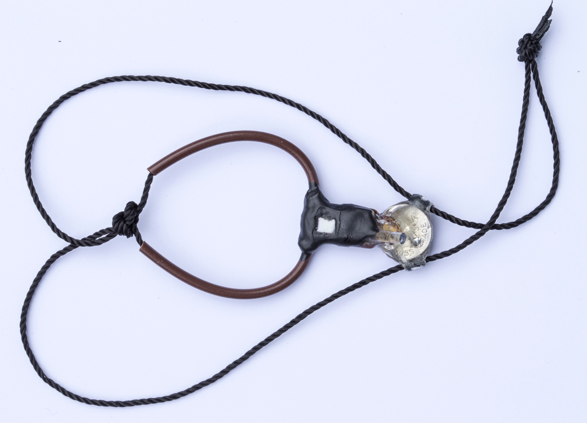

--- 
title: "pamlr Manual"
author: "Kiran Dhanjal-Adams"
date: "2025-04-09"
site: bookdown::bookdown_site
documentclass: book
bibliography: [book.bib, packages.bib]
biblio-style: apalike
link-citations: yes
description: "pamlr Manual"
---

**A toolbox for analysing animal behaviour using Pressure, Acceleration, Temperature, Magnetic and Light data in R**

# Introduction

This is a user manual accompanying the R package **pamlr**, which provides a set of functions for analysing behaviour from multisensor geolocator data - primarily for small migratory birds (however the methods are generalisable). The package is setup for SOI-GDL3**pam** loggers (developped by the [Swiss Ornithological Institute](www.vogelwarte.ch/en)) which measure atmospheric pressure (**P**), activity (**A**), magnetisim (**M**), temperautre and light. However, other multisensor geolocator data may be used, if it is formatted in the same format as SOI-GDL3pam data (see [Importing data](#import)).

(\#fig:unnamed-chunk-1)SOI-GDL3pam logger, (c) Marcel Burkhardt,  Swiss Ornithological Institute

## Index

* [Installing pamlr](#install)
* [Importing data](#import)
* [Visualising data](#dataviz)
* [Common data patterns](#patterns)
* [Preparing data for analysis](#dataprep)
* [Analysis methods](#method)
* [Classification accuracy](#accuracy)
* [Classifying migratory flapping flight in Hoopoes](#flapping)
* [Classifying migratory flight in European bee-eaters](#soar)
* [Classifying migratory flight in Alpine Swifts](#swift)
* [A few last things to think about](#outook)

## Package citation

Dhanjal-Adams K.L., Willener A.S. T. & Liechti F. (2022) **pamlr: a toolbox for analysing animal behaviour using Pressure, Acceleration, Temperature, Magnetic and Light data in R**, *Journal of Animal Ecology*,  https://doi.org/10.1111/1365-2656.13695 

## License

This project is licensed under the GNU General Public License version 3 - see the [LICENSE](https://github.com/KiranLDA/pamlr/blob/master/LICENSE) file for details

